<div align="center"></div>

## :earth_americas:POI: The Guavio Dam - Ubalá - Gachala, Cundinamarca, Colombia. https://en.wikipedia.org/wiki/Alberto_Lleras_Dam (2026-02-01)
`Pictures` rcfdtools <br>`Category` Freelance field visit <br>`Location` [Google Maps](http://maps.google.com/maps?q=4.726371,-73.483435) or [Openstreet Map](https://www.openstreetmap.org/query?lat=4.726371&lon=-73.483435) 

```geojson
{
  "type": "Feature",
  "geometry": {
    "type": "Point", 
    "coordinates": [-73.483435, 4.726371]
  }, 
  "properties": {
    "Name": "The Guavio Dam - Ubalá - Gachala, Cundinamarca, Colombia. https://en.wikipedia.org/wiki/Alberto_Lleras_Dam"
  }
}
```

<br><details><summary>:camera:**58/0_GarminConnect1.jpg**</summary> `Exif version` Not known</details>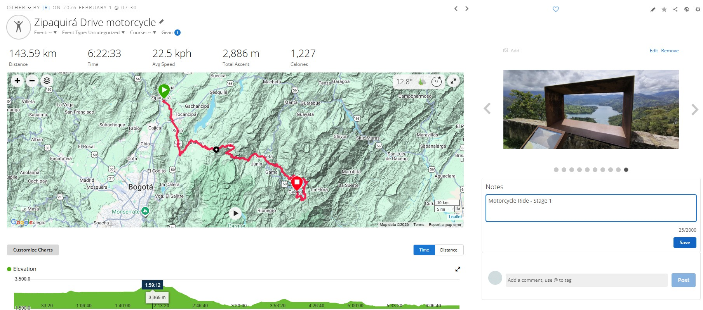

<br><details><summary>:camera:**58/0_GarminConnect3.jpg**</summary> `Exif version` Not known</details>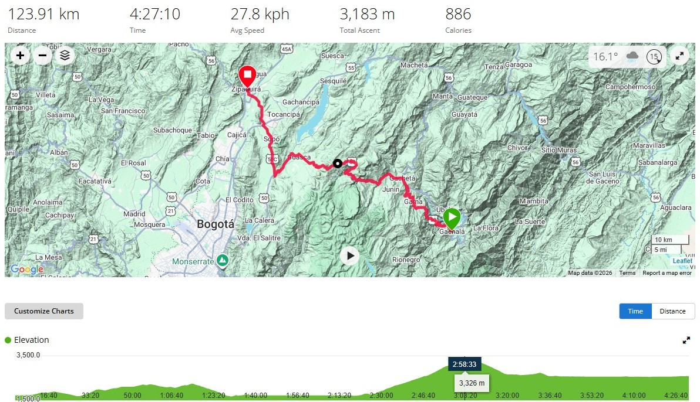

<br><details><summary>:camera:**58/IMG_20260201_101201094.jpg**</summary><sub> `Exif version` 0220 `OS version`  `Date` 2026:02:01 10:12:02 `Aperture` Not known `Brightness` 0.0 `Color space` 1 `Compression` 6`Exposure mode` 0 `Exposure time` 0.000360252 `Focal length` 2.13 `Lens model` Not known `Lens specification` Not known `Orientation` 6 `Scene type` Not known `f number` 2.2 `White balance` 0 `Sensing method` 1 `Shutter speed` 11.438</sub><sub>`Coordinates & altitude` (4.808038194444444, -73.70345305555556, 2030.0)</sub><sub> :earth_americas:`Location over` [Google Maps](http://maps.google.com/maps?q=4.808038194444444,-73.70345305555556) or [Openstreet Map](https://www.openstreetmap.org/query?lat=4.808038194444444&lon=-73.70345305555556)</sub></details>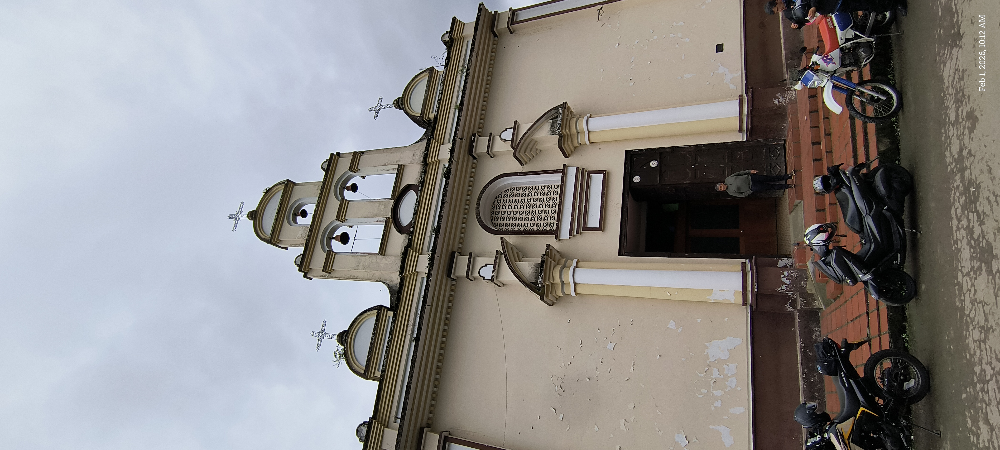

<br><details><summary>:camera:**58/IMG_20260201_101212871.jpg**</summary><sub> `Exif version` 0220 `OS version`  `Date` 2026:02:01 10:12:13 `Aperture` Not known `Brightness` 0.0 `Color space` 1 `Compression` 6`Exposure mode` 0 `Exposure time` 0.000430301 `Focal length` 2.13 `Lens model` Not known `Lens specification` Not known `Orientation` 1 `Scene type` Not known `f number` 2.2 `White balance` 0 `Sensing method` 1 `Shutter speed` 11.182</sub><sub>`Coordinates & altitude` (4.808038194444444, -73.70345305555556, 2030.0)</sub><sub> :earth_americas:`Location over` [Google Maps](http://maps.google.com/maps?q=4.808038194444444,-73.70345305555556) or [Openstreet Map](https://www.openstreetmap.org/query?lat=4.808038194444444&lon=-73.70345305555556)</sub></details>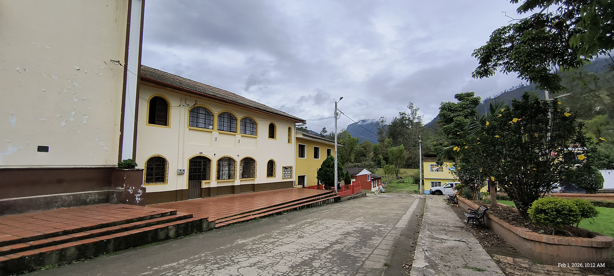

<br><details><summary>:camera:**58/IMG_20260201_101218806.jpg**</summary><sub> `Exif version` 0220 `OS version`  `Date` 2026:02:01 10:12:19 `Aperture` Not known `Brightness` 0.0 `Color space` 1 `Compression` 6`Exposure mode` 0 `Exposure time` 0.000530371 `Focal length` 2.13 `Lens model` Not known `Lens specification` Not known `Orientation` 1 `Scene type` Not known `f number` 2.2 `White balance` 0 `Sensing method` 1 `Shutter speed` 10.88</sub><sub>`Coordinates & altitude` (4.808038194444444, -73.70345305555556, 2030.0)</sub><sub> :earth_americas:`Location over` [Google Maps](http://maps.google.com/maps?q=4.808038194444444,-73.70345305555556) or [Openstreet Map](https://www.openstreetmap.org/query?lat=4.808038194444444&lon=-73.70345305555556)</sub></details>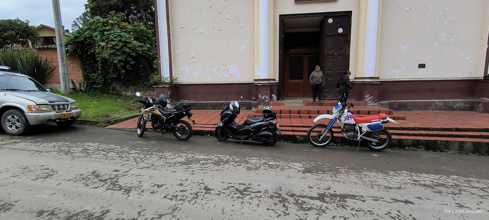

<br><details><summary>:camera:**58/IMG_20260201_101226968.jpg**</summary><sub> `Exif version` 0220 `OS version`  `Date` 2026:02:01 10:12:27 `Aperture` Not known `Brightness` 0.0 `Color space` 1 `Compression` 6`Exposure mode` 0 `Exposure time` 0.000240168 `Focal length` 2.13 `Lens model` Not known `Lens specification` Not known `Orientation` 1 `Scene type` Not known `f number` 2.2 `White balance` 0 `Sensing method` 1 `Shutter speed` 12.023</sub><sub>`Coordinates & altitude` (4.808038194444444, -73.70345305555556, 2030.0)</sub><sub> :earth_americas:`Location over` [Google Maps](http://maps.google.com/maps?q=4.808038194444444,-73.70345305555556) or [Openstreet Map](https://www.openstreetmap.org/query?lat=4.808038194444444&lon=-73.70345305555556)</sub></details>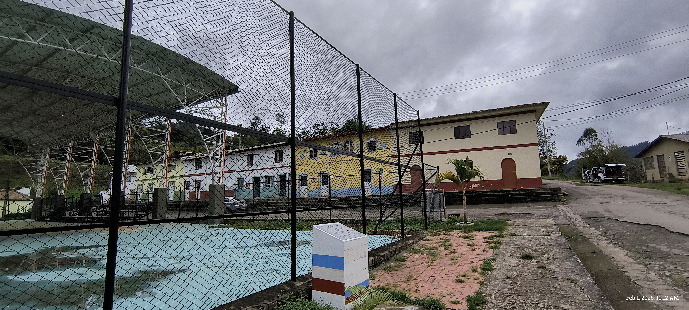

<br><details><summary>:camera:**58/IMG_20260201_101237300.jpg**</summary><sub> `Exif version` 0220 `OS version`  `Date` 2026:02:01 10:12:37 `Aperture` Not known `Brightness` 0.0 `Color space` 1 `Compression` 6`Exposure mode` 0 `Exposure time` 0.00050035 `Focal length` 2.13 `Lens model` Not known `Lens specification` Not known `Orientation` 1 `Scene type` Not known `f number` 2.2 `White balance` 0 `Sensing method` 1 `Shutter speed` 10.964</sub><sub>`Coordinates & altitude` (4.808038194444444, -73.70345305555556, 2030.0)</sub><sub> :earth_americas:`Location over` [Google Maps](http://maps.google.com/maps?q=4.808038194444444,-73.70345305555556) or [Openstreet Map](https://www.openstreetmap.org/query?lat=4.808038194444444&lon=-73.70345305555556)</sub></details>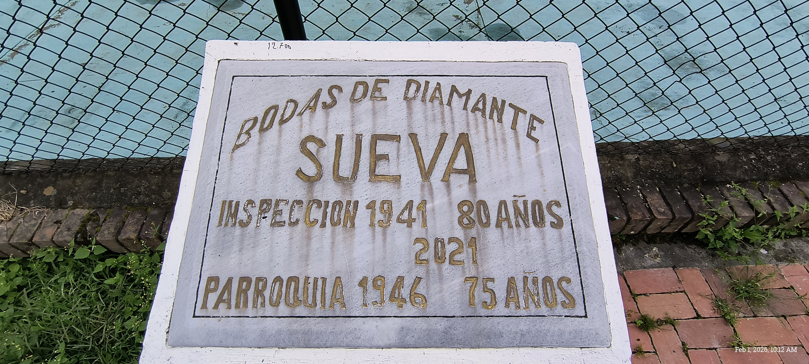

<br><details><summary>:camera:**58/IMG_20260201_101357737.jpg**</summary><sub> `Exif version` 0220 `OS version`  `Date` 2026:02:01 10:13:58 `Aperture` Not known `Brightness` 0.0 `Color space` 1 `Compression` 6`Exposure mode` 0 `Exposure time` 0.016671662 `Focal length` 2.13 `Lens model` Not known `Lens specification` Not known `Orientation` 6 `Scene type` Not known `f number` 2.2 `White balance` 0 `Sensing method` 1 `Shutter speed` 5.906</sub><sub>`Coordinates & altitude` (4.808038194444444, -73.70345305555556, 2927.0)</sub><sub> :earth_americas:`Location over` [Google Maps](http://maps.google.com/maps?q=4.808038194444444,-73.70345305555556) or [Openstreet Map](https://www.openstreetmap.org/query?lat=4.808038194444444&lon=-73.70345305555556)</sub></details>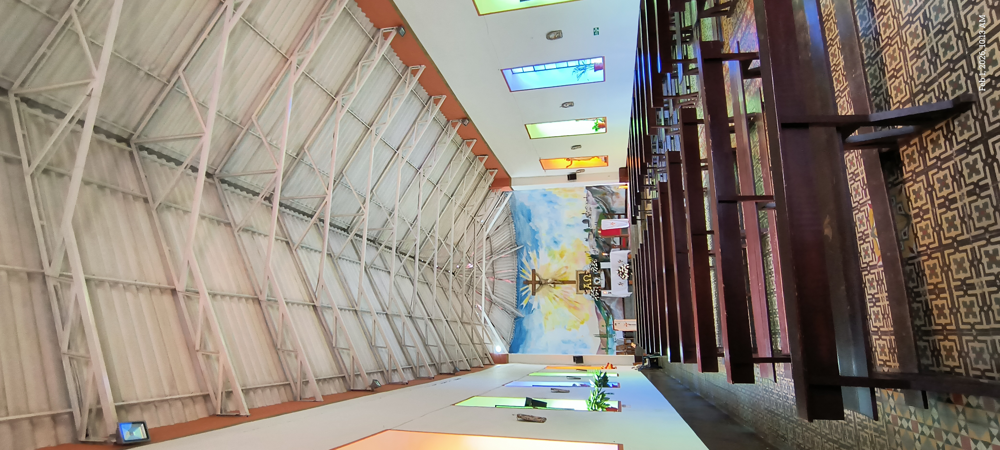

<br><details><summary>:camera:**58/IMG_20260201_101403617_HDR.jpg**</summary><sub> `Exif version` 0220 `OS version`  `Date` 2026:02:01 10:14:05 `Aperture` Not known `Brightness` 0.0 `Color space` 1 `Compression` 6`Exposure mode` 0 `Exposure time` 0.016671662 `Focal length` 2.13 `Lens model` Not known `Lens specification` Not known `Orientation` 1 `Scene type` Not known `f number` 2.2 `White balance` 0 `Sensing method` 1 `Shutter speed` 5.906</sub><sub>`Coordinates & altitude` (4.807582833333333, -73.70352172222222, 2031.0)</sub><sub> :earth_americas:`Location over` [Google Maps](http://maps.google.com/maps?q=4.807582833333333,-73.70352172222222) or [Openstreet Map](https://www.openstreetmap.org/query?lat=4.807582833333333&lon=-73.70352172222222)</sub></details>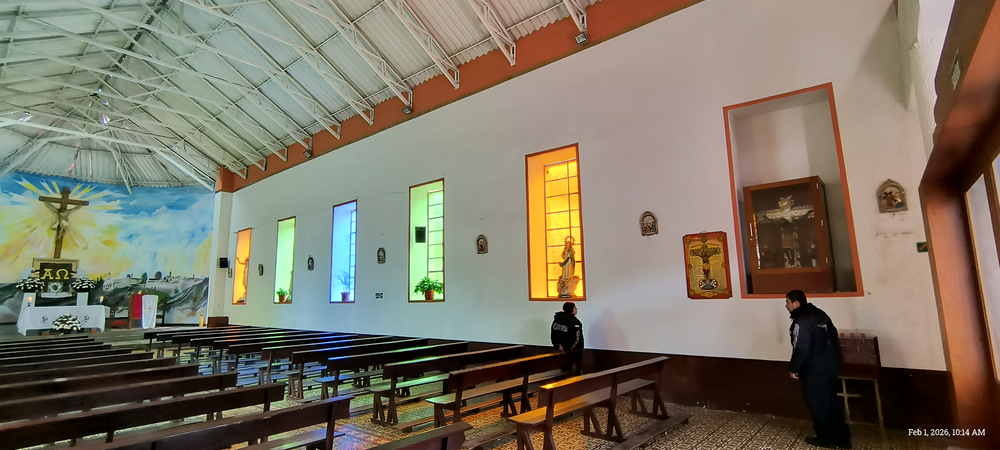

<br><details><summary>:camera:**58/IMG_20260201_101412711_HDR.jpg**</summary><sub> `Exif version` 0220 `OS version`  `Date` 2026:02:01 10:14:14 `Aperture` Not known `Brightness` 0.0 `Color space` 1 `Compression` 6`Exposure mode` 0 `Exposure time` 0.016671662 `Focal length` 2.13 `Lens model` Not known `Lens specification` Not known `Orientation` 1 `Scene type` Not known `f number` 2.2 `White balance` 0 `Sensing method` 1 `Shutter speed` 5.906</sub><sub>`Coordinates & altitude` (4.807582833333333, -73.70352172222222, 2031.0)</sub><sub> :earth_americas:`Location over` [Google Maps](http://maps.google.com/maps?q=4.807582833333333,-73.70352172222222) or [Openstreet Map](https://www.openstreetmap.org/query?lat=4.807582833333333&lon=-73.70352172222222)</sub></details>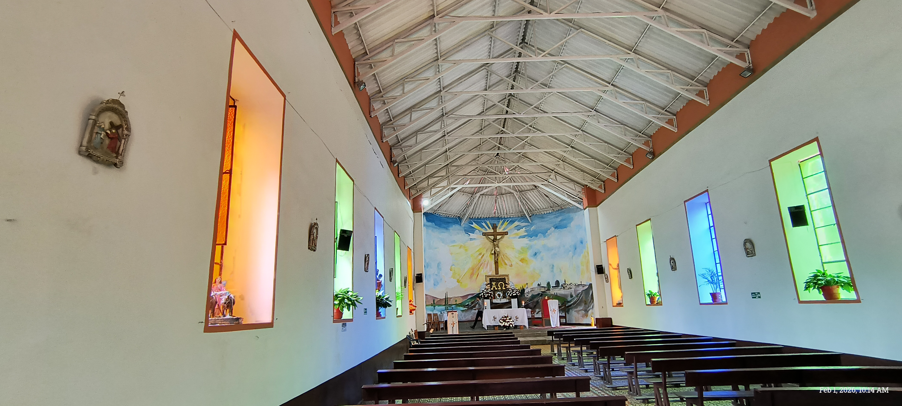

<br><details><summary>:camera:**58/IMG_20260201_101456140.jpg**</summary><sub> `Exif version` 0220 `OS version`  `Date` 2026:02:01 10:14:57 `Aperture` Not known `Brightness` 0.0 `Color space` 1 `Compression` 6`Exposure mode` 0 `Exposure time` 0.00030021 `Focal length` 2.13 `Lens model` Not known `Lens specification` Not known `Orientation` 1 `Scene type` Not known `f number` 2.2 `White balance` 0 `Sensing method` 1 `Shutter speed` 11.701</sub><sub>`Coordinates & altitude` (4.807813111111111, -73.70357511111112, 2031.0)</sub><sub> :earth_americas:`Location over` [Google Maps](http://maps.google.com/maps?q=4.807813111111111,-73.70357511111112) or [Openstreet Map](https://www.openstreetmap.org/query?lat=4.807813111111111&lon=-73.70357511111112)</sub></details>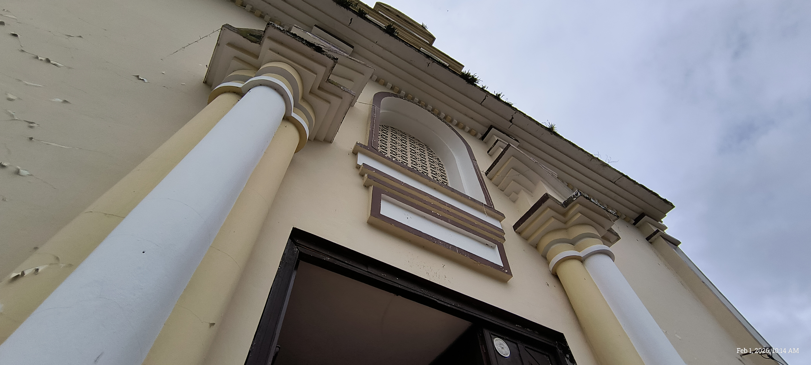

<br><details><summary>:camera:**58/IMG_20260201_110802800.jpg**</summary><sub> `Exif version` 0220 `OS version`  `Date` 2026:02:01 11:08:03 `Aperture` Not known `Brightness` 0.0 `Color space` 1 `Compression` 6`Exposure mode` 0 `Exposure time` 0.000224 `Focal length` 5.56 `Lens model` Not known `Lens specification` Not known `Orientation` 6 `Scene type` Not known `f number` 1.88 `White balance` 0 `Sensing method` 1 `Shutter speed` 12.124</sub><sub>`Coordinates & altitude` (4.807813111111111, -73.70357511111112, 2031.0)</sub><sub> :earth_americas:`Location over` [Google Maps](http://maps.google.com/maps?q=4.807813111111111,-73.70357511111112) or [Openstreet Map](https://www.openstreetmap.org/query?lat=4.807813111111111&lon=-73.70357511111112)</sub></details>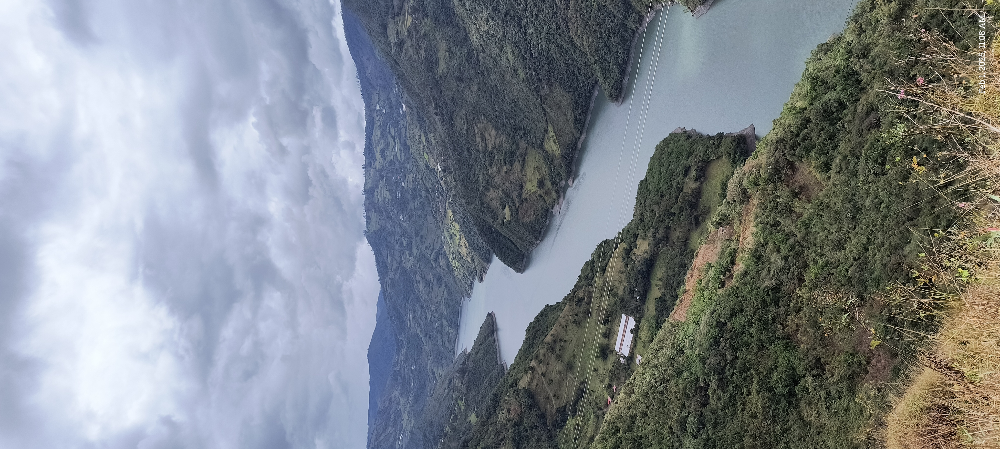

<br><details><summary>:camera:**58/IMG_20260201_110806103.jpg**</summary><sub> `Exif version` 0220 `OS version`  `Date` 2026:02:01 11:08:06 `Aperture` Not known `Brightness` 0.0 `Color space` 1 `Compression` 6`Exposure mode` 0 `Exposure time` 0.000230161 `Focal length` 2.13 `Lens model` Not known `Lens specification` Not known `Orientation` 6 `Scene type` Not known `f number` 2.2 `White balance` 0 `Sensing method` 1 `Shutter speed` 12.085</sub><sub>`Coordinates & altitude` (4.807813111111111, -73.70357511111112, 2031.0)</sub><sub> :earth_americas:`Location over` [Google Maps](http://maps.google.com/maps?q=4.807813111111111,-73.70357511111112) or [Openstreet Map](https://www.openstreetmap.org/query?lat=4.807813111111111&lon=-73.70357511111112)</sub></details>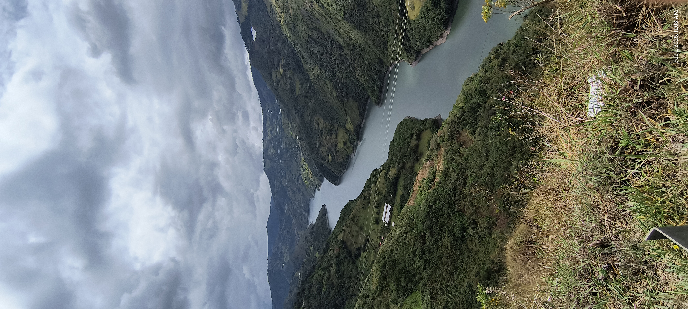

<br><details><summary>:camera:**58/IMG_20260201_110810899.jpg**</summary><sub> `Exif version` 0220 `OS version`  `Date` 2026:02:01 11:08:11 `Aperture` Not known `Brightness` 0.0 `Color space` 1 `Compression` 6`Exposure mode` 0 `Exposure time` 0.00040028 `Focal length` 2.13 `Lens model` Not known `Lens specification` Not known `Orientation` 1 `Scene type` Not known `f number` 2.2 `White balance` 0 `Sensing method` 1 `Shutter speed` 11.286</sub><sub>`Coordinates & altitude` (4.807813111111111, -73.70357511111112, 2031.0)</sub><sub> :earth_americas:`Location over` [Google Maps](http://maps.google.com/maps?q=4.807813111111111,-73.70357511111112) or [Openstreet Map](https://www.openstreetmap.org/query?lat=4.807813111111111&lon=-73.70357511111112)</sub></details>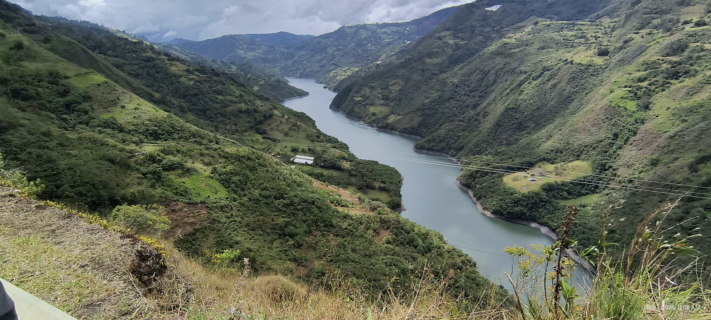

<br><details><summary>:camera:**58/IMG_20260201_110815415.jpg**</summary><sub> `Exif version` 0220 `OS version`  `Date` 2026:02:01 11:08:16 `Aperture` Not known `Brightness` 0.0 `Color space` 1 `Compression` 6`Exposure mode` 0 `Exposure time` 0.000510357 `Focal length` 2.13 `Lens model` Not known `Lens specification` Not known `Orientation` 1 `Scene type` Not known `f number` 2.2 `White balance` 0 `Sensing method` 1 `Shutter speed` 10.936</sub><sub>`Coordinates & altitude` (4.807813111111111, -73.70357511111112, 2031.0)</sub><sub> :earth_americas:`Location over` [Google Maps](http://maps.google.com/maps?q=4.807813111111111,-73.70357511111112) or [Openstreet Map](https://www.openstreetmap.org/query?lat=4.807813111111111&lon=-73.70357511111112)</sub></details>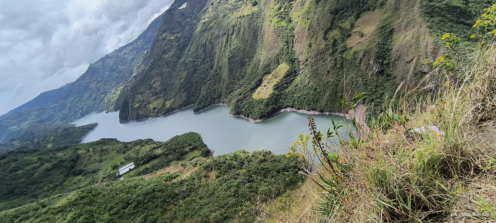

<br><details><summary>:camera:**58/IMG_20260201_110817799.jpg**</summary><sub> `Exif version` 0220 `OS version`  `Date` 2026:02:01 11:08:18 `Aperture` Not known `Brightness` 0.0 `Color space` 1 `Compression` 6`Exposure mode` 0 `Exposure time` 0.000280196 `Focal length` 2.13 `Lens model` Not known `Lens specification` Not known `Orientation` 1 `Scene type` Not known `f number` 2.2 `White balance` 0 `Sensing method` 1 `Shutter speed` 11.801</sub><sub>`Coordinates & altitude` (4.807813111111111, -73.70357511111112, 2031.0)</sub><sub> :earth_americas:`Location over` [Google Maps](http://maps.google.com/maps?q=4.807813111111111,-73.70357511111112) or [Openstreet Map](https://www.openstreetmap.org/query?lat=4.807813111111111&lon=-73.70357511111112)</sub></details>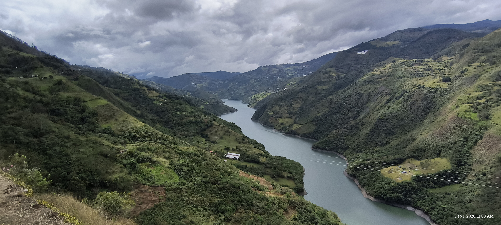

<br><details><summary>:camera:**58/IMG_20260201_110857471_HDR.jpg**</summary><sub> `Exif version` 0220 `OS version`  `Date` 2026:02:01 11:08:59 `Aperture` Not known `Brightness` 0.0 `Color space` 1 `Compression` 6`Exposure mode` 0 `Exposure time` 0.001856 `Focal length` 5.56 `Lens model` Not known `Lens specification` Not known `Orientation` 1 `Scene type` Not known `f number` 1.88 `White balance` 0 `Sensing method` 1 `Shutter speed` 9.073</sub><sub>`Coordinates & altitude` (4.807813111111111, -73.70357511111112, 2031.0)</sub><sub> :earth_americas:`Location over` [Google Maps](http://maps.google.com/maps?q=4.807813111111111,-73.70357511111112) or [Openstreet Map](https://www.openstreetmap.org/query?lat=4.807813111111111&lon=-73.70357511111112)</sub></details>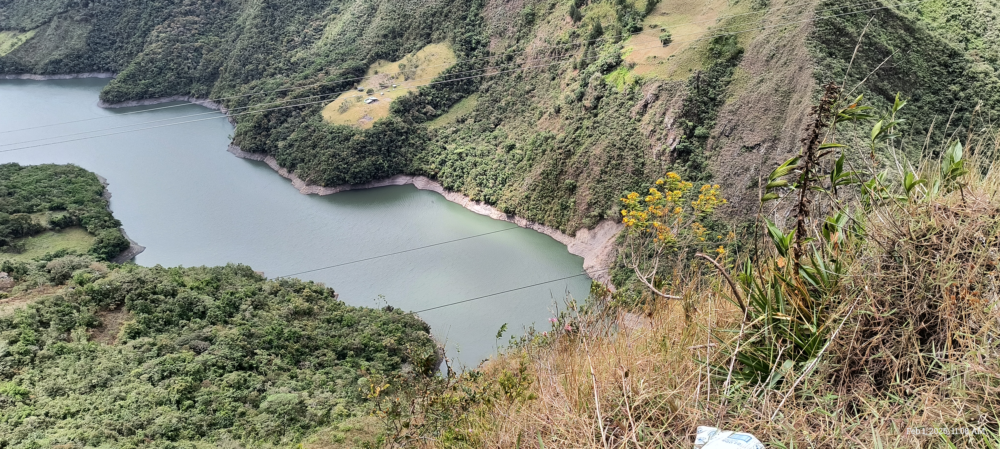

<br><details><summary>:camera:**58/IMG_20260201_110904908.jpg**</summary><sub> `Exif version` 0220 `OS version`  `Date` 2026:02:01 11:09:05 `Aperture` Not known `Brightness` 0.0 `Color space` 1 `Compression` 6`Exposure mode` 0 `Exposure time` 0.000570399 `Focal length` 2.13 `Lens model` Not known `Lens specification` Not known `Orientation` 1 `Scene type` Not known `f number` 2.2 `White balance` 0 `Sensing method` 1 `Shutter speed` 10.775</sub><sub>`Coordinates & altitude` (4.807813111111111, -73.70357511111112, 2031.0)</sub><sub> :earth_americas:`Location over` [Google Maps](http://maps.google.com/maps?q=4.807813111111111,-73.70357511111112) or [Openstreet Map](https://www.openstreetmap.org/query?lat=4.807813111111111&lon=-73.70357511111112)</sub></details>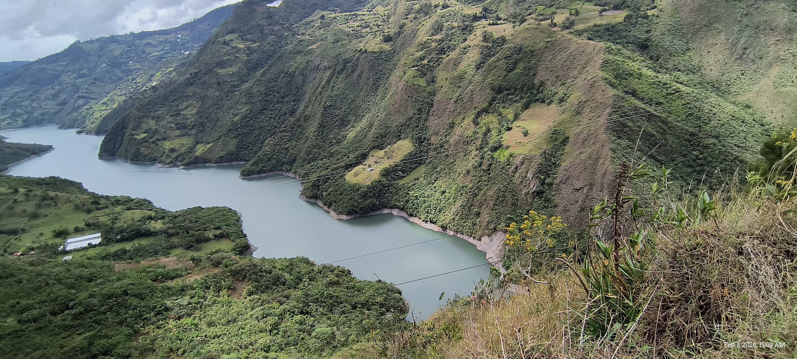

<br><details><summary>:camera:**58/IMG_20260201_111104502.jpg**</summary><sub> `Exif version` 0220 `OS version`  `Date` 2026:02:01 11:11:05 `Aperture` Not known `Brightness` 0.0 `Color space` 1 `Compression` 6`Exposure mode` 0 `Exposure time` 0.000260182 `Focal length` 2.13 `Lens model` Not known `Lens specification` Not known `Orientation` 1 `Scene type` Not known `f number` 2.2 `White balance` 0 `Sensing method` 1 `Shutter speed` 11.908</sub><sub>`Coordinates & altitude` (4.7644281388888885, -73.57330322222222, 1885.0)</sub><sub> :earth_americas:`Location over` [Google Maps](http://maps.google.com/maps?q=4.7644281388888885,-73.57330322222222) or [Openstreet Map](https://www.openstreetmap.org/query?lat=4.7644281388888885&lon=-73.57330322222222)</sub></details>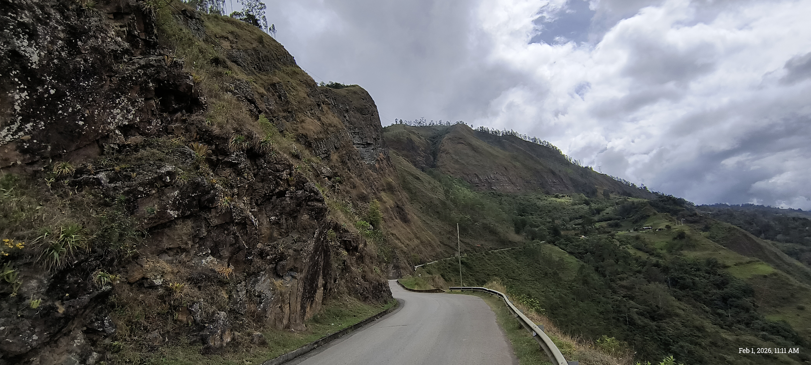

<br><details><summary>:camera:**58/IMG_20260201_111107321.jpg**</summary><sub> `Exif version` 0220 `OS version`  `Date` 2026:02:01 11:11:08 `Aperture` Not known `Brightness` 0.0 `Color space` 1 `Compression` 6`Exposure mode` 0 `Exposure time` 0.000290203 `Focal length` 2.13 `Lens model` Not known `Lens specification` Not known `Orientation` 6 `Scene type` Not known `f number` 2.2 `White balance` 0 `Sensing method` 1 `Shutter speed` 11.75</sub><sub>`Coordinates & altitude` (4.7644281388888885, -73.57330322222222, 1885.0)</sub><sub> :earth_americas:`Location over` [Google Maps](http://maps.google.com/maps?q=4.7644281388888885,-73.57330322222222) or [Openstreet Map](https://www.openstreetmap.org/query?lat=4.7644281388888885&lon=-73.57330322222222)</sub></details>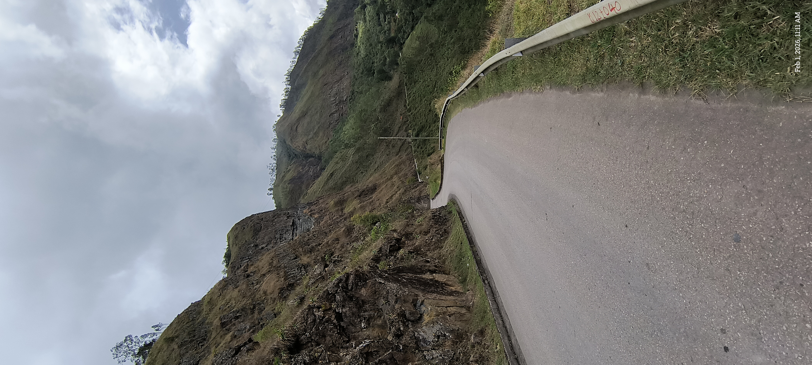

<br><details><summary>:camera:**58/IMG_20260201_113134815.jpg**</summary><sub> `Exif version` 0220 `OS version`  `Date` 2026:02:01 11:31:35 `Aperture` Not known `Brightness` 0.0 `Color space` 1 `Compression` 6`Exposure mode` 0 `Exposure time` 0.000288 `Focal length` 5.56 `Lens model` Not known `Lens specification` Not known `Orientation` 6 `Scene type` Not known `f number` 1.88 `White balance` 0 `Sensing method` 1 `Shutter speed` 11.761</sub><sub>`Coordinates & altitude` (4.743904111111111, -73.53477477777777, 1964.0)</sub><sub> :earth_americas:`Location over` [Google Maps](http://maps.google.com/maps?q=4.743904111111111,-73.53477477777777) or [Openstreet Map](https://www.openstreetmap.org/query?lat=4.743904111111111&lon=-73.53477477777777)</sub></details>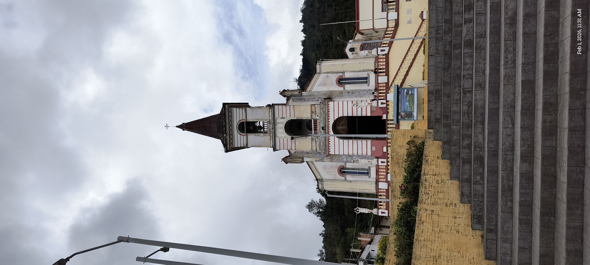

<br><details><summary>:camera:**58/IMG_20260201_113138893.jpg**</summary><sub> `Exif version` 0220 `OS version`  `Date` 2026:02:01 11:31:39 `Aperture` Not known `Brightness` 0.0 `Color space` 1 `Compression` 6`Exposure mode` 0 `Exposure time` 0.000256 `Focal length` 5.56 `Lens model` Not known `Lens specification` Not known `Orientation` 1 `Scene type` Not known `f number` 1.88 `White balance` 0 `Sensing method` 1 `Shutter speed` 11.931</sub><sub>`Coordinates & altitude` (4.743904111111111, -73.53477477777777, 1964.0)</sub><sub> :earth_americas:`Location over` [Google Maps](http://maps.google.com/maps?q=4.743904111111111,-73.53477477777777) or [Openstreet Map](https://www.openstreetmap.org/query?lat=4.743904111111111&lon=-73.53477477777777)</sub></details>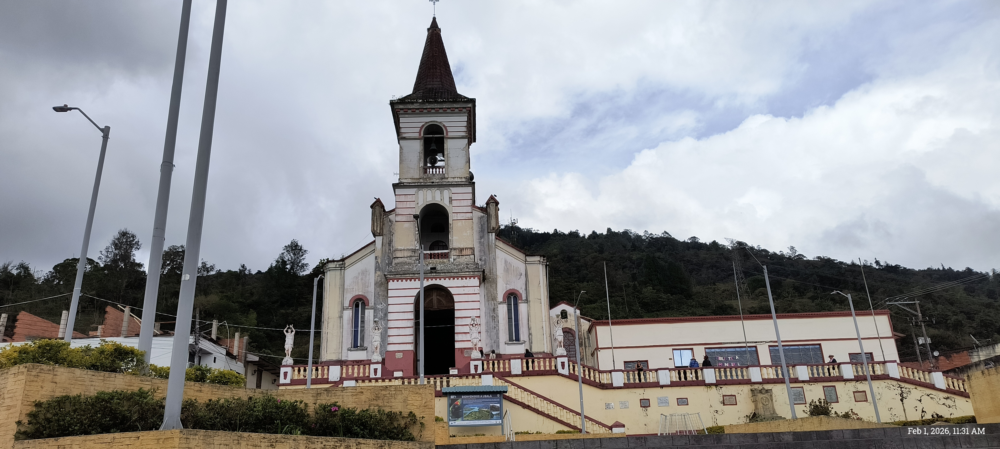

<br><details><summary>:camera:**58/IMG_20260201_113159987.jpg**</summary><sub> `Exif version` 0220 `OS version`  `Date` 2026:02:01 11:32:00 `Aperture` Not known `Brightness` 0.0 `Color space` 1 `Compression` 6`Exposure mode` 0 `Exposure time` 0.000290203 `Focal length` 2.13 `Lens model` Not known `Lens specification` Not known `Orientation` 1 `Scene type` Not known `f number` 2.2 `White balance` 0 `Sensing method` 1 `Shutter speed` 11.75</sub><sub>`Coordinates & altitude` (4.743904111111111, -73.53477477777777, 1964.0)</sub><sub> :earth_americas:`Location over` [Google Maps](http://maps.google.com/maps?q=4.743904111111111,-73.53477477777777) or [Openstreet Map](https://www.openstreetmap.org/query?lat=4.743904111111111&lon=-73.53477477777777)</sub></details>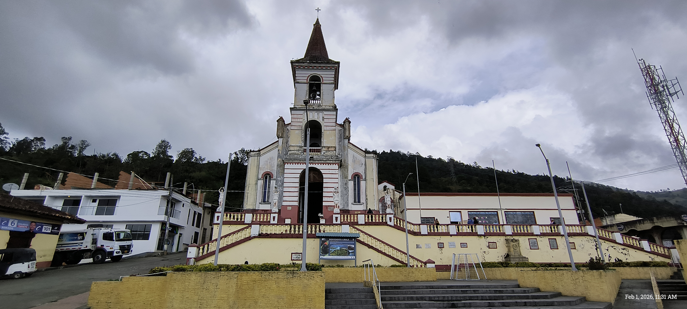

<br><details><summary>:camera:**58/IMG_20260201_113301909.jpg**</summary><sub> `Exif version` 0220 `OS version`  `Date` 2026:02:01 11:33:02 `Aperture` Not known `Brightness` 0.0 `Color space` 1 `Compression` 6`Exposure mode` 0 `Exposure time` 0.000576 `Focal length` 5.56 `Lens model` Not known `Lens specification` Not known `Orientation` 1 `Scene type` Not known `f number` 1.88 `White balance` 0 `Sensing method` 1 `Shutter speed` 10.761</sub><sub>`Coordinates & altitude` (4.743958916666667, -73.53485105555555, 1964.0)</sub><sub> :earth_americas:`Location over` [Google Maps](http://maps.google.com/maps?q=4.743958916666667,-73.53485105555555) or [Openstreet Map](https://www.openstreetmap.org/query?lat=4.743958916666667&lon=-73.53485105555555)</sub></details>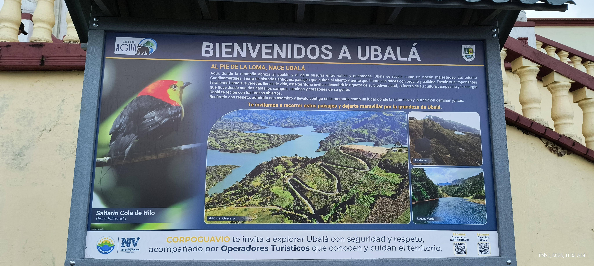

<br><details><summary>:camera:**58/IMG_20260201_113317543.jpg**</summary><sub> `Exif version` 0220 `OS version`  `Date` 2026:02:01 11:33:18 `Aperture` Not known `Brightness` 0.0 `Color space` 1 `Compression` 6`Exposure mode` 0 `Exposure time` 0.00048 `Focal length` 5.56 `Lens model` Not known `Lens specification` Not known `Orientation` 6 `Scene type` Not known `f number` 1.88 `White balance` 0 `Sensing method` 1 `Shutter speed` 11.024</sub><sub>`Coordinates & altitude` (4.743958916666667, -73.53485105555555, 1964.0)</sub><sub> :earth_americas:`Location over` [Google Maps](http://maps.google.com/maps?q=4.743958916666667,-73.53485105555555) or [Openstreet Map](https://www.openstreetmap.org/query?lat=4.743958916666667&lon=-73.53485105555555)</sub></details>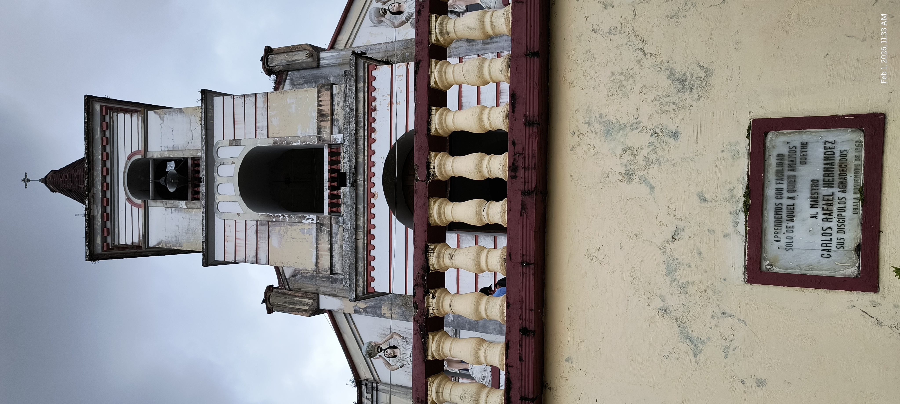

<br><details><summary>:camera:**58/IMG_20260201_113539292.jpg**</summary><sub> `Exif version` 0220 `OS version`  `Date` 2026:02:01 11:35:40 `Aperture` Not known `Brightness` 0.0 `Color space` 1 `Compression` 6`Exposure mode` 0 `Exposure time` 0.000288 `Focal length` 5.56 `Lens model` Not known `Lens specification` Not known `Orientation` 6 `Scene type` Not known `f number` 1.88 `White balance` 0 `Sensing method` 1 `Shutter speed` 11.761</sub><sub>`Coordinates & altitude` (4.743727222222223, -73.53485869444444, 1885.0)</sub><sub> :earth_americas:`Location over` [Google Maps](http://maps.google.com/maps?q=4.743727222222223,-73.53485869444444) or [Openstreet Map](https://www.openstreetmap.org/query?lat=4.743727222222223&lon=-73.53485869444444)</sub></details>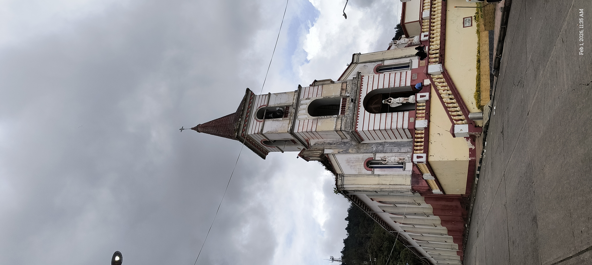

<br><details><summary>:camera:**58/IMG_20260201_113547803.jpg**</summary><sub> `Exif version` 0220 `OS version`  `Date` 2026:02:01 11:35:48 `Aperture` Not known `Brightness` 0.0 `Color space` 1 `Compression` 6`Exposure mode` 0 `Exposure time` 0.00030021 `Focal length` 2.13 `Lens model` Not known `Lens specification` Not known `Orientation` 1 `Scene type` Not known `f number` 2.2 `White balance` 0 `Sensing method` 1 `Shutter speed` 11.701</sub><sub>`Coordinates & altitude` (4.743727222222223, -73.53485869444444, 1885.0)</sub><sub> :earth_americas:`Location over` [Google Maps](http://maps.google.com/maps?q=4.743727222222223,-73.53485869444444) or [Openstreet Map](https://www.openstreetmap.org/query?lat=4.743727222222223&lon=-73.53485869444444)</sub></details>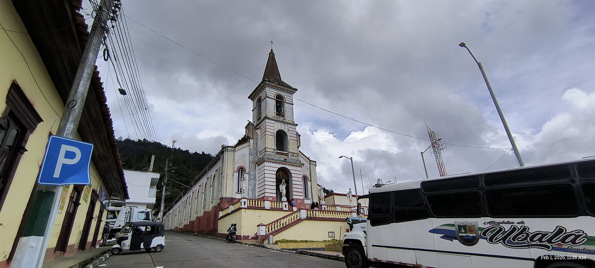

<br><details><summary>:camera:**58/IMG_20260201_122242641.jpg**</summary><sub> `Exif version` 0220 `OS version`  `Date` 2026:02:01 12:22:43 `Aperture` Not known `Brightness` 0.0 `Color space` 1 `Compression` 6`Exposure mode` 0 `Exposure time` 0.000256 `Focal length` 5.56 `Lens model` Not known `Lens specification` Not known `Orientation` 6 `Scene type` Not known `f number` 1.88 `White balance` 0 `Sensing method` 1 `Shutter speed` 11.931</sub><sub>`Coordinates & altitude` (4.681739805555556, -73.49259183333334, 0.0)</sub><sub> :earth_americas:`Location over` [Google Maps](http://maps.google.com/maps?q=4.681739805555556,-73.49259183333334) or [Openstreet Map](https://www.openstreetmap.org/query?lat=4.681739805555556&lon=-73.49259183333334)</sub></details>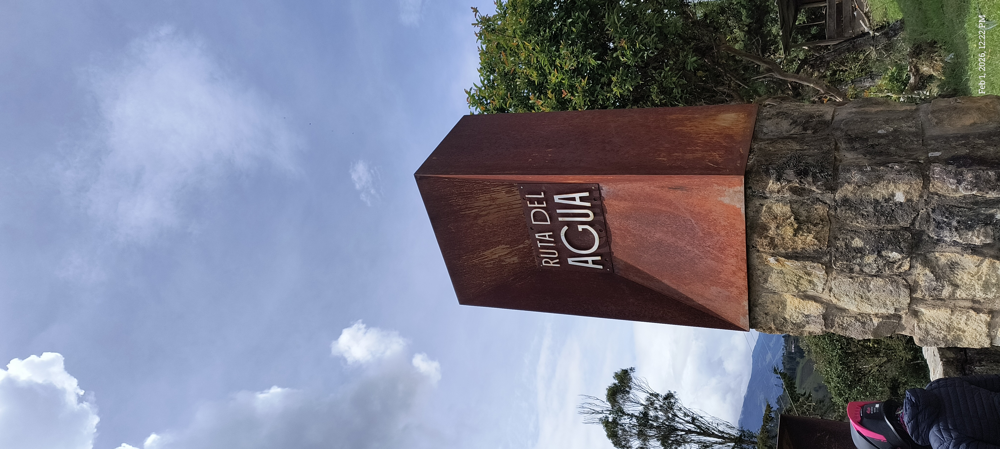

<br><details><summary>:camera:**58/IMG_20260201_122247977_HDR.jpg**</summary><sub> `Exif version` 0220 `OS version`  `Date` 2026:02:01 12:22:49 `Aperture` Not known `Brightness` 0.0 `Color space` 1 `Compression` 6`Exposure mode` 0 `Exposure time` 0.000288 `Focal length` 5.56 `Lens model` Not known `Lens specification` Not known `Orientation` 1 `Scene type` Not known `f number` 1.88 `White balance` 0 `Sensing method` 1 `Shutter speed` 11.761</sub><sub>`Coordinates & altitude` (4.681739805555556, -73.49259183333334, 0.0)</sub><sub> :earth_americas:`Location over` [Google Maps](http://maps.google.com/maps?q=4.681739805555556,-73.49259183333334) or [Openstreet Map](https://www.openstreetmap.org/query?lat=4.681739805555556&lon=-73.49259183333334)</sub></details>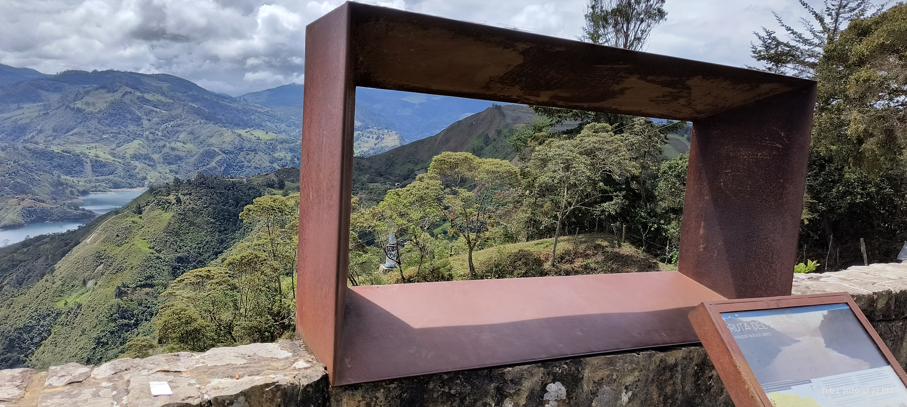

<br><details><summary>:camera:**58/IMG_20260201_122257579.jpg**</summary><sub> `Exif version` 0220 `OS version`  `Date` 2026:02:01 12:22:58 `Aperture` Not known `Brightness` 0.0 `Color space` 1 `Compression` 6`Exposure mode` 0 `Exposure time` 0.000224 `Focal length` 5.56 `Lens model` Not known `Lens specification` Not known `Orientation` 1 `Scene type` Not known `f number` 1.88 `White balance` 0 `Sensing method` 1 `Shutter speed` 12.124</sub><sub>`Coordinates & altitude` (4.681739805555556, -73.49259183333334, 0.0)</sub><sub> :earth_americas:`Location over` [Google Maps](http://maps.google.com/maps?q=4.681739805555556,-73.49259183333334) or [Openstreet Map](https://www.openstreetmap.org/query?lat=4.681739805555556&lon=-73.49259183333334)</sub></details>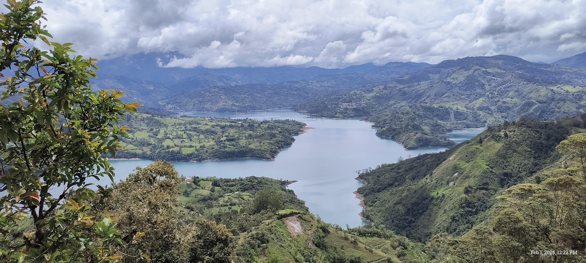

<br><details><summary>:camera:**58/IMG_20260201_122303065.jpg**</summary><sub> `Exif version` 0220 `OS version`  `Date` 2026:02:01 12:23:03 `Aperture` Not known `Brightness` 0.0 `Color space` 1 `Compression` 6`Exposure mode` 0 `Exposure time` 0.00020014 `Focal length` 2.13 `Lens model` Not known `Lens specification` Not known `Orientation` 1 `Scene type` Not known `f number` 2.2 `White balance` 0 `Sensing method` 1 `Shutter speed` 12.286</sub><sub>`Coordinates & altitude` (4.681739805555556, -73.49259183333334, 0.0)</sub><sub> :earth_americas:`Location over` [Google Maps](http://maps.google.com/maps?q=4.681739805555556,-73.49259183333334) or [Openstreet Map](https://www.openstreetmap.org/query?lat=4.681739805555556&lon=-73.49259183333334)</sub></details>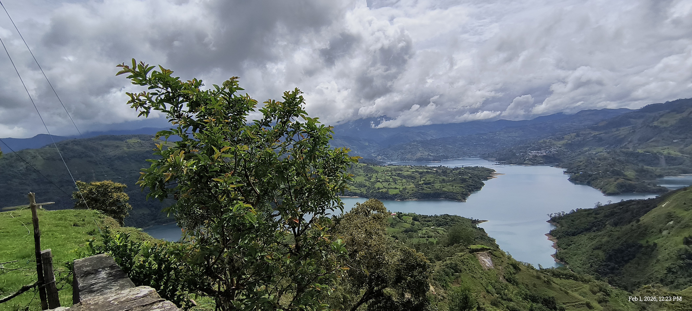

<br><details><summary>:camera:**58/IMG_20260201_122316802.jpg**</summary><sub> `Exif version` 0220 `OS version`  `Date` 2026:02:01 12:23:17 `Aperture` Not known `Brightness` 0.0 `Color space` 1 `Compression` 6`Exposure mode` 0 `Exposure time` 0.00020014 `Focal length` 2.13 `Lens model` Not known `Lens specification` Not known `Orientation` 1 `Scene type` Not known `f number` 2.2 `White balance` 0 `Sensing method` 1 `Shutter speed` 12.286</sub><sub>`Coordinates & altitude` (4.681739805555556, -73.49259183333334, 0.0)</sub><sub> :earth_americas:`Location over` [Google Maps](http://maps.google.com/maps?q=4.681739805555556,-73.49259183333334) or [Openstreet Map](https://www.openstreetmap.org/query?lat=4.681739805555556&lon=-73.49259183333334)</sub></details>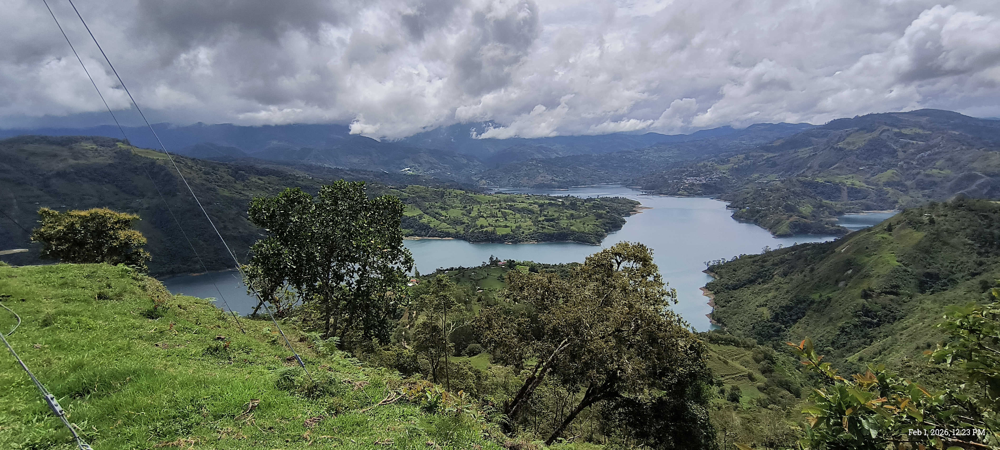

<br><details><summary>:camera:**58/IMG_20260201_122319554.jpg**</summary><sub> `Exif version` 0220 `OS version`  `Date` 2026:02:01 12:23:20 `Aperture` Not known `Brightness` 0.0 `Color space` 1 `Compression` 6`Exposure mode` 0 `Exposure time` 0.000220154 `Focal length` 2.13 `Lens model` Not known `Lens specification` Not known `Orientation` 1 `Scene type` Not known `f number` 2.2 `White balance` 0 `Sensing method` 1 `Shutter speed` 12.149</sub><sub>`Coordinates & altitude` (4.681739805555556, -73.49259183333334, 0.0)</sub><sub> :earth_americas:`Location over` [Google Maps](http://maps.google.com/maps?q=4.681739805555556,-73.49259183333334) or [Openstreet Map](https://www.openstreetmap.org/query?lat=4.681739805555556&lon=-73.49259183333334)</sub></details>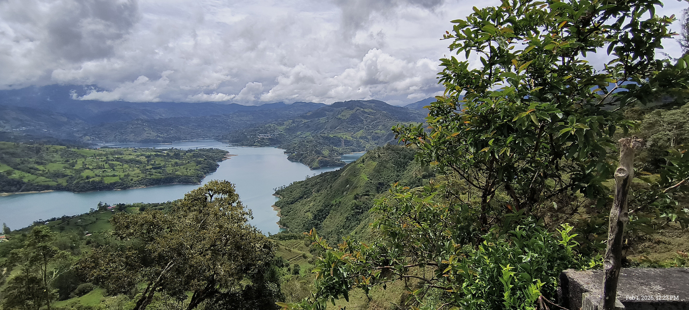

<br><details><summary>:camera:**58/IMG_20260201_122353332.jpg**</summary><sub> `Exif version` 0220 `OS version`  `Date` 2026:02:01 12:23:54 `Aperture` Not known `Brightness` 0.0 `Color space` 1 `Compression` 6`Exposure mode` 0 `Exposure time` 0.000570399 `Focal length` 2.13 `Lens model` Not known `Lens specification` Not known `Orientation` 1 `Scene type` Not known `f number` 2.2 `White balance` 0 `Sensing method` 1 `Shutter speed` 10.775</sub><sub>`Coordinates & altitude` (4.681739805555556, -73.49259183333334, 0.0)</sub><sub> :earth_americas:`Location over` [Google Maps](http://maps.google.com/maps?q=4.681739805555556,-73.49259183333334) or [Openstreet Map](https://www.openstreetmap.org/query?lat=4.681739805555556&lon=-73.49259183333334)</sub></details>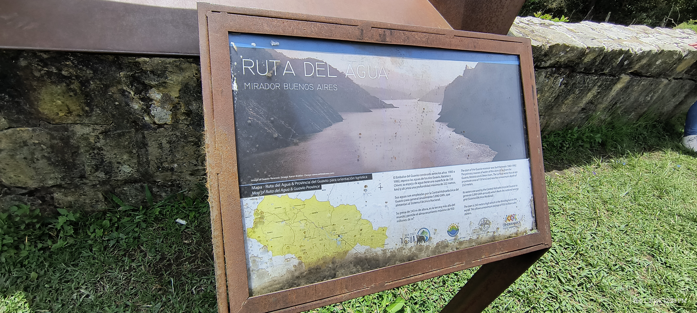

<br><details><summary>:camera:**58/IMG_20260201_122357090.jpg**</summary><sub> `Exif version` 0220 `OS version`  `Date` 2026:02:01 12:23:57 `Aperture` Not known `Brightness` 0.0 `Color space` 1 `Compression` 6`Exposure mode` 0 `Exposure time` 0.000360252 `Focal length` 2.13 `Lens model` Not known `Lens specification` Not known `Orientation` 1 `Scene type` Not known `f number` 2.2 `White balance` 0 `Sensing method` 1 `Shutter speed` 11.438</sub><sub>`Coordinates & altitude` (4.681739805555556, -73.49259183333334, 0.0)</sub><sub> :earth_americas:`Location over` [Google Maps](http://maps.google.com/maps?q=4.681739805555556,-73.49259183333334) or [Openstreet Map](https://www.openstreetmap.org/query?lat=4.681739805555556&lon=-73.49259183333334)</sub></details>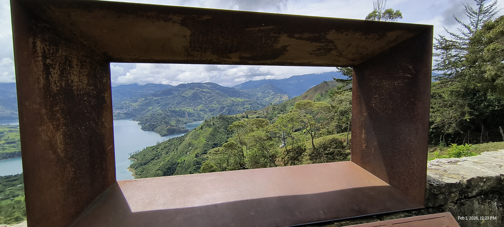

<br><details><summary>:camera:**58/IMG_20260201_122410422.jpg**</summary><sub> `Exif version` 0220 `OS version`  `Date` 2026:02:01 12:24:11 `Aperture` Not known `Brightness` 0.0 `Color space` 1 `Compression` 6`Exposure mode` 0 `Exposure time` 0.000260182 `Focal length` 2.13 `Lens model` Not known `Lens specification` Not known `Orientation` 1 `Scene type` Not known `f number` 2.2 `White balance` 0 `Sensing method` 1 `Shutter speed` 11.908</sub><sub>`Coordinates & altitude` (4.681739805555556, -73.49259183333334, 0.0)</sub><sub> :earth_americas:`Location over` [Google Maps](http://maps.google.com/maps?q=4.681739805555556,-73.49259183333334) or [Openstreet Map](https://www.openstreetmap.org/query?lat=4.681739805555556&lon=-73.49259183333334)</sub></details>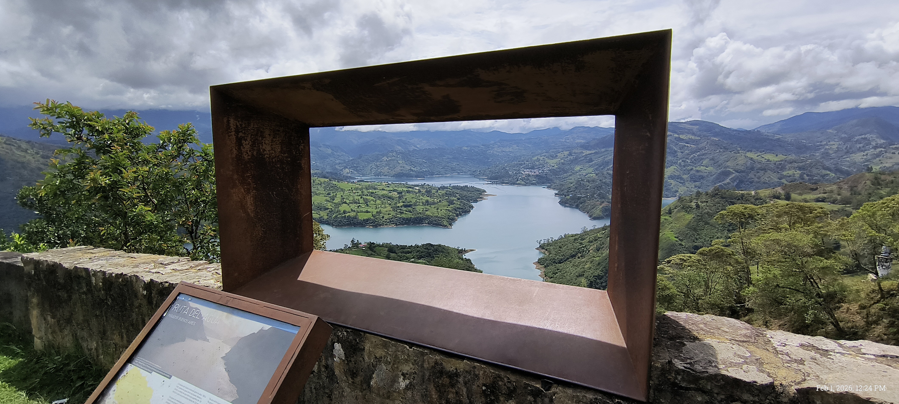

<br><details><summary>:camera:**58/IMG_20260201_122428950.jpg**</summary><sub> `Exif version` 0220 `OS version`  `Date` 2026:02:01 12:24:29 `Aperture` Not known `Brightness` 0.0 `Color space` 1 `Compression` 6`Exposure mode` 0 `Exposure time` 0.000512 `Focal length` 5.56 `Lens model` Not known `Lens specification` Not known `Orientation` 1 `Scene type` Not known `f number` 1.88 `White balance` 0 `Sensing method` 1 `Shutter speed` 10.931</sub><sub>`Coordinates & altitude` (4.692674111111112, -73.52021025, 0.0)</sub><sub> :earth_americas:`Location over` [Google Maps](http://maps.google.com/maps?q=4.692674111111112,-73.52021025) or [Openstreet Map](https://www.openstreetmap.org/query?lat=4.692674111111112&lon=-73.52021025)</sub></details>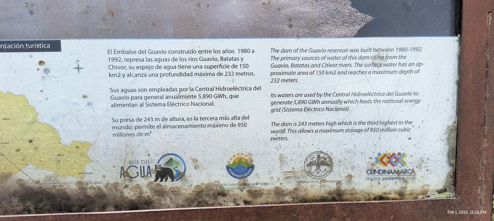

<br><details><summary>:camera:**58/IMG_20260201_122806613_HDR.jpg**</summary><sub> `Exif version` 0220 `OS version`  `Date` 2026:02:01 12:28:08 `Aperture` Not known `Brightness` 0.0 `Color space` 1 `Compression` 6`Exposure mode` 0 `Exposure time` 0.000256 `Focal length` 5.56 `Lens model` Not known `Lens specification` Not known `Orientation` 1 `Scene type` Not known `f number` 1.88 `White balance` 0 `Sensing method` 1 `Shutter speed` 11.931</sub><sub>`Coordinates & altitude` (4.706376055555555, -73.50769041666666, 0.0)</sub><sub> :earth_americas:`Location over` [Google Maps](http://maps.google.com/maps?q=4.706376055555555,-73.50769041666666) or [Openstreet Map](https://www.openstreetmap.org/query?lat=4.706376055555555&lon=-73.50769041666666)</sub></details>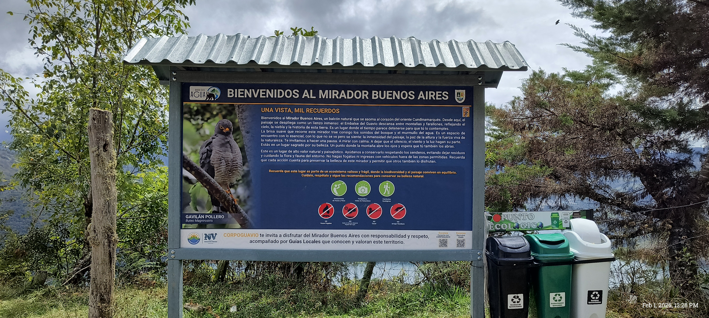

<br><details><summary>:camera:**58/IMG_20260201_124234385.jpg**</summary><sub> `Exif version` 0220 `OS version`  `Date` 2026:02:01 12:42:35 `Aperture` Not known `Brightness` 0.0 `Color space` 1 `Compression` 6`Exposure mode` 0 `Exposure time` 0.000470329 `Focal length` 2.13 `Lens model` Not known `Lens specification` Not known `Orientation` 6 `Scene type` Not known `f number` 2.2 `White balance` 0 `Sensing method` 1 `Shutter speed` 11.054</sub><sub>`Coordinates & altitude` (4.727023111111111, -73.4835586388889, 1678.0)</sub><sub> :earth_americas:`Location over` [Google Maps](http://maps.google.com/maps?q=4.727023111111111,-73.4835586388889) or [Openstreet Map](https://www.openstreetmap.org/query?lat=4.727023111111111&lon=-73.4835586388889)</sub></details>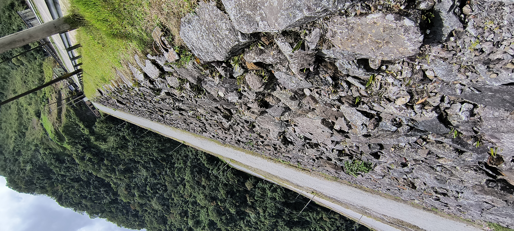

<br><details><summary>:camera:**58/IMG_20260201_124238945.jpg**</summary><sub> `Exif version` 0220 `OS version`  `Date` 2026:02:01 12:42:39 `Aperture` Not known `Brightness` 0.0 `Color space` 1 `Compression` 6`Exposure mode` 0 `Exposure time` 0.000360252 `Focal length` 2.13 `Lens model` Not known `Lens specification` Not known `Orientation` 6 `Scene type` Not known `f number` 2.2 `White balance` 0 `Sensing method` 1 `Shutter speed` 11.438</sub><sub>`Coordinates & altitude` (4.727023111111111, -73.4835586388889, 1678.0)</sub><sub> :earth_americas:`Location over` [Google Maps](http://maps.google.com/maps?q=4.727023111111111,-73.4835586388889) or [Openstreet Map](https://www.openstreetmap.org/query?lat=4.727023111111111&lon=-73.4835586388889)</sub></details>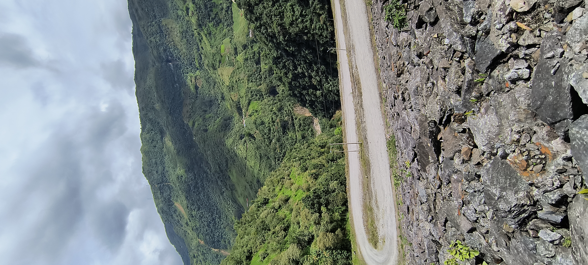

<br><details><summary>:camera:**58/IMG_20260201_124243162.jpg**</summary><sub> `Exif version` 0220 `OS version`  `Date` 2026:02:01 12:42:43 `Aperture` Not known `Brightness` 0.0 `Color space` 1 `Compression` 6`Exposure mode` 0 `Exposure time` 0.000610427 `Focal length` 2.13 `Lens model` Not known `Lens specification` Not known `Orientation` 1 `Scene type` Not known `f number` 2.2 `White balance` 0 `Sensing method` 1 `Shutter speed` 10.677</sub><sub>`Coordinates & altitude` (4.727023111111111, -73.4835586388889, 1678.0)</sub><sub> :earth_americas:`Location over` [Google Maps](http://maps.google.com/maps?q=4.727023111111111,-73.4835586388889) or [Openstreet Map](https://www.openstreetmap.org/query?lat=4.727023111111111&lon=-73.4835586388889)</sub></details>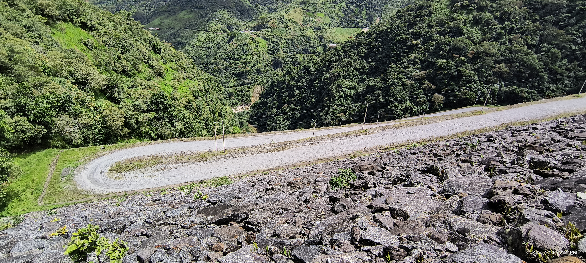

<br><details><summary>:camera:**58/IMG_20260201_124246245.jpg**</summary><sub> `Exif version` 0220 `OS version`  `Date` 2026:02:01 12:42:46 `Aperture` Not known `Brightness` 0.0 `Color space` 1 `Compression` 6`Exposure mode` 0 `Exposure time` 0.000320224 `Focal length` 2.13 `Lens model` Not known `Lens specification` Not known `Orientation` 1 `Scene type` Not known `f number` 2.2 `White balance` 0 `Sensing method` 1 `Shutter speed` 11.608</sub><sub>`Coordinates & altitude` (4.727023111111111, -73.4835586388889, 1678.0)</sub><sub> :earth_americas:`Location over` [Google Maps](http://maps.google.com/maps?q=4.727023111111111,-73.4835586388889) or [Openstreet Map](https://www.openstreetmap.org/query?lat=4.727023111111111&lon=-73.4835586388889)</sub></details>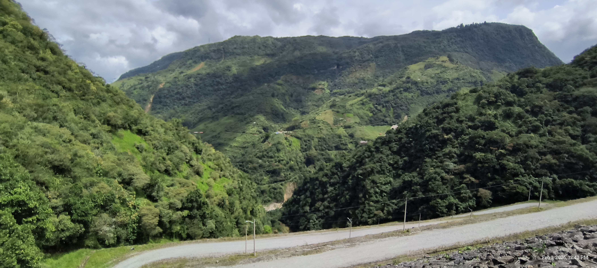

<br><details><summary>:camera:**58/IMG_20260201_124303655.jpg**</summary><sub> `Exif version` 0220 `OS version`  `Date` 2026:02:01 12:43:04 `Aperture` Not known `Brightness` 0.0 `Color space` 1 `Compression` 6`Exposure mode` 0 `Exposure time` 0.000340238 `Focal length` 2.13 `Lens model` Not known `Lens specification` Not known `Orientation` 6 `Scene type` Not known `f number` 2.2 `White balance` 0 `Sensing method` 1 `Shutter speed` 11.521</sub><sub>`Coordinates & altitude` (4.727023111111111, -73.4835586388889, 1678.0)</sub><sub> :earth_americas:`Location over` [Google Maps](http://maps.google.com/maps?q=4.727023111111111,-73.4835586388889) or [Openstreet Map](https://www.openstreetmap.org/query?lat=4.727023111111111&lon=-73.4835586388889)</sub></details>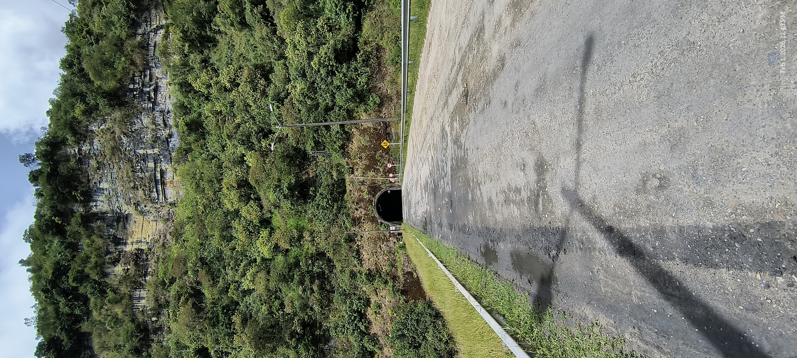

<br><details><summary>:camera:**58/IMG_20260201_124306473.jpg**</summary><sub> `Exif version` 0220 `OS version`  `Date` 2026:02:01 12:43:07 `Aperture` Not known `Brightness` 0.0 `Color space` 1 `Compression` 6`Exposure mode` 0 `Exposure time` 0.00030021 `Focal length` 2.13 `Lens model` Not known `Lens specification` Not known `Orientation` 6 `Scene type` Not known `f number` 2.2 `White balance` 0 `Sensing method` 1 `Shutter speed` 11.701</sub><sub>`Coordinates & altitude` (4.727023111111111, -73.4835586388889, 1678.0)</sub><sub> :earth_americas:`Location over` [Google Maps](http://maps.google.com/maps?q=4.727023111111111,-73.4835586388889) or [Openstreet Map](https://www.openstreetmap.org/query?lat=4.727023111111111&lon=-73.4835586388889)</sub></details>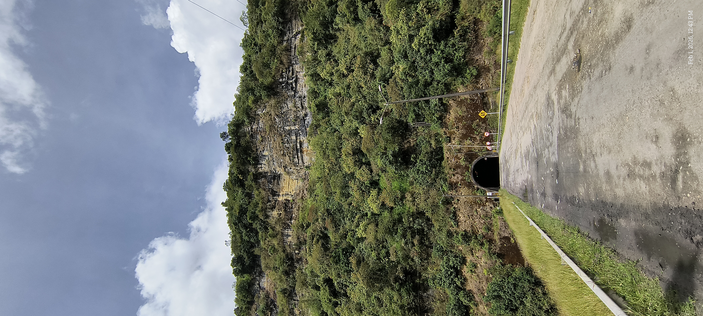

<br><details><summary>:camera:**58/IMG_20260201_124311811.jpg**</summary><sub> `Exif version` 0220 `OS version`  `Date` 2026:02:01 12:43:12 `Aperture` Not known `Brightness` 0.0 `Color space` 1 `Compression` 6`Exposure mode` 0 `Exposure time` 0.000270189 `Focal length` 2.13 `Lens model` Not known `Lens specification` Not known `Orientation` 1 `Scene type` Not known `f number` 2.2 `White balance` 0 `Sensing method` 1 `Shutter speed` 11.853</sub><sub>`Coordinates & altitude` (4.727023111111111, -73.4835586388889, 1678.0)</sub><sub> :earth_americas:`Location over` [Google Maps](http://maps.google.com/maps?q=4.727023111111111,-73.4835586388889) or [Openstreet Map](https://www.openstreetmap.org/query?lat=4.727023111111111&lon=-73.4835586388889)</sub></details>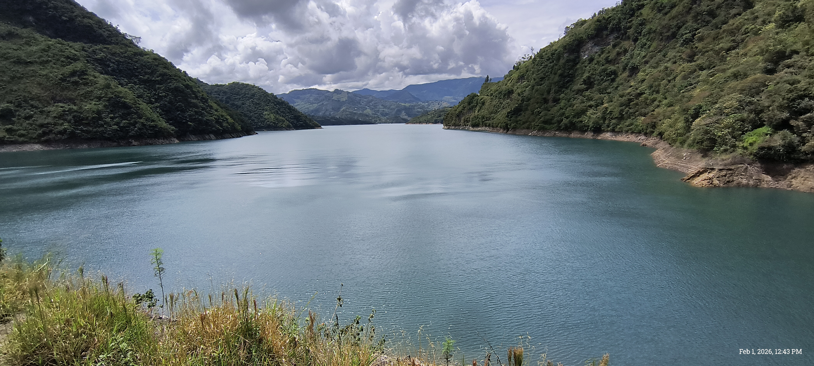

<br><details><summary>:camera:**58/IMG_20260201_145153219.jpg**</summary><sub> `Exif version` 0220 `OS version`  `Date` 2026:02:01 14:51:54 `Aperture` Not known `Brightness` 0.0 `Color space` 1 `Compression` 6`Exposure mode` 0 `Exposure time` 0.001088 `Focal length` 5.56 `Lens model` Not known `Lens specification` Not known `Orientation` 6 `Scene type` Not known `f number` 1.88 `White balance` 0 `Sensing method` 1 `Shutter speed` 9.844</sub></details>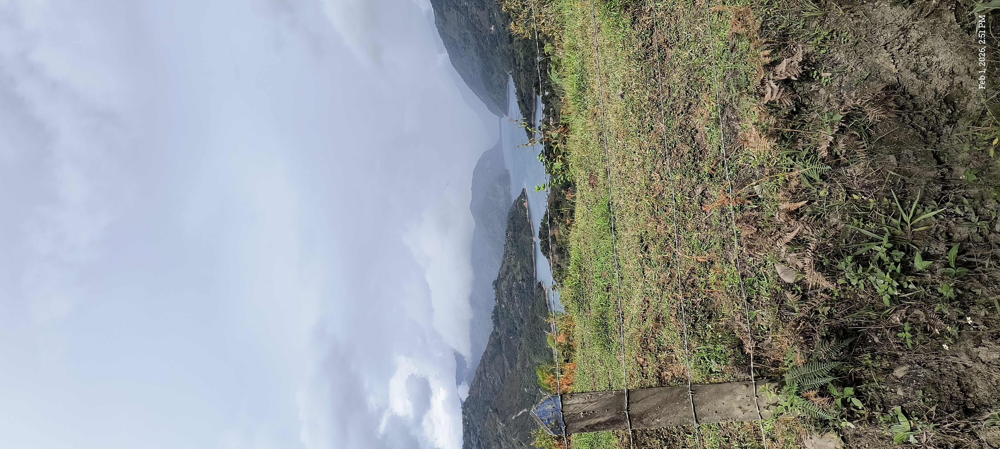

<br><details><summary>:camera:**58/IMG_20260201_145201795.jpg**</summary><sub> `Exif version` 0220 `OS version`  `Date` 2026:02:01 14:52:09 `Aperture` Not known `Brightness` 0.0 `Color space` 1 `Compression` 6`Exposure mode` 0 `Exposure time` 0.00128 `Focal length` 5.56 `Lens model` Not known `Lens specification` Not known `Orientation` 6 `Scene type` Not known `f number` 1.88 `White balance` 0 `Sensing method` 1 `Shutter speed` 9.609</sub></details>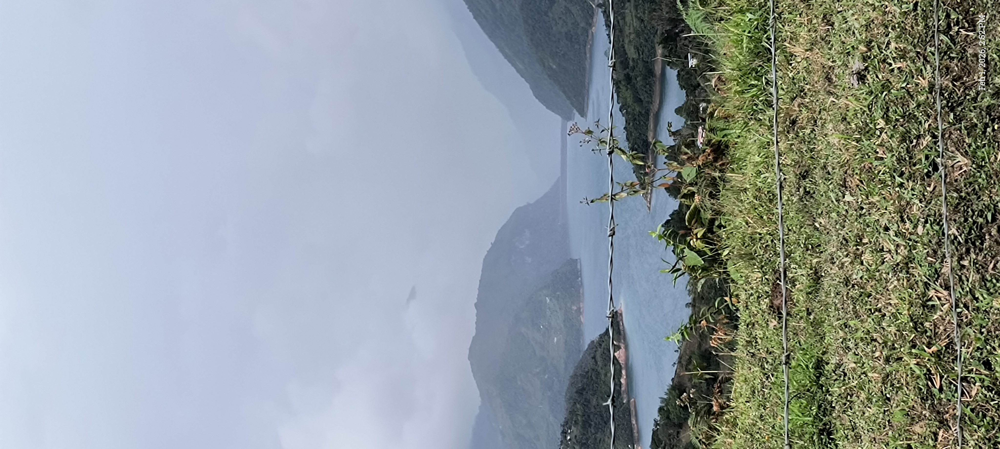

<br><details><summary>:camera:**58/XXXXXX_GarminConnect1.jpg**</summary> `Exif version` Not known</details>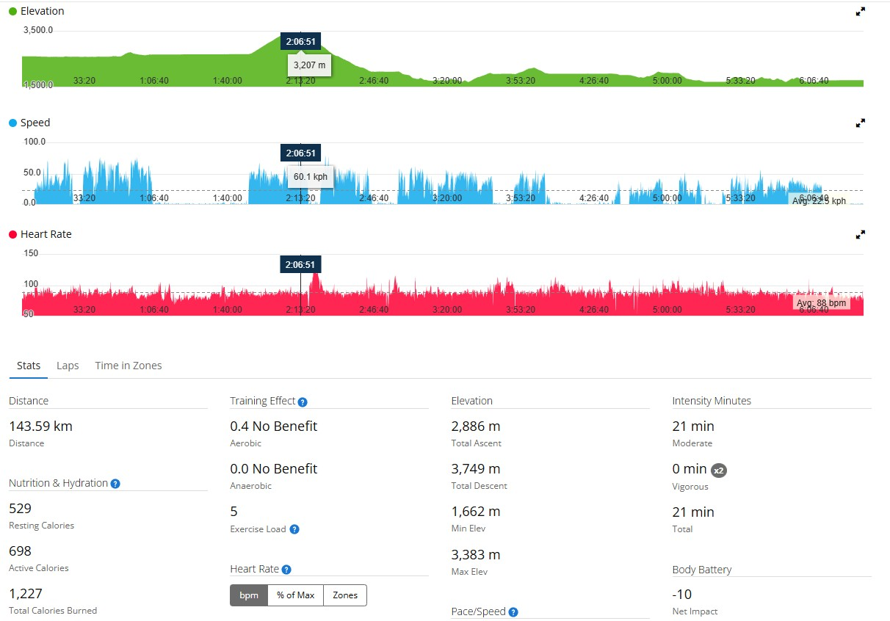

<br><details><summary>:camera:**58/XXXXXX_GarminConnect2.jpg**</summary> `Exif version` Not known</details>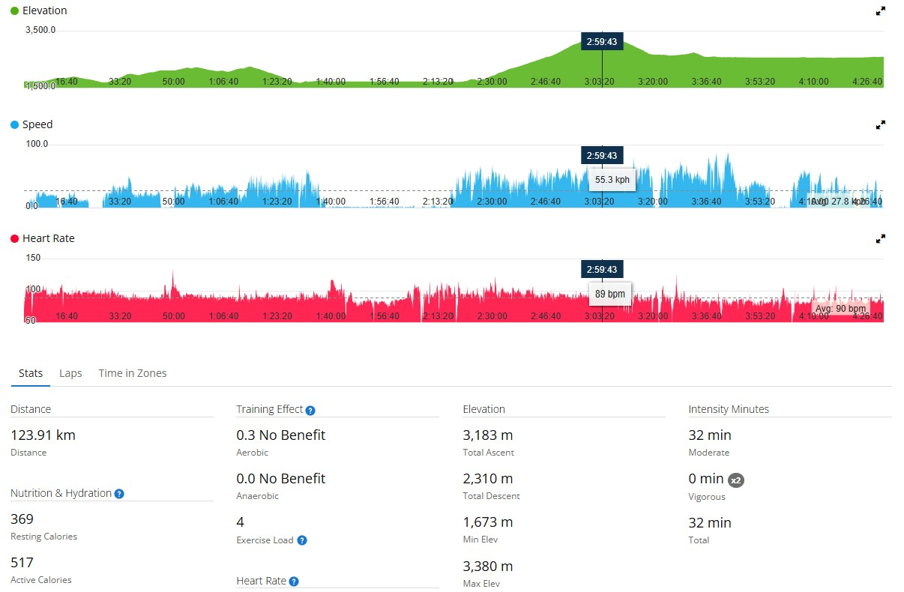

<sub>_Citation: Partial or total digital reproduction of this repository, scripts, development guides, data models, images, and documentation is permitted, provided that it is referenced as: "R.GISMobile - Mobile geographic information systems on QField that do not require an internet connection for navigation." https://github.com/rcfdtools/R.GISMobile - Bogotá - Colombia - South America"._<sub>

| [:house: Home](../Readme.md) |
|---|