<div align="center"></div>

## La Cumbre - Cajicá, Cundinamarca, Colombia. (2021-04-10)
`Pictures` rcfdtools <br>`Category` Freelance field visit <br>`Location` [Google Maps](http://maps.google.com/maps?q=4.940184,-74.050999) or [Openstreet Map](https://www.openstreetmap.org/query?lat=4.940184&lon=-74.050999) 

```geojson
{
  "type": "Feature",
  "geometry": {
    "type": "Point", 
    "coordinates": [-74.050999, 4.940184]
  }, 
  "properties": {
    "Name": "La Cumbre - Cajicá, Cundinamarca, Colombia."
  }
}
```

<br><details><summary>:camera:**59/20210410_073755.jpg**</summary><sub> `Exif version` 0220 `OS version` G955USQU8DUA2 `Date` 2021:04:10 07:37:55 `Aperture` Not known `Brightness` 8.91 `Color space` 1 `Compression` 6`Exposure mode` 0 `Exposure time` 0.0003132832080200501 `Focal length` 4.25 `Lens model` Not known `Lens specification` Not known `Orientation` 1 `Scene type` Not known `f number` 1.7 `White balance` 0 `Sensing method` 2 `Shutter speed` 11.64</sub><sub>`Coordinates & altitude` (0.0, 0.0, 0.0)</sub><sub> :globe_with_meridians:`Location over` [Google Maps](http://maps.google.com/maps?q=0.0,0.0) or [Openstreet Map](https://www.openstreetmap.org/query?lat=0.0&lon=0.0)</sub></details>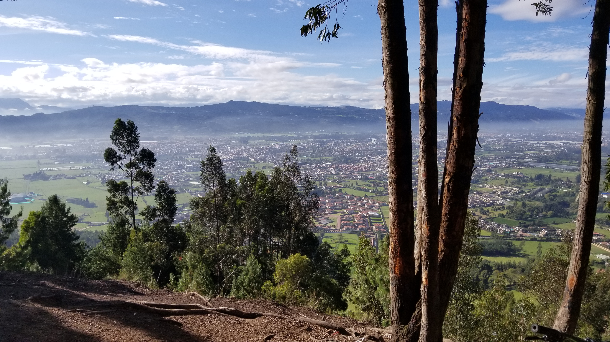

<br><details><summary>:camera:**59/20210410_073812.jpg**</summary><sub> `Exif version` 0220 `OS version` G955USQU8DUA2 `Date` 2021:04:10 07:38:12 `Aperture` Not known `Brightness` 8.32 `Color space` 1 `Compression` 6`Exposure mode` 0 `Exposure time` 0.0004807692307692308 `Focal length` 4.25 `Lens model` Not known `Lens specification` Not known `Orientation` 1 `Scene type` Not known `f number` 1.7 `White balance` 0 `Sensing method` 2 `Shutter speed` 11.022</sub><sub>`Coordinates & altitude` (0.0, 0.0, 0.0)</sub><sub> :globe_with_meridians:`Location over` [Google Maps](http://maps.google.com/maps?q=0.0,0.0) or [Openstreet Map](https://www.openstreetmap.org/query?lat=0.0&lon=0.0)</sub></details>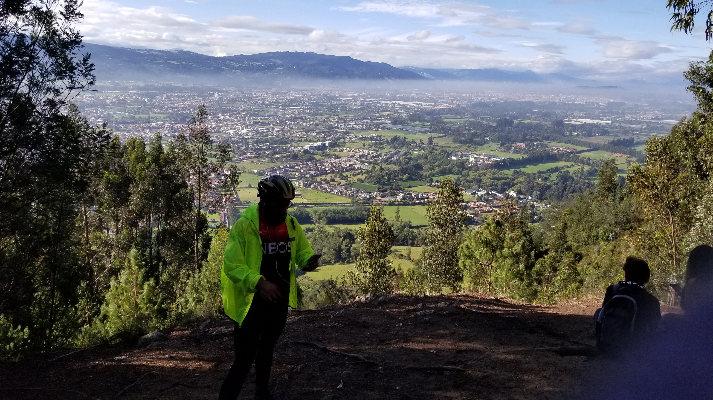

<br><details><summary>:camera:**59/20210410_073815.jpg**</summary><sub> `Exif version` 0220 `OS version` G955USQU8DUA2 `Date` 2021:04:10 07:38:15 `Aperture` Not known `Brightness` 7.8 `Color space` 1 `Compression` 6`Exposure mode` 0 `Exposure time` 0.0007396449704142012 `Focal length` 4.25 `Lens model` Not known `Lens specification` Not known `Orientation` 1 `Scene type` Not known `f number` 1.7 `White balance` 0 `Sensing method` 2 `Shutter speed` 10.4</sub><sub>`Coordinates & altitude` (0.0, 0.0, 0.0)</sub><sub> :globe_with_meridians:`Location over` [Google Maps](http://maps.google.com/maps?q=0.0,0.0) or [Openstreet Map](https://www.openstreetmap.org/query?lat=0.0&lon=0.0)</sub></details>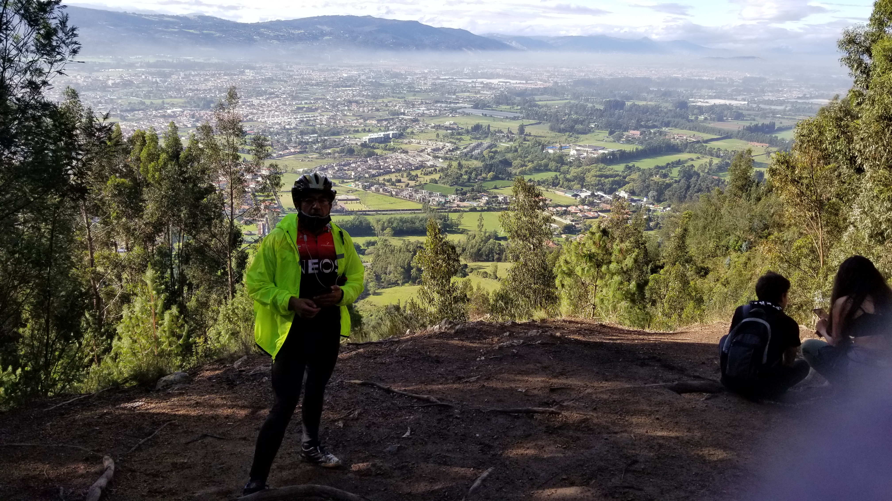

<br><details><summary>:camera:**59/20210410_073820.jpg**</summary><sub> `Exif version` 0220 `OS version` G955USQU8DUA2 `Date` 2021:04:10 07:38:20 `Aperture` Not known `Brightness` 7.35 `Color space` 1 `Compression` 6`Exposure mode` 0 `Exposure time` 0.0009881422924901185 `Focal length` 4.25 `Lens model` Not known `Lens specification` Not known `Orientation` 1 `Scene type` Not known `f number` 1.7 `White balance` 0 `Sensing method` 2 `Shutter speed` 9.982</sub><sub>`Coordinates & altitude` (0.0, 0.0, 0.0)</sub><sub> :globe_with_meridians:`Location over` [Google Maps](http://maps.google.com/maps?q=0.0,0.0) or [Openstreet Map](https://www.openstreetmap.org/query?lat=0.0&lon=0.0)</sub></details>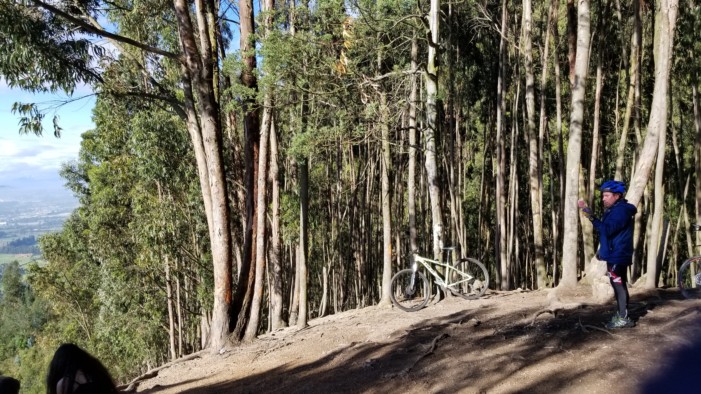

<br><details><summary>:camera:**59/20210410_073831.jpg**</summary><sub> `Exif version` 0220 `OS version` G955USQU8DUA2 `Date` 2021:04:10 07:38:31 `Aperture` Not known `Brightness` Not known `Color space` 1 `Compression` Not known`Exposure mode` 0 `Exposure time` 0.0026954177897574125 `Focal length` 2.95 `Lens model` Not known `Lens specification` Not known `Orientation` 1 `Scene type` Not known `f number` 1.7 `White balance` 0 `Sensing method` Not known `Shutter speed` Not known</sub></details>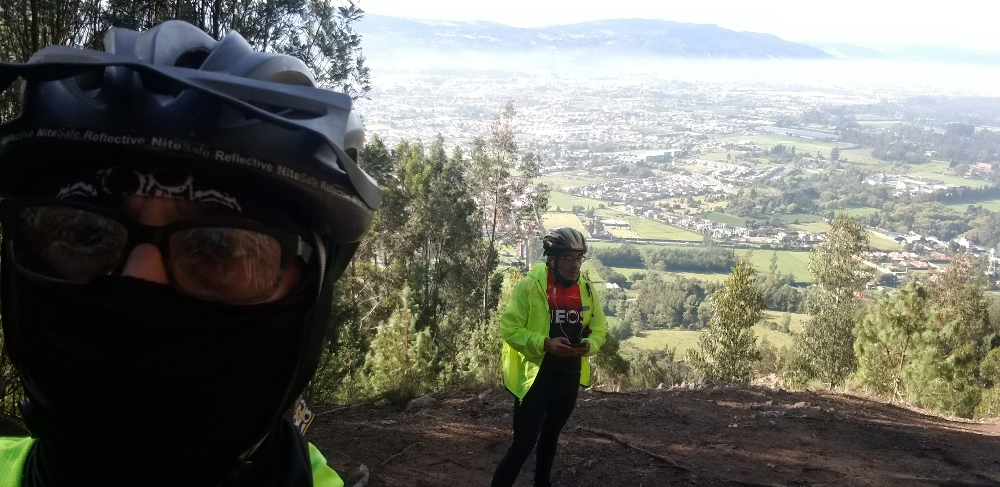

<br><details><summary>:camera:**59/20210410_073833.jpg**</summary><sub> `Exif version` 0220 `OS version` G955USQU8DUA2 `Date` 2021:04:10 07:38:33 `Aperture` Not known `Brightness` Not known `Color space` 1 `Compression` Not known`Exposure mode` 0 `Exposure time` 0.002564102564102564 `Focal length` 2.95 `Lens model` Not known `Lens specification` Not known `Orientation` 1 `Scene type` Not known `f number` 1.7 `White balance` 0 `Sensing method` Not known `Shutter speed` Not known</sub></details>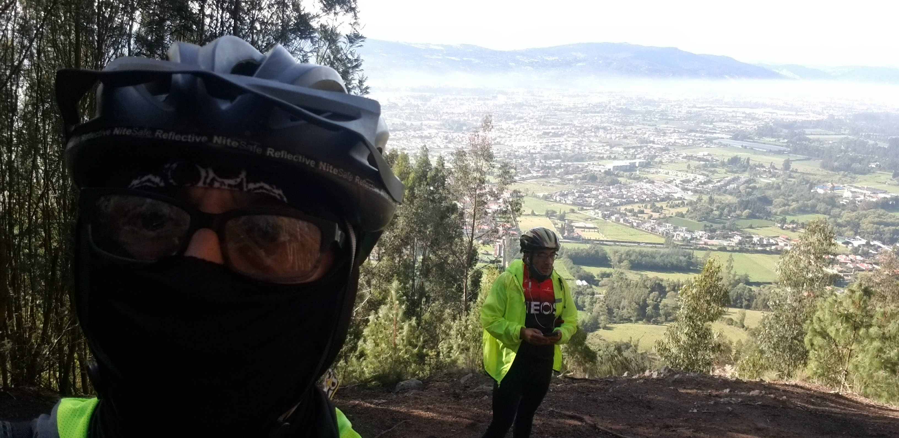

<br><details><summary>:camera:**59/WhatsApp Image 2021-04-10 at 19.35.41.jpeg**</summary> `Exif version` Not known</details>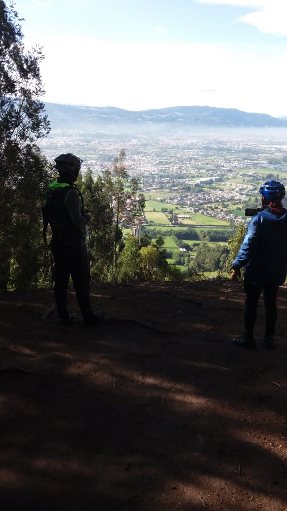

<br><details><summary>:camera:**59/WhatsApp Image 2021-04-10 at 19.36.20.jpeg**</summary> `Exif version` Not known</details>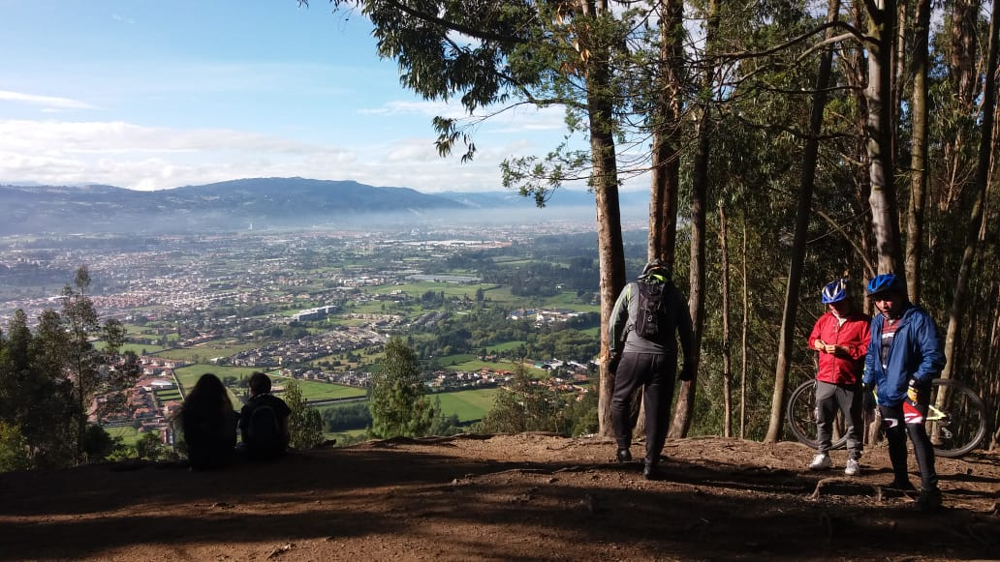

<br><details><summary>:camera:**59/WhatsApp Image 2021-04-10 at 19.36.21 (1).jpeg**</summary> `Exif version` Not known</details>.jpeg)

<br><details><summary>:camera:**59/WhatsApp Image 2021-04-10 at 19.36.21.jpeg**</summary> `Exif version` Not known</details>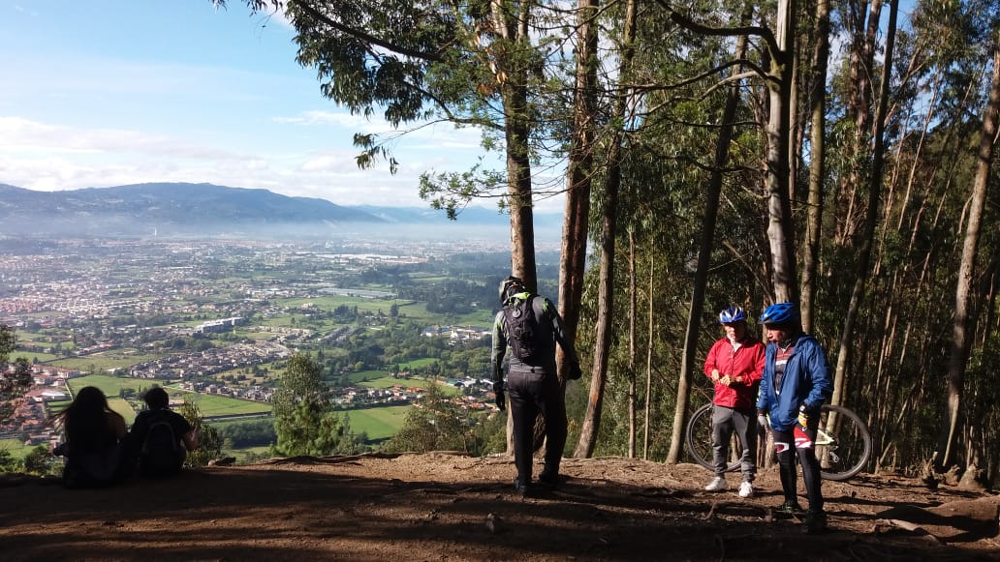

<br><details><summary>:camera:**59/WhatsApp Image 2021-04-10 at 19.36.22 (1).jpeg**</summary> `Exif version` Not known</details>.jpeg)

<br><details><summary>:camera:**59/WhatsApp Image 2021-04-10 at 19.36.22.jpeg**</summary> `Exif version` Not known</details>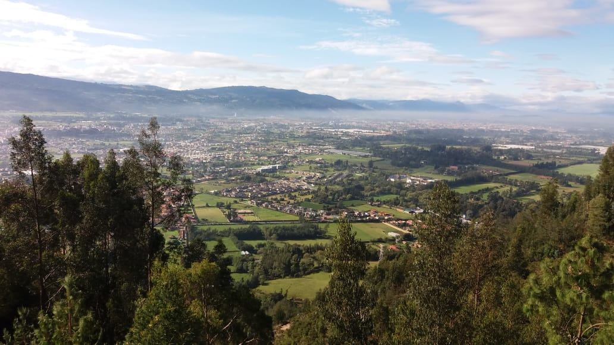

<br><details><summary>:camera:**59/WhatsApp Image 2021-04-10 at 19.36.23.jpeg**</summary> `Exif version` Not known</details>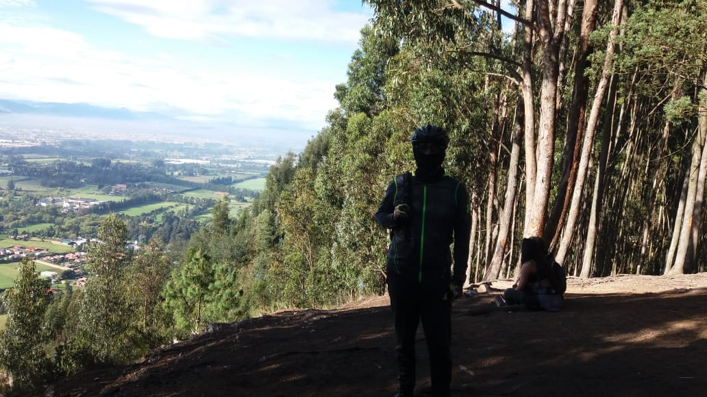

<br><details><summary>:camera:**59/WhatsApp Image 2021-04-10 at 19.36.24 (1).jpeg**</summary> `Exif version` Not known</details>.jpeg)

<br><details><summary>:camera:**59/WhatsApp Image 2021-04-10 at 19.36.24.jpeg**</summary> `Exif version` Not known</details>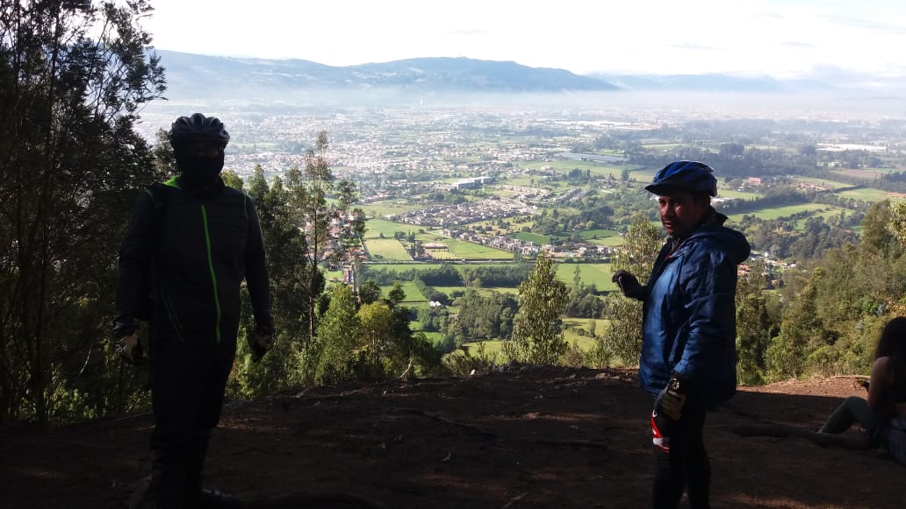

<sub>_Citation: Partial or total digital reproduction of this repository, scripts, development guides, data models, images, and documentation is permitted, provided that it is referenced as: "R.GISMobile - Mobile geographic information systems on QField that do not require an internet connection for navigation." https://github.com/rcfdtools/R.GISMobile - Bogotá - Colombia - South America"._<sub>

| [:house: Home](../Readme.md) |
|---|