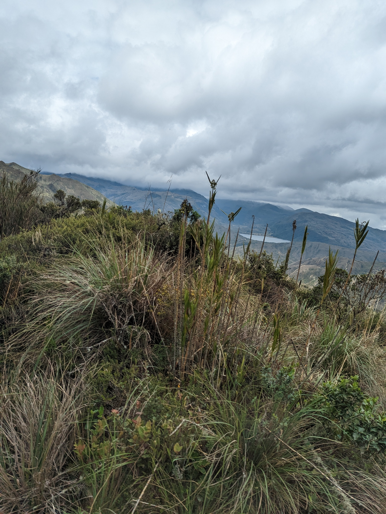
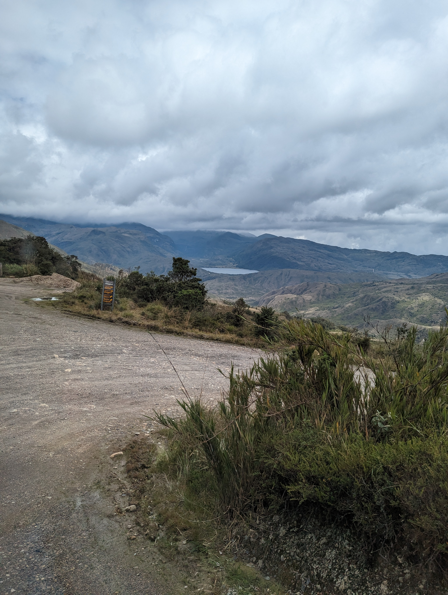
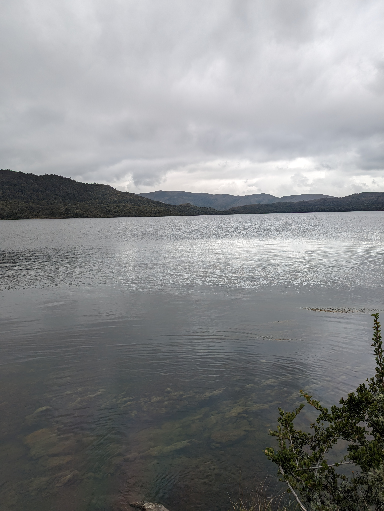
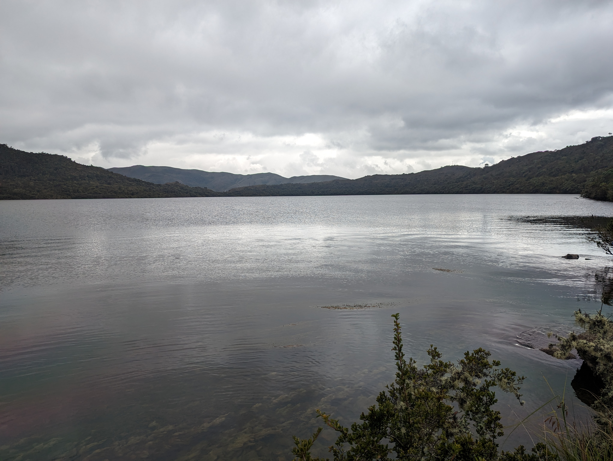
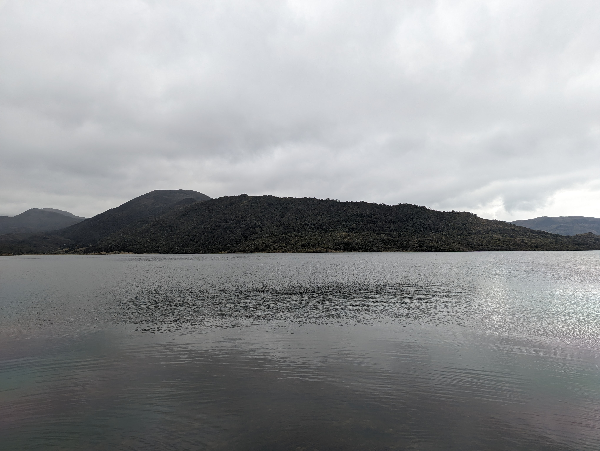

## :globe_with_meridians:Laguna Chingaza (2023-05-03)
`Pictures` rcfdtools <br>`Category` Technical field visit <br>`Location` [Google Maps](http://maps.google.com/maps?q=4.532322222222223,-73.74963611111112) or [Openstreet Map](https://www.openstreetmap.org/query?lat=4.532322222222223&lon=-73.74963611111112) 

```geojson
{
  "type": "Feature",
  "geometry": {
    "type": "Point", 
    "coordinates": [-73.74963611111112, 4.532322222222223]
  }, 
  "properties": {
    "Name": "Laguna Chingaza"
  }
}
```

<br><details><summary>:camera:**6/PXL_20230503_172836112.MOTION-02.ORIGINAL.jpg**</summary><sub> `Exif version` 0232 `OS version` HDR+ 1.0.520435816zm `Date` 2023:05:03 12:28:36 `Aperture` Not known `Brightness` 8.64 `Color space` 1 `Compression` Not known`Exposure mode` 0 `Exposure time` 0.000707 `Focal length` 6.81 `Lens model` Pixel 6 back camera 6.81mm f/1.85 `Lens specification` Not known `Orientation` 1 `Scene type` Not known `f number` 1.85 `White balance` 0 `Sensing method` 2 `Shutter speed` 10.47</sub></details><sub>`Coordinates & altitude` (4.5651472222222225, -73.73946388888889, 3483.93)</sub><sub> :globe_with_meridians:`Location over` [Google Maps](http://maps.google.com/maps?q=4.5651472222222225,-73.73946388888889) or [Openstreet Map](https://www.openstreetmap.org/query?lat=4.5651472222222225&lon=-73.73946388888889)</sub>


<br><details><summary>:camera:**6/PXL_20230503_172845905.MOTION-02.ORIGINAL.jpg**</summary><sub> `Exif version` 0232 `OS version` HDR+ 1.0.520435816zm `Date` 2023:05:03 12:28:45 `Aperture` Not known `Brightness` 8.5 `Color space` 1 `Compression` Not known`Exposure mode` 0 `Exposure time` 0.000627 `Focal length` 6.81 `Lens model` Pixel 6 back camera 6.81mm f/1.85 `Lens specification` Not known `Orientation` 1 `Scene type` Not known `f number` 1.85 `White balance` 0 `Sensing method` 2 `Shutter speed` 10.64</sub></details><sub>`Coordinates & altitude` (4.5651472222222225, -73.73946388888889, 3483.93)</sub><sub> :globe_with_meridians:`Location over` [Google Maps](http://maps.google.com/maps?q=4.5651472222222225,-73.73946388888889) or [Openstreet Map](https://www.openstreetmap.org/query?lat=4.5651472222222225&lon=-73.73946388888889)</sub>


<br><details><summary>:camera:**6/PXL_20230503_181920982.jpg**</summary><sub> `Exif version` 0232 `OS version` HDR+ 1.0.520435816zd `Date` 2023:05:03 13:19:20 `Aperture` Not known `Brightness` 8.52 `Color space` 1 `Compression` 6`Exposure mode` 0 `Exposure time` 0.000663 `Focal length` 6.81 `Lens model` Pixel 6 back camera 6.81mm f/1.85 `Lens specification` Not known `Orientation` 1 `Scene type` Not known `f number` 1.85 `White balance` 0 `Sensing method` 2 `Shutter speed` 10.56</sub></details><sub>`Coordinates & altitude` (4.532322222222223, -73.74963611111112, 3234.2)</sub><sub> :globe_with_meridians:`Location over` [Google Maps](http://maps.google.com/maps?q=4.532322222222223,-73.74963611111112) or [Openstreet Map](https://www.openstreetmap.org/query?lat=4.532322222222223&lon=-73.74963611111112)</sub>


<br><details><summary>:camera:**6/PXL_20230503_181924519.jpg**</summary><sub> `Exif version` 0232 `OS version` HDR+ 1.0.520435816zd `Date` 2023:05:03 13:19:24 `Aperture` Not known `Brightness` 8.69 `Color space` 1 `Compression` 6`Exposure mode` 0 `Exposure time` 0.000601 `Focal length` 6.81 `Lens model` Pixel 6 back camera 6.81mm f/1.85 `Lens specification` Not known `Orientation` 1 `Scene type` Not known `f number` 1.85 `White balance` 0 `Sensing method` 2 `Shutter speed` 10.7</sub></details><sub>`Coordinates & altitude` (4.532322222222223, -73.74963611111112, 3234.2)</sub><sub> :globe_with_meridians:`Location over` [Google Maps](http://maps.google.com/maps?q=4.532322222222223,-73.74963611111112) or [Openstreet Map](https://www.openstreetmap.org/query?lat=4.532322222222223&lon=-73.74963611111112)</sub>


<br><details><summary>:camera:**6/PXL_20230503_181928515.jpg**</summary><sub> `Exif version` 0232 `OS version` HDR+ 1.0.520435816zd `Date` 2023:05:03 13:19:28 `Aperture` Not known `Brightness` 7.45 `Color space` 1 `Compression` 6`Exposure mode` 0 `Exposure time` 0.001422 `Focal length` 6.81 `Lens model` Pixel 6 back camera 6.81mm f/1.85 `Lens specification` Not known `Orientation` 1 `Scene type` Not known `f number` 1.85 `White balance` 0 `Sensing method` 2 `Shutter speed` 9.46</sub></details><sub>`Coordinates & altitude` (4.532322222222223, -73.74963611111112, 3234.2)</sub><sub> :globe_with_meridians:`Location over` [Google Maps](http://maps.google.com/maps?q=4.532322222222223,-73.74963611111112) or [Openstreet Map](https://www.openstreetmap.org/query?lat=4.532322222222223&lon=-73.74963611111112)</sub>


> _Citación: se permite la reproducción digital parcial o total de este repositorio, scripts, guías de desarrollo, modelos de datos, imágenes y documentación, siempre que se haga referencia como: "R.GISMobile - Sistemas de información geográficos móviles sobre QField que no requieren de conexión a Internet para su navegación". https://github.com/rcfdtools/R.GISMobile - Bogotá - Colombia - Suramérica."._

| [:house: Inicio](../Readme.md) |
|---|