<div align="center"></div>

## The Hanging Rock, Susa, Cundinamarca, Colombia. (2026-02-15)
`Pictures` rcfdtools <br>`Category` Freelance field visit <br>`Location` [Google Maps](http://maps.google.com/maps?q=5.425771,-73.84567) or [Openstreet Map](https://www.openstreetmap.org/query?lat=5.425771&lon=-73.84567) 

```geojson
{
  "type": "Feature",
  "geometry": {
    "type": "Point", 
    "coordinates": [-73.84567, 5.425771]
  }, 
  "properties": {
    "Name": "The Hanging Rock, Susa, Cundinamarca, Colombia."
  }
}
```

<br><details><summary>:camera:**60/.trashed-1773755399-IMG_20260215_084952424.jpg**</summary><sub> `Exif version` 0220 `OS version`  `Date` 2026:02:15 08:49:53 `Aperture` Not known `Brightness` 0.0 `Color space` 1 `Compression` 6`Exposure mode` 0 `Exposure time` 0.033344 `Focal length` 5.56 `Lens model` Not known `Lens specification` Not known `Orientation` 6 `Scene type` Not known `f number` 1.88 `White balance` 0 `Sensing method` 1 `Shutter speed` 4.906</sub><sub>`Coordinates & altitude` (5.302614194444445, -73.83714294444444, 2619.0)</sub><sub> :globe_with_meridians:`Location over` [Google Maps](http://maps.google.com/maps?q=5.302614194444445,-73.83714294444444) or [Openstreet Map](https://www.openstreetmap.org/query?lat=5.302614194444445&lon=-73.83714294444444)</sub></details>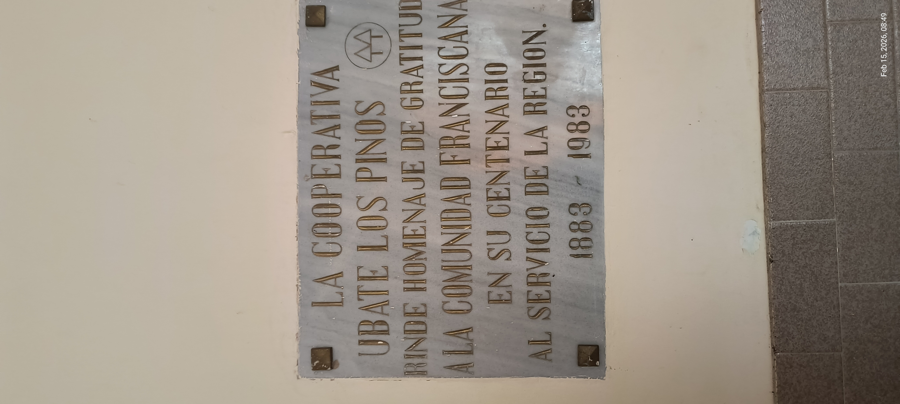

<br><details><summary>:camera:**60/.trashed-1773779069-IMG_20260215_122739591_HDR.jpg**</summary><sub> `Exif version` 0220 `OS version`  `Date` 2026:02:15 12:27:41 `Aperture` Not known `Brightness` 0.0 `Color space` 1 `Compression` 6`Exposure mode` 0 `Exposure time` 0.000608 `Focal length` 5.56 `Lens model` Not known `Lens specification` Not known `Orientation` 6 `Scene type` Not known `f number` 1.88 `White balance` 0 `Sensing method` 1 `Shutter speed` 10.683</sub><sub>`Coordinates & altitude` (5.426805, -73.84656522222221, 3361.0)</sub><sub> :globe_with_meridians:`Location over` [Google Maps](http://maps.google.com/maps?q=5.426805,-73.84656522222221) or [Openstreet Map](https://www.openstreetmap.org/query?lat=5.426805&lon=-73.84656522222221)</sub></details>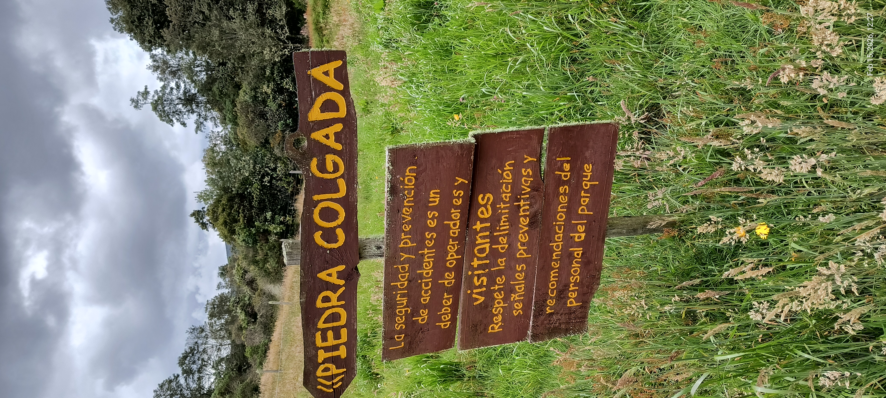

<br><details><summary>:camera:**60/0_GarminConnect1.jpg**</summary> `Exif version` Not known</details>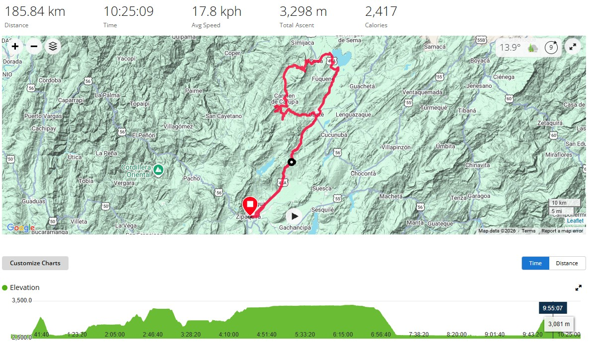

<br><details><summary>:camera:**60/IMG_20260215_084253949.jpg**</summary><sub> `Exif version` 0220 `OS version`  `Date` 2026:02:15 08:42:56 `Aperture` Not known `Brightness` 0.0 `Color space` 1 `Compression` 6`Exposure mode` 0 `Exposure time` 0.000840588 `Focal length` 2.13 `Lens model` Not known `Lens specification` Not known `Orientation` 6 `Scene type` Not known `f number` 2.2 `White balance` 0 `Sensing method` 1 `Shutter speed` 10.216</sub><sub>`Coordinates & altitude` (5.302615138888889, -73.83713530555555, 2619.0)</sub><sub> :globe_with_meridians:`Location over` [Google Maps](http://maps.google.com/maps?q=5.302615138888889,-73.83713530555555) or [Openstreet Map](https://www.openstreetmap.org/query?lat=5.302615138888889&lon=-73.83713530555555)</sub></details>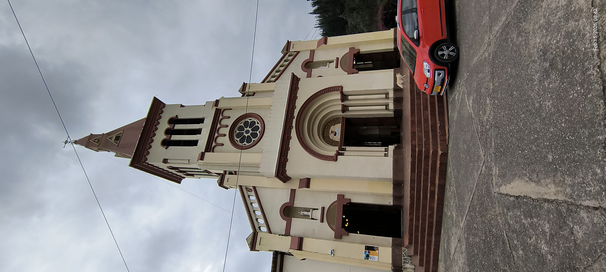

<br><details><summary>:camera:**60/IMG_20260215_084259887_HDR.jpg**</summary><sub> `Exif version` 0220 `OS version`  `Date` 2026:02:15 08:43:01 `Aperture` Not known `Brightness` 0.0 `Color space` 1 `Compression` 6`Exposure mode` 0 `Exposure time` 0.001390973 `Focal length` 2.13 `Lens model` Not known `Lens specification` Not known `Orientation` 1 `Scene type` Not known `f number` 2.2 `White balance` 0 `Sensing method` 1 `Shutter speed` 9.489</sub><sub>`Coordinates & altitude` (5.302615138888889, -73.83713530555555, 2619.0)</sub><sub> :globe_with_meridians:`Location over` [Google Maps](http://maps.google.com/maps?q=5.302615138888889,-73.83713530555555) or [Openstreet Map](https://www.openstreetmap.org/query?lat=5.302615138888889&lon=-73.83713530555555)</sub></details>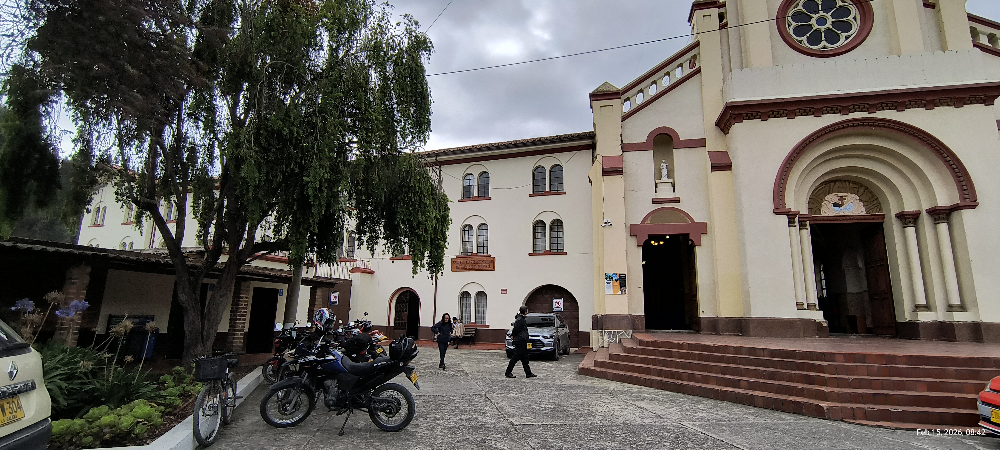

<br><details><summary>:camera:**60/IMG_20260215_084307341.jpg**</summary><sub> `Exif version` 0220 `OS version`  `Date` 2026:02:15 08:43:08 `Aperture` Not known `Brightness` 0.0 `Color space` 1 `Compression` 6`Exposure mode` 0 `Exposure time` 0.001080756 `Focal length` 2.13 `Lens model` Not known `Lens specification` Not known `Orientation` 1 `Scene type` Not known `f number` 2.2 `White balance` 0 `Sensing method` 1 `Shutter speed` 9.853</sub><sub>`Coordinates & altitude` (5.302615138888889, -73.83713530555555, 2619.0)</sub><sub> :globe_with_meridians:`Location over` [Google Maps](http://maps.google.com/maps?q=5.302615138888889,-73.83713530555555) or [Openstreet Map](https://www.openstreetmap.org/query?lat=5.302615138888889&lon=-73.83713530555555)</sub></details>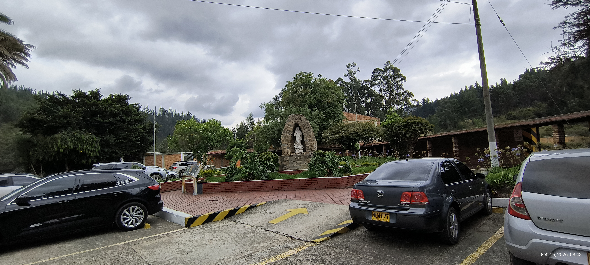

<br><details><summary>:camera:**60/IMG_20260215_084350839.jpg**</summary><sub> `Exif version` 0220 `OS version`  `Date` 2026:02:15 08:43:51 `Aperture` Not known `Brightness` 0.0 `Color space` 1 `Compression` 6`Exposure mode` 0 `Exposure time` 0.002031421 `Focal length` 2.13 `Lens model` Not known `Lens specification` Not known `Orientation` 6 `Scene type` Not known `f number` 2.2 `White balance` 0 `Sensing method` 1 `Shutter speed` 8.943</sub><sub>`Coordinates & altitude` (5.302616111111111, -73.83713530555555, 2619.0)</sub><sub> :globe_with_meridians:`Location over` [Google Maps](http://maps.google.com/maps?q=5.302616111111111,-73.83713530555555) or [Openstreet Map](https://www.openstreetmap.org/query?lat=5.302616111111111&lon=-73.83713530555555)</sub></details>

<br><details><summary>:camera:**60/IMG_20260215_084356022.jpg**</summary><sub> `Exif version` 0220 `OS version`  `Date` 2026:02:15 08:43:56 `Aperture` Not known `Brightness` 0.0 `Color space` 1 `Compression` 6`Exposure mode` 0 `Exposure time` 0.001210847 `Focal length` 2.13 `Lens model` Not known `Lens specification` Not known `Orientation` 1 `Scene type` Not known `f number` 2.2 `White balance` 0 `Sensing method` 1 `Shutter speed` 9.689</sub><sub>`Coordinates & altitude` (5.302616111111111, -73.83713530555555, 2619.0)</sub><sub> :globe_with_meridians:`Location over` [Google Maps](http://maps.google.com/maps?q=5.302616111111111,-73.83713530555555) or [Openstreet Map](https://www.openstreetmap.org/query?lat=5.302616111111111&lon=-73.83713530555555)</sub></details>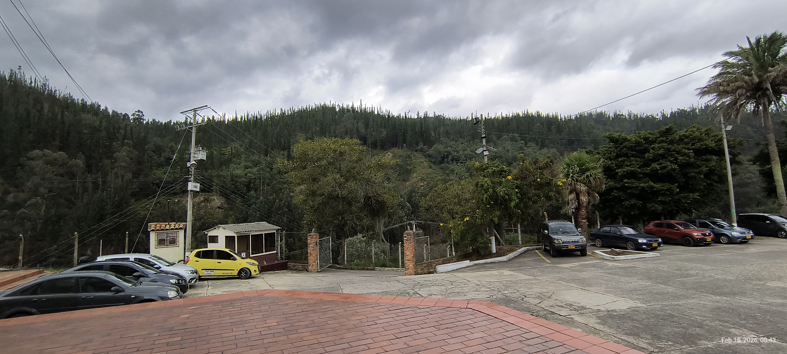

<br><details><summary>:camera:**60/IMG_20260215_084404863.jpg**</summary><sub> `Exif version` 0220 `OS version`  `Date` 2026:02:15 08:44:05 `Aperture` Not known `Brightness` 0.0 `Color space` 1 `Compression` 6`Exposure mode` 0 `Exposure time` 0.016671662 `Focal length` 2.13 `Lens model` Not known `Lens specification` Not known `Orientation` 6 `Scene type` Not known `f number` 2.2 `White balance` 0 `Sensing method` 1 `Shutter speed` 5.906</sub><sub>`Coordinates & altitude` (5.302616111111111, -73.83713530555555, 2619.0)</sub><sub> :globe_with_meridians:`Location over` [Google Maps](http://maps.google.com/maps?q=5.302616111111111,-73.83713530555555) or [Openstreet Map](https://www.openstreetmap.org/query?lat=5.302616111111111&lon=-73.83713530555555)</sub></details>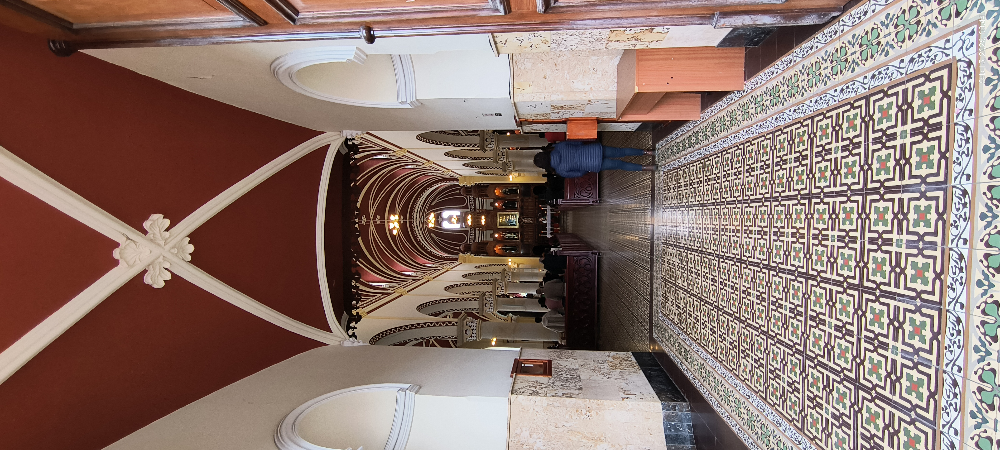

<br><details><summary>:camera:**60/IMG_20260215_084413388_HDR.jpg**</summary><sub> `Exif version` 0220 `OS version`  `Date` 2026:02:15 08:44:15 `Aperture` Not known `Brightness` 0.0 `Color space` 1 `Compression` 6`Exposure mode` 0 `Exposure time` 0.008335831 `Focal length` 2.13 `Lens model` Not known `Lens specification` Not known `Orientation` 6 `Scene type` Not known `f number` 2.2 `White balance` 0 `Sensing method` 1 `Shutter speed` 6.906</sub><sub>`Coordinates & altitude` (5.302616111111111, -73.83713530555555, 2619.0)</sub><sub> :globe_with_meridians:`Location over` [Google Maps](http://maps.google.com/maps?q=5.302616111111111,-73.83713530555555) or [Openstreet Map](https://www.openstreetmap.org/query?lat=5.302616111111111&lon=-73.83713530555555)</sub></details>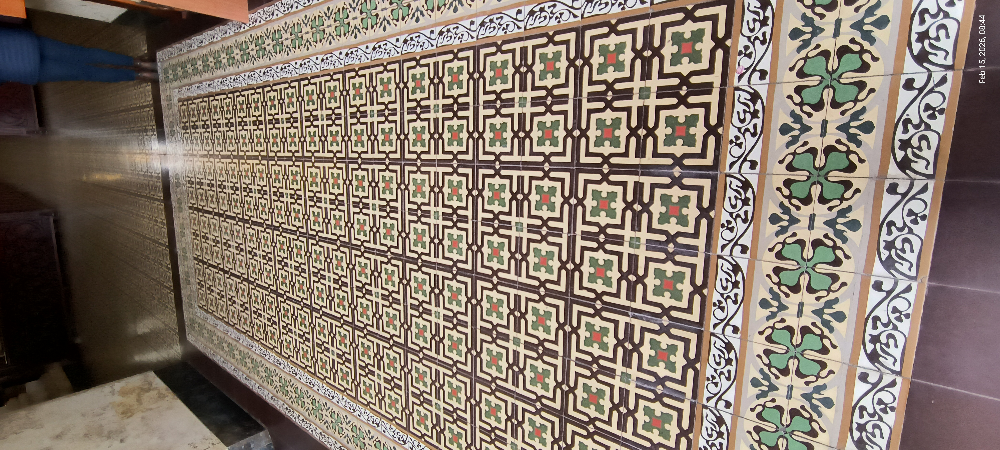

<br><details><summary>:camera:**60/IMG_20260215_084433045_HDR.jpg**</summary><sub> `Exif version` 0220 `OS version`  `Date` 2026:02:15 08:44:35 `Aperture` Not known `Brightness` 0.0 `Color space` 1 `Compression` 6`Exposure mode` 0 `Exposure time` 0.016671662 `Focal length` 2.13 `Lens model` Not known `Lens specification` Not known `Orientation` 6 `Scene type` Not known `f number` 2.2 `White balance` 0 `Sensing method` 1 `Shutter speed` 5.906</sub><sub>`Coordinates & altitude` (5.302616111111111, -73.83713530555555, 2619.0)</sub><sub> :globe_with_meridians:`Location over` [Google Maps](http://maps.google.com/maps?q=5.302616111111111,-73.83713530555555) or [Openstreet Map](https://www.openstreetmap.org/query?lat=5.302616111111111&lon=-73.83713530555555)</sub></details>

<br><details><summary>:camera:**60/IMG_20260215_084443819_HDR.jpg**</summary><sub> `Exif version` 0220 `OS version`  `Date` 2026:02:15 08:44:45 `Aperture` Not known `Brightness` 0.0 `Color space` 1 `Compression` 6`Exposure mode` 0 `Exposure time` 0.016671662 `Focal length` 2.13 `Lens model` Not known `Lens specification` Not known `Orientation` 1 `Scene type` Not known `f number` 2.2 `White balance` 0 `Sensing method` 1 `Shutter speed` 5.906</sub><sub>`Coordinates & altitude` (5.302616111111111, -73.83713530555555, 2619.0)</sub><sub> :globe_with_meridians:`Location over` [Google Maps](http://maps.google.com/maps?q=5.302616111111111,-73.83713530555555) or [Openstreet Map](https://www.openstreetmap.org/query?lat=5.302616111111111&lon=-73.83713530555555)</sub></details>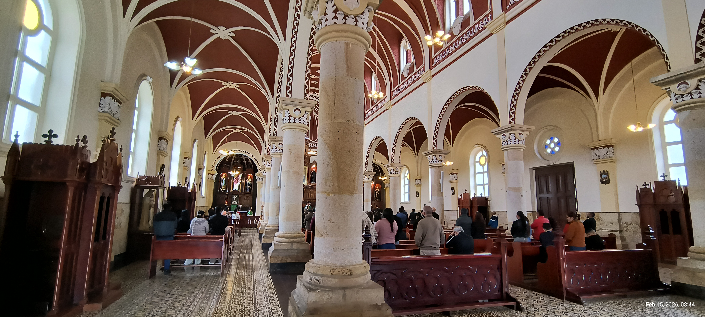

<br><details><summary>:camera:**60/IMG_20260215_084510998_HDR.jpg**</summary><sub> `Exif version` 0220 `OS version`  `Date` 2026:02:15 08:45:12 `Aperture` Not known `Brightness` 0.0 `Color space` 1 `Compression` 6`Exposure mode` 0 `Exposure time` 0.016672 `Focal length` 5.56 `Lens model` Not known `Lens specification` Not known `Orientation` 6 `Scene type` Not known `f number` 1.88 `White balance` 0 `Sensing method` 1 `Shutter speed` 5.906</sub><sub>`Coordinates & altitude` (5.302608944444445, -73.83715055555555, 2619.0)</sub><sub> :globe_with_meridians:`Location over` [Google Maps](http://maps.google.com/maps?q=5.302608944444445,-73.83715055555555) or [Openstreet Map](https://www.openstreetmap.org/query?lat=5.302608944444445&lon=-73.83715055555555)</sub></details>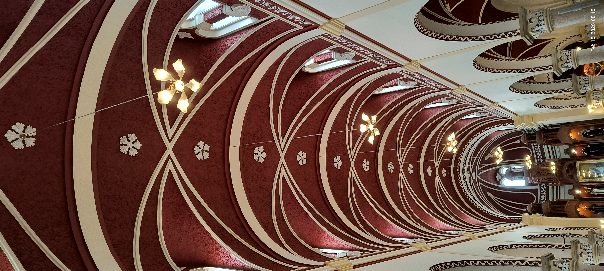

<br><details><summary>:camera:**60/IMG_20260215_084535403_HDR.jpg**</summary><sub> `Exif version` 0220 `OS version`  `Date` 2026:02:15 08:45:37 `Aperture` Not known `Brightness` 0.0 `Color space` 1 `Compression` 6`Exposure mode` 0 `Exposure time` 0.033344 `Focal length` 5.56 `Lens model` Not known `Lens specification` Not known `Orientation` 6 `Scene type` Not known `f number` 1.88 `White balance` 0 `Sensing method` 1 `Shutter speed` 4.906</sub><sub>`Coordinates & altitude` (5.302614194444445, -73.83714294444444, 2619.0)</sub><sub> :globe_with_meridians:`Location over` [Google Maps](http://maps.google.com/maps?q=5.302614194444445,-73.83714294444444) or [Openstreet Map](https://www.openstreetmap.org/query?lat=5.302614194444445&lon=-73.83714294444444)</sub></details>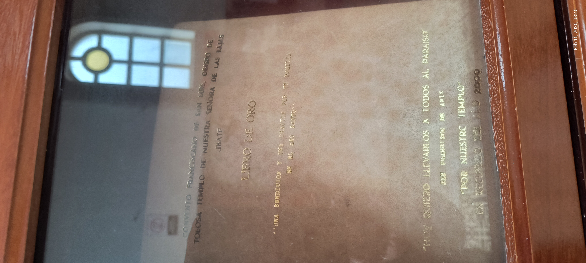

<br><details><summary>:camera:**60/IMG_20260215_084618569.jpg**</summary><sub> `Exif version` 0220 `OS version`  `Date` 2026:02:15 08:46:19 `Aperture` Not known `Brightness` 0.0 `Color space` 1 `Compression` 6`Exposure mode` 0 `Exposure time` 0.001696 `Focal length` 5.56 `Lens model` Not known `Lens specification` Not known `Orientation` 6 `Scene type` Not known `f number` 1.88 `White balance` 0 `Sensing method` 1 `Shutter speed` 9.203</sub><sub>`Coordinates & altitude` (5.302614194444445, -73.83714294444444, 2619.0)</sub><sub> :globe_with_meridians:`Location over` [Google Maps](http://maps.google.com/maps?q=5.302614194444445,-73.83714294444444) or [Openstreet Map](https://www.openstreetmap.org/query?lat=5.302614194444445&lon=-73.83714294444444)</sub></details>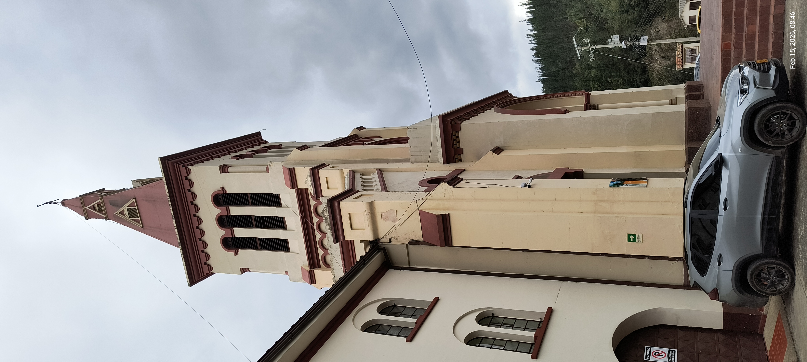

<br><details><summary>:camera:**60/IMG_20260215_084955901.jpg**</summary><sub> `Exif version` 0220 `OS version`  `Date` 2026:02:15 08:49:56 `Aperture` Not known `Brightness` 0.0 `Color space` 1 `Compression` 6`Exposure mode` 0 `Exposure time` 0.041664 `Focal length` 5.56 `Lens model` Not known `Lens specification` Not known `Orientation` 6 `Scene type` Not known `f number` 1.88 `White balance` 0 `Sensing method` 1 `Shutter speed` 4.585</sub><sub>`Coordinates & altitude` (5.302614194444445, -73.83714294444444, 2619.0)</sub><sub> :globe_with_meridians:`Location over` [Google Maps](http://maps.google.com/maps?q=5.302614194444445,-73.83714294444444) or [Openstreet Map](https://www.openstreetmap.org/query?lat=5.302614194444445&lon=-73.83714294444444)</sub></details>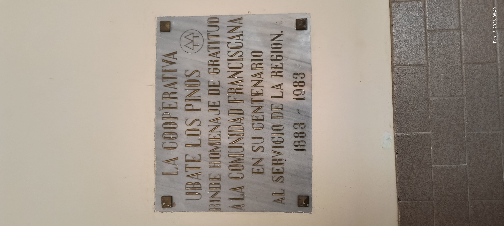

<br><details><summary>:camera:**60/IMG_20260215_085014719_HDR.jpg**</summary><sub> `Exif version` 0220 `OS version`  `Date` 2026:02:15 08:50:16 `Aperture` Not known `Brightness` 0.0 `Color space` 1 `Compression` 6`Exposure mode` 0 `Exposure time` 0.016672 `Focal length` 5.56 `Lens model` Not known `Lens specification` Not known `Orientation` 6 `Scene type` Not known `f number` 1.88 `White balance` 0 `Sensing method` 1 `Shutter speed` 5.906</sub><sub>`Coordinates & altitude` (5.302614194444445, -73.83714294444444, 2619.0)</sub><sub> :globe_with_meridians:`Location over` [Google Maps](http://maps.google.com/maps?q=5.302614194444445,-73.83714294444444) or [Openstreet Map](https://www.openstreetmap.org/query?lat=5.302614194444445&lon=-73.83714294444444)</sub></details>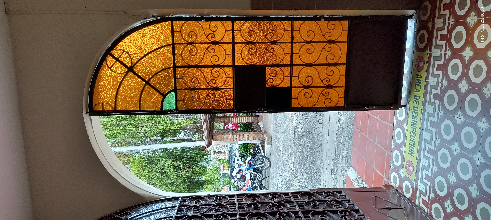

<br><details><summary>:camera:**60/IMG_20260215_091720013.jpg**</summary><sub> `Exif version` 0220 `OS version`  `Date` 2026:02:15 09:17:21 `Aperture` Not known `Brightness` 0.0 `Color space` 1 `Compression` 6`Exposure mode` 0 `Exposure time` 0.00050035 `Focal length` 2.13 `Lens model` Not known `Lens specification` Not known `Orientation` 1 `Scene type` Not known `f number` 2.2 `White balance` 0 `Sensing method` 1 `Shutter speed` 10.964</sub><sub>`Coordinates & altitude` (5.3018479166666665, -73.90453336111112, 2883.0)</sub><sub> :globe_with_meridians:`Location over` [Google Maps](http://maps.google.com/maps?q=5.3018479166666665,-73.90453336111112) or [Openstreet Map](https://www.openstreetmap.org/query?lat=5.3018479166666665&lon=-73.90453336111112)</sub></details>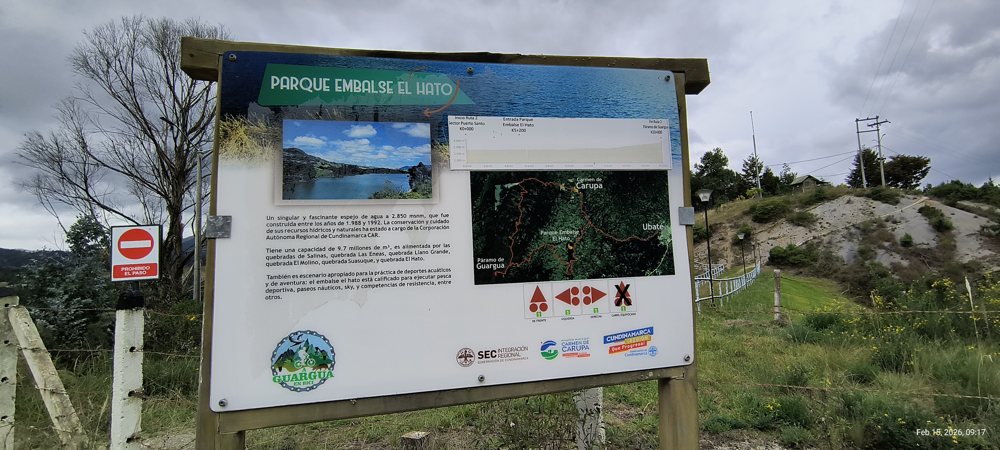

<br><details><summary>:camera:**60/IMG_20260215_091730618.jpg**</summary><sub> `Exif version` 0220 `OS version`  `Date` 2026:02:15 09:17:31 `Aperture` Not known `Brightness` 0.0 `Color space` 1 `Compression` 6`Exposure mode` 0 `Exposure time` 0.000450315 `Focal length` 2.13 `Lens model` Not known `Lens specification` Not known `Orientation` 6 `Scene type` Not known `f number` 2.2 `White balance` 0 `Sensing method` 1 `Shutter speed` 11.116</sub><sub>`Coordinates & altitude` (5.3018479166666665, -73.90453336111112, 2883.0)</sub><sub> :globe_with_meridians:`Location over` [Google Maps](http://maps.google.com/maps?q=5.3018479166666665,-73.90453336111112) or [Openstreet Map](https://www.openstreetmap.org/query?lat=5.3018479166666665&lon=-73.90453336111112)</sub></details>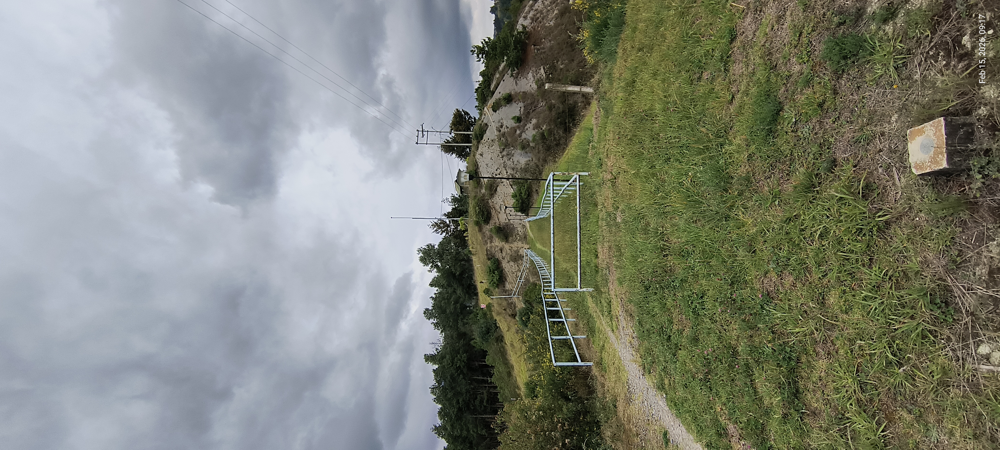

<br><details><summary>:camera:**60/IMG_20260215_091741412.jpg**</summary><sub> `Exif version` 0220 `OS version`  `Date` 2026:02:15 09:17:42 `Aperture` Not known `Brightness` 0.0 `Color space` 1 `Compression` 6`Exposure mode` 0 `Exposure time` 0.000530371 `Focal length` 2.13 `Lens model` Not known `Lens specification` Not known `Orientation` 6 `Scene type` Not known `f number` 2.2 `White balance` 0 `Sensing method` 1 `Shutter speed` 10.88</sub><sub>`Coordinates & altitude` (5.3018479166666665, -73.90453336111112, 2883.0)</sub><sub> :globe_with_meridians:`Location over` [Google Maps](http://maps.google.com/maps?q=5.3018479166666665,-73.90453336111112) or [Openstreet Map](https://www.openstreetmap.org/query?lat=5.3018479166666665&lon=-73.90453336111112)</sub></details>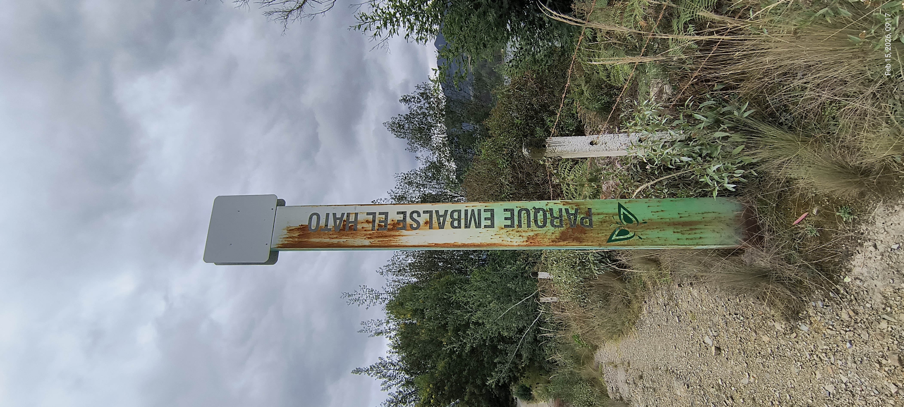

<br><details><summary>:camera:**60/IMG_20260215_091746983.jpg**</summary><sub> `Exif version` 0220 `OS version`  `Date` 2026:02:15 09:17:47 `Aperture` Not known `Brightness` 0.0 `Color space` 1 `Compression` 6`Exposure mode` 0 `Exposure time` 0.000680476 `Focal length` 2.13 `Lens model` Not known `Lens specification` Not known `Orientation` 1 `Scene type` Not known `f number` 2.2 `White balance` 0 `Sensing method` 1 `Shutter speed` 10.521</sub><sub>`Coordinates & altitude` (5.3018479166666665, -73.90453336111112, 2883.0)</sub><sub> :globe_with_meridians:`Location over` [Google Maps](http://maps.google.com/maps?q=5.3018479166666665,-73.90453336111112) or [Openstreet Map](https://www.openstreetmap.org/query?lat=5.3018479166666665&lon=-73.90453336111112)</sub></details>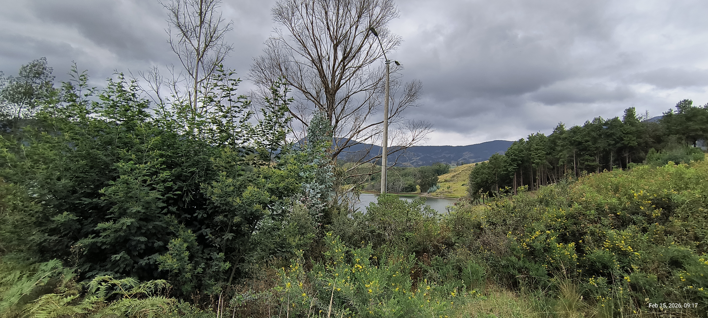

<br><details><summary>:camera:**60/IMG_20260215_092513306.jpg**</summary><sub> `Exif version` 0220 `OS version`  `Date` 2026:02:15 09:25:14 `Aperture` Not known `Brightness` 0.0 `Color space` 1 `Compression` 6`Exposure mode` 0 `Exposure time` 0.000416 `Focal length` 5.56 `Lens model` Not known `Lens specification` Not known `Orientation` 6 `Scene type` Not known `f number` 1.88 `White balance` 0 `Sensing method` 1 `Shutter speed` 11.231</sub><sub>`Coordinates & altitude` (5.291985027777778, -73.9060973888889, 2879.0)</sub><sub> :globe_with_meridians:`Location over` [Google Maps](http://maps.google.com/maps?q=5.291985027777778,-73.9060973888889) or [Openstreet Map](https://www.openstreetmap.org/query?lat=5.291985027777778&lon=-73.9060973888889)</sub></details>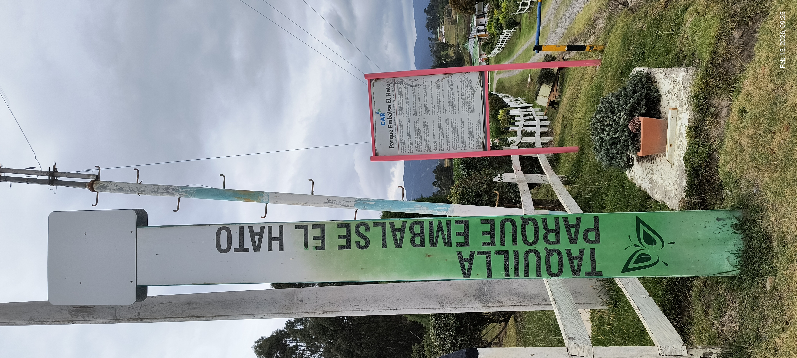

<br><details><summary>:camera:**60/IMG_20260215_092522902.jpg**</summary><sub> `Exif version` 0220 `OS version`  `Date` 2026:02:15 09:25:23 `Aperture` Not known `Brightness` 0.0 `Color space` 1 `Compression` 6`Exposure mode` 0 `Exposure time` 0.000352 `Focal length` 5.56 `Lens model` Not known `Lens specification` Not known `Orientation` 6 `Scene type` Not known `f number` 1.88 `White balance` 0 `Sensing method` 1 `Shutter speed` 11.472</sub><sub>`Coordinates & altitude` (5.291985027777778, -73.9060973888889, 2879.0)</sub><sub> :globe_with_meridians:`Location over` [Google Maps](http://maps.google.com/maps?q=5.291985027777778,-73.9060973888889) or [Openstreet Map](https://www.openstreetmap.org/query?lat=5.291985027777778&lon=-73.9060973888889)</sub></details>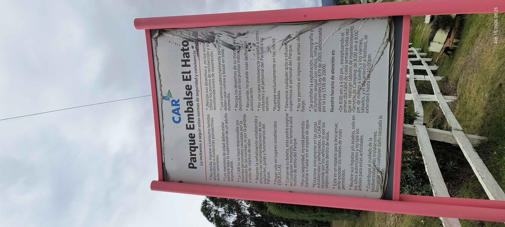

<br><details><summary>:camera:**60/IMG_20260215_092533287.jpg**</summary><sub> `Exif version` 0220 `OS version`  `Date` 2026:02:15 09:25:33 `Aperture` Not known `Brightness` 0.0 `Color space` 1 `Compression` 6`Exposure mode` 0 `Exposure time` 0.000768 `Focal length` 5.56 `Lens model` Not known `Lens specification` Not known `Orientation` 1 `Scene type` Not known `f number` 1.88 `White balance` 0 `Sensing method` 1 `Shutter speed` 10.346</sub><sub>`Coordinates & altitude` (5.291985027777778, -73.9060973888889, 2879.0)</sub><sub> :globe_with_meridians:`Location over` [Google Maps](http://maps.google.com/maps?q=5.291985027777778,-73.9060973888889) or [Openstreet Map](https://www.openstreetmap.org/query?lat=5.291985027777778&lon=-73.9060973888889)</sub></details>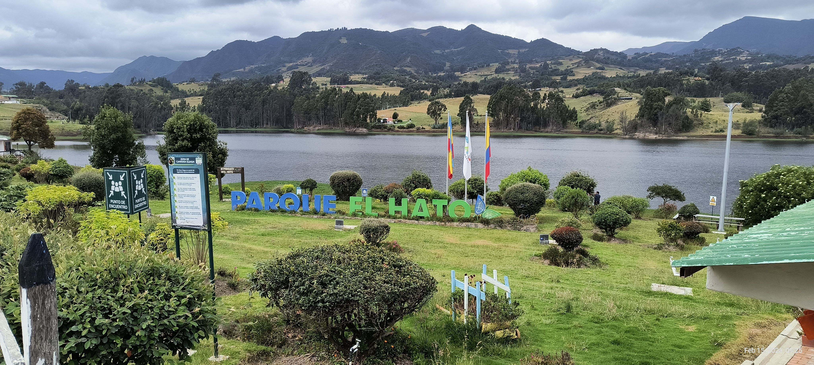

<br><details><summary>:camera:**60/IMG_20260215_092747023.jpg**</summary><sub> `Exif version` 0220 `OS version`  `Date` 2026:02:15 09:27:48 `Aperture` Not known `Brightness` 0.0 `Color space` 1 `Compression` 6`Exposure mode` 0 `Exposure time` 0.000440308 `Focal length` 2.13 `Lens model` Not known `Lens specification` Not known `Orientation` 1 `Scene type` Not known `f number` 2.2 `White balance` 0 `Sensing method` 1 `Shutter speed` 11.149</sub><sub>`Coordinates & altitude` (5.291852944444444, -73.90627286111112, 2878.0)</sub><sub> :globe_with_meridians:`Location over` [Google Maps](http://maps.google.com/maps?q=5.291852944444444,-73.90627286111112) or [Openstreet Map](https://www.openstreetmap.org/query?lat=5.291852944444444&lon=-73.90627286111112)</sub></details>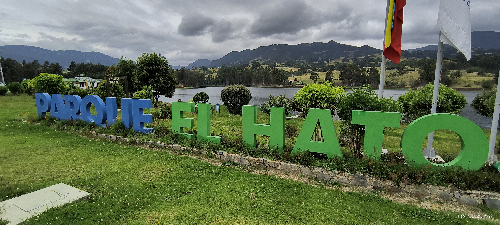

<br><details><summary>:camera:**60/IMG_20260215_092749958.jpg**</summary><sub> `Exif version` 0220 `OS version`  `Date` 2026:02:15 09:27:50 `Aperture` Not known `Brightness` 0.0 `Color space` 1 `Compression` 6`Exposure mode` 0 `Exposure time` 0.000420294 `Focal length` 2.13 `Lens model` Not known `Lens specification` Not known `Orientation` 6 `Scene type` Not known `f number` 2.2 `White balance` 0 `Sensing method` 1 `Shutter speed` 11.216</sub><sub>`Coordinates & altitude` (5.291852944444444, -73.90627286111112, 2878.0)</sub><sub> :globe_with_meridians:`Location over` [Google Maps](http://maps.google.com/maps?q=5.291852944444444,-73.90627286111112) or [Openstreet Map](https://www.openstreetmap.org/query?lat=5.291852944444444&lon=-73.90627286111112)</sub></details>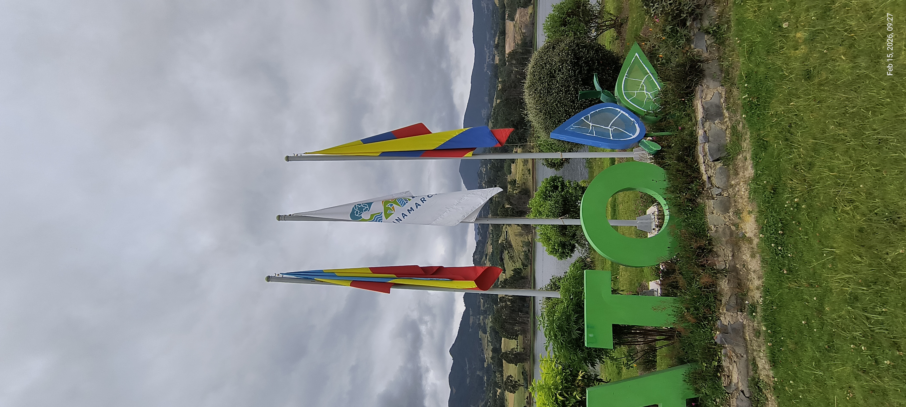

<br><details><summary>:camera:**60/IMG_20260215_092807874.jpg**</summary><sub> `Exif version` 0220 `OS version`  `Date` 2026:02:15 09:28:08 `Aperture` Not known `Brightness` 0.0 `Color space` 1 `Compression` 6`Exposure mode` 0 `Exposure time` 0.000490343 `Focal length` 2.13 `Lens model` Not known `Lens specification` Not known `Orientation` 6 `Scene type` Not known `f number` 2.2 `White balance` 0 `Sensing method` 1 `Shutter speed` 10.993</sub><sub>`Coordinates & altitude` (5.291852944444444, -73.90627286111112, 2878.0)</sub><sub> :globe_with_meridians:`Location over` [Google Maps](http://maps.google.com/maps?q=5.291852944444444,-73.90627286111112) or [Openstreet Map](https://www.openstreetmap.org/query?lat=5.291852944444444&lon=-73.90627286111112)</sub></details>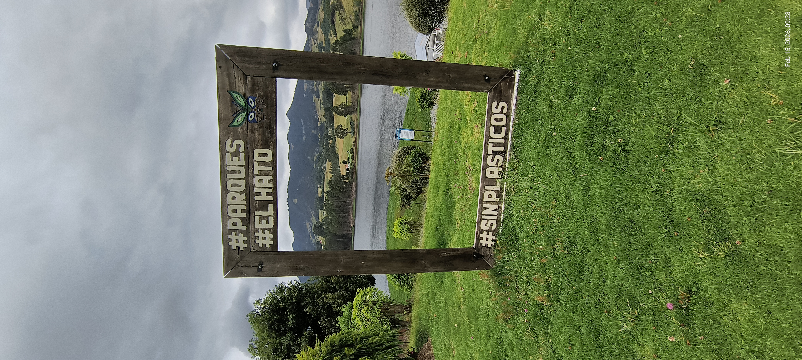

<br><details><summary>:camera:**60/IMG_20260215_093006936_HDR.jpg**</summary><sub> `Exif version` 0220 `OS version`  `Date` 2026:02:15 09:30:08 `Aperture` Not known `Brightness` 0.0 `Color space` 1 `Compression` 6`Exposure mode` 0 `Exposure time` 0.001824 `Focal length` 5.56 `Lens model` Not known `Lens specification` Not known `Orientation` 1 `Scene type` Not known `f number` 1.88 `White balance` 0 `Sensing method` 1 `Shutter speed` 9.098</sub><sub>`Coordinates & altitude` (5.291075222222222, -73.90620422222223, 2876.0)</sub><sub> :globe_with_meridians:`Location over` [Google Maps](http://maps.google.com/maps?q=5.291075222222222,-73.90620422222223) or [Openstreet Map](https://www.openstreetmap.org/query?lat=5.291075222222222&lon=-73.90620422222223)</sub></details>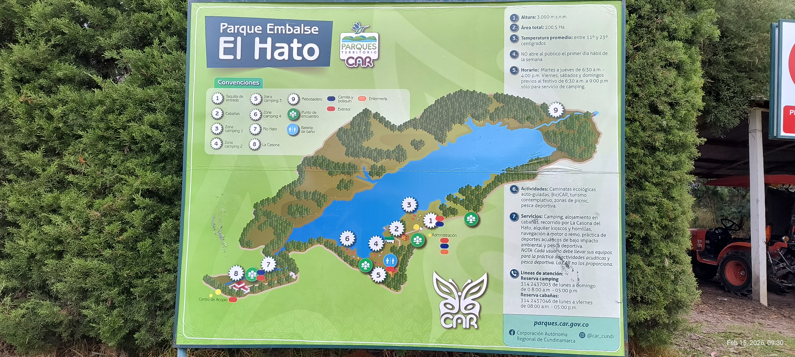

<br><details><summary>:camera:**60/IMG_20260215_093018083.jpg**</summary><sub> `Exif version` 0220 `OS version`  `Date` 2026:02:15 09:30:18 `Aperture` Not known `Brightness` 0.0 `Color space` 1 `Compression` 6`Exposure mode` 0 `Exposure time` 0.00048 `Focal length` 5.56 `Lens model` Not known `Lens specification` Not known `Orientation` 6 `Scene type` Not known `f number` 1.88 `White balance` 0 `Sensing method` 1 `Shutter speed` 11.024</sub><sub>`Coordinates & altitude` (5.291075222222222, -73.90620422222223, 2876.0)</sub><sub> :globe_with_meridians:`Location over` [Google Maps](http://maps.google.com/maps?q=5.291075222222222,-73.90620422222223) or [Openstreet Map](https://www.openstreetmap.org/query?lat=5.291075222222222&lon=-73.90620422222223)</sub></details>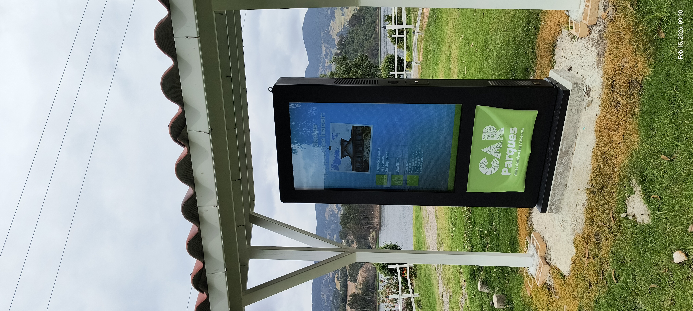

<br><details><summary>:camera:**60/IMG_20260215_093020717.jpg**</summary><sub> `Exif version` 0220 `OS version`  `Date` 2026:02:15 09:30:21 `Aperture` Not known `Brightness` 0.0 `Color space` 1 `Compression` 6`Exposure mode` 0 `Exposure time` 0.000416 `Focal length` 5.56 `Lens model` Not known `Lens specification` Not known `Orientation` 6 `Scene type` Not known `f number` 1.88 `White balance` 0 `Sensing method` 1 `Shutter speed` 11.231</sub><sub>`Coordinates & altitude` (5.291075222222222, -73.90620422222223, 2876.0)</sub><sub> :globe_with_meridians:`Location over` [Google Maps](http://maps.google.com/maps?q=5.291075222222222,-73.90620422222223) or [Openstreet Map](https://www.openstreetmap.org/query?lat=5.291075222222222&lon=-73.90620422222223)</sub></details>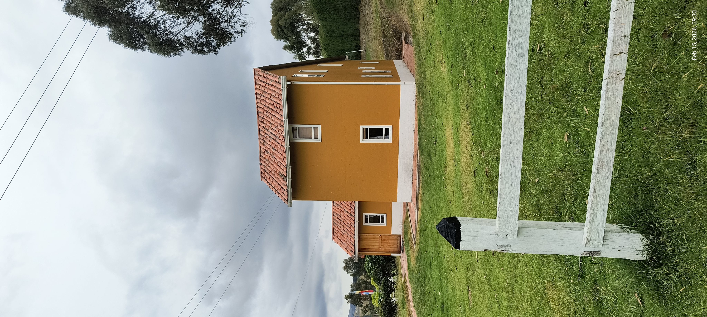

<br><details><summary>:camera:**60/IMG_20260215_093053042.jpg**</summary><sub> `Exif version` 0220 `OS version`  `Date` 2026:02:15 09:30:53 `Aperture` Not known `Brightness` 0.0 `Color space` 1 `Compression` 6`Exposure mode` 0 `Exposure time` 0.000832 `Focal length` 5.56 `Lens model` Not known `Lens specification` Not known `Orientation` 1 `Scene type` Not known `f number` 1.88 `White balance` 0 `Sensing method` 1 `Shutter speed` 10.231</sub><sub>`Coordinates & altitude` (5.291075222222222, -73.90620422222223, 2876.0)</sub><sub> :globe_with_meridians:`Location over` [Google Maps](http://maps.google.com/maps?q=5.291075222222222,-73.90620422222223) or [Openstreet Map](https://www.openstreetmap.org/query?lat=5.291075222222222&lon=-73.90620422222223)</sub></details>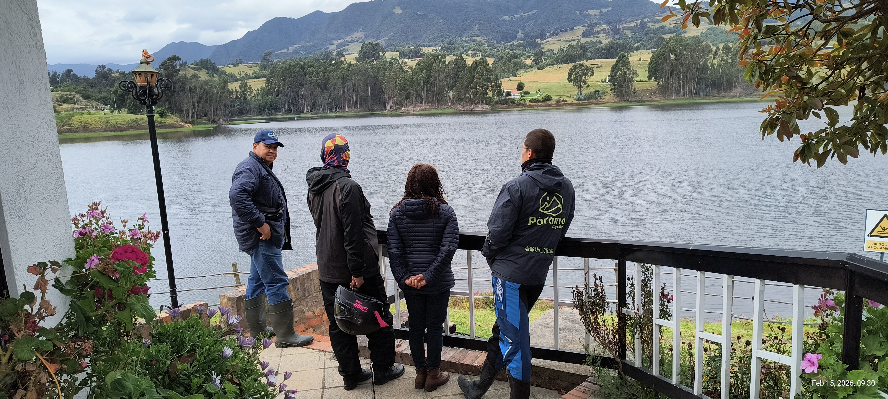

<br><details><summary>:camera:**60/IMG_20260215_093105518.jpg**</summary><sub> `Exif version` 0220 `OS version`  `Date` 2026:02:15 09:31:06 `Aperture` Not known `Brightness` 0.0 `Color space` 1 `Compression` 6`Exposure mode` 0 `Exposure time` 0.000928 `Focal length` 5.56 `Lens model` Not known `Lens specification` Not known `Orientation` 1 `Scene type` Not known `f number` 1.88 `White balance` 0 `Sensing method` 1 `Shutter speed` 10.073</sub><sub>`Coordinates & altitude` (5.291041833333333, -73.906723, 2876.0)</sub><sub> :globe_with_meridians:`Location over` [Google Maps](http://maps.google.com/maps?q=5.291041833333333,-73.906723) or [Openstreet Map](https://www.openstreetmap.org/query?lat=5.291041833333333&lon=-73.906723)</sub></details>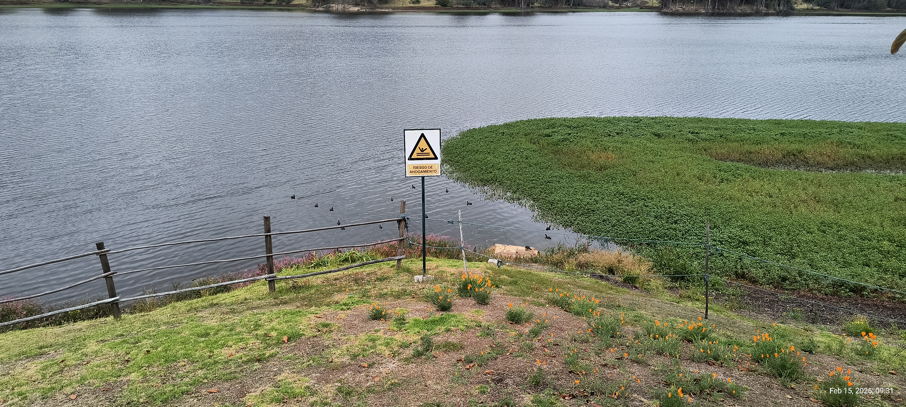

<br><details><summary>:camera:**60/IMG_20260215_093108221_HDR.jpg**</summary><sub> `Exif version` 0220 `OS version`  `Date` 2026:02:15 09:31:09 `Aperture` Not known `Brightness` 0.0 `Color space` 1 `Compression` 6`Exposure mode` 0 `Exposure time` 0.001472 `Focal length` 5.56 `Lens model` Not known `Lens specification` Not known `Orientation` 1 `Scene type` Not known `f number` 1.88 `White balance` 0 `Sensing method` 1 `Shutter speed` 9.408</sub><sub>`Coordinates & altitude` (5.291041833333333, -73.906723, 2876.0)</sub><sub> :globe_with_meridians:`Location over` [Google Maps](http://maps.google.com/maps?q=5.291041833333333,-73.906723) or [Openstreet Map](https://www.openstreetmap.org/query?lat=5.291041833333333&lon=-73.906723)</sub></details>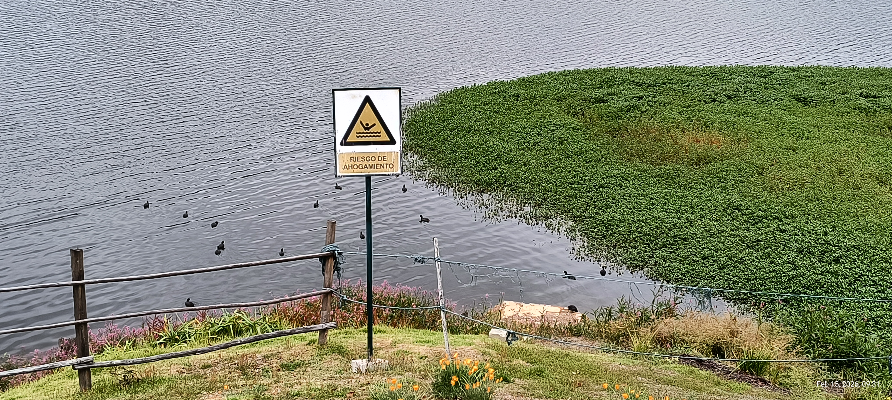

<br><details><summary>:camera:**60/IMG_20260215_093120973.jpg**</summary><sub> `Exif version` 0220 `OS version`  `Date` 2026:02:15 09:31:22 `Aperture` Not known `Brightness` 0.0 `Color space` 1 `Compression` 6`Exposure mode` 0 `Exposure time` 0.00040028 `Focal length` 2.13 `Lens model` Not known `Lens specification` Not known `Orientation` 1 `Scene type` Not known `f number` 2.2 `White balance` 0 `Sensing method` 1 `Shutter speed` 11.286</sub><sub>`Coordinates & altitude` (5.291041833333333, -73.906723, 2876.0)</sub><sub> :globe_with_meridians:`Location over` [Google Maps](http://maps.google.com/maps?q=5.291041833333333,-73.906723) or [Openstreet Map](https://www.openstreetmap.org/query?lat=5.291041833333333&lon=-73.906723)</sub></details>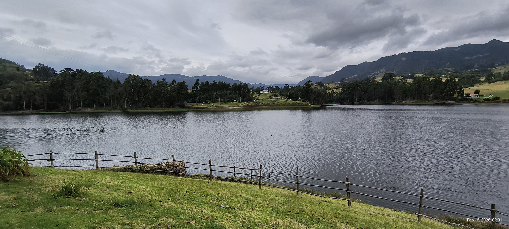

<br><details><summary>:camera:**60/IMG_20260215_093124441.jpg**</summary><sub> `Exif version` 0220 `OS version`  `Date` 2026:02:15 09:31:25 `Aperture` Not known `Brightness` 0.0 `Color space` 1 `Compression` 6`Exposure mode` 0 `Exposure time` 0.000360252 `Focal length` 2.13 `Lens model` Not known `Lens specification` Not known `Orientation` 1 `Scene type` Not known `f number` 2.2 `White balance` 0 `Sensing method` 1 `Shutter speed` 11.438</sub><sub>`Coordinates & altitude` (5.291041833333333, -73.906723, 2876.0)</sub><sub> :globe_with_meridians:`Location over` [Google Maps](http://maps.google.com/maps?q=5.291041833333333,-73.906723) or [Openstreet Map](https://www.openstreetmap.org/query?lat=5.291041833333333&lon=-73.906723)</sub></details>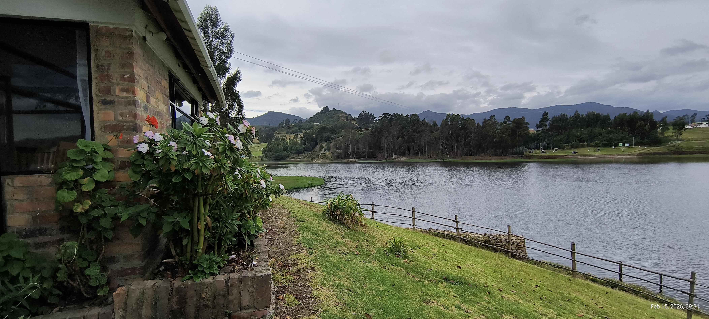

<br><details><summary>:camera:**60/IMG_20260215_093145314.jpg**</summary><sub> `Exif version` 0220 `OS version`  `Date` 2026:02:15 09:31:46 `Aperture` Not known `Brightness` 0.0 `Color space` 1 `Compression` 6`Exposure mode` 0 `Exposure time` 0.000560392 `Focal length` 2.13 `Lens model` Not known `Lens specification` Not known `Orientation` 1 `Scene type` Not known `f number` 2.2 `White balance` 0 `Sensing method` 1 `Shutter speed` 10.801</sub><sub>`Coordinates & altitude` (5.291041833333333, -73.906723, 2876.0)</sub><sub> :globe_with_meridians:`Location over` [Google Maps](http://maps.google.com/maps?q=5.291041833333333,-73.906723) or [Openstreet Map](https://www.openstreetmap.org/query?lat=5.291041833333333&lon=-73.906723)</sub></details>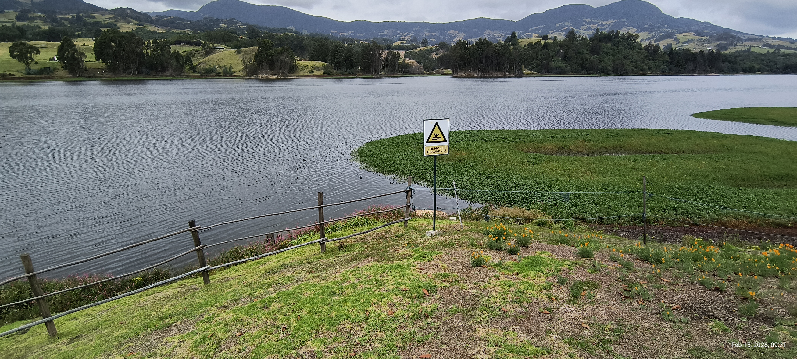

<br><details><summary>:camera:**60/IMG_20260215_093158742.jpg**</summary><sub> `Exif version` 0220 `OS version`  `Date` 2026:02:15 09:31:59 `Aperture` Not known `Brightness` 0.0 `Color space` 1 `Compression` 6`Exposure mode` 0 `Exposure time` 0.000210147 `Focal length` 2.13 `Lens model` Not known `Lens specification` Not known `Orientation` 1 `Scene type` Not known `f number` 2.2 `White balance` 0 `Sensing method` 1 `Shutter speed` 12.216</sub><sub>`Coordinates & altitude` (5.291041833333333, -73.906723, 2876.0)</sub><sub> :globe_with_meridians:`Location over` [Google Maps](http://maps.google.com/maps?q=5.291041833333333,-73.906723) or [Openstreet Map](https://www.openstreetmap.org/query?lat=5.291041833333333&lon=-73.906723)</sub></details>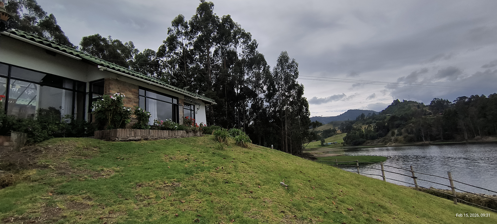

<br><details><summary>:camera:**60/IMG_20260215_093224632.jpg**</summary><sub> `Exif version` 0220 `OS version`  `Date` 2026:02:15 09:32:25 `Aperture` Not known `Brightness` 9.2 `Color space` 1 `Compression` 6`Exposure mode` 0 `Exposure time` 0.000352032 `Focal length` 5.56 `Lens model` Not known `Lens specification` Not known `Orientation` 1 `Scene type` Not known `f number` 1.88 `White balance` 0 `Sensing method` 1 `Shutter speed` 11.472</sub><sub>`Coordinates & altitude` (5.291041833333333, -73.906723, 2876.0)</sub><sub> :globe_with_meridians:`Location over` [Google Maps](http://maps.google.com/maps?q=5.291041833333333,-73.906723) or [Openstreet Map](https://www.openstreetmap.org/query?lat=5.291041833333333&lon=-73.906723)</sub></details>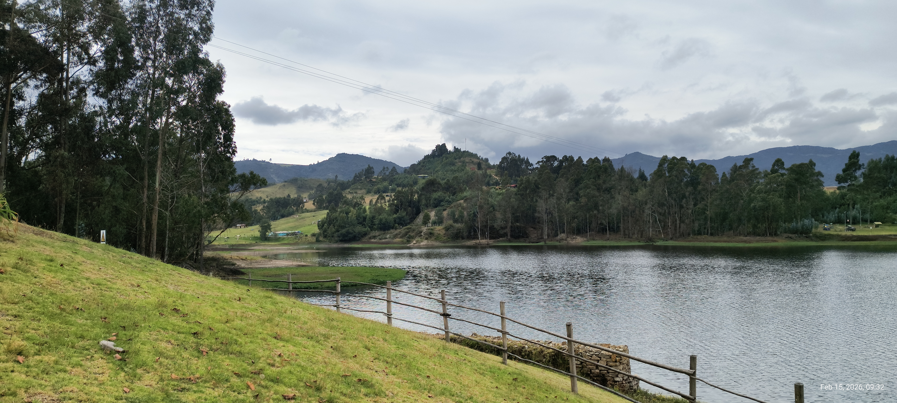

<br><details><summary>:camera:**60/IMG_20260215_093228717.jpg**</summary><sub> `Exif version` 0220 `OS version`  `Date` 2026:02:15 09:32:29 `Aperture` Not known `Brightness` 8.6 `Color space` 1 `Compression` 6`Exposure mode` 0 `Exposure time` 0.000528048 `Focal length` 5.56 `Lens model` Not known `Lens specification` Not known `Orientation` 1 `Scene type` Not known `f number` 1.88 `White balance` 0 `Sensing method` 1 `Shutter speed` 10.887</sub><sub>`Coordinates & altitude` (5.291041833333333, -73.906723, 2876.0)</sub><sub> :globe_with_meridians:`Location over` [Google Maps](http://maps.google.com/maps?q=5.291041833333333,-73.906723) or [Openstreet Map](https://www.openstreetmap.org/query?lat=5.291041833333333&lon=-73.906723)</sub></details>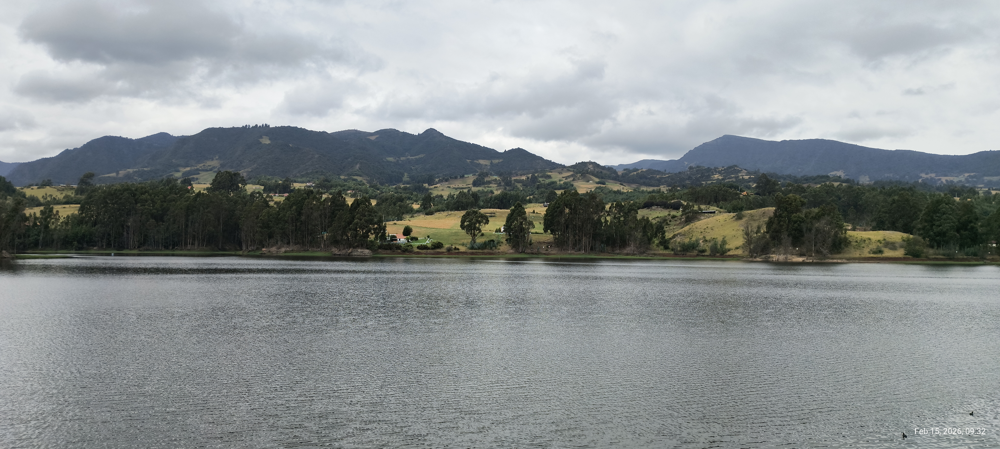

<br><details><summary>:camera:**60/IMG_20260215_093232500.jpg**</summary><sub> `Exif version` 0220 `OS version`  `Date` 2026:02:15 09:32:33 `Aperture` Not known `Brightness` 8.8 `Color space` 1 `Compression` 6`Exposure mode` 0 `Exposure time` 0.000410704 `Focal length` 5.56 `Lens model` Not known `Lens specification` Not known `Orientation` 1 `Scene type` Not known `f number` 1.88 `White balance` 0 `Sensing method` 1 `Shutter speed` 11.249</sub><sub>`Coordinates & altitude` (5.291041833333333, -73.906723, 2876.0)</sub><sub> :globe_with_meridians:`Location over` [Google Maps](http://maps.google.com/maps?q=5.291041833333333,-73.906723) or [Openstreet Map](https://www.openstreetmap.org/query?lat=5.291041833333333&lon=-73.906723)</sub></details>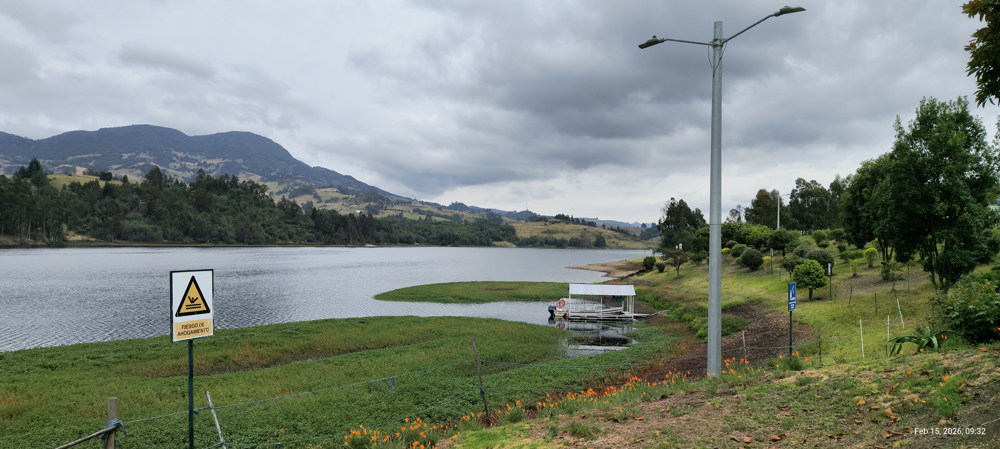

<br><details><summary>:camera:**60/IMG_20260215_100300998.jpg**</summary><sub> `Exif version` 0220 `OS version`  `Date` 2026:02:15 10:03:03 `Aperture` Not known `Brightness` 0.0 `Color space` 1 `Compression` 6`Exposure mode` 0 `Exposure time` 0.000360252 `Focal length` 2.13 `Lens model` Not known `Lens specification` Not known `Orientation` 1 `Scene type` Not known `f number` 2.2 `White balance` 0 `Sensing method` 1 `Shutter speed` 11.438</sub><sub>`Coordinates & altitude` (5.315651888888889, -73.92291258333334, 3075.0)</sub><sub> :globe_with_meridians:`Location over` [Google Maps](http://maps.google.com/maps?q=5.315651888888889,-73.92291258333334) or [Openstreet Map](https://www.openstreetmap.org/query?lat=5.315651888888889&lon=-73.92291258333334)</sub></details>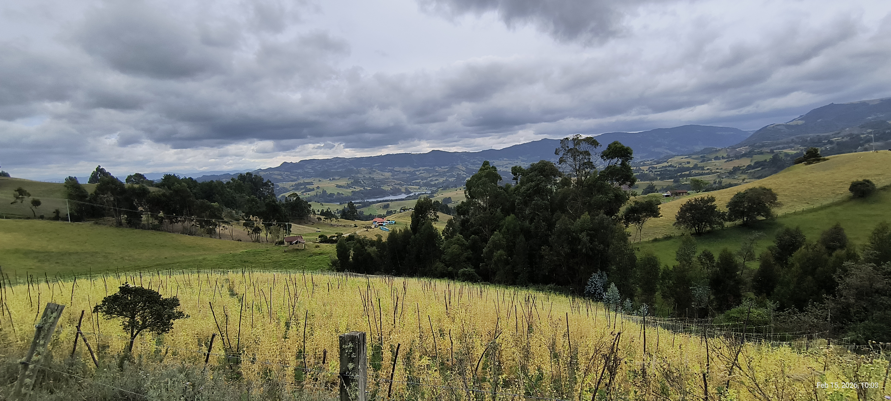

<br><details><summary>:camera:**60/IMG_20260215_100304544.jpg**</summary><sub> `Exif version` 0220 `OS version`  `Date` 2026:02:15 10:03:06 `Aperture` Not known `Brightness` 0.0 `Color space` 1 `Compression` 6`Exposure mode` 0 `Exposure time` 0.000420294 `Focal length` 2.13 `Lens model` Not known `Lens specification` Not known `Orientation` 1 `Scene type` Not known `f number` 2.2 `White balance` 0 `Sensing method` 1 `Shutter speed` 11.216</sub><sub>`Coordinates & altitude` (5.315651888888889, -73.92291258333334, 3075.0)</sub><sub> :globe_with_meridians:`Location over` [Google Maps](http://maps.google.com/maps?q=5.315651888888889,-73.92291258333334) or [Openstreet Map](https://www.openstreetmap.org/query?lat=5.315651888888889&lon=-73.92291258333334)</sub></details>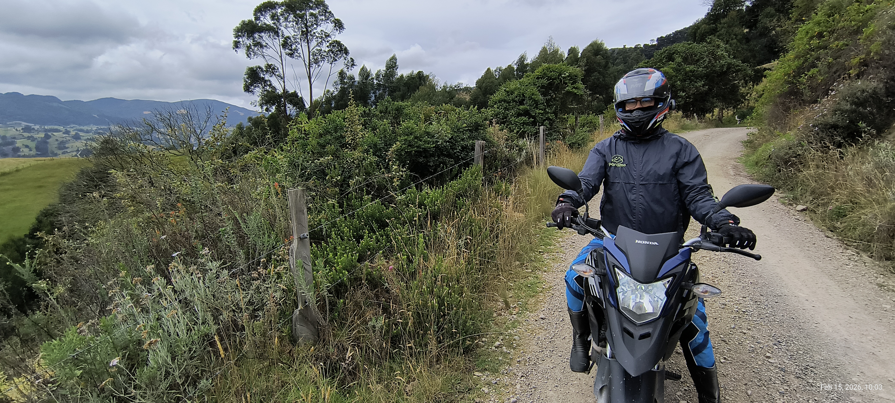

<br><details><summary>:camera:**60/IMG_20260215_100308376.jpg**</summary><sub> `Exif version` 0220 `OS version`  `Date` 2026:02:15 10:03:09 `Aperture` Not known `Brightness` 0.0 `Color space` 1 `Compression` 6`Exposure mode` 0 `Exposure time` 0.000410287 `Focal length` 2.13 `Lens model` Not known `Lens specification` Not known `Orientation` 1 `Scene type` Not known `f number` 2.2 `White balance` 0 `Sensing method` 1 `Shutter speed` 11.251</sub><sub>`Coordinates & altitude` (5.315651888888889, -73.92291258333334, 3075.0)</sub><sub> :globe_with_meridians:`Location over` [Google Maps](http://maps.google.com/maps?q=5.315651888888889,-73.92291258333334) or [Openstreet Map](https://www.openstreetmap.org/query?lat=5.315651888888889&lon=-73.92291258333334)</sub></details>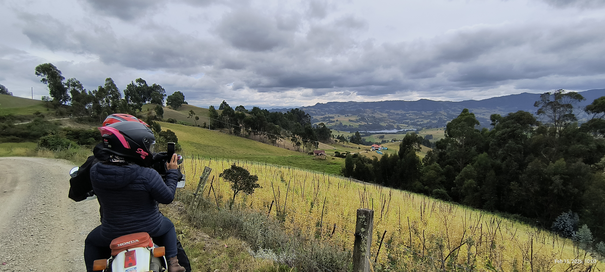

<br><details><summary>:camera:**60/IMG_20260215_101515728.jpg**</summary><sub> `Exif version` 0220 `OS version`  `Date` 2026:02:15 10:15:17 `Aperture` Not known `Brightness` 0.0 `Color space` 1 `Compression` 6`Exposure mode` 0 `Exposure time` 0.000370259 `Focal length` 2.13 `Lens model` Not known `Lens specification` Not known `Orientation` 1 `Scene type` Not known `f number` 2.2 `White balance` 0 `Sensing method` 1 `Shutter speed` 11.399</sub><sub>`Coordinates & altitude` (5.325009805555555, -73.92473600000001, 3266.0)</sub><sub> :globe_with_meridians:`Location over` [Google Maps](http://maps.google.com/maps?q=5.325009805555555,-73.92473600000001) or [Openstreet Map](https://www.openstreetmap.org/query?lat=5.325009805555555&lon=-73.92473600000001)</sub></details>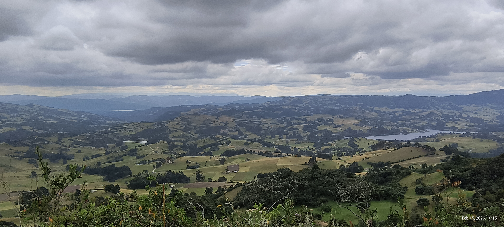

<br><details><summary>:camera:**60/IMG_20260215_101518309.jpg**</summary><sub> `Exif version` 0220 `OS version`  `Date` 2026:02:15 10:15:19 `Aperture` Not known `Brightness` 0.0 `Color space` 1 `Compression` 6`Exposure mode` 0 `Exposure time` 0.000510357 `Focal length` 2.13 `Lens model` Not known `Lens specification` Not known `Orientation` 1 `Scene type` Not known `f number` 2.2 `White balance` 0 `Sensing method` 1 `Shutter speed` 10.936</sub><sub>`Coordinates & altitude` (5.325009805555555, -73.92473600000001, 3266.0)</sub><sub> :globe_with_meridians:`Location over` [Google Maps](http://maps.google.com/maps?q=5.325009805555555,-73.92473600000001) or [Openstreet Map](https://www.openstreetmap.org/query?lat=5.325009805555555&lon=-73.92473600000001)</sub></details>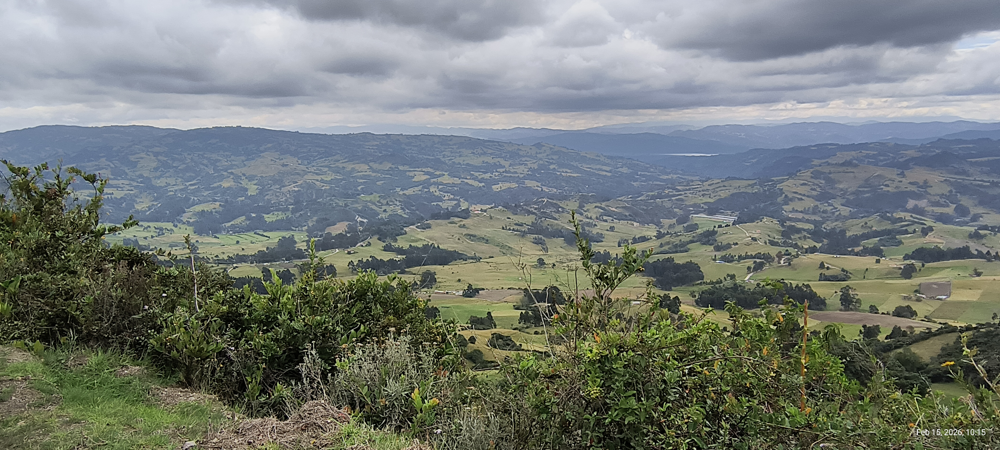

<br><details><summary>:camera:**60/IMG_20260215_101520918.jpg**</summary><sub> `Exif version` 0220 `OS version`  `Date` 2026:02:15 10:15:22 `Aperture` Not known `Brightness` 0.0 `Color space` 1 `Compression` 6`Exposure mode` 0 `Exposure time` 0.00030021 `Focal length` 2.13 `Lens model` Not known `Lens specification` Not known `Orientation` 1 `Scene type` Not known `f number` 2.2 `White balance` 0 `Sensing method` 1 `Shutter speed` 11.701</sub><sub>`Coordinates & altitude` (5.325009805555555, -73.92473600000001, 3266.0)</sub><sub> :globe_with_meridians:`Location over` [Google Maps](http://maps.google.com/maps?q=5.325009805555555,-73.92473600000001) or [Openstreet Map](https://www.openstreetmap.org/query?lat=5.325009805555555&lon=-73.92473600000001)</sub></details>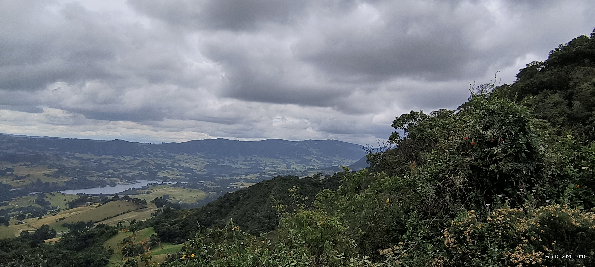

<br><details><summary>:camera:**60/IMG_20260215_101525542.jpg**</summary><sub> `Exif version` 0220 `OS version`  `Date` 2026:02:15 10:15:26 `Aperture` Not known `Brightness` 0.0 `Color space` 1 `Compression` 6`Exposure mode` 0 `Exposure time` 0.00040028 `Focal length` 2.13 `Lens model` Not known `Lens specification` Not known `Orientation` 1 `Scene type` Not known `f number` 2.2 `White balance` 0 `Sensing method` 1 `Shutter speed` 11.286</sub><sub>`Coordinates & altitude` (5.325009805555555, -73.92473600000001, 3266.0)</sub><sub> :globe_with_meridians:`Location over` [Google Maps](http://maps.google.com/maps?q=5.325009805555555,-73.92473600000001) or [Openstreet Map](https://www.openstreetmap.org/query?lat=5.325009805555555&lon=-73.92473600000001)</sub></details>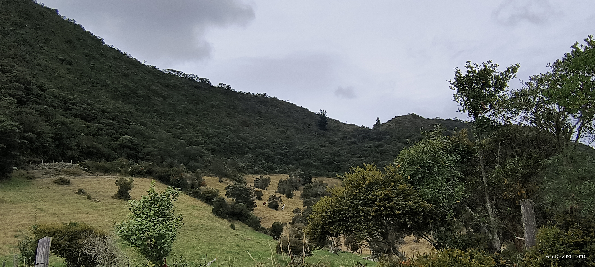

<br><details><summary>:camera:**60/IMG_20260215_101529398.jpg**</summary><sub> `Exif version` 0220 `OS version`  `Date` 2026:02:15 10:15:30 `Aperture` Not known `Brightness` 0.0 `Color space` 1 `Compression` 6`Exposure mode` 0 `Exposure time` 0.000410287 `Focal length` 2.13 `Lens model` Not known `Lens specification` Not known `Orientation` 1 `Scene type` Not known `f number` 2.2 `White balance` 0 `Sensing method` 1 `Shutter speed` 11.251</sub><sub>`Coordinates & altitude` (5.325009805555555, -73.92473600000001, 3266.0)</sub><sub> :globe_with_meridians:`Location over` [Google Maps](http://maps.google.com/maps?q=5.325009805555555,-73.92473600000001) or [Openstreet Map](https://www.openstreetmap.org/query?lat=5.325009805555555&lon=-73.92473600000001)</sub></details>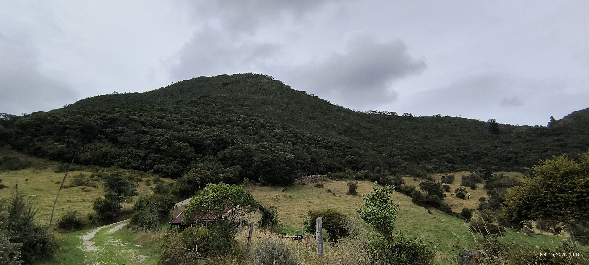

<br><details><summary>:camera:**60/IMG_20260215_110137934.jpg**</summary><sub> `Exif version` 0220 `OS version`  `Date` 2026:02:15 11:01:39 `Aperture` Not known `Brightness` 0.0 `Color space` 1 `Compression` 6`Exposure mode` 0 `Exposure time` 0.000256 `Focal length` 5.56 `Lens model` Not known `Lens specification` Not known `Orientation` 1 `Scene type` Not known `f number` 1.88 `White balance` 0 `Sensing method` 1 `Shutter speed` 11.931</sub><sub>`Coordinates & altitude` (5.348848805555555, -73.90204619444445, 2987.0)</sub><sub> :globe_with_meridians:`Location over` [Google Maps](http://maps.google.com/maps?q=5.348848805555555,-73.90204619444445) or [Openstreet Map](https://www.openstreetmap.org/query?lat=5.348848805555555&lon=-73.90204619444445)</sub></details>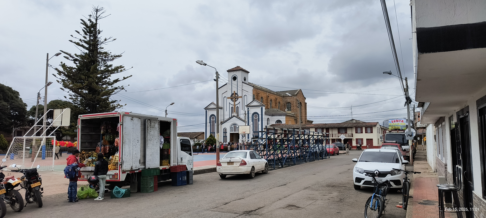

<br><details><summary>:camera:**60/IMG_20260215_110140837.jpg**</summary><sub> `Exif version` 0220 `OS version`  `Date` 2026:02:15 11:01:41 `Aperture` Not known `Brightness` 0.0 `Color space` 1 `Compression` 6`Exposure mode` 0 `Exposure time` 0.000288 `Focal length` 5.56 `Lens model` Not known `Lens specification` Not known `Orientation` 1 `Scene type` Not known `f number` 1.88 `White balance` 0 `Sensing method` 1 `Shutter speed` 11.761</sub><sub>`Coordinates & altitude` (5.348848805555555, -73.90204619444445, 2987.0)</sub><sub> :globe_with_meridians:`Location over` [Google Maps](http://maps.google.com/maps?q=5.348848805555555,-73.90204619444445) or [Openstreet Map](https://www.openstreetmap.org/query?lat=5.348848805555555&lon=-73.90204619444445)</sub></details>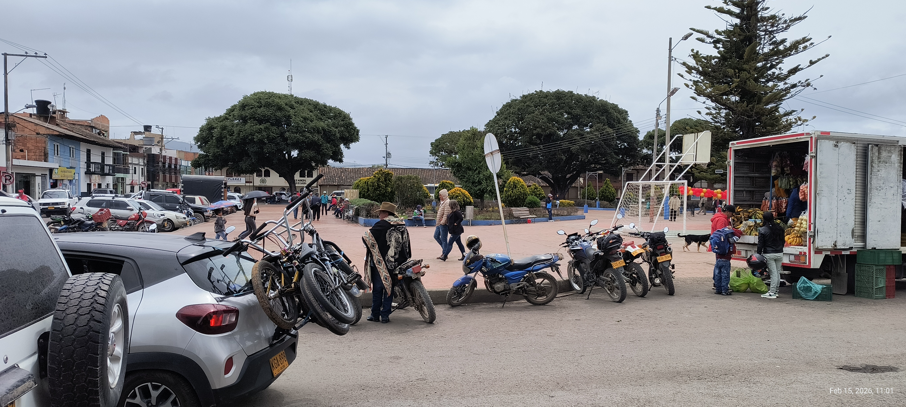

<br><details><summary>:camera:**60/IMG_20260215_110146279.jpg**</summary><sub> `Exif version` 0220 `OS version`  `Date` 2026:02:15 11:01:47 `Aperture` Not known `Brightness` 0.0 `Color space` 1 `Compression` 6`Exposure mode` 0 `Exposure time` 0.000260182 `Focal length` 2.13 `Lens model` Not known `Lens specification` Not known `Orientation` 6 `Scene type` Not known `f number` 2.2 `White balance` 0 `Sensing method` 1 `Shutter speed` 11.908</sub><sub>`Coordinates & altitude` (5.348848805555555, -73.90204619444445, 2987.0)</sub><sub> :globe_with_meridians:`Location over` [Google Maps](http://maps.google.com/maps?q=5.348848805555555,-73.90204619444445) or [Openstreet Map](https://www.openstreetmap.org/query?lat=5.348848805555555&lon=-73.90204619444445)</sub></details>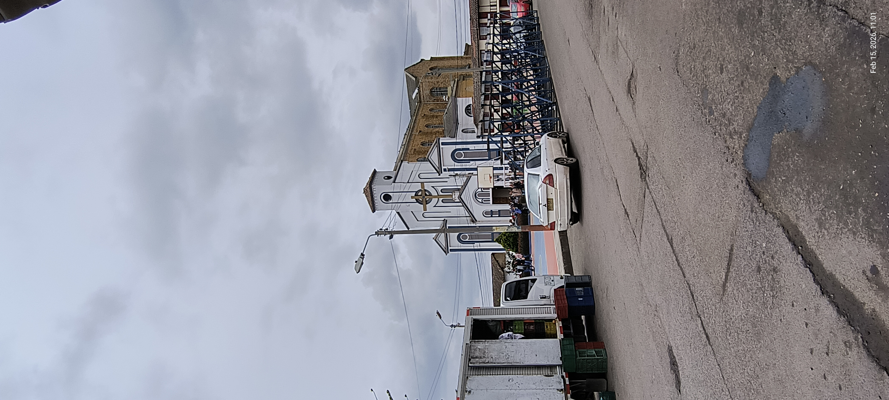

<br><details><summary>:camera:**60/IMG_20260215_121014613_HDR.jpg**</summary><sub> `Exif version` 0220 `OS version`  `Date` 2026:02:15 12:10:17 `Aperture` Not known `Brightness` 0.0 `Color space` 1 `Compression` 6`Exposure mode` 0 `Exposure time` 0.000384 `Focal length` 5.56 `Lens model` Not known `Lens specification` Not known `Orientation` 1 `Scene type` Not known `f number` 1.88 `White balance` 0 `Sensing method` 1 `Shutter speed` 11.346</sub><sub>`Coordinates & altitude` (5.428434833333333, -73.84717558333332, 3366.0)</sub><sub> :globe_with_meridians:`Location over` [Google Maps](http://maps.google.com/maps?q=5.428434833333333,-73.84717558333332) or [Openstreet Map](https://www.openstreetmap.org/query?lat=5.428434833333333&lon=-73.84717558333332)</sub></details>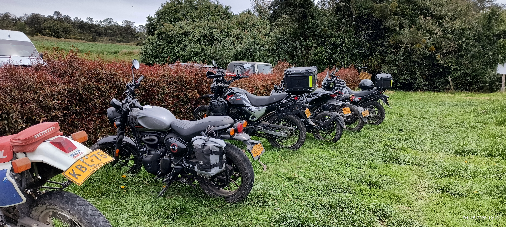

<br><details><summary>:camera:**60/IMG_20260215_122025160.jpg**</summary><sub> `Exif version` 0220 `OS version`  `Date` 2026:02:15 12:20:26 `Aperture` Not known `Brightness` 0.0 `Color space` 1 `Compression` 6`Exposure mode` 0 `Exposure time` 0.002208 `Focal length` 5.56 `Lens model` Not known `Lens specification` Not known `Orientation` 1 `Scene type` Not known `f number` 1.88 `White balance` 0 `Sensing method` 1 `Shutter speed` 8.823</sub><sub>`Coordinates & altitude` (5.428225027777778, -73.84699247222221, 3375.0)</sub><sub> :globe_with_meridians:`Location over` [Google Maps](http://maps.google.com/maps?q=5.428225027777778,-73.84699247222221) or [Openstreet Map](https://www.openstreetmap.org/query?lat=5.428225027777778&lon=-73.84699247222221)</sub></details>

<br><details><summary>:camera:**60/IMG_20260215_122406624.jpg**</summary><sub> `Exif version` 0220 `OS version`  `Date` 2026:02:15 12:24:07 `Aperture` Not known `Brightness` 0.0 `Color space` 1 `Compression` 6`Exposure mode` 0 `Exposure time` 0.000256 `Focal length` 5.56 `Lens model` Not known `Lens specification` Not known `Orientation` 1 `Scene type` Not known `f number` 1.88 `White balance` 0 `Sensing method` 1 `Shutter speed` 11.931</sub><sub>`Coordinates & altitude` (5.427843083333333, -73.8467636111111, 3378.0)</sub><sub> :globe_with_meridians:`Location over` [Google Maps](http://maps.google.com/maps?q=5.427843083333333,-73.8467636111111) or [Openstreet Map](https://www.openstreetmap.org/query?lat=5.427843083333333&lon=-73.8467636111111)</sub></details>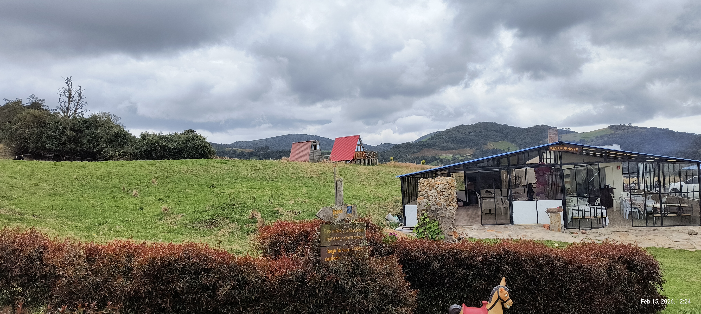

<br><details><summary>:camera:**60/IMG_20260215_122409168.jpg**</summary><sub> `Exif version` 0220 `OS version`  `Date` 2026:02:15 12:24:09 `Aperture` Not known `Brightness` 0.0 `Color space` 1 `Compression` 6`Exposure mode` 0 `Exposure time` 0.000288 `Focal length` 5.56 `Lens model` Not known `Lens specification` Not known `Orientation` 1 `Scene type` Not known `f number` 1.88 `White balance` 0 `Sensing method` 1 `Shutter speed` 11.761</sub><sub>`Coordinates & altitude` (5.427843083333333, -73.8467636111111, 3378.0)</sub><sub> :globe_with_meridians:`Location over` [Google Maps](http://maps.google.com/maps?q=5.427843083333333,-73.8467636111111) or [Openstreet Map](https://www.openstreetmap.org/query?lat=5.427843083333333&lon=-73.8467636111111)</sub></details>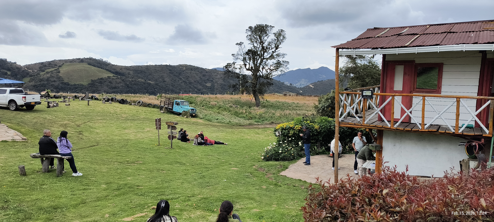

<br><details><summary>:camera:**60/IMG_20260215_122742163_HDR.jpg**</summary><sub> `Exif version` 0220 `OS version`  `Date` 2026:02:15 12:27:43 `Aperture` Not known `Brightness` 0.0 `Color space` 1 `Compression` 6`Exposure mode` 0 `Exposure time` 0.000512 `Focal length` 5.56 `Lens model` Not known `Lens specification` Not known `Orientation` 6 `Scene type` Not known `f number` 1.88 `White balance` 0 `Sensing method` 1 `Shutter speed` 10.931</sub><sub>`Coordinates & altitude` (5.426805, -73.84656522222221, 3361.0)</sub><sub> :globe_with_meridians:`Location over` [Google Maps](http://maps.google.com/maps?q=5.426805,-73.84656522222221) or [Openstreet Map](https://www.openstreetmap.org/query?lat=5.426805&lon=-73.84656522222221)</sub></details>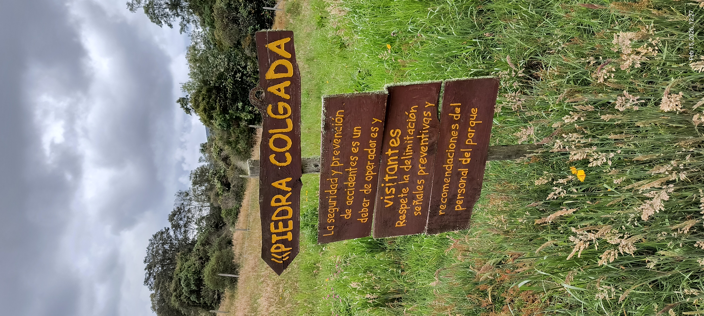

<br><details><summary>:camera:**60/IMG_20260215_122744972.jpg**</summary><sub> `Exif version` 0220 `OS version`  `Date` 2026:02:15 12:27:45 `Aperture` Not known `Brightness` 0.0 `Color space` 1 `Compression` 6`Exposure mode` 0 `Exposure time` 0.000224 `Focal length` 5.56 `Lens model` Not known `Lens specification` Not known `Orientation` 6 `Scene type` Not known `f number` 1.88 `White balance` 0 `Sensing method` 1 `Shutter speed` 12.124</sub><sub>`Coordinates & altitude` (5.426805, -73.84656522222221, 3361.0)</sub><sub> :globe_with_meridians:`Location over` [Google Maps](http://maps.google.com/maps?q=5.426805,-73.84656522222221) or [Openstreet Map](https://www.openstreetmap.org/query?lat=5.426805&lon=-73.84656522222221)</sub></details>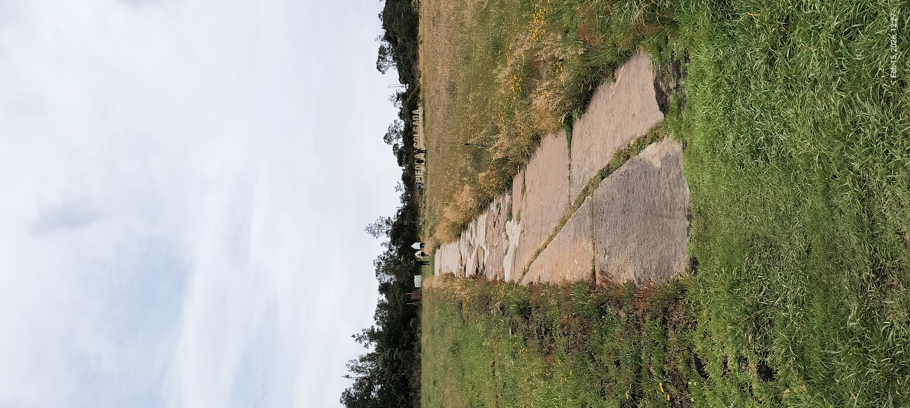

<br><details><summary>:camera:**60/IMG_20260215_122922071.jpg**</summary><sub> `Exif version` 0220 `OS version`  `Date` 2026:02:15 12:29:22 `Aperture` Not known `Brightness` 0.0 `Color space` 1 `Compression` 6`Exposure mode` 0 `Exposure time` 0.000256 `Focal length` 5.56 `Lens model` Not known `Lens specification` Not known `Orientation` 3 `Scene type` Not known `f number` 1.88 `White balance` 0 `Sensing method` 1 `Shutter speed` 11.931</sub><sub>`Coordinates & altitude` (5.426384916666667, -73.84606169444444, 3363.0)</sub><sub> :globe_with_meridians:`Location over` [Google Maps](http://maps.google.com/maps?q=5.426384916666667,-73.84606169444444) or [Openstreet Map](https://www.openstreetmap.org/query?lat=5.426384916666667&lon=-73.84606169444444)</sub></details>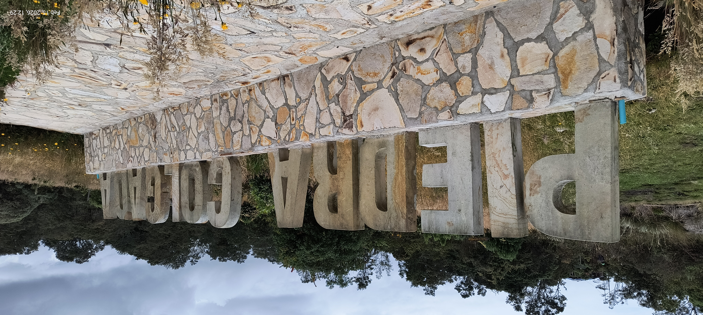

<br><details><summary>:camera:**60/IMG_20260215_122944488_HDR.jpg**</summary><sub> `Exif version` 0220 `OS version`  `Date` 2026:02:15 12:29:46 `Aperture` Not known `Brightness` 0.0 `Color space` 1 `Compression` 6`Exposure mode` 0 `Exposure time` 0.000224 `Focal length` 5.56 `Lens model` Not known `Lens specification` Not known `Orientation` 6 `Scene type` Not known `f number` 1.88 `White balance` 0 `Sensing method` 1 `Shutter speed` 12.124</sub><sub>`Coordinates & altitude` (5.426384916666667, -73.84606169444444, 3363.0)</sub><sub> :globe_with_meridians:`Location over` [Google Maps](http://maps.google.com/maps?q=5.426384916666667,-73.84606169444444) or [Openstreet Map](https://www.openstreetmap.org/query?lat=5.426384916666667&lon=-73.84606169444444)</sub></details>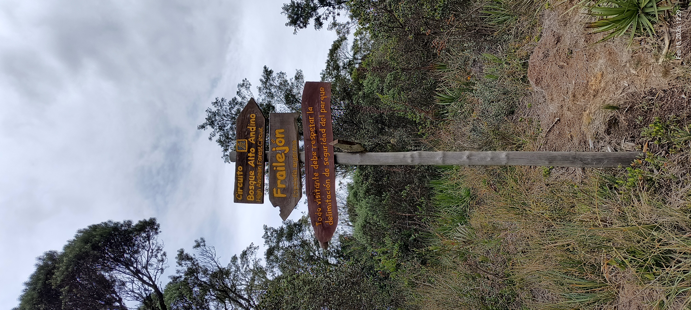

<br><details><summary>:camera:**60/IMG_20260215_123041603_HDR.jpg**</summary><sub> `Exif version` 0220 `OS version`  `Date` 2026:02:15 12:30:43 `Aperture` Not known `Brightness` 0.0 `Color space` 1 `Compression` 6`Exposure mode` 0 `Exposure time` 0.000608 `Focal length` 5.56 `Lens model` Not known `Lens specification` Not known `Orientation` 6 `Scene type` Not known `f number` 1.88 `White balance` 0 `Sensing method` 1 `Shutter speed` 10.683</sub><sub>`Coordinates & altitude` (5.426191805555556, -73.84587094444444, 3363.0)</sub><sub> :globe_with_meridians:`Location over` [Google Maps](http://maps.google.com/maps?q=5.426191805555556,-73.84587094444444) or [Openstreet Map](https://www.openstreetmap.org/query?lat=5.426191805555556&lon=-73.84587094444444)</sub></details>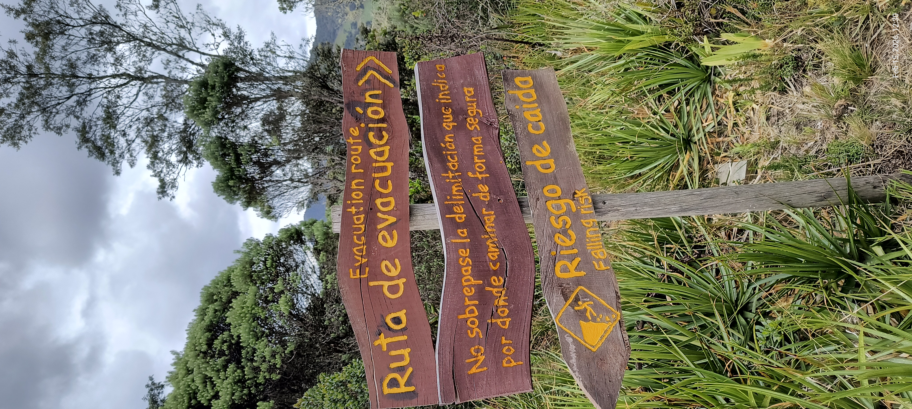

<br><details><summary>:camera:**60/IMG_20260215_123045587.jpg**</summary><sub> `Exif version` 0220 `OS version`  `Date` 2026:02:15 12:30:46 `Aperture` Not known `Brightness` 0.0 `Color space` 1 `Compression` 6`Exposure mode` 0 `Exposure time` 0.000192 `Focal length` 5.56 `Lens model` Not known `Lens specification` Not known `Orientation` 6 `Scene type` Not known `f number` 1.88 `White balance` 0 `Sensing method` 1 `Shutter speed` 12.346</sub><sub>`Coordinates & altitude` (5.426191805555556, -73.84587094444444, 3363.0)</sub><sub> :globe_with_meridians:`Location over` [Google Maps](http://maps.google.com/maps?q=5.426191805555556,-73.84587094444444) or [Openstreet Map](https://www.openstreetmap.org/query?lat=5.426191805555556&lon=-73.84587094444444)</sub></details>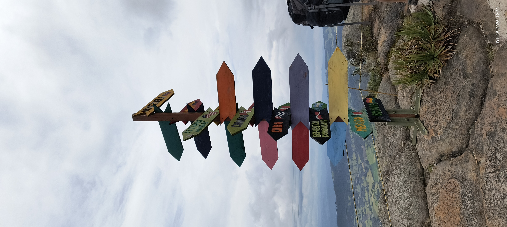

<br><details><summary>:camera:**60/IMG_20260215_123249179.jpg**</summary><sub> `Exif version` 0220 `OS version`  `Date` 2026:02:15 12:32:50 `Aperture` Not known `Brightness` 0.0 `Color space` 1 `Compression` 6`Exposure mode` 0 `Exposure time` 0.000280196 `Focal length` 2.13 `Lens model` Not known `Lens specification` Not known `Orientation` 1 `Scene type` Not known `f number` 2.2 `White balance` 0 `Sensing method` 1 `Shutter speed` 11.801</sub><sub>`Coordinates & altitude` (5.425944805555556, -73.845726, 3363.0)</sub><sub> :globe_with_meridians:`Location over` [Google Maps](http://maps.google.com/maps?q=5.425944805555556,-73.845726) or [Openstreet Map](https://www.openstreetmap.org/query?lat=5.425944805555556&lon=-73.845726)</sub></details>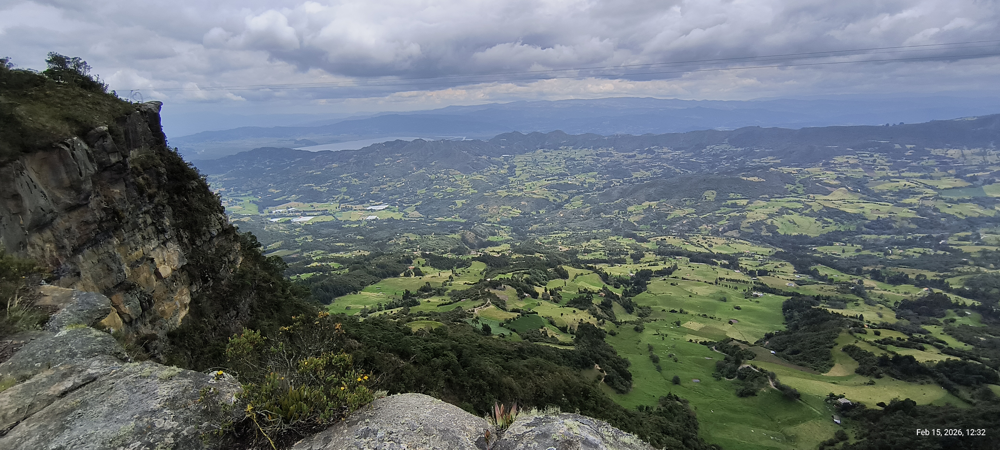

<br><details><summary>:camera:**60/IMG_20260215_123254128.jpg**</summary><sub> `Exif version` 0220 `OS version`  `Date` 2026:02:15 12:32:55 `Aperture` Not known `Brightness` 0.0 `Color space` 1 `Compression` 6`Exposure mode` 0 `Exposure time` 0.000280196 `Focal length` 2.13 `Lens model` Not known `Lens specification` Not known `Orientation` 1 `Scene type` Not known `f number` 2.2 `White balance` 0 `Sensing method` 1 `Shutter speed` 11.801</sub><sub>`Coordinates & altitude` (5.425944805555556, -73.845726, 3363.0)</sub><sub> :globe_with_meridians:`Location over` [Google Maps](http://maps.google.com/maps?q=5.425944805555556,-73.845726) or [Openstreet Map](https://www.openstreetmap.org/query?lat=5.425944805555556&lon=-73.845726)</sub></details>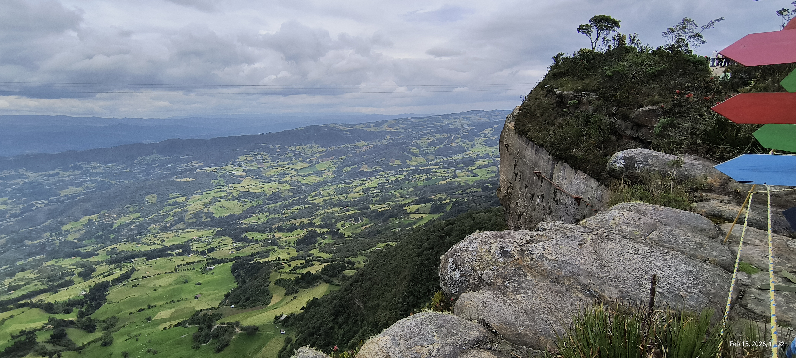

<br><details><summary>:camera:**60/IMG_20260215_123319772.jpg**</summary><sub> `Exif version` 0220 `OS version`  `Date` 2026:02:15 12:33:20 `Aperture` Not known `Brightness` 0.0 `Color space` 1 `Compression` 6`Exposure mode` 0 `Exposure time` 0.000384 `Focal length` 5.56 `Lens model` Not known `Lens specification` Not known `Orientation` 6 `Scene type` Not known `f number` 1.88 `White balance` 0 `Sensing method` 1 `Shutter speed` 11.346</sub><sub>`Coordinates & altitude` (5.425951944444445, -73.84554288888889, 3363.0)</sub><sub> :globe_with_meridians:`Location over` [Google Maps](http://maps.google.com/maps?q=5.425951944444445,-73.84554288888889) or [Openstreet Map](https://www.openstreetmap.org/query?lat=5.425951944444445&lon=-73.84554288888889)</sub></details>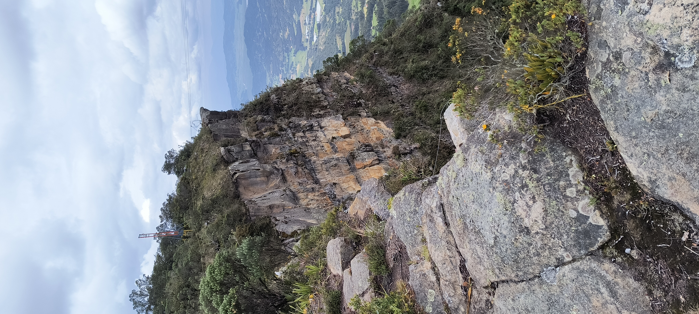

<br><details><summary>:camera:**60/IMG_20260215_123323821.jpg**</summary><sub> `Exif version` 0220 `OS version`  `Date` 2026:02:15 12:33:24 `Aperture` Not known `Brightness` 0.0 `Color space` 1 `Compression` 6`Exposure mode` 0 `Exposure time` 0.000416 `Focal length` 5.56 `Lens model` Not known `Lens specification` Not known `Orientation` 6 `Scene type` Not known `f number` 1.88 `White balance` 0 `Sensing method` 1 `Shutter speed` 11.231</sub><sub>`Coordinates & altitude` (5.425951944444445, -73.84554288888889, 3363.0)</sub><sub> :globe_with_meridians:`Location over` [Google Maps](http://maps.google.com/maps?q=5.425951944444445,-73.84554288888889) or [Openstreet Map](https://www.openstreetmap.org/query?lat=5.425951944444445&lon=-73.84554288888889)</sub></details>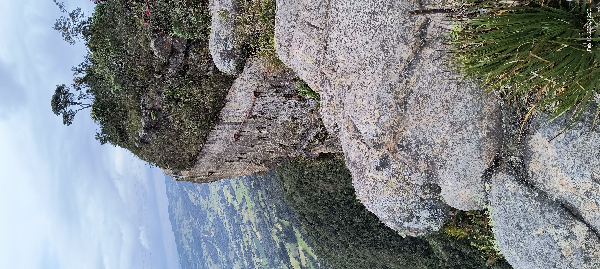

<br><details><summary>:camera:**60/IMG_20260215_123342713.jpg**</summary><sub> `Exif version` 0220 `OS version`  `Date` 2026:02:15 12:33:43 `Aperture` Not known `Brightness` 0.0 `Color space` 1 `Compression` 6`Exposure mode` 0 `Exposure time` 0.000224 `Focal length` 5.56 `Lens model` Not known `Lens specification` Not known `Orientation` 6 `Scene type` Not known `f number` 1.88 `White balance` 0 `Sensing method` 1 `Shutter speed` 12.124</sub><sub>`Coordinates & altitude` (5.425951944444445, -73.84554288888889, 3363.0)</sub><sub> :globe_with_meridians:`Location over` [Google Maps](http://maps.google.com/maps?q=5.425951944444445,-73.84554288888889) or [Openstreet Map](https://www.openstreetmap.org/query?lat=5.425951944444445&lon=-73.84554288888889)</sub></details>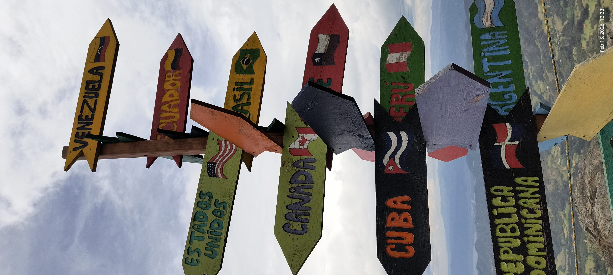

<br><details><summary>:camera:**60/IMG_20260215_123517257.jpg**</summary><sub> `Exif version` 0220 `OS version`  `Date` 2026:02:15 12:35:18 `Aperture` Not known `Brightness` 0.0 `Color space` 1 `Compression` 6`Exposure mode` 0 `Exposure time` 0.000256 `Focal length` 5.56 `Lens model` Not known `Lens specification` Not known `Orientation` 6 `Scene type` Not known `f number` 1.88 `White balance` 0 `Sensing method` 1 `Shutter speed` 11.931</sub><sub>`Coordinates & altitude` (5.426344861111112, -73.84547422222222, 3368.0)</sub><sub> :globe_with_meridians:`Location over` [Google Maps](http://maps.google.com/maps?q=5.426344861111112,-73.84547422222222) or [Openstreet Map](https://www.openstreetmap.org/query?lat=5.426344861111112&lon=-73.84547422222222)</sub></details>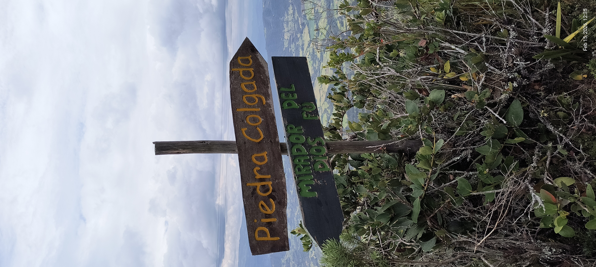

<br><details><summary>:camera:**60/IMG_20260215_123530305_HDR.jpg**</summary><sub> `Exif version` 0220 `OS version`  `Date` 2026:02:15 12:35:31 `Aperture` Not known `Brightness` 0.0 `Color space` 1 `Compression` 6`Exposure mode` 0 `Exposure time` 0.000544 `Focal length` 5.56 `Lens model` Not known `Lens specification` Not known `Orientation` 6 `Scene type` Not known `f number` 1.88 `White balance` 0 `Sensing method` 1 `Shutter speed` 10.844</sub><sub>`Coordinates & altitude` (5.426344861111112, -73.84547422222222, 3368.0)</sub><sub> :globe_with_meridians:`Location over` [Google Maps](http://maps.google.com/maps?q=5.426344861111112,-73.84547422222222) or [Openstreet Map](https://www.openstreetmap.org/query?lat=5.426344861111112&lon=-73.84547422222222)</sub></details>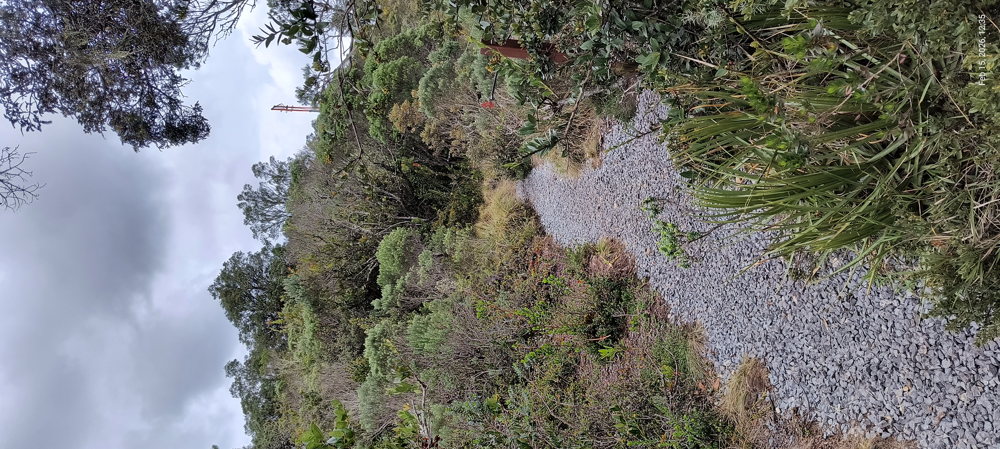

<br><details><summary>:camera:**60/IMG_20260215_123534471_HDR.jpg**</summary><sub> `Exif version` 0220 `OS version`  `Date` 2026:02:15 12:35:36 `Aperture` Not known `Brightness` 0.0 `Color space` 1 `Compression` 6`Exposure mode` 0 `Exposure time` 0.00144 `Focal length` 5.56 `Lens model` Not known `Lens specification` Not known `Orientation` 6 `Scene type` Not known `f number` 1.88 `White balance` 0 `Sensing method` 1 `Shutter speed` 9.439</sub><sub>`Coordinates & altitude` (5.426344861111112, -73.84547422222222, 3368.0)</sub><sub> :globe_with_meridians:`Location over` [Google Maps](http://maps.google.com/maps?q=5.426344861111112,-73.84547422222222) or [Openstreet Map](https://www.openstreetmap.org/query?lat=5.426344861111112&lon=-73.84547422222222)</sub></details>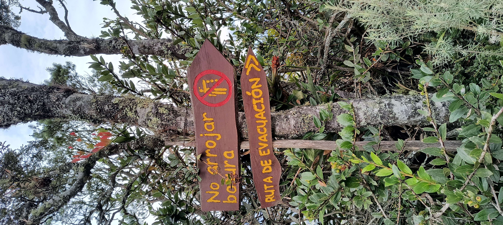

<br><details><summary>:camera:**60/IMG_20260215_123539080_HDR.jpg**</summary><sub> `Exif version` 0220 `OS version`  `Date` 2026:02:15 12:35:40 `Aperture` Not known `Brightness` 0.0 `Color space` 1 `Compression` 6`Exposure mode` 0 `Exposure time` 0.001536 `Focal length` 5.56 `Lens model` Not known `Lens specification` Not known `Orientation` 6 `Scene type` Not known `f number` 1.88 `White balance` 0 `Sensing method` 1 `Shutter speed` 9.346</sub><sub>`Coordinates & altitude` (5.426344861111112, -73.84547422222222, 3368.0)</sub><sub> :globe_with_meridians:`Location over` [Google Maps](http://maps.google.com/maps?q=5.426344861111112,-73.84547422222222) or [Openstreet Map](https://www.openstreetmap.org/query?lat=5.426344861111112&lon=-73.84547422222222)</sub></details>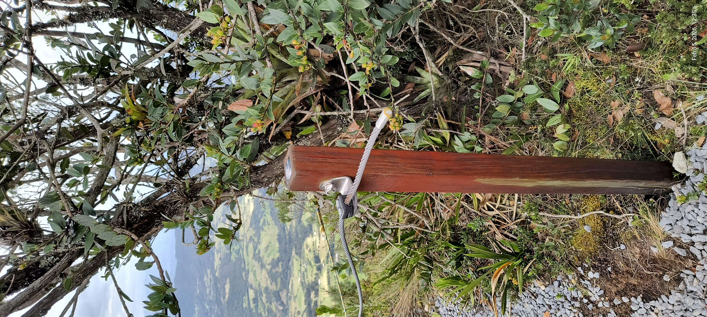

<br><details><summary>:camera:**60/IMG_20260215_123601231_HDR.jpg**</summary><sub> `Exif version` 0220 `OS version`  `Date` 2026:02:15 12:36:02 `Aperture` Not known `Brightness` 0.0 `Color space` 1 `Compression` 6`Exposure mode` 0 `Exposure time` 0.000416 `Focal length` 5.56 `Lens model` Not known `Lens specification` Not known `Orientation` 6 `Scene type` Not known `f number` 1.88 `White balance` 0 `Sensing method` 1 `Shutter speed` 11.231</sub><sub>`Coordinates & altitude` (5.426344861111112, -73.84547422222222, 3368.0)</sub><sub> :globe_with_meridians:`Location over` [Google Maps](http://maps.google.com/maps?q=5.426344861111112,-73.84547422222222) or [Openstreet Map](https://www.openstreetmap.org/query?lat=5.426344861111112&lon=-73.84547422222222)</sub></details>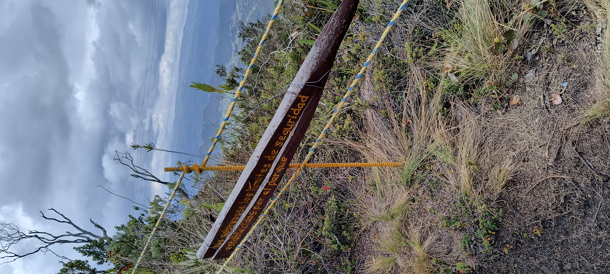

<br><details><summary>:camera:**60/IMG_20260215_123608093.jpg**</summary><sub> `Exif version` 0220 `OS version`  `Date` 2026:02:15 12:36:08 `Aperture` Not known `Brightness` 0.0 `Color space` 1 `Compression` 6`Exposure mode` 0 `Exposure time` 0.000288 `Focal length` 5.56 `Lens model` Not known `Lens specification` Not known `Orientation` 6 `Scene type` Not known `f number` 1.88 `White balance` 0 `Sensing method` 1 `Shutter speed` 11.761</sub><sub>`Coordinates & altitude` (5.426344861111112, -73.84547422222222, 3368.0)</sub><sub> :globe_with_meridians:`Location over` [Google Maps](http://maps.google.com/maps?q=5.426344861111112,-73.84547422222222) or [Openstreet Map](https://www.openstreetmap.org/query?lat=5.426344861111112&lon=-73.84547422222222)</sub></details>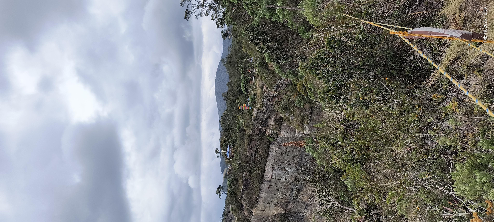

<br><details><summary>:camera:**60/IMG_20260215_123622052.jpg**</summary><sub> `Exif version` 0220 `OS version`  `Date` 2026:02:15 12:36:22 `Aperture` Not known `Brightness` 0.0 `Color space` 1 `Compression` 6`Exposure mode` 0 `Exposure time` 0.000256 `Focal length` 5.56 `Lens model` Not known `Lens specification` Not known `Orientation` 6 `Scene type` Not known `f number` 1.88 `White balance` 0 `Sensing method` 1 `Shutter speed` 11.931</sub><sub>`Coordinates & altitude` (5.426344861111112, -73.84547422222222, 3368.0)</sub><sub> :globe_with_meridians:`Location over` [Google Maps](http://maps.google.com/maps?q=5.426344861111112,-73.84547422222222) or [Openstreet Map](https://www.openstreetmap.org/query?lat=5.426344861111112&lon=-73.84547422222222)</sub></details>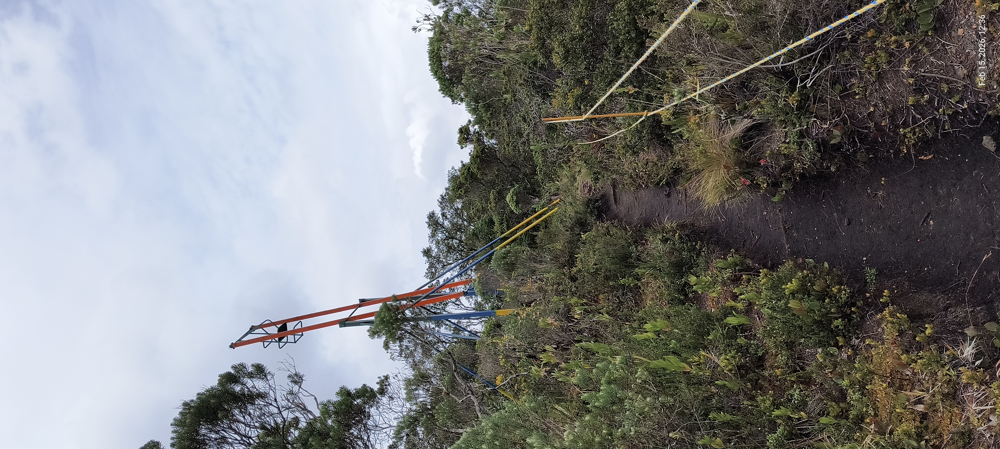

<br><details><summary>:camera:**60/IMG_20260215_123627048.jpg**</summary><sub> `Exif version` 0220 `OS version`  `Date` 2026:02:15 12:36:27 `Aperture` Not known `Brightness` 0.0 `Color space` 1 `Compression` 6`Exposure mode` 0 `Exposure time` 0.000288 `Focal length` 5.56 `Lens model` Not known `Lens specification` Not known `Orientation` 6 `Scene type` Not known `f number` 1.88 `White balance` 0 `Sensing method` 1 `Shutter speed` 11.761</sub><sub>`Coordinates & altitude` (5.426344861111112, -73.84547422222222, 3368.0)</sub><sub> :globe_with_meridians:`Location over` [Google Maps](http://maps.google.com/maps?q=5.426344861111112,-73.84547422222222) or [Openstreet Map](https://www.openstreetmap.org/query?lat=5.426344861111112&lon=-73.84547422222222)</sub></details>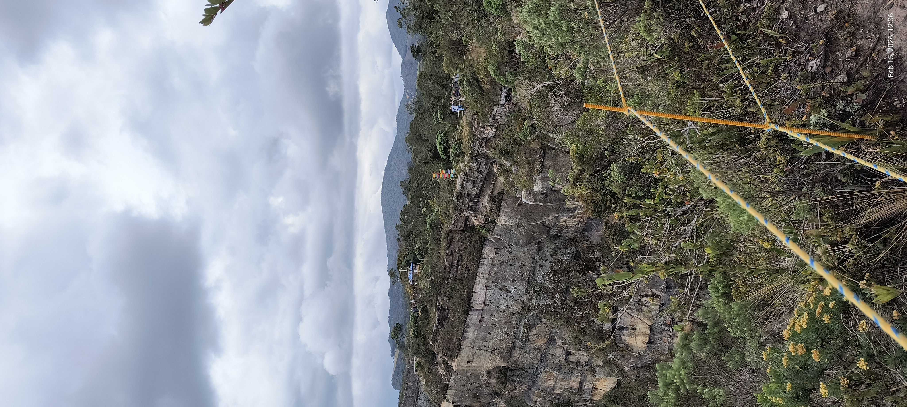

<br><details><summary>:camera:**60/IMG_20260215_123629452.jpg**</summary><sub> `Exif version` 0220 `OS version`  `Date` 2026:02:15 12:36:30 `Aperture` Not known `Brightness` 0.0 `Color space` 1 `Compression` 6`Exposure mode` 0 `Exposure time` 0.000288 `Focal length` 5.56 `Lens model` Not known `Lens specification` Not known `Orientation` 6 `Scene type` Not known `f number` 1.88 `White balance` 0 `Sensing method` 1 `Shutter speed` 11.761</sub><sub>`Coordinates & altitude` (5.426344861111112, -73.84547422222222, 3368.0)</sub><sub> :globe_with_meridians:`Location over` [Google Maps](http://maps.google.com/maps?q=5.426344861111112,-73.84547422222222) or [Openstreet Map](https://www.openstreetmap.org/query?lat=5.426344861111112&lon=-73.84547422222222)</sub></details>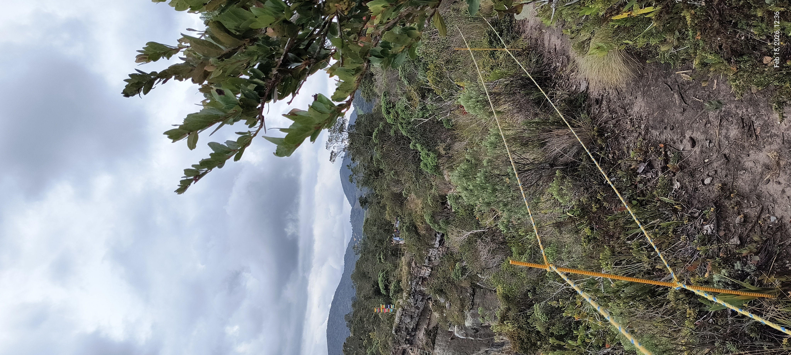

<br><details><summary>:camera:**60/IMG_20260215_123641132.jpg**</summary><sub> `Exif version` 0220 `OS version`  `Date` 2026:02:15 12:36:41 `Aperture` Not known `Brightness` 0.0 `Color space` 1 `Compression` 6`Exposure mode` 0 `Exposure time` 0.000224 `Focal length` 5.56 `Lens model` Not known `Lens specification` Not known `Orientation` 6 `Scene type` Not known `f number` 1.88 `White balance` 0 `Sensing method` 1 `Shutter speed` 12.124</sub><sub>`Coordinates & altitude` (5.426344861111112, -73.84547422222222, 3368.0)</sub><sub> :globe_with_meridians:`Location over` [Google Maps](http://maps.google.com/maps?q=5.426344861111112,-73.84547422222222) or [Openstreet Map](https://www.openstreetmap.org/query?lat=5.426344861111112&lon=-73.84547422222222)</sub></details>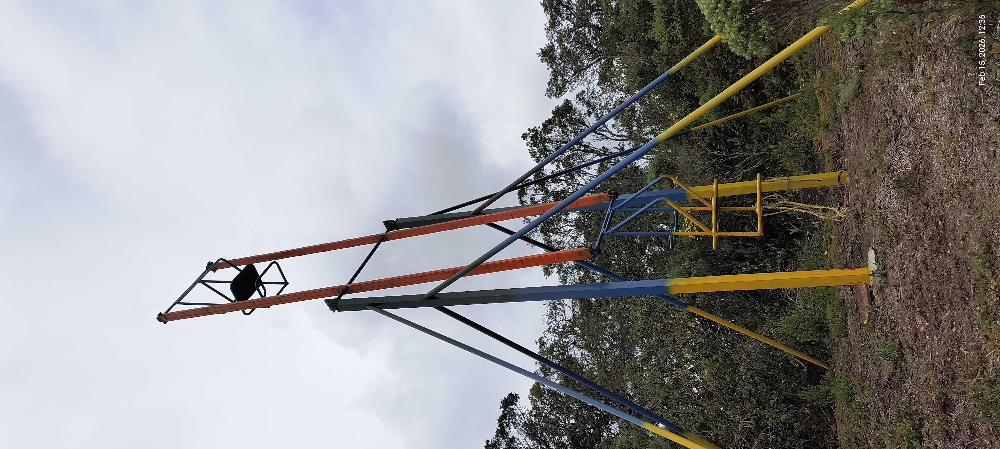

<br><details><summary>:camera:**60/IMG_20260215_123700934.jpg**</summary><sub> `Exif version` 0220 `OS version`  `Date` 2026:02:15 12:37:01 `Aperture` Not known `Brightness` 0.0 `Color space` 1 `Compression` 6`Exposure mode` 0 `Exposure time` 0.00032 `Focal length` 5.56 `Lens model` Not known `Lens specification` Not known `Orientation` 6 `Scene type` Not known `f number` 1.88 `White balance` 0 `Sensing method` 1 `Shutter speed` 11.609</sub><sub>`Coordinates & altitude` (5.426344861111112, -73.84547422222222, 3368.0)</sub><sub> :globe_with_meridians:`Location over` [Google Maps](http://maps.google.com/maps?q=5.426344861111112,-73.84547422222222) or [Openstreet Map](https://www.openstreetmap.org/query?lat=5.426344861111112&lon=-73.84547422222222)</sub></details>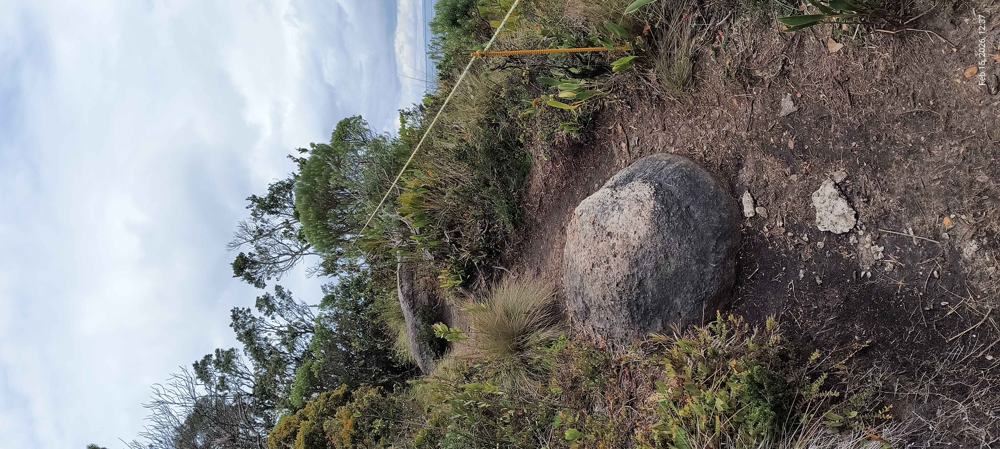

<br><details><summary>:camera:**60/IMG_20260215_123705155.jpg**</summary><sub> `Exif version` 0220 `OS version`  `Date` 2026:02:15 12:37:05 `Aperture` Not known `Brightness` 0.0 `Color space` 1 `Compression` 6`Exposure mode` 0 `Exposure time` 0.000288 `Focal length` 5.56 `Lens model` Not known `Lens specification` Not known `Orientation` 6 `Scene type` Not known `f number` 1.88 `White balance` 0 `Sensing method` 1 `Shutter speed` 11.761</sub><sub>`Coordinates & altitude` (5.426344861111112, -73.84547422222222, 3368.0)</sub><sub> :globe_with_meridians:`Location over` [Google Maps](http://maps.google.com/maps?q=5.426344861111112,-73.84547422222222) or [Openstreet Map](https://www.openstreetmap.org/query?lat=5.426344861111112&lon=-73.84547422222222)</sub></details>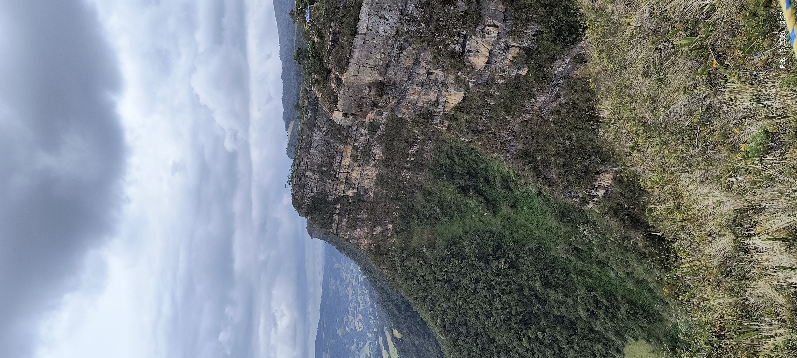

<br><details><summary>:camera:**60/IMG_20260215_123709037.jpg**</summary><sub> `Exif version` 0220 `OS version`  `Date` 2026:02:15 12:37:09 `Aperture` Not known `Brightness` 0.0 `Color space` 1 `Compression` 6`Exposure mode` 0 `Exposure time` 0.000288 `Focal length` 5.56 `Lens model` Not known `Lens specification` Not known `Orientation` 1 `Scene type` Not known `f number` 1.88 `White balance` 0 `Sensing method` 1 `Shutter speed` 11.761</sub><sub>`Coordinates & altitude` (5.426344861111112, -73.84547422222222, 3368.0)</sub><sub> :globe_with_meridians:`Location over` [Google Maps](http://maps.google.com/maps?q=5.426344861111112,-73.84547422222222) or [Openstreet Map](https://www.openstreetmap.org/query?lat=5.426344861111112&lon=-73.84547422222222)</sub></details>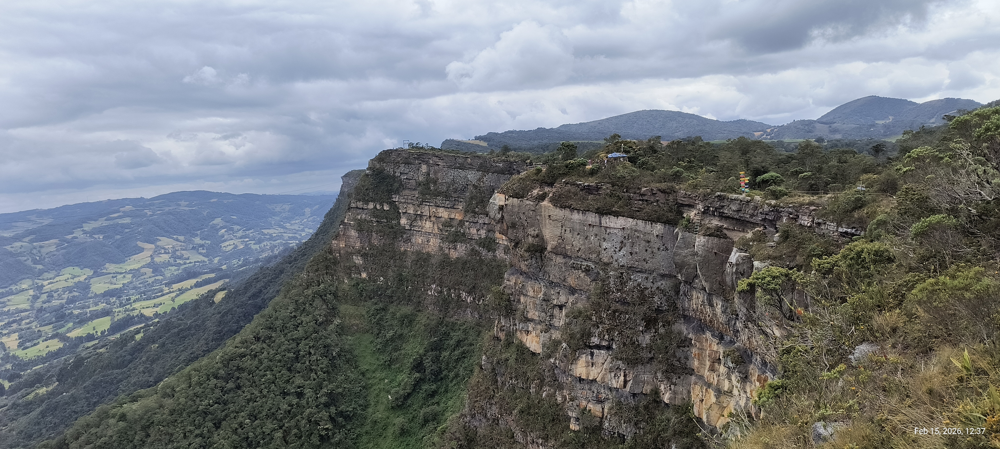

<br><details><summary>:camera:**60/IMG_20260215_123722470.jpg**</summary><sub> `Exif version` 0220 `OS version`  `Date` 2026:02:15 12:37:23 `Aperture` Not known `Brightness` 0.0 `Color space` 1 `Compression` 6`Exposure mode` 0 `Exposure time` 0.000288 `Focal length` 5.56 `Lens model` Not known `Lens specification` Not known `Orientation` 6 `Scene type` Not known `f number` 1.88 `White balance` 0 `Sensing method` 1 `Shutter speed` 11.761</sub><sub>`Coordinates & altitude` (5.426344861111112, -73.84547422222222, 3368.0)</sub><sub> :globe_with_meridians:`Location over` [Google Maps](http://maps.google.com/maps?q=5.426344861111112,-73.84547422222222) or [Openstreet Map](https://www.openstreetmap.org/query?lat=5.426344861111112&lon=-73.84547422222222)</sub></details>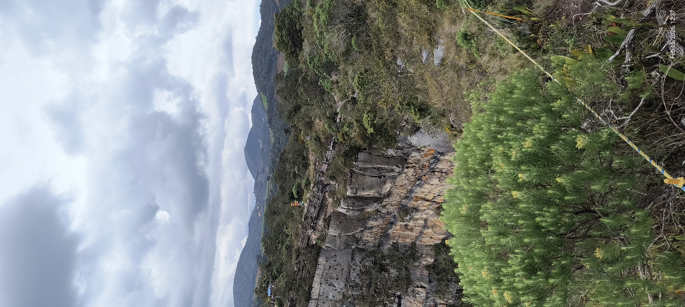

<br><details><summary>:camera:**60/IMG_20260215_123747134_HDR.jpg**</summary><sub> `Exif version` 0220 `OS version`  `Date` 2026:02:15 12:37:48 `Aperture` Not known `Brightness` 0.0 `Color space` 1 `Compression` 6`Exposure mode` 0 `Exposure time` 0.000384 `Focal length` 5.56 `Lens model` Not known `Lens specification` Not known `Orientation` 6 `Scene type` Not known `f number` 1.88 `White balance` 0 `Sensing method` 1 `Shutter speed` 11.346</sub><sub>`Coordinates & altitude` (5.426344861111112, -73.84547422222222, 3368.0)</sub><sub> :globe_with_meridians:`Location over` [Google Maps](http://maps.google.com/maps?q=5.426344861111112,-73.84547422222222) or [Openstreet Map](https://www.openstreetmap.org/query?lat=5.426344861111112&lon=-73.84547422222222)</sub></details>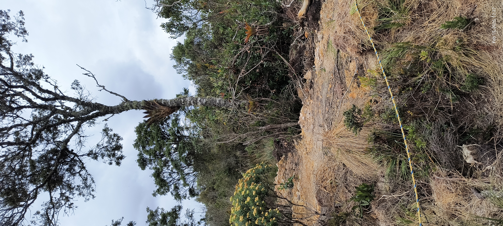

<br><details><summary>:camera:**60/IMG_20260215_123751468.jpg**</summary><sub> `Exif version` 0220 `OS version`  `Date` 2026:02:15 12:37:52 `Aperture` Not known `Brightness` 0.0 `Color space` 1 `Compression` 6`Exposure mode` 0 `Exposure time` 0.000256 `Focal length` 5.56 `Lens model` Not known `Lens specification` Not known `Orientation` 6 `Scene type` Not known `f number` 1.88 `White balance` 0 `Sensing method` 1 `Shutter speed` 11.931</sub><sub>`Coordinates & altitude` (5.426344861111112, -73.84547422222222, 3368.0)</sub><sub> :globe_with_meridians:`Location over` [Google Maps](http://maps.google.com/maps?q=5.426344861111112,-73.84547422222222) or [Openstreet Map](https://www.openstreetmap.org/query?lat=5.426344861111112&lon=-73.84547422222222)</sub></details>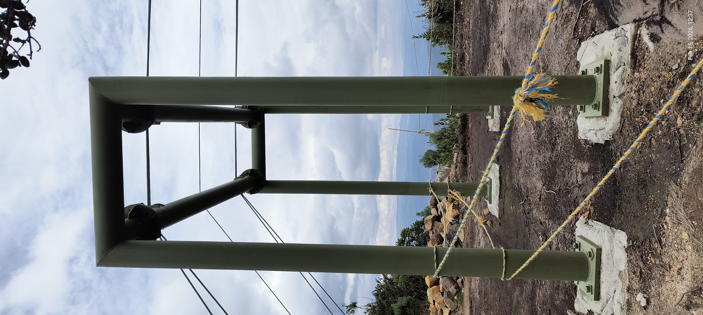

<br><details><summary>:camera:**60/IMG_20260215_123756398_HDR.jpg**</summary><sub> `Exif version` 0220 `OS version`  `Date` 2026:02:15 12:37:57 `Aperture` Not known `Brightness` 0.0 `Color space` 1 `Compression` 6`Exposure mode` 0 `Exposure time` 0.000736 `Focal length` 5.56 `Lens model` Not known `Lens specification` Not known `Orientation` 6 `Scene type` Not known `f number` 1.88 `White balance` 0 `Sensing method` 1 `Shutter speed` 10.408</sub><sub>`Coordinates & altitude` (5.426344861111112, -73.84547422222222, 3368.0)</sub><sub> :globe_with_meridians:`Location over` [Google Maps](http://maps.google.com/maps?q=5.426344861111112,-73.84547422222222) or [Openstreet Map](https://www.openstreetmap.org/query?lat=5.426344861111112&lon=-73.84547422222222)</sub></details>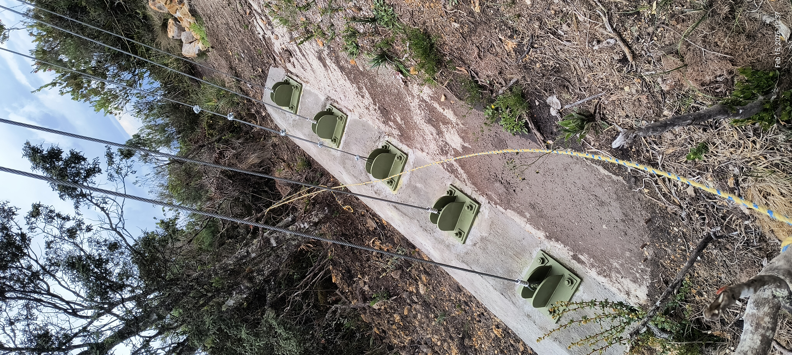

<br><details><summary>:camera:**60/IMG_20260215_123804911_HDR.jpg**</summary><sub> `Exif version` 0220 `OS version`  `Date` 2026:02:15 12:38:06 `Aperture` Not known `Brightness` 0.0 `Color space` 1 `Compression` 6`Exposure mode` 0 `Exposure time` 0.000576 `Focal length` 5.56 `Lens model` Not known `Lens specification` Not known `Orientation` 6 `Scene type` Not known `f number` 1.88 `White balance` 0 `Sensing method` 1 `Shutter speed` 10.761</sub><sub>`Coordinates & altitude` (5.426344861111112, -73.84547422222222, 3368.0)</sub><sub> :globe_with_meridians:`Location over` [Google Maps](http://maps.google.com/maps?q=5.426344861111112,-73.84547422222222) or [Openstreet Map](https://www.openstreetmap.org/query?lat=5.426344861111112&lon=-73.84547422222222)</sub></details>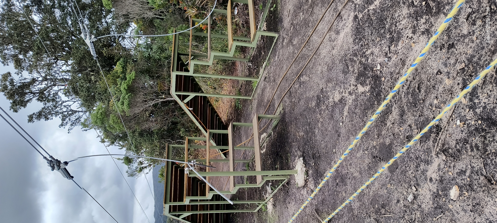

<br><details><summary>:camera:**60/IMG_20260215_123816896_HDR.jpg**</summary><sub> `Exif version` 0220 `OS version`  `Date` 2026:02:15 12:38:18 `Aperture` Not known `Brightness` 0.0 `Color space` 1 `Compression` 6`Exposure mode` 0 `Exposure time` 0.00032 `Focal length` 5.56 `Lens model` Not known `Lens specification` Not known `Orientation` 6 `Scene type` Not known `f number` 1.88 `White balance` 0 `Sensing method` 1 `Shutter speed` 11.609</sub><sub>`Coordinates & altitude` (5.426344861111112, -73.84547422222222, 3368.0)</sub><sub> :globe_with_meridians:`Location over` [Google Maps](http://maps.google.com/maps?q=5.426344861111112,-73.84547422222222) or [Openstreet Map](https://www.openstreetmap.org/query?lat=5.426344861111112&lon=-73.84547422222222)</sub></details>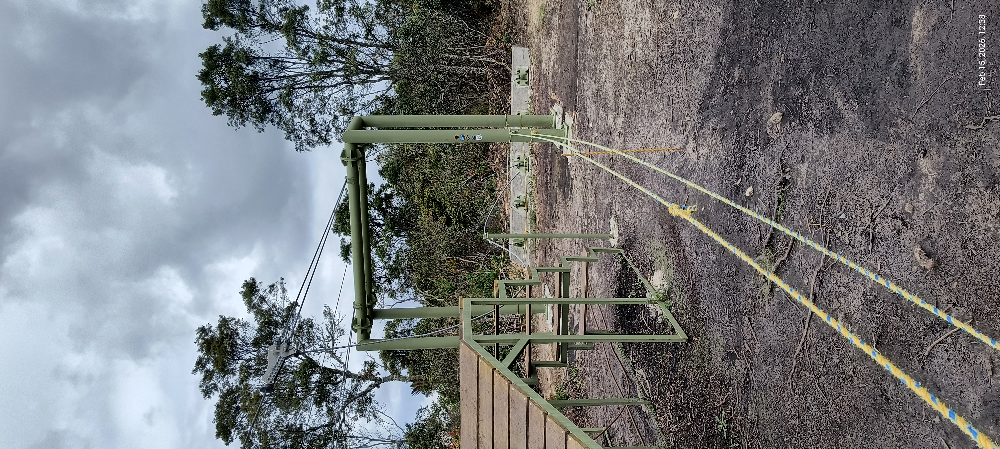

<br><details><summary>:camera:**60/IMG_20260215_123822448.jpg**</summary><sub> `Exif version` 0220 `OS version`  `Date` 2026:02:15 12:38:23 `Aperture` Not known `Brightness` 0.0 `Color space` 1 `Compression` 6`Exposure mode` 0 `Exposure time` 0.000256 `Focal length` 5.56 `Lens model` Not known `Lens specification` Not known `Orientation` 6 `Scene type` Not known `f number` 1.88 `White balance` 0 `Sensing method` 1 `Shutter speed` 11.931</sub><sub>`Coordinates & altitude` (5.426344861111112, -73.84547422222222, 3368.0)</sub><sub> :globe_with_meridians:`Location over` [Google Maps](http://maps.google.com/maps?q=5.426344861111112,-73.84547422222222) or [Openstreet Map](https://www.openstreetmap.org/query?lat=5.426344861111112&lon=-73.84547422222222)</sub></details>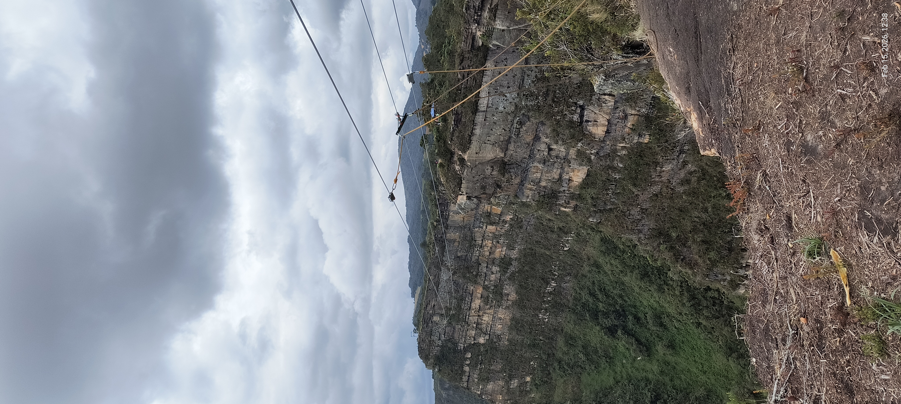

<br><details><summary>:camera:**60/IMG_20260215_123825219.jpg**</summary><sub> `Exif version` 0220 `OS version`  `Date` 2026:02:15 12:38:25 `Aperture` Not known `Brightness` 0.0 `Color space` 1 `Compression` 6`Exposure mode` 0 `Exposure time` 0.000256 `Focal length` 5.56 `Lens model` Not known `Lens specification` Not known `Orientation` 6 `Scene type` Not known `f number` 1.88 `White balance` 0 `Sensing method` 1 `Shutter speed` 11.931</sub><sub>`Coordinates & altitude` (5.426344861111112, -73.84547422222222, 3368.0)</sub><sub> :globe_with_meridians:`Location over` [Google Maps](http://maps.google.com/maps?q=5.426344861111112,-73.84547422222222) or [Openstreet Map](https://www.openstreetmap.org/query?lat=5.426344861111112&lon=-73.84547422222222)</sub></details>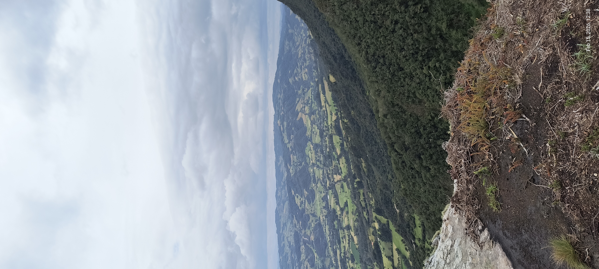

<br><details><summary>:camera:**60/IMG_20260215_123828091.jpg**</summary><sub> `Exif version` 0220 `OS version`  `Date` 2026:02:15 12:38:28 `Aperture` Not known `Brightness` 0.0 `Color space` 1 `Compression` 6`Exposure mode` 0 `Exposure time` 0.000224 `Focal length` 5.56 `Lens model` Not known `Lens specification` Not known `Orientation` 6 `Scene type` Not known `f number` 1.88 `White balance` 0 `Sensing method` 1 `Shutter speed` 12.124</sub><sub>`Coordinates & altitude` (5.426344861111112, -73.84547422222222, 3368.0)</sub><sub> :globe_with_meridians:`Location over` [Google Maps](http://maps.google.com/maps?q=5.426344861111112,-73.84547422222222) or [Openstreet Map](https://www.openstreetmap.org/query?lat=5.426344861111112&lon=-73.84547422222222)</sub></details>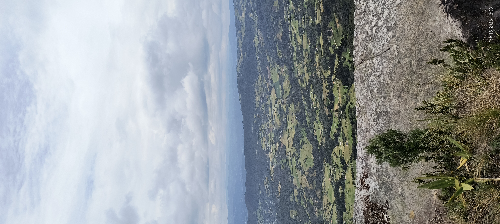

<br><details><summary>:camera:**60/IMG_20260215_123841466.jpg**</summary><sub> `Exif version` 0220 `OS version`  `Date` 2026:02:15 12:38:42 `Aperture` Not known `Brightness` 0.0 `Color space` 1 `Compression` 6`Exposure mode` 0 `Exposure time` 0.000352 `Focal length` 5.56 `Lens model` Not known `Lens specification` Not known `Orientation` 6 `Scene type` Not known `f number` 1.88 `White balance` 0 `Sensing method` 1 `Shutter speed` 11.472</sub><sub>`Coordinates & altitude` (5.426344861111112, -73.84547422222222, 3368.0)</sub><sub> :globe_with_meridians:`Location over` [Google Maps](http://maps.google.com/maps?q=5.426344861111112,-73.84547422222222) or [Openstreet Map](https://www.openstreetmap.org/query?lat=5.426344861111112&lon=-73.84547422222222)</sub></details>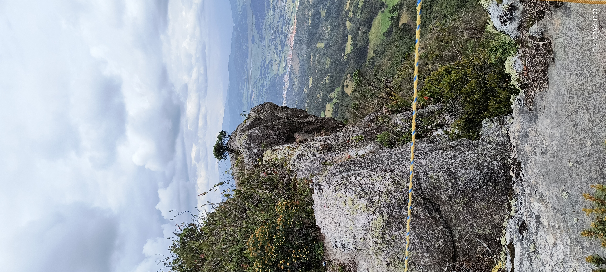

<br><details><summary>:camera:**60/IMG_20260215_123852455.jpg**</summary><sub> `Exif version` 0220 `OS version`  `Date` 2026:02:15 12:38:53 `Aperture` Not known `Brightness` 0.0 `Color space` 1 `Compression` 6`Exposure mode` 0 `Exposure time` 0.000448 `Focal length` 5.56 `Lens model` Not known `Lens specification` Not known `Orientation` 6 `Scene type` Not known `f number` 1.88 `White balance` 0 `Sensing method` 1 `Shutter speed` 11.124</sub><sub>`Coordinates & altitude` (5.426344861111112, -73.84547422222222, 3368.0)</sub><sub> :globe_with_meridians:`Location over` [Google Maps](http://maps.google.com/maps?q=5.426344861111112,-73.84547422222222) or [Openstreet Map](https://www.openstreetmap.org/query?lat=5.426344861111112&lon=-73.84547422222222)</sub></details>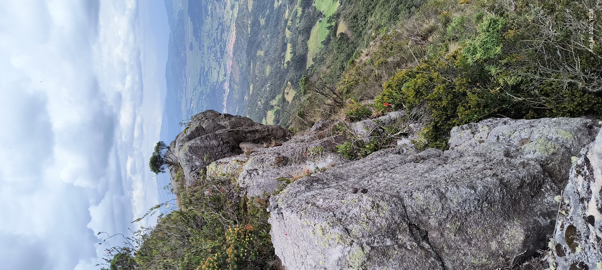

<br><details><summary>:camera:**60/IMG_20260215_124045213_HDR.jpg**</summary><sub> `Exif version` 0220 `OS version`  `Date` 2026:02:15 12:40:46 `Aperture` Not known `Brightness` 0.0 `Color space` 1 `Compression` 6`Exposure mode` 0 `Exposure time` 0.000288 `Focal length` 5.56 `Lens model` Not known `Lens specification` Not known `Orientation` 6 `Scene type` Not known `f number` 1.88 `White balance` 0 `Sensing method` 1 `Shutter speed` 11.761</sub><sub>`Coordinates & altitude` (5.426757805555556, -73.84484099999999, 3370.0)</sub><sub> :globe_with_meridians:`Location over` [Google Maps](http://maps.google.com/maps?q=5.426757805555556,-73.84484099999999) or [Openstreet Map](https://www.openstreetmap.org/query?lat=5.426757805555556&lon=-73.84484099999999)</sub></details>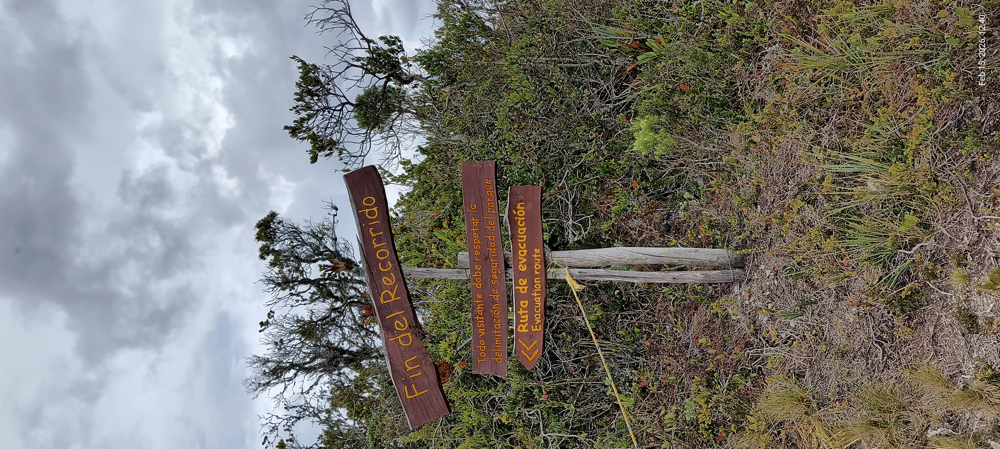

<br><details><summary>:camera:**60/IMG_20260215_124048716.jpg**</summary><sub> `Exif version` 0220 `OS version`  `Date` 2026:02:15 12:40:49 `Aperture` Not known `Brightness` 0.0 `Color space` 1 `Compression` 6`Exposure mode` 0 `Exposure time` 0.000256 `Focal length` 5.56 `Lens model` Not known `Lens specification` Not known `Orientation` 6 `Scene type` Not known `f number` 1.88 `White balance` 0 `Sensing method` 1 `Shutter speed` 11.931</sub><sub>`Coordinates & altitude` (5.426757805555556, -73.84484099999999, 3370.0)</sub><sub> :globe_with_meridians:`Location over` [Google Maps](http://maps.google.com/maps?q=5.426757805555556,-73.84484099999999) or [Openstreet Map](https://www.openstreetmap.org/query?lat=5.426757805555556&lon=-73.84484099999999)</sub></details>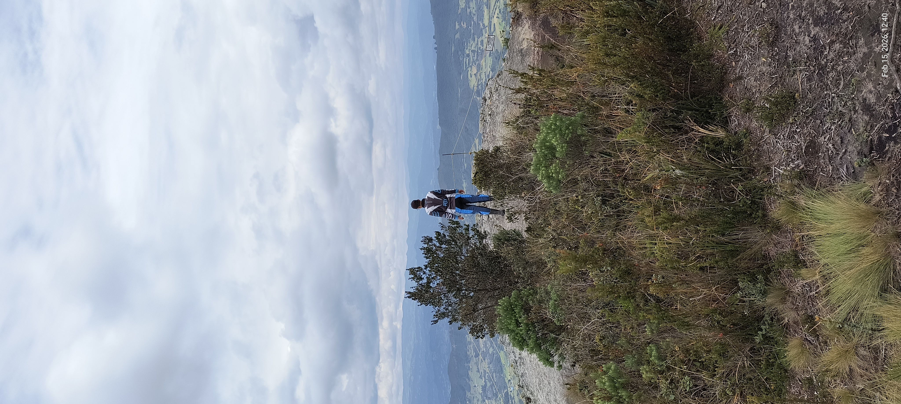

<br><details><summary>:camera:**60/IMG_20260215_124052184.jpg**</summary><sub> `Exif version` 0220 `OS version`  `Date` 2026:02:15 12:40:52 `Aperture` Not known `Brightness` 0.0 `Color space` 1 `Compression` 6`Exposure mode` 0 `Exposure time` 0.000256 `Focal length` 5.56 `Lens model` Not known `Lens specification` Not known `Orientation` 1 `Scene type` Not known `f number` 1.88 `White balance` 0 `Sensing method` 1 `Shutter speed` 11.931</sub><sub>`Coordinates & altitude` (5.426757805555556, -73.84484099999999, 3370.0)</sub><sub> :globe_with_meridians:`Location over` [Google Maps](http://maps.google.com/maps?q=5.426757805555556,-73.84484099999999) or [Openstreet Map](https://www.openstreetmap.org/query?lat=5.426757805555556&lon=-73.84484099999999)</sub></details>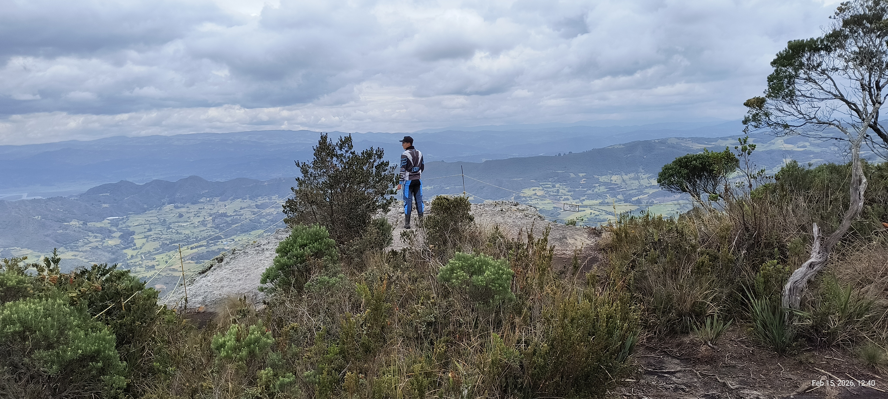

<br><details><summary>:camera:**60/IMG_20260215_124059083.jpg**</summary><sub> `Exif version` 0220 `OS version`  `Date` 2026:02:15 12:41:00 `Aperture` Not known `Brightness` 0.0 `Color space` 1 `Compression` 6`Exposure mode` 0 `Exposure time` 0.000280196 `Focal length` 2.13 `Lens model` Not known `Lens specification` Not known `Orientation` 1 `Scene type` Not known `f number` 2.2 `White balance` 0 `Sensing method` 1 `Shutter speed` 11.801</sub><sub>`Coordinates & altitude` (5.426757805555556, -73.84484099999999, 3370.0)</sub><sub> :globe_with_meridians:`Location over` [Google Maps](http://maps.google.com/maps?q=5.426757805555556,-73.84484099999999) or [Openstreet Map](https://www.openstreetmap.org/query?lat=5.426757805555556&lon=-73.84484099999999)</sub></details>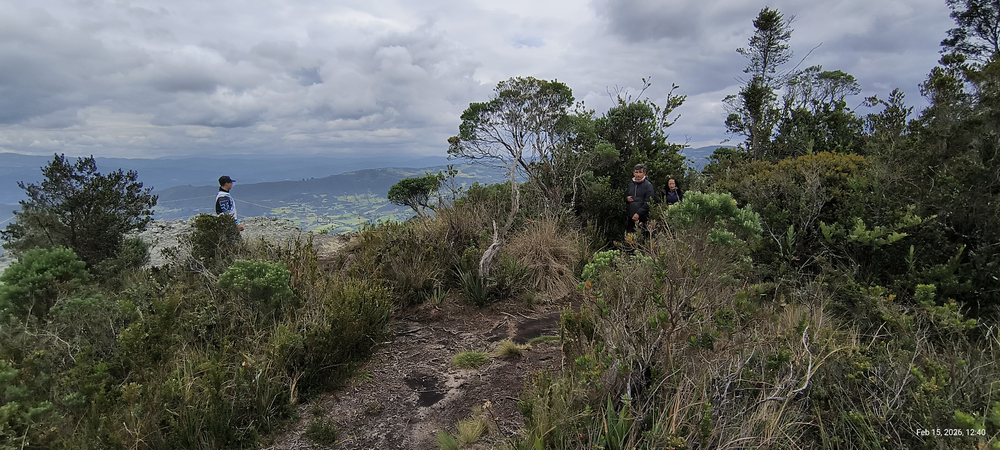

<br><details><summary>:camera:**60/IMG_20260215_124114710.jpg**</summary><sub> `Exif version` 0220 `OS version`  `Date` 2026:02:15 12:41:15 `Aperture` Not known `Brightness` 0.0 `Color space` 1 `Compression` 6`Exposure mode` 0 `Exposure time` 0.000340238 `Focal length` 2.13 `Lens model` Not known `Lens specification` Not known `Orientation` 1 `Scene type` Not known `f number` 2.2 `White balance` 0 `Sensing method` 1 `Shutter speed` 11.521</sub><sub>`Coordinates & altitude` (5.426757805555556, -73.84484099999999, 3370.0)</sub><sub> :globe_with_meridians:`Location over` [Google Maps](http://maps.google.com/maps?q=5.426757805555556,-73.84484099999999) or [Openstreet Map](https://www.openstreetmap.org/query?lat=5.426757805555556&lon=-73.84484099999999)</sub></details>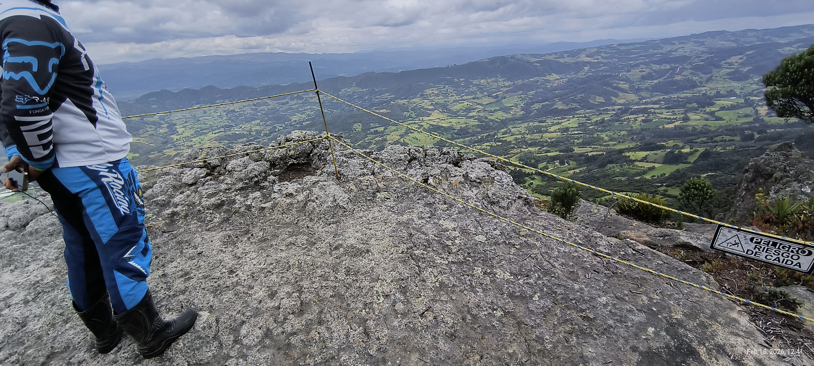

<br><details><summary>:camera:**60/IMG_20260215_124134011.jpg**</summary><sub> `Exif version` 0220 `OS version`  `Date` 2026:02:15 12:41:34 `Aperture` Not known `Brightness` 0.0 `Color space` 1 `Compression` 6`Exposure mode` 0 `Exposure time` 0.00040028 `Focal length` 2.13 `Lens model` Not known `Lens specification` Not known `Orientation` 1 `Scene type` Not known `f number` 2.2 `White balance` 0 `Sensing method` 1 `Shutter speed` 11.286</sub><sub>`Coordinates & altitude` (5.426757805555556, -73.84484099999999, 3370.0)</sub><sub> :globe_with_meridians:`Location over` [Google Maps](http://maps.google.com/maps?q=5.426757805555556,-73.84484099999999) or [Openstreet Map](https://www.openstreetmap.org/query?lat=5.426757805555556&lon=-73.84484099999999)</sub></details>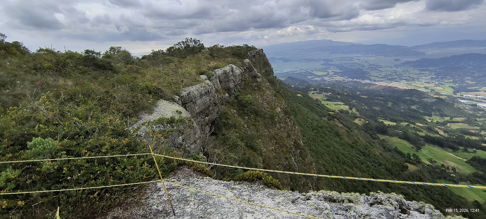

<br><details><summary>:camera:**60/IMG_20260215_124138228.jpg**</summary><sub> `Exif version` 0220 `OS version`  `Date` 2026:02:15 12:41:39 `Aperture` Not known `Brightness` 0.0 `Color space` 1 `Compression` 6`Exposure mode` 0 `Exposure time` 0.000340238 `Focal length` 2.13 `Lens model` Not known `Lens specification` Not known `Orientation` 1 `Scene type` Not known `f number` 2.2 `White balance` 0 `Sensing method` 1 `Shutter speed` 11.521</sub><sub>`Coordinates & altitude` (5.426757805555556, -73.84484099999999, 3370.0)</sub><sub> :globe_with_meridians:`Location over` [Google Maps](http://maps.google.com/maps?q=5.426757805555556,-73.84484099999999) or [Openstreet Map](https://www.openstreetmap.org/query?lat=5.426757805555556&lon=-73.84484099999999)</sub></details>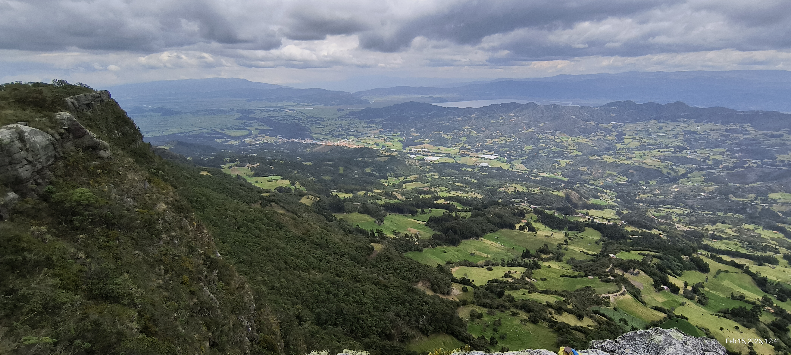

<br><details><summary>:camera:**60/IMG_20260215_124140564.jpg**</summary><sub> `Exif version` 0220 `OS version`  `Date` 2026:02:15 12:41:41 `Aperture` Not known `Brightness` 0.0 `Color space` 1 `Compression` 6`Exposure mode` 0 `Exposure time` 0.000570399 `Focal length` 2.13 `Lens model` Not known `Lens specification` Not known `Orientation` 1 `Scene type` Not known `f number` 2.2 `White balance` 0 `Sensing method` 1 `Shutter speed` 10.775</sub><sub>`Coordinates & altitude` (5.426757805555556, -73.84484099999999, 3370.0)</sub><sub> :globe_with_meridians:`Location over` [Google Maps](http://maps.google.com/maps?q=5.426757805555556,-73.84484099999999) or [Openstreet Map](https://www.openstreetmap.org/query?lat=5.426757805555556&lon=-73.84484099999999)</sub></details>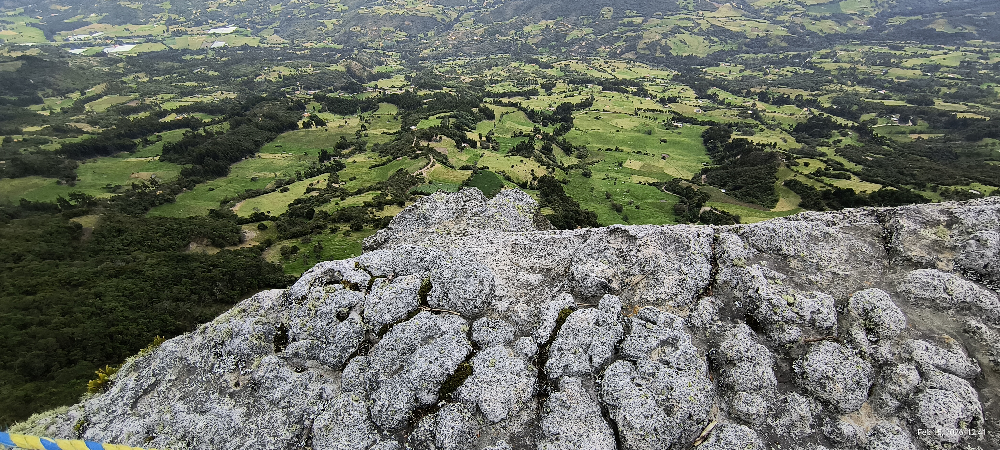

<br><details><summary>:camera:**60/IMG_20260215_124143719.jpg**</summary><sub> `Exif version` 0220 `OS version`  `Date` 2026:02:15 12:41:44 `Aperture` Not known `Brightness` 0.0 `Color space` 1 `Compression` 6`Exposure mode` 0 `Exposure time` 0.000310217 `Focal length` 2.13 `Lens model` Not known `Lens specification` Not known `Orientation` 6 `Scene type` Not known `f number` 2.2 `White balance` 0 `Sensing method` 1 `Shutter speed` 11.654</sub><sub>`Coordinates & altitude` (5.426757805555556, -73.84484099999999, 3370.0)</sub><sub> :globe_with_meridians:`Location over` [Google Maps](http://maps.google.com/maps?q=5.426757805555556,-73.84484099999999) or [Openstreet Map](https://www.openstreetmap.org/query?lat=5.426757805555556&lon=-73.84484099999999)</sub></details>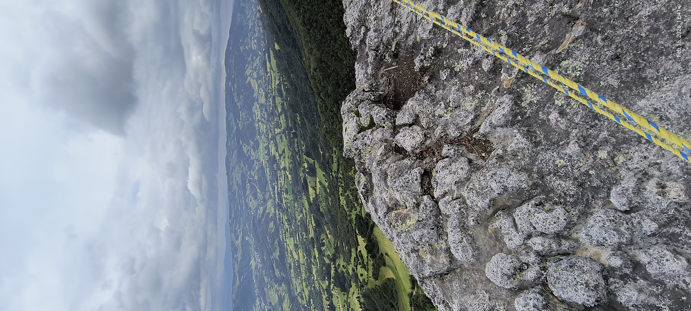

<br><details><summary>:camera:**60/IMG_20260215_124157793.jpg**</summary><sub> `Exif version` 0220 `OS version`  `Date` 2026:02:15 12:41:58 `Aperture` Not known `Brightness` 0.0 `Color space` 1 `Compression` 6`Exposure mode` 0 `Exposure time` 0.000390273 `Focal length` 2.13 `Lens model` Not known `Lens specification` Not known `Orientation` 1 `Scene type` Not known `f number` 2.2 `White balance` 0 `Sensing method` 1 `Shutter speed` 11.323</sub><sub>`Coordinates & altitude` (5.426757805555556, -73.84484099999999, 3370.0)</sub><sub> :globe_with_meridians:`Location over` [Google Maps](http://maps.google.com/maps?q=5.426757805555556,-73.84484099999999) or [Openstreet Map](https://www.openstreetmap.org/query?lat=5.426757805555556&lon=-73.84484099999999)</sub></details>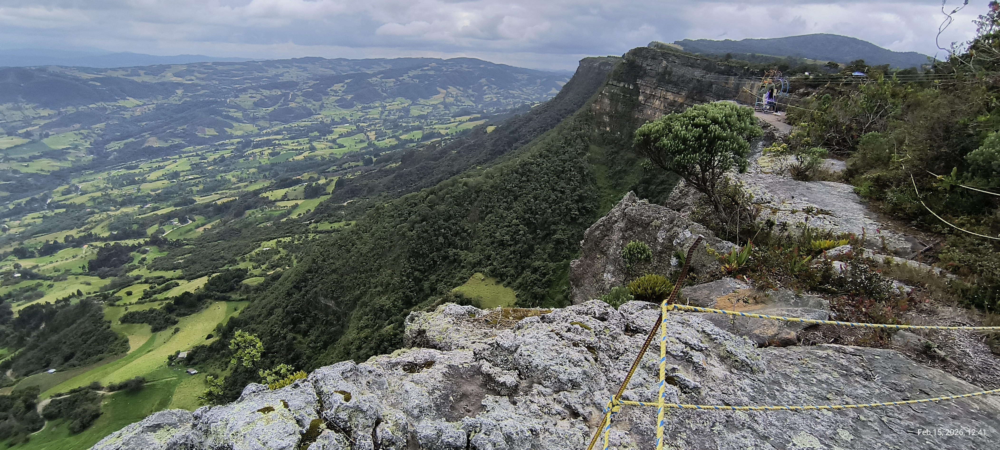

<br><details><summary>:camera:**60/IMG_20260215_124207889.jpg**</summary><sub> `Exif version` 0220 `OS version`  `Date` 2026:02:15 12:42:08 `Aperture` Not known `Brightness` 0.0 `Color space` 1 `Compression` 6`Exposure mode` 0 `Exposure time` 0.001050735 `Focal length` 2.13 `Lens model` Not known `Lens specification` Not known `Orientation` 1 `Scene type` Not known `f number` 2.2 `White balance` 0 `Sensing method` 1 `Shutter speed` 9.894</sub><sub>`Coordinates & altitude` (5.426757805555556, -73.84484099999999, 3370.0)</sub><sub> :globe_with_meridians:`Location over` [Google Maps](http://maps.google.com/maps?q=5.426757805555556,-73.84484099999999) or [Openstreet Map](https://www.openstreetmap.org/query?lat=5.426757805555556&lon=-73.84484099999999)</sub></details>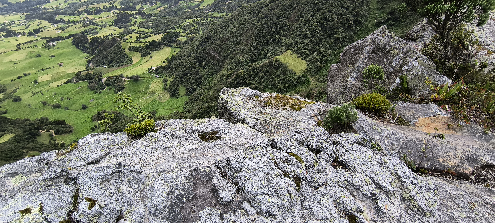

<br><details><summary>:camera:**60/IMG_20260215_124211756.jpg**</summary><sub> `Exif version` 0220 `OS version`  `Date` 2026:02:15 12:42:12 `Aperture` Not known `Brightness` 0.0 `Color space` 1 `Compression` 6`Exposure mode` 0 `Exposure time` 0.000570399 `Focal length` 2.13 `Lens model` Not known `Lens specification` Not known `Orientation` 1 `Scene type` Not known `f number` 2.2 `White balance` 0 `Sensing method` 1 `Shutter speed` 10.775</sub><sub>`Coordinates & altitude` (5.426757805555556, -73.84484099999999, 3370.0)</sub><sub> :globe_with_meridians:`Location over` [Google Maps](http://maps.google.com/maps?q=5.426757805555556,-73.84484099999999) or [Openstreet Map](https://www.openstreetmap.org/query?lat=5.426757805555556&lon=-73.84484099999999)</sub></details>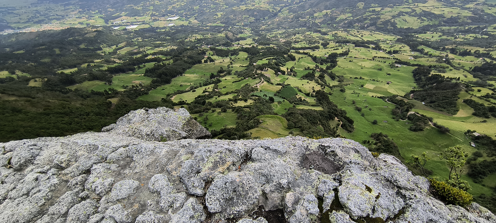

<br><details><summary>:camera:**60/IMG_20260215_124215876.jpg**</summary><sub> `Exif version` 0220 `OS version`  `Date` 2026:02:15 12:42:16 `Aperture` Not known `Brightness` 0.0 `Color space` 1 `Compression` 6`Exposure mode` 0 `Exposure time` 0.00030021 `Focal length` 2.13 `Lens model` Not known `Lens specification` Not known `Orientation` 1 `Scene type` Not known `f number` 2.2 `White balance` 0 `Sensing method` 1 `Shutter speed` 11.701</sub><sub>`Coordinates & altitude` (5.426757805555556, -73.84484099999999, 3370.0)</sub><sub> :globe_with_meridians:`Location over` [Google Maps](http://maps.google.com/maps?q=5.426757805555556,-73.84484099999999) or [Openstreet Map](https://www.openstreetmap.org/query?lat=5.426757805555556&lon=-73.84484099999999)</sub></details>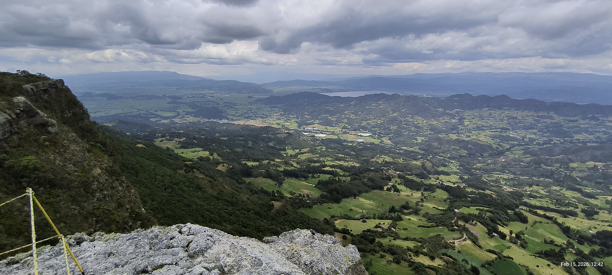

<br><details><summary>:camera:**60/IMG_20260215_124219676.jpg**</summary><sub> `Exif version` 0220 `OS version`  `Date` 2026:02:15 12:42:20 `Aperture` Not known `Brightness` 0.0 `Color space` 1 `Compression` 6`Exposure mode` 0 `Exposure time` 0.000260182 `Focal length` 2.13 `Lens model` Not known `Lens specification` Not known `Orientation` 1 `Scene type` Not known `f number` 2.2 `White balance` 0 `Sensing method` 1 `Shutter speed` 11.908</sub><sub>`Coordinates & altitude` (5.426757805555556, -73.84484099999999, 3370.0)</sub><sub> :globe_with_meridians:`Location over` [Google Maps](http://maps.google.com/maps?q=5.426757805555556,-73.84484099999999) or [Openstreet Map](https://www.openstreetmap.org/query?lat=5.426757805555556&lon=-73.84484099999999)</sub></details>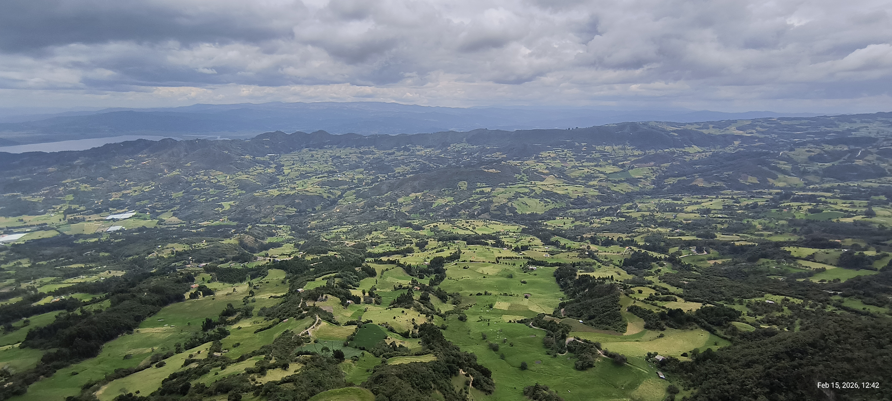

<br><details><summary>:camera:**60/IMG_20260215_124222830.jpg**</summary><sub> `Exif version` 0220 `OS version`  `Date` 2026:02:15 12:42:23 `Aperture` Not known `Brightness` 0.0 `Color space` 1 `Compression` 6`Exposure mode` 0 `Exposure time` 0.000290203 `Focal length` 2.13 `Lens model` Not known `Lens specification` Not known `Orientation` 1 `Scene type` Not known `f number` 2.2 `White balance` 0 `Sensing method` 1 `Shutter speed` 11.75</sub><sub>`Coordinates & altitude` (5.426757805555556, -73.84484099999999, 3370.0)</sub><sub> :globe_with_meridians:`Location over` [Google Maps](http://maps.google.com/maps?q=5.426757805555556,-73.84484099999999) or [Openstreet Map](https://www.openstreetmap.org/query?lat=5.426757805555556&lon=-73.84484099999999)</sub></details>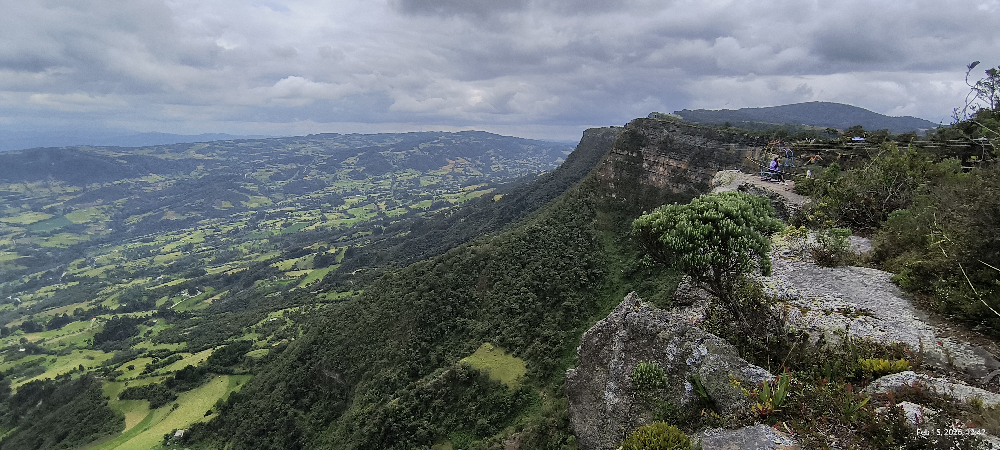

<br><details><summary>:camera:**60/IMG_20260215_124252672.jpg**</summary><sub> `Exif version` 0220 `OS version`  `Date` 2026:02:15 12:42:53 `Aperture` Not known `Brightness` 0.0 `Color space` 1 `Compression` 6`Exposure mode` 0 `Exposure time` 0.000250175 `Focal length` 2.13 `Lens model` Not known `Lens specification` Not known `Orientation` 6 `Scene type` Not known `f number` 2.2 `White balance` 0 `Sensing method` 1 `Shutter speed` 11.964</sub><sub>`Coordinates & altitude` (5.426757805555556, -73.84484099999999, 3370.0)</sub><sub> :globe_with_meridians:`Location over` [Google Maps](http://maps.google.com/maps?q=5.426757805555556,-73.84484099999999) or [Openstreet Map](https://www.openstreetmap.org/query?lat=5.426757805555556&lon=-73.84484099999999)</sub></details>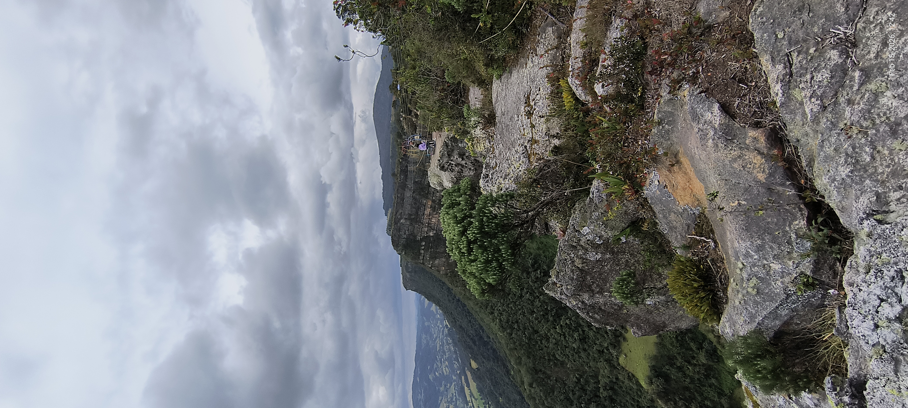

<br><details><summary>:camera:**60/IMG_20260215_124300028.jpg**</summary><sub> `Exif version` 0220 `OS version`  `Date` 2026:02:15 12:43:01 `Aperture` Not known `Brightness` 0.0 `Color space` 1 `Compression` 6`Exposure mode` 0 `Exposure time` 0.000340238 `Focal length` 2.13 `Lens model` Not known `Lens specification` Not known `Orientation` 1 `Scene type` Not known `f number` 2.2 `White balance` 0 `Sensing method` 1 `Shutter speed` 11.521</sub><sub>`Coordinates & altitude` (5.426757805555556, -73.84484099999999, 3370.0)</sub><sub> :globe_with_meridians:`Location over` [Google Maps](http://maps.google.com/maps?q=5.426757805555556,-73.84484099999999) or [Openstreet Map](https://www.openstreetmap.org/query?lat=5.426757805555556&lon=-73.84484099999999)</sub></details>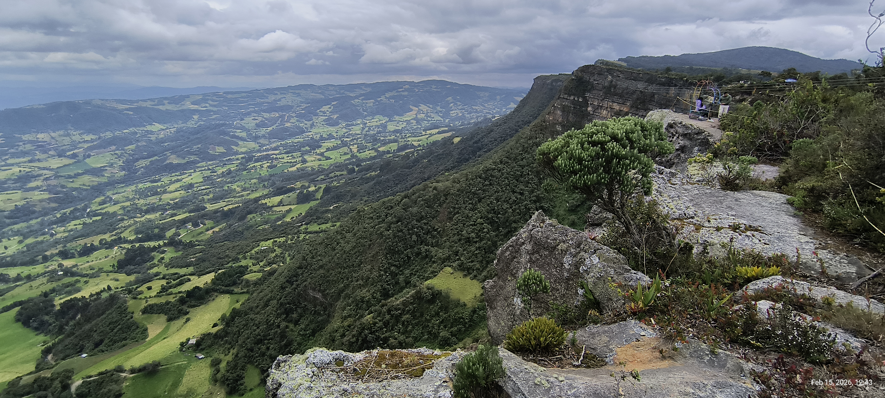

<br><details><summary>:camera:**60/IMG_20260215_124313076.jpg**</summary><sub> `Exif version` 0220 `OS version`  `Date` 2026:02:15 12:43:14 `Aperture` Not known `Brightness` 0.0 `Color space` 1 `Compression` 6`Exposure mode` 0 `Exposure time` 0.000820574 `Focal length` 2.13 `Lens model` Not known `Lens specification` Not known `Orientation` 1 `Scene type` Not known `f number` 2.2 `White balance` 0 `Sensing method` 1 `Shutter speed` 10.251</sub><sub>`Coordinates & altitude` (5.426757805555556, -73.84484099999999, 3370.0)</sub><sub> :globe_with_meridians:`Location over` [Google Maps](http://maps.google.com/maps?q=5.426757805555556,-73.84484099999999) or [Openstreet Map](https://www.openstreetmap.org/query?lat=5.426757805555556&lon=-73.84484099999999)</sub></details>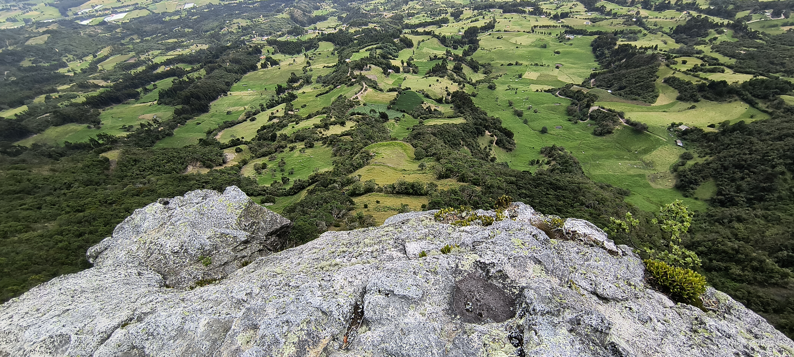

<br><details><summary>:camera:**60/IMG_20260215_124405782.jpg**</summary><sub> `Exif version` 0220 `OS version`  `Date` 2026:02:15 12:44:06 `Aperture` Not known `Brightness` 0.0 `Color space` 1 `Compression` 6`Exposure mode` 0 `Exposure time` 0.000220154 `Focal length` 2.13 `Lens model` Not known `Lens specification` Not known `Orientation` 6 `Scene type` Not known `f number` 2.2 `White balance` 0 `Sensing method` 1 `Shutter speed` 12.149</sub><sub>`Coordinates & altitude` (5.426757805555556, -73.84484099999999, 3370.0)</sub><sub> :globe_with_meridians:`Location over` [Google Maps](http://maps.google.com/maps?q=5.426757805555556,-73.84484099999999) or [Openstreet Map](https://www.openstreetmap.org/query?lat=5.426757805555556&lon=-73.84484099999999)</sub></details>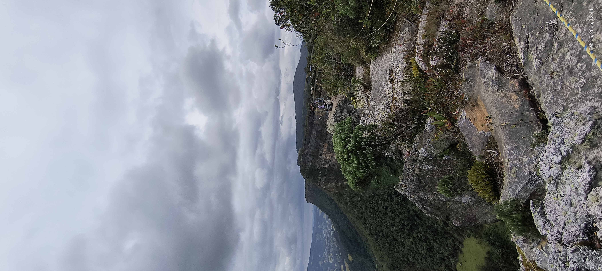

<br><details><summary>:camera:**60/IMG_20260215_124427548_HDR.jpg**</summary><sub> `Exif version` 0220 `OS version`  `Date` 2026:02:15 12:44:29 `Aperture` Not known `Brightness` 0.0 `Color space` 1 `Compression` 6`Exposure mode` 0 `Exposure time` 0.001941358 `Focal length` 2.13 `Lens model` Not known `Lens specification` Not known `Orientation` 6 `Scene type` Not known `f number` 2.2 `White balance` 0 `Sensing method` 1 `Shutter speed` 9.008</sub><sub>`Coordinates & altitude` (5.426757805555556, -73.84484099999999, 3370.0)</sub><sub> :globe_with_meridians:`Location over` [Google Maps](http://maps.google.com/maps?q=5.426757805555556,-73.84484099999999) or [Openstreet Map](https://www.openstreetmap.org/query?lat=5.426757805555556&lon=-73.84484099999999)</sub></details>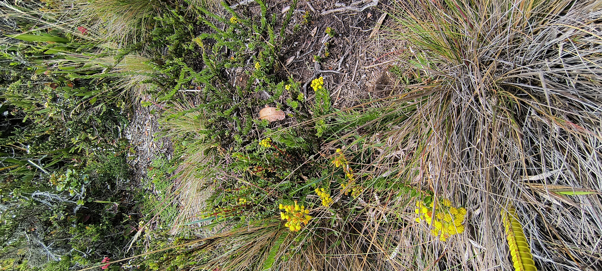

<br><details><summary>:camera:**60/IMG_20260215_124433250_HDR.jpg**</summary><sub> `Exif version` 0220 `OS version`  `Date` 2026:02:15 12:44:34 `Aperture` Not known `Brightness` 0.0 `Color space` 1 `Compression` 6`Exposure mode` 0 `Exposure time` 0.002041428 `Focal length` 2.13 `Lens model` Not known `Lens specification` Not known `Orientation` 6 `Scene type` Not known `f number` 2.2 `White balance` 0 `Sensing method` 1 `Shutter speed` 8.936</sub><sub>`Coordinates & altitude` (5.426757805555556, -73.84484099999999, 3370.0)</sub><sub> :globe_with_meridians:`Location over` [Google Maps](http://maps.google.com/maps?q=5.426757805555556,-73.84484099999999) or [Openstreet Map](https://www.openstreetmap.org/query?lat=5.426757805555556&lon=-73.84484099999999)</sub></details>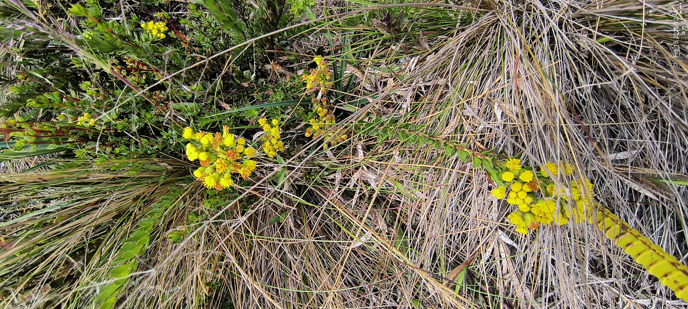

<br><details><summary>:camera:**60/IMG_20260215_124506567.jpg**</summary><sub> `Exif version` 0220 `OS version`  `Date` 2026:02:15 12:45:07 `Aperture` Not known `Brightness` 0.0 `Color space` 1 `Compression` 6`Exposure mode` 0 `Exposure time` 0.000890623 `Focal length` 2.13 `Lens model` Not known `Lens specification` Not known `Orientation` 6 `Scene type` Not known `f number` 2.2 `White balance` 0 `Sensing method` 1 `Shutter speed` 10.132</sub><sub>`Coordinates & altitude` (5.426757805555556, -73.84484099999999, 3370.0)</sub><sub> :globe_with_meridians:`Location over` [Google Maps](http://maps.google.com/maps?q=5.426757805555556,-73.84484099999999) or [Openstreet Map](https://www.openstreetmap.org/query?lat=5.426757805555556&lon=-73.84484099999999)</sub></details>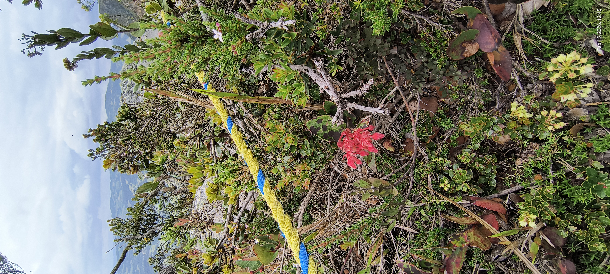

<br><details><summary>:camera:**60/IMG_20260215_124718642.jpg**</summary><sub> `Exif version` 0220 `OS version`  `Date` 2026:02:15 12:47:19 `Aperture` Not known `Brightness` 0.0 `Color space` 1 `Compression` 6`Exposure mode` 0 `Exposure time` 0.00192 `Focal length` 5.56 `Lens model` Not known `Lens specification` Not known `Orientation` 6 `Scene type` Not known `f number` 1.88 `White balance` 0 `Sensing method` 1 `Shutter speed` 9.024</sub><sub>`Coordinates & altitude` (5.426970000000001, -73.84484099999999, 3382.0)</sub><sub> :globe_with_meridians:`Location over` [Google Maps](http://maps.google.com/maps?q=5.426970000000001,-73.84484099999999) or [Openstreet Map](https://www.openstreetmap.org/query?lat=5.426970000000001&lon=-73.84484099999999)</sub></details>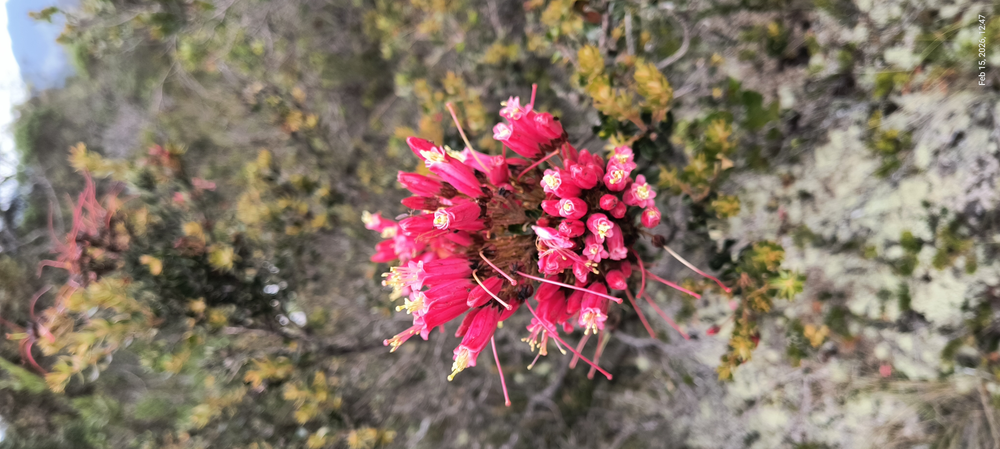

<br><details><summary>:camera:**60/IMG_20260215_124725228.jpg**</summary><sub> `Exif version` 0220 `OS version`  `Date` 2026:02:15 12:47:25 `Aperture` Not known `Brightness` 0.0 `Color space` 1 `Compression` 6`Exposure mode` 0 `Exposure time` 0.000288 `Focal length` 5.56 `Lens model` Not known `Lens specification` Not known `Orientation` 1 `Scene type` Not known `f number` 1.88 `White balance` 0 `Sensing method` 1 `Shutter speed` 11.761</sub><sub>`Coordinates & altitude` (5.426970000000001, -73.84484099999999, 3382.0)</sub><sub> :globe_with_meridians:`Location over` [Google Maps](http://maps.google.com/maps?q=5.426970000000001,-73.84484099999999) or [Openstreet Map](https://www.openstreetmap.org/query?lat=5.426970000000001&lon=-73.84484099999999)</sub></details>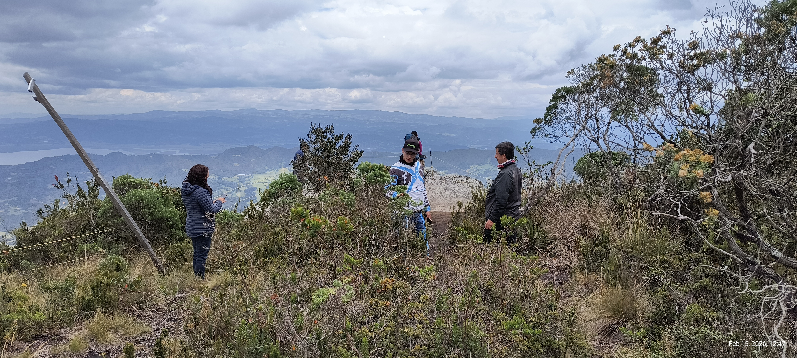

<br><details><summary>:camera:**60/IMG_20260215_125227095.jpg**</summary><sub> `Exif version` 0220 `OS version`  `Date` 2026:02:15 12:52:29 `Aperture` Not known `Brightness` 0.0 `Color space` 1 `Compression` 6`Exposure mode` 0 `Exposure time` 0.000416 `Focal length` 5.56 `Lens model` Not known `Lens specification` Not known `Orientation` 6 `Scene type` Not known `f number` 1.88 `White balance` 0 `Sensing method` 1 `Shutter speed` 11.231</sub><sub>`Coordinates & altitude` (5.426173194444445, -73.84577177777777, 3375.0)</sub><sub> :globe_with_meridians:`Location over` [Google Maps](http://maps.google.com/maps?q=5.426173194444445,-73.84577177777777) or [Openstreet Map](https://www.openstreetmap.org/query?lat=5.426173194444445&lon=-73.84577177777777)</sub></details>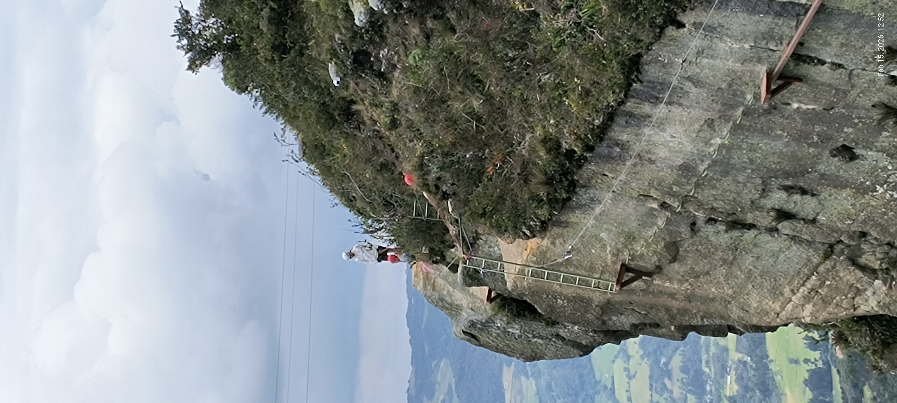

<br><details><summary>:camera:**60/IMG_20260215_125240693.jpg**</summary><sub> `Exif version` 0220 `OS version`  `Date` 2026:02:15 12:52:42 `Aperture` Not known `Brightness` 0.0 `Color space` 1 `Compression` 6`Exposure mode` 0 `Exposure time` 0.000384 `Focal length` 5.56 `Lens model` Not known `Lens specification` Not known `Orientation` 6 `Scene type` Not known `f number` 1.88 `White balance` 0 `Sensing method` 1 `Shutter speed` 11.346</sub><sub>`Coordinates & altitude` (5.426173194444445, -73.84577177777777, 3375.0)</sub><sub> :globe_with_meridians:`Location over` [Google Maps](http://maps.google.com/maps?q=5.426173194444445,-73.84577177777777) or [Openstreet Map](https://www.openstreetmap.org/query?lat=5.426173194444445&lon=-73.84577177777777)</sub></details>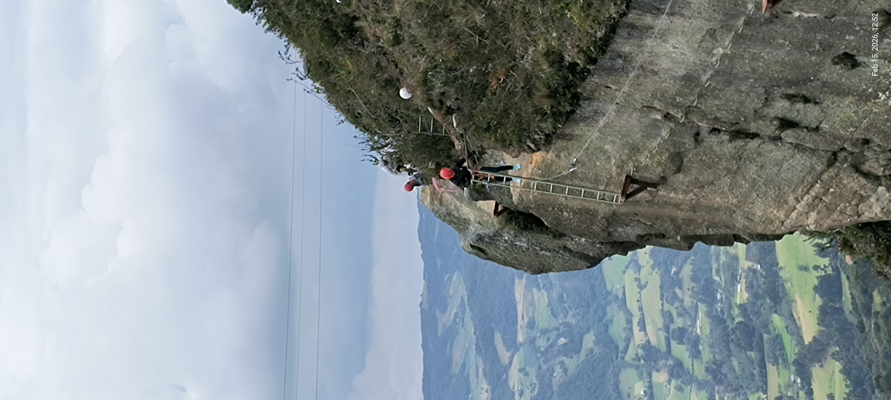

<br><details><summary>:camera:**60/IMG_20260215_125304635.jpg**</summary><sub> `Exif version` 0220 `OS version`  `Date` 2026:02:15 12:53:06 `Aperture` Not known `Brightness` 0.0 `Color space` 1 `Compression` 6`Exposure mode` 0 `Exposure time` 0.000512 `Focal length` 5.56 `Lens model` Not known `Lens specification` Not known `Orientation` 6 `Scene type` Not known `f number` 1.88 `White balance` 0 `Sensing method` 1 `Shutter speed` 10.931</sub><sub>`Coordinates & altitude` (5.426173194444445, -73.84577177777777, 3375.0)</sub><sub> :globe_with_meridians:`Location over` [Google Maps](http://maps.google.com/maps?q=5.426173194444445,-73.84577177777777) or [Openstreet Map](https://www.openstreetmap.org/query?lat=5.426173194444445&lon=-73.84577177777777)</sub></details>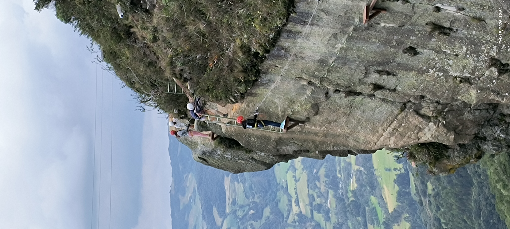

<br><details><summary>:camera:**60/IMG_20260215_125307885.jpg**</summary><sub> `Exif version` 0220 `OS version`  `Date` 2026:02:15 12:53:08 `Aperture` Not known `Brightness` 0.0 `Color space` 1 `Compression` 6`Exposure mode` 0 `Exposure time` 0.000352 `Focal length` 5.56 `Lens model` Not known `Lens specification` Not known `Orientation` 6 `Scene type` Not known `f number` 1.88 `White balance` 0 `Sensing method` 1 `Shutter speed` 11.472</sub><sub>`Coordinates & altitude` (5.426173194444445, -73.84577177777777, 3375.0)</sub><sub> :globe_with_meridians:`Location over` [Google Maps](http://maps.google.com/maps?q=5.426173194444445,-73.84577177777777) or [Openstreet Map](https://www.openstreetmap.org/query?lat=5.426173194444445&lon=-73.84577177777777)</sub></details>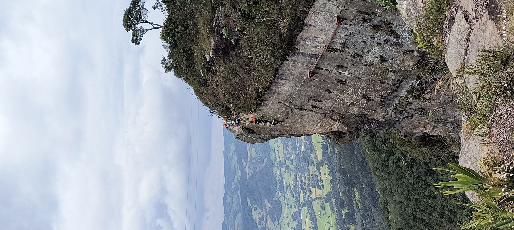

<br><details><summary>:camera:**60/IMG_20260215_125324737.jpg**</summary><sub> `Exif version` 0220 `OS version`  `Date` 2026:02:15 12:53:25 `Aperture` Not known `Brightness` 0.0 `Color space` 1 `Compression` 6`Exposure mode` 0 `Exposure time` 0.000352 `Focal length` 5.56 `Lens model` Not known `Lens specification` Not known `Orientation` 1 `Scene type` Not known `f number` 1.88 `White balance` 0 `Sensing method` 1 `Shutter speed` 11.472</sub><sub>`Coordinates & altitude` (5.426173194444445, -73.84577177777777, 3375.0)</sub><sub> :globe_with_meridians:`Location over` [Google Maps](http://maps.google.com/maps?q=5.426173194444445,-73.84577177777777) or [Openstreet Map](https://www.openstreetmap.org/query?lat=5.426173194444445&lon=-73.84577177777777)</sub></details>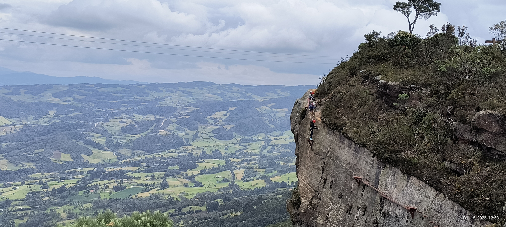

<br><details><summary>:camera:**60/IMG_20260215_125410019_HDR.jpg**</summary><sub> `Exif version` 0220 `OS version`  `Date` 2026:02:15 12:54:11 `Aperture` Not known `Brightness` 0.0 `Color space` 1 `Compression` 6`Exposure mode` 0 `Exposure time` 0.001984 `Focal length` 5.56 `Lens model` Not known `Lens specification` Not known `Orientation` 1 `Scene type` Not known `f number` 1.88 `White balance` 0 `Sensing method` 1 `Shutter speed` 8.977</sub><sub>`Coordinates & altitude` (5.426173194444445, -73.84562680555555, 3376.0)</sub><sub> :globe_with_meridians:`Location over` [Google Maps](http://maps.google.com/maps?q=5.426173194444445,-73.84562680555555) or [Openstreet Map](https://www.openstreetmap.org/query?lat=5.426173194444445&lon=-73.84562680555555)</sub></details>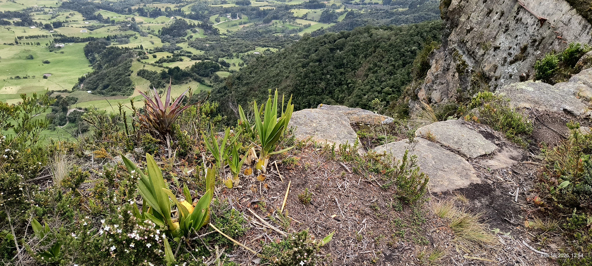

<br><details><summary>:camera:**60/IMG_20260215_125420697.jpg**</summary><sub> `Exif version` 0220 `OS version`  `Date` 2026:02:15 12:54:21 `Aperture` Not known `Brightness` 0.0 `Color space` 1 `Compression` 6`Exposure mode` 0 `Exposure time` 0.00032 `Focal length` 5.56 `Lens model` Not known `Lens specification` Not known `Orientation` 6 `Scene type` Not known `f number` 1.88 `White balance` 0 `Sensing method` 1 `Shutter speed` 11.609</sub><sub>`Coordinates & altitude` (5.426173194444445, -73.84562680555555, 3376.0)</sub><sub> :globe_with_meridians:`Location over` [Google Maps](http://maps.google.com/maps?q=5.426173194444445,-73.84562680555555) or [Openstreet Map](https://www.openstreetmap.org/query?lat=5.426173194444445&lon=-73.84562680555555)</sub></details>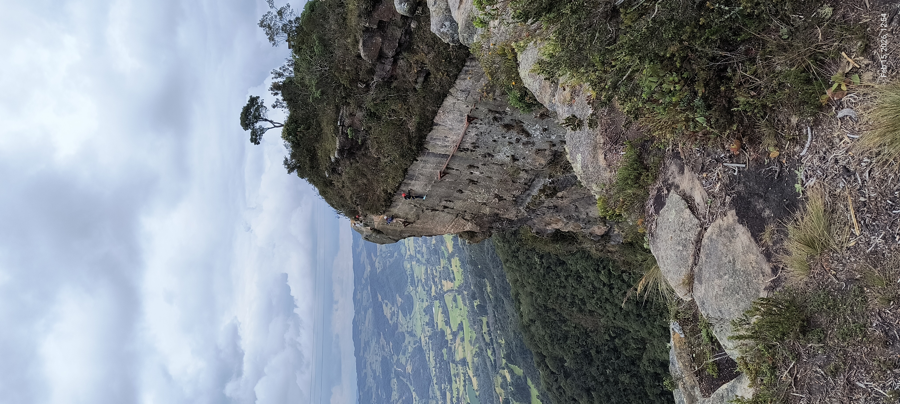

<br><details><summary>:camera:**60/IMG_20260215_125511856.jpg**</summary><sub> `Exif version` 0220 `OS version`  `Date` 2026:02:15 12:55:12 `Aperture` Not known `Brightness` 0.0 `Color space` 1 `Compression` 6`Exposure mode` 0 `Exposure time` 0.000352 `Focal length` 5.56 `Lens model` Not known `Lens specification` Not known `Orientation` 6 `Scene type` Not known `f number` 1.88 `White balance` 0 `Sensing method` 1 `Shutter speed` 11.472</sub><sub>`Coordinates & altitude` (5.426300027777778, -73.84586333333333, 3376.0)</sub><sub> :globe_with_meridians:`Location over` [Google Maps](http://maps.google.com/maps?q=5.426300027777778,-73.84586333333333) or [Openstreet Map](https://www.openstreetmap.org/query?lat=5.426300027777778&lon=-73.84586333333333)</sub></details>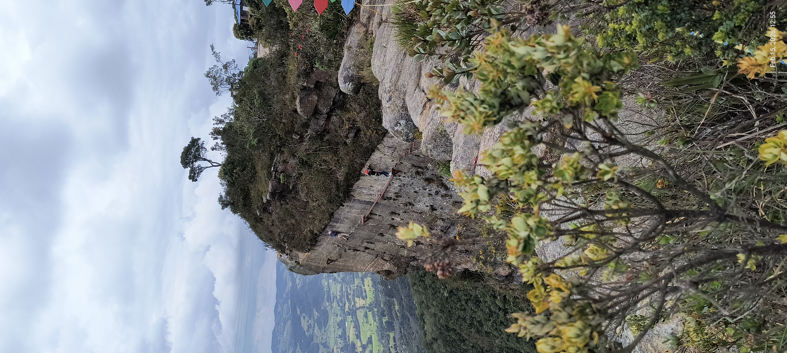

<br><details><summary>:camera:**60/IMG_20260215_125516372.jpg**</summary><sub> `Exif version` 0220 `OS version`  `Date` 2026:02:15 12:55:17 `Aperture` Not known `Brightness` 0.0 `Color space` 1 `Compression` 6`Exposure mode` 0 `Exposure time` 0.000352 `Focal length` 5.56 `Lens model` Not known `Lens specification` Not known `Orientation` 1 `Scene type` Not known `f number` 1.88 `White balance` 0 `Sensing method` 1 `Shutter speed` 11.472</sub><sub>`Coordinates & altitude` (5.426300027777778, -73.84586333333333, 3376.0)</sub><sub> :globe_with_meridians:`Location over` [Google Maps](http://maps.google.com/maps?q=5.426300027777778,-73.84586333333333) or [Openstreet Map](https://www.openstreetmap.org/query?lat=5.426300027777778&lon=-73.84586333333333)</sub></details>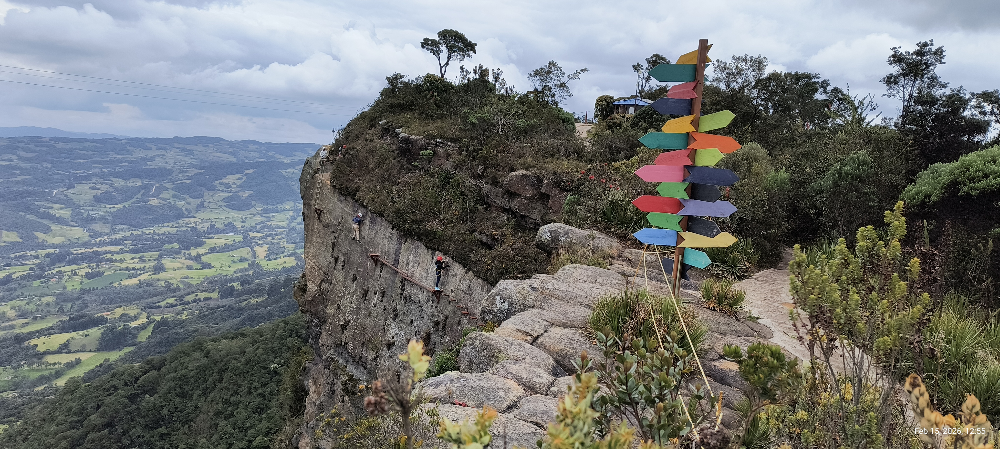

<br><details><summary>:camera:**60/IMG_20260215_125521955.jpg**</summary><sub> `Exif version` 0220 `OS version`  `Date` 2026:02:15 12:55:25 `Aperture` Not known `Brightness` 0.0 `Color space` 1 `Compression` 6`Exposure mode` 0 `Exposure time` 0.000864 `Focal length` 5.56 `Lens model` Not known `Lens specification` Not known `Orientation` 1 `Scene type` Not known `f number` 1.88 `White balance` 0 `Sensing method` 1 `Shutter speed` 10.176</sub><sub>`Coordinates & altitude` (5.426300027777778, -73.84586333333333, 3376.0)</sub><sub> :globe_with_meridians:`Location over` [Google Maps](http://maps.google.com/maps?q=5.426300027777778,-73.84586333333333) or [Openstreet Map](https://www.openstreetmap.org/query?lat=5.426300027777778&lon=-73.84586333333333)</sub></details>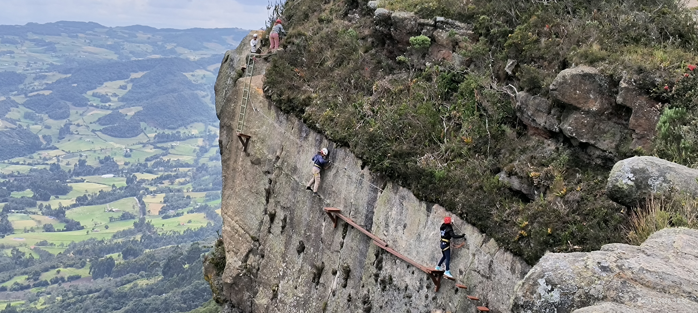

<br><details><summary>:camera:**60/IMG_20260215_125549695.jpg**</summary><sub> `Exif version` 0220 `OS version`  `Date` 2026:02:15 12:55:53 `Aperture` Not known `Brightness` 0.0 `Color space` 1 `Compression` 6`Exposure mode` 0 `Exposure time` 0.000704 `Focal length` 5.56 `Lens model` Not known `Lens specification` Not known `Orientation` 1 `Scene type` Not known `f number` 1.88 `White balance` 0 `Sensing method` 1 `Shutter speed` 10.472</sub><sub>`Coordinates & altitude` (5.426300027777778, -73.84586333333333, 3376.0)</sub><sub> :globe_with_meridians:`Location over` [Google Maps](http://maps.google.com/maps?q=5.426300027777778,-73.84586333333333) or [Openstreet Map](https://www.openstreetmap.org/query?lat=5.426300027777778&lon=-73.84586333333333)</sub></details>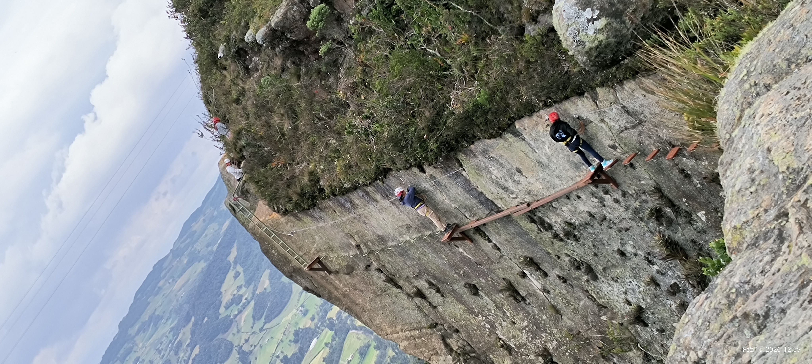

<br><details><summary>:camera:**60/IMG_20260215_125556820.jpg**</summary><sub> `Exif version` 0220 `OS version`  `Date` 2026:02:15 12:55:57 `Aperture` Not known `Brightness` 0.0 `Color space` 1 `Compression` 6`Exposure mode` 0 `Exposure time` 0.000320224 `Focal length` 2.13 `Lens model` Not known `Lens specification` Not known `Orientation` 6 `Scene type` Not known `f number` 2.2 `White balance` 0 `Sensing method` 1 `Shutter speed` 11.608</sub><sub>`Coordinates & altitude` (5.426300027777778, -73.84586333333333, 3376.0)</sub><sub> :globe_with_meridians:`Location over` [Google Maps](http://maps.google.com/maps?q=5.426300027777778,-73.84586333333333) or [Openstreet Map](https://www.openstreetmap.org/query?lat=5.426300027777778&lon=-73.84586333333333)</sub></details>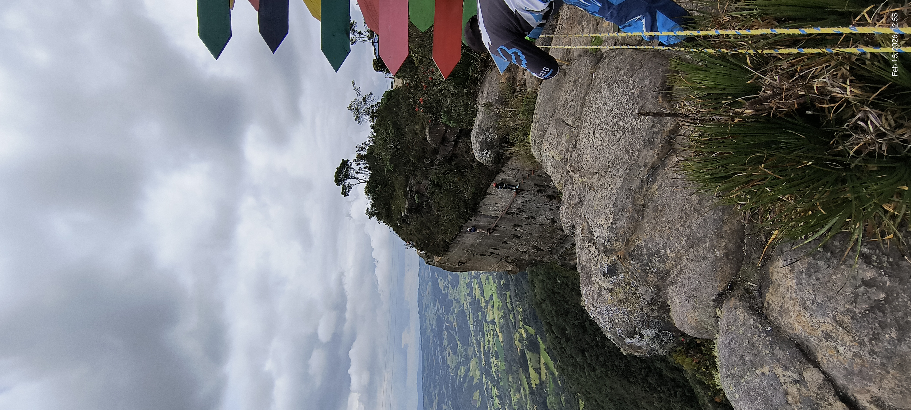

<br><details><summary>:camera:**60/IMG_20260215_125606498.jpg**</summary><sub> `Exif version` 0220 `OS version`  `Date` 2026:02:15 12:56:07 `Aperture` Not known `Brightness` 0.0 `Color space` 1 `Compression` 6`Exposure mode` 0 `Exposure time` 0.000280196 `Focal length` 2.13 `Lens model` Not known `Lens specification` Not known `Orientation` 6 `Scene type` Not known `f number` 2.2 `White balance` 0 `Sensing method` 1 `Shutter speed` 11.801</sub><sub>`Coordinates & altitude` (5.426300027777778, -73.84586333333333, 3376.0)</sub><sub> :globe_with_meridians:`Location over` [Google Maps](http://maps.google.com/maps?q=5.426300027777778,-73.84586333333333) or [Openstreet Map](https://www.openstreetmap.org/query?lat=5.426300027777778&lon=-73.84586333333333)</sub></details>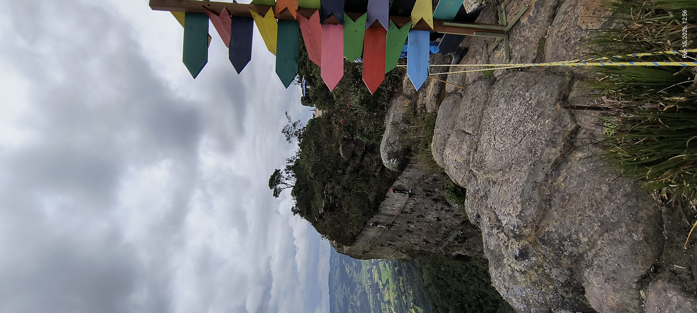

<br><details><summary>:camera:**60/IMG_20260215_125636814_HDR.jpg**</summary><sub> `Exif version` 0220 `OS version`  `Date` 2026:02:15 12:56:38 `Aperture` Not known `Brightness` 0.0 `Color space` 1 `Compression` 6`Exposure mode` 0 `Exposure time` 0.001056 `Focal length` 5.56 `Lens model` Not known `Lens specification` Not known `Orientation` 6 `Scene type` Not known `f number` 1.88 `White balance` 0 `Sensing method` 1 `Shutter speed` 9.887</sub><sub>`Coordinates & altitude` (5.426052083333333, -73.84584044444443, 3376.0)</sub><sub> :globe_with_meridians:`Location over` [Google Maps](http://maps.google.com/maps?q=5.426052083333333,-73.84584044444443) or [Openstreet Map](https://www.openstreetmap.org/query?lat=5.426052083333333&lon=-73.84584044444443)</sub></details>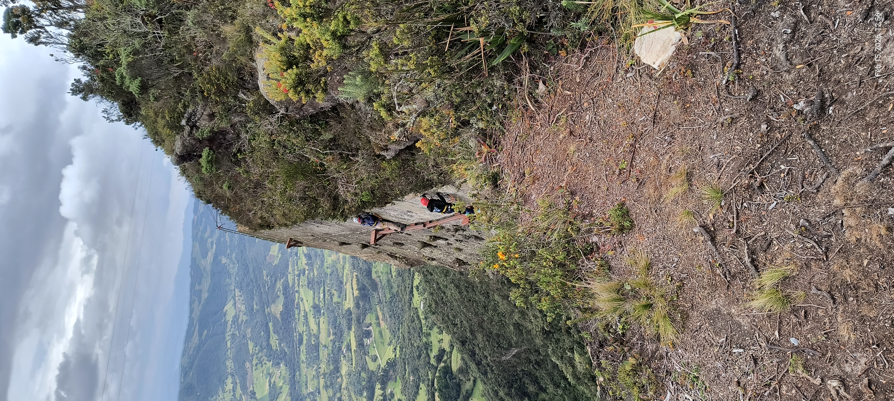

<br><details><summary>:camera:**60/IMG_20260215_125645409.jpg**</summary><sub> `Exif version` 0220 `OS version`  `Date` 2026:02:15 12:56:46 `Aperture` Not known `Brightness` 0.0 `Color space` 1 `Compression` 6`Exposure mode` 0 `Exposure time` 0.002016 `Focal length` 5.56 `Lens model` Not known `Lens specification` Not known `Orientation` 6 `Scene type` Not known `f number` 1.88 `White balance` 0 `Sensing method` 1 `Shutter speed` 8.954</sub><sub>`Coordinates & altitude` (5.426052083333333, -73.84584044444443, 3376.0)</sub><sub> :globe_with_meridians:`Location over` [Google Maps](http://maps.google.com/maps?q=5.426052083333333,-73.84584044444443) or [Openstreet Map](https://www.openstreetmap.org/query?lat=5.426052083333333&lon=-73.84584044444443)</sub></details>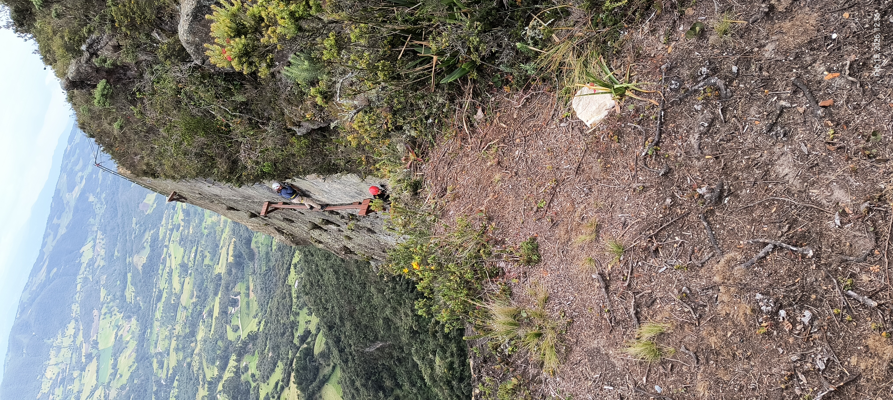

<br><details><summary>:camera:**60/IMG_20260215_125701707_HDR.jpg**</summary><sub> `Exif version` 0220 `OS version`  `Date` 2026:02:15 12:57:03 `Aperture` Not known `Brightness` 0.0 `Color space` 1 `Compression` 6`Exposure mode` 0 `Exposure time` 0.000992 `Focal length` 5.56 `Lens model` Not known `Lens specification` Not known `Orientation` 6 `Scene type` Not known `f number` 1.88 `White balance` 0 `Sensing method` 1 `Shutter speed` 9.977</sub><sub>`Coordinates & altitude` (5.426052083333333, -73.84584044444443, 3376.0)</sub><sub> :globe_with_meridians:`Location over` [Google Maps](http://maps.google.com/maps?q=5.426052083333333,-73.84584044444443) or [Openstreet Map](https://www.openstreetmap.org/query?lat=5.426052083333333&lon=-73.84584044444443)</sub></details>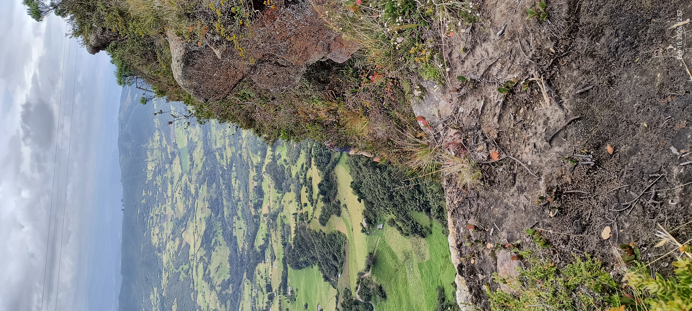

<br><details><summary>:camera:**60/IMG_20260215_125721043_HDR.jpg**</summary><sub> `Exif version` 0220 `OS version`  `Date` 2026:02:15 12:57:22 `Aperture` Not known `Brightness` 0.0 `Color space` 1 `Compression` 6`Exposure mode` 0 `Exposure time` 0.002112 `Focal length` 5.56 `Lens model` Not known `Lens specification` Not known `Orientation` 6 `Scene type` Not known `f number` 1.88 `White balance` 0 `Sensing method` 1 `Shutter speed` 8.887</sub><sub>`Coordinates & altitude` (5.426052083333333, -73.84584044444443, 3376.0)</sub><sub> :globe_with_meridians:`Location over` [Google Maps](http://maps.google.com/maps?q=5.426052083333333,-73.84584044444443) or [Openstreet Map](https://www.openstreetmap.org/query?lat=5.426052083333333&lon=-73.84584044444443)</sub></details>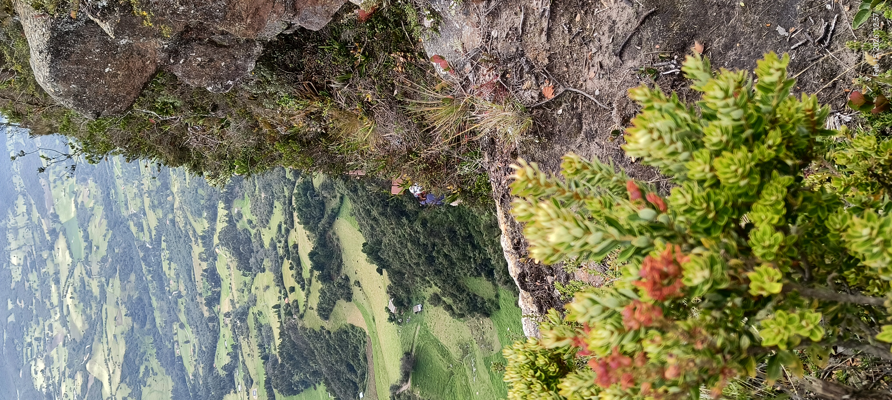

<br><details><summary>:camera:**60/IMG_20260215_125741969_HDR.jpg**</summary><sub> `Exif version` 0220 `OS version`  `Date` 2026:02:15 12:57:43 `Aperture` Not known `Brightness` 0.0 `Color space` 1 `Compression` 6`Exposure mode` 0 `Exposure time` 0.003392 `Focal length` 5.56 `Lens model` Not known `Lens specification` Not known `Orientation` 1 `Scene type` Not known `f number` 1.88 `White balance` 0 `Sensing method` 1 `Shutter speed` 8.203</sub><sub>`Coordinates & altitude` (5.426052083333333, -73.84584044444443, 3376.0)</sub><sub> :globe_with_meridians:`Location over` [Google Maps](http://maps.google.com/maps?q=5.426052083333333,-73.84584044444443) or [Openstreet Map](https://www.openstreetmap.org/query?lat=5.426052083333333&lon=-73.84584044444443)</sub></details>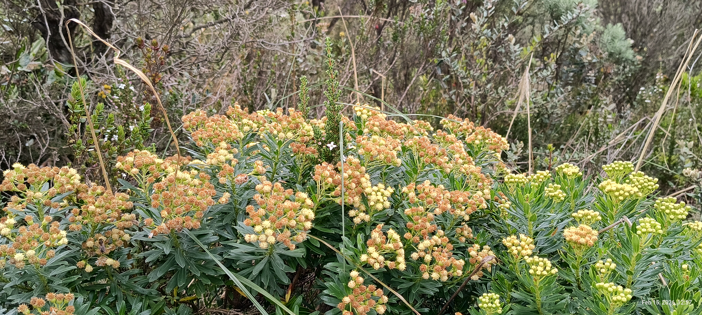

<br><details><summary>:camera:**60/IMG_20260215_125804322.jpg**</summary><sub> `Exif version` 0220 `OS version`  `Date` 2026:02:15 12:58:05 `Aperture` Not known `Brightness` 0.0 `Color space` 1 `Compression` 6`Exposure mode` 0 `Exposure time` 0.000480336 `Focal length` 2.13 `Lens model` Not known `Lens specification` Not known `Orientation` 6 `Scene type` Not known `f number` 2.2 `White balance` 0 `Sensing method` 1 `Shutter speed` 11.023</sub><sub>`Coordinates & altitude` (5.426052083333333, -73.84584044444443, 3376.0)</sub><sub> :globe_with_meridians:`Location over` [Google Maps](http://maps.google.com/maps?q=5.426052083333333,-73.84584044444443) or [Openstreet Map](https://www.openstreetmap.org/query?lat=5.426052083333333&lon=-73.84584044444443)</sub></details>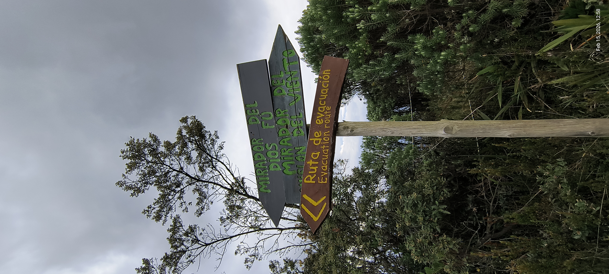

<br><details><summary>:camera:**60/IMG_20260215_125824501.jpg**</summary><sub> `Exif version` 0220 `OS version`  `Date` 2026:02:15 12:58:25 `Aperture` Not known `Brightness` 0.0 `Color space` 1 `Compression` 6`Exposure mode` 0 `Exposure time` 0.000240168 `Focal length` 2.13 `Lens model` Not known `Lens specification` Not known `Orientation` 6 `Scene type` Not known `f number` 2.2 `White balance` 0 `Sensing method` 1 `Shutter speed` 12.023</sub><sub>`Coordinates & altitude` (5.426052083333333, -73.84584044444443, 3376.0)</sub><sub> :globe_with_meridians:`Location over` [Google Maps](http://maps.google.com/maps?q=5.426052083333333,-73.84584044444443) or [Openstreet Map](https://www.openstreetmap.org/query?lat=5.426052083333333&lon=-73.84584044444443)</sub></details>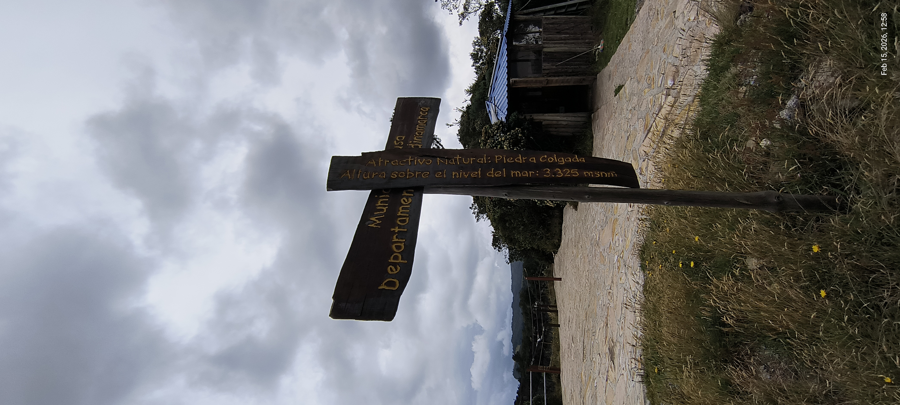

<br><details><summary>:camera:**60/IMG_20260215_125847593.jpg**</summary><sub> `Exif version` 0220 `OS version`  `Date` 2026:02:15 12:58:48 `Aperture` Not known `Brightness` 0.0 `Color space` 1 `Compression` 6`Exposure mode` 0 `Exposure time` 0.000540378 `Focal length` 2.13 `Lens model` Not known `Lens specification` Not known `Orientation` 6 `Scene type` Not known `f number` 2.2 `White balance` 0 `Sensing method` 1 `Shutter speed` 10.853</sub><sub>`Coordinates & altitude` (5.426052083333333, -73.84584044444443, 3376.0)</sub><sub> :globe_with_meridians:`Location over` [Google Maps](http://maps.google.com/maps?q=5.426052083333333,-73.84584044444443) or [Openstreet Map](https://www.openstreetmap.org/query?lat=5.426052083333333&lon=-73.84584044444443)</sub></details>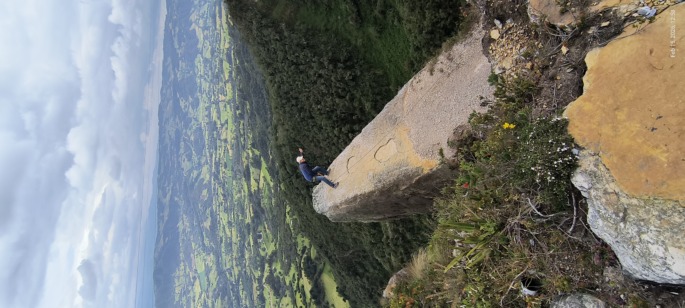

<br><details><summary>:camera:**60/IMG_20260215_125854246.jpg**</summary><sub> `Exif version` 0220 `OS version`  `Date` 2026:02:15 12:58:55 `Aperture` Not known `Brightness` 0.0 `Color space` 1 `Compression` 6`Exposure mode` 0 `Exposure time` 0.000880616 `Focal length` 2.13 `Lens model` Not known `Lens specification` Not known `Orientation` 1 `Scene type` Not known `f number` 2.2 `White balance` 0 `Sensing method` 1 `Shutter speed` 10.149</sub><sub>`Coordinates & altitude` (5.426052083333333, -73.84584044444443, 3376.0)</sub><sub> :globe_with_meridians:`Location over` [Google Maps](http://maps.google.com/maps?q=5.426052083333333,-73.84584044444443) or [Openstreet Map](https://www.openstreetmap.org/query?lat=5.426052083333333&lon=-73.84584044444443)</sub></details>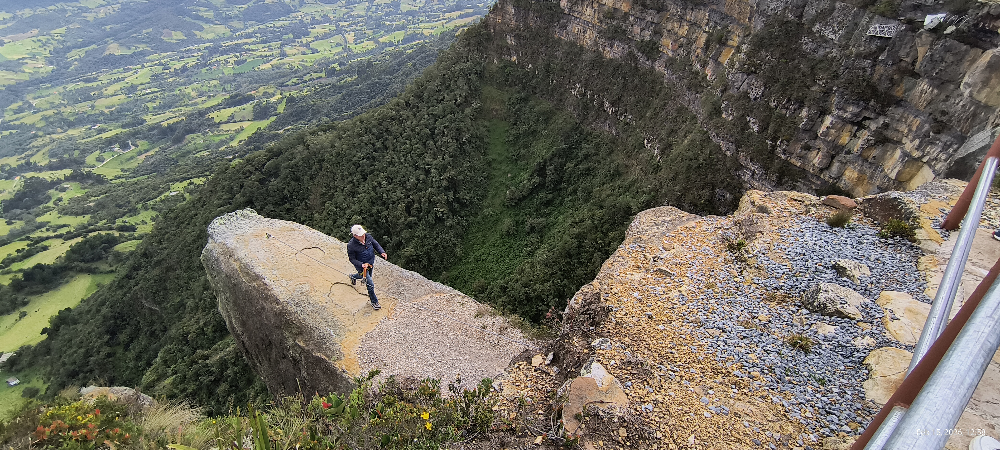

<br><details><summary>:camera:**60/IMG_20260215_130218557.jpg**</summary><sub> `Exif version` 0220 `OS version`  `Date` 2026:02:15 13:02:19 `Aperture` Not known `Brightness` 0.0 `Color space` 1 `Compression` 6`Exposure mode` 0 `Exposure time` 0.001696 `Focal length` 5.56 `Lens model` Not known `Lens specification` Not known `Orientation` 3 `Scene type` Not known `f number` 1.88 `White balance` 0 `Sensing method` 1 `Shutter speed` 9.203</sub><sub>`Coordinates & altitude` (5.425789833333334, -73.845726, 3400.0)</sub><sub> :globe_with_meridians:`Location over` [Google Maps](http://maps.google.com/maps?q=5.425789833333334,-73.845726) or [Openstreet Map](https://www.openstreetmap.org/query?lat=5.425789833333334&lon=-73.845726)</sub></details>

<br><details><summary>:camera:**60/IMG_20260215_130233682.jpg**</summary><sub> `Exif version` 0220 `OS version`  `Date` 2026:02:15 13:02:34 `Aperture` Not known `Brightness` 0.0 `Color space` 1 `Compression` 6`Exposure mode` 0 `Exposure time` 0.00096 `Focal length` 5.56 `Lens model` Not known `Lens specification` Not known `Orientation` 6 `Scene type` Not known `f number` 1.88 `White balance` 0 `Sensing method` 1 `Shutter speed` 10.024</sub><sub>`Coordinates & altitude` (5.425789833333334, -73.845726, 3400.0)</sub><sub> :globe_with_meridians:`Location over` [Google Maps](http://maps.google.com/maps?q=5.425789833333334,-73.845726) or [Openstreet Map](https://www.openstreetmap.org/query?lat=5.425789833333334&lon=-73.845726)</sub></details>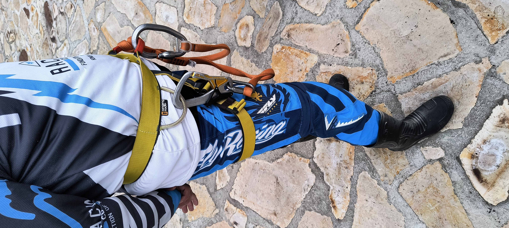

<br><details><summary>:camera:**60/IMG_20260215_130239611.jpg**</summary><sub> `Exif version` 0220 `OS version`  `Date` 2026:02:15 13:02:40 `Aperture` Not known `Brightness` 0.0 `Color space` 1 `Compression` 6`Exposure mode` 0 `Exposure time` 0.001504 `Focal length` 5.56 `Lens model` Not known `Lens specification` Not known `Orientation` 6 `Scene type` Not known `f number` 1.88 `White balance` 0 `Sensing method` 1 `Shutter speed` 9.376</sub><sub>`Coordinates & altitude` (5.425789833333334, -73.845726, 3400.0)</sub><sub> :globe_with_meridians:`Location over` [Google Maps](http://maps.google.com/maps?q=5.425789833333334,-73.845726) or [Openstreet Map](https://www.openstreetmap.org/query?lat=5.425789833333334&lon=-73.845726)</sub></details>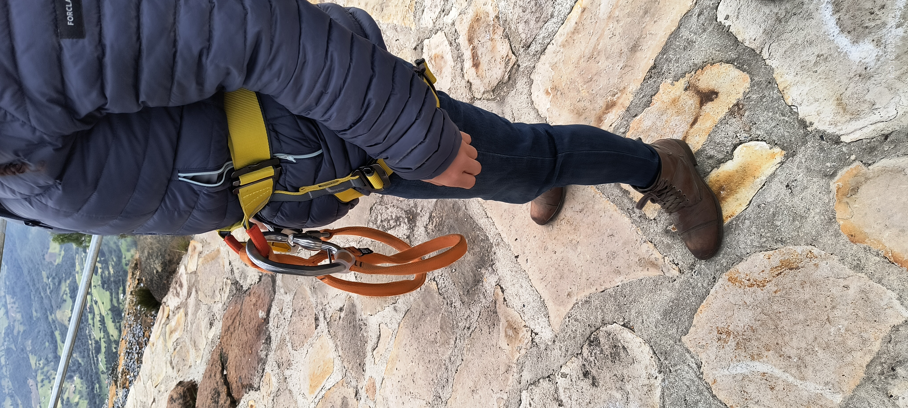

<br><details><summary>:camera:**60/IMG_20260215_130723761.jpg**</summary><sub> `Exif version` 0220 `OS version`  `Date` 2026:02:15 13:07:24 `Aperture` Not known `Brightness` 0.0 `Color space` 1 `Compression` 6`Exposure mode` 0 `Exposure time` 0.001472 `Focal length` 5.56 `Lens model` Not known `Lens specification` Not known `Orientation` 6 `Scene type` Not known `f number` 1.88 `White balance` 0 `Sensing method` 1 `Shutter speed` 9.408</sub><sub>`Coordinates & altitude` (5.425611972222223, -73.84579466666666, 3378.0)</sub><sub> :globe_with_meridians:`Location over` [Google Maps](http://maps.google.com/maps?q=5.425611972222223,-73.84579466666666) or [Openstreet Map](https://www.openstreetmap.org/query?lat=5.425611972222223&lon=-73.84579466666666)</sub></details>

<br><details><summary>:camera:**60/IMG_20260215_130852364_HDR.jpg**</summary><sub> `Exif version` 0220 `OS version`  `Date` 2026:02:15 13:08:54 `Aperture` Not known `Brightness` 0.0 `Color space` 1 `Compression` 6`Exposure mode` 0 `Exposure time` 0.001504 `Focal length` 5.56 `Lens model` Not known `Lens specification` Not known `Orientation` 6 `Scene type` Not known `f number` 1.88 `White balance` 0 `Sensing method` 1 `Shutter speed` 9.376</sub><sub>`Coordinates & altitude` (5.425644861111111, -73.84574888888888, 3378.0)</sub><sub> :globe_with_meridians:`Location over` [Google Maps](http://maps.google.com/maps?q=5.425644861111111,-73.84574888888888) or [Openstreet Map](https://www.openstreetmap.org/query?lat=5.425644861111111&lon=-73.84574888888888)</sub></details>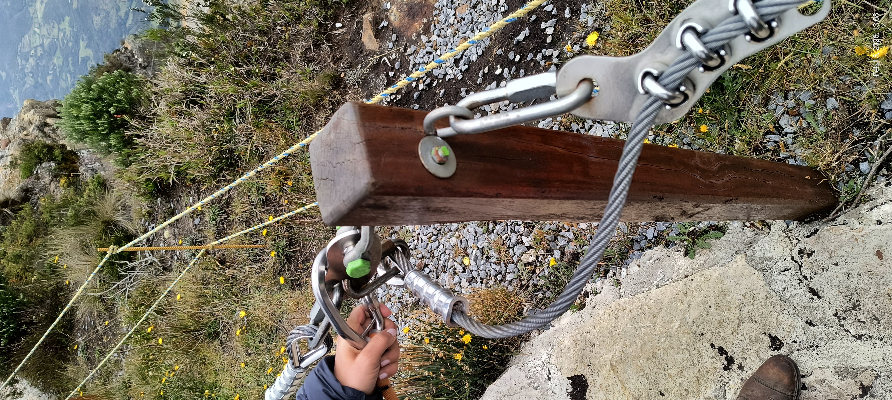

<br><details><summary>:camera:**60/IMG_20260215_130921771.jpg**</summary><sub> `Exif version` 0220 `OS version`  `Date` 2026:02:15 13:09:22 `Aperture` Not known `Brightness` 0.0 `Color space` 1 `Compression` 6`Exposure mode` 0 `Exposure time` 0.00112 `Focal length` 5.56 `Lens model` Not known `Lens specification` Not known `Orientation` 6 `Scene type` Not known `f number` 1.88 `White balance` 0 `Sensing method` 1 `Shutter speed` 9.802</sub><sub>`Coordinates & altitude` (5.425644861111111, -73.84574888888888, 3378.0)</sub><sub> :globe_with_meridians:`Location over` [Google Maps](http://maps.google.com/maps?q=5.425644861111111,-73.84574888888888) or [Openstreet Map](https://www.openstreetmap.org/query?lat=5.425644861111111&lon=-73.84574888888888)</sub></details>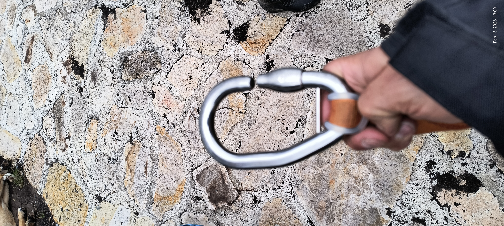

<br><details><summary>:camera:**60/IMG_20260215_131206448_HDR.jpg**</summary><sub> `Exif version` 0220 `OS version`  `Date` 2026:02:15 13:12:08 `Aperture` Not known `Brightness` 0.0 `Color space` 1 `Compression` 6`Exposure mode` 0 `Exposure time` 0.00064 `Focal length` 5.56 `Lens model` Not known `Lens specification` Not known `Orientation` 6 `Scene type` Not known `f number` 1.88 `White balance` 0 `Sensing method` 1 `Shutter speed` 10.609</sub><sub>`Coordinates & altitude` (5.425561888888889, -73.84583280555555, 3378.0)</sub><sub> :globe_with_meridians:`Location over` [Google Maps](http://maps.google.com/maps?q=5.425561888888889,-73.84583280555555) or [Openstreet Map](https://www.openstreetmap.org/query?lat=5.425561888888889&lon=-73.84583280555555)</sub></details>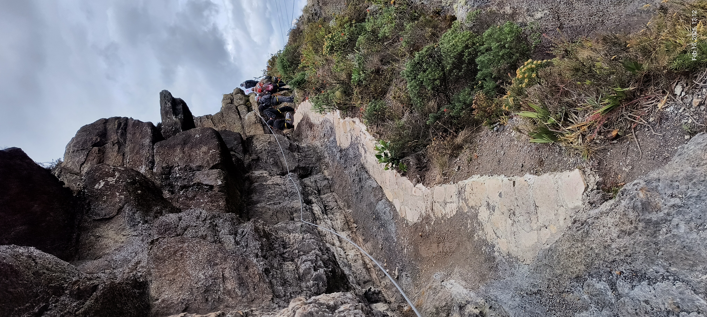

<br><details><summary>:camera:**60/IMG_20260215_131215177.jpg**</summary><sub> `Exif version` 0220 `OS version`  `Date` 2026:02:15 13:12:15 `Aperture` Not known `Brightness` 0.0 `Color space` 1 `Compression` 6`Exposure mode` 0 `Exposure time` 0.000512 `Focal length` 5.56 `Lens model` Not known `Lens specification` Not known `Orientation` 6 `Scene type` Not known `f number` 1.88 `White balance` 0 `Sensing method` 1 `Shutter speed` 10.931</sub><sub>`Coordinates & altitude` (5.425561888888889, -73.84583280555555, 3378.0)</sub><sub> :globe_with_meridians:`Location over` [Google Maps](http://maps.google.com/maps?q=5.425561888888889,-73.84583280555555) or [Openstreet Map](https://www.openstreetmap.org/query?lat=5.425561888888889&lon=-73.84583280555555)</sub></details>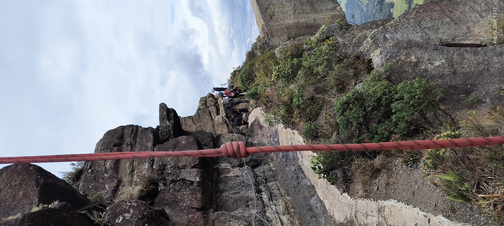

<br><details><summary>:camera:**60/IMG_20260215_131222250_HDR.jpg**</summary><sub> `Exif version` 0220 `OS version`  `Date` 2026:02:15 13:12:23 `Aperture` Not known `Brightness` 0.0 `Color space` 1 `Compression` 6`Exposure mode` 0 `Exposure time` 0.000384 `Focal length` 5.56 `Lens model` Not known `Lens specification` Not known `Orientation` 6 `Scene type` Not known `f number` 1.88 `White balance` 0 `Sensing method` 1 `Shutter speed` 11.346</sub><sub>`Coordinates & altitude` (5.425561888888889, -73.84583280555555, 3378.0)</sub><sub> :globe_with_meridians:`Location over` [Google Maps](http://maps.google.com/maps?q=5.425561888888889,-73.84583280555555) or [Openstreet Map](https://www.openstreetmap.org/query?lat=5.425561888888889&lon=-73.84583280555555)</sub></details>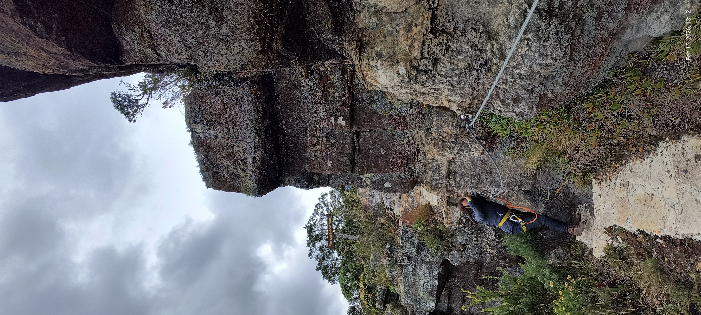

<br><details><summary>:camera:**60/IMG_20260215_131227720.jpg**</summary><sub> `Exif version` 0220 `OS version`  `Date` 2026:02:15 13:12:28 `Aperture` Not known `Brightness` 0.0 `Color space` 1 `Compression` 6`Exposure mode` 0 `Exposure time` 0.000384 `Focal length` 5.56 `Lens model` Not known `Lens specification` Not known `Orientation` 6 `Scene type` Not known `f number` 1.88 `White balance` 0 `Sensing method` 1 `Shutter speed` 11.346</sub><sub>`Coordinates & altitude` (5.425561888888889, -73.84583280555555, 3378.0)</sub><sub> :globe_with_meridians:`Location over` [Google Maps](http://maps.google.com/maps?q=5.425561888888889,-73.84583280555555) or [Openstreet Map](https://www.openstreetmap.org/query?lat=5.425561888888889&lon=-73.84583280555555)</sub></details>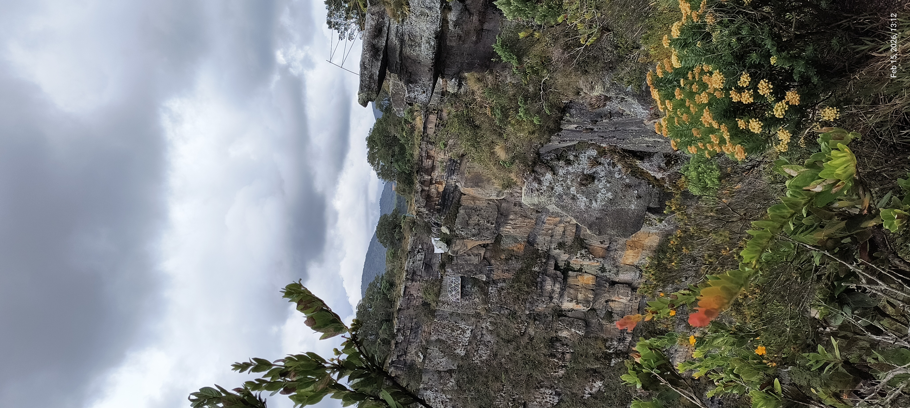

<br><details><summary>:camera:**60/IMG_20260215_131237300_HDR.jpg**</summary><sub> `Exif version` 0220 `OS version`  `Date` 2026:02:15 13:12:38 `Aperture` Not known `Brightness` 0.0 `Color space` 1 `Compression` 6`Exposure mode` 0 `Exposure time` 0.00048 `Focal length` 5.56 `Lens model` Not known `Lens specification` Not known `Orientation` 1 `Scene type` Not known `f number` 1.88 `White balance` 0 `Sensing method` 1 `Shutter speed` 11.024</sub><sub>`Coordinates & altitude` (5.425561888888889, -73.84583280555555, 3378.0)</sub><sub> :globe_with_meridians:`Location over` [Google Maps](http://maps.google.com/maps?q=5.425561888888889,-73.84583280555555) or [Openstreet Map](https://www.openstreetmap.org/query?lat=5.425561888888889&lon=-73.84583280555555)</sub></details>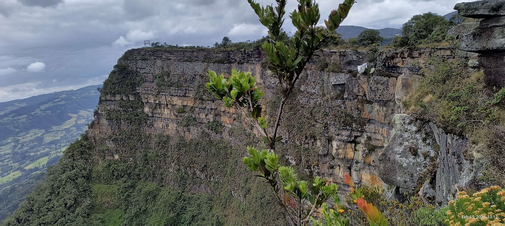

<br><details><summary>:camera:**60/IMG_20260215_131310754_HDR.jpg**</summary><sub> `Exif version` 0220 `OS version`  `Date` 2026:02:15 13:13:12 `Aperture` Not known `Brightness` 0.0 `Color space` 1 `Compression` 6`Exposure mode` 0 `Exposure time` 0.003552 `Focal length` 5.56 `Lens model` Not known `Lens specification` Not known `Orientation` 1 `Scene type` Not known `f number` 1.88 `White balance` 0 `Sensing method` 1 `Shutter speed` 8.137</sub><sub>`Coordinates & altitude` (5.425601944444445, -73.84564969444445, 3378.0)</sub><sub> :globe_with_meridians:`Location over` [Google Maps](http://maps.google.com/maps?q=5.425601944444445,-73.84564969444445) or [Openstreet Map](https://www.openstreetmap.org/query?lat=5.425601944444445&lon=-73.84564969444445)</sub></details>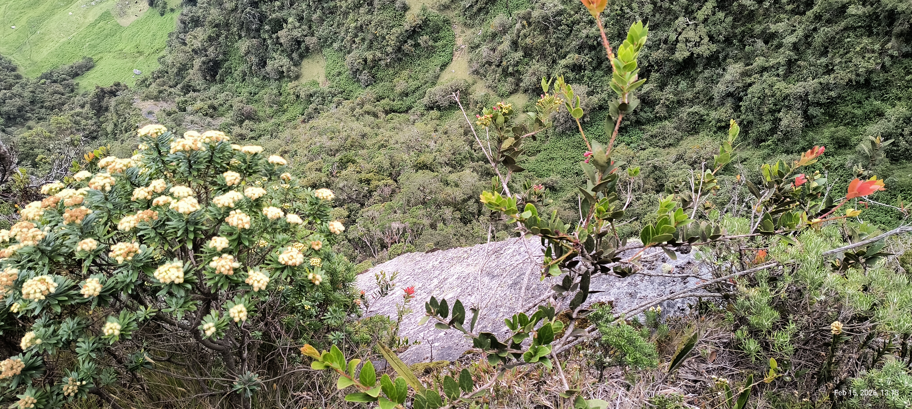

<br><details><summary>:camera:**60/IMG_20260215_131315426_HDR.jpg**</summary><sub> `Exif version` 0220 `OS version`  `Date` 2026:02:15 13:13:17 `Aperture` Not known `Brightness` 0.0 `Color space` 1 `Compression` 6`Exposure mode` 0 `Exposure time` 0.00112 `Focal length` 5.56 `Lens model` Not known `Lens specification` Not known `Orientation` 1 `Scene type` Not known `f number` 1.88 `White balance` 0 `Sensing method` 1 `Shutter speed` 9.802</sub><sub>`Coordinates & altitude` (5.425601944444445, -73.84564969444445, 3378.0)</sub><sub> :globe_with_meridians:`Location over` [Google Maps](http://maps.google.com/maps?q=5.425601944444445,-73.84564969444445) or [Openstreet Map](https://www.openstreetmap.org/query?lat=5.425601944444445&lon=-73.84564969444445)</sub></details>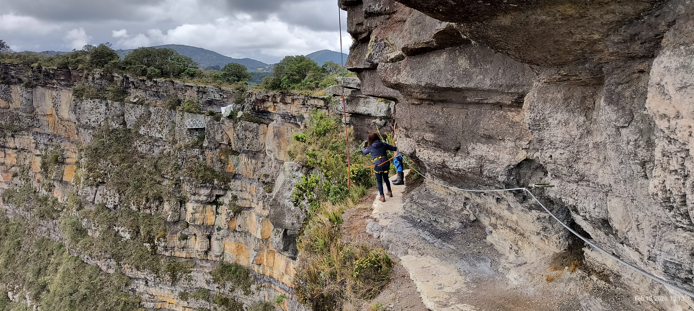

<br><details><summary>:camera:**60/IMG_20260215_131321313.jpg**</summary><sub> `Exif version` 0220 `OS version`  `Date` 2026:02:15 13:13:22 `Aperture` Not known `Brightness` 0.0 `Color space` 1 `Compression` 6`Exposure mode` 0 `Exposure time` 0.000680476 `Focal length` 2.13 `Lens model` Not known `Lens specification` Not known `Orientation` 6 `Scene type` Not known `f number` 2.2 `White balance` 0 `Sensing method` 1 `Shutter speed` 10.521</sub><sub>`Coordinates & altitude` (5.425601944444445, -73.84564969444445, 3378.0)</sub><sub> :globe_with_meridians:`Location over` [Google Maps](http://maps.google.com/maps?q=5.425601944444445,-73.84564969444445) or [Openstreet Map](https://www.openstreetmap.org/query?lat=5.425601944444445&lon=-73.84564969444445)</sub></details>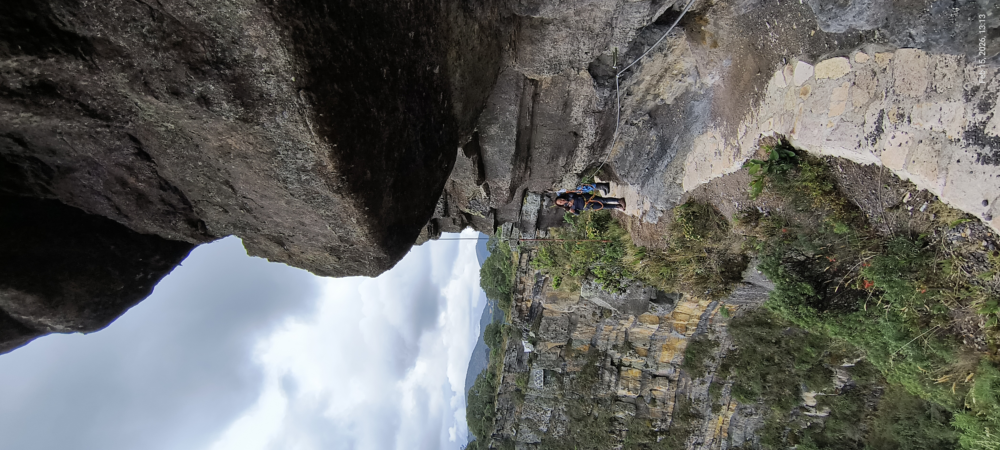

<br><details><summary>:camera:**60/IMG_20260215_131346782.jpg**</summary><sub> `Exif version` 0220 `OS version`  `Date` 2026:02:15 13:13:47 `Aperture` Not known `Brightness` 0.0 `Color space` 1 `Compression` 6`Exposure mode` 0 `Exposure time` 0.000710497 `Focal length` 2.13 `Lens model` Not known `Lens specification` Not known `Orientation` 6 `Scene type` Not known `f number` 2.2 `White balance` 0 `Sensing method` 1 `Shutter speed` 10.458</sub><sub>`Coordinates & altitude` (5.425601944444445, -73.84564969444445, 3378.0)</sub><sub> :globe_with_meridians:`Location over` [Google Maps](http://maps.google.com/maps?q=5.425601944444445,-73.84564969444445) or [Openstreet Map](https://www.openstreetmap.org/query?lat=5.425601944444445&lon=-73.84564969444445)</sub></details>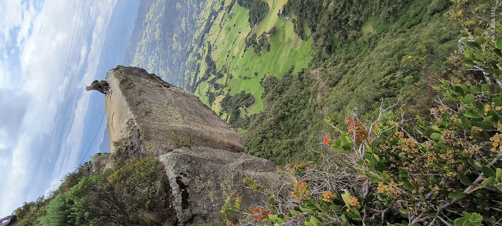

<br><details><summary>:camera:**60/IMG_20260215_131355014.jpg**</summary><sub> `Exif version` 0220 `OS version`  `Date` 2026:02:15 13:13:55 `Aperture` Not known `Brightness` 0.0 `Color space` 1 `Compression` 6`Exposure mode` 0 `Exposure time` 0.000530371 `Focal length` 2.13 `Lens model` Not known `Lens specification` Not known `Orientation` 6 `Scene type` Not known `f number` 2.2 `White balance` 0 `Sensing method` 1 `Shutter speed` 10.88</sub><sub>`Coordinates & altitude` (5.425601944444445, -73.84564969444445, 3378.0)</sub><sub> :globe_with_meridians:`Location over` [Google Maps](http://maps.google.com/maps?q=5.425601944444445,-73.84564969444445) or [Openstreet Map](https://www.openstreetmap.org/query?lat=5.425601944444445&lon=-73.84564969444445)</sub></details>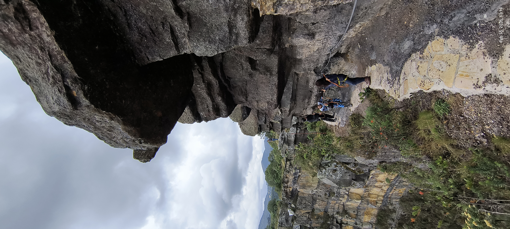

<br><details><summary>:camera:**60/IMG_20260215_131359576.jpg**</summary><sub> `Exif version` 0220 `OS version`  `Date` 2026:02:15 13:14:00 `Aperture` Not known `Brightness` 0.0 `Color space` 1 `Compression` 6`Exposure mode` 0 `Exposure time` 0.00110077 `Focal length` 2.13 `Lens model` Not known `Lens specification` Not known `Orientation` 6 `Scene type` Not known `f number` 2.2 `White balance` 0 `Sensing method` 1 `Shutter speed` 9.827</sub><sub>`Coordinates & altitude` (5.425601944444445, -73.84564969444445, 3378.0)</sub><sub> :globe_with_meridians:`Location over` [Google Maps](http://maps.google.com/maps?q=5.425601944444445,-73.84564969444445) or [Openstreet Map](https://www.openstreetmap.org/query?lat=5.425601944444445&lon=-73.84564969444445)</sub></details>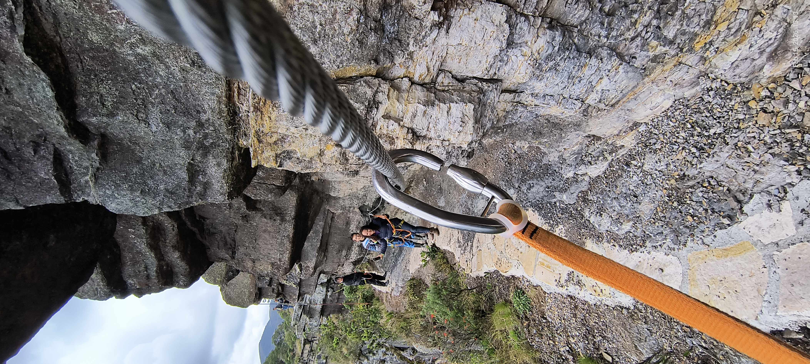

<br><details><summary>:camera:**60/IMG_20260215_131412635_HDR.jpg**</summary><sub> `Exif version` 0220 `OS version`  `Date` 2026:02:15 13:14:15 `Aperture` Not known `Brightness` 0.0 `Color space` 1 `Compression` 6`Exposure mode` 0 `Exposure time` 0.002321624 `Focal length` 2.13 `Lens model` Not known `Lens specification` Not known `Orientation` 6 `Scene type` Not known `f number` 2.2 `White balance` 0 `Sensing method` 1 `Shutter speed` 8.75</sub><sub>`Coordinates & altitude` (5.425601944444445, -73.84564969444445, 3378.0)</sub><sub> :globe_with_meridians:`Location over` [Google Maps](http://maps.google.com/maps?q=5.425601944444445,-73.84564969444445) or [Openstreet Map](https://www.openstreetmap.org/query?lat=5.425601944444445&lon=-73.84564969444445)</sub></details>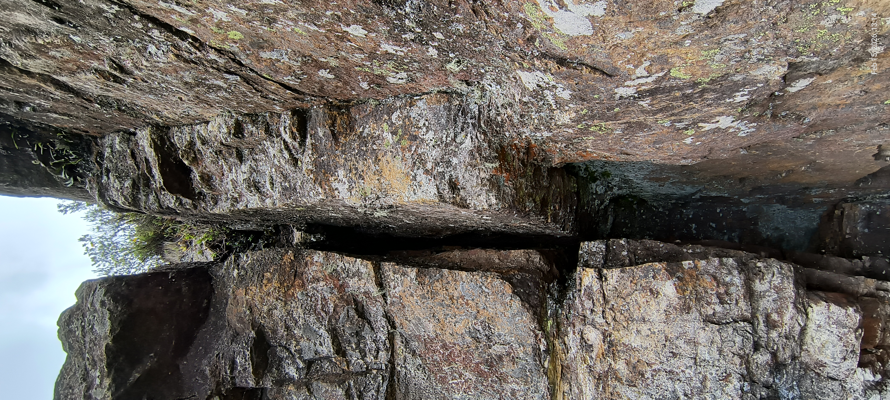

<br><details><summary>:camera:**60/IMG_20260215_131446918.jpg**</summary><sub> `Exif version` 0220 `OS version`  `Date` 2026:02:15 13:14:47 `Aperture` Not known `Brightness` 0.0 `Color space` 1 `Compression` 6`Exposure mode` 0 `Exposure time` 0.001190833 `Focal length` 2.13 `Lens model` Not known `Lens specification` Not known `Orientation` 6 `Scene type` Not known `f number` 2.2 `White balance` 0 `Sensing method` 1 `Shutter speed` 9.713</sub><sub>`Coordinates & altitude` (5.425601944444445, -73.84564969444445, 3378.0)</sub><sub> :globe_with_meridians:`Location over` [Google Maps](http://maps.google.com/maps?q=5.425601944444445,-73.84564969444445) or [Openstreet Map](https://www.openstreetmap.org/query?lat=5.425601944444445&lon=-73.84564969444445)</sub></details>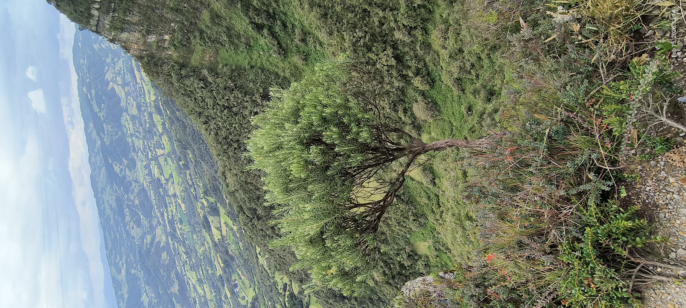

<br><details><summary>:camera:**60/IMG_20260215_131456432.jpg**</summary><sub> `Exif version` 0220 `OS version`  `Date` 2026:02:15 13:14:57 `Aperture` Not known `Brightness` 0.0 `Color space` 1 `Compression` 6`Exposure mode` 0 `Exposure time` 0.000520364 `Focal length` 2.13 `Lens model` Not known `Lens specification` Not known `Orientation` 6 `Scene type` Not known `f number` 2.2 `White balance` 0 `Sensing method` 1 `Shutter speed` 10.908</sub><sub>`Coordinates & altitude` (5.425601944444445, -73.84564969444445, 3378.0)</sub><sub> :globe_with_meridians:`Location over` [Google Maps](http://maps.google.com/maps?q=5.425601944444445,-73.84564969444445) or [Openstreet Map](https://www.openstreetmap.org/query?lat=5.425601944444445&lon=-73.84564969444445)</sub></details>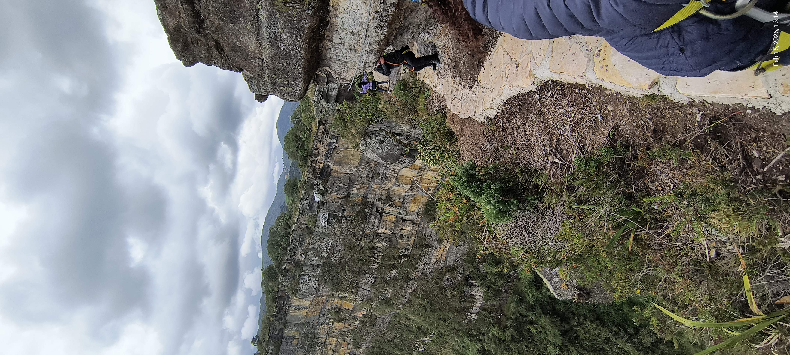

<br><details><summary>:camera:**60/IMG_20260215_131501218.jpg**</summary><sub> `Exif version` 0220 `OS version`  `Date` 2026:02:15 13:15:02 `Aperture` Not known `Brightness` 0.0 `Color space` 1 `Compression` 6`Exposure mode` 0 `Exposure time` 0.000360252 `Focal length` 2.13 `Lens model` Not known `Lens specification` Not known `Orientation` 6 `Scene type` Not known `f number` 2.2 `White balance` 0 `Sensing method` 1 `Shutter speed` 11.438</sub><sub>`Coordinates & altitude` (5.425601944444445, -73.84564969444445, 3378.0)</sub><sub> :globe_with_meridians:`Location over` [Google Maps](http://maps.google.com/maps?q=5.425601944444445,-73.84564969444445) or [Openstreet Map](https://www.openstreetmap.org/query?lat=5.425601944444445&lon=-73.84564969444445)</sub></details>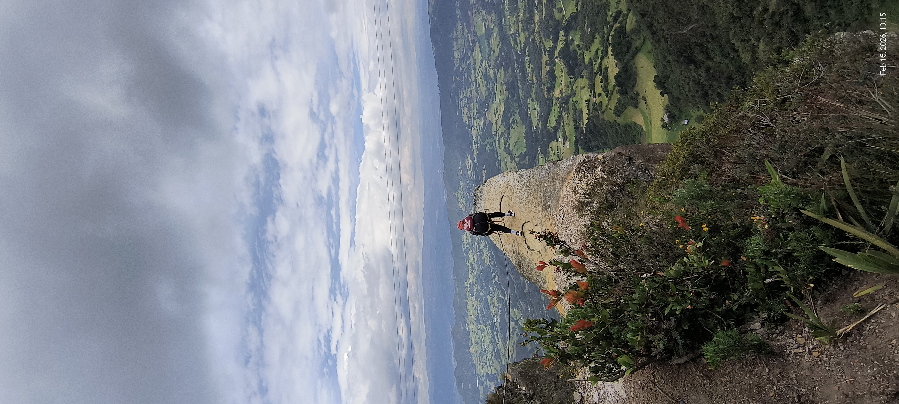

<br><details><summary>:camera:**60/IMG_20260215_131743471_HDR.jpg**</summary><sub> `Exif version` 0220 `OS version`  `Date` 2026:02:15 13:17:45 `Aperture` Not known `Brightness` 0.0 `Color space` 1 `Compression` 6`Exposure mode` 0 `Exposure time` 0.002464 `Focal length` 5.56 `Lens model` Not known `Lens specification` Not known `Orientation` 6 `Scene type` Not known `f number` 1.88 `White balance` 0 `Sensing method` 1 `Shutter speed` 8.664</sub><sub>`Coordinates & altitude` (5.425558083333334, -73.84584808333332, 3377.0)</sub><sub> :globe_with_meridians:`Location over` [Google Maps](http://maps.google.com/maps?q=5.425558083333334,-73.84584808333332) or [Openstreet Map](https://www.openstreetmap.org/query?lat=5.425558083333334&lon=-73.84584808333332)</sub></details>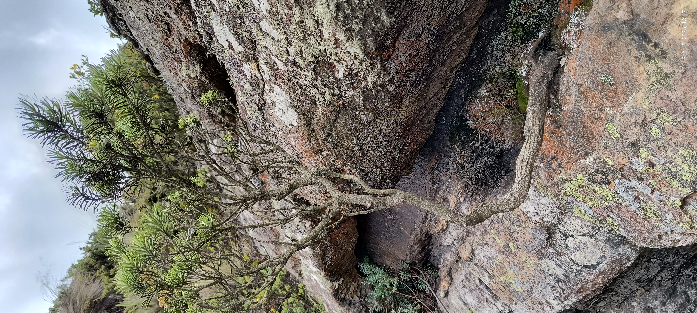

<br><details><summary>:camera:**60/IMG_20260215_131750938.jpg**</summary><sub> `Exif version` 0220 `OS version`  `Date` 2026:02:15 13:17:52 `Aperture` Not known `Brightness` 0.0 `Color space` 1 `Compression` 6`Exposure mode` 0 `Exposure time` 0.000750525 `Focal length` 2.13 `Lens model` Not known `Lens specification` Not known `Orientation` 1 `Scene type` Not known `f number` 2.2 `White balance` 0 `Sensing method` 1 `Shutter speed` 10.379</sub><sub>`Coordinates & altitude` (5.425558083333334, -73.84584808333332, 3377.0)</sub><sub> :globe_with_meridians:`Location over` [Google Maps](http://maps.google.com/maps?q=5.425558083333334,-73.84584808333332) or [Openstreet Map](https://www.openstreetmap.org/query?lat=5.425558083333334&lon=-73.84584808333332)</sub></details>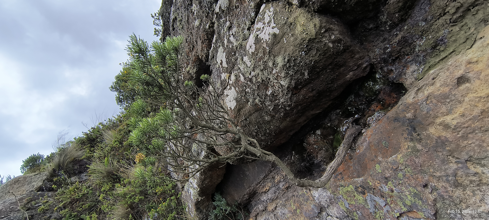

<br><details><summary>:camera:**60/IMG_20260215_131753919.jpg**</summary><sub> `Exif version` 0220 `OS version`  `Date` 2026:02:15 13:17:54 `Aperture` Not known `Brightness` 0.0 `Color space` 1 `Compression` 6`Exposure mode` 0 `Exposure time` 0.000380266 `Focal length` 2.13 `Lens model` Not known `Lens specification` Not known `Orientation` 1 `Scene type` Not known `f number` 2.2 `White balance` 0 `Sensing method` 1 `Shutter speed` 11.36</sub><sub>`Coordinates & altitude` (5.425558083333334, -73.84584808333332, 3377.0)</sub><sub> :globe_with_meridians:`Location over` [Google Maps](http://maps.google.com/maps?q=5.425558083333334,-73.84584808333332) or [Openstreet Map](https://www.openstreetmap.org/query?lat=5.425558083333334&lon=-73.84584808333332)</sub></details>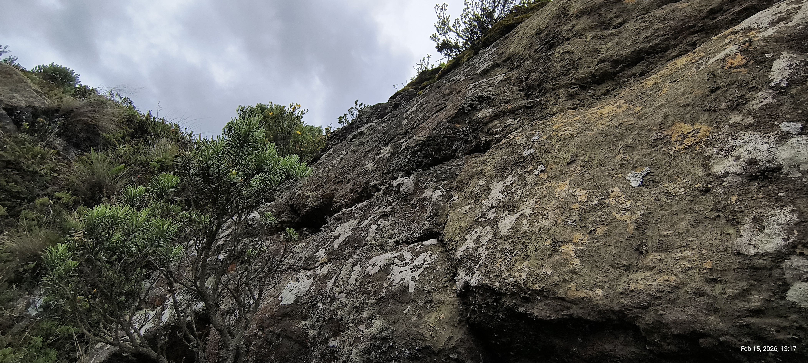

<br><details><summary>:camera:**60/IMG_20260215_132001975.jpg**</summary><sub> `Exif version` 0220 `OS version`  `Date` 2026:02:15 13:20:02 `Aperture` Not known `Brightness` 0.0 `Color space` 1 `Compression` 6`Exposure mode` 0 `Exposure time` 0.000352 `Focal length` 5.56 `Lens model` Not known `Lens specification` Not known `Orientation` 1 `Scene type` Not known `f number` 1.88 `White balance` 0 `Sensing method` 1 `Shutter speed` 11.472</sub><sub>`Coordinates & altitude` (5.425686833333334, -73.84578702777777, 3379.0)</sub><sub> :globe_with_meridians:`Location over` [Google Maps](http://maps.google.com/maps?q=5.425686833333334,-73.84578702777777) or [Openstreet Map](https://www.openstreetmap.org/query?lat=5.425686833333334&lon=-73.84578702777777)</sub></details>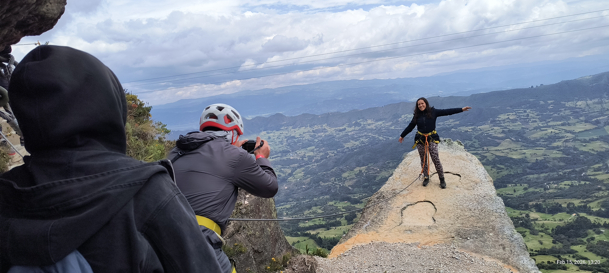

<br><details><summary>:camera:**60/IMG_20260215_132543051.jpg**</summary><sub> `Exif version` 0220 `OS version`  `Date` 2026:02:15 13:25:44 `Aperture` Not known `Brightness` 0.0 `Color space` 1 `Compression` 6`Exposure mode` 0 `Exposure time` 0.001792 `Focal length` 5.56 `Lens model` Not known `Lens specification` Not known `Orientation` 1 `Scene type` Not known `f number` 1.88 `White balance` 0 `Sensing method` 1 `Shutter speed` 9.124</sub><sub>`Coordinates & altitude` (5.425686833333334, -73.84578702777777, 3379.0)</sub><sub> :globe_with_meridians:`Location over` [Google Maps](http://maps.google.com/maps?q=5.425686833333334,-73.84578702777777) or [Openstreet Map](https://www.openstreetmap.org/query?lat=5.425686833333334&lon=-73.84578702777777)</sub></details>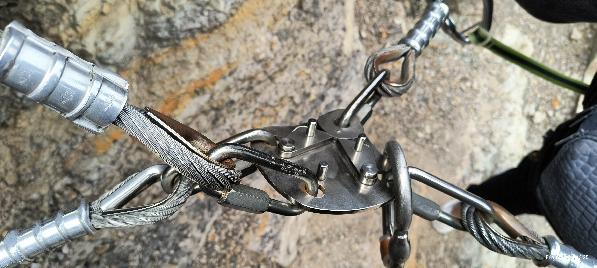

<br><details><summary>:camera:**60/IMG_20260215_132746560.jpg**</summary><sub> `Exif version` 0220 `OS version`  `Date` 2026:02:15 13:27:47 `Aperture` Not known `Brightness` 0.0 `Color space` 1 `Compression` 6`Exposure mode` 0 `Exposure time` 0.000352 `Focal length` 5.56 `Lens model` Not known `Lens specification` Not known `Orientation` 6 `Scene type` Not known `f number` 1.88 `White balance` 0 `Sensing method` 1 `Shutter speed` 11.472</sub><sub>`Coordinates & altitude` (5.425611972222223, -73.84581755555556, 3357.0)</sub><sub> :globe_with_meridians:`Location over` [Google Maps](http://maps.google.com/maps?q=5.425611972222223,-73.84581755555556) or [Openstreet Map](https://www.openstreetmap.org/query?lat=5.425611972222223&lon=-73.84581755555556)</sub></details>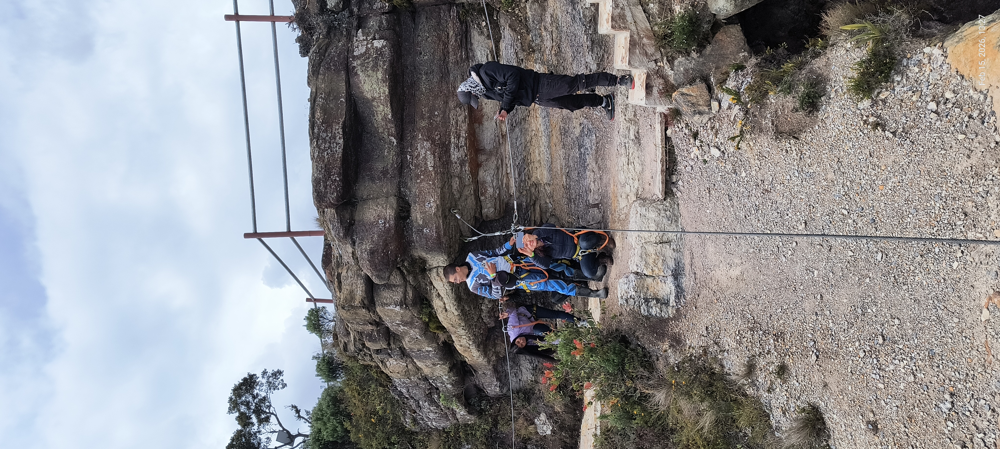

<br><details><summary>:camera:**60/IMG_20260215_132749974.jpg**</summary><sub> `Exif version` 0220 `OS version`  `Date` 2026:02:15 13:27:51 `Aperture` Not known `Brightness` 0.0 `Color space` 1 `Compression` 6`Exposure mode` 0 `Exposure time` 0.000450315 `Focal length` 2.13 `Lens model` Not known `Lens specification` Not known `Orientation` 1 `Scene type` Not known `f number` 2.2 `White balance` 0 `Sensing method` 1 `Shutter speed` 11.116</sub><sub>`Coordinates & altitude` (5.425611972222223, -73.84581755555556, 3357.0)</sub><sub> :globe_with_meridians:`Location over` [Google Maps](http://maps.google.com/maps?q=5.425611972222223,-73.84581755555556) or [Openstreet Map](https://www.openstreetmap.org/query?lat=5.425611972222223&lon=-73.84581755555556)</sub></details>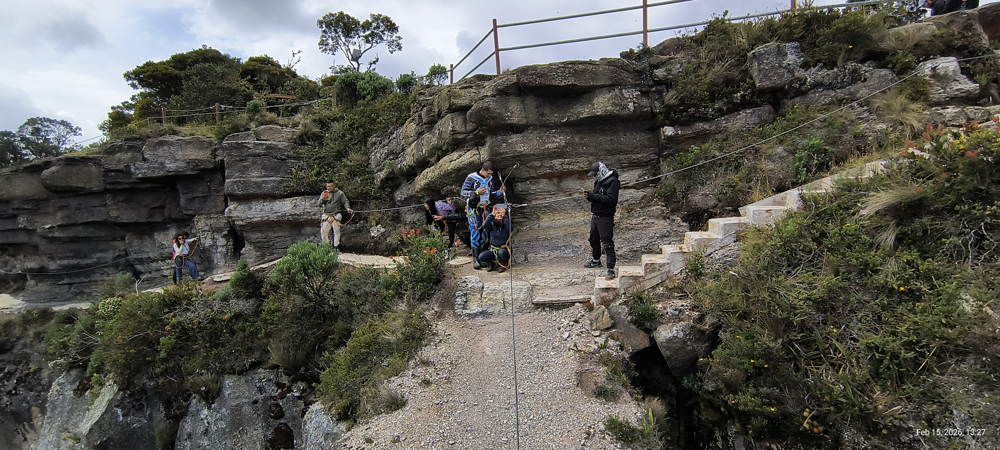

<br><details><summary>:camera:**60/IMG_20260215_132800510.jpg**</summary><sub> `Exif version` 0220 `OS version`  `Date` 2026:02:15 13:28:01 `Aperture` Not known `Brightness` 0.0 `Color space` 1 `Compression` 6`Exposure mode` 0 `Exposure time` 0.00110077 `Focal length` 2.13 `Lens model` Not known `Lens specification` Not known `Orientation` 1 `Scene type` Not known `f number` 2.2 `White balance` 0 `Sensing method` 1 `Shutter speed` 9.827</sub><sub>`Coordinates & altitude` (5.425611972222223, -73.84581755555556, 3357.0)</sub><sub> :globe_with_meridians:`Location over` [Google Maps](http://maps.google.com/maps?q=5.425611972222223,-73.84581755555556) or [Openstreet Map](https://www.openstreetmap.org/query?lat=5.425611972222223&lon=-73.84581755555556)</sub></details>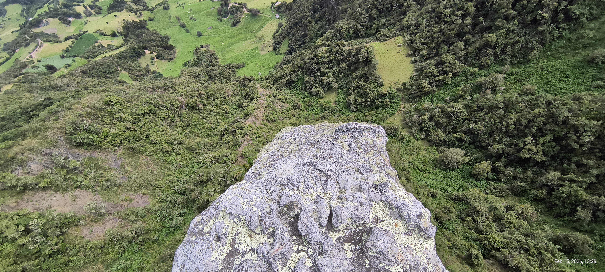

<br><details><summary>:camera:**60/IMG_20260215_132802419.jpg**</summary><sub> `Exif version` 0220 `OS version`  `Date` 2026:02:15 13:28:03 `Aperture` Not known `Brightness` 0.0 `Color space` 1 `Compression` 6`Exposure mode` 0 `Exposure time` 0.000980686 `Focal length` 2.13 `Lens model` Not known `Lens specification` Not known `Orientation` 6 `Scene type` Not known `f number` 2.2 `White balance` 0 `Sensing method` 1 `Shutter speed` 9.993</sub><sub>`Coordinates & altitude` (5.425611972222223, -73.84581755555556, 3357.0)</sub><sub> :globe_with_meridians:`Location over` [Google Maps](http://maps.google.com/maps?q=5.425611972222223,-73.84581755555556) or [Openstreet Map](https://www.openstreetmap.org/query?lat=5.425611972222223&lon=-73.84581755555556)</sub></details>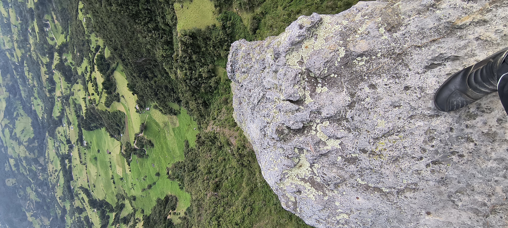

<br><details><summary>:camera:**60/IMG_20260215_132805332.jpg**</summary><sub> `Exif version` 0220 `OS version`  `Date` 2026:02:15 13:28:06 `Aperture` Not known `Brightness` 0.0 `Color space` 1 `Compression` 6`Exposure mode` 0 `Exposure time` 0.000710497 `Focal length` 2.13 `Lens model` Not known `Lens specification` Not known `Orientation` 6 `Scene type` Not known `f number` 2.2 `White balance` 0 `Sensing method` 1 `Shutter speed` 10.458</sub><sub>`Coordinates & altitude` (5.425611972222223, -73.84581755555556, 3357.0)</sub><sub> :globe_with_meridians:`Location over` [Google Maps](http://maps.google.com/maps?q=5.425611972222223,-73.84581755555556) or [Openstreet Map](https://www.openstreetmap.org/query?lat=5.425611972222223&lon=-73.84581755555556)</sub></details>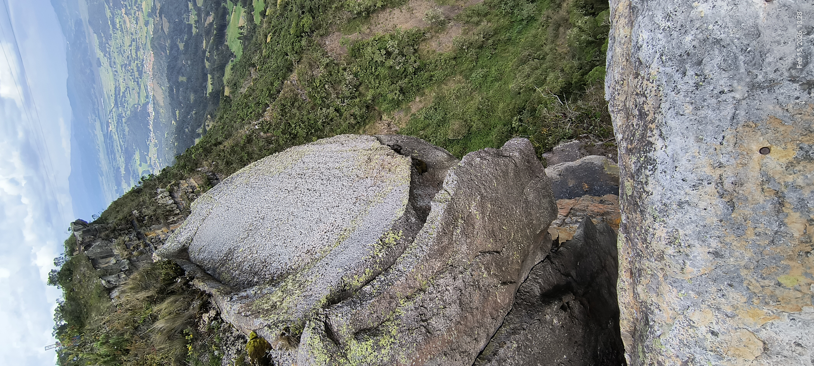

<br><details><summary>:camera:**60/IMG_20260215_132808232.jpg**</summary><sub> `Exif version` 0220 `OS version`  `Date` 2026:02:15 13:28:09 `Aperture` Not known `Brightness` 0.0 `Color space` 1 `Compression` 6`Exposure mode` 0 `Exposure time` 0.00050035 `Focal length` 2.13 `Lens model` Not known `Lens specification` Not known `Orientation` 6 `Scene type` Not known `f number` 2.2 `White balance` 0 `Sensing method` 1 `Shutter speed` 10.964</sub><sub>`Coordinates & altitude` (5.425611972222223, -73.84581755555556, 3357.0)</sub><sub> :globe_with_meridians:`Location over` [Google Maps](http://maps.google.com/maps?q=5.425611972222223,-73.84581755555556) or [Openstreet Map](https://www.openstreetmap.org/query?lat=5.425611972222223&lon=-73.84581755555556)</sub></details>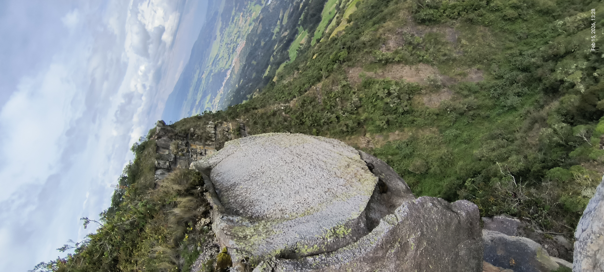

<br><details><summary>:camera:**60/IMG_20260215_132812261.jpg**</summary><sub> `Exif version` 0220 `OS version`  `Date` 2026:02:15 13:28:13 `Aperture` Not known `Brightness` 0.0 `Color space` 1 `Compression` 6`Exposure mode` 0 `Exposure time` 0.000970679 `Focal length` 2.13 `Lens model` Not known `Lens specification` Not known `Orientation` 3 `Scene type` Not known `f number` 2.2 `White balance` 0 `Sensing method` 1 `Shutter speed` 10.008</sub><sub>`Coordinates & altitude` (5.425611972222223, -73.84581755555556, 3357.0)</sub><sub> :globe_with_meridians:`Location over` [Google Maps](http://maps.google.com/maps?q=5.425611972222223,-73.84581755555556) or [Openstreet Map](https://www.openstreetmap.org/query?lat=5.425611972222223&lon=-73.84581755555556)</sub></details>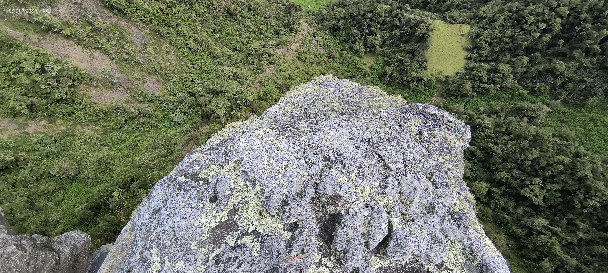

<br><details><summary>:camera:**60/IMG_20260215_132816888.jpg**</summary><sub> `Exif version` 0220 `OS version`  `Date` 2026:02:15 13:28:17 `Aperture` Not known `Brightness` 0.0 `Color space` 1 `Compression` 6`Exposure mode` 0 `Exposure time` 0.001310917 `Focal length` 2.13 `Lens model` Not known `Lens specification` Not known `Orientation` 3 `Scene type` Not known `f number` 2.2 `White balance` 0 `Sensing method` 1 `Shutter speed` 9.575</sub><sub>`Coordinates & altitude` (5.425611972222223, -73.84581755555556, 3357.0)</sub><sub> :globe_with_meridians:`Location over` [Google Maps](http://maps.google.com/maps?q=5.425611972222223,-73.84581755555556) or [Openstreet Map](https://www.openstreetmap.org/query?lat=5.425611972222223&lon=-73.84581755555556)</sub></details>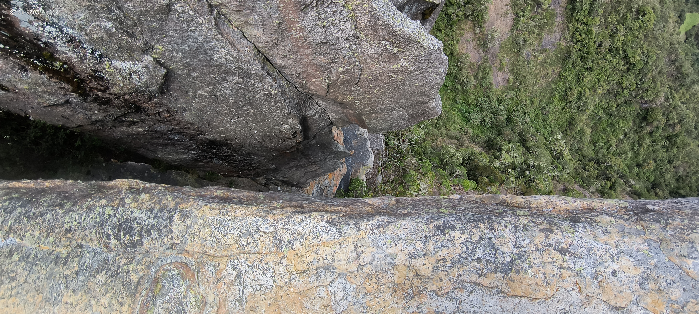

<br><details><summary>:camera:**60/IMG_20260215_132821893.jpg**</summary><sub> `Exif version` 0220 `OS version`  `Date` 2026:02:15 13:28:22 `Aperture` Not known `Brightness` 0.0 `Color space` 1 `Compression` 6`Exposure mode` 0 `Exposure time` 0.001190833 `Focal length` 2.13 `Lens model` Not known `Lens specification` Not known `Orientation` 1 `Scene type` Not known `f number` 2.2 `White balance` 0 `Sensing method` 1 `Shutter speed` 9.713</sub><sub>`Coordinates & altitude` (5.425611972222223, -73.84581755555556, 3357.0)</sub><sub> :globe_with_meridians:`Location over` [Google Maps](http://maps.google.com/maps?q=5.425611972222223,-73.84581755555556) or [Openstreet Map](https://www.openstreetmap.org/query?lat=5.425611972222223&lon=-73.84581755555556)</sub></details>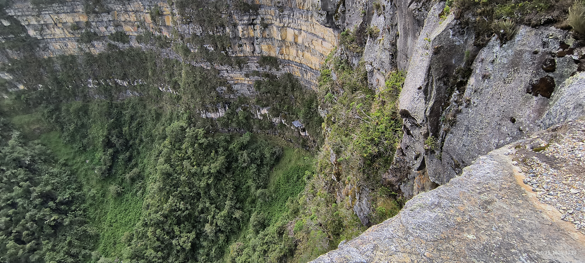

<br><details><summary>:camera:**60/IMG_20260215_132842986.jpg**</summary><sub> `Exif version` 0220 `OS version`  `Date` 2026:02:15 13:28:43 `Aperture` Not known `Brightness` 0.0 `Color space` 1 `Compression` 6`Exposure mode` 0 `Exposure time` 0.000416 `Focal length` 5.56 `Lens model` Not known `Lens specification` Not known `Orientation` 6 `Scene type` Not known `f number` 1.88 `White balance` 0 `Sensing method` 1 `Shutter speed` 11.231</sub><sub>`Coordinates & altitude` (5.425749777777778, -73.84587094444444, 3357.0)</sub><sub> :globe_with_meridians:`Location over` [Google Maps](http://maps.google.com/maps?q=5.425749777777778,-73.84587094444444) or [Openstreet Map](https://www.openstreetmap.org/query?lat=5.425749777777778&lon=-73.84587094444444)</sub></details>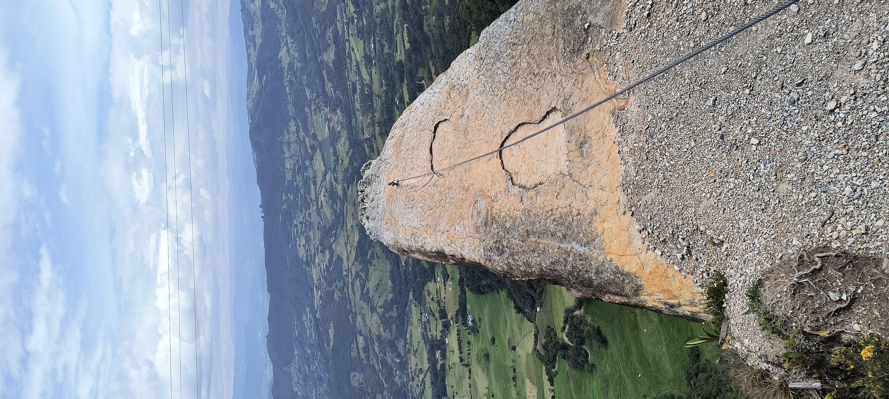

<br><details><summary>:camera:**60/IMG_20260215_132844351.jpg**</summary><sub> `Exif version` 0220 `OS version`  `Date` 2026:02:15 13:28:45 `Aperture` Not known `Brightness` 0.0 `Color space` 1 `Compression` 6`Exposure mode` 0 `Exposure time` 0.000416 `Focal length` 5.56 `Lens model` Not known `Lens specification` Not known `Orientation` 6 `Scene type` Not known `f number` 1.88 `White balance` 0 `Sensing method` 1 `Shutter speed` 11.231</sub><sub>`Coordinates & altitude` (5.425749777777778, -73.84587094444444, 3357.0)</sub><sub> :globe_with_meridians:`Location over` [Google Maps](http://maps.google.com/maps?q=5.425749777777778,-73.84587094444444) or [Openstreet Map](https://www.openstreetmap.org/query?lat=5.425749777777778&lon=-73.84587094444444)</sub></details>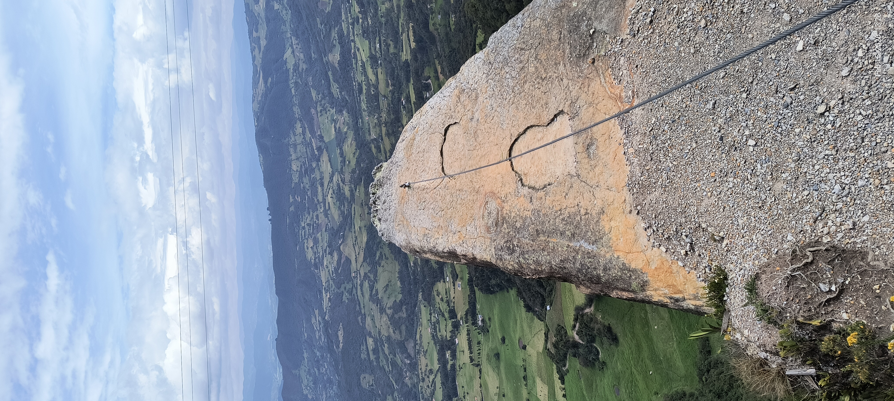

<br><details><summary>:camera:**60/IMG_20260215_132847175.jpg**</summary><sub> `Exif version` 0220 `OS version`  `Date` 2026:02:15 13:28:47 `Aperture` Not known `Brightness` 0.0 `Color space` 1 `Compression` 6`Exposure mode` 0 `Exposure time` 0.000512 `Focal length` 5.56 `Lens model` Not known `Lens specification` Not known `Orientation` 1 `Scene type` Not known `f number` 1.88 `White balance` 0 `Sensing method` 1 `Shutter speed` 10.931</sub><sub>`Coordinates & altitude` (5.425749777777778, -73.84587094444444, 3357.0)</sub><sub> :globe_with_meridians:`Location over` [Google Maps](http://maps.google.com/maps?q=5.425749777777778,-73.84587094444444) or [Openstreet Map](https://www.openstreetmap.org/query?lat=5.425749777777778&lon=-73.84587094444444)</sub></details>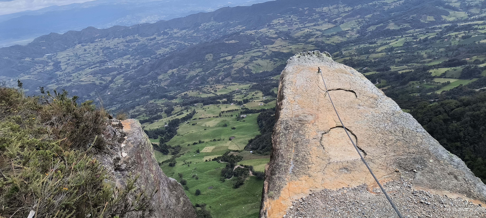

<br><details><summary>:camera:**60/IMG_20260215_132848706.jpg**</summary><sub> `Exif version` 0220 `OS version`  `Date` 2026:02:15 13:28:49 `Aperture` Not known `Brightness` 0.0 `Color space` 1 `Compression` 6`Exposure mode` 0 `Exposure time` 0.00064 `Focal length` 5.56 `Lens model` Not known `Lens specification` Not known `Orientation` 1 `Scene type` Not known `f number` 1.88 `White balance` 0 `Sensing method` 1 `Shutter speed` 10.609</sub><sub>`Coordinates & altitude` (5.425749777777778, -73.84587094444444, 3357.0)</sub><sub> :globe_with_meridians:`Location over` [Google Maps](http://maps.google.com/maps?q=5.425749777777778,-73.84587094444444) or [Openstreet Map](https://www.openstreetmap.org/query?lat=5.425749777777778&lon=-73.84587094444444)</sub></details>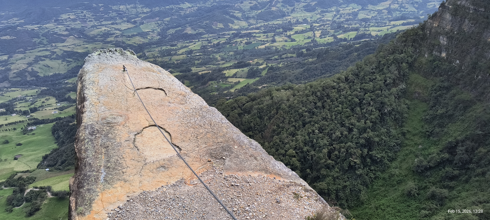

<br><details><summary>:camera:**60/IMG_20260215_132903691.jpg**</summary><sub> `Exif version` 0220 `OS version`  `Date` 2026:02:15 13:29:04 `Aperture` Not known `Brightness` 0.0 `Color space` 1 `Compression` 6`Exposure mode` 0 `Exposure time` 0.000416 `Focal length` 5.56 `Lens model` Not known `Lens specification` Not known `Orientation` 1 `Scene type` Not known `f number` 1.88 `White balance` 0 `Sensing method` 1 `Shutter speed` 11.231</sub><sub>`Coordinates & altitude` (5.425749777777778, -73.84587094444444, 3357.0)</sub><sub> :globe_with_meridians:`Location over` [Google Maps](http://maps.google.com/maps?q=5.425749777777778,-73.84587094444444) or [Openstreet Map](https://www.openstreetmap.org/query?lat=5.425749777777778&lon=-73.84587094444444)</sub></details>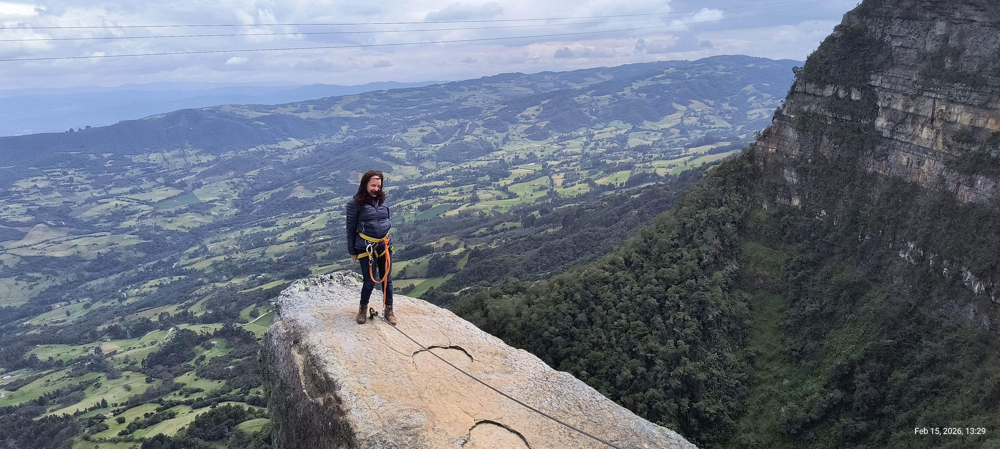

<br><details><summary>:camera:**60/IMG_20260215_132906293.jpg**</summary><sub> `Exif version` 0220 `OS version`  `Date` 2026:02:15 13:29:07 `Aperture` Not known `Brightness` 0.0 `Color space` 1 `Compression` 6`Exposure mode` 0 `Exposure time` 0.000608 `Focal length` 5.56 `Lens model` Not known `Lens specification` Not known `Orientation` 6 `Scene type` Not known `f number` 1.88 `White balance` 0 `Sensing method` 1 `Shutter speed` 10.683</sub><sub>`Coordinates & altitude` (5.425749777777778, -73.84587094444444, 3357.0)</sub><sub> :globe_with_meridians:`Location over` [Google Maps](http://maps.google.com/maps?q=5.425749777777778,-73.84587094444444) or [Openstreet Map](https://www.openstreetmap.org/query?lat=5.425749777777778&lon=-73.84587094444444)</sub></details>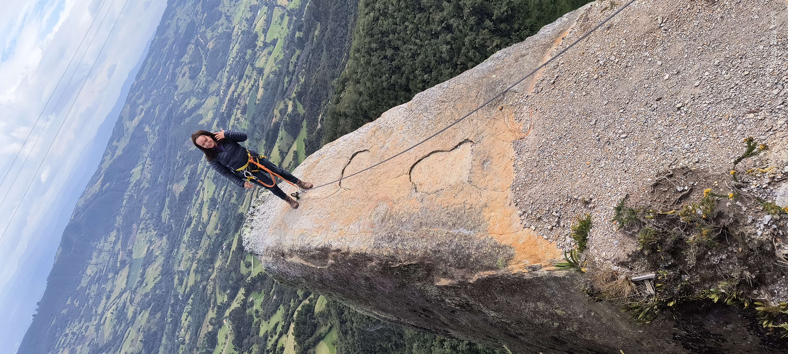

<br><details><summary>:camera:**60/IMG_20260215_132908070.jpg**</summary><sub> `Exif version` 0220 `OS version`  `Date` 2026:02:15 13:29:08 `Aperture` Not known `Brightness` 0.0 `Color space` 1 `Compression` 6`Exposure mode` 0 `Exposure time` 0.00048 `Focal length` 5.56 `Lens model` Not known `Lens specification` Not known `Orientation` 6 `Scene type` Not known `f number` 1.88 `White balance` 0 `Sensing method` 1 `Shutter speed` 11.024</sub><sub>`Coordinates & altitude` (5.425749777777778, -73.84587094444444, 3357.0)</sub><sub> :globe_with_meridians:`Location over` [Google Maps](http://maps.google.com/maps?q=5.425749777777778,-73.84587094444444) or [Openstreet Map](https://www.openstreetmap.org/query?lat=5.425749777777778&lon=-73.84587094444444)</sub></details>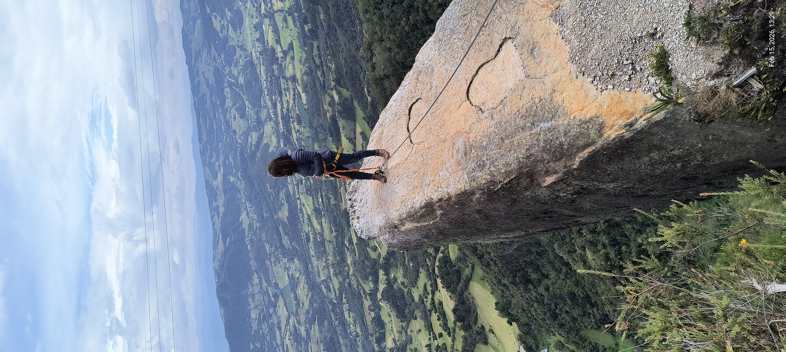

<br><details><summary>:camera:**60/IMG_20260215_132914642_BURST000_COVER.jpg**</summary><sub> `Exif version` 0220 `OS version`  `Date` 2026:02:15 13:29:16 `Aperture` Not known `Brightness` 0.0 `Color space` 1 `Compression` 6`Exposure mode` 0 `Exposure time` 0.001216 `Focal length` 5.56 `Lens model` Not known `Lens specification` Not known `Orientation` 6 `Scene type` Not known `f number` 1.88 `White balance` 0 `Sensing method` 1 `Shutter speed` 9.683</sub><sub>`Coordinates & altitude` (5.425749777777778, -73.84587094444444, 3357.0)</sub><sub> :globe_with_meridians:`Location over` [Google Maps](http://maps.google.com/maps?q=5.425749777777778,-73.84587094444444) or [Openstreet Map](https://www.openstreetmap.org/query?lat=5.425749777777778&lon=-73.84587094444444)</sub></details>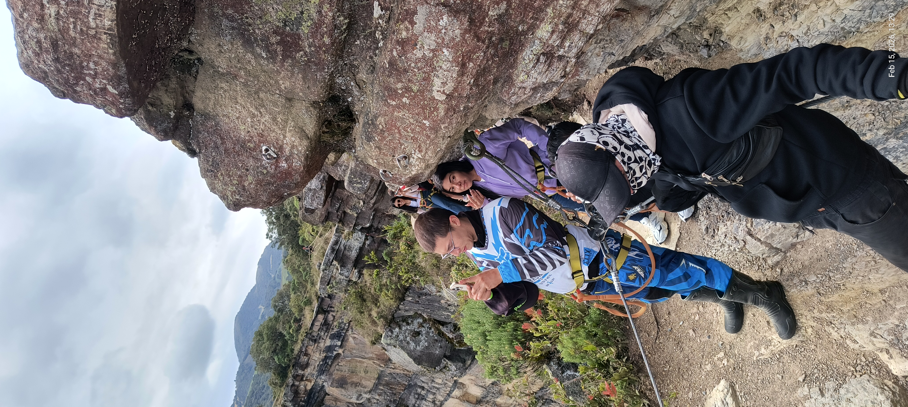

<br><details><summary>:camera:**60/IMG_20260215_132914642_BURST001_COMP.jpg**</summary><sub> `Exif version` 0220 `OS version`  `Date` 2026:02:15 13:29:16 `Aperture` Not known `Brightness` 0.0 `Color space` 1 `Compression` 6`Exposure mode` 0 `Exposure time` 0.001216 `Focal length` 5.56 `Lens model` Not known `Lens specification` Not known `Orientation` 6 `Scene type` Not known `f number` 1.88 `White balance` 0 `Sensing method` 1 `Shutter speed` 9.683</sub><sub>`Coordinates & altitude` (5.425749777777778, -73.84587094444444, 3357.0)</sub><sub> :globe_with_meridians:`Location over` [Google Maps](http://maps.google.com/maps?q=5.425749777777778,-73.84587094444444) or [Openstreet Map](https://www.openstreetmap.org/query?lat=5.425749777777778&lon=-73.84587094444444)</sub></details>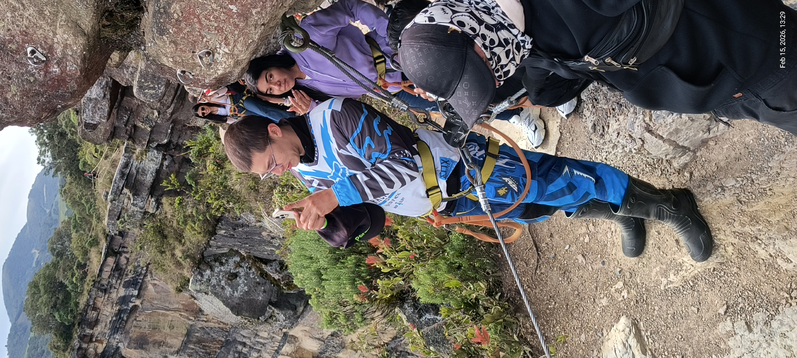

<br><details><summary>:camera:**60/IMG_20260215_132935842_HDR.jpg**</summary><sub> `Exif version` 0220 `OS version`  `Date` 2026:02:15 13:29:37 `Aperture` Not known `Brightness` 0.0 `Color space` 1 `Compression` 6`Exposure mode` 0 `Exposure time` 0.001312 `Focal length` 5.56 `Lens model` Not known `Lens specification` Not known `Orientation` 6 `Scene type` Not known `f number` 1.88 `White balance` 0 `Sensing method` 1 `Shutter speed` 9.574</sub><sub>`Coordinates & altitude` (5.425749777777778, -73.84587094444444, 3357.0)</sub><sub> :globe_with_meridians:`Location over` [Google Maps](http://maps.google.com/maps?q=5.425749777777778,-73.84587094444444) or [Openstreet Map](https://www.openstreetmap.org/query?lat=5.425749777777778&lon=-73.84587094444444)</sub></details>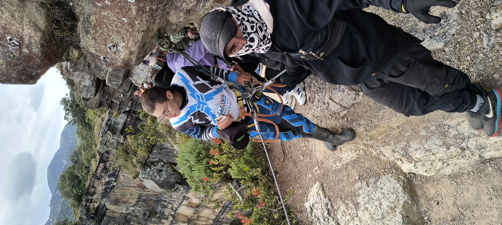

<br><details><summary>:camera:**60/IMG_20260215_132942163.jpg**</summary><sub> `Exif version` 0220 `OS version`  `Date` 2026:02:15 13:29:42 `Aperture` Not known `Brightness` 0.0 `Color space` 1 `Compression` 6`Exposure mode` 0 `Exposure time` 0.000352 `Focal length` 5.56 `Lens model` Not known `Lens specification` Not known `Orientation` 6 `Scene type` Not known `f number` 1.88 `White balance` 0 `Sensing method` 1 `Shutter speed` 11.472</sub><sub>`Coordinates & altitude` (5.425749777777778, -73.84587094444444, 3357.0)</sub><sub> :globe_with_meridians:`Location over` [Google Maps](http://maps.google.com/maps?q=5.425749777777778,-73.84587094444444) or [Openstreet Map](https://www.openstreetmap.org/query?lat=5.425749777777778&lon=-73.84587094444444)</sub></details>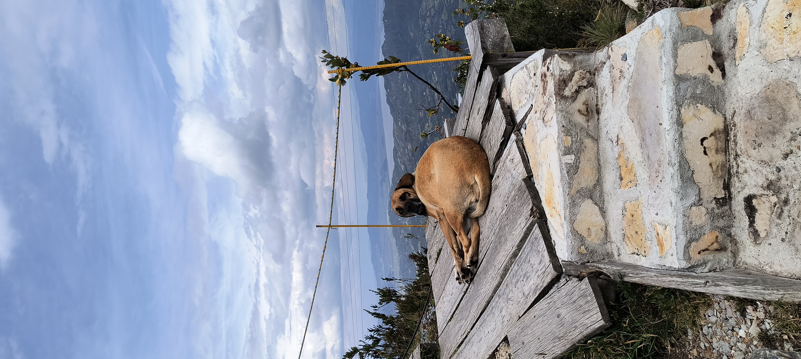

<br><details><summary>:camera:**60/IMG_20260215_132953822.jpg**</summary><sub> `Exif version` 0220 `OS version`  `Date` 2026:02:15 13:29:54 `Aperture` Not known `Brightness` 0.0 `Color space` 1 `Compression` 6`Exposure mode` 0 `Exposure time` 0.000896 `Focal length` 5.56 `Lens model` Not known `Lens specification` Not known `Orientation` 6 `Scene type` Not known `f number` 1.88 `White balance` 0 `Sensing method` 1 `Shutter speed` 10.124</sub><sub>`Coordinates & altitude` (5.425749777777778, -73.84587094444444, 3357.0)</sub><sub> :globe_with_meridians:`Location over` [Google Maps](http://maps.google.com/maps?q=5.425749777777778,-73.84587094444444) or [Openstreet Map](https://www.openstreetmap.org/query?lat=5.425749777777778&lon=-73.84587094444444)</sub></details>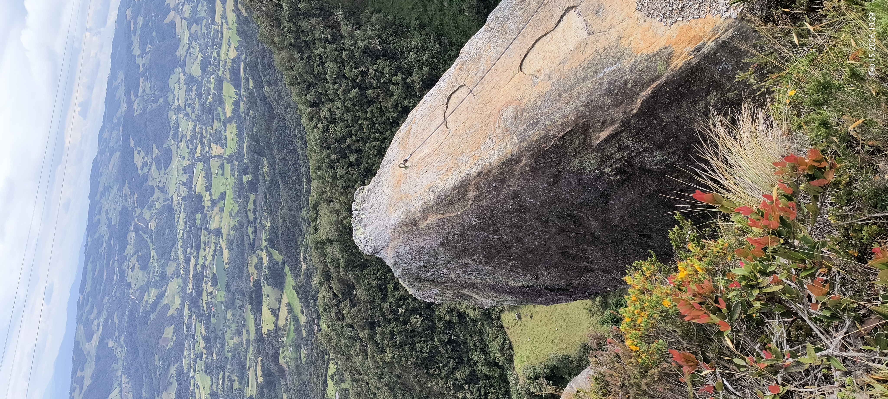

<br><details><summary>:camera:**60/IMG_20260215_132959831_HDR.jpg**</summary><sub> `Exif version` 0220 `OS version`  `Date` 2026:02:15 13:30:01 `Aperture` Not known `Brightness` 0.0 `Color space` 1 `Compression` 6`Exposure mode` 0 `Exposure time` 0.001536 `Focal length` 5.56 `Lens model` Not known `Lens specification` Not known `Orientation` 1 `Scene type` Not known `f number` 1.88 `White balance` 0 `Sensing method` 1 `Shutter speed` 9.346</sub><sub>`Coordinates & altitude` (5.425749777777778, -73.84587094444444, 3357.0)</sub><sub> :globe_with_meridians:`Location over` [Google Maps](http://maps.google.com/maps?q=5.425749777777778,-73.84587094444444) or [Openstreet Map](https://www.openstreetmap.org/query?lat=5.425749777777778&lon=-73.84587094444444)</sub></details>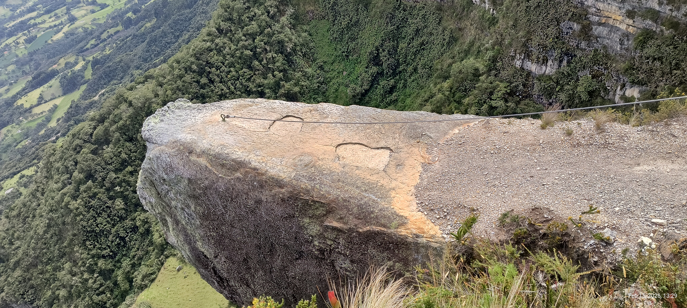

<br><details><summary>:camera:**60/IMG_20260215_133002317.jpg**</summary><sub> `Exif version` 0220 `OS version`  `Date` 2026:02:15 13:30:03 `Aperture` Not known `Brightness` 0.0 `Color space` 1 `Compression` 6`Exposure mode` 0 `Exposure time` 0.001504 `Focal length` 5.56 `Lens model` Not known `Lens specification` Not known `Orientation` 1 `Scene type` Not known `f number` 1.88 `White balance` 0 `Sensing method` 1 `Shutter speed` 9.376</sub><sub>`Coordinates & altitude` (5.425749777777778, -73.84587094444444, 3357.0)</sub><sub> :globe_with_meridians:`Location over` [Google Maps](http://maps.google.com/maps?q=5.425749777777778,-73.84587094444444) or [Openstreet Map](https://www.openstreetmap.org/query?lat=5.425749777777778&lon=-73.84587094444444)</sub></details>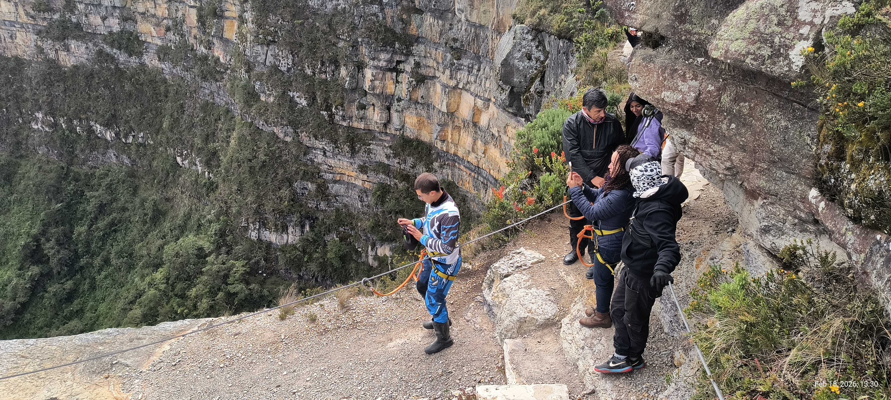

<br><details><summary>:camera:**60/IMG_20260215_133021740.jpg**</summary><sub> `Exif version` 0220 `OS version`  `Date` 2026:02:15 13:30:22 `Aperture` Not known `Brightness` 0.0 `Color space` 1 `Compression` 6`Exposure mode` 0 `Exposure time` 0.000928 `Focal length` 5.56 `Lens model` Not known `Lens specification` Not known `Orientation` 1 `Scene type` Not known `f number` 1.88 `White balance` 0 `Sensing method` 1 `Shutter speed` 10.073</sub><sub>`Coordinates & altitude` (5.425749777777778, -73.84587094444444, 3357.0)</sub><sub> :globe_with_meridians:`Location over` [Google Maps](http://maps.google.com/maps?q=5.425749777777778,-73.84587094444444) or [Openstreet Map](https://www.openstreetmap.org/query?lat=5.425749777777778&lon=-73.84587094444444)</sub></details>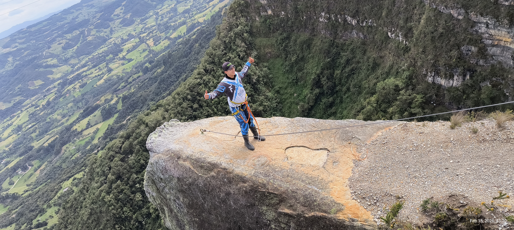

<br><details><summary>:camera:**60/IMG_20260215_133024086.jpg**</summary><sub> `Exif version` 0220 `OS version`  `Date` 2026:02:15 13:30:24 `Aperture` Not known `Brightness` 0.0 `Color space` 1 `Compression` 6`Exposure mode` 0 `Exposure time` 0.00048 `Focal length` 5.56 `Lens model` Not known `Lens specification` Not known `Orientation` 6 `Scene type` Not known `f number` 1.88 `White balance` 0 `Sensing method` 1 `Shutter speed` 11.024</sub><sub>`Coordinates & altitude` (5.425749777777778, -73.84587094444444, 3357.0)</sub><sub> :globe_with_meridians:`Location over` [Google Maps](http://maps.google.com/maps?q=5.425749777777778,-73.84587094444444) or [Openstreet Map](https://www.openstreetmap.org/query?lat=5.425749777777778&lon=-73.84587094444444)</sub></details>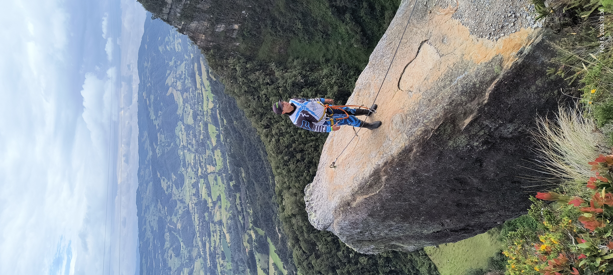

<br><details><summary>:camera:**60/IMG_20260215_133055602.jpg**</summary><sub> `Exif version` 0220 `OS version`  `Date` 2026:02:15 13:30:56 `Aperture` Not known `Brightness` 0.0 `Color space` 1 `Compression` 6`Exposure mode` 0 `Exposure time` 0.000608 `Focal length` 5.56 `Lens model` Not known `Lens specification` Not known `Orientation` 1 `Scene type` Not known `f number` 1.88 `White balance` 0 `Sensing method` 1 `Shutter speed` 10.683</sub><sub>`Coordinates & altitude` (5.425749777777778, -73.84587094444444, 3357.0)</sub><sub> :globe_with_meridians:`Location over` [Google Maps](http://maps.google.com/maps?q=5.425749777777778,-73.84587094444444) or [Openstreet Map](https://www.openstreetmap.org/query?lat=5.425749777777778&lon=-73.84587094444444)</sub></details>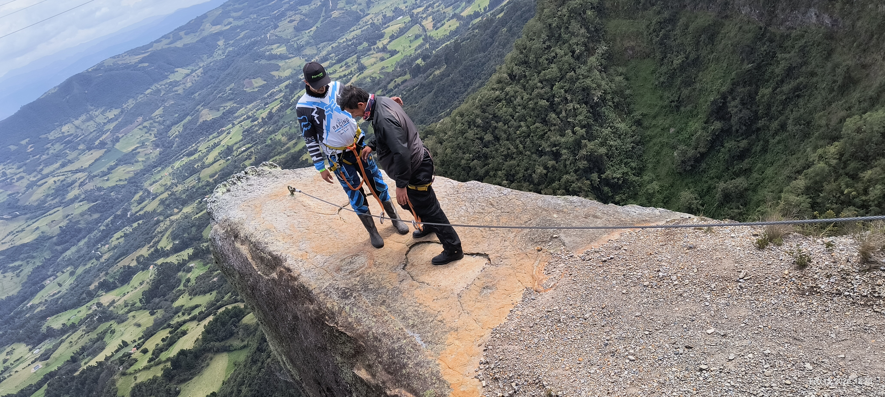

<br><details><summary>:camera:**60/IMG_20260215_133100393_BURST000_COVER.jpg**</summary><sub> `Exif version` 0220 `OS version`  `Date` 2026:02:15 13:31:02 `Aperture` Not known `Brightness` 0.0 `Color space` 1 `Compression` 6`Exposure mode` 0 `Exposure time` 0.000928 `Focal length` 5.56 `Lens model` Not known `Lens specification` Not known `Orientation` 6 `Scene type` Not known `f number` 1.88 `White balance` 0 `Sensing method` 1 `Shutter speed` 10.073</sub><sub>`Coordinates & altitude` (5.425749777777778, -73.84587094444444, 3357.0)</sub><sub> :globe_with_meridians:`Location over` [Google Maps](http://maps.google.com/maps?q=5.425749777777778,-73.84587094444444) or [Openstreet Map](https://www.openstreetmap.org/query?lat=5.425749777777778&lon=-73.84587094444444)</sub></details>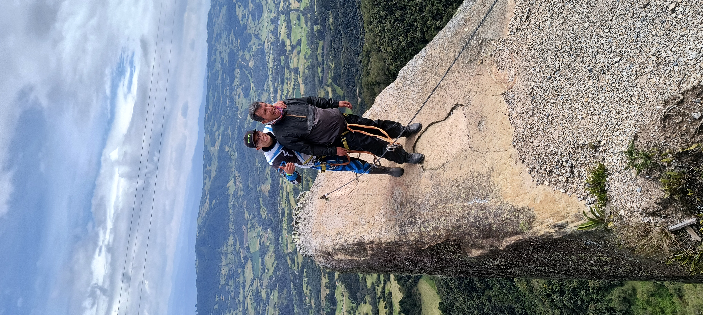

<br><details><summary>:camera:**60/IMG_20260215_133100393_BURST001_COMP.jpg**</summary><sub> `Exif version` 0220 `OS version`  `Date` 2026:02:15 13:31:02 `Aperture` Not known `Brightness` 0.0 `Color space` 1 `Compression` 6`Exposure mode` 0 `Exposure time` 0.000928 `Focal length` 5.56 `Lens model` Not known `Lens specification` Not known `Orientation` 6 `Scene type` Not known `f number` 1.88 `White balance` 0 `Sensing method` 1 `Shutter speed` 10.073</sub><sub>`Coordinates & altitude` (5.425749777777778, -73.84587094444444, 3357.0)</sub><sub> :globe_with_meridians:`Location over` [Google Maps](http://maps.google.com/maps?q=5.425749777777778,-73.84587094444444) or [Openstreet Map](https://www.openstreetmap.org/query?lat=5.425749777777778&lon=-73.84587094444444)</sub></details>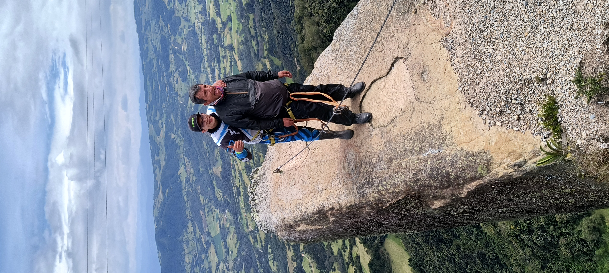

<br><details><summary>:camera:**60/IMG_20260215_133104562.jpg**</summary><sub> `Exif version` 0220 `OS version`  `Date` 2026:02:15 13:31:05 `Aperture` Not known `Brightness` 0.0 `Color space` 1 `Compression` 6`Exposure mode` 0 `Exposure time` 0.000470329 `Focal length` 2.13 `Lens model` Not known `Lens specification` Not known `Orientation` 6 `Scene type` Not known `f number` 2.2 `White balance` 0 `Sensing method` 1 `Shutter speed` 11.054</sub><sub>`Coordinates & altitude` (5.425749777777778, -73.84587094444444, 3357.0)</sub><sub> :globe_with_meridians:`Location over` [Google Maps](http://maps.google.com/maps?q=5.425749777777778,-73.84587094444444) or [Openstreet Map](https://www.openstreetmap.org/query?lat=5.425749777777778&lon=-73.84587094444444)</sub></details>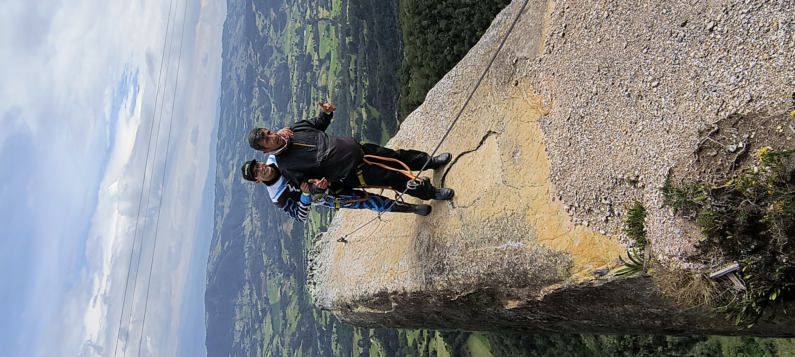

<br><details><summary>:camera:**60/IMG_20260215_133110264.jpg**</summary><sub> `Exif version` 0220 `OS version`  `Date` 2026:02:15 13:31:11 `Aperture` Not known `Brightness` 0.0 `Color space` 1 `Compression` 6`Exposure mode` 0 `Exposure time` 0.000420294 `Focal length` 2.13 `Lens model` Not known `Lens specification` Not known `Orientation` 1 `Scene type` Not known `f number` 2.2 `White balance` 0 `Sensing method` 1 `Shutter speed` 11.216</sub><sub>`Coordinates & altitude` (5.425749777777778, -73.84587094444444, 3357.0)</sub><sub> :globe_with_meridians:`Location over` [Google Maps](http://maps.google.com/maps?q=5.425749777777778,-73.84587094444444) or [Openstreet Map](https://www.openstreetmap.org/query?lat=5.425749777777778&lon=-73.84587094444444)</sub></details>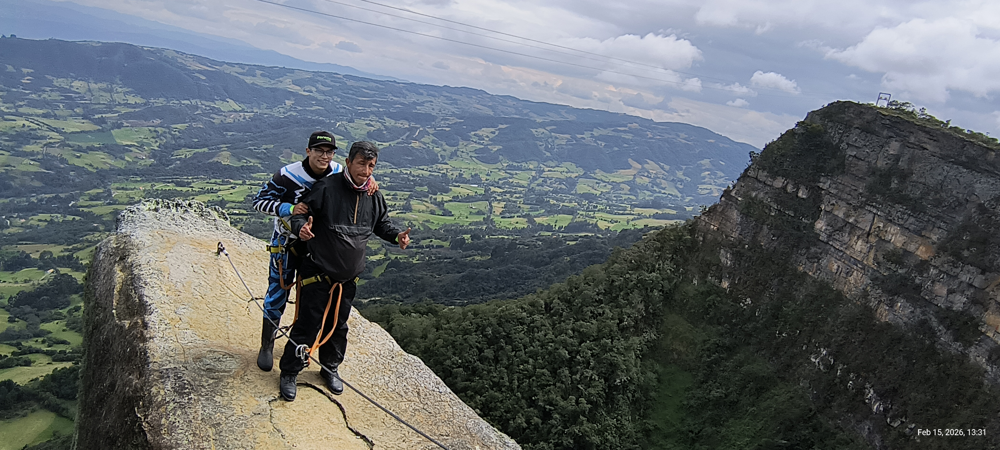

<br><details><summary>:camera:**60/IMG_20260215_133112747.jpg**</summary><sub> `Exif version` 0220 `OS version`  `Date` 2026:02:15 13:31:13 `Aperture` Not known `Brightness` 0.0 `Color space` 1 `Compression` 6`Exposure mode` 0 `Exposure time` 0.00050035 `Focal length` 2.13 `Lens model` Not known `Lens specification` Not known `Orientation` 1 `Scene type` Not known `f number` 2.2 `White balance` 0 `Sensing method` 1 `Shutter speed` 10.964</sub><sub>`Coordinates & altitude` (5.425749777777778, -73.84587094444444, 3357.0)</sub><sub> :globe_with_meridians:`Location over` [Google Maps](http://maps.google.com/maps?q=5.425749777777778,-73.84587094444444) or [Openstreet Map](https://www.openstreetmap.org/query?lat=5.425749777777778&lon=-73.84587094444444)</sub></details>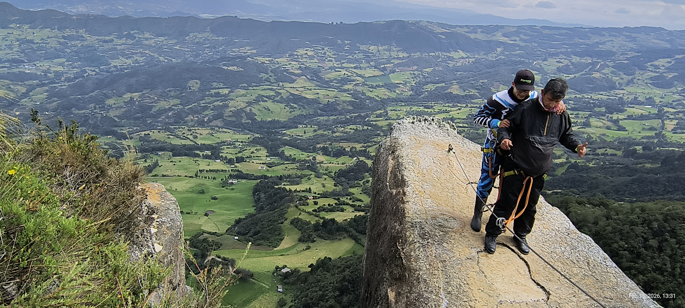

<br><details><summary>:camera:**60/IMG_20260215_133339336_HDR.jpg**</summary><sub> `Exif version` 0220 `OS version`  `Date` 2026:02:15 13:33:40 `Aperture` Not known `Brightness` 0.0 `Color space` 1 `Compression` 6`Exposure mode` 0 `Exposure time` 0.001088 `Focal length` 5.56 `Lens model` Not known `Lens specification` Not known `Orientation` 1 `Scene type` Not known `f number` 1.88 `White balance` 0 `Sensing method` 1 `Shutter speed` 9.844</sub><sub>`Coordinates & altitude` (5.425717805555556, -73.84571836111111, 3376.0)</sub><sub> :globe_with_meridians:`Location over` [Google Maps](http://maps.google.com/maps?q=5.425717805555556,-73.84571836111111) or [Openstreet Map](https://www.openstreetmap.org/query?lat=5.425717805555556&lon=-73.84571836111111)</sub></details>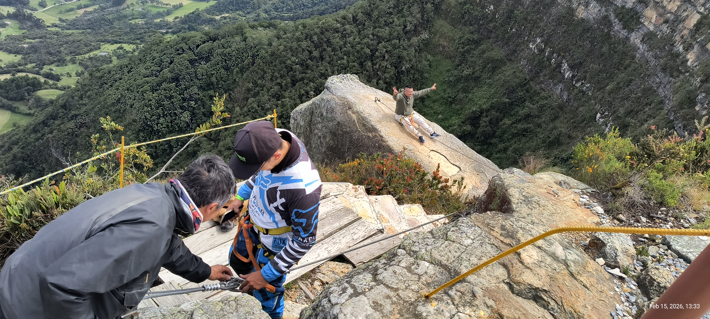

<br><details><summary>:camera:**60/IMG_20260215_133345860.jpg**</summary><sub> `Exif version` 0220 `OS version`  `Date` 2026:02:15 13:33:46 `Aperture` Not known `Brightness` 0.0 `Color space` 1 `Compression` 6`Exposure mode` 0 `Exposure time` 0.000350245 `Focal length` 2.13 `Lens model` Not known `Lens specification` Not known `Orientation` 1 `Scene type` Not known `f number` 2.2 `White balance` 0 `Sensing method` 1 `Shutter speed` 11.479</sub><sub>`Coordinates & altitude` (5.425717805555556, -73.84571836111111, 3376.0)</sub><sub> :globe_with_meridians:`Location over` [Google Maps](http://maps.google.com/maps?q=5.425717805555556,-73.84571836111111) or [Openstreet Map](https://www.openstreetmap.org/query?lat=5.425717805555556&lon=-73.84571836111111)</sub></details>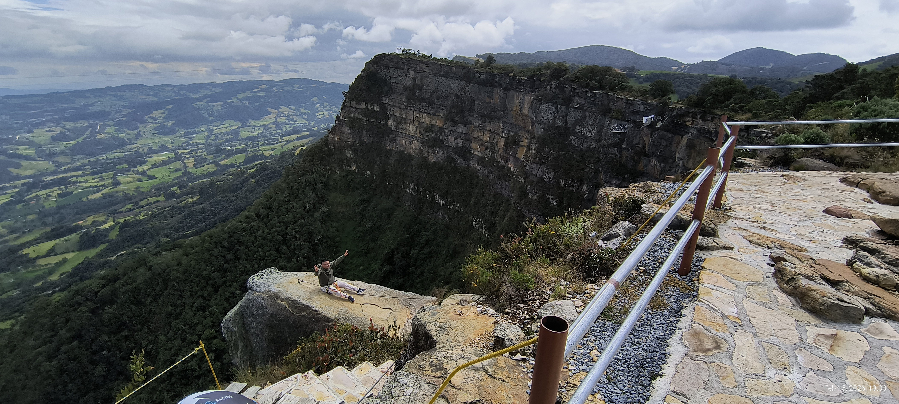

<br><details><summary>:camera:**60/IMG_20260215_133817118.jpg**</summary><sub> `Exif version` 0220 `OS version`  `Date` 2026:02:15 13:38:17 `Aperture` Not known `Brightness` 0.0 `Color space` 1 `Compression` 6`Exposure mode` 0 `Exposure time` 0.000352 `Focal length` 5.56 `Lens model` Not known `Lens specification` Not known `Orientation` 6 `Scene type` Not known `f number` 1.88 `White balance` 0 `Sensing method` 1 `Shutter speed` 11.472</sub><sub>`Coordinates & altitude` (5.425457000000001, -73.84594725, 3382.0)</sub><sub> :globe_with_meridians:`Location over` [Google Maps](http://maps.google.com/maps?q=5.425457000000001,-73.84594725) or [Openstreet Map](https://www.openstreetmap.org/query?lat=5.425457000000001&lon=-73.84594725)</sub></details>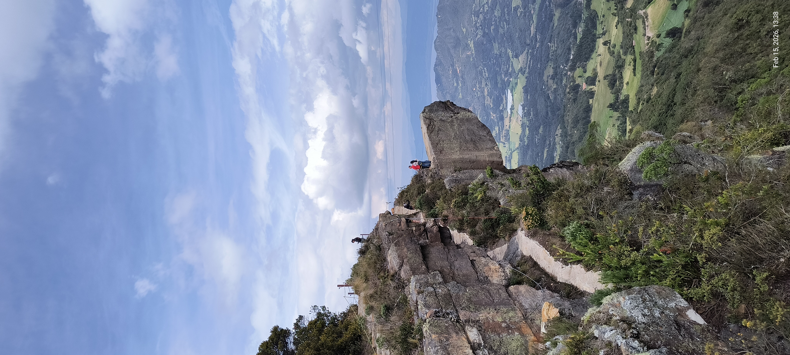

<br><details><summary>:camera:**60/IMG_20260215_133820539.jpg**</summary><sub> `Exif version` 0220 `OS version`  `Date` 2026:02:15 13:38:21 `Aperture` Not known `Brightness` 0.0 `Color space` 1 `Compression` 6`Exposure mode` 0 `Exposure time` 0.000384 `Focal length` 5.56 `Lens model` Not known `Lens specification` Not known `Orientation` 1 `Scene type` Not known `f number` 1.88 `White balance` 0 `Sensing method` 1 `Shutter speed` 11.346</sub><sub>`Coordinates & altitude` (5.425457000000001, -73.84594725, 3382.0)</sub><sub> :globe_with_meridians:`Location over` [Google Maps](http://maps.google.com/maps?q=5.425457000000001,-73.84594725) or [Openstreet Map](https://www.openstreetmap.org/query?lat=5.425457000000001&lon=-73.84594725)</sub></details>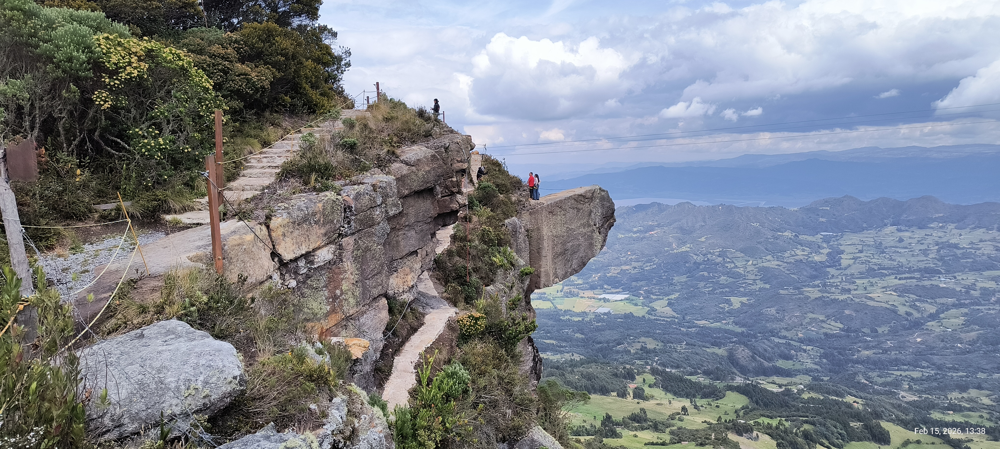

<br><details><summary>:camera:**60/IMG_20260215_133859745.jpg**</summary><sub> `Exif version` 0220 `OS version`  `Date` 2026:02:15 13:39:00 `Aperture` Not known `Brightness` 0.0 `Color space` 1 `Compression` 6`Exposure mode` 0 `Exposure time` 0.000448 `Focal length` 5.56 `Lens model` Not known `Lens specification` Not known `Orientation` 6 `Scene type` Not known `f number` 1.88 `White balance` 0 `Sensing method` 1 `Shutter speed` 11.124</sub><sub>`Coordinates & altitude` (5.425487027777778, -73.84597013888889, 3382.0)</sub><sub> :globe_with_meridians:`Location over` [Google Maps](http://maps.google.com/maps?q=5.425487027777778,-73.84597013888889) or [Openstreet Map](https://www.openstreetmap.org/query?lat=5.425487027777778&lon=-73.84597013888889)</sub></details>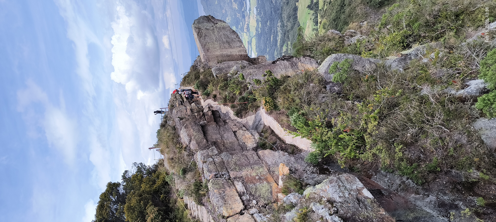

<br><details><summary>:camera:**60/IMG_20260215_133904692.jpg**</summary><sub> `Exif version` 0220 `OS version`  `Date` 2026:02:15 13:39:05 `Aperture` Not known `Brightness` 0.0 `Color space` 1 `Compression` 6`Exposure mode` 0 `Exposure time` 0.00032 `Focal length` 5.56 `Lens model` Not known `Lens specification` Not known `Orientation` 1 `Scene type` Not known `f number` 1.88 `White balance` 0 `Sensing method` 1 `Shutter speed` 11.609</sub><sub>`Coordinates & altitude` (5.425487027777778, -73.84597013888889, 3382.0)</sub><sub> :globe_with_meridians:`Location over` [Google Maps](http://maps.google.com/maps?q=5.425487027777778,-73.84597013888889) or [Openstreet Map](https://www.openstreetmap.org/query?lat=5.425487027777778&lon=-73.84597013888889)</sub></details>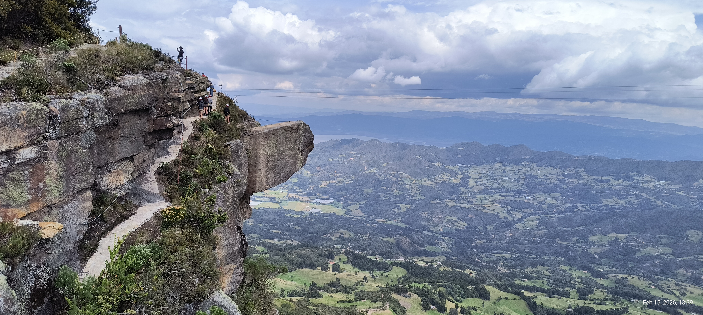

<br><details><summary>:camera:**60/IMG_20260215_133956167.jpg**</summary><sub> `Exif version` 0220 `OS version`  `Date` 2026:02:15 13:39:57 `Aperture` Not known `Brightness` 0.0 `Color space` 1 `Compression` 6`Exposure mode` 0 `Exposure time` 0.000420294 `Focal length` 2.13 `Lens model` Not known `Lens specification` Not known `Orientation` 1 `Scene type` Not known `f number` 2.2 `White balance` 0 `Sensing method` 1 `Shutter speed` 11.216</sub><sub>`Coordinates & altitude` (5.425487027777778, -73.84597013888889, 3382.0)</sub><sub> :globe_with_meridians:`Location over` [Google Maps](http://maps.google.com/maps?q=5.425487027777778,-73.84597013888889) or [Openstreet Map](https://www.openstreetmap.org/query?lat=5.425487027777778&lon=-73.84597013888889)</sub></details>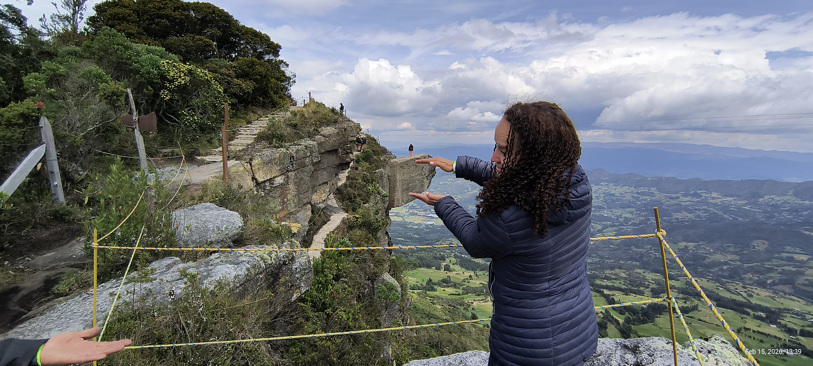

<br><details><summary>:camera:**60/IMG_20260215_134052918_HDR.jpg**</summary><sub> `Exif version` 0220 `OS version`  `Date` 2026:02:15 13:40:57 `Aperture` Not known `Brightness` 0.0 `Color space` 1 `Compression` 6`Exposure mode` 0 `Exposure time` 0.000980686 `Focal length` 2.13 `Lens model` Not known `Lens specification` Not known `Orientation` 1 `Scene type` Not known `f number` 2.2 `White balance` 0 `Sensing method` 1 `Shutter speed` 9.993</sub><sub>`Coordinates & altitude` (5.425471777777778, -73.84605405555556, 3382.0)</sub><sub> :globe_with_meridians:`Location over` [Google Maps](http://maps.google.com/maps?q=5.425471777777778,-73.84605405555556) or [Openstreet Map](https://www.openstreetmap.org/query?lat=5.425471777777778&lon=-73.84605405555556)</sub></details>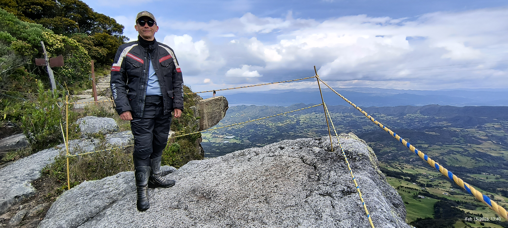

<br><details><summary>:camera:**60/IMG_20260215_134121757_HDR.jpg**</summary><sub> `Exif version` 0220 `OS version`  `Date` 2026:02:15 13:41:23 `Aperture` Not known `Brightness` 0.0 `Color space` 1 `Compression` 6`Exposure mode` 0 `Exposure time` 0.001050735 `Focal length` 2.13 `Lens model` Not known `Lens specification` Not known `Orientation` 6 `Scene type` Not known `f number` 2.2 `White balance` 0 `Sensing method` 1 `Shutter speed` 9.894</sub><sub>`Coordinates & altitude` (5.425432194444444, -73.8461151111111, 3382.0)</sub><sub> :globe_with_meridians:`Location over` [Google Maps](http://maps.google.com/maps?q=5.425432194444444,-73.8461151111111) or [Openstreet Map](https://www.openstreetmap.org/query?lat=5.425432194444444&lon=-73.8461151111111)</sub></details>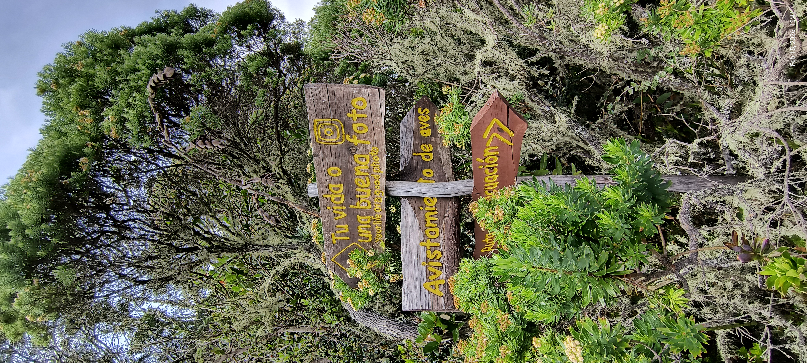

<br><details><summary>:camera:**60/IMG_20260215_134142931.jpg**</summary><sub> `Exif version` 0220 `OS version`  `Date` 2026:02:15 13:41:43 `Aperture` Not known `Brightness` 0.0 `Color space` 1 `Compression` 6`Exposure mode` 0 `Exposure time` 0.000440308 `Focal length` 2.13 `Lens model` Not known `Lens specification` Not known `Orientation` 1 `Scene type` Not known `f number` 2.2 `White balance` 0 `Sensing method` 1 `Shutter speed` 11.149</sub><sub>`Coordinates & altitude` (5.425432194444444, -73.8461151111111, 3382.0)</sub><sub> :globe_with_meridians:`Location over` [Google Maps](http://maps.google.com/maps?q=5.425432194444444,-73.8461151111111) or [Openstreet Map](https://www.openstreetmap.org/query?lat=5.425432194444444&lon=-73.8461151111111)</sub></details>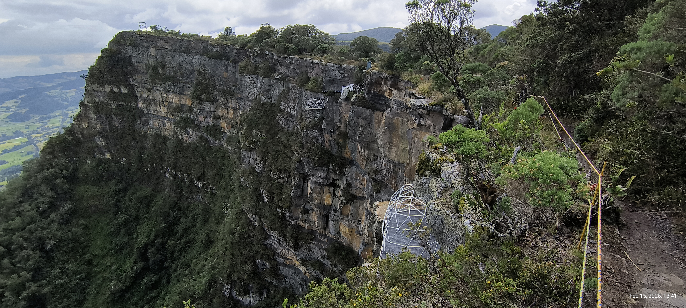

<br><details><summary>:camera:**60/IMG_20260215_134224306.jpg**</summary><sub> `Exif version` 0220 `OS version`  `Date` 2026:02:15 13:42:25 `Aperture` Not known `Brightness` 0.0 `Color space` 1 `Compression` 6`Exposure mode` 0 `Exposure time` 0.000360252 `Focal length` 2.13 `Lens model` Not known `Lens specification` Not known `Orientation` 6 `Scene type` Not known `f number` 2.2 `White balance` 0 `Sensing method` 1 `Shutter speed` 11.438</sub><sub>`Coordinates & altitude` (5.425251944444445, -73.84638213888888, 3382.0)</sub><sub> :globe_with_meridians:`Location over` [Google Maps](http://maps.google.com/maps?q=5.425251944444445,-73.84638213888888) or [Openstreet Map](https://www.openstreetmap.org/query?lat=5.425251944444445&lon=-73.84638213888888)</sub></details>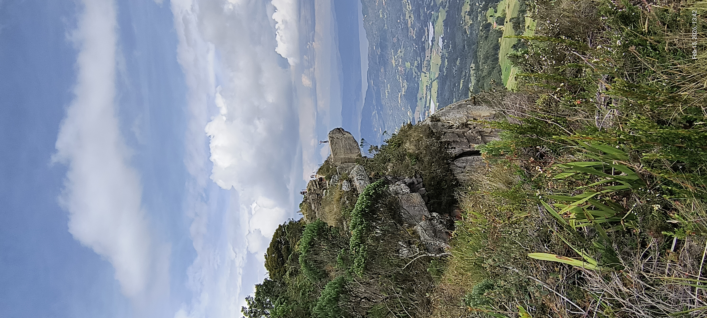

<br><details><summary>:camera:**60/IMG_20260215_134235264.jpg**</summary><sub> `Exif version` 0220 `OS version`  `Date` 2026:02:15 13:42:36 `Aperture` Not known `Brightness` 0.0 `Color space` 1 `Compression` 6`Exposure mode` 0 `Exposure time` 0.000360252 `Focal length` 2.13 `Lens model` Not known `Lens specification` Not known `Orientation` 6 `Scene type` Not known `f number` 2.2 `White balance` 0 `Sensing method` 1 `Shutter speed` 11.438</sub><sub>`Coordinates & altitude` (5.425251944444445, -73.84638213888888, 3382.0)</sub><sub> :globe_with_meridians:`Location over` [Google Maps](http://maps.google.com/maps?q=5.425251944444445,-73.84638213888888) or [Openstreet Map](https://www.openstreetmap.org/query?lat=5.425251944444445&lon=-73.84638213888888)</sub></details>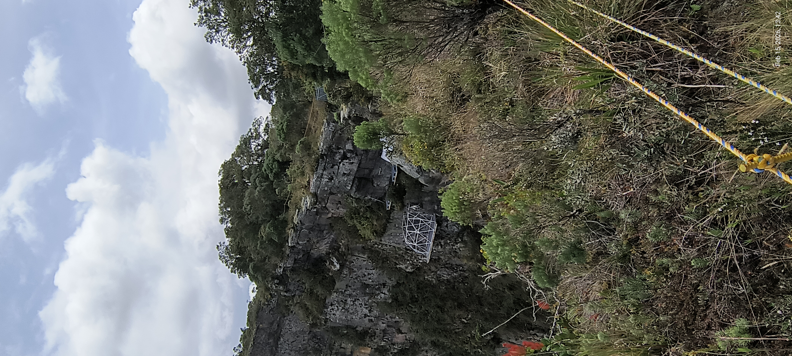

<br><details><summary>:camera:**60/IMG_20260215_134243893_HDR.jpg**</summary><sub> `Exif version` 0220 `OS version`  `Date` 2026:02:15 13:42:45 `Aperture` Not known `Brightness` 0.0 `Color space` 1 `Compression` 6`Exposure mode` 0 `Exposure time` 0.002191533 `Focal length` 2.13 `Lens model` Not known `Lens specification` Not known `Orientation` 6 `Scene type` Not known `f number` 2.2 `White balance` 0 `Sensing method` 1 `Shutter speed` 8.833</sub><sub>`Coordinates & altitude` (5.425251944444445, -73.84638213888888, 3382.0)</sub><sub> :globe_with_meridians:`Location over` [Google Maps](http://maps.google.com/maps?q=5.425251944444445,-73.84638213888888) or [Openstreet Map](https://www.openstreetmap.org/query?lat=5.425251944444445&lon=-73.84638213888888)</sub></details>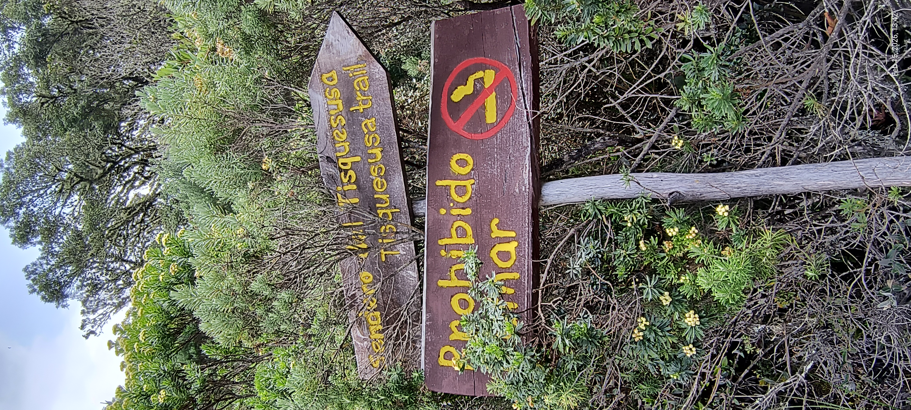

<br><details><summary>:camera:**60/IMG_20260215_134303301.jpg**</summary><sub> `Exif version` 0220 `OS version`  `Date` 2026:02:15 13:43:04 `Aperture` Not known `Brightness` 0.0 `Color space` 1 `Compression` 6`Exposure mode` 0 `Exposure time` 0.000260182 `Focal length` 2.13 `Lens model` Not known `Lens specification` Not known `Orientation` 1 `Scene type` Not known `f number` 2.2 `White balance` 0 `Sensing method` 1 `Shutter speed` 11.908</sub><sub>`Coordinates & altitude` (5.425251944444445, -73.84638213888888, 3382.0)</sub><sub> :globe_with_meridians:`Location over` [Google Maps](http://maps.google.com/maps?q=5.425251944444445,-73.84638213888888) or [Openstreet Map](https://www.openstreetmap.org/query?lat=5.425251944444445&lon=-73.84638213888888)</sub></details>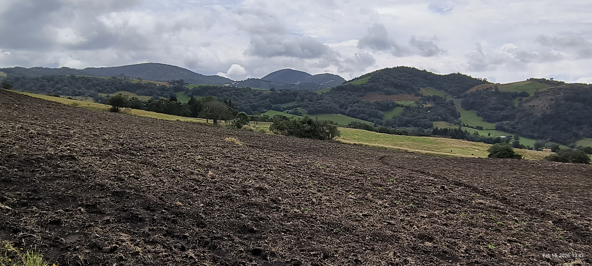

<br><details><summary>:camera:**60/IMG_20260215_134306416.jpg**</summary><sub> `Exif version` 0220 `OS version`  `Date` 2026:02:15 13:43:07 `Aperture` Not known `Brightness` 0.0 `Color space` 1 `Compression` 6`Exposure mode` 0 `Exposure time` 0.000270189 `Focal length` 2.13 `Lens model` Not known `Lens specification` Not known `Orientation` 1 `Scene type` Not known `f number` 2.2 `White balance` 0 `Sensing method` 1 `Shutter speed` 11.853</sub><sub>`Coordinates & altitude` (5.425251944444445, -73.84638213888888, 3382.0)</sub><sub> :globe_with_meridians:`Location over` [Google Maps](http://maps.google.com/maps?q=5.425251944444445,-73.84638213888888) or [Openstreet Map](https://www.openstreetmap.org/query?lat=5.425251944444445&lon=-73.84638213888888)</sub></details>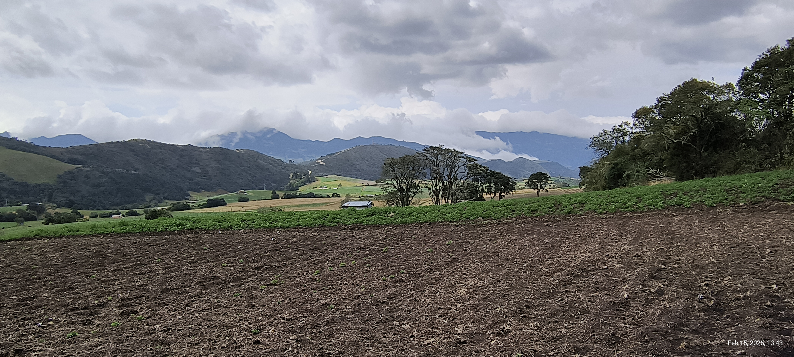

<br><details><summary>:camera:**60/IMG_20260215_134333295_HDR.jpg**</summary><sub> `Exif version` 0220 `OS version`  `Date` 2026:02:15 13:43:35 `Aperture` Not known `Brightness` 0.0 `Color space` 1 `Compression` 6`Exposure mode` 0 `Exposure time` 0.000544 `Focal length` 5.56 `Lens model` Not known `Lens specification` Not known `Orientation` 6 `Scene type` Not known `f number` 1.88 `White balance` 0 `Sensing method` 1 `Shutter speed` 10.844</sub><sub>`Coordinates & altitude` (5.424832805555556, -73.84657286111111, 3382.0)</sub><sub> :globe_with_meridians:`Location over` [Google Maps](http://maps.google.com/maps?q=5.424832805555556,-73.84657286111111) or [Openstreet Map](https://www.openstreetmap.org/query?lat=5.424832805555556&lon=-73.84657286111111)</sub></details>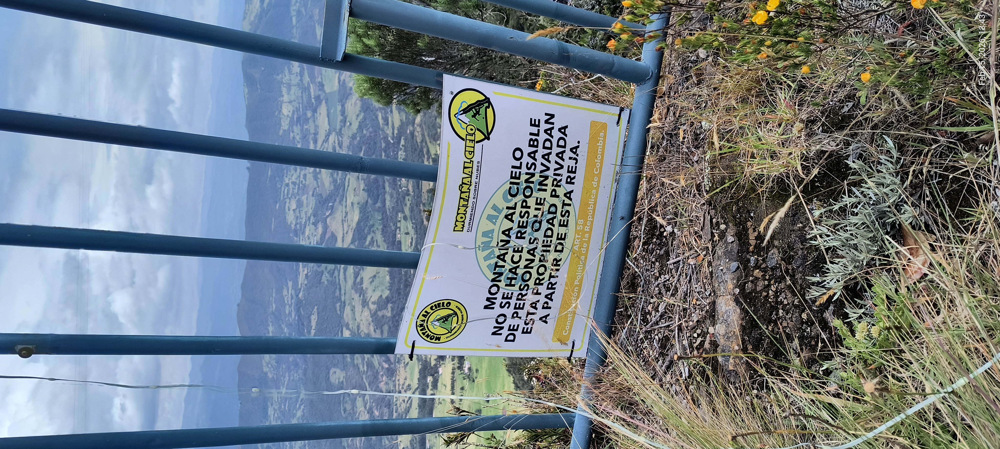

<br><details><summary>:camera:**60/IMG_20260215_134337376_HDR.jpg**</summary><sub> `Exif version` 0220 `OS version`  `Date` 2026:02:15 13:43:38 `Aperture` Not known `Brightness` 0.0 `Color space` 1 `Compression` 6`Exposure mode` 0 `Exposure time` 0.001504 `Focal length` 5.56 `Lens model` Not known `Lens specification` Not known `Orientation` 6 `Scene type` Not known `f number` 1.88 `White balance` 0 `Sensing method` 1 `Shutter speed` 9.376</sub><sub>`Coordinates & altitude` (5.424832805555556, -73.84657286111111, 3382.0)</sub><sub> :globe_with_meridians:`Location over` [Google Maps](http://maps.google.com/maps?q=5.424832805555556,-73.84657286111111) or [Openstreet Map](https://www.openstreetmap.org/query?lat=5.424832805555556&lon=-73.84657286111111)</sub></details>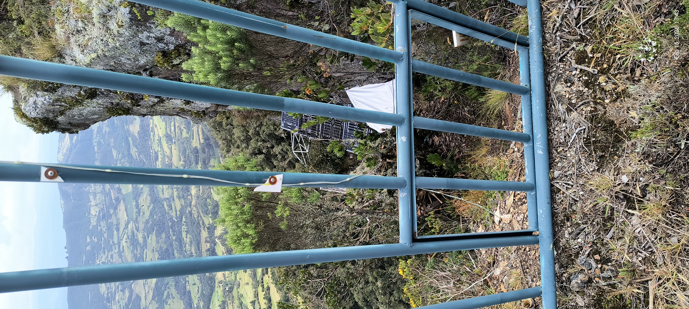

<br><details><summary>:camera:**60/IMG_20260215_134343237.jpg**</summary><sub> `Exif version` 0220 `OS version`  `Date` 2026:02:15 13:43:43 `Aperture` Not known `Brightness` 0.0 `Color space` 1 `Compression` 6`Exposure mode` 0 `Exposure time` 0.00032 `Focal length` 5.56 `Lens model` Not known `Lens specification` Not known `Orientation` 6 `Scene type` Not known `f number` 1.88 `White balance` 0 `Sensing method` 1 `Shutter speed` 11.609</sub><sub>`Coordinates & altitude` (5.424832805555556, -73.84657286111111, 3382.0)</sub><sub> :globe_with_meridians:`Location over` [Google Maps](http://maps.google.com/maps?q=5.424832805555556,-73.84657286111111) or [Openstreet Map](https://www.openstreetmap.org/query?lat=5.424832805555556&lon=-73.84657286111111)</sub></details>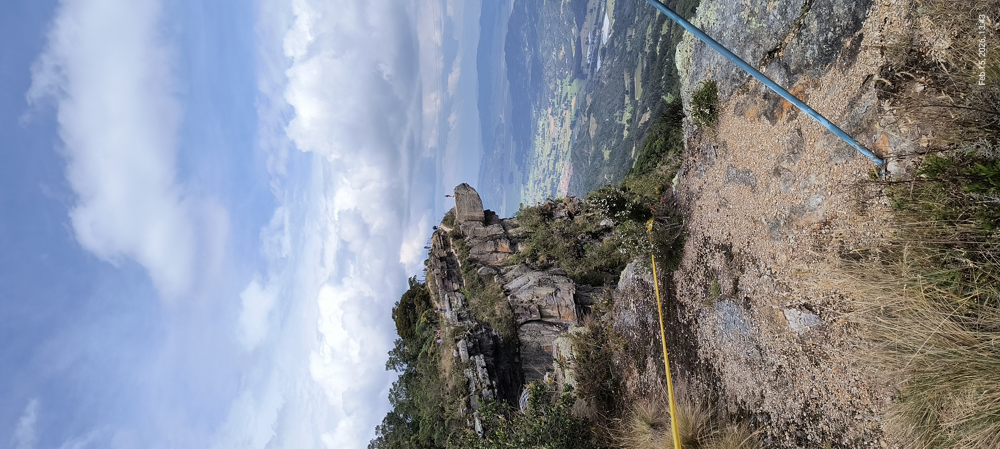

<br><details><summary>:camera:**60/IMG_20260215_134357568_HDR.jpg**</summary><sub> `Exif version` 0220 `OS version`  `Date` 2026:02:15 13:43:59 `Aperture` Not known `Brightness` 0.0 `Color space` 1 `Compression` 6`Exposure mode` 0 `Exposure time` 0.002368 `Focal length` 5.56 `Lens model` Not known `Lens specification` Not known `Orientation` 1 `Scene type` Not known `f number` 1.88 `White balance` 0 `Sensing method` 1 `Shutter speed` 8.722</sub><sub>`Coordinates & altitude` (5.424832805555556, -73.84657286111111, 3382.0)</sub><sub> :globe_with_meridians:`Location over` [Google Maps](http://maps.google.com/maps?q=5.424832805555556,-73.84657286111111) or [Openstreet Map](https://www.openstreetmap.org/query?lat=5.424832805555556&lon=-73.84657286111111)</sub></details>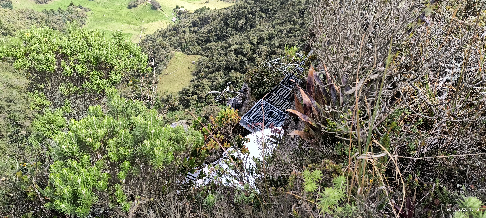

<br><details><summary>:camera:**60/IMG_20260215_134418301_HDR.jpg**</summary><sub> `Exif version` 0220 `OS version`  `Date` 2026:02:15 13:44:19 `Aperture` Not known `Brightness` 0.0 `Color space` 1 `Compression` 6`Exposure mode` 0 `Exposure time` 0.000384 `Focal length` 5.56 `Lens model` Not known `Lens specification` Not known `Orientation` 1 `Scene type` Not known `f number` 1.88 `White balance` 0 `Sensing method` 1 `Shutter speed` 11.346</sub><sub>`Coordinates & altitude` (5.424832805555556, -73.84657286111111, 3382.0)</sub><sub> :globe_with_meridians:`Location over` [Google Maps](http://maps.google.com/maps?q=5.424832805555556,-73.84657286111111) or [Openstreet Map](https://www.openstreetmap.org/query?lat=5.424832805555556&lon=-73.84657286111111)</sub></details>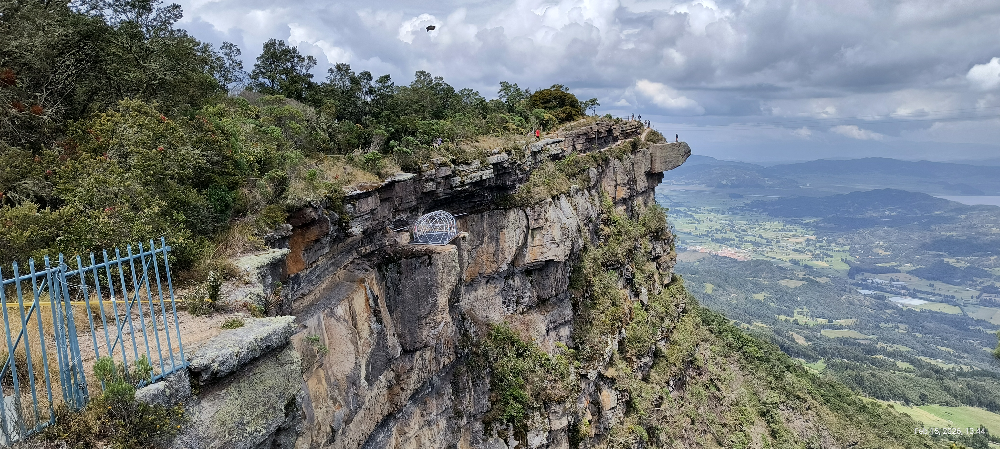

<br><details><summary>:camera:**60/IMG_20260215_134435629.jpg**</summary><sub> `Exif version` 0220 `OS version`  `Date` 2026:02:15 13:44:36 `Aperture` Not known `Brightness` 0.0 `Color space` 1 `Compression` 6`Exposure mode` 0 `Exposure time` 0.000352 `Focal length` 5.56 `Lens model` Not known `Lens specification` Not known `Orientation` 1 `Scene type` Not known `f number` 1.88 `White balance` 0 `Sensing method` 1 `Shutter speed` 11.472</sub><sub>`Coordinates & altitude` (5.424832805555556, -73.84657286111111, 3382.0)</sub><sub> :globe_with_meridians:`Location over` [Google Maps](http://maps.google.com/maps?q=5.424832805555556,-73.84657286111111) or [Openstreet Map](https://www.openstreetmap.org/query?lat=5.424832805555556&lon=-73.84657286111111)</sub></details>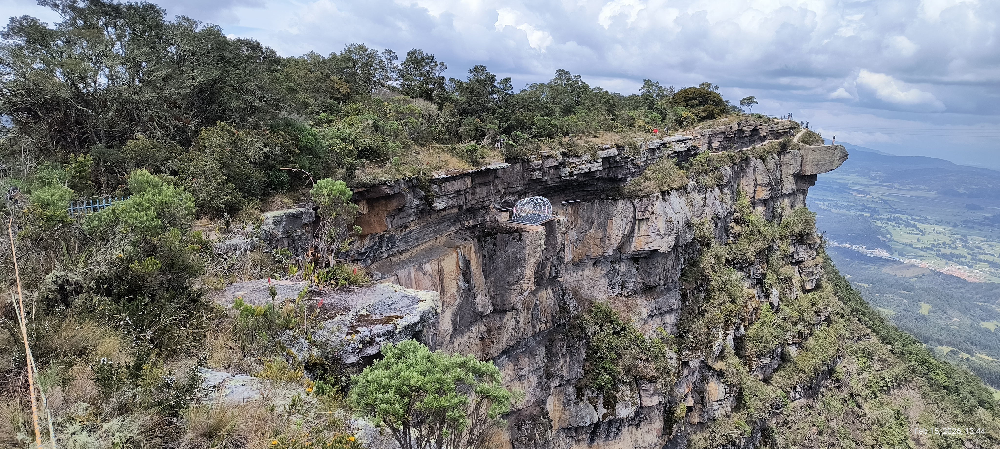

<br><details><summary>:camera:**60/IMG_20260215_134439559.jpg**</summary><sub> `Exif version` 0220 `OS version`  `Date` 2026:02:15 13:44:40 `Aperture` Not known `Brightness` 0.0 `Color space` 1 `Compression` 6`Exposure mode` 0 `Exposure time` 0.000350245 `Focal length` 2.13 `Lens model` Not known `Lens specification` Not known `Orientation` 1 `Scene type` Not known `f number` 2.2 `White balance` 0 `Sensing method` 1 `Shutter speed` 11.479</sub><sub>`Coordinates & altitude` (5.424832805555556, -73.84657286111111, 3382.0)</sub><sub> :globe_with_meridians:`Location over` [Google Maps](http://maps.google.com/maps?q=5.424832805555556,-73.84657286111111) or [Openstreet Map](https://www.openstreetmap.org/query?lat=5.424832805555556&lon=-73.84657286111111)</sub></details>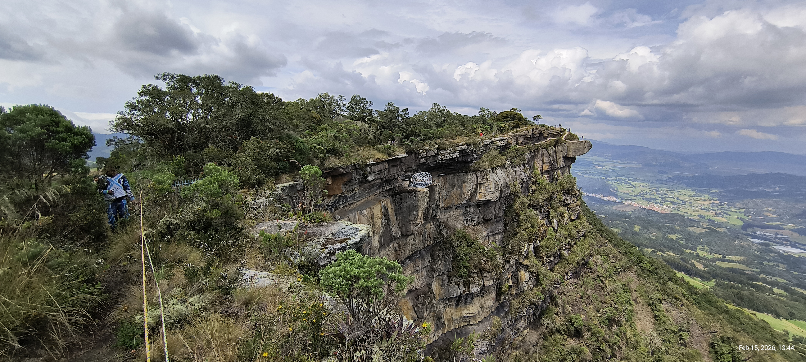

<br><details><summary>:camera:**60/IMG_20260215_134504790.jpg**</summary><sub> `Exif version` 0220 `OS version`  `Date` 2026:02:15 13:45:05 `Aperture` Not known `Brightness` 0.0 `Color space` 1 `Compression` 6`Exposure mode` 0 `Exposure time` 0.000370259 `Focal length` 2.13 `Lens model` Not known `Lens specification` Not known `Orientation` 1 `Scene type` Not known `f number` 2.2 `White balance` 0 `Sensing method` 1 `Shutter speed` 11.399</sub><sub>`Coordinates & altitude` (5.424832805555556, -73.84657286111111, 3382.0)</sub><sub> :globe_with_meridians:`Location over` [Google Maps](http://maps.google.com/maps?q=5.424832805555556,-73.84657286111111) or [Openstreet Map](https://www.openstreetmap.org/query?lat=5.424832805555556&lon=-73.84657286111111)</sub></details>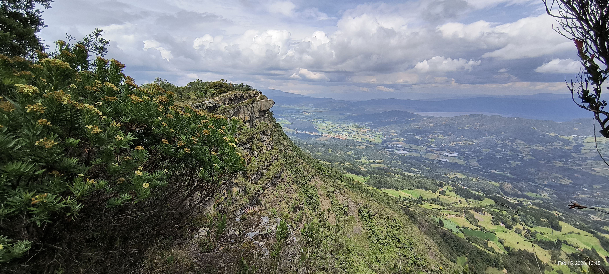

<br><details><summary>:camera:**60/IMG_20260215_134518461.jpg**</summary><sub> `Exif version` 0220 `OS version`  `Date` 2026:02:15 13:45:19 `Aperture` Not known `Brightness` 0.0 `Color space` 1 `Compression` 6`Exposure mode` 0 `Exposure time` 0.00030021 `Focal length` 2.13 `Lens model` Not known `Lens specification` Not known `Orientation` 1 `Scene type` Not known `f number` 2.2 `White balance` 0 `Sensing method` 1 `Shutter speed` 11.701</sub><sub>`Coordinates & altitude` (5.424832805555556, -73.84657286111111, 3382.0)</sub><sub> :globe_with_meridians:`Location over` [Google Maps](http://maps.google.com/maps?q=5.424832805555556,-73.84657286111111) or [Openstreet Map](https://www.openstreetmap.org/query?lat=5.424832805555556&lon=-73.84657286111111)</sub></details>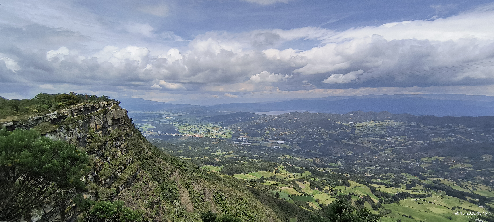

<br><details><summary>:camera:**60/IMG_20260215_134528279_HDR.jpg**</summary><sub> `Exif version` 0220 `OS version`  `Date` 2026:02:15 13:45:29 `Aperture` Not known `Brightness` 0.0 `Color space` 1 `Compression` 6`Exposure mode` 0 `Exposure time` 0.00832 `Focal length` 5.56 `Lens model` Not known `Lens specification` Not known `Orientation` 6 `Scene type` Not known `f number` 1.88 `White balance` 0 `Sensing method` 1 `Shutter speed` 6.909</sub><sub>`Coordinates & altitude` (5.424353111111111, -73.84632872222221, 3394.0)</sub><sub> :globe_with_meridians:`Location over` [Google Maps](http://maps.google.com/maps?q=5.424353111111111,-73.84632872222221) or [Openstreet Map](https://www.openstreetmap.org/query?lat=5.424353111111111&lon=-73.84632872222221)</sub></details>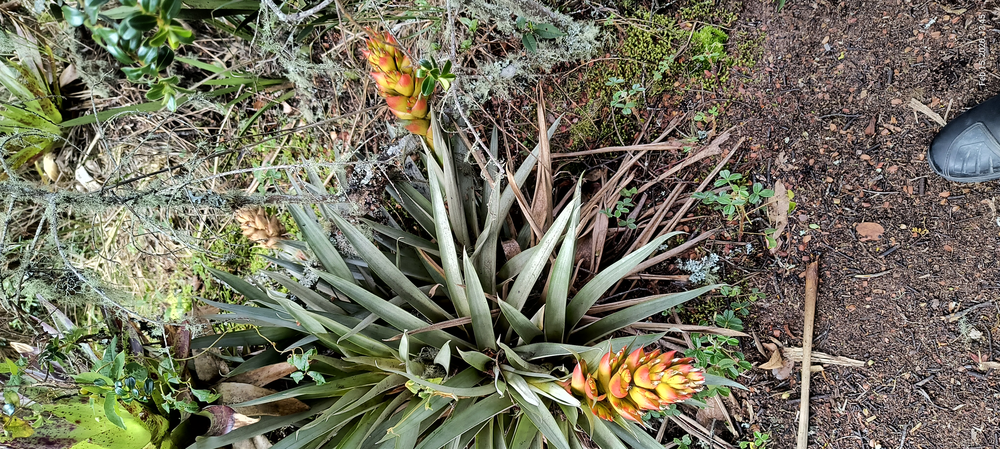

<br><details><summary>:camera:**60/IMG_20260215_134716522.jpg**</summary><sub> `Exif version` 0220 `OS version`  `Date` 2026:02:15 13:47:17 `Aperture` Not known `Brightness` 0.0 `Color space` 1 `Compression` 6`Exposure mode` 0 `Exposure time` 0.000390273 `Focal length` 2.13 `Lens model` Not known `Lens specification` Not known `Orientation` 1 `Scene type` Not known `f number` 2.2 `White balance` 0 `Sensing method` 1 `Shutter speed` 11.323</sub><sub>`Coordinates & altitude` (5.423636888888889, -73.84636686111111, 3394.0)</sub><sub> :globe_with_meridians:`Location over` [Google Maps](http://maps.google.com/maps?q=5.423636888888889,-73.84636686111111) or [Openstreet Map](https://www.openstreetmap.org/query?lat=5.423636888888889&lon=-73.84636686111111)</sub></details>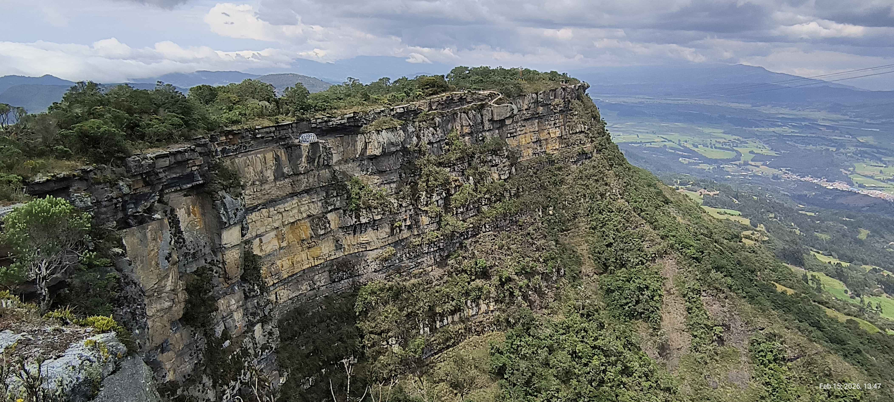

<br><details><summary>:camera:**60/IMG_20260215_134718688.jpg**</summary><sub> `Exif version` 0220 `OS version`  `Date` 2026:02:15 13:47:19 `Aperture` Not known `Brightness` 0.0 `Color space` 1 `Compression` 6`Exposure mode` 0 `Exposure time` 0.000330231 `Focal length` 2.13 `Lens model` Not known `Lens specification` Not known `Orientation` 1 `Scene type` Not known `f number` 2.2 `White balance` 0 `Sensing method` 1 `Shutter speed` 11.564</sub><sub>`Coordinates & altitude` (5.423636888888889, -73.84636686111111, 3394.0)</sub><sub> :globe_with_meridians:`Location over` [Google Maps](http://maps.google.com/maps?q=5.423636888888889,-73.84636686111111) or [Openstreet Map](https://www.openstreetmap.org/query?lat=5.423636888888889&lon=-73.84636686111111)</sub></details>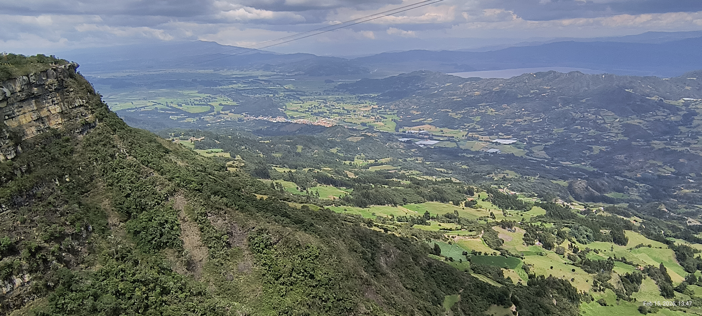

<br><details><summary>:camera:**60/IMG_20260215_134727032.jpg**</summary><sub> `Exif version` 0220 `OS version`  `Date` 2026:02:15 13:47:27 `Aperture` Not known `Brightness` 0.0 `Color space` 1 `Compression` 6`Exposure mode` 0 `Exposure time` 0.000256 `Focal length` 5.56 `Lens model` Not known `Lens specification` Not known `Orientation` 6 `Scene type` Not known `f number` 1.88 `White balance` 0 `Sensing method` 1 `Shutter speed` 11.931</sub><sub>`Coordinates & altitude` (5.42363975, -73.84635924999999, 3394.0)</sub><sub> :globe_with_meridians:`Location over` [Google Maps](http://maps.google.com/maps?q=5.42363975,-73.84635924999999) or [Openstreet Map](https://www.openstreetmap.org/query?lat=5.42363975&lon=-73.84635924999999)</sub></details>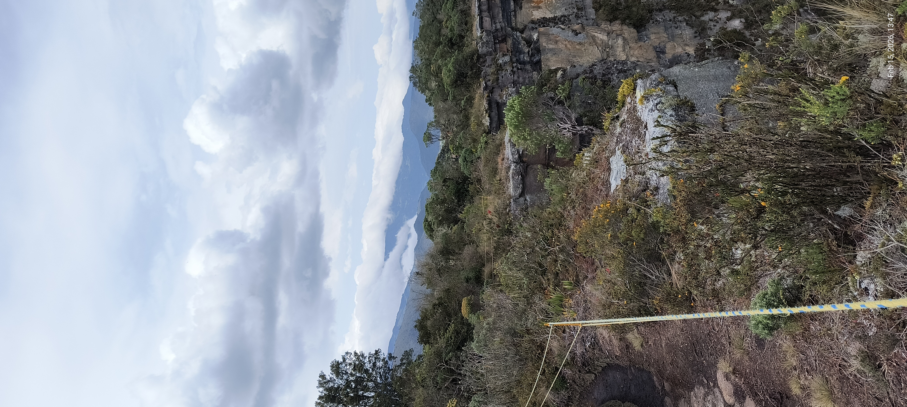

<br><details><summary>:camera:**60/IMG_20260215_134729312.jpg**</summary><sub> `Exif version` 0220 `OS version`  `Date` 2026:02:15 13:47:30 `Aperture` Not known `Brightness` 0.0 `Color space` 1 `Compression` 6`Exposure mode` 0 `Exposure time` 0.000256 `Focal length` 5.56 `Lens model` Not known `Lens specification` Not known `Orientation` 1 `Scene type` Not known `f number` 1.88 `White balance` 0 `Sensing method` 1 `Shutter speed` 11.931</sub><sub>`Coordinates & altitude` (5.42363975, -73.84635924999999, 3394.0)</sub><sub> :globe_with_meridians:`Location over` [Google Maps](http://maps.google.com/maps?q=5.42363975,-73.84635924999999) or [Openstreet Map](https://www.openstreetmap.org/query?lat=5.42363975&lon=-73.84635924999999)</sub></details>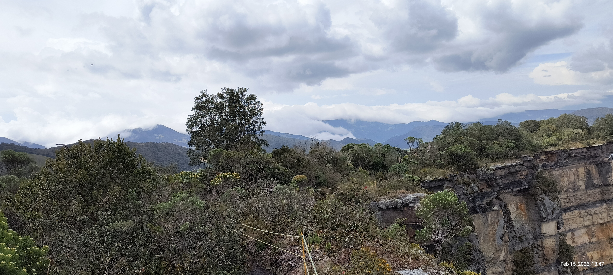

<br><details><summary>:camera:**60/IMG_20260215_134822255.jpg**</summary><sub> `Exif version` 0220 `OS version`  `Date` 2026:02:15 13:48:23 `Aperture` Not known `Brightness` 0.0 `Color space` 1 `Compression` 6`Exposure mode` 0 `Exposure time` 0.00032 `Focal length` 5.56 `Lens model` Not known `Lens specification` Not known `Orientation` 6 `Scene type` Not known `f number` 1.88 `White balance` 0 `Sensing method` 1 `Shutter speed` 11.609</sub><sub>`Coordinates & altitude` (5.423295, -73.84612272222222, 3394.0)</sub><sub> :globe_with_meridians:`Location over` [Google Maps](http://maps.google.com/maps?q=5.423295,-73.84612272222222) or [Openstreet Map](https://www.openstreetmap.org/query?lat=5.423295&lon=-73.84612272222222)</sub></details>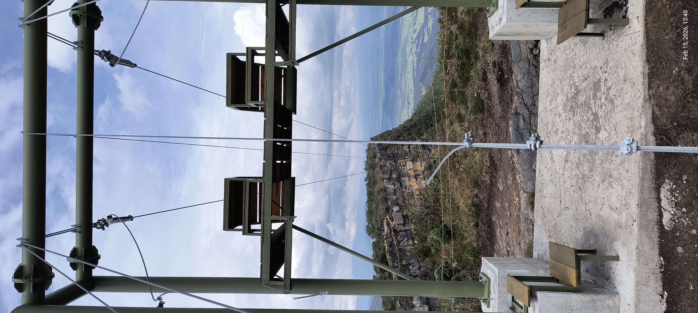

<br><details><summary>:camera:**60/IMG_20260215_134826922.jpg**</summary><sub> `Exif version` 0220 `OS version`  `Date` 2026:02:15 13:48:28 `Aperture` Not known `Brightness` 0.0 `Color space` 1 `Compression` 6`Exposure mode` 0 `Exposure time` 0.000340238 `Focal length` 2.13 `Lens model` Not known `Lens specification` Not known `Orientation` 1 `Scene type` Not known `f number` 2.2 `White balance` 0 `Sensing method` 1 `Shutter speed` 11.521</sub><sub>`Coordinates & altitude` (5.423295, -73.84612272222222, 3394.0)</sub><sub> :globe_with_meridians:`Location over` [Google Maps](http://maps.google.com/maps?q=5.423295,-73.84612272222222) or [Openstreet Map](https://www.openstreetmap.org/query?lat=5.423295&lon=-73.84612272222222)</sub></details>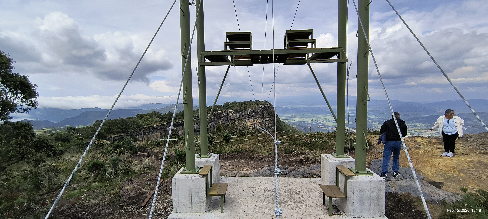

<br><details><summary>:camera:**60/IMG_20260215_134832227.jpg**</summary><sub> `Exif version` 0220 `OS version`  `Date` 2026:02:15 13:48:33 `Aperture` Not known `Brightness` 0.0 `Color space` 1 `Compression` 6`Exposure mode` 0 `Exposure time` 0.00030021 `Focal length` 2.13 `Lens model` Not known `Lens specification` Not known `Orientation` 1 `Scene type` Not known `f number` 2.2 `White balance` 0 `Sensing method` 1 `Shutter speed` 11.701</sub><sub>`Coordinates & altitude` (5.423295, -73.84612272222222, 3394.0)</sub><sub> :globe_with_meridians:`Location over` [Google Maps](http://maps.google.com/maps?q=5.423295,-73.84612272222222) or [Openstreet Map](https://www.openstreetmap.org/query?lat=5.423295&lon=-73.84612272222222)</sub></details>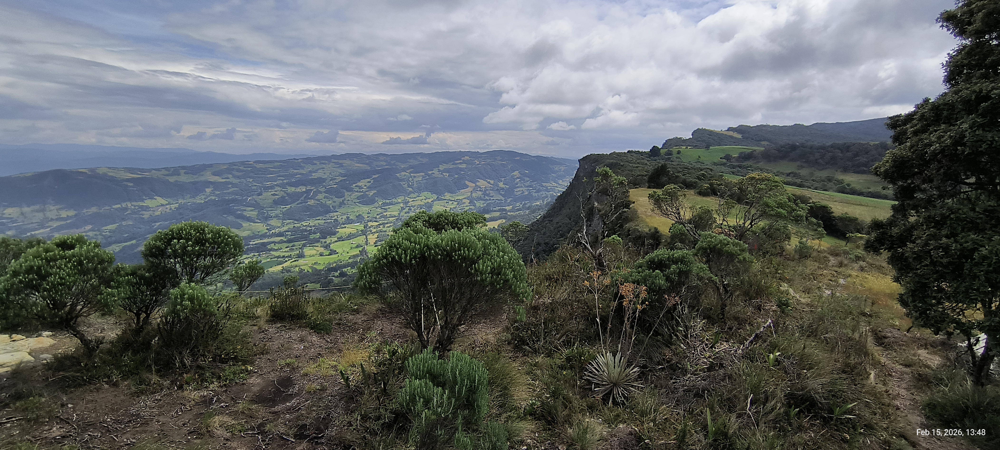

<br><details><summary>:camera:**60/IMG_20260215_135004498.jpg**</summary><sub> `Exif version` 0220 `OS version`  `Date` 2026:02:15 13:50:05 `Aperture` Not known `Brightness` 0.0 `Color space` 1 `Compression` 6`Exposure mode` 0 `Exposure time` 0.000288 `Focal length` 5.56 `Lens model` Not known `Lens specification` Not known `Orientation` 6 `Scene type` Not known `f number` 1.88 `White balance` 0 `Sensing method` 1 `Shutter speed` 11.761</sub><sub>`Coordinates & altitude` (5.423182944444445, -73.84603116666666, 3399.0)</sub><sub> :globe_with_meridians:`Location over` [Google Maps](http://maps.google.com/maps?q=5.423182944444445,-73.84603116666666) or [Openstreet Map](https://www.openstreetmap.org/query?lat=5.423182944444445&lon=-73.84603116666666)</sub></details>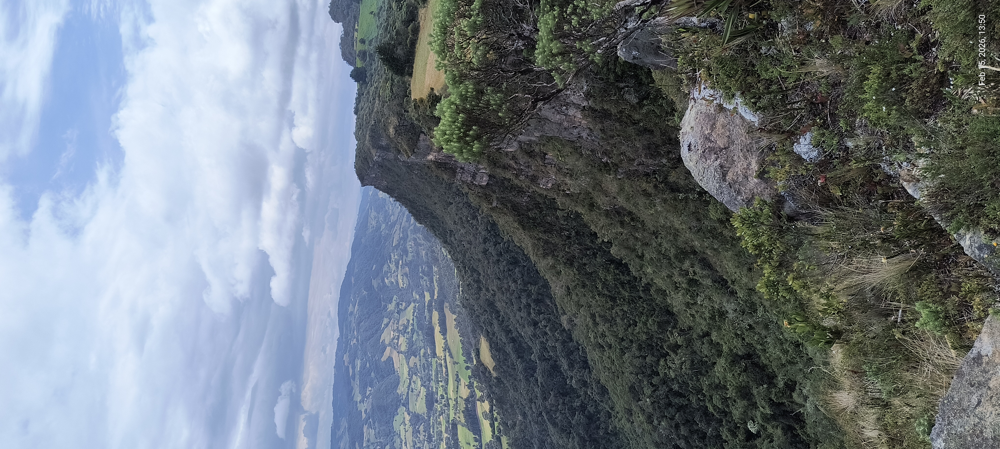

<br><details><summary>:camera:**60/IMG_20260215_135009226.jpg**</summary><sub> `Exif version` 0220 `OS version`  `Date` 2026:02:15 13:50:09 `Aperture` Not known `Brightness` 0.0 `Color space` 1 `Compression` 6`Exposure mode` 0 `Exposure time` 0.00032 `Focal length` 5.56 `Lens model` Not known `Lens specification` Not known `Orientation` 6 `Scene type` Not known `f number` 1.88 `White balance` 0 `Sensing method` 1 `Shutter speed` 11.609</sub><sub>`Coordinates & altitude` (5.423182944444445, -73.84603116666666, 3399.0)</sub><sub> :globe_with_meridians:`Location over` [Google Maps](http://maps.google.com/maps?q=5.423182944444445,-73.84603116666666) or [Openstreet Map](https://www.openstreetmap.org/query?lat=5.423182944444445&lon=-73.84603116666666)</sub></details>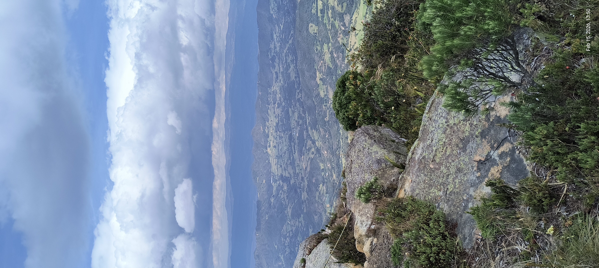

<br><details><summary>:camera:**60/IMG_20260215_135017271.jpg**</summary><sub> `Exif version` 0220 `OS version`  `Date` 2026:02:15 13:50:18 `Aperture` Not known `Brightness` 0.0 `Color space` 1 `Compression` 6`Exposure mode` 0 `Exposure time` 0.000340238 `Focal length` 2.13 `Lens model` Not known `Lens specification` Not known `Orientation` 1 `Scene type` Not known `f number` 2.2 `White balance` 0 `Sensing method` 1 `Shutter speed` 11.521</sub><sub>`Coordinates & altitude` (5.423182944444445, -73.84603116666666, 3399.0)</sub><sub> :globe_with_meridians:`Location over` [Google Maps](http://maps.google.com/maps?q=5.423182944444445,-73.84603116666666) or [Openstreet Map](https://www.openstreetmap.org/query?lat=5.423182944444445&lon=-73.84603116666666)</sub></details>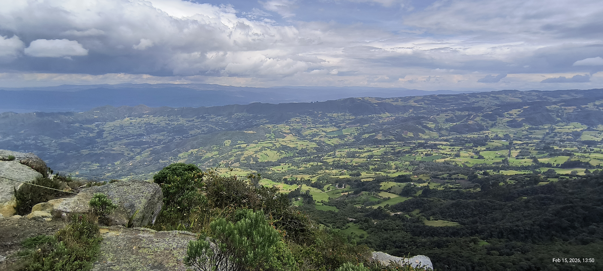

<br><details><summary>:camera:**60/IMG_20260215_135054944.jpg**</summary><sub> `Exif version` 0220 `OS version`  `Date` 2026:02:15 13:50:55 `Aperture` Not known `Brightness` 0.0 `Color space` 1 `Compression` 6`Exposure mode` 0 `Exposure time` 0.000256 `Focal length` 5.56 `Lens model` Not known `Lens specification` Not known `Orientation` 6 `Scene type` Not known `f number` 1.88 `White balance` 0 `Sensing method` 1 `Shutter speed` 11.931</sub><sub>`Coordinates & altitude` (5.423272111111111, -73.84601591666666, 3399.0)</sub><sub> :globe_with_meridians:`Location over` [Google Maps](http://maps.google.com/maps?q=5.423272111111111,-73.84601591666666) or [Openstreet Map](https://www.openstreetmap.org/query?lat=5.423272111111111&lon=-73.84601591666666)</sub></details>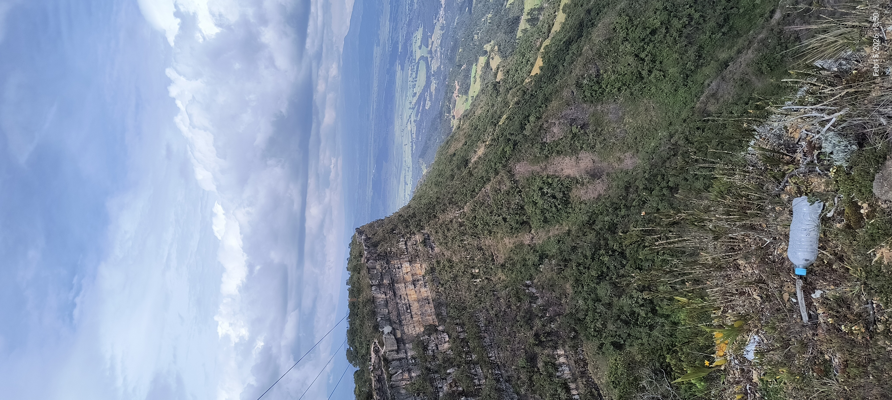

<br><details><summary>:camera:**60/IMG_20260215_135059883.jpg**</summary><sub> `Exif version` 0220 `OS version`  `Date` 2026:02:15 13:51:00 `Aperture` Not known `Brightness` 0.0 `Color space` 1 `Compression` 6`Exposure mode` 0 `Exposure time` 0.000288 `Focal length` 5.56 `Lens model` Not known `Lens specification` Not known `Orientation` 1 `Scene type` Not known `f number` 1.88 `White balance` 0 `Sensing method` 1 `Shutter speed` 11.761</sub><sub>`Coordinates & altitude` (5.423272111111111, -73.84601591666666, 3399.0)</sub><sub> :globe_with_meridians:`Location over` [Google Maps](http://maps.google.com/maps?q=5.423272111111111,-73.84601591666666) or [Openstreet Map](https://www.openstreetmap.org/query?lat=5.423272111111111&lon=-73.84601591666666)</sub></details>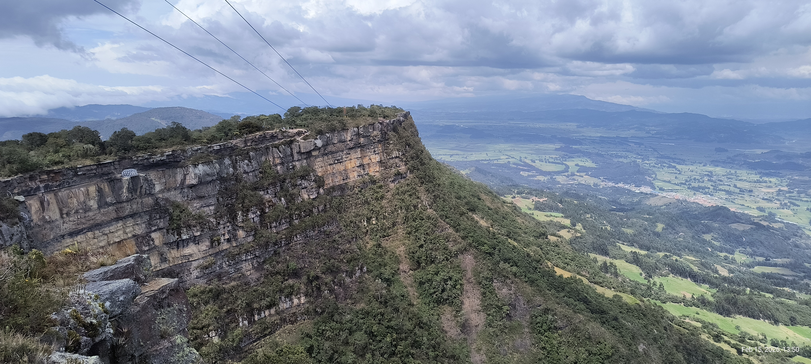

<br><details><summary>:camera:**60/IMG_20260215_135125111.jpg**</summary><sub> `Exif version` 0220 `OS version`  `Date` 2026:02:15 13:51:26 `Aperture` Not known `Brightness` 0.0 `Color space` 1 `Compression` 6`Exposure mode` 0 `Exposure time` 0.000330231 `Focal length` 2.13 `Lens model` Not known `Lens specification` Not known `Orientation` 1 `Scene type` Not known `f number` 2.2 `White balance` 0 `Sensing method` 1 `Shutter speed` 11.564</sub><sub>`Coordinates & altitude` (5.423272111111111, -73.84601591666666, 3399.0)</sub><sub> :globe_with_meridians:`Location over` [Google Maps](http://maps.google.com/maps?q=5.423272111111111,-73.84601591666666) or [Openstreet Map](https://www.openstreetmap.org/query?lat=5.423272111111111&lon=-73.84601591666666)</sub></details>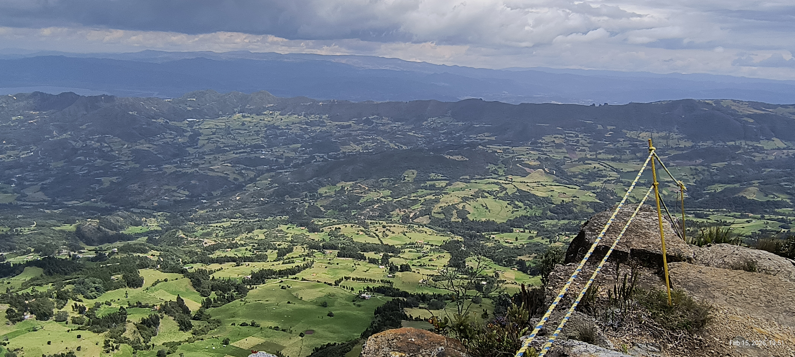

<br><details><summary>:camera:**60/IMG_20260215_135129486.jpg**</summary><sub> `Exif version` 0220 `OS version`  `Date` 2026:02:15 13:51:30 `Aperture` Not known `Brightness` 0.0 `Color space` 1 `Compression` 6`Exposure mode` 0 `Exposure time` 0.000320224 `Focal length` 2.13 `Lens model` Not known `Lens specification` Not known `Orientation` 6 `Scene type` Not known `f number` 2.2 `White balance` 0 `Sensing method` 1 `Shutter speed` 11.608</sub><sub>`Coordinates & altitude` (5.423272111111111, -73.84601591666666, 3399.0)</sub><sub> :globe_with_meridians:`Location over` [Google Maps](http://maps.google.com/maps?q=5.423272111111111,-73.84601591666666) or [Openstreet Map](https://www.openstreetmap.org/query?lat=5.423272111111111&lon=-73.84601591666666)</sub></details>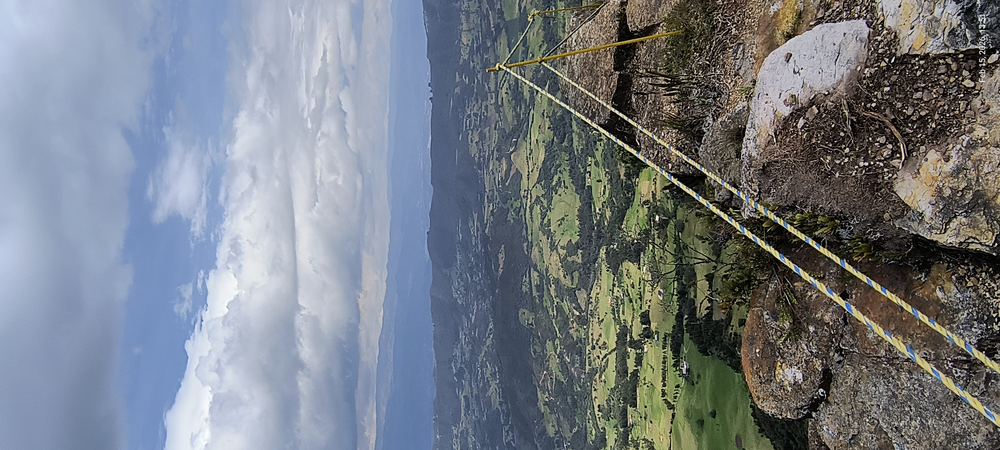

<br><details><summary>:camera:**60/IMG_20260215_135138090.jpg**</summary><sub> `Exif version` 0220 `OS version`  `Date` 2026:02:15 13:51:39 `Aperture` Not known `Brightness` 0.0 `Color space` 1 `Compression` 6`Exposure mode` 0 `Exposure time` 0.000288 `Focal length` 5.56 `Lens model` Not known `Lens specification` Not known `Orientation` 1 `Scene type` Not known `f number` 1.88 `White balance` 0 `Sensing method` 1 `Shutter speed` 11.761</sub><sub>`Coordinates & altitude` (5.423272111111111, -73.84601591666666, 3399.0)</sub><sub> :globe_with_meridians:`Location over` [Google Maps](http://maps.google.com/maps?q=5.423272111111111,-73.84601591666666) or [Openstreet Map](https://www.openstreetmap.org/query?lat=5.423272111111111&lon=-73.84601591666666)</sub></details>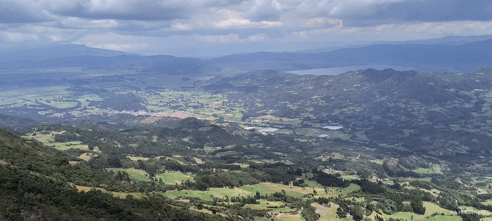

<br><details><summary>:camera:**60/IMG_20260215_135328274_HDR.jpg**</summary><sub> `Exif version` 0220 `OS version`  `Date` 2026:02:15 13:53:29 `Aperture` Not known `Brightness` 0.0 `Color space` 1 `Compression` 6`Exposure mode` 0 `Exposure time` 0.000832 `Focal length` 5.56 `Lens model` Not known `Lens specification` Not known `Orientation` 6 `Scene type` Not known `f number` 1.88 `White balance` 0 `Sensing method` 1 `Shutter speed` 10.231</sub><sub>`Coordinates & altitude` (5.423333166666667, -73.84603880555555, 3410.0)</sub><sub> :globe_with_meridians:`Location over` [Google Maps](http://maps.google.com/maps?q=5.423333166666667,-73.84603880555555) or [Openstreet Map](https://www.openstreetmap.org/query?lat=5.423333166666667&lon=-73.84603880555555)</sub></details>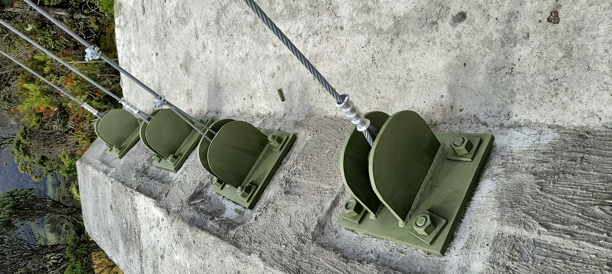

<br><details><summary>:camera:**60/IMG_20260215_135336844.jpg**</summary><sub> `Exif version` 0220 `OS version`  `Date` 2026:02:15 13:53:37 `Aperture` Not known `Brightness` 0.0 `Color space` 1 `Compression` 6`Exposure mode` 0 `Exposure time` 0.000352 `Focal length` 5.56 `Lens model` Not known `Lens specification` Not known `Orientation` 1 `Scene type` Not known `f number` 1.88 `White balance` 0 `Sensing method` 1 `Shutter speed` 11.472</sub><sub>`Coordinates & altitude` (5.423333166666667, -73.84603880555555, 3410.0)</sub><sub> :globe_with_meridians:`Location over` [Google Maps](http://maps.google.com/maps?q=5.423333166666667,-73.84603880555555) or [Openstreet Map](https://www.openstreetmap.org/query?lat=5.423333166666667&lon=-73.84603880555555)</sub></details>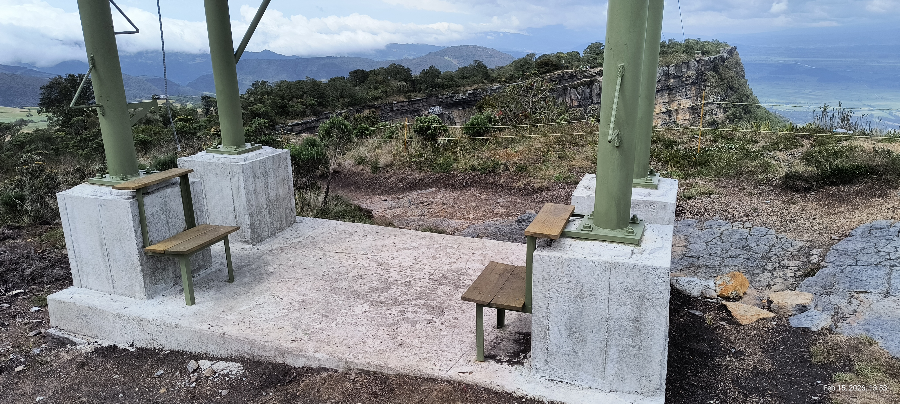

<br><details><summary>:camera:**60/IMG_20260215_135434954.jpg**</summary><sub> `Exif version` 0220 `OS version`  `Date` 2026:02:15 13:54:36 `Aperture` Not known `Brightness` 0.0 `Color space` 1 `Compression` 6`Exposure mode` 0 `Exposure time` 0.000350245 `Focal length` 2.13 `Lens model` Not known `Lens specification` Not known `Orientation` 1 `Scene type` Not known `f number` 2.2 `White balance` 0 `Sensing method` 1 `Shutter speed` 11.479</sub><sub>`Coordinates & altitude` (5.423309777777778, -73.84602355555555, 3410.0)</sub><sub> :globe_with_meridians:`Location over` [Google Maps](http://maps.google.com/maps?q=5.423309777777778,-73.84602355555555) or [Openstreet Map](https://www.openstreetmap.org/query?lat=5.423309777777778&lon=-73.84602355555555)</sub></details>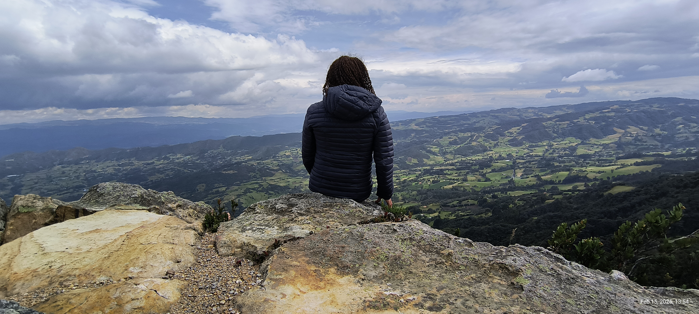

<br><details><summary>:camera:**60/IMG_20260215_135439087.jpg**</summary><sub> `Exif version` 0220 `OS version`  `Date` 2026:02:15 13:54:40 `Aperture` Not known `Brightness` 0.0 `Color space` 1 `Compression` 6`Exposure mode` 0 `Exposure time` 0.000310217 `Focal length` 2.13 `Lens model` Not known `Lens specification` Not known `Orientation` 6 `Scene type` Not known `f number` 2.2 `White balance` 0 `Sensing method` 1 `Shutter speed` 11.654</sub><sub>`Coordinates & altitude` (5.423309777777778, -73.84602355555555, 3410.0)</sub><sub> :globe_with_meridians:`Location over` [Google Maps](http://maps.google.com/maps?q=5.423309777777778,-73.84602355555555) or [Openstreet Map](https://www.openstreetmap.org/query?lat=5.423309777777778&lon=-73.84602355555555)</sub></details>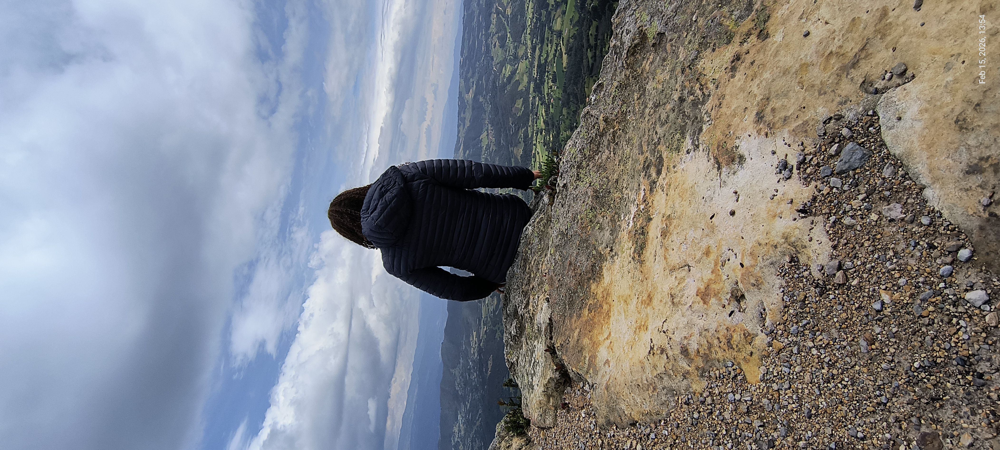

<br><details><summary>:camera:**60/IMG_20260215_135611588.jpg**</summary><sub> `Exif version` 0220 `OS version`  `Date` 2026:02:15 13:56:12 `Aperture` Not known `Brightness` 0.0 `Color space` 1 `Compression` 6`Exposure mode` 0 `Exposure time` 0.000288 `Focal length` 5.56 `Lens model` Not known `Lens specification` Not known `Orientation` 6 `Scene type` Not known `f number` 1.88 `White balance` 0 `Sensing method` 1 `Shutter speed` 11.761</sub><sub>`Coordinates & altitude` (5.423293111111112, -73.84609222222221, 3410.0)</sub><sub> :globe_with_meridians:`Location over` [Google Maps](http://maps.google.com/maps?q=5.423293111111112,-73.84609222222221) or [Openstreet Map](https://www.openstreetmap.org/query?lat=5.423293111111112&lon=-73.84609222222221)</sub></details>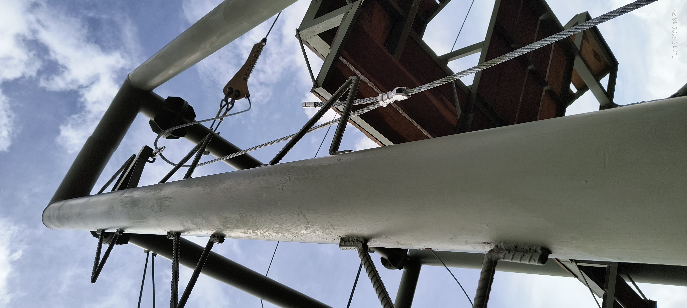

<br><details><summary>:camera:**60/IMG_20260215_135906104_HDR.jpg**</summary><sub> `Exif version` 0220 `OS version`  `Date` 2026:02:15 13:59:07 `Aperture` Not known `Brightness` 0.0 `Color space` 1 `Compression` 6`Exposure mode` 0 `Exposure time` 0.002368 `Focal length` 5.56 `Lens model` Not known `Lens specification` Not known `Orientation` 1 `Scene type` Not known `f number` 1.88 `White balance` 0 `Sensing method` 1 `Shutter speed` 8.722</sub><sub>`Coordinates & altitude` (5.423908222222223, -73.84635924999999, 3405.0)</sub><sub> :globe_with_meridians:`Location over` [Google Maps](http://maps.google.com/maps?q=5.423908222222223,-73.84635924999999) or [Openstreet Map](https://www.openstreetmap.org/query?lat=5.423908222222223&lon=-73.84635924999999)</sub></details>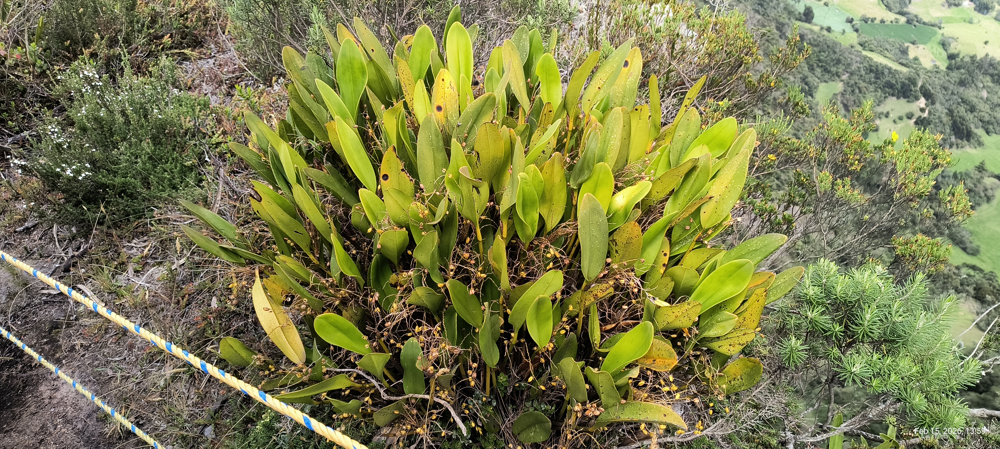

<br><details><summary>:camera:**60/IMG_20260215_135908140.jpg**</summary><sub> `Exif version` 0220 `OS version`  `Date` 2026:02:15 13:59:08 `Aperture` Not known `Brightness` 0.0 `Color space` 1 `Compression` 6`Exposure mode` 0 `Exposure time` 0.001088 `Focal length` 5.56 `Lens model` Not known `Lens specification` Not known `Orientation` 6 `Scene type` Not known `f number` 1.88 `White balance` 0 `Sensing method` 1 `Shutter speed` 9.844</sub><sub>`Coordinates & altitude` (5.423908222222223, -73.84635924999999, 3405.0)</sub><sub> :globe_with_meridians:`Location over` [Google Maps](http://maps.google.com/maps?q=5.423908222222223,-73.84635924999999) or [Openstreet Map](https://www.openstreetmap.org/query?lat=5.423908222222223&lon=-73.84635924999999)</sub></details>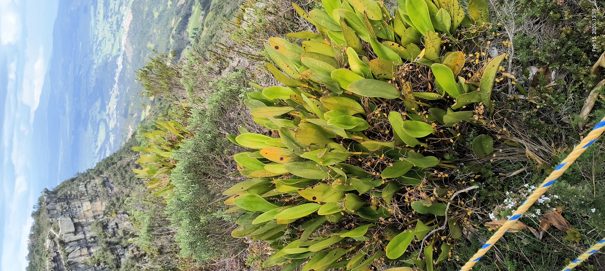

<br><details><summary>:camera:**60/IMG_20260215_140328784.jpg**</summary><sub> `Exif version` 0220 `OS version`  `Date` 2026:02:15 14:03:29 `Aperture` Not known `Brightness` 0.0 `Color space` 1 `Compression` 6`Exposure mode` 0 `Exposure time` 0.000256 `Focal length` 5.56 `Lens model` Not known `Lens specification` Not known `Orientation` 1 `Scene type` Not known `f number` 1.88 `White balance` 0 `Sensing method` 1 `Shutter speed` 11.931</sub><sub>`Coordinates & altitude` (5.426053027777778, -73.84588622222222, 3398.0)</sub><sub> :globe_with_meridians:`Location over` [Google Maps](http://maps.google.com/maps?q=5.426053027777778,-73.84588622222222) or [Openstreet Map](https://www.openstreetmap.org/query?lat=5.426053027777778&lon=-73.84588622222222)</sub></details>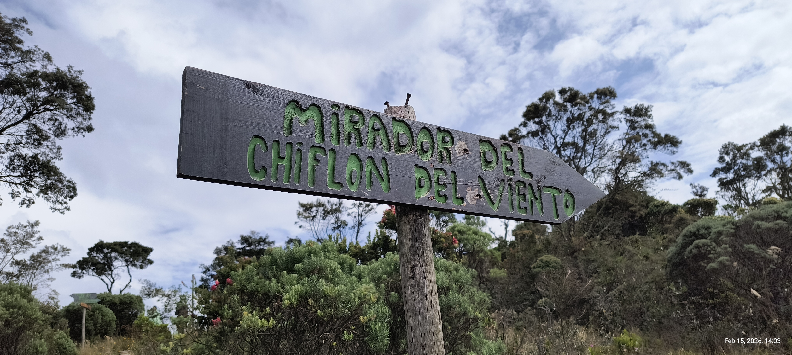

<br><details><summary>:camera:**60/IMG_20260215_140416112_HDR.jpg**</summary><sub> `Exif version` 0220 `OS version`  `Date` 2026:02:15 14:04:17 `Aperture` Not known `Brightness` 0.0 `Color space` 1 `Compression` 6`Exposure mode` 0 `Exposure time` 0.000544 `Focal length` 5.56 `Lens model` Not known `Lens specification` Not known `Orientation` 1 `Scene type` Not known `f number` 1.88 `White balance` 0 `Sensing method` 1 `Shutter speed` 10.844</sub><sub>`Coordinates & altitude` (5.425869916666667, -73.84587094444444, 3398.0)</sub><sub> :globe_with_meridians:`Location over` [Google Maps](http://maps.google.com/maps?q=5.425869916666667,-73.84587094444444) or [Openstreet Map](https://www.openstreetmap.org/query?lat=5.425869916666667&lon=-73.84587094444444)</sub></details>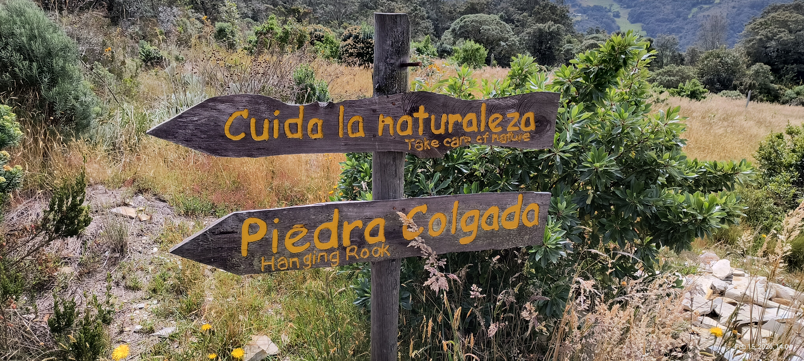

<br><details><summary>:camera:**60/IMG_20260215_140441010.jpg**</summary><sub> `Exif version` 0220 `OS version`  `Date` 2026:02:15 14:04:42 `Aperture` Not known `Brightness` 0.0 `Color space` 1 `Compression` 6`Exposure mode` 0 `Exposure time` 0.000220154 `Focal length` 2.13 `Lens model` Not known `Lens specification` Not known `Orientation` 1 `Scene type` Not known `f number` 2.2 `White balance` 0 `Sensing method` 1 `Shutter speed` 12.149</sub><sub>`Coordinates & altitude` (5.425869916666667, -73.84587094444444, 3398.0)</sub><sub> :globe_with_meridians:`Location over` [Google Maps](http://maps.google.com/maps?q=5.425869916666667,-73.84587094444444) or [Openstreet Map](https://www.openstreetmap.org/query?lat=5.425869916666667&lon=-73.84587094444444)</sub></details>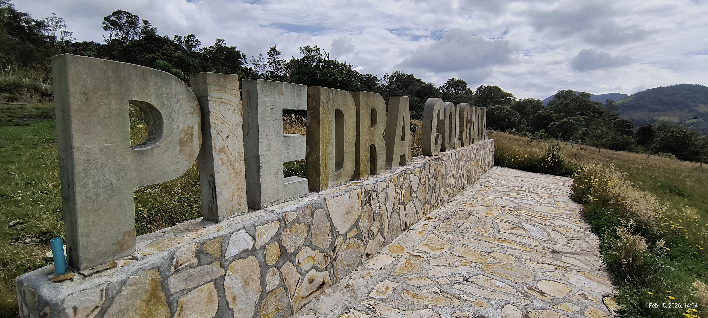

<br><details><summary>:camera:**60/IMG_20260215_140456386.jpg**</summary><sub> `Exif version` 0220 `OS version`  `Date` 2026:02:15 14:04:57 `Aperture` Not known `Brightness` 0.0 `Color space` 1 `Compression` 6`Exposure mode` 0 `Exposure time` 0.000230161 `Focal length` 2.13 `Lens model` Not known `Lens specification` Not known `Orientation` 1 `Scene type` Not known `f number` 2.2 `White balance` 0 `Sensing method` 1 `Shutter speed` 12.085</sub><sub>`Coordinates & altitude` (5.425869916666667, -73.84587094444444, 3398.0)</sub><sub> :globe_with_meridians:`Location over` [Google Maps](http://maps.google.com/maps?q=5.425869916666667,-73.84587094444444) or [Openstreet Map](https://www.openstreetmap.org/query?lat=5.425869916666667&lon=-73.84587094444444)</sub></details>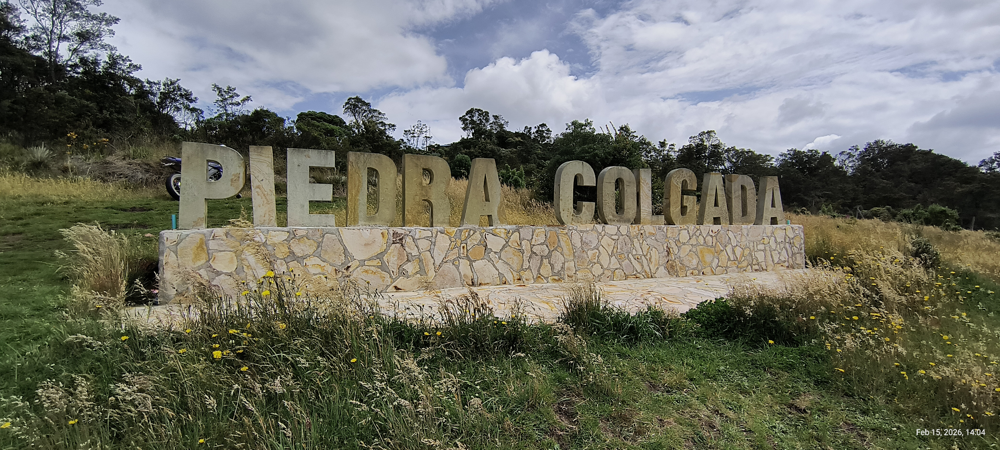

<br><details><summary>:camera:**60/IMG_20260215_140517748_HDR.jpg**</summary><sub> `Exif version` 0220 `OS version`  `Date` 2026:02:15 14:05:19 `Aperture` Not known `Brightness` 0.0 `Color space` 1 `Compression` 6`Exposure mode` 0 `Exposure time` 0.001536 `Focal length` 5.56 `Lens model` Not known `Lens specification` Not known `Orientation` 6 `Scene type` Not known `f number` 1.88 `White balance` 0 `Sensing method` 1 `Shutter speed` 9.346</sub><sub>`Coordinates & altitude` (5.426344861111112, -73.84600066666667, 3398.0)</sub><sub> :globe_with_meridians:`Location over` [Google Maps](http://maps.google.com/maps?q=5.426344861111112,-73.84600066666667) or [Openstreet Map](https://www.openstreetmap.org/query?lat=5.426344861111112&lon=-73.84600066666667)</sub></details>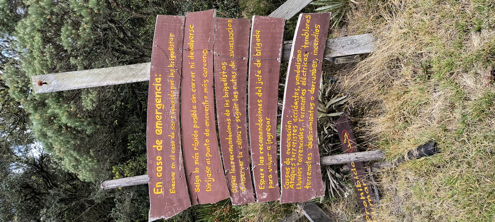

<br><details><summary>:camera:**60/IMG_20260215_145053556_HDR.jpg**</summary><sub> `Exif version` 0220 `OS version`  `Date` 2026:02:15 14:50:55 `Aperture` Not known `Brightness` 0.0 `Color space` 1 `Compression` 6`Exposure mode` 0 `Exposure time` 0.000416 `Focal length` 5.56 `Lens model` Not known `Lens specification` Not known `Orientation` 1 `Scene type` Not known `f number` 1.88 `White balance` 0 `Sensing method` 1 `Shutter speed` 11.231</sub><sub>`Coordinates & altitude` (5.452772138888889, -73.81427, 2594.0)</sub><sub> :globe_with_meridians:`Location over` [Google Maps](http://maps.google.com/maps?q=5.452772138888889,-73.81427) or [Openstreet Map](https://www.openstreetmap.org/query?lat=5.452772138888889&lon=-73.81427)</sub></details>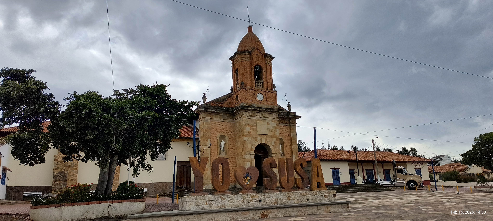

<br><details><summary>:camera:**60/IMG_20260215_145059580_HDR.jpg**</summary><sub> `Exif version` 0220 `OS version`  `Date` 2026:02:15 14:51:01 `Aperture` Not known `Brightness` 0.0 `Color space` 1 `Compression` 6`Exposure mode` 0 `Exposure time` 0.00064 `Focal length` 5.56 `Lens model` Not known `Lens specification` Not known `Orientation` 1 `Scene type` Not known `f number` 1.88 `White balance` 0 `Sensing method` 1 `Shutter speed` 10.609</sub><sub>`Coordinates & altitude` (5.452772138888889, -73.81427, 2594.0)</sub><sub> :globe_with_meridians:`Location over` [Google Maps](http://maps.google.com/maps?q=5.452772138888889,-73.81427) or [Openstreet Map](https://www.openstreetmap.org/query?lat=5.452772138888889&lon=-73.81427)</sub></details>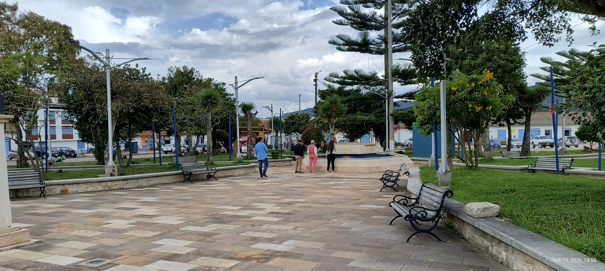

<br><details><summary>:camera:**60/IMG_20260215_145102646_HDR.jpg**</summary><sub> `Exif version` 0220 `OS version`  `Date` 2026:02:15 14:51:04 `Aperture` Not known `Brightness` 0.0 `Color space` 1 `Compression` 6`Exposure mode` 0 `Exposure time` 0.000608 `Focal length` 5.56 `Lens model` Not known `Lens specification` Not known `Orientation` 1 `Scene type` Not known `f number` 1.88 `White balance` 0 `Sensing method` 1 `Shutter speed` 10.683</sub><sub>`Coordinates & altitude` (5.452772138888889, -73.81427, 2594.0)</sub><sub> :globe_with_meridians:`Location over` [Google Maps](http://maps.google.com/maps?q=5.452772138888889,-73.81427) or [Openstreet Map](https://www.openstreetmap.org/query?lat=5.452772138888889&lon=-73.81427)</sub></details>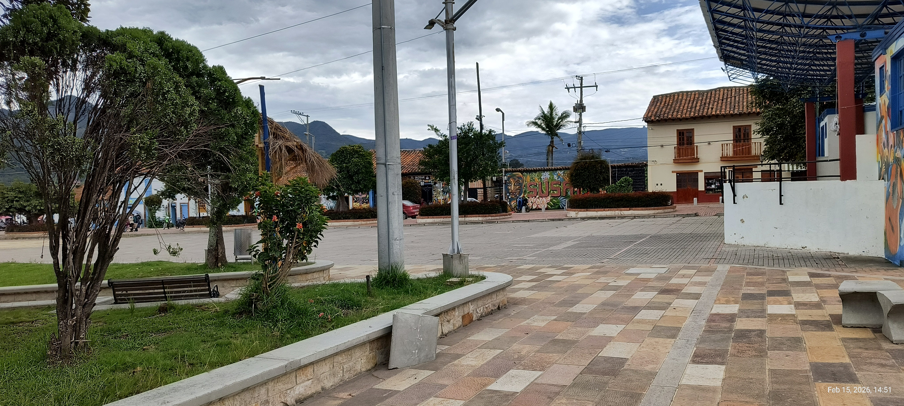

<br><details><summary>:camera:**60/IMG_20260215_145115896_BURST000_COVER.jpg**</summary><sub> `Exif version` 0220 `OS version`  `Date` 2026:02:15 14:51:17 `Aperture` Not known `Brightness` 0.0 `Color space` 1 `Compression` 6`Exposure mode` 0 `Exposure time` 0.001984 `Focal length` 5.56 `Lens model` Not known `Lens specification` Not known `Orientation` 6 `Scene type` Not known `f number` 1.88 `White balance` 0 `Sensing method` 1 `Shutter speed` 8.977</sub><sub>`Coordinates & altitude` (5.452772138888889, -73.81427, 2594.0)</sub><sub> :globe_with_meridians:`Location over` [Google Maps](http://maps.google.com/maps?q=5.452772138888889,-73.81427) or [Openstreet Map](https://www.openstreetmap.org/query?lat=5.452772138888889&lon=-73.81427)</sub></details>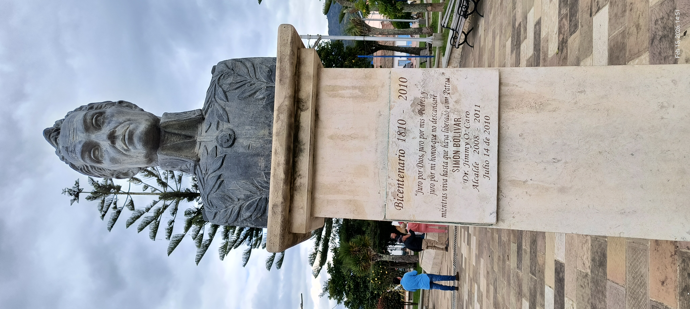

<br><details><summary>:camera:**60/IMG_20260215_145115896_BURST001_COMP.jpg**</summary><sub> `Exif version` 0220 `OS version`  `Date` 2026:02:15 14:51:17 `Aperture` Not known `Brightness` 0.0 `Color space` 1 `Compression` 6`Exposure mode` 0 `Exposure time` 0.001984 `Focal length` 5.56 `Lens model` Not known `Lens specification` Not known `Orientation` 6 `Scene type` Not known `f number` 1.88 `White balance` 0 `Sensing method` 1 `Shutter speed` 8.977</sub><sub>`Coordinates & altitude` (5.452772138888889, -73.81427, 2594.0)</sub><sub> :globe_with_meridians:`Location over` [Google Maps](http://maps.google.com/maps?q=5.452772138888889,-73.81427) or [Openstreet Map](https://www.openstreetmap.org/query?lat=5.452772138888889&lon=-73.81427)</sub></details>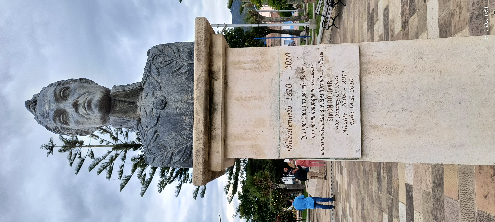

<br><details><summary>:camera:**60/IMG_20260215_145144726.jpg**</summary><sub> `Exif version` 0220 `OS version`  `Date` 2026:02:15 14:51:45 `Aperture` Not known `Brightness` 0.0 `Color space` 1 `Compression` 6`Exposure mode` 0 `Exposure time` 0.00048 `Focal length` 5.56 `Lens model` Not known `Lens specification` Not known `Orientation` 6 `Scene type` Not known `f number` 1.88 `White balance` 0 `Sensing method` 1 `Shutter speed` 11.024</sub><sub>`Coordinates & altitude` (5.452772138888889, -73.81427, 2594.0)</sub><sub> :globe_with_meridians:`Location over` [Google Maps](http://maps.google.com/maps?q=5.452772138888889,-73.81427) or [Openstreet Map](https://www.openstreetmap.org/query?lat=5.452772138888889&lon=-73.81427)</sub></details>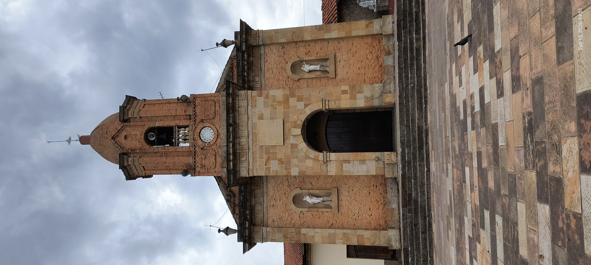

<br><details><summary>:camera:**60/IMG_20260215_145151619_HDR.jpg**</summary><sub> `Exif version` 0220 `OS version`  `Date` 2026:02:15 14:51:53 `Aperture` Not known `Brightness` 0.0 `Color space` 1 `Compression` 6`Exposure mode` 0 `Exposure time` 0.000512 `Focal length` 5.56 `Lens model` Not known `Lens specification` Not known `Orientation` 1 `Scene type` Not known `f number` 1.88 `White balance` 0 `Sensing method` 1 `Shutter speed` 10.931</sub><sub>`Coordinates & altitude` (5.452772138888889, -73.81427, 2594.0)</sub><sub> :globe_with_meridians:`Location over` [Google Maps](http://maps.google.com/maps?q=5.452772138888889,-73.81427) or [Openstreet Map](https://www.openstreetmap.org/query?lat=5.452772138888889&lon=-73.81427)</sub></details>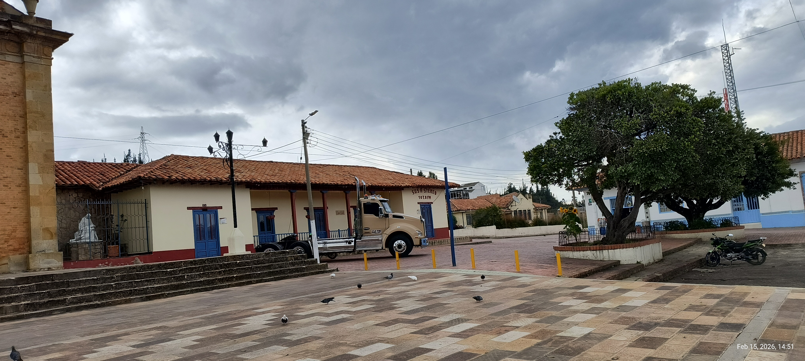

<br><details><summary>:camera:**60/IMG_20260215_145154229.jpg**</summary><sub> `Exif version` 0220 `OS version`  `Date` 2026:02:15 14:51:54 `Aperture` Not known `Brightness` 0.0 `Color space` 1 `Compression` 6`Exposure mode` 0 `Exposure time` 0.000512 `Focal length` 5.56 `Lens model` Not known `Lens specification` Not known `Orientation` 1 `Scene type` Not known `f number` 1.88 `White balance` 0 `Sensing method` 1 `Shutter speed` 10.931</sub><sub>`Coordinates & altitude` (5.452772138888889, -73.81427, 2594.0)</sub><sub> :globe_with_meridians:`Location over` [Google Maps](http://maps.google.com/maps?q=5.452772138888889,-73.81427) or [Openstreet Map](https://www.openstreetmap.org/query?lat=5.452772138888889&lon=-73.81427)</sub></details>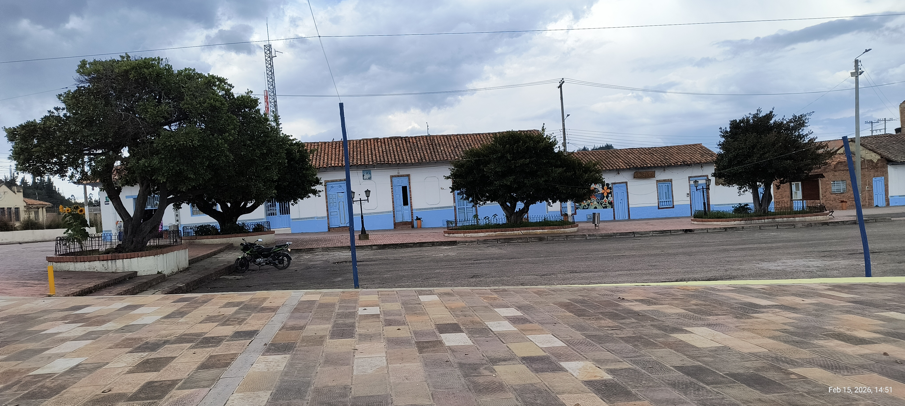

<br><details><summary>:camera:**60/IMG_20260215_145156765.jpg**</summary><sub> `Exif version` 0220 `OS version`  `Date` 2026:02:15 14:51:57 `Aperture` Not known `Brightness` 0.0 `Color space` 1 `Compression` 6`Exposure mode` 0 `Exposure time` 0.00048 `Focal length` 5.56 `Lens model` Not known `Lens specification` Not known `Orientation` 1 `Scene type` Not known `f number` 1.88 `White balance` 0 `Sensing method` 1 `Shutter speed` 11.024</sub><sub>`Coordinates & altitude` (5.452772138888889, -73.81427, 2594.0)</sub><sub> :globe_with_meridians:`Location over` [Google Maps](http://maps.google.com/maps?q=5.452772138888889,-73.81427) or [Openstreet Map](https://www.openstreetmap.org/query?lat=5.452772138888889&lon=-73.81427)</sub></details>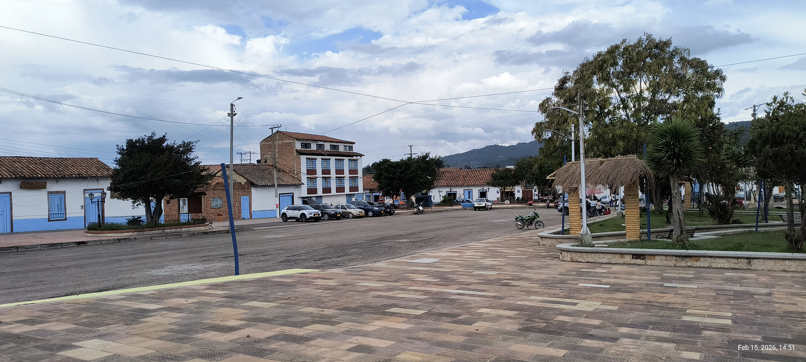

<br><details><summary>:camera:**60/IMG_20260215_162406676.jpg**</summary><sub> `Exif version` 0220 `OS version`  `Date` 2026:02:15 16:24:09 `Aperture` Not known `Brightness` 0.0 `Color space` 1 `Compression` 6`Exposure mode` 0 `Exposure time` 0.000544 `Focal length` 5.56 `Lens model` Not known `Lens specification` Not known `Orientation` 6 `Scene type` Not known `f number` 1.88 `White balance` 0 `Sensing method` 1 `Shutter speed` 10.844</sub><sub>`Coordinates & altitude` (5.404253000000001, -73.76605222222223, 2568.0)</sub><sub> :globe_with_meridians:`Location over` [Google Maps](http://maps.google.com/maps?q=5.404253000000001,-73.76605222222223) or [Openstreet Map](https://www.openstreetmap.org/query?lat=5.404253000000001&lon=-73.76605222222223)</sub></details>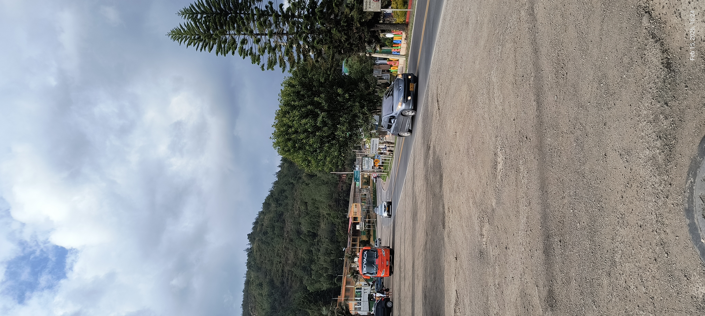

<br><details><summary>:camera:**60/IMG_20260215_162444331.jpg**</summary><sub> `Exif version` 0220 `OS version`  `Date` 2026:02:15 16:24:46 `Aperture` Not known `Brightness` 0.0 `Color space` 1 `Compression` 6`Exposure mode` 0 `Exposure time` 0.000736 `Focal length` 5.56 `Lens model` Not known `Lens specification` Not known `Orientation` 6 `Scene type` Not known `f number` 1.88 `White balance` 0 `Sensing method` 1 `Shutter speed` 10.408</sub><sub>`Coordinates & altitude` (5.404253000000001, -73.76605222222223, 2568.0)</sub><sub> :globe_with_meridians:`Location over` [Google Maps](http://maps.google.com/maps?q=5.404253000000001,-73.76605222222223) or [Openstreet Map](https://www.openstreetmap.org/query?lat=5.404253000000001&lon=-73.76605222222223)</sub></details>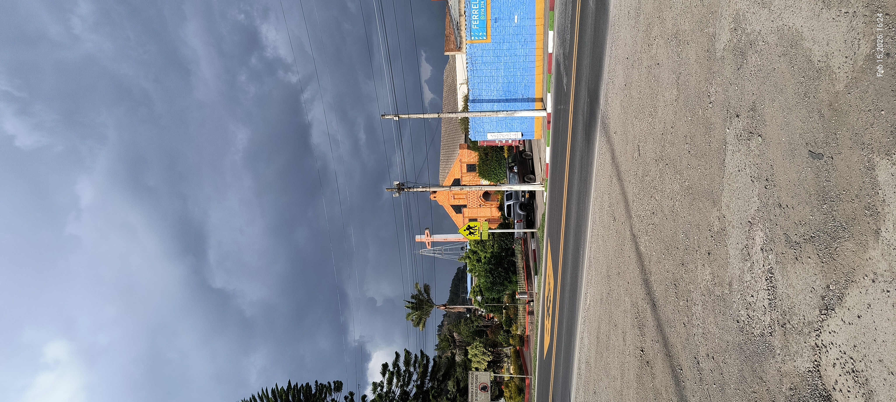

<br><details><summary>:camera:**60/IMG_20260215_165548169.jpg**</summary><sub> `Exif version` 0220 `OS version`  `Date` 2026:02:15 16:55:49 `Aperture` Not known `Brightness` 0.0 `Color space` 1 `Compression` 6`Exposure mode` 0 `Exposure time` 0.003922744 `Focal length` 2.13 `Lens model` Not known `Lens specification` Not known `Orientation` 1 `Scene type` Not known `f number` 2.2 `White balance` 0 `Sensing method` 1 `Shutter speed` 7.993</sub><sub>`Coordinates & altitude` (5.296965111111111, -73.8153305, 2596.0)</sub><sub> :globe_with_meridians:`Location over` [Google Maps](http://maps.google.com/maps?q=5.296965111111111,-73.8153305) or [Openstreet Map](https://www.openstreetmap.org/query?lat=5.296965111111111&lon=-73.8153305)</sub></details>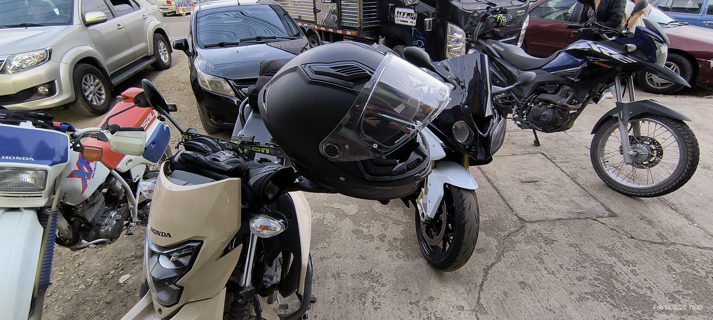

<br><details><summary>:camera:**60/IMG_20260215_181928636.jpg**</summary><sub> `Exif version` 0220 `OS version` Not known `Date` 2026:02:15 18:19:30 `Aperture` Not known `Brightness` 0.0 `Color space` Not known `Compression` Not known`Exposure mode` Not known `Exposure time` 0.030016 `Focal length` 5.56 `Lens model` Not known `Lens specification` Not known `Orientation` Not known `Scene type` Not known `f number` 1.88 `White balance` 0 `Sensing method` Not known `Shutter speed` 5.058</sub></details>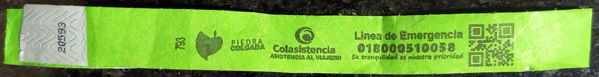

<br><details><summary>:camera:**60/XXXXXX_GarminConnect1.jpg**</summary> `Exif version` Not known</details>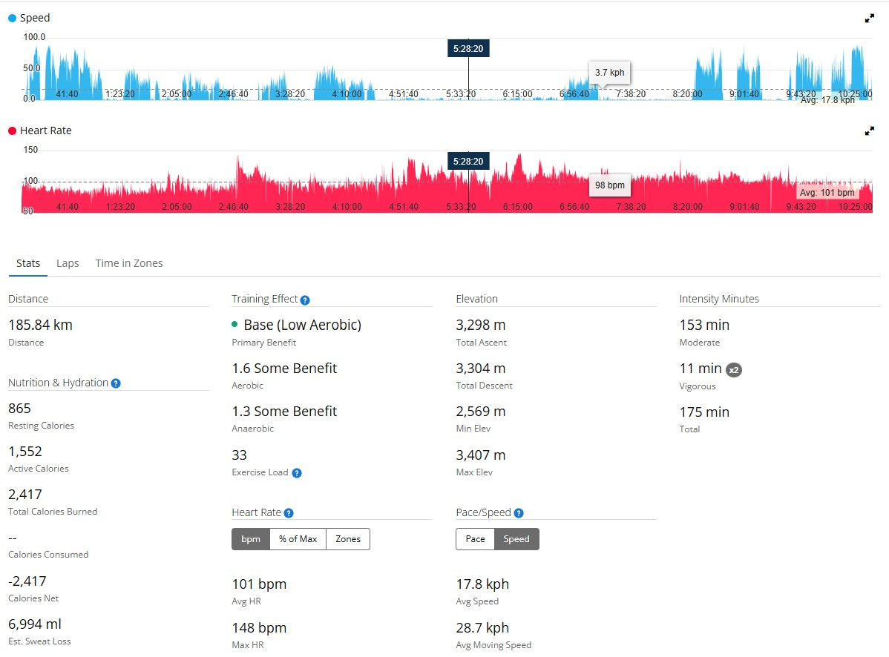

<br><details><summary>:camera:**60/XXXXXX_GarminConnect2.jpg**</summary> `Exif version` Not known</details>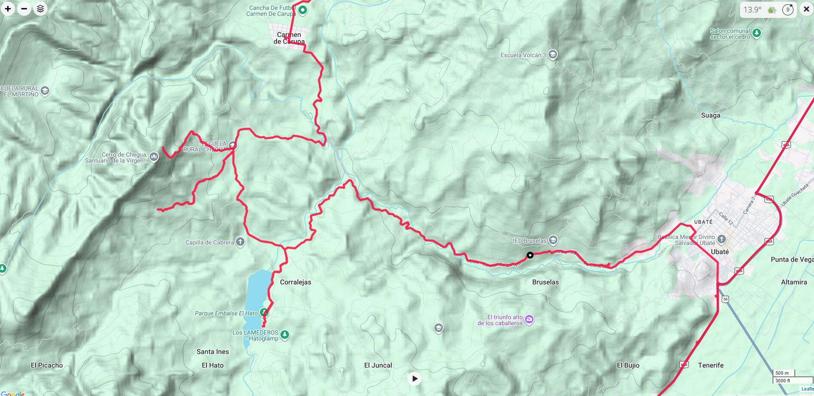

<br><details><summary>:camera:**60/XXXXXX_GarminConnect3.jpg**</summary> `Exif version` Not known</details>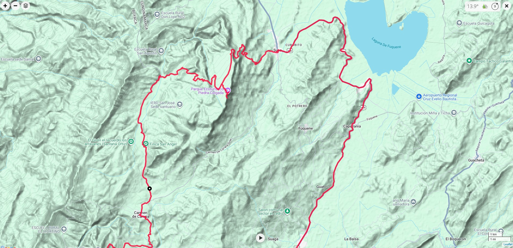

<sub>_Citation: Partial or total digital reproduction of this repository, scripts, development guides, data models, images, and documentation is permitted, provided that it is referenced as: "R.GISMobile - Mobile geographic information systems on QField that do not require an internet connection for navigation." https://github.com/rcfdtools/R.GISMobile - Bogotá - Colombia - South America"._<sub>

| [:house: Home](../Readme.md) |
|---|