<div align="center"></div>

## :earth_americas:POI: Tobia, Cundinamarca, Colombia. https://photos.app.goo.gl/uV9decaL1GgRBgx97 (2026-03-01)
`Pictures` rcfdtools <br>`Category` Freelance field visit <br>`Location` [Google Maps](http://maps.google.com/maps?q=5.122999,-74.450599) or [Openstreet Map](https://www.openstreetmap.org/query?lat=5.122999&lon=-74.450599) 

```geojson
{
  "type": "Feature",
  "geometry": {
    "type": "Point", 
    "coordinates": [-74.450599, 5.122999]
  }, 
  "properties": {
    "Name": "Tobia, Cundinamarca, Colombia. https://photos.app.goo.gl/uV9decaL1GgRBgx97"
  }
}
```

<br><details><summary>:camera:**61/0_GarminConnect1.jpg**</summary> `Exif version` Not known</details>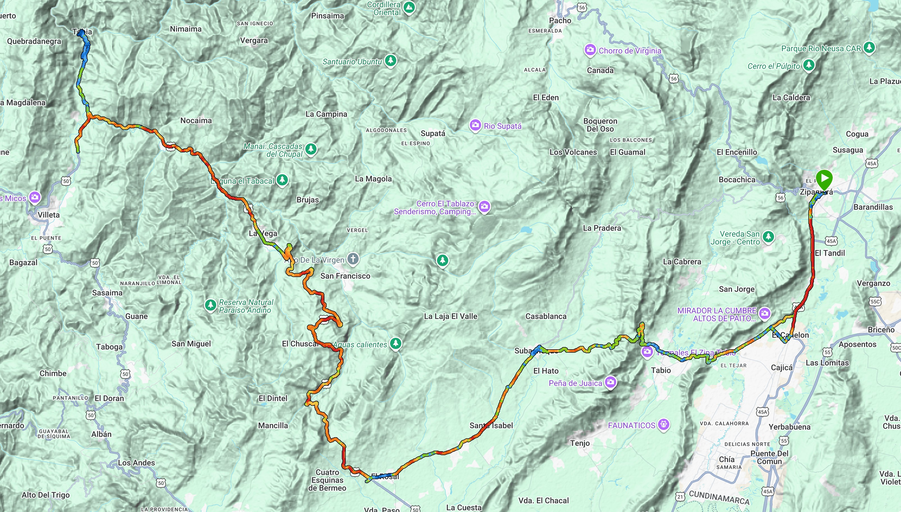

<br><details><summary>:camera:**61/IMG_20260301_095712049.jpg**</summary><sub> `Exif version` 0220 `OS version`  `Date` 2026:03:01 09:57:13 `Aperture` Not known `Brightness` 0.0 `Color space` 1 `Compression` 6`Exposure mode` 0 `Exposure time` 0.001312 `Focal length` 5.56 `Lens model` Not known `Lens specification` Not known `Orientation` 1 `Scene type` Not known `f number` 1.88 `White balance` 0 `Sensing method` 1 `Shutter speed` 9.574</sub><sub>`Coordinates & altitude` (5.123499861111111, -74.44959258333334, 638.0)</sub><sub> :earth_americas:`Location over` [Google Maps](http://maps.google.com/maps?q=5.123499861111111,-74.44959258333334) or [Openstreet Map](https://www.openstreetmap.org/query?lat=5.123499861111111&lon=-74.44959258333334)</sub></details>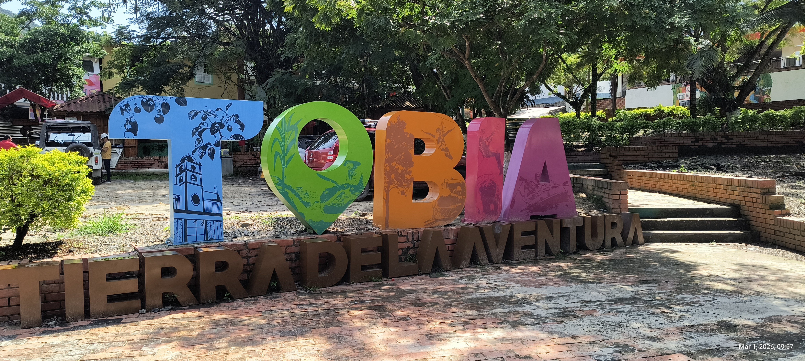

<br><details><summary>:camera:**61/IMG_20260301_095715031_HDR.jpg**</summary><sub> `Exif version` 0220 `OS version`  `Date` 2026:03:01 09:57:16 `Aperture` Not known `Brightness` 0.0 `Color space` 1 `Compression` 6`Exposure mode` 0 `Exposure time` 0.000512 `Focal length` 5.56 `Lens model` Not known `Lens specification` Not known `Orientation` 1 `Scene type` Not known `f number` 1.88 `White balance` 0 `Sensing method` 1 `Shutter speed` 10.931</sub><sub>`Coordinates & altitude` (5.123499861111111, -74.44959258333334, 638.0)</sub><sub> :earth_americas:`Location over` [Google Maps](http://maps.google.com/maps?q=5.123499861111111,-74.44959258333334) or [Openstreet Map](https://www.openstreetmap.org/query?lat=5.123499861111111&lon=-74.44959258333334)</sub></details>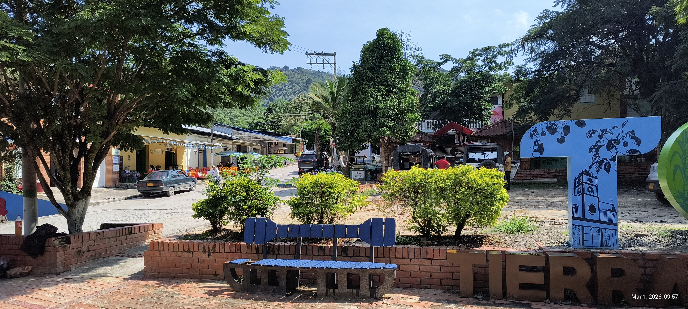

<br><details><summary>:camera:**61/IMG_20260301_095730773.jpg**</summary><sub> `Exif version` 0220 `OS version`  `Date` 2026:03:01 09:57:33 `Aperture` Not known `Brightness` 0.0 `Color space` 1 `Compression` 6`Exposure mode` 0 `Exposure time` 0.010016 `Focal length` 5.56 `Lens model` Not known `Lens specification` Not known `Orientation` 1 `Scene type` Not known `f number` 1.88 `White balance` 0 `Sensing method` 1 `Shutter speed` 6.641</sub><sub>`Coordinates & altitude` (5.123499861111111, -74.44959258333334, 638.0)</sub><sub> :earth_americas:`Location over` [Google Maps](http://maps.google.com/maps?q=5.123499861111111,-74.44959258333334) or [Openstreet Map](https://www.openstreetmap.org/query?lat=5.123499861111111&lon=-74.44959258333334)</sub></details>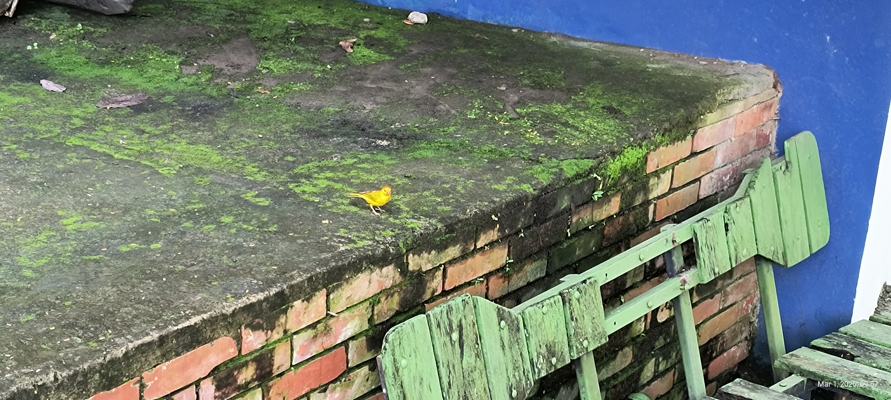

<br><details><summary>:camera:**61/IMG_20260301_095737391_HDR.jpg**</summary><sub> `Exif version` 0220 `OS version`  `Date` 2026:03:01 09:57:39 `Aperture` Not known `Brightness` 0.0 `Color space` 1 `Compression` 6`Exposure mode` 0 `Exposure time` 0.005023514 `Focal length` 2.13 `Lens model` Not known `Lens specification` Not known `Orientation` 1 `Scene type` Not known `f number` 2.2 `White balance` 0 `Sensing method` 1 `Shutter speed` 7.637</sub><sub>`Coordinates & altitude` (5.123499861111111, -74.44959258333334, 638.0)</sub><sub> :earth_americas:`Location over` [Google Maps](http://maps.google.com/maps?q=5.123499861111111,-74.44959258333334) or [Openstreet Map](https://www.openstreetmap.org/query?lat=5.123499861111111&lon=-74.44959258333334)</sub></details>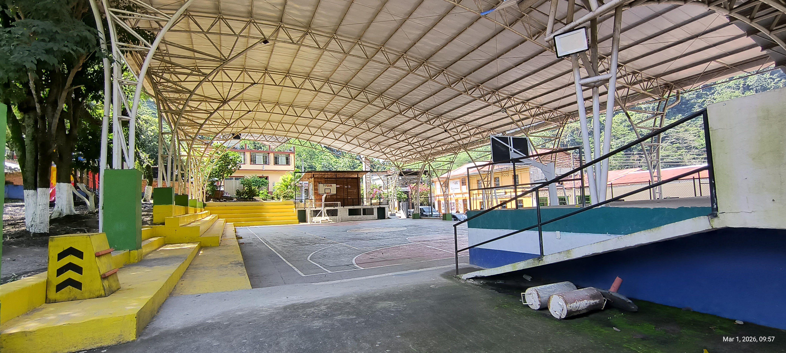

<br><details><summary>:camera:**61/IMG_20260301_095745001_HDR.jpg**</summary><sub> `Exif version` 0220 `OS version`  `Date` 2026:03:01 09:57:46 `Aperture` Not known `Brightness` 0.0 `Color space` 1 `Compression` 6`Exposure mode` 0 `Exposure time` 0.002561792 `Focal length` 2.13 `Lens model` Not known `Lens specification` Not known `Orientation` 1 `Scene type` Not known `f number` 2.2 `White balance` 0 `Sensing method` 1 `Shutter speed` 8.608</sub><sub>`Coordinates & altitude` (5.123499861111111, -74.44959258333334, 638.0)</sub><sub> :earth_americas:`Location over` [Google Maps](http://maps.google.com/maps?q=5.123499861111111,-74.44959258333334) or [Openstreet Map](https://www.openstreetmap.org/query?lat=5.123499861111111&lon=-74.44959258333334)</sub></details>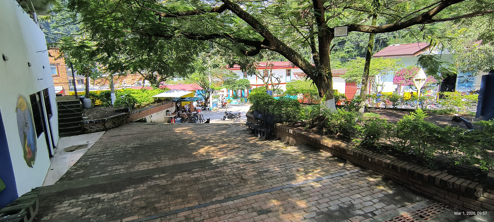

<br><details><summary>:camera:**61/IMG_20260301_095818412.jpg**</summary><sub> `Exif version` 0220 `OS version`  `Date` 2026:03:01 09:58:19 `Aperture` Not known `Brightness` 0.0 `Color space` 1 `Compression` 6`Exposure mode` 0 `Exposure time` 0.000460322 `Focal length` 2.13 `Lens model` Not known `Lens specification` Not known `Orientation` 1 `Scene type` Not known `f number` 2.2 `White balance` 0 `Sensing method` 1 `Shutter speed` 11.085</sub><sub>`Coordinates & altitude` (5.123499861111111, -74.44959258333334, 638.0)</sub><sub> :earth_americas:`Location over` [Google Maps](http://maps.google.com/maps?q=5.123499861111111,-74.44959258333334) or [Openstreet Map](https://www.openstreetmap.org/query?lat=5.123499861111111&lon=-74.44959258333334)</sub></details>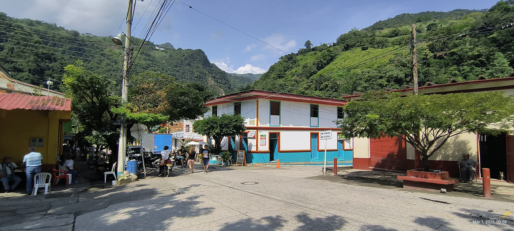

<br><details><summary>:camera:**61/IMG_20260301_103224768_HDR.jpg**</summary><sub> `Exif version` 0220 `OS version`  `Date` 2026:03:01 10:32:27 `Aperture` Not known `Brightness` 0.0 `Color space` 1 `Compression` 6`Exposure mode` 0 `Exposure time` 0.000512 `Focal length` 5.56 `Lens model` Not known `Lens specification` Not known `Orientation` 1 `Scene type` Not known `f number` 1.88 `White balance` 0 `Sensing method` 1 `Shutter speed` 10.931</sub><sub>`Coordinates & altitude` (5.1237129999999995, -74.45022580555556, 653.0)</sub><sub> :earth_americas:`Location over` [Google Maps](http://maps.google.com/maps?q=5.1237129999999995,-74.45022580555556) or [Openstreet Map](https://www.openstreetmap.org/query?lat=5.1237129999999995&lon=-74.45022580555556)</sub></details>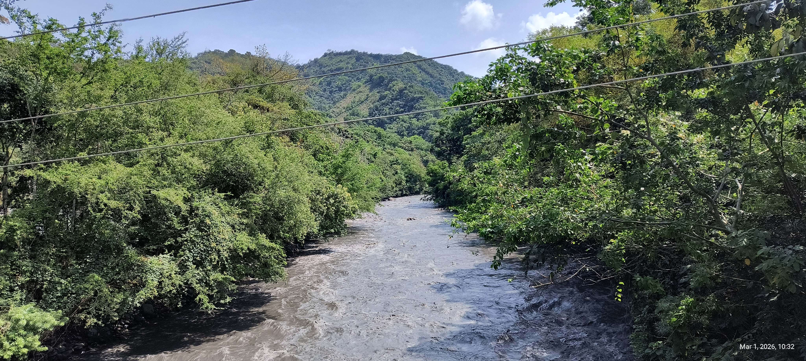

<br><details><summary>:camera:**61/IMG_20260301_103227871_HDR.jpg**</summary><sub> `Exif version` 0220 `OS version`  `Date` 2026:03:01 10:32:29 `Aperture` Not known `Brightness` 0.0 `Color space` 1 `Compression` 6`Exposure mode` 0 `Exposure time` 0.001056 `Focal length` 5.56 `Lens model` Not known `Lens specification` Not known `Orientation` 1 `Scene type` Not known `f number` 1.88 `White balance` 0 `Sensing method` 1 `Shutter speed` 9.887</sub><sub>`Coordinates & altitude` (5.1237129999999995, -74.45022580555556, 653.0)</sub><sub> :earth_americas:`Location over` [Google Maps](http://maps.google.com/maps?q=5.1237129999999995,-74.45022580555556) or [Openstreet Map](https://www.openstreetmap.org/query?lat=5.1237129999999995&lon=-74.45022580555556)</sub></details>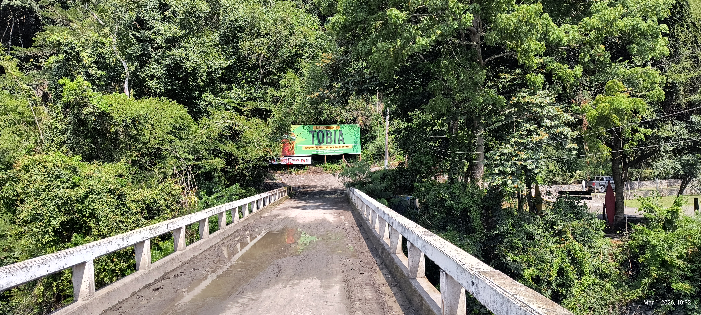

<br><details><summary>:camera:**61/IMG_20260301_103231272_HDR.jpg**</summary><sub> `Exif version` 0220 `OS version`  `Date` 2026:03:01 10:32:33 `Aperture` Not known `Brightness` 0.0 `Color space` 1 `Compression` 6`Exposure mode` 0 `Exposure time` 0.000672 `Focal length` 5.56 `Lens model` Not known `Lens specification` Not known `Orientation` 1 `Scene type` Not known `f number` 1.88 `White balance` 0 `Sensing method` 1 `Shutter speed` 10.539</sub><sub>`Coordinates & altitude` (5.1237129999999995, -74.45022580555556, 653.0)</sub><sub> :earth_americas:`Location over` [Google Maps](http://maps.google.com/maps?q=5.1237129999999995,-74.45022580555556) or [Openstreet Map](https://www.openstreetmap.org/query?lat=5.1237129999999995&lon=-74.45022580555556)</sub></details>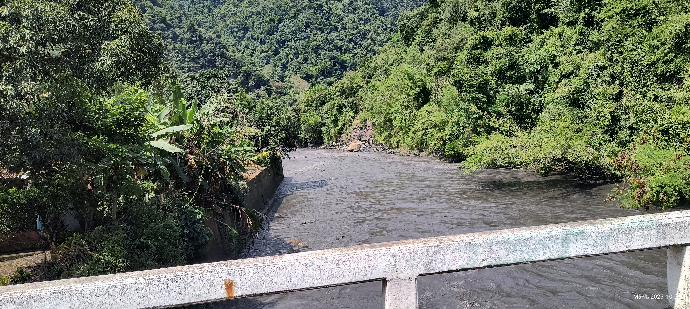

<br><details><summary>:camera:**61/IMG_20260301_103234355.jpg**</summary><sub> `Exif version` 0220 `OS version`  `Date` 2026:03:01 10:32:35 `Aperture` Not known `Brightness` 0.0 `Color space` 1 `Compression` 6`Exposure mode` 0 `Exposure time` 0.000416 `Focal length` 5.56 `Lens model` Not known `Lens specification` Not known `Orientation` 6 `Scene type` Not known `f number` 1.88 `White balance` 0 `Sensing method` 1 `Shutter speed` 11.231</sub><sub>`Coordinates & altitude` (5.1237129999999995, -74.45022580555556, 653.0)</sub><sub> :earth_americas:`Location over` [Google Maps](http://maps.google.com/maps?q=5.1237129999999995,-74.45022580555556) or [Openstreet Map](https://www.openstreetmap.org/query?lat=5.1237129999999995&lon=-74.45022580555556)</sub></details>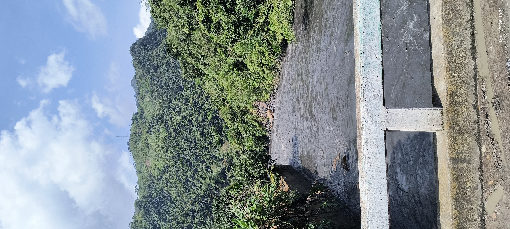

<br><details><summary>:camera:**61/IMG_20260301_103259057.jpg**</summary><sub> `Exif version` 0220 `OS version`  `Date` 2026:03:01 10:33:00 `Aperture` Not known `Brightness` 0.0 `Color space` 1 `Compression` 6`Exposure mode` 0 `Exposure time` 0.00048 `Focal length` 5.56 `Lens model` Not known `Lens specification` Not known `Orientation` 6 `Scene type` Not known `f number` 1.88 `White balance` 0 `Sensing method` 1 `Shutter speed` 11.024</sub><sub>`Coordinates & altitude` (5.1237129999999995, -74.45022580555556, 653.0)</sub><sub> :earth_americas:`Location over` [Google Maps](http://maps.google.com/maps?q=5.1237129999999995,-74.45022580555556) or [Openstreet Map](https://www.openstreetmap.org/query?lat=5.1237129999999995&lon=-74.45022580555556)</sub></details>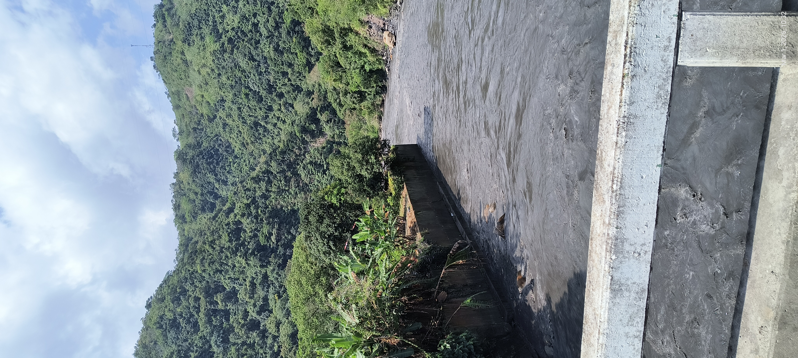

<br><details><summary>:camera:**61/IMG_20260301_103306823.jpg**</summary><sub> `Exif version` 0220 `OS version`  `Date` 2026:03:01 10:33:07 `Aperture` Not known `Brightness` 0.0 `Color space` 1 `Compression` 6`Exposure mode` 0 `Exposure time` 0.000288 `Focal length` 5.56 `Lens model` Not known `Lens specification` Not known `Orientation` 6 `Scene type` Not known `f number` 1.88 `White balance` 0 `Sensing method` 1 `Shutter speed` 11.761</sub><sub>`Coordinates & altitude` (5.1237129999999995, -74.45022580555556, 653.0)</sub><sub> :earth_americas:`Location over` [Google Maps](http://maps.google.com/maps?q=5.1237129999999995,-74.45022580555556) or [Openstreet Map](https://www.openstreetmap.org/query?lat=5.1237129999999995&lon=-74.45022580555556)</sub></details>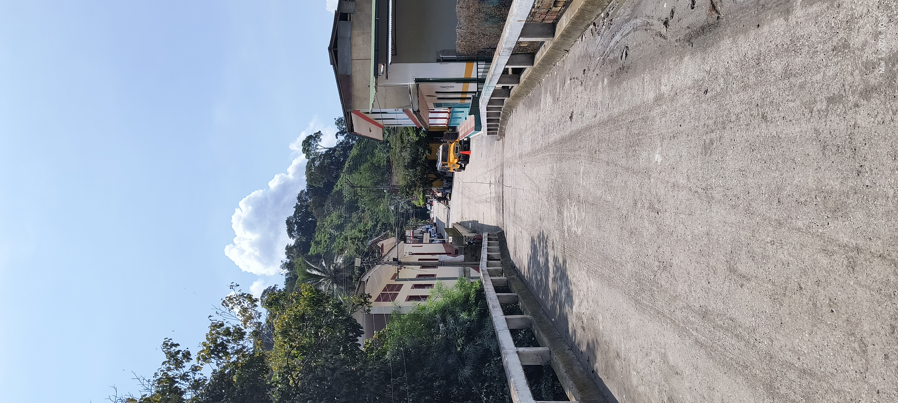

<br><details><summary>:camera:**61/IMG_20260301_103417186.jpg**</summary><sub> `Exif version` 0220 `OS version`  `Date` 2026:03:01 10:34:18 `Aperture` Not known `Brightness` 0.0 `Color space` 1 `Compression` 6`Exposure mode` 0 `Exposure time` 0.000288 `Focal length` 5.56 `Lens model` Not known `Lens specification` Not known `Orientation` 6 `Scene type` Not known `f number` 1.88 `White balance` 0 `Sensing method` 1 `Shutter speed` 11.761</sub><sub>`Coordinates & altitude` (5.124186972222222, -74.45051572222222, 654.0)</sub><sub> :earth_americas:`Location over` [Google Maps](http://maps.google.com/maps?q=5.124186972222222,-74.45051572222222) or [Openstreet Map](https://www.openstreetmap.org/query?lat=5.124186972222222&lon=-74.45051572222222)</sub></details>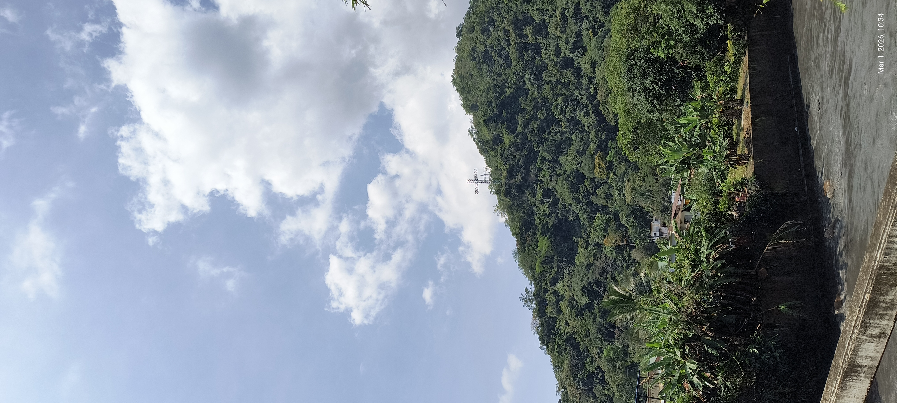

<br><details><summary>:camera:**61/IMG_20260301_103615807_HDR.jpg**</summary><sub> `Exif version` 0220 `OS version`  `Date` 2026:03:01 10:36:17 `Aperture` Not known `Brightness` 0.0 `Color space` 1 `Compression` 6`Exposure mode` 0 `Exposure time` 0.0008 `Focal length` 5.56 `Lens model` Not known `Lens specification` Not known `Orientation` 6 `Scene type` Not known `f number` 1.88 `White balance` 0 `Sensing method` 1 `Shutter speed` 10.287</sub><sub>`Coordinates & altitude` (5.123911833333333, -74.45025633333334, 672.0)</sub><sub> :earth_americas:`Location over` [Google Maps](http://maps.google.com/maps?q=5.123911833333333,-74.45025633333334) or [Openstreet Map](https://www.openstreetmap.org/query?lat=5.123911833333333&lon=-74.45025633333334)</sub></details>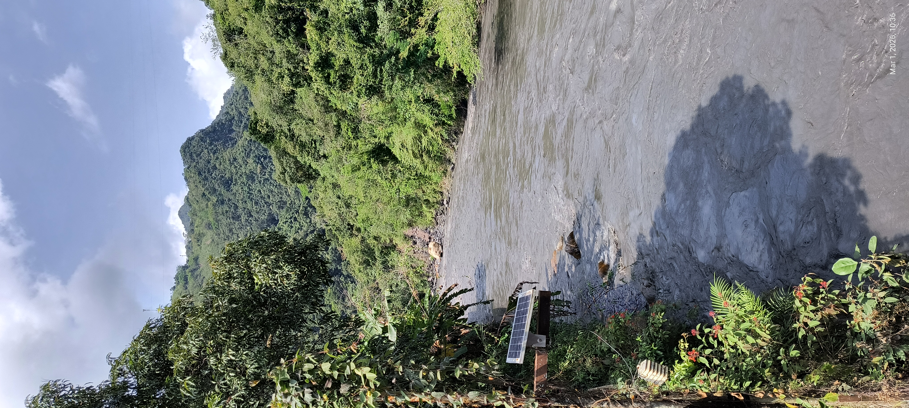

<br><details><summary>:camera:**61/IMG_20260301_103849285_HDR.jpg**</summary><sub> `Exif version` 0220 `OS version`  `Date` 2026:03:01 10:38:50 `Aperture` Not known `Brightness` 0.0 `Color space` 1 `Compression` 6`Exposure mode` 0 `Exposure time` 0.000736 `Focal length` 5.56 `Lens model` Not known `Lens specification` Not known `Orientation` 1 `Scene type` Not known `f number` 1.88 `White balance` 0 `Sensing method` 1 `Shutter speed` 10.408</sub><sub>`Coordinates & altitude` (5.123219944444444, -74.45050047222223, 671.0)</sub><sub> :earth_americas:`Location over` [Google Maps](http://maps.google.com/maps?q=5.123219944444444,-74.45050047222223) or [Openstreet Map](https://www.openstreetmap.org/query?lat=5.123219944444444&lon=-74.45050047222223)</sub></details>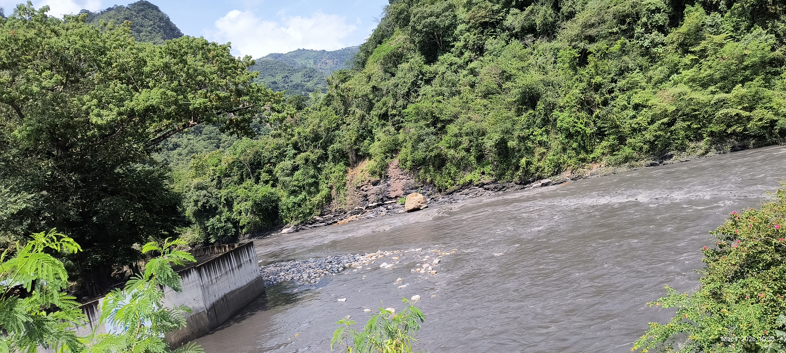

<br><details><summary>:camera:**61/IMG_20260301_103902536.jpg**</summary><sub> `Exif version` 0220 `OS version`  `Date` 2026:03:01 10:39:03 `Aperture` Not known `Brightness` 0.0 `Color space` 1 `Compression` 6`Exposure mode` 0 `Exposure time` 0.000416 `Focal length` 5.56 `Lens model` Not known `Lens specification` Not known `Orientation` 6 `Scene type` Not known `f number` 1.88 `White balance` 0 `Sensing method` 1 `Shutter speed` 11.231</sub><sub>`Coordinates & altitude` (5.123219944444444, -74.45050047222223, 671.0)</sub><sub> :earth_americas:`Location over` [Google Maps](http://maps.google.com/maps?q=5.123219944444444,-74.45050047222223) or [Openstreet Map](https://www.openstreetmap.org/query?lat=5.123219944444444&lon=-74.45050047222223)</sub></details>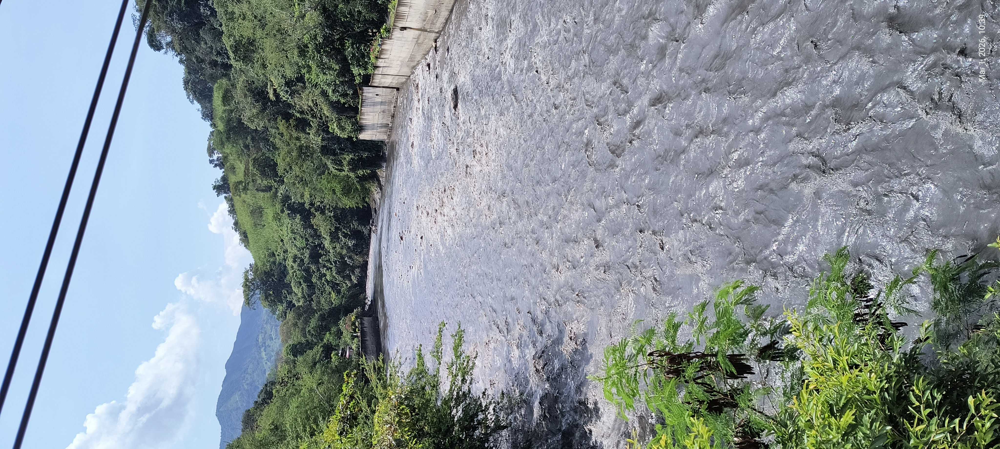

<br><details><summary>:camera:**61/IMG_20260301_104244556_HDR.jpg**</summary><sub> `Exif version` 0220 `OS version`  `Date` 2026:03:01 10:42:46 `Aperture` Not known `Brightness` 0.0 `Color space` 1 `Compression` 6`Exposure mode` 0 `Exposure time` 0.00352 `Focal length` 5.56 `Lens model` Not known `Lens specification` Not known `Orientation` 6 `Scene type` Not known `f number` 1.88 `White balance` 0 `Sensing method` 1 `Shutter speed` 8.15</sub><sub>`Coordinates & altitude` (5.122107027777777, -74.45130155555556, 682.0)</sub><sub> :earth_americas:`Location over` [Google Maps](http://maps.google.com/maps?q=5.122107027777777,-74.45130155555556) or [Openstreet Map](https://www.openstreetmap.org/query?lat=5.122107027777777&lon=-74.45130155555556)</sub></details>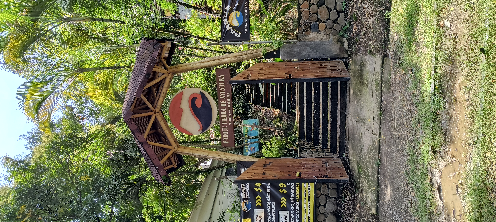

<br><details><summary>:camera:**61/IMG_20260301_104302993_HDR.jpg**</summary><sub> `Exif version` 0220 `OS version`  `Date` 2026:03:01 10:43:04 `Aperture` Not known `Brightness` 0.0 `Color space` 1 `Compression` 6`Exposure mode` 0 `Exposure time` 0.000832 `Focal length` 5.56 `Lens model` Not known `Lens specification` Not known `Orientation` 3 `Scene type` Not known `f number` 1.88 `White balance` 0 `Sensing method` 1 `Shutter speed` 10.231</sub><sub>`Coordinates & altitude` (5.122107027777777, -74.45130155555556, 682.0)</sub><sub> :earth_americas:`Location over` [Google Maps](http://maps.google.com/maps?q=5.122107027777777,-74.45130155555556) or [Openstreet Map](https://www.openstreetmap.org/query?lat=5.122107027777777&lon=-74.45130155555556)</sub></details>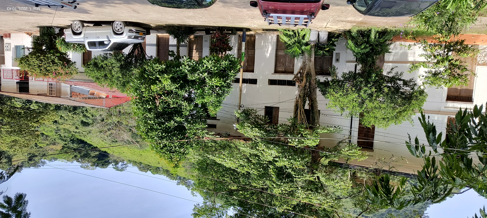

<br><details><summary>:camera:**61/IMG_20260301_104311377_HDR.jpg**</summary><sub> `Exif version` 0220 `OS version`  `Date` 2026:03:01 10:43:13 `Aperture` Not known `Brightness` 0.0 `Color space` 1 `Compression` 6`Exposure mode` 0 `Exposure time` 0.00112 `Focal length` 5.56 `Lens model` Not known `Lens specification` Not known `Orientation` 3 `Scene type` Not known `f number` 1.88 `White balance` 0 `Sensing method` 1 `Shutter speed` 9.802</sub><sub>`Coordinates & altitude` (5.122107027777777, -74.45130155555556, 682.0)</sub><sub> :earth_americas:`Location over` [Google Maps](http://maps.google.com/maps?q=5.122107027777777,-74.45130155555556) or [Openstreet Map](https://www.openstreetmap.org/query?lat=5.122107027777777&lon=-74.45130155555556)</sub></details>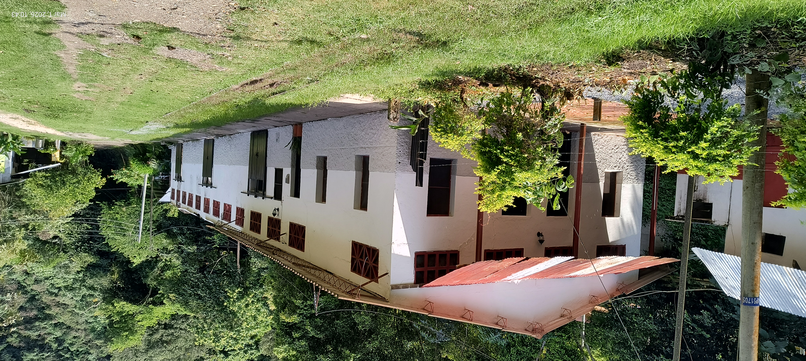

<br><details><summary>:camera:**61/IMG_20260301_110805847_HDR.jpg**</summary><sub> `Exif version` 0220 `OS version`  `Date` 2026:03:01 11:08:09 `Aperture` Not known `Brightness` 0.0 `Color space` 1 `Compression` 6`Exposure mode` 0 `Exposure time` 0.008335831 `Focal length` 2.13 `Lens model` Not known `Lens specification` Not known `Orientation` 1 `Scene type` Not known `f number` 2.2 `White balance` 0 `Sensing method` 1 `Shutter speed` 6.906</sub><sub>`Coordinates & altitude` (5.122076972222222, -74.45068358333333, 653.0)</sub><sub> :earth_americas:`Location over` [Google Maps](http://maps.google.com/maps?q=5.122076972222222,-74.45068358333333) or [Openstreet Map](https://www.openstreetmap.org/query?lat=5.122076972222222&lon=-74.45068358333333)</sub></details>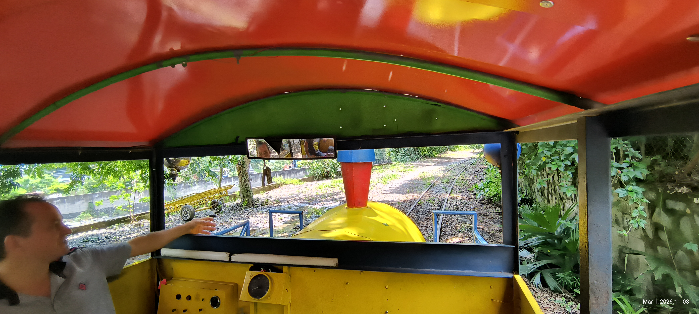

<br><details><summary>:camera:**61/IMG_20260301_110814929_HDR.jpg**</summary><sub> `Exif version` 0220 `OS version`  `Date` 2026:03:01 11:08:16 `Aperture` Not known `Brightness` 0.0 `Color space` 1 `Compression` 6`Exposure mode` 0 `Exposure time` 0.00340238 `Focal length` 2.13 `Lens model` Not known `Lens specification` Not known `Orientation` 6 `Scene type` Not known `f number` 2.2 `White balance` 0 `Sensing method` 1 `Shutter speed` 8.199</sub><sub>`Coordinates & altitude` (5.122076972222222, -74.45068358333333, 653.0)</sub><sub> :earth_americas:`Location over` [Google Maps](http://maps.google.com/maps?q=5.122076972222222,-74.45068358333333) or [Openstreet Map](https://www.openstreetmap.org/query?lat=5.122076972222222&lon=-74.45068358333333)</sub></details>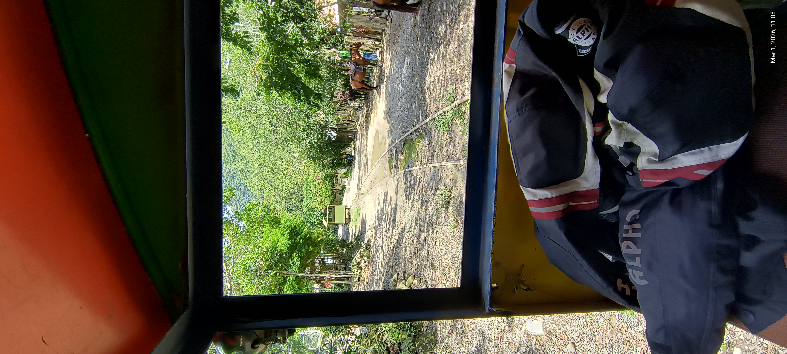

<br><details><summary>:camera:**61/IMG_20260301_110822045_HDR.jpg**</summary><sub> `Exif version` 0220 `OS version`  `Date` 2026:03:01 11:08:23 `Aperture` Not known `Brightness` 0.0 `Color space` 1 `Compression` 6`Exposure mode` 0 `Exposure time` 0.002651855 `Focal length` 2.13 `Lens model` Not known `Lens specification` Not known `Orientation` 1 `Scene type` Not known `f number` 2.2 `White balance` 0 `Sensing method` 1 `Shutter speed` 8.558</sub><sub>`Coordinates & altitude` (5.122076972222222, -74.45068358333333, 653.0)</sub><sub> :earth_americas:`Location over` [Google Maps](http://maps.google.com/maps?q=5.122076972222222,-74.45068358333333) or [Openstreet Map](https://www.openstreetmap.org/query?lat=5.122076972222222&lon=-74.45068358333333)</sub></details>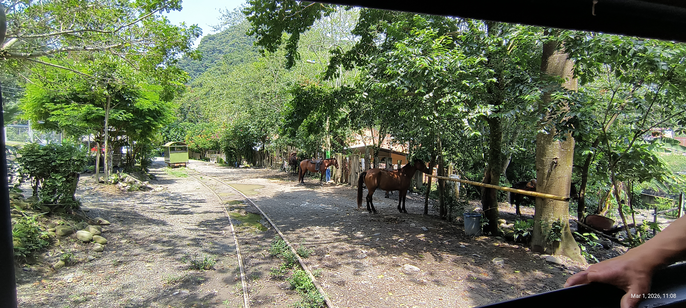

<br><details><summary>:camera:**61/IMG_20260301_112240828.jpg**</summary><sub> `Exif version` 0220 `OS version`  `Date` 2026:03:01 11:22:41 `Aperture` Not known `Brightness` 4.5 `Color space` 1 `Compression` 6`Exposure mode` 0 `Exposure time` 0.008335831 `Focal length` 2.13 `Lens model` Not known `Lens specification` Not known `Orientation` 6 `Scene type` Not known `f number` 2.2 `White balance` 0 `Sensing method` 1 `Shutter speed` 6.906</sub><sub>`Coordinates & altitude` (5.122076972222222, -74.45068358333333, 653.0)</sub><sub> :earth_americas:`Location over` [Google Maps](http://maps.google.com/maps?q=5.122076972222222,-74.45068358333333) or [Openstreet Map](https://www.openstreetmap.org/query?lat=5.122076972222222&lon=-74.45068358333333)</sub></details>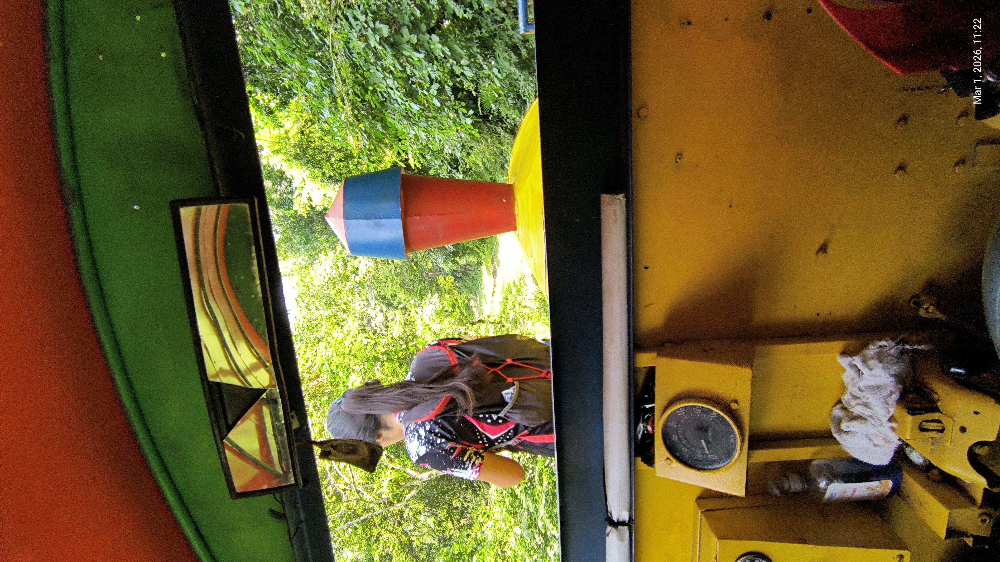

<br><details><summary>:camera:**61/IMG_20260301_112336963_HDR.jpg**</summary><sub> `Exif version` 0220 `OS version`  `Date` 2026:03:01 11:23:38 `Aperture` Not known `Brightness` 0.0 `Color space` 1 `Compression` 6`Exposure mode` 0 `Exposure time` 0.004423094 `Focal length` 2.13 `Lens model` Not known `Lens specification` Not known `Orientation` 6 `Scene type` Not known `f number` 2.2 `White balance` 0 `Sensing method` 1 `Shutter speed` 7.82</sub><sub>`Coordinates & altitude` (5.120041833333333, -74.44835661111111, 676.0)</sub><sub> :earth_americas:`Location over` [Google Maps](http://maps.google.com/maps?q=5.120041833333333,-74.44835661111111) or [Openstreet Map](https://www.openstreetmap.org/query?lat=5.120041833333333&lon=-74.44835661111111)</sub></details>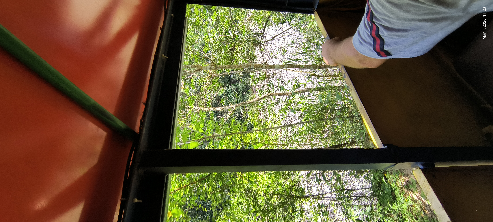

<br><details><summary>:camera:**61/IMG_20260301_112405274_HDR.jpg**</summary><sub> `Exif version` 0220 `OS version`  `Date` 2026:03:01 11:24:06 `Aperture` Not known `Brightness` 0.0 `Color space` 1 `Compression` 6`Exposure mode` 0 `Exposure time` 0.009996993 `Focal length` 2.13 `Lens model` Not known `Lens specification` Not known `Orientation` 6 `Scene type` Not known `f number` 2.2 `White balance` 0 `Sensing method` 1 `Shutter speed` 6.644</sub><sub>`Coordinates & altitude` (5.120041833333333, -74.44835661111111, 676.0)</sub><sub> :earth_americas:`Location over` [Google Maps](http://maps.google.com/maps?q=5.120041833333333,-74.44835661111111) or [Openstreet Map](https://www.openstreetmap.org/query?lat=5.120041833333333&lon=-74.44835661111111)</sub></details>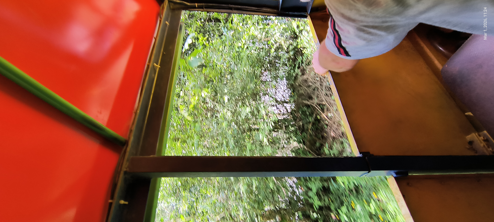

<br><details><summary>:camera:**61/IMG_20260301_112511280_HDR.jpg**</summary><sub> `Exif version` 0220 `OS version`  `Date` 2026:03:01 11:25:14 `Aperture` Not known `Brightness` 0.0 `Color space` 1 `Compression` 6`Exposure mode` 0 `Exposure time` 0.001984 `Focal length` 5.56 `Lens model` Not known `Lens specification` Not known `Orientation` 6 `Scene type` Not known `f number` 1.88 `White balance` 0 `Sensing method` 1 `Shutter speed` 8.977</sub><sub>`Coordinates & altitude` (5.120041833333333, -74.44835661111111, 676.0)</sub><sub> :earth_americas:`Location over` [Google Maps](http://maps.google.com/maps?q=5.120041833333333,-74.44835661111111) or [Openstreet Map](https://www.openstreetmap.org/query?lat=5.120041833333333&lon=-74.44835661111111)</sub></details>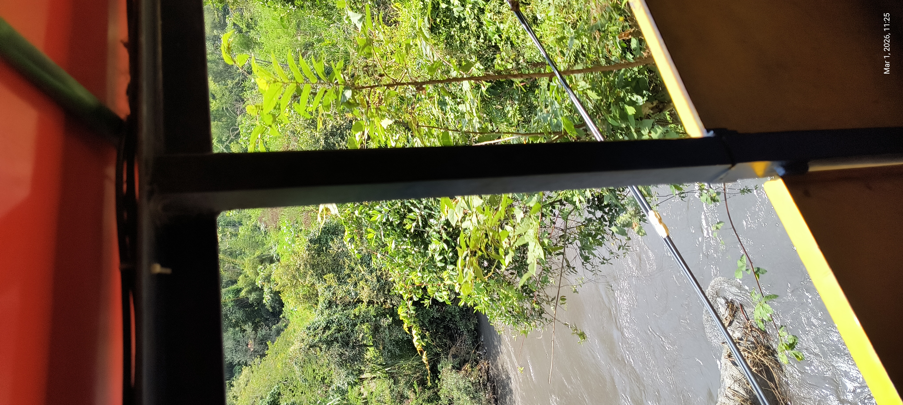

<br><details><summary>:camera:**61/IMG_20260301_112520105_HDR.jpg**</summary><sub> `Exif version` 0220 `OS version`  `Date` 2026:03:01 11:25:22 `Aperture` Not known `Brightness` 0.0 `Color space` 1 `Compression` 6`Exposure mode` 0 `Exposure time` 0.006874809 `Focal length` 2.13 `Lens model` Not known `Lens specification` Not known `Orientation` 1 `Scene type` Not known `f number` 2.2 `White balance` 0 `Sensing method` 1 `Shutter speed` 7.184</sub><sub>`Coordinates & altitude` (5.120041833333333, -74.44835661111111, 676.0)</sub><sub> :earth_americas:`Location over` [Google Maps](http://maps.google.com/maps?q=5.120041833333333,-74.44835661111111) or [Openstreet Map](https://www.openstreetmap.org/query?lat=5.120041833333333&lon=-74.44835661111111)</sub></details>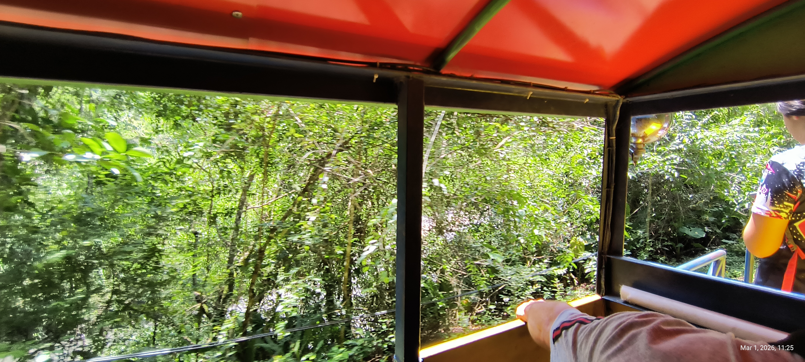

<br><details><summary>:camera:**61/IMG_20260301_113015075_HDR.jpg**</summary><sub> `Exif version` 0220 `OS version`  `Date` 2026:03:01 11:30:16 `Aperture` Not known `Brightness` 0.0 `Color space` 1 `Compression` 6`Exposure mode` 0 `Exposure time` 0.002016 `Focal length` 5.56 `Lens model` Not known `Lens specification` Not known `Orientation` 6 `Scene type` Not known `f number` 1.88 `White balance` 0 `Sensing method` 1 `Shutter speed` 8.954</sub><sub>`Coordinates & altitude` (5.107850055555555, -74.45000455555555, 681.0)</sub><sub> :earth_americas:`Location over` [Google Maps](http://maps.google.com/maps?q=5.107850055555555,-74.45000455555555) or [Openstreet Map](https://www.openstreetmap.org/query?lat=5.107850055555555&lon=-74.45000455555555)</sub></details>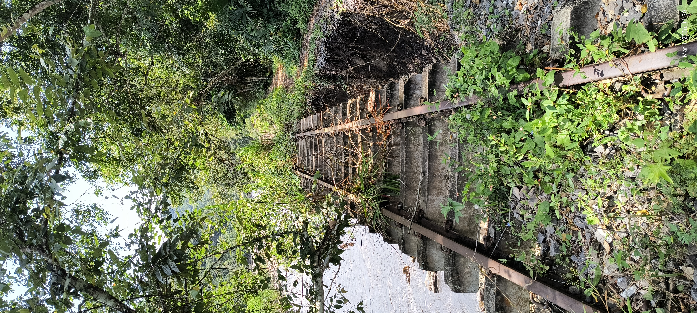

<br><details><summary>:camera:**61/IMG_20260301_113018941_HDR.jpg**</summary><sub> `Exif version` 0220 `OS version`  `Date` 2026:03:01 11:30:21 `Aperture` Not known `Brightness` 0.0 `Color space` 1 `Compression` 6`Exposure mode` 0 `Exposure time` 0.00090063 `Focal length` 2.13 `Lens model` Not known `Lens specification` Not known `Orientation` 6 `Scene type` Not known `f number` 2.2 `White balance` 0 `Sensing method` 1 `Shutter speed` 10.116</sub><sub>`Coordinates & altitude` (5.107850055555555, -74.45000455555555, 681.0)</sub><sub> :earth_americas:`Location over` [Google Maps](http://maps.google.com/maps?q=5.107850055555555,-74.45000455555555) or [Openstreet Map](https://www.openstreetmap.org/query?lat=5.107850055555555&lon=-74.45000455555555)</sub></details>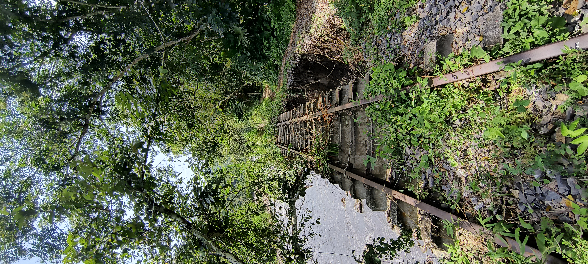

<br><details><summary>:camera:**61/IMG_20260301_113022579_HDR.jpg**</summary><sub> `Exif version` 0220 `OS version`  `Date` 2026:03:01 11:30:24 `Aperture` Not known `Brightness` 0.0 `Color space` 1 `Compression` 6`Exposure mode` 0 `Exposure time` 0.000860602 `Focal length` 2.13 `Lens model` Not known `Lens specification` Not known `Orientation` 1 `Scene type` Not known `f number` 2.2 `White balance` 0 `Sensing method` 1 `Shutter speed` 10.182</sub><sub>`Coordinates & altitude` (5.107850055555555, -74.45000455555555, 681.0)</sub><sub> :earth_americas:`Location over` [Google Maps](http://maps.google.com/maps?q=5.107850055555555,-74.45000455555555) or [Openstreet Map](https://www.openstreetmap.org/query?lat=5.107850055555555&lon=-74.45000455555555)</sub></details>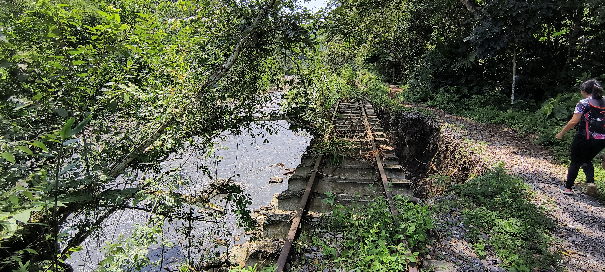

<br><details><summary>:camera:**61/IMG_20260301_113033424_HDR.jpg**</summary><sub> `Exif version` 0220 `OS version`  `Date` 2026:03:01 11:30:35 `Aperture` Not known `Brightness` 0.0 `Color space` 1 `Compression` 6`Exposure mode` 0 `Exposure time` 0.001090763 `Focal length` 2.13 `Lens model` Not known `Lens specification` Not known `Orientation` 1 `Scene type` Not known `f number` 2.2 `White balance` 0 `Sensing method` 1 `Shutter speed` 9.84</sub><sub>`Coordinates & altitude` (5.107850055555555, -74.45000455555555, 681.0)</sub><sub> :earth_americas:`Location over` [Google Maps](http://maps.google.com/maps?q=5.107850055555555,-74.45000455555555) or [Openstreet Map](https://www.openstreetmap.org/query?lat=5.107850055555555&lon=-74.45000455555555)</sub></details>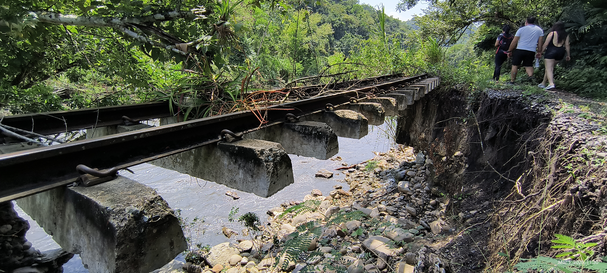

<br><details><summary>:camera:**61/IMG_20260301_113037479_HDR.jpg**</summary><sub> `Exif version` 0220 `OS version`  `Date` 2026:03:01 11:30:39 `Aperture` Not known `Brightness` 0.0 `Color space` 1 `Compression` 6`Exposure mode` 0 `Exposure time` 0.00080056 `Focal length` 2.13 `Lens model` Not known `Lens specification` Not known `Orientation` 6 `Scene type` Not known `f number` 2.2 `White balance` 0 `Sensing method` 1 `Shutter speed` 10.286</sub><sub>`Coordinates & altitude` (5.107850055555555, -74.45000455555555, 681.0)</sub><sub> :earth_americas:`Location over` [Google Maps](http://maps.google.com/maps?q=5.107850055555555,-74.45000455555555) or [Openstreet Map](https://www.openstreetmap.org/query?lat=5.107850055555555&lon=-74.45000455555555)</sub></details>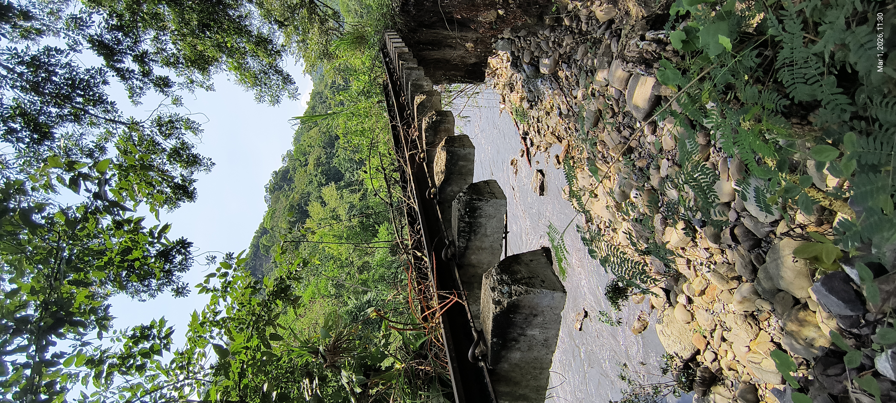

<br><details><summary>:camera:**61/IMG_20260301_113041871_HDR.jpg**</summary><sub> `Exif version` 0220 `OS version`  `Date` 2026:03:01 11:30:43 `Aperture` Not known `Brightness` 0.0 `Color space` 1 `Compression` 6`Exposure mode` 0 `Exposure time` 0.000950665 `Focal length` 2.13 `Lens model` Not known `Lens specification` Not known `Orientation` 6 `Scene type` Not known `f number` 2.2 `White balance` 0 `Sensing method` 1 `Shutter speed` 10.038</sub><sub>`Coordinates & altitude` (5.107850055555555, -74.45000455555555, 681.0)</sub><sub> :earth_americas:`Location over` [Google Maps](http://maps.google.com/maps?q=5.107850055555555,-74.45000455555555) or [Openstreet Map](https://www.openstreetmap.org/query?lat=5.107850055555555&lon=-74.45000455555555)</sub></details>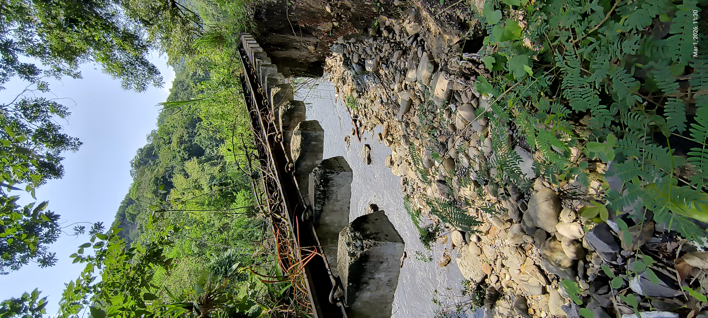

<br><details><summary>:camera:**61/IMG_20260301_113118471_HDR.jpg**</summary><sub> `Exif version` 0220 `OS version`  `Date` 2026:03:01 11:31:20 `Aperture` Not known `Brightness` 0.0 `Color space` 1 `Compression` 6`Exposure mode` 0 `Exposure time` 0.000690483 `Focal length` 2.13 `Lens model` Not known `Lens specification` Not known `Orientation` 6 `Scene type` Not known `f number` 2.2 `White balance` 0 `Sensing method` 1 `Shutter speed` 10.5</sub><sub>`Coordinates & altitude` (5.107850055555555, -74.45000455555555, 681.0)</sub><sub> :earth_americas:`Location over` [Google Maps](http://maps.google.com/maps?q=5.107850055555555,-74.45000455555555) or [Openstreet Map](https://www.openstreetmap.org/query?lat=5.107850055555555&lon=-74.45000455555555)</sub></details>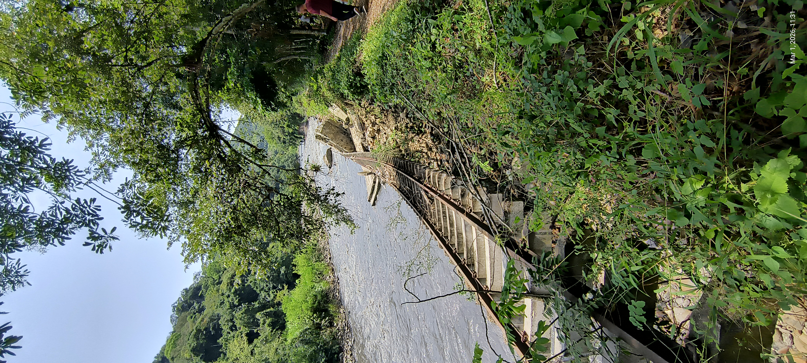

<br><details><summary>:camera:**61/IMG_20260301_113124174_HDR.jpg**</summary><sub> `Exif version` 0220 `OS version`  `Date` 2026:03:01 11:31:26 `Aperture` Not known `Brightness` 0.0 `Color space` 1 `Compression` 6`Exposure mode` 0 `Exposure time` 0.000560392 `Focal length` 2.13 `Lens model` Not known `Lens specification` Not known `Orientation` 1 `Scene type` Not known `f number` 2.2 `White balance` 0 `Sensing method` 1 `Shutter speed` 10.801</sub><sub>`Coordinates & altitude` (5.107850055555555, -74.45000455555555, 681.0)</sub><sub> :earth_americas:`Location over` [Google Maps](http://maps.google.com/maps?q=5.107850055555555,-74.45000455555555) or [Openstreet Map](https://www.openstreetmap.org/query?lat=5.107850055555555&lon=-74.45000455555555)</sub></details>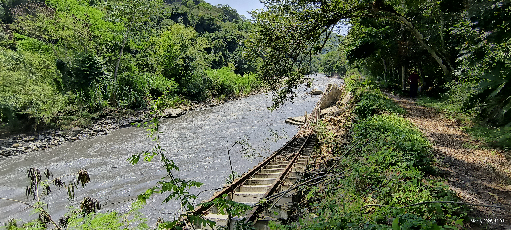

<br><details><summary>:camera:**61/IMG_20260301_113251664_HDR.jpg**</summary><sub> `Exif version` 0220 `OS version`  `Date` 2026:03:01 11:32:53 `Aperture` Not known `Brightness` 0.0 `Color space` 1 `Compression` 6`Exposure mode` 0 `Exposure time` 0.001230861 `Focal length` 2.13 `Lens model` Not known `Lens specification` Not known `Orientation` 1 `Scene type` Not known `f number` 2.2 `White balance` 0 `Sensing method` 1 `Shutter speed` 9.666</sub><sub>`Coordinates & altitude` (5.107765194444444, -74.44976041666668, 686.0)</sub><sub> :earth_americas:`Location over` [Google Maps](http://maps.google.com/maps?q=5.107765194444444,-74.44976041666668) or [Openstreet Map](https://www.openstreetmap.org/query?lat=5.107765194444444&lon=-74.44976041666668)</sub></details>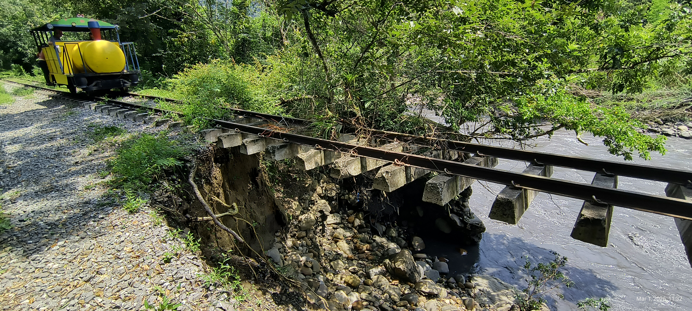

<br><details><summary>:camera:**61/IMG_20260301_113257959_HDR.jpg**</summary><sub> `Exif version` 0220 `OS version`  `Date` 2026:03:01 11:32:59 `Aperture` Not known `Brightness` 0.0 `Color space` 1 `Compression` 6`Exposure mode` 0 `Exposure time` 0.000330231 `Focal length` 2.13 `Lens model` Not known `Lens specification` Not known `Orientation` 6 `Scene type` Not known `f number` 2.2 `White balance` 0 `Sensing method` 1 `Shutter speed` 11.564</sub><sub>`Coordinates & altitude` (5.107765194444444, -74.44976041666668, 686.0)</sub><sub> :earth_americas:`Location over` [Google Maps](http://maps.google.com/maps?q=5.107765194444444,-74.44976041666668) or [Openstreet Map](https://www.openstreetmap.org/query?lat=5.107765194444444&lon=-74.44976041666668)</sub></details>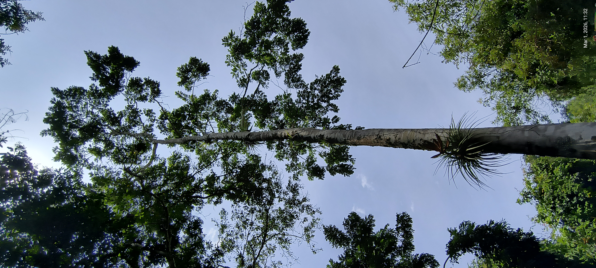

<br><details><summary>:camera:**61/IMG_20260301_113308172_HDR.jpg**</summary><sub> `Exif version` 0220 `OS version`  `Date` 2026:03:01 11:33:10 `Aperture` Not known `Brightness` 0.0 `Color space` 1 `Compression` 6`Exposure mode` 0 `Exposure time` 0.000870609 `Focal length` 2.13 `Lens model` Not known `Lens specification` Not known `Orientation` 1 `Scene type` Not known `f number` 2.2 `White balance` 0 `Sensing method` 1 `Shutter speed` 10.165</sub><sub>`Coordinates & altitude` (5.107765194444444, -74.44976041666668, 686.0)</sub><sub> :earth_americas:`Location over` [Google Maps](http://maps.google.com/maps?q=5.107765194444444,-74.44976041666668) or [Openstreet Map](https://www.openstreetmap.org/query?lat=5.107765194444444&lon=-74.44976041666668)</sub></details>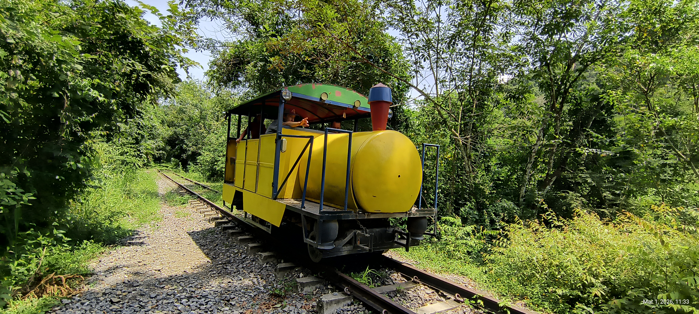

<br><details><summary>:camera:**61/IMG_20260301_113311986.jpg**</summary><sub> `Exif version` 0220 `OS version`  `Date` 2026:03:01 11:33:12 `Aperture` Not known `Brightness` 0.0 `Color space` 1 `Compression` 6`Exposure mode` 0 `Exposure time` 0.000710497 `Focal length` 2.13 `Lens model` Not known `Lens specification` Not known `Orientation` 6 `Scene type` Not known `f number` 2.2 `White balance` 0 `Sensing method` 1 `Shutter speed` 10.458</sub><sub>`Coordinates & altitude` (5.107765194444444, -74.44976041666668, 686.0)</sub><sub> :earth_americas:`Location over` [Google Maps](http://maps.google.com/maps?q=5.107765194444444,-74.44976041666668) or [Openstreet Map](https://www.openstreetmap.org/query?lat=5.107765194444444&lon=-74.44976041666668)</sub></details>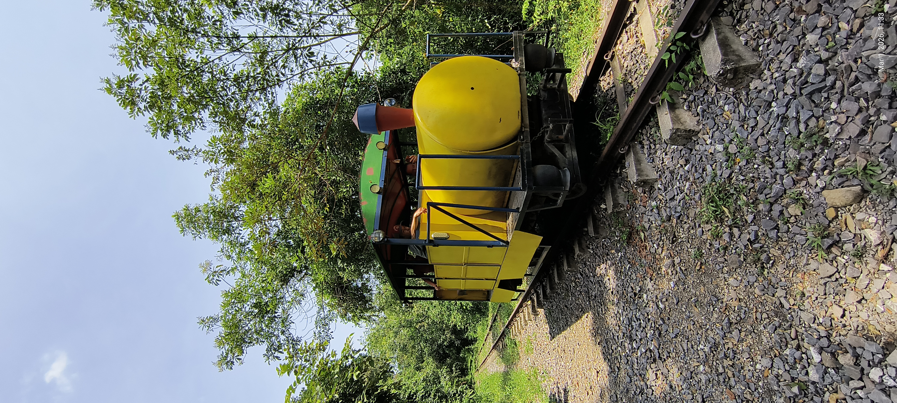

<br><details><summary>:camera:**61/IMG_20260301_113329660_HDR.jpg**</summary><sub> `Exif version` 0220 `OS version`  `Date` 2026:03:01 11:33:32 `Aperture` Not known `Brightness` 0.0 `Color space` 1 `Compression` 6`Exposure mode` 0 `Exposure time` 0.000550385 `Focal length` 2.13 `Lens model` Not known `Lens specification` Not known `Orientation` 6 `Scene type` Not known `f number` 2.2 `White balance` 0 `Sensing method` 1 `Shutter speed` 10.827</sub><sub>`Coordinates & altitude` (5.107765194444444, -74.44976041666668, 686.0)</sub><sub> :earth_americas:`Location over` [Google Maps](http://maps.google.com/maps?q=5.107765194444444,-74.44976041666668) or [Openstreet Map](https://www.openstreetmap.org/query?lat=5.107765194444444&lon=-74.44976041666668)</sub></details>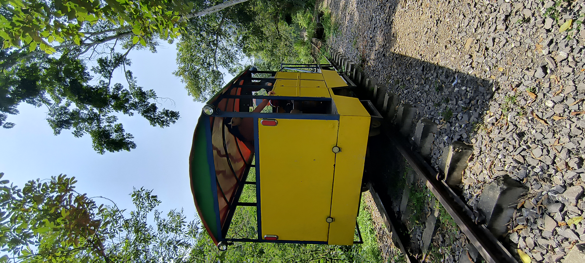

<br><details><summary>:camera:**61/IMG_20260301_115746936_HDR.jpg**</summary><sub> `Exif version` 0220 `OS version`  `Date` 2026:03:01 11:57:49 `Aperture` Not known `Brightness` 0.0 `Color space` 1 `Compression` 6`Exposure mode` 0 `Exposure time` 0.001611127 `Focal length` 2.13 `Lens model` Not known `Lens specification` Not known `Orientation` 6 `Scene type` Not known `f number` 2.2 `White balance` 0 `Sensing method` 1 `Shutter speed` 9.277</sub><sub>`Coordinates & altitude` (5.122872805555555, -74.45101927777777, 633.0)</sub><sub> :earth_americas:`Location over` [Google Maps](http://maps.google.com/maps?q=5.122872805555555,-74.45101927777777) or [Openstreet Map](https://www.openstreetmap.org/query?lat=5.122872805555555&lon=-74.45101927777777)</sub></details>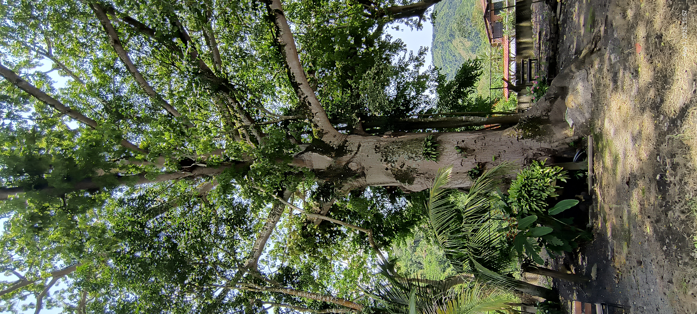

<br><details><summary>:camera:**61/IMG_20260301_115756851_HDR.jpg**</summary><sub> `Exif version` 0220 `OS version`  `Date` 2026:03:01 11:57:58 `Aperture` Not known `Brightness` 0.0 `Color space` 1 `Compression` 6`Exposure mode` 0 `Exposure time` 0.00110077 `Focal length` 2.13 `Lens model` Not known `Lens specification` Not known `Orientation` 6 `Scene type` Not known `f number` 2.2 `White balance` 0 `Sensing method` 1 `Shutter speed` 9.827</sub><sub>`Coordinates & altitude` (5.122872805555555, -74.45101927777777, 633.0)</sub><sub> :earth_americas:`Location over` [Google Maps](http://maps.google.com/maps?q=5.122872805555555,-74.45101927777777) or [Openstreet Map](https://www.openstreetmap.org/query?lat=5.122872805555555&lon=-74.45101927777777)</sub></details>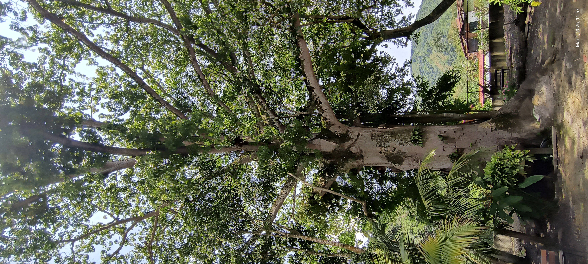

<br><details><summary>:camera:**61/IMG_20260301_115821813.jpg**</summary><sub> `Exif version` 0220 `OS version`  `Date` 2026:03:01 11:58:23 `Aperture` Not known `Brightness` 0.0 `Color space` 1 `Compression` 6`Exposure mode` 0 `Exposure time` 0.020003993 `Focal length` 2.13 `Lens model` Not known `Lens specification` Not known `Orientation` 1 `Scene type` Not known `f number` 2.2 `White balance` 0 `Sensing method` 1 `Shutter speed` 5.643</sub><sub>`Coordinates & altitude` (5.122872805555555, -74.45101927777777, 683.0)</sub><sub> :earth_americas:`Location over` [Google Maps](http://maps.google.com/maps?q=5.122872805555555,-74.45101927777777) or [Openstreet Map](https://www.openstreetmap.org/query?lat=5.122872805555555&lon=-74.45101927777777)</sub></details>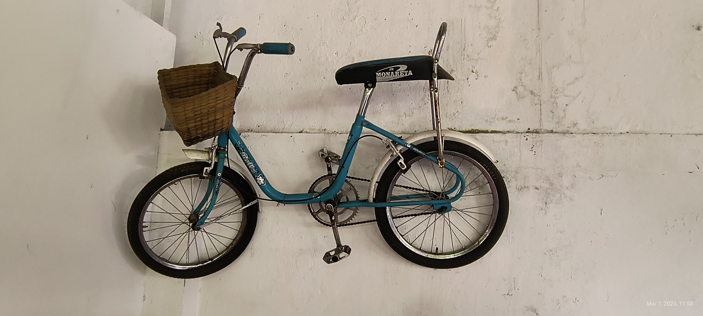

<br><details><summary>:camera:**61/IMG_20260301_134627048.jpg**</summary><sub> `Exif version` 0220 `OS version`  `Date` 2026:03:01 13:46:28 `Aperture` Not known `Brightness` 0.0 `Color space` 1 `Compression` 6`Exposure mode` 0 `Exposure time` 0.00032 `Focal length` 5.56 `Lens model` Not known `Lens specification` Not known `Orientation` 1 `Scene type` Not known `f number` 1.88 `White balance` 0 `Sensing method` 1 `Shutter speed` 11.609</sub><sub>`Coordinates & altitude` (4.99269675, -74.33219144444445, 1210.0)</sub><sub> :earth_americas:`Location over` [Google Maps](http://maps.google.com/maps?q=4.99269675,-74.33219144444445) or [Openstreet Map](https://www.openstreetmap.org/query?lat=4.99269675&lon=-74.33219144444445)</sub></details>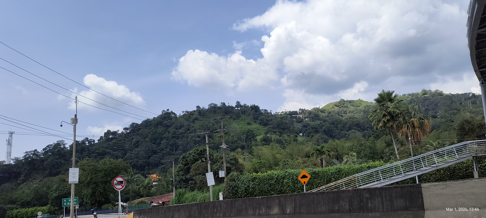

<br><details><summary>:camera:**61/IMG_20260301_134631116.jpg**</summary><sub> `Exif version` 0220 `OS version`  `Date` 2026:03:01 13:46:31 `Aperture` Not known `Brightness` 0.0 `Color space` 1 `Compression` 6`Exposure mode` 0 `Exposure time` 0.000384 `Focal length` 5.56 `Lens model` Not known `Lens specification` Not known `Orientation` 1 `Scene type` Not known `f number` 1.88 `White balance` 0 `Sensing method` 1 `Shutter speed` 11.346</sub><sub>`Coordinates & altitude` (4.99269675, -74.33219144444445, 1210.0)</sub><sub> :earth_americas:`Location over` [Google Maps](http://maps.google.com/maps?q=4.99269675,-74.33219144444445) or [Openstreet Map](https://www.openstreetmap.org/query?lat=4.99269675&lon=-74.33219144444445)</sub></details>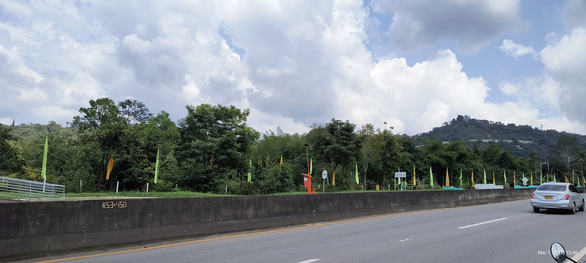

<br><details><summary>:camera:**61/IMG_20260301_150830212.jpg**</summary><sub> `Exif version` 0220 `OS version`  `Date` 2026:03:01 15:08:31 `Aperture` Not known `Brightness` 0.0 `Color space` 1 `Compression` 6`Exposure mode` 0 `Exposure time` 0.000350245 `Focal length` 2.13 `Lens model` Not known `Lens specification` Not known `Orientation` 1 `Scene type` Not known `f number` 2.2 `White balance` 0 `Sensing method` 1 `Shutter speed` 11.479</sub><sub>`Coordinates & altitude` (4.937962083333334, -74.11002347222221, 2869.0)</sub><sub> :earth_americas:`Location over` [Google Maps](http://maps.google.com/maps?q=4.937962083333334,-74.11002347222221) or [Openstreet Map](https://www.openstreetmap.org/query?lat=4.937962083333334&lon=-74.11002347222221)</sub></details>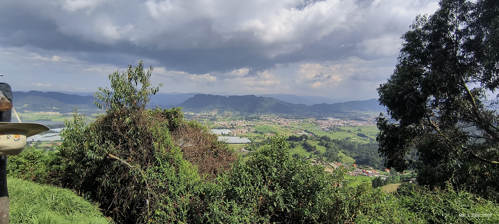

<br><details><summary>:camera:**61/IMG_20260301_150834333.jpg**</summary><sub> `Exif version` 0220 `OS version`  `Date` 2026:03:01 15:08:35 `Aperture` Not known `Brightness` 0.0 `Color space` 1 `Compression` 6`Exposure mode` 0 `Exposure time` 0.000350245 `Focal length` 2.13 `Lens model` Not known `Lens specification` Not known `Orientation` 6 `Scene type` Not known `f number` 2.2 `White balance` 0 `Sensing method` 1 `Shutter speed` 11.479</sub><sub>`Coordinates & altitude` (4.937962083333334, -74.11002347222221, 2869.0)</sub><sub> :earth_americas:`Location over` [Google Maps](http://maps.google.com/maps?q=4.937962083333334,-74.11002347222221) or [Openstreet Map](https://www.openstreetmap.org/query?lat=4.937962083333334&lon=-74.11002347222221)</sub></details>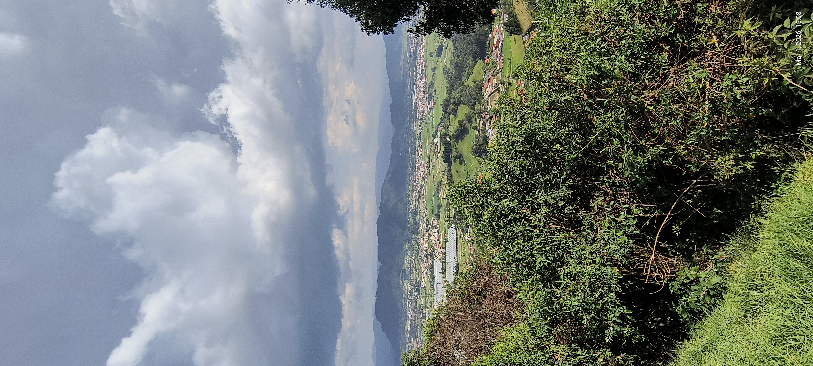

<br><details><summary>:camera:**61/IMG_20260301_150857294.jpg**</summary><sub> `Exif version` 0220 `OS version`  `Date` 2026:03:01 15:08:58 `Aperture` Not known `Brightness` 0.0 `Color space` 1 `Compression` 6`Exposure mode` 0 `Exposure time` 0.000330231 `Focal length` 2.13 `Lens model` Not known `Lens specification` Not known `Orientation` 1 `Scene type` Not known `f number` 2.2 `White balance` 0 `Sensing method` 1 `Shutter speed` 11.564</sub><sub>`Coordinates & altitude` (4.937962083333334, -74.11002347222221, 2869.0)</sub><sub> :earth_americas:`Location over` [Google Maps](http://maps.google.com/maps?q=4.937962083333334,-74.11002347222221) or [Openstreet Map](https://www.openstreetmap.org/query?lat=4.937962083333334&lon=-74.11002347222221)</sub></details>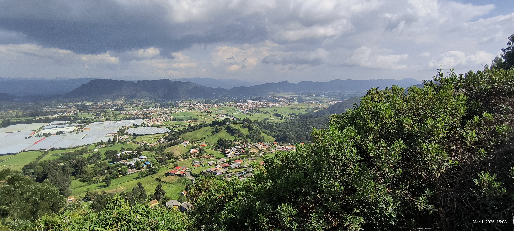

<br><details><summary>:camera:**61/IMG_20260301_150936946.jpg**</summary><sub> `Exif version` 0220 `OS version`  `Date` 2026:03:01 15:09:38 `Aperture` Not known `Brightness` 0.0 `Color space` 1 `Compression` 6`Exposure mode` 0 `Exposure time` 0.000390273 `Focal length` 2.13 `Lens model` Not known `Lens specification` Not known `Orientation` 1 `Scene type` Not known `f number` 2.2 `White balance` 0 `Sensing method` 1 `Shutter speed` 11.323</sub><sub>`Coordinates & altitude` (4.937962083333334, -74.11002347222221, 2869.0)</sub><sub> :earth_americas:`Location over` [Google Maps](http://maps.google.com/maps?q=4.937962083333334,-74.11002347222221) or [Openstreet Map](https://www.openstreetmap.org/query?lat=4.937962083333334&lon=-74.11002347222221)</sub></details>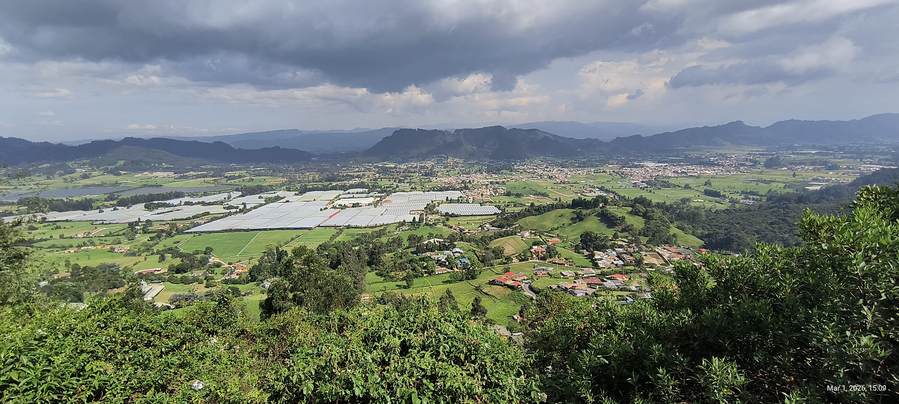

<br><details><summary>:camera:**61/IMG_20260301_150939738.jpg**</summary><sub> `Exif version` 0220 `OS version`  `Date` 2026:03:01 15:09:40 `Aperture` Not known `Brightness` 0.0 `Color space` 1 `Compression` 6`Exposure mode` 0 `Exposure time` 0.000430301 `Focal length` 2.13 `Lens model` Not known `Lens specification` Not known `Orientation` 6 `Scene type` Not known `f number` 2.2 `White balance` 0 `Sensing method` 1 `Shutter speed` 11.182</sub><sub>`Coordinates & altitude` (4.937962083333334, -74.11002347222221, 2869.0)</sub><sub> :earth_americas:`Location over` [Google Maps](http://maps.google.com/maps?q=4.937962083333334,-74.11002347222221) or [Openstreet Map](https://www.openstreetmap.org/query?lat=4.937962083333334&lon=-74.11002347222221)</sub></details>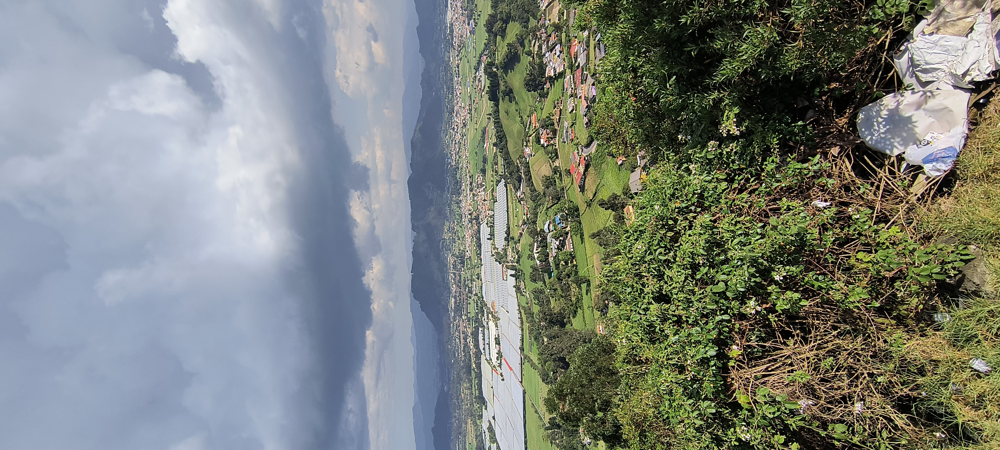

<br><details><summary>:camera:**61/XXXXXX_GarminConnect1.jpg**</summary> `Exif version` Not known</details>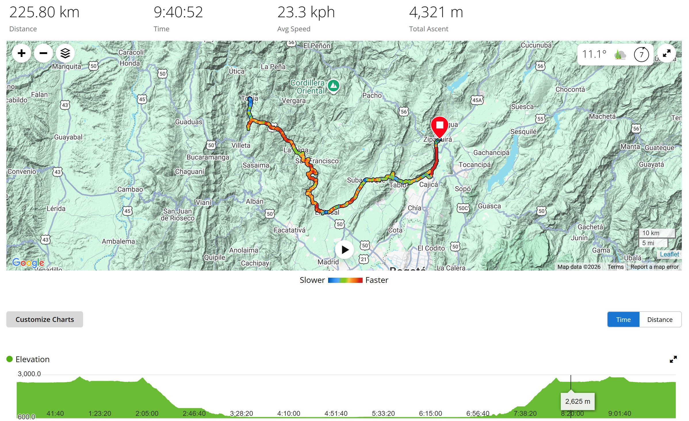

<br><details><summary>:camera:**61/XXXXXX_GarminConnect2.jpg**</summary> `Exif version` Not known</details>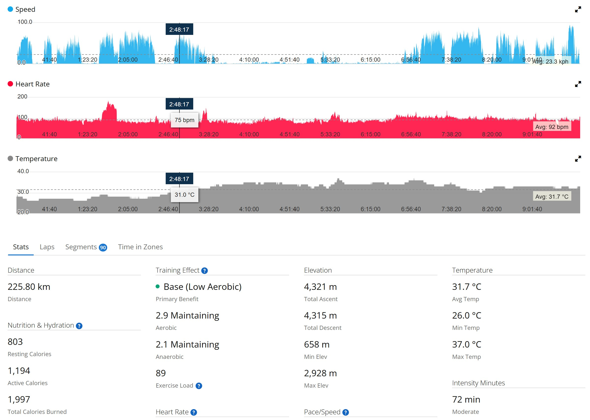

<sub>_Citation: Partial or total digital reproduction of this repository, scripts, development guides, data models, images, and documentation is permitted, provided that it is referenced as: "R.GISMobile - Mobile geographic information systems on QField that do not require an internet connection for navigation." https://github.com/rcfdtools/R.GISMobile - Bogotá - Colombia - South America"._<sub>

| [:house: Home](../Readme.md) |
|---|