<div align="center"></div>

## :earth_americas:POI: Cascada de Angulo - El Peñon, Cundinamarca (2026-03-01)
`Pictures` rcfdtools <br>`Category` Freelance field visit <br>`Location` [Google Maps](http://maps.google.com/maps?q=5.239061,-74.294128) or [Openstreet Map](https://www.openstreetmap.org/query?lat=5.239061&lon=-74.294128) 

```geojson
{
  "type": "Feature",
  "geometry": {
    "type": "Point", 
    "coordinates": [-74.294128, 5.239061]
  }, 
  "properties": {
    "Name": "Cascada de Angulo - El Peñon, Cundinamarca"
  }
}
```

<br><details><summary>:camera:**62/IMG_20260315_082408603_HDR.jpg**</summary><sub> `Exif version` 0220 `OS version`  `Date` 2026:03:15 08:24:11 `Aperture` Not known `Brightness` 0.0 `Color space` 1 `Compression` 6`Exposure mode` 0 `Exposure time` 0.001160812 `Focal length` 2.13 `Lens model` Not known `Lens specification` Not known `Orientation` 1 `Scene type` Not known `f number` 2.2 `White balance` 0 `Sensing method` 1 `Shutter speed` 9.75</sub><sub>`Coordinates & altitude` (5.177257055555556, -74.19221494444444, 1339.0)</sub><sub> :earth_americas:`Location over` [Google Maps](http://maps.google.com/maps?q=5.177257055555556,-74.19221494444444) or [Openstreet Map](https://www.openstreetmap.org/query?lat=5.177257055555556&lon=-74.19221494444444)</sub></details>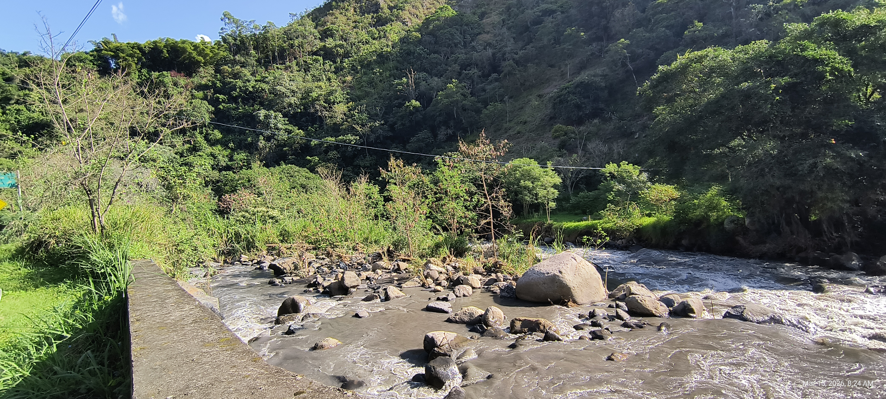

<br><details><summary>:camera:**62/IMG_20260315_082411916_HDR.jpg**</summary><sub> `Exif version` 0220 `OS version`  `Date` 2026:03:15 08:24:13 `Aperture` Not known `Brightness` 0.0 `Color space` 1 `Compression` 6`Exposure mode` 0 `Exposure time` 0.000230161 `Focal length` 2.13 `Lens model` Not known `Lens specification` Not known `Orientation` 1 `Scene type` Not known `f number` 2.2 `White balance` 0 `Sensing method` 1 `Shutter speed` 12.085</sub><sub>`Coordinates & altitude` (5.177257055555556, -74.19221494444444, 1339.0)</sub><sub> :earth_americas:`Location over` [Google Maps](http://maps.google.com/maps?q=5.177257055555556,-74.19221494444444) or [Openstreet Map](https://www.openstreetmap.org/query?lat=5.177257055555556&lon=-74.19221494444444)</sub></details>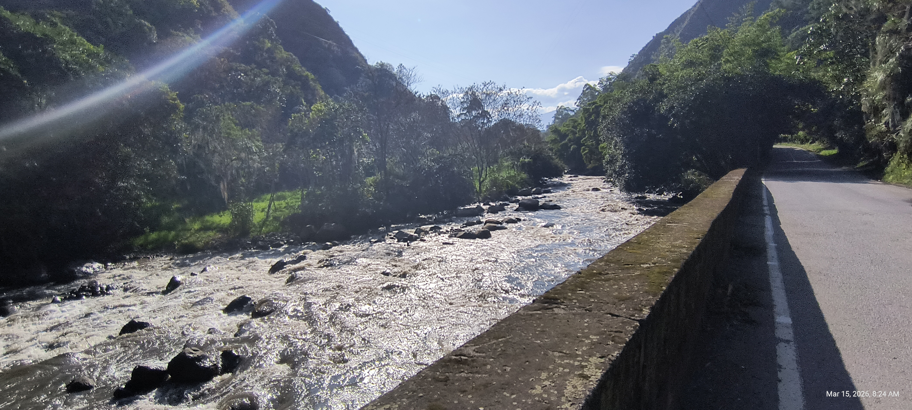

<br><details><summary>:camera:**62/IMG_20260315_082417663_HDR.jpg**</summary><sub> `Exif version` 0220 `OS version`  `Date` 2026:03:15 08:24:19 `Aperture` Not known `Brightness` 0.0 `Color space` 1 `Compression` 6`Exposure mode` 0 `Exposure time` 0.00020014 `Focal length` 2.13 `Lens model` Not known `Lens specification` Not known `Orientation` 6 `Scene type` Not known `f number` 2.2 `White balance` 0 `Sensing method` 1 `Shutter speed` 12.286</sub><sub>`Coordinates & altitude` (5.177257055555556, -74.19221494444444, 1339.0)</sub><sub> :earth_americas:`Location over` [Google Maps](http://maps.google.com/maps?q=5.177257055555556,-74.19221494444444) or [Openstreet Map](https://www.openstreetmap.org/query?lat=5.177257055555556&lon=-74.19221494444444)</sub></details>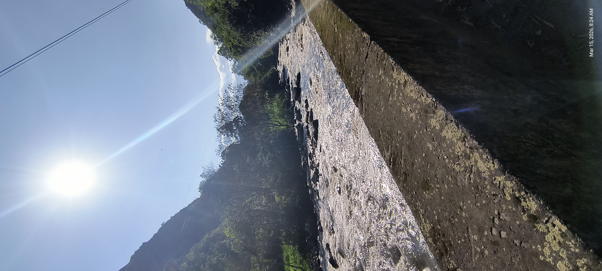

<br><details><summary>:camera:**62/IMG_20260315_082420861.jpg**</summary><sub> `Exif version` 0220 `OS version`  `Date` 2026:03:15 08:24:21 `Aperture` Not known `Brightness` 0.0 `Color space` 1 `Compression` 6`Exposure mode` 0 `Exposure time` 0.00050035 `Focal length` 2.13 `Lens model` Not known `Lens specification` Not known `Orientation` 6 `Scene type` Not known `f number` 2.2 `White balance` 0 `Sensing method` 1 `Shutter speed` 10.964</sub><sub>`Coordinates & altitude` (5.177257055555556, -74.19221494444444, 1339.0)</sub><sub> :earth_americas:`Location over` [Google Maps](http://maps.google.com/maps?q=5.177257055555556,-74.19221494444444) or [Openstreet Map](https://www.openstreetmap.org/query?lat=5.177257055555556&lon=-74.19221494444444)</sub></details>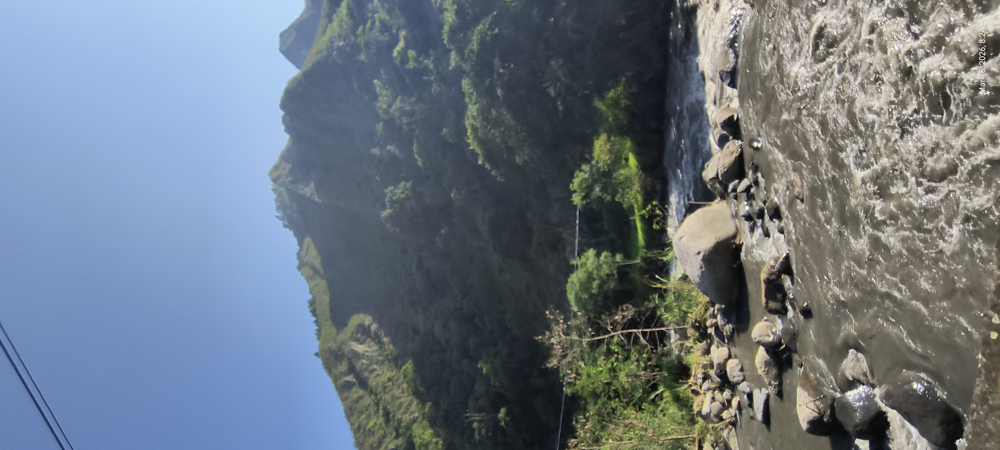

<br><details><summary>:camera:**62/IMG_20260315_082424645.jpg**</summary><sub> `Exif version` 0220 `OS version`  `Date` 2026:03:15 08:24:25 `Aperture` Not known `Brightness` 0.0 `Color space` 1 `Compression` 6`Exposure mode` 0 `Exposure time` 0.000790553 `Focal length` 2.13 `Lens model` Not known `Lens specification` Not known `Orientation` 6 `Scene type` Not known `f number` 2.2 `White balance` 0 `Sensing method` 1 `Shutter speed` 10.304</sub><sub>`Coordinates & altitude` (5.177257055555556, -74.19221494444444, 1339.0)</sub><sub> :earth_americas:`Location over` [Google Maps](http://maps.google.com/maps?q=5.177257055555556,-74.19221494444444) or [Openstreet Map](https://www.openstreetmap.org/query?lat=5.177257055555556&lon=-74.19221494444444)</sub></details>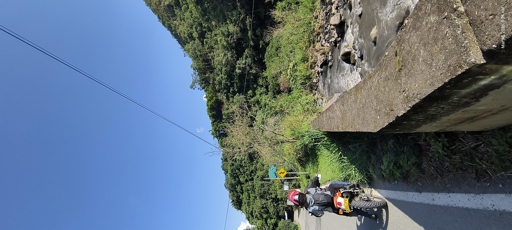

<br><details><summary>:camera:**62/IMG_20260315_082730964_HDR.jpg**</summary><sub> `Exif version` 0220 `OS version`  `Date` 2026:03:15 08:27:33 `Aperture` Not known `Brightness` 0.0 `Color space` 1 `Compression` 6`Exposure mode` 0 `Exposure time` 0.001536 `Focal length` 5.56 `Lens model` Not known `Lens specification` Not known `Orientation` 6 `Scene type` Not known `f number` 1.88 `White balance` 0 `Sensing method` 1 `Shutter speed` 9.346</sub><sub>`Coordinates & altitude` (5.184796805555556, -74.19832611111111, 1306.0)</sub><sub> :earth_americas:`Location over` [Google Maps](http://maps.google.com/maps?q=5.184796805555556,-74.19832611111111) or [Openstreet Map](https://www.openstreetmap.org/query?lat=5.184796805555556&lon=-74.19832611111111)</sub></details>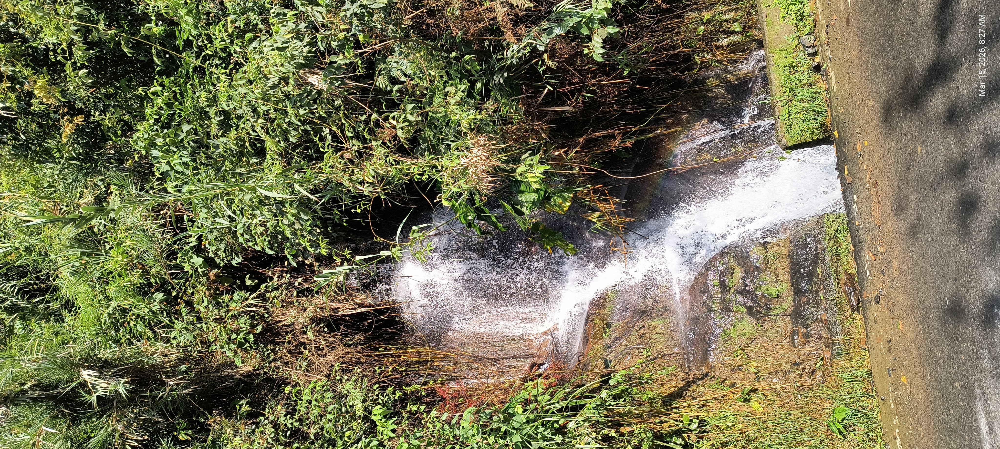

<br><details><summary>:camera:**62/IMG_20260315_082748852_HDR.jpg**</summary><sub> `Exif version` 0220 `OS version`  `Date` 2026:03:15 08:27:50 `Aperture` Not known `Brightness` 0.0 `Color space` 1 `Compression` 6`Exposure mode` 0 `Exposure time` 0.000544 `Focal length` 5.56 `Lens model` Not known `Lens specification` Not known `Orientation` 6 `Scene type` Not known `f number` 1.88 `White balance` 0 `Sensing method` 1 `Shutter speed` 10.844</sub><sub>`Coordinates & altitude` (5.184796805555556, -74.19832611111111, 1306.0)</sub><sub> :earth_americas:`Location over` [Google Maps](http://maps.google.com/maps?q=5.184796805555556,-74.19832611111111) or [Openstreet Map](https://www.openstreetmap.org/query?lat=5.184796805555556&lon=-74.19832611111111)</sub></details>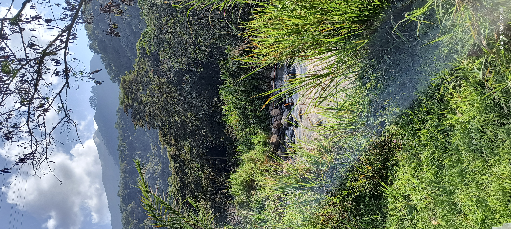

<br><details><summary>:camera:**62/IMG_20260315_085902378.jpg**</summary><sub> `Exif version` 0220 `OS version`  `Date` 2026:03:15 08:59:03 `Aperture` Not known `Brightness` 0.0 `Color space` 1 `Compression` 6`Exposure mode` 0 `Exposure time` 0.00050035 `Focal length` 2.13 `Lens model` Not known `Lens specification` Not known `Orientation` 6 `Scene type` Not known `f number` 2.2 `White balance` 0 `Sensing method` 1 `Shutter speed` 10.964</sub><sub>`Coordinates & altitude` (5.2296118611111115, -74.27925872222222, 1044.0)</sub><sub> :earth_americas:`Location over` [Google Maps](http://maps.google.com/maps?q=5.2296118611111115,-74.27925872222222) or [Openstreet Map](https://www.openstreetmap.org/query?lat=5.2296118611111115&lon=-74.27925872222222)</sub></details>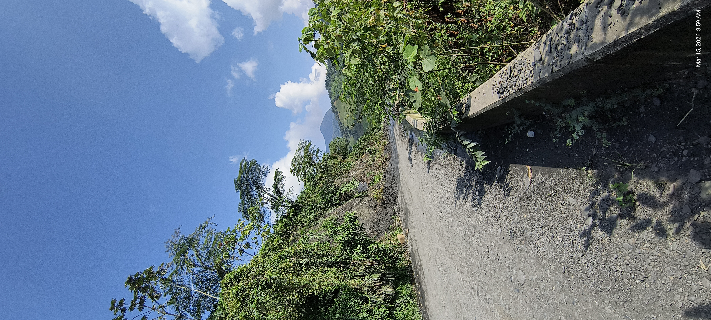

<br><details><summary>:camera:**62/IMG_20260315_085907539_HDR.jpg**</summary><sub> `Exif version` 0220 `OS version`  `Date` 2026:03:15 08:59:09 `Aperture` Not known `Brightness` 0.0 `Color space` 1 `Compression` 6`Exposure mode` 0 `Exposure time` 0.000250175 `Focal length` 2.13 `Lens model` Not known `Lens specification` Not known `Orientation` 1 `Scene type` Not known `f number` 2.2 `White balance` 0 `Sensing method` 1 `Shutter speed` 11.964</sub><sub>`Coordinates & altitude` (5.2296118611111115, -74.27925872222222, 1044.0)</sub><sub> :earth_americas:`Location over` [Google Maps](http://maps.google.com/maps?q=5.2296118611111115,-74.27925872222222) or [Openstreet Map](https://www.openstreetmap.org/query?lat=5.2296118611111115&lon=-74.27925872222222)</sub></details>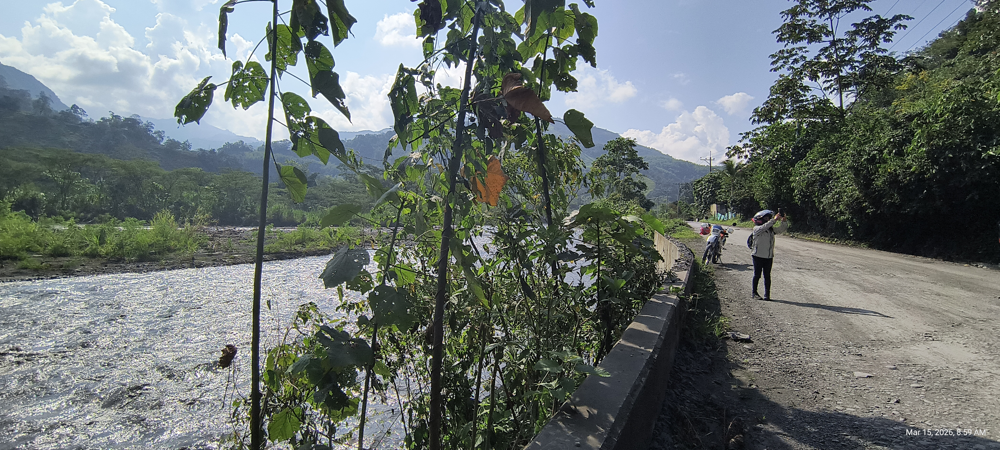

<br><details><summary>:camera:**62/IMG_20260315_085910934.jpg**</summary><sub> `Exif version` 0220 `OS version`  `Date` 2026:03:15 08:59:12 `Aperture` Not known `Brightness` 0.0 `Color space` 1 `Compression` 6`Exposure mode` 0 `Exposure time` 0.000210147 `Focal length` 2.13 `Lens model` Not known `Lens specification` Not known `Orientation` 1 `Scene type` Not known `f number` 2.2 `White balance` 0 `Sensing method` 1 `Shutter speed` 12.216</sub><sub>`Coordinates & altitude` (5.2296118611111115, -74.27925872222222, 1044.0)</sub><sub> :earth_americas:`Location over` [Google Maps](http://maps.google.com/maps?q=5.2296118611111115,-74.27925872222222) or [Openstreet Map](https://www.openstreetmap.org/query?lat=5.2296118611111115&lon=-74.27925872222222)</sub></details>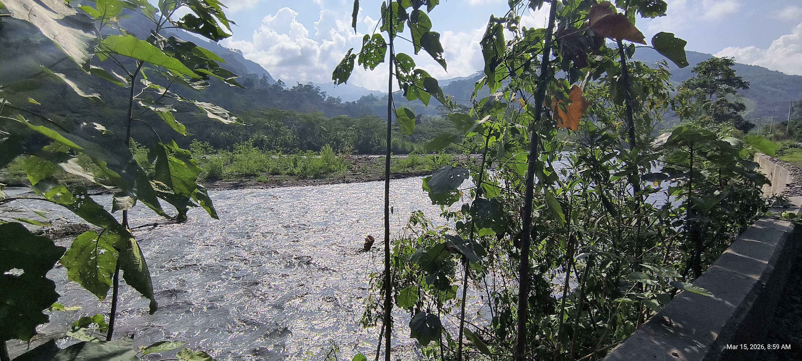

<br><details><summary>:camera:**62/IMG_20260315_085921155.jpg**</summary><sub> `Exif version` 0220 `OS version`  `Date` 2026:03:15 08:59:21 `Aperture` Not known `Brightness` 0.0 `Color space` 1 `Compression` 6`Exposure mode` 0 `Exposure time` 0.00050035 `Focal length` 2.13 `Lens model` Not known `Lens specification` Not known `Orientation` 6 `Scene type` Not known `f number` 2.2 `White balance` 0 `Sensing method` 1 `Shutter speed` 10.964</sub><sub>`Coordinates & altitude` (5.2296118611111115, -74.27925872222222, 1044.0)</sub><sub> :earth_americas:`Location over` [Google Maps](http://maps.google.com/maps?q=5.2296118611111115,-74.27925872222222) or [Openstreet Map](https://www.openstreetmap.org/query?lat=5.2296118611111115&lon=-74.27925872222222)</sub></details>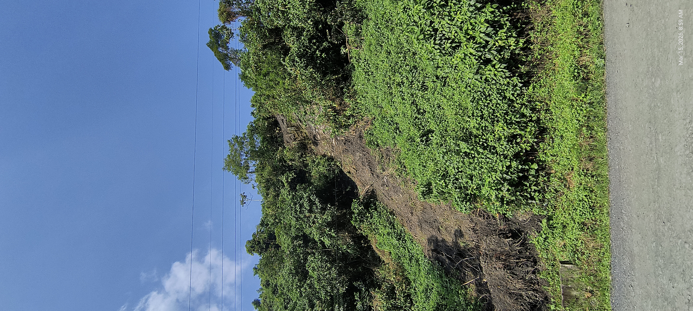

<br><details><summary>:camera:**62/IMG_20260315_092416985_HDR.jpg**</summary><sub> `Exif version` 0220 `OS version`  `Date` 2026:03:15 09:24:19 `Aperture` Not known `Brightness` 0.0 `Color space` 1 `Compression` 6`Exposure mode` 0 `Exposure time` 0.00096 `Focal length` 5.56 `Lens model` Not known `Lens specification` Not known `Orientation` 6 `Scene type` Not known `f number` 1.88 `White balance` 0 `Sensing method` 1 `Shutter speed` 10.024</sub><sub>`Coordinates & altitude` (5.239573, -74.29395291666667, 1021.0)</sub><sub> :earth_americas:`Location over` [Google Maps](http://maps.google.com/maps?q=5.239573,-74.29395291666667) or [Openstreet Map](https://www.openstreetmap.org/query?lat=5.239573&lon=-74.29395291666667)</sub></details>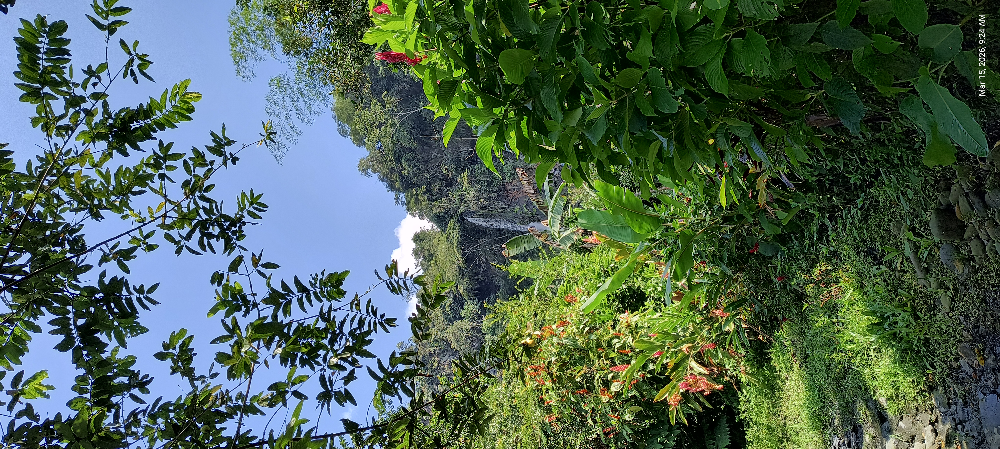

<br><details><summary>:camera:**62/IMG_20260315_092421549_HDR.jpg**</summary><sub> `Exif version` 0220 `OS version`  `Date` 2026:03:15 09:24:23 `Aperture` Not known `Brightness` 0.0 `Color space` 1 `Compression` 6`Exposure mode` 0 `Exposure time` 0.001952 `Focal length` 5.56 `Lens model` Not known `Lens specification` Not known `Orientation` 6 `Scene type` Not known `f number` 1.88 `White balance` 0 `Sensing method` 1 `Shutter speed` 9.0</sub><sub>`Coordinates & altitude` (5.239573, -74.29395291666667, 1021.0)</sub><sub> :earth_americas:`Location over` [Google Maps](http://maps.google.com/maps?q=5.239573,-74.29395291666667) or [Openstreet Map](https://www.openstreetmap.org/query?lat=5.239573&lon=-74.29395291666667)</sub></details>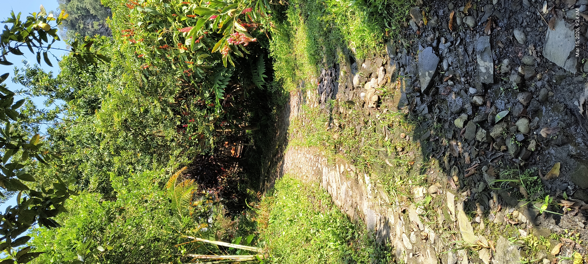

<br><details><summary>:camera:**62/IMG_20260315_092524600_HDR.jpg**</summary><sub> `Exif version` 0220 `OS version`  `Date` 2026:03:15 09:25:26 `Aperture` Not known `Brightness` 0.0 `Color space` 1 `Compression` 6`Exposure mode` 0 `Exposure time` 0.002464 `Focal length` 5.56 `Lens model` Not known `Lens specification` Not known `Orientation` 6 `Scene type` Not known `f number` 1.88 `White balance` 0 `Sensing method` 1 `Shutter speed` 8.664</sub><sub>`Coordinates & altitude` (5.239630222222222, -74.29384611111111, 1021.0)</sub><sub> :earth_americas:`Location over` [Google Maps](http://maps.google.com/maps?q=5.239630222222222,-74.29384611111111) or [Openstreet Map](https://www.openstreetmap.org/query?lat=5.239630222222222&lon=-74.29384611111111)</sub></details>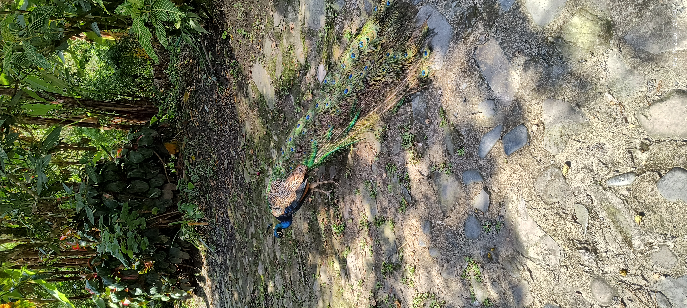

<br><details><summary>:camera:**62/IMG_20260315_092751880_HDR.jpg**</summary><sub> `Exif version` 0220 `OS version`  `Date` 2026:03:15 09:27:53 `Aperture` Not known `Brightness` 0.0 `Color space` 1 `Compression` 6`Exposure mode` 0 `Exposure time` 0.00832 `Focal length` 5.56 `Lens model` Not known `Lens specification` Not known `Orientation` 1 `Scene type` Not known `f number` 1.88 `White balance` 0 `Sensing method` 1 `Shutter speed` 6.909</sub><sub>`Coordinates & altitude` (5.239902, -74.29411313888889, 1021.0)</sub><sub> :earth_americas:`Location over` [Google Maps](http://maps.google.com/maps?q=5.239902,-74.29411313888889) or [Openstreet Map](https://www.openstreetmap.org/query?lat=5.239902&lon=-74.29411313888889)</sub></details>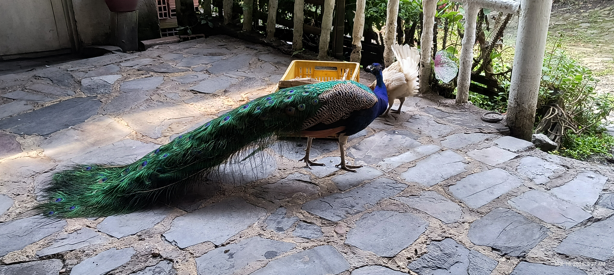

<br><details><summary>:camera:**62/IMG_20260315_095656774_HDR.jpg**</summary><sub> `Exif version` 0220 `OS version`  `Date` 2026:03:15 09:56:58 `Aperture` Not known `Brightness` 0.0 `Color space` 1 `Compression` 6`Exposure mode` 0 `Exposure time` 0.002311617 `Focal length` 2.13 `Lens model` Not known `Lens specification` Not known `Orientation` 6 `Scene type` Not known `f number` 2.2 `White balance` 0 `Sensing method` 1 `Shutter speed` 8.756</sub><sub>`Coordinates & altitude` (5.239809972222222, -74.29364775, 1023.0)</sub><sub> :earth_americas:`Location over` [Google Maps](http://maps.google.com/maps?q=5.239809972222222,-74.29364775) or [Openstreet Map](https://www.openstreetmap.org/query?lat=5.239809972222222&lon=-74.29364775)</sub></details>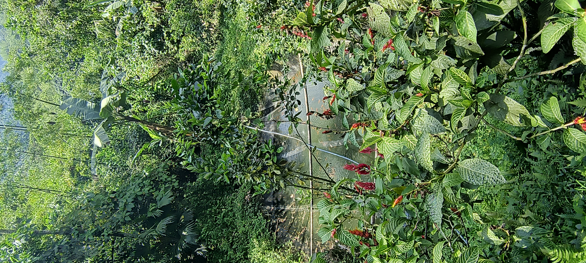

<br><details><summary>:camera:**62/IMG_20260315_095702196.jpg**</summary><sub> `Exif version` 0220 `OS version`  `Date` 2026:03:15 09:57:02 `Aperture` Not known `Brightness` 0.0 `Color space` 1 `Compression` 6`Exposure mode` 0 `Exposure time` 0.000340238 `Focal length` 2.13 `Lens model` Not known `Lens specification` Not known `Orientation` 1 `Scene type` Not known `f number` 2.2 `White balance` 0 `Sensing method` 1 `Shutter speed` 11.521</sub><sub>`Coordinates & altitude` (5.239809972222222, -74.29364775, 1023.0)</sub><sub> :earth_americas:`Location over` [Google Maps](http://maps.google.com/maps?q=5.239809972222222,-74.29364775) or [Openstreet Map](https://www.openstreetmap.org/query?lat=5.239809972222222&lon=-74.29364775)</sub></details>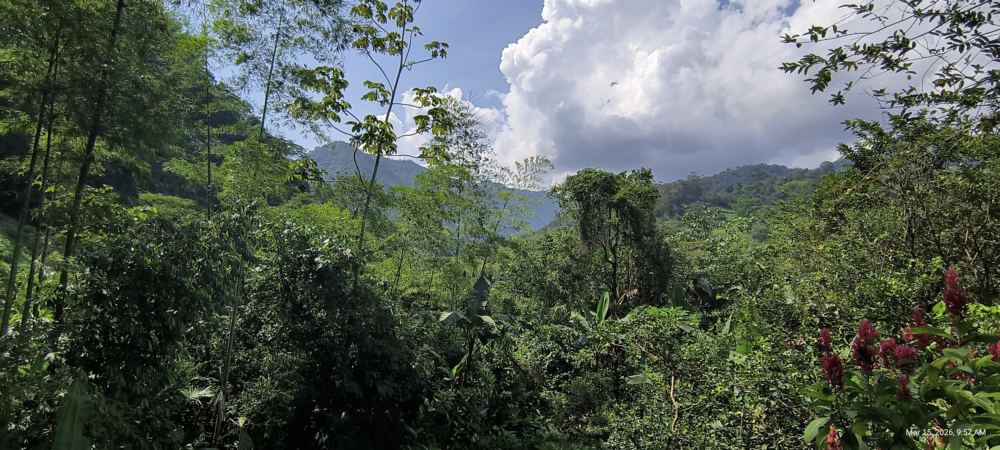

<br><details><summary>:camera:**62/IMG_20260315_100518219_HDR.jpg**</summary><sub> `Exif version` 0220 `OS version`  `Date` 2026:03:15 10:05:19 `Aperture` Not known `Brightness` 0.0 `Color space` 1 `Compression` 6`Exposure mode` 0 `Exposure time` 0.00128 `Focal length` 5.56 `Lens model` Not known `Lens specification` Not known `Orientation` 6 `Scene type` Not known `f number` 1.88 `White balance` 0 `Sensing method` 1 `Shutter speed` 9.609</sub><sub>`Coordinates & altitude` (5.240567194444444, -74.29377744444444, 1051.0)</sub><sub> :earth_americas:`Location over` [Google Maps](http://maps.google.com/maps?q=5.240567194444444,-74.29377744444444) or [Openstreet Map](https://www.openstreetmap.org/query?lat=5.240567194444444&lon=-74.29377744444444)</sub></details>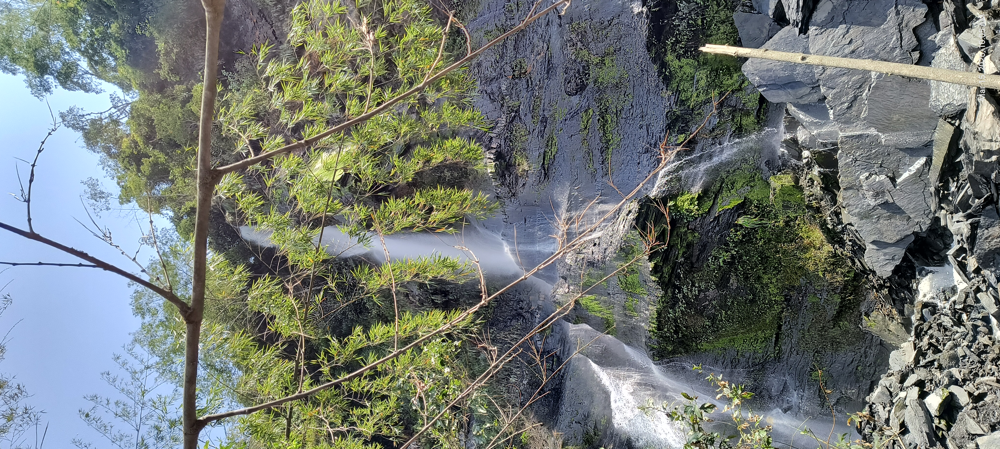

<br><details><summary>:camera:**62/IMG_20260315_100530096_HDR.jpg**</summary><sub> `Exif version` 0220 `OS version`  `Date` 2026:03:15 10:05:31 `Aperture` Not known `Brightness` 0.0 `Color space` 1 `Compression` 6`Exposure mode` 0 `Exposure time` 0.000860602 `Focal length` 2.13 `Lens model` Not known `Lens specification` Not known `Orientation` 6 `Scene type` Not known `f number` 2.2 `White balance` 0 `Sensing method` 1 `Shutter speed` 10.182</sub><sub>`Coordinates & altitude` (5.240567194444444, -74.29377744444444, 1051.0)</sub><sub> :earth_americas:`Location over` [Google Maps](http://maps.google.com/maps?q=5.240567194444444,-74.29377744444444) or [Openstreet Map](https://www.openstreetmap.org/query?lat=5.240567194444444&lon=-74.29377744444444)</sub></details>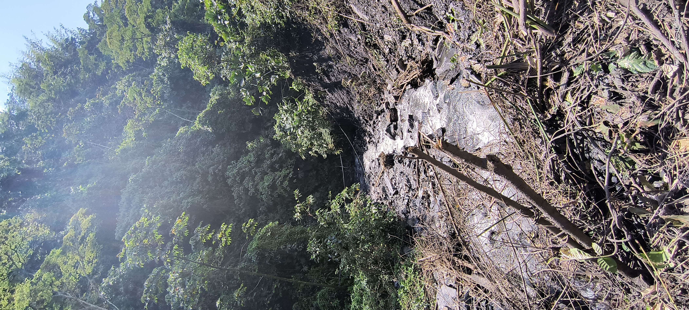

<br><details><summary>:camera:**62/IMG_20260315_100633597.jpg**</summary><sub> `Exif version` 0220 `OS version`  `Date` 2026:03:15 10:06:34 `Aperture` Not known `Brightness` 0.0 `Color space` 1 `Compression` 6`Exposure mode` 0 `Exposure time` 0.001350945 `Focal length` 2.13 `Lens model` Not known `Lens specification` Not known `Orientation` 6 `Scene type` Not known `f number` 2.2 `White balance` 0 `Sensing method` 1 `Shutter speed` 9.531</sub><sub>`Coordinates & altitude` (5.240567194444444, -74.29377744444444, 1035.0)</sub><sub> :earth_americas:`Location over` [Google Maps](http://maps.google.com/maps?q=5.240567194444444,-74.29377744444444) or [Openstreet Map](https://www.openstreetmap.org/query?lat=5.240567194444444&lon=-74.29377744444444)</sub></details>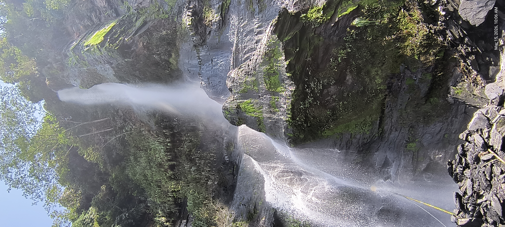

<br><details><summary>:camera:**62/IMG_20260315_100724892.jpg**</summary><sub> `Exif version` 0220 `OS version`  `Date` 2026:03:15 10:07:25 `Aperture` Not known `Brightness` 0.0 `Color space` 1 `Compression` 6`Exposure mode` 0 `Exposure time` 0.000560392 `Focal length` 2.13 `Lens model` Not known `Lens specification` Not known `Orientation` 6 `Scene type` Not known `f number` 2.2 `White balance` 0 `Sensing method` 1 `Shutter speed` 10.801</sub><sub>`Coordinates & altitude` (5.240777944444445, -74.29407499999999, 1051.0)</sub><sub> :earth_americas:`Location over` [Google Maps](http://maps.google.com/maps?q=5.240777944444445,-74.29407499999999) or [Openstreet Map](https://www.openstreetmap.org/query?lat=5.240777944444445&lon=-74.29407499999999)</sub></details>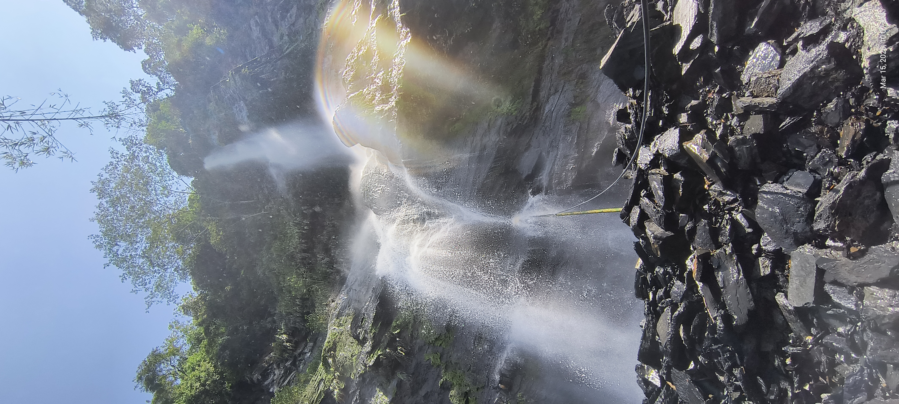

<br><details><summary>:camera:**62/IMG_20260315_100729690.jpg**</summary><sub> `Exif version` 0220 `OS version`  `Date` 2026:03:15 10:07:30 `Aperture` Not known `Brightness` 0.0 `Color space` 1 `Compression` 6`Exposure mode` 0 `Exposure time` 0.00050035 `Focal length` 2.13 `Lens model` Not known `Lens specification` Not known `Orientation` 6 `Scene type` Not known `f number` 2.2 `White balance` 0 `Sensing method` 1 `Shutter speed` 10.964</sub><sub>`Coordinates & altitude` (5.240777944444445, -74.29407499999999, 1051.0)</sub><sub> :earth_americas:`Location over` [Google Maps](http://maps.google.com/maps?q=5.240777944444445,-74.29407499999999) or [Openstreet Map](https://www.openstreetmap.org/query?lat=5.240777944444445&lon=-74.29407499999999)</sub></details>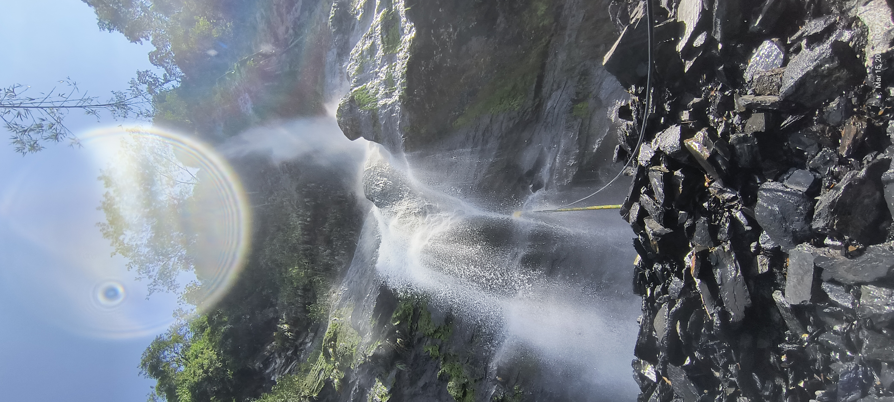

<br><details><summary>:camera:**62/IMG_20260315_100749528.jpg**</summary><sub> `Exif version` 0220 `OS version`  `Date` 2026:03:15 10:07:50 `Aperture` Not known `Brightness` 0.0 `Color space` 1 `Compression` 6`Exposure mode` 0 `Exposure time` 0.000340238 `Focal length` 2.13 `Lens model` Not known `Lens specification` Not known `Orientation` 1 `Scene type` Not known `f number` 2.2 `White balance` 0 `Sensing method` 1 `Shutter speed` 11.521</sub><sub>`Coordinates & altitude` (5.240777944444445, -74.29407499999999, 1051.0)</sub><sub> :earth_americas:`Location over` [Google Maps](http://maps.google.com/maps?q=5.240777944444445,-74.29407499999999) or [Openstreet Map](https://www.openstreetmap.org/query?lat=5.240777944444445&lon=-74.29407499999999)</sub></details>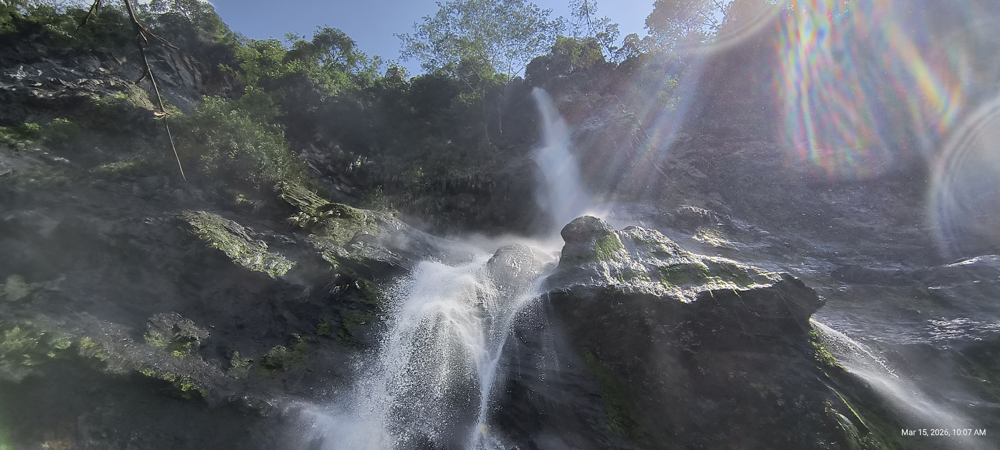

<br><details><summary>:camera:**62/IMG_20260315_100752877.jpg**</summary><sub> `Exif version` 0220 `OS version`  `Date` 2026:03:15 10:07:53 `Aperture` Not known `Brightness` 0.0 `Color space` 1 `Compression` 6`Exposure mode` 0 `Exposure time` 0.00050035 `Focal length` 2.13 `Lens model` Not known `Lens specification` Not known `Orientation` 6 `Scene type` Not known `f number` 2.2 `White balance` 0 `Sensing method` 1 `Shutter speed` 10.964</sub><sub>`Coordinates & altitude` (5.240777944444445, -74.29407499999999, 1051.0)</sub><sub> :earth_americas:`Location over` [Google Maps](http://maps.google.com/maps?q=5.240777944444445,-74.29407499999999) or [Openstreet Map](https://www.openstreetmap.org/query?lat=5.240777944444445&lon=-74.29407499999999)</sub></details>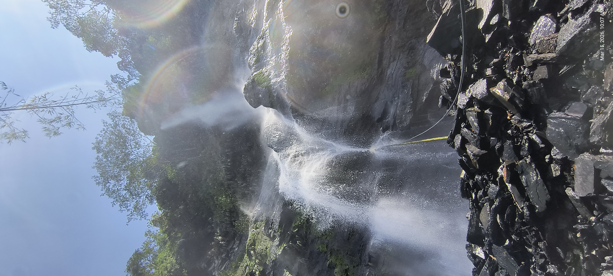

<br><details><summary>:camera:**62/IMG_20260315_100755555.jpg**</summary><sub> `Exif version` 0220 `OS version`  `Date` 2026:03:15 10:07:56 `Aperture` Not known `Brightness` 0.0 `Color space` 1 `Compression` 6`Exposure mode` 0 `Exposure time` 0.000710497 `Focal length` 2.13 `Lens model` Not known `Lens specification` Not known `Orientation` 6 `Scene type` Not known `f number` 2.2 `White balance` 0 `Sensing method` 1 `Shutter speed` 10.458</sub><sub>`Coordinates & altitude` (5.240777944444445, -74.29407499999999, 1051.0)</sub><sub> :earth_americas:`Location over` [Google Maps](http://maps.google.com/maps?q=5.240777944444445,-74.29407499999999) or [Openstreet Map](https://www.openstreetmap.org/query?lat=5.240777944444445&lon=-74.29407499999999)</sub></details>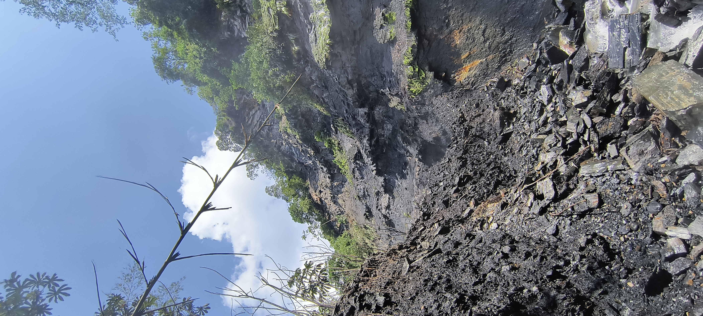

<br><details><summary>:camera:**62/IMG_20260315_100918955_HDR.jpg**</summary><sub> `Exif version` 0220 `OS version`  `Date` 2026:03:15 10:09:20 `Aperture` Not known `Brightness` 0.0 `Color space` 1 `Compression` 6`Exposure mode` 0 `Exposure time` 0.001728 `Focal length` 5.56 `Lens model` Not known `Lens specification` Not known `Orientation` 6 `Scene type` Not known `f number` 1.88 `White balance` 0 `Sensing method` 1 `Shutter speed` 9.176</sub><sub>`Coordinates & altitude` (5.240777944444445, -74.29407499999999, 1051.0)</sub><sub> :earth_americas:`Location over` [Google Maps](http://maps.google.com/maps?q=5.240777944444445,-74.29407499999999) or [Openstreet Map](https://www.openstreetmap.org/query?lat=5.240777944444445&lon=-74.29407499999999)</sub></details>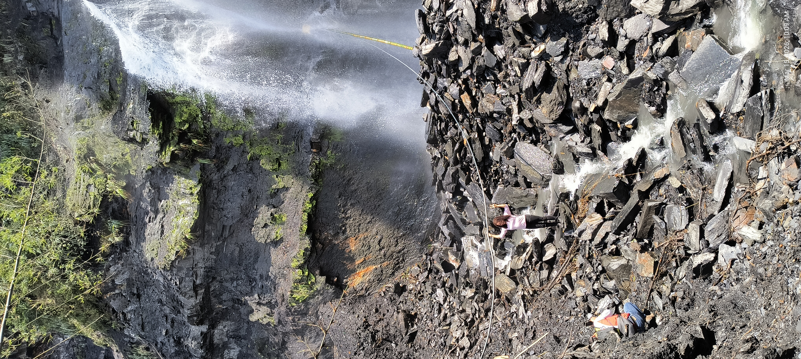

<br><details><summary>:camera:**62/IMG_20260315_100922582.jpg**</summary><sub> `Exif version` 0220 `OS version`  `Date` 2026:03:15 10:09:23 `Aperture` Not known `Brightness` 0.0 `Color space` 1 `Compression` 6`Exposure mode` 0 `Exposure time` 0.001370959 `Focal length` 2.13 `Lens model` Not known `Lens specification` Not known `Orientation` 6 `Scene type` Not known `f number` 2.2 `White balance` 0 `Sensing method` 1 `Shutter speed` 9.51</sub><sub>`Coordinates & altitude` (5.241069777777778, -74.29374694444444, 1043.0)</sub><sub> :earth_americas:`Location over` [Google Maps](http://maps.google.com/maps?q=5.241069777777778,-74.29374694444444) or [Openstreet Map](https://www.openstreetmap.org/query?lat=5.241069777777778&lon=-74.29374694444444)</sub></details>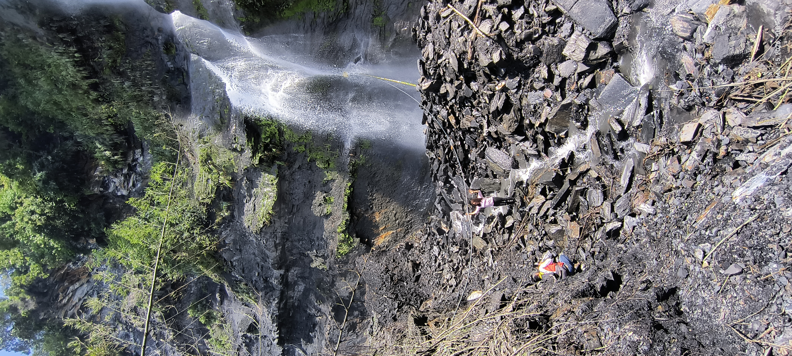

<br><details><summary>:camera:**62/IMG_20260315_101320851_HDR.jpg**</summary><sub> `Exif version` 0220 `OS version`  `Date` 2026:03:15 10:13:22 `Aperture` Not known `Brightness` 0.0 `Color space` 1 `Compression` 6`Exposure mode` 0 `Exposure time` 0.00832 `Focal length` 5.56 `Lens model` Not known `Lens specification` Not known `Orientation` 1 `Scene type` Not known `f number` 1.88 `White balance` 0 `Sensing method` 1 `Shutter speed` 6.909</sub><sub>`Coordinates & altitude` (5.240825166666666, -74.29381561111111, 1043.0)</sub><sub> :earth_americas:`Location over` [Google Maps](http://maps.google.com/maps?q=5.240825166666666,-74.29381561111111) or [Openstreet Map](https://www.openstreetmap.org/query?lat=5.240825166666666&lon=-74.29381561111111)</sub></details>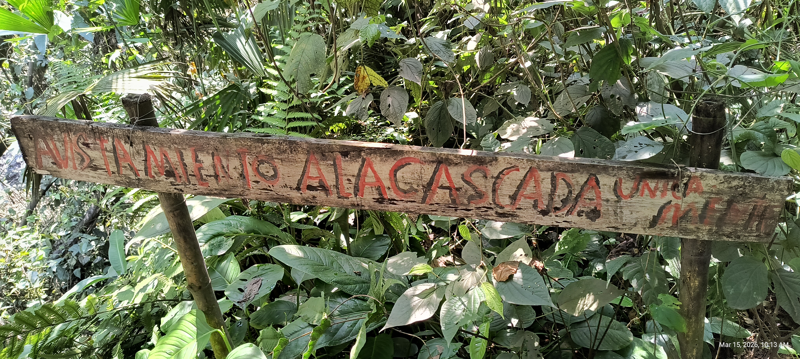

<br><details><summary>:camera:**62/IMG_20260315_101521416_HDR.jpg**</summary><sub> `Exif version` 0220 `OS version`  `Date` 2026:03:15 10:15:22 `Aperture` Not known `Brightness` 0.0 `Color space` 1 `Compression` 6`Exposure mode` 0 `Exposure time` 0.001741218 `Focal length` 2.13 `Lens model` Not known `Lens specification` Not known `Orientation` 1 `Scene type` Not known `f number` 2.2 `White balance` 0 `Sensing method` 1 `Shutter speed` 9.165</sub><sub>`Coordinates & altitude` (5.239884833333333, -74.29386138888889, 1030.0)</sub><sub> :earth_americas:`Location over` [Google Maps](http://maps.google.com/maps?q=5.239884833333333,-74.29386138888889) or [Openstreet Map](https://www.openstreetmap.org/query?lat=5.239884833333333&lon=-74.29386138888889)</sub></details>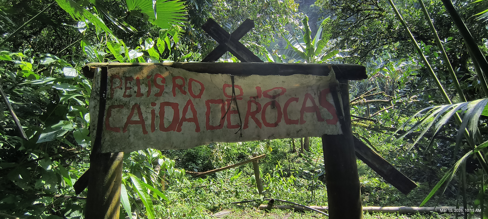

<br><details><summary>:camera:**62/IMG_20260315_101529629_HDR.jpg**</summary><sub> `Exif version` 0220 `OS version`  `Date` 2026:03:15 10:15:31 `Aperture` Not known `Brightness` 0.0 `Color space` 1 `Compression` 6`Exposure mode` 0 `Exposure time` 0.005233661 `Focal length` 2.13 `Lens model` Not known `Lens specification` Not known `Orientation` 6 `Scene type` Not known `f number` 2.2 `White balance` 0 `Sensing method` 1 `Shutter speed` 7.577</sub><sub>`Coordinates & altitude` (5.239884833333333, -74.29386138888889, 1030.0)</sub><sub> :earth_americas:`Location over` [Google Maps](http://maps.google.com/maps?q=5.239884833333333,-74.29386138888889) or [Openstreet Map](https://www.openstreetmap.org/query?lat=5.239884833333333&lon=-74.29386138888889)</sub></details>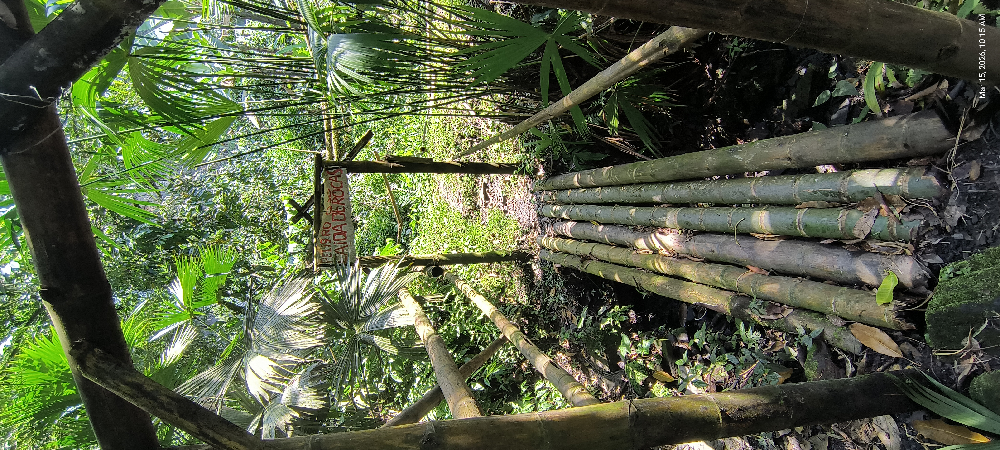

<br><details><summary>:camera:**62/IMG_20260315_102813412_HDR.jpg**</summary><sub> `Exif version` 0220 `OS version`  `Date` 2026:03:15 10:28:15 `Aperture` Not known `Brightness` 0.0 `Color space` 1 `Compression` 6`Exposure mode` 0 `Exposure time` 0.006016 `Focal length` 5.56 `Lens model` Not known `Lens specification` Not known `Orientation` 6 `Scene type` Not known `f number` 1.88 `White balance` 0 `Sensing method` 1 `Shutter speed` 7.376</sub><sub>`Coordinates & altitude` (5.2393479166666665, -74.29392241666666, 1040.0)</sub><sub> :earth_americas:`Location over` [Google Maps](http://maps.google.com/maps?q=5.2393479166666665,-74.29392241666666) or [Openstreet Map](https://www.openstreetmap.org/query?lat=5.2393479166666665&lon=-74.29392241666666)</sub></details>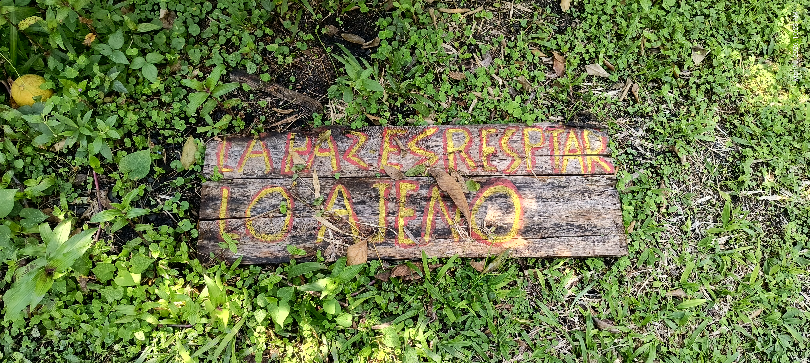

<br><details><summary>:camera:**62/IMG_20260315_105051823.jpg**</summary><sub> `Exif version` 0220 `OS version`  `Date` 2026:03:15 10:50:53 `Aperture` Not known `Brightness` 0.0 `Color space` 1 `Compression` 6`Exposure mode` 0 `Exposure time` 0.000224 `Focal length` 5.56 `Lens model` Not known `Lens specification` Not known `Orientation` 6 `Scene type` Not known `f number` 1.88 `White balance` 0 `Sensing method` 1 `Shutter speed` 12.124</sub><sub>`Coordinates & altitude` (5.248744944444445, -74.29023741666667, 1365.0)</sub><sub> :earth_americas:`Location over` [Google Maps](http://maps.google.com/maps?q=5.248744944444445,-74.29023741666667) or [Openstreet Map](https://www.openstreetmap.org/query?lat=5.248744944444445&lon=-74.29023741666667)</sub></details>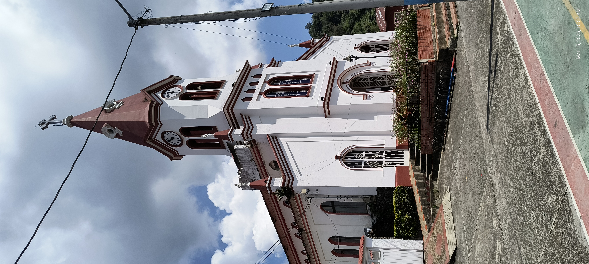

<br><details><summary>:camera:**62/IMG_20260315_105123335_HDR.jpg**</summary><sub> `Exif version` 0220 `OS version`  `Date` 2026:03:15 10:51:25 `Aperture` Not known `Brightness` 0.0 `Color space` 1 `Compression` 6`Exposure mode` 0 `Exposure time` 0.000704 `Focal length` 5.56 `Lens model` Not known `Lens specification` Not known `Orientation` 6 `Scene type` Not known `f number` 1.88 `White balance` 0 `Sensing method` 1 `Shutter speed` 10.472</sub><sub>`Coordinates & altitude` (5.248744944444445, -74.29023741666667, 1365.0)</sub><sub> :earth_americas:`Location over` [Google Maps](http://maps.google.com/maps?q=5.248744944444445,-74.29023741666667) or [Openstreet Map](https://www.openstreetmap.org/query?lat=5.248744944444445&lon=-74.29023741666667)</sub></details>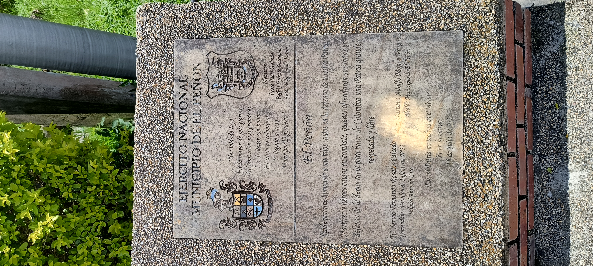

<br><details><summary>:camera:**62/IMG_20260315_105134165.jpg**</summary><sub> `Exif version` 0220 `OS version`  `Date` 2026:03:15 10:51:34 `Aperture` Not known `Brightness` 0.0 `Color space` 1 `Compression` 6`Exposure mode` 0 `Exposure time` 0.000256 `Focal length` 5.56 `Lens model` Not known `Lens specification` Not known `Orientation` 6 `Scene type` Not known `f number` 1.88 `White balance` 0 `Sensing method` 1 `Shutter speed` 11.931</sub><sub>`Coordinates & altitude` (5.248744944444445, -74.29023741666667, 1365.0)</sub><sub> :earth_americas:`Location over` [Google Maps](http://maps.google.com/maps?q=5.248744944444445,-74.29023741666667) or [Openstreet Map](https://www.openstreetmap.org/query?lat=5.248744944444445&lon=-74.29023741666667)</sub></details>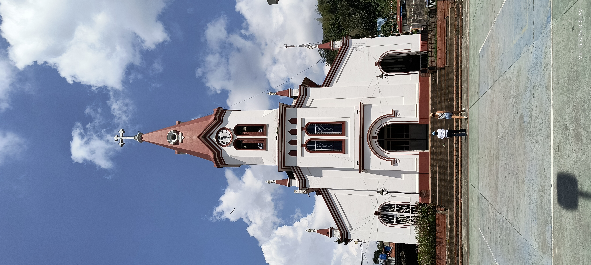

<br><details><summary>:camera:**62/IMG_20260315_105209847.jpg**</summary><sub> `Exif version` 0220 `OS version`  `Date` 2026:03:15 10:52:10 `Aperture` Not known `Brightness` 0.0 `Color space` 1 `Compression` 6`Exposure mode` 0 `Exposure time` 0.000192 `Focal length` 5.56 `Lens model` Not known `Lens specification` Not known `Orientation` 6 `Scene type` Not known `f number` 1.88 `White balance` 0 `Sensing method` 1 `Shutter speed` 12.346</sub><sub>`Coordinates & altitude` (5.248744944444445, -74.29023741666667, 1365.0)</sub><sub> :earth_americas:`Location over` [Google Maps](http://maps.google.com/maps?q=5.248744944444445,-74.29023741666667) or [Openstreet Map](https://www.openstreetmap.org/query?lat=5.248744944444445&lon=-74.29023741666667)</sub></details>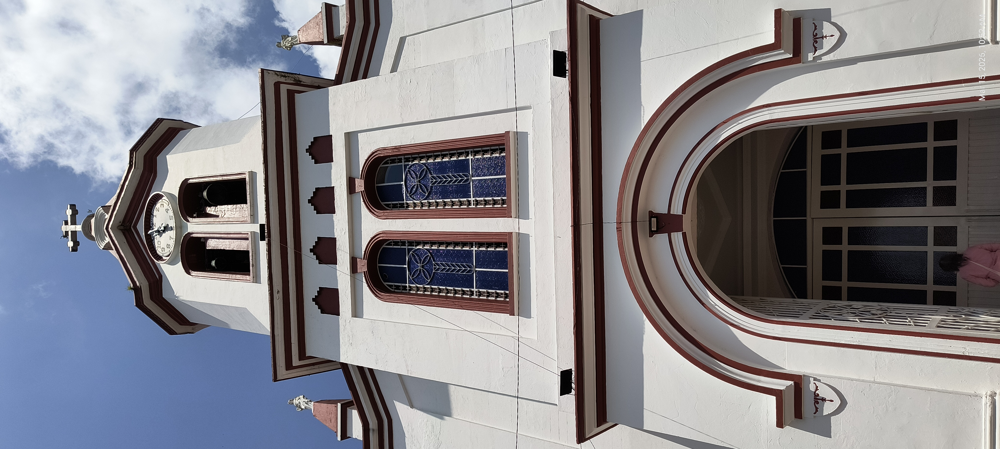

<br><details><summary>:camera:**62/IMG_20260315_105234266.jpg**</summary><sub> `Exif version` 0220 `OS version`  `Date` 2026:03:15 10:52:35 `Aperture` Not known `Brightness` 0.0 `Color space` 1 `Compression` 6`Exposure mode` 0 `Exposure time` 0.005856 `Focal length` 5.56 `Lens model` Not known `Lens specification` Not known `Orientation` 6 `Scene type` Not known `f number` 1.88 `White balance` 0 `Sensing method` 1 `Shutter speed` 7.415</sub><sub>`Coordinates & altitude` (5.248744944444445, -74.29023741666667, 1365.0)</sub><sub> :earth_americas:`Location over` [Google Maps](http://maps.google.com/maps?q=5.248744944444445,-74.29023741666667) or [Openstreet Map](https://www.openstreetmap.org/query?lat=5.248744944444445&lon=-74.29023741666667)</sub></details>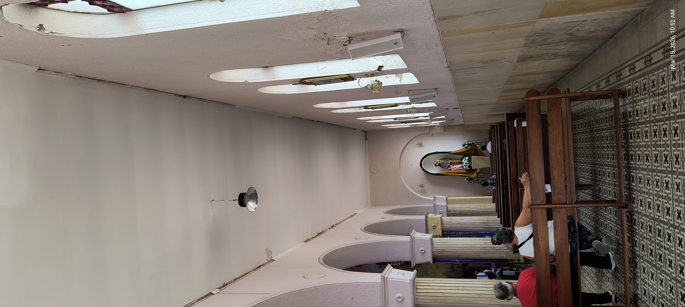

<br><details><summary>:camera:**62/IMG_20260315_105247967.jpg**</summary><sub> `Exif version` 0220 `OS version`  `Date` 2026:03:15 10:52:48 `Aperture` Not known `Brightness` 0.0 `Color space` 1 `Compression` 6`Exposure mode` 0 `Exposure time` 0.00832 `Focal length` 5.56 `Lens model` Not known `Lens specification` Not known `Orientation` 6 `Scene type` Not known `f number` 1.88 `White balance` 0 `Sensing method` 1 `Shutter speed` 6.909</sub><sub>`Coordinates & altitude` (5.248744944444445, -74.29023741666667, 1365.0)</sub><sub> :earth_americas:`Location over` [Google Maps](http://maps.google.com/maps?q=5.248744944444445,-74.29023741666667) or [Openstreet Map](https://www.openstreetmap.org/query?lat=5.248744944444445&lon=-74.29023741666667)</sub></details>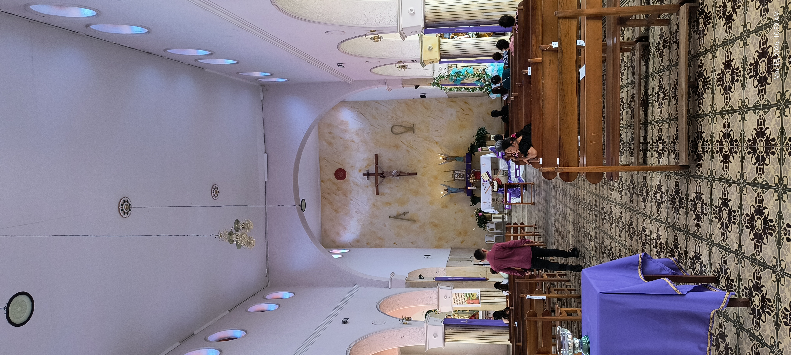

<br><details><summary>:camera:**62/IMG_20260315_105315046.jpg**</summary><sub> `Exif version` 0220 `OS version`  `Date` 2026:03:15 10:53:15 `Aperture` Not known `Brightness` 0.0 `Color space` 1 `Compression` 6`Exposure mode` 0 `Exposure time` 0.00832 `Focal length` 5.56 `Lens model` Not known `Lens specification` Not known `Orientation` 6 `Scene type` Not known `f number` 1.88 `White balance` 0 `Sensing method` 1 `Shutter speed` 6.909</sub><sub>`Coordinates & altitude` (5.248994805555555, -74.29019163888888, 1363.0)</sub><sub> :earth_americas:`Location over` [Google Maps](http://maps.google.com/maps?q=5.248994805555555,-74.29019163888888) or [Openstreet Map](https://www.openstreetmap.org/query?lat=5.248994805555555&lon=-74.29019163888888)</sub></details>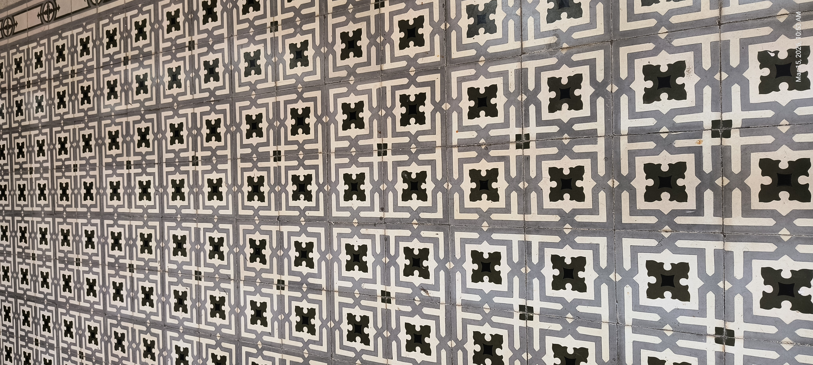

<br><details><summary>:camera:**62/IMG_20260315_105352951_HDR.jpg**</summary><sub> `Exif version` 0220 `OS version`  `Date` 2026:03:15 10:53:55 `Aperture` Not known `Brightness` 0.0 `Color space` 1 `Compression` 6`Exposure mode` 0 `Exposure time` 0.000416 `Focal length` 5.56 `Lens model` Not known `Lens specification` Not known `Orientation` 6 `Scene type` Not known `f number` 1.88 `White balance` 0 `Sensing method` 1 `Shutter speed` 11.231</sub><sub>`Coordinates & altitude` (5.248967166666667, -74.29024505555556, 1364.0)</sub><sub> :earth_americas:`Location over` [Google Maps](http://maps.google.com/maps?q=5.248967166666667,-74.29024505555556) or [Openstreet Map](https://www.openstreetmap.org/query?lat=5.248967166666667&lon=-74.29024505555556)</sub></details>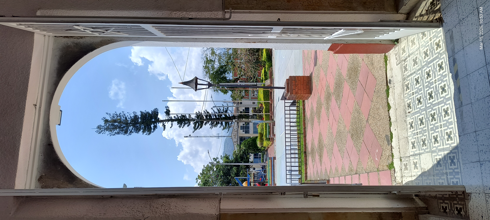

<br><details><summary>:camera:**62/IMG_20260315_105448073.jpg**</summary><sub> `Exif version` 0220 `OS version`  `Date` 2026:03:15 10:54:48 `Aperture` Not known `Brightness` 0.0 `Color space` 1 `Compression` 6`Exposure mode` 0 `Exposure time` 0.008576 `Focal length` 5.56 `Lens model` Not known `Lens specification` Not known `Orientation` 6 `Scene type` Not known `f number` 1.88 `White balance` 0 `Sensing method` 1 `Shutter speed` 6.865</sub><sub>`Coordinates & altitude` (5.249067777777777, -74.29024505555556, 1354.0)</sub><sub> :earth_americas:`Location over` [Google Maps](http://maps.google.com/maps?q=5.249067777777777,-74.29024505555556) or [Openstreet Map](https://www.openstreetmap.org/query?lat=5.249067777777777&lon=-74.29024505555556)</sub></details>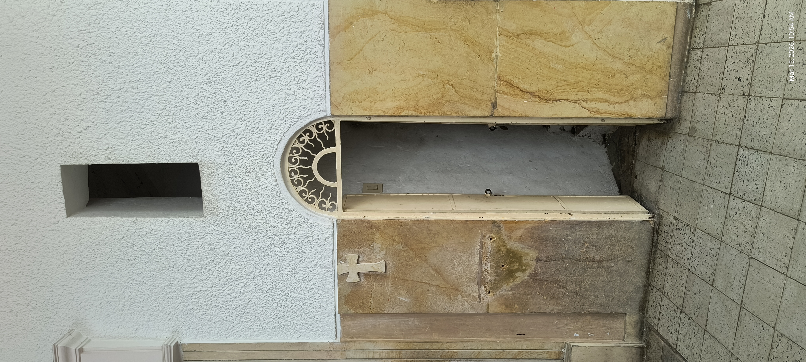

<br><details><summary>:camera:**62/IMG_20260315_105543066.jpg**</summary><sub> `Exif version` 0220 `OS version`  `Date` 2026:03:15 10:55:43 `Aperture` Not known `Brightness` 0.0 `Color space` 1 `Compression` 6`Exposure mode` 0 `Exposure time` 0.0008 `Focal length` 5.56 `Lens model` Not known `Lens specification` Not known `Orientation` 6 `Scene type` Not known `f number` 1.88 `White balance` 0 `Sensing method` 1 `Shutter speed` 10.287</sub><sub>`Coordinates & altitude` (5.248968111111111, -74.29021452777778, 1358.0)</sub><sub> :earth_americas:`Location over` [Google Maps](http://maps.google.com/maps?q=5.248968111111111,-74.29021452777778) or [Openstreet Map](https://www.openstreetmap.org/query?lat=5.248968111111111&lon=-74.29021452777778)</sub></details>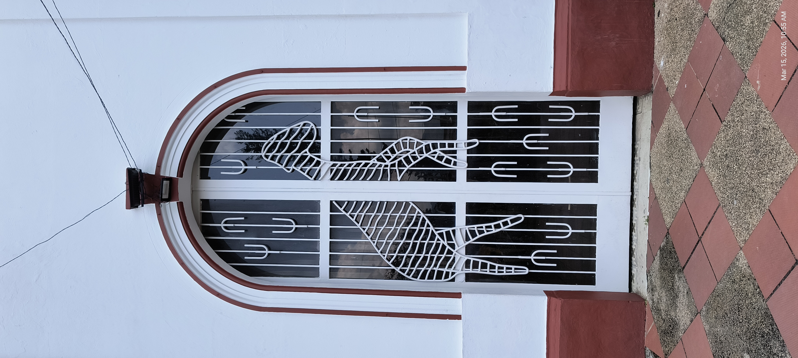

<br><details><summary>:camera:**62/IMG_20260315_105605390_HDR.jpg**</summary><sub> `Exif version` 0220 `OS version`  `Date` 2026:03:15 10:56:06 `Aperture` Not known `Brightness` 0.0 `Color space` 1 `Compression` 6`Exposure mode` 0 `Exposure time` 0.000576 `Focal length` 5.56 `Lens model` Not known `Lens specification` Not known `Orientation` 6 `Scene type` Not known `f number` 1.88 `White balance` 0 `Sensing method` 1 `Shutter speed` 10.761</sub><sub>`Coordinates & altitude` (5.248968111111111, -74.29021452777778, 1358.0)</sub><sub> :earth_americas:`Location over` [Google Maps](http://maps.google.com/maps?q=5.248968111111111,-74.29021452777778) or [Openstreet Map](https://www.openstreetmap.org/query?lat=5.248968111111111&lon=-74.29021452777778)</sub></details>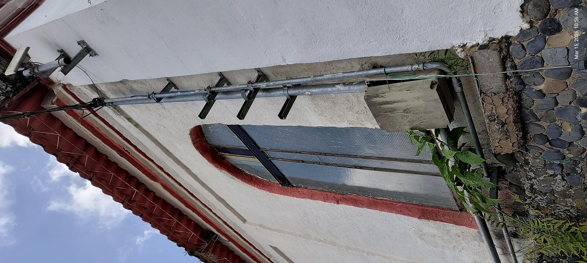

<br><details><summary>:camera:**62/IMG_20260315_105700224_HDR.jpg**</summary><sub> `Exif version` 0220 `OS version`  `Date` 2026:03:15 10:57:01 `Aperture` Not known `Brightness` 0.0 `Color space` 1 `Compression` 6`Exposure mode` 0 `Exposure time` 0.001344 `Focal length` 5.56 `Lens model` Not known `Lens specification` Not known `Orientation` 6 `Scene type` Not known `f number` 1.88 `White balance` 0 `Sensing method` 1 `Shutter speed` 9.539</sub><sub>`Coordinates & altitude` (5.2487668888888885, -74.2899856388889, 1362.0)</sub><sub> :earth_americas:`Location over` [Google Maps](http://maps.google.com/maps?q=5.2487668888888885,-74.2899856388889) or [Openstreet Map](https://www.openstreetmap.org/query?lat=5.2487668888888885&lon=-74.2899856388889)</sub></details>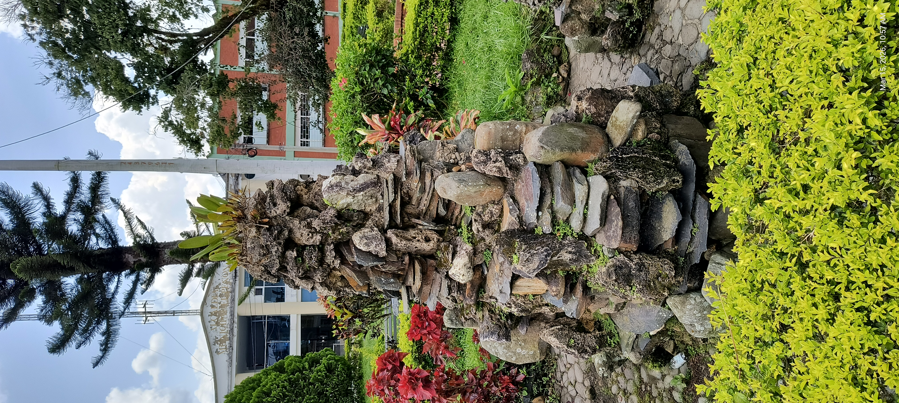

<br><details><summary>:camera:**62/IMG_20260315_113748655.jpg**</summary><sub> `Exif version` 0220 `OS version`  `Date` 2026:03:15 11:37:49 `Aperture` Not known `Brightness` 0.0 `Color space` 1 `Compression` 6`Exposure mode` 0 `Exposure time` 0.000310217 `Focal length` 2.13 `Lens model` Not known `Lens specification` Not known `Orientation` 1 `Scene type` Not known `f number` 2.2 `White balance` 0 `Sensing method` 1 `Shutter speed` 11.654</sub><sub>`Coordinates & altitude` (5.241392111111111, -74.31108855555556, 1030.0)</sub><sub> :earth_americas:`Location over` [Google Maps](http://maps.google.com/maps?q=5.241392111111111,-74.31108855555556) or [Openstreet Map](https://www.openstreetmap.org/query?lat=5.241392111111111&lon=-74.31108855555556)</sub></details>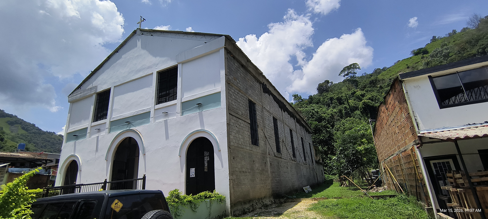

<br><details><summary>:camera:**62/IMG_20260315_113809348.jpg**</summary><sub> `Exif version` 0220 `OS version`  `Date` 2026:03:15 11:38:10 `Aperture` Not known `Brightness` 0.0 `Color space` 1 `Compression` 6`Exposure mode` 0 `Exposure time` 0.00048 `Focal length` 5.56 `Lens model` Not known `Lens specification` Not known `Orientation` 6 `Scene type` Not known `f number` 1.88 `White balance` 0 `Sensing method` 1 `Shutter speed` 11.024</sub><sub>`Coordinates & altitude` (5.2413477777777775, -74.31109616666666, 1030.0)</sub><sub> :earth_americas:`Location over` [Google Maps](http://maps.google.com/maps?q=5.2413477777777775,-74.31109616666666) or [Openstreet Map](https://www.openstreetmap.org/query?lat=5.2413477777777775&lon=-74.31109616666666)</sub></details>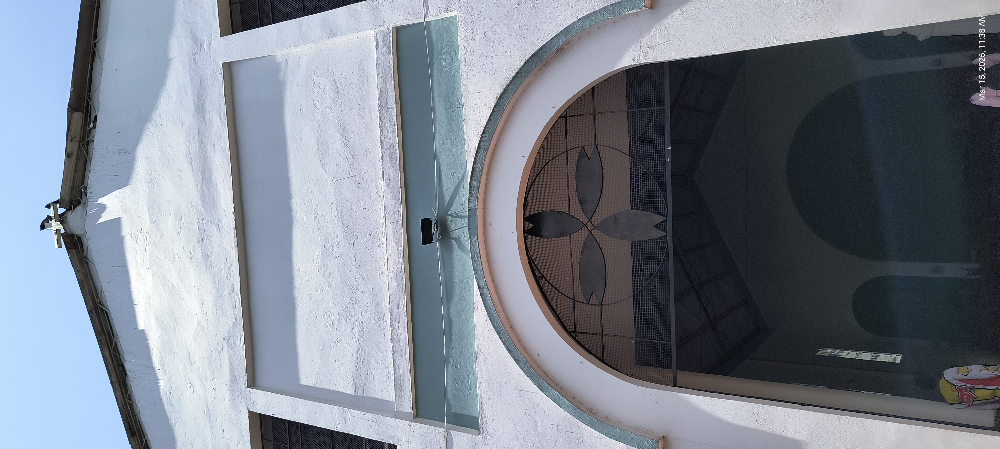

<br><details><summary>:camera:**62/IMG_20260315_113822276.jpg**</summary><sub> `Exif version` 0220 `OS version`  `Date` 2026:03:15 11:38:22 `Aperture` Not known `Brightness` 0.0 `Color space` 1 `Compression` 6`Exposure mode` 0 `Exposure time` 0.00832 `Focal length` 5.56 `Lens model` Not known `Lens specification` Not known `Orientation` 6 `Scene type` Not known `f number` 1.88 `White balance` 0 `Sensing method` 1 `Shutter speed` 6.909</sub><sub>`Coordinates & altitude` (5.2413477777777775, -74.31109616666666, 1030.0)</sub><sub> :earth_americas:`Location over` [Google Maps](http://maps.google.com/maps?q=5.2413477777777775,-74.31109616666666) or [Openstreet Map](https://www.openstreetmap.org/query?lat=5.2413477777777775&lon=-74.31109616666666)</sub></details>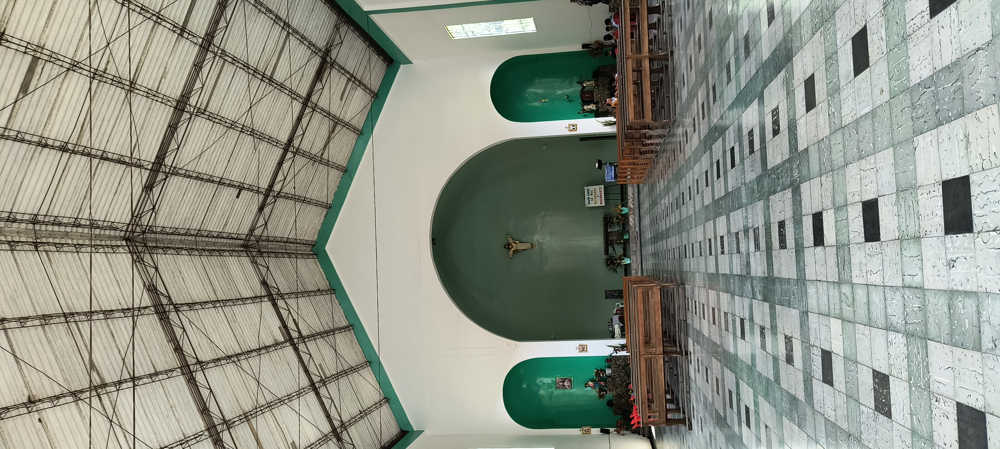

<br><details><summary>:camera:**62/IMG_20260315_113838046_HDR.jpg**</summary><sub> `Exif version` 0220 `OS version`  `Date` 2026:03:15 11:38:39 `Aperture` Not known `Brightness` 0.0 `Color space` 1 `Compression` 6`Exposure mode` 0 `Exposure time` 0.00832 `Focal length` 5.56 `Lens model` Not known `Lens specification` Not known `Orientation` 3 `Scene type` Not known `f number` 1.88 `White balance` 0 `Sensing method` 1 `Shutter speed` 6.909</sub><sub>`Coordinates & altitude` (5.2413477777777775, -74.31109616666666, 1030.0)</sub><sub> :earth_americas:`Location over` [Google Maps](http://maps.google.com/maps?q=5.2413477777777775,-74.31109616666666) or [Openstreet Map](https://www.openstreetmap.org/query?lat=5.2413477777777775&lon=-74.31109616666666)</sub></details>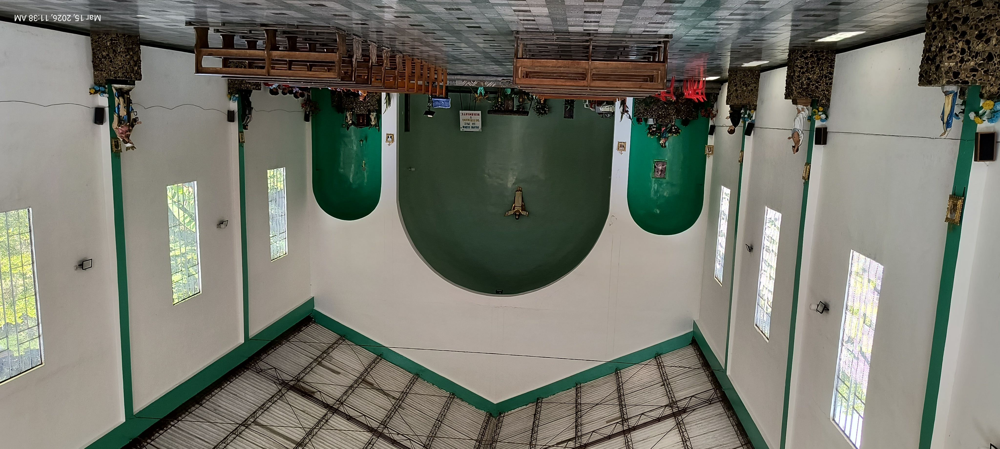

<br><details><summary>:camera:**62/IMG_20260315_114026573.jpg**</summary><sub> `Exif version` 0220 `OS version`  `Date` 2026:03:15 11:40:27 `Aperture` Not known `Brightness` 0.0 `Color space` 1 `Compression` 6`Exposure mode` 0 `Exposure time` 0.000384 `Focal length` 5.56 `Lens model` Not known `Lens specification` Not known `Orientation` 6 `Scene type` Not known `f number` 1.88 `White balance` 0 `Sensing method` 1 `Shutter speed` 11.346</sub><sub>`Coordinates & altitude` (5.2414178611111115, -74.31080625, 1028.0)</sub><sub> :earth_americas:`Location over` [Google Maps](http://maps.google.com/maps?q=5.2414178611111115,-74.31080625) or [Openstreet Map](https://www.openstreetmap.org/query?lat=5.2414178611111115&lon=-74.31080625)</sub></details>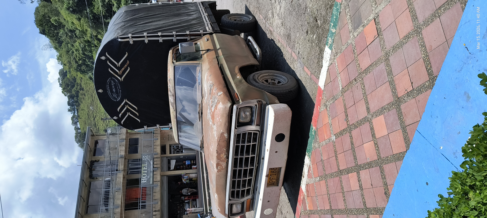

<br><details><summary>:camera:**62/IMG_20260315_114047123.jpg**</summary><sub> `Exif version` 0220 `OS version`  `Date` 2026:03:15 11:40:48 `Aperture` Not known `Brightness` 0.0 `Color space` 1 `Compression` 6`Exposure mode` 0 `Exposure time` 0.000352 `Focal length` 5.56 `Lens model` Not known `Lens specification` Not known `Orientation` 3 `Scene type` Not known `f number` 1.88 `White balance` 0 `Sensing method` 1 `Shutter speed` 11.472</sub><sub>`Coordinates & altitude` (5.2414178611111115, -74.31080625, 1028.0)</sub><sub> :earth_americas:`Location over` [Google Maps](http://maps.google.com/maps?q=5.2414178611111115,-74.31080625) or [Openstreet Map](https://www.openstreetmap.org/query?lat=5.2414178611111115&lon=-74.31080625)</sub></details>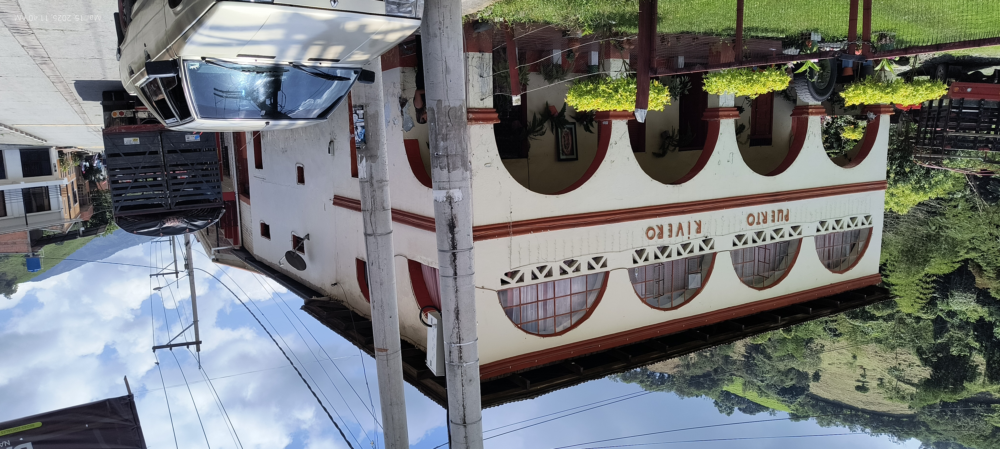

<br><details><summary>:camera:**62/IMG_20260315_114109102_HDR.jpg**</summary><sub> `Exif version` 0220 `OS version`  `Date` 2026:03:15 11:41:10 `Aperture` Not known `Brightness` 0.0 `Color space` 1 `Compression` 6`Exposure mode` 0 `Exposure time` 0.000576 `Focal length` 5.56 `Lens model` Not known `Lens specification` Not known `Orientation` 6 `Scene type` Not known `f number` 1.88 `White balance` 0 `Sensing method` 1 `Shutter speed` 10.761</sub><sub>`Coordinates & altitude` (5.2414178611111115, -74.31080625, 1028.0)</sub><sub> :earth_americas:`Location over` [Google Maps](http://maps.google.com/maps?q=5.2414178611111115,-74.31080625) or [Openstreet Map](https://www.openstreetmap.org/query?lat=5.2414178611111115&lon=-74.31080625)</sub></details>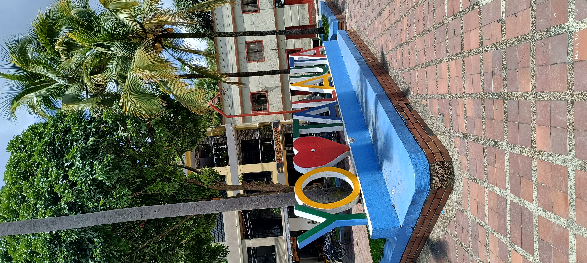

<br><details><summary>:camera:**62/IMG_20260315_140052160_HDR.jpg**</summary><sub> `Exif version` 0220 `OS version`  `Date` 2026:03:15 14:00:53 `Aperture` Not known `Brightness` 0.0 `Color space` 1 `Compression` 6`Exposure mode` 0 `Exposure time` 0.00832 `Focal length` 5.56 `Lens model` Not known `Lens specification` Not known `Orientation` 6 `Scene type` Not known `f number` 1.88 `White balance` 0 `Sensing method` 1 `Shutter speed` 6.909</sub><sub>`Coordinates & altitude` (5.2400197777777775, -74.29423522222223, 1017.0)</sub><sub> :earth_americas:`Location over` [Google Maps](http://maps.google.com/maps?q=5.2400197777777775,-74.29423522222223) or [Openstreet Map](https://www.openstreetmap.org/query?lat=5.2400197777777775&lon=-74.29423522222223)</sub></details>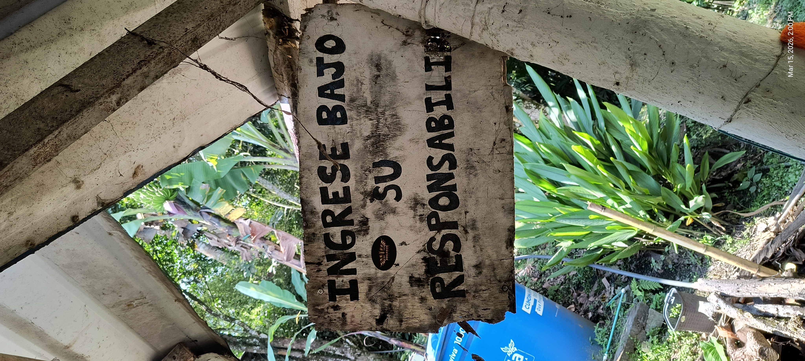

<br><details><summary>:camera:**62/IMG_20260501_083522902.jpg**</summary><sub> `Exif version` 0220 `OS version`  `Date` 2026:05:01 08:35:23 `Aperture` Not known `Brightness` 0.0 `Color space` 1 `Compression` 6`Exposure mode` 0 `Exposure time` 0.000576 `Focal length` 5.56 `Lens model` Not known `Lens specification` Not known `Orientation` 6 `Scene type` Not known `f number` 1.88 `White balance` 0 `Sensing method` 1 `Shutter speed` 10.761</sub></details>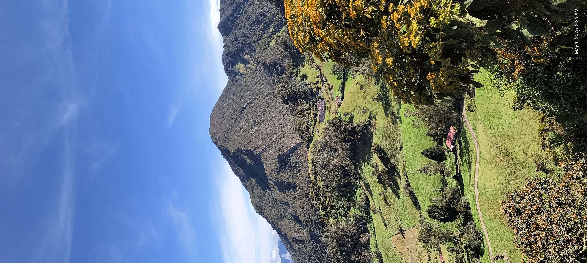

<br><details><summary>:camera:**62/IMG_20260501_083530009.jpg**</summary><sub> `Exif version` 0220 `OS version`  `Date` 2026:05:01 08:35:30 `Aperture` Not known `Brightness` 0.0 `Color space` 1 `Compression` 6`Exposure mode` 0 `Exposure time` 0.000510357 `Focal length` 2.13 `Lens model` Not known `Lens specification` Not known `Orientation` 1 `Scene type` Not known `f number` 2.2 `White balance` 0 `Sensing method` 1 `Shutter speed` 10.936</sub></details>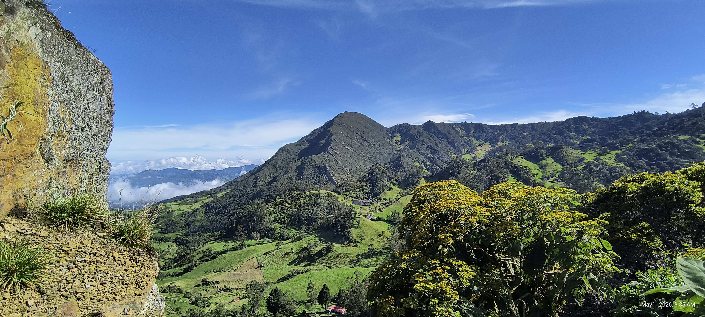

<br><details><summary>:camera:**62/IMG_20260501_083532473.jpg**</summary><sub> `Exif version` 0220 `OS version`  `Date` 2026:05:01 08:35:33 `Aperture` Not known `Brightness` 0.0 `Color space` 1 `Compression` 6`Exposure mode` 0 `Exposure time` 0.000480336 `Focal length` 2.13 `Lens model` Not known `Lens specification` Not known `Orientation` 1 `Scene type` Not known `f number` 2.2 `White balance` 0 `Sensing method` 1 `Shutter speed` 11.023</sub></details>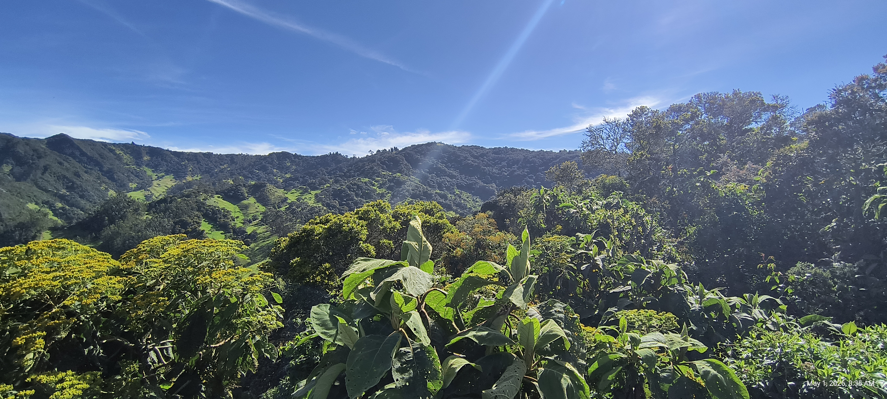

<br><details><summary>:camera:**62/IMG_20260501_083542928.jpg**</summary><sub> `Exif version` 0220 `OS version`  `Date` 2026:05:01 08:35:43 `Aperture` Not known `Brightness` 0.0 `Color space` 1 `Compression` 6`Exposure mode` 0 `Exposure time` 0.000460322 `Focal length` 2.13 `Lens model` Not known `Lens specification` Not known `Orientation` 1 `Scene type` Not known `f number` 2.2 `White balance` 0 `Sensing method` 1 `Shutter speed` 11.085</sub></details>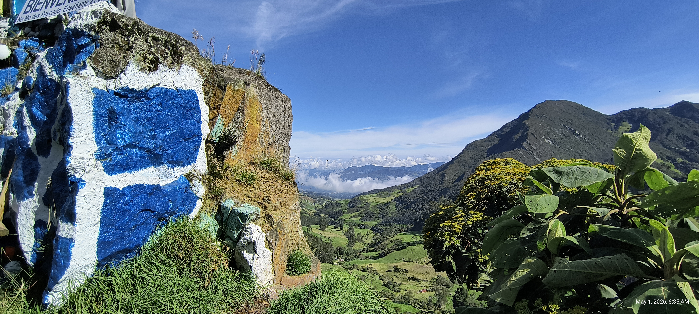

<br><details><summary>:camera:**62/IMG_20260501_083618113_HDR.jpg**</summary><sub> `Exif version` 0220 `OS version`  `Date` 2026:05:01 08:36:19 `Aperture` Not known `Brightness` 0.0 `Color space` 1 `Compression` 6`Exposure mode` 0 `Exposure time` 0.000610427 `Focal length` 2.13 `Lens model` Not known `Lens specification` Not known `Orientation` 1 `Scene type` Not known `f number` 2.2 `White balance` 0 `Sensing method` 1 `Shutter speed` 10.677</sub></details>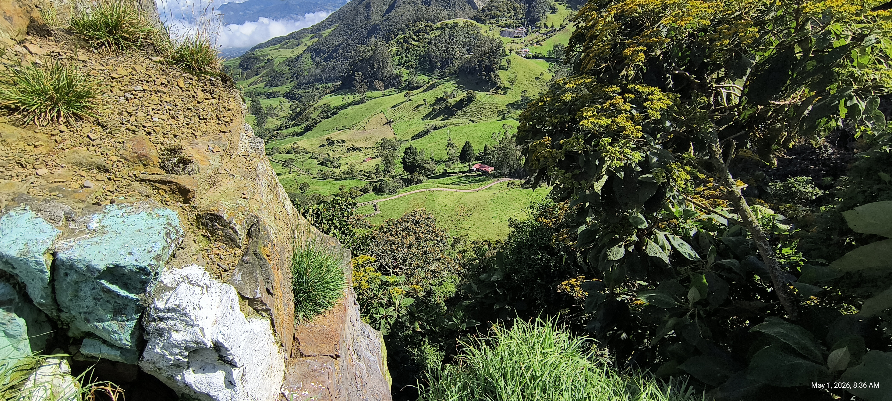

<br><details><summary>:camera:**62/IMG_20260501_083703749.jpg**</summary><sub> `Exif version` 0220 `OS version`  `Date` 2026:05:01 08:37:04 `Aperture` Not known `Brightness` 0.0 `Color space` 1 `Compression` 6`Exposure mode` 0 `Exposure time` 0.00050035 `Focal length` 2.13 `Lens model` Not known `Lens specification` Not known `Orientation` 1 `Scene type` Not known `f number` 2.2 `White balance` 0 `Sensing method` 1 `Shutter speed` 10.964</sub></details>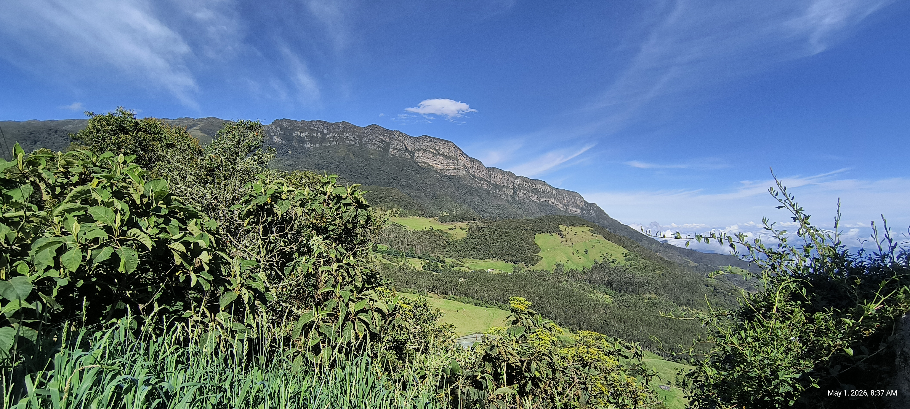

<br><details><summary>:camera:**62/IMG_20260501_083710104.jpg**</summary><sub> `Exif version` 0220 `OS version`  `Date` 2026:05:01 08:37:10 `Aperture` Not known `Brightness` 0.0 `Color space` 1 `Compression` 6`Exposure mode` 0 `Exposure time` 0.00050035 `Focal length` 2.13 `Lens model` Not known `Lens specification` Not known `Orientation` 1 `Scene type` Not known `f number` 2.2 `White balance` 0 `Sensing method` 1 `Shutter speed` 10.964</sub></details>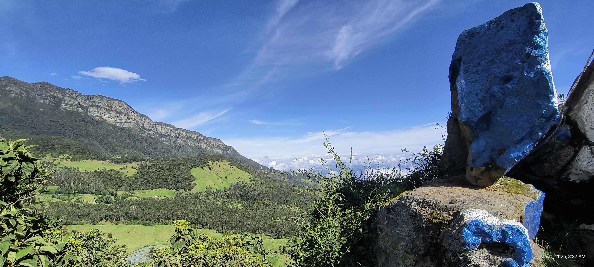

<br><details><summary>:camera:**62/IMG_20260501_091434394.jpg**</summary><sub> `Exif version` 0220 `OS version`  `Date` 2026:05:01 09:14:35 `Aperture` Not known `Brightness` 0.0 `Color space` 1 `Compression` 6`Exposure mode` 0 `Exposure time` 0.000896 `Focal length` 5.56 `Lens model` Not known `Lens specification` Not known `Orientation` 6 `Scene type` Not known `f number` 1.88 `White balance` 0 `Sensing method` 1 `Shutter speed` 10.124</sub></details>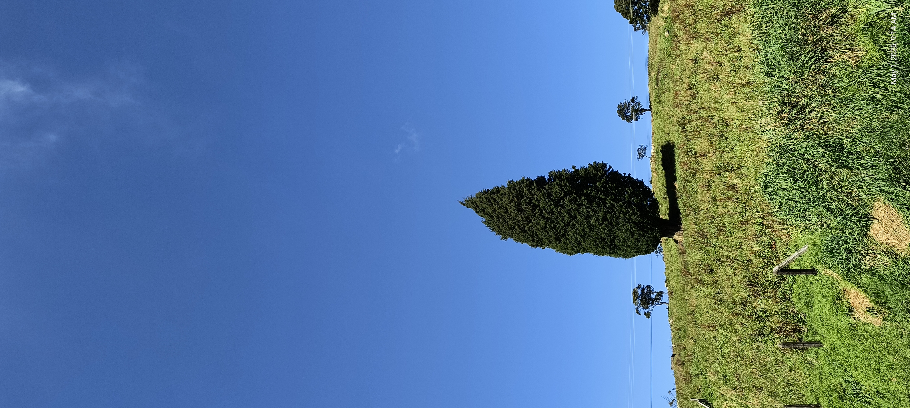

<sub>_Citation: Partial or total digital reproduction of this repository, scripts, development guides, data models, images, and documentation is permitted, provided that it is referenced as: "R.GISMobile - Mobile geographic information systems on QField that do not require an internet connection for navigation." https://github.com/rcfdtools/R.GISMobile - Bogotá - Colombia - South America"._<sub>

| [:house: Home](../Readme.md) |
|---|