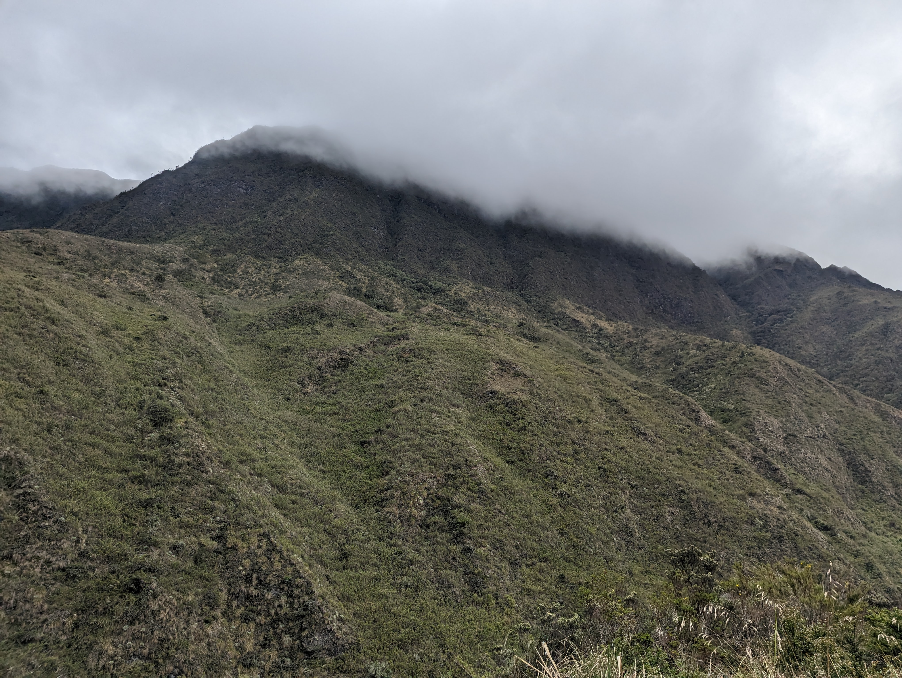
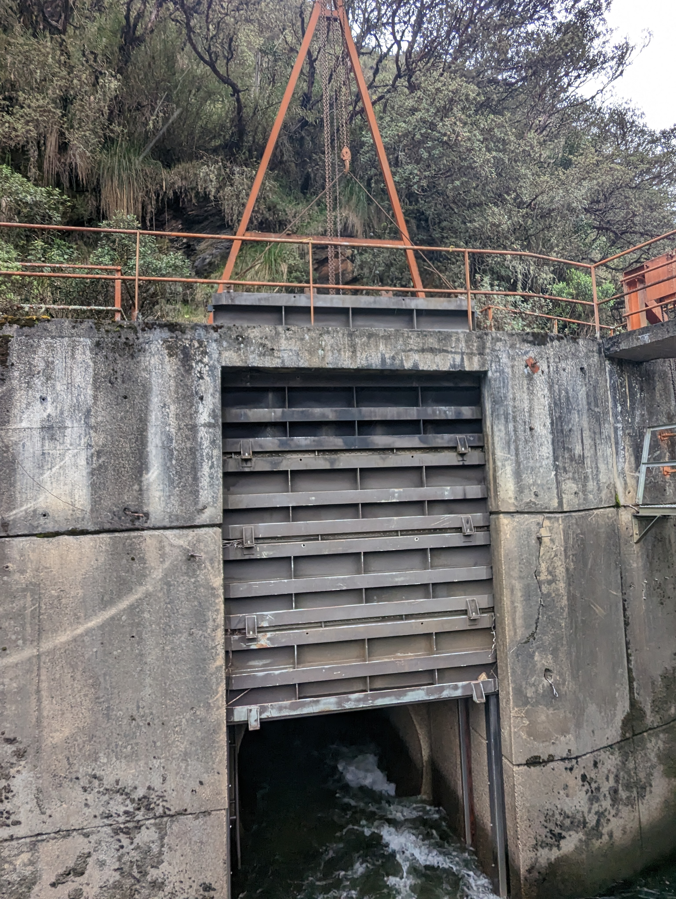
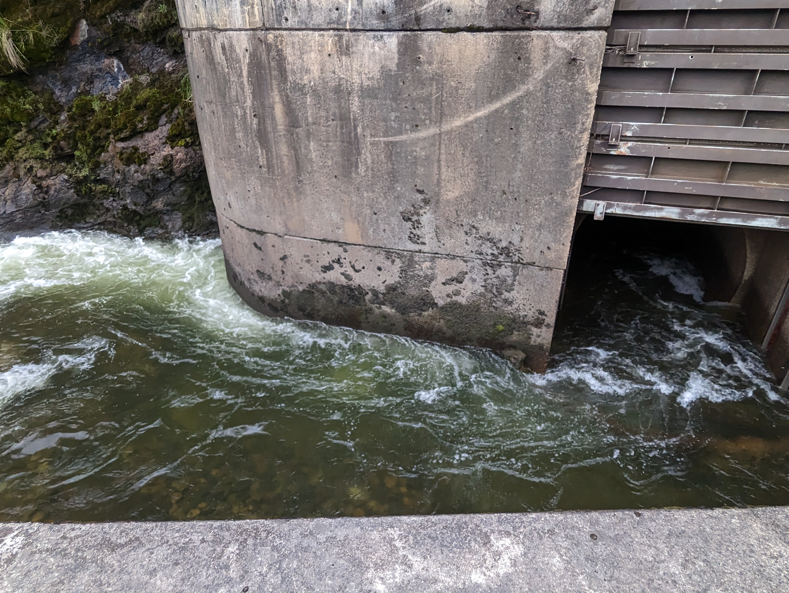
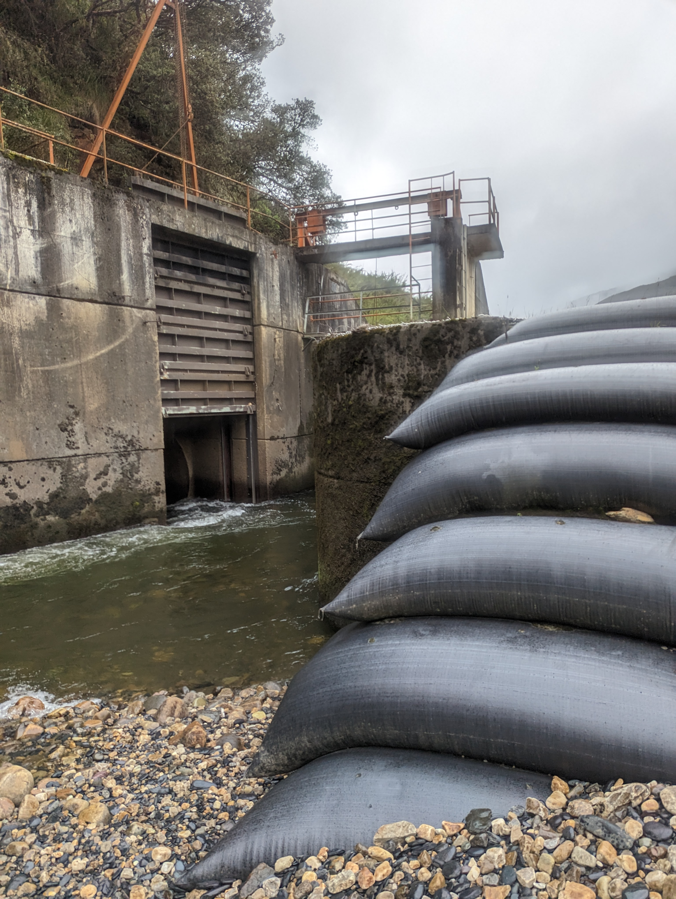
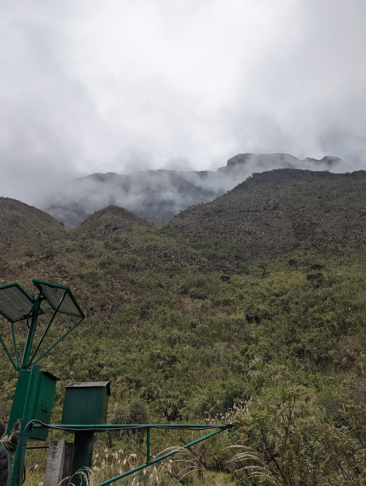

## Tunel derivador Río Guatiquía a Embalse Chuza (2023-05-03)
Fotos por: rcfdtools<br>Categoría: Technical field visit

```geojson
{
  "type": "Feature",
  "geometry": {
    "type": "Point", 
    "coordinates": [-73.72825833333333, 4.537927777777778]
  }, 
  "properties": {
    "Name": "Tunel derivador Río Guatiquía a Embalse Chuza"
  }
}
```

:camera: **7/PXL_20230503_184309223.MP.jpg** <sub> `Exif version` 0232 `OS version` HDR+ 1.0.520435816zd `Date` 2023:05:03 13:43:09 `Aperture` Not known `Brightness` 7.92 `Color space` 1 `Compression` 6`Exposure mode` 0 `Exposure time` 0.001767 `Focal length` 6.81 `Lens model` Pixel 6 back camera 6.81mm f/1.85 `Lens specification` Not known `Orientation` 1 `Scene type` Not known `f number` 1.85 `White balance` 0</sub><sub>`Coordinates & altitude` (4.532883333333333, -73.74623055555556, 3127.2)</sub><sub>:earth_americas: `Location over` [Google Maps](http://maps.google.com/maps?q=4.532883333333333,-73.74623055555556) or [Openstreet Map](https://www.openstreetmap.org/query?lat=4.532883333333333&lon=-73.74623055555556)</sub>


:camera: **7/PXL_20230503_184325201.jpg** <sub> `Exif version` 0232 `OS version` HDR+ 1.0.520435816zd `Date` 2023:05:03 13:43:25 `Aperture` Not known `Brightness` 4.9 `Color space` 1 `Compression` 6`Exposure mode` 0 `Exposure time` 0.004117 `Focal length` 6.81 `Lens model` Pixel 6 back camera 6.81mm f/1.85 `Lens specification` Not known `Orientation` 1 `Scene type` Not known `f number` 1.85 `White balance` 0</sub><sub>`Coordinates & altitude` (4.532883333333333, -73.74623055555556, 3127.2)</sub><sub>:earth_americas: `Location over` [Google Maps](http://maps.google.com/maps?q=4.532883333333333,-73.74623055555556) or [Openstreet Map](https://www.openstreetmap.org/query?lat=4.532883333333333&lon=-73.74623055555556)</sub>


:camera: **7/PXL_20230503_184338132.jpg** <sub> `Exif version` 0232 `OS version` HDR+ 1.0.520435816zd `Date` 2023:05:03 13:43:38 `Aperture` Not known `Brightness` 4.96 `Color space` 1 `Compression` 6`Exposure mode` 0 `Exposure time` 0.005733 `Focal length` 6.81 `Lens model` Pixel 6 back camera 6.81mm f/1.85 `Lens specification` Not known `Orientation` 1 `Scene type` Not known `f number` 1.85 `White balance` 0</sub><sub>`Coordinates & altitude` (4.532883333333333, -73.74623055555556, 3127.2)</sub><sub>:earth_americas: `Location over` [Google Maps](http://maps.google.com/maps?q=4.532883333333333,-73.74623055555556) or [Openstreet Map](https://www.openstreetmap.org/query?lat=4.532883333333333&lon=-73.74623055555556)</sub>


:camera: **7/PXL_20230503_184357380.jpg** <sub> `Exif version` 0232 `OS version` HDR+ 1.0.520435816zd `Date` 2023:05:03 13:43:57 `Aperture` Not known `Brightness` 8.14 `Color space` 1 `Compression` 6`Exposure mode` 0 `Exposure time` 0.001148 `Focal length` 6.81 `Lens model` Pixel 6 back camera 6.81mm f/1.85 `Lens specification` Not known `Orientation` 1 `Scene type` Not known `f number` 1.85 `White balance` 0</sub><sub>`Coordinates & altitude` (4.532883333333333, -73.74623055555556, 3127.2)</sub><sub>:earth_americas: `Location over` [Google Maps](http://maps.google.com/maps?q=4.532883333333333,-73.74623055555556) or [Openstreet Map](https://www.openstreetmap.org/query?lat=4.532883333333333&lon=-73.74623055555556)</sub>


:camera: **7/PXL_20230503_184402697.jpg** <sub> `Exif version` 0232 `OS version` HDR+ 1.0.520435816zd `Date` 2023:05:03 13:44:02 `Aperture` Not known `Brightness` 9.03 `Color space` 1 `Compression` 6`Exposure mode` 0 `Exposure time` 0.000486 `Focal length` 6.81 `Lens model` Pixel 6 back camera 6.81mm f/1.85 `Lens specification` Not known `Orientation` 1 `Scene type` Not known `f number` 1.85 `White balance` 0</sub><sub>`Coordinates & altitude` (4.532883333333333, -73.74623055555556, 3127.2)</sub><sub>:earth_americas: `Location over` [Google Maps](http://maps.google.com/maps?q=4.532883333333333,-73.74623055555556) or [Openstreet Map](https://www.openstreetmap.org/query?lat=4.532883333333333&lon=-73.74623055555556)</sub>


:camera: **7/PXL_20230503_185629860.jpg** <sub> `Exif version` 0232 `OS version` HDR+ 1.0.520435816zd `Date` 2023:05:03 13:56:29 `Aperture` Not known `Brightness` 5.16 `Color space` 1 `Compression` 6`Exposure mode` 0 `Exposure time` 0.007694 `Focal length` 6.81 `Lens model` Pixel 6 back camera 6.81mm f/1.85 `Lens specification` Not known `Orientation` 1 `Scene type` Not known `f number` 1.85 `White balance` 0</sub><sub>`Coordinates & altitude` (4.536822222222222, -73.72716944444444, 3082.67)</sub><sub>:earth_americas: `Location over` [Google Maps](http://maps.google.com/maps?q=4.536822222222222,-73.72716944444444) or [Openstreet Map](https://www.openstreetmap.org/query?lat=4.536822222222222&lon=-73.72716944444444)</sub>


:camera: **7/PXL_20230503_185652342.jpg** <sub> `Exif version` 0232 `OS version` HDR+ 1.0.520435816zd `Date` 2023:05:03 13:56:52 `Aperture` Not known `Brightness` 6.67 `Color space` 1 `Compression` 6`Exposure mode` 0 `Exposure time` 0.002694 `Focal length` 6.81 `Lens model` Pixel 6 back camera 6.81mm f/1.85 `Lens specification` Not known `Orientation` 1 `Scene type` Not known `f number` 1.85 `White balance` 0</sub><sub>`Coordinates & altitude` (4.536961111111111, -73.72752777777778, 3082.67)</sub><sub>:earth_americas: `Location over` [Google Maps](http://maps.google.com/maps?q=4.536961111111111,-73.72752777777778) or [Openstreet Map](https://www.openstreetmap.org/query?lat=4.536961111111111&lon=-73.72752777777778)</sub>


:camera: **7/PXL_20230503_185701012.jpg** <sub> `Exif version` 0232 `OS version` HDR+ 1.0.520435816zd `Date` 2023:05:03 13:57:01 `Aperture` Not known `Brightness` 5.84 `Color space` 1 `Compression` 6`Exposure mode` 0 `Exposure time` 0.004143 `Focal length` 6.81 `Lens model` Pixel 6 back camera 6.81mm f/1.85 `Lens specification` Not known `Orientation` 1 `Scene type` Not known `f number` 1.85 `White balance` 0</sub><sub>`Coordinates & altitude` (4.536961111111111, -73.72752777777778, 3082.67)</sub><sub>:earth_americas: `Location over` [Google Maps](http://maps.google.com/maps?q=4.536961111111111,-73.72752777777778) or [Openstreet Map](https://www.openstreetmap.org/query?lat=4.536961111111111&lon=-73.72752777777778)</sub>


:camera: **7/PXL_20230503_185704921.jpg** <sub> `Exif version` 0232 `OS version` HDR+ 1.0.520435816zd `Date` 2023:05:03 13:57:04 `Aperture` Not known `Brightness` 5.31 `Color space` 1 `Compression` 6`Exposure mode` 0 `Exposure time` 0.00561 `Focal length` 6.81 `Lens model` Pixel 6 back camera 6.81mm f/1.85 `Lens specification` Not known `Orientation` 1 `Scene type` Not known `f number` 1.85 `White balance` 0</sub><sub>`Coordinates & altitude` (4.536961111111111, -73.72752777777778, 3082.67)</sub><sub>:earth_americas: `Location over` [Google Maps](http://maps.google.com/maps?q=4.536961111111111,-73.72752777777778) or [Openstreet Map](https://www.openstreetmap.org/query?lat=4.536961111111111&lon=-73.72752777777778)</sub>


:camera: **7/PXL_20230503_185847285.jpg** <sub> `Exif version` 0232 `OS version` HDR+ 1.0.520435816zd `Date` 2023:05:03 13:58:47 `Aperture` Not known `Brightness` 4.71 `Color space` 1 `Compression` 6`Exposure mode` 0 `Exposure time` 0.00379 `Focal length` 6.81 `Lens model` Pixel 6 back camera 6.81mm f/1.85 `Lens specification` Not known `Orientation` 1 `Scene type` Not known `f number` 1.85 `White balance` 0</sub><sub>`Coordinates & altitude` (4.536961111111111, -73.72752777777778, 3082.67)</sub><sub>:earth_americas: `Location over` [Google Maps](http://maps.google.com/maps?q=4.536961111111111,-73.72752777777778) or [Openstreet Map](https://www.openstreetmap.org/query?lat=4.536961111111111&lon=-73.72752777777778)</sub>


:camera: **7/PXL_20230503_185849518.jpg** <sub> `Exif version` 0232 `OS version` HDR+ 1.0.520435816zd `Date` 2023:05:03 13:58:49 `Aperture` Not known `Brightness` 4.73 `Color space` 1 `Compression` 6`Exposure mode` 0 `Exposure time` 0.002571 `Focal length` 6.81 `Lens model` Pixel 6 back camera 6.81mm f/1.85 `Lens specification` Not known `Orientation` 1 `Scene type` Not known `f number` 1.85 `White balance` 0</sub><sub>`Coordinates & altitude` (4.536961111111111, -73.72752777777778, 3082.67)</sub><sub>:earth_americas: `Location over` [Google Maps](http://maps.google.com/maps?q=4.536961111111111,-73.72752777777778) or [Openstreet Map](https://www.openstreetmap.org/query?lat=4.536961111111111&lon=-73.72752777777778)</sub>


:camera: **7/PXL_20230503_190024766.jpg** <sub> `Exif version` 0232 `OS version` HDR+ 1.0.520435816zd `Date` 2023:05:03 14:00:24 `Aperture` Not known `Brightness` 5.34 `Color space` 1 `Compression` 6`Exposure mode` 0 `Exposure time` 0.004638 `Focal length` 6.81 `Lens model` Pixel 6 back camera 6.81mm f/1.85 `Lens specification` Not known `Orientation` 1 `Scene type` Not known `f number` 1.85 `White balance` 0</sub><sub>`Coordinates & altitude` (4.537927777777778, -73.72825833333333, 3074.0)</sub><sub>:earth_americas: `Location over` [Google Maps](http://maps.google.com/maps?q=4.537927777777778,-73.72825833333333) or [Openstreet Map](https://www.openstreetmap.org/query?lat=4.537927777777778&lon=-73.72825833333333)</sub>


:camera: **7/PXL_20230503_190026647.jpg** <sub> `Exif version` 0232 `OS version` HDR+ 1.0.520435816zd `Date` 2023:05:03 14:00:26 `Aperture` Not known `Brightness` 5.29 `Color space` 1 `Compression` 6`Exposure mode` 0 `Exposure time` 0.00462 `Focal length` 6.81 `Lens model` Pixel 6 back camera 6.81mm f/1.85 `Lens specification` Not known `Orientation` 1 `Scene type` Not known `f number` 1.85 `White balance` 0</sub><sub>`Coordinates & altitude` (4.537927777777778, -73.72825833333333, 3074.0)</sub><sub>:earth_americas: `Location over` [Google Maps](http://maps.google.com/maps?q=4.537927777777778,-73.72825833333333) or [Openstreet Map](https://www.openstreetmap.org/query?lat=4.537927777777778&lon=-73.72825833333333)</sub>


:camera: **7/PXL_20230503_190031280.jpg** <sub> `Exif version` 0232 `OS version` HDR+ 1.0.520435816zd `Date` 2023:05:03 14:00:31 `Aperture` Not known `Brightness` 2.78 `Color space` 1 `Compression` 6`Exposure mode` 0 `Exposure time` 0.003445 `Focal length` 6.81 `Lens model` Pixel 6 back camera 6.81mm f/1.85 `Lens specification` Not known `Orientation` 1 `Scene type` Not known `f number` 1.85 `White balance` 0</sub><sub>`Coordinates & altitude` (4.537927777777778, -73.72825833333333, 3074.0)</sub><sub>:earth_americas: `Location over` [Google Maps](http://maps.google.com/maps?q=4.537927777777778,-73.72825833333333) or [Openstreet Map](https://www.openstreetmap.org/query?lat=4.537927777777778&lon=-73.72825833333333)</sub>


:camera: **7/PXL_20230503_190041399.jpg** <sub> `Exif version` 0232 `OS version` HDR+ 1.0.520435816zd `Date` 2023:05:03 14:00:41 `Aperture` Not known `Brightness` 2.91 `Color space` 1 `Compression` 6`Exposure mode` 0 `Exposure time` 0.005415 `Focal length` 6.81 `Lens model` Pixel 6 back camera 6.81mm f/1.85 `Lens specification` Not known `Orientation` 1 `Scene type` Not known `f number` 1.85 `White balance` 0</sub><sub>`Coordinates & altitude` (4.537927777777778, -73.72825833333333, 3074.0)</sub><sub>:earth_americas: `Location over` [Google Maps](http://maps.google.com/maps?q=4.537927777777778,-73.72825833333333) or [Openstreet Map](https://www.openstreetmap.org/query?lat=4.537927777777778&lon=-73.72825833333333)</sub>


:camera: **7/PXL_20230503_190046534.jpg** <sub> `Exif version` 0232 `OS version` HDR+ 1.0.520435816zd `Date` 2023:05:03 14:00:46 `Aperture` Not known `Brightness` 5.1 `Color space` 1 `Compression` 6`Exposure mode` 0 `Exposure time` 0.004899 `Focal length` 2.35 `Lens model` Pixel 6 back camera 2.35mm f/2.2 `Lens specification` Not known `Orientation` 1 `Scene type` Not known `f number` 2.2 `White balance` 0</sub><sub>`Coordinates & altitude` (4.537927777777778, -73.72825833333333, 3074.0)</sub><sub>:earth_americas: `Location over` [Google Maps](http://maps.google.com/maps?q=4.537927777777778,-73.72825833333333) or [Openstreet Map](https://www.openstreetmap.org/query?lat=4.537927777777778&lon=-73.72825833333333)</sub>


:camera: **7/PXL_20230503_190049713.jpg** <sub> `Exif version` 0232 `OS version` HDR+ 1.0.520435816zd `Date` 2023:05:03 14:00:49 `Aperture` Not known `Brightness` 3.75 `Color space` 1 `Compression` 6`Exposure mode` 0 `Exposure time` 0.003491 `Focal length` 2.35 `Lens model` Pixel 6 back camera 2.35mm f/2.2 `Lens specification` Not known `Orientation` 1 `Scene type` Not known `f number` 2.2 `White balance` 0</sub><sub>`Coordinates & altitude` (4.537927777777778, -73.72825833333333, 3074.0)</sub><sub>:earth_americas: `Location over` [Google Maps](http://maps.google.com/maps?q=4.537927777777778,-73.72825833333333) or [Openstreet Map](https://www.openstreetmap.org/query?lat=4.537927777777778&lon=-73.72825833333333)</sub>


:camera: **7/PXL_20230503_190052111.jpg** <sub> `Exif version` 0232 `OS version` HDR+ 1.0.520435816zd `Date` 2023:05:03 14:00:52 `Aperture` Not known `Brightness` 6.41 `Color space` 1 `Compression` 6`Exposure mode` 0 `Exposure time` 0.003704 `Focal length` 2.35 `Lens model` Pixel 6 back camera 2.35mm f/2.2 `Lens specification` Not known `Orientation` 1 `Scene type` Not known `f number` 2.2 `White balance` 0</sub><sub>`Coordinates & altitude` (4.537927777777778, -73.72825833333333, 3074.0)</sub><sub>:earth_americas: `Location over` [Google Maps](http://maps.google.com/maps?q=4.537927777777778,-73.72825833333333) or [Openstreet Map](https://www.openstreetmap.org/query?lat=4.537927777777778&lon=-73.72825833333333)</sub>


:camera: **7/PXL_20230503_190409373.jpg** <sub> `Exif version` 0232 `OS version` HDR+ 1.0.520435816zd `Date` 2023:05:03 14:04:09 `Aperture` Not known `Brightness` 6.1 `Color space` 1 `Compression` 6`Exposure mode` 0 `Exposure time` 0.00409 `Focal length` 6.81 `Lens model` Pixel 6 back camera 6.81mm f/1.85 `Lens specification` Not known `Orientation` 1 `Scene type` Not known `f number` 1.85 `White balance` 0</sub><sub>`Coordinates & altitude` (4.537886111111111, -73.72831111111111, 3076.09)</sub><sub>:earth_americas: `Location over` [Google Maps](http://maps.google.com/maps?q=4.537886111111111,-73.72831111111111) or [Openstreet Map](https://www.openstreetmap.org/query?lat=4.537886111111111&lon=-73.72831111111111)</sub>


:camera: **7/PXL_20230503_190416001.jpg** <sub> `Exif version` 0232 `OS version` HDR+ 1.0.520435816zd `Date` 2023:05:03 14:04:16 `Aperture` Not known `Brightness` 6.1 `Color space` 1 `Compression` 6`Exposure mode` 0 `Exposure time` 0.004717 `Focal length` 6.81 `Lens model` Pixel 6 back camera 6.81mm f/1.85 `Lens specification` Not known `Orientation` 1 `Scene type` Not known `f number` 1.85 `White balance` 0</sub><sub>`Coordinates & altitude` (4.538080555555555, -73.72840277777777, 3071.96)</sub><sub>:earth_americas: `Location over` [Google Maps](http://maps.google.com/maps?q=4.538080555555555,-73.72840277777777) or [Openstreet Map](https://www.openstreetmap.org/query?lat=4.538080555555555&lon=-73.72840277777777)</sub>


:camera: **7/PXL_20230503_190425338.jpg** <sub> `Exif version` 0232 `OS version` HDR+ 1.0.520435816zd `Date` 2023:05:03 14:04:25 `Aperture` Not known `Brightness` 5.6 `Color space` 1 `Compression` 6`Exposure mode` 0 `Exposure time` 0.006882 `Focal length` 6.81 `Lens model` Pixel 6 back camera 6.81mm f/1.85 `Lens specification` Not known `Orientation` 1 `Scene type` Not known `f number` 1.85 `White balance` 0</sub><sub>`Coordinates & altitude` (4.538080555555555, -73.72840277777777, 3071.96)</sub><sub>:earth_americas: `Location over` [Google Maps](http://maps.google.com/maps?q=4.538080555555555,-73.72840277777777) or [Openstreet Map](https://www.openstreetmap.org/query?lat=4.538080555555555&lon=-73.72840277777777)</sub>


:camera: **7/PXL_20230503_190635486.jpg** <sub> `Exif version` 0232 `OS version` HDR+ 1.0.520435816zd `Date` 2023:05:03 14:06:35 `Aperture` Not known `Brightness` 6.32 `Color space` 1 `Compression` 6`Exposure mode` 0 `Exposure time` 0.006378 `Focal length` 6.81 `Lens model` Pixel 6 back camera 6.81mm f/1.85 `Lens specification` Not known `Orientation` 1 `Scene type` Not known `f number` 1.85 `White balance` 0</sub><sub>`Coordinates & altitude` (4.538080555555555, -73.72840277777777, 3071.96)</sub><sub>:earth_americas: `Location over` [Google Maps](http://maps.google.com/maps?q=4.538080555555555,-73.72840277777777) or [Openstreet Map](https://www.openstreetmap.org/query?lat=4.538080555555555&lon=-73.72840277777777)</sub>


:camera: **7/PXL_20230503_190658257.jpg** <sub> `Exif version` 0232 `OS version` HDR+ 1.0.520435816zd `Date` 2023:05:03 14:06:58 `Aperture` Not known `Brightness` 6.86 `Color space` 1 `Compression` 6`Exposure mode` 0 `Exposure time` 0.002049 `Focal length` 6.81 `Lens model` Pixel 6 back camera 6.81mm f/1.85 `Lens specification` Not known `Orientation` 1 `Scene type` Not known `f number` 1.85 `White balance` 0</sub><sub>`Coordinates & altitude` (4.537613888888889, -73.72939166666667, 3081.84)</sub><sub>:earth_americas: `Location over` [Google Maps](http://maps.google.com/maps?q=4.537613888888889,-73.72939166666667) or [Openstreet Map](https://www.openstreetmap.org/query?lat=4.537613888888889&lon=-73.72939166666667)</sub>


:camera: **7/PXL_20230503_191225766.jpg** <sub> `Exif version` 0232 `OS version` HDR+ 1.0.520435816zd `Date` 2023:05:03 14:12:25 `Aperture` Not known `Brightness` 6.48 `Color space` 1 `Compression` 6`Exposure mode` 0 `Exposure time` 0.003534 `Focal length` 6.81 `Lens model` Pixel 6 back camera 6.81mm f/1.85 `Lens specification` Not known `Orientation` 1 `Scene type` Not known `f number` 1.85 `White balance` 0</sub><sub>`Coordinates & altitude` (4.537811111111111, -73.72921388888889, 3081.68)</sub><sub>:earth_americas: `Location over` [Google Maps](http://maps.google.com/maps?q=4.537811111111111,-73.72921388888889) or [Openstreet Map](https://www.openstreetmap.org/query?lat=4.537811111111111&lon=-73.72921388888889)</sub>


:camera: **7/PXL_20230503_192623236.jpg** <sub> `Exif version` 0232 `OS version` HDR+ 1.0.520435816zd `Date` 2023:05:03 14:26:23 `Aperture` Not known `Brightness` 6.67 `Color space` 1 `Compression` 6`Exposure mode` 0 `Exposure time` 0.002332 `Focal length` 6.81 `Lens model` Pixel 6 back camera 6.81mm f/1.85 `Lens specification` Not known `Orientation` 1 `Scene type` Not known `f number` 1.85 `White balance` 0</sub><sub>`Coordinates & altitude` (4.537811111111111, -73.72921388888889, 3081.68)</sub><sub>:earth_americas: `Location over` [Google Maps](http://maps.google.com/maps?q=4.537811111111111,-73.72921388888889) or [Openstreet Map](https://www.openstreetmap.org/query?lat=4.537811111111111&lon=-73.72921388888889)</sub>


_**Citación:** se permite la reproducción digital parcial o total de este repositorio, scripts, guías de desarrollo, modelos de datos, imágenes y documentación, siempre que se haga referencia como: "R.GISMobile - Sistemas de información geográficos móviles sobre QField que no requieren de conexión a Internet para su navegación", https://github.com/rcfdtools/R.GISMobile, Bogotá - Colombia - Suramérica."._
| [:house: Inicio](../Readme.md) |
|---|