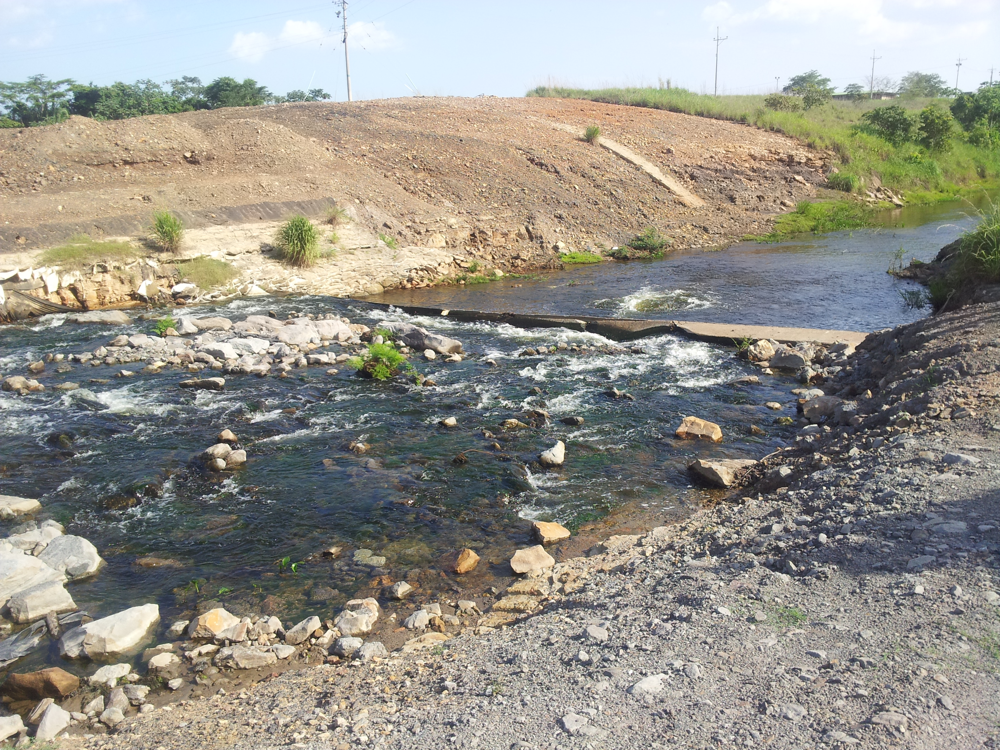
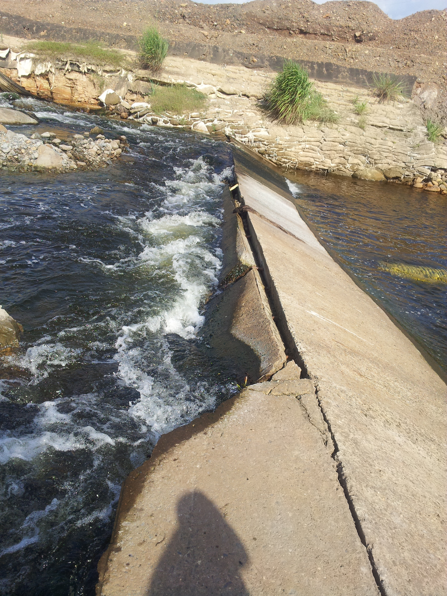
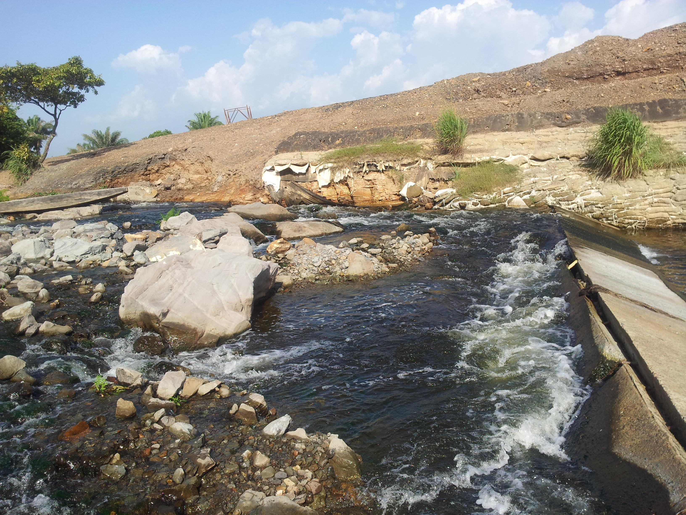
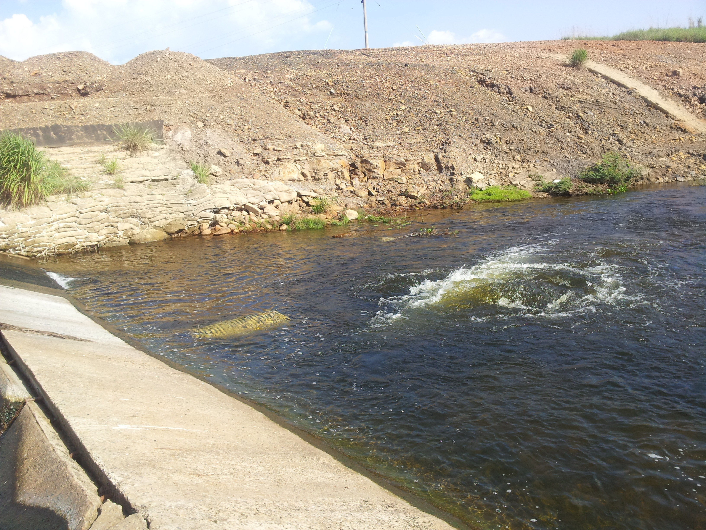
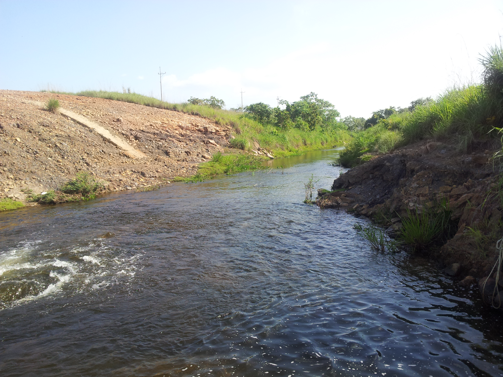
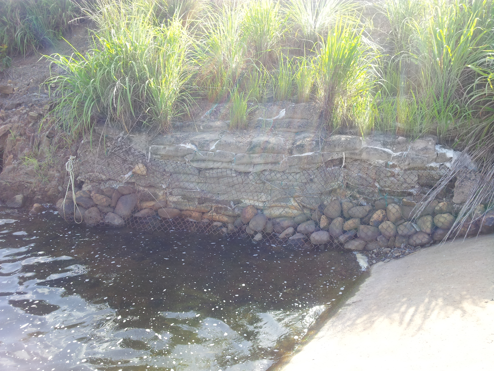
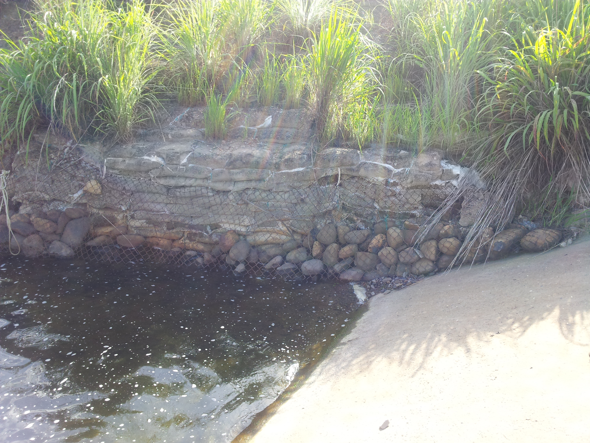

## :globe_with_meridians:Embalse Paujil (2013-07-03)
`Pictures` rcfdtools <br>`Category` Technical field visit <br>`Location` [Google Maps](http://maps.google.com/maps?q=9.559278,-73.458466) or [Openstreet Map](https://www.openstreetmap.org/query?lat=9.559278&lon=-73.458466) 

```geojson
{
  "type": "Feature",
  "geometry": {
    "type": "Point", 
    "coordinates": [-73.458466, 9.559278]
  }, 
  "properties": {
    "Name": "Embalse Paujil"
  }
}
```

:camera:**8/2013-07-03_15.37.12.jpg** <details><summary>+ info</summary><sub> `Exif version` 0220 `OS version` N7000XXLS2 `Date` 2013:07:03 15:37:12 `Aperture` Not known `Brightness` 9.59 `Color space` 1 `Compression` 6`Exposure mode` 0 `Exposure time` 0.0008620689655172414 `Focal length` 3.97 `Lens model` Not known `Lens specification` Not known `Orientation` 1 `Scene type` Not known `f number` 2.65 `White balance` 0 `Sensing method` Not known `Shutter speed` 10.18</sub></details><sub>`Coordinates & altitude` (9.5593278, -73.4585915, 71.31)</sub><sub> :globe_with_meridians:`Location over` [Google Maps](http://maps.google.com/maps?q=9.5593278,-73.4585915) or [Openstreet Map](https://www.openstreetmap.org/query?lat=9.5593278&lon=-73.4585915)</sub>


:camera:**8/2013-07-03_15.37.24.jpg** <details><summary>+ info</summary><sub> `Exif version` 0220 `OS version` N7000XXLS2 `Date` 2013:07:03 15:37:24 `Aperture` Not known `Brightness` 9.16 `Color space` 1 `Compression` 6`Exposure mode` 0 `Exposure time` 0.0011614401858304297 `Focal length` 3.97 `Lens model` Not known `Lens specification` Not known `Orientation` 1 `Scene type` Not known `f number` 2.65 `White balance` 0 `Sensing method` Not known `Shutter speed` 9.75</sub></details><sub>`Coordinates & altitude` (9.5593278, -73.4585915, 71.31)</sub><sub> :globe_with_meridians:`Location over` [Google Maps](http://maps.google.com/maps?q=9.5593278,-73.4585915) or [Openstreet Map](https://www.openstreetmap.org/query?lat=9.5593278&lon=-73.4585915)</sub>


:camera:**8/2013-07-03_15.37.32.jpg** <details><summary>+ info</summary><sub> `Exif version` 0220 `OS version` N7000XXLS2 `Date` 2013:07:03 15:37:32 `Aperture` Not known `Brightness` 8.57 `Color space` 1 `Compression` 6`Exposure mode` 0 `Exposure time` 0.0017482517482517483 `Focal length` 3.97 `Lens model` Not known `Lens specification` Not known `Orientation` 1 `Scene type` Not known `f number` 2.65 `White balance` 0 `Sensing method` Not known `Shutter speed` 9.16</sub></details><sub>`Coordinates & altitude` (9.5593278, -73.4585915, 71.31)</sub><sub> :globe_with_meridians:`Location over` [Google Maps](http://maps.google.com/maps?q=9.5593278,-73.4585915) or [Openstreet Map](https://www.openstreetmap.org/query?lat=9.5593278&lon=-73.4585915)</sub>


:camera:**8/2013-07-03_15.37.54.jpg** <details><summary>+ info</summary><sub> `Exif version` 0220 `OS version` N7000XXLS2 `Date` 2013:07:03 15:37:54 `Aperture` Not known `Brightness` 9.07 `Color space` 1 `Compression` 6`Exposure mode` 0 `Exposure time` 0.0012453300124533001 `Focal length` 3.97 `Lens model` Not known `Lens specification` Not known `Orientation` 1 `Scene type` Not known `f number` 2.65 `White balance` 0 `Sensing method` Not known `Shutter speed` 9.65</sub></details><sub>`Coordinates & altitude` (9.5593278, -73.4585915, 71.31)</sub><sub> :globe_with_meridians:`Location over` [Google Maps](http://maps.google.com/maps?q=9.5593278,-73.4585915) or [Openstreet Map](https://www.openstreetmap.org/query?lat=9.5593278&lon=-73.4585915)</sub>


:camera:**8/2013-07-03_15.37.57.jpg** <details><summary>+ info</summary><sub> `Exif version` 0220 `OS version` N7000XXLS2 `Date` 2013:07:03 15:37:57 `Aperture` Not known `Brightness` 9.3 `Color space` 1 `Compression` 6`Exposure mode` 0 `Exposure time` 0.001053740779768177 `Focal length` 3.97 `Lens model` Not known `Lens specification` Not known `Orientation` 1 `Scene type` Not known `f number` 2.65 `White balance` 0 `Sensing method` Not known `Shutter speed` 9.89</sub></details><sub>`Coordinates & altitude` (9.5593278, -73.4585915, 71.31)</sub><sub> :globe_with_meridians:`Location over` [Google Maps](http://maps.google.com/maps?q=9.5593278,-73.4585915) or [Openstreet Map](https://www.openstreetmap.org/query?lat=9.5593278&lon=-73.4585915)</sub>


:camera:**8/2013-07-03_15.38.01.jpg** <details><summary>+ info</summary><sub> `Exif version` 0220 `OS version` N7000XXLS2 `Date` 2013:07:03 15:38:01 `Aperture` Not known `Brightness` 8.59 `Color space` 1 `Compression` 6`Exposure mode` 0 `Exposure time` 0.0017241379310344827 `Focal length` 3.97 `Lens model` Not known `Lens specification` Not known `Orientation` 1 `Scene type` Not known `f number` 2.65 `White balance` 0 `Sensing method` Not known `Shutter speed` 9.18</sub></details><sub>`Coordinates & altitude` (9.5593278, -73.4585915, 71.31)</sub><sub> :globe_with_meridians:`Location over` [Google Maps](http://maps.google.com/maps?q=9.5593278,-73.4585915) or [Openstreet Map](https://www.openstreetmap.org/query?lat=9.5593278&lon=-73.4585915)</sub>


:camera:**8/2013-07-03_15.38.05.jpg** <details><summary>+ info</summary><sub> `Exif version` 0220 `OS version` N7000XXLS2 `Date` 2013:07:03 15:38:05 `Aperture` Not known `Brightness` 8.46 `Color space` 1 `Compression` 6`Exposure mode` 0 `Exposure time` 0.0018867924528301887 `Focal length` 3.97 `Lens model` Not known `Lens specification` Not known `Orientation` 1 `Scene type` Not known `f number` 2.65 `White balance` 0 `Sensing method` Not known `Shutter speed` 9.05</sub></details><sub>`Coordinates & altitude` (9.5593278, -73.4585915, 71.31)</sub><sub> :globe_with_meridians:`Location over` [Google Maps](http://maps.google.com/maps?q=9.5593278,-73.4585915) or [Openstreet Map](https://www.openstreetmap.org/query?lat=9.5593278&lon=-73.4585915)</sub>


:camera:**8/2013-07-03_15.38.29.jpg** <details><summary>+ info</summary><sub> `Exif version` 0220 `OS version` N7000XXLS2 `Date` 2013:07:03 15:38:29 `Aperture` Not known `Brightness` 6.83 `Color space` 1 `Compression` 6`Exposure mode` 0 `Exposure time` 0.0058823529411764705 `Focal length` 3.97 `Lens model` Not known `Lens specification` Not known `Orientation` 1 `Scene type` Not known `f number` 2.65 `White balance` 0 `Sensing method` Not known `Shutter speed` 7.41</sub></details><sub>`Coordinates & altitude` (9.5593278, -73.4585915, 71.31)</sub><sub> :globe_with_meridians:`Location over` [Google Maps](http://maps.google.com/maps?q=9.5593278,-73.4585915) or [Openstreet Map](https://www.openstreetmap.org/query?lat=9.5593278&lon=-73.4585915)</sub>


:camera:**8/2013-07-03_15.38.33.jpg** <details><summary>+ info</summary><sub> `Exif version` 0220 `OS version` N7000XXLS2 `Date` 2013:07:03 15:38:33 `Aperture` Not known `Brightness` 7.07 `Color space` 1 `Compression` 6`Exposure mode` 0 `Exposure time` 0.0049504950495049506 `Focal length` 3.97 `Lens model` Not known `Lens specification` Not known `Orientation` 1 `Scene type` Not known `f number` 2.65 `White balance` 0 `Sensing method` Not known `Shutter speed` 7.66</sub></details><sub>`Coordinates & altitude` (9.5593278, -73.4585915, 71.31)</sub><sub> :globe_with_meridians:`Location over` [Google Maps](http://maps.google.com/maps?q=9.5593278,-73.4585915) or [Openstreet Map](https://www.openstreetmap.org/query?lat=9.5593278&lon=-73.4585915)</sub>


:camera:**8/2013-07-03_15.38.55.jpg** <details><summary>+ info</summary><sub> `Exif version` 0220 `OS version` N7000XXLS2 `Date` 2013:07:03 15:38:55 `Aperture` Not known `Brightness` 8.01 `Color space` 1 `Compression` 6`Exposure mode` 0 `Exposure time` 0.002577319587628866 `Focal length` 3.97 `Lens model` Not known `Lens specification` Not known `Orientation` 1 `Scene type` Not known `f number` 2.65 `White balance` 0 `Sensing method` Not known `Shutter speed` 8.6</sub></details><sub>`Coordinates & altitude` (9.5593278, -73.4585915, 71.31)</sub><sub> :globe_with_meridians:`Location over` [Google Maps](http://maps.google.com/maps?q=9.5593278,-73.4585915) or [Openstreet Map](https://www.openstreetmap.org/query?lat=9.5593278&lon=-73.4585915)</sub>


:camera:**8/2013-07-03_15.39.42.jpg** <details><summary>+ info</summary><sub> `Exif version` 0220 `OS version` N7000XXLS2 `Date` 2013:07:03 15:39:42 `Aperture` Not known `Brightness` 8.64 `Color space` 1 `Compression` 6`Exposure mode` 0 `Exposure time` 0.0016666666666666668 `Focal length` 3.97 `Lens model` Not known `Lens specification` Not known `Orientation` 1 `Scene type` Not known `f number` 2.65 `White balance` 0 `Sensing method` Not known `Shutter speed` 9.23</sub></details><sub>`Coordinates & altitude` (9.5593278, -73.4585915, 71.31)</sub><sub> :globe_with_meridians:`Location over` [Google Maps](http://maps.google.com/maps?q=9.5593278,-73.4585915) or [Openstreet Map](https://www.openstreetmap.org/query?lat=9.5593278&lon=-73.4585915)</sub>


:camera:**8/2013-07-03_15.39.48.jpg** <details><summary>+ info</summary><sub> `Exif version` 0220 `OS version` N7000XXLS2 `Date` 2013:07:03 15:39:48 `Aperture` Not known `Brightness` 9.63 `Color space` 1 `Compression` 6`Exposure mode` 0 `Exposure time` 0.0008620689655172414 `Focal length` 3.97 `Lens model` Not known `Lens specification` Not known `Orientation` 1 `Scene type` Not known `f number` 2.65 `White balance` 0 `Sensing method` Not known `Shutter speed` 10.18</sub></details><sub>`Coordinates & altitude` (9.5593278, -73.4585915, 71.31)</sub><sub> :globe_with_meridians:`Location over` [Google Maps](http://maps.google.com/maps?q=9.5593278,-73.4585915) or [Openstreet Map](https://www.openstreetmap.org/query?lat=9.5593278&lon=-73.4585915)</sub>


> _Citación: se permite la reproducción digital parcial o total de este repositorio, scripts, guías de desarrollo, modelos de datos, imágenes y documentación, siempre que se haga referencia como: "R.GISMobile - Sistemas de información geográficos móviles sobre QField que no requieren de conexión a Internet para su navegación". https://github.com/rcfdtools/R.GISMobile - Bogotá - Colombia - Suramérica."._

| [:house: Inicio](../Readme.md) |
|---|