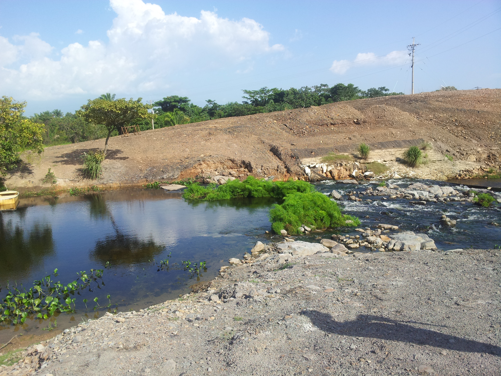

## Embalse Paujil (2013-07-03)
:camera: Fotos: rcfdtools<br>Categoría: Technical field visit

```geojson
{
  "type": "Feature",
  "geometry": {
    "type": "Point", 
    "coordinates": [-73.458466, 9.559278]
  }, 
  "properties": {
    "Name": "Embalse Paujil"
  }
}
```

`File` **8/2013-07-03_15.37.12.jpg** <sub>`OS version` N7000XXLS2 `Date` 2013:07:03 15:37:12 `Aperture` Not known `Brightness` 9.59 `Color space` 1 `Compression` 6 `Exif version` 0220 `Exposure mode` 0 `Exposure time` 0.0008620689655172414 `Focal length` 3.97 `Lens model` Not known `Lens specification` Not known `Orientation` 1 `Scene type` Not known `Software` N7000XXLS2 `White balance` 0</sub><sub>`Coordinates & altitude` (9.5593278, -73.4585915, 71.31)</sub><sub>:earth_americas: Location over [Google Maps](http://maps.google.com/maps?q=9.5593278,-73.4585915) or [Openstreet Map](https://www.openstreetmap.org/query?lat=9.5593278&lon=-73.4585915)</sub></sub>


`File` **8/2013-07-03_15.37.24.jpg** <sub>`OS version` N7000XXLS2 `Date` 2013:07:03 15:37:24 `Aperture` Not known `Brightness` 9.16 `Color space` 1 `Compression` 6 `Exif version` 0220 `Exposure mode` 0 `Exposure time` 0.0011614401858304297 `Focal length` 3.97 `Lens model` Not known `Lens specification` Not known `Orientation` 1 `Scene type` Not known `Software` N7000XXLS2 `White balance` 0</sub><sub>`Coordinates & altitude` (9.5593278, -73.4585915, 71.31)</sub><sub>:earth_americas: Location over [Google Maps](http://maps.google.com/maps?q=9.5593278,-73.4585915) or [Openstreet Map](https://www.openstreetmap.org/query?lat=9.5593278&lon=-73.4585915)</sub></sub>


`File` **8/2013-07-03_15.37.32.jpg** <sub>`OS version` N7000XXLS2 `Date` 2013:07:03 15:37:32 `Aperture` Not known `Brightness` 8.57 `Color space` 1 `Compression` 6 `Exif version` 0220 `Exposure mode` 0 `Exposure time` 0.0017482517482517483 `Focal length` 3.97 `Lens model` Not known `Lens specification` Not known `Orientation` 1 `Scene type` Not known `Software` N7000XXLS2 `White balance` 0</sub><sub>`Coordinates & altitude` (9.5593278, -73.4585915, 71.31)</sub><sub>:earth_americas: Location over [Google Maps](http://maps.google.com/maps?q=9.5593278,-73.4585915) or [Openstreet Map](https://www.openstreetmap.org/query?lat=9.5593278&lon=-73.4585915)</sub></sub>


`File` **8/2013-07-03_15.37.54.jpg** <sub>`OS version` N7000XXLS2 `Date` 2013:07:03 15:37:54 `Aperture` Not known `Brightness` 9.07 `Color space` 1 `Compression` 6 `Exif version` 0220 `Exposure mode` 0 `Exposure time` 0.0012453300124533001 `Focal length` 3.97 `Lens model` Not known `Lens specification` Not known `Orientation` 1 `Scene type` Not known `Software` N7000XXLS2 `White balance` 0</sub><sub>`Coordinates & altitude` (9.5593278, -73.4585915, 71.31)</sub><sub>:earth_americas: Location over [Google Maps](http://maps.google.com/maps?q=9.5593278,-73.4585915) or [Openstreet Map](https://www.openstreetmap.org/query?lat=9.5593278&lon=-73.4585915)</sub></sub>


`File` **8/2013-07-03_15.37.57.jpg** <sub>`OS version` N7000XXLS2 `Date` 2013:07:03 15:37:57 `Aperture` Not known `Brightness` 9.3 `Color space` 1 `Compression` 6 `Exif version` 0220 `Exposure mode` 0 `Exposure time` 0.001053740779768177 `Focal length` 3.97 `Lens model` Not known `Lens specification` Not known `Orientation` 1 `Scene type` Not known `Software` N7000XXLS2 `White balance` 0</sub><sub>`Coordinates & altitude` (9.5593278, -73.4585915, 71.31)</sub><sub>:earth_americas: Location over [Google Maps](http://maps.google.com/maps?q=9.5593278,-73.4585915) or [Openstreet Map](https://www.openstreetmap.org/query?lat=9.5593278&lon=-73.4585915)</sub></sub>


`File` **8/2013-07-03_15.38.01.jpg** <sub>`OS version` N7000XXLS2 `Date` 2013:07:03 15:38:01 `Aperture` Not known `Brightness` 8.59 `Color space` 1 `Compression` 6 `Exif version` 0220 `Exposure mode` 0 `Exposure time` 0.0017241379310344827 `Focal length` 3.97 `Lens model` Not known `Lens specification` Not known `Orientation` 1 `Scene type` Not known `Software` N7000XXLS2 `White balance` 0</sub><sub>`Coordinates & altitude` (9.5593278, -73.4585915, 71.31)</sub><sub>:earth_americas: Location over [Google Maps](http://maps.google.com/maps?q=9.5593278,-73.4585915) or [Openstreet Map](https://www.openstreetmap.org/query?lat=9.5593278&lon=-73.4585915)</sub></sub>


`File` **8/2013-07-03_15.38.05.jpg** <sub>`OS version` N7000XXLS2 `Date` 2013:07:03 15:38:05 `Aperture` Not known `Brightness` 8.46 `Color space` 1 `Compression` 6 `Exif version` 0220 `Exposure mode` 0 `Exposure time` 0.0018867924528301887 `Focal length` 3.97 `Lens model` Not known `Lens specification` Not known `Orientation` 1 `Scene type` Not known `Software` N7000XXLS2 `White balance` 0</sub><sub>`Coordinates & altitude` (9.5593278, -73.4585915, 71.31)</sub><sub>:earth_americas: Location over [Google Maps](http://maps.google.com/maps?q=9.5593278,-73.4585915) or [Openstreet Map](https://www.openstreetmap.org/query?lat=9.5593278&lon=-73.4585915)</sub></sub>


`File` **8/2013-07-03_15.38.29.jpg** <sub>`OS version` N7000XXLS2 `Date` 2013:07:03 15:38:29 `Aperture` Not known `Brightness` 6.83 `Color space` 1 `Compression` 6 `Exif version` 0220 `Exposure mode` 0 `Exposure time` 0.0058823529411764705 `Focal length` 3.97 `Lens model` Not known `Lens specification` Not known `Orientation` 1 `Scene type` Not known `Software` N7000XXLS2 `White balance` 0</sub><sub>`Coordinates & altitude` (9.5593278, -73.4585915, 71.31)</sub><sub>:earth_americas: Location over [Google Maps](http://maps.google.com/maps?q=9.5593278,-73.4585915) or [Openstreet Map](https://www.openstreetmap.org/query?lat=9.5593278&lon=-73.4585915)</sub></sub>


`File` **8/2013-07-03_15.38.33.jpg** <sub>`OS version` N7000XXLS2 `Date` 2013:07:03 15:38:33 `Aperture` Not known `Brightness` 7.07 `Color space` 1 `Compression` 6 `Exif version` 0220 `Exposure mode` 0 `Exposure time` 0.0049504950495049506 `Focal length` 3.97 `Lens model` Not known `Lens specification` Not known `Orientation` 1 `Scene type` Not known `Software` N7000XXLS2 `White balance` 0</sub><sub>`Coordinates & altitude` (9.5593278, -73.4585915, 71.31)</sub><sub>:earth_americas: Location over [Google Maps](http://maps.google.com/maps?q=9.5593278,-73.4585915) or [Openstreet Map](https://www.openstreetmap.org/query?lat=9.5593278&lon=-73.4585915)</sub></sub>


`File` **8/2013-07-03_15.38.55.jpg** <sub>`OS version` N7000XXLS2 `Date` 2013:07:03 15:38:55 `Aperture` Not known `Brightness` 8.01 `Color space` 1 `Compression` 6 `Exif version` 0220 `Exposure mode` 0 `Exposure time` 0.002577319587628866 `Focal length` 3.97 `Lens model` Not known `Lens specification` Not known `Orientation` 1 `Scene type` Not known `Software` N7000XXLS2 `White balance` 0</sub><sub>`Coordinates & altitude` (9.5593278, -73.4585915, 71.31)</sub><sub>:earth_americas: Location over [Google Maps](http://maps.google.com/maps?q=9.5593278,-73.4585915) or [Openstreet Map](https://www.openstreetmap.org/query?lat=9.5593278&lon=-73.4585915)</sub></sub>


`File` **8/2013-07-03_15.39.42.jpg** <sub>`OS version` N7000XXLS2 `Date` 2013:07:03 15:39:42 `Aperture` Not known `Brightness` 8.64 `Color space` 1 `Compression` 6 `Exif version` 0220 `Exposure mode` 0 `Exposure time` 0.0016666666666666668 `Focal length` 3.97 `Lens model` Not known `Lens specification` Not known `Orientation` 1 `Scene type` Not known `Software` N7000XXLS2 `White balance` 0</sub><sub>`Coordinates & altitude` (9.5593278, -73.4585915, 71.31)</sub><sub>:earth_americas: Location over [Google Maps](http://maps.google.com/maps?q=9.5593278,-73.4585915) or [Openstreet Map](https://www.openstreetmap.org/query?lat=9.5593278&lon=-73.4585915)</sub></sub>


`File` **8/2013-07-03_15.39.48.jpg** <sub>`OS version` N7000XXLS2 `Date` 2013:07:03 15:39:48 `Aperture` Not known `Brightness` 9.63 `Color space` 1 `Compression` 6 `Exif version` 0220 `Exposure mode` 0 `Exposure time` 0.0008620689655172414 `Focal length` 3.97 `Lens model` Not known `Lens specification` Not known `Orientation` 1 `Scene type` Not known `Software` N7000XXLS2 `White balance` 0</sub><sub>`Coordinates & altitude` (9.5593278, -73.4585915, 71.31)</sub><sub>:earth_americas: Location over [Google Maps](http://maps.google.com/maps?q=9.5593278,-73.4585915) or [Openstreet Map](https://www.openstreetmap.org/query?lat=9.5593278&lon=-73.4585915)</sub></sub>


| [:house: Inicio](../Readme.md) |
|---|