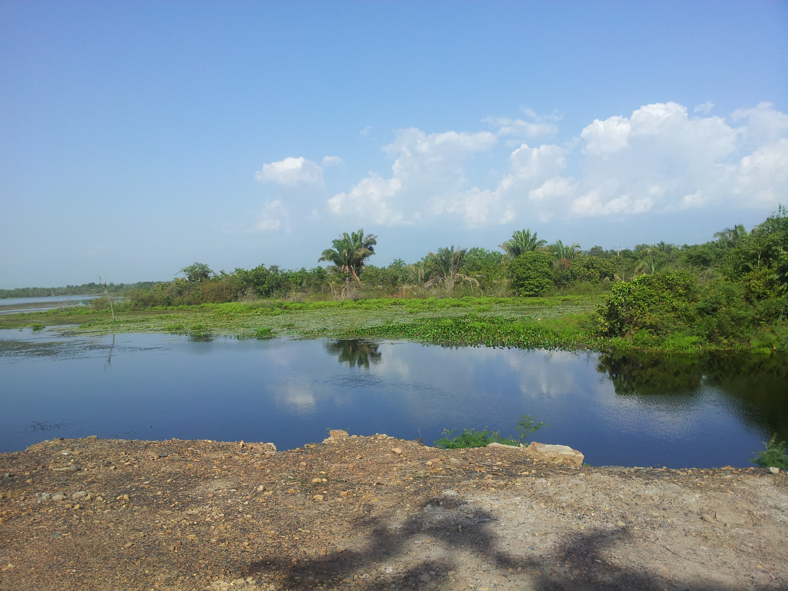
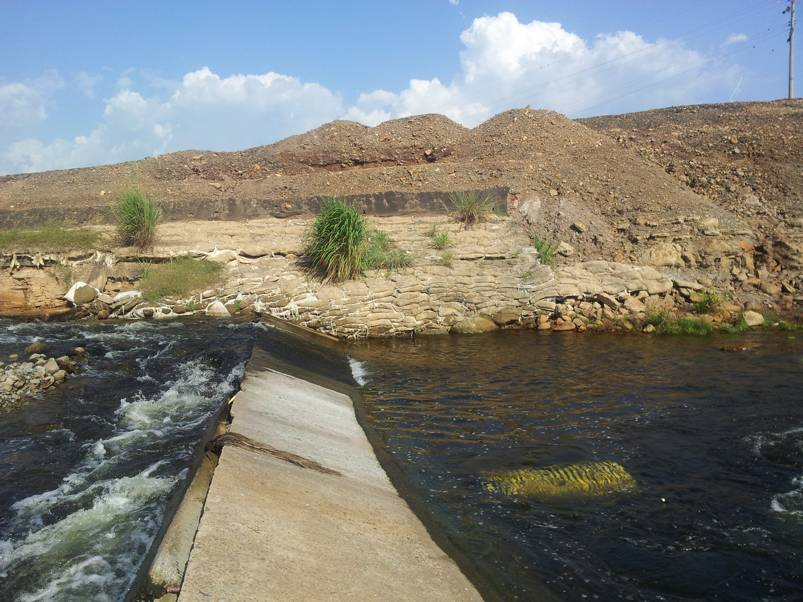
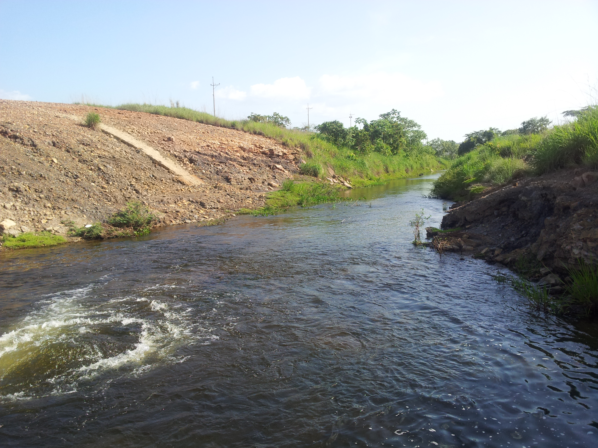

## :globe_with_meridians:Embalse Paujil, La Jagua de Ibirico, Cesar, Colombia (2013-07-03)
`Pictures` rcfdtools <br>`Category` Technical field visit <br>`Location` [Google Maps](http://maps.google.com/maps?q=9.559278,-73.458466) or [Openstreet Map](https://www.openstreetmap.org/query?lat=9.559278&lon=-73.458466) 

```geojson
{
  "type": "Feature",
  "geometry": {
    "type": "Point", 
    "coordinates": [-73.458466, 9.559278]
  }, 
  "properties": {
    "Name": "Embalse Paujil, La Jagua de Ibirico, Cesar, Colombia"
  }
}
```

<br><details><summary>:camera:**8/2013-07-03_15.37.12.jpg**</summary><sub> `Exif version` 0220 `OS version` N7000XXLS2 `Date` 2013:07:03 15:37:12 `Aperture` Not known `Brightness` 9.59 `Color space` 1 `Compression` 6`Exposure mode` 0 `Exposure time` 0.0008620689655172414 `Focal length` 3.97 `Lens model` Not known `Lens specification` Not known `Orientation` 1 `Scene type` Not known `f number` 2.65 `White balance` 0 `Sensing method` Not known `Shutter speed` 10.18</sub><sub>`Coordinates & altitude` (9.5593278, -73.4585915, 71.31)</sub><sub> :globe_with_meridians:`Location over` [Google Maps](http://maps.google.com/maps?q=9.5593278,-73.4585915) or [Openstreet Map](https://www.openstreetmap.org/query?lat=9.5593278&lon=-73.4585915)</sub></details>

<br><details><summary>:camera:**8/2013-07-03_15.37.24.jpg**</summary><sub> `Exif version` 0220 `OS version` N7000XXLS2 `Date` 2013:07:03 15:37:24 `Aperture` Not known `Brightness` 9.16 `Color space` 1 `Compression` 6`Exposure mode` 0 `Exposure time` 0.0011614401858304297 `Focal length` 3.97 `Lens model` Not known `Lens specification` Not known `Orientation` 1 `Scene type` Not known `f number` 2.65 `White balance` 0 `Sensing method` Not known `Shutter speed` 9.75</sub><sub>`Coordinates & altitude` (9.5593278, -73.4585915, 71.31)</sub><sub> :globe_with_meridians:`Location over` [Google Maps](http://maps.google.com/maps?q=9.5593278,-73.4585915) or [Openstreet Map](https://www.openstreetmap.org/query?lat=9.5593278&lon=-73.4585915)</sub></details>

<br><details><summary>:camera:**8/2013-07-03_15.37.32.jpg**</summary><sub> `Exif version` 0220 `OS version` N7000XXLS2 `Date` 2013:07:03 15:37:32 `Aperture` Not known `Brightness` 8.57 `Color space` 1 `Compression` 6`Exposure mode` 0 `Exposure time` 0.0017482517482517483 `Focal length` 3.97 `Lens model` Not known `Lens specification` Not known `Orientation` 1 `Scene type` Not known `f number` 2.65 `White balance` 0 `Sensing method` Not known `Shutter speed` 9.16</sub><sub>`Coordinates & altitude` (9.5593278, -73.4585915, 71.31)</sub><sub> :globe_with_meridians:`Location over` [Google Maps](http://maps.google.com/maps?q=9.5593278,-73.4585915) or [Openstreet Map](https://www.openstreetmap.org/query?lat=9.5593278&lon=-73.4585915)</sub></details>

<br><details><summary>:camera:**8/2013-07-03_15.37.54.jpg**</summary><sub> `Exif version` 0220 `OS version` N7000XXLS2 `Date` 2013:07:03 15:37:54 `Aperture` Not known `Brightness` 9.07 `Color space` 1 `Compression` 6`Exposure mode` 0 `Exposure time` 0.0012453300124533001 `Focal length` 3.97 `Lens model` Not known `Lens specification` Not known `Orientation` 1 `Scene type` Not known `f number` 2.65 `White balance` 0 `Sensing method` Not known `Shutter speed` 9.65</sub><sub>`Coordinates & altitude` (9.5593278, -73.4585915, 71.31)</sub><sub> :globe_with_meridians:`Location over` [Google Maps](http://maps.google.com/maps?q=9.5593278,-73.4585915) or [Openstreet Map](https://www.openstreetmap.org/query?lat=9.5593278&lon=-73.4585915)</sub></details>

<br><details><summary>:camera:**8/2013-07-03_15.37.57.jpg**</summary><sub> `Exif version` 0220 `OS version` N7000XXLS2 `Date` 2013:07:03 15:37:57 `Aperture` Not known `Brightness` 9.3 `Color space` 1 `Compression` 6`Exposure mode` 0 `Exposure time` 0.001053740779768177 `Focal length` 3.97 `Lens model` Not known `Lens specification` Not known `Orientation` 1 `Scene type` Not known `f number` 2.65 `White balance` 0 `Sensing method` Not known `Shutter speed` 9.89</sub><sub>`Coordinates & altitude` (9.5593278, -73.4585915, 71.31)</sub><sub> :globe_with_meridians:`Location over` [Google Maps](http://maps.google.com/maps?q=9.5593278,-73.4585915) or [Openstreet Map](https://www.openstreetmap.org/query?lat=9.5593278&lon=-73.4585915)</sub></details>

<br><details><summary>:camera:**8/2013-07-03_15.38.01.jpg**</summary><sub> `Exif version` 0220 `OS version` N7000XXLS2 `Date` 2013:07:03 15:38:01 `Aperture` Not known `Brightness` 8.59 `Color space` 1 `Compression` 6`Exposure mode` 0 `Exposure time` 0.0017241379310344827 `Focal length` 3.97 `Lens model` Not known `Lens specification` Not known `Orientation` 1 `Scene type` Not known `f number` 2.65 `White balance` 0 `Sensing method` Not known `Shutter speed` 9.18</sub><sub>`Coordinates & altitude` (9.5593278, -73.4585915, 71.31)</sub><sub> :globe_with_meridians:`Location over` [Google Maps](http://maps.google.com/maps?q=9.5593278,-73.4585915) or [Openstreet Map](https://www.openstreetmap.org/query?lat=9.5593278&lon=-73.4585915)</sub></details>

<br><details><summary>:camera:**8/2013-07-03_15.38.05.jpg**</summary><sub> `Exif version` 0220 `OS version` N7000XXLS2 `Date` 2013:07:03 15:38:05 `Aperture` Not known `Brightness` 8.46 `Color space` 1 `Compression` 6`Exposure mode` 0 `Exposure time` 0.0018867924528301887 `Focal length` 3.97 `Lens model` Not known `Lens specification` Not known `Orientation` 1 `Scene type` Not known `f number` 2.65 `White balance` 0 `Sensing method` Not known `Shutter speed` 9.05</sub><sub>`Coordinates & altitude` (9.5593278, -73.4585915, 71.31)</sub><sub> :globe_with_meridians:`Location over` [Google Maps](http://maps.google.com/maps?q=9.5593278,-73.4585915) or [Openstreet Map](https://www.openstreetmap.org/query?lat=9.5593278&lon=-73.4585915)</sub></details>

<br><details><summary>:camera:**8/2013-07-03_15.38.29.jpg**</summary><sub> `Exif version` 0220 `OS version` N7000XXLS2 `Date` 2013:07:03 15:38:29 `Aperture` Not known `Brightness` 6.83 `Color space` 1 `Compression` 6`Exposure mode` 0 `Exposure time` 0.0058823529411764705 `Focal length` 3.97 `Lens model` Not known `Lens specification` Not known `Orientation` 1 `Scene type` Not known `f number` 2.65 `White balance` 0 `Sensing method` Not known `Shutter speed` 7.41</sub><sub>`Coordinates & altitude` (9.5593278, -73.4585915, 71.31)</sub><sub> :globe_with_meridians:`Location over` [Google Maps](http://maps.google.com/maps?q=9.5593278,-73.4585915) or [Openstreet Map](https://www.openstreetmap.org/query?lat=9.5593278&lon=-73.4585915)</sub></details>

<br><details><summary>:camera:**8/2013-07-03_15.38.33.jpg**</summary><sub> `Exif version` 0220 `OS version` N7000XXLS2 `Date` 2013:07:03 15:38:33 `Aperture` Not known `Brightness` 7.07 `Color space` 1 `Compression` 6`Exposure mode` 0 `Exposure time` 0.0049504950495049506 `Focal length` 3.97 `Lens model` Not known `Lens specification` Not known `Orientation` 1 `Scene type` Not known `f number` 2.65 `White balance` 0 `Sensing method` Not known `Shutter speed` 7.66</sub><sub>`Coordinates & altitude` (9.5593278, -73.4585915, 71.31)</sub><sub> :globe_with_meridians:`Location over` [Google Maps](http://maps.google.com/maps?q=9.5593278,-73.4585915) or [Openstreet Map](https://www.openstreetmap.org/query?lat=9.5593278&lon=-73.4585915)</sub></details>

<br><details><summary>:camera:**8/2013-07-03_15.38.55.jpg**</summary><sub> `Exif version` 0220 `OS version` N7000XXLS2 `Date` 2013:07:03 15:38:55 `Aperture` Not known `Brightness` 8.01 `Color space` 1 `Compression` 6`Exposure mode` 0 `Exposure time` 0.002577319587628866 `Focal length` 3.97 `Lens model` Not known `Lens specification` Not known `Orientation` 1 `Scene type` Not known `f number` 2.65 `White balance` 0 `Sensing method` Not known `Shutter speed` 8.6</sub><sub>`Coordinates & altitude` (9.5593278, -73.4585915, 71.31)</sub><sub> :globe_with_meridians:`Location over` [Google Maps](http://maps.google.com/maps?q=9.5593278,-73.4585915) or [Openstreet Map](https://www.openstreetmap.org/query?lat=9.5593278&lon=-73.4585915)</sub></details>

<br><details><summary>:camera:**8/2013-07-03_15.39.42.jpg**</summary><sub> `Exif version` 0220 `OS version` N7000XXLS2 `Date` 2013:07:03 15:39:42 `Aperture` Not known `Brightness` 8.64 `Color space` 1 `Compression` 6`Exposure mode` 0 `Exposure time` 0.0016666666666666668 `Focal length` 3.97 `Lens model` Not known `Lens specification` Not known `Orientation` 1 `Scene type` Not known `f number` 2.65 `White balance` 0 `Sensing method` Not known `Shutter speed` 9.23</sub><sub>`Coordinates & altitude` (9.5593278, -73.4585915, 71.31)</sub><sub> :globe_with_meridians:`Location over` [Google Maps](http://maps.google.com/maps?q=9.5593278,-73.4585915) or [Openstreet Map](https://www.openstreetmap.org/query?lat=9.5593278&lon=-73.4585915)</sub></details>

<br><details><summary>:camera:**8/2013-07-03_15.39.48.jpg**</summary><sub> `Exif version` 0220 `OS version` N7000XXLS2 `Date` 2013:07:03 15:39:48 `Aperture` Not known `Brightness` 9.63 `Color space` 1 `Compression` 6`Exposure mode` 0 `Exposure time` 0.0008620689655172414 `Focal length` 3.97 `Lens model` Not known `Lens specification` Not known `Orientation` 1 `Scene type` Not known `f number` 2.65 `White balance` 0 `Sensing method` Not known `Shutter speed` 10.18</sub><sub>`Coordinates & altitude` (9.5593278, -73.4585915, 71.31)</sub><sub> :globe_with_meridians:`Location over` [Google Maps](http://maps.google.com/maps?q=9.5593278,-73.4585915) or [Openstreet Map](https://www.openstreetmap.org/query?lat=9.5593278&lon=-73.4585915)</sub></details>

<br><details><summary>:camera:**8/2013-07-03__15.37.15.jpg**</summary><sub> `Exif version` 0220 `OS version` N7000XXLS2 `Date` 2013:07:03 15:37:15 `Aperture` Not known `Brightness` 9.42 `Color space` 1 `Compression` 6`Exposure mode` 0 `Exposure time` 0.0009699321047526673 `Focal length` 3.97 `Lens model` Not known `Lens specification` Not known `Orientation` 1 `Scene type` Not known `f number` 2.65 `White balance` 0 `Sensing method` Not known `Shutter speed` 10.01</sub><sub>`Coordinates & altitude` (9.5593278, -73.4585915, 71.31)</sub><sub> :globe_with_meridians:`Location over` [Google Maps](http://maps.google.com/maps?q=9.5593278,-73.4585915) or [Openstreet Map](https://www.openstreetmap.org/query?lat=9.5593278&lon=-73.4585915)</sub></details>

<br><details><summary>:camera:**8/2013-07-03__15.38.10.jpg**</summary><sub> `Exif version` 0220 `OS version` N7000XXLS2 `Date` 2013:07:03 15:38:10 `Aperture` Not known `Brightness` 8.46 `Color space` 1 `Compression` 6`Exposure mode` 0 `Exposure time` 0.0018867924528301887 `Focal length` 3.97 `Lens model` Not known `Lens specification` Not known `Orientation` 1 `Scene type` Not known `f number` 2.65 `White balance` 0 `Sensing method` Not known `Shutter speed` 9.05</sub><sub>`Coordinates & altitude` (9.5593278, -73.4585915, 71.31)</sub><sub> :globe_with_meridians:`Location over` [Google Maps](http://maps.google.com/maps?q=9.5593278,-73.4585915) or [Openstreet Map](https://www.openstreetmap.org/query?lat=9.5593278&lon=-73.4585915)</sub></details>

<br><details><summary>:camera:**8/2013-07-03__15.38.18.jpg**</summary><sub> `Exif version` 0220 `OS version` N7000XXLS2 `Date` 2013:07:03 15:38:18 `Aperture` Not known `Brightness` 9.1 `Color space` 1 `Compression` 6`Exposure mode` 0 `Exposure time` 0.0012106537530266344 `Focal length` 3.97 `Lens model` Not known `Lens specification` Not known `Orientation` 1 `Scene type` Not known `f number` 2.65 `White balance` 0 `Sensing method` Not known `Shutter speed` 9.69</sub><sub>`Coordinates & altitude` (9.5593278, -73.4585915, 71.31)</sub><sub> :globe_with_meridians:`Location over` [Google Maps](http://maps.google.com/maps?q=9.5593278,-73.4585915) or [Openstreet Map](https://www.openstreetmap.org/query?lat=9.5593278&lon=-73.4585915)</sub></details>

<br><details><summary>:camera:**8/2013-07-03__15.38.55.jpg**</summary><sub> `Exif version` 0220 `OS version` N7000XXLS2 `Date` 2013:07:03 15:38:55 `Aperture` Not known `Brightness` 8.01 `Color space` 1 `Compression` 6`Exposure mode` 0 `Exposure time` 0.002577319587628866 `Focal length` 3.97 `Lens model` Not known `Lens specification` Not known `Orientation` 1 `Scene type` Not known `f number` 2.65 `White balance` 0 `Sensing method` Not known `Shutter speed` 8.6</sub><sub>`Coordinates & altitude` (9.5593278, -73.4585915, 71.31)</sub><sub> :globe_with_meridians:`Location over` [Google Maps](http://maps.google.com/maps?q=9.5593278,-73.4585915) or [Openstreet Map](https://www.openstreetmap.org/query?lat=9.5593278&lon=-73.4585915)</sub></details>

<br><details><summary>:camera:**8/2013-07-03__15.39.42.jpg**</summary><sub> `Exif version` 0220 `OS version` N7000XXLS2 `Date` 2013:07:03 15:39:42 `Aperture` Not known `Brightness` 8.64 `Color space` 1 `Compression` 6`Exposure mode` 0 `Exposure time` 0.0016666666666666668 `Focal length` 3.97 `Lens model` Not known `Lens specification` Not known `Orientation` 1 `Scene type` Not known `f number` 2.65 `White balance` 0 `Sensing method` Not known `Shutter speed` 9.23</sub><sub>`Coordinates & altitude` (9.5593278, -73.4585915, 71.31)</sub><sub> :globe_with_meridians:`Location over` [Google Maps](http://maps.google.com/maps?q=9.5593278,-73.4585915) or [Openstreet Map](https://www.openstreetmap.org/query?lat=9.5593278&lon=-73.4585915)</sub></details>

<br><details><summary>:camera:**8/2013-07-03__15.49.46.jpg**</summary><sub> `Exif version` 0220 `OS version` N7000XXLS2 `Date` 2013:07:03 15:49:46 `Aperture` Not known `Brightness` 8.98 `Color space` 1 `Compression` 6`Exposure mode` 0 `Exposure time` 0.0013245033112582781 `Focal length` 3.97 `Lens model` Not known `Lens specification` Not known `Orientation` 1 `Scene type` Not known `f number` 2.65 `White balance` 0 `Sensing method` Not known `Shutter speed` 9.56</sub><sub>`Coordinates & altitude` (9.5532847, -73.4642336, 70.18)</sub><sub> :globe_with_meridians:`Location over` [Google Maps](http://maps.google.com/maps?q=9.5532847,-73.4642336) or [Openstreet Map](https://www.openstreetmap.org/query?lat=9.5532847&lon=-73.4642336)</sub></details>

<br><details><summary>:camera:**8/2013-07-03__15.52.55.jpg**</summary><sub> `Exif version` 0220 `OS version` N7000XXLS2 `Date` 2013:07:03 15:52:55 `Aperture` Not known `Brightness` 9.01 `Color space` 1 `Compression` 6`Exposure mode` 0 `Exposure time` 0.0012970168612191958 `Focal length` 3.97 `Lens model` Not known `Lens specification` Not known `Orientation` 1 `Scene type` Not known `f number` 2.65 `White balance` 0 `Sensing method` Not known `Shutter speed` 9.59</sub><sub>`Coordinates & altitude` (9.5473956, -73.4651775, 62.78)</sub><sub> :globe_with_meridians:`Location over` [Google Maps](http://maps.google.com/maps?q=9.5473956,-73.4651775) or [Openstreet Map](https://www.openstreetmap.org/query?lat=9.5473956&lon=-73.4651775)</sub></details>

<br><details><summary>:camera:**8/2013-07-03__15.52.58.jpg**</summary><sub> `Exif version` 0220 `OS version` N7000XXLS2 `Date` 2013:07:03 15:52:58 `Aperture` Not known `Brightness` 9.21 `Color space` 1 `Compression` 6`Exposure mode` 0 `Exposure time` 0.0011614401858304297 `Focal length` 3.97 `Lens model` Not known `Lens specification` Not known `Orientation` 1 `Scene type` Not known `f number` 2.65 `White balance` 0 `Sensing method` Not known `Shutter speed` 9.75</sub><sub>`Coordinates & altitude` (9.5473956, -73.4651775, 62.78)</sub><sub> :globe_with_meridians:`Location over` [Google Maps](http://maps.google.com/maps?q=9.5473956,-73.4651775) or [Openstreet Map](https://www.openstreetmap.org/query?lat=9.5473956&lon=-73.4651775)</sub></details>

<br><details><summary>:camera:**8/2013-07-03__15.53.02.jpg**</summary><sub> `Exif version` 0220 `OS version` N7000XXLS2 `Date` 2013:07:03 15:53:02 `Aperture` Not known `Brightness` 9.46 `Color space` 1 `Compression` 6`Exposure mode` 0 `Exposure time` 0.0009433962264150943 `Focal length` 3.97 `Lens model` Not known `Lens specification` Not known `Orientation` 1 `Scene type` Not known `f number` 2.65 `White balance` 0 `Sensing method` Not known `Shutter speed` 10.05</sub><sub>`Coordinates & altitude` (9.5473956, -73.4651775, 62.78)</sub><sub> :globe_with_meridians:`Location over` [Google Maps](http://maps.google.com/maps?q=9.5473956,-73.4651775) or [Openstreet Map](https://www.openstreetmap.org/query?lat=9.5473956&lon=-73.4651775)</sub></details>

<br><details><summary>:camera:**8/2013-07-03__15.53.09.jpg**</summary><sub> `Exif version` 0220 `OS version` N7000XXLS2 `Date` 2013:07:03 15:53:09 `Aperture` Not known `Brightness` 9.1 `Color space` 1 `Compression` 6`Exposure mode` 0 `Exposure time` 0.0012106537530266344 `Focal length` 3.97 `Lens model` Not known `Lens specification` Not known `Orientation` 1 `Scene type` Not known `f number` 2.65 `White balance` 0 `Sensing method` Not known `Shutter speed` 9.69</sub><sub>`Coordinates & altitude` (9.5473956, -73.4651775, 62.78)</sub><sub> :globe_with_meridians:`Location over` [Google Maps](http://maps.google.com/maps?q=9.5473956,-73.4651775) or [Openstreet Map](https://www.openstreetmap.org/query?lat=9.5473956&lon=-73.4651775)</sub></details>

<br><details><summary>:camera:**8/2013-07-03__15.53.19.jpg**</summary><sub> `Exif version` 0220 `OS version` N7000XXLS2 `Date` 2013:07:03 15:53:19 `Aperture` Not known `Brightness` 8.86 `Color space` 1 `Compression` 6`Exposure mode` 0 `Exposure time` 0.001430615164520744 `Focal length` 3.97 `Lens model` Not known `Lens specification` Not known `Orientation` 1 `Scene type` Not known `f number` 2.65 `White balance` 0 `Sensing method` Not known `Shutter speed` 9.45</sub><sub>`Coordinates & altitude` (9.5473956, -73.4651775, 62.78)</sub><sub> :globe_with_meridians:`Location over` [Google Maps](http://maps.google.com/maps?q=9.5473956,-73.4651775) or [Openstreet Map](https://www.openstreetmap.org/query?lat=9.5473956&lon=-73.4651775)</sub></details>

<br><details><summary>:camera:**8/2013-07-03__15.53.54.jpg**</summary><sub> `Exif version` 0220 `OS version` N7000XXLS2 `Date` 2013:07:03 15:53:54 `Aperture` Not known `Brightness` 10.38 `Color space` 1 `Compression` 6`Exposure mode` 0 `Exposure time` 0.0005159958720330237 `Focal length` 3.97 `Lens model` Not known `Lens specification` Not known `Orientation` 1 `Scene type` Not known `f number` 2.65 `White balance` 0 `Sensing method` Not known `Shutter speed` 10.92</sub><sub>`Coordinates & altitude` (9.5473956, -73.4651775, 62.78)</sub><sub> :globe_with_meridians:`Location over` [Google Maps](http://maps.google.com/maps?q=9.5473956,-73.4651775) or [Openstreet Map](https://www.openstreetmap.org/query?lat=9.5473956&lon=-73.4651775)</sub></details>

<br><details><summary>:camera:**8/2013-07-03__15.53.56.jpg**</summary><sub> `Exif version` 0220 `OS version` N7000XXLS2 `Date` 2013:07:03 15:53:56 `Aperture` Not known `Brightness` 10.04 `Color space` 1 `Compression` 6`Exposure mode` 0 `Exposure time` 0.0006489292667099286 `Focal length` 3.97 `Lens model` Not known `Lens specification` Not known `Orientation` 1 `Scene type` Not known `f number` 2.65 `White balance` 0 `Sensing method` Not known `Shutter speed` 10.59</sub><sub>`Coordinates & altitude` (9.5473956, -73.4651775, 62.78)</sub><sub> :globe_with_meridians:`Location over` [Google Maps](http://maps.google.com/maps?q=9.5473956,-73.4651775) or [Openstreet Map](https://www.openstreetmap.org/query?lat=9.5473956&lon=-73.4651775)</sub></details>

<br><details><summary>:camera:**8/2013-07-03__15.53.59.jpg**</summary><sub> `Exif version` 0220 `OS version` N7000XXLS2 `Date` 2013:07:03 15:53:59 `Aperture` Not known `Brightness` 9.73 `Color space` 1 `Compression` 6`Exposure mode` 0 `Exposure time` 0.000782472613458529 `Focal length` 3.97 `Lens model` Not known `Lens specification` Not known `Orientation` 1 `Scene type` Not known `f number` 2.65 `White balance` 0 `Sensing method` Not known `Shutter speed` 10.32</sub><sub>`Coordinates & altitude` (9.5473956, -73.4651775, 62.78)</sub><sub> :globe_with_meridians:`Location over` [Google Maps](http://maps.google.com/maps?q=9.5473956,-73.4651775) or [Openstreet Map](https://www.openstreetmap.org/query?lat=9.5473956&lon=-73.4651775)</sub></details>

<br><details><summary>:camera:**8/2013-07-03__15.54.03.jpg**</summary><sub> `Exif version` 0220 `OS version` N7000XXLS2 `Date` 2013:07:03 15:54:03 `Aperture` Not known `Brightness` 10.04 `Color space` 1 `Compression` 6`Exposure mode` 0 `Exposure time` 0.0006489292667099286 `Focal length` 3.97 `Lens model` Not known `Lens specification` Not known `Orientation` 1 `Scene type` Not known `f number` 2.65 `White balance` 0 `Sensing method` Not known `Shutter speed` 10.59</sub><sub>`Coordinates & altitude` (9.5473956, -73.4651775, 62.78)</sub><sub> :globe_with_meridians:`Location over` [Google Maps](http://maps.google.com/maps?q=9.5473956,-73.4651775) or [Openstreet Map](https://www.openstreetmap.org/query?lat=9.5473956&lon=-73.4651775)</sub></details>

<br><details><summary>:camera:**8/2013-07-03__15.56.38.jpg**</summary><sub> `Exif version` 0220 `OS version` N7000XXLS2 `Date` 2013:07:03 15:56:38 `Aperture` Not known `Brightness` 8.81 `Color space` 1 `Compression` 6`Exposure mode` 0 `Exposure time` 0.0014792899408284023 `Focal length` 3.97 `Lens model` Not known `Lens specification` Not known `Orientation` 1 `Scene type` Not known `f number` 2.65 `White balance` 0 `Sensing method` Not known `Shutter speed` 9.4</sub><sub>`Coordinates & altitude` (9.5430555, -73.4646806, 68.02)</sub><sub> :globe_with_meridians:`Location over` [Google Maps](http://maps.google.com/maps?q=9.5430555,-73.4646806) or [Openstreet Map](https://www.openstreetmap.org/query?lat=9.5430555&lon=-73.4646806)</sub></details>

<br><details><summary>:camera:**8/2013-07-03__15.56.57.jpg**</summary><sub> `Exif version` 0220 `OS version` N7000XXLS2 `Date` 2013:07:03 15:56:57 `Aperture` Not known `Brightness` 8.81 `Color space` 1 `Compression` 6`Exposure mode` 0 `Exposure time` 0.0014792899408284023 `Focal length` 3.97 `Lens model` Not known `Lens specification` Not known `Orientation` 1 `Scene type` Not known `f number` 2.65 `White balance` 0 `Sensing method` Not known `Shutter speed` 9.4</sub><sub>`Coordinates & altitude` (9.5430555, -73.4646806, 68.02)</sub><sub> :globe_with_meridians:`Location over` [Google Maps](http://maps.google.com/maps?q=9.5430555,-73.4646806) or [Openstreet Map](https://www.openstreetmap.org/query?lat=9.5430555&lon=-73.4646806)</sub></details>

<br><details><summary>:camera:**8/2013-07-03__15.57.06.jpg**</summary><sub> `Exif version` 0220 `OS version` N7000XXLS2 `Date` 2013:07:03 15:57:06 `Aperture` Not known `Brightness` 9.27 `Color space` 1 `Compression` 6`Exposure mode` 0 `Exposure time` 0.001076426264800861 `Focal length` 3.97 `Lens model` Not known `Lens specification` Not known `Orientation` 1 `Scene type` Not known `f number` 2.65 `White balance` 0 `Sensing method` Not known `Shutter speed` 9.86</sub><sub>`Coordinates & altitude` (9.5430555, -73.4646806, 68.02)</sub><sub> :globe_with_meridians:`Location over` [Google Maps](http://maps.google.com/maps?q=9.5430555,-73.4646806) or [Openstreet Map](https://www.openstreetmap.org/query?lat=9.5430555&lon=-73.4646806)</sub></details>

> _Citación: se permite la reproducción digital parcial o total de este repositorio, scripts, guías de desarrollo, modelos de datos, imágenes y documentación, siempre que se haga referencia como: "R.GISMobile - Sistemas de información geográficos móviles sobre QField que no requieren de conexión a Internet para su navegación". https://github.com/rcfdtools/R.GISMobile - Bogotá - Colombia - Suramérica."._

| [:house: Inicio](../Readme.md) |
|---|