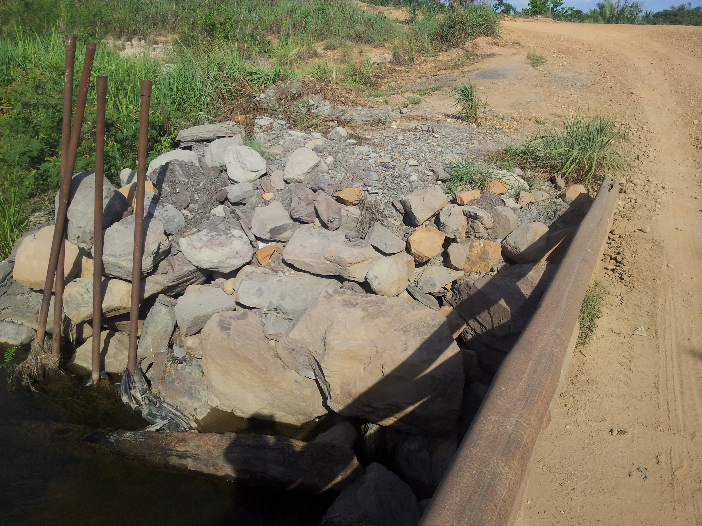
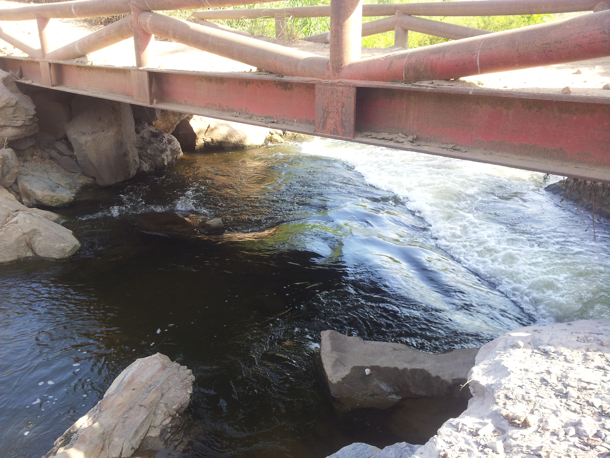
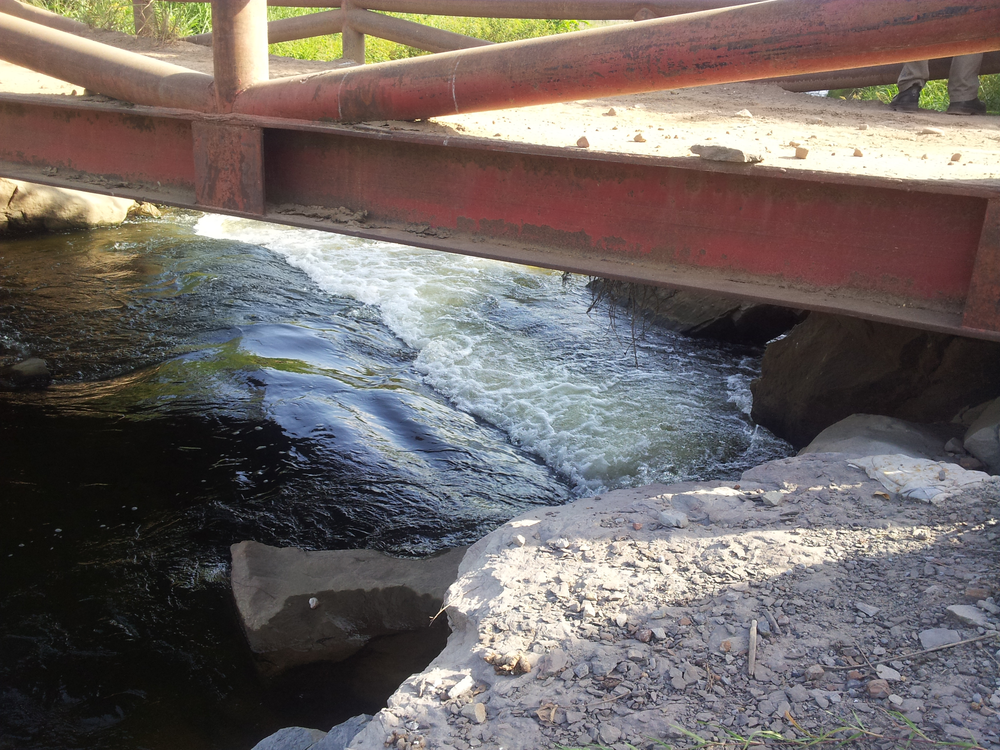
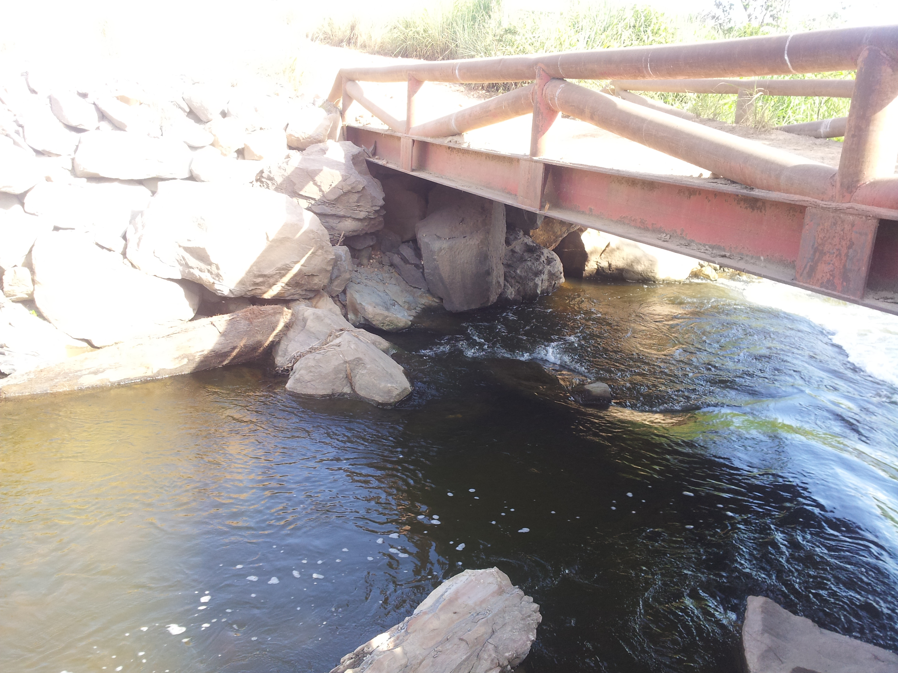
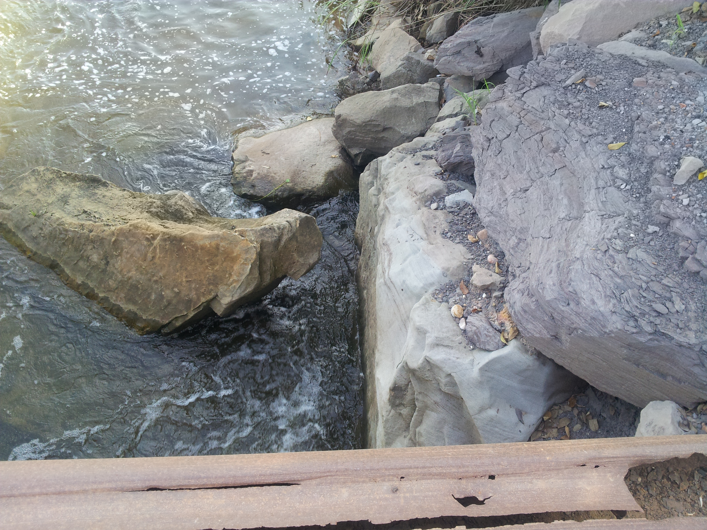
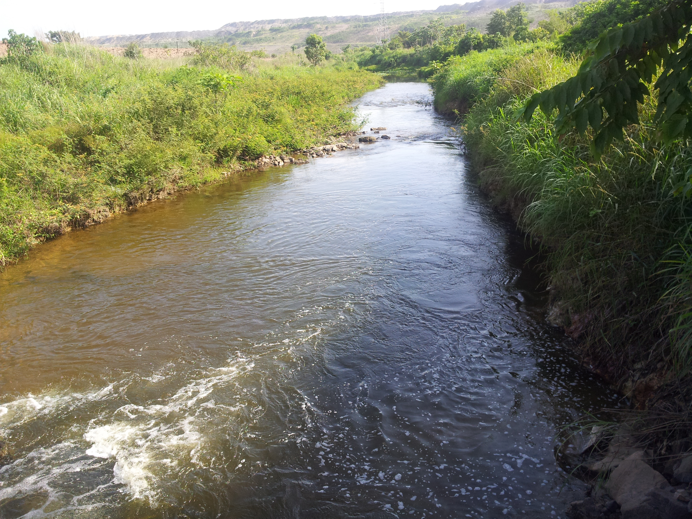
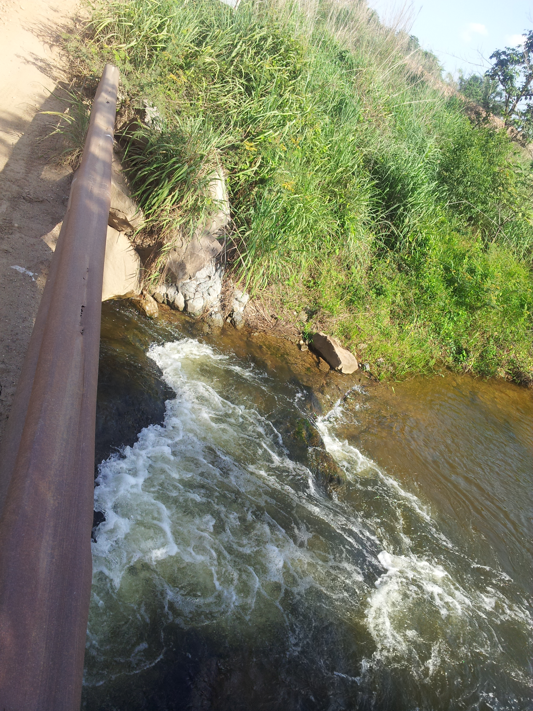
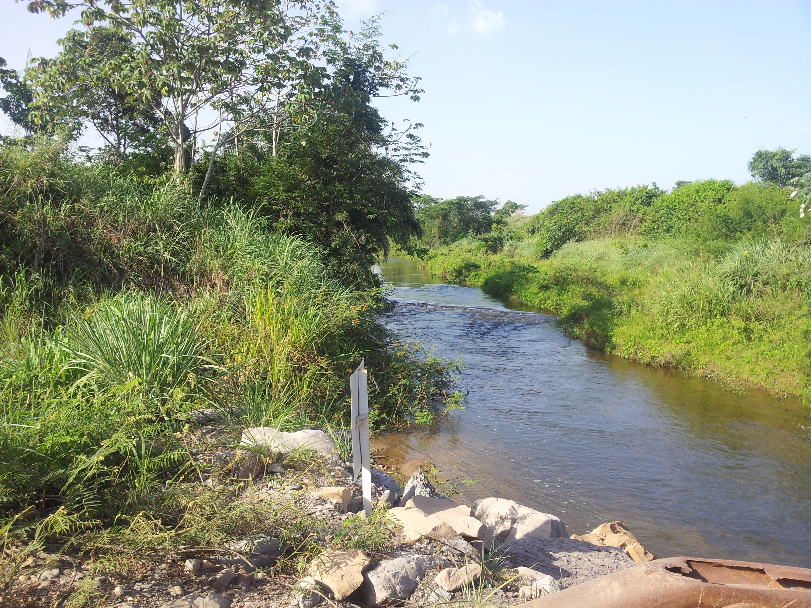

## Paso de vía Canal Paujil (2013-07-04)
Fotos por: rcfdtools<br>Categoría: Technical field visit

```geojson
{
  "type": "Feature",
  "geometry": {
    "type": "Point", 
    "coordinates": [-73.4642336, 9.5532847]
  }, 
  "properties": {
    "Name": "Paso de vía Canal Paujil"
  }
}
```

:camera: **9/2013-07-03_15.48.23.jpg** <sub> `Exif version` 0220 `OS version` N7000XXLS2 `Date` 2013:07:03 15:48:23 `Aperture` Not known `Brightness` 9.73 `Color space` 1 `Compression` 6`Exposure mode` 0 `Exposure time` 0.000782472613458529 `Focal length` 3.97 `Lens model` Not known `Lens specification` Not known `Orientation` 1 `Scene type` Not known `f number` 2.65 `White balance` 0 `Sensing method` Not known `Shutter speed` 10.32</sub><sub>`Coordinates & altitude` (9.5532847, -73.4642336, 70.18)</sub><sub>:earth_americas: `Location over` [Google Maps](http://maps.google.com/maps?q=9.5532847,-73.4642336) or [Openstreet Map](https://www.openstreetmap.org/query?lat=9.5532847&lon=-73.4642336)</sub>


:camera: **9/2013-07-03_15.48.54.jpg** <sub> `Exif version` 0220 `OS version` N7000XXLS2 `Date` 2013:07:03 15:48:54 `Aperture` Not known `Brightness` 6.44 `Color space` 1 `Compression` 6`Exposure mode` 0 `Exposure time` 0.007633587786259542 `Focal length` 3.97 `Lens model` Not known `Lens specification` Not known `Orientation` 1 `Scene type` Not known `f number` 2.65 `White balance` 0 `Sensing method` Not known `Shutter speed` 7.03</sub><sub>`Coordinates & altitude` (9.5532847, -73.4642336, 70.18)</sub><sub>:earth_americas: `Location over` [Google Maps](http://maps.google.com/maps?q=9.5532847,-73.4642336) or [Openstreet Map](https://www.openstreetmap.org/query?lat=9.5532847&lon=-73.4642336)</sub>


:camera: **9/2013-07-03_15.48.57.jpg** <sub> `Exif version` 0220 `OS version` N7000XXLS2 `Date` 2013:07:03 15:48:57 `Aperture` Not known `Brightness` 7.14 `Color space` 1 `Compression` 6`Exposure mode` 0 `Exposure time` 0.0047169811320754715 `Focal length` 3.97 `Lens model` Not known `Lens specification` Not known `Orientation` 1 `Scene type` Not known `f number` 2.65 `White balance` 0 `Sensing method` Not known `Shutter speed` 7.73</sub><sub>`Coordinates & altitude` (9.5532847, -73.4642336, 70.18)</sub><sub>:earth_americas: `Location over` [Google Maps](http://maps.google.com/maps?q=9.5532847,-73.4642336) or [Openstreet Map](https://www.openstreetmap.org/query?lat=9.5532847&lon=-73.4642336)</sub>


:camera: **9/2013-07-03_15.49.00.jpg** <sub> `Exif version` 0220 `OS version` N7000XXLS2 `Date` 2013:07:03 15:49:00 `Aperture` Not known `Brightness` 6.16 `Color space` 1 `Compression` 6`Exposure mode` 0 `Exposure time` 0.009345794392523364 `Focal length` 3.97 `Lens model` Not known `Lens specification` Not known `Orientation` 1 `Scene type` Not known `f number` 2.65 `White balance` 0 `Sensing method` Not known `Shutter speed` 6.74</sub><sub>`Coordinates & altitude` (9.5532847, -73.4642336, 70.18)</sub><sub>:earth_americas: `Location over` [Google Maps](http://maps.google.com/maps?q=9.5532847,-73.4642336) or [Openstreet Map](https://www.openstreetmap.org/query?lat=9.5532847&lon=-73.4642336)</sub>


:camera: **9/2013-07-03_15.49.16.jpg** <sub> `Exif version` 0220 `OS version` N7000XXLS2 `Date` 2013:07:03 15:49:16 `Aperture` Not known `Brightness` 5.51 `Color space` 1 `Compression` 6`Exposure mode` 0 `Exposure time` 0.01 `Focal length` 3.97 `Lens model` Not known `Lens specification` Not known `Orientation` 1 `Scene type` Not known `f number` 2.65 `White balance` 0 `Sensing method` Not known `Shutter speed` 6.64</sub><sub>`Coordinates & altitude` (9.5532847, -73.4642336, 70.18)</sub><sub>:earth_americas: `Location over` [Google Maps](http://maps.google.com/maps?q=9.5532847,-73.4642336) or [Openstreet Map](https://www.openstreetmap.org/query?lat=9.5532847&lon=-73.4642336)</sub>


:camera: **9/2013-07-03_15.49.20.jpg** <sub> `Exif version` 0220 `OS version` N7000XXLS2 `Date` 2013:07:03 15:49:20 `Aperture` Not known `Brightness` 7.79 `Color space` 1 `Compression` 6`Exposure mode` 0 `Exposure time` 0.0030211480362537764 `Focal length` 3.97 `Lens model` Not known `Lens specification` Not known `Orientation` 1 `Scene type` Not known `f number` 2.65 `White balance` 0 `Sensing method` Not known `Shutter speed` 8.37</sub><sub>`Coordinates & altitude` (9.5532847, -73.4642336, 70.18)</sub><sub>:earth_americas: `Location over` [Google Maps](http://maps.google.com/maps?q=9.5532847,-73.4642336) or [Openstreet Map](https://www.openstreetmap.org/query?lat=9.5532847&lon=-73.4642336)</sub>


:camera: **9/2013-07-03_15.49.25.jpg** <sub> `Exif version` 0220 `OS version` N7000XXLS2 `Date` 2013:07:03 15:49:25 `Aperture` Not known `Brightness` 8.08 `Color space` 1 `Compression` 6`Exposure mode` 0 `Exposure time` 0.002457002457002457 `Focal length` 3.97 `Lens model` Not known `Lens specification` Not known `Orientation` 1 `Scene type` Not known `f number` 2.65 `White balance` 0 `Sensing method` Not known `Shutter speed` 8.67</sub><sub>`Coordinates & altitude` (9.5532847, -73.4642336, 70.18)</sub><sub>:earth_americas: `Location over` [Google Maps](http://maps.google.com/maps?q=9.5532847,-73.4642336) or [Openstreet Map](https://www.openstreetmap.org/query?lat=9.5532847&lon=-73.4642336)</sub>


:camera: **9/2013-07-03_15.49.33.jpg** <sub> `Exif version` 0220 `OS version` N7000XXLS2 `Date` 2013:07:03 15:49:33 `Aperture` Not known `Brightness` 8.33 `Color space` 1 `Compression` 6`Exposure mode` 0 `Exposure time` 0.002079002079002079 `Focal length` 3.97 `Lens model` Not known `Lens specification` Not known `Orientation` 1 `Scene type` Not known `f number` 2.65 `White balance` 0 `Sensing method` Not known `Shutter speed` 8.91</sub><sub>`Coordinates & altitude` (9.5532847, -73.4642336, 70.18)</sub><sub>:earth_americas: `Location over` [Google Maps](http://maps.google.com/maps?q=9.5532847,-73.4642336) or [Openstreet Map](https://www.openstreetmap.org/query?lat=9.5532847&lon=-73.4642336)</sub>


_**Citación:** se permite la reproducción digital parcial o total de este repositorio, scripts, guías de desarrollo, modelos de datos, imágenes y documentación, siempre que se haga referencia como: "R.GISMobile - Sistemas de información geográficos móviles sobre QField que no requieren de conexión a Internet para su navegación", https://github.com/rcfdtools/R.GISMobile, Bogotá - Colombia - Suramérica."._
| [:house: Inicio](../Readme.md) |
|---|