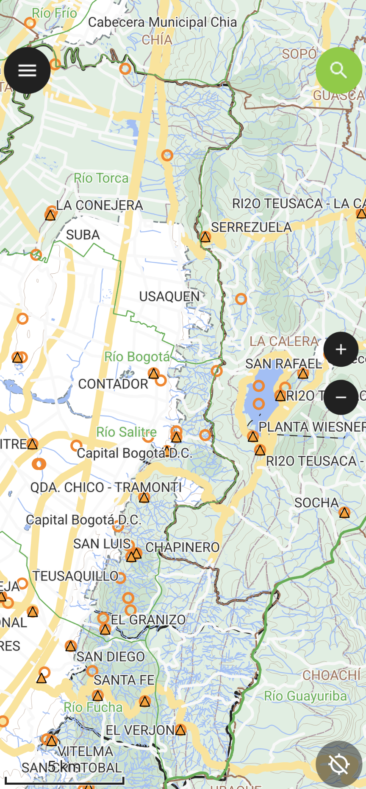

<i>TOOL: Mobile geographic information systems over QFIELD that do not require an Internet connection for navigation - GISMobile</i>

# 🛠️TOOL: _“GIS Mobile & POI: Sistemas de información geográficos móviles sobre QFIELD que no requieren de conexión a Internet para su navegación”_
Keywords: `QGIS` `QField` `POI` `Android` `iOS` `Python` `pandas` `numpy` `tabulate` `exif` `geopandas` `moviepy`

     

> Atención: la información utilizada para la creación de los proyectos GIS Mobile ha sido tomada de servicios de uso libre, consulte la licencia y restricciones de uso específicas de cada fuente de datos referenciada.

GISMobile utiliza bases de datos geográficas en formato File Geodatabase de ESRI y/o archivos de formas geométricas shapefile con despliegue a través de [QGIS](https://qgis.org/) en desktop y [QField](https://github.com/opengisch/QField) sobre dispositivos Android e iOS.

## Descargas y consultas

* [GISMobile - EAAB Colombia](file/gis/GISMobile_EAB_CO)
* [GISMobile - Predial Colombia](file/gis/GISMobile_Predial_CO)
* [GISMobile - Layers por Municipio Colombia](file/shp/Readme.md)
* [GISMobile - Puntos de interés (POI) Mundial](.poi/Readme.md)

## Instrucciones de instalación

1. Desde la [Play Store en Android](https://play.google.com/) o desde [App Store en iOS](https://www.apple.com/co/app-store/), instale la App [QField](https://play.google.com/store/search?q=qfield&c=apps) de [OPENGIS.ch](https://qfield.org/) 
2. Descargue el comprimido GIS Mobile de [rcfdtools](https://github.com/rcfdtools). Dentro de cada proyecto encontrará carpetas con las versiones disponibles, p.ej. v20230430. Se recomienda descargar la última versión.
3. En la raíz de su dispositivo o en la carpeta de descargas, cree una carpeta con el nombre `GISMobile` y descomprima los archivos (GDB.gdb y GISMobilexxx.qgz).
4. Abra QField y de clic en el botón `Open local file`
5. En la parte inferior derecha, de clic en el botón `+`, seleccione la opción `Import project from folder`
6. Busque la carpeta creada y de clic en el botón `Use this folder`. De clic en el botón `Allow` para permitir que QFiel acceda a los archivos del directorio. En caso de que tenga una versión previa importada, de clic en la opción `IMPORT AND OVERWRITE`.
7. Una vez finalizada la importación de clic en el archivo `GISMobilexxx.qgz` para abrir el mapa. Espere a que se cargue el mapa en su dispositivo.

> Dependiendo del tipo de dispositivo móvil, la apertura del mapa podrá tardar algunos segundos, una vez cargado podrá navegar por el mapa de forma fluida.
> 
> El proceso de apertura del proyecto también puede ser realizado directamente desde el archivo comprimido descargado mediante la opción `Import project from .zip file`

## Bugs & Fixes

* [QField - Can't access local storage on iOS phone](https://github.com/opengisch/QField/discussions/3755)
* [How to enable camera and take pictures for features in QFIELD?](https://gis.stackexchange.com/questions/287339/how-to-enable-camera-and-take-pictures-for-features-in-qfield)

##

**APPS & TOOLS & CONTENT DISCLAIMER**: • NO WARRANTY - This content and software is provided by <a href="https://github.com/rcfdtools" target="_blank">github.com/rcfdtools</a> "as is", without any express or implied warranty, including warranties of merchantability, fitness for a particular purpose, or non-infringement. There is no guarantee that the software will be error-free or operate without interruption. • LIMITATION OF LIABILITY - Neither the authors nor copyright holders will be liable for claims or damages arising from the software or its use. You are responsible for determining if the software is appropriate for your use and assume all associated risks, including errors, legal compliance, and data loss. • NO PROFESSIONAL ADVICE - The software provides general information and does not offer professional advice. It should not replace consultation with professional advisors. [Clauses and global license for rcfdtools use.](https://github.com/rcfdtools/rcfdtools/blob/main/LICENSE.md)

