

# _🛠️TOOL: “County GIS Layers - Colombia South America” for 17 - Caldas (27 Counties)_ 
Keywords: `geographical-information-system` `gis` `igac` `ider` `geodata` `colombia` `south-america`

County GIS layers are individual digital map datasets stacked together in a Geographic Information System (GIS) to visualize, manage, and analyze a county´s geographic information. Local governments, researches and engineers use these layers to run daily operations, plan infrastructure, track tax assessments, evaluate land plot risk, and dispatch emergency services.

</img>

| MiniMap                                                                                   | CountyID                                                                                          | CountyName   | CountyFiles                                                                                                                                                                                                                                                                                                                                                                                                                                                                                                                                                                                                                                                                                                                                                                                                                                                                                                                                                                                                                                                                                                                                                                                                                                                                                                                                                                                                                                                                                                                                                                                                                                                                                                                                                                                                                                                                                                                        |
|:------------------------------------------------------------------------------------------|:--------------------------------------------------------------------------------------------------|:-------------|:-----------------------------------------------------------------------------------------------------------------------------------------------------------------------------------------------------------------------------------------------------------------------------------------------------------------------------------------------------------------------------------------------------------------------------------------------------------------------------------------------------------------------------------------------------------------------------------------------------------------------------------------------------------------------------------------------------------------------------------------------------------------------------------------------------------------------------------------------------------------------------------------------------------------------------------------------------------------------------------------------------------------------------------------------------------------------------------------------------------------------------------------------------------------------------------------------------------------------------------------------------------------------------------------------------------------------------------------------------------------------------------------------------------------------------------------------------------------------------------------------------------------------------------------------------------------------------------------------------------------------------------------------------------------------------------------------------------------------------------------------------------------------------------------------------------------------------------------------------------------------------------------------------------------------------------|
| 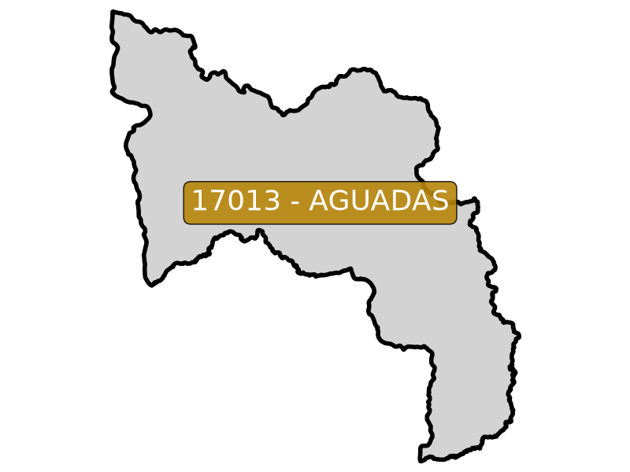 | [17013](https://github.com/rcfdtools/R.HydroTools/blob/main/tool/Population/file/report/17013.md) | Aguadas      | [17013_Rural_Building_202606.zip](https://github.com/rcfdtools/R.GISMobile/blob/main/file/shp/17013_Rural_Building_202606.zip) [17013_Rural_Lot_202606.zip](https://github.com/rcfdtools/R.GISMobile/blob/main/file/shp/17013_Rural_Lot_202606.zip) [17013_Rural_Nomenclature_202606.zip](https://github.com/rcfdtools/R.GISMobile/blob/main/file/shp/17013_Rural_Nomenclature_202606.zip) [17013_Rural_Nomenclature_Road_202606.zip](https://github.com/rcfdtools/R.GISMobile/blob/main/file/shp/17013_Rural_Nomenclature_Road_202606.zip) [17013_Rural_Sector_202606.zip](https://github.com/rcfdtools/R.GISMobile/blob/main/file/shp/17013_Rural_Sector_202606.zip) [17013_Rural_Vereda_202606.zip](https://github.com/rcfdtools/R.GISMobile/blob/main/file/shp/17013_Rural_Vereda_202606.zip) [17013_Urban_Block_202606.zip](https://github.com/rcfdtools/R.GISMobile/blob/main/file/shp/17013_Urban_Block_202606.zip) [17013_Urban_Building_202606.zip](https://github.com/rcfdtools/R.GISMobile/blob/main/file/shp/17013_Urban_Building_202606.zip) [17013_Urban_Lot_202606.zip](https://github.com/rcfdtools/R.GISMobile/blob/main/file/shp/17013_Urban_Lot_202606.zip) [17013_Urban_Neighborhood_202606.zip](https://github.com/rcfdtools/R.GISMobile/blob/main/file/shp/17013_Urban_Neighborhood_202606.zip) [17013_Urban_Nomenclature_202606.zip](https://github.com/rcfdtools/R.GISMobile/blob/main/file/shp/17013_Urban_Nomenclature_202606.zip) [17013_Urban_Nomenclature_Road_202606.zip](https://github.com/rcfdtools/R.GISMobile/blob/main/file/shp/17013_Urban_Nomenclature_Road_202606.zip) [17013_Urban_Perimeter_202606.zip](https://github.com/rcfdtools/R.GISMobile/blob/main/file/shp/17013_Urban_Perimeter_202606.zip) [17013_Urban_Sector_202606.zip](https://github.com/rcfdtools/R.GISMobile/blob/main/file/shp/17013_Urban_Sector_202606.zip)  |
| 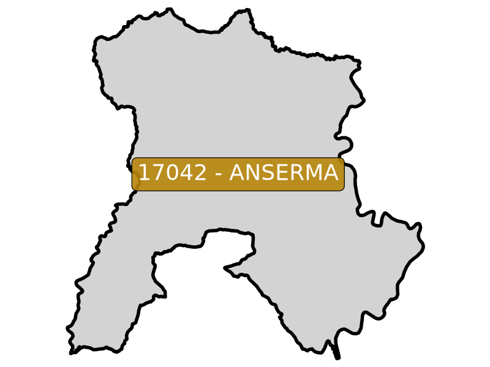 | [17042](https://github.com/rcfdtools/R.HydroTools/blob/main/tool/Population/file/report/17042.md) | Anserma      | [17042_Rural_Building_202606.zip](https://github.com/rcfdtools/R.GISMobile/blob/main/file/shp/17042_Rural_Building_202606.zip) [17042_Rural_Lot_202606.zip](https://github.com/rcfdtools/R.GISMobile/blob/main/file/shp/17042_Rural_Lot_202606.zip) [17042_Rural_Nomenclature_202606.zip](https://github.com/rcfdtools/R.GISMobile/blob/main/file/shp/17042_Rural_Nomenclature_202606.zip) [17042_Rural_Sector_202606.zip](https://github.com/rcfdtools/R.GISMobile/blob/main/file/shp/17042_Rural_Sector_202606.zip) [17042_Rural_Vereda_202606.zip](https://github.com/rcfdtools/R.GISMobile/blob/main/file/shp/17042_Rural_Vereda_202606.zip) [17042_Urban_Block_202606.zip](https://github.com/rcfdtools/R.GISMobile/blob/main/file/shp/17042_Urban_Block_202606.zip) [17042_Urban_Building_202606.zip](https://github.com/rcfdtools/R.GISMobile/blob/main/file/shp/17042_Urban_Building_202606.zip) [17042_Urban_Lot_202606.zip](https://github.com/rcfdtools/R.GISMobile/blob/main/file/shp/17042_Urban_Lot_202606.zip) [17042_Urban_Nomenclature_202606.zip](https://github.com/rcfdtools/R.GISMobile/blob/main/file/shp/17042_Urban_Nomenclature_202606.zip) [17042_Urban_Nomenclature_Road_202606.zip](https://github.com/rcfdtools/R.GISMobile/blob/main/file/shp/17042_Urban_Nomenclature_Road_202606.zip) [17042_Urban_Perimeter_202606.zip](https://github.com/rcfdtools/R.GISMobile/blob/main/file/shp/17042_Urban_Perimeter_202606.zip)                                                                                                                                                                                                                                                                                                                                                                                                                                 |
| 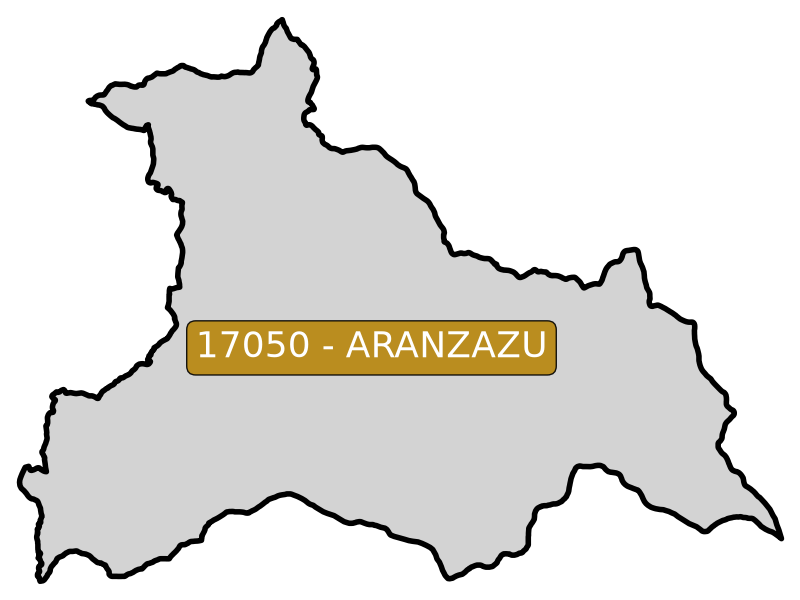 | [17050](https://github.com/rcfdtools/R.HydroTools/blob/main/tool/Population/file/report/17050.md) | Aranzazu     | [17050_Rural_Building_202606.zip](https://github.com/rcfdtools/R.GISMobile/blob/main/file/shp/17050_Rural_Building_202606.zip) [17050_Rural_Lot_202606.zip](https://github.com/rcfdtools/R.GISMobile/blob/main/file/shp/17050_Rural_Lot_202606.zip) [17050_Rural_Nomenclature_202606.zip](https://github.com/rcfdtools/R.GISMobile/blob/main/file/shp/17050_Rural_Nomenclature_202606.zip) [17050_Rural_Sector_202606.zip](https://github.com/rcfdtools/R.GISMobile/blob/main/file/shp/17050_Rural_Sector_202606.zip) [17050_Rural_Vereda_202606.zip](https://github.com/rcfdtools/R.GISMobile/blob/main/file/shp/17050_Rural_Vereda_202606.zip) [17050_Urban_Block_202606.zip](https://github.com/rcfdtools/R.GISMobile/blob/main/file/shp/17050_Urban_Block_202606.zip) [17050_Urban_Building_202606.zip](https://github.com/rcfdtools/R.GISMobile/blob/main/file/shp/17050_Urban_Building_202606.zip) [17050_Urban_Lot_202606.zip](https://github.com/rcfdtools/R.GISMobile/blob/main/file/shp/17050_Urban_Lot_202606.zip) [17050_Urban_Nomenclature_202606.zip](https://github.com/rcfdtools/R.GISMobile/blob/main/file/shp/17050_Urban_Nomenclature_202606.zip) [17050_Urban_Nomenclature_Road_202606.zip](https://github.com/rcfdtools/R.GISMobile/blob/main/file/shp/17050_Urban_Nomenclature_Road_202606.zip) [17050_Urban_Perimeter_202606.zip](https://github.com/rcfdtools/R.GISMobile/blob/main/file/shp/17050_Urban_Perimeter_202606.zip) [17050_Urban_Sector_202606.zip](https://github.com/rcfdtools/R.GISMobile/blob/main/file/shp/17050_Urban_Sector_202606.zip)                                                                                                                                                                                                                                                                                                  |
| 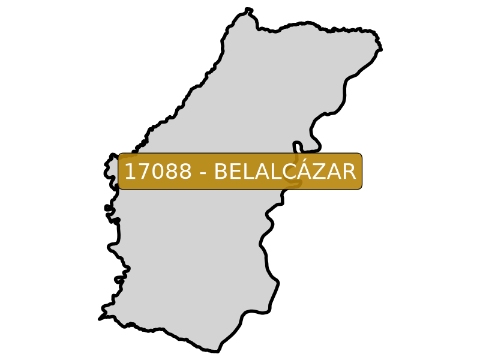 | [17088](https://github.com/rcfdtools/R.HydroTools/blob/main/tool/Population/file/report/17088.md) | Belalcázar   | [17088_Rural_Building_202606.zip](https://github.com/rcfdtools/R.GISMobile/blob/main/file/shp/17088_Rural_Building_202606.zip) [17088_Rural_Lot_202606.zip](https://github.com/rcfdtools/R.GISMobile/blob/main/file/shp/17088_Rural_Lot_202606.zip) [17088_Rural_Nomenclature_202606.zip](https://github.com/rcfdtools/R.GISMobile/blob/main/file/shp/17088_Rural_Nomenclature_202606.zip) [17088_Rural_Sector_202606.zip](https://github.com/rcfdtools/R.GISMobile/blob/main/file/shp/17088_Rural_Sector_202606.zip) [17088_Rural_Vereda_202606.zip](https://github.com/rcfdtools/R.GISMobile/blob/main/file/shp/17088_Rural_Vereda_202606.zip) [17088_Urban_Block_202606.zip](https://github.com/rcfdtools/R.GISMobile/blob/main/file/shp/17088_Urban_Block_202606.zip) [17088_Urban_Building_202606.zip](https://github.com/rcfdtools/R.GISMobile/blob/main/file/shp/17088_Urban_Building_202606.zip) [17088_Urban_Lot_202606.zip](https://github.com/rcfdtools/R.GISMobile/blob/main/file/shp/17088_Urban_Lot_202606.zip) [17088_Urban_Neighborhood_202606.zip](https://github.com/rcfdtools/R.GISMobile/blob/main/file/shp/17088_Urban_Neighborhood_202606.zip) [17088_Urban_Nomenclature_202606.zip](https://github.com/rcfdtools/R.GISMobile/blob/main/file/shp/17088_Urban_Nomenclature_202606.zip) [17088_Urban_Nomenclature_Road_202606.zip](https://github.com/rcfdtools/R.GISMobile/blob/main/file/shp/17088_Urban_Nomenclature_Road_202606.zip) [17088_Urban_Perimeter_202606.zip](https://github.com/rcfdtools/R.GISMobile/blob/main/file/shp/17088_Urban_Perimeter_202606.zip) [17088_Urban_Sector_202606.zip](https://github.com/rcfdtools/R.GISMobile/blob/main/file/shp/17088_Urban_Sector_202606.zip)                                                                                                                                                       |
| 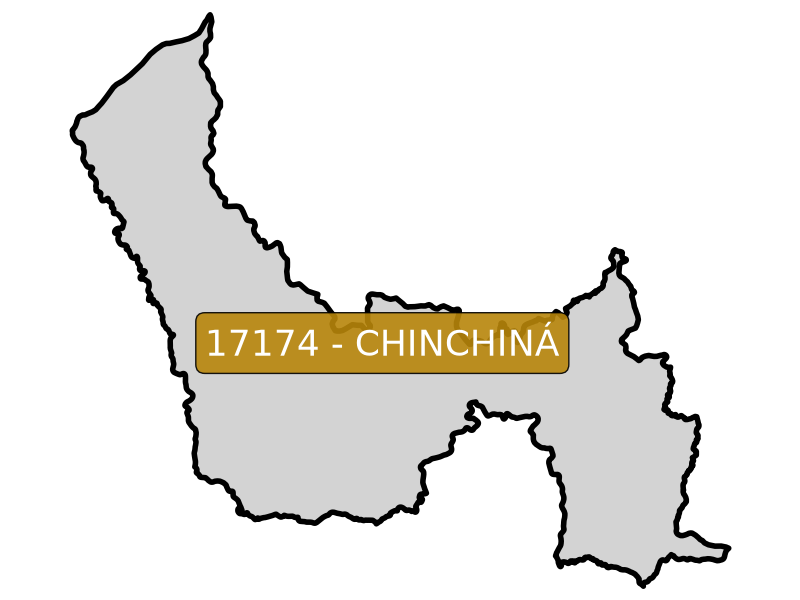 | [17174](https://github.com/rcfdtools/R.HydroTools/blob/main/tool/Population/file/report/17174.md) | Chinchiná    | [17174_Rural_Building_202606.zip](https://github.com/rcfdtools/R.GISMobile/blob/main/file/shp/17174_Rural_Building_202606.zip) [17174_Rural_Lot_202606.zip](https://github.com/rcfdtools/R.GISMobile/blob/main/file/shp/17174_Rural_Lot_202606.zip) [17174_Rural_Nomenclature_202606.zip](https://github.com/rcfdtools/R.GISMobile/blob/main/file/shp/17174_Rural_Nomenclature_202606.zip) [17174_Rural_Nomenclature_Road_202606.zip](https://github.com/rcfdtools/R.GISMobile/blob/main/file/shp/17174_Rural_Nomenclature_Road_202606.zip) [17174_Rural_Vereda_202606.zip](https://github.com/rcfdtools/R.GISMobile/blob/main/file/shp/17174_Rural_Vereda_202606.zip) [17174_Urban_Block_202606.zip](https://github.com/rcfdtools/R.GISMobile/blob/main/file/shp/17174_Urban_Block_202606.zip) [17174_Urban_Building_202606.zip](https://github.com/rcfdtools/R.GISMobile/blob/main/file/shp/17174_Urban_Building_202606.zip) [17174_Urban_Lot_202606.zip](https://github.com/rcfdtools/R.GISMobile/blob/main/file/shp/17174_Urban_Lot_202606.zip) [17174_Urban_Neighborhood_202606.zip](https://github.com/rcfdtools/R.GISMobile/blob/main/file/shp/17174_Urban_Neighborhood_202606.zip) [17174_Urban_Nomenclature_202606.zip](https://github.com/rcfdtools/R.GISMobile/blob/main/file/shp/17174_Urban_Nomenclature_202606.zip) [17174_Urban_Nomenclature_Road_202606.zip](https://github.com/rcfdtools/R.GISMobile/blob/main/file/shp/17174_Urban_Nomenclature_Road_202606.zip) [17174_Urban_Perimeter_202606.zip](https://github.com/rcfdtools/R.GISMobile/blob/main/file/shp/17174_Urban_Perimeter_202606.zip) [17174_Urban_Sector_202606.zip](https://github.com/rcfdtools/R.GISMobile/blob/main/file/shp/17174_Urban_Sector_202606.zip)                                                                                                                                 |
| 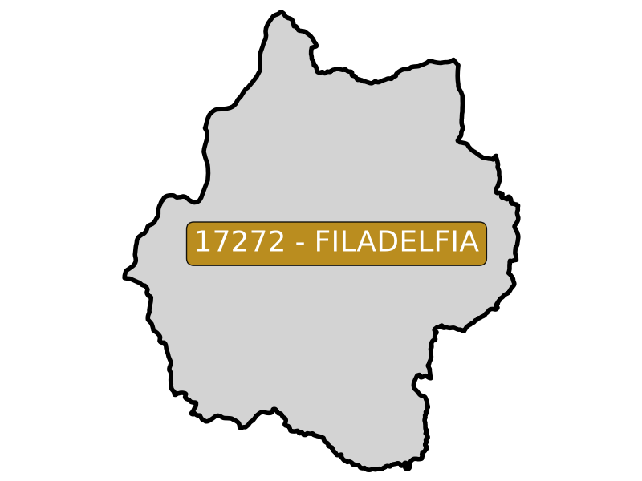 | [17272](https://github.com/rcfdtools/R.HydroTools/blob/main/tool/Population/file/report/17272.md) | Filadelfia   | [17272_Rural_Building_202606.zip](https://github.com/rcfdtools/R.GISMobile/blob/main/file/shp/17272_Rural_Building_202606.zip) [17272_Rural_Lot_202606.zip](https://github.com/rcfdtools/R.GISMobile/blob/main/file/shp/17272_Rural_Lot_202606.zip) [17272_Rural_Nomenclature_202606.zip](https://github.com/rcfdtools/R.GISMobile/blob/main/file/shp/17272_Rural_Nomenclature_202606.zip) [17272_Rural_Sector_202606.zip](https://github.com/rcfdtools/R.GISMobile/blob/main/file/shp/17272_Rural_Sector_202606.zip) [17272_Rural_Vereda_202606.zip](https://github.com/rcfdtools/R.GISMobile/blob/main/file/shp/17272_Rural_Vereda_202606.zip) [17272_Urban_Block_202606.zip](https://github.com/rcfdtools/R.GISMobile/blob/main/file/shp/17272_Urban_Block_202606.zip) [17272_Urban_Building_202606.zip](https://github.com/rcfdtools/R.GISMobile/blob/main/file/shp/17272_Urban_Building_202606.zip) [17272_Urban_Lot_202606.zip](https://github.com/rcfdtools/R.GISMobile/blob/main/file/shp/17272_Urban_Lot_202606.zip) [17272_Urban_Nomenclature_202606.zip](https://github.com/rcfdtools/R.GISMobile/blob/main/file/shp/17272_Urban_Nomenclature_202606.zip) [17272_Urban_Nomenclature_Road_202606.zip](https://github.com/rcfdtools/R.GISMobile/blob/main/file/shp/17272_Urban_Nomenclature_Road_202606.zip) [17272_Urban_Perimeter_202606.zip](https://github.com/rcfdtools/R.GISMobile/blob/main/file/shp/17272_Urban_Perimeter_202606.zip) [17272_Urban_Sector_202606.zip](https://github.com/rcfdtools/R.GISMobile/blob/main/file/shp/17272_Urban_Sector_202606.zip)                                                                                                                                                                                                                                                                                                  |
| 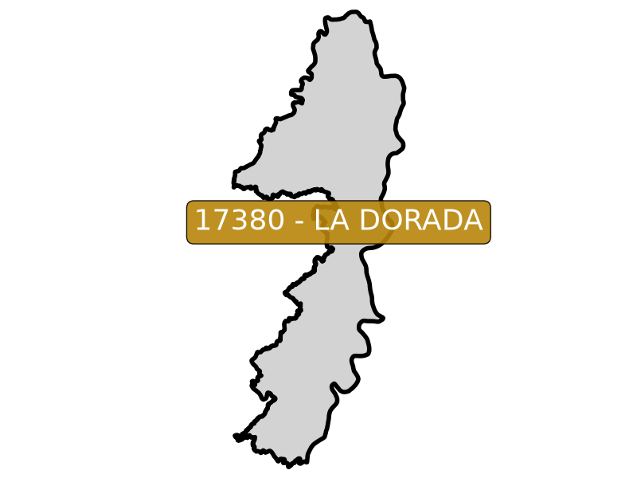 | [17380](https://github.com/rcfdtools/R.HydroTools/blob/main/tool/Population/file/report/17380.md) | La Dorada    | [17380_Rural_Building_202606.zip](https://github.com/rcfdtools/R.GISMobile/blob/main/file/shp/17380_Rural_Building_202606.zip) [17380_Rural_Lot_202606.zip](https://github.com/rcfdtools/R.GISMobile/blob/main/file/shp/17380_Rural_Lot_202606.zip) [17380_Rural_Nomenclature_202606.zip](https://github.com/rcfdtools/R.GISMobile/blob/main/file/shp/17380_Rural_Nomenclature_202606.zip) [17380_Rural_Sector_202606.zip](https://github.com/rcfdtools/R.GISMobile/blob/main/file/shp/17380_Rural_Sector_202606.zip) [17380_Rural_Vereda_202606.zip](https://github.com/rcfdtools/R.GISMobile/blob/main/file/shp/17380_Rural_Vereda_202606.zip) [17380_Urban_Block_202606.zip](https://github.com/rcfdtools/R.GISMobile/blob/main/file/shp/17380_Urban_Block_202606.zip) [17380_Urban_Building_202606.zip](https://github.com/rcfdtools/R.GISMobile/blob/main/file/shp/17380_Urban_Building_202606.zip) [17380_Urban_Lot_202606.zip](https://github.com/rcfdtools/R.GISMobile/blob/main/file/shp/17380_Urban_Lot_202606.zip) [17380_Urban_Neighborhood_202606.zip](https://github.com/rcfdtools/R.GISMobile/blob/main/file/shp/17380_Urban_Neighborhood_202606.zip) [17380_Urban_Nomenclature_202606.zip](https://github.com/rcfdtools/R.GISMobile/blob/main/file/shp/17380_Urban_Nomenclature_202606.zip) [17380_Urban_Nomenclature_Road_202606.zip](https://github.com/rcfdtools/R.GISMobile/blob/main/file/shp/17380_Urban_Nomenclature_Road_202606.zip) [17380_Urban_Perimeter_202606.zip](https://github.com/rcfdtools/R.GISMobile/blob/main/file/shp/17380_Urban_Perimeter_202606.zip) [17380_Urban_Sector_202606.zip](https://github.com/rcfdtools/R.GISMobile/blob/main/file/shp/17380_Urban_Sector_202606.zip)                                                                                                                                                       |
| 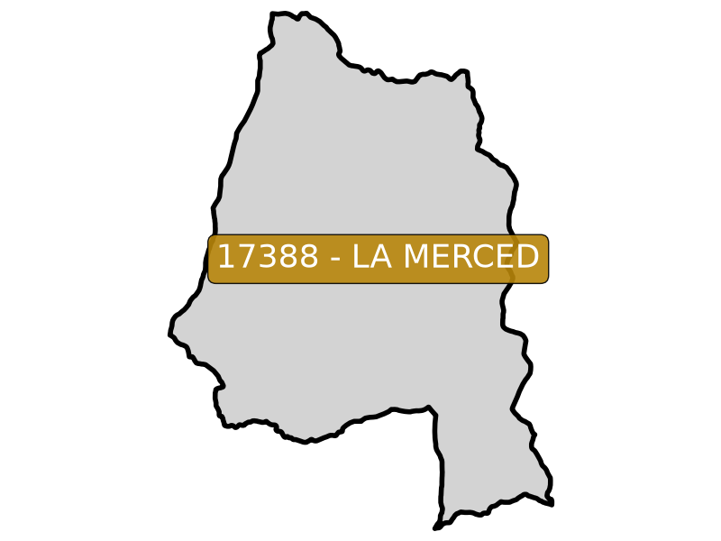 | [17388](https://github.com/rcfdtools/R.HydroTools/blob/main/tool/Population/file/report/17388.md) | La Merced    | [17388_Rural_Building_202606.zip](https://github.com/rcfdtools/R.GISMobile/blob/main/file/shp/17388_Rural_Building_202606.zip) [17388_Rural_Lot_202606.zip](https://github.com/rcfdtools/R.GISMobile/blob/main/file/shp/17388_Rural_Lot_202606.zip) [17388_Rural_Nomenclature_202606.zip](https://github.com/rcfdtools/R.GISMobile/blob/main/file/shp/17388_Rural_Nomenclature_202606.zip) [17388_Rural_Sector_202606.zip](https://github.com/rcfdtools/R.GISMobile/blob/main/file/shp/17388_Rural_Sector_202606.zip) [17388_Rural_Vereda_202606.zip](https://github.com/rcfdtools/R.GISMobile/blob/main/file/shp/17388_Rural_Vereda_202606.zip) [17388_Urban_Block_202606.zip](https://github.com/rcfdtools/R.GISMobile/blob/main/file/shp/17388_Urban_Block_202606.zip) [17388_Urban_Building_202606.zip](https://github.com/rcfdtools/R.GISMobile/blob/main/file/shp/17388_Urban_Building_202606.zip) [17388_Urban_Lot_202606.zip](https://github.com/rcfdtools/R.GISMobile/blob/main/file/shp/17388_Urban_Lot_202606.zip) [17388_Urban_Nomenclature_202606.zip](https://github.com/rcfdtools/R.GISMobile/blob/main/file/shp/17388_Urban_Nomenclature_202606.zip) [17388_Urban_Nomenclature_Road_202606.zip](https://github.com/rcfdtools/R.GISMobile/blob/main/file/shp/17388_Urban_Nomenclature_Road_202606.zip) [17388_Urban_Perimeter_202606.zip](https://github.com/rcfdtools/R.GISMobile/blob/main/file/shp/17388_Urban_Perimeter_202606.zip)                                                                                                                                                                                                                                                                                                                                                                                                                                 |
| 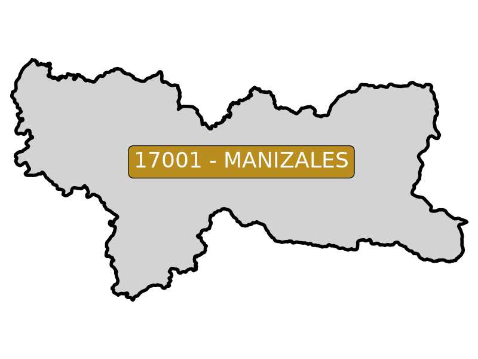 | [17001](https://github.com/rcfdtools/R.HydroTools/blob/main/tool/Population/file/report/17001.md) | Manizales    | [17001_Rural_Lot_202001.zip](https://github.com/rcfdtools/R.GISMobile/blob/main/file/shp/17001_Rural_Lot_202001.zip) [17001_Urban_Lot_202001.zip](https://github.com/rcfdtools/R.GISMobile/blob/main/file/shp/17001_Urban_Lot_202001.zip)                                                                                                                                                                                                                                                                                                                                                                                                                                                                                                                                                                                                                                                                                                                                                                                                                                                                                                                                                                                                                                                                                                                                                                                                                                                                                                                                                                                                                                                                                                                                                                                                                                                                                  |
| 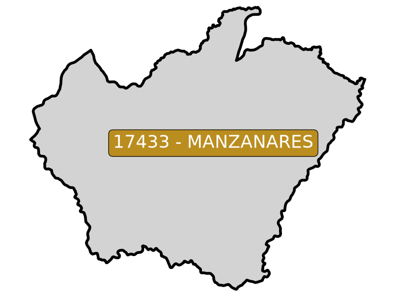 | [17433](https://github.com/rcfdtools/R.HydroTools/blob/main/tool/Population/file/report/17433.md) | Manzanares   | [17433_Rural_Building_202606.zip](https://github.com/rcfdtools/R.GISMobile/blob/main/file/shp/17433_Rural_Building_202606.zip) [17433_Rural_Lot_202606.zip](https://github.com/rcfdtools/R.GISMobile/blob/main/file/shp/17433_Rural_Lot_202606.zip) [17433_Rural_Nomenclature_202606.zip](https://github.com/rcfdtools/R.GISMobile/blob/main/file/shp/17433_Rural_Nomenclature_202606.zip) [17433_Rural_Sector_202606.zip](https://github.com/rcfdtools/R.GISMobile/blob/main/file/shp/17433_Rural_Sector_202606.zip) [17433_Rural_Vereda_202606.zip](https://github.com/rcfdtools/R.GISMobile/blob/main/file/shp/17433_Rural_Vereda_202606.zip) [17433_Urban_Block_202606.zip](https://github.com/rcfdtools/R.GISMobile/blob/main/file/shp/17433_Urban_Block_202606.zip) [17433_Urban_Building_202606.zip](https://github.com/rcfdtools/R.GISMobile/blob/main/file/shp/17433_Urban_Building_202606.zip) [17433_Urban_Lot_202606.zip](https://github.com/rcfdtools/R.GISMobile/blob/main/file/shp/17433_Urban_Lot_202606.zip) [17433_Urban_Neighborhood_202606.zip](https://github.com/rcfdtools/R.GISMobile/blob/main/file/shp/17433_Urban_Neighborhood_202606.zip) [17433_Urban_Nomenclature_202606.zip](https://github.com/rcfdtools/R.GISMobile/blob/main/file/shp/17433_Urban_Nomenclature_202606.zip) [17433_Urban_Nomenclature_Road_202606.zip](https://github.com/rcfdtools/R.GISMobile/blob/main/file/shp/17433_Urban_Nomenclature_Road_202606.zip) [17433_Urban_Perimeter_202606.zip](https://github.com/rcfdtools/R.GISMobile/blob/main/file/shp/17433_Urban_Perimeter_202606.zip) [17433_Urban_Sector_202606.zip](https://github.com/rcfdtools/R.GISMobile/blob/main/file/shp/17433_Urban_Sector_202606.zip)                                                                                                                                                       |
| 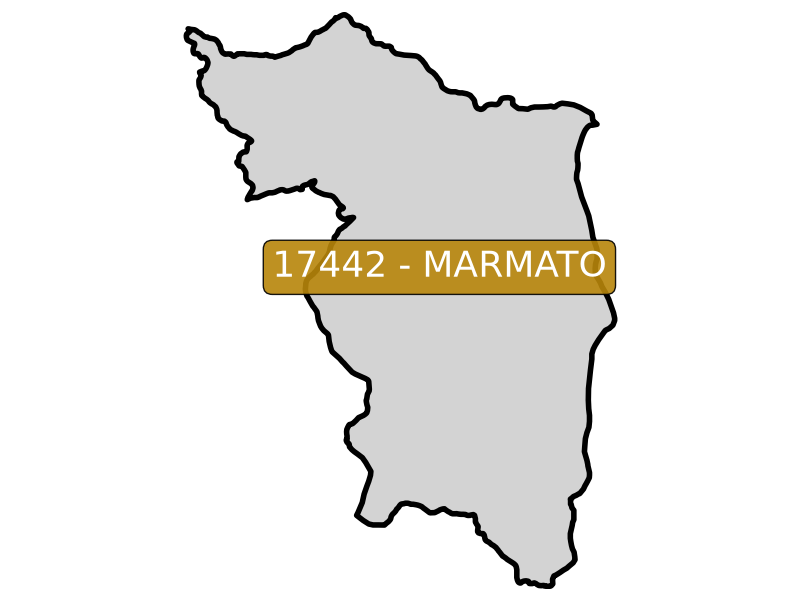 | [17442](https://github.com/rcfdtools/R.HydroTools/blob/main/tool/Population/file/report/17442.md) | Marmato      | [17442_Rural_Building_202606.zip](https://github.com/rcfdtools/R.GISMobile/blob/main/file/shp/17442_Rural_Building_202606.zip) [17442_Rural_Lot_202606.zip](https://github.com/rcfdtools/R.GISMobile/blob/main/file/shp/17442_Rural_Lot_202606.zip) [17442_Rural_Nomenclature_202606.zip](https://github.com/rcfdtools/R.GISMobile/blob/main/file/shp/17442_Rural_Nomenclature_202606.zip) [17442_Rural_Nomenclature_Road_202606.zip](https://github.com/rcfdtools/R.GISMobile/blob/main/file/shp/17442_Rural_Nomenclature_Road_202606.zip) [17442_Rural_Sector_202606.zip](https://github.com/rcfdtools/R.GISMobile/blob/main/file/shp/17442_Rural_Sector_202606.zip) [17442_Rural_Vereda_202606.zip](https://github.com/rcfdtools/R.GISMobile/blob/main/file/shp/17442_Rural_Vereda_202606.zip) [17442_Urban_Block_202606.zip](https://github.com/rcfdtools/R.GISMobile/blob/main/file/shp/17442_Urban_Block_202606.zip) [17442_Urban_Building_202606.zip](https://github.com/rcfdtools/R.GISMobile/blob/main/file/shp/17442_Urban_Building_202606.zip) [17442_Urban_Lot_202606.zip](https://github.com/rcfdtools/R.GISMobile/blob/main/file/shp/17442_Urban_Lot_202606.zip) [17442_Urban_Nomenclature_202606.zip](https://github.com/rcfdtools/R.GISMobile/blob/main/file/shp/17442_Urban_Nomenclature_202606.zip) [17442_Urban_Nomenclature_Road_202606.zip](https://github.com/rcfdtools/R.GISMobile/blob/main/file/shp/17442_Urban_Nomenclature_Road_202606.zip) [17442_Urban_Perimeter_202606.zip](https://github.com/rcfdtools/R.GISMobile/blob/main/file/shp/17442_Urban_Perimeter_202606.zip)                                                                                                                                                                                                                                                                            |
| 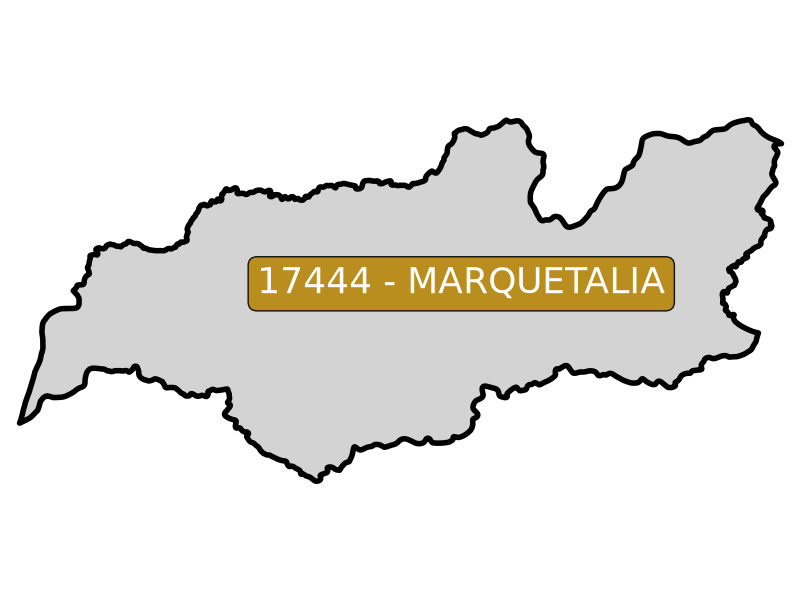 | [17444](https://github.com/rcfdtools/R.HydroTools/blob/main/tool/Population/file/report/17444.md) | Marquetalia  | [17444_Rural_Building_202606.zip](https://github.com/rcfdtools/R.GISMobile/blob/main/file/shp/17444_Rural_Building_202606.zip) [17444_Rural_Lot_202606.zip](https://github.com/rcfdtools/R.GISMobile/blob/main/file/shp/17444_Rural_Lot_202606.zip) [17444_Rural_Nomenclature_202606.zip](https://github.com/rcfdtools/R.GISMobile/blob/main/file/shp/17444_Rural_Nomenclature_202606.zip) [17444_Rural_Sector_202606.zip](https://github.com/rcfdtools/R.GISMobile/blob/main/file/shp/17444_Rural_Sector_202606.zip) [17444_Rural_Vereda_202606.zip](https://github.com/rcfdtools/R.GISMobile/blob/main/file/shp/17444_Rural_Vereda_202606.zip) [17444_Urban_Block_202606.zip](https://github.com/rcfdtools/R.GISMobile/blob/main/file/shp/17444_Urban_Block_202606.zip) [17444_Urban_Building_202606.zip](https://github.com/rcfdtools/R.GISMobile/blob/main/file/shp/17444_Urban_Building_202606.zip) [17444_Urban_Lot_202606.zip](https://github.com/rcfdtools/R.GISMobile/blob/main/file/shp/17444_Urban_Lot_202606.zip) [17444_Urban_Nomenclature_202606.zip](https://github.com/rcfdtools/R.GISMobile/blob/main/file/shp/17444_Urban_Nomenclature_202606.zip) [17444_Urban_Nomenclature_Road_202606.zip](https://github.com/rcfdtools/R.GISMobile/blob/main/file/shp/17444_Urban_Nomenclature_Road_202606.zip) [17444_Urban_Perimeter_202606.zip](https://github.com/rcfdtools/R.GISMobile/blob/main/file/shp/17444_Urban_Perimeter_202606.zip) [17444_Urban_Sector_202606.zip](https://github.com/rcfdtools/R.GISMobile/blob/main/file/shp/17444_Urban_Sector_202606.zip)                                                                                                                                                                                                                                                                                                  |
| 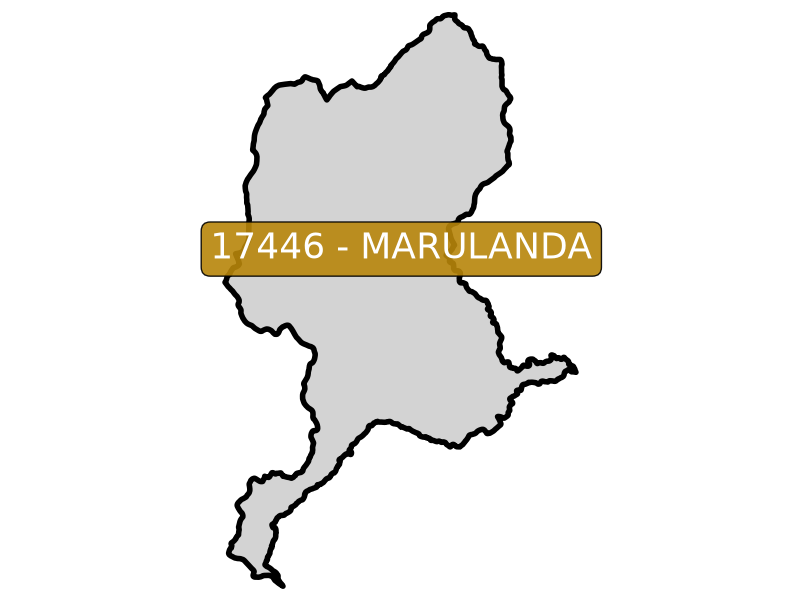 | [17446](https://github.com/rcfdtools/R.HydroTools/blob/main/tool/Population/file/report/17446.md) | Marulanda    | [17446_Rural_Building_202606.zip](https://github.com/rcfdtools/R.GISMobile/blob/main/file/shp/17446_Rural_Building_202606.zip) [17446_Rural_Lot_202606.zip](https://github.com/rcfdtools/R.GISMobile/blob/main/file/shp/17446_Rural_Lot_202606.zip) [17446_Rural_Nomenclature_202606.zip](https://github.com/rcfdtools/R.GISMobile/blob/main/file/shp/17446_Rural_Nomenclature_202606.zip) [17446_Rural_Nomenclature_Road_202606.zip](https://github.com/rcfdtools/R.GISMobile/blob/main/file/shp/17446_Rural_Nomenclature_Road_202606.zip) [17446_Rural_Sector_202606.zip](https://github.com/rcfdtools/R.GISMobile/blob/main/file/shp/17446_Rural_Sector_202606.zip) [17446_Rural_Vereda_202606.zip](https://github.com/rcfdtools/R.GISMobile/blob/main/file/shp/17446_Rural_Vereda_202606.zip) [17446_Urban_Block_202606.zip](https://github.com/rcfdtools/R.GISMobile/blob/main/file/shp/17446_Urban_Block_202606.zip) [17446_Urban_Building_202606.zip](https://github.com/rcfdtools/R.GISMobile/blob/main/file/shp/17446_Urban_Building_202606.zip) [17446_Urban_Lot_202606.zip](https://github.com/rcfdtools/R.GISMobile/blob/main/file/shp/17446_Urban_Lot_202606.zip) [17446_Urban_Nomenclature_202606.zip](https://github.com/rcfdtools/R.GISMobile/blob/main/file/shp/17446_Urban_Nomenclature_202606.zip) [17446_Urban_Nomenclature_Road_202606.zip](https://github.com/rcfdtools/R.GISMobile/blob/main/file/shp/17446_Urban_Nomenclature_Road_202606.zip) [17446_Urban_Perimeter_202606.zip](https://github.com/rcfdtools/R.GISMobile/blob/main/file/shp/17446_Urban_Perimeter_202606.zip) [17446_Urban_Sector_202606.zip](https://github.com/rcfdtools/R.GISMobile/blob/main/file/shp/17446_Urban_Sector_202606.zip)                                                                                                                                             |
| 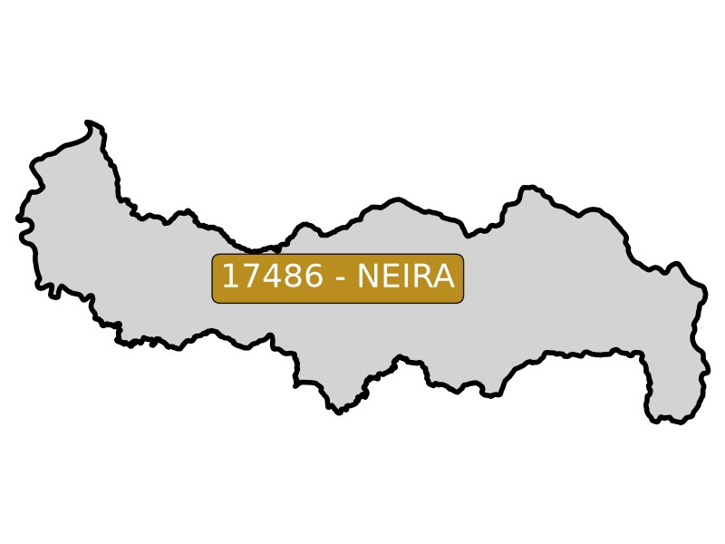 | [17486](https://github.com/rcfdtools/R.HydroTools/blob/main/tool/Population/file/report/17486.md) | Neira        | [17486_Rural_Building_202606.zip](https://github.com/rcfdtools/R.GISMobile/blob/main/file/shp/17486_Rural_Building_202606.zip) [17486_Rural_Lot_202606.zip](https://github.com/rcfdtools/R.GISMobile/blob/main/file/shp/17486_Rural_Lot_202606.zip) [17486_Rural_Nomenclature_202606.zip](https://github.com/rcfdtools/R.GISMobile/blob/main/file/shp/17486_Rural_Nomenclature_202606.zip) [17486_Rural_Sector_202606.zip](https://github.com/rcfdtools/R.GISMobile/blob/main/file/shp/17486_Rural_Sector_202606.zip) [17486_Rural_Vereda_202606.zip](https://github.com/rcfdtools/R.GISMobile/blob/main/file/shp/17486_Rural_Vereda_202606.zip) [17486_Urban_Block_202606.zip](https://github.com/rcfdtools/R.GISMobile/blob/main/file/shp/17486_Urban_Block_202606.zip) [17486_Urban_Building_202606.zip](https://github.com/rcfdtools/R.GISMobile/blob/main/file/shp/17486_Urban_Building_202606.zip) [17486_Urban_Lot_202606.zip](https://github.com/rcfdtools/R.GISMobile/blob/main/file/shp/17486_Urban_Lot_202606.zip) [17486_Urban_Nomenclature_202606.zip](https://github.com/rcfdtools/R.GISMobile/blob/main/file/shp/17486_Urban_Nomenclature_202606.zip) [17486_Urban_Nomenclature_Road_202606.zip](https://github.com/rcfdtools/R.GISMobile/blob/main/file/shp/17486_Urban_Nomenclature_Road_202606.zip) [17486_Urban_Perimeter_202606.zip](https://github.com/rcfdtools/R.GISMobile/blob/main/file/shp/17486_Urban_Perimeter_202606.zip) [17486_Urban_Sector_202606.zip](https://github.com/rcfdtools/R.GISMobile/blob/main/file/shp/17486_Urban_Sector_202606.zip)                                                                                                                                                                                                                                                                                                  |
| 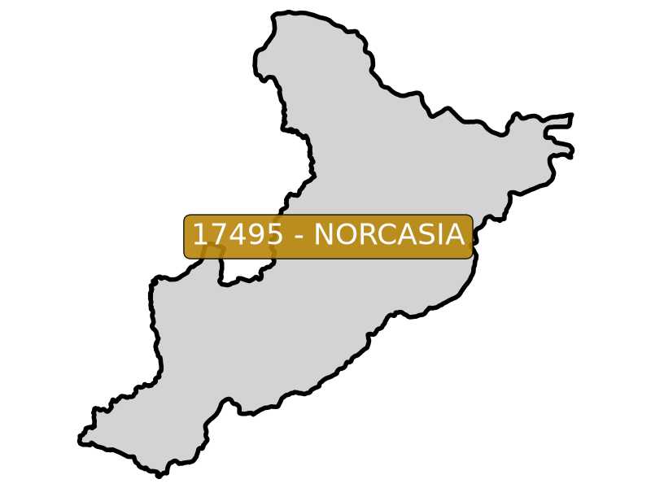 | [17495](https://github.com/rcfdtools/R.HydroTools/blob/main/tool/Population/file/report/17495.md) | Norcasia     | [17495_Rural_Building_202606.zip](https://github.com/rcfdtools/R.GISMobile/blob/main/file/shp/17495_Rural_Building_202606.zip) [17495_Rural_Lot_202606.zip](https://github.com/rcfdtools/R.GISMobile/blob/main/file/shp/17495_Rural_Lot_202606.zip) [17495_Rural_Nomenclature_202606.zip](https://github.com/rcfdtools/R.GISMobile/blob/main/file/shp/17495_Rural_Nomenclature_202606.zip) [17495_Rural_Sector_202606.zip](https://github.com/rcfdtools/R.GISMobile/blob/main/file/shp/17495_Rural_Sector_202606.zip) [17495_Rural_Vereda_202606.zip](https://github.com/rcfdtools/R.GISMobile/blob/main/file/shp/17495_Rural_Vereda_202606.zip) [17495_Urban_Block_202606.zip](https://github.com/rcfdtools/R.GISMobile/blob/main/file/shp/17495_Urban_Block_202606.zip) [17495_Urban_Building_202606.zip](https://github.com/rcfdtools/R.GISMobile/blob/main/file/shp/17495_Urban_Building_202606.zip) [17495_Urban_Lot_202606.zip](https://github.com/rcfdtools/R.GISMobile/blob/main/file/shp/17495_Urban_Lot_202606.zip) [17495_Urban_Nomenclature_202606.zip](https://github.com/rcfdtools/R.GISMobile/blob/main/file/shp/17495_Urban_Nomenclature_202606.zip) [17495_Urban_Nomenclature_Road_202606.zip](https://github.com/rcfdtools/R.GISMobile/blob/main/file/shp/17495_Urban_Nomenclature_Road_202606.zip) [17495_Urban_Perimeter_202606.zip](https://github.com/rcfdtools/R.GISMobile/blob/main/file/shp/17495_Urban_Perimeter_202606.zip) [17495_Urban_Sector_202606.zip](https://github.com/rcfdtools/R.GISMobile/blob/main/file/shp/17495_Urban_Sector_202606.zip)                                                                                                                                                                                                                                                                                                  |
| 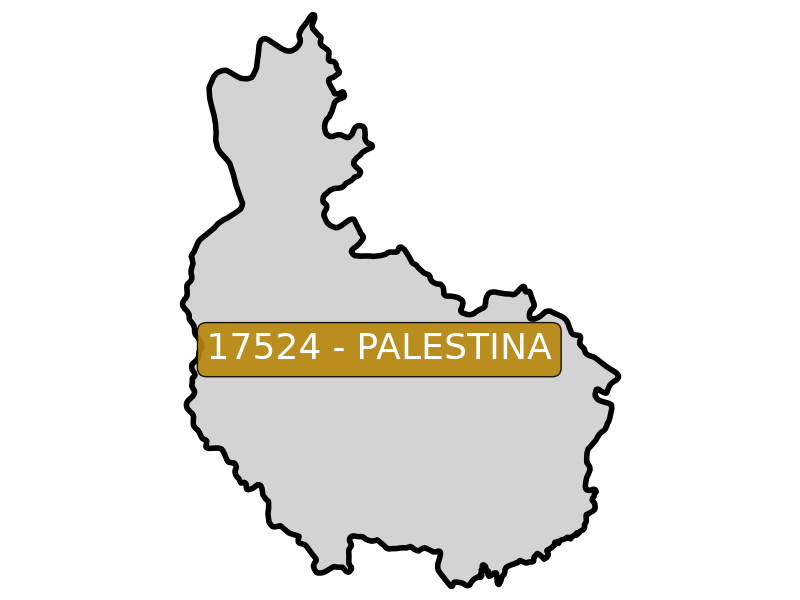 | [17524](https://github.com/rcfdtools/R.HydroTools/blob/main/tool/Population/file/report/17524.md) | Palestina    | [17524_Rural_Building_202606.zip](https://github.com/rcfdtools/R.GISMobile/blob/main/file/shp/17524_Rural_Building_202606.zip) [17524_Rural_Lot_202606.zip](https://github.com/rcfdtools/R.GISMobile/blob/main/file/shp/17524_Rural_Lot_202606.zip) [17524_Rural_Nomenclature_202606.zip](https://github.com/rcfdtools/R.GISMobile/blob/main/file/shp/17524_Rural_Nomenclature_202606.zip) [17524_Rural_Sector_202606.zip](https://github.com/rcfdtools/R.GISMobile/blob/main/file/shp/17524_Rural_Sector_202606.zip) [17524_Rural_Vereda_202606.zip](https://github.com/rcfdtools/R.GISMobile/blob/main/file/shp/17524_Rural_Vereda_202606.zip) [17524_Urban_Block_202606.zip](https://github.com/rcfdtools/R.GISMobile/blob/main/file/shp/17524_Urban_Block_202606.zip) [17524_Urban_Building_202606.zip](https://github.com/rcfdtools/R.GISMobile/blob/main/file/shp/17524_Urban_Building_202606.zip) [17524_Urban_Lot_202606.zip](https://github.com/rcfdtools/R.GISMobile/blob/main/file/shp/17524_Urban_Lot_202606.zip) [17524_Urban_Nomenclature_202606.zip](https://github.com/rcfdtools/R.GISMobile/blob/main/file/shp/17524_Urban_Nomenclature_202606.zip) [17524_Urban_Nomenclature_Road_202606.zip](https://github.com/rcfdtools/R.GISMobile/blob/main/file/shp/17524_Urban_Nomenclature_Road_202606.zip) [17524_Urban_Perimeter_202606.zip](https://github.com/rcfdtools/R.GISMobile/blob/main/file/shp/17524_Urban_Perimeter_202606.zip) [17524_Urban_Sector_202606.zip](https://github.com/rcfdtools/R.GISMobile/blob/main/file/shp/17524_Urban_Sector_202606.zip)                                                                                                                                                                                                                                                                                                  |
| 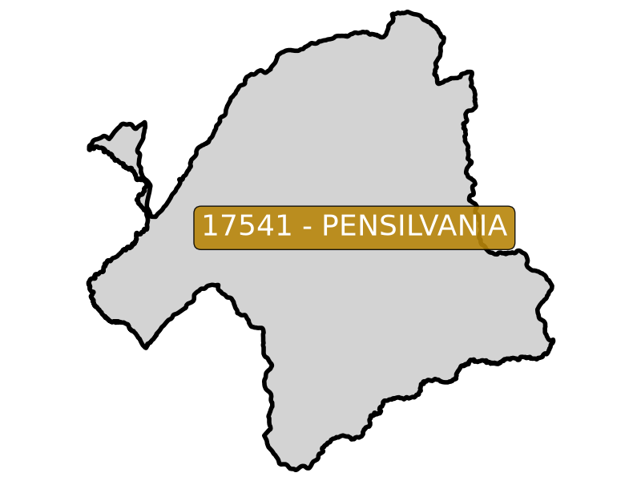 | [17541](https://github.com/rcfdtools/R.HydroTools/blob/main/tool/Population/file/report/17541.md) | Pensilvania  | [17541_Rural_Building_202606.zip](https://github.com/rcfdtools/R.GISMobile/blob/main/file/shp/17541_Rural_Building_202606.zip) [17541_Rural_Lot_202606.zip](https://github.com/rcfdtools/R.GISMobile/blob/main/file/shp/17541_Rural_Lot_202606.zip) [17541_Rural_Nomenclature_202606.zip](https://github.com/rcfdtools/R.GISMobile/blob/main/file/shp/17541_Rural_Nomenclature_202606.zip) [17541_Rural_Sector_202606.zip](https://github.com/rcfdtools/R.GISMobile/blob/main/file/shp/17541_Rural_Sector_202606.zip) [17541_Rural_Vereda_202606.zip](https://github.com/rcfdtools/R.GISMobile/blob/main/file/shp/17541_Rural_Vereda_202606.zip) [17541_Urban_Block_202606.zip](https://github.com/rcfdtools/R.GISMobile/blob/main/file/shp/17541_Urban_Block_202606.zip) [17541_Urban_Building_202606.zip](https://github.com/rcfdtools/R.GISMobile/blob/main/file/shp/17541_Urban_Building_202606.zip) [17541_Urban_Lot_202606.zip](https://github.com/rcfdtools/R.GISMobile/blob/main/file/shp/17541_Urban_Lot_202606.zip) [17541_Urban_Nomenclature_202606.zip](https://github.com/rcfdtools/R.GISMobile/blob/main/file/shp/17541_Urban_Nomenclature_202606.zip) [17541_Urban_Nomenclature_Road_202606.zip](https://github.com/rcfdtools/R.GISMobile/blob/main/file/shp/17541_Urban_Nomenclature_Road_202606.zip) [17541_Urban_Perimeter_202606.zip](https://github.com/rcfdtools/R.GISMobile/blob/main/file/shp/17541_Urban_Perimeter_202606.zip) [17541_Urban_Sector_202606.zip](https://github.com/rcfdtools/R.GISMobile/blob/main/file/shp/17541_Urban_Sector_202606.zip)                                                                                                                                                                                                                                                                                                  |
| 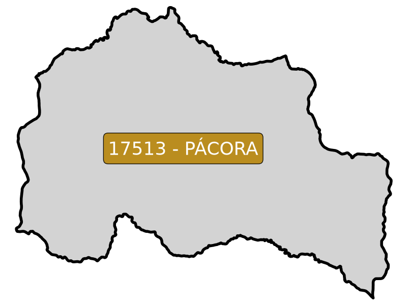 | [17513](https://github.com/rcfdtools/R.HydroTools/blob/main/tool/Population/file/report/17513.md) | Pácora       | [17513_Rural_Building_202606.zip](https://github.com/rcfdtools/R.GISMobile/blob/main/file/shp/17513_Rural_Building_202606.zip) [17513_Rural_Lot_202606.zip](https://github.com/rcfdtools/R.GISMobile/blob/main/file/shp/17513_Rural_Lot_202606.zip) [17513_Rural_Nomenclature_202606.zip](https://github.com/rcfdtools/R.GISMobile/blob/main/file/shp/17513_Rural_Nomenclature_202606.zip) [17513_Rural_Nomenclature_Road_202606.zip](https://github.com/rcfdtools/R.GISMobile/blob/main/file/shp/17513_Rural_Nomenclature_Road_202606.zip) [17513_Rural_Sector_202606.zip](https://github.com/rcfdtools/R.GISMobile/blob/main/file/shp/17513_Rural_Sector_202606.zip) [17513_Rural_Vereda_202606.zip](https://github.com/rcfdtools/R.GISMobile/blob/main/file/shp/17513_Rural_Vereda_202606.zip) [17513_Urban_Block_202606.zip](https://github.com/rcfdtools/R.GISMobile/blob/main/file/shp/17513_Urban_Block_202606.zip) [17513_Urban_Building_202606.zip](https://github.com/rcfdtools/R.GISMobile/blob/main/file/shp/17513_Urban_Building_202606.zip) [17513_Urban_Lot_202606.zip](https://github.com/rcfdtools/R.GISMobile/blob/main/file/shp/17513_Urban_Lot_202606.zip) [17513_Urban_Neighborhood_202606.zip](https://github.com/rcfdtools/R.GISMobile/blob/main/file/shp/17513_Urban_Neighborhood_202606.zip) [17513_Urban_Nomenclature_202606.zip](https://github.com/rcfdtools/R.GISMobile/blob/main/file/shp/17513_Urban_Nomenclature_202606.zip) [17513_Urban_Nomenclature_Road_202606.zip](https://github.com/rcfdtools/R.GISMobile/blob/main/file/shp/17513_Urban_Nomenclature_Road_202606.zip) [17513_Urban_Perimeter_202606.zip](https://github.com/rcfdtools/R.GISMobile/blob/main/file/shp/17513_Urban_Perimeter_202606.zip) [17513_Urban_Sector_202606.zip](https://github.com/rcfdtools/R.GISMobile/blob/main/file/shp/17513_Urban_Sector_202606.zip)  |
| 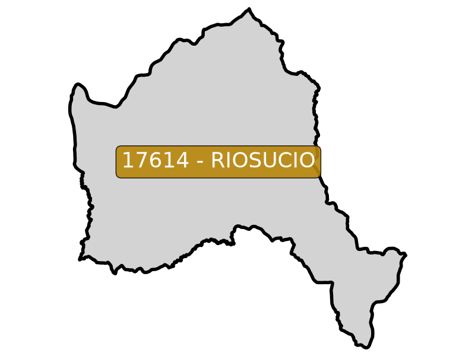 | [17614](https://github.com/rcfdtools/R.HydroTools/blob/main/tool/Population/file/report/17614.md) | Riosucio     | [17614_Rural_Building_202606.zip](https://github.com/rcfdtools/R.GISMobile/blob/main/file/shp/17614_Rural_Building_202606.zip) [17614_Rural_Lot_202606.zip](https://github.com/rcfdtools/R.GISMobile/blob/main/file/shp/17614_Rural_Lot_202606.zip) [17614_Rural_Nomenclature_202606.zip](https://github.com/rcfdtools/R.GISMobile/blob/main/file/shp/17614_Rural_Nomenclature_202606.zip) [17614_Rural_Sector_202606.zip](https://github.com/rcfdtools/R.GISMobile/blob/main/file/shp/17614_Rural_Sector_202606.zip) [17614_Rural_Vereda_202606.zip](https://github.com/rcfdtools/R.GISMobile/blob/main/file/shp/17614_Rural_Vereda_202606.zip) [17614_Urban_Block_202606.zip](https://github.com/rcfdtools/R.GISMobile/blob/main/file/shp/17614_Urban_Block_202606.zip) [17614_Urban_Building_202606.zip](https://github.com/rcfdtools/R.GISMobile/blob/main/file/shp/17614_Urban_Building_202606.zip) [17614_Urban_Lot_202606.zip](https://github.com/rcfdtools/R.GISMobile/blob/main/file/shp/17614_Urban_Lot_202606.zip) [17614_Urban_Nomenclature_202606.zip](https://github.com/rcfdtools/R.GISMobile/blob/main/file/shp/17614_Urban_Nomenclature_202606.zip) [17614_Urban_Nomenclature_Road_202606.zip](https://github.com/rcfdtools/R.GISMobile/blob/main/file/shp/17614_Urban_Nomenclature_Road_202606.zip) [17614_Urban_Perimeter_202606.zip](https://github.com/rcfdtools/R.GISMobile/blob/main/file/shp/17614_Urban_Perimeter_202606.zip) [17614_Urban_Sector_202606.zip](https://github.com/rcfdtools/R.GISMobile/blob/main/file/shp/17614_Urban_Sector_202606.zip)                                                                                                                                                                                                                                                                                                  |
| 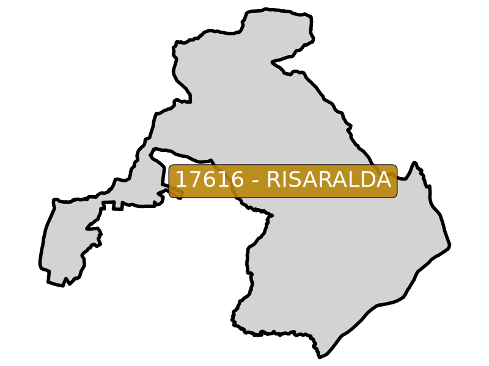 | [17616](https://github.com/rcfdtools/R.HydroTools/blob/main/tool/Population/file/report/17616.md) | Risaralda    | [17616_Rural_Building_202606.zip](https://github.com/rcfdtools/R.GISMobile/blob/main/file/shp/17616_Rural_Building_202606.zip) [17616_Rural_Lot_202606.zip](https://github.com/rcfdtools/R.GISMobile/blob/main/file/shp/17616_Rural_Lot_202606.zip) [17616_Rural_Nomenclature_202606.zip](https://github.com/rcfdtools/R.GISMobile/blob/main/file/shp/17616_Rural_Nomenclature_202606.zip) [17616_Rural_Sector_202606.zip](https://github.com/rcfdtools/R.GISMobile/blob/main/file/shp/17616_Rural_Sector_202606.zip) [17616_Rural_Vereda_202606.zip](https://github.com/rcfdtools/R.GISMobile/blob/main/file/shp/17616_Rural_Vereda_202606.zip) [17616_Urban_Block_202606.zip](https://github.com/rcfdtools/R.GISMobile/blob/main/file/shp/17616_Urban_Block_202606.zip) [17616_Urban_Building_202606.zip](https://github.com/rcfdtools/R.GISMobile/blob/main/file/shp/17616_Urban_Building_202606.zip) [17616_Urban_Lot_202606.zip](https://github.com/rcfdtools/R.GISMobile/blob/main/file/shp/17616_Urban_Lot_202606.zip) [17616_Urban_Nomenclature_202606.zip](https://github.com/rcfdtools/R.GISMobile/blob/main/file/shp/17616_Urban_Nomenclature_202606.zip) [17616_Urban_Nomenclature_Road_202606.zip](https://github.com/rcfdtools/R.GISMobile/blob/main/file/shp/17616_Urban_Nomenclature_Road_202606.zip) [17616_Urban_Perimeter_202606.zip](https://github.com/rcfdtools/R.GISMobile/blob/main/file/shp/17616_Urban_Perimeter_202606.zip) [17616_Urban_Sector_202606.zip](https://github.com/rcfdtools/R.GISMobile/blob/main/file/shp/17616_Urban_Sector_202606.zip)                                                                                                                                                                                                                                                                                                  |
| 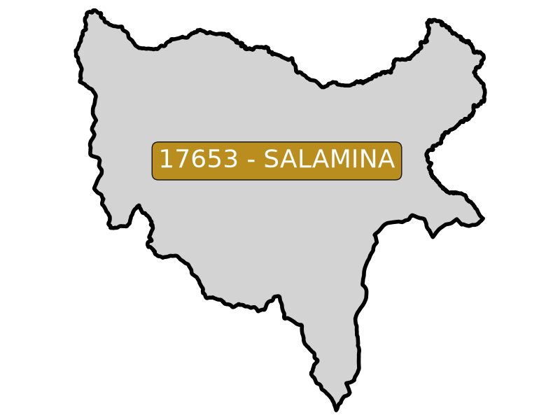 | [17653](https://github.com/rcfdtools/R.HydroTools/blob/main/tool/Population/file/report/17653.md) | Salamina     | [17653_Rural_Building_202606.zip](https://github.com/rcfdtools/R.GISMobile/blob/main/file/shp/17653_Rural_Building_202606.zip) [17653_Rural_Lot_202606.zip](https://github.com/rcfdtools/R.GISMobile/blob/main/file/shp/17653_Rural_Lot_202606.zip) [17653_Rural_Nomenclature_202606.zip](https://github.com/rcfdtools/R.GISMobile/blob/main/file/shp/17653_Rural_Nomenclature_202606.zip) [17653_Rural_Sector_202606.zip](https://github.com/rcfdtools/R.GISMobile/blob/main/file/shp/17653_Rural_Sector_202606.zip) [17653_Rural_Vereda_202606.zip](https://github.com/rcfdtools/R.GISMobile/blob/main/file/shp/17653_Rural_Vereda_202606.zip) [17653_Urban_Block_202606.zip](https://github.com/rcfdtools/R.GISMobile/blob/main/file/shp/17653_Urban_Block_202606.zip) [17653_Urban_Building_202606.zip](https://github.com/rcfdtools/R.GISMobile/blob/main/file/shp/17653_Urban_Building_202606.zip) [17653_Urban_Lot_202606.zip](https://github.com/rcfdtools/R.GISMobile/blob/main/file/shp/17653_Urban_Lot_202606.zip) [17653_Urban_Nomenclature_202606.zip](https://github.com/rcfdtools/R.GISMobile/blob/main/file/shp/17653_Urban_Nomenclature_202606.zip) [17653_Urban_Nomenclature_Road_202606.zip](https://github.com/rcfdtools/R.GISMobile/blob/main/file/shp/17653_Urban_Nomenclature_Road_202606.zip) [17653_Urban_Perimeter_202606.zip](https://github.com/rcfdtools/R.GISMobile/blob/main/file/shp/17653_Urban_Perimeter_202606.zip)                                                                                                                                                                                                                                                                                                                                                                                                                                 |
| 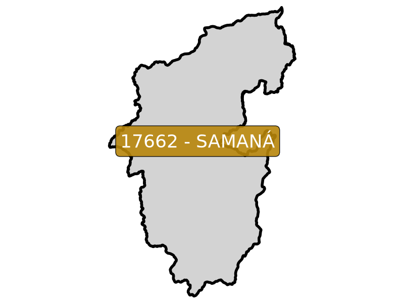 | [17662](https://github.com/rcfdtools/R.HydroTools/blob/main/tool/Population/file/report/17662.md) | Samaná       | [17662_Rural_Building_202606.zip](https://github.com/rcfdtools/R.GISMobile/blob/main/file/shp/17662_Rural_Building_202606.zip) [17662_Rural_Lot_202606.zip](https://github.com/rcfdtools/R.GISMobile/blob/main/file/shp/17662_Rural_Lot_202606.zip) [17662_Rural_Nomenclature_202606.zip](https://github.com/rcfdtools/R.GISMobile/blob/main/file/shp/17662_Rural_Nomenclature_202606.zip) [17662_Rural_Nomenclature_Road_202606.zip](https://github.com/rcfdtools/R.GISMobile/blob/main/file/shp/17662_Rural_Nomenclature_Road_202606.zip) [17662_Rural_Sector_202606.zip](https://github.com/rcfdtools/R.GISMobile/blob/main/file/shp/17662_Rural_Sector_202606.zip) [17662_Rural_Vereda_202606.zip](https://github.com/rcfdtools/R.GISMobile/blob/main/file/shp/17662_Rural_Vereda_202606.zip) [17662_Urban_Block_202606.zip](https://github.com/rcfdtools/R.GISMobile/blob/main/file/shp/17662_Urban_Block_202606.zip) [17662_Urban_Building_202606.zip](https://github.com/rcfdtools/R.GISMobile/blob/main/file/shp/17662_Urban_Building_202606.zip) [17662_Urban_Lot_202606.zip](https://github.com/rcfdtools/R.GISMobile/blob/main/file/shp/17662_Urban_Lot_202606.zip) [17662_Urban_Nomenclature_202606.zip](https://github.com/rcfdtools/R.GISMobile/blob/main/file/shp/17662_Urban_Nomenclature_202606.zip) [17662_Urban_Nomenclature_Road_202606.zip](https://github.com/rcfdtools/R.GISMobile/blob/main/file/shp/17662_Urban_Nomenclature_Road_202606.zip) [17662_Urban_Perimeter_202606.zip](https://github.com/rcfdtools/R.GISMobile/blob/main/file/shp/17662_Urban_Perimeter_202606.zip) [17662_Urban_Sector_202606.zip](https://github.com/rcfdtools/R.GISMobile/blob/main/file/shp/17662_Urban_Sector_202606.zip)                                                                                                                                             |
| 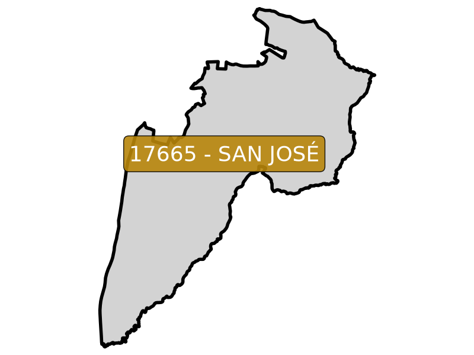 | [17665](https://github.com/rcfdtools/R.HydroTools/blob/main/tool/Population/file/report/17665.md) | San José     | [17665_Rural_Building_202606.zip](https://github.com/rcfdtools/R.GISMobile/blob/main/file/shp/17665_Rural_Building_202606.zip) [17665_Rural_Lot_202606.zip](https://github.com/rcfdtools/R.GISMobile/blob/main/file/shp/17665_Rural_Lot_202606.zip) [17665_Rural_Nomenclature_202606.zip](https://github.com/rcfdtools/R.GISMobile/blob/main/file/shp/17665_Rural_Nomenclature_202606.zip) [17665_Rural_Sector_202606.zip](https://github.com/rcfdtools/R.GISMobile/blob/main/file/shp/17665_Rural_Sector_202606.zip) [17665_Rural_Vereda_202606.zip](https://github.com/rcfdtools/R.GISMobile/blob/main/file/shp/17665_Rural_Vereda_202606.zip) [17665_Urban_Block_202606.zip](https://github.com/rcfdtools/R.GISMobile/blob/main/file/shp/17665_Urban_Block_202606.zip) [17665_Urban_Building_202606.zip](https://github.com/rcfdtools/R.GISMobile/blob/main/file/shp/17665_Urban_Building_202606.zip) [17665_Urban_Lot_202606.zip](https://github.com/rcfdtools/R.GISMobile/blob/main/file/shp/17665_Urban_Lot_202606.zip) [17665_Urban_Nomenclature_202606.zip](https://github.com/rcfdtools/R.GISMobile/blob/main/file/shp/17665_Urban_Nomenclature_202606.zip) [17665_Urban_Nomenclature_Road_202606.zip](https://github.com/rcfdtools/R.GISMobile/blob/main/file/shp/17665_Urban_Nomenclature_Road_202606.zip) [17665_Urban_Perimeter_202606.zip](https://github.com/rcfdtools/R.GISMobile/blob/main/file/shp/17665_Urban_Perimeter_202606.zip) [17665_Urban_Sector_202606.zip](https://github.com/rcfdtools/R.GISMobile/blob/main/file/shp/17665_Urban_Sector_202606.zip)                                                                                                                                                                                                                                                                                                  |
| 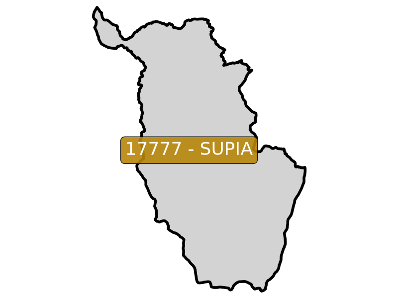 | [17777](https://github.com/rcfdtools/R.HydroTools/blob/main/tool/Population/file/report/17777.md) | Supia        | [17777_Rural_Building_202606.zip](https://github.com/rcfdtools/R.GISMobile/blob/main/file/shp/17777_Rural_Building_202606.zip) [17777_Rural_Lot_202606.zip](https://github.com/rcfdtools/R.GISMobile/blob/main/file/shp/17777_Rural_Lot_202606.zip) [17777_Rural_Nomenclature_202606.zip](https://github.com/rcfdtools/R.GISMobile/blob/main/file/shp/17777_Rural_Nomenclature_202606.zip) [17777_Rural_Sector_202606.zip](https://github.com/rcfdtools/R.GISMobile/blob/main/file/shp/17777_Rural_Sector_202606.zip) [17777_Rural_Vereda_202606.zip](https://github.com/rcfdtools/R.GISMobile/blob/main/file/shp/17777_Rural_Vereda_202606.zip) [17777_Urban_Block_202606.zip](https://github.com/rcfdtools/R.GISMobile/blob/main/file/shp/17777_Urban_Block_202606.zip) [17777_Urban_Building_202606.zip](https://github.com/rcfdtools/R.GISMobile/blob/main/file/shp/17777_Urban_Building_202606.zip) [17777_Urban_Lot_202606.zip](https://github.com/rcfdtools/R.GISMobile/blob/main/file/shp/17777_Urban_Lot_202606.zip) [17777_Urban_Nomenclature_202606.zip](https://github.com/rcfdtools/R.GISMobile/blob/main/file/shp/17777_Urban_Nomenclature_202606.zip) [17777_Urban_Nomenclature_Road_202606.zip](https://github.com/rcfdtools/R.GISMobile/blob/main/file/shp/17777_Urban_Nomenclature_Road_202606.zip) [17777_Urban_Perimeter_202606.zip](https://github.com/rcfdtools/R.GISMobile/blob/main/file/shp/17777_Urban_Perimeter_202606.zip) [17777_Urban_Sector_202606.zip](https://github.com/rcfdtools/R.GISMobile/blob/main/file/shp/17777_Urban_Sector_202606.zip)                                                                                                                                                                                                                                                                                                  |
| 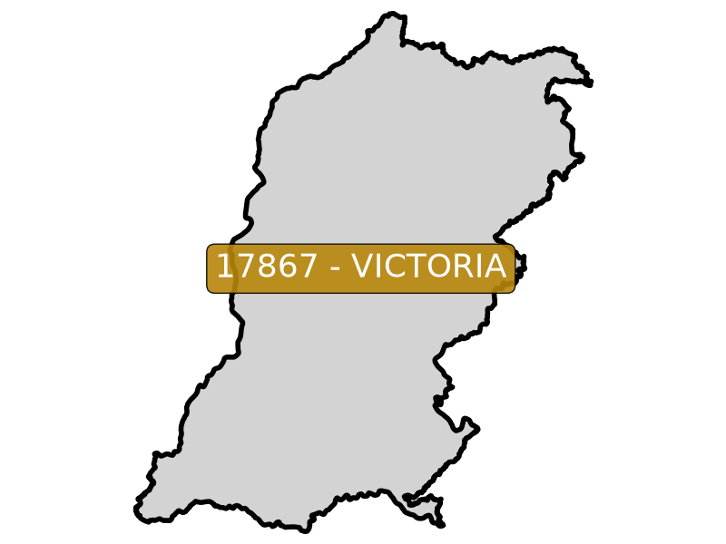 | [17867](https://github.com/rcfdtools/R.HydroTools/blob/main/tool/Population/file/report/17867.md) | Victoria     | [17867_Rural_Building_202606.zip](https://github.com/rcfdtools/R.GISMobile/blob/main/file/shp/17867_Rural_Building_202606.zip) [17867_Rural_Lot_202606.zip](https://github.com/rcfdtools/R.GISMobile/blob/main/file/shp/17867_Rural_Lot_202606.zip) [17867_Rural_Nomenclature_202606.zip](https://github.com/rcfdtools/R.GISMobile/blob/main/file/shp/17867_Rural_Nomenclature_202606.zip) [17867_Rural_Sector_202606.zip](https://github.com/rcfdtools/R.GISMobile/blob/main/file/shp/17867_Rural_Sector_202606.zip) [17867_Rural_Vereda_202606.zip](https://github.com/rcfdtools/R.GISMobile/blob/main/file/shp/17867_Rural_Vereda_202606.zip) [17867_Urban_Block_202606.zip](https://github.com/rcfdtools/R.GISMobile/blob/main/file/shp/17867_Urban_Block_202606.zip) [17867_Urban_Building_202606.zip](https://github.com/rcfdtools/R.GISMobile/blob/main/file/shp/17867_Urban_Building_202606.zip) [17867_Urban_Lot_202606.zip](https://github.com/rcfdtools/R.GISMobile/blob/main/file/shp/17867_Urban_Lot_202606.zip) [17867_Urban_Neighborhood_202606.zip](https://github.com/rcfdtools/R.GISMobile/blob/main/file/shp/17867_Urban_Neighborhood_202606.zip) [17867_Urban_Nomenclature_202606.zip](https://github.com/rcfdtools/R.GISMobile/blob/main/file/shp/17867_Urban_Nomenclature_202606.zip) [17867_Urban_Nomenclature_Road_202606.zip](https://github.com/rcfdtools/R.GISMobile/blob/main/file/shp/17867_Urban_Nomenclature_Road_202606.zip) [17867_Urban_Perimeter_202606.zip](https://github.com/rcfdtools/R.GISMobile/blob/main/file/shp/17867_Urban_Perimeter_202606.zip) [17867_Urban_Sector_202606.zip](https://github.com/rcfdtools/R.GISMobile/blob/main/file/shp/17867_Urban_Sector_202606.zip)                                                                                                                                                       |
| 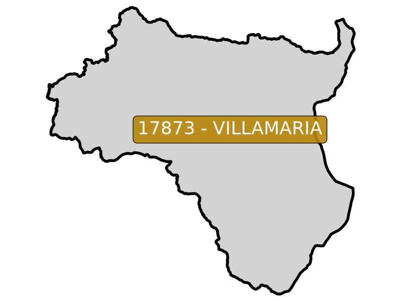 | [17873](https://github.com/rcfdtools/R.HydroTools/blob/main/tool/Population/file/report/17873.md) | Villamaria   | [17873_Rural_Building_202606.zip](https://github.com/rcfdtools/R.GISMobile/blob/main/file/shp/17873_Rural_Building_202606.zip) [17873_Rural_Lot_202606.zip](https://github.com/rcfdtools/R.GISMobile/blob/main/file/shp/17873_Rural_Lot_202606.zip) [17873_Rural_Nomenclature_202606.zip](https://github.com/rcfdtools/R.GISMobile/blob/main/file/shp/17873_Rural_Nomenclature_202606.zip) [17873_Rural_Sector_202606.zip](https://github.com/rcfdtools/R.GISMobile/blob/main/file/shp/17873_Rural_Sector_202606.zip) [17873_Rural_Vereda_202606.zip](https://github.com/rcfdtools/R.GISMobile/blob/main/file/shp/17873_Rural_Vereda_202606.zip) [17873_Urban_Block_202606.zip](https://github.com/rcfdtools/R.GISMobile/blob/main/file/shp/17873_Urban_Block_202606.zip) [17873_Urban_Building_202606.zip](https://github.com/rcfdtools/R.GISMobile/blob/main/file/shp/17873_Urban_Building_202606.zip) [17873_Urban_Lot_202606.zip](https://github.com/rcfdtools/R.GISMobile/blob/main/file/shp/17873_Urban_Lot_202606.zip) [17873_Urban_Nomenclature_202606.zip](https://github.com/rcfdtools/R.GISMobile/blob/main/file/shp/17873_Urban_Nomenclature_202606.zip) [17873_Urban_Nomenclature_Road_202606.zip](https://github.com/rcfdtools/R.GISMobile/blob/main/file/shp/17873_Urban_Nomenclature_Road_202606.zip) [17873_Urban_Perimeter_202606.zip](https://github.com/rcfdtools/R.GISMobile/blob/main/file/shp/17873_Urban_Perimeter_202606.zip) [17873_Urban_Sector_202606.zip](https://github.com/rcfdtools/R.GISMobile/blob/main/file/shp/17873_Urban_Sector_202606.zip)                                                                                                                                                                                                                                                                                                  |
| 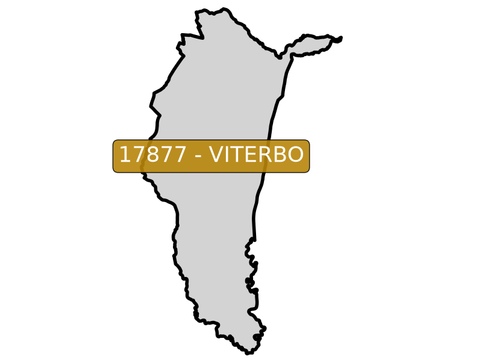 | [17877](https://github.com/rcfdtools/R.HydroTools/blob/main/tool/Population/file/report/17877.md) | Viterbo      | [17877_Rural_Building_202606.zip](https://github.com/rcfdtools/R.GISMobile/blob/main/file/shp/17877_Rural_Building_202606.zip) [17877_Rural_Lot_202606.zip](https://github.com/rcfdtools/R.GISMobile/blob/main/file/shp/17877_Rural_Lot_202606.zip) [17877_Rural_Nomenclature_202606.zip](https://github.com/rcfdtools/R.GISMobile/blob/main/file/shp/17877_Rural_Nomenclature_202606.zip) [17877_Rural_Sector_202606.zip](https://github.com/rcfdtools/R.GISMobile/blob/main/file/shp/17877_Rural_Sector_202606.zip) [17877_Rural_Vereda_202606.zip](https://github.com/rcfdtools/R.GISMobile/blob/main/file/shp/17877_Rural_Vereda_202606.zip) [17877_Urban_Block_202606.zip](https://github.com/rcfdtools/R.GISMobile/blob/main/file/shp/17877_Urban_Block_202606.zip) [17877_Urban_Building_202606.zip](https://github.com/rcfdtools/R.GISMobile/blob/main/file/shp/17877_Urban_Building_202606.zip) [17877_Urban_Lot_202606.zip](https://github.com/rcfdtools/R.GISMobile/blob/main/file/shp/17877_Urban_Lot_202606.zip) [17877_Urban_Neighborhood_202606.zip](https://github.com/rcfdtools/R.GISMobile/blob/main/file/shp/17877_Urban_Neighborhood_202606.zip) [17877_Urban_Nomenclature_202606.zip](https://github.com/rcfdtools/R.GISMobile/blob/main/file/shp/17877_Urban_Nomenclature_202606.zip) [17877_Urban_Nomenclature_Road_202606.zip](https://github.com/rcfdtools/R.GISMobile/blob/main/file/shp/17877_Urban_Nomenclature_Road_202606.zip) [17877_Urban_Perimeter_202606.zip](https://github.com/rcfdtools/R.GISMobile/blob/main/file/shp/17877_Urban_Perimeter_202606.zip) [17877_Urban_Sector_202606.zip](https://github.com/rcfdtools/R.GISMobile/blob/main/file/shp/17877_Urban_Sector_202606.zip)                                                                                                                                                       |

#

 Share this research
 

**APPS & TOOLS & CONTENT DISCLAIMER**: • NO WARRANTY - This content and software is provided by <a href="https://github.com/rcfdtools" target="_blank">github.com/rcfdtools</a> "as is", without any express or implied warranty, including warranties of merchantability, fitness for a particular purpose, or non-infringement. There is no guarantee that the software will be error-free or operate without interruption. • LIMITATION OF LIABILITY - Neither the authors nor copyright holders will be liable for claims or damages arising from the software or its use. You are responsible for determining if the software is appropriate for your use and assume all associated risks, including errors, legal compliance, and data loss. • NO PROFESSIONAL ADVICE - The software provides general information and does not offer professional advice. It should not replace consultation with professional advisors. [Clauses and global license for rcfdtools use.](https://github.com/rcfdtools/rcfdtools/blob/main/LICENSE.md)

| [:house: Home](Readme.md)  | [:beginner: Help / Collab](https://github.com/rcfdtools/R.GISMobile/discussions) |
|----------------------------|-------------------------------------------------------------------------------------------|