

# _🛠️TOOL: “County GIS Layers - Colombia South America” for 86 - Putumayo (13 Counties)_ 
Keywords: `geographical-information-system` `gis` `igac` `ider` `geodata` `colombia` `south-america`

County GIS layers are individual digital map datasets stacked together in a Geographic Information System (GIS) to visualize, manage, and analyze a county´s geographic information. Local governments, researches and engineers use these layers to run daily operations, plan infrastructure, track tax assessments, evaluate land plot risk, and dispatch emergency services.

</img>

| MiniMap                                                                                   | CountyID                                                                                          | CountyName        | CountyFiles                                                                                                                                                                                                                                                                                                                                                                                                                                                                                                                                                                                                                                                                                                                                                                                                                                                                                                                                                                                                                                                                                                                                                                                                                                                                                                                                                                                                                                                                                                                                                                                                                                                                                                                                                                             |
|:------------------------------------------------------------------------------------------|:--------------------------------------------------------------------------------------------------|:------------------|:----------------------------------------------------------------------------------------------------------------------------------------------------------------------------------------------------------------------------------------------------------------------------------------------------------------------------------------------------------------------------------------------------------------------------------------------------------------------------------------------------------------------------------------------------------------------------------------------------------------------------------------------------------------------------------------------------------------------------------------------------------------------------------------------------------------------------------------------------------------------------------------------------------------------------------------------------------------------------------------------------------------------------------------------------------------------------------------------------------------------------------------------------------------------------------------------------------------------------------------------------------------------------------------------------------------------------------------------------------------------------------------------------------------------------------------------------------------------------------------------------------------------------------------------------------------------------------------------------------------------------------------------------------------------------------------------------------------------------------------------------------------------------------------|
| 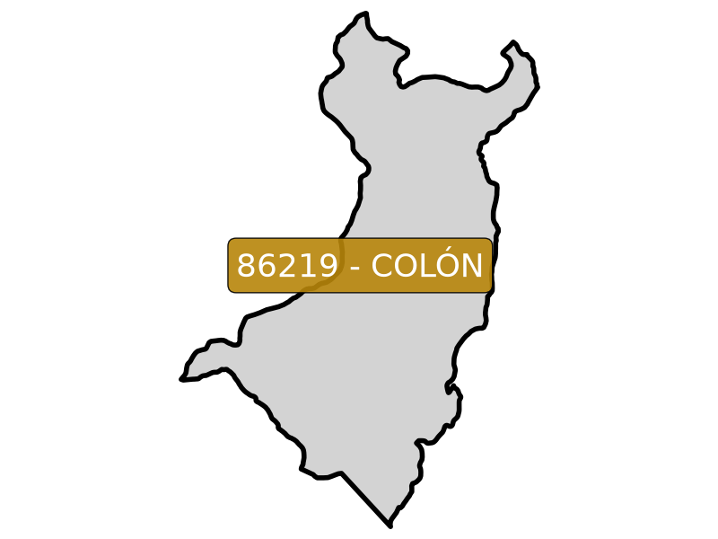 | [86219](https://github.com/rcfdtools/R.HydroTools/blob/main/tool/Population/file/report/86219.md) | Colón             | [86219_Rural_Building_202606.zip](https://github.com/rcfdtools/R.GISMobile/blob/main/file/shp/86219_Rural_Building_202606.zip) [86219_Rural_Lot_202606.zip](https://github.com/rcfdtools/R.GISMobile/blob/main/file/shp/86219_Rural_Lot_202606.zip) [86219_Rural_Nomenclature_202606.zip](https://github.com/rcfdtools/R.GISMobile/blob/main/file/shp/86219_Rural_Nomenclature_202606.zip) [86219_Rural_Nomenclature_Road_202606.zip](https://github.com/rcfdtools/R.GISMobile/blob/main/file/shp/86219_Rural_Nomenclature_Road_202606.zip) [86219_Rural_Sector_202606.zip](https://github.com/rcfdtools/R.GISMobile/blob/main/file/shp/86219_Rural_Sector_202606.zip) [86219_Rural_Vereda_202606.zip](https://github.com/rcfdtools/R.GISMobile/blob/main/file/shp/86219_Rural_Vereda_202606.zip) [86219_Urban_Block_202606.zip](https://github.com/rcfdtools/R.GISMobile/blob/main/file/shp/86219_Urban_Block_202606.zip) [86219_Urban_Building_202606.zip](https://github.com/rcfdtools/R.GISMobile/blob/main/file/shp/86219_Urban_Building_202606.zip) [86219_Urban_Lot_202606.zip](https://github.com/rcfdtools/R.GISMobile/blob/main/file/shp/86219_Urban_Lot_202606.zip) [86219_Urban_Nomenclature_202606.zip](https://github.com/rcfdtools/R.GISMobile/blob/main/file/shp/86219_Urban_Nomenclature_202606.zip) [86219_Urban_Nomenclature_Road_202606.zip](https://github.com/rcfdtools/R.GISMobile/blob/main/file/shp/86219_Urban_Nomenclature_Road_202606.zip) [86219_Urban_Perimeter_202606.zip](https://github.com/rcfdtools/R.GISMobile/blob/main/file/shp/86219_Urban_Perimeter_202606.zip) [86219_Urban_Sector_202606.zip](https://github.com/rcfdtools/R.GISMobile/blob/main/file/shp/86219_Urban_Sector_202606.zip)  |
| 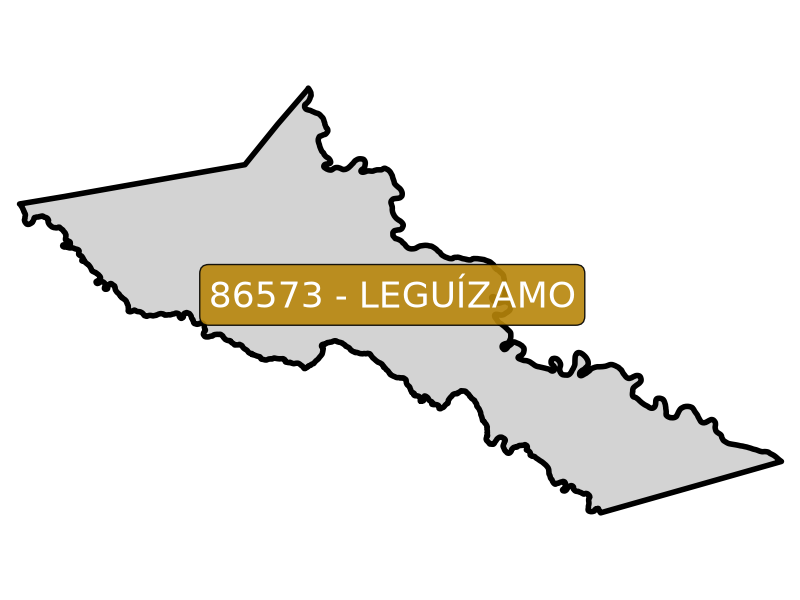 | [86573](https://github.com/rcfdtools/R.HydroTools/blob/main/tool/Population/file/report/86573.md) | Leguízamo         | [86573_Rural_Building_202606.zip](https://github.com/rcfdtools/R.GISMobile/blob/main/file/shp/86573_Rural_Building_202606.zip) [86573_Rural_Lot_202606.zip](https://github.com/rcfdtools/R.GISMobile/blob/main/file/shp/86573_Rural_Lot_202606.zip) [86573_Rural_Nomenclature_202606.zip](https://github.com/rcfdtools/R.GISMobile/blob/main/file/shp/86573_Rural_Nomenclature_202606.zip) [86573_Rural_Sector_202606.zip](https://github.com/rcfdtools/R.GISMobile/blob/main/file/shp/86573_Rural_Sector_202606.zip) [86573_Rural_Vereda_202606.zip](https://github.com/rcfdtools/R.GISMobile/blob/main/file/shp/86573_Rural_Vereda_202606.zip)                                                                                                                                                                                                                                                                                                                                                                                                                                                                                                                                                                                                                                                                                                                                                                                                                                                                                                                                                                                                                                                                                                                    |
| 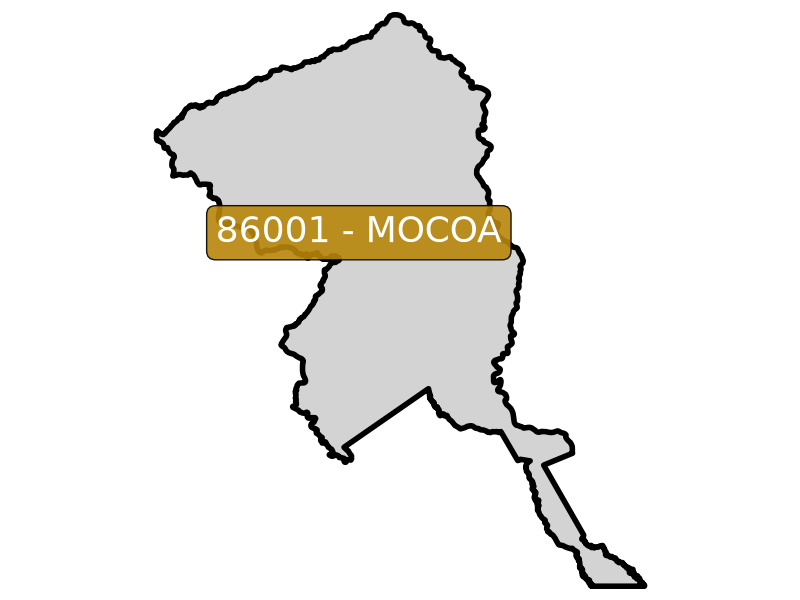 | [86001](https://github.com/rcfdtools/R.HydroTools/blob/main/tool/Population/file/report/86001.md) | Mocoa             | [86001_Rural_Building_202606.zip](https://github.com/rcfdtools/R.GISMobile/blob/main/file/shp/86001_Rural_Building_202606.zip) [86001_Rural_Lot_202606.zip](https://github.com/rcfdtools/R.GISMobile/blob/main/file/shp/86001_Rural_Lot_202606.zip) [86001_Rural_Nomenclature_202606.zip](https://github.com/rcfdtools/R.GISMobile/blob/main/file/shp/86001_Rural_Nomenclature_202606.zip) [86001_Rural_Sector_202606.zip](https://github.com/rcfdtools/R.GISMobile/blob/main/file/shp/86001_Rural_Sector_202606.zip) [86001_Rural_Vereda_202606.zip](https://github.com/rcfdtools/R.GISMobile/blob/main/file/shp/86001_Rural_Vereda_202606.zip) [86001_Urban_Block_202606.zip](https://github.com/rcfdtools/R.GISMobile/blob/main/file/shp/86001_Urban_Block_202606.zip) [86001_Urban_Building_202606.zip](https://github.com/rcfdtools/R.GISMobile/blob/main/file/shp/86001_Urban_Building_202606.zip) [86001_Urban_Lot_202606.zip](https://github.com/rcfdtools/R.GISMobile/blob/main/file/shp/86001_Urban_Lot_202606.zip) [86001_Urban_Nomenclature_202606.zip](https://github.com/rcfdtools/R.GISMobile/blob/main/file/shp/86001_Urban_Nomenclature_202606.zip) [86001_Urban_Nomenclature_Road_202606.zip](https://github.com/rcfdtools/R.GISMobile/blob/main/file/shp/86001_Urban_Nomenclature_Road_202606.zip) [86001_Urban_Perimeter_202606.zip](https://github.com/rcfdtools/R.GISMobile/blob/main/file/shp/86001_Urban_Perimeter_202606.zip) [86001_Urban_Sector_202606.zip](https://github.com/rcfdtools/R.GISMobile/blob/main/file/shp/86001_Urban_Sector_202606.zip)                                                                                                                                                       |
| 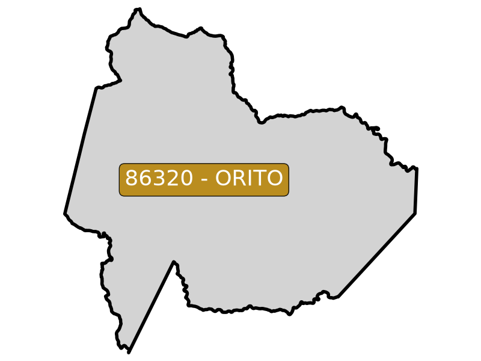 | [86320](https://github.com/rcfdtools/R.HydroTools/blob/main/tool/Population/file/report/86320.md) | Orito             | [86320_Rural_Building_202606.zip](https://github.com/rcfdtools/R.GISMobile/blob/main/file/shp/86320_Rural_Building_202606.zip) [86320_Rural_Lot_202606.zip](https://github.com/rcfdtools/R.GISMobile/blob/main/file/shp/86320_Rural_Lot_202606.zip) [86320_Rural_Nomenclature_202606.zip](https://github.com/rcfdtools/R.GISMobile/blob/main/file/shp/86320_Rural_Nomenclature_202606.zip) [86320_Rural_Nomenclature_Road_202606.zip](https://github.com/rcfdtools/R.GISMobile/blob/main/file/shp/86320_Rural_Nomenclature_Road_202606.zip) [86320_Rural_Sector_202606.zip](https://github.com/rcfdtools/R.GISMobile/blob/main/file/shp/86320_Rural_Sector_202606.zip) [86320_Rural_Vereda_202606.zip](https://github.com/rcfdtools/R.GISMobile/blob/main/file/shp/86320_Rural_Vereda_202606.zip) [86320_Urban_Block_202606.zip](https://github.com/rcfdtools/R.GISMobile/blob/main/file/shp/86320_Urban_Block_202606.zip) [86320_Urban_Building_202606.zip](https://github.com/rcfdtools/R.GISMobile/blob/main/file/shp/86320_Urban_Building_202606.zip) [86320_Urban_Lot_202606.zip](https://github.com/rcfdtools/R.GISMobile/blob/main/file/shp/86320_Urban_Lot_202606.zip) [86320_Urban_Nomenclature_202606.zip](https://github.com/rcfdtools/R.GISMobile/blob/main/file/shp/86320_Urban_Nomenclature_202606.zip) [86320_Urban_Nomenclature_Road_202606.zip](https://github.com/rcfdtools/R.GISMobile/blob/main/file/shp/86320_Urban_Nomenclature_Road_202606.zip) [86320_Urban_Perimeter_202606.zip](https://github.com/rcfdtools/R.GISMobile/blob/main/file/shp/86320_Urban_Perimeter_202606.zip) [86320_Urban_Sector_202606.zip](https://github.com/rcfdtools/R.GISMobile/blob/main/file/shp/86320_Urban_Sector_202606.zip)  |
| 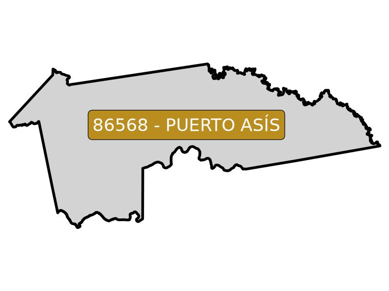 | [86568](https://github.com/rcfdtools/R.HydroTools/blob/main/tool/Population/file/report/86568.md) | Puerto Asís       | [86568_Rural_Building_202606.zip](https://github.com/rcfdtools/R.GISMobile/blob/main/file/shp/86568_Rural_Building_202606.zip) [86568_Rural_Lot_202606.zip](https://github.com/rcfdtools/R.GISMobile/blob/main/file/shp/86568_Rural_Lot_202606.zip) [86568_Rural_Nomenclature_202606.zip](https://github.com/rcfdtools/R.GISMobile/blob/main/file/shp/86568_Rural_Nomenclature_202606.zip) [86568_Rural_Sector_202606.zip](https://github.com/rcfdtools/R.GISMobile/blob/main/file/shp/86568_Rural_Sector_202606.zip) [86568_Rural_Vereda_202606.zip](https://github.com/rcfdtools/R.GISMobile/blob/main/file/shp/86568_Rural_Vereda_202606.zip) [86568_Urban_Block_202606.zip](https://github.com/rcfdtools/R.GISMobile/blob/main/file/shp/86568_Urban_Block_202606.zip) [86568_Urban_Building_202606.zip](https://github.com/rcfdtools/R.GISMobile/blob/main/file/shp/86568_Urban_Building_202606.zip) [86568_Urban_Lot_202606.zip](https://github.com/rcfdtools/R.GISMobile/blob/main/file/shp/86568_Urban_Lot_202606.zip) [86568_Urban_Neighborhood_202606.zip](https://github.com/rcfdtools/R.GISMobile/blob/main/file/shp/86568_Urban_Neighborhood_202606.zip) [86568_Urban_Nomenclature_202606.zip](https://github.com/rcfdtools/R.GISMobile/blob/main/file/shp/86568_Urban_Nomenclature_202606.zip) [86568_Urban_Nomenclature_Road_202606.zip](https://github.com/rcfdtools/R.GISMobile/blob/main/file/shp/86568_Urban_Nomenclature_Road_202606.zip) [86568_Urban_Perimeter_202606.zip](https://github.com/rcfdtools/R.GISMobile/blob/main/file/shp/86568_Urban_Perimeter_202606.zip) [86568_Urban_Sector_202606.zip](https://github.com/rcfdtools/R.GISMobile/blob/main/file/shp/86568_Urban_Sector_202606.zip)            |
| 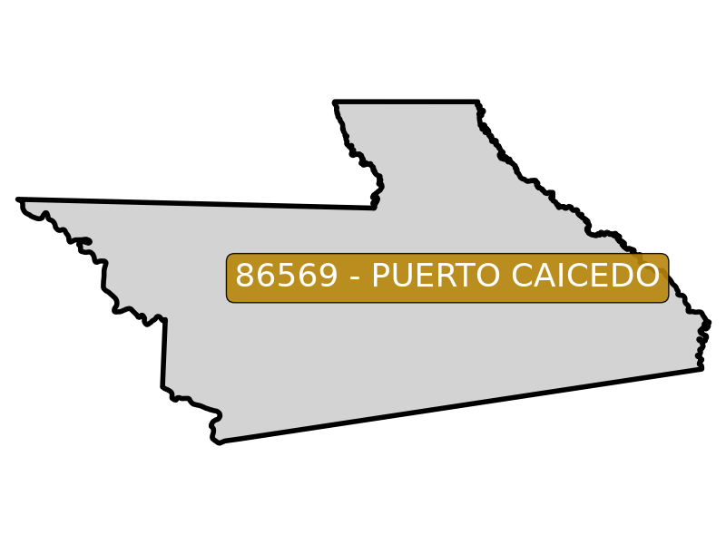 | [86569](https://github.com/rcfdtools/R.HydroTools/blob/main/tool/Population/file/report/86569.md) | Puerto Caicedo    | [86569_Rural_Building_202606.zip](https://github.com/rcfdtools/R.GISMobile/blob/main/file/shp/86569_Rural_Building_202606.zip) [86569_Rural_Lot_202606.zip](https://github.com/rcfdtools/R.GISMobile/blob/main/file/shp/86569_Rural_Lot_202606.zip) [86569_Rural_Nomenclature_202606.zip](https://github.com/rcfdtools/R.GISMobile/blob/main/file/shp/86569_Rural_Nomenclature_202606.zip) [86569_Rural_Sector_202606.zip](https://github.com/rcfdtools/R.GISMobile/blob/main/file/shp/86569_Rural_Sector_202606.zip) [86569_Rural_Vereda_202606.zip](https://github.com/rcfdtools/R.GISMobile/blob/main/file/shp/86569_Rural_Vereda_202606.zip) [86569_Urban_Block_202606.zip](https://github.com/rcfdtools/R.GISMobile/blob/main/file/shp/86569_Urban_Block_202606.zip) [86569_Urban_Building_202606.zip](https://github.com/rcfdtools/R.GISMobile/blob/main/file/shp/86569_Urban_Building_202606.zip) [86569_Urban_Lot_202606.zip](https://github.com/rcfdtools/R.GISMobile/blob/main/file/shp/86569_Urban_Lot_202606.zip) [86569_Urban_Nomenclature_202606.zip](https://github.com/rcfdtools/R.GISMobile/blob/main/file/shp/86569_Urban_Nomenclature_202606.zip) [86569_Urban_Nomenclature_Road_202606.zip](https://github.com/rcfdtools/R.GISMobile/blob/main/file/shp/86569_Urban_Nomenclature_Road_202606.zip) [86569_Urban_Perimeter_202606.zip](https://github.com/rcfdtools/R.GISMobile/blob/main/file/shp/86569_Urban_Perimeter_202606.zip) [86569_Urban_Sector_202606.zip](https://github.com/rcfdtools/R.GISMobile/blob/main/file/shp/86569_Urban_Sector_202606.zip)                                                                                                                                                       |
| 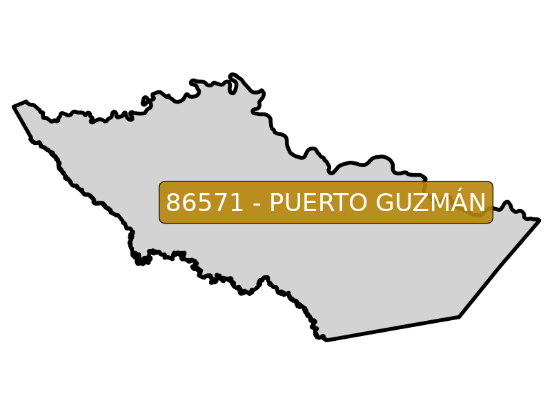 | [86571](https://github.com/rcfdtools/R.HydroTools/blob/main/tool/Population/file/report/86571.md) | Puerto Guzmán     | [86571_Rural_Building_202606.zip](https://github.com/rcfdtools/R.GISMobile/blob/main/file/shp/86571_Rural_Building_202606.zip) [86571_Rural_Lot_202606.zip](https://github.com/rcfdtools/R.GISMobile/blob/main/file/shp/86571_Rural_Lot_202606.zip) [86571_Rural_Nomenclature_202606.zip](https://github.com/rcfdtools/R.GISMobile/blob/main/file/shp/86571_Rural_Nomenclature_202606.zip) [86571_Rural_Sector_202606.zip](https://github.com/rcfdtools/R.GISMobile/blob/main/file/shp/86571_Rural_Sector_202606.zip) [86571_Rural_Vereda_202606.zip](https://github.com/rcfdtools/R.GISMobile/blob/main/file/shp/86571_Rural_Vereda_202606.zip) [86571_Urban_Block_202606.zip](https://github.com/rcfdtools/R.GISMobile/blob/main/file/shp/86571_Urban_Block_202606.zip) [86571_Urban_Building_202606.zip](https://github.com/rcfdtools/R.GISMobile/blob/main/file/shp/86571_Urban_Building_202606.zip) [86571_Urban_Lot_202606.zip](https://github.com/rcfdtools/R.GISMobile/blob/main/file/shp/86571_Urban_Lot_202606.zip) [86571_Urban_Nomenclature_202606.zip](https://github.com/rcfdtools/R.GISMobile/blob/main/file/shp/86571_Urban_Nomenclature_202606.zip) [86571_Urban_Nomenclature_Road_202606.zip](https://github.com/rcfdtools/R.GISMobile/blob/main/file/shp/86571_Urban_Nomenclature_Road_202606.zip) [86571_Urban_Perimeter_202606.zip](https://github.com/rcfdtools/R.GISMobile/blob/main/file/shp/86571_Urban_Perimeter_202606.zip) [86571_Urban_Sector_202606.zip](https://github.com/rcfdtools/R.GISMobile/blob/main/file/shp/86571_Urban_Sector_202606.zip)                                                                                                                                                       |
| 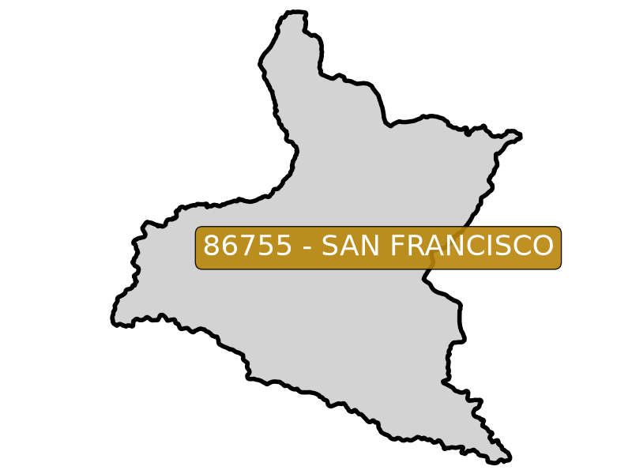 | [86755](https://github.com/rcfdtools/R.HydroTools/blob/main/tool/Population/file/report/86755.md) | San Francisco     | [86755_Urban_Block_202606.zip](https://github.com/rcfdtools/R.GISMobile/blob/main/file/shp/86755_Urban_Block_202606.zip) [86755_Urban_Building_202606.zip](https://github.com/rcfdtools/R.GISMobile/blob/main/file/shp/86755_Urban_Building_202606.zip) [86755_Urban_Lot_202606.zip](https://github.com/rcfdtools/R.GISMobile/blob/main/file/shp/86755_Urban_Lot_202606.zip) [86755_Urban_Nomenclature_202606.zip](https://github.com/rcfdtools/R.GISMobile/blob/main/file/shp/86755_Urban_Nomenclature_202606.zip) [86755_Urban_Nomenclature_Road_202606.zip](https://github.com/rcfdtools/R.GISMobile/blob/main/file/shp/86755_Urban_Nomenclature_Road_202606.zip) [86755_Urban_Perimeter_202606.zip](https://github.com/rcfdtools/R.GISMobile/blob/main/file/shp/86755_Urban_Perimeter_202606.zip) [86755_Urban_Sector_202606.zip](https://github.com/rcfdtools/R.GISMobile/blob/main/file/shp/86755_Urban_Sector_202606.zip)                                                                                                                                                                                                                                                                                                                                                                                                                                                                                                                                                                                                                                                                                                                                                                                                                            |
| 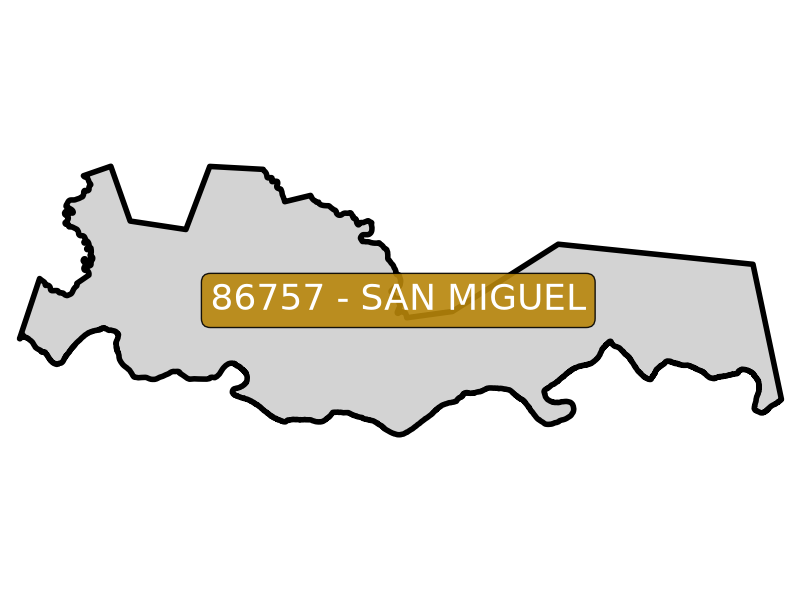 | [86757](https://github.com/rcfdtools/R.HydroTools/blob/main/tool/Population/file/report/86757.md) | San Miguel        | [86757_Rural_Building_202606.zip](https://github.com/rcfdtools/R.GISMobile/blob/main/file/shp/86757_Rural_Building_202606.zip) [86757_Rural_Lot_202606.zip](https://github.com/rcfdtools/R.GISMobile/blob/main/file/shp/86757_Rural_Lot_202606.zip) [86757_Rural_Nomenclature_202606.zip](https://github.com/rcfdtools/R.GISMobile/blob/main/file/shp/86757_Rural_Nomenclature_202606.zip) [86757_Rural_Nomenclature_Road_202606.zip](https://github.com/rcfdtools/R.GISMobile/blob/main/file/shp/86757_Rural_Nomenclature_Road_202606.zip) [86757_Rural_Sector_202606.zip](https://github.com/rcfdtools/R.GISMobile/blob/main/file/shp/86757_Rural_Sector_202606.zip) [86757_Rural_Vereda_202606.zip](https://github.com/rcfdtools/R.GISMobile/blob/main/file/shp/86757_Rural_Vereda_202606.zip) [86757_Urban_Block_202606.zip](https://github.com/rcfdtools/R.GISMobile/blob/main/file/shp/86757_Urban_Block_202606.zip) [86757_Urban_Building_202606.zip](https://github.com/rcfdtools/R.GISMobile/blob/main/file/shp/86757_Urban_Building_202606.zip) [86757_Urban_Lot_202606.zip](https://github.com/rcfdtools/R.GISMobile/blob/main/file/shp/86757_Urban_Lot_202606.zip) [86757_Urban_Nomenclature_202606.zip](https://github.com/rcfdtools/R.GISMobile/blob/main/file/shp/86757_Urban_Nomenclature_202606.zip) [86757_Urban_Nomenclature_Road_202606.zip](https://github.com/rcfdtools/R.GISMobile/blob/main/file/shp/86757_Urban_Nomenclature_Road_202606.zip) [86757_Urban_Perimeter_202606.zip](https://github.com/rcfdtools/R.GISMobile/blob/main/file/shp/86757_Urban_Perimeter_202606.zip) [86757_Urban_Sector_202606.zip](https://github.com/rcfdtools/R.GISMobile/blob/main/file/shp/86757_Urban_Sector_202606.zip)  |
| 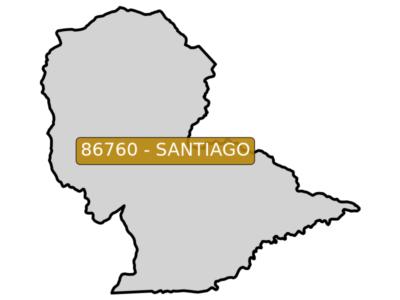 | [86760](https://github.com/rcfdtools/R.HydroTools/blob/main/tool/Population/file/report/86760.md) | Santiago          | [86760_Rural_Building_202606.zip](https://github.com/rcfdtools/R.GISMobile/blob/main/file/shp/86760_Rural_Building_202606.zip) [86760_Rural_Lot_202606.zip](https://github.com/rcfdtools/R.GISMobile/blob/main/file/shp/86760_Rural_Lot_202606.zip) [86760_Rural_Nomenclature_202606.zip](https://github.com/rcfdtools/R.GISMobile/blob/main/file/shp/86760_Rural_Nomenclature_202606.zip) [86760_Rural_Sector_202606.zip](https://github.com/rcfdtools/R.GISMobile/blob/main/file/shp/86760_Rural_Sector_202606.zip) [86760_Rural_Vereda_202606.zip](https://github.com/rcfdtools/R.GISMobile/blob/main/file/shp/86760_Rural_Vereda_202606.zip) [86760_Urban_Block_202606.zip](https://github.com/rcfdtools/R.GISMobile/blob/main/file/shp/86760_Urban_Block_202606.zip) [86760_Urban_Building_202606.zip](https://github.com/rcfdtools/R.GISMobile/blob/main/file/shp/86760_Urban_Building_202606.zip) [86760_Urban_Lot_202606.zip](https://github.com/rcfdtools/R.GISMobile/blob/main/file/shp/86760_Urban_Lot_202606.zip) [86760_Urban_Nomenclature_202606.zip](https://github.com/rcfdtools/R.GISMobile/blob/main/file/shp/86760_Urban_Nomenclature_202606.zip) [86760_Urban_Nomenclature_Road_202606.zip](https://github.com/rcfdtools/R.GISMobile/blob/main/file/shp/86760_Urban_Nomenclature_Road_202606.zip) [86760_Urban_Perimeter_202606.zip](https://github.com/rcfdtools/R.GISMobile/blob/main/file/shp/86760_Urban_Perimeter_202606.zip) [86760_Urban_Sector_202606.zip](https://github.com/rcfdtools/R.GISMobile/blob/main/file/shp/86760_Urban_Sector_202606.zip)                                                                                                                                                       |
| 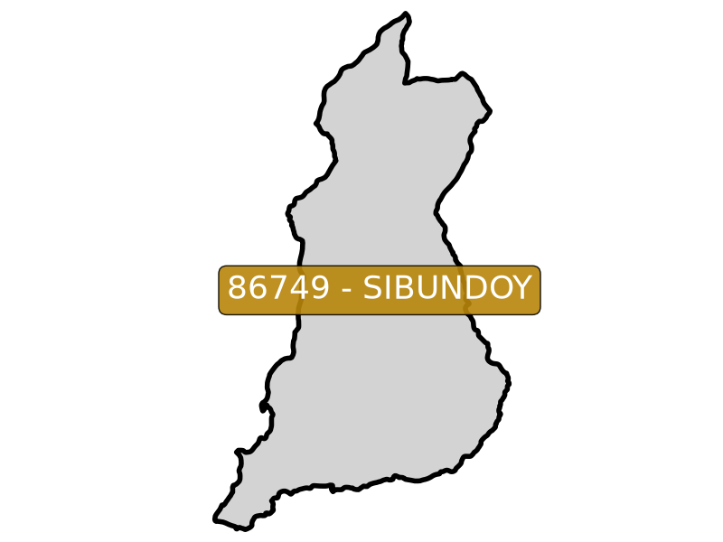 | [86749](https://github.com/rcfdtools/R.HydroTools/blob/main/tool/Population/file/report/86749.md) | Sibundoy          | [86749_Rural_Building_202606.zip](https://github.com/rcfdtools/R.GISMobile/blob/main/file/shp/86749_Rural_Building_202606.zip) [86749_Rural_Lot_202606.zip](https://github.com/rcfdtools/R.GISMobile/blob/main/file/shp/86749_Rural_Lot_202606.zip) [86749_Rural_Nomenclature_202606.zip](https://github.com/rcfdtools/R.GISMobile/blob/main/file/shp/86749_Rural_Nomenclature_202606.zip) [86749_Rural_Sector_202606.zip](https://github.com/rcfdtools/R.GISMobile/blob/main/file/shp/86749_Rural_Sector_202606.zip) [86749_Rural_Vereda_202606.zip](https://github.com/rcfdtools/R.GISMobile/blob/main/file/shp/86749_Rural_Vereda_202606.zip) [86749_Urban_Block_202606.zip](https://github.com/rcfdtools/R.GISMobile/blob/main/file/shp/86749_Urban_Block_202606.zip) [86749_Urban_Building_202606.zip](https://github.com/rcfdtools/R.GISMobile/blob/main/file/shp/86749_Urban_Building_202606.zip) [86749_Urban_Lot_202606.zip](https://github.com/rcfdtools/R.GISMobile/blob/main/file/shp/86749_Urban_Lot_202606.zip) [86749_Urban_Nomenclature_202606.zip](https://github.com/rcfdtools/R.GISMobile/blob/main/file/shp/86749_Urban_Nomenclature_202606.zip) [86749_Urban_Nomenclature_Road_202606.zip](https://github.com/rcfdtools/R.GISMobile/blob/main/file/shp/86749_Urban_Nomenclature_Road_202606.zip) [86749_Urban_Perimeter_202606.zip](https://github.com/rcfdtools/R.GISMobile/blob/main/file/shp/86749_Urban_Perimeter_202606.zip)                                                                                                                                                                                                                                                                                      |
| 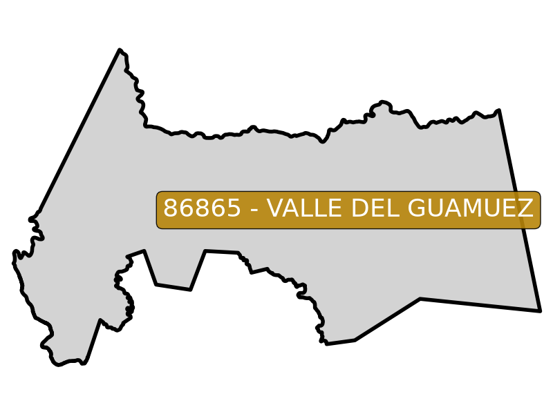 | [86865](https://github.com/rcfdtools/R.HydroTools/blob/main/tool/Population/file/report/86865.md) | Valle Del Guamuez | [86865_Rural_Building_202606.zip](https://github.com/rcfdtools/R.GISMobile/blob/main/file/shp/86865_Rural_Building_202606.zip) [86865_Rural_Lot_202606.zip](https://github.com/rcfdtools/R.GISMobile/blob/main/file/shp/86865_Rural_Lot_202606.zip) [86865_Rural_Nomenclature_202606.zip](https://github.com/rcfdtools/R.GISMobile/blob/main/file/shp/86865_Rural_Nomenclature_202606.zip) [86865_Rural_Sector_202606.zip](https://github.com/rcfdtools/R.GISMobile/blob/main/file/shp/86865_Rural_Sector_202606.zip) [86865_Rural_Vereda_202606.zip](https://github.com/rcfdtools/R.GISMobile/blob/main/file/shp/86865_Rural_Vereda_202606.zip) [86865_Urban_Block_202606.zip](https://github.com/rcfdtools/R.GISMobile/blob/main/file/shp/86865_Urban_Block_202606.zip) [86865_Urban_Building_202606.zip](https://github.com/rcfdtools/R.GISMobile/blob/main/file/shp/86865_Urban_Building_202606.zip) [86865_Urban_Lot_202606.zip](https://github.com/rcfdtools/R.GISMobile/blob/main/file/shp/86865_Urban_Lot_202606.zip) [86865_Urban_Nomenclature_202606.zip](https://github.com/rcfdtools/R.GISMobile/blob/main/file/shp/86865_Urban_Nomenclature_202606.zip) [86865_Urban_Perimeter_202606.zip](https://github.com/rcfdtools/R.GISMobile/blob/main/file/shp/86865_Urban_Perimeter_202606.zip) [86865_Urban_Sector_202606.zip](https://github.com/rcfdtools/R.GISMobile/blob/main/file/shp/86865_Urban_Sector_202606.zip)                                                                                                                                                                                                                                                                                                            |
| 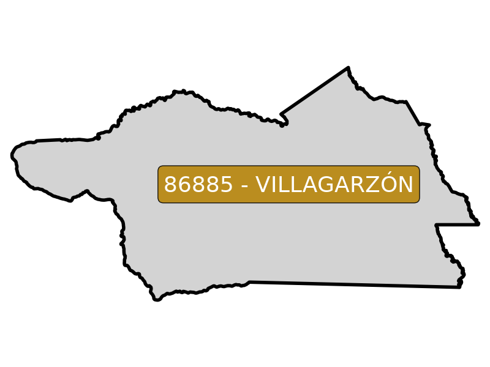 | [86885](https://github.com/rcfdtools/R.HydroTools/blob/main/tool/Population/file/report/86885.md) | Villagarzón       | [86885_Rural_Building_202606.zip](https://github.com/rcfdtools/R.GISMobile/blob/main/file/shp/86885_Rural_Building_202606.zip) [86885_Rural_Lot_202606.zip](https://github.com/rcfdtools/R.GISMobile/blob/main/file/shp/86885_Rural_Lot_202606.zip) [86885_Rural_Nomenclature_202606.zip](https://github.com/rcfdtools/R.GISMobile/blob/main/file/shp/86885_Rural_Nomenclature_202606.zip) [86885_Rural_Sector_202606.zip](https://github.com/rcfdtools/R.GISMobile/blob/main/file/shp/86885_Rural_Sector_202606.zip) [86885_Rural_Vereda_202606.zip](https://github.com/rcfdtools/R.GISMobile/blob/main/file/shp/86885_Rural_Vereda_202606.zip) [86885_Urban_Block_202606.zip](https://github.com/rcfdtools/R.GISMobile/blob/main/file/shp/86885_Urban_Block_202606.zip) [86885_Urban_Building_202606.zip](https://github.com/rcfdtools/R.GISMobile/blob/main/file/shp/86885_Urban_Building_202606.zip) [86885_Urban_Lot_202606.zip](https://github.com/rcfdtools/R.GISMobile/blob/main/file/shp/86885_Urban_Lot_202606.zip) [86885_Urban_Nomenclature_202606.zip](https://github.com/rcfdtools/R.GISMobile/blob/main/file/shp/86885_Urban_Nomenclature_202606.zip) [86885_Urban_Nomenclature_Road_202606.zip](https://github.com/rcfdtools/R.GISMobile/blob/main/file/shp/86885_Urban_Nomenclature_Road_202606.zip) [86885_Urban_Perimeter_202606.zip](https://github.com/rcfdtools/R.GISMobile/blob/main/file/shp/86885_Urban_Perimeter_202606.zip) [86885_Urban_Sector_202606.zip](https://github.com/rcfdtools/R.GISMobile/blob/main/file/shp/86885_Urban_Sector_202606.zip)                                                                                                                                                       |

#

 Share this research
 

**APPS & TOOLS & CONTENT DISCLAIMER**: • NO WARRANTY - This content and software is provided by <a href="https://github.com/rcfdtools" target="_blank">github.com/rcfdtools</a> "as is", without any express or implied warranty, including warranties of merchantability, fitness for a particular purpose, or non-infringement. There is no guarantee that the software will be error-free or operate without interruption. • LIMITATION OF LIABILITY - Neither the authors nor copyright holders will be liable for claims or damages arising from the software or its use. You are responsible for determining if the software is appropriate for your use and assume all associated risks, including errors, legal compliance, and data loss. • NO PROFESSIONAL ADVICE - The software provides general information and does not offer professional advice. It should not replace consultation with professional advisors. [Clauses and global license for rcfdtools use.](https://github.com/rcfdtools/rcfdtools/blob/main/LICENSE.md)

| [:house: Home](Readme.md)  | [:beginner: Help / Collab](https://github.com/rcfdtools/R.GISMobile/discussions) |
|----------------------------|-------------------------------------------------------------------------------------------|