

# _🛠️TOOL: “County GIS Layers - Colombia South America” for 91 - Amazonas (11 Counties)_ 
Keywords: `geographical-information-system` `gis` `igac` `ider` `geodata` `colombia` `south-america`

County GIS layers are individual digital map datasets stacked together in a Geographic Information System (GIS) to visualize, manage, and analyze a county´s geographic information. Local governments, researches and engineers use these layers to run daily operations, plan infrastructure, track tax assessments, evaluate land plot risk, and dispatch emergency services.

</img>

| MiniMap                                                                                   | CountyID                                                                                          | CountyName     | CountyFiles                                                                                                                                                                                                                                                                                                                                                                                                                                                                                                                        |
|:------------------------------------------------------------------------------------------|:--------------------------------------------------------------------------------------------------|:---------------|:-----------------------------------------------------------------------------------------------------------------------------------------------------------------------------------------------------------------------------------------------------------------------------------------------------------------------------------------------------------------------------------------------------------------------------------------------------------------------------------------------------------------------------------|
| 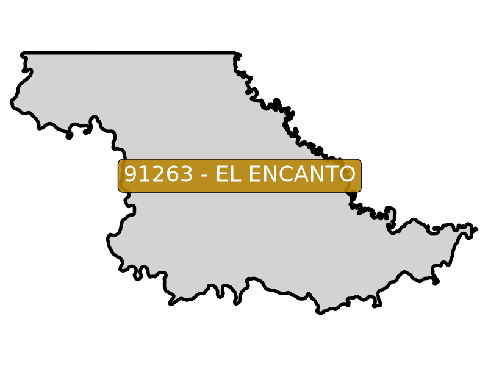 | [91263](https://github.com/rcfdtools/R.HydroTools/blob/main/tool/Population/file/report/91263.md) | El Encanto     | [91263_Rural_Lot_202606.zip](https://github.com/rcfdtools/R.GISMobile/blob/main/file/shp/91263_Rural_Lot_202606.zip)                                                                                                                                                                                                                                                                                                                                                                                                           |
| 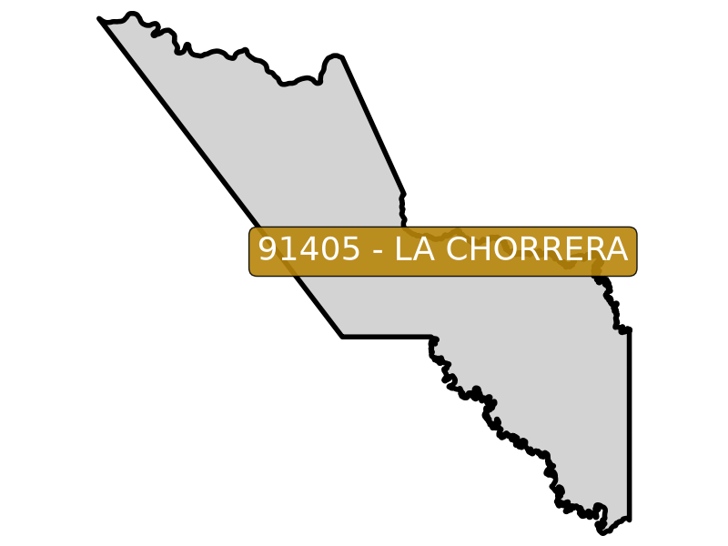 | [91405](https://github.com/rcfdtools/R.HydroTools/blob/main/tool/Population/file/report/91405.md) | La Chorrera    | [91405_Rural_Lot_202606.zip](https://github.com/rcfdtools/R.GISMobile/blob/main/file/shp/91405_Rural_Lot_202606.zip)                                                                                                                                                                                                                                                                                                                                                                                                           |
| 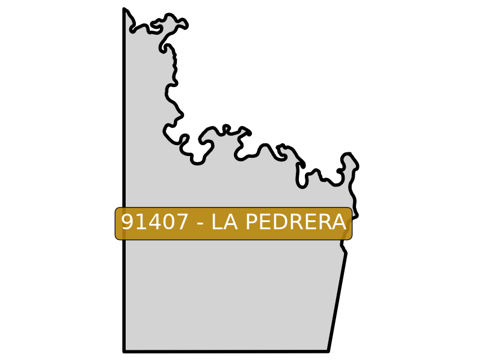 | [91407](https://github.com/rcfdtools/R.HydroTools/blob/main/tool/Population/file/report/91407.md) | La Pedrera     | [91407_Rural_Lot_202606.zip](https://github.com/rcfdtools/R.GISMobile/blob/main/file/shp/91407_Rural_Lot_202606.zip)                                                                                                                                                                                                                                                                                                                                                                                                           |
| 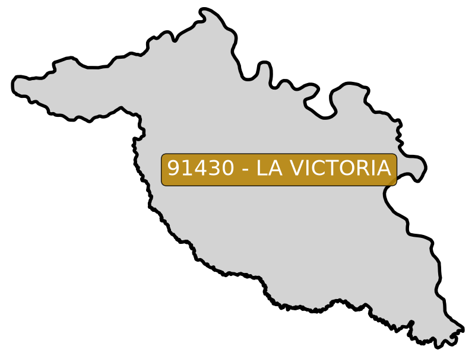 | [91430](https://github.com/rcfdtools/R.HydroTools/blob/main/tool/Population/file/report/91430.md) | La Victoria    | [91430_Rural_Lot_202606.zip](https://github.com/rcfdtools/R.GISMobile/blob/main/file/shp/91430_Rural_Lot_202606.zip)                                                                                                                                                                                                                                                                                                                                                                                                           |
| 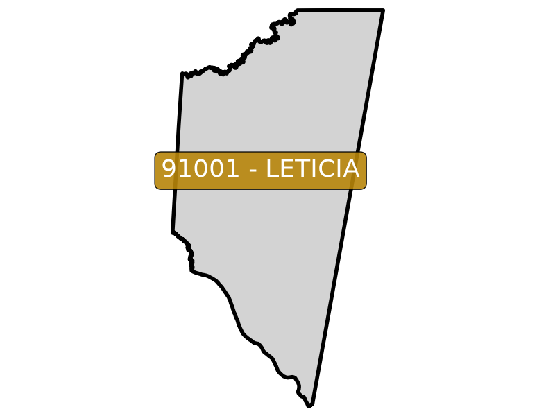 | [91001](https://github.com/rcfdtools/R.HydroTools/blob/main/tool/Population/file/report/91001.md) | Leticia        | [91001_Rural_Lot_202606.zip](https://github.com/rcfdtools/R.GISMobile/blob/main/file/shp/91001_Rural_Lot_202606.zip) [91001_Rural_Nomenclature_202606.zip](https://github.com/rcfdtools/R.GISMobile/blob/main/file/shp/91001_Rural_Nomenclature_202606.zip) [91001_Rural_Sector_202606.zip](https://github.com/rcfdtools/R.GISMobile/blob/main/file/shp/91001_Rural_Sector_202606.zip) [91001_Rural_Vereda_202606.zip](https://github.com/rcfdtools/R.GISMobile/blob/main/file/shp/91001_Rural_Vereda_202606.zip)  |
| 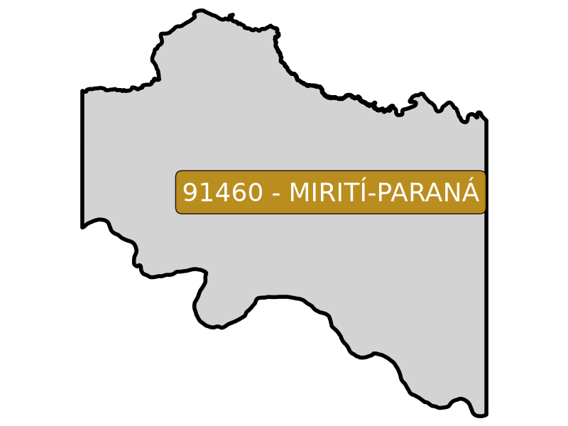 | [91460](https://github.com/rcfdtools/R.HydroTools/blob/main/tool/Population/file/report/91460.md) | Mirití-Paraná  | [91460_Rural_Lot_202606.zip](https://github.com/rcfdtools/R.GISMobile/blob/main/file/shp/91460_Rural_Lot_202606.zip)                                                                                                                                                                                                                                                                                                                                                                                                           |
| 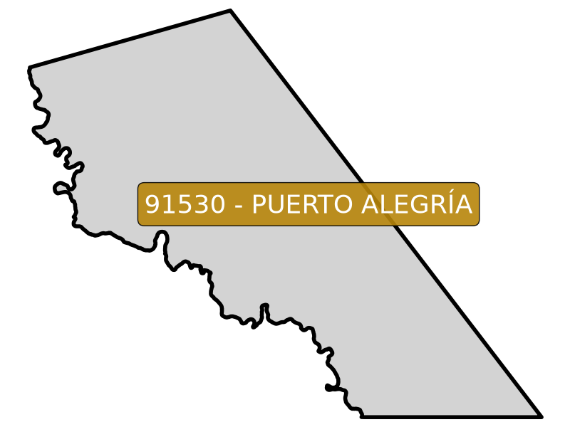 | [91530](https://github.com/rcfdtools/R.HydroTools/blob/main/tool/Population/file/report/91530.md) | Puerto Alegría | [91530_Rural_Lot_202606.zip](https://github.com/rcfdtools/R.GISMobile/blob/main/file/shp/91530_Rural_Lot_202606.zip)                                                                                                                                                                                                                                                                                                                                                                                                           |
| 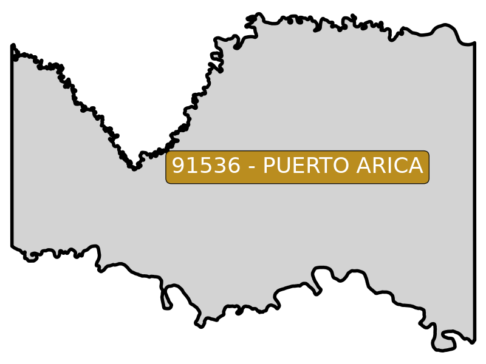 | [91536](https://github.com/rcfdtools/R.HydroTools/blob/main/tool/Population/file/report/91536.md) | Puerto Arica   | [91536_Rural_Lot_202606.zip](https://github.com/rcfdtools/R.GISMobile/blob/main/file/shp/91536_Rural_Lot_202606.zip) [91536_Rural_Sector_202606.zip](https://github.com/rcfdtools/R.GISMobile/blob/main/file/shp/91536_Rural_Sector_202606.zip) [91536_Rural_Vereda_202606.zip](https://github.com/rcfdtools/R.GISMobile/blob/main/file/shp/91536_Rural_Vereda_202606.zip)                                                                                                                                             |
| 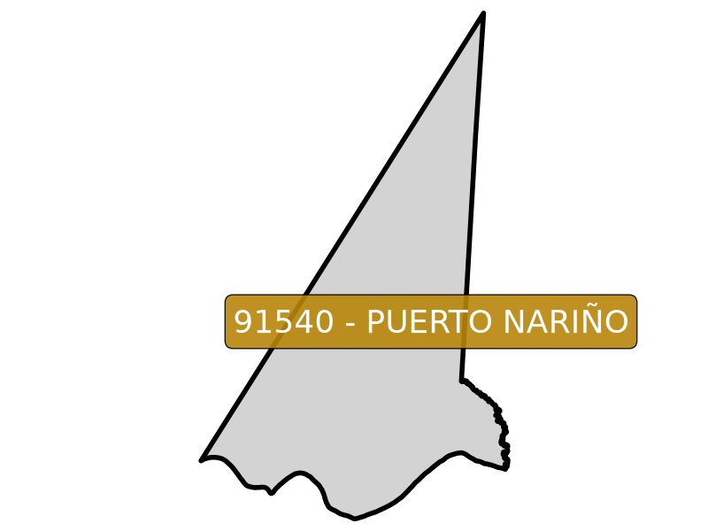 | [91540](https://github.com/rcfdtools/R.HydroTools/blob/main/tool/Population/file/report/91540.md) | Puerto Nariño  | [91540_Rural_Lot_202606.zip](https://github.com/rcfdtools/R.GISMobile/blob/main/file/shp/91540_Rural_Lot_202606.zip) [91540_Rural_Sector_202606.zip](https://github.com/rcfdtools/R.GISMobile/blob/main/file/shp/91540_Rural_Sector_202606.zip) [91540_Rural_Vereda_202606.zip](https://github.com/rcfdtools/R.GISMobile/blob/main/file/shp/91540_Rural_Vereda_202606.zip)                                                                                                                                             |
| 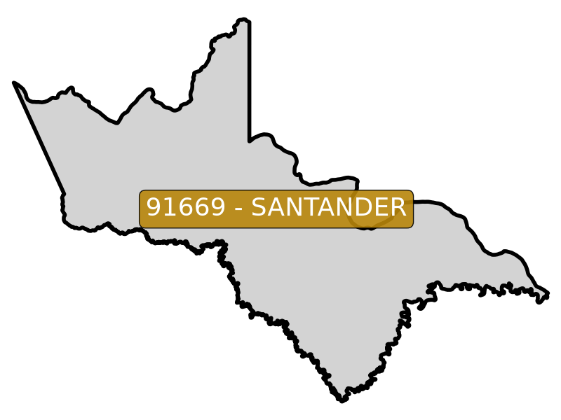 | [91669](https://github.com/rcfdtools/R.HydroTools/blob/main/tool/Population/file/report/91669.md) | Santander      | [91669_Rural_Lot_202606.zip](https://github.com/rcfdtools/R.GISMobile/blob/main/file/shp/91669_Rural_Lot_202606.zip)                                                                                                                                                                                                                                                                                                                                                                                                           |
| 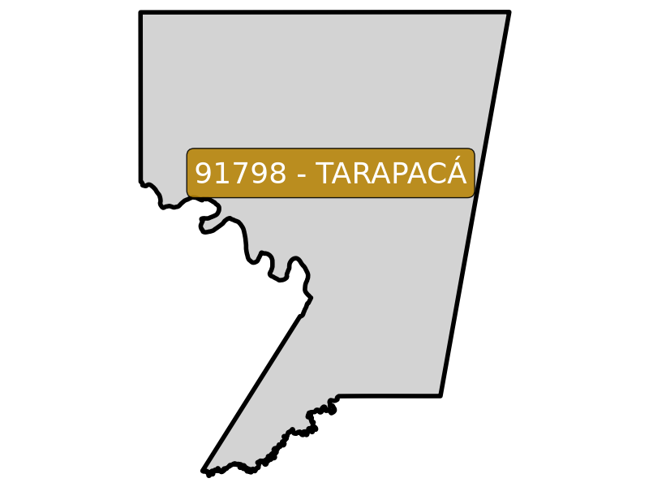 | [91798](https://github.com/rcfdtools/R.HydroTools/blob/main/tool/Population/file/report/91798.md) | Tarapacá       | [91798_Rural_Lot_202606.zip](https://github.com/rcfdtools/R.GISMobile/blob/main/file/shp/91798_Rural_Lot_202606.zip) [91798_Rural_Sector_202606.zip](https://github.com/rcfdtools/R.GISMobile/blob/main/file/shp/91798_Rural_Sector_202606.zip) [91798_Rural_Vereda_202606.zip](https://github.com/rcfdtools/R.GISMobile/blob/main/file/shp/91798_Rural_Vereda_202606.zip)                                                                                                                                             |

#

 Share this research
 

**APPS & TOOLS & CONTENT DISCLAIMER**: • NO WARRANTY - This content and software is provided by <a href="https://github.com/rcfdtools" target="_blank">github.com/rcfdtools</a> "as is", without any express or implied warranty, including warranties of merchantability, fitness for a particular purpose, or non-infringement. There is no guarantee that the software will be error-free or operate without interruption. • LIMITATION OF LIABILITY - Neither the authors nor copyright holders will be liable for claims or damages arising from the software or its use. You are responsible for determining if the software is appropriate for your use and assume all associated risks, including errors, legal compliance, and data loss. • NO PROFESSIONAL ADVICE - The software provides general information and does not offer professional advice. It should not replace consultation with professional advisors. [Clauses and global license for rcfdtools use.](https://github.com/rcfdtools/rcfdtools/blob/main/LICENSE.md)

| [:house: Home](Readme.md)  | [:beginner: Help / Collab](https://github.com/rcfdtools/R.GISMobile/discussions) |
|----------------------------|-------------------------------------------------------------------------------------------|