<div align="center"></div>

## :earth_americas:POI: _“Garden of Gods - Colorado Springs, Colorado, U.S. (2018-05-25)”_
`Pictures` rcfdtools <br>`Category` Freelance field visit <br>`Location` [Google Maps](http://maps.google.com/maps?q=38.865713,-104.889951) or [Openstreet Map](https://www.openstreetmap.org/query?lat=38.865713&lon=-104.889951) 

```geojson
{
  "type": "Feature",
  "geometry": {
    "type": "Point", 
    "coordinates": [-104.889951, 38.865713]
  }, 
  "properties": {
    "Name": "Garden of Gods - Colorado Springs, Colorado, U.S."
  }
}
```

<br><details><summary>:camera:**34/20180525_121221.jpg**</summary><sub> `Exif version` 0220 `OS version` G930PVPU5BQL1 `Date` 2018:05:25 12:12:21 `Aperture` Not known `Brightness` 8.83 `Color space` 1 `Compression` 6`Exposure mode` 0 `Exposure time` 0.000462962962962963 `Focal length` 4.2 `Lens model` Not known `Lens specification` Not known `Orientation` 6 `Scene type` Not known `f number` 1.7 `White balance` 0 `Sensing method` 2 `Shutter speed` 11.076</sub></details>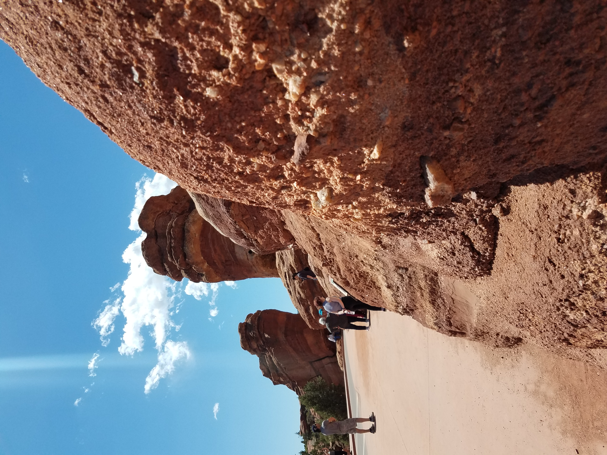

<br><details><summary>:camera:**34/20180525_121238.jpg**</summary><sub> `Exif version` 0220 `OS version` G930PVPU5BQL1 `Date` 2018:05:25 12:12:38 `Aperture` Not known `Brightness` 8.95 `Color space` 1 `Compression` 6`Exposure mode` 0 `Exposure time` 0.00042087542087542086 `Focal length` 4.2 `Lens model` Not known `Lens specification` Not known `Orientation` 6 `Scene type` Not known `f number` 1.7 `White balance` 0 `Sensing method` 2 `Shutter speed` 11.214</sub></details>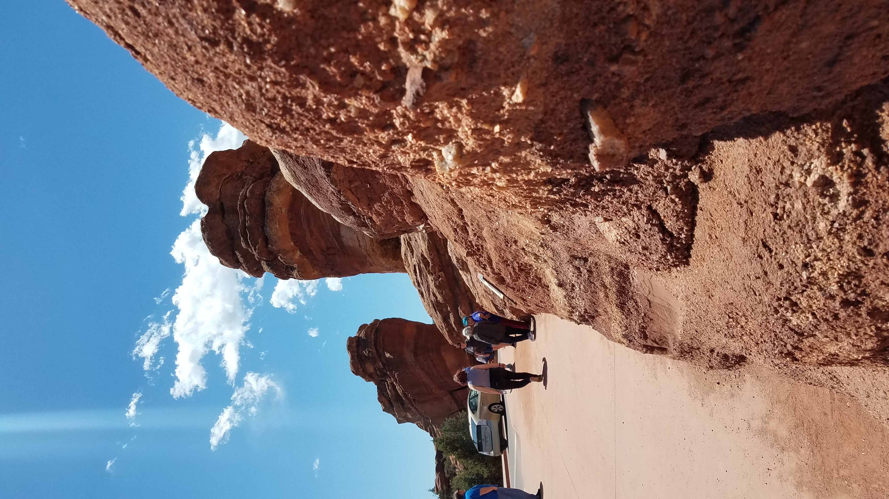

<br><details><summary>:camera:**34/20180525_121243.jpg**</summary><sub> `Exif version` 0220 `OS version` G930PVPU5BQL1 `Date` 2018:05:25 12:12:42 `Aperture` Not known `Brightness` 8.98 `Color space` 1 `Compression` 6`Exposure mode` 0 `Exposure time` 0.00043252595155709344 `Focal length` 4.2 `Lens model` Not known `Lens specification` Not known `Orientation` 1 `Scene type` Not known `f number` 1.7 `White balance` 0 `Sensing method` 2 `Shutter speed` 11.174</sub></details>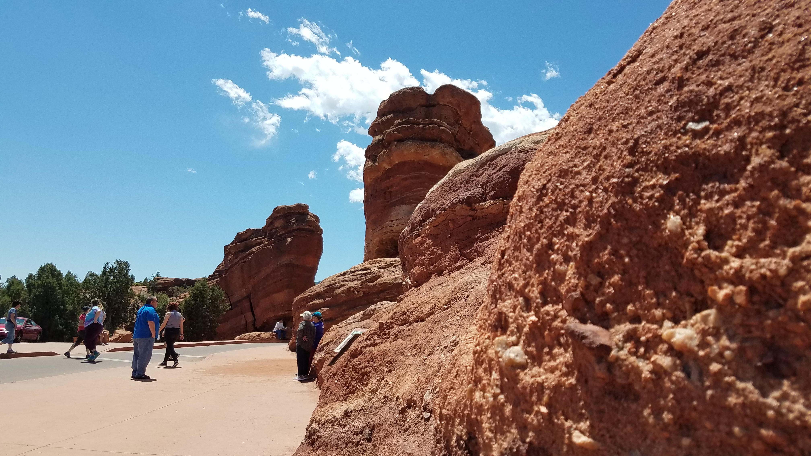

<br><details><summary>:camera:**34/20180525_121245.jpg**</summary><sub> `Exif version` 0220 `OS version` G930PVPU5BQL1 `Date` 2018:05:25 12:12:45 `Aperture` Not known `Brightness` 8.96 `Color space` 1 `Compression` 6`Exposure mode` 0 `Exposure time` 0.0004280821917808219 `Focal length` 4.2 `Lens model` Not known `Lens specification` Not known `Orientation` 1 `Scene type` Not known `f number` 1.7 `White balance` 0 `Sensing method` 2 `Shutter speed` 11.189</sub></details>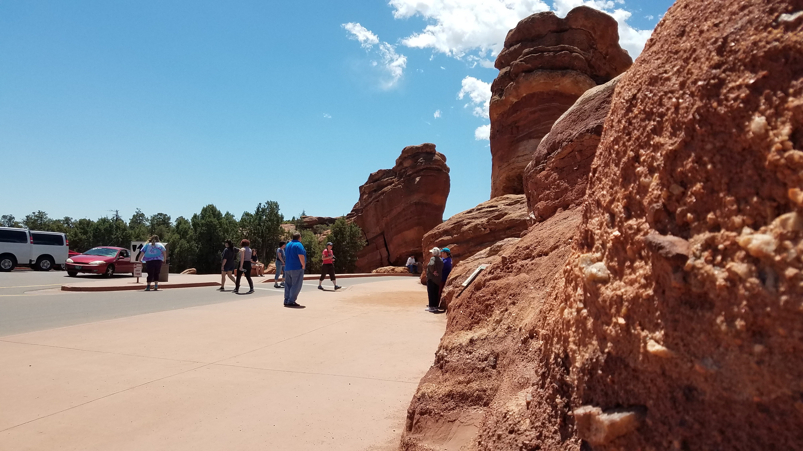

<br><details><summary>:camera:**34/20180525_121254.jpg**</summary><sub> `Exif version` 0220 `OS version` G930PVPU5BQL1 `Date` 2018:05:25 12:12:54 `Aperture` Not known `Brightness` 9.02 `Color space` 1 `Compression` 6`Exposure mode` 0 `Exposure time` 0.0004152823920265781 `Focal length` 4.2 `Lens model` Not known `Lens specification` Not known `Orientation` 6 `Scene type` Not known `f number` 1.7 `White balance` 0 `Sensing method` 2 `Shutter speed` 11.233</sub></details>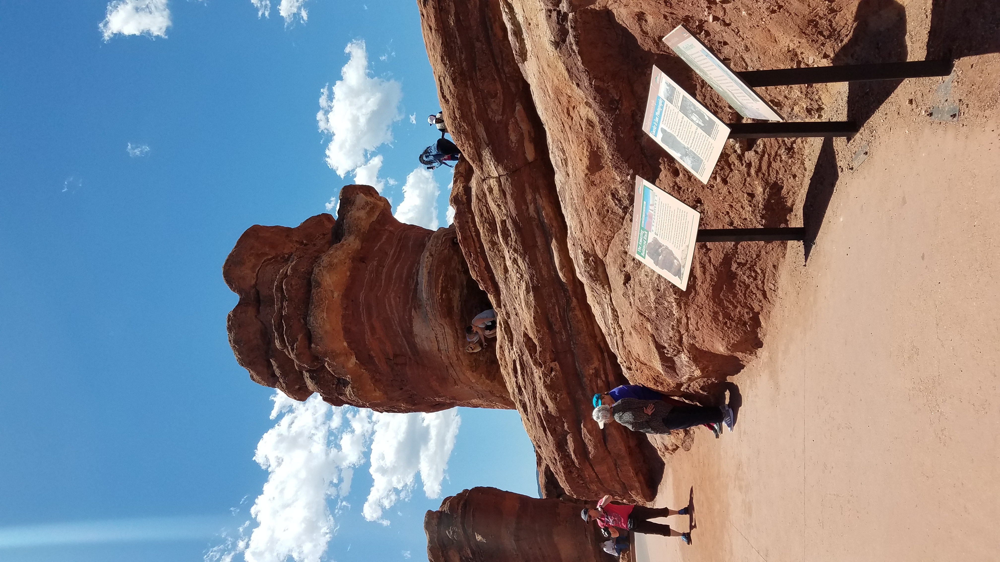

<br><details><summary>:camera:**34/20180525_121311.jpg**</summary><sub> `Exif version` 0220 `OS version` G930PVPU5BQL1 `Date` 2018:05:25 12:13:11 `Aperture` Not known `Brightness` 8.55 `Color space` 1 `Compression` 6`Exposure mode` 0 `Exposure time` 0.0005787037037037037 `Focal length` 4.2 `Lens model` Not known `Lens specification` Not known `Orientation` 6 `Scene type` Not known `f number` 1.7 `White balance` 0 `Sensing method` 2 `Shutter speed` 10.754</sub></details>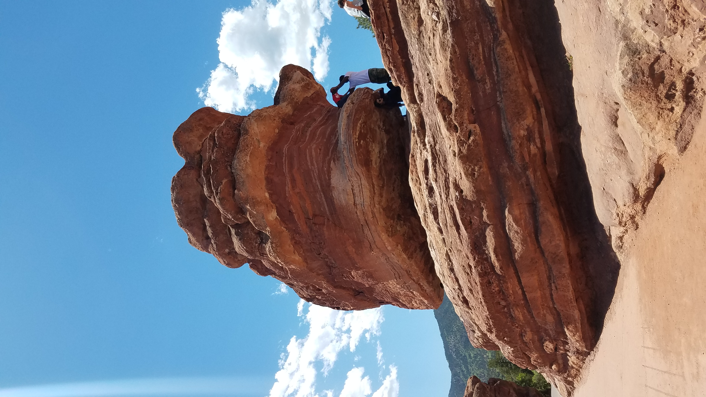

<br><details><summary>:camera:**34/20180525_121313.jpg**</summary><sub> `Exif version` 0220 `OS version` G930PVPU5BQL1 `Date` 2018:05:25 12:13:13 `Aperture` Not known `Brightness` 9.44 `Color space` 1 `Compression` 6`Exposure mode` 0 `Exposure time` 0.0003117206982543641 `Focal length` 4.2 `Lens model` Not known `Lens specification` Not known `Orientation` 6 `Scene type` Not known `f number` 1.7 `White balance` 0 `Sensing method` 2 `Shutter speed` 11.647</sub></details>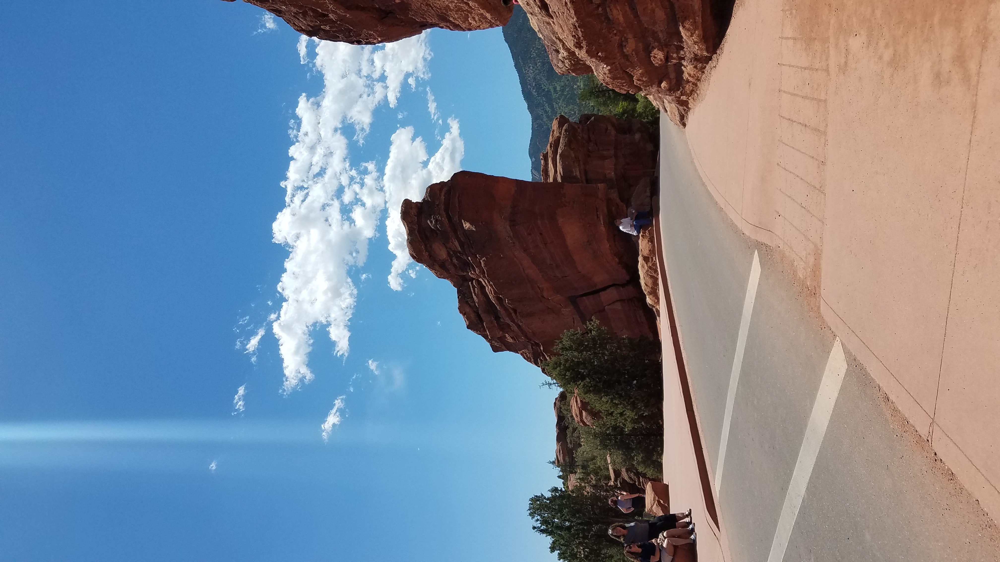

<br><details><summary>:camera:**34/20180525_121326.jpg**</summary><sub> `Exif version` 0220 `OS version` G930PVPU5BQL1 `Date` 2018:05:25 12:13:26 `Aperture` Not known `Brightness` 9.28 `Color space` 1 `Compression` 6`Exposure mode` 0 `Exposure time` 0.00034722222222222224 `Focal length` 4.2 `Lens model` Not known `Lens specification` Not known `Orientation` 6 `Scene type` Not known `f number` 1.7 `White balance` 0 `Sensing method` 2 `Shutter speed` 11.491</sub></details>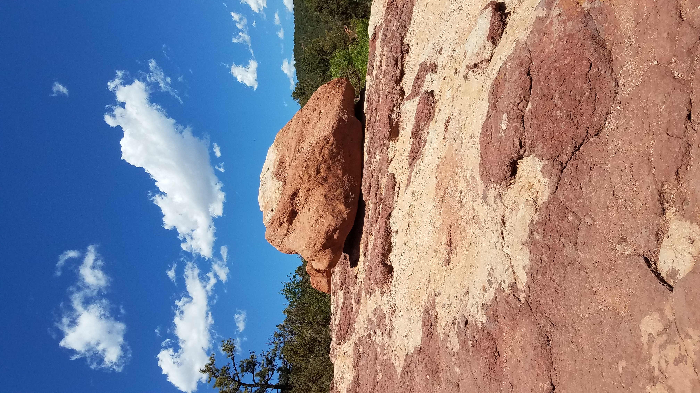

<br><details><summary>:camera:**34/20180525_121329.jpg**</summary><sub> `Exif version` 0220 `OS version` G930PVPU5BQL1 `Date` 2018:05:25 12:13:29 `Aperture` Not known `Brightness` 9.15 `Color space` 1 `Compression` 6`Exposure mode` 0 `Exposure time` 0.0003787878787878788 `Focal length` 4.2 `Lens model` Not known `Lens specification` Not known `Orientation` 1 `Scene type` Not known `f number` 1.7 `White balance` 0 `Sensing method` 2 `Shutter speed` 11.366</sub></details>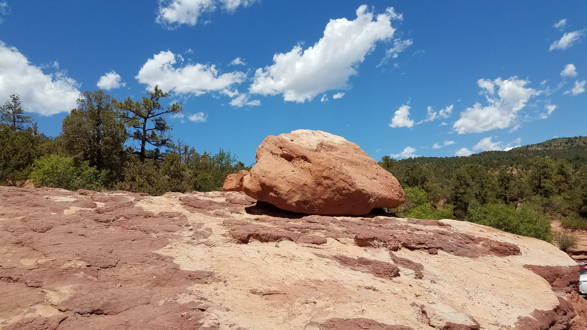

<br><details><summary>:camera:**34/20180525_121337.jpg**</summary><sub> `Exif version` 0220 `OS version` G930PVPU5BQL1 `Date` 2018:05:25 12:13:37 `Aperture` Not known `Brightness` 9.03 `Color space` 1 `Compression` 6`Exposure mode` 0 `Exposure time` 0.000423728813559322 `Focal length` 4.2 `Lens model` Not known `Lens specification` Not known `Orientation` 1 `Scene type` Not known `f number` 1.7 `White balance` 0 `Sensing method` 2 `Shutter speed` 11.204</sub></details>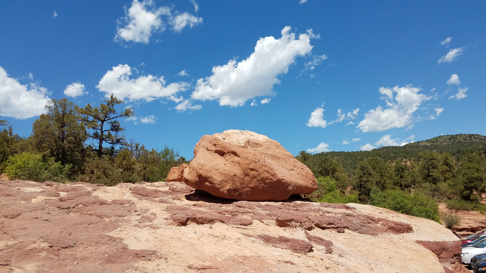

<br><details><summary>:camera:**34/20180525_121423.jpg**</summary><sub> `Exif version` 0220 `OS version` G930PVPU5BQL1 `Date` 2018:05:25 12:14:23 `Aperture` Not known `Brightness` 8.84 `Color space` 1 `Compression` 6`Exposure mode` 0 `Exposure time` 0.0004752851711026616 `Focal length` 4.2 `Lens model` Not known `Lens specification` Not known `Orientation` 1 `Scene type` Not known `f number` 1.7 `White balance` 0 `Sensing method` 2 `Shutter speed` 11.038</sub></details>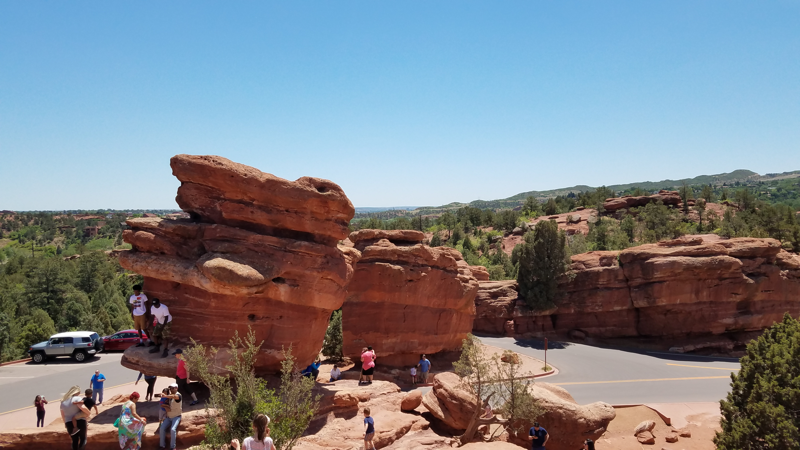

<br><details><summary>:camera:**34/20180525_121436.jpg**</summary><sub> `Exif version` 0220 `OS version` G930PVPU5BQL1 `Date` 2018:05:25 12:14:36 `Aperture` Not known `Brightness` 8.91 `Color space` 1 `Compression` 6`Exposure mode` 0 `Exposure time` 0.00044483985765124553 `Focal length` 4.2 `Lens model` Not known `Lens specification` Not known `Orientation` 1 `Scene type` Not known `f number` 1.7 `White balance` 0 `Sensing method` 2 `Shutter speed` 11.134</sub></details>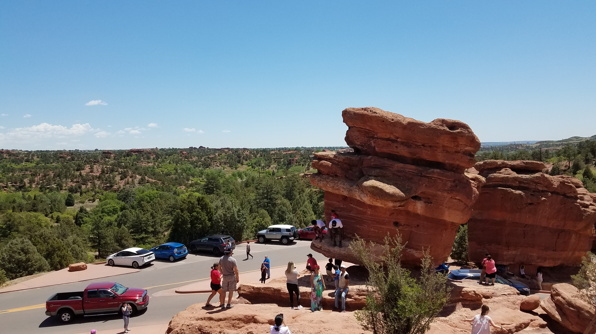

<br><details><summary>:camera:**34/20180525_121436_0.jpg**</summary><sub> `Exif version` 0220 `OS version` G930PVPU5BQL1 `Date` 2018:05:25 12:14:36 `Aperture` Not known `Brightness` 8.92 `Color space` 1 `Compression` 6`Exposure mode` 0 `Exposure time` 0.00044483985765124553 `Focal length` 4.2 `Lens model` Not known `Lens specification` Not known `Orientation` 1 `Scene type` Not known `f number` 1.7 `White balance` 0 `Sensing method` 2 `Shutter speed` 11.134</sub></details>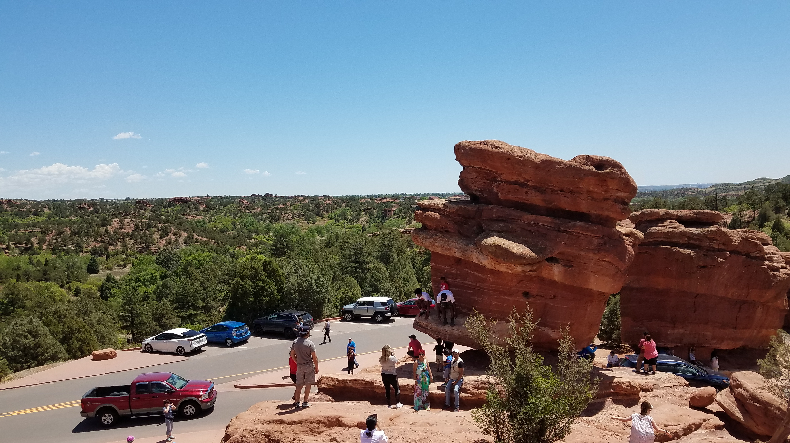

<br><details><summary>:camera:**34/20180525_121523.jpg**</summary><sub> `Exif version` 0220 `OS version` G930PVPU5BQL1 `Date` 2018:05:25 12:15:22 `Aperture` Not known `Brightness` Not known `Color space` 1 `Compression` Not known`Exposure mode` 0 `Exposure time` Not known `Focal length` 4.2 `Lens model` Not known `Lens specification` Not known `Orientation` 1 `Scene type` Not known `f number` 1.7 `White balance` 0 `Sensing method` Not known `Shutter speed` Not known</sub></details>

<br><details><summary>:camera:**34/20180525_121706.jpg**</summary><sub> `Exif version` 0220 `OS version` G930PVPU5BQL1 `Date` 2018:05:25 12:17:06 `Aperture` Not known `Brightness` 8.04 `Color space` 1 `Compression` 6`Exposure mode` 0 `Exposure time` 0.0007692307692307692 `Focal length` 4.2 `Lens model` Not known `Lens specification` Not known `Orientation` 1 `Scene type` Not known `f number` 1.7 `White balance` 0 `Sensing method` 2 `Shutter speed` 10.344</sub></details>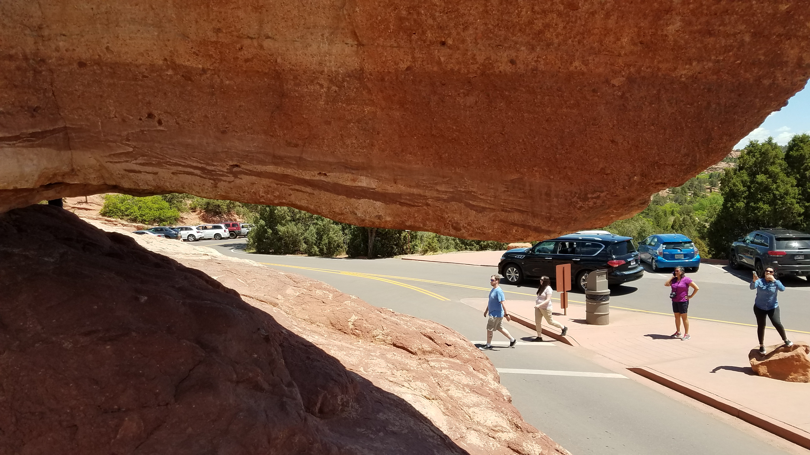

<br><details><summary>:camera:**34/20180525_121721.jpg**</summary><sub> `Exif version` 0220 `OS version` G930PVPU5BQL1 `Date` 2018:05:25 12:17:21 `Aperture` Not known `Brightness` 8.59 `Color space` 1 `Compression` 6`Exposure mode` 0 `Exposure time` 0.0005263157894736842 `Focal length` 4.2 `Lens model` Not known `Lens specification` Not known `Orientation` 6 `Scene type` Not known `f number` 1.7 `White balance` 0 `Sensing method` 2 `Shutter speed` 10.891</sub></details>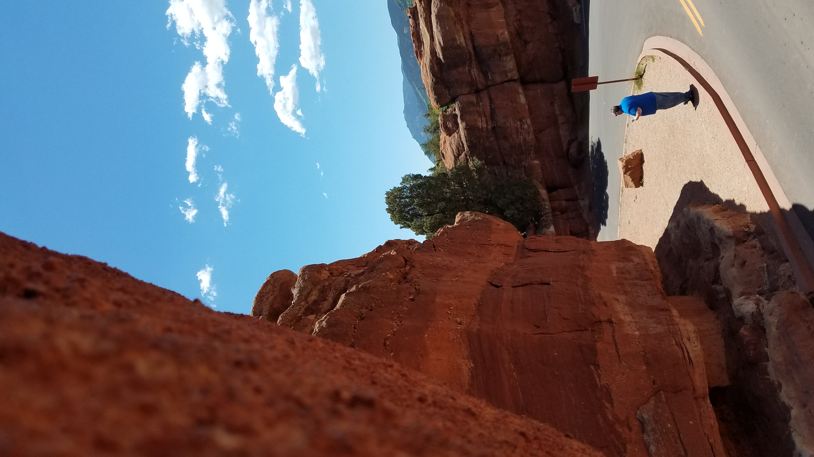

<br><details><summary>:camera:**34/20180525_121726.jpg**</summary><sub> `Exif version` 0220 `OS version` G930PVPU5BQL1 `Date` 2018:05:25 12:17:26 `Aperture` Not known `Brightness` 8.1 `Color space` 1 `Compression` 6`Exposure mode` 0 `Exposure time` 0.000741839762611276 `Focal length` 4.2 `Lens model` Not known `Lens specification` Not known `Orientation` 6 `Scene type` Not known `f number` 1.7 `White balance` 0 `Sensing method` 2 `Shutter speed` 10.396</sub></details>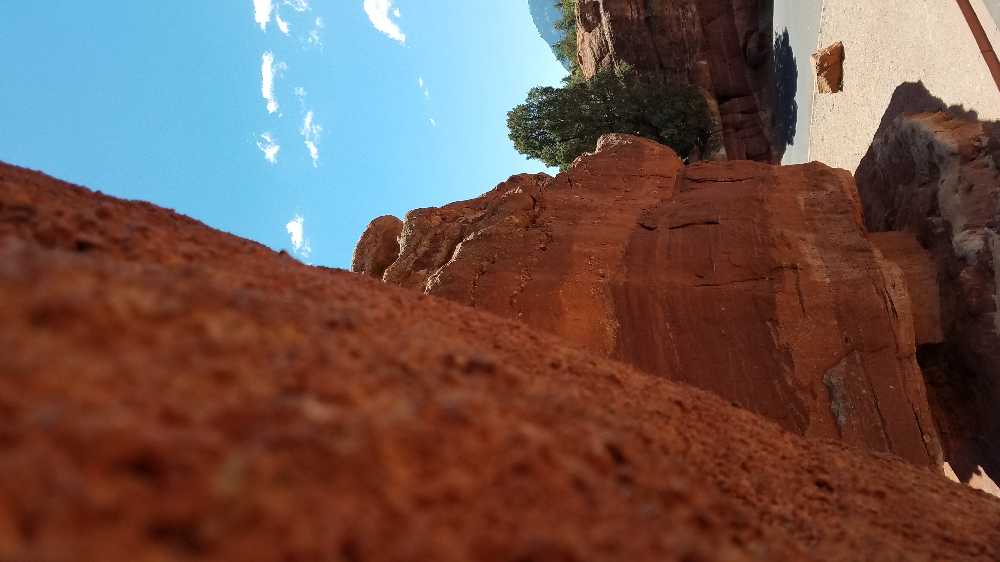

<br><details><summary>:camera:**34/20180525_121732.jpg**</summary><sub> `Exif version` 0220 `OS version` G930PVPU5BQL1 `Date` 2018:05:25 12:17:32 `Aperture` Not known `Brightness` 8.92 `Color space` 1 `Compression` 6`Exposure mode` 0 `Exposure time` 0.00043706293706293706 `Focal length` 4.2 `Lens model` Not known `Lens specification` Not known `Orientation` 6 `Scene type` Not known `f number` 1.7 `White balance` 0 `Sensing method` 2 `Shutter speed` 11.159</sub></details>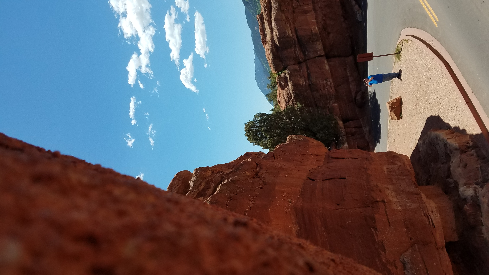

<br><details><summary>:camera:**34/20180525_121741.jpg**</summary><sub> `Exif version` 0220 `OS version` G930PVPU5BQL1 `Date` 2018:05:25 12:17:41 `Aperture` Not known `Brightness` 8.94 `Color space` 1 `Compression` 6`Exposure mode` 0 `Exposure time` 0.00042087542087542086 `Focal length` 4.2 `Lens model` Not known `Lens specification` Not known `Orientation` 1 `Scene type` Not known `f number` 1.7 `White balance` 0 `Sensing method` 2 `Shutter speed` 11.214</sub></details>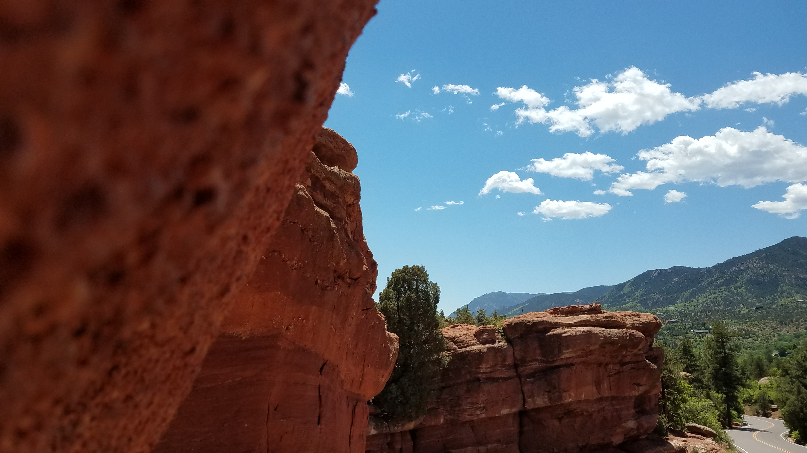

<br><details><summary>:camera:**34/20180525_121748.jpg**</summary><sub> `Exif version` 0220 `OS version` G930PVPU5BQL1 `Date` 2018:05:25 12:17:47 `Aperture` Not known `Brightness` 9.15 `Color space` 1 `Compression` 6`Exposure mode` 0 `Exposure time` 0.0003654970760233918 `Focal length` 4.2 `Lens model` Not known `Lens specification` Not known `Orientation` 1 `Scene type` Not known `f number` 1.7 `White balance` 0 `Sensing method` 2 `Shutter speed` 11.417</sub></details>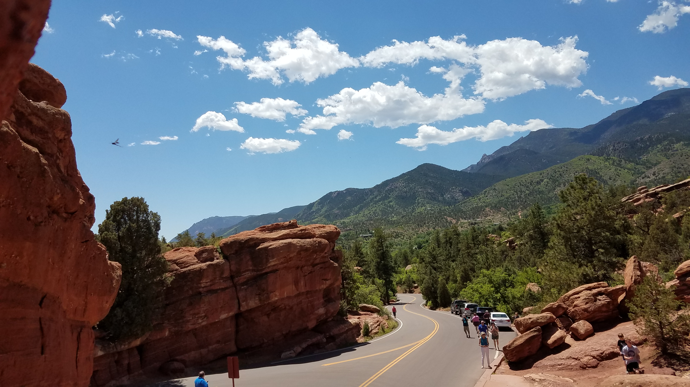

<br><details><summary>:camera:**34/20180525_121850.jpg**</summary><sub> `Exif version` 0220 `OS version` G930PVPU5BQL1 `Date` 2018:05:25 12:18:50 `Aperture` Not known `Brightness` 9.17 `Color space` 1 `Compression` 6`Exposure mode` 0 `Exposure time` 0.00036023054755043225 `Focal length` 4.2 `Lens model` Not known `Lens specification` Not known `Orientation` 6 `Scene type` Not known `f number` 1.7 `White balance` 0 `Sensing method` 2 `Shutter speed` 11.438</sub></details>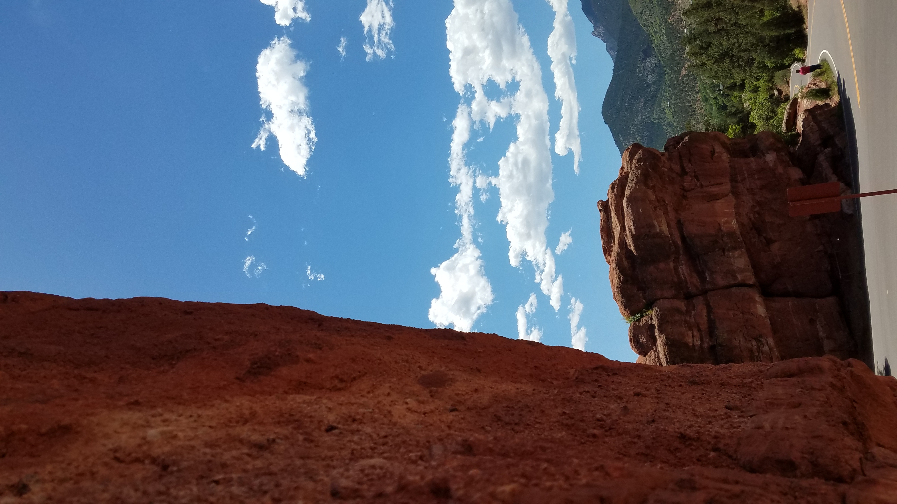

<br><details><summary>:camera:**34/20180525_121906.jpg**</summary><sub> `Exif version` 0220 `OS version` G930PVPU5BQL1 `Date` 2018:05:25 12:19:06 `Aperture` Not known `Brightness` 7.01 `Color space` 1 `Compression` 6`Exposure mode` 0 `Exposure time` 0.001718213058419244 `Focal length` 4.2 `Lens model` Not known `Lens specification` Not known `Orientation` 1 `Scene type` Not known `f number` 1.7 `White balance` 0 `Sensing method` 2 `Shutter speed` 9.184</sub></details>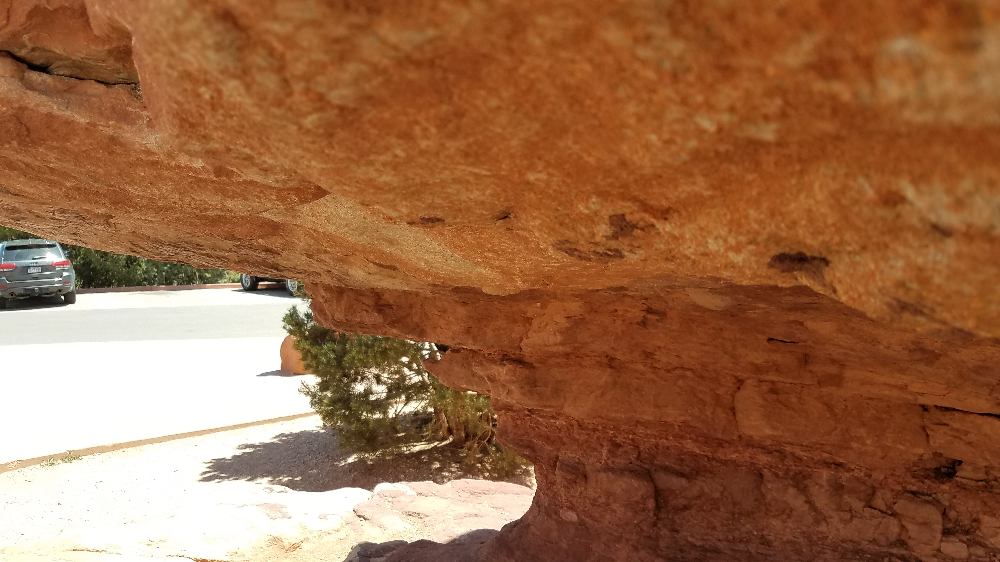

<br><details><summary>:camera:**34/20180525_121928.jpg**</summary><sub> `Exif version` 0220 `OS version` G930PVPU5BQL1 `Date` 2018:05:25 12:19:28 `Aperture` Not known `Brightness` 8.19 `Color space` 1 `Compression` 6`Exposure mode` 0 `Exposure time` 0.0007288629737609329 `Focal length` 4.2 `Lens model` Not known `Lens specification` Not known `Orientation` 6 `Scene type` Not known `f number` 1.7 `White balance` 0 `Sensing method` 2 `Shutter speed` 10.422</sub></details>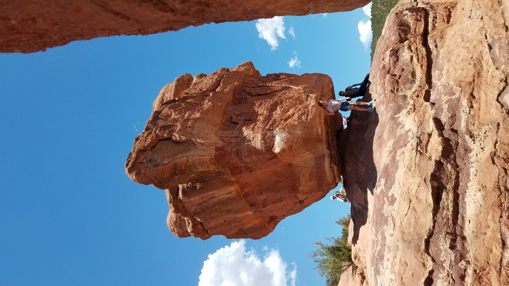

<br><details><summary>:camera:**34/20180525_121932.jpg**</summary><sub> `Exif version` 0220 `OS version` G930PVPU5BQL1 `Date` 2018:05:25 12:19:32 `Aperture` Not known `Brightness` 8.16 `Color space` 1 `Compression` 6`Exposure mode` 0 `Exposure time` 0.0007507507507507507 `Focal length` 4.2 `Lens model` Not known `Lens specification` Not known `Orientation` 6 `Scene type` Not known `f number` 1.7 `White balance` 0 `Sensing method` 2 `Shutter speed` 10.379</sub></details>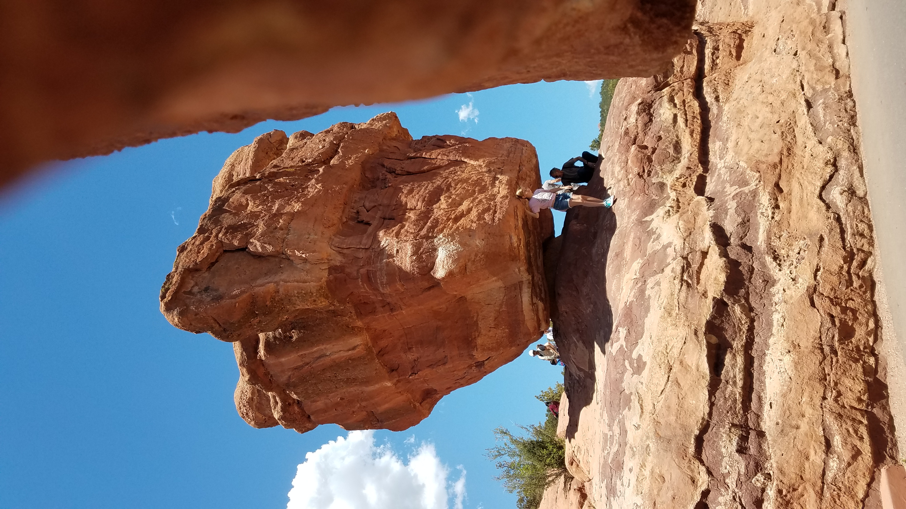

<br><details><summary>:camera:**34/20180525_121938.jpg**</summary><sub> `Exif version` 0220 `OS version` G930PVPU5BQL1 `Date` 2018:05:25 12:19:38 `Aperture` Not known `Brightness` 8.23 `Color space` 1 `Compression` 6`Exposure mode` 0 `Exposure time` 0.0007309941520467836 `Focal length` 4.2 `Lens model` Not known `Lens specification` Not known `Orientation` 1 `Scene type` Not known `f number` 1.7 `White balance` 0 `Sensing method` 2 `Shutter speed` 10.417</sub></details>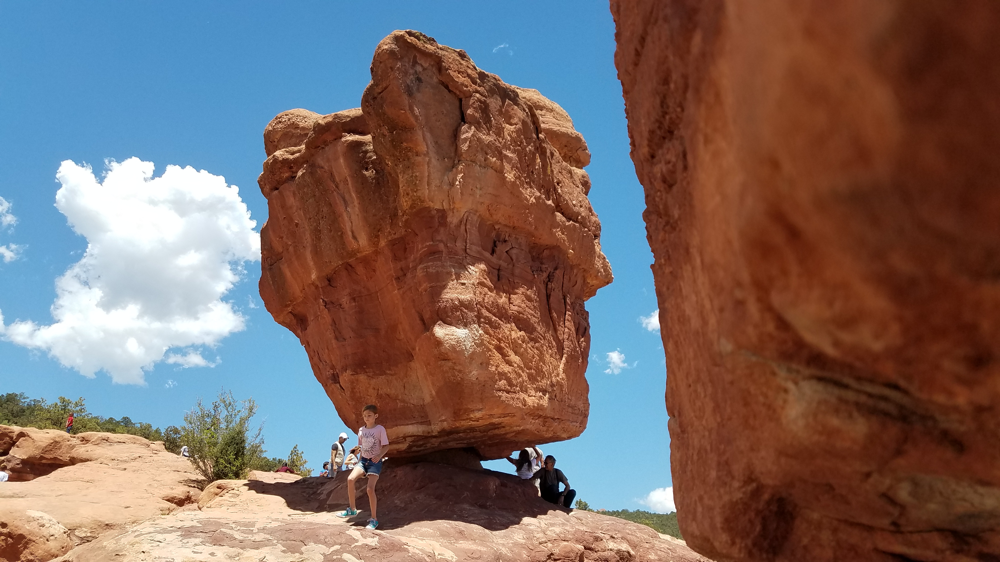

<br><details><summary>:camera:**34/20180525_121951.jpg**</summary><sub> `Exif version` 0220 `OS version` G930PVPU5BQL1 `Date` 2018:05:25 12:19:51 `Aperture` Not known `Brightness` 8.41 `Color space` 1 `Compression` 6`Exposure mode` 0 `Exposure time` 0.0006127450980392157 `Focal length` 4.2 `Lens model` Not known `Lens specification` Not known `Orientation` 1 `Scene type` Not known `f number` 1.7 `White balance` 0 `Sensing method` 2 `Shutter speed` 10.672</sub></details>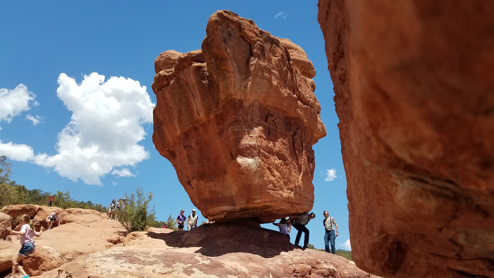

<br><details><summary>:camera:**34/20180525_122003.jpg**</summary><sub> `Exif version` 0220 `OS version` G930PVPU5BQL1 `Date` 2018:05:25 12:20:03 `Aperture` Not known `Brightness` 8.52 `Color space` 1 `Compression` 6`Exposure mode` 0 `Exposure time` 0.0005966587112171838 `Focal length` 4.2 `Lens model` Not known `Lens specification` Not known `Orientation` 1 `Scene type` Not known `f number` 1.7 `White balance` 0 `Sensing method` 2 `Shutter speed` 10.71</sub></details>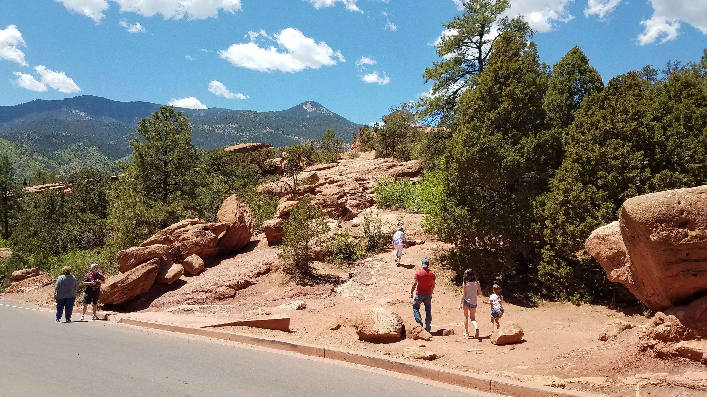

<br><details><summary>:camera:**34/20180525_122007.jpg**</summary><sub> `Exif version` 0220 `OS version` G930PVPU5BQL1 `Date` 2018:05:25 12:20:07 `Aperture` Not known `Brightness` 9.21 `Color space` 1 `Compression` 6`Exposure mode` 0 `Exposure time` 0.00037313432835820896 `Focal length` 4.2 `Lens model` Not known `Lens specification` Not known `Orientation` 1 `Scene type` Not known `f number` 1.7 `White balance` 0 `Sensing method` 2 `Shutter speed` 11.388</sub></details>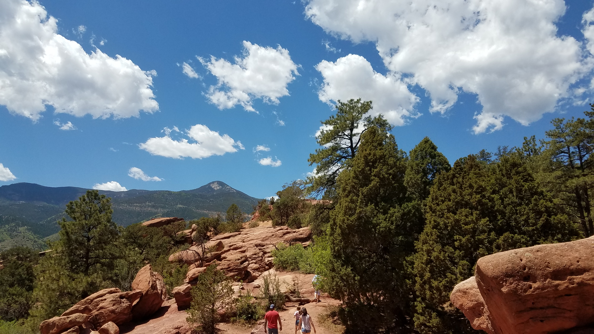

<br><details><summary>:camera:**34/20180525_122011.jpg**</summary><sub> `Exif version` 0220 `OS version` G930PVPU5BQL1 `Date` 2018:05:25 12:20:11 `Aperture` Not known `Brightness` 9.17 `Color space` 1 `Compression` 6`Exposure mode` 0 `Exposure time` 0.00035919540229885057 `Focal length` 4.2 `Lens model` Not known `Lens specification` Not known `Orientation` 1 `Scene type` Not known `f number` 1.7 `White balance` 0 `Sensing method` 2 `Shutter speed` 11.442</sub></details>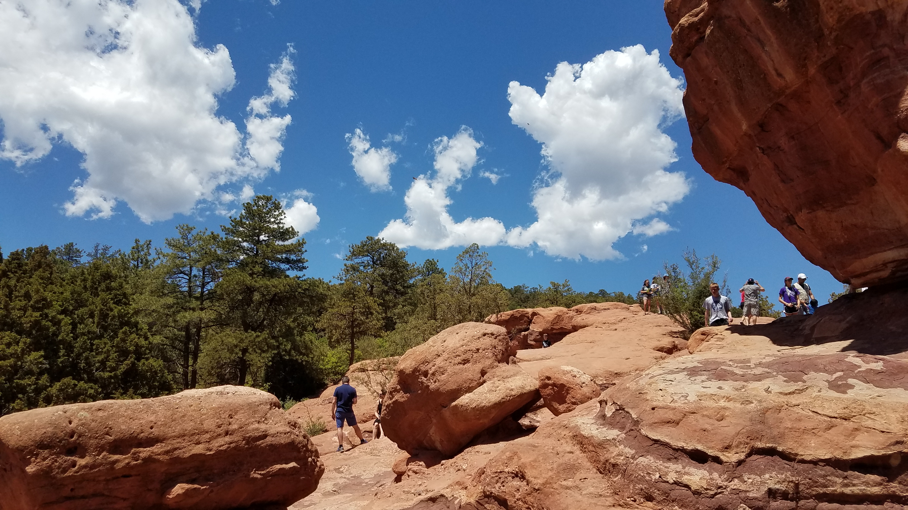

<br><details><summary>:camera:**34/20180525_122037.jpg**</summary><sub> `Exif version` 0220 `OS version` G930PVPU5BQL1 `Date` 2018:05:25 12:20:37 `Aperture` Not known `Brightness` 8.66 `Color space` 1 `Compression` 6`Exposure mode` 0 `Exposure time` 0.0005330490405117271 `Focal length` 4.2 `Lens model` Not known `Lens specification` Not known `Orientation` 1 `Scene type` Not known `f number` 1.7 `White balance` 0 `Sensing method` 2 `Shutter speed` 10.873</sub></details>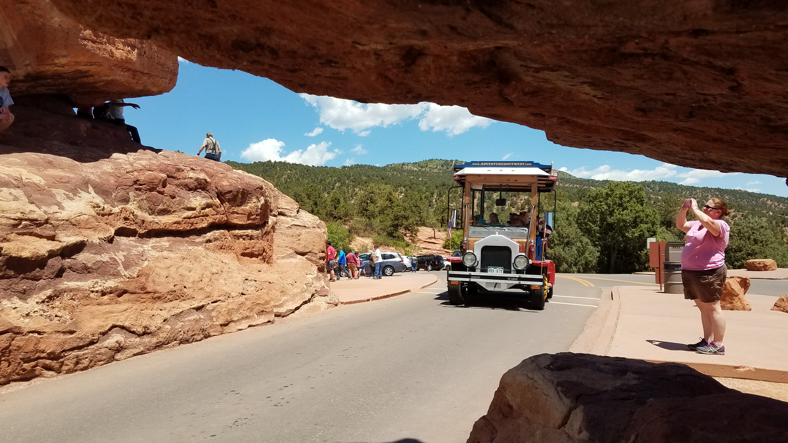

<br><details><summary>:camera:**34/20180525_122051.jpg**</summary><sub> `Exif version` 0220 `OS version` G930PVPU5BQL1 `Date` 2018:05:25 12:20:51 `Aperture` Not known `Brightness` 7.82 `Color space` 1 `Compression` 6`Exposure mode` 0 `Exposure time` 0.0009823182711198428 `Focal length` 4.2 `Lens model` Not known `Lens specification` Not known `Orientation` 1 `Scene type` Not known `f number` 1.7 `White balance` 0 `Sensing method` 2 `Shutter speed` 9.991</sub></details>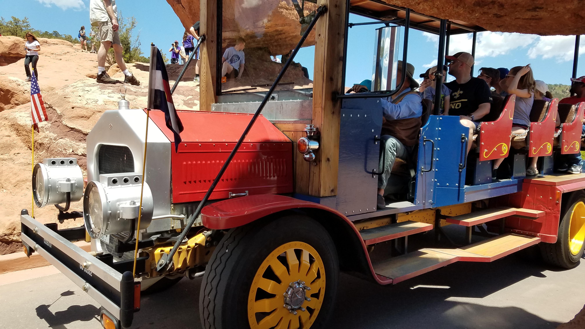

<br><details><summary>:camera:**34/20180525_122055.jpg**</summary><sub> `Exif version` 0220 `OS version` G930PVPU5BQL1 `Date` 2018:05:25 12:20:55 `Aperture` Not known `Brightness` 7.94 `Color space` 1 `Compression` 6`Exposure mode` 0 `Exposure time` 0.0008389261744966443 `Focal length` 4.2 `Lens model` Not known `Lens specification` Not known `Orientation` 1 `Scene type` Not known `f number` 1.7 `White balance` 0 `Sensing method` 2 `Shutter speed` 10.219</sub></details>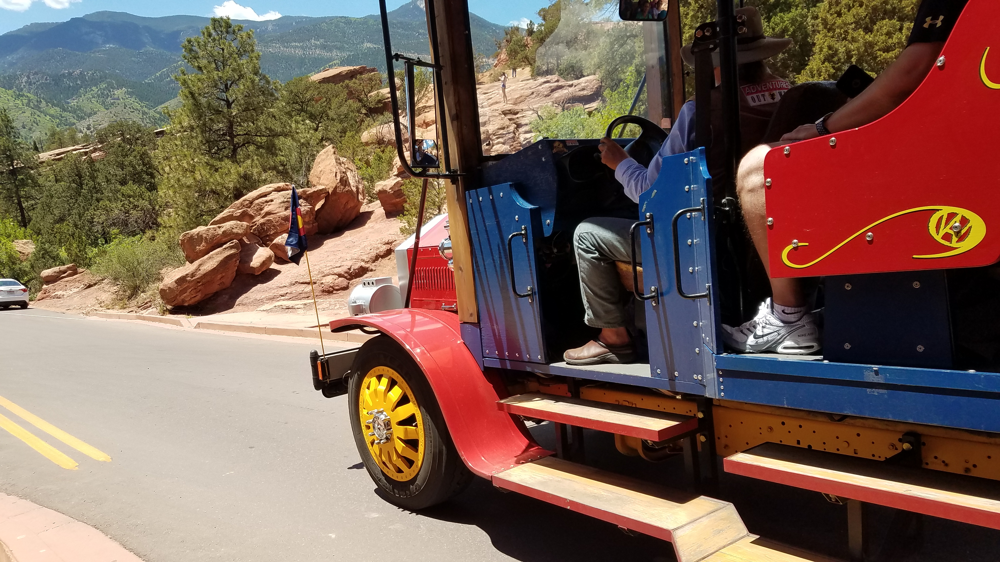

<br><details><summary>:camera:**34/20180525_122418.jpg**</summary><sub> `Exif version` 0220 `OS version` G930PVPU5BQL1 `Date` 2018:05:25 12:24:18 `Aperture` Not known `Brightness` 9.37 `Color space` 1 `Compression` 6`Exposure mode` 0 `Exposure time` 0.0003272251308900524 `Focal length` 4.2 `Lens model` Not known `Lens specification` Not known `Orientation` 1 `Scene type` Not known `f number` 1.7 `White balance` 0 `Sensing method` 2 `Shutter speed` 11.577</sub></details>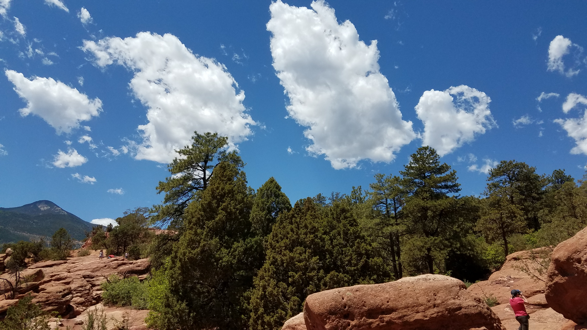

<br><details><summary>:camera:**34/20180525_122428.jpg**</summary><sub> `Exif version` 0220 `OS version` G930PVPU5BQL1 `Date` 2018:05:25 12:24:28 `Aperture` Not known `Brightness` 9.27 `Color space` 1 `Compression` 6`Exposure mode` 0 `Exposure time` 0.0003453038674033149 `Focal length` 4.2 `Lens model` Not known `Lens specification` Not known `Orientation` 1 `Scene type` Not known `f number` 1.7 `White balance` 0 `Sensing method` 2 `Shutter speed` 11.499</sub></details>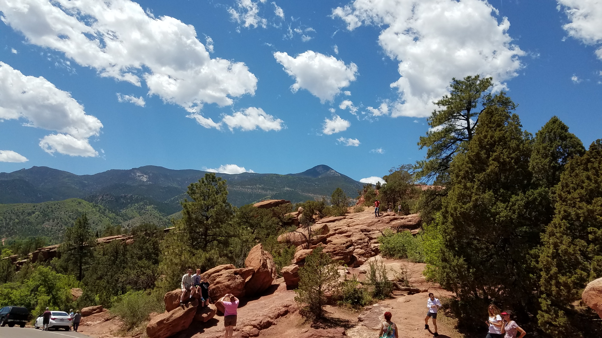

<br><details><summary>:camera:**34/20180525_122502.jpg**</summary><sub> `Exif version` 0220 `OS version` G930PVPU5BQL1 `Date` 2018:05:25 12:25:02 `Aperture` Not known `Brightness` 8.56 `Color space` 1 `Compression` 6`Exposure mode` 0 `Exposure time` 0.000564334085778781 `Focal length` 4.2 `Lens model` Not known `Lens specification` Not known `Orientation` 1 `Scene type` Not known `f number` 1.7 `White balance` 0 `Sensing method` 2 `Shutter speed` 10.791</sub></details>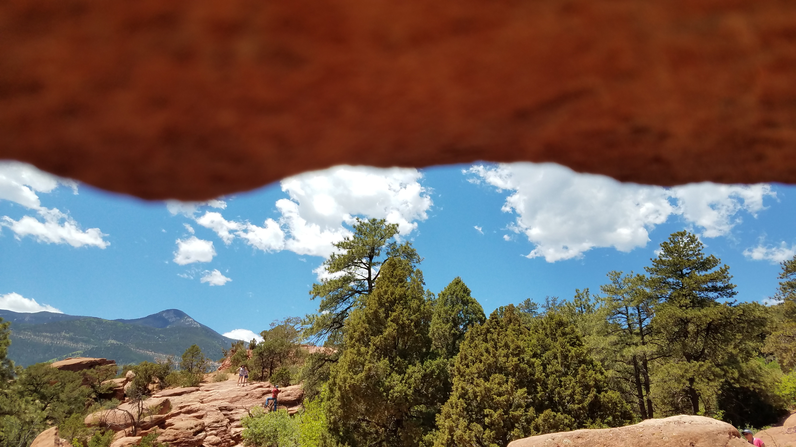

<br><details><summary>:camera:**34/20180525_122640.jpg**</summary><sub> `Exif version` 0220 `OS version` G930PVPU5BQL1 `Date` 2018:05:25 12:26:40 `Aperture` Not known `Brightness` 8.21 `Color space` 1 `Compression` 6`Exposure mode` 0 `Exposure time` 0.0007621951219512195 `Focal length` 4.2 `Lens model` Not known `Lens specification` Not known `Orientation` 6 `Scene type` Not known `f number` 1.7 `White balance` 0 `Sensing method` 2 `Shutter speed` 10.357</sub></details>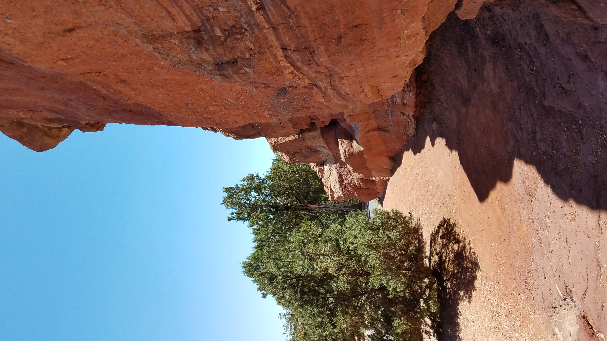

<br><details><summary>:camera:**34/20180525_122646.jpg**</summary><sub> `Exif version` 0220 `OS version` G930PVPU5BQL1 `Date` 2018:05:25 12:26:46 `Aperture` Not known `Brightness` 7.74 `Color space` 1 `Compression` 6`Exposure mode` 0 `Exposure time` 0.00099601593625498 `Focal length` 4.2 `Lens model` Not known `Lens specification` Not known `Orientation` 1 `Scene type` Not known `f number` 1.7 `White balance` 0 `Sensing method` 2 `Shutter speed` 9.971</sub></details>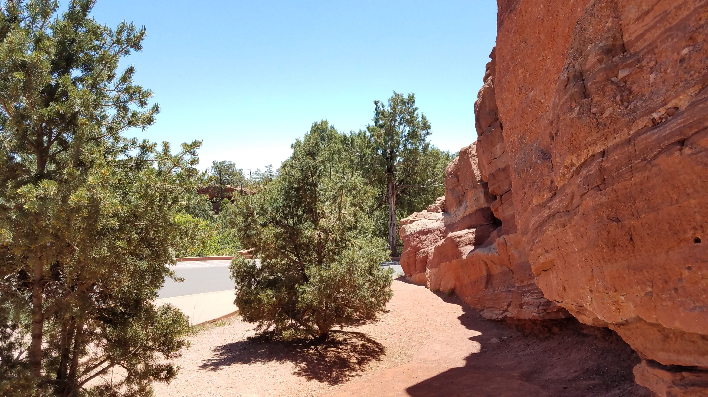

<br><details><summary>:camera:**34/20180525_122817.jpg**</summary><sub> `Exif version` 0220 `OS version` G930PVPU5BQL1 `Date` 2018:05:25 12:28:16 `Aperture` Not known `Brightness` Not known `Color space` 1 `Compression` Not known`Exposure mode` 0 `Exposure time` Not known `Focal length` 4.2 `Lens model` Not known `Lens specification` Not known `Orientation` 1 `Scene type` Not known `f number` 1.7 `White balance` 0 `Sensing method` Not known `Shutter speed` Not known</sub></details>

<br><details><summary>:camera:**34/20180525_122911.jpg**</summary><sub> `Exif version` 0220 `OS version` G930PVPU5BQL1 `Date` 2018:05:25 12:29:11 `Aperture` Not known `Brightness` 9.12 `Color space` 1 `Compression` 6`Exposure mode` 0 `Exposure time` 0.00035310734463276836 `Focal length` 4.2 `Lens model` Not known `Lens specification` Not known `Orientation` 1 `Scene type` Not known `f number` 1.7 `White balance` 0 `Sensing method` 2 `Shutter speed` 11.467</sub></details>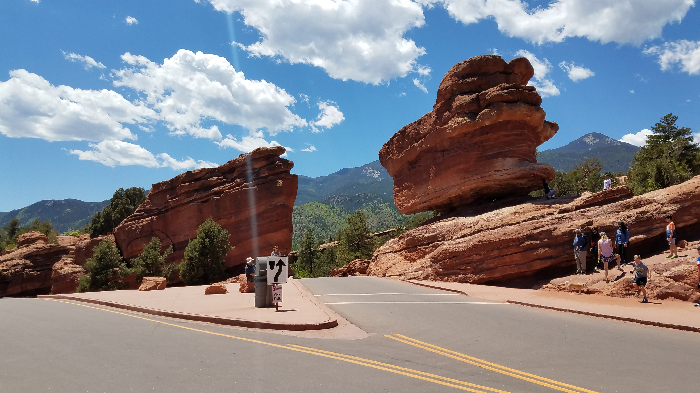

<br><details><summary>:camera:**34/20180525_122916.jpg**</summary><sub> `Exif version` 0220 `OS version` G930PVPU5BQL1 `Date` 2018:05:25 12:29:16 `Aperture` Not known `Brightness` 9.18 `Color space` 1 `Compression` 6`Exposure mode` 0 `Exposure time` 0.000361271676300578 `Focal length` 4.2 `Lens model` Not known `Lens specification` Not known `Orientation` 1 `Scene type` Not known `f number` 1.7 `White balance` 0 `Sensing method` 2 `Shutter speed` 11.434</sub></details>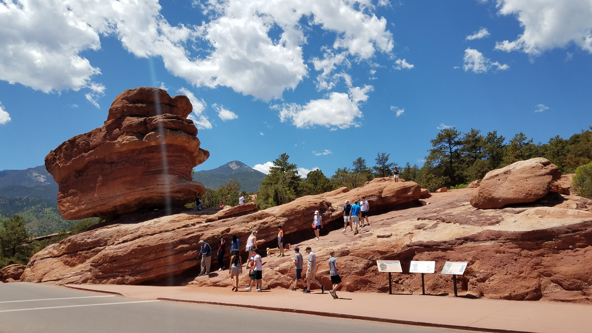

<br><details><summary>:camera:**34/20180525_123702.jpg**</summary><sub> `Exif version` 0220 `OS version` G930PVPU5BQL1 `Date` 2018:05:25 12:37:02 `Aperture` Not known `Brightness` 8.19 `Color space` 1 `Compression` 6`Exposure mode` 0 `Exposure time` 0.0007062146892655367 `Focal length` 4.2 `Lens model` Not known `Lens specification` Not known `Orientation` 1 `Scene type` Not known `f number` 1.7 `White balance` 0 `Sensing method` 2 `Shutter speed` 10.467</sub></details>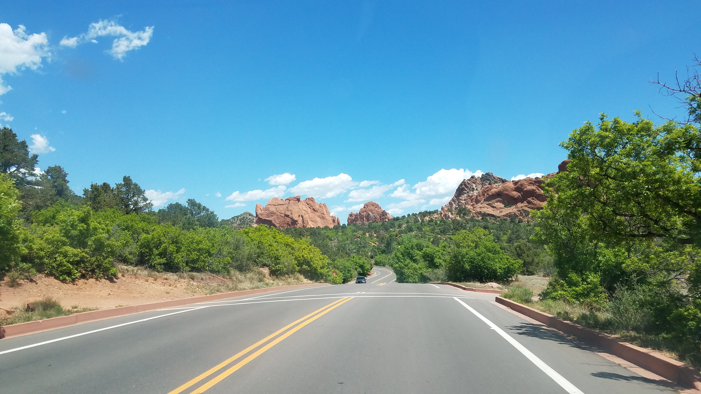

<br><details><summary>:camera:**34/20180525_123705.jpg**</summary><sub> `Exif version` 0220 `OS version` G930PVPU5BQL1 `Date` 2018:05:25 12:37:05 `Aperture` Not known `Brightness` 8.22 `Color space` 1 `Compression` 6`Exposure mode` 0 `Exposure time` 0.0007062146892655367 `Focal length` 4.2 `Lens model` Not known `Lens specification` Not known `Orientation` 1 `Scene type` Not known `f number` 1.7 `White balance` 0 `Sensing method` 2 `Shutter speed` 10.467</sub></details>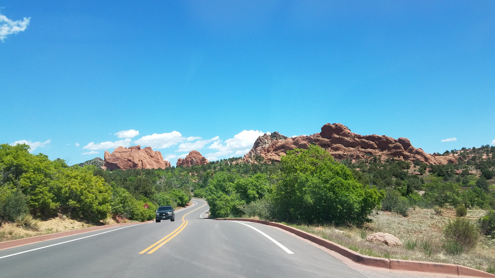

<br><details><summary>:camera:**34/20180525_123708.jpg**</summary><sub> `Exif version` 0220 `OS version` G930PVPU5BQL1 `Date` 2018:05:25 12:37:08 `Aperture` Not known `Brightness` 8.19 `Color space` 1 `Compression` 6`Exposure mode` 0 `Exposure time` 0.0007352941176470588 `Focal length` 4.2 `Lens model` Not known `Lens specification` Not known `Orientation` 1 `Scene type` Not known `f number` 1.7 `White balance` 0 `Sensing method` 2 `Shutter speed` 10.409</sub></details>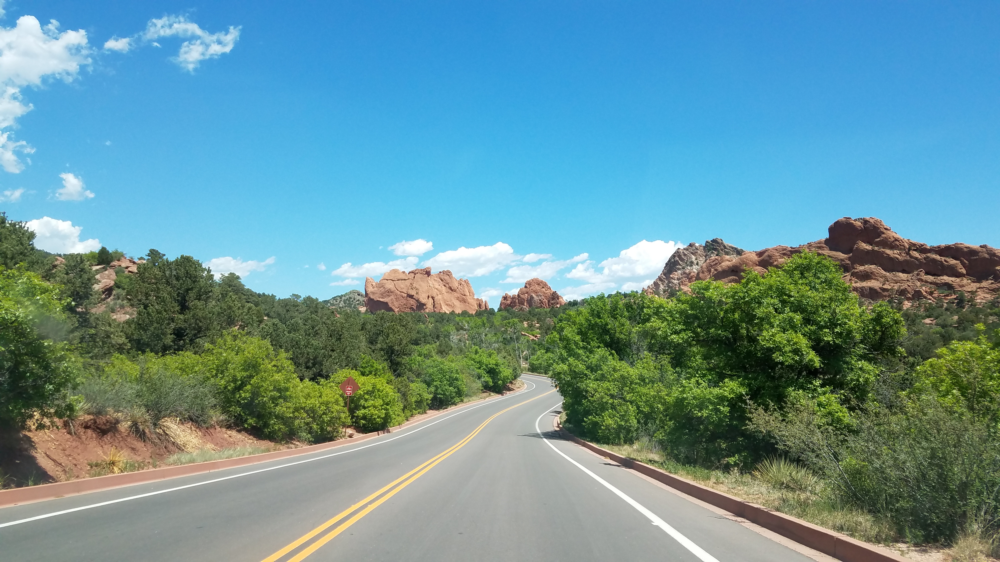

<br><details><summary>:camera:**34/20180525_123722.jpg**</summary><sub> `Exif version` 0220 `OS version` G930PVPU5BQL1 `Date` 2018:05:25 12:37:22 `Aperture` Not known `Brightness` 8.35 `Color space` 1 `Compression` 6`Exposure mode` 0 `Exposure time` 0.0006811989100817438 `Focal length` 4.2 `Lens model` Not known `Lens specification` Not known `Orientation` 1 `Scene type` Not known `f number` 1.7 `White balance` 0 `Sensing method` 2 `Shutter speed` 10.519</sub></details>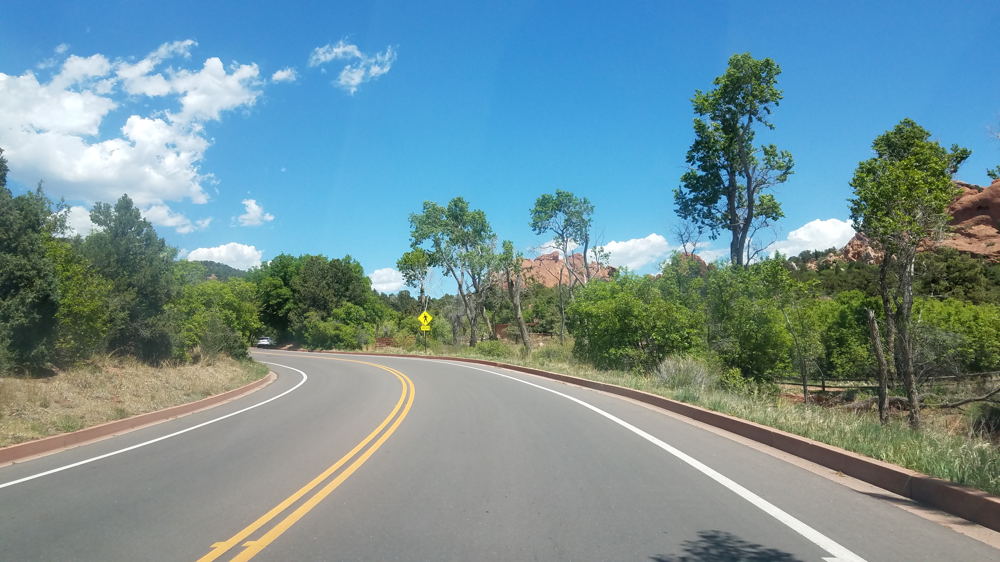

<br><details><summary>:camera:**34/20180525_123729.jpg**</summary><sub> `Exif version` 0220 `OS version` G930PVPU5BQL1 `Date` 2018:05:25 12:37:29 `Aperture` Not known `Brightness` 7.66 `Color space` 1 `Compression` 6`Exposure mode` 0 `Exposure time` 0.0010080645161290322 `Focal length` 4.2 `Lens model` Not known `Lens specification` Not known `Orientation` 1 `Scene type` Not known `f number` 1.7 `White balance` 0 `Sensing method` 2 `Shutter speed` 9.954</sub></details>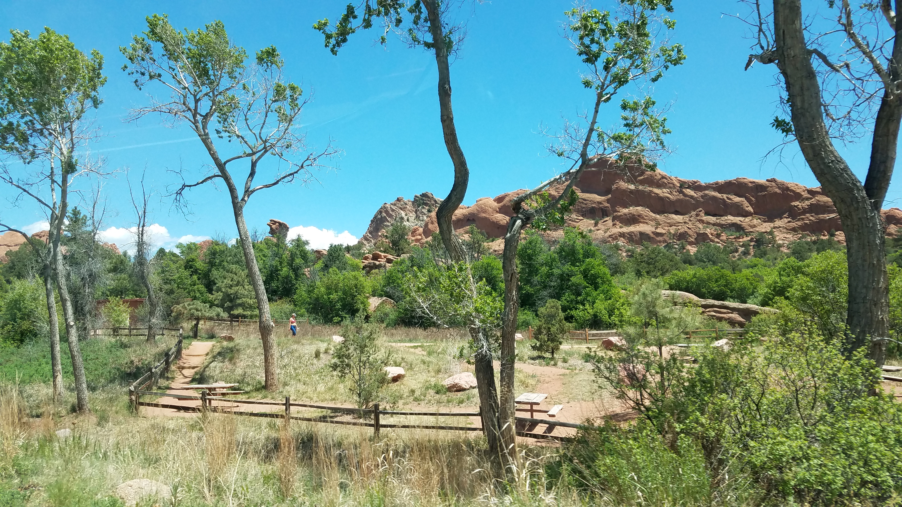

<br><details><summary>:camera:**34/20180525_124008.jpg**</summary><sub> `Exif version` 0220 `OS version` G930PVPU5BQL1 `Date` 2018:05:25 12:40:07 `Aperture` Not known `Brightness` 8.54 `Color space` 1 `Compression` 6`Exposure mode` 0 `Exposure time` 0.000588235294117647 `Focal length` 4.2 `Lens model` Not known `Lens specification` Not known `Orientation` 1 `Scene type` Not known `f number` 1.7 `White balance` 0 `Sensing method` 2 `Shutter speed` 10.731</sub></details>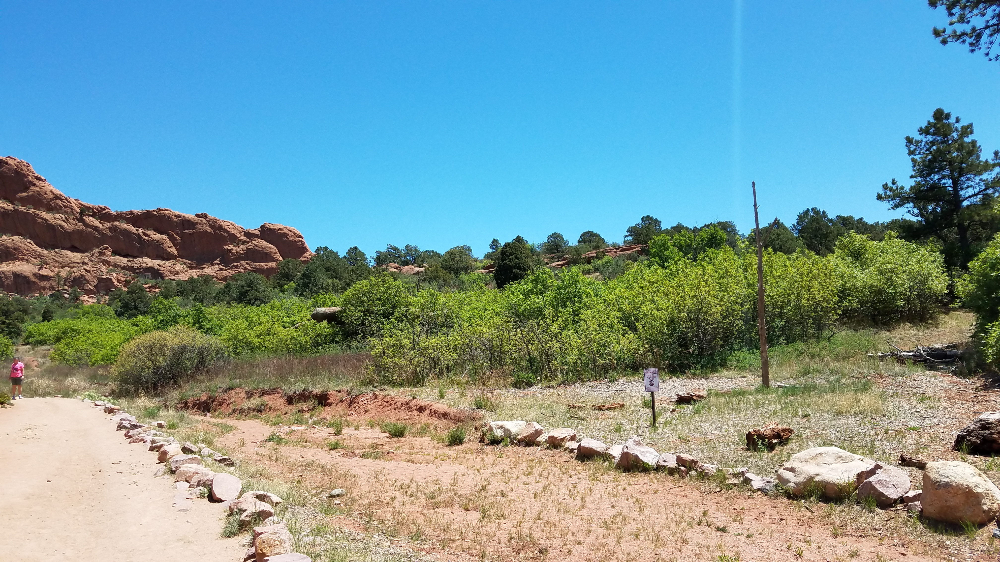

<br><details><summary>:camera:**34/20180525_124010.jpg**</summary><sub> `Exif version` 0220 `OS version` G930PVPU5BQL1 `Date` 2018:05:25 12:40:10 `Aperture` Not known `Brightness` 8.5 `Color space` 1 `Compression` 6`Exposure mode` 0 `Exposure time` 0.0005966587112171838 `Focal length` 4.2 `Lens model` Not known `Lens specification` Not known `Orientation` 1 `Scene type` Not known `f number` 1.7 `White balance` 0 `Sensing method` 2 `Shutter speed` 10.71</sub></details>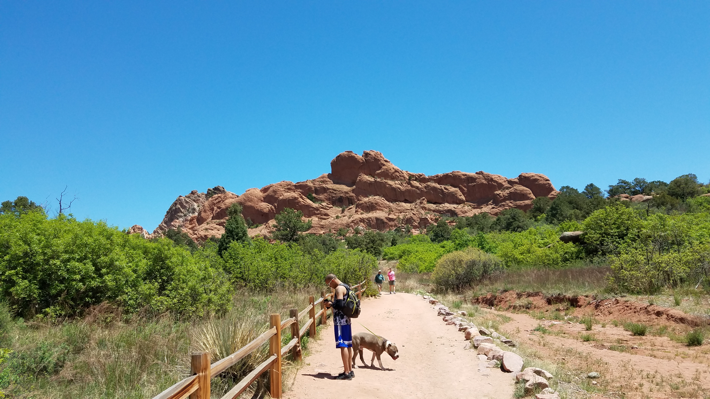

<br><details><summary>:camera:**34/20180525_124014.jpg**</summary><sub> `Exif version` 0220 `OS version` G930PVPU5BQL1 `Date` 2018:05:25 12:40:14 `Aperture` Not known `Brightness` 8.52 `Color space` 1 `Compression` 6`Exposure mode` 0 `Exposure time` 0.0005995203836930455 `Focal length` 4.2 `Lens model` Not known `Lens specification` Not known `Orientation` 1 `Scene type` Not known `f number` 1.7 `White balance` 0 `Sensing method` 2 `Shutter speed` 10.703</sub></details>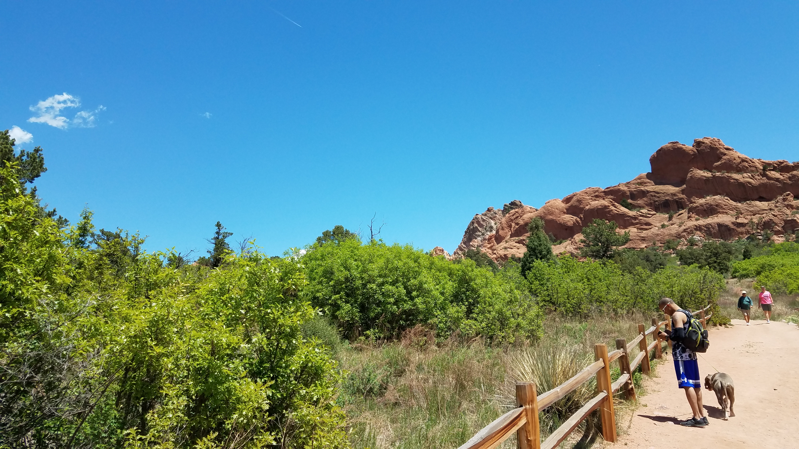

<br><details><summary>:camera:**34/20180525_124023.jpg**</summary><sub> `Exif version` 0220 `OS version` G930PVPU5BQL1 `Date` 2018:05:25 12:40:23 `Aperture` Not known `Brightness` 8.62 `Color space` 1 `Compression` 6`Exposure mode` 0 `Exposure time` 0.0005518763796909492 `Focal length` 4.2 `Lens model` Not known `Lens specification` Not known `Orientation` 1 `Scene type` Not known `f number` 1.7 `White balance` 0 `Sensing method` 2 `Shutter speed` 10.823</sub></details>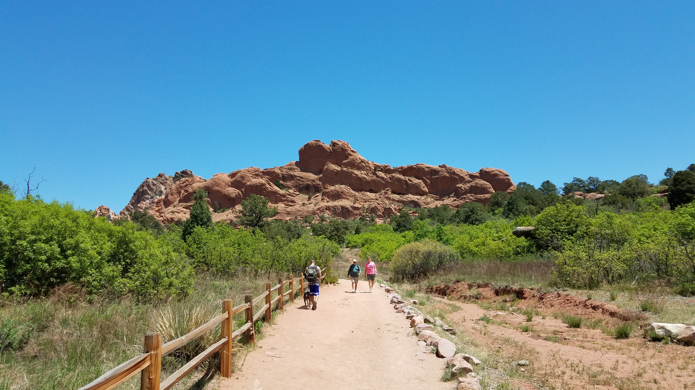

<br><details><summary>:camera:**34/20180525_124028.jpg**</summary><sub> `Exif version` 0220 `OS version` G930PVPU5BQL1 `Date` 2018:05:25 12:40:28 `Aperture` Not known `Brightness` 8.91 `Color space` 1 `Compression` 6`Exposure mode` 0 `Exposure time` 0.0004432624113475177 `Focal length` 4.2 `Lens model` Not known `Lens specification` Not known `Orientation` 1 `Scene type` Not known `f number` 1.7 `White balance` 0 `Sensing method` 2 `Shutter speed` 11.139</sub></details>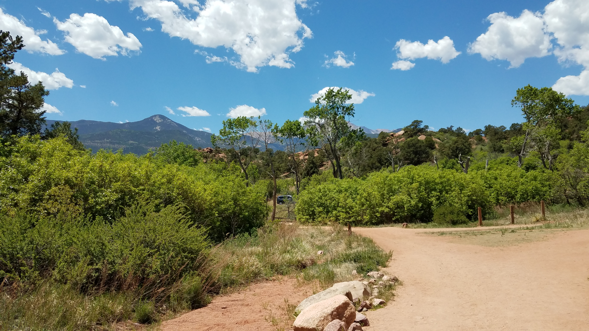

<br><details><summary>:camera:**34/20180525_124032.jpg**</summary><sub> `Exif version` 0220 `OS version` G930PVPU5BQL1 `Date` 2018:05:25 12:40:32 `Aperture` Not known `Brightness` 8.91 `Color space` 1 `Compression` 6`Exposure mode` 0 `Exposure time` 0.0004084967320261438 `Focal length` 4.2 `Lens model` Not known `Lens specification` Not known `Orientation` 1 `Scene type` Not known `f number` 1.7 `White balance` 0 `Sensing method` 2 `Shutter speed` 11.257</sub></details>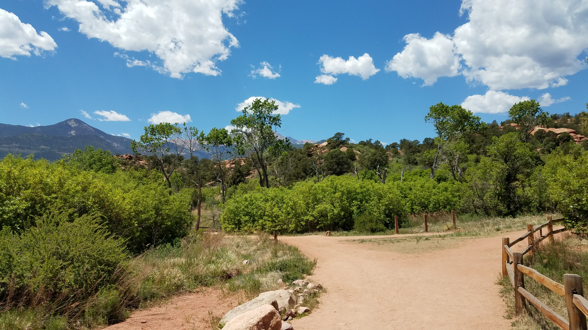

<br><details><summary>:camera:**34/20180525_124505.jpg**</summary><sub> `Exif version` 0220 `OS version` G930PVPU5BQL1 `Date` 2018:05:25 12:45:05 `Aperture` Not known `Brightness` 9.19 `Color space` 1 `Compression` 6`Exposure mode` 0 `Exposure time` 0.0003720238095238095 `Focal length` 4.2 `Lens model` Not known `Lens specification` Not known `Orientation` 1 `Scene type` Not known `f number` 1.7 `White balance` 0 `Sensing method` 2 `Shutter speed` 11.392</sub></details>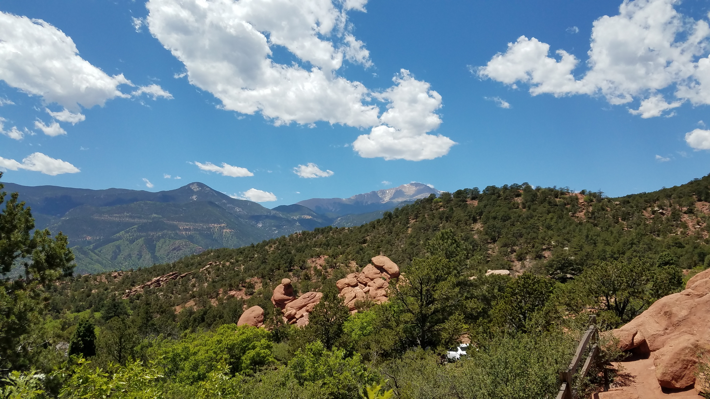

<br><details><summary>:camera:**34/20180525_124508.jpg**</summary><sub> `Exif version` 0220 `OS version` G930PVPU5BQL1 `Date` 2018:05:25 12:45:08 `Aperture` Not known `Brightness` 9.03 `Color space` 1 `Compression` 6`Exposure mode` 0 `Exposure time` 0.00037764350453172205 `Focal length` 4.2 `Lens model` Not known `Lens specification` Not known `Orientation` 1 `Scene type` Not known `f number` 1.7 `White balance` 0 `Sensing method` 2 `Shutter speed` 11.37</sub></details>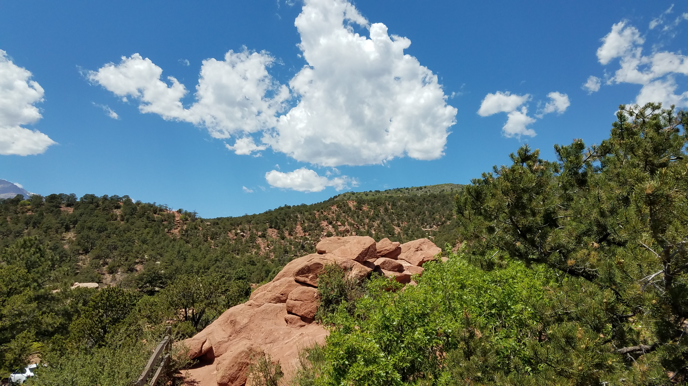

<br><details><summary>:camera:**34/20180525_124511.jpg**</summary><sub> `Exif version` 0220 `OS version` G930PVPU5BQL1 `Date` 2018:05:25 12:45:11 `Aperture` Not known `Brightness` 9.26 `Color space` 1 `Compression` 6`Exposure mode` 0 `Exposure time` 0.00037313432835820896 `Focal length` 4.2 `Lens model` Not known `Lens specification` Not known `Orientation` 1 `Scene type` Not known `f number` 1.7 `White balance` 0 `Sensing method` 2 `Shutter speed` 11.388</sub></details>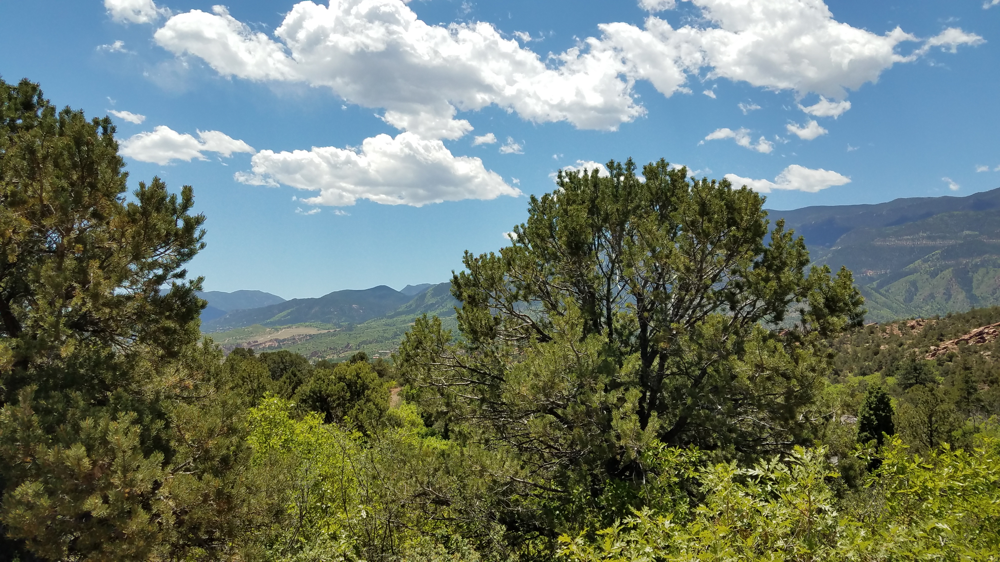

<br><details><summary>:camera:**34/20180525_124527.jpg**</summary><sub> `Exif version` 0220 `OS version` G930PVPU5BQL1 `Date` 2018:05:25 12:45:27 `Aperture` Not known `Brightness` 8.98 `Color space` 1 `Compression` 6`Exposure mode` 0 `Exposure time` 0.00043252595155709344 `Focal length` 4.2 `Lens model` Not known `Lens specification` Not known `Orientation` 1 `Scene type` Not known `f number` 1.7 `White balance` 0 `Sensing method` 2 `Shutter speed` 11.174</sub></details>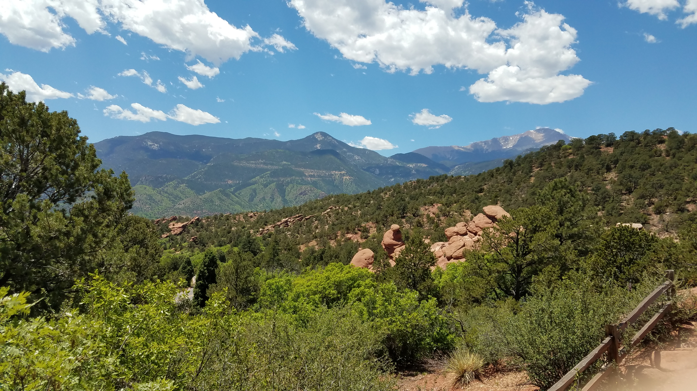

<br><details><summary>:camera:**34/20180525_124554.jpg**</summary><sub> `Exif version` 0220 `OS version` G930PVPU5BQL1 `Date` 2018:05:25 12:45:54 `Aperture` Not known `Brightness` 8.73 `Color space` 1 `Compression` 6`Exposure mode` 0 `Exposure time` 0.0005285412262156448 `Focal length` 4.2 `Lens model` Not known `Lens specification` Not known `Orientation` 1 `Scene type` Not known `f number` 1.7 `White balance` 0 `Sensing method` 2 `Shutter speed` 10.885</sub></details>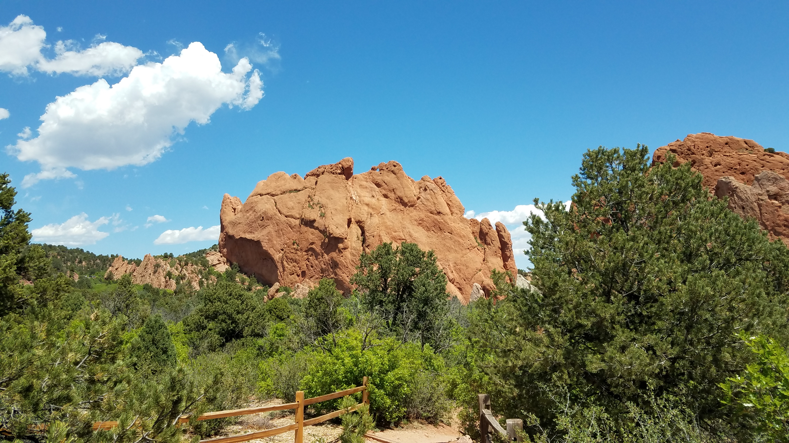

<br><details><summary>:camera:**34/20180525_124559.jpg**</summary><sub> `Exif version` 0220 `OS version` G930PVPU5BQL1 `Date` 2018:05:25 12:45:59 `Aperture` Not known `Brightness` 8.46 `Color space` 1 `Compression` 6`Exposure mode` 0 `Exposure time` 0.0005656108597285068 `Focal length` 4.2 `Lens model` Not known `Lens specification` Not known `Orientation` 6 `Scene type` Not known `f number` 1.7 `White balance` 0 `Sensing method` 2 `Shutter speed` 10.787</sub></details>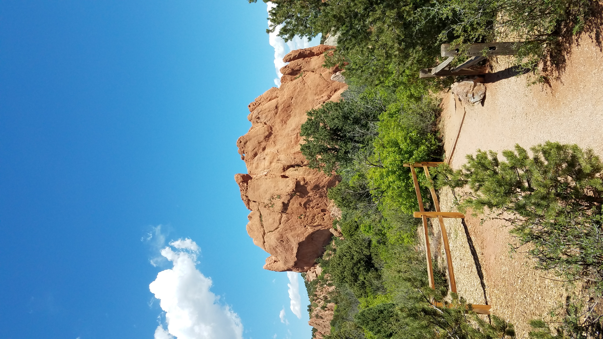

<br><details><summary>:camera:**34/20180525_124601.jpg**</summary><sub> `Exif version` 0220 `OS version` G930PVPU5BQL1 `Date` 2018:05:25 12:46:01 `Aperture` Not known `Brightness` 8.66 `Color space` 1 `Compression` 6`Exposure mode` 0 `Exposure time` 0.0005494505494505495 `Focal length` 4.2 `Lens model` Not known `Lens specification` Not known `Orientation` 6 `Scene type` Not known `f number` 1.7 `White balance` 0 `Sensing method` 2 `Shutter speed` 10.829</sub></details>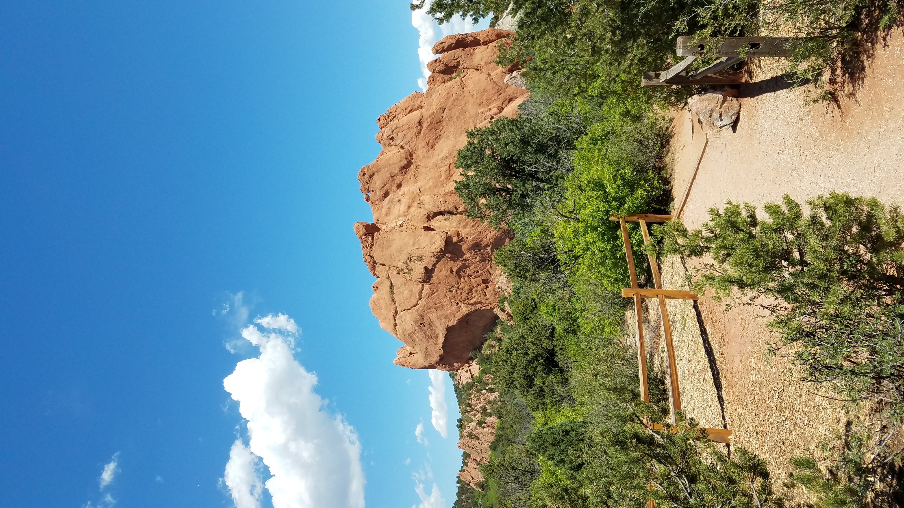

<br><details><summary>:camera:**34/20180525_124606.jpg**</summary><sub> `Exif version` 0220 `OS version` G930PVPU5BQL1 `Date` 2018:05:25 12:46:06 `Aperture` Not known `Brightness` 8.27 `Color space` 1 `Compression` 6`Exposure mode` 0 `Exposure time` 0.0006983240223463687 `Focal length` 4.2 `Lens model` Not known `Lens specification` Not known `Orientation` 1 `Scene type` Not known `f number` 1.7 `White balance` 0 `Sensing method` 2 `Shutter speed` 10.483</sub></details>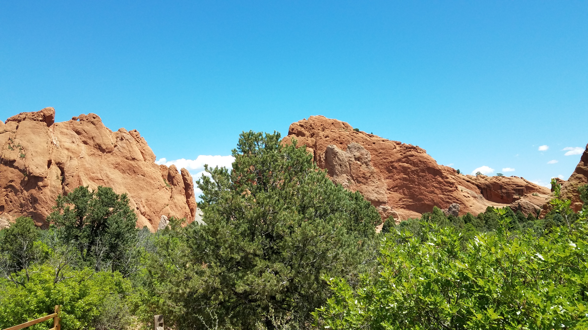

<br><details><summary>:camera:**34/20180525_124624.jpg**</summary><sub> `Exif version` 0220 `OS version` G930PVPU5BQL1 `Date` 2018:05:25 12:46:24 `Aperture` Not known `Brightness` 8.11 `Color space` 1 `Compression` 6`Exposure mode` 0 `Exposure time` 0.0007739938080495357 `Focal length` 4.2 `Lens model` Not known `Lens specification` Not known `Orientation` 1 `Scene type` Not known `f number` 1.7 `White balance` 0 `Sensing method` 2 `Shutter speed` 10.335</sub></details>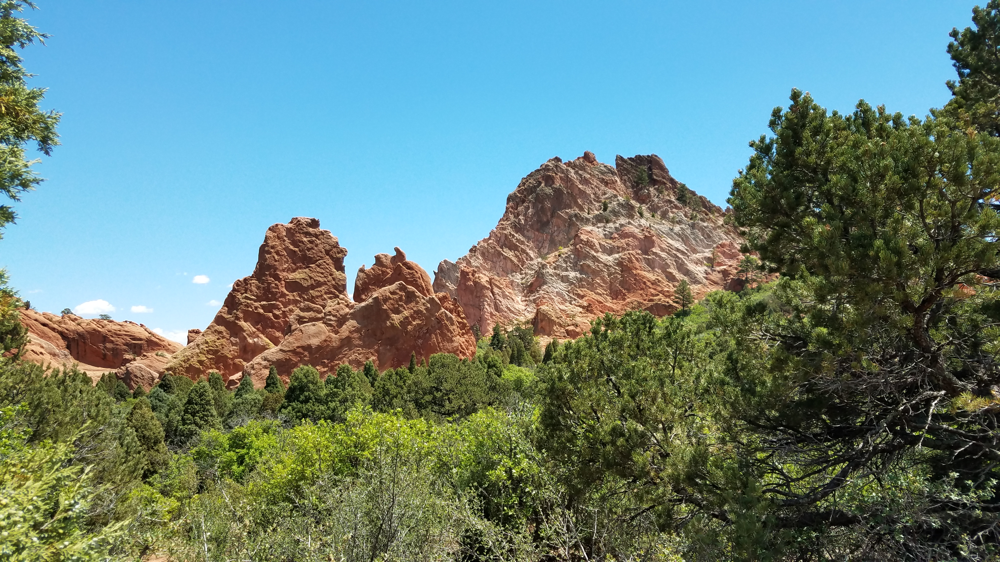

<br><details><summary>:camera:**34/20180525_124640.jpg**</summary><sub> `Exif version` 0220 `OS version` G930PVPU5BQL1 `Date` 2018:05:25 12:46:40 `Aperture` Not known `Brightness` 8.68 `Color space` 1 `Compression` 6`Exposure mode` 0 `Exposure time` 0.0005122950819672131 `Focal length` 4.2 `Lens model` Not known `Lens specification` Not known `Orientation` 1 `Scene type` Not known `f number` 1.7 `White balance` 0 `Sensing method` 2 `Shutter speed` 10.93</sub></details>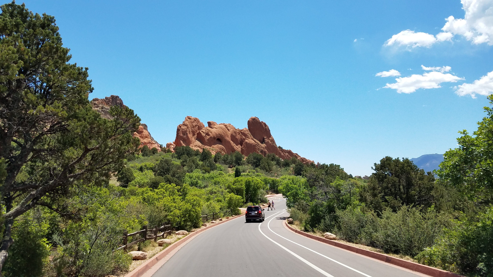

<br><details><summary>:camera:**34/20180525_125038.jpg**</summary><sub> `Exif version` 0220 `OS version` G930PVPU5BQL1 `Date` 2018:05:25 12:50:38 `Aperture` Not known `Brightness` 8.53 `Color space` 1 `Compression` 6`Exposure mode` 0 `Exposure time` 0.0005694760820045558 `Focal length` 4.2 `Lens model` Not known `Lens specification` Not known `Orientation` 6 `Scene type` Not known `f number` 1.7 `White balance` 0 `Sensing method` 2 `Shutter speed` 10.778</sub></details>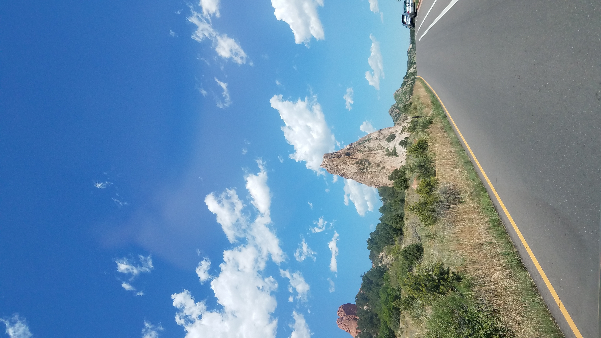

<br><details><summary>:camera:**34/20180525_125044.jpg**</summary><sub> `Exif version` 0220 `OS version` G930PVPU5BQL1 `Date` 2018:05:25 12:50:43 `Aperture` Not known `Brightness` 8.83 `Color space` 1 `Compression` 6`Exposure mode` 0 `Exposure time` 0.00048449612403100775 `Focal length` 4.2 `Lens model` Not known `Lens specification` Not known `Orientation` 1 `Scene type` Not known `f number` 1.7 `White balance` 0 `Sensing method` 2 `Shutter speed` 11.011</sub></details>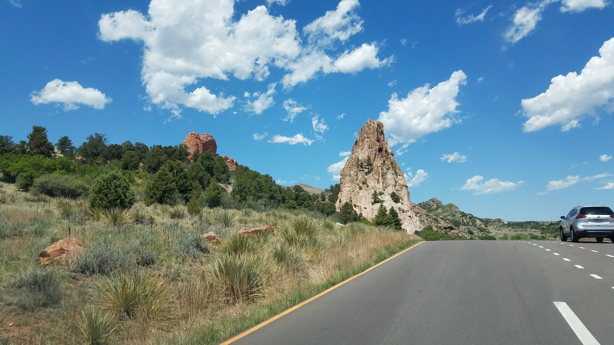

<br><details><summary>:camera:**34/20180525_125047.jpg**</summary><sub> `Exif version` 0220 `OS version` G930PVPU5BQL1 `Date` 2018:05:25 12:50:47 `Aperture` Not known `Brightness` 8.75 `Color space` 1 `Compression` 6`Exposure mode` 0 `Exposure time` 0.0005197505197505198 `Focal length` 4.2 `Lens model` Not known `Lens specification` Not known `Orientation` 1 `Scene type` Not known `f number` 1.7 `White balance` 0 `Sensing method` 2 `Shutter speed` 10.909</sub></details>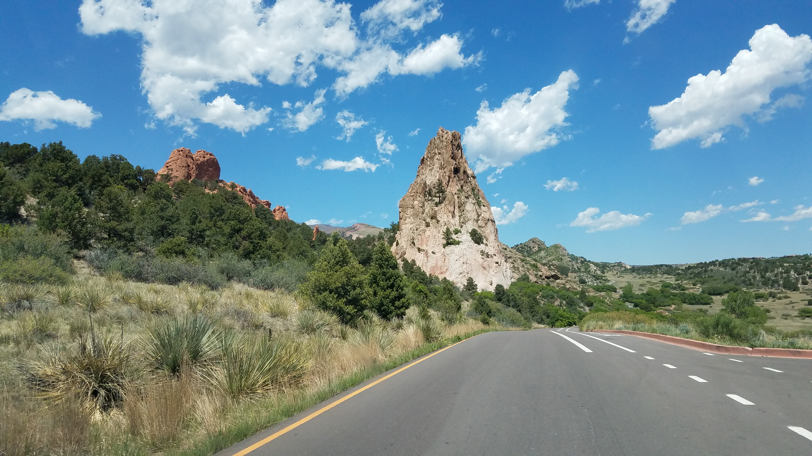

<br><details><summary>:camera:**34/20180525_125052.jpg**</summary><sub> `Exif version` 0220 `OS version` G930PVPU5BQL1 `Date` 2018:05:25 12:50:52 `Aperture` Not known `Brightness` 8.75 `Color space` 1 `Compression` 6`Exposure mode` 0 `Exposure time` 0.0005102040816326531 `Focal length` 4.2 `Lens model` Not known `Lens specification` Not known `Orientation` 1 `Scene type` Not known `f number` 1.7 `White balance` 0 `Sensing method` 2 `Shutter speed` 10.936</sub></details>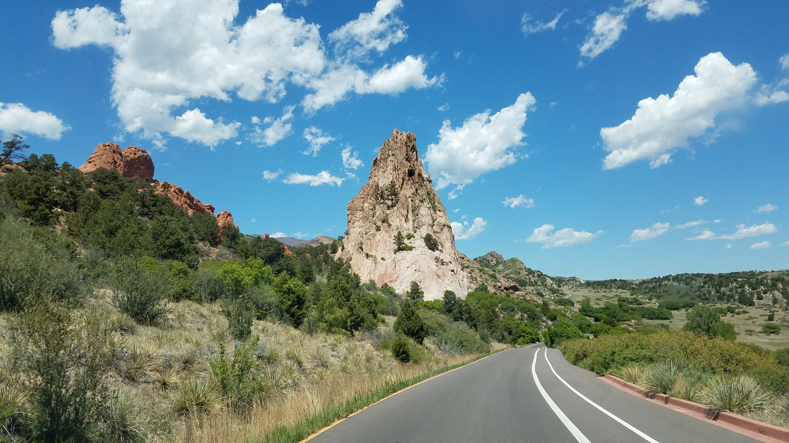

<br><details><summary>:camera:**34/20180525_125102.jpg**</summary><sub> `Exif version` 0220 `OS version` G930PVPU5BQL1 `Date` 2018:05:25 12:51:02 `Aperture` Not known `Brightness` 8.67 `Color space` 1 `Compression` 6`Exposure mode` 0 `Exposure time` 0.0005219206680584551 `Focal length` 4.2 `Lens model` Not known `Lens specification` Not known `Orientation` 1 `Scene type` Not known `f number` 1.7 `White balance` 0 `Sensing method` 2 `Shutter speed` 10.903</sub></details>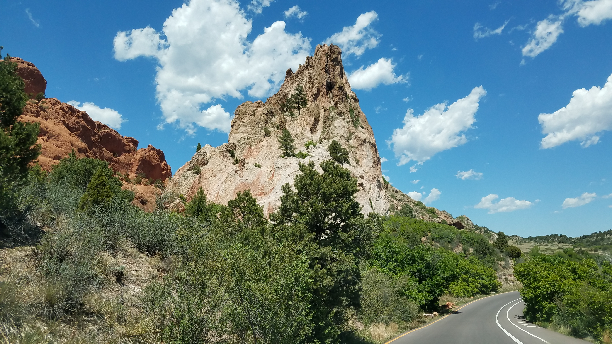

<br><details><summary>:camera:**34/20180525_125106.jpg**</summary><sub> `Exif version` 0220 `OS version` G930PVPU5BQL1 `Date` 2018:05:25 12:51:06 `Aperture` Not known `Brightness` 8.32 `Color space` 1 `Compression` 6`Exposure mode` 0 `Exposure time` 0.0006142506142506142 `Focal length` 4.2 `Lens model` Not known `Lens specification` Not known `Orientation` 1 `Scene type` Not known `f number` 1.7 `White balance` 0 `Sensing method` 2 `Shutter speed` 10.668</sub></details>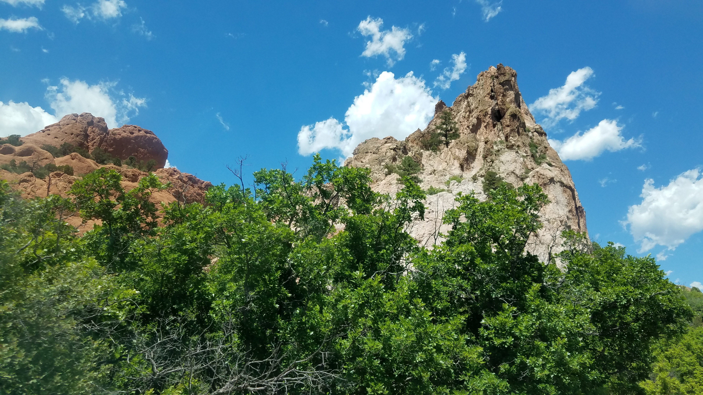

<br><details><summary>:camera:**34/20180525_125108.jpg**</summary><sub> `Exif version` 0220 `OS version` G930PVPU5BQL1 `Date` 2018:05:25 12:51:08 `Aperture` Not known `Brightness` 8.41 `Color space` 1 `Compression` 6`Exposure mode` 0 `Exposure time` 0.0006142506142506142 `Focal length` 4.2 `Lens model` Not known `Lens specification` Not known `Orientation` 1 `Scene type` Not known `f number` 1.7 `White balance` 0 `Sensing method` 2 `Shutter speed` 10.668</sub></details>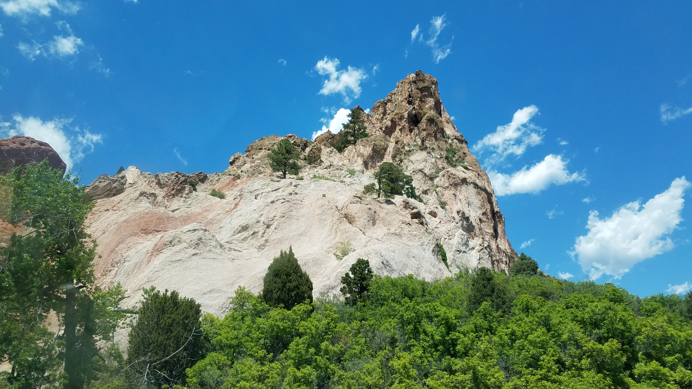

<br><details><summary>:camera:**34/20180525_125110.jpg**</summary><sub> `Exif version` 0220 `OS version` G930PVPU5BQL1 `Date` 2018:05:25 12:51:10 `Aperture` Not known `Brightness` 8.32 `Color space` 1 `Compression` 6`Exposure mode` 0 `Exposure time` 0.0006793478260869565 `Focal length` 4.2 `Lens model` Not known `Lens specification` Not known `Orientation` 1 `Scene type` Not known `f number` 1.7 `White balance` 0 `Sensing method` 2 `Shutter speed` 10.523</sub></details>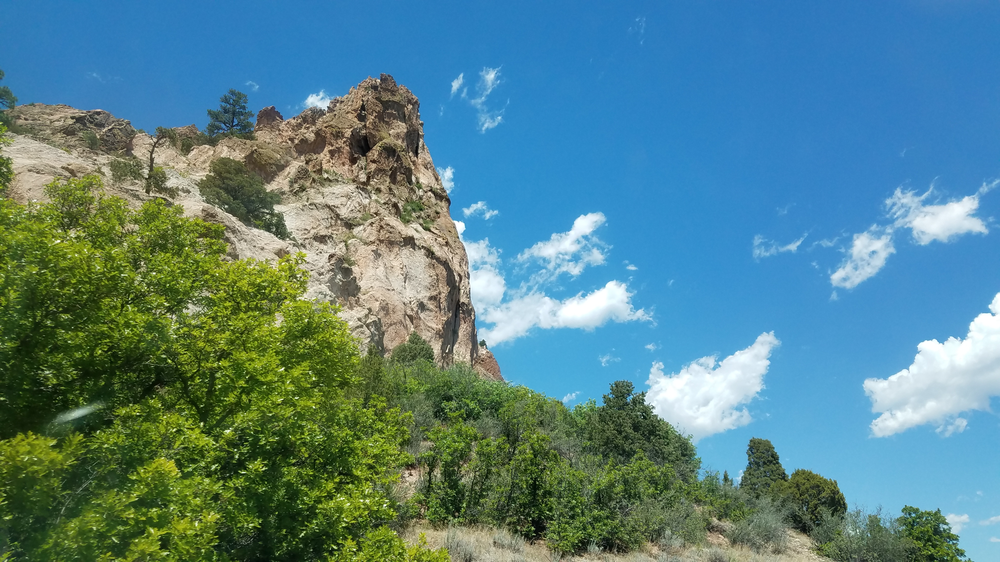

<br><details><summary>:camera:**34/20180525_125145.jpg**</summary><sub> `Exif version` 0220 `OS version` G930PVPU5BQL1 `Date` 2018:05:25 12:51:45 `Aperture` Not known `Brightness` 8.53 `Color space` 1 `Compression` 6`Exposure mode` 0 `Exposure time` 0.0005555555555555556 `Focal length` 4.2 `Lens model` Not known `Lens specification` Not known `Orientation` 1 `Scene type` Not known `f number` 1.7 `White balance` 0 `Sensing method` 2 `Shutter speed` 10.813</sub></details>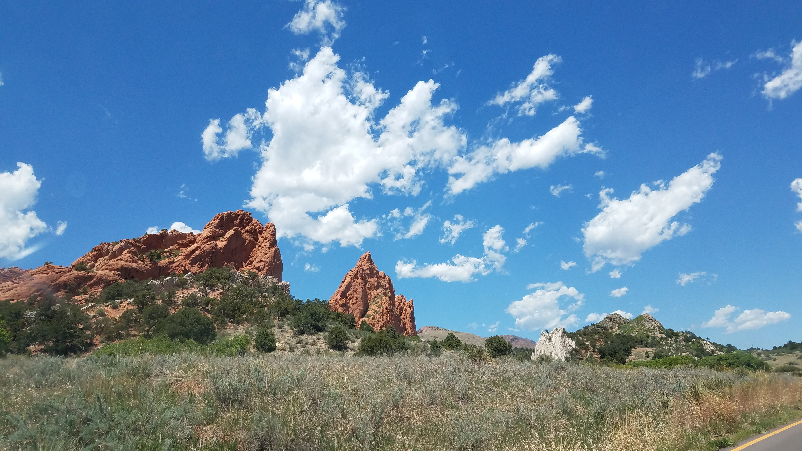

<br><details><summary>:camera:**34/20180525_125146.jpg**</summary><sub> `Exif version` 0220 `OS version` G930PVPU5BQL1 `Date` 2018:05:25 12:51:46 `Aperture` Not known `Brightness` 8.52 `Color space` 1 `Compression` 6`Exposure mode` 0 `Exposure time` 0.0005518763796909492 `Focal length` 4.2 `Lens model` Not known `Lens specification` Not known `Orientation` 1 `Scene type` Not known `f number` 1.7 `White balance` 0 `Sensing method` 2 `Shutter speed` 10.823</sub></details>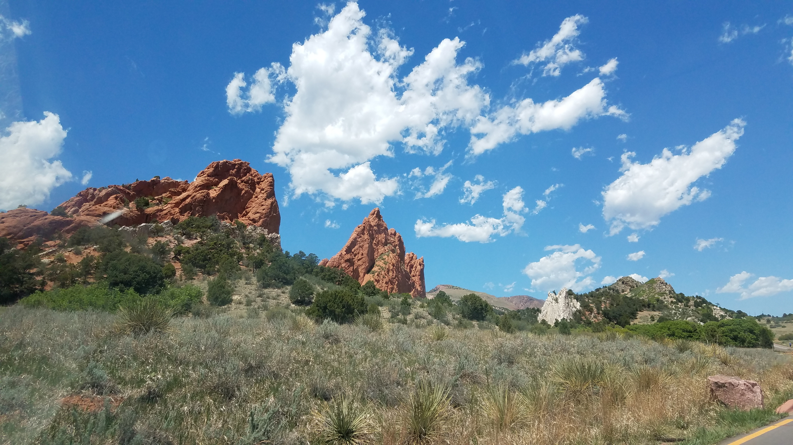

<br><details><summary>:camera:**34/20180525_125152.jpg**</summary><sub> `Exif version` 0220 `OS version` G930PVPU5BQL1 `Date` 2018:05:25 12:51:52 `Aperture` Not known `Brightness` 8.57 `Color space` 1 `Compression` 6`Exposure mode` 0 `Exposure time` 0.0006053268765133172 `Focal length` 4.2 `Lens model` Not known `Lens specification` Not known `Orientation` 1 `Scene type` Not known `f number` 1.7 `White balance` 0 `Sensing method` 2 `Shutter speed` 10.689</sub></details>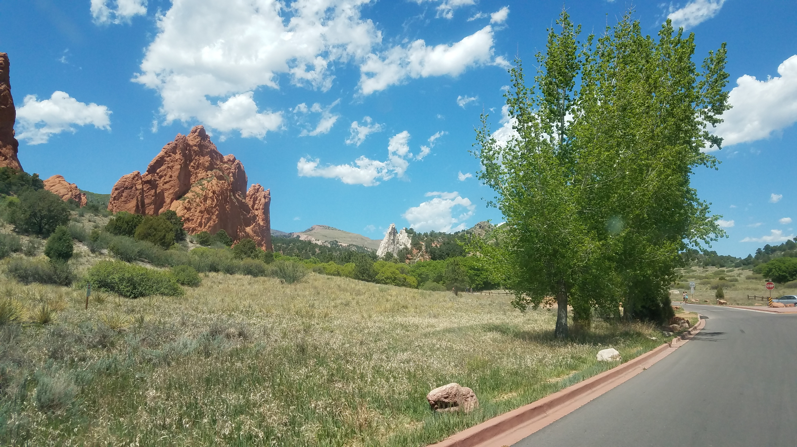

<br><details><summary>:camera:**34/20180525_125157.jpg**</summary><sub> `Exif version` 0220 `OS version` G930PVPU5BQL1 `Date` 2018:05:25 12:51:57 `Aperture` Not known `Brightness` 8.65 `Color space` 1 `Compression` 6`Exposure mode` 0 `Exposure time` 0.0005376344086021505 `Focal length` 4.2 `Lens model` Not known `Lens specification` Not known `Orientation` 1 `Scene type` Not known `f number` 1.7 `White balance` 0 `Sensing method` 2 `Shutter speed` 10.861</sub></details>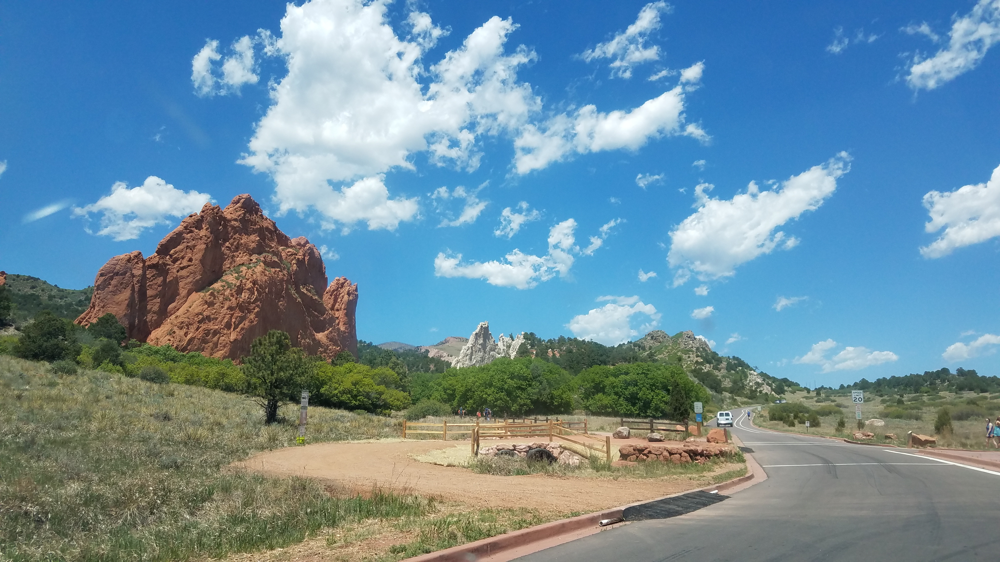

<br><details><summary>:camera:**34/20180525_131355.jpg**</summary><sub> `Exif version` 0220 `OS version` G930PVPU5BQL1 `Date` 2018:05:25 13:13:55 `Aperture` Not known `Brightness` 6.27 `Color space` 1 `Compression` 6`Exposure mode` 0 `Exposure time` 0.002688172043010753 `Focal length` 4.2 `Lens model` Not known `Lens specification` Not known `Orientation` 1 `Scene type` Not known `f number` 1.7 `White balance` 0 `Sensing method` 2 `Shutter speed` 8.539</sub></details>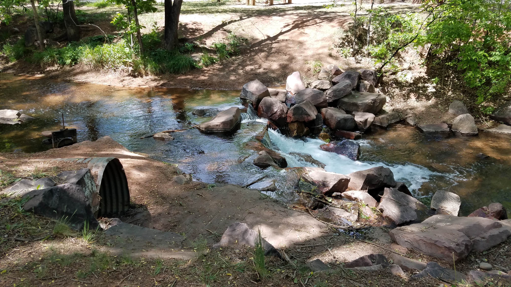

<br><details><summary>:camera:**34/20180525_131359.jpg**</summary><sub> `Exif version` 0220 `OS version` G930PVPU5BQL1 `Date` 2018:05:25 13:13:59 `Aperture` Not known `Brightness` 5.95 `Color space` 1 `Compression` 6`Exposure mode` 0 `Exposure time` 0.003703703703703704 `Focal length` 4.2 `Lens model` Not known `Lens specification` Not known `Orientation` 1 `Scene type` Not known `f number` 1.7 `White balance` 0 `Sensing method` 2 `Shutter speed` 8.076</sub></details>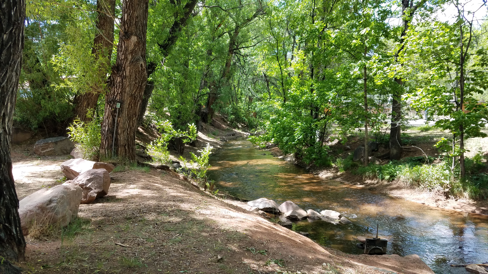

<br><details><summary>:camera:**34/20180525_131414.jpg**</summary><sub> `Exif version` 0220 `OS version` G930PVPU5BQL1 `Date` 2018:05:25 13:14:14 `Aperture` Not known `Brightness` 6.27 `Color space` 1 `Compression` 6`Exposure mode` 0 `Exposure time` 0.0029585798816568047 `Focal length` 4.2 `Lens model` Not known `Lens specification` Not known `Orientation` 1 `Scene type` Not known `f number` 1.7 `White balance` 0 `Sensing method` 2 `Shutter speed` 8.4</sub></details>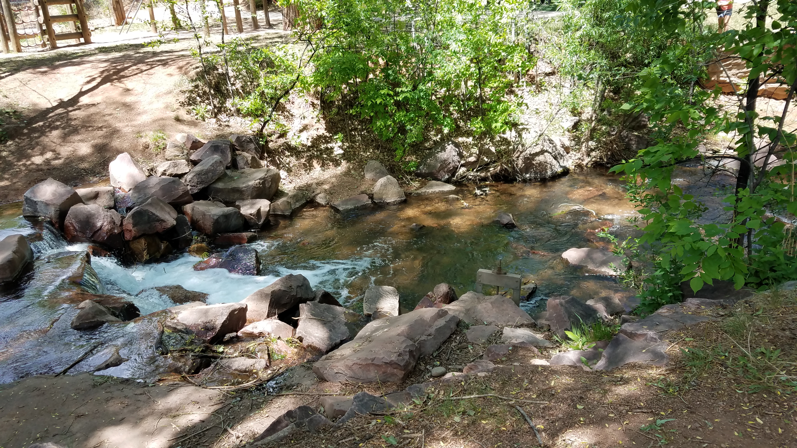

<br><details><summary>:camera:**34/IMG_0483.jpg**</summary><sub> `Exif version` 0232 `OS version` 27.0 `Date` 2026:07:20 09:36:47 `Aperture` Not known `Brightness` 9.916875104218777 `Color space` 65535 `Compression` Not known`Exposure mode` 0 `Exposure time` 0.00023501762632197415 `Focal length` 5.96 `Lens model` iPhone 15 Plus back dual wide camera 5.96mm f/1.6 `Lens specification` (1.5399999618512084, 5.96, 1.6, 2.4) `Orientation` 1 `Scene type` Not known `f number` 1.6 `White balance` 0 `Sensing method` 2 `Shutter speed` 12.055051610885204</sub><sub>`Coordinates & altitude` (38.8717, -104.88516944444446, 1932.488924050633)</sub><sub> :earth_americas:`Location over` [Google Maps](http://maps.google.com/maps?q=38.8717,-104.88516944444446) or [Openstreet Map](https://www.openstreetmap.org/query?lat=38.8717&lon=-104.88516944444446)</sub></details>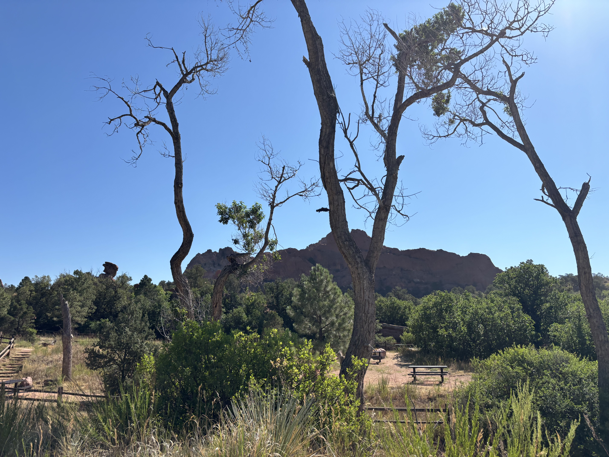

<br><details><summary>:camera:**34/IMG_0484.jpg**</summary><sub> `Exif version` 0232 `OS version` 27.0 `Date` 2026:07:20 09:39:28 `Aperture` Not known `Brightness` 9.380153517448761 `Color space` 65535 `Compression` Not known`Exposure mode` 0 `Exposure time` 0.00036900369003690036 `Focal length` 5.96 `Lens model` iPhone 15 Plus back dual wide camera 5.96mm f/1.6 `Lens specification` (1.5399999618512084, 5.96, 1.6, 2.4) `Orientation` 1 `Scene type` Not known `f number` 1.6 `White balance` 0 `Sensing method` 2 `Shutter speed` 11.404091553575046</sub><sub>`Coordinates & altitude` (38.87549166666667, -104.88235555555555, 1968.4862411347517)</sub><sub> :earth_americas:`Location over` [Google Maps](http://maps.google.com/maps?q=38.87549166666667,-104.88235555555555) or [Openstreet Map](https://www.openstreetmap.org/query?lat=38.87549166666667&lon=-104.88235555555555)</sub></details>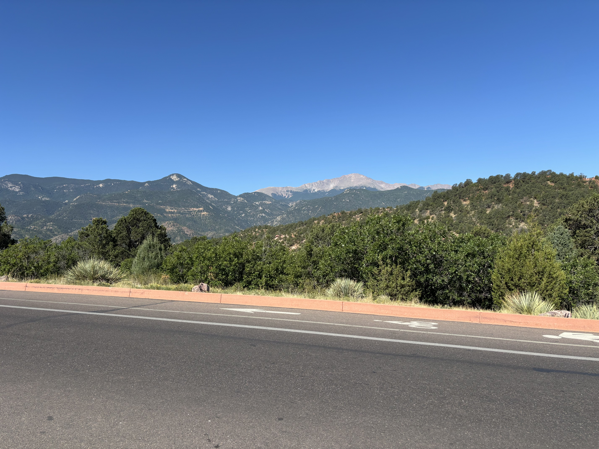

<br><details><summary>:camera:**34/IMG_0485.jpg**</summary><sub> `Exif version` 0232 `OS version` 27.0 `Date` 2026:07:20 09:40:27 `Aperture` Not known `Brightness` 8.491595910587419 `Color space` 65535 `Compression` Not known`Exposure mode` 0 `Exposure time` 0.0006958942240779402 `Focal length` 5.96 `Lens model` iPhone 15 Plus back dual wide camera 5.96mm f/1.6 `Lens specification` (1.5399999618512084, 5.96, 1.6, 2.4) `Orientation` 6 `Scene type` Not known `f number` 1.6 `White balance` 0 `Sensing method` 2 `Shutter speed` 10.488625071910464</sub><sub>`Coordinates & altitude` (38.87580833333333, -104.88227777777777, 1965.9515706806283)</sub><sub> :earth_americas:`Location over` [Google Maps](http://maps.google.com/maps?q=38.87580833333333,-104.88227777777777) or [Openstreet Map](https://www.openstreetmap.org/query?lat=38.87580833333333&lon=-104.88227777777777)</sub></details>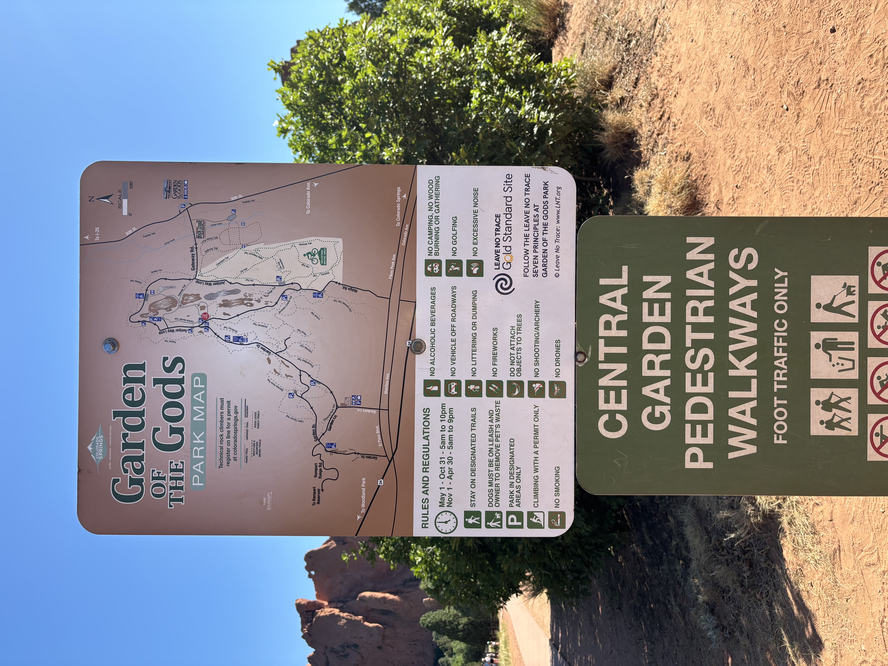

<br><details><summary>:camera:**34/IMG_0486.jpg**</summary><sub> `Exif version` 0232 `OS version` 27.0 `Date` 2026:07:20 09:40:58 `Aperture` Not known `Brightness` 9.211343344155845 `Color space` 65535 `Compression` Not known`Exposure mode` 0 `Exposure time` 0.00044603033006244426 `Focal length` 5.96 `Lens model` iPhone 15 Plus back dual wide camera 5.96mm f/1.6 `Lens specification` (1.5399999618512084, 5.96, 1.6, 2.4) `Orientation` 1 `Scene type` Not known `f number` 1.6 `White balance` 0 `Sensing method` 2 `Shutter speed` 11.130668668292987</sub><sub>`Coordinates & altitude` (38.87595833333334, -104.88194999999999, 1976.4086021505377)</sub><sub> :earth_americas:`Location over` [Google Maps](http://maps.google.com/maps?q=38.87595833333334,-104.88194999999999) or [Openstreet Map](https://www.openstreetmap.org/query?lat=38.87595833333334&lon=-104.88194999999999)</sub></details>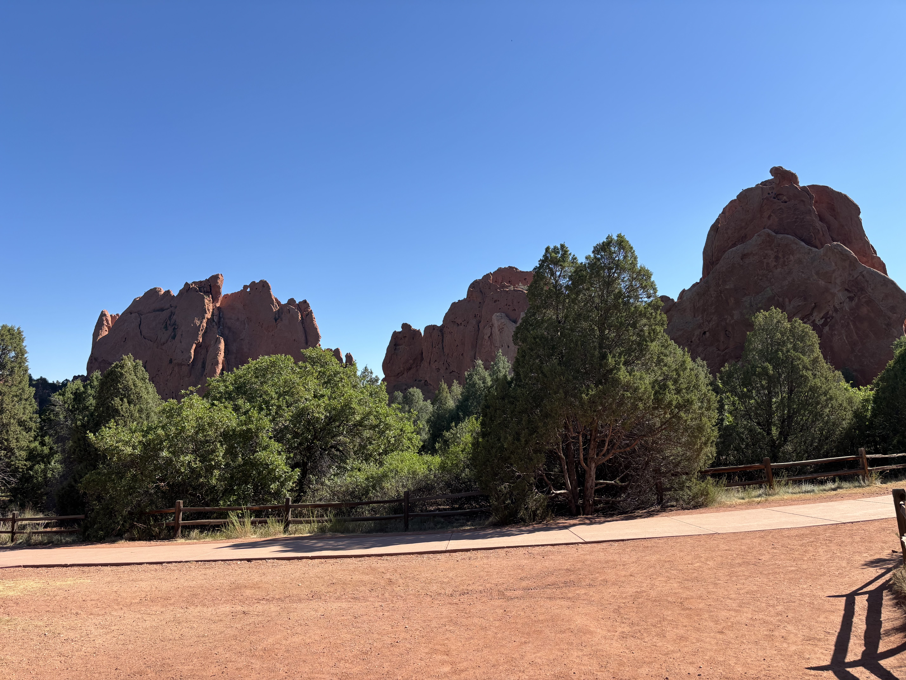

<br><details><summary>:camera:**34/IMG_0487.jpg**</summary><sub> `Exif version` 0232 `OS version` 27.0 `Date` 2026:07:20 09:41:02 `Aperture` Not known `Brightness` 9.558995160831198 `Color space` 65535 `Compression` Not known`Exposure mode` 0 `Exposure time` 0.001652892561983471 `Focal length` 1.54 `Lens model` iPhone 15 Plus back dual wide camera 1.54mm f/2.4 `Lens specification` (1.54, 5.960000038146973, 1.6, 2.4) `Orientation` 1 `Scene type` Not known `f number` 2.4 `White balance` 0 `Sensing method` 2 `Shutter speed` 9.240697556524385</sub><sub>`Coordinates & altitude` (38.87591111111111, -104.88194166666666, 1972.5480059084196)</sub><sub> :earth_americas:`Location over` [Google Maps](http://maps.google.com/maps?q=38.87591111111111,-104.88194166666666) or [Openstreet Map](https://www.openstreetmap.org/query?lat=38.87591111111111&lon=-104.88194166666666)</sub></details>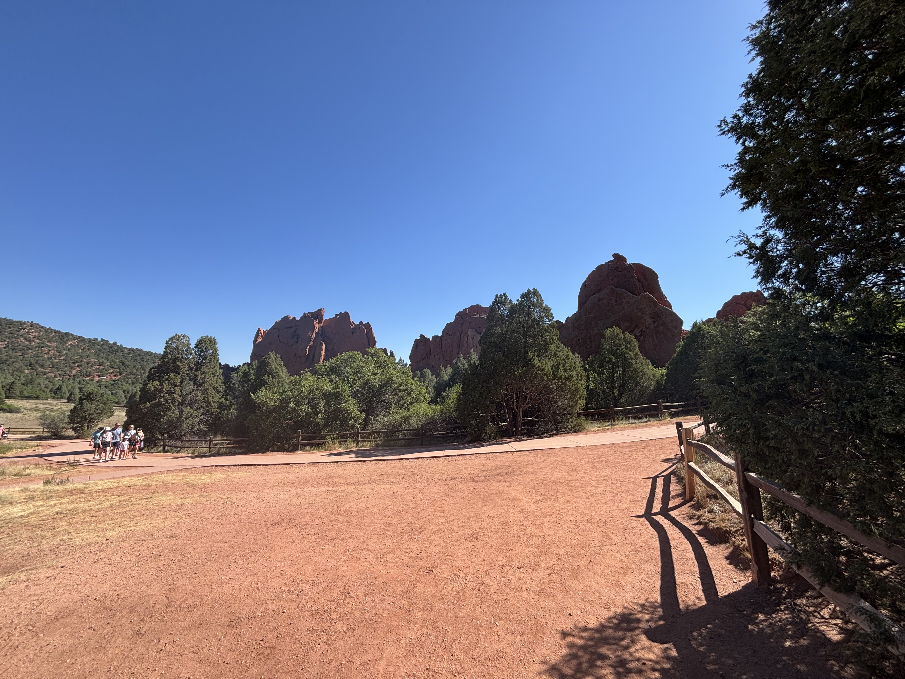

<br><details><summary>:camera:**34/IMG_0488.jpg**</summary><sub> `Exif version` 0232 `OS version` 27.0 `Date` 2026:07:20 09:41:59 `Aperture` Not known `Brightness` 8.285528370640291 `Color space` 65535 `Compression` Not known`Exposure mode` 0 `Exposure time` 0.0008298755186721991 `Focal length` 5.96 `Lens model` iPhone 15 Plus back dual wide camera 5.96mm f/1.6 `Lens specification` (1.5399999618512084, 5.96, 1.6, 2.4) `Orientation` 6 `Scene type` Not known `f number` 1.6 `White balance` 0 `Sensing method` 2 `Shutter speed` 10.234601043997017</sub><sub>`Coordinates & altitude` (38.876, -104.88135555555554, 1971.8668555240793)</sub><sub> :earth_americas:`Location over` [Google Maps](http://maps.google.com/maps?q=38.876,-104.88135555555554) or [Openstreet Map](https://www.openstreetmap.org/query?lat=38.876&lon=-104.88135555555554)</sub></details>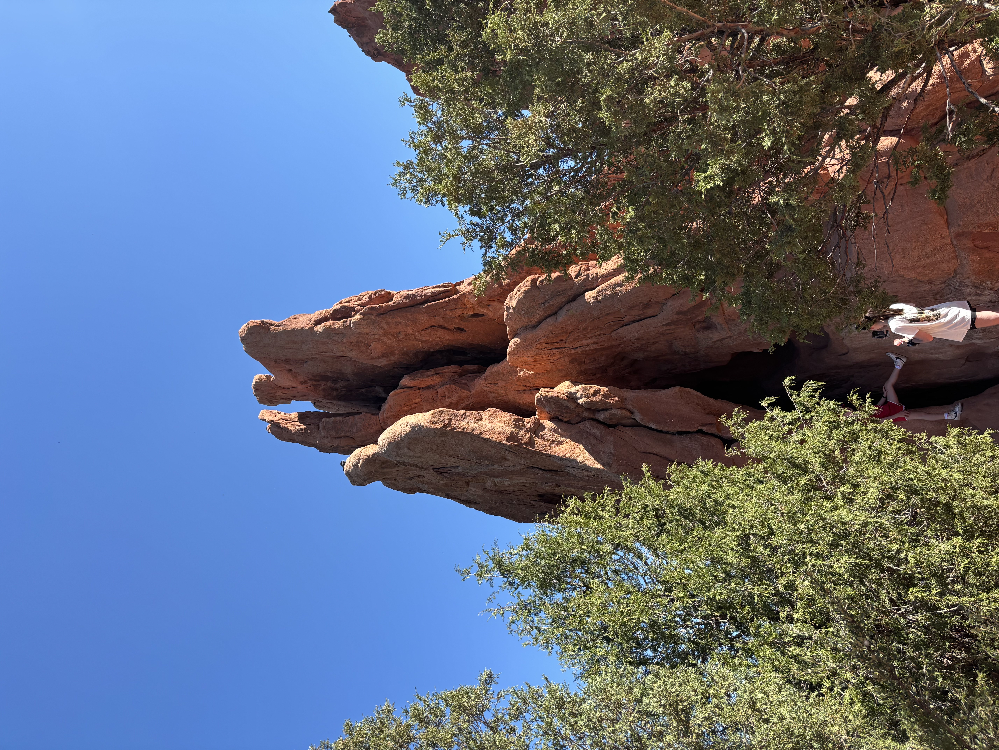

<br><details><summary>:camera:**34/IMG_0489.jpg**</summary><sub> `Exif version` 0232 `OS version` 27.0 `Date` 2026:07:20 09:42:12 `Aperture` Not known `Brightness` 9.410389513388356 `Color space` 65535 `Compression` Not known`Exposure mode` 0 `Exposure time` 0.0003979307600477517 `Focal length` 5.96 `Lens model` iPhone 15 Plus back dual wide camera 5.96mm f/1.6 `Lens specification` (1.5399999618512084, 5.96, 1.6, 2.4) `Orientation` 6 `Scene type` Not known `f number` 1.6 `White balance` 0 `Sensing method` 2 `Shutter speed` 11.294943950881436</sub><sub>`Coordinates & altitude` (38.876041666666666, -104.88125555555555, 1971.1441969519344)</sub><sub> :earth_americas:`Location over` [Google Maps](http://maps.google.com/maps?q=38.876041666666666,-104.88125555555555) or [Openstreet Map](https://www.openstreetmap.org/query?lat=38.876041666666666&lon=-104.88125555555555)</sub></details>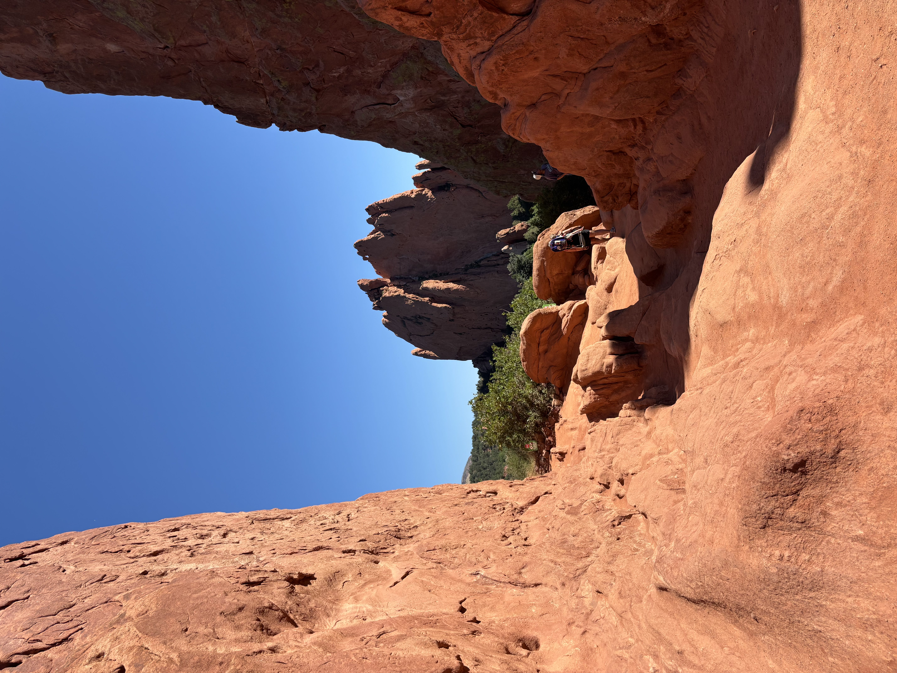

<br><details><summary>:camera:**34/IMG_0490.jpg**</summary><sub> `Exif version` 0232 `OS version` 27.0 `Date` 2026:07:20 09:42:19 `Aperture` Not known `Brightness` 8.660567800841715 `Color space` 65535 `Compression` Not known`Exposure mode` 0 `Exposure time` 0.0005899705014749262 `Focal length` 5.96 `Lens model` iPhone 15 Plus back dual wide camera 5.96mm f/1.6 `Lens specification` (1.5399999618512084, 5.96, 1.6, 2.4) `Orientation` 6 `Scene type` Not known `f number` 1.6 `White balance` 0 `Sensing method` 2 `Shutter speed` 10.726997422680412</sub><sub>`Coordinates & altitude` (38.87603888888889, -104.88123333333333, 1971.7560137457044)</sub><sub> :earth_americas:`Location over` [Google Maps](http://maps.google.com/maps?q=38.87603888888889,-104.88123333333333) or [Openstreet Map](https://www.openstreetmap.org/query?lat=38.87603888888889&lon=-104.88123333333333)</sub></details>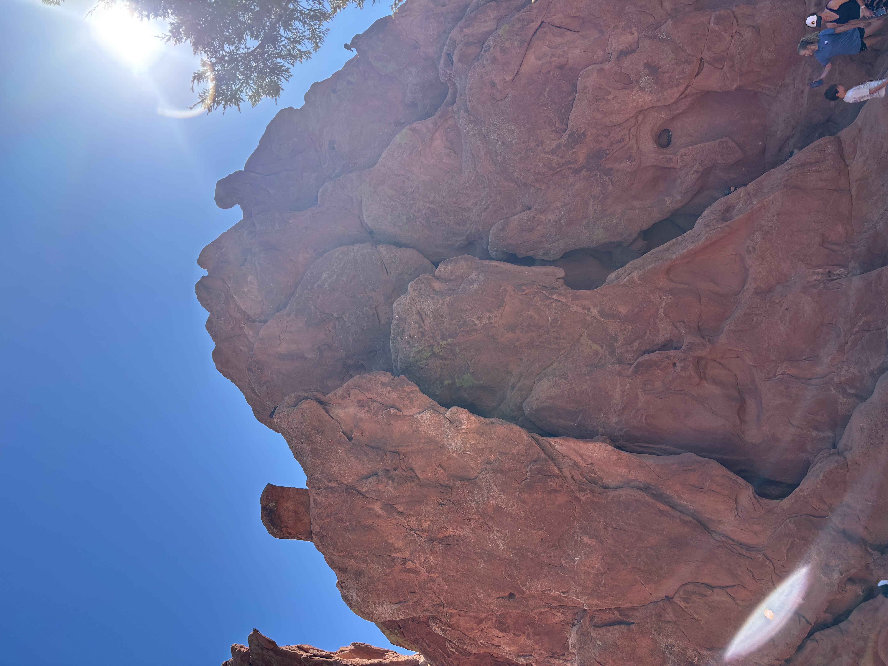

<br><details><summary>:camera:**34/IMG_0491.jpg**</summary><sub> `Exif version` 0232 `OS version` 27.0 `Date` 2026:07:20 09:43:37 `Aperture` Not known `Brightness` 9.151294233289645 `Color space` 65535 `Compression` Not known`Exposure mode` 0 `Exposure time` 0.0004269854824935952 `Focal length` 5.96 `Lens model` iPhone 15 Plus back dual wide camera 5.96mm f/1.6 `Lens specification` (1.5399999618512084, 5.96, 1.6, 2.4) `Orientation` 6 `Scene type` Not known `f number` 1.6 `White balance` 0 `Sensing method` 2 `Shutter speed` 11.193476318141197</sub><sub>`Coordinates & altitude` (38.87571666666667, -104.88070555555555, 1980.801670146138)</sub><sub> :earth_americas:`Location over` [Google Maps](http://maps.google.com/maps?q=38.87571666666667,-104.88070555555555) or [Openstreet Map](https://www.openstreetmap.org/query?lat=38.87571666666667&lon=-104.88070555555555)</sub></details>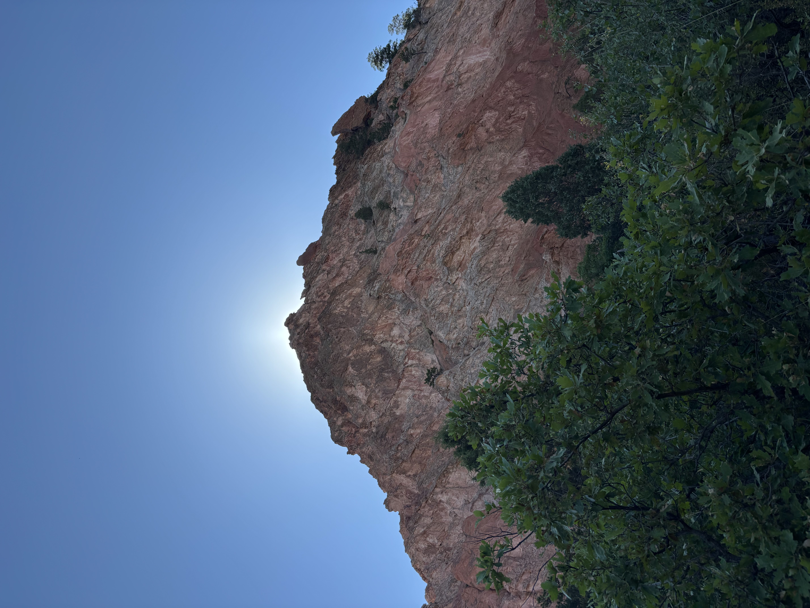

<br><details><summary>:camera:**34/IMG_0492.jpg**</summary><sub> `Exif version` 0232 `OS version` 27.0 `Date` 2026:07:20 09:43:40 `Aperture` Not known `Brightness` 7.583247979970411 `Color space` 65535 `Compression` Not known`Exposure mode` 0 `Exposure time` 0.0012515644555694619 `Focal length` 5.96 `Lens model` iPhone 15 Plus back dual wide camera 5.96mm f/1.6 `Lens specification` (1.5399999618512084, 5.96, 1.6, 2.4) `Orientation` 6 `Scene type` Not known `f number` 1.6 `White balance` 0 `Sensing method` 2 `Shutter speed` 9.641549725442342</sub><sub>`Coordinates & altitude` (38.87572222222222, -104.88070555555555, 1980.7731034482758)</sub><sub> :earth_americas:`Location over` [Google Maps](http://maps.google.com/maps?q=38.87572222222222,-104.88070555555555) or [Openstreet Map](https://www.openstreetmap.org/query?lat=38.87572222222222&lon=-104.88070555555555)</sub></details>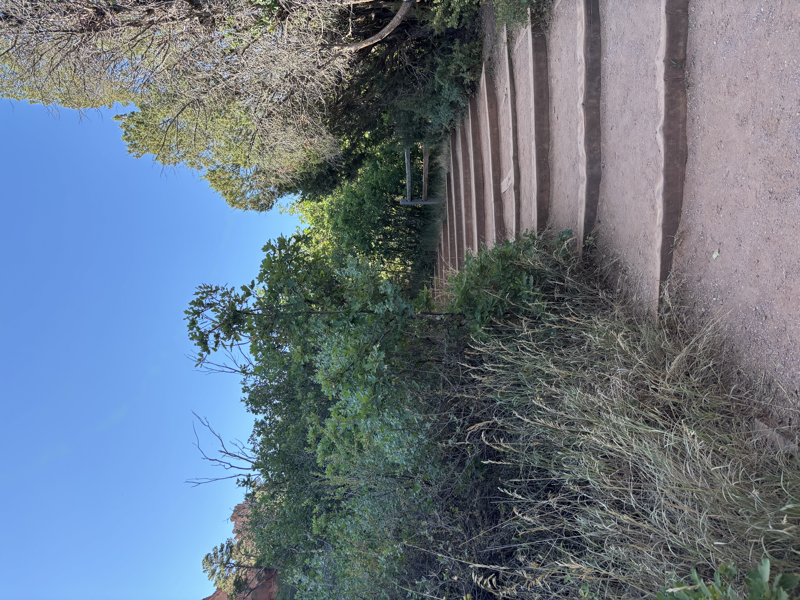

<br><details><summary>:camera:**34/IMG_0493.jpg**</summary><sub> `Exif version` 0232 `OS version` 27.0 `Date` 2026:07:20 09:44:01 `Aperture` Not known `Brightness` 9.22845394736842 `Color space` 65535 `Compression` Not known`Exposure mode` 0 `Exposure time` 0.001652892561983471 `Focal length` 1.54 `Lens model` iPhone 15 Plus back dual wide camera 1.54mm f/2.4 `Lens specification` (1.54, 5.960000038146973, 1.6, 2.4) `Orientation` 1 `Scene type` Not known `f number` 2.4 `White balance` 0 `Sensing method` 2 `Shutter speed` 9.240697556524385</sub><sub>`Coordinates & altitude` (38.87569444444444, -104.880775, 1971.596590909091)</sub><sub> :earth_americas:`Location over` [Google Maps](http://maps.google.com/maps?q=38.87569444444444,-104.880775) or [Openstreet Map](https://www.openstreetmap.org/query?lat=38.87569444444444&lon=-104.880775)</sub></details>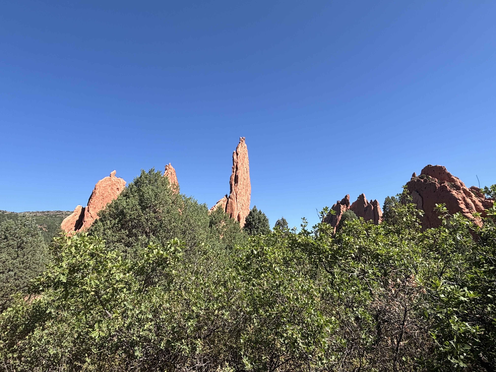

<br><details><summary>:camera:**34/IMG_0494.jpg**</summary><sub> `Exif version` 0232 `OS version` 27.0 `Date` 2026:07:20 09:44:10 `Aperture` Not known `Brightness` 9.194889397406559 `Color space` 65535 `Compression` Not known`Exposure mode` 0 `Exposure time` 0.001697792869269949 `Focal length` 1.54 `Lens model` iPhone 15 Plus back dual wide camera 1.54mm f/2.4 `Lens specification` (1.54, 5.960000038146973, 1.6, 2.4) `Orientation` 6 `Scene type` Not known `f number` 2.4 `White balance` 0 `Sensing method` 2 `Shutter speed` 9.201098436839882</sub><sub>`Coordinates & altitude` (38.87574722222222, -104.88083611111111, 1972.5892648774795)</sub><sub> :earth_americas:`Location over` [Google Maps](http://maps.google.com/maps?q=38.87574722222222,-104.88083611111111) or [Openstreet Map](https://www.openstreetmap.org/query?lat=38.87574722222222&lon=-104.88083611111111)</sub></details>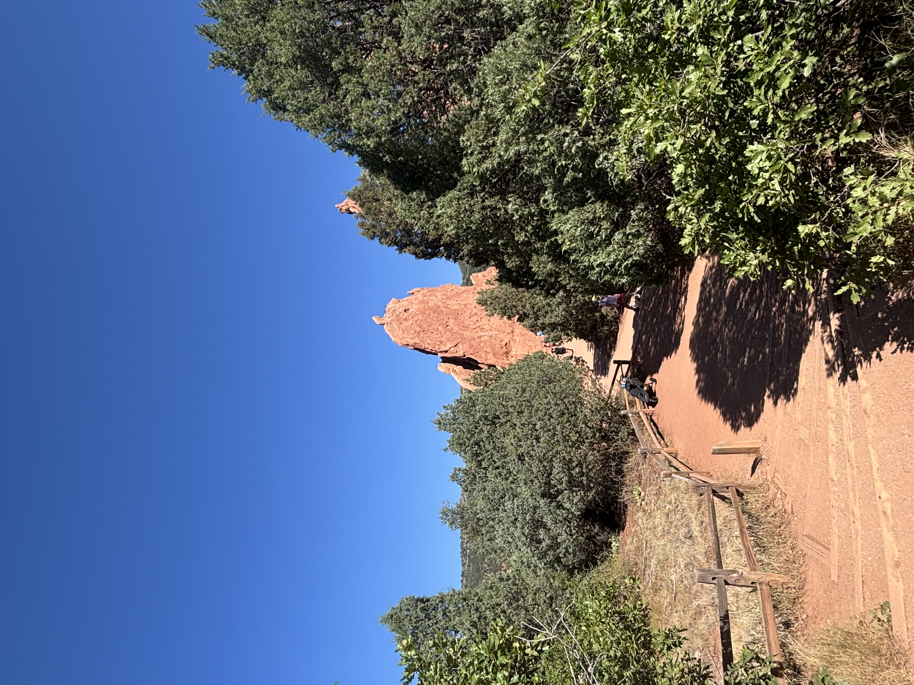

<br><details><summary>:camera:**34/IMG_0495.jpg**</summary><sub> `Exif version` 0232 `OS version` 27.0 `Date` 2026:07:20 09:44:49 `Aperture` Not known `Brightness` 8.013876310001294 `Color space` 65535 `Compression` Not known`Exposure mode` 0 `Exposure time` 0.0009551098376313276 `Focal length` 5.96 `Lens model` iPhone 15 Plus back dual wide camera 5.96mm f/1.6 `Lens specification` (1.5399999618512084, 5.96, 1.6, 2.4) `Orientation` 6 `Scene type` Not known `f number` 1.6 `White balance` 0 `Sensing method` 2 `Shutter speed` 10.032211644897055</sub><sub>`Coordinates & altitude` (38.87597777777778, -104.88108055555554, 1971.2623626373627)</sub><sub> :earth_americas:`Location over` [Google Maps](http://maps.google.com/maps?q=38.87597777777778,-104.88108055555554) or [Openstreet Map](https://www.openstreetmap.org/query?lat=38.87597777777778&lon=-104.88108055555554)</sub></details>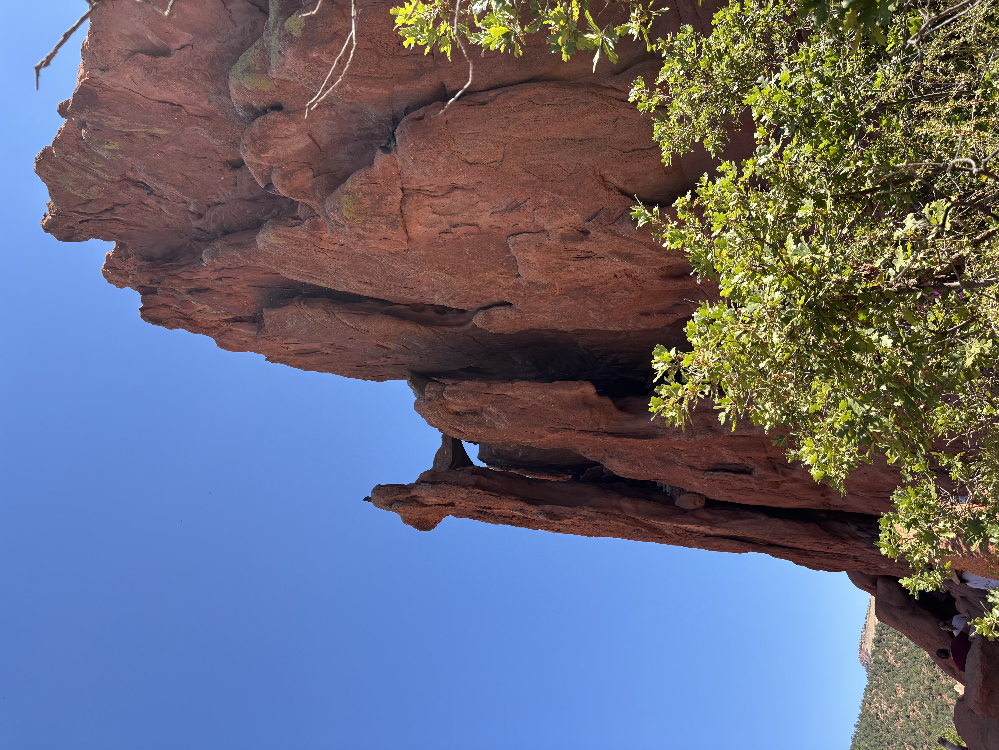

<br><details><summary>:camera:**34/IMG_0496.jpg**</summary><sub> `Exif version` 0232 `OS version` 27.0 `Date` 2026:07:20 09:44:52 `Aperture` Not known `Brightness` 9.41955238837546 `Color space` 65535 `Compression` Not known`Exposure mode` 0 `Exposure time` 0.00035001750087504374 `Focal length` 5.96 `Lens model` iPhone 15 Plus back dual wide camera 5.96mm f/1.6 `Lens specification` (1.5399999618512084, 5.96, 1.6, 2.4) `Orientation` 6 `Scene type` Not known `f number` 1.6 `White balance` 0 `Sensing method` 2 `Shutter speed` 11.48035745885684</sub><sub>`Coordinates & altitude` (38.87597777777778, -104.88108888888888, 1971.0284757118927)</sub><sub> :earth_americas:`Location over` [Google Maps](http://maps.google.com/maps?q=38.87597777777778,-104.88108888888888) or [Openstreet Map](https://www.openstreetmap.org/query?lat=38.87597777777778&lon=-104.88108888888888)</sub></details>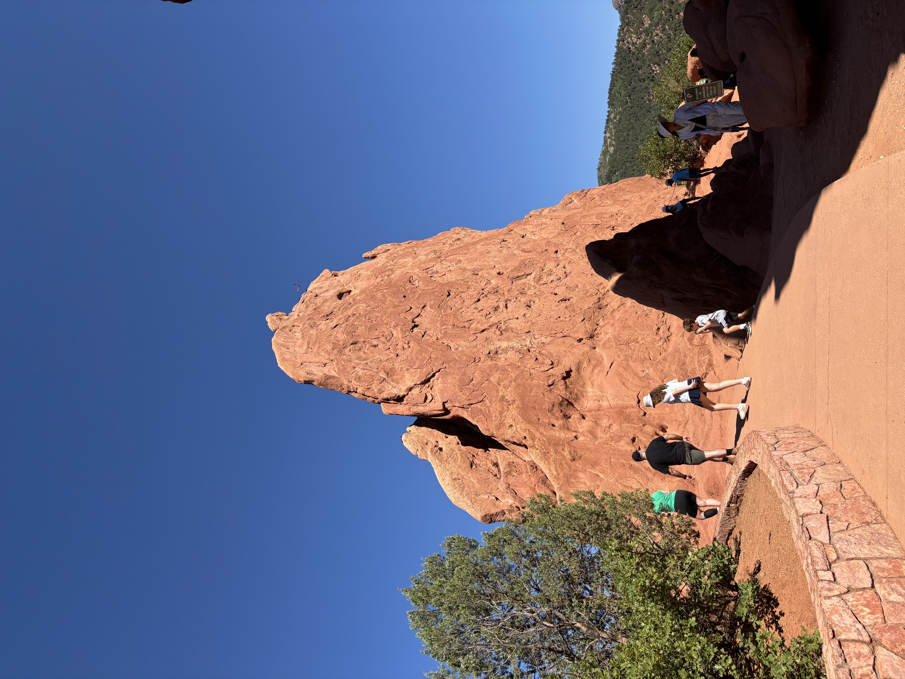

<br><details><summary>:camera:**34/IMG_0497.jpg**</summary><sub> `Exif version` 0232 `OS version` 27.0 `Date` 2026:07:20 09:45:03 `Aperture` Not known `Brightness` 6.206751361161524 `Color space` 65535 `Compression` Not known`Exposure mode` 0 `Exposure time` 0.0034482758620689655 `Focal length` 5.96 `Lens model` iPhone 15 Plus back dual wide camera 5.96mm f/1.6 `Lens specification` (1.5399999618512084, 5.96, 1.6, 2.4) `Orientation` 6 `Scene type` Not known `f number` 1.6 `White balance` 0 `Sensing method` 2 `Shutter speed` 8.17960615663196</sub><sub>`Coordinates & altitude` (38.87605277777778, -104.88117222222222, 1972.4952718676122)</sub><sub> :earth_americas:`Location over` [Google Maps](http://maps.google.com/maps?q=38.87605277777778,-104.88117222222222) or [Openstreet Map](https://www.openstreetmap.org/query?lat=38.87605277777778&lon=-104.88117222222222)</sub></details>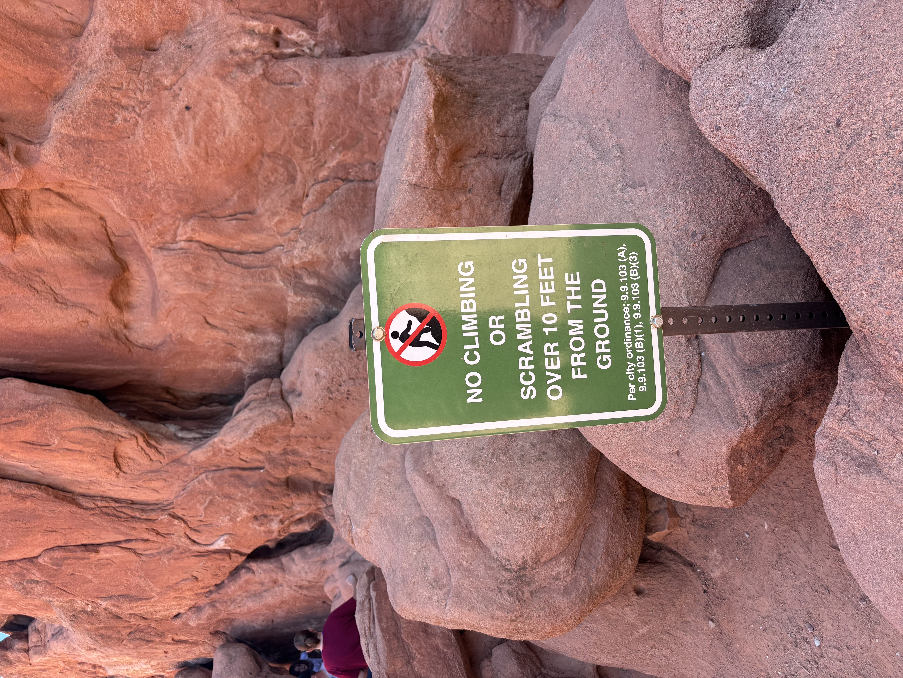

<br><details><summary>:camera:**34/IMG_0498.jpg**</summary><sub> `Exif version` 0232 `OS version` 27.0 `Date` 2026:07:20 09:45:16 `Aperture` Not known `Brightness` 8.434008021639773 `Color space` 65535 `Compression` Not known`Exposure mode` 0 `Exposure time` 0.0030959752321981426 `Focal length` 1.54 `Lens model` iPhone 15 Plus back dual wide camera 1.54mm f/2.4 `Lens specification` (1.54, 5.960000038146973, 1.6, 2.4) `Orientation` 6 `Scene type` Not known `f number` 2.4 `White balance` 0 `Sensing method` 2 `Shutter speed` 8.334912909836065</sub><sub>`Coordinates & altitude` (38.87609444444445, -104.8812111111111, 1974.4123244222926)</sub><sub> :earth_americas:`Location over` [Google Maps](http://maps.google.com/maps?q=38.87609444444445,-104.8812111111111) or [Openstreet Map](https://www.openstreetmap.org/query?lat=38.87609444444445&lon=-104.8812111111111)</sub></details>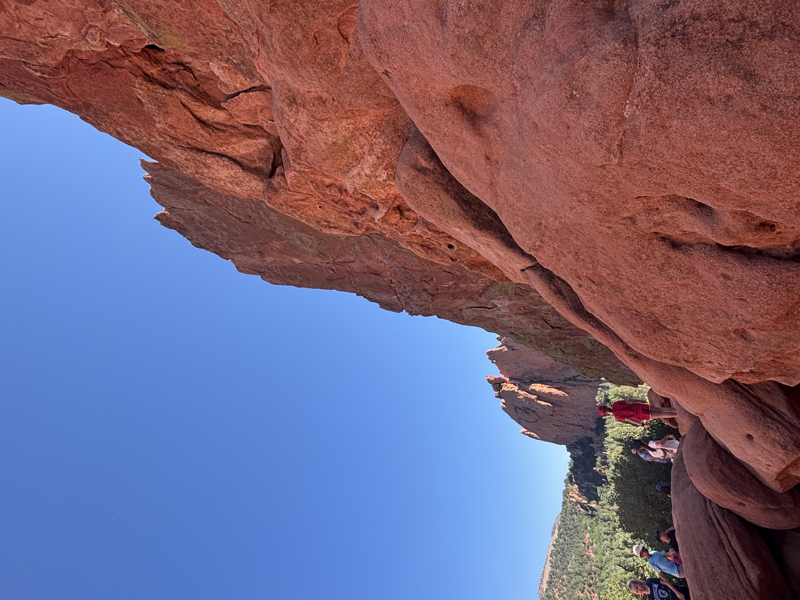

<br><details><summary>:camera:**34/IMG_0499.jpg**</summary><sub> `Exif version` 0232 `OS version` 27.0 `Date` 2026:07:20 09:45:25 `Aperture` Not known `Brightness` 9.73355551657604 `Color space` 65535 `Compression` Not known`Exposure mode` 0 `Exposure time` 0.0011350737797956867 `Focal length` 1.54 `Lens model` iPhone 15 Plus back dual wide camera 1.54mm f/2.4 `Lens specification` (1.54, 5.960000038146973, 1.6, 2.4) `Orientation` 6 `Scene type` Not known `f number` 2.4 `White balance` 0 `Sensing method` 2 `Shutter speed` 9.783091984499286</sub><sub>`Coordinates & altitude` (38.87611666666667, -104.88123333333333, 1974.1736745886653)</sub><sub> :earth_americas:`Location over` [Google Maps](http://maps.google.com/maps?q=38.87611666666667,-104.88123333333333) or [Openstreet Map](https://www.openstreetmap.org/query?lat=38.87611666666667&lon=-104.88123333333333)</sub></details>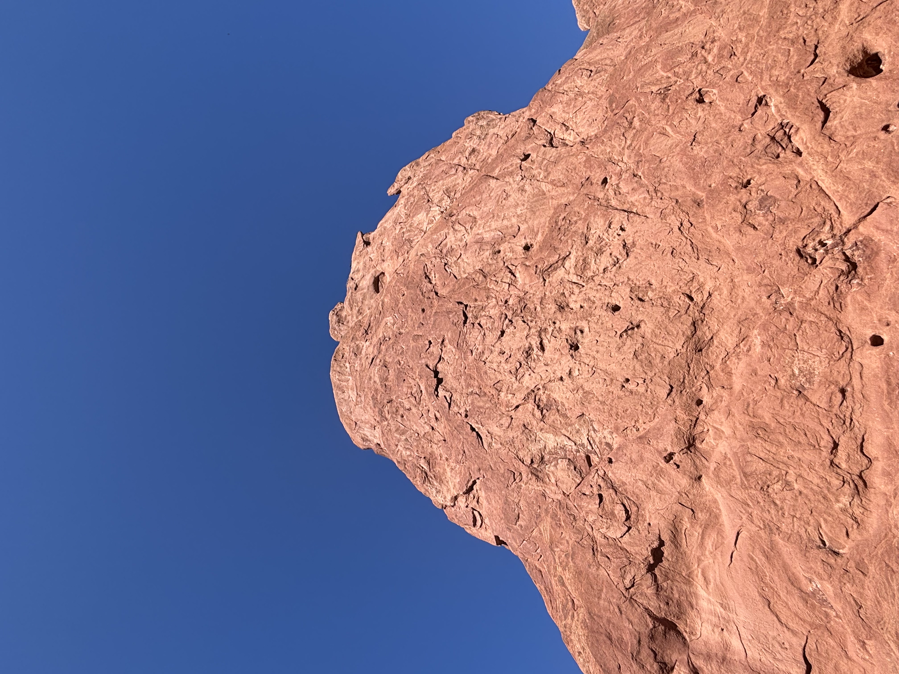

<br><details><summary>:camera:**34/IMG_0500.jpg**</summary><sub> `Exif version` 0232 `OS version` 27.0 `Date` 2026:07:20 09:46:38 `Aperture` Not known `Brightness` 7.898501070663811 `Color space` 65535 `Compression` Not known`Exposure mode` 0 `Exposure time` 0.0011074197120708748 `Focal length` 5.96 `Lens model` iPhone 15 Plus back dual wide camera 5.96mm f/1.6 `Lens specification` (1.5399999618512084, 5.96, 1.6, 2.4) `Orientation` 6 `Scene type` Not known `f number` 1.6 `White balance` 0 `Sensing method` 2 `Shutter speed` 9.817826403200389</sub><sub>`Coordinates & altitude` (38.876475, -104.88127777777777, 1972.83381364073)</sub><sub> :earth_americas:`Location over` [Google Maps](http://maps.google.com/maps?q=38.876475,-104.88127777777777) or [Openstreet Map](https://www.openstreetmap.org/query?lat=38.876475&lon=-104.88127777777777)</sub></details>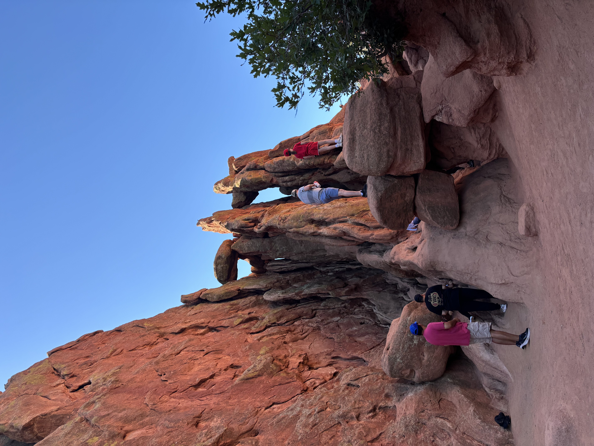

<br><details><summary>:camera:**34/IMG_0501.jpg**</summary><sub> `Exif version` 0232 `OS version` 27.0 `Date` 2026:07:20 09:47:58 `Aperture` Not known `Brightness` 11.313849113058346 `Color space` 65535 `Compression` Not known`Exposure mode` 0 `Exposure time` 0.000100999899000101 `Focal length` 5.96 `Lens model` iPhone 15 Plus back dual wide camera 5.96mm f/1.6 `Lens specification` (1.5399999618512084, 5.96, 1.6, 2.4) `Orientation` 1 `Scene type` Not known `f number` 1.6 `White balance` 0 `Sensing method` 2 `Shutter speed` 13.273357086302454</sub><sub>`Coordinates & altitude` (38.87591666666667, -104.88130833333332, 1972.9088471849866)</sub><sub> :earth_americas:`Location over` [Google Maps](http://maps.google.com/maps?q=38.87591666666667,-104.88130833333332) or [Openstreet Map](https://www.openstreetmap.org/query?lat=38.87591666666667&lon=-104.88130833333332)</sub></details>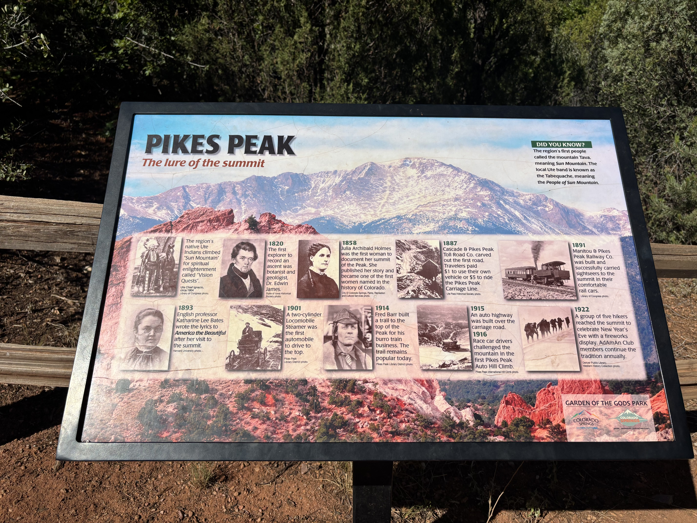

<br><details><summary>:camera:**34/IMG_0502.jpg**</summary><sub> `Exif version` 0232 `OS version` 27.0 `Date` 2026:07:20 09:48:24 `Aperture` Not known `Brightness` 9.37626271769434 `Color space` 65535 `Compression` Not known`Exposure mode` 0 `Exposure time` 0.00037893141341417203 `Focal length` 5.96 `Lens model` iPhone 15 Plus back dual wide camera 5.96mm f/1.6 `Lens specification` (1.5399999618512084, 5.96, 1.6, 2.4) `Orientation` 6 `Scene type` Not known `f number` 1.6 `White balance` 0 `Sensing method` 2 `Shutter speed` 11.365514532600157</sub><sub>`Coordinates & altitude` (38.8759, -104.88146944444443, 1986.0802325581396)</sub><sub> :earth_americas:`Location over` [Google Maps](http://maps.google.com/maps?q=38.8759,-104.88146944444443) or [Openstreet Map](https://www.openstreetmap.org/query?lat=38.8759&lon=-104.88146944444443)</sub></details>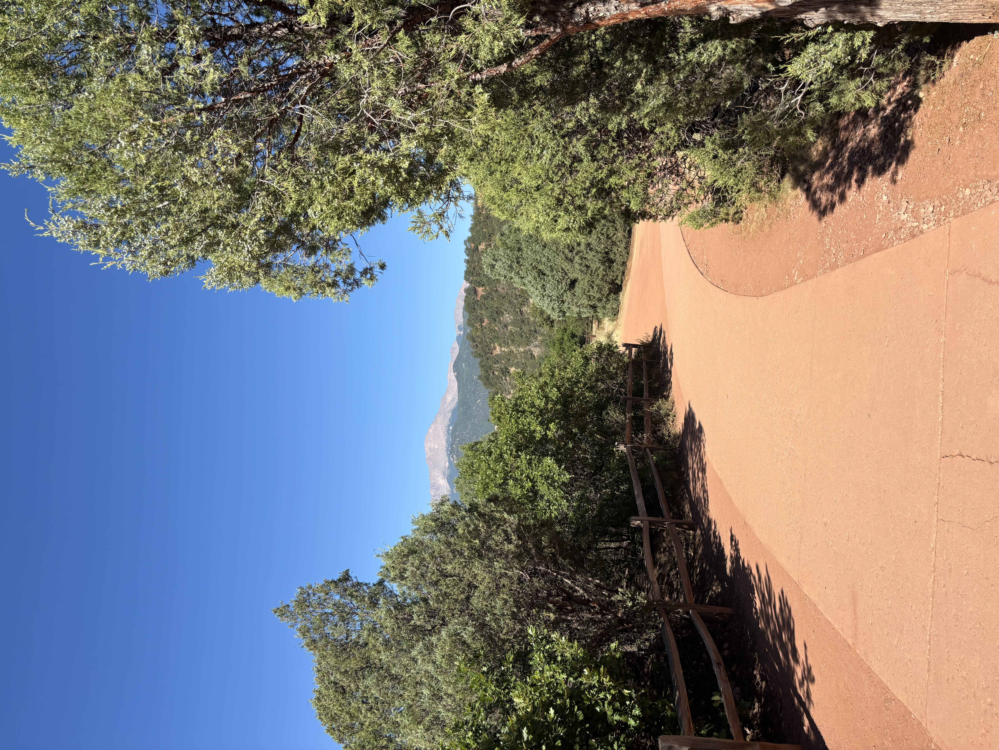

<br><details><summary>:camera:**34/IMG_0503.jpg**</summary><sub> `Exif version` 0232 `OS version` 27.0 `Date` 2026:07:20 09:54:47 `Aperture` Not known `Brightness` 9.75359939378631 `Color space` 65535 `Compression` Not known`Exposure mode` 0 `Exposure time` 0.00031201248049921997 `Focal length` 5.96 `Lens model` iPhone 15 Plus back dual wide camera 5.96mm f/1.6 `Lens specification` (1.5399999618512084, 5.96, 1.6, 2.4) `Orientation` 1 `Scene type` Not known `f number` 1.6 `White balance` 0 `Sensing method` 2 `Shutter speed` 11.646166350582497</sub><sub>`Coordinates & altitude` (38.87014722222222, -104.87837222222221, 1953.5592356687898)</sub><sub> :earth_americas:`Location over` [Google Maps](http://maps.google.com/maps?q=38.87014722222222,-104.87837222222221) or [Openstreet Map](https://www.openstreetmap.org/query?lat=38.87014722222222&lon=-104.87837222222221)</sub></details>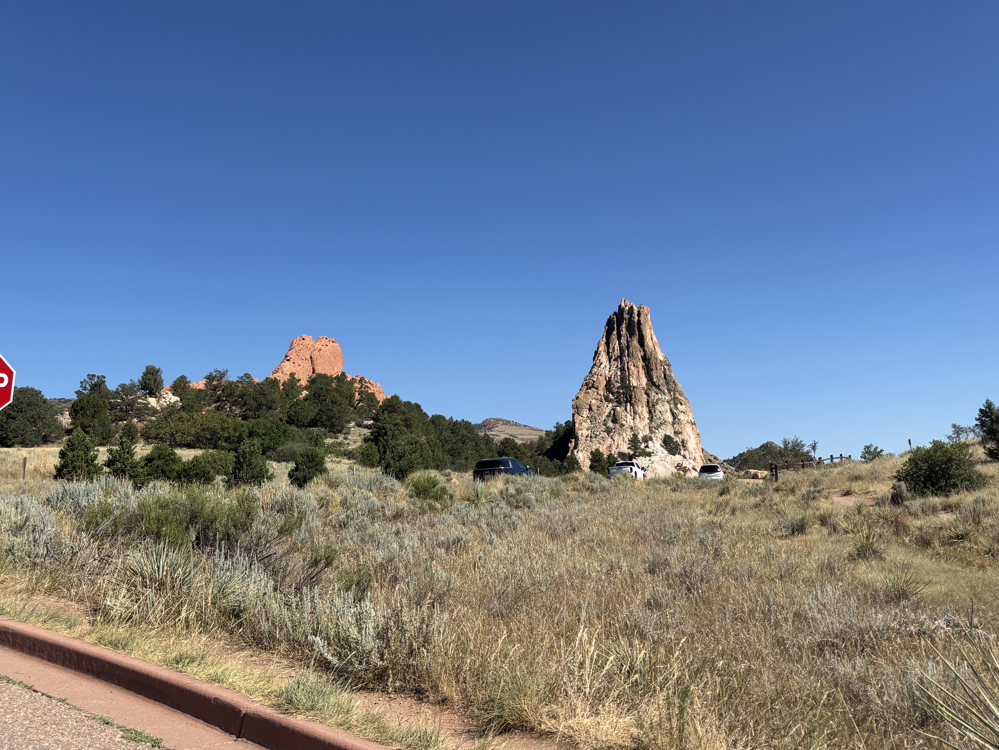

<br><details><summary>:camera:**34/IMG_0504.jpg**</summary><sub> `Exif version` 0232 `OS version` 27.0 `Date` 2026:07:20 09:54:55 `Aperture` Not known `Brightness` 10.035221068408093 `Color space` 65535 `Compression` Not known`Exposure mode` 0 `Exposure time` 0.00032102728731942215 `Focal length` 5.96 `Lens model` iPhone 15 Plus back dual wide camera 5.96mm f/1.6 `Lens specification` (1.5399999618512084, 5.96, 1.6, 2.4) `Orientation` 6 `Scene type` Not known `f number` 1.6 `White balance` 0 `Sensing method` 2 `Shutter speed` 11.605139085337106</sub><sub>`Coordinates & altitude` (38.87014722222222, -104.8783861111111, 1953.125398512221)</sub><sub> :earth_americas:`Location over` [Google Maps](http://maps.google.com/maps?q=38.87014722222222,-104.8783861111111) or [Openstreet Map](https://www.openstreetmap.org/query?lat=38.87014722222222&lon=-104.8783861111111)</sub></details>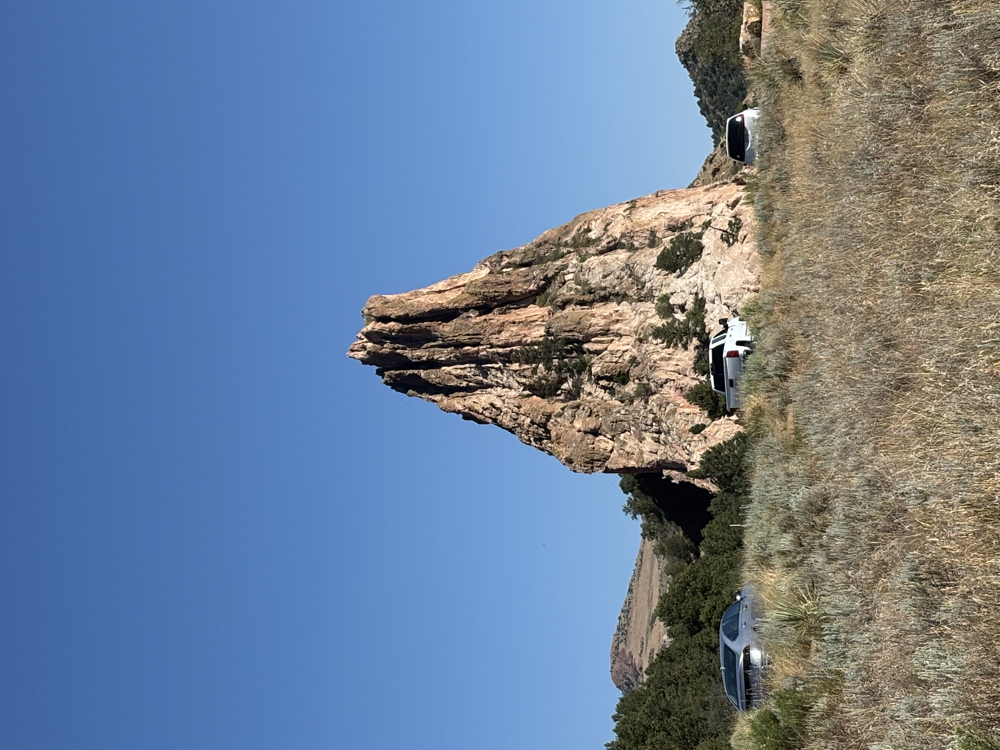

<br><details><summary>:camera:**34/IMG_0505.jpg**</summary><sub> `Exif version` 0232 `OS version` 27.0 `Date` 2026:07:20 09:58:54 `Aperture` Not known `Brightness` 9.756458164094232 `Color space` 65535 `Compression` Not known`Exposure mode` 0 `Exposure time` 0.0002829654782116582 `Focal length` 5.96 `Lens model` iPhone 15 Plus back dual wide camera 5.96mm f/1.6 `Lens specification` (1.5399999618512084, 5.96, 1.6, 2.4) `Orientation` 1 `Scene type` Not known `f number` 1.6 `White balance` 0 `Sensing method` 2 `Shutter speed` 11.786910327241818</sub><sub>`Coordinates & altitude` (38.881547222222224, -104.88037777777777, 1973.897615708275)</sub><sub> :earth_americas:`Location over` [Google Maps](http://maps.google.com/maps?q=38.881547222222224,-104.88037777777777) or [Openstreet Map](https://www.openstreetmap.org/query?lat=38.881547222222224&lon=-104.88037777777777)</sub></details>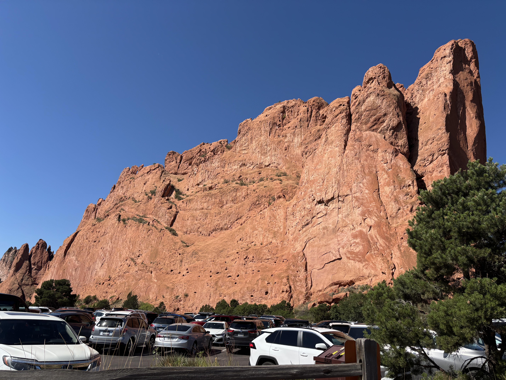

<br><details><summary>:camera:**34/IMG_0506.jpg**</summary><sub> `Exif version` 0232 `OS version` 27.0 `Date` 2026:07:20 09:59:06 `Aperture` Not known `Brightness` 9.655616224648986 `Color space` 65535 `Compression` Not known`Exposure mode` 0 `Exposure time` 0.00033101621979476995 `Focal length` 5.96 `Lens model` iPhone 15 Plus back dual wide camera 5.96mm f/1.6 `Lens specification` (1.5399999618512084, 5.96, 1.6, 2.4) `Orientation` 1 `Scene type` Not known `f number` 1.6 `White balance` 0 `Sensing method` 2 `Shutter speed` 11.560881163411066</sub><sub>`Coordinates & altitude` (38.88157777777778, -104.88065277777777, 1975.7193932827736)</sub><sub> :earth_americas:`Location over` [Google Maps](http://maps.google.com/maps?q=38.88157777777778,-104.88065277777777) or [Openstreet Map](https://www.openstreetmap.org/query?lat=38.88157777777778&lon=-104.88065277777777)</sub></details>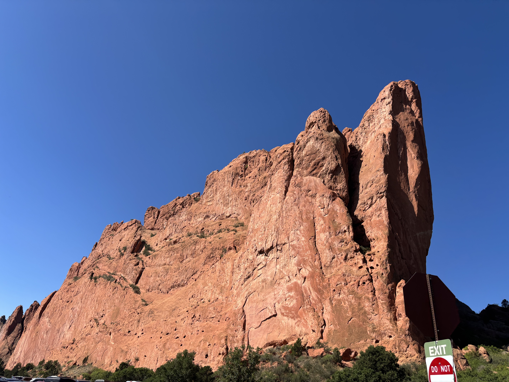

<br><details><summary>:camera:**34/IMG_0507.jpg**</summary><sub> `Exif version` 0232 `OS version` 27.0 `Date` 2026:07:20 09:59:08 `Aperture` Not known `Brightness` 9.797382143237204 `Color space` 65535 `Compression` Not known`Exposure mode` 0 `Exposure time` 0.0003020235578375113 `Focal length` 5.96 `Lens model` iPhone 15 Plus back dual wide camera 5.96mm f/1.6 `Lens specification` (1.5399999618512084, 5.96, 1.6, 2.4) `Orientation` 1 `Scene type` Not known `f number` 1.6 `White balance` 0 `Sensing method` 2 `Shutter speed` 11.693163830629205</sub><sub>`Coordinates & altitude` (38.88157777777778, -104.88066944444444, 1975.1837488457986)</sub><sub> :earth_americas:`Location over` [Google Maps](http://maps.google.com/maps?q=38.88157777777778,-104.88066944444444) or [Openstreet Map](https://www.openstreetmap.org/query?lat=38.88157777777778&lon=-104.88066944444444)</sub></details>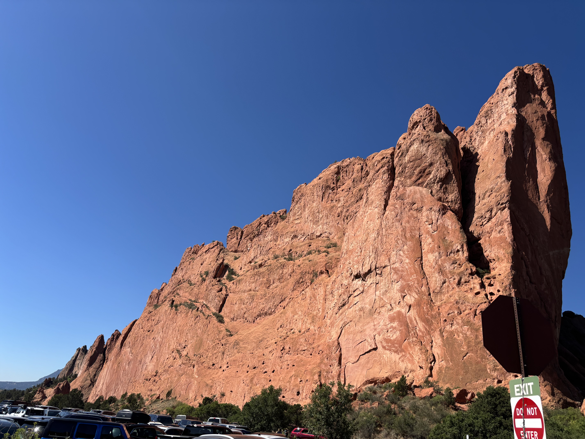

<br><details><summary>:camera:**34/IMG_0508.jpg**</summary><sub> `Exif version` 0232 `OS version` 27.0 `Date` 2026:07:20 09:59:26 `Aperture` Not known `Brightness` 9.331084366642353 `Color space` 65535 `Compression` Not known`Exposure mode` 0 `Exposure time` 0.0003979307600477517 `Focal length` 5.96 `Lens model` iPhone 15 Plus back dual wide camera 5.96mm f/1.6 `Lens specification` (1.5399999618512084, 5.96, 1.6, 2.4) `Orientation` 1 `Scene type` Not known `f number` 1.6 `White balance` 0 `Sensing method` 2 `Shutter speed` 11.294943950881436</sub><sub>`Coordinates & altitude` (38.88165277777778, -104.88122499999999, 1980.6384323640962)</sub><sub> :earth_americas:`Location over` [Google Maps](http://maps.google.com/maps?q=38.88165277777778,-104.88122499999999) or [Openstreet Map](https://www.openstreetmap.org/query?lat=38.88165277777778&lon=-104.88122499999999)</sub></details>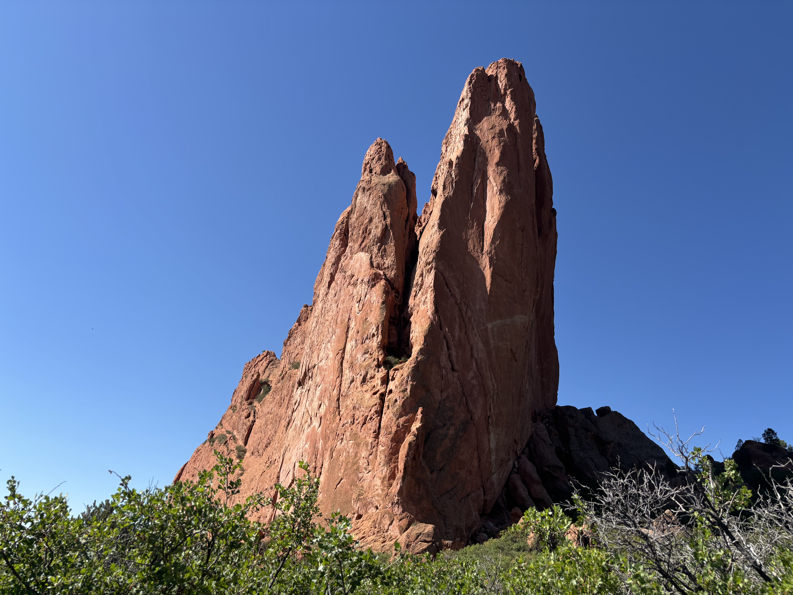

<br><details><summary>:camera:**34/IMG_0509.jpg**</summary><sub> `Exif version` 0232 `OS version` 27.0 `Date` 2026:07:20 10:02:15 `Aperture` Not known `Brightness` 8.775382362512204 `Color space` 65535 `Compression` Not known`Exposure mode` 0 `Exposure time` 0.000513083632632119 `Focal length` 5.96 `Lens model` iPhone 15 Plus back dual wide camera 5.96mm f/1.6 `Lens specification` (1.5399999618512084, 5.96, 1.6, 2.4) `Orientation` 6 `Scene type` Not known `f number` 1.6 `White balance` 0 `Sensing method` 2 `Shutter speed` 10.928753562321884</sub><sub>`Coordinates & altitude` (38.87962777777778, -104.88316388888889, 1972.675935828877)</sub><sub> :earth_americas:`Location over` [Google Maps](http://maps.google.com/maps?q=38.87962777777778,-104.88316388888889) or [Openstreet Map](https://www.openstreetmap.org/query?lat=38.87962777777778&lon=-104.88316388888889)</sub></details>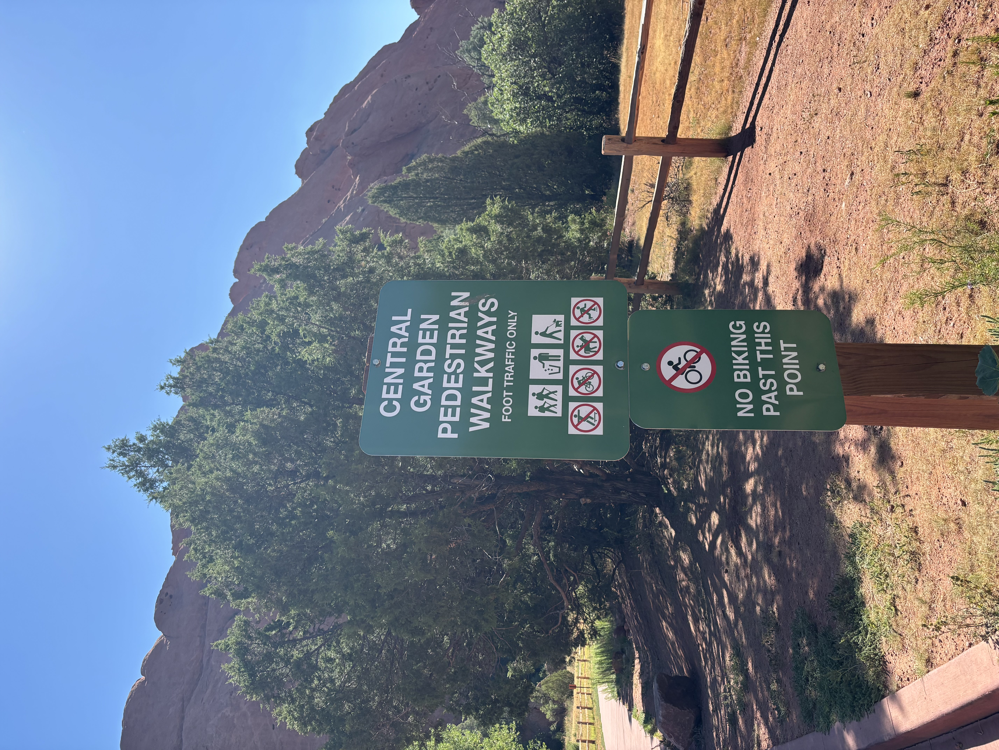

<br><details><summary>:camera:**34/IMG_0510.jpg**</summary><sub> `Exif version` 0232 `OS version` 27.0 `Date` 2026:07:20 10:02:37 `Aperture` Not known `Brightness` 10.412226111759367 `Color space` 65535 `Compression` Not known`Exposure mode` 0 `Exposure time` 0.00018698578908002991 `Focal length` 5.96 `Lens model` iPhone 15 Plus back dual wide camera 5.96mm f/1.6 `Lens specification` (1.5399999618512084, 5.96, 1.6, 2.4) `Orientation` 6 `Scene type` Not known `f number` 1.6 `White balance` 0 `Sensing method` 2 `Shutter speed` 12.384674110125012</sub><sub>`Coordinates & altitude` (38.87971388888889, -104.88299444444444, 1971.3270588235293)</sub><sub> :earth_americas:`Location over` [Google Maps](http://maps.google.com/maps?q=38.87971388888889,-104.88299444444444) or [Openstreet Map](https://www.openstreetmap.org/query?lat=38.87971388888889&lon=-104.88299444444444)</sub></details>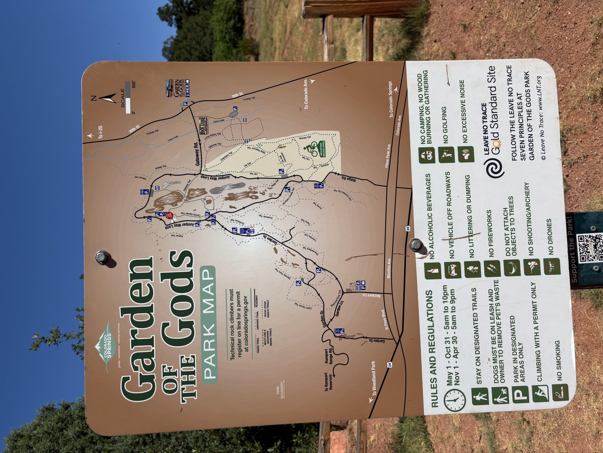

<br><details><summary>:camera:**34/IMG_0511.jpg**</summary><sub> `Exif version` 0232 `OS version` 27.0 `Date` 2026:07:20 10:03:03 `Aperture` Not known `Brightness` 9.473446291964342 `Color space` 65535 `Compression` Not known`Exposure mode` 0 `Exposure time` 0.0003219575016097875 `Focal length` 5.96 `Lens model` iPhone 15 Plus back dual wide camera 5.96mm f/1.6 `Lens specification` (1.5399999618512084, 5.96, 1.6, 2.4) `Orientation` 6 `Scene type` Not known `f number` 1.6 `White balance` 0 `Sensing method` 2 `Shutter speed` 11.60065170166546</sub><sub>`Coordinates & altitude` (38.87972777777778, -104.88254444444443, 1974.8873626373627)</sub><sub> :earth_americas:`Location over` [Google Maps](http://maps.google.com/maps?q=38.87972777777778,-104.88254444444443) or [Openstreet Map](https://www.openstreetmap.org/query?lat=38.87972777777778&lon=-104.88254444444443)</sub></details>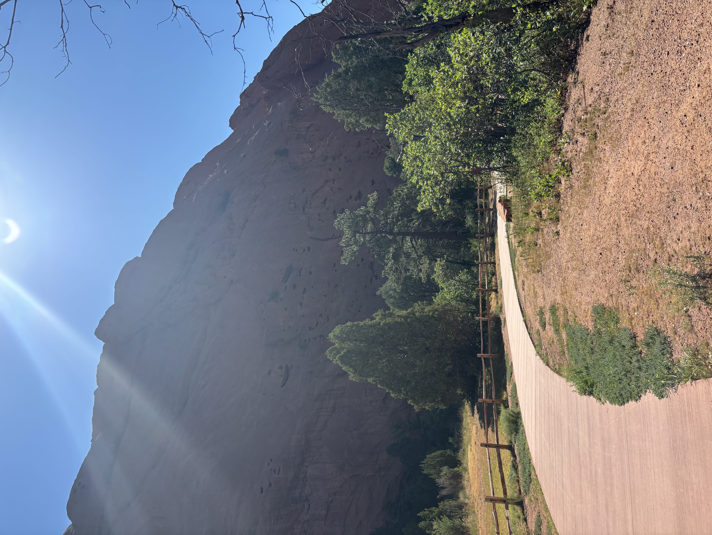

<br><details><summary>:camera:**34/IMG_0512.jpg**</summary><sub> `Exif version` 0232 `OS version` 27.0 `Date` 2026:07:20 10:03:45 `Aperture` Not known `Brightness` 10.004190962099125 `Color space` 65535 `Compression` Not known`Exposure mode` 0 `Exposure time` 0.00026399155227032733 `Focal length` 5.96 `Lens model` iPhone 15 Plus back dual wide camera 5.96mm f/1.6 `Lens specification` (1.5399999618512084, 5.96, 1.6, 2.4) `Orientation` 6 `Scene type` Not known `f number` 1.6 `White balance` 0 `Sensing method` 2 `Shutter speed` 11.887174447174447</sub><sub>`Coordinates & altitude` (38.879580555555556, -104.8819361111111, 1976.8922448979592)</sub><sub> :earth_americas:`Location over` [Google Maps](http://maps.google.com/maps?q=38.879580555555556,-104.8819361111111) or [Openstreet Map](https://www.openstreetmap.org/query?lat=38.879580555555556&lon=-104.8819361111111)</sub></details>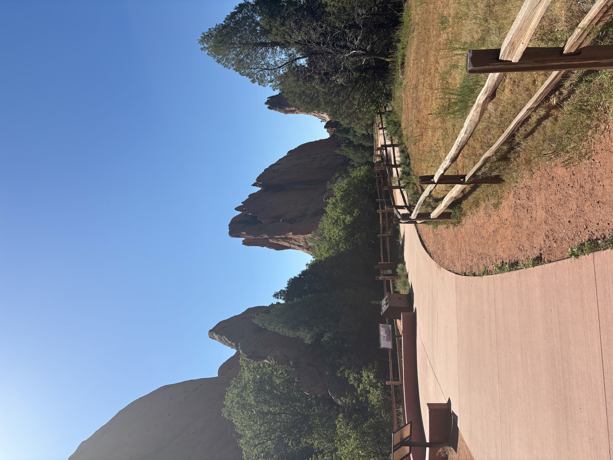

<br><details><summary>:camera:**34/IMG_0513.jpg**</summary><sub> `Exif version` 0232 `OS version` 27.0 `Date` 2026:07:20 10:03:48 `Aperture` Not known `Brightness` 9.830587347503458 `Color space` 65535 `Compression` Not known`Exposure mode` 0 `Exposure time` 0.000273972602739726 `Focal length` 5.96 `Lens model` iPhone 15 Plus back dual wide camera 5.96mm f/1.6 `Lens specification` (1.5399999618512084, 5.96, 1.6, 2.4) `Orientation` 1 `Scene type` Not known `f number` 1.6 `White balance` 0 `Sensing method` 2 `Shutter speed` 11.83353647919206</sub><sub>`Coordinates & altitude` (38.879525, -104.88196666666666, 1969.3644123440579)</sub><sub> :earth_americas:`Location over` [Google Maps](http://maps.google.com/maps?q=38.879525,-104.88196666666666) or [Openstreet Map](https://www.openstreetmap.org/query?lat=38.879525&lon=-104.88196666666666)</sub></details>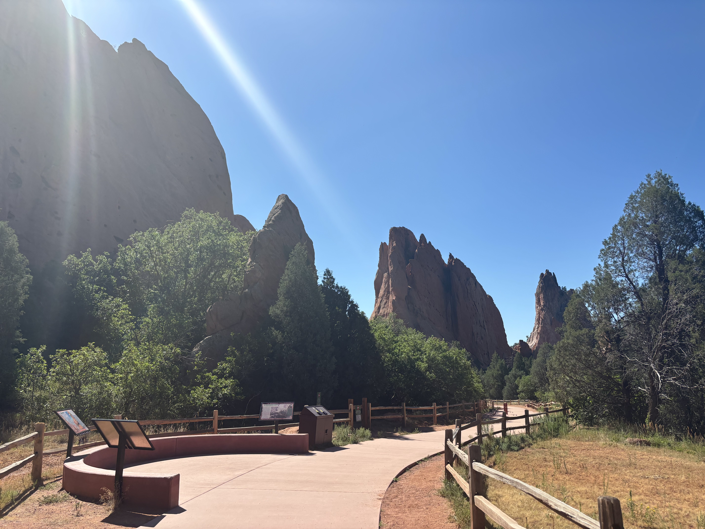

<br><details><summary>:camera:**34/IMG_0514.jpg**</summary><sub> `Exif version` 0232 `OS version` 27.0 `Date` 2026:07:20 10:03:58 `Aperture` Not known `Brightness` 11.260002749896879 `Color space` 65535 `Compression` Not known`Exposure mode` 0 `Exposure time` 0.00010999890001099989 `Focal length` 5.96 `Lens model` iPhone 15 Plus back dual wide camera 5.96mm f/1.6 `Lens specification` (1.5399999618512084, 5.96, 1.6, 2.4) `Orientation` 1 `Scene type` Not known `f number` 1.6 `White balance` 0 `Sensing method` 2 `Shutter speed` 13.150208855472014</sub><sub>`Coordinates & altitude` (38.87945277777778, -104.88184444444444, 1967.557281553398)</sub><sub> :earth_americas:`Location over` [Google Maps](http://maps.google.com/maps?q=38.87945277777778,-104.88184444444444) or [Openstreet Map](https://www.openstreetmap.org/query?lat=38.87945277777778&lon=-104.88184444444444)</sub></details>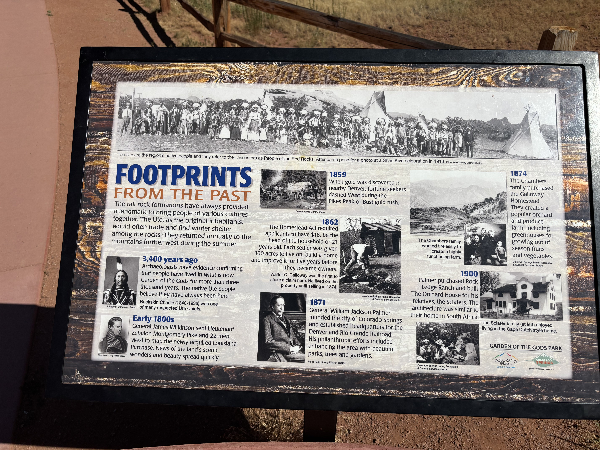

<br><details><summary>:camera:**34/IMG_0515.jpg**</summary><sub> `Exif version` 0232 `OS version` 27.0 `Date` 2026:07:20 10:04:04 `Aperture` Not known `Brightness` 9.32626377020488 `Color space` 65535 `Compression` Not known`Exposure mode` 0 `Exposure time` 0.0004269854824935952 `Focal length` 5.96 `Lens model` iPhone 15 Plus back dual wide camera 5.96mm f/1.6 `Lens specification` (1.5399999618512084, 5.96, 1.6, 2.4) `Orientation` 1 `Scene type` Not known `f number` 1.6 `White balance` 0 `Sensing method` 2 `Shutter speed` 11.193476318141197</sub><sub>`Coordinates & altitude` (38.879444444444445, -104.88181944444443, 1968.3067961165048)</sub><sub> :earth_americas:`Location over` [Google Maps](http://maps.google.com/maps?q=38.879444444444445,-104.88181944444443) or [Openstreet Map](https://www.openstreetmap.org/query?lat=38.879444444444445&lon=-104.88181944444443)</sub></details>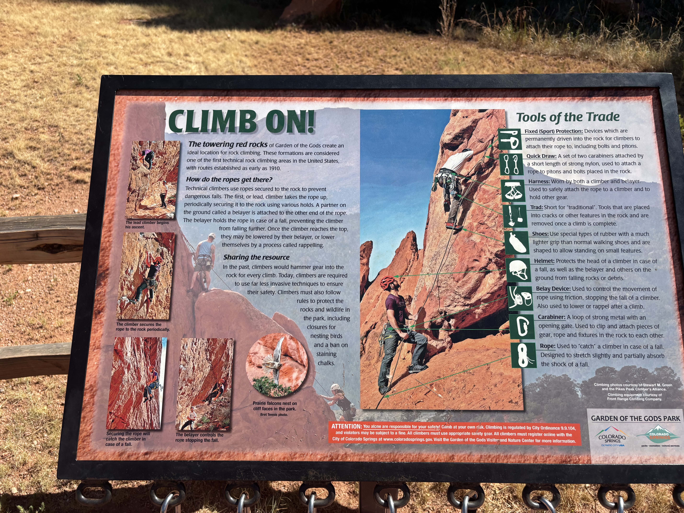

<br><details><summary>:camera:**34/IMG_0516.jpg**</summary><sub> `Exif version` 0232 `OS version` 27.0 `Date` 2026:07:20 10:04:11 `Aperture` Not known `Brightness` 8.329922480620155 `Color space` 65535 `Compression` Not known`Exposure mode` 0 `Exposure time` 0.0008298755186721991 `Focal length` 5.96 `Lens model` iPhone 15 Plus back dual wide camera 5.96mm f/1.6 `Lens specification` (1.5399999618512084, 5.96, 1.6, 2.4) `Orientation` 1 `Scene type` Not known `f number` 1.6 `White balance` 0 `Sensing method` 2 `Shutter speed` 10.234601043997017</sub><sub>`Coordinates & altitude` (38.879397222222224, -104.88181388888889, 1967.6417556346382)</sub><sub> :earth_americas:`Location over` [Google Maps](http://maps.google.com/maps?q=38.879397222222224,-104.88181388888889) or [Openstreet Map](https://www.openstreetmap.org/query?lat=38.879397222222224&lon=-104.88181388888889)</sub></details>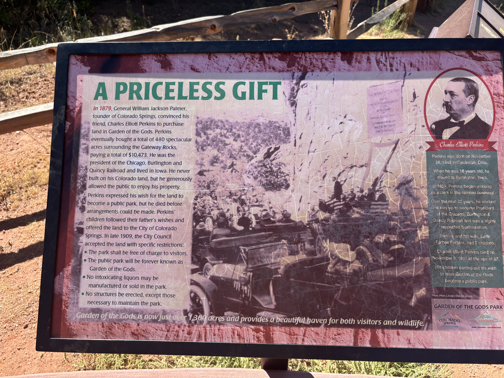

<br><details><summary>:camera:**34/IMG_0517.jpg**</summary><sub> `Exif version` 0232 `OS version` 27.0 `Date` 2026:07:20 10:04:18 `Aperture` Not known `Brightness` 8.649621239658607 `Color space` 65535 `Compression` Not known`Exposure mode` 0 `Exposure time` 0.0024271844660194173 `Focal length` 1.54 `Lens model` iPhone 15 Plus back dual wide camera 1.54mm f/2.4 `Lens specification` (1.54, 5.960000038146973, 1.6, 2.4) `Orientation` 1 `Scene type` Not known `f number` 2.4 `White balance` 0 `Sensing method` 2 `Shutter speed` 8.684827975183305</sub><sub>`Coordinates & altitude` (38.879416666666664, -104.88180555555554, 1966.0742459396752)</sub><sub> :earth_americas:`Location over` [Google Maps](http://maps.google.com/maps?q=38.879416666666664,-104.88180555555554) or [Openstreet Map](https://www.openstreetmap.org/query?lat=38.879416666666664&lon=-104.88180555555554)</sub></details>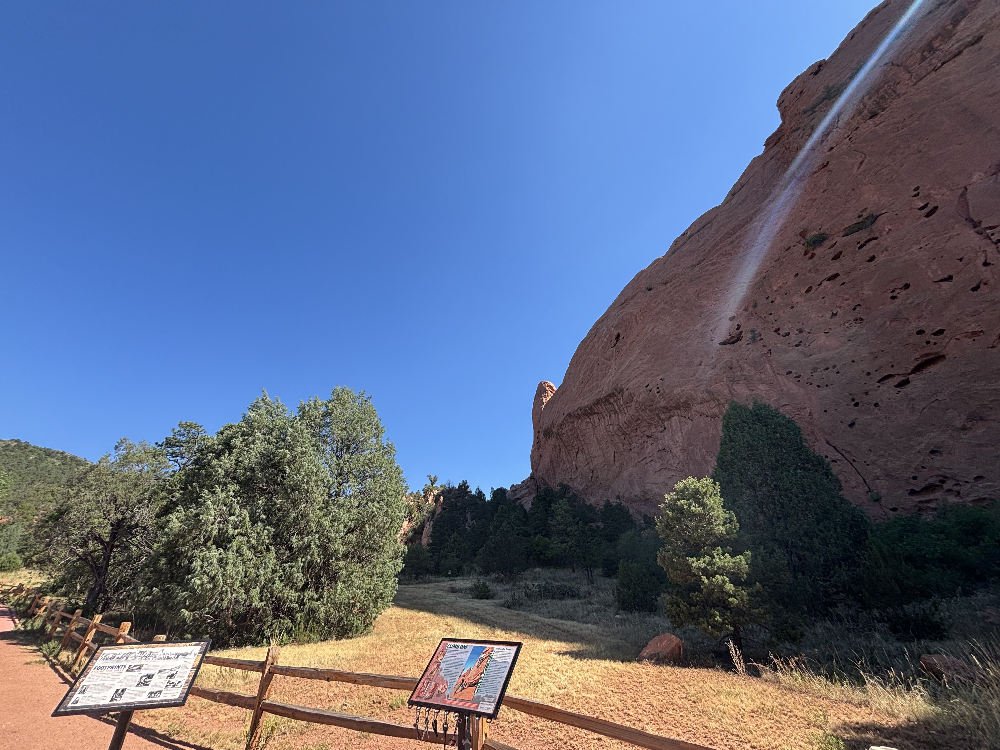

<br><details><summary>:camera:**34/IMG_0518.jpg**</summary><sub> `Exif version` 0232 `OS version` 27.0 `Date` 2026:07:20 10:04:35 `Aperture` Not known `Brightness` 9.31342778122707 `Color space` 65535 `Compression` Not known`Exposure mode` 0 `Exposure time` 0.0003979307600477517 `Focal length` 5.96 `Lens model` iPhone 15 Plus back dual wide camera 5.96mm f/1.6 `Lens specification` (1.5399999618512084, 5.96, 1.6, 2.4) `Orientation` 6 `Scene type` Not known `f number` 1.6 `White balance` 0 `Sensing method` 2 `Shutter speed` 11.294943950881436</sub><sub>`Coordinates & altitude` (38.879197222222224, -104.88172222222221, 1965.7154882154882)</sub><sub> :earth_americas:`Location over` [Google Maps](http://maps.google.com/maps?q=38.879197222222224,-104.88172222222221) or [Openstreet Map](https://www.openstreetmap.org/query?lat=38.879197222222224&lon=-104.88172222222221)</sub></details>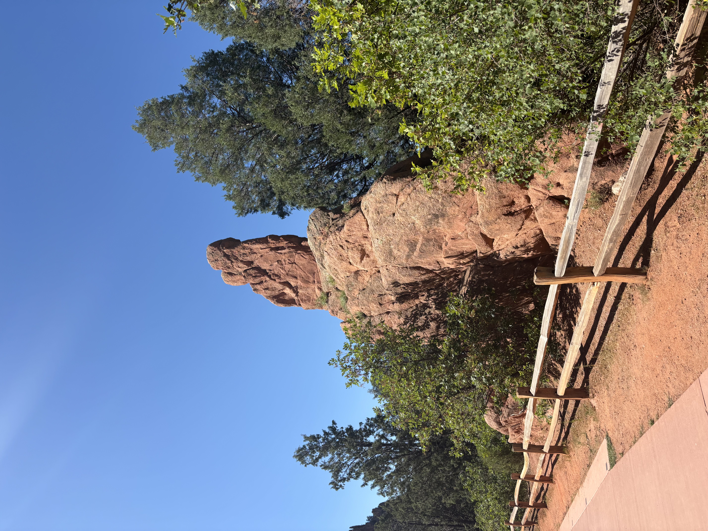

<br><details><summary>:camera:**34/IMG_0519.jpg**</summary><sub> `Exif version` 0232 `OS version` 27.0 `Date` 2026:07:20 10:05:51 `Aperture` Not known `Brightness` 9.299377486371004 `Color space` 65535 `Compression` Not known`Exposure mode` 0 `Exposure time` 0.00038895371450797355 `Focal length` 5.96 `Lens model` iPhone 15 Plus back dual wide camera 5.96mm f/1.6 `Lens specification` (1.5399999618512084, 5.96, 1.6, 2.4) `Orientation` 6 `Scene type` Not known `f number` 1.6 `White balance` 0 `Sensing method` 2 `Shutter speed` 11.327942223578477</sub></details>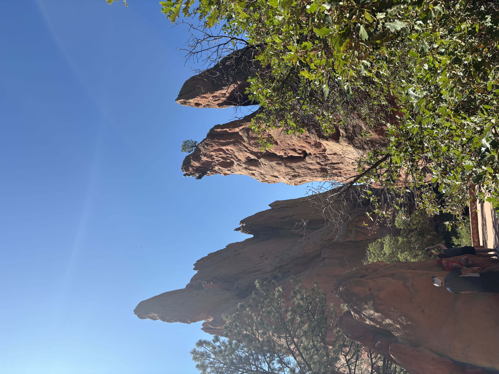

<br><details><summary>:camera:**34/IMG_0520.jpg**</summary><sub> `Exif version` 0232 `OS version` 27.0 `Date` 2026:07:20 10:06:00 `Aperture` Not known `Brightness` 8.995890185763603 `Color space` 65535 `Compression` Not known`Exposure mode` 0 `Exposure time` 0.00048496605237633366 `Focal length` 5.96 `Lens model` iPhone 15 Plus back dual wide camera 5.96mm f/1.6 `Lens specification` (1.5399999618512084, 5.96, 1.6, 2.4) `Orientation` 6 `Scene type` Not known `f number` 1.6 `White balance` 0 `Sensing method` 2 `Shutter speed` 11.009727626459144</sub><sub>`Coordinates & altitude` (38.878461111111115, -104.88091944444444, 1959.7425876010782)</sub><sub> :earth_americas:`Location over` [Google Maps](http://maps.google.com/maps?q=38.878461111111115,-104.88091944444444) or [Openstreet Map](https://www.openstreetmap.org/query?lat=38.878461111111115&lon=-104.88091944444444)</sub></details>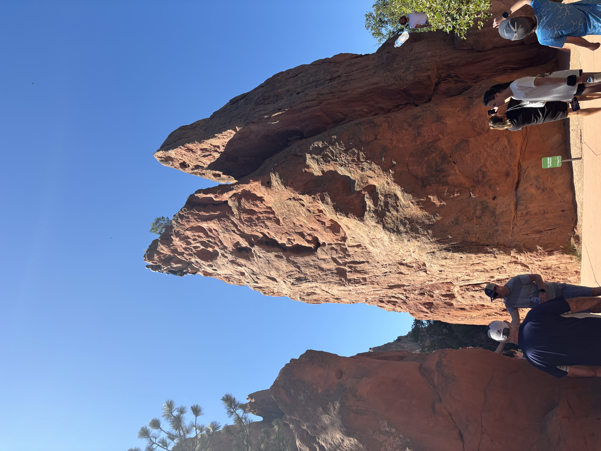

<br><details><summary>:camera:**34/IMG_0521.jpg**</summary><sub> `Exif version` 0232 `OS version` 27.0 `Date` 2026:07:20 10:06:13 `Aperture` Not known `Brightness` 8.080921509608705 `Color space` 65535 `Compression` Not known`Exposure mode` 0 `Exposure time` 0.004975124378109453 `Focal length` 1.54 `Lens model` iPhone 15 Plus back dual wide camera 1.54mm f/2.4 `Lens specification` (1.54, 5.960000038146973, 1.6, 2.4) `Orientation` 6 `Scene type` Not known `f number` 2.4 `White balance` 0 `Sensing method` 2 `Shutter speed` 7.651087758112094</sub><sub>`Coordinates & altitude` (38.87844166666667, -104.88088888888888, 1963.3514739229024)</sub><sub> :earth_americas:`Location over` [Google Maps](http://maps.google.com/maps?q=38.87844166666667,-104.88088888888888) or [Openstreet Map](https://www.openstreetmap.org/query?lat=38.87844166666667&lon=-104.88088888888888)</sub></details>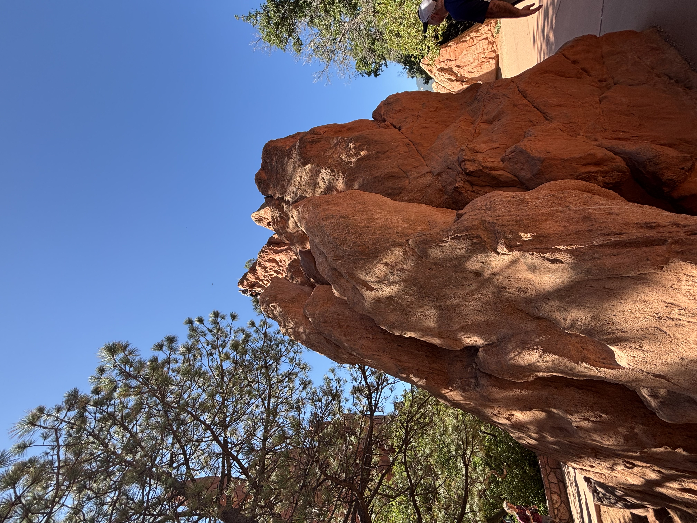

<br><details><summary>:camera:**34/IMG_0522.jpg**</summary><sub> `Exif version` 0232 `OS version` 27.0 `Date` 2026:07:20 10:06:18 `Aperture` Not known `Brightness` 7.924725359740059 `Color space` 65535 `Compression` Not known`Exposure mode` 0 `Exposure time` 0.0010695187165775401 `Focal length` 5.96 `Lens model` iPhone 15 Plus back dual wide camera 5.96mm f/1.6 `Lens specification` (1.5399999618512084, 5.96, 1.6, 2.4) `Orientation` 6 `Scene type` Not known `f number` 1.6 `White balance` 0 `Sensing method` 2 `Shutter speed` 9.868173488087965</sub><sub>`Coordinates & altitude` (38.87844166666667, -104.88088888888888, 1962.2301349325337)</sub><sub> :earth_americas:`Location over` [Google Maps](http://maps.google.com/maps?q=38.87844166666667,-104.88088888888888) or [Openstreet Map](https://www.openstreetmap.org/query?lat=38.87844166666667&lon=-104.88088888888888)</sub></details>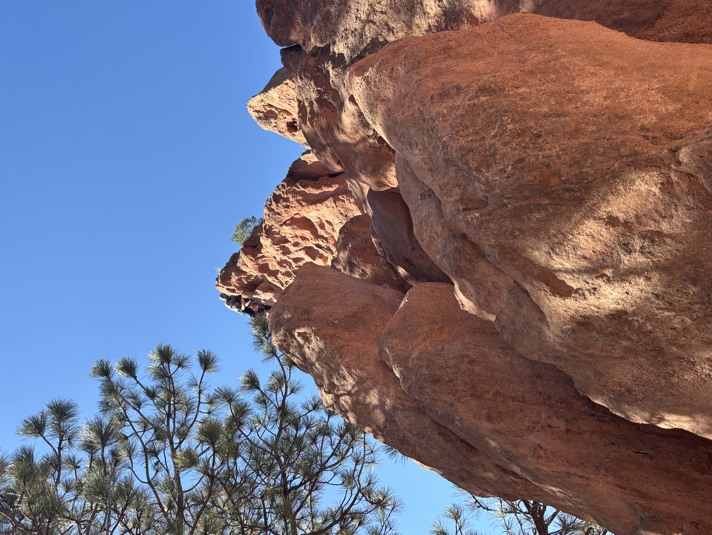

<br><details><summary>:camera:**34/IMG_0523.jpg**</summary><sub> `Exif version` 0232 `OS version` 27.0 `Date` 2026:07:20 10:06:54 `Aperture` Not known `Brightness` 9.767815778716447 `Color space` 65535 `Compression` Not known`Exposure mode` 0 `Exposure time` 0.001763668430335097 `Focal length` 1.54 `Lens model` iPhone 15 Plus back dual wide camera 1.54mm f/2.4 `Lens specification` (1.54, 5.960000038146973, 1.6, 2.4) `Orientation` 6 `Scene type` Not known `f number` 2.4 `White balance` 0 `Sensing method` 2 `Shutter speed` 9.1469337251566</sub><sub>`Coordinates & altitude` (38.878505555555556, -104.88065277777777, 1961.0621669626998)</sub><sub> :earth_americas:`Location over` [Google Maps](http://maps.google.com/maps?q=38.878505555555556,-104.88065277777777) or [Openstreet Map](https://www.openstreetmap.org/query?lat=38.878505555555556&lon=-104.88065277777777)</sub></details>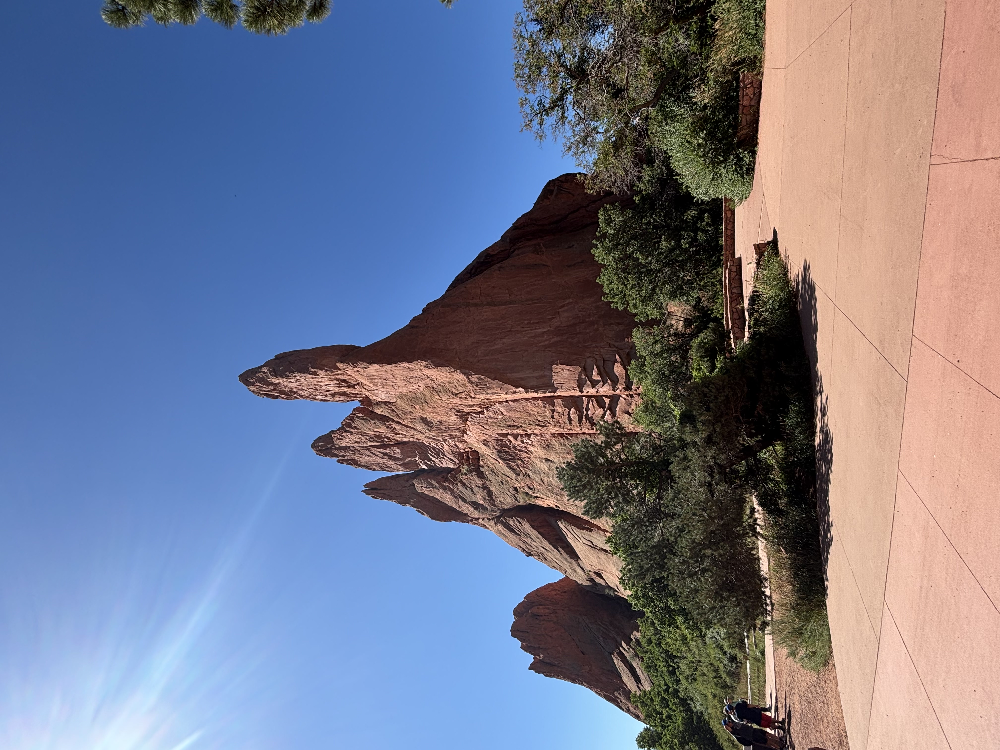

<br><details><summary>:camera:**34/IMG_0524.jpg**</summary><sub> `Exif version` 0232 `OS version` 27.0 `Date` 2026:07:20 10:07:08 `Aperture` Not known `Brightness` 9.373955930315807 `Color space` 65535 `Compression` Not known`Exposure mode` 0 `Exposure time` 0.0016260162601626016 `Focal length` 1.54 `Lens model` iPhone 15 Plus back dual wide camera 1.54mm f/2.4 `Lens specification` (1.54, 5.960000038146973, 1.6, 2.4) `Orientation` 6 `Scene type` Not known `f number` 2.4 `White balance` 0 `Sensing method` 2 `Shutter speed` 9.265344560159539</sub><sub>`Coordinates & altitude` (38.878477777777775, -104.8805611111111, 1959.2325769854133)</sub><sub> :earth_americas:`Location over` [Google Maps](http://maps.google.com/maps?q=38.878477777777775,-104.8805611111111) or [Openstreet Map](https://www.openstreetmap.org/query?lat=38.878477777777775&lon=-104.8805611111111)</sub></details>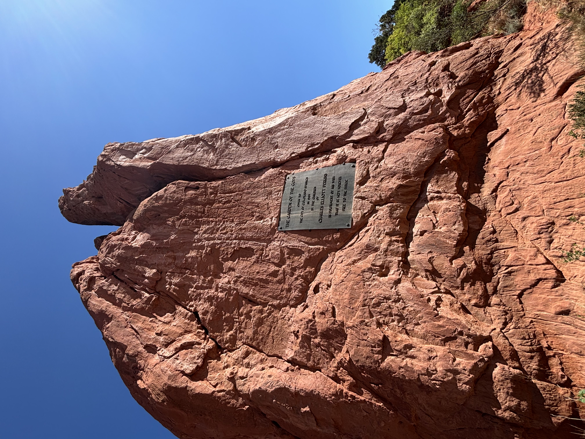

<br><details><summary>:camera:**34/IMG_0525.jpg**</summary><sub> `Exif version` 0232 `OS version` 27.0 `Date` 2026:07:20 10:07:12 `Aperture` Not known `Brightness` 9.355693247126437 `Color space` 65535 `Compression` Not known`Exposure mode` 0 `Exposure time` 0.0016339869281045752 `Focal length` 1.54 `Lens model` iPhone 15 Plus back dual wide camera 1.54mm f/2.4 `Lens specification` (1.54, 5.960000038146973, 1.6, 2.4) `Orientation` 6 `Scene type` Not known `f number` 2.4 `White balance` 0 `Sensing method` 2 `Shutter speed` 9.257376305038584</sub><sub>`Coordinates & altitude` (38.878477777777775, -104.8805611111111, 1959.2306238185256)</sub><sub> :earth_americas:`Location over` [Google Maps](http://maps.google.com/maps?q=38.878477777777775,-104.8805611111111) or [Openstreet Map](https://www.openstreetmap.org/query?lat=38.878477777777775&lon=-104.8805611111111)</sub></details>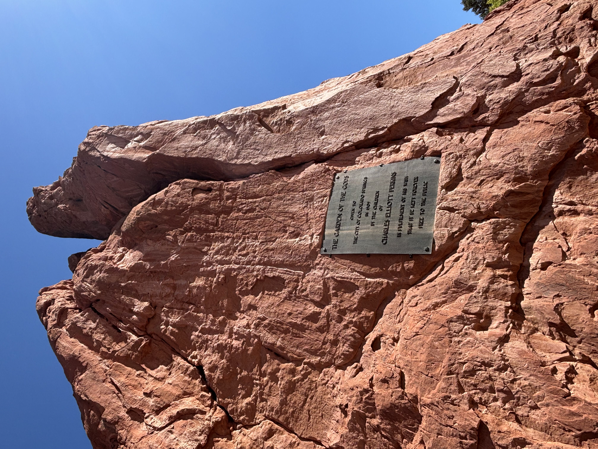

<br><details><summary>:camera:**34/IMG_0526.jpg**</summary><sub> `Exif version` 0232 `OS version` 27.0 `Date` 2026:07:20 10:07:35 `Aperture` Not known `Brightness` 9.456296977057145 `Color space` 65535 `Compression` Not known`Exposure mode` 0 `Exposure time` 0.0014124293785310734 `Focal length` 1.54 `Lens model` iPhone 15 Plus back dual wide camera 1.54mm f/2.4 `Lens specification` (1.54, 5.960000038146973, 1.6, 2.4) `Orientation` 6 `Scene type` Not known `f number` 2.4 `White balance` 0 `Sensing method` 2 `Shutter speed` 9.46804419572392</sub><sub>`Coordinates & altitude` (38.878369444444445, -104.88055555555555, 1956.9527991218442)</sub><sub> :earth_americas:`Location over` [Google Maps](http://maps.google.com/maps?q=38.878369444444445,-104.88055555555555) or [Openstreet Map](https://www.openstreetmap.org/query?lat=38.878369444444445&lon=-104.88055555555555)</sub></details>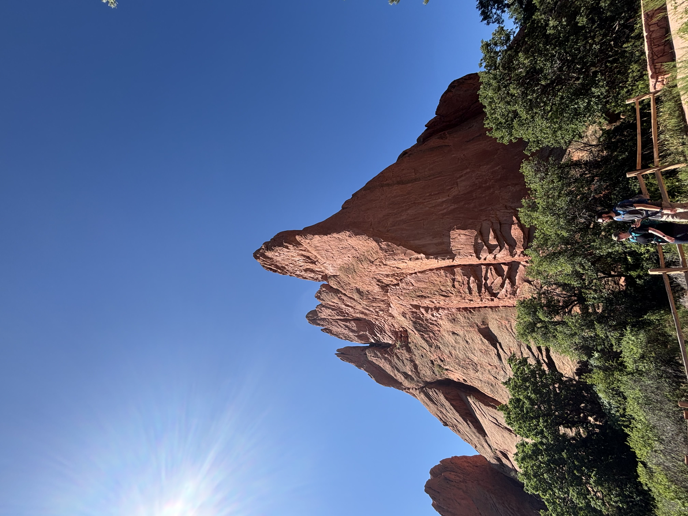

<br><details><summary>:camera:**34/IMG_0527.jpg**</summary><sub> `Exif version` 0232 `OS version` 27.0 `Date` 2026:07:20 10:07:50 `Aperture` Not known `Brightness` 9.200447141488342 `Color space` 65535 `Compression` Not known`Exposure mode` 0 `Exposure time` 0.002079002079002079 `Focal length` 1.54 `Lens model` iPhone 15 Plus back dual wide camera 1.54mm f/2.4 `Lens specification` (1.54, 5.960000038146973, 1.6, 2.4) `Orientation` 6 `Scene type` Not known `f number` 2.4 `White balance` 0 `Sensing method` 2 `Shutter speed` 8.90989452536414</sub><sub>`Coordinates & altitude` (38.878375, -104.88063055555556, 1957.6570093457944)</sub><sub> :earth_americas:`Location over` [Google Maps](http://maps.google.com/maps?q=38.878375,-104.88063055555556) or [Openstreet Map](https://www.openstreetmap.org/query?lat=38.878375&lon=-104.88063055555556)</sub></details>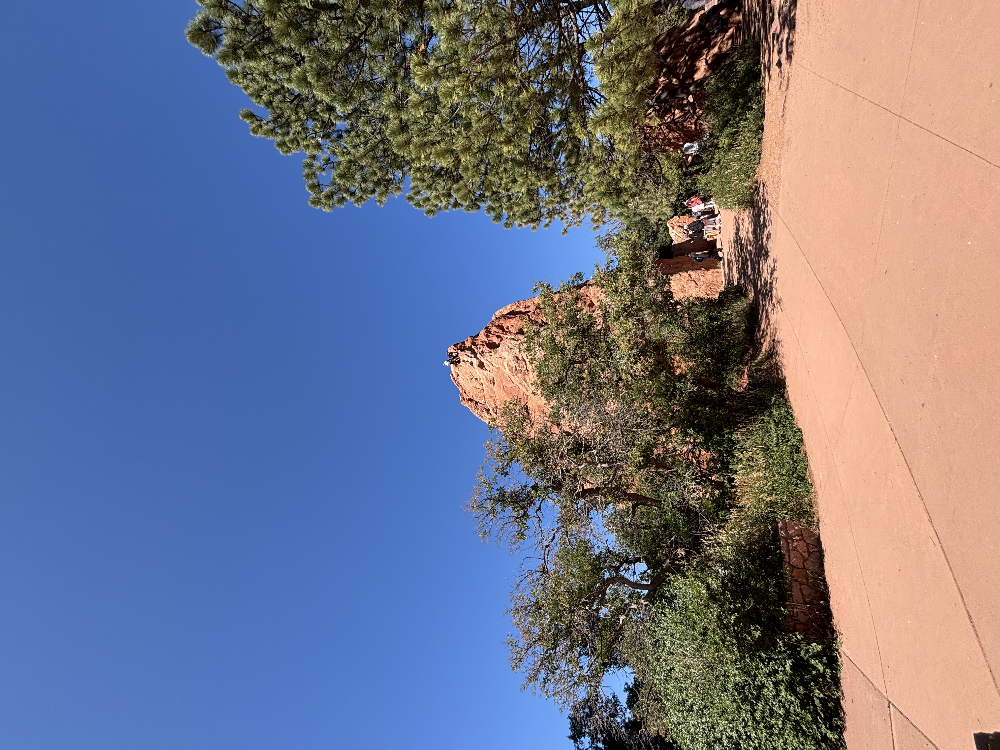

<br><details><summary>:camera:**34/IMG_0528.jpg**</summary><sub> `Exif version` 0232 `OS version` 27.0 `Date` 2026:07:20 10:08:20 `Aperture` Not known `Brightness` 9.14708209693373 `Color space` 65535 `Compression` Not known`Exposure mode` 0 `Exposure time` 0.0016891891891891893 `Focal length` 1.54 `Lens model` iPhone 15 Plus back dual wide camera 1.54mm f/2.4 `Lens specification` (1.54, 5.960000038146973, 1.6, 2.4) `Orientation` 6 `Scene type` Not known `f number` 2.4 `White balance` 0 `Sensing method` 2 `Shutter speed` 9.208761040821198</sub><sub>`Coordinates & altitude` (38.87835277777778, -104.88082777777777, 1963.6109936575053)</sub><sub> :earth_americas:`Location over` [Google Maps](http://maps.google.com/maps?q=38.87835277777778,-104.88082777777777) or [Openstreet Map](https://www.openstreetmap.org/query?lat=38.87835277777778&lon=-104.88082777777777)</sub></details>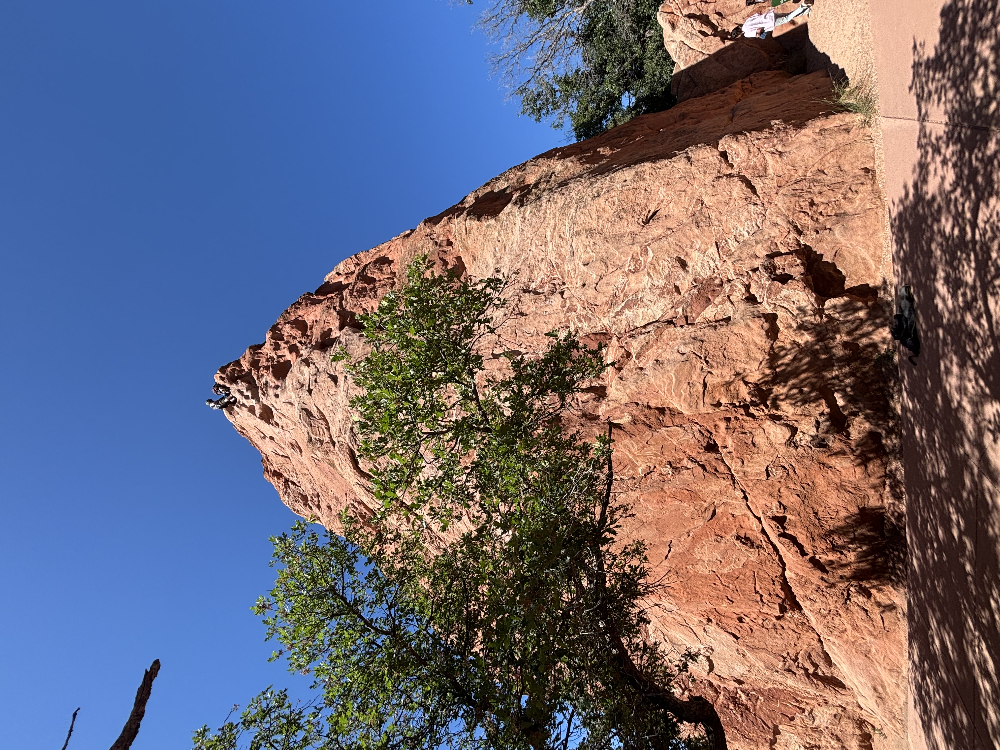

<br><details><summary>:camera:**34/IMG_0529.jpg**</summary><sub> `Exif version` 0232 `OS version` 27.0 `Date` 2026:07:20 10:27:26 `Aperture` Not known `Brightness` 9.725747061322759 `Color space` 65535 `Compression` Not known`Exposure mode` 0 `Exposure time` 0.0003020235578375113 `Focal length` 5.96 `Lens model` iPhone 15 Plus back dual wide camera 5.96mm f/1.6 `Lens specification` (1.5399999618512084, 5.96, 1.6, 2.4) `Orientation` 6 `Scene type` Not known `f number` 1.6 `White balance` 0 `Sensing method` 2 `Shutter speed` 11.693163830629205</sub><sub>`Coordinates & altitude` (38.86505833333334, -104.89727777777779, 1938.083162217659)</sub><sub> :earth_americas:`Location over` [Google Maps](http://maps.google.com/maps?q=38.86505833333334,-104.89727777777779) or [Openstreet Map](https://www.openstreetmap.org/query?lat=38.86505833333334&lon=-104.89727777777779)</sub></details>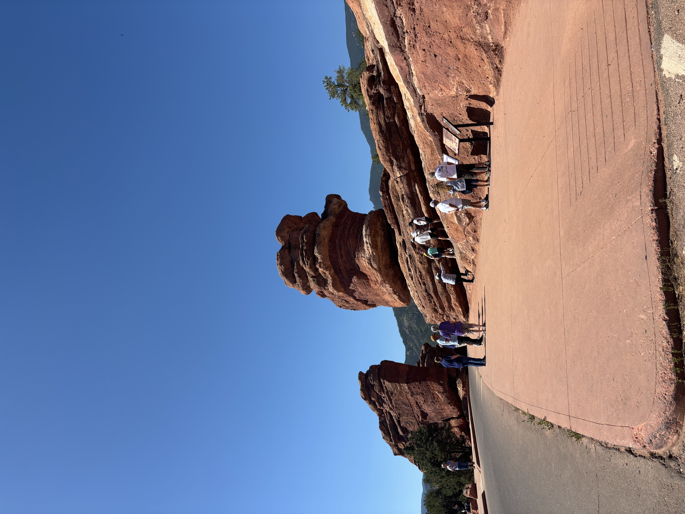

<br><details><summary>:camera:**34/IMG_0530.jpg**</summary><sub> `Exif version` 0232 `OS version` 27.0 `Date` 2026:07:20 10:27:29 `Aperture` Not known `Brightness` 9.729304249216197 `Color space` 65535 `Compression` Not known`Exposure mode` 0 `Exposure time` 0.0003020235578375113 `Focal length` 5.96 `Lens model` iPhone 15 Plus back dual wide camera 5.96mm f/1.6 `Lens specification` (1.5399999618512084, 5.96, 1.6, 2.4) `Orientation` 1 `Scene type` Not known `f number` 1.6 `White balance` 0 `Sensing method` 2 `Shutter speed` 11.693163830629205</sub><sub>`Coordinates & altitude` (38.865027777777776, -104.8973388888889, 1937.8775956284153)</sub><sub> :earth_americas:`Location over` [Google Maps](http://maps.google.com/maps?q=38.865027777777776,-104.8973388888889) or [Openstreet Map](https://www.openstreetmap.org/query?lat=38.865027777777776&lon=-104.8973388888889)</sub></details>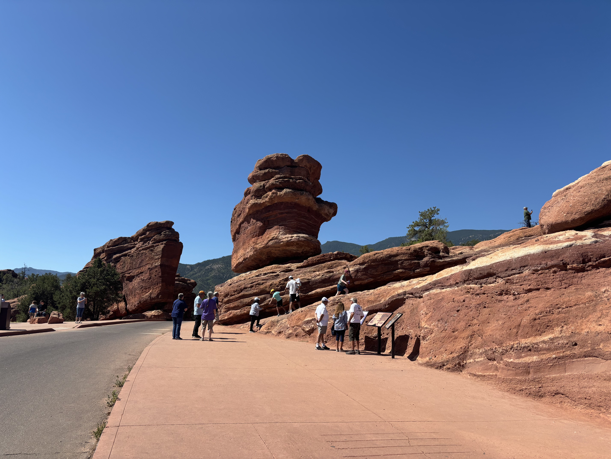

<br><details><summary>:camera:**34/IMG_0531.jpg**</summary><sub> `Exif version` 0232 `OS version` 27.0 `Date` 2026:07:20 10:27:32 `Aperture` Not known `Brightness` 9.673946830265848 `Color space` 65535 `Compression` Not known`Exposure mode` 0 `Exposure time` 0.0003219575016097875 `Focal length` 5.96 `Lens model` iPhone 15 Plus back dual wide camera 5.96mm f/1.6 `Lens specification` (1.5399999618512084, 5.96, 1.6, 2.4) `Orientation` 1 `Scene type` Not known `f number` 1.6 `White balance` 0 `Sensing method` 2 `Shutter speed` 11.60065170166546</sub><sub>`Coordinates & altitude` (38.865027777777776, -104.8973388888889, 1938.0172443524746)</sub><sub> :earth_americas:`Location over` [Google Maps](http://maps.google.com/maps?q=38.865027777777776,-104.8973388888889) or [Openstreet Map](https://www.openstreetmap.org/query?lat=38.865027777777776&lon=-104.8973388888889)</sub></details>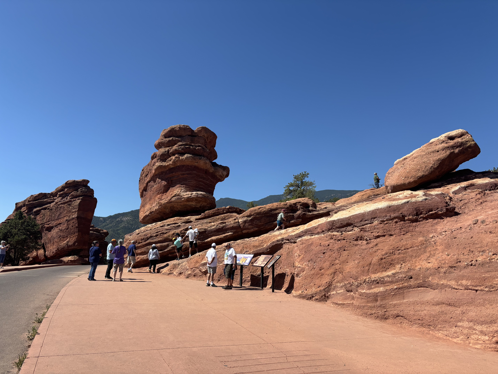

<br><details><summary>:camera:**34/IMG_0532.jpg**</summary><sub> `Exif version` 0232 `OS version` 27.0 `Date` 2026:07:20 10:28:58 `Aperture` Not known `Brightness` 9.331590718479173 `Color space` 65535 `Compression` Not known`Exposure mode` 0 `Exposure time` 0.00036900369003690036 `Focal length` 5.96 `Lens model` iPhone 15 Plus back dual wide camera 5.96mm f/1.6 `Lens specification` (1.5399999618512084, 5.96, 1.6, 2.4) `Orientation` 1 `Scene type` Not known `f number` 1.6 `White balance` 0 `Sensing method` 2 `Shutter speed` 11.404091553575046</sub><sub>`Coordinates & altitude` (38.86476944444445, -104.89743055555556, 1935.2853107344633)</sub><sub> :earth_americas:`Location over` [Google Maps](http://maps.google.com/maps?q=38.86476944444445,-104.89743055555556) or [Openstreet Map](https://www.openstreetmap.org/query?lat=38.86476944444445&lon=-104.89743055555556)</sub></details>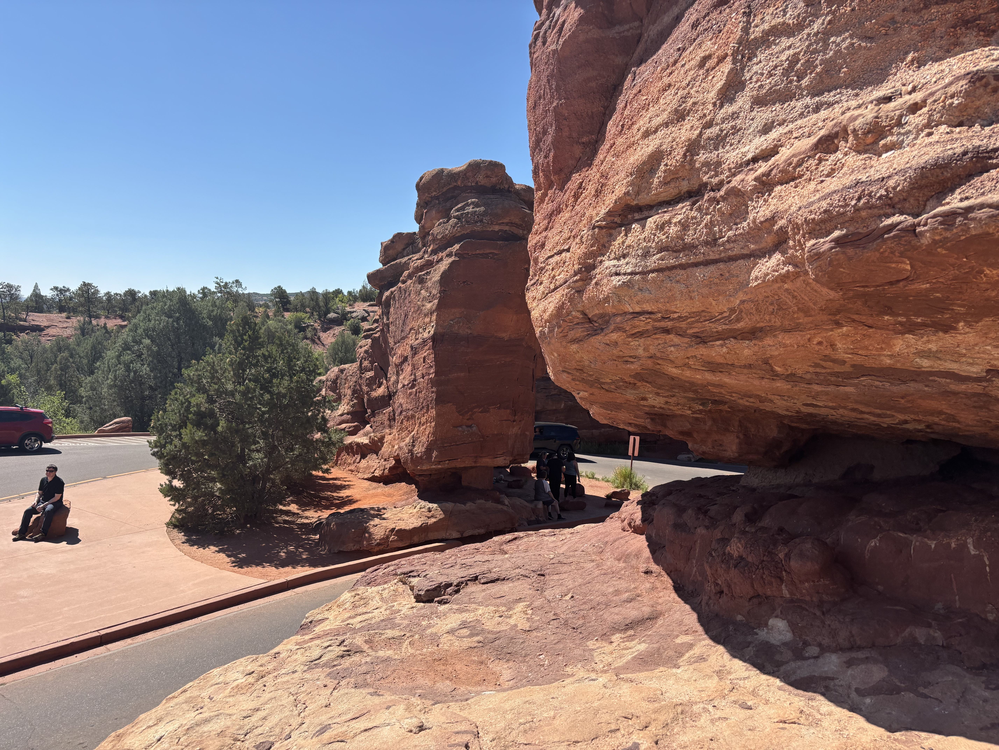

<br><details><summary>:camera:**34/IMG_0533.jpg**</summary><sub> `Exif version` 0232 `OS version` 27.0 `Date` 2026:07:20 10:29:00 `Aperture` Not known `Brightness` 9.25590989457141 `Color space` 65535 `Compression` Not known`Exposure mode` 0 `Exposure time` 0.00038895371450797355 `Focal length` 5.96 `Lens model` iPhone 15 Plus back dual wide camera 5.96mm f/1.6 `Lens specification` (1.5399999618512084, 5.96, 1.6, 2.4) `Orientation` 6 `Scene type` Not known `f number` 1.6 `White balance` 0 `Sensing method` 2 `Shutter speed` 11.327942223578477</sub><sub>`Coordinates & altitude` (38.86479444444445, -104.89742222222223, 1941.871736662883)</sub><sub> :earth_americas:`Location over` [Google Maps](http://maps.google.com/maps?q=38.86479444444445,-104.89742222222223) or [Openstreet Map](https://www.openstreetmap.org/query?lat=38.86479444444445&lon=-104.89742222222223)</sub></details>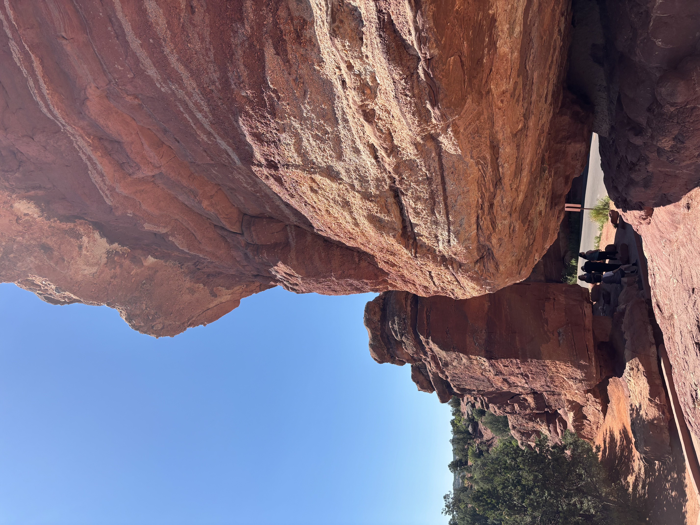

<br><details><summary>:camera:**34/IMG_0535.jpg**</summary><sub> `Exif version` 0232 `OS version` 27.0 `Date` 2026:07:20 10:29:30 `Aperture` Not known `Brightness` 5.1514026852963655 `Color space` 65535 `Compression` Not known`Exposure mode` 0 `Exposure time` 0.005813953488372093 `Focal length` 5.96 `Lens model` iPhone 15 Plus back dual wide camera 5.96mm f/1.6 `Lens specification` (1.5399999618512084, 5.96, 1.6, 2.4) `Orientation` 1 `Scene type` Not known `f number` 1.6 `White balance` 0 `Sensing method` 2 `Shutter speed` 7.4225358851674645</sub><sub>`Coordinates & altitude` (38.864783333333335, -104.89737777777779, 1937.9116766467066)</sub><sub> :earth_americas:`Location over` [Google Maps](http://maps.google.com/maps?q=38.864783333333335,-104.89737777777779) or [Openstreet Map](https://www.openstreetmap.org/query?lat=38.864783333333335&lon=-104.89737777777779)</sub></details>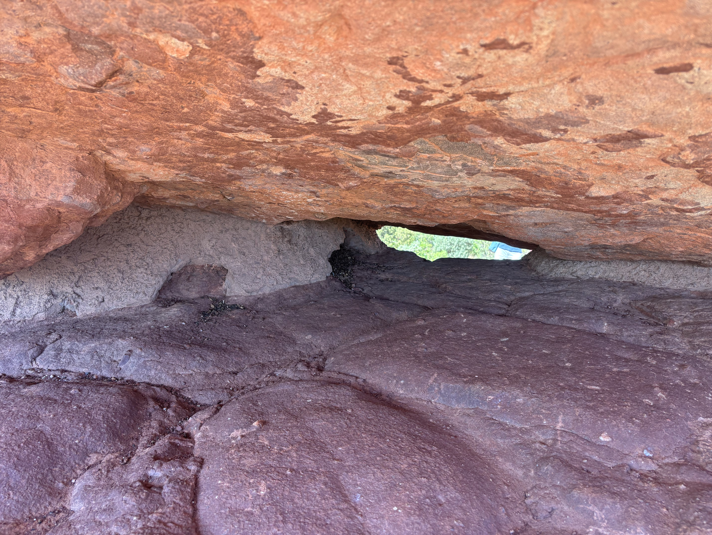

<br><details><summary>:camera:**34/IMG_0536.jpg**</summary><sub> `Exif version` 0232 `OS version` 27.0 `Date` 2026:07:20 10:29:47 `Aperture` Not known `Brightness` 8.265004840271056 `Color space` 65535 `Compression` Not known`Exposure mode` 0 `Exposure time` 0.000657030223390276 `Focal length` 5.96 `Lens model` iPhone 15 Plus back dual wide camera 5.96mm f/1.6 `Lens specification` (1.5399999618512084, 5.96, 1.6, 2.4) `Orientation` 6 `Scene type` Not known `f number` 1.6 `White balance` 0 `Sensing method` 2 `Shutter speed` 10.571819010021256</sub><sub>`Coordinates & altitude` (38.86471111111111, -104.89742222222223, 1936.98178807947)</sub><sub> :earth_americas:`Location over` [Google Maps](http://maps.google.com/maps?q=38.86471111111111,-104.89742222222223) or [Openstreet Map](https://www.openstreetmap.org/query?lat=38.86471111111111&lon=-104.89742222222223)</sub></details>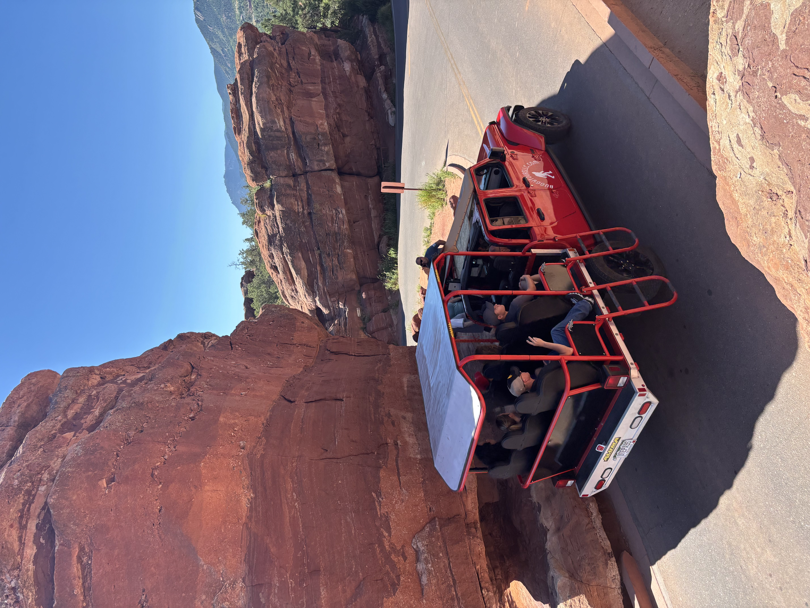

<br><details><summary>:camera:**34/IMG_0537.jpg**</summary><sub> `Exif version` 0232 `OS version` 27.0 `Date` 2026:07:20 10:29:49 `Aperture` Not known `Brightness` 8.876963390900594 `Color space` 65535 `Compression` Not known`Exposure mode` 0 `Exposure time` 0.0005230125523012552 `Focal length` 5.96 `Lens model` iPhone 15 Plus back dual wide camera 5.96mm f/1.6 `Lens specification` (1.5399999618512084, 5.96, 1.6, 2.4) `Orientation` 6 `Scene type` Not known `f number` 1.6 `White balance` 0 `Sensing method` 2 `Shutter speed` 10.900901435179694</sub><sub>`Coordinates & altitude` (38.86471111111111, -104.89742222222223, 1937.326100433974)</sub><sub> :earth_americas:`Location over` [Google Maps](http://maps.google.com/maps?q=38.86471111111111,-104.89742222222223) or [Openstreet Map](https://www.openstreetmap.org/query?lat=38.86471111111111&lon=-104.89742222222223)</sub></details>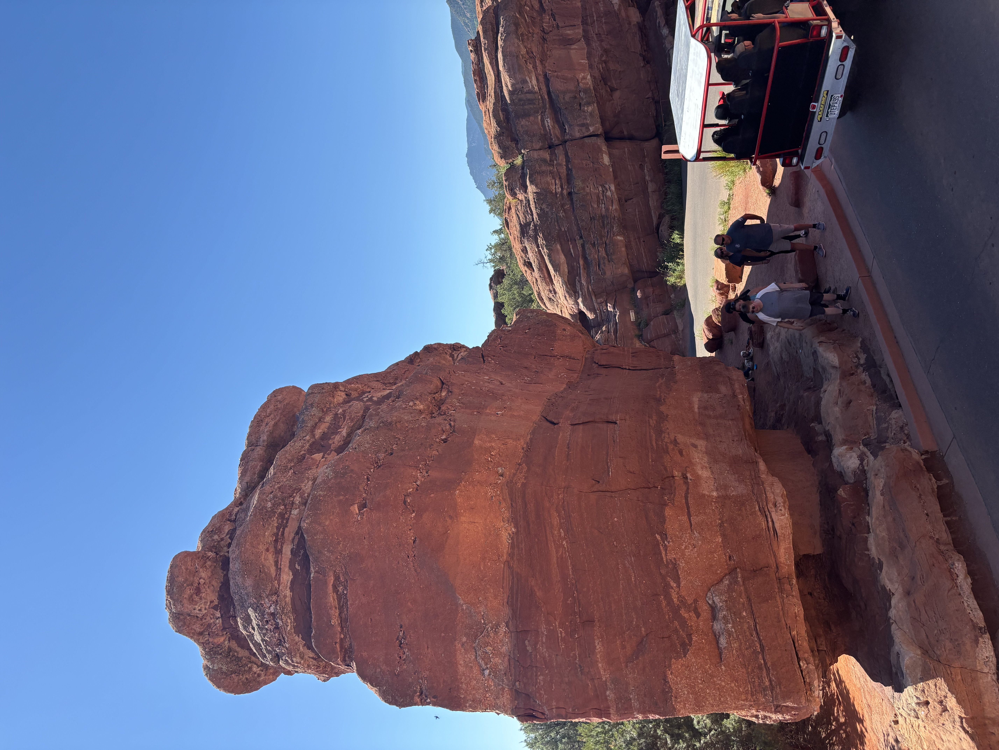

<br><details><summary>:camera:**34/IMG_0538.jpg**</summary><sub> `Exif version` 0232 `OS version` 27.0 `Date` 2026:07:20 10:29:50 `Aperture` Not known `Brightness` 9.34544244843646 `Color space` 65535 `Compression` Not known`Exposure mode` 0 `Exposure time` 0.0004079967360261118 `Focal length` 5.96 `Lens model` iPhone 15 Plus back dual wide camera 5.96mm f/1.6 `Lens specification` (1.5399999618512084, 5.96, 1.6, 2.4) `Orientation` 6 `Scene type` Not known `f number` 1.6 `White balance` 0 `Sensing method` 2 `Shutter speed` 11.259143231822819</sub><sub>`Coordinates & altitude` (38.86470833333333, -104.89742222222223, 1937.4811881188118)</sub><sub> :earth_americas:`Location over` [Google Maps](http://maps.google.com/maps?q=38.86470833333333,-104.89742222222223) or [Openstreet Map](https://www.openstreetmap.org/query?lat=38.86470833333333&lon=-104.89742222222223)</sub></details>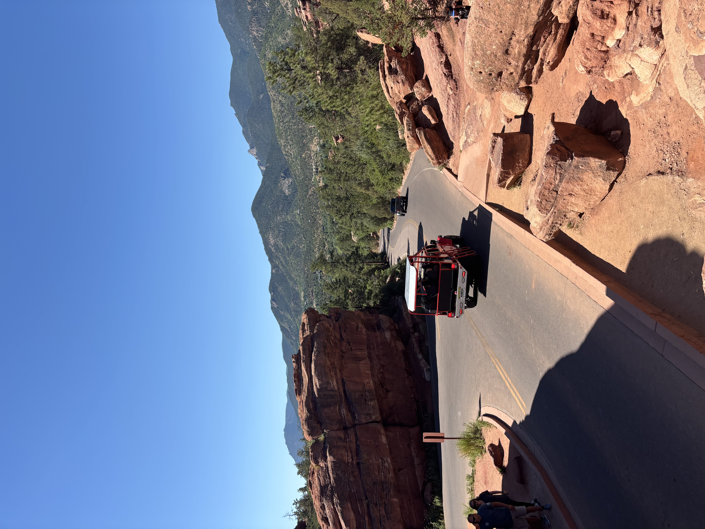

<br><details><summary>:camera:**34/IMG_0539.jpg**</summary><sub> `Exif version` 0232 `OS version` 27.0 `Date` 2026:07:20 10:29:57 `Aperture` Not known `Brightness` 9.394129608345859 `Color space` 65535 `Compression` Not known`Exposure mode` 0 `Exposure time` 0.0016891891891891893 `Focal length` 1.54 `Lens model` iPhone 15 Plus back dual wide camera 1.54mm f/2.4 `Lens specification` (1.54, 5.960000038146973, 1.6, 2.4) `Orientation` 1 `Scene type` Not known `f number` 2.4 `White balance` 0 `Sensing method` 2 `Shutter speed` 9.208761040821198</sub><sub>`Coordinates & altitude` (38.86470833333333, -104.8974388888889, 1938.1237721021612)</sub><sub> :earth_americas:`Location over` [Google Maps](http://maps.google.com/maps?q=38.86470833333333,-104.8974388888889) or [Openstreet Map](https://www.openstreetmap.org/query?lat=38.86470833333333&lon=-104.8974388888889)</sub></details>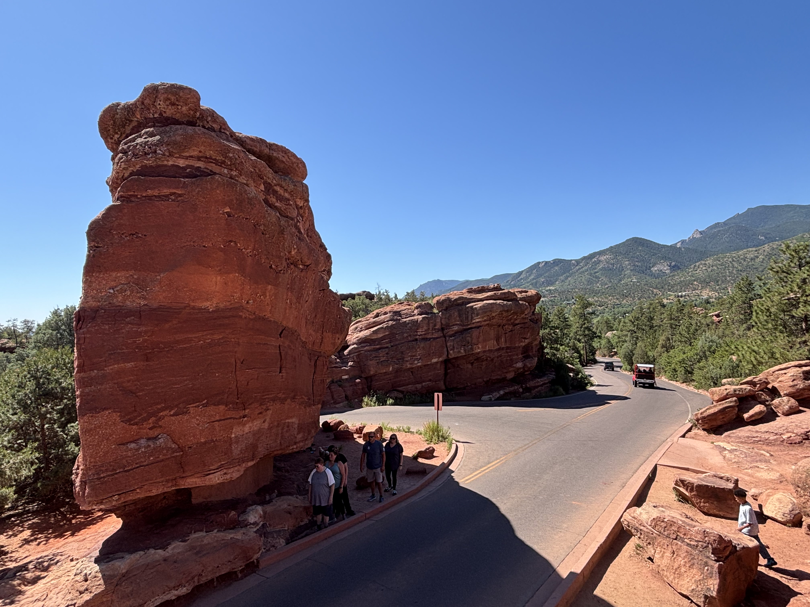

<br><details><summary>:camera:**34/IMG_0540.jpg**</summary><sub> `Exif version` 0232 `OS version` 27.0 `Date` 2026:07:20 10:30:02 `Aperture` Not known `Brightness` 8.623792140863216 `Color space` 65535 `Compression` Not known`Exposure mode` 0 `Exposure time` 0.002631578947368421 `Focal length` 1.54 `Lens model` iPhone 15 Plus back dual wide camera 1.54mm f/2.4 `Lens specification` (1.54, 5.960000038146973, 1.6, 2.4) `Orientation` 1 `Scene type` Not known `f number` 2.4 `White balance` 0 `Sensing method` 2 `Shutter speed` 8.568528938906752</sub><sub>`Coordinates & altitude` (38.86470277777778, -104.89744444444445, 1938.0615796519412)</sub><sub> :earth_americas:`Location over` [Google Maps](http://maps.google.com/maps?q=38.86470277777778,-104.89744444444445) or [Openstreet Map](https://www.openstreetmap.org/query?lat=38.86470277777778&lon=-104.89744444444445)</sub></details>

<br><details><summary>:camera:**34/IMG_0541.jpg**</summary><sub> `Exif version` 0232 `OS version` 27.0 `Date` 2026:07:20 10:30:46 `Aperture` Not known `Brightness` 8.804091365461847 `Color space` 65535 `Compression` Not known`Exposure mode` 0 `Exposure time` 0.0005330490405117271 `Focal length` 5.96 `Lens model` iPhone 15 Plus back dual wide camera 5.96mm f/1.6 `Lens specification` (1.5399999618512084, 5.96, 1.6, 2.4) `Orientation` 1 `Scene type` Not known `f number` 1.6 `White balance` 0 `Sensing method` 2 `Shutter speed` 10.873576850094876</sub><sub>`Coordinates & altitude` (38.86468611111111, -104.89752222222224, 1934.9098228663447)</sub><sub> :earth_americas:`Location over` [Google Maps](http://maps.google.com/maps?q=38.86468611111111,-104.89752222222224) or [Openstreet Map](https://www.openstreetmap.org/query?lat=38.86468611111111&lon=-104.89752222222224)</sub></details>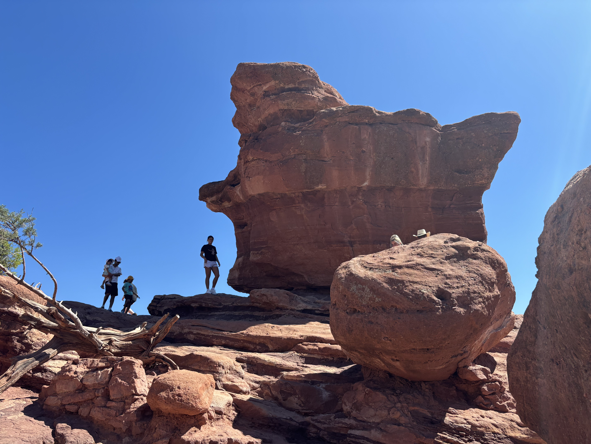

<br><details><summary>:camera:**34/IMG_0542.jpg**</summary><sub> `Exif version` 0232 `OS version` 27.0 `Date` 2026:07:20 10:30:50 `Aperture` Not known `Brightness` 9.227660363366704 `Color space` 65535 `Compression` Not known`Exposure mode` 0 `Exposure time` 0.0004269854824935952 `Focal length` 5.96 `Lens model` iPhone 15 Plus back dual wide camera 5.96mm f/1.6 `Lens specification` (1.5399999618512084, 5.96, 1.6, 2.4) `Orientation` 6 `Scene type` Not known `f number` 1.6 `White balance` 0 `Sensing method` 2 `Shutter speed` 11.193476318141197</sub><sub>`Coordinates & altitude` (38.86467777777778, -104.8975138888889, 1936.857087975413)</sub><sub> :earth_americas:`Location over` [Google Maps](http://maps.google.com/maps?q=38.86467777777778,-104.8975138888889) or [Openstreet Map](https://www.openstreetmap.org/query?lat=38.86467777777778&lon=-104.8975138888889)</sub></details>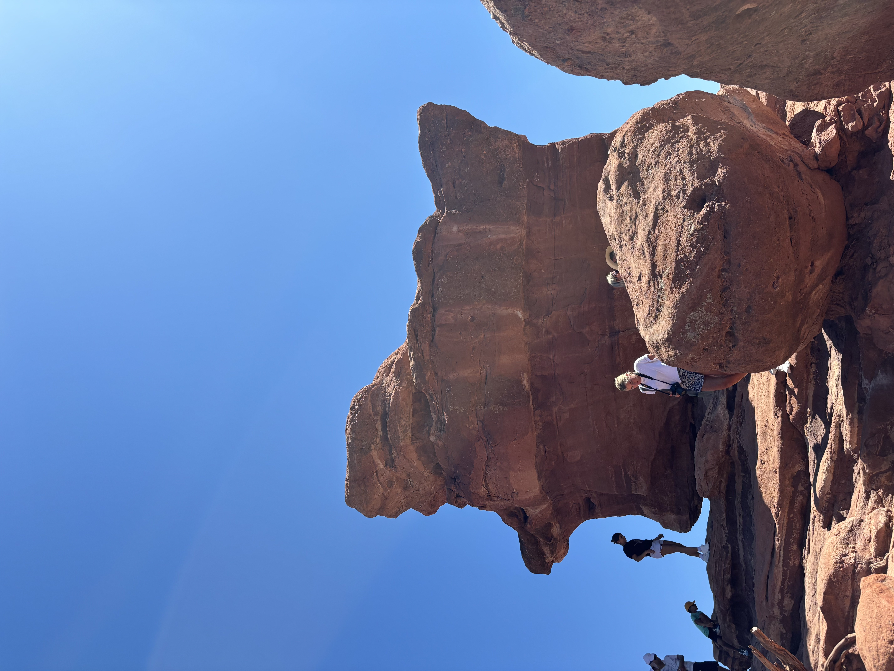

<br><details><summary>:camera:**34/IMG_0543.jpg**</summary><sub> `Exif version` 0232 `OS version` 27.0 `Date` 2026:07:20 10:31:11 `Aperture` Not known `Brightness` 8.78801639162698 `Color space` 65535 `Compression` Not known`Exposure mode` 0 `Exposure time` 0.0005420054200542005 `Focal length` 5.96 `Lens model` iPhone 15 Plus back dual wide camera 5.96mm f/1.6 `Lens specification` (1.5399999618512084, 5.96, 1.6, 2.4) `Orientation` 6 `Scene type` Not known `f number` 1.6 `White balance` 0 `Sensing method` 2 `Shutter speed` 10.84941953107216</sub><sub>`Coordinates & altitude` (38.86465833333334, -104.89736944444445, 1938.9357021996616)</sub><sub> :earth_americas:`Location over` [Google Maps](http://maps.google.com/maps?q=38.86465833333334,-104.89736944444445) or [Openstreet Map](https://www.openstreetmap.org/query?lat=38.86465833333334&lon=-104.89736944444445)</sub></details>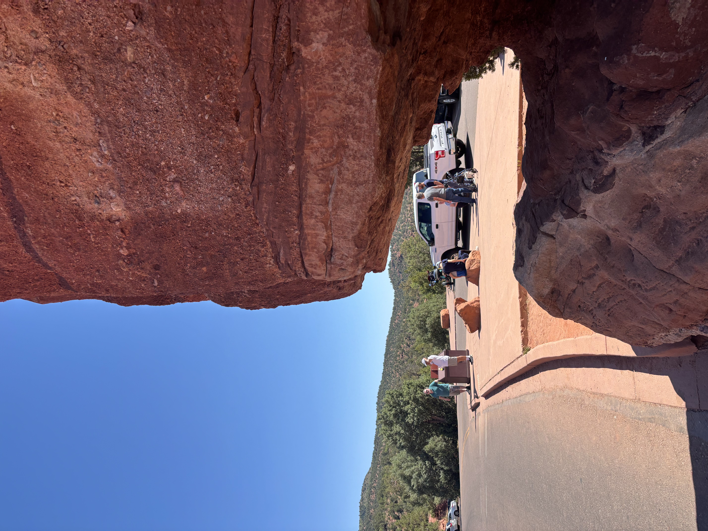

<br><details><summary>:camera:**34/IMG_0544.jpg**</summary><sub> `Exif version` 0232 `OS version` 27.0 `Date` 2026:07:20 10:31:32 `Aperture` Not known `Brightness` 9.796569983403145 `Color space` 65535 `Compression` Not known`Exposure mode` 0 `Exposure time` 0.0010604453870625664 `Focal length` 1.54 `Lens model` iPhone 15 Plus back dual wide camera 1.54mm f/2.4 `Lens specification` (1.54, 5.960000038146973, 1.6, 2.4) `Orientation` 6 `Scene type` Not known `f number` 2.4 `White balance` 0 `Sensing method` 2 `Shutter speed` 9.880359628505579</sub><sub>`Coordinates & altitude` (38.864691666666666, -104.89734722222222, 1937.3299232736572)</sub><sub> :earth_americas:`Location over` [Google Maps](http://maps.google.com/maps?q=38.864691666666666,-104.89734722222222) or [Openstreet Map](https://www.openstreetmap.org/query?lat=38.864691666666666&lon=-104.89734722222222)</sub></details>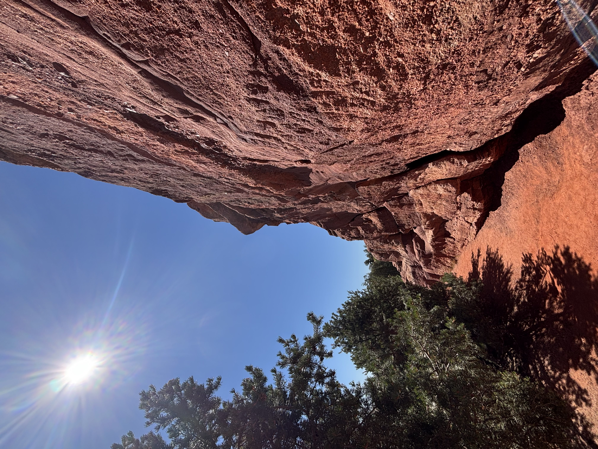

<br><details><summary>:camera:**34/IMG_0545.jpg**</summary><sub> `Exif version` 0232 `OS version` 27.0 `Date` 2026:07:20 10:32:36 `Aperture` Not known `Brightness` 11.124298570672313 `Color space` 65535 `Compression` Not known`Exposure mode` 0 `Exposure time` 0.00010999890001099989 `Focal length` 5.96 `Lens model` iPhone 15 Plus back dual wide camera 5.96mm f/1.6 `Lens specification` (1.5399999618512084, 5.96, 1.6, 2.4) `Orientation` 1 `Scene type` Not known `f number` 1.6 `White balance` 0 `Sensing method` 2 `Shutter speed` 13.150208855472014</sub><sub>`Coordinates & altitude` (38.864922222222226, -104.89741388888889, 1942.4974704890387)</sub><sub> :earth_americas:`Location over` [Google Maps](http://maps.google.com/maps?q=38.864922222222226,-104.89741388888889) or [Openstreet Map](https://www.openstreetmap.org/query?lat=38.864922222222226&lon=-104.89741388888889)</sub></details>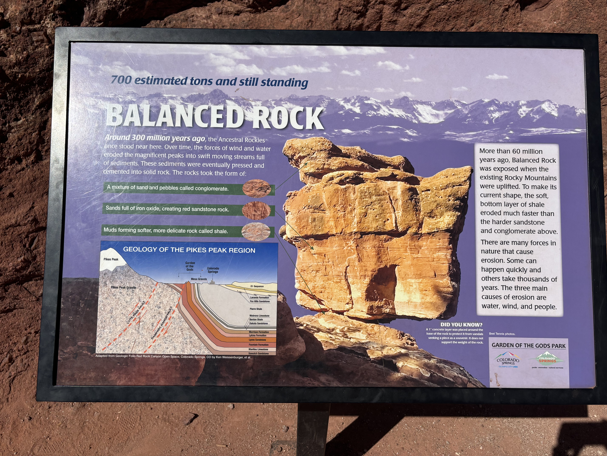

<br><details><summary>:camera:**34/IMG_0546.jpg**</summary><sub> `Exif version` 0232 `OS version` 27.0 `Date` 2026:07:20 10:32:41 `Aperture` Not known `Brightness` 11.144148754691232 `Color space` 65535 `Compression` Not known`Exposure mode` 0 `Exposure time` 0.00010999890001099989 `Focal length` 5.96 `Lens model` iPhone 15 Plus back dual wide camera 5.96mm f/1.6 `Lens specification` (1.5399999618512084, 5.96, 1.6, 2.4) `Orientation` 1 `Scene type` Not known `f number` 1.6 `White balance` 0 `Sensing method` 2 `Shutter speed` 13.150208855472014</sub><sub>`Coordinates & altitude` (38.864922222222226, -104.89742222222223, 1941.3324287652647)</sub><sub> :earth_americas:`Location over` [Google Maps](http://maps.google.com/maps?q=38.864922222222226,-104.89742222222223) or [Openstreet Map](https://www.openstreetmap.org/query?lat=38.864922222222226&lon=-104.89742222222223)</sub></details>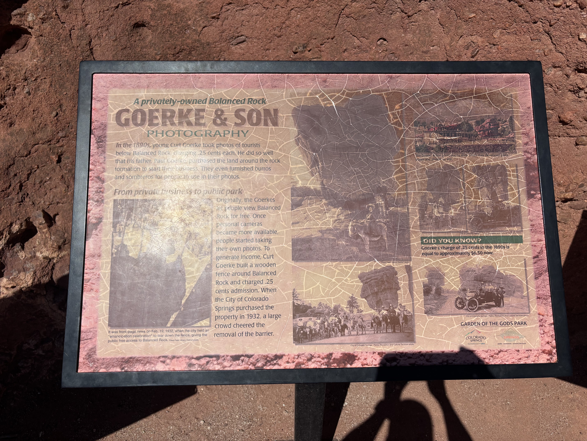

<br><details><summary>:camera:**34/IMG_0547.jpg**</summary><sub> `Exif version` 0232 `OS version` 27.0 `Date` 2026:07:20 10:32:51 `Aperture` Not known `Brightness` 10.751262079907688 `Color space` 65535 `Compression` Not known`Exposure mode` 0 `Exposure time` 0.00013000520020800833 `Focal length` 5.96 `Lens model` iPhone 15 Plus back dual wide camera 5.96mm f/1.6 `Lens specification` (1.5399999618512084, 5.96, 1.6, 2.4) `Orientation` 1 `Scene type` Not known `f number` 1.6 `White balance` 0 `Sensing method` 2 `Shutter speed` 12.909200759537372</sub><sub>`Coordinates & altitude` (38.86494166666667, -104.89741388888889, 1939.8180242634317)</sub><sub> :earth_americas:`Location over` [Google Maps](http://maps.google.com/maps?q=38.86494166666667,-104.89741388888889) or [Openstreet Map](https://www.openstreetmap.org/query?lat=38.86494166666667&lon=-104.89741388888889)</sub></details>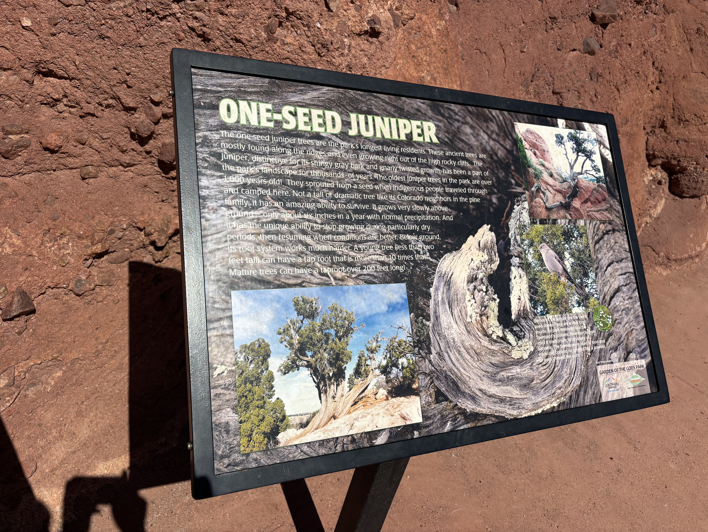

<br><details><summary>:camera:**34/IMG_0548.jpg**</summary><sub> `Exif version` 0232 `OS version` 27.0 `Date` 2026:07:20 10:32:57 `Aperture` Not known `Brightness` 10.072307458605499 `Color space` 65535 `Compression` Not known`Exposure mode` 0 `Exposure time` 0.0011350737797956867 `Focal length` 1.54 `Lens model` iPhone 15 Plus back dual wide camera 1.54mm f/2.4 `Lens specification` (1.54, 5.960000038146973, 1.6, 2.4) `Orientation` 1 `Scene type` Not known `f number` 2.4 `White balance` 0 `Sensing method` 2 `Shutter speed` 9.783091984499286</sub><sub>`Coordinates & altitude` (38.86494166666667, -104.89741388888889, 1939.032380952381)</sub><sub> :earth_americas:`Location over` [Google Maps](http://maps.google.com/maps?q=38.86494166666667,-104.89741388888889) or [Openstreet Map](https://www.openstreetmap.org/query?lat=38.86494166666667&lon=-104.89741388888889)</sub></details>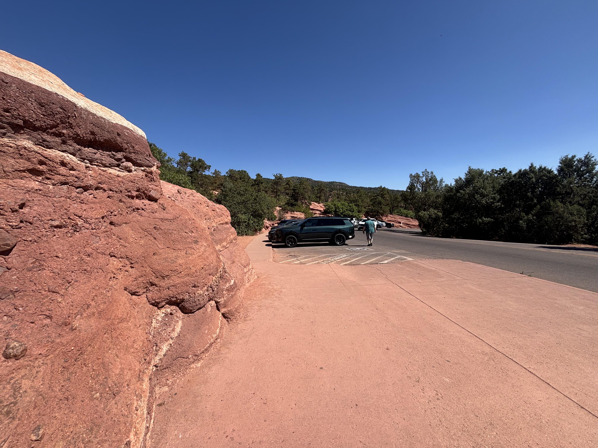

<br><details><summary>:camera:**34/IMG_20170723_111442.jpg**</summary><sub> `Exif version` 0220 `OS version` P895T20_MPCS-user 6.0.1 MMB29M 20170418.111425 release-keys `Date` 2017:07:23 11:14:41 `Aperture` Not known `Brightness` 0.0 `Color space` 1 `Compression` 6`Exposure mode` 0 `Exposure time` 0.0019157088122605363 `Focal length` 3.46 `Lens model` Not known `Lens specification` Not known `Orientation` Not known `Scene type` Not known `f number` 2.2 `White balance` 0 `Sensing method` 2 `Shutter speed` 9.029</sub></details>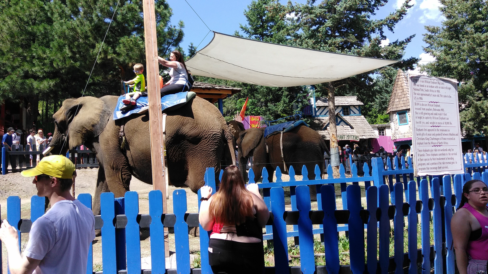

<br><details><summary>:camera:**34/IMG_20170723_112229.jpg**</summary><sub> `Exif version` 0220 `OS version` P895T20_MPCS-user 6.0.1 MMB29M 20170418.111425 release-keys `Date` 2017:07:23 11:22:29 `Aperture` Not known `Brightness` 0.0 `Color space` 1 `Compression` 6`Exposure mode` 0 `Exposure time` 0.0007352941176470588 `Focal length` 3.46 `Lens model` Not known `Lens specification` Not known `Orientation` Not known `Scene type` Not known `f number` 2.2 `White balance` 0 `Sensing method` 2 `Shutter speed` 10.409</sub></details>

<br><details><summary>:camera:**34/IMG_20170723_115015.jpg**</summary><sub> `Exif version` 0220 `OS version` P895T20_MPCS-user 6.0.1 MMB29M 20170418.111425 release-keys `Date` 2017:07:23 11:50:15 `Aperture` Not known `Brightness` 0.0 `Color space` 1 `Compression` 6`Exposure mode` 0 `Exposure time` 0.0010822510822510823 `Focal length` 3.46 `Lens model` Not known `Lens specification` Not known `Orientation` Not known `Scene type` Not known `f number` 2.2 `White balance` 0 `Sensing method` 2 `Shutter speed` 9.852</sub></details>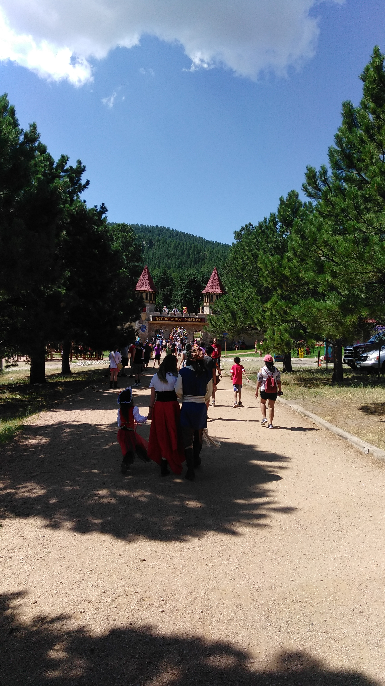

<br><details><summary>:camera:**34/IMG_20170723_115816.jpg**</summary><sub> `Exif version` 0220 `OS version` P895T20_MPCS-user 6.0.1 MMB29M 20170418.111425 release-keys `Date` 2017:07:23 11:58:16 `Aperture` Not known `Brightness` 0.0 `Color space` 1 `Compression` 6`Exposure mode` 0 `Exposure time` 0.000970873786407767 `Focal length` 3.46 `Lens model` Not known `Lens specification` Not known `Orientation` Not known `Scene type` Not known `f number` 2.2 `White balance` 0 `Sensing method` 2 `Shutter speed` 10.008</sub></details>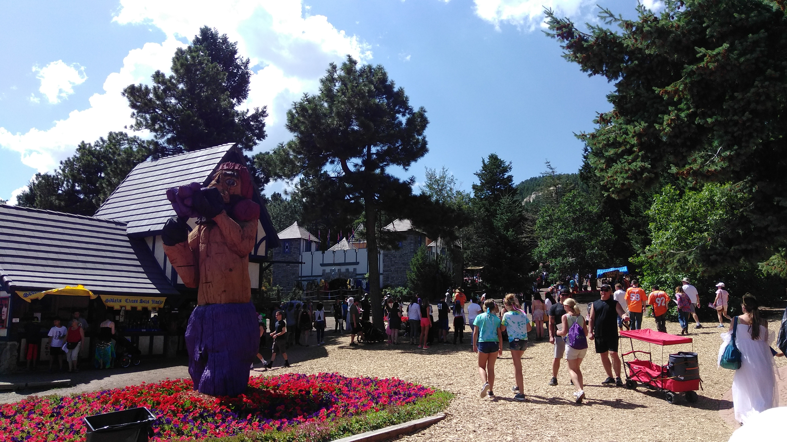

<br><details><summary>:camera:**34/IMG_20170723_115819.jpg**</summary><sub> `Exif version` 0220 `OS version` P895T20_MPCS-user 6.0.1 MMB29M 20170418.111425 release-keys `Date` 2017:07:23 11:58:19 `Aperture` Not known `Brightness` 0.0 `Color space` 1 `Compression` 6`Exposure mode` 0 `Exposure time` 0.004629629629629629 `Focal length` 3.46 `Lens model` Not known `Lens specification` Not known `Orientation` Not known `Scene type` Not known `f number` 2.2 `White balance` 0 `Sensing method` 2 `Shutter speed` 7.753</sub></details>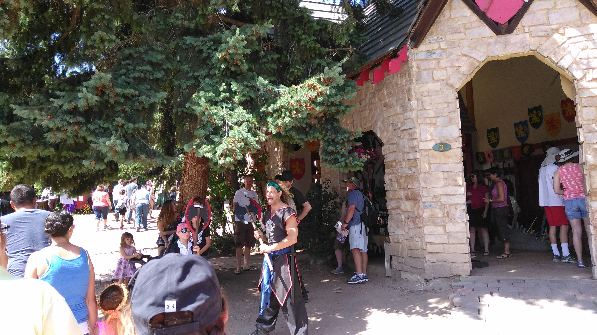

<br><details><summary>:camera:**34/IMG_20170723_115938.jpg**</summary><sub> `Exif version` 0220 `OS version` P895T20_MPCS-user 6.0.1 MMB29M 20170418.111425 release-keys `Date` 2017:07:23 11:59:38 `Aperture` Not known `Brightness` 0.0 `Color space` 1 `Compression` 6`Exposure mode` 0 `Exposure time` 0.008333333333333333 `Focal length` 3.46 `Lens model` Not known `Lens specification` Not known `Orientation` Not known `Scene type` Not known `f number` 2.2 `White balance` 0 `Sensing method` 2 `Shutter speed` 6.906</sub></details>

<br><details><summary>:camera:**34/IMG_20170723_122630.jpg**</summary><sub> `Exif version` 0220 `OS version` P895T20_MPCS-user 6.0.1 MMB29M 20170418.111425 release-keys `Date` 2017:07:23 11:26:30 `Aperture` Not known `Brightness` 0.0 `Color space` 1 `Compression` 6`Exposure mode` 0 `Exposure time` 0.004784688995215311 `Focal length` 3.46 `Lens model` Not known `Lens specification` Not known `Orientation` Not known `Scene type` Not known `f number` 2.2 `White balance` 0 `Sensing method` 2 `Shutter speed` 7.707</sub></details>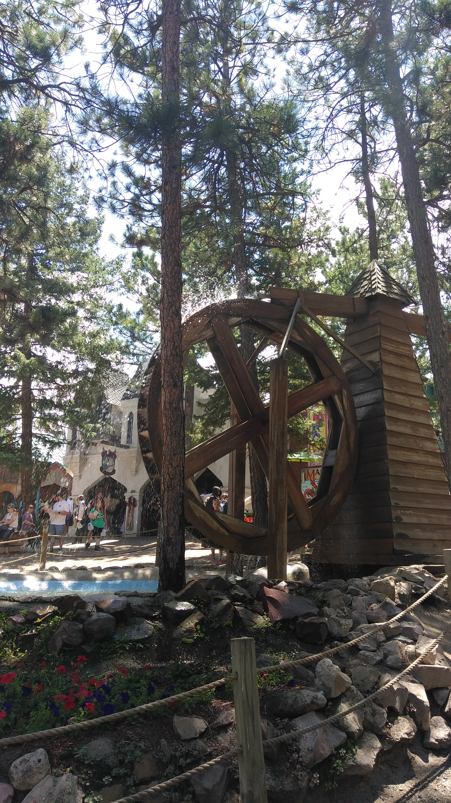

<br><details><summary>:camera:**34/IMG_20170723_123226.jpg**</summary><sub> `Exif version` 0220 `OS version` P895T20_MPCS-user 6.0.1 MMB29M 20170418.111425 release-keys `Date` 2017:07:23 11:32:26 `Aperture` Not known `Brightness` 0.0 `Color space` 1 `Compression` 6`Exposure mode` 0 `Exposure time` 0.000777000777000777 `Focal length` 3.46 `Lens model` Not known `Lens specification` Not known `Orientation` Not known `Scene type` Not known `f number` 2.2 `White balance` 0 `Sensing method` 2 `Shutter speed` 10.33</sub></details>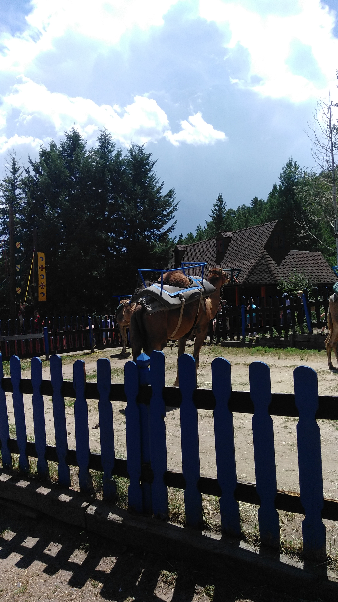

<br><details><summary>:camera:**34/IMG_20170723_130529.jpg**</summary><sub> `Exif version` 0220 `OS version` P895T20_MPCS-user 6.0.1 MMB29M 20170418.111425 release-keys `Date` 2017:07:23 12:05:29 `Aperture` Not known `Brightness` 0.0 `Color space` 1 `Compression` 6`Exposure mode` 0 `Exposure time` 0.0016366612111292963 `Focal length` 3.46 `Lens model` Not known `Lens specification` Not known `Orientation` Not known `Scene type` Not known `f number` 2.2 `White balance` 0 `Sensing method` 2 `Shutter speed` 9.254</sub></details>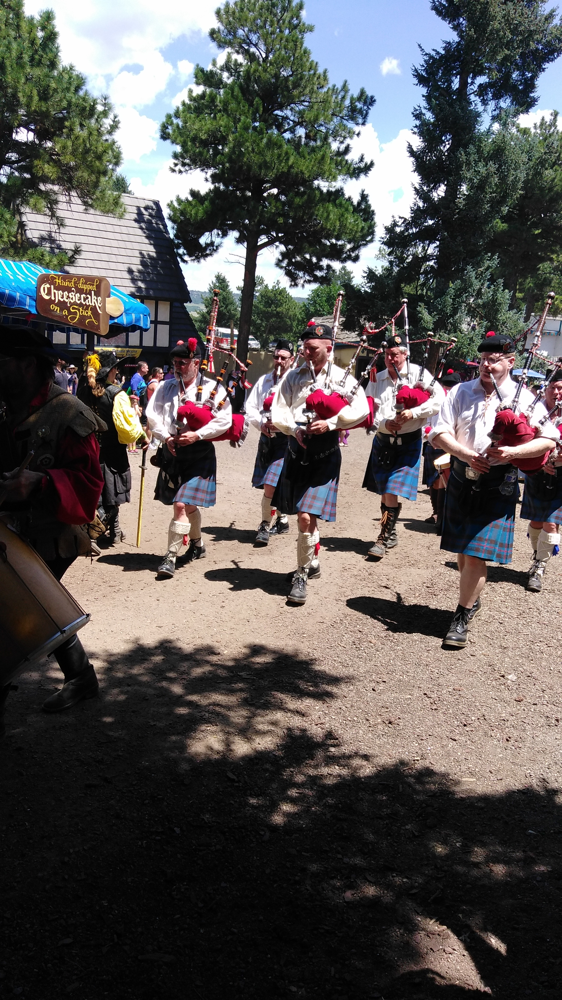

<br><details><summary>:camera:**34/IMG_20170723_130530.jpg**</summary><sub> `Exif version` 0220 `OS version` P895T20_MPCS-user 6.0.1 MMB29M 20170418.111425 release-keys `Date` 2017:07:23 12:05:30 `Aperture` Not known `Brightness` 0.0 `Color space` 1 `Compression` 6`Exposure mode` 0 `Exposure time` 0.0015527950310559005 `Focal length` 3.46 `Lens model` Not known `Lens specification` Not known `Orientation` Not known `Scene type` Not known `f number` 2.2 `White balance` 0 `Sensing method` 2 `Shutter speed` 9.33</sub></details>

<br><details><summary>:camera:**34/IMG_20170723_130907.jpg**</summary><sub> `Exif version` 0220 `OS version` P895T20_MPCS-user 6.0.1 MMB29M 20170418.111425 release-keys `Date` 2017:07:23 12:09:07 `Aperture` Not known `Brightness` 0.0 `Color space` 1 `Compression` 6`Exposure mode` 0 `Exposure time` 0.0015527950310559005 `Focal length` 3.46 `Lens model` Not known `Lens specification` Not known `Orientation` Not known `Scene type` Not known `f number` 2.2 `White balance` 0 `Sensing method` 2 `Shutter speed` 9.33</sub></details>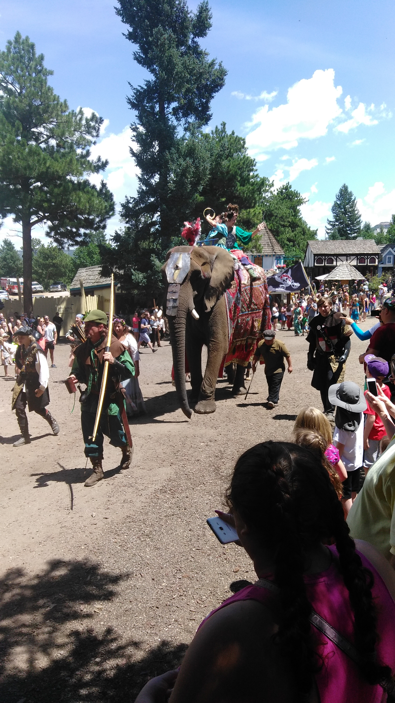

<br><details><summary>:camera:**34/IMG_20170723_133519.jpg**</summary><sub> `Exif version` 0220 `OS version` P895T20_MPCS-user 6.0.1 MMB29M 20170418.111425 release-keys `Date` 2017:07:23 12:35:19 `Aperture` Not known `Brightness` 0.0 `Color space` 1 `Compression` 6`Exposure mode` 0 `Exposure time` 0.0004716981132075472 `Focal length` 3.46 `Lens model` Not known `Lens specification` Not known `Orientation` Not known `Scene type` Not known `f number` 2.2 `White balance` 0 `Sensing method` 2 `Shutter speed` 11.05</sub></details>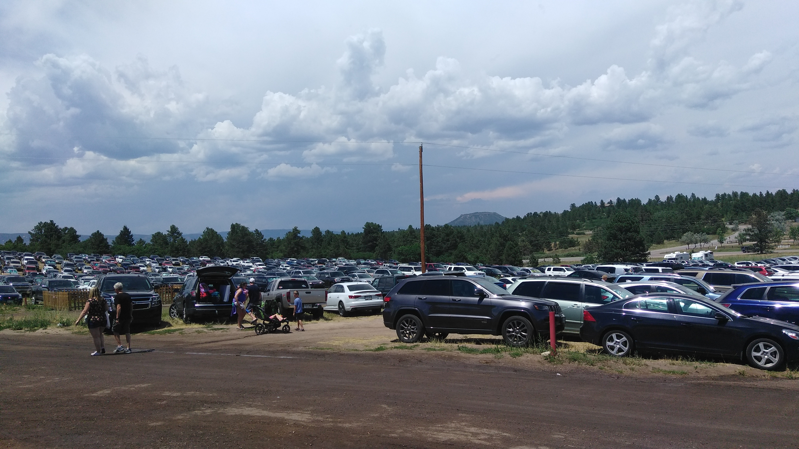

<br><details><summary>:camera:**34/IMG_E0540.jpg**</summary><sub> `Exif version` 0232 `OS version` 27.0 `Date` 2026:07:20 10:30:02 `Aperture` Not known `Brightness` 8.623792140863216 `Color space` 65535 `Compression` Not known`Exposure mode` 0 `Exposure time` 0.002631578947368421 `Focal length` 1.54 `Lens model` iPhone 15 Plus back dual wide camera 1.54mm f/2.4 `Lens specification` (1.5399999618512084, 5.960000038146973, 1.6, 2.4) `Orientation` 1 `Scene type` Not known `f number` 2.4 `White balance` 0 `Sensing method` 2 `Shutter speed` 8.568528938906752</sub><sub>`Coordinates & altitude` (38.86470277777778, -104.89744444444445, 1938.0615796519412)</sub><sub> :earth_americas:`Location over` [Google Maps](http://maps.google.com/maps?q=38.86470277777778,-104.89744444444445) or [Openstreet Map](https://www.openstreetmap.org/query?lat=38.86470277777778&lon=-104.89744444444445)</sub></details>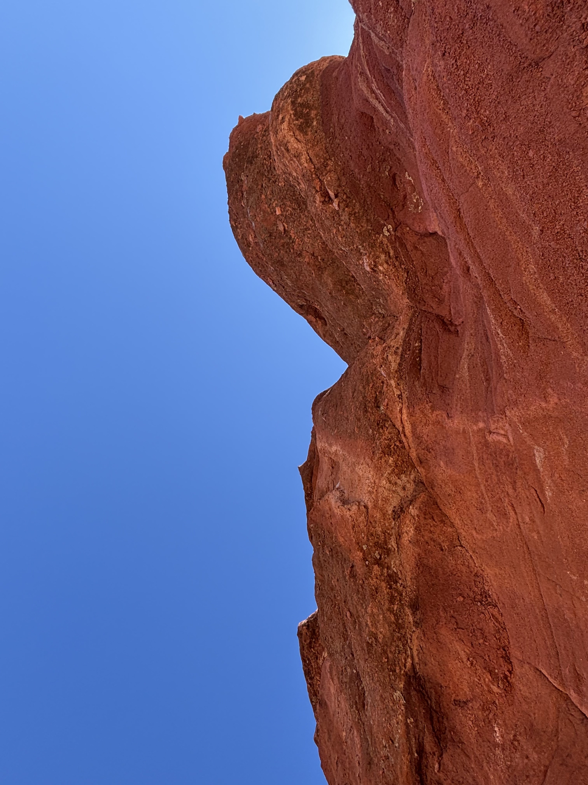

<sub>_Citation: Partial or total digital reproduction of this repository, scripts, development guides, data models, images, and documentation is permitted, provided that it is referenced as: "R.GISMobile - Mobile geographic information systems on QField that do not require an internet connection for navigation." https://github.com/rcfdtools/R.GISMobile - Bogotá - Colombia - South America"._<sub>

| [:house: Home](../Readme.md) |
|---|