<div align="center"></div>

## :earth_americas:POI: _“Transmicable Ciudad Bolivar - Bogotá D.C, Colombia (2026-09-12)”_
`Pictures` rcfdtools <br>`Category` Freelance field visit <br>`Location` [Google Maps](http://maps.google.com/maps?q=4.55022,-74.158741) or [Openstreet Map](https://www.openstreetmap.org/query?lat=4.55022&lon=-74.158741) 

```geojson
{
  "type": "Feature",
  "geometry": {
    "type": "Point", 
    "coordinates": [-74.158741, 4.55022]
  }, 
  "properties": {
    "Name": "Transmicable Ciudad Bolivar - Bogotá D.C, Colombia"
  }
}
```

<br><details><summary>:camera:**63/IMG_0766.jpg**</summary><sub> `Exif version` 0232 `OS version` 27.0 `Date` 2026:09:12 09:03:50 `Aperture` Not known `Brightness` 4.550036310820625 `Color space` 65535 `Compression` Not known`Exposure mode` 0 `Exposure time` 0.008333333333333333 `Focal length` 1.54 `Lens model` iPhone 15 Plus back dual wide camera 1.54mm f/2.4 `Lens specification` (1.54, 5.960000038146973, 1.6, 2.4) `Orientation` 6 `Scene type` Not known `f number` 2.4 `White balance` 0 `Sensing method` 2 `Shutter speed` 6.908160726503701</sub><sub>`Coordinates & altitude` (4.569158333333333, -74.13951944444445, 2570.413875598086)</sub><sub> :earth_americas:`Location over` [Google Maps](http://maps.google.com/maps?q=4.569158333333333,-74.13951944444445) or [Openstreet Map](https://www.openstreetmap.org/query?lat=4.569158333333333&lon=-74.13951944444445)</sub></details>

<br><details><summary>:camera:**63/IMG_0767.jpg**</summary><sub> `Exif version` 0232 `OS version` 27.0 `Date` 2026:09:12 09:03:53 `Aperture` Not known `Brightness` 4.704717886107962 `Color space` 65535 `Compression` Not known`Exposure mode` 0 `Exposure time` 0.008333333333333333 `Focal length` 1.54 `Lens model` iPhone 15 Plus back dual wide camera 1.54mm f/2.4 `Lens specification` (1.54, 5.960000038146973, 1.6, 2.4) `Orientation` 1 `Scene type` Not known `f number` 2.4 `White balance` 0 `Sensing method` 2 `Shutter speed` 6.908160726503701</sub><sub>`Coordinates & altitude` (4.569358333333333, -74.13979444444445, 2560.152400835073)</sub><sub> :earth_americas:`Location over` [Google Maps](http://maps.google.com/maps?q=4.569358333333333,-74.13979444444445) or [Openstreet Map](https://www.openstreetmap.org/query?lat=4.569358333333333&lon=-74.13979444444445)</sub></details>

<br><details><summary>:camera:**63/IMG_0768.jpg**</summary><sub> `Exif version` 0232 `OS version` 27.0 `Date` 2026:09:12 09:04:02 `Aperture` Not known `Brightness` 7.852980847046129 `Color space` 65535 `Compression` Not known`Exposure mode` 0 `Exposure time` 0.002849002849002849 `Focal length` 1.54 `Lens model` iPhone 15 Plus back dual wide camera 1.54mm f/2.4 `Lens specification` (1.54, 5.960000038146973, 1.6, 2.4) `Orientation` 1 `Scene type` Not known `f number` 2.4 `White balance` 0 `Sensing method` 2 `Shutter speed` 8.45634178905207</sub><sub>`Coordinates & altitude` (4.569333333333333, -74.13987777777778, 2559.386773547094)</sub><sub> :earth_americas:`Location over` [Google Maps](http://maps.google.com/maps?q=4.569333333333333,-74.13987777777778) or [Openstreet Map](https://www.openstreetmap.org/query?lat=4.569333333333333&lon=-74.13987777777778)</sub></details>

<br><details><summary>:camera:**63/IMG_0769.jpg**</summary><sub> `Exif version` 0232 `OS version` 27.0 `Date` 2026:09:12 09:05:19 `Aperture` Not known `Brightness` 9.263238610735227 `Color space` 65535 `Compression` Not known`Exposure mode` 0 `Exposure time` 0.001941747572815534 `Focal length` 1.54 `Lens model` iPhone 15 Plus back dual wide camera 1.54mm f/2.4 `Lens specification` (1.54, 5.960000038146973, 1.6, 2.4) `Orientation` 6 `Scene type` Not known `f number` 2.4 `White balance` 0 `Sensing method` 2 `Shutter speed` 9.009727626459144</sub><sub>`Coordinates & altitude` (4.568577777777778, -74.14006666666667, 2563.8154859967053)</sub><sub> :earth_americas:`Location over` [Google Maps](http://maps.google.com/maps?q=4.568577777777778,-74.14006666666667) or [Openstreet Map](https://www.openstreetmap.org/query?lat=4.568577777777778&lon=-74.14006666666667)</sub></details>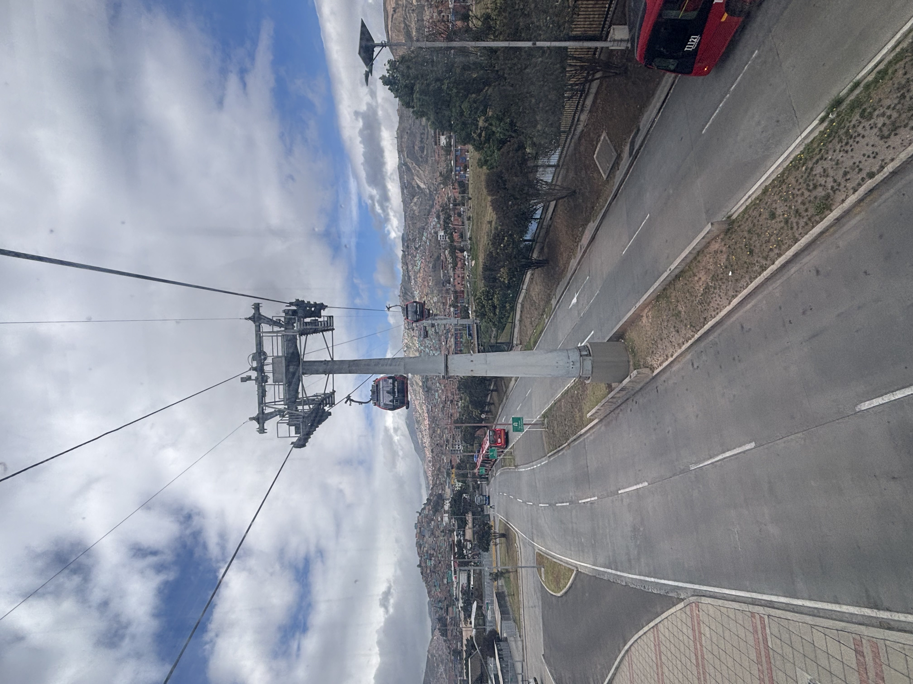

<br><details><summary>:camera:**63/IMG_0770.jpg**</summary><sub> `Exif version` 0232 `OS version` 27.0 `Date` 2026:09:12 09:05:27 `Aperture` Not known `Brightness` 8.993945344460808 `Color space` 65535 `Compression` Not known`Exposure mode` 0 `Exposure time` 0.0021141649048625794 `Focal length` 1.54 `Lens model` iPhone 15 Plus back dual wide camera 1.54mm f/2.4 `Lens specification` (1.54, 5.960000038146973, 1.6, 2.4) `Orientation` 1 `Scene type` Not known `f number` 2.4 `White balance` 0 `Sensing method` 2 `Shutter speed` 8.884444658882563</sub><sub>`Coordinates & altitude` (4.5683638888888884, -74.14020555555557, 2567.808650065531)</sub><sub> :earth_americas:`Location over` [Google Maps](http://maps.google.com/maps?q=4.5683638888888884,-74.14020555555557) or [Openstreet Map](https://www.openstreetmap.org/query?lat=4.5683638888888884&lon=-74.14020555555557)</sub></details>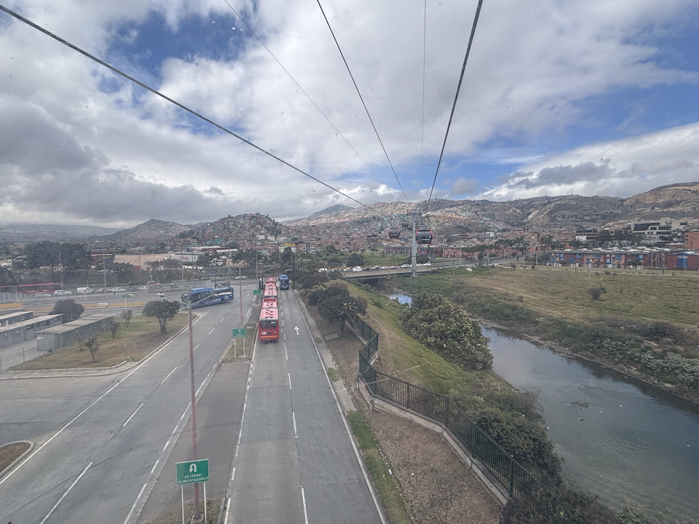

<br><details><summary>:camera:**63/IMG_0771.jpg**</summary><sub> `Exif version` 0232 `OS version` 27.0 `Date` 2026:09:12 09:05:54 `Aperture` Not known `Brightness` 9.141127196576527 `Color space` 65535 `Compression` Not known`Exposure mode` 0 `Exposure time` 0.0021141649048625794 `Focal length` 1.54 `Lens model` iPhone 15 Plus back dual wide camera 1.54mm f/2.4 `Lens specification` (1.54, 5.960000038146973, 1.6, 2.4) `Orientation` 1 `Scene type` Not known `f number` 2.4 `White balance` 0 `Sensing method` 2 `Shutter speed` 8.884444658882563</sub><sub>`Coordinates & altitude` (4.567630555555556, -74.14065555555557, 2568.319391634981)</sub><sub> :earth_americas:`Location over` [Google Maps](http://maps.google.com/maps?q=4.567630555555556,-74.14065555555557) or [Openstreet Map](https://www.openstreetmap.org/query?lat=4.567630555555556&lon=-74.14065555555557)</sub></details>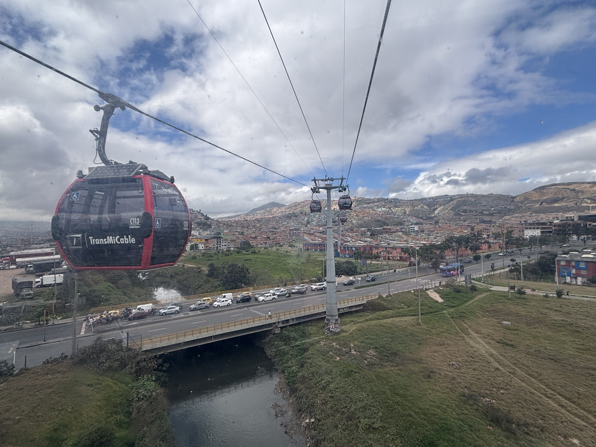

<br><details><summary>:camera:**63/IMG_0772.jpg**</summary><sub> `Exif version` 0232 `OS version` 27.0 `Date` 2026:09:12 09:06:00 `Aperture` Not known `Brightness` 9.232779398706077 `Color space` 65535 `Compression` Not known`Exposure mode` 0 `Exposure time` 0.0017271157167530224 `Focal length` 1.54 `Lens model` iPhone 15 Plus back dual wide camera 1.54mm f/2.4 `Lens specification` (1.54, 5.960000038146973, 1.6, 2.4) `Orientation` 1 `Scene type` Not known `f number` 2.4 `White balance` 0 `Sensing method` 2 `Shutter speed` 9.17751619998811</sub><sub>`Coordinates & altitude` (4.567555555555555, -74.14067777777778, 2571.673151750973)</sub><sub> :earth_americas:`Location over` [Google Maps](http://maps.google.com/maps?q=4.567555555555555,-74.14067777777778) or [Openstreet Map](https://www.openstreetmap.org/query?lat=4.567555555555555&lon=-74.14067777777778)</sub></details>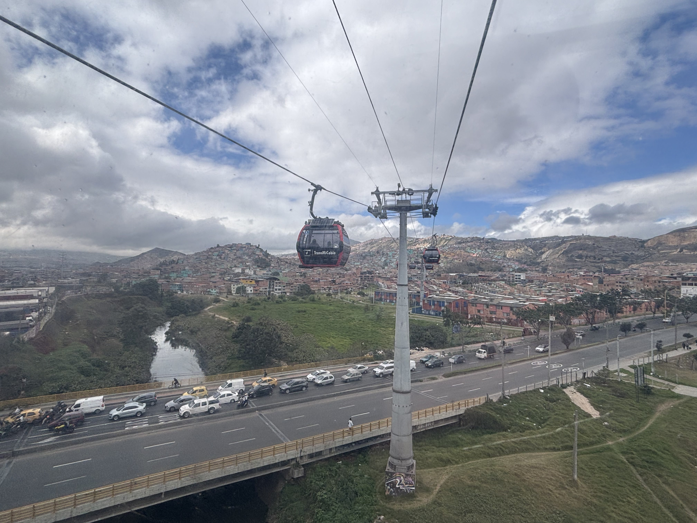

<br><details><summary>:camera:**63/IMG_0773.jpg**</summary><sub> `Exif version` 0232 `OS version` 27.0 `Date` 2026:09:12 09:06:34 `Aperture` Not known `Brightness` 8.418550645447715 `Color space` 65535 `Compression` Not known`Exposure mode` 0 `Exposure time` 0.004347826086956522 `Focal length` 1.54 `Lens model` iPhone 15 Plus back dual wide camera 1.54mm f/2.4 `Lens specification` (1.54, 5.960000038146973, 1.6, 2.4) `Orientation` 1 `Scene type` Not known `f number` 2.4 `White balance` 0 `Sensing method` 2 `Shutter speed` 7.84311156403164</sub><sub>`Coordinates & altitude` (4.566549999999999, -74.14128055555557, 2575.066216216216)</sub><sub> :earth_americas:`Location over` [Google Maps](http://maps.google.com/maps?q=4.566549999999999,-74.14128055555557) or [Openstreet Map](https://www.openstreetmap.org/query?lat=4.566549999999999&lon=-74.14128055555557)</sub></details>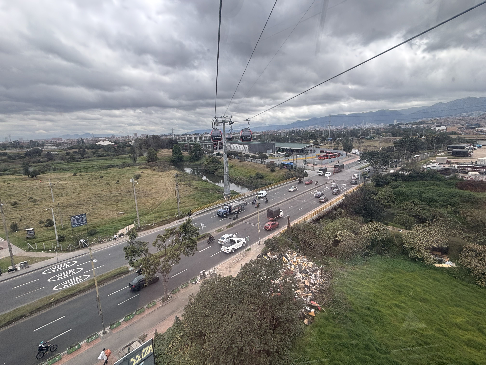

<br><details><summary>:camera:**63/IMG_0774.jpg**</summary><sub> `Exif version` 0232 `OS version` 27.0 `Date` 2026:09:12 09:12:13 `Aperture` Not known `Brightness` 9.362631318409328 `Color space` 65535 `Compression` Not known`Exposure mode` 0 `Exposure time` 0.0022935779816513763 `Focal length` 1.54 `Lens model` iPhone 15 Plus back dual wide camera 1.54mm f/2.4 `Lens specification` (1.54, 5.960000038146973, 1.6, 2.4) `Orientation` 6 `Scene type` Not known `f number` 2.4 `White balance` 0 `Sensing method` 2 `Shutter speed` 8.769806824951068</sub><sub>`Coordinates & altitude` (4.5572, -74.14670555555556, 2633.537408759124)</sub><sub> :earth_americas:`Location over` [Google Maps](http://maps.google.com/maps?q=4.5572,-74.14670555555556) or [Openstreet Map](https://www.openstreetmap.org/query?lat=4.5572&lon=-74.14670555555556)</sub></details>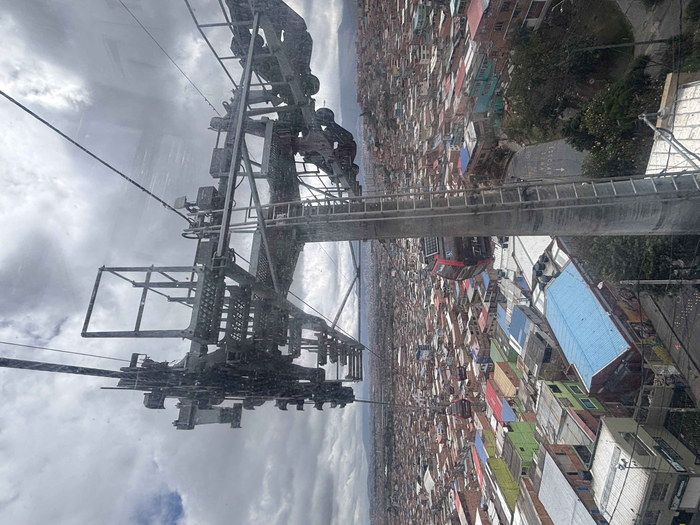

<br><details><summary>:camera:**63/IMG_0775.jpg**</summary><sub> `Exif version` 0232 `OS version` 27.0 `Date` 2026:09:12 09:12:14 `Aperture` Not known `Brightness` 9.486494012809802 `Color space` 65535 `Compression` Not known`Exposure mode` 0 `Exposure time` 0.001976284584980237 `Focal length` 1.54 `Lens model` iPhone 15 Plus back dual wide camera 1.54mm f/2.4 `Lens specification` (1.54, 5.960000038146973, 1.6, 2.4) `Orientation` 6 `Scene type` Not known `f number` 2.4 `White balance` 0 `Sensing method` 2 `Shutter speed` 8.98247140726007</sub><sub>`Coordinates & altitude` (4.557180555555555, -74.14672222222222, 2634.5391156462583)</sub><sub> :earth_americas:`Location over` [Google Maps](http://maps.google.com/maps?q=4.557180555555555,-74.14672222222222) or [Openstreet Map](https://www.openstreetmap.org/query?lat=4.557180555555555&lon=-74.14672222222222)</sub></details>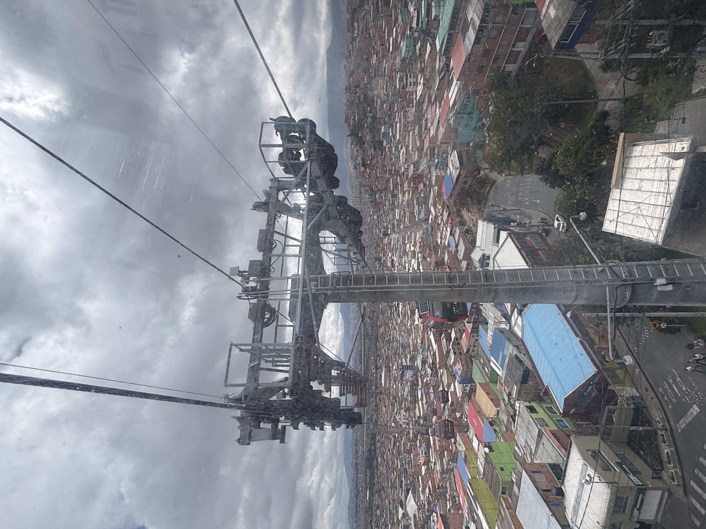

<br><details><summary>:camera:**63/IMG_0776.jpg**</summary><sub> `Exif version` 0232 `OS version` 27.0 `Date` 2026:09:12 09:16:41 `Aperture` Not known `Brightness` 9.116454352441613 `Color space` 65535 `Compression` Not known`Exposure mode` 0 `Exposure time` 0.0005899705014749262 `Focal length` 5.96 `Lens model` iPhone 15 Plus back dual wide camera 5.96mm f/1.6 `Lens specification` (1.5399999618512084, 5.96, 1.6, 2.4) `Orientation` 6 `Scene type` Not known `f number` 1.6 `White balance` 0 `Sensing method` 2 `Shutter speed` 10.726997422680412</sub><sub>`Coordinates & altitude` (4.55215, -74.14951388888889, 2677.2109929078015)</sub><sub> :earth_americas:`Location over` [Google Maps](http://maps.google.com/maps?q=4.55215,-74.14951388888889) or [Openstreet Map](https://www.openstreetmap.org/query?lat=4.55215&lon=-74.14951388888889)</sub></details>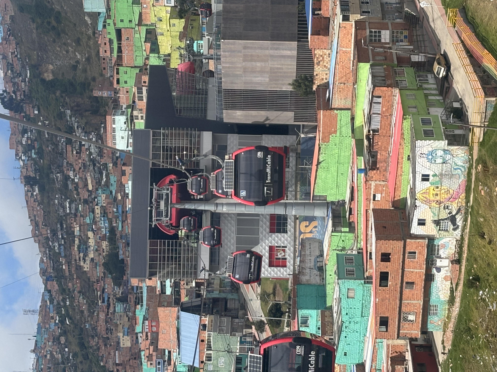

<br><details><summary>:camera:**63/IMG_0777.jpg**</summary><sub> `Exif version` 0232 `OS version` 27.0 `Date` 2026:09:12 09:16:48 `Aperture` Not known `Brightness` 9.07730284526439 `Color space` 65535 `Compression` Not known`Exposure mode` 0 `Exposure time` 0.00044603033006244426 `Focal length` 5.96 `Lens model` iPhone 15 Plus back dual wide camera 5.96mm f/1.6 `Lens specification` (1.5399999618512084, 5.96, 1.6, 2.4) `Orientation` 1 `Scene type` Not known `f number` 1.6 `White balance` 0 `Sensing method` 2 `Shutter speed` 11.130668668292987</sub><sub>`Coordinates & altitude` (4.551897222222222, -74.14964166666667, 2681.029841269841)</sub><sub> :earth_americas:`Location over` [Google Maps](http://maps.google.com/maps?q=4.551897222222222,-74.14964166666667) or [Openstreet Map](https://www.openstreetmap.org/query?lat=4.551897222222222&lon=-74.14964166666667)</sub></details>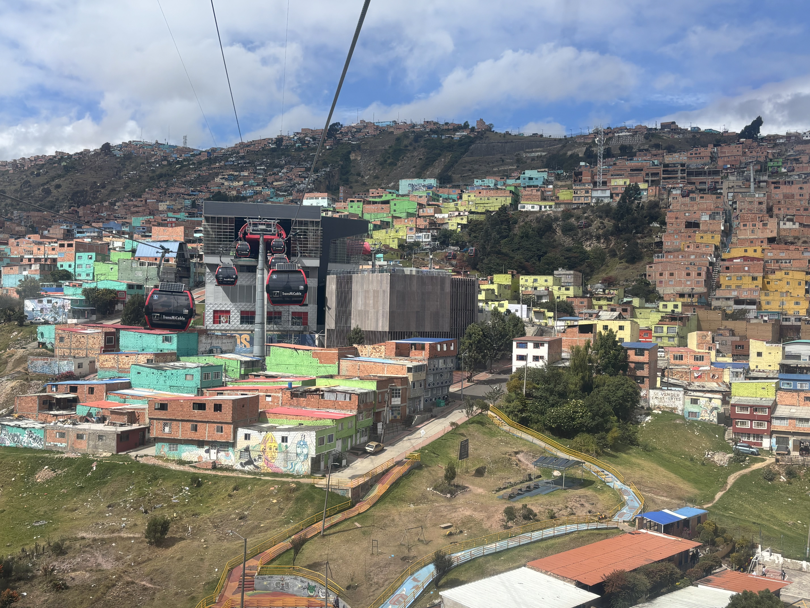

<br><details><summary>:camera:**63/IMG_0780.jpg**</summary><sub> `Exif version` 0232 `OS version` 27.0 `Date` 2026:09:12 09:18:22 `Aperture` Not known `Brightness` 5.375566330180431 `Color space` 65535 `Compression` Not known`Exposure mode` 0 `Exposure time` 0.010101010101010102 `Focal length` 1.54 `Lens model` iPhone 15 Plus back dual wide camera 1.54mm f/2.4 `Lens specification` (1.54, 5.960000038146973, 1.6, 2.4) `Orientation` 6 `Scene type` Not known `f number` 2.4 `White balance` 0 `Sensing method` 2 `Shutter speed` 6.630501132224082</sub><sub>`Coordinates & altitude` (4.550202777777778, -74.15071111111112, 2672.8523489932886)</sub><sub> :earth_americas:`Location over` [Google Maps](http://maps.google.com/maps?q=4.550202777777778,-74.15071111111112) or [Openstreet Map](https://www.openstreetmap.org/query?lat=4.550202777777778&lon=-74.15071111111112)</sub></details>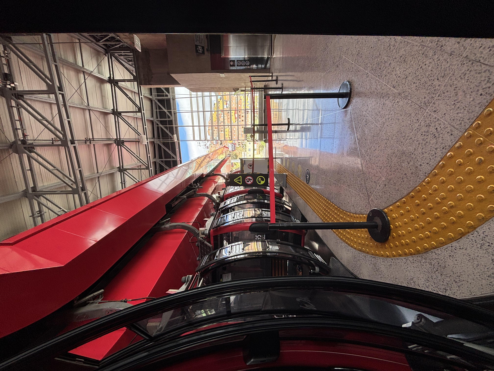

<br><details><summary>:camera:**63/IMG_0781.jpg**</summary><sub> `Exif version` 0232 `OS version` 27.0 `Date` 2026:09:12 09:20:35 `Aperture` Not known `Brightness` 9.687152777777778 `Color space` 65535 `Compression` Not known`Exposure mode` 0 `Exposure time` 0.001310615989515072 `Focal length` 1.54 `Lens model` iPhone 15 Plus back dual wide camera 1.54mm f/2.4 `Lens specification` (1.54, 5.960000038146973, 1.6, 2.4) `Orientation` 1 `Scene type` Not known `f number` 2.4 `White balance` 0 `Sensing method` 2 `Shutter speed` 9.57621747831888</sub><sub>`Coordinates & altitude` (4.550236111111111, -74.15277777777779, 2745.511530398323)</sub><sub> :earth_americas:`Location over` [Google Maps](http://maps.google.com/maps?q=4.550236111111111,-74.15277777777779) or [Openstreet Map](https://www.openstreetmap.org/query?lat=4.550236111111111&lon=-74.15277777777779)</sub></details>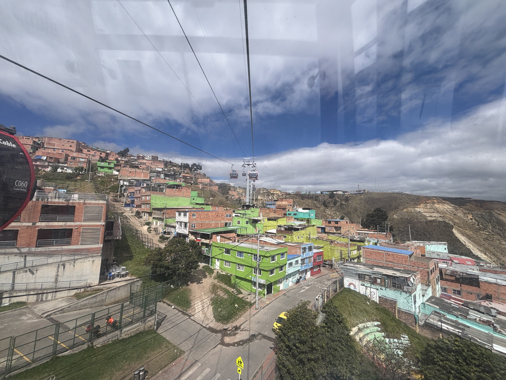

<br><details><summary>:camera:**63/IMG_0782.jpg**</summary><sub> `Exif version` 0232 `OS version` 27.0 `Date` 2026:09:12 09:20:41 `Aperture` Not known `Brightness` 9.819640147409494 `Color space` 65535 `Compression` Not known`Exposure mode` 0 `Exposure time` 0.0015128593040847202 `Focal length` 1.54 `Lens model` iPhone 15 Plus back dual wide camera 1.54mm f/2.4 `Lens specification` (1.54, 5.960000038146973, 1.6, 2.4) `Orientation` 1 `Scene type` Not known `f number` 2.4 `White balance` 0 `Sensing method` 2 `Shutter speed` 9.367419077917488</sub><sub>`Coordinates & altitude` (4.550238888888889, -74.1529388888889, 2747.8413654618475)</sub><sub> :earth_americas:`Location over` [Google Maps](http://maps.google.com/maps?q=4.550238888888889,-74.1529388888889) or [Openstreet Map](https://www.openstreetmap.org/query?lat=4.550238888888889&lon=-74.1529388888889)</sub></details>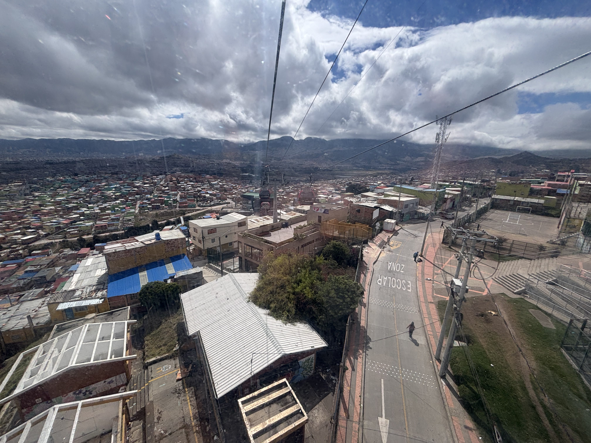

<br><details><summary>:camera:**63/IMG_0783.jpg**</summary><sub> `Exif version` 0232 `OS version` 27.0 `Date` 2026:09:12 09:21:44 `Aperture` Not known `Brightness` 9.385856034638282 `Color space` 65535 `Compression` Not known`Exposure mode` 0 `Exposure time` 0.0014492753623188406 `Focal length` 1.54 `Lens model` iPhone 15 Plus back dual wide camera 1.54mm f/2.4 `Lens specification` (1.54, 5.960000038146973, 1.6, 2.4) `Orientation` 1 `Scene type` Not known `f number` 2.4 `White balance` 0 `Sensing method` 2 `Shutter speed` 9.430726690598622</sub><sub>`Coordinates & altitude` (4.550213888888889, -74.15496111111112, 2768.625055334219)</sub><sub> :earth_americas:`Location over` [Google Maps](http://maps.google.com/maps?q=4.550213888888889,-74.15496111111112) or [Openstreet Map](https://www.openstreetmap.org/query?lat=4.550213888888889&lon=-74.15496111111112)</sub></details>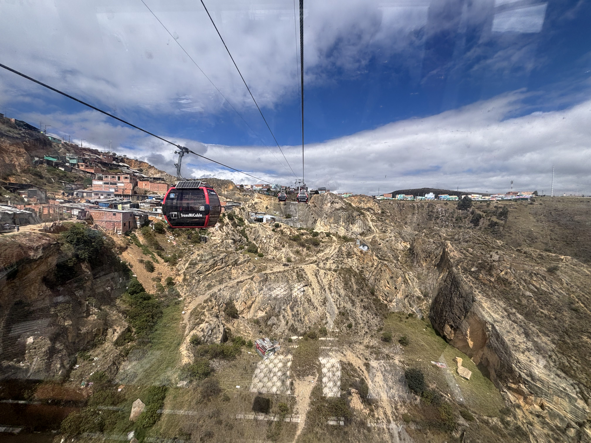

<br><details><summary>:camera:**63/IMG_0784.jpg**</summary><sub> `Exif version` 0232 `OS version` 27.0 `Date` 2026:09:12 09:21:50 `Aperture` Not known `Brightness` 9.674534408923414 `Color space` 65535 `Compression` Not known`Exposure mode` 0 `Exposure time` 0.001310615989515072 `Focal length` 1.54 `Lens model` iPhone 15 Plus back dual wide camera 1.54mm f/2.4 `Lens specification` (1.54, 5.960000038146973, 1.6, 2.4) `Orientation` 6 `Scene type` Not known `f number` 2.4 `White balance` 0 `Sensing method` 2 `Shutter speed` 9.57621747831888</sub><sub>`Coordinates & altitude` (4.550216666666667, -74.15511388888889, 2769.5698795180724)</sub><sub> :earth_americas:`Location over` [Google Maps](http://maps.google.com/maps?q=4.550216666666667,-74.15511388888889) or [Openstreet Map](https://www.openstreetmap.org/query?lat=4.550216666666667&lon=-74.15511388888889)</sub></details>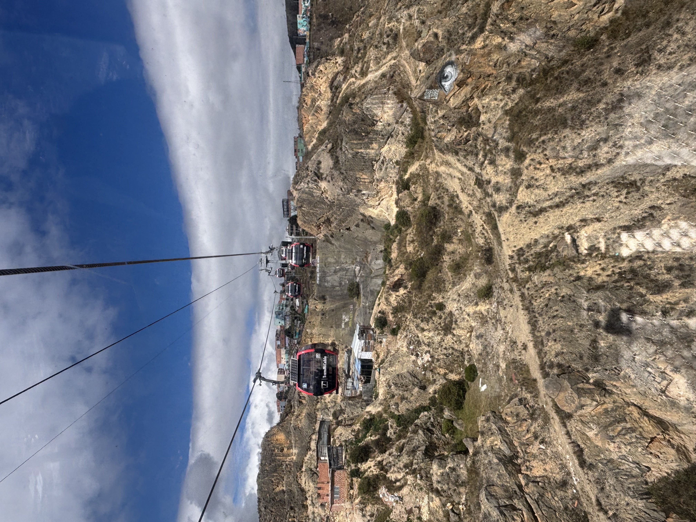

<br><details><summary>:camera:**63/IMG_0785.jpg**</summary><sub> `Exif version` 0232 `OS version` 27.0 `Date` 2026:09:12 09:40:17 `Aperture` Not known `Brightness` 9.11945331913383 `Color space` 65535 `Compression` Not known`Exposure mode` 0 `Exposure time` 0.003367003367003367 `Focal length` 1.54 `Lens model` iPhone 15 Plus back dual wide camera 1.54mm f/2.4 `Lens specification` (1.54, 5.960000038146973, 1.6, 2.4) `Orientation` 1 `Scene type` Not known `f number` 2.4 `White balance` 0 `Sensing method` 2 `Shutter speed` 8.215177784307963</sub><sub>`Coordinates & altitude` (4.550319444444444, -74.15872222222222, 2819.626764539808)</sub><sub> :earth_americas:`Location over` [Google Maps](http://maps.google.com/maps?q=4.550319444444444,-74.15872222222222) or [Openstreet Map](https://www.openstreetmap.org/query?lat=4.550319444444444&lon=-74.15872222222222)</sub></details>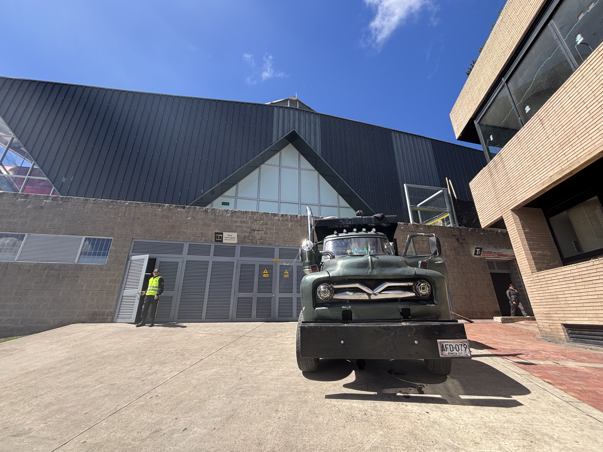

<br><details><summary>:camera:**63/IMG_0786.jpg**</summary><sub> `Exif version` 0232 `OS version` 27.0 `Date` 2026:09:12 09:40:39 `Aperture` Not known `Brightness` 10.17810538195669 `Color space` 65535 `Compression` Not known`Exposure mode` 0 `Exposure time` 0.00020601565718994644 `Focal length` 5.96 `Lens model` iPhone 15 Plus back dual wide camera 5.96mm f/1.6 `Lens specification` (1.5399999618512084, 5.96, 1.6, 2.4) `Orientation` 1 `Scene type` Not known `f number` 1.6 `White balance` 0 `Sensing method` 2 `Shutter speed` 12.245068045152442</sub><sub>`Coordinates & altitude` (4.550261111111111, -74.15864444444445, 2816.572564612326)</sub><sub> :earth_americas:`Location over` [Google Maps](http://maps.google.com/maps?q=4.550261111111111,-74.15864444444445) or [Openstreet Map](https://www.openstreetmap.org/query?lat=4.550261111111111&lon=-74.15864444444445)</sub></details>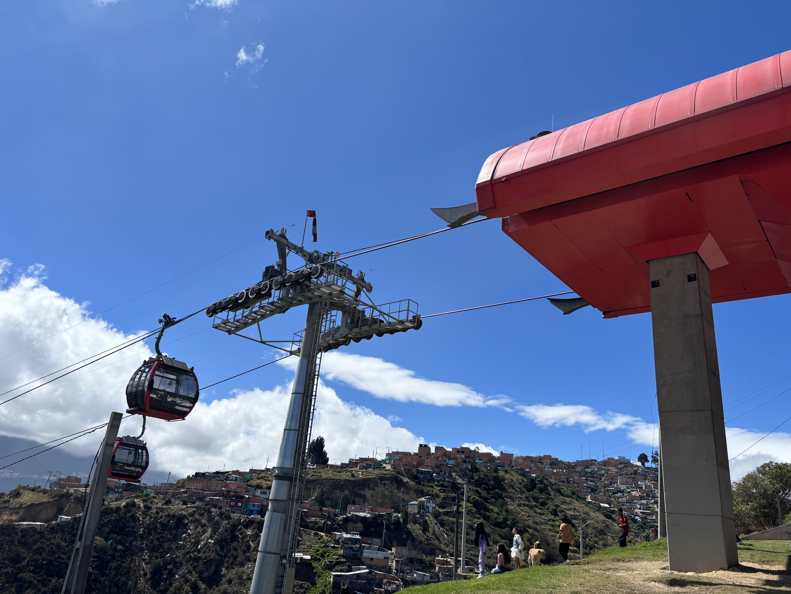

<br><details><summary>:camera:**63/IMG_0787.jpg**</summary><sub> `Exif version` 0232 `OS version` 27.0 `Date` 2026:09:12 09:40:42 `Aperture` Not known `Brightness` 10.285106785106786 `Color space` 65535 `Compression` Not known`Exposure mode` 0 `Exposure time` 0.00018698578908002991 `Focal length` 5.96 `Lens model` iPhone 15 Plus back dual wide camera 5.96mm f/1.6 `Lens specification` (1.5399999618512084, 5.96, 1.6, 2.4) `Orientation` 1 `Scene type` Not known `f number` 1.6 `White balance` 0 `Sensing method` 2 `Shutter speed` 12.384674110125012</sub><sub>`Coordinates & altitude` (4.550261111111111, -74.15863888888889, 2823.599908759124)</sub><sub> :earth_americas:`Location over` [Google Maps](http://maps.google.com/maps?q=4.550261111111111,-74.15863888888889) or [Openstreet Map](https://www.openstreetmap.org/query?lat=4.550261111111111&lon=-74.15863888888889)</sub></details>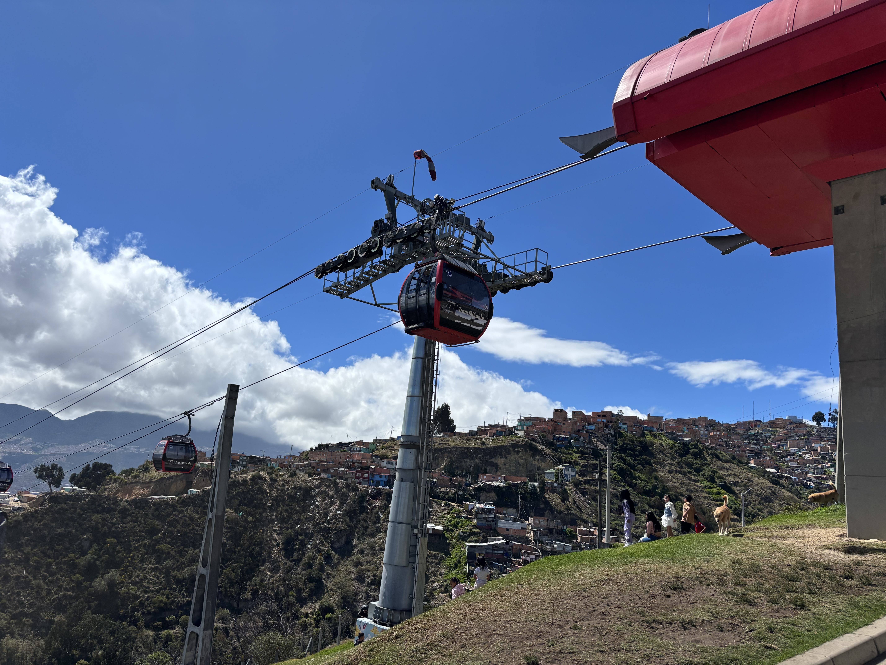

<br><details><summary>:camera:**63/IMG_0789.jpg**</summary><sub> `Exif version` 0232 `OS version` 27.0 `Date` 2026:09:12 09:41:38 `Aperture` Not known `Brightness` 10.45221835484866 `Color space` 65535 `Compression` Not known`Exposure mode` 0 `Exposure time` 0.0004679457182966776 `Focal length` 1.54 `Lens model` iPhone 15 Plus back dual wide camera 1.54mm f/2.4 `Lens specification` (1.54, 5.960000038146973, 1.6, 2.4) `Orientation` 1 `Scene type` Not known `f number` 2.4 `White balance` 0 `Sensing method` 2 `Shutter speed` 11.061203844208396</sub><sub>`Coordinates & altitude` (4.550491666666667, -74.15840277777778, 2819.7986394557824)</sub><sub> :earth_americas:`Location over` [Google Maps](http://maps.google.com/maps?q=4.550491666666667,-74.15840277777778) or [Openstreet Map](https://www.openstreetmap.org/query?lat=4.550491666666667&lon=-74.15840277777778)</sub></details>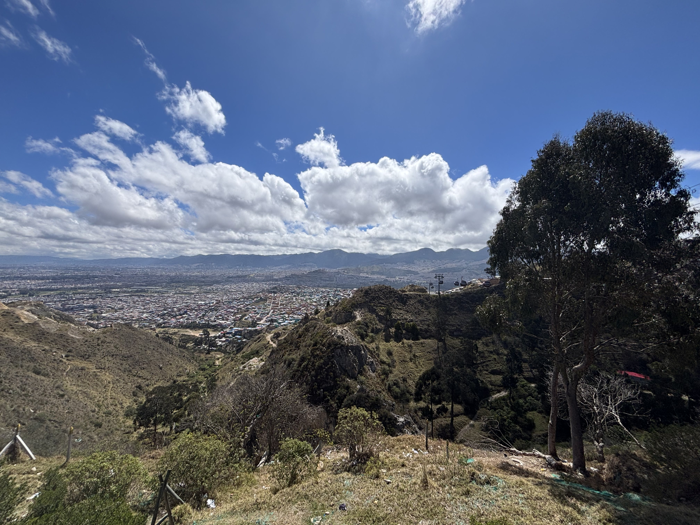

<br><details><summary>:camera:**63/IMG_0794.jpg**</summary><sub> `Exif version` 0232 `OS version` 27.0 `Date` 2026:09:12 09:43:44 `Aperture` Not known `Brightness` 10.31569510466183 `Color space` 65535 `Compression` Not known`Exposure mode` 0 `Exposure time` 0.00018698578908002991 `Focal length` 5.96 `Lens model` iPhone 15 Plus back dual wide camera 5.96mm f/1.6 `Lens specification` (1.5399999618512084, 5.96, 1.6, 2.4) `Orientation` 1 `Scene type` Not known `f number` 1.6 `White balance` 0 `Sensing method` 2 `Shutter speed` 12.384674110125012</sub><sub>`Coordinates & altitude` (4.550691666666666, -74.15846388888889, 2807.189753320683)</sub><sub> :earth_americas:`Location over` [Google Maps](http://maps.google.com/maps?q=4.550691666666666,-74.15846388888889) or [Openstreet Map](https://www.openstreetmap.org/query?lat=4.550691666666666&lon=-74.15846388888889)</sub></details>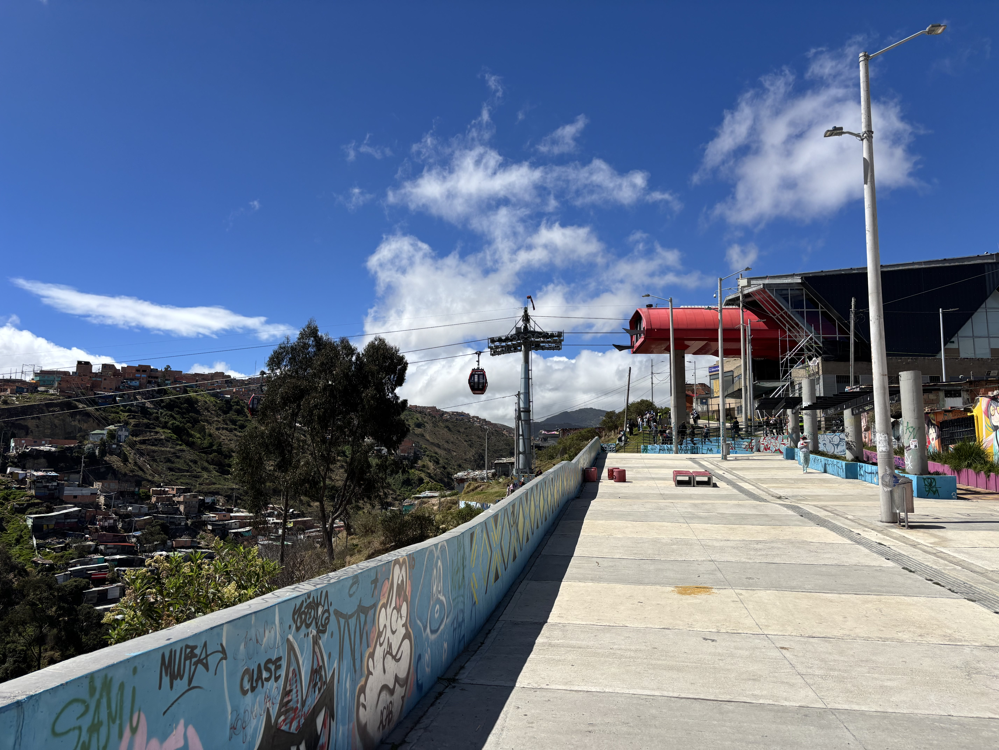

<br><details><summary>:camera:**63/IMG_0795.jpg**</summary><sub> `Exif version` 0232 `OS version` 27.0 `Date` 2026:09:12 09:43:48 `Aperture` Not known `Brightness` 10.738003338201544 `Color space` 65535 `Compression` Not known`Exposure mode` 0 `Exposure time` 0.00014900908955446283 `Focal length` 5.96 `Lens model` iPhone 15 Plus back dual wide camera 5.96mm f/1.6 `Lens specification` (1.5399999618512084, 5.96, 1.6, 2.4) `Orientation` 6 `Scene type` Not known `f number` 1.6 `White balance` 0 `Sensing method` 2 `Shutter speed` 12.712400050767863</sub><sub>`Coordinates & altitude` (4.550755555555555, -74.15846388888889, 2816.9614791987674)</sub><sub> :earth_americas:`Location over` [Google Maps](http://maps.google.com/maps?q=4.550755555555555,-74.15846388888889) or [Openstreet Map](https://www.openstreetmap.org/query?lat=4.550755555555555&lon=-74.15846388888889)</sub></details>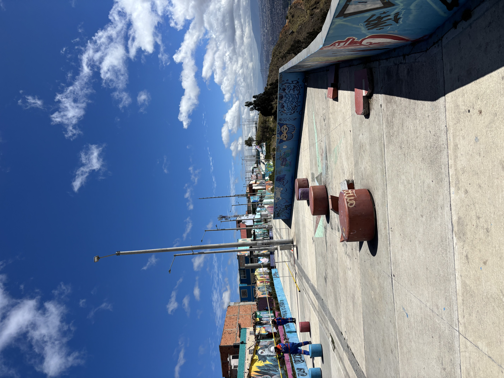

<br><details><summary>:camera:**63/IMG_0796.jpg**</summary><sub> `Exif version` 0232 `OS version` 27.0 `Date` 2026:09:12 09:46:06 `Aperture` Not known `Brightness` 10.199937592635932 `Color space` 65535 `Compression` Not known`Exposure mode` 0 `Exposure time` 0.0008849557522123894 `Focal length` 1.54 `Lens model` iPhone 15 Plus back dual wide camera 1.54mm f/2.4 `Lens specification` (1.54, 5.960000038146973, 1.6, 2.4) `Orientation` 1 `Scene type` Not known `f number` 2.4 `White balance` 0 `Sensing method` 2 `Shutter speed` 10.142034923422106</sub><sub>`Coordinates & altitude` (4.551416666666666, -74.15841666666667, 2814.817438692098)</sub><sub> :earth_americas:`Location over` [Google Maps](http://maps.google.com/maps?q=4.551416666666666,-74.15841666666667) or [Openstreet Map](https://www.openstreetmap.org/query?lat=4.551416666666666&lon=-74.15841666666667)</sub></details>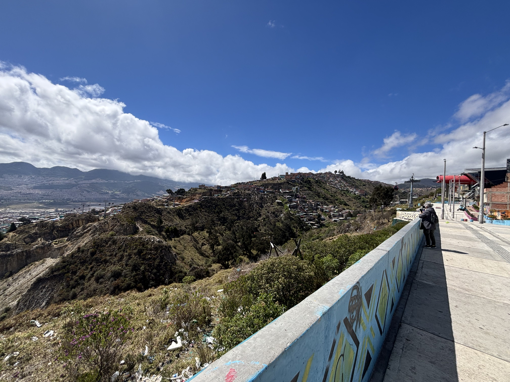

<br><details><summary>:camera:**63/IMG_0797.jpg**</summary><sub> `Exif version` 0232 `OS version` 27.0 `Date` 2026:09:12 09:48:19 `Aperture` Not known `Brightness` 10.945767074179612 `Color space` 65535 `Compression` Not known`Exposure mode` 0 `Exposure time` 0.00013000520020800833 `Focal length` 5.96 `Lens model` iPhone 15 Plus back dual wide camera 5.96mm f/1.6 `Lens specification` (1.5399999618512084, 5.96, 1.6, 2.4) `Orientation` 1 `Scene type` Not known `f number` 1.6 `White balance` 0 `Sensing method` 2 `Shutter speed` 12.909200759537372</sub><sub>`Coordinates & altitude` (4.552247222222222, -74.15833333333335, 2809.8635794743427)</sub><sub> :earth_americas:`Location over` [Google Maps](http://maps.google.com/maps?q=4.552247222222222,-74.15833333333335) or [Openstreet Map](https://www.openstreetmap.org/query?lat=4.552247222222222&lon=-74.15833333333335)</sub></details>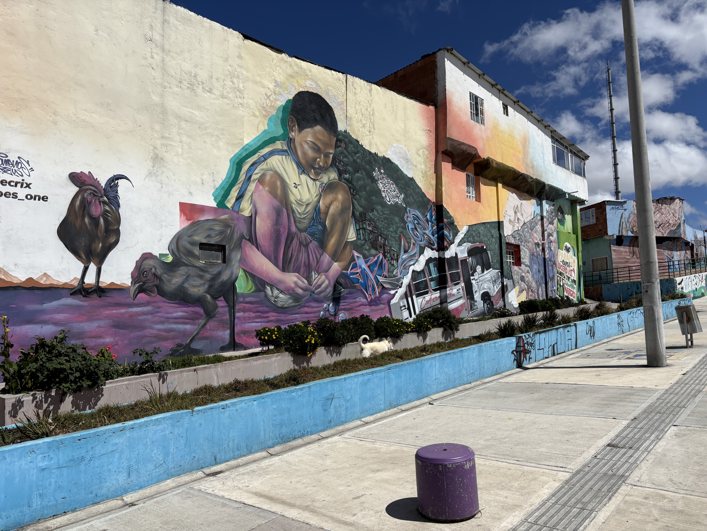

<br><details><summary>:camera:**63/IMG_0798.jpg**</summary><sub> `Exif version` 0232 `OS version` 27.0 `Date` 2026:09:12 09:52:52 `Aperture` Not known `Brightness` 10.296775990529907 `Color space` 65535 `Compression` Not known`Exposure mode` Not known `Exposure time` 0.00019700551615445234 `Focal length` 5.96 `Lens model` iPhone 15 Plus back camera 5.96mm f/1.6 `Lens specification` (5.96, 5.96, 1.6, 1.6) `Orientation` 1 `Scene type` Not known `f number` 1.6 `White balance` 0 `Sensing method` 2 `Shutter speed` 12.309516750667061</sub><sub>`Coordinates & altitude` (4.5536916666666665, -74.15763055555556, 2818.4702702702702)</sub><sub> :earth_americas:`Location over` [Google Maps](http://maps.google.com/maps?q=4.5536916666666665,-74.15763055555556) or [Openstreet Map](https://www.openstreetmap.org/query?lat=4.5536916666666665&lon=-74.15763055555556)</sub></details>

<br><details><summary>:camera:**63/IMG_0799.jpg**</summary><sub> `Exif version` 0232 `OS version` 27.0 `Date` 2026:09:12 09:53:23 `Aperture` Not known `Brightness` 10.164116392825788 `Color space` 65535 `Compression` Not known`Exposure mode` Not known `Exposure time` 0.00020601565718994644 `Focal length` 5.96 `Lens model` iPhone 15 Plus back camera 5.96mm f/1.6 `Lens specification` (5.96, 5.96, 1.6, 1.6) `Orientation` 1 `Scene type` Not known `f number` 1.6 `White balance` 0 `Sensing method` 2 `Shutter speed` 12.245068045152442</sub><sub>`Coordinates & altitude` (4.553772222222222, -74.15770833333333, 2818.100386100386)</sub><sub> :earth_americas:`Location over` [Google Maps](http://maps.google.com/maps?q=4.553772222222222,-74.15770833333333) or [Openstreet Map](https://www.openstreetmap.org/query?lat=4.553772222222222&lon=-74.15770833333333)</sub></details>

<br><details><summary>:camera:**63/IMG_0803.jpg**</summary><sub> `Exif version` 0232 `OS version` 27.0 `Date` 2026:09:12 09:59:41 `Aperture` Not known `Brightness` 10.594171844868224 `Color space` 65535 `Compression` Not known`Exposure mode` 0 `Exposure time` 0.0007462686567164179 `Focal length` 1.54 `Lens model` iPhone 15 Plus back dual wide camera 1.54mm f/2.4 `Lens specification` (1.54, 5.960000038146973, 1.6, 2.4) `Orientation` 6 `Scene type` Not known `f number` 2.4 `White balance` 0 `Sensing method` 2 `Shutter speed` 10.388536749831422</sub><sub>`Coordinates & altitude` (4.553386111111111, -74.15825555555556, 2820.4700239808153)</sub><sub> :earth_americas:`Location over` [Google Maps](http://maps.google.com/maps?q=4.553386111111111,-74.15825555555556) or [Openstreet Map](https://www.openstreetmap.org/query?lat=4.553386111111111&lon=-74.15825555555556)</sub></details>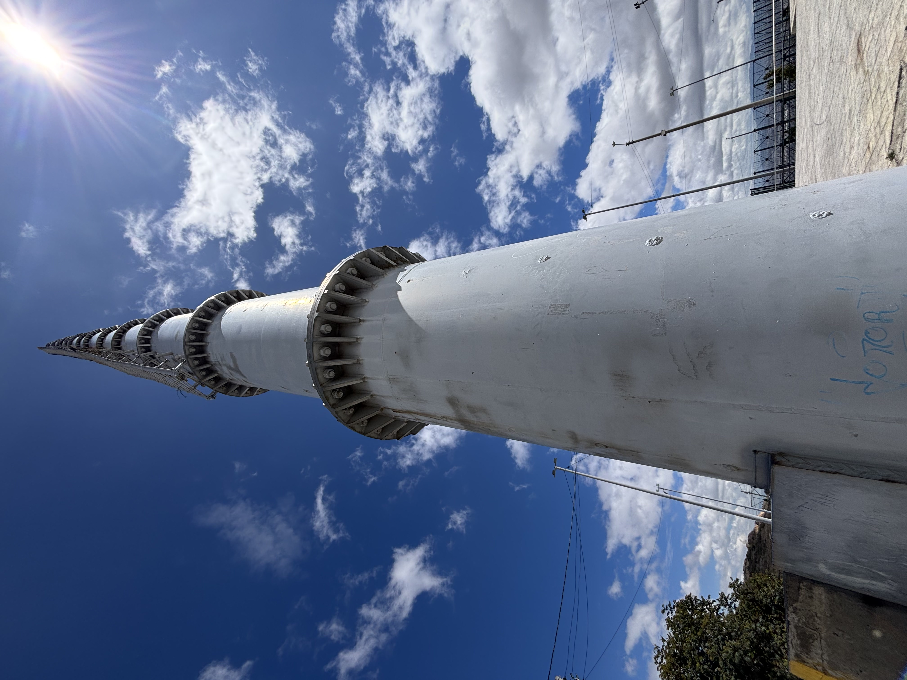

<br><details><summary>:camera:**63/IMG_0804.jpg**</summary><sub> `Exif version` 0232 `OS version` 27.0 `Date` 2026:09:12 09:59:55 `Aperture` Not known `Brightness` 11.647610888274466 `Color space` 65535 `Compression` Not known`Exposure mode` 0 `Exposure time` 0.00032 `Focal length` 1.54 `Lens model` iPhone 15 Plus back dual wide camera 1.54mm f/2.4 `Lens specification` (1.54, 5.960000038146973, 1.6, 2.4) `Orientation` 1 `Scene type` Not known `f number` 2.4 `White balance` 0 `Sensing method` 2 `Shutter speed` 11.609640474891975</sub><sub>`Coordinates & altitude` (4.5534, -74.15823333333334, 2823.665338645418)</sub><sub> :earth_americas:`Location over` [Google Maps](http://maps.google.com/maps?q=4.5534,-74.15823333333334) or [Openstreet Map](https://www.openstreetmap.org/query?lat=4.5534&lon=-74.15823333333334)</sub></details>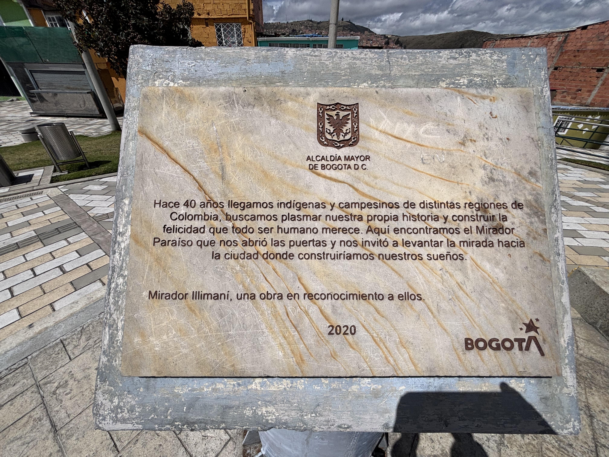

<br><details><summary>:camera:**63/IMG_0807.jpg**</summary><sub> `Exif version` 0232 `OS version` 27.0 `Date` 2026:09:12 10:08:16 `Aperture` Not known `Brightness` 10.733827520557378 `Color space` 65535 `Compression` Not known`Exposure mode` 0 `Exposure time` 0.00013900472616068947 `Focal length` 5.96 `Lens model` iPhone 15 Plus back dual wide camera 5.96mm f/1.6 `Lens specification` (1.5399999618512084, 5.96, 1.6, 2.4) `Orientation` 6 `Scene type` Not known `f number` 1.6 `White balance` 0 `Sensing method` 2 `Shutter speed` 12.812627498980008</sub><sub>`Coordinates & altitude` (4.5501, -74.15865277777779, 2819.2136783733827)</sub><sub> :earth_americas:`Location over` [Google Maps](http://maps.google.com/maps?q=4.5501,-74.15865277777779) or [Openstreet Map](https://www.openstreetmap.org/query?lat=4.5501&lon=-74.15865277777779)</sub></details>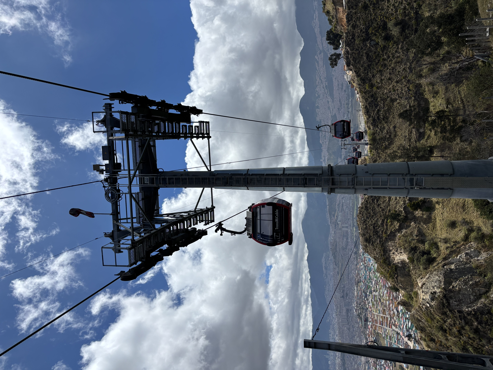

<br><details><summary>:camera:**63/IMG_0808.jpg**</summary><sub> `Exif version` 0232 `OS version` 27.0 `Date` 2026:09:12 10:09:30 `Aperture` Not known `Brightness` 6.77583034763242 `Color space` 65535 `Compression` Not known`Exposure mode` 0 `Exposure time` 0.002066115702479339 `Focal length` 5.96 `Lens model` iPhone 15 Plus back dual wide camera 5.96mm f/1.6 `Lens specification` (1.5399999618512084, 5.96, 1.6, 2.4) `Orientation` 1 `Scene type` Not known `f number` 1.6 `White balance` 0 `Sensing method` 2 `Shutter speed` 8.917548107557028</sub><sub>`Coordinates & altitude` (4.550194444444444, -74.15869166666667, 2800.495905368517)</sub><sub> :earth_americas:`Location over` [Google Maps](http://maps.google.com/maps?q=4.550194444444444,-74.15869166666667) or [Openstreet Map](https://www.openstreetmap.org/query?lat=4.550194444444444&lon=-74.15869166666667)</sub></details>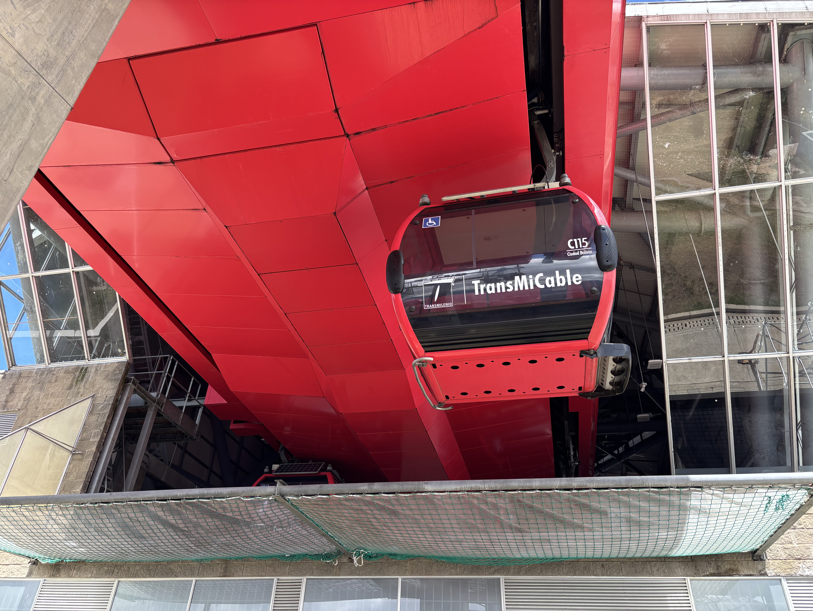

<br><details><summary>:camera:**63/IMG_0809.jpg**</summary><sub> `Exif version` 0232 `OS version` 27.0 `Date` 2026:09:12 10:14:47 `Aperture` Not known `Brightness` 9.195861633233296 `Color space` 65535 `Compression` Not known`Exposure mode` 0 `Exposure time` 0.0013003901170351106 `Focal length` 1.54 `Lens model` iPhone 15 Plus back dual wide camera 1.54mm f/2.4 `Lens specification` (1.54, 5.960000038146973, 1.6, 2.4) `Orientation` 6 `Scene type` Not known `f number` 2.4 `White balance` 0 `Sensing method` 2 `Shutter speed` 9.586163323329648</sub><sub>`Coordinates & altitude` (4.550202777777778, -74.15890555555556, 2819.574762316335)</sub><sub> :earth_americas:`Location over` [Google Maps](http://maps.google.com/maps?q=4.550202777777778,-74.15890555555556) or [Openstreet Map](https://www.openstreetmap.org/query?lat=4.550202777777778&lon=-74.15890555555556)</sub></details>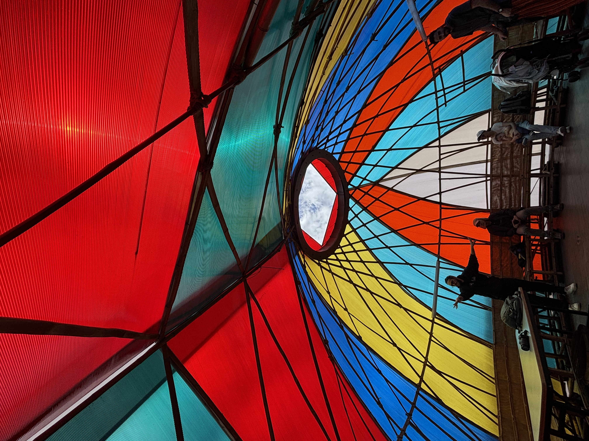

<br><details><summary>:camera:**63/IMG_0810.jpg**</summary><sub> `Exif version` 0232 `OS version` 27.0 `Date` 2026:09:12 10:36:01 `Aperture` Not known `Brightness` 8.927379241737592 `Color space` 65535 `Compression` Not known`Exposure mode` 0 `Exposure time` 0.0004940711462450593 `Focal length` 5.96 `Lens model` iPhone 15 Plus back dual wide camera 5.96mm f/1.6 `Lens specification` (1.5399999618512084, 5.96, 1.6, 2.4) `Orientation` 6 `Scene type` Not known `f number` 1.6 `White balance` 0 `Sensing method` 2 `Shutter speed` 10.983201343892489</sub><sub>`Coordinates & altitude` (4.550213888888889, -74.15429722222223, 2772.003205128205)</sub><sub> :earth_americas:`Location over` [Google Maps](http://maps.google.com/maps?q=4.550213888888889,-74.15429722222223) or [Openstreet Map](https://www.openstreetmap.org/query?lat=4.550213888888889&lon=-74.15429722222223)</sub></details>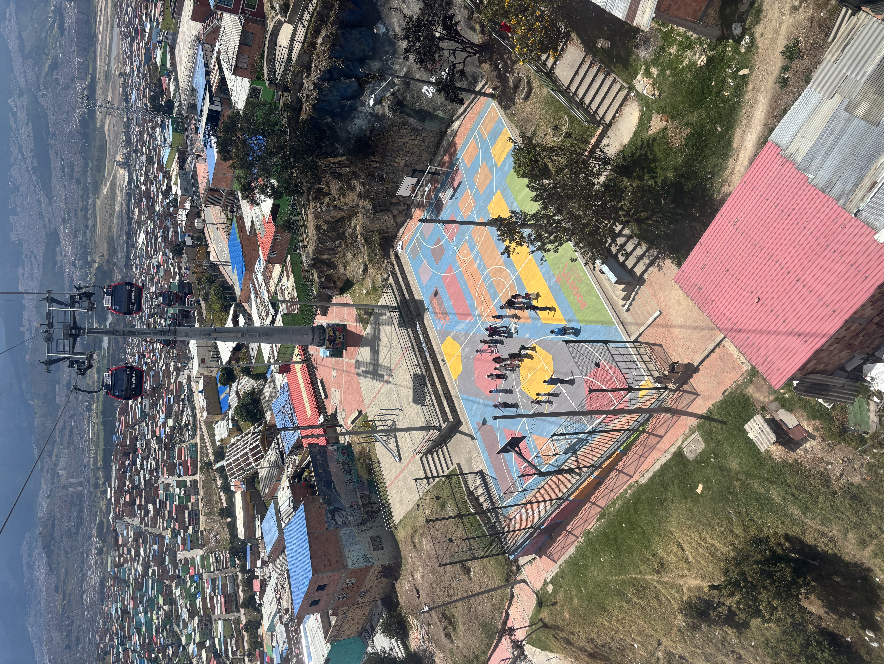

<br><details><summary>:camera:**63/IMG_0811.jpg**</summary><sub> `Exif version` 0232 `OS version` 27.0 `Date` 2026:09:12 10:37:13 `Aperture` Not known `Brightness` 8.70138943402151 `Color space` 65535 `Compression` Not known`Exposure mode` 0 `Exposure time` 0.0005810575246949448 `Focal length` 5.96 `Lens model` iPhone 15 Plus back dual wide camera 5.96mm f/1.6 `Lens specification` (1.5399999618512084, 5.96, 1.6, 2.4) `Orientation` 1 `Scene type` Not known `f number` 1.6 `White balance` 0 `Sensing method` 2 `Shutter speed` 10.74917421417155</sub><sub>`Coordinates & altitude` (4.550161111111111, -74.15204722222222, 2726.9277899343547)</sub><sub> :earth_americas:`Location over` [Google Maps](http://maps.google.com/maps?q=4.550161111111111,-74.15204722222222) or [Openstreet Map](https://www.openstreetmap.org/query?lat=4.550161111111111&lon=-74.15204722222222)</sub></details>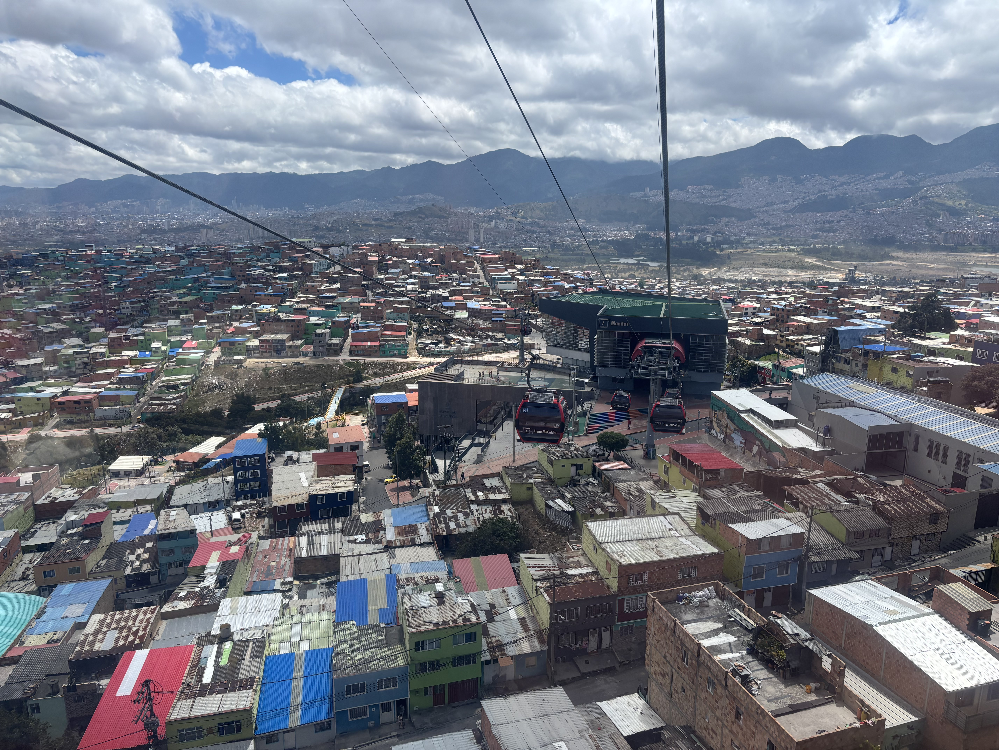

<br><details><summary>:camera:**63/IMG_0812.jpg**</summary><sub> `Exif version` 0232 `OS version` 27.0 `Date` 2026:09:12 10:37:16 `Aperture` Not known `Brightness` 8.671946216955332 `Color space` 65535 `Compression` Not known`Exposure mode` 0 `Exposure time` 0.0005711022272986865 `Focal length` 5.96 `Lens model` iPhone 15 Plus back dual wide camera 5.96mm f/1.6 `Lens specification` (1.5399999618512084, 5.96, 1.6, 2.4) `Orientation` 1 `Scene type` Not known `f number` 1.6 `White balance` 0 `Sensing method` 2 `Shutter speed` 10.774221641628564</sub><sub>`Coordinates & altitude` (4.550197222222222, -74.15191666666668, 2723.548885077187)</sub><sub> :earth_americas:`Location over` [Google Maps](http://maps.google.com/maps?q=4.550197222222222,-74.15191666666668) or [Openstreet Map](https://www.openstreetmap.org/query?lat=4.550197222222222&lon=-74.15191666666668)</sub></details>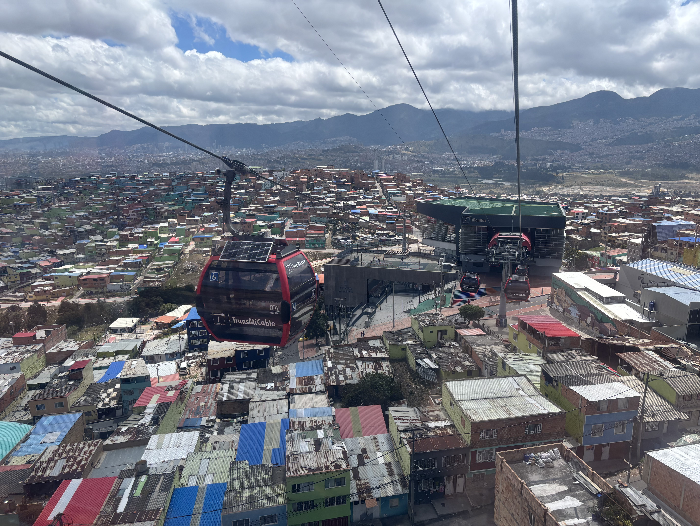

<br><details><summary>:camera:**63/IMG_0813.jpg**</summary><sub> `Exif version` 0232 `OS version` 27.0 `Date` 2026:09:12 10:42:50 `Aperture` Not known `Brightness` 8.869828211952576 `Color space` 65535 `Compression` Not known`Exposure mode` 0 `Exposure time` 0.0004940711462450593 `Focal length` 5.96 `Lens model` iPhone 15 Plus back dual wide camera 5.96mm f/1.6 `Lens specification` (1.5399999618512084, 5.96, 1.6, 2.4) `Orientation` 1 `Scene type` Not known `f number` 1.6 `White balance` 0 `Sensing method` 2 `Shutter speed` 10.983201343892489</sub><sub>`Coordinates & altitude` (4.555280555555555, -74.14770555555556, 2678.09649122807)</sub><sub> :earth_americas:`Location over` [Google Maps](http://maps.google.com/maps?q=4.555280555555555,-74.14770555555556) or [Openstreet Map](https://www.openstreetmap.org/query?lat=4.555280555555555&lon=-74.14770555555556)</sub></details>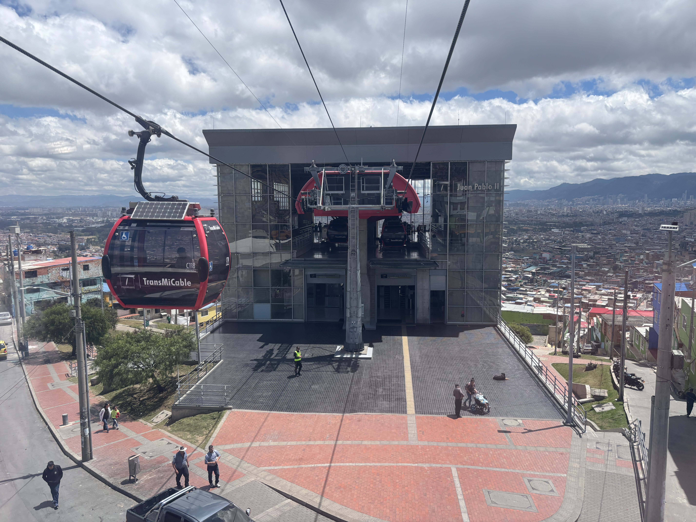

<br><details><summary>:camera:**63/IMG_0814.jpg**</summary><sub> `Exif version` 0232 `OS version` 27.0 `Date` 2026:09:12 10:52:17 `Aperture` Not known `Brightness` 8.133068783068783 `Color space` 65535 `Compression` Not known`Exposure mode` 0 `Exposure time` 0.000819672131147541 `Focal length` 5.96 `Lens model` iPhone 15 Plus back dual wide camera 5.96mm f/1.6 `Lens specification` (1.5399999618512084, 5.96, 1.6, 2.4) `Orientation` 1 `Scene type` Not known `f number` 1.6 `White balance` 0 `Sensing method` 2 `Shutter speed` 10.252088470172598</sub><sub>`Coordinates & altitude` (4.568516666666667, -74.14004444444446, 2565.3875066172577)</sub><sub> :earth_americas:`Location over` [Google Maps](http://maps.google.com/maps?q=4.568516666666667,-74.14004444444446) or [Openstreet Map](https://www.openstreetmap.org/query?lat=4.568516666666667&lon=-74.14004444444446)</sub></details>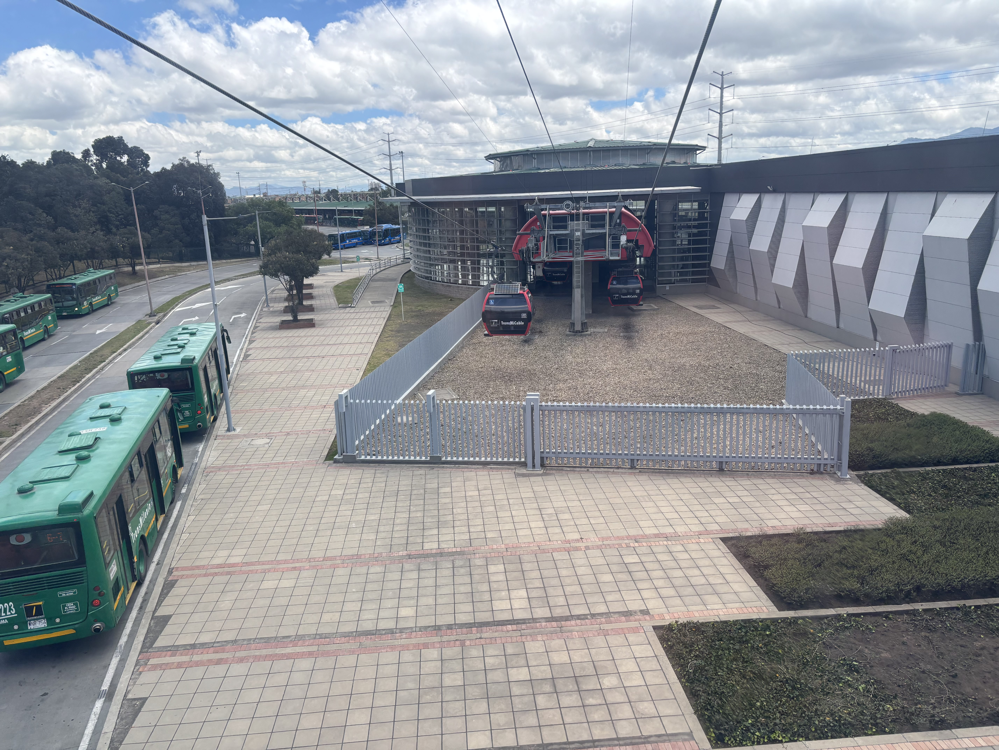

<br><details><summary>:camera:**63/IMG_0815.jpg**</summary><sub> `Exif version` 0232 `OS version` 27.0 `Date` 2026:09:12 10:52:20 `Aperture` Not known `Brightness` 8.339211031988244 `Color space` 65535 `Compression` Not known`Exposure mode` 0 `Exposure time` 0.0007147962830593281 `Focal length` 5.96 `Lens model` iPhone 15 Plus back dual wide camera 5.96mm f/1.6 `Lens specification` (1.5399999618512084, 5.96, 1.6, 2.4) `Orientation` 1 `Scene type` Not known `f number` 1.6 `White balance` 0 `Sensing method` 2 `Shutter speed` 10.449769145040598</sub><sub>`Coordinates & altitude` (4.568611111111111, -74.13997777777779, 2565.7341862117983)</sub><sub> :earth_americas:`Location over` [Google Maps](http://maps.google.com/maps?q=4.568611111111111,-74.13997777777779) or [Openstreet Map](https://www.openstreetmap.org/query?lat=4.568611111111111&lon=-74.13997777777779)</sub></details>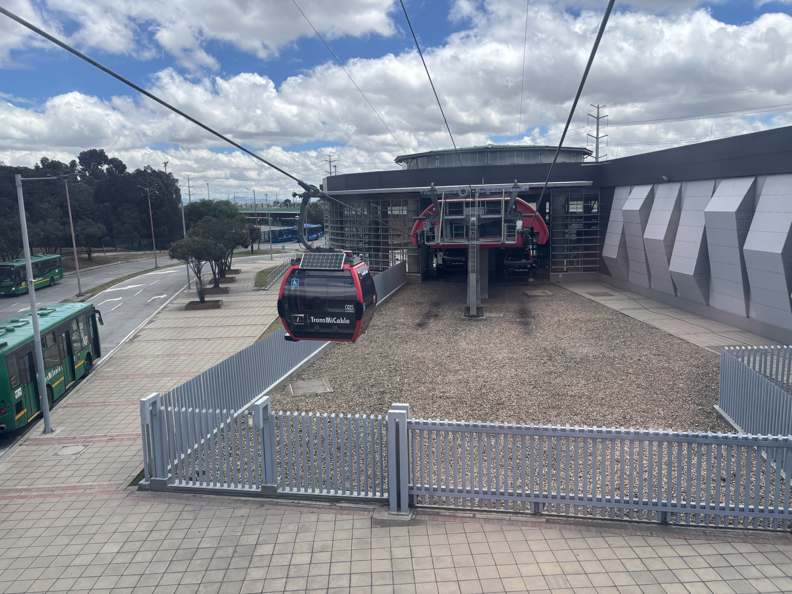

<sub>_Citation: Partial or total digital reproduction of this repository, scripts, development guides, data models, images, and documentation is permitted, provided that it is referenced as: "R.GISMobile - Mobile geographic information systems on QField that do not require an internet connection for navigation." https://github.com/rcfdtools/R.GISMobile - Bogotá - Colombia - South America"._<sub>

| [:house: Home](../Readme.md) |
|---|