<div align="center"></div>

## :earth_americas:POI: _“Monserrate and Bogotá Downtown - Bogotá D.C, Colombia (2026-08-15)”_
`Pictures` rcfdtools <br>`Category` Freelance field visit <br>`Location` [Google Maps](http://maps.google.com/maps?q=4.605185,-74.055473) or [Openstreet Map](https://www.openstreetmap.org/query?lat=4.605185&lon=-74.055473) 

```geojson
{
  "type": "Feature",
  "geometry": {
    "type": "Point", 
    "coordinates": [-74.055473, 4.605185]
  }, 
  "properties": {
    "Name": "Monserrate and Bogotá Downtown - Bogotá D.C, Colombia"
  }
}
```

<br><details><summary>:camera:**64/IMG_0562.jpg**</summary><sub> `Exif version` 0232 `OS version` 27.0 `Date` 2026:07:24 13:22:36 `Aperture` Not known `Brightness` 1.6721744676973544 `Color space` 65535 `Compression` Not known`Exposure mode` 0 `Exposure time` 0.016666666666666666 `Focal length` 1.54 `Lens model` iPhone 15 Plus back dual wide camera 1.54mm f/2.4 `Lens specification` (1.54, 5.960000038146973, 1.6, 2.4) `Orientation` 6 `Scene type` Not known `f number` 2.4 `White balance` 0 `Sensing method` 2 `Shutter speed` 5.907121443520561</sub></details>

<br><details><summary>:camera:**64/IMG_0563.jpg**</summary><sub> `Exif version` 0232 `OS version` 27.0 `Date` 2026:07:24 13:22:55 `Aperture` Not known `Brightness` 1.7563074936790575 `Color space` 65535 `Compression` Not known`Exposure mode` 0 `Exposure time` 0.016666666666666666 `Focal length` 1.54 `Lens model` iPhone 15 Plus back dual wide camera 1.54mm f/2.4 `Lens specification` (1.54, 5.960000038146973, 1.6, 2.4) `Orientation` 6 `Scene type` Not known `f number` 2.4 `White balance` 0 `Sensing method` 2 `Shutter speed` 5.907121443520561</sub><sub>`Coordinates & altitude` (4.597733333333333, -74.07507222222222, 2633.135563380282)</sub><sub> :earth_americas:`Location over` [Google Maps](http://maps.google.com/maps?q=4.597733333333333,-74.07507222222222) or [Openstreet Map](https://www.openstreetmap.org/query?lat=4.597733333333333&lon=-74.07507222222222)</sub></details>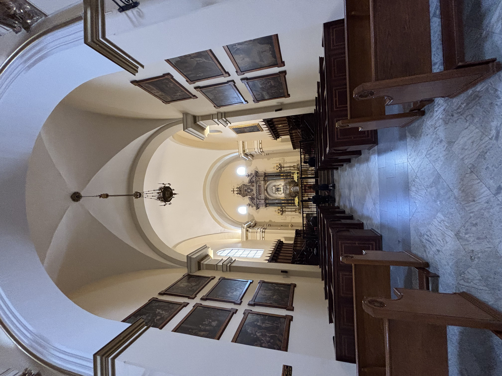

<br><details><summary>:camera:**64/IMG_0564.jpg**</summary><sub> `Exif version` 0232 `OS version` 27.0 `Date` 2026:07:24 13:23:07 `Aperture` Not known `Brightness` 1.7022976691754252 `Color space` 65535 `Compression` Not known`Exposure mode` 0 `Exposure time` 0.016666666666666666 `Focal length` 1.54 `Lens model` iPhone 15 Plus back dual wide camera 1.54mm f/2.4 `Lens specification` (1.54, 5.960000038146973, 1.6, 2.4) `Orientation` 6 `Scene type` Not known `f number` 2.4 `White balance` 0 `Sensing method` 2 `Shutter speed` 5.907121443520561</sub><sub>`Coordinates & altitude` (4.597372222222222, -74.07481388888888, 2610.1759530791787)</sub><sub> :earth_americas:`Location over` [Google Maps](http://maps.google.com/maps?q=4.597372222222222,-74.07481388888888) or [Openstreet Map](https://www.openstreetmap.org/query?lat=4.597372222222222&lon=-74.07481388888888)</sub></details>

<br><details><summary>:camera:**64/IMG_0608.jpg**</summary><sub> `Exif version` 0232 `OS version` 27.0 `Date` 2026:08:15 09:25:10 `Aperture` Not known `Brightness` 7.091815527084265 `Color space` 65535 `Compression` Not known`Exposure mode` 0 `Exposure time` 0.0017699115044247787 `Focal length` 5.96 `Lens model` iPhone 15 Plus back dual wide camera 5.96mm f/1.6 `Lens specification` (1.5399999618512084, 5.96, 1.6, 2.4) `Orientation` 6 `Scene type` Not known `f number` 1.6 `White balance` 0 `Sensing method` 2 `Shutter speed` 9.142034923422106</sub><sub>`Coordinates & altitude` (4.602288888888888, -74.06748333333333, 2625.0789436914906)</sub><sub> :earth_americas:`Location over` [Google Maps](http://maps.google.com/maps?q=4.602288888888888,-74.06748333333333) or [Openstreet Map](https://www.openstreetmap.org/query?lat=4.602288888888888&lon=-74.06748333333333)</sub></details>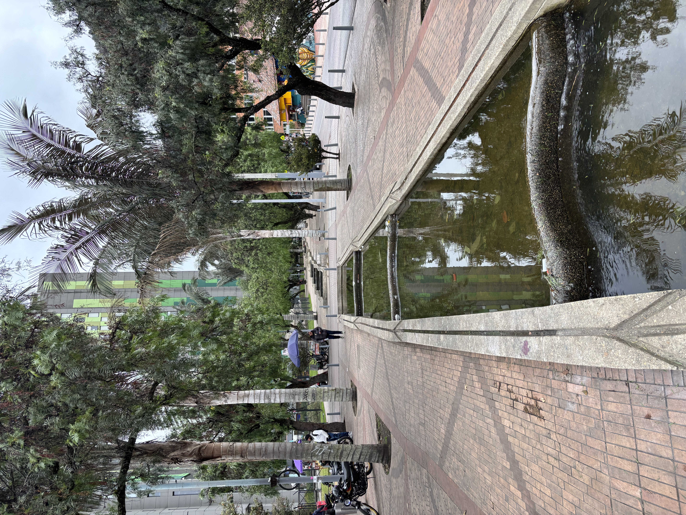

<br><details><summary>:camera:**64/IMG_0610.jpg**</summary><sub> `Exif version` 0232 `OS version` 27.0 `Date` 2026:08:15 09:33:10 `Aperture` Not known `Brightness` 9.604452767374116 `Color space` 65535 `Compression` Not known`Exposure mode` 0 `Exposure time` 0.0003020235578375113 `Focal length` 5.96 `Lens model` iPhone 15 Plus back dual wide camera 5.96mm f/1.6 `Lens specification` (1.5399999618512084, 5.96, 1.6, 2.4) `Orientation` 6 `Scene type` Not known `f number` 1.6 `White balance` 0 `Sensing method` 2 `Shutter speed` 11.693163830629205</sub><sub>`Coordinates & altitude` (4.602986111111111, -74.06407222222222, 2651.8824503311257)</sub><sub> :earth_americas:`Location over` [Google Maps](http://maps.google.com/maps?q=4.602986111111111,-74.06407222222222) or [Openstreet Map](https://www.openstreetmap.org/query?lat=4.602986111111111&lon=-74.06407222222222)</sub></details>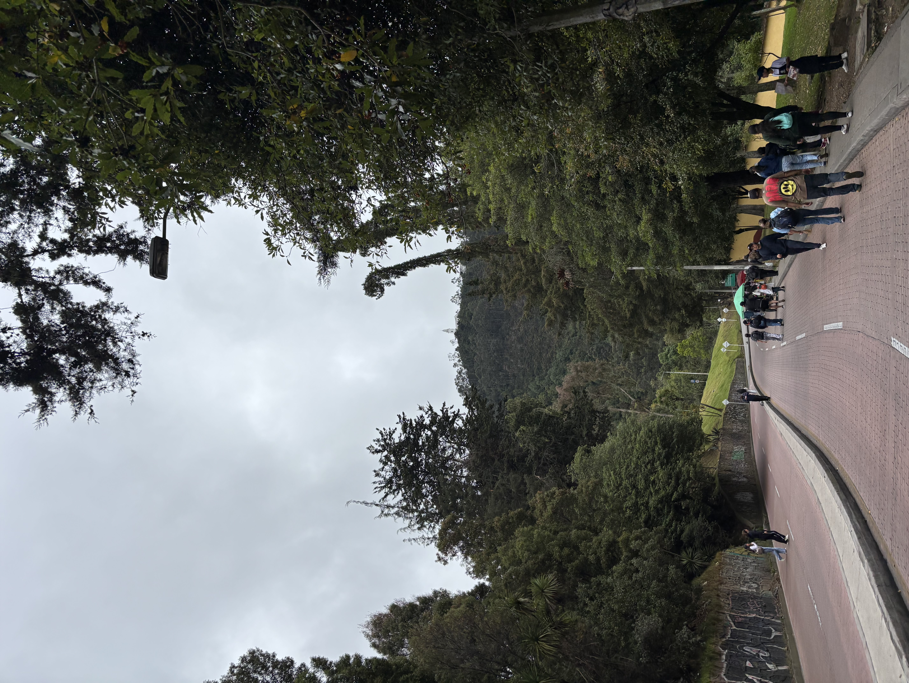

<br><details><summary>:camera:**64/IMG_0611.jpg**</summary><sub> `Exif version` 0232 `OS version` 27.0 `Date` 2026:08:15 09:35:35 `Aperture` Not known `Brightness` 9.80270360853536 `Color space` 65535 `Compression` Not known`Exposure mode` 0 `Exposure time` 0.0004269854824935952 `Focal length` 5.96 `Lens model` iPhone 15 Plus back dual wide camera 5.96mm f/1.6 `Lens specification` (1.5399999618512084, 5.96, 1.6, 2.4) `Orientation` 6 `Scene type` Not known `f number` 1.6 `White balance` 0 `Sensing method` 2 `Shutter speed` 11.193476318141197</sub><sub>`Coordinates & altitude` (4.603183333333333, -74.062775, 2666.6293152235426)</sub><sub> :earth_americas:`Location over` [Google Maps](http://maps.google.com/maps?q=4.603183333333333,-74.062775) or [Openstreet Map](https://www.openstreetmap.org/query?lat=4.603183333333333&lon=-74.062775)</sub></details>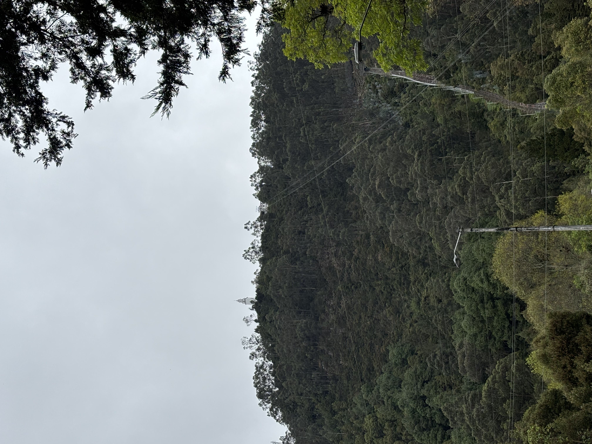

<br><details><summary>:camera:**64/IMG_0612.jpg**</summary><sub> `Exif version` 0232 `OS version` 27.0 `Date` 2026:08:15 09:39:44 `Aperture` Not known `Brightness` 9.773838501428722 `Color space` 65535 `Compression` Not known`Exposure mode` 0 `Exposure time` 0.0003020235578375113 `Focal length` 5.96 `Lens model` iPhone 15 Plus back dual wide camera 5.96mm f/1.6 `Lens specification` (1.5399999618512084, 5.96, 1.6, 2.4) `Orientation` 6 `Scene type` Not known `f number` 1.6 `White balance` 0 `Sensing method` 2 `Shutter speed` 11.693163830629205</sub><sub>`Coordinates & altitude` (4.603888888888888, -74.06144722222221, 2693.4924302788845)</sub><sub> :earth_americas:`Location over` [Google Maps](http://maps.google.com/maps?q=4.603888888888888,-74.06144722222221) or [Openstreet Map](https://www.openstreetmap.org/query?lat=4.603888888888888&lon=-74.06144722222221)</sub></details>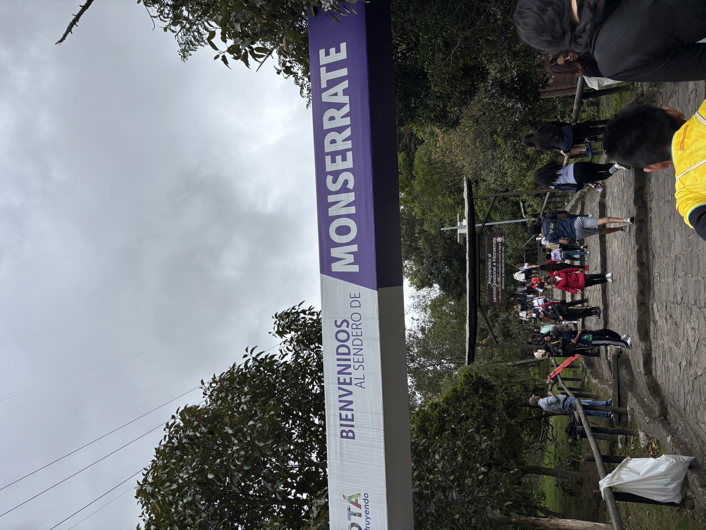

<br><details><summary>:camera:**64/IMG_0613.jpg**</summary><sub> `Exif version` 0232 `OS version` 27.0 `Date` 2026:08:15 09:40:02 `Aperture` Not known `Brightness` 9.392047188040273 `Color space` 65535 `Compression` Not known`Exposure mode` 0 `Exposure time` 0.0004269854824935952 `Focal length` 5.96 `Lens model` iPhone 15 Plus back dual wide camera 5.96mm f/1.6 `Lens specification` (1.5399999618512084, 5.96, 1.6, 2.4) `Orientation` 6 `Scene type` Not known `f number` 1.6 `White balance` 0 `Sensing method` 2 `Shutter speed` 11.193476318141197</sub><sub>`Coordinates & altitude` (4.604013888888889, -74.06139444444445, 2696.0052562417873)</sub><sub> :earth_americas:`Location over` [Google Maps](http://maps.google.com/maps?q=4.604013888888889,-74.06139444444445) or [Openstreet Map](https://www.openstreetmap.org/query?lat=4.604013888888889&lon=-74.06139444444445)</sub></details>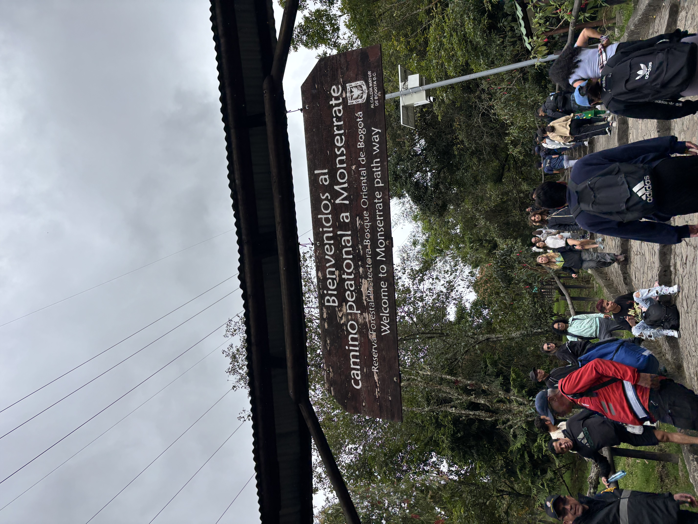

<br><details><summary>:camera:**64/IMG_0614.jpg**</summary><sub> `Exif version` 0232 `OS version` 27.0 `Date` 2026:08:15 09:55:15 `Aperture` Not known `Brightness` 9.299377486371004 `Color space` 65535 `Compression` Not known`Exposure mode` 0 `Exposure time` 0.00038895371450797355 `Focal length` 5.96 `Lens model` iPhone 15 Plus back dual wide camera 5.96mm f/1.6 `Lens specification` (1.5399999618512084, 5.96, 1.6, 2.4) `Orientation` 1 `Scene type` Not known `f number` 1.6 `White balance` 0 `Sensing method` 2 `Shutter speed` 11.327942223578477</sub><sub>`Coordinates & altitude` (4.608236111111111, -74.05940277777778, 2829.9507323568573)</sub><sub> :earth_americas:`Location over` [Google Maps](http://maps.google.com/maps?q=4.608236111111111,-74.05940277777778) or [Openstreet Map](https://www.openstreetmap.org/query?lat=4.608236111111111&lon=-74.05940277777778)</sub></details>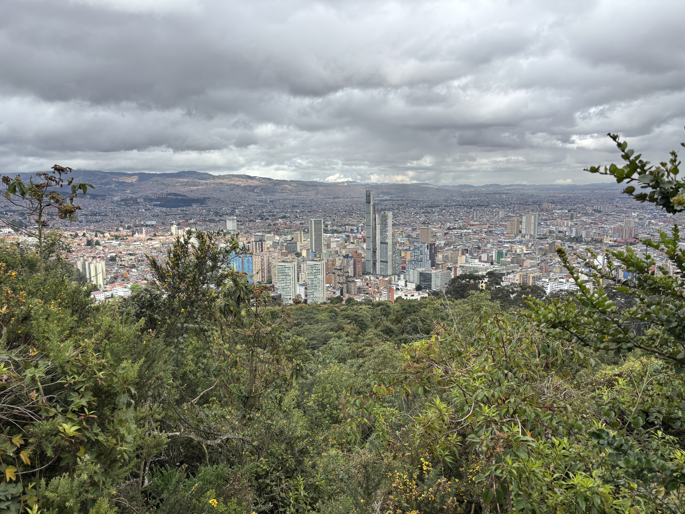

<br><details><summary>:camera:**64/IMG_0615.jpg**</summary><sub> `Exif version` 0232 `OS version` 27.0 `Date` 2026:08:15 09:55:17 `Aperture` Not known `Brightness` 7.451573229476273 `Color space` 65535 `Compression` Not known`Exposure mode` 0 `Exposure time` 0.001310615989515072 `Focal length` 5.96 `Lens model` iPhone 15 Plus back dual wide camera 5.96mm f/1.6 `Lens specification` (1.5399999618512084, 5.96, 1.6, 2.4) `Orientation` 6 `Scene type` Not known `f number` 1.6 `White balance` 0 `Sensing method` 2 `Shutter speed` 9.57621747831888</sub><sub>`Coordinates & altitude` (4.608236111111111, -74.0594111111111, 2829.7837398373986)</sub><sub> :earth_americas:`Location over` [Google Maps](http://maps.google.com/maps?q=4.608236111111111,-74.0594111111111) or [Openstreet Map](https://www.openstreetmap.org/query?lat=4.608236111111111&lon=-74.0594111111111)</sub></details>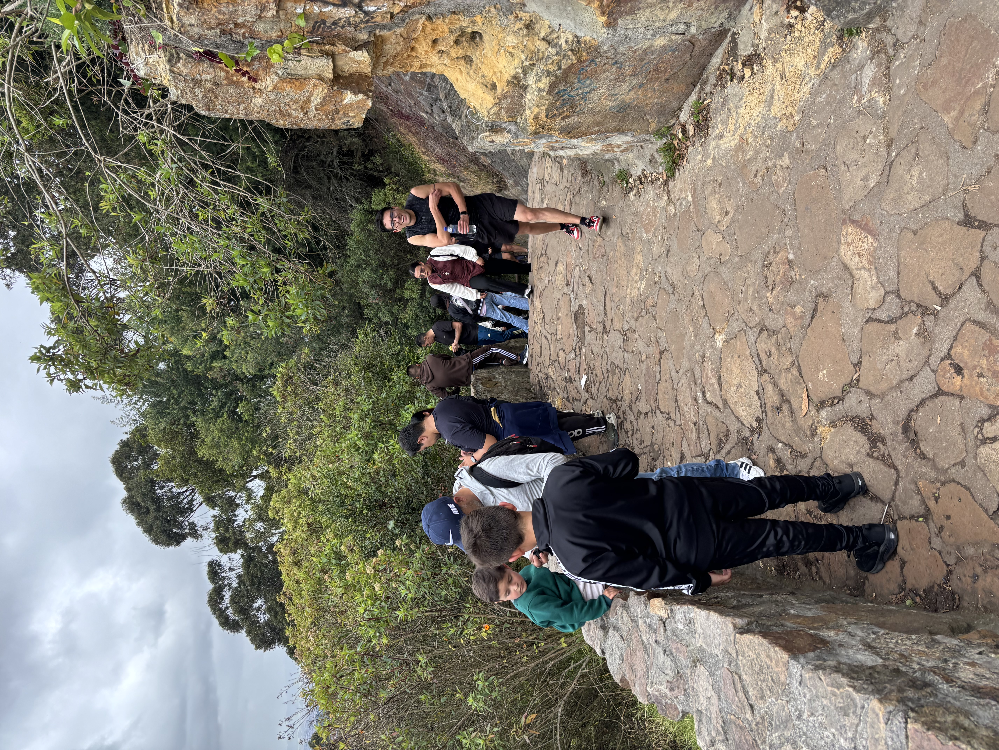

<br><details><summary>:camera:**64/IMG_0616.jpg**</summary><sub> `Exif version` 0232 `OS version` 27.0 `Date` 2026:08:15 09:55:19 `Aperture` Not known `Brightness` 8.475869506605553 `Color space` 65535 `Compression` Not known`Exposure mode` 0 `Exposure time` 0.0008680555555555555 `Focal length` 5.96 `Lens model` iPhone 15 Plus back dual wide camera 5.96mm f/1.6 `Lens specification` (1.5399999618512084, 5.96, 1.6, 2.4) `Orientation` 6 `Scene type` Not known `f number` 1.6 `White balance` 0 `Sensing method` 2 `Shutter speed` 10.17001733102253</sub><sub>`Coordinates & altitude` (4.608227777777778, -74.0594111111111, 2834.5591311343524)</sub><sub> :earth_americas:`Location over` [Google Maps](http://maps.google.com/maps?q=4.608227777777778,-74.0594111111111) or [Openstreet Map](https://www.openstreetmap.org/query?lat=4.608227777777778&lon=-74.0594111111111)</sub></details>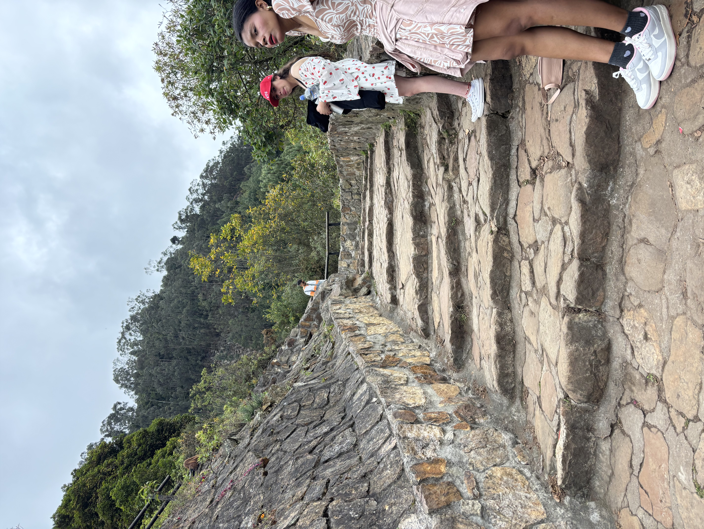

<br><details><summary>:camera:**64/IMG_0617.jpg**</summary><sub> `Exif version` 0232 `OS version` 27.0 `Date` 2026:08:15 10:27:02 `Aperture` Not known `Brightness` 10.346538782318598 `Color space` 65535 `Compression` Not known`Exposure mode` 0 `Exposure time` 0.00022598870056497175 `Focal length` 5.96 `Lens model` iPhone 15 Plus back dual wide camera 5.96mm f/1.6 `Lens specification` (1.5399999618512084, 5.96, 1.6, 2.4) `Orientation` 6 `Scene type` Not known `f number` 1.6 `White balance` 0 `Sensing method` 2 `Shutter speed` 12.111389612993785</sub></details>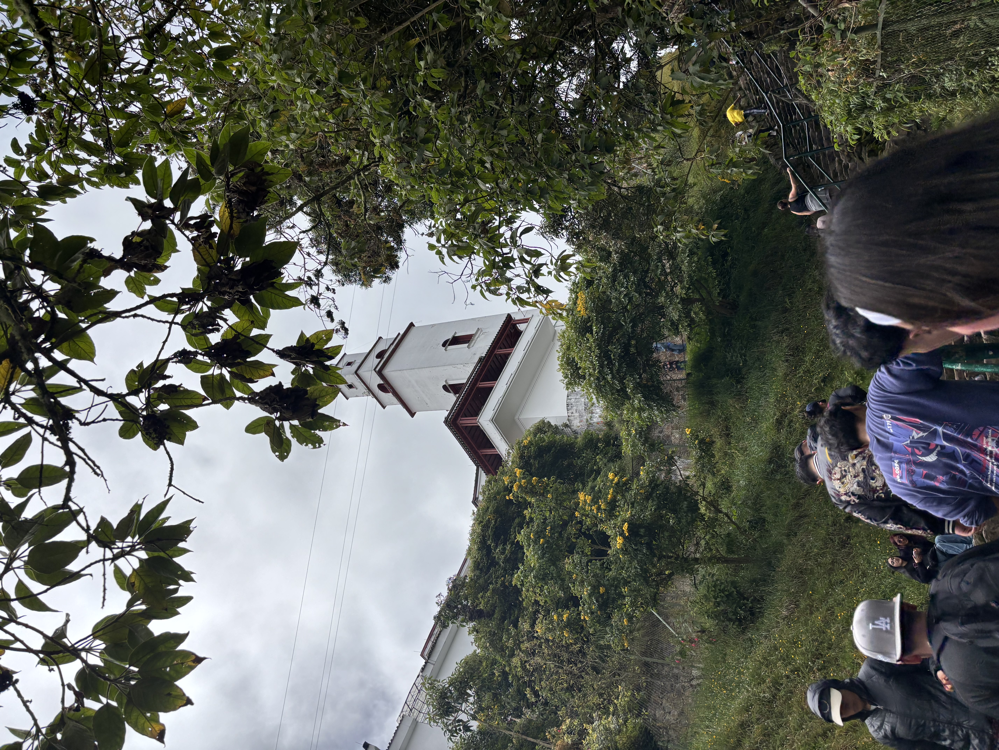

<br><details><summary>:camera:**64/IMG_0618.jpg**</summary><sub> `Exif version` 0232 `OS version` 27.0 `Date` 2026:08:15 10:29:00 `Aperture` Not known `Brightness` 9.552098973034653 `Color space` 65535 `Compression` Not known`Exposure mode` 0 `Exposure time` 0.0003020235578375113 `Focal length` 5.96 `Lens model` iPhone 15 Plus back dual wide camera 5.96mm f/1.6 `Lens specification` (1.5399999618512084, 5.96, 1.6, 2.4) `Orientation` 1 `Scene type` Not known `f number` 1.6 `White balance` 0 `Sensing method` 2 `Shutter speed` 11.693163830629205</sub><sub>`Coordinates & altitude` (4.604994444444444, -74.05566388888889, 3183.4451178451177)</sub><sub> :earth_americas:`Location over` [Google Maps](http://maps.google.com/maps?q=4.604994444444444,-74.05566388888889) or [Openstreet Map](https://www.openstreetmap.org/query?lat=4.604994444444444&lon=-74.05566388888889)</sub></details>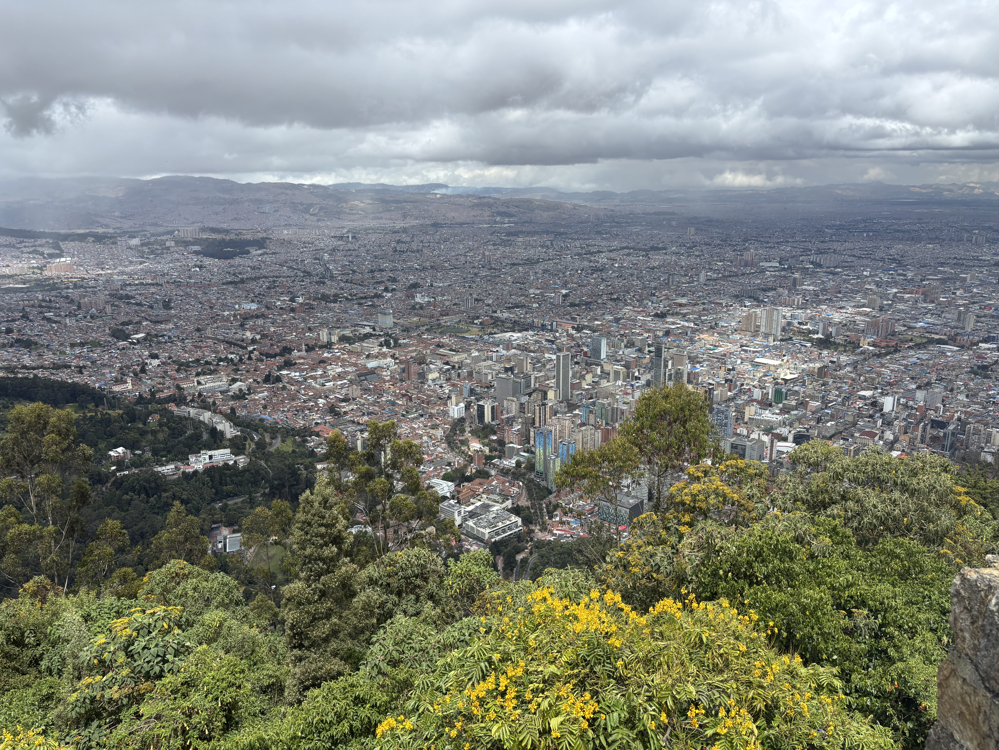

<br><details><summary>:camera:**64/IMG_0619.jpg**</summary><sub> `Exif version` 0232 `OS version` 27.0 `Date` 2026:08:15 10:29:02 `Aperture` Not known `Brightness` 9.625550362392469 `Color space` 65535 `Compression` Not known`Exposure mode` 0 `Exposure time` 0.00031201248049921997 `Focal length` 5.96 `Lens model` iPhone 15 Plus back dual wide camera 5.96mm f/1.6 `Lens specification` (1.5399999618512084, 5.96, 1.6, 2.4) `Orientation` 1 `Scene type` Not known `f number` 1.6 `White balance` 0 `Sensing method` 2 `Shutter speed` 11.646166350582497</sub><sub>`Coordinates & altitude` (4.605119444444444, -74.05565555555555, 3170.853076923077)</sub><sub> :earth_americas:`Location over` [Google Maps](http://maps.google.com/maps?q=4.605119444444444,-74.05565555555555) or [Openstreet Map](https://www.openstreetmap.org/query?lat=4.605119444444444&lon=-74.05565555555555)</sub></details>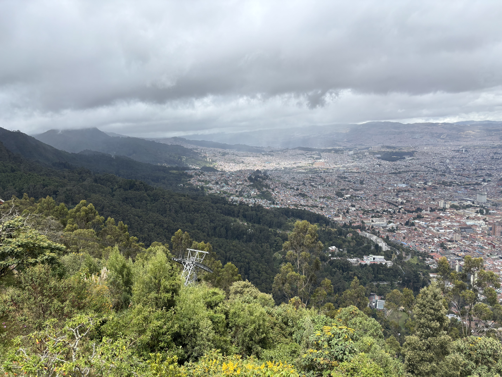

<br><details><summary>:camera:**64/IMG_0620.jpg**</summary><sub> `Exif version` 0232 `OS version` 27.0 `Date` 2026:08:15 10:29:04 `Aperture` Not known `Brightness` 10.433960366160346 `Color space` 65535 `Compression` Not known`Exposure mode` 0 `Exposure time` 0.00016801075268817206 `Focal length` 5.96 `Lens model` iPhone 15 Plus back dual wide camera 5.96mm f/1.6 `Lens specification` (1.5399999618512084, 5.96, 1.6, 2.4) `Orientation` 1 `Scene type` Not known `f number` 1.6 `White balance` 0 `Sensing method` 2 `Shutter speed` 12.539251137291497</sub><sub>`Coordinates & altitude` (4.605130555555555, -74.05564166666666, 3170.8811544991513)</sub><sub> :earth_americas:`Location over` [Google Maps](http://maps.google.com/maps?q=4.605130555555555,-74.05564166666666) or [Openstreet Map](https://www.openstreetmap.org/query?lat=4.605130555555555&lon=-74.05564166666666)</sub></details>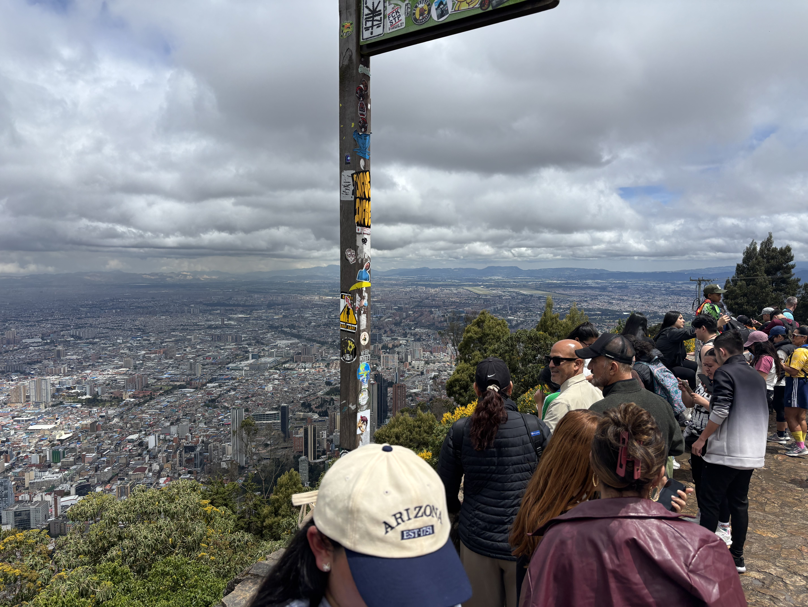

<br><details><summary>:camera:**64/IMG_0621.jpg**</summary><sub> `Exif version` 0232 `OS version` 27.0 `Date` 2026:08:15 10:29:08 `Aperture` Not known `Brightness` 11.19250037953545 `Color space` 65535 `Compression` Not known`Exposure mode` 0 `Exposure time` 0.0006071645415907711 `Focal length` 1.54 `Lens model` iPhone 15 Plus back dual wide camera 1.54mm f/2.4 `Lens specification` (1.54, 5.960000038146973, 1.6, 2.4) `Orientation` 6 `Scene type` Not known `f number` 2.4 `White balance` 0 `Sensing method` 2 `Shutter speed` 10.686015863183082</sub><sub>`Coordinates & altitude` (4.60515, -74.05563333333333, 3171.9844236760123)</sub><sub> :earth_americas:`Location over` [Google Maps](http://maps.google.com/maps?q=4.60515,-74.05563333333333) or [Openstreet Map](https://www.openstreetmap.org/query?lat=4.60515&lon=-74.05563333333333)</sub></details>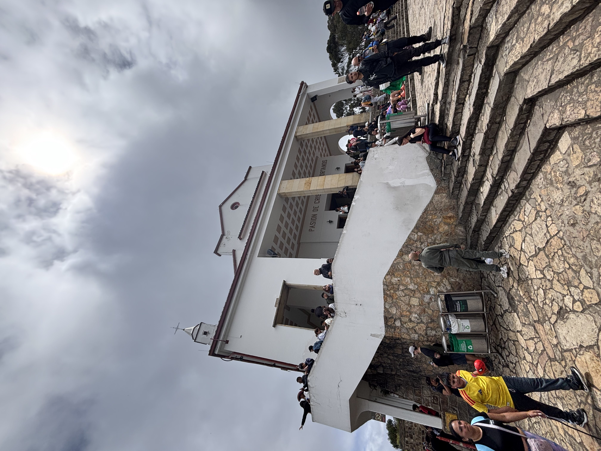

<br><details><summary>:camera:**64/IMG_0622.jpg**</summary><sub> `Exif version` 0232 `OS version` 27.0 `Date` 2026:08:15 10:29:24 `Aperture` Not known `Brightness` 10.334654101520668 `Color space` 65535 `Compression` Not known`Exposure mode` 0 `Exposure time` 0.0009587727708533077 `Focal length` 1.54 `Lens model` iPhone 15 Plus back dual wide camera 1.54mm f/2.4 `Lens specification` (1.54, 5.960000038146973, 1.6, 2.4) `Orientation` 1 `Scene type` Not known `f number` 2.4 `White balance` 0 `Sensing method` 2 `Shutter speed` 10.026181570894254</sub><sub>`Coordinates & altitude` (4.60515, -74.05555, 3173.1274900398407)</sub><sub> :earth_americas:`Location over` [Google Maps](http://maps.google.com/maps?q=4.60515,-74.05555) or [Openstreet Map](https://www.openstreetmap.org/query?lat=4.60515&lon=-74.05555)</sub></details>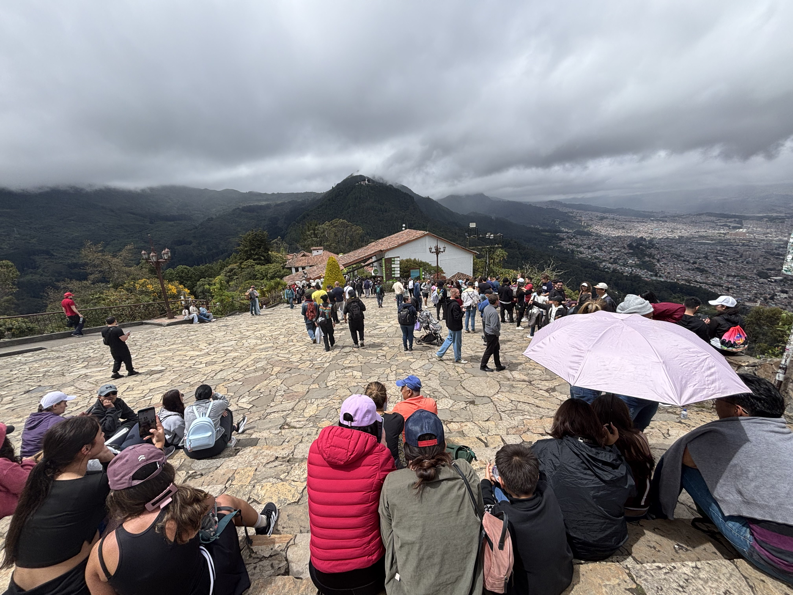

<br><details><summary>:camera:**64/IMG_0623.jpg**</summary><sub> `Exif version` 0232 `OS version` 27.0 `Date` 2026:08:15 10:29:30 `Aperture` Not known `Brightness` 11.054170344218887 `Color space` 65535 `Compression` Not known`Exposure mode` 0 `Exposure time` 0.0008849557522123894 `Focal length` 1.54 `Lens model` iPhone 15 Plus back dual wide camera 1.54mm f/2.4 `Lens specification` (1.54, 5.960000038146973, 1.6, 2.4) `Orientation` 1 `Scene type` Not known `f number` 2.4 `White balance` 0 `Sensing method` 2 `Shutter speed` 10.142034923422106</sub><sub>`Coordinates & altitude` (4.605158333333333, -74.05553333333333, 3172.1306666666665)</sub><sub> :earth_americas:`Location over` [Google Maps](http://maps.google.com/maps?q=4.605158333333333,-74.05553333333333) or [Openstreet Map](https://www.openstreetmap.org/query?lat=4.605158333333333&lon=-74.05553333333333)</sub></details>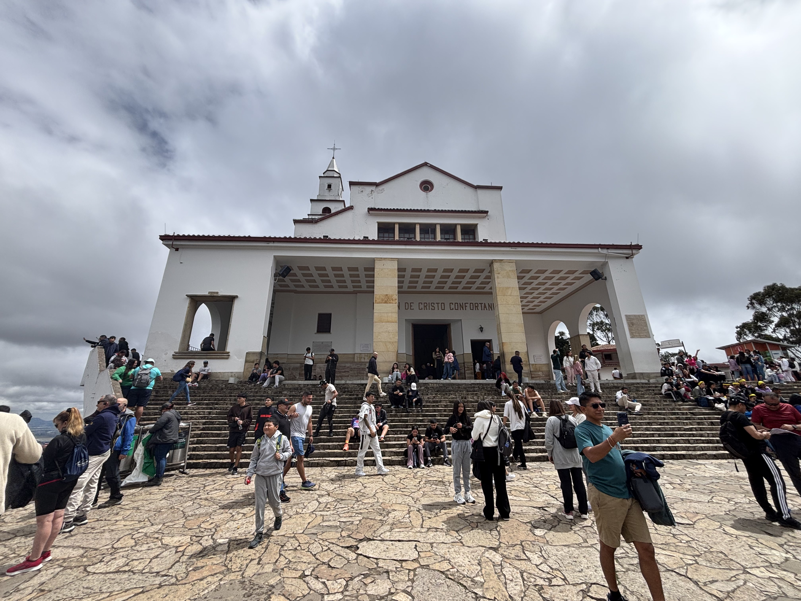

<br><details><summary>:camera:**64/IMG_0624.jpg**</summary><sub> `Exif version` 0232 `OS version` 27.0 `Date` 2026:08:15 10:31:22 `Aperture` Not known `Brightness` 9.641246303896907 `Color space` 65535 `Compression` Not known`Exposure mode` 0 `Exposure time` 0.000273972602739726 `Focal length` 5.96 `Lens model` iPhone 15 Plus back dual wide camera 5.96mm f/1.6 `Lens specification` (1.5399999618512084, 5.96, 1.6, 2.4) `Orientation` 1 `Scene type` Not known `f number` 1.6 `White balance` 0 `Sensing method` 2 `Shutter speed` 11.83353647919206</sub><sub>`Coordinates & altitude` (4.604588888888888, -74.05545833333333, 3159.9534161490683)</sub><sub> :earth_americas:`Location over` [Google Maps](http://maps.google.com/maps?q=4.604588888888888,-74.05545833333333) or [Openstreet Map](https://www.openstreetmap.org/query?lat=4.604588888888888&lon=-74.05545833333333)</sub></details>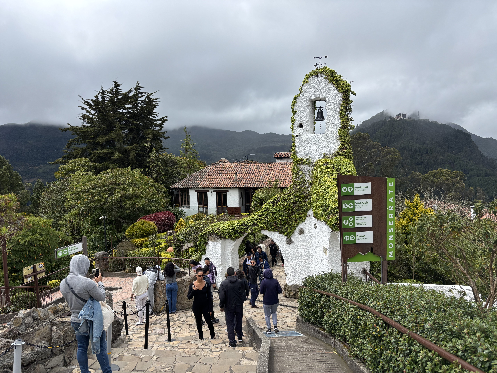

<br><details><summary>:camera:**64/IMG_0625.jpg**</summary><sub> `Exif version` 0232 `OS version` 27.0 `Date` 2026:08:15 10:31:25 `Aperture` Not known `Brightness` 10.289956829071588 `Color space` 65535 `Compression` Not known`Exposure mode` 0 `Exposure time` 0.0015128593040847202 `Focal length` 1.54 `Lens model` iPhone 15 Plus back dual wide camera 1.54mm f/2.4 `Lens specification` (1.54, 5.960000038146973, 1.6, 2.4) `Orientation` 1 `Scene type` Not known `f number` 2.4 `White balance` 0 `Sensing method` 2 `Shutter speed` 9.367419077917488</sub><sub>`Coordinates & altitude` (4.604575, -74.05545833333333, 3158.345263157895)</sub><sub> :earth_americas:`Location over` [Google Maps](http://maps.google.com/maps?q=4.604575,-74.05545833333333) or [Openstreet Map](https://www.openstreetmap.org/query?lat=4.604575&lon=-74.05545833333333)</sub></details>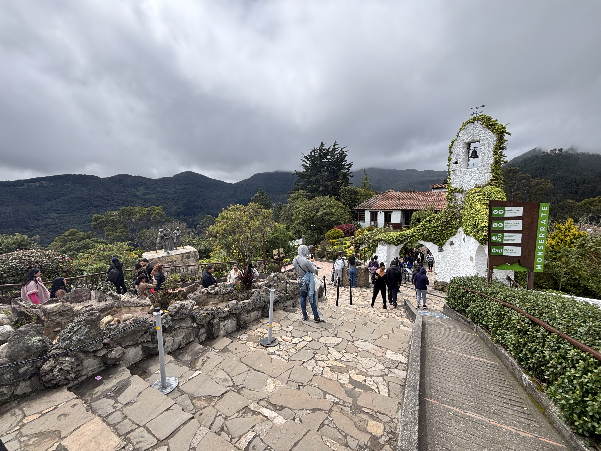

<br><details><summary>:camera:**64/IMG_0626.jpg**</summary><sub> `Exif version` 0232 `OS version` 27.0 `Date` 2026:08:15 10:31:34 `Aperture` Not known `Brightness` 10.853861517976032 `Color space` 65535 `Compression` Not known`Exposure mode` 0 `Exposure time` 0.0005701254275940707 `Focal length` 1.54 `Lens model` iPhone 15 Plus back dual wide camera 1.54mm f/2.4 `Lens specification` (1.54, 5.960000038146973, 1.6, 2.4) `Orientation` 1 `Scene type` Not known `f number` 2.4 `White balance` 0 `Sensing method` 2 `Shutter speed` 10.776750467483899</sub><sub>`Coordinates & altitude` (4.6046, -74.05544166666667, 3156.3369639210346)</sub><sub> :earth_americas:`Location over` [Google Maps](http://maps.google.com/maps?q=4.6046,-74.05544166666667) or [Openstreet Map](https://www.openstreetmap.org/query?lat=4.6046&lon=-74.05544166666667)</sub></details>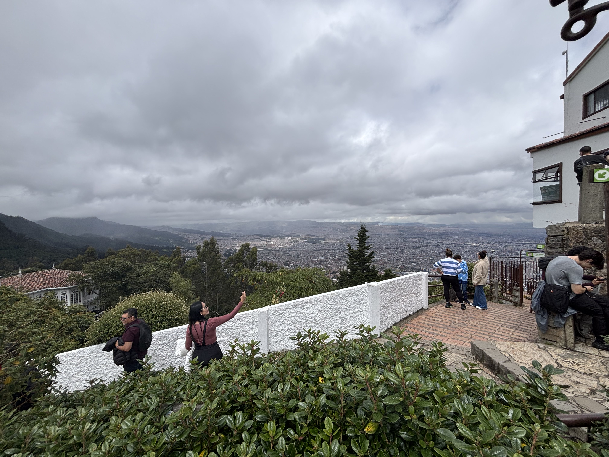

<br><details><summary>:camera:**64/IMG_0627.jpg**</summary><sub> `Exif version` 0232 `OS version` 27.0 `Date` 2026:08:15 10:32:11 `Aperture` Not known `Brightness` 10.857257832710548 `Color space` 65535 `Compression` Not known`Exposure mode` 0 `Exposure time` 0.0006071645415907711 `Focal length` 1.54 `Lens model` iPhone 15 Plus back dual wide camera 1.54mm f/2.4 `Lens specification` (1.54, 5.960000038146973, 1.6, 2.4) `Orientation` 1 `Scene type` Not known `f number` 2.4 `White balance` 0 `Sensing method` 2 `Shutter speed` 10.686015863183082</sub><sub>`Coordinates & altitude` (4.604241666666666, -74.05536666666666, 3144.8594436310395)</sub><sub> :earth_americas:`Location over` [Google Maps](http://maps.google.com/maps?q=4.604241666666666,-74.05536666666666) or [Openstreet Map](https://www.openstreetmap.org/query?lat=4.604241666666666&lon=-74.05536666666666)</sub></details>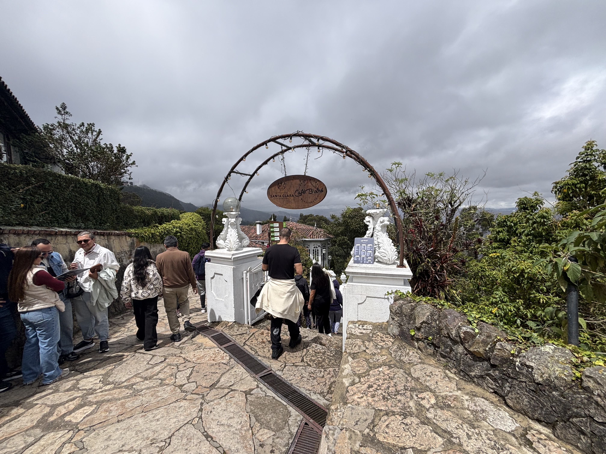

<br><details><summary>:camera:**64/IMG_0628.jpg**</summary><sub> `Exif version` 0232 `OS version` 27.0 `Date` 2026:08:15 10:33:00 `Aperture` Not known `Brightness` 10.90359508650074 `Color space` 65535 `Compression` Not known`Exposure mode` 0 `Exposure time` 0.000856898029134533 `Focal length` 1.54 `Lens model` iPhone 15 Plus back dual wide camera 1.54mm f/2.4 `Lens specification` (1.54, 5.960000038146973, 1.6, 2.4) `Orientation` 6 `Scene type` Not known `f number` 2.4 `White balance` 0 `Sensing method` 2 `Shutter speed` 10.188417174950178</sub><sub>`Coordinates & altitude` (4.603886111111111, -74.05535, 3143.323782234957)</sub><sub> :earth_americas:`Location over` [Google Maps](http://maps.google.com/maps?q=4.603886111111111,-74.05535) or [Openstreet Map](https://www.openstreetmap.org/query?lat=4.603886111111111&lon=-74.05535)</sub></details>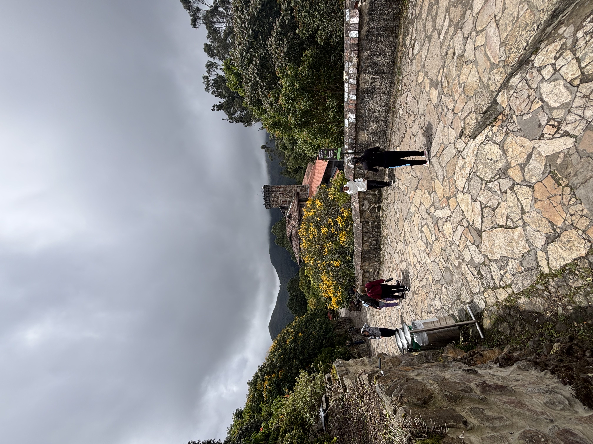

<br><details><summary>:camera:**64/IMG_0629.jpg**</summary><sub> `Exif version` 0232 `OS version` 27.0 `Date` 2026:08:15 10:33:02 `Aperture` Not known `Brightness` 10.23839073327128 `Color space` 65535 `Compression` Not known`Exposure mode` 0 `Exposure time` 0.001272264631043257 `Focal length` 1.54 `Lens model` iPhone 15 Plus back dual wide camera 1.54mm f/2.4 `Lens specification` (1.54, 5.960000038146973, 1.6, 2.4) `Orientation` 1 `Scene type` Not known `f number` 2.4 `White balance` 0 `Sensing method` 2 `Shutter speed` 9.617551865018305</sub><sub>`Coordinates & altitude` (4.6038749999999995, -74.05534444444444, 3143.0903790087464)</sub><sub> :earth_americas:`Location over` [Google Maps](http://maps.google.com/maps?q=4.6038749999999995,-74.05534444444444) or [Openstreet Map](https://www.openstreetmap.org/query?lat=4.6038749999999995&lon=-74.05534444444444)</sub></details>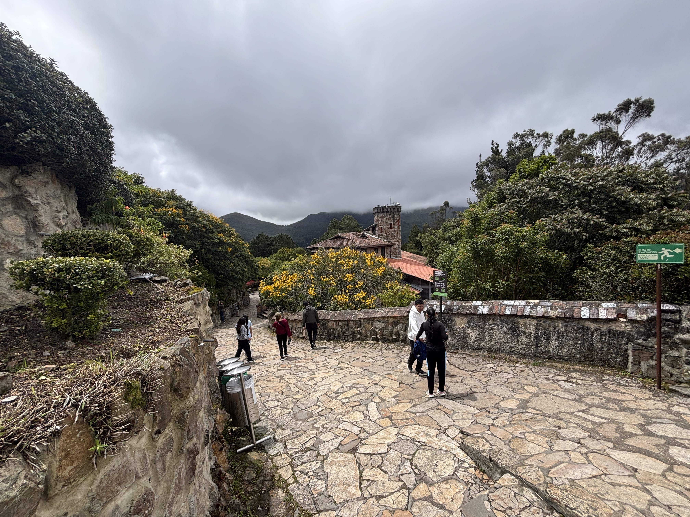

<br><details><summary>:camera:**64/IMG_0630.jpg**</summary><sub> `Exif version` 0232 `OS version` 27.0 `Date` 2026:08:15 10:33:44 `Aperture` Not known `Brightness` 9.343061694122804 `Color space` 65535 `Compression` Not known`Exposure mode` 0 `Exposure time` 0.003816793893129771 `Focal length` 1.54 `Lens model` iPhone 15 Plus back dual wide camera 1.54mm f/2.4 `Lens specification` (1.54, 5.960000038146973, 1.6, 2.4) `Orientation` 1 `Scene type` Not known `f number` 2.4 `White balance` 0 `Sensing method` 2 `Shutter speed` 8.032967181990779</sub><sub>`Coordinates & altitude` (4.603713888888889, -74.05493888888888, 3137.722460658083)</sub><sub> :earth_americas:`Location over` [Google Maps](http://maps.google.com/maps?q=4.603713888888889,-74.05493888888888) or [Openstreet Map](https://www.openstreetmap.org/query?lat=4.603713888888889&lon=-74.05493888888888)</sub></details>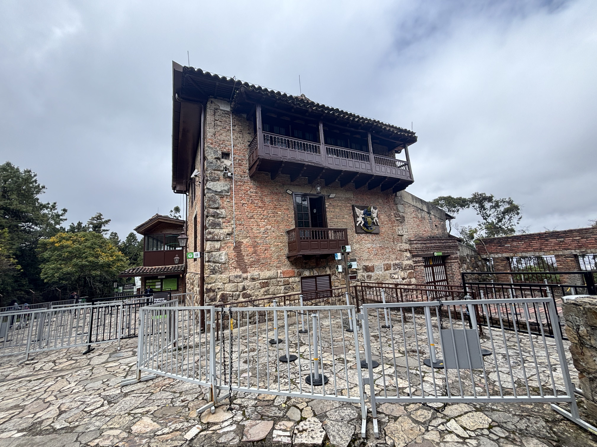

<br><details><summary>:camera:**64/IMG_0631.jpg**</summary><sub> `Exif version` 0232 `OS version` 27.0 `Date` 2026:08:15 10:33:50 `Aperture` Not known `Brightness` 9.508309871946235 `Color space` 65535 `Compression` Not known`Exposure mode` 0 `Exposure time` 0.00036900369003690036 `Focal length` 5.96 `Lens model` iPhone 15 Plus back dual wide camera 5.96mm f/1.6 `Lens specification` (1.5399999618512084, 5.96, 1.6, 2.4) `Orientation` 6 `Scene type` Not known `f number` 1.6 `White balance` 0 `Sensing method` 2 `Shutter speed` 11.404091553575046</sub><sub>`Coordinates & altitude` (4.6037027777777775, -74.05495555555555, 3137.158496732026)</sub><sub> :earth_americas:`Location over` [Google Maps](http://maps.google.com/maps?q=4.6037027777777775,-74.05495555555555) or [Openstreet Map](https://www.openstreetmap.org/query?lat=4.6037027777777775&lon=-74.05495555555555)</sub></details>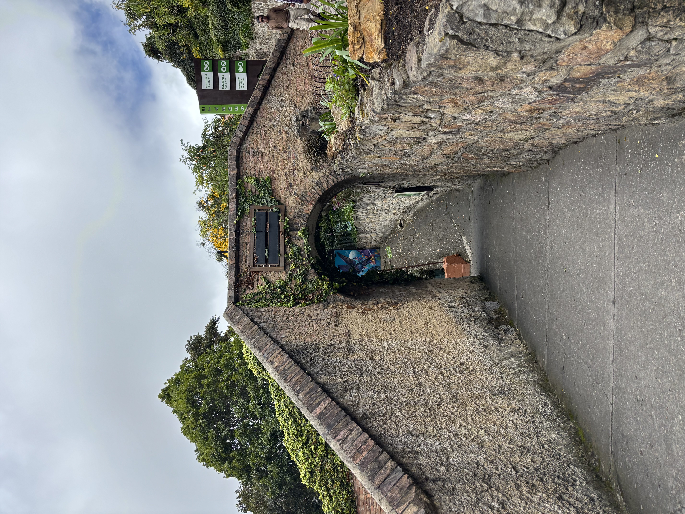

<br><details><summary>:camera:**64/IMG_0632.jpg**</summary><sub> `Exif version` 0232 `OS version` 27.0 `Date` 2026:08:15 10:35:29 `Aperture` Not known `Brightness` 7.820965457121064 `Color space` 65535 `Compression` Not known`Exposure mode` 0 `Exposure time` 0.0011655011655011655 `Focal length` 5.96 `Lens model` iPhone 15 Plus back dual wide camera 5.96mm f/1.6 `Lens specification` (1.5399999618512084, 5.96, 1.6, 2.4) `Orientation` 6 `Scene type` Not known `f number` 1.6 `White balance` 0 `Sensing method` 2 `Shutter speed` 9.744216499345264</sub><sub>`Coordinates & altitude` (4.603766666666666, -74.05486944444444, 3130.6825775656325)</sub><sub> :earth_americas:`Location over` [Google Maps](http://maps.google.com/maps?q=4.603766666666666,-74.05486944444444) or [Openstreet Map](https://www.openstreetmap.org/query?lat=4.603766666666666&lon=-74.05486944444444)</sub></details>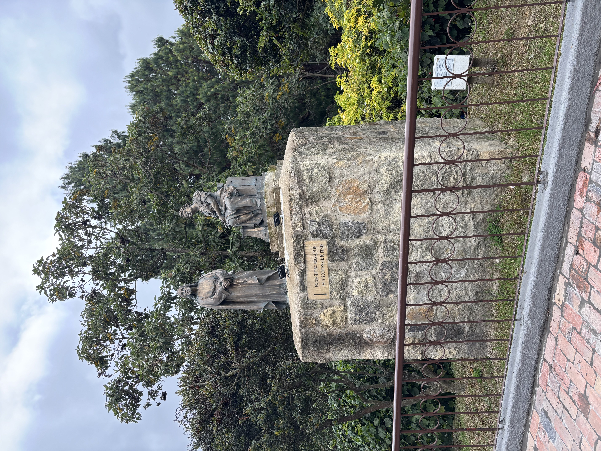

<br><details><summary>:camera:**64/IMG_0633.jpg**</summary><sub> `Exif version` 0232 `OS version` 27.0 `Date` 2026:08:15 10:38:06 `Aperture` Not known `Brightness` 10.557807288060923 `Color space` 65535 `Compression` Not known`Exposure mode` 0 `Exposure time` 0.00015800284405119292 `Focal length` 5.96 `Lens model` iPhone 15 Plus back dual wide camera 5.96mm f/1.6 `Lens specification` (1.5399999618512084, 5.96, 1.6, 2.4) `Orientation` 6 `Scene type` Not known `f number` 1.6 `White balance` 0 `Sensing method` 2 `Shutter speed` 12.627787823990356</sub><sub>`Coordinates & altitude` (4.604691666666667, -74.05542777777778, 3157.165577342048)</sub><sub> :earth_americas:`Location over` [Google Maps](http://maps.google.com/maps?q=4.604691666666667,-74.05542777777778) or [Openstreet Map](https://www.openstreetmap.org/query?lat=4.604691666666667&lon=-74.05542777777778)</sub></details>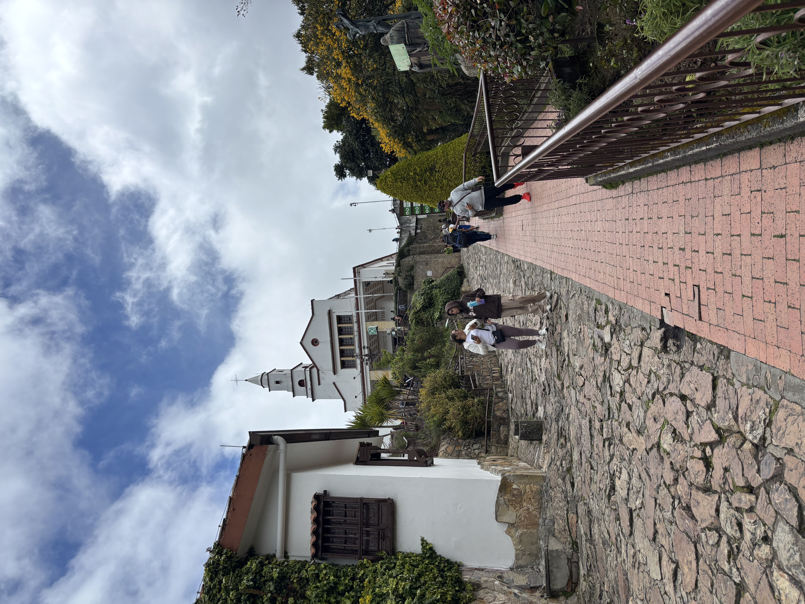

<br><details><summary>:camera:**64/IMG_0634.jpg**</summary><sub> `Exif version` 0232 `OS version` 27.0 `Date` 2026:08:15 10:41:11 `Aperture` Not known `Brightness` 8.083532219570406 `Color space` 65535 `Compression` Not known`Exposure mode` 0 `Exposure time` 0.0010893246187363835 `Focal length` 5.96 `Lens model` iPhone 15 Plus back dual wide camera 5.96mm f/1.6 `Lens specification` (1.5399999618512084, 5.96, 1.6, 2.4) `Orientation` 1 `Scene type` Not known `f number` 1.6 `White balance` 0 `Sensing method` 2 `Shutter speed` 9.84278033296625</sub><sub>`Coordinates & altitude` (4.6058916666666665, -74.05509166666667, 3175.322558922559)</sub><sub> :earth_americas:`Location over` [Google Maps](http://maps.google.com/maps?q=4.6058916666666665,-74.05509166666667) or [Openstreet Map](https://www.openstreetmap.org/query?lat=4.6058916666666665&lon=-74.05509166666667)</sub></details>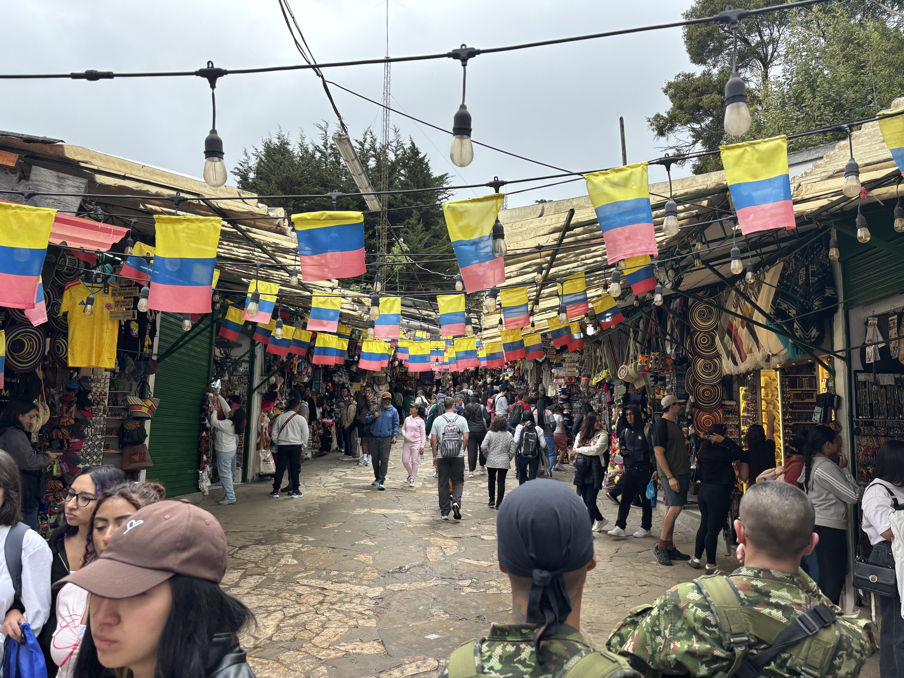

<br><details><summary>:camera:**64/IMG_0635.jpg**</summary><sub> `Exif version` 0232 `OS version` 27.0 `Date` 2026:08:15 10:41:15 `Aperture` Not known `Brightness` 7.660022583337424 `Color space` 65535 `Compression` Not known`Exposure mode` 0 `Exposure time` 0.0014064697609001407 `Focal length` 5.96 `Lens model` iPhone 15 Plus back dual wide camera 5.96mm f/1.6 `Lens specification` (1.5399999618512084, 5.96, 1.6, 2.4) `Orientation` 1 `Scene type` Not known `f number` 1.6 `White balance` 0 `Sensing method` 2 `Shutter speed` 9.474187695860135</sub><sub>`Coordinates & altitude` (4.605916666666666, -74.05507777777777, 3178.2905759162304)</sub><sub> :earth_americas:`Location over` [Google Maps](http://maps.google.com/maps?q=4.605916666666666,-74.05507777777777) or [Openstreet Map](https://www.openstreetmap.org/query?lat=4.605916666666666&lon=-74.05507777777777)</sub></details>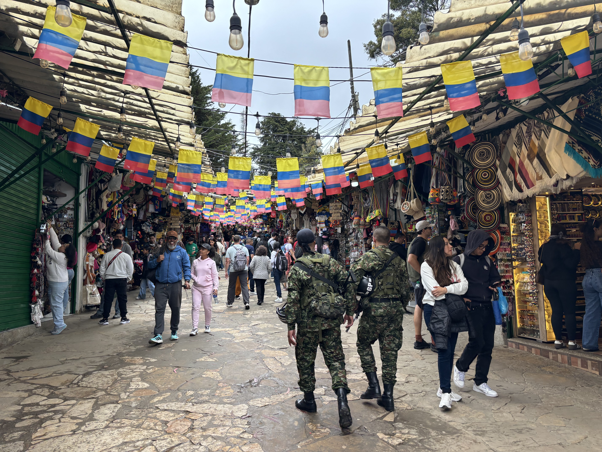

<br><details><summary>:camera:**64/IMG_0636.jpg**</summary><sub> `Exif version` 0232 `OS version` 27.0 `Date` 2026:08:15 10:42:45 `Aperture` Not known `Brightness` 3.280504273645032 `Color space` 65535 `Compression` Not known`Exposure mode` 0 `Exposure time` 0.00980392156862745 `Focal length` 5.96 `Lens model` iPhone 15 Plus back dual wide camera 5.96mm f/1.6 `Lens specification` (1.5399999618512084, 5.96, 1.6, 2.4) `Orientation` 6 `Scene type` Not known `f number` 1.6 `White balance` 0 `Sensing method` 2 `Shutter speed` 6.674328067679868</sub><sub>`Coordinates & altitude` (4.60555, -74.05539722222223, 3161.0855018587363)</sub><sub> :earth_americas:`Location over` [Google Maps](http://maps.google.com/maps?q=4.60555,-74.05539722222223) or [Openstreet Map](https://www.openstreetmap.org/query?lat=4.60555&lon=-74.05539722222223)</sub></details>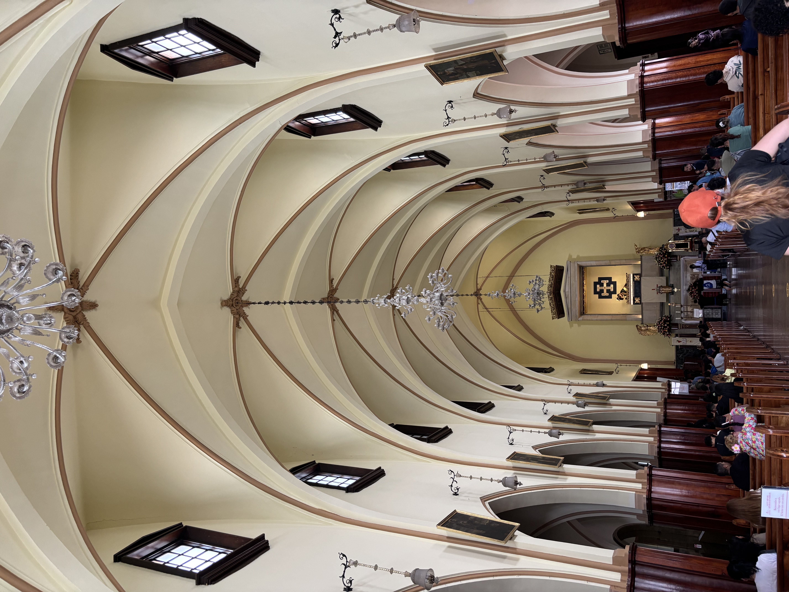

<br><details><summary>:camera:**64/IMG_0637.jpg**</summary><sub> `Exif version` 0232 `OS version` 27.0 `Date` 2026:08:15 10:42:51 `Aperture` Not known `Brightness` 3.1708465892657935 `Color space` 65535 `Compression` Not known`Exposure mode` 0 `Exposure time` 0.011235955056179775 `Focal length` 1.54 `Lens model` iPhone 15 Plus back dual wide camera 1.54mm f/2.4 `Lens specification` (1.54, 5.960000038146973, 1.6, 2.4) `Orientation` 1 `Scene type` Not known `f number` 2.4 `White balance` 0 `Sensing method` 2 `Shutter speed` 6.478683872711303</sub><sub>`Coordinates & altitude` (4.605461111111111, -74.05552777777777, 3163.815238095238)</sub><sub> :earth_americas:`Location over` [Google Maps](http://maps.google.com/maps?q=4.605461111111111,-74.05552777777777) or [Openstreet Map](https://www.openstreetmap.org/query?lat=4.605461111111111&lon=-74.05552777777777)</sub></details>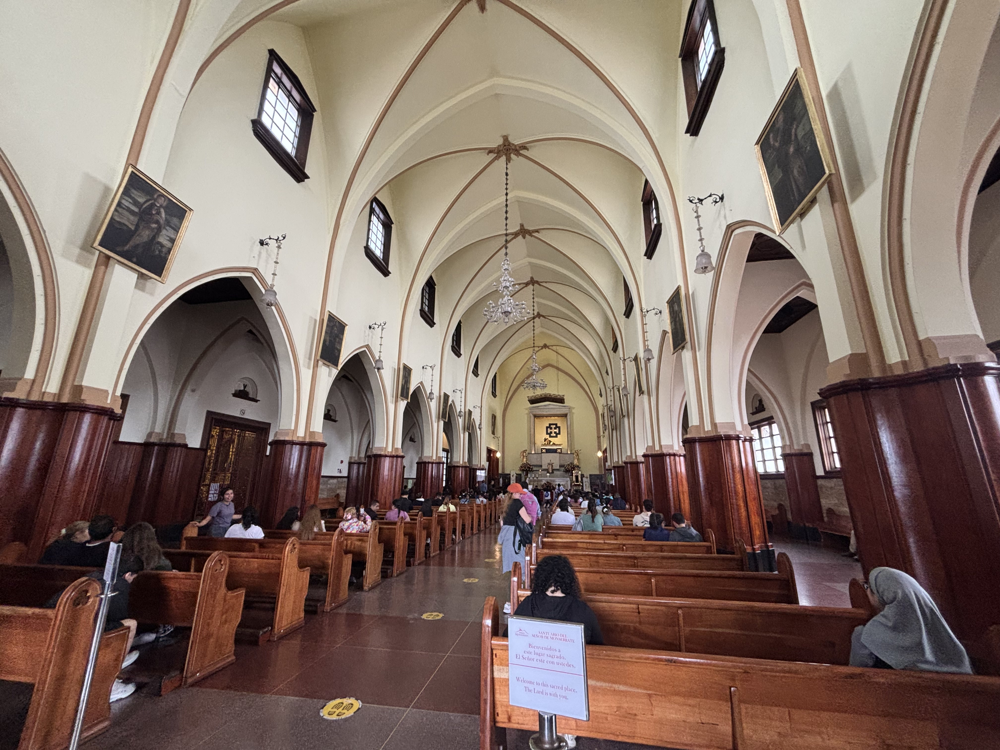

<br><details><summary>:camera:**64/IMG_0638.jpg**</summary><sub> `Exif version` 0232 `OS version` 27.0 `Date` 2026:08:15 10:43:58 `Aperture` Not known `Brightness` 9.792984880918269 `Color space` 65535 `Compression` Not known`Exposure mode` 0 `Exposure time` 0.000254000508001016 `Focal length` 5.96 `Lens model` iPhone 15 Plus back dual wide camera 5.96mm f/1.6 `Lens specification` (1.5399999618512084, 5.96, 1.6, 2.4) `Orientation` 1 `Scene type` Not known `f number` 1.6 `White balance` 0 `Sensing method` 2 `Shutter speed` 11.942883882431131</sub><sub>`Coordinates & altitude` (4.605169444444444, -74.05565555555555, 3183.305714285714)</sub><sub> :earth_americas:`Location over` [Google Maps](http://maps.google.com/maps?q=4.605169444444444,-74.05565555555555) or [Openstreet Map](https://www.openstreetmap.org/query?lat=4.605169444444444&lon=-74.05565555555555)</sub></details>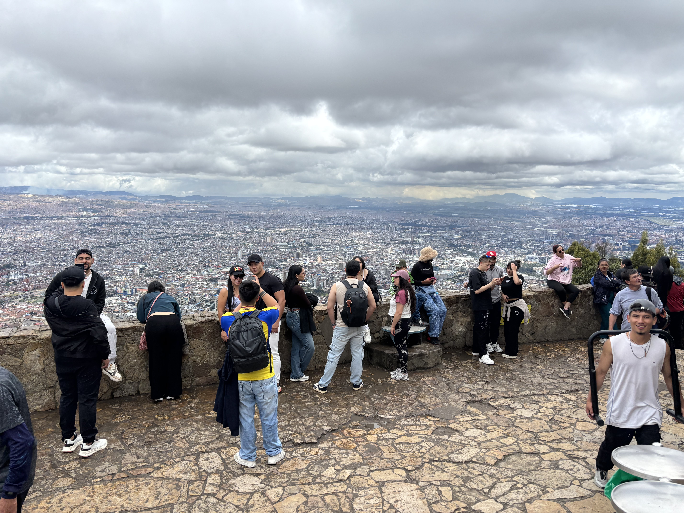

<br><details><summary>:camera:**64/IMG_0639.jpg**</summary><sub> `Exif version` 0232 `OS version` 27.0 `Date` 2026:08:15 10:44:00 `Aperture` Not known `Brightness` 11.995728523967726 `Color space` 65535 `Compression` Not known`Exposure mode` 0 `Exposure time` 6.2000124000248e-05 `Focal length` 5.96 `Lens model` iPhone 15 Plus back dual wide camera 5.96mm f/1.6 `Lens specification` (1.5399999618512084, 5.96, 1.6, 2.4) `Orientation` 1 `Scene type` Not known `f number` 1.6 `White balance` 0 `Sensing method` 2 `Shutter speed` 13.977372262773722</sub><sub>`Coordinates & altitude` (4.6052, -74.05564166666666, 3175.088669950739)</sub><sub> :earth_americas:`Location over` [Google Maps](http://maps.google.com/maps?q=4.6052,-74.05564166666666) or [Openstreet Map](https://www.openstreetmap.org/query?lat=4.6052&lon=-74.05564166666666)</sub></details>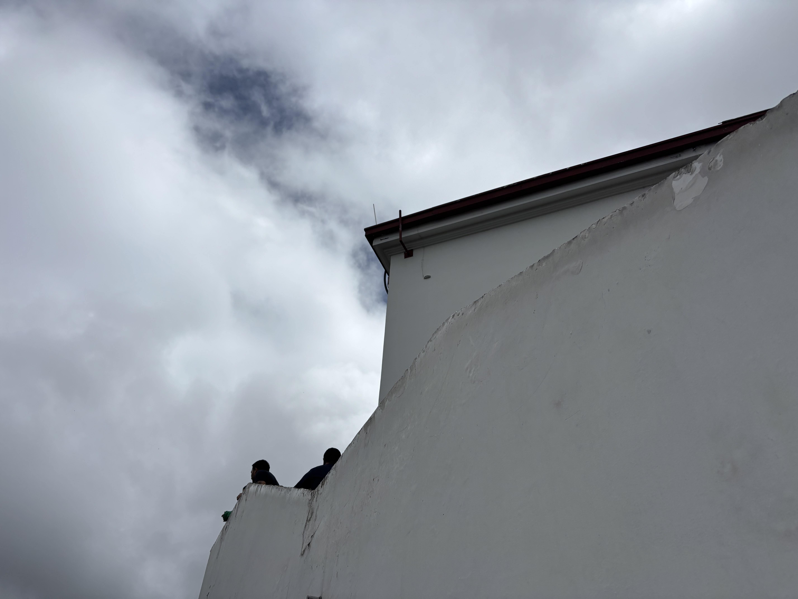

<br><details><summary>:camera:**64/IMG_0642.jpg**</summary><sub> `Exif version` 0232 `OS version` 27.0 `Date` 2026:08:15 10:45:08 `Aperture` Not known `Brightness` 10.46451860375911 `Color space` 65535 `Compression` Not known`Exposure mode` 0 `Exposure time` 0.0010224948875255625 `Focal length` 1.54 `Lens model` iPhone 15 Plus back dual wide camera 1.54mm f/2.4 `Lens specification` (1.54, 5.960000038146973, 1.6, 2.4) `Orientation` 1 `Scene type` Not known `f number` 2.4 `White balance` 0 `Sensing method` 2 `Shutter speed` 9.93297814071603</sub><sub>`Coordinates & altitude` (4.605372222222222, -74.05567222222221, 3157.5940409683426)</sub><sub> :earth_americas:`Location over` [Google Maps](http://maps.google.com/maps?q=4.605372222222222,-74.05567222222221) or [Openstreet Map](https://www.openstreetmap.org/query?lat=4.605372222222222&lon=-74.05567222222221)</sub></details>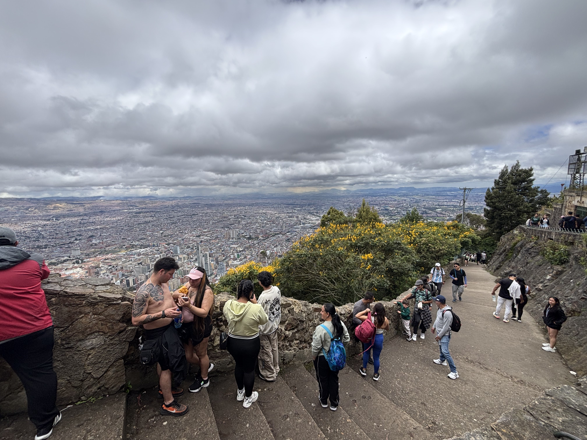

<br><details><summary>:camera:**64/IMG_0643.jpg**</summary><sub> `Exif version` 0232 `OS version` 27.0 `Date` 2026:08:15 10:45:14 `Aperture` Not known `Brightness` 10.185847608372523 `Color space` 65535 `Compression` Not known`Exposure mode` 0 `Exposure time` 0.0008849557522123894 `Focal length` 1.54 `Lens model` iPhone 15 Plus back dual wide camera 1.54mm f/2.4 `Lens specification` (1.54, 5.960000038146973, 1.6, 2.4) `Orientation` 1 `Scene type` Not known `f number` 2.4 `White balance` 0 `Sensing method` 2 `Shutter speed` 10.142034923422106</sub><sub>`Coordinates & altitude` (4.605352777777777, -74.05565555555555, 3161.6345733041576)</sub><sub> :earth_americas:`Location over` [Google Maps](http://maps.google.com/maps?q=4.605352777777777,-74.05565555555555) or [Openstreet Map](https://www.openstreetmap.org/query?lat=4.605352777777777&lon=-74.05565555555555)</sub></details>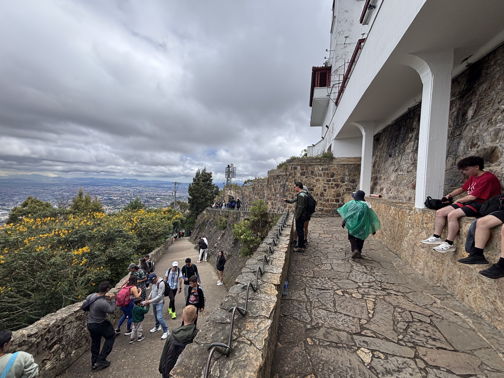

<br><details><summary>:camera:**64/IMG_0653.jpg**</summary><sub> `Exif version` 0232 `OS version` 27.0 `Date` 2026:08:15 11:11:50 `Aperture` Not known `Brightness` 9.734936337388175 `Color space` 65535 `Compression` Not known`Exposure mode` 0 `Exposure time` 0.0004269854824935952 `Focal length` 5.96 `Lens model` iPhone 15 Plus back dual wide camera 5.96mm f/1.6 `Lens specification` (1.5399999618512084, 5.96, 1.6, 2.4) `Orientation` 6 `Scene type` Not known `f number` 1.6 `White balance` 0 `Sensing method` 2 `Shutter speed` 11.193476318141197</sub><sub>`Coordinates & altitude` (4.605158333333333, -74.05552777777777, 3168.508594539939)</sub><sub> :earth_americas:`Location over` [Google Maps](http://maps.google.com/maps?q=4.605158333333333,-74.05552777777777) or [Openstreet Map](https://www.openstreetmap.org/query?lat=4.605158333333333&lon=-74.05552777777777)</sub></details>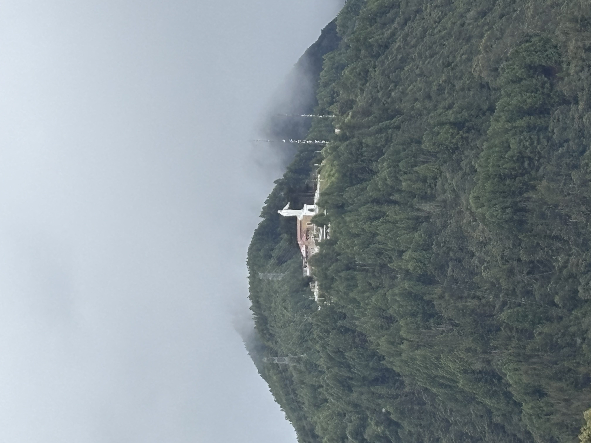

<br><details><summary>:camera:**64/IMG_0660.jpg**</summary><sub> `Exif version` 0232 `OS version` 27.0 `Date` 2026:08:15 11:19:37 `Aperture` Not known `Brightness` 8.013020762097547 `Color space` 65535 `Compression` Not known`Exposure mode` 0 `Exposure time` 0.0010604453870625664 `Focal length` 5.96 `Lens model` iPhone 15 Plus back dual wide camera 5.96mm f/1.6 `Lens specification` (1.5399999618512084, 5.96, 1.6, 2.4) `Orientation` 6 `Scene type` Not known `f number` 1.6 `White balance` 0 `Sensing method` 2 `Shutter speed` 9.881720019840513</sub><sub>`Coordinates & altitude` (4.605902777777778, -74.05592222222222, 3146.1782729805013)</sub><sub> :earth_americas:`Location over` [Google Maps](http://maps.google.com/maps?q=4.605902777777778,-74.05592222222222) or [Openstreet Map](https://www.openstreetmap.org/query?lat=4.605902777777778&lon=-74.05592222222222)</sub></details>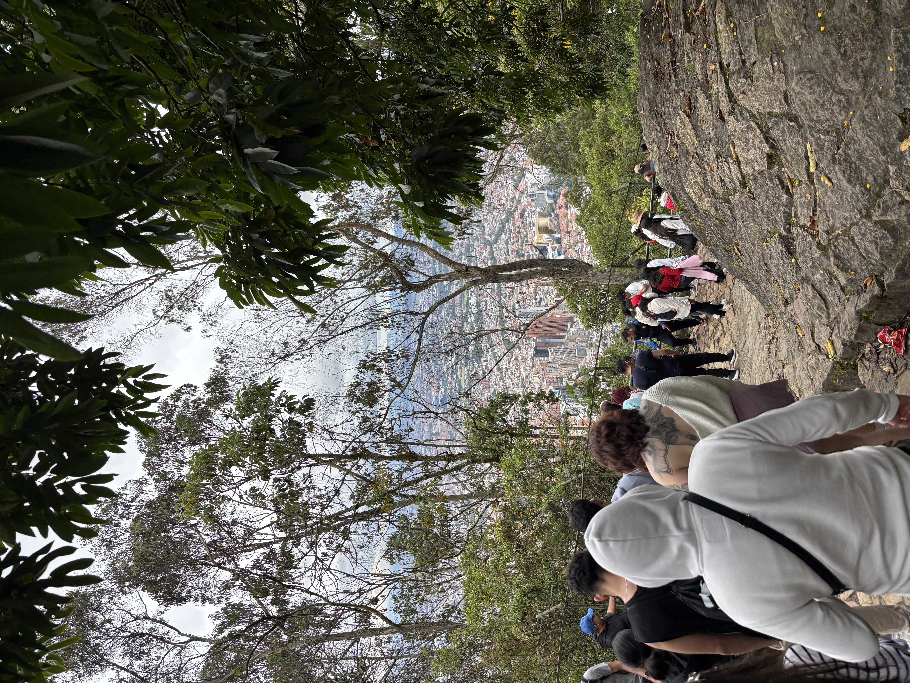

<br><details><summary>:camera:**64/IMG_0661.jpg**</summary><sub> `Exif version` 0232 `OS version` 27.0 `Date` 2026:08:15 11:32:15 `Aperture` Not known `Brightness` 9.94096008828398 `Color space` 65535 `Compression` Not known`Exposure mode` 0 `Exposure time` 0.0003599712023038157 `Focal length` 5.96 `Lens model` iPhone 15 Plus back dual wide camera 5.96mm f/1.6 `Lens specification` (1.5399999618512084, 5.96, 1.6, 2.4) `Orientation` 6 `Scene type` Not known `f number` 1.6 `White balance` 0 `Sensing method` 2 `Shutter speed` 11.439715471250741</sub><sub>`Coordinates & altitude` (4.610311111111111, -74.05516944444445, 3054.5447284345046)</sub><sub> :earth_americas:`Location over` [Google Maps](http://maps.google.com/maps?q=4.610311111111111,-74.05516944444445) or [Openstreet Map](https://www.openstreetmap.org/query?lat=4.610311111111111&lon=-74.05516944444445)</sub></details>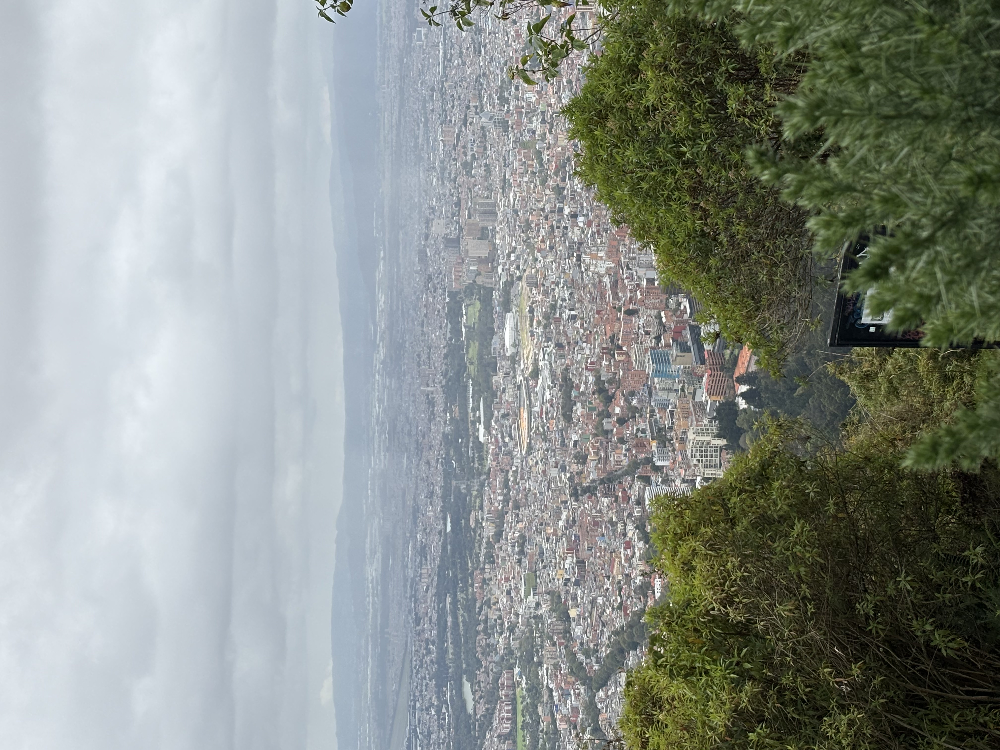

<br><details><summary>:camera:**64/IMG_0664.jpg**</summary><sub> `Exif version` 0232 `OS version` 27.0 `Date` 2026:08:15 12:14:58 `Aperture` Not known `Brightness` 9.910303316416854 `Color space` 65535 `Compression` Not known`Exposure mode` 0 `Exposure time` 0.00026399155227032733 `Focal length` 5.96 `Lens model` iPhone 15 Plus back dual wide camera 5.96mm f/1.6 `Lens specification` (1.5399999618512084, 5.96, 1.6, 2.4) `Orientation` 1 `Scene type` Not known `f number` 1.6 `White balance` 0 `Sensing method` 2 `Shutter speed` 11.887174447174447</sub><sub>`Coordinates & altitude` (4.602311111111111, -74.06721388888889, 2627.364285714286)</sub><sub> :earth_americas:`Location over` [Google Maps](http://maps.google.com/maps?q=4.602311111111111,-74.06721388888889) or [Openstreet Map](https://www.openstreetmap.org/query?lat=4.602311111111111&lon=-74.06721388888889)</sub></details>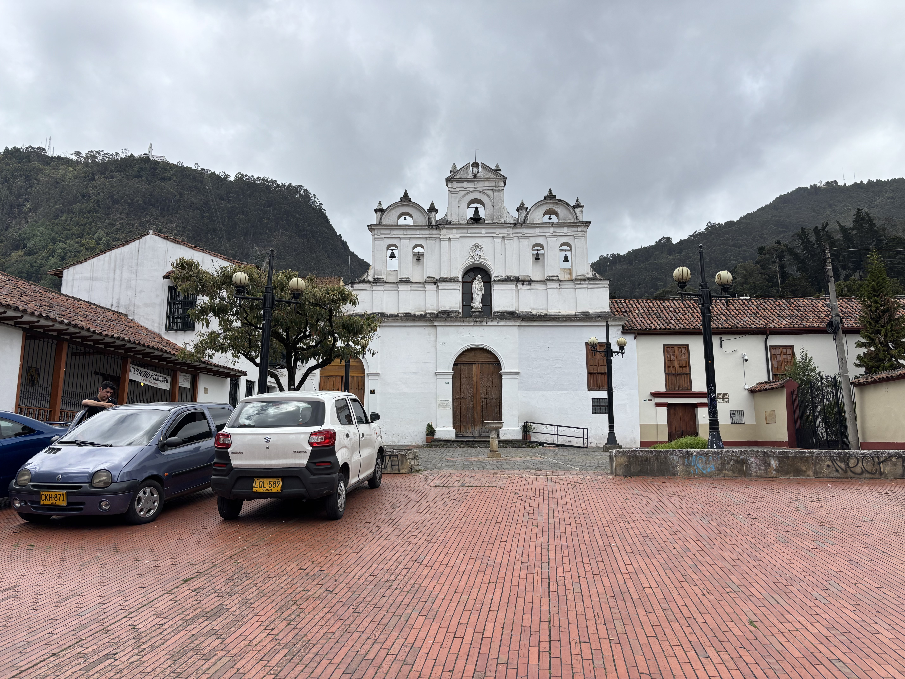

<br><details><summary>:camera:**64/IMG_0690.jpg**</summary><sub> `Exif version` 0232 `OS version` 27.0 `Date` 2026:08:15 14:25:06 `Aperture` Not known `Brightness` 9.458785499884554 `Color space` 65535 `Compression` Not known`Exposure mode` 0 `Exposure time` 0.00036900369003690036 `Focal length` 5.96 `Lens model` iPhone 15 Plus back dual wide camera 5.96mm f/1.6 `Lens specification` (1.5399999618512084, 5.96, 1.6, 2.4) `Orientation` 6 `Scene type` Not known `f number` 1.6 `White balance` 0 `Sensing method` 2 `Shutter speed` 11.404091553575046</sub><sub>`Coordinates & altitude` (4.601352777777778, -74.06906111111111, 2617.7920433996383)</sub><sub> :earth_americas:`Location over` [Google Maps](http://maps.google.com/maps?q=4.601352777777778,-74.06906111111111) or [Openstreet Map](https://www.openstreetmap.org/query?lat=4.601352777777778&lon=-74.06906111111111)</sub></details>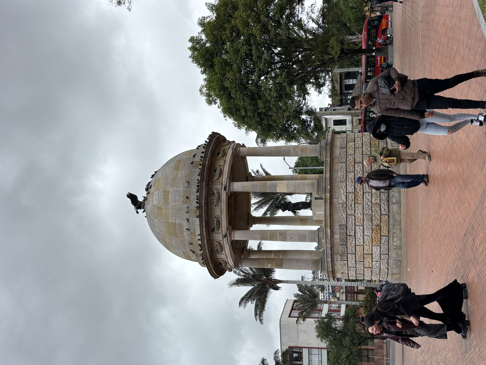

<br><details><summary>:camera:**64/IMG_20260515_072739556.jpg**</summary><sub> `Exif version` 0220 `OS version`  `Date` 2026:05:15 07:27:40 `Aperture` Not known `Brightness` 0.0 `Color space` 1 `Compression` 6`Exposure mode` 0 `Exposure time` 0.000750525 `Focal length` 2.13 `Lens model` Not known `Lens specification` Not known `Orientation` 6 `Scene type` Not known `f number` 2.2 `White balance` 0 `Sensing method` 1 `Shutter speed` 10.379</sub><sub>`Coordinates & altitude` (4.598076805555555, -74.07534025, 2736.0)</sub><sub> :earth_americas:`Location over` [Google Maps](http://maps.google.com/maps?q=4.598076805555555,-74.07534025) or [Openstreet Map](https://www.openstreetmap.org/query?lat=4.598076805555555&lon=-74.07534025)</sub></details>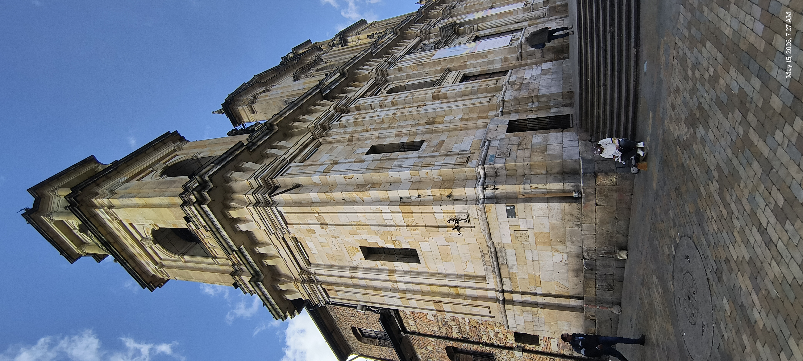

<br><details><summary>:camera:**64/IMG_20260515_072747326_HDR.jpg**</summary><sub> `Exif version` 0220 `OS version`  `Date` 2026:05:15 07:27:49 `Aperture` Not known `Brightness` 0.0 `Color space` 1 `Compression` 6`Exposure mode` 0 `Exposure time` 0.000960672 `Focal length` 2.13 `Lens model` Not known `Lens specification` Not known `Orientation` 6 `Scene type` Not known `f number` 2.2 `White balance` 0 `Sensing method` 1 `Shutter speed` 10.023</sub><sub>`Coordinates & altitude` (4.598076805555555, -74.07534025, 2736.0)</sub><sub> :earth_americas:`Location over` [Google Maps](http://maps.google.com/maps?q=4.598076805555555,-74.07534025) or [Openstreet Map](https://www.openstreetmap.org/query?lat=4.598076805555555&lon=-74.07534025)</sub></details>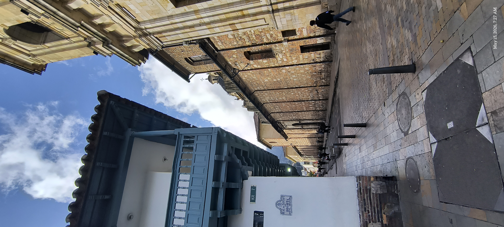

<br><details><summary>:camera:**64/IMG_20260515_072753690.jpg**</summary><sub> `Exif version` 0220 `OS version`  `Date` 2026:05:15 07:27:54 `Aperture` Not known `Brightness` 0.0 `Color space` 1 `Compression` 6`Exposure mode` 0 `Exposure time` 0.000520364 `Focal length` 2.13 `Lens model` Not known `Lens specification` Not known `Orientation` 1 `Scene type` Not known `f number` 2.2 `White balance` 0 `Sensing method` 1 `Shutter speed` 10.908</sub><sub>`Coordinates & altitude` (4.598076805555555, -74.07534025, 2736.0)</sub><sub> :earth_americas:`Location over` [Google Maps](http://maps.google.com/maps?q=4.598076805555555,-74.07534025) or [Openstreet Map](https://www.openstreetmap.org/query?lat=4.598076805555555&lon=-74.07534025)</sub></details>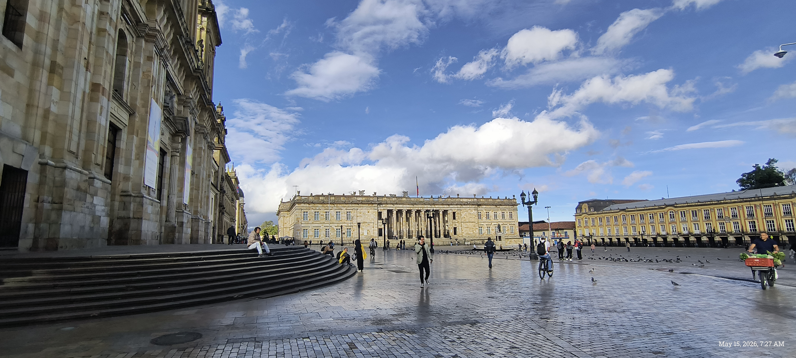

<br><details><summary>:camera:**64/IMG_20260515_072811335.jpg**</summary><sub> `Exif version` 0220 `OS version`  `Date` 2026:05:15 07:28:12 `Aperture` Not known `Brightness` 0.0 `Color space` 1 `Compression` 6`Exposure mode` 0 `Exposure time` 0.000580406 `Focal length` 2.13 `Lens model` Not known `Lens specification` Not known `Orientation` 1 `Scene type` Not known `f number` 2.2 `White balance` 0 `Sensing method` 1 `Shutter speed` 10.75</sub><sub>`Coordinates & altitude` (4.598076805555555, -74.07534025, 2736.0)</sub><sub> :earth_americas:`Location over` [Google Maps](http://maps.google.com/maps?q=4.598076805555555,-74.07534025) or [Openstreet Map](https://www.openstreetmap.org/query?lat=4.598076805555555&lon=-74.07534025)</sub></details>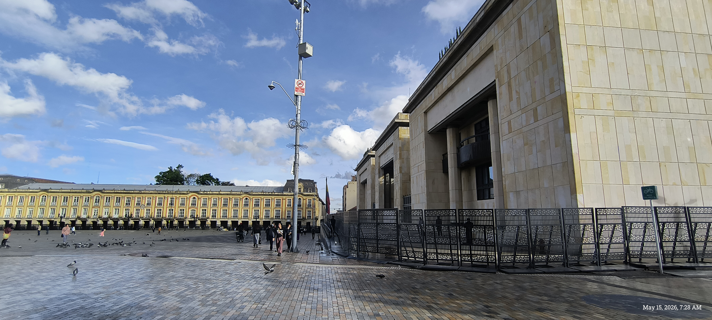

<br><details><summary>:camera:**64/IMG_20260515_072856416.jpg**</summary><sub> `Exif version` 0220 `OS version`  `Date` 2026:05:15 07:28:57 `Aperture` Not known `Brightness` 0.0 `Color space` 1 `Compression` 6`Exposure mode` 0 `Exposure time` 0.000610427 `Focal length` 2.13 `Lens model` Not known `Lens specification` Not known `Orientation` 1 `Scene type` Not known `f number` 2.2 `White balance` 0 `Sensing method` 1 `Shutter speed` 10.677</sub><sub>`Coordinates & altitude` (4.598418222222222, -74.07604216666667, 2736.0)</sub><sub> :earth_americas:`Location over` [Google Maps](http://maps.google.com/maps?q=4.598418222222222,-74.07604216666667) or [Openstreet Map](https://www.openstreetmap.org/query?lat=4.598418222222222&lon=-74.07604216666667)</sub></details>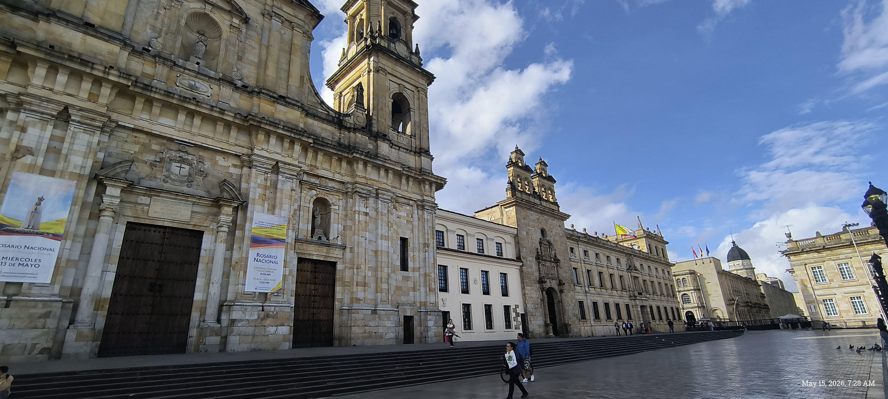

<br><details><summary>:camera:**64/IMG_20260515_072900896.jpg**</summary><sub> `Exif version` 0220 `OS version`  `Date` 2026:05:15 07:29:01 `Aperture` Not known `Brightness` 0.0 `Color space` 1 `Compression` 6`Exposure mode` 0 `Exposure time` 0.00050035 `Focal length` 2.13 `Lens model` Not known `Lens specification` Not known `Orientation` 1 `Scene type` Not known `f number` 2.2 `White balance` 0 `Sensing method` 1 `Shutter speed` 10.964</sub><sub>`Coordinates & altitude` (4.598418222222222, -74.07604216666667, 2736.0)</sub><sub> :earth_americas:`Location over` [Google Maps](http://maps.google.com/maps?q=4.598418222222222,-74.07604216666667) or [Openstreet Map](https://www.openstreetmap.org/query?lat=4.598418222222222&lon=-74.07604216666667)</sub></details>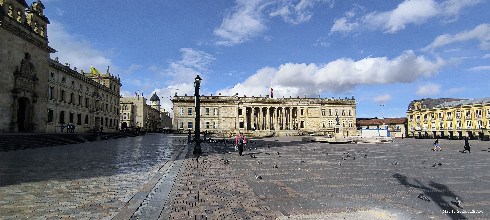

<br><details><summary>:camera:**64/IMG_20260515_072905725.jpg**</summary><sub> `Exif version` 0220 `OS version`  `Date` 2026:05:15 07:29:06 `Aperture` Not known `Brightness` 0.0 `Color space` 1 `Compression` 6`Exposure mode` 0 `Exposure time` 0.00050035 `Focal length` 2.13 `Lens model` Not known `Lens specification` Not known `Orientation` 1 `Scene type` Not known `f number` 2.2 `White balance` 0 `Sensing method` 1 `Shutter speed` 10.964</sub><sub>`Coordinates & altitude` (4.598418222222222, -74.07604216666667, 2736.0)</sub><sub> :earth_americas:`Location over` [Google Maps](http://maps.google.com/maps?q=4.598418222222222,-74.07604216666667) or [Openstreet Map](https://www.openstreetmap.org/query?lat=4.598418222222222&lon=-74.07604216666667)</sub></details>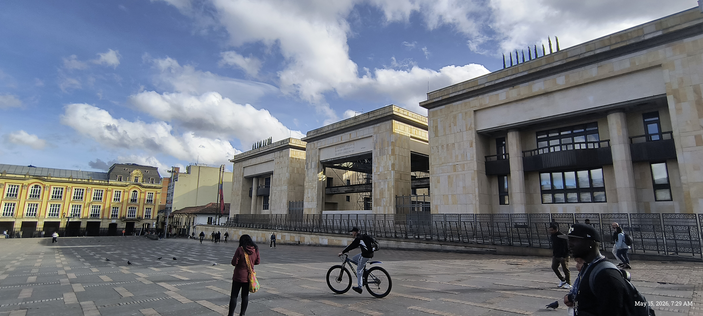

<br><details><summary>:camera:**64/IMG_20260515_073052985_HDR.jpg**</summary><sub> `Exif version` 0220 `OS version`  `Date` 2026:05:15 07:30:54 `Aperture` Not known `Brightness` 0.0 `Color space` 1 `Compression` 6`Exposure mode` 0 `Exposure time` 0.000340238 `Focal length` 2.13 `Lens model` Not known `Lens specification` Not known `Orientation` 6 `Scene type` Not known `f number` 2.2 `White balance` 0 `Sensing method` 1 `Shutter speed` 11.521</sub><sub>`Coordinates & altitude` (4.5979881111111105, -74.07588194444445, 2722.0)</sub><sub> :earth_americas:`Location over` [Google Maps](http://maps.google.com/maps?q=4.5979881111111105,-74.07588194444445) or [Openstreet Map](https://www.openstreetmap.org/query?lat=4.5979881111111105&lon=-74.07588194444445)</sub></details>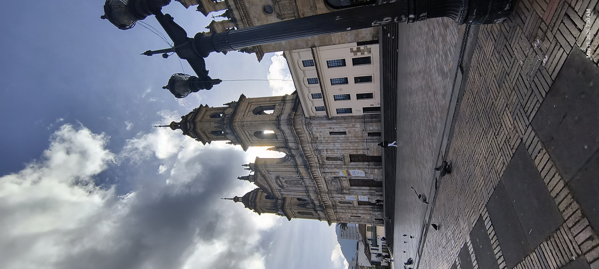

<br><details><summary>:camera:**64/IMG_20260515_073058064_HDR.jpg**</summary><sub> `Exif version` 0220 `OS version`  `Date` 2026:05:15 07:30:59 `Aperture` Not known `Brightness` 0.0 `Color space` 1 `Compression` 6`Exposure mode` 0 `Exposure time` 0.000310217 `Focal length` 2.13 `Lens model` Not known `Lens specification` Not known `Orientation` 1 `Scene type` Not known `f number` 2.2 `White balance` 0 `Sensing method` 1 `Shutter speed` 11.654</sub><sub>`Coordinates & altitude` (4.5979881111111105, -74.07588194444445, 2722.0)</sub><sub> :earth_americas:`Location over` [Google Maps](http://maps.google.com/maps?q=4.5979881111111105,-74.07588194444445) or [Openstreet Map](https://www.openstreetmap.org/query?lat=4.5979881111111105&lon=-74.07588194444445)</sub></details>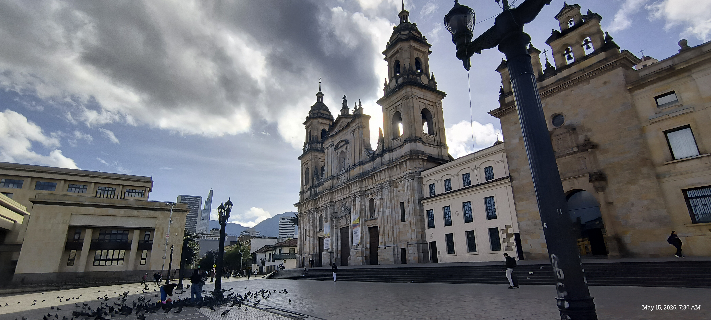

<br><details><summary>:camera:**64/IMG_20260515_073106422.jpg**</summary><sub> `Exif version` 0220 `OS version`  `Date` 2026:05:15 07:31:07 `Aperture` Not known `Brightness` 0.0 `Color space` 1 `Compression` 6`Exposure mode` 0 `Exposure time` 0.00050035 `Focal length` 2.13 `Lens model` Not known `Lens specification` Not known `Orientation` 1 `Scene type` Not known `f number` 2.2 `White balance` 0 `Sensing method` 1 `Shutter speed` 10.964</sub><sub>`Coordinates & altitude` (4.5979881111111105, -74.07588194444445, 2722.0)</sub><sub> :earth_americas:`Location over` [Google Maps](http://maps.google.com/maps?q=4.5979881111111105,-74.07588194444445) or [Openstreet Map](https://www.openstreetmap.org/query?lat=4.5979881111111105&lon=-74.07588194444445)</sub></details>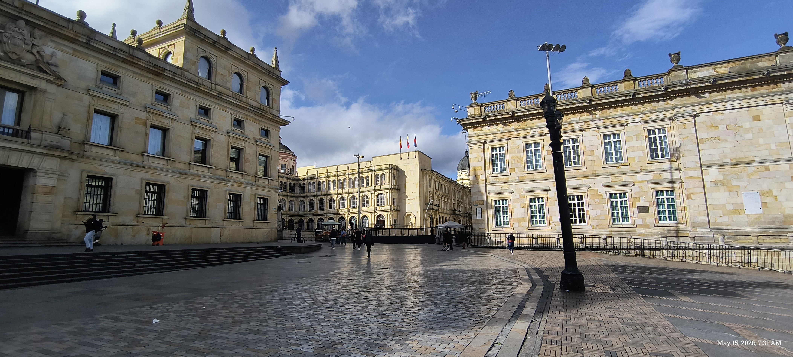

<br><details><summary>:camera:**64/IMG_20260515_073110006.jpg**</summary><sub> `Exif version` 0220 `OS version`  `Date` 2026:05:15 07:31:10 `Aperture` Not known `Brightness` 0.0 `Color space` 1 `Compression` 6`Exposure mode` 0 `Exposure time` 0.00050035 `Focal length` 2.13 `Lens model` Not known `Lens specification` Not known `Orientation` 1 `Scene type` Not known `f number` 2.2 `White balance` 0 `Sensing method` 1 `Shutter speed` 10.964</sub><sub>`Coordinates & altitude` (4.5979881111111105, -74.07588194444445, 2722.0)</sub><sub> :earth_americas:`Location over` [Google Maps](http://maps.google.com/maps?q=4.5979881111111105,-74.07588194444445) or [Openstreet Map](https://www.openstreetmap.org/query?lat=4.5979881111111105&lon=-74.07588194444445)</sub></details>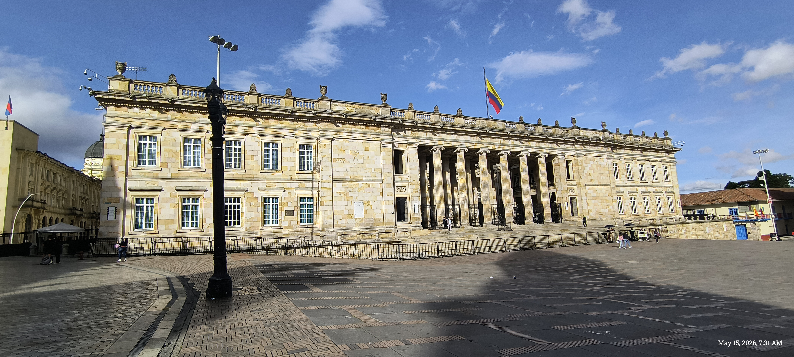

<br><details><summary>:camera:**64/IMG_20260515_073158034.jpg**</summary><sub> `Exif version` 0220 `OS version`  `Date` 2026:05:15 07:31:58 `Aperture` Not known `Brightness` 0.0 `Color space` 1 `Compression` 6`Exposure mode` 0 `Exposure time` 0.000530371 `Focal length` 2.13 `Lens model` Not known `Lens specification` Not known `Orientation` 1 `Scene type` Not known `f number` 2.2 `White balance` 0 `Sensing method` 1 `Shutter speed` 10.88</sub><sub>`Coordinates & altitude` (4.597422138888889, -74.07572172222221, 2722.0)</sub><sub> :earth_americas:`Location over` [Google Maps](http://maps.google.com/maps?q=4.597422138888889,-74.07572172222221) or [Openstreet Map](https://www.openstreetmap.org/query?lat=4.597422138888889&lon=-74.07572172222221)</sub></details>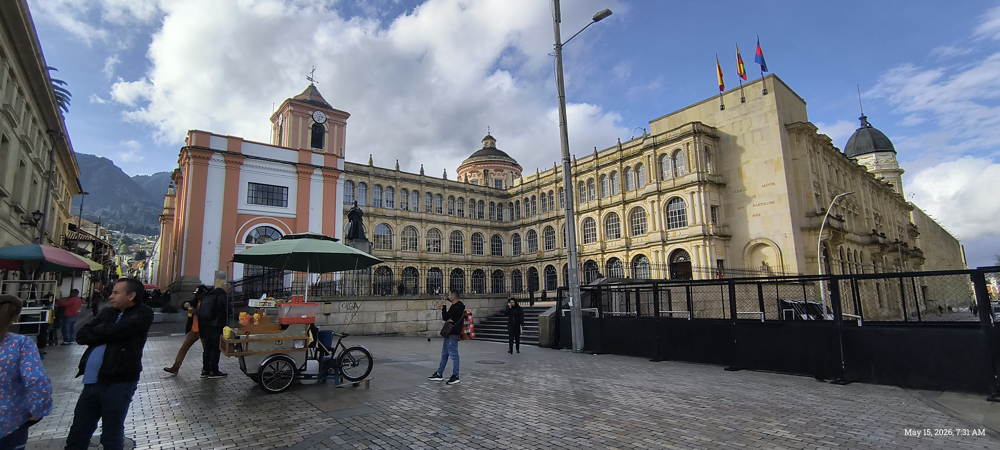

<br><details><summary>:camera:**64/IMG_20260515_080136046_HDR.jpg**</summary><sub> `Exif version` 0220 `OS version`  `Date` 2026:05:15 08:01:37 `Aperture` Not known `Brightness` 0.0 `Color space` 1 `Compression` 6`Exposure mode` 0 `Exposure time` 0.000192 `Focal length` 5.56 `Lens model` Not known `Lens specification` Not known `Orientation` 6 `Scene type` Not known `f number` 1.88 `White balance` 0 `Sensing method` 1 `Shutter speed` 12.346</sub><sub>`Coordinates & altitude` (4.595042222222222, -74.07627105555555, 2739.0)</sub><sub> :earth_americas:`Location over` [Google Maps](http://maps.google.com/maps?q=4.595042222222222,-74.07627105555555) or [Openstreet Map](https://www.openstreetmap.org/query?lat=4.595042222222222&lon=-74.07627105555555)</sub></details>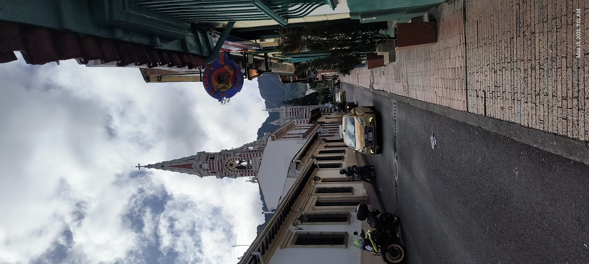

<br><details><summary>:camera:**64/IMG_20260515_080301263_HDR.jpg**</summary><sub> `Exif version` 0220 `OS version`  `Date` 2026:05:15 08:03:02 `Aperture` Not known `Brightness` 0.0 `Color space` 1 `Compression` 6`Exposure mode` 0 `Exposure time` 0.000240168 `Focal length` 2.13 `Lens model` Not known `Lens specification` Not known `Orientation` 6 `Scene type` Not known `f number` 2.2 `White balance` 0 `Sensing method` 1 `Shutter speed` 12.023</sub><sub>`Coordinates & altitude` (4.595059833333333, -74.07548522222221, 2739.0)</sub><sub> :earth_americas:`Location over` [Google Maps](http://maps.google.com/maps?q=4.595059833333333,-74.07548522222221) or [Openstreet Map](https://www.openstreetmap.org/query?lat=4.595059833333333&lon=-74.07548522222221)</sub></details>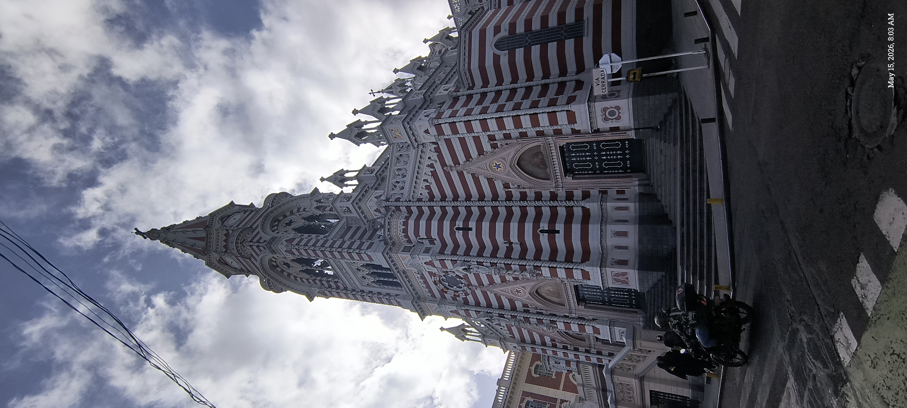

<br><details><summary>:camera:**64/IMG_20260515_080355616.jpg**</summary><sub> `Exif version` 0220 `OS version`  `Date` 2026:05:15 08:03:56 `Aperture` Not known `Brightness` 0.0 `Color space` 1 `Compression` 6`Exposure mode` 0 `Exposure time` 0.000240168 `Focal length` 2.13 `Lens model` Not known `Lens specification` Not known `Orientation` 6 `Scene type` Not known `f number` 2.2 `White balance` 0 `Sensing method` 1 `Shutter speed` 12.023</sub><sub>`Coordinates & altitude` (4.595025055555555, -74.07545469444445, 2739.0)</sub><sub> :earth_americas:`Location over` [Google Maps](http://maps.google.com/maps?q=4.595025055555555,-74.07545469444445) or [Openstreet Map](https://www.openstreetmap.org/query?lat=4.595025055555555&lon=-74.07545469444445)</sub></details>

<br><details><summary>:camera:**64/IMG_20260515_080430163_HDR.jpg**</summary><sub> `Exif version` 0220 `OS version`  `Date` 2026:05:15 08:04:31 `Aperture` Not known `Brightness` 0.0 `Color space` 1 `Compression` 6`Exposure mode` 0 `Exposure time` 0.00070049 `Focal length` 2.13 `Lens model` Not known `Lens specification` Not known `Orientation` 1 `Scene type` Not known `f number` 2.2 `White balance` 0 `Sensing method` 1 `Shutter speed` 10.479</sub><sub>`Coordinates & altitude` (4.5949678333333335, -74.07456969444443, 2739.0)</sub><sub> :earth_americas:`Location over` [Google Maps](http://maps.google.com/maps?q=4.5949678333333335,-74.07456969444443) or [Openstreet Map](https://www.openstreetmap.org/query?lat=4.5949678333333335&lon=-74.07456969444443)</sub></details>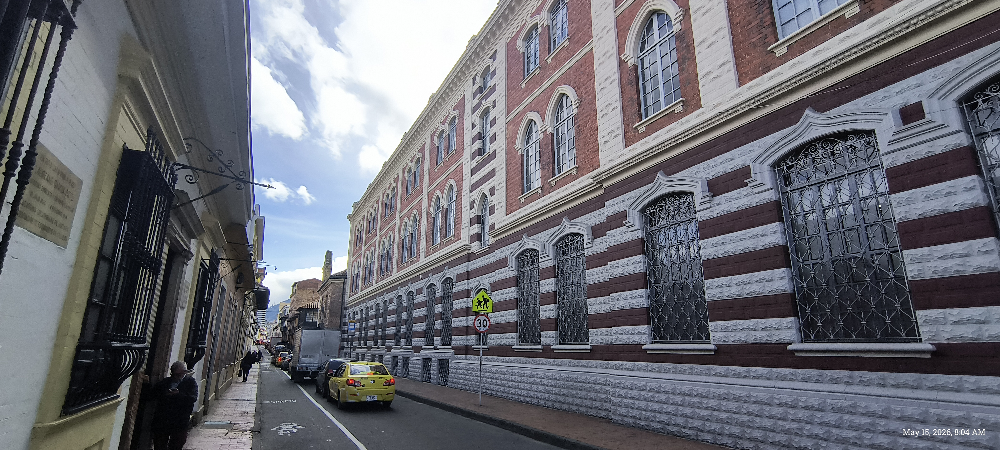

<br><details><summary>:camera:**64/IMG_20260515_080634764_HDR.jpg**</summary><sub> `Exif version` 0220 `OS version`  `Date` 2026:05:15 08:06:36 `Aperture` Not known `Brightness` 0.0 `Color space` 1 `Compression` 6`Exposure mode` 0 `Exposure time` 0.001030721 `Focal length` 2.13 `Lens model` Not known `Lens specification` Not known `Orientation` 6 `Scene type` Not known `f number` 2.2 `White balance` 0 `Sensing method` 1 `Shutter speed` 9.922</sub><sub>`Coordinates & altitude` (4.5949678333333335, -74.07456969444443, 2739.0)</sub><sub> :earth_americas:`Location over` [Google Maps](http://maps.google.com/maps?q=4.5949678333333335,-74.07456969444443) or [Openstreet Map](https://www.openstreetmap.org/query?lat=4.5949678333333335&lon=-74.07456969444443)</sub></details>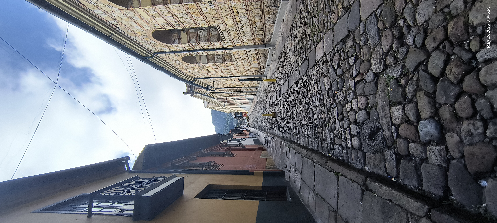

<br><details><summary>:camera:**64/IMG_20260515_080638096_HDR.jpg**</summary><sub> `Exif version` 0220 `OS version`  `Date` 2026:05:15 08:06:39 `Aperture` Not known `Brightness` 0.0 `Color space` 1 `Compression` 6`Exposure mode` 0 `Exposure time` 0.000720504 `Focal length` 2.13 `Lens model` Not known `Lens specification` Not known `Orientation` 1 `Scene type` Not known `f number` 2.2 `White balance` 0 `Sensing method` 1 `Shutter speed` 10.438</sub><sub>`Coordinates & altitude` (4.595602027777778, -74.07453916666667, 2739.0)</sub><sub> :earth_americas:`Location over` [Google Maps](http://maps.google.com/maps?q=4.595602027777778,-74.07453916666667) or [Openstreet Map](https://www.openstreetmap.org/query?lat=4.595602027777778&lon=-74.07453916666667)</sub></details>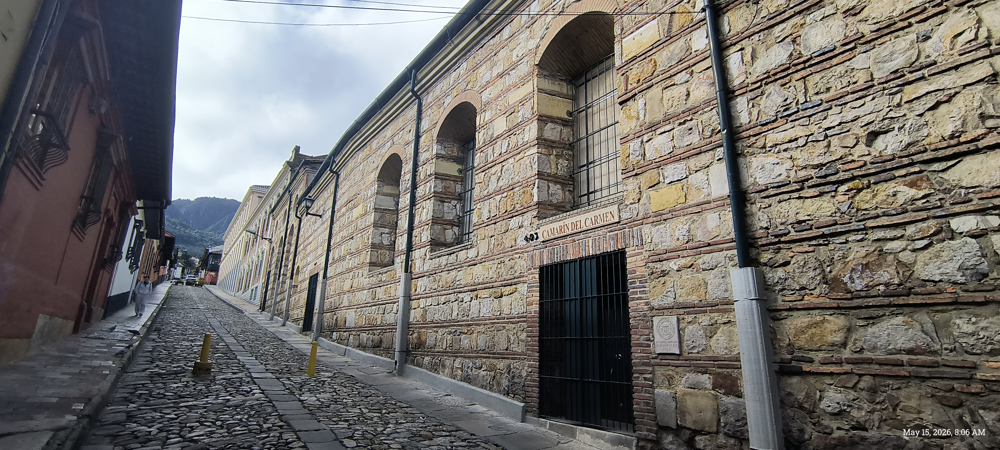

<br><details><summary>:camera:**64/IMG_20260515_081326811_HDR.jpg**</summary><sub> `Exif version` 0220 `OS version`  `Date` 2026:05:15 08:13:28 `Aperture` Not known `Brightness` 0.0 `Color space` 1 `Compression` 6`Exposure mode` 0 `Exposure time` 0.000170119 `Focal length` 2.13 `Lens model` Not known `Lens specification` Not known `Orientation` 1 `Scene type` Not known `f number` 2.2 `White balance` 0 `Sensing method` 1 `Shutter speed` 12.521</sub><sub>`Coordinates & altitude` (4.596687805555555, -74.07279202777778, 2676.0)</sub><sub> :earth_americas:`Location over` [Google Maps](http://maps.google.com/maps?q=4.596687805555555,-74.07279202777778) or [Openstreet Map](https://www.openstreetmap.org/query?lat=4.596687805555555&lon=-74.07279202777778)</sub></details>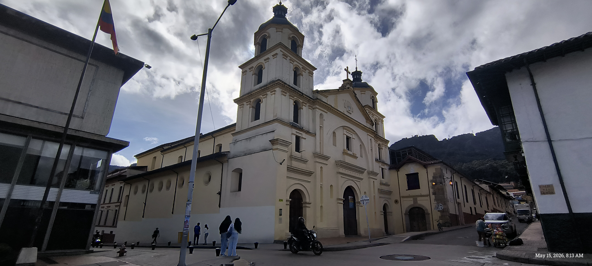

<br><details><summary>:camera:**64/IMG_20260515_081514438.jpg**</summary><sub> `Exif version` 0220 `OS version`  `Date` 2026:05:15 08:15:15 `Aperture` Not known `Brightness` 0.0 `Color space` 1 `Compression` 6`Exposure mode` 0 `Exposure time` 0.00050035 `Focal length` 2.13 `Lens model` Not known `Lens specification` Not known `Orientation` 1 `Scene type` Not known `f number` 2.2 `White balance` 0 `Sensing method` 1 `Shutter speed` 10.964</sub><sub>`Coordinates & altitude` (4.596610055555555, -74.07230375, 2676.0)</sub><sub> :earth_americas:`Location over` [Google Maps](http://maps.google.com/maps?q=4.596610055555555,-74.07230375) or [Openstreet Map](https://www.openstreetmap.org/query?lat=4.596610055555555&lon=-74.07230375)</sub></details>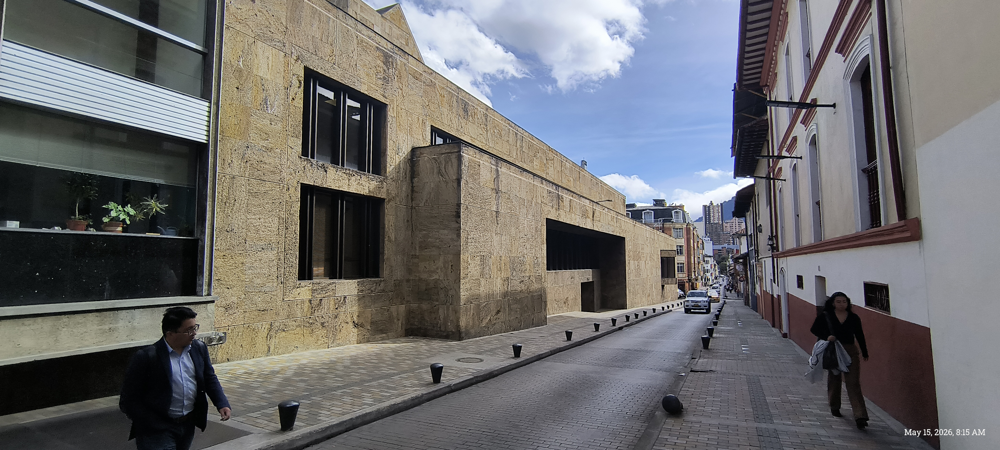

<br><details><summary>:camera:**64/IMG_20260515_081522322_HDR.jpg**</summary><sub> `Exif version` 0220 `OS version`  `Date` 2026:05:15 08:15:23 `Aperture` Not known `Brightness` 0.0 `Color space` 1 `Compression` 6`Exposure mode` 0 `Exposure time` 0.00050035 `Focal length` 2.13 `Lens model` Not known `Lens specification` Not known `Orientation` 1 `Scene type` Not known `f number` 2.2 `White balance` 0 `Sensing method` 1 `Shutter speed` 10.964</sub><sub>`Coordinates & altitude` (4.596610055555555, -74.07230375, 2676.0)</sub><sub> :earth_americas:`Location over` [Google Maps](http://maps.google.com/maps?q=4.596610055555555,-74.07230375) or [Openstreet Map](https://www.openstreetmap.org/query?lat=4.596610055555555&lon=-74.07230375)</sub></details>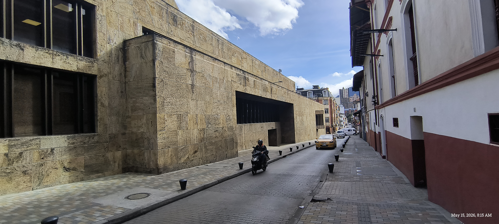

<br><details><summary>:camera:**64/IMG_20260515_081800898.jpg**</summary><sub> `Exif version` 0220 `OS version`  `Date` 2026:05:15 08:18:01 `Aperture` Not known `Brightness` 0.0 `Color space` 1 `Compression` 6`Exposure mode` 0 `Exposure time` 0.006176 `Focal length` 5.56 `Lens model` Not known `Lens specification` Not known `Orientation` 6 `Scene type` Not known `f number` 1.88 `White balance` 0 `Sensing method` 1 `Shutter speed` 7.339</sub><sub>`Coordinates & altitude` (4.596610055555555, -74.07230375, 2676.0)</sub><sub> :earth_americas:`Location over` [Google Maps](http://maps.google.com/maps?q=4.596610055555555,-74.07230375) or [Openstreet Map](https://www.openstreetmap.org/query?lat=4.596610055555555&lon=-74.07230375)</sub></details>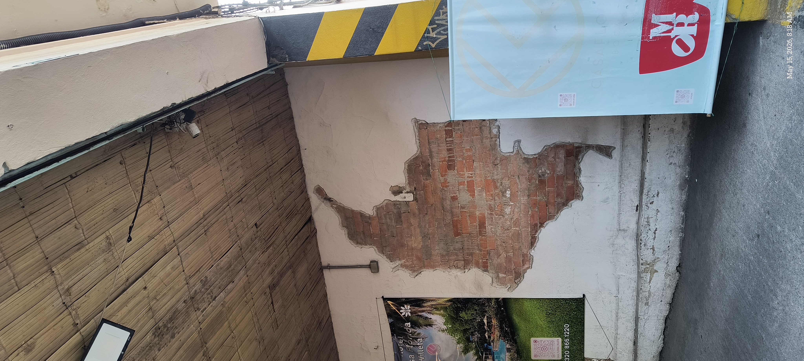

<br><details><summary>:camera:**64/IMG_20260515_081833181.jpg**</summary><sub> `Exif version` 0220 `OS version`  `Date` 2026:05:15 08:18:34 `Aperture` Not known `Brightness` 0.0 `Color space` 1 `Compression` 6`Exposure mode` 0 `Exposure time` 0.000370259 `Focal length` 2.13 `Lens model` Not known `Lens specification` Not known `Orientation` 6 `Scene type` Not known `f number` 2.2 `White balance` 0 `Sensing method` 1 `Shutter speed` 11.399</sub><sub>`Coordinates & altitude` (4.597354888888889, -74.07188413888889, 2676.0)</sub><sub> :earth_americas:`Location over` [Google Maps](http://maps.google.com/maps?q=4.597354888888889,-74.07188413888889) or [Openstreet Map](https://www.openstreetmap.org/query?lat=4.597354888888889&lon=-74.07188413888889)</sub></details>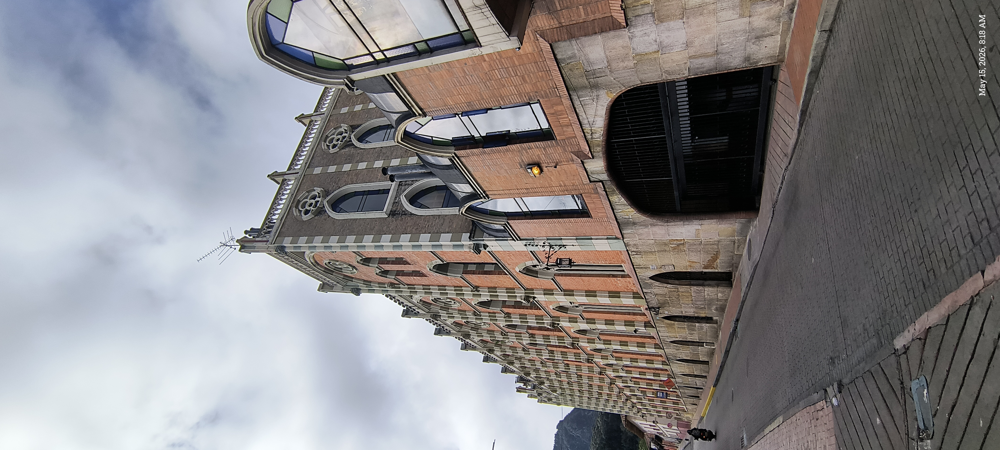

<br><details><summary>:camera:**64/IMG_20260515_082028687.jpg**</summary><sub> `Exif version` 0220 `OS version`  `Date` 2026:05:15 08:20:29 `Aperture` Not known `Brightness` 0.0 `Color space` 1 `Compression` 6`Exposure mode` 0 `Exposure time` 0.000440308 `Focal length` 2.13 `Lens model` Not known `Lens specification` Not known `Orientation` 1 `Scene type` Not known `f number` 2.2 `White balance` 0 `Sensing method` 1 `Shutter speed` 11.149</sub><sub>`Coordinates & altitude` (4.597146972222222, -74.07189177777778, 2676.0)</sub><sub> :earth_americas:`Location over` [Google Maps](http://maps.google.com/maps?q=4.597146972222222,-74.07189177777778) or [Openstreet Map](https://www.openstreetmap.org/query?lat=4.597146972222222&lon=-74.07189177777778)</sub></details>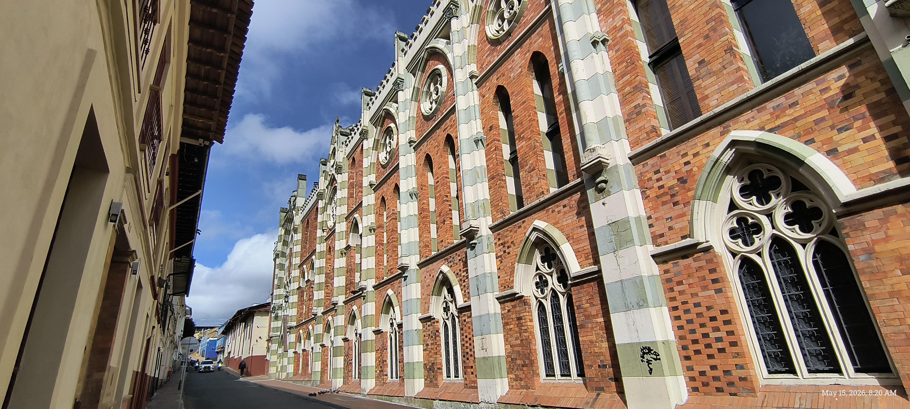

<br><details><summary>:camera:**64/IMG_20260515_082031802.jpg**</summary><sub> `Exif version` 0220 `OS version`  `Date` 2026:05:15 08:20:32 `Aperture` Not known `Brightness` 0.0 `Color space` 1 `Compression` 6`Exposure mode` 0 `Exposure time` 0.000470329 `Focal length` 2.13 `Lens model` Not known `Lens specification` Not known `Orientation` 6 `Scene type` Not known `f number` 2.2 `White balance` 0 `Sensing method` 1 `Shutter speed` 11.054</sub><sub>`Coordinates & altitude` (4.597146972222222, -74.07189177777778, 2676.0)</sub><sub> :earth_americas:`Location over` [Google Maps](http://maps.google.com/maps?q=4.597146972222222,-74.07189177777778) or [Openstreet Map](https://www.openstreetmap.org/query?lat=4.597146972222222&lon=-74.07189177777778)</sub></details>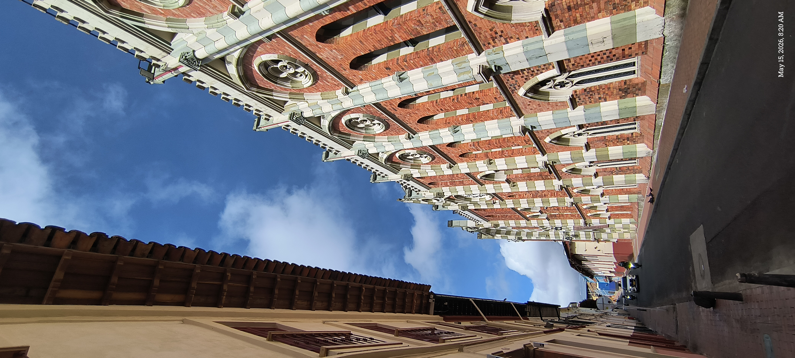

<br><details><summary>:camera:**64/IMG_20260515_142907466.jpg**</summary><sub> `Exif version` 0220 `OS version`  `Date` 2026:05:15 14:29:08 `Aperture` Not known `Brightness` 0.0 `Color space` 1 `Compression` 6`Exposure mode` 0 `Exposure time` 0.003682576 `Focal length` 2.13 `Lens model` Not known `Lens specification` Not known `Orientation` 1 `Scene type` Not known `f number` 2.2 `White balance` 0 `Sensing method` 1 `Shutter speed` 8.085</sub><sub>`Coordinates & altitude` (4.594316972222222, -74.07096861111111, 2678.0)</sub><sub> :earth_americas:`Location over` [Google Maps](http://maps.google.com/maps?q=4.594316972222222,-74.07096861111111) or [Openstreet Map](https://www.openstreetmap.org/query?lat=4.594316972222222&lon=-74.07096861111111)</sub></details>

<br><details><summary>:camera:**64/IMG_20260515_142909888.jpg**</summary><sub> `Exif version` 0220 `OS version`  `Date` 2026:05:15 14:29:10 `Aperture` Not known `Brightness` 0.0 `Color space` 1 `Compression` 6`Exposure mode` 0 `Exposure time` 0.002491743 `Focal length` 2.13 `Lens model` Not known `Lens specification` Not known `Orientation` 1 `Scene type` Not known `f number` 2.2 `White balance` 0 `Sensing method` 1 `Shutter speed` 8.648</sub><sub>`Coordinates & altitude` (4.594316972222222, -74.07096861111111, 2678.0)</sub><sub> :earth_americas:`Location over` [Google Maps](http://maps.google.com/maps?q=4.594316972222222,-74.07096861111111) or [Openstreet Map](https://www.openstreetmap.org/query?lat=4.594316972222222&lon=-74.07096861111111)</sub></details>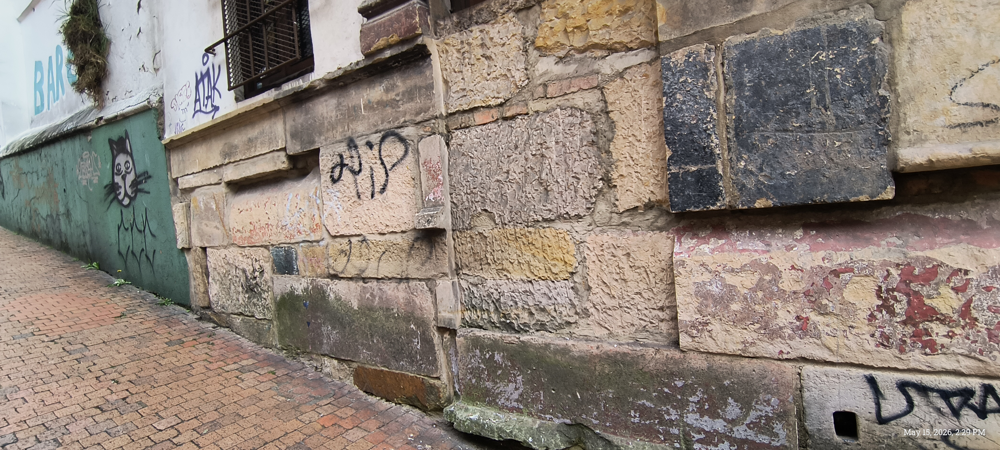

<br><details><summary>:camera:**64/IMG_20260515_144727422.jpg**</summary><sub> `Exif version` 0220 `OS version`  `Date` 2026:05:15 14:47:28 `Aperture` Not known `Brightness` 0.0 `Color space` 1 `Compression` 6`Exposure mode` 0 `Exposure time` 0.000370259 `Focal length` 2.13 `Lens model` Not known `Lens specification` Not known `Orientation` 6 `Scene type` Not known `f number` 2.2 `White balance` 0 `Sensing method` 1 `Shutter speed` 11.399</sub><sub>`Coordinates & altitude` (4.593401888888889, -74.06954191666667, 2702.0)</sub><sub> :earth_americas:`Location over` [Google Maps](http://maps.google.com/maps?q=4.593401888888889,-74.06954191666667) or [Openstreet Map](https://www.openstreetmap.org/query?lat=4.593401888888889&lon=-74.06954191666667)</sub></details>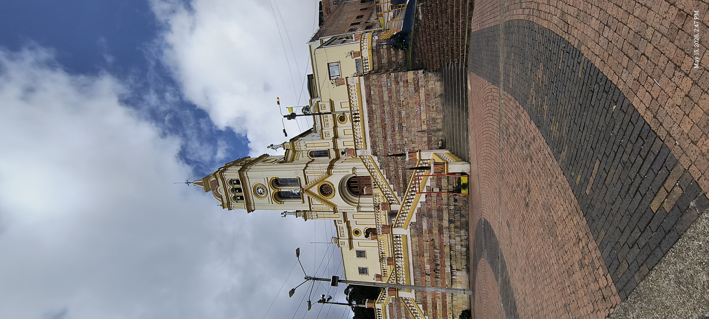

<br><details><summary>:camera:**64/IMG_20260515_144731198.jpg**</summary><sub> `Exif version` 0220 `OS version`  `Date` 2026:05:15 14:47:32 `Aperture` Not known `Brightness` 0.0 `Color space` 1 `Compression` 6`Exposure mode` 0 `Exposure time` 0.000360252 `Focal length` 2.13 `Lens model` Not known `Lens specification` Not known `Orientation` 1 `Scene type` Not known `f number` 2.2 `White balance` 0 `Sensing method` 1 `Shutter speed` 11.438</sub><sub>`Coordinates & altitude` (4.593401888888889, -74.06954191666667, 2702.0)</sub><sub> :earth_americas:`Location over` [Google Maps](http://maps.google.com/maps?q=4.593401888888889,-74.06954191666667) or [Openstreet Map](https://www.openstreetmap.org/query?lat=4.593401888888889&lon=-74.06954191666667)</sub></details>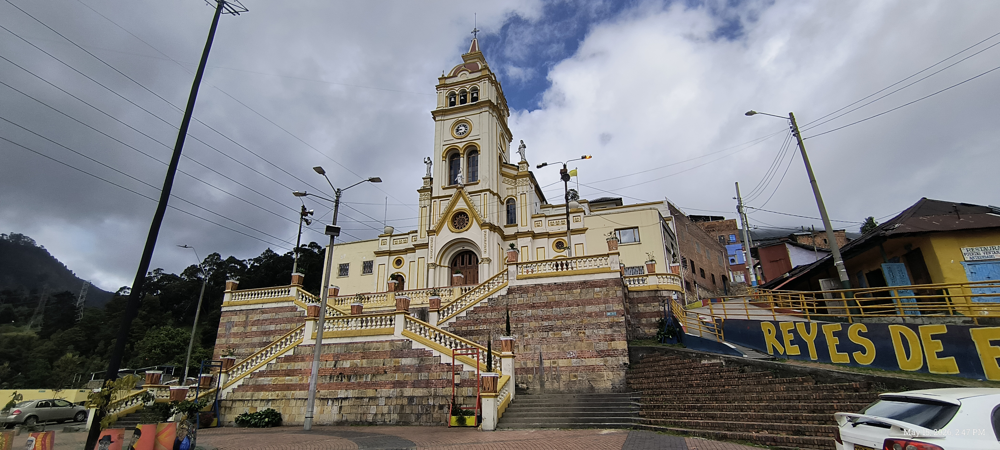

<sub>_Citation: Partial or total digital reproduction of this repository, scripts, development guides, data models, images, and documentation is permitted, provided that it is referenced as: "R.GISMobile - Mobile geographic information systems on QField that do not require an internet connection for navigation." https://github.com/rcfdtools/R.GISMobile - Bogotá - Colombia - South America"._<sub>

| [:house: Home](../Readme.md) |
|---|