<div align="center"></div>

## :earth_americas:POI: _“Manitou Incline (2768 hiking steps) - Colorado Springs, Colorado, USA (2026-08-15)”_
`Pictures` rcfdtools <br>`Category` Freelance field visit <br>`Location` [Google Maps](http://maps.google.com/maps?q=38.857989,-104.943374) or [Openstreet Map](https://www.openstreetmap.org/query?lat=38.857989&lon=-104.943374) 

```geojson
{
  "type": "Feature",
  "geometry": {
    "type": "Point", 
    "coordinates": [-104.943374, 38.857989]
  }, 
  "properties": {
    "Name": "Manitou Incline (2768 hiking steps) - Colorado Springs, Colorado, USA"
  }
}
```

<br><details><summary>:camera:**65/IMG_0234.jpg**</summary><sub> `Exif version` 0232 `OS version` 27.0 `Date` 2026:07:12 08:59:12 `Aperture` Not known `Brightness` 8.588842521414453 `Color space` 65535 `Compression` Not known`Exposure mode` 0 `Exposure time` 0.000657030223390276 `Focal length` 5.96 `Lens model` iPhone 15 Plus back dual wide camera 5.96mm f/1.6 `Lens specification` (1.5399999618512084, 5.96, 1.6, 2.4) `Orientation` 6 `Scene type` Not known `f number` 1.6 `White balance` 0 `Sensing method` 2 `Shutter speed` 10.571819010021256</sub><sub>`Coordinates & altitude` (38.857425, -104.9065638888889, 1913.651567944251)</sub><sub> :earth_americas:`Location over` [Google Maps](http://maps.google.com/maps?q=38.857425,-104.9065638888889) or [Openstreet Map](https://www.openstreetmap.org/query?lat=38.857425&lon=-104.9065638888889)</sub></details>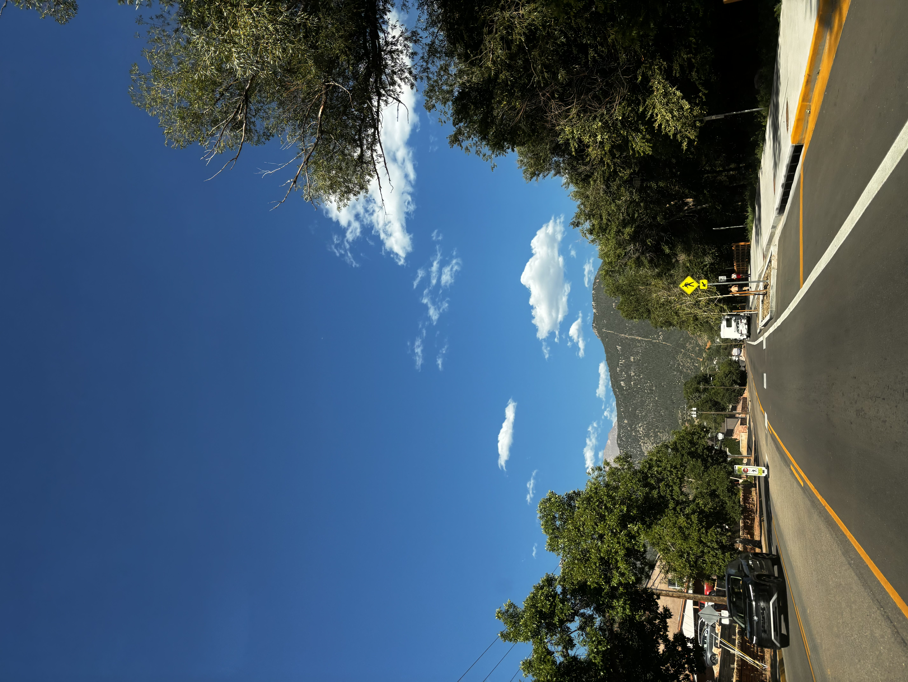

<br><details><summary>:camera:**65/IMG_0235.jpg**</summary><sub> `Exif version` 0232 `OS version` 27.0 `Date` 2026:07:12 08:59:15 `Aperture` Not known `Brightness` 9.25249513933895 `Color space` 65535 `Compression` Not known`Exposure mode` 0 `Exposure time` 0.0005330490405117271 `Focal length` 5.96 `Lens model` iPhone 15 Plus back dual wide camera 5.96mm f/1.6 `Lens specification` (1.5399999618512084, 5.96, 1.6, 2.4) `Orientation` 6 `Scene type` Not known `f number` 1.6 `White balance` 0 `Sensing method` 2 `Shutter speed` 10.873576850094876</sub><sub>`Coordinates & altitude` (38.85740555555556, -104.90701944444444, 1914.4555214723925)</sub><sub> :earth_americas:`Location over` [Google Maps](http://maps.google.com/maps?q=38.85740555555556,-104.90701944444444) or [Openstreet Map](https://www.openstreetmap.org/query?lat=38.85740555555556&lon=-104.90701944444444)</sub></details>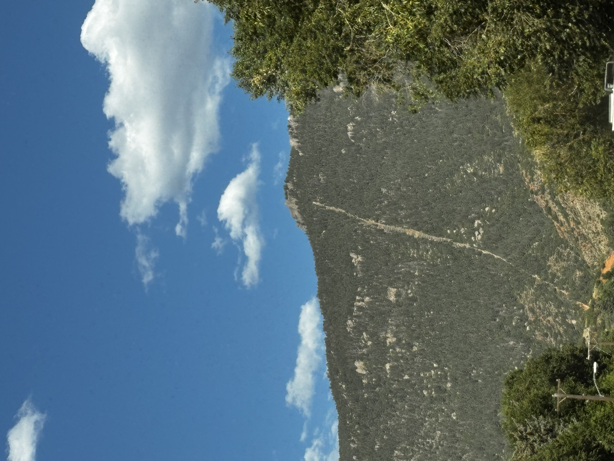

<br><details><summary>:camera:**65/IMG_0236.jpg**</summary><sub> `Exif version` 0232 `OS version` 27.0 `Date` 2026:07:12 08:59:17 `Aperture` Not known `Brightness` 9.220660457239628 `Color space` 65535 `Compression` Not known`Exposure mode` 0 `Exposure time` 0.000580046403712297 `Focal length` 5.96 `Lens model` iPhone 15 Plus back dual wide camera 5.96mm f/1.6 `Lens specification` (1.5399999618512084, 5.96, 1.6, 2.4) `Orientation` 6 `Scene type` Not known `f number` 1.6 `White balance` 0 `Sensing method` 2 `Shutter speed` 10.751659475605708</sub><sub>`Coordinates & altitude` (38.85740277777778, -104.907325, 1914.9272151898733)</sub><sub> :earth_americas:`Location over` [Google Maps](http://maps.google.com/maps?q=38.85740277777778,-104.907325) or [Openstreet Map](https://www.openstreetmap.org/query?lat=38.85740277777778&lon=-104.907325)</sub></details>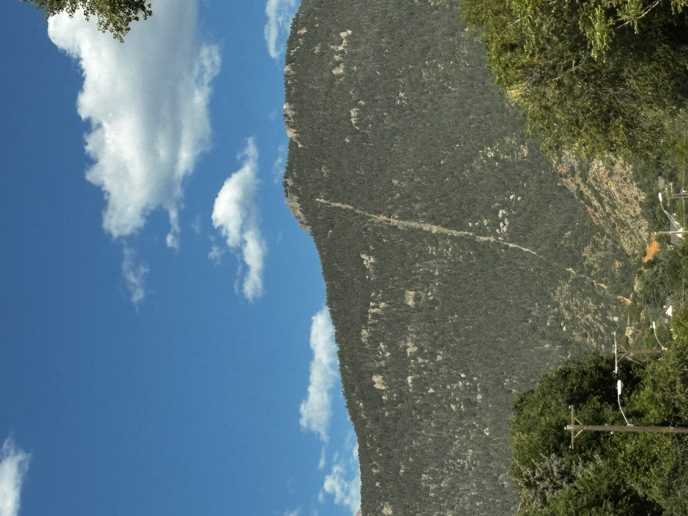

<br><details><summary>:camera:**65/IMG_0237.jpg**</summary><sub> `Exif version` 0232 `OS version` 27.0 `Date` 2026:07:12 09:11:34 `Aperture` Not known `Brightness` 9.24972106704534 `Color space` 65535 `Compression` Not known`Exposure mode` 0 `Exposure time` 0.0003599712023038157 `Focal length` 5.96 `Lens model` iPhone 15 Plus back dual wide camera 5.96mm f/1.6 `Lens specification` (1.5399999618512084, 5.96, 1.6, 2.4) `Orientation` 6 `Scene type` Not known `f number` 1.6 `White balance` 0 `Sensing method` 2 `Shutter speed` 11.439715471250741</sub><sub>`Coordinates & altitude` (38.856500000000004, -104.93096111111112, 2002.643684820394)</sub><sub> :earth_americas:`Location over` [Google Maps](http://maps.google.com/maps?q=38.856500000000004,-104.93096111111112) or [Openstreet Map](https://www.openstreetmap.org/query?lat=38.856500000000004&lon=-104.93096111111112)</sub></details>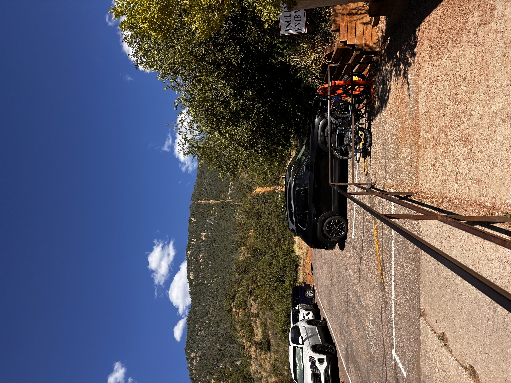

<br><details><summary>:camera:**65/IMG_0238.jpg**</summary><sub> `Exif version` 0232 `OS version` 27.0 `Date` 2026:07:12 09:12:10 `Aperture` Not known `Brightness` 9.360821612870586 `Color space` 65535 `Compression` Not known`Exposure mode` 0 `Exposure time` 0.0003979307600477517 `Focal length` 5.96 `Lens model` iPhone 15 Plus back dual wide camera 5.96mm f/1.6 `Lens specification` (1.5399999618512084, 5.96, 1.6, 2.4) `Orientation` 6 `Scene type` Not known `f number` 1.6 `White balance` 0 `Sensing method` 2 `Shutter speed` 11.294943950881436</sub><sub>`Coordinates & altitude` (38.85691944444444, -104.93138888888889, 2005.9066937119676)</sub><sub> :earth_americas:`Location over` [Google Maps](http://maps.google.com/maps?q=38.85691944444444,-104.93138888888889) or [Openstreet Map](https://www.openstreetmap.org/query?lat=38.85691944444444&lon=-104.93138888888889)</sub></details>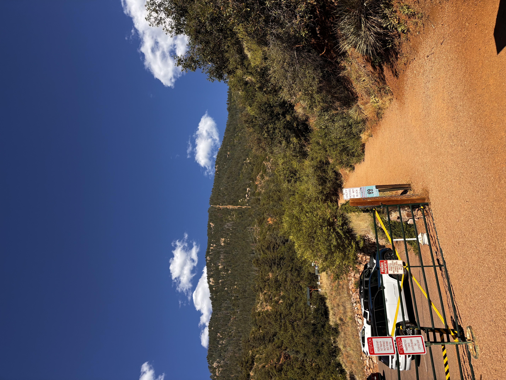

<br><details><summary>:camera:**65/IMG_0239.jpg**</summary><sub> `Exif version` 0232 `OS version` 27.0 `Date` 2026:07:12 09:13:54 `Aperture` Not known `Brightness` 9.501469661977746 `Color space` 65535 `Compression` Not known`Exposure mode` 0 `Exposure time` 0.00035001750087504374 `Focal length` 5.96 `Lens model` iPhone 15 Plus back dual wide camera 5.96mm f/1.6 `Lens specification` (1.5399999618512084, 5.96, 1.6, 2.4) `Orientation` 6 `Scene type` Not known `f number` 1.6 `White balance` 0 `Sensing method` 2 `Shutter speed` 11.48035745885684</sub><sub>`Coordinates & altitude` (38.85591111111111, -104.93125277777779, 2012.8563283922463)</sub><sub> :earth_americas:`Location over` [Google Maps](http://maps.google.com/maps?q=38.85591111111111,-104.93125277777779) or [Openstreet Map](https://www.openstreetmap.org/query?lat=38.85591111111111&lon=-104.93125277777779)</sub></details>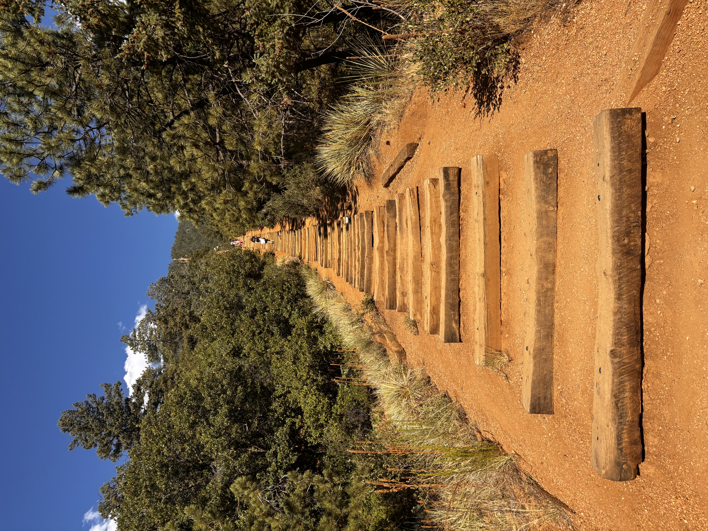

<br><details><summary>:camera:**65/IMG_0240.jpg**</summary><sub> `Exif version` 0232 `OS version` 27.0 `Date` 2026:07:12 09:26:41 `Aperture` Not known `Brightness` 8.353906463670343 `Color space` 65535 `Compression` Not known`Exposure mode` 0 `Exposure time` 0.0007052186177715092 `Focal length` 5.96 `Lens model` iPhone 15 Plus back dual wide camera 5.96mm f/1.6 `Lens specification` (1.5399999618512084, 5.96, 1.6, 2.4) `Orientation` 6 `Scene type` Not known `f number` 1.6 `White balance` 0 `Sensing method` 2 `Shutter speed` 10.4700891222073</sub><sub>`Coordinates & altitude` (38.85744444444445, -104.93825555555556, 2189.7931688804556)</sub><sub> :earth_americas:`Location over` [Google Maps](http://maps.google.com/maps?q=38.85744444444445,-104.93825555555556) or [Openstreet Map](https://www.openstreetmap.org/query?lat=38.85744444444445&lon=-104.93825555555556)</sub></details>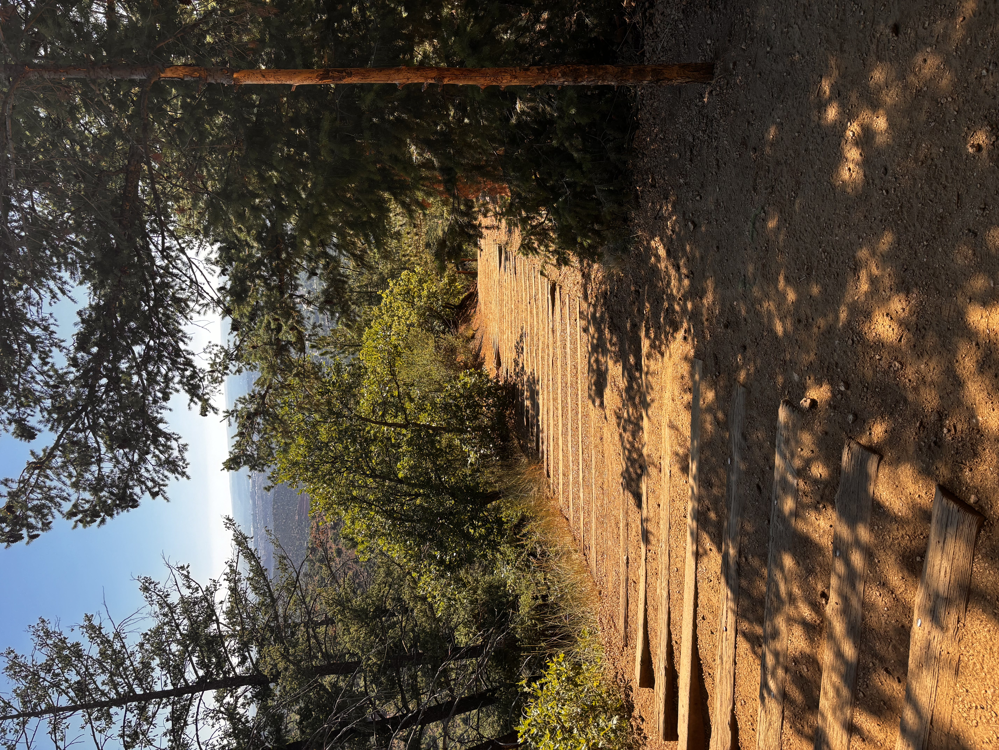

<br><details><summary>:camera:**65/IMG_0241.jpg**</summary><sub> `Exif version` 0232 `OS version` 27.0 `Date` 2026:07:12 09:26:45 `Aperture` Not known `Brightness` 8.885309636212163 `Color space` 65535 `Compression` Not known`Exposure mode` 0 `Exposure time` 0.0005040322580645161 `Focal length` 5.96 `Lens model` iPhone 15 Plus back dual wide camera 5.96mm f/1.6 `Lens specification` (1.5399999618512084, 5.96, 1.6, 2.4) `Orientation` 6 `Scene type` Not known `f number` 1.6 `White balance` 0 `Sensing method` 2 `Shutter speed` 10.954288649203903</sub><sub>`Coordinates & altitude` (38.857508333333335, -104.93823333333334, 2189.4267139479907)</sub><sub> :earth_americas:`Location over` [Google Maps](http://maps.google.com/maps?q=38.857508333333335,-104.93823333333334) or [Openstreet Map](https://www.openstreetmap.org/query?lat=38.857508333333335&lon=-104.93823333333334)</sub></details>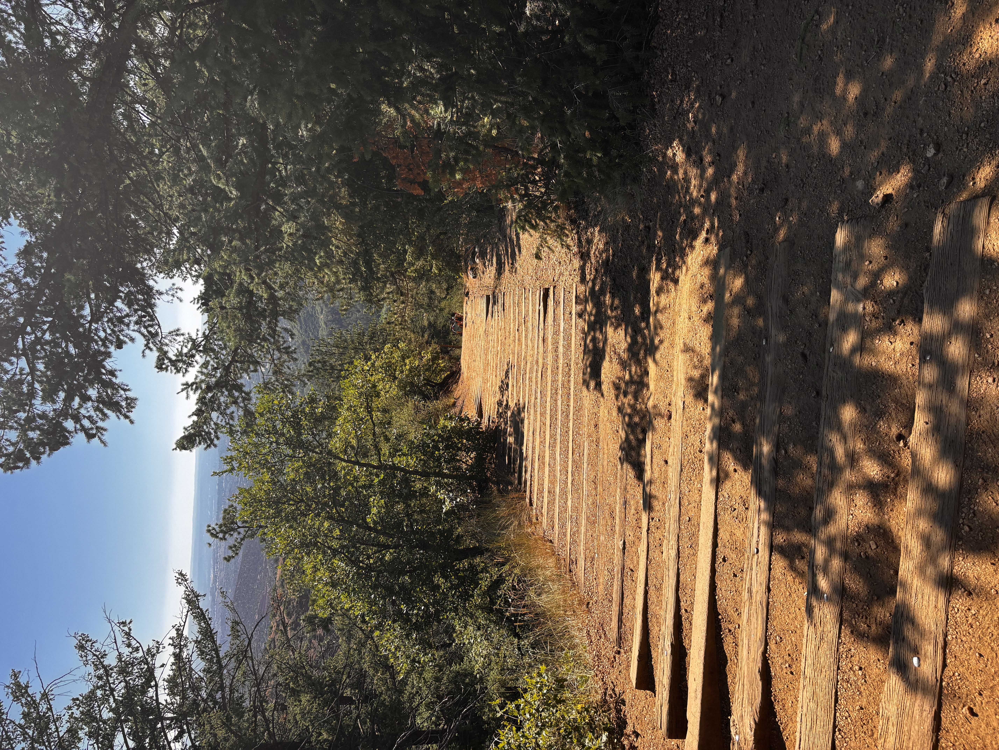

<br><details><summary>:camera:**65/IMG_0242.jpg**</summary><sub> `Exif version` 0232 `OS version` 27.0 `Date` 2026:07:12 09:26:47 `Aperture` Not known `Brightness` 9.318520063982197 `Color space` 65535 `Compression` Not known`Exposure mode` 0 `Exposure time` 0.00038895371450797355 `Focal length` 5.96 `Lens model` iPhone 15 Plus back dual wide camera 5.96mm f/1.6 `Lens specification` (1.5399999618512084, 5.96, 1.6, 2.4) `Orientation` 6 `Scene type` Not known `f number` 1.6 `White balance` 0 `Sensing method` 2 `Shutter speed` 11.327942223578477</sub><sub>`Coordinates & altitude` (38.85750277777778, -104.93821666666668, 2191.40058910162)</sub><sub> :earth_americas:`Location over` [Google Maps](http://maps.google.com/maps?q=38.85750277777778,-104.93821666666668) or [Openstreet Map](https://www.openstreetmap.org/query?lat=38.85750277777778&lon=-104.93821666666668)</sub></details>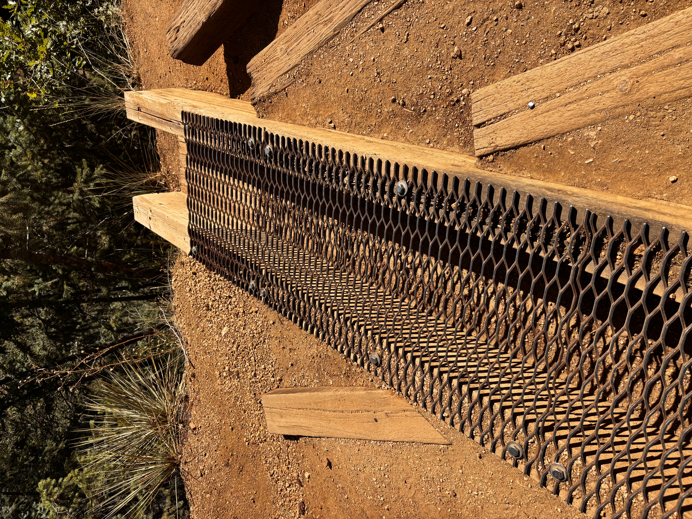

<br><details><summary>:camera:**65/IMG_0243.jpg**</summary><sub> `Exif version` 0232 `OS version` 27.0 `Date` 2026:07:12 09:30:10 `Aperture` Not known `Brightness` 9.108710838841422 `Color space` 65535 `Compression` Not known`Exposure mode` 0 `Exposure time` 0.0004170141784820684 `Focal length` 5.96 `Lens model` iPhone 15 Plus back dual wide camera 5.96mm f/1.6 `Lens specification` (1.5399999618512084, 5.96, 1.6, 2.4) `Orientation` 6 `Scene type` Not known `f number` 1.6 `White balance` 0 `Sensing method` 2 `Shutter speed` 11.227665005469795</sub><sub>`Coordinates & altitude` (38.857594444444445, -104.93939166666667, 2226.9240282685514)</sub><sub> :earth_americas:`Location over` [Google Maps](http://maps.google.com/maps?q=38.857594444444445,-104.93939166666667) or [Openstreet Map](https://www.openstreetmap.org/query?lat=38.857594444444445&lon=-104.93939166666667)</sub></details>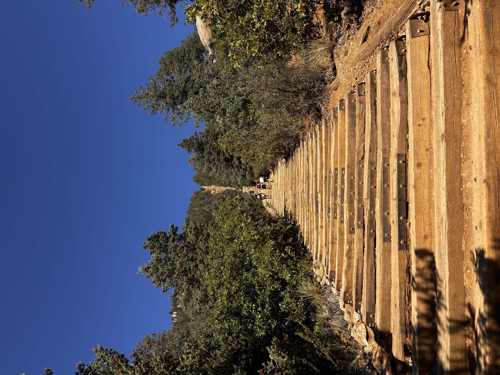

<br><details><summary>:camera:**65/IMG_0244.jpg**</summary><sub> `Exif version` 0232 `OS version` 27.0 `Date` 2026:07:12 09:30:12 `Aperture` Not known `Brightness` 9.100298598882167 `Color space` 65535 `Compression` Not known`Exposure mode` 0 `Exposure time` 0.0004170141784820684 `Focal length` 5.96 `Lens model` iPhone 15 Plus back dual wide camera 5.96mm f/1.6 `Lens specification` (1.5399999618512084, 5.96, 1.6, 2.4) `Orientation` 1 `Scene type` Not known `f number` 1.6 `White balance` 0 `Sensing method` 2 `Shutter speed` 11.227665005469795</sub><sub>`Coordinates & altitude` (38.857616666666665, -104.93936111111111, 2223.624711316397)</sub><sub> :earth_americas:`Location over` [Google Maps](http://maps.google.com/maps?q=38.857616666666665,-104.93936111111111) or [Openstreet Map](https://www.openstreetmap.org/query?lat=38.857616666666665&lon=-104.93936111111111)</sub></details>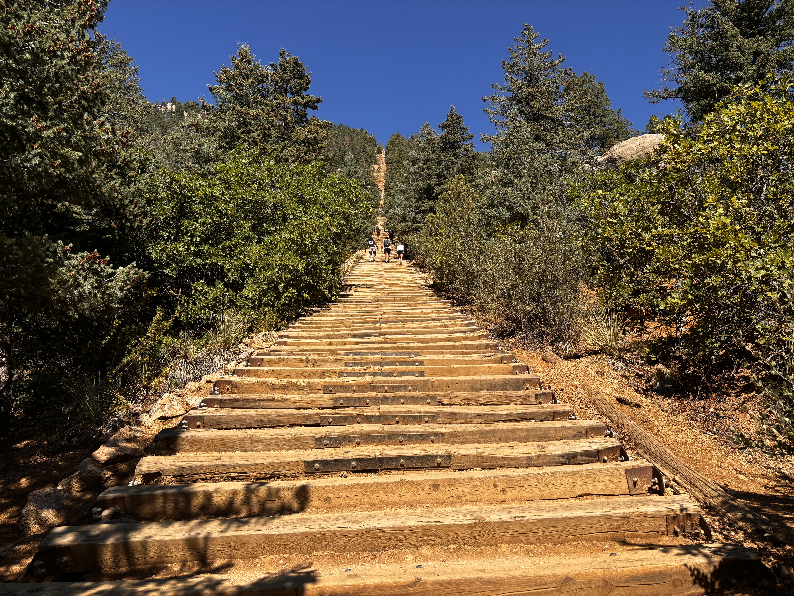

<br><details><summary>:camera:**65/IMG_0245.jpg**</summary><sub> `Exif version` 0232 `OS version` 27.0 `Date` 2026:07:12 09:30:15 `Aperture` Not known `Brightness` 9.26562746024248 `Color space` 65535 `Compression` Not known`Exposure mode` 0 `Exposure time` 0.00036900369003690036 `Focal length` 5.96 `Lens model` iPhone 15 Plus back dual wide camera 5.96mm f/1.6 `Lens specification` (1.5399999618512084, 5.96, 1.6, 2.4) `Orientation` 1 `Scene type` Not known `f number` 1.6 `White balance` 0 `Sensing method` 2 `Shutter speed` 11.404091553575046</sub><sub>`Coordinates & altitude` (38.857644444444446, -104.9394138888889, 2225.287795992714)</sub><sub> :earth_americas:`Location over` [Google Maps](http://maps.google.com/maps?q=38.857644444444446,-104.9394138888889) or [Openstreet Map](https://www.openstreetmap.org/query?lat=38.857644444444446&lon=-104.9394138888889)</sub></details>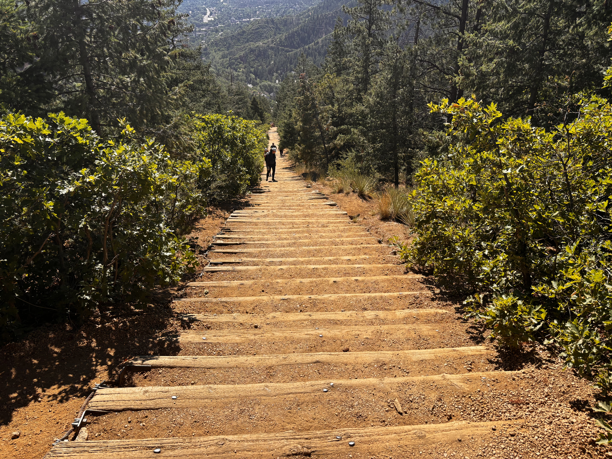

<br><details><summary>:camera:**65/IMG_0246.jpg**</summary><sub> `Exif version` 0232 `OS version` 27.0 `Date` 2026:07:12 09:30:16 `Aperture` Not known `Brightness` 9.563851992409868 `Color space` 65535 `Compression` Not known`Exposure mode` 0 `Exposure time` 0.00033101621979476995 `Focal length` 5.96 `Lens model` iPhone 15 Plus back dual wide camera 5.96mm f/1.6 `Lens specification` (1.5399999618512084, 5.96, 1.6, 2.4) `Orientation` 6 `Scene type` Not known `f number` 1.6 `White balance` 0 `Sensing method` 2 `Shutter speed` 11.560881163411066</sub><sub>`Coordinates & altitude` (38.85762777777778, -104.93940833333333, 2225.1271523178807)</sub><sub> :earth_americas:`Location over` [Google Maps](http://maps.google.com/maps?q=38.85762777777778,-104.93940833333333) or [Openstreet Map](https://www.openstreetmap.org/query?lat=38.85762777777778&lon=-104.93940833333333)</sub></details>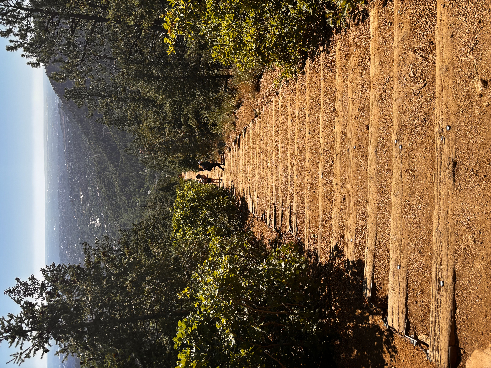

<br><details><summary>:camera:**65/IMG_0247.jpg**</summary><sub> `Exif version` 0232 `OS version` 27.0 `Date` 2026:07:12 09:42:33 `Aperture` Not known `Brightness` 10.010840522177265 `Color space` 65535 `Compression` Not known`Exposure mode` 0 `Exposure time` 0.00021598272138228941 `Focal length` 5.96 `Lens model` iPhone 15 Plus back dual wide camera 5.96mm f/1.6 `Lens specification` (1.5399999618512084, 5.96, 1.6, 2.4) `Orientation` 6 `Scene type` Not known `f number` 1.6 `White balance` 0 `Sensing method` 2 `Shutter speed` 12.176681061073412</sub><sub>`Coordinates & altitude` (38.85776944444444, -104.94140555555556, 2319.0260770975055)</sub><sub> :earth_americas:`Location over` [Google Maps](http://maps.google.com/maps?q=38.85776944444444,-104.94140555555556) or [Openstreet Map](https://www.openstreetmap.org/query?lat=38.85776944444444&lon=-104.94140555555556)</sub></details>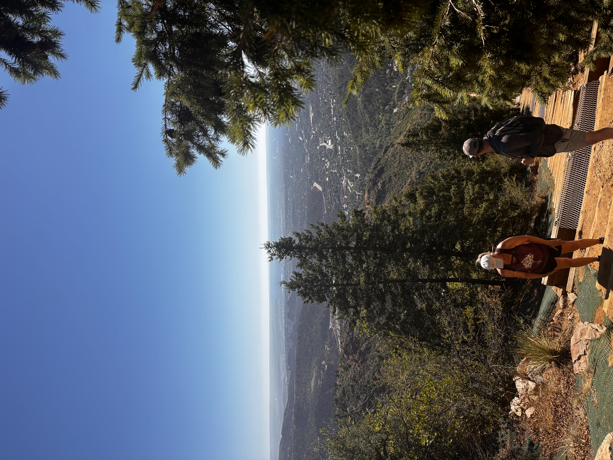

<br><details><summary>:camera:**65/IMG_0248.jpg**</summary><sub> `Exif version` 0232 `OS version` 27.0 `Date` 2026:07:12 09:42:36 `Aperture` Not known `Brightness` 8.806968188703744 `Color space` 65535 `Compression` Not known`Exposure mode` 0 `Exposure time` 0.0005040322580645161 `Focal length` 5.96 `Lens model` iPhone 15 Plus back dual wide camera 5.96mm f/1.6 `Lens specification` (1.5399999618512084, 5.96, 1.6, 2.4) `Orientation` 1 `Scene type` Not known `f number` 1.6 `White balance` 0 `Sensing method` 2 `Shutter speed` 10.954288649203903</sub><sub>`Coordinates & altitude` (38.85778055555556, -104.94140555555556, 2311.3202676864244)</sub><sub> :earth_americas:`Location over` [Google Maps](http://maps.google.com/maps?q=38.85778055555556,-104.94140555555556) or [Openstreet Map](https://www.openstreetmap.org/query?lat=38.85778055555556&lon=-104.94140555555556)</sub></details>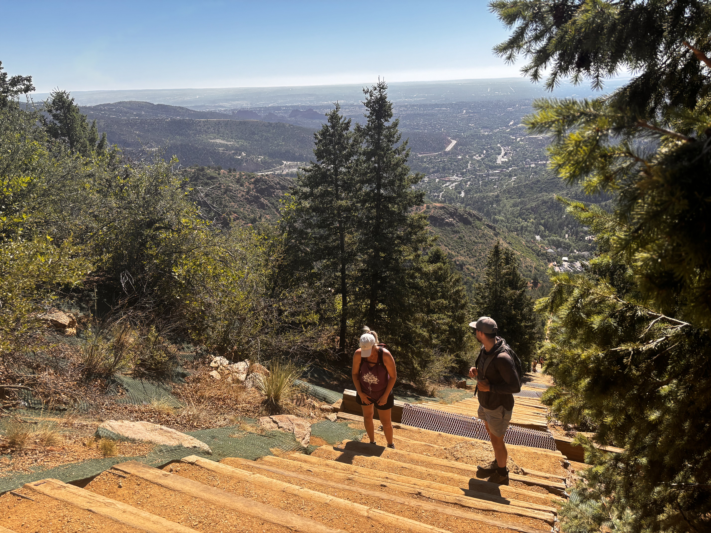

<br><details><summary>:camera:**65/IMG_0249.jpg**</summary><sub> `Exif version` 0232 `OS version` 27.0 `Date` 2026:07:12 09:42:39 `Aperture` Not known `Brightness` 9.638602681721947 `Color space` 65535 `Compression` Not known`Exposure mode` 0 `Exposure time` 0.0016260162601626016 `Focal length` 1.54 `Lens model` iPhone 15 Plus back dual wide camera 1.54mm f/2.4 `Lens specification` (1.54, 5.960000038146973, 1.6, 2.4) `Orientation` 1 `Scene type` Not known `f number` 2.4 `White balance` 0 `Sensing method` 2 `Shutter speed` 9.265344560159539</sub><sub>`Coordinates & altitude` (38.85779166666667, -104.94141388888889, 2310.6999059266227)</sub><sub> :earth_americas:`Location over` [Google Maps](http://maps.google.com/maps?q=38.85779166666667,-104.94141388888889) or [Openstreet Map](https://www.openstreetmap.org/query?lat=38.85779166666667&lon=-104.94141388888889)</sub></details>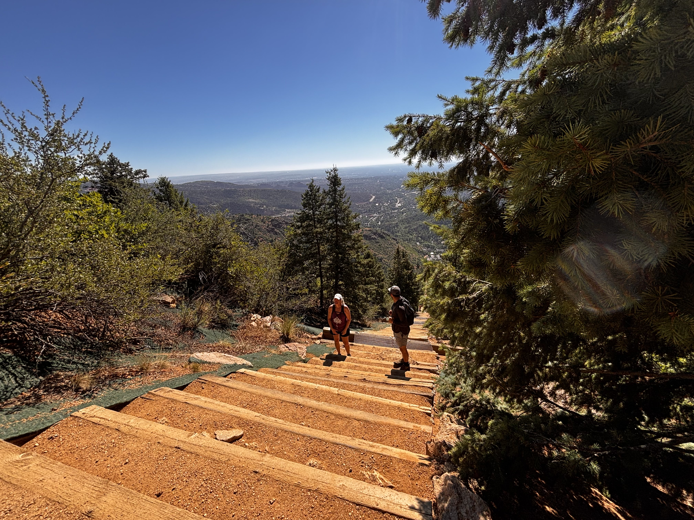

<br><details><summary>:camera:**65/IMG_0250.jpg**</summary><sub> `Exif version` 0232 `OS version` 27.0 `Date` 2026:07:12 09:42:42 `Aperture` Not known `Brightness` 10.020175146879504 `Color space` 65535 `Compression` Not known`Exposure mode` 0 `Exposure time` 0.0007092198581560284 `Focal length` 1.54 `Lens model` iPhone 15 Plus back dual wide camera 1.54mm f/2.4 `Lens specification` (1.54, 5.960000038146973, 1.6, 2.4) `Orientation` 6 `Scene type` Not known `f number` 2.4 `White balance` 0 `Sensing method` 2 `Shutter speed` 10.461926753302546</sub><sub>`Coordinates & altitude` (38.85780833333334, -104.94142777777778, 2310.3441955193484)</sub><sub> :earth_americas:`Location over` [Google Maps](http://maps.google.com/maps?q=38.85780833333334,-104.94142777777778) or [Openstreet Map](https://www.openstreetmap.org/query?lat=38.85780833333334&lon=-104.94142777777778)</sub></details>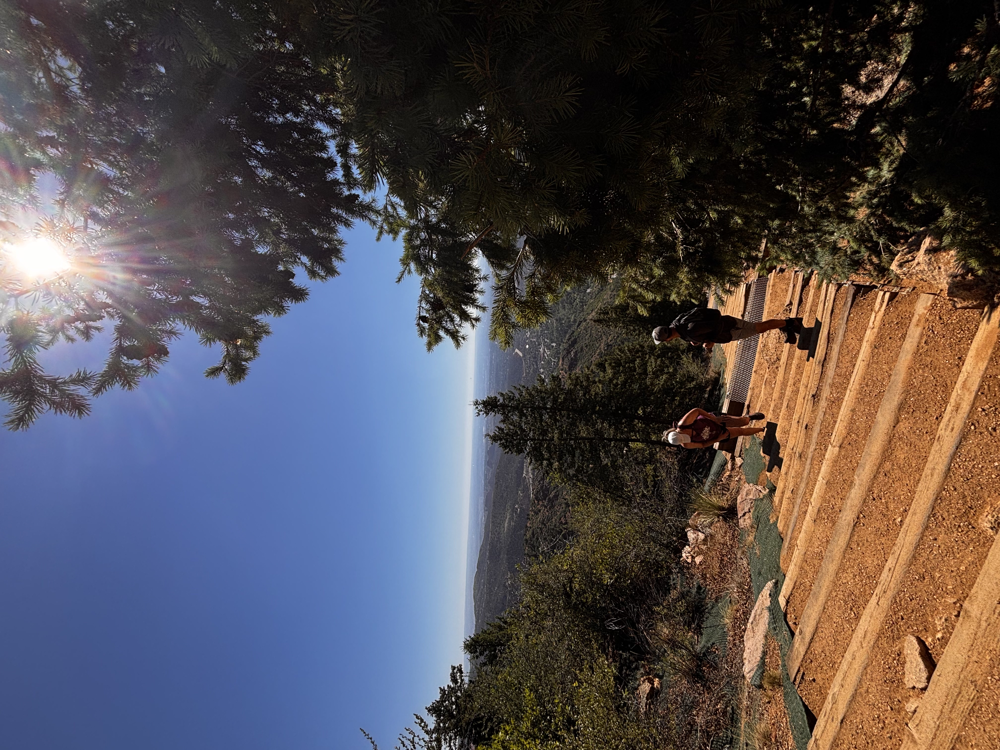

<br><details><summary>:camera:**65/IMG_0251.jpg**</summary><sub> `Exif version` 0232 `OS version` 27.0 `Date` 2026:07:12 09:42:47 `Aperture` Not known `Brightness` 9.56571519440248 `Color space` 65535 `Compression` Not known`Exposure mode` 0 `Exposure time` 0.001199040767386091 `Focal length` 1.54 `Lens model` iPhone 15 Plus back dual wide camera 1.54mm f/2.4 `Lens specification` (1.54, 5.960000038146973, 1.6, 2.4) `Orientation` 6 `Scene type` Not known `f number` 2.4 `White balance` 0 `Sensing method` 2 `Shutter speed` 9.703952632421187</sub><sub>`Coordinates & altitude` (38.85781388888889, -104.94142777777778, 2310.3061074319353)</sub><sub> :earth_americas:`Location over` [Google Maps](http://maps.google.com/maps?q=38.85781388888889,-104.94142777777778) or [Openstreet Map](https://www.openstreetmap.org/query?lat=38.85781388888889&lon=-104.94142777777778)</sub></details>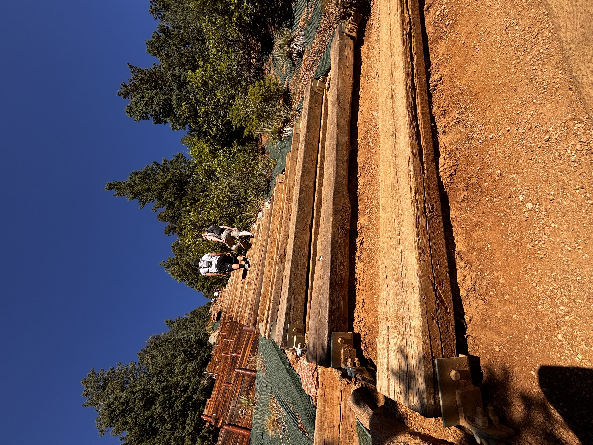

<br><details><summary>:camera:**65/IMG_0254.jpg**</summary><sub> `Exif version` 0232 `OS version` 27.0 `Date` 2026:07:12 09:51:31 `Aperture` Not known `Brightness` 9.827476389193938 `Color space` 65535 `Compression` Not known`Exposure mode` 0 `Exposure time` 0.000273972602739726 `Focal length` 5.96 `Lens model` iPhone 15 Plus back dual wide camera 5.96mm f/1.6 `Lens specification` (1.5399999618512084, 5.96, 1.6, 2.4) `Orientation` 6 `Scene type` Not known `f number` 1.6 `White balance` 0 `Sensing method` 2 `Shutter speed` 11.83353647919206</sub></details>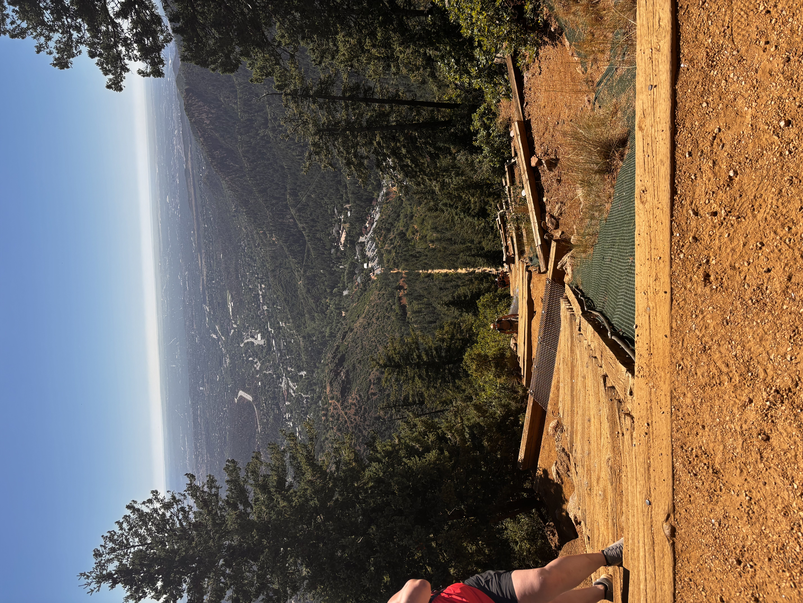

<br><details><summary>:camera:**65/IMG_0255.jpg**</summary><sub> `Exif version` 0232 `OS version` 27.0 `Date` 2026:07:12 09:51:38 `Aperture` Not known `Brightness` 8.96295570364563 `Color space` 65535 `Compression` Not known`Exposure mode` 0 `Exposure time` 0.00044603033006244426 `Focal length` 5.96 `Lens model` iPhone 15 Plus back dual wide camera 5.96mm f/1.6 `Lens specification` (1.5399999618512084, 5.96, 1.6, 2.4) `Orientation` 1 `Scene type` Not known `f number` 1.6 `White balance` 0 `Sensing method` 2 `Shutter speed` 11.130668668292987</sub><sub>`Coordinates & altitude` (38.8579, -104.94245277777779, 2371.438186813187)</sub><sub> :earth_americas:`Location over` [Google Maps](http://maps.google.com/maps?q=38.8579,-104.94245277777779) or [Openstreet Map](https://www.openstreetmap.org/query?lat=38.8579&lon=-104.94245277777779)</sub></details>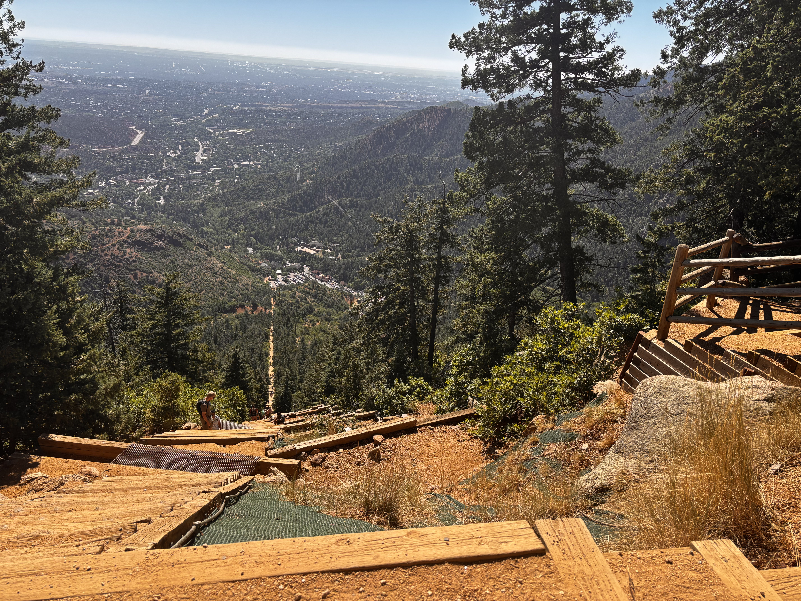

<br><details><summary>:camera:**65/IMG_0256.jpg**</summary><sub> `Exif version` 0232 `OS version` 27.0 `Date` 2026:07:12 09:51:41 `Aperture` Not known `Brightness` 8.911485921382772 `Color space` 65535 `Compression` Not known`Exposure mode` 0 `Exposure time` 0.00046490004649000463 `Focal length` 5.96 `Lens model` iPhone 15 Plus back dual wide camera 5.96mm f/1.6 `Lens specification` (1.5399999618512084, 5.96, 1.6, 2.4) `Orientation` 6 `Scene type` Not known `f number` 1.6 `White balance` 0 `Sensing method` 2 `Shutter speed` 11.070481661511268</sub><sub>`Coordinates & altitude` (38.8579, -104.94245833333333, 2370.3813038130384)</sub><sub> :earth_americas:`Location over` [Google Maps](http://maps.google.com/maps?q=38.8579,-104.94245833333333) or [Openstreet Map](https://www.openstreetmap.org/query?lat=38.8579&lon=-104.94245833333333)</sub></details>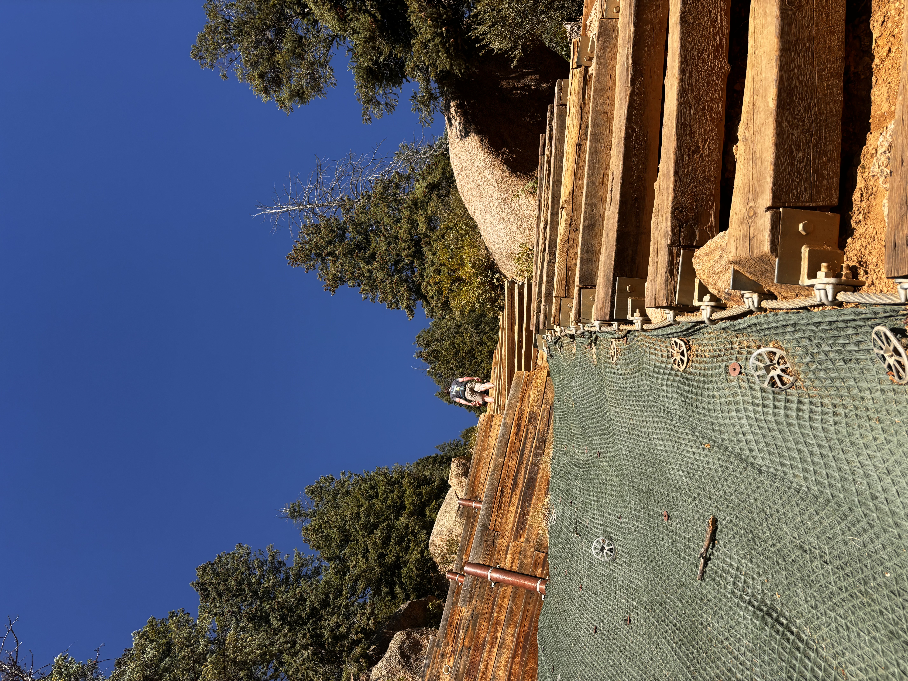

<br><details><summary>:camera:**65/IMG_0257.jpg**</summary><sub> `Exif version` 0232 `OS version` 27.0 `Date` 2026:07:12 09:52:43 `Aperture` Not known `Brightness` 9.679998148405314 `Color space` 65535 `Compression` Not known`Exposure mode` 0 `Exposure time` 0.00031201248049921997 `Focal length` 5.96 `Lens model` iPhone 15 Plus back dual wide camera 5.96mm f/1.6 `Lens specification` (1.5399999618512084, 5.96, 1.6, 2.4) `Orientation` 6 `Scene type` Not known `f number` 1.6 `White balance` 0 `Sensing method` 2 `Shutter speed` 11.646166350582497</sub><sub>`Coordinates & altitude` (38.85791388888889, -104.942475, 2370.2504440497337)</sub><sub> :earth_americas:`Location over` [Google Maps](http://maps.google.com/maps?q=38.85791388888889,-104.942475) or [Openstreet Map](https://www.openstreetmap.org/query?lat=38.85791388888889&lon=-104.942475)</sub></details>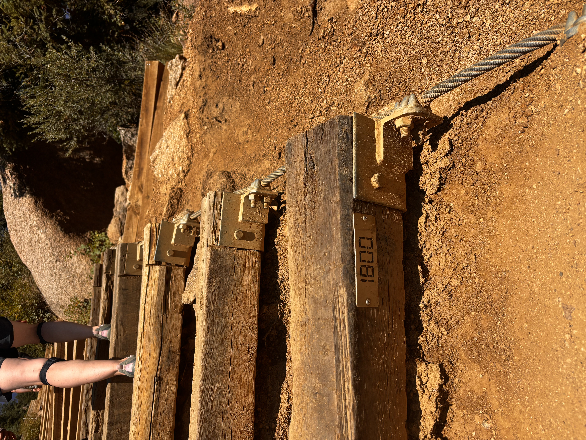

<br><details><summary>:camera:**65/IMG_0258.jpg**</summary><sub> `Exif version` 0232 `OS version` 27.0 `Date` 2026:07:12 09:55:35 `Aperture` Not known `Brightness` 9.156052040051767 `Color space` 65535 `Compression` Not known`Exposure mode` 0 `Exposure time` 0.0004269854824935952 `Focal length` 5.96 `Lens model` iPhone 15 Plus back dual wide camera 5.96mm f/1.6 `Lens specification` (1.5399999618512084, 5.96, 1.6, 2.4) `Orientation` 6 `Scene type` Not known `f number` 1.6 `White balance` 0 `Sensing method` 2 `Shutter speed` 11.193476318141197</sub></details>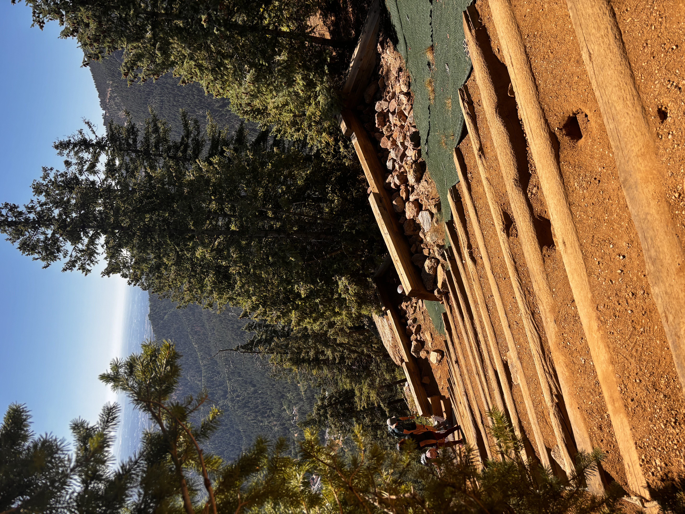

<br><details><summary>:camera:**65/IMG_0259.jpg**</summary><sub> `Exif version` 0232 `OS version` 27.0 `Date` 2026:07:12 09:55:37 `Aperture` Not known `Brightness` 9.32091968911917 `Color space` 65535 `Compression` Not known`Exposure mode` 0 `Exposure time` 0.00037893141341417203 `Focal length` 5.96 `Lens model` iPhone 15 Plus back dual wide camera 5.96mm f/1.6 `Lens specification` (1.5399999618512084, 5.96, 1.6, 2.4) `Orientation` 6 `Scene type` Not known `f number` 1.6 `White balance` 0 `Sensing method` 2 `Shutter speed` 11.365514532600157</sub><sub>`Coordinates & altitude` (38.85806388888889, -104.94258055555557, 2445.826860841424)</sub><sub> :earth_americas:`Location over` [Google Maps](http://maps.google.com/maps?q=38.85806388888889,-104.94258055555557) or [Openstreet Map](https://www.openstreetmap.org/query?lat=38.85806388888889&lon=-104.94258055555557)</sub></details>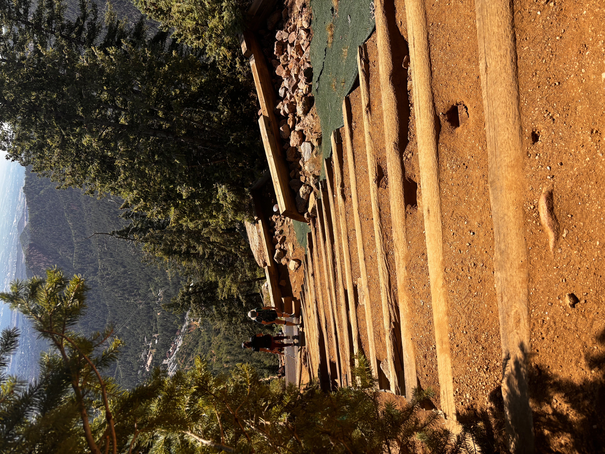

<br><details><summary>:camera:**65/IMG_0260.jpg**</summary><sub> `Exif version` 0232 `OS version` 27.0 `Date` 2026:07:12 09:55:41 `Aperture` Not known `Brightness` 9.527657278067208 `Color space` 65535 `Compression` Not known`Exposure mode` 0 `Exposure time` 0.002178649237472767 `Focal length` 1.54 `Lens model` iPhone 15 Plus back dual wide camera 1.54mm f/2.4 `Lens specification` (1.54, 5.960000038146973, 1.6, 2.4) `Orientation` 1 `Scene type` Not known `f number` 2.4 `White balance` 0 `Sensing method` 2 `Shutter speed` 8.841456153780726</sub><sub>`Coordinates & altitude` (38.857975, -104.9428638888889, 2400.4242718446603)</sub><sub> :earth_americas:`Location over` [Google Maps](http://maps.google.com/maps?q=38.857975,-104.9428638888889) or [Openstreet Map](https://www.openstreetmap.org/query?lat=38.857975&lon=-104.9428638888889)</sub></details>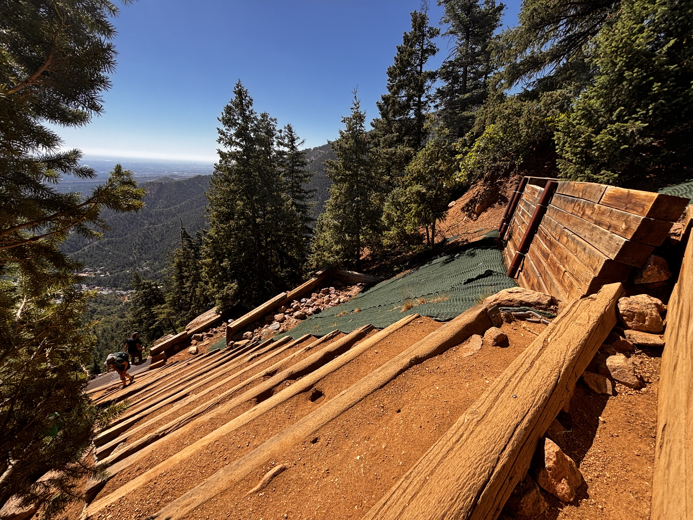

<br><details><summary>:camera:**65/IMG_0261.jpg**</summary><sub> `Exif version` 0232 `OS version` 27.0 `Date` 2026:07:12 09:55:43 `Aperture` Not known `Brightness` 9.287326466636811 `Color space` 65535 `Compression` Not known`Exposure mode` 0 `Exposure time` 0.0018018018018018018 `Focal length` 1.54 `Lens model` iPhone 15 Plus back dual wide camera 1.54mm f/2.4 `Lens specification` (1.54, 5.960000038146973, 1.6, 2.4) `Orientation` 6 `Scene type` Not known `f number` 2.4 `White balance` 0 `Sensing method` 2 `Shutter speed` 9.116986103218474</sub><sub>`Coordinates & altitude` (38.857975, -104.94287222222222, 2397.1571815718157)</sub><sub> :earth_americas:`Location over` [Google Maps](http://maps.google.com/maps?q=38.857975,-104.94287222222222) or [Openstreet Map](https://www.openstreetmap.org/query?lat=38.857975&lon=-104.94287222222222)</sub></details>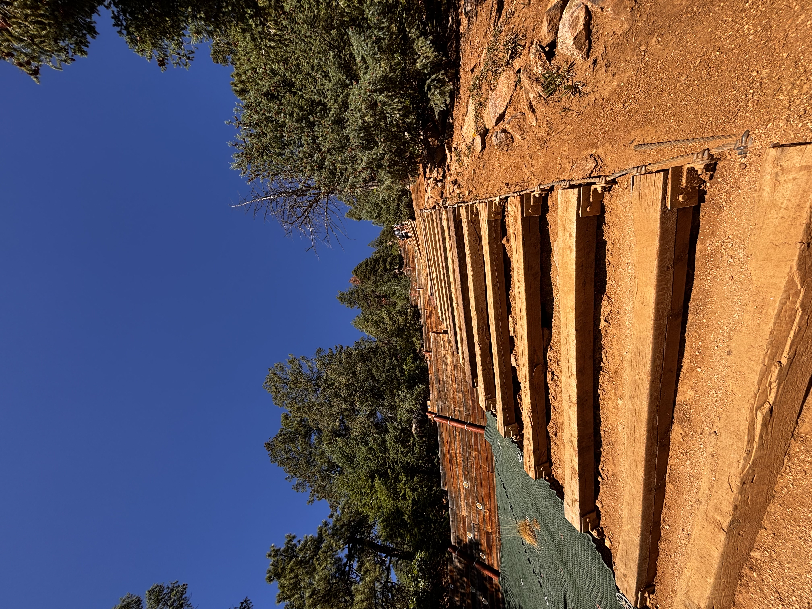

<br><details><summary>:camera:**65/IMG_0262.jpg**</summary><sub> `Exif version` 0232 `OS version` 27.0 `Date` 2026:07:12 09:55:45 `Aperture` Not known `Brightness` 9.282565268306124 `Color space` 65535 `Compression` Not known`Exposure mode` 0 `Exposure time` 0.0018656716417910447 `Focal length` 1.54 `Lens model` iPhone 15 Plus back dual wide camera 1.54mm f/2.4 `Lens specification` (1.54, 5.960000038146973, 1.6, 2.4) `Orientation` 6 `Scene type` Not known `f number` 2.4 `White balance` 0 `Sensing method` 2 `Shutter speed` 9.065835299404561</sub><sub>`Coordinates & altitude` (38.857975, -104.94287222222222, 2396.823927765237)</sub><sub> :earth_americas:`Location over` [Google Maps](http://maps.google.com/maps?q=38.857975,-104.94287222222222) or [Openstreet Map](https://www.openstreetmap.org/query?lat=38.857975&lon=-104.94287222222222)</sub></details>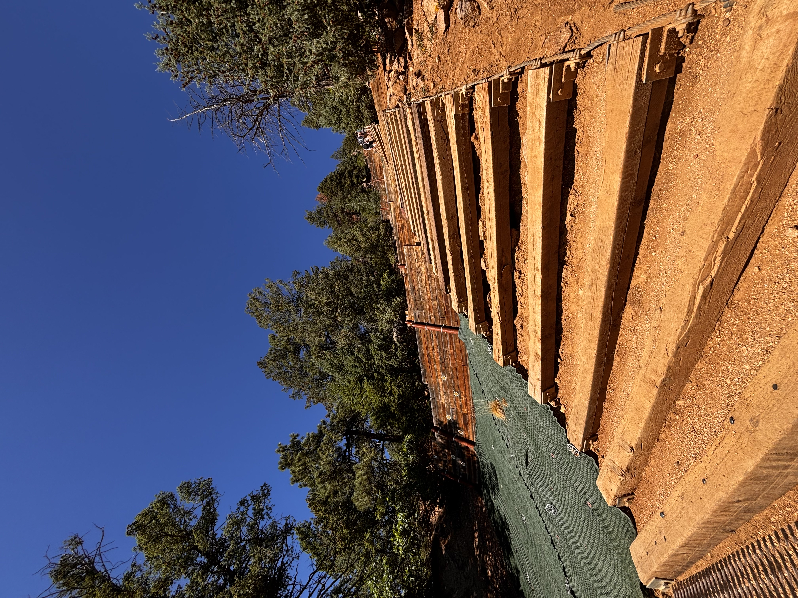

<br><details><summary>:camera:**65/IMG_0263.jpg**</summary><sub> `Exif version` 0232 `OS version` 27.0 `Date` 2026:07:12 10:10:11 `Aperture` Not known `Brightness` 9.586631369953674 `Color space` 65535 `Compression` Not known`Exposure mode` 0 `Exposure time` 0.00031201248049921997 `Focal length` 5.96 `Lens model` iPhone 15 Plus back dual wide camera 5.96mm f/1.6 `Lens specification` (1.5399999618512084, 5.96, 1.6, 2.4) `Orientation` 6 `Scene type` Not known `f number` 1.6 `White balance` 0 `Sensing method` 2 `Shutter speed` 11.646166350582497</sub><sub>`Coordinates & altitude` (38.857825, -104.9451138888889, 2425.28437917223)</sub><sub> :earth_americas:`Location over` [Google Maps](http://maps.google.com/maps?q=38.857825,-104.9451138888889) or [Openstreet Map](https://www.openstreetmap.org/query?lat=38.857825&lon=-104.9451138888889)</sub></details>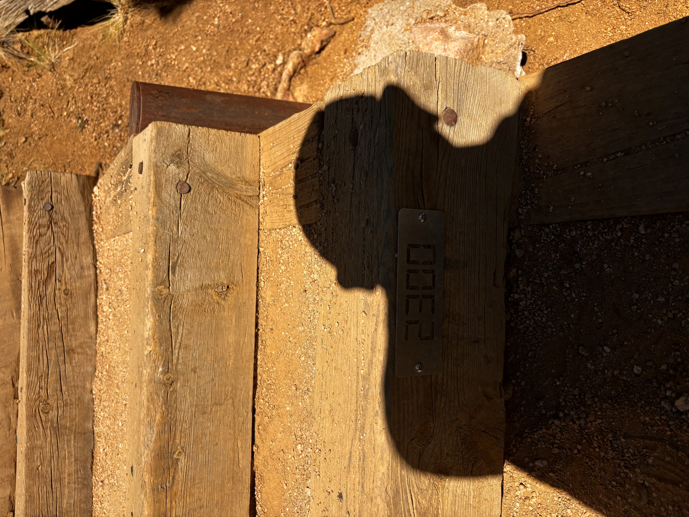

<br><details><summary>:camera:**65/IMG_0264.jpg**</summary><sub> `Exif version` 0232 `OS version` 27.0 `Date` 2026:07:12 10:15:12 `Aperture` Not known `Brightness` 9.461710124500822 `Color space` 65535 `Compression` Not known`Exposure mode` 0 `Exposure time` 0.00031201248049921997 `Focal length` 5.96 `Lens model` iPhone 15 Plus back dual wide camera 5.96mm f/1.6 `Lens specification` (1.5399999618512084, 5.96, 1.6, 2.4) `Orientation` 6 `Scene type` Not known `f number` 1.6 `White balance` 0 `Sensing method` 2 `Shutter speed` 11.646166350582497</sub><sub>`Coordinates & altitude` (38.85819722222222, -104.94576388888889, 2527.404740200547)</sub><sub> :earth_americas:`Location over` [Google Maps](http://maps.google.com/maps?q=38.85819722222222,-104.94576388888889) or [Openstreet Map](https://www.openstreetmap.org/query?lat=38.85819722222222&lon=-104.94576388888889)</sub></details>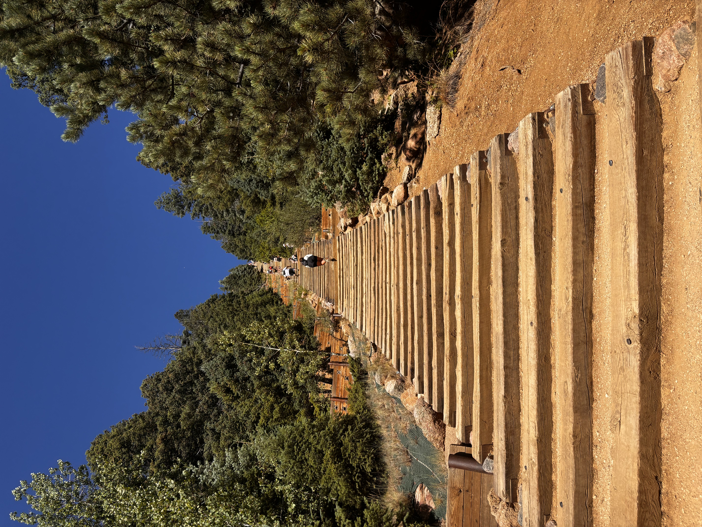

<br><details><summary>:camera:**65/IMG_0268.jpg**</summary><sub> `Exif version` 0232 `OS version` 27.0 `Date` 2026:07:12 10:23:41 `Aperture` Not known `Brightness` 9.52263384208288 `Color space` 65535 `Compression` Not known`Exposure mode` 0 `Exposure time` 0.0003219575016097875 `Focal length` 5.96 `Lens model` iPhone 15 Plus back dual wide camera 5.96mm f/1.6 `Lens specification` (1.5399999618512084, 5.96, 1.6, 2.4) `Orientation` 6 `Scene type` Not known `f number` 1.6 `White balance` 0 `Sensing method` 2 `Shutter speed` 11.60065170166546</sub><sub>`Coordinates & altitude` (38.85835277777778, -104.94679166666667, 2639.990189208129)</sub><sub> :earth_americas:`Location over` [Google Maps](http://maps.google.com/maps?q=38.85835277777778,-104.94679166666667) or [Openstreet Map](https://www.openstreetmap.org/query?lat=38.85835277777778&lon=-104.94679166666667)</sub></details>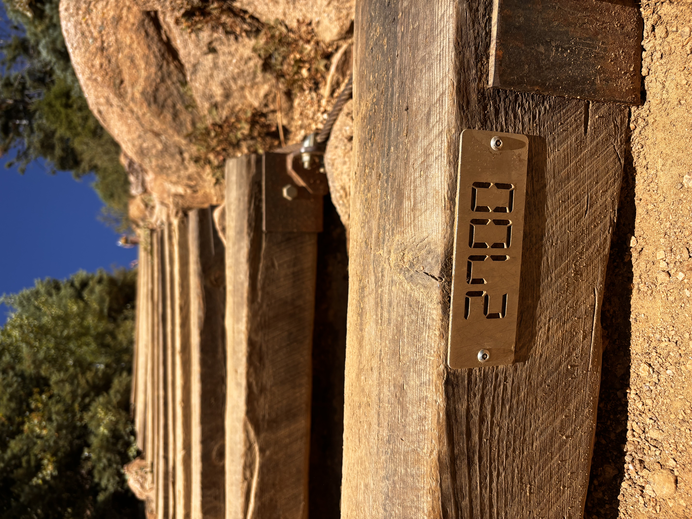

<br><details><summary>:camera:**65/IMG_0269.jpg**</summary><sub> `Exif version` 0232 `OS version` 27.0 `Date` 2026:07:12 10:23:44 `Aperture` Not known `Brightness` 9.574273707290335 `Color space` 65535 `Compression` Not known`Exposure mode` 0 `Exposure time` 0.0003020235578375113 `Focal length` 5.96 `Lens model` iPhone 15 Plus back dual wide camera 5.96mm f/1.6 `Lens specification` (1.5399999618512084, 5.96, 1.6, 2.4) `Orientation` 6 `Scene type` Not known `f number` 1.6 `White balance` 0 `Sensing method` 2 `Shutter speed` 11.693163830629205</sub><sub>`Coordinates & altitude` (38.858383333333336, -104.9470888888889, 2599.989214175655)</sub><sub> :earth_americas:`Location over` [Google Maps](http://maps.google.com/maps?q=38.858383333333336,-104.9470888888889) or [Openstreet Map](https://www.openstreetmap.org/query?lat=38.858383333333336&lon=-104.9470888888889)</sub></details>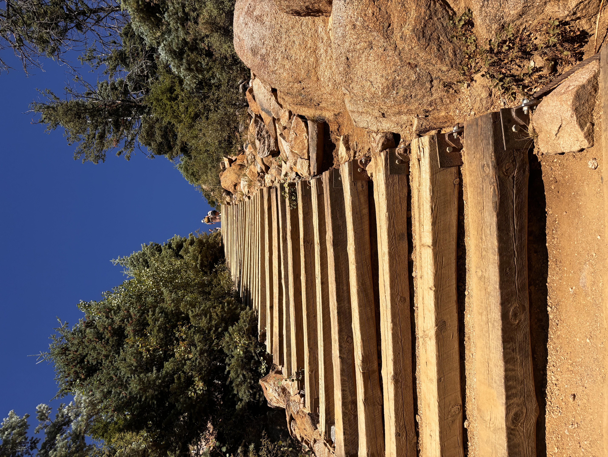

<br><details><summary>:camera:**65/IMG_0270.jpg**</summary><sub> `Exif version` 0232 `OS version` 27.0 `Date` 2026:07:12 10:23:47 `Aperture` Not known `Brightness` 9.175140972952308 `Color space` 65535 `Compression` Not known`Exposure mode` 0 `Exposure time` 0.0004269854824935952 `Focal length` 5.96 `Lens model` iPhone 15 Plus back dual wide camera 5.96mm f/1.6 `Lens specification` (1.5399999618512084, 5.96, 1.6, 2.4) `Orientation` 6 `Scene type` Not known `f number` 1.6 `White balance` 0 `Sensing method` 2 `Shutter speed` 11.193476318141197</sub><sub>`Coordinates & altitude` (38.85836666666667, -104.94708333333334, 2598.1374045801526)</sub><sub> :earth_americas:`Location over` [Google Maps](http://maps.google.com/maps?q=38.85836666666667,-104.94708333333334) or [Openstreet Map](https://www.openstreetmap.org/query?lat=38.85836666666667&lon=-104.94708333333334)</sub></details>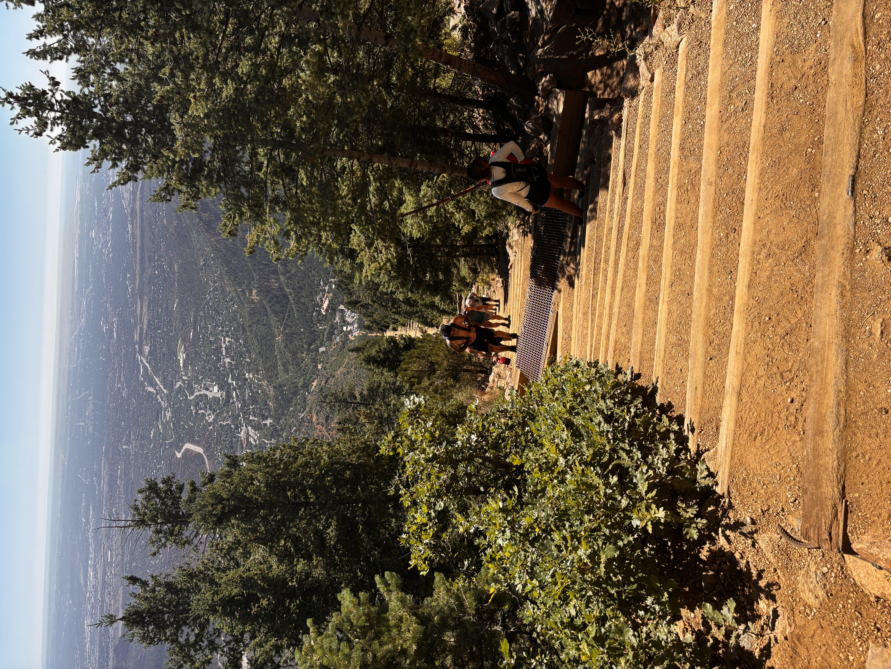

<br><details><summary>:camera:**65/IMG_0271.jpg**</summary><sub> `Exif version` 0232 `OS version` 27.0 `Date` 2026:07:12 10:25:33 `Aperture` Not known `Brightness` 10.738047149195417 `Color space` 65535 `Compression` Not known`Exposure mode` 0 `Exposure time` 0.00016801075268817206 `Focal length` 5.96 `Lens model` iPhone 15 Plus back dual wide camera 5.96mm f/1.6 `Lens specification` (1.5399999618512084, 5.96, 1.6, 2.4) `Orientation` 6 `Scene type` Not known `f number` 1.6 `White balance` 0 `Sensing method` 2 `Shutter speed` 12.539251137291497</sub><sub>`Coordinates & altitude` (38.85852777777778, -104.94754166666667, 2600.1786666666667)</sub><sub> :earth_americas:`Location over` [Google Maps](http://maps.google.com/maps?q=38.85852777777778,-104.94754166666667) or [Openstreet Map](https://www.openstreetmap.org/query?lat=38.85852777777778&lon=-104.94754166666667)</sub></details>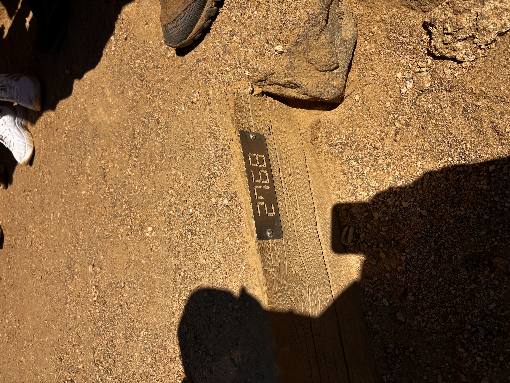

<br><details><summary>:camera:**65/IMG_0272.jpg**</summary><sub> `Exif version` 0232 `OS version` 27.0 `Date` 2026:07:12 10:25:48 `Aperture` Not known `Brightness` 8.433842959607398 `Color space` 65535 `Compression` Not known`Exposure mode` 0 `Exposure time` 0.00066711140760507 `Focal length` 5.96 `Lens model` iPhone 15 Plus back dual wide camera 5.96mm f/1.6 `Lens specification` (1.5399999618512084, 5.96, 1.6, 2.4) `Orientation` 1 `Scene type` Not known `f number` 1.6 `White balance` 0 `Sensing method` 2 `Shutter speed` 10.55002561662885</sub><sub>`Coordinates & altitude` (38.8583, -104.94750277777779, 2614.023880597015)</sub><sub> :earth_americas:`Location over` [Google Maps](http://maps.google.com/maps?q=38.8583,-104.94750277777779) or [Openstreet Map](https://www.openstreetmap.org/query?lat=38.8583&lon=-104.94750277777779)</sub></details>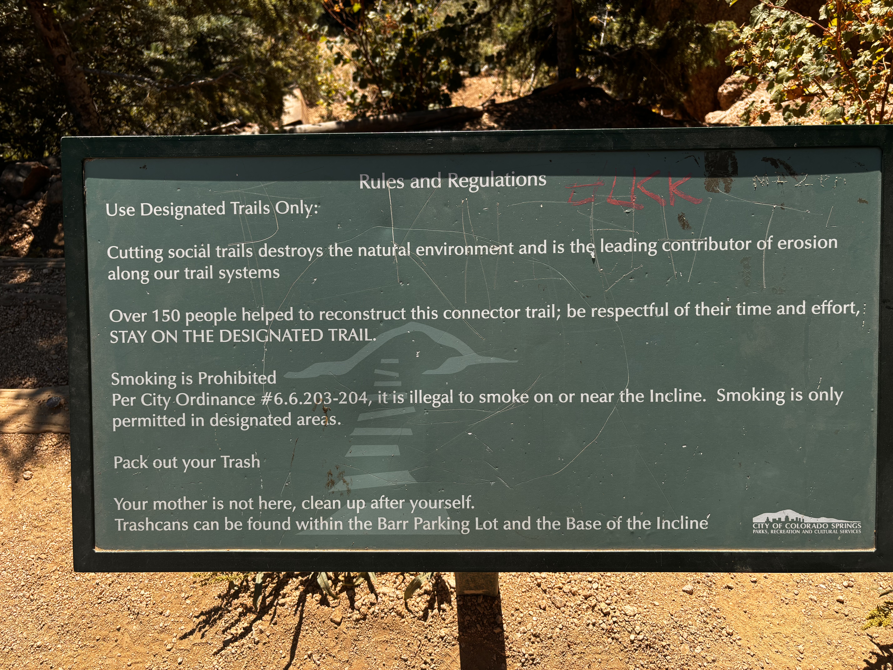

<br><details><summary>:camera:**65/IMG_0273.jpg**</summary><sub> `Exif version` 0232 `OS version` 27.0 `Date` 2026:07:12 10:25:53 `Aperture` Not known `Brightness` 8.519755530687785 `Color space` 65535 `Compression` Not known`Exposure mode` 0 `Exposure time` 0.0006090133982947625 `Focal length` 5.96 `Lens model` iPhone 15 Plus back dual wide camera 5.96mm f/1.6 `Lens specification` (1.5399999618512084, 5.96, 1.6, 2.4) `Orientation` 1 `Scene type` Not known `f number` 1.6 `White balance` 0 `Sensing method` 2 `Shutter speed` 10.681270144443118</sub><sub>`Coordinates & altitude` (38.85829444444445, -104.94749444444444, 2614.40058910162)</sub><sub> :earth_americas:`Location over` [Google Maps](http://maps.google.com/maps?q=38.85829444444445,-104.94749444444444) or [Openstreet Map](https://www.openstreetmap.org/query?lat=38.85829444444445&lon=-104.94749444444444)</sub></details>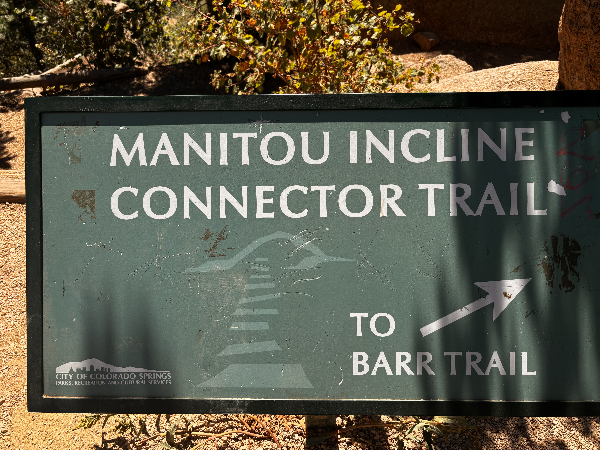

<br><details><summary>:camera:**65/IMG_0274.jpg**</summary><sub> `Exif version` 0232 `OS version` 27.0 `Date` 2026:07:12 10:26:16 `Aperture` Not known `Brightness` 10.269320237787541 `Color space` 65535 `Compression` Not known`Exposure mode` 0 `Exposure time` 0.0008481764206955047 `Focal length` 1.54 `Lens model` iPhone 15 Plus back dual wide camera 1.54mm f/2.4 `Lens specification` (1.54, 5.960000038146973, 1.6, 2.4) `Orientation` 1 `Scene type` Not known `f number` 2.4 `White balance` 0 `Sensing method` 2 `Shutter speed` 10.203648118217501</sub><sub>`Coordinates & altitude` (38.85834166666667, -104.94760833333333, 2611.4743326488706)</sub><sub> :earth_americas:`Location over` [Google Maps](http://maps.google.com/maps?q=38.85834166666667,-104.94760833333333) or [Openstreet Map](https://www.openstreetmap.org/query?lat=38.85834166666667&lon=-104.94760833333333)</sub></details>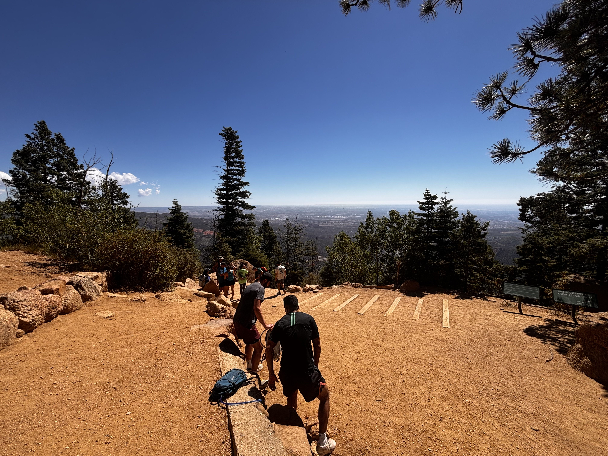

<br><details><summary>:camera:**65/IMG_0275.jpg**</summary><sub> `Exif version` 0232 `OS version` 27.0 `Date` 2026:07:12 10:26:19 `Aperture` Not known `Brightness` 9.51309763692984 `Color space` 65535 `Compression` Not known`Exposure mode` 0 `Exposure time` 0.0011614401858304297 `Focal length` 1.54 `Lens model` iPhone 15 Plus back dual wide camera 1.54mm f/2.4 `Lens specification` (1.54, 5.960000038146973, 1.6, 2.4) `Orientation` 1 `Scene type` Not known `f number` 2.4 `White balance` 0 `Sensing method` 2 `Shutter speed` 9.74917421417155</sub><sub>`Coordinates & altitude` (38.85834444444445, -104.94760833333333, 2612.1540504648074)</sub><sub> :earth_americas:`Location over` [Google Maps](http://maps.google.com/maps?q=38.85834444444445,-104.94760833333333) or [Openstreet Map](https://www.openstreetmap.org/query?lat=38.85834444444445&lon=-104.94760833333333)</sub></details>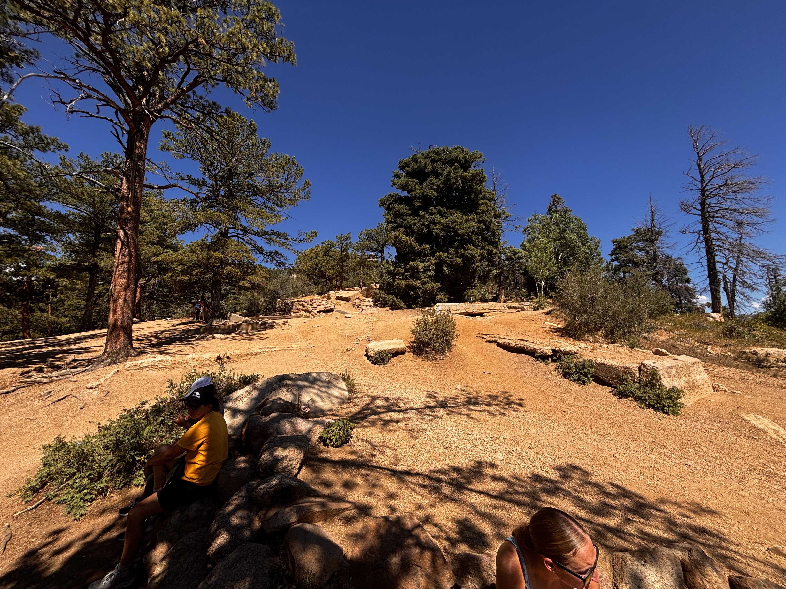

<br><details><summary>:camera:**65/IMG_0276.jpg**</summary><sub> `Exif version` 0232 `OS version` 27.0 `Date` 2026:07:12 10:26:21 `Aperture` Not known `Brightness` 8.743492701011817 `Color space` 65535 `Compression` Not known`Exposure mode` 0 `Exposure time` 0.0018018018018018018 `Focal length` 1.54 `Lens model` iPhone 15 Plus back dual wide camera 1.54mm f/2.4 `Lens specification` (1.54, 5.960000038146973, 1.6, 2.4) `Orientation` 1 `Scene type` Not known `f number` 2.4 `White balance` 0 `Sensing method` 2 `Shutter speed` 9.116986103218474</sub><sub>`Coordinates & altitude` (38.85834444444445, -104.94760000000001, 2612.68455821635)</sub><sub> :earth_americas:`Location over` [Google Maps](http://maps.google.com/maps?q=38.85834444444445,-104.94760000000001) or [Openstreet Map](https://www.openstreetmap.org/query?lat=38.85834444444445&lon=-104.94760000000001)</sub></details>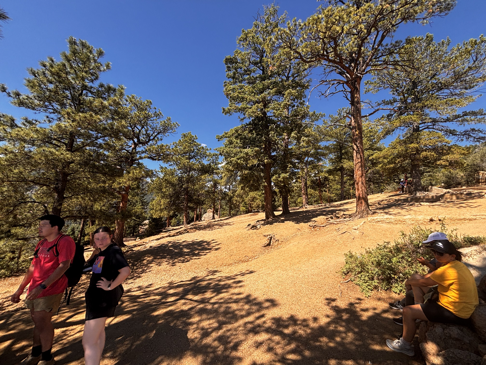

<br><details><summary>:camera:**65/IMG_0278.jpg**</summary><sub> `Exif version` 0232 `OS version` 27.0 `Date` 2026:07:12 10:27:04 `Aperture` Not known `Brightness` 10.317860553963706 `Color space` 65535 `Compression` Not known`Exposure mode` Not known `Exposure time` 0.00020601565718994644 `Focal length` 5.96 `Lens model` iPhone 15 Plus back camera 5.96mm f/1.6 `Lens specification` (5.96, 5.96, 1.6, 1.6) `Orientation` 1 `Scene type` Not known `f number` 1.6 `White balance` 0 `Sensing method` 2 `Shutter speed` 12.245068045152442</sub><sub>`Coordinates & altitude` (38.85836666666667, -104.94756944444445, 2614.7885572139303)</sub><sub> :earth_americas:`Location over` [Google Maps](http://maps.google.com/maps?q=38.85836666666667,-104.94756944444445) or [Openstreet Map](https://www.openstreetmap.org/query?lat=38.85836666666667&lon=-104.94756944444445)</sub></details>

<br><details><summary>:camera:**65/IMG_0281.jpg**</summary><sub> `Exif version` 0232 `OS version` 27.0 `Date` 2026:07:12 10:32:45 `Aperture` Not known `Brightness` 9.560379049814317 `Color space` 65535 `Compression` Not known`Exposure mode` 0 `Exposure time` 0.00031201248049921997 `Focal length` 5.96 `Lens model` iPhone 15 Plus back dual wide camera 5.96mm f/1.6 `Lens specification` (1.5399999618512084, 5.96, 1.6, 2.4) `Orientation` 1 `Scene type` Not known `f number` 1.6 `White balance` 0 `Sensing method` 2 `Shutter speed` 11.646166350582497</sub><sub>`Coordinates & altitude` (38.8569, -104.94635833333334, 2564.8366247755835)</sub><sub> :earth_americas:`Location over` [Google Maps](http://maps.google.com/maps?q=38.8569,-104.94635833333334) or [Openstreet Map](https://www.openstreetmap.org/query?lat=38.8569&lon=-104.94635833333334)</sub></details>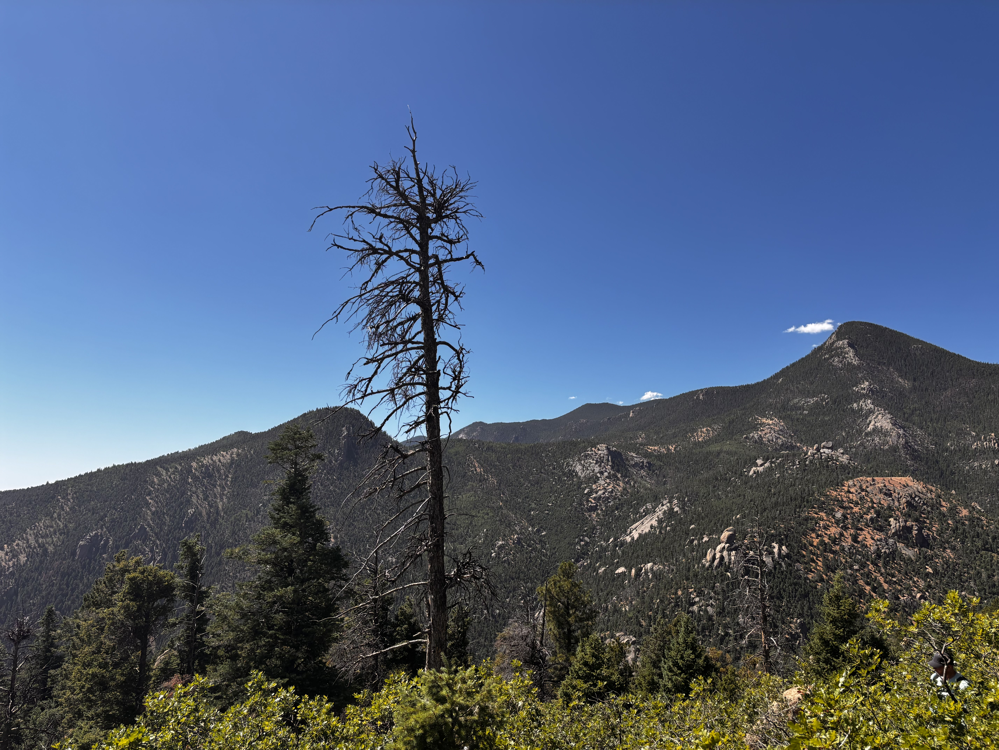

<br><details><summary>:camera:**65/IMG_0282.jpg**</summary><sub> `Exif version` 0232 `OS version` 27.0 `Date` 2026:07:12 10:32:47 `Aperture` Not known `Brightness` 10.229051293690421 `Color space` 65535 `Compression` Not known`Exposure mode` 0 `Exposure time` 0.00020601565718994644 `Focal length` 5.96 `Lens model` iPhone 15 Plus back dual wide camera 5.96mm f/1.6 `Lens specification` (1.5399999618512084, 5.96, 1.6, 2.4) `Orientation` 1 `Scene type` Not known `f number` 1.6 `White balance` 0 `Sensing method` 2 `Shutter speed` 12.245068045152442</sub><sub>`Coordinates & altitude` (38.85689444444444, -104.94635833333334, 2564.1645064805584)</sub><sub> :earth_americas:`Location over` [Google Maps](http://maps.google.com/maps?q=38.85689444444444,-104.94635833333334) or [Openstreet Map](https://www.openstreetmap.org/query?lat=38.85689444444444&lon=-104.94635833333334)</sub></details>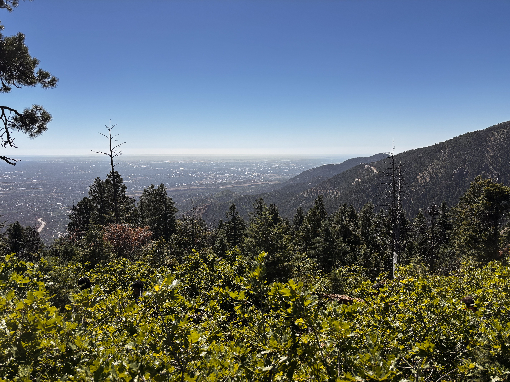

<br><details><summary>:camera:**65/IMG_0283.jpg**</summary><sub> `Exif version` 0232 `OS version` 27.0 `Date` 2026:07:12 10:32:48 `Aperture` Not known `Brightness` 9.270875281298117 `Color space` 65535 `Compression` Not known`Exposure mode` 0 `Exposure time` 0.00033101621979476995 `Focal length` 5.96 `Lens model` iPhone 15 Plus back dual wide camera 5.96mm f/1.6 `Lens specification` (1.5399999618512084, 5.96, 1.6, 2.4) `Orientation` 1 `Scene type` Not known `f number` 1.6 `White balance` 0 `Sensing method` 2 `Shutter speed` 11.560881163411066</sub><sub>`Coordinates & altitude` (38.8569, -104.94635833333334, 2563.205766710354)</sub><sub> :earth_americas:`Location over` [Google Maps](http://maps.google.com/maps?q=38.8569,-104.94635833333334) or [Openstreet Map](https://www.openstreetmap.org/query?lat=38.8569&lon=-104.94635833333334)</sub></details>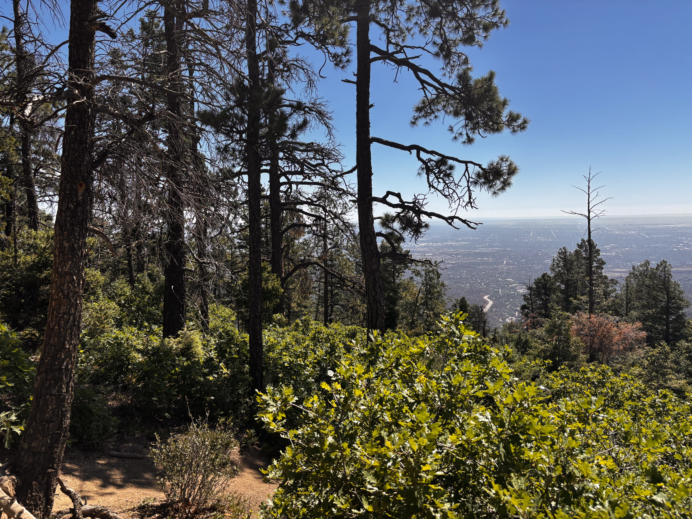

<br><details><summary>:camera:**65/IMG_0284.jpg**</summary><sub> `Exif version` 0232 `OS version` 27.0 `Date` 2026:07:12 10:32:53 `Aperture` Not known `Brightness` 9.021191612115834 `Color space` 65535 `Compression` Not known`Exposure mode` 0 `Exposure time` 0.00048496605237633366 `Focal length` 5.96 `Lens model` iPhone 15 Plus back dual wide camera 5.96mm f/1.6 `Lens specification` (1.5399999618512084, 5.96, 1.6, 2.4) `Orientation` 1 `Scene type` Not known `f number` 1.6 `White balance` 0 `Sensing method` 2 `Shutter speed` 11.009727626459144</sub><sub>`Coordinates & altitude` (38.85686944444445, -104.94638888888889, 2562.631790744467)</sub><sub> :earth_americas:`Location over` [Google Maps](http://maps.google.com/maps?q=38.85686944444445,-104.94638888888889) or [Openstreet Map](https://www.openstreetmap.org/query?lat=38.85686944444445&lon=-104.94638888888889)</sub></details>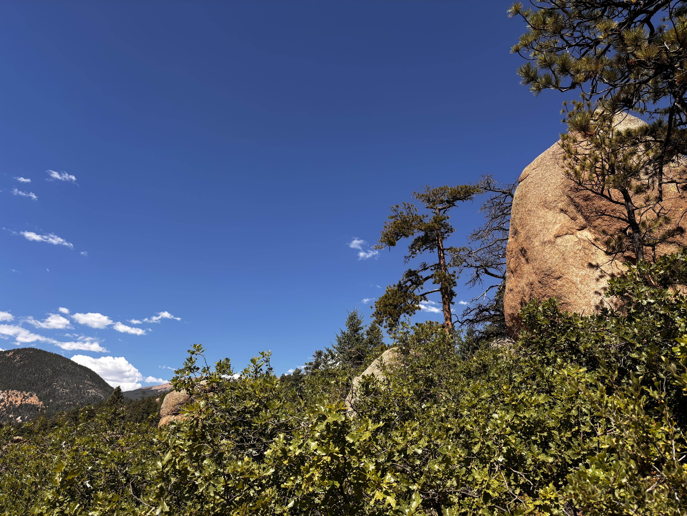

<br><details><summary>:camera:**65/IMG_0285.jpg**</summary><sub> `Exif version` 0232 `OS version` 27.0 `Date` 2026:07:12 10:37:18 `Aperture` Not known `Brightness` 8.539552404165743 `Color space` 65535 `Compression` Not known`Exposure mode` 0 `Exposure time` 0.0006381620931716656 `Focal length` 5.96 `Lens model` iPhone 15 Plus back dual wide camera 5.96mm f/1.6 `Lens specification` (1.5399999618512084, 5.96, 1.6, 2.4) `Orientation` 1 `Scene type` Not known `f number` 1.6 `White balance` 0 `Sensing method` 2 `Shutter speed` 10.614155955441303</sub><sub>`Coordinates & altitude` (38.85593055555556, -104.94598333333333, 2531.405472636816)</sub><sub> :earth_americas:`Location over` [Google Maps](http://maps.google.com/maps?q=38.85593055555556,-104.94598333333333) or [Openstreet Map](https://www.openstreetmap.org/query?lat=38.85593055555556&lon=-104.94598333333333)</sub></details>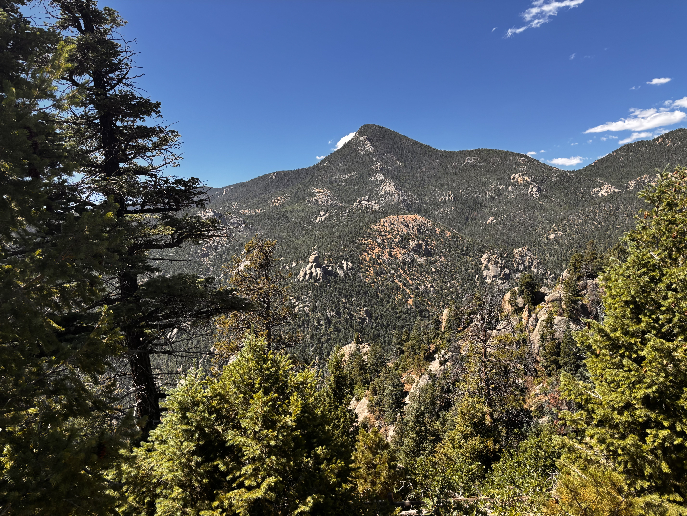

<br><details><summary>:camera:**65/IMG_0286.jpg**</summary><sub> `Exif version` 0232 `OS version` 27.0 `Date` 2026:07:12 10:43:32 `Aperture` Not known `Brightness` 9.517461568782027 `Color space` 65535 `Compression` Not known`Exposure mode` 0 `Exposure time` 0.00034094783498124785 `Focal length` 5.96 `Lens model` iPhone 15 Plus back dual wide camera 5.96mm f/1.6 `Lens specification` (1.5399999618512084, 5.96, 1.6, 2.4) `Orientation` 6 `Scene type` Not known `f number` 1.6 `White balance` 0 `Sensing method` 2 `Shutter speed` 11.517940638341127</sub><sub>`Coordinates & altitude` (38.85498055555556, -104.94581666666667, 2485.0841836734694)</sub><sub> :earth_americas:`Location over` [Google Maps](http://maps.google.com/maps?q=38.85498055555556,-104.94581666666667) or [Openstreet Map](https://www.openstreetmap.org/query?lat=38.85498055555556&lon=-104.94581666666667)</sub></details>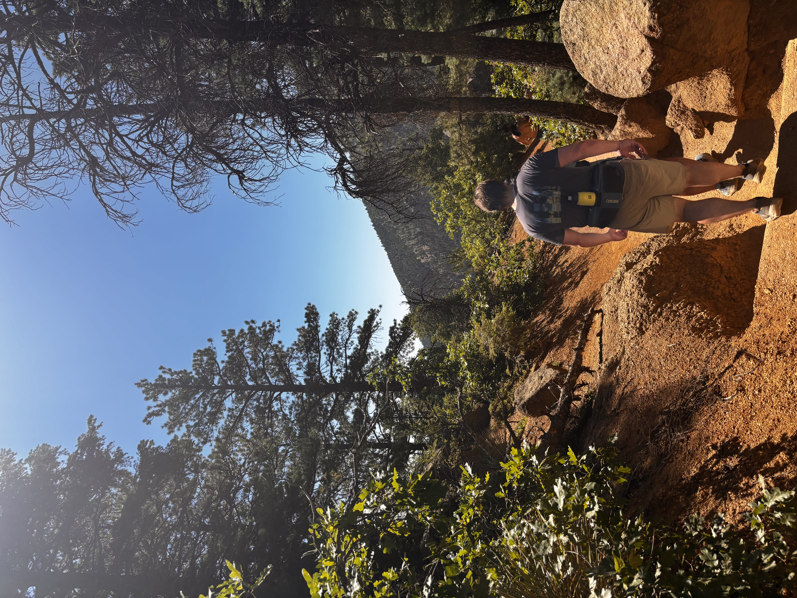

<br><details><summary>:camera:**65/IMG_0287.jpg**</summary><sub> `Exif version` 0232 `OS version` 27.0 `Date` 2026:07:12 10:51:29 `Aperture` Not known `Brightness` 9.5785140562249 `Color space` 65535 `Compression` Not known`Exposure mode` 0 `Exposure time` 0.00033101621979476995 `Focal length` 5.96 `Lens model` iPhone 15 Plus back dual wide camera 5.96mm f/1.6 `Lens specification` (1.5399999618512084, 5.96, 1.6, 2.4) `Orientation` 6 `Scene type` Not known `f number` 1.6 `White balance` 0 `Sensing method` 2 `Shutter speed` 11.560881163411066</sub></details>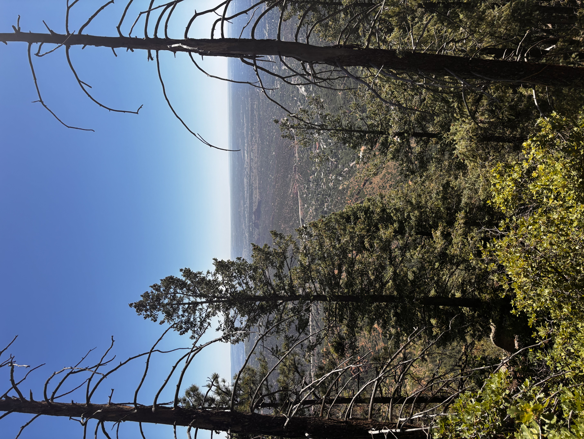

<br><details><summary>:camera:**65/IMG_0288.jpg**</summary><sub> `Exif version` 0232 `OS version` 27.0 `Date` 2026:07:12 10:51:31 `Aperture` Not known `Brightness` 9.78261143288844 `Color space` 65535 `Compression` Not known`Exposure mode` 0 `Exposure time` 0.0010604453870625664 `Focal length` 1.54 `Lens model` iPhone 15 Plus back dual wide camera 1.54mm f/2.4 `Lens specification` (1.54, 5.960000038146973, 1.6, 2.4) `Orientation` 6 `Scene type` Not known `f number` 2.4 `White balance` 0 `Sensing method` 2 `Shutter speed` 9.880359628505579</sub><sub>`Coordinates & altitude` (38.85514722222222, -104.94271111111111, 2406.1188524590166)</sub><sub> :earth_americas:`Location over` [Google Maps](http://maps.google.com/maps?q=38.85514722222222,-104.94271111111111) or [Openstreet Map](https://www.openstreetmap.org/query?lat=38.85514722222222&lon=-104.94271111111111)</sub></details>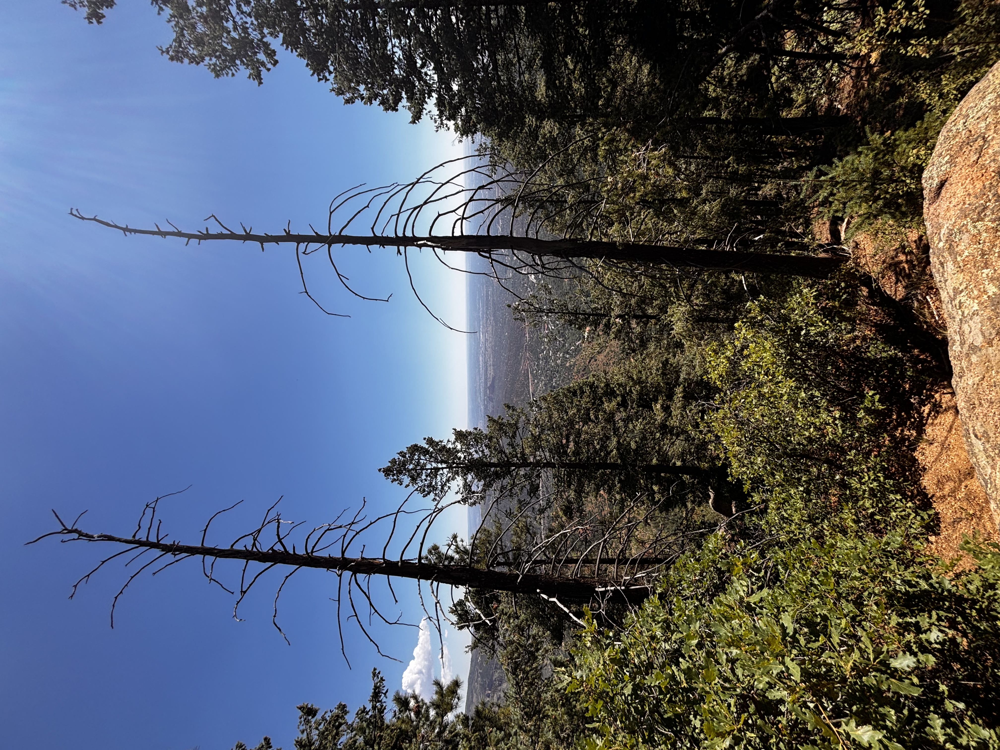

<br><details><summary>:camera:**65/IMG_0289.jpg**</summary><sub> `Exif version` 0232 `OS version` 27.0 `Date` 2026:07:12 10:51:33 `Aperture` Not known `Brightness` 9.5163116552261 `Color space` 65535 `Compression` Not known`Exposure mode` 0 `Exposure time` 0.0010976948408342481 `Focal length` 1.54 `Lens model` iPhone 15 Plus back dual wide camera 1.54mm f/2.4 `Lens specification` (1.54, 5.960000038146973, 1.6, 2.4) `Orientation` 1 `Scene type` Not known `f number` 2.4 `White balance` 0 `Sensing method` 2 `Shutter speed` 9.830906233630174</sub><sub>`Coordinates & altitude` (38.855161111111116, -104.94274166666668, 2408.8322295805738)</sub><sub> :earth_americas:`Location over` [Google Maps](http://maps.google.com/maps?q=38.855161111111116,-104.94274166666668) or [Openstreet Map](https://www.openstreetmap.org/query?lat=38.855161111111116&lon=-104.94274166666668)</sub></details>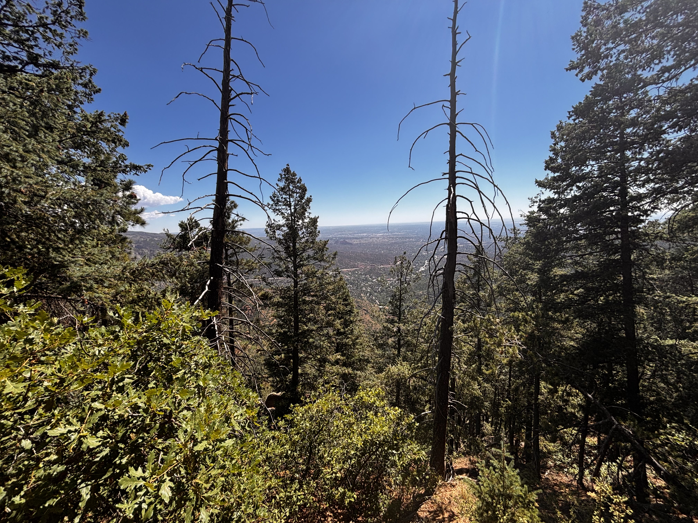

<br><details><summary>:camera:**65/IMG_0290.jpg**</summary><sub> `Exif version` 0232 `OS version` 27.0 `Date` 2026:07:12 10:51:35 `Aperture` Not known `Brightness` 8.723887293610911 `Color space` 65535 `Compression` Not known`Exposure mode` 0 `Exposure time` 0.0033003300330033004 `Focal length` 1.54 `Lens model` iPhone 15 Plus back dual wide camera 1.54mm f/2.4 `Lens specification` (1.54, 5.960000038146973, 1.6, 2.4) `Orientation` 6 `Scene type` Not known `f number` 2.4 `White balance` 0 `Sensing method` 2 `Shutter speed` 8.243318256578947</sub><sub>`Coordinates & altitude` (38.855155555555555, -104.94275, 2408.668168168168)</sub><sub> :earth_americas:`Location over` [Google Maps](http://maps.google.com/maps?q=38.855155555555555,-104.94275) or [Openstreet Map](https://www.openstreetmap.org/query?lat=38.855155555555555&lon=-104.94275)</sub></details>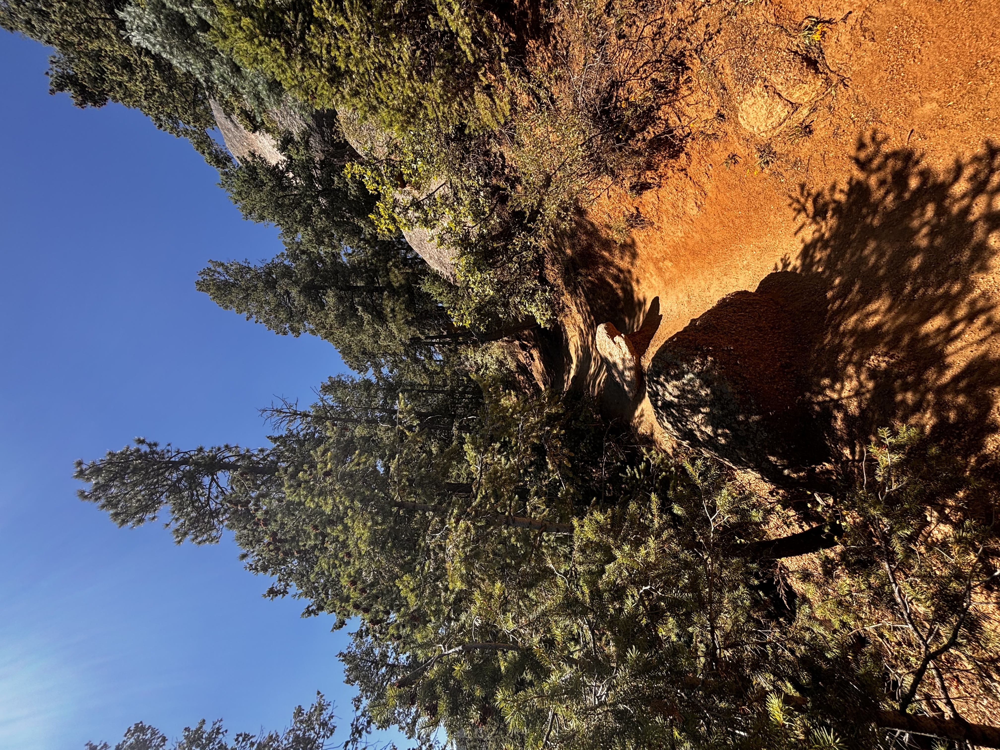

<br><details><summary>:camera:**65/IMG_0291.jpg**</summary><sub> `Exif version` 0232 `OS version` 27.0 `Date` 2026:07:12 10:51:38 `Aperture` Not known `Brightness` 8.908422005886349 `Color space` 65535 `Compression` Not known`Exposure mode` 0 `Exposure time` 0.0022522522522522522 `Focal length` 1.54 `Lens model` iPhone 15 Plus back dual wide camera 1.54mm f/2.4 `Lens specification` (1.54, 5.960000038146973, 1.6, 2.4) `Orientation` 6 `Scene type` Not known `f number` 2.4 `White balance` 0 `Sensing method` 2 `Shutter speed` 8.793296770262035</sub><sub>`Coordinates & altitude` (38.85516666666667, -104.94275, 2409.654740608229)</sub><sub> :earth_americas:`Location over` [Google Maps](http://maps.google.com/maps?q=38.85516666666667,-104.94275) or [Openstreet Map](https://www.openstreetmap.org/query?lat=38.85516666666667&lon=-104.94275)</sub></details>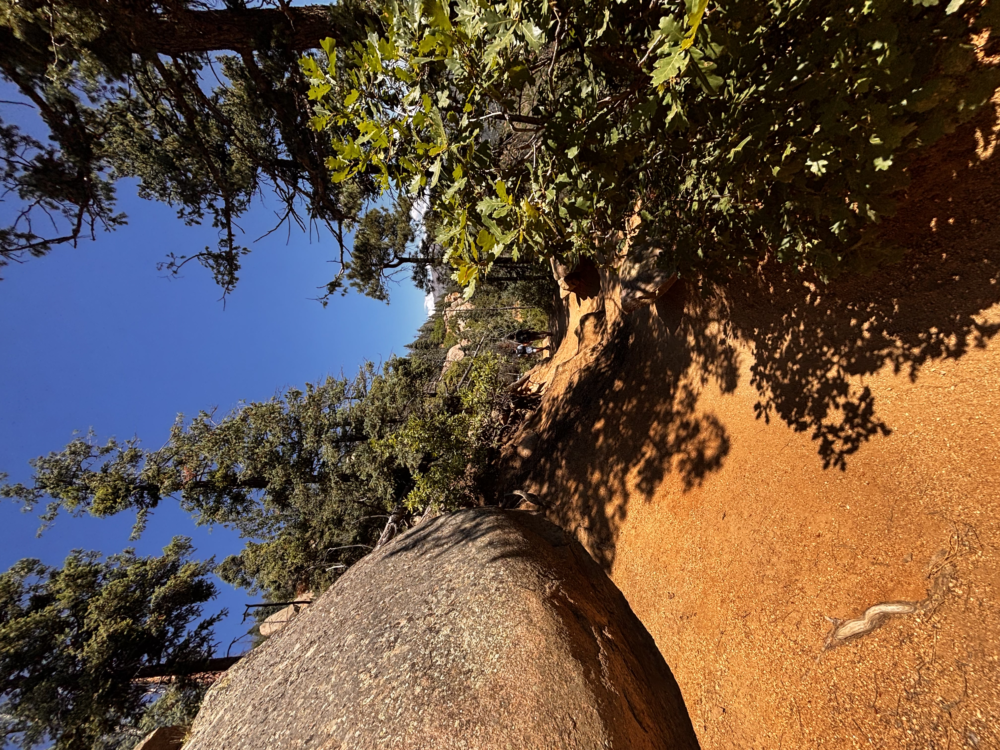

<br><details><summary>:camera:**65/IMG_0292.jpg**</summary><sub> `Exif version` 0232 `OS version` 27.0 `Date` 2026:07:12 10:51:45 `Aperture` Not known `Brightness` 8.969302888250416 `Color space` 65535 `Compression` Not known`Exposure mode` 0 `Exposure time` 0.002325581395348837 `Focal length` 1.54 `Lens model` iPhone 15 Plus back dual wide camera 1.54mm f/2.4 `Lens specification` (1.54, 5.960000038146973, 1.6, 2.4) `Orientation` 6 `Scene type` Not known `f number` 2.4 `White balance` 0 `Sensing method` 2 `Shutter speed` 8.746693227091633</sub><sub>`Coordinates & altitude` (38.855225000000004, -104.94278055555556, 2408.9215867158673)</sub><sub> :earth_americas:`Location over` [Google Maps](http://maps.google.com/maps?q=38.855225000000004,-104.94278055555556) or [Openstreet Map](https://www.openstreetmap.org/query?lat=38.855225000000004&lon=-104.94278055555556)</sub></details>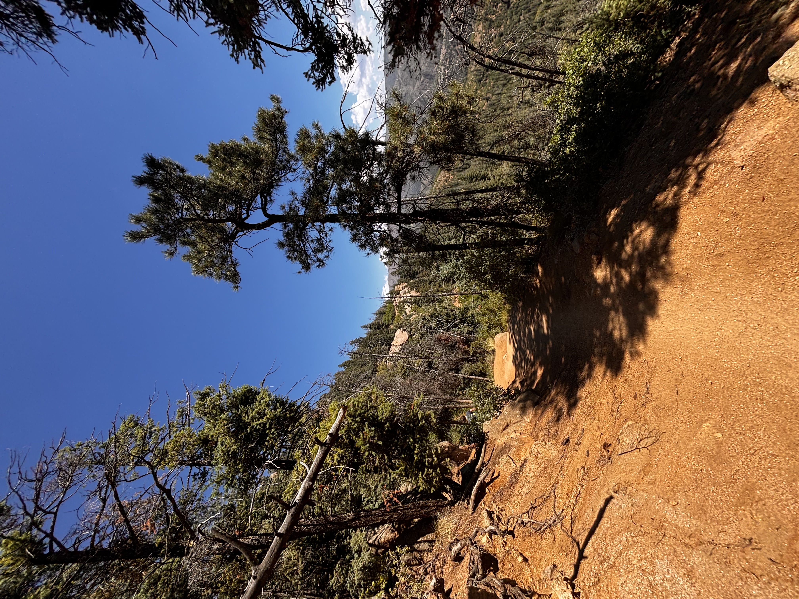

<br><details><summary>:camera:**65/IMG_0293.jpg**</summary><sub> `Exif version` 0232 `OS version` 27.0 `Date` 2026:07:12 10:51:51 `Aperture` Not known `Brightness` 8.206737278012264 `Color space` 65535 `Compression` Not known`Exposure mode` 0 `Exposure time` 0.004149377593360996 `Focal length` 1.54 `Lens model` iPhone 15 Plus back dual wide camera 1.54mm f/2.4 `Lens specification` (1.54, 5.960000038146973, 1.6, 2.4) `Orientation` 6 `Scene type` Not known `f number` 2.4 `White balance` 0 `Sensing method` 2 `Shutter speed` 7.911977834612106</sub><sub>`Coordinates & altitude` (38.85528611111111, -104.94280277777779, 2408.5104529616724)</sub><sub> :earth_americas:`Location over` [Google Maps](http://maps.google.com/maps?q=38.85528611111111,-104.94280277777779) or [Openstreet Map](https://www.openstreetmap.org/query?lat=38.85528611111111&lon=-104.94280277777779)</sub></details>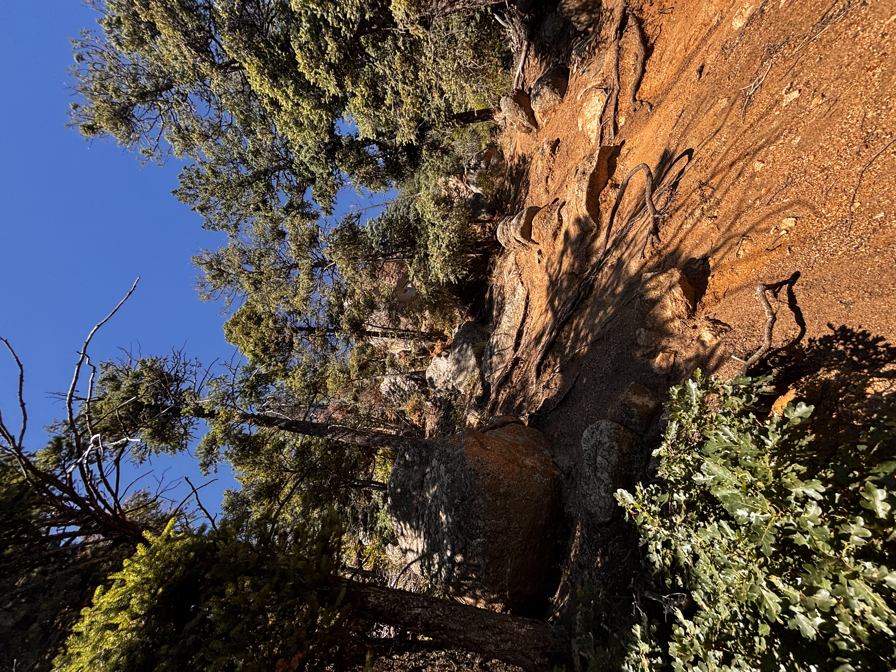

<br><details><summary>:camera:**65/IMG_0294.jpg**</summary><sub> `Exif version` 0232 `OS version` 27.0 `Date` 2026:07:12 10:51:55 `Aperture` Not known `Brightness` 10.057119399483932 `Color space` 65535 `Compression` Not known`Exposure mode` 0 `Exposure time` 0.0009216589861751152 `Focal length` 1.54 `Lens model` iPhone 15 Plus back dual wide camera 1.54mm f/2.4 `Lens specification` (1.54, 5.960000038146973, 1.6, 2.4) `Orientation` 6 `Scene type` Not known `f number` 2.4 `White balance` 0 `Sensing method` 2 `Shutter speed` 10.082945633390935</sub><sub>`Coordinates & altitude` (38.855336111111114, -104.94283333333334, 2407.763870967742)</sub><sub> :earth_americas:`Location over` [Google Maps](http://maps.google.com/maps?q=38.855336111111114,-104.94283333333334) or [Openstreet Map](https://www.openstreetmap.org/query?lat=38.855336111111114&lon=-104.94283333333334)</sub></details>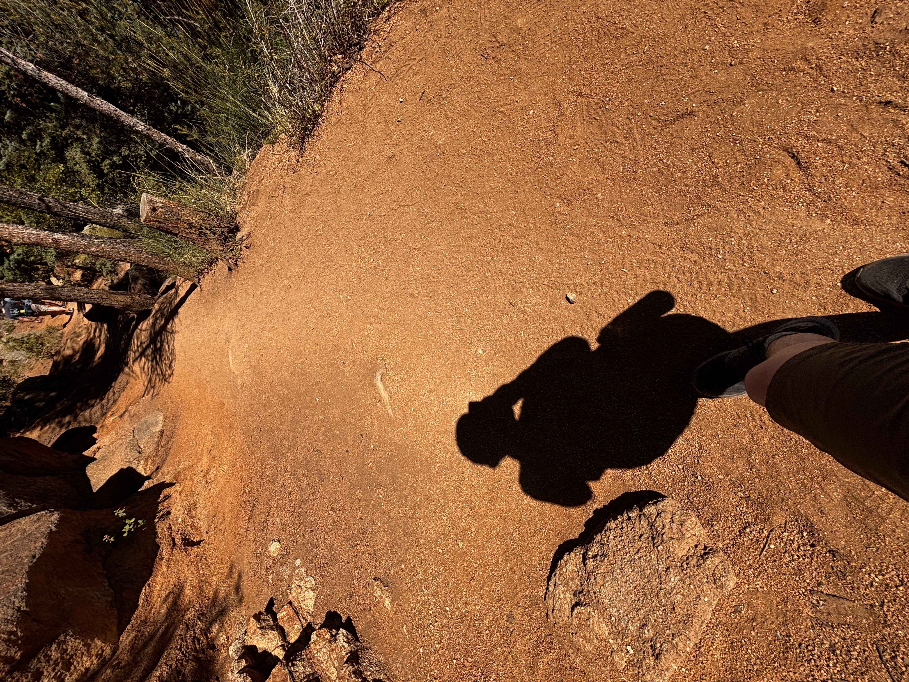

<br><details><summary>:camera:**65/IMG_0295.jpg**</summary><sub> `Exif version` 0232 `OS version` 27.0 `Date` 2026:07:12 10:51:59 `Aperture` Not known `Brightness` 9.966322789666638 `Color space` 65535 `Compression` Not known`Exposure mode` 0 `Exposure time` 0.0008849557522123894 `Focal length` 1.54 `Lens model` iPhone 15 Plus back dual wide camera 1.54mm f/2.4 `Lens specification` (1.54, 5.960000038146973, 1.6, 2.4) `Orientation` 1 `Scene type` Not known `f number` 2.4 `White balance` 0 `Sensing method` 2 `Shutter speed` 10.142034923422106</sub><sub>`Coordinates & altitude` (38.855358333333335, -104.9428638888889, 2407.6596244131456)</sub><sub> :earth_americas:`Location over` [Google Maps](http://maps.google.com/maps?q=38.855358333333335,-104.9428638888889) or [Openstreet Map](https://www.openstreetmap.org/query?lat=38.855358333333335&lon=-104.9428638888889)</sub></details>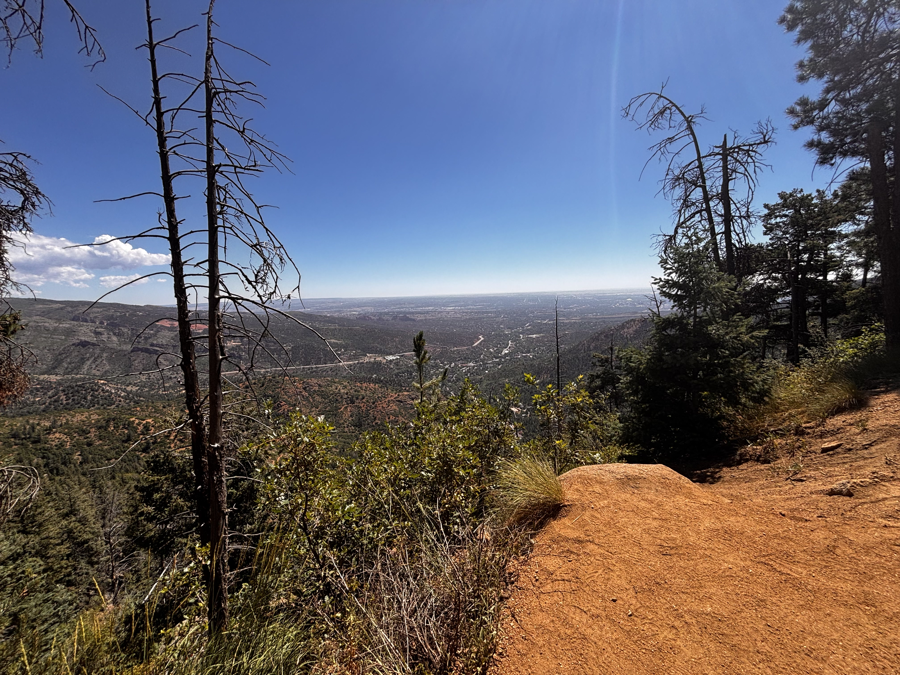

<br><details><summary>:camera:**65/IMG_0296.jpg**</summary><sub> `Exif version` 0232 `OS version` 27.0 `Date` 2026:07:12 10:52:01 `Aperture` Not known `Brightness` 10.008173913043478 `Color space` 65535 `Compression` Not known`Exposure mode` 0 `Exposure time` 0.00023501762632197415 `Focal length` 5.96 `Lens model` iPhone 15 Plus back dual wide camera 5.96mm f/1.6 `Lens specification` (1.5399999618512084, 5.96, 1.6, 2.4) `Orientation` 1 `Scene type` Not known `f number` 1.6 `White balance` 0 `Sensing method` 2 `Shutter speed` 12.055051610885204</sub><sub>`Coordinates & altitude` (38.855358333333335, -104.9428638888889, 2407.6645056726093)</sub><sub> :earth_americas:`Location over` [Google Maps](http://maps.google.com/maps?q=38.855358333333335,-104.9428638888889) or [Openstreet Map](https://www.openstreetmap.org/query?lat=38.855358333333335&lon=-104.9428638888889)</sub></details>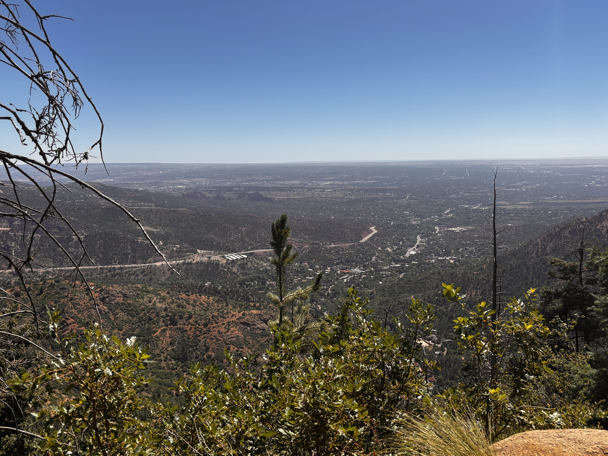

<br><details><summary>:camera:**65/IMG_0297.jpg**</summary><sub> `Exif version` 0232 `OS version` 27.0 `Date` 2026:07:12 10:52:54 `Aperture` Not known `Brightness` 9.267137151922972 `Color space` 65535 `Compression` Not known`Exposure mode` 0 `Exposure time` 0.00038895371450797355 `Focal length` 5.96 `Lens model` iPhone 15 Plus back dual wide camera 5.96mm f/1.6 `Lens specification` (1.5399999618512084, 5.96, 1.6, 2.4) `Orientation` 1 `Scene type` Not known `f number` 1.6 `White balance` 0 `Sensing method` 2 `Shutter speed` 11.327942223578477</sub><sub>`Coordinates & altitude` (38.856005555555555, -104.94290277777777, 2404.461382113821)</sub><sub> :earth_americas:`Location over` [Google Maps](http://maps.google.com/maps?q=38.856005555555555,-104.94290277777777) or [Openstreet Map](https://www.openstreetmap.org/query?lat=38.856005555555555&lon=-104.94290277777777)</sub></details>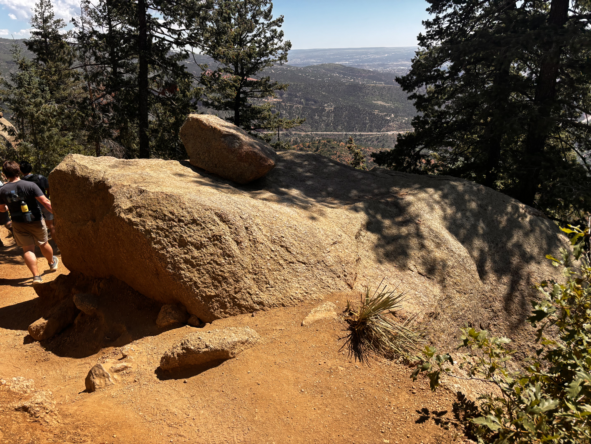

<br><details><summary>:camera:**65/IMG_0298.jpg**</summary><sub> `Exif version` 0232 `OS version` 27.0 `Date` 2026:07:12 10:53:10 `Aperture` Not known `Brightness` 8.415646758638585 `Color space` 65535 `Compression` Not known`Exposure mode` 0 `Exposure time` 0.000724112961622013 `Focal length` 5.96 `Lens model` iPhone 15 Plus back dual wide camera 5.96mm f/1.6 `Lens specification` (1.5399999618512084, 5.96, 1.6, 2.4) `Orientation` 6 `Scene type` Not known `f number` 1.6 `White balance` 0 `Sensing method` 2 `Shutter speed` 10.431722689075631</sub><sub>`Coordinates & altitude` (38.85606666666667, -104.94290833333334, 2395.3220568335587)</sub><sub> :earth_americas:`Location over` [Google Maps](http://maps.google.com/maps?q=38.85606666666667,-104.94290833333334) or [Openstreet Map](https://www.openstreetmap.org/query?lat=38.85606666666667&lon=-104.94290833333334)</sub></details>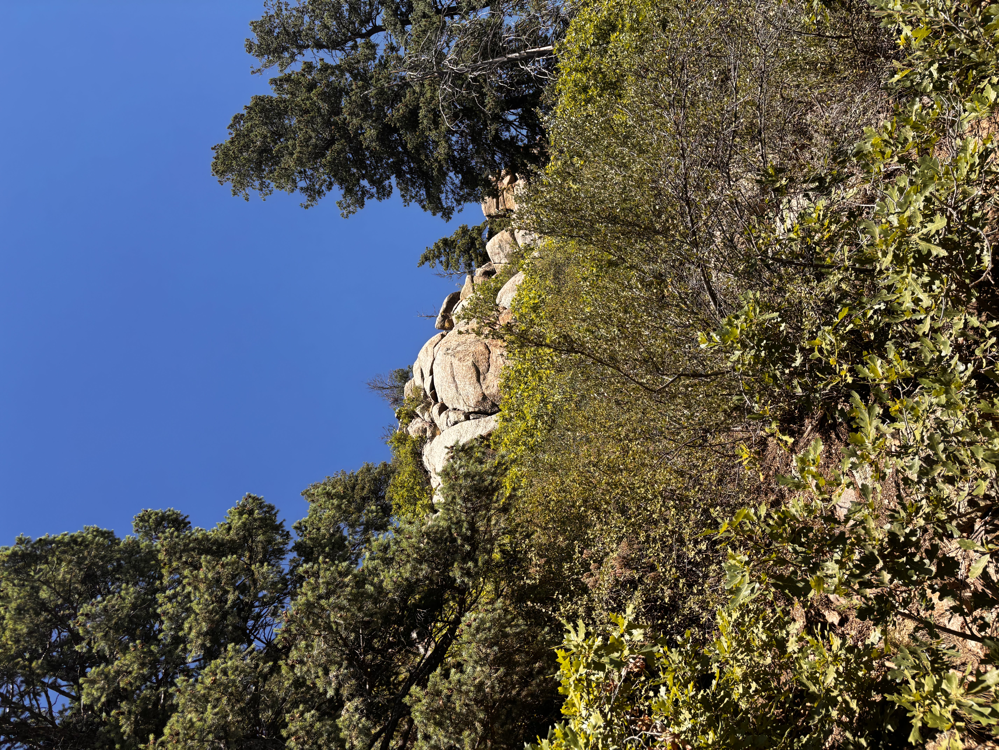

<br><details><summary>:camera:**65/IMG_0299.jpg**</summary><sub> `Exif version` 0232 `OS version` 27.0 `Date` 2026:07:12 10:53:18 `Aperture` Not known `Brightness` 9.481589972410504 `Color space` 65535 `Compression` Not known`Exposure mode` 0 `Exposure time` 0.0015128593040847202 `Focal length` 1.54 `Lens model` iPhone 15 Plus back dual wide camera 1.54mm f/2.4 `Lens specification` (1.54, 5.960000038146973, 1.6, 2.4) `Orientation` 6 `Scene type` Not known `f number` 2.4 `White balance` 0 `Sensing method` 2 `Shutter speed` 9.367419077917488</sub><sub>`Coordinates & altitude` (38.85622777777778, -104.94279444444444, 2394.6769570011024)</sub><sub> :earth_americas:`Location over` [Google Maps](http://maps.google.com/maps?q=38.85622777777778,-104.94279444444444) or [Openstreet Map](https://www.openstreetmap.org/query?lat=38.85622777777778&lon=-104.94279444444444)</sub></details>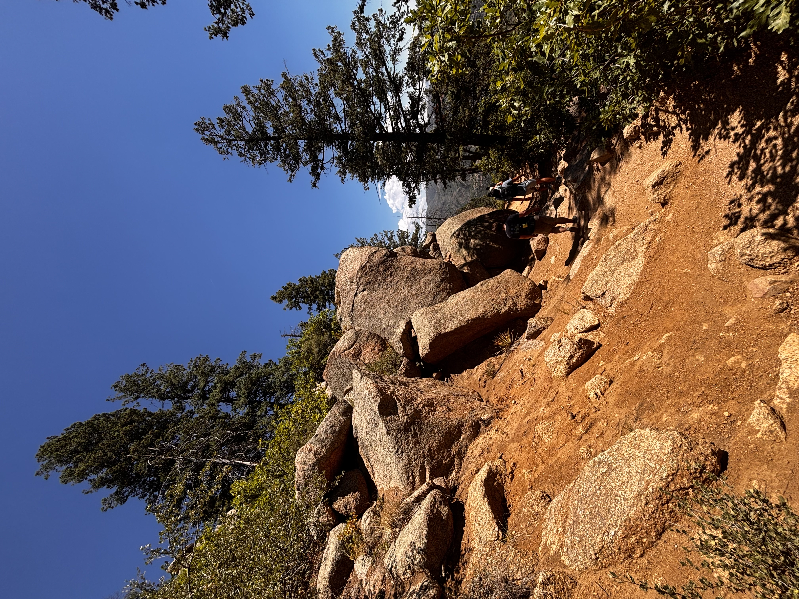

<br><details><summary>:camera:**65/IMG_0300.jpg**</summary><sub> `Exif version` 0232 `OS version` 27.0 `Date` 2026:07:12 10:53:20 `Aperture` Not known `Brightness` 9.262699128343852 `Color space` 65535 `Compression` Not known`Exposure mode` 0 `Exposure time` 0.001652892561983471 `Focal length` 1.54 `Lens model` iPhone 15 Plus back dual wide camera 1.54mm f/2.4 `Lens specification` (1.54, 5.960000038146973, 1.6, 2.4) `Orientation` 1 `Scene type` Not known `f number` 2.4 `White balance` 0 `Sensing method` 2 `Shutter speed` 9.240697556524385</sub><sub>`Coordinates & altitude` (38.85621944444445, -104.94278611111112, 2394.9171907756813)</sub><sub> :earth_americas:`Location over` [Google Maps](http://maps.google.com/maps?q=38.85621944444445,-104.94278611111112) or [Openstreet Map](https://www.openstreetmap.org/query?lat=38.85621944444445&lon=-104.94278611111112)</sub></details>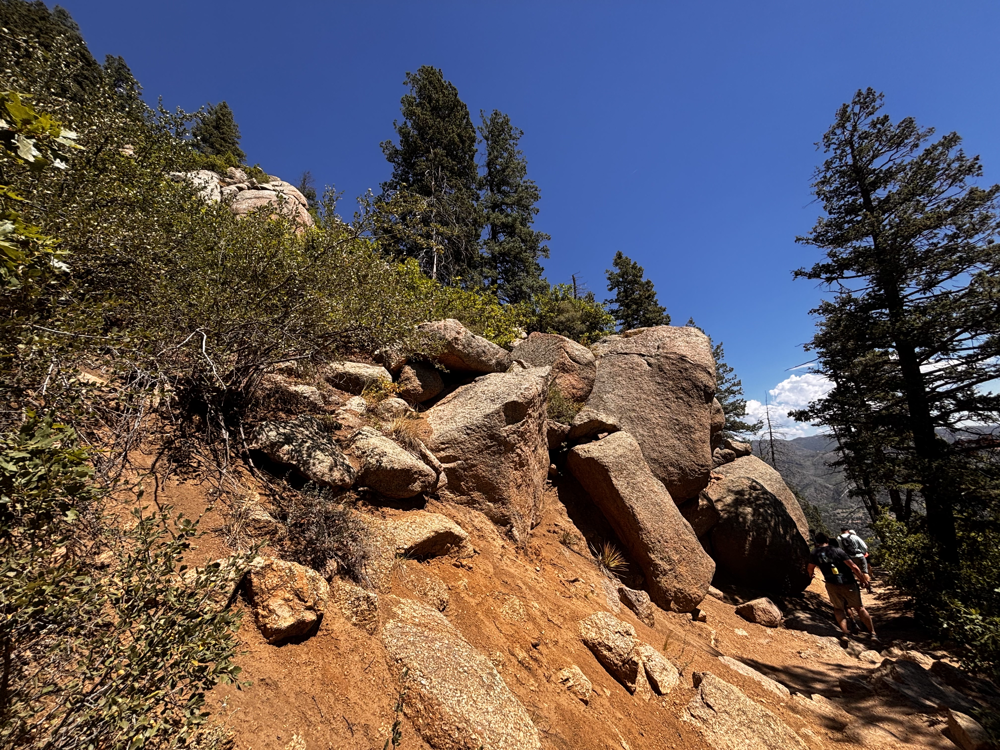

<br><details><summary>:camera:**65/IMG_0301.jpg**</summary><sub> `Exif version` 0232 `OS version` 27.0 `Date` 2026:07:12 10:56:05 `Aperture` Not known `Brightness` 9.37063816409934 `Color space` 65535 `Compression` Not known`Exposure mode` 0 `Exposure time` 0.00037893141341417203 `Focal length` 5.96 `Lens model` iPhone 15 Plus back dual wide camera 5.96mm f/1.6 `Lens specification` (1.5399999618512084, 5.96, 1.6, 2.4) `Orientation` 1 `Scene type` Not known `f number` 1.6 `White balance` 0 `Sensing method` 2 `Shutter speed` 11.365514532600157</sub><sub>`Coordinates & altitude` (38.857647222222226, -104.94258888888889, 2418.001663893511)</sub><sub> :earth_americas:`Location over` [Google Maps](http://maps.google.com/maps?q=38.857647222222226,-104.94258888888889) or [Openstreet Map](https://www.openstreetmap.org/query?lat=38.857647222222226&lon=-104.94258888888889)</sub></details>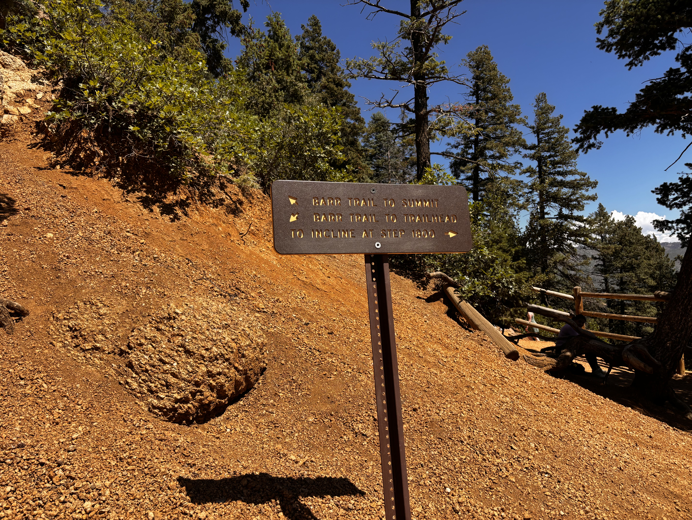

<br><details><summary>:camera:**65/IMG_0302.jpg**</summary><sub> `Exif version` 0232 `OS version` 27.0 `Date` 2026:07:12 11:20:39 `Aperture` Not known `Brightness` 7.604068857589985 `Color space` 65535 `Compression` Not known`Exposure mode` 0 `Exposure time` 0.0011363636363636363 `Focal length` 5.96 `Lens model` iPhone 15 Plus back dual wide camera 5.96mm f/1.6 `Lens specification` (1.5399999618512084, 5.96, 1.6, 2.4) `Orientation` 1 `Scene type` Not known `f number` 1.6 `White balance` 0 `Sensing method` 2 `Shutter speed` 9.780552033551155</sub><sub>`Coordinates & altitude` (38.85543055555556, -104.93402777777779, 2046.7702205882354)</sub><sub> :earth_americas:`Location over` [Google Maps](http://maps.google.com/maps?q=38.85543055555556,-104.93402777777779) or [Openstreet Map](https://www.openstreetmap.org/query?lat=38.85543055555556&lon=-104.93402777777779)</sub></details>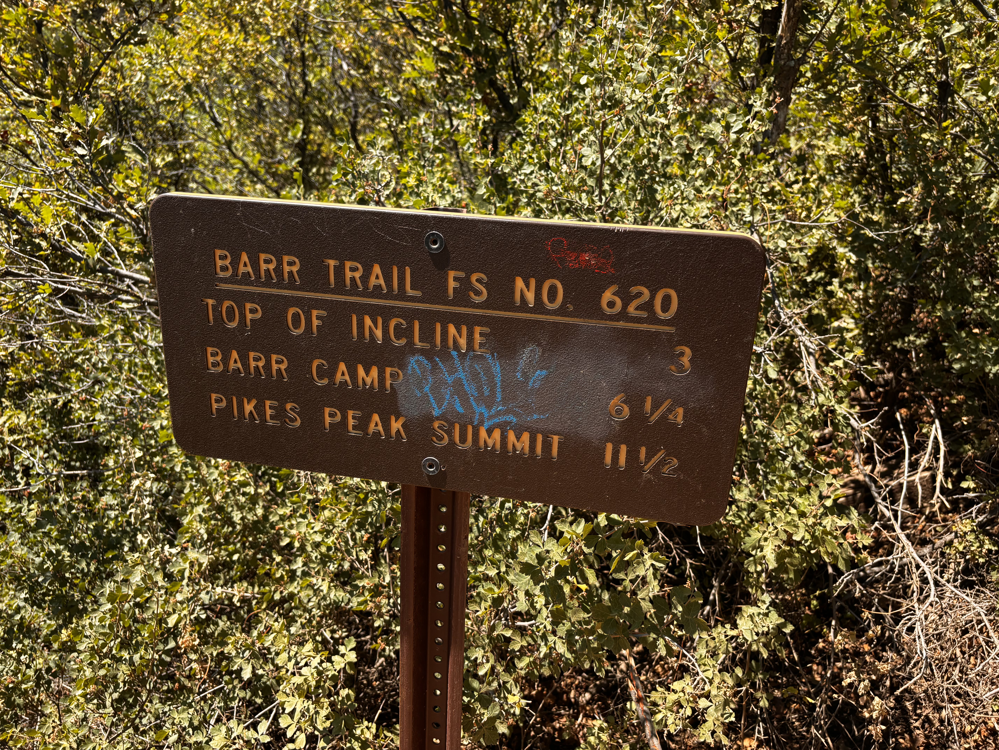

<br><details><summary>:camera:**65/IMG_0303.jpg**</summary><sub> `Exif version` 0232 `OS version` 27.0 `Date` 2026:07:12 11:20:48 `Aperture` Not known `Brightness` 6.798057798057798 `Color space` 65535 `Compression` Not known`Exposure mode` 0 `Exposure time` 0.00202020202020202 `Focal length` 5.96 `Lens model` iPhone 15 Plus back dual wide camera 5.96mm f/1.6 `Lens specification` (1.5399999618512084, 5.96, 1.6, 2.4) `Orientation` 1 `Scene type` Not known `f number` 1.6 `White balance` 0 `Sensing method` 2 `Shutter speed` 8.951428994520954</sub><sub>`Coordinates & altitude` (38.855533333333334, -104.9340888888889, 2047.2138228941685)</sub><sub> :earth_americas:`Location over` [Google Maps](http://maps.google.com/maps?q=38.855533333333334,-104.9340888888889) or [Openstreet Map](https://www.openstreetmap.org/query?lat=38.855533333333334&lon=-104.9340888888889)</sub></details>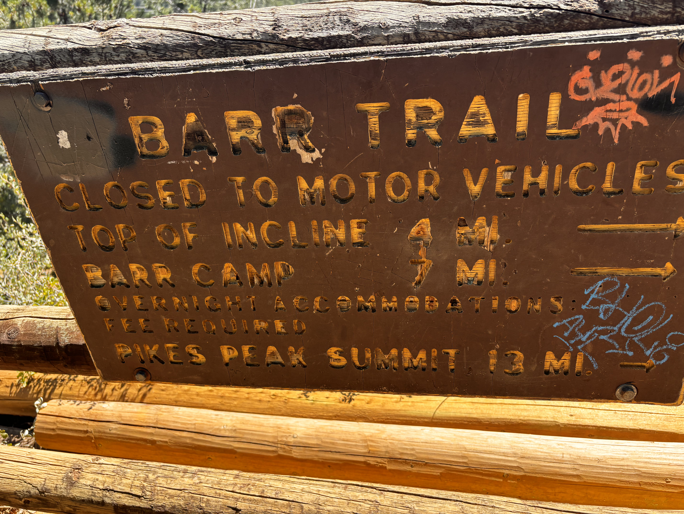

<br><details><summary>:camera:**65/IMG_0304.jpg**</summary><sub> `Exif version` 0232 `OS version` 27.0 `Date` 2026:07:12 11:20:51 `Aperture` Not known `Brightness` 7.127714748784441 `Color space` 65535 `Compression` Not known`Exposure mode` 0 `Exposure time` 0.0015873015873015873 `Focal length` 5.96 `Lens model` iPhone 15 Plus back dual wide camera 5.96mm f/1.6 `Lens specification` (1.5399999618512084, 5.96, 1.6, 2.4) `Orientation` 1 `Scene type` Not known `f number` 1.6 `White balance` 0 `Sensing method` 2 `Shutter speed` 9.298573369565217</sub><sub>`Coordinates & altitude` (38.855536111111114, -104.93405833333334, 2048.119341563786)</sub><sub> :earth_americas:`Location over` [Google Maps](http://maps.google.com/maps?q=38.855536111111114,-104.93405833333334) or [Openstreet Map](https://www.openstreetmap.org/query?lat=38.855536111111114&lon=-104.93405833333334)</sub></details>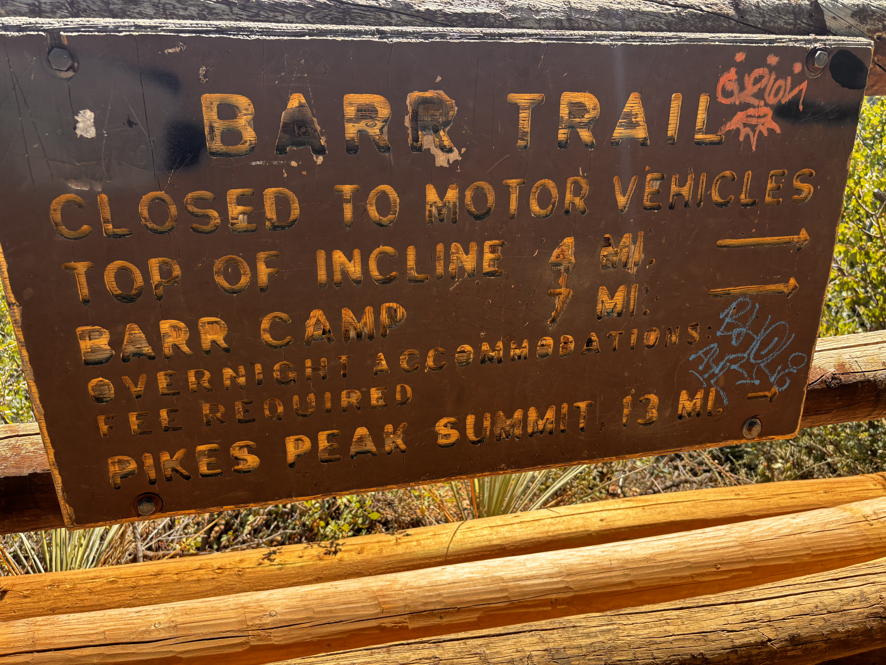

<br><details><summary>:camera:**65/IMG_0305.jpg**</summary><sub> `Exif version` 0232 `OS version` 27.0 `Date` 2026:07:12 11:23:24 `Aperture` Not known `Brightness` 8.622585274312838 `Color space` 65535 `Compression` Not known`Exposure mode` 0 `Exposure time` 0.0009345794392523365 `Focal length` 5.96 `Lens model` iPhone 15 Plus back dual wide camera 5.96mm f/1.6 `Lens specification` (5.96, 5.960000038146973, 1.6, 1.6) `Orientation` 6 `Scene type` Not known `f number` 1.6 `White balance` 0 `Sensing method` 2 `Shutter speed` 10.062746006019912</sub><sub>`Coordinates & altitude` (38.85564166666667, -104.93258611111112, 2019.418655097614)</sub><sub> :earth_americas:`Location over` [Google Maps](http://maps.google.com/maps?q=38.85564166666667,-104.93258611111112) or [Openstreet Map](https://www.openstreetmap.org/query?lat=38.85564166666667&lon=-104.93258611111112)</sub></details>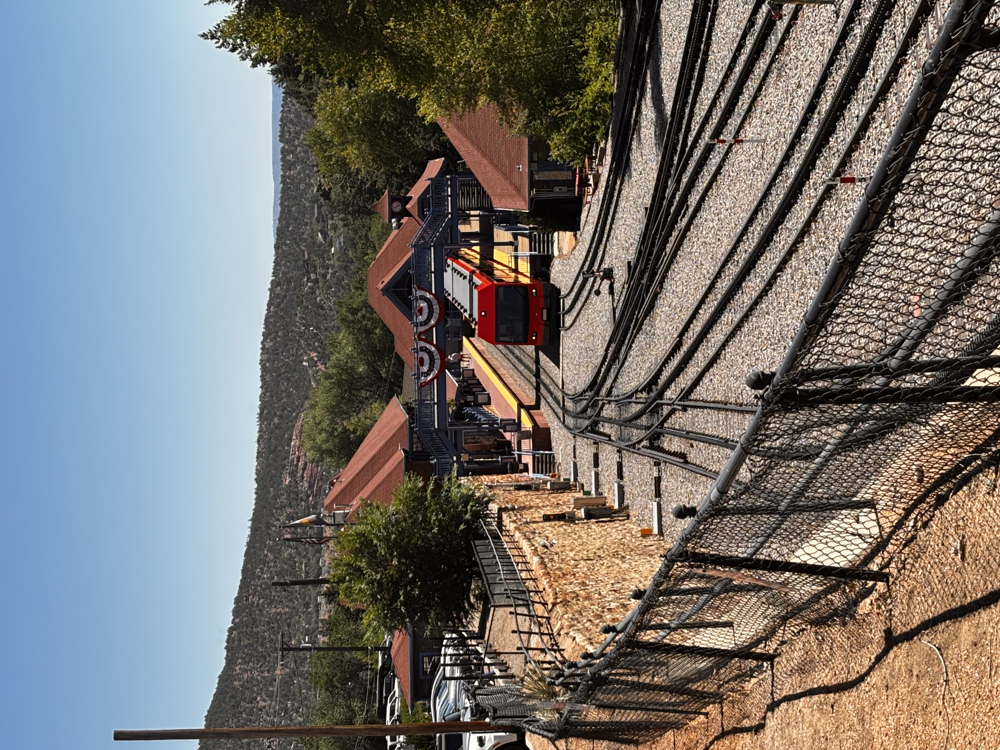

<br><details><summary>:camera:**65/IMG_0306.jpg**</summary><sub> `Exif version` 0232 `OS version` 27.0 `Date` 2026:07:12 11:23:26 `Aperture` Not known `Brightness` 9.715209171850226 `Color space` 65535 `Compression` Not known`Exposure mode` 0 `Exposure time` 0.0003219575016097875 `Focal length` 5.96 `Lens model` iPhone 15 Plus back dual wide camera 5.96mm f/1.6 `Lens specification` (1.5399999618512084, 5.96, 1.6, 2.4) `Orientation` 6 `Scene type` Not known `f number` 1.6 `White balance` 0 `Sensing method` 2 `Shutter speed` 11.60065170166546</sub><sub>`Coordinates & altitude` (38.85562222222222, -104.93259444444445, 2020.5460992907801)</sub><sub> :earth_americas:`Location over` [Google Maps](http://maps.google.com/maps?q=38.85562222222222,-104.93259444444445) or [Openstreet Map](https://www.openstreetmap.org/query?lat=38.85562222222222&lon=-104.93259444444445)</sub></details>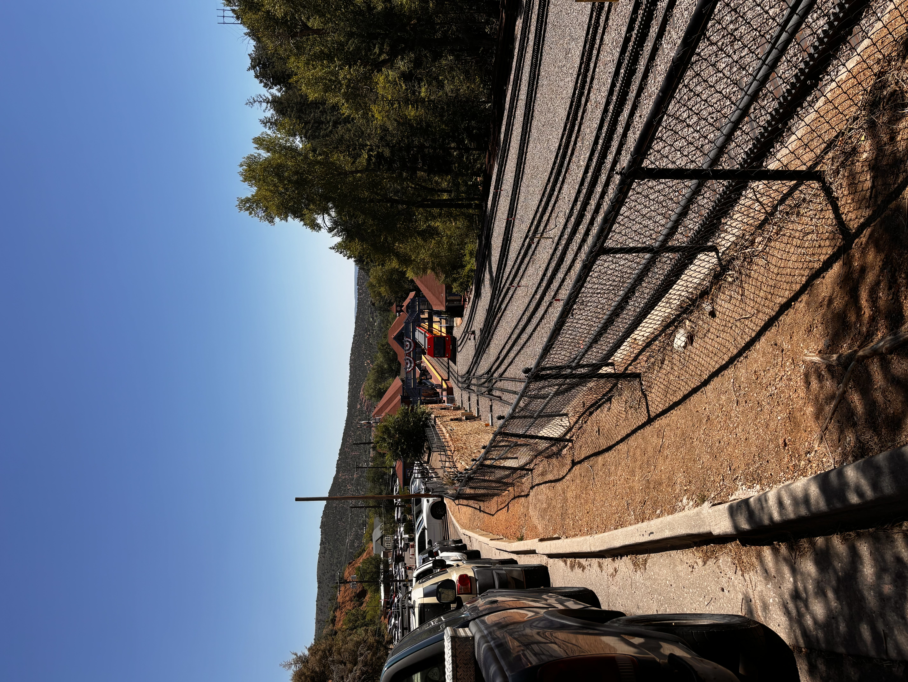

<br><details><summary>:camera:**65/IMG_0307.jpg**</summary><sub> `Exif version` 0232 `OS version` 27.0 `Date` 2026:07:12 11:31:39 `Aperture` Not known `Brightness` 8.138589672404219 `Color space` 65535 `Compression` Not known`Exposure mode` 0 `Exposure time` 0.0008012820512820513 `Focal length` 5.96 `Lens model` iPhone 15 Plus back dual wide camera 5.96mm f/1.6 `Lens specification` (1.5399999618512084, 5.96, 1.6, 2.4) `Orientation` 1 `Scene type` Not known `f number` 1.6 `White balance` 0 `Sensing method` 2 `Shutter speed` 10.285910129474486</sub><sub>`Coordinates & altitude` (38.85624444444444, -104.93124444444445, 2000.6275992438564)</sub><sub> :earth_americas:`Location over` [Google Maps](http://maps.google.com/maps?q=38.85624444444444,-104.93124444444445) or [Openstreet Map](https://www.openstreetmap.org/query?lat=38.85624444444444&lon=-104.93124444444445)</sub></details>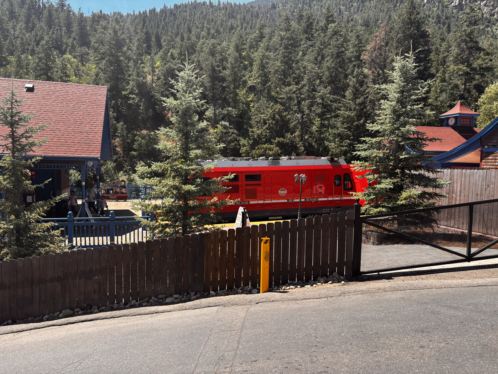

<br><details><summary>:camera:**65/IMG_0308.jpg**</summary><sub> `Exif version` 0232 `OS version` 27.0 `Date` 2026:07:12 11:31:41 `Aperture` Not known `Brightness` 9.023852223816355 `Color space` 65535 `Compression` Not known`Exposure mode` 0 `Exposure time` 0.0030211480362537764 `Focal length` 1.54 `Lens model` iPhone 15 Plus back dual wide camera 1.54mm f/2.4 `Lens specification` (1.54, 5.960000038146973, 1.6, 2.4) `Orientation` 1 `Scene type` Not known `f number` 2.4 `White balance` 0 `Sensing method` 2 `Shutter speed` 8.369803308001789</sub><sub>`Coordinates & altitude` (38.85636388888889, -104.93102222222223, 2004.0023980815347)</sub><sub> :earth_americas:`Location over` [Google Maps](http://maps.google.com/maps?q=38.85636388888889,-104.93102222222223) or [Openstreet Map](https://www.openstreetmap.org/query?lat=38.85636388888889&lon=-104.93102222222223)</sub></details>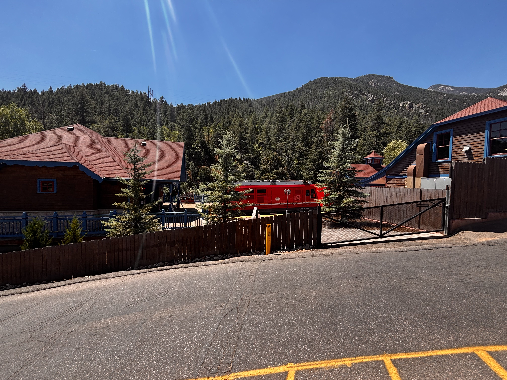

<br><details><summary>:camera:**65/IMG_0309.jpg**</summary><sub> `Exif version` 0232 `OS version` 27.0 `Date` 2026:07:12 11:31:43 `Aperture` Not known `Brightness` 9.242155349794238 `Color space` 65535 `Compression` Not known`Exposure mode` 0 `Exposure time` 0.0022522522522522522 `Focal length` 1.54 `Lens model` iPhone 15 Plus back dual wide camera 1.54mm f/2.4 `Lens specification` (1.54, 5.960000038146973, 1.6, 2.4) `Orientation` 1 `Scene type` Not known `f number` 2.4 `White balance` 0 `Sensing method` 2 `Shutter speed` 8.793296770262035</sub><sub>`Coordinates & altitude` (38.85627777777778, -104.93086944444445, 2007.1425339366515)</sub><sub> :earth_americas:`Location over` [Google Maps](http://maps.google.com/maps?q=38.85627777777778,-104.93086944444445) or [Openstreet Map](https://www.openstreetmap.org/query?lat=38.85627777777778&lon=-104.93086944444445)</sub></details>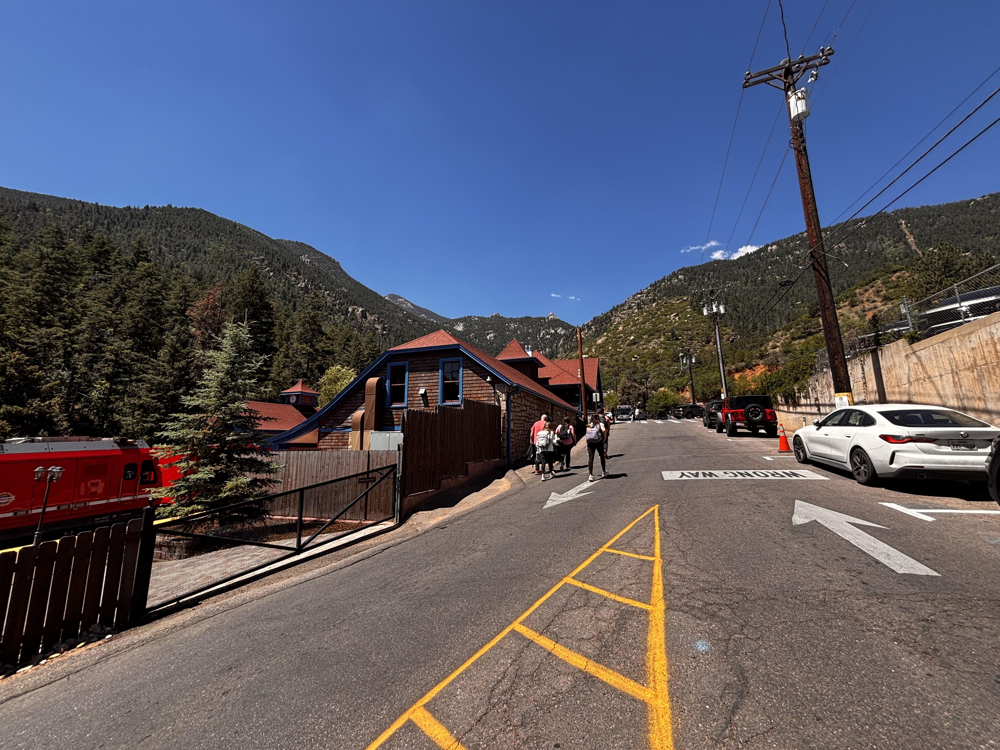

<br><details><summary>:camera:**65/IMG_0310.jpg**</summary><sub> `Exif version` 0232 `OS version` 27.0 `Date` 2026:07:12 11:31:46 `Aperture` Not known `Brightness` 9.406366691560866 `Color space` 65535 `Compression` Not known`Exposure mode` 0 `Exposure time` 0.001941747572815534 `Focal length` 1.54 `Lens model` iPhone 15 Plus back dual wide camera 1.54mm f/2.4 `Lens specification` (1.54, 5.960000038146973, 1.6, 2.4) `Orientation` 6 `Scene type` Not known `f number` 2.4 `White balance` 0 `Sensing method` 2 `Shutter speed` 9.009727626459144</sub><sub>`Coordinates & altitude` (38.85626666666667, -104.93089166666667, 2006.8661654135337)</sub><sub> :earth_americas:`Location over` [Google Maps](http://maps.google.com/maps?q=38.85626666666667,-104.93089166666667) or [Openstreet Map](https://www.openstreetmap.org/query?lat=38.85626666666667&lon=-104.93089166666667)</sub></details>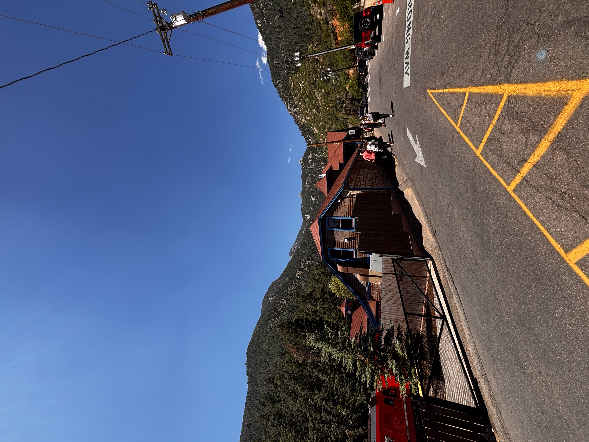

<br><details><summary>:camera:**65/IMG_0311.jpg**</summary><sub> `Exif version` 0232 `OS version` 27.0 `Date` 2026:07:12 11:31:48 `Aperture` Not known `Brightness` 9.37049376388177 `Color space` 65535 `Compression` Not known`Exposure mode` 0 `Exposure time` 0.0016611295681063123 `Focal length` 1.54 `Lens model` iPhone 15 Plus back dual wide camera 1.54mm f/2.4 `Lens specification` (1.54, 5.960000038146973, 1.6, 2.4) `Orientation` 6 `Scene type` Not known `f number` 2.4 `White balance` 0 `Sensing method` 2 `Shutter speed` 9.232863904633904</sub><sub>`Coordinates & altitude` (38.85626944444444, -104.93090833333333, 2005.136674259681)</sub><sub> :earth_americas:`Location over` [Google Maps](http://maps.google.com/maps?q=38.85626944444444,-104.93090833333333) or [Openstreet Map](https://www.openstreetmap.org/query?lat=38.85626944444444&lon=-104.93090833333333)</sub></details>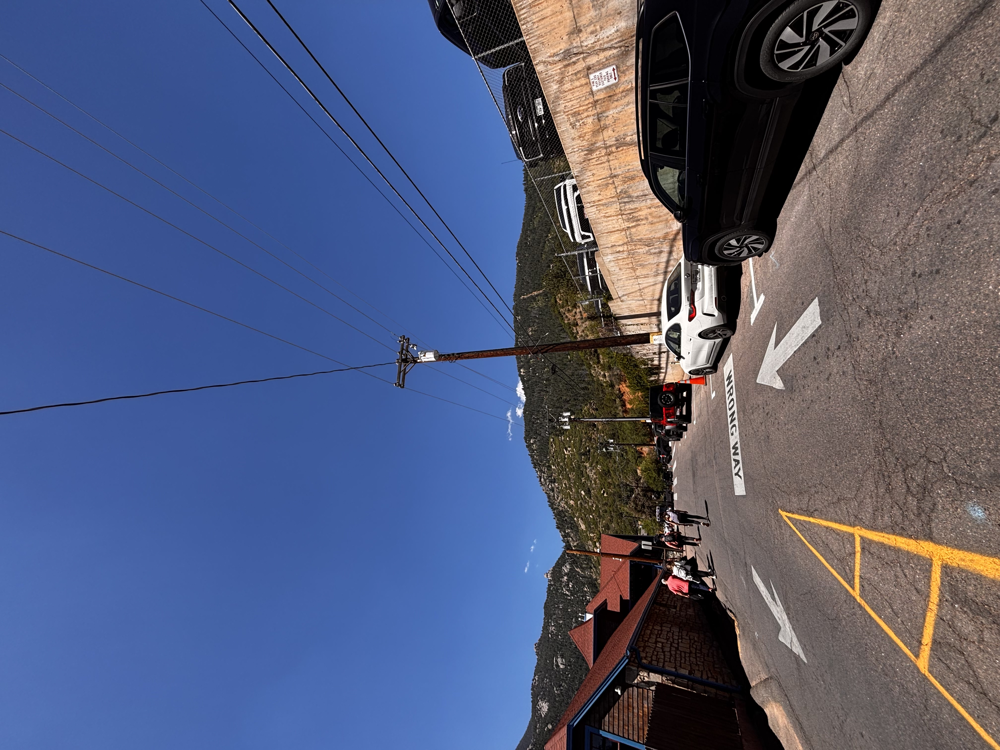

<br><details><summary>:camera:**65/IMG_E0091.jpg**</summary> `Exif version` Not known</details>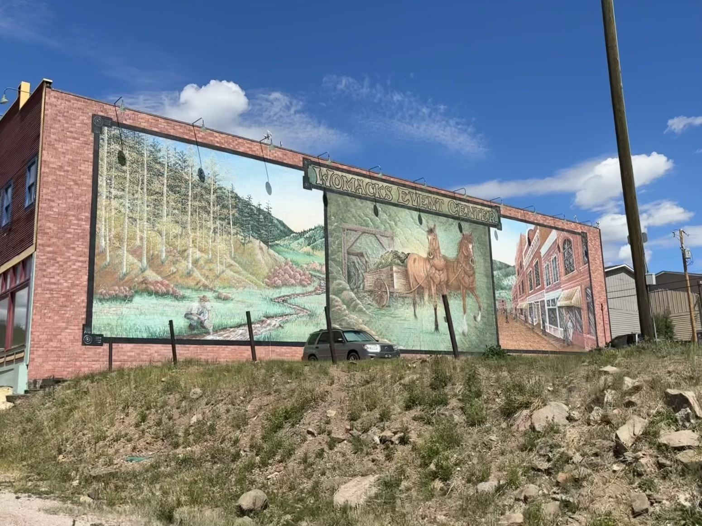

<br><details><summary>:camera:**65/TQLE5080.JPG**</summary> `Exif version` Not known</details>

<sub>_Citation: Partial or total digital reproduction of this repository, scripts, development guides, data models, images, and documentation is permitted, provided that it is referenced as: "R.GISMobile - Mobile geographic information systems on QField that do not require an internet connection for navigation." https://github.com/rcfdtools/R.GISMobile - Bogotá - Colombia - South America"._<sub>

| [:house: Home](../Readme.md) |
|---|