<div align="center"></div>

## :earth_americas:POI: _“Pueblo Reservoir - Arkansas River - Pueblo, Colorado, USA (2026-07-18)”_
`Pictures` rcfdtools <br>`Category` Freelance field visit <br>`Location` [Google Maps](http://maps.google.com/maps?q=38.268839,-104.724969) or [Openstreet Map](https://www.openstreetmap.org/query?lat=38.268839&lon=-104.724969) 

```geojson
{
  "type": "Feature",
  "geometry": {
    "type": "Point", 
    "coordinates": [-104.724969, 38.268839]
  }, 
  "properties": {
    "Name": "Pueblo Reservoir - Arkansas River - Pueblo, Colorado, USA"
  }
}
```

<br><details><summary>:camera:**66/IMG_0085.jpg**</summary><sub> `Exif version` 0232 `OS version` 27.0 `Date` 2026:06:20 05:39:12 `Aperture` Not known `Brightness` 4.836860121363 `Color space` 65535 `Compression` Not known`Exposure mode` 0 `Exposure time` 0.008264462809917356 `Focal length` 5.96 `Lens model` iPhone 15 Plus back dual wide camera 5.96mm f/1.6 `Lens specification` (1.5399999618512084, 5.96, 1.6, 2.4) `Orientation` 1 `Scene type` Not known `f number` 1.6 `White balance` 0 `Sensing method` 2 `Shutter speed` 6.922089825847846</sub><sub>`Coordinates & altitude` (38.84223888888889, -104.70572777777778, 1920.03948025987)</sub><sub> :earth_americas:`Location over` [Google Maps](http://maps.google.com/maps?q=38.84223888888889,-104.70572777777778) or [Openstreet Map](https://www.openstreetmap.org/query?lat=38.84223888888889&lon=-104.70572777777778)</sub></details>

<br><details><summary>:camera:**66/IMG_0086.jpg**</summary><sub> `Exif version` 0232 `OS version` 27.0 `Date` 2026:06:20 05:39:16 `Aperture` Not known `Brightness` 5.100922259535863 `Color space` 65535 `Compression` Not known`Exposure mode` 0 `Exposure time` 0.008264462809917356 `Focal length` 5.96 `Lens model` iPhone 15 Plus back dual wide camera 5.96mm f/1.6 `Lens specification` (1.5399999618512084, 5.96, 1.6, 2.4) `Orientation` 6 `Scene type` Not known `f number` 1.6 `White balance` 0 `Sensing method` 2 `Shutter speed` 6.923665289888328</sub><sub>`Coordinates & altitude` (38.842261111111114, -104.70568888888889, 1919.9457295373666)</sub><sub> :earth_americas:`Location over` [Google Maps](http://maps.google.com/maps?q=38.842261111111114,-104.70568888888889) or [Openstreet Map](https://www.openstreetmap.org/query?lat=38.842261111111114&lon=-104.70568888888889)</sub></details>

<br><details><summary>:camera:**66/IMG_0087.jpg**</summary><sub> `Exif version` 0232 `OS version` 27.0 `Date` 2026:06:20 10:45:15 `Aperture` Not known `Brightness` 9.348495897903373 `Color space` 65535 `Compression` Not known`Exposure mode` 0 `Exposure time` 0.00038895371450797355 `Focal length` 5.96 `Lens model` iPhone 15 Plus back dual wide camera 5.96mm f/1.6 `Lens specification` (1.5399999618512084, 5.96, 1.6, 2.4) `Orientation` 1 `Scene type` Not known `f number` 1.6 `White balance` 0 `Sensing method` 2 `Shutter speed` 11.327942223578477</sub></details>

<br><details><summary>:camera:**66/IMG_0088.jpg**</summary><sub> `Exif version` 0232 `OS version` 27.0 `Date` 2026:06:20 10:45:21 `Aperture` Not known `Brightness` 9.096024844720496 `Color space` 65535 `Compression` Not known`Exposure mode` 0 `Exposure time` 0.00045599635202918376 `Focal length` 5.96 `Lens model` iPhone 15 Plus back dual wide camera 5.96mm f/1.6 `Lens specification` (1.5399999618512084, 5.96, 1.6, 2.4) `Orientation` 1 `Scene type` Not known `f number` 1.6 `White balance` 0 `Sensing method` 2 `Shutter speed` 11.098678565299467</sub><sub>`Coordinates & altitude` (38.74675277777778, -105.17295, 2894.54000477669)</sub><sub> :earth_americas:`Location over` [Google Maps](http://maps.google.com/maps?q=38.74675277777778,-105.17295) or [Openstreet Map](https://www.openstreetmap.org/query?lat=38.74675277777778&lon=-105.17295)</sub></details>

<br><details><summary>:camera:**66/IMG_0089.jpg**</summary><sub> `Exif version` 0232 `OS version` 27.0 `Date` 2026:06:20 10:48:24 `Aperture` Not known `Brightness` 10.249605914007718 `Color space` 65535 `Compression` Not known`Exposure mode` 0 `Exposure time` 0.00018698578908002991 `Focal length` 5.96 `Lens model` iPhone 15 Plus back dual wide camera 5.96mm f/1.6 `Lens specification` (1.5399999618512084, 5.96, 1.6, 2.4) `Orientation` 1 `Scene type` Not known `f number` 1.6 `White balance` 0 `Sensing method` 2 `Shutter speed` 12.384674110125012</sub><sub>`Coordinates & altitude` (38.74496388888889, -105.17825277777779, 2873.110561056106)</sub><sub> :earth_americas:`Location over` [Google Maps](http://maps.google.com/maps?q=38.74496388888889,-105.17825277777779) or [Openstreet Map](https://www.openstreetmap.org/query?lat=38.74496388888889&lon=-105.17825277777779)</sub></details>

<br><details><summary>:camera:**66/IMG_0090.jpg**</summary><sub> `Exif version` 0232 `OS version` 27.0 `Date` 2026:06:20 10:48:27 `Aperture` Not known `Brightness` 10.27683916456033 `Color space` 65535 `Compression` Not known`Exposure mode` 0 `Exposure time` 0.00018698578908002991 `Focal length` 5.96 `Lens model` iPhone 15 Plus back dual wide camera 5.96mm f/1.6 `Lens specification` (1.5399999618512084, 5.96, 1.6, 2.4) `Orientation` 1 `Scene type` Not known `f number` 1.6 `White balance` 0 `Sensing method` 2 `Shutter speed` 12.384674110125012</sub><sub>`Coordinates & altitude` (38.74486666666667, -105.17830000000001, 2872.688195991091)</sub><sub> :earth_americas:`Location over` [Google Maps](http://maps.google.com/maps?q=38.74486666666667,-105.17830000000001) or [Openstreet Map](https://www.openstreetmap.org/query?lat=38.74486666666667&lon=-105.17830000000001)</sub></details>

<br><details><summary>:camera:**66/IMG_0091.jpg**</summary><sub> `Exif version` 0232 `OS version` 27.0 `Date` 2026:06:20 10:48:33 `Aperture` Not known `Brightness` 10.003421845058856 `Color space` 65535 `Compression` Not known`Exposure mode` 0 `Exposure time` 0.00023501762632197415 `Focal length` 5.96 `Lens model` iPhone 15 Plus back dual wide camera 5.96mm f/1.6 `Lens specification` (1.5399999618512084, 5.96, 1.6, 2.4) `Orientation` 1 `Scene type` Not known `f number` 1.6 `White balance` 0 `Sensing method` 2 `Shutter speed` 12.055051610885204</sub><sub>`Coordinates & altitude` (38.744819444444445, -105.17867222222223, 2871.8849765258215)</sub><sub> :earth_americas:`Location over` [Google Maps](http://maps.google.com/maps?q=38.744819444444445,-105.17867222222223) or [Openstreet Map](https://www.openstreetmap.org/query?lat=38.744819444444445&lon=-105.17867222222223)</sub></details>

<br><details><summary>:camera:**66/IMG_0092.jpg**</summary><sub> `Exif version` 0232 `OS version` 27.0 `Date` 2026:06:20 10:53:35 `Aperture` Not known `Brightness` 10.152038369304556 `Color space` 65535 `Compression` Not known`Exposure mode` 0 `Exposure time` 0.00023501762632197415 `Focal length` 5.96 `Lens model` iPhone 15 Plus back dual wide camera 5.96mm f/1.6 `Lens specification` (1.5399999618512084, 5.96, 1.6, 2.4) `Orientation` 1 `Scene type` Not known `f number` 1.6 `White balance` 0 `Sensing method` 2 `Shutter speed` 12.055051610885204</sub><sub>`Coordinates & altitude` (38.75244444444444, -105.16127777777778, 3030.582484725051)</sub><sub> :earth_americas:`Location over` [Google Maps](http://maps.google.com/maps?q=38.75244444444444,-105.16127777777778) or [Openstreet Map](https://www.openstreetmap.org/query?lat=38.75244444444444&lon=-105.16127777777778)</sub></details>

<br><details><summary>:camera:**66/IMG_0093.jpg**</summary><sub> `Exif version` 0232 `OS version` 27.0 `Date` 2026:06:20 10:53:42 `Aperture` Not known `Brightness` 9.104949543488708 `Color space` 65535 `Compression` Not known`Exposure mode` 0 `Exposure time` 0.0003979307600477517 `Focal length` 5.96 `Lens model` iPhone 15 Plus back dual wide camera 5.96mm f/1.6 `Lens specification` (1.5399999618512084, 5.96, 1.6, 2.4) `Orientation` 1 `Scene type` Not known `f number` 1.6 `White balance` 0 `Sensing method` 2 `Shutter speed` 11.294943950881436</sub><sub>`Coordinates & altitude` (38.753616666666666, -105.16111666666667, 3037.023675310034)</sub><sub> :earth_americas:`Location over` [Google Maps](http://maps.google.com/maps?q=38.753616666666666,-105.16111666666667) or [Openstreet Map](https://www.openstreetmap.org/query?lat=38.753616666666666&lon=-105.16111666666667)</sub></details>

<br><details><summary>:camera:**66/IMG_0094.jpg**</summary><sub> `Exif version` 0232 `OS version` 27.0 `Date` 2026:06:20 10:58:48 `Aperture` Not known `Brightness` 10.342462014375398 `Color space` 65535 `Compression` Not known`Exposure mode` 0 `Exposure time` 0.00016801075268817206 `Focal length` 5.96 `Lens model` iPhone 15 Plus back dual wide camera 5.96mm f/1.6 `Lens specification` (1.5399999618512084, 5.96, 1.6, 2.4) `Orientation` 1 `Scene type` Not known `f number` 1.6 `White balance` 0 `Sensing method` 2 `Shutter speed` 12.539251137291497</sub><sub>`Coordinates & altitude` (38.783408333333334, -105.12313055555555, 3031.2245762711864)</sub><sub> :earth_americas:`Location over` [Google Maps](http://maps.google.com/maps?q=38.783408333333334,-105.12313055555555) or [Openstreet Map](https://www.openstreetmap.org/query?lat=38.783408333333334&lon=-105.12313055555555)</sub></details>

<br><details><summary>:camera:**66/IMG_0095.jpg**</summary><sub> `Exif version` 0232 `OS version` 27.0 `Date` 2026:06:20 10:58:53 `Aperture` Not known `Brightness` 10.400787044044195 `Color space` 65535 `Compression` Not known`Exposure mode` 0 `Exposure time` 0.00016801075268817206 `Focal length` 5.96 `Lens model` iPhone 15 Plus back dual wide camera 5.96mm f/1.6 `Lens specification` (1.5399999618512084, 5.96, 1.6, 2.4) `Orientation` 1 `Scene type` Not known `f number` 1.6 `White balance` 0 `Sensing method` 2 `Shutter speed` 12.539251137291497</sub><sub>`Coordinates & altitude` (38.78455833333333, -105.12334444444444, 3029.985849056604)</sub><sub> :earth_americas:`Location over` [Google Maps](http://maps.google.com/maps?q=38.78455833333333,-105.12334444444444) or [Openstreet Map](https://www.openstreetmap.org/query?lat=38.78455833333333&lon=-105.12334444444444)</sub></details>

<br><details><summary>:camera:**66/IMG_0096.jpg**</summary><sub> `Exif version` 0232 `OS version` 27.0 `Date` 2026:06:20 10:59:18 `Aperture` Not known `Brightness` 9.900702552938847 `Color space` 65535 `Compression` Not known`Exposure mode` 0 `Exposure time` 0.0002449779519843214 `Focal length` 5.96 `Lens model` iPhone 15 Plus back dual wide camera 5.96mm f/1.6 `Lens specification` (1.5399999618512084, 5.96, 1.6, 2.4) `Orientation` 1 `Scene type` Not known `f number` 1.6 `White balance` 0 `Sensing method` 2 `Shutter speed` 11.994930629669156</sub><sub>`Coordinates & altitude` (38.78993611111111, -105.12436666666666, 3038.728205128205)</sub><sub> :earth_americas:`Location over` [Google Maps](http://maps.google.com/maps?q=38.78993611111111,-105.12436666666666) or [Openstreet Map](https://www.openstreetmap.org/query?lat=38.78993611111111&lon=-105.12436666666666)</sub></details>

<br><details><summary>:camera:**66/IMG_0097.jpg**</summary><sub> `Exif version` 0232 `OS version` 27.0 `Date` 2026:06:20 11:08:55 `Aperture` Not known `Brightness` 10.059389847461865 `Color space` 65535 `Compression` Not known`Exposure mode` 0 `Exposure time` 0.000177999288002848 `Focal length` 5.96 `Lens model` iPhone 15 Plus back dual wide camera 5.96mm f/1.6 `Lens specification` (1.5399999618512084, 5.96, 1.6, 2.4) `Orientation` 6 `Scene type` Not known `f number` 1.6 `White balance` 0 `Sensing method` 2 `Shutter speed` 12.455835145490317</sub><sub>`Coordinates & altitude` (38.85438055555556, -105.1529, 2799.9900199600797)</sub><sub> :earth_americas:`Location over` [Google Maps](http://maps.google.com/maps?q=38.85438055555556,-105.1529) or [Openstreet Map](https://www.openstreetmap.org/query?lat=38.85438055555556&lon=-105.1529)</sub></details>

<br><details><summary>:camera:**66/IMG_0098.jpg**</summary><sub> `Exif version` 0232 `OS version` 27.0 `Date` 2026:06:20 11:09:07 `Aperture` Not known `Brightness` 9.589695608782435 `Color space` 65535 `Compression` Not known`Exposure mode` 0 `Exposure time` 0.00031201248049921997 `Focal length` 5.96 `Lens model` iPhone 15 Plus back dual wide camera 5.96mm f/1.6 `Lens specification` (1.5399999618512084, 5.96, 1.6, 2.4) `Orientation` 6 `Scene type` Not known `f number` 1.6 `White balance` 0 `Sensing method` 2 `Shutter speed` 11.646166350582497</sub><sub>`Coordinates & altitude` (38.85522777777778, -105.151725, 2795.104536489152)</sub><sub> :earth_americas:`Location over` [Google Maps](http://maps.google.com/maps?q=38.85522777777778,-105.151725) or [Openstreet Map](https://www.openstreetmap.org/query?lat=38.85522777777778&lon=-105.151725)</sub></details>

<br><details><summary>:camera:**66/IMG_0099.jpg**</summary><sub> `Exif version` 0232 `OS version` 27.0 `Date` 2026:06:20 11:35:52 `Aperture` Not known `Brightness` 10.195812153857826 `Color space` 65535 `Compression` Not known`Exposure mode` 0 `Exposure time` 0.000177999288002848 `Focal length` 5.96 `Lens model` iPhone 15 Plus back dual wide camera 5.96mm f/1.6 `Lens specification` (1.5399999618512084, 5.96, 1.6, 2.4) `Orientation` 1 `Scene type` Not known `f number` 1.6 `White balance` 0 `Sensing method` 2 `Shutter speed` 12.455835145490317</sub><sub>`Coordinates & altitude` (38.898408333333336, -104.97200000000001, 2269.8867497168744)</sub><sub> :earth_americas:`Location over` [Google Maps](http://maps.google.com/maps?q=38.898408333333336,-104.97200000000001) or [Openstreet Map](https://www.openstreetmap.org/query?lat=38.898408333333336&lon=-104.97200000000001)</sub></details>

<br><details><summary>:camera:**66/IMG_0100.jpg**</summary><sub> `Exif version` 0232 `OS version` 27.0 `Date` 2026:06:20 11:36:03 `Aperture` Not known `Brightness` 9.893585675430643 `Color space` 65535 `Compression` Not known`Exposure mode` 0 `Exposure time` 0.0002829654782116582 `Focal length` 5.96 `Lens model` iPhone 15 Plus back dual wide camera 5.96mm f/1.6 `Lens specification` (1.5399999618512084, 5.96, 1.6, 2.4) `Orientation` 1 `Scene type` Not known `f number` 1.6 `White balance` 0 `Sensing method` 2 `Shutter speed` 11.786910327241818</sub><sub>`Coordinates & altitude` (38.89748888888889, -104.9715361111111, 2247.6610878661086)</sub><sub> :earth_americas:`Location over` [Google Maps](http://maps.google.com/maps?q=38.89748888888889,-104.9715361111111) or [Openstreet Map](https://www.openstreetmap.org/query?lat=38.89748888888889&lon=-104.9715361111111)</sub></details>

<br><details><summary>:camera:**66/IMG_0101.jpg**</summary><sub> `Exif version` 0232 `OS version` 27.0 `Date` 2026:06:20 11:36:17 `Aperture` Not known `Brightness` 10.418107588856868 `Color space` 65535 `Compression` Not known`Exposure mode` 0 `Exposure time` 0.00015800284405119292 `Focal length` 5.96 `Lens model` iPhone 15 Plus back dual wide camera 5.96mm f/1.6 `Lens specification` (1.5399999618512084, 5.96, 1.6, 2.4) `Orientation` 1 `Scene type` Not known `f number` 1.6 `White balance` 0 `Sensing method` 2 `Shutter speed` 12.627787823990356</sub><sub>`Coordinates & altitude` (38.89574722222222, -104.97099166666666, 2246.10911136108)</sub><sub> :earth_americas:`Location over` [Google Maps](http://maps.google.com/maps?q=38.89574722222222,-104.97099166666666) or [Openstreet Map](https://www.openstreetmap.org/query?lat=38.89574722222222&lon=-104.97099166666666)</sub></details>

<br><details><summary>:camera:**66/IMG_0102.jpg**</summary><sub> `Exif version` 0232 `OS version` 27.0 `Date` 2026:06:20 11:36:22 `Aperture` Not known `Brightness` 10.771305311867348 `Color space` 65535 `Compression` Not known`Exposure mode` 0 `Exposure time` 0.00013000520020800833 `Focal length` 5.96 `Lens model` iPhone 15 Plus back dual wide camera 5.96mm f/1.6 `Lens specification` (1.5399999618512084, 5.96, 1.6, 2.4) `Orientation` 6 `Scene type` Not known `f number` 1.6 `White balance` 0 `Sensing method` 2 `Shutter speed` 12.909200759537372</sub><sub>`Coordinates & altitude` (38.89503888888889, -104.97034444444445, 2242.025620496397)</sub><sub> :earth_americas:`Location over` [Google Maps](http://maps.google.com/maps?q=38.89503888888889,-104.97034444444445) or [Openstreet Map](https://www.openstreetmap.org/query?lat=38.89503888888889&lon=-104.97034444444445)</sub></details>

<br><details><summary>:camera:**66/IMG_0103.jpg**</summary><sub> `Exif version` 0232 `OS version` 27.0 `Date` 2026:06:20 11:41:00 `Aperture` Not known `Brightness` 10.289384955237763 `Color space` 65535 `Compression` Not known`Exposure mode` 0 `Exposure time` 0.000177999288002848 `Focal length` 5.96 `Lens model` iPhone 15 Plus back dual wide camera 5.96mm f/1.6 `Lens specification` (1.5399999618512084, 5.96, 1.6, 2.4) `Orientation` 1 `Scene type` Not known `f number` 1.6 `White balance` 0 `Sensing method` 2 `Shutter speed` 12.455835145490317</sub><sub>`Coordinates & altitude` (38.86428888888889, -104.91968611111112, 2007.6508344030808)</sub><sub> :earth_americas:`Location over` [Google Maps](http://maps.google.com/maps?q=38.86428888888889,-104.91968611111112) or [Openstreet Map](https://www.openstreetmap.org/query?lat=38.86428888888889&lon=-104.91968611111112)</sub></details>

<br><details><summary>:camera:**66/IMG_0104.jpg**</summary><sub> `Exif version` 0232 `OS version` 27.0 `Date` 2026:06:20 11:41:10 `Aperture` Not known `Brightness` 10.435219154276888 `Color space` 65535 `Compression` Not known`Exposure mode` 0 `Exposure time` 0.000177999288002848 `Focal length` 5.96 `Lens model` iPhone 15 Plus back dual wide camera 5.96mm f/1.6 `Lens specification` (1.5399999618512084, 5.96, 1.6, 2.4) `Orientation` 1 `Scene type` Not known `f number` 1.6 `White balance` 0 `Sensing method` 2 `Shutter speed` 12.455835145490317</sub><sub>`Coordinates & altitude` (38.86343055555556, -104.917275, 2001.1269487750558)</sub><sub> :earth_americas:`Location over` [Google Maps](http://maps.google.com/maps?q=38.86343055555556,-104.917275) or [Openstreet Map](https://www.openstreetmap.org/query?lat=38.86343055555556&lon=-104.917275)</sub></details>

<br><details><summary>:camera:**66/IMG_0105.jpg**</summary><sub> `Exif version` 0232 `OS version` 27.0 `Date` 2026:06:20 11:41:15 `Aperture` Not known `Brightness` 10.12264208164008 `Color space` 65535 `Compression` Not known`Exposure mode` 0 `Exposure time` 0.00021598272138228941 `Focal length` 5.96 `Lens model` iPhone 15 Plus back dual wide camera 5.96mm f/1.6 `Lens specification` (1.5399999618512084, 5.96, 1.6, 2.4) `Orientation` 1 `Scene type` Not known `f number` 1.6 `White balance` 0 `Sensing method` 2 `Shutter speed` 12.176681061073412</sub><sub>`Coordinates & altitude` (38.86296111111111, -104.91603888888889, 1994.8559585492228)</sub><sub> :earth_americas:`Location over` [Google Maps](http://maps.google.com/maps?q=38.86296111111111,-104.91603888888889) or [Openstreet Map](https://www.openstreetmap.org/query?lat=38.86296111111111&lon=-104.91603888888889)</sub></details>

<br><details><summary>:camera:**66/IMG_0106.jpg**</summary><sub> `Exif version` 0232 `OS version` 27.0 `Date` 2026:06:21 05:50:45 `Aperture` Not known `Brightness` 7.447101285810963 `Color space` 65535 `Compression` Not known`Exposure mode` 0 `Exposure time` 0.001358695652173913 `Focal length` 5.96 `Lens model` iPhone 15 Plus back dual wide camera 5.96mm f/1.6 `Lens specification` (1.5399999618512084, 5.96, 1.6, 2.4) `Orientation` 6 `Scene type` Not known `f number` 1.6 `White balance` 0 `Sensing method` 2 `Shutter speed` 9.524300807955251</sub><sub>`Coordinates & altitude` (38.85073888888889, -104.69858611111111, 1935.5956331877728)</sub><sub> :earth_americas:`Location over` [Google Maps](http://maps.google.com/maps?q=38.85073888888889,-104.69858611111111) or [Openstreet Map](https://www.openstreetmap.org/query?lat=38.85073888888889&lon=-104.69858611111111)</sub></details>

<br><details><summary>:camera:**66/IMG_0123.jpg**</summary><sub> `Exif version` 0232 `OS version` 27.0 `Date` 2026:07:04 16:22:53 `Aperture` Not known `Brightness` 10.20851051263879 `Color space` 65535 `Compression` Not known`Exposure mode` 0 `Exposure time` 0.00020601565718994644 `Focal length` 5.96 `Lens model` iPhone 15 Plus back dual wide camera 5.96mm f/1.6 `Lens specification` (1.5399999618512084, 5.96, 1.6, 2.4) `Orientation` 1 `Scene type` Not known `f number` 1.6 `White balance` 0 `Sensing method` 2 `Shutter speed` 12.245068045152442</sub><sub>`Coordinates & altitude` (39.249408333333335, -104.88433055555556, 2015.8308605341247)</sub><sub> :earth_americas:`Location over` [Google Maps](http://maps.google.com/maps?q=39.249408333333335,-104.88433055555556) or [Openstreet Map](https://www.openstreetmap.org/query?lat=39.249408333333335&lon=-104.88433055555556)</sub></details>

<br><details><summary>:camera:**66/IMG_0215.jpg**</summary><sub> `Exif version` 0232 `OS version` 27.0 `Date` 2026:07:09 05:37:42 `Aperture` Not known `Brightness` 1.8008516213560433 `Color space` 65535 `Compression` Not known`Exposure mode` 0 `Exposure time` 0.016666666666666666 `Focal length` 5.96 `Lens model` iPhone 15 Plus back dual wide camera 5.96mm f/1.6 `Lens specification` (1.5399999618512084, 5.96, 1.6, 2.4) `Orientation` 1 `Scene type` Not known `f number` 1.6 `White balance` 0 `Sensing method` 2 `Shutter speed` 5.906602084868906</sub><sub>`Coordinates & altitude` (38.84428055555556, -104.70408611111111, 1922.4623323013416)</sub><sub> :earth_americas:`Location over` [Google Maps](http://maps.google.com/maps?q=38.84428055555556,-104.70408611111111) or [Openstreet Map](https://www.openstreetmap.org/query?lat=38.84428055555556&lon=-104.70408611111111)</sub></details>

<br><details><summary>:camera:**66/IMG_0216.jpg**</summary><sub> `Exif version` 0232 `OS version` 27.0 `Date` 2026:07:09 05:37:45 `Aperture` Not known `Brightness` 1.7464815570981354 `Color space` 65535 `Compression` Not known`Exposure mode` 0 `Exposure time` 0.016666666666666666 `Focal length` 5.96 `Lens model` iPhone 15 Plus back dual wide camera 5.96mm f/1.6 `Lens specification` (1.5399999618512084, 5.96, 1.6, 2.4) `Orientation` 6 `Scene type` Not known `f number` 1.6 `White balance` 0 `Sensing method` 2 `Shutter speed` 5.906602084868906</sub><sub>`Coordinates & altitude` (38.844258333333336, -104.70404166666667, 1922.0145772594751)</sub><sub> :earth_americas:`Location over` [Google Maps](http://maps.google.com/maps?q=38.844258333333336,-104.70404166666667) or [Openstreet Map](https://www.openstreetmap.org/query?lat=38.844258333333336&lon=-104.70404166666667)</sub></details>

<br><details><summary>:camera:**66/IMG_0217.jpg**</summary><sub> `Exif version` 0232 `OS version` 27.0 `Date` 2026:07:09 05:39:24 `Aperture` Not known `Brightness` 2.0164078056551173 `Color space` 65535 `Compression` Not known`Exposure mode` 0 `Exposure time` 0.016666666666666666 `Focal length` 5.96 `Lens model` iPhone 15 Plus back dual wide camera 5.96mm f/1.6 `Lens specification` (1.5399999618512084, 5.96, 1.6, 2.4) `Orientation` 1 `Scene type` Not known `f number` 1.6 `White balance` 0 `Sensing method` 2 `Shutter speed` 5.906602084868906</sub><sub>`Coordinates & altitude` (38.845530555555555, -104.70321666666666, 1923.7333278648184)</sub><sub> :earth_americas:`Location over` [Google Maps](http://maps.google.com/maps?q=38.845530555555555,-104.70321666666666) or [Openstreet Map](https://www.openstreetmap.org/query?lat=38.845530555555555&lon=-104.70321666666666)</sub></details>

<br><details><summary>:camera:**66/IMG_0218.jpg**</summary><sub> `Exif version` 0232 `OS version` 27.0 `Date` 2026:07:09 05:39:26 `Aperture` Not known `Brightness` 2.475213747209704 `Color space` 65535 `Compression` Not known`Exposure mode` 0 `Exposure time` 0.016666666666666666 `Focal length` 5.96 `Lens model` iPhone 15 Plus back dual wide camera 5.96mm f/1.6 `Lens specification` (1.5399999618512084, 5.96, 1.6, 2.4) `Orientation` 6 `Scene type` Not known `f number` 1.6 `White balance` 0 `Sensing method` 2 `Shutter speed` 5.906602084868906</sub><sub>`Coordinates & altitude` (38.84555, -104.70320000000001, 1924.4462193823217)</sub><sub> :earth_americas:`Location over` [Google Maps](http://maps.google.com/maps?q=38.84555,-104.70320000000001) or [Openstreet Map](https://www.openstreetmap.org/query?lat=38.84555&lon=-104.70320000000001)</sub></details>

<br><details><summary>:camera:**66/IMG_0312.jpg**</summary><sub> `Exif version` 0232 `OS version` 27.0 `Date` 2026:07:12 11:52:29 `Aperture` Not known `Brightness` 9.283324321745491 `Color space` 65535 `Compression` Not known`Exposure mode` 0 `Exposure time` 0.0003979307600477517 `Focal length` 5.96 `Lens model` iPhone 15 Plus back dual wide camera 5.96mm f/1.6 `Lens specification` (1.5399999618512084, 5.96, 1.6, 2.4) `Orientation` 1 `Scene type` Not known `f number` 1.6 `White balance` 0 `Sensing method` 2 `Shutter speed` 11.294943950881436</sub><sub>`Coordinates & altitude` (38.86595277777778, -104.91980000000001, 2064.818556701031)</sub><sub> :earth_americas:`Location over` [Google Maps](http://maps.google.com/maps?q=38.86595277777778,-104.91980000000001) or [Openstreet Map](https://www.openstreetmap.org/query?lat=38.86595277777778&lon=-104.91980000000001)</sub></details>

<br><details><summary>:camera:**66/IMG_0325.jpg**</summary><sub> `Exif version` 0232 `OS version` 27.0 `Date` 2026:07:18 11:23:46 `Aperture` Not known `Brightness` 10.385854616895875 `Color space` 65535 `Compression` Not known`Exposure mode` 0 `Exposure time` 0.000177999288002848 `Focal length` 5.96 `Lens model` iPhone 15 Plus back dual wide camera 5.96mm f/1.6 `Lens specification` (1.5399999618512084, 5.96, 1.6, 2.4) `Orientation` 1 `Scene type` Not known `f number` 1.6 `White balance` 0 `Sensing method` 2 `Shutter speed` 12.455835145490317</sub><sub>`Coordinates & altitude` (38.258177777777775, -104.71916944444445, 1481.8445497630332)</sub><sub> :earth_americas:`Location over` [Google Maps](http://maps.google.com/maps?q=38.258177777777775,-104.71916944444445) or [Openstreet Map](https://www.openstreetmap.org/query?lat=38.258177777777775&lon=-104.71916944444445)</sub></details>

<br><details><summary>:camera:**66/IMG_0326.jpg**</summary><sub> `Exif version` 0232 `OS version` 27.0 `Date` 2026:07:18 11:23:50 `Aperture` Not known `Brightness` 10.629463374821466 `Color space` 65535 `Compression` Not known`Exposure mode` 0 `Exposure time` 0.00015800284405119292 `Focal length` 5.96 `Lens model` iPhone 15 Plus back dual wide camera 5.96mm f/1.6 `Lens specification` (1.5399999618512084, 5.96, 1.6, 2.4) `Orientation` 1 `Scene type` Not known `f number` 1.6 `White balance` 0 `Sensing method` 2 `Shutter speed` 12.627787823990356</sub><sub>`Coordinates & altitude` (38.25805, -104.71965833333334, 1486.058415841584)</sub><sub> :earth_americas:`Location over` [Google Maps](http://maps.google.com/maps?q=38.25805,-104.71965833333334) or [Openstreet Map](https://www.openstreetmap.org/query?lat=38.25805&lon=-104.71965833333334)</sub></details>

<br><details><summary>:camera:**66/IMG_0327.jpg**</summary><sub> `Exif version` 0232 `OS version` 27.0 `Date` 2026:07:18 11:23:53 `Aperture` Not known `Brightness` 10.843092054710311 `Color space` 65535 `Compression` Not known`Exposure mode` 0 `Exposure time` 0.00018698578908002991 `Focal length` 5.96 `Lens model` iPhone 15 Plus back dual wide camera 5.96mm f/1.6 `Lens specification` (1.5399999618512084, 5.96, 1.6, 2.4) `Orientation` 1 `Scene type` Not known `f number` 1.6 `White balance` 0 `Sensing method` 2 `Shutter speed` 12.384674110125012</sub><sub>`Coordinates & altitude` (38.257980555555555, -104.72004722222222, 1485.8793388429751)</sub><sub> :earth_americas:`Location over` [Google Maps](http://maps.google.com/maps?q=38.257980555555555,-104.72004722222222) or [Openstreet Map](https://www.openstreetmap.org/query?lat=38.257980555555555&lon=-104.72004722222222)</sub></details>

<br><details><summary>:camera:**66/IMG_0328.jpg**</summary><sub> `Exif version` 0232 `OS version` 27.0 `Date` 2026:07:18 11:23:57 `Aperture` Not known `Brightness` 10.564122614951517 `Color space` 65535 `Compression` Not known`Exposure mode` 0 `Exposure time` 0.00015800284405119292 `Focal length` 5.96 `Lens model` iPhone 15 Plus back dual wide camera 5.96mm f/1.6 `Lens specification` (1.5399999618512084, 5.96, 1.6, 2.4) `Orientation` 1 `Scene type` Not known `f number` 1.6 `White balance` 0 `Sensing method` 2 `Shutter speed` 12.627787823990356</sub><sub>`Coordinates & altitude` (38.25790277777778, -104.72045833333334, 1485.0335135135135)</sub><sub> :earth_americas:`Location over` [Google Maps](http://maps.google.com/maps?q=38.25790277777778,-104.72045833333334) or [Openstreet Map](https://www.openstreetmap.org/query?lat=38.25790277777778&lon=-104.72045833333334)</sub></details>

<br><details><summary>:camera:**66/IMG_0329.jpg**</summary><sub> `Exif version` 0232 `OS version` 27.0 `Date` 2026:07:18 11:24:01 `Aperture` Not known `Brightness` 10.376875375075015 `Color space` 65535 `Compression` Not known`Exposure mode` 0 `Exposure time` 0.00019700551615445234 `Focal length` 5.96 `Lens model` iPhone 15 Plus back dual wide camera 5.96mm f/1.6 `Lens specification` (1.5399999618512084, 5.96, 1.6, 2.4) `Orientation` 1 `Scene type` Not known `f number` 1.6 `White balance` 0 `Sensing method` 2 `Shutter speed` 12.309516750667061</sub><sub>`Coordinates & altitude` (38.25783611111111, -104.72085555555556, 1484.9317147192717)</sub><sub> :earth_americas:`Location over` [Google Maps](http://maps.google.com/maps?q=38.25783611111111,-104.72085555555556) or [Openstreet Map](https://www.openstreetmap.org/query?lat=38.25783611111111&lon=-104.72085555555556)</sub></details>

<br><details><summary>:camera:**66/IMG_0330.jpg**</summary><sub> `Exif version` 0232 `OS version` 27.0 `Date` 2026:07:18 11:24:19 `Aperture` Not known `Brightness` 10.237823258765667 `Color space` 65535 `Compression` Not known`Exposure mode` 0 `Exposure time` 0.00020601565718994644 `Focal length` 5.96 `Lens model` iPhone 15 Plus back dual wide camera 5.96mm f/1.6 `Lens specification` (1.5399999618512084, 5.96, 1.6, 2.4) `Orientation` 1 `Scene type` Not known `f number` 1.6 `White balance` 0 `Sensing method` 2 `Shutter speed` 12.245068045152442</sub><sub>`Coordinates & altitude` (38.25731388888889, -104.72373888888889, 1482.579295154185)</sub><sub> :earth_americas:`Location over` [Google Maps](http://maps.google.com/maps?q=38.25731388888889,-104.72373888888889) or [Openstreet Map](https://www.openstreetmap.org/query?lat=38.25731388888889&lon=-104.72373888888889)</sub></details>

<br><details><summary>:camera:**66/IMG_0331.jpg**</summary><sub> `Exif version` 0232 `OS version` 27.0 `Date` 2026:07:18 11:24:33 `Aperture` Not known `Brightness` 10.173947876902776 `Color space` 65535 `Compression` Not known`Exposure mode` 0 `Exposure time` 0.00019700551615445234 `Focal length` 5.96 `Lens model` iPhone 15 Plus back dual wide camera 5.96mm f/1.6 `Lens specification` (1.5399999618512084, 5.96, 1.6, 2.4) `Orientation` 1 `Scene type` Not known `f number` 1.6 `White balance` 0 `Sensing method` 2 `Shutter speed` 12.309516750667061</sub><sub>`Coordinates & altitude` (38.257019444444445, -104.72571666666667, 1478.6153358681877)</sub><sub> :earth_americas:`Location over` [Google Maps](http://maps.google.com/maps?q=38.257019444444445,-104.72571666666667) or [Openstreet Map](https://www.openstreetmap.org/query?lat=38.257019444444445&lon=-104.72571666666667)</sub></details>

<br><details><summary>:camera:**66/IMG_0332.jpg**</summary><sub> `Exif version` 0232 `OS version` 27.0 `Date` 2026:07:18 11:24:43 `Aperture` Not known `Brightness` 10.310945709281961 `Color space` 65535 `Compression` Not known`Exposure mode` 0 `Exposure time` 0.00020601565718994644 `Focal length` 5.96 `Lens model` iPhone 15 Plus back dual wide camera 5.96mm f/1.6 `Lens specification` (1.5399999618512084, 5.96, 1.6, 2.4) `Orientation` 1 `Scene type` Not known `f number` 1.6 `White balance` 0 `Sensing method` 2 `Shutter speed` 12.245068045152442</sub><sub>`Coordinates & altitude` (38.25715, -104.72601388888889, 1480.8224368499257)</sub><sub> :earth_americas:`Location over` [Google Maps](http://maps.google.com/maps?q=38.25715,-104.72601388888889) or [Openstreet Map](https://www.openstreetmap.org/query?lat=38.25715&lon=-104.72601388888889)</sub></details>

<br><details><summary>:camera:**66/IMG_0333.jpg**</summary><sub> `Exif version` 0232 `OS version` 27.0 `Date` 2026:07:18 11:25:22 `Aperture` Not known `Brightness` 10.590989226248777 `Color space` 65535 `Compression` Not known`Exposure mode` 0 `Exposure time` 0.00015800284405119292 `Focal length` 5.96 `Lens model` iPhone 15 Plus back dual wide camera 5.96mm f/1.6 `Lens specification` (1.5399999618512084, 5.96, 1.6, 2.4) `Orientation` 1 `Scene type` Not known `f number` 1.6 `White balance` 0 `Sensing method` 2 `Shutter speed` 12.627787823990356</sub><sub>`Coordinates & altitude` (38.26122222222222, -104.72453333333334, 1469.1595394736842)</sub><sub> :earth_americas:`Location over` [Google Maps](http://maps.google.com/maps?q=38.26122222222222,-104.72453333333334) or [Openstreet Map](https://www.openstreetmap.org/query?lat=38.26122222222222&lon=-104.72453333333334)</sub></details>

<br><details><summary>:camera:**66/IMG_0334.jpg**</summary><sub> `Exif version` 0232 `OS version` 27.0 `Date` 2026:07:18 11:25:25 `Aperture` Not known `Brightness` 10.559337429869089 `Color space` 65535 `Compression` Not known`Exposure mode` 0 `Exposure time` 0.000177999288002848 `Focal length` 5.96 `Lens model` iPhone 15 Plus back dual wide camera 5.96mm f/1.6 `Lens specification` (1.5399999618512084, 5.96, 1.6, 2.4) `Orientation` 1 `Scene type` Not known `f number` 1.6 `White balance` 0 `Sensing method` 2 `Shutter speed` 12.455835145490317</sub><sub>`Coordinates & altitude` (38.26162222222222, -104.72429722222222, 1467.1106965174129)</sub><sub> :earth_americas:`Location over` [Google Maps](http://maps.google.com/maps?q=38.26162222222222,-104.72429722222222) or [Openstreet Map](https://www.openstreetmap.org/query?lat=38.26162222222222&lon=-104.72429722222222)</sub></details>

<br><details><summary>:camera:**66/IMG_0335.jpg**</summary><sub> `Exif version` 0232 `OS version` 27.0 `Date` 2026:07:18 11:25:29 `Aperture` Not known `Brightness` 10.610302586116637 `Color space` 65535 `Compression` Not known`Exposure mode` 0 `Exposure time` 0.00016801075268817206 `Focal length` 5.96 `Lens model` iPhone 15 Plus back dual wide camera 5.96mm f/1.6 `Lens specification` (1.5399999618512084, 5.96, 1.6, 2.4) `Orientation` 1 `Scene type` Not known `f number` 1.6 `White balance` 0 `Sensing method` 2 `Shutter speed` 12.539251137291497</sub><sub>`Coordinates & altitude` (38.26213055555556, -104.72402222222222, 1463.5591766723842)</sub><sub> :earth_americas:`Location over` [Google Maps](http://maps.google.com/maps?q=38.26213055555556,-104.72402222222222) or [Openstreet Map](https://www.openstreetmap.org/query?lat=38.26213055555556&lon=-104.72402222222222)</sub></details>

<br><details><summary>:camera:**66/IMG_0336.jpg**</summary><sub> `Exif version` 0232 `OS version` 27.0 `Date` 2026:07:18 11:25:34 `Aperture` Not known `Brightness` 10.699841986455981 `Color space` 65535 `Compression` Not known`Exposure mode` 0 `Exposure time` 0.00016801075268817206 `Focal length` 5.96 `Lens model` iPhone 15 Plus back dual wide camera 5.96mm f/1.6 `Lens specification` (1.5399999618512084, 5.96, 1.6, 2.4) `Orientation` 6 `Scene type` Not known `f number` 1.6 `White balance` 0 `Sensing method` 2 `Shutter speed` 12.539251137291497</sub><sub>`Coordinates & altitude` (38.262883333333335, -104.72358611111112, 1460.3235241978373)</sub><sub> :earth_americas:`Location over` [Google Maps](http://maps.google.com/maps?q=38.262883333333335,-104.72358611111112) or [Openstreet Map](https://www.openstreetmap.org/query?lat=38.262883333333335&lon=-104.72358611111112)</sub></details>

<br><details><summary>:camera:**66/IMG_0337.jpg**</summary><sub> `Exif version` 0232 `OS version` 27.0 `Date` 2026:07:18 11:26:36 `Aperture` Not known `Brightness` 10.231230587983292 `Color space` 65535 `Compression` Not known`Exposure mode` 0 `Exposure time` 0.00020601565718994644 `Focal length` 5.96 `Lens model` iPhone 15 Plus back dual wide camera 5.96mm f/1.6 `Lens specification` (1.5399999618512084, 5.96, 1.6, 2.4) `Orientation` 1 `Scene type` Not known `f number` 1.6 `White balance` 0 `Sensing method` 2 `Shutter speed` 12.245068045152442</sub><sub>`Coordinates & altitude` (38.26884444444444, -104.72145, 1451.221647819063)</sub><sub> :earth_americas:`Location over` [Google Maps](http://maps.google.com/maps?q=38.26884444444444,-104.72145) or [Openstreet Map](https://www.openstreetmap.org/query?lat=38.26884444444444&lon=-104.72145)</sub></details>

<br><details><summary>:camera:**66/IMG_0338.jpg**</summary><sub> `Exif version` 0232 `OS version` 27.0 `Date` 2026:07:18 11:27:27 `Aperture` Not known `Brightness` 10.310945709281961 `Color space` 65535 `Compression` Not known`Exposure mode` 0 `Exposure time` 0.00020601565718994644 `Focal length` 5.96 `Lens model` iPhone 15 Plus back dual wide camera 5.96mm f/1.6 `Lens specification` (1.5399999618512084, 5.96, 1.6, 2.4) `Orientation` 1 `Scene type` Not known `f number` 1.6 `White balance` 0 `Sensing method` 2 `Shutter speed` 12.245068045152442</sub><sub>`Coordinates & altitude` (38.26918055555556, -104.7212, 1452.0581039755352)</sub><sub> :earth_americas:`Location over` [Google Maps](http://maps.google.com/maps?q=38.26918055555556,-104.7212) or [Openstreet Map](https://www.openstreetmap.org/query?lat=38.26918055555556&lon=-104.7212)</sub></details>

<br><details><summary>:camera:**66/IMG_0339.jpg**</summary><sub> `Exif version` 0232 `OS version` 27.0 `Date` 2026:07:18 11:28:20 `Aperture` Not known `Brightness` 10.321431195356697 `Color space` 65535 `Compression` Not known`Exposure mode` 0 `Exposure time` 0.0007462686567164179 `Focal length` 1.54 `Lens model` iPhone 15 Plus back dual wide camera 1.54mm f/2.4 `Lens specification` (1.54, 5.960000038146973, 1.6, 2.4) `Orientation` 1 `Scene type` Not known `f number` 2.4 `White balance` 0 `Sensing method` 2 `Shutter speed` 10.388536749831422</sub><sub>`Coordinates & altitude` (38.269213888888885, -104.72152777777778, 1452.748511904762)</sub><sub> :earth_americas:`Location over` [Google Maps](http://maps.google.com/maps?q=38.269213888888885,-104.72152777777778) or [Openstreet Map](https://www.openstreetmap.org/query?lat=38.269213888888885&lon=-104.72152777777778)</sub></details>

<br><details><summary>:camera:**66/IMG_0340.jpg**</summary><sub> `Exif version` 0232 `OS version` 27.0 `Date` 2026:07:18 11:28:45 `Aperture` Not known `Brightness` 10.229254163649529 `Color space` 65535 `Compression` Not known`Exposure mode` 0 `Exposure time` 0.0008849557522123894 `Focal length` 1.54 `Lens model` iPhone 15 Plus back dual wide camera 1.54mm f/2.4 `Lens specification` (1.54, 5.960000038146973, 1.6, 2.4) `Orientation` 1 `Scene type` Not known `f number` 2.4 `White balance` 0 `Sensing method` 2 `Shutter speed` 10.142034923422106</sub><sub>`Coordinates & altitude` (38.26928611111111, -104.72179444444444, 1453.3328631875881)</sub><sub> :earth_americas:`Location over` [Google Maps](http://maps.google.com/maps?q=38.26928611111111,-104.72179444444444) or [Openstreet Map](https://www.openstreetmap.org/query?lat=38.26928611111111&lon=-104.72179444444444)</sub></details>

<br><details><summary>:camera:**66/IMG_0341.jpg**</summary><sub> `Exif version` 0232 `OS version` 27.0 `Date` 2026:07:18 11:28:47 `Aperture` Not known `Brightness` 10.18534022087638 `Color space` 65535 `Compression` Not known`Exposure mode` 0 `Exposure time` 0.0008936550491510277 `Focal length` 1.54 `Lens model` iPhone 15 Plus back dual wide camera 1.54mm f/2.4 `Lens specification` (1.54, 5.960000038146973, 1.6, 2.4) `Orientation` 1 `Scene type` Not known `f number` 2.4 `White balance` 0 `Sensing method` 2 `Shutter speed` 10.127437546115738</sub><sub>`Coordinates & altitude` (38.26928611111111, -104.72179444444444, 1453.184224743382)</sub><sub> :earth_americas:`Location over` [Google Maps](http://maps.google.com/maps?q=38.26928611111111,-104.72179444444444) or [Openstreet Map](https://www.openstreetmap.org/query?lat=38.26928611111111&lon=-104.72179444444444)</sub></details>

<br><details><summary>:camera:**66/IMG_0342.jpg**</summary><sub> `Exif version` 0232 `OS version` 27.0 `Date` 2026:07:18 11:28:48 `Aperture` Not known `Brightness` 10.254281821720515 `Color space` 65535 `Compression` Not known`Exposure mode` 0 `Exposure time` 0.0007462686567164179 `Focal length` 1.54 `Lens model` iPhone 15 Plus back dual wide camera 1.54mm f/2.4 `Lens specification` (1.54, 5.960000038146973, 1.6, 2.4) `Orientation` 1 `Scene type` Not known `f number` 2.4 `White balance` 0 `Sensing method` 2 `Shutter speed` 10.388536749831422</sub><sub>`Coordinates & altitude` (38.26928611111111, -104.72179444444444, 1453.2632375189107)</sub><sub> :earth_americas:`Location over` [Google Maps](http://maps.google.com/maps?q=38.26928611111111,-104.72179444444444) or [Openstreet Map](https://www.openstreetmap.org/query?lat=38.26928611111111&lon=-104.72179444444444)</sub></details>

<br><details><summary>:camera:**66/IMG_0343.jpg**</summary><sub> `Exif version` 0232 `OS version` 27.0 `Date` 2026:07:18 11:29:02 `Aperture` Not known `Brightness` 10.115200020587515 `Color space` 65535 `Compression` Not known`Exposure mode` Not known `Exposure time` 0.00022598870056497175 `Focal length` 5.96 `Lens model` iPhone 15 Plus back camera 5.96mm f/1.6 `Lens specification` (5.96, 5.96, 1.6, 1.6) `Orientation` 1 `Scene type` Not known `f number` 1.6 `White balance` 0 `Sensing method` 2 `Shutter speed` 12.111389612993785</sub><sub>`Coordinates & altitude` (38.269283333333334, -104.72179444444444, 1452.389344262295)</sub><sub> :earth_americas:`Location over` [Google Maps](http://maps.google.com/maps?q=38.269283333333334,-104.72179444444444) or [Openstreet Map](https://www.openstreetmap.org/query?lat=38.269283333333334&lon=-104.72179444444444)</sub></details>

<br><details><summary>:camera:**66/IMG_0346.jpg**</summary><sub> `Exif version` 0232 `OS version` 27.0 `Date` 2026:07:18 11:30:03 `Aperture` Not known `Brightness` 10.242230796211855 `Color space` 65535 `Compression` Not known`Exposure mode` 0 `Exposure time` 0.0009216589861751152 `Focal length` 1.54 `Lens model` iPhone 15 Plus back dual wide camera 1.54mm f/2.4 `Lens specification` (1.54, 5.960000038146973, 1.6, 2.4) `Orientation` 6 `Scene type` Not known `f number` 2.4 `White balance` 0 `Sensing method` 2 `Shutter speed` 10.082945633390935</sub><sub>`Coordinates & altitude` (38.269280555555554, -104.72179444444444, 1454.7835144927535)</sub><sub> :earth_americas:`Location over` [Google Maps](http://maps.google.com/maps?q=38.269280555555554,-104.72179444444444) or [Openstreet Map](https://www.openstreetmap.org/query?lat=38.269280555555554&lon=-104.72179444444444)</sub></details>

<br><details><summary>:camera:**66/IMG_0347.jpg**</summary><sub> `Exif version` 0232 `OS version` 27.0 `Date` 2026:07:18 11:30:08 `Aperture` Not known `Brightness` 10.272712215320912 `Color space` 65535 `Compression` Not known`Exposure mode` 0 `Exposure time` 0.0002929973630237328 `Focal length` 5.96 `Lens model` iPhone 15 Plus back dual wide camera 5.96mm f/1.6 `Lens specification` (1.5399999618512084, 5.96, 1.6, 2.4) `Orientation` 1 `Scene type` Not known `f number` 1.6 `White balance` 0 `Sensing method` 2 `Shutter speed` 11.736811705814402</sub><sub>`Coordinates & altitude` (38.269283333333334, -104.72178611111111, 1455.5106861642296)</sub><sub> :earth_americas:`Location over` [Google Maps](http://maps.google.com/maps?q=38.269283333333334,-104.72178611111111) or [Openstreet Map](https://www.openstreetmap.org/query?lat=38.269283333333334&lon=-104.72178611111111)</sub></details>

<br><details><summary>:camera:**66/IMG_0348.jpg**</summary><sub> `Exif version` 0232 `OS version` 27.0 `Date` 2026:07:18 11:30:38 `Aperture` Not known `Brightness` 10.367695796267224 `Color space` 65535 `Compression` Not known`Exposure mode` 0 `Exposure time` 0.0009487666034155598 `Focal length` 1.54 `Lens model` iPhone 15 Plus back dual wide camera 1.54mm f/2.4 `Lens specification` (1.54, 5.960000038146973, 1.6, 2.4) `Orientation` 1 `Scene type` Not known `f number` 2.4 `White balance` 0 `Sensing method` 2 `Shutter speed` 10.041304292054695</sub><sub>`Coordinates & altitude` (38.26926388888889, -104.72159444444445, 1452.8654244306417)</sub><sub> :earth_americas:`Location over` [Google Maps](http://maps.google.com/maps?q=38.26926388888889,-104.72159444444445) or [Openstreet Map](https://www.openstreetmap.org/query?lat=38.26926388888889&lon=-104.72159444444445)</sub></details>

<br><details><summary>:camera:**66/IMG_0349.jpg**</summary><sub> `Exif version` 0232 `OS version` 27.0 `Date` 2026:07:18 11:30:40 `Aperture` Not known `Brightness` 10.412170639899623 `Color space` 65535 `Compression` Not known`Exposure mode` 0 `Exposure time` 0.0007830853563038371 `Focal length` 1.54 `Lens model` iPhone 15 Plus back dual wide camera 1.54mm f/2.4 `Lens specification` (1.54, 5.960000038146973, 1.6, 2.4) `Orientation` 1 `Scene type` Not known `f number` 2.4 `White balance` 0 `Sensing method` 2 `Shutter speed` 10.31870006980532</sub><sub>`Coordinates & altitude` (38.269244444444446, -104.72158055555556, 1452.5726984126984)</sub><sub> :earth_americas:`Location over` [Google Maps](http://maps.google.com/maps?q=38.269244444444446,-104.72158055555556) or [Openstreet Map](https://www.openstreetmap.org/query?lat=38.269244444444446&lon=-104.72158055555556)</sub></details>

<br><details><summary>:camera:**66/IMG_0350.jpg**</summary><sub> `Exif version` 0232 `OS version` 27.0 `Date` 2026:07:18 11:42:23 `Aperture` Not known `Brightness` 10.10949918001766 `Color space` 65535 `Compression` Not known`Exposure mode` 0 `Exposure time` 0.00020601565718994644 `Focal length` 5.96 `Lens model` iPhone 15 Plus back dual wide camera 5.96mm f/1.6 `Lens specification` (1.5399999618512084, 5.96, 1.6, 2.4) `Orientation` 1 `Scene type` Not known `f number` 1.6 `White balance` 0 `Sensing method` 2 `Shutter speed` 12.245068045152442</sub><sub>`Coordinates & altitude` (38.27948333333333, -104.72358611111112, 1482.0774593338497)</sub><sub> :earth_americas:`Location over` [Google Maps](http://maps.google.com/maps?q=38.27948333333333,-104.72358611111112) or [Openstreet Map](https://www.openstreetmap.org/query?lat=38.27948333333333&lon=-104.72358611111112)</sub></details>

<br><details><summary>:camera:**66/IMG_0351.jpg**</summary><sub> `Exif version` 0232 `OS version` 27.0 `Date` 2026:07:18 11:43:23 `Aperture` Not known `Brightness` 10.544567416398905 `Color space` 65535 `Compression` Not known`Exposure mode` 0 `Exposure time` 0.000177999288002848 `Focal length` 5.96 `Lens model` iPhone 15 Plus back dual wide camera 5.96mm f/1.6 `Lens specification` (1.5399999618512084, 5.96, 1.6, 2.4) `Orientation` 1 `Scene type` Not known `f number` 1.6 `White balance` 0 `Sensing method` 2 `Shutter speed` 12.455835145490317</sub><sub>`Coordinates & altitude` (38.28108888888889, -104.73021666666666, 1497.9425717852685)</sub><sub> :earth_americas:`Location over` [Google Maps](http://maps.google.com/maps?q=38.28108888888889,-104.73021666666666) or [Openstreet Map](https://www.openstreetmap.org/query?lat=38.28108888888889&lon=-104.73021666666666)</sub></details>

<br><details><summary>:camera:**66/IMG_0352.jpg**</summary><sub> `Exif version` 0232 `OS version` 27.0 `Date` 2026:07:18 11:43:31 `Aperture` Not known `Brightness` 10.16487264201215 `Color space` 65535 `Compression` Not known`Exposure mode` 0 `Exposure time` 0.00023501762632197415 `Focal length` 5.96 `Lens model` iPhone 15 Plus back dual wide camera 5.96mm f/1.6 `Lens specification` (1.5399999618512084, 5.96, 1.6, 2.4) `Orientation` 1 `Scene type` Not known `f number` 1.6 `White balance` 0 `Sensing method` 2 `Shutter speed` 12.055051610885204</sub><sub>`Coordinates & altitude` (38.28103888888889, -104.73009444444445, 1496.023381294964)</sub><sub> :earth_americas:`Location over` [Google Maps](http://maps.google.com/maps?q=38.28103888888889,-104.73009444444445) or [Openstreet Map](https://www.openstreetmap.org/query?lat=38.28103888888889&lon=-104.73009444444445)</sub></details>

<br><details><summary>:camera:**66/IMG_0353.jpg**</summary><sub> `Exif version` 0232 `OS version` 27.0 `Date` 2026:07:18 11:44:00 `Aperture` Not known `Brightness` 10.810584712927087 `Color space` 65535 `Compression` Not known`Exposure mode` 0 `Exposure time` 0.00013900472616068947 `Focal length` 5.96 `Lens model` iPhone 15 Plus back dual wide camera 5.96mm f/1.6 `Lens specification` (1.5399999618512084, 5.96, 1.6, 2.4) `Orientation` 1 `Scene type` Not known `f number` 1.6 `White balance` 0 `Sensing method` 2 `Shutter speed` 12.812627498980008</sub><sub>`Coordinates & altitude` (38.280788888888885, -104.72952222222223, 1488.7746386333772)</sub><sub> :earth_americas:`Location over` [Google Maps](http://maps.google.com/maps?q=38.280788888888885,-104.72952222222223) or [Openstreet Map](https://www.openstreetmap.org/query?lat=38.280788888888885&lon=-104.72952222222223)</sub></details>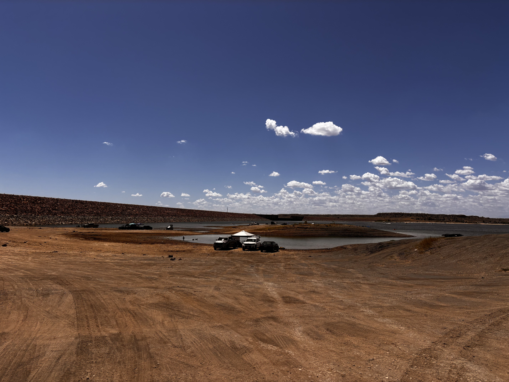

<br><details><summary>:camera:**66/IMG_0354.jpg**</summary><sub> `Exif version` 0232 `OS version` 27.0 `Date` 2026:07:18 11:44:03 `Aperture` Not known `Brightness` 10.832279785625945 `Color space` 65535 `Compression` Not known`Exposure mode` 0 `Exposure time` 0.00013900472616068947 `Focal length` 5.96 `Lens model` iPhone 15 Plus back dual wide camera 5.96mm f/1.6 `Lens specification` (1.5399999618512084, 5.96, 1.6, 2.4) `Orientation` 1 `Scene type` Not known `f number` 1.6 `White balance` 0 `Sensing method` 2 `Shutter speed` 12.812627498980008</sub><sub>`Coordinates & altitude` (38.28078333333333, -104.72951388888889, 1488.7076591154262)</sub><sub> :earth_americas:`Location over` [Google Maps](http://maps.google.com/maps?q=38.28078333333333,-104.72951388888889) or [Openstreet Map](https://www.openstreetmap.org/query?lat=38.28078333333333&lon=-104.72951388888889)</sub></details>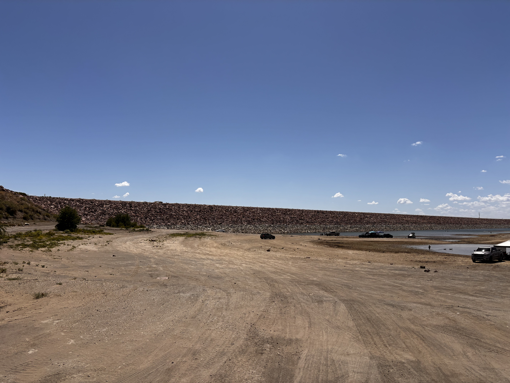

<br><details><summary>:camera:**66/IMG_0355.jpg**</summary><sub> `Exif version` 0232 `OS version` 27.0 `Date` 2026:07:18 11:44:04 `Aperture` Not known `Brightness` 10.73131557707829 `Color space` 65535 `Compression` Not known`Exposure mode` 0 `Exposure time` 0.00013900472616068947 `Focal length` 5.96 `Lens model` iPhone 15 Plus back dual wide camera 5.96mm f/1.6 `Lens specification` (1.5399999618512084, 5.96, 1.6, 2.4) `Orientation` 1 `Scene type` Not known `f number` 1.6 `White balance` 0 `Sensing method` 2 `Shutter speed` 12.812627498980008</sub><sub>`Coordinates & altitude` (38.28078333333333, -104.72950833333334, 1488.6919786096257)</sub><sub> :earth_americas:`Location over` [Google Maps](http://maps.google.com/maps?q=38.28078333333333,-104.72950833333334) or [Openstreet Map](https://www.openstreetmap.org/query?lat=38.28078333333333&lon=-104.72950833333334)</sub></details>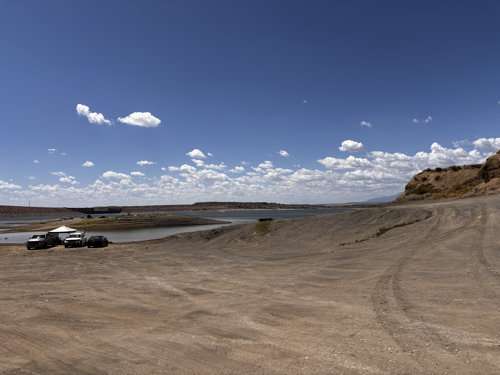

<br><details><summary>:camera:**66/IMG_0356.jpg**</summary><sub> `Exif version` 0232 `OS version` 27.0 `Date` 2026:07:18 11:44:07 `Aperture` Not known `Brightness` 10.800949769246204 `Color space` 65535 `Compression` Not known`Exposure mode` 0 `Exposure time` 0.00013900472616068947 `Focal length` 5.96 `Lens model` iPhone 15 Plus back dual wide camera 5.96mm f/1.6 `Lens specification` (1.5399999618512084, 5.96, 1.6, 2.4) `Orientation` 6 `Scene type` Not known `f number` 1.6 `White balance` 0 `Sensing method` 2 `Shutter speed` 12.812627498980008</sub><sub>`Coordinates & altitude` (38.28077777777778, -104.72949166666668, 1488.7605531295487)</sub><sub> :earth_americas:`Location over` [Google Maps](http://maps.google.com/maps?q=38.28077777777778,-104.72949166666668) or [Openstreet Map](https://www.openstreetmap.org/query?lat=38.28077777777778&lon=-104.72949166666668)</sub></details>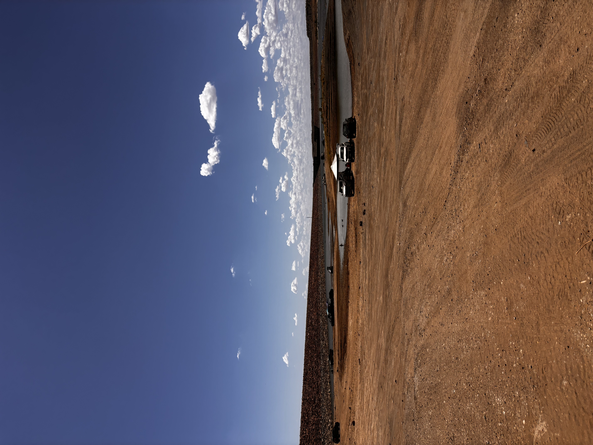

<br><details><summary>:camera:**66/IMG_0357.jpg**</summary><sub> `Exif version` 0232 `OS version` 27.0 `Date` 2026:07:18 11:44:08 `Aperture` Not known `Brightness` 10.691784059752292 `Color space` 65535 `Compression` Not known`Exposure mode` 0 `Exposure time` 0.00014900908955446283 `Focal length` 5.96 `Lens model` iPhone 15 Plus back dual wide camera 5.96mm f/1.6 `Lens specification` (1.5399999618512084, 5.96, 1.6, 2.4) `Orientation` 6 `Scene type` Not known `f number` 1.6 `White balance` 0 `Sensing method` 2 `Shutter speed` 12.712400050767863</sub><sub>`Coordinates & altitude` (38.280769444444445, -104.72947777777777, 1488.59302666276)</sub><sub> :earth_americas:`Location over` [Google Maps](http://maps.google.com/maps?q=38.280769444444445,-104.72947777777777) or [Openstreet Map](https://www.openstreetmap.org/query?lat=38.280769444444445&lon=-104.72947777777777)</sub></details>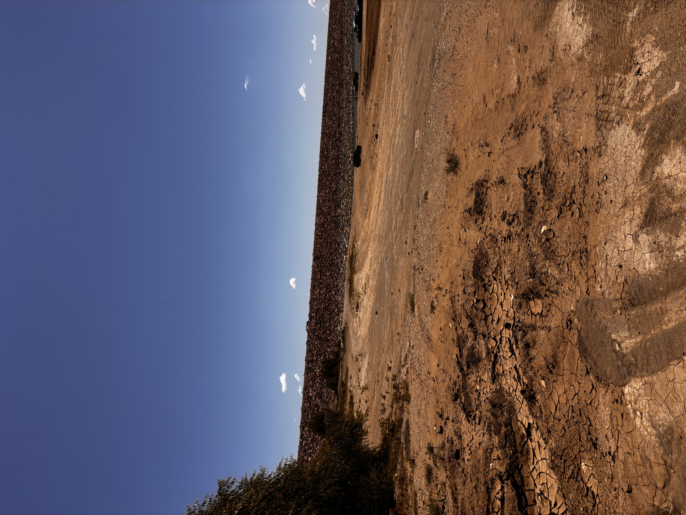

<br><details><summary>:camera:**66/IMG_0358.jpg**</summary><sub> `Exif version` 0232 `OS version` 27.0 `Date` 2026:07:18 11:44:12 `Aperture` Not known `Brightness` 9.83860875966139 `Color space` 65535 `Compression` Not known`Exposure mode` 0 `Exposure time` 0.0003020235578375113 `Focal length` 5.96 `Lens model` iPhone 15 Plus back dual wide camera 5.96mm f/1.6 `Lens specification` (1.5399999618512084, 5.96, 1.6, 2.4) `Orientation` 1 `Scene type` Not known `f number` 1.6 `White balance` 0 `Sensing method` 2 `Shutter speed` 11.693163830629205</sub><sub>`Coordinates & altitude` (38.280769444444445, -104.72947777777777, 1488.6072144288578)</sub><sub> :earth_americas:`Location over` [Google Maps](http://maps.google.com/maps?q=38.280769444444445,-104.72947777777777) or [Openstreet Map](https://www.openstreetmap.org/query?lat=38.280769444444445&lon=-104.72947777777777)</sub></details>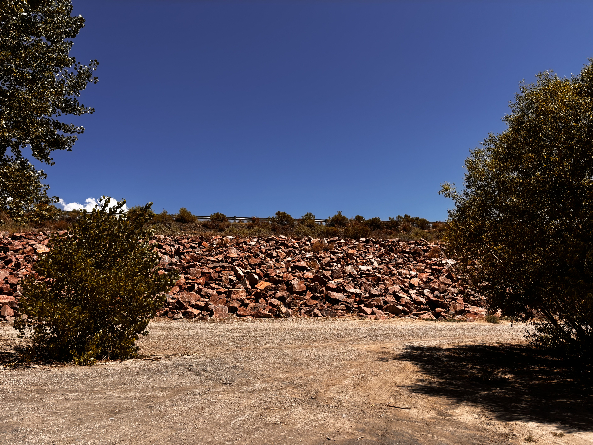

<br><details><summary>:camera:**66/IMG_0359.jpg**</summary><sub> `Exif version` 0232 `OS version` 27.0 `Date` 2026:07:18 11:44:34 `Aperture` Not known `Brightness` 9.689869753979739 `Color space` 65535 `Compression` Not known`Exposure mode` 0 `Exposure time` 0.0003219575016097875 `Focal length` 5.96 `Lens model` iPhone 15 Plus back dual wide camera 5.96mm f/1.6 `Lens specification` (1.5399999618512084, 5.96, 1.6, 2.4) `Orientation` 1 `Scene type` Not known `f number` 1.6 `White balance` 0 `Sensing method` 2 `Shutter speed` 11.60065170166546</sub><sub>`Coordinates & altitude` (38.28082777777778, -104.72968333333334, 1490.4006211180124)</sub><sub> :earth_americas:`Location over` [Google Maps](http://maps.google.com/maps?q=38.28082777777778,-104.72968333333334) or [Openstreet Map](https://www.openstreetmap.org/query?lat=38.28082777777778&lon=-104.72968333333334)</sub></details>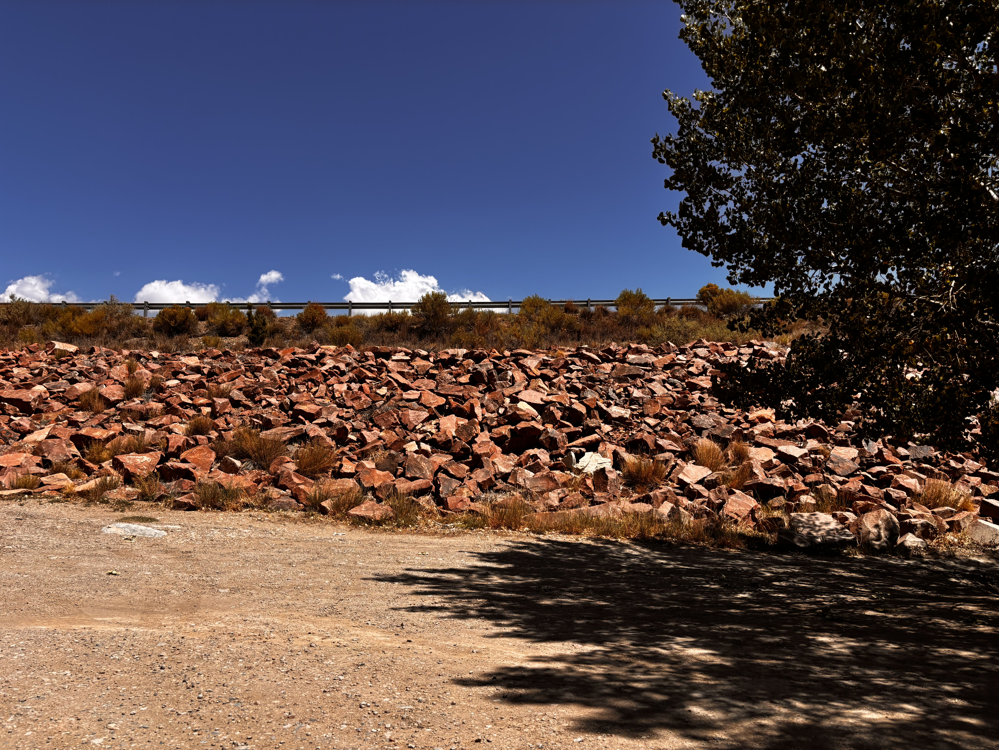

<br><details><summary>:camera:**66/IMG_0360.jpg**</summary><sub> `Exif version` 0232 `OS version` 27.0 `Date` 2026:07:18 11:44:40 `Aperture` Not known `Brightness` 9.979061991851351 `Color space` 65535 `Compression` Not known`Exposure mode` 0 `Exposure time` 0.000273972602739726 `Focal length` 5.96 `Lens model` iPhone 15 Plus back dual wide camera 5.96mm f/1.6 `Lens specification` (1.5399999618512084, 5.96, 1.6, 2.4) `Orientation` 1 `Scene type` Not known `f number` 1.6 `White balance` 0 `Sensing method` 2 `Shutter speed` 11.83353647919206</sub><sub>`Coordinates & altitude` (38.28092222222222, -104.72974444444445, 1489.8297682709447)</sub><sub> :earth_americas:`Location over` [Google Maps](http://maps.google.com/maps?q=38.28092222222222,-104.72974444444445) or [Openstreet Map](https://www.openstreetmap.org/query?lat=38.28092222222222&lon=-104.72974444444445)</sub></details>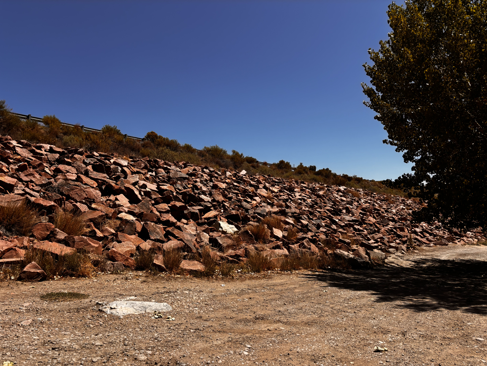

<br><details><summary>:camera:**66/IMG_0361.jpg**</summary><sub> `Exif version` 0232 `OS version` 27.0 `Date` 2026:07:18 11:45:59 `Aperture` Not known `Brightness` 9.927446897126197 `Color space` 65535 `Compression` Not known`Exposure mode` 0 `Exposure time` 0.0002449779519843214 `Focal length` 5.96 `Lens model` iPhone 15 Plus back dual wide camera 5.96mm f/1.6 `Lens specification` (1.5399999618512084, 5.96, 1.6, 2.4) `Orientation` 1 `Scene type` Not known `f number` 1.6 `White balance` 0 `Sensing method` 2 `Shutter speed` 11.994930629669156</sub><sub>`Coordinates & altitude` (38.27943333333333, -104.7356638888889, 1502.674775928297)</sub><sub> :earth_americas:`Location over` [Google Maps](http://maps.google.com/maps?q=38.27943333333333,-104.7356638888889) or [Openstreet Map](https://www.openstreetmap.org/query?lat=38.27943333333333&lon=-104.7356638888889)</sub></details>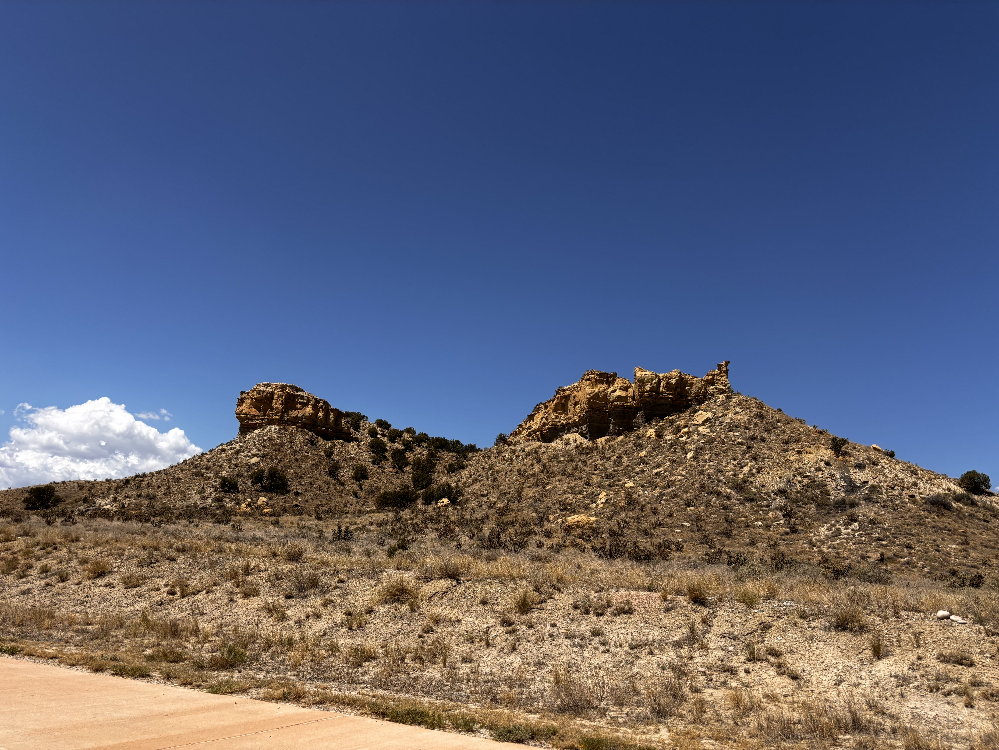

<br><details><summary>:camera:**66/IMG_0362.jpg**</summary><sub> `Exif version` 0232 `OS version` 27.0 `Date` 2026:07:18 11:47:09 `Aperture` Not known `Brightness` 10.239007941789787 `Color space` 65535 `Compression` Not known`Exposure mode` 0 `Exposure time` 0.00020601565718994644 `Focal length` 5.96 `Lens model` iPhone 15 Plus back dual wide camera 5.96mm f/1.6 `Lens specification` (1.5399999618512084, 5.96, 1.6, 2.4) `Orientation` 1 `Scene type` Not known `f number` 1.6 `White balance` 0 `Sensing method` 2 `Shutter speed` 12.245068045152442</sub><sub>`Coordinates & altitude` (38.279177777777775, -104.74677222222222, 1510.6904969485615)</sub><sub> :earth_americas:`Location over` [Google Maps](http://maps.google.com/maps?q=38.279177777777775,-104.74677222222222) or [Openstreet Map](https://www.openstreetmap.org/query?lat=38.279177777777775&lon=-104.74677222222222)</sub></details>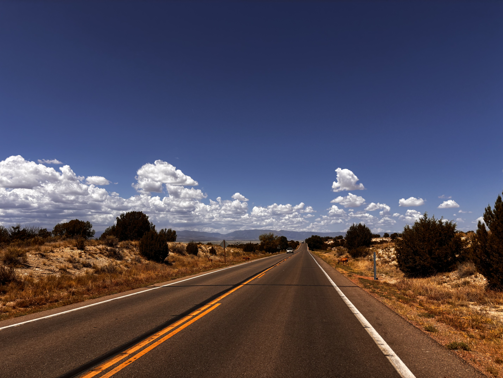

<br><details><summary>:camera:**66/IMG_0363.jpg**</summary><sub> `Exif version` 0232 `OS version` 27.0 `Date` 2026:07:18 11:47:17 `Aperture` Not known `Brightness` 10.58092974540767 `Color space` 65535 `Compression` Not known`Exposure mode` 0 `Exposure time` 0.00016801075268817206 `Focal length` 5.96 `Lens model` iPhone 15 Plus back dual wide camera 5.96mm f/1.6 `Lens specification` (1.5399999618512084, 5.96, 1.6, 2.4) `Orientation` 1 `Scene type` Not known `f number` 1.6 `White balance` 0 `Sensing method` 2 `Shutter speed` 12.539251137291497</sub><sub>`Coordinates & altitude` (38.27914166666667, -104.7472, 1509.710396039604)</sub><sub> :earth_americas:`Location over` [Google Maps](http://maps.google.com/maps?q=38.27914166666667,-104.7472) or [Openstreet Map](https://www.openstreetmap.org/query?lat=38.27914166666667&lon=-104.7472)</sub></details>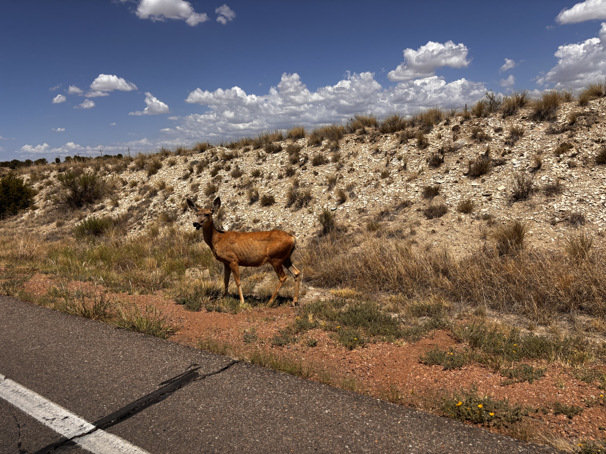

<br><details><summary>:camera:**66/IMG_0364.jpg**</summary><sub> `Exif version` 0232 `OS version` 27.0 `Date` 2026:07:18 11:48:32 `Aperture` Not known `Brightness` 10.235074286755992 `Color space` 65535 `Compression` Not known`Exposure mode` 0 `Exposure time` 0.00021598272138228941 `Focal length` 5.96 `Lens model` iPhone 15 Plus back dual wide camera 5.96mm f/1.6 `Lens specification` (1.5399999618512084, 5.96, 1.6, 2.4) `Orientation` 1 `Scene type` Not known `f number` 1.6 `White balance` 0 `Sensing method` 2 `Shutter speed` 12.176681061073412</sub><sub>`Coordinates & altitude` (38.278525, -104.75724166666667, 1508.4339035769829)</sub><sub> :earth_americas:`Location over` [Google Maps](http://maps.google.com/maps?q=38.278525,-104.75724166666667) or [Openstreet Map](https://www.openstreetmap.org/query?lat=38.278525&lon=-104.75724166666667)</sub></details>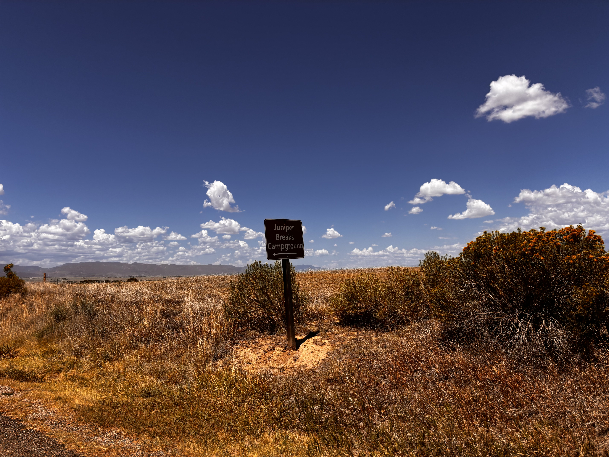

<br><details><summary>:camera:**66/IMG_0365.jpg**</summary><sub> `Exif version` 0232 `OS version` 27.0 `Date` 2026:07:18 11:49:00 `Aperture` Not known `Brightness` 10.673112438891907 `Color space` 65535 `Compression` Not known`Exposure mode` 0 `Exposure time` 0.00015800284405119292 `Focal length` 5.96 `Lens model` iPhone 15 Plus back dual wide camera 5.96mm f/1.6 `Lens specification` (1.5399999618512084, 5.96, 1.6, 2.4) `Orientation` 1 `Scene type` Not known `f number` 1.6 `White balance` 0 `Sensing method` 2 `Shutter speed` 12.627787823990356</sub><sub>`Coordinates & altitude` (38.276780555555554, -104.7590111111111, 1507.7122328666176)</sub><sub> :earth_americas:`Location over` [Google Maps](http://maps.google.com/maps?q=38.276780555555554,-104.7590111111111) or [Openstreet Map](https://www.openstreetmap.org/query?lat=38.276780555555554&lon=-104.7590111111111)</sub></details>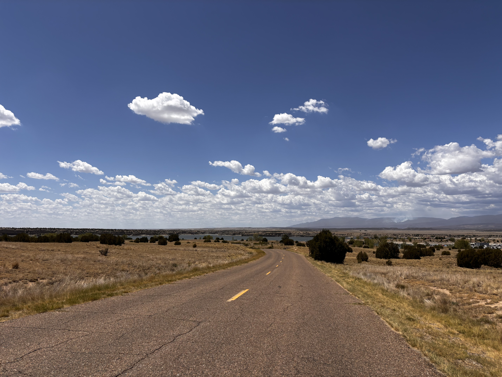

<br><details><summary>:camera:**66/IMG_0366.jpg**</summary><sub> `Exif version` 0232 `OS version` 27.0 `Date` 2026:07:18 11:49:52 `Aperture` Not known `Brightness` 10.398871968415115 `Color space` 65535 `Compression` Not known`Exposure mode` 0 `Exposure time` 0.00018698578908002991 `Focal length` 5.96 `Lens model` iPhone 15 Plus back dual wide camera 5.96mm f/1.6 `Lens specification` (1.5399999618512084, 5.96, 1.6, 2.4) `Orientation` 1 `Scene type` Not known `f number` 1.6 `White balance` 0 `Sensing method` 2 `Shutter speed` 12.384674110125012</sub><sub>`Coordinates & altitude` (38.27263611111111, -104.76113055555555, 1496.1271428571429)</sub><sub> :earth_americas:`Location over` [Google Maps](http://maps.google.com/maps?q=38.27263611111111,-104.76113055555555) or [Openstreet Map](https://www.openstreetmap.org/query?lat=38.27263611111111&lon=-104.76113055555555)</sub></details>

<br><details><summary>:camera:**66/IMG_0367.jpg**</summary><sub> `Exif version` 0232 `OS version` 27.0 `Date` 2026:07:18 11:49:59 `Aperture` Not known `Brightness` 10.388436438164069 `Color space` 65535 `Compression` Not known`Exposure mode` 0 `Exposure time` 0.00019700551615445234 `Focal length` 5.96 `Lens model` iPhone 15 Plus back dual wide camera 5.96mm f/1.6 `Lens specification` (1.5399999618512084, 5.96, 1.6, 2.4) `Orientation` 1 `Scene type` Not known `f number` 1.6 `White balance` 0 `Sensing method` 2 `Shutter speed` 12.309516750667061</sub><sub>`Coordinates & altitude` (38.27255, -104.76123888888888, 1496.0049504950496)</sub><sub> :earth_americas:`Location over` [Google Maps](http://maps.google.com/maps?q=38.27255,-104.76123888888888) or [Openstreet Map](https://www.openstreetmap.org/query?lat=38.27255&lon=-104.76123888888888)</sub></details>

<br><details><summary>:camera:**66/IMG_0368.jpg**</summary><sub> `Exif version` 0232 `OS version` 27.0 `Date` 2026:07:18 11:50:02 `Aperture` Not known `Brightness` 10.422753322765516 `Color space` 65535 `Compression` Not known`Exposure mode` 0 `Exposure time` 0.00018698578908002991 `Focal length` 5.96 `Lens model` iPhone 15 Plus back dual wide camera 5.96mm f/1.6 `Lens specification` (5.96, 5.960000038146973, 1.6, 1.6) `Orientation` 1 `Scene type` Not known `f number` 1.6 `White balance` 0 `Sensing method` 2 `Shutter speed` 12.384674110125012</sub><sub>`Coordinates & altitude` (38.27254444444444, -104.76123888888888, 1496.1242124212422)</sub><sub> :earth_americas:`Location over` [Google Maps](http://maps.google.com/maps?q=38.27254444444444,-104.76123888888888) or [Openstreet Map](https://www.openstreetmap.org/query?lat=38.27254444444444&lon=-104.76123888888888)</sub></details>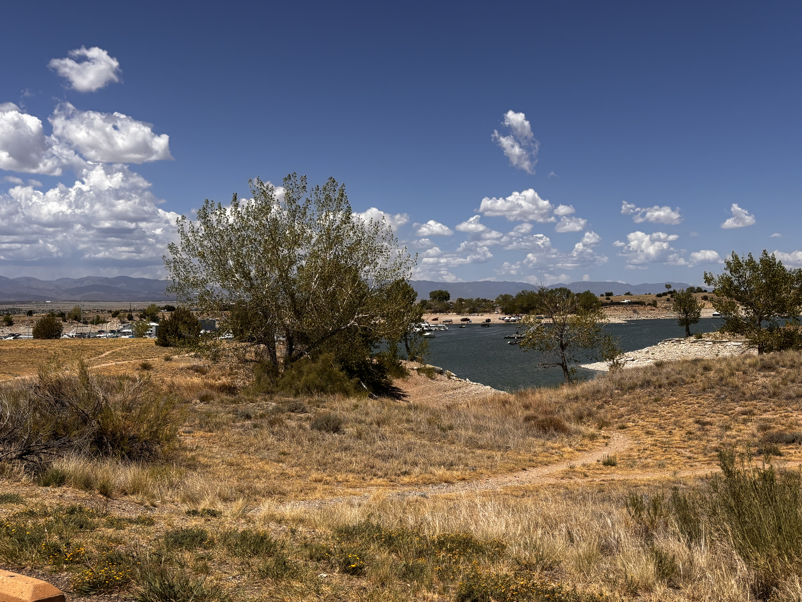

<br><details><summary>:camera:**66/IMG_0369.jpg**</summary><sub> `Exif version` 0232 `OS version` 27.0 `Date` 2026:07:18 11:50:33 `Aperture` Not known `Brightness` 10.615047061816332 `Color space` 65535 `Compression` Not known`Exposure mode` 0 `Exposure time` 0.00015800284405119292 `Focal length` 5.96 `Lens model` iPhone 15 Plus back dual wide camera 5.96mm f/1.6 `Lens specification` (1.5399999618512084, 5.96, 1.6, 2.4) `Orientation` 1 `Scene type` Not known `f number` 1.6 `White balance` 0 `Sensing method` 2 `Shutter speed` 12.627787823990356</sub><sub>`Coordinates & altitude` (38.27191666666666, -104.76130555555555, 1494.6365384615385)</sub><sub> :earth_americas:`Location over` [Google Maps](http://maps.google.com/maps?q=38.27191666666666,-104.76130555555555) or [Openstreet Map](https://www.openstreetmap.org/query?lat=38.27191666666666&lon=-104.76130555555555)</sub></details>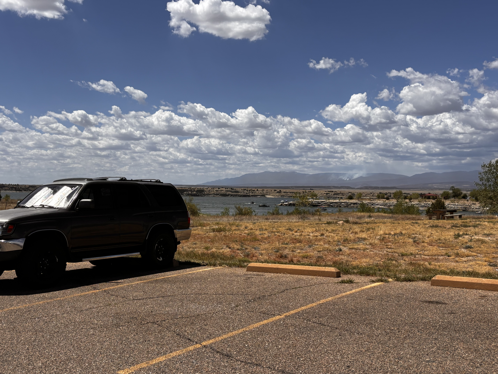

<br><details><summary>:camera:**66/IMG_0370.jpg**</summary><sub> `Exif version` 0232 `OS version` 27.0 `Date` 2026:07:18 11:50:40 `Aperture` Not known `Brightness` 10.623903840338675 `Color space` 65535 `Compression` Not known`Exposure mode` 0 `Exposure time` 0.00015800284405119292 `Focal length` 5.96 `Lens model` iPhone 15 Plus back dual wide camera 5.96mm f/1.6 `Lens specification` (1.5399999618512084, 5.96, 1.6, 2.4) `Orientation` 1 `Scene type` Not known `f number` 1.6 `White balance` 0 `Sensing method` 2 `Shutter speed` 12.627787823990356</sub><sub>`Coordinates & altitude` (38.27178055555555, -104.76116111111111, 1493.4655462184874)</sub><sub> :earth_americas:`Location over` [Google Maps](http://maps.google.com/maps?q=38.27178055555555,-104.76116111111111) or [Openstreet Map](https://www.openstreetmap.org/query?lat=38.27178055555555&lon=-104.76116111111111)</sub></details>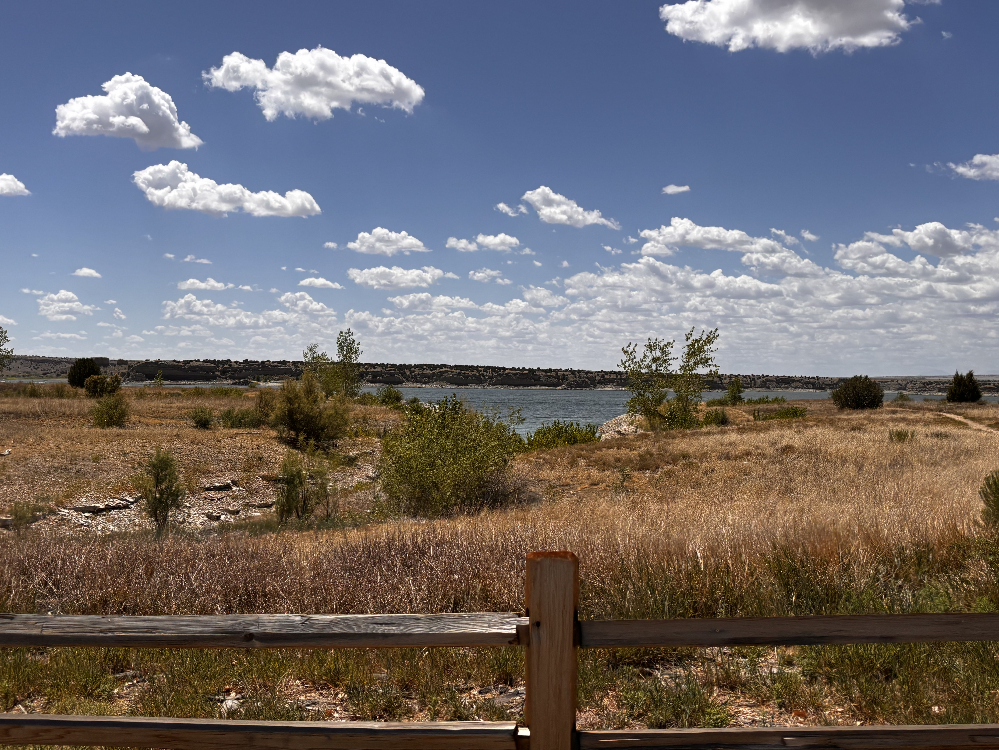

<br><details><summary>:camera:**66/IMG_0371.jpg**</summary><sub> `Exif version` 0232 `OS version` 27.0 `Date` 2026:07:18 11:51:50 `Aperture` Not known `Brightness` 10.539659938018259 `Color space` 65535 `Compression` Not known`Exposure mode` 0 `Exposure time` 0.00016801075268817206 `Focal length` 5.96 `Lens model` iPhone 15 Plus back dual wide camera 5.96mm f/1.6 `Lens specification` (1.5399999618512084, 5.96, 1.6, 2.4) `Orientation` 1 `Scene type` Not known `f number` 1.6 `White balance` 0 `Sensing method` 2 `Shutter speed` 12.539251137291497</sub><sub>`Coordinates & altitude` (38.27142222222222, -104.75836944444444, 1496.2926692781198)</sub><sub> :earth_americas:`Location over` [Google Maps](http://maps.google.com/maps?q=38.27142222222222,-104.75836944444444) or [Openstreet Map](https://www.openstreetmap.org/query?lat=38.27142222222222&lon=-104.75836944444444)</sub></details>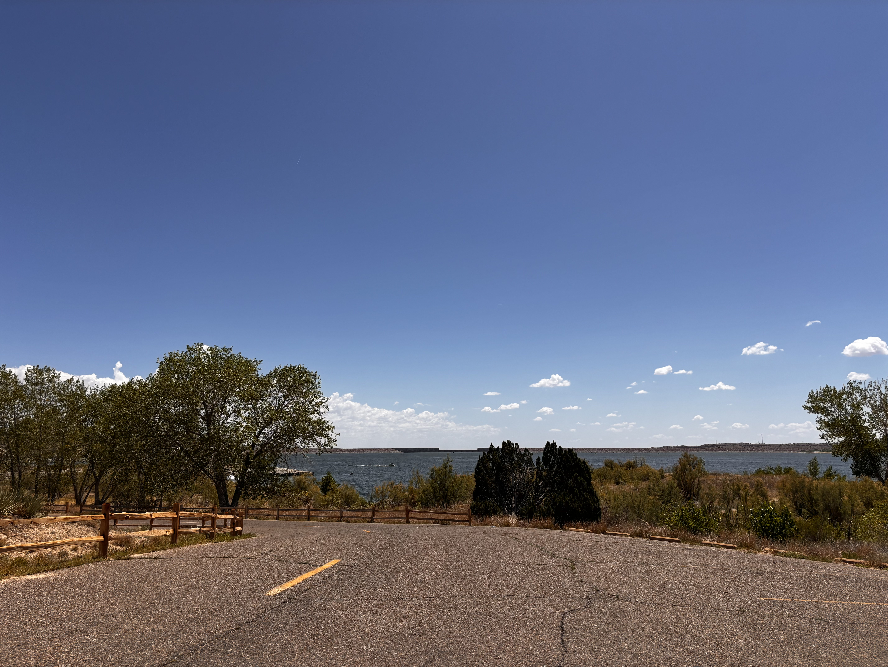

<br><details><summary>:camera:**66/IMG_0372.jpg**</summary><sub> `Exif version` 0232 `OS version` 27.0 `Date` 2026:07:18 11:52:25 `Aperture` Not known `Brightness` 10.49526582452601 `Color space` 65535 `Compression` Not known`Exposure mode` 0 `Exposure time` 0.00018698578908002991 `Focal length` 5.96 `Lens model` iPhone 15 Plus back dual wide camera 5.96mm f/1.6 `Lens specification` (1.5399999618512084, 5.96, 1.6, 2.4) `Orientation` 1 `Scene type` Not known `f number` 1.6 `White balance` 0 `Sensing method` 2 `Shutter speed` 12.384674110125012</sub><sub>`Coordinates & altitude` (38.271391666666666, -104.75830833333333, 1495.559989287627)</sub><sub> :earth_americas:`Location over` [Google Maps](http://maps.google.com/maps?q=38.271391666666666,-104.75830833333333) or [Openstreet Map](https://www.openstreetmap.org/query?lat=38.271391666666666&lon=-104.75830833333333)</sub></details>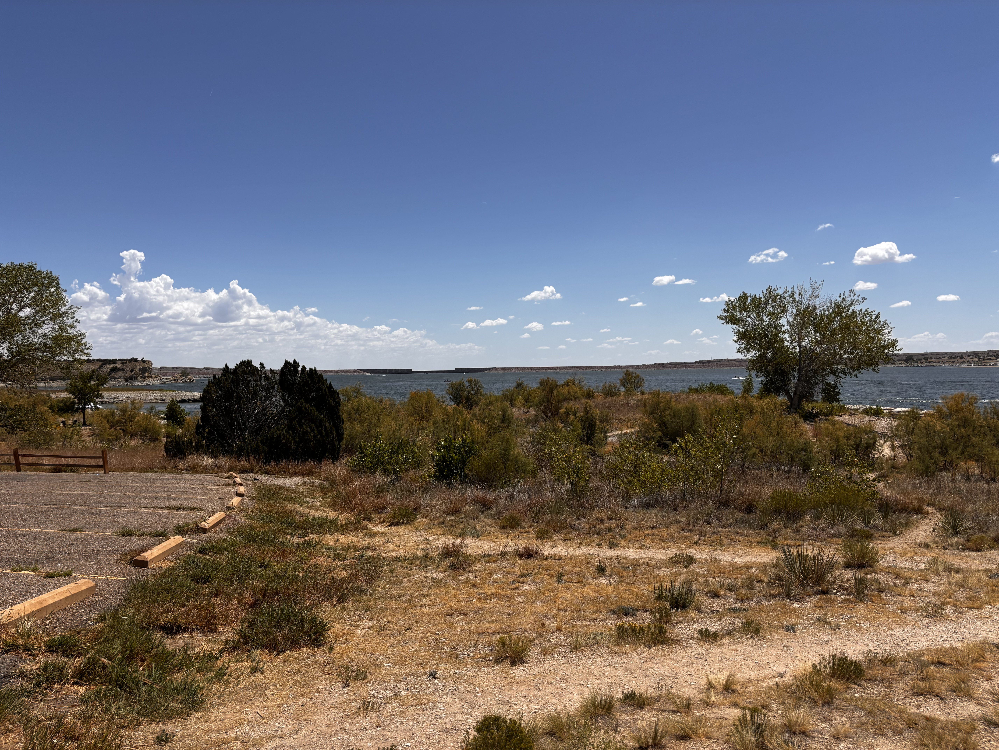

<br><details><summary>:camera:**66/IMG_0373.jpg**</summary><sub> `Exif version` 0232 `OS version` 27.0 `Date` 2026:07:18 11:52:28 `Aperture` Not known `Brightness` 10.658676207513416 `Color space` 65535 `Compression` Not known`Exposure mode` 0 `Exposure time` 0.00023501762632197415 `Focal length` 5.96 `Lens model` iPhone 15 Plus back dual wide camera 5.96mm f/1.6 `Lens specification` (1.5399999618512084, 5.96, 1.6, 2.4) `Orientation` 1 `Scene type` Not known `f number` 1.6 `White balance` 0 `Sensing method` 2 `Shutter speed` 12.055051610885204</sub><sub>`Coordinates & altitude` (38.271391666666666, -104.75830833333333, 1495.4002509410288)</sub><sub> :earth_americas:`Location over` [Google Maps](http://maps.google.com/maps?q=38.271391666666666,-104.75830833333333) or [Openstreet Map](https://www.openstreetmap.org/query?lat=38.271391666666666&lon=-104.75830833333333)</sub></details>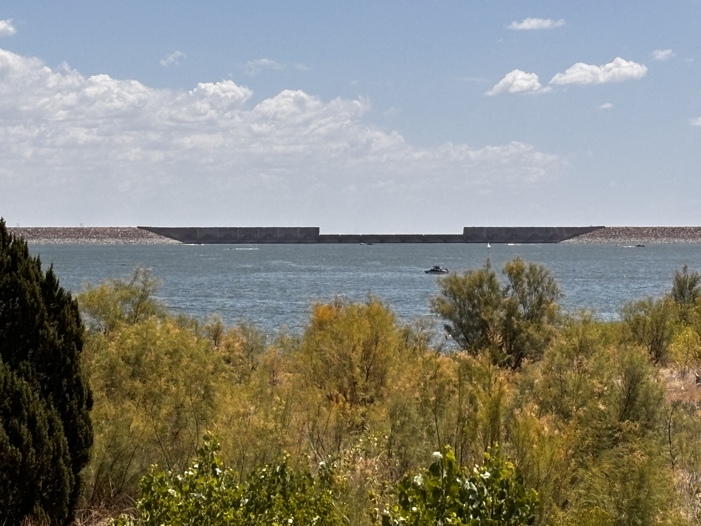

<br><details><summary>:camera:**66/IMG_0374.jpg**</summary><sub> `Exif version` 0232 `OS version` 27.0 `Date` 2026:07:18 11:52:31 `Aperture` Not known `Brightness` 10.776084517576663 `Color space` 65535 `Compression` Not known`Exposure mode` 0 `Exposure time` 0.00021598272138228941 `Focal length` 5.96 `Lens model` iPhone 15 Plus back dual wide camera 5.96mm f/1.6 `Lens specification` (1.5399999618512084, 5.96, 1.6, 2.4) `Orientation` 6 `Scene type` Not known `f number` 1.6 `White balance` 0 `Sensing method` 2 `Shutter speed` 12.176681061073412</sub><sub>`Coordinates & altitude` (38.271391666666666, -104.75830833333333, 1495.445955619184)</sub><sub> :earth_americas:`Location over` [Google Maps](http://maps.google.com/maps?q=38.271391666666666,-104.75830833333333) or [Openstreet Map](https://www.openstreetmap.org/query?lat=38.271391666666666&lon=-104.75830833333333)</sub></details>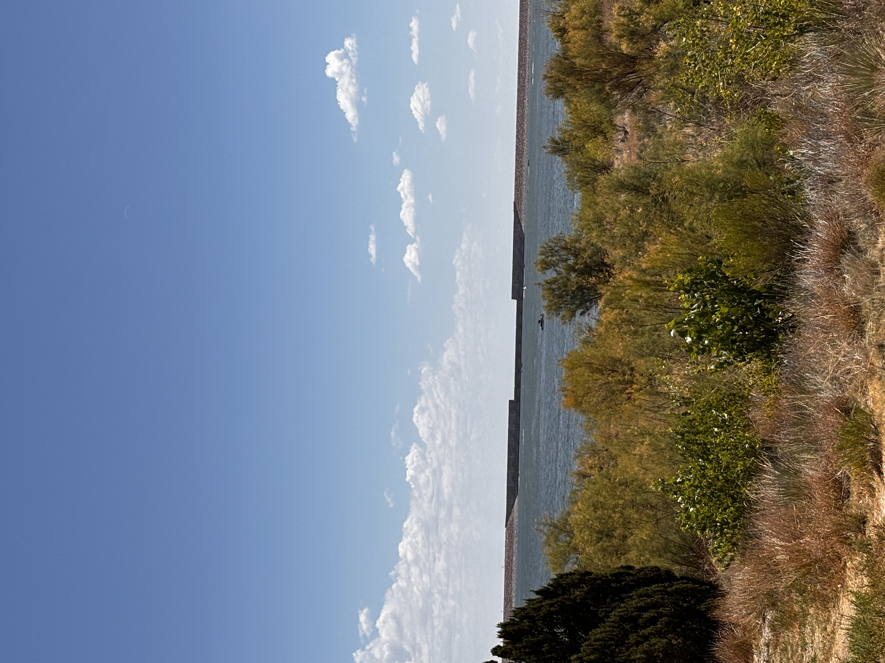

<br><details><summary>:camera:**66/IMG_0375.jpg**</summary><sub> `Exif version` 0232 `OS version` 27.0 `Date` 2026:07:18 11:52:35 `Aperture` Not known `Brightness` 10.721807834686999 `Color space` 65535 `Compression` Not known`Exposure mode` 0 `Exposure time` 0.0006071645415907711 `Focal length` 1.54 `Lens model` iPhone 15 Plus back dual wide camera 1.54mm f/2.4 `Lens specification` (1.54, 5.960000038146973, 1.6, 2.4) `Orientation` 1 `Scene type` Not known `f number` 2.4 `White balance` 0 `Sensing method` 2 `Shutter speed` 10.686015863183082</sub><sub>`Coordinates & altitude` (38.271391666666666, -104.75831666666667, 1495.2866141732284)</sub><sub> :earth_americas:`Location over` [Google Maps](http://maps.google.com/maps?q=38.271391666666666,-104.75831666666667) or [Openstreet Map](https://www.openstreetmap.org/query?lat=38.271391666666666&lon=-104.75831666666667)</sub></details>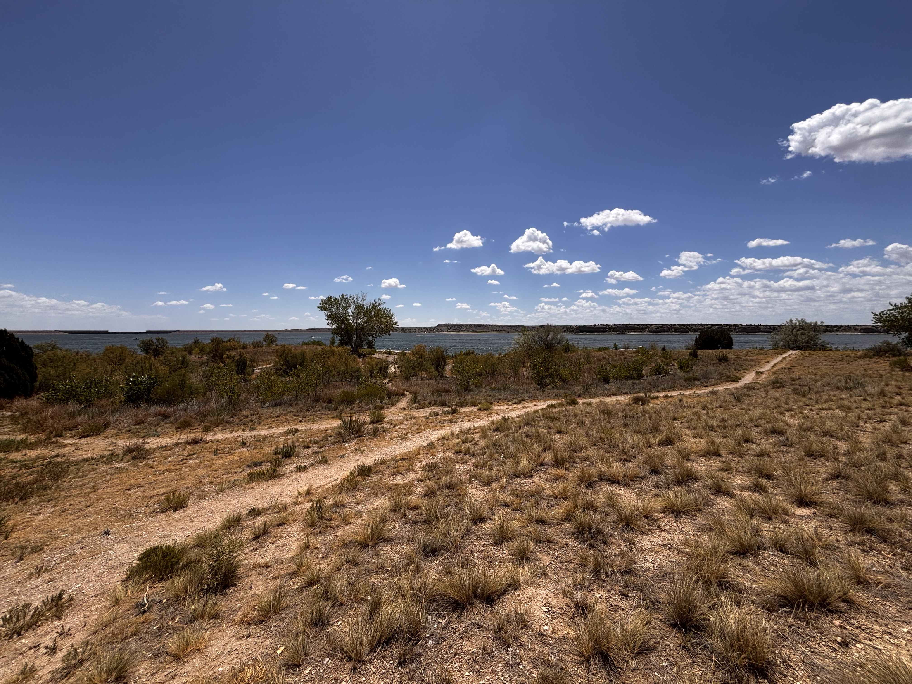

<br><details><summary>:camera:**66/IMG_0376.jpg**</summary><sub> `Exif version` 0232 `OS version` 27.0 `Date` 2026:07:18 11:52:39 `Aperture` Not known `Brightness` 10.580294390664369 `Color space` 65535 `Compression` Not known`Exposure mode` 0 `Exposure time` 0.0006720430107526882 `Focal length` 1.54 `Lens model` iPhone 15 Plus back dual wide camera 1.54mm f/2.4 `Lens specification` (1.54, 5.960000038146973, 1.6, 2.4) `Orientation` 1 `Scene type` Not known `f number` 2.4 `White balance` 0 `Sensing method` 2 `Shutter speed` 10.539251137291497</sub><sub>`Coordinates & altitude` (38.27139722222222, -104.75831666666667, 1495.2855172413792)</sub><sub> :earth_americas:`Location over` [Google Maps](http://maps.google.com/maps?q=38.27139722222222,-104.75831666666667) or [Openstreet Map](https://www.openstreetmap.org/query?lat=38.27139722222222&lon=-104.75831666666667)</sub></details>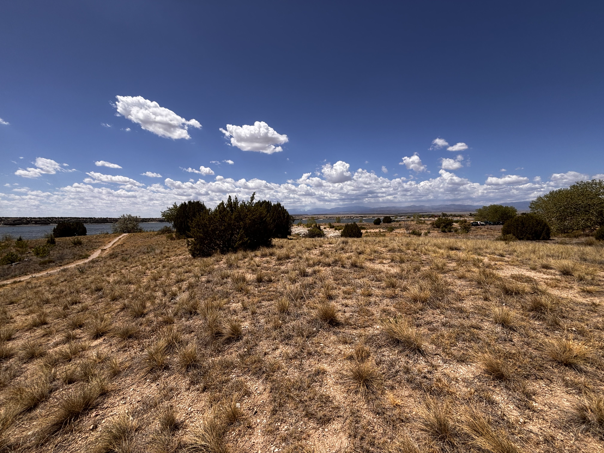

<br><details><summary>:camera:**66/IMG_0377.jpg**</summary><sub> `Exif version` 0232 `OS version` 27.0 `Date` 2026:07:18 11:57:39 `Aperture` Not known `Brightness` 10.554971745811441 `Color space` 65535 `Compression` Not known`Exposure mode` 0 `Exposure time` 0.00014900908955446283 `Focal length` 5.96 `Lens model` iPhone 15 Plus back dual wide camera 5.96mm f/1.6 `Lens specification` (1.5399999618512084, 5.96, 1.6, 2.4) `Orientation` 6 `Scene type` Not known `f number` 1.6 `White balance` 0 `Sensing method` 2 `Shutter speed` 12.712400050767863</sub><sub>`Coordinates & altitude` (38.28938333333333, -104.77172777777778, 1506.1978378378378)</sub><sub> :earth_americas:`Location over` [Google Maps](http://maps.google.com/maps?q=38.28938333333333,-104.77172777777778) or [Openstreet Map](https://www.openstreetmap.org/query?lat=38.28938333333333&lon=-104.77172777777778)</sub></details>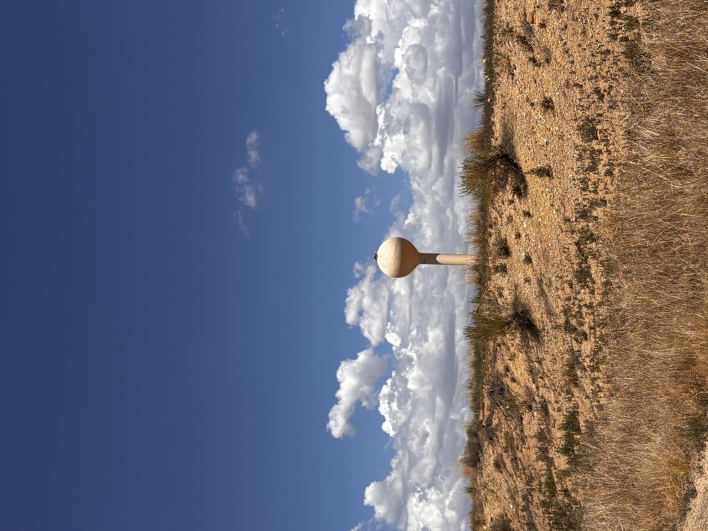

<br><details><summary>:camera:**66/IMG_0378.jpg**</summary><sub> `Exif version` 0232 `OS version` 27.0 `Date` 2026:07:18 11:57:48 `Aperture` Not known `Brightness` 10.569445938676708 `Color space` 65535 `Compression` Not known`Exposure mode` 0 `Exposure time` 0.00014900908955446283 `Focal length` 5.96 `Lens model` iPhone 15 Plus back dual wide camera 5.96mm f/1.6 `Lens specification` (1.5399999618512084, 5.96, 1.6, 2.4) `Orientation` 6 `Scene type` Not known `f number` 1.6 `White balance` 0 `Sensing method` 2 `Shutter speed` 12.712400050767863</sub><sub>`Coordinates & altitude` (38.28949444444444, -104.77368055555556, 1506.3179169701384)</sub><sub> :earth_americas:`Location over` [Google Maps](http://maps.google.com/maps?q=38.28949444444444,-104.77368055555556) or [Openstreet Map](https://www.openstreetmap.org/query?lat=38.28949444444444&lon=-104.77368055555556)</sub></details>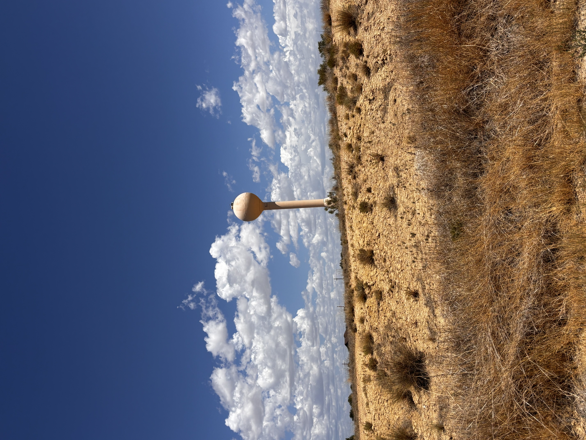

<br><details><summary>:camera:**66/IMG_0379.jpg**</summary><sub> `Exif version` 0232 `OS version` 27.0 `Date` 2026:07:18 11:57:51 `Aperture` Not known `Brightness` 10.408327439886845 `Color space` 65535 `Compression` Not known`Exposure mode` 0 `Exposure time` 0.00015800284405119292 `Focal length` 5.96 `Lens model` iPhone 15 Plus back dual wide camera 5.96mm f/1.6 `Lens specification` (1.5399999618512084, 5.96, 1.6, 2.4) `Orientation` 6 `Scene type` Not known `f number` 1.6 `White balance` 0 `Sensing method` 2 `Shutter speed` 12.627787823990356</sub><sub>`Coordinates & altitude` (38.289497222222224, -104.77413055555556, 1506.7446043165467)</sub><sub> :earth_americas:`Location over` [Google Maps](http://maps.google.com/maps?q=38.289497222222224,-104.77413055555556) or [Openstreet Map](https://www.openstreetmap.org/query?lat=38.289497222222224&lon=-104.77413055555556)</sub></details>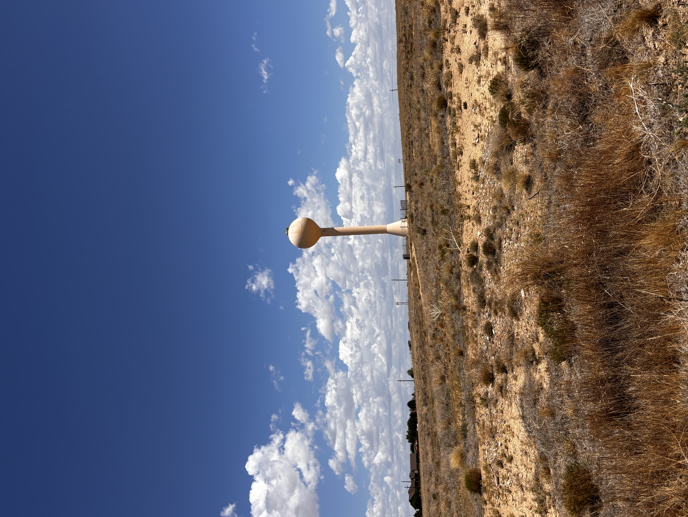

<br><details><summary>:camera:**66/IMG_0380.jpg**</summary><sub> `Exif version` 0232 `OS version` 27.0 `Date` 2026:07:18 12:00:43 `Aperture` Not known `Brightness` 10.52651037727922 `Color space` 65535 `Compression` Not known`Exposure mode` 0 `Exposure time` 0.00016801075268817206 `Focal length` 5.96 `Lens model` iPhone 15 Plus back dual wide camera 5.96mm f/1.6 `Lens specification` (1.5399999618512084, 5.96, 1.6, 2.4) `Orientation` 1 `Scene type` Not known `f number` 1.6 `White balance` 0 `Sensing method` 2 `Shutter speed` 12.539251137291497</sub><sub>`Coordinates & altitude` (38.273761111111114, -104.77188055555555, 1505.6970873786408)</sub><sub> :earth_americas:`Location over` [Google Maps](http://maps.google.com/maps?q=38.273761111111114,-104.77188055555555) or [Openstreet Map](https://www.openstreetmap.org/query?lat=38.273761111111114&lon=-104.77188055555555)</sub></details>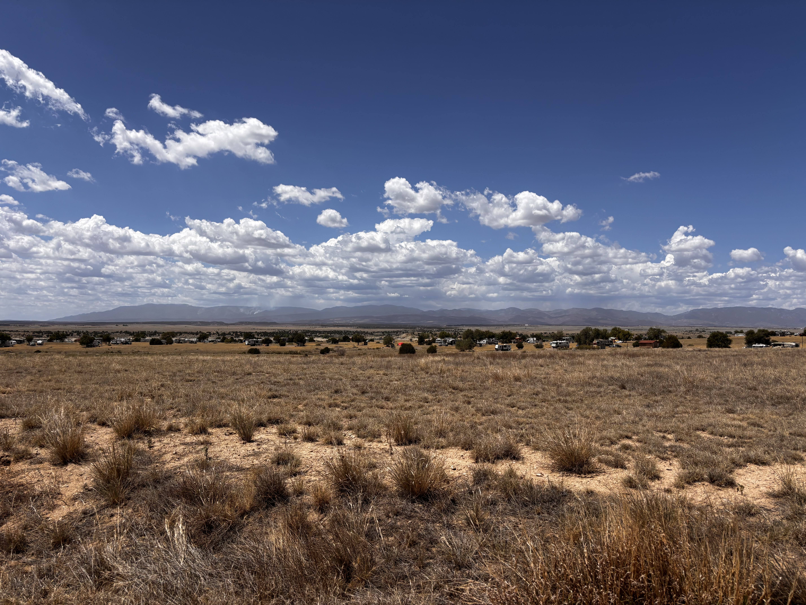

<br><details><summary>:camera:**66/IMG_0381.jpg**</summary><sub> `Exif version` 0232 `OS version` 27.0 `Date` 2026:07:18 12:03:19 `Aperture` Not known `Brightness` 10.325736531559846 `Color space` 65535 `Compression` Not known`Exposure mode` 0 `Exposure time` 0.00019700551615445234 `Focal length` 5.96 `Lens model` iPhone 15 Plus back dual wide camera 5.96mm f/1.6 `Lens specification` (1.5399999618512084, 5.96, 1.6, 2.4) `Orientation` 1 `Scene type` Not known `f number` 1.6 `White balance` 0 `Sensing method` 2 `Shutter speed` 12.309516750667061</sub><sub>`Coordinates & altitude` (38.27126388888889, -104.76883611111111, 1494.703069657615)</sub><sub> :earth_americas:`Location over` [Google Maps](http://maps.google.com/maps?q=38.27126388888889,-104.76883611111111) or [Openstreet Map](https://www.openstreetmap.org/query?lat=38.27126388888889&lon=-104.76883611111111)</sub></details>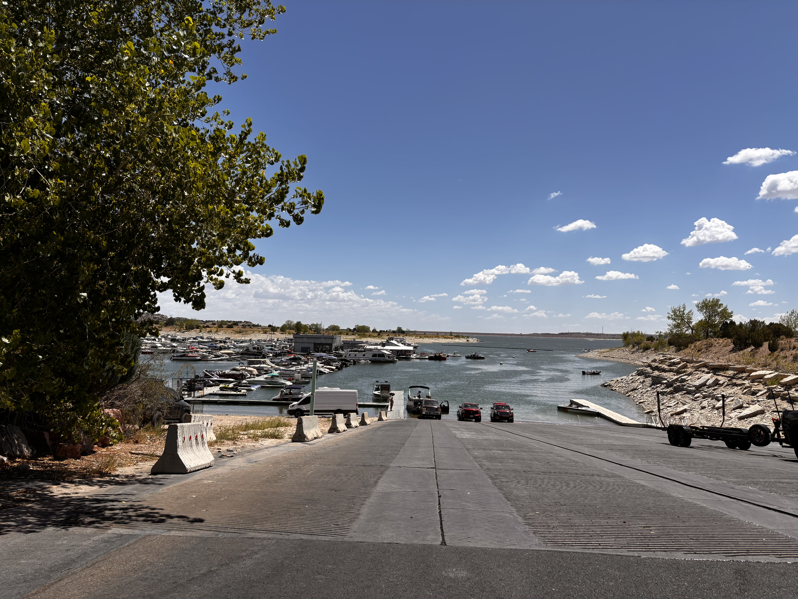

<br><details><summary>:camera:**66/IMG_0382.jpg**</summary><sub> `Exif version` 0232 `OS version` 27.0 `Date` 2026:07:18 12:03:21 `Aperture` Not known `Brightness` 10.352416718450275 `Color space` 65535 `Compression` Not known`Exposure mode` 0 `Exposure time` 0.00018698578908002991 `Focal length` 5.96 `Lens model` iPhone 15 Plus back dual wide camera 5.96mm f/1.6 `Lens specification` (1.5399999618512084, 5.96, 1.6, 2.4) `Orientation` 6 `Scene type` Not known `f number` 1.6 `White balance` 0 `Sensing method` 2 `Shutter speed` 12.384674110125012</sub><sub>`Coordinates & altitude` (38.27126666666667, -104.76884444444444, 1495.8333187044677)</sub><sub> :earth_americas:`Location over` [Google Maps](http://maps.google.com/maps?q=38.27126666666667,-104.76884444444444) or [Openstreet Map](https://www.openstreetmap.org/query?lat=38.27126666666667&lon=-104.76884444444444)</sub></details>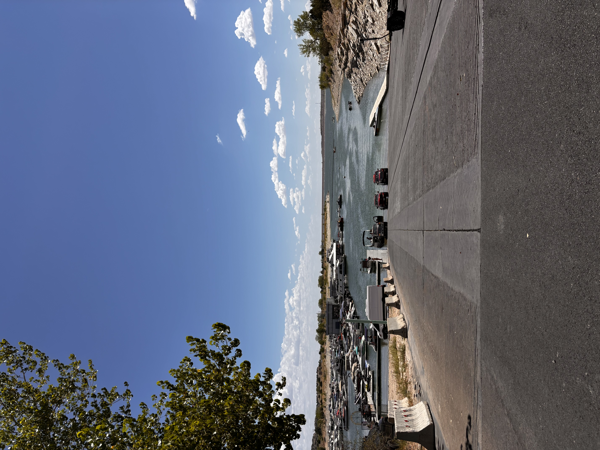

<br><details><summary>:camera:**66/IMG_0383.jpg**</summary><sub> `Exif version` 0232 `OS version` 27.0 `Date` 2026:07:18 12:03:24 `Aperture` Not known `Brightness` 10.338787777592252 `Color space` 65535 `Compression` Not known`Exposure mode` 0 `Exposure time` 0.000643915003219575 `Focal length` 1.54 `Lens model` iPhone 15 Plus back dual wide camera 1.54mm f/2.4 `Lens specification` (1.54, 5.960000038146973, 1.6, 2.4) `Orientation` 6 `Scene type` Not known `f number` 2.4 `White balance` 0 `Sensing method` 2 `Shutter speed` 10.60065170166546</sub><sub>`Coordinates & altitude` (38.27126666666667, -104.76885277777778, 1495.703069657615)</sub><sub> :earth_americas:`Location over` [Google Maps](http://maps.google.com/maps?q=38.27126666666667,-104.76885277777778) or [Openstreet Map](https://www.openstreetmap.org/query?lat=38.27126666666667&lon=-104.76885277777778)</sub></details>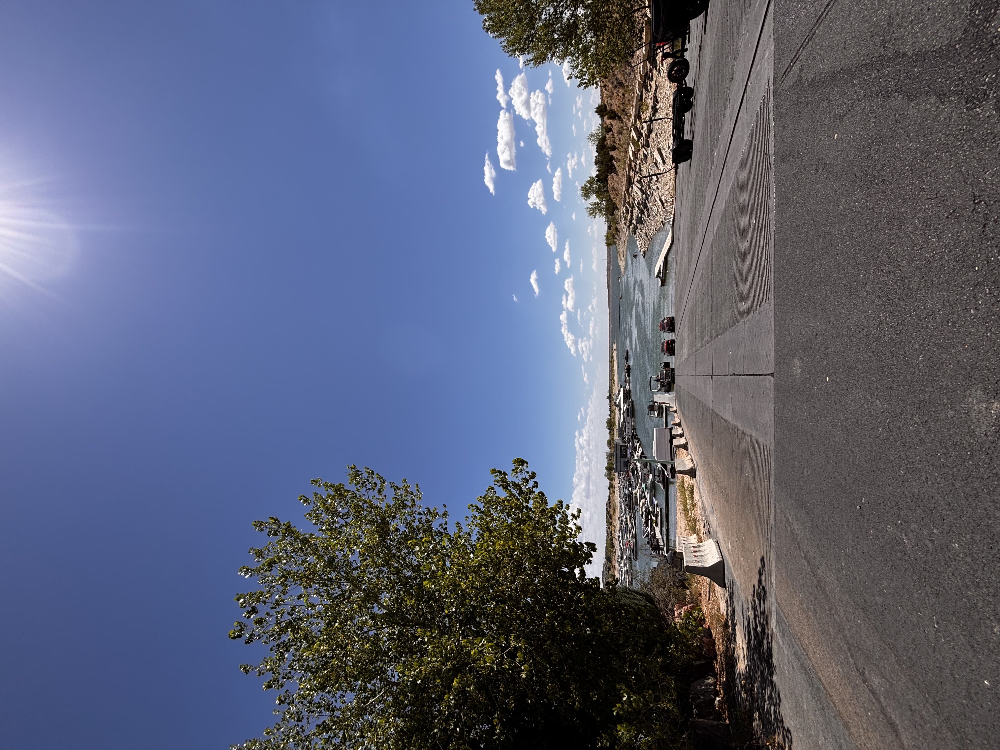

<br><details><summary>:camera:**66/IMG_0384.jpg**</summary><sub> `Exif version` 0232 `OS version` 27.0 `Date` 2026:07:18 12:03:27 `Aperture` Not known `Brightness` 10.210438372321605 `Color space` 65535 `Compression` Not known`Exposure mode` 0 `Exposure time` 0.0006811989100817438 `Focal length` 1.54 `Lens model` iPhone 15 Plus back dual wide camera 1.54mm f/2.4 `Lens specification` (1.54, 5.960000038146973, 1.6, 2.4) `Orientation` 1 `Scene type` Not known `f number` 2.4 `White balance` 0 `Sensing method` 2 `Shutter speed` 10.520057581573896</sub><sub>`Coordinates & altitude` (38.27126944444444, -104.76885277777778, 1495.7186932849365)</sub><sub> :earth_americas:`Location over` [Google Maps](http://maps.google.com/maps?q=38.27126944444444,-104.76885277777778) or [Openstreet Map](https://www.openstreetmap.org/query?lat=38.27126944444444&lon=-104.76885277777778)</sub></details>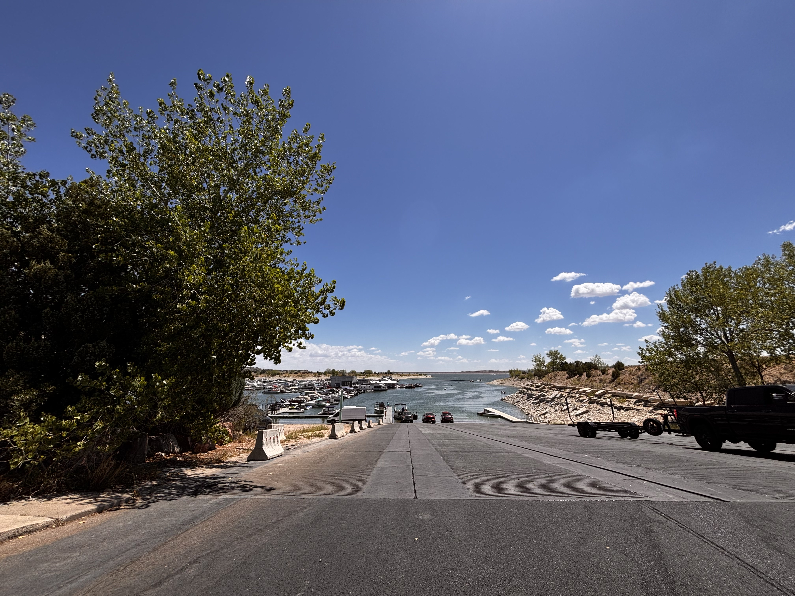

<br><details><summary>:camera:**66/IMG_0385.jpg**</summary><sub> `Exif version` 0232 `OS version` 27.0 `Date` 2026:07:18 12:11:56 `Aperture` Not known `Brightness` 10.74273869808202 `Color space` 65535 `Compression` Not known`Exposure mode` 0 `Exposure time` 0.000505050505050505 `Focal length` 1.54 `Lens model` iPhone 15 Plus back dual wide camera 1.54mm f/2.4 `Lens specification` (1.54, 5.960000038146973, 1.6, 2.4) `Orientation` 1 `Scene type` Not known `f number` 2.4 `White balance` 0 `Sensing method` 2 `Shutter speed` 10.951428994520954</sub><sub>`Coordinates & altitude` (38.27713333333333, -104.7382361111111, 1508.2226007950028)</sub><sub> :earth_americas:`Location over` [Google Maps](http://maps.google.com/maps?q=38.27713333333333,-104.7382361111111) or [Openstreet Map](https://www.openstreetmap.org/query?lat=38.27713333333333&lon=-104.7382361111111)</sub></details>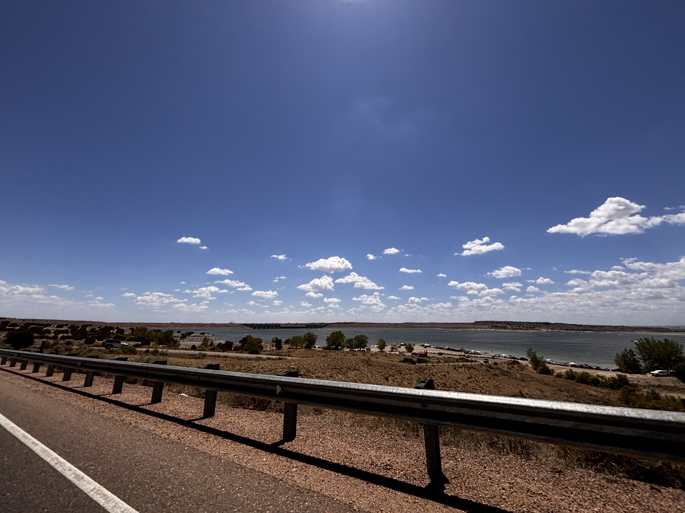

<br><details><summary>:camera:**66/IMG_0386.jpg**</summary><sub> `Exif version` 0232 `OS version` 27.0 `Date` 2026:07:18 12:11:59 `Aperture` Not known `Brightness` 10.725406080799667 `Color space` 65535 `Compression` Not known`Exposure mode` 0 `Exposure time` 0.000505050505050505 `Focal length` 1.54 `Lens model` iPhone 15 Plus back dual wide camera 1.54mm f/2.4 `Lens specification` (1.54, 5.960000038146973, 1.6, 2.4) `Orientation` 1 `Scene type` Not known `f number` 2.4 `White balance` 0 `Sensing method` 2 `Shutter speed` 10.951428994520954</sub><sub>`Coordinates & altitude` (38.277175, -104.7379, 1507.6686626746507)</sub><sub> :earth_americas:`Location over` [Google Maps](http://maps.google.com/maps?q=38.277175,-104.7379) or [Openstreet Map](https://www.openstreetmap.org/query?lat=38.277175&lon=-104.7379)</sub></details>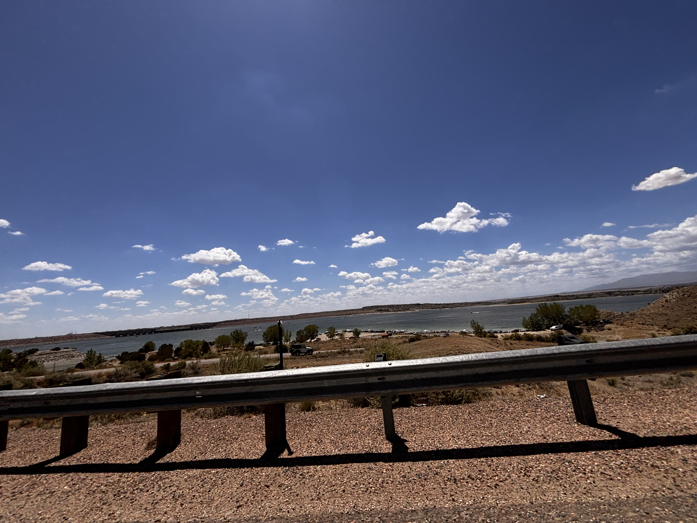

<br><details><summary>:camera:**66/IMG_0387.jpg**</summary><sub> `Exif version` 0232 `OS version` 27.0 `Date` 2026:07:18 12:12:59 `Aperture` Not known `Brightness` 10.760935733542047 `Color space` 65535 `Compression` Not known`Exposure mode` 0 `Exposure time` 0.0005330490405117271 `Focal length` 1.54 `Lens model` iPhone 15 Plus back dual wide camera 1.54mm f/2.4 `Lens specification` (1.54, 5.960000038146973, 1.6, 2.4) `Orientation` 1 `Scene type` Not known `f number` 2.4 `White balance` 0 `Sensing method` 2 `Shutter speed` 10.873576850094876</sub><sub>`Coordinates & altitude` (38.27567777777778, -104.73770277777778, 1492.3540824575587)</sub><sub> :earth_americas:`Location over` [Google Maps](http://maps.google.com/maps?q=38.27567777777778,-104.73770277777778) or [Openstreet Map](https://www.openstreetmap.org/query?lat=38.27567777777778&lon=-104.73770277777778)</sub></details>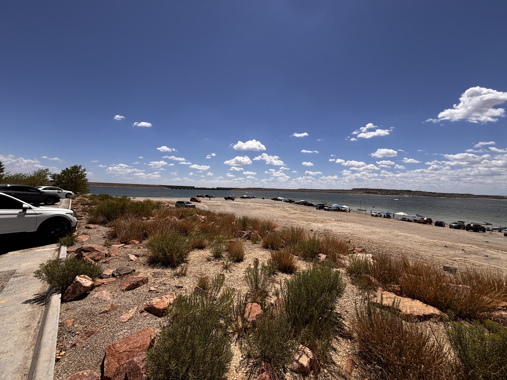

<br><details><summary>:camera:**66/IMG_0388.jpg**</summary><sub> `Exif version` 0232 `OS version` 27.0 `Date` 2026:07:18 12:13:01 `Aperture` Not known `Brightness` 10.74635241301908 `Color space` 65535 `Compression` Not known`Exposure mode` 0 `Exposure time` 0.0005330490405117271 `Focal length` 1.54 `Lens model` iPhone 15 Plus back dual wide camera 1.54mm f/2.4 `Lens specification` (1.54, 5.960000038146973, 1.6, 2.4) `Orientation` 1 `Scene type` Not known `f number` 2.4 `White balance` 0 `Sensing method` 2 `Shutter speed` 10.873576850094876</sub><sub>`Coordinates & altitude` (38.27568055555555, -104.73770277777778, 1492.1032504780114)</sub><sub> :earth_americas:`Location over` [Google Maps](http://maps.google.com/maps?q=38.27568055555555,-104.73770277777778) or [Openstreet Map](https://www.openstreetmap.org/query?lat=38.27568055555555&lon=-104.73770277777778)</sub></details>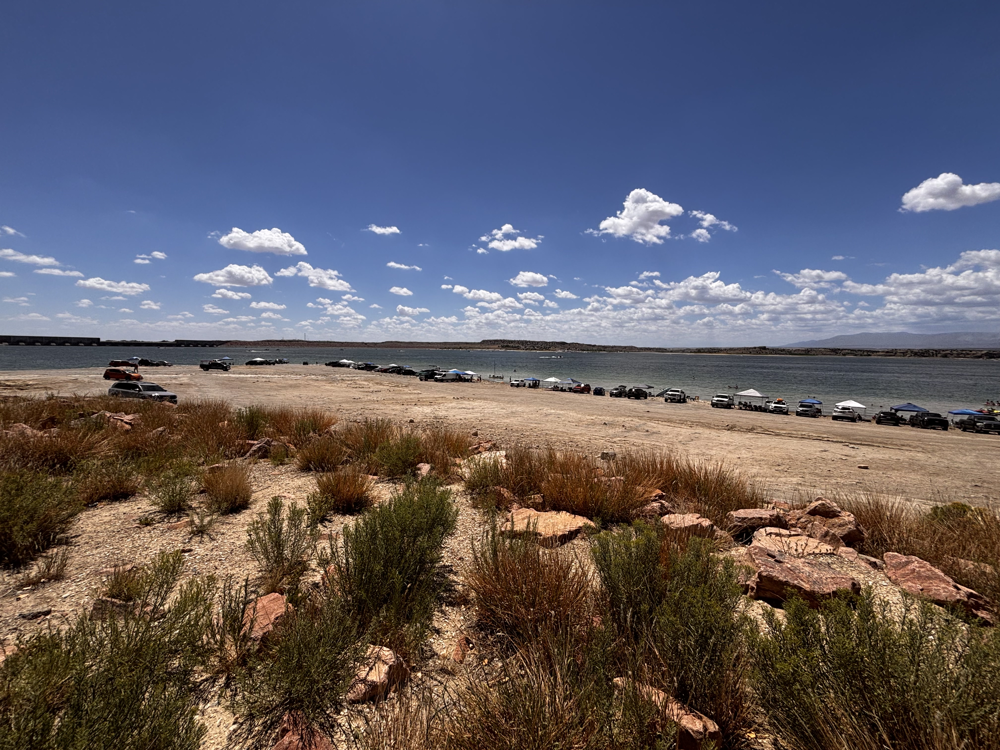

<br><details><summary>:camera:**66/IMG_0389.jpg**</summary><sub> `Exif version` 0232 `OS version` 27.0 `Date` 2026:07:18 12:13:03 `Aperture` Not known `Brightness` 10.575152106963118 `Color space` 65535 `Compression` Not known`Exposure mode` 0 `Exposure time` 0.0005701254275940707 `Focal length` 1.54 `Lens model` iPhone 15 Plus back dual wide camera 1.54mm f/2.4 `Lens specification` (1.54, 5.960000038146973, 1.6, 2.4) `Orientation` 1 `Scene type` Not known `f number` 2.4 `White balance` 0 `Sensing method` 2 `Shutter speed` 10.776750467483899</sub><sub>`Coordinates & altitude` (38.27568055555555, -104.73770277777778, 1492.1032504780114)</sub><sub> :earth_americas:`Location over` [Google Maps](http://maps.google.com/maps?q=38.27568055555555,-104.73770277777778) or [Openstreet Map](https://www.openstreetmap.org/query?lat=38.27568055555555&lon=-104.73770277777778)</sub></details>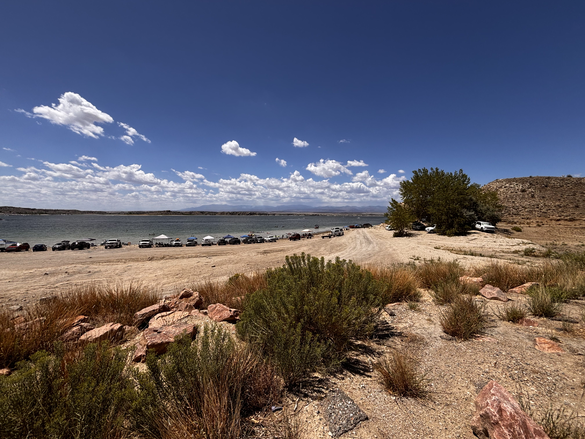

<br><details><summary>:camera:**66/IMG_0390.jpg**</summary><sub> `Exif version` 0232 `OS version` 27.0 `Date` 2026:07:18 12:13:10 `Aperture` Not known `Brightness` 10.474241042345277 `Color space` 65535 `Compression` Not known`Exposure mode` Not known `Exposure time` 0.00016801075268817206 `Focal length` 5.96 `Lens model` iPhone 15 Plus back camera 5.96mm f/1.6 `Lens specification` (5.96, 5.96, 1.6, 1.6) `Orientation` 1 `Scene type` Not known `f number` 1.6 `White balance` 0 `Sensing method` 2 `Shutter speed` 12.539251137291497</sub><sub>`Coordinates & altitude` (38.27568055555555, -104.73770277777778, 1492.7666955767563)</sub><sub> :earth_americas:`Location over` [Google Maps](http://maps.google.com/maps?q=38.27568055555555,-104.73770277777778) or [Openstreet Map](https://www.openstreetmap.org/query?lat=38.27568055555555&lon=-104.73770277777778)</sub></details>

<br><details><summary>:camera:**66/IMG_0391.jpg**</summary><sub> `Exif version` 0232 `OS version` 27.0 `Date` 2026:07:18 12:13:38 `Aperture` Not known `Brightness` 10.689725232198143 `Color space` 65535 `Compression` Not known`Exposure mode` 0 `Exposure time` 0.00014900908955446283 `Focal length` 5.96 `Lens model` iPhone 15 Plus back dual wide camera 5.96mm f/1.6 `Lens specification` (1.5399999618512084, 5.96, 1.6, 2.4) `Orientation` 6 `Scene type` Not known `f number` 1.6 `White balance` 0 `Sensing method` 2 `Shutter speed` 12.712400050767863</sub><sub>`Coordinates & altitude` (38.27568888888889, -104.73771666666667, 1492.9422442244224)</sub><sub> :earth_americas:`Location over` [Google Maps](http://maps.google.com/maps?q=38.27568888888889,-104.73771666666667) or [Openstreet Map](https://www.openstreetmap.org/query?lat=38.27568888888889&lon=-104.73771666666667)</sub></details>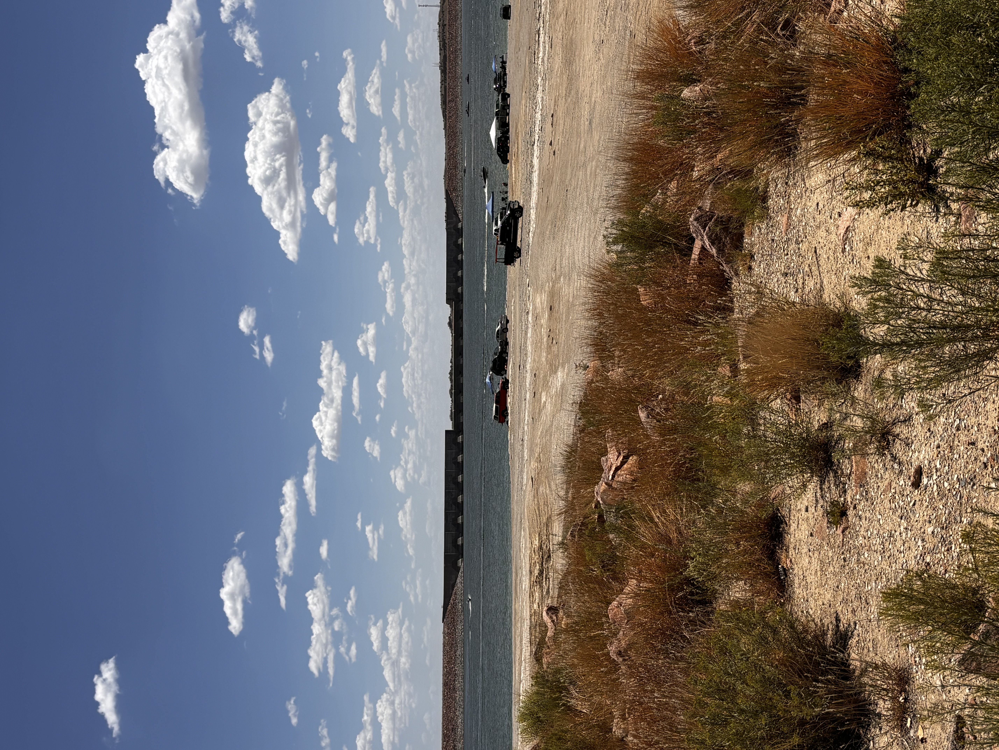

<br><details><summary>:camera:**66/IMG_0392.jpg**</summary><sub> `Exif version` 0232 `OS version` 27.0 `Date` 2026:07:18 12:13:42 `Aperture` Not known `Brightness` 10.685475521372577 `Color space` 65535 `Compression` Not known`Exposure mode` 0 `Exposure time` 0.0005701254275940707 `Focal length` 1.54 `Lens model` iPhone 15 Plus back dual wide camera 1.54mm f/2.4 `Lens specification` (1.54, 5.960000038146973, 1.6, 2.4) `Orientation` 1 `Scene type` Not known `f number` 2.4 `White balance` 0 `Sensing method` 2 `Shutter speed` 10.776750467483899</sub><sub>`Coordinates & altitude` (38.27568888888889, -104.73771666666667, 1493.182)</sub><sub> :earth_americas:`Location over` [Google Maps](http://maps.google.com/maps?q=38.27568888888889,-104.73771666666667) or [Openstreet Map](https://www.openstreetmap.org/query?lat=38.27568888888889&lon=-104.73771666666667)</sub></details>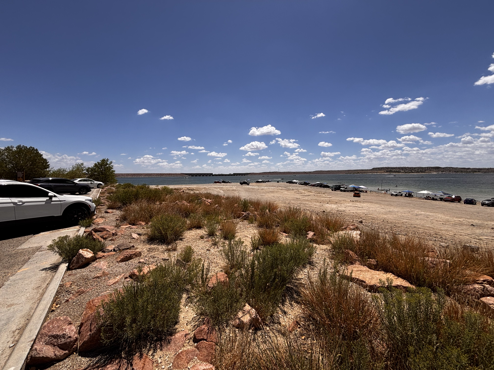

<br><details><summary>:camera:**66/IMG_0393.jpg**</summary><sub> `Exif version` 0232 `OS version` 27.0 `Date` 2026:07:18 12:20:49 `Aperture` Not known `Brightness` 10.794813979706877 `Color space` 65535 `Compression` Not known`Exposure mode` 0 `Exposure time` 0.00014900908955446283 `Focal length` 5.96 `Lens model` iPhone 15 Plus back dual wide camera 5.96mm f/1.6 `Lens specification` (1.5399999618512084, 5.96, 1.6, 2.4) `Orientation` 1 `Scene type` Not known `f number` 1.6 `White balance` 0 `Sensing method` 2 `Shutter speed` 12.712400050767863</sub><sub>`Coordinates & altitude` (38.281013888888886, -104.7290111111111, 1494.903997378768)</sub><sub> :earth_americas:`Location over` [Google Maps](http://maps.google.com/maps?q=38.281013888888886,-104.7290111111111) or [Openstreet Map](https://www.openstreetmap.org/query?lat=38.281013888888886&lon=-104.7290111111111)</sub></details>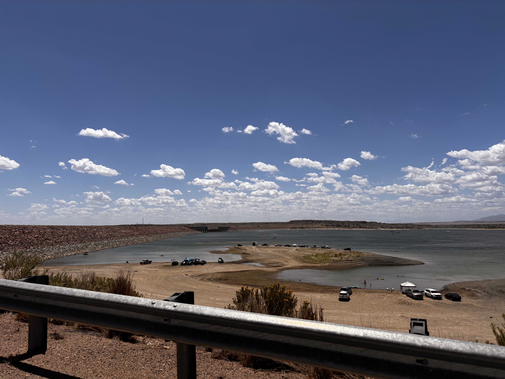

<br><details><summary>:camera:**66/IMG_0394.jpg**</summary><sub> `Exif version` 0232 `OS version` 27.0 `Date` 2026:07:18 12:20:51 `Aperture` Not known `Brightness` 11.102244271202457 `Color space` 65535 `Compression` Not known`Exposure mode` 0 `Exposure time` 0.00014900908955446283 `Focal length` 5.96 `Lens model` iPhone 15 Plus back dual wide camera 5.96mm f/1.6 `Lens specification` (1.5399999618512084, 5.96, 1.6, 2.4) `Orientation` 1 `Scene type` Not known `f number` 1.6 `White balance` 0 `Sensing method` 2 `Shutter speed` 12.712400050767863</sub><sub>`Coordinates & altitude` (38.28095555555556, -104.72885833333333, 1497.6530214424952)</sub><sub> :earth_americas:`Location over` [Google Maps](http://maps.google.com/maps?q=38.28095555555556,-104.72885833333333) or [Openstreet Map](https://www.openstreetmap.org/query?lat=38.28095555555556&lon=-104.72885833333333)</sub></details>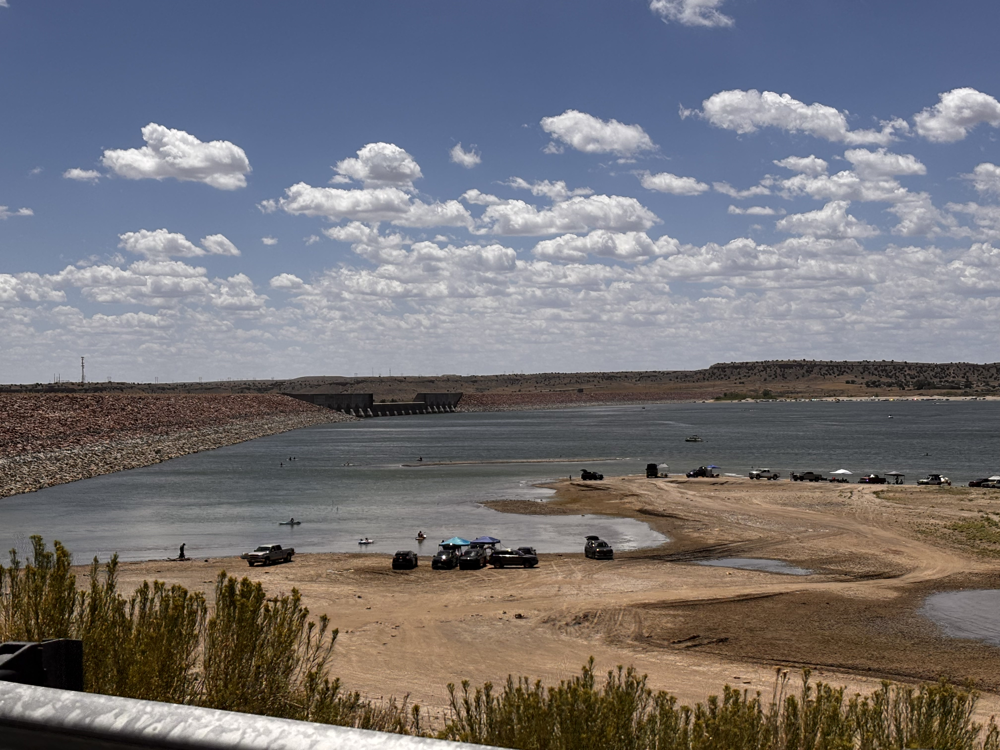

<br><details><summary>:camera:**66/IMG_0395.jpg**</summary><sub> `Exif version` 0232 `OS version` 27.0 `Date` 2026:07:18 12:20:54 `Aperture` Not known `Brightness` 11.011145038167939 `Color space` 65535 `Compression` Not known`Exposure mode` 0 `Exposure time` 0.00016801075268817206 `Focal length` 5.96 `Lens model` iPhone 15 Plus back dual wide camera 5.96mm f/1.6 `Lens specification` (1.5399999618512084, 5.96, 1.6, 2.4) `Orientation` 1 `Scene type` Not known `f number` 1.6 `White balance` 0 `Sensing method` 2 `Shutter speed` 12.539251137291497</sub><sub>`Coordinates & altitude` (38.28091388888889, -104.7286388888889, 1500.5619565217391)</sub><sub> :earth_americas:`Location over` [Google Maps](http://maps.google.com/maps?q=38.28091388888889,-104.7286388888889) or [Openstreet Map](https://www.openstreetmap.org/query?lat=38.28091388888889&lon=-104.7286388888889)</sub></details>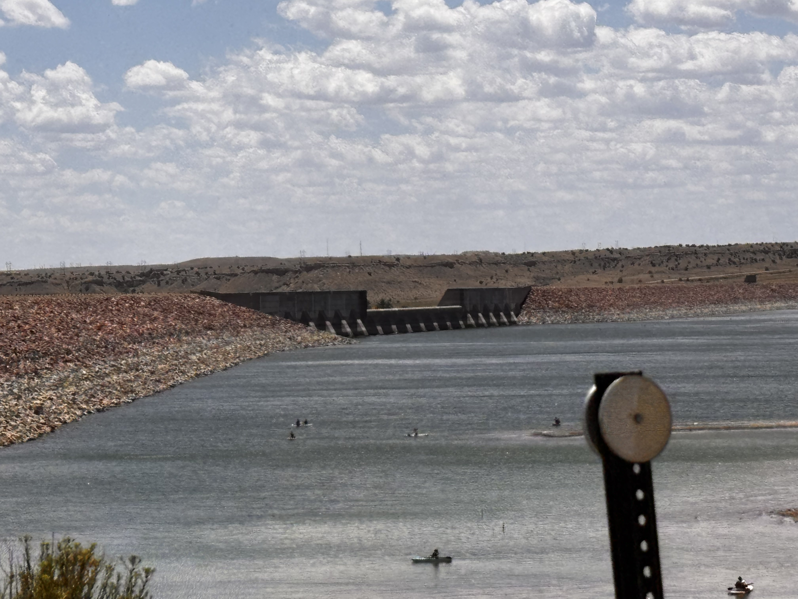

<br><details><summary>:camera:**66/IMG_0396.jpg**</summary><sub> `Exif version` 0232 `OS version` 27.0 `Date` 2026:07:18 12:20:58 `Aperture` Not known `Brightness` 10.744557947221208 `Color space` 65535 `Compression` Not known`Exposure mode` 0 `Exposure time` 0.0005330490405117271 `Focal length` 1.54 `Lens model` iPhone 15 Plus back dual wide camera 1.54mm f/2.4 `Lens specification` (1.54, 5.960000038146973, 1.6, 2.4) `Orientation` 1 `Scene type` Not known `f number` 2.4 `White balance` 0 `Sensing method` 2 `Shutter speed` 10.873576850094876</sub><sub>`Coordinates & altitude` (38.28080277777778, -104.72817222222223, 1503.8773861967695)</sub><sub> :earth_americas:`Location over` [Google Maps](http://maps.google.com/maps?q=38.28080277777778,-104.72817222222223) or [Openstreet Map](https://www.openstreetmap.org/query?lat=38.28080277777778&lon=-104.72817222222223)</sub></details>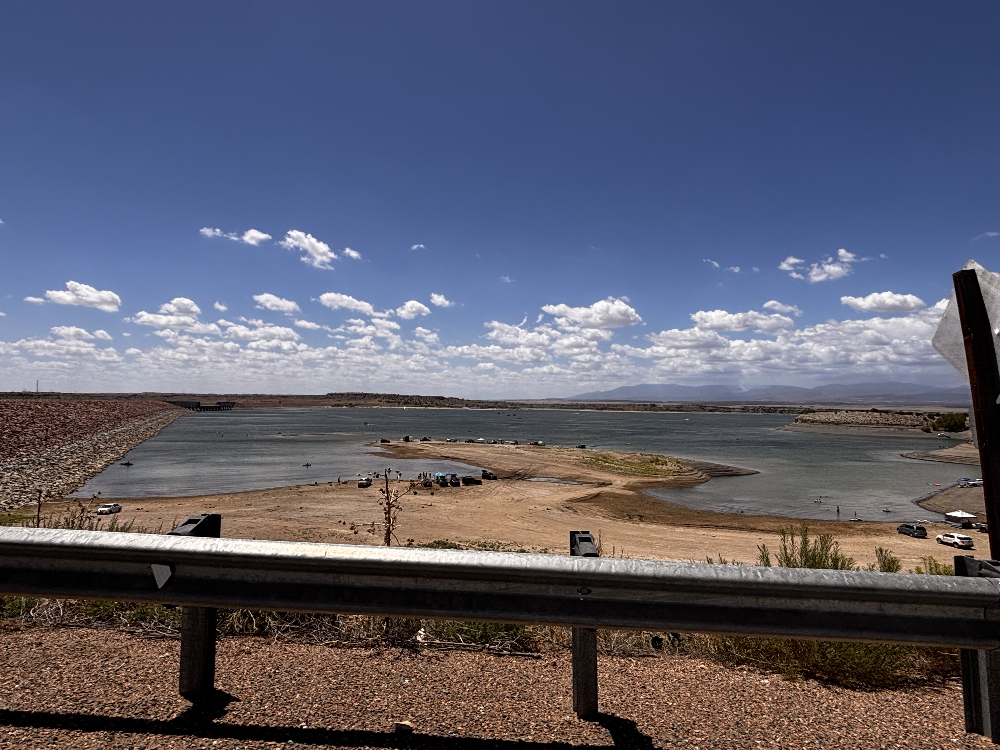

<br><details><summary>:camera:**66/IMG_0397.jpg**</summary><sub> `Exif version` 0232 `OS version` 27.0 `Date` 2026:07:18 12:21:00 `Aperture` Not known `Brightness` 10.764259144451334 `Color space` 65535 `Compression` Not known`Exposure mode` 0 `Exposure time` 0.0005420054200542005 `Focal length` 1.54 `Lens model` iPhone 15 Plus back dual wide camera 1.54mm f/2.4 `Lens specification` (1.54, 5.960000038146973, 1.6, 2.4) `Orientation` 1 `Scene type` Not known `f number` 2.4 `White balance` 0 `Sensing method` 2 `Shutter speed` 10.84941953107216</sub><sub>`Coordinates & altitude` (38.28078333333333, -104.72808055555556, 1503.8773913043478)</sub><sub> :earth_americas:`Location over` [Google Maps](http://maps.google.com/maps?q=38.28078333333333,-104.72808055555556) or [Openstreet Map](https://www.openstreetmap.org/query?lat=38.28078333333333&lon=-104.72808055555556)</sub></details>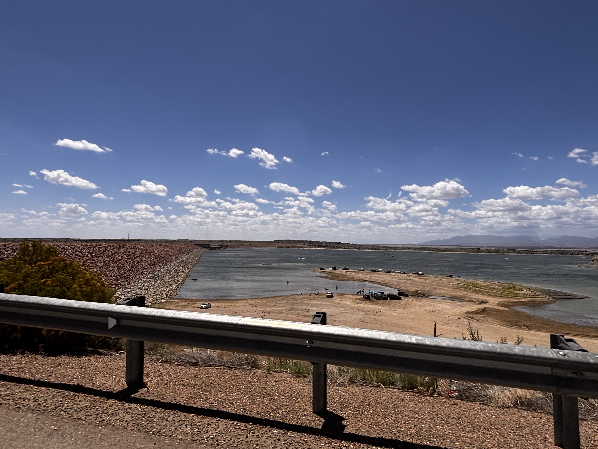

<br><details><summary>:camera:**66/IMG_0398.jpg**</summary><sub> `Exif version` 0232 `OS version` 27.0 `Date` 2026:07:18 12:21:01 `Aperture` Not known `Brightness` 10.61353713508028 `Color space` 65535 `Compression` Not known`Exposure mode` 0 `Exposure time` 0.0006071645415907711 `Focal length` 1.54 `Lens model` iPhone 15 Plus back dual wide camera 1.54mm f/2.4 `Lens specification` (1.54, 5.960000038146973, 1.6, 2.4) `Orientation` 1 `Scene type` Not known `f number` 2.4 `White balance` 0 `Sensing method` 2 `Shutter speed` 10.686015863183082</sub><sub>`Coordinates & altitude` (38.28073888888889, -104.72788333333334, 1504.5088607594937)</sub><sub> :earth_americas:`Location over` [Google Maps](http://maps.google.com/maps?q=38.28073888888889,-104.72788333333334) or [Openstreet Map](https://www.openstreetmap.org/query?lat=38.28073888888889&lon=-104.72788333333334)</sub></details>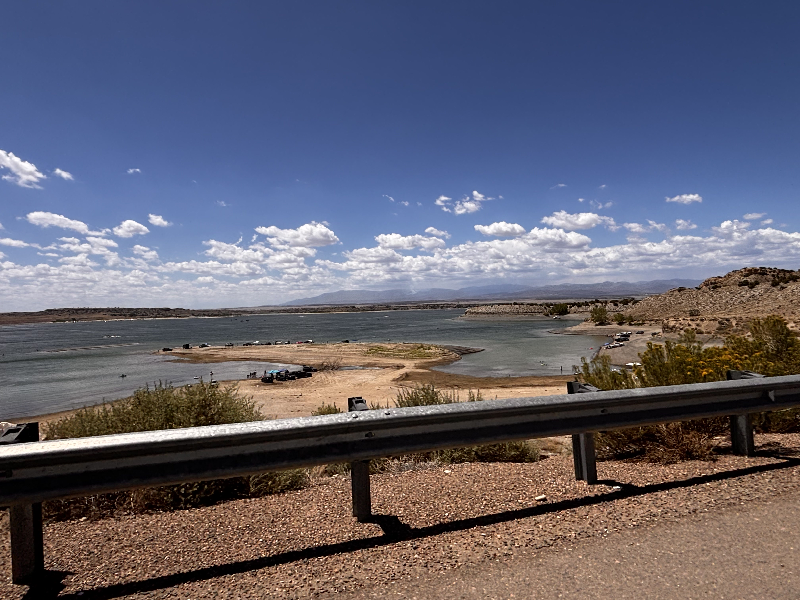

<br><details><summary>:camera:**66/IMG_0399.jpg**</summary><sub> `Exif version` 0232 `OS version` 27.0 `Date` 2026:07:18 12:28:32 `Aperture` Not known `Brightness` 10.439224041264858 `Color space` 65535 `Compression` Not known`Exposure mode` 0 `Exposure time` 0.00016801075268817206 `Focal length` 5.96 `Lens model` iPhone 15 Plus back dual wide camera 5.96mm f/1.6 `Lens specification` (1.5399999618512084, 5.96, 1.6, 2.4) `Orientation` 1 `Scene type` Not known `f number` 1.6 `White balance` 0 `Sensing method` 2 `Shutter speed` 12.539251137291497</sub><sub>`Coordinates & altitude` (38.25259444444445, -104.72992777777777, 1504.4153498871333)</sub><sub> :earth_americas:`Location over` [Google Maps](http://maps.google.com/maps?q=38.25259444444445,-104.72992777777777) or [Openstreet Map](https://www.openstreetmap.org/query?lat=38.25259444444445&lon=-104.72992777777777)</sub></details>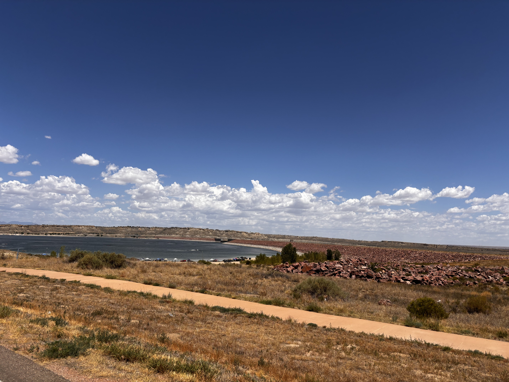

<br><details><summary>:camera:**66/IMG_0400.jpg**</summary><sub> `Exif version` 0232 `OS version` 27.0 `Date` 2026:07:18 12:28:38 `Aperture` Not known `Brightness` 10.470759625390219 `Color space` 65535 `Compression` Not known`Exposure mode` 0 `Exposure time` 0.00016801075268817206 `Focal length` 5.96 `Lens model` iPhone 15 Plus back dual wide camera 5.96mm f/1.6 `Lens specification` (1.5399999618512084, 5.96, 1.6, 2.4) `Orientation` 1 `Scene type` Not known `f number` 1.6 `White balance` 0 `Sensing method` 2 `Shutter speed` 12.539251137291497</sub><sub>`Coordinates & altitude` (38.25324166666667, -104.73035555555556, 1500.4685714285715)</sub><sub> :earth_americas:`Location over` [Google Maps](http://maps.google.com/maps?q=38.25324166666667,-104.73035555555556) or [Openstreet Map](https://www.openstreetmap.org/query?lat=38.25324166666667&lon=-104.73035555555556)</sub></details>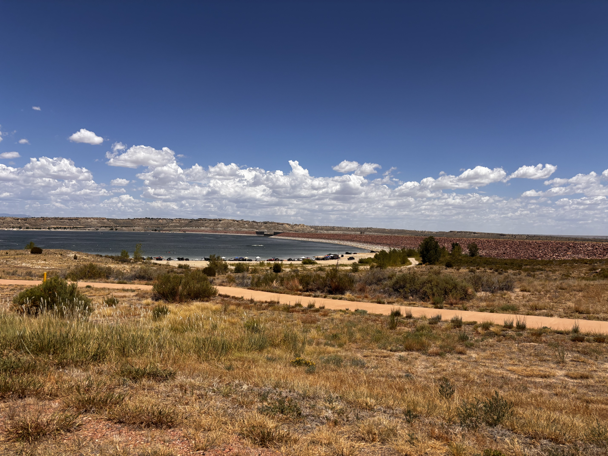

<br><details><summary>:camera:**66/IMG_0401.jpg**</summary><sub> `Exif version` 0232 `OS version` 27.0 `Date` 2026:07:18 12:28:40 `Aperture` Not known `Brightness` 10.348116576431286 `Color space` 65535 `Compression` Not known`Exposure mode` 0 `Exposure time` 0.00018698578908002991 `Focal length` 5.96 `Lens model` iPhone 15 Plus back dual wide camera 5.96mm f/1.6 `Lens specification` (1.5399999618512084, 5.96, 1.6, 2.4) `Orientation` 6 `Scene type` Not known `f number` 1.6 `White balance` 0 `Sensing method` 2 `Shutter speed` 12.384674110125012</sub><sub>`Coordinates & altitude` (38.25344444444445, -104.73065277777778, 1500.9243902439025)</sub><sub> :earth_americas:`Location over` [Google Maps](http://maps.google.com/maps?q=38.25344444444445,-104.73065277777778) or [Openstreet Map](https://www.openstreetmap.org/query?lat=38.25344444444445&lon=-104.73065277777778)</sub></details>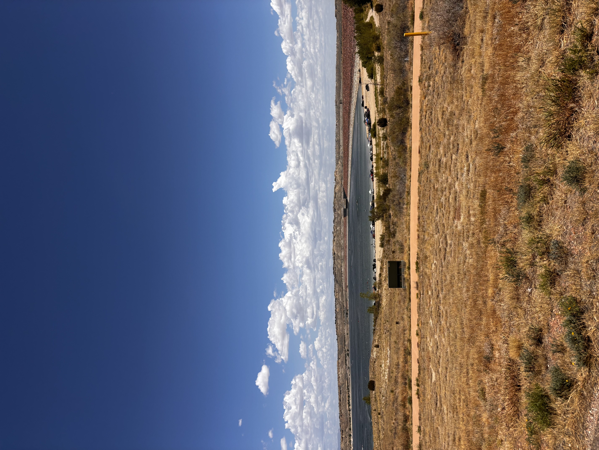

<br><details><summary>:camera:**66/IMG_0402.jpg**</summary><sub> `Exif version` 0232 `OS version` 27.0 `Date` 2026:07:18 12:28:44 `Aperture` Not known `Brightness` 10.459552754014709 `Color space` 65535 `Compression` Not known`Exposure mode` 0 `Exposure time` 0.00015800284405119292 `Focal length` 5.96 `Lens model` iPhone 15 Plus back dual wide camera 5.96mm f/1.6 `Lens specification` (1.5399999618512084, 5.96, 1.6, 2.4) `Orientation` 6 `Scene type` Not known `f number` 1.6 `White balance` 0 `Sensing method` 2 `Shutter speed` 12.627787823990356</sub><sub>`Coordinates & altitude` (38.25355833333333, -104.73093333333334, 1501.6720698254364)</sub><sub> :earth_americas:`Location over` [Google Maps](http://maps.google.com/maps?q=38.25355833333333,-104.73093333333334) or [Openstreet Map](https://www.openstreetmap.org/query?lat=38.25355833333333&lon=-104.73093333333334)</sub></details>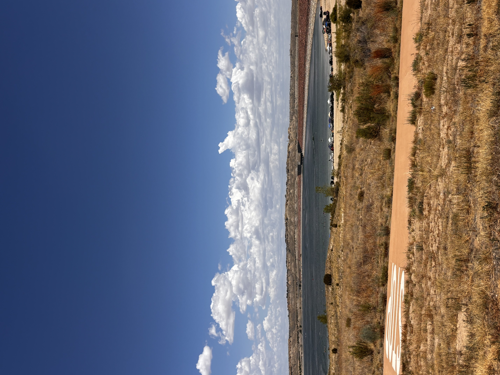

<br><details><summary>:camera:**66/IMG_0403.jpg**</summary><sub> `Exif version` 0232 `OS version` 27.0 `Date` 2026:07:18 12:28:48 `Aperture` Not known `Brightness` 11.102820488633148 `Color space` 65535 `Compression` Not known`Exposure mode` 0 `Exposure time` 0.00015800284405119292 `Focal length` 5.96 `Lens model` iPhone 15 Plus back dual wide camera 5.96mm f/1.6 `Lens specification` (1.5399999618512084, 5.96, 1.6, 2.4) `Orientation` 6 `Scene type` Not known `f number` 1.6 `White balance` 0 `Sensing method` 2 `Shutter speed` 12.627787823990356</sub><sub>`Coordinates & altitude` (38.25367222222222, -104.73128611111112, 1503.326)</sub><sub> :earth_americas:`Location over` [Google Maps](http://maps.google.com/maps?q=38.25367222222222,-104.73128611111112) or [Openstreet Map](https://www.openstreetmap.org/query?lat=38.25367222222222&lon=-104.73128611111112)</sub></details>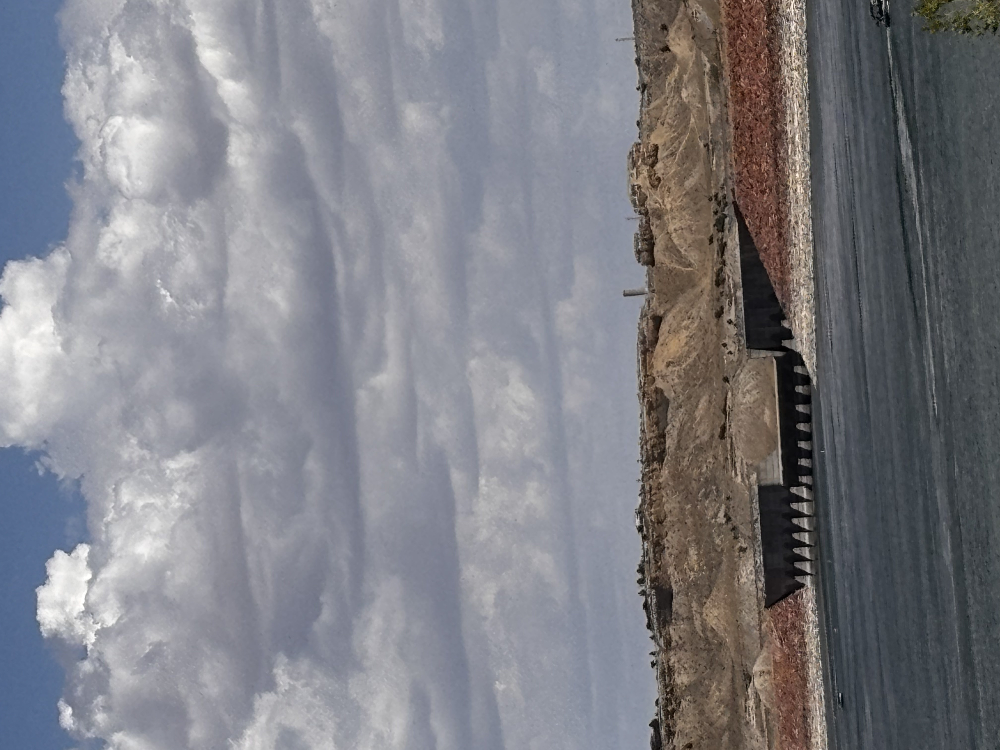

<br><details><summary>:camera:**66/IMG_0404.jpg**</summary><sub> `Exif version` 0232 `OS version` 27.0 `Date` 2026:07:18 12:28:48 `Aperture` Not known `Brightness` 11.079980516317583 `Color space` 65535 `Compression` Not known`Exposure mode` 0 `Exposure time` 0.00015800284405119292 `Focal length` 5.96 `Lens model` iPhone 15 Plus back dual wide camera 5.96mm f/1.6 `Lens specification` (1.5399999618512084, 5.96, 1.6, 2.4) `Orientation` 6 `Scene type` Not known `f number` 1.6 `White balance` 0 `Sensing method` 2 `Shutter speed` 12.627787823990356</sub><sub>`Coordinates & altitude` (38.25367222222222, -104.73128611111112, 1503.326)</sub><sub> :earth_americas:`Location over` [Google Maps](http://maps.google.com/maps?q=38.25367222222222,-104.73128611111112) or [Openstreet Map](https://www.openstreetmap.org/query?lat=38.25367222222222&lon=-104.73128611111112)</sub></details>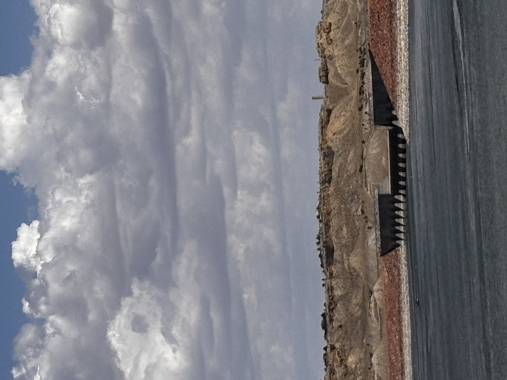

<br><details><summary>:camera:**66/IMG_0405.jpg**</summary><sub> `Exif version` 0232 `OS version` 27.0 `Date` 2026:07:18 12:29:02 `Aperture` Not known `Brightness` 10.374403625954198 `Color space` 65535 `Compression` Not known`Exposure mode` 0 `Exposure time` 0.000643915003219575 `Focal length` 1.54 `Lens model` iPhone 15 Plus back dual wide camera 1.54mm f/2.4 `Lens specification` (1.54, 5.960000038146973, 1.6, 2.4) `Orientation` 1 `Scene type` Not known `f number` 2.4 `White balance` 0 `Sensing method` 2 `Shutter speed` 10.60065170166546</sub><sub>`Coordinates & altitude` (38.25411666666667, -104.73145277777778, 1503.177435897436)</sub><sub> :earth_americas:`Location over` [Google Maps](http://maps.google.com/maps?q=38.25411666666667,-104.73145277777778) or [Openstreet Map](https://www.openstreetmap.org/query?lat=38.25411666666667&lon=-104.73145277777778)</sub></details>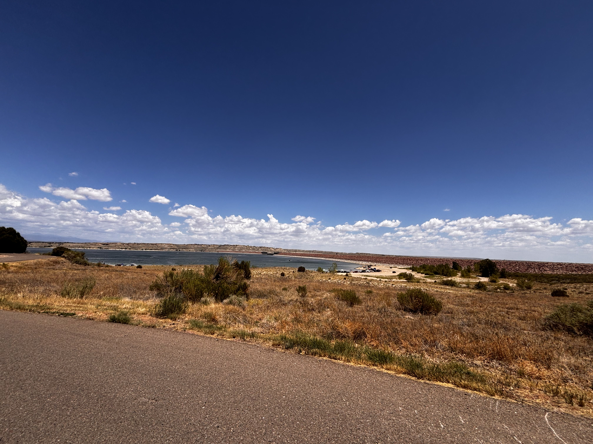

<br><details><summary>:camera:**66/IMG_0406.jpg**</summary><sub> `Exif version` 0232 `OS version` 27.0 `Date` 2026:07:18 12:29:24 `Aperture` Not known `Brightness` 10.446050813224195 `Color space` 65535 `Compression` Not known`Exposure mode` 0 `Exposure time` 0.000643915003219575 `Focal length` 1.54 `Lens model` iPhone 15 Plus back dual wide camera 1.54mm f/2.4 `Lens specification` (1.54, 5.960000038146973, 1.6, 2.4) `Orientation` 1 `Scene type` Not known `f number` 2.4 `White balance` 0 `Sensing method` 2 `Shutter speed` 10.60065170166546</sub><sub>`Coordinates & altitude` (38.2539, -104.73229166666667, 1505.321479374111)</sub><sub> :earth_americas:`Location over` [Google Maps](http://maps.google.com/maps?q=38.2539,-104.73229166666667) or [Openstreet Map](https://www.openstreetmap.org/query?lat=38.2539&lon=-104.73229166666667)</sub></details>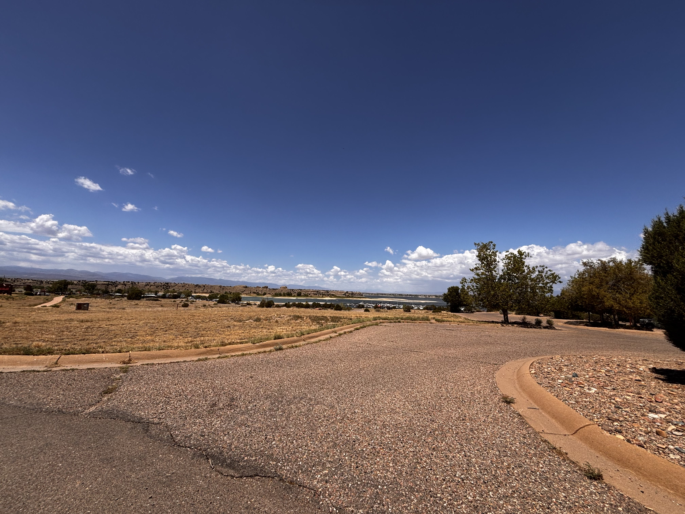

<br><details><summary>:camera:**66/IMG_0407.jpg**</summary><sub> `Exif version` 0232 `OS version` 27.0 `Date` 2026:07:18 12:29:26 `Aperture` Not known `Brightness` 10.30036447978794 `Color space` 65535 `Compression` Not known`Exposure mode` 0 `Exposure time` 0.0007092198581560284 `Focal length` 1.54 `Lens model` iPhone 15 Plus back dual wide camera 1.54mm f/2.4 `Lens specification` (1.54, 5.960000038146973, 1.6, 2.4) `Orientation` 6 `Scene type` Not known `f number` 2.4 `White balance` 0 `Sensing method` 2 `Shutter speed` 10.461926753302546</sub><sub>`Coordinates & altitude` (38.25389444444444, -104.73228333333334, 1505.5076353540028)</sub><sub> :earth_americas:`Location over` [Google Maps](http://maps.google.com/maps?q=38.25389444444444,-104.73228333333334) or [Openstreet Map](https://www.openstreetmap.org/query?lat=38.25389444444444&lon=-104.73228333333334)</sub></details>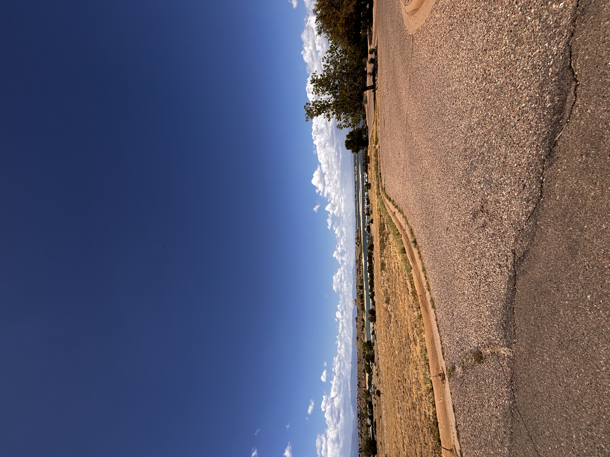

<br><details><summary>:camera:**66/IMG_0408.jpg**</summary><sub> `Exif version` 0232 `OS version` 27.0 `Date` 2026:07:18 12:30:17 `Aperture` Not known `Brightness` 10.518233196528291 `Color space` 65535 `Compression` Not known`Exposure mode` 0 `Exposure time` 0.0006071645415907711 `Focal length` 1.54 `Lens model` iPhone 15 Plus back dual wide camera 1.54mm f/2.4 `Lens specification` (1.54, 5.960000038146973, 1.6, 2.4) `Orientation` 1 `Scene type` Not known `f number` 2.4 `White balance` 0 `Sensing method` 2 `Shutter speed` 10.686015863183082</sub><sub>`Coordinates & altitude` (38.25263888888889, -104.73519166666667, 1499.470080197409)</sub><sub> :earth_americas:`Location over` [Google Maps](http://maps.google.com/maps?q=38.25263888888889,-104.73519166666667) or [Openstreet Map](https://www.openstreetmap.org/query?lat=38.25263888888889&lon=-104.73519166666667)</sub></details>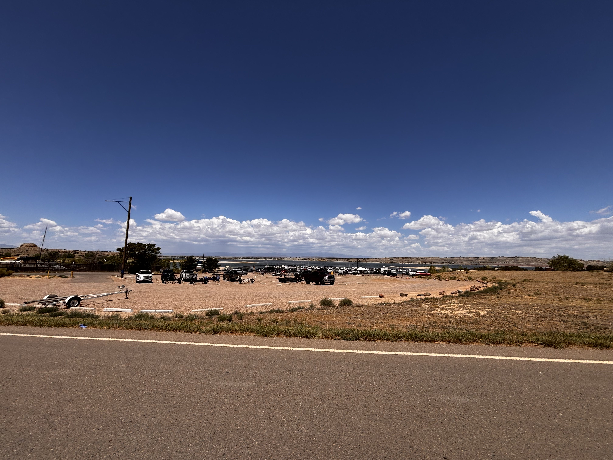

<br><details><summary>:camera:**66/IMG_0409.jpg**</summary><sub> `Exif version` 0232 `OS version` 27.0 `Date` 2026:07:18 12:30:21 `Aperture` Not known `Brightness` 10.508484528213257 `Color space` 65535 `Compression` Not known`Exposure mode` 0 `Exposure time` 0.000643915003219575 `Focal length` 1.54 `Lens model` iPhone 15 Plus back dual wide camera 1.54mm f/2.4 `Lens specification` (1.54, 5.960000038146973, 1.6, 2.4) `Orientation` 1 `Scene type` Not known `f number` 2.4 `White balance` 0 `Sensing method` 2 `Shutter speed` 10.60065170166546</sub><sub>`Coordinates & altitude` (38.25255833333333, -104.73557222222222, 1498.148502994012)</sub><sub> :earth_americas:`Location over` [Google Maps](http://maps.google.com/maps?q=38.25255833333333,-104.73557222222222) or [Openstreet Map](https://www.openstreetmap.org/query?lat=38.25255833333333&lon=-104.73557222222222)</sub></details>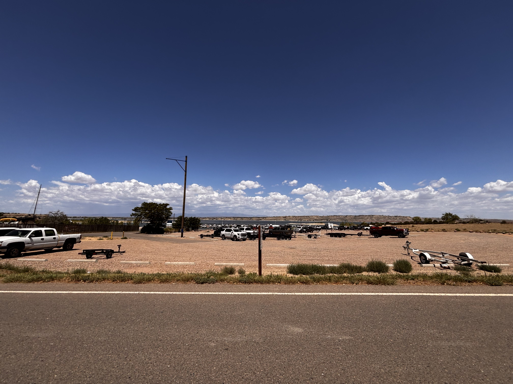

<br><details><summary>:camera:**66/IMG_0410.jpg**</summary><sub> `Exif version` 0232 `OS version` 27.0 `Date` 2026:07:18 12:33:14 `Aperture` Not known `Brightness` 10.484023091308236 `Color space` 65535 `Compression` Not known`Exposure mode` 0 `Exposure time` 0.0007092198581560284 `Focal length` 1.54 `Lens model` iPhone 15 Plus back dual wide camera 1.54mm f/2.4 `Lens specification` (1.54, 5.960000038146973, 1.6, 2.4) `Orientation` 1 `Scene type` Not known `f number` 2.4 `White balance` 0 `Sensing method` 2 `Shutter speed` 10.461926753302546</sub><sub>`Coordinates & altitude` (38.25150277777778, -104.7356638888889, 1500.6514360313315)</sub><sub> :earth_americas:`Location over` [Google Maps](http://maps.google.com/maps?q=38.25150277777778,-104.7356638888889) or [Openstreet Map](https://www.openstreetmap.org/query?lat=38.25150277777778&lon=-104.7356638888889)</sub></details>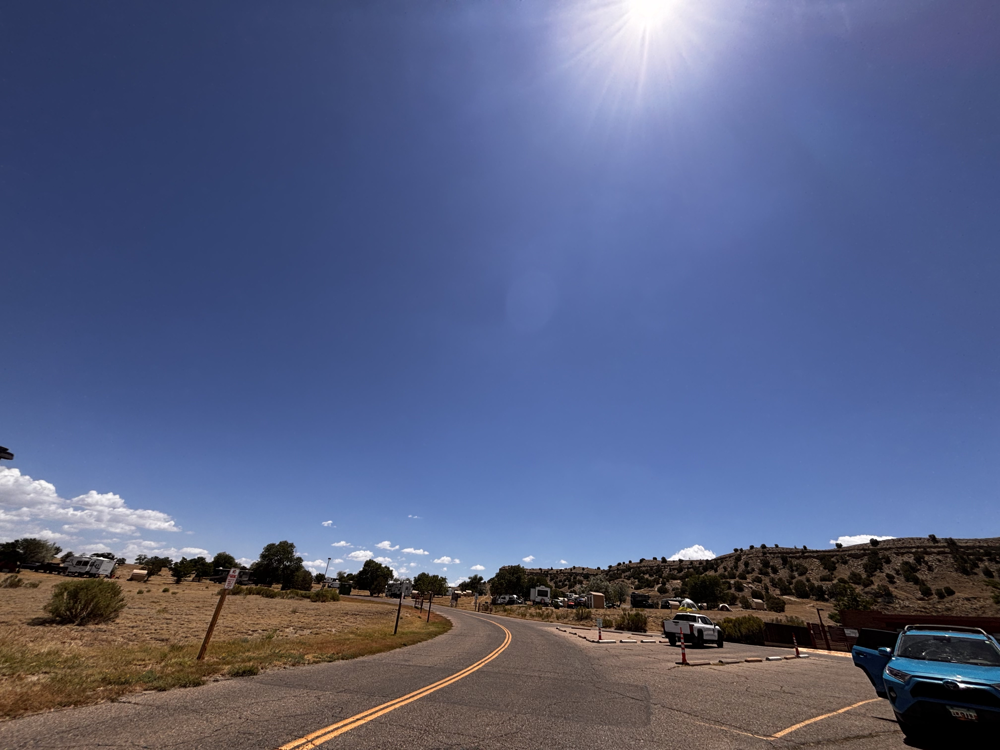

<br><details><summary>:camera:**66/IMG_0411.jpg**</summary><sub> `Exif version` 0232 `OS version` 27.0 `Date` 2026:07:18 12:33:22 `Aperture` Not known `Brightness` 10.518911536036983 `Color space` 65535 `Compression` Not known`Exposure mode` 0 `Exposure time` 0.0007092198581560284 `Focal length` 1.54 `Lens model` iPhone 15 Plus back dual wide camera 1.54mm f/2.4 `Lens specification` (1.54, 5.960000038146973, 1.6, 2.4) `Orientation` 1 `Scene type` Not known `f number` 2.4 `White balance` 0 `Sensing method` 2 `Shutter speed` 10.461926753302546</sub><sub>`Coordinates & altitude` (38.25138611111111, -104.73549722222222, 1500.4909122684376)</sub><sub> :earth_americas:`Location over` [Google Maps](http://maps.google.com/maps?q=38.25138611111111,-104.73549722222222) or [Openstreet Map](https://www.openstreetmap.org/query?lat=38.25138611111111&lon=-104.73549722222222)</sub></details>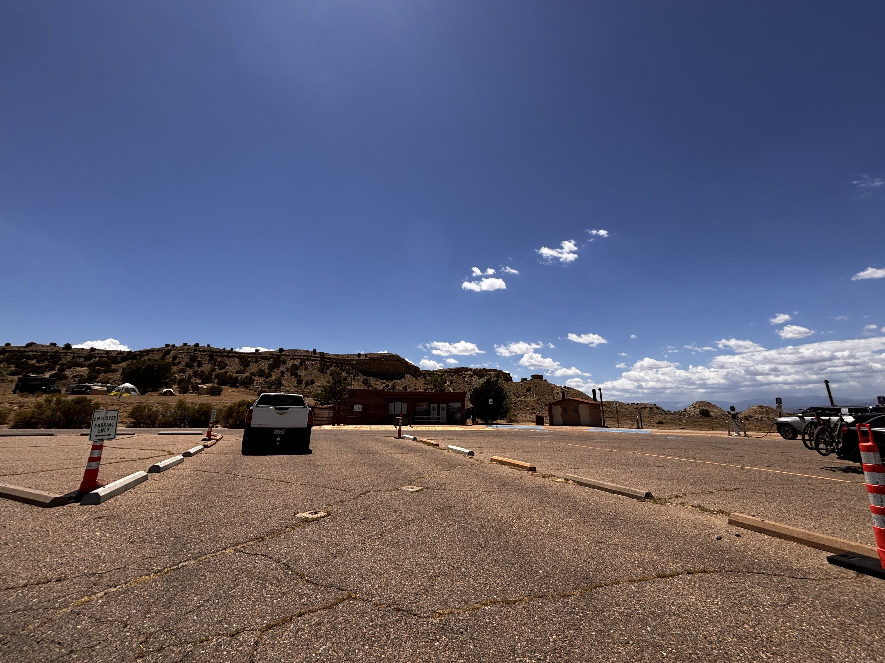

<br><details><summary>:camera:**66/IMG_0412.jpg**</summary><sub> `Exif version` 0232 `OS version` 27.0 `Date` 2026:07:18 12:33:27 `Aperture` Not known `Brightness` 10.438719715492331 `Color space` 65535 `Compression` Not known`Exposure mode` 0 `Exposure time` 0.0007830853563038371 `Focal length` 1.54 `Lens model` iPhone 15 Plus back dual wide camera 1.54mm f/2.4 `Lens specification` (1.54, 5.960000038146973, 1.6, 2.4) `Orientation` 1 `Scene type` Not known `f number` 2.4 `White balance` 0 `Sensing method` 2 `Shutter speed` 10.31870006980532</sub><sub>`Coordinates & altitude` (38.25128055555555, -104.7352361111111, 1501.4844444444445)</sub><sub> :earth_americas:`Location over` [Google Maps](http://maps.google.com/maps?q=38.25128055555555,-104.7352361111111) or [Openstreet Map](https://www.openstreetmap.org/query?lat=38.25128055555555&lon=-104.7352361111111)</sub></details>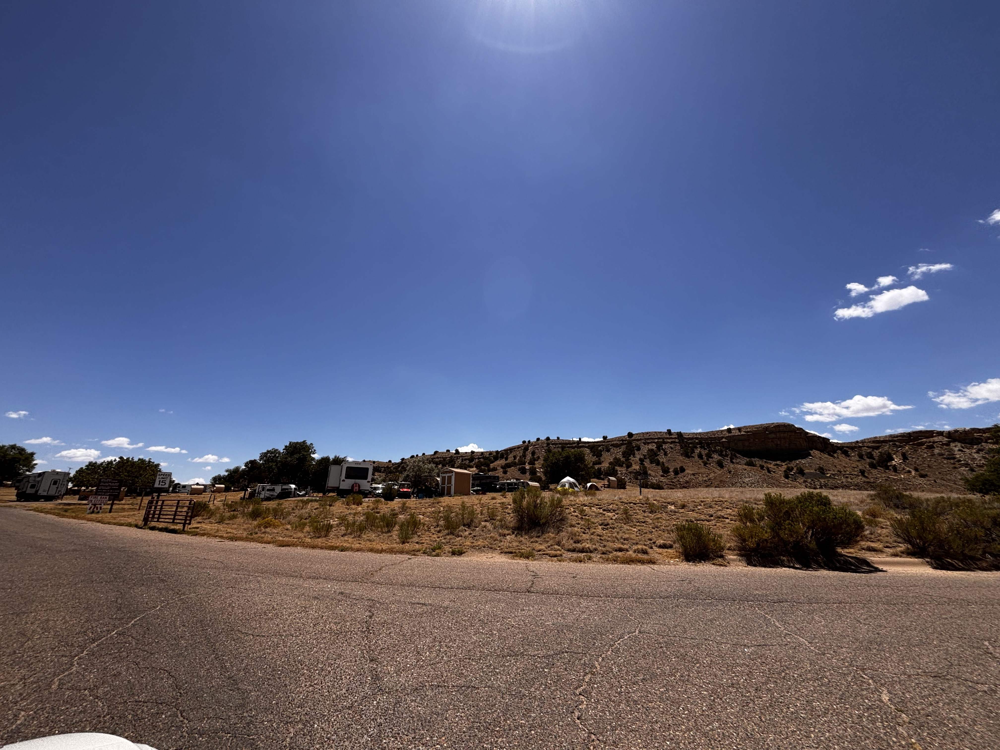

<br><details><summary>:camera:**66/IMG_0413.jpg**</summary><sub> `Exif version` 0232 `OS version` 27.0 `Date` 2026:07:18 12:33:29 `Aperture` Not known `Brightness` 10.39427214720285 `Color space` 65535 `Compression` Not known`Exposure mode` 0 `Exposure time` 0.000791765637371338 `Focal length` 1.54 `Lens model` iPhone 15 Plus back dual wide camera 1.54mm f/2.4 `Lens specification` (1.54, 5.960000038146973, 1.6, 2.4) `Orientation` 1 `Scene type` Not known `f number` 2.4 `White balance` 0 `Sensing method` 2 `Shutter speed` 10.30221195113899</sub><sub>`Coordinates & altitude` (38.25125555555555, -104.73513888888888, 1501.940133037694)</sub><sub> :earth_americas:`Location over` [Google Maps](http://maps.google.com/maps?q=38.25125555555555,-104.73513888888888) or [Openstreet Map](https://www.openstreetmap.org/query?lat=38.25125555555555&lon=-104.73513888888888)</sub></details>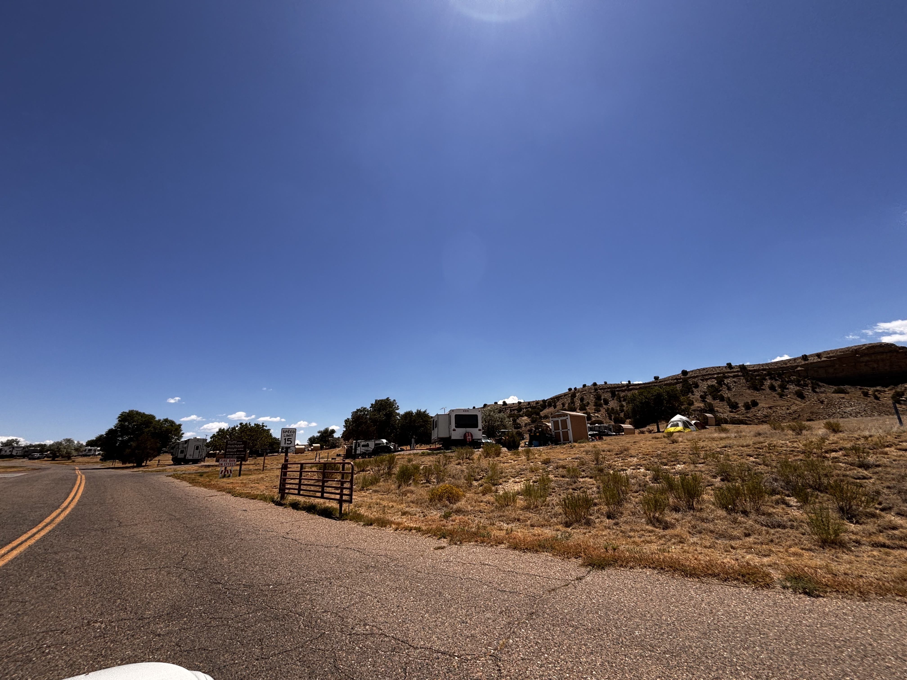

<br><details><summary>:camera:**66/IMG_0414.jpg**</summary><sub> `Exif version` 0232 `OS version` 27.0 `Date` 2026:07:18 12:33:30 `Aperture` Not known `Brightness` 10.39427214720285 `Color space` 65535 `Compression` Not known`Exposure mode` 0 `Exposure time` 0.000791765637371338 `Focal length` 1.54 `Lens model` iPhone 15 Plus back dual wide camera 1.54mm f/2.4 `Lens specification` (1.54, 5.960000038146973, 1.6, 2.4) `Orientation` 1 `Scene type` Not known `f number` 2.4 `White balance` 0 `Sensing method` 2 `Shutter speed` 10.30221195113899</sub><sub>`Coordinates & altitude` (38.25123888888889, -104.73508333333334, 1502.0879590093937)</sub><sub> :earth_americas:`Location over` [Google Maps](http://maps.google.com/maps?q=38.25123888888889,-104.73508333333334) or [Openstreet Map](https://www.openstreetmap.org/query?lat=38.25123888888889&lon=-104.73508333333334)</sub></details>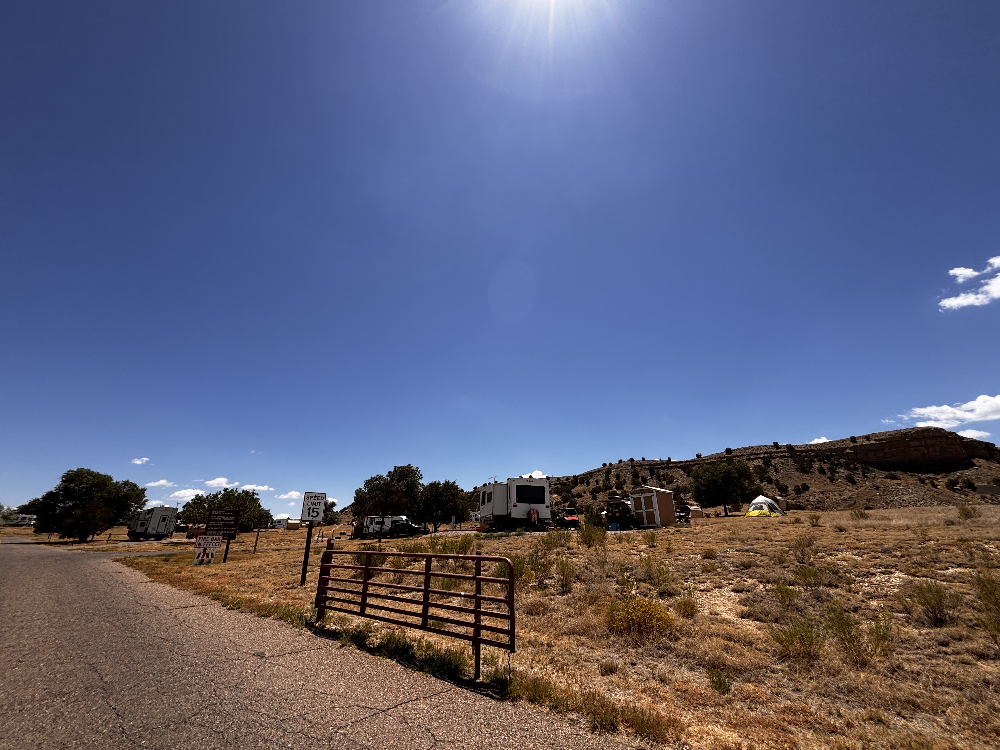

<br><details><summary>:camera:**66/IMG_0415.jpg**</summary><sub> `Exif version` 0232 `OS version` 27.0 `Date` 2026:07:18 12:33:32 `Aperture` Not known `Brightness` 10.3623880796472 `Color space` 65535 `Compression` Not known`Exposure mode` 0 `Exposure time` 0.000791765637371338 `Focal length` 1.54 `Lens model` iPhone 15 Plus back dual wide camera 1.54mm f/2.4 `Lens specification` (1.54, 5.960000038146973, 1.6, 2.4) `Orientation` 1 `Scene type` Not known `f number` 2.4 `White balance` 0 `Sensing method` 2 `Shutter speed` 10.30221195113899</sub><sub>`Coordinates & altitude` (38.25123611111111, -104.73496944444445, 1502.4429400386848)</sub><sub> :earth_americas:`Location over` [Google Maps](http://maps.google.com/maps?q=38.25123611111111,-104.73496944444445) or [Openstreet Map](https://www.openstreetmap.org/query?lat=38.25123611111111&lon=-104.73496944444445)</sub></details>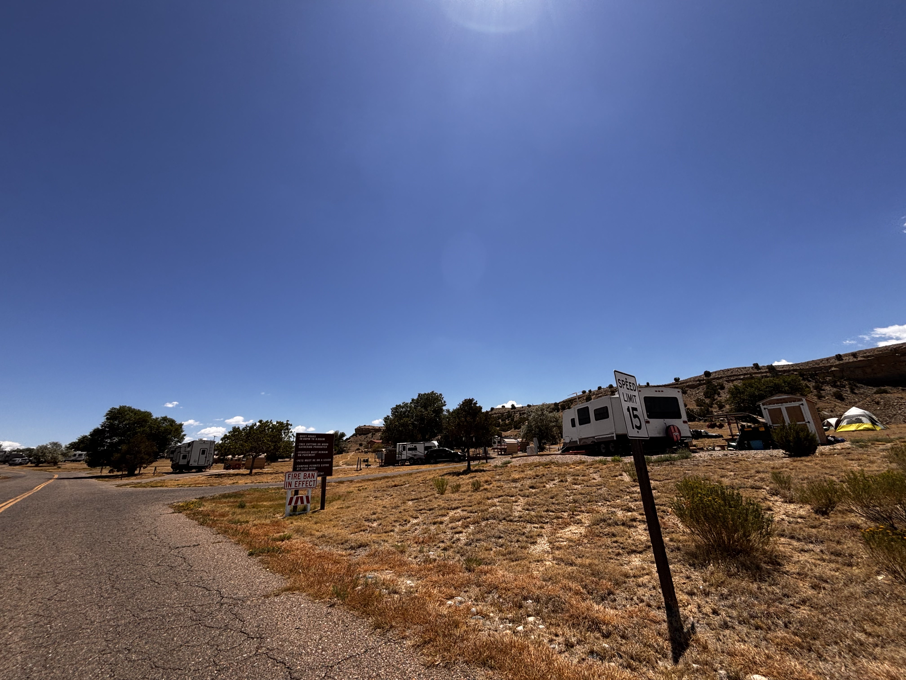

<br><details><summary>:camera:**66/IMG_0416.jpg**</summary><sub> `Exif version` 0232 `OS version` 27.0 `Date` 2026:07:18 12:33:37 `Aperture` Not known `Brightness` 10.373103625610696 `Color space` 65535 `Compression` Not known`Exposure mode` 0 `Exposure time` 0.000819672131147541 `Focal length` 1.54 `Lens model` iPhone 15 Plus back dual wide camera 1.54mm f/2.4 `Lens specification` (1.54, 5.960000038146973, 1.6, 2.4) `Orientation` 1 `Scene type` Not known `f number` 2.4 `White balance` 0 `Sensing method` 2 `Shutter speed` 10.252088470172598</sub><sub>`Coordinates & altitude` (38.251244444444445, -104.73475555555555, 1505.066478076379)</sub><sub> :earth_americas:`Location over` [Google Maps](http://maps.google.com/maps?q=38.251244444444445,-104.73475555555555) or [Openstreet Map](https://www.openstreetmap.org/query?lat=38.251244444444445&lon=-104.73475555555555)</sub></details>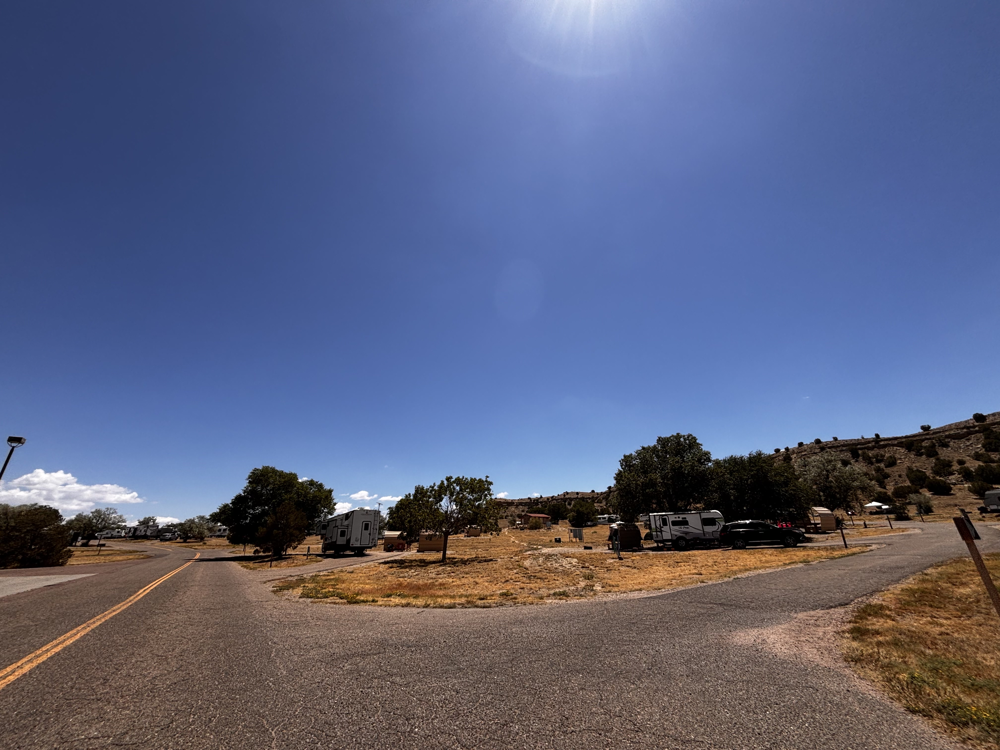

<br><details><summary>:camera:**66/IMG_0417.jpg**</summary><sub> `Exif version` 0232 `OS version` 27.0 `Date` 2026:07:18 12:33:40 `Aperture` Not known `Brightness` 10.37910095302353 `Color space` 65535 `Compression` Not known`Exposure mode` 0 `Exposure time` 0.0009216589861751152 `Focal length` 1.54 `Lens model` iPhone 15 Plus back dual wide camera 1.54mm f/2.4 `Lens specification` (1.54, 5.960000038146973, 1.6, 2.4) `Orientation` 1 `Scene type` Not known `f number` 2.4 `White balance` 0 `Sensing method` 2 `Shutter speed` 10.082945633390935</sub><sub>`Coordinates & altitude` (38.25123888888889, -104.73466388888889, 1504.779104477612)</sub><sub> :earth_americas:`Location over` [Google Maps](http://maps.google.com/maps?q=38.25123888888889,-104.73466388888889) or [Openstreet Map](https://www.openstreetmap.org/query?lat=38.25123888888889&lon=-104.73466388888889)</sub></details>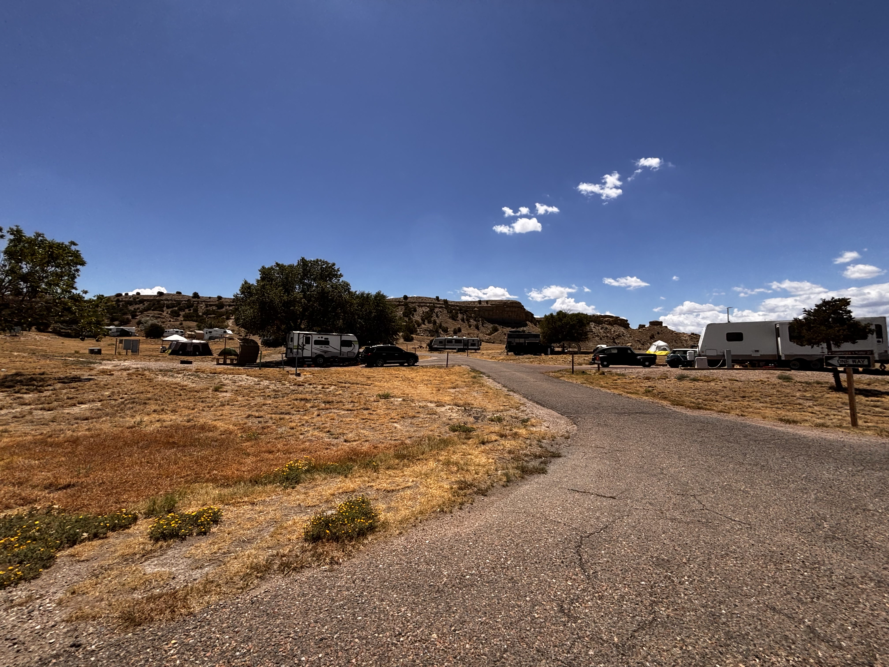

<br><details><summary>:camera:**66/IMG_0418.jpg**</summary><sub> `Exif version` 0232 `OS version` 27.0 `Date` 2026:07:18 12:33:44 `Aperture` Not known `Brightness` 10.266249387445983 `Color space` 65535 `Compression` Not known`Exposure mode` 0 `Exposure time` 0.0009587727708533077 `Focal length` 1.54 `Lens model` iPhone 15 Plus back dual wide camera 1.54mm f/2.4 `Lens specification` (1.54, 5.960000038146973, 1.6, 2.4) `Orientation` 1 `Scene type` Not known `f number` 2.4 `White balance` 0 `Sensing method` 2 `Shutter speed` 10.026181570894254</sub><sub>`Coordinates & altitude` (38.25123611111111, -104.73444444444445, 1505.3190839694657)</sub><sub> :earth_americas:`Location over` [Google Maps](http://maps.google.com/maps?q=38.25123611111111,-104.73444444444445) or [Openstreet Map](https://www.openstreetmap.org/query?lat=38.25123611111111&lon=-104.73444444444445)</sub></details>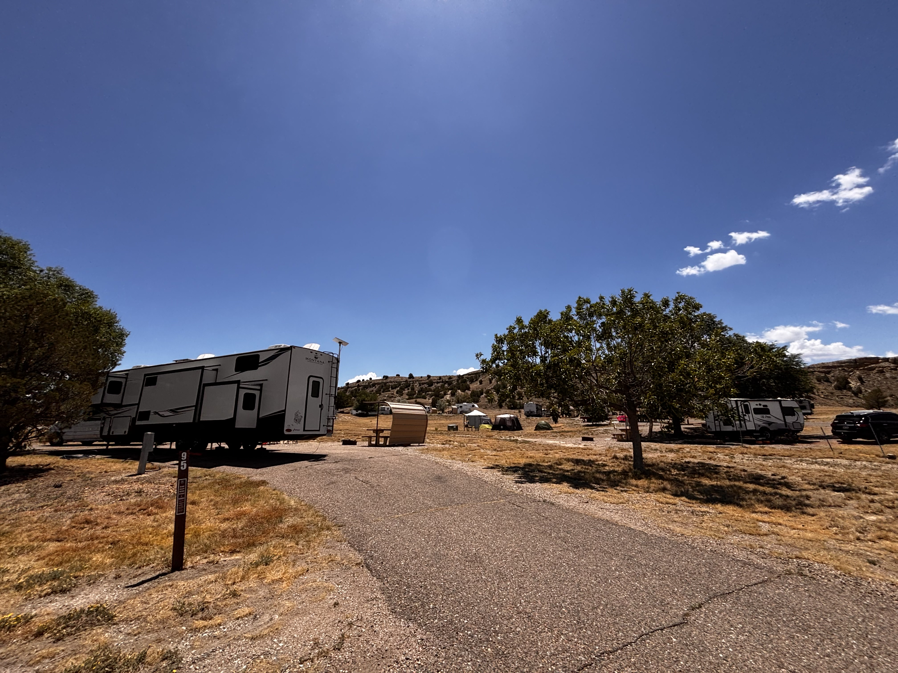

<br><details><summary>:camera:**66/IMG_0419.jpg**</summary><sub> `Exif version` 0232 `OS version` 27.0 `Date` 2026:07:18 12:33:52 `Aperture` Not known `Brightness` 10.481892464440634 `Color space` 65535 `Compression` Not known`Exposure mode` 0 `Exposure time` 0.0008481764206955047 `Focal length` 1.54 `Lens model` iPhone 15 Plus back dual wide camera 1.54mm f/2.4 `Lens specification` (1.54, 5.960000038146973, 1.6, 2.4) `Orientation` 1 `Scene type` Not known `f number` 2.4 `White balance` 0 `Sensing method` 2 `Shutter speed` 10.203648118217501</sub><sub>`Coordinates & altitude` (38.25123611111111, -104.73403888888889, 1506.014558689718)</sub><sub> :earth_americas:`Location over` [Google Maps](http://maps.google.com/maps?q=38.25123611111111,-104.73403888888889) or [Openstreet Map](https://www.openstreetmap.org/query?lat=38.25123611111111&lon=-104.73403888888889)</sub></details>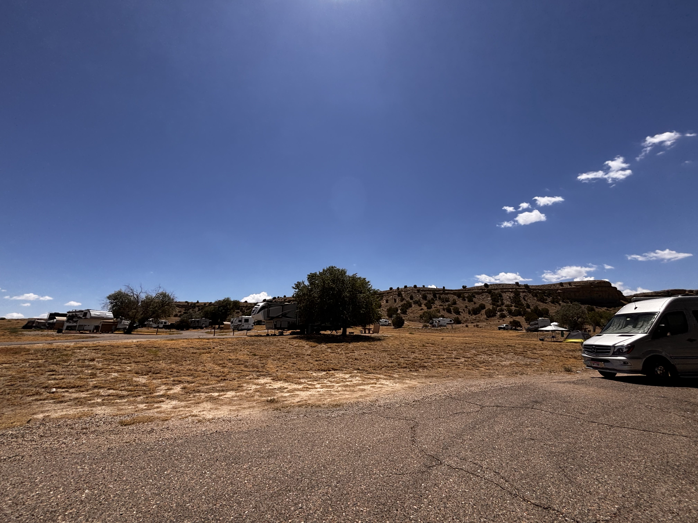

<br><details><summary>:camera:**66/IMG_0420.jpg**</summary><sub> `Exif version` 0232 `OS version` 27.0 `Date` 2026:07:18 12:33:55 `Aperture` Not known `Brightness` 10.399630127774042 `Color space` 65535 `Compression` Not known`Exposure mode` 0 `Exposure time` 0.000856898029134533 `Focal length` 1.54 `Lens model` iPhone 15 Plus back dual wide camera 1.54mm f/2.4 `Lens specification` (1.54, 5.960000038146973, 1.6, 2.4) `Orientation` 1 `Scene type` Not known `f number` 2.4 `White balance` 0 `Sensing method` 2 `Shutter speed` 10.188417174950178</sub><sub>`Coordinates & altitude` (38.25123611111111, -104.73388611111112, 1506.4183333333333)</sub><sub> :earth_americas:`Location over` [Google Maps](http://maps.google.com/maps?q=38.25123611111111,-104.73388611111112) or [Openstreet Map](https://www.openstreetmap.org/query?lat=38.25123611111111&lon=-104.73388611111112)</sub></details>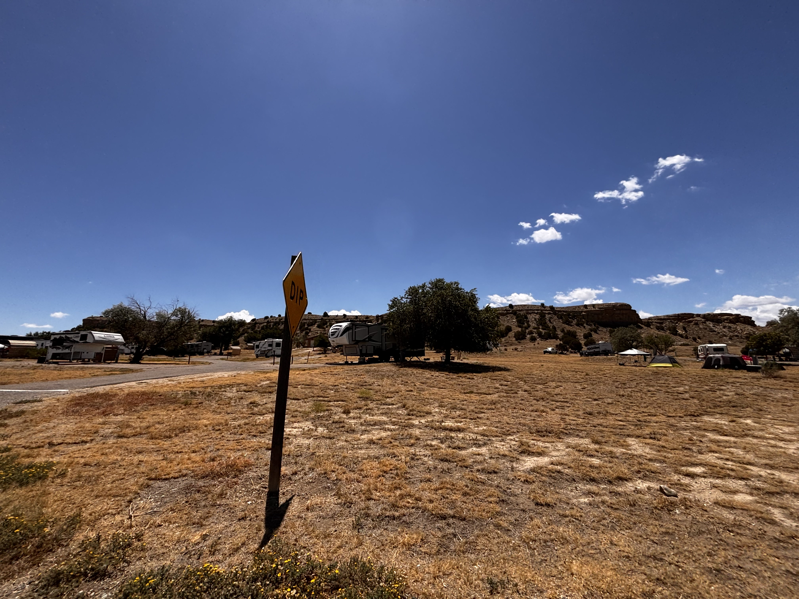

<br><details><summary>:camera:**66/IMG_0421.jpg**</summary><sub> `Exif version` 0232 `OS version` 27.0 `Date` 2026:07:18 12:34:00 `Aperture` Not known `Brightness` 10.295315892875607 `Color space` 65535 `Compression` Not known`Exposure mode` 0 `Exposure time` 0.0007830853563038371 `Focal length` 1.54 `Lens model` iPhone 15 Plus back dual wide camera 1.54mm f/2.4 `Lens specification` (1.54, 5.960000038146973, 1.6, 2.4) `Orientation` 1 `Scene type` Not known `f number` 2.4 `White balance` 0 `Sensing method` 2 `Shutter speed` 10.31870006980532</sub><sub>`Coordinates & altitude` (38.251244444444445, -104.73376388888889, 1506.321436848204)</sub><sub> :earth_americas:`Location over` [Google Maps](http://maps.google.com/maps?q=38.251244444444445,-104.73376388888889) or [Openstreet Map](https://www.openstreetmap.org/query?lat=38.251244444444445&lon=-104.73376388888889)</sub></details>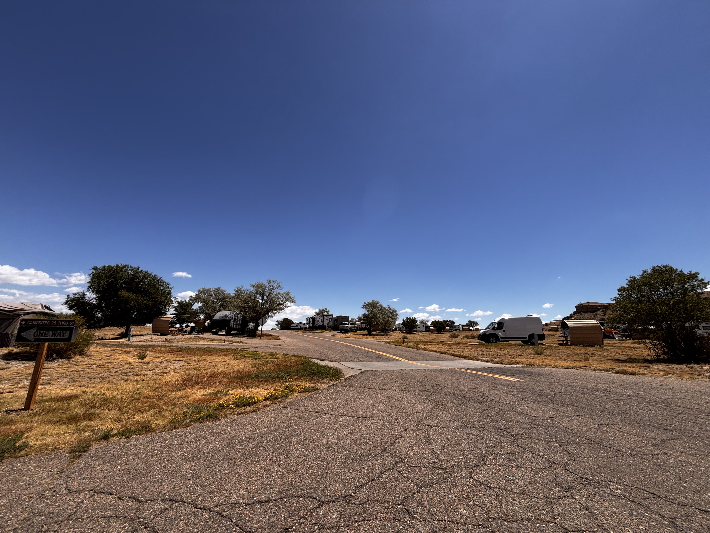

<br><details><summary>:camera:**66/IMG_0422.jpg**</summary><sub> `Exif version` 0232 `OS version` 27.0 `Date` 2026:07:18 12:34:42 `Aperture` Not known `Brightness` 10.388938009627665 `Color space` 65535 `Compression` Not known`Exposure mode` 0 `Exposure time` 0.0007462686567164179 `Focal length` 1.54 `Lens model` iPhone 15 Plus back dual wide camera 1.54mm f/2.4 `Lens specification` (1.54, 5.960000038146973, 1.6, 2.4) `Orientation` 1 `Scene type` Not known `f number` 2.4 `White balance` 0 `Sensing method` 2 `Shutter speed` 10.388536749831422</sub><sub>`Coordinates & altitude` (38.25246388888889, -104.733825, 1505.237170596394)</sub><sub> :earth_americas:`Location over` [Google Maps](http://maps.google.com/maps?q=38.25246388888889,-104.733825) or [Openstreet Map](https://www.openstreetmap.org/query?lat=38.25246388888889&lon=-104.733825)</sub></details>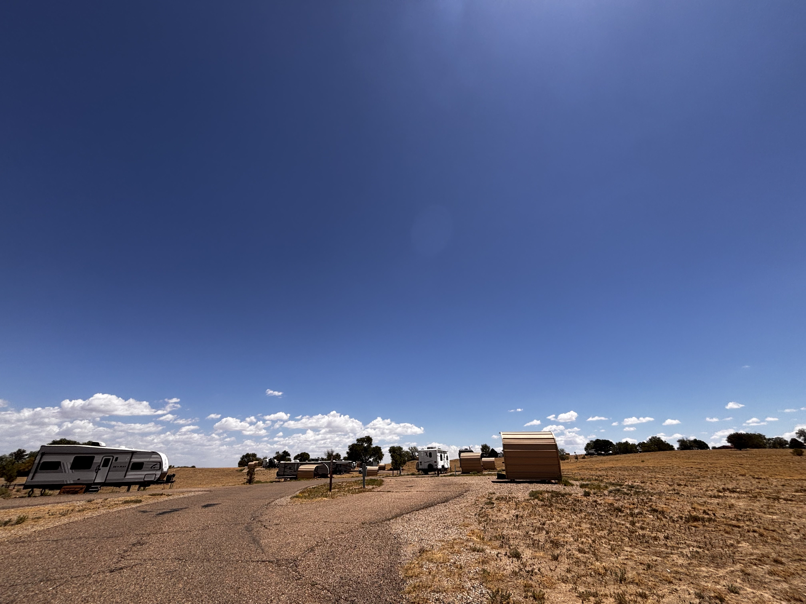

<br><details><summary>:camera:**66/IMG_0423.jpg**</summary><sub> `Exif version` 0232 `OS version` 27.0 `Date` 2026:07:18 12:34:45 `Aperture` Not known `Brightness` 10.56417472164444 `Color space` 65535 `Compression` Not known`Exposure mode` 0 `Exposure time` 0.0006720430107526882 `Focal length` 1.54 `Lens model` iPhone 15 Plus back dual wide camera 1.54mm f/2.4 `Lens specification` (1.54, 5.960000038146973, 1.6, 2.4) `Orientation` 1 `Scene type` Not known `f number` 2.4 `White balance` 0 `Sensing method` 2 `Shutter speed` 10.539251137291497</sub><sub>`Coordinates & altitude` (38.2525, -104.73377222222223, 1505.39911634757)</sub><sub> :earth_americas:`Location over` [Google Maps](http://maps.google.com/maps?q=38.2525,-104.73377222222223) or [Openstreet Map](https://www.openstreetmap.org/query?lat=38.2525&lon=-104.73377222222223)</sub></details>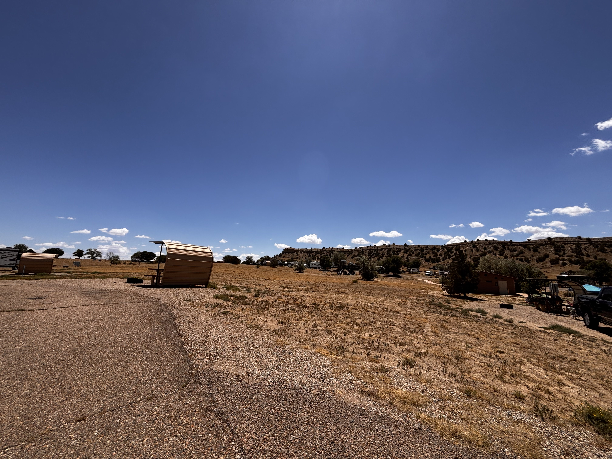

<br><details><summary>:camera:**66/IMG_0424.jpg**</summary><sub> `Exif version` 0232 `OS version` 27.0 `Date` 2026:07:18 12:35:03 `Aperture` Not known `Brightness` 10.33233817342923 `Color space` 65535 `Compression` Not known`Exposure mode` 0 `Exposure time` 0.0007830853563038371 `Focal length` 1.54 `Lens model` iPhone 15 Plus back dual wide camera 1.54mm f/2.4 `Lens specification` (1.54, 5.960000038146973, 1.6, 2.4) `Orientation` 1 `Scene type` Not known `f number` 2.4 `White balance` 0 `Sensing method` 2 `Shutter speed` 10.31870006980532</sub><sub>`Coordinates & altitude` (38.25256666666667, -104.73323888888889, 1506.2729124236253)</sub><sub> :earth_americas:`Location over` [Google Maps](http://maps.google.com/maps?q=38.25256666666667,-104.73323888888889) or [Openstreet Map](https://www.openstreetmap.org/query?lat=38.25256666666667&lon=-104.73323888888889)</sub></details>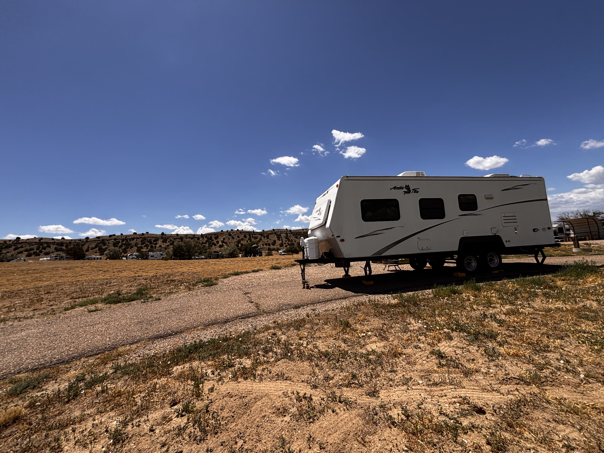

<br><details><summary>:camera:**66/IMG_0425.jpg**</summary><sub> `Exif version` 0232 `OS version` 27.0 `Date` 2026:07:18 12:35:07 `Aperture` Not known `Brightness` 10.052060186654815 `Color space` 65535 `Compression` Not known`Exposure mode` 0 `Exposure time` 0.0012360939431396785 `Focal length` 1.54 `Lens model` iPhone 15 Plus back dual wide camera 1.54mm f/2.4 `Lens specification` (1.54, 5.960000038146973, 1.6, 2.4) `Orientation` 1 `Scene type` Not known `f number` 2.4 `White balance` 0 `Sensing method` 2 `Shutter speed` 9.660105548423905</sub><sub>`Coordinates & altitude` (38.252541666666666, -104.73296388888889, 1507.0559523809525)</sub><sub> :earth_americas:`Location over` [Google Maps](http://maps.google.com/maps?q=38.252541666666666,-104.73296388888889) or [Openstreet Map](https://www.openstreetmap.org/query?lat=38.252541666666666&lon=-104.73296388888889)</sub></details>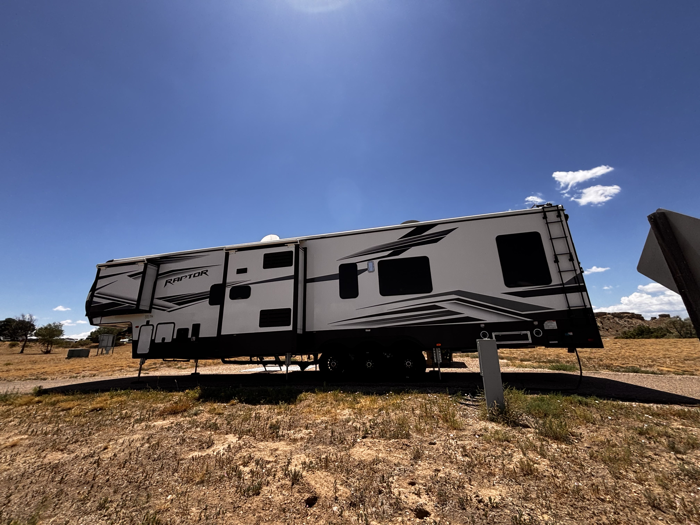

<br><details><summary>:camera:**66/IMG_0426.jpg**</summary><sub> `Exif version` 0232 `OS version` 27.0 `Date` 2026:07:18 12:35:16 `Aperture` Not known `Brightness` 9.990389925991384 `Color space` 65535 `Compression` Not known`Exposure mode` 0 `Exposure time` 0.0016155088852988692 `Focal length` 1.54 `Lens model` iPhone 15 Plus back dual wide camera 1.54mm f/2.4 `Lens specification` (1.54, 5.960000038146973, 1.6, 2.4) `Orientation` 1 `Scene type` Not known `f number` 2.4 `White balance` 0 `Sensing method` 2 `Shutter speed` 9.273357086302454</sub><sub>`Coordinates & altitude` (38.252625, -104.73259722222222, 1507.11707523246)</sub><sub> :earth_americas:`Location over` [Google Maps](http://maps.google.com/maps?q=38.252625,-104.73259722222222) or [Openstreet Map](https://www.openstreetmap.org/query?lat=38.252625&lon=-104.73259722222222)</sub></details>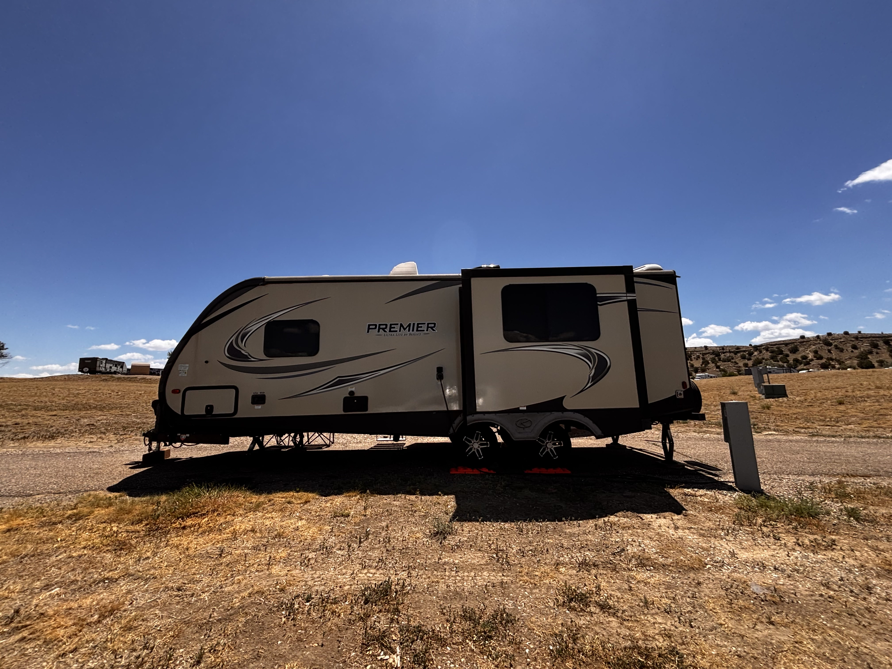

<br><details><summary>:camera:**66/IMG_0427.jpg**</summary><sub> `Exif version` 0232 `OS version` 27.0 `Date` 2026:07:18 12:35:22 `Aperture` Not known `Brightness` 8.541389882473172 `Color space` 65535 `Compression` Not known`Exposure mode` 0 `Exposure time` 0.0018656716417910447 `Focal length` 1.54 `Lens model` iPhone 15 Plus back dual wide camera 1.54mm f/2.4 `Lens specification` (1.54, 5.960000038146973, 1.6, 2.4) `Orientation` 1 `Scene type` Not known `f number` 2.4 `White balance` 0 `Sensing method` 2 `Shutter speed` 9.065835299404561</sub><sub>`Coordinates & altitude` (38.25278888888889, -104.73244444444444, 1508.050193050193)</sub><sub> :earth_americas:`Location over` [Google Maps](http://maps.google.com/maps?q=38.25278888888889,-104.73244444444444) or [Openstreet Map](https://www.openstreetmap.org/query?lat=38.25278888888889&lon=-104.73244444444444)</sub></details>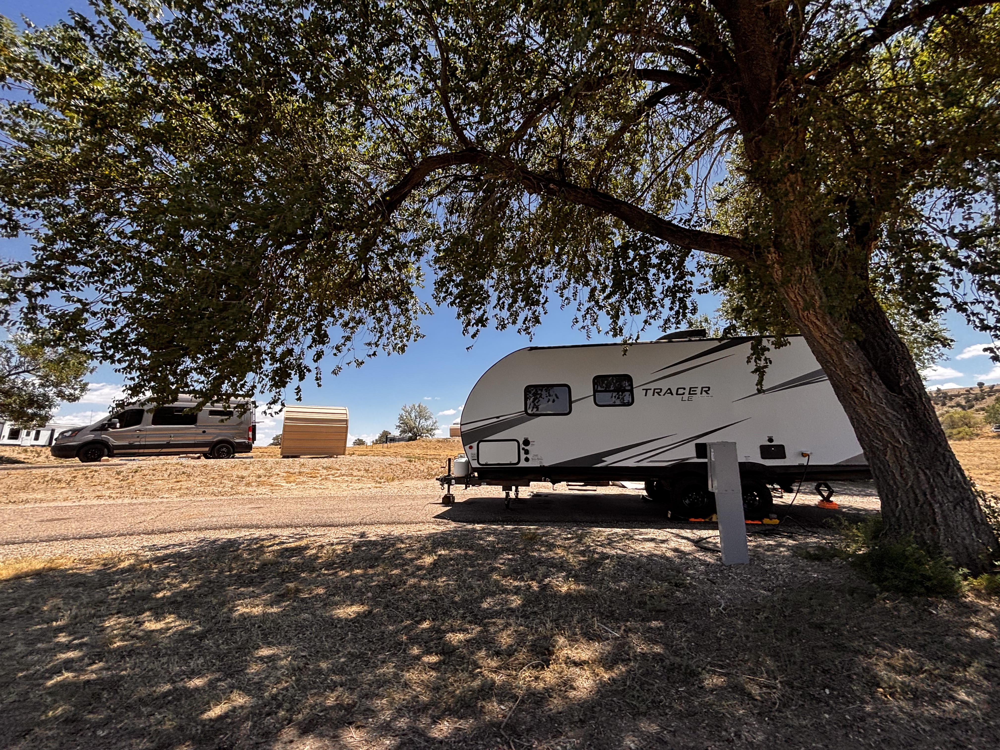

<br><details><summary>:camera:**66/IMG_0428.jpg**</summary><sub> `Exif version` 0232 `OS version` 27.0 `Date` 2026:07:18 12:35:23 `Aperture` Not known `Brightness` 10.081929260450162 `Color space` 65535 `Compression` Not known`Exposure mode` 0 `Exposure time` 0.0009216589861751152 `Focal length` 1.54 `Lens model` iPhone 15 Plus back dual wide camera 1.54mm f/2.4 `Lens specification` (1.54, 5.960000038146973, 1.6, 2.4) `Orientation` 1 `Scene type` Not known `f number` 2.4 `White balance` 0 `Sensing method` 2 `Shutter speed` 10.082945633390935</sub><sub>`Coordinates & altitude` (38.252880555555556, -104.73240555555556, 1507.8684210526317)</sub><sub> :earth_americas:`Location over` [Google Maps](http://maps.google.com/maps?q=38.252880555555556,-104.73240555555556) or [Openstreet Map](https://www.openstreetmap.org/query?lat=38.252880555555556&lon=-104.73240555555556)</sub></details>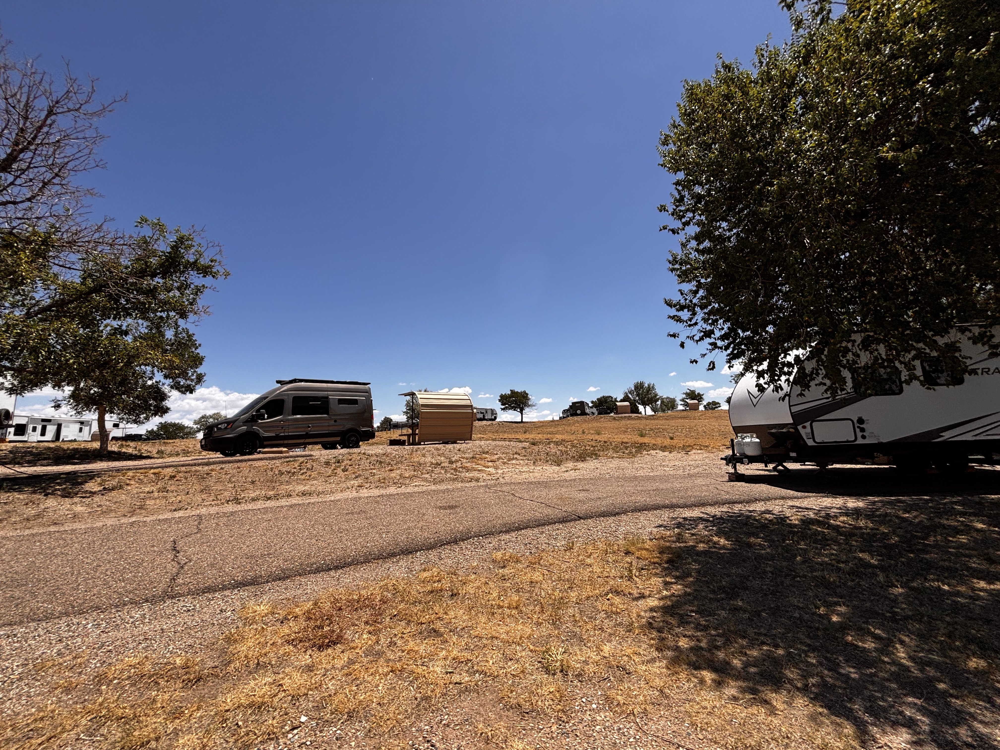

<br><details><summary>:camera:**66/IMG_0429.jpg**</summary><sub> `Exif version` 0232 `OS version` 27.0 `Date` 2026:07:18 12:35:32 `Aperture` Not known `Brightness` 10.256271905552481 `Color space` 65535 `Compression` Not known`Exposure mode` 0 `Exposure time` 0.0011614401858304297 `Focal length` 1.54 `Lens model` iPhone 15 Plus back dual wide camera 1.54mm f/2.4 `Lens specification` (1.54, 5.960000038146973, 1.6, 2.4) `Orientation` 1 `Scene type` Not known `f number` 2.4 `White balance` 0 `Sensing method` 2 `Shutter speed` 9.74917421417155</sub><sub>`Coordinates & altitude` (38.25312777777778, -104.73225277777777, 1508.2460496613996)</sub><sub> :earth_americas:`Location over` [Google Maps](http://maps.google.com/maps?q=38.25312777777778,-104.73225277777777) or [Openstreet Map](https://www.openstreetmap.org/query?lat=38.25312777777778&lon=-104.73225277777777)</sub></details>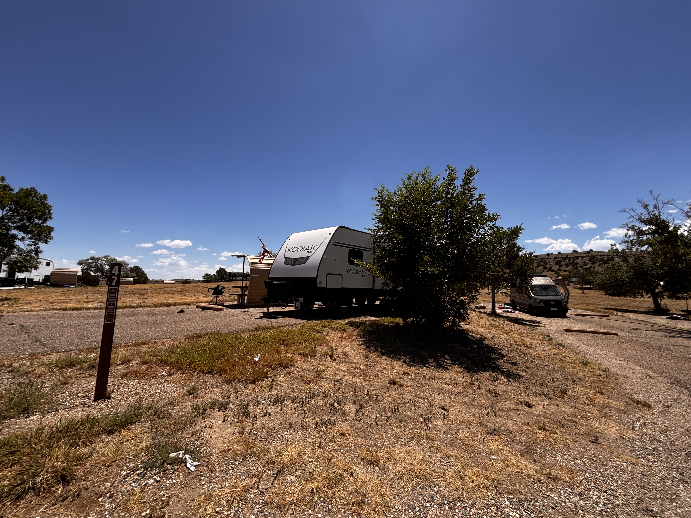

<br><details><summary>:camera:**66/IMG_0430.jpg**</summary><sub> `Exif version` 0232 `OS version` 27.0 `Date` 2026:07:18 12:35:46 `Aperture` Not known `Brightness` 9.997522836352376 `Color space` 65535 `Compression` Not known`Exposure mode` 0 `Exposure time` 0.0015503875968992248 `Focal length` 1.54 `Lens model` iPhone 15 Plus back dual wide camera 1.54mm f/2.4 `Lens specification` (1.54, 5.960000038146973, 1.6, 2.4) `Orientation` 1 `Scene type` Not known `f number` 2.4 `White balance` 0 `Sensing method` 2 `Shutter speed` 9.33258559622196</sub><sub>`Coordinates & altitude` (38.25323888888889, -104.73170555555556, 1507.936475409836)</sub><sub> :earth_americas:`Location over` [Google Maps](http://maps.google.com/maps?q=38.25323888888889,-104.73170555555556) or [Openstreet Map](https://www.openstreetmap.org/query?lat=38.25323888888889&lon=-104.73170555555556)</sub></details>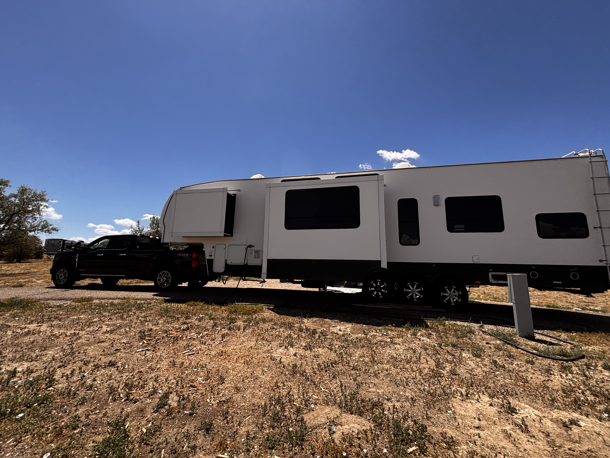

<br><details><summary>:camera:**66/IMG_0431.jpg**</summary><sub> `Exif version` 0232 `OS version` 27.0 `Date` 2026:07:18 12:35:49 `Aperture` Not known `Brightness` 10.443515643658944 `Color space` 65535 `Compression` Not known`Exposure mode` 0 `Exposure time` 0.0007462686567164179 `Focal length` 1.54 `Lens model` iPhone 15 Plus back dual wide camera 1.54mm f/2.4 `Lens specification` (1.54, 5.960000038146973, 1.6, 2.4) `Orientation` 1 `Scene type` Not known `f number` 2.4 `White balance` 0 `Sensing method` 2 `Shutter speed` 10.388536749831422</sub><sub>`Coordinates & altitude` (38.25318055555555, -104.73151388888888, 1508.02790346908)</sub><sub> :earth_americas:`Location over` [Google Maps](http://maps.google.com/maps?q=38.25318055555555,-104.73151388888888) or [Openstreet Map](https://www.openstreetmap.org/query?lat=38.25318055555555&lon=-104.73151388888888)</sub></details>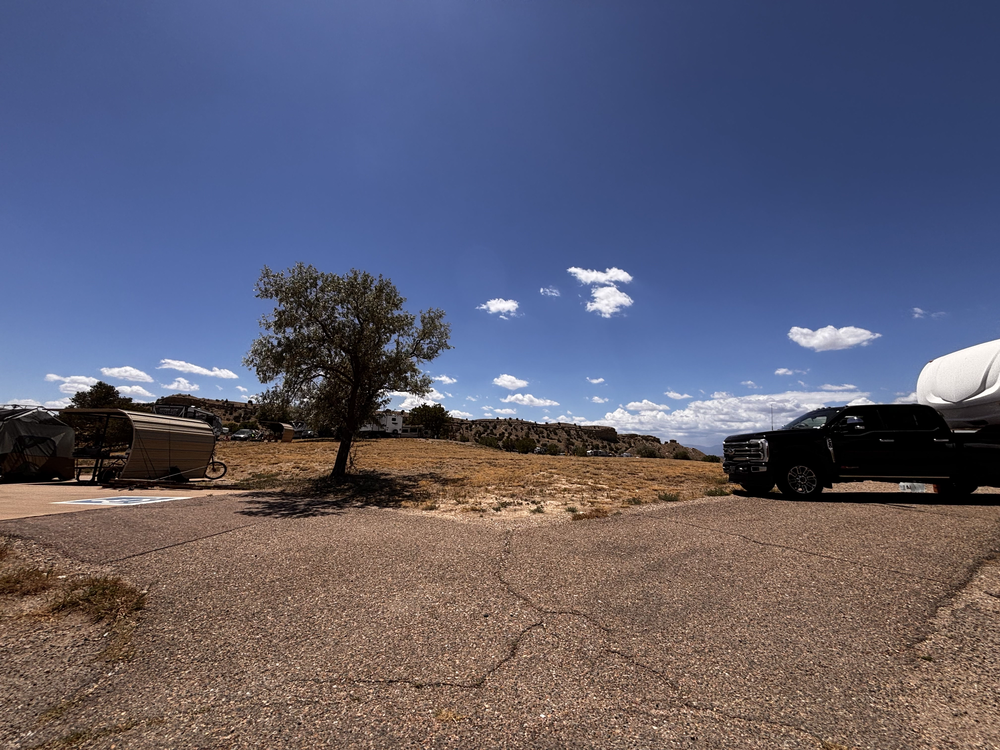

<br><details><summary>:camera:**66/IMG_0432.jpg**</summary><sub> `Exif version` 0232 `OS version` 27.0 `Date` 2026:07:18 12:36:09 `Aperture` Not known `Brightness` 10.295824108710589 `Color space` 65535 `Compression` Not known`Exposure mode` 0 `Exposure time` 0.0008849557522123894 `Focal length` 1.54 `Lens model` iPhone 15 Plus back dual wide camera 1.54mm f/2.4 `Lens specification` (1.54, 5.960000038146973, 1.6, 2.4) `Orientation` 1 `Scene type` Not known `f number` 2.4 `White balance` 0 `Sensing method` 2 `Shutter speed` 10.142034923422106</sub><sub>`Coordinates & altitude` (38.252608333333335, -104.73129166666666, 1510.4097995545658)</sub><sub> :earth_americas:`Location over` [Google Maps](http://maps.google.com/maps?q=38.252608333333335,-104.73129166666666) or [Openstreet Map](https://www.openstreetmap.org/query?lat=38.252608333333335&lon=-104.73129166666666)</sub></details>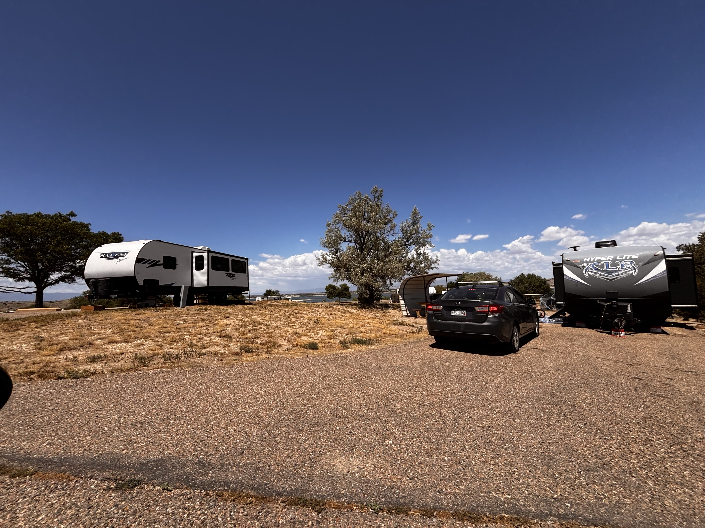

<br><details><summary>:camera:**66/IMG_0433.jpg**</summary><sub> `Exif version` 0232 `OS version` 27.0 `Date` 2026:07:18 12:36:13 `Aperture` Not known `Brightness` 10.180715242999224 `Color space` 65535 `Compression` Not known`Exposure mode` 0 `Exposure time` 0.0008849557522123894 `Focal length` 1.54 `Lens model` iPhone 15 Plus back dual wide camera 1.54mm f/2.4 `Lens specification` (1.54, 5.960000038146973, 1.6, 2.4) `Orientation` 1 `Scene type` Not known `f number` 2.4 `White balance` 0 `Sensing method` 2 `Shutter speed` 10.142034923422106</sub><sub>`Coordinates & altitude` (38.25246111111111, -104.73145277777778, 1512.1942307692307)</sub><sub> :earth_americas:`Location over` [Google Maps](http://maps.google.com/maps?q=38.25246111111111,-104.73145277777778) or [Openstreet Map](https://www.openstreetmap.org/query?lat=38.25246111111111&lon=-104.73145277777778)</sub></details>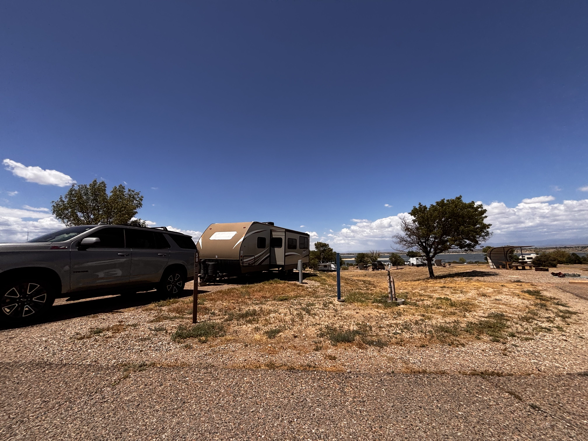

<br><details><summary>:camera:**66/IMG_0434.jpg**</summary><sub> `Exif version` 0232 `OS version` 27.0 `Date` 2026:07:18 12:36:32 `Aperture` Not known `Brightness` 10.427435128439171 `Color space` 65535 `Compression` Not known`Exposure mode` 0 `Exposure time` 0.000643915003219575 `Focal length` 1.54 `Lens model` iPhone 15 Plus back dual wide camera 1.54mm f/2.4 `Lens specification` (1.54, 5.960000038146973, 1.6, 2.4) `Orientation` 1 `Scene type` Not known `f number` 2.4 `White balance` 0 `Sensing method` 2 `Shutter speed` 10.60065170166546</sub><sub>`Coordinates & altitude` (38.251913888888886, -104.73175, 1512.8091286307053)</sub><sub> :earth_americas:`Location over` [Google Maps](http://maps.google.com/maps?q=38.251913888888886,-104.73175) or [Openstreet Map](https://www.openstreetmap.org/query?lat=38.251913888888886&lon=-104.73175)</sub></details>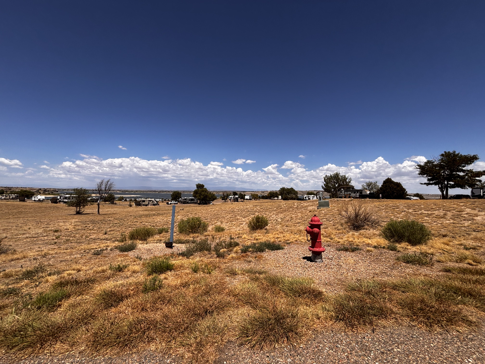

<br><details><summary>:camera:**66/IMG_0435.jpg**</summary><sub> `Exif version` 0232 `OS version` 27.0 `Date` 2026:07:18 12:36:36 `Aperture` Not known `Brightness` 10.493117357065113 `Color space` 65535 `Compression` Not known`Exposure mode` 0 `Exposure time` 0.00016801075268817206 `Focal length` 5.96 `Lens model` iPhone 15 Plus back dual wide camera 5.96mm f/1.6 `Lens specification` (1.5399999618512084, 5.96, 1.6, 2.4) `Orientation` 1 `Scene type` Not known `f number` 1.6 `White balance` 0 `Sensing method` 2 `Shutter speed` 12.539251137291497</sub><sub>`Coordinates & altitude` (38.251891666666666, -104.73181944444444, 1512.9491497165723)</sub><sub> :earth_americas:`Location over` [Google Maps](http://maps.google.com/maps?q=38.251891666666666,-104.73181944444444) or [Openstreet Map](https://www.openstreetmap.org/query?lat=38.251891666666666&lon=-104.73181944444444)</sub></details>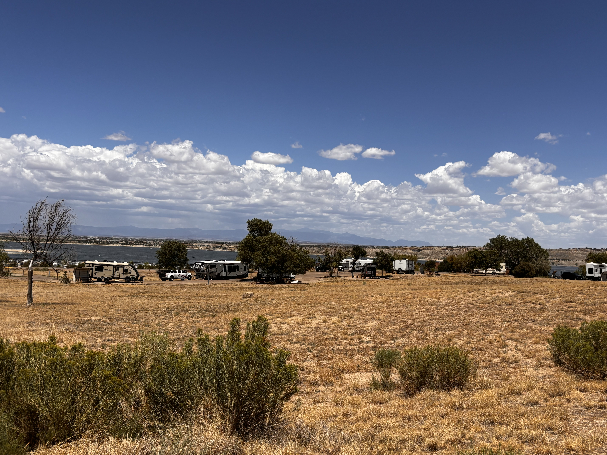

<br><details><summary>:camera:**66/IMG_0436.jpg**</summary><sub> `Exif version` 0232 `OS version` 27.0 `Date` 2026:07:18 12:36:39 `Aperture` Not known `Brightness` 10.323353189420121 `Color space` 65535 `Compression` Not known`Exposure mode` 0 `Exposure time` 0.000177999288002848 `Focal length` 5.96 `Lens model` iPhone 15 Plus back dual wide camera 5.96mm f/1.6 `Lens specification` (1.5399999618512084, 5.96, 1.6, 2.4) `Orientation` 1 `Scene type` Not known `f number` 1.6 `White balance` 0 `Sensing method` 2 `Shutter speed` 12.455835145490317</sub><sub>`Coordinates & altitude` (38.25188055555556, -104.73187222222222, 1512.770234986945)</sub><sub> :earth_americas:`Location over` [Google Maps](http://maps.google.com/maps?q=38.25188055555556,-104.73187222222222) or [Openstreet Map](https://www.openstreetmap.org/query?lat=38.25188055555556&lon=-104.73187222222222)</sub></details>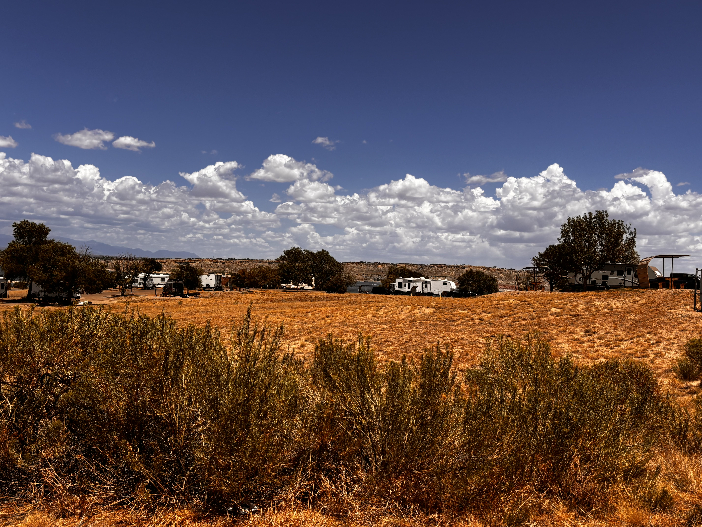

<br><details><summary>:camera:**66/IMG_0437.jpg**</summary><sub> `Exif version` 0232 `OS version` 27.0 `Date` 2026:07:18 12:36:56 `Aperture` Not known `Brightness` 10.640618321698248 `Color space` 65535 `Compression` Not known`Exposure mode` 0 `Exposure time` 0.00015800284405119292 `Focal length` 5.96 `Lens model` iPhone 15 Plus back dual wide camera 5.96mm f/1.6 `Lens specification` (1.5399999618512084, 5.96, 1.6, 2.4) `Orientation` 1 `Scene type` Not known `f number` 1.6 `White balance` 0 `Sensing method` 2 `Shutter speed` 12.627787823990356</sub><sub>`Coordinates & altitude` (38.25166388888889, -104.73253611111112, 1512.0653753026634)</sub><sub> :earth_americas:`Location over` [Google Maps](http://maps.google.com/maps?q=38.25166388888889,-104.73253611111112) or [Openstreet Map](https://www.openstreetmap.org/query?lat=38.25166388888889&lon=-104.73253611111112)</sub></details>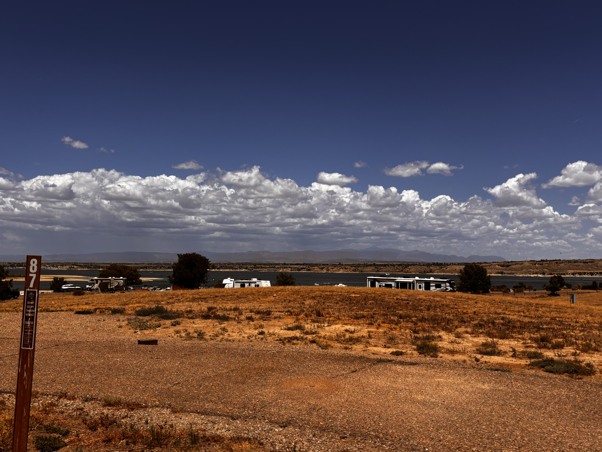

<br><details><summary>:camera:**66/IMG_0438.jpg**</summary><sub> `Exif version` 0232 `OS version` 27.0 `Date` 2026:07:18 12:36:58 `Aperture` Not known `Brightness` 9.727717758271439 `Color space` 65535 `Compression` Not known`Exposure mode` 0 `Exposure time` 0.0002449779519843214 `Focal length` 5.96 `Lens model` iPhone 15 Plus back dual wide camera 5.96mm f/1.6 `Lens specification` (1.5399999618512084, 5.96, 1.6, 2.4) `Orientation` 1 `Scene type` Not known `f number` 1.6 `White balance` 0 `Sensing method` 2 `Shutter speed` 11.994930629669156</sub><sub>`Coordinates & altitude` (38.25161388888889, -104.73268888888889, 1512.0653685674547)</sub><sub> :earth_americas:`Location over` [Google Maps](http://maps.google.com/maps?q=38.25161388888889,-104.73268888888889) or [Openstreet Map](https://www.openstreetmap.org/query?lat=38.25161388888889&lon=-104.73268888888889)</sub></details>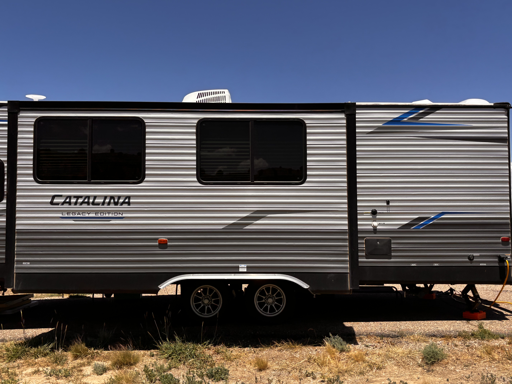

<br><details><summary>:camera:**66/IMG_0439.jpg**</summary><sub> `Exif version` 0232 `OS version` 27.0 `Date` 2026:07:18 12:37:03 `Aperture` Not known `Brightness` 10.386616305587228 `Color space` 65535 `Compression` Not known`Exposure mode` 0 `Exposure time` 0.0005701254275940707 `Focal length` 1.54 `Lens model` iPhone 15 Plus back dual wide camera 1.54mm f/2.4 `Lens specification` (1.54, 5.960000038146973, 1.6, 2.4) `Orientation` 1 `Scene type` Not known `f number` 2.4 `White balance` 0 `Sensing method` 2 `Shutter speed` 10.776750467483899</sub><sub>`Coordinates & altitude` (38.251552777777775, -104.73288611111111, 1511.3063829787234)</sub><sub> :earth_americas:`Location over` [Google Maps](http://maps.google.com/maps?q=38.251552777777775,-104.73288611111111) or [Openstreet Map](https://www.openstreetmap.org/query?lat=38.251552777777775&lon=-104.73288611111111)</sub></details>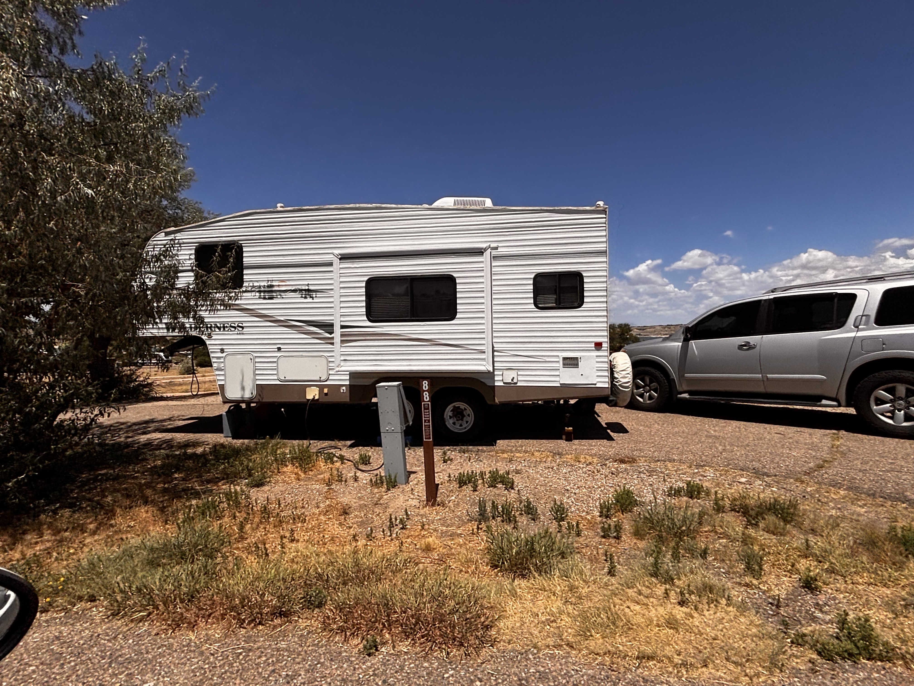

<br><details><summary>:camera:**66/IMG_0440.jpg**</summary><sub> `Exif version` 0232 `OS version` 27.0 `Date` 2026:07:18 12:37:06 `Aperture` Not known `Brightness` 10.375443636978199 `Color space` 65535 `Compression` Not known`Exposure mode` 0 `Exposure time` 0.0008849557522123894 `Focal length` 1.54 `Lens model` iPhone 15 Plus back dual wide camera 1.54mm f/2.4 `Lens specification` (1.54, 5.960000038146973, 1.6, 2.4) `Orientation` 1 `Scene type` Not known `f number` 2.4 `White balance` 0 `Sensing method` 2 `Shutter speed` 10.142034923422106</sub><sub>`Coordinates & altitude` (38.25150277777778, -104.73304722222223, 1510.191061452514)</sub><sub> :earth_americas:`Location over` [Google Maps](http://maps.google.com/maps?q=38.25150277777778,-104.73304722222223) or [Openstreet Map](https://www.openstreetmap.org/query?lat=38.25150277777778&lon=-104.73304722222223)</sub></details>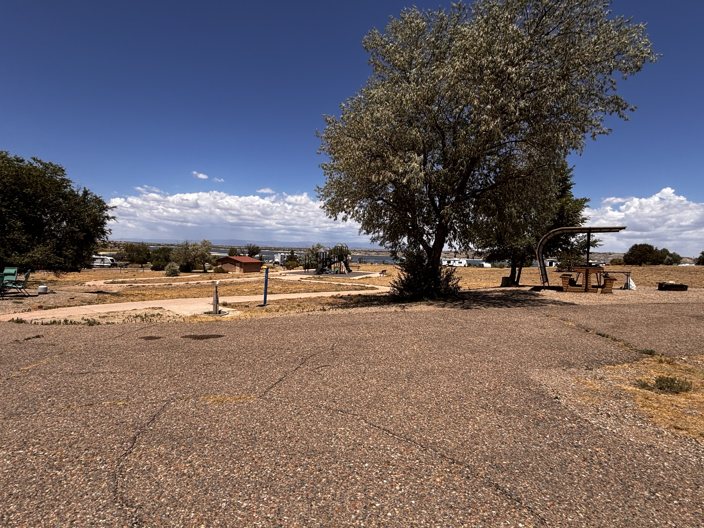

<br><details><summary>:camera:**66/IMG_0441.jpg**</summary><sub> `Exif version` 0232 `OS version` 27.0 `Date` 2026:07:18 12:37:08 `Aperture` Not known `Brightness` 9.827859592909812 `Color space` 65535 `Compression` Not known`Exposure mode` 0 `Exposure time` 0.0013003901170351106 `Focal length` 1.54 `Lens model` iPhone 15 Plus back dual wide camera 1.54mm f/2.4 `Lens specification` (1.54, 5.960000038146973, 1.6, 2.4) `Orientation` 1 `Scene type` Not known `f number` 2.4 `White balance` 0 `Sensing method` 2 `Shutter speed` 9.586163323329648</sub><sub>`Coordinates & altitude` (38.25145833333333, -104.73321666666666, 1509.4897610921503)</sub><sub> :earth_americas:`Location over` [Google Maps](http://maps.google.com/maps?q=38.25145833333333,-104.73321666666666) or [Openstreet Map](https://www.openstreetmap.org/query?lat=38.25145833333333&lon=-104.73321666666666)</sub></details>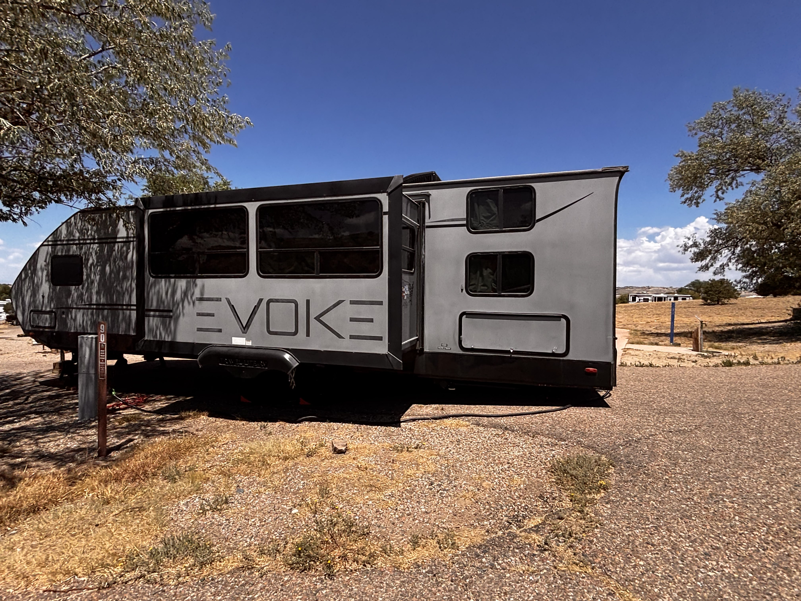

<br><details><summary>:camera:**66/IMG_0442.jpg**</summary><sub> `Exif version` 0232 `OS version` 27.0 `Date` 2026:07:18 12:37:12 `Aperture` Not known `Brightness` 10.547552532491194 `Color space` 65535 `Compression` Not known`Exposure mode` 0 `Exposure time` 0.000643915003219575 `Focal length` 1.54 `Lens model` iPhone 15 Plus back dual wide camera 1.54mm f/2.4 `Lens specification` (1.54, 5.960000038146973, 1.6, 2.4) `Orientation` 1 `Scene type` Not known `f number` 2.4 `White balance` 0 `Sensing method` 2 `Shutter speed` 10.60065170166546</sub><sub>`Coordinates & altitude` (38.25138611111111, -104.73343611111112, 1508.3165548098434)</sub><sub> :earth_americas:`Location over` [Google Maps](http://maps.google.com/maps?q=38.25138611111111,-104.73343611111112) or [Openstreet Map](https://www.openstreetmap.org/query?lat=38.25138611111111&lon=-104.73343611111112)</sub></details>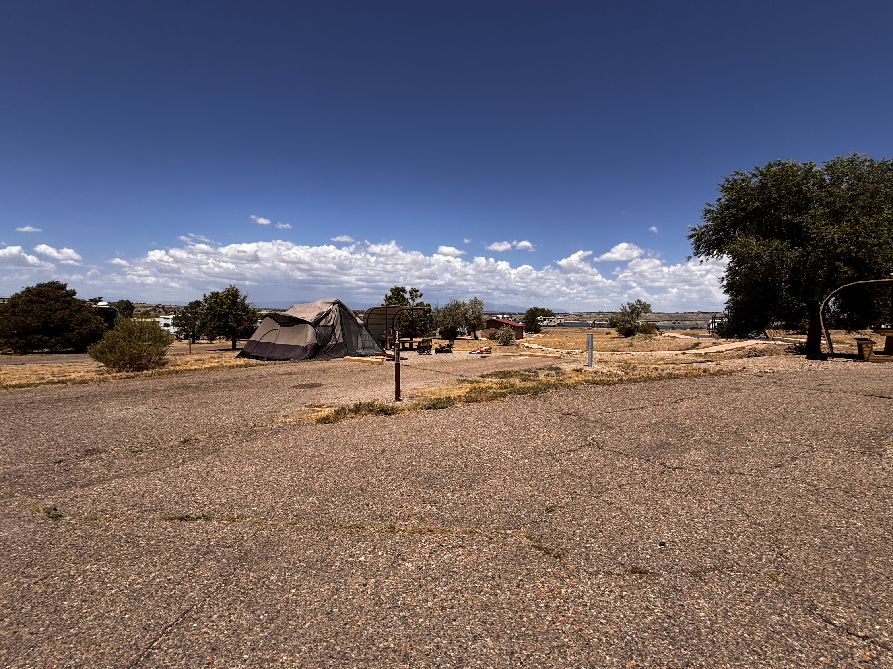

<br><details><summary>:camera:**66/IMG_0443.jpg**</summary><sub> `Exif version` 0232 `OS version` 27.0 `Date` 2026:07:18 12:57:17 `Aperture` Not known `Brightness` 10.052102488660047 `Color space` 65535 `Compression` Not known`Exposure mode` 0 `Exposure time` 0.00023501762632197415 `Focal length` 5.96 `Lens model` iPhone 15 Plus back dual wide camera 5.96mm f/1.6 `Lens specification` (1.5399999618512084, 5.96, 1.6, 2.4) `Orientation` 6 `Scene type` Not known `f number` 1.6 `White balance` 0 `Sensing method` 2 `Shutter speed` 12.055051610885204</sub><sub>`Coordinates & altitude` (38.26426388888889, -104.60987777777777, 1421.2065081351689)</sub><sub> :earth_americas:`Location over` [Google Maps](http://maps.google.com/maps?q=38.26426388888889,-104.60987777777777) or [Openstreet Map](https://www.openstreetmap.org/query?lat=38.26426388888889&lon=-104.60987777777777)</sub></details>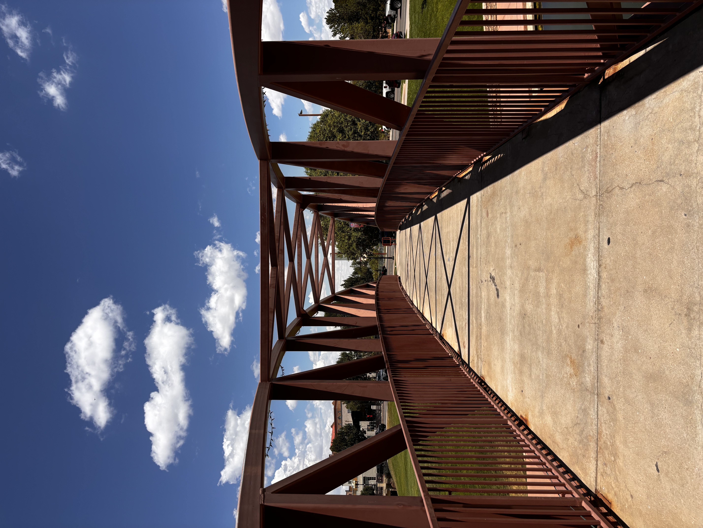

<br><details><summary>:camera:**66/IMG_0444.jpg**</summary><sub> `Exif version` 0232 `OS version` 27.0 `Date` 2026:07:18 12:57:24 `Aperture` Not known `Brightness` 9.548564052920296 `Color space` 65535 `Compression` Not known`Exposure mode` 0 `Exposure time` 0.00034094783498124785 `Focal length` 5.96 `Lens model` iPhone 15 Plus back dual wide camera 5.96mm f/1.6 `Lens specification` (1.5399999618512084, 5.96, 1.6, 2.4) `Orientation` 1 `Scene type` Not known `f number` 1.6 `White balance` 0 `Sensing method` 2 `Shutter speed` 11.517940638341127</sub><sub>`Coordinates & altitude` (38.26405, -104.60993888888888, 1423.5861486486488)</sub><sub> :earth_americas:`Location over` [Google Maps](http://maps.google.com/maps?q=38.26405,-104.60993888888888) or [Openstreet Map](https://www.openstreetmap.org/query?lat=38.26405&lon=-104.60993888888888)</sub></details>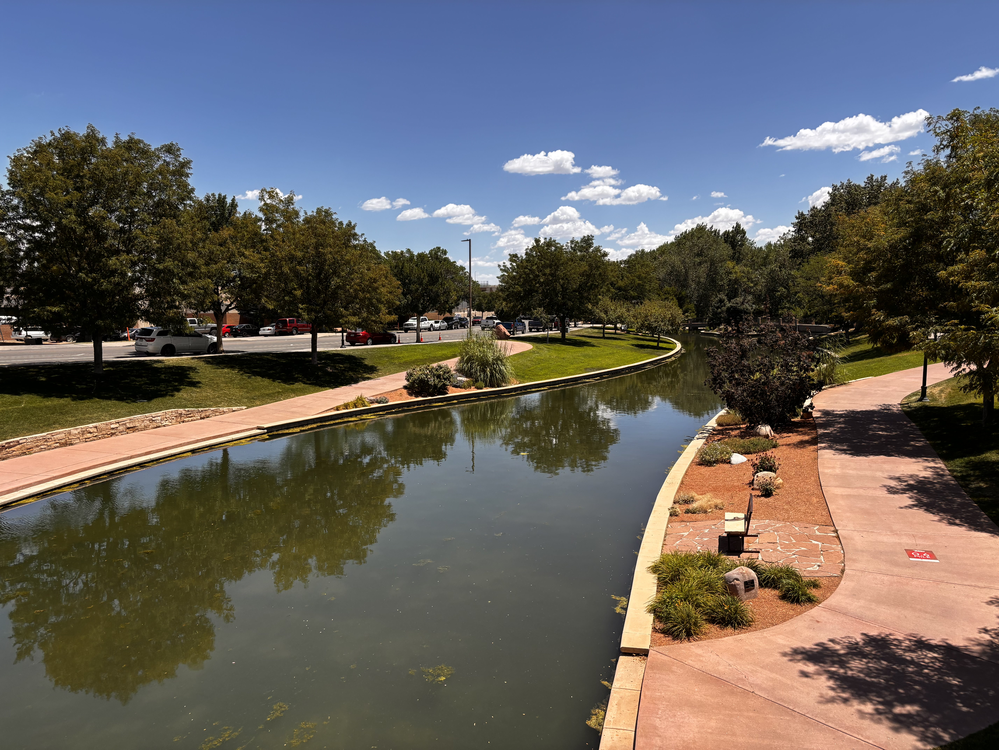

<br><details><summary>:camera:**66/IMG_0445.jpg**</summary><sub> `Exif version` 0232 `OS version` 27.0 `Date` 2026:07:18 12:57:31 `Aperture` Not known `Brightness` 9.962246406019078 `Color space` 65535 `Compression` Not known`Exposure mode` 0 `Exposure time` 0.00026399155227032733 `Focal length` 5.96 `Lens model` iPhone 15 Plus back dual wide camera 5.96mm f/1.6 `Lens specification` (1.5399999618512084, 5.96, 1.6, 2.4) `Orientation` 1 `Scene type` Not known `f number` 1.6 `White balance` 0 `Sensing method` 2 `Shutter speed` 11.887174447174447</sub><sub>`Coordinates & altitude` (38.26411944444445, -104.60990833333332, 1427.7162740899357)</sub><sub> :earth_americas:`Location over` [Google Maps](http://maps.google.com/maps?q=38.26411944444445,-104.60990833333332) or [Openstreet Map](https://www.openstreetmap.org/query?lat=38.26411944444445&lon=-104.60990833333332)</sub></details>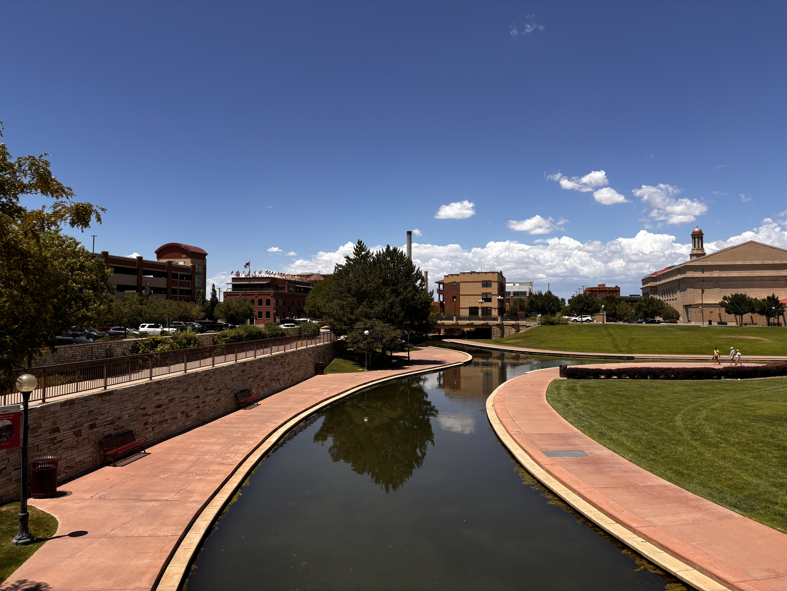

<br><details><summary>:camera:**66/IMG_0446.jpg**</summary><sub> `Exif version` 0232 `OS version` 27.0 `Date` 2026:07:18 12:57:34 `Aperture` Not known `Brightness` 9.838660123746532 `Color space` 65535 `Compression` Not known`Exposure mode` 0 `Exposure time` 0.000273972602739726 `Focal length` 5.96 `Lens model` iPhone 15 Plus back dual wide camera 5.96mm f/1.6 `Lens specification` (1.5399999618512084, 5.96, 1.6, 2.4) `Orientation` 6 `Scene type` Not known `f number` 1.6 `White balance` 0 `Sensing method` 2 `Shutter speed` 11.83353647919206</sub><sub>`Coordinates & altitude` (38.26412222222222, -104.60991666666666, 1427.6672025723474)</sub><sub> :earth_americas:`Location over` [Google Maps](http://maps.google.com/maps?q=38.26412222222222,-104.60991666666666) or [Openstreet Map](https://www.openstreetmap.org/query?lat=38.26412222222222&lon=-104.60991666666666)</sub></details>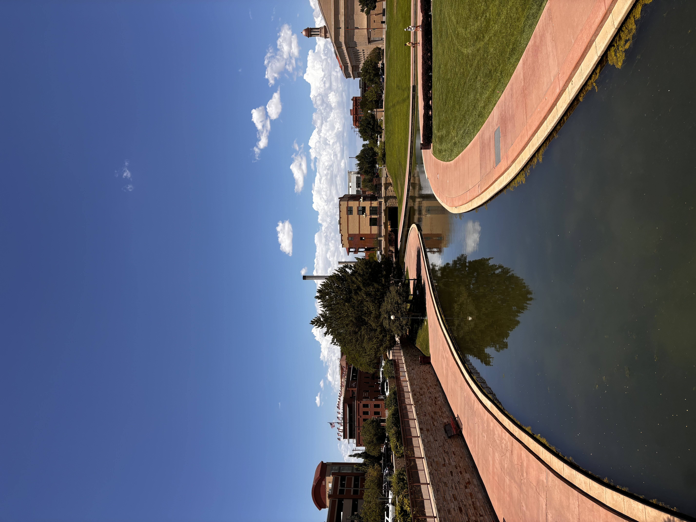

<br><details><summary>:camera:**66/IMG_0447.jpg**</summary><sub> `Exif version` 0232 `OS version` 27.0 `Date` 2026:07:18 12:57:38 `Aperture` Not known `Brightness` 9.741092768606526 `Color space` 65535 `Compression` Not known`Exposure mode` 0 `Exposure time` 0.00099601593625498 `Focal length` 1.54 `Lens model` iPhone 15 Plus back dual wide camera 1.54mm f/2.4 `Lens specification` (1.54, 5.960000038146973, 1.6, 2.4) `Orientation` 6 `Scene type` Not known `f number` 2.4 `White balance` 0 `Sensing method` 2 `Shutter speed` 9.971566644189705</sub><sub>`Coordinates & altitude` (38.264125, -104.60991666666666, 1426.8284574468084)</sub><sub> :earth_americas:`Location over` [Google Maps](http://maps.google.com/maps?q=38.264125,-104.60991666666666) or [Openstreet Map](https://www.openstreetmap.org/query?lat=38.264125&lon=-104.60991666666666)</sub></details>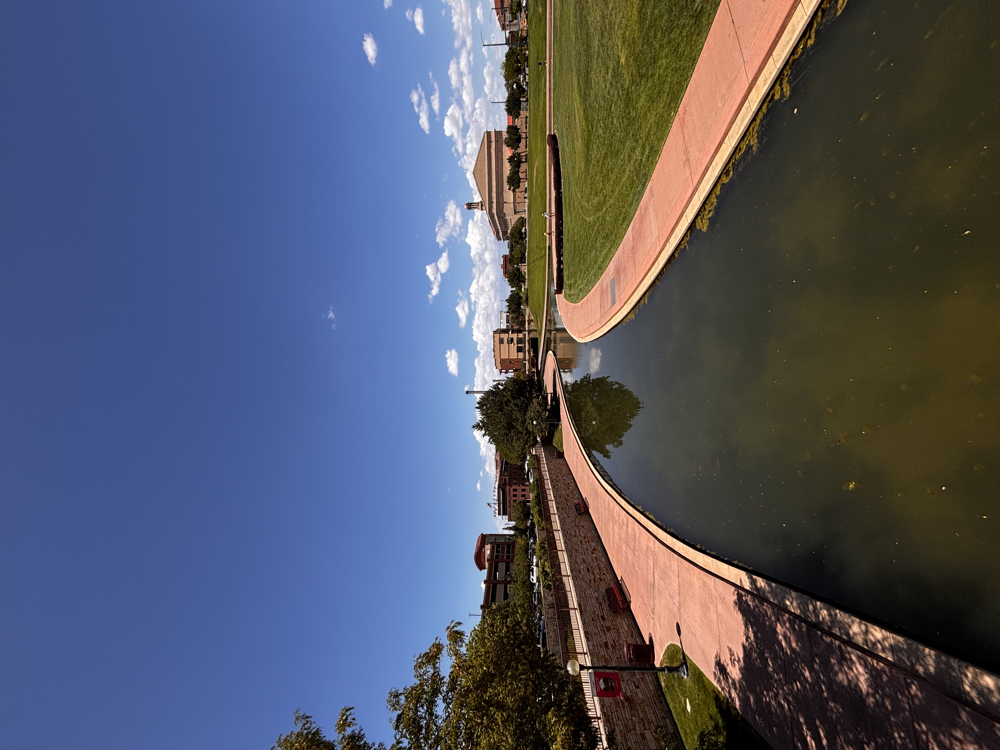

<br><details><summary>:camera:**66/IMG_0448.jpg**</summary><sub> `Exif version` 0232 `OS version` 27.0 `Date` 2026:07:18 12:57:40 `Aperture` Not known `Brightness` 9.754777434489071 `Color space` 65535 `Compression` Not known`Exposure mode` 0 `Exposure time` 0.0009587727708533077 `Focal length` 1.54 `Lens model` iPhone 15 Plus back dual wide camera 1.54mm f/2.4 `Lens specification` (1.54, 5.960000038146973, 1.6, 2.4) `Orientation` 1 `Scene type` Not known `f number` 2.4 `White balance` 0 `Sensing method` 2 `Shutter speed` 10.026181570894254</sub><sub>`Coordinates & altitude` (38.264125, -104.60991666666666, 1426.4933726067748)</sub><sub> :earth_americas:`Location over` [Google Maps](http://maps.google.com/maps?q=38.264125,-104.60991666666666) or [Openstreet Map](https://www.openstreetmap.org/query?lat=38.264125&lon=-104.60991666666666)</sub></details>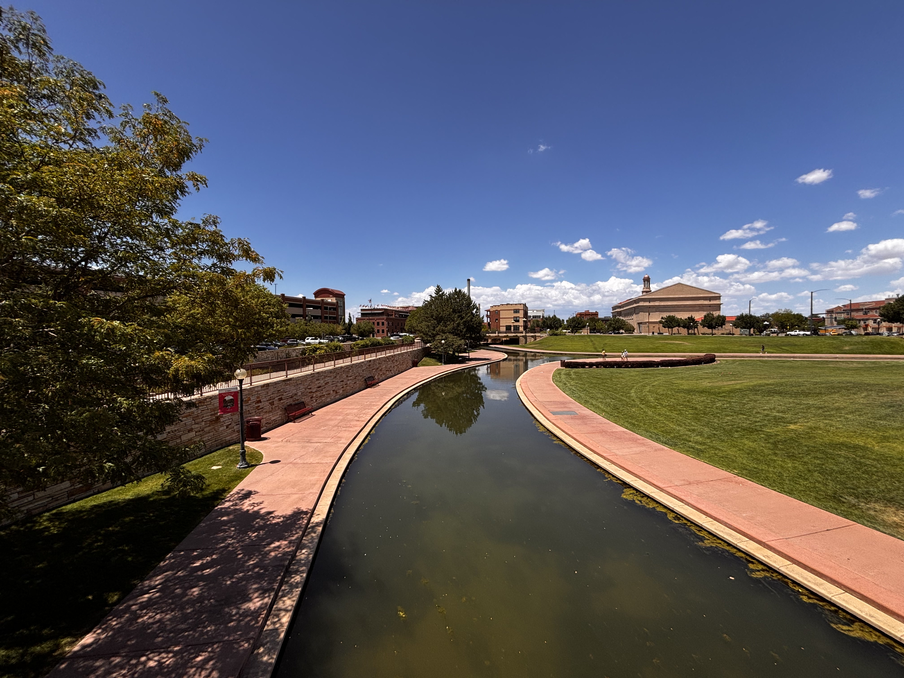

<br><details><summary>:camera:**66/IMG_0449.jpg**</summary><sub> `Exif version` 0232 `OS version` 27.0 `Date` 2026:07:18 13:06:18 `Aperture` Not known `Brightness` 9.647628330084471 `Color space` 65535 `Compression` Not known`Exposure mode` 0 `Exposure time` 0.0016155088852988692 `Focal length` 1.54 `Lens model` iPhone 15 Plus back dual wide camera 1.54mm f/2.4 `Lens specification` (1.54, 5.960000038146973, 1.6, 2.4) `Orientation` 1 `Scene type` Not known `f number` 2.4 `White balance` 0 `Sensing method` 2 `Shutter speed` 9.273357086302454</sub><sub>`Coordinates & altitude` (38.2654, -104.60817777777777, 1416.050259965338)</sub><sub> :earth_americas:`Location over` [Google Maps](http://maps.google.com/maps?q=38.2654,-104.60817777777777) or [Openstreet Map](https://www.openstreetmap.org/query?lat=38.2654&lon=-104.60817777777777)</sub></details>

<br><details><summary>:camera:**66/IMG_0450.jpg**</summary><sub> `Exif version` 0232 `OS version` 27.0 `Date` 2026:07:18 13:06:23 `Aperture` Not known `Brightness` 9.743423088826988 `Color space` 65535 `Compression` Not known`Exposure mode` 0 `Exposure time` 0.0009861932938856016 `Focal length` 1.54 `Lens model` iPhone 15 Plus back dual wide camera 1.54mm f/2.4 `Lens specification` (1.54, 5.960000038146973, 1.6, 2.4) `Orientation` 1 `Scene type` Not known `f number` 2.4 `White balance` 0 `Sensing method` 2 `Shutter speed` 9.986124737210933</sub><sub>`Coordinates & altitude` (38.265452777777774, -104.6081, 1421.5573394495414)</sub><sub> :earth_americas:`Location over` [Google Maps](http://maps.google.com/maps?q=38.265452777777774,-104.6081) or [Openstreet Map](https://www.openstreetmap.org/query?lat=38.265452777777774&lon=-104.6081)</sub></details>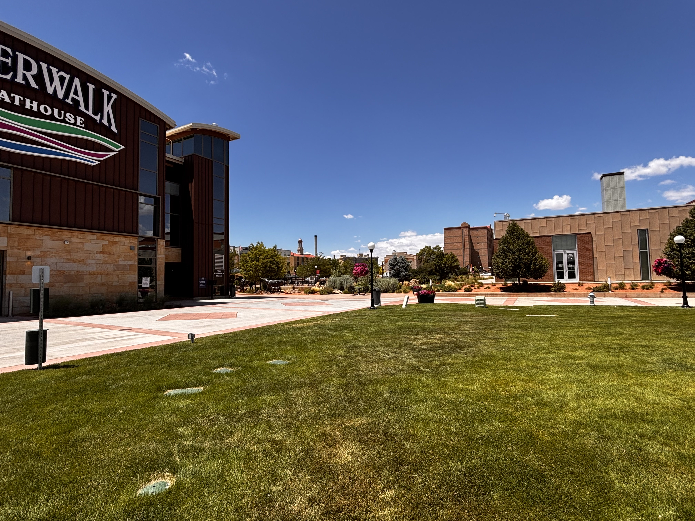

<br><details><summary>:camera:**66/IMG_0451.jpg**</summary><sub> `Exif version` 0232 `OS version` 27.0 `Date` 2026:07:18 13:07:00 `Aperture` Not known `Brightness` 8.13810418027433 `Color space` 65535 `Compression` Not known`Exposure mode` 0 `Exposure time` 0.007246376811594203 `Focal length` 1.54 `Lens model` iPhone 15 Plus back dual wide camera 1.54mm f/2.4 `Lens specification` (1.54, 5.960000038146973, 1.6, 2.4) `Orientation` 6 `Scene type` Not known `f number` 2.4 `White balance` 0 `Sensing method` 2 `Shutter speed` 7.109196908161929</sub><sub>`Coordinates & altitude` (38.265452777777774, -104.608375, 1425.0872458410352)</sub><sub> :earth_americas:`Location over` [Google Maps](http://maps.google.com/maps?q=38.265452777777774,-104.608375) or [Openstreet Map](https://www.openstreetmap.org/query?lat=38.265452777777774&lon=-104.608375)</sub></details>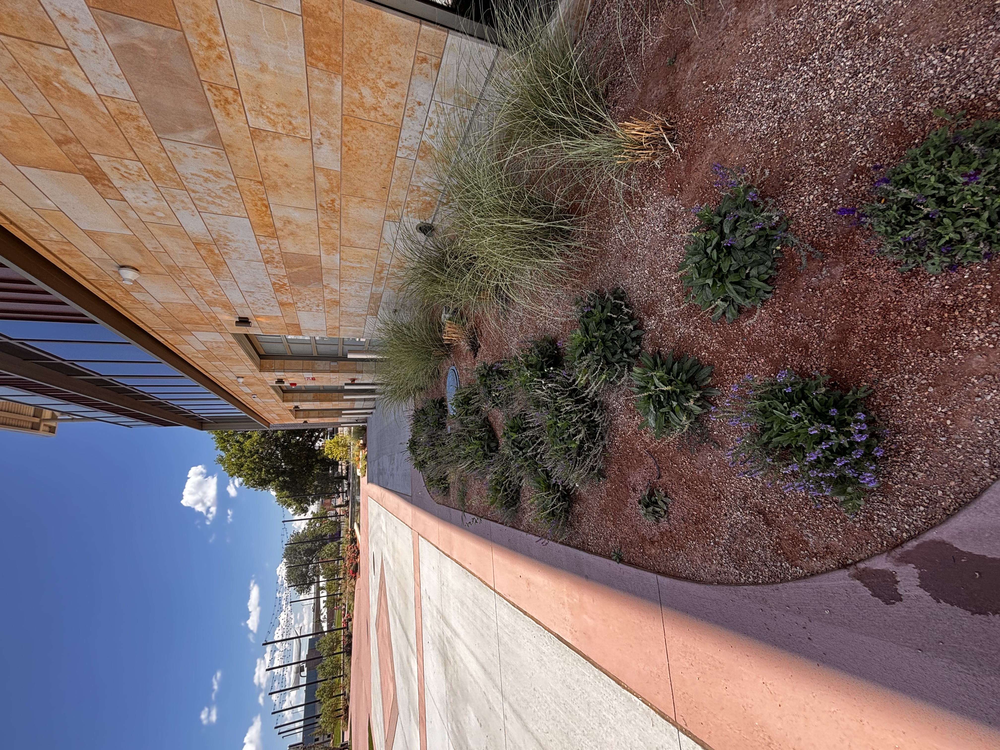

<br><details><summary>:camera:**66/IMG_0452.jpg**</summary><sub> `Exif version` 0232 `OS version` 27.0 `Date` 2026:07:18 13:07:13 `Aperture` Not known `Brightness` 9.935431347426864 `Color space` 65535 `Compression` Not known`Exposure mode` 0 `Exposure time` 0.000273972602739726 `Focal length` 5.96 `Lens model` iPhone 15 Plus back dual wide camera 5.96mm f/1.6 `Lens specification` (1.5399999618512084, 5.96, 1.6, 2.4) `Orientation` 1 `Scene type` Not known `f number` 1.6 `White balance` 0 `Sensing method` 2 `Shutter speed` 11.83353647919206</sub><sub>`Coordinates & altitude` (38.26547222222222, -104.60846666666666, 1422.622159090909)</sub><sub> :earth_americas:`Location over` [Google Maps](http://maps.google.com/maps?q=38.26547222222222,-104.60846666666666) or [Openstreet Map](https://www.openstreetmap.org/query?lat=38.26547222222222&lon=-104.60846666666666)</sub></details>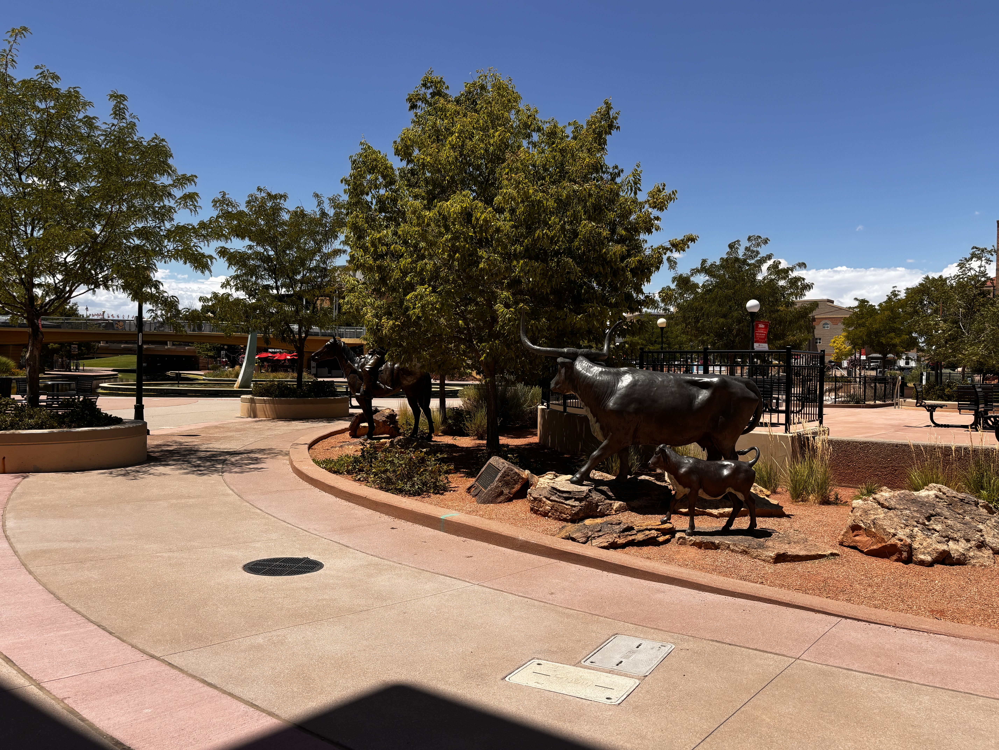

<br><details><summary>:camera:**66/IMG_0453.jpg**</summary><sub> `Exif version` 0232 `OS version` 27.0 `Date` 2026:07:18 13:07:17 `Aperture` Not known `Brightness` 10.325797907214602 `Color space` 65535 `Compression` Not known`Exposure mode` 0 `Exposure time` 0.000819672131147541 `Focal length` 1.54 `Lens model` iPhone 15 Plus back dual wide camera 1.54mm f/2.4 `Lens specification` (1.54, 5.960000038146973, 1.6, 2.4) `Orientation` 1 `Scene type` Not known `f number` 2.4 `White balance` 0 `Sensing method` 2 `Shutter speed` 10.252088470172598</sub><sub>`Coordinates & altitude` (38.26546944444444, -104.60846666666666, 1422.8918111177525)</sub><sub> :earth_americas:`Location over` [Google Maps](http://maps.google.com/maps?q=38.26546944444444,-104.60846666666666) or [Openstreet Map](https://www.openstreetmap.org/query?lat=38.26546944444444&lon=-104.60846666666666)</sub></details>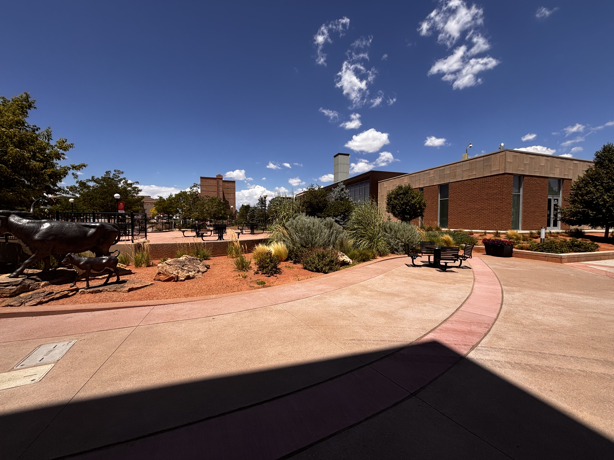

<br><details><summary>:camera:**66/IMG_0454.jpg**</summary><sub> `Exif version` 0232 `OS version` 27.0 `Date` 2026:07:18 13:07:36 `Aperture` Not known `Brightness` 9.504236875426123 `Color space` 65535 `Compression` Not known`Exposure mode` 0 `Exposure time` 0.0018656716417910447 `Focal length` 1.54 `Lens model` iPhone 15 Plus back dual wide camera 1.54mm f/2.4 `Lens specification` (1.54, 5.960000038146973, 1.6, 2.4) `Orientation` 6 `Scene type` Not known `f number` 2.4 `White balance` 0 `Sensing method` 2 `Shutter speed` 9.065835299404561</sub><sub>`Coordinates & altitude` (38.26544166666667, -104.60863611111111, 1420.1988071570577)</sub><sub> :earth_americas:`Location over` [Google Maps](http://maps.google.com/maps?q=38.26544166666667,-104.60863611111111) or [Openstreet Map](https://www.openstreetmap.org/query?lat=38.26544166666667&lon=-104.60863611111111)</sub></details>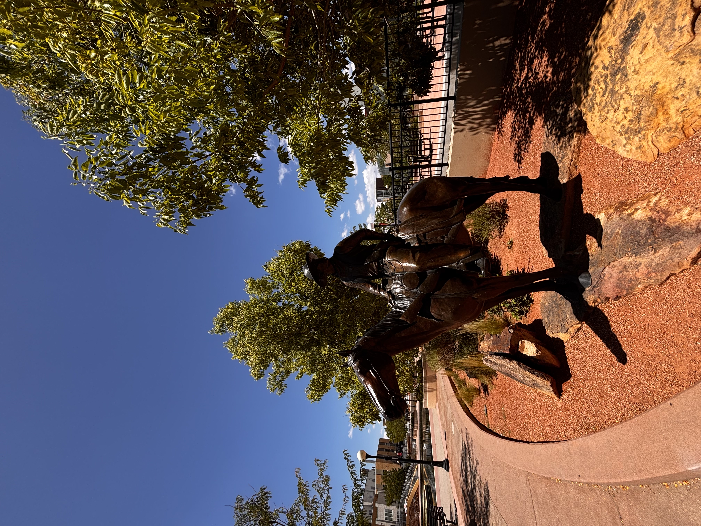

<br><details><summary>:camera:**66/IMG_0455.jpg**</summary><sub> `Exif version` 0232 `OS version` 27.0 `Date` 2026:07:18 13:07:44 `Aperture` Not known `Brightness` 10.37075870103393 `Color space` 65535 `Compression` Not known`Exposure mode` 0 `Exposure time` 0.0009216589861751152 `Focal length` 1.54 `Lens model` iPhone 15 Plus back dual wide camera 1.54mm f/2.4 `Lens specification` (1.54, 5.960000038146973, 1.6, 2.4) `Orientation` 6 `Scene type` Not known `f number` 2.4 `White balance` 0 `Sensing method` 2 `Shutter speed` 10.082945633390935</sub><sub>`Coordinates & altitude` (38.265452777777774, -104.60858888888889, 1420.4731308411215)</sub><sub> :earth_americas:`Location over` [Google Maps](http://maps.google.com/maps?q=38.265452777777774,-104.60858888888889) or [Openstreet Map](https://www.openstreetmap.org/query?lat=38.265452777777774&lon=-104.60858888888889)</sub></details>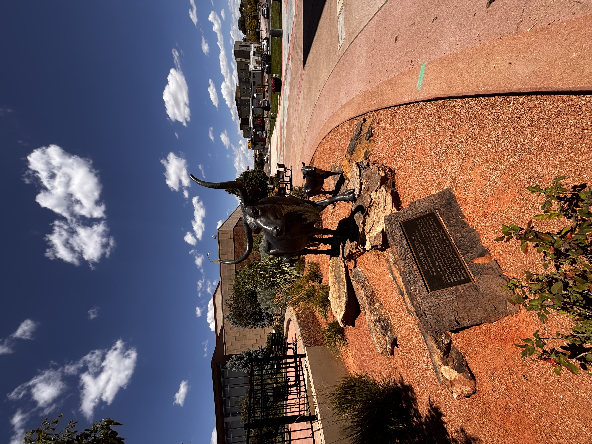

<br><details><summary>:camera:**66/IMG_0456.jpg**</summary><sub> `Exif version` 0232 `OS version` 27.0 `Date` 2026:07:18 13:07:49 `Aperture` Not known `Brightness` 10.02575961279914 `Color space` 65535 `Compression` Not known`Exposure mode` 0 `Exposure time` 0.001310615989515072 `Focal length` 1.54 `Lens model` iPhone 15 Plus back dual wide camera 1.54mm f/2.4 `Lens specification` (1.54, 5.960000038146973, 1.6, 2.4) `Orientation` 6 `Scene type` Not known `f number` 2.4 `White balance` 0 `Sensing method` 2 `Shutter speed` 9.57621747831888</sub><sub>`Coordinates & altitude` (38.265430555555554, -104.60857499999999, 1420.582740213523)</sub><sub> :earth_americas:`Location over` [Google Maps](http://maps.google.com/maps?q=38.265430555555554,-104.60857499999999) or [Openstreet Map](https://www.openstreetmap.org/query?lat=38.265430555555554&lon=-104.60857499999999)</sub></details>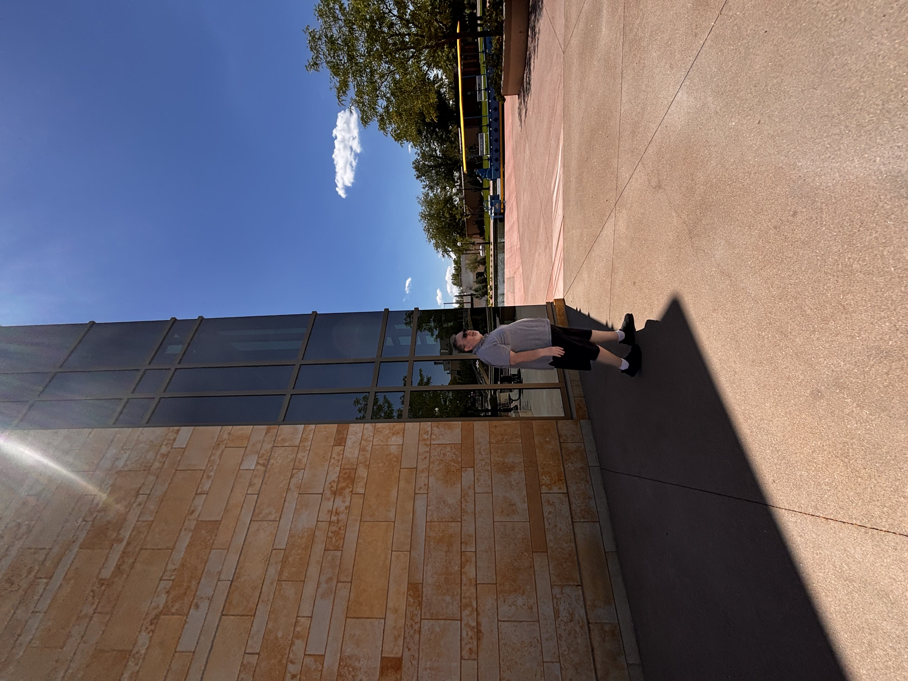

<br><details><summary>:camera:**66/IMG_0457.jpg**</summary><sub> `Exif version` 0232 `OS version` 27.0 `Date` 2026:07:18 13:08:05 `Aperture` Not known `Brightness` 10.726563437762573 `Color space` 65535 `Compression` Not known`Exposure mode` 0 `Exposure time` 0.0008481764206955047 `Focal length` 1.54 `Lens model` iPhone 15 Plus back dual wide camera 1.54mm f/2.4 `Lens specification` (1.54, 5.960000038146973, 1.6, 2.4) `Orientation` 1 `Scene type` Not known `f number` 2.4 `White balance` 0 `Sensing method` 2 `Shutter speed` 10.203648118217501</sub><sub>`Coordinates & altitude` (38.26530833333333, -104.60864166666666, 1420.9061514195585)</sub><sub> :earth_americas:`Location over` [Google Maps](http://maps.google.com/maps?q=38.26530833333333,-104.60864166666666) or [Openstreet Map](https://www.openstreetmap.org/query?lat=38.26530833333333&lon=-104.60864166666666)</sub></details>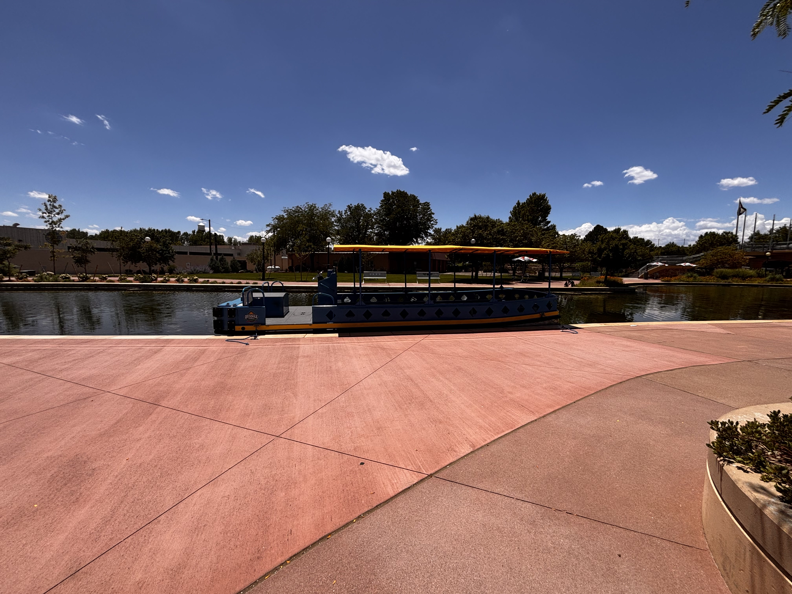

<br><details><summary>:camera:**66/IMG_0458.jpg**</summary><sub> `Exif version` 0232 `OS version` 27.0 `Date` 2026:07:18 13:08:17 `Aperture` Not known `Brightness` 10.395559502664298 `Color space` 65535 `Compression` Not known`Exposure mode` 0 `Exposure time` 0.0010976948408342481 `Focal length` 1.54 `Lens model` iPhone 15 Plus back dual wide camera 1.54mm f/2.4 `Lens specification` (1.54, 5.960000038146973, 1.6, 2.4) `Orientation` 1 `Scene type` Not known `f number` 2.4 `White balance` 0 `Sensing method` 2 `Shutter speed` 9.830906233630174</sub><sub>`Coordinates & altitude` (38.265280555555556, -104.60873333333333, 1420.7183673469387)</sub><sub> :earth_americas:`Location over` [Google Maps](http://maps.google.com/maps?q=38.265280555555556,-104.60873333333333) or [Openstreet Map](https://www.openstreetmap.org/query?lat=38.265280555555556&lon=-104.60873333333333)</sub></details>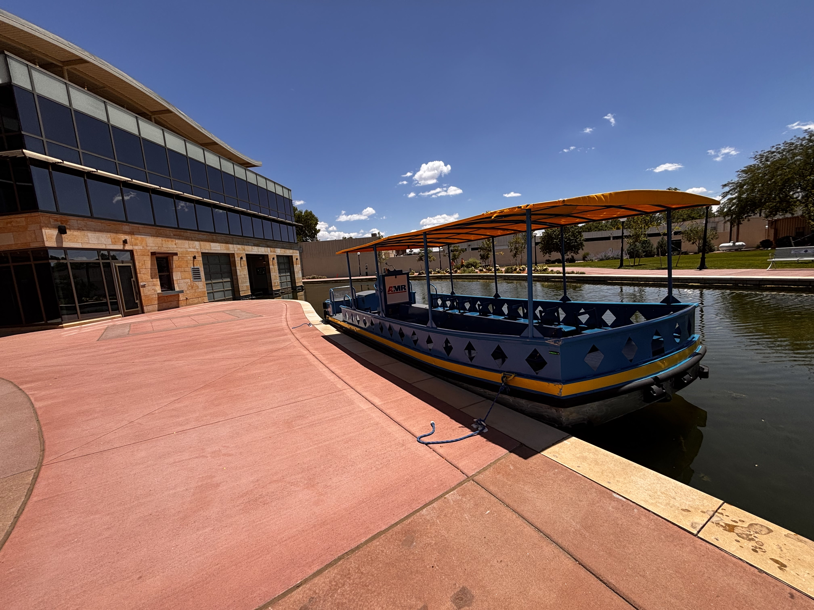

<br><details><summary>:camera:**66/IMG_0459.jpg**</summary><sub> `Exif version` 0232 `OS version` 27.0 `Date` 2026:07:18 13:08:32 `Aperture` Not known `Brightness` 9.942501455375934 `Color space` 65535 `Compression` Not known`Exposure mode` 0 `Exposure time` 0.0014492753623188406 `Focal length` 1.54 `Lens model` iPhone 15 Plus back dual wide camera 1.54mm f/2.4 `Lens specification` (1.54, 5.960000038146973, 1.6, 2.4) `Orientation` 1 `Scene type` Not known `f number` 2.4 `White balance` 0 `Sensing method` 2 `Shutter speed` 9.430726690598622</sub><sub>`Coordinates & altitude` (38.26530555555556, -104.60884722222221, 1420.2305516265913)</sub><sub> :earth_americas:`Location over` [Google Maps](http://maps.google.com/maps?q=38.26530555555556,-104.60884722222221) or [Openstreet Map](https://www.openstreetmap.org/query?lat=38.26530555555556&lon=-104.60884722222221)</sub></details>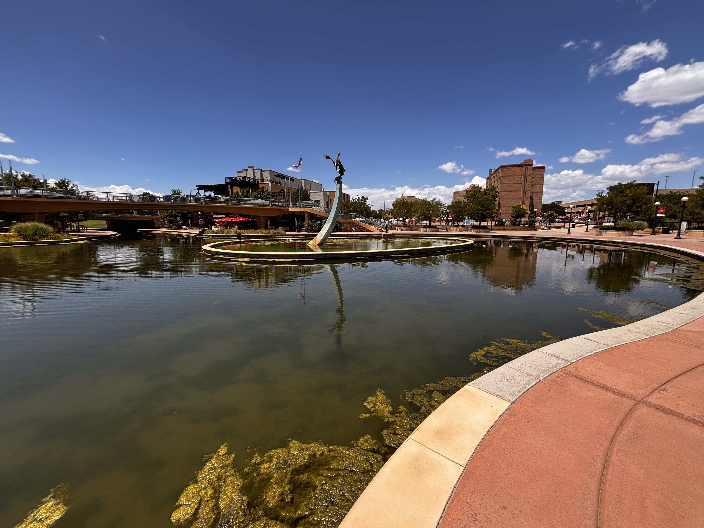

<br><details><summary>:camera:**66/IMG_0460.jpg**</summary><sub> `Exif version` 0232 `OS version` 27.0 `Date` 2026:07:18 13:08:36 `Aperture` Not known `Brightness` 9.78587853374814 `Color space` 65535 `Compression` Not known`Exposure mode` 0 `Exposure time` 0.001272264631043257 `Focal length` 1.54 `Lens model` iPhone 15 Plus back dual wide camera 1.54mm f/2.4 `Lens specification` (1.54, 5.960000038146973, 1.6, 2.4) `Orientation` 6 `Scene type` Not known `f number` 2.4 `White balance` 0 `Sensing method` 2 `Shutter speed` 9.617551865018305</sub><sub>`Coordinates & altitude` (38.26530833333333, -104.60884166666666, 1419.9749403341289)</sub><sub> :earth_americas:`Location over` [Google Maps](http://maps.google.com/maps?q=38.26530833333333,-104.60884166666666) or [Openstreet Map](https://www.openstreetmap.org/query?lat=38.26530833333333&lon=-104.60884166666666)</sub></details>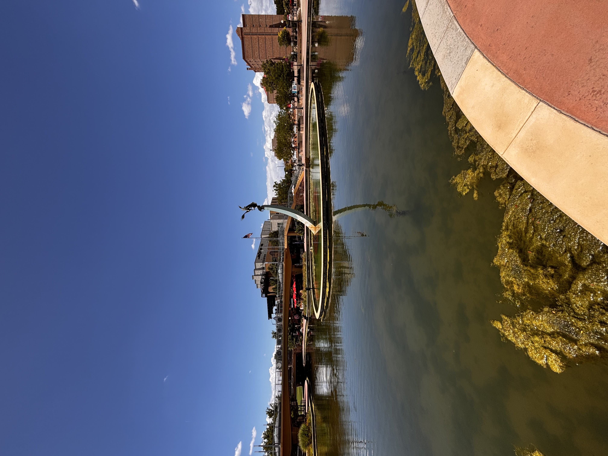

<br><details><summary>:camera:**66/IMG_0461.jpg**</summary><sub> `Exif version` 0232 `OS version` 27.0 `Date` 2026:07:18 13:08:42 `Aperture` Not known `Brightness` 9.670869585446425 `Color space` 65535 `Compression` Not known`Exposure mode` 0 `Exposure time` 0.0012360939431396785 `Focal length` 1.54 `Lens model` iPhone 15 Plus back dual wide camera 1.54mm f/2.4 `Lens specification` (1.54, 5.960000038146973, 1.6, 2.4) `Orientation` 1 `Scene type` Not known `f number` 2.4 `White balance` 0 `Sensing method` 2 `Shutter speed` 9.660105548423905</sub><sub>`Coordinates & altitude` (38.26530555555556, -104.60883333333332, 1420.2843803056028)</sub><sub> :earth_americas:`Location over` [Google Maps](http://maps.google.com/maps?q=38.26530555555556,-104.60883333333332) or [Openstreet Map](https://www.openstreetmap.org/query?lat=38.26530555555556&lon=-104.60883333333332)</sub></details>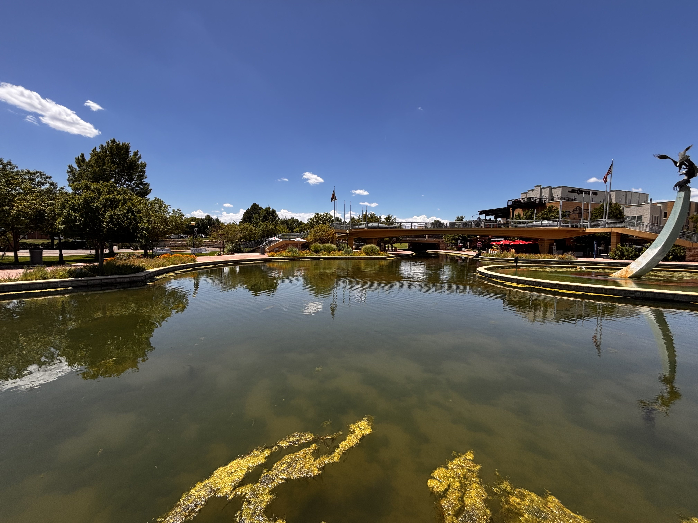

<br><details><summary>:camera:**66/IMG_0462.jpg**</summary><sub> `Exif version` 0232 `OS version` 27.0 `Date` 2026:07:18 13:09:19 `Aperture` Not known `Brightness` 9.604826314171534 `Color space` 65535 `Compression` Not known`Exposure mode` 0 `Exposure time` 0.0018281535648994515 `Focal length` 1.54 `Lens model` iPhone 15 Plus back dual wide camera 1.54mm f/2.4 `Lens specification` (1.54, 5.960000038146973, 1.6, 2.4) `Orientation` 6 `Scene type` Not known `f number` 2.4 `White balance` 0 `Sensing method` 2 `Shutter speed` 9.09472921572179</sub><sub>`Coordinates & altitude` (38.265525, -104.60878888888888, 1420.6182519280205)</sub><sub> :earth_americas:`Location over` [Google Maps](http://maps.google.com/maps?q=38.265525,-104.60878888888888) or [Openstreet Map](https://www.openstreetmap.org/query?lat=38.265525&lon=-104.60878888888888)</sub></details>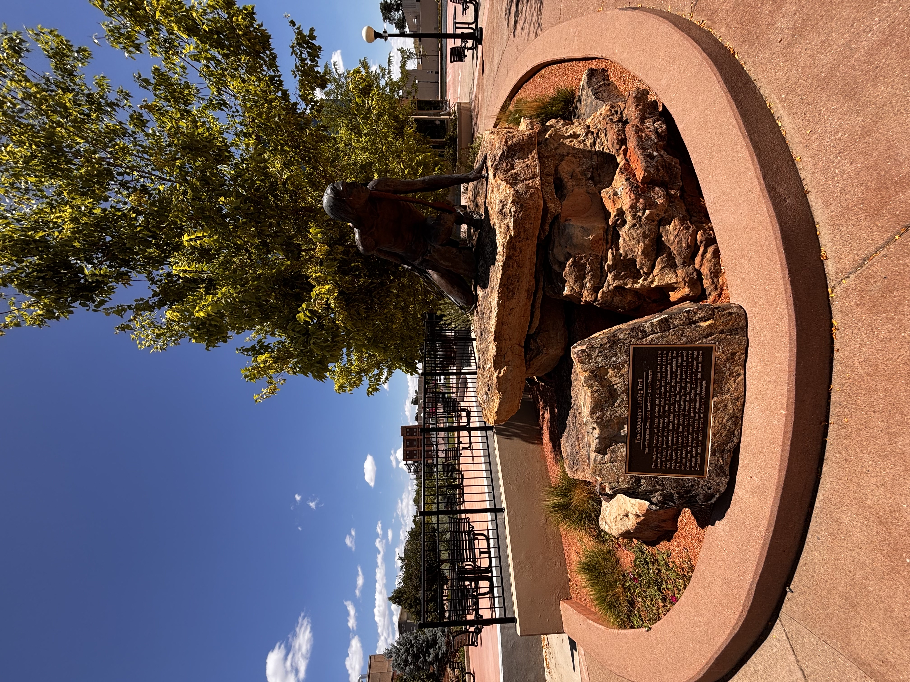

<br><details><summary>:camera:**66/IMG_0463.jpg**</summary><sub> `Exif version` 0232 `OS version` 27.0 `Date` 2026:07:18 13:09:25 `Aperture` Not known `Brightness` 8.90677516362993 `Color space` 65535 `Compression` Not known`Exposure mode` 0 `Exposure time` 0.0041841004184100415 `Focal length` 1.54 `Lens model` iPhone 15 Plus back dual wide camera 1.54mm f/2.4 `Lens specification` (1.54, 5.960000038146973, 1.6, 2.4) `Orientation` 1 `Scene type` Not known `f number` 2.4 `White balance` 0 `Sensing method` 2 `Shutter speed` 7.899178403755869</sub><sub>`Coordinates & altitude` (38.26553333333333, -104.60875833333333, 1421.0913962488835)</sub><sub> :earth_americas:`Location over` [Google Maps](http://maps.google.com/maps?q=38.26553333333333,-104.60875833333333) or [Openstreet Map](https://www.openstreetmap.org/query?lat=38.26553333333333&lon=-104.60875833333333)</sub></details>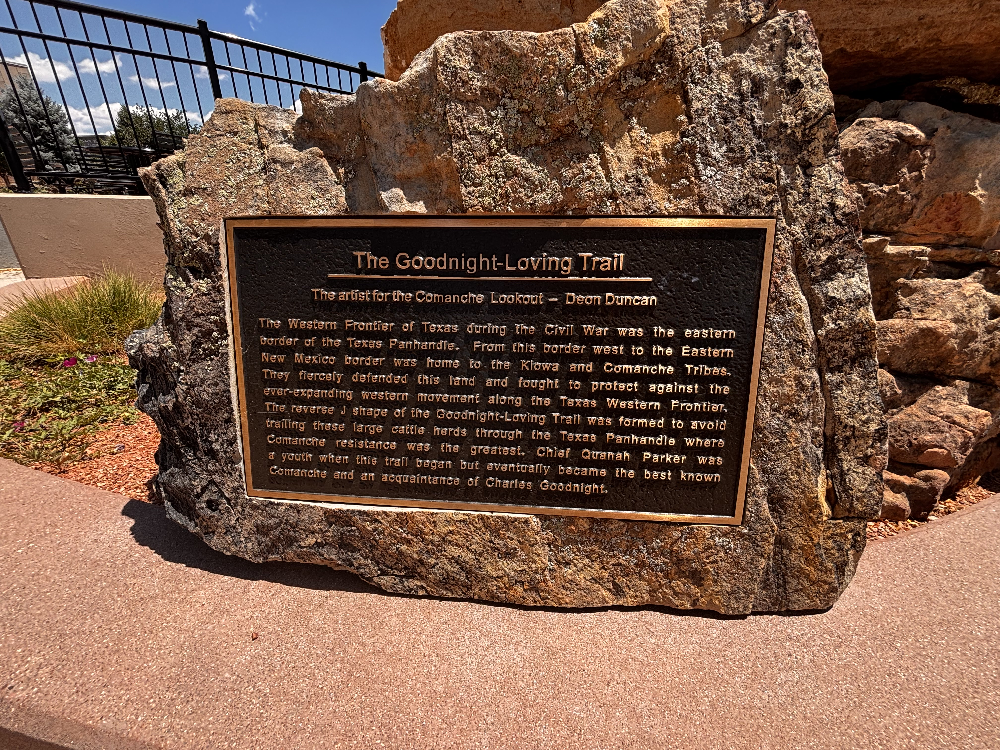

<br><details><summary>:camera:**66/IMG_0464.jpg**</summary><sub> `Exif version` 0232 `OS version` 27.0 `Date` 2026:07:18 13:10:29 `Aperture` Not known `Brightness` 6.039186237028946 `Color space` 65535 `Compression` Not known`Exposure mode` 0 `Exposure time` 0.005128205128205128 `Focal length` 5.96 `Lens model` iPhone 15 Plus back dual wide camera 5.96mm f/1.6 `Lens specification` (1.5399999618512084, 5.96, 1.6, 2.4) `Orientation` 6 `Scene type` Not known `f number` 1.6 `White balance` 0 `Sensing method` 2 `Shutter speed` 7.607388021280247</sub><sub>`Coordinates & altitude` (38.265594444444446, -104.6085361111111, 1412.2154195011337)</sub><sub> :earth_americas:`Location over` [Google Maps](http://maps.google.com/maps?q=38.265594444444446,-104.6085361111111) or [Openstreet Map](https://www.openstreetmap.org/query?lat=38.265594444444446&lon=-104.6085361111111)</sub></details>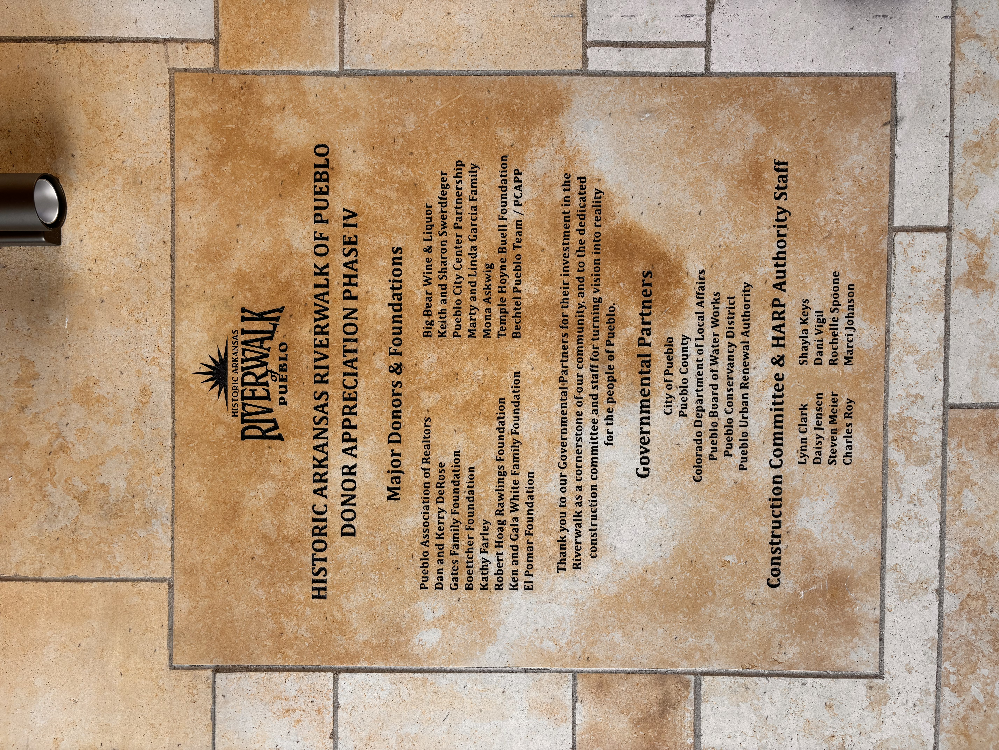

<br><details><summary>:camera:**66/IMG_0468.jpg**</summary><sub> `Exif version` 0232 `OS version` 27.0 `Date` 2026:07:18 13:13:05 `Aperture` Not known `Brightness` 9.863754213119005 `Color space` 65535 `Compression` Not known`Exposure mode` 0 `Exposure time` 0.000273972602739726 `Focal length` 5.96 `Lens model` iPhone 15 Plus back dual wide camera 5.96mm f/1.6 `Lens specification` (1.5399999618512084, 5.96, 1.6, 2.4) `Orientation` 1 `Scene type` Not known `f number` 1.6 `White balance` 0 `Sensing method` 2 `Shutter speed` 11.83353647919206</sub><sub>`Coordinates & altitude` (38.26513333333333, -104.6081611111111, 1422.2156626506023)</sub><sub> :earth_americas:`Location over` [Google Maps](http://maps.google.com/maps?q=38.26513333333333,-104.6081611111111) or [Openstreet Map](https://www.openstreetmap.org/query?lat=38.26513333333333&lon=-104.6081611111111)</sub></details>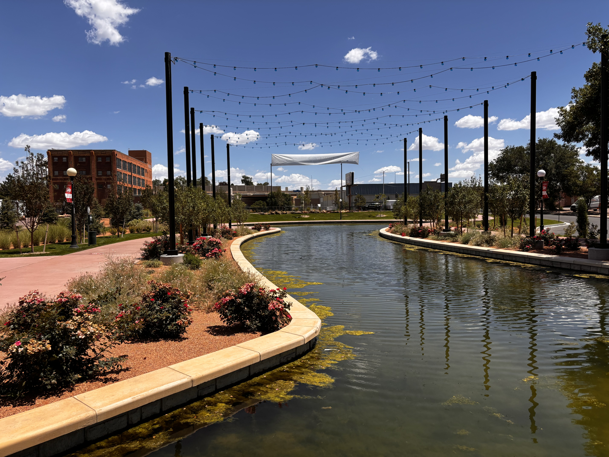

<br><details><summary>:camera:**66/IMG_0469.jpg**</summary><sub> `Exif version` 0232 `OS version` 27.0 `Date` 2026:07:18 13:13:10 `Aperture` Not known `Brightness` 9.78582990910223 `Color space` 65535 `Compression` Not known`Exposure mode` 0 `Exposure time` 0.0002929973630237328 `Focal length` 5.96 `Lens model` iPhone 15 Plus back dual wide camera 5.96mm f/1.6 `Lens specification` (1.5399999618512084, 5.96, 1.6, 2.4) `Orientation` 1 `Scene type` Not known `f number` 1.6 `White balance` 0 `Sensing method` 2 `Shutter speed` 11.736811705814402</sub><sub>`Coordinates & altitude` (38.26521388888889, -104.60811666666666, 1424.9013333333332)</sub><sub> :earth_americas:`Location over` [Google Maps](http://maps.google.com/maps?q=38.26521388888889,-104.60811666666666) or [Openstreet Map](https://www.openstreetmap.org/query?lat=38.26521388888889&lon=-104.60811666666666)</sub></details>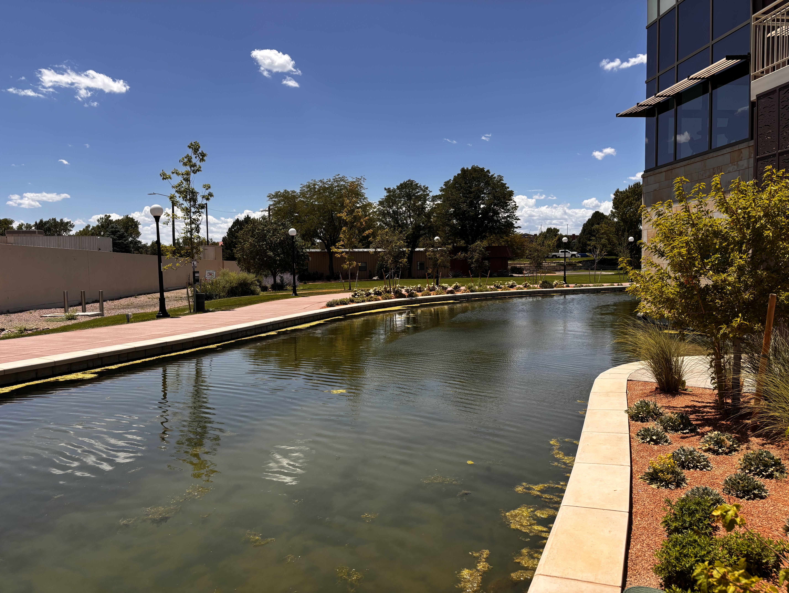

<br><details><summary>:camera:**66/IMG_0470.jpg**</summary><sub> `Exif version` 0232 `OS version` 27.0 `Date` 2026:07:18 13:13:13 `Aperture` Not known `Brightness` 9.815201150235403 `Color space` 65535 `Compression` Not known`Exposure mode` 0 `Exposure time` 0.000273972602739726 `Focal length` 5.96 `Lens model` iPhone 15 Plus back dual wide camera 5.96mm f/1.6 `Lens specification` (1.5399999618512084, 5.96, 1.6, 2.4) `Orientation` 6 `Scene type` Not known `f number` 1.6 `White balance` 0 `Sensing method` 2 `Shutter speed` 11.83353647919206</sub><sub>`Coordinates & altitude` (38.26521944444445, -104.60811666666666, 1424.5684474123539)</sub><sub> :earth_americas:`Location over` [Google Maps](http://maps.google.com/maps?q=38.26521944444445,-104.60811666666666) or [Openstreet Map](https://www.openstreetmap.org/query?lat=38.26521944444445&lon=-104.60811666666666)</sub></details>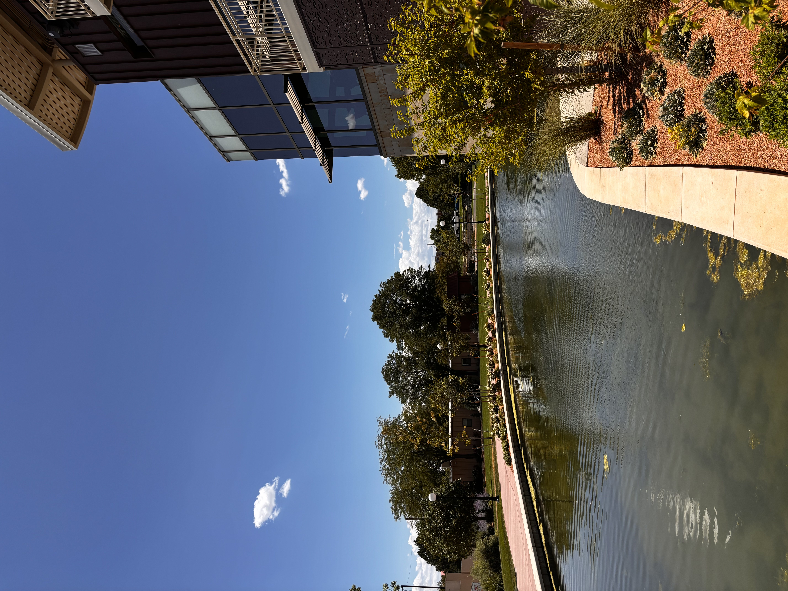

<br><details><summary>:camera:**66/IMG_0471.jpg**</summary><sub> `Exif version` 0232 `OS version` 27.0 `Date` 2026:07:18 13:13:17 `Aperture` Not known `Brightness` 9.69701971572673 `Color space` 65535 `Compression` Not known`Exposure mode` 0 `Exposure time` 0.0002929973630237328 `Focal length` 5.96 `Lens model` iPhone 15 Plus back dual wide camera 5.96mm f/1.6 `Lens specification` (1.5399999618512084, 5.96, 1.6, 2.4) `Orientation` 6 `Scene type` Not known `f number` 1.6 `White balance` 0 `Sensing method` 2 `Shutter speed` 11.736811705814402</sub><sub>`Coordinates & altitude` (38.265233333333335, -104.60811666666666, 1421.6975982532751)</sub><sub> :earth_americas:`Location over` [Google Maps](http://maps.google.com/maps?q=38.265233333333335,-104.60811666666666) or [Openstreet Map](https://www.openstreetmap.org/query?lat=38.265233333333335&lon=-104.60811666666666)</sub></details>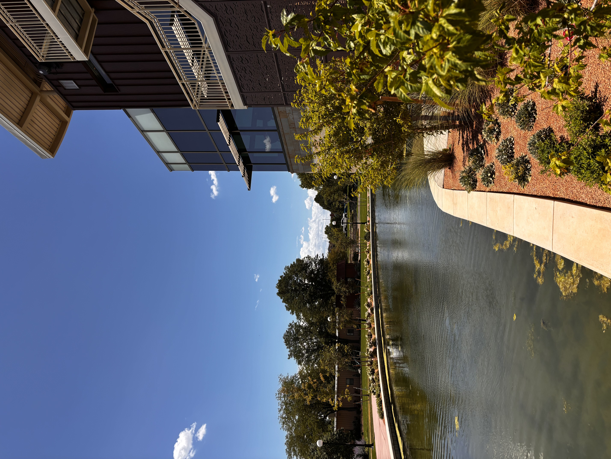

<br><details><summary>:camera:**66/IMG_0473.jpg**</summary><sub> `Exif version` 0232 `OS version` 27.0 `Date` 2026:07:19 05:57:04 `Aperture` Not known `Brightness` 6.726946376486426 `Color space` 65535 `Compression` Not known`Exposure mode` 0 `Exposure time` 0.0024813895781637717 `Focal length` 5.96 `Lens model` iPhone 15 Plus back dual wide camera 5.96mm f/1.6 `Lens specification` (1.5399999618512084, 5.96, 1.6, 2.4) `Orientation` 6 `Scene type` Not known `f number` 1.6 `White balance` 0 `Sensing method` 2 `Shutter speed` 8.655444164477563</sub><sub>`Coordinates & altitude` (38.85938888888889, -104.70111944444444, 1968.3895781637716)</sub><sub> :earth_americas:`Location over` [Google Maps](http://maps.google.com/maps?q=38.85938888888889,-104.70111944444444) or [Openstreet Map](https://www.openstreetmap.org/query?lat=38.85938888888889&lon=-104.70111944444444)</sub></details>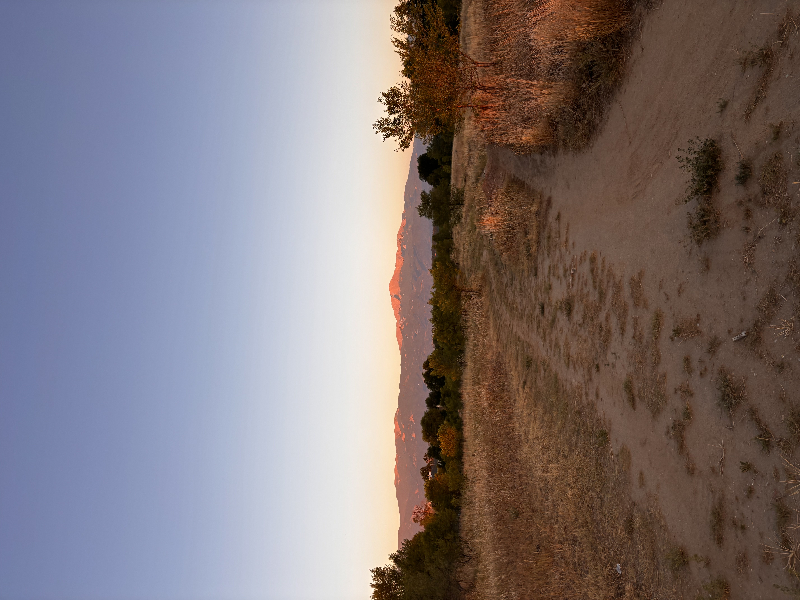

<br><details><summary>:camera:**66/IMG_0474.jpg**</summary><sub> `Exif version` 0232 `OS version` 27.0 `Date` 2026:07:19 05:57:06 `Aperture` Not known `Brightness` 6.758713019050127 `Color space` 65535 `Compression` Not known`Exposure mode` 0 `Exposure time` 0.0024509803921568627 `Focal length` 5.96 `Lens model` iPhone 15 Plus back dual wide camera 5.96mm f/1.6 `Lens specification` (1.5399999618512084, 5.96, 1.6, 2.4) `Orientation` 1 `Scene type` Not known `f number` 1.6 `White balance` 0 `Sensing method` 2 `Shutter speed` 8.672413793103448</sub><sub>`Coordinates & altitude` (38.85933333333333, -104.70111111111112, 1967.8744394618834)</sub><sub> :earth_americas:`Location over` [Google Maps](http://maps.google.com/maps?q=38.85933333333333,-104.70111111111112) or [Openstreet Map](https://www.openstreetmap.org/query?lat=38.85933333333333&lon=-104.70111111111112)</sub></details>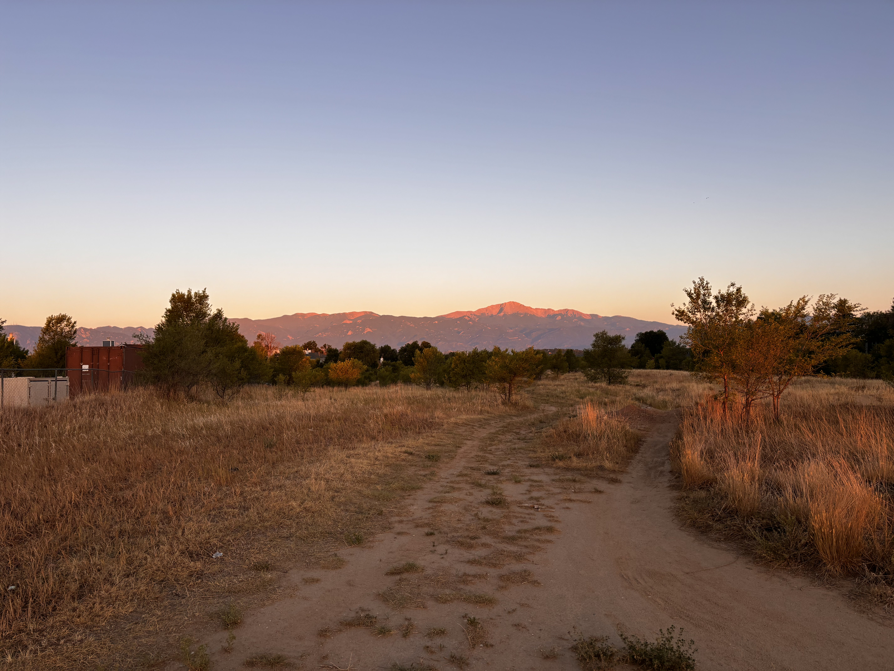

<br><details><summary>:camera:**66/IMG_0475.jpg**</summary><sub> `Exif version` 0232 `OS version` 27.0 `Date` 2026:07:19 06:07:24 `Aperture` Not known `Brightness` 8.31087944399893 `Color space` 65535 `Compression` Not known`Exposure mode` 0 `Exposure time` 0.0011560693641618498 `Focal length` 5.96 `Lens model` iPhone 15 Plus back dual wide camera 5.96mm f/1.6 `Lens specification` (1.5399999618512084, 5.96, 1.6, 2.4) `Orientation` 1 `Scene type` Not known `f number` 1.6 `White balance` 0 `Sensing method` 2 `Shutter speed` 9.756642885231166</sub><sub>`Coordinates & altitude` (38.867672222222225, -104.70121111111112, 1987.523366967605)</sub><sub> :earth_americas:`Location over` [Google Maps](http://maps.google.com/maps?q=38.867672222222225,-104.70121111111112) or [Openstreet Map](https://www.openstreetmap.org/query?lat=38.867672222222225&lon=-104.70121111111112)</sub></details>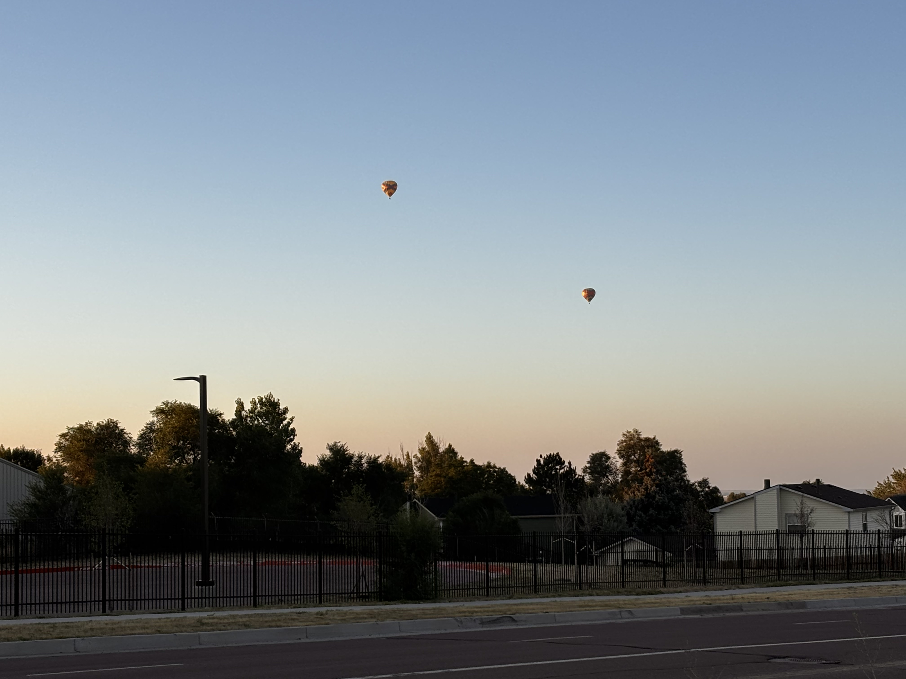

<br><details><summary>:camera:**66/IMG_0476.jpg**</summary><sub> `Exif version` 0232 `OS version` 27.0 `Date` 2026:07:19 13:59:51 `Aperture` Not known `Brightness` 3.116397839585553 `Color space` 65535 `Compression` Not known`Exposure mode` 0 `Exposure time` 0.010309278350515464 `Focal length` 5.96 `Lens model` iPhone 15 Plus back dual wide camera 5.96mm f/1.6 `Lens specification` (1.5399999618512084, 5.96, 1.6, 2.4) `Orientation` 1 `Scene type` Not known `f number` 1.6 `White balance` 0 `Sensing method` 2 `Shutter speed` 6.599951801421858</sub><sub>`Coordinates & altitude` (38.842911111111114, -104.70670277777778, 1928.029715762274)</sub><sub> :earth_americas:`Location over` [Google Maps](http://maps.google.com/maps?q=38.842911111111114,-104.70670277777778) or [Openstreet Map](https://www.openstreetmap.org/query?lat=38.842911111111114&lon=-104.70670277777778)</sub></details>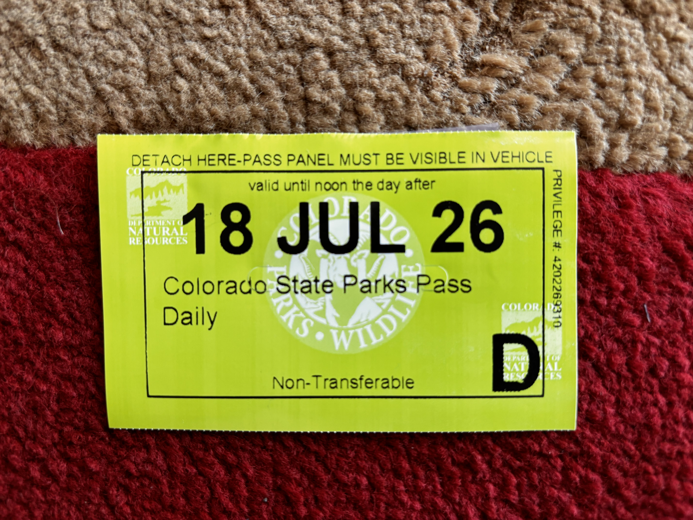

<br><details><summary>:camera:**66/IMG_E0366.jpg**</summary><sub> `Exif version` 0232 `OS version` 27.0 `Date` 2026:07:18 11:49:52 `Aperture` Not known `Brightness` 10.398871968415115 `Color space` 65535 `Compression` Not known`Exposure mode` 0 `Exposure time` 0.00018698578908002991 `Focal length` 5.96 `Lens model` iPhone 15 Plus back dual wide camera 5.96mm f/1.6 `Lens specification` (1.5399999618512084, 5.96, 1.6, 2.4) `Orientation` 1 `Scene type` Not known `f number` 1.6 `White balance` 0 `Sensing method` 2 `Shutter speed` 12.384674110125012</sub><sub>`Coordinates & altitude` (38.27263611111111, -104.76113055555555, 1496.1271428571429)</sub><sub> :earth_americas:`Location over` [Google Maps](http://maps.google.com/maps?q=38.27263611111111,-104.76113055555555) or [Openstreet Map](https://www.openstreetmap.org/query?lat=38.27263611111111&lon=-104.76113055555555)</sub></details>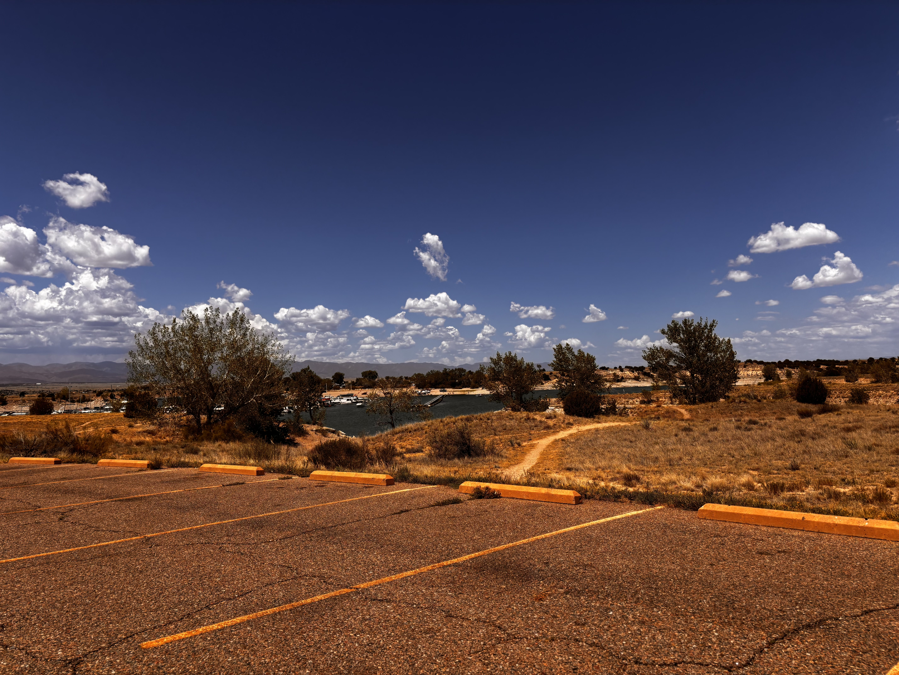

<br><details><summary>:camera:**66/IMG_E0367.jpg**</summary><sub> `Exif version` 0232 `OS version` 27.0 `Date` 2026:07:18 11:49:59 `Aperture` Not known `Brightness` 10.388436438164069 `Color space` 65535 `Compression` Not known`Exposure mode` 0 `Exposure time` 0.00019700551615445234 `Focal length` 5.96 `Lens model` iPhone 15 Plus back dual wide camera 5.96mm f/1.6 `Lens specification` (1.5399999618512084, 5.96, 1.6, 2.4) `Orientation` 1 `Scene type` Not known `f number` 1.6 `White balance` 0 `Sensing method` 2 `Shutter speed` 12.309516750667061</sub><sub>`Coordinates & altitude` (38.27255, -104.76123888888888, 1496.0049504950496)</sub><sub> :earth_americas:`Location over` [Google Maps](http://maps.google.com/maps?q=38.27255,-104.76123888888888) or [Openstreet Map](https://www.openstreetmap.org/query?lat=38.27255&lon=-104.76123888888888)</sub></details>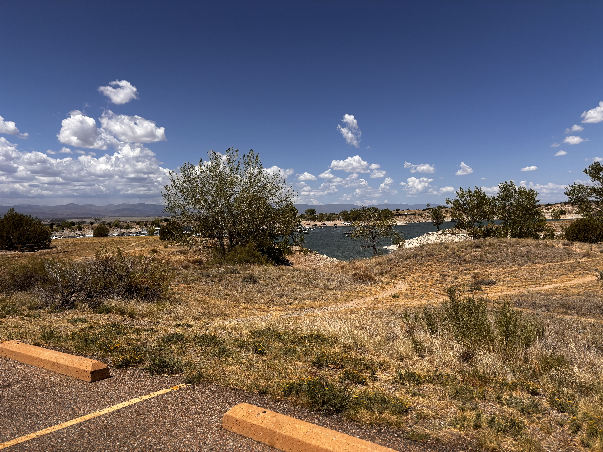

<br><details><summary>:camera:**66/IMG_E0368.jpg**</summary><sub> `Exif version` 0232 `OS version` 27.0 `Date` 2026:07:18 11:50:02 `Aperture` Not known `Brightness` 10.422753322765516 `Color space` 65535 `Compression` Not known`Exposure mode` 0 `Exposure time` 0.00018698578908002991 `Focal length` 5.96 `Lens model` iPhone 15 Plus back dual wide camera 5.96mm f/1.6 `Lens specification` (5.96, 5.960000038146973, 1.6, 1.6) `Orientation` 1 `Scene type` Not known `f number` 1.6 `White balance` 0 `Sensing method` 2 `Shutter speed` 12.384674110125012</sub><sub>`Coordinates & altitude` (38.27254444444444, -104.76123888888888, 1496.1242124212422)</sub><sub> :earth_americas:`Location over` [Google Maps](http://maps.google.com/maps?q=38.27254444444444,-104.76123888888888) or [Openstreet Map](https://www.openstreetmap.org/query?lat=38.27254444444444&lon=-104.76123888888888)</sub></details>

<br><details><summary>:camera:**66/IMG_E0369.jpg**</summary><sub> `Exif version` 0232 `OS version` 27.0 `Date` 2026:07:18 11:50:33 `Aperture` Not known `Brightness` 10.615047061816332 `Color space` 65535 `Compression` Not known`Exposure mode` 0 `Exposure time` 0.00015800284405119292 `Focal length` 5.96 `Lens model` iPhone 15 Plus back dual wide camera 5.96mm f/1.6 `Lens specification` (1.5399999618512084, 5.96, 1.6, 2.4) `Orientation` 1 `Scene type` Not known `f number` 1.6 `White balance` 0 `Sensing method` 2 `Shutter speed` 12.627787823990356</sub><sub>`Coordinates & altitude` (38.27191666666666, -104.76130555555555, 1494.6365384615385)</sub><sub> :earth_americas:`Location over` [Google Maps](http://maps.google.com/maps?q=38.27191666666666,-104.76130555555555) or [Openstreet Map](https://www.openstreetmap.org/query?lat=38.27191666666666&lon=-104.76130555555555)</sub></details>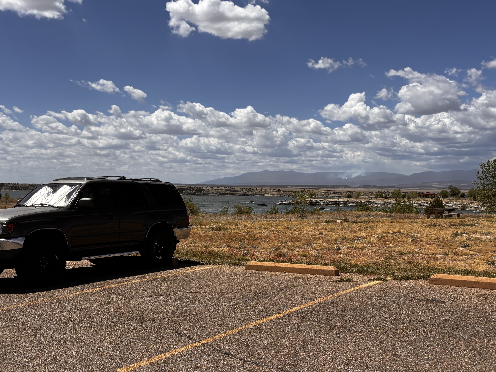

<br><details><summary>:camera:**66/IMG_E0370.jpg**</summary><sub> `Exif version` 0232 `OS version` 27.0 `Date` 2026:07:18 11:50:40 `Aperture` Not known `Brightness` 10.62390383288994 `Color space` 65535 `Compression` Not known`Exposure mode` 0 `Exposure time` 0.00015800284405119292 `Focal length` 5.96 `Lens model` iPhone 15 Plus back dual wide camera 5.96mm f/1.6 `Lens specification` (1.5399999618512084, 5.960000038146973, 1.6, 2.4) `Orientation` 1 `Scene type` Not known `f number` 1.6 `White balance` 0 `Sensing method` 2 `Shutter speed` 12.627787823990356</sub><sub>`Coordinates & altitude` (38.27178055555555, -104.76116111111111, 1493.4655462184874)</sub><sub> :earth_americas:`Location over` [Google Maps](http://maps.google.com/maps?q=38.27178055555555,-104.76116111111111) or [Openstreet Map](https://www.openstreetmap.org/query?lat=38.27178055555555&lon=-104.76116111111111)</sub></details>

<br><details><summary>:camera:**66/IMG_E0476.jpg**</summary><sub> `Exif version` 0232 `OS version` 27.0 `Date` 2026:07:19 13:59:51 `Aperture` Not known `Brightness` 3.116397839585553 `Color space` 65535 `Compression` Not known`Exposure mode` 0 `Exposure time` 0.010309278350515464 `Focal length` 5.96 `Lens model` iPhone 15 Plus back dual wide camera 5.96mm f/1.6 `Lens specification` (1.5399999618512084, 5.960000038146973, 1.6, 2.4) `Orientation` 1 `Scene type` Not known `f number` 1.6 `White balance` 0 `Sensing method` 2 `Shutter speed` 6.599951801421858</sub><sub>`Coordinates & altitude` (38.842911111111114, -104.70670277777778, 1928.0297176820209)</sub><sub> :earth_americas:`Location over` [Google Maps](http://maps.google.com/maps?q=38.842911111111114,-104.70670277777778) or [Openstreet Map](https://www.openstreetmap.org/query?lat=38.842911111111114&lon=-104.70670277777778)</sub></details>

<sub>_Citation: Partial or total digital reproduction of this repository, scripts, development guides, data models, images, and documentation is permitted, provided that it is referenced as: "R.GISMobile - Mobile geographic information systems on QField that do not require an internet connection for navigation." https://github.com/rcfdtools/R.GISMobile - Bogotá - Colombia - South America"._<sub>

| [:house: Home](../Readme.md) |
|---|