<div align="center"></div>

## :earth_americas:POI: _“Pueblo Reservoir - Arkansas River - Pueblo, Colorado, USA (2026-07-18)”_
`Pictures` rcfdtools <br>`Category` Freelance field visit <br>`Location` [Google Maps](http://maps.google.com/maps?q=38.268839,-104.724969) or [Openstreet Map](https://www.openstreetmap.org/query?lat=38.268839&lon=-104.724969) 

```geojson
{
  "type": "Feature",
  "geometry": {
    "type": "Point", 
    "coordinates": [-104.724969, 38.268839]
  }, 
  "properties": {
    "Name": "Pueblo Reservoir - Arkansas River - Pueblo, Colorado, USA"
  }
}
```

<br><details><summary>:camera:**66/IMG_0085.jpg**</summary><sub> `Exif version` 0232 `OS version` 27.0 `Date` 2026:06:20 05:39:12 `Aperture` Not known `Brightness` 4.836860121363 `Color space` 65535 `Compression` Not known`Exposure mode` 0 `Exposure time` 0.008264462809917356 `Focal length` 5.96 `Lens model` iPhone 15 Plus back dual wide camera 5.96mm f/1.6 `Lens specification` (1.5399999618512084, 5.96, 1.6, 2.4) `Orientation` 1 `Scene type` Not known `f number` 1.6 `White balance` 0 `Sensing method` 2 `Shutter speed` 6.922089825847846</sub><sub>`Coordinates & altitude` (38.84223888888889, -104.70572777777778, 1920.03948025987)</sub><sub> :earth_americas:`Location over` [Google Maps](http://maps.google.com/maps?q=38.84223888888889,-104.70572777777778) or [Openstreet Map](https://www.openstreetmap.org/query?lat=38.84223888888889&lon=-104.70572777777778)</sub></details>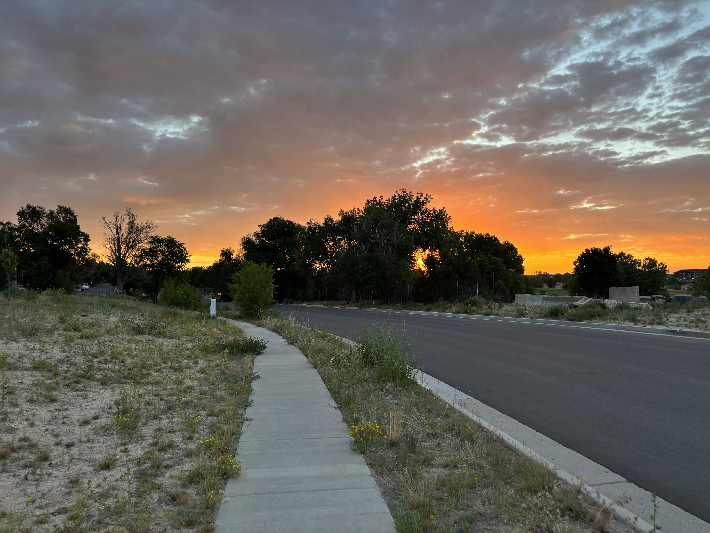

<br><details><summary>:camera:**66/IMG_0086.jpg**</summary><sub> `Exif version` 0232 `OS version` 27.0 `Date` 2026:06:20 05:39:16 `Aperture` Not known `Brightness` 5.100922259535863 `Color space` 65535 `Compression` Not known`Exposure mode` 0 `Exposure time` 0.008264462809917356 `Focal length` 5.96 `Lens model` iPhone 15 Plus back dual wide camera 5.96mm f/1.6 `Lens specification` (1.5399999618512084, 5.96, 1.6, 2.4) `Orientation` 6 `Scene type` Not known `f number` 1.6 `White balance` 0 `Sensing method` 2 `Shutter speed` 6.923665289888328</sub><sub>`Coordinates & altitude` (38.842261111111114, -104.70568888888889, 1919.9457295373666)</sub><sub> :earth_americas:`Location over` [Google Maps](http://maps.google.com/maps?q=38.842261111111114,-104.70568888888889) or [Openstreet Map](https://www.openstreetmap.org/query?lat=38.842261111111114&lon=-104.70568888888889)</sub></details>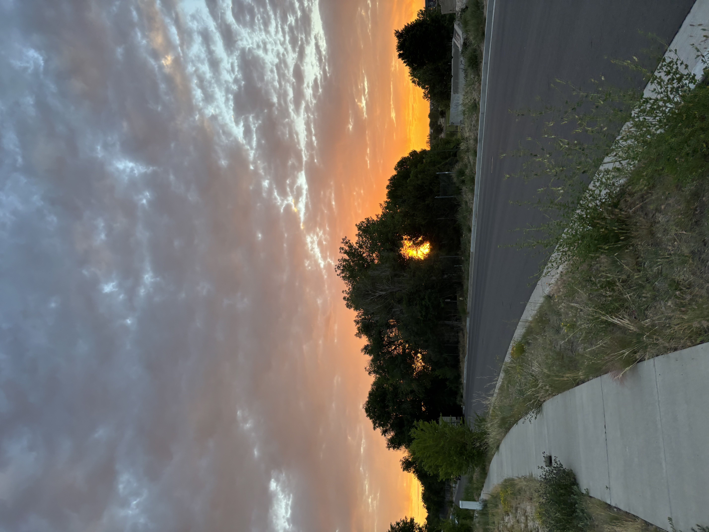

<br><details><summary>:camera:**66/IMG_0087.jpg**</summary><sub> `Exif version` 0232 `OS version` 27.0 `Date` 2026:06:20 10:45:15 `Aperture` Not known `Brightness` 9.348495897903373 `Color space` 65535 `Compression` Not known`Exposure mode` 0 `Exposure time` 0.00038895371450797355 `Focal length` 5.96 `Lens model` iPhone 15 Plus back dual wide camera 5.96mm f/1.6 `Lens specification` (1.5399999618512084, 5.96, 1.6, 2.4) `Orientation` 1 `Scene type` Not known `f number` 1.6 `White balance` 0 `Sensing method` 2 `Shutter speed` 11.327942223578477</sub></details>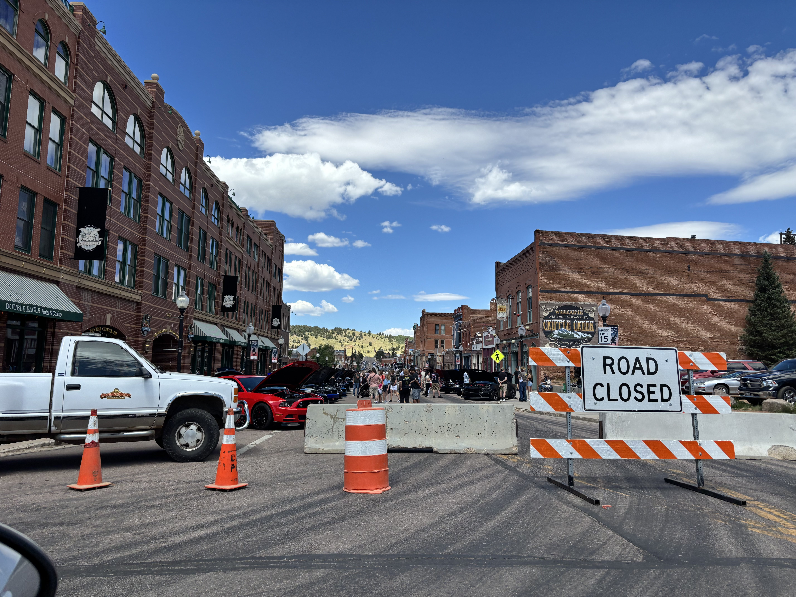

<br><details><summary>:camera:**66/IMG_0088.jpg**</summary><sub> `Exif version` 0232 `OS version` 27.0 `Date` 2026:06:20 10:45:21 `Aperture` Not known `Brightness` 9.096024844720496 `Color space` 65535 `Compression` Not known`Exposure mode` 0 `Exposure time` 0.00045599635202918376 `Focal length` 5.96 `Lens model` iPhone 15 Plus back dual wide camera 5.96mm f/1.6 `Lens specification` (1.5399999618512084, 5.96, 1.6, 2.4) `Orientation` 1 `Scene type` Not known `f number` 1.6 `White balance` 0 `Sensing method` 2 `Shutter speed` 11.098678565299467</sub><sub>`Coordinates & altitude` (38.74675277777778, -105.17295, 2894.54000477669)</sub><sub> :earth_americas:`Location over` [Google Maps](http://maps.google.com/maps?q=38.74675277777778,-105.17295) or [Openstreet Map](https://www.openstreetmap.org/query?lat=38.74675277777778&lon=-105.17295)</sub></details>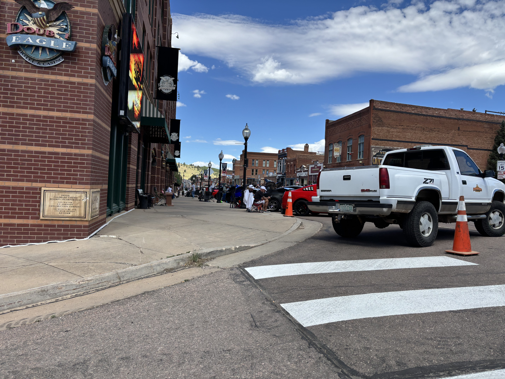

<br><details><summary>:camera:**66/IMG_0089.jpg**</summary><sub> `Exif version` 0232 `OS version` 27.0 `Date` 2026:06:20 10:48:24 `Aperture` Not known `Brightness` 10.249605914007718 `Color space` 65535 `Compression` Not known`Exposure mode` 0 `Exposure time` 0.00018698578908002991 `Focal length` 5.96 `Lens model` iPhone 15 Plus back dual wide camera 5.96mm f/1.6 `Lens specification` (1.5399999618512084, 5.96, 1.6, 2.4) `Orientation` 1 `Scene type` Not known `f number` 1.6 `White balance` 0 `Sensing method` 2 `Shutter speed` 12.384674110125012</sub><sub>`Coordinates & altitude` (38.74496388888889, -105.17825277777779, 2873.110561056106)</sub><sub> :earth_americas:`Location over` [Google Maps](http://maps.google.com/maps?q=38.74496388888889,-105.17825277777779) or [Openstreet Map](https://www.openstreetmap.org/query?lat=38.74496388888889&lon=-105.17825277777779)</sub></details>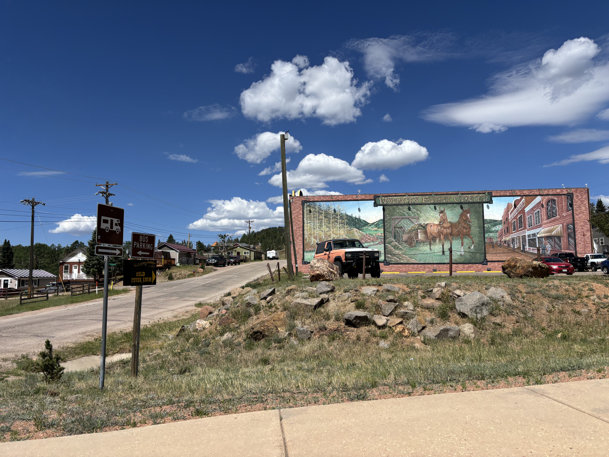

<br><details><summary>:camera:**66/IMG_0090.jpg**</summary><sub> `Exif version` 0232 `OS version` 27.0 `Date` 2026:06:20 10:48:27 `Aperture` Not known `Brightness` 10.27683916456033 `Color space` 65535 `Compression` Not known`Exposure mode` 0 `Exposure time` 0.00018698578908002991 `Focal length` 5.96 `Lens model` iPhone 15 Plus back dual wide camera 5.96mm f/1.6 `Lens specification` (1.5399999618512084, 5.96, 1.6, 2.4) `Orientation` 1 `Scene type` Not known `f number` 1.6 `White balance` 0 `Sensing method` 2 `Shutter speed` 12.384674110125012</sub><sub>`Coordinates & altitude` (38.74486666666667, -105.17830000000001, 2872.688195991091)</sub><sub> :earth_americas:`Location over` [Google Maps](http://maps.google.com/maps?q=38.74486666666667,-105.17830000000001) or [Openstreet Map](https://www.openstreetmap.org/query?lat=38.74486666666667&lon=-105.17830000000001)</sub></details>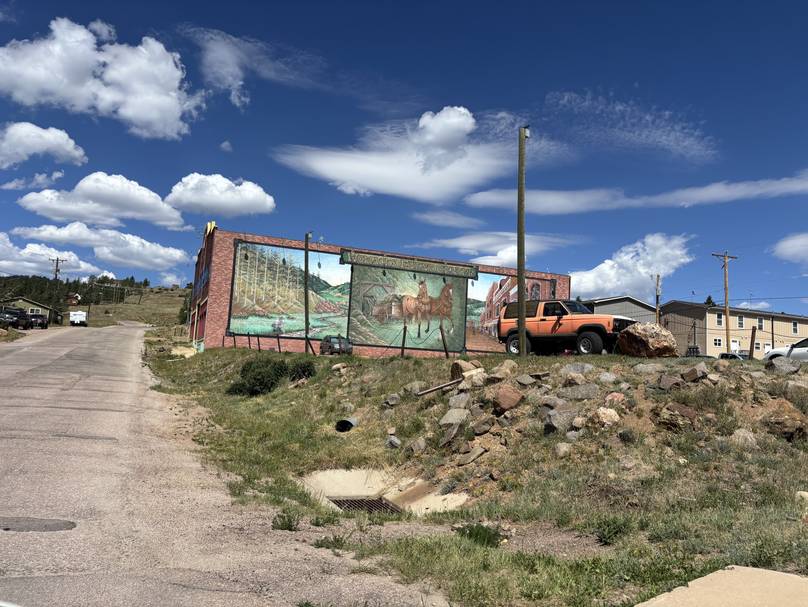

<br><details><summary>:camera:**66/IMG_0091.jpg**</summary><sub> `Exif version` 0232 `OS version` 27.0 `Date` 2026:06:20 10:48:33 `Aperture` Not known `Brightness` 10.003421845058856 `Color space` 65535 `Compression` Not known`Exposure mode` 0 `Exposure time` 0.00023501762632197415 `Focal length` 5.96 `Lens model` iPhone 15 Plus back dual wide camera 5.96mm f/1.6 `Lens specification` (1.5399999618512084, 5.96, 1.6, 2.4) `Orientation` 1 `Scene type` Not known `f number` 1.6 `White balance` 0 `Sensing method` 2 `Shutter speed` 12.055051610885204</sub><sub>`Coordinates & altitude` (38.744819444444445, -105.17867222222223, 2871.8849765258215)</sub><sub> :earth_americas:`Location over` [Google Maps](http://maps.google.com/maps?q=38.744819444444445,-105.17867222222223) or [Openstreet Map](https://www.openstreetmap.org/query?lat=38.744819444444445&lon=-105.17867222222223)</sub></details>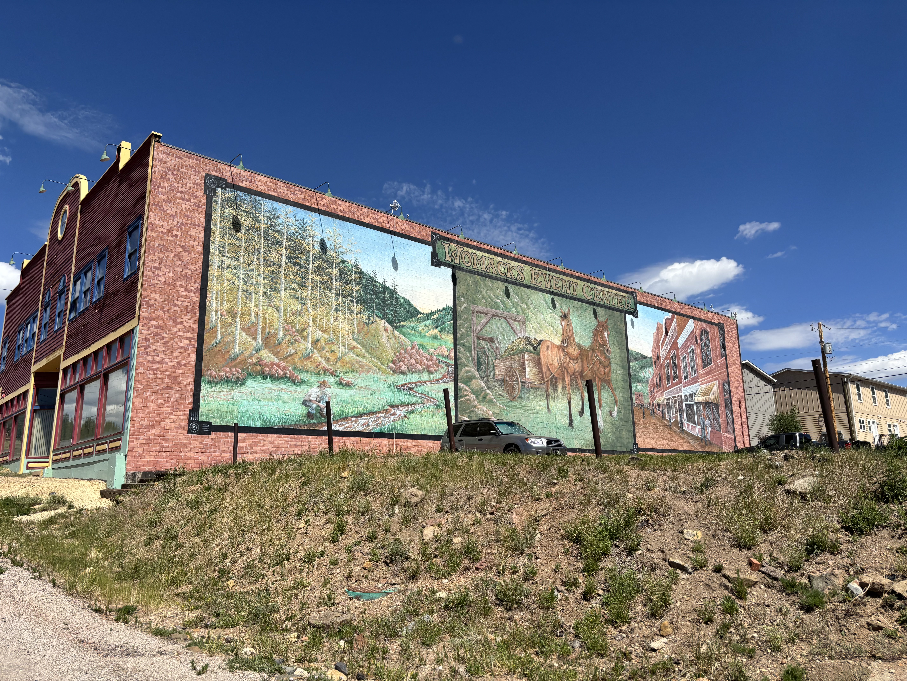

<br><details><summary>:camera:**66/IMG_0092.jpg**</summary><sub> `Exif version` 0232 `OS version` 27.0 `Date` 2026:06:20 10:53:35 `Aperture` Not known `Brightness` 10.152038369304556 `Color space` 65535 `Compression` Not known`Exposure mode` 0 `Exposure time` 0.00023501762632197415 `Focal length` 5.96 `Lens model` iPhone 15 Plus back dual wide camera 5.96mm f/1.6 `Lens specification` (1.5399999618512084, 5.96, 1.6, 2.4) `Orientation` 1 `Scene type` Not known `f number` 1.6 `White balance` 0 `Sensing method` 2 `Shutter speed` 12.055051610885204</sub><sub>`Coordinates & altitude` (38.75244444444444, -105.16127777777778, 3030.582484725051)</sub><sub> :earth_americas:`Location over` [Google Maps](http://maps.google.com/maps?q=38.75244444444444,-105.16127777777778) or [Openstreet Map](https://www.openstreetmap.org/query?lat=38.75244444444444&lon=-105.16127777777778)</sub></details>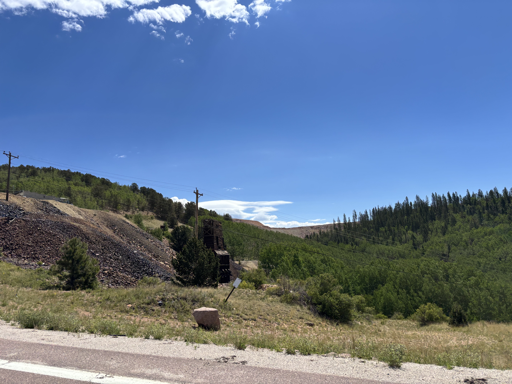

<br><details><summary>:camera:**66/IMG_0093.jpg**</summary><sub> `Exif version` 0232 `OS version` 27.0 `Date` 2026:06:20 10:53:42 `Aperture` Not known `Brightness` 9.104949543488708 `Color space` 65535 `Compression` Not known`Exposure mode` 0 `Exposure time` 0.0003979307600477517 `Focal length` 5.96 `Lens model` iPhone 15 Plus back dual wide camera 5.96mm f/1.6 `Lens specification` (1.5399999618512084, 5.96, 1.6, 2.4) `Orientation` 1 `Scene type` Not known `f number` 1.6 `White balance` 0 `Sensing method` 2 `Shutter speed` 11.294943950881436</sub><sub>`Coordinates & altitude` (38.753616666666666, -105.16111666666667, 3037.023675310034)</sub><sub> :earth_americas:`Location over` [Google Maps](http://maps.google.com/maps?q=38.753616666666666,-105.16111666666667) or [Openstreet Map](https://www.openstreetmap.org/query?lat=38.753616666666666&lon=-105.16111666666667)</sub></details>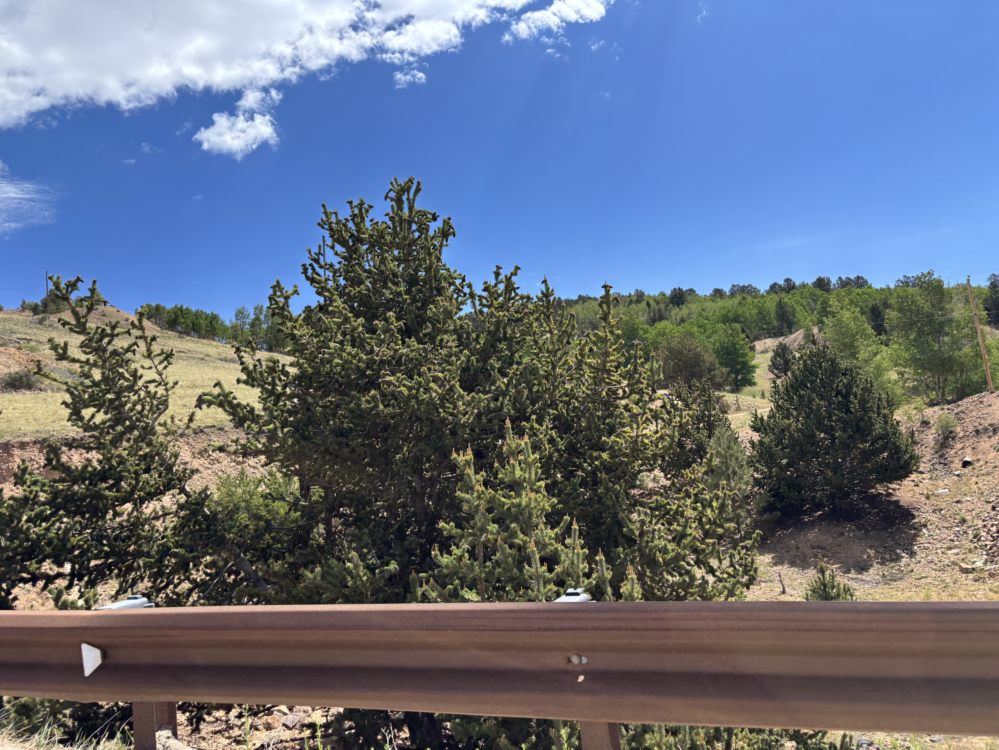

<br><details><summary>:camera:**66/IMG_0094.jpg**</summary><sub> `Exif version` 0232 `OS version` 27.0 `Date` 2026:06:20 10:58:48 `Aperture` Not known `Brightness` 10.342462014375398 `Color space` 65535 `Compression` Not known`Exposure mode` 0 `Exposure time` 0.00016801075268817206 `Focal length` 5.96 `Lens model` iPhone 15 Plus back dual wide camera 5.96mm f/1.6 `Lens specification` (1.5399999618512084, 5.96, 1.6, 2.4) `Orientation` 1 `Scene type` Not known `f number` 1.6 `White balance` 0 `Sensing method` 2 `Shutter speed` 12.539251137291497</sub><sub>`Coordinates & altitude` (38.783408333333334, -105.12313055555555, 3031.2245762711864)</sub><sub> :earth_americas:`Location over` [Google Maps](http://maps.google.com/maps?q=38.783408333333334,-105.12313055555555) or [Openstreet Map](https://www.openstreetmap.org/query?lat=38.783408333333334&lon=-105.12313055555555)</sub></details>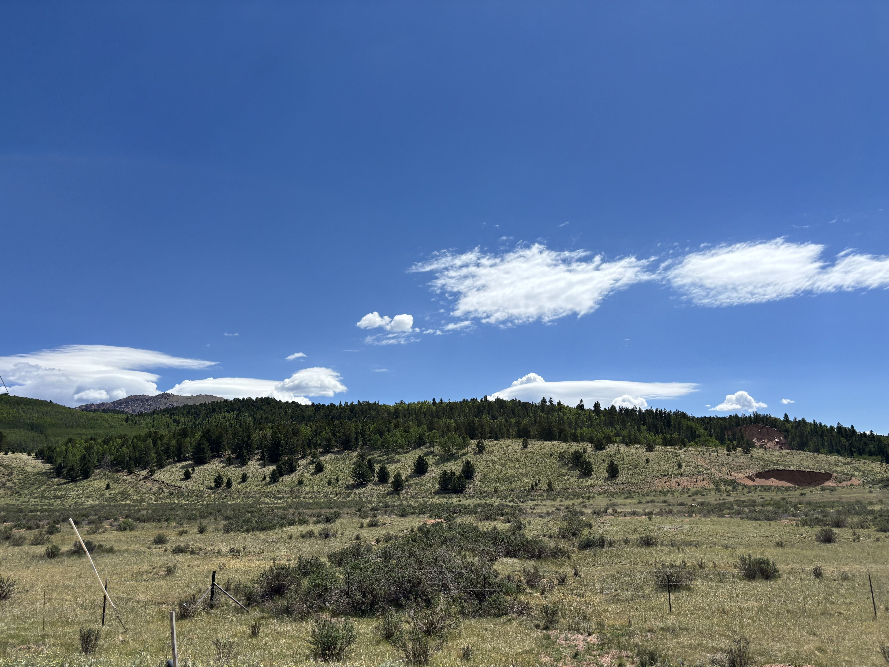

<br><details><summary>:camera:**66/IMG_0095.jpg**</summary><sub> `Exif version` 0232 `OS version` 27.0 `Date` 2026:06:20 10:58:53 `Aperture` Not known `Brightness` 10.400787044044195 `Color space` 65535 `Compression` Not known`Exposure mode` 0 `Exposure time` 0.00016801075268817206 `Focal length` 5.96 `Lens model` iPhone 15 Plus back dual wide camera 5.96mm f/1.6 `Lens specification` (1.5399999618512084, 5.96, 1.6, 2.4) `Orientation` 1 `Scene type` Not known `f number` 1.6 `White balance` 0 `Sensing method` 2 `Shutter speed` 12.539251137291497</sub><sub>`Coordinates & altitude` (38.78455833333333, -105.12334444444444, 3029.985849056604)</sub><sub> :earth_americas:`Location over` [Google Maps](http://maps.google.com/maps?q=38.78455833333333,-105.12334444444444) or [Openstreet Map](https://www.openstreetmap.org/query?lat=38.78455833333333&lon=-105.12334444444444)</sub></details>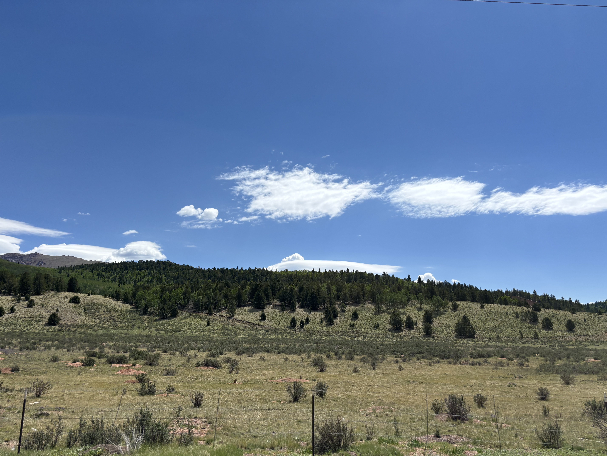

<br><details><summary>:camera:**66/IMG_0096.jpg**</summary><sub> `Exif version` 0232 `OS version` 27.0 `Date` 2026:06:20 10:59:18 `Aperture` Not known `Brightness` 9.900702552938847 `Color space` 65535 `Compression` Not known`Exposure mode` 0 `Exposure time` 0.0002449779519843214 `Focal length` 5.96 `Lens model` iPhone 15 Plus back dual wide camera 5.96mm f/1.6 `Lens specification` (1.5399999618512084, 5.96, 1.6, 2.4) `Orientation` 1 `Scene type` Not known `f number` 1.6 `White balance` 0 `Sensing method` 2 `Shutter speed` 11.994930629669156</sub><sub>`Coordinates & altitude` (38.78993611111111, -105.12436666666666, 3038.728205128205)</sub><sub> :earth_americas:`Location over` [Google Maps](http://maps.google.com/maps?q=38.78993611111111,-105.12436666666666) or [Openstreet Map](https://www.openstreetmap.org/query?lat=38.78993611111111&lon=-105.12436666666666)</sub></details>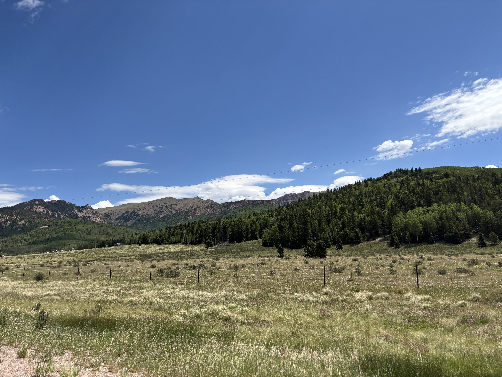

<br><details><summary>:camera:**66/IMG_0097.jpg**</summary><sub> `Exif version` 0232 `OS version` 27.0 `Date` 2026:06:20 11:08:55 `Aperture` Not known `Brightness` 10.059389847461865 `Color space` 65535 `Compression` Not known`Exposure mode` 0 `Exposure time` 0.000177999288002848 `Focal length` 5.96 `Lens model` iPhone 15 Plus back dual wide camera 5.96mm f/1.6 `Lens specification` (1.5399999618512084, 5.96, 1.6, 2.4) `Orientation` 6 `Scene type` Not known `f number` 1.6 `White balance` 0 `Sensing method` 2 `Shutter speed` 12.455835145490317</sub><sub>`Coordinates & altitude` (38.85438055555556, -105.1529, 2799.9900199600797)</sub><sub> :earth_americas:`Location over` [Google Maps](http://maps.google.com/maps?q=38.85438055555556,-105.1529) or [Openstreet Map](https://www.openstreetmap.org/query?lat=38.85438055555556&lon=-105.1529)</sub></details>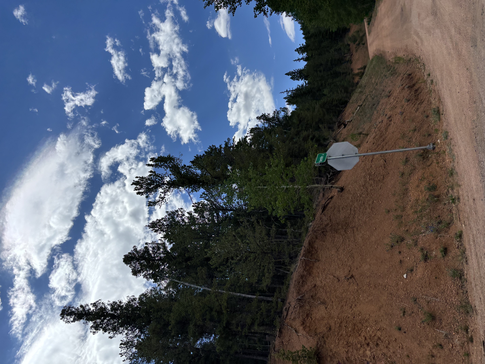

<br><details><summary>:camera:**66/IMG_0098.jpg**</summary><sub> `Exif version` 0232 `OS version` 27.0 `Date` 2026:06:20 11:09:07 `Aperture` Not known `Brightness` 9.589695608782435 `Color space` 65535 `Compression` Not known`Exposure mode` 0 `Exposure time` 0.00031201248049921997 `Focal length` 5.96 `Lens model` iPhone 15 Plus back dual wide camera 5.96mm f/1.6 `Lens specification` (1.5399999618512084, 5.96, 1.6, 2.4) `Orientation` 6 `Scene type` Not known `f number` 1.6 `White balance` 0 `Sensing method` 2 `Shutter speed` 11.646166350582497</sub><sub>`Coordinates & altitude` (38.85522777777778, -105.151725, 2795.104536489152)</sub><sub> :earth_americas:`Location over` [Google Maps](http://maps.google.com/maps?q=38.85522777777778,-105.151725) or [Openstreet Map](https://www.openstreetmap.org/query?lat=38.85522777777778&lon=-105.151725)</sub></details>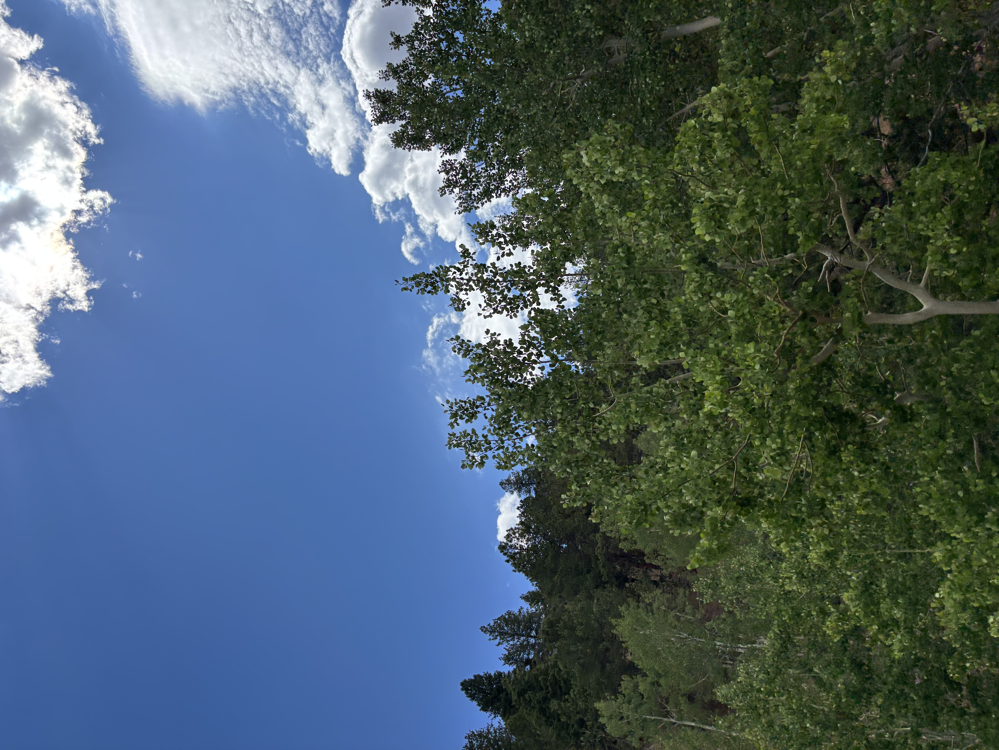

<br><details><summary>:camera:**66/IMG_0099.jpg**</summary><sub> `Exif version` 0232 `OS version` 27.0 `Date` 2026:06:20 11:35:52 `Aperture` Not known `Brightness` 10.195812153857826 `Color space` 65535 `Compression` Not known`Exposure mode` 0 `Exposure time` 0.000177999288002848 `Focal length` 5.96 `Lens model` iPhone 15 Plus back dual wide camera 5.96mm f/1.6 `Lens specification` (1.5399999618512084, 5.96, 1.6, 2.4) `Orientation` 1 `Scene type` Not known `f number` 1.6 `White balance` 0 `Sensing method` 2 `Shutter speed` 12.455835145490317</sub><sub>`Coordinates & altitude` (38.898408333333336, -104.97200000000001, 2269.8867497168744)</sub><sub> :earth_americas:`Location over` [Google Maps](http://maps.google.com/maps?q=38.898408333333336,-104.97200000000001) or [Openstreet Map](https://www.openstreetmap.org/query?lat=38.898408333333336&lon=-104.97200000000001)</sub></details>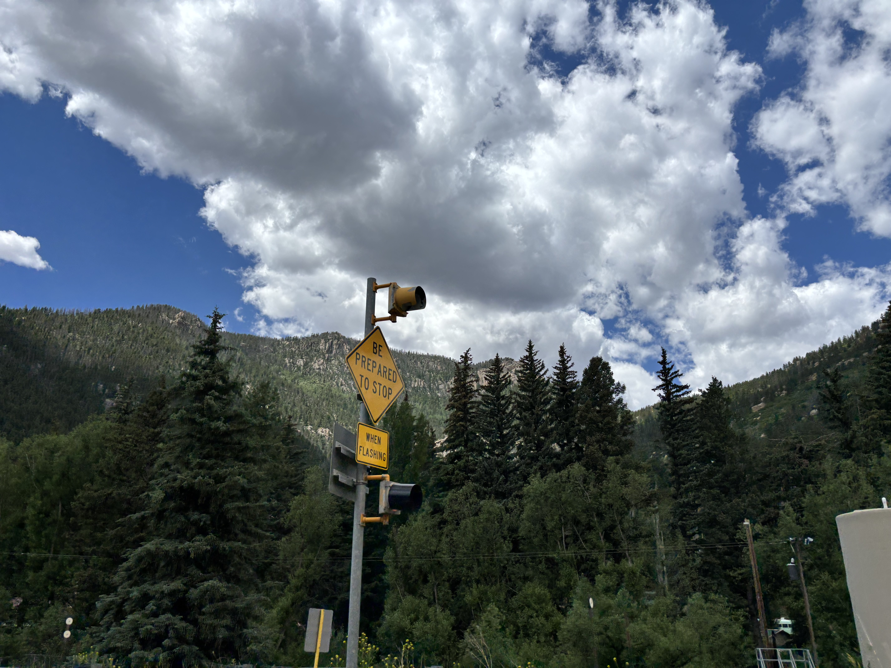

<br><details><summary>:camera:**66/IMG_0100.jpg**</summary><sub> `Exif version` 0232 `OS version` 27.0 `Date` 2026:06:20 11:36:03 `Aperture` Not known `Brightness` 9.893585675430643 `Color space` 65535 `Compression` Not known`Exposure mode` 0 `Exposure time` 0.0002829654782116582 `Focal length` 5.96 `Lens model` iPhone 15 Plus back dual wide camera 5.96mm f/1.6 `Lens specification` (1.5399999618512084, 5.96, 1.6, 2.4) `Orientation` 1 `Scene type` Not known `f number` 1.6 `White balance` 0 `Sensing method` 2 `Shutter speed` 11.786910327241818</sub><sub>`Coordinates & altitude` (38.89748888888889, -104.9715361111111, 2247.6610878661086)</sub><sub> :earth_americas:`Location over` [Google Maps](http://maps.google.com/maps?q=38.89748888888889,-104.9715361111111) or [Openstreet Map](https://www.openstreetmap.org/query?lat=38.89748888888889&lon=-104.9715361111111)</sub></details>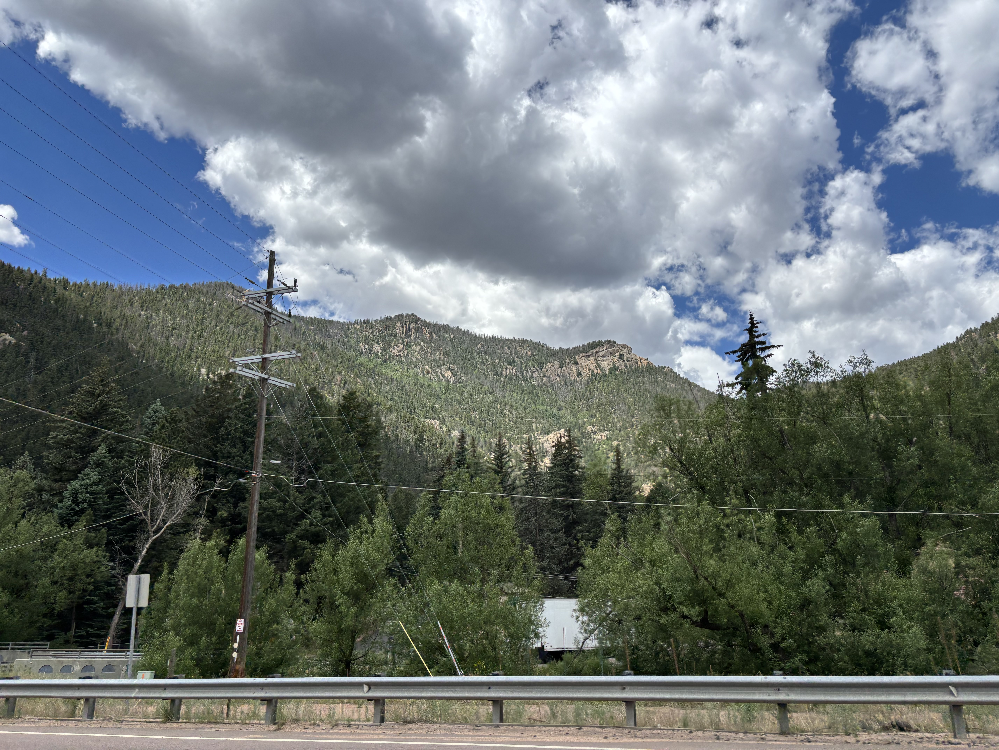

<br><details><summary>:camera:**66/IMG_0101.jpg**</summary><sub> `Exif version` 0232 `OS version` 27.0 `Date` 2026:06:20 11:36:17 `Aperture` Not known `Brightness` 10.418107588856868 `Color space` 65535 `Compression` Not known`Exposure mode` 0 `Exposure time` 0.00015800284405119292 `Focal length` 5.96 `Lens model` iPhone 15 Plus back dual wide camera 5.96mm f/1.6 `Lens specification` (1.5399999618512084, 5.96, 1.6, 2.4) `Orientation` 1 `Scene type` Not known `f number` 1.6 `White balance` 0 `Sensing method` 2 `Shutter speed` 12.627787823990356</sub><sub>`Coordinates & altitude` (38.89574722222222, -104.97099166666666, 2246.10911136108)</sub><sub> :earth_americas:`Location over` [Google Maps](http://maps.google.com/maps?q=38.89574722222222,-104.97099166666666) or [Openstreet Map](https://www.openstreetmap.org/query?lat=38.89574722222222&lon=-104.97099166666666)</sub></details>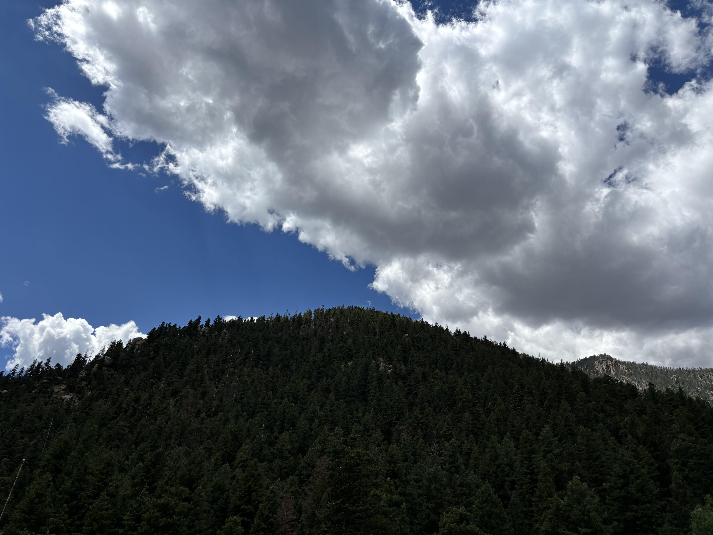

<br><details><summary>:camera:**66/IMG_0102.jpg**</summary><sub> `Exif version` 0232 `OS version` 27.0 `Date` 2026:06:20 11:36:22 `Aperture` Not known `Brightness` 10.771305311867348 `Color space` 65535 `Compression` Not known`Exposure mode` 0 `Exposure time` 0.00013000520020800833 `Focal length` 5.96 `Lens model` iPhone 15 Plus back dual wide camera 5.96mm f/1.6 `Lens specification` (1.5399999618512084, 5.96, 1.6, 2.4) `Orientation` 6 `Scene type` Not known `f number` 1.6 `White balance` 0 `Sensing method` 2 `Shutter speed` 12.909200759537372</sub><sub>`Coordinates & altitude` (38.89503888888889, -104.97034444444445, 2242.025620496397)</sub><sub> :earth_americas:`Location over` [Google Maps](http://maps.google.com/maps?q=38.89503888888889,-104.97034444444445) or [Openstreet Map](https://www.openstreetmap.org/query?lat=38.89503888888889&lon=-104.97034444444445)</sub></details>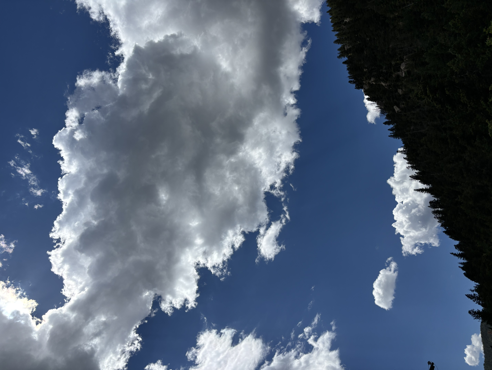

<br><details><summary>:camera:**66/IMG_0103.jpg**</summary><sub> `Exif version` 0232 `OS version` 27.0 `Date` 2026:06:20 11:41:00 `Aperture` Not known `Brightness` 10.289384955237763 `Color space` 65535 `Compression` Not known`Exposure mode` 0 `Exposure time` 0.000177999288002848 `Focal length` 5.96 `Lens model` iPhone 15 Plus back dual wide camera 5.96mm f/1.6 `Lens specification` (1.5399999618512084, 5.96, 1.6, 2.4) `Orientation` 1 `Scene type` Not known `f number` 1.6 `White balance` 0 `Sensing method` 2 `Shutter speed` 12.455835145490317</sub><sub>`Coordinates & altitude` (38.86428888888889, -104.91968611111112, 2007.6508344030808)</sub><sub> :earth_americas:`Location over` [Google Maps](http://maps.google.com/maps?q=38.86428888888889,-104.91968611111112) or [Openstreet Map](https://www.openstreetmap.org/query?lat=38.86428888888889&lon=-104.91968611111112)</sub></details>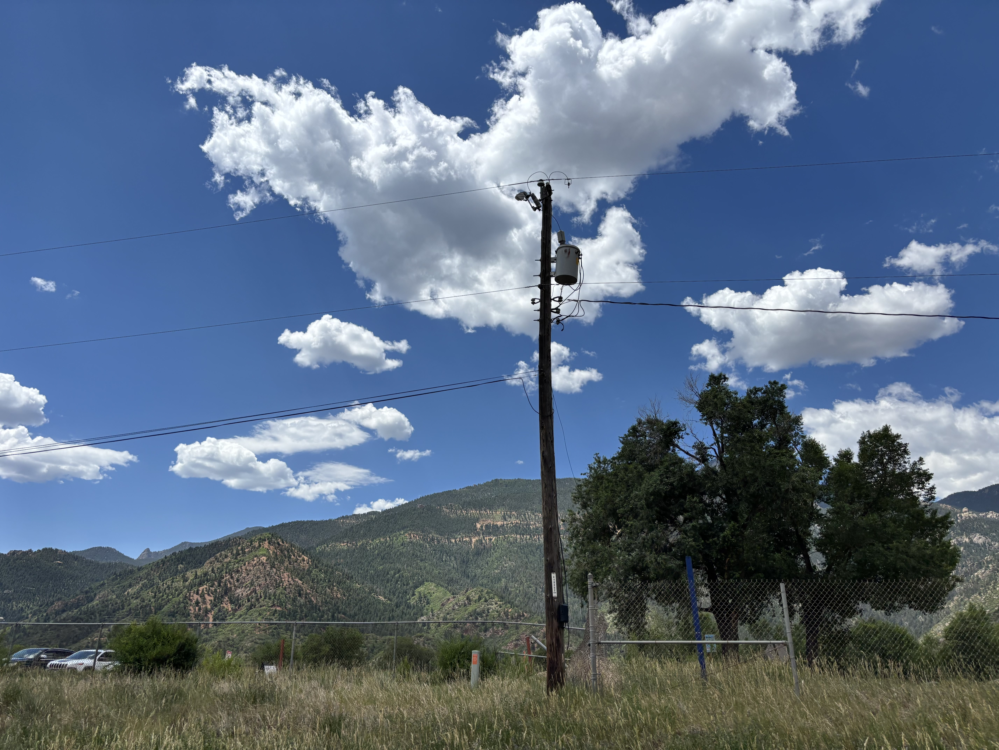

<br><details><summary>:camera:**66/IMG_0104.jpg**</summary><sub> `Exif version` 0232 `OS version` 27.0 `Date` 2026:06:20 11:41:10 `Aperture` Not known `Brightness` 10.435219154276888 `Color space` 65535 `Compression` Not known`Exposure mode` 0 `Exposure time` 0.000177999288002848 `Focal length` 5.96 `Lens model` iPhone 15 Plus back dual wide camera 5.96mm f/1.6 `Lens specification` (1.5399999618512084, 5.96, 1.6, 2.4) `Orientation` 1 `Scene type` Not known `f number` 1.6 `White balance` 0 `Sensing method` 2 `Shutter speed` 12.455835145490317</sub><sub>`Coordinates & altitude` (38.86343055555556, -104.917275, 2001.1269487750558)</sub><sub> :earth_americas:`Location over` [Google Maps](http://maps.google.com/maps?q=38.86343055555556,-104.917275) or [Openstreet Map](https://www.openstreetmap.org/query?lat=38.86343055555556&lon=-104.917275)</sub></details>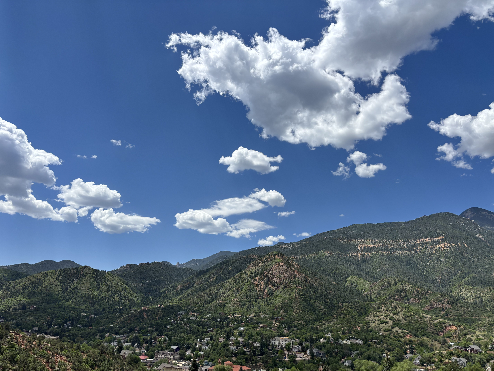

<br><details><summary>:camera:**66/IMG_0105.jpg**</summary><sub> `Exif version` 0232 `OS version` 27.0 `Date` 2026:06:20 11:41:15 `Aperture` Not known `Brightness` 10.12264208164008 `Color space` 65535 `Compression` Not known`Exposure mode` 0 `Exposure time` 0.00021598272138228941 `Focal length` 5.96 `Lens model` iPhone 15 Plus back dual wide camera 5.96mm f/1.6 `Lens specification` (1.5399999618512084, 5.96, 1.6, 2.4) `Orientation` 1 `Scene type` Not known `f number` 1.6 `White balance` 0 `Sensing method` 2 `Shutter speed` 12.176681061073412</sub><sub>`Coordinates & altitude` (38.86296111111111, -104.91603888888889, 1994.8559585492228)</sub><sub> :earth_americas:`Location over` [Google Maps](http://maps.google.com/maps?q=38.86296111111111,-104.91603888888889) or [Openstreet Map](https://www.openstreetmap.org/query?lat=38.86296111111111&lon=-104.91603888888889)</sub></details>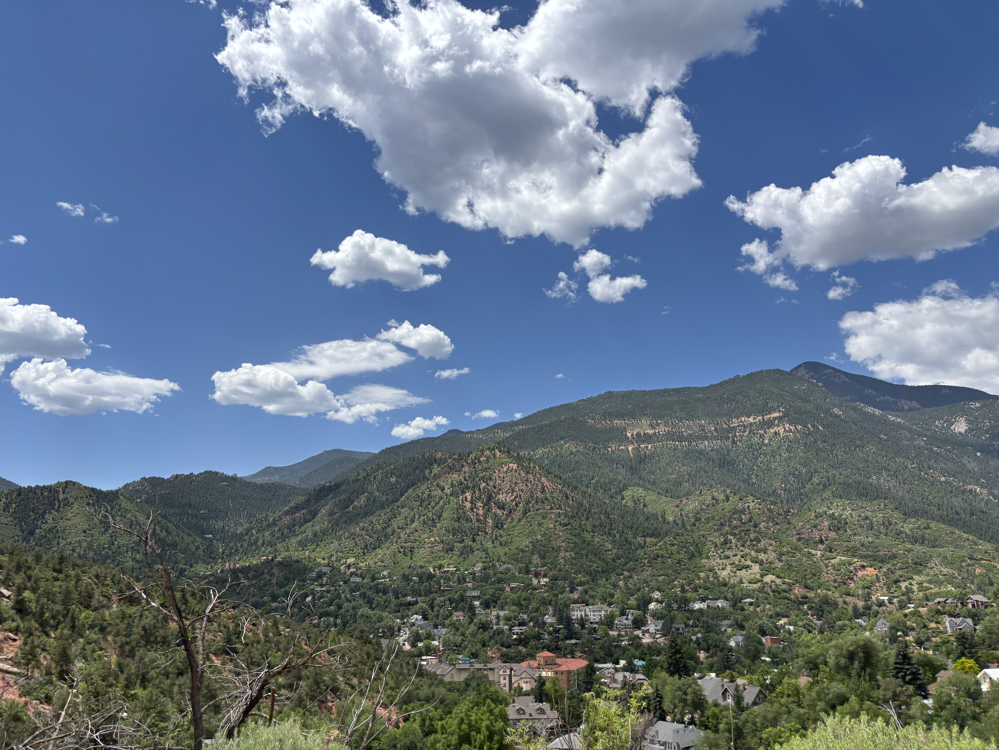

<br><details><summary>:camera:**66/IMG_0106.jpg**</summary><sub> `Exif version` 0232 `OS version` 27.0 `Date` 2026:06:21 05:50:45 `Aperture` Not known `Brightness` 7.447101285810963 `Color space` 65535 `Compression` Not known`Exposure mode` 0 `Exposure time` 0.001358695652173913 `Focal length` 5.96 `Lens model` iPhone 15 Plus back dual wide camera 5.96mm f/1.6 `Lens specification` (1.5399999618512084, 5.96, 1.6, 2.4) `Orientation` 6 `Scene type` Not known `f number` 1.6 `White balance` 0 `Sensing method` 2 `Shutter speed` 9.524300807955251</sub><sub>`Coordinates & altitude` (38.85073888888889, -104.69858611111111, 1935.5956331877728)</sub><sub> :earth_americas:`Location over` [Google Maps](http://maps.google.com/maps?q=38.85073888888889,-104.69858611111111) or [Openstreet Map](https://www.openstreetmap.org/query?lat=38.85073888888889&lon=-104.69858611111111)</sub></details>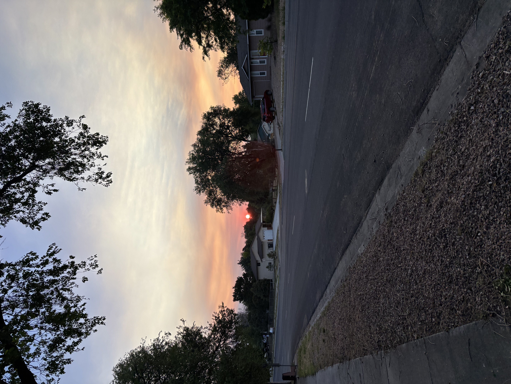

<br><details><summary>:camera:**66/IMG_0123.jpg**</summary><sub> `Exif version` 0232 `OS version` 27.0 `Date` 2026:07:04 16:22:53 `Aperture` Not known `Brightness` 10.20851051263879 `Color space` 65535 `Compression` Not known`Exposure mode` 0 `Exposure time` 0.00020601565718994644 `Focal length` 5.96 `Lens model` iPhone 15 Plus back dual wide camera 5.96mm f/1.6 `Lens specification` (1.5399999618512084, 5.96, 1.6, 2.4) `Orientation` 1 `Scene type` Not known `f number` 1.6 `White balance` 0 `Sensing method` 2 `Shutter speed` 12.245068045152442</sub><sub>`Coordinates & altitude` (39.249408333333335, -104.88433055555556, 2015.8308605341247)</sub><sub> :earth_americas:`Location over` [Google Maps](http://maps.google.com/maps?q=39.249408333333335,-104.88433055555556) or [Openstreet Map](https://www.openstreetmap.org/query?lat=39.249408333333335&lon=-104.88433055555556)</sub></details>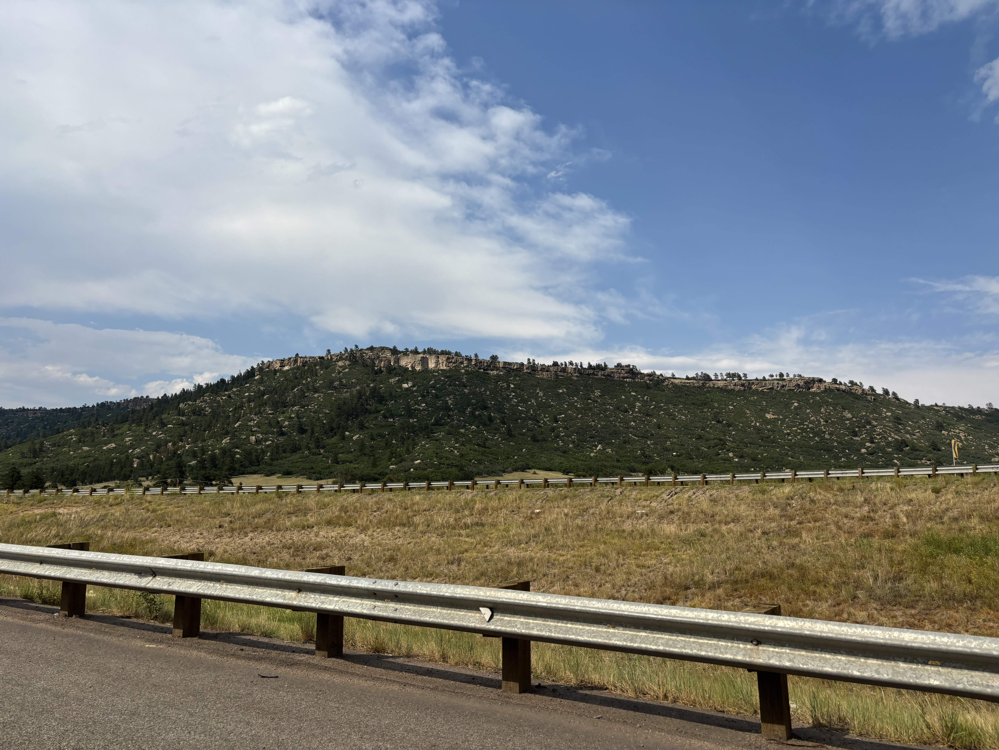

<br><details><summary>:camera:**66/IMG_0215.jpg**</summary><sub> `Exif version` 0232 `OS version` 27.0 `Date` 2026:07:09 05:37:42 `Aperture` Not known `Brightness` 1.8008516213560433 `Color space` 65535 `Compression` Not known`Exposure mode` 0 `Exposure time` 0.016666666666666666 `Focal length` 5.96 `Lens model` iPhone 15 Plus back dual wide camera 5.96mm f/1.6 `Lens specification` (1.5399999618512084, 5.96, 1.6, 2.4) `Orientation` 1 `Scene type` Not known `f number` 1.6 `White balance` 0 `Sensing method` 2 `Shutter speed` 5.906602084868906</sub><sub>`Coordinates & altitude` (38.84428055555556, -104.70408611111111, 1922.4623323013416)</sub><sub> :earth_americas:`Location over` [Google Maps](http://maps.google.com/maps?q=38.84428055555556,-104.70408611111111) or [Openstreet Map](https://www.openstreetmap.org/query?lat=38.84428055555556&lon=-104.70408611111111)</sub></details>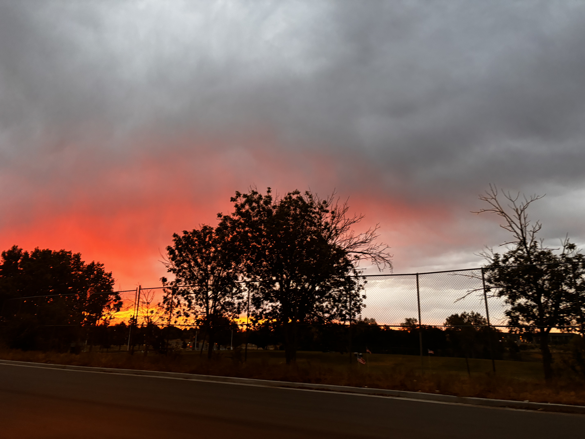

<br><details><summary>:camera:**66/IMG_0216.jpg**</summary><sub> `Exif version` 0232 `OS version` 27.0 `Date` 2026:07:09 05:37:45 `Aperture` Not known `Brightness` 1.7464815570981354 `Color space` 65535 `Compression` Not known`Exposure mode` 0 `Exposure time` 0.016666666666666666 `Focal length` 5.96 `Lens model` iPhone 15 Plus back dual wide camera 5.96mm f/1.6 `Lens specification` (1.5399999618512084, 5.96, 1.6, 2.4) `Orientation` 6 `Scene type` Not known `f number` 1.6 `White balance` 0 `Sensing method` 2 `Shutter speed` 5.906602084868906</sub><sub>`Coordinates & altitude` (38.844258333333336, -104.70404166666667, 1922.0145772594751)</sub><sub> :earth_americas:`Location over` [Google Maps](http://maps.google.com/maps?q=38.844258333333336,-104.70404166666667) or [Openstreet Map](https://www.openstreetmap.org/query?lat=38.844258333333336&lon=-104.70404166666667)</sub></details>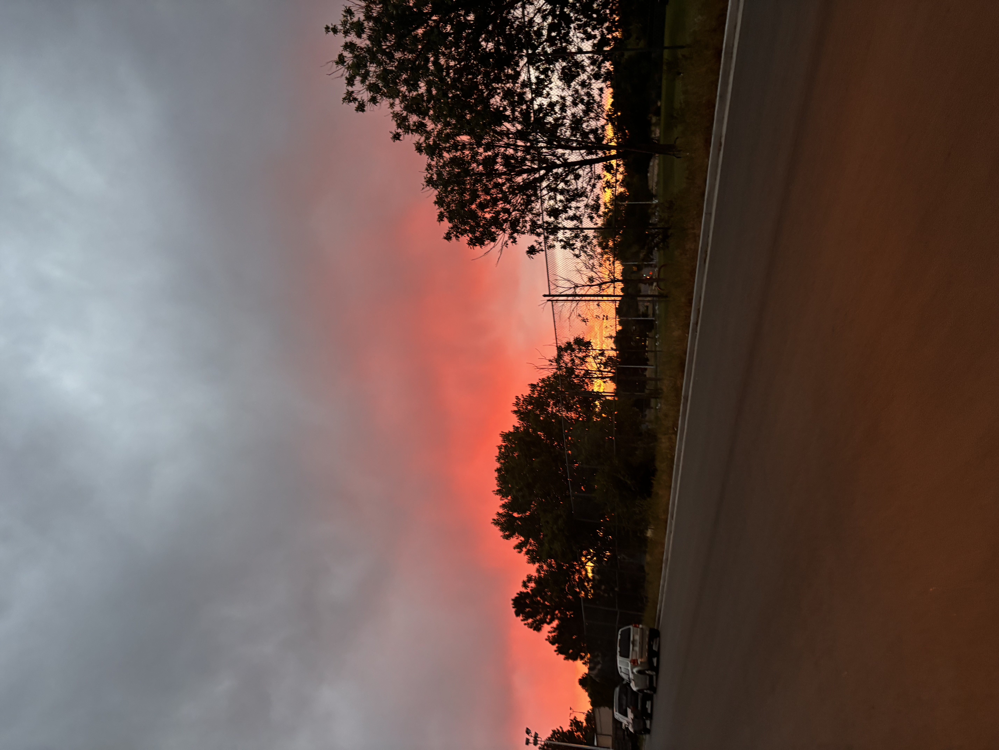

<br><details><summary>:camera:**66/IMG_0217.jpg**</summary><sub> `Exif version` 0232 `OS version` 27.0 `Date` 2026:07:09 05:39:24 `Aperture` Not known `Brightness` 2.0164078056551173 `Color space` 65535 `Compression` Not known`Exposure mode` 0 `Exposure time` 0.016666666666666666 `Focal length` 5.96 `Lens model` iPhone 15 Plus back dual wide camera 5.96mm f/1.6 `Lens specification` (1.5399999618512084, 5.96, 1.6, 2.4) `Orientation` 1 `Scene type` Not known `f number` 1.6 `White balance` 0 `Sensing method` 2 `Shutter speed` 5.906602084868906</sub><sub>`Coordinates & altitude` (38.845530555555555, -104.70321666666666, 1923.7333278648184)</sub><sub> :earth_americas:`Location over` [Google Maps](http://maps.google.com/maps?q=38.845530555555555,-104.70321666666666) or [Openstreet Map](https://www.openstreetmap.org/query?lat=38.845530555555555&lon=-104.70321666666666)</sub></details>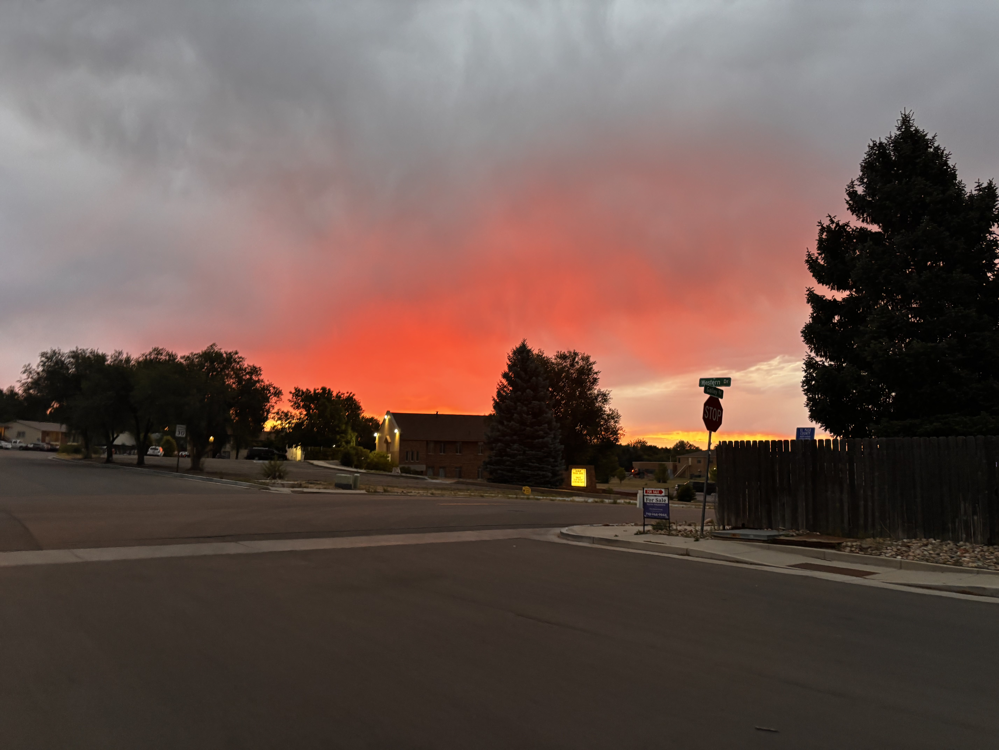

<br><details><summary>:camera:**66/IMG_0218.jpg**</summary><sub> `Exif version` 0232 `OS version` 27.0 `Date` 2026:07:09 05:39:26 `Aperture` Not known `Brightness` 2.475213747209704 `Color space` 65535 `Compression` Not known`Exposure mode` 0 `Exposure time` 0.016666666666666666 `Focal length` 5.96 `Lens model` iPhone 15 Plus back dual wide camera 5.96mm f/1.6 `Lens specification` (1.5399999618512084, 5.96, 1.6, 2.4) `Orientation` 6 `Scene type` Not known `f number` 1.6 `White balance` 0 `Sensing method` 2 `Shutter speed` 5.906602084868906</sub><sub>`Coordinates & altitude` (38.84555, -104.70320000000001, 1924.4462193823217)</sub><sub> :earth_americas:`Location over` [Google Maps](http://maps.google.com/maps?q=38.84555,-104.70320000000001) or [Openstreet Map](https://www.openstreetmap.org/query?lat=38.84555&lon=-104.70320000000001)</sub></details>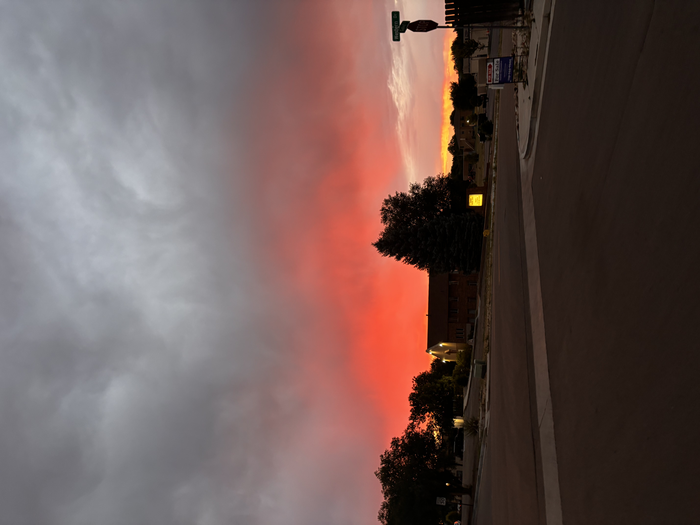

<br><details><summary>:camera:**66/IMG_0312.jpg**</summary><sub> `Exif version` 0232 `OS version` 27.0 `Date` 2026:07:12 11:52:29 `Aperture` Not known `Brightness` 9.283324321745491 `Color space` 65535 `Compression` Not known`Exposure mode` 0 `Exposure time` 0.0003979307600477517 `Focal length` 5.96 `Lens model` iPhone 15 Plus back dual wide camera 5.96mm f/1.6 `Lens specification` (1.5399999618512084, 5.96, 1.6, 2.4) `Orientation` 1 `Scene type` Not known `f number` 1.6 `White balance` 0 `Sensing method` 2 `Shutter speed` 11.294943950881436</sub><sub>`Coordinates & altitude` (38.86595277777778, -104.91980000000001, 2064.818556701031)</sub><sub> :earth_americas:`Location over` [Google Maps](http://maps.google.com/maps?q=38.86595277777778,-104.91980000000001) or [Openstreet Map](https://www.openstreetmap.org/query?lat=38.86595277777778&lon=-104.91980000000001)</sub></details>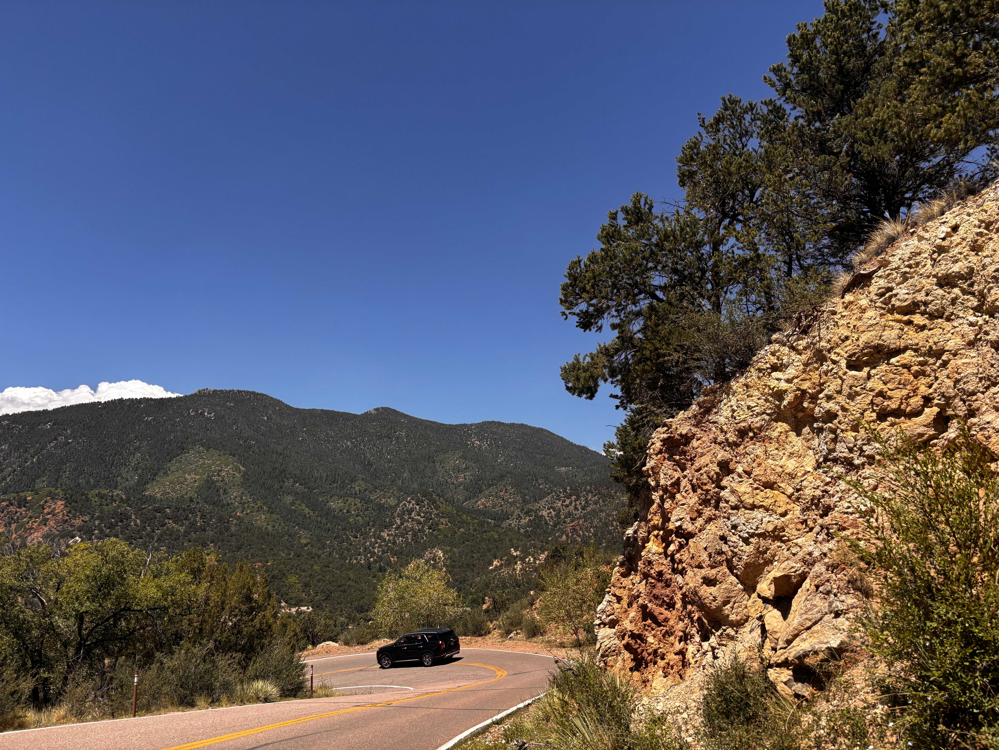

<br><details><summary>:camera:**66/IMG_0325.jpg**</summary><sub> `Exif version` 0232 `OS version` 27.0 `Date` 2026:07:18 11:23:46 `Aperture` Not known `Brightness` 10.385854616895875 `Color space` 65535 `Compression` Not known`Exposure mode` 0 `Exposure time` 0.000177999288002848 `Focal length` 5.96 `Lens model` iPhone 15 Plus back dual wide camera 5.96mm f/1.6 `Lens specification` (1.5399999618512084, 5.96, 1.6, 2.4) `Orientation` 1 `Scene type` Not known `f number` 1.6 `White balance` 0 `Sensing method` 2 `Shutter speed` 12.455835145490317</sub><sub>`Coordinates & altitude` (38.258177777777775, -104.71916944444445, 1481.8445497630332)</sub><sub> :earth_americas:`Location over` [Google Maps](http://maps.google.com/maps?q=38.258177777777775,-104.71916944444445) or [Openstreet Map](https://www.openstreetmap.org/query?lat=38.258177777777775&lon=-104.71916944444445)</sub></details>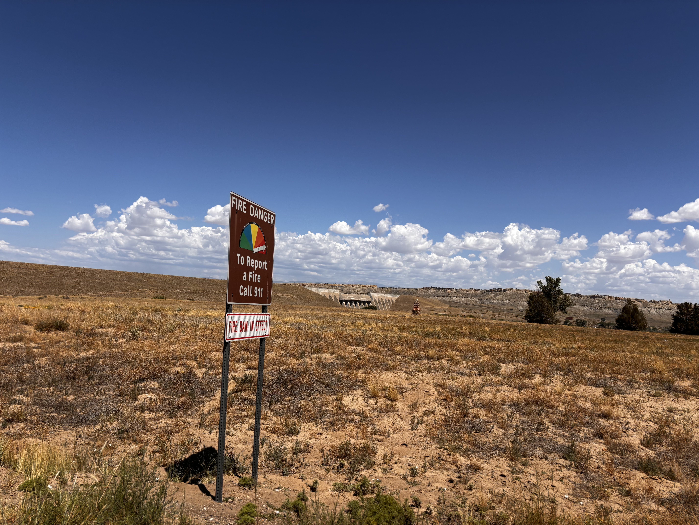

<br><details><summary>:camera:**66/IMG_0326.jpg**</summary><sub> `Exif version` 0232 `OS version` 27.0 `Date` 2026:07:18 11:23:50 `Aperture` Not known `Brightness` 10.629463374821466 `Color space` 65535 `Compression` Not known`Exposure mode` 0 `Exposure time` 0.00015800284405119292 `Focal length` 5.96 `Lens model` iPhone 15 Plus back dual wide camera 5.96mm f/1.6 `Lens specification` (1.5399999618512084, 5.96, 1.6, 2.4) `Orientation` 1 `Scene type` Not known `f number` 1.6 `White balance` 0 `Sensing method` 2 `Shutter speed` 12.627787823990356</sub><sub>`Coordinates & altitude` (38.25805, -104.71965833333334, 1486.058415841584)</sub><sub> :earth_americas:`Location over` [Google Maps](http://maps.google.com/maps?q=38.25805,-104.71965833333334) or [Openstreet Map](https://www.openstreetmap.org/query?lat=38.25805&lon=-104.71965833333334)</sub></details>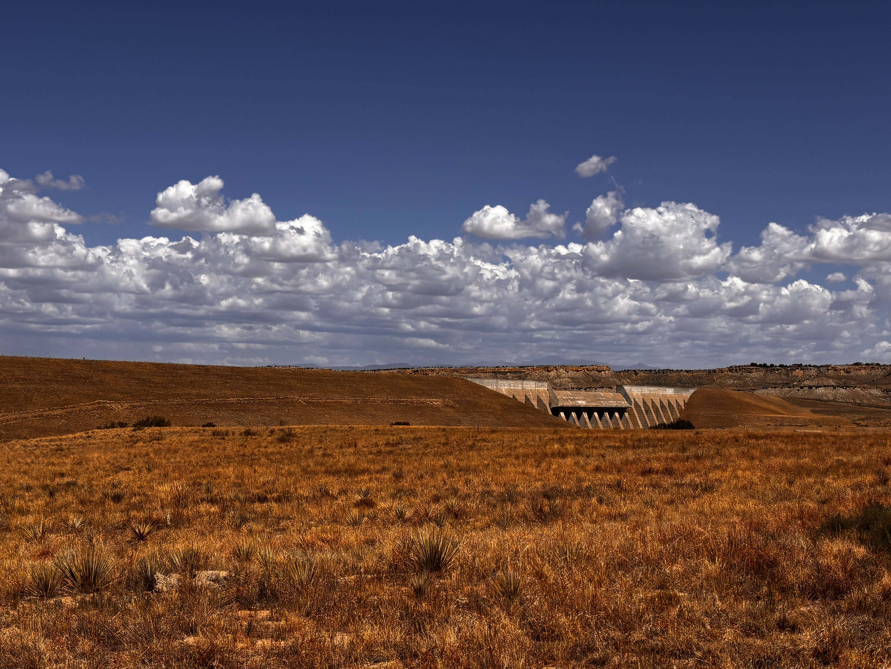

<br><details><summary>:camera:**66/IMG_0327.jpg**</summary><sub> `Exif version` 0232 `OS version` 27.0 `Date` 2026:07:18 11:23:53 `Aperture` Not known `Brightness` 10.843092054710311 `Color space` 65535 `Compression` Not known`Exposure mode` 0 `Exposure time` 0.00018698578908002991 `Focal length` 5.96 `Lens model` iPhone 15 Plus back dual wide camera 5.96mm f/1.6 `Lens specification` (1.5399999618512084, 5.96, 1.6, 2.4) `Orientation` 1 `Scene type` Not known `f number` 1.6 `White balance` 0 `Sensing method` 2 `Shutter speed` 12.384674110125012</sub><sub>`Coordinates & altitude` (38.257980555555555, -104.72004722222222, 1485.8793388429751)</sub><sub> :earth_americas:`Location over` [Google Maps](http://maps.google.com/maps?q=38.257980555555555,-104.72004722222222) or [Openstreet Map](https://www.openstreetmap.org/query?lat=38.257980555555555&lon=-104.72004722222222)</sub></details>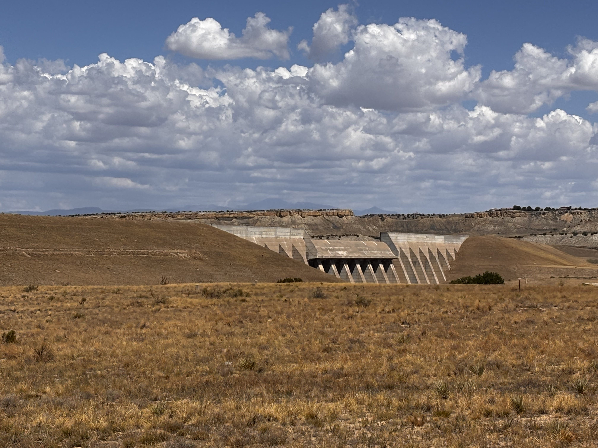

<br><details><summary>:camera:**66/IMG_0328.jpg**</summary><sub> `Exif version` 0232 `OS version` 27.0 `Date` 2026:07:18 11:23:57 `Aperture` Not known `Brightness` 10.564122614951517 `Color space` 65535 `Compression` Not known`Exposure mode` 0 `Exposure time` 0.00015800284405119292 `Focal length` 5.96 `Lens model` iPhone 15 Plus back dual wide camera 5.96mm f/1.6 `Lens specification` (1.5399999618512084, 5.96, 1.6, 2.4) `Orientation` 1 `Scene type` Not known `f number` 1.6 `White balance` 0 `Sensing method` 2 `Shutter speed` 12.627787823990356</sub><sub>`Coordinates & altitude` (38.25790277777778, -104.72045833333334, 1485.0335135135135)</sub><sub> :earth_americas:`Location over` [Google Maps](http://maps.google.com/maps?q=38.25790277777778,-104.72045833333334) or [Openstreet Map](https://www.openstreetmap.org/query?lat=38.25790277777778&lon=-104.72045833333334)</sub></details>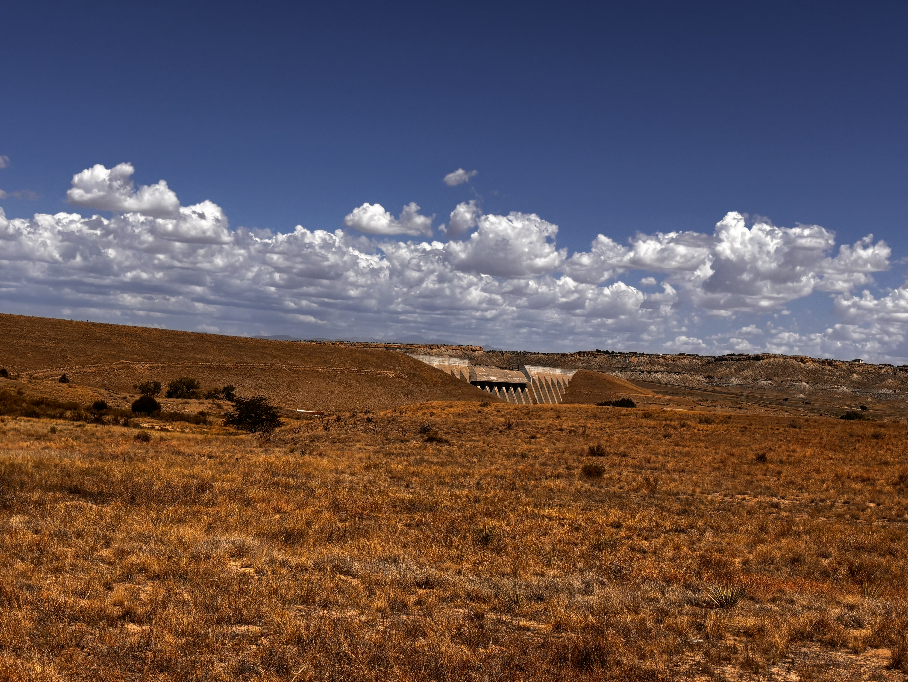

<br><details><summary>:camera:**66/IMG_0329.jpg**</summary><sub> `Exif version` 0232 `OS version` 27.0 `Date` 2026:07:18 11:24:01 `Aperture` Not known `Brightness` 10.376875375075015 `Color space` 65535 `Compression` Not known`Exposure mode` 0 `Exposure time` 0.00019700551615445234 `Focal length` 5.96 `Lens model` iPhone 15 Plus back dual wide camera 5.96mm f/1.6 `Lens specification` (1.5399999618512084, 5.96, 1.6, 2.4) `Orientation` 1 `Scene type` Not known `f number` 1.6 `White balance` 0 `Sensing method` 2 `Shutter speed` 12.309516750667061</sub><sub>`Coordinates & altitude` (38.25783611111111, -104.72085555555556, 1484.9317147192717)</sub><sub> :earth_americas:`Location over` [Google Maps](http://maps.google.com/maps?q=38.25783611111111,-104.72085555555556) or [Openstreet Map](https://www.openstreetmap.org/query?lat=38.25783611111111&lon=-104.72085555555556)</sub></details>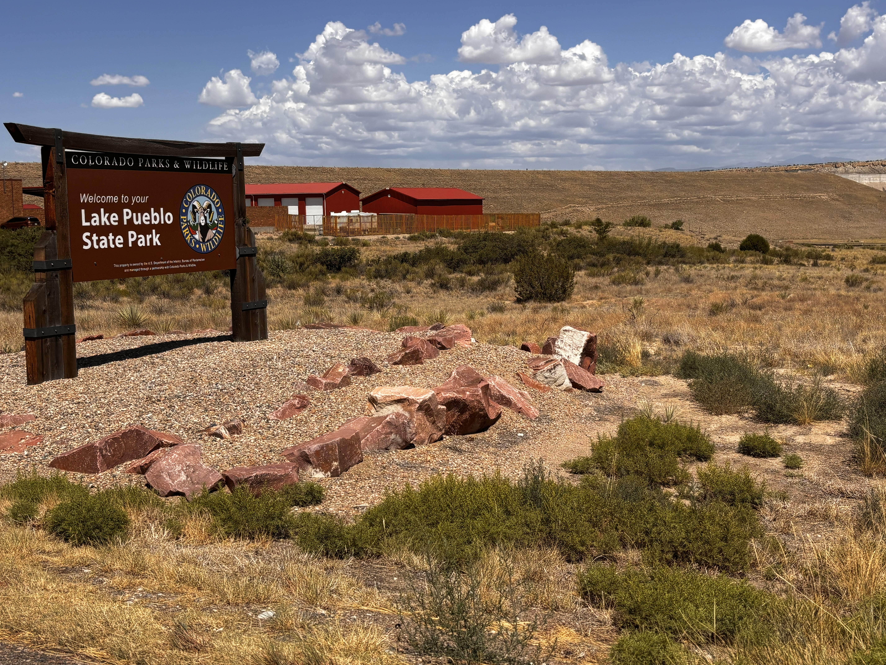

<br><details><summary>:camera:**66/IMG_0330.jpg**</summary><sub> `Exif version` 0232 `OS version` 27.0 `Date` 2026:07:18 11:24:19 `Aperture` Not known `Brightness` 10.237823258765667 `Color space` 65535 `Compression` Not known`Exposure mode` 0 `Exposure time` 0.00020601565718994644 `Focal length` 5.96 `Lens model` iPhone 15 Plus back dual wide camera 5.96mm f/1.6 `Lens specification` (1.5399999618512084, 5.96, 1.6, 2.4) `Orientation` 1 `Scene type` Not known `f number` 1.6 `White balance` 0 `Sensing method` 2 `Shutter speed` 12.245068045152442</sub><sub>`Coordinates & altitude` (38.25731388888889, -104.72373888888889, 1482.579295154185)</sub><sub> :earth_americas:`Location over` [Google Maps](http://maps.google.com/maps?q=38.25731388888889,-104.72373888888889) or [Openstreet Map](https://www.openstreetmap.org/query?lat=38.25731388888889&lon=-104.72373888888889)</sub></details>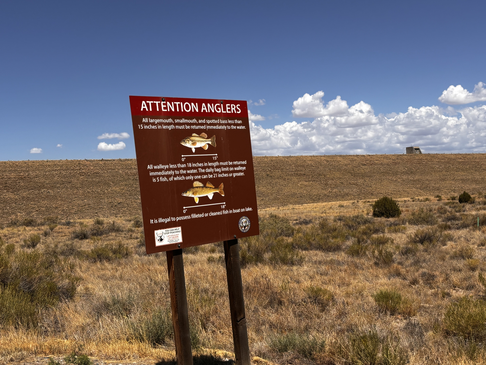

<br><details><summary>:camera:**66/IMG_0331.jpg**</summary><sub> `Exif version` 0232 `OS version` 27.0 `Date` 2026:07:18 11:24:33 `Aperture` Not known `Brightness` 10.173947876902776 `Color space` 65535 `Compression` Not known`Exposure mode` 0 `Exposure time` 0.00019700551615445234 `Focal length` 5.96 `Lens model` iPhone 15 Plus back dual wide camera 5.96mm f/1.6 `Lens specification` (1.5399999618512084, 5.96, 1.6, 2.4) `Orientation` 1 `Scene type` Not known `f number` 1.6 `White balance` 0 `Sensing method` 2 `Shutter speed` 12.309516750667061</sub><sub>`Coordinates & altitude` (38.257019444444445, -104.72571666666667, 1478.6153358681877)</sub><sub> :earth_americas:`Location over` [Google Maps](http://maps.google.com/maps?q=38.257019444444445,-104.72571666666667) or [Openstreet Map](https://www.openstreetmap.org/query?lat=38.257019444444445&lon=-104.72571666666667)</sub></details>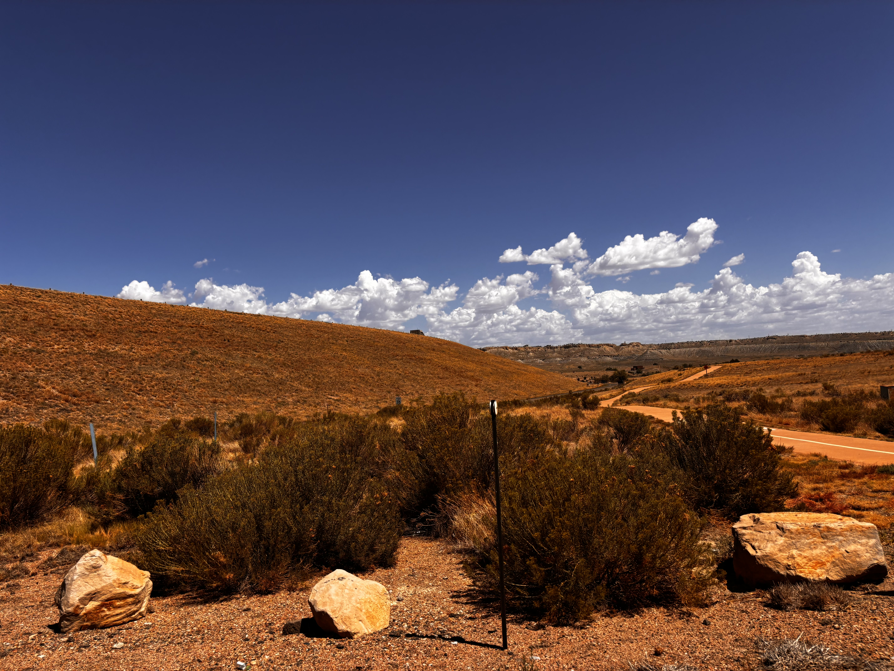

<br><details><summary>:camera:**66/IMG_0332.jpg**</summary><sub> `Exif version` 0232 `OS version` 27.0 `Date` 2026:07:18 11:24:43 `Aperture` Not known `Brightness` 10.310945709281961 `Color space` 65535 `Compression` Not known`Exposure mode` 0 `Exposure time` 0.00020601565718994644 `Focal length` 5.96 `Lens model` iPhone 15 Plus back dual wide camera 5.96mm f/1.6 `Lens specification` (1.5399999618512084, 5.96, 1.6, 2.4) `Orientation` 1 `Scene type` Not known `f number` 1.6 `White balance` 0 `Sensing method` 2 `Shutter speed` 12.245068045152442</sub><sub>`Coordinates & altitude` (38.25715, -104.72601388888889, 1480.8224368499257)</sub><sub> :earth_americas:`Location over` [Google Maps](http://maps.google.com/maps?q=38.25715,-104.72601388888889) or [Openstreet Map](https://www.openstreetmap.org/query?lat=38.25715&lon=-104.72601388888889)</sub></details>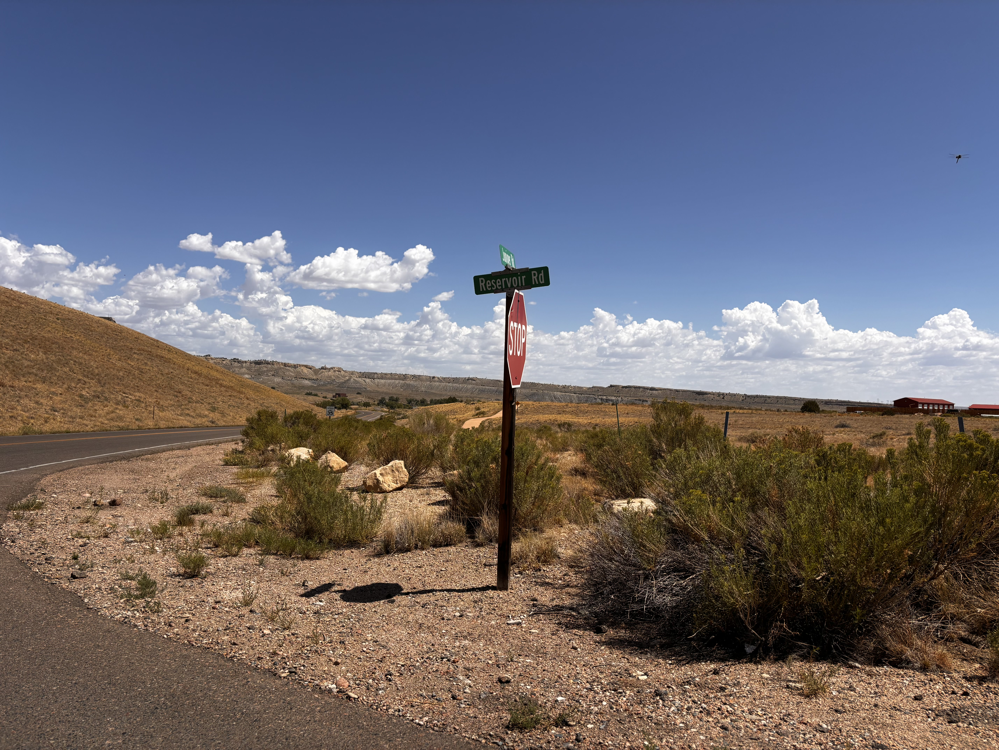

<br><details><summary>:camera:**66/IMG_0333.jpg**</summary><sub> `Exif version` 0232 `OS version` 27.0 `Date` 2026:07:18 11:25:22 `Aperture` Not known `Brightness` 10.590989226248777 `Color space` 65535 `Compression` Not known`Exposure mode` 0 `Exposure time` 0.00015800284405119292 `Focal length` 5.96 `Lens model` iPhone 15 Plus back dual wide camera 5.96mm f/1.6 `Lens specification` (1.5399999618512084, 5.96, 1.6, 2.4) `Orientation` 1 `Scene type` Not known `f number` 1.6 `White balance` 0 `Sensing method` 2 `Shutter speed` 12.627787823990356</sub><sub>`Coordinates & altitude` (38.26122222222222, -104.72453333333334, 1469.1595394736842)</sub><sub> :earth_americas:`Location over` [Google Maps](http://maps.google.com/maps?q=38.26122222222222,-104.72453333333334) or [Openstreet Map](https://www.openstreetmap.org/query?lat=38.26122222222222&lon=-104.72453333333334)</sub></details>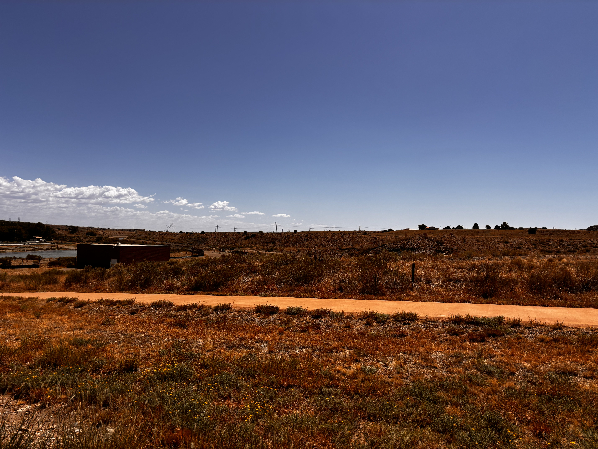

<br><details><summary>:camera:**66/IMG_0334.jpg**</summary><sub> `Exif version` 0232 `OS version` 27.0 `Date` 2026:07:18 11:25:25 `Aperture` Not known `Brightness` 10.559337429869089 `Color space` 65535 `Compression` Not known`Exposure mode` 0 `Exposure time` 0.000177999288002848 `Focal length` 5.96 `Lens model` iPhone 15 Plus back dual wide camera 5.96mm f/1.6 `Lens specification` (1.5399999618512084, 5.96, 1.6, 2.4) `Orientation` 1 `Scene type` Not known `f number` 1.6 `White balance` 0 `Sensing method` 2 `Shutter speed` 12.455835145490317</sub><sub>`Coordinates & altitude` (38.26162222222222, -104.72429722222222, 1467.1106965174129)</sub><sub> :earth_americas:`Location over` [Google Maps](http://maps.google.com/maps?q=38.26162222222222,-104.72429722222222) or [Openstreet Map](https://www.openstreetmap.org/query?lat=38.26162222222222&lon=-104.72429722222222)</sub></details>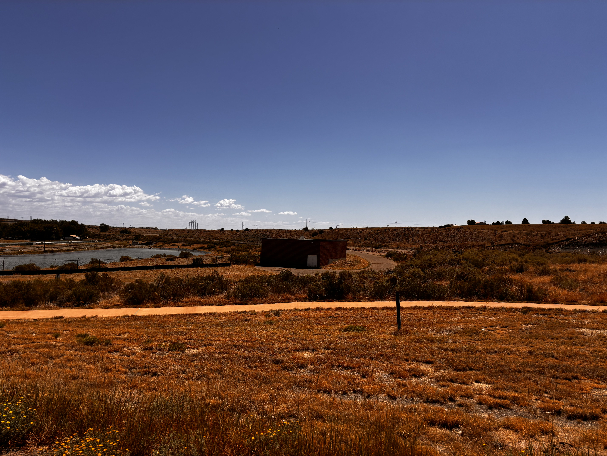

<br><details><summary>:camera:**66/IMG_0335.jpg**</summary><sub> `Exif version` 0232 `OS version` 27.0 `Date` 2026:07:18 11:25:29 `Aperture` Not known `Brightness` 10.610302586116637 `Color space` 65535 `Compression` Not known`Exposure mode` 0 `Exposure time` 0.00016801075268817206 `Focal length` 5.96 `Lens model` iPhone 15 Plus back dual wide camera 5.96mm f/1.6 `Lens specification` (1.5399999618512084, 5.96, 1.6, 2.4) `Orientation` 1 `Scene type` Not known `f number` 1.6 `White balance` 0 `Sensing method` 2 `Shutter speed` 12.539251137291497</sub><sub>`Coordinates & altitude` (38.26213055555556, -104.72402222222222, 1463.5591766723842)</sub><sub> :earth_americas:`Location over` [Google Maps](http://maps.google.com/maps?q=38.26213055555556,-104.72402222222222) or [Openstreet Map](https://www.openstreetmap.org/query?lat=38.26213055555556&lon=-104.72402222222222)</sub></details>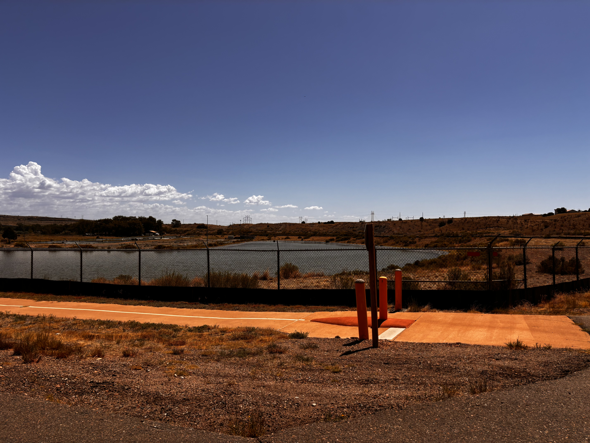

<br><details><summary>:camera:**66/IMG_0336.jpg**</summary><sub> `Exif version` 0232 `OS version` 27.0 `Date` 2026:07:18 11:25:34 `Aperture` Not known `Brightness` 10.699841986455981 `Color space` 65535 `Compression` Not known`Exposure mode` 0 `Exposure time` 0.00016801075268817206 `Focal length` 5.96 `Lens model` iPhone 15 Plus back dual wide camera 5.96mm f/1.6 `Lens specification` (1.5399999618512084, 5.96, 1.6, 2.4) `Orientation` 6 `Scene type` Not known `f number` 1.6 `White balance` 0 `Sensing method` 2 `Shutter speed` 12.539251137291497</sub><sub>`Coordinates & altitude` (38.262883333333335, -104.72358611111112, 1460.3235241978373)</sub><sub> :earth_americas:`Location over` [Google Maps](http://maps.google.com/maps?q=38.262883333333335,-104.72358611111112) or [Openstreet Map](https://www.openstreetmap.org/query?lat=38.262883333333335&lon=-104.72358611111112)</sub></details>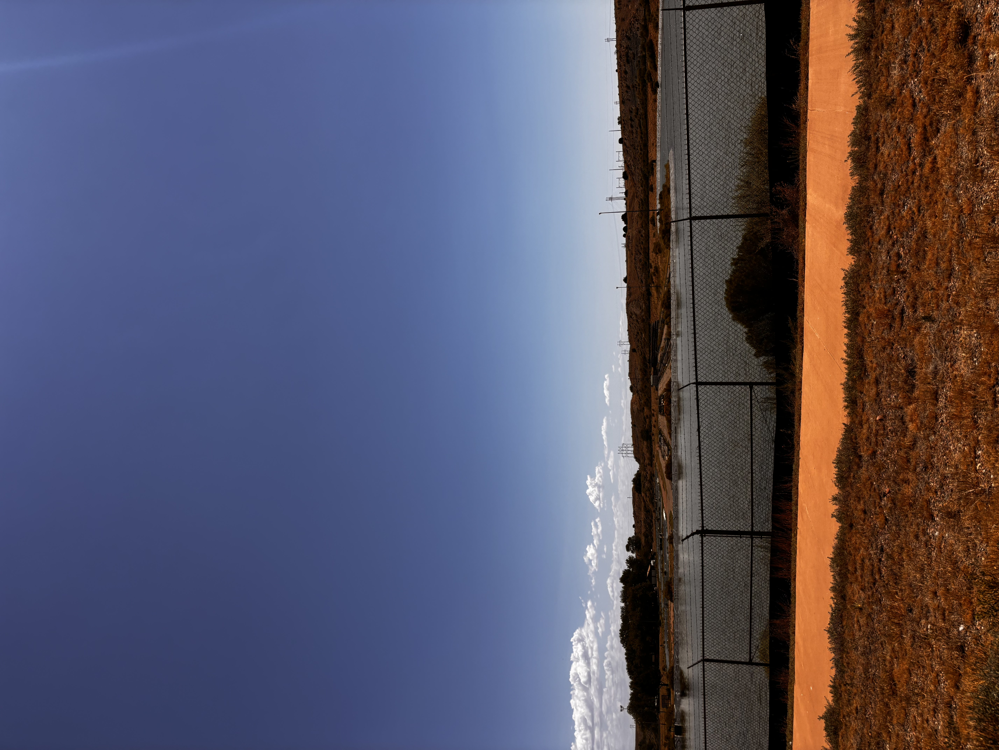

<br><details><summary>:camera:**66/IMG_0337.jpg**</summary><sub> `Exif version` 0232 `OS version` 27.0 `Date` 2026:07:18 11:26:36 `Aperture` Not known `Brightness` 10.231230587983292 `Color space` 65535 `Compression` Not known`Exposure mode` 0 `Exposure time` 0.00020601565718994644 `Focal length` 5.96 `Lens model` iPhone 15 Plus back dual wide camera 5.96mm f/1.6 `Lens specification` (1.5399999618512084, 5.96, 1.6, 2.4) `Orientation` 1 `Scene type` Not known `f number` 1.6 `White balance` 0 `Sensing method` 2 `Shutter speed` 12.245068045152442</sub><sub>`Coordinates & altitude` (38.26884444444444, -104.72145, 1451.221647819063)</sub><sub> :earth_americas:`Location over` [Google Maps](http://maps.google.com/maps?q=38.26884444444444,-104.72145) or [Openstreet Map](https://www.openstreetmap.org/query?lat=38.26884444444444&lon=-104.72145)</sub></details>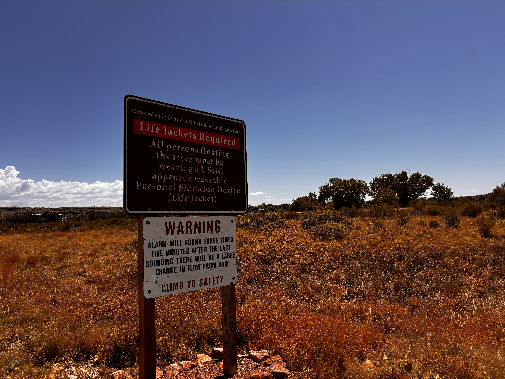

<br><details><summary>:camera:**66/IMG_0338.jpg**</summary><sub> `Exif version` 0232 `OS version` 27.0 `Date` 2026:07:18 11:27:27 `Aperture` Not known `Brightness` 10.310945709281961 `Color space` 65535 `Compression` Not known`Exposure mode` 0 `Exposure time` 0.00020601565718994644 `Focal length` 5.96 `Lens model` iPhone 15 Plus back dual wide camera 5.96mm f/1.6 `Lens specification` (1.5399999618512084, 5.96, 1.6, 2.4) `Orientation` 1 `Scene type` Not known `f number` 1.6 `White balance` 0 `Sensing method` 2 `Shutter speed` 12.245068045152442</sub><sub>`Coordinates & altitude` (38.26918055555556, -104.7212, 1452.0581039755352)</sub><sub> :earth_americas:`Location over` [Google Maps](http://maps.google.com/maps?q=38.26918055555556,-104.7212) or [Openstreet Map](https://www.openstreetmap.org/query?lat=38.26918055555556&lon=-104.7212)</sub></details>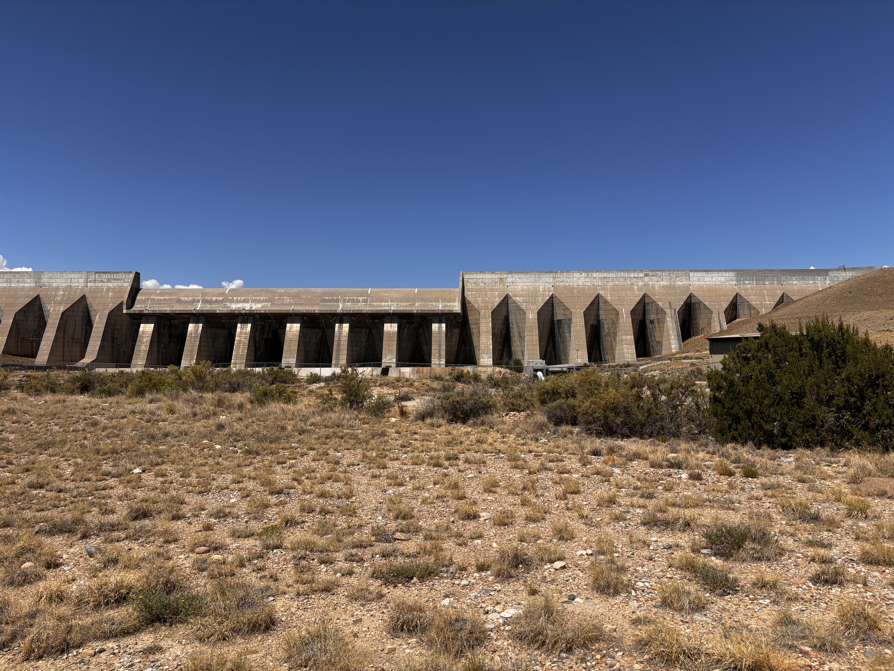

<br><details><summary>:camera:**66/IMG_0339.jpg**</summary><sub> `Exif version` 0232 `OS version` 27.0 `Date` 2026:07:18 11:28:20 `Aperture` Not known `Brightness` 10.321431195356697 `Color space` 65535 `Compression` Not known`Exposure mode` 0 `Exposure time` 0.0007462686567164179 `Focal length` 1.54 `Lens model` iPhone 15 Plus back dual wide camera 1.54mm f/2.4 `Lens specification` (1.54, 5.960000038146973, 1.6, 2.4) `Orientation` 1 `Scene type` Not known `f number` 2.4 `White balance` 0 `Sensing method` 2 `Shutter speed` 10.388536749831422</sub><sub>`Coordinates & altitude` (38.269213888888885, -104.72152777777778, 1452.748511904762)</sub><sub> :earth_americas:`Location over` [Google Maps](http://maps.google.com/maps?q=38.269213888888885,-104.72152777777778) or [Openstreet Map](https://www.openstreetmap.org/query?lat=38.269213888888885&lon=-104.72152777777778)</sub></details>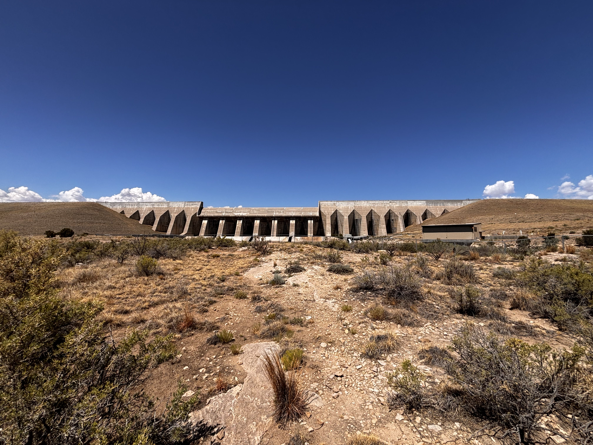

<br><details><summary>:camera:**66/IMG_0340.jpg**</summary><sub> `Exif version` 0232 `OS version` 27.0 `Date` 2026:07:18 11:28:45 `Aperture` Not known `Brightness` 10.229254163649529 `Color space` 65535 `Compression` Not known`Exposure mode` 0 `Exposure time` 0.0008849557522123894 `Focal length` 1.54 `Lens model` iPhone 15 Plus back dual wide camera 1.54mm f/2.4 `Lens specification` (1.54, 5.960000038146973, 1.6, 2.4) `Orientation` 1 `Scene type` Not known `f number` 2.4 `White balance` 0 `Sensing method` 2 `Shutter speed` 10.142034923422106</sub><sub>`Coordinates & altitude` (38.26928611111111, -104.72179444444444, 1453.3328631875881)</sub><sub> :earth_americas:`Location over` [Google Maps](http://maps.google.com/maps?q=38.26928611111111,-104.72179444444444) or [Openstreet Map](https://www.openstreetmap.org/query?lat=38.26928611111111&lon=-104.72179444444444)</sub></details>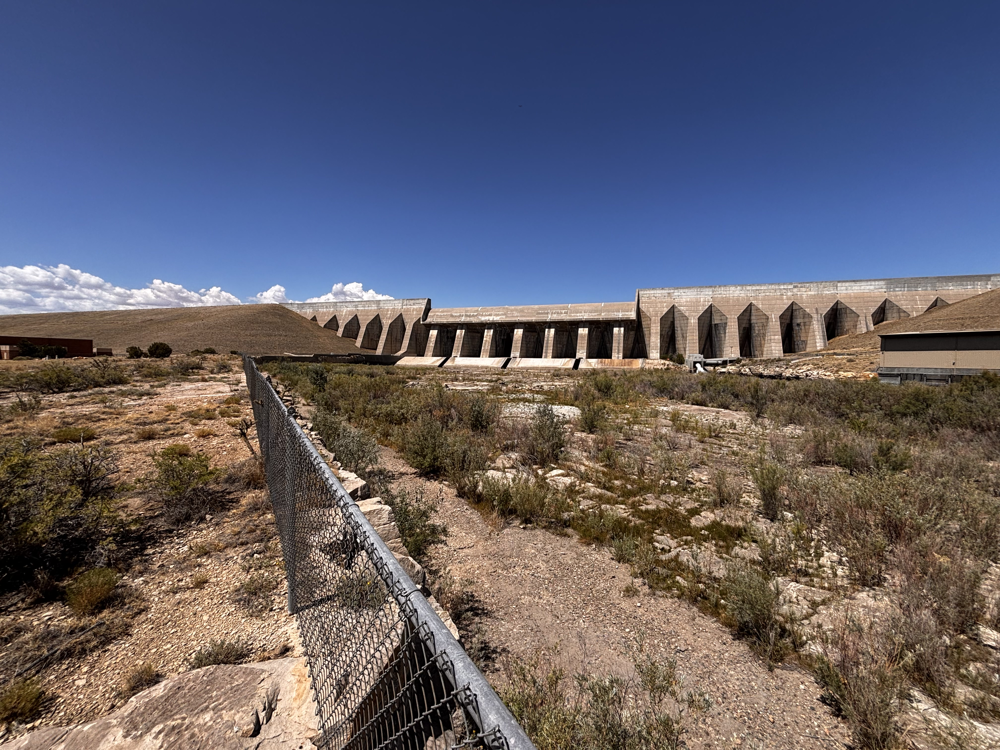

<br><details><summary>:camera:**66/IMG_0341.jpg**</summary><sub> `Exif version` 0232 `OS version` 27.0 `Date` 2026:07:18 11:28:47 `Aperture` Not known `Brightness` 10.18534022087638 `Color space` 65535 `Compression` Not known`Exposure mode` 0 `Exposure time` 0.0008936550491510277 `Focal length` 1.54 `Lens model` iPhone 15 Plus back dual wide camera 1.54mm f/2.4 `Lens specification` (1.54, 5.960000038146973, 1.6, 2.4) `Orientation` 1 `Scene type` Not known `f number` 2.4 `White balance` 0 `Sensing method` 2 `Shutter speed` 10.127437546115738</sub><sub>`Coordinates & altitude` (38.26928611111111, -104.72179444444444, 1453.184224743382)</sub><sub> :earth_americas:`Location over` [Google Maps](http://maps.google.com/maps?q=38.26928611111111,-104.72179444444444) or [Openstreet Map](https://www.openstreetmap.org/query?lat=38.26928611111111&lon=-104.72179444444444)</sub></details>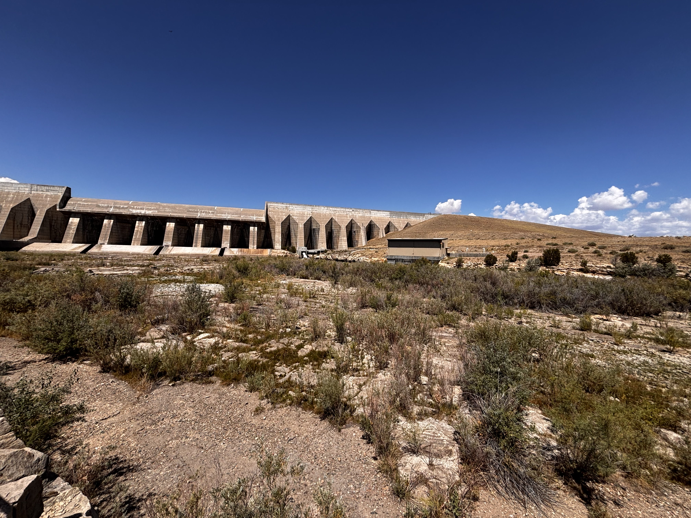

<br><details><summary>:camera:**66/IMG_0342.jpg**</summary><sub> `Exif version` 0232 `OS version` 27.0 `Date` 2026:07:18 11:28:48 `Aperture` Not known `Brightness` 10.254281821720515 `Color space` 65535 `Compression` Not known`Exposure mode` 0 `Exposure time` 0.0007462686567164179 `Focal length` 1.54 `Lens model` iPhone 15 Plus back dual wide camera 1.54mm f/2.4 `Lens specification` (1.54, 5.960000038146973, 1.6, 2.4) `Orientation` 1 `Scene type` Not known `f number` 2.4 `White balance` 0 `Sensing method` 2 `Shutter speed` 10.388536749831422</sub><sub>`Coordinates & altitude` (38.26928611111111, -104.72179444444444, 1453.2632375189107)</sub><sub> :earth_americas:`Location over` [Google Maps](http://maps.google.com/maps?q=38.26928611111111,-104.72179444444444) or [Openstreet Map](https://www.openstreetmap.org/query?lat=38.26928611111111&lon=-104.72179444444444)</sub></details>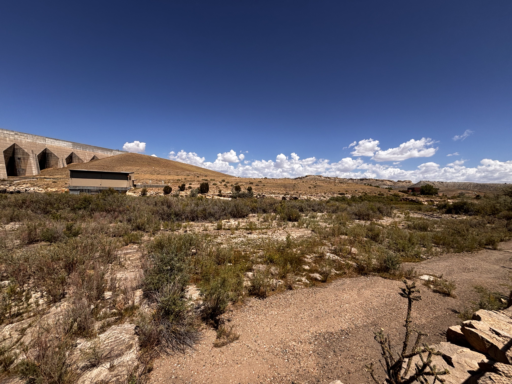

<br><details><summary>:camera:**66/IMG_0343.jpg**</summary><sub> `Exif version` 0232 `OS version` 27.0 `Date` 2026:07:18 11:29:02 `Aperture` Not known `Brightness` 10.115200020587515 `Color space` 65535 `Compression` Not known`Exposure mode` Not known `Exposure time` 0.00022598870056497175 `Focal length` 5.96 `Lens model` iPhone 15 Plus back camera 5.96mm f/1.6 `Lens specification` (5.96, 5.96, 1.6, 1.6) `Orientation` 1 `Scene type` Not known `f number` 1.6 `White balance` 0 `Sensing method` 2 `Shutter speed` 12.111389612993785</sub><sub>`Coordinates & altitude` (38.269283333333334, -104.72179444444444, 1452.389344262295)</sub><sub> :earth_americas:`Location over` [Google Maps](http://maps.google.com/maps?q=38.269283333333334,-104.72179444444444) or [Openstreet Map](https://www.openstreetmap.org/query?lat=38.269283333333334&lon=-104.72179444444444)</sub></details>

<br><details><summary>:camera:**66/IMG_0346.jpg**</summary><sub> `Exif version` 0232 `OS version` 27.0 `Date` 2026:07:18 11:30:03 `Aperture` Not known `Brightness` 10.242230796211855 `Color space` 65535 `Compression` Not known`Exposure mode` 0 `Exposure time` 0.0009216589861751152 `Focal length` 1.54 `Lens model` iPhone 15 Plus back dual wide camera 1.54mm f/2.4 `Lens specification` (1.54, 5.960000038146973, 1.6, 2.4) `Orientation` 6 `Scene type` Not known `f number` 2.4 `White balance` 0 `Sensing method` 2 `Shutter speed` 10.082945633390935</sub><sub>`Coordinates & altitude` (38.269280555555554, -104.72179444444444, 1454.7835144927535)</sub><sub> :earth_americas:`Location over` [Google Maps](http://maps.google.com/maps?q=38.269280555555554,-104.72179444444444) or [Openstreet Map](https://www.openstreetmap.org/query?lat=38.269280555555554&lon=-104.72179444444444)</sub></details>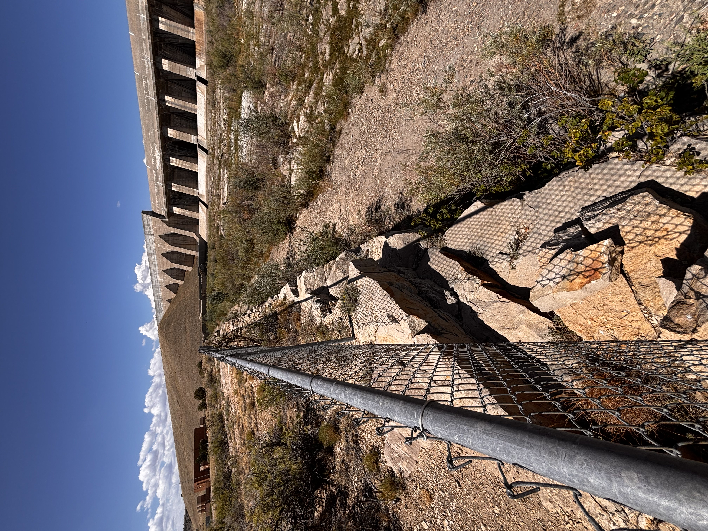

<br><details><summary>:camera:**66/IMG_0347.jpg**</summary><sub> `Exif version` 0232 `OS version` 27.0 `Date` 2026:07:18 11:30:08 `Aperture` Not known `Brightness` 10.272712215320912 `Color space` 65535 `Compression` Not known`Exposure mode` 0 `Exposure time` 0.0002929973630237328 `Focal length` 5.96 `Lens model` iPhone 15 Plus back dual wide camera 5.96mm f/1.6 `Lens specification` (1.5399999618512084, 5.96, 1.6, 2.4) `Orientation` 1 `Scene type` Not known `f number` 1.6 `White balance` 0 `Sensing method` 2 `Shutter speed` 11.736811705814402</sub><sub>`Coordinates & altitude` (38.269283333333334, -104.72178611111111, 1455.5106861642296)</sub><sub> :earth_americas:`Location over` [Google Maps](http://maps.google.com/maps?q=38.269283333333334,-104.72178611111111) or [Openstreet Map](https://www.openstreetmap.org/query?lat=38.269283333333334&lon=-104.72178611111111)</sub></details>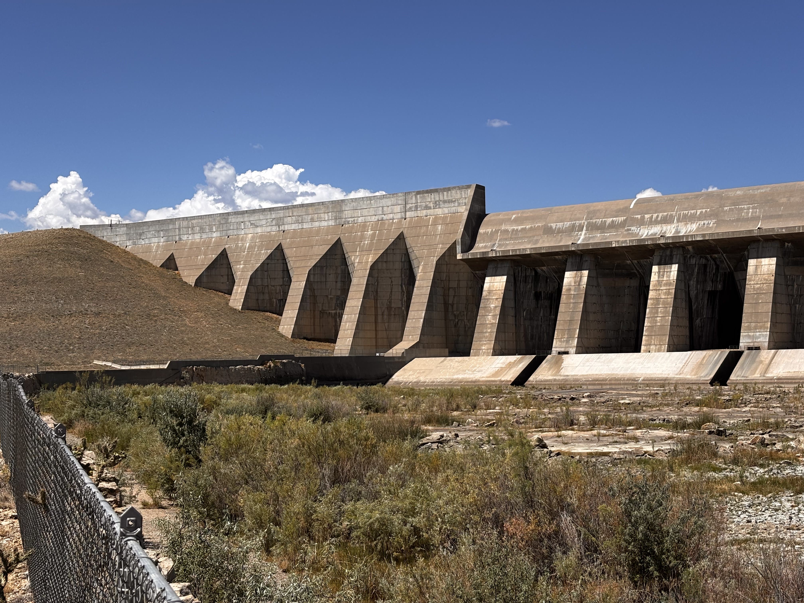

<br><details><summary>:camera:**66/IMG_0348.jpg**</summary><sub> `Exif version` 0232 `OS version` 27.0 `Date` 2026:07:18 11:30:38 `Aperture` Not known `Brightness` 10.367695796267224 `Color space` 65535 `Compression` Not known`Exposure mode` 0 `Exposure time` 0.0009487666034155598 `Focal length` 1.54 `Lens model` iPhone 15 Plus back dual wide camera 1.54mm f/2.4 `Lens specification` (1.54, 5.960000038146973, 1.6, 2.4) `Orientation` 1 `Scene type` Not known `f number` 2.4 `White balance` 0 `Sensing method` 2 `Shutter speed` 10.041304292054695</sub><sub>`Coordinates & altitude` (38.26926388888889, -104.72159444444445, 1452.8654244306417)</sub><sub> :earth_americas:`Location over` [Google Maps](http://maps.google.com/maps?q=38.26926388888889,-104.72159444444445) or [Openstreet Map](https://www.openstreetmap.org/query?lat=38.26926388888889&lon=-104.72159444444445)</sub></details>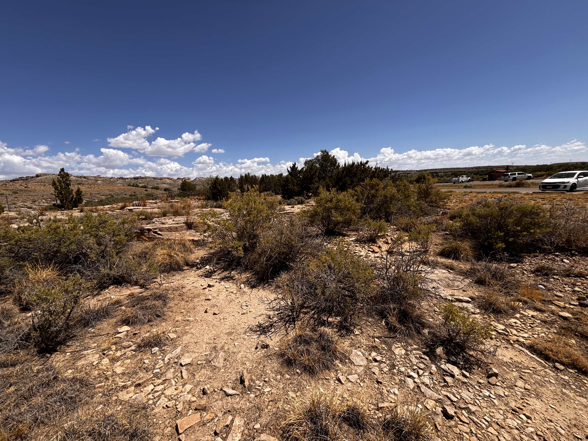

<br><details><summary>:camera:**66/IMG_0349.jpg**</summary><sub> `Exif version` 0232 `OS version` 27.0 `Date` 2026:07:18 11:30:40 `Aperture` Not known `Brightness` 10.412170639899623 `Color space` 65535 `Compression` Not known`Exposure mode` 0 `Exposure time` 0.0007830853563038371 `Focal length` 1.54 `Lens model` iPhone 15 Plus back dual wide camera 1.54mm f/2.4 `Lens specification` (1.54, 5.960000038146973, 1.6, 2.4) `Orientation` 1 `Scene type` Not known `f number` 2.4 `White balance` 0 `Sensing method` 2 `Shutter speed` 10.31870006980532</sub><sub>`Coordinates & altitude` (38.269244444444446, -104.72158055555556, 1452.5726984126984)</sub><sub> :earth_americas:`Location over` [Google Maps](http://maps.google.com/maps?q=38.269244444444446,-104.72158055555556) or [Openstreet Map](https://www.openstreetmap.org/query?lat=38.269244444444446&lon=-104.72158055555556)</sub></details>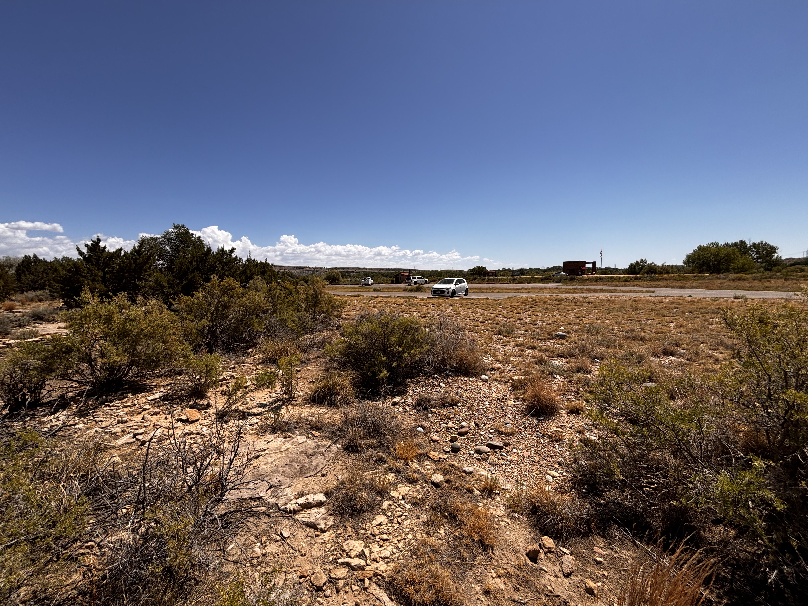

<br><details><summary>:camera:**66/IMG_0350.jpg**</summary><sub> `Exif version` 0232 `OS version` 27.0 `Date` 2026:07:18 11:42:23 `Aperture` Not known `Brightness` 10.10949918001766 `Color space` 65535 `Compression` Not known`Exposure mode` 0 `Exposure time` 0.00020601565718994644 `Focal length` 5.96 `Lens model` iPhone 15 Plus back dual wide camera 5.96mm f/1.6 `Lens specification` (1.5399999618512084, 5.96, 1.6, 2.4) `Orientation` 1 `Scene type` Not known `f number` 1.6 `White balance` 0 `Sensing method` 2 `Shutter speed` 12.245068045152442</sub><sub>`Coordinates & altitude` (38.27948333333333, -104.72358611111112, 1482.0774593338497)</sub><sub> :earth_americas:`Location over` [Google Maps](http://maps.google.com/maps?q=38.27948333333333,-104.72358611111112) or [Openstreet Map](https://www.openstreetmap.org/query?lat=38.27948333333333&lon=-104.72358611111112)</sub></details>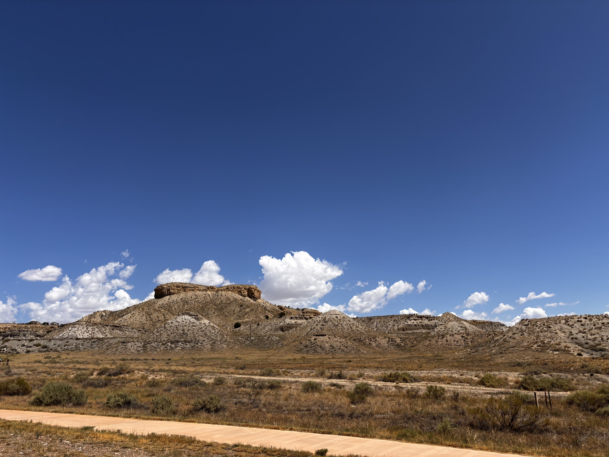

<br><details><summary>:camera:**66/IMG_0351.jpg**</summary><sub> `Exif version` 0232 `OS version` 27.0 `Date` 2026:07:18 11:43:23 `Aperture` Not known `Brightness` 10.544567416398905 `Color space` 65535 `Compression` Not known`Exposure mode` 0 `Exposure time` 0.000177999288002848 `Focal length` 5.96 `Lens model` iPhone 15 Plus back dual wide camera 5.96mm f/1.6 `Lens specification` (1.5399999618512084, 5.96, 1.6, 2.4) `Orientation` 1 `Scene type` Not known `f number` 1.6 `White balance` 0 `Sensing method` 2 `Shutter speed` 12.455835145490317</sub><sub>`Coordinates & altitude` (38.28108888888889, -104.73021666666666, 1497.9425717852685)</sub><sub> :earth_americas:`Location over` [Google Maps](http://maps.google.com/maps?q=38.28108888888889,-104.73021666666666) or [Openstreet Map](https://www.openstreetmap.org/query?lat=38.28108888888889&lon=-104.73021666666666)</sub></details>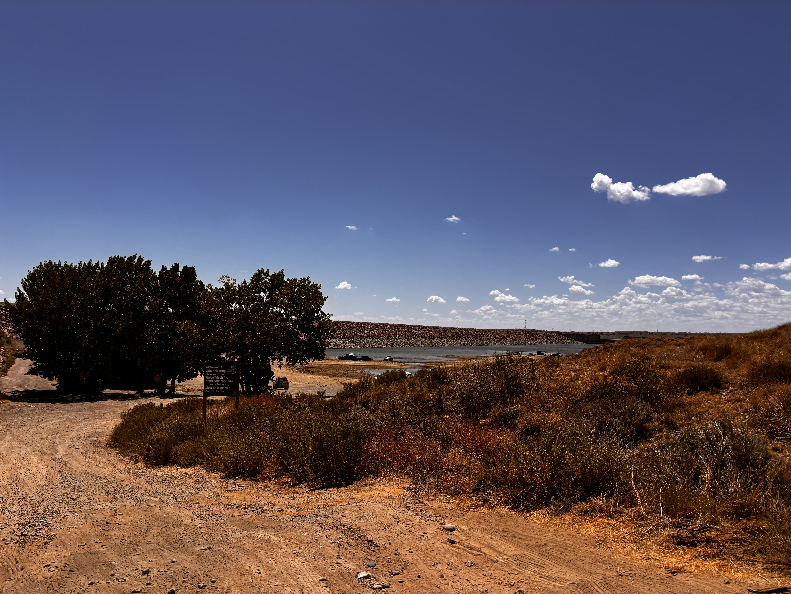

<br><details><summary>:camera:**66/IMG_0352.jpg**</summary><sub> `Exif version` 0232 `OS version` 27.0 `Date` 2026:07:18 11:43:31 `Aperture` Not known `Brightness` 10.16487264201215 `Color space` 65535 `Compression` Not known`Exposure mode` 0 `Exposure time` 0.00023501762632197415 `Focal length` 5.96 `Lens model` iPhone 15 Plus back dual wide camera 5.96mm f/1.6 `Lens specification` (1.5399999618512084, 5.96, 1.6, 2.4) `Orientation` 1 `Scene type` Not known `f number` 1.6 `White balance` 0 `Sensing method` 2 `Shutter speed` 12.055051610885204</sub><sub>`Coordinates & altitude` (38.28103888888889, -104.73009444444445, 1496.023381294964)</sub><sub> :earth_americas:`Location over` [Google Maps](http://maps.google.com/maps?q=38.28103888888889,-104.73009444444445) or [Openstreet Map](https://www.openstreetmap.org/query?lat=38.28103888888889&lon=-104.73009444444445)</sub></details>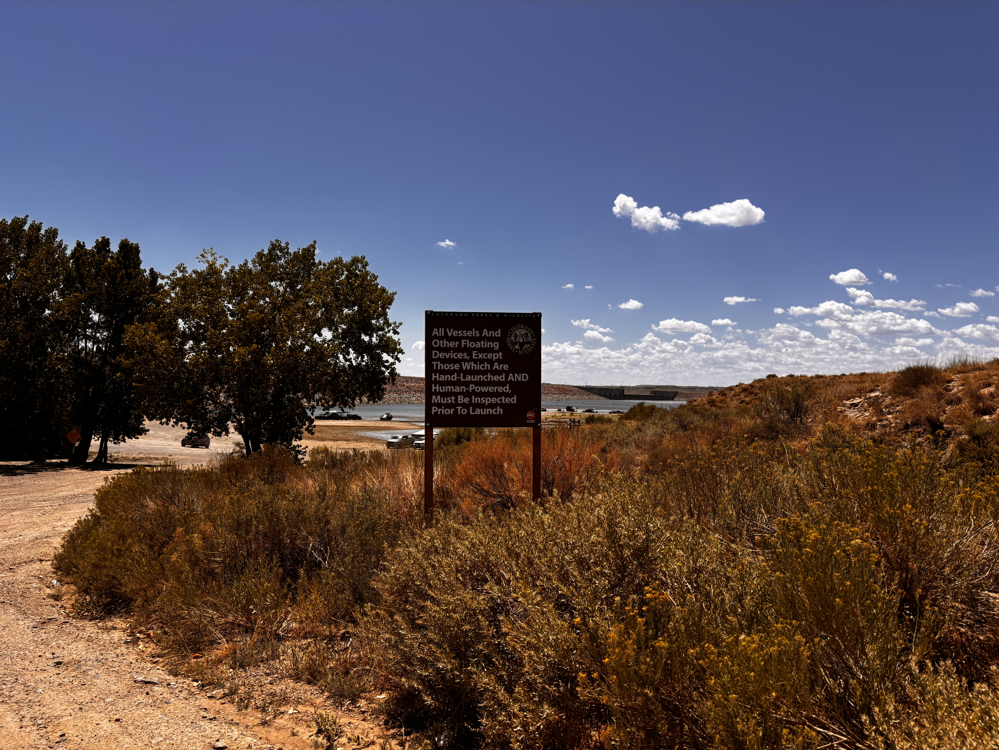

<sub>_Citation: Partial or total digital reproduction of this repository, scripts, development guides, data models, images, and documentation is permitted, provided that it is referenced as: "R.GISMobile - Mobile geographic information systems on QField that do not require an internet connection for navigation." https://github.com/rcfdtools/R.GISMobile - Bogotá - Colombia - South America"._<sub>

| [:house: Home](../Readme.md) |
|---|