

# 🛠️TOOL: _“County GIS Layers - Colombia South America”_ 
Keywords: `geographical-information-system` `gis` `igac` `ider` `geodata` `colombia` `south-america`

County GIS layers are individual digital map datasets stacked together in a Geographic Information System (GIS) to visualize, manage, and analyze a county´s geographic information. Local governments, researches and engineers use these layers to run daily operations, plan infrastructure, track tax assessments, evaluate land plot risk, and dispatch emergency services.

# 05 - Antioquia (125 Counties)

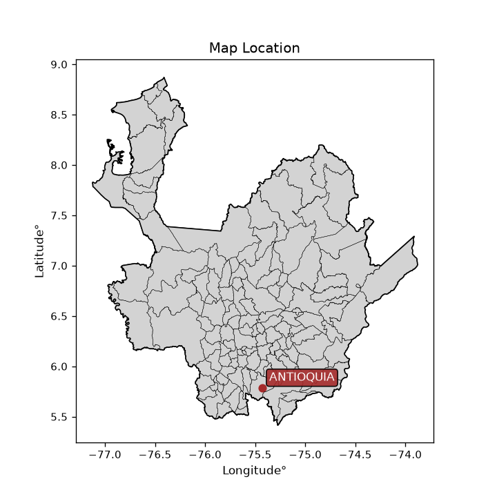</img>

| CountyID                                                                                          | CountyName                | CountyFiles                                                                                                                                                                                                                                        |
|:--------------------------------------------------------------------------------------------------|:--------------------------|:---------------------------------------------------------------------------------------------------------------------------------------------------------------------------------------------------------------------------------------------------|
| [05002](https://github.com/rcfdtools/R.HydroTools/blob/main/tool/Population/file/report/05002.md) | Abejorral                 | [05002_Rural_Lot_202608.zip](https://github.com/rcfdtools/R.GISMobile/blob/main/file/shp/05002_Rural_Lot_202608.zip) [05002_Urban_Lot_202608.zip](https://github.com/rcfdtools/R.GISMobile/blob/main/file/shp/05002_Urban_Lot_202608.zip)  |
| [05004](https://github.com/rcfdtools/R.HydroTools/blob/main/tool/Population/file/report/05004.md) | Abriaquí                  | [05004_Rural_Lot_202608.zip](https://github.com/rcfdtools/R.GISMobile/blob/main/file/shp/05004_Rural_Lot_202608.zip) [05004_Urban_Lot_202608.zip](https://github.com/rcfdtools/R.GISMobile/blob/main/file/shp/05004_Urban_Lot_202608.zip)  |
| [05021](https://github.com/rcfdtools/R.HydroTools/blob/main/tool/Population/file/report/05021.md) | Alejandría                | [05021_Rural_Lot_202608.zip](https://github.com/rcfdtools/R.GISMobile/blob/main/file/shp/05021_Rural_Lot_202608.zip) [05021_Urban_Lot_202608.zip](https://github.com/rcfdtools/R.GISMobile/blob/main/file/shp/05021_Urban_Lot_202608.zip)  |
| [05030](https://github.com/rcfdtools/R.HydroTools/blob/main/tool/Population/file/report/05030.md) | Amagá                     | [05030_Rural_Lot_202608.zip](https://github.com/rcfdtools/R.GISMobile/blob/main/file/shp/05030_Rural_Lot_202608.zip) [05030_Urban_Lot_202608.zip](https://github.com/rcfdtools/R.GISMobile/blob/main/file/shp/05030_Urban_Lot_202608.zip)  |
| [05031](https://github.com/rcfdtools/R.HydroTools/blob/main/tool/Population/file/report/05031.md) | Amalfi                    | [05031_Rural_Lot_202608.zip](https://github.com/rcfdtools/R.GISMobile/blob/main/file/shp/05031_Rural_Lot_202608.zip) [05031_Urban_Lot_202608.zip](https://github.com/rcfdtools/R.GISMobile/blob/main/file/shp/05031_Urban_Lot_202608.zip)  |
| [05034](https://github.com/rcfdtools/R.HydroTools/blob/main/tool/Population/file/report/05034.md) | Andes                     | [05034_Rural_Lot_202608.zip](https://github.com/rcfdtools/R.GISMobile/blob/main/file/shp/05034_Rural_Lot_202608.zip) [05034_Urban_Lot_202608.zip](https://github.com/rcfdtools/R.GISMobile/blob/main/file/shp/05034_Urban_Lot_202608.zip)  |
| [05036](https://github.com/rcfdtools/R.HydroTools/blob/main/tool/Population/file/report/05036.md) | Angelópolis               | [05036_Rural_Lot_202608.zip](https://github.com/rcfdtools/R.GISMobile/blob/main/file/shp/05036_Rural_Lot_202608.zip) [05036_Urban_Lot_202608.zip](https://github.com/rcfdtools/R.GISMobile/blob/main/file/shp/05036_Urban_Lot_202608.zip)  |
| [05038](https://github.com/rcfdtools/R.HydroTools/blob/main/tool/Population/file/report/05038.md) | Angostura                 | [05038_Rural_Lot_202608.zip](https://github.com/rcfdtools/R.GISMobile/blob/main/file/shp/05038_Rural_Lot_202608.zip) [05038_Urban_Lot_202608.zip](https://github.com/rcfdtools/R.GISMobile/blob/main/file/shp/05038_Urban_Lot_202608.zip)  |
| [05040](https://github.com/rcfdtools/R.HydroTools/blob/main/tool/Population/file/report/05040.md) | Anorí                     | [05040_Rural_Lot_202608.zip](https://github.com/rcfdtools/R.GISMobile/blob/main/file/shp/05040_Rural_Lot_202608.zip) [05040_Urban_Lot_202608.zip](https://github.com/rcfdtools/R.GISMobile/blob/main/file/shp/05040_Urban_Lot_202608.zip)  |
| [05044](https://github.com/rcfdtools/R.HydroTools/blob/main/tool/Population/file/report/05044.md) | Anzá                      | [05044_Rural_Lot_202608.zip](https://github.com/rcfdtools/R.GISMobile/blob/main/file/shp/05044_Rural_Lot_202608.zip) [05044_Urban_Lot_202608.zip](https://github.com/rcfdtools/R.GISMobile/blob/main/file/shp/05044_Urban_Lot_202608.zip)  |
| [05045](https://github.com/rcfdtools/R.HydroTools/blob/main/tool/Population/file/report/05045.md) | Apartadó                  | [05045_Rural_Lot_202608.zip](https://github.com/rcfdtools/R.GISMobile/blob/main/file/shp/05045_Rural_Lot_202608.zip) [05045_Urban_Lot_202608.zip](https://github.com/rcfdtools/R.GISMobile/blob/main/file/shp/05045_Urban_Lot_202608.zip)  |
| [05051](https://github.com/rcfdtools/R.HydroTools/blob/main/tool/Population/file/report/05051.md) | Arboletes                 | [05051_Rural_Lot_202608.zip](https://github.com/rcfdtools/R.GISMobile/blob/main/file/shp/05051_Rural_Lot_202608.zip) [05051_Urban_Lot_202608.zip](https://github.com/rcfdtools/R.GISMobile/blob/main/file/shp/05051_Urban_Lot_202608.zip)  |
| [05055](https://github.com/rcfdtools/R.HydroTools/blob/main/tool/Population/file/report/05055.md) | Argelia                   | [05055_Rural_Lot_202608.zip](https://github.com/rcfdtools/R.GISMobile/blob/main/file/shp/05055_Rural_Lot_202608.zip) [05055_Urban_Lot_202608.zip](https://github.com/rcfdtools/R.GISMobile/blob/main/file/shp/05055_Urban_Lot_202608.zip)  |
| [05059](https://github.com/rcfdtools/R.HydroTools/blob/main/tool/Population/file/report/05059.md) | Armenia                   | [05059_Rural_Lot_202608.zip](https://github.com/rcfdtools/R.GISMobile/blob/main/file/shp/05059_Rural_Lot_202608.zip) [05059_Urban_Lot_202608.zip](https://github.com/rcfdtools/R.GISMobile/blob/main/file/shp/05059_Urban_Lot_202608.zip)  |
| [05079](https://github.com/rcfdtools/R.HydroTools/blob/main/tool/Population/file/report/05079.md) | Barbosa                   | Not found                                                                                                                                                                                                                                          |
| [05088](https://github.com/rcfdtools/R.HydroTools/blob/main/tool/Population/file/report/05088.md) | Bello                     | Not found                                                                                                                                                                                                                                          |
| [05086](https://github.com/rcfdtools/R.HydroTools/blob/main/tool/Population/file/report/05086.md) | Belmira                   | [05086_Rural_Lot_202608.zip](https://github.com/rcfdtools/R.GISMobile/blob/main/file/shp/05086_Rural_Lot_202608.zip) [05086_Urban_Lot_202608.zip](https://github.com/rcfdtools/R.GISMobile/blob/main/file/shp/05086_Urban_Lot_202608.zip)  |
| [05091](https://github.com/rcfdtools/R.HydroTools/blob/main/tool/Population/file/report/05091.md) | Betania                   | [05091_Rural_Lot_202608.zip](https://github.com/rcfdtools/R.GISMobile/blob/main/file/shp/05091_Rural_Lot_202608.zip) [05091_Urban_Lot_202608.zip](https://github.com/rcfdtools/R.GISMobile/blob/main/file/shp/05091_Urban_Lot_202608.zip)  |
| [05093](https://github.com/rcfdtools/R.HydroTools/blob/main/tool/Population/file/report/05093.md) | Betulia                   | [05093_Rural_Lot_202608.zip](https://github.com/rcfdtools/R.GISMobile/blob/main/file/shp/05093_Rural_Lot_202608.zip) [05093_Urban_Lot_202608.zip](https://github.com/rcfdtools/R.GISMobile/blob/main/file/shp/05093_Urban_Lot_202608.zip)  |
| [05107](https://github.com/rcfdtools/R.HydroTools/blob/main/tool/Population/file/report/05107.md) | Briceño                   | [05107_Rural_Lot_202608.zip](https://github.com/rcfdtools/R.GISMobile/blob/main/file/shp/05107_Rural_Lot_202608.zip) [05107_Urban_Lot_202608.zip](https://github.com/rcfdtools/R.GISMobile/blob/main/file/shp/05107_Urban_Lot_202608.zip)  |
| [05113](https://github.com/rcfdtools/R.HydroTools/blob/main/tool/Population/file/report/05113.md) | Buriticá                  | [05113_Rural_Lot_202608.zip](https://github.com/rcfdtools/R.GISMobile/blob/main/file/shp/05113_Rural_Lot_202608.zip) [05113_Urban_Lot_202608.zip](https://github.com/rcfdtools/R.GISMobile/blob/main/file/shp/05113_Urban_Lot_202608.zip)  |
| [05125](https://github.com/rcfdtools/R.HydroTools/blob/main/tool/Population/file/report/05125.md) | Caicedo                   | [05125_Rural_Lot_202608.zip](https://github.com/rcfdtools/R.GISMobile/blob/main/file/shp/05125_Rural_Lot_202608.zip) [05125_Urban_Lot_202608.zip](https://github.com/rcfdtools/R.GISMobile/blob/main/file/shp/05125_Urban_Lot_202608.zip)  |
| [05129](https://github.com/rcfdtools/R.HydroTools/blob/main/tool/Population/file/report/05129.md) | Caldas                    | [05129_Rural_Lot_202608.zip](https://github.com/rcfdtools/R.GISMobile/blob/main/file/shp/05129_Rural_Lot_202608.zip) [05129_Urban_Lot_202608.zip](https://github.com/rcfdtools/R.GISMobile/blob/main/file/shp/05129_Urban_Lot_202608.zip)  |
| [05134](https://github.com/rcfdtools/R.HydroTools/blob/main/tool/Population/file/report/05134.md) | Campamento                | [05134_Rural_Lot_202608.zip](https://github.com/rcfdtools/R.GISMobile/blob/main/file/shp/05134_Rural_Lot_202608.zip) [05134_Urban_Lot_202608.zip](https://github.com/rcfdtools/R.GISMobile/blob/main/file/shp/05134_Urban_Lot_202608.zip)  |
| [05142](https://github.com/rcfdtools/R.HydroTools/blob/main/tool/Population/file/report/05142.md) | Caracolí                  | [05142_Rural_Lot_202608.zip](https://github.com/rcfdtools/R.GISMobile/blob/main/file/shp/05142_Rural_Lot_202608.zip) [05142_Urban_Lot_202608.zip](https://github.com/rcfdtools/R.GISMobile/blob/main/file/shp/05142_Urban_Lot_202608.zip)  |
| [05145](https://github.com/rcfdtools/R.HydroTools/blob/main/tool/Population/file/report/05145.md) | Caramanta                 | [05145_Rural_Lot_202608.zip](https://github.com/rcfdtools/R.GISMobile/blob/main/file/shp/05145_Rural_Lot_202608.zip) [05145_Urban_Lot_202608.zip](https://github.com/rcfdtools/R.GISMobile/blob/main/file/shp/05145_Urban_Lot_202608.zip)  |
| [05147](https://github.com/rcfdtools/R.HydroTools/blob/main/tool/Population/file/report/05147.md) | Carepa                    | [05147_Rural_Lot_202608.zip](https://github.com/rcfdtools/R.GISMobile/blob/main/file/shp/05147_Rural_Lot_202608.zip) [05147_Urban_Lot_202608.zip](https://github.com/rcfdtools/R.GISMobile/blob/main/file/shp/05147_Urban_Lot_202608.zip)  |
| [05148](https://github.com/rcfdtools/R.HydroTools/blob/main/tool/Population/file/report/05148.md) | Carmen De Viboral         | [05148_Rural_Lot_202608.zip](https://github.com/rcfdtools/R.GISMobile/blob/main/file/shp/05148_Rural_Lot_202608.zip) [05148_Urban_Lot_202608.zip](https://github.com/rcfdtools/R.GISMobile/blob/main/file/shp/05148_Urban_Lot_202608.zip)  |
| [05150](https://github.com/rcfdtools/R.HydroTools/blob/main/tool/Population/file/report/05150.md) | Carolina                  | [05150_Rural_Lot_202608.zip](https://github.com/rcfdtools/R.GISMobile/blob/main/file/shp/05150_Rural_Lot_202608.zip) [05150_Urban_Lot_202608.zip](https://github.com/rcfdtools/R.GISMobile/blob/main/file/shp/05150_Urban_Lot_202608.zip)  |
| [05154](https://github.com/rcfdtools/R.HydroTools/blob/main/tool/Population/file/report/05154.md) | Caucasia                  | [05154_Rural_Lot_202608.zip](https://github.com/rcfdtools/R.GISMobile/blob/main/file/shp/05154_Rural_Lot_202608.zip) [05154_Urban_Lot_202608.zip](https://github.com/rcfdtools/R.GISMobile/blob/main/file/shp/05154_Urban_Lot_202608.zip)  |
| [05138](https://github.com/rcfdtools/R.HydroTools/blob/main/tool/Population/file/report/05138.md) | Cañasgordas               | [05138_Rural_Lot_202608.zip](https://github.com/rcfdtools/R.GISMobile/blob/main/file/shp/05138_Rural_Lot_202608.zip) [05138_Urban_Lot_202608.zip](https://github.com/rcfdtools/R.GISMobile/blob/main/file/shp/05138_Urban_Lot_202608.zip)  |
| [05172](https://github.com/rcfdtools/R.HydroTools/blob/main/tool/Population/file/report/05172.md) | Chigorodó                 | [05172_Rural_Lot_202608.zip](https://github.com/rcfdtools/R.GISMobile/blob/main/file/shp/05172_Rural_Lot_202608.zip) [05172_Urban_Lot_202608.zip](https://github.com/rcfdtools/R.GISMobile/blob/main/file/shp/05172_Urban_Lot_202608.zip)  |
| [05190](https://github.com/rcfdtools/R.HydroTools/blob/main/tool/Population/file/report/05190.md) | Cisneros                  | [05190_Rural_Lot_202608.zip](https://github.com/rcfdtools/R.GISMobile/blob/main/file/shp/05190_Rural_Lot_202608.zip) [05190_Urban_Lot_202608.zip](https://github.com/rcfdtools/R.GISMobile/blob/main/file/shp/05190_Urban_Lot_202608.zip)  |
| [05101](https://github.com/rcfdtools/R.HydroTools/blob/main/tool/Population/file/report/05101.md) | Ciudad Bolívar            | [05101_Rural_Lot_202608.zip](https://github.com/rcfdtools/R.GISMobile/blob/main/file/shp/05101_Rural_Lot_202608.zip) [05101_Urban_Lot_202608.zip](https://github.com/rcfdtools/R.GISMobile/blob/main/file/shp/05101_Urban_Lot_202608.zip)  |
| [05197](https://github.com/rcfdtools/R.HydroTools/blob/main/tool/Population/file/report/05197.md) | Cocorná                   | [05197_Rural_Lot_202608.zip](https://github.com/rcfdtools/R.GISMobile/blob/main/file/shp/05197_Rural_Lot_202608.zip) [05197_Urban_Lot_202608.zip](https://github.com/rcfdtools/R.GISMobile/blob/main/file/shp/05197_Urban_Lot_202608.zip)  |
| [05206](https://github.com/rcfdtools/R.HydroTools/blob/main/tool/Population/file/report/05206.md) | Concepción                | [05206_Rural_Lot_202608.zip](https://github.com/rcfdtools/R.GISMobile/blob/main/file/shp/05206_Rural_Lot_202608.zip) [05206_Urban_Lot_202608.zip](https://github.com/rcfdtools/R.GISMobile/blob/main/file/shp/05206_Urban_Lot_202608.zip)  |
| [05209](https://github.com/rcfdtools/R.HydroTools/blob/main/tool/Population/file/report/05209.md) | Concordia                 | [05209_Rural_Lot_202608.zip](https://github.com/rcfdtools/R.GISMobile/blob/main/file/shp/05209_Rural_Lot_202608.zip) [05209_Urban_Lot_202608.zip](https://github.com/rcfdtools/R.GISMobile/blob/main/file/shp/05209_Urban_Lot_202608.zip)  |
| [05212](https://github.com/rcfdtools/R.HydroTools/blob/main/tool/Population/file/report/05212.md) | Copacabana                | Not found                                                                                                                                                                                                                                          |
| [05120](https://github.com/rcfdtools/R.HydroTools/blob/main/tool/Population/file/report/05120.md) | Cáceres                   | [05120_Rural_Lot_202608.zip](https://github.com/rcfdtools/R.GISMobile/blob/main/file/shp/05120_Rural_Lot_202608.zip) [05120_Urban_Lot_202608.zip](https://github.com/rcfdtools/R.GISMobile/blob/main/file/shp/05120_Urban_Lot_202608.zip)  |
| [05234](https://github.com/rcfdtools/R.HydroTools/blob/main/tool/Population/file/report/05234.md) | Dabeiba                   | [05234_Rural_Lot_202608.zip](https://github.com/rcfdtools/R.GISMobile/blob/main/file/shp/05234_Rural_Lot_202608.zip) [05234_Urban_Lot_202608.zip](https://github.com/rcfdtools/R.GISMobile/blob/main/file/shp/05234_Urban_Lot_202608.zip)  |
| [05237](https://github.com/rcfdtools/R.HydroTools/blob/main/tool/Population/file/report/05237.md) | Donmatías                 | [05237_Rural_Lot_202608.zip](https://github.com/rcfdtools/R.GISMobile/blob/main/file/shp/05237_Rural_Lot_202608.zip) [05237_Urban_Lot_202608.zip](https://github.com/rcfdtools/R.GISMobile/blob/main/file/shp/05237_Urban_Lot_202608.zip)  |
| [05240](https://github.com/rcfdtools/R.HydroTools/blob/main/tool/Population/file/report/05240.md) | Ebéjico                   | [05240_Rural_Lot_202608.zip](https://github.com/rcfdtools/R.GISMobile/blob/main/file/shp/05240_Rural_Lot_202608.zip) [05240_Urban_Lot_202608.zip](https://github.com/rcfdtools/R.GISMobile/blob/main/file/shp/05240_Urban_Lot_202608.zip)  |
| [05250](https://github.com/rcfdtools/R.HydroTools/blob/main/tool/Population/file/report/05250.md) | El Bagre                  | [05250_Rural_Lot_202608.zip](https://github.com/rcfdtools/R.GISMobile/blob/main/file/shp/05250_Rural_Lot_202608.zip) [05250_Urban_Lot_202608.zip](https://github.com/rcfdtools/R.GISMobile/blob/main/file/shp/05250_Urban_Lot_202608.zip)  |
| [05607](https://github.com/rcfdtools/R.HydroTools/blob/main/tool/Population/file/report/05607.md) | El Retiro                 | Not found                                                                                                                                                                                                                                          |
| [05264](https://github.com/rcfdtools/R.HydroTools/blob/main/tool/Population/file/report/05264.md) | Entrerrios                | [05264_Rural_Lot_202608.zip](https://github.com/rcfdtools/R.GISMobile/blob/main/file/shp/05264_Rural_Lot_202608.zip) [05264_Urban_Lot_202608.zip](https://github.com/rcfdtools/R.GISMobile/blob/main/file/shp/05264_Urban_Lot_202608.zip)  |
| [05266](https://github.com/rcfdtools/R.HydroTools/blob/main/tool/Population/file/report/05266.md) | Envigado                  | Not found                                                                                                                                                                                                                                          |
| [05282](https://github.com/rcfdtools/R.HydroTools/blob/main/tool/Population/file/report/05282.md) | Fredonia                  | [05282_Rural_Lot_202608.zip](https://github.com/rcfdtools/R.GISMobile/blob/main/file/shp/05282_Rural_Lot_202608.zip) [05282_Urban_Lot_202608.zip](https://github.com/rcfdtools/R.GISMobile/blob/main/file/shp/05282_Urban_Lot_202608.zip)  |
| [05284](https://github.com/rcfdtools/R.HydroTools/blob/main/tool/Population/file/report/05284.md) | Frontino                  | [05284_Rural_Lot_202608.zip](https://github.com/rcfdtools/R.GISMobile/blob/main/file/shp/05284_Rural_Lot_202608.zip) [05284_Urban_Lot_202608.zip](https://github.com/rcfdtools/R.GISMobile/blob/main/file/shp/05284_Urban_Lot_202608.zip)  |
| [05306](https://github.com/rcfdtools/R.HydroTools/blob/main/tool/Population/file/report/05306.md) | Giraldo                   | [05306_Rural_Lot_202608.zip](https://github.com/rcfdtools/R.GISMobile/blob/main/file/shp/05306_Rural_Lot_202608.zip) [05306_Urban_Lot_202608.zip](https://github.com/rcfdtools/R.GISMobile/blob/main/file/shp/05306_Urban_Lot_202608.zip)  |
| [05308](https://github.com/rcfdtools/R.HydroTools/blob/main/tool/Population/file/report/05308.md) | Girardota                 | Not found                                                                                                                                                                                                                                          |
| [05313](https://github.com/rcfdtools/R.HydroTools/blob/main/tool/Population/file/report/05313.md) | Granada                   | [05313_Rural_Lot_202608.zip](https://github.com/rcfdtools/R.GISMobile/blob/main/file/shp/05313_Rural_Lot_202608.zip) [05313_Urban_Lot_202608.zip](https://github.com/rcfdtools/R.GISMobile/blob/main/file/shp/05313_Urban_Lot_202608.zip)  |
| [05315](https://github.com/rcfdtools/R.HydroTools/blob/main/tool/Population/file/report/05315.md) | Guadalupe                 | [05315_Rural_Lot_202608.zip](https://github.com/rcfdtools/R.GISMobile/blob/main/file/shp/05315_Rural_Lot_202608.zip) [05315_Urban_Lot_202608.zip](https://github.com/rcfdtools/R.GISMobile/blob/main/file/shp/05315_Urban_Lot_202608.zip)  |
| [05318](https://github.com/rcfdtools/R.HydroTools/blob/main/tool/Population/file/report/05318.md) | Guarne                    | [05318_Rural_Lot_202608.zip](https://github.com/rcfdtools/R.GISMobile/blob/main/file/shp/05318_Rural_Lot_202608.zip) [05318_Urban_Lot_202608.zip](https://github.com/rcfdtools/R.GISMobile/blob/main/file/shp/05318_Urban_Lot_202608.zip)  |
| [05321](https://github.com/rcfdtools/R.HydroTools/blob/main/tool/Population/file/report/05321.md) | Guatapé                   | [05321_Rural_Lot_202608.zip](https://github.com/rcfdtools/R.GISMobile/blob/main/file/shp/05321_Rural_Lot_202608.zip) [05321_Urban_Lot_202608.zip](https://github.com/rcfdtools/R.GISMobile/blob/main/file/shp/05321_Urban_Lot_202608.zip)  |
| [05310](https://github.com/rcfdtools/R.HydroTools/blob/main/tool/Population/file/report/05310.md) | Gómez Plata               | [05310_Rural_Lot_202608.zip](https://github.com/rcfdtools/R.GISMobile/blob/main/file/shp/05310_Rural_Lot_202608.zip) [05310_Urban_Lot_202608.zip](https://github.com/rcfdtools/R.GISMobile/blob/main/file/shp/05310_Urban_Lot_202608.zip)  |
| [05347](https://github.com/rcfdtools/R.HydroTools/blob/main/tool/Population/file/report/05347.md) | Heliconia                 | [05347_Rural_Lot_202608.zip](https://github.com/rcfdtools/R.GISMobile/blob/main/file/shp/05347_Rural_Lot_202608.zip) [05347_Urban_Lot_202608.zip](https://github.com/rcfdtools/R.GISMobile/blob/main/file/shp/05347_Urban_Lot_202608.zip)  |
| [05353](https://github.com/rcfdtools/R.HydroTools/blob/main/tool/Population/file/report/05353.md) | Hispania                  | [05353_Rural_Lot_202608.zip](https://github.com/rcfdtools/R.GISMobile/blob/main/file/shp/05353_Rural_Lot_202608.zip) [05353_Urban_Lot_202608.zip](https://github.com/rcfdtools/R.GISMobile/blob/main/file/shp/05353_Urban_Lot_202608.zip)  |
| [05360](https://github.com/rcfdtools/R.HydroTools/blob/main/tool/Population/file/report/05360.md) | Itagüí                    | [05360_Rural_Lot_202608.zip](https://github.com/rcfdtools/R.GISMobile/blob/main/file/shp/05360_Rural_Lot_202608.zip) [05360_Urban_Lot_202608.zip](https://github.com/rcfdtools/R.GISMobile/blob/main/file/shp/05360_Urban_Lot_202608.zip)  |
| [05361](https://github.com/rcfdtools/R.HydroTools/blob/main/tool/Population/file/report/05361.md) | Ituango                   | [05361_Rural_Lot_202608.zip](https://github.com/rcfdtools/R.GISMobile/blob/main/file/shp/05361_Rural_Lot_202608.zip) [05361_Urban_Lot_202608.zip](https://github.com/rcfdtools/R.GISMobile/blob/main/file/shp/05361_Urban_Lot_202608.zip)  |
| [05364](https://github.com/rcfdtools/R.HydroTools/blob/main/tool/Population/file/report/05364.md) | Jardín                    | [05364_Rural_Lot_202608.zip](https://github.com/rcfdtools/R.GISMobile/blob/main/file/shp/05364_Rural_Lot_202608.zip) [05364_Urban_Lot_202608.zip](https://github.com/rcfdtools/R.GISMobile/blob/main/file/shp/05364_Urban_Lot_202608.zip)  |
| [05368](https://github.com/rcfdtools/R.HydroTools/blob/main/tool/Population/file/report/05368.md) | Jericó                    | [05368_Rural_Lot_202608.zip](https://github.com/rcfdtools/R.GISMobile/blob/main/file/shp/05368_Rural_Lot_202608.zip) [05368_Urban_Lot_202608.zip](https://github.com/rcfdtools/R.GISMobile/blob/main/file/shp/05368_Urban_Lot_202608.zip)  |
| [05376](https://github.com/rcfdtools/R.HydroTools/blob/main/tool/Population/file/report/05376.md) | La Ceja                   | [05376_Rural_Lot_202608.zip](https://github.com/rcfdtools/R.GISMobile/blob/main/file/shp/05376_Rural_Lot_202608.zip) [05376_Urban_Lot_202608.zip](https://github.com/rcfdtools/R.GISMobile/blob/main/file/shp/05376_Urban_Lot_202608.zip)  |
| [05380](https://github.com/rcfdtools/R.HydroTools/blob/main/tool/Population/file/report/05380.md) | La Estrella               | Not found                                                                                                                                                                                                                                          |
| [05390](https://github.com/rcfdtools/R.HydroTools/blob/main/tool/Population/file/report/05390.md) | La Pintada                | [05390_Rural_Lot_202608.zip](https://github.com/rcfdtools/R.GISMobile/blob/main/file/shp/05390_Rural_Lot_202608.zip) [05390_Urban_Lot_202608.zip](https://github.com/rcfdtools/R.GISMobile/blob/main/file/shp/05390_Urban_Lot_202608.zip)  |
| [05400](https://github.com/rcfdtools/R.HydroTools/blob/main/tool/Population/file/report/05400.md) | La Unión                  | [05400_Rural_Lot_202608.zip](https://github.com/rcfdtools/R.GISMobile/blob/main/file/shp/05400_Rural_Lot_202608.zip) [05400_Urban_Lot_202608.zip](https://github.com/rcfdtools/R.GISMobile/blob/main/file/shp/05400_Urban_Lot_202608.zip)  |
| [05411](https://github.com/rcfdtools/R.HydroTools/blob/main/tool/Population/file/report/05411.md) | Liborina                  | [05411_Rural_Lot_202608.zip](https://github.com/rcfdtools/R.GISMobile/blob/main/file/shp/05411_Rural_Lot_202608.zip) [05411_Urban_Lot_202608.zip](https://github.com/rcfdtools/R.GISMobile/blob/main/file/shp/05411_Urban_Lot_202608.zip)  |
| [05425](https://github.com/rcfdtools/R.HydroTools/blob/main/tool/Population/file/report/05425.md) | Maceo                     | [05425_Rural_Lot_202608.zip](https://github.com/rcfdtools/R.GISMobile/blob/main/file/shp/05425_Rural_Lot_202608.zip) [05425_Urban_Lot_202608.zip](https://github.com/rcfdtools/R.GISMobile/blob/main/file/shp/05425_Urban_Lot_202608.zip)  |
| [05440](https://github.com/rcfdtools/R.HydroTools/blob/main/tool/Population/file/report/05440.md) | Marinilla                 | Not found                                                                                                                                                                                                                                          |
| [05001](https://github.com/rcfdtools/R.HydroTools/blob/main/tool/Population/file/report/05001.md) | Medellín                  | Not found                                                                                                                                                                                                                                          |
| [05467](https://github.com/rcfdtools/R.HydroTools/blob/main/tool/Population/file/report/05467.md) | Montebello                | [05467_Rural_Lot_202608.zip](https://github.com/rcfdtools/R.GISMobile/blob/main/file/shp/05467_Rural_Lot_202608.zip) [05467_Urban_Lot_202608.zip](https://github.com/rcfdtools/R.GISMobile/blob/main/file/shp/05467_Urban_Lot_202608.zip)  |
| [05475](https://github.com/rcfdtools/R.HydroTools/blob/main/tool/Population/file/report/05475.md) | Murindó                   | [05475_Rural_Lot_202608.zip](https://github.com/rcfdtools/R.GISMobile/blob/main/file/shp/05475_Rural_Lot_202608.zip) [05475_Urban_Lot_202608.zip](https://github.com/rcfdtools/R.GISMobile/blob/main/file/shp/05475_Urban_Lot_202608.zip)  |
| [05480](https://github.com/rcfdtools/R.HydroTools/blob/main/tool/Population/file/report/05480.md) | Mutatá                    | [05480_Rural_Lot_202608.zip](https://github.com/rcfdtools/R.GISMobile/blob/main/file/shp/05480_Rural_Lot_202608.zip) [05480_Urban_Lot_202608.zip](https://github.com/rcfdtools/R.GISMobile/blob/main/file/shp/05480_Urban_Lot_202608.zip)  |
| [05483](https://github.com/rcfdtools/R.HydroTools/blob/main/tool/Population/file/report/05483.md) | Nariño                    | [05483_Rural_Lot_202608.zip](https://github.com/rcfdtools/R.GISMobile/blob/main/file/shp/05483_Rural_Lot_202608.zip) [05483_Urban_Lot_202608.zip](https://github.com/rcfdtools/R.GISMobile/blob/main/file/shp/05483_Urban_Lot_202608.zip)  |
| [05495](https://github.com/rcfdtools/R.HydroTools/blob/main/tool/Population/file/report/05495.md) | Nechí                     | [05495_Rural_Lot_202608.zip](https://github.com/rcfdtools/R.GISMobile/blob/main/file/shp/05495_Rural_Lot_202608.zip) [05495_Urban_Lot_202608.zip](https://github.com/rcfdtools/R.GISMobile/blob/main/file/shp/05495_Urban_Lot_202608.zip)  |
| [05490](https://github.com/rcfdtools/R.HydroTools/blob/main/tool/Population/file/report/05490.md) | Necoclí                   | [05490_Rural_Lot_202608.zip](https://github.com/rcfdtools/R.GISMobile/blob/main/file/shp/05490_Rural_Lot_202608.zip) [05490_Urban_Lot_202608.zip](https://github.com/rcfdtools/R.GISMobile/blob/main/file/shp/05490_Urban_Lot_202608.zip)  |
| [05501](https://github.com/rcfdtools/R.HydroTools/blob/main/tool/Population/file/report/05501.md) | Olaya                     | [05501_Rural_Lot_202608.zip](https://github.com/rcfdtools/R.GISMobile/blob/main/file/shp/05501_Rural_Lot_202608.zip) [05501_Urban_Lot_202608.zip](https://github.com/rcfdtools/R.GISMobile/blob/main/file/shp/05501_Urban_Lot_202608.zip)  |
| [05543](https://github.com/rcfdtools/R.HydroTools/blob/main/tool/Population/file/report/05543.md) | Peque                     | [05543_Rural_Lot_202608.zip](https://github.com/rcfdtools/R.GISMobile/blob/main/file/shp/05543_Rural_Lot_202608.zip) [05543_Urban_Lot_202608.zip](https://github.com/rcfdtools/R.GISMobile/blob/main/file/shp/05543_Urban_Lot_202608.zip)  |
| [05541](https://github.com/rcfdtools/R.HydroTools/blob/main/tool/Population/file/report/05541.md) | Peñol                     | [05541_Rural_Lot_202608.zip](https://github.com/rcfdtools/R.GISMobile/blob/main/file/shp/05541_Rural_Lot_202608.zip) [05541_Urban_Lot_202608.zip](https://github.com/rcfdtools/R.GISMobile/blob/main/file/shp/05541_Urban_Lot_202608.zip)  |
| [05576](https://github.com/rcfdtools/R.HydroTools/blob/main/tool/Population/file/report/05576.md) | Pueblorrico               | [05576_Rural_Lot_202608.zip](https://github.com/rcfdtools/R.GISMobile/blob/main/file/shp/05576_Rural_Lot_202608.zip) [05576_Urban_Lot_202608.zip](https://github.com/rcfdtools/R.GISMobile/blob/main/file/shp/05576_Urban_Lot_202608.zip)  |
| [05579](https://github.com/rcfdtools/R.HydroTools/blob/main/tool/Population/file/report/05579.md) | Puerto Berrío             | [05579_Rural_Lot_202608.zip](https://github.com/rcfdtools/R.GISMobile/blob/main/file/shp/05579_Rural_Lot_202608.zip) [05579_Urban_Lot_202608.zip](https://github.com/rcfdtools/R.GISMobile/blob/main/file/shp/05579_Urban_Lot_202608.zip)  |
| [05585](https://github.com/rcfdtools/R.HydroTools/blob/main/tool/Population/file/report/05585.md) | Puerto Nare               | [05585_Rural_Lot_202608.zip](https://github.com/rcfdtools/R.GISMobile/blob/main/file/shp/05585_Rural_Lot_202608.zip) [05585_Urban_Lot_202608.zip](https://github.com/rcfdtools/R.GISMobile/blob/main/file/shp/05585_Urban_Lot_202608.zip)  |
| [05591](https://github.com/rcfdtools/R.HydroTools/blob/main/tool/Population/file/report/05591.md) | Puerto Triunfo            | [05591_Rural_Lot_202608.zip](https://github.com/rcfdtools/R.GISMobile/blob/main/file/shp/05591_Rural_Lot_202608.zip) [05591_Urban_Lot_202608.zip](https://github.com/rcfdtools/R.GISMobile/blob/main/file/shp/05591_Urban_Lot_202608.zip)  |
| [05604](https://github.com/rcfdtools/R.HydroTools/blob/main/tool/Population/file/report/05604.md) | Remedios                  | [05604_Rural_Lot_202608.zip](https://github.com/rcfdtools/R.GISMobile/blob/main/file/shp/05604_Rural_Lot_202608.zip) [05604_Urban_Lot_202608.zip](https://github.com/rcfdtools/R.GISMobile/blob/main/file/shp/05604_Urban_Lot_202608.zip)  |
| [05615](https://github.com/rcfdtools/R.HydroTools/blob/main/tool/Population/file/report/05615.md) | Rionegro                  | Not found                                                                                                                                                                                                                                          |
| [05628](https://github.com/rcfdtools/R.HydroTools/blob/main/tool/Population/file/report/05628.md) | Sabanalarga               | [05628_Rural_Lot_202608.zip](https://github.com/rcfdtools/R.GISMobile/blob/main/file/shp/05628_Rural_Lot_202608.zip) [05628_Urban_Lot_202608.zip](https://github.com/rcfdtools/R.GISMobile/blob/main/file/shp/05628_Urban_Lot_202608.zip)  |
| [05631](https://github.com/rcfdtools/R.HydroTools/blob/main/tool/Population/file/report/05631.md) | Sabaneta                  | Not found                                                                                                                                                                                                                                          |
| [05642](https://github.com/rcfdtools/R.HydroTools/blob/main/tool/Population/file/report/05642.md) | Salgar                    | [05642_Rural_Lot_202608.zip](https://github.com/rcfdtools/R.GISMobile/blob/main/file/shp/05642_Rural_Lot_202608.zip) [05642_Urban_Lot_202608.zip](https://github.com/rcfdtools/R.GISMobile/blob/main/file/shp/05642_Urban_Lot_202608.zip)  |
| [05647](https://github.com/rcfdtools/R.HydroTools/blob/main/tool/Population/file/report/05647.md) | San Andrés de Cuerquia    | [05647_Rural_Lot_202608.zip](https://github.com/rcfdtools/R.GISMobile/blob/main/file/shp/05647_Rural_Lot_202608.zip) [05647_Urban_Lot_202608.zip](https://github.com/rcfdtools/R.GISMobile/blob/main/file/shp/05647_Urban_Lot_202608.zip)  |
| [05649](https://github.com/rcfdtools/R.HydroTools/blob/main/tool/Population/file/report/05649.md) | San Carlos                | [05649_Rural_Lot_202608.zip](https://github.com/rcfdtools/R.GISMobile/blob/main/file/shp/05649_Rural_Lot_202608.zip) [05649_Urban_Lot_202608.zip](https://github.com/rcfdtools/R.GISMobile/blob/main/file/shp/05649_Urban_Lot_202608.zip)  |
| [05652](https://github.com/rcfdtools/R.HydroTools/blob/main/tool/Population/file/report/05652.md) | San Francisco             | [05652_Rural_Lot_202608.zip](https://github.com/rcfdtools/R.GISMobile/blob/main/file/shp/05652_Rural_Lot_202608.zip) [05652_Urban_Lot_202608.zip](https://github.com/rcfdtools/R.GISMobile/blob/main/file/shp/05652_Urban_Lot_202608.zip)  |
| [05656](https://github.com/rcfdtools/R.HydroTools/blob/main/tool/Population/file/report/05656.md) | San Jerónimo              | [05656_Rural_Lot_202608.zip](https://github.com/rcfdtools/R.GISMobile/blob/main/file/shp/05656_Rural_Lot_202608.zip) [05656_Urban_Lot_202608.zip](https://github.com/rcfdtools/R.GISMobile/blob/main/file/shp/05656_Urban_Lot_202608.zip)  |
| [05658](https://github.com/rcfdtools/R.HydroTools/blob/main/tool/Population/file/report/05658.md) | San José De La Montaña    | [05658_Rural_Lot_202608.zip](https://github.com/rcfdtools/R.GISMobile/blob/main/file/shp/05658_Rural_Lot_202608.zip) [05658_Urban_Lot_202608.zip](https://github.com/rcfdtools/R.GISMobile/blob/main/file/shp/05658_Urban_Lot_202608.zip)  |
| [05659](https://github.com/rcfdtools/R.HydroTools/blob/main/tool/Population/file/report/05659.md) | San Juan De Urabá         | [05659_Rural_Lot_202608.zip](https://github.com/rcfdtools/R.GISMobile/blob/main/file/shp/05659_Rural_Lot_202608.zip) [05659_Urban_Lot_202608.zip](https://github.com/rcfdtools/R.GISMobile/blob/main/file/shp/05659_Urban_Lot_202608.zip)  |
| [05660](https://github.com/rcfdtools/R.HydroTools/blob/main/tool/Population/file/report/05660.md) | San Luis                  | [05660_Rural_Lot_202608.zip](https://github.com/rcfdtools/R.GISMobile/blob/main/file/shp/05660_Rural_Lot_202608.zip) [05660_Urban_Lot_202608.zip](https://github.com/rcfdtools/R.GISMobile/blob/main/file/shp/05660_Urban_Lot_202608.zip)  |
| [05664](https://github.com/rcfdtools/R.HydroTools/blob/main/tool/Population/file/report/05664.md) | San Pedro De Los Milagros | [05664_Rural_Lot_202608.zip](https://github.com/rcfdtools/R.GISMobile/blob/main/file/shp/05664_Rural_Lot_202608.zip) [05664_Urban_Lot_202608.zip](https://github.com/rcfdtools/R.GISMobile/blob/main/file/shp/05664_Urban_Lot_202608.zip)  |
| [05665](https://github.com/rcfdtools/R.HydroTools/blob/main/tool/Population/file/report/05665.md) | San Pedro De Urabá        | [05665_Rural_Lot_202608.zip](https://github.com/rcfdtools/R.GISMobile/blob/main/file/shp/05665_Rural_Lot_202608.zip) [05665_Urban_Lot_202608.zip](https://github.com/rcfdtools/R.GISMobile/blob/main/file/shp/05665_Urban_Lot_202608.zip)  |
| [05667](https://github.com/rcfdtools/R.HydroTools/blob/main/tool/Population/file/report/05667.md) | San Rafael                | [05667_Rural_Lot_202608.zip](https://github.com/rcfdtools/R.GISMobile/blob/main/file/shp/05667_Rural_Lot_202608.zip) [05667_Urban_Lot_202608.zip](https://github.com/rcfdtools/R.GISMobile/blob/main/file/shp/05667_Urban_Lot_202608.zip)  |
| [05670](https://github.com/rcfdtools/R.HydroTools/blob/main/tool/Population/file/report/05670.md) | San Roque                 | [05670_Rural_Lot_202608.zip](https://github.com/rcfdtools/R.GISMobile/blob/main/file/shp/05670_Rural_Lot_202608.zip) [05670_Urban_Lot_202608.zip](https://github.com/rcfdtools/R.GISMobile/blob/main/file/shp/05670_Urban_Lot_202608.zip)  |
| [05674](https://github.com/rcfdtools/R.HydroTools/blob/main/tool/Population/file/report/05674.md) | San Vicente               | Not found                                                                                                                                                                                                                                          |
| [05679](https://github.com/rcfdtools/R.HydroTools/blob/main/tool/Population/file/report/05679.md) | Santa Bárbara             | [05679_Rural_Lot_202608.zip](https://github.com/rcfdtools/R.GISMobile/blob/main/file/shp/05679_Rural_Lot_202608.zip) [05679_Urban_Lot_202608.zip](https://github.com/rcfdtools/R.GISMobile/blob/main/file/shp/05679_Urban_Lot_202608.zip)  |
| [05042](https://github.com/rcfdtools/R.HydroTools/blob/main/tool/Population/file/report/05042.md) | Santa Fe De Antioquia     | [05042_Rural_Lot_202608.zip](https://github.com/rcfdtools/R.GISMobile/blob/main/file/shp/05042_Rural_Lot_202608.zip) [05042_Urban_Lot_202608.zip](https://github.com/rcfdtools/R.GISMobile/blob/main/file/shp/05042_Urban_Lot_202608.zip)  |
| [05686](https://github.com/rcfdtools/R.HydroTools/blob/main/tool/Population/file/report/05686.md) | Santa Rosa De Osos        | [05686_Rural_Lot_202608.zip](https://github.com/rcfdtools/R.GISMobile/blob/main/file/shp/05686_Rural_Lot_202608.zip) [05686_Urban_Lot_202608.zip](https://github.com/rcfdtools/R.GISMobile/blob/main/file/shp/05686_Urban_Lot_202608.zip)  |
| [05690](https://github.com/rcfdtools/R.HydroTools/blob/main/tool/Population/file/report/05690.md) | Santo Domingo             | [05690_Rural_Lot_202608.zip](https://github.com/rcfdtools/R.GISMobile/blob/main/file/shp/05690_Rural_Lot_202608.zip) [05690_Urban_Lot_202608.zip](https://github.com/rcfdtools/R.GISMobile/blob/main/file/shp/05690_Urban_Lot_202608.zip)  |
| [05697](https://github.com/rcfdtools/R.HydroTools/blob/main/tool/Population/file/report/05697.md) | Santuario                 | [05697_Rural_Lot_202608.zip](https://github.com/rcfdtools/R.GISMobile/blob/main/file/shp/05697_Rural_Lot_202608.zip) [05697_Urban_Lot_202608.zip](https://github.com/rcfdtools/R.GISMobile/blob/main/file/shp/05697_Urban_Lot_202608.zip)  |
| [05736](https://github.com/rcfdtools/R.HydroTools/blob/main/tool/Population/file/report/05736.md) | Segovia                   | [05736_Rural_Lot_202608.zip](https://github.com/rcfdtools/R.GISMobile/blob/main/file/shp/05736_Rural_Lot_202608.zip) [05736_Urban_Lot_202608.zip](https://github.com/rcfdtools/R.GISMobile/blob/main/file/shp/05736_Urban_Lot_202608.zip)  |
| [05756](https://github.com/rcfdtools/R.HydroTools/blob/main/tool/Population/file/report/05756.md) | Sonsón                    | [05756_Rural_Lot_202608.zip](https://github.com/rcfdtools/R.GISMobile/blob/main/file/shp/05756_Rural_Lot_202608.zip) [05756_Urban_Lot_202608.zip](https://github.com/rcfdtools/R.GISMobile/blob/main/file/shp/05756_Urban_Lot_202608.zip)  |
| [05761](https://github.com/rcfdtools/R.HydroTools/blob/main/tool/Population/file/report/05761.md) | Sopetrán                  | [05761_Rural_Lot_202608.zip](https://github.com/rcfdtools/R.GISMobile/blob/main/file/shp/05761_Rural_Lot_202608.zip) [05761_Urban_Lot_202608.zip](https://github.com/rcfdtools/R.GISMobile/blob/main/file/shp/05761_Urban_Lot_202608.zip)  |
| [05790](https://github.com/rcfdtools/R.HydroTools/blob/main/tool/Population/file/report/05790.md) | Tarazá                    | [05790_Rural_Lot_202608.zip](https://github.com/rcfdtools/R.GISMobile/blob/main/file/shp/05790_Rural_Lot_202608.zip) [05790_Urban_Lot_202608.zip](https://github.com/rcfdtools/R.GISMobile/blob/main/file/shp/05790_Urban_Lot_202608.zip)  |
| [05792](https://github.com/rcfdtools/R.HydroTools/blob/main/tool/Population/file/report/05792.md) | Tarso                     | [05792_Rural_Lot_202608.zip](https://github.com/rcfdtools/R.GISMobile/blob/main/file/shp/05792_Rural_Lot_202608.zip) [05792_Urban_Lot_202608.zip](https://github.com/rcfdtools/R.GISMobile/blob/main/file/shp/05792_Urban_Lot_202608.zip)  |
| [05809](https://github.com/rcfdtools/R.HydroTools/blob/main/tool/Population/file/report/05809.md) | Titiribí                  | [05809_Rural_Lot_202608.zip](https://github.com/rcfdtools/R.GISMobile/blob/main/file/shp/05809_Rural_Lot_202608.zip) [05809_Urban_Lot_202608.zip](https://github.com/rcfdtools/R.GISMobile/blob/main/file/shp/05809_Urban_Lot_202608.zip)  |
| [05819](https://github.com/rcfdtools/R.HydroTools/blob/main/tool/Population/file/report/05819.md) | Toledo                    | [05819_Rural_Lot_202608.zip](https://github.com/rcfdtools/R.GISMobile/blob/main/file/shp/05819_Rural_Lot_202608.zip) [05819_Urban_Lot_202608.zip](https://github.com/rcfdtools/R.GISMobile/blob/main/file/shp/05819_Urban_Lot_202608.zip)  |
| [05837](https://github.com/rcfdtools/R.HydroTools/blob/main/tool/Population/file/report/05837.md) | Turbo                     | [05837_Rural_Lot_202608.zip](https://github.com/rcfdtools/R.GISMobile/blob/main/file/shp/05837_Rural_Lot_202608.zip) [05837_Urban_Lot_202608.zip](https://github.com/rcfdtools/R.GISMobile/blob/main/file/shp/05837_Urban_Lot_202608.zip)  |
| [05789](https://github.com/rcfdtools/R.HydroTools/blob/main/tool/Population/file/report/05789.md) | Támesis                   | [05789_Rural_Lot_202608.zip](https://github.com/rcfdtools/R.GISMobile/blob/main/file/shp/05789_Rural_Lot_202608.zip) [05789_Urban_Lot_202608.zip](https://github.com/rcfdtools/R.GISMobile/blob/main/file/shp/05789_Urban_Lot_202608.zip)  |
| [05842](https://github.com/rcfdtools/R.HydroTools/blob/main/tool/Population/file/report/05842.md) | Uramita                   | [05842_Rural_Lot_202608.zip](https://github.com/rcfdtools/R.GISMobile/blob/main/file/shp/05842_Rural_Lot_202608.zip) [05842_Urban_Lot_202608.zip](https://github.com/rcfdtools/R.GISMobile/blob/main/file/shp/05842_Urban_Lot_202608.zip)  |
| [05847](https://github.com/rcfdtools/R.HydroTools/blob/main/tool/Population/file/report/05847.md) | Urrao                     | [05847_Rural_Lot_202608.zip](https://github.com/rcfdtools/R.GISMobile/blob/main/file/shp/05847_Rural_Lot_202608.zip) [05847_Urban_Lot_202608.zip](https://github.com/rcfdtools/R.GISMobile/blob/main/file/shp/05847_Urban_Lot_202608.zip)  |
| [05854](https://github.com/rcfdtools/R.HydroTools/blob/main/tool/Population/file/report/05854.md) | Valdivia                  | [05854_Rural_Lot_202608.zip](https://github.com/rcfdtools/R.GISMobile/blob/main/file/shp/05854_Rural_Lot_202608.zip) [05854_Urban_Lot_202608.zip](https://github.com/rcfdtools/R.GISMobile/blob/main/file/shp/05854_Urban_Lot_202608.zip)  |
| [05856](https://github.com/rcfdtools/R.HydroTools/blob/main/tool/Population/file/report/05856.md) | Valparaiso                | [05856_Rural_Lot_202608.zip](https://github.com/rcfdtools/R.GISMobile/blob/main/file/shp/05856_Rural_Lot_202608.zip) [05856_Urban_Lot_202608.zip](https://github.com/rcfdtools/R.GISMobile/blob/main/file/shp/05856_Urban_Lot_202608.zip)  |
| [05858](https://github.com/rcfdtools/R.HydroTools/blob/main/tool/Population/file/report/05858.md) | Vegachí                   | [05858_Rural_Lot_202608.zip](https://github.com/rcfdtools/R.GISMobile/blob/main/file/shp/05858_Rural_Lot_202608.zip) [05858_Urban_Lot_202608.zip](https://github.com/rcfdtools/R.GISMobile/blob/main/file/shp/05858_Urban_Lot_202608.zip)  |
| [05861](https://github.com/rcfdtools/R.HydroTools/blob/main/tool/Population/file/report/05861.md) | Venecia                   | [05861_Rural_Lot_202608.zip](https://github.com/rcfdtools/R.GISMobile/blob/main/file/shp/05861_Rural_Lot_202608.zip) [05861_Urban_Lot_202608.zip](https://github.com/rcfdtools/R.GISMobile/blob/main/file/shp/05861_Urban_Lot_202608.zip)  |
| [05873](https://github.com/rcfdtools/R.HydroTools/blob/main/tool/Population/file/report/05873.md) | Vigía Del Fuerte          | [05873_Rural_Lot_202608.zip](https://github.com/rcfdtools/R.GISMobile/blob/main/file/shp/05873_Rural_Lot_202608.zip) [05873_Urban_Lot_202608.zip](https://github.com/rcfdtools/R.GISMobile/blob/main/file/shp/05873_Urban_Lot_202608.zip)  |
| [05885](https://github.com/rcfdtools/R.HydroTools/blob/main/tool/Population/file/report/05885.md) | Yalí                      | [05885_Rural_Lot_202608.zip](https://github.com/rcfdtools/R.GISMobile/blob/main/file/shp/05885_Rural_Lot_202608.zip) [05885_Urban_Lot_202608.zip](https://github.com/rcfdtools/R.GISMobile/blob/main/file/shp/05885_Urban_Lot_202608.zip)  |
| [05887](https://github.com/rcfdtools/R.HydroTools/blob/main/tool/Population/file/report/05887.md) | Yarumal                   | [05887_Rural_Lot_202608.zip](https://github.com/rcfdtools/R.GISMobile/blob/main/file/shp/05887_Rural_Lot_202608.zip) [05887_Urban_Lot_202608.zip](https://github.com/rcfdtools/R.GISMobile/blob/main/file/shp/05887_Urban_Lot_202608.zip)  |
| [05890](https://github.com/rcfdtools/R.HydroTools/blob/main/tool/Population/file/report/05890.md) | Yolombó                   | [05890_Rural_Lot_202608.zip](https://github.com/rcfdtools/R.GISMobile/blob/main/file/shp/05890_Rural_Lot_202608.zip) [05890_Urban_Lot_202608.zip](https://github.com/rcfdtools/R.GISMobile/blob/main/file/shp/05890_Urban_Lot_202608.zip)  |
| [05893](https://github.com/rcfdtools/R.HydroTools/blob/main/tool/Population/file/report/05893.md) | Yondó                     | [05893_Rural_Lot_202608.zip](https://github.com/rcfdtools/R.GISMobile/blob/main/file/shp/05893_Rural_Lot_202608.zip) [05893_Urban_Lot_202608.zip](https://github.com/rcfdtools/R.GISMobile/blob/main/file/shp/05893_Urban_Lot_202608.zip)  |
| [05895](https://github.com/rcfdtools/R.HydroTools/blob/main/tool/Population/file/report/05895.md) | Zaragoza                  | [05895_Rural_Lot_202608.zip](https://github.com/rcfdtools/R.GISMobile/blob/main/file/shp/05895_Rural_Lot_202608.zip) [05895_Urban_Lot_202608.zip](https://github.com/rcfdtools/R.GISMobile/blob/main/file/shp/05895_Urban_Lot_202608.zip)  |

# 08 - Atlántico (23 Counties)

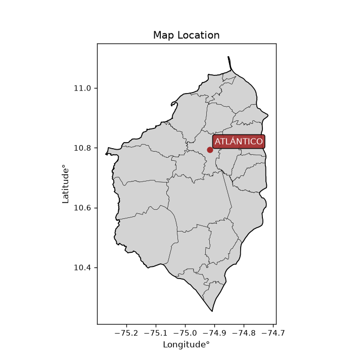</img>

| CountyID                                                                                          | CountyName       | CountyFiles                                                                                                                                                                                                                                                                                                                                                                                                                                                                                                                                                                                                                                                                                                                                                                                                                                                                                                                                                                                                                                                                                                                                                                                                                                                                                                                                                                                                                                                                                                                                                                                                                                                                                                                                                                                                                                                                                                                        |
|:--------------------------------------------------------------------------------------------------|:-----------------|:-----------------------------------------------------------------------------------------------------------------------------------------------------------------------------------------------------------------------------------------------------------------------------------------------------------------------------------------------------------------------------------------------------------------------------------------------------------------------------------------------------------------------------------------------------------------------------------------------------------------------------------------------------------------------------------------------------------------------------------------------------------------------------------------------------------------------------------------------------------------------------------------------------------------------------------------------------------------------------------------------------------------------------------------------------------------------------------------------------------------------------------------------------------------------------------------------------------------------------------------------------------------------------------------------------------------------------------------------------------------------------------------------------------------------------------------------------------------------------------------------------------------------------------------------------------------------------------------------------------------------------------------------------------------------------------------------------------------------------------------------------------------------------------------------------------------------------------------------------------------------------------------------------------------------------------|
| [08078](https://github.com/rcfdtools/R.HydroTools/blob/main/tool/Population/file/report/08078.md) | Baranoa          | [08078_Rural_Building_202606.zip](https://github.com/rcfdtools/R.GISMobile/blob/main/file/shp/08078_Rural_Building_202606.zip) [08078_Rural_Lot_202606.zip](https://github.com/rcfdtools/R.GISMobile/blob/main/file/shp/08078_Rural_Lot_202606.zip) [08078_Rural_Nomenclature_202606.zip](https://github.com/rcfdtools/R.GISMobile/blob/main/file/shp/08078_Rural_Nomenclature_202606.zip) [08078_Rural_Sector_202606.zip](https://github.com/rcfdtools/R.GISMobile/blob/main/file/shp/08078_Rural_Sector_202606.zip) [08078_Rural_Vereda_202606.zip](https://github.com/rcfdtools/R.GISMobile/blob/main/file/shp/08078_Rural_Vereda_202606.zip) [08078_Urban_Block_202606.zip](https://github.com/rcfdtools/R.GISMobile/blob/main/file/shp/08078_Urban_Block_202606.zip) [08078_Urban_Building_202606.zip](https://github.com/rcfdtools/R.GISMobile/blob/main/file/shp/08078_Urban_Building_202606.zip) [08078_Urban_Lot_202606.zip](https://github.com/rcfdtools/R.GISMobile/blob/main/file/shp/08078_Urban_Lot_202606.zip) [08078_Urban_Nomenclature_202606.zip](https://github.com/rcfdtools/R.GISMobile/blob/main/file/shp/08078_Urban_Nomenclature_202606.zip) [08078_Urban_Sector_202606.zip](https://github.com/rcfdtools/R.GISMobile/blob/main/file/shp/08078_Urban_Sector_202606.zip)                                                                                                                                                                                                                                                                                                                                                                                                                                                                                                                                                                                            |
| [08001](https://github.com/rcfdtools/R.HydroTools/blob/main/tool/Population/file/report/08001.md) | Barranquilla     | Not found                                                                                                                                                                                                                                                                                                                                                                                                                                                                                                                                                                                                                                                                                                                                                                                                                                                                                                                                                                                                                                                                                                                                                                                                                                                                                                                                                                                                                                                                                                                                                                                                                                                                                                                                                                                                                                                                                                                          |
| [08137](https://github.com/rcfdtools/R.HydroTools/blob/main/tool/Population/file/report/08137.md) | Campo De La Cruz | [08137_Rural_Building_202606.zip](https://github.com/rcfdtools/R.GISMobile/blob/main/file/shp/08137_Rural_Building_202606.zip) [08137_Rural_Lot_202606.zip](https://github.com/rcfdtools/R.GISMobile/blob/main/file/shp/08137_Rural_Lot_202606.zip) [08137_Rural_Nomenclature_202606.zip](https://github.com/rcfdtools/R.GISMobile/blob/main/file/shp/08137_Rural_Nomenclature_202606.zip) [08137_Rural_Sector_202606.zip](https://github.com/rcfdtools/R.GISMobile/blob/main/file/shp/08137_Rural_Sector_202606.zip) [08137_Rural_Vereda_202606.zip](https://github.com/rcfdtools/R.GISMobile/blob/main/file/shp/08137_Rural_Vereda_202606.zip) [08137_Urban_Block_202606.zip](https://github.com/rcfdtools/R.GISMobile/blob/main/file/shp/08137_Urban_Block_202606.zip) [08137_Urban_Building_202606.zip](https://github.com/rcfdtools/R.GISMobile/blob/main/file/shp/08137_Urban_Building_202606.zip) [08137_Urban_Lot_202606.zip](https://github.com/rcfdtools/R.GISMobile/blob/main/file/shp/08137_Urban_Lot_202606.zip) [08137_Urban_Neighborhood_202606.zip](https://github.com/rcfdtools/R.GISMobile/blob/main/file/shp/08137_Urban_Neighborhood_202606.zip) [08137_Urban_Nomenclature_202606.zip](https://github.com/rcfdtools/R.GISMobile/blob/main/file/shp/08137_Urban_Nomenclature_202606.zip) [08137_Urban_Nomenclature_Road_202606.zip](https://github.com/rcfdtools/R.GISMobile/blob/main/file/shp/08137_Urban_Nomenclature_Road_202606.zip) [08137_Urban_Perimeter_202606.zip](https://github.com/rcfdtools/R.GISMobile/blob/main/file/shp/08137_Urban_Perimeter_202606.zip) [08137_Urban_Sector_202606.zip](https://github.com/rcfdtools/R.GISMobile/blob/main/file/shp/08137_Urban_Sector_202606.zip)                                                                                                                                                       |
| [08141](https://github.com/rcfdtools/R.HydroTools/blob/main/tool/Population/file/report/08141.md) | Candelaria       | [08141_Rural_Building_202606.zip](https://github.com/rcfdtools/R.GISMobile/blob/main/file/shp/08141_Rural_Building_202606.zip) [08141_Rural_Lot_202606.zip](https://github.com/rcfdtools/R.GISMobile/blob/main/file/shp/08141_Rural_Lot_202606.zip) [08141_Rural_Nomenclature_202606.zip](https://github.com/rcfdtools/R.GISMobile/blob/main/file/shp/08141_Rural_Nomenclature_202606.zip) [08141_Rural_Sector_202606.zip](https://github.com/rcfdtools/R.GISMobile/blob/main/file/shp/08141_Rural_Sector_202606.zip) [08141_Rural_Vereda_202606.zip](https://github.com/rcfdtools/R.GISMobile/blob/main/file/shp/08141_Rural_Vereda_202606.zip) [08141_Urban_Block_202606.zip](https://github.com/rcfdtools/R.GISMobile/blob/main/file/shp/08141_Urban_Block_202606.zip) [08141_Urban_Building_202606.zip](https://github.com/rcfdtools/R.GISMobile/blob/main/file/shp/08141_Urban_Building_202606.zip) [08141_Urban_Lot_202606.zip](https://github.com/rcfdtools/R.GISMobile/blob/main/file/shp/08141_Urban_Lot_202606.zip) [08141_Urban_Neighborhood_202606.zip](https://github.com/rcfdtools/R.GISMobile/blob/main/file/shp/08141_Urban_Neighborhood_202606.zip) [08141_Urban_Nomenclature_202606.zip](https://github.com/rcfdtools/R.GISMobile/blob/main/file/shp/08141_Urban_Nomenclature_202606.zip) [08141_Urban_Nomenclature_Road_202606.zip](https://github.com/rcfdtools/R.GISMobile/blob/main/file/shp/08141_Urban_Nomenclature_Road_202606.zip) [08141_Urban_Perimeter_202606.zip](https://github.com/rcfdtools/R.GISMobile/blob/main/file/shp/08141_Urban_Perimeter_202606.zip) [08141_Urban_Sector_202606.zip](https://github.com/rcfdtools/R.GISMobile/blob/main/file/shp/08141_Urban_Sector_202606.zip)                                                                                                                                                       |
| [08296](https://github.com/rcfdtools/R.HydroTools/blob/main/tool/Population/file/report/08296.md) | Galapa           | [08296_Rural_Lot_202001.zip](https://github.com/rcfdtools/R.GISMobile/blob/main/file/shp/08296_Rural_Lot_202001.zip) [08296_Urban_Lot_202001.zip](https://github.com/rcfdtools/R.GISMobile/blob/main/file/shp/08296_Urban_Lot_202001.zip)                                                                                                                                                                                                                                                                                                                                                                                                                                                                                                                                                                                                                                                                                                                                                                                                                                                                                                                                                                                                                                                                                                                                                                                                                                                                                                                                                                                                                                                                                                                                                                                                                                                                                  |
| [08372](https://github.com/rcfdtools/R.HydroTools/blob/main/tool/Population/file/report/08372.md) | Juan De Acosta   | [08372_Rural_Lot_202606.zip](https://github.com/rcfdtools/R.GISMobile/blob/main/file/shp/08372_Rural_Lot_202606.zip) [08372_Urban_Lot_202606.zip](https://github.com/rcfdtools/R.GISMobile/blob/main/file/shp/08372_Urban_Lot_202606.zip)                                                                                                                                                                                                                                                                                                                                                                                                                                                                                                                                                                                                                                                                                                                                                                                                                                                                                                                                                                                                                                                                                                                                                                                                                                                                                                                                                                                                                                                                                                                                                                                                                                                                                  |
| [08421](https://github.com/rcfdtools/R.HydroTools/blob/main/tool/Population/file/report/08421.md) | Luruaco          | [08421_Rural_Building_202606.zip](https://github.com/rcfdtools/R.GISMobile/blob/main/file/shp/08421_Rural_Building_202606.zip) [08421_Rural_Lot_202606.zip](https://github.com/rcfdtools/R.GISMobile/blob/main/file/shp/08421_Rural_Lot_202606.zip) [08421_Rural_Nomenclature_202606.zip](https://github.com/rcfdtools/R.GISMobile/blob/main/file/shp/08421_Rural_Nomenclature_202606.zip) [08421_Rural_Nomenclature_Road_202606.zip](https://github.com/rcfdtools/R.GISMobile/blob/main/file/shp/08421_Rural_Nomenclature_Road_202606.zip) [08421_Rural_Sector_202606.zip](https://github.com/rcfdtools/R.GISMobile/blob/main/file/shp/08421_Rural_Sector_202606.zip) [08421_Rural_Vereda_202606.zip](https://github.com/rcfdtools/R.GISMobile/blob/main/file/shp/08421_Rural_Vereda_202606.zip) [08421_Urban_Block_202606.zip](https://github.com/rcfdtools/R.GISMobile/blob/main/file/shp/08421_Urban_Block_202606.zip) [08421_Urban_Building_202606.zip](https://github.com/rcfdtools/R.GISMobile/blob/main/file/shp/08421_Urban_Building_202606.zip) [08421_Urban_Lot_202606.zip](https://github.com/rcfdtools/R.GISMobile/blob/main/file/shp/08421_Urban_Lot_202606.zip) [08421_Urban_Neighborhood_202606.zip](https://github.com/rcfdtools/R.GISMobile/blob/main/file/shp/08421_Urban_Neighborhood_202606.zip) [08421_Urban_Nomenclature_202606.zip](https://github.com/rcfdtools/R.GISMobile/blob/main/file/shp/08421_Urban_Nomenclature_202606.zip) [08421_Urban_Nomenclature_Road_202606.zip](https://github.com/rcfdtools/R.GISMobile/blob/main/file/shp/08421_Urban_Nomenclature_Road_202606.zip) [08421_Urban_Perimeter_202606.zip](https://github.com/rcfdtools/R.GISMobile/blob/main/file/shp/08421_Urban_Perimeter_202606.zip) [08421_Urban_Sector_202606.zip](https://github.com/rcfdtools/R.GISMobile/blob/main/file/shp/08421_Urban_Sector_202606.zip)  |
| [08433](https://github.com/rcfdtools/R.HydroTools/blob/main/tool/Population/file/report/08433.md) | Malambo          | [08433_Rural_Lot_202001.zip](https://github.com/rcfdtools/R.GISMobile/blob/main/file/shp/08433_Rural_Lot_202001.zip) [08433_Urban_Lot_202001.zip](https://github.com/rcfdtools/R.GISMobile/blob/main/file/shp/08433_Urban_Lot_202001.zip)                                                                                                                                                                                                                                                                                                                                                                                                                                                                                                                                                                                                                                                                                                                                                                                                                                                                                                                                                                                                                                                                                                                                                                                                                                                                                                                                                                                                                                                                                                                                                                                                                                                                                  |
| [08436](https://github.com/rcfdtools/R.HydroTools/blob/main/tool/Population/file/report/08436.md) | Manatí           | [08436_Rural_Building_202606.zip](https://github.com/rcfdtools/R.GISMobile/blob/main/file/shp/08436_Rural_Building_202606.zip) [08436_Rural_Lot_202606.zip](https://github.com/rcfdtools/R.GISMobile/blob/main/file/shp/08436_Rural_Lot_202606.zip) [08436_Rural_Nomenclature_202606.zip](https://github.com/rcfdtools/R.GISMobile/blob/main/file/shp/08436_Rural_Nomenclature_202606.zip) [08436_Rural_Sector_202606.zip](https://github.com/rcfdtools/R.GISMobile/blob/main/file/shp/08436_Rural_Sector_202606.zip) [08436_Rural_Vereda_202606.zip](https://github.com/rcfdtools/R.GISMobile/blob/main/file/shp/08436_Rural_Vereda_202606.zip) [08436_Urban_Block_202606.zip](https://github.com/rcfdtools/R.GISMobile/blob/main/file/shp/08436_Urban_Block_202606.zip) [08436_Urban_Building_202606.zip](https://github.com/rcfdtools/R.GISMobile/blob/main/file/shp/08436_Urban_Building_202606.zip) [08436_Urban_Lot_202606.zip](https://github.com/rcfdtools/R.GISMobile/blob/main/file/shp/08436_Urban_Lot_202606.zip) [08436_Urban_Neighborhood_202606.zip](https://github.com/rcfdtools/R.GISMobile/blob/main/file/shp/08436_Urban_Neighborhood_202606.zip) [08436_Urban_Nomenclature_202606.zip](https://github.com/rcfdtools/R.GISMobile/blob/main/file/shp/08436_Urban_Nomenclature_202606.zip) [08436_Urban_Nomenclature_Road_202606.zip](https://github.com/rcfdtools/R.GISMobile/blob/main/file/shp/08436_Urban_Nomenclature_Road_202606.zip) [08436_Urban_Perimeter_202606.zip](https://github.com/rcfdtools/R.GISMobile/blob/main/file/shp/08436_Urban_Perimeter_202606.zip) [08436_Urban_Sector_202606.zip](https://github.com/rcfdtools/R.GISMobile/blob/main/file/shp/08436_Urban_Sector_202606.zip)                                                                                                                                                       |
| [08520](https://github.com/rcfdtools/R.HydroTools/blob/main/tool/Population/file/report/08520.md) | Palmar De Varela | [08520_Rural_Building_202606.zip](https://github.com/rcfdtools/R.GISMobile/blob/main/file/shp/08520_Rural_Building_202606.zip) [08520_Rural_Lot_202606.zip](https://github.com/rcfdtools/R.GISMobile/blob/main/file/shp/08520_Rural_Lot_202606.zip) [08520_Rural_Nomenclature_202606.zip](https://github.com/rcfdtools/R.GISMobile/blob/main/file/shp/08520_Rural_Nomenclature_202606.zip) [08520_Rural_Sector_202606.zip](https://github.com/rcfdtools/R.GISMobile/blob/main/file/shp/08520_Rural_Sector_202606.zip) [08520_Rural_Vereda_202606.zip](https://github.com/rcfdtools/R.GISMobile/blob/main/file/shp/08520_Rural_Vereda_202606.zip) [08520_Urban_Block_202606.zip](https://github.com/rcfdtools/R.GISMobile/blob/main/file/shp/08520_Urban_Block_202606.zip) [08520_Urban_Building_202606.zip](https://github.com/rcfdtools/R.GISMobile/blob/main/file/shp/08520_Urban_Building_202606.zip) [08520_Urban_Lot_202606.zip](https://github.com/rcfdtools/R.GISMobile/blob/main/file/shp/08520_Urban_Lot_202606.zip) [08520_Urban_Neighborhood_202606.zip](https://github.com/rcfdtools/R.GISMobile/blob/main/file/shp/08520_Urban_Neighborhood_202606.zip) [08520_Urban_Nomenclature_202606.zip](https://github.com/rcfdtools/R.GISMobile/blob/main/file/shp/08520_Urban_Nomenclature_202606.zip) [08520_Urban_Nomenclature_Road_202606.zip](https://github.com/rcfdtools/R.GISMobile/blob/main/file/shp/08520_Urban_Nomenclature_Road_202606.zip) [08520_Urban_Perimeter_202606.zip](https://github.com/rcfdtools/R.GISMobile/blob/main/file/shp/08520_Urban_Perimeter_202606.zip) [08520_Urban_Sector_202606.zip](https://github.com/rcfdtools/R.GISMobile/blob/main/file/shp/08520_Urban_Sector_202606.zip)                                                                                                                                                       |
| [08549](https://github.com/rcfdtools/R.HydroTools/blob/main/tool/Population/file/report/08549.md) | Piojó            | [08549_Rural_Lot_202606.zip](https://github.com/rcfdtools/R.GISMobile/blob/main/file/shp/08549_Rural_Lot_202606.zip) [08549_Urban_Lot_202606.zip](https://github.com/rcfdtools/R.GISMobile/blob/main/file/shp/08549_Urban_Lot_202606.zip)                                                                                                                                                                                                                                                                                                                                                                                                                                                                                                                                                                                                                                                                                                                                                                                                                                                                                                                                                                                                                                                                                                                                                                                                                                                                                                                                                                                                                                                                                                                                                                                                                                                                                  |
| [08558](https://github.com/rcfdtools/R.HydroTools/blob/main/tool/Population/file/report/08558.md) | Polonuevo        | [08558_Rural_Building_202606.zip](https://github.com/rcfdtools/R.GISMobile/blob/main/file/shp/08558_Rural_Building_202606.zip) [08558_Rural_Lot_202606.zip](https://github.com/rcfdtools/R.GISMobile/blob/main/file/shp/08558_Rural_Lot_202606.zip) [08558_Rural_Nomenclature_202606.zip](https://github.com/rcfdtools/R.GISMobile/blob/main/file/shp/08558_Rural_Nomenclature_202606.zip) [08558_Rural_Nomenclature_Road_202606.zip](https://github.com/rcfdtools/R.GISMobile/blob/main/file/shp/08558_Rural_Nomenclature_Road_202606.zip) [08558_Rural_Sector_202606.zip](https://github.com/rcfdtools/R.GISMobile/blob/main/file/shp/08558_Rural_Sector_202606.zip) [08558_Rural_Vereda_202606.zip](https://github.com/rcfdtools/R.GISMobile/blob/main/file/shp/08558_Rural_Vereda_202606.zip) [08558_Urban_Block_202606.zip](https://github.com/rcfdtools/R.GISMobile/blob/main/file/shp/08558_Urban_Block_202606.zip) [08558_Urban_Building_202606.zip](https://github.com/rcfdtools/R.GISMobile/blob/main/file/shp/08558_Urban_Building_202606.zip) [08558_Urban_Lot_202606.zip](https://github.com/rcfdtools/R.GISMobile/blob/main/file/shp/08558_Urban_Lot_202606.zip) [08558_Urban_Neighborhood_202606.zip](https://github.com/rcfdtools/R.GISMobile/blob/main/file/shp/08558_Urban_Neighborhood_202606.zip) [08558_Urban_Nomenclature_202606.zip](https://github.com/rcfdtools/R.GISMobile/blob/main/file/shp/08558_Urban_Nomenclature_202606.zip) [08558_Urban_Nomenclature_Road_202606.zip](https://github.com/rcfdtools/R.GISMobile/blob/main/file/shp/08558_Urban_Nomenclature_Road_202606.zip) [08558_Urban_Perimeter_202606.zip](https://github.com/rcfdtools/R.GISMobile/blob/main/file/shp/08558_Urban_Perimeter_202606.zip) [08558_Urban_Sector_202606.zip](https://github.com/rcfdtools/R.GISMobile/blob/main/file/shp/08558_Urban_Sector_202606.zip)  |
| [08560](https://github.com/rcfdtools/R.HydroTools/blob/main/tool/Population/file/report/08560.md) | Ponedera         | [08560_Rural_Building_202606.zip](https://github.com/rcfdtools/R.GISMobile/blob/main/file/shp/08560_Rural_Building_202606.zip) [08560_Rural_Lot_202606.zip](https://github.com/rcfdtools/R.GISMobile/blob/main/file/shp/08560_Rural_Lot_202606.zip) [08560_Rural_Nomenclature_202606.zip](https://github.com/rcfdtools/R.GISMobile/blob/main/file/shp/08560_Rural_Nomenclature_202606.zip) [08560_Rural_Sector_202606.zip](https://github.com/rcfdtools/R.GISMobile/blob/main/file/shp/08560_Rural_Sector_202606.zip) [08560_Rural_Vereda_202606.zip](https://github.com/rcfdtools/R.GISMobile/blob/main/file/shp/08560_Rural_Vereda_202606.zip) [08560_Urban_Block_202606.zip](https://github.com/rcfdtools/R.GISMobile/blob/main/file/shp/08560_Urban_Block_202606.zip) [08560_Urban_Building_202606.zip](https://github.com/rcfdtools/R.GISMobile/blob/main/file/shp/08560_Urban_Building_202606.zip) [08560_Urban_Lot_202606.zip](https://github.com/rcfdtools/R.GISMobile/blob/main/file/shp/08560_Urban_Lot_202606.zip) [08560_Urban_Neighborhood_202606.zip](https://github.com/rcfdtools/R.GISMobile/blob/main/file/shp/08560_Urban_Neighborhood_202606.zip) [08560_Urban_Nomenclature_202606.zip](https://github.com/rcfdtools/R.GISMobile/blob/main/file/shp/08560_Urban_Nomenclature_202606.zip) [08560_Urban_Nomenclature_Road_202606.zip](https://github.com/rcfdtools/R.GISMobile/blob/main/file/shp/08560_Urban_Nomenclature_Road_202606.zip) [08560_Urban_Perimeter_202606.zip](https://github.com/rcfdtools/R.GISMobile/blob/main/file/shp/08560_Urban_Perimeter_202606.zip) [08560_Urban_Sector_202606.zip](https://github.com/rcfdtools/R.GISMobile/blob/main/file/shp/08560_Urban_Sector_202606.zip)                                                                                                                                                       |
| [08573](https://github.com/rcfdtools/R.HydroTools/blob/main/tool/Population/file/report/08573.md) | Puerto Colombia  | [08573_Rural_Lot_202001.zip](https://github.com/rcfdtools/R.GISMobile/blob/main/file/shp/08573_Rural_Lot_202001.zip) [08573_Urban_Lot_202001.zip](https://github.com/rcfdtools/R.GISMobile/blob/main/file/shp/08573_Urban_Lot_202001.zip)                                                                                                                                                                                                                                                                                                                                                                                                                                                                                                                                                                                                                                                                                                                                                                                                                                                                                                                                                                                                                                                                                                                                                                                                                                                                                                                                                                                                                                                                                                                                                                                                                                                                                  |
| [08606](https://github.com/rcfdtools/R.HydroTools/blob/main/tool/Population/file/report/08606.md) | Repelón          | [08606_Rural_Building_202606.zip](https://github.com/rcfdtools/R.GISMobile/blob/main/file/shp/08606_Rural_Building_202606.zip) [08606_Rural_Lot_202606.zip](https://github.com/rcfdtools/R.GISMobile/blob/main/file/shp/08606_Rural_Lot_202606.zip) [08606_Rural_Nomenclature_202606.zip](https://github.com/rcfdtools/R.GISMobile/blob/main/file/shp/08606_Rural_Nomenclature_202606.zip) [08606_Rural_Sector_202606.zip](https://github.com/rcfdtools/R.GISMobile/blob/main/file/shp/08606_Rural_Sector_202606.zip) [08606_Rural_Vereda_202606.zip](https://github.com/rcfdtools/R.GISMobile/blob/main/file/shp/08606_Rural_Vereda_202606.zip) [08606_Urban_Block_202606.zip](https://github.com/rcfdtools/R.GISMobile/blob/main/file/shp/08606_Urban_Block_202606.zip) [08606_Urban_Building_202606.zip](https://github.com/rcfdtools/R.GISMobile/blob/main/file/shp/08606_Urban_Building_202606.zip) [08606_Urban_Lot_202606.zip](https://github.com/rcfdtools/R.GISMobile/blob/main/file/shp/08606_Urban_Lot_202606.zip) [08606_Urban_Neighborhood_202606.zip](https://github.com/rcfdtools/R.GISMobile/blob/main/file/shp/08606_Urban_Neighborhood_202606.zip) [08606_Urban_Nomenclature_202606.zip](https://github.com/rcfdtools/R.GISMobile/blob/main/file/shp/08606_Urban_Nomenclature_202606.zip) [08606_Urban_Sector_202606.zip](https://github.com/rcfdtools/R.GISMobile/blob/main/file/shp/08606_Urban_Sector_202606.zip)                                                                                                                                                                                                                                                                                                                                                                                                                                                 |
| [08634](https://github.com/rcfdtools/R.HydroTools/blob/main/tool/Population/file/report/08634.md) | Sabanagrande     | [08634_Rural_Building_202606.zip](https://github.com/rcfdtools/R.GISMobile/blob/main/file/shp/08634_Rural_Building_202606.zip) [08634_Rural_Lot_202606.zip](https://github.com/rcfdtools/R.GISMobile/blob/main/file/shp/08634_Rural_Lot_202606.zip) [08634_Rural_Nomenclature_202606.zip](https://github.com/rcfdtools/R.GISMobile/blob/main/file/shp/08634_Rural_Nomenclature_202606.zip) [08634_Rural_Sector_202606.zip](https://github.com/rcfdtools/R.GISMobile/blob/main/file/shp/08634_Rural_Sector_202606.zip) [08634_Rural_Vereda_202606.zip](https://github.com/rcfdtools/R.GISMobile/blob/main/file/shp/08634_Rural_Vereda_202606.zip) [08634_Urban_Block_202606.zip](https://github.com/rcfdtools/R.GISMobile/blob/main/file/shp/08634_Urban_Block_202606.zip) [08634_Urban_Building_202606.zip](https://github.com/rcfdtools/R.GISMobile/blob/main/file/shp/08634_Urban_Building_202606.zip) [08634_Urban_Lot_202606.zip](https://github.com/rcfdtools/R.GISMobile/blob/main/file/shp/08634_Urban_Lot_202606.zip) [08634_Urban_Nomenclature_202606.zip](https://github.com/rcfdtools/R.GISMobile/blob/main/file/shp/08634_Urban_Nomenclature_202606.zip) [08634_Urban_Perimeter_202606.zip](https://github.com/rcfdtools/R.GISMobile/blob/main/file/shp/08634_Urban_Perimeter_202606.zip) [08634_Urban_Sector_202606.zip](https://github.com/rcfdtools/R.GISMobile/blob/main/file/shp/08634_Urban_Sector_202606.zip)                                                                                                                                                                                                                                                                                                                                                                                                                                                       |
| [08638](https://github.com/rcfdtools/R.HydroTools/blob/main/tool/Population/file/report/08638.md) | Sabanalarga      | [08638_Rural_Lot_202001.zip](https://github.com/rcfdtools/R.GISMobile/blob/main/file/shp/08638_Rural_Lot_202001.zip) [08638_Urban_Lot_202001.zip](https://github.com/rcfdtools/R.GISMobile/blob/main/file/shp/08638_Urban_Lot_202001.zip)                                                                                                                                                                                                                                                                                                                                                                                                                                                                                                                                                                                                                                                                                                                                                                                                                                                                                                                                                                                                                                                                                                                                                                                                                                                                                                                                                                                                                                                                                                                                                                                                                                                                                  |
| [08675](https://github.com/rcfdtools/R.HydroTools/blob/main/tool/Population/file/report/08675.md) | Santa Lucía      | [08675_Rural_Building_202606.zip](https://github.com/rcfdtools/R.GISMobile/blob/main/file/shp/08675_Rural_Building_202606.zip) [08675_Rural_Lot_202606.zip](https://github.com/rcfdtools/R.GISMobile/blob/main/file/shp/08675_Rural_Lot_202606.zip) [08675_Rural_Nomenclature_202606.zip](https://github.com/rcfdtools/R.GISMobile/blob/main/file/shp/08675_Rural_Nomenclature_202606.zip) [08675_Rural_Sector_202606.zip](https://github.com/rcfdtools/R.GISMobile/blob/main/file/shp/08675_Rural_Sector_202606.zip) [08675_Rural_Vereda_202606.zip](https://github.com/rcfdtools/R.GISMobile/blob/main/file/shp/08675_Rural_Vereda_202606.zip) [08675_Urban_Block_202606.zip](https://github.com/rcfdtools/R.GISMobile/blob/main/file/shp/08675_Urban_Block_202606.zip) [08675_Urban_Building_202606.zip](https://github.com/rcfdtools/R.GISMobile/blob/main/file/shp/08675_Urban_Building_202606.zip) [08675_Urban_Lot_202606.zip](https://github.com/rcfdtools/R.GISMobile/blob/main/file/shp/08675_Urban_Lot_202606.zip) [08675_Urban_Neighborhood_202606.zip](https://github.com/rcfdtools/R.GISMobile/blob/main/file/shp/08675_Urban_Neighborhood_202606.zip) [08675_Urban_Nomenclature_202606.zip](https://github.com/rcfdtools/R.GISMobile/blob/main/file/shp/08675_Urban_Nomenclature_202606.zip) [08675_Urban_Nomenclature_Road_202606.zip](https://github.com/rcfdtools/R.GISMobile/blob/main/file/shp/08675_Urban_Nomenclature_Road_202606.zip) [08675_Urban_Perimeter_202606.zip](https://github.com/rcfdtools/R.GISMobile/blob/main/file/shp/08675_Urban_Perimeter_202606.zip) [08675_Urban_Sector_202606.zip](https://github.com/rcfdtools/R.GISMobile/blob/main/file/shp/08675_Urban_Sector_202606.zip)                                                                                                                                                       |
| [08685](https://github.com/rcfdtools/R.HydroTools/blob/main/tool/Population/file/report/08685.md) | Santo Tomás      | [08685_Rural_Building_202606.zip](https://github.com/rcfdtools/R.GISMobile/blob/main/file/shp/08685_Rural_Building_202606.zip) [08685_Rural_Lot_202606.zip](https://github.com/rcfdtools/R.GISMobile/blob/main/file/shp/08685_Rural_Lot_202606.zip) [08685_Rural_Nomenclature_202606.zip](https://github.com/rcfdtools/R.GISMobile/blob/main/file/shp/08685_Rural_Nomenclature_202606.zip) [08685_Rural_Sector_202606.zip](https://github.com/rcfdtools/R.GISMobile/blob/main/file/shp/08685_Rural_Sector_202606.zip) [08685_Rural_Vereda_202606.zip](https://github.com/rcfdtools/R.GISMobile/blob/main/file/shp/08685_Rural_Vereda_202606.zip) [08685_Urban_Block_202606.zip](https://github.com/rcfdtools/R.GISMobile/blob/main/file/shp/08685_Urban_Block_202606.zip) [08685_Urban_Building_202606.zip](https://github.com/rcfdtools/R.GISMobile/blob/main/file/shp/08685_Urban_Building_202606.zip) [08685_Urban_Lot_202606.zip](https://github.com/rcfdtools/R.GISMobile/blob/main/file/shp/08685_Urban_Lot_202606.zip) [08685_Urban_Neighborhood_202606.zip](https://github.com/rcfdtools/R.GISMobile/blob/main/file/shp/08685_Urban_Neighborhood_202606.zip) [08685_Urban_Nomenclature_202606.zip](https://github.com/rcfdtools/R.GISMobile/blob/main/file/shp/08685_Urban_Nomenclature_202606.zip) [08685_Urban_Nomenclature_Road_202606.zip](https://github.com/rcfdtools/R.GISMobile/blob/main/file/shp/08685_Urban_Nomenclature_Road_202606.zip) [08685_Urban_Perimeter_202606.zip](https://github.com/rcfdtools/R.GISMobile/blob/main/file/shp/08685_Urban_Perimeter_202606.zip) [08685_Urban_Sector_202606.zip](https://github.com/rcfdtools/R.GISMobile/blob/main/file/shp/08685_Urban_Sector_202606.zip)                                                                                                                                                       |
| [08758](https://github.com/rcfdtools/R.HydroTools/blob/main/tool/Population/file/report/08758.md) | Soledad          | [08758_Rural_Lot_202001.zip](https://github.com/rcfdtools/R.GISMobile/blob/main/file/shp/08758_Rural_Lot_202001.zip) [08758_Urban_Lot_202001.zip](https://github.com/rcfdtools/R.GISMobile/blob/main/file/shp/08758_Urban_Lot_202001.zip)                                                                                                                                                                                                                                                                                                                                                                                                                                                                                                                                                                                                                                                                                                                                                                                                                                                                                                                                                                                                                                                                                                                                                                                                                                                                                                                                                                                                                                                                                                                                                                                                                                                                                  |
| [08770](https://github.com/rcfdtools/R.HydroTools/blob/main/tool/Population/file/report/08770.md) | Suan             | [08770_Rural_Building_202606.zip](https://github.com/rcfdtools/R.GISMobile/blob/main/file/shp/08770_Rural_Building_202606.zip) [08770_Rural_Lot_202606.zip](https://github.com/rcfdtools/R.GISMobile/blob/main/file/shp/08770_Rural_Lot_202606.zip) [08770_Rural_Nomenclature_202606.zip](https://github.com/rcfdtools/R.GISMobile/blob/main/file/shp/08770_Rural_Nomenclature_202606.zip) [08770_Rural_Sector_202606.zip](https://github.com/rcfdtools/R.GISMobile/blob/main/file/shp/08770_Rural_Sector_202606.zip) [08770_Rural_Vereda_202606.zip](https://github.com/rcfdtools/R.GISMobile/blob/main/file/shp/08770_Rural_Vereda_202606.zip) [08770_Urban_Block_202606.zip](https://github.com/rcfdtools/R.GISMobile/blob/main/file/shp/08770_Urban_Block_202606.zip) [08770_Urban_Building_202606.zip](https://github.com/rcfdtools/R.GISMobile/blob/main/file/shp/08770_Urban_Building_202606.zip) [08770_Urban_Lot_202606.zip](https://github.com/rcfdtools/R.GISMobile/blob/main/file/shp/08770_Urban_Lot_202606.zip) [08770_Urban_Neighborhood_202606.zip](https://github.com/rcfdtools/R.GISMobile/blob/main/file/shp/08770_Urban_Neighborhood_202606.zip) [08770_Urban_Nomenclature_202606.zip](https://github.com/rcfdtools/R.GISMobile/blob/main/file/shp/08770_Urban_Nomenclature_202606.zip) [08770_Urban_Nomenclature_Road_202606.zip](https://github.com/rcfdtools/R.GISMobile/blob/main/file/shp/08770_Urban_Nomenclature_Road_202606.zip) [08770_Urban_Perimeter_202606.zip](https://github.com/rcfdtools/R.GISMobile/blob/main/file/shp/08770_Urban_Perimeter_202606.zip) [08770_Urban_Sector_202606.zip](https://github.com/rcfdtools/R.GISMobile/blob/main/file/shp/08770_Urban_Sector_202606.zip)                                                                                                                                                       |
| [08832](https://github.com/rcfdtools/R.HydroTools/blob/main/tool/Population/file/report/08832.md) | Tubará           | [08832_Rural_Building_202606.zip](https://github.com/rcfdtools/R.GISMobile/blob/main/file/shp/08832_Rural_Building_202606.zip) [08832_Rural_Lot_202606.zip](https://github.com/rcfdtools/R.GISMobile/blob/main/file/shp/08832_Rural_Lot_202606.zip) [08832_Rural_Nomenclature_202606.zip](https://github.com/rcfdtools/R.GISMobile/blob/main/file/shp/08832_Rural_Nomenclature_202606.zip) [08832_Rural_Sector_202606.zip](https://github.com/rcfdtools/R.GISMobile/blob/main/file/shp/08832_Rural_Sector_202606.zip) [08832_Rural_Vereda_202606.zip](https://github.com/rcfdtools/R.GISMobile/blob/main/file/shp/08832_Rural_Vereda_202606.zip) [08832_Urban_Block_202606.zip](https://github.com/rcfdtools/R.GISMobile/blob/main/file/shp/08832_Urban_Block_202606.zip) [08832_Urban_Building_202606.zip](https://github.com/rcfdtools/R.GISMobile/blob/main/file/shp/08832_Urban_Building_202606.zip) [08832_Urban_Lot_202606.zip](https://github.com/rcfdtools/R.GISMobile/blob/main/file/shp/08832_Urban_Lot_202606.zip) [08832_Urban_Nomenclature_202606.zip](https://github.com/rcfdtools/R.GISMobile/blob/main/file/shp/08832_Urban_Nomenclature_202606.zip) [08832_Urban_Perimeter_202606.zip](https://github.com/rcfdtools/R.GISMobile/blob/main/file/shp/08832_Urban_Perimeter_202606.zip) [08832_Urban_Sector_202606.zip](https://github.com/rcfdtools/R.GISMobile/blob/main/file/shp/08832_Urban_Sector_202606.zip)                                                                                                                                                                                                                                                                                                                                                                                                                                                       |
| [08849](https://github.com/rcfdtools/R.HydroTools/blob/main/tool/Population/file/report/08849.md) | Usiacurí         | [08849_Rural_Building_202606.zip](https://github.com/rcfdtools/R.GISMobile/blob/main/file/shp/08849_Rural_Building_202606.zip) [08849_Rural_Lot_202606.zip](https://github.com/rcfdtools/R.GISMobile/blob/main/file/shp/08849_Rural_Lot_202606.zip) [08849_Rural_Nomenclature_202606.zip](https://github.com/rcfdtools/R.GISMobile/blob/main/file/shp/08849_Rural_Nomenclature_202606.zip) [08849_Rural_Sector_202606.zip](https://github.com/rcfdtools/R.GISMobile/blob/main/file/shp/08849_Rural_Sector_202606.zip) [08849_Rural_Vereda_202606.zip](https://github.com/rcfdtools/R.GISMobile/blob/main/file/shp/08849_Rural_Vereda_202606.zip) [08849_Urban_Block_202606.zip](https://github.com/rcfdtools/R.GISMobile/blob/main/file/shp/08849_Urban_Block_202606.zip) [08849_Urban_Building_202606.zip](https://github.com/rcfdtools/R.GISMobile/blob/main/file/shp/08849_Urban_Building_202606.zip) [08849_Urban_Lot_202606.zip](https://github.com/rcfdtools/R.GISMobile/blob/main/file/shp/08849_Urban_Lot_202606.zip) [08849_Urban_Neighborhood_202606.zip](https://github.com/rcfdtools/R.GISMobile/blob/main/file/shp/08849_Urban_Neighborhood_202606.zip) [08849_Urban_Nomenclature_202606.zip](https://github.com/rcfdtools/R.GISMobile/blob/main/file/shp/08849_Urban_Nomenclature_202606.zip) [08849_Urban_Nomenclature_Road_202606.zip](https://github.com/rcfdtools/R.GISMobile/blob/main/file/shp/08849_Urban_Nomenclature_Road_202606.zip) [08849_Urban_Perimeter_202606.zip](https://github.com/rcfdtools/R.GISMobile/blob/main/file/shp/08849_Urban_Perimeter_202606.zip) [08849_Urban_Sector_202606.zip](https://github.com/rcfdtools/R.GISMobile/blob/main/file/shp/08849_Urban_Sector_202606.zip)                                                                                                                                                       |

# 11 - Bogotá, D.C. (1 Counties)

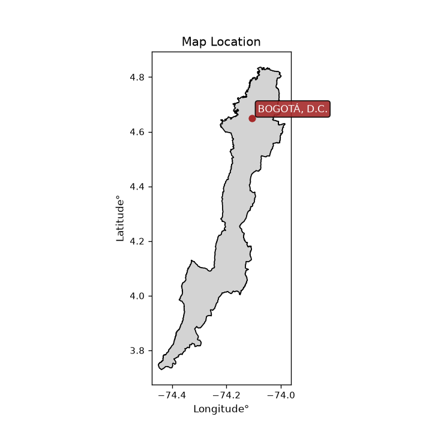</img>

| CountyID                                                                                          | CountyName   | CountyFiles   |
|:--------------------------------------------------------------------------------------------------|:-------------|:--------------|
| [11001](https://github.com/rcfdtools/R.HydroTools/blob/main/tool/Population/file/report/11001.md) | Bogotá, D.C. | Not found     |

# 13 - Bolívar (46 Counties)

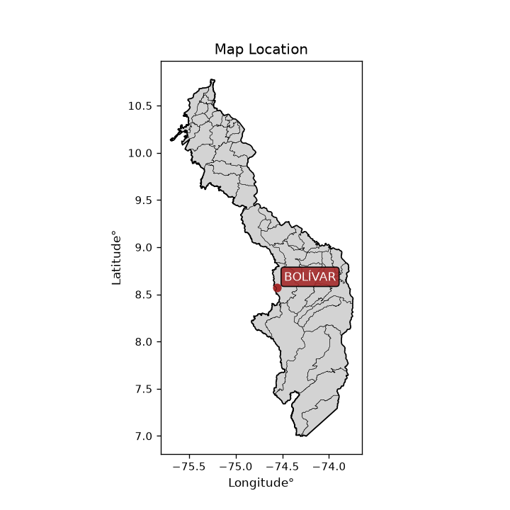</img>

| CountyID                                                                                          | CountyName            | CountyFiles                                                                                                                                                                                                                                                                                                                                                                                                                                                                                                                                                                                                                                                                                                                                                                                                                                                                                                                                                                                                                                                                                                                                                                                                                                                                                                                                                                                                                                                                                                                                                                                                                                                                                                                                                                   |
|:--------------------------------------------------------------------------------------------------|:----------------------|:------------------------------------------------------------------------------------------------------------------------------------------------------------------------------------------------------------------------------------------------------------------------------------------------------------------------------------------------------------------------------------------------------------------------------------------------------------------------------------------------------------------------------------------------------------------------------------------------------------------------------------------------------------------------------------------------------------------------------------------------------------------------------------------------------------------------------------------------------------------------------------------------------------------------------------------------------------------------------------------------------------------------------------------------------------------------------------------------------------------------------------------------------------------------------------------------------------------------------------------------------------------------------------------------------------------------------------------------------------------------------------------------------------------------------------------------------------------------------------------------------------------------------------------------------------------------------------------------------------------------------------------------------------------------------------------------------------------------------------------------------------------------------|
| [13006](https://github.com/rcfdtools/R.HydroTools/blob/main/tool/Population/file/report/13006.md) | Achí                  | [13006_Rural_Building_202606.zip](https://github.com/rcfdtools/R.GISMobile/blob/main/file/shp/13006_Rural_Building_202606.zip) [13006_Rural_Lot_202606.zip](https://github.com/rcfdtools/R.GISMobile/blob/main/file/shp/13006_Rural_Lot_202606.zip) [13006_Rural_Nomenclature_202606.zip](https://github.com/rcfdtools/R.GISMobile/blob/main/file/shp/13006_Rural_Nomenclature_202606.zip) [13006_Rural_Sector_202606.zip](https://github.com/rcfdtools/R.GISMobile/blob/main/file/shp/13006_Rural_Sector_202606.zip) [13006_Rural_Vereda_202606.zip](https://github.com/rcfdtools/R.GISMobile/blob/main/file/shp/13006_Rural_Vereda_202606.zip) [13006_Urban_Block_202606.zip](https://github.com/rcfdtools/R.GISMobile/blob/main/file/shp/13006_Urban_Block_202606.zip) [13006_Urban_Building_202606.zip](https://github.com/rcfdtools/R.GISMobile/blob/main/file/shp/13006_Urban_Building_202606.zip) [13006_Urban_Lot_202606.zip](https://github.com/rcfdtools/R.GISMobile/blob/main/file/shp/13006_Urban_Lot_202606.zip) [13006_Urban_Neighborhood_202606.zip](https://github.com/rcfdtools/R.GISMobile/blob/main/file/shp/13006_Urban_Neighborhood_202606.zip) [13006_Urban_Nomenclature_202606.zip](https://github.com/rcfdtools/R.GISMobile/blob/main/file/shp/13006_Urban_Nomenclature_202606.zip) [13006_Urban_Nomenclature_Road_202606.zip](https://github.com/rcfdtools/R.GISMobile/blob/main/file/shp/13006_Urban_Nomenclature_Road_202606.zip) [13006_Urban_Perimeter_202606.zip](https://github.com/rcfdtools/R.GISMobile/blob/main/file/shp/13006_Urban_Perimeter_202606.zip) [13006_Urban_Sector_202606.zip](https://github.com/rcfdtools/R.GISMobile/blob/main/file/shp/13006_Urban_Sector_202606.zip)  |
| [13030](https://github.com/rcfdtools/R.HydroTools/blob/main/tool/Population/file/report/13030.md) | Altos Del Rosario     | [13030_Rural_Building_202606.zip](https://github.com/rcfdtools/R.GISMobile/blob/main/file/shp/13030_Rural_Building_202606.zip) [13030_Rural_Lot_202606.zip](https://github.com/rcfdtools/R.GISMobile/blob/main/file/shp/13030_Rural_Lot_202606.zip) [13030_Rural_Sector_202606.zip](https://github.com/rcfdtools/R.GISMobile/blob/main/file/shp/13030_Rural_Sector_202606.zip) [13030_Rural_Vereda_202606.zip](https://github.com/rcfdtools/R.GISMobile/blob/main/file/shp/13030_Rural_Vereda_202606.zip) [13030_Urban_Block_202606.zip](https://github.com/rcfdtools/R.GISMobile/blob/main/file/shp/13030_Urban_Block_202606.zip) [13030_Urban_Building_202606.zip](https://github.com/rcfdtools/R.GISMobile/blob/main/file/shp/13030_Urban_Building_202606.zip) [13030_Urban_Lot_202606.zip](https://github.com/rcfdtools/R.GISMobile/blob/main/file/shp/13030_Urban_Lot_202606.zip) [13030_Urban_Nomenclature_202606.zip](https://github.com/rcfdtools/R.GISMobile/blob/main/file/shp/13030_Urban_Nomenclature_202606.zip) [13030_Urban_Perimeter_202606.zip](https://github.com/rcfdtools/R.GISMobile/blob/main/file/shp/13030_Urban_Perimeter_202606.zip) [13030_Urban_Sector_202606.zip](https://github.com/rcfdtools/R.GISMobile/blob/main/file/shp/13030_Urban_Sector_202606.zip)                                                                                                                                                                                                                                                                                                                                                                                                                                             |
| [13042](https://github.com/rcfdtools/R.HydroTools/blob/main/tool/Population/file/report/13042.md) | Arenal                | [13042_Rural_Building_202606.zip](https://github.com/rcfdtools/R.GISMobile/blob/main/file/shp/13042_Rural_Building_202606.zip) [13042_Rural_Lot_202606.zip](https://github.com/rcfdtools/R.GISMobile/blob/main/file/shp/13042_Rural_Lot_202606.zip) [13042_Rural_Nomenclature_202606.zip](https://github.com/rcfdtools/R.GISMobile/blob/main/file/shp/13042_Rural_Nomenclature_202606.zip) [13042_Rural_Sector_202606.zip](https://github.com/rcfdtools/R.GISMobile/blob/main/file/shp/13042_Rural_Sector_202606.zip) [13042_Rural_Vereda_202606.zip](https://github.com/rcfdtools/R.GISMobile/blob/main/file/shp/13042_Rural_Vereda_202606.zip) [13042_Urban_Block_202606.zip](https://github.com/rcfdtools/R.GISMobile/blob/main/file/shp/13042_Urban_Block_202606.zip) [13042_Urban_Building_202606.zip](https://github.com/rcfdtools/R.GISMobile/blob/main/file/shp/13042_Urban_Building_202606.zip) [13042_Urban_Lot_202606.zip](https://github.com/rcfdtools/R.GISMobile/blob/main/file/shp/13042_Urban_Lot_202606.zip) [13042_Urban_Nomenclature_202606.zip](https://github.com/rcfdtools/R.GISMobile/blob/main/file/shp/13042_Urban_Nomenclature_202606.zip) [13042_Urban_Perimeter_202606.zip](https://github.com/rcfdtools/R.GISMobile/blob/main/file/shp/13042_Urban_Perimeter_202606.zip) [13042_Urban_Sector_202606.zip](https://github.com/rcfdtools/R.GISMobile/blob/main/file/shp/13042_Urban_Sector_202606.zip)                                                                                                                                                                                                                                                                                                  |
| [13052](https://github.com/rcfdtools/R.HydroTools/blob/main/tool/Population/file/report/13052.md) | Arjona                | [13052_Rural_Building_202606.zip](https://github.com/rcfdtools/R.GISMobile/blob/main/file/shp/13052_Rural_Building_202606.zip) [13052_Rural_Lot_202606.zip](https://github.com/rcfdtools/R.GISMobile/blob/main/file/shp/13052_Rural_Lot_202606.zip) [13052_Rural_Nomenclature_202606.zip](https://github.com/rcfdtools/R.GISMobile/blob/main/file/shp/13052_Rural_Nomenclature_202606.zip) [13052_Rural_Sector_202606.zip](https://github.com/rcfdtools/R.GISMobile/blob/main/file/shp/13052_Rural_Sector_202606.zip) [13052_Rural_Vereda_202606.zip](https://github.com/rcfdtools/R.GISMobile/blob/main/file/shp/13052_Rural_Vereda_202606.zip) [13052_Urban_Block_202606.zip](https://github.com/rcfdtools/R.GISMobile/blob/main/file/shp/13052_Urban_Block_202606.zip) [13052_Urban_Building_202606.zip](https://github.com/rcfdtools/R.GISMobile/blob/main/file/shp/13052_Urban_Building_202606.zip) [13052_Urban_Lot_202606.zip](https://github.com/rcfdtools/R.GISMobile/blob/main/file/shp/13052_Urban_Lot_202606.zip) [13052_Urban_Nomenclature_202606.zip](https://github.com/rcfdtools/R.GISMobile/blob/main/file/shp/13052_Urban_Nomenclature_202606.zip) [13052_Urban_Nomenclature_Road_202606.zip](https://github.com/rcfdtools/R.GISMobile/blob/main/file/shp/13052_Urban_Nomenclature_Road_202606.zip) [13052_Urban_Perimeter_202606.zip](https://github.com/rcfdtools/R.GISMobile/blob/main/file/shp/13052_Urban_Perimeter_202606.zip)                                                                                                                                                                                                                                                                            |
| [13062](https://github.com/rcfdtools/R.HydroTools/blob/main/tool/Population/file/report/13062.md) | Arroyohondo           | [13062_Rural_Lot_202606.zip](https://github.com/rcfdtools/R.GISMobile/blob/main/file/shp/13062_Rural_Lot_202606.zip) [13062_Rural_Nomenclature_202606.zip](https://github.com/rcfdtools/R.GISMobile/blob/main/file/shp/13062_Rural_Nomenclature_202606.zip) [13062_Rural_Sector_202606.zip](https://github.com/rcfdtools/R.GISMobile/blob/main/file/shp/13062_Rural_Sector_202606.zip) [13062_Rural_Vereda_202606.zip](https://github.com/rcfdtools/R.GISMobile/blob/main/file/shp/13062_Rural_Vereda_202606.zip) [13062_Urban_Block_202606.zip](https://github.com/rcfdtools/R.GISMobile/blob/main/file/shp/13062_Urban_Block_202606.zip) [13062_Urban_Building_202606.zip](https://github.com/rcfdtools/R.GISMobile/blob/main/file/shp/13062_Urban_Building_202606.zip) [13062_Urban_Lot_202606.zip](https://github.com/rcfdtools/R.GISMobile/blob/main/file/shp/13062_Urban_Lot_202606.zip) [13062_Urban_Neighborhood_202606.zip](https://github.com/rcfdtools/R.GISMobile/blob/main/file/shp/13062_Urban_Neighborhood_202606.zip) [13062_Urban_Nomenclature_202606.zip](https://github.com/rcfdtools/R.GISMobile/blob/main/file/shp/13062_Urban_Nomenclature_202606.zip) [13062_Urban_Nomenclature_Road_202606.zip](https://github.com/rcfdtools/R.GISMobile/blob/main/file/shp/13062_Urban_Nomenclature_Road_202606.zip) [13062_Urban_Perimeter_202606.zip](https://github.com/rcfdtools/R.GISMobile/blob/main/file/shp/13062_Urban_Perimeter_202606.zip) [13062_Urban_Sector_202606.zip](https://github.com/rcfdtools/R.GISMobile/blob/main/file/shp/13062_Urban_Sector_202606.zip)                                                                                                                                     |
| [13074](https://github.com/rcfdtools/R.HydroTools/blob/main/tool/Population/file/report/13074.md) | Barranco De Loba      | [13074_Rural_Lot_202606.zip](https://github.com/rcfdtools/R.GISMobile/blob/main/file/shp/13074_Rural_Lot_202606.zip) [13074_Rural_Nomenclature_202606.zip](https://github.com/rcfdtools/R.GISMobile/blob/main/file/shp/13074_Rural_Nomenclature_202606.zip) [13074_Rural_Sector_202606.zip](https://github.com/rcfdtools/R.GISMobile/blob/main/file/shp/13074_Rural_Sector_202606.zip) [13074_Rural_Vereda_202606.zip](https://github.com/rcfdtools/R.GISMobile/blob/main/file/shp/13074_Rural_Vereda_202606.zip) [13074_Urban_Block_202606.zip](https://github.com/rcfdtools/R.GISMobile/blob/main/file/shp/13074_Urban_Block_202606.zip) [13074_Urban_Building_202606.zip](https://github.com/rcfdtools/R.GISMobile/blob/main/file/shp/13074_Urban_Building_202606.zip) [13074_Urban_Lot_202606.zip](https://github.com/rcfdtools/R.GISMobile/blob/main/file/shp/13074_Urban_Lot_202606.zip) [13074_Urban_Nomenclature_202606.zip](https://github.com/rcfdtools/R.GISMobile/blob/main/file/shp/13074_Urban_Nomenclature_202606.zip) [13074_Urban_Nomenclature_Road_202606.zip](https://github.com/rcfdtools/R.GISMobile/blob/main/file/shp/13074_Urban_Nomenclature_Road_202606.zip) [13074_Urban_Perimeter_202606.zip](https://github.com/rcfdtools/R.GISMobile/blob/main/file/shp/13074_Urban_Perimeter_202606.zip)                                                                                                                                                                                                                                                                                                                                                                                                               |
| [13140](https://github.com/rcfdtools/R.HydroTools/blob/main/tool/Population/file/report/13140.md) | Calamar               | [13140_Rural_Building_202606.zip](https://github.com/rcfdtools/R.GISMobile/blob/main/file/shp/13140_Rural_Building_202606.zip) [13140_Rural_Lot_202606.zip](https://github.com/rcfdtools/R.GISMobile/blob/main/file/shp/13140_Rural_Lot_202606.zip) [13140_Rural_Sector_202606.zip](https://github.com/rcfdtools/R.GISMobile/blob/main/file/shp/13140_Rural_Sector_202606.zip) [13140_Rural_Vereda_202606.zip](https://github.com/rcfdtools/R.GISMobile/blob/main/file/shp/13140_Rural_Vereda_202606.zip) [13140_Urban_Block_202606.zip](https://github.com/rcfdtools/R.GISMobile/blob/main/file/shp/13140_Urban_Block_202606.zip) [13140_Urban_Building_202606.zip](https://github.com/rcfdtools/R.GISMobile/blob/main/file/shp/13140_Urban_Building_202606.zip) [13140_Urban_Lot_202606.zip](https://github.com/rcfdtools/R.GISMobile/blob/main/file/shp/13140_Urban_Lot_202606.zip) [13140_Urban_Nomenclature_202606.zip](https://github.com/rcfdtools/R.GISMobile/blob/main/file/shp/13140_Urban_Nomenclature_202606.zip) [13140_Urban_Nomenclature_Road_202606.zip](https://github.com/rcfdtools/R.GISMobile/blob/main/file/shp/13140_Urban_Nomenclature_Road_202606.zip) [13140_Urban_Perimeter_202606.zip](https://github.com/rcfdtools/R.GISMobile/blob/main/file/shp/13140_Urban_Perimeter_202606.zip) [13140_Urban_Sector_202606.zip](https://github.com/rcfdtools/R.GISMobile/blob/main/file/shp/13140_Urban_Sector_202606.zip)                                                                                                                                                                                                                                                                                        |
| [13160](https://github.com/rcfdtools/R.HydroTools/blob/main/tool/Population/file/report/13160.md) | Cantagallo            | [13160_Rural_Lot_202606.zip](https://github.com/rcfdtools/R.GISMobile/blob/main/file/shp/13160_Rural_Lot_202606.zip) [13160_Rural_Nomenclature_202606.zip](https://github.com/rcfdtools/R.GISMobile/blob/main/file/shp/13160_Rural_Nomenclature_202606.zip) [13160_Rural_Sector_202606.zip](https://github.com/rcfdtools/R.GISMobile/blob/main/file/shp/13160_Rural_Sector_202606.zip) [13160_Rural_Vereda_202606.zip](https://github.com/rcfdtools/R.GISMobile/blob/main/file/shp/13160_Rural_Vereda_202606.zip) [13160_Urban_Block_202606.zip](https://github.com/rcfdtools/R.GISMobile/blob/main/file/shp/13160_Urban_Block_202606.zip) [13160_Urban_Building_202606.zip](https://github.com/rcfdtools/R.GISMobile/blob/main/file/shp/13160_Urban_Building_202606.zip) [13160_Urban_Lot_202606.zip](https://github.com/rcfdtools/R.GISMobile/blob/main/file/shp/13160_Urban_Lot_202606.zip) [13160_Urban_Neighborhood_202606.zip](https://github.com/rcfdtools/R.GISMobile/blob/main/file/shp/13160_Urban_Neighborhood_202606.zip) [13160_Urban_Nomenclature_202606.zip](https://github.com/rcfdtools/R.GISMobile/blob/main/file/shp/13160_Urban_Nomenclature_202606.zip) [13160_Urban_Nomenclature_Road_202606.zip](https://github.com/rcfdtools/R.GISMobile/blob/main/file/shp/13160_Urban_Nomenclature_Road_202606.zip) [13160_Urban_Perimeter_202606.zip](https://github.com/rcfdtools/R.GISMobile/blob/main/file/shp/13160_Urban_Perimeter_202606.zip) [13160_Urban_Sector_202606.zip](https://github.com/rcfdtools/R.GISMobile/blob/main/file/shp/13160_Urban_Sector_202606.zip)                                                                                                                                     |
| [13001](https://github.com/rcfdtools/R.HydroTools/blob/main/tool/Population/file/report/13001.md) | Cartagena De Indias   | [13001_Rural_Lot_202001.zip](https://github.com/rcfdtools/R.GISMobile/blob/main/file/shp/13001_Rural_Lot_202001.zip) [13001_Urban_Lot_202001.zip](https://github.com/rcfdtools/R.GISMobile/blob/main/file/shp/13001_Urban_Lot_202001.zip)                                                                                                                                                                                                                                                                                                                                                                                                                                                                                                                                                                                                                                                                                                                                                                                                                                                                                                                                                                                                                                                                                                                                                                                                                                                                                                                                                                                                                                                                                                                             |
| [13188](https://github.com/rcfdtools/R.HydroTools/blob/main/tool/Population/file/report/13188.md) | Cicuco                | [13188_Rural_Lot_202606.zip](https://github.com/rcfdtools/R.GISMobile/blob/main/file/shp/13188_Rural_Lot_202606.zip) [13188_Rural_Sector_202606.zip](https://github.com/rcfdtools/R.GISMobile/blob/main/file/shp/13188_Rural_Sector_202606.zip) [13188_Rural_Vereda_202606.zip](https://github.com/rcfdtools/R.GISMobile/blob/main/file/shp/13188_Rural_Vereda_202606.zip) [13188_Urban_Block_202606.zip](https://github.com/rcfdtools/R.GISMobile/blob/main/file/shp/13188_Urban_Block_202606.zip) [13188_Urban_Building_202606.zip](https://github.com/rcfdtools/R.GISMobile/blob/main/file/shp/13188_Urban_Building_202606.zip) [13188_Urban_Lot_202606.zip](https://github.com/rcfdtools/R.GISMobile/blob/main/file/shp/13188_Urban_Lot_202606.zip) [13188_Urban_Nomenclature_202606.zip](https://github.com/rcfdtools/R.GISMobile/blob/main/file/shp/13188_Urban_Nomenclature_202606.zip) [13188_Urban_Nomenclature_Road_202606.zip](https://github.com/rcfdtools/R.GISMobile/blob/main/file/shp/13188_Urban_Nomenclature_Road_202606.zip) [13188_Urban_Perimeter_202606.zip](https://github.com/rcfdtools/R.GISMobile/blob/main/file/shp/13188_Urban_Perimeter_202606.zip)                                                                                                                                                                                                                                                                                                                                                                                                                                                                                                                                                          |
| [13222](https://github.com/rcfdtools/R.HydroTools/blob/main/tool/Population/file/report/13222.md) | Clemencia             | [13222_Rural_Lot_202606.zip](https://github.com/rcfdtools/R.GISMobile/blob/main/file/shp/13222_Rural_Lot_202606.zip) [13222_Rural_Nomenclature_202606.zip](https://github.com/rcfdtools/R.GISMobile/blob/main/file/shp/13222_Rural_Nomenclature_202606.zip) [13222_Rural_Sector_202606.zip](https://github.com/rcfdtools/R.GISMobile/blob/main/file/shp/13222_Rural_Sector_202606.zip) [13222_Rural_Vereda_202606.zip](https://github.com/rcfdtools/R.GISMobile/blob/main/file/shp/13222_Rural_Vereda_202606.zip) [13222_Urban_Block_202606.zip](https://github.com/rcfdtools/R.GISMobile/blob/main/file/shp/13222_Urban_Block_202606.zip) [13222_Urban_Building_202606.zip](https://github.com/rcfdtools/R.GISMobile/blob/main/file/shp/13222_Urban_Building_202606.zip) [13222_Urban_Lot_202606.zip](https://github.com/rcfdtools/R.GISMobile/blob/main/file/shp/13222_Urban_Lot_202606.zip) [13222_Urban_Neighborhood_202606.zip](https://github.com/rcfdtools/R.GISMobile/blob/main/file/shp/13222_Urban_Neighborhood_202606.zip) [13222_Urban_Nomenclature_202606.zip](https://github.com/rcfdtools/R.GISMobile/blob/main/file/shp/13222_Urban_Nomenclature_202606.zip) [13222_Urban_Nomenclature_Road_202606.zip](https://github.com/rcfdtools/R.GISMobile/blob/main/file/shp/13222_Urban_Nomenclature_Road_202606.zip) [13222_Urban_Perimeter_202606.zip](https://github.com/rcfdtools/R.GISMobile/blob/main/file/shp/13222_Urban_Perimeter_202606.zip) [13222_Urban_Sector_202606.zip](https://github.com/rcfdtools/R.GISMobile/blob/main/file/shp/13222_Urban_Sector_202606.zip)                                                                                                                                     |
| [13212](https://github.com/rcfdtools/R.HydroTools/blob/main/tool/Population/file/report/13212.md) | Córdoba               | [13212_Rural_Building_202606.zip](https://github.com/rcfdtools/R.GISMobile/blob/main/file/shp/13212_Rural_Building_202606.zip) [13212_Rural_Lot_202606.zip](https://github.com/rcfdtools/R.GISMobile/blob/main/file/shp/13212_Rural_Lot_202606.zip) [13212_Rural_Nomenclature_202606.zip](https://github.com/rcfdtools/R.GISMobile/blob/main/file/shp/13212_Rural_Nomenclature_202606.zip) [13212_Rural_Sector_202606.zip](https://github.com/rcfdtools/R.GISMobile/blob/main/file/shp/13212_Rural_Sector_202606.zip) [13212_Rural_Vereda_202606.zip](https://github.com/rcfdtools/R.GISMobile/blob/main/file/shp/13212_Rural_Vereda_202606.zip) [13212_Urban_Block_202606.zip](https://github.com/rcfdtools/R.GISMobile/blob/main/file/shp/13212_Urban_Block_202606.zip) [13212_Urban_Building_202606.zip](https://github.com/rcfdtools/R.GISMobile/blob/main/file/shp/13212_Urban_Building_202606.zip) [13212_Urban_Lot_202606.zip](https://github.com/rcfdtools/R.GISMobile/blob/main/file/shp/13212_Urban_Lot_202606.zip) [13212_Urban_Nomenclature_202606.zip](https://github.com/rcfdtools/R.GISMobile/blob/main/file/shp/13212_Urban_Nomenclature_202606.zip) [13212_Urban_Nomenclature_Road_202606.zip](https://github.com/rcfdtools/R.GISMobile/blob/main/file/shp/13212_Urban_Nomenclature_Road_202606.zip) [13212_Urban_Perimeter_202606.zip](https://github.com/rcfdtools/R.GISMobile/blob/main/file/shp/13212_Urban_Perimeter_202606.zip) [13212_Urban_Sector_202606.zip](https://github.com/rcfdtools/R.GISMobile/blob/main/file/shp/13212_Urban_Sector_202606.zip)                                                                                                                                             |
| [13244](https://github.com/rcfdtools/R.HydroTools/blob/main/tool/Population/file/report/13244.md) | El Carmen De Bolívar  | [13244_Rural_Building_202606.zip](https://github.com/rcfdtools/R.GISMobile/blob/main/file/shp/13244_Rural_Building_202606.zip) [13244_Rural_Lot_202606.zip](https://github.com/rcfdtools/R.GISMobile/blob/main/file/shp/13244_Rural_Lot_202606.zip) [13244_Rural_Nomenclature_202606.zip](https://github.com/rcfdtools/R.GISMobile/blob/main/file/shp/13244_Rural_Nomenclature_202606.zip) [13244_Rural_Sector_202606.zip](https://github.com/rcfdtools/R.GISMobile/blob/main/file/shp/13244_Rural_Sector_202606.zip) [13244_Rural_Vereda_202606.zip](https://github.com/rcfdtools/R.GISMobile/blob/main/file/shp/13244_Rural_Vereda_202606.zip) [13244_Urban_Block_202606.zip](https://github.com/rcfdtools/R.GISMobile/blob/main/file/shp/13244_Urban_Block_202606.zip) [13244_Urban_Building_202606.zip](https://github.com/rcfdtools/R.GISMobile/blob/main/file/shp/13244_Urban_Building_202606.zip) [13244_Urban_Lot_202606.zip](https://github.com/rcfdtools/R.GISMobile/blob/main/file/shp/13244_Urban_Lot_202606.zip) [13244_Urban_Nomenclature_202606.zip](https://github.com/rcfdtools/R.GISMobile/blob/main/file/shp/13244_Urban_Nomenclature_202606.zip) [13244_Urban_Nomenclature_Road_202606.zip](https://github.com/rcfdtools/R.GISMobile/blob/main/file/shp/13244_Urban_Nomenclature_Road_202606.zip) [13244_Urban_Perimeter_202606.zip](https://github.com/rcfdtools/R.GISMobile/blob/main/file/shp/13244_Urban_Perimeter_202606.zip) [13244_Urban_Sector_202606.zip](https://github.com/rcfdtools/R.GISMobile/blob/main/file/shp/13244_Urban_Sector_202606.zip)                                                                                                                                             |
| [13248](https://github.com/rcfdtools/R.HydroTools/blob/main/tool/Population/file/report/13248.md) | El Guamo              | [13248_Rural_Building_202606.zip](https://github.com/rcfdtools/R.GISMobile/blob/main/file/shp/13248_Rural_Building_202606.zip) [13248_Rural_Lot_202606.zip](https://github.com/rcfdtools/R.GISMobile/blob/main/file/shp/13248_Rural_Lot_202606.zip) [13248_Rural_Sector_202606.zip](https://github.com/rcfdtools/R.GISMobile/blob/main/file/shp/13248_Rural_Sector_202606.zip) [13248_Rural_Vereda_202606.zip](https://github.com/rcfdtools/R.GISMobile/blob/main/file/shp/13248_Rural_Vereda_202606.zip) [13248_Urban_Block_202606.zip](https://github.com/rcfdtools/R.GISMobile/blob/main/file/shp/13248_Urban_Block_202606.zip) [13248_Urban_Building_202606.zip](https://github.com/rcfdtools/R.GISMobile/blob/main/file/shp/13248_Urban_Building_202606.zip) [13248_Urban_Lot_202606.zip](https://github.com/rcfdtools/R.GISMobile/blob/main/file/shp/13248_Urban_Lot_202606.zip) [13248_Urban_Nomenclature_202606.zip](https://github.com/rcfdtools/R.GISMobile/blob/main/file/shp/13248_Urban_Nomenclature_202606.zip) [13248_Urban_Nomenclature_Road_202606.zip](https://github.com/rcfdtools/R.GISMobile/blob/main/file/shp/13248_Urban_Nomenclature_Road_202606.zip) [13248_Urban_Perimeter_202606.zip](https://github.com/rcfdtools/R.GISMobile/blob/main/file/shp/13248_Urban_Perimeter_202606.zip) [13248_Urban_Sector_202606.zip](https://github.com/rcfdtools/R.GISMobile/blob/main/file/shp/13248_Urban_Sector_202606.zip)                                                                                                                                                                                                                                                                                        |
| [13268](https://github.com/rcfdtools/R.HydroTools/blob/main/tool/Population/file/report/13268.md) | El Peñón              | [13268_Rural_Lot_202606.zip](https://github.com/rcfdtools/R.GISMobile/blob/main/file/shp/13268_Rural_Lot_202606.zip) [13268_Rural_Nomenclature_202606.zip](https://github.com/rcfdtools/R.GISMobile/blob/main/file/shp/13268_Rural_Nomenclature_202606.zip) [13268_Rural_Sector_202606.zip](https://github.com/rcfdtools/R.GISMobile/blob/main/file/shp/13268_Rural_Sector_202606.zip) [13268_Rural_Vereda_202606.zip](https://github.com/rcfdtools/R.GISMobile/blob/main/file/shp/13268_Rural_Vereda_202606.zip) [13268_Urban_Block_202606.zip](https://github.com/rcfdtools/R.GISMobile/blob/main/file/shp/13268_Urban_Block_202606.zip) [13268_Urban_Building_202606.zip](https://github.com/rcfdtools/R.GISMobile/blob/main/file/shp/13268_Urban_Building_202606.zip) [13268_Urban_Lot_202606.zip](https://github.com/rcfdtools/R.GISMobile/blob/main/file/shp/13268_Urban_Lot_202606.zip) [13268_Urban_Nomenclature_202606.zip](https://github.com/rcfdtools/R.GISMobile/blob/main/file/shp/13268_Urban_Nomenclature_202606.zip) [13268_Urban_Nomenclature_Road_202606.zip](https://github.com/rcfdtools/R.GISMobile/blob/main/file/shp/13268_Urban_Nomenclature_Road_202606.zip) [13268_Urban_Perimeter_202606.zip](https://github.com/rcfdtools/R.GISMobile/blob/main/file/shp/13268_Urban_Perimeter_202606.zip)                                                                                                                                                                                                                                                                                                                                                                                                               |
| [13300](https://github.com/rcfdtools/R.HydroTools/blob/main/tool/Population/file/report/13300.md) | Hatillo De Loba       | [13300_Rural_Lot_202606.zip](https://github.com/rcfdtools/R.GISMobile/blob/main/file/shp/13300_Rural_Lot_202606.zip) [13300_Rural_Nomenclature_202606.zip](https://github.com/rcfdtools/R.GISMobile/blob/main/file/shp/13300_Rural_Nomenclature_202606.zip) [13300_Rural_Sector_202606.zip](https://github.com/rcfdtools/R.GISMobile/blob/main/file/shp/13300_Rural_Sector_202606.zip) [13300_Rural_Vereda_202606.zip](https://github.com/rcfdtools/R.GISMobile/blob/main/file/shp/13300_Rural_Vereda_202606.zip) [13300_Urban_Block_202606.zip](https://github.com/rcfdtools/R.GISMobile/blob/main/file/shp/13300_Urban_Block_202606.zip) [13300_Urban_Building_202606.zip](https://github.com/rcfdtools/R.GISMobile/blob/main/file/shp/13300_Urban_Building_202606.zip) [13300_Urban_Lot_202606.zip](https://github.com/rcfdtools/R.GISMobile/blob/main/file/shp/13300_Urban_Lot_202606.zip) [13300_Urban_Nomenclature_202606.zip](https://github.com/rcfdtools/R.GISMobile/blob/main/file/shp/13300_Urban_Nomenclature_202606.zip) [13300_Urban_Nomenclature_Road_202606.zip](https://github.com/rcfdtools/R.GISMobile/blob/main/file/shp/13300_Urban_Nomenclature_Road_202606.zip) [13300_Urban_Perimeter_202606.zip](https://github.com/rcfdtools/R.GISMobile/blob/main/file/shp/13300_Urban_Perimeter_202606.zip)                                                                                                                                                                                                                                                                                                                                                                                                               |
| [13430](https://github.com/rcfdtools/R.HydroTools/blob/main/tool/Population/file/report/13430.md) | Magangué              | [13430_Rural_Building_202606.zip](https://github.com/rcfdtools/R.GISMobile/blob/main/file/shp/13430_Rural_Building_202606.zip) [13430_Rural_Lot_202606.zip](https://github.com/rcfdtools/R.GISMobile/blob/main/file/shp/13430_Rural_Lot_202606.zip) [13430_Rural_Nomenclature_202606.zip](https://github.com/rcfdtools/R.GISMobile/blob/main/file/shp/13430_Rural_Nomenclature_202606.zip) [13430_Rural_Sector_202606.zip](https://github.com/rcfdtools/R.GISMobile/blob/main/file/shp/13430_Rural_Sector_202606.zip) [13430_Rural_Vereda_202606.zip](https://github.com/rcfdtools/R.GISMobile/blob/main/file/shp/13430_Rural_Vereda_202606.zip) [13430_Urban_Block_202606.zip](https://github.com/rcfdtools/R.GISMobile/blob/main/file/shp/13430_Urban_Block_202606.zip) [13430_Urban_Building_202606.zip](https://github.com/rcfdtools/R.GISMobile/blob/main/file/shp/13430_Urban_Building_202606.zip) [13430_Urban_Lot_202606.zip](https://github.com/rcfdtools/R.GISMobile/blob/main/file/shp/13430_Urban_Lot_202606.zip) [13430_Urban_Nomenclature_202606.zip](https://github.com/rcfdtools/R.GISMobile/blob/main/file/shp/13430_Urban_Nomenclature_202606.zip) [13430_Urban_Perimeter_202606.zip](https://github.com/rcfdtools/R.GISMobile/blob/main/file/shp/13430_Urban_Perimeter_202606.zip) [13430_Urban_Sector_202606.zip](https://github.com/rcfdtools/R.GISMobile/blob/main/file/shp/13430_Urban_Sector_202606.zip)                                                                                                                                                                                                                                                                                                  |
| [13433](https://github.com/rcfdtools/R.HydroTools/blob/main/tool/Population/file/report/13433.md) | Mahates               | [13433_Rural_Building_202606.zip](https://github.com/rcfdtools/R.GISMobile/blob/main/file/shp/13433_Rural_Building_202606.zip) [13433_Rural_Lot_202606.zip](https://github.com/rcfdtools/R.GISMobile/blob/main/file/shp/13433_Rural_Lot_202606.zip) [13433_Rural_Nomenclature_202606.zip](https://github.com/rcfdtools/R.GISMobile/blob/main/file/shp/13433_Rural_Nomenclature_202606.zip) [13433_Rural_Sector_202606.zip](https://github.com/rcfdtools/R.GISMobile/blob/main/file/shp/13433_Rural_Sector_202606.zip) [13433_Rural_Vereda_202606.zip](https://github.com/rcfdtools/R.GISMobile/blob/main/file/shp/13433_Rural_Vereda_202606.zip) [13433_Urban_Block_202606.zip](https://github.com/rcfdtools/R.GISMobile/blob/main/file/shp/13433_Urban_Block_202606.zip) [13433_Urban_Building_202606.zip](https://github.com/rcfdtools/R.GISMobile/blob/main/file/shp/13433_Urban_Building_202606.zip) [13433_Urban_Lot_202606.zip](https://github.com/rcfdtools/R.GISMobile/blob/main/file/shp/13433_Urban_Lot_202606.zip) [13433_Urban_Neighborhood_202606.zip](https://github.com/rcfdtools/R.GISMobile/blob/main/file/shp/13433_Urban_Neighborhood_202606.zip) [13433_Urban_Nomenclature_202606.zip](https://github.com/rcfdtools/R.GISMobile/blob/main/file/shp/13433_Urban_Nomenclature_202606.zip) [13433_Urban_Nomenclature_Road_202606.zip](https://github.com/rcfdtools/R.GISMobile/blob/main/file/shp/13433_Urban_Nomenclature_Road_202606.zip) [13433_Urban_Perimeter_202606.zip](https://github.com/rcfdtools/R.GISMobile/blob/main/file/shp/13433_Urban_Perimeter_202606.zip) [13433_Urban_Sector_202606.zip](https://github.com/rcfdtools/R.GISMobile/blob/main/file/shp/13433_Urban_Sector_202606.zip)  |
| [13440](https://github.com/rcfdtools/R.HydroTools/blob/main/tool/Population/file/report/13440.md) | Margarita             | [13440_Rural_Lot_202606.zip](https://github.com/rcfdtools/R.GISMobile/blob/main/file/shp/13440_Rural_Lot_202606.zip) [13440_Rural_Nomenclature_Road_202606.zip](https://github.com/rcfdtools/R.GISMobile/blob/main/file/shp/13440_Rural_Nomenclature_Road_202606.zip) [13440_Rural_Sector_202606.zip](https://github.com/rcfdtools/R.GISMobile/blob/main/file/shp/13440_Rural_Sector_202606.zip) [13440_Rural_Vereda_202606.zip](https://github.com/rcfdtools/R.GISMobile/blob/main/file/shp/13440_Rural_Vereda_202606.zip) [13440_Urban_Block_202606.zip](https://github.com/rcfdtools/R.GISMobile/blob/main/file/shp/13440_Urban_Block_202606.zip) [13440_Urban_Building_202606.zip](https://github.com/rcfdtools/R.GISMobile/blob/main/file/shp/13440_Urban_Building_202606.zip) [13440_Urban_Lot_202606.zip](https://github.com/rcfdtools/R.GISMobile/blob/main/file/shp/13440_Urban_Lot_202606.zip) [13440_Urban_Neighborhood_202606.zip](https://github.com/rcfdtools/R.GISMobile/blob/main/file/shp/13440_Urban_Neighborhood_202606.zip) [13440_Urban_Nomenclature_202606.zip](https://github.com/rcfdtools/R.GISMobile/blob/main/file/shp/13440_Urban_Nomenclature_202606.zip) [13440_Urban_Nomenclature_Road_202606.zip](https://github.com/rcfdtools/R.GISMobile/blob/main/file/shp/13440_Urban_Nomenclature_Road_202606.zip) [13440_Urban_Perimeter_202606.zip](https://github.com/rcfdtools/R.GISMobile/blob/main/file/shp/13440_Urban_Perimeter_202606.zip) [13440_Urban_Sector_202606.zip](https://github.com/rcfdtools/R.GISMobile/blob/main/file/shp/13440_Urban_Sector_202606.zip)                                                                                                                           |
| [13442](https://github.com/rcfdtools/R.HydroTools/blob/main/tool/Population/file/report/13442.md) | María La Baja         | [13442_Rural_Building_202606.zip](https://github.com/rcfdtools/R.GISMobile/blob/main/file/shp/13442_Rural_Building_202606.zip) [13442_Rural_Lot_202606.zip](https://github.com/rcfdtools/R.GISMobile/blob/main/file/shp/13442_Rural_Lot_202606.zip) [13442_Rural_Nomenclature_202606.zip](https://github.com/rcfdtools/R.GISMobile/blob/main/file/shp/13442_Rural_Nomenclature_202606.zip) [13442_Rural_Sector_202606.zip](https://github.com/rcfdtools/R.GISMobile/blob/main/file/shp/13442_Rural_Sector_202606.zip) [13442_Rural_Vereda_202606.zip](https://github.com/rcfdtools/R.GISMobile/blob/main/file/shp/13442_Rural_Vereda_202606.zip) [13442_Urban_Block_202606.zip](https://github.com/rcfdtools/R.GISMobile/blob/main/file/shp/13442_Urban_Block_202606.zip) [13442_Urban_Building_202606.zip](https://github.com/rcfdtools/R.GISMobile/blob/main/file/shp/13442_Urban_Building_202606.zip) [13442_Urban_Lot_202606.zip](https://github.com/rcfdtools/R.GISMobile/blob/main/file/shp/13442_Urban_Lot_202606.zip) [13442_Urban_Nomenclature_202606.zip](https://github.com/rcfdtools/R.GISMobile/blob/main/file/shp/13442_Urban_Nomenclature_202606.zip) [13442_Urban_Perimeter_202606.zip](https://github.com/rcfdtools/R.GISMobile/blob/main/file/shp/13442_Urban_Perimeter_202606.zip) [13442_Urban_Sector_202606.zip](https://github.com/rcfdtools/R.GISMobile/blob/main/file/shp/13442_Urban_Sector_202606.zip)                                                                                                                                                                                                                                                                                                  |
| [13468](https://github.com/rcfdtools/R.HydroTools/blob/main/tool/Population/file/report/13468.md) | Mompós                | [13468_Rural_Lot_202606.zip](https://github.com/rcfdtools/R.GISMobile/blob/main/file/shp/13468_Rural_Lot_202606.zip) [13468_Rural_Nomenclature_202606.zip](https://github.com/rcfdtools/R.GISMobile/blob/main/file/shp/13468_Rural_Nomenclature_202606.zip) [13468_Rural_Nomenclature_Road_202606.zip](https://github.com/rcfdtools/R.GISMobile/blob/main/file/shp/13468_Rural_Nomenclature_Road_202606.zip) [13468_Rural_Sector_202606.zip](https://github.com/rcfdtools/R.GISMobile/blob/main/file/shp/13468_Rural_Sector_202606.zip) [13468_Rural_Vereda_202606.zip](https://github.com/rcfdtools/R.GISMobile/blob/main/file/shp/13468_Rural_Vereda_202606.zip) [13468_Urban_Block_202606.zip](https://github.com/rcfdtools/R.GISMobile/blob/main/file/shp/13468_Urban_Block_202606.zip) [13468_Urban_Building_202606.zip](https://github.com/rcfdtools/R.GISMobile/blob/main/file/shp/13468_Urban_Building_202606.zip) [13468_Urban_Lot_202606.zip](https://github.com/rcfdtools/R.GISMobile/blob/main/file/shp/13468_Urban_Lot_202606.zip) [13468_Urban_Nomenclature_202606.zip](https://github.com/rcfdtools/R.GISMobile/blob/main/file/shp/13468_Urban_Nomenclature_202606.zip) [13468_Urban_Nomenclature_Road_202606.zip](https://github.com/rcfdtools/R.GISMobile/blob/main/file/shp/13468_Urban_Nomenclature_Road_202606.zip) [13468_Urban_Perimeter_202606.zip](https://github.com/rcfdtools/R.GISMobile/blob/main/file/shp/13468_Urban_Perimeter_202606.zip) [13468_Urban_Sector_202606.zip](https://github.com/rcfdtools/R.GISMobile/blob/main/file/shp/13468_Urban_Sector_202606.zip)                                                                                                                           |
| [13458](https://github.com/rcfdtools/R.HydroTools/blob/main/tool/Population/file/report/13458.md) | Montecristo           | [13458_Rural_Lot_202606.zip](https://github.com/rcfdtools/R.GISMobile/blob/main/file/shp/13458_Rural_Lot_202606.zip) [13458_Rural_Sector_202606.zip](https://github.com/rcfdtools/R.GISMobile/blob/main/file/shp/13458_Rural_Sector_202606.zip) [13458_Rural_Vereda_202606.zip](https://github.com/rcfdtools/R.GISMobile/blob/main/file/shp/13458_Rural_Vereda_202606.zip) [13458_Urban_Block_202606.zip](https://github.com/rcfdtools/R.GISMobile/blob/main/file/shp/13458_Urban_Block_202606.zip) [13458_Urban_Building_202606.zip](https://github.com/rcfdtools/R.GISMobile/blob/main/file/shp/13458_Urban_Building_202606.zip) [13458_Urban_Lot_202606.zip](https://github.com/rcfdtools/R.GISMobile/blob/main/file/shp/13458_Urban_Lot_202606.zip) [13458_Urban_Nomenclature_202606.zip](https://github.com/rcfdtools/R.GISMobile/blob/main/file/shp/13458_Urban_Nomenclature_202606.zip) [13458_Urban_Nomenclature_Road_202606.zip](https://github.com/rcfdtools/R.GISMobile/blob/main/file/shp/13458_Urban_Nomenclature_Road_202606.zip) [13458_Urban_Perimeter_202606.zip](https://github.com/rcfdtools/R.GISMobile/blob/main/file/shp/13458_Urban_Perimeter_202606.zip)                                                                                                                                                                                                                                                                                                                                                                                                                                                                                                                                                          |
| [13473](https://github.com/rcfdtools/R.HydroTools/blob/main/tool/Population/file/report/13473.md) | Morales               | [13473_Rural_Building_202606.zip](https://github.com/rcfdtools/R.GISMobile/blob/main/file/shp/13473_Rural_Building_202606.zip) [13473_Rural_Lot_202606.zip](https://github.com/rcfdtools/R.GISMobile/blob/main/file/shp/13473_Rural_Lot_202606.zip) [13473_Rural_Nomenclature_202606.zip](https://github.com/rcfdtools/R.GISMobile/blob/main/file/shp/13473_Rural_Nomenclature_202606.zip) [13473_Rural_Sector_202606.zip](https://github.com/rcfdtools/R.GISMobile/blob/main/file/shp/13473_Rural_Sector_202606.zip) [13473_Rural_Vereda_202606.zip](https://github.com/rcfdtools/R.GISMobile/blob/main/file/shp/13473_Rural_Vereda_202606.zip) [13473_Urban_Block_202606.zip](https://github.com/rcfdtools/R.GISMobile/blob/main/file/shp/13473_Urban_Block_202606.zip) [13473_Urban_Building_202606.zip](https://github.com/rcfdtools/R.GISMobile/blob/main/file/shp/13473_Urban_Building_202606.zip) [13473_Urban_Lot_202606.zip](https://github.com/rcfdtools/R.GISMobile/blob/main/file/shp/13473_Urban_Lot_202606.zip) [13473_Urban_Neighborhood_202606.zip](https://github.com/rcfdtools/R.GISMobile/blob/main/file/shp/13473_Urban_Neighborhood_202606.zip) [13473_Urban_Nomenclature_202606.zip](https://github.com/rcfdtools/R.GISMobile/blob/main/file/shp/13473_Urban_Nomenclature_202606.zip) [13473_Urban_Nomenclature_Road_202606.zip](https://github.com/rcfdtools/R.GISMobile/blob/main/file/shp/13473_Urban_Nomenclature_Road_202606.zip) [13473_Urban_Perimeter_202606.zip](https://github.com/rcfdtools/R.GISMobile/blob/main/file/shp/13473_Urban_Perimeter_202606.zip) [13473_Urban_Sector_202606.zip](https://github.com/rcfdtools/R.GISMobile/blob/main/file/shp/13473_Urban_Sector_202606.zip)  |
| [13490](https://github.com/rcfdtools/R.HydroTools/blob/main/tool/Population/file/report/13490.md) | Norosí                | [13490_Rural_Lot_202606.zip](https://github.com/rcfdtools/R.GISMobile/blob/main/file/shp/13490_Rural_Lot_202606.zip) [13490_Rural_Nomenclature_202606.zip](https://github.com/rcfdtools/R.GISMobile/blob/main/file/shp/13490_Rural_Nomenclature_202606.zip) [13490_Rural_Sector_202606.zip](https://github.com/rcfdtools/R.GISMobile/blob/main/file/shp/13490_Rural_Sector_202606.zip) [13490_Rural_Vereda_202606.zip](https://github.com/rcfdtools/R.GISMobile/blob/main/file/shp/13490_Rural_Vereda_202606.zip) [13490_Urban_Block_202606.zip](https://github.com/rcfdtools/R.GISMobile/blob/main/file/shp/13490_Urban_Block_202606.zip) [13490_Urban_Building_202606.zip](https://github.com/rcfdtools/R.GISMobile/blob/main/file/shp/13490_Urban_Building_202606.zip) [13490_Urban_Lot_202606.zip](https://github.com/rcfdtools/R.GISMobile/blob/main/file/shp/13490_Urban_Lot_202606.zip) [13490_Urban_Neighborhood_202606.zip](https://github.com/rcfdtools/R.GISMobile/blob/main/file/shp/13490_Urban_Neighborhood_202606.zip) [13490_Urban_Nomenclature_202606.zip](https://github.com/rcfdtools/R.GISMobile/blob/main/file/shp/13490_Urban_Nomenclature_202606.zip) [13490_Urban_Nomenclature_Road_202606.zip](https://github.com/rcfdtools/R.GISMobile/blob/main/file/shp/13490_Urban_Nomenclature_Road_202606.zip) [13490_Urban_Perimeter_202606.zip](https://github.com/rcfdtools/R.GISMobile/blob/main/file/shp/13490_Urban_Perimeter_202606.zip) [13490_Urban_Sector_202606.zip](https://github.com/rcfdtools/R.GISMobile/blob/main/file/shp/13490_Urban_Sector_202606.zip)                                                                                                                                     |
| [13549](https://github.com/rcfdtools/R.HydroTools/blob/main/tool/Population/file/report/13549.md) | Pinillos              | [13549_Rural_Lot_202606.zip](https://github.com/rcfdtools/R.GISMobile/blob/main/file/shp/13549_Rural_Lot_202606.zip) [13549_Rural_Nomenclature_202606.zip](https://github.com/rcfdtools/R.GISMobile/blob/main/file/shp/13549_Rural_Nomenclature_202606.zip) [13549_Rural_Sector_202606.zip](https://github.com/rcfdtools/R.GISMobile/blob/main/file/shp/13549_Rural_Sector_202606.zip) [13549_Rural_Vereda_202606.zip](https://github.com/rcfdtools/R.GISMobile/blob/main/file/shp/13549_Rural_Vereda_202606.zip) [13549_Urban_Block_202606.zip](https://github.com/rcfdtools/R.GISMobile/blob/main/file/shp/13549_Urban_Block_202606.zip) [13549_Urban_Building_202606.zip](https://github.com/rcfdtools/R.GISMobile/blob/main/file/shp/13549_Urban_Building_202606.zip) [13549_Urban_Lot_202606.zip](https://github.com/rcfdtools/R.GISMobile/blob/main/file/shp/13549_Urban_Lot_202606.zip) [13549_Urban_Neighborhood_202606.zip](https://github.com/rcfdtools/R.GISMobile/blob/main/file/shp/13549_Urban_Neighborhood_202606.zip) [13549_Urban_Nomenclature_202606.zip](https://github.com/rcfdtools/R.GISMobile/blob/main/file/shp/13549_Urban_Nomenclature_202606.zip) [13549_Urban_Nomenclature_Road_202606.zip](https://github.com/rcfdtools/R.GISMobile/blob/main/file/shp/13549_Urban_Nomenclature_Road_202606.zip) [13549_Urban_Perimeter_202606.zip](https://github.com/rcfdtools/R.GISMobile/blob/main/file/shp/13549_Urban_Perimeter_202606.zip) [13549_Urban_Sector_202606.zip](https://github.com/rcfdtools/R.GISMobile/blob/main/file/shp/13549_Urban_Sector_202606.zip)                                                                                                                                     |
| [13580](https://github.com/rcfdtools/R.HydroTools/blob/main/tool/Population/file/report/13580.md) | Regidor               | [13580_Rural_Lot_202606.zip](https://github.com/rcfdtools/R.GISMobile/blob/main/file/shp/13580_Rural_Lot_202606.zip) [13580_Rural_Sector_202606.zip](https://github.com/rcfdtools/R.GISMobile/blob/main/file/shp/13580_Rural_Sector_202606.zip) [13580_Rural_Vereda_202606.zip](https://github.com/rcfdtools/R.GISMobile/blob/main/file/shp/13580_Rural_Vereda_202606.zip) [13580_Urban_Block_202606.zip](https://github.com/rcfdtools/R.GISMobile/blob/main/file/shp/13580_Urban_Block_202606.zip) [13580_Urban_Building_202606.zip](https://github.com/rcfdtools/R.GISMobile/blob/main/file/shp/13580_Urban_Building_202606.zip) [13580_Urban_Lot_202606.zip](https://github.com/rcfdtools/R.GISMobile/blob/main/file/shp/13580_Urban_Lot_202606.zip) [13580_Urban_Neighborhood_202606.zip](https://github.com/rcfdtools/R.GISMobile/blob/main/file/shp/13580_Urban_Neighborhood_202606.zip) [13580_Urban_Nomenclature_202606.zip](https://github.com/rcfdtools/R.GISMobile/blob/main/file/shp/13580_Urban_Nomenclature_202606.zip) [13580_Urban_Nomenclature_Road_202606.zip](https://github.com/rcfdtools/R.GISMobile/blob/main/file/shp/13580_Urban_Nomenclature_Road_202606.zip) [13580_Urban_Perimeter_202606.zip](https://github.com/rcfdtools/R.GISMobile/blob/main/file/shp/13580_Urban_Perimeter_202606.zip) [13580_Urban_Sector_202606.zip](https://github.com/rcfdtools/R.GISMobile/blob/main/file/shp/13580_Urban_Sector_202606.zip)                                                                                                                                                                                                                                                                                |
| [13600](https://github.com/rcfdtools/R.HydroTools/blob/main/tool/Population/file/report/13600.md) | Rioviejo              | [13600_Rural_Lot_202606.zip](https://github.com/rcfdtools/R.GISMobile/blob/main/file/shp/13600_Rural_Lot_202606.zip) [13600_Rural_Nomenclature_202606.zip](https://github.com/rcfdtools/R.GISMobile/blob/main/file/shp/13600_Rural_Nomenclature_202606.zip) [13600_Rural_Sector_202606.zip](https://github.com/rcfdtools/R.GISMobile/blob/main/file/shp/13600_Rural_Sector_202606.zip) [13600_Rural_Vereda_202606.zip](https://github.com/rcfdtools/R.GISMobile/blob/main/file/shp/13600_Rural_Vereda_202606.zip) [13600_Urban_Block_202606.zip](https://github.com/rcfdtools/R.GISMobile/blob/main/file/shp/13600_Urban_Block_202606.zip) [13600_Urban_Building_202606.zip](https://github.com/rcfdtools/R.GISMobile/blob/main/file/shp/13600_Urban_Building_202606.zip) [13600_Urban_Lot_202606.zip](https://github.com/rcfdtools/R.GISMobile/blob/main/file/shp/13600_Urban_Lot_202606.zip) [13600_Urban_Neighborhood_202606.zip](https://github.com/rcfdtools/R.GISMobile/blob/main/file/shp/13600_Urban_Neighborhood_202606.zip) [13600_Urban_Nomenclature_202606.zip](https://github.com/rcfdtools/R.GISMobile/blob/main/file/shp/13600_Urban_Nomenclature_202606.zip) [13600_Urban_Nomenclature_Road_202606.zip](https://github.com/rcfdtools/R.GISMobile/blob/main/file/shp/13600_Urban_Nomenclature_Road_202606.zip) [13600_Urban_Perimeter_202606.zip](https://github.com/rcfdtools/R.GISMobile/blob/main/file/shp/13600_Urban_Perimeter_202606.zip) [13600_Urban_Sector_202606.zip](https://github.com/rcfdtools/R.GISMobile/blob/main/file/shp/13600_Urban_Sector_202606.zip)                                                                                                                                     |
| [13620](https://github.com/rcfdtools/R.HydroTools/blob/main/tool/Population/file/report/13620.md) | San Cristóbal         | [13620_Rural_Lot_202606.zip](https://github.com/rcfdtools/R.GISMobile/blob/main/file/shp/13620_Rural_Lot_202606.zip) [13620_Rural_Nomenclature_202606.zip](https://github.com/rcfdtools/R.GISMobile/blob/main/file/shp/13620_Rural_Nomenclature_202606.zip) [13620_Rural_Sector_202606.zip](https://github.com/rcfdtools/R.GISMobile/blob/main/file/shp/13620_Rural_Sector_202606.zip) [13620_Rural_Vereda_202606.zip](https://github.com/rcfdtools/R.GISMobile/blob/main/file/shp/13620_Rural_Vereda_202606.zip) [13620_Urban_Block_202606.zip](https://github.com/rcfdtools/R.GISMobile/blob/main/file/shp/13620_Urban_Block_202606.zip) [13620_Urban_Building_202606.zip](https://github.com/rcfdtools/R.GISMobile/blob/main/file/shp/13620_Urban_Building_202606.zip) [13620_Urban_Lot_202606.zip](https://github.com/rcfdtools/R.GISMobile/blob/main/file/shp/13620_Urban_Lot_202606.zip) [13620_Urban_Neighborhood_202606.zip](https://github.com/rcfdtools/R.GISMobile/blob/main/file/shp/13620_Urban_Neighborhood_202606.zip) [13620_Urban_Nomenclature_202606.zip](https://github.com/rcfdtools/R.GISMobile/blob/main/file/shp/13620_Urban_Nomenclature_202606.zip) [13620_Urban_Nomenclature_Road_202606.zip](https://github.com/rcfdtools/R.GISMobile/blob/main/file/shp/13620_Urban_Nomenclature_Road_202606.zip) [13620_Urban_Perimeter_202606.zip](https://github.com/rcfdtools/R.GISMobile/blob/main/file/shp/13620_Urban_Perimeter_202606.zip) [13620_Urban_Sector_202606.zip](https://github.com/rcfdtools/R.GISMobile/blob/main/file/shp/13620_Urban_Sector_202606.zip)                                                                                                                                     |
| [13647](https://github.com/rcfdtools/R.HydroTools/blob/main/tool/Population/file/report/13647.md) | San Estanislao        | [13647_Rural_Building_202606.zip](https://github.com/rcfdtools/R.GISMobile/blob/main/file/shp/13647_Rural_Building_202606.zip) [13647_Rural_Lot_202606.zip](https://github.com/rcfdtools/R.GISMobile/blob/main/file/shp/13647_Rural_Lot_202606.zip) [13647_Rural_Nomenclature_202606.zip](https://github.com/rcfdtools/R.GISMobile/blob/main/file/shp/13647_Rural_Nomenclature_202606.zip) [13647_Rural_Sector_202606.zip](https://github.com/rcfdtools/R.GISMobile/blob/main/file/shp/13647_Rural_Sector_202606.zip) [13647_Rural_Vereda_202606.zip](https://github.com/rcfdtools/R.GISMobile/blob/main/file/shp/13647_Rural_Vereda_202606.zip) [13647_Urban_Block_202606.zip](https://github.com/rcfdtools/R.GISMobile/blob/main/file/shp/13647_Urban_Block_202606.zip) [13647_Urban_Building_202606.zip](https://github.com/rcfdtools/R.GISMobile/blob/main/file/shp/13647_Urban_Building_202606.zip) [13647_Urban_Lot_202606.zip](https://github.com/rcfdtools/R.GISMobile/blob/main/file/shp/13647_Urban_Lot_202606.zip) [13647_Urban_Nomenclature_202606.zip](https://github.com/rcfdtools/R.GISMobile/blob/main/file/shp/13647_Urban_Nomenclature_202606.zip) [13647_Urban_Perimeter_202606.zip](https://github.com/rcfdtools/R.GISMobile/blob/main/file/shp/13647_Urban_Perimeter_202606.zip) [13647_Urban_Sector_202606.zip](https://github.com/rcfdtools/R.GISMobile/blob/main/file/shp/13647_Urban_Sector_202606.zip)                                                                                                                                                                                                                                                                                                  |
| [13650](https://github.com/rcfdtools/R.HydroTools/blob/main/tool/Population/file/report/13650.md) | San Fernando          | [13650_Rural_Lot_202606.zip](https://github.com/rcfdtools/R.GISMobile/blob/main/file/shp/13650_Rural_Lot_202606.zip) [13650_Rural_Nomenclature_202606.zip](https://github.com/rcfdtools/R.GISMobile/blob/main/file/shp/13650_Rural_Nomenclature_202606.zip) [13650_Rural_Sector_202606.zip](https://github.com/rcfdtools/R.GISMobile/blob/main/file/shp/13650_Rural_Sector_202606.zip) [13650_Rural_Vereda_202606.zip](https://github.com/rcfdtools/R.GISMobile/blob/main/file/shp/13650_Rural_Vereda_202606.zip) [13650_Urban_Block_202606.zip](https://github.com/rcfdtools/R.GISMobile/blob/main/file/shp/13650_Urban_Block_202606.zip) [13650_Urban_Building_202606.zip](https://github.com/rcfdtools/R.GISMobile/blob/main/file/shp/13650_Urban_Building_202606.zip) [13650_Urban_Lot_202606.zip](https://github.com/rcfdtools/R.GISMobile/blob/main/file/shp/13650_Urban_Lot_202606.zip) [13650_Urban_Neighborhood_202606.zip](https://github.com/rcfdtools/R.GISMobile/blob/main/file/shp/13650_Urban_Neighborhood_202606.zip) [13650_Urban_Nomenclature_202606.zip](https://github.com/rcfdtools/R.GISMobile/blob/main/file/shp/13650_Urban_Nomenclature_202606.zip) [13650_Urban_Nomenclature_Road_202606.zip](https://github.com/rcfdtools/R.GISMobile/blob/main/file/shp/13650_Urban_Nomenclature_Road_202606.zip) [13650_Urban_Perimeter_202606.zip](https://github.com/rcfdtools/R.GISMobile/blob/main/file/shp/13650_Urban_Perimeter_202606.zip) [13650_Urban_Sector_202606.zip](https://github.com/rcfdtools/R.GISMobile/blob/main/file/shp/13650_Urban_Sector_202606.zip)                                                                                                                                     |
| [13654](https://github.com/rcfdtools/R.HydroTools/blob/main/tool/Population/file/report/13654.md) | San Jacinto           | [13654_Rural_Building_202606.zip](https://github.com/rcfdtools/R.GISMobile/blob/main/file/shp/13654_Rural_Building_202606.zip) [13654_Rural_Lot_202606.zip](https://github.com/rcfdtools/R.GISMobile/blob/main/file/shp/13654_Rural_Lot_202606.zip) [13654_Rural_Nomenclature_202606.zip](https://github.com/rcfdtools/R.GISMobile/blob/main/file/shp/13654_Rural_Nomenclature_202606.zip) [13654_Rural_Sector_202606.zip](https://github.com/rcfdtools/R.GISMobile/blob/main/file/shp/13654_Rural_Sector_202606.zip) [13654_Rural_Vereda_202606.zip](https://github.com/rcfdtools/R.GISMobile/blob/main/file/shp/13654_Rural_Vereda_202606.zip) [13654_Urban_Block_202606.zip](https://github.com/rcfdtools/R.GISMobile/blob/main/file/shp/13654_Urban_Block_202606.zip) [13654_Urban_Building_202606.zip](https://github.com/rcfdtools/R.GISMobile/blob/main/file/shp/13654_Urban_Building_202606.zip) [13654_Urban_Lot_202606.zip](https://github.com/rcfdtools/R.GISMobile/blob/main/file/shp/13654_Urban_Lot_202606.zip) [13654_Urban_Nomenclature_202606.zip](https://github.com/rcfdtools/R.GISMobile/blob/main/file/shp/13654_Urban_Nomenclature_202606.zip) [13654_Urban_Nomenclature_Road_202606.zip](https://github.com/rcfdtools/R.GISMobile/blob/main/file/shp/13654_Urban_Nomenclature_Road_202606.zip) [13654_Urban_Perimeter_202606.zip](https://github.com/rcfdtools/R.GISMobile/blob/main/file/shp/13654_Urban_Perimeter_202606.zip) [13654_Urban_Sector_202606.zip](https://github.com/rcfdtools/R.GISMobile/blob/main/file/shp/13654_Urban_Sector_202606.zip)                                                                                                                                             |
| [13655](https://github.com/rcfdtools/R.HydroTools/blob/main/tool/Population/file/report/13655.md) | San Jacinto Del Cauca | [13655_Rural_Building_202606.zip](https://github.com/rcfdtools/R.GISMobile/blob/main/file/shp/13655_Rural_Building_202606.zip) [13655_Rural_Lot_202606.zip](https://github.com/rcfdtools/R.GISMobile/blob/main/file/shp/13655_Rural_Lot_202606.zip) [13655_Rural_Nomenclature_202606.zip](https://github.com/rcfdtools/R.GISMobile/blob/main/file/shp/13655_Rural_Nomenclature_202606.zip) [13655_Rural_Sector_202606.zip](https://github.com/rcfdtools/R.GISMobile/blob/main/file/shp/13655_Rural_Sector_202606.zip) [13655_Rural_Vereda_202606.zip](https://github.com/rcfdtools/R.GISMobile/blob/main/file/shp/13655_Rural_Vereda_202606.zip) [13655_Urban_Block_202606.zip](https://github.com/rcfdtools/R.GISMobile/blob/main/file/shp/13655_Urban_Block_202606.zip) [13655_Urban_Building_202606.zip](https://github.com/rcfdtools/R.GISMobile/blob/main/file/shp/13655_Urban_Building_202606.zip) [13655_Urban_Lot_202606.zip](https://github.com/rcfdtools/R.GISMobile/blob/main/file/shp/13655_Urban_Lot_202606.zip) [13655_Urban_Neighborhood_202606.zip](https://github.com/rcfdtools/R.GISMobile/blob/main/file/shp/13655_Urban_Neighborhood_202606.zip) [13655_Urban_Nomenclature_202606.zip](https://github.com/rcfdtools/R.GISMobile/blob/main/file/shp/13655_Urban_Nomenclature_202606.zip) [13655_Urban_Nomenclature_Road_202606.zip](https://github.com/rcfdtools/R.GISMobile/blob/main/file/shp/13655_Urban_Nomenclature_Road_202606.zip) [13655_Urban_Perimeter_202606.zip](https://github.com/rcfdtools/R.GISMobile/blob/main/file/shp/13655_Urban_Perimeter_202606.zip) [13655_Urban_Sector_202606.zip](https://github.com/rcfdtools/R.GISMobile/blob/main/file/shp/13655_Urban_Sector_202606.zip)  |
| [13657](https://github.com/rcfdtools/R.HydroTools/blob/main/tool/Population/file/report/13657.md) | San Juan Nepomuceno   | [13657_Rural_Building_202606.zip](https://github.com/rcfdtools/R.GISMobile/blob/main/file/shp/13657_Rural_Building_202606.zip) [13657_Rural_Lot_202606.zip](https://github.com/rcfdtools/R.GISMobile/blob/main/file/shp/13657_Rural_Lot_202606.zip) [13657_Rural_Nomenclature_202606.zip](https://github.com/rcfdtools/R.GISMobile/blob/main/file/shp/13657_Rural_Nomenclature_202606.zip) [13657_Rural_Sector_202606.zip](https://github.com/rcfdtools/R.GISMobile/blob/main/file/shp/13657_Rural_Sector_202606.zip) [13657_Rural_Vereda_202606.zip](https://github.com/rcfdtools/R.GISMobile/blob/main/file/shp/13657_Rural_Vereda_202606.zip) [13657_Urban_Block_202606.zip](https://github.com/rcfdtools/R.GISMobile/blob/main/file/shp/13657_Urban_Block_202606.zip) [13657_Urban_Building_202606.zip](https://github.com/rcfdtools/R.GISMobile/blob/main/file/shp/13657_Urban_Building_202606.zip) [13657_Urban_Lot_202606.zip](https://github.com/rcfdtools/R.GISMobile/blob/main/file/shp/13657_Urban_Lot_202606.zip) [13657_Urban_Neighborhood_202606.zip](https://github.com/rcfdtools/R.GISMobile/blob/main/file/shp/13657_Urban_Neighborhood_202606.zip) [13657_Urban_Nomenclature_202606.zip](https://github.com/rcfdtools/R.GISMobile/blob/main/file/shp/13657_Urban_Nomenclature_202606.zip) [13657_Urban_Nomenclature_Road_202606.zip](https://github.com/rcfdtools/R.GISMobile/blob/main/file/shp/13657_Urban_Nomenclature_Road_202606.zip) [13657_Urban_Perimeter_202606.zip](https://github.com/rcfdtools/R.GISMobile/blob/main/file/shp/13657_Urban_Perimeter_202606.zip) [13657_Urban_Sector_202606.zip](https://github.com/rcfdtools/R.GISMobile/blob/main/file/shp/13657_Urban_Sector_202606.zip)  |
| [13667](https://github.com/rcfdtools/R.HydroTools/blob/main/tool/Population/file/report/13667.md) | San Martín De Loba    | [13667_Rural_Lot_202606.zip](https://github.com/rcfdtools/R.GISMobile/blob/main/file/shp/13667_Rural_Lot_202606.zip) [13667_Rural_Sector_202606.zip](https://github.com/rcfdtools/R.GISMobile/blob/main/file/shp/13667_Rural_Sector_202606.zip) [13667_Rural_Vereda_202606.zip](https://github.com/rcfdtools/R.GISMobile/blob/main/file/shp/13667_Rural_Vereda_202606.zip) [13667_Urban_Block_202606.zip](https://github.com/rcfdtools/R.GISMobile/blob/main/file/shp/13667_Urban_Block_202606.zip) [13667_Urban_Building_202606.zip](https://github.com/rcfdtools/R.GISMobile/blob/main/file/shp/13667_Urban_Building_202606.zip) [13667_Urban_Lot_202606.zip](https://github.com/rcfdtools/R.GISMobile/blob/main/file/shp/13667_Urban_Lot_202606.zip) [13667_Urban_Nomenclature_202606.zip](https://github.com/rcfdtools/R.GISMobile/blob/main/file/shp/13667_Urban_Nomenclature_202606.zip) [13667_Urban_Nomenclature_Road_202606.zip](https://github.com/rcfdtools/R.GISMobile/blob/main/file/shp/13667_Urban_Nomenclature_Road_202606.zip) [13667_Urban_Perimeter_202606.zip](https://github.com/rcfdtools/R.GISMobile/blob/main/file/shp/13667_Urban_Perimeter_202606.zip) [13667_Urban_Sector_202606.zip](https://github.com/rcfdtools/R.GISMobile/blob/main/file/shp/13667_Urban_Sector_202606.zip)                                                                                                                                                                                                                                                                                                                                                                                                                           |
| [13670](https://github.com/rcfdtools/R.HydroTools/blob/main/tool/Population/file/report/13670.md) | San Pablo             | [13670_Rural_Lot_202606.zip](https://github.com/rcfdtools/R.GISMobile/blob/main/file/shp/13670_Rural_Lot_202606.zip) [13670_Urban_Lot_202606.zip](https://github.com/rcfdtools/R.GISMobile/blob/main/file/shp/13670_Urban_Lot_202606.zip)                                                                                                                                                                                                                                                                                                                                                                                                                                                                                                                                                                                                                                                                                                                                                                                                                                                                                                                                                                                                                                                                                                                                                                                                                                                                                                                                                                                                                                                                                                                             |
| [13673](https://github.com/rcfdtools/R.HydroTools/blob/main/tool/Population/file/report/13673.md) | Santa Catalina        | [13673_Rural_Building_202606.zip](https://github.com/rcfdtools/R.GISMobile/blob/main/file/shp/13673_Rural_Building_202606.zip) [13673_Rural_Lot_202606.zip](https://github.com/rcfdtools/R.GISMobile/blob/main/file/shp/13673_Rural_Lot_202606.zip) [13673_Rural_Nomenclature_202606.zip](https://github.com/rcfdtools/R.GISMobile/blob/main/file/shp/13673_Rural_Nomenclature_202606.zip) [13673_Rural_Sector_202606.zip](https://github.com/rcfdtools/R.GISMobile/blob/main/file/shp/13673_Rural_Sector_202606.zip) [13673_Rural_Vereda_202606.zip](https://github.com/rcfdtools/R.GISMobile/blob/main/file/shp/13673_Rural_Vereda_202606.zip) [13673_Urban_Block_202606.zip](https://github.com/rcfdtools/R.GISMobile/blob/main/file/shp/13673_Urban_Block_202606.zip) [13673_Urban_Building_202606.zip](https://github.com/rcfdtools/R.GISMobile/blob/main/file/shp/13673_Urban_Building_202606.zip) [13673_Urban_Lot_202606.zip](https://github.com/rcfdtools/R.GISMobile/blob/main/file/shp/13673_Urban_Lot_202606.zip) [13673_Urban_Neighborhood_202606.zip](https://github.com/rcfdtools/R.GISMobile/blob/main/file/shp/13673_Urban_Neighborhood_202606.zip) [13673_Urban_Nomenclature_202606.zip](https://github.com/rcfdtools/R.GISMobile/blob/main/file/shp/13673_Urban_Nomenclature_202606.zip) [13673_Urban_Nomenclature_Road_202606.zip](https://github.com/rcfdtools/R.GISMobile/blob/main/file/shp/13673_Urban_Nomenclature_Road_202606.zip) [13673_Urban_Perimeter_202606.zip](https://github.com/rcfdtools/R.GISMobile/blob/main/file/shp/13673_Urban_Perimeter_202606.zip) [13673_Urban_Sector_202606.zip](https://github.com/rcfdtools/R.GISMobile/blob/main/file/shp/13673_Urban_Sector_202606.zip)  |
| [13683](https://github.com/rcfdtools/R.HydroTools/blob/main/tool/Population/file/report/13683.md) | Santa Rosa            | [13683_Rural_Building_202606.zip](https://github.com/rcfdtools/R.GISMobile/blob/main/file/shp/13683_Rural_Building_202606.zip) [13683_Rural_Lot_202606.zip](https://github.com/rcfdtools/R.GISMobile/blob/main/file/shp/13683_Rural_Lot_202606.zip) [13683_Rural_Nomenclature_202606.zip](https://github.com/rcfdtools/R.GISMobile/blob/main/file/shp/13683_Rural_Nomenclature_202606.zip) [13683_Rural_Sector_202606.zip](https://github.com/rcfdtools/R.GISMobile/blob/main/file/shp/13683_Rural_Sector_202606.zip) [13683_Rural_Vereda_202606.zip](https://github.com/rcfdtools/R.GISMobile/blob/main/file/shp/13683_Rural_Vereda_202606.zip) [13683_Urban_Block_202606.zip](https://github.com/rcfdtools/R.GISMobile/blob/main/file/shp/13683_Urban_Block_202606.zip) [13683_Urban_Building_202606.zip](https://github.com/rcfdtools/R.GISMobile/blob/main/file/shp/13683_Urban_Building_202606.zip) [13683_Urban_Lot_202606.zip](https://github.com/rcfdtools/R.GISMobile/blob/main/file/shp/13683_Urban_Lot_202606.zip) [13683_Urban_Nomenclature_202606.zip](https://github.com/rcfdtools/R.GISMobile/blob/main/file/shp/13683_Urban_Nomenclature_202606.zip) [13683_Urban_Nomenclature_Road_202606.zip](https://github.com/rcfdtools/R.GISMobile/blob/main/file/shp/13683_Urban_Nomenclature_Road_202606.zip) [13683_Urban_Perimeter_202606.zip](https://github.com/rcfdtools/R.GISMobile/blob/main/file/shp/13683_Urban_Perimeter_202606.zip)                                                                                                                                                                                                                                                                            |
| [13688](https://github.com/rcfdtools/R.HydroTools/blob/main/tool/Population/file/report/13688.md) | Santa Rosa Del Sur    | [13688_Rural_Building_202606.zip](https://github.com/rcfdtools/R.GISMobile/blob/main/file/shp/13688_Rural_Building_202606.zip) [13688_Rural_Lot_202606.zip](https://github.com/rcfdtools/R.GISMobile/blob/main/file/shp/13688_Rural_Lot_202606.zip) [13688_Rural_Nomenclature_202606.zip](https://github.com/rcfdtools/R.GISMobile/blob/main/file/shp/13688_Rural_Nomenclature_202606.zip) [13688_Rural_Sector_202606.zip](https://github.com/rcfdtools/R.GISMobile/blob/main/file/shp/13688_Rural_Sector_202606.zip) [13688_Rural_Vereda_202606.zip](https://github.com/rcfdtools/R.GISMobile/blob/main/file/shp/13688_Rural_Vereda_202606.zip) [13688_Urban_Block_202606.zip](https://github.com/rcfdtools/R.GISMobile/blob/main/file/shp/13688_Urban_Block_202606.zip) [13688_Urban_Building_202606.zip](https://github.com/rcfdtools/R.GISMobile/blob/main/file/shp/13688_Urban_Building_202606.zip) [13688_Urban_Lot_202606.zip](https://github.com/rcfdtools/R.GISMobile/blob/main/file/shp/13688_Urban_Lot_202606.zip) [13688_Urban_Nomenclature_202606.zip](https://github.com/rcfdtools/R.GISMobile/blob/main/file/shp/13688_Urban_Nomenclature_202606.zip) [13688_Urban_Nomenclature_Road_202606.zip](https://github.com/rcfdtools/R.GISMobile/blob/main/file/shp/13688_Urban_Nomenclature_Road_202606.zip) [13688_Urban_Perimeter_202606.zip](https://github.com/rcfdtools/R.GISMobile/blob/main/file/shp/13688_Urban_Perimeter_202606.zip) [13688_Urban_Sector_202606.zip](https://github.com/rcfdtools/R.GISMobile/blob/main/file/shp/13688_Urban_Sector_202606.zip)                                                                                                                                             |
| [13744](https://github.com/rcfdtools/R.HydroTools/blob/main/tool/Population/file/report/13744.md) | Simití                | [13744_Rural_Lot_202606.zip](https://github.com/rcfdtools/R.GISMobile/blob/main/file/shp/13744_Rural_Lot_202606.zip) [13744_Rural_Nomenclature_202606.zip](https://github.com/rcfdtools/R.GISMobile/blob/main/file/shp/13744_Rural_Nomenclature_202606.zip) [13744_Rural_Sector_202606.zip](https://github.com/rcfdtools/R.GISMobile/blob/main/file/shp/13744_Rural_Sector_202606.zip) [13744_Rural_Vereda_202606.zip](https://github.com/rcfdtools/R.GISMobile/blob/main/file/shp/13744_Rural_Vereda_202606.zip) [13744_Urban_Block_202606.zip](https://github.com/rcfdtools/R.GISMobile/blob/main/file/shp/13744_Urban_Block_202606.zip) [13744_Urban_Building_202606.zip](https://github.com/rcfdtools/R.GISMobile/blob/main/file/shp/13744_Urban_Building_202606.zip) [13744_Urban_Lot_202606.zip](https://github.com/rcfdtools/R.GISMobile/blob/main/file/shp/13744_Urban_Lot_202606.zip) [13744_Urban_Nomenclature_202606.zip](https://github.com/rcfdtools/R.GISMobile/blob/main/file/shp/13744_Urban_Nomenclature_202606.zip) [13744_Urban_Nomenclature_Road_202606.zip](https://github.com/rcfdtools/R.GISMobile/blob/main/file/shp/13744_Urban_Nomenclature_Road_202606.zip) [13744_Urban_Perimeter_202606.zip](https://github.com/rcfdtools/R.GISMobile/blob/main/file/shp/13744_Urban_Perimeter_202606.zip)                                                                                                                                                                                                                                                                                                                                                                                                               |
| [13760](https://github.com/rcfdtools/R.HydroTools/blob/main/tool/Population/file/report/13760.md) | Soplaviento           | [13760_Rural_Building_202606.zip](https://github.com/rcfdtools/R.GISMobile/blob/main/file/shp/13760_Rural_Building_202606.zip) [13760_Rural_Lot_202606.zip](https://github.com/rcfdtools/R.GISMobile/blob/main/file/shp/13760_Rural_Lot_202606.zip) [13760_Rural_Nomenclature_202606.zip](https://github.com/rcfdtools/R.GISMobile/blob/main/file/shp/13760_Rural_Nomenclature_202606.zip) [13760_Rural_Sector_202606.zip](https://github.com/rcfdtools/R.GISMobile/blob/main/file/shp/13760_Rural_Sector_202606.zip) [13760_Rural_Vereda_202606.zip](https://github.com/rcfdtools/R.GISMobile/blob/main/file/shp/13760_Rural_Vereda_202606.zip) [13760_Urban_Block_202606.zip](https://github.com/rcfdtools/R.GISMobile/blob/main/file/shp/13760_Urban_Block_202606.zip) [13760_Urban_Building_202606.zip](https://github.com/rcfdtools/R.GISMobile/blob/main/file/shp/13760_Urban_Building_202606.zip) [13760_Urban_Lot_202606.zip](https://github.com/rcfdtools/R.GISMobile/blob/main/file/shp/13760_Urban_Lot_202606.zip) [13760_Urban_Nomenclature_202606.zip](https://github.com/rcfdtools/R.GISMobile/blob/main/file/shp/13760_Urban_Nomenclature_202606.zip) [13760_Urban_Nomenclature_Road_202606.zip](https://github.com/rcfdtools/R.GISMobile/blob/main/file/shp/13760_Urban_Nomenclature_Road_202606.zip) [13760_Urban_Perimeter_202606.zip](https://github.com/rcfdtools/R.GISMobile/blob/main/file/shp/13760_Urban_Perimeter_202606.zip)                                                                                                                                                                                                                                                                            |
| [13780](https://github.com/rcfdtools/R.HydroTools/blob/main/tool/Population/file/report/13780.md) | Talaigua Nuevo        | [13780_Rural_Lot_202606.zip](https://github.com/rcfdtools/R.GISMobile/blob/main/file/shp/13780_Rural_Lot_202606.zip) [13780_Rural_Nomenclature_202606.zip](https://github.com/rcfdtools/R.GISMobile/blob/main/file/shp/13780_Rural_Nomenclature_202606.zip) [13780_Rural_Sector_202606.zip](https://github.com/rcfdtools/R.GISMobile/blob/main/file/shp/13780_Rural_Sector_202606.zip) [13780_Rural_Vereda_202606.zip](https://github.com/rcfdtools/R.GISMobile/blob/main/file/shp/13780_Rural_Vereda_202606.zip) [13780_Urban_Block_202606.zip](https://github.com/rcfdtools/R.GISMobile/blob/main/file/shp/13780_Urban_Block_202606.zip) [13780_Urban_Building_202606.zip](https://github.com/rcfdtools/R.GISMobile/blob/main/file/shp/13780_Urban_Building_202606.zip) [13780_Urban_Lot_202606.zip](https://github.com/rcfdtools/R.GISMobile/blob/main/file/shp/13780_Urban_Lot_202606.zip) [13780_Urban_Nomenclature_202606.zip](https://github.com/rcfdtools/R.GISMobile/blob/main/file/shp/13780_Urban_Nomenclature_202606.zip) [13780_Urban_Nomenclature_Road_202606.zip](https://github.com/rcfdtools/R.GISMobile/blob/main/file/shp/13780_Urban_Nomenclature_Road_202606.zip) [13780_Urban_Perimeter_202606.zip](https://github.com/rcfdtools/R.GISMobile/blob/main/file/shp/13780_Urban_Perimeter_202606.zip)                                                                                                                                                                                                                                                                                                                                                                                                               |
| [13810](https://github.com/rcfdtools/R.HydroTools/blob/main/tool/Population/file/report/13810.md) | Tiquisio              | [13810_Rural_Lot_202606.zip](https://github.com/rcfdtools/R.GISMobile/blob/main/file/shp/13810_Rural_Lot_202606.zip) [13810_Rural_Nomenclature_202606.zip](https://github.com/rcfdtools/R.GISMobile/blob/main/file/shp/13810_Rural_Nomenclature_202606.zip) [13810_Rural_Sector_202606.zip](https://github.com/rcfdtools/R.GISMobile/blob/main/file/shp/13810_Rural_Sector_202606.zip) [13810_Rural_Vereda_202606.zip](https://github.com/rcfdtools/R.GISMobile/blob/main/file/shp/13810_Rural_Vereda_202606.zip) [13810_Urban_Block_202606.zip](https://github.com/rcfdtools/R.GISMobile/blob/main/file/shp/13810_Urban_Block_202606.zip) [13810_Urban_Building_202606.zip](https://github.com/rcfdtools/R.GISMobile/blob/main/file/shp/13810_Urban_Building_202606.zip) [13810_Urban_Lot_202606.zip](https://github.com/rcfdtools/R.GISMobile/blob/main/file/shp/13810_Urban_Lot_202606.zip) [13810_Urban_Neighborhood_202606.zip](https://github.com/rcfdtools/R.GISMobile/blob/main/file/shp/13810_Urban_Neighborhood_202606.zip) [13810_Urban_Nomenclature_202606.zip](https://github.com/rcfdtools/R.GISMobile/blob/main/file/shp/13810_Urban_Nomenclature_202606.zip) [13810_Urban_Nomenclature_Road_202606.zip](https://github.com/rcfdtools/R.GISMobile/blob/main/file/shp/13810_Urban_Nomenclature_Road_202606.zip) [13810_Urban_Perimeter_202606.zip](https://github.com/rcfdtools/R.GISMobile/blob/main/file/shp/13810_Urban_Perimeter_202606.zip) [13810_Urban_Sector_202606.zip](https://github.com/rcfdtools/R.GISMobile/blob/main/file/shp/13810_Urban_Sector_202606.zip)                                                                                                                                     |
| [13836](https://github.com/rcfdtools/R.HydroTools/blob/main/tool/Population/file/report/13836.md) | Turbaco               | [13836_Rural_Building_202606.zip](https://github.com/rcfdtools/R.GISMobile/blob/main/file/shp/13836_Rural_Building_202606.zip) [13836_Rural_Lot_202606.zip](https://github.com/rcfdtools/R.GISMobile/blob/main/file/shp/13836_Rural_Lot_202606.zip) [13836_Rural_Nomenclature_202606.zip](https://github.com/rcfdtools/R.GISMobile/blob/main/file/shp/13836_Rural_Nomenclature_202606.zip) [13836_Rural_Sector_202606.zip](https://github.com/rcfdtools/R.GISMobile/blob/main/file/shp/13836_Rural_Sector_202606.zip) [13836_Rural_Vereda_202606.zip](https://github.com/rcfdtools/R.GISMobile/blob/main/file/shp/13836_Rural_Vereda_202606.zip) [13836_Urban_Block_202606.zip](https://github.com/rcfdtools/R.GISMobile/blob/main/file/shp/13836_Urban_Block_202606.zip) [13836_Urban_Building_202606.zip](https://github.com/rcfdtools/R.GISMobile/blob/main/file/shp/13836_Urban_Building_202606.zip) [13836_Urban_Lot_202606.zip](https://github.com/rcfdtools/R.GISMobile/blob/main/file/shp/13836_Urban_Lot_202606.zip) [13836_Urban_Neighborhood_202606.zip](https://github.com/rcfdtools/R.GISMobile/blob/main/file/shp/13836_Urban_Neighborhood_202606.zip) [13836_Urban_Nomenclature_202606.zip](https://github.com/rcfdtools/R.GISMobile/blob/main/file/shp/13836_Urban_Nomenclature_202606.zip) [13836_Urban_Perimeter_202606.zip](https://github.com/rcfdtools/R.GISMobile/blob/main/file/shp/13836_Urban_Perimeter_202606.zip) [13836_Urban_Sector_202606.zip](https://github.com/rcfdtools/R.GISMobile/blob/main/file/shp/13836_Urban_Sector_202606.zip)                                                                                                                                                       |
| [13838](https://github.com/rcfdtools/R.HydroTools/blob/main/tool/Population/file/report/13838.md) | Turbana               | [13838_Rural_Building_202606.zip](https://github.com/rcfdtools/R.GISMobile/blob/main/file/shp/13838_Rural_Building_202606.zip) [13838_Rural_Lot_202606.zip](https://github.com/rcfdtools/R.GISMobile/blob/main/file/shp/13838_Rural_Lot_202606.zip) [13838_Rural_Nomenclature_202606.zip](https://github.com/rcfdtools/R.GISMobile/blob/main/file/shp/13838_Rural_Nomenclature_202606.zip) [13838_Rural_Sector_202606.zip](https://github.com/rcfdtools/R.GISMobile/blob/main/file/shp/13838_Rural_Sector_202606.zip) [13838_Rural_Vereda_202606.zip](https://github.com/rcfdtools/R.GISMobile/blob/main/file/shp/13838_Rural_Vereda_202606.zip) [13838_Urban_Block_202606.zip](https://github.com/rcfdtools/R.GISMobile/blob/main/file/shp/13838_Urban_Block_202606.zip) [13838_Urban_Building_202606.zip](https://github.com/rcfdtools/R.GISMobile/blob/main/file/shp/13838_Urban_Building_202606.zip) [13838_Urban_Lot_202606.zip](https://github.com/rcfdtools/R.GISMobile/blob/main/file/shp/13838_Urban_Lot_202606.zip) [13838_Urban_Neighborhood_202606.zip](https://github.com/rcfdtools/R.GISMobile/blob/main/file/shp/13838_Urban_Neighborhood_202606.zip) [13838_Urban_Nomenclature_202606.zip](https://github.com/rcfdtools/R.GISMobile/blob/main/file/shp/13838_Urban_Nomenclature_202606.zip) [13838_Urban_Nomenclature_Road_202606.zip](https://github.com/rcfdtools/R.GISMobile/blob/main/file/shp/13838_Urban_Nomenclature_Road_202606.zip) [13838_Urban_Perimeter_202606.zip](https://github.com/rcfdtools/R.GISMobile/blob/main/file/shp/13838_Urban_Perimeter_202606.zip) [13838_Urban_Sector_202606.zip](https://github.com/rcfdtools/R.GISMobile/blob/main/file/shp/13838_Urban_Sector_202606.zip)  |
| [13873](https://github.com/rcfdtools/R.HydroTools/blob/main/tool/Population/file/report/13873.md) | Villanueva            | [13873_Rural_Building_202606.zip](https://github.com/rcfdtools/R.GISMobile/blob/main/file/shp/13873_Rural_Building_202606.zip) [13873_Rural_Lot_202606.zip](https://github.com/rcfdtools/R.GISMobile/blob/main/file/shp/13873_Rural_Lot_202606.zip) [13873_Rural_Nomenclature_202606.zip](https://github.com/rcfdtools/R.GISMobile/blob/main/file/shp/13873_Rural_Nomenclature_202606.zip) [13873_Rural_Sector_202606.zip](https://github.com/rcfdtools/R.GISMobile/blob/main/file/shp/13873_Rural_Sector_202606.zip) [13873_Rural_Vereda_202606.zip](https://github.com/rcfdtools/R.GISMobile/blob/main/file/shp/13873_Rural_Vereda_202606.zip) [13873_Urban_Block_202606.zip](https://github.com/rcfdtools/R.GISMobile/blob/main/file/shp/13873_Urban_Block_202606.zip) [13873_Urban_Building_202606.zip](https://github.com/rcfdtools/R.GISMobile/blob/main/file/shp/13873_Urban_Building_202606.zip) [13873_Urban_Lot_202606.zip](https://github.com/rcfdtools/R.GISMobile/blob/main/file/shp/13873_Urban_Lot_202606.zip) [13873_Urban_Neighborhood_202606.zip](https://github.com/rcfdtools/R.GISMobile/blob/main/file/shp/13873_Urban_Neighborhood_202606.zip) [13873_Urban_Nomenclature_202606.zip](https://github.com/rcfdtools/R.GISMobile/blob/main/file/shp/13873_Urban_Nomenclature_202606.zip) [13873_Urban_Nomenclature_Road_202606.zip](https://github.com/rcfdtools/R.GISMobile/blob/main/file/shp/13873_Urban_Nomenclature_Road_202606.zip) [13873_Urban_Perimeter_202606.zip](https://github.com/rcfdtools/R.GISMobile/blob/main/file/shp/13873_Urban_Perimeter_202606.zip) [13873_Urban_Sector_202606.zip](https://github.com/rcfdtools/R.GISMobile/blob/main/file/shp/13873_Urban_Sector_202606.zip)  |
| [13894](https://github.com/rcfdtools/R.HydroTools/blob/main/tool/Population/file/report/13894.md) | Zambrano              | [13894_Rural_Building_202606.zip](https://github.com/rcfdtools/R.GISMobile/blob/main/file/shp/13894_Rural_Building_202606.zip) [13894_Rural_Lot_202606.zip](https://github.com/rcfdtools/R.GISMobile/blob/main/file/shp/13894_Rural_Lot_202606.zip) [13894_Rural_Nomenclature_202606.zip](https://github.com/rcfdtools/R.GISMobile/blob/main/file/shp/13894_Rural_Nomenclature_202606.zip) [13894_Rural_Sector_202606.zip](https://github.com/rcfdtools/R.GISMobile/blob/main/file/shp/13894_Rural_Sector_202606.zip) [13894_Rural_Vereda_202606.zip](https://github.com/rcfdtools/R.GISMobile/blob/main/file/shp/13894_Rural_Vereda_202606.zip) [13894_Urban_Block_202606.zip](https://github.com/rcfdtools/R.GISMobile/blob/main/file/shp/13894_Urban_Block_202606.zip) [13894_Urban_Building_202606.zip](https://github.com/rcfdtools/R.GISMobile/blob/main/file/shp/13894_Urban_Building_202606.zip) [13894_Urban_Lot_202606.zip](https://github.com/rcfdtools/R.GISMobile/blob/main/file/shp/13894_Urban_Lot_202606.zip) [13894_Urban_Nomenclature_202606.zip](https://github.com/rcfdtools/R.GISMobile/blob/main/file/shp/13894_Urban_Nomenclature_202606.zip) [13894_Urban_Perimeter_202606.zip](https://github.com/rcfdtools/R.GISMobile/blob/main/file/shp/13894_Urban_Perimeter_202606.zip) [13894_Urban_Sector_202606.zip](https://github.com/rcfdtools/R.GISMobile/blob/main/file/shp/13894_Urban_Sector_202606.zip)                                                                                                                                                                                                                                                                                                  |

# 15 - Boyacá (123 Counties)

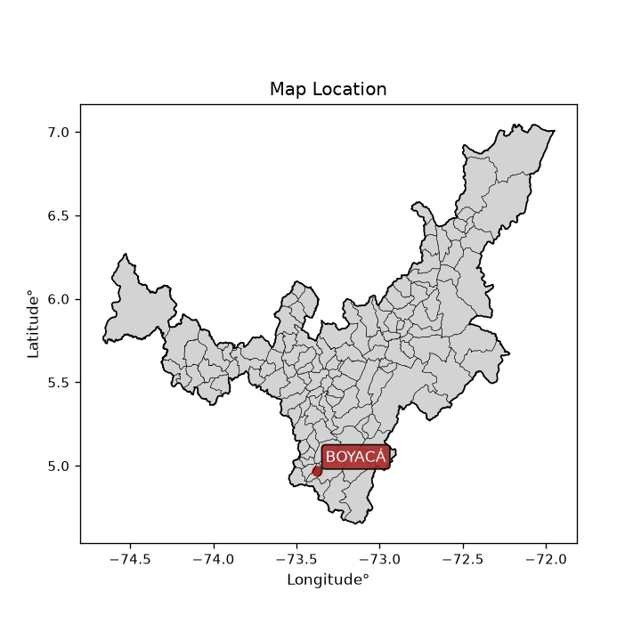</img>

| CountyID                                                                                          | CountyName            | CountyFiles                                                                                                                                                                                                                                                                                                                                                                                                                                                                                                                                                                                                                                                                                                                                                                                                                                                                                                                                                                                                                                                                                                                                                                                                                                                                                                                                                                                                                                                                                                                                                                                                                                                                                                                                                                             |
|:--------------------------------------------------------------------------------------------------|:----------------------|:----------------------------------------------------------------------------------------------------------------------------------------------------------------------------------------------------------------------------------------------------------------------------------------------------------------------------------------------------------------------------------------------------------------------------------------------------------------------------------------------------------------------------------------------------------------------------------------------------------------------------------------------------------------------------------------------------------------------------------------------------------------------------------------------------------------------------------------------------------------------------------------------------------------------------------------------------------------------------------------------------------------------------------------------------------------------------------------------------------------------------------------------------------------------------------------------------------------------------------------------------------------------------------------------------------------------------------------------------------------------------------------------------------------------------------------------------------------------------------------------------------------------------------------------------------------------------------------------------------------------------------------------------------------------------------------------------------------------------------------------------------------------------------------|
| [15022](https://github.com/rcfdtools/R.HydroTools/blob/main/tool/Population/file/report/15022.md) | Almeida               | [15022_Rural_Lot_202606.zip](https://github.com/rcfdtools/R.GISMobile/blob/main/file/shp/15022_Rural_Lot_202606.zip) [15022_Rural_Nomenclature_202606.zip](https://github.com/rcfdtools/R.GISMobile/blob/main/file/shp/15022_Rural_Nomenclature_202606.zip) [15022_Rural_Sector_202606.zip](https://github.com/rcfdtools/R.GISMobile/blob/main/file/shp/15022_Rural_Sector_202606.zip) [15022_Rural_Vereda_202606.zip](https://github.com/rcfdtools/R.GISMobile/blob/main/file/shp/15022_Rural_Vereda_202606.zip) [15022_Urban_Block_202606.zip](https://github.com/rcfdtools/R.GISMobile/blob/main/file/shp/15022_Urban_Block_202606.zip) [15022_Urban_Building_202606.zip](https://github.com/rcfdtools/R.GISMobile/blob/main/file/shp/15022_Urban_Building_202606.zip) [15022_Urban_Lot_202606.zip](https://github.com/rcfdtools/R.GISMobile/blob/main/file/shp/15022_Urban_Lot_202606.zip) [15022_Urban_Nomenclature_202606.zip](https://github.com/rcfdtools/R.GISMobile/blob/main/file/shp/15022_Urban_Nomenclature_202606.zip) [15022_Urban_Nomenclature_Road_202606.zip](https://github.com/rcfdtools/R.GISMobile/blob/main/file/shp/15022_Urban_Nomenclature_Road_202606.zip) [15022_Urban_Perimeter_202606.zip](https://github.com/rcfdtools/R.GISMobile/blob/main/file/shp/15022_Urban_Perimeter_202606.zip) [15022_Urban_Sector_202606.zip](https://github.com/rcfdtools/R.GISMobile/blob/main/file/shp/15022_Urban_Sector_202606.zip)                                                                                                                                                                                                                                                                                          |
| [15047](https://github.com/rcfdtools/R.HydroTools/blob/main/tool/Population/file/report/15047.md) | Aquitania             | [15047_Rural_Building_202606.zip](https://github.com/rcfdtools/R.GISMobile/blob/main/file/shp/15047_Rural_Building_202606.zip) [15047_Rural_Lot_202606.zip](https://github.com/rcfdtools/R.GISMobile/blob/main/file/shp/15047_Rural_Lot_202606.zip) [15047_Rural_Nomenclature_202606.zip](https://github.com/rcfdtools/R.GISMobile/blob/main/file/shp/15047_Rural_Nomenclature_202606.zip) [15047_Rural_Sector_202606.zip](https://github.com/rcfdtools/R.GISMobile/blob/main/file/shp/15047_Rural_Sector_202606.zip) [15047_Rural_Vereda_202606.zip](https://github.com/rcfdtools/R.GISMobile/blob/main/file/shp/15047_Rural_Vereda_202606.zip) [15047_Urban_Block_202606.zip](https://github.com/rcfdtools/R.GISMobile/blob/main/file/shp/15047_Urban_Block_202606.zip) [15047_Urban_Building_202606.zip](https://github.com/rcfdtools/R.GISMobile/blob/main/file/shp/15047_Urban_Building_202606.zip) [15047_Urban_Lot_202606.zip](https://github.com/rcfdtools/R.GISMobile/blob/main/file/shp/15047_Urban_Lot_202606.zip) [15047_Urban_Nomenclature_202606.zip](https://github.com/rcfdtools/R.GISMobile/blob/main/file/shp/15047_Urban_Nomenclature_202606.zip) [15047_Urban_Nomenclature_Road_202606.zip](https://github.com/rcfdtools/R.GISMobile/blob/main/file/shp/15047_Urban_Nomenclature_Road_202606.zip) [15047_Urban_Perimeter_202606.zip](https://github.com/rcfdtools/R.GISMobile/blob/main/file/shp/15047_Urban_Perimeter_202606.zip) [15047_Urban_Sector_202606.zip](https://github.com/rcfdtools/R.GISMobile/blob/main/file/shp/15047_Urban_Sector_202606.zip)                                                                                                                                                       |
| [15051](https://github.com/rcfdtools/R.HydroTools/blob/main/tool/Population/file/report/15051.md) | Arcabuco              | [15051_Rural_Building_202606.zip](https://github.com/rcfdtools/R.GISMobile/blob/main/file/shp/15051_Rural_Building_202606.zip) [15051_Rural_Lot_202606.zip](https://github.com/rcfdtools/R.GISMobile/blob/main/file/shp/15051_Rural_Lot_202606.zip) [15051_Rural_Nomenclature_202606.zip](https://github.com/rcfdtools/R.GISMobile/blob/main/file/shp/15051_Rural_Nomenclature_202606.zip) [15051_Rural_Sector_202606.zip](https://github.com/rcfdtools/R.GISMobile/blob/main/file/shp/15051_Rural_Sector_202606.zip) [15051_Rural_Vereda_202606.zip](https://github.com/rcfdtools/R.GISMobile/blob/main/file/shp/15051_Rural_Vereda_202606.zip) [15051_Urban_Block_202606.zip](https://github.com/rcfdtools/R.GISMobile/blob/main/file/shp/15051_Urban_Block_202606.zip) [15051_Urban_Building_202606.zip](https://github.com/rcfdtools/R.GISMobile/blob/main/file/shp/15051_Urban_Building_202606.zip) [15051_Urban_Lot_202606.zip](https://github.com/rcfdtools/R.GISMobile/blob/main/file/shp/15051_Urban_Lot_202606.zip) [15051_Urban_Nomenclature_202606.zip](https://github.com/rcfdtools/R.GISMobile/blob/main/file/shp/15051_Urban_Nomenclature_202606.zip) [15051_Urban_Nomenclature_Road_202606.zip](https://github.com/rcfdtools/R.GISMobile/blob/main/file/shp/15051_Urban_Nomenclature_Road_202606.zip) [15051_Urban_Perimeter_202606.zip](https://github.com/rcfdtools/R.GISMobile/blob/main/file/shp/15051_Urban_Perimeter_202606.zip) [15051_Urban_Sector_202606.zip](https://github.com/rcfdtools/R.GISMobile/blob/main/file/shp/15051_Urban_Sector_202606.zip)                                                                                                                                                       |
| [15087](https://github.com/rcfdtools/R.HydroTools/blob/main/tool/Population/file/report/15087.md) | Belén                 | [15087_Rural_Building_202606.zip](https://github.com/rcfdtools/R.GISMobile/blob/main/file/shp/15087_Rural_Building_202606.zip) [15087_Rural_Lot_202606.zip](https://github.com/rcfdtools/R.GISMobile/blob/main/file/shp/15087_Rural_Lot_202606.zip) [15087_Rural_Nomenclature_202606.zip](https://github.com/rcfdtools/R.GISMobile/blob/main/file/shp/15087_Rural_Nomenclature_202606.zip) [15087_Rural_Sector_202606.zip](https://github.com/rcfdtools/R.GISMobile/blob/main/file/shp/15087_Rural_Sector_202606.zip) [15087_Rural_Vereda_202606.zip](https://github.com/rcfdtools/R.GISMobile/blob/main/file/shp/15087_Rural_Vereda_202606.zip) [15087_Urban_Block_202606.zip](https://github.com/rcfdtools/R.GISMobile/blob/main/file/shp/15087_Urban_Block_202606.zip) [15087_Urban_Building_202606.zip](https://github.com/rcfdtools/R.GISMobile/blob/main/file/shp/15087_Urban_Building_202606.zip) [15087_Urban_Lot_202606.zip](https://github.com/rcfdtools/R.GISMobile/blob/main/file/shp/15087_Urban_Lot_202606.zip) [15087_Urban_Nomenclature_202606.zip](https://github.com/rcfdtools/R.GISMobile/blob/main/file/shp/15087_Urban_Nomenclature_202606.zip) [15087_Urban_Nomenclature_Road_202606.zip](https://github.com/rcfdtools/R.GISMobile/blob/main/file/shp/15087_Urban_Nomenclature_Road_202606.zip) [15087_Urban_Perimeter_202606.zip](https://github.com/rcfdtools/R.GISMobile/blob/main/file/shp/15087_Urban_Perimeter_202606.zip) [15087_Urban_Sector_202606.zip](https://github.com/rcfdtools/R.GISMobile/blob/main/file/shp/15087_Urban_Sector_202606.zip)                                                                                                                                                       |
| [15090](https://github.com/rcfdtools/R.HydroTools/blob/main/tool/Population/file/report/15090.md) | Berbeo                | [15090_Rural_Lot_202606.zip](https://github.com/rcfdtools/R.GISMobile/blob/main/file/shp/15090_Rural_Lot_202606.zip) [15090_Rural_Nomenclature_202606.zip](https://github.com/rcfdtools/R.GISMobile/blob/main/file/shp/15090_Rural_Nomenclature_202606.zip) [15090_Rural_Sector_202606.zip](https://github.com/rcfdtools/R.GISMobile/blob/main/file/shp/15090_Rural_Sector_202606.zip) [15090_Rural_Vereda_202606.zip](https://github.com/rcfdtools/R.GISMobile/blob/main/file/shp/15090_Rural_Vereda_202606.zip) [15090_Urban_Block_202606.zip](https://github.com/rcfdtools/R.GISMobile/blob/main/file/shp/15090_Urban_Block_202606.zip) [15090_Urban_Building_202606.zip](https://github.com/rcfdtools/R.GISMobile/blob/main/file/shp/15090_Urban_Building_202606.zip) [15090_Urban_Lot_202606.zip](https://github.com/rcfdtools/R.GISMobile/blob/main/file/shp/15090_Urban_Lot_202606.zip) [15090_Urban_Neighborhood_202606.zip](https://github.com/rcfdtools/R.GISMobile/blob/main/file/shp/15090_Urban_Neighborhood_202606.zip) [15090_Urban_Nomenclature_Road_202606.zip](https://github.com/rcfdtools/R.GISMobile/blob/main/file/shp/15090_Urban_Nomenclature_Road_202606.zip) [15090_Urban_Perimeter_202606.zip](https://github.com/rcfdtools/R.GISMobile/blob/main/file/shp/15090_Urban_Perimeter_202606.zip) [15090_Urban_Sector_202606.zip](https://github.com/rcfdtools/R.GISMobile/blob/main/file/shp/15090_Urban_Sector_202606.zip)                                                                                                                                                                                                                                                                                          |
| [15092](https://github.com/rcfdtools/R.HydroTools/blob/main/tool/Population/file/report/15092.md) | Betéitiva             | [15092_Rural_Building_202606.zip](https://github.com/rcfdtools/R.GISMobile/blob/main/file/shp/15092_Rural_Building_202606.zip) [15092_Rural_Lot_202606.zip](https://github.com/rcfdtools/R.GISMobile/blob/main/file/shp/15092_Rural_Lot_202606.zip) [15092_Rural_Nomenclature_202606.zip](https://github.com/rcfdtools/R.GISMobile/blob/main/file/shp/15092_Rural_Nomenclature_202606.zip) [15092_Rural_Sector_202606.zip](https://github.com/rcfdtools/R.GISMobile/blob/main/file/shp/15092_Rural_Sector_202606.zip) [15092_Rural_Vereda_202606.zip](https://github.com/rcfdtools/R.GISMobile/blob/main/file/shp/15092_Rural_Vereda_202606.zip) [15092_Urban_Block_202606.zip](https://github.com/rcfdtools/R.GISMobile/blob/main/file/shp/15092_Urban_Block_202606.zip) [15092_Urban_Building_202606.zip](https://github.com/rcfdtools/R.GISMobile/blob/main/file/shp/15092_Urban_Building_202606.zip) [15092_Urban_Lot_202606.zip](https://github.com/rcfdtools/R.GISMobile/blob/main/file/shp/15092_Urban_Lot_202606.zip) [15092_Urban_Nomenclature_202606.zip](https://github.com/rcfdtools/R.GISMobile/blob/main/file/shp/15092_Urban_Nomenclature_202606.zip) [15092_Urban_Nomenclature_Road_202606.zip](https://github.com/rcfdtools/R.GISMobile/blob/main/file/shp/15092_Urban_Nomenclature_Road_202606.zip) [15092_Urban_Perimeter_202606.zip](https://github.com/rcfdtools/R.GISMobile/blob/main/file/shp/15092_Urban_Perimeter_202606.zip) [15092_Urban_Sector_202606.zip](https://github.com/rcfdtools/R.GISMobile/blob/main/file/shp/15092_Urban_Sector_202606.zip)                                                                                                                                                       |
| [15097](https://github.com/rcfdtools/R.HydroTools/blob/main/tool/Population/file/report/15097.md) | Boavita               | [15097_Rural_Lot_202606.zip](https://github.com/rcfdtools/R.GISMobile/blob/main/file/shp/15097_Rural_Lot_202606.zip) [15097_Rural_Nomenclature_202606.zip](https://github.com/rcfdtools/R.GISMobile/blob/main/file/shp/15097_Rural_Nomenclature_202606.zip) [15097_Rural_Sector_202606.zip](https://github.com/rcfdtools/R.GISMobile/blob/main/file/shp/15097_Rural_Sector_202606.zip) [15097_Rural_Vereda_202606.zip](https://github.com/rcfdtools/R.GISMobile/blob/main/file/shp/15097_Rural_Vereda_202606.zip) [15097_Urban_Block_202606.zip](https://github.com/rcfdtools/R.GISMobile/blob/main/file/shp/15097_Urban_Block_202606.zip) [15097_Urban_Building_202606.zip](https://github.com/rcfdtools/R.GISMobile/blob/main/file/shp/15097_Urban_Building_202606.zip) [15097_Urban_Lot_202606.zip](https://github.com/rcfdtools/R.GISMobile/blob/main/file/shp/15097_Urban_Lot_202606.zip) [15097_Urban_Neighborhood_202606.zip](https://github.com/rcfdtools/R.GISMobile/blob/main/file/shp/15097_Urban_Neighborhood_202606.zip) [15097_Urban_Nomenclature_202606.zip](https://github.com/rcfdtools/R.GISMobile/blob/main/file/shp/15097_Urban_Nomenclature_202606.zip) [15097_Urban_Nomenclature_Road_202606.zip](https://github.com/rcfdtools/R.GISMobile/blob/main/file/shp/15097_Urban_Nomenclature_Road_202606.zip) [15097_Urban_Perimeter_202606.zip](https://github.com/rcfdtools/R.GISMobile/blob/main/file/shp/15097_Urban_Perimeter_202606.zip) [15097_Urban_Sector_202606.zip](https://github.com/rcfdtools/R.GISMobile/blob/main/file/shp/15097_Urban_Sector_202606.zip)                                                                                                                                               |
| [15104](https://github.com/rcfdtools/R.HydroTools/blob/main/tool/Population/file/report/15104.md) | Boyacá                | [15104_Rural_Building_202606.zip](https://github.com/rcfdtools/R.GISMobile/blob/main/file/shp/15104_Rural_Building_202606.zip) [15104_Rural_Lot_202606.zip](https://github.com/rcfdtools/R.GISMobile/blob/main/file/shp/15104_Rural_Lot_202606.zip) [15104_Rural_Nomenclature_202606.zip](https://github.com/rcfdtools/R.GISMobile/blob/main/file/shp/15104_Rural_Nomenclature_202606.zip) [15104_Rural_Sector_202606.zip](https://github.com/rcfdtools/R.GISMobile/blob/main/file/shp/15104_Rural_Sector_202606.zip) [15104_Rural_Vereda_202606.zip](https://github.com/rcfdtools/R.GISMobile/blob/main/file/shp/15104_Rural_Vereda_202606.zip) [15104_Urban_Block_202606.zip](https://github.com/rcfdtools/R.GISMobile/blob/main/file/shp/15104_Urban_Block_202606.zip) [15104_Urban_Building_202606.zip](https://github.com/rcfdtools/R.GISMobile/blob/main/file/shp/15104_Urban_Building_202606.zip) [15104_Urban_Lot_202606.zip](https://github.com/rcfdtools/R.GISMobile/blob/main/file/shp/15104_Urban_Lot_202606.zip) [15104_Urban_Nomenclature_202606.zip](https://github.com/rcfdtools/R.GISMobile/blob/main/file/shp/15104_Urban_Nomenclature_202606.zip) [15104_Urban_Nomenclature_Road_202606.zip](https://github.com/rcfdtools/R.GISMobile/blob/main/file/shp/15104_Urban_Nomenclature_Road_202606.zip) [15104_Urban_Perimeter_202606.zip](https://github.com/rcfdtools/R.GISMobile/blob/main/file/shp/15104_Urban_Perimeter_202606.zip) [15104_Urban_Sector_202606.zip](https://github.com/rcfdtools/R.GISMobile/blob/main/file/shp/15104_Urban_Sector_202606.zip)                                                                                                                                                       |
| [15106](https://github.com/rcfdtools/R.HydroTools/blob/main/tool/Population/file/report/15106.md) | Briceño               | [15106_Rural_Lot_202606.zip](https://github.com/rcfdtools/R.GISMobile/blob/main/file/shp/15106_Rural_Lot_202606.zip) [15106_Rural_Nomenclature_202606.zip](https://github.com/rcfdtools/R.GISMobile/blob/main/file/shp/15106_Rural_Nomenclature_202606.zip) [15106_Rural_Sector_202606.zip](https://github.com/rcfdtools/R.GISMobile/blob/main/file/shp/15106_Rural_Sector_202606.zip) [15106_Rural_Vereda_202606.zip](https://github.com/rcfdtools/R.GISMobile/blob/main/file/shp/15106_Rural_Vereda_202606.zip) [15106_Urban_Block_202606.zip](https://github.com/rcfdtools/R.GISMobile/blob/main/file/shp/15106_Urban_Block_202606.zip) [15106_Urban_Building_202606.zip](https://github.com/rcfdtools/R.GISMobile/blob/main/file/shp/15106_Urban_Building_202606.zip) [15106_Urban_Lot_202606.zip](https://github.com/rcfdtools/R.GISMobile/blob/main/file/shp/15106_Urban_Lot_202606.zip) [15106_Urban_Nomenclature_202606.zip](https://github.com/rcfdtools/R.GISMobile/blob/main/file/shp/15106_Urban_Nomenclature_202606.zip) [15106_Urban_Nomenclature_Road_202606.zip](https://github.com/rcfdtools/R.GISMobile/blob/main/file/shp/15106_Urban_Nomenclature_Road_202606.zip) [15106_Urban_Perimeter_202606.zip](https://github.com/rcfdtools/R.GISMobile/blob/main/file/shp/15106_Urban_Perimeter_202606.zip) [15106_Urban_Sector_202606.zip](https://github.com/rcfdtools/R.GISMobile/blob/main/file/shp/15106_Urban_Sector_202606.zip)                                                                                                                                                                                                                                                                                          |
| [15109](https://github.com/rcfdtools/R.HydroTools/blob/main/tool/Population/file/report/15109.md) | Buenavista            | [15109_Rural_Lot_202606.zip](https://github.com/rcfdtools/R.GISMobile/blob/main/file/shp/15109_Rural_Lot_202606.zip) [15109_Rural_Nomenclature_202606.zip](https://github.com/rcfdtools/R.GISMobile/blob/main/file/shp/15109_Rural_Nomenclature_202606.zip) [15109_Rural_Sector_202606.zip](https://github.com/rcfdtools/R.GISMobile/blob/main/file/shp/15109_Rural_Sector_202606.zip) [15109_Rural_Vereda_202606.zip](https://github.com/rcfdtools/R.GISMobile/blob/main/file/shp/15109_Rural_Vereda_202606.zip) [15109_Urban_Block_202606.zip](https://github.com/rcfdtools/R.GISMobile/blob/main/file/shp/15109_Urban_Block_202606.zip) [15109_Urban_Building_202606.zip](https://github.com/rcfdtools/R.GISMobile/blob/main/file/shp/15109_Urban_Building_202606.zip) [15109_Urban_Lot_202606.zip](https://github.com/rcfdtools/R.GISMobile/blob/main/file/shp/15109_Urban_Lot_202606.zip) [15109_Urban_Nomenclature_202606.zip](https://github.com/rcfdtools/R.GISMobile/blob/main/file/shp/15109_Urban_Nomenclature_202606.zip) [15109_Urban_Nomenclature_Road_202606.zip](https://github.com/rcfdtools/R.GISMobile/blob/main/file/shp/15109_Urban_Nomenclature_Road_202606.zip) [15109_Urban_Perimeter_202606.zip](https://github.com/rcfdtools/R.GISMobile/blob/main/file/shp/15109_Urban_Perimeter_202606.zip) [15109_Urban_Sector_202606.zip](https://github.com/rcfdtools/R.GISMobile/blob/main/file/shp/15109_Urban_Sector_202606.zip)                                                                                                                                                                                                                                                                                          |
| [15114](https://github.com/rcfdtools/R.HydroTools/blob/main/tool/Population/file/report/15114.md) | Busbanzá              | [15114_Rural_Building_202606.zip](https://github.com/rcfdtools/R.GISMobile/blob/main/file/shp/15114_Rural_Building_202606.zip) [15114_Rural_Lot_202606.zip](https://github.com/rcfdtools/R.GISMobile/blob/main/file/shp/15114_Rural_Lot_202606.zip) [15114_Rural_Nomenclature_202606.zip](https://github.com/rcfdtools/R.GISMobile/blob/main/file/shp/15114_Rural_Nomenclature_202606.zip) [15114_Rural_Sector_202606.zip](https://github.com/rcfdtools/R.GISMobile/blob/main/file/shp/15114_Rural_Sector_202606.zip) [15114_Rural_Vereda_202606.zip](https://github.com/rcfdtools/R.GISMobile/blob/main/file/shp/15114_Rural_Vereda_202606.zip) [15114_Urban_Block_202606.zip](https://github.com/rcfdtools/R.GISMobile/blob/main/file/shp/15114_Urban_Block_202606.zip) [15114_Urban_Building_202606.zip](https://github.com/rcfdtools/R.GISMobile/blob/main/file/shp/15114_Urban_Building_202606.zip) [15114_Urban_Lot_202606.zip](https://github.com/rcfdtools/R.GISMobile/blob/main/file/shp/15114_Urban_Lot_202606.zip) [15114_Urban_Nomenclature_202606.zip](https://github.com/rcfdtools/R.GISMobile/blob/main/file/shp/15114_Urban_Nomenclature_202606.zip) [15114_Urban_Nomenclature_Road_202606.zip](https://github.com/rcfdtools/R.GISMobile/blob/main/file/shp/15114_Urban_Nomenclature_Road_202606.zip) [15114_Urban_Perimeter_202606.zip](https://github.com/rcfdtools/R.GISMobile/blob/main/file/shp/15114_Urban_Perimeter_202606.zip) [15114_Urban_Sector_202606.zip](https://github.com/rcfdtools/R.GISMobile/blob/main/file/shp/15114_Urban_Sector_202606.zip)                                                                                                                                                       |
| [15131](https://github.com/rcfdtools/R.HydroTools/blob/main/tool/Population/file/report/15131.md) | Caldas                | [15131_Rural_Lot_202606.zip](https://github.com/rcfdtools/R.GISMobile/blob/main/file/shp/15131_Rural_Lot_202606.zip) [15131_Rural_Nomenclature_202606.zip](https://github.com/rcfdtools/R.GISMobile/blob/main/file/shp/15131_Rural_Nomenclature_202606.zip) [15131_Rural_Sector_202606.zip](https://github.com/rcfdtools/R.GISMobile/blob/main/file/shp/15131_Rural_Sector_202606.zip) [15131_Rural_Vereda_202606.zip](https://github.com/rcfdtools/R.GISMobile/blob/main/file/shp/15131_Rural_Vereda_202606.zip) [15131_Urban_Block_202606.zip](https://github.com/rcfdtools/R.GISMobile/blob/main/file/shp/15131_Urban_Block_202606.zip) [15131_Urban_Building_202606.zip](https://github.com/rcfdtools/R.GISMobile/blob/main/file/shp/15131_Urban_Building_202606.zip) [15131_Urban_Lot_202606.zip](https://github.com/rcfdtools/R.GISMobile/blob/main/file/shp/15131_Urban_Lot_202606.zip) [15131_Urban_Nomenclature_202606.zip](https://github.com/rcfdtools/R.GISMobile/blob/main/file/shp/15131_Urban_Nomenclature_202606.zip) [15131_Urban_Nomenclature_Road_202606.zip](https://github.com/rcfdtools/R.GISMobile/blob/main/file/shp/15131_Urban_Nomenclature_Road_202606.zip) [15131_Urban_Perimeter_202606.zip](https://github.com/rcfdtools/R.GISMobile/blob/main/file/shp/15131_Urban_Perimeter_202606.zip) [15131_Urban_Sector_202606.zip](https://github.com/rcfdtools/R.GISMobile/blob/main/file/shp/15131_Urban_Sector_202606.zip)                                                                                                                                                                                                                                                                                          |
| [15135](https://github.com/rcfdtools/R.HydroTools/blob/main/tool/Population/file/report/15135.md) | Campohermoso          | [15135_Rural_Lot_202606.zip](https://github.com/rcfdtools/R.GISMobile/blob/main/file/shp/15135_Rural_Lot_202606.zip) [15135_Rural_Nomenclature_202606.zip](https://github.com/rcfdtools/R.GISMobile/blob/main/file/shp/15135_Rural_Nomenclature_202606.zip) [15135_Rural_Sector_202606.zip](https://github.com/rcfdtools/R.GISMobile/blob/main/file/shp/15135_Rural_Sector_202606.zip) [15135_Rural_Vereda_202606.zip](https://github.com/rcfdtools/R.GISMobile/blob/main/file/shp/15135_Rural_Vereda_202606.zip) [15135_Urban_Block_202606.zip](https://github.com/rcfdtools/R.GISMobile/blob/main/file/shp/15135_Urban_Block_202606.zip) [15135_Urban_Building_202606.zip](https://github.com/rcfdtools/R.GISMobile/blob/main/file/shp/15135_Urban_Building_202606.zip) [15135_Urban_Lot_202606.zip](https://github.com/rcfdtools/R.GISMobile/blob/main/file/shp/15135_Urban_Lot_202606.zip) [15135_Urban_Nomenclature_202606.zip](https://github.com/rcfdtools/R.GISMobile/blob/main/file/shp/15135_Urban_Nomenclature_202606.zip) [15135_Urban_Nomenclature_Road_202606.zip](https://github.com/rcfdtools/R.GISMobile/blob/main/file/shp/15135_Urban_Nomenclature_Road_202606.zip) [15135_Urban_Perimeter_202606.zip](https://github.com/rcfdtools/R.GISMobile/blob/main/file/shp/15135_Urban_Perimeter_202606.zip) [15135_Urban_Sector_202606.zip](https://github.com/rcfdtools/R.GISMobile/blob/main/file/shp/15135_Urban_Sector_202606.zip)                                                                                                                                                                                                                                                                                          |
| [15162](https://github.com/rcfdtools/R.HydroTools/blob/main/tool/Population/file/report/15162.md) | Cerinza               | [15162_Rural_Building_202606.zip](https://github.com/rcfdtools/R.GISMobile/blob/main/file/shp/15162_Rural_Building_202606.zip) [15162_Rural_Lot_202606.zip](https://github.com/rcfdtools/R.GISMobile/blob/main/file/shp/15162_Rural_Lot_202606.zip) [15162_Rural_Nomenclature_202606.zip](https://github.com/rcfdtools/R.GISMobile/blob/main/file/shp/15162_Rural_Nomenclature_202606.zip) [15162_Rural_Nomenclature_Road_202606.zip](https://github.com/rcfdtools/R.GISMobile/blob/main/file/shp/15162_Rural_Nomenclature_Road_202606.zip) [15162_Rural_Sector_202606.zip](https://github.com/rcfdtools/R.GISMobile/blob/main/file/shp/15162_Rural_Sector_202606.zip) [15162_Rural_Vereda_202606.zip](https://github.com/rcfdtools/R.GISMobile/blob/main/file/shp/15162_Rural_Vereda_202606.zip) [15162_Urban_Block_202606.zip](https://github.com/rcfdtools/R.GISMobile/blob/main/file/shp/15162_Urban_Block_202606.zip) [15162_Urban_Building_202606.zip](https://github.com/rcfdtools/R.GISMobile/blob/main/file/shp/15162_Urban_Building_202606.zip) [15162_Urban_Lot_202606.zip](https://github.com/rcfdtools/R.GISMobile/blob/main/file/shp/15162_Urban_Lot_202606.zip) [15162_Urban_Nomenclature_202606.zip](https://github.com/rcfdtools/R.GISMobile/blob/main/file/shp/15162_Urban_Nomenclature_202606.zip) [15162_Urban_Nomenclature_Road_202606.zip](https://github.com/rcfdtools/R.GISMobile/blob/main/file/shp/15162_Urban_Nomenclature_Road_202606.zip) [15162_Urban_Perimeter_202606.zip](https://github.com/rcfdtools/R.GISMobile/blob/main/file/shp/15162_Urban_Perimeter_202606.zip) [15162_Urban_Sector_202606.zip](https://github.com/rcfdtools/R.GISMobile/blob/main/file/shp/15162_Urban_Sector_202606.zip)  |
| [15172](https://github.com/rcfdtools/R.HydroTools/blob/main/tool/Population/file/report/15172.md) | Chinavita             | [15172_Rural_Building_202606.zip](https://github.com/rcfdtools/R.GISMobile/blob/main/file/shp/15172_Rural_Building_202606.zip) [15172_Rural_Lot_202606.zip](https://github.com/rcfdtools/R.GISMobile/blob/main/file/shp/15172_Rural_Lot_202606.zip) [15172_Rural_Nomenclature_202606.zip](https://github.com/rcfdtools/R.GISMobile/blob/main/file/shp/15172_Rural_Nomenclature_202606.zip) [15172_Rural_Sector_202606.zip](https://github.com/rcfdtools/R.GISMobile/blob/main/file/shp/15172_Rural_Sector_202606.zip) [15172_Rural_Vereda_202606.zip](https://github.com/rcfdtools/R.GISMobile/blob/main/file/shp/15172_Rural_Vereda_202606.zip) [15172_Urban_Block_202606.zip](https://github.com/rcfdtools/R.GISMobile/blob/main/file/shp/15172_Urban_Block_202606.zip) [15172_Urban_Building_202606.zip](https://github.com/rcfdtools/R.GISMobile/blob/main/file/shp/15172_Urban_Building_202606.zip) [15172_Urban_Lot_202606.zip](https://github.com/rcfdtools/R.GISMobile/blob/main/file/shp/15172_Urban_Lot_202606.zip) [15172_Urban_Nomenclature_202606.zip](https://github.com/rcfdtools/R.GISMobile/blob/main/file/shp/15172_Urban_Nomenclature_202606.zip) [15172_Urban_Nomenclature_Road_202606.zip](https://github.com/rcfdtools/R.GISMobile/blob/main/file/shp/15172_Urban_Nomenclature_Road_202606.zip) [15172_Urban_Perimeter_202606.zip](https://github.com/rcfdtools/R.GISMobile/blob/main/file/shp/15172_Urban_Perimeter_202606.zip) [15172_Urban_Sector_202606.zip](https://github.com/rcfdtools/R.GISMobile/blob/main/file/shp/15172_Urban_Sector_202606.zip)                                                                                                                                                       |
| [15176](https://github.com/rcfdtools/R.HydroTools/blob/main/tool/Population/file/report/15176.md) | Chiquinquirá          | [15176_Rural_Lot_202606.zip](https://github.com/rcfdtools/R.GISMobile/blob/main/file/shp/15176_Rural_Lot_202606.zip) [15176_Urban_Lot_202606.zip](https://github.com/rcfdtools/R.GISMobile/blob/main/file/shp/15176_Urban_Lot_202606.zip)                                                                                                                                                                                                                                                                                                                                                                                                                                                                                                                                                                                                                                                                                                                                                                                                                                                                                                                                                                                                                                                                                                                                                                                                                                                                                                                                                                                                                                                                                                                                       |
| [15180](https://github.com/rcfdtools/R.HydroTools/blob/main/tool/Population/file/report/15180.md) | Chiscas               | [15180_Rural_Lot_202606.zip](https://github.com/rcfdtools/R.GISMobile/blob/main/file/shp/15180_Rural_Lot_202606.zip) [15180_Rural_Sector_202606.zip](https://github.com/rcfdtools/R.GISMobile/blob/main/file/shp/15180_Rural_Sector_202606.zip) [15180_Rural_Vereda_202606.zip](https://github.com/rcfdtools/R.GISMobile/blob/main/file/shp/15180_Rural_Vereda_202606.zip) [15180_Urban_Block_202606.zip](https://github.com/rcfdtools/R.GISMobile/blob/main/file/shp/15180_Urban_Block_202606.zip) [15180_Urban_Building_202606.zip](https://github.com/rcfdtools/R.GISMobile/blob/main/file/shp/15180_Urban_Building_202606.zip) [15180_Urban_Lot_202606.zip](https://github.com/rcfdtools/R.GISMobile/blob/main/file/shp/15180_Urban_Lot_202606.zip) [15180_Urban_Neighborhood_202606.zip](https://github.com/rcfdtools/R.GISMobile/blob/main/file/shp/15180_Urban_Neighborhood_202606.zip) [15180_Urban_Nomenclature_202606.zip](https://github.com/rcfdtools/R.GISMobile/blob/main/file/shp/15180_Urban_Nomenclature_202606.zip) [15180_Urban_Nomenclature_Road_202606.zip](https://github.com/rcfdtools/R.GISMobile/blob/main/file/shp/15180_Urban_Nomenclature_Road_202606.zip) [15180_Urban_Perimeter_202606.zip](https://github.com/rcfdtools/R.GISMobile/blob/main/file/shp/15180_Urban_Perimeter_202606.zip) [15180_Urban_Sector_202606.zip](https://github.com/rcfdtools/R.GISMobile/blob/main/file/shp/15180_Urban_Sector_202606.zip)                                                                                                                                                                                                                                                                                          |
| [15183](https://github.com/rcfdtools/R.HydroTools/blob/main/tool/Population/file/report/15183.md) | Chita                 | [15183_Rural_Lot_202606.zip](https://github.com/rcfdtools/R.GISMobile/blob/main/file/shp/15183_Rural_Lot_202606.zip) [15183_Rural_Nomenclature_202606.zip](https://github.com/rcfdtools/R.GISMobile/blob/main/file/shp/15183_Rural_Nomenclature_202606.zip) [15183_Rural_Sector_202606.zip](https://github.com/rcfdtools/R.GISMobile/blob/main/file/shp/15183_Rural_Sector_202606.zip) [15183_Rural_Vereda_202606.zip](https://github.com/rcfdtools/R.GISMobile/blob/main/file/shp/15183_Rural_Vereda_202606.zip) [15183_Urban_Block_202606.zip](https://github.com/rcfdtools/R.GISMobile/blob/main/file/shp/15183_Urban_Block_202606.zip) [15183_Urban_Building_202606.zip](https://github.com/rcfdtools/R.GISMobile/blob/main/file/shp/15183_Urban_Building_202606.zip) [15183_Urban_Lot_202606.zip](https://github.com/rcfdtools/R.GISMobile/blob/main/file/shp/15183_Urban_Lot_202606.zip) [15183_Urban_Neighborhood_202606.zip](https://github.com/rcfdtools/R.GISMobile/blob/main/file/shp/15183_Urban_Neighborhood_202606.zip) [15183_Urban_Nomenclature_202606.zip](https://github.com/rcfdtools/R.GISMobile/blob/main/file/shp/15183_Urban_Nomenclature_202606.zip) [15183_Urban_Nomenclature_Road_202606.zip](https://github.com/rcfdtools/R.GISMobile/blob/main/file/shp/15183_Urban_Nomenclature_Road_202606.zip) [15183_Urban_Perimeter_202606.zip](https://github.com/rcfdtools/R.GISMobile/blob/main/file/shp/15183_Urban_Perimeter_202606.zip) [15183_Urban_Sector_202606.zip](https://github.com/rcfdtools/R.GISMobile/blob/main/file/shp/15183_Urban_Sector_202606.zip)                                                                                                                                               |
| [15185](https://github.com/rcfdtools/R.HydroTools/blob/main/tool/Population/file/report/15185.md) | Chitaraque            | [15185_Rural_Lot_202606.zip](https://github.com/rcfdtools/R.GISMobile/blob/main/file/shp/15185_Rural_Lot_202606.zip) [15185_Rural_Nomenclature_202606.zip](https://github.com/rcfdtools/R.GISMobile/blob/main/file/shp/15185_Rural_Nomenclature_202606.zip) [15185_Rural_Sector_202606.zip](https://github.com/rcfdtools/R.GISMobile/blob/main/file/shp/15185_Rural_Sector_202606.zip) [15185_Rural_Vereda_202606.zip](https://github.com/rcfdtools/R.GISMobile/blob/main/file/shp/15185_Rural_Vereda_202606.zip) [15185_Urban_Block_202606.zip](https://github.com/rcfdtools/R.GISMobile/blob/main/file/shp/15185_Urban_Block_202606.zip) [15185_Urban_Building_202606.zip](https://github.com/rcfdtools/R.GISMobile/blob/main/file/shp/15185_Urban_Building_202606.zip) [15185_Urban_Lot_202606.zip](https://github.com/rcfdtools/R.GISMobile/blob/main/file/shp/15185_Urban_Lot_202606.zip) [15185_Urban_Nomenclature_202606.zip](https://github.com/rcfdtools/R.GISMobile/blob/main/file/shp/15185_Urban_Nomenclature_202606.zip) [15185_Urban_Nomenclature_Road_202606.zip](https://github.com/rcfdtools/R.GISMobile/blob/main/file/shp/15185_Urban_Nomenclature_Road_202606.zip) [15185_Urban_Perimeter_202606.zip](https://github.com/rcfdtools/R.GISMobile/blob/main/file/shp/15185_Urban_Perimeter_202606.zip) [15185_Urban_Sector_202606.zip](https://github.com/rcfdtools/R.GISMobile/blob/main/file/shp/15185_Urban_Sector_202606.zip)                                                                                                                                                                                                                                                                                          |
| [15187](https://github.com/rcfdtools/R.HydroTools/blob/main/tool/Population/file/report/15187.md) | Chivatá               | [15187_Rural_Building_202606.zip](https://github.com/rcfdtools/R.GISMobile/blob/main/file/shp/15187_Rural_Building_202606.zip) [15187_Rural_Lot_202606.zip](https://github.com/rcfdtools/R.GISMobile/blob/main/file/shp/15187_Rural_Lot_202606.zip) [15187_Rural_Nomenclature_202606.zip](https://github.com/rcfdtools/R.GISMobile/blob/main/file/shp/15187_Rural_Nomenclature_202606.zip) [15187_Rural_Sector_202606.zip](https://github.com/rcfdtools/R.GISMobile/blob/main/file/shp/15187_Rural_Sector_202606.zip) [15187_Rural_Vereda_202606.zip](https://github.com/rcfdtools/R.GISMobile/blob/main/file/shp/15187_Rural_Vereda_202606.zip) [15187_Urban_Block_202606.zip](https://github.com/rcfdtools/R.GISMobile/blob/main/file/shp/15187_Urban_Block_202606.zip) [15187_Urban_Building_202606.zip](https://github.com/rcfdtools/R.GISMobile/blob/main/file/shp/15187_Urban_Building_202606.zip) [15187_Urban_Lot_202606.zip](https://github.com/rcfdtools/R.GISMobile/blob/main/file/shp/15187_Urban_Lot_202606.zip) [15187_Urban_Nomenclature_202606.zip](https://github.com/rcfdtools/R.GISMobile/blob/main/file/shp/15187_Urban_Nomenclature_202606.zip) [15187_Urban_Nomenclature_Road_202606.zip](https://github.com/rcfdtools/R.GISMobile/blob/main/file/shp/15187_Urban_Nomenclature_Road_202606.zip) [15187_Urban_Perimeter_202606.zip](https://github.com/rcfdtools/R.GISMobile/blob/main/file/shp/15187_Urban_Perimeter_202606.zip) [15187_Urban_Sector_202606.zip](https://github.com/rcfdtools/R.GISMobile/blob/main/file/shp/15187_Urban_Sector_202606.zip)                                                                                                                                                       |
| [15236](https://github.com/rcfdtools/R.HydroTools/blob/main/tool/Population/file/report/15236.md) | Chivor                | [15236_Rural_Building_202606.zip](https://github.com/rcfdtools/R.GISMobile/blob/main/file/shp/15236_Rural_Building_202606.zip) [15236_Rural_Lot_202606.zip](https://github.com/rcfdtools/R.GISMobile/blob/main/file/shp/15236_Rural_Lot_202606.zip) [15236_Rural_Sector_202606.zip](https://github.com/rcfdtools/R.GISMobile/blob/main/file/shp/15236_Rural_Sector_202606.zip) [15236_Rural_Vereda_202606.zip](https://github.com/rcfdtools/R.GISMobile/blob/main/file/shp/15236_Rural_Vereda_202606.zip) [15236_Urban_Block_202606.zip](https://github.com/rcfdtools/R.GISMobile/blob/main/file/shp/15236_Urban_Block_202606.zip) [15236_Urban_Building_202606.zip](https://github.com/rcfdtools/R.GISMobile/blob/main/file/shp/15236_Urban_Building_202606.zip) [15236_Urban_Lot_202606.zip](https://github.com/rcfdtools/R.GISMobile/blob/main/file/shp/15236_Urban_Lot_202606.zip) [15236_Urban_Nomenclature_202606.zip](https://github.com/rcfdtools/R.GISMobile/blob/main/file/shp/15236_Urban_Nomenclature_202606.zip) [15236_Urban_Nomenclature_Road_202606.zip](https://github.com/rcfdtools/R.GISMobile/blob/main/file/shp/15236_Urban_Nomenclature_Road_202606.zip) [15236_Urban_Perimeter_202606.zip](https://github.com/rcfdtools/R.GISMobile/blob/main/file/shp/15236_Urban_Perimeter_202606.zip) [15236_Urban_Sector_202606.zip](https://github.com/rcfdtools/R.GISMobile/blob/main/file/shp/15236_Urban_Sector_202606.zip)                                                                                                                                                                                                                                                                                                  |
| [15232](https://github.com/rcfdtools/R.HydroTools/blob/main/tool/Population/file/report/15232.md) | Chíquiza              | [15232_Rural_Building_202606.zip](https://github.com/rcfdtools/R.GISMobile/blob/main/file/shp/15232_Rural_Building_202606.zip) [15232_Rural_Lot_202606.zip](https://github.com/rcfdtools/R.GISMobile/blob/main/file/shp/15232_Rural_Lot_202606.zip) [15232_Rural_Nomenclature_202606.zip](https://github.com/rcfdtools/R.GISMobile/blob/main/file/shp/15232_Rural_Nomenclature_202606.zip) [15232_Rural_Sector_202606.zip](https://github.com/rcfdtools/R.GISMobile/blob/main/file/shp/15232_Rural_Sector_202606.zip) [15232_Rural_Vereda_202606.zip](https://github.com/rcfdtools/R.GISMobile/blob/main/file/shp/15232_Rural_Vereda_202606.zip) [15232_Urban_Block_202606.zip](https://github.com/rcfdtools/R.GISMobile/blob/main/file/shp/15232_Urban_Block_202606.zip) [15232_Urban_Building_202606.zip](https://github.com/rcfdtools/R.GISMobile/blob/main/file/shp/15232_Urban_Building_202606.zip) [15232_Urban_Lot_202606.zip](https://github.com/rcfdtools/R.GISMobile/blob/main/file/shp/15232_Urban_Lot_202606.zip) [15232_Urban_Nomenclature_202606.zip](https://github.com/rcfdtools/R.GISMobile/blob/main/file/shp/15232_Urban_Nomenclature_202606.zip) [15232_Urban_Nomenclature_Road_202606.zip](https://github.com/rcfdtools/R.GISMobile/blob/main/file/shp/15232_Urban_Nomenclature_Road_202606.zip) [15232_Urban_Perimeter_202606.zip](https://github.com/rcfdtools/R.GISMobile/blob/main/file/shp/15232_Urban_Perimeter_202606.zip) [15232_Urban_Sector_202606.zip](https://github.com/rcfdtools/R.GISMobile/blob/main/file/shp/15232_Urban_Sector_202606.zip)                                                                                                                                                       |
| [15189](https://github.com/rcfdtools/R.HydroTools/blob/main/tool/Population/file/report/15189.md) | Ciénega               | [15189_Rural_Building_202606.zip](https://github.com/rcfdtools/R.GISMobile/blob/main/file/shp/15189_Rural_Building_202606.zip) [15189_Rural_Lot_202606.zip](https://github.com/rcfdtools/R.GISMobile/blob/main/file/shp/15189_Rural_Lot_202606.zip) [15189_Rural_Nomenclature_202606.zip](https://github.com/rcfdtools/R.GISMobile/blob/main/file/shp/15189_Rural_Nomenclature_202606.zip) [15189_Rural_Sector_202606.zip](https://github.com/rcfdtools/R.GISMobile/blob/main/file/shp/15189_Rural_Sector_202606.zip) [15189_Rural_Vereda_202606.zip](https://github.com/rcfdtools/R.GISMobile/blob/main/file/shp/15189_Rural_Vereda_202606.zip) [15189_Urban_Block_202606.zip](https://github.com/rcfdtools/R.GISMobile/blob/main/file/shp/15189_Urban_Block_202606.zip) [15189_Urban_Building_202606.zip](https://github.com/rcfdtools/R.GISMobile/blob/main/file/shp/15189_Urban_Building_202606.zip) [15189_Urban_Lot_202606.zip](https://github.com/rcfdtools/R.GISMobile/blob/main/file/shp/15189_Urban_Lot_202606.zip) [15189_Urban_Nomenclature_202606.zip](https://github.com/rcfdtools/R.GISMobile/blob/main/file/shp/15189_Urban_Nomenclature_202606.zip) [15189_Urban_Perimeter_202606.zip](https://github.com/rcfdtools/R.GISMobile/blob/main/file/shp/15189_Urban_Perimeter_202606.zip) [15189_Urban_Sector_202606.zip](https://github.com/rcfdtools/R.GISMobile/blob/main/file/shp/15189_Urban_Sector_202606.zip)                                                                                                                                                                                                                                                                                                            |
| [15212](https://github.com/rcfdtools/R.HydroTools/blob/main/tool/Population/file/report/15212.md) | Coper                 | [15212_Rural_Lot_202606.zip](https://github.com/rcfdtools/R.GISMobile/blob/main/file/shp/15212_Rural_Lot_202606.zip) [15212_Rural_Nomenclature_202606.zip](https://github.com/rcfdtools/R.GISMobile/blob/main/file/shp/15212_Rural_Nomenclature_202606.zip) [15212_Rural_Sector_202606.zip](https://github.com/rcfdtools/R.GISMobile/blob/main/file/shp/15212_Rural_Sector_202606.zip) [15212_Rural_Vereda_202606.zip](https://github.com/rcfdtools/R.GISMobile/blob/main/file/shp/15212_Rural_Vereda_202606.zip) [15212_Urban_Block_202606.zip](https://github.com/rcfdtools/R.GISMobile/blob/main/file/shp/15212_Urban_Block_202606.zip) [15212_Urban_Building_202606.zip](https://github.com/rcfdtools/R.GISMobile/blob/main/file/shp/15212_Urban_Building_202606.zip) [15212_Urban_Lot_202606.zip](https://github.com/rcfdtools/R.GISMobile/blob/main/file/shp/15212_Urban_Lot_202606.zip) [15212_Urban_Nomenclature_202606.zip](https://github.com/rcfdtools/R.GISMobile/blob/main/file/shp/15212_Urban_Nomenclature_202606.zip) [15212_Urban_Nomenclature_Road_202606.zip](https://github.com/rcfdtools/R.GISMobile/blob/main/file/shp/15212_Urban_Nomenclature_Road_202606.zip) [15212_Urban_Perimeter_202606.zip](https://github.com/rcfdtools/R.GISMobile/blob/main/file/shp/15212_Urban_Perimeter_202606.zip) [15212_Urban_Sector_202606.zip](https://github.com/rcfdtools/R.GISMobile/blob/main/file/shp/15212_Urban_Sector_202606.zip)                                                                                                                                                                                                                                                                                          |
| [15215](https://github.com/rcfdtools/R.HydroTools/blob/main/tool/Population/file/report/15215.md) | Corrales              | [15215_Rural_Building_202606.zip](https://github.com/rcfdtools/R.GISMobile/blob/main/file/shp/15215_Rural_Building_202606.zip) [15215_Rural_Lot_202606.zip](https://github.com/rcfdtools/R.GISMobile/blob/main/file/shp/15215_Rural_Lot_202606.zip) [15215_Rural_Nomenclature_202606.zip](https://github.com/rcfdtools/R.GISMobile/blob/main/file/shp/15215_Rural_Nomenclature_202606.zip) [15215_Rural_Sector_202606.zip](https://github.com/rcfdtools/R.GISMobile/blob/main/file/shp/15215_Rural_Sector_202606.zip) [15215_Rural_Vereda_202606.zip](https://github.com/rcfdtools/R.GISMobile/blob/main/file/shp/15215_Rural_Vereda_202606.zip) [15215_Urban_Block_202606.zip](https://github.com/rcfdtools/R.GISMobile/blob/main/file/shp/15215_Urban_Block_202606.zip) [15215_Urban_Building_202606.zip](https://github.com/rcfdtools/R.GISMobile/blob/main/file/shp/15215_Urban_Building_202606.zip) [15215_Urban_Lot_202606.zip](https://github.com/rcfdtools/R.GISMobile/blob/main/file/shp/15215_Urban_Lot_202606.zip) [15215_Urban_Nomenclature_202606.zip](https://github.com/rcfdtools/R.GISMobile/blob/main/file/shp/15215_Urban_Nomenclature_202606.zip) [15215_Urban_Nomenclature_Road_202606.zip](https://github.com/rcfdtools/R.GISMobile/blob/main/file/shp/15215_Urban_Nomenclature_Road_202606.zip) [15215_Urban_Perimeter_202606.zip](https://github.com/rcfdtools/R.GISMobile/blob/main/file/shp/15215_Urban_Perimeter_202606.zip) [15215_Urban_Sector_202606.zip](https://github.com/rcfdtools/R.GISMobile/blob/main/file/shp/15215_Urban_Sector_202606.zip)                                                                                                                                                       |
| [15218](https://github.com/rcfdtools/R.HydroTools/blob/main/tool/Population/file/report/15218.md) | Covarachía            | [15218_Rural_Building_202606.zip](https://github.com/rcfdtools/R.GISMobile/blob/main/file/shp/15218_Rural_Building_202606.zip) [15218_Rural_Lot_202606.zip](https://github.com/rcfdtools/R.GISMobile/blob/main/file/shp/15218_Rural_Lot_202606.zip) [15218_Rural_Sector_202606.zip](https://github.com/rcfdtools/R.GISMobile/blob/main/file/shp/15218_Rural_Sector_202606.zip) [15218_Rural_Vereda_202606.zip](https://github.com/rcfdtools/R.GISMobile/blob/main/file/shp/15218_Rural_Vereda_202606.zip) [15218_Urban_Block_202606.zip](https://github.com/rcfdtools/R.GISMobile/blob/main/file/shp/15218_Urban_Block_202606.zip) [15218_Urban_Building_202606.zip](https://github.com/rcfdtools/R.GISMobile/blob/main/file/shp/15218_Urban_Building_202606.zip) [15218_Urban_Lot_202606.zip](https://github.com/rcfdtools/R.GISMobile/blob/main/file/shp/15218_Urban_Lot_202606.zip) [15218_Urban_Neighborhood_202606.zip](https://github.com/rcfdtools/R.GISMobile/blob/main/file/shp/15218_Urban_Neighborhood_202606.zip) [15218_Urban_Nomenclature_Road_202606.zip](https://github.com/rcfdtools/R.GISMobile/blob/main/file/shp/15218_Urban_Nomenclature_Road_202606.zip) [15218_Urban_Perimeter_202606.zip](https://github.com/rcfdtools/R.GISMobile/blob/main/file/shp/15218_Urban_Perimeter_202606.zip) [15218_Urban_Sector_202606.zip](https://github.com/rcfdtools/R.GISMobile/blob/main/file/shp/15218_Urban_Sector_202606.zip)                                                                                                                                                                                                                                                                                                  |
| [15223](https://github.com/rcfdtools/R.HydroTools/blob/main/tool/Population/file/report/15223.md) | Cubará                | [15223_Rural_Lot_202606.zip](https://github.com/rcfdtools/R.GISMobile/blob/main/file/shp/15223_Rural_Lot_202606.zip) [15223_Rural_Nomenclature_202606.zip](https://github.com/rcfdtools/R.GISMobile/blob/main/file/shp/15223_Rural_Nomenclature_202606.zip) [15223_Rural_Sector_202606.zip](https://github.com/rcfdtools/R.GISMobile/blob/main/file/shp/15223_Rural_Sector_202606.zip) [15223_Rural_Vereda_202606.zip](https://github.com/rcfdtools/R.GISMobile/blob/main/file/shp/15223_Rural_Vereda_202606.zip) [15223_Urban_Block_202606.zip](https://github.com/rcfdtools/R.GISMobile/blob/main/file/shp/15223_Urban_Block_202606.zip) [15223_Urban_Building_202606.zip](https://github.com/rcfdtools/R.GISMobile/blob/main/file/shp/15223_Urban_Building_202606.zip) [15223_Urban_Lot_202606.zip](https://github.com/rcfdtools/R.GISMobile/blob/main/file/shp/15223_Urban_Lot_202606.zip) [15223_Urban_Nomenclature_202606.zip](https://github.com/rcfdtools/R.GISMobile/blob/main/file/shp/15223_Urban_Nomenclature_202606.zip) [15223_Urban_Nomenclature_Road_202606.zip](https://github.com/rcfdtools/R.GISMobile/blob/main/file/shp/15223_Urban_Nomenclature_Road_202606.zip) [15223_Urban_Perimeter_202606.zip](https://github.com/rcfdtools/R.GISMobile/blob/main/file/shp/15223_Urban_Perimeter_202606.zip) [15223_Urban_Sector_202606.zip](https://github.com/rcfdtools/R.GISMobile/blob/main/file/shp/15223_Urban_Sector_202606.zip)                                                                                                                                                                                                                                                                                          |
| [15224](https://github.com/rcfdtools/R.HydroTools/blob/main/tool/Population/file/report/15224.md) | Cucaita               | [15224_Rural_Building_202606.zip](https://github.com/rcfdtools/R.GISMobile/blob/main/file/shp/15224_Rural_Building_202606.zip) [15224_Rural_Lot_202606.zip](https://github.com/rcfdtools/R.GISMobile/blob/main/file/shp/15224_Rural_Lot_202606.zip) [15224_Rural_Nomenclature_202606.zip](https://github.com/rcfdtools/R.GISMobile/blob/main/file/shp/15224_Rural_Nomenclature_202606.zip) [15224_Rural_Nomenclature_Road_202606.zip](https://github.com/rcfdtools/R.GISMobile/blob/main/file/shp/15224_Rural_Nomenclature_Road_202606.zip) [15224_Rural_Sector_202606.zip](https://github.com/rcfdtools/R.GISMobile/blob/main/file/shp/15224_Rural_Sector_202606.zip) [15224_Rural_Vereda_202606.zip](https://github.com/rcfdtools/R.GISMobile/blob/main/file/shp/15224_Rural_Vereda_202606.zip) [15224_Urban_Block_202606.zip](https://github.com/rcfdtools/R.GISMobile/blob/main/file/shp/15224_Urban_Block_202606.zip) [15224_Urban_Building_202606.zip](https://github.com/rcfdtools/R.GISMobile/blob/main/file/shp/15224_Urban_Building_202606.zip) [15224_Urban_Lot_202606.zip](https://github.com/rcfdtools/R.GISMobile/blob/main/file/shp/15224_Urban_Lot_202606.zip) [15224_Urban_Nomenclature_202606.zip](https://github.com/rcfdtools/R.GISMobile/blob/main/file/shp/15224_Urban_Nomenclature_202606.zip) [15224_Urban_Nomenclature_Road_202606.zip](https://github.com/rcfdtools/R.GISMobile/blob/main/file/shp/15224_Urban_Nomenclature_Road_202606.zip) [15224_Urban_Perimeter_202606.zip](https://github.com/rcfdtools/R.GISMobile/blob/main/file/shp/15224_Urban_Perimeter_202606.zip) [15224_Urban_Sector_202606.zip](https://github.com/rcfdtools/R.GISMobile/blob/main/file/shp/15224_Urban_Sector_202606.zip)  |
| [15226](https://github.com/rcfdtools/R.HydroTools/blob/main/tool/Population/file/report/15226.md) | Cuítiva               | [15226_Rural_Lot_202606.zip](https://github.com/rcfdtools/R.GISMobile/blob/main/file/shp/15226_Rural_Lot_202606.zip) [15226_Rural_Nomenclature_202606.zip](https://github.com/rcfdtools/R.GISMobile/blob/main/file/shp/15226_Rural_Nomenclature_202606.zip) [15226_Rural_Sector_202606.zip](https://github.com/rcfdtools/R.GISMobile/blob/main/file/shp/15226_Rural_Sector_202606.zip) [15226_Rural_Vereda_202606.zip](https://github.com/rcfdtools/R.GISMobile/blob/main/file/shp/15226_Rural_Vereda_202606.zip) [15226_Urban_Block_202606.zip](https://github.com/rcfdtools/R.GISMobile/blob/main/file/shp/15226_Urban_Block_202606.zip) [15226_Urban_Building_202606.zip](https://github.com/rcfdtools/R.GISMobile/blob/main/file/shp/15226_Urban_Building_202606.zip) [15226_Urban_Lot_202606.zip](https://github.com/rcfdtools/R.GISMobile/blob/main/file/shp/15226_Urban_Lot_202606.zip) [15226_Urban_Nomenclature_202606.zip](https://github.com/rcfdtools/R.GISMobile/blob/main/file/shp/15226_Urban_Nomenclature_202606.zip) [15226_Urban_Nomenclature_Road_202606.zip](https://github.com/rcfdtools/R.GISMobile/blob/main/file/shp/15226_Urban_Nomenclature_Road_202606.zip) [15226_Urban_Perimeter_202606.zip](https://github.com/rcfdtools/R.GISMobile/blob/main/file/shp/15226_Urban_Perimeter_202606.zip) [15226_Urban_Sector_202606.zip](https://github.com/rcfdtools/R.GISMobile/blob/main/file/shp/15226_Urban_Sector_202606.zip)                                                                                                                                                                                                                                                                                          |
| [15204](https://github.com/rcfdtools/R.HydroTools/blob/main/tool/Population/file/report/15204.md) | Cómbita               | [15204_Rural_Building_202606.zip](https://github.com/rcfdtools/R.GISMobile/blob/main/file/shp/15204_Rural_Building_202606.zip) [15204_Rural_Lot_202606.zip](https://github.com/rcfdtools/R.GISMobile/blob/main/file/shp/15204_Rural_Lot_202606.zip) [15204_Rural_Nomenclature_202606.zip](https://github.com/rcfdtools/R.GISMobile/blob/main/file/shp/15204_Rural_Nomenclature_202606.zip) [15204_Rural_Sector_202606.zip](https://github.com/rcfdtools/R.GISMobile/blob/main/file/shp/15204_Rural_Sector_202606.zip) [15204_Rural_Vereda_202606.zip](https://github.com/rcfdtools/R.GISMobile/blob/main/file/shp/15204_Rural_Vereda_202606.zip) [15204_Urban_Block_202606.zip](https://github.com/rcfdtools/R.GISMobile/blob/main/file/shp/15204_Urban_Block_202606.zip) [15204_Urban_Building_202606.zip](https://github.com/rcfdtools/R.GISMobile/blob/main/file/shp/15204_Urban_Building_202606.zip) [15204_Urban_Lot_202606.zip](https://github.com/rcfdtools/R.GISMobile/blob/main/file/shp/15204_Urban_Lot_202606.zip) [15204_Urban_Nomenclature_202606.zip](https://github.com/rcfdtools/R.GISMobile/blob/main/file/shp/15204_Urban_Nomenclature_202606.zip) [15204_Urban_Nomenclature_Road_202606.zip](https://github.com/rcfdtools/R.GISMobile/blob/main/file/shp/15204_Urban_Nomenclature_Road_202606.zip) [15204_Urban_Perimeter_202606.zip](https://github.com/rcfdtools/R.GISMobile/blob/main/file/shp/15204_Urban_Perimeter_202606.zip) [15204_Urban_Sector_202606.zip](https://github.com/rcfdtools/R.GISMobile/blob/main/file/shp/15204_Urban_Sector_202606.zip)                                                                                                                                                       |
| [15238](https://github.com/rcfdtools/R.HydroTools/blob/main/tool/Population/file/report/15238.md) | Duitama               | [15238_Rural_Building_202606.zip](https://github.com/rcfdtools/R.GISMobile/blob/main/file/shp/15238_Rural_Building_202606.zip) [15238_Rural_Lot_202606.zip](https://github.com/rcfdtools/R.GISMobile/blob/main/file/shp/15238_Rural_Lot_202606.zip) [15238_Rural_Nomenclature_202606.zip](https://github.com/rcfdtools/R.GISMobile/blob/main/file/shp/15238_Rural_Nomenclature_202606.zip) [15238_Rural_Sector_202606.zip](https://github.com/rcfdtools/R.GISMobile/blob/main/file/shp/15238_Rural_Sector_202606.zip) [15238_Rural_Vereda_202606.zip](https://github.com/rcfdtools/R.GISMobile/blob/main/file/shp/15238_Rural_Vereda_202606.zip) [15238_Urban_Block_202606.zip](https://github.com/rcfdtools/R.GISMobile/blob/main/file/shp/15238_Urban_Block_202606.zip) [15238_Urban_Building_202606.zip](https://github.com/rcfdtools/R.GISMobile/blob/main/file/shp/15238_Urban_Building_202606.zip) [15238_Urban_Lot_202606.zip](https://github.com/rcfdtools/R.GISMobile/blob/main/file/shp/15238_Urban_Lot_202606.zip) [15238_Urban_Neighborhood_202606.zip](https://github.com/rcfdtools/R.GISMobile/blob/main/file/shp/15238_Urban_Neighborhood_202606.zip) [15238_Urban_Nomenclature_202606.zip](https://github.com/rcfdtools/R.GISMobile/blob/main/file/shp/15238_Urban_Nomenclature_202606.zip) [15238_Urban_Nomenclature_Road_202606.zip](https://github.com/rcfdtools/R.GISMobile/blob/main/file/shp/15238_Urban_Nomenclature_Road_202606.zip) [15238_Urban_Perimeter_202606.zip](https://github.com/rcfdtools/R.GISMobile/blob/main/file/shp/15238_Urban_Perimeter_202606.zip)                                                                                                                                           |
| [15244](https://github.com/rcfdtools/R.HydroTools/blob/main/tool/Population/file/report/15244.md) | El Cocuy              | [15244_Rural_Lot_202606.zip](https://github.com/rcfdtools/R.GISMobile/blob/main/file/shp/15244_Rural_Lot_202606.zip) [15244_Rural_Nomenclature_202606.zip](https://github.com/rcfdtools/R.GISMobile/blob/main/file/shp/15244_Rural_Nomenclature_202606.zip) [15244_Rural_Sector_202606.zip](https://github.com/rcfdtools/R.GISMobile/blob/main/file/shp/15244_Rural_Sector_202606.zip) [15244_Rural_Vereda_202606.zip](https://github.com/rcfdtools/R.GISMobile/blob/main/file/shp/15244_Rural_Vereda_202606.zip) [15244_Urban_Block_202606.zip](https://github.com/rcfdtools/R.GISMobile/blob/main/file/shp/15244_Urban_Block_202606.zip) [15244_Urban_Building_202606.zip](https://github.com/rcfdtools/R.GISMobile/blob/main/file/shp/15244_Urban_Building_202606.zip) [15244_Urban_Lot_202606.zip](https://github.com/rcfdtools/R.GISMobile/blob/main/file/shp/15244_Urban_Lot_202606.zip) [15244_Urban_Nomenclature_202606.zip](https://github.com/rcfdtools/R.GISMobile/blob/main/file/shp/15244_Urban_Nomenclature_202606.zip) [15244_Urban_Nomenclature_Road_202606.zip](https://github.com/rcfdtools/R.GISMobile/blob/main/file/shp/15244_Urban_Nomenclature_Road_202606.zip) [15244_Urban_Perimeter_202606.zip](https://github.com/rcfdtools/R.GISMobile/blob/main/file/shp/15244_Urban_Perimeter_202606.zip) [15244_Urban_Sector_202606.zip](https://github.com/rcfdtools/R.GISMobile/blob/main/file/shp/15244_Urban_Sector_202606.zip)                                                                                                                                                                                                                                                                                          |
| [15248](https://github.com/rcfdtools/R.HydroTools/blob/main/tool/Population/file/report/15248.md) | El Espino             | [15248_Rural_Lot_202606.zip](https://github.com/rcfdtools/R.GISMobile/blob/main/file/shp/15248_Rural_Lot_202606.zip) [15248_Rural_Nomenclature_202606.zip](https://github.com/rcfdtools/R.GISMobile/blob/main/file/shp/15248_Rural_Nomenclature_202606.zip) [15248_Rural_Sector_202606.zip](https://github.com/rcfdtools/R.GISMobile/blob/main/file/shp/15248_Rural_Sector_202606.zip) [15248_Rural_Vereda_202606.zip](https://github.com/rcfdtools/R.GISMobile/blob/main/file/shp/15248_Rural_Vereda_202606.zip) [15248_Urban_Block_202606.zip](https://github.com/rcfdtools/R.GISMobile/blob/main/file/shp/15248_Urban_Block_202606.zip) [15248_Urban_Building_202606.zip](https://github.com/rcfdtools/R.GISMobile/blob/main/file/shp/15248_Urban_Building_202606.zip) [15248_Urban_Lot_202606.zip](https://github.com/rcfdtools/R.GISMobile/blob/main/file/shp/15248_Urban_Lot_202606.zip) [15248_Urban_Nomenclature_202606.zip](https://github.com/rcfdtools/R.GISMobile/blob/main/file/shp/15248_Urban_Nomenclature_202606.zip) [15248_Urban_Perimeter_202606.zip](https://github.com/rcfdtools/R.GISMobile/blob/main/file/shp/15248_Urban_Perimeter_202606.zip) [15248_Urban_Sector_202606.zip](https://github.com/rcfdtools/R.GISMobile/blob/main/file/shp/15248_Urban_Sector_202606.zip)                                                                                                                                                                                                                                                                                                                                                                                                                                               |
| [15272](https://github.com/rcfdtools/R.HydroTools/blob/main/tool/Population/file/report/15272.md) | Firavitoba            | [15272_Rural_Building_202606.zip](https://github.com/rcfdtools/R.GISMobile/blob/main/file/shp/15272_Rural_Building_202606.zip) [15272_Rural_Lot_202606.zip](https://github.com/rcfdtools/R.GISMobile/blob/main/file/shp/15272_Rural_Lot_202606.zip) [15272_Rural_Nomenclature_202606.zip](https://github.com/rcfdtools/R.GISMobile/blob/main/file/shp/15272_Rural_Nomenclature_202606.zip) [15272_Rural_Sector_202606.zip](https://github.com/rcfdtools/R.GISMobile/blob/main/file/shp/15272_Rural_Sector_202606.zip) [15272_Rural_Vereda_202606.zip](https://github.com/rcfdtools/R.GISMobile/blob/main/file/shp/15272_Rural_Vereda_202606.zip) [15272_Urban_Block_202606.zip](https://github.com/rcfdtools/R.GISMobile/blob/main/file/shp/15272_Urban_Block_202606.zip) [15272_Urban_Building_202606.zip](https://github.com/rcfdtools/R.GISMobile/blob/main/file/shp/15272_Urban_Building_202606.zip) [15272_Urban_Lot_202606.zip](https://github.com/rcfdtools/R.GISMobile/blob/main/file/shp/15272_Urban_Lot_202606.zip) [15272_Urban_Nomenclature_202606.zip](https://github.com/rcfdtools/R.GISMobile/blob/main/file/shp/15272_Urban_Nomenclature_202606.zip) [15272_Urban_Nomenclature_Road_202606.zip](https://github.com/rcfdtools/R.GISMobile/blob/main/file/shp/15272_Urban_Nomenclature_Road_202606.zip) [15272_Urban_Perimeter_202606.zip](https://github.com/rcfdtools/R.GISMobile/blob/main/file/shp/15272_Urban_Perimeter_202606.zip) [15272_Urban_Sector_202606.zip](https://github.com/rcfdtools/R.GISMobile/blob/main/file/shp/15272_Urban_Sector_202606.zip)                                                                                                                                                       |
| [15276](https://github.com/rcfdtools/R.HydroTools/blob/main/tool/Population/file/report/15276.md) | Floresta              | [15276_Rural_Building_202606.zip](https://github.com/rcfdtools/R.GISMobile/blob/main/file/shp/15276_Rural_Building_202606.zip) [15276_Rural_Lot_202606.zip](https://github.com/rcfdtools/R.GISMobile/blob/main/file/shp/15276_Rural_Lot_202606.zip) [15276_Rural_Nomenclature_202606.zip](https://github.com/rcfdtools/R.GISMobile/blob/main/file/shp/15276_Rural_Nomenclature_202606.zip) [15276_Rural_Sector_202606.zip](https://github.com/rcfdtools/R.GISMobile/blob/main/file/shp/15276_Rural_Sector_202606.zip) [15276_Rural_Vereda_202606.zip](https://github.com/rcfdtools/R.GISMobile/blob/main/file/shp/15276_Rural_Vereda_202606.zip) [15276_Urban_Block_202606.zip](https://github.com/rcfdtools/R.GISMobile/blob/main/file/shp/15276_Urban_Block_202606.zip) [15276_Urban_Building_202606.zip](https://github.com/rcfdtools/R.GISMobile/blob/main/file/shp/15276_Urban_Building_202606.zip) [15276_Urban_Lot_202606.zip](https://github.com/rcfdtools/R.GISMobile/blob/main/file/shp/15276_Urban_Lot_202606.zip) [15276_Urban_Nomenclature_202606.zip](https://github.com/rcfdtools/R.GISMobile/blob/main/file/shp/15276_Urban_Nomenclature_202606.zip) [15276_Urban_Nomenclature_Road_202606.zip](https://github.com/rcfdtools/R.GISMobile/blob/main/file/shp/15276_Urban_Nomenclature_Road_202606.zip) [15276_Urban_Perimeter_202606.zip](https://github.com/rcfdtools/R.GISMobile/blob/main/file/shp/15276_Urban_Perimeter_202606.zip) [15276_Urban_Sector_202606.zip](https://github.com/rcfdtools/R.GISMobile/blob/main/file/shp/15276_Urban_Sector_202606.zip)                                                                                                                                                       |
| [15293](https://github.com/rcfdtools/R.HydroTools/blob/main/tool/Population/file/report/15293.md) | Gachantivá            | [15293_Rural_Lot_202606.zip](https://github.com/rcfdtools/R.GISMobile/blob/main/file/shp/15293_Rural_Lot_202606.zip) [15293_Rural_Nomenclature_202606.zip](https://github.com/rcfdtools/R.GISMobile/blob/main/file/shp/15293_Rural_Nomenclature_202606.zip) [15293_Rural_Sector_202606.zip](https://github.com/rcfdtools/R.GISMobile/blob/main/file/shp/15293_Rural_Sector_202606.zip) [15293_Rural_Vereda_202606.zip](https://github.com/rcfdtools/R.GISMobile/blob/main/file/shp/15293_Rural_Vereda_202606.zip) [15293_Urban_Block_202606.zip](https://github.com/rcfdtools/R.GISMobile/blob/main/file/shp/15293_Urban_Block_202606.zip) [15293_Urban_Building_202606.zip](https://github.com/rcfdtools/R.GISMobile/blob/main/file/shp/15293_Urban_Building_202606.zip) [15293_Urban_Lot_202606.zip](https://github.com/rcfdtools/R.GISMobile/blob/main/file/shp/15293_Urban_Lot_202606.zip) [15293_Urban_Neighborhood_202606.zip](https://github.com/rcfdtools/R.GISMobile/blob/main/file/shp/15293_Urban_Neighborhood_202606.zip) [15293_Urban_Nomenclature_202606.zip](https://github.com/rcfdtools/R.GISMobile/blob/main/file/shp/15293_Urban_Nomenclature_202606.zip) [15293_Urban_Perimeter_202606.zip](https://github.com/rcfdtools/R.GISMobile/blob/main/file/shp/15293_Urban_Perimeter_202606.zip) [15293_Urban_Sector_202606.zip](https://github.com/rcfdtools/R.GISMobile/blob/main/file/shp/15293_Urban_Sector_202606.zip)                                                                                                                                                                                                                                                                                                    |
| [15299](https://github.com/rcfdtools/R.HydroTools/blob/main/tool/Population/file/report/15299.md) | Garagoa               | [15299_Rural_Building_202606.zip](https://github.com/rcfdtools/R.GISMobile/blob/main/file/shp/15299_Rural_Building_202606.zip) [15299_Rural_Lot_202606.zip](https://github.com/rcfdtools/R.GISMobile/blob/main/file/shp/15299_Rural_Lot_202606.zip) [15299_Rural_Nomenclature_202606.zip](https://github.com/rcfdtools/R.GISMobile/blob/main/file/shp/15299_Rural_Nomenclature_202606.zip) [15299_Rural_Sector_202606.zip](https://github.com/rcfdtools/R.GISMobile/blob/main/file/shp/15299_Rural_Sector_202606.zip) [15299_Rural_Vereda_202606.zip](https://github.com/rcfdtools/R.GISMobile/blob/main/file/shp/15299_Rural_Vereda_202606.zip) [15299_Urban_Block_202606.zip](https://github.com/rcfdtools/R.GISMobile/blob/main/file/shp/15299_Urban_Block_202606.zip) [15299_Urban_Building_202606.zip](https://github.com/rcfdtools/R.GISMobile/blob/main/file/shp/15299_Urban_Building_202606.zip) [15299_Urban_Lot_202606.zip](https://github.com/rcfdtools/R.GISMobile/blob/main/file/shp/15299_Urban_Lot_202606.zip) [15299_Urban_Neighborhood_202606.zip](https://github.com/rcfdtools/R.GISMobile/blob/main/file/shp/15299_Urban_Neighborhood_202606.zip) [15299_Urban_Nomenclature_202606.zip](https://github.com/rcfdtools/R.GISMobile/blob/main/file/shp/15299_Urban_Nomenclature_202606.zip) [15299_Urban_Perimeter_202606.zip](https://github.com/rcfdtools/R.GISMobile/blob/main/file/shp/15299_Urban_Perimeter_202606.zip) [15299_Urban_Sector_202606.zip](https://github.com/rcfdtools/R.GISMobile/blob/main/file/shp/15299_Urban_Sector_202606.zip)                                                                                                                                                                 |
| [15317](https://github.com/rcfdtools/R.HydroTools/blob/main/tool/Population/file/report/15317.md) | Guacamayas            | [15317_Rural_Lot_202606.zip](https://github.com/rcfdtools/R.GISMobile/blob/main/file/shp/15317_Rural_Lot_202606.zip) [15317_Rural_Nomenclature_202606.zip](https://github.com/rcfdtools/R.GISMobile/blob/main/file/shp/15317_Rural_Nomenclature_202606.zip) [15317_Rural_Sector_202606.zip](https://github.com/rcfdtools/R.GISMobile/blob/main/file/shp/15317_Rural_Sector_202606.zip) [15317_Rural_Vereda_202606.zip](https://github.com/rcfdtools/R.GISMobile/blob/main/file/shp/15317_Rural_Vereda_202606.zip) [15317_Urban_Block_202606.zip](https://github.com/rcfdtools/R.GISMobile/blob/main/file/shp/15317_Urban_Block_202606.zip) [15317_Urban_Building_202606.zip](https://github.com/rcfdtools/R.GISMobile/blob/main/file/shp/15317_Urban_Building_202606.zip) [15317_Urban_Lot_202606.zip](https://github.com/rcfdtools/R.GISMobile/blob/main/file/shp/15317_Urban_Lot_202606.zip) [15317_Urban_Nomenclature_202606.zip](https://github.com/rcfdtools/R.GISMobile/blob/main/file/shp/15317_Urban_Nomenclature_202606.zip) [15317_Urban_Nomenclature_Road_202606.zip](https://github.com/rcfdtools/R.GISMobile/blob/main/file/shp/15317_Urban_Nomenclature_Road_202606.zip) [15317_Urban_Perimeter_202606.zip](https://github.com/rcfdtools/R.GISMobile/blob/main/file/shp/15317_Urban_Perimeter_202606.zip) [15317_Urban_Sector_202606.zip](https://github.com/rcfdtools/R.GISMobile/blob/main/file/shp/15317_Urban_Sector_202606.zip)                                                                                                                                                                                                                                                                                          |
| [15322](https://github.com/rcfdtools/R.HydroTools/blob/main/tool/Population/file/report/15322.md) | Guateque              | [15322_Rural_Lot_202606.zip](https://github.com/rcfdtools/R.GISMobile/blob/main/file/shp/15322_Rural_Lot_202606.zip) [15322_Rural_Nomenclature_202606.zip](https://github.com/rcfdtools/R.GISMobile/blob/main/file/shp/15322_Rural_Nomenclature_202606.zip) [15322_Rural_Sector_202606.zip](https://github.com/rcfdtools/R.GISMobile/blob/main/file/shp/15322_Rural_Sector_202606.zip) [15322_Rural_Vereda_202606.zip](https://github.com/rcfdtools/R.GISMobile/blob/main/file/shp/15322_Rural_Vereda_202606.zip) [15322_Urban_Block_202606.zip](https://github.com/rcfdtools/R.GISMobile/blob/main/file/shp/15322_Urban_Block_202606.zip) [15322_Urban_Building_202606.zip](https://github.com/rcfdtools/R.GISMobile/blob/main/file/shp/15322_Urban_Building_202606.zip) [15322_Urban_Lot_202606.zip](https://github.com/rcfdtools/R.GISMobile/blob/main/file/shp/15322_Urban_Lot_202606.zip) [15322_Urban_Neighborhood_202606.zip](https://github.com/rcfdtools/R.GISMobile/blob/main/file/shp/15322_Urban_Neighborhood_202606.zip) [15322_Urban_Nomenclature_202606.zip](https://github.com/rcfdtools/R.GISMobile/blob/main/file/shp/15322_Urban_Nomenclature_202606.zip) [15322_Urban_Nomenclature_Road_202606.zip](https://github.com/rcfdtools/R.GISMobile/blob/main/file/shp/15322_Urban_Nomenclature_Road_202606.zip) [15322_Urban_Perimeter_202606.zip](https://github.com/rcfdtools/R.GISMobile/blob/main/file/shp/15322_Urban_Perimeter_202606.zip) [15322_Urban_Sector_202606.zip](https://github.com/rcfdtools/R.GISMobile/blob/main/file/shp/15322_Urban_Sector_202606.zip)                                                                                                                                               |
| [15325](https://github.com/rcfdtools/R.HydroTools/blob/main/tool/Population/file/report/15325.md) | Guayatá               | [15325_Rural_Building_202606.zip](https://github.com/rcfdtools/R.GISMobile/blob/main/file/shp/15325_Rural_Building_202606.zip) [15325_Rural_Lot_202606.zip](https://github.com/rcfdtools/R.GISMobile/blob/main/file/shp/15325_Rural_Lot_202606.zip) [15325_Rural_Nomenclature_202606.zip](https://github.com/rcfdtools/R.GISMobile/blob/main/file/shp/15325_Rural_Nomenclature_202606.zip) [15325_Rural_Vereda_202606.zip](https://github.com/rcfdtools/R.GISMobile/blob/main/file/shp/15325_Rural_Vereda_202606.zip) [15325_Urban_Block_202606.zip](https://github.com/rcfdtools/R.GISMobile/blob/main/file/shp/15325_Urban_Block_202606.zip) [15325_Urban_Building_202606.zip](https://github.com/rcfdtools/R.GISMobile/blob/main/file/shp/15325_Urban_Building_202606.zip) [15325_Urban_Lot_202606.zip](https://github.com/rcfdtools/R.GISMobile/blob/main/file/shp/15325_Urban_Lot_202606.zip) [15325_Urban_Neighborhood_202606.zip](https://github.com/rcfdtools/R.GISMobile/blob/main/file/shp/15325_Urban_Neighborhood_202606.zip) [15325_Urban_Nomenclature_202606.zip](https://github.com/rcfdtools/R.GISMobile/blob/main/file/shp/15325_Urban_Nomenclature_202606.zip) [15325_Urban_Perimeter_202606.zip](https://github.com/rcfdtools/R.GISMobile/blob/main/file/shp/15325_Urban_Perimeter_202606.zip) [15325_Urban_Sector_202606.zip](https://github.com/rcfdtools/R.GISMobile/blob/main/file/shp/15325_Urban_Sector_202606.zip)                                                                                                                                                                                                                                                                                                |
| [15296](https://github.com/rcfdtools/R.HydroTools/blob/main/tool/Population/file/report/15296.md) | Gámeza                | [15296_Rural_Lot_202606.zip](https://github.com/rcfdtools/R.GISMobile/blob/main/file/shp/15296_Rural_Lot_202606.zip) [15296_Rural_Sector_202606.zip](https://github.com/rcfdtools/R.GISMobile/blob/main/file/shp/15296_Rural_Sector_202606.zip) [15296_Rural_Vereda_202606.zip](https://github.com/rcfdtools/R.GISMobile/blob/main/file/shp/15296_Rural_Vereda_202606.zip) [15296_Urban_Block_202606.zip](https://github.com/rcfdtools/R.GISMobile/blob/main/file/shp/15296_Urban_Block_202606.zip) [15296_Urban_Building_202606.zip](https://github.com/rcfdtools/R.GISMobile/blob/main/file/shp/15296_Urban_Building_202606.zip) [15296_Urban_Lot_202606.zip](https://github.com/rcfdtools/R.GISMobile/blob/main/file/shp/15296_Urban_Lot_202606.zip) [15296_Urban_Neighborhood_202606.zip](https://github.com/rcfdtools/R.GISMobile/blob/main/file/shp/15296_Urban_Neighborhood_202606.zip) [15296_Urban_Nomenclature_202606.zip](https://github.com/rcfdtools/R.GISMobile/blob/main/file/shp/15296_Urban_Nomenclature_202606.zip) [15296_Urban_Nomenclature_Road_202606.zip](https://github.com/rcfdtools/R.GISMobile/blob/main/file/shp/15296_Urban_Nomenclature_Road_202606.zip) [15296_Urban_Perimeter_202606.zip](https://github.com/rcfdtools/R.GISMobile/blob/main/file/shp/15296_Urban_Perimeter_202606.zip) [15296_Urban_Sector_202606.zip](https://github.com/rcfdtools/R.GISMobile/blob/main/file/shp/15296_Urban_Sector_202606.zip)                                                                                                                                                                                                                                                                                          |
| [15332](https://github.com/rcfdtools/R.HydroTools/blob/main/tool/Population/file/report/15332.md) | Güicán De La Sierra   | [15332_Rural_Lot_202606.zip](https://github.com/rcfdtools/R.GISMobile/blob/main/file/shp/15332_Rural_Lot_202606.zip) [15332_Rural_Nomenclature_202606.zip](https://github.com/rcfdtools/R.GISMobile/blob/main/file/shp/15332_Rural_Nomenclature_202606.zip) [15332_Rural_Sector_202606.zip](https://github.com/rcfdtools/R.GISMobile/blob/main/file/shp/15332_Rural_Sector_202606.zip) [15332_Rural_Vereda_202606.zip](https://github.com/rcfdtools/R.GISMobile/blob/main/file/shp/15332_Rural_Vereda_202606.zip) [15332_Urban_Block_202606.zip](https://github.com/rcfdtools/R.GISMobile/blob/main/file/shp/15332_Urban_Block_202606.zip) [15332_Urban_Building_202606.zip](https://github.com/rcfdtools/R.GISMobile/blob/main/file/shp/15332_Urban_Building_202606.zip) [15332_Urban_Lot_202606.zip](https://github.com/rcfdtools/R.GISMobile/blob/main/file/shp/15332_Urban_Lot_202606.zip) [15332_Urban_Neighborhood_202606.zip](https://github.com/rcfdtools/R.GISMobile/blob/main/file/shp/15332_Urban_Neighborhood_202606.zip) [15332_Urban_Nomenclature_202606.zip](https://github.com/rcfdtools/R.GISMobile/blob/main/file/shp/15332_Urban_Nomenclature_202606.zip) [15332_Urban_Nomenclature_Road_202606.zip](https://github.com/rcfdtools/R.GISMobile/blob/main/file/shp/15332_Urban_Nomenclature_Road_202606.zip) [15332_Urban_Perimeter_202606.zip](https://github.com/rcfdtools/R.GISMobile/blob/main/file/shp/15332_Urban_Perimeter_202606.zip) [15332_Urban_Sector_202606.zip](https://github.com/rcfdtools/R.GISMobile/blob/main/file/shp/15332_Urban_Sector_202606.zip)                                                                                                                                               |
| [15362](https://github.com/rcfdtools/R.HydroTools/blob/main/tool/Population/file/report/15362.md) | Iza                   | [15362_Rural_Lot_202606.zip](https://github.com/rcfdtools/R.GISMobile/blob/main/file/shp/15362_Rural_Lot_202606.zip) [15362_Rural_Nomenclature_202606.zip](https://github.com/rcfdtools/R.GISMobile/blob/main/file/shp/15362_Rural_Nomenclature_202606.zip) [15362_Rural_Sector_202606.zip](https://github.com/rcfdtools/R.GISMobile/blob/main/file/shp/15362_Rural_Sector_202606.zip) [15362_Rural_Vereda_202606.zip](https://github.com/rcfdtools/R.GISMobile/blob/main/file/shp/15362_Rural_Vereda_202606.zip) [15362_Urban_Block_202606.zip](https://github.com/rcfdtools/R.GISMobile/blob/main/file/shp/15362_Urban_Block_202606.zip) [15362_Urban_Building_202606.zip](https://github.com/rcfdtools/R.GISMobile/blob/main/file/shp/15362_Urban_Building_202606.zip) [15362_Urban_Lot_202606.zip](https://github.com/rcfdtools/R.GISMobile/blob/main/file/shp/15362_Urban_Lot_202606.zip) [15362_Urban_Neighborhood_202606.zip](https://github.com/rcfdtools/R.GISMobile/blob/main/file/shp/15362_Urban_Neighborhood_202606.zip) [15362_Urban_Nomenclature_202606.zip](https://github.com/rcfdtools/R.GISMobile/blob/main/file/shp/15362_Urban_Nomenclature_202606.zip) [15362_Urban_Nomenclature_Road_202606.zip](https://github.com/rcfdtools/R.GISMobile/blob/main/file/shp/15362_Urban_Nomenclature_Road_202606.zip) [15362_Urban_Perimeter_202606.zip](https://github.com/rcfdtools/R.GISMobile/blob/main/file/shp/15362_Urban_Perimeter_202606.zip) [15362_Urban_Sector_202606.zip](https://github.com/rcfdtools/R.GISMobile/blob/main/file/shp/15362_Urban_Sector_202606.zip)                                                                                                                                               |
| [15367](https://github.com/rcfdtools/R.HydroTools/blob/main/tool/Population/file/report/15367.md) | Jenesano              | [15367_Rural_Building_202606.zip](https://github.com/rcfdtools/R.GISMobile/blob/main/file/shp/15367_Rural_Building_202606.zip) [15367_Rural_Lot_202606.zip](https://github.com/rcfdtools/R.GISMobile/blob/main/file/shp/15367_Rural_Lot_202606.zip) [15367_Rural_Nomenclature_202606.zip](https://github.com/rcfdtools/R.GISMobile/blob/main/file/shp/15367_Rural_Nomenclature_202606.zip) [15367_Rural_Sector_202606.zip](https://github.com/rcfdtools/R.GISMobile/blob/main/file/shp/15367_Rural_Sector_202606.zip) [15367_Rural_Vereda_202606.zip](https://github.com/rcfdtools/R.GISMobile/blob/main/file/shp/15367_Rural_Vereda_202606.zip) [15367_Urban_Block_202606.zip](https://github.com/rcfdtools/R.GISMobile/blob/main/file/shp/15367_Urban_Block_202606.zip) [15367_Urban_Building_202606.zip](https://github.com/rcfdtools/R.GISMobile/blob/main/file/shp/15367_Urban_Building_202606.zip) [15367_Urban_Lot_202606.zip](https://github.com/rcfdtools/R.GISMobile/blob/main/file/shp/15367_Urban_Lot_202606.zip) [15367_Urban_Nomenclature_202606.zip](https://github.com/rcfdtools/R.GISMobile/blob/main/file/shp/15367_Urban_Nomenclature_202606.zip) [15367_Urban_Nomenclature_Road_202606.zip](https://github.com/rcfdtools/R.GISMobile/blob/main/file/shp/15367_Urban_Nomenclature_Road_202606.zip) [15367_Urban_Perimeter_202606.zip](https://github.com/rcfdtools/R.GISMobile/blob/main/file/shp/15367_Urban_Perimeter_202606.zip) [15367_Urban_Sector_202606.zip](https://github.com/rcfdtools/R.GISMobile/blob/main/file/shp/15367_Urban_Sector_202606.zip)                                                                                                                                                       |
| [15368](https://github.com/rcfdtools/R.HydroTools/blob/main/tool/Population/file/report/15368.md) | Jericó                | [15368_Rural_Lot_202606.zip](https://github.com/rcfdtools/R.GISMobile/blob/main/file/shp/15368_Rural_Lot_202606.zip) [15368_Rural_Nomenclature_202606.zip](https://github.com/rcfdtools/R.GISMobile/blob/main/file/shp/15368_Rural_Nomenclature_202606.zip) [15368_Rural_Sector_202606.zip](https://github.com/rcfdtools/R.GISMobile/blob/main/file/shp/15368_Rural_Sector_202606.zip) [15368_Rural_Vereda_202606.zip](https://github.com/rcfdtools/R.GISMobile/blob/main/file/shp/15368_Rural_Vereda_202606.zip) [15368_Urban_Block_202606.zip](https://github.com/rcfdtools/R.GISMobile/blob/main/file/shp/15368_Urban_Block_202606.zip) [15368_Urban_Building_202606.zip](https://github.com/rcfdtools/R.GISMobile/blob/main/file/shp/15368_Urban_Building_202606.zip) [15368_Urban_Lot_202606.zip](https://github.com/rcfdtools/R.GISMobile/blob/main/file/shp/15368_Urban_Lot_202606.zip) [15368_Urban_Nomenclature_202606.zip](https://github.com/rcfdtools/R.GISMobile/blob/main/file/shp/15368_Urban_Nomenclature_202606.zip) [15368_Urban_Nomenclature_Road_202606.zip](https://github.com/rcfdtools/R.GISMobile/blob/main/file/shp/15368_Urban_Nomenclature_Road_202606.zip) [15368_Urban_Perimeter_202606.zip](https://github.com/rcfdtools/R.GISMobile/blob/main/file/shp/15368_Urban_Perimeter_202606.zip) [15368_Urban_Sector_202606.zip](https://github.com/rcfdtools/R.GISMobile/blob/main/file/shp/15368_Urban_Sector_202606.zip)                                                                                                                                                                                                                                                                                          |
| [15380](https://github.com/rcfdtools/R.HydroTools/blob/main/tool/Population/file/report/15380.md) | La Capilla            | [15380_Rural_Building_202606.zip](https://github.com/rcfdtools/R.GISMobile/blob/main/file/shp/15380_Rural_Building_202606.zip) [15380_Rural_Lot_202606.zip](https://github.com/rcfdtools/R.GISMobile/blob/main/file/shp/15380_Rural_Lot_202606.zip) [15380_Rural_Nomenclature_202606.zip](https://github.com/rcfdtools/R.GISMobile/blob/main/file/shp/15380_Rural_Nomenclature_202606.zip) [15380_Rural_Sector_202606.zip](https://github.com/rcfdtools/R.GISMobile/blob/main/file/shp/15380_Rural_Sector_202606.zip) [15380_Rural_Vereda_202606.zip](https://github.com/rcfdtools/R.GISMobile/blob/main/file/shp/15380_Rural_Vereda_202606.zip) [15380_Urban_Block_202606.zip](https://github.com/rcfdtools/R.GISMobile/blob/main/file/shp/15380_Urban_Block_202606.zip) [15380_Urban_Building_202606.zip](https://github.com/rcfdtools/R.GISMobile/blob/main/file/shp/15380_Urban_Building_202606.zip) [15380_Urban_Lot_202606.zip](https://github.com/rcfdtools/R.GISMobile/blob/main/file/shp/15380_Urban_Lot_202606.zip) [15380_Urban_Nomenclature_202606.zip](https://github.com/rcfdtools/R.GISMobile/blob/main/file/shp/15380_Urban_Nomenclature_202606.zip) [15380_Urban_Perimeter_202606.zip](https://github.com/rcfdtools/R.GISMobile/blob/main/file/shp/15380_Urban_Perimeter_202606.zip) [15380_Urban_Sector_202606.zip](https://github.com/rcfdtools/R.GISMobile/blob/main/file/shp/15380_Urban_Sector_202606.zip)                                                                                                                                                                                                                                                                                                            |
| [15403](https://github.com/rcfdtools/R.HydroTools/blob/main/tool/Population/file/report/15403.md) | La Uvita              | [15403_Rural_Lot_202606.zip](https://github.com/rcfdtools/R.GISMobile/blob/main/file/shp/15403_Rural_Lot_202606.zip) [15403_Rural_Nomenclature_202606.zip](https://github.com/rcfdtools/R.GISMobile/blob/main/file/shp/15403_Rural_Nomenclature_202606.zip) [15403_Rural_Sector_202606.zip](https://github.com/rcfdtools/R.GISMobile/blob/main/file/shp/15403_Rural_Sector_202606.zip) [15403_Rural_Vereda_202606.zip](https://github.com/rcfdtools/R.GISMobile/blob/main/file/shp/15403_Rural_Vereda_202606.zip) [15403_Urban_Block_202606.zip](https://github.com/rcfdtools/R.GISMobile/blob/main/file/shp/15403_Urban_Block_202606.zip) [15403_Urban_Building_202606.zip](https://github.com/rcfdtools/R.GISMobile/blob/main/file/shp/15403_Urban_Building_202606.zip) [15403_Urban_Lot_202606.zip](https://github.com/rcfdtools/R.GISMobile/blob/main/file/shp/15403_Urban_Lot_202606.zip) [15403_Urban_Nomenclature_202606.zip](https://github.com/rcfdtools/R.GISMobile/blob/main/file/shp/15403_Urban_Nomenclature_202606.zip) [15403_Urban_Nomenclature_Road_202606.zip](https://github.com/rcfdtools/R.GISMobile/blob/main/file/shp/15403_Urban_Nomenclature_Road_202606.zip) [15403_Urban_Perimeter_202606.zip](https://github.com/rcfdtools/R.GISMobile/blob/main/file/shp/15403_Urban_Perimeter_202606.zip) [15403_Urban_Sector_202606.zip](https://github.com/rcfdtools/R.GISMobile/blob/main/file/shp/15403_Urban_Sector_202606.zip)                                                                                                                                                                                                                                                                                          |
| [15401](https://github.com/rcfdtools/R.HydroTools/blob/main/tool/Population/file/report/15401.md) | La Victoria           | [15401_Urban_Block_202606.zip](https://github.com/rcfdtools/R.GISMobile/blob/main/file/shp/15401_Urban_Block_202606.zip) [15401_Urban_Building_202606.zip](https://github.com/rcfdtools/R.GISMobile/blob/main/file/shp/15401_Urban_Building_202606.zip) [15401_Urban_Lot_202606.zip](https://github.com/rcfdtools/R.GISMobile/blob/main/file/shp/15401_Urban_Lot_202606.zip) [15401_Urban_Neighborhood_202606.zip](https://github.com/rcfdtools/R.GISMobile/blob/main/file/shp/15401_Urban_Neighborhood_202606.zip) [15401_Urban_Nomenclature_Road_202606.zip](https://github.com/rcfdtools/R.GISMobile/blob/main/file/shp/15401_Urban_Nomenclature_Road_202606.zip) [15401_Urban_Perimeter_202606.zip](https://github.com/rcfdtools/R.GISMobile/blob/main/file/shp/15401_Urban_Perimeter_202606.zip) [15401_Urban_Sector_202606.zip](https://github.com/rcfdtools/R.GISMobile/blob/main/file/shp/15401_Urban_Sector_202606.zip)                                                                                                                                                                                                                                                                                                                                                                                                                                                                                                                                                                                                                                                                                                                                                                                                                            |
| [15377](https://github.com/rcfdtools/R.HydroTools/blob/main/tool/Population/file/report/15377.md) | Labranzagrande        | [15377_Rural_Lot_202606.zip](https://github.com/rcfdtools/R.GISMobile/blob/main/file/shp/15377_Rural_Lot_202606.zip) [15377_Rural_Nomenclature_202606.zip](https://github.com/rcfdtools/R.GISMobile/blob/main/file/shp/15377_Rural_Nomenclature_202606.zip) [15377_Rural_Sector_202606.zip](https://github.com/rcfdtools/R.GISMobile/blob/main/file/shp/15377_Rural_Sector_202606.zip) [15377_Rural_Vereda_202606.zip](https://github.com/rcfdtools/R.GISMobile/blob/main/file/shp/15377_Rural_Vereda_202606.zip) [15377_Urban_Block_202606.zip](https://github.com/rcfdtools/R.GISMobile/blob/main/file/shp/15377_Urban_Block_202606.zip) [15377_Urban_Building_202606.zip](https://github.com/rcfdtools/R.GISMobile/blob/main/file/shp/15377_Urban_Building_202606.zip) [15377_Urban_Lot_202606.zip](https://github.com/rcfdtools/R.GISMobile/blob/main/file/shp/15377_Urban_Lot_202606.zip) [15377_Urban_Neighborhood_202606.zip](https://github.com/rcfdtools/R.GISMobile/blob/main/file/shp/15377_Urban_Neighborhood_202606.zip) [15377_Urban_Nomenclature_202606.zip](https://github.com/rcfdtools/R.GISMobile/blob/main/file/shp/15377_Urban_Nomenclature_202606.zip) [15377_Urban_Nomenclature_Road_202606.zip](https://github.com/rcfdtools/R.GISMobile/blob/main/file/shp/15377_Urban_Nomenclature_Road_202606.zip) [15377_Urban_Perimeter_202606.zip](https://github.com/rcfdtools/R.GISMobile/blob/main/file/shp/15377_Urban_Perimeter_202606.zip) [15377_Urban_Sector_202606.zip](https://github.com/rcfdtools/R.GISMobile/blob/main/file/shp/15377_Urban_Sector_202606.zip)                                                                                                                                               |
| [15425](https://github.com/rcfdtools/R.HydroTools/blob/main/tool/Population/file/report/15425.md) | Macanal               | [15425_Rural_Building_202606.zip](https://github.com/rcfdtools/R.GISMobile/blob/main/file/shp/15425_Rural_Building_202606.zip) [15425_Rural_Lot_202606.zip](https://github.com/rcfdtools/R.GISMobile/blob/main/file/shp/15425_Rural_Lot_202606.zip) [15425_Rural_Nomenclature_202606.zip](https://github.com/rcfdtools/R.GISMobile/blob/main/file/shp/15425_Rural_Nomenclature_202606.zip) [15425_Rural_Sector_202606.zip](https://github.com/rcfdtools/R.GISMobile/blob/main/file/shp/15425_Rural_Sector_202606.zip) [15425_Rural_Vereda_202606.zip](https://github.com/rcfdtools/R.GISMobile/blob/main/file/shp/15425_Rural_Vereda_202606.zip) [15425_Urban_Block_202606.zip](https://github.com/rcfdtools/R.GISMobile/blob/main/file/shp/15425_Urban_Block_202606.zip) [15425_Urban_Building_202606.zip](https://github.com/rcfdtools/R.GISMobile/blob/main/file/shp/15425_Urban_Building_202606.zip) [15425_Urban_Lot_202606.zip](https://github.com/rcfdtools/R.GISMobile/blob/main/file/shp/15425_Urban_Lot_202606.zip) [15425_Urban_Neighborhood_202606.zip](https://github.com/rcfdtools/R.GISMobile/blob/main/file/shp/15425_Urban_Neighborhood_202606.zip) [15425_Urban_Nomenclature_202606.zip](https://github.com/rcfdtools/R.GISMobile/blob/main/file/shp/15425_Urban_Nomenclature_202606.zip) [15425_Urban_Nomenclature_Road_202606.zip](https://github.com/rcfdtools/R.GISMobile/blob/main/file/shp/15425_Urban_Nomenclature_Road_202606.zip) [15425_Urban_Perimeter_202606.zip](https://github.com/rcfdtools/R.GISMobile/blob/main/file/shp/15425_Urban_Perimeter_202606.zip) [15425_Urban_Sector_202606.zip](https://github.com/rcfdtools/R.GISMobile/blob/main/file/shp/15425_Urban_Sector_202606.zip)            |
| [15442](https://github.com/rcfdtools/R.HydroTools/blob/main/tool/Population/file/report/15442.md) | Maripí                | [15442_Rural_Building_202606.zip](https://github.com/rcfdtools/R.GISMobile/blob/main/file/shp/15442_Rural_Building_202606.zip) [15442_Rural_Lot_202606.zip](https://github.com/rcfdtools/R.GISMobile/blob/main/file/shp/15442_Rural_Lot_202606.zip) [15442_Rural_Nomenclature_202606.zip](https://github.com/rcfdtools/R.GISMobile/blob/main/file/shp/15442_Rural_Nomenclature_202606.zip) [15442_Rural_Sector_202606.zip](https://github.com/rcfdtools/R.GISMobile/blob/main/file/shp/15442_Rural_Sector_202606.zip) [15442_Rural_Vereda_202606.zip](https://github.com/rcfdtools/R.GISMobile/blob/main/file/shp/15442_Rural_Vereda_202606.zip) [15442_Urban_Block_202606.zip](https://github.com/rcfdtools/R.GISMobile/blob/main/file/shp/15442_Urban_Block_202606.zip) [15442_Urban_Building_202606.zip](https://github.com/rcfdtools/R.GISMobile/blob/main/file/shp/15442_Urban_Building_202606.zip) [15442_Urban_Lot_202606.zip](https://github.com/rcfdtools/R.GISMobile/blob/main/file/shp/15442_Urban_Lot_202606.zip) [15442_Urban_Nomenclature_202606.zip](https://github.com/rcfdtools/R.GISMobile/blob/main/file/shp/15442_Urban_Nomenclature_202606.zip) [15442_Urban_Nomenclature_Road_202606.zip](https://github.com/rcfdtools/R.GISMobile/blob/main/file/shp/15442_Urban_Nomenclature_Road_202606.zip) [15442_Urban_Perimeter_202606.zip](https://github.com/rcfdtools/R.GISMobile/blob/main/file/shp/15442_Urban_Perimeter_202606.zip) [15442_Urban_Sector_202606.zip](https://github.com/rcfdtools/R.GISMobile/blob/main/file/shp/15442_Urban_Sector_202606.zip)                                                                                                                                                       |
| [15455](https://github.com/rcfdtools/R.HydroTools/blob/main/tool/Population/file/report/15455.md) | Miraflores            | [15455_Rural_Building_202606.zip](https://github.com/rcfdtools/R.GISMobile/blob/main/file/shp/15455_Rural_Building_202606.zip) [15455_Rural_Lot_202606.zip](https://github.com/rcfdtools/R.GISMobile/blob/main/file/shp/15455_Rural_Lot_202606.zip) [15455_Rural_Nomenclature_202606.zip](https://github.com/rcfdtools/R.GISMobile/blob/main/file/shp/15455_Rural_Nomenclature_202606.zip) [15455_Rural_Sector_202606.zip](https://github.com/rcfdtools/R.GISMobile/blob/main/file/shp/15455_Rural_Sector_202606.zip) [15455_Rural_Vereda_202606.zip](https://github.com/rcfdtools/R.GISMobile/blob/main/file/shp/15455_Rural_Vereda_202606.zip) [15455_Urban_Block_202606.zip](https://github.com/rcfdtools/R.GISMobile/blob/main/file/shp/15455_Urban_Block_202606.zip) [15455_Urban_Building_202606.zip](https://github.com/rcfdtools/R.GISMobile/blob/main/file/shp/15455_Urban_Building_202606.zip) [15455_Urban_Lot_202606.zip](https://github.com/rcfdtools/R.GISMobile/blob/main/file/shp/15455_Urban_Lot_202606.zip) [15455_Urban_Neighborhood_202606.zip](https://github.com/rcfdtools/R.GISMobile/blob/main/file/shp/15455_Urban_Neighborhood_202606.zip) [15455_Urban_Nomenclature_202606.zip](https://github.com/rcfdtools/R.GISMobile/blob/main/file/shp/15455_Urban_Nomenclature_202606.zip) [15455_Urban_Nomenclature_Road_202606.zip](https://github.com/rcfdtools/R.GISMobile/blob/main/file/shp/15455_Urban_Nomenclature_Road_202606.zip) [15455_Urban_Perimeter_202606.zip](https://github.com/rcfdtools/R.GISMobile/blob/main/file/shp/15455_Urban_Perimeter_202606.zip) [15455_Urban_Sector_202606.zip](https://github.com/rcfdtools/R.GISMobile/blob/main/file/shp/15455_Urban_Sector_202606.zip)            |
| [15464](https://github.com/rcfdtools/R.HydroTools/blob/main/tool/Population/file/report/15464.md) | Mongua                | [15464_Rural_Lot_202606.zip](https://github.com/rcfdtools/R.GISMobile/blob/main/file/shp/15464_Rural_Lot_202606.zip) [15464_Rural_Nomenclature_202606.zip](https://github.com/rcfdtools/R.GISMobile/blob/main/file/shp/15464_Rural_Nomenclature_202606.zip) [15464_Rural_Sector_202606.zip](https://github.com/rcfdtools/R.GISMobile/blob/main/file/shp/15464_Rural_Sector_202606.zip) [15464_Rural_Vereda_202606.zip](https://github.com/rcfdtools/R.GISMobile/blob/main/file/shp/15464_Rural_Vereda_202606.zip) [15464_Urban_Block_202606.zip](https://github.com/rcfdtools/R.GISMobile/blob/main/file/shp/15464_Urban_Block_202606.zip) [15464_Urban_Building_202606.zip](https://github.com/rcfdtools/R.GISMobile/blob/main/file/shp/15464_Urban_Building_202606.zip) [15464_Urban_Lot_202606.zip](https://github.com/rcfdtools/R.GISMobile/blob/main/file/shp/15464_Urban_Lot_202606.zip) [15464_Urban_Nomenclature_202606.zip](https://github.com/rcfdtools/R.GISMobile/blob/main/file/shp/15464_Urban_Nomenclature_202606.zip) [15464_Urban_Nomenclature_Road_202606.zip](https://github.com/rcfdtools/R.GISMobile/blob/main/file/shp/15464_Urban_Nomenclature_Road_202606.zip) [15464_Urban_Perimeter_202606.zip](https://github.com/rcfdtools/R.GISMobile/blob/main/file/shp/15464_Urban_Perimeter_202606.zip) [15464_Urban_Sector_202606.zip](https://github.com/rcfdtools/R.GISMobile/blob/main/file/shp/15464_Urban_Sector_202606.zip)                                                                                                                                                                                                                                                                                          |
| [15466](https://github.com/rcfdtools/R.HydroTools/blob/main/tool/Population/file/report/15466.md) | Monguí                | [15466_Rural_Lot_202606.zip](https://github.com/rcfdtools/R.GISMobile/blob/main/file/shp/15466_Rural_Lot_202606.zip) [15466_Rural_Nomenclature_202606.zip](https://github.com/rcfdtools/R.GISMobile/blob/main/file/shp/15466_Rural_Nomenclature_202606.zip) [15466_Rural_Sector_202606.zip](https://github.com/rcfdtools/R.GISMobile/blob/main/file/shp/15466_Rural_Sector_202606.zip) [15466_Rural_Vereda_202606.zip](https://github.com/rcfdtools/R.GISMobile/blob/main/file/shp/15466_Rural_Vereda_202606.zip) [15466_Urban_Block_202606.zip](https://github.com/rcfdtools/R.GISMobile/blob/main/file/shp/15466_Urban_Block_202606.zip) [15466_Urban_Building_202606.zip](https://github.com/rcfdtools/R.GISMobile/blob/main/file/shp/15466_Urban_Building_202606.zip) [15466_Urban_Lot_202606.zip](https://github.com/rcfdtools/R.GISMobile/blob/main/file/shp/15466_Urban_Lot_202606.zip) [15466_Urban_Nomenclature_202606.zip](https://github.com/rcfdtools/R.GISMobile/blob/main/file/shp/15466_Urban_Nomenclature_202606.zip) [15466_Urban_Nomenclature_Road_202606.zip](https://github.com/rcfdtools/R.GISMobile/blob/main/file/shp/15466_Urban_Nomenclature_Road_202606.zip) [15466_Urban_Perimeter_202606.zip](https://github.com/rcfdtools/R.GISMobile/blob/main/file/shp/15466_Urban_Perimeter_202606.zip) [15466_Urban_Sector_202606.zip](https://github.com/rcfdtools/R.GISMobile/blob/main/file/shp/15466_Urban_Sector_202606.zip)                                                                                                                                                                                                                                                                                          |
| [15469](https://github.com/rcfdtools/R.HydroTools/blob/main/tool/Population/file/report/15469.md) | Moniquirá             | [15469_Rural_Building_202606.zip](https://github.com/rcfdtools/R.GISMobile/blob/main/file/shp/15469_Rural_Building_202606.zip) [15469_Rural_Lot_202606.zip](https://github.com/rcfdtools/R.GISMobile/blob/main/file/shp/15469_Rural_Lot_202606.zip) [15469_Rural_Nomenclature_202606.zip](https://github.com/rcfdtools/R.GISMobile/blob/main/file/shp/15469_Rural_Nomenclature_202606.zip) [15469_Rural_Sector_202606.zip](https://github.com/rcfdtools/R.GISMobile/blob/main/file/shp/15469_Rural_Sector_202606.zip) [15469_Rural_Vereda_202606.zip](https://github.com/rcfdtools/R.GISMobile/blob/main/file/shp/15469_Rural_Vereda_202606.zip) [15469_Urban_Block_202606.zip](https://github.com/rcfdtools/R.GISMobile/blob/main/file/shp/15469_Urban_Block_202606.zip) [15469_Urban_Building_202606.zip](https://github.com/rcfdtools/R.GISMobile/blob/main/file/shp/15469_Urban_Building_202606.zip) [15469_Urban_Lot_202606.zip](https://github.com/rcfdtools/R.GISMobile/blob/main/file/shp/15469_Urban_Lot_202606.zip) [15469_Urban_Neighborhood_202606.zip](https://github.com/rcfdtools/R.GISMobile/blob/main/file/shp/15469_Urban_Neighborhood_202606.zip) [15469_Urban_Nomenclature_202606.zip](https://github.com/rcfdtools/R.GISMobile/blob/main/file/shp/15469_Urban_Nomenclature_202606.zip) [15469_Urban_Sector_202606.zip](https://github.com/rcfdtools/R.GISMobile/blob/main/file/shp/15469_Urban_Sector_202606.zip)                                                                                                                                                                                                                                                                                                      |
| [15476](https://github.com/rcfdtools/R.HydroTools/blob/main/tool/Population/file/report/15476.md) | Motavita              | [15476_Rural_Building_202606.zip](https://github.com/rcfdtools/R.GISMobile/blob/main/file/shp/15476_Rural_Building_202606.zip) [15476_Rural_Lot_202606.zip](https://github.com/rcfdtools/R.GISMobile/blob/main/file/shp/15476_Rural_Lot_202606.zip) [15476_Rural_Nomenclature_202606.zip](https://github.com/rcfdtools/R.GISMobile/blob/main/file/shp/15476_Rural_Nomenclature_202606.zip) [15476_Rural_Sector_202606.zip](https://github.com/rcfdtools/R.GISMobile/blob/main/file/shp/15476_Rural_Sector_202606.zip) [15476_Rural_Vereda_202606.zip](https://github.com/rcfdtools/R.GISMobile/blob/main/file/shp/15476_Rural_Vereda_202606.zip) [15476_Urban_Block_202606.zip](https://github.com/rcfdtools/R.GISMobile/blob/main/file/shp/15476_Urban_Block_202606.zip) [15476_Urban_Building_202606.zip](https://github.com/rcfdtools/R.GISMobile/blob/main/file/shp/15476_Urban_Building_202606.zip) [15476_Urban_Lot_202606.zip](https://github.com/rcfdtools/R.GISMobile/blob/main/file/shp/15476_Urban_Lot_202606.zip) [15476_Urban_Nomenclature_202606.zip](https://github.com/rcfdtools/R.GISMobile/blob/main/file/shp/15476_Urban_Nomenclature_202606.zip) [15476_Urban_Nomenclature_Road_202606.zip](https://github.com/rcfdtools/R.GISMobile/blob/main/file/shp/15476_Urban_Nomenclature_Road_202606.zip) [15476_Urban_Perimeter_202606.zip](https://github.com/rcfdtools/R.GISMobile/blob/main/file/shp/15476_Urban_Perimeter_202606.zip) [15476_Urban_Sector_202606.zip](https://github.com/rcfdtools/R.GISMobile/blob/main/file/shp/15476_Urban_Sector_202606.zip)                                                                                                                                                       |
| [15480](https://github.com/rcfdtools/R.HydroTools/blob/main/tool/Population/file/report/15480.md) | Muzo                  | [15480_Urban_Block_202606.zip](https://github.com/rcfdtools/R.GISMobile/blob/main/file/shp/15480_Urban_Block_202606.zip) [15480_Urban_Building_202606.zip](https://github.com/rcfdtools/R.GISMobile/blob/main/file/shp/15480_Urban_Building_202606.zip) [15480_Urban_Lot_202606.zip](https://github.com/rcfdtools/R.GISMobile/blob/main/file/shp/15480_Urban_Lot_202606.zip) [15480_Urban_Nomenclature_202606.zip](https://github.com/rcfdtools/R.GISMobile/blob/main/file/shp/15480_Urban_Nomenclature_202606.zip) [15480_Urban_Nomenclature_Road_202606.zip](https://github.com/rcfdtools/R.GISMobile/blob/main/file/shp/15480_Urban_Nomenclature_Road_202606.zip) [15480_Urban_Perimeter_202606.zip](https://github.com/rcfdtools/R.GISMobile/blob/main/file/shp/15480_Urban_Perimeter_202606.zip) [15480_Urban_Sector_202606.zip](https://github.com/rcfdtools/R.GISMobile/blob/main/file/shp/15480_Urban_Sector_202606.zip)                                                                                                                                                                                                                                                                                                                                                                                                                                                                                                                                                                                                                                                                                                                                                                                                                            |
| [15491](https://github.com/rcfdtools/R.HydroTools/blob/main/tool/Population/file/report/15491.md) | Nobsa                 | [15491_Rural_Building_202606.zip](https://github.com/rcfdtools/R.GISMobile/blob/main/file/shp/15491_Rural_Building_202606.zip) [15491_Rural_Lot_202606.zip](https://github.com/rcfdtools/R.GISMobile/blob/main/file/shp/15491_Rural_Lot_202606.zip) [15491_Rural_Nomenclature_202606.zip](https://github.com/rcfdtools/R.GISMobile/blob/main/file/shp/15491_Rural_Nomenclature_202606.zip) [15491_Rural_Sector_202606.zip](https://github.com/rcfdtools/R.GISMobile/blob/main/file/shp/15491_Rural_Sector_202606.zip) [15491_Rural_Vereda_202606.zip](https://github.com/rcfdtools/R.GISMobile/blob/main/file/shp/15491_Rural_Vereda_202606.zip) [15491_Urban_Block_202606.zip](https://github.com/rcfdtools/R.GISMobile/blob/main/file/shp/15491_Urban_Block_202606.zip) [15491_Urban_Building_202606.zip](https://github.com/rcfdtools/R.GISMobile/blob/main/file/shp/15491_Urban_Building_202606.zip) [15491_Urban_Lot_202606.zip](https://github.com/rcfdtools/R.GISMobile/blob/main/file/shp/15491_Urban_Lot_202606.zip) [15491_Urban_Nomenclature_202606.zip](https://github.com/rcfdtools/R.GISMobile/blob/main/file/shp/15491_Urban_Nomenclature_202606.zip) [15491_Urban_Nomenclature_Road_202606.zip](https://github.com/rcfdtools/R.GISMobile/blob/main/file/shp/15491_Urban_Nomenclature_Road_202606.zip) [15491_Urban_Perimeter_202606.zip](https://github.com/rcfdtools/R.GISMobile/blob/main/file/shp/15491_Urban_Perimeter_202606.zip) [15491_Urban_Sector_202606.zip](https://github.com/rcfdtools/R.GISMobile/blob/main/file/shp/15491_Urban_Sector_202606.zip)                                                                                                                                                       |
| [15494](https://github.com/rcfdtools/R.HydroTools/blob/main/tool/Population/file/report/15494.md) | Nuevo Colón           | [15494_Rural_Building_202606.zip](https://github.com/rcfdtools/R.GISMobile/blob/main/file/shp/15494_Rural_Building_202606.zip) [15494_Rural_Lot_202606.zip](https://github.com/rcfdtools/R.GISMobile/blob/main/file/shp/15494_Rural_Lot_202606.zip) [15494_Rural_Nomenclature_202606.zip](https://github.com/rcfdtools/R.GISMobile/blob/main/file/shp/15494_Rural_Nomenclature_202606.zip) [15494_Rural_Sector_202606.zip](https://github.com/rcfdtools/R.GISMobile/blob/main/file/shp/15494_Rural_Sector_202606.zip) [15494_Rural_Vereda_202606.zip](https://github.com/rcfdtools/R.GISMobile/blob/main/file/shp/15494_Rural_Vereda_202606.zip) [15494_Urban_Block_202606.zip](https://github.com/rcfdtools/R.GISMobile/blob/main/file/shp/15494_Urban_Block_202606.zip) [15494_Urban_Building_202606.zip](https://github.com/rcfdtools/R.GISMobile/blob/main/file/shp/15494_Urban_Building_202606.zip) [15494_Urban_Lot_202606.zip](https://github.com/rcfdtools/R.GISMobile/blob/main/file/shp/15494_Urban_Lot_202606.zip) [15494_Urban_Nomenclature_202606.zip](https://github.com/rcfdtools/R.GISMobile/blob/main/file/shp/15494_Urban_Nomenclature_202606.zip) [15494_Urban_Nomenclature_Road_202606.zip](https://github.com/rcfdtools/R.GISMobile/blob/main/file/shp/15494_Urban_Nomenclature_Road_202606.zip) [15494_Urban_Perimeter_202606.zip](https://github.com/rcfdtools/R.GISMobile/blob/main/file/shp/15494_Urban_Perimeter_202606.zip) [15494_Urban_Sector_202606.zip](https://github.com/rcfdtools/R.GISMobile/blob/main/file/shp/15494_Urban_Sector_202606.zip)                                                                                                                                                       |
| [15500](https://github.com/rcfdtools/R.HydroTools/blob/main/tool/Population/file/report/15500.md) | Oicatá                | [15500_Rural_Building_202606.zip](https://github.com/rcfdtools/R.GISMobile/blob/main/file/shp/15500_Rural_Building_202606.zip) [15500_Rural_Lot_202606.zip](https://github.com/rcfdtools/R.GISMobile/blob/main/file/shp/15500_Rural_Lot_202606.zip) [15500_Rural_Nomenclature_202606.zip](https://github.com/rcfdtools/R.GISMobile/blob/main/file/shp/15500_Rural_Nomenclature_202606.zip) [15500_Rural_Sector_202606.zip](https://github.com/rcfdtools/R.GISMobile/blob/main/file/shp/15500_Rural_Sector_202606.zip) [15500_Rural_Vereda_202606.zip](https://github.com/rcfdtools/R.GISMobile/blob/main/file/shp/15500_Rural_Vereda_202606.zip) [15500_Urban_Block_202606.zip](https://github.com/rcfdtools/R.GISMobile/blob/main/file/shp/15500_Urban_Block_202606.zip) [15500_Urban_Building_202606.zip](https://github.com/rcfdtools/R.GISMobile/blob/main/file/shp/15500_Urban_Building_202606.zip) [15500_Urban_Lot_202606.zip](https://github.com/rcfdtools/R.GISMobile/blob/main/file/shp/15500_Urban_Lot_202606.zip) [15500_Urban_Nomenclature_202606.zip](https://github.com/rcfdtools/R.GISMobile/blob/main/file/shp/15500_Urban_Nomenclature_202606.zip) [15500_Urban_Nomenclature_Road_202606.zip](https://github.com/rcfdtools/R.GISMobile/blob/main/file/shp/15500_Urban_Nomenclature_Road_202606.zip) [15500_Urban_Perimeter_202606.zip](https://github.com/rcfdtools/R.GISMobile/blob/main/file/shp/15500_Urban_Perimeter_202606.zip) [15500_Urban_Sector_202606.zip](https://github.com/rcfdtools/R.GISMobile/blob/main/file/shp/15500_Urban_Sector_202606.zip)                                                                                                                                                       |
| [15507](https://github.com/rcfdtools/R.HydroTools/blob/main/tool/Population/file/report/15507.md) | Otanche               | [15507_Rural_Lot_202606.zip](https://github.com/rcfdtools/R.GISMobile/blob/main/file/shp/15507_Rural_Lot_202606.zip) [15507_Rural_Nomenclature_202606.zip](https://github.com/rcfdtools/R.GISMobile/blob/main/file/shp/15507_Rural_Nomenclature_202606.zip) [15507_Rural_Sector_202606.zip](https://github.com/rcfdtools/R.GISMobile/blob/main/file/shp/15507_Rural_Sector_202606.zip) [15507_Rural_Vereda_202606.zip](https://github.com/rcfdtools/R.GISMobile/blob/main/file/shp/15507_Rural_Vereda_202606.zip) [15507_Urban_Block_202606.zip](https://github.com/rcfdtools/R.GISMobile/blob/main/file/shp/15507_Urban_Block_202606.zip) [15507_Urban_Building_202606.zip](https://github.com/rcfdtools/R.GISMobile/blob/main/file/shp/15507_Urban_Building_202606.zip) [15507_Urban_Lot_202606.zip](https://github.com/rcfdtools/R.GISMobile/blob/main/file/shp/15507_Urban_Lot_202606.zip) [15507_Urban_Nomenclature_202606.zip](https://github.com/rcfdtools/R.GISMobile/blob/main/file/shp/15507_Urban_Nomenclature_202606.zip) [15507_Urban_Nomenclature_Road_202606.zip](https://github.com/rcfdtools/R.GISMobile/blob/main/file/shp/15507_Urban_Nomenclature_Road_202606.zip) [15507_Urban_Perimeter_202606.zip](https://github.com/rcfdtools/R.GISMobile/blob/main/file/shp/15507_Urban_Perimeter_202606.zip) [15507_Urban_Sector_202606.zip](https://github.com/rcfdtools/R.GISMobile/blob/main/file/shp/15507_Urban_Sector_202606.zip)                                                                                                                                                                                                                                                                                          |
| [15511](https://github.com/rcfdtools/R.HydroTools/blob/main/tool/Population/file/report/15511.md) | Pachavita             | [15511_Rural_Lot_202606.zip](https://github.com/rcfdtools/R.GISMobile/blob/main/file/shp/15511_Rural_Lot_202606.zip) [15511_Rural_Nomenclature_202606.zip](https://github.com/rcfdtools/R.GISMobile/blob/main/file/shp/15511_Rural_Nomenclature_202606.zip) [15511_Rural_Sector_202606.zip](https://github.com/rcfdtools/R.GISMobile/blob/main/file/shp/15511_Rural_Sector_202606.zip) [15511_Rural_Vereda_202606.zip](https://github.com/rcfdtools/R.GISMobile/blob/main/file/shp/15511_Rural_Vereda_202606.zip) [15511_Urban_Block_202606.zip](https://github.com/rcfdtools/R.GISMobile/blob/main/file/shp/15511_Urban_Block_202606.zip) [15511_Urban_Building_202606.zip](https://github.com/rcfdtools/R.GISMobile/blob/main/file/shp/15511_Urban_Building_202606.zip) [15511_Urban_Lot_202606.zip](https://github.com/rcfdtools/R.GISMobile/blob/main/file/shp/15511_Urban_Lot_202606.zip) [15511_Urban_Nomenclature_202606.zip](https://github.com/rcfdtools/R.GISMobile/blob/main/file/shp/15511_Urban_Nomenclature_202606.zip) [15511_Urban_Nomenclature_Road_202606.zip](https://github.com/rcfdtools/R.GISMobile/blob/main/file/shp/15511_Urban_Nomenclature_Road_202606.zip) [15511_Urban_Perimeter_202606.zip](https://github.com/rcfdtools/R.GISMobile/blob/main/file/shp/15511_Urban_Perimeter_202606.zip) [15511_Urban_Sector_202606.zip](https://github.com/rcfdtools/R.GISMobile/blob/main/file/shp/15511_Urban_Sector_202606.zip)                                                                                                                                                                                                                                                                                          |
| [15516](https://github.com/rcfdtools/R.HydroTools/blob/main/tool/Population/file/report/15516.md) | Paipa                 | [15516_Rural_Building_202606.zip](https://github.com/rcfdtools/R.GISMobile/blob/main/file/shp/15516_Rural_Building_202606.zip) [15516_Rural_Lot_202606.zip](https://github.com/rcfdtools/R.GISMobile/blob/main/file/shp/15516_Rural_Lot_202606.zip) [15516_Rural_Nomenclature_202606.zip](https://github.com/rcfdtools/R.GISMobile/blob/main/file/shp/15516_Rural_Nomenclature_202606.zip) [15516_Rural_Sector_202606.zip](https://github.com/rcfdtools/R.GISMobile/blob/main/file/shp/15516_Rural_Sector_202606.zip) [15516_Rural_Vereda_202606.zip](https://github.com/rcfdtools/R.GISMobile/blob/main/file/shp/15516_Rural_Vereda_202606.zip) [15516_Urban_Block_202606.zip](https://github.com/rcfdtools/R.GISMobile/blob/main/file/shp/15516_Urban_Block_202606.zip) [15516_Urban_Building_202606.zip](https://github.com/rcfdtools/R.GISMobile/blob/main/file/shp/15516_Urban_Building_202606.zip) [15516_Urban_Lot_202606.zip](https://github.com/rcfdtools/R.GISMobile/blob/main/file/shp/15516_Urban_Lot_202606.zip) [15516_Urban_Nomenclature_202606.zip](https://github.com/rcfdtools/R.GISMobile/blob/main/file/shp/15516_Urban_Nomenclature_202606.zip) [15516_Urban_Nomenclature_Road_202606.zip](https://github.com/rcfdtools/R.GISMobile/blob/main/file/shp/15516_Urban_Nomenclature_Road_202606.zip) [15516_Urban_Perimeter_202606.zip](https://github.com/rcfdtools/R.GISMobile/blob/main/file/shp/15516_Urban_Perimeter_202606.zip) [15516_Urban_Sector_202606.zip](https://github.com/rcfdtools/R.GISMobile/blob/main/file/shp/15516_Urban_Sector_202606.zip)                                                                                                                                                       |
| [15518](https://github.com/rcfdtools/R.HydroTools/blob/main/tool/Population/file/report/15518.md) | Pajarito              | [15518_Rural_Lot_202606.zip](https://github.com/rcfdtools/R.GISMobile/blob/main/file/shp/15518_Rural_Lot_202606.zip) [15518_Rural_Nomenclature_202606.zip](https://github.com/rcfdtools/R.GISMobile/blob/main/file/shp/15518_Rural_Nomenclature_202606.zip) [15518_Rural_Sector_202606.zip](https://github.com/rcfdtools/R.GISMobile/blob/main/file/shp/15518_Rural_Sector_202606.zip) [15518_Rural_Vereda_202606.zip](https://github.com/rcfdtools/R.GISMobile/blob/main/file/shp/15518_Rural_Vereda_202606.zip) [15518_Urban_Block_202606.zip](https://github.com/rcfdtools/R.GISMobile/blob/main/file/shp/15518_Urban_Block_202606.zip) [15518_Urban_Building_202606.zip](https://github.com/rcfdtools/R.GISMobile/blob/main/file/shp/15518_Urban_Building_202606.zip) [15518_Urban_Lot_202606.zip](https://github.com/rcfdtools/R.GISMobile/blob/main/file/shp/15518_Urban_Lot_202606.zip) [15518_Urban_Nomenclature_Road_202606.zip](https://github.com/rcfdtools/R.GISMobile/blob/main/file/shp/15518_Urban_Nomenclature_Road_202606.zip) [15518_Urban_Perimeter_202606.zip](https://github.com/rcfdtools/R.GISMobile/blob/main/file/shp/15518_Urban_Perimeter_202606.zip) [15518_Urban_Sector_202606.zip](https://github.com/rcfdtools/R.GISMobile/blob/main/file/shp/15518_Urban_Sector_202606.zip)                                                                                                                                                                                                                                                                                                                                                                                                                                     |
| [15522](https://github.com/rcfdtools/R.HydroTools/blob/main/tool/Population/file/report/15522.md) | Panqueba              | [15522_Rural_Lot_202606.zip](https://github.com/rcfdtools/R.GISMobile/blob/main/file/shp/15522_Rural_Lot_202606.zip) [15522_Rural_Sector_202606.zip](https://github.com/rcfdtools/R.GISMobile/blob/main/file/shp/15522_Rural_Sector_202606.zip) [15522_Rural_Vereda_202606.zip](https://github.com/rcfdtools/R.GISMobile/blob/main/file/shp/15522_Rural_Vereda_202606.zip) [15522_Urban_Block_202606.zip](https://github.com/rcfdtools/R.GISMobile/blob/main/file/shp/15522_Urban_Block_202606.zip) [15522_Urban_Building_202606.zip](https://github.com/rcfdtools/R.GISMobile/blob/main/file/shp/15522_Urban_Building_202606.zip) [15522_Urban_Lot_202606.zip](https://github.com/rcfdtools/R.GISMobile/blob/main/file/shp/15522_Urban_Lot_202606.zip) [15522_Urban_Nomenclature_Road_202606.zip](https://github.com/rcfdtools/R.GISMobile/blob/main/file/shp/15522_Urban_Nomenclature_Road_202606.zip) [15522_Urban_Perimeter_202606.zip](https://github.com/rcfdtools/R.GISMobile/blob/main/file/shp/15522_Urban_Perimeter_202606.zip) [15522_Urban_Sector_202606.zip](https://github.com/rcfdtools/R.GISMobile/blob/main/file/shp/15522_Urban_Sector_202606.zip)                                                                                                                                                                                                                                                                                                                                                                                                                                                                                                                                                                                |
| [15531](https://github.com/rcfdtools/R.HydroTools/blob/main/tool/Population/file/report/15531.md) | Pauna                 | [15531_Rural_Lot_202606.zip](https://github.com/rcfdtools/R.GISMobile/blob/main/file/shp/15531_Rural_Lot_202606.zip) [15531_Rural_Nomenclature_202606.zip](https://github.com/rcfdtools/R.GISMobile/blob/main/file/shp/15531_Rural_Nomenclature_202606.zip) [15531_Rural_Sector_202606.zip](https://github.com/rcfdtools/R.GISMobile/blob/main/file/shp/15531_Rural_Sector_202606.zip) [15531_Rural_Vereda_202606.zip](https://github.com/rcfdtools/R.GISMobile/blob/main/file/shp/15531_Rural_Vereda_202606.zip) [15531_Urban_Block_202606.zip](https://github.com/rcfdtools/R.GISMobile/blob/main/file/shp/15531_Urban_Block_202606.zip) [15531_Urban_Building_202606.zip](https://github.com/rcfdtools/R.GISMobile/blob/main/file/shp/15531_Urban_Building_202606.zip) [15531_Urban_Lot_202606.zip](https://github.com/rcfdtools/R.GISMobile/blob/main/file/shp/15531_Urban_Lot_202606.zip) [15531_Urban_Nomenclature_202606.zip](https://github.com/rcfdtools/R.GISMobile/blob/main/file/shp/15531_Urban_Nomenclature_202606.zip) [15531_Urban_Nomenclature_Road_202606.zip](https://github.com/rcfdtools/R.GISMobile/blob/main/file/shp/15531_Urban_Nomenclature_Road_202606.zip) [15531_Urban_Perimeter_202606.zip](https://github.com/rcfdtools/R.GISMobile/blob/main/file/shp/15531_Urban_Perimeter_202606.zip) [15531_Urban_Sector_202606.zip](https://github.com/rcfdtools/R.GISMobile/blob/main/file/shp/15531_Urban_Sector_202606.zip)                                                                                                                                                                                                                                                                                          |
| [15533](https://github.com/rcfdtools/R.HydroTools/blob/main/tool/Population/file/report/15533.md) | Paya                  | [15533_Rural_Building_202606.zip](https://github.com/rcfdtools/R.GISMobile/blob/main/file/shp/15533_Rural_Building_202606.zip) [15533_Rural_Lot_202606.zip](https://github.com/rcfdtools/R.GISMobile/blob/main/file/shp/15533_Rural_Lot_202606.zip) [15533_Rural_Nomenclature_202606.zip](https://github.com/rcfdtools/R.GISMobile/blob/main/file/shp/15533_Rural_Nomenclature_202606.zip) [15533_Rural_Sector_202606.zip](https://github.com/rcfdtools/R.GISMobile/blob/main/file/shp/15533_Rural_Sector_202606.zip) [15533_Rural_Vereda_202606.zip](https://github.com/rcfdtools/R.GISMobile/blob/main/file/shp/15533_Rural_Vereda_202606.zip) [15533_Urban_Block_202606.zip](https://github.com/rcfdtools/R.GISMobile/blob/main/file/shp/15533_Urban_Block_202606.zip) [15533_Urban_Building_202606.zip](https://github.com/rcfdtools/R.GISMobile/blob/main/file/shp/15533_Urban_Building_202606.zip) [15533_Urban_Lot_202606.zip](https://github.com/rcfdtools/R.GISMobile/blob/main/file/shp/15533_Urban_Lot_202606.zip) [15533_Urban_Nomenclature_Road_202606.zip](https://github.com/rcfdtools/R.GISMobile/blob/main/file/shp/15533_Urban_Nomenclature_Road_202606.zip) [15533_Urban_Perimeter_202606.zip](https://github.com/rcfdtools/R.GISMobile/blob/main/file/shp/15533_Urban_Perimeter_202606.zip) [15533_Urban_Sector_202606.zip](https://github.com/rcfdtools/R.GISMobile/blob/main/file/shp/15533_Urban_Sector_202606.zip)                                                                                                                                                                                                                                                                                                  |
| [15537](https://github.com/rcfdtools/R.HydroTools/blob/main/tool/Population/file/report/15537.md) | Paz De Rio            | [15537_Rural_Building_202606.zip](https://github.com/rcfdtools/R.GISMobile/blob/main/file/shp/15537_Rural_Building_202606.zip) [15537_Rural_Lot_202606.zip](https://github.com/rcfdtools/R.GISMobile/blob/main/file/shp/15537_Rural_Lot_202606.zip) [15537_Rural_Nomenclature_202606.zip](https://github.com/rcfdtools/R.GISMobile/blob/main/file/shp/15537_Rural_Nomenclature_202606.zip) [15537_Rural_Sector_202606.zip](https://github.com/rcfdtools/R.GISMobile/blob/main/file/shp/15537_Rural_Sector_202606.zip) [15537_Rural_Vereda_202606.zip](https://github.com/rcfdtools/R.GISMobile/blob/main/file/shp/15537_Rural_Vereda_202606.zip) [15537_Urban_Block_202606.zip](https://github.com/rcfdtools/R.GISMobile/blob/main/file/shp/15537_Urban_Block_202606.zip) [15537_Urban_Building_202606.zip](https://github.com/rcfdtools/R.GISMobile/blob/main/file/shp/15537_Urban_Building_202606.zip) [15537_Urban_Lot_202606.zip](https://github.com/rcfdtools/R.GISMobile/blob/main/file/shp/15537_Urban_Lot_202606.zip) [15537_Urban_Nomenclature_202606.zip](https://github.com/rcfdtools/R.GISMobile/blob/main/file/shp/15537_Urban_Nomenclature_202606.zip) [15537_Urban_Nomenclature_Road_202606.zip](https://github.com/rcfdtools/R.GISMobile/blob/main/file/shp/15537_Urban_Nomenclature_Road_202606.zip) [15537_Urban_Perimeter_202606.zip](https://github.com/rcfdtools/R.GISMobile/blob/main/file/shp/15537_Urban_Perimeter_202606.zip) [15537_Urban_Sector_202606.zip](https://github.com/rcfdtools/R.GISMobile/blob/main/file/shp/15537_Urban_Sector_202606.zip)                                                                                                                                                       |
| [15542](https://github.com/rcfdtools/R.HydroTools/blob/main/tool/Population/file/report/15542.md) | Pesca                 | [15542_Rural_Building_202606.zip](https://github.com/rcfdtools/R.GISMobile/blob/main/file/shp/15542_Rural_Building_202606.zip) [15542_Rural_Lot_202606.zip](https://github.com/rcfdtools/R.GISMobile/blob/main/file/shp/15542_Rural_Lot_202606.zip) [15542_Rural_Nomenclature_202606.zip](https://github.com/rcfdtools/R.GISMobile/blob/main/file/shp/15542_Rural_Nomenclature_202606.zip) [15542_Rural_Sector_202606.zip](https://github.com/rcfdtools/R.GISMobile/blob/main/file/shp/15542_Rural_Sector_202606.zip) [15542_Rural_Vereda_202606.zip](https://github.com/rcfdtools/R.GISMobile/blob/main/file/shp/15542_Rural_Vereda_202606.zip) [15542_Urban_Block_202606.zip](https://github.com/rcfdtools/R.GISMobile/blob/main/file/shp/15542_Urban_Block_202606.zip) [15542_Urban_Building_202606.zip](https://github.com/rcfdtools/R.GISMobile/blob/main/file/shp/15542_Urban_Building_202606.zip) [15542_Urban_Lot_202606.zip](https://github.com/rcfdtools/R.GISMobile/blob/main/file/shp/15542_Urban_Lot_202606.zip) [15542_Urban_Neighborhood_202606.zip](https://github.com/rcfdtools/R.GISMobile/blob/main/file/shp/15542_Urban_Neighborhood_202606.zip) [15542_Urban_Nomenclature_202606.zip](https://github.com/rcfdtools/R.GISMobile/blob/main/file/shp/15542_Urban_Nomenclature_202606.zip) [15542_Urban_Nomenclature_Road_202606.zip](https://github.com/rcfdtools/R.GISMobile/blob/main/file/shp/15542_Urban_Nomenclature_Road_202606.zip) [15542_Urban_Perimeter_202606.zip](https://github.com/rcfdtools/R.GISMobile/blob/main/file/shp/15542_Urban_Perimeter_202606.zip) [15542_Urban_Sector_202606.zip](https://github.com/rcfdtools/R.GISMobile/blob/main/file/shp/15542_Urban_Sector_202606.zip)            |
| [15550](https://github.com/rcfdtools/R.HydroTools/blob/main/tool/Population/file/report/15550.md) | Pisba                 | [15550_Rural_Lot_202606.zip](https://github.com/rcfdtools/R.GISMobile/blob/main/file/shp/15550_Rural_Lot_202606.zip) [15550_Rural_Nomenclature_202606.zip](https://github.com/rcfdtools/R.GISMobile/blob/main/file/shp/15550_Rural_Nomenclature_202606.zip) [15550_Rural_Sector_202606.zip](https://github.com/rcfdtools/R.GISMobile/blob/main/file/shp/15550_Rural_Sector_202606.zip) [15550_Rural_Vereda_202606.zip](https://github.com/rcfdtools/R.GISMobile/blob/main/file/shp/15550_Rural_Vereda_202606.zip) [15550_Urban_Block_202606.zip](https://github.com/rcfdtools/R.GISMobile/blob/main/file/shp/15550_Urban_Block_202606.zip) [15550_Urban_Building_202606.zip](https://github.com/rcfdtools/R.GISMobile/blob/main/file/shp/15550_Urban_Building_202606.zip) [15550_Urban_Lot_202606.zip](https://github.com/rcfdtools/R.GISMobile/blob/main/file/shp/15550_Urban_Lot_202606.zip) [15550_Urban_Neighborhood_202606.zip](https://github.com/rcfdtools/R.GISMobile/blob/main/file/shp/15550_Urban_Neighborhood_202606.zip) [15550_Urban_Nomenclature_202606.zip](https://github.com/rcfdtools/R.GISMobile/blob/main/file/shp/15550_Urban_Nomenclature_202606.zip) [15550_Urban_Nomenclature_Road_202606.zip](https://github.com/rcfdtools/R.GISMobile/blob/main/file/shp/15550_Urban_Nomenclature_Road_202606.zip) [15550_Urban_Perimeter_202606.zip](https://github.com/rcfdtools/R.GISMobile/blob/main/file/shp/15550_Urban_Perimeter_202606.zip) [15550_Urban_Sector_202606.zip](https://github.com/rcfdtools/R.GISMobile/blob/main/file/shp/15550_Urban_Sector_202606.zip)                                                                                                                                               |
| [15572](https://github.com/rcfdtools/R.HydroTools/blob/main/tool/Population/file/report/15572.md) | Puerto Boyacá         | [15572_Rural_Building_202606.zip](https://github.com/rcfdtools/R.GISMobile/blob/main/file/shp/15572_Rural_Building_202606.zip) [15572_Rural_Lot_202606.zip](https://github.com/rcfdtools/R.GISMobile/blob/main/file/shp/15572_Rural_Lot_202606.zip) [15572_Rural_Nomenclature_202606.zip](https://github.com/rcfdtools/R.GISMobile/blob/main/file/shp/15572_Rural_Nomenclature_202606.zip) [15572_Rural_Sector_202606.zip](https://github.com/rcfdtools/R.GISMobile/blob/main/file/shp/15572_Rural_Sector_202606.zip) [15572_Rural_Vereda_202606.zip](https://github.com/rcfdtools/R.GISMobile/blob/main/file/shp/15572_Rural_Vereda_202606.zip) [15572_Urban_Block_202606.zip](https://github.com/rcfdtools/R.GISMobile/blob/main/file/shp/15572_Urban_Block_202606.zip) [15572_Urban_Building_202606.zip](https://github.com/rcfdtools/R.GISMobile/blob/main/file/shp/15572_Urban_Building_202606.zip) [15572_Urban_Lot_202606.zip](https://github.com/rcfdtools/R.GISMobile/blob/main/file/shp/15572_Urban_Lot_202606.zip) [15572_Urban_Nomenclature_202606.zip](https://github.com/rcfdtools/R.GISMobile/blob/main/file/shp/15572_Urban_Nomenclature_202606.zip) [15572_Urban_Nomenclature_Road_202606.zip](https://github.com/rcfdtools/R.GISMobile/blob/main/file/shp/15572_Urban_Nomenclature_Road_202606.zip) [15572_Urban_Perimeter_202606.zip](https://github.com/rcfdtools/R.GISMobile/blob/main/file/shp/15572_Urban_Perimeter_202606.zip) [15572_Urban_Sector_202606.zip](https://github.com/rcfdtools/R.GISMobile/blob/main/file/shp/15572_Urban_Sector_202606.zip)                                                                                                                                                       |
| [15514](https://github.com/rcfdtools/R.HydroTools/blob/main/tool/Population/file/report/15514.md) | Páez                  | [15514_Rural_Building_202606.zip](https://github.com/rcfdtools/R.GISMobile/blob/main/file/shp/15514_Rural_Building_202606.zip) [15514_Rural_Lot_202606.zip](https://github.com/rcfdtools/R.GISMobile/blob/main/file/shp/15514_Rural_Lot_202606.zip) [15514_Rural_Nomenclature_202606.zip](https://github.com/rcfdtools/R.GISMobile/blob/main/file/shp/15514_Rural_Nomenclature_202606.zip) [15514_Rural_Sector_202606.zip](https://github.com/rcfdtools/R.GISMobile/blob/main/file/shp/15514_Rural_Sector_202606.zip) [15514_Rural_Vereda_202606.zip](https://github.com/rcfdtools/R.GISMobile/blob/main/file/shp/15514_Rural_Vereda_202606.zip) [15514_Urban_Block_202606.zip](https://github.com/rcfdtools/R.GISMobile/blob/main/file/shp/15514_Urban_Block_202606.zip) [15514_Urban_Building_202606.zip](https://github.com/rcfdtools/R.GISMobile/blob/main/file/shp/15514_Urban_Building_202606.zip) [15514_Urban_Lot_202606.zip](https://github.com/rcfdtools/R.GISMobile/blob/main/file/shp/15514_Urban_Lot_202606.zip) [15514_Urban_Neighborhood_202606.zip](https://github.com/rcfdtools/R.GISMobile/blob/main/file/shp/15514_Urban_Neighborhood_202606.zip) [15514_Urban_Nomenclature_202606.zip](https://github.com/rcfdtools/R.GISMobile/blob/main/file/shp/15514_Urban_Nomenclature_202606.zip) [15514_Urban_Nomenclature_Road_202606.zip](https://github.com/rcfdtools/R.GISMobile/blob/main/file/shp/15514_Urban_Nomenclature_Road_202606.zip) [15514_Urban_Perimeter_202606.zip](https://github.com/rcfdtools/R.GISMobile/blob/main/file/shp/15514_Urban_Perimeter_202606.zip) [15514_Urban_Sector_202606.zip](https://github.com/rcfdtools/R.GISMobile/blob/main/file/shp/15514_Urban_Sector_202606.zip)            |
| [15580](https://github.com/rcfdtools/R.HydroTools/blob/main/tool/Population/file/report/15580.md) | Quípama               | [15580_Rural_Building_202606.zip](https://github.com/rcfdtools/R.GISMobile/blob/main/file/shp/15580_Rural_Building_202606.zip) [15580_Rural_Lot_202606.zip](https://github.com/rcfdtools/R.GISMobile/blob/main/file/shp/15580_Rural_Lot_202606.zip) [15580_Rural_Nomenclature_202606.zip](https://github.com/rcfdtools/R.GISMobile/blob/main/file/shp/15580_Rural_Nomenclature_202606.zip) [15580_Rural_Nomenclature_Road_202606.zip](https://github.com/rcfdtools/R.GISMobile/blob/main/file/shp/15580_Rural_Nomenclature_Road_202606.zip) [15580_Rural_Sector_202606.zip](https://github.com/rcfdtools/R.GISMobile/blob/main/file/shp/15580_Rural_Sector_202606.zip) [15580_Rural_Vereda_202606.zip](https://github.com/rcfdtools/R.GISMobile/blob/main/file/shp/15580_Rural_Vereda_202606.zip) [15580_Urban_Block_202606.zip](https://github.com/rcfdtools/R.GISMobile/blob/main/file/shp/15580_Urban_Block_202606.zip) [15580_Urban_Building_202606.zip](https://github.com/rcfdtools/R.GISMobile/blob/main/file/shp/15580_Urban_Building_202606.zip) [15580_Urban_Lot_202606.zip](https://github.com/rcfdtools/R.GISMobile/blob/main/file/shp/15580_Urban_Lot_202606.zip) [15580_Urban_Nomenclature_202606.zip](https://github.com/rcfdtools/R.GISMobile/blob/main/file/shp/15580_Urban_Nomenclature_202606.zip) [15580_Urban_Nomenclature_Road_202606.zip](https://github.com/rcfdtools/R.GISMobile/blob/main/file/shp/15580_Urban_Nomenclature_Road_202606.zip) [15580_Urban_Perimeter_202606.zip](https://github.com/rcfdtools/R.GISMobile/blob/main/file/shp/15580_Urban_Perimeter_202606.zip) [15580_Urban_Sector_202606.zip](https://github.com/rcfdtools/R.GISMobile/blob/main/file/shp/15580_Urban_Sector_202606.zip)  |
| [15599](https://github.com/rcfdtools/R.HydroTools/blob/main/tool/Population/file/report/15599.md) | Ramiriquí             | [15599_Rural_Building_202606.zip](https://github.com/rcfdtools/R.GISMobile/blob/main/file/shp/15599_Rural_Building_202606.zip) [15599_Rural_Lot_202606.zip](https://github.com/rcfdtools/R.GISMobile/blob/main/file/shp/15599_Rural_Lot_202606.zip) [15599_Rural_Nomenclature_202606.zip](https://github.com/rcfdtools/R.GISMobile/blob/main/file/shp/15599_Rural_Nomenclature_202606.zip) [15599_Rural_Sector_202606.zip](https://github.com/rcfdtools/R.GISMobile/blob/main/file/shp/15599_Rural_Sector_202606.zip) [15599_Rural_Vereda_202606.zip](https://github.com/rcfdtools/R.GISMobile/blob/main/file/shp/15599_Rural_Vereda_202606.zip) [15599_Urban_Block_202606.zip](https://github.com/rcfdtools/R.GISMobile/blob/main/file/shp/15599_Urban_Block_202606.zip) [15599_Urban_Building_202606.zip](https://github.com/rcfdtools/R.GISMobile/blob/main/file/shp/15599_Urban_Building_202606.zip) [15599_Urban_Lot_202606.zip](https://github.com/rcfdtools/R.GISMobile/blob/main/file/shp/15599_Urban_Lot_202606.zip) [15599_Urban_Nomenclature_202606.zip](https://github.com/rcfdtools/R.GISMobile/blob/main/file/shp/15599_Urban_Nomenclature_202606.zip)                                                                                                                                                                                                                                                                                                                                                                                                                                                                                                                                                                                |
| [15621](https://github.com/rcfdtools/R.HydroTools/blob/main/tool/Population/file/report/15621.md) | Rondón                | [15621_Rural_Lot_202606.zip](https://github.com/rcfdtools/R.GISMobile/blob/main/file/shp/15621_Rural_Lot_202606.zip) [15621_Rural_Nomenclature_202606.zip](https://github.com/rcfdtools/R.GISMobile/blob/main/file/shp/15621_Rural_Nomenclature_202606.zip) [15621_Rural_Sector_202606.zip](https://github.com/rcfdtools/R.GISMobile/blob/main/file/shp/15621_Rural_Sector_202606.zip) [15621_Rural_Vereda_202606.zip](https://github.com/rcfdtools/R.GISMobile/blob/main/file/shp/15621_Rural_Vereda_202606.zip) [15621_Urban_Block_202606.zip](https://github.com/rcfdtools/R.GISMobile/blob/main/file/shp/15621_Urban_Block_202606.zip) [15621_Urban_Building_202606.zip](https://github.com/rcfdtools/R.GISMobile/blob/main/file/shp/15621_Urban_Building_202606.zip) [15621_Urban_Lot_202606.zip](https://github.com/rcfdtools/R.GISMobile/blob/main/file/shp/15621_Urban_Lot_202606.zip) [15621_Urban_Neighborhood_202606.zip](https://github.com/rcfdtools/R.GISMobile/blob/main/file/shp/15621_Urban_Neighborhood_202606.zip) [15621_Urban_Nomenclature_202606.zip](https://github.com/rcfdtools/R.GISMobile/blob/main/file/shp/15621_Urban_Nomenclature_202606.zip) [15621_Urban_Nomenclature_Road_202606.zip](https://github.com/rcfdtools/R.GISMobile/blob/main/file/shp/15621_Urban_Nomenclature_Road_202606.zip) [15621_Urban_Perimeter_202606.zip](https://github.com/rcfdtools/R.GISMobile/blob/main/file/shp/15621_Urban_Perimeter_202606.zip) [15621_Urban_Sector_202606.zip](https://github.com/rcfdtools/R.GISMobile/blob/main/file/shp/15621_Urban_Sector_202606.zip)                                                                                                                                               |
| [15600](https://github.com/rcfdtools/R.HydroTools/blob/main/tool/Population/file/report/15600.md) | Ráquira               | [15600_Rural_Building_202606.zip](https://github.com/rcfdtools/R.GISMobile/blob/main/file/shp/15600_Rural_Building_202606.zip) [15600_Rural_Lot_202606.zip](https://github.com/rcfdtools/R.GISMobile/blob/main/file/shp/15600_Rural_Lot_202606.zip) [15600_Rural_Nomenclature_202606.zip](https://github.com/rcfdtools/R.GISMobile/blob/main/file/shp/15600_Rural_Nomenclature_202606.zip) [15600_Rural_Sector_202606.zip](https://github.com/rcfdtools/R.GISMobile/blob/main/file/shp/15600_Rural_Sector_202606.zip) [15600_Rural_Vereda_202606.zip](https://github.com/rcfdtools/R.GISMobile/blob/main/file/shp/15600_Rural_Vereda_202606.zip) [15600_Urban_Block_202606.zip](https://github.com/rcfdtools/R.GISMobile/blob/main/file/shp/15600_Urban_Block_202606.zip) [15600_Urban_Building_202606.zip](https://github.com/rcfdtools/R.GISMobile/blob/main/file/shp/15600_Urban_Building_202606.zip) [15600_Urban_Lot_202606.zip](https://github.com/rcfdtools/R.GISMobile/blob/main/file/shp/15600_Urban_Lot_202606.zip) [15600_Urban_Neighborhood_202606.zip](https://github.com/rcfdtools/R.GISMobile/blob/main/file/shp/15600_Urban_Neighborhood_202606.zip) [15600_Urban_Nomenclature_202606.zip](https://github.com/rcfdtools/R.GISMobile/blob/main/file/shp/15600_Urban_Nomenclature_202606.zip) [15600_Urban_Nomenclature_Road_202606.zip](https://github.com/rcfdtools/R.GISMobile/blob/main/file/shp/15600_Urban_Nomenclature_Road_202606.zip) [15600_Urban_Perimeter_202606.zip](https://github.com/rcfdtools/R.GISMobile/blob/main/file/shp/15600_Urban_Perimeter_202606.zip) [15600_Urban_Sector_202606.zip](https://github.com/rcfdtools/R.GISMobile/blob/main/file/shp/15600_Urban_Sector_202606.zip)            |
| [15632](https://github.com/rcfdtools/R.HydroTools/blob/main/tool/Population/file/report/15632.md) | Saboyá                | [15632_Rural_Lot_202606.zip](https://github.com/rcfdtools/R.GISMobile/blob/main/file/shp/15632_Rural_Lot_202606.zip) [15632_Rural_Nomenclature_202606.zip](https://github.com/rcfdtools/R.GISMobile/blob/main/file/shp/15632_Rural_Nomenclature_202606.zip) [15632_Rural_Sector_202606.zip](https://github.com/rcfdtools/R.GISMobile/blob/main/file/shp/15632_Rural_Sector_202606.zip) [15632_Rural_Vereda_202606.zip](https://github.com/rcfdtools/R.GISMobile/blob/main/file/shp/15632_Rural_Vereda_202606.zip) [15632_Urban_Block_202606.zip](https://github.com/rcfdtools/R.GISMobile/blob/main/file/shp/15632_Urban_Block_202606.zip) [15632_Urban_Building_202606.zip](https://github.com/rcfdtools/R.GISMobile/blob/main/file/shp/15632_Urban_Building_202606.zip) [15632_Urban_Lot_202606.zip](https://github.com/rcfdtools/R.GISMobile/blob/main/file/shp/15632_Urban_Lot_202606.zip) [15632_Urban_Neighborhood_202606.zip](https://github.com/rcfdtools/R.GISMobile/blob/main/file/shp/15632_Urban_Neighborhood_202606.zip) [15632_Urban_Nomenclature_202606.zip](https://github.com/rcfdtools/R.GISMobile/blob/main/file/shp/15632_Urban_Nomenclature_202606.zip) [15632_Urban_Nomenclature_Road_202606.zip](https://github.com/rcfdtools/R.GISMobile/blob/main/file/shp/15632_Urban_Nomenclature_Road_202606.zip) [15632_Urban_Perimeter_202606.zip](https://github.com/rcfdtools/R.GISMobile/blob/main/file/shp/15632_Urban_Perimeter_202606.zip) [15632_Urban_Sector_202606.zip](https://github.com/rcfdtools/R.GISMobile/blob/main/file/shp/15632_Urban_Sector_202606.zip)                                                                                                                                               |
| [15646](https://github.com/rcfdtools/R.HydroTools/blob/main/tool/Population/file/report/15646.md) | Samacá                | [15646_Rural_Building_202606.zip](https://github.com/rcfdtools/R.GISMobile/blob/main/file/shp/15646_Rural_Building_202606.zip) [15646_Rural_Lot_202606.zip](https://github.com/rcfdtools/R.GISMobile/blob/main/file/shp/15646_Rural_Lot_202606.zip) [15646_Rural_Nomenclature_202606.zip](https://github.com/rcfdtools/R.GISMobile/blob/main/file/shp/15646_Rural_Nomenclature_202606.zip) [15646_Rural_Sector_202606.zip](https://github.com/rcfdtools/R.GISMobile/blob/main/file/shp/15646_Rural_Sector_202606.zip) [15646_Rural_Vereda_202606.zip](https://github.com/rcfdtools/R.GISMobile/blob/main/file/shp/15646_Rural_Vereda_202606.zip) [15646_Urban_Block_202606.zip](https://github.com/rcfdtools/R.GISMobile/blob/main/file/shp/15646_Urban_Block_202606.zip) [15646_Urban_Building_202606.zip](https://github.com/rcfdtools/R.GISMobile/blob/main/file/shp/15646_Urban_Building_202606.zip) [15646_Urban_Lot_202606.zip](https://github.com/rcfdtools/R.GISMobile/blob/main/file/shp/15646_Urban_Lot_202606.zip) [15646_Urban_Nomenclature_202606.zip](https://github.com/rcfdtools/R.GISMobile/blob/main/file/shp/15646_Urban_Nomenclature_202606.zip) [15646_Urban_Nomenclature_Road_202606.zip](https://github.com/rcfdtools/R.GISMobile/blob/main/file/shp/15646_Urban_Nomenclature_Road_202606.zip) [15646_Urban_Perimeter_202606.zip](https://github.com/rcfdtools/R.GISMobile/blob/main/file/shp/15646_Urban_Perimeter_202606.zip) [15646_Urban_Sector_202606.zip](https://github.com/rcfdtools/R.GISMobile/blob/main/file/shp/15646_Urban_Sector_202606.zip)                                                                                                                                                       |
| [15660](https://github.com/rcfdtools/R.HydroTools/blob/main/tool/Population/file/report/15660.md) | San Eduardo           | [15660_Rural_Lot_202606.zip](https://github.com/rcfdtools/R.GISMobile/blob/main/file/shp/15660_Rural_Lot_202606.zip) [15660_Rural_Nomenclature_202606.zip](https://github.com/rcfdtools/R.GISMobile/blob/main/file/shp/15660_Rural_Nomenclature_202606.zip) [15660_Rural_Nomenclature_Road_202606.zip](https://github.com/rcfdtools/R.GISMobile/blob/main/file/shp/15660_Rural_Nomenclature_Road_202606.zip) [15660_Rural_Sector_202606.zip](https://github.com/rcfdtools/R.GISMobile/blob/main/file/shp/15660_Rural_Sector_202606.zip) [15660_Rural_Vereda_202606.zip](https://github.com/rcfdtools/R.GISMobile/blob/main/file/shp/15660_Rural_Vereda_202606.zip) [15660_Urban_Block_202606.zip](https://github.com/rcfdtools/R.GISMobile/blob/main/file/shp/15660_Urban_Block_202606.zip) [15660_Urban_Building_202606.zip](https://github.com/rcfdtools/R.GISMobile/blob/main/file/shp/15660_Urban_Building_202606.zip) [15660_Urban_Lot_202606.zip](https://github.com/rcfdtools/R.GISMobile/blob/main/file/shp/15660_Urban_Lot_202606.zip) [15660_Urban_Nomenclature_202606.zip](https://github.com/rcfdtools/R.GISMobile/blob/main/file/shp/15660_Urban_Nomenclature_202606.zip) [15660_Urban_Nomenclature_Road_202606.zip](https://github.com/rcfdtools/R.GISMobile/blob/main/file/shp/15660_Urban_Nomenclature_Road_202606.zip) [15660_Urban_Perimeter_202606.zip](https://github.com/rcfdtools/R.GISMobile/blob/main/file/shp/15660_Urban_Perimeter_202606.zip) [15660_Urban_Sector_202606.zip](https://github.com/rcfdtools/R.GISMobile/blob/main/file/shp/15660_Urban_Sector_202606.zip)                                                                                                                                     |
| [15664](https://github.com/rcfdtools/R.HydroTools/blob/main/tool/Population/file/report/15664.md) | San José De Pare      | [15664_Rural_Building_202606.zip](https://github.com/rcfdtools/R.GISMobile/blob/main/file/shp/15664_Rural_Building_202606.zip) [15664_Rural_Lot_202606.zip](https://github.com/rcfdtools/R.GISMobile/blob/main/file/shp/15664_Rural_Lot_202606.zip) [15664_Rural_Nomenclature_202606.zip](https://github.com/rcfdtools/R.GISMobile/blob/main/file/shp/15664_Rural_Nomenclature_202606.zip) [15664_Rural_Sector_202606.zip](https://github.com/rcfdtools/R.GISMobile/blob/main/file/shp/15664_Rural_Sector_202606.zip) [15664_Rural_Vereda_202606.zip](https://github.com/rcfdtools/R.GISMobile/blob/main/file/shp/15664_Rural_Vereda_202606.zip) [15664_Urban_Block_202606.zip](https://github.com/rcfdtools/R.GISMobile/blob/main/file/shp/15664_Urban_Block_202606.zip) [15664_Urban_Building_202606.zip](https://github.com/rcfdtools/R.GISMobile/blob/main/file/shp/15664_Urban_Building_202606.zip) [15664_Urban_Lot_202606.zip](https://github.com/rcfdtools/R.GISMobile/blob/main/file/shp/15664_Urban_Lot_202606.zip) [15664_Urban_Neighborhood_202606.zip](https://github.com/rcfdtools/R.GISMobile/blob/main/file/shp/15664_Urban_Neighborhood_202606.zip) [15664_Urban_Nomenclature_202606.zip](https://github.com/rcfdtools/R.GISMobile/blob/main/file/shp/15664_Urban_Nomenclature_202606.zip) [15664_Urban_Perimeter_202606.zip](https://github.com/rcfdtools/R.GISMobile/blob/main/file/shp/15664_Urban_Perimeter_202606.zip) [15664_Urban_Sector_202606.zip](https://github.com/rcfdtools/R.GISMobile/blob/main/file/shp/15664_Urban_Sector_202606.zip)                                                                                                                                                                 |
| [15667](https://github.com/rcfdtools/R.HydroTools/blob/main/tool/Population/file/report/15667.md) | San Luis De Gaceno    | [15667_Rural_Building_202606.zip](https://github.com/rcfdtools/R.GISMobile/blob/main/file/shp/15667_Rural_Building_202606.zip) [15667_Rural_Lot_202606.zip](https://github.com/rcfdtools/R.GISMobile/blob/main/file/shp/15667_Rural_Lot_202606.zip) [15667_Rural_Nomenclature_202606.zip](https://github.com/rcfdtools/R.GISMobile/blob/main/file/shp/15667_Rural_Nomenclature_202606.zip) [15667_Rural_Sector_202606.zip](https://github.com/rcfdtools/R.GISMobile/blob/main/file/shp/15667_Rural_Sector_202606.zip) [15667_Rural_Vereda_202606.zip](https://github.com/rcfdtools/R.GISMobile/blob/main/file/shp/15667_Rural_Vereda_202606.zip) [15667_Urban_Block_202606.zip](https://github.com/rcfdtools/R.GISMobile/blob/main/file/shp/15667_Urban_Block_202606.zip) [15667_Urban_Building_202606.zip](https://github.com/rcfdtools/R.GISMobile/blob/main/file/shp/15667_Urban_Building_202606.zip) [15667_Urban_Lot_202606.zip](https://github.com/rcfdtools/R.GISMobile/blob/main/file/shp/15667_Urban_Lot_202606.zip) [15667_Urban_Neighborhood_202606.zip](https://github.com/rcfdtools/R.GISMobile/blob/main/file/shp/15667_Urban_Neighborhood_202606.zip) [15667_Urban_Nomenclature_202606.zip](https://github.com/rcfdtools/R.GISMobile/blob/main/file/shp/15667_Urban_Nomenclature_202606.zip) [15667_Urban_Nomenclature_Road_202606.zip](https://github.com/rcfdtools/R.GISMobile/blob/main/file/shp/15667_Urban_Nomenclature_Road_202606.zip) [15667_Urban_Perimeter_202606.zip](https://github.com/rcfdtools/R.GISMobile/blob/main/file/shp/15667_Urban_Perimeter_202606.zip) [15667_Urban_Sector_202606.zip](https://github.com/rcfdtools/R.GISMobile/blob/main/file/shp/15667_Urban_Sector_202606.zip)            |
| [15673](https://github.com/rcfdtools/R.HydroTools/blob/main/tool/Population/file/report/15673.md) | San Mateo             | [15673_Rural_Lot_202606.zip](https://github.com/rcfdtools/R.GISMobile/blob/main/file/shp/15673_Rural_Lot_202606.zip) [15673_Rural_Nomenclature_202606.zip](https://github.com/rcfdtools/R.GISMobile/blob/main/file/shp/15673_Rural_Nomenclature_202606.zip) [15673_Rural_Sector_202606.zip](https://github.com/rcfdtools/R.GISMobile/blob/main/file/shp/15673_Rural_Sector_202606.zip) [15673_Rural_Vereda_202606.zip](https://github.com/rcfdtools/R.GISMobile/blob/main/file/shp/15673_Rural_Vereda_202606.zip) [15673_Urban_Block_202606.zip](https://github.com/rcfdtools/R.GISMobile/blob/main/file/shp/15673_Urban_Block_202606.zip) [15673_Urban_Building_202606.zip](https://github.com/rcfdtools/R.GISMobile/blob/main/file/shp/15673_Urban_Building_202606.zip) [15673_Urban_Lot_202606.zip](https://github.com/rcfdtools/R.GISMobile/blob/main/file/shp/15673_Urban_Lot_202606.zip) [15673_Urban_Nomenclature_202606.zip](https://github.com/rcfdtools/R.GISMobile/blob/main/file/shp/15673_Urban_Nomenclature_202606.zip) [15673_Urban_Nomenclature_Road_202606.zip](https://github.com/rcfdtools/R.GISMobile/blob/main/file/shp/15673_Urban_Nomenclature_Road_202606.zip) [15673_Urban_Perimeter_202606.zip](https://github.com/rcfdtools/R.GISMobile/blob/main/file/shp/15673_Urban_Perimeter_202606.zip) [15673_Urban_Sector_202606.zip](https://github.com/rcfdtools/R.GISMobile/blob/main/file/shp/15673_Urban_Sector_202606.zip)                                                                                                                                                                                                                                                                                          |
| [15676](https://github.com/rcfdtools/R.HydroTools/blob/main/tool/Population/file/report/15676.md) | San Miguel De Sema    | [15676_Rural_Building_202606.zip](https://github.com/rcfdtools/R.GISMobile/blob/main/file/shp/15676_Rural_Building_202606.zip) [15676_Rural_Lot_202606.zip](https://github.com/rcfdtools/R.GISMobile/blob/main/file/shp/15676_Rural_Lot_202606.zip) [15676_Rural_Nomenclature_202606.zip](https://github.com/rcfdtools/R.GISMobile/blob/main/file/shp/15676_Rural_Nomenclature_202606.zip) [15676_Rural_Sector_202606.zip](https://github.com/rcfdtools/R.GISMobile/blob/main/file/shp/15676_Rural_Sector_202606.zip) [15676_Rural_Vereda_202606.zip](https://github.com/rcfdtools/R.GISMobile/blob/main/file/shp/15676_Rural_Vereda_202606.zip) [15676_Urban_Block_202606.zip](https://github.com/rcfdtools/R.GISMobile/blob/main/file/shp/15676_Urban_Block_202606.zip) [15676_Urban_Building_202606.zip](https://github.com/rcfdtools/R.GISMobile/blob/main/file/shp/15676_Urban_Building_202606.zip) [15676_Urban_Lot_202606.zip](https://github.com/rcfdtools/R.GISMobile/blob/main/file/shp/15676_Urban_Lot_202606.zip) [15676_Urban_Nomenclature_202606.zip](https://github.com/rcfdtools/R.GISMobile/blob/main/file/shp/15676_Urban_Nomenclature_202606.zip) [15676_Urban_Nomenclature_Road_202606.zip](https://github.com/rcfdtools/R.GISMobile/blob/main/file/shp/15676_Urban_Nomenclature_Road_202606.zip) [15676_Urban_Perimeter_202606.zip](https://github.com/rcfdtools/R.GISMobile/blob/main/file/shp/15676_Urban_Perimeter_202606.zip) [15676_Urban_Sector_202606.zip](https://github.com/rcfdtools/R.GISMobile/blob/main/file/shp/15676_Urban_Sector_202606.zip)                                                                                                                                                       |
| [15681](https://github.com/rcfdtools/R.HydroTools/blob/main/tool/Population/file/report/15681.md) | San Pablo De Borbur   | [15681_Rural_Lot_202606.zip](https://github.com/rcfdtools/R.GISMobile/blob/main/file/shp/15681_Rural_Lot_202606.zip) [15681_Rural_Nomenclature_202606.zip](https://github.com/rcfdtools/R.GISMobile/blob/main/file/shp/15681_Rural_Nomenclature_202606.zip) [15681_Rural_Sector_202606.zip](https://github.com/rcfdtools/R.GISMobile/blob/main/file/shp/15681_Rural_Sector_202606.zip) [15681_Rural_Vereda_202606.zip](https://github.com/rcfdtools/R.GISMobile/blob/main/file/shp/15681_Rural_Vereda_202606.zip) [15681_Urban_Block_202606.zip](https://github.com/rcfdtools/R.GISMobile/blob/main/file/shp/15681_Urban_Block_202606.zip) [15681_Urban_Building_202606.zip](https://github.com/rcfdtools/R.GISMobile/blob/main/file/shp/15681_Urban_Building_202606.zip) [15681_Urban_Lot_202606.zip](https://github.com/rcfdtools/R.GISMobile/blob/main/file/shp/15681_Urban_Lot_202606.zip) [15681_Urban_Nomenclature_202606.zip](https://github.com/rcfdtools/R.GISMobile/blob/main/file/shp/15681_Urban_Nomenclature_202606.zip) [15681_Urban_Nomenclature_Road_202606.zip](https://github.com/rcfdtools/R.GISMobile/blob/main/file/shp/15681_Urban_Nomenclature_Road_202606.zip) [15681_Urban_Perimeter_202606.zip](https://github.com/rcfdtools/R.GISMobile/blob/main/file/shp/15681_Urban_Perimeter_202606.zip) [15681_Urban_Sector_202606.zip](https://github.com/rcfdtools/R.GISMobile/blob/main/file/shp/15681_Urban_Sector_202606.zip)                                                                                                                                                                                                                                                                                          |
| [15690](https://github.com/rcfdtools/R.HydroTools/blob/main/tool/Population/file/report/15690.md) | Santa María           | [15690_Rural_Lot_202606.zip](https://github.com/rcfdtools/R.GISMobile/blob/main/file/shp/15690_Rural_Lot_202606.zip) [15690_Rural_Nomenclature_202606.zip](https://github.com/rcfdtools/R.GISMobile/blob/main/file/shp/15690_Rural_Nomenclature_202606.zip) [15690_Rural_Sector_202606.zip](https://github.com/rcfdtools/R.GISMobile/blob/main/file/shp/15690_Rural_Sector_202606.zip) [15690_Rural_Vereda_202606.zip](https://github.com/rcfdtools/R.GISMobile/blob/main/file/shp/15690_Rural_Vereda_202606.zip) [15690_Urban_Block_202606.zip](https://github.com/rcfdtools/R.GISMobile/blob/main/file/shp/15690_Urban_Block_202606.zip) [15690_Urban_Building_202606.zip](https://github.com/rcfdtools/R.GISMobile/blob/main/file/shp/15690_Urban_Building_202606.zip) [15690_Urban_Lot_202606.zip](https://github.com/rcfdtools/R.GISMobile/blob/main/file/shp/15690_Urban_Lot_202606.zip) [15690_Urban_Nomenclature_202606.zip](https://github.com/rcfdtools/R.GISMobile/blob/main/file/shp/15690_Urban_Nomenclature_202606.zip) [15690_Urban_Perimeter_202606.zip](https://github.com/rcfdtools/R.GISMobile/blob/main/file/shp/15690_Urban_Perimeter_202606.zip) [15690_Urban_Sector_202606.zip](https://github.com/rcfdtools/R.GISMobile/blob/main/file/shp/15690_Urban_Sector_202606.zip)                                                                                                                                                                                                                                                                                                                                                                                                                                               |
| [15693](https://github.com/rcfdtools/R.HydroTools/blob/main/tool/Population/file/report/15693.md) | Santa Rosa De Viterbo | [15693_Rural_Building_202606.zip](https://github.com/rcfdtools/R.GISMobile/blob/main/file/shp/15693_Rural_Building_202606.zip) [15693_Rural_Lot_202606.zip](https://github.com/rcfdtools/R.GISMobile/blob/main/file/shp/15693_Rural_Lot_202606.zip) [15693_Rural_Nomenclature_202606.zip](https://github.com/rcfdtools/R.GISMobile/blob/main/file/shp/15693_Rural_Nomenclature_202606.zip) [15693_Rural_Sector_202606.zip](https://github.com/rcfdtools/R.GISMobile/blob/main/file/shp/15693_Rural_Sector_202606.zip) [15693_Rural_Vereda_202606.zip](https://github.com/rcfdtools/R.GISMobile/blob/main/file/shp/15693_Rural_Vereda_202606.zip) [15693_Urban_Block_202606.zip](https://github.com/rcfdtools/R.GISMobile/blob/main/file/shp/15693_Urban_Block_202606.zip) [15693_Urban_Building_202606.zip](https://github.com/rcfdtools/R.GISMobile/blob/main/file/shp/15693_Urban_Building_202606.zip) [15693_Urban_Lot_202606.zip](https://github.com/rcfdtools/R.GISMobile/blob/main/file/shp/15693_Urban_Lot_202606.zip) [15693_Urban_Neighborhood_202606.zip](https://github.com/rcfdtools/R.GISMobile/blob/main/file/shp/15693_Urban_Neighborhood_202606.zip) [15693_Urban_Nomenclature_Road_202606.zip](https://github.com/rcfdtools/R.GISMobile/blob/main/file/shp/15693_Urban_Nomenclature_Road_202606.zip) [15693_Urban_Perimeter_202606.zip](https://github.com/rcfdtools/R.GISMobile/blob/main/file/shp/15693_Urban_Perimeter_202606.zip) [15693_Urban_Sector_202606.zip](https://github.com/rcfdtools/R.GISMobile/blob/main/file/shp/15693_Urban_Sector_202606.zip)                                                                                                                                                       |
| [15696](https://github.com/rcfdtools/R.HydroTools/blob/main/tool/Population/file/report/15696.md) | Santa Sofía           | [15696_Rural_Building_202606.zip](https://github.com/rcfdtools/R.GISMobile/blob/main/file/shp/15696_Rural_Building_202606.zip) [15696_Rural_Lot_202606.zip](https://github.com/rcfdtools/R.GISMobile/blob/main/file/shp/15696_Rural_Lot_202606.zip) [15696_Rural_Nomenclature_202606.zip](https://github.com/rcfdtools/R.GISMobile/blob/main/file/shp/15696_Rural_Nomenclature_202606.zip) [15696_Rural_Sector_202606.zip](https://github.com/rcfdtools/R.GISMobile/blob/main/file/shp/15696_Rural_Sector_202606.zip) [15696_Rural_Vereda_202606.zip](https://github.com/rcfdtools/R.GISMobile/blob/main/file/shp/15696_Rural_Vereda_202606.zip) [15696_Urban_Block_202606.zip](https://github.com/rcfdtools/R.GISMobile/blob/main/file/shp/15696_Urban_Block_202606.zip) [15696_Urban_Building_202606.zip](https://github.com/rcfdtools/R.GISMobile/blob/main/file/shp/15696_Urban_Building_202606.zip) [15696_Urban_Lot_202606.zip](https://github.com/rcfdtools/R.GISMobile/blob/main/file/shp/15696_Urban_Lot_202606.zip) [15696_Urban_Nomenclature_202606.zip](https://github.com/rcfdtools/R.GISMobile/blob/main/file/shp/15696_Urban_Nomenclature_202606.zip) [15696_Urban_Nomenclature_Road_202606.zip](https://github.com/rcfdtools/R.GISMobile/blob/main/file/shp/15696_Urban_Nomenclature_Road_202606.zip) [15696_Urban_Perimeter_202606.zip](https://github.com/rcfdtools/R.GISMobile/blob/main/file/shp/15696_Urban_Perimeter_202606.zip) [15696_Urban_Sector_202606.zip](https://github.com/rcfdtools/R.GISMobile/blob/main/file/shp/15696_Urban_Sector_202606.zip)                                                                                                                                                       |
| [15686](https://github.com/rcfdtools/R.HydroTools/blob/main/tool/Population/file/report/15686.md) | Santana               | [15686_Rural_Lot_202606.zip](https://github.com/rcfdtools/R.GISMobile/blob/main/file/shp/15686_Rural_Lot_202606.zip) [15686_Rural_Nomenclature_202606.zip](https://github.com/rcfdtools/R.GISMobile/blob/main/file/shp/15686_Rural_Nomenclature_202606.zip) [15686_Rural_Sector_202606.zip](https://github.com/rcfdtools/R.GISMobile/blob/main/file/shp/15686_Rural_Sector_202606.zip) [15686_Rural_Vereda_202606.zip](https://github.com/rcfdtools/R.GISMobile/blob/main/file/shp/15686_Rural_Vereda_202606.zip) [15686_Urban_Block_202606.zip](https://github.com/rcfdtools/R.GISMobile/blob/main/file/shp/15686_Urban_Block_202606.zip) [15686_Urban_Building_202606.zip](https://github.com/rcfdtools/R.GISMobile/blob/main/file/shp/15686_Urban_Building_202606.zip) [15686_Urban_Lot_202606.zip](https://github.com/rcfdtools/R.GISMobile/blob/main/file/shp/15686_Urban_Lot_202606.zip) [15686_Urban_Neighborhood_202606.zip](https://github.com/rcfdtools/R.GISMobile/blob/main/file/shp/15686_Urban_Neighborhood_202606.zip) [15686_Urban_Nomenclature_202606.zip](https://github.com/rcfdtools/R.GISMobile/blob/main/file/shp/15686_Urban_Nomenclature_202606.zip) [15686_Urban_Perimeter_202606.zip](https://github.com/rcfdtools/R.GISMobile/blob/main/file/shp/15686_Urban_Perimeter_202606.zip) [15686_Urban_Sector_202606.zip](https://github.com/rcfdtools/R.GISMobile/blob/main/file/shp/15686_Urban_Sector_202606.zip)                                                                                                                                                                                                                                                                                                    |
| [15720](https://github.com/rcfdtools/R.HydroTools/blob/main/tool/Population/file/report/15720.md) | Sativanorte           | [15720_Rural_Building_202606.zip](https://github.com/rcfdtools/R.GISMobile/blob/main/file/shp/15720_Rural_Building_202606.zip) [15720_Rural_Lot_202606.zip](https://github.com/rcfdtools/R.GISMobile/blob/main/file/shp/15720_Rural_Lot_202606.zip) [15720_Rural_Nomenclature_202606.zip](https://github.com/rcfdtools/R.GISMobile/blob/main/file/shp/15720_Rural_Nomenclature_202606.zip) [15720_Rural_Sector_202606.zip](https://github.com/rcfdtools/R.GISMobile/blob/main/file/shp/15720_Rural_Sector_202606.zip) [15720_Rural_Vereda_202606.zip](https://github.com/rcfdtools/R.GISMobile/blob/main/file/shp/15720_Rural_Vereda_202606.zip) [15720_Urban_Block_202606.zip](https://github.com/rcfdtools/R.GISMobile/blob/main/file/shp/15720_Urban_Block_202606.zip) [15720_Urban_Building_202606.zip](https://github.com/rcfdtools/R.GISMobile/blob/main/file/shp/15720_Urban_Building_202606.zip) [15720_Urban_Lot_202606.zip](https://github.com/rcfdtools/R.GISMobile/blob/main/file/shp/15720_Urban_Lot_202606.zip) [15720_Urban_Neighborhood_202606.zip](https://github.com/rcfdtools/R.GISMobile/blob/main/file/shp/15720_Urban_Neighborhood_202606.zip) [15720_Urban_Nomenclature_202606.zip](https://github.com/rcfdtools/R.GISMobile/blob/main/file/shp/15720_Urban_Nomenclature_202606.zip) [15720_Urban_Nomenclature_Road_202606.zip](https://github.com/rcfdtools/R.GISMobile/blob/main/file/shp/15720_Urban_Nomenclature_Road_202606.zip) [15720_Urban_Perimeter_202606.zip](https://github.com/rcfdtools/R.GISMobile/blob/main/file/shp/15720_Urban_Perimeter_202606.zip) [15720_Urban_Sector_202606.zip](https://github.com/rcfdtools/R.GISMobile/blob/main/file/shp/15720_Urban_Sector_202606.zip)            |
| [15723](https://github.com/rcfdtools/R.HydroTools/blob/main/tool/Population/file/report/15723.md) | Sativasur             | [15723_Rural_Building_202606.zip](https://github.com/rcfdtools/R.GISMobile/blob/main/file/shp/15723_Rural_Building_202606.zip) [15723_Rural_Lot_202606.zip](https://github.com/rcfdtools/R.GISMobile/blob/main/file/shp/15723_Rural_Lot_202606.zip) [15723_Rural_Nomenclature_202606.zip](https://github.com/rcfdtools/R.GISMobile/blob/main/file/shp/15723_Rural_Nomenclature_202606.zip) [15723_Rural_Sector_202606.zip](https://github.com/rcfdtools/R.GISMobile/blob/main/file/shp/15723_Rural_Sector_202606.zip) [15723_Rural_Vereda_202606.zip](https://github.com/rcfdtools/R.GISMobile/blob/main/file/shp/15723_Rural_Vereda_202606.zip) [15723_Urban_Block_202606.zip](https://github.com/rcfdtools/R.GISMobile/blob/main/file/shp/15723_Urban_Block_202606.zip) [15723_Urban_Building_202606.zip](https://github.com/rcfdtools/R.GISMobile/blob/main/file/shp/15723_Urban_Building_202606.zip) [15723_Urban_Lot_202606.zip](https://github.com/rcfdtools/R.GISMobile/blob/main/file/shp/15723_Urban_Lot_202606.zip) [15723_Urban_Nomenclature_202606.zip](https://github.com/rcfdtools/R.GISMobile/blob/main/file/shp/15723_Urban_Nomenclature_202606.zip) [15723_Urban_Nomenclature_Road_202606.zip](https://github.com/rcfdtools/R.GISMobile/blob/main/file/shp/15723_Urban_Nomenclature_Road_202606.zip) [15723_Urban_Perimeter_202606.zip](https://github.com/rcfdtools/R.GISMobile/blob/main/file/shp/15723_Urban_Perimeter_202606.zip) [15723_Urban_Sector_202606.zip](https://github.com/rcfdtools/R.GISMobile/blob/main/file/shp/15723_Urban_Sector_202606.zip)                                                                                                                                                       |
| [15740](https://github.com/rcfdtools/R.HydroTools/blob/main/tool/Population/file/report/15740.md) | Siachoque             | [15740_Rural_Building_202606.zip](https://github.com/rcfdtools/R.GISMobile/blob/main/file/shp/15740_Rural_Building_202606.zip) [15740_Rural_Lot_202606.zip](https://github.com/rcfdtools/R.GISMobile/blob/main/file/shp/15740_Rural_Lot_202606.zip) [15740_Rural_Nomenclature_202606.zip](https://github.com/rcfdtools/R.GISMobile/blob/main/file/shp/15740_Rural_Nomenclature_202606.zip) [15740_Rural_Sector_202606.zip](https://github.com/rcfdtools/R.GISMobile/blob/main/file/shp/15740_Rural_Sector_202606.zip) [15740_Rural_Vereda_202606.zip](https://github.com/rcfdtools/R.GISMobile/blob/main/file/shp/15740_Rural_Vereda_202606.zip) [15740_Urban_Block_202606.zip](https://github.com/rcfdtools/R.GISMobile/blob/main/file/shp/15740_Urban_Block_202606.zip) [15740_Urban_Building_202606.zip](https://github.com/rcfdtools/R.GISMobile/blob/main/file/shp/15740_Urban_Building_202606.zip) [15740_Urban_Lot_202606.zip](https://github.com/rcfdtools/R.GISMobile/blob/main/file/shp/15740_Urban_Lot_202606.zip) [15740_Urban_Neighborhood_202606.zip](https://github.com/rcfdtools/R.GISMobile/blob/main/file/shp/15740_Urban_Neighborhood_202606.zip) [15740_Urban_Nomenclature_202606.zip](https://github.com/rcfdtools/R.GISMobile/blob/main/file/shp/15740_Urban_Nomenclature_202606.zip) [15740_Urban_Nomenclature_Road_202606.zip](https://github.com/rcfdtools/R.GISMobile/blob/main/file/shp/15740_Urban_Nomenclature_Road_202606.zip) [15740_Urban_Perimeter_202606.zip](https://github.com/rcfdtools/R.GISMobile/blob/main/file/shp/15740_Urban_Perimeter_202606.zip) [15740_Urban_Sector_202606.zip](https://github.com/rcfdtools/R.GISMobile/blob/main/file/shp/15740_Urban_Sector_202606.zip)            |
| [15753](https://github.com/rcfdtools/R.HydroTools/blob/main/tool/Population/file/report/15753.md) | Soatá                 | [15753_Rural_Building_202606.zip](https://github.com/rcfdtools/R.GISMobile/blob/main/file/shp/15753_Rural_Building_202606.zip) [15753_Rural_Lot_202606.zip](https://github.com/rcfdtools/R.GISMobile/blob/main/file/shp/15753_Rural_Lot_202606.zip) [15753_Rural_Nomenclature_202606.zip](https://github.com/rcfdtools/R.GISMobile/blob/main/file/shp/15753_Rural_Nomenclature_202606.zip) [15753_Rural_Sector_202606.zip](https://github.com/rcfdtools/R.GISMobile/blob/main/file/shp/15753_Rural_Sector_202606.zip) [15753_Rural_Vereda_202606.zip](https://github.com/rcfdtools/R.GISMobile/blob/main/file/shp/15753_Rural_Vereda_202606.zip) [15753_Urban_Block_202606.zip](https://github.com/rcfdtools/R.GISMobile/blob/main/file/shp/15753_Urban_Block_202606.zip) [15753_Urban_Building_202606.zip](https://github.com/rcfdtools/R.GISMobile/blob/main/file/shp/15753_Urban_Building_202606.zip) [15753_Urban_Lot_202606.zip](https://github.com/rcfdtools/R.GISMobile/blob/main/file/shp/15753_Urban_Lot_202606.zip) [15753_Urban_Nomenclature_202606.zip](https://github.com/rcfdtools/R.GISMobile/blob/main/file/shp/15753_Urban_Nomenclature_202606.zip) [15753_Urban_Nomenclature_Road_202606.zip](https://github.com/rcfdtools/R.GISMobile/blob/main/file/shp/15753_Urban_Nomenclature_Road_202606.zip) [15753_Urban_Perimeter_202606.zip](https://github.com/rcfdtools/R.GISMobile/blob/main/file/shp/15753_Urban_Perimeter_202606.zip) [15753_Urban_Sector_202606.zip](https://github.com/rcfdtools/R.GISMobile/blob/main/file/shp/15753_Urban_Sector_202606.zip)                                                                                                                                                       |
| [15757](https://github.com/rcfdtools/R.HydroTools/blob/main/tool/Population/file/report/15757.md) | Socha                 | [15757_Rural_Building_202606.zip](https://github.com/rcfdtools/R.GISMobile/blob/main/file/shp/15757_Rural_Building_202606.zip) [15757_Rural_Lot_202606.zip](https://github.com/rcfdtools/R.GISMobile/blob/main/file/shp/15757_Rural_Lot_202606.zip) [15757_Rural_Nomenclature_202606.zip](https://github.com/rcfdtools/R.GISMobile/blob/main/file/shp/15757_Rural_Nomenclature_202606.zip) [15757_Rural_Sector_202606.zip](https://github.com/rcfdtools/R.GISMobile/blob/main/file/shp/15757_Rural_Sector_202606.zip) [15757_Rural_Vereda_202606.zip](https://github.com/rcfdtools/R.GISMobile/blob/main/file/shp/15757_Rural_Vereda_202606.zip) [15757_Urban_Block_202606.zip](https://github.com/rcfdtools/R.GISMobile/blob/main/file/shp/15757_Urban_Block_202606.zip) [15757_Urban_Building_202606.zip](https://github.com/rcfdtools/R.GISMobile/blob/main/file/shp/15757_Urban_Building_202606.zip) [15757_Urban_Lot_202606.zip](https://github.com/rcfdtools/R.GISMobile/blob/main/file/shp/15757_Urban_Lot_202606.zip) [15757_Urban_Nomenclature_202606.zip](https://github.com/rcfdtools/R.GISMobile/blob/main/file/shp/15757_Urban_Nomenclature_202606.zip) [15757_Urban_Nomenclature_Road_202606.zip](https://github.com/rcfdtools/R.GISMobile/blob/main/file/shp/15757_Urban_Nomenclature_Road_202606.zip) [15757_Urban_Perimeter_202606.zip](https://github.com/rcfdtools/R.GISMobile/blob/main/file/shp/15757_Urban_Perimeter_202606.zip) [15757_Urban_Sector_202606.zip](https://github.com/rcfdtools/R.GISMobile/blob/main/file/shp/15757_Urban_Sector_202606.zip)                                                                                                                                                       |
| [15755](https://github.com/rcfdtools/R.HydroTools/blob/main/tool/Population/file/report/15755.md) | Socotá                | [15755_Rural_Building_202606.zip](https://github.com/rcfdtools/R.GISMobile/blob/main/file/shp/15755_Rural_Building_202606.zip) [15755_Rural_Lot_202606.zip](https://github.com/rcfdtools/R.GISMobile/blob/main/file/shp/15755_Rural_Lot_202606.zip) [15755_Rural_Nomenclature_202606.zip](https://github.com/rcfdtools/R.GISMobile/blob/main/file/shp/15755_Rural_Nomenclature_202606.zip) [15755_Rural_Sector_202606.zip](https://github.com/rcfdtools/R.GISMobile/blob/main/file/shp/15755_Rural_Sector_202606.zip) [15755_Rural_Vereda_202606.zip](https://github.com/rcfdtools/R.GISMobile/blob/main/file/shp/15755_Rural_Vereda_202606.zip) [15755_Urban_Block_202606.zip](https://github.com/rcfdtools/R.GISMobile/blob/main/file/shp/15755_Urban_Block_202606.zip) [15755_Urban_Building_202606.zip](https://github.com/rcfdtools/R.GISMobile/blob/main/file/shp/15755_Urban_Building_202606.zip) [15755_Urban_Lot_202606.zip](https://github.com/rcfdtools/R.GISMobile/blob/main/file/shp/15755_Urban_Lot_202606.zip) [15755_Urban_Nomenclature_202606.zip](https://github.com/rcfdtools/R.GISMobile/blob/main/file/shp/15755_Urban_Nomenclature_202606.zip) [15755_Urban_Nomenclature_Road_202606.zip](https://github.com/rcfdtools/R.GISMobile/blob/main/file/shp/15755_Urban_Nomenclature_Road_202606.zip) [15755_Urban_Perimeter_202606.zip](https://github.com/rcfdtools/R.GISMobile/blob/main/file/shp/15755_Urban_Perimeter_202606.zip) [15755_Urban_Sector_202606.zip](https://github.com/rcfdtools/R.GISMobile/blob/main/file/shp/15755_Urban_Sector_202606.zip)                                                                                                                                                       |
| [15759](https://github.com/rcfdtools/R.HydroTools/blob/main/tool/Population/file/report/15759.md) | Sogamoso              | [15759_Rural_Building_202606.zip](https://github.com/rcfdtools/R.GISMobile/blob/main/file/shp/15759_Rural_Building_202606.zip) [15759_Rural_Lot_202606.zip](https://github.com/rcfdtools/R.GISMobile/blob/main/file/shp/15759_Rural_Lot_202606.zip) [15759_Rural_Nomenclature_202606.zip](https://github.com/rcfdtools/R.GISMobile/blob/main/file/shp/15759_Rural_Nomenclature_202606.zip) [15759_Rural_Sector_202606.zip](https://github.com/rcfdtools/R.GISMobile/blob/main/file/shp/15759_Rural_Sector_202606.zip) [15759_Rural_Vereda_202606.zip](https://github.com/rcfdtools/R.GISMobile/blob/main/file/shp/15759_Rural_Vereda_202606.zip) [15759_Urban_Block_202606.zip](https://github.com/rcfdtools/R.GISMobile/blob/main/file/shp/15759_Urban_Block_202606.zip) [15759_Urban_Building_202606.zip](https://github.com/rcfdtools/R.GISMobile/blob/main/file/shp/15759_Urban_Building_202606.zip) [15759_Urban_Lot_202606.zip](https://github.com/rcfdtools/R.GISMobile/blob/main/file/shp/15759_Urban_Lot_202606.zip) [15759_Urban_Nomenclature_202606.zip](https://github.com/rcfdtools/R.GISMobile/blob/main/file/shp/15759_Urban_Nomenclature_202606.zip)                                                                                                                                                                                                                                                                                                                                                                                                                                                                                                                                                                                |
| [15761](https://github.com/rcfdtools/R.HydroTools/blob/main/tool/Population/file/report/15761.md) | Somondoco             | [15761_Rural_Building_202606.zip](https://github.com/rcfdtools/R.GISMobile/blob/main/file/shp/15761_Rural_Building_202606.zip) [15761_Rural_Lot_202606.zip](https://github.com/rcfdtools/R.GISMobile/blob/main/file/shp/15761_Rural_Lot_202606.zip) [15761_Rural_Nomenclature_202606.zip](https://github.com/rcfdtools/R.GISMobile/blob/main/file/shp/15761_Rural_Nomenclature_202606.zip) [15761_Rural_Sector_202606.zip](https://github.com/rcfdtools/R.GISMobile/blob/main/file/shp/15761_Rural_Sector_202606.zip) [15761_Rural_Vereda_202606.zip](https://github.com/rcfdtools/R.GISMobile/blob/main/file/shp/15761_Rural_Vereda_202606.zip) [15761_Urban_Block_202606.zip](https://github.com/rcfdtools/R.GISMobile/blob/main/file/shp/15761_Urban_Block_202606.zip) [15761_Urban_Building_202606.zip](https://github.com/rcfdtools/R.GISMobile/blob/main/file/shp/15761_Urban_Building_202606.zip) [15761_Urban_Lot_202606.zip](https://github.com/rcfdtools/R.GISMobile/blob/main/file/shp/15761_Urban_Lot_202606.zip) [15761_Urban_Neighborhood_202606.zip](https://github.com/rcfdtools/R.GISMobile/blob/main/file/shp/15761_Urban_Neighborhood_202606.zip) [15761_Urban_Nomenclature_202606.zip](https://github.com/rcfdtools/R.GISMobile/blob/main/file/shp/15761_Urban_Nomenclature_202606.zip) [15761_Urban_Perimeter_202606.zip](https://github.com/rcfdtools/R.GISMobile/blob/main/file/shp/15761_Urban_Perimeter_202606.zip) [15761_Urban_Sector_202606.zip](https://github.com/rcfdtools/R.GISMobile/blob/main/file/shp/15761_Urban_Sector_202606.zip)                                                                                                                                                                 |
| [15762](https://github.com/rcfdtools/R.HydroTools/blob/main/tool/Population/file/report/15762.md) | Sora                  | [15762_Rural_Building_202606.zip](https://github.com/rcfdtools/R.GISMobile/blob/main/file/shp/15762_Rural_Building_202606.zip) [15762_Rural_Lot_202606.zip](https://github.com/rcfdtools/R.GISMobile/blob/main/file/shp/15762_Rural_Lot_202606.zip) [15762_Rural_Nomenclature_202606.zip](https://github.com/rcfdtools/R.GISMobile/blob/main/file/shp/15762_Rural_Nomenclature_202606.zip) [15762_Rural_Sector_202606.zip](https://github.com/rcfdtools/R.GISMobile/blob/main/file/shp/15762_Rural_Sector_202606.zip) [15762_Rural_Vereda_202606.zip](https://github.com/rcfdtools/R.GISMobile/blob/main/file/shp/15762_Rural_Vereda_202606.zip) [15762_Urban_Block_202606.zip](https://github.com/rcfdtools/R.GISMobile/blob/main/file/shp/15762_Urban_Block_202606.zip) [15762_Urban_Building_202606.zip](https://github.com/rcfdtools/R.GISMobile/blob/main/file/shp/15762_Urban_Building_202606.zip) [15762_Urban_Lot_202606.zip](https://github.com/rcfdtools/R.GISMobile/blob/main/file/shp/15762_Urban_Lot_202606.zip) [15762_Urban_Neighborhood_202606.zip](https://github.com/rcfdtools/R.GISMobile/blob/main/file/shp/15762_Urban_Neighborhood_202606.zip) [15762_Urban_Nomenclature_202606.zip](https://github.com/rcfdtools/R.GISMobile/blob/main/file/shp/15762_Urban_Nomenclature_202606.zip) [15762_Urban_Nomenclature_Road_202606.zip](https://github.com/rcfdtools/R.GISMobile/blob/main/file/shp/15762_Urban_Nomenclature_Road_202606.zip) [15762_Urban_Sector_202606.zip](https://github.com/rcfdtools/R.GISMobile/blob/main/file/shp/15762_Urban_Sector_202606.zip)                                                                                                                                                 |
| [15764](https://github.com/rcfdtools/R.HydroTools/blob/main/tool/Population/file/report/15764.md) | Soracá                | [15764_Rural_Building_202606.zip](https://github.com/rcfdtools/R.GISMobile/blob/main/file/shp/15764_Rural_Building_202606.zip) [15764_Rural_Lot_202606.zip](https://github.com/rcfdtools/R.GISMobile/blob/main/file/shp/15764_Rural_Lot_202606.zip) [15764_Rural_Nomenclature_202606.zip](https://github.com/rcfdtools/R.GISMobile/blob/main/file/shp/15764_Rural_Nomenclature_202606.zip) [15764_Rural_Sector_202606.zip](https://github.com/rcfdtools/R.GISMobile/blob/main/file/shp/15764_Rural_Sector_202606.zip) [15764_Rural_Vereda_202606.zip](https://github.com/rcfdtools/R.GISMobile/blob/main/file/shp/15764_Rural_Vereda_202606.zip) [15764_Urban_Block_202606.zip](https://github.com/rcfdtools/R.GISMobile/blob/main/file/shp/15764_Urban_Block_202606.zip) [15764_Urban_Building_202606.zip](https://github.com/rcfdtools/R.GISMobile/blob/main/file/shp/15764_Urban_Building_202606.zip) [15764_Urban_Lot_202606.zip](https://github.com/rcfdtools/R.GISMobile/blob/main/file/shp/15764_Urban_Lot_202606.zip) [15764_Urban_Nomenclature_202606.zip](https://github.com/rcfdtools/R.GISMobile/blob/main/file/shp/15764_Urban_Nomenclature_202606.zip) [15764_Urban_Perimeter_202606.zip](https://github.com/rcfdtools/R.GISMobile/blob/main/file/shp/15764_Urban_Perimeter_202606.zip) [15764_Urban_Sector_202606.zip](https://github.com/rcfdtools/R.GISMobile/blob/main/file/shp/15764_Urban_Sector_202606.zip)                                                                                                                                                                                                                                                                                                            |
| [15763](https://github.com/rcfdtools/R.HydroTools/blob/main/tool/Population/file/report/15763.md) | Sotaquirá             | [15763_Rural_Building_202606.zip](https://github.com/rcfdtools/R.GISMobile/blob/main/file/shp/15763_Rural_Building_202606.zip) [15763_Rural_Lot_202606.zip](https://github.com/rcfdtools/R.GISMobile/blob/main/file/shp/15763_Rural_Lot_202606.zip) [15763_Rural_Nomenclature_202606.zip](https://github.com/rcfdtools/R.GISMobile/blob/main/file/shp/15763_Rural_Nomenclature_202606.zip) [15763_Rural_Sector_202606.zip](https://github.com/rcfdtools/R.GISMobile/blob/main/file/shp/15763_Rural_Sector_202606.zip) [15763_Rural_Vereda_202606.zip](https://github.com/rcfdtools/R.GISMobile/blob/main/file/shp/15763_Rural_Vereda_202606.zip) [15763_Urban_Block_202606.zip](https://github.com/rcfdtools/R.GISMobile/blob/main/file/shp/15763_Urban_Block_202606.zip) [15763_Urban_Building_202606.zip](https://github.com/rcfdtools/R.GISMobile/blob/main/file/shp/15763_Urban_Building_202606.zip) [15763_Urban_Lot_202606.zip](https://github.com/rcfdtools/R.GISMobile/blob/main/file/shp/15763_Urban_Lot_202606.zip) [15763_Urban_Neighborhood_202606.zip](https://github.com/rcfdtools/R.GISMobile/blob/main/file/shp/15763_Urban_Neighborhood_202606.zip) [15763_Urban_Nomenclature_202606.zip](https://github.com/rcfdtools/R.GISMobile/blob/main/file/shp/15763_Urban_Nomenclature_202606.zip) [15763_Urban_Nomenclature_Road_202606.zip](https://github.com/rcfdtools/R.GISMobile/blob/main/file/shp/15763_Urban_Nomenclature_Road_202606.zip) [15763_Urban_Perimeter_202606.zip](https://github.com/rcfdtools/R.GISMobile/blob/main/file/shp/15763_Urban_Perimeter_202606.zip) [15763_Urban_Sector_202606.zip](https://github.com/rcfdtools/R.GISMobile/blob/main/file/shp/15763_Urban_Sector_202606.zip)            |
| [15774](https://github.com/rcfdtools/R.HydroTools/blob/main/tool/Population/file/report/15774.md) | Susacón               | [15774_Rural_Lot_202606.zip](https://github.com/rcfdtools/R.GISMobile/blob/main/file/shp/15774_Rural_Lot_202606.zip) [15774_Rural_Nomenclature_202606.zip](https://github.com/rcfdtools/R.GISMobile/blob/main/file/shp/15774_Rural_Nomenclature_202606.zip) [15774_Rural_Sector_202606.zip](https://github.com/rcfdtools/R.GISMobile/blob/main/file/shp/15774_Rural_Sector_202606.zip) [15774_Rural_Vereda_202606.zip](https://github.com/rcfdtools/R.GISMobile/blob/main/file/shp/15774_Rural_Vereda_202606.zip) [15774_Urban_Block_202606.zip](https://github.com/rcfdtools/R.GISMobile/blob/main/file/shp/15774_Urban_Block_202606.zip) [15774_Urban_Building_202606.zip](https://github.com/rcfdtools/R.GISMobile/blob/main/file/shp/15774_Urban_Building_202606.zip) [15774_Urban_Lot_202606.zip](https://github.com/rcfdtools/R.GISMobile/blob/main/file/shp/15774_Urban_Lot_202606.zip) [15774_Urban_Nomenclature_202606.zip](https://github.com/rcfdtools/R.GISMobile/blob/main/file/shp/15774_Urban_Nomenclature_202606.zip) [15774_Urban_Nomenclature_Road_202606.zip](https://github.com/rcfdtools/R.GISMobile/blob/main/file/shp/15774_Urban_Nomenclature_Road_202606.zip) [15774_Urban_Perimeter_202606.zip](https://github.com/rcfdtools/R.GISMobile/blob/main/file/shp/15774_Urban_Perimeter_202606.zip) [15774_Urban_Sector_202606.zip](https://github.com/rcfdtools/R.GISMobile/blob/main/file/shp/15774_Urban_Sector_202606.zip)                                                                                                                                                                                                                                                                                          |
| [15776](https://github.com/rcfdtools/R.HydroTools/blob/main/tool/Population/file/report/15776.md) | Sutamarchán           | [15776_Rural_Building_202606.zip](https://github.com/rcfdtools/R.GISMobile/blob/main/file/shp/15776_Rural_Building_202606.zip) [15776_Rural_Lot_202606.zip](https://github.com/rcfdtools/R.GISMobile/blob/main/file/shp/15776_Rural_Lot_202606.zip) [15776_Rural_Nomenclature_202606.zip](https://github.com/rcfdtools/R.GISMobile/blob/main/file/shp/15776_Rural_Nomenclature_202606.zip) [15776_Rural_Sector_202606.zip](https://github.com/rcfdtools/R.GISMobile/blob/main/file/shp/15776_Rural_Sector_202606.zip) [15776_Rural_Vereda_202606.zip](https://github.com/rcfdtools/R.GISMobile/blob/main/file/shp/15776_Rural_Vereda_202606.zip) [15776_Urban_Block_202606.zip](https://github.com/rcfdtools/R.GISMobile/blob/main/file/shp/15776_Urban_Block_202606.zip) [15776_Urban_Building_202606.zip](https://github.com/rcfdtools/R.GISMobile/blob/main/file/shp/15776_Urban_Building_202606.zip) [15776_Urban_Lot_202606.zip](https://github.com/rcfdtools/R.GISMobile/blob/main/file/shp/15776_Urban_Lot_202606.zip) [15776_Urban_Neighborhood_202606.zip](https://github.com/rcfdtools/R.GISMobile/blob/main/file/shp/15776_Urban_Neighborhood_202606.zip) [15776_Urban_Nomenclature_202606.zip](https://github.com/rcfdtools/R.GISMobile/blob/main/file/shp/15776_Urban_Nomenclature_202606.zip) [15776_Urban_Nomenclature_Road_202606.zip](https://github.com/rcfdtools/R.GISMobile/blob/main/file/shp/15776_Urban_Nomenclature_Road_202606.zip) [15776_Urban_Perimeter_202606.zip](https://github.com/rcfdtools/R.GISMobile/blob/main/file/shp/15776_Urban_Perimeter_202606.zip) [15776_Urban_Sector_202606.zip](https://github.com/rcfdtools/R.GISMobile/blob/main/file/shp/15776_Urban_Sector_202606.zip)            |
| [15778](https://github.com/rcfdtools/R.HydroTools/blob/main/tool/Population/file/report/15778.md) | Sutatenza             | [15778_Rural_Building_202606.zip](https://github.com/rcfdtools/R.GISMobile/blob/main/file/shp/15778_Rural_Building_202606.zip) [15778_Rural_Lot_202606.zip](https://github.com/rcfdtools/R.GISMobile/blob/main/file/shp/15778_Rural_Lot_202606.zip) [15778_Rural_Nomenclature_202606.zip](https://github.com/rcfdtools/R.GISMobile/blob/main/file/shp/15778_Rural_Nomenclature_202606.zip) [15778_Rural_Sector_202606.zip](https://github.com/rcfdtools/R.GISMobile/blob/main/file/shp/15778_Rural_Sector_202606.zip) [15778_Rural_Vereda_202606.zip](https://github.com/rcfdtools/R.GISMobile/blob/main/file/shp/15778_Rural_Vereda_202606.zip) [15778_Urban_Block_202606.zip](https://github.com/rcfdtools/R.GISMobile/blob/main/file/shp/15778_Urban_Block_202606.zip) [15778_Urban_Building_202606.zip](https://github.com/rcfdtools/R.GISMobile/blob/main/file/shp/15778_Urban_Building_202606.zip) [15778_Urban_Lot_202606.zip](https://github.com/rcfdtools/R.GISMobile/blob/main/file/shp/15778_Urban_Lot_202606.zip) [15778_Urban_Nomenclature_202606.zip](https://github.com/rcfdtools/R.GISMobile/blob/main/file/shp/15778_Urban_Nomenclature_202606.zip) [15778_Urban_Nomenclature_Road_202606.zip](https://github.com/rcfdtools/R.GISMobile/blob/main/file/shp/15778_Urban_Nomenclature_Road_202606.zip) [15778_Urban_Perimeter_202606.zip](https://github.com/rcfdtools/R.GISMobile/blob/main/file/shp/15778_Urban_Perimeter_202606.zip) [15778_Urban_Sector_202606.zip](https://github.com/rcfdtools/R.GISMobile/blob/main/file/shp/15778_Urban_Sector_202606.zip)                                                                                                                                                       |
| [15638](https://github.com/rcfdtools/R.HydroTools/blob/main/tool/Population/file/report/15638.md) | Sáchica               | [15638_Rural_Building_202606.zip](https://github.com/rcfdtools/R.GISMobile/blob/main/file/shp/15638_Rural_Building_202606.zip) [15638_Rural_Lot_202606.zip](https://github.com/rcfdtools/R.GISMobile/blob/main/file/shp/15638_Rural_Lot_202606.zip) [15638_Rural_Nomenclature_202606.zip](https://github.com/rcfdtools/R.GISMobile/blob/main/file/shp/15638_Rural_Nomenclature_202606.zip) [15638_Rural_Sector_202606.zip](https://github.com/rcfdtools/R.GISMobile/blob/main/file/shp/15638_Rural_Sector_202606.zip) [15638_Rural_Vereda_202606.zip](https://github.com/rcfdtools/R.GISMobile/blob/main/file/shp/15638_Rural_Vereda_202606.zip) [15638_Urban_Block_202606.zip](https://github.com/rcfdtools/R.GISMobile/blob/main/file/shp/15638_Urban_Block_202606.zip) [15638_Urban_Building_202606.zip](https://github.com/rcfdtools/R.GISMobile/blob/main/file/shp/15638_Urban_Building_202606.zip) [15638_Urban_Lot_202606.zip](https://github.com/rcfdtools/R.GISMobile/blob/main/file/shp/15638_Urban_Lot_202606.zip) [15638_Urban_Neighborhood_202606.zip](https://github.com/rcfdtools/R.GISMobile/blob/main/file/shp/15638_Urban_Neighborhood_202606.zip) [15638_Urban_Nomenclature_202606.zip](https://github.com/rcfdtools/R.GISMobile/blob/main/file/shp/15638_Urban_Nomenclature_202606.zip) [15638_Urban_Nomenclature_Road_202606.zip](https://github.com/rcfdtools/R.GISMobile/blob/main/file/shp/15638_Urban_Nomenclature_Road_202606.zip) [15638_Urban_Perimeter_202606.zip](https://github.com/rcfdtools/R.GISMobile/blob/main/file/shp/15638_Urban_Perimeter_202606.zip) [15638_Urban_Sector_202606.zip](https://github.com/rcfdtools/R.GISMobile/blob/main/file/shp/15638_Urban_Sector_202606.zip)            |
| [15790](https://github.com/rcfdtools/R.HydroTools/blob/main/tool/Population/file/report/15790.md) | Tasco                 | [15790_Rural_Building_202606.zip](https://github.com/rcfdtools/R.GISMobile/blob/main/file/shp/15790_Rural_Building_202606.zip) [15790_Rural_Lot_202606.zip](https://github.com/rcfdtools/R.GISMobile/blob/main/file/shp/15790_Rural_Lot_202606.zip) [15790_Rural_Nomenclature_202606.zip](https://github.com/rcfdtools/R.GISMobile/blob/main/file/shp/15790_Rural_Nomenclature_202606.zip) [15790_Rural_Sector_202606.zip](https://github.com/rcfdtools/R.GISMobile/blob/main/file/shp/15790_Rural_Sector_202606.zip) [15790_Rural_Vereda_202606.zip](https://github.com/rcfdtools/R.GISMobile/blob/main/file/shp/15790_Rural_Vereda_202606.zip) [15790_Urban_Block_202606.zip](https://github.com/rcfdtools/R.GISMobile/blob/main/file/shp/15790_Urban_Block_202606.zip) [15790_Urban_Building_202606.zip](https://github.com/rcfdtools/R.GISMobile/blob/main/file/shp/15790_Urban_Building_202606.zip) [15790_Urban_Lot_202606.zip](https://github.com/rcfdtools/R.GISMobile/blob/main/file/shp/15790_Urban_Lot_202606.zip) [15790_Urban_Nomenclature_202606.zip](https://github.com/rcfdtools/R.GISMobile/blob/main/file/shp/15790_Urban_Nomenclature_202606.zip) [15790_Urban_Nomenclature_Road_202606.zip](https://github.com/rcfdtools/R.GISMobile/blob/main/file/shp/15790_Urban_Nomenclature_Road_202606.zip) [15790_Urban_Perimeter_202606.zip](https://github.com/rcfdtools/R.GISMobile/blob/main/file/shp/15790_Urban_Perimeter_202606.zip) [15790_Urban_Sector_202606.zip](https://github.com/rcfdtools/R.GISMobile/blob/main/file/shp/15790_Urban_Sector_202606.zip)                                                                                                                                                       |
| [15798](https://github.com/rcfdtools/R.HydroTools/blob/main/tool/Population/file/report/15798.md) | Tenza                 | [15798_Rural_Building_202606.zip](https://github.com/rcfdtools/R.GISMobile/blob/main/file/shp/15798_Rural_Building_202606.zip) [15798_Rural_Lot_202606.zip](https://github.com/rcfdtools/R.GISMobile/blob/main/file/shp/15798_Rural_Lot_202606.zip) [15798_Rural_Nomenclature_202606.zip](https://github.com/rcfdtools/R.GISMobile/blob/main/file/shp/15798_Rural_Nomenclature_202606.zip) [15798_Rural_Sector_202606.zip](https://github.com/rcfdtools/R.GISMobile/blob/main/file/shp/15798_Rural_Sector_202606.zip) [15798_Rural_Vereda_202606.zip](https://github.com/rcfdtools/R.GISMobile/blob/main/file/shp/15798_Rural_Vereda_202606.zip) [15798_Urban_Block_202606.zip](https://github.com/rcfdtools/R.GISMobile/blob/main/file/shp/15798_Urban_Block_202606.zip) [15798_Urban_Building_202606.zip](https://github.com/rcfdtools/R.GISMobile/blob/main/file/shp/15798_Urban_Building_202606.zip) [15798_Urban_Lot_202606.zip](https://github.com/rcfdtools/R.GISMobile/blob/main/file/shp/15798_Urban_Lot_202606.zip) [15798_Urban_Nomenclature_202606.zip](https://github.com/rcfdtools/R.GISMobile/blob/main/file/shp/15798_Urban_Nomenclature_202606.zip) [15798_Urban_Nomenclature_Road_202606.zip](https://github.com/rcfdtools/R.GISMobile/blob/main/file/shp/15798_Urban_Nomenclature_Road_202606.zip) [15798_Urban_Perimeter_202606.zip](https://github.com/rcfdtools/R.GISMobile/blob/main/file/shp/15798_Urban_Perimeter_202606.zip) [15798_Urban_Sector_202606.zip](https://github.com/rcfdtools/R.GISMobile/blob/main/file/shp/15798_Urban_Sector_202606.zip)                                                                                                                                                       |
| [15804](https://github.com/rcfdtools/R.HydroTools/blob/main/tool/Population/file/report/15804.md) | Tibaná                | [15804_Rural_Building_202606.zip](https://github.com/rcfdtools/R.GISMobile/blob/main/file/shp/15804_Rural_Building_202606.zip) [15804_Rural_Lot_202606.zip](https://github.com/rcfdtools/R.GISMobile/blob/main/file/shp/15804_Rural_Lot_202606.zip) [15804_Rural_Nomenclature_202606.zip](https://github.com/rcfdtools/R.GISMobile/blob/main/file/shp/15804_Rural_Nomenclature_202606.zip) [15804_Rural_Sector_202606.zip](https://github.com/rcfdtools/R.GISMobile/blob/main/file/shp/15804_Rural_Sector_202606.zip) [15804_Rural_Vereda_202606.zip](https://github.com/rcfdtools/R.GISMobile/blob/main/file/shp/15804_Rural_Vereda_202606.zip) [15804_Urban_Block_202606.zip](https://github.com/rcfdtools/R.GISMobile/blob/main/file/shp/15804_Urban_Block_202606.zip) [15804_Urban_Building_202606.zip](https://github.com/rcfdtools/R.GISMobile/blob/main/file/shp/15804_Urban_Building_202606.zip) [15804_Urban_Lot_202606.zip](https://github.com/rcfdtools/R.GISMobile/blob/main/file/shp/15804_Urban_Lot_202606.zip) [15804_Urban_Neighborhood_202606.zip](https://github.com/rcfdtools/R.GISMobile/blob/main/file/shp/15804_Urban_Neighborhood_202606.zip) [15804_Urban_Nomenclature_202606.zip](https://github.com/rcfdtools/R.GISMobile/blob/main/file/shp/15804_Urban_Nomenclature_202606.zip) [15804_Urban_Perimeter_202606.zip](https://github.com/rcfdtools/R.GISMobile/blob/main/file/shp/15804_Urban_Perimeter_202606.zip) [15804_Urban_Sector_202606.zip](https://github.com/rcfdtools/R.GISMobile/blob/main/file/shp/15804_Urban_Sector_202606.zip)                                                                                                                                                                 |
| [15806](https://github.com/rcfdtools/R.HydroTools/blob/main/tool/Population/file/report/15806.md) | Tibasosa              | [15806_Rural_Building_202606.zip](https://github.com/rcfdtools/R.GISMobile/blob/main/file/shp/15806_Rural_Building_202606.zip) [15806_Rural_Lot_202606.zip](https://github.com/rcfdtools/R.GISMobile/blob/main/file/shp/15806_Rural_Lot_202606.zip) [15806_Rural_Nomenclature_202606.zip](https://github.com/rcfdtools/R.GISMobile/blob/main/file/shp/15806_Rural_Nomenclature_202606.zip) [15806_Rural_Sector_202606.zip](https://github.com/rcfdtools/R.GISMobile/blob/main/file/shp/15806_Rural_Sector_202606.zip) [15806_Rural_Vereda_202606.zip](https://github.com/rcfdtools/R.GISMobile/blob/main/file/shp/15806_Rural_Vereda_202606.zip) [15806_Urban_Block_202606.zip](https://github.com/rcfdtools/R.GISMobile/blob/main/file/shp/15806_Urban_Block_202606.zip) [15806_Urban_Building_202606.zip](https://github.com/rcfdtools/R.GISMobile/blob/main/file/shp/15806_Urban_Building_202606.zip) [15806_Urban_Lot_202606.zip](https://github.com/rcfdtools/R.GISMobile/blob/main/file/shp/15806_Urban_Lot_202606.zip) [15806_Urban_Nomenclature_202606.zip](https://github.com/rcfdtools/R.GISMobile/blob/main/file/shp/15806_Urban_Nomenclature_202606.zip) [15806_Urban_Nomenclature_Road_202606.zip](https://github.com/rcfdtools/R.GISMobile/blob/main/file/shp/15806_Urban_Nomenclature_Road_202606.zip) [15806_Urban_Perimeter_202606.zip](https://github.com/rcfdtools/R.GISMobile/blob/main/file/shp/15806_Urban_Perimeter_202606.zip) [15806_Urban_Sector_202606.zip](https://github.com/rcfdtools/R.GISMobile/blob/main/file/shp/15806_Urban_Sector_202606.zip)                                                                                                                                                       |
| [15808](https://github.com/rcfdtools/R.HydroTools/blob/main/tool/Population/file/report/15808.md) | Tinjacá               | [15808_Rural_Lot_202606.zip](https://github.com/rcfdtools/R.GISMobile/blob/main/file/shp/15808_Rural_Lot_202606.zip) [15808_Rural_Nomenclature_202606.zip](https://github.com/rcfdtools/R.GISMobile/blob/main/file/shp/15808_Rural_Nomenclature_202606.zip) [15808_Rural_Sector_202606.zip](https://github.com/rcfdtools/R.GISMobile/blob/main/file/shp/15808_Rural_Sector_202606.zip) [15808_Rural_Vereda_202606.zip](https://github.com/rcfdtools/R.GISMobile/blob/main/file/shp/15808_Rural_Vereda_202606.zip) [15808_Urban_Block_202606.zip](https://github.com/rcfdtools/R.GISMobile/blob/main/file/shp/15808_Urban_Block_202606.zip) [15808_Urban_Building_202606.zip](https://github.com/rcfdtools/R.GISMobile/blob/main/file/shp/15808_Urban_Building_202606.zip) [15808_Urban_Lot_202606.zip](https://github.com/rcfdtools/R.GISMobile/blob/main/file/shp/15808_Urban_Lot_202606.zip) [15808_Urban_Neighborhood_202606.zip](https://github.com/rcfdtools/R.GISMobile/blob/main/file/shp/15808_Urban_Neighborhood_202606.zip) [15808_Urban_Nomenclature_202606.zip](https://github.com/rcfdtools/R.GISMobile/blob/main/file/shp/15808_Urban_Nomenclature_202606.zip) [15808_Urban_Nomenclature_Road_202606.zip](https://github.com/rcfdtools/R.GISMobile/blob/main/file/shp/15808_Urban_Nomenclature_Road_202606.zip) [15808_Urban_Perimeter_202606.zip](https://github.com/rcfdtools/R.GISMobile/blob/main/file/shp/15808_Urban_Perimeter_202606.zip) [15808_Urban_Sector_202606.zip](https://github.com/rcfdtools/R.GISMobile/blob/main/file/shp/15808_Urban_Sector_202606.zip)                                                                                                                                               |
| [15810](https://github.com/rcfdtools/R.HydroTools/blob/main/tool/Population/file/report/15810.md) | Tipacoque             | [15810_Rural_Lot_202606.zip](https://github.com/rcfdtools/R.GISMobile/blob/main/file/shp/15810_Rural_Lot_202606.zip) [15810_Rural_Sector_202606.zip](https://github.com/rcfdtools/R.GISMobile/blob/main/file/shp/15810_Rural_Sector_202606.zip) [15810_Rural_Vereda_202606.zip](https://github.com/rcfdtools/R.GISMobile/blob/main/file/shp/15810_Rural_Vereda_202606.zip) [15810_Urban_Block_202606.zip](https://github.com/rcfdtools/R.GISMobile/blob/main/file/shp/15810_Urban_Block_202606.zip) [15810_Urban_Building_202606.zip](https://github.com/rcfdtools/R.GISMobile/blob/main/file/shp/15810_Urban_Building_202606.zip) [15810_Urban_Lot_202606.zip](https://github.com/rcfdtools/R.GISMobile/blob/main/file/shp/15810_Urban_Lot_202606.zip) [15810_Urban_Neighborhood_202606.zip](https://github.com/rcfdtools/R.GISMobile/blob/main/file/shp/15810_Urban_Neighborhood_202606.zip) [15810_Urban_Nomenclature_202606.zip](https://github.com/rcfdtools/R.GISMobile/blob/main/file/shp/15810_Urban_Nomenclature_202606.zip) [15810_Urban_Nomenclature_Road_202606.zip](https://github.com/rcfdtools/R.GISMobile/blob/main/file/shp/15810_Urban_Nomenclature_Road_202606.zip) [15810_Urban_Perimeter_202606.zip](https://github.com/rcfdtools/R.GISMobile/blob/main/file/shp/15810_Urban_Perimeter_202606.zip) [15810_Urban_Sector_202606.zip](https://github.com/rcfdtools/R.GISMobile/blob/main/file/shp/15810_Urban_Sector_202606.zip)                                                                                                                                                                                                                                                                                          |
| [15814](https://github.com/rcfdtools/R.HydroTools/blob/main/tool/Population/file/report/15814.md) | Toca                  | [15814_Rural_Building_202606.zip](https://github.com/rcfdtools/R.GISMobile/blob/main/file/shp/15814_Rural_Building_202606.zip) [15814_Rural_Lot_202606.zip](https://github.com/rcfdtools/R.GISMobile/blob/main/file/shp/15814_Rural_Lot_202606.zip) [15814_Rural_Nomenclature_202606.zip](https://github.com/rcfdtools/R.GISMobile/blob/main/file/shp/15814_Rural_Nomenclature_202606.zip) [15814_Rural_Sector_202606.zip](https://github.com/rcfdtools/R.GISMobile/blob/main/file/shp/15814_Rural_Sector_202606.zip) [15814_Rural_Vereda_202606.zip](https://github.com/rcfdtools/R.GISMobile/blob/main/file/shp/15814_Rural_Vereda_202606.zip) [15814_Urban_Block_202606.zip](https://github.com/rcfdtools/R.GISMobile/blob/main/file/shp/15814_Urban_Block_202606.zip) [15814_Urban_Building_202606.zip](https://github.com/rcfdtools/R.GISMobile/blob/main/file/shp/15814_Urban_Building_202606.zip) [15814_Urban_Lot_202606.zip](https://github.com/rcfdtools/R.GISMobile/blob/main/file/shp/15814_Urban_Lot_202606.zip) [15814_Urban_Neighborhood_202606.zip](https://github.com/rcfdtools/R.GISMobile/blob/main/file/shp/15814_Urban_Neighborhood_202606.zip) [15814_Urban_Nomenclature_202606.zip](https://github.com/rcfdtools/R.GISMobile/blob/main/file/shp/15814_Urban_Nomenclature_202606.zip) [15814_Urban_Nomenclature_Road_202606.zip](https://github.com/rcfdtools/R.GISMobile/blob/main/file/shp/15814_Urban_Nomenclature_Road_202606.zip) [15814_Urban_Perimeter_202606.zip](https://github.com/rcfdtools/R.GISMobile/blob/main/file/shp/15814_Urban_Perimeter_202606.zip) [15814_Urban_Sector_202606.zip](https://github.com/rcfdtools/R.GISMobile/blob/main/file/shp/15814_Urban_Sector_202606.zip)            |
| [15816](https://github.com/rcfdtools/R.HydroTools/blob/main/tool/Population/file/report/15816.md) | Togüí                 | [15816_Rural_Building_202606.zip](https://github.com/rcfdtools/R.GISMobile/blob/main/file/shp/15816_Rural_Building_202606.zip) [15816_Rural_Lot_202606.zip](https://github.com/rcfdtools/R.GISMobile/blob/main/file/shp/15816_Rural_Lot_202606.zip) [15816_Rural_Nomenclature_202606.zip](https://github.com/rcfdtools/R.GISMobile/blob/main/file/shp/15816_Rural_Nomenclature_202606.zip) [15816_Rural_Sector_202606.zip](https://github.com/rcfdtools/R.GISMobile/blob/main/file/shp/15816_Rural_Sector_202606.zip) [15816_Rural_Vereda_202606.zip](https://github.com/rcfdtools/R.GISMobile/blob/main/file/shp/15816_Rural_Vereda_202606.zip) [15816_Urban_Block_202606.zip](https://github.com/rcfdtools/R.GISMobile/blob/main/file/shp/15816_Urban_Block_202606.zip) [15816_Urban_Building_202606.zip](https://github.com/rcfdtools/R.GISMobile/blob/main/file/shp/15816_Urban_Building_202606.zip) [15816_Urban_Lot_202606.zip](https://github.com/rcfdtools/R.GISMobile/blob/main/file/shp/15816_Urban_Lot_202606.zip) [15816_Urban_Neighborhood_202606.zip](https://github.com/rcfdtools/R.GISMobile/blob/main/file/shp/15816_Urban_Neighborhood_202606.zip) [15816_Urban_Nomenclature_202606.zip](https://github.com/rcfdtools/R.GISMobile/blob/main/file/shp/15816_Urban_Nomenclature_202606.zip) [15816_Urban_Perimeter_202606.zip](https://github.com/rcfdtools/R.GISMobile/blob/main/file/shp/15816_Urban_Perimeter_202606.zip) [15816_Urban_Sector_202606.zip](https://github.com/rcfdtools/R.GISMobile/blob/main/file/shp/15816_Urban_Sector_202606.zip)                                                                                                                                                                 |
| [15822](https://github.com/rcfdtools/R.HydroTools/blob/main/tool/Population/file/report/15822.md) | Tota                  | [15822_Rural_Lot_202606.zip](https://github.com/rcfdtools/R.GISMobile/blob/main/file/shp/15822_Rural_Lot_202606.zip) [15822_Rural_Nomenclature_202606.zip](https://github.com/rcfdtools/R.GISMobile/blob/main/file/shp/15822_Rural_Nomenclature_202606.zip) [15822_Rural_Sector_202606.zip](https://github.com/rcfdtools/R.GISMobile/blob/main/file/shp/15822_Rural_Sector_202606.zip) [15822_Rural_Vereda_202606.zip](https://github.com/rcfdtools/R.GISMobile/blob/main/file/shp/15822_Rural_Vereda_202606.zip) [15822_Urban_Block_202606.zip](https://github.com/rcfdtools/R.GISMobile/blob/main/file/shp/15822_Urban_Block_202606.zip) [15822_Urban_Building_202606.zip](https://github.com/rcfdtools/R.GISMobile/blob/main/file/shp/15822_Urban_Building_202606.zip) [15822_Urban_Lot_202606.zip](https://github.com/rcfdtools/R.GISMobile/blob/main/file/shp/15822_Urban_Lot_202606.zip) [15822_Urban_Nomenclature_202606.zip](https://github.com/rcfdtools/R.GISMobile/blob/main/file/shp/15822_Urban_Nomenclature_202606.zip) [15822_Urban_Nomenclature_Road_202606.zip](https://github.com/rcfdtools/R.GISMobile/blob/main/file/shp/15822_Urban_Nomenclature_Road_202606.zip) [15822_Urban_Perimeter_202606.zip](https://github.com/rcfdtools/R.GISMobile/blob/main/file/shp/15822_Urban_Perimeter_202606.zip) [15822_Urban_Sector_202606.zip](https://github.com/rcfdtools/R.GISMobile/blob/main/file/shp/15822_Urban_Sector_202606.zip)                                                                                                                                                                                                                                                                                          |
| [15001](https://github.com/rcfdtools/R.HydroTools/blob/main/tool/Population/file/report/15001.md) | Tunja                 | [15001_Rural_Lot_202606.zip](https://github.com/rcfdtools/R.GISMobile/blob/main/file/shp/15001_Rural_Lot_202606.zip) [15001_Urban_Lot_202606.zip](https://github.com/rcfdtools/R.GISMobile/blob/main/file/shp/15001_Urban_Lot_202606.zip)                                                                                                                                                                                                                                                                                                                                                                                                                                                                                                                                                                                                                                                                                                                                                                                                                                                                                                                                                                                                                                                                                                                                                                                                                                                                                                                                                                                                                                                                                                                                       |
| [15832](https://github.com/rcfdtools/R.HydroTools/blob/main/tool/Population/file/report/15832.md) | Tununguá              | [15832_Rural_Building_202606.zip](https://github.com/rcfdtools/R.GISMobile/blob/main/file/shp/15832_Rural_Building_202606.zip) [15832_Rural_Lot_202606.zip](https://github.com/rcfdtools/R.GISMobile/blob/main/file/shp/15832_Rural_Lot_202606.zip) [15832_Rural_Nomenclature_202606.zip](https://github.com/rcfdtools/R.GISMobile/blob/main/file/shp/15832_Rural_Nomenclature_202606.zip) [15832_Rural_Sector_202606.zip](https://github.com/rcfdtools/R.GISMobile/blob/main/file/shp/15832_Rural_Sector_202606.zip) [15832_Rural_Vereda_202606.zip](https://github.com/rcfdtools/R.GISMobile/blob/main/file/shp/15832_Rural_Vereda_202606.zip) [15832_Urban_Block_202606.zip](https://github.com/rcfdtools/R.GISMobile/blob/main/file/shp/15832_Urban_Block_202606.zip) [15832_Urban_Building_202606.zip](https://github.com/rcfdtools/R.GISMobile/blob/main/file/shp/15832_Urban_Building_202606.zip) [15832_Urban_Lot_202606.zip](https://github.com/rcfdtools/R.GISMobile/blob/main/file/shp/15832_Urban_Lot_202606.zip) [15832_Urban_Nomenclature_202606.zip](https://github.com/rcfdtools/R.GISMobile/blob/main/file/shp/15832_Urban_Nomenclature_202606.zip) [15832_Urban_Nomenclature_Road_202606.zip](https://github.com/rcfdtools/R.GISMobile/blob/main/file/shp/15832_Urban_Nomenclature_Road_202606.zip) [15832_Urban_Perimeter_202606.zip](https://github.com/rcfdtools/R.GISMobile/blob/main/file/shp/15832_Urban_Perimeter_202606.zip) [15832_Urban_Sector_202606.zip](https://github.com/rcfdtools/R.GISMobile/blob/main/file/shp/15832_Urban_Sector_202606.zip)                                                                                                                                                       |
| [15835](https://github.com/rcfdtools/R.HydroTools/blob/main/tool/Population/file/report/15835.md) | Turmequé              | [15835_Rural_Building_202606.zip](https://github.com/rcfdtools/R.GISMobile/blob/main/file/shp/15835_Rural_Building_202606.zip) [15835_Rural_Lot_202606.zip](https://github.com/rcfdtools/R.GISMobile/blob/main/file/shp/15835_Rural_Lot_202606.zip) [15835_Rural_Nomenclature_202606.zip](https://github.com/rcfdtools/R.GISMobile/blob/main/file/shp/15835_Rural_Nomenclature_202606.zip) [15835_Rural_Nomenclature_Road_202606.zip](https://github.com/rcfdtools/R.GISMobile/blob/main/file/shp/15835_Rural_Nomenclature_Road_202606.zip) [15835_Rural_Sector_202606.zip](https://github.com/rcfdtools/R.GISMobile/blob/main/file/shp/15835_Rural_Sector_202606.zip) [15835_Rural_Vereda_202606.zip](https://github.com/rcfdtools/R.GISMobile/blob/main/file/shp/15835_Rural_Vereda_202606.zip) [15835_Urban_Block_202606.zip](https://github.com/rcfdtools/R.GISMobile/blob/main/file/shp/15835_Urban_Block_202606.zip) [15835_Urban_Building_202606.zip](https://github.com/rcfdtools/R.GISMobile/blob/main/file/shp/15835_Urban_Building_202606.zip) [15835_Urban_Lot_202606.zip](https://github.com/rcfdtools/R.GISMobile/blob/main/file/shp/15835_Urban_Lot_202606.zip) [15835_Urban_Neighborhood_202606.zip](https://github.com/rcfdtools/R.GISMobile/blob/main/file/shp/15835_Urban_Neighborhood_202606.zip) [15835_Urban_Nomenclature_202606.zip](https://github.com/rcfdtools/R.GISMobile/blob/main/file/shp/15835_Urban_Nomenclature_202606.zip) [15835_Urban_Perimeter_202606.zip](https://github.com/rcfdtools/R.GISMobile/blob/main/file/shp/15835_Urban_Perimeter_202606.zip) [15835_Urban_Sector_202606.zip](https://github.com/rcfdtools/R.GISMobile/blob/main/file/shp/15835_Urban_Sector_202606.zip)            |
| [15837](https://github.com/rcfdtools/R.HydroTools/blob/main/tool/Population/file/report/15837.md) | Tuta                  | [15837_Rural_Building_202606.zip](https://github.com/rcfdtools/R.GISMobile/blob/main/file/shp/15837_Rural_Building_202606.zip) [15837_Rural_Lot_202606.zip](https://github.com/rcfdtools/R.GISMobile/blob/main/file/shp/15837_Rural_Lot_202606.zip) [15837_Rural_Nomenclature_202606.zip](https://github.com/rcfdtools/R.GISMobile/blob/main/file/shp/15837_Rural_Nomenclature_202606.zip) [15837_Rural_Sector_202606.zip](https://github.com/rcfdtools/R.GISMobile/blob/main/file/shp/15837_Rural_Sector_202606.zip) [15837_Rural_Vereda_202606.zip](https://github.com/rcfdtools/R.GISMobile/blob/main/file/shp/15837_Rural_Vereda_202606.zip) [15837_Urban_Block_202606.zip](https://github.com/rcfdtools/R.GISMobile/blob/main/file/shp/15837_Urban_Block_202606.zip) [15837_Urban_Building_202606.zip](https://github.com/rcfdtools/R.GISMobile/blob/main/file/shp/15837_Urban_Building_202606.zip) [15837_Urban_Lot_202606.zip](https://github.com/rcfdtools/R.GISMobile/blob/main/file/shp/15837_Urban_Lot_202606.zip) [15837_Urban_Nomenclature_202606.zip](https://github.com/rcfdtools/R.GISMobile/blob/main/file/shp/15837_Urban_Nomenclature_202606.zip) [15837_Urban_Nomenclature_Road_202606.zip](https://github.com/rcfdtools/R.GISMobile/blob/main/file/shp/15837_Urban_Nomenclature_Road_202606.zip) [15837_Urban_Perimeter_202606.zip](https://github.com/rcfdtools/R.GISMobile/blob/main/file/shp/15837_Urban_Perimeter_202606.zip) [15837_Urban_Sector_202606.zip](https://github.com/rcfdtools/R.GISMobile/blob/main/file/shp/15837_Urban_Sector_202606.zip)                                                                                                                                                       |
| [15839](https://github.com/rcfdtools/R.HydroTools/blob/main/tool/Population/file/report/15839.md) | Tutazá                | [15839_Rural_Lot_202606.zip](https://github.com/rcfdtools/R.GISMobile/blob/main/file/shp/15839_Rural_Lot_202606.zip) [15839_Rural_Nomenclature_202606.zip](https://github.com/rcfdtools/R.GISMobile/blob/main/file/shp/15839_Rural_Nomenclature_202606.zip) [15839_Rural_Sector_202606.zip](https://github.com/rcfdtools/R.GISMobile/blob/main/file/shp/15839_Rural_Sector_202606.zip) [15839_Rural_Vereda_202606.zip](https://github.com/rcfdtools/R.GISMobile/blob/main/file/shp/15839_Rural_Vereda_202606.zip) [15839_Urban_Block_202606.zip](https://github.com/rcfdtools/R.GISMobile/blob/main/file/shp/15839_Urban_Block_202606.zip) [15839_Urban_Building_202606.zip](https://github.com/rcfdtools/R.GISMobile/blob/main/file/shp/15839_Urban_Building_202606.zip) [15839_Urban_Lot_202606.zip](https://github.com/rcfdtools/R.GISMobile/blob/main/file/shp/15839_Urban_Lot_202606.zip) [15839_Urban_Nomenclature_202606.zip](https://github.com/rcfdtools/R.GISMobile/blob/main/file/shp/15839_Urban_Nomenclature_202606.zip) [15839_Urban_Nomenclature_Road_202606.zip](https://github.com/rcfdtools/R.GISMobile/blob/main/file/shp/15839_Urban_Nomenclature_Road_202606.zip) [15839_Urban_Perimeter_202606.zip](https://github.com/rcfdtools/R.GISMobile/blob/main/file/shp/15839_Urban_Perimeter_202606.zip) [15839_Urban_Sector_202606.zip](https://github.com/rcfdtools/R.GISMobile/blob/main/file/shp/15839_Urban_Sector_202606.zip)                                                                                                                                                                                                                                                                                          |
| [15820](https://github.com/rcfdtools/R.HydroTools/blob/main/tool/Population/file/report/15820.md) | Tópaga                | [15820_Rural_Lot_202606.zip](https://github.com/rcfdtools/R.GISMobile/blob/main/file/shp/15820_Rural_Lot_202606.zip) [15820_Rural_Sector_202606.zip](https://github.com/rcfdtools/R.GISMobile/blob/main/file/shp/15820_Rural_Sector_202606.zip) [15820_Rural_Vereda_202606.zip](https://github.com/rcfdtools/R.GISMobile/blob/main/file/shp/15820_Rural_Vereda_202606.zip) [15820_Urban_Block_202606.zip](https://github.com/rcfdtools/R.GISMobile/blob/main/file/shp/15820_Urban_Block_202606.zip) [15820_Urban_Building_202606.zip](https://github.com/rcfdtools/R.GISMobile/blob/main/file/shp/15820_Urban_Building_202606.zip) [15820_Urban_Lot_202606.zip](https://github.com/rcfdtools/R.GISMobile/blob/main/file/shp/15820_Urban_Lot_202606.zip) [15820_Urban_Nomenclature_202606.zip](https://github.com/rcfdtools/R.GISMobile/blob/main/file/shp/15820_Urban_Nomenclature_202606.zip) [15820_Urban_Nomenclature_Road_202606.zip](https://github.com/rcfdtools/R.GISMobile/blob/main/file/shp/15820_Urban_Nomenclature_Road_202606.zip) [15820_Urban_Perimeter_202606.zip](https://github.com/rcfdtools/R.GISMobile/blob/main/file/shp/15820_Urban_Perimeter_202606.zip) [15820_Urban_Sector_202606.zip](https://github.com/rcfdtools/R.GISMobile/blob/main/file/shp/15820_Urban_Sector_202606.zip)                                                                                                                                                                                                                                                                                                                                                                                                                                     |
| [15861](https://github.com/rcfdtools/R.HydroTools/blob/main/tool/Population/file/report/15861.md) | Ventaquemada          | [15861_Rural_Lot_202606.zip](https://github.com/rcfdtools/R.GISMobile/blob/main/file/shp/15861_Rural_Lot_202606.zip) [15861_Urban_Lot_202606.zip](https://github.com/rcfdtools/R.GISMobile/blob/main/file/shp/15861_Urban_Lot_202606.zip)                                                                                                                                                                                                                                                                                                                                                                                                                                                                                                                                                                                                                                                                                                                                                                                                                                                                                                                                                                                                                                                                                                                                                                                                                                                                                                                                                                                                                                                                                                                                       |
| [15407](https://github.com/rcfdtools/R.HydroTools/blob/main/tool/Population/file/report/15407.md) | Villa De Leiva        | [15407_Rural_Building_202606.zip](https://github.com/rcfdtools/R.GISMobile/blob/main/file/shp/15407_Rural_Building_202606.zip) [15407_Rural_Lot_202606.zip](https://github.com/rcfdtools/R.GISMobile/blob/main/file/shp/15407_Rural_Lot_202606.zip) [15407_Rural_Nomenclature_202606.zip](https://github.com/rcfdtools/R.GISMobile/blob/main/file/shp/15407_Rural_Nomenclature_202606.zip) [15407_Rural_Sector_202606.zip](https://github.com/rcfdtools/R.GISMobile/blob/main/file/shp/15407_Rural_Sector_202606.zip) [15407_Rural_Vereda_202606.zip](https://github.com/rcfdtools/R.GISMobile/blob/main/file/shp/15407_Rural_Vereda_202606.zip) [15407_Urban_Block_202606.zip](https://github.com/rcfdtools/R.GISMobile/blob/main/file/shp/15407_Urban_Block_202606.zip) [15407_Urban_Building_202606.zip](https://github.com/rcfdtools/R.GISMobile/blob/main/file/shp/15407_Urban_Building_202606.zip) [15407_Urban_Lot_202606.zip](https://github.com/rcfdtools/R.GISMobile/blob/main/file/shp/15407_Urban_Lot_202606.zip) [15407_Urban_Neighborhood_202606.zip](https://github.com/rcfdtools/R.GISMobile/blob/main/file/shp/15407_Urban_Neighborhood_202606.zip) [15407_Urban_Nomenclature_202606.zip](https://github.com/rcfdtools/R.GISMobile/blob/main/file/shp/15407_Urban_Nomenclature_202606.zip) [15407_Urban_Nomenclature_Road_202606.zip](https://github.com/rcfdtools/R.GISMobile/blob/main/file/shp/15407_Urban_Nomenclature_Road_202606.zip) [15407_Urban_Perimeter_202606.zip](https://github.com/rcfdtools/R.GISMobile/blob/main/file/shp/15407_Urban_Perimeter_202606.zip) [15407_Urban_Sector_202606.zip](https://github.com/rcfdtools/R.GISMobile/blob/main/file/shp/15407_Urban_Sector_202606.zip)            |
| [15879](https://github.com/rcfdtools/R.HydroTools/blob/main/tool/Population/file/report/15879.md) | Viracachá             | [15879_Rural_Building_202606.zip](https://github.com/rcfdtools/R.GISMobile/blob/main/file/shp/15879_Rural_Building_202606.zip) [15879_Rural_Lot_202606.zip](https://github.com/rcfdtools/R.GISMobile/blob/main/file/shp/15879_Rural_Lot_202606.zip) [15879_Rural_Nomenclature_202606.zip](https://github.com/rcfdtools/R.GISMobile/blob/main/file/shp/15879_Rural_Nomenclature_202606.zip) [15879_Rural_Vereda_202606.zip](https://github.com/rcfdtools/R.GISMobile/blob/main/file/shp/15879_Rural_Vereda_202606.zip) [15879_Urban_Block_202606.zip](https://github.com/rcfdtools/R.GISMobile/blob/main/file/shp/15879_Urban_Block_202606.zip) [15879_Urban_Building_202606.zip](https://github.com/rcfdtools/R.GISMobile/blob/main/file/shp/15879_Urban_Building_202606.zip) [15879_Urban_Lot_202606.zip](https://github.com/rcfdtools/R.GISMobile/blob/main/file/shp/15879_Urban_Lot_202606.zip) [15879_Urban_Neighborhood_202606.zip](https://github.com/rcfdtools/R.GISMobile/blob/main/file/shp/15879_Urban_Neighborhood_202606.zip) [15879_Urban_Nomenclature_202606.zip](https://github.com/rcfdtools/R.GISMobile/blob/main/file/shp/15879_Urban_Nomenclature_202606.zip) [15879_Urban_Sector_202606.zip](https://github.com/rcfdtools/R.GISMobile/blob/main/file/shp/15879_Urban_Sector_202606.zip)                                                                                                                                                                                                                                                                                                                                                                                                                                     |
| [15897](https://github.com/rcfdtools/R.HydroTools/blob/main/tool/Population/file/report/15897.md) | Zetaquirá             | [15897_Rural_Building_202606.zip](https://github.com/rcfdtools/R.GISMobile/blob/main/file/shp/15897_Rural_Building_202606.zip) [15897_Rural_Lot_202606.zip](https://github.com/rcfdtools/R.GISMobile/blob/main/file/shp/15897_Rural_Lot_202606.zip) [15897_Rural_Nomenclature_202606.zip](https://github.com/rcfdtools/R.GISMobile/blob/main/file/shp/15897_Rural_Nomenclature_202606.zip) [15897_Rural_Sector_202606.zip](https://github.com/rcfdtools/R.GISMobile/blob/main/file/shp/15897_Rural_Sector_202606.zip) [15897_Rural_Vereda_202606.zip](https://github.com/rcfdtools/R.GISMobile/blob/main/file/shp/15897_Rural_Vereda_202606.zip) [15897_Urban_Block_202606.zip](https://github.com/rcfdtools/R.GISMobile/blob/main/file/shp/15897_Urban_Block_202606.zip) [15897_Urban_Building_202606.zip](https://github.com/rcfdtools/R.GISMobile/blob/main/file/shp/15897_Urban_Building_202606.zip) [15897_Urban_Lot_202606.zip](https://github.com/rcfdtools/R.GISMobile/blob/main/file/shp/15897_Urban_Lot_202606.zip) [15897_Urban_Neighborhood_202606.zip](https://github.com/rcfdtools/R.GISMobile/blob/main/file/shp/15897_Urban_Neighborhood_202606.zip) [15897_Urban_Nomenclature_202606.zip](https://github.com/rcfdtools/R.GISMobile/blob/main/file/shp/15897_Urban_Nomenclature_202606.zip) [15897_Urban_Nomenclature_Road_202606.zip](https://github.com/rcfdtools/R.GISMobile/blob/main/file/shp/15897_Urban_Nomenclature_Road_202606.zip) [15897_Urban_Perimeter_202606.zip](https://github.com/rcfdtools/R.GISMobile/blob/main/file/shp/15897_Urban_Perimeter_202606.zip) [15897_Urban_Sector_202606.zip](https://github.com/rcfdtools/R.GISMobile/blob/main/file/shp/15897_Urban_Sector_202606.zip)            |
| [15842](https://github.com/rcfdtools/R.HydroTools/blob/main/tool/Population/file/report/15842.md) | Úmbita                | [15842_Rural_Lot_202606.zip](https://github.com/rcfdtools/R.GISMobile/blob/main/file/shp/15842_Rural_Lot_202606.zip) [15842_Rural_Nomenclature_202606.zip](https://github.com/rcfdtools/R.GISMobile/blob/main/file/shp/15842_Rural_Nomenclature_202606.zip) [15842_Rural_Sector_202606.zip](https://github.com/rcfdtools/R.GISMobile/blob/main/file/shp/15842_Rural_Sector_202606.zip) [15842_Rural_Vereda_202606.zip](https://github.com/rcfdtools/R.GISMobile/blob/main/file/shp/15842_Rural_Vereda_202606.zip) [15842_Urban_Block_202606.zip](https://github.com/rcfdtools/R.GISMobile/blob/main/file/shp/15842_Urban_Block_202606.zip) [15842_Urban_Building_202606.zip](https://github.com/rcfdtools/R.GISMobile/blob/main/file/shp/15842_Urban_Building_202606.zip) [15842_Urban_Lot_202606.zip](https://github.com/rcfdtools/R.GISMobile/blob/main/file/shp/15842_Urban_Lot_202606.zip) [15842_Urban_Nomenclature_202606.zip](https://github.com/rcfdtools/R.GISMobile/blob/main/file/shp/15842_Urban_Nomenclature_202606.zip) [15842_Urban_Perimeter_202606.zip](https://github.com/rcfdtools/R.GISMobile/blob/main/file/shp/15842_Urban_Perimeter_202606.zip) [15842_Urban_Sector_202606.zip](https://github.com/rcfdtools/R.GISMobile/blob/main/file/shp/15842_Urban_Sector_202606.zip)                                                                                                                                                                                                                                                                                                                                                                                                                                               |

# 17 - Caldas (27 Counties)

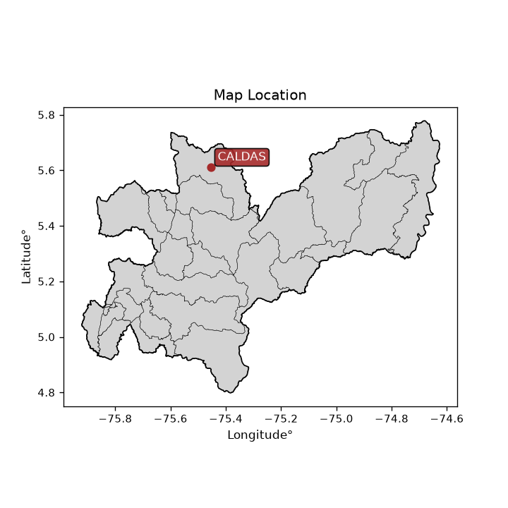</img>

| CountyID                                                                                          | CountyName   | CountyFiles                                                                                                                                                                                                                                                                                                                                                                                                                                                                                                                                                                                                                                                                                                                                                                                                                                                                                                                                                                                                                                                                                                                                                                                                                                                                                                                                                                                                                                                                                                                                                                                                                                                                                                                                                                                                                                                                                                                        |
|:--------------------------------------------------------------------------------------------------|:-------------|:-----------------------------------------------------------------------------------------------------------------------------------------------------------------------------------------------------------------------------------------------------------------------------------------------------------------------------------------------------------------------------------------------------------------------------------------------------------------------------------------------------------------------------------------------------------------------------------------------------------------------------------------------------------------------------------------------------------------------------------------------------------------------------------------------------------------------------------------------------------------------------------------------------------------------------------------------------------------------------------------------------------------------------------------------------------------------------------------------------------------------------------------------------------------------------------------------------------------------------------------------------------------------------------------------------------------------------------------------------------------------------------------------------------------------------------------------------------------------------------------------------------------------------------------------------------------------------------------------------------------------------------------------------------------------------------------------------------------------------------------------------------------------------------------------------------------------------------------------------------------------------------------------------------------------------------|
| [17013](https://github.com/rcfdtools/R.HydroTools/blob/main/tool/Population/file/report/17013.md) | Aguadas      | [17013_Rural_Building_202606.zip](https://github.com/rcfdtools/R.GISMobile/blob/main/file/shp/17013_Rural_Building_202606.zip) [17013_Rural_Lot_202606.zip](https://github.com/rcfdtools/R.GISMobile/blob/main/file/shp/17013_Rural_Lot_202606.zip) [17013_Rural_Nomenclature_202606.zip](https://github.com/rcfdtools/R.GISMobile/blob/main/file/shp/17013_Rural_Nomenclature_202606.zip) [17013_Rural_Nomenclature_Road_202606.zip](https://github.com/rcfdtools/R.GISMobile/blob/main/file/shp/17013_Rural_Nomenclature_Road_202606.zip) [17013_Rural_Sector_202606.zip](https://github.com/rcfdtools/R.GISMobile/blob/main/file/shp/17013_Rural_Sector_202606.zip) [17013_Rural_Vereda_202606.zip](https://github.com/rcfdtools/R.GISMobile/blob/main/file/shp/17013_Rural_Vereda_202606.zip) [17013_Urban_Block_202606.zip](https://github.com/rcfdtools/R.GISMobile/blob/main/file/shp/17013_Urban_Block_202606.zip) [17013_Urban_Building_202606.zip](https://github.com/rcfdtools/R.GISMobile/blob/main/file/shp/17013_Urban_Building_202606.zip) [17013_Urban_Lot_202606.zip](https://github.com/rcfdtools/R.GISMobile/blob/main/file/shp/17013_Urban_Lot_202606.zip) [17013_Urban_Neighborhood_202606.zip](https://github.com/rcfdtools/R.GISMobile/blob/main/file/shp/17013_Urban_Neighborhood_202606.zip) [17013_Urban_Nomenclature_202606.zip](https://github.com/rcfdtools/R.GISMobile/blob/main/file/shp/17013_Urban_Nomenclature_202606.zip) [17013_Urban_Nomenclature_Road_202606.zip](https://github.com/rcfdtools/R.GISMobile/blob/main/file/shp/17013_Urban_Nomenclature_Road_202606.zip) [17013_Urban_Perimeter_202606.zip](https://github.com/rcfdtools/R.GISMobile/blob/main/file/shp/17013_Urban_Perimeter_202606.zip) [17013_Urban_Sector_202606.zip](https://github.com/rcfdtools/R.GISMobile/blob/main/file/shp/17013_Urban_Sector_202606.zip)  |
| [17042](https://github.com/rcfdtools/R.HydroTools/blob/main/tool/Population/file/report/17042.md) | Anserma      | [17042_Rural_Building_202606.zip](https://github.com/rcfdtools/R.GISMobile/blob/main/file/shp/17042_Rural_Building_202606.zip) [17042_Rural_Lot_202606.zip](https://github.com/rcfdtools/R.GISMobile/blob/main/file/shp/17042_Rural_Lot_202606.zip) [17042_Rural_Nomenclature_202606.zip](https://github.com/rcfdtools/R.GISMobile/blob/main/file/shp/17042_Rural_Nomenclature_202606.zip) [17042_Rural_Sector_202606.zip](https://github.com/rcfdtools/R.GISMobile/blob/main/file/shp/17042_Rural_Sector_202606.zip) [17042_Rural_Vereda_202606.zip](https://github.com/rcfdtools/R.GISMobile/blob/main/file/shp/17042_Rural_Vereda_202606.zip) [17042_Urban_Block_202606.zip](https://github.com/rcfdtools/R.GISMobile/blob/main/file/shp/17042_Urban_Block_202606.zip) [17042_Urban_Building_202606.zip](https://github.com/rcfdtools/R.GISMobile/blob/main/file/shp/17042_Urban_Building_202606.zip) [17042_Urban_Lot_202606.zip](https://github.com/rcfdtools/R.GISMobile/blob/main/file/shp/17042_Urban_Lot_202606.zip) [17042_Urban_Nomenclature_202606.zip](https://github.com/rcfdtools/R.GISMobile/blob/main/file/shp/17042_Urban_Nomenclature_202606.zip) [17042_Urban_Nomenclature_Road_202606.zip](https://github.com/rcfdtools/R.GISMobile/blob/main/file/shp/17042_Urban_Nomenclature_Road_202606.zip) [17042_Urban_Perimeter_202606.zip](https://github.com/rcfdtools/R.GISMobile/blob/main/file/shp/17042_Urban_Perimeter_202606.zip)                                                                                                                                                                                                                                                                                                                                                                                                                                 |
| [17050](https://github.com/rcfdtools/R.HydroTools/blob/main/tool/Population/file/report/17050.md) | Aranzazu     | [17050_Rural_Building_202606.zip](https://github.com/rcfdtools/R.GISMobile/blob/main/file/shp/17050_Rural_Building_202606.zip) [17050_Rural_Lot_202606.zip](https://github.com/rcfdtools/R.GISMobile/blob/main/file/shp/17050_Rural_Lot_202606.zip) [17050_Rural_Nomenclature_202606.zip](https://github.com/rcfdtools/R.GISMobile/blob/main/file/shp/17050_Rural_Nomenclature_202606.zip) [17050_Rural_Sector_202606.zip](https://github.com/rcfdtools/R.GISMobile/blob/main/file/shp/17050_Rural_Sector_202606.zip) [17050_Rural_Vereda_202606.zip](https://github.com/rcfdtools/R.GISMobile/blob/main/file/shp/17050_Rural_Vereda_202606.zip) [17050_Urban_Block_202606.zip](https://github.com/rcfdtools/R.GISMobile/blob/main/file/shp/17050_Urban_Block_202606.zip) [17050_Urban_Building_202606.zip](https://github.com/rcfdtools/R.GISMobile/blob/main/file/shp/17050_Urban_Building_202606.zip) [17050_Urban_Lot_202606.zip](https://github.com/rcfdtools/R.GISMobile/blob/main/file/shp/17050_Urban_Lot_202606.zip) [17050_Urban_Nomenclature_202606.zip](https://github.com/rcfdtools/R.GISMobile/blob/main/file/shp/17050_Urban_Nomenclature_202606.zip) [17050_Urban_Nomenclature_Road_202606.zip](https://github.com/rcfdtools/R.GISMobile/blob/main/file/shp/17050_Urban_Nomenclature_Road_202606.zip) [17050_Urban_Perimeter_202606.zip](https://github.com/rcfdtools/R.GISMobile/blob/main/file/shp/17050_Urban_Perimeter_202606.zip) [17050_Urban_Sector_202606.zip](https://github.com/rcfdtools/R.GISMobile/blob/main/file/shp/17050_Urban_Sector_202606.zip)                                                                                                                                                                                                                                                                                                  |
| [17088](https://github.com/rcfdtools/R.HydroTools/blob/main/tool/Population/file/report/17088.md) | Belalcázar   | [17088_Rural_Building_202606.zip](https://github.com/rcfdtools/R.GISMobile/blob/main/file/shp/17088_Rural_Building_202606.zip) [17088_Rural_Lot_202606.zip](https://github.com/rcfdtools/R.GISMobile/blob/main/file/shp/17088_Rural_Lot_202606.zip) [17088_Rural_Nomenclature_202606.zip](https://github.com/rcfdtools/R.GISMobile/blob/main/file/shp/17088_Rural_Nomenclature_202606.zip) [17088_Rural_Sector_202606.zip](https://github.com/rcfdtools/R.GISMobile/blob/main/file/shp/17088_Rural_Sector_202606.zip) [17088_Rural_Vereda_202606.zip](https://github.com/rcfdtools/R.GISMobile/blob/main/file/shp/17088_Rural_Vereda_202606.zip) [17088_Urban_Block_202606.zip](https://github.com/rcfdtools/R.GISMobile/blob/main/file/shp/17088_Urban_Block_202606.zip) [17088_Urban_Building_202606.zip](https://github.com/rcfdtools/R.GISMobile/blob/main/file/shp/17088_Urban_Building_202606.zip) [17088_Urban_Lot_202606.zip](https://github.com/rcfdtools/R.GISMobile/blob/main/file/shp/17088_Urban_Lot_202606.zip) [17088_Urban_Neighborhood_202606.zip](https://github.com/rcfdtools/R.GISMobile/blob/main/file/shp/17088_Urban_Neighborhood_202606.zip) [17088_Urban_Nomenclature_202606.zip](https://github.com/rcfdtools/R.GISMobile/blob/main/file/shp/17088_Urban_Nomenclature_202606.zip) [17088_Urban_Nomenclature_Road_202606.zip](https://github.com/rcfdtools/R.GISMobile/blob/main/file/shp/17088_Urban_Nomenclature_Road_202606.zip) [17088_Urban_Perimeter_202606.zip](https://github.com/rcfdtools/R.GISMobile/blob/main/file/shp/17088_Urban_Perimeter_202606.zip) [17088_Urban_Sector_202606.zip](https://github.com/rcfdtools/R.GISMobile/blob/main/file/shp/17088_Urban_Sector_202606.zip)                                                                                                                                                       |
| [17174](https://github.com/rcfdtools/R.HydroTools/blob/main/tool/Population/file/report/17174.md) | Chinchiná    | [17174_Rural_Building_202606.zip](https://github.com/rcfdtools/R.GISMobile/blob/main/file/shp/17174_Rural_Building_202606.zip) [17174_Rural_Lot_202606.zip](https://github.com/rcfdtools/R.GISMobile/blob/main/file/shp/17174_Rural_Lot_202606.zip) [17174_Rural_Nomenclature_202606.zip](https://github.com/rcfdtools/R.GISMobile/blob/main/file/shp/17174_Rural_Nomenclature_202606.zip) [17174_Rural_Nomenclature_Road_202606.zip](https://github.com/rcfdtools/R.GISMobile/blob/main/file/shp/17174_Rural_Nomenclature_Road_202606.zip) [17174_Rural_Vereda_202606.zip](https://github.com/rcfdtools/R.GISMobile/blob/main/file/shp/17174_Rural_Vereda_202606.zip) [17174_Urban_Block_202606.zip](https://github.com/rcfdtools/R.GISMobile/blob/main/file/shp/17174_Urban_Block_202606.zip) [17174_Urban_Building_202606.zip](https://github.com/rcfdtools/R.GISMobile/blob/main/file/shp/17174_Urban_Building_202606.zip) [17174_Urban_Lot_202606.zip](https://github.com/rcfdtools/R.GISMobile/blob/main/file/shp/17174_Urban_Lot_202606.zip) [17174_Urban_Neighborhood_202606.zip](https://github.com/rcfdtools/R.GISMobile/blob/main/file/shp/17174_Urban_Neighborhood_202606.zip) [17174_Urban_Nomenclature_202606.zip](https://github.com/rcfdtools/R.GISMobile/blob/main/file/shp/17174_Urban_Nomenclature_202606.zip) [17174_Urban_Nomenclature_Road_202606.zip](https://github.com/rcfdtools/R.GISMobile/blob/main/file/shp/17174_Urban_Nomenclature_Road_202606.zip) [17174_Urban_Perimeter_202606.zip](https://github.com/rcfdtools/R.GISMobile/blob/main/file/shp/17174_Urban_Perimeter_202606.zip) [17174_Urban_Sector_202606.zip](https://github.com/rcfdtools/R.GISMobile/blob/main/file/shp/17174_Urban_Sector_202606.zip)                                                                                                                                 |
| [17272](https://github.com/rcfdtools/R.HydroTools/blob/main/tool/Population/file/report/17272.md) | Filadelfia   | [17272_Rural_Building_202606.zip](https://github.com/rcfdtools/R.GISMobile/blob/main/file/shp/17272_Rural_Building_202606.zip) [17272_Rural_Lot_202606.zip](https://github.com/rcfdtools/R.GISMobile/blob/main/file/shp/17272_Rural_Lot_202606.zip) [17272_Rural_Nomenclature_202606.zip](https://github.com/rcfdtools/R.GISMobile/blob/main/file/shp/17272_Rural_Nomenclature_202606.zip) [17272_Rural_Sector_202606.zip](https://github.com/rcfdtools/R.GISMobile/blob/main/file/shp/17272_Rural_Sector_202606.zip) [17272_Rural_Vereda_202606.zip](https://github.com/rcfdtools/R.GISMobile/blob/main/file/shp/17272_Rural_Vereda_202606.zip) [17272_Urban_Block_202606.zip](https://github.com/rcfdtools/R.GISMobile/blob/main/file/shp/17272_Urban_Block_202606.zip) [17272_Urban_Building_202606.zip](https://github.com/rcfdtools/R.GISMobile/blob/main/file/shp/17272_Urban_Building_202606.zip) [17272_Urban_Lot_202606.zip](https://github.com/rcfdtools/R.GISMobile/blob/main/file/shp/17272_Urban_Lot_202606.zip) [17272_Urban_Nomenclature_202606.zip](https://github.com/rcfdtools/R.GISMobile/blob/main/file/shp/17272_Urban_Nomenclature_202606.zip) [17272_Urban_Nomenclature_Road_202606.zip](https://github.com/rcfdtools/R.GISMobile/blob/main/file/shp/17272_Urban_Nomenclature_Road_202606.zip) [17272_Urban_Perimeter_202606.zip](https://github.com/rcfdtools/R.GISMobile/blob/main/file/shp/17272_Urban_Perimeter_202606.zip) [17272_Urban_Sector_202606.zip](https://github.com/rcfdtools/R.GISMobile/blob/main/file/shp/17272_Urban_Sector_202606.zip)                                                                                                                                                                                                                                                                                                  |
| [17380](https://github.com/rcfdtools/R.HydroTools/blob/main/tool/Population/file/report/17380.md) | La Dorada    | [17380_Rural_Building_202606.zip](https://github.com/rcfdtools/R.GISMobile/blob/main/file/shp/17380_Rural_Building_202606.zip) [17380_Rural_Lot_202606.zip](https://github.com/rcfdtools/R.GISMobile/blob/main/file/shp/17380_Rural_Lot_202606.zip) [17380_Rural_Nomenclature_202606.zip](https://github.com/rcfdtools/R.GISMobile/blob/main/file/shp/17380_Rural_Nomenclature_202606.zip) [17380_Rural_Sector_202606.zip](https://github.com/rcfdtools/R.GISMobile/blob/main/file/shp/17380_Rural_Sector_202606.zip) [17380_Rural_Vereda_202606.zip](https://github.com/rcfdtools/R.GISMobile/blob/main/file/shp/17380_Rural_Vereda_202606.zip) [17380_Urban_Block_202606.zip](https://github.com/rcfdtools/R.GISMobile/blob/main/file/shp/17380_Urban_Block_202606.zip) [17380_Urban_Building_202606.zip](https://github.com/rcfdtools/R.GISMobile/blob/main/file/shp/17380_Urban_Building_202606.zip) [17380_Urban_Lot_202606.zip](https://github.com/rcfdtools/R.GISMobile/blob/main/file/shp/17380_Urban_Lot_202606.zip) [17380_Urban_Neighborhood_202606.zip](https://github.com/rcfdtools/R.GISMobile/blob/main/file/shp/17380_Urban_Neighborhood_202606.zip) [17380_Urban_Nomenclature_202606.zip](https://github.com/rcfdtools/R.GISMobile/blob/main/file/shp/17380_Urban_Nomenclature_202606.zip) [17380_Urban_Nomenclature_Road_202606.zip](https://github.com/rcfdtools/R.GISMobile/blob/main/file/shp/17380_Urban_Nomenclature_Road_202606.zip) [17380_Urban_Perimeter_202606.zip](https://github.com/rcfdtools/R.GISMobile/blob/main/file/shp/17380_Urban_Perimeter_202606.zip) [17380_Urban_Sector_202606.zip](https://github.com/rcfdtools/R.GISMobile/blob/main/file/shp/17380_Urban_Sector_202606.zip)                                                                                                                                                       |
| [17388](https://github.com/rcfdtools/R.HydroTools/blob/main/tool/Population/file/report/17388.md) | La Merced    | [17388_Rural_Building_202606.zip](https://github.com/rcfdtools/R.GISMobile/blob/main/file/shp/17388_Rural_Building_202606.zip) [17388_Rural_Lot_202606.zip](https://github.com/rcfdtools/R.GISMobile/blob/main/file/shp/17388_Rural_Lot_202606.zip) [17388_Rural_Nomenclature_202606.zip](https://github.com/rcfdtools/R.GISMobile/blob/main/file/shp/17388_Rural_Nomenclature_202606.zip) [17388_Rural_Sector_202606.zip](https://github.com/rcfdtools/R.GISMobile/blob/main/file/shp/17388_Rural_Sector_202606.zip) [17388_Rural_Vereda_202606.zip](https://github.com/rcfdtools/R.GISMobile/blob/main/file/shp/17388_Rural_Vereda_202606.zip) [17388_Urban_Block_202606.zip](https://github.com/rcfdtools/R.GISMobile/blob/main/file/shp/17388_Urban_Block_202606.zip) [17388_Urban_Building_202606.zip](https://github.com/rcfdtools/R.GISMobile/blob/main/file/shp/17388_Urban_Building_202606.zip) [17388_Urban_Lot_202606.zip](https://github.com/rcfdtools/R.GISMobile/blob/main/file/shp/17388_Urban_Lot_202606.zip) [17388_Urban_Nomenclature_202606.zip](https://github.com/rcfdtools/R.GISMobile/blob/main/file/shp/17388_Urban_Nomenclature_202606.zip) [17388_Urban_Nomenclature_Road_202606.zip](https://github.com/rcfdtools/R.GISMobile/blob/main/file/shp/17388_Urban_Nomenclature_Road_202606.zip) [17388_Urban_Perimeter_202606.zip](https://github.com/rcfdtools/R.GISMobile/blob/main/file/shp/17388_Urban_Perimeter_202606.zip)                                                                                                                                                                                                                                                                                                                                                                                                                                 |
| [17001](https://github.com/rcfdtools/R.HydroTools/blob/main/tool/Population/file/report/17001.md) | Manizales    | [17001_Rural_Lot_202001.zip](https://github.com/rcfdtools/R.GISMobile/blob/main/file/shp/17001_Rural_Lot_202001.zip) [17001_Urban_Lot_202001.zip](https://github.com/rcfdtools/R.GISMobile/blob/main/file/shp/17001_Urban_Lot_202001.zip)                                                                                                                                                                                                                                                                                                                                                                                                                                                                                                                                                                                                                                                                                                                                                                                                                                                                                                                                                                                                                                                                                                                                                                                                                                                                                                                                                                                                                                                                                                                                                                                                                                                                                  |
| [17433](https://github.com/rcfdtools/R.HydroTools/blob/main/tool/Population/file/report/17433.md) | Manzanares   | [17433_Rural_Building_202606.zip](https://github.com/rcfdtools/R.GISMobile/blob/main/file/shp/17433_Rural_Building_202606.zip) [17433_Rural_Lot_202606.zip](https://github.com/rcfdtools/R.GISMobile/blob/main/file/shp/17433_Rural_Lot_202606.zip) [17433_Rural_Nomenclature_202606.zip](https://github.com/rcfdtools/R.GISMobile/blob/main/file/shp/17433_Rural_Nomenclature_202606.zip) [17433_Rural_Sector_202606.zip](https://github.com/rcfdtools/R.GISMobile/blob/main/file/shp/17433_Rural_Sector_202606.zip) [17433_Rural_Vereda_202606.zip](https://github.com/rcfdtools/R.GISMobile/blob/main/file/shp/17433_Rural_Vereda_202606.zip) [17433_Urban_Block_202606.zip](https://github.com/rcfdtools/R.GISMobile/blob/main/file/shp/17433_Urban_Block_202606.zip) [17433_Urban_Building_202606.zip](https://github.com/rcfdtools/R.GISMobile/blob/main/file/shp/17433_Urban_Building_202606.zip) [17433_Urban_Lot_202606.zip](https://github.com/rcfdtools/R.GISMobile/blob/main/file/shp/17433_Urban_Lot_202606.zip) [17433_Urban_Neighborhood_202606.zip](https://github.com/rcfdtools/R.GISMobile/blob/main/file/shp/17433_Urban_Neighborhood_202606.zip) [17433_Urban_Nomenclature_202606.zip](https://github.com/rcfdtools/R.GISMobile/blob/main/file/shp/17433_Urban_Nomenclature_202606.zip) [17433_Urban_Nomenclature_Road_202606.zip](https://github.com/rcfdtools/R.GISMobile/blob/main/file/shp/17433_Urban_Nomenclature_Road_202606.zip) [17433_Urban_Perimeter_202606.zip](https://github.com/rcfdtools/R.GISMobile/blob/main/file/shp/17433_Urban_Perimeter_202606.zip) [17433_Urban_Sector_202606.zip](https://github.com/rcfdtools/R.GISMobile/blob/main/file/shp/17433_Urban_Sector_202606.zip)                                                                                                                                                       |
| [17442](https://github.com/rcfdtools/R.HydroTools/blob/main/tool/Population/file/report/17442.md) | Marmato      | [17442_Rural_Building_202606.zip](https://github.com/rcfdtools/R.GISMobile/blob/main/file/shp/17442_Rural_Building_202606.zip) [17442_Rural_Lot_202606.zip](https://github.com/rcfdtools/R.GISMobile/blob/main/file/shp/17442_Rural_Lot_202606.zip) [17442_Rural_Nomenclature_202606.zip](https://github.com/rcfdtools/R.GISMobile/blob/main/file/shp/17442_Rural_Nomenclature_202606.zip) [17442_Rural_Nomenclature_Road_202606.zip](https://github.com/rcfdtools/R.GISMobile/blob/main/file/shp/17442_Rural_Nomenclature_Road_202606.zip) [17442_Rural_Sector_202606.zip](https://github.com/rcfdtools/R.GISMobile/blob/main/file/shp/17442_Rural_Sector_202606.zip) [17442_Rural_Vereda_202606.zip](https://github.com/rcfdtools/R.GISMobile/blob/main/file/shp/17442_Rural_Vereda_202606.zip) [17442_Urban_Block_202606.zip](https://github.com/rcfdtools/R.GISMobile/blob/main/file/shp/17442_Urban_Block_202606.zip) [17442_Urban_Building_202606.zip](https://github.com/rcfdtools/R.GISMobile/blob/main/file/shp/17442_Urban_Building_202606.zip) [17442_Urban_Lot_202606.zip](https://github.com/rcfdtools/R.GISMobile/blob/main/file/shp/17442_Urban_Lot_202606.zip) [17442_Urban_Nomenclature_202606.zip](https://github.com/rcfdtools/R.GISMobile/blob/main/file/shp/17442_Urban_Nomenclature_202606.zip) [17442_Urban_Nomenclature_Road_202606.zip](https://github.com/rcfdtools/R.GISMobile/blob/main/file/shp/17442_Urban_Nomenclature_Road_202606.zip) [17442_Urban_Perimeter_202606.zip](https://github.com/rcfdtools/R.GISMobile/blob/main/file/shp/17442_Urban_Perimeter_202606.zip)                                                                                                                                                                                                                                                                            |
| [17444](https://github.com/rcfdtools/R.HydroTools/blob/main/tool/Population/file/report/17444.md) | Marquetalia  | [17444_Rural_Building_202606.zip](https://github.com/rcfdtools/R.GISMobile/blob/main/file/shp/17444_Rural_Building_202606.zip) [17444_Rural_Lot_202606.zip](https://github.com/rcfdtools/R.GISMobile/blob/main/file/shp/17444_Rural_Lot_202606.zip) [17444_Rural_Nomenclature_202606.zip](https://github.com/rcfdtools/R.GISMobile/blob/main/file/shp/17444_Rural_Nomenclature_202606.zip) [17444_Rural_Sector_202606.zip](https://github.com/rcfdtools/R.GISMobile/blob/main/file/shp/17444_Rural_Sector_202606.zip) [17444_Rural_Vereda_202606.zip](https://github.com/rcfdtools/R.GISMobile/blob/main/file/shp/17444_Rural_Vereda_202606.zip) [17444_Urban_Block_202606.zip](https://github.com/rcfdtools/R.GISMobile/blob/main/file/shp/17444_Urban_Block_202606.zip) [17444_Urban_Building_202606.zip](https://github.com/rcfdtools/R.GISMobile/blob/main/file/shp/17444_Urban_Building_202606.zip) [17444_Urban_Lot_202606.zip](https://github.com/rcfdtools/R.GISMobile/blob/main/file/shp/17444_Urban_Lot_202606.zip) [17444_Urban_Nomenclature_202606.zip](https://github.com/rcfdtools/R.GISMobile/blob/main/file/shp/17444_Urban_Nomenclature_202606.zip) [17444_Urban_Nomenclature_Road_202606.zip](https://github.com/rcfdtools/R.GISMobile/blob/main/file/shp/17444_Urban_Nomenclature_Road_202606.zip) [17444_Urban_Perimeter_202606.zip](https://github.com/rcfdtools/R.GISMobile/blob/main/file/shp/17444_Urban_Perimeter_202606.zip) [17444_Urban_Sector_202606.zip](https://github.com/rcfdtools/R.GISMobile/blob/main/file/shp/17444_Urban_Sector_202606.zip)                                                                                                                                                                                                                                                                                                  |
| [17446](https://github.com/rcfdtools/R.HydroTools/blob/main/tool/Population/file/report/17446.md) | Marulanda    | [17446_Rural_Building_202606.zip](https://github.com/rcfdtools/R.GISMobile/blob/main/file/shp/17446_Rural_Building_202606.zip) [17446_Rural_Lot_202606.zip](https://github.com/rcfdtools/R.GISMobile/blob/main/file/shp/17446_Rural_Lot_202606.zip) [17446_Rural_Nomenclature_202606.zip](https://github.com/rcfdtools/R.GISMobile/blob/main/file/shp/17446_Rural_Nomenclature_202606.zip) [17446_Rural_Nomenclature_Road_202606.zip](https://github.com/rcfdtools/R.GISMobile/blob/main/file/shp/17446_Rural_Nomenclature_Road_202606.zip) [17446_Rural_Sector_202606.zip](https://github.com/rcfdtools/R.GISMobile/blob/main/file/shp/17446_Rural_Sector_202606.zip) [17446_Rural_Vereda_202606.zip](https://github.com/rcfdtools/R.GISMobile/blob/main/file/shp/17446_Rural_Vereda_202606.zip) [17446_Urban_Block_202606.zip](https://github.com/rcfdtools/R.GISMobile/blob/main/file/shp/17446_Urban_Block_202606.zip) [17446_Urban_Building_202606.zip](https://github.com/rcfdtools/R.GISMobile/blob/main/file/shp/17446_Urban_Building_202606.zip) [17446_Urban_Lot_202606.zip](https://github.com/rcfdtools/R.GISMobile/blob/main/file/shp/17446_Urban_Lot_202606.zip) [17446_Urban_Nomenclature_202606.zip](https://github.com/rcfdtools/R.GISMobile/blob/main/file/shp/17446_Urban_Nomenclature_202606.zip) [17446_Urban_Nomenclature_Road_202606.zip](https://github.com/rcfdtools/R.GISMobile/blob/main/file/shp/17446_Urban_Nomenclature_Road_202606.zip) [17446_Urban_Perimeter_202606.zip](https://github.com/rcfdtools/R.GISMobile/blob/main/file/shp/17446_Urban_Perimeter_202606.zip) [17446_Urban_Sector_202606.zip](https://github.com/rcfdtools/R.GISMobile/blob/main/file/shp/17446_Urban_Sector_202606.zip)                                                                                                                                             |
| [17486](https://github.com/rcfdtools/R.HydroTools/blob/main/tool/Population/file/report/17486.md) | Neira        | [17486_Rural_Building_202606.zip](https://github.com/rcfdtools/R.GISMobile/blob/main/file/shp/17486_Rural_Building_202606.zip) [17486_Rural_Lot_202606.zip](https://github.com/rcfdtools/R.GISMobile/blob/main/file/shp/17486_Rural_Lot_202606.zip) [17486_Rural_Nomenclature_202606.zip](https://github.com/rcfdtools/R.GISMobile/blob/main/file/shp/17486_Rural_Nomenclature_202606.zip) [17486_Rural_Sector_202606.zip](https://github.com/rcfdtools/R.GISMobile/blob/main/file/shp/17486_Rural_Sector_202606.zip) [17486_Rural_Vereda_202606.zip](https://github.com/rcfdtools/R.GISMobile/blob/main/file/shp/17486_Rural_Vereda_202606.zip) [17486_Urban_Block_202606.zip](https://github.com/rcfdtools/R.GISMobile/blob/main/file/shp/17486_Urban_Block_202606.zip) [17486_Urban_Building_202606.zip](https://github.com/rcfdtools/R.GISMobile/blob/main/file/shp/17486_Urban_Building_202606.zip) [17486_Urban_Lot_202606.zip](https://github.com/rcfdtools/R.GISMobile/blob/main/file/shp/17486_Urban_Lot_202606.zip) [17486_Urban_Nomenclature_202606.zip](https://github.com/rcfdtools/R.GISMobile/blob/main/file/shp/17486_Urban_Nomenclature_202606.zip) [17486_Urban_Nomenclature_Road_202606.zip](https://github.com/rcfdtools/R.GISMobile/blob/main/file/shp/17486_Urban_Nomenclature_Road_202606.zip) [17486_Urban_Perimeter_202606.zip](https://github.com/rcfdtools/R.GISMobile/blob/main/file/shp/17486_Urban_Perimeter_202606.zip) [17486_Urban_Sector_202606.zip](https://github.com/rcfdtools/R.GISMobile/blob/main/file/shp/17486_Urban_Sector_202606.zip)                                                                                                                                                                                                                                                                                                  |
| [17495](https://github.com/rcfdtools/R.HydroTools/blob/main/tool/Population/file/report/17495.md) | Norcasia     | [17495_Rural_Building_202606.zip](https://github.com/rcfdtools/R.GISMobile/blob/main/file/shp/17495_Rural_Building_202606.zip) [17495_Rural_Lot_202606.zip](https://github.com/rcfdtools/R.GISMobile/blob/main/file/shp/17495_Rural_Lot_202606.zip) [17495_Rural_Nomenclature_202606.zip](https://github.com/rcfdtools/R.GISMobile/blob/main/file/shp/17495_Rural_Nomenclature_202606.zip) [17495_Rural_Sector_202606.zip](https://github.com/rcfdtools/R.GISMobile/blob/main/file/shp/17495_Rural_Sector_202606.zip) [17495_Rural_Vereda_202606.zip](https://github.com/rcfdtools/R.GISMobile/blob/main/file/shp/17495_Rural_Vereda_202606.zip) [17495_Urban_Block_202606.zip](https://github.com/rcfdtools/R.GISMobile/blob/main/file/shp/17495_Urban_Block_202606.zip) [17495_Urban_Building_202606.zip](https://github.com/rcfdtools/R.GISMobile/blob/main/file/shp/17495_Urban_Building_202606.zip) [17495_Urban_Lot_202606.zip](https://github.com/rcfdtools/R.GISMobile/blob/main/file/shp/17495_Urban_Lot_202606.zip) [17495_Urban_Nomenclature_202606.zip](https://github.com/rcfdtools/R.GISMobile/blob/main/file/shp/17495_Urban_Nomenclature_202606.zip) [17495_Urban_Nomenclature_Road_202606.zip](https://github.com/rcfdtools/R.GISMobile/blob/main/file/shp/17495_Urban_Nomenclature_Road_202606.zip) [17495_Urban_Perimeter_202606.zip](https://github.com/rcfdtools/R.GISMobile/blob/main/file/shp/17495_Urban_Perimeter_202606.zip) [17495_Urban_Sector_202606.zip](https://github.com/rcfdtools/R.GISMobile/blob/main/file/shp/17495_Urban_Sector_202606.zip)                                                                                                                                                                                                                                                                                                  |
| [17524](https://github.com/rcfdtools/R.HydroTools/blob/main/tool/Population/file/report/17524.md) | Palestina    | [17524_Rural_Building_202606.zip](https://github.com/rcfdtools/R.GISMobile/blob/main/file/shp/17524_Rural_Building_202606.zip) [17524_Rural_Lot_202606.zip](https://github.com/rcfdtools/R.GISMobile/blob/main/file/shp/17524_Rural_Lot_202606.zip) [17524_Rural_Nomenclature_202606.zip](https://github.com/rcfdtools/R.GISMobile/blob/main/file/shp/17524_Rural_Nomenclature_202606.zip) [17524_Rural_Sector_202606.zip](https://github.com/rcfdtools/R.GISMobile/blob/main/file/shp/17524_Rural_Sector_202606.zip) [17524_Rural_Vereda_202606.zip](https://github.com/rcfdtools/R.GISMobile/blob/main/file/shp/17524_Rural_Vereda_202606.zip) [17524_Urban_Block_202606.zip](https://github.com/rcfdtools/R.GISMobile/blob/main/file/shp/17524_Urban_Block_202606.zip) [17524_Urban_Building_202606.zip](https://github.com/rcfdtools/R.GISMobile/blob/main/file/shp/17524_Urban_Building_202606.zip) [17524_Urban_Lot_202606.zip](https://github.com/rcfdtools/R.GISMobile/blob/main/file/shp/17524_Urban_Lot_202606.zip) [17524_Urban_Nomenclature_202606.zip](https://github.com/rcfdtools/R.GISMobile/blob/main/file/shp/17524_Urban_Nomenclature_202606.zip) [17524_Urban_Nomenclature_Road_202606.zip](https://github.com/rcfdtools/R.GISMobile/blob/main/file/shp/17524_Urban_Nomenclature_Road_202606.zip) [17524_Urban_Perimeter_202606.zip](https://github.com/rcfdtools/R.GISMobile/blob/main/file/shp/17524_Urban_Perimeter_202606.zip) [17524_Urban_Sector_202606.zip](https://github.com/rcfdtools/R.GISMobile/blob/main/file/shp/17524_Urban_Sector_202606.zip)                                                                                                                                                                                                                                                                                                  |
| [17541](https://github.com/rcfdtools/R.HydroTools/blob/main/tool/Population/file/report/17541.md) | Pensilvania  | [17541_Rural_Building_202606.zip](https://github.com/rcfdtools/R.GISMobile/blob/main/file/shp/17541_Rural_Building_202606.zip) [17541_Rural_Lot_202606.zip](https://github.com/rcfdtools/R.GISMobile/blob/main/file/shp/17541_Rural_Lot_202606.zip) [17541_Rural_Nomenclature_202606.zip](https://github.com/rcfdtools/R.GISMobile/blob/main/file/shp/17541_Rural_Nomenclature_202606.zip) [17541_Rural_Sector_202606.zip](https://github.com/rcfdtools/R.GISMobile/blob/main/file/shp/17541_Rural_Sector_202606.zip) [17541_Rural_Vereda_202606.zip](https://github.com/rcfdtools/R.GISMobile/blob/main/file/shp/17541_Rural_Vereda_202606.zip) [17541_Urban_Block_202606.zip](https://github.com/rcfdtools/R.GISMobile/blob/main/file/shp/17541_Urban_Block_202606.zip) [17541_Urban_Building_202606.zip](https://github.com/rcfdtools/R.GISMobile/blob/main/file/shp/17541_Urban_Building_202606.zip) [17541_Urban_Lot_202606.zip](https://github.com/rcfdtools/R.GISMobile/blob/main/file/shp/17541_Urban_Lot_202606.zip) [17541_Urban_Nomenclature_202606.zip](https://github.com/rcfdtools/R.GISMobile/blob/main/file/shp/17541_Urban_Nomenclature_202606.zip) [17541_Urban_Nomenclature_Road_202606.zip](https://github.com/rcfdtools/R.GISMobile/blob/main/file/shp/17541_Urban_Nomenclature_Road_202606.zip) [17541_Urban_Perimeter_202606.zip](https://github.com/rcfdtools/R.GISMobile/blob/main/file/shp/17541_Urban_Perimeter_202606.zip) [17541_Urban_Sector_202606.zip](https://github.com/rcfdtools/R.GISMobile/blob/main/file/shp/17541_Urban_Sector_202606.zip)                                                                                                                                                                                                                                                                                                  |
| [17513](https://github.com/rcfdtools/R.HydroTools/blob/main/tool/Population/file/report/17513.md) | Pácora       | [17513_Rural_Building_202606.zip](https://github.com/rcfdtools/R.GISMobile/blob/main/file/shp/17513_Rural_Building_202606.zip) [17513_Rural_Lot_202606.zip](https://github.com/rcfdtools/R.GISMobile/blob/main/file/shp/17513_Rural_Lot_202606.zip) [17513_Rural_Nomenclature_202606.zip](https://github.com/rcfdtools/R.GISMobile/blob/main/file/shp/17513_Rural_Nomenclature_202606.zip) [17513_Rural_Nomenclature_Road_202606.zip](https://github.com/rcfdtools/R.GISMobile/blob/main/file/shp/17513_Rural_Nomenclature_Road_202606.zip) [17513_Rural_Sector_202606.zip](https://github.com/rcfdtools/R.GISMobile/blob/main/file/shp/17513_Rural_Sector_202606.zip) [17513_Rural_Vereda_202606.zip](https://github.com/rcfdtools/R.GISMobile/blob/main/file/shp/17513_Rural_Vereda_202606.zip) [17513_Urban_Block_202606.zip](https://github.com/rcfdtools/R.GISMobile/blob/main/file/shp/17513_Urban_Block_202606.zip) [17513_Urban_Building_202606.zip](https://github.com/rcfdtools/R.GISMobile/blob/main/file/shp/17513_Urban_Building_202606.zip) [17513_Urban_Lot_202606.zip](https://github.com/rcfdtools/R.GISMobile/blob/main/file/shp/17513_Urban_Lot_202606.zip) [17513_Urban_Neighborhood_202606.zip](https://github.com/rcfdtools/R.GISMobile/blob/main/file/shp/17513_Urban_Neighborhood_202606.zip) [17513_Urban_Nomenclature_202606.zip](https://github.com/rcfdtools/R.GISMobile/blob/main/file/shp/17513_Urban_Nomenclature_202606.zip) [17513_Urban_Nomenclature_Road_202606.zip](https://github.com/rcfdtools/R.GISMobile/blob/main/file/shp/17513_Urban_Nomenclature_Road_202606.zip) [17513_Urban_Perimeter_202606.zip](https://github.com/rcfdtools/R.GISMobile/blob/main/file/shp/17513_Urban_Perimeter_202606.zip) [17513_Urban_Sector_202606.zip](https://github.com/rcfdtools/R.GISMobile/blob/main/file/shp/17513_Urban_Sector_202606.zip)  |
| [17614](https://github.com/rcfdtools/R.HydroTools/blob/main/tool/Population/file/report/17614.md) | Riosucio     | [17614_Rural_Building_202606.zip](https://github.com/rcfdtools/R.GISMobile/blob/main/file/shp/17614_Rural_Building_202606.zip) [17614_Rural_Lot_202606.zip](https://github.com/rcfdtools/R.GISMobile/blob/main/file/shp/17614_Rural_Lot_202606.zip) [17614_Rural_Nomenclature_202606.zip](https://github.com/rcfdtools/R.GISMobile/blob/main/file/shp/17614_Rural_Nomenclature_202606.zip) [17614_Rural_Sector_202606.zip](https://github.com/rcfdtools/R.GISMobile/blob/main/file/shp/17614_Rural_Sector_202606.zip) [17614_Rural_Vereda_202606.zip](https://github.com/rcfdtools/R.GISMobile/blob/main/file/shp/17614_Rural_Vereda_202606.zip) [17614_Urban_Block_202606.zip](https://github.com/rcfdtools/R.GISMobile/blob/main/file/shp/17614_Urban_Block_202606.zip) [17614_Urban_Building_202606.zip](https://github.com/rcfdtools/R.GISMobile/blob/main/file/shp/17614_Urban_Building_202606.zip) [17614_Urban_Lot_202606.zip](https://github.com/rcfdtools/R.GISMobile/blob/main/file/shp/17614_Urban_Lot_202606.zip) [17614_Urban_Nomenclature_202606.zip](https://github.com/rcfdtools/R.GISMobile/blob/main/file/shp/17614_Urban_Nomenclature_202606.zip) [17614_Urban_Nomenclature_Road_202606.zip](https://github.com/rcfdtools/R.GISMobile/blob/main/file/shp/17614_Urban_Nomenclature_Road_202606.zip) [17614_Urban_Perimeter_202606.zip](https://github.com/rcfdtools/R.GISMobile/blob/main/file/shp/17614_Urban_Perimeter_202606.zip) [17614_Urban_Sector_202606.zip](https://github.com/rcfdtools/R.GISMobile/blob/main/file/shp/17614_Urban_Sector_202606.zip)                                                                                                                                                                                                                                                                                                  |
| [17616](https://github.com/rcfdtools/R.HydroTools/blob/main/tool/Population/file/report/17616.md) | Risaralda    | [17616_Rural_Building_202606.zip](https://github.com/rcfdtools/R.GISMobile/blob/main/file/shp/17616_Rural_Building_202606.zip) [17616_Rural_Lot_202606.zip](https://github.com/rcfdtools/R.GISMobile/blob/main/file/shp/17616_Rural_Lot_202606.zip) [17616_Rural_Nomenclature_202606.zip](https://github.com/rcfdtools/R.GISMobile/blob/main/file/shp/17616_Rural_Nomenclature_202606.zip) [17616_Rural_Sector_202606.zip](https://github.com/rcfdtools/R.GISMobile/blob/main/file/shp/17616_Rural_Sector_202606.zip) [17616_Rural_Vereda_202606.zip](https://github.com/rcfdtools/R.GISMobile/blob/main/file/shp/17616_Rural_Vereda_202606.zip) [17616_Urban_Block_202606.zip](https://github.com/rcfdtools/R.GISMobile/blob/main/file/shp/17616_Urban_Block_202606.zip) [17616_Urban_Building_202606.zip](https://github.com/rcfdtools/R.GISMobile/blob/main/file/shp/17616_Urban_Building_202606.zip) [17616_Urban_Lot_202606.zip](https://github.com/rcfdtools/R.GISMobile/blob/main/file/shp/17616_Urban_Lot_202606.zip) [17616_Urban_Nomenclature_202606.zip](https://github.com/rcfdtools/R.GISMobile/blob/main/file/shp/17616_Urban_Nomenclature_202606.zip) [17616_Urban_Nomenclature_Road_202606.zip](https://github.com/rcfdtools/R.GISMobile/blob/main/file/shp/17616_Urban_Nomenclature_Road_202606.zip) [17616_Urban_Perimeter_202606.zip](https://github.com/rcfdtools/R.GISMobile/blob/main/file/shp/17616_Urban_Perimeter_202606.zip) [17616_Urban_Sector_202606.zip](https://github.com/rcfdtools/R.GISMobile/blob/main/file/shp/17616_Urban_Sector_202606.zip)                                                                                                                                                                                                                                                                                                  |
| [17653](https://github.com/rcfdtools/R.HydroTools/blob/main/tool/Population/file/report/17653.md) | Salamina     | [17653_Rural_Building_202606.zip](https://github.com/rcfdtools/R.GISMobile/blob/main/file/shp/17653_Rural_Building_202606.zip) [17653_Rural_Lot_202606.zip](https://github.com/rcfdtools/R.GISMobile/blob/main/file/shp/17653_Rural_Lot_202606.zip) [17653_Rural_Nomenclature_202606.zip](https://github.com/rcfdtools/R.GISMobile/blob/main/file/shp/17653_Rural_Nomenclature_202606.zip) [17653_Rural_Sector_202606.zip](https://github.com/rcfdtools/R.GISMobile/blob/main/file/shp/17653_Rural_Sector_202606.zip) [17653_Rural_Vereda_202606.zip](https://github.com/rcfdtools/R.GISMobile/blob/main/file/shp/17653_Rural_Vereda_202606.zip) [17653_Urban_Block_202606.zip](https://github.com/rcfdtools/R.GISMobile/blob/main/file/shp/17653_Urban_Block_202606.zip) [17653_Urban_Building_202606.zip](https://github.com/rcfdtools/R.GISMobile/blob/main/file/shp/17653_Urban_Building_202606.zip) [17653_Urban_Lot_202606.zip](https://github.com/rcfdtools/R.GISMobile/blob/main/file/shp/17653_Urban_Lot_202606.zip) [17653_Urban_Nomenclature_202606.zip](https://github.com/rcfdtools/R.GISMobile/blob/main/file/shp/17653_Urban_Nomenclature_202606.zip) [17653_Urban_Nomenclature_Road_202606.zip](https://github.com/rcfdtools/R.GISMobile/blob/main/file/shp/17653_Urban_Nomenclature_Road_202606.zip) [17653_Urban_Perimeter_202606.zip](https://github.com/rcfdtools/R.GISMobile/blob/main/file/shp/17653_Urban_Perimeter_202606.zip)                                                                                                                                                                                                                                                                                                                                                                                                                                 |
| [17662](https://github.com/rcfdtools/R.HydroTools/blob/main/tool/Population/file/report/17662.md) | Samaná       | [17662_Rural_Building_202606.zip](https://github.com/rcfdtools/R.GISMobile/blob/main/file/shp/17662_Rural_Building_202606.zip) [17662_Rural_Lot_202606.zip](https://github.com/rcfdtools/R.GISMobile/blob/main/file/shp/17662_Rural_Lot_202606.zip) [17662_Rural_Nomenclature_202606.zip](https://github.com/rcfdtools/R.GISMobile/blob/main/file/shp/17662_Rural_Nomenclature_202606.zip) [17662_Rural_Nomenclature_Road_202606.zip](https://github.com/rcfdtools/R.GISMobile/blob/main/file/shp/17662_Rural_Nomenclature_Road_202606.zip) [17662_Rural_Sector_202606.zip](https://github.com/rcfdtools/R.GISMobile/blob/main/file/shp/17662_Rural_Sector_202606.zip) [17662_Rural_Vereda_202606.zip](https://github.com/rcfdtools/R.GISMobile/blob/main/file/shp/17662_Rural_Vereda_202606.zip) [17662_Urban_Block_202606.zip](https://github.com/rcfdtools/R.GISMobile/blob/main/file/shp/17662_Urban_Block_202606.zip) [17662_Urban_Building_202606.zip](https://github.com/rcfdtools/R.GISMobile/blob/main/file/shp/17662_Urban_Building_202606.zip) [17662_Urban_Lot_202606.zip](https://github.com/rcfdtools/R.GISMobile/blob/main/file/shp/17662_Urban_Lot_202606.zip) [17662_Urban_Nomenclature_202606.zip](https://github.com/rcfdtools/R.GISMobile/blob/main/file/shp/17662_Urban_Nomenclature_202606.zip) [17662_Urban_Nomenclature_Road_202606.zip](https://github.com/rcfdtools/R.GISMobile/blob/main/file/shp/17662_Urban_Nomenclature_Road_202606.zip) [17662_Urban_Perimeter_202606.zip](https://github.com/rcfdtools/R.GISMobile/blob/main/file/shp/17662_Urban_Perimeter_202606.zip) [17662_Urban_Sector_202606.zip](https://github.com/rcfdtools/R.GISMobile/blob/main/file/shp/17662_Urban_Sector_202606.zip)                                                                                                                                             |
| [17665](https://github.com/rcfdtools/R.HydroTools/blob/main/tool/Population/file/report/17665.md) | San José     | [17665_Rural_Building_202606.zip](https://github.com/rcfdtools/R.GISMobile/blob/main/file/shp/17665_Rural_Building_202606.zip) [17665_Rural_Lot_202606.zip](https://github.com/rcfdtools/R.GISMobile/blob/main/file/shp/17665_Rural_Lot_202606.zip) [17665_Rural_Nomenclature_202606.zip](https://github.com/rcfdtools/R.GISMobile/blob/main/file/shp/17665_Rural_Nomenclature_202606.zip) [17665_Rural_Sector_202606.zip](https://github.com/rcfdtools/R.GISMobile/blob/main/file/shp/17665_Rural_Sector_202606.zip) [17665_Rural_Vereda_202606.zip](https://github.com/rcfdtools/R.GISMobile/blob/main/file/shp/17665_Rural_Vereda_202606.zip) [17665_Urban_Block_202606.zip](https://github.com/rcfdtools/R.GISMobile/blob/main/file/shp/17665_Urban_Block_202606.zip) [17665_Urban_Building_202606.zip](https://github.com/rcfdtools/R.GISMobile/blob/main/file/shp/17665_Urban_Building_202606.zip) [17665_Urban_Lot_202606.zip](https://github.com/rcfdtools/R.GISMobile/blob/main/file/shp/17665_Urban_Lot_202606.zip) [17665_Urban_Nomenclature_202606.zip](https://github.com/rcfdtools/R.GISMobile/blob/main/file/shp/17665_Urban_Nomenclature_202606.zip) [17665_Urban_Nomenclature_Road_202606.zip](https://github.com/rcfdtools/R.GISMobile/blob/main/file/shp/17665_Urban_Nomenclature_Road_202606.zip) [17665_Urban_Perimeter_202606.zip](https://github.com/rcfdtools/R.GISMobile/blob/main/file/shp/17665_Urban_Perimeter_202606.zip) [17665_Urban_Sector_202606.zip](https://github.com/rcfdtools/R.GISMobile/blob/main/file/shp/17665_Urban_Sector_202606.zip)                                                                                                                                                                                                                                                                                                  |
| [17777](https://github.com/rcfdtools/R.HydroTools/blob/main/tool/Population/file/report/17777.md) | Supia        | [17777_Rural_Building_202606.zip](https://github.com/rcfdtools/R.GISMobile/blob/main/file/shp/17777_Rural_Building_202606.zip) [17777_Rural_Lot_202606.zip](https://github.com/rcfdtools/R.GISMobile/blob/main/file/shp/17777_Rural_Lot_202606.zip) [17777_Rural_Nomenclature_202606.zip](https://github.com/rcfdtools/R.GISMobile/blob/main/file/shp/17777_Rural_Nomenclature_202606.zip) [17777_Rural_Sector_202606.zip](https://github.com/rcfdtools/R.GISMobile/blob/main/file/shp/17777_Rural_Sector_202606.zip) [17777_Rural_Vereda_202606.zip](https://github.com/rcfdtools/R.GISMobile/blob/main/file/shp/17777_Rural_Vereda_202606.zip) [17777_Urban_Block_202606.zip](https://github.com/rcfdtools/R.GISMobile/blob/main/file/shp/17777_Urban_Block_202606.zip) [17777_Urban_Building_202606.zip](https://github.com/rcfdtools/R.GISMobile/blob/main/file/shp/17777_Urban_Building_202606.zip) [17777_Urban_Lot_202606.zip](https://github.com/rcfdtools/R.GISMobile/blob/main/file/shp/17777_Urban_Lot_202606.zip) [17777_Urban_Nomenclature_202606.zip](https://github.com/rcfdtools/R.GISMobile/blob/main/file/shp/17777_Urban_Nomenclature_202606.zip) [17777_Urban_Nomenclature_Road_202606.zip](https://github.com/rcfdtools/R.GISMobile/blob/main/file/shp/17777_Urban_Nomenclature_Road_202606.zip) [17777_Urban_Perimeter_202606.zip](https://github.com/rcfdtools/R.GISMobile/blob/main/file/shp/17777_Urban_Perimeter_202606.zip) [17777_Urban_Sector_202606.zip](https://github.com/rcfdtools/R.GISMobile/blob/main/file/shp/17777_Urban_Sector_202606.zip)                                                                                                                                                                                                                                                                                                  |
| [17867](https://github.com/rcfdtools/R.HydroTools/blob/main/tool/Population/file/report/17867.md) | Victoria     | [17867_Rural_Building_202606.zip](https://github.com/rcfdtools/R.GISMobile/blob/main/file/shp/17867_Rural_Building_202606.zip) [17867_Rural_Lot_202606.zip](https://github.com/rcfdtools/R.GISMobile/blob/main/file/shp/17867_Rural_Lot_202606.zip) [17867_Rural_Nomenclature_202606.zip](https://github.com/rcfdtools/R.GISMobile/blob/main/file/shp/17867_Rural_Nomenclature_202606.zip) [17867_Rural_Sector_202606.zip](https://github.com/rcfdtools/R.GISMobile/blob/main/file/shp/17867_Rural_Sector_202606.zip) [17867_Rural_Vereda_202606.zip](https://github.com/rcfdtools/R.GISMobile/blob/main/file/shp/17867_Rural_Vereda_202606.zip) [17867_Urban_Block_202606.zip](https://github.com/rcfdtools/R.GISMobile/blob/main/file/shp/17867_Urban_Block_202606.zip) [17867_Urban_Building_202606.zip](https://github.com/rcfdtools/R.GISMobile/blob/main/file/shp/17867_Urban_Building_202606.zip) [17867_Urban_Lot_202606.zip](https://github.com/rcfdtools/R.GISMobile/blob/main/file/shp/17867_Urban_Lot_202606.zip) [17867_Urban_Neighborhood_202606.zip](https://github.com/rcfdtools/R.GISMobile/blob/main/file/shp/17867_Urban_Neighborhood_202606.zip) [17867_Urban_Nomenclature_202606.zip](https://github.com/rcfdtools/R.GISMobile/blob/main/file/shp/17867_Urban_Nomenclature_202606.zip) [17867_Urban_Nomenclature_Road_202606.zip](https://github.com/rcfdtools/R.GISMobile/blob/main/file/shp/17867_Urban_Nomenclature_Road_202606.zip) [17867_Urban_Perimeter_202606.zip](https://github.com/rcfdtools/R.GISMobile/blob/main/file/shp/17867_Urban_Perimeter_202606.zip) [17867_Urban_Sector_202606.zip](https://github.com/rcfdtools/R.GISMobile/blob/main/file/shp/17867_Urban_Sector_202606.zip)                                                                                                                                                       |
| [17873](https://github.com/rcfdtools/R.HydroTools/blob/main/tool/Population/file/report/17873.md) | Villamaria   | [17873_Rural_Building_202606.zip](https://github.com/rcfdtools/R.GISMobile/blob/main/file/shp/17873_Rural_Building_202606.zip) [17873_Rural_Lot_202606.zip](https://github.com/rcfdtools/R.GISMobile/blob/main/file/shp/17873_Rural_Lot_202606.zip) [17873_Rural_Nomenclature_202606.zip](https://github.com/rcfdtools/R.GISMobile/blob/main/file/shp/17873_Rural_Nomenclature_202606.zip) [17873_Rural_Sector_202606.zip](https://github.com/rcfdtools/R.GISMobile/blob/main/file/shp/17873_Rural_Sector_202606.zip) [17873_Rural_Vereda_202606.zip](https://github.com/rcfdtools/R.GISMobile/blob/main/file/shp/17873_Rural_Vereda_202606.zip) [17873_Urban_Block_202606.zip](https://github.com/rcfdtools/R.GISMobile/blob/main/file/shp/17873_Urban_Block_202606.zip) [17873_Urban_Building_202606.zip](https://github.com/rcfdtools/R.GISMobile/blob/main/file/shp/17873_Urban_Building_202606.zip) [17873_Urban_Lot_202606.zip](https://github.com/rcfdtools/R.GISMobile/blob/main/file/shp/17873_Urban_Lot_202606.zip) [17873_Urban_Nomenclature_202606.zip](https://github.com/rcfdtools/R.GISMobile/blob/main/file/shp/17873_Urban_Nomenclature_202606.zip) [17873_Urban_Nomenclature_Road_202606.zip](https://github.com/rcfdtools/R.GISMobile/blob/main/file/shp/17873_Urban_Nomenclature_Road_202606.zip) [17873_Urban_Perimeter_202606.zip](https://github.com/rcfdtools/R.GISMobile/blob/main/file/shp/17873_Urban_Perimeter_202606.zip) [17873_Urban_Sector_202606.zip](https://github.com/rcfdtools/R.GISMobile/blob/main/file/shp/17873_Urban_Sector_202606.zip)                                                                                                                                                                                                                                                                                                  |
| [17877](https://github.com/rcfdtools/R.HydroTools/blob/main/tool/Population/file/report/17877.md) | Viterbo      | [17877_Rural_Building_202606.zip](https://github.com/rcfdtools/R.GISMobile/blob/main/file/shp/17877_Rural_Building_202606.zip) [17877_Rural_Lot_202606.zip](https://github.com/rcfdtools/R.GISMobile/blob/main/file/shp/17877_Rural_Lot_202606.zip) [17877_Rural_Nomenclature_202606.zip](https://github.com/rcfdtools/R.GISMobile/blob/main/file/shp/17877_Rural_Nomenclature_202606.zip) [17877_Rural_Sector_202606.zip](https://github.com/rcfdtools/R.GISMobile/blob/main/file/shp/17877_Rural_Sector_202606.zip) [17877_Rural_Vereda_202606.zip](https://github.com/rcfdtools/R.GISMobile/blob/main/file/shp/17877_Rural_Vereda_202606.zip) [17877_Urban_Block_202606.zip](https://github.com/rcfdtools/R.GISMobile/blob/main/file/shp/17877_Urban_Block_202606.zip) [17877_Urban_Building_202606.zip](https://github.com/rcfdtools/R.GISMobile/blob/main/file/shp/17877_Urban_Building_202606.zip) [17877_Urban_Lot_202606.zip](https://github.com/rcfdtools/R.GISMobile/blob/main/file/shp/17877_Urban_Lot_202606.zip) [17877_Urban_Neighborhood_202606.zip](https://github.com/rcfdtools/R.GISMobile/blob/main/file/shp/17877_Urban_Neighborhood_202606.zip) [17877_Urban_Nomenclature_202606.zip](https://github.com/rcfdtools/R.GISMobile/blob/main/file/shp/17877_Urban_Nomenclature_202606.zip) [17877_Urban_Nomenclature_Road_202606.zip](https://github.com/rcfdtools/R.GISMobile/blob/main/file/shp/17877_Urban_Nomenclature_Road_202606.zip) [17877_Urban_Perimeter_202606.zip](https://github.com/rcfdtools/R.GISMobile/blob/main/file/shp/17877_Urban_Perimeter_202606.zip) [17877_Urban_Sector_202606.zip](https://github.com/rcfdtools/R.GISMobile/blob/main/file/shp/17877_Urban_Sector_202606.zip)                                                                                                                                                       |

# 18 - Caquetá (16 Counties)

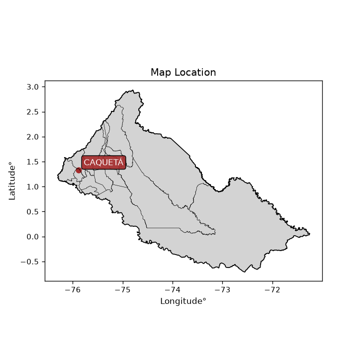</img>

| CountyID                                                                                          | CountyName             | CountyFiles                                                                                                                                                                                                                                                                                                                                                                                                                                                                                                                                                                                                                                                                                                                                                                                                                                                                                                                                                                                                                                                                                                                                                                                                                                                                                                                                                                                                                                                                                                                                                                                                                                                                                                                                                                                                                                                                                                                        |
|:--------------------------------------------------------------------------------------------------|:-----------------------|:-----------------------------------------------------------------------------------------------------------------------------------------------------------------------------------------------------------------------------------------------------------------------------------------------------------------------------------------------------------------------------------------------------------------------------------------------------------------------------------------------------------------------------------------------------------------------------------------------------------------------------------------------------------------------------------------------------------------------------------------------------------------------------------------------------------------------------------------------------------------------------------------------------------------------------------------------------------------------------------------------------------------------------------------------------------------------------------------------------------------------------------------------------------------------------------------------------------------------------------------------------------------------------------------------------------------------------------------------------------------------------------------------------------------------------------------------------------------------------------------------------------------------------------------------------------------------------------------------------------------------------------------------------------------------------------------------------------------------------------------------------------------------------------------------------------------------------------------------------------------------------------------------------------------------------------|
| [18029](https://github.com/rcfdtools/R.HydroTools/blob/main/tool/Population/file/report/18029.md) | Albania                | [18029_Rural_Building_202606.zip](https://github.com/rcfdtools/R.GISMobile/blob/main/file/shp/18029_Rural_Building_202606.zip) [18029_Rural_Lot_202606.zip](https://github.com/rcfdtools/R.GISMobile/blob/main/file/shp/18029_Rural_Lot_202606.zip) [18029_Rural_Nomenclature_202606.zip](https://github.com/rcfdtools/R.GISMobile/blob/main/file/shp/18029_Rural_Nomenclature_202606.zip) [18029_Rural_Sector_202606.zip](https://github.com/rcfdtools/R.GISMobile/blob/main/file/shp/18029_Rural_Sector_202606.zip) [18029_Rural_Vereda_202606.zip](https://github.com/rcfdtools/R.GISMobile/blob/main/file/shp/18029_Rural_Vereda_202606.zip) [18029_Urban_Block_202606.zip](https://github.com/rcfdtools/R.GISMobile/blob/main/file/shp/18029_Urban_Block_202606.zip) [18029_Urban_Building_202606.zip](https://github.com/rcfdtools/R.GISMobile/blob/main/file/shp/18029_Urban_Building_202606.zip) [18029_Urban_Lot_202606.zip](https://github.com/rcfdtools/R.GISMobile/blob/main/file/shp/18029_Urban_Lot_202606.zip) [18029_Urban_Neighborhood_202606.zip](https://github.com/rcfdtools/R.GISMobile/blob/main/file/shp/18029_Urban_Neighborhood_202606.zip) [18029_Urban_Nomenclature_202606.zip](https://github.com/rcfdtools/R.GISMobile/blob/main/file/shp/18029_Urban_Nomenclature_202606.zip) [18029_Urban_Nomenclature_Road_202606.zip](https://github.com/rcfdtools/R.GISMobile/blob/main/file/shp/18029_Urban_Nomenclature_Road_202606.zip) [18029_Urban_Perimeter_202606.zip](https://github.com/rcfdtools/R.GISMobile/blob/main/file/shp/18029_Urban_Perimeter_202606.zip) [18029_Urban_Sector_202606.zip](https://github.com/rcfdtools/R.GISMobile/blob/main/file/shp/18029_Urban_Sector_202606.zip)                                                                                                                                                       |
| [18094](https://github.com/rcfdtools/R.HydroTools/blob/main/tool/Population/file/report/18094.md) | Belén De Los Andaquíes | [18094_Rural_Building_202606.zip](https://github.com/rcfdtools/R.GISMobile/blob/main/file/shp/18094_Rural_Building_202606.zip) [18094_Rural_Lot_202606.zip](https://github.com/rcfdtools/R.GISMobile/blob/main/file/shp/18094_Rural_Lot_202606.zip) [18094_Rural_Nomenclature_202606.zip](https://github.com/rcfdtools/R.GISMobile/blob/main/file/shp/18094_Rural_Nomenclature_202606.zip) [18094_Rural_Sector_202606.zip](https://github.com/rcfdtools/R.GISMobile/blob/main/file/shp/18094_Rural_Sector_202606.zip) [18094_Rural_Vereda_202606.zip](https://github.com/rcfdtools/R.GISMobile/blob/main/file/shp/18094_Rural_Vereda_202606.zip) [18094_Urban_Block_202606.zip](https://github.com/rcfdtools/R.GISMobile/blob/main/file/shp/18094_Urban_Block_202606.zip) [18094_Urban_Building_202606.zip](https://github.com/rcfdtools/R.GISMobile/blob/main/file/shp/18094_Urban_Building_202606.zip) [18094_Urban_Lot_202606.zip](https://github.com/rcfdtools/R.GISMobile/blob/main/file/shp/18094_Urban_Lot_202606.zip) [18094_Urban_Nomenclature_202606.zip](https://github.com/rcfdtools/R.GISMobile/blob/main/file/shp/18094_Urban_Nomenclature_202606.zip) [18094_Urban_Nomenclature_Road_202606.zip](https://github.com/rcfdtools/R.GISMobile/blob/main/file/shp/18094_Urban_Nomenclature_Road_202606.zip) [18094_Urban_Perimeter_202606.zip](https://github.com/rcfdtools/R.GISMobile/blob/main/file/shp/18094_Urban_Perimeter_202606.zip) [18094_Urban_Sector_202606.zip](https://github.com/rcfdtools/R.GISMobile/blob/main/file/shp/18094_Urban_Sector_202606.zip)                                                                                                                                                                                                                                                                                                  |
| [18150](https://github.com/rcfdtools/R.HydroTools/blob/main/tool/Population/file/report/18150.md) | Cartagena Del Chairá   | [18150_Rural_Building_202606.zip](https://github.com/rcfdtools/R.GISMobile/blob/main/file/shp/18150_Rural_Building_202606.zip) [18150_Rural_Lot_202606.zip](https://github.com/rcfdtools/R.GISMobile/blob/main/file/shp/18150_Rural_Lot_202606.zip) [18150_Rural_Nomenclature_202606.zip](https://github.com/rcfdtools/R.GISMobile/blob/main/file/shp/18150_Rural_Nomenclature_202606.zip) [18150_Rural_Sector_202606.zip](https://github.com/rcfdtools/R.GISMobile/blob/main/file/shp/18150_Rural_Sector_202606.zip) [18150_Rural_Vereda_202606.zip](https://github.com/rcfdtools/R.GISMobile/blob/main/file/shp/18150_Rural_Vereda_202606.zip) [18150_Urban_Block_202606.zip](https://github.com/rcfdtools/R.GISMobile/blob/main/file/shp/18150_Urban_Block_202606.zip) [18150_Urban_Building_202606.zip](https://github.com/rcfdtools/R.GISMobile/blob/main/file/shp/18150_Urban_Building_202606.zip) [18150_Urban_Lot_202606.zip](https://github.com/rcfdtools/R.GISMobile/blob/main/file/shp/18150_Urban_Lot_202606.zip) [18150_Urban_Neighborhood_202606.zip](https://github.com/rcfdtools/R.GISMobile/blob/main/file/shp/18150_Urban_Neighborhood_202606.zip) [18150_Urban_Nomenclature_202606.zip](https://github.com/rcfdtools/R.GISMobile/blob/main/file/shp/18150_Urban_Nomenclature_202606.zip) [18150_Urban_Nomenclature_Road_202606.zip](https://github.com/rcfdtools/R.GISMobile/blob/main/file/shp/18150_Urban_Nomenclature_Road_202606.zip) [18150_Urban_Perimeter_202606.zip](https://github.com/rcfdtools/R.GISMobile/blob/main/file/shp/18150_Urban_Perimeter_202606.zip) [18150_Urban_Sector_202606.zip](https://github.com/rcfdtools/R.GISMobile/blob/main/file/shp/18150_Urban_Sector_202606.zip)                                                                                                                                                       |
| [18205](https://github.com/rcfdtools/R.HydroTools/blob/main/tool/Population/file/report/18205.md) | Curillo                | [18205_Rural_Building_202606.zip](https://github.com/rcfdtools/R.GISMobile/blob/main/file/shp/18205_Rural_Building_202606.zip) [18205_Rural_Lot_202606.zip](https://github.com/rcfdtools/R.GISMobile/blob/main/file/shp/18205_Rural_Lot_202606.zip) [18205_Rural_Nomenclature_202606.zip](https://github.com/rcfdtools/R.GISMobile/blob/main/file/shp/18205_Rural_Nomenclature_202606.zip) [18205_Rural_Sector_202606.zip](https://github.com/rcfdtools/R.GISMobile/blob/main/file/shp/18205_Rural_Sector_202606.zip) [18205_Rural_Vereda_202606.zip](https://github.com/rcfdtools/R.GISMobile/blob/main/file/shp/18205_Rural_Vereda_202606.zip) [18205_Urban_Block_202606.zip](https://github.com/rcfdtools/R.GISMobile/blob/main/file/shp/18205_Urban_Block_202606.zip) [18205_Urban_Building_202606.zip](https://github.com/rcfdtools/R.GISMobile/blob/main/file/shp/18205_Urban_Building_202606.zip) [18205_Urban_Lot_202606.zip](https://github.com/rcfdtools/R.GISMobile/blob/main/file/shp/18205_Urban_Lot_202606.zip) [18205_Urban_Neighborhood_202606.zip](https://github.com/rcfdtools/R.GISMobile/blob/main/file/shp/18205_Urban_Neighborhood_202606.zip) [18205_Urban_Nomenclature_202606.zip](https://github.com/rcfdtools/R.GISMobile/blob/main/file/shp/18205_Urban_Nomenclature_202606.zip) [18205_Urban_Nomenclature_Road_202606.zip](https://github.com/rcfdtools/R.GISMobile/blob/main/file/shp/18205_Urban_Nomenclature_Road_202606.zip) [18205_Urban_Perimeter_202606.zip](https://github.com/rcfdtools/R.GISMobile/blob/main/file/shp/18205_Urban_Perimeter_202606.zip) [18205_Urban_Sector_202606.zip](https://github.com/rcfdtools/R.GISMobile/blob/main/file/shp/18205_Urban_Sector_202606.zip)                                                                                                                                                       |
| [18247](https://github.com/rcfdtools/R.HydroTools/blob/main/tool/Population/file/report/18247.md) | El Doncello            | [18247_Rural_Building_202606.zip](https://github.com/rcfdtools/R.GISMobile/blob/main/file/shp/18247_Rural_Building_202606.zip) [18247_Rural_Lot_202606.zip](https://github.com/rcfdtools/R.GISMobile/blob/main/file/shp/18247_Rural_Lot_202606.zip) [18247_Rural_Nomenclature_202606.zip](https://github.com/rcfdtools/R.GISMobile/blob/main/file/shp/18247_Rural_Nomenclature_202606.zip) [18247_Rural_Sector_202606.zip](https://github.com/rcfdtools/R.GISMobile/blob/main/file/shp/18247_Rural_Sector_202606.zip) [18247_Rural_Vereda_202606.zip](https://github.com/rcfdtools/R.GISMobile/blob/main/file/shp/18247_Rural_Vereda_202606.zip) [18247_Urban_Block_202606.zip](https://github.com/rcfdtools/R.GISMobile/blob/main/file/shp/18247_Urban_Block_202606.zip) [18247_Urban_Building_202606.zip](https://github.com/rcfdtools/R.GISMobile/blob/main/file/shp/18247_Urban_Building_202606.zip) [18247_Urban_Lot_202606.zip](https://github.com/rcfdtools/R.GISMobile/blob/main/file/shp/18247_Urban_Lot_202606.zip) [18247_Urban_Nomenclature_202606.zip](https://github.com/rcfdtools/R.GISMobile/blob/main/file/shp/18247_Urban_Nomenclature_202606.zip) [18247_Urban_Nomenclature_Road_202606.zip](https://github.com/rcfdtools/R.GISMobile/blob/main/file/shp/18247_Urban_Nomenclature_Road_202606.zip) [18247_Urban_Perimeter_202606.zip](https://github.com/rcfdtools/R.GISMobile/blob/main/file/shp/18247_Urban_Perimeter_202606.zip) [18247_Urban_Sector_202606.zip](https://github.com/rcfdtools/R.GISMobile/blob/main/file/shp/18247_Urban_Sector_202606.zip)                                                                                                                                                                                                                                                                                                  |
| [18256](https://github.com/rcfdtools/R.HydroTools/blob/main/tool/Population/file/report/18256.md) | El Paujil              | [18256_Rural_Building_202606.zip](https://github.com/rcfdtools/R.GISMobile/blob/main/file/shp/18256_Rural_Building_202606.zip) [18256_Rural_Lot_202606.zip](https://github.com/rcfdtools/R.GISMobile/blob/main/file/shp/18256_Rural_Lot_202606.zip) [18256_Rural_Nomenclature_202606.zip](https://github.com/rcfdtools/R.GISMobile/blob/main/file/shp/18256_Rural_Nomenclature_202606.zip) [18256_Rural_Sector_202606.zip](https://github.com/rcfdtools/R.GISMobile/blob/main/file/shp/18256_Rural_Sector_202606.zip) [18256_Rural_Vereda_202606.zip](https://github.com/rcfdtools/R.GISMobile/blob/main/file/shp/18256_Rural_Vereda_202606.zip) [18256_Urban_Block_202606.zip](https://github.com/rcfdtools/R.GISMobile/blob/main/file/shp/18256_Urban_Block_202606.zip) [18256_Urban_Building_202606.zip](https://github.com/rcfdtools/R.GISMobile/blob/main/file/shp/18256_Urban_Building_202606.zip) [18256_Urban_Lot_202606.zip](https://github.com/rcfdtools/R.GISMobile/blob/main/file/shp/18256_Urban_Lot_202606.zip) [18256_Urban_Nomenclature_202606.zip](https://github.com/rcfdtools/R.GISMobile/blob/main/file/shp/18256_Urban_Nomenclature_202606.zip) [18256_Urban_Nomenclature_Road_202606.zip](https://github.com/rcfdtools/R.GISMobile/blob/main/file/shp/18256_Urban_Nomenclature_Road_202606.zip) [18256_Urban_Perimeter_202606.zip](https://github.com/rcfdtools/R.GISMobile/blob/main/file/shp/18256_Urban_Perimeter_202606.zip) [18256_Urban_Sector_202606.zip](https://github.com/rcfdtools/R.GISMobile/blob/main/file/shp/18256_Urban_Sector_202606.zip)                                                                                                                                                                                                                                                                                                  |
| [18001](https://github.com/rcfdtools/R.HydroTools/blob/main/tool/Population/file/report/18001.md) | Florencia              | [18001_Rural_Lot_202001.zip](https://github.com/rcfdtools/R.GISMobile/blob/main/file/shp/18001_Rural_Lot_202001.zip) [18001_Urban_Lot_202001.zip](https://github.com/rcfdtools/R.GISMobile/blob/main/file/shp/18001_Urban_Lot_202001.zip)                                                                                                                                                                                                                                                                                                                                                                                                                                                                                                                                                                                                                                                                                                                                                                                                                                                                                                                                                                                                                                                                                                                                                                                                                                                                                                                                                                                                                                                                                                                                                                                                                                                                                  |
| [18460](https://github.com/rcfdtools/R.HydroTools/blob/main/tool/Population/file/report/18460.md) | Milán                  | [18460_Rural_Building_202606.zip](https://github.com/rcfdtools/R.GISMobile/blob/main/file/shp/18460_Rural_Building_202606.zip) [18460_Rural_Lot_202606.zip](https://github.com/rcfdtools/R.GISMobile/blob/main/file/shp/18460_Rural_Lot_202606.zip) [18460_Rural_Nomenclature_202606.zip](https://github.com/rcfdtools/R.GISMobile/blob/main/file/shp/18460_Rural_Nomenclature_202606.zip) [18460_Rural_Nomenclature_Road_202606.zip](https://github.com/rcfdtools/R.GISMobile/blob/main/file/shp/18460_Rural_Nomenclature_Road_202606.zip) [18460_Rural_Sector_202606.zip](https://github.com/rcfdtools/R.GISMobile/blob/main/file/shp/18460_Rural_Sector_202606.zip) [18460_Rural_Vereda_202606.zip](https://github.com/rcfdtools/R.GISMobile/blob/main/file/shp/18460_Rural_Vereda_202606.zip) [18460_Urban_Block_202606.zip](https://github.com/rcfdtools/R.GISMobile/blob/main/file/shp/18460_Urban_Block_202606.zip) [18460_Urban_Building_202606.zip](https://github.com/rcfdtools/R.GISMobile/blob/main/file/shp/18460_Urban_Building_202606.zip) [18460_Urban_Lot_202606.zip](https://github.com/rcfdtools/R.GISMobile/blob/main/file/shp/18460_Urban_Lot_202606.zip) [18460_Urban_Neighborhood_202606.zip](https://github.com/rcfdtools/R.GISMobile/blob/main/file/shp/18460_Urban_Neighborhood_202606.zip) [18460_Urban_Nomenclature_202606.zip](https://github.com/rcfdtools/R.GISMobile/blob/main/file/shp/18460_Urban_Nomenclature_202606.zip) [18460_Urban_Nomenclature_Road_202606.zip](https://github.com/rcfdtools/R.GISMobile/blob/main/file/shp/18460_Urban_Nomenclature_Road_202606.zip) [18460_Urban_Perimeter_202606.zip](https://github.com/rcfdtools/R.GISMobile/blob/main/file/shp/18460_Urban_Perimeter_202606.zip) [18460_Urban_Sector_202606.zip](https://github.com/rcfdtools/R.GISMobile/blob/main/file/shp/18460_Urban_Sector_202606.zip)  |
| [18410](https://github.com/rcfdtools/R.HydroTools/blob/main/tool/Population/file/report/18410.md) | Montañita              | [18410_Rural_Building_202606.zip](https://github.com/rcfdtools/R.GISMobile/blob/main/file/shp/18410_Rural_Building_202606.zip) [18410_Rural_Lot_202606.zip](https://github.com/rcfdtools/R.GISMobile/blob/main/file/shp/18410_Rural_Lot_202606.zip) [18410_Rural_Nomenclature_202606.zip](https://github.com/rcfdtools/R.GISMobile/blob/main/file/shp/18410_Rural_Nomenclature_202606.zip) [18410_Rural_Sector_202606.zip](https://github.com/rcfdtools/R.GISMobile/blob/main/file/shp/18410_Rural_Sector_202606.zip) [18410_Rural_Vereda_202606.zip](https://github.com/rcfdtools/R.GISMobile/blob/main/file/shp/18410_Rural_Vereda_202606.zip) [18410_Urban_Block_202606.zip](https://github.com/rcfdtools/R.GISMobile/blob/main/file/shp/18410_Urban_Block_202606.zip) [18410_Urban_Building_202606.zip](https://github.com/rcfdtools/R.GISMobile/blob/main/file/shp/18410_Urban_Building_202606.zip) [18410_Urban_Lot_202606.zip](https://github.com/rcfdtools/R.GISMobile/blob/main/file/shp/18410_Urban_Lot_202606.zip) [18410_Urban_Neighborhood_202606.zip](https://github.com/rcfdtools/R.GISMobile/blob/main/file/shp/18410_Urban_Neighborhood_202606.zip) [18410_Urban_Nomenclature_202606.zip](https://github.com/rcfdtools/R.GISMobile/blob/main/file/shp/18410_Urban_Nomenclature_202606.zip) [18410_Urban_Nomenclature_Road_202606.zip](https://github.com/rcfdtools/R.GISMobile/blob/main/file/shp/18410_Urban_Nomenclature_Road_202606.zip) [18410_Urban_Perimeter_202606.zip](https://github.com/rcfdtools/R.GISMobile/blob/main/file/shp/18410_Urban_Perimeter_202606.zip) [18410_Urban_Sector_202606.zip](https://github.com/rcfdtools/R.GISMobile/blob/main/file/shp/18410_Urban_Sector_202606.zip)                                                                                                                                                       |
| [18479](https://github.com/rcfdtools/R.HydroTools/blob/main/tool/Population/file/report/18479.md) | Morelia                | [18479_Rural_Building_202606.zip](https://github.com/rcfdtools/R.GISMobile/blob/main/file/shp/18479_Rural_Building_202606.zip) [18479_Rural_Lot_202606.zip](https://github.com/rcfdtools/R.GISMobile/blob/main/file/shp/18479_Rural_Lot_202606.zip) [18479_Rural_Nomenclature_202606.zip](https://github.com/rcfdtools/R.GISMobile/blob/main/file/shp/18479_Rural_Nomenclature_202606.zip) [18479_Rural_Sector_202606.zip](https://github.com/rcfdtools/R.GISMobile/blob/main/file/shp/18479_Rural_Sector_202606.zip) [18479_Rural_Vereda_202606.zip](https://github.com/rcfdtools/R.GISMobile/blob/main/file/shp/18479_Rural_Vereda_202606.zip) [18479_Urban_Block_202606.zip](https://github.com/rcfdtools/R.GISMobile/blob/main/file/shp/18479_Urban_Block_202606.zip) [18479_Urban_Building_202606.zip](https://github.com/rcfdtools/R.GISMobile/blob/main/file/shp/18479_Urban_Building_202606.zip) [18479_Urban_Lot_202606.zip](https://github.com/rcfdtools/R.GISMobile/blob/main/file/shp/18479_Urban_Lot_202606.zip) [18479_Urban_Neighborhood_202606.zip](https://github.com/rcfdtools/R.GISMobile/blob/main/file/shp/18479_Urban_Neighborhood_202606.zip) [18479_Urban_Nomenclature_202606.zip](https://github.com/rcfdtools/R.GISMobile/blob/main/file/shp/18479_Urban_Nomenclature_202606.zip) [18479_Urban_Nomenclature_Road_202606.zip](https://github.com/rcfdtools/R.GISMobile/blob/main/file/shp/18479_Urban_Nomenclature_Road_202606.zip) [18479_Urban_Perimeter_202606.zip](https://github.com/rcfdtools/R.GISMobile/blob/main/file/shp/18479_Urban_Perimeter_202606.zip) [18479_Urban_Sector_202606.zip](https://github.com/rcfdtools/R.GISMobile/blob/main/file/shp/18479_Urban_Sector_202606.zip)                                                                                                                                                       |
| [18592](https://github.com/rcfdtools/R.HydroTools/blob/main/tool/Population/file/report/18592.md) | Puerto Rico            | [18592_Rural_Building_202606.zip](https://github.com/rcfdtools/R.GISMobile/blob/main/file/shp/18592_Rural_Building_202606.zip) [18592_Rural_Lot_202606.zip](https://github.com/rcfdtools/R.GISMobile/blob/main/file/shp/18592_Rural_Lot_202606.zip) [18592_Rural_Nomenclature_202606.zip](https://github.com/rcfdtools/R.GISMobile/blob/main/file/shp/18592_Rural_Nomenclature_202606.zip) [18592_Rural_Sector_202606.zip](https://github.com/rcfdtools/R.GISMobile/blob/main/file/shp/18592_Rural_Sector_202606.zip) [18592_Rural_Vereda_202606.zip](https://github.com/rcfdtools/R.GISMobile/blob/main/file/shp/18592_Rural_Vereda_202606.zip) [18592_Urban_Block_202606.zip](https://github.com/rcfdtools/R.GISMobile/blob/main/file/shp/18592_Urban_Block_202606.zip) [18592_Urban_Building_202606.zip](https://github.com/rcfdtools/R.GISMobile/blob/main/file/shp/18592_Urban_Building_202606.zip) [18592_Urban_Lot_202606.zip](https://github.com/rcfdtools/R.GISMobile/blob/main/file/shp/18592_Urban_Lot_202606.zip) [18592_Urban_Nomenclature_202606.zip](https://github.com/rcfdtools/R.GISMobile/blob/main/file/shp/18592_Urban_Nomenclature_202606.zip) [18592_Urban_Nomenclature_Road_202606.zip](https://github.com/rcfdtools/R.GISMobile/blob/main/file/shp/18592_Urban_Nomenclature_Road_202606.zip) [18592_Urban_Perimeter_202606.zip](https://github.com/rcfdtools/R.GISMobile/blob/main/file/shp/18592_Urban_Perimeter_202606.zip) [18592_Urban_Sector_202606.zip](https://github.com/rcfdtools/R.GISMobile/blob/main/file/shp/18592_Urban_Sector_202606.zip)                                                                                                                                                                                                                                                                                                  |
| [18610](https://github.com/rcfdtools/R.HydroTools/blob/main/tool/Population/file/report/18610.md) | San José Del Fragua    | [18610_Rural_Building_202606.zip](https://github.com/rcfdtools/R.GISMobile/blob/main/file/shp/18610_Rural_Building_202606.zip) [18610_Rural_Lot_202606.zip](https://github.com/rcfdtools/R.GISMobile/blob/main/file/shp/18610_Rural_Lot_202606.zip) [18610_Rural_Nomenclature_202606.zip](https://github.com/rcfdtools/R.GISMobile/blob/main/file/shp/18610_Rural_Nomenclature_202606.zip) [18610_Rural_Sector_202606.zip](https://github.com/rcfdtools/R.GISMobile/blob/main/file/shp/18610_Rural_Sector_202606.zip) [18610_Rural_Vereda_202606.zip](https://github.com/rcfdtools/R.GISMobile/blob/main/file/shp/18610_Rural_Vereda_202606.zip) [18610_Urban_Block_202606.zip](https://github.com/rcfdtools/R.GISMobile/blob/main/file/shp/18610_Urban_Block_202606.zip) [18610_Urban_Building_202606.zip](https://github.com/rcfdtools/R.GISMobile/blob/main/file/shp/18610_Urban_Building_202606.zip) [18610_Urban_Lot_202606.zip](https://github.com/rcfdtools/R.GISMobile/blob/main/file/shp/18610_Urban_Lot_202606.zip) [18610_Urban_Neighborhood_202606.zip](https://github.com/rcfdtools/R.GISMobile/blob/main/file/shp/18610_Urban_Neighborhood_202606.zip) [18610_Urban_Nomenclature_202606.zip](https://github.com/rcfdtools/R.GISMobile/blob/main/file/shp/18610_Urban_Nomenclature_202606.zip) [18610_Urban_Nomenclature_Road_202606.zip](https://github.com/rcfdtools/R.GISMobile/blob/main/file/shp/18610_Urban_Nomenclature_Road_202606.zip) [18610_Urban_Perimeter_202606.zip](https://github.com/rcfdtools/R.GISMobile/blob/main/file/shp/18610_Urban_Perimeter_202606.zip) [18610_Urban_Sector_202606.zip](https://github.com/rcfdtools/R.GISMobile/blob/main/file/shp/18610_Urban_Sector_202606.zip)                                                                                                                                                       |
| [18753](https://github.com/rcfdtools/R.HydroTools/blob/main/tool/Population/file/report/18753.md) | San Vicente Del Caguán | [18753_Rural_Building_202606.zip](https://github.com/rcfdtools/R.GISMobile/blob/main/file/shp/18753_Rural_Building_202606.zip) [18753_Rural_Lot_202606.zip](https://github.com/rcfdtools/R.GISMobile/blob/main/file/shp/18753_Rural_Lot_202606.zip) [18753_Rural_Nomenclature_202606.zip](https://github.com/rcfdtools/R.GISMobile/blob/main/file/shp/18753_Rural_Nomenclature_202606.zip) [18753_Rural_Nomenclature_Road_202606.zip](https://github.com/rcfdtools/R.GISMobile/blob/main/file/shp/18753_Rural_Nomenclature_Road_202606.zip) [18753_Rural_Sector_202606.zip](https://github.com/rcfdtools/R.GISMobile/blob/main/file/shp/18753_Rural_Sector_202606.zip) [18753_Rural_Vereda_202606.zip](https://github.com/rcfdtools/R.GISMobile/blob/main/file/shp/18753_Rural_Vereda_202606.zip) [18753_Urban_Block_202606.zip](https://github.com/rcfdtools/R.GISMobile/blob/main/file/shp/18753_Urban_Block_202606.zip) [18753_Urban_Building_202606.zip](https://github.com/rcfdtools/R.GISMobile/blob/main/file/shp/18753_Urban_Building_202606.zip) [18753_Urban_Lot_202606.zip](https://github.com/rcfdtools/R.GISMobile/blob/main/file/shp/18753_Urban_Lot_202606.zip) [18753_Urban_Nomenclature_202606.zip](https://github.com/rcfdtools/R.GISMobile/blob/main/file/shp/18753_Urban_Nomenclature_202606.zip) [18753_Urban_Nomenclature_Road_202606.zip](https://github.com/rcfdtools/R.GISMobile/blob/main/file/shp/18753_Urban_Nomenclature_Road_202606.zip) [18753_Urban_Perimeter_202606.zip](https://github.com/rcfdtools/R.GISMobile/blob/main/file/shp/18753_Urban_Perimeter_202606.zip) [18753_Urban_Sector_202606.zip](https://github.com/rcfdtools/R.GISMobile/blob/main/file/shp/18753_Urban_Sector_202606.zip)                                                                                                                                             |
| [18756](https://github.com/rcfdtools/R.HydroTools/blob/main/tool/Population/file/report/18756.md) | Solano                 | [18756_Rural_Building_202606.zip](https://github.com/rcfdtools/R.GISMobile/blob/main/file/shp/18756_Rural_Building_202606.zip) [18756_Rural_Lot_202606.zip](https://github.com/rcfdtools/R.GISMobile/blob/main/file/shp/18756_Rural_Lot_202606.zip) [18756_Rural_Nomenclature_202606.zip](https://github.com/rcfdtools/R.GISMobile/blob/main/file/shp/18756_Rural_Nomenclature_202606.zip) [18756_Rural_Sector_202606.zip](https://github.com/rcfdtools/R.GISMobile/blob/main/file/shp/18756_Rural_Sector_202606.zip) [18756_Rural_Vereda_202606.zip](https://github.com/rcfdtools/R.GISMobile/blob/main/file/shp/18756_Rural_Vereda_202606.zip) [18756_Urban_Block_202606.zip](https://github.com/rcfdtools/R.GISMobile/blob/main/file/shp/18756_Urban_Block_202606.zip) [18756_Urban_Building_202606.zip](https://github.com/rcfdtools/R.GISMobile/blob/main/file/shp/18756_Urban_Building_202606.zip) [18756_Urban_Lot_202606.zip](https://github.com/rcfdtools/R.GISMobile/blob/main/file/shp/18756_Urban_Lot_202606.zip) [18756_Urban_Neighborhood_202606.zip](https://github.com/rcfdtools/R.GISMobile/blob/main/file/shp/18756_Urban_Neighborhood_202606.zip) [18756_Urban_Nomenclature_202606.zip](https://github.com/rcfdtools/R.GISMobile/blob/main/file/shp/18756_Urban_Nomenclature_202606.zip) [18756_Urban_Nomenclature_Road_202606.zip](https://github.com/rcfdtools/R.GISMobile/blob/main/file/shp/18756_Urban_Nomenclature_Road_202606.zip) [18756_Urban_Perimeter_202606.zip](https://github.com/rcfdtools/R.GISMobile/blob/main/file/shp/18756_Urban_Perimeter_202606.zip) [18756_Urban_Sector_202606.zip](https://github.com/rcfdtools/R.GISMobile/blob/main/file/shp/18756_Urban_Sector_202606.zip)                                                                                                                                                       |
| [18785](https://github.com/rcfdtools/R.HydroTools/blob/main/tool/Population/file/report/18785.md) | Solita                 | [18785_Rural_Building_202606.zip](https://github.com/rcfdtools/R.GISMobile/blob/main/file/shp/18785_Rural_Building_202606.zip) [18785_Rural_Lot_202606.zip](https://github.com/rcfdtools/R.GISMobile/blob/main/file/shp/18785_Rural_Lot_202606.zip) [18785_Rural_Nomenclature_202606.zip](https://github.com/rcfdtools/R.GISMobile/blob/main/file/shp/18785_Rural_Nomenclature_202606.zip) [18785_Rural_Sector_202606.zip](https://github.com/rcfdtools/R.GISMobile/blob/main/file/shp/18785_Rural_Sector_202606.zip) [18785_Rural_Vereda_202606.zip](https://github.com/rcfdtools/R.GISMobile/blob/main/file/shp/18785_Rural_Vereda_202606.zip) [18785_Urban_Block_202606.zip](https://github.com/rcfdtools/R.GISMobile/blob/main/file/shp/18785_Urban_Block_202606.zip) [18785_Urban_Building_202606.zip](https://github.com/rcfdtools/R.GISMobile/blob/main/file/shp/18785_Urban_Building_202606.zip) [18785_Urban_Lot_202606.zip](https://github.com/rcfdtools/R.GISMobile/blob/main/file/shp/18785_Urban_Lot_202606.zip) [18785_Urban_Neighborhood_202606.zip](https://github.com/rcfdtools/R.GISMobile/blob/main/file/shp/18785_Urban_Neighborhood_202606.zip) [18785_Urban_Nomenclature_202606.zip](https://github.com/rcfdtools/R.GISMobile/blob/main/file/shp/18785_Urban_Nomenclature_202606.zip) [18785_Urban_Nomenclature_Road_202606.zip](https://github.com/rcfdtools/R.GISMobile/blob/main/file/shp/18785_Urban_Nomenclature_Road_202606.zip) [18785_Urban_Perimeter_202606.zip](https://github.com/rcfdtools/R.GISMobile/blob/main/file/shp/18785_Urban_Perimeter_202606.zip) [18785_Urban_Sector_202606.zip](https://github.com/rcfdtools/R.GISMobile/blob/main/file/shp/18785_Urban_Sector_202606.zip)                                                                                                                                                       |
| [18860](https://github.com/rcfdtools/R.HydroTools/blob/main/tool/Population/file/report/18860.md) | Valparaíso             | [18860_Rural_Building_202606.zip](https://github.com/rcfdtools/R.GISMobile/blob/main/file/shp/18860_Rural_Building_202606.zip) [18860_Rural_Lot_202606.zip](https://github.com/rcfdtools/R.GISMobile/blob/main/file/shp/18860_Rural_Lot_202606.zip) [18860_Rural_Nomenclature_202606.zip](https://github.com/rcfdtools/R.GISMobile/blob/main/file/shp/18860_Rural_Nomenclature_202606.zip) [18860_Rural_Sector_202606.zip](https://github.com/rcfdtools/R.GISMobile/blob/main/file/shp/18860_Rural_Sector_202606.zip) [18860_Rural_Vereda_202606.zip](https://github.com/rcfdtools/R.GISMobile/blob/main/file/shp/18860_Rural_Vereda_202606.zip) [18860_Urban_Block_202606.zip](https://github.com/rcfdtools/R.GISMobile/blob/main/file/shp/18860_Urban_Block_202606.zip) [18860_Urban_Building_202606.zip](https://github.com/rcfdtools/R.GISMobile/blob/main/file/shp/18860_Urban_Building_202606.zip) [18860_Urban_Lot_202606.zip](https://github.com/rcfdtools/R.GISMobile/blob/main/file/shp/18860_Urban_Lot_202606.zip) [18860_Urban_Neighborhood_202606.zip](https://github.com/rcfdtools/R.GISMobile/blob/main/file/shp/18860_Urban_Neighborhood_202606.zip) [18860_Urban_Nomenclature_202606.zip](https://github.com/rcfdtools/R.GISMobile/blob/main/file/shp/18860_Urban_Nomenclature_202606.zip) [18860_Urban_Nomenclature_Road_202606.zip](https://github.com/rcfdtools/R.GISMobile/blob/main/file/shp/18860_Urban_Nomenclature_Road_202606.zip) [18860_Urban_Perimeter_202606.zip](https://github.com/rcfdtools/R.GISMobile/blob/main/file/shp/18860_Urban_Perimeter_202606.zip) [18860_Urban_Sector_202606.zip](https://github.com/rcfdtools/R.GISMobile/blob/main/file/shp/18860_Urban_Sector_202606.zip)                                                                                                                                                       |

# 19 - Cauca (42 Counties)

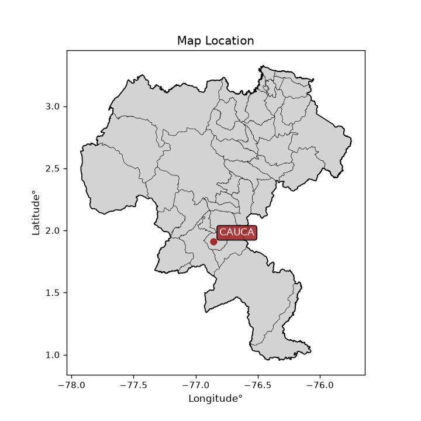</img>

| CountyID                                                                                          | CountyName             | CountyFiles                                                                                                                                                                                                                                                                                                                                                                                                                                                                                                                                                                                                                                                                                                                                                                                                                                                                                                                                                                                                                                                                                                                                                                                                                                                                                                                                                                                                                                                                                                                                                                                                                                                                                                                                                                                                                                                                                                                        |
|:--------------------------------------------------------------------------------------------------|:-----------------------|:-----------------------------------------------------------------------------------------------------------------------------------------------------------------------------------------------------------------------------------------------------------------------------------------------------------------------------------------------------------------------------------------------------------------------------------------------------------------------------------------------------------------------------------------------------------------------------------------------------------------------------------------------------------------------------------------------------------------------------------------------------------------------------------------------------------------------------------------------------------------------------------------------------------------------------------------------------------------------------------------------------------------------------------------------------------------------------------------------------------------------------------------------------------------------------------------------------------------------------------------------------------------------------------------------------------------------------------------------------------------------------------------------------------------------------------------------------------------------------------------------------------------------------------------------------------------------------------------------------------------------------------------------------------------------------------------------------------------------------------------------------------------------------------------------------------------------------------------------------------------------------------------------------------------------------------|
| [19022](https://github.com/rcfdtools/R.HydroTools/blob/main/tool/Population/file/report/19022.md) | Almaguer               | [19022_Rural_Building_202606.zip](https://github.com/rcfdtools/R.GISMobile/blob/main/file/shp/19022_Rural_Building_202606.zip) [19022_Rural_Lot_202606.zip](https://github.com/rcfdtools/R.GISMobile/blob/main/file/shp/19022_Rural_Lot_202606.zip) [19022_Rural_Nomenclature_202606.zip](https://github.com/rcfdtools/R.GISMobile/blob/main/file/shp/19022_Rural_Nomenclature_202606.zip) [19022_Rural_Nomenclature_Road_202606.zip](https://github.com/rcfdtools/R.GISMobile/blob/main/file/shp/19022_Rural_Nomenclature_Road_202606.zip) [19022_Rural_Sector_202606.zip](https://github.com/rcfdtools/R.GISMobile/blob/main/file/shp/19022_Rural_Sector_202606.zip) [19022_Rural_Vereda_202606.zip](https://github.com/rcfdtools/R.GISMobile/blob/main/file/shp/19022_Rural_Vereda_202606.zip) [19022_Urban_Block_202606.zip](https://github.com/rcfdtools/R.GISMobile/blob/main/file/shp/19022_Urban_Block_202606.zip) [19022_Urban_Building_202606.zip](https://github.com/rcfdtools/R.GISMobile/blob/main/file/shp/19022_Urban_Building_202606.zip) [19022_Urban_Lot_202606.zip](https://github.com/rcfdtools/R.GISMobile/blob/main/file/shp/19022_Urban_Lot_202606.zip) [19022_Urban_Nomenclature_202606.zip](https://github.com/rcfdtools/R.GISMobile/blob/main/file/shp/19022_Urban_Nomenclature_202606.zip) [19022_Urban_Nomenclature_Road_202606.zip](https://github.com/rcfdtools/R.GISMobile/blob/main/file/shp/19022_Urban_Nomenclature_Road_202606.zip) [19022_Urban_Perimeter_202606.zip](https://github.com/rcfdtools/R.GISMobile/blob/main/file/shp/19022_Urban_Perimeter_202606.zip) [19022_Urban_Sector_202606.zip](https://github.com/rcfdtools/R.GISMobile/blob/main/file/shp/19022_Urban_Sector_202606.zip)                                                                                                                                             |
| [19050](https://github.com/rcfdtools/R.HydroTools/blob/main/tool/Population/file/report/19050.md) | Argelia                | [19050_Rural_Building_202606.zip](https://github.com/rcfdtools/R.GISMobile/blob/main/file/shp/19050_Rural_Building_202606.zip) [19050_Rural_Lot_202606.zip](https://github.com/rcfdtools/R.GISMobile/blob/main/file/shp/19050_Rural_Lot_202606.zip) [19050_Rural_Nomenclature_202606.zip](https://github.com/rcfdtools/R.GISMobile/blob/main/file/shp/19050_Rural_Nomenclature_202606.zip) [19050_Rural_Sector_202606.zip](https://github.com/rcfdtools/R.GISMobile/blob/main/file/shp/19050_Rural_Sector_202606.zip) [19050_Rural_Vereda_202606.zip](https://github.com/rcfdtools/R.GISMobile/blob/main/file/shp/19050_Rural_Vereda_202606.zip) [19050_Urban_Block_202606.zip](https://github.com/rcfdtools/R.GISMobile/blob/main/file/shp/19050_Urban_Block_202606.zip) [19050_Urban_Building_202606.zip](https://github.com/rcfdtools/R.GISMobile/blob/main/file/shp/19050_Urban_Building_202606.zip) [19050_Urban_Lot_202606.zip](https://github.com/rcfdtools/R.GISMobile/blob/main/file/shp/19050_Urban_Lot_202606.zip) [19050_Urban_Nomenclature_202606.zip](https://github.com/rcfdtools/R.GISMobile/blob/main/file/shp/19050_Urban_Nomenclature_202606.zip) [19050_Urban_Nomenclature_Road_202606.zip](https://github.com/rcfdtools/R.GISMobile/blob/main/file/shp/19050_Urban_Nomenclature_Road_202606.zip) [19050_Urban_Perimeter_202606.zip](https://github.com/rcfdtools/R.GISMobile/blob/main/file/shp/19050_Urban_Perimeter_202606.zip) [19050_Urban_Sector_202606.zip](https://github.com/rcfdtools/R.GISMobile/blob/main/file/shp/19050_Urban_Sector_202606.zip)                                                                                                                                                                                                                                                                                                  |
| [19075](https://github.com/rcfdtools/R.HydroTools/blob/main/tool/Population/file/report/19075.md) | Balboa                 | [19075_Rural_Building_202606.zip](https://github.com/rcfdtools/R.GISMobile/blob/main/file/shp/19075_Rural_Building_202606.zip) [19075_Rural_Lot_202606.zip](https://github.com/rcfdtools/R.GISMobile/blob/main/file/shp/19075_Rural_Lot_202606.zip) [19075_Rural_Nomenclature_202606.zip](https://github.com/rcfdtools/R.GISMobile/blob/main/file/shp/19075_Rural_Nomenclature_202606.zip) [19075_Rural_Nomenclature_Road_202606.zip](https://github.com/rcfdtools/R.GISMobile/blob/main/file/shp/19075_Rural_Nomenclature_Road_202606.zip) [19075_Rural_Sector_202606.zip](https://github.com/rcfdtools/R.GISMobile/blob/main/file/shp/19075_Rural_Sector_202606.zip) [19075_Rural_Vereda_202606.zip](https://github.com/rcfdtools/R.GISMobile/blob/main/file/shp/19075_Rural_Vereda_202606.zip) [19075_Urban_Block_202606.zip](https://github.com/rcfdtools/R.GISMobile/blob/main/file/shp/19075_Urban_Block_202606.zip) [19075_Urban_Building_202606.zip](https://github.com/rcfdtools/R.GISMobile/blob/main/file/shp/19075_Urban_Building_202606.zip) [19075_Urban_Lot_202606.zip](https://github.com/rcfdtools/R.GISMobile/blob/main/file/shp/19075_Urban_Lot_202606.zip) [19075_Urban_Nomenclature_202606.zip](https://github.com/rcfdtools/R.GISMobile/blob/main/file/shp/19075_Urban_Nomenclature_202606.zip) [19075_Urban_Nomenclature_Road_202606.zip](https://github.com/rcfdtools/R.GISMobile/blob/main/file/shp/19075_Urban_Nomenclature_Road_202606.zip) [19075_Urban_Perimeter_202606.zip](https://github.com/rcfdtools/R.GISMobile/blob/main/file/shp/19075_Urban_Perimeter_202606.zip) [19075_Urban_Sector_202606.zip](https://github.com/rcfdtools/R.GISMobile/blob/main/file/shp/19075_Urban_Sector_202606.zip)                                                                                                                                             |
| [19100](https://github.com/rcfdtools/R.HydroTools/blob/main/tool/Population/file/report/19100.md) | Bolívar                | [19100_Rural_Building_202606.zip](https://github.com/rcfdtools/R.GISMobile/blob/main/file/shp/19100_Rural_Building_202606.zip) [19100_Rural_Lot_202606.zip](https://github.com/rcfdtools/R.GISMobile/blob/main/file/shp/19100_Rural_Lot_202606.zip) [19100_Rural_Nomenclature_202606.zip](https://github.com/rcfdtools/R.GISMobile/blob/main/file/shp/19100_Rural_Nomenclature_202606.zip) [19100_Rural_Sector_202606.zip](https://github.com/rcfdtools/R.GISMobile/blob/main/file/shp/19100_Rural_Sector_202606.zip) [19100_Rural_Vereda_202606.zip](https://github.com/rcfdtools/R.GISMobile/blob/main/file/shp/19100_Rural_Vereda_202606.zip) [19100_Urban_Block_202606.zip](https://github.com/rcfdtools/R.GISMobile/blob/main/file/shp/19100_Urban_Block_202606.zip) [19100_Urban_Building_202606.zip](https://github.com/rcfdtools/R.GISMobile/blob/main/file/shp/19100_Urban_Building_202606.zip) [19100_Urban_Lot_202606.zip](https://github.com/rcfdtools/R.GISMobile/blob/main/file/shp/19100_Urban_Lot_202606.zip) [19100_Urban_Nomenclature_202606.zip](https://github.com/rcfdtools/R.GISMobile/blob/main/file/shp/19100_Urban_Nomenclature_202606.zip) [19100_Urban_Nomenclature_Road_202606.zip](https://github.com/rcfdtools/R.GISMobile/blob/main/file/shp/19100_Urban_Nomenclature_Road_202606.zip) [19100_Urban_Perimeter_202606.zip](https://github.com/rcfdtools/R.GISMobile/blob/main/file/shp/19100_Urban_Perimeter_202606.zip) [19100_Urban_Sector_202606.zip](https://github.com/rcfdtools/R.GISMobile/blob/main/file/shp/19100_Urban_Sector_202606.zip)                                                                                                                                                                                                                                                                                                  |
| [19110](https://github.com/rcfdtools/R.HydroTools/blob/main/tool/Population/file/report/19110.md) | Buenos Aires           | [19110_Rural_Building_202606.zip](https://github.com/rcfdtools/R.GISMobile/blob/main/file/shp/19110_Rural_Building_202606.zip) [19110_Rural_Lot_202606.zip](https://github.com/rcfdtools/R.GISMobile/blob/main/file/shp/19110_Rural_Lot_202606.zip) [19110_Rural_Nomenclature_202606.zip](https://github.com/rcfdtools/R.GISMobile/blob/main/file/shp/19110_Rural_Nomenclature_202606.zip) [19110_Rural_Sector_202606.zip](https://github.com/rcfdtools/R.GISMobile/blob/main/file/shp/19110_Rural_Sector_202606.zip) [19110_Rural_Vereda_202606.zip](https://github.com/rcfdtools/R.GISMobile/blob/main/file/shp/19110_Rural_Vereda_202606.zip) [19110_Urban_Block_202606.zip](https://github.com/rcfdtools/R.GISMobile/blob/main/file/shp/19110_Urban_Block_202606.zip) [19110_Urban_Building_202606.zip](https://github.com/rcfdtools/R.GISMobile/blob/main/file/shp/19110_Urban_Building_202606.zip) [19110_Urban_Lot_202606.zip](https://github.com/rcfdtools/R.GISMobile/blob/main/file/shp/19110_Urban_Lot_202606.zip) [19110_Urban_Nomenclature_202606.zip](https://github.com/rcfdtools/R.GISMobile/blob/main/file/shp/19110_Urban_Nomenclature_202606.zip) [19110_Urban_Nomenclature_Road_202606.zip](https://github.com/rcfdtools/R.GISMobile/blob/main/file/shp/19110_Urban_Nomenclature_Road_202606.zip) [19110_Urban_Perimeter_202606.zip](https://github.com/rcfdtools/R.GISMobile/blob/main/file/shp/19110_Urban_Perimeter_202606.zip) [19110_Urban_Sector_202606.zip](https://github.com/rcfdtools/R.GISMobile/blob/main/file/shp/19110_Urban_Sector_202606.zip)                                                                                                                                                                                                                                                                                                  |
| [19130](https://github.com/rcfdtools/R.HydroTools/blob/main/tool/Population/file/report/19130.md) | Cajibío                | [19130_Rural_Building_202606.zip](https://github.com/rcfdtools/R.GISMobile/blob/main/file/shp/19130_Rural_Building_202606.zip) [19130_Rural_Lot_202606.zip](https://github.com/rcfdtools/R.GISMobile/blob/main/file/shp/19130_Rural_Lot_202606.zip) [19130_Rural_Nomenclature_202606.zip](https://github.com/rcfdtools/R.GISMobile/blob/main/file/shp/19130_Rural_Nomenclature_202606.zip) [19130_Rural_Nomenclature_Road_202606.zip](https://github.com/rcfdtools/R.GISMobile/blob/main/file/shp/19130_Rural_Nomenclature_Road_202606.zip) [19130_Rural_Sector_202606.zip](https://github.com/rcfdtools/R.GISMobile/blob/main/file/shp/19130_Rural_Sector_202606.zip) [19130_Rural_Vereda_202606.zip](https://github.com/rcfdtools/R.GISMobile/blob/main/file/shp/19130_Rural_Vereda_202606.zip) [19130_Urban_Block_202606.zip](https://github.com/rcfdtools/R.GISMobile/blob/main/file/shp/19130_Urban_Block_202606.zip) [19130_Urban_Building_202606.zip](https://github.com/rcfdtools/R.GISMobile/blob/main/file/shp/19130_Urban_Building_202606.zip) [19130_Urban_Lot_202606.zip](https://github.com/rcfdtools/R.GISMobile/blob/main/file/shp/19130_Urban_Lot_202606.zip) [19130_Urban_Neighborhood_202606.zip](https://github.com/rcfdtools/R.GISMobile/blob/main/file/shp/19130_Urban_Neighborhood_202606.zip) [19130_Urban_Nomenclature_202606.zip](https://github.com/rcfdtools/R.GISMobile/blob/main/file/shp/19130_Urban_Nomenclature_202606.zip) [19130_Urban_Nomenclature_Road_202606.zip](https://github.com/rcfdtools/R.GISMobile/blob/main/file/shp/19130_Urban_Nomenclature_Road_202606.zip) [19130_Urban_Perimeter_202606.zip](https://github.com/rcfdtools/R.GISMobile/blob/main/file/shp/19130_Urban_Perimeter_202606.zip) [19130_Urban_Sector_202606.zip](https://github.com/rcfdtools/R.GISMobile/blob/main/file/shp/19130_Urban_Sector_202606.zip)  |
| [19137](https://github.com/rcfdtools/R.HydroTools/blob/main/tool/Population/file/report/19137.md) | Caldono                | [19137_Rural_Building_202606.zip](https://github.com/rcfdtools/R.GISMobile/blob/main/file/shp/19137_Rural_Building_202606.zip) [19137_Rural_Lot_202606.zip](https://github.com/rcfdtools/R.GISMobile/blob/main/file/shp/19137_Rural_Lot_202606.zip) [19137_Rural_Nomenclature_202606.zip](https://github.com/rcfdtools/R.GISMobile/blob/main/file/shp/19137_Rural_Nomenclature_202606.zip) [19137_Rural_Sector_202606.zip](https://github.com/rcfdtools/R.GISMobile/blob/main/file/shp/19137_Rural_Sector_202606.zip) [19137_Rural_Vereda_202606.zip](https://github.com/rcfdtools/R.GISMobile/blob/main/file/shp/19137_Rural_Vereda_202606.zip) [19137_Urban_Block_202606.zip](https://github.com/rcfdtools/R.GISMobile/blob/main/file/shp/19137_Urban_Block_202606.zip) [19137_Urban_Building_202606.zip](https://github.com/rcfdtools/R.GISMobile/blob/main/file/shp/19137_Urban_Building_202606.zip) [19137_Urban_Lot_202606.zip](https://github.com/rcfdtools/R.GISMobile/blob/main/file/shp/19137_Urban_Lot_202606.zip) [19137_Urban_Nomenclature_202606.zip](https://github.com/rcfdtools/R.GISMobile/blob/main/file/shp/19137_Urban_Nomenclature_202606.zip) [19137_Urban_Nomenclature_Road_202606.zip](https://github.com/rcfdtools/R.GISMobile/blob/main/file/shp/19137_Urban_Nomenclature_Road_202606.zip) [19137_Urban_Perimeter_202606.zip](https://github.com/rcfdtools/R.GISMobile/blob/main/file/shp/19137_Urban_Perimeter_202606.zip) [19137_Urban_Sector_202606.zip](https://github.com/rcfdtools/R.GISMobile/blob/main/file/shp/19137_Urban_Sector_202606.zip)                                                                                                                                                                                                                                                                                                  |
| [19142](https://github.com/rcfdtools/R.HydroTools/blob/main/tool/Population/file/report/19142.md) | Caloto                 | [19142_Rural_Lot_202606.zip](https://github.com/rcfdtools/R.GISMobile/blob/main/file/shp/19142_Rural_Lot_202606.zip) [19142_Rural_Nomenclature_202606.zip](https://github.com/rcfdtools/R.GISMobile/blob/main/file/shp/19142_Rural_Nomenclature_202606.zip) [19142_Rural_Sector_202606.zip](https://github.com/rcfdtools/R.GISMobile/blob/main/file/shp/19142_Rural_Sector_202606.zip) [19142_Rural_Vereda_202606.zip](https://github.com/rcfdtools/R.GISMobile/blob/main/file/shp/19142_Rural_Vereda_202606.zip) [19142_Urban_Block_202606.zip](https://github.com/rcfdtools/R.GISMobile/blob/main/file/shp/19142_Urban_Block_202606.zip) [19142_Urban_Building_202606.zip](https://github.com/rcfdtools/R.GISMobile/blob/main/file/shp/19142_Urban_Building_202606.zip) [19142_Urban_Lot_202606.zip](https://github.com/rcfdtools/R.GISMobile/blob/main/file/shp/19142_Urban_Lot_202606.zip) [19142_Urban_Nomenclature_202606.zip](https://github.com/rcfdtools/R.GISMobile/blob/main/file/shp/19142_Urban_Nomenclature_202606.zip) [19142_Urban_Nomenclature_Road_202606.zip](https://github.com/rcfdtools/R.GISMobile/blob/main/file/shp/19142_Urban_Nomenclature_Road_202606.zip) [19142_Urban_Perimeter_202606.zip](https://github.com/rcfdtools/R.GISMobile/blob/main/file/shp/19142_Urban_Perimeter_202606.zip) [19142_Urban_Sector_202606.zip](https://github.com/rcfdtools/R.GISMobile/blob/main/file/shp/19142_Urban_Sector_202606.zip)                                                                                                                                                                                                                                                                                                                                                                                                                                     |
| [19212](https://github.com/rcfdtools/R.HydroTools/blob/main/tool/Population/file/report/19212.md) | Corinto                | [19212_Rural_Building_202606.zip](https://github.com/rcfdtools/R.GISMobile/blob/main/file/shp/19212_Rural_Building_202606.zip) [19212_Rural_Lot_202606.zip](https://github.com/rcfdtools/R.GISMobile/blob/main/file/shp/19212_Rural_Lot_202606.zip) [19212_Rural_Nomenclature_202606.zip](https://github.com/rcfdtools/R.GISMobile/blob/main/file/shp/19212_Rural_Nomenclature_202606.zip) [19212_Rural_Sector_202606.zip](https://github.com/rcfdtools/R.GISMobile/blob/main/file/shp/19212_Rural_Sector_202606.zip) [19212_Rural_Vereda_202606.zip](https://github.com/rcfdtools/R.GISMobile/blob/main/file/shp/19212_Rural_Vereda_202606.zip) [19212_Urban_Block_202606.zip](https://github.com/rcfdtools/R.GISMobile/blob/main/file/shp/19212_Urban_Block_202606.zip) [19212_Urban_Building_202606.zip](https://github.com/rcfdtools/R.GISMobile/blob/main/file/shp/19212_Urban_Building_202606.zip) [19212_Urban_Lot_202606.zip](https://github.com/rcfdtools/R.GISMobile/blob/main/file/shp/19212_Urban_Lot_202606.zip) [19212_Urban_Nomenclature_202606.zip](https://github.com/rcfdtools/R.GISMobile/blob/main/file/shp/19212_Urban_Nomenclature_202606.zip) [19212_Urban_Nomenclature_Road_202606.zip](https://github.com/rcfdtools/R.GISMobile/blob/main/file/shp/19212_Urban_Nomenclature_Road_202606.zip) [19212_Urban_Perimeter_202606.zip](https://github.com/rcfdtools/R.GISMobile/blob/main/file/shp/19212_Urban_Perimeter_202606.zip) [19212_Urban_Sector_202606.zip](https://github.com/rcfdtools/R.GISMobile/blob/main/file/shp/19212_Urban_Sector_202606.zip)                                                                                                                                                                                                                                                                                                  |
| [19256](https://github.com/rcfdtools/R.HydroTools/blob/main/tool/Population/file/report/19256.md) | El Tambo               | [19256_Rural_Building_202606.zip](https://github.com/rcfdtools/R.GISMobile/blob/main/file/shp/19256_Rural_Building_202606.zip) [19256_Rural_Lot_202606.zip](https://github.com/rcfdtools/R.GISMobile/blob/main/file/shp/19256_Rural_Lot_202606.zip) [19256_Rural_Nomenclature_202606.zip](https://github.com/rcfdtools/R.GISMobile/blob/main/file/shp/19256_Rural_Nomenclature_202606.zip) [19256_Rural_Nomenclature_Road_202606.zip](https://github.com/rcfdtools/R.GISMobile/blob/main/file/shp/19256_Rural_Nomenclature_Road_202606.zip) [19256_Rural_Sector_202606.zip](https://github.com/rcfdtools/R.GISMobile/blob/main/file/shp/19256_Rural_Sector_202606.zip) [19256_Rural_Vereda_202606.zip](https://github.com/rcfdtools/R.GISMobile/blob/main/file/shp/19256_Rural_Vereda_202606.zip) [19256_Urban_Block_202606.zip](https://github.com/rcfdtools/R.GISMobile/blob/main/file/shp/19256_Urban_Block_202606.zip) [19256_Urban_Building_202606.zip](https://github.com/rcfdtools/R.GISMobile/blob/main/file/shp/19256_Urban_Building_202606.zip) [19256_Urban_Lot_202606.zip](https://github.com/rcfdtools/R.GISMobile/blob/main/file/shp/19256_Urban_Lot_202606.zip) [19256_Urban_Neighborhood_202606.zip](https://github.com/rcfdtools/R.GISMobile/blob/main/file/shp/19256_Urban_Neighborhood_202606.zip) [19256_Urban_Nomenclature_202606.zip](https://github.com/rcfdtools/R.GISMobile/blob/main/file/shp/19256_Urban_Nomenclature_202606.zip) [19256_Urban_Nomenclature_Road_202606.zip](https://github.com/rcfdtools/R.GISMobile/blob/main/file/shp/19256_Urban_Nomenclature_Road_202606.zip) [19256_Urban_Perimeter_202606.zip](https://github.com/rcfdtools/R.GISMobile/blob/main/file/shp/19256_Urban_Perimeter_202606.zip) [19256_Urban_Sector_202606.zip](https://github.com/rcfdtools/R.GISMobile/blob/main/file/shp/19256_Urban_Sector_202606.zip)  |
| [19290](https://github.com/rcfdtools/R.HydroTools/blob/main/tool/Population/file/report/19290.md) | Florencia              | [19290_Rural_Lot_202606.zip](https://github.com/rcfdtools/R.GISMobile/blob/main/file/shp/19290_Rural_Lot_202606.zip) [19290_Rural_Nomenclature_202606.zip](https://github.com/rcfdtools/R.GISMobile/blob/main/file/shp/19290_Rural_Nomenclature_202606.zip) [19290_Rural_Sector_202606.zip](https://github.com/rcfdtools/R.GISMobile/blob/main/file/shp/19290_Rural_Sector_202606.zip) [19290_Rural_Vereda_202606.zip](https://github.com/rcfdtools/R.GISMobile/blob/main/file/shp/19290_Rural_Vereda_202606.zip) [19290_Urban_Block_202606.zip](https://github.com/rcfdtools/R.GISMobile/blob/main/file/shp/19290_Urban_Block_202606.zip) [19290_Urban_Building_202606.zip](https://github.com/rcfdtools/R.GISMobile/blob/main/file/shp/19290_Urban_Building_202606.zip) [19290_Urban_Lot_202606.zip](https://github.com/rcfdtools/R.GISMobile/blob/main/file/shp/19290_Urban_Lot_202606.zip) [19290_Urban_Nomenclature_202606.zip](https://github.com/rcfdtools/R.GISMobile/blob/main/file/shp/19290_Urban_Nomenclature_202606.zip) [19290_Urban_Nomenclature_Road_202606.zip](https://github.com/rcfdtools/R.GISMobile/blob/main/file/shp/19290_Urban_Nomenclature_Road_202606.zip) [19290_Urban_Perimeter_202606.zip](https://github.com/rcfdtools/R.GISMobile/blob/main/file/shp/19290_Urban_Perimeter_202606.zip) [19290_Urban_Sector_202606.zip](https://github.com/rcfdtools/R.GISMobile/blob/main/file/shp/19290_Urban_Sector_202606.zip)                                                                                                                                                                                                                                                                                                                                                                                                                                     |
| [19300](https://github.com/rcfdtools/R.HydroTools/blob/main/tool/Population/file/report/19300.md) | Guachené               | [19300_Rural_Building_202606.zip](https://github.com/rcfdtools/R.GISMobile/blob/main/file/shp/19300_Rural_Building_202606.zip) [19300_Rural_Lot_202606.zip](https://github.com/rcfdtools/R.GISMobile/blob/main/file/shp/19300_Rural_Lot_202606.zip) [19300_Rural_Nomenclature_202606.zip](https://github.com/rcfdtools/R.GISMobile/blob/main/file/shp/19300_Rural_Nomenclature_202606.zip) [19300_Rural_Nomenclature_Road_202606.zip](https://github.com/rcfdtools/R.GISMobile/blob/main/file/shp/19300_Rural_Nomenclature_Road_202606.zip) [19300_Rural_Sector_202606.zip](https://github.com/rcfdtools/R.GISMobile/blob/main/file/shp/19300_Rural_Sector_202606.zip) [19300_Rural_Vereda_202606.zip](https://github.com/rcfdtools/R.GISMobile/blob/main/file/shp/19300_Rural_Vereda_202606.zip) [19300_Urban_Block_202606.zip](https://github.com/rcfdtools/R.GISMobile/blob/main/file/shp/19300_Urban_Block_202606.zip) [19300_Urban_Building_202606.zip](https://github.com/rcfdtools/R.GISMobile/blob/main/file/shp/19300_Urban_Building_202606.zip) [19300_Urban_Lot_202606.zip](https://github.com/rcfdtools/R.GISMobile/blob/main/file/shp/19300_Urban_Lot_202606.zip) [19300_Urban_Nomenclature_202606.zip](https://github.com/rcfdtools/R.GISMobile/blob/main/file/shp/19300_Urban_Nomenclature_202606.zip) [19300_Urban_Nomenclature_Road_202606.zip](https://github.com/rcfdtools/R.GISMobile/blob/main/file/shp/19300_Urban_Nomenclature_Road_202606.zip) [19300_Urban_Perimeter_202606.zip](https://github.com/rcfdtools/R.GISMobile/blob/main/file/shp/19300_Urban_Perimeter_202606.zip) [19300_Urban_Sector_202606.zip](https://github.com/rcfdtools/R.GISMobile/blob/main/file/shp/19300_Urban_Sector_202606.zip)                                                                                                                                             |
| [19318](https://github.com/rcfdtools/R.HydroTools/blob/main/tool/Population/file/report/19318.md) | Guapi                  | [19318_Rural_Lot_202606.zip](https://github.com/rcfdtools/R.GISMobile/blob/main/file/shp/19318_Rural_Lot_202606.zip) [19318_Rural_Sector_202606.zip](https://github.com/rcfdtools/R.GISMobile/blob/main/file/shp/19318_Rural_Sector_202606.zip) [19318_Rural_Vereda_202606.zip](https://github.com/rcfdtools/R.GISMobile/blob/main/file/shp/19318_Rural_Vereda_202606.zip) [19318_Urban_Block_202606.zip](https://github.com/rcfdtools/R.GISMobile/blob/main/file/shp/19318_Urban_Block_202606.zip) [19318_Urban_Building_202606.zip](https://github.com/rcfdtools/R.GISMobile/blob/main/file/shp/19318_Urban_Building_202606.zip) [19318_Urban_Lot_202606.zip](https://github.com/rcfdtools/R.GISMobile/blob/main/file/shp/19318_Urban_Lot_202606.zip) [19318_Urban_Nomenclature_202606.zip](https://github.com/rcfdtools/R.GISMobile/blob/main/file/shp/19318_Urban_Nomenclature_202606.zip) [19318_Urban_Nomenclature_Road_202606.zip](https://github.com/rcfdtools/R.GISMobile/blob/main/file/shp/19318_Urban_Nomenclature_Road_202606.zip) [19318_Urban_Perimeter_202606.zip](https://github.com/rcfdtools/R.GISMobile/blob/main/file/shp/19318_Urban_Perimeter_202606.zip) [19318_Urban_Sector_202606.zip](https://github.com/rcfdtools/R.GISMobile/blob/main/file/shp/19318_Urban_Sector_202606.zip)                                                                                                                                                                                                                                                                                                                                                                                                                                                                                                                                                                                |
| [19355](https://github.com/rcfdtools/R.HydroTools/blob/main/tool/Population/file/report/19355.md) | Inzá                   | [19355_Rural_Building_202606.zip](https://github.com/rcfdtools/R.GISMobile/blob/main/file/shp/19355_Rural_Building_202606.zip) [19355_Rural_Lot_202606.zip](https://github.com/rcfdtools/R.GISMobile/blob/main/file/shp/19355_Rural_Lot_202606.zip) [19355_Rural_Nomenclature_202606.zip](https://github.com/rcfdtools/R.GISMobile/blob/main/file/shp/19355_Rural_Nomenclature_202606.zip) [19355_Rural_Nomenclature_Road_202606.zip](https://github.com/rcfdtools/R.GISMobile/blob/main/file/shp/19355_Rural_Nomenclature_Road_202606.zip) [19355_Rural_Sector_202606.zip](https://github.com/rcfdtools/R.GISMobile/blob/main/file/shp/19355_Rural_Sector_202606.zip) [19355_Rural_Vereda_202606.zip](https://github.com/rcfdtools/R.GISMobile/blob/main/file/shp/19355_Rural_Vereda_202606.zip) [19355_Urban_Block_202606.zip](https://github.com/rcfdtools/R.GISMobile/blob/main/file/shp/19355_Urban_Block_202606.zip) [19355_Urban_Building_202606.zip](https://github.com/rcfdtools/R.GISMobile/blob/main/file/shp/19355_Urban_Building_202606.zip) [19355_Urban_Lot_202606.zip](https://github.com/rcfdtools/R.GISMobile/blob/main/file/shp/19355_Urban_Lot_202606.zip) [19355_Urban_Nomenclature_202606.zip](https://github.com/rcfdtools/R.GISMobile/blob/main/file/shp/19355_Urban_Nomenclature_202606.zip) [19355_Urban_Nomenclature_Road_202606.zip](https://github.com/rcfdtools/R.GISMobile/blob/main/file/shp/19355_Urban_Nomenclature_Road_202606.zip) [19355_Urban_Perimeter_202606.zip](https://github.com/rcfdtools/R.GISMobile/blob/main/file/shp/19355_Urban_Perimeter_202606.zip) [19355_Urban_Sector_202606.zip](https://github.com/rcfdtools/R.GISMobile/blob/main/file/shp/19355_Urban_Sector_202606.zip)                                                                                                                                             |
| [19364](https://github.com/rcfdtools/R.HydroTools/blob/main/tool/Population/file/report/19364.md) | Jambaló                | [19364_Rural_Lot_202606.zip](https://github.com/rcfdtools/R.GISMobile/blob/main/file/shp/19364_Rural_Lot_202606.zip) [19364_Rural_Nomenclature_202606.zip](https://github.com/rcfdtools/R.GISMobile/blob/main/file/shp/19364_Rural_Nomenclature_202606.zip) [19364_Rural_Sector_202606.zip](https://github.com/rcfdtools/R.GISMobile/blob/main/file/shp/19364_Rural_Sector_202606.zip) [19364_Rural_Vereda_202606.zip](https://github.com/rcfdtools/R.GISMobile/blob/main/file/shp/19364_Rural_Vereda_202606.zip) [19364_Urban_Block_202606.zip](https://github.com/rcfdtools/R.GISMobile/blob/main/file/shp/19364_Urban_Block_202606.zip) [19364_Urban_Building_202606.zip](https://github.com/rcfdtools/R.GISMobile/blob/main/file/shp/19364_Urban_Building_202606.zip) [19364_Urban_Lot_202606.zip](https://github.com/rcfdtools/R.GISMobile/blob/main/file/shp/19364_Urban_Lot_202606.zip) [19364_Urban_Nomenclature_202606.zip](https://github.com/rcfdtools/R.GISMobile/blob/main/file/shp/19364_Urban_Nomenclature_202606.zip) [19364_Urban_Nomenclature_Road_202606.zip](https://github.com/rcfdtools/R.GISMobile/blob/main/file/shp/19364_Urban_Nomenclature_Road_202606.zip) [19364_Urban_Perimeter_202606.zip](https://github.com/rcfdtools/R.GISMobile/blob/main/file/shp/19364_Urban_Perimeter_202606.zip) [19364_Urban_Sector_202606.zip](https://github.com/rcfdtools/R.GISMobile/blob/main/file/shp/19364_Urban_Sector_202606.zip)                                                                                                                                                                                                                                                                                                                                                                                                                                     |
| [19392](https://github.com/rcfdtools/R.HydroTools/blob/main/tool/Population/file/report/19392.md) | La Sierra              | [19392_Rural_Building_202606.zip](https://github.com/rcfdtools/R.GISMobile/blob/main/file/shp/19392_Rural_Building_202606.zip) [19392_Rural_Lot_202606.zip](https://github.com/rcfdtools/R.GISMobile/blob/main/file/shp/19392_Rural_Lot_202606.zip) [19392_Rural_Nomenclature_202606.zip](https://github.com/rcfdtools/R.GISMobile/blob/main/file/shp/19392_Rural_Nomenclature_202606.zip) [19392_Rural_Sector_202606.zip](https://github.com/rcfdtools/R.GISMobile/blob/main/file/shp/19392_Rural_Sector_202606.zip) [19392_Rural_Vereda_202606.zip](https://github.com/rcfdtools/R.GISMobile/blob/main/file/shp/19392_Rural_Vereda_202606.zip) [19392_Urban_Block_202606.zip](https://github.com/rcfdtools/R.GISMobile/blob/main/file/shp/19392_Urban_Block_202606.zip) [19392_Urban_Building_202606.zip](https://github.com/rcfdtools/R.GISMobile/blob/main/file/shp/19392_Urban_Building_202606.zip) [19392_Urban_Lot_202606.zip](https://github.com/rcfdtools/R.GISMobile/blob/main/file/shp/19392_Urban_Lot_202606.zip) [19392_Urban_Nomenclature_202606.zip](https://github.com/rcfdtools/R.GISMobile/blob/main/file/shp/19392_Urban_Nomenclature_202606.zip) [19392_Urban_Nomenclature_Road_202606.zip](https://github.com/rcfdtools/R.GISMobile/blob/main/file/shp/19392_Urban_Nomenclature_Road_202606.zip) [19392_Urban_Perimeter_202606.zip](https://github.com/rcfdtools/R.GISMobile/blob/main/file/shp/19392_Urban_Perimeter_202606.zip) [19392_Urban_Sector_202606.zip](https://github.com/rcfdtools/R.GISMobile/blob/main/file/shp/19392_Urban_Sector_202606.zip)                                                                                                                                                                                                                                                                                                  |
| [19397](https://github.com/rcfdtools/R.HydroTools/blob/main/tool/Population/file/report/19397.md) | La Vega                | [19397_Rural_Building_202606.zip](https://github.com/rcfdtools/R.GISMobile/blob/main/file/shp/19397_Rural_Building_202606.zip) [19397_Rural_Lot_202606.zip](https://github.com/rcfdtools/R.GISMobile/blob/main/file/shp/19397_Rural_Lot_202606.zip) [19397_Rural_Nomenclature_202606.zip](https://github.com/rcfdtools/R.GISMobile/blob/main/file/shp/19397_Rural_Nomenclature_202606.zip) [19397_Rural_Nomenclature_Road_202606.zip](https://github.com/rcfdtools/R.GISMobile/blob/main/file/shp/19397_Rural_Nomenclature_Road_202606.zip) [19397_Rural_Sector_202606.zip](https://github.com/rcfdtools/R.GISMobile/blob/main/file/shp/19397_Rural_Sector_202606.zip) [19397_Rural_Vereda_202606.zip](https://github.com/rcfdtools/R.GISMobile/blob/main/file/shp/19397_Rural_Vereda_202606.zip) [19397_Urban_Block_202606.zip](https://github.com/rcfdtools/R.GISMobile/blob/main/file/shp/19397_Urban_Block_202606.zip) [19397_Urban_Building_202606.zip](https://github.com/rcfdtools/R.GISMobile/blob/main/file/shp/19397_Urban_Building_202606.zip) [19397_Urban_Lot_202606.zip](https://github.com/rcfdtools/R.GISMobile/blob/main/file/shp/19397_Urban_Lot_202606.zip) [19397_Urban_Nomenclature_202606.zip](https://github.com/rcfdtools/R.GISMobile/blob/main/file/shp/19397_Urban_Nomenclature_202606.zip) [19397_Urban_Nomenclature_Road_202606.zip](https://github.com/rcfdtools/R.GISMobile/blob/main/file/shp/19397_Urban_Nomenclature_Road_202606.zip) [19397_Urban_Perimeter_202606.zip](https://github.com/rcfdtools/R.GISMobile/blob/main/file/shp/19397_Urban_Perimeter_202606.zip) [19397_Urban_Sector_202606.zip](https://github.com/rcfdtools/R.GISMobile/blob/main/file/shp/19397_Urban_Sector_202606.zip)                                                                                                                                             |
| [19418](https://github.com/rcfdtools/R.HydroTools/blob/main/tool/Population/file/report/19418.md) | López                  | [19418_Rural_Lot_202606.zip](https://github.com/rcfdtools/R.GISMobile/blob/main/file/shp/19418_Rural_Lot_202606.zip) [19418_Rural_Nomenclature_Road_202606.zip](https://github.com/rcfdtools/R.GISMobile/blob/main/file/shp/19418_Rural_Nomenclature_Road_202606.zip) [19418_Rural_Sector_202606.zip](https://github.com/rcfdtools/R.GISMobile/blob/main/file/shp/19418_Rural_Sector_202606.zip) [19418_Rural_Vereda_202606.zip](https://github.com/rcfdtools/R.GISMobile/blob/main/file/shp/19418_Rural_Vereda_202606.zip) [19418_Urban_Block_202606.zip](https://github.com/rcfdtools/R.GISMobile/blob/main/file/shp/19418_Urban_Block_202606.zip) [19418_Urban_Building_202606.zip](https://github.com/rcfdtools/R.GISMobile/blob/main/file/shp/19418_Urban_Building_202606.zip) [19418_Urban_Lot_202606.zip](https://github.com/rcfdtools/R.GISMobile/blob/main/file/shp/19418_Urban_Lot_202606.zip) [19418_Urban_Nomenclature_202606.zip](https://github.com/rcfdtools/R.GISMobile/blob/main/file/shp/19418_Urban_Nomenclature_202606.zip) [19418_Urban_Nomenclature_Road_202606.zip](https://github.com/rcfdtools/R.GISMobile/blob/main/file/shp/19418_Urban_Nomenclature_Road_202606.zip) [19418_Urban_Perimeter_202606.zip](https://github.com/rcfdtools/R.GISMobile/blob/main/file/shp/19418_Urban_Perimeter_202606.zip) [19418_Urban_Sector_202606.zip](https://github.com/rcfdtools/R.GISMobile/blob/main/file/shp/19418_Urban_Sector_202606.zip)                                                                                                                                                                                                                                                                                                                                                                                                                           |
| [19450](https://github.com/rcfdtools/R.HydroTools/blob/main/tool/Population/file/report/19450.md) | Mercaderes             | [19450_Rural_Building_202606.zip](https://github.com/rcfdtools/R.GISMobile/blob/main/file/shp/19450_Rural_Building_202606.zip) [19450_Rural_Lot_202606.zip](https://github.com/rcfdtools/R.GISMobile/blob/main/file/shp/19450_Rural_Lot_202606.zip) [19450_Rural_Nomenclature_202606.zip](https://github.com/rcfdtools/R.GISMobile/blob/main/file/shp/19450_Rural_Nomenclature_202606.zip) [19450_Rural_Sector_202606.zip](https://github.com/rcfdtools/R.GISMobile/blob/main/file/shp/19450_Rural_Sector_202606.zip) [19450_Rural_Vereda_202606.zip](https://github.com/rcfdtools/R.GISMobile/blob/main/file/shp/19450_Rural_Vereda_202606.zip) [19450_Urban_Block_202606.zip](https://github.com/rcfdtools/R.GISMobile/blob/main/file/shp/19450_Urban_Block_202606.zip) [19450_Urban_Building_202606.zip](https://github.com/rcfdtools/R.GISMobile/blob/main/file/shp/19450_Urban_Building_202606.zip) [19450_Urban_Lot_202606.zip](https://github.com/rcfdtools/R.GISMobile/blob/main/file/shp/19450_Urban_Lot_202606.zip) [19450_Urban_Nomenclature_202606.zip](https://github.com/rcfdtools/R.GISMobile/blob/main/file/shp/19450_Urban_Nomenclature_202606.zip) [19450_Urban_Nomenclature_Road_202606.zip](https://github.com/rcfdtools/R.GISMobile/blob/main/file/shp/19450_Urban_Nomenclature_Road_202606.zip) [19450_Urban_Perimeter_202606.zip](https://github.com/rcfdtools/R.GISMobile/blob/main/file/shp/19450_Urban_Perimeter_202606.zip) [19450_Urban_Sector_202606.zip](https://github.com/rcfdtools/R.GISMobile/blob/main/file/shp/19450_Urban_Sector_202606.zip)                                                                                                                                                                                                                                                                                                  |
| [19455](https://github.com/rcfdtools/R.HydroTools/blob/main/tool/Population/file/report/19455.md) | Miranda                | [19455_Rural_Building_202606.zip](https://github.com/rcfdtools/R.GISMobile/blob/main/file/shp/19455_Rural_Building_202606.zip) [19455_Rural_Lot_202606.zip](https://github.com/rcfdtools/R.GISMobile/blob/main/file/shp/19455_Rural_Lot_202606.zip) [19455_Rural_Nomenclature_202606.zip](https://github.com/rcfdtools/R.GISMobile/blob/main/file/shp/19455_Rural_Nomenclature_202606.zip) [19455_Rural_Nomenclature_Road_202606.zip](https://github.com/rcfdtools/R.GISMobile/blob/main/file/shp/19455_Rural_Nomenclature_Road_202606.zip) [19455_Rural_Sector_202606.zip](https://github.com/rcfdtools/R.GISMobile/blob/main/file/shp/19455_Rural_Sector_202606.zip) [19455_Rural_Vereda_202606.zip](https://github.com/rcfdtools/R.GISMobile/blob/main/file/shp/19455_Rural_Vereda_202606.zip) [19455_Urban_Block_202606.zip](https://github.com/rcfdtools/R.GISMobile/blob/main/file/shp/19455_Urban_Block_202606.zip) [19455_Urban_Building_202606.zip](https://github.com/rcfdtools/R.GISMobile/blob/main/file/shp/19455_Urban_Building_202606.zip) [19455_Urban_Lot_202606.zip](https://github.com/rcfdtools/R.GISMobile/blob/main/file/shp/19455_Urban_Lot_202606.zip) [19455_Urban_Neighborhood_202606.zip](https://github.com/rcfdtools/R.GISMobile/blob/main/file/shp/19455_Urban_Neighborhood_202606.zip) [19455_Urban_Nomenclature_202606.zip](https://github.com/rcfdtools/R.GISMobile/blob/main/file/shp/19455_Urban_Nomenclature_202606.zip) [19455_Urban_Nomenclature_Road_202606.zip](https://github.com/rcfdtools/R.GISMobile/blob/main/file/shp/19455_Urban_Nomenclature_Road_202606.zip) [19455_Urban_Perimeter_202606.zip](https://github.com/rcfdtools/R.GISMobile/blob/main/file/shp/19455_Urban_Perimeter_202606.zip) [19455_Urban_Sector_202606.zip](https://github.com/rcfdtools/R.GISMobile/blob/main/file/shp/19455_Urban_Sector_202606.zip)  |
| [19473](https://github.com/rcfdtools/R.HydroTools/blob/main/tool/Population/file/report/19473.md) | Morales                | [19473_Rural_Building_202606.zip](https://github.com/rcfdtools/R.GISMobile/blob/main/file/shp/19473_Rural_Building_202606.zip) [19473_Rural_Lot_202606.zip](https://github.com/rcfdtools/R.GISMobile/blob/main/file/shp/19473_Rural_Lot_202606.zip) [19473_Rural_Nomenclature_202606.zip](https://github.com/rcfdtools/R.GISMobile/blob/main/file/shp/19473_Rural_Nomenclature_202606.zip) [19473_Rural_Sector_202606.zip](https://github.com/rcfdtools/R.GISMobile/blob/main/file/shp/19473_Rural_Sector_202606.zip) [19473_Rural_Vereda_202606.zip](https://github.com/rcfdtools/R.GISMobile/blob/main/file/shp/19473_Rural_Vereda_202606.zip) [19473_Urban_Block_202606.zip](https://github.com/rcfdtools/R.GISMobile/blob/main/file/shp/19473_Urban_Block_202606.zip) [19473_Urban_Building_202606.zip](https://github.com/rcfdtools/R.GISMobile/blob/main/file/shp/19473_Urban_Building_202606.zip) [19473_Urban_Lot_202606.zip](https://github.com/rcfdtools/R.GISMobile/blob/main/file/shp/19473_Urban_Lot_202606.zip) [19473_Urban_Nomenclature_202606.zip](https://github.com/rcfdtools/R.GISMobile/blob/main/file/shp/19473_Urban_Nomenclature_202606.zip) [19473_Urban_Nomenclature_Road_202606.zip](https://github.com/rcfdtools/R.GISMobile/blob/main/file/shp/19473_Urban_Nomenclature_Road_202606.zip) [19473_Urban_Perimeter_202606.zip](https://github.com/rcfdtools/R.GISMobile/blob/main/file/shp/19473_Urban_Perimeter_202606.zip) [19473_Urban_Sector_202606.zip](https://github.com/rcfdtools/R.GISMobile/blob/main/file/shp/19473_Urban_Sector_202606.zip)                                                                                                                                                                                                                                                                                                  |
| [19513](https://github.com/rcfdtools/R.HydroTools/blob/main/tool/Population/file/report/19513.md) | Padilla                | [19513_Rural_Building_202606.zip](https://github.com/rcfdtools/R.GISMobile/blob/main/file/shp/19513_Rural_Building_202606.zip) [19513_Rural_Lot_202606.zip](https://github.com/rcfdtools/R.GISMobile/blob/main/file/shp/19513_Rural_Lot_202606.zip) [19513_Rural_Nomenclature_202606.zip](https://github.com/rcfdtools/R.GISMobile/blob/main/file/shp/19513_Rural_Nomenclature_202606.zip) [19513_Rural_Nomenclature_Road_202606.zip](https://github.com/rcfdtools/R.GISMobile/blob/main/file/shp/19513_Rural_Nomenclature_Road_202606.zip) [19513_Rural_Sector_202606.zip](https://github.com/rcfdtools/R.GISMobile/blob/main/file/shp/19513_Rural_Sector_202606.zip) [19513_Rural_Vereda_202606.zip](https://github.com/rcfdtools/R.GISMobile/blob/main/file/shp/19513_Rural_Vereda_202606.zip) [19513_Urban_Block_202606.zip](https://github.com/rcfdtools/R.GISMobile/blob/main/file/shp/19513_Urban_Block_202606.zip) [19513_Urban_Building_202606.zip](https://github.com/rcfdtools/R.GISMobile/blob/main/file/shp/19513_Urban_Building_202606.zip) [19513_Urban_Lot_202606.zip](https://github.com/rcfdtools/R.GISMobile/blob/main/file/shp/19513_Urban_Lot_202606.zip) [19513_Urban_Nomenclature_202606.zip](https://github.com/rcfdtools/R.GISMobile/blob/main/file/shp/19513_Urban_Nomenclature_202606.zip) [19513_Urban_Nomenclature_Road_202606.zip](https://github.com/rcfdtools/R.GISMobile/blob/main/file/shp/19513_Urban_Nomenclature_Road_202606.zip) [19513_Urban_Perimeter_202606.zip](https://github.com/rcfdtools/R.GISMobile/blob/main/file/shp/19513_Urban_Perimeter_202606.zip) [19513_Urban_Sector_202606.zip](https://github.com/rcfdtools/R.GISMobile/blob/main/file/shp/19513_Urban_Sector_202606.zip)                                                                                                                                             |
| [19532](https://github.com/rcfdtools/R.HydroTools/blob/main/tool/Population/file/report/19532.md) | Patía                  | [19532_Rural_Building_202606.zip](https://github.com/rcfdtools/R.GISMobile/blob/main/file/shp/19532_Rural_Building_202606.zip) [19532_Rural_Lot_202606.zip](https://github.com/rcfdtools/R.GISMobile/blob/main/file/shp/19532_Rural_Lot_202606.zip) [19532_Rural_Nomenclature_202606.zip](https://github.com/rcfdtools/R.GISMobile/blob/main/file/shp/19532_Rural_Nomenclature_202606.zip) [19532_Rural_Sector_202606.zip](https://github.com/rcfdtools/R.GISMobile/blob/main/file/shp/19532_Rural_Sector_202606.zip) [19532_Rural_Vereda_202606.zip](https://github.com/rcfdtools/R.GISMobile/blob/main/file/shp/19532_Rural_Vereda_202606.zip) [19532_Urban_Block_202606.zip](https://github.com/rcfdtools/R.GISMobile/blob/main/file/shp/19532_Urban_Block_202606.zip) [19532_Urban_Building_202606.zip](https://github.com/rcfdtools/R.GISMobile/blob/main/file/shp/19532_Urban_Building_202606.zip) [19532_Urban_Lot_202606.zip](https://github.com/rcfdtools/R.GISMobile/blob/main/file/shp/19532_Urban_Lot_202606.zip) [19532_Urban_Nomenclature_202606.zip](https://github.com/rcfdtools/R.GISMobile/blob/main/file/shp/19532_Urban_Nomenclature_202606.zip) [19532_Urban_Nomenclature_Road_202606.zip](https://github.com/rcfdtools/R.GISMobile/blob/main/file/shp/19532_Urban_Nomenclature_Road_202606.zip) [19532_Urban_Perimeter_202606.zip](https://github.com/rcfdtools/R.GISMobile/blob/main/file/shp/19532_Urban_Perimeter_202606.zip) [19532_Urban_Sector_202606.zip](https://github.com/rcfdtools/R.GISMobile/blob/main/file/shp/19532_Urban_Sector_202606.zip)                                                                                                                                                                                                                                                                                                  |
| [19533](https://github.com/rcfdtools/R.HydroTools/blob/main/tool/Population/file/report/19533.md) | Piamonte               | [19533_Rural_Building_202606.zip](https://github.com/rcfdtools/R.GISMobile/blob/main/file/shp/19533_Rural_Building_202606.zip) [19533_Rural_Lot_202606.zip](https://github.com/rcfdtools/R.GISMobile/blob/main/file/shp/19533_Rural_Lot_202606.zip) [19533_Rural_Sector_202606.zip](https://github.com/rcfdtools/R.GISMobile/blob/main/file/shp/19533_Rural_Sector_202606.zip) [19533_Rural_Vereda_202606.zip](https://github.com/rcfdtools/R.GISMobile/blob/main/file/shp/19533_Rural_Vereda_202606.zip) [19533_Urban_Block_202606.zip](https://github.com/rcfdtools/R.GISMobile/blob/main/file/shp/19533_Urban_Block_202606.zip) [19533_Urban_Building_202606.zip](https://github.com/rcfdtools/R.GISMobile/blob/main/file/shp/19533_Urban_Building_202606.zip) [19533_Urban_Lot_202606.zip](https://github.com/rcfdtools/R.GISMobile/blob/main/file/shp/19533_Urban_Lot_202606.zip) [19533_Urban_Neighborhood_202606.zip](https://github.com/rcfdtools/R.GISMobile/blob/main/file/shp/19533_Urban_Neighborhood_202606.zip) [19533_Urban_Nomenclature_202606.zip](https://github.com/rcfdtools/R.GISMobile/blob/main/file/shp/19533_Urban_Nomenclature_202606.zip) [19533_Urban_Perimeter_202606.zip](https://github.com/rcfdtools/R.GISMobile/blob/main/file/shp/19533_Urban_Perimeter_202606.zip) [19533_Urban_Sector_202606.zip](https://github.com/rcfdtools/R.GISMobile/blob/main/file/shp/19533_Urban_Sector_202606.zip)                                                                                                                                                                                                                                                                                                                                                                                                                                                       |
| [19548](https://github.com/rcfdtools/R.HydroTools/blob/main/tool/Population/file/report/19548.md) | Piendamó Tunia         | [19548_Rural_Building_202606.zip](https://github.com/rcfdtools/R.GISMobile/blob/main/file/shp/19548_Rural_Building_202606.zip) [19548_Rural_Lot_202606.zip](https://github.com/rcfdtools/R.GISMobile/blob/main/file/shp/19548_Rural_Lot_202606.zip) [19548_Rural_Nomenclature_202606.zip](https://github.com/rcfdtools/R.GISMobile/blob/main/file/shp/19548_Rural_Nomenclature_202606.zip) [19548_Rural_Sector_202606.zip](https://github.com/rcfdtools/R.GISMobile/blob/main/file/shp/19548_Rural_Sector_202606.zip) [19548_Rural_Vereda_202606.zip](https://github.com/rcfdtools/R.GISMobile/blob/main/file/shp/19548_Rural_Vereda_202606.zip) [19548_Urban_Block_202606.zip](https://github.com/rcfdtools/R.GISMobile/blob/main/file/shp/19548_Urban_Block_202606.zip) [19548_Urban_Building_202606.zip](https://github.com/rcfdtools/R.GISMobile/blob/main/file/shp/19548_Urban_Building_202606.zip) [19548_Urban_Lot_202606.zip](https://github.com/rcfdtools/R.GISMobile/blob/main/file/shp/19548_Urban_Lot_202606.zip) [19548_Urban_Nomenclature_202606.zip](https://github.com/rcfdtools/R.GISMobile/blob/main/file/shp/19548_Urban_Nomenclature_202606.zip) [19548_Urban_Nomenclature_Road_202606.zip](https://github.com/rcfdtools/R.GISMobile/blob/main/file/shp/19548_Urban_Nomenclature_Road_202606.zip) [19548_Urban_Perimeter_202606.zip](https://github.com/rcfdtools/R.GISMobile/blob/main/file/shp/19548_Urban_Perimeter_202606.zip) [19548_Urban_Sector_202606.zip](https://github.com/rcfdtools/R.GISMobile/blob/main/file/shp/19548_Urban_Sector_202606.zip)                                                                                                                                                                                                                                                                                                  |
| [19001](https://github.com/rcfdtools/R.HydroTools/blob/main/tool/Population/file/report/19001.md) | Popayán                | [19001_Rural_Building_202606.zip](https://github.com/rcfdtools/R.GISMobile/blob/main/file/shp/19001_Rural_Building_202606.zip) [19001_Rural_Lot_202606.zip](https://github.com/rcfdtools/R.GISMobile/blob/main/file/shp/19001_Rural_Lot_202606.zip) [19001_Rural_Nomenclature_202606.zip](https://github.com/rcfdtools/R.GISMobile/blob/main/file/shp/19001_Rural_Nomenclature_202606.zip) [19001_Rural_Nomenclature_Road_202606.zip](https://github.com/rcfdtools/R.GISMobile/blob/main/file/shp/19001_Rural_Nomenclature_Road_202606.zip) [19001_Rural_Sector_202606.zip](https://github.com/rcfdtools/R.GISMobile/blob/main/file/shp/19001_Rural_Sector_202606.zip) [19001_Rural_Vereda_202606.zip](https://github.com/rcfdtools/R.GISMobile/blob/main/file/shp/19001_Rural_Vereda_202606.zip) [19001_Urban_Block_202606.zip](https://github.com/rcfdtools/R.GISMobile/blob/main/file/shp/19001_Urban_Block_202606.zip) [19001_Urban_Building_202606.zip](https://github.com/rcfdtools/R.GISMobile/blob/main/file/shp/19001_Urban_Building_202606.zip) [19001_Urban_Lot_202606.zip](https://github.com/rcfdtools/R.GISMobile/blob/main/file/shp/19001_Urban_Lot_202606.zip) [19001_Urban_Nomenclature_202606.zip](https://github.com/rcfdtools/R.GISMobile/blob/main/file/shp/19001_Urban_Nomenclature_202606.zip) [19001_Urban_Nomenclature_Road_202606.zip](https://github.com/rcfdtools/R.GISMobile/blob/main/file/shp/19001_Urban_Nomenclature_Road_202606.zip) [19001_Urban_Perimeter_202606.zip](https://github.com/rcfdtools/R.GISMobile/blob/main/file/shp/19001_Urban_Perimeter_202606.zip) [19001_Urban_Sector_202606.zip](https://github.com/rcfdtools/R.GISMobile/blob/main/file/shp/19001_Urban_Sector_202606.zip)                                                                                                                                             |
| [19573](https://github.com/rcfdtools/R.HydroTools/blob/main/tool/Population/file/report/19573.md) | Puerto Tejada          | [19573_Rural_Lot_202606.zip](https://github.com/rcfdtools/R.GISMobile/blob/main/file/shp/19573_Rural_Lot_202606.zip) [19573_Rural_Nomenclature_202606.zip](https://github.com/rcfdtools/R.GISMobile/blob/main/file/shp/19573_Rural_Nomenclature_202606.zip) [19573_Rural_Sector_202606.zip](https://github.com/rcfdtools/R.GISMobile/blob/main/file/shp/19573_Rural_Sector_202606.zip) [19573_Rural_Vereda_202606.zip](https://github.com/rcfdtools/R.GISMobile/blob/main/file/shp/19573_Rural_Vereda_202606.zip) [19573_Urban_Block_202606.zip](https://github.com/rcfdtools/R.GISMobile/blob/main/file/shp/19573_Urban_Block_202606.zip) [19573_Urban_Building_202606.zip](https://github.com/rcfdtools/R.GISMobile/blob/main/file/shp/19573_Urban_Building_202606.zip) [19573_Urban_Lot_202606.zip](https://github.com/rcfdtools/R.GISMobile/blob/main/file/shp/19573_Urban_Lot_202606.zip) [19573_Urban_Nomenclature_202606.zip](https://github.com/rcfdtools/R.GISMobile/blob/main/file/shp/19573_Urban_Nomenclature_202606.zip) [19573_Urban_Nomenclature_Road_202606.zip](https://github.com/rcfdtools/R.GISMobile/blob/main/file/shp/19573_Urban_Nomenclature_Road_202606.zip) [19573_Urban_Perimeter_202606.zip](https://github.com/rcfdtools/R.GISMobile/blob/main/file/shp/19573_Urban_Perimeter_202606.zip) [19573_Urban_Sector_202606.zip](https://github.com/rcfdtools/R.GISMobile/blob/main/file/shp/19573_Urban_Sector_202606.zip)                                                                                                                                                                                                                                                                                                                                                                                                                                     |
| [19585](https://github.com/rcfdtools/R.HydroTools/blob/main/tool/Population/file/report/19585.md) | Puracé                 | [19585_Rural_Building_202606.zip](https://github.com/rcfdtools/R.GISMobile/blob/main/file/shp/19585_Rural_Building_202606.zip) [19585_Rural_Lot_202606.zip](https://github.com/rcfdtools/R.GISMobile/blob/main/file/shp/19585_Rural_Lot_202606.zip) [19585_Rural_Nomenclature_202606.zip](https://github.com/rcfdtools/R.GISMobile/blob/main/file/shp/19585_Rural_Nomenclature_202606.zip) [19585_Rural_Sector_202606.zip](https://github.com/rcfdtools/R.GISMobile/blob/main/file/shp/19585_Rural_Sector_202606.zip) [19585_Rural_Vereda_202606.zip](https://github.com/rcfdtools/R.GISMobile/blob/main/file/shp/19585_Rural_Vereda_202606.zip) [19585_Urban_Block_202606.zip](https://github.com/rcfdtools/R.GISMobile/blob/main/file/shp/19585_Urban_Block_202606.zip) [19585_Urban_Building_202606.zip](https://github.com/rcfdtools/R.GISMobile/blob/main/file/shp/19585_Urban_Building_202606.zip) [19585_Urban_Lot_202606.zip](https://github.com/rcfdtools/R.GISMobile/blob/main/file/shp/19585_Urban_Lot_202606.zip) [19585_Urban_Nomenclature_202606.zip](https://github.com/rcfdtools/R.GISMobile/blob/main/file/shp/19585_Urban_Nomenclature_202606.zip) [19585_Urban_Nomenclature_Road_202606.zip](https://github.com/rcfdtools/R.GISMobile/blob/main/file/shp/19585_Urban_Nomenclature_Road_202606.zip) [19585_Urban_Perimeter_202606.zip](https://github.com/rcfdtools/R.GISMobile/blob/main/file/shp/19585_Urban_Perimeter_202606.zip) [19585_Urban_Sector_202606.zip](https://github.com/rcfdtools/R.GISMobile/blob/main/file/shp/19585_Urban_Sector_202606.zip)                                                                                                                                                                                                                                                                                                  |
| [19517](https://github.com/rcfdtools/R.HydroTools/blob/main/tool/Population/file/report/19517.md) | Páez                   | [19517_Rural_Building_202606.zip](https://github.com/rcfdtools/R.GISMobile/blob/main/file/shp/19517_Rural_Building_202606.zip) [19517_Rural_Lot_202606.zip](https://github.com/rcfdtools/R.GISMobile/blob/main/file/shp/19517_Rural_Lot_202606.zip) [19517_Rural_Nomenclature_202606.zip](https://github.com/rcfdtools/R.GISMobile/blob/main/file/shp/19517_Rural_Nomenclature_202606.zip) [19517_Rural_Nomenclature_Road_202606.zip](https://github.com/rcfdtools/R.GISMobile/blob/main/file/shp/19517_Rural_Nomenclature_Road_202606.zip) [19517_Rural_Sector_202606.zip](https://github.com/rcfdtools/R.GISMobile/blob/main/file/shp/19517_Rural_Sector_202606.zip) [19517_Rural_Vereda_202606.zip](https://github.com/rcfdtools/R.GISMobile/blob/main/file/shp/19517_Rural_Vereda_202606.zip) [19517_Urban_Block_202606.zip](https://github.com/rcfdtools/R.GISMobile/blob/main/file/shp/19517_Urban_Block_202606.zip) [19517_Urban_Building_202606.zip](https://github.com/rcfdtools/R.GISMobile/blob/main/file/shp/19517_Urban_Building_202606.zip) [19517_Urban_Lot_202606.zip](https://github.com/rcfdtools/R.GISMobile/blob/main/file/shp/19517_Urban_Lot_202606.zip) [19517_Urban_Nomenclature_202606.zip](https://github.com/rcfdtools/R.GISMobile/blob/main/file/shp/19517_Urban_Nomenclature_202606.zip) [19517_Urban_Nomenclature_Road_202606.zip](https://github.com/rcfdtools/R.GISMobile/blob/main/file/shp/19517_Urban_Nomenclature_Road_202606.zip) [19517_Urban_Perimeter_202606.zip](https://github.com/rcfdtools/R.GISMobile/blob/main/file/shp/19517_Urban_Perimeter_202606.zip) [19517_Urban_Sector_202606.zip](https://github.com/rcfdtools/R.GISMobile/blob/main/file/shp/19517_Urban_Sector_202606.zip)                                                                                                                                             |
| [19622](https://github.com/rcfdtools/R.HydroTools/blob/main/tool/Population/file/report/19622.md) | Rosas                  | [19622_Rural_Building_202606.zip](https://github.com/rcfdtools/R.GISMobile/blob/main/file/shp/19622_Rural_Building_202606.zip) [19622_Rural_Lot_202606.zip](https://github.com/rcfdtools/R.GISMobile/blob/main/file/shp/19622_Rural_Lot_202606.zip) [19622_Rural_Nomenclature_202606.zip](https://github.com/rcfdtools/R.GISMobile/blob/main/file/shp/19622_Rural_Nomenclature_202606.zip) [19622_Rural_Sector_202606.zip](https://github.com/rcfdtools/R.GISMobile/blob/main/file/shp/19622_Rural_Sector_202606.zip) [19622_Rural_Vereda_202606.zip](https://github.com/rcfdtools/R.GISMobile/blob/main/file/shp/19622_Rural_Vereda_202606.zip) [19622_Urban_Block_202606.zip](https://github.com/rcfdtools/R.GISMobile/blob/main/file/shp/19622_Urban_Block_202606.zip) [19622_Urban_Building_202606.zip](https://github.com/rcfdtools/R.GISMobile/blob/main/file/shp/19622_Urban_Building_202606.zip) [19622_Urban_Lot_202606.zip](https://github.com/rcfdtools/R.GISMobile/blob/main/file/shp/19622_Urban_Lot_202606.zip) [19622_Urban_Nomenclature_202606.zip](https://github.com/rcfdtools/R.GISMobile/blob/main/file/shp/19622_Urban_Nomenclature_202606.zip) [19622_Urban_Nomenclature_Road_202606.zip](https://github.com/rcfdtools/R.GISMobile/blob/main/file/shp/19622_Urban_Nomenclature_Road_202606.zip) [19622_Urban_Perimeter_202606.zip](https://github.com/rcfdtools/R.GISMobile/blob/main/file/shp/19622_Urban_Perimeter_202606.zip) [19622_Urban_Sector_202606.zip](https://github.com/rcfdtools/R.GISMobile/blob/main/file/shp/19622_Urban_Sector_202606.zip)                                                                                                                                                                                                                                                                                                  |
| [19693](https://github.com/rcfdtools/R.HydroTools/blob/main/tool/Population/file/report/19693.md) | San Sebastián          | [19693_Rural_Lot_202606.zip](https://github.com/rcfdtools/R.GISMobile/blob/main/file/shp/19693_Rural_Lot_202606.zip) [19693_Rural_Nomenclature_202606.zip](https://github.com/rcfdtools/R.GISMobile/blob/main/file/shp/19693_Rural_Nomenclature_202606.zip) [19693_Rural_Sector_202606.zip](https://github.com/rcfdtools/R.GISMobile/blob/main/file/shp/19693_Rural_Sector_202606.zip) [19693_Rural_Vereda_202606.zip](https://github.com/rcfdtools/R.GISMobile/blob/main/file/shp/19693_Rural_Vereda_202606.zip) [19693_Urban_Block_202606.zip](https://github.com/rcfdtools/R.GISMobile/blob/main/file/shp/19693_Urban_Block_202606.zip) [19693_Urban_Building_202606.zip](https://github.com/rcfdtools/R.GISMobile/blob/main/file/shp/19693_Urban_Building_202606.zip) [19693_Urban_Lot_202606.zip](https://github.com/rcfdtools/R.GISMobile/blob/main/file/shp/19693_Urban_Lot_202606.zip) [19693_Urban_Nomenclature_202606.zip](https://github.com/rcfdtools/R.GISMobile/blob/main/file/shp/19693_Urban_Nomenclature_202606.zip) [19693_Urban_Nomenclature_Road_202606.zip](https://github.com/rcfdtools/R.GISMobile/blob/main/file/shp/19693_Urban_Nomenclature_Road_202606.zip) [19693_Urban_Perimeter_202606.zip](https://github.com/rcfdtools/R.GISMobile/blob/main/file/shp/19693_Urban_Perimeter_202606.zip) [19693_Urban_Sector_202606.zip](https://github.com/rcfdtools/R.GISMobile/blob/main/file/shp/19693_Urban_Sector_202606.zip)                                                                                                                                                                                                                                                                                                                                                                                                                                     |
| [19701](https://github.com/rcfdtools/R.HydroTools/blob/main/tool/Population/file/report/19701.md) | Santa Rosa             | [19701_Urban_Block_202606.zip](https://github.com/rcfdtools/R.GISMobile/blob/main/file/shp/19701_Urban_Block_202606.zip) [19701_Urban_Building_202606.zip](https://github.com/rcfdtools/R.GISMobile/blob/main/file/shp/19701_Urban_Building_202606.zip) [19701_Urban_Lot_202606.zip](https://github.com/rcfdtools/R.GISMobile/blob/main/file/shp/19701_Urban_Lot_202606.zip) [19701_Urban_Nomenclature_202606.zip](https://github.com/rcfdtools/R.GISMobile/blob/main/file/shp/19701_Urban_Nomenclature_202606.zip) [19701_Urban_Nomenclature_Road_202606.zip](https://github.com/rcfdtools/R.GISMobile/blob/main/file/shp/19701_Urban_Nomenclature_Road_202606.zip) [19701_Urban_Perimeter_202606.zip](https://github.com/rcfdtools/R.GISMobile/blob/main/file/shp/19701_Urban_Perimeter_202606.zip) [19701_Urban_Sector_202606.zip](https://github.com/rcfdtools/R.GISMobile/blob/main/file/shp/19701_Urban_Sector_202606.zip)                                                                                                                                                                                                                                                                                                                                                                                                                                                                                                                                                                                                                                                                                                                                                                                                                                                                                                                                                                       |
| [19698](https://github.com/rcfdtools/R.HydroTools/blob/main/tool/Population/file/report/19698.md) | Santander De Quilichao | [19698_Rural_Building_202606.zip](https://github.com/rcfdtools/R.GISMobile/blob/main/file/shp/19698_Rural_Building_202606.zip) [19698_Rural_Lot_202606.zip](https://github.com/rcfdtools/R.GISMobile/blob/main/file/shp/19698_Rural_Lot_202606.zip) [19698_Rural_Nomenclature_202606.zip](https://github.com/rcfdtools/R.GISMobile/blob/main/file/shp/19698_Rural_Nomenclature_202606.zip) [19698_Rural_Nomenclature_Road_202606.zip](https://github.com/rcfdtools/R.GISMobile/blob/main/file/shp/19698_Rural_Nomenclature_Road_202606.zip) [19698_Rural_Sector_202606.zip](https://github.com/rcfdtools/R.GISMobile/blob/main/file/shp/19698_Rural_Sector_202606.zip) [19698_Rural_Vereda_202606.zip](https://github.com/rcfdtools/R.GISMobile/blob/main/file/shp/19698_Rural_Vereda_202606.zip) [19698_Urban_Block_202606.zip](https://github.com/rcfdtools/R.GISMobile/blob/main/file/shp/19698_Urban_Block_202606.zip) [19698_Urban_Building_202606.zip](https://github.com/rcfdtools/R.GISMobile/blob/main/file/shp/19698_Urban_Building_202606.zip) [19698_Urban_Lot_202606.zip](https://github.com/rcfdtools/R.GISMobile/blob/main/file/shp/19698_Urban_Lot_202606.zip) [19698_Urban_Nomenclature_202606.zip](https://github.com/rcfdtools/R.GISMobile/blob/main/file/shp/19698_Urban_Nomenclature_202606.zip) [19698_Urban_Nomenclature_Road_202606.zip](https://github.com/rcfdtools/R.GISMobile/blob/main/file/shp/19698_Urban_Nomenclature_Road_202606.zip) [19698_Urban_Perimeter_202606.zip](https://github.com/rcfdtools/R.GISMobile/blob/main/file/shp/19698_Urban_Perimeter_202606.zip) [19698_Urban_Sector_202606.zip](https://github.com/rcfdtools/R.GISMobile/blob/main/file/shp/19698_Urban_Sector_202606.zip)                                                                                                                                             |
| [19743](https://github.com/rcfdtools/R.HydroTools/blob/main/tool/Population/file/report/19743.md) | Silvia                 | [19743_Rural_Building_202606.zip](https://github.com/rcfdtools/R.GISMobile/blob/main/file/shp/19743_Rural_Building_202606.zip) [19743_Rural_Lot_202606.zip](https://github.com/rcfdtools/R.GISMobile/blob/main/file/shp/19743_Rural_Lot_202606.zip) [19743_Rural_Nomenclature_202606.zip](https://github.com/rcfdtools/R.GISMobile/blob/main/file/shp/19743_Rural_Nomenclature_202606.zip) [19743_Rural_Sector_202606.zip](https://github.com/rcfdtools/R.GISMobile/blob/main/file/shp/19743_Rural_Sector_202606.zip) [19743_Rural_Vereda_202606.zip](https://github.com/rcfdtools/R.GISMobile/blob/main/file/shp/19743_Rural_Vereda_202606.zip) [19743_Urban_Block_202606.zip](https://github.com/rcfdtools/R.GISMobile/blob/main/file/shp/19743_Urban_Block_202606.zip) [19743_Urban_Building_202606.zip](https://github.com/rcfdtools/R.GISMobile/blob/main/file/shp/19743_Urban_Building_202606.zip) [19743_Urban_Lot_202606.zip](https://github.com/rcfdtools/R.GISMobile/blob/main/file/shp/19743_Urban_Lot_202606.zip) [19743_Urban_Nomenclature_202606.zip](https://github.com/rcfdtools/R.GISMobile/blob/main/file/shp/19743_Urban_Nomenclature_202606.zip) [19743_Urban_Nomenclature_Road_202606.zip](https://github.com/rcfdtools/R.GISMobile/blob/main/file/shp/19743_Urban_Nomenclature_Road_202606.zip) [19743_Urban_Perimeter_202606.zip](https://github.com/rcfdtools/R.GISMobile/blob/main/file/shp/19743_Urban_Perimeter_202606.zip) [19743_Urban_Sector_202606.zip](https://github.com/rcfdtools/R.GISMobile/blob/main/file/shp/19743_Urban_Sector_202606.zip)                                                                                                                                                                                                                                                                                                  |
| [19760](https://github.com/rcfdtools/R.HydroTools/blob/main/tool/Population/file/report/19760.md) | Sotará                 | [19760_Rural_Building_202606.zip](https://github.com/rcfdtools/R.GISMobile/blob/main/file/shp/19760_Rural_Building_202606.zip) [19760_Rural_Lot_202606.zip](https://github.com/rcfdtools/R.GISMobile/blob/main/file/shp/19760_Rural_Lot_202606.zip) [19760_Rural_Nomenclature_202606.zip](https://github.com/rcfdtools/R.GISMobile/blob/main/file/shp/19760_Rural_Nomenclature_202606.zip) [19760_Rural_Sector_202606.zip](https://github.com/rcfdtools/R.GISMobile/blob/main/file/shp/19760_Rural_Sector_202606.zip) [19760_Rural_Vereda_202606.zip](https://github.com/rcfdtools/R.GISMobile/blob/main/file/shp/19760_Rural_Vereda_202606.zip) [19760_Urban_Block_202606.zip](https://github.com/rcfdtools/R.GISMobile/blob/main/file/shp/19760_Urban_Block_202606.zip) [19760_Urban_Building_202606.zip](https://github.com/rcfdtools/R.GISMobile/blob/main/file/shp/19760_Urban_Building_202606.zip) [19760_Urban_Lot_202606.zip](https://github.com/rcfdtools/R.GISMobile/blob/main/file/shp/19760_Urban_Lot_202606.zip) [19760_Urban_Nomenclature_202606.zip](https://github.com/rcfdtools/R.GISMobile/blob/main/file/shp/19760_Urban_Nomenclature_202606.zip) [19760_Urban_Nomenclature_Road_202606.zip](https://github.com/rcfdtools/R.GISMobile/blob/main/file/shp/19760_Urban_Nomenclature_Road_202606.zip) [19760_Urban_Perimeter_202606.zip](https://github.com/rcfdtools/R.GISMobile/blob/main/file/shp/19760_Urban_Perimeter_202606.zip) [19760_Urban_Sector_202606.zip](https://github.com/rcfdtools/R.GISMobile/blob/main/file/shp/19760_Urban_Sector_202606.zip)                                                                                                                                                                                                                                                                                                  |
| [19785](https://github.com/rcfdtools/R.HydroTools/blob/main/tool/Population/file/report/19785.md) | Sucre                  | [19785_Rural_Building_202606.zip](https://github.com/rcfdtools/R.GISMobile/blob/main/file/shp/19785_Rural_Building_202606.zip) [19785_Rural_Lot_202606.zip](https://github.com/rcfdtools/R.GISMobile/blob/main/file/shp/19785_Rural_Lot_202606.zip) [19785_Rural_Nomenclature_202606.zip](https://github.com/rcfdtools/R.GISMobile/blob/main/file/shp/19785_Rural_Nomenclature_202606.zip) [19785_Rural_Sector_202606.zip](https://github.com/rcfdtools/R.GISMobile/blob/main/file/shp/19785_Rural_Sector_202606.zip) [19785_Rural_Vereda_202606.zip](https://github.com/rcfdtools/R.GISMobile/blob/main/file/shp/19785_Rural_Vereda_202606.zip) [19785_Urban_Block_202606.zip](https://github.com/rcfdtools/R.GISMobile/blob/main/file/shp/19785_Urban_Block_202606.zip) [19785_Urban_Building_202606.zip](https://github.com/rcfdtools/R.GISMobile/blob/main/file/shp/19785_Urban_Building_202606.zip) [19785_Urban_Lot_202606.zip](https://github.com/rcfdtools/R.GISMobile/blob/main/file/shp/19785_Urban_Lot_202606.zip) [19785_Urban_Nomenclature_202606.zip](https://github.com/rcfdtools/R.GISMobile/blob/main/file/shp/19785_Urban_Nomenclature_202606.zip) [19785_Urban_Nomenclature_Road_202606.zip](https://github.com/rcfdtools/R.GISMobile/blob/main/file/shp/19785_Urban_Nomenclature_Road_202606.zip) [19785_Urban_Perimeter_202606.zip](https://github.com/rcfdtools/R.GISMobile/blob/main/file/shp/19785_Urban_Perimeter_202606.zip) [19785_Urban_Sector_202606.zip](https://github.com/rcfdtools/R.GISMobile/blob/main/file/shp/19785_Urban_Sector_202606.zip)                                                                                                                                                                                                                                                                                                  |
| [19780](https://github.com/rcfdtools/R.HydroTools/blob/main/tool/Population/file/report/19780.md) | Suárez                 | [19780_Rural_Building_202606.zip](https://github.com/rcfdtools/R.GISMobile/blob/main/file/shp/19780_Rural_Building_202606.zip) [19780_Rural_Lot_202606.zip](https://github.com/rcfdtools/R.GISMobile/blob/main/file/shp/19780_Rural_Lot_202606.zip) [19780_Rural_Nomenclature_202606.zip](https://github.com/rcfdtools/R.GISMobile/blob/main/file/shp/19780_Rural_Nomenclature_202606.zip) [19780_Rural_Sector_202606.zip](https://github.com/rcfdtools/R.GISMobile/blob/main/file/shp/19780_Rural_Sector_202606.zip) [19780_Rural_Vereda_202606.zip](https://github.com/rcfdtools/R.GISMobile/blob/main/file/shp/19780_Rural_Vereda_202606.zip) [19780_Urban_Block_202606.zip](https://github.com/rcfdtools/R.GISMobile/blob/main/file/shp/19780_Urban_Block_202606.zip) [19780_Urban_Building_202606.zip](https://github.com/rcfdtools/R.GISMobile/blob/main/file/shp/19780_Urban_Building_202606.zip) [19780_Urban_Lot_202606.zip](https://github.com/rcfdtools/R.GISMobile/blob/main/file/shp/19780_Urban_Lot_202606.zip) [19780_Urban_Nomenclature_202606.zip](https://github.com/rcfdtools/R.GISMobile/blob/main/file/shp/19780_Urban_Nomenclature_202606.zip) [19780_Urban_Nomenclature_Road_202606.zip](https://github.com/rcfdtools/R.GISMobile/blob/main/file/shp/19780_Urban_Nomenclature_Road_202606.zip) [19780_Urban_Perimeter_202606.zip](https://github.com/rcfdtools/R.GISMobile/blob/main/file/shp/19780_Urban_Perimeter_202606.zip) [19780_Urban_Sector_202606.zip](https://github.com/rcfdtools/R.GISMobile/blob/main/file/shp/19780_Urban_Sector_202606.zip)                                                                                                                                                                                                                                                                                                  |
| [19809](https://github.com/rcfdtools/R.HydroTools/blob/main/tool/Population/file/report/19809.md) | Timbiquí               | [19809_Rural_Building_202606.zip](https://github.com/rcfdtools/R.GISMobile/blob/main/file/shp/19809_Rural_Building_202606.zip) [19809_Rural_Lot_202606.zip](https://github.com/rcfdtools/R.GISMobile/blob/main/file/shp/19809_Rural_Lot_202606.zip) [19809_Rural_Nomenclature_202606.zip](https://github.com/rcfdtools/R.GISMobile/blob/main/file/shp/19809_Rural_Nomenclature_202606.zip) [19809_Rural_Sector_202606.zip](https://github.com/rcfdtools/R.GISMobile/blob/main/file/shp/19809_Rural_Sector_202606.zip) [19809_Rural_Vereda_202606.zip](https://github.com/rcfdtools/R.GISMobile/blob/main/file/shp/19809_Rural_Vereda_202606.zip) [19809_Urban_Block_202606.zip](https://github.com/rcfdtools/R.GISMobile/blob/main/file/shp/19809_Urban_Block_202606.zip) [19809_Urban_Building_202606.zip](https://github.com/rcfdtools/R.GISMobile/blob/main/file/shp/19809_Urban_Building_202606.zip) [19809_Urban_Lot_202606.zip](https://github.com/rcfdtools/R.GISMobile/blob/main/file/shp/19809_Urban_Lot_202606.zip) [19809_Urban_Nomenclature_202606.zip](https://github.com/rcfdtools/R.GISMobile/blob/main/file/shp/19809_Urban_Nomenclature_202606.zip) [19809_Urban_Nomenclature_Road_202606.zip](https://github.com/rcfdtools/R.GISMobile/blob/main/file/shp/19809_Urban_Nomenclature_Road_202606.zip) [19809_Urban_Perimeter_202606.zip](https://github.com/rcfdtools/R.GISMobile/blob/main/file/shp/19809_Urban_Perimeter_202606.zip) [19809_Urban_Sector_202606.zip](https://github.com/rcfdtools/R.GISMobile/blob/main/file/shp/19809_Urban_Sector_202606.zip)                                                                                                                                                                                                                                                                                                  |
| [19807](https://github.com/rcfdtools/R.HydroTools/blob/main/tool/Population/file/report/19807.md) | Timbío                 | [19807_Rural_Building_202606.zip](https://github.com/rcfdtools/R.GISMobile/blob/main/file/shp/19807_Rural_Building_202606.zip) [19807_Rural_Lot_202606.zip](https://github.com/rcfdtools/R.GISMobile/blob/main/file/shp/19807_Rural_Lot_202606.zip) [19807_Rural_Nomenclature_202606.zip](https://github.com/rcfdtools/R.GISMobile/blob/main/file/shp/19807_Rural_Nomenclature_202606.zip) [19807_Rural_Sector_202606.zip](https://github.com/rcfdtools/R.GISMobile/blob/main/file/shp/19807_Rural_Sector_202606.zip) [19807_Rural_Vereda_202606.zip](https://github.com/rcfdtools/R.GISMobile/blob/main/file/shp/19807_Rural_Vereda_202606.zip) [19807_Urban_Block_202606.zip](https://github.com/rcfdtools/R.GISMobile/blob/main/file/shp/19807_Urban_Block_202606.zip) [19807_Urban_Building_202606.zip](https://github.com/rcfdtools/R.GISMobile/blob/main/file/shp/19807_Urban_Building_202606.zip) [19807_Urban_Lot_202606.zip](https://github.com/rcfdtools/R.GISMobile/blob/main/file/shp/19807_Urban_Lot_202606.zip) [19807_Urban_Nomenclature_202606.zip](https://github.com/rcfdtools/R.GISMobile/blob/main/file/shp/19807_Urban_Nomenclature_202606.zip) [19807_Urban_Nomenclature_Road_202606.zip](https://github.com/rcfdtools/R.GISMobile/blob/main/file/shp/19807_Urban_Nomenclature_Road_202606.zip) [19807_Urban_Perimeter_202606.zip](https://github.com/rcfdtools/R.GISMobile/blob/main/file/shp/19807_Urban_Perimeter_202606.zip) [19807_Urban_Sector_202606.zip](https://github.com/rcfdtools/R.GISMobile/blob/main/file/shp/19807_Urban_Sector_202606.zip)                                                                                                                                                                                                                                                                                                  |
| [19821](https://github.com/rcfdtools/R.HydroTools/blob/main/tool/Population/file/report/19821.md) | Toribío                | [19821_Rural_Building_202606.zip](https://github.com/rcfdtools/R.GISMobile/blob/main/file/shp/19821_Rural_Building_202606.zip) [19821_Rural_Lot_202606.zip](https://github.com/rcfdtools/R.GISMobile/blob/main/file/shp/19821_Rural_Lot_202606.zip) [19821_Rural_Nomenclature_202606.zip](https://github.com/rcfdtools/R.GISMobile/blob/main/file/shp/19821_Rural_Nomenclature_202606.zip) [19821_Rural_Nomenclature_Road_202606.zip](https://github.com/rcfdtools/R.GISMobile/blob/main/file/shp/19821_Rural_Nomenclature_Road_202606.zip) [19821_Rural_Sector_202606.zip](https://github.com/rcfdtools/R.GISMobile/blob/main/file/shp/19821_Rural_Sector_202606.zip) [19821_Rural_Vereda_202606.zip](https://github.com/rcfdtools/R.GISMobile/blob/main/file/shp/19821_Rural_Vereda_202606.zip) [19821_Urban_Block_202606.zip](https://github.com/rcfdtools/R.GISMobile/blob/main/file/shp/19821_Urban_Block_202606.zip) [19821_Urban_Building_202606.zip](https://github.com/rcfdtools/R.GISMobile/blob/main/file/shp/19821_Urban_Building_202606.zip) [19821_Urban_Lot_202606.zip](https://github.com/rcfdtools/R.GISMobile/blob/main/file/shp/19821_Urban_Lot_202606.zip) [19821_Urban_Nomenclature_202606.zip](https://github.com/rcfdtools/R.GISMobile/blob/main/file/shp/19821_Urban_Nomenclature_202606.zip) [19821_Urban_Nomenclature_Road_202606.zip](https://github.com/rcfdtools/R.GISMobile/blob/main/file/shp/19821_Urban_Nomenclature_Road_202606.zip) [19821_Urban_Perimeter_202606.zip](https://github.com/rcfdtools/R.GISMobile/blob/main/file/shp/19821_Urban_Perimeter_202606.zip) [19821_Urban_Sector_202606.zip](https://github.com/rcfdtools/R.GISMobile/blob/main/file/shp/19821_Urban_Sector_202606.zip)                                                                                                                                             |
| [19824](https://github.com/rcfdtools/R.HydroTools/blob/main/tool/Population/file/report/19824.md) | Totoró                 | [19824_Rural_Building_202606.zip](https://github.com/rcfdtools/R.GISMobile/blob/main/file/shp/19824_Rural_Building_202606.zip) [19824_Rural_Lot_202606.zip](https://github.com/rcfdtools/R.GISMobile/blob/main/file/shp/19824_Rural_Lot_202606.zip) [19824_Rural_Nomenclature_202606.zip](https://github.com/rcfdtools/R.GISMobile/blob/main/file/shp/19824_Rural_Nomenclature_202606.zip) [19824_Rural_Sector_202606.zip](https://github.com/rcfdtools/R.GISMobile/blob/main/file/shp/19824_Rural_Sector_202606.zip) [19824_Rural_Vereda_202606.zip](https://github.com/rcfdtools/R.GISMobile/blob/main/file/shp/19824_Rural_Vereda_202606.zip) [19824_Urban_Block_202606.zip](https://github.com/rcfdtools/R.GISMobile/blob/main/file/shp/19824_Urban_Block_202606.zip) [19824_Urban_Building_202606.zip](https://github.com/rcfdtools/R.GISMobile/blob/main/file/shp/19824_Urban_Building_202606.zip) [19824_Urban_Lot_202606.zip](https://github.com/rcfdtools/R.GISMobile/blob/main/file/shp/19824_Urban_Lot_202606.zip) [19824_Urban_Nomenclature_202606.zip](https://github.com/rcfdtools/R.GISMobile/blob/main/file/shp/19824_Urban_Nomenclature_202606.zip) [19824_Urban_Nomenclature_Road_202606.zip](https://github.com/rcfdtools/R.GISMobile/blob/main/file/shp/19824_Urban_Nomenclature_Road_202606.zip) [19824_Urban_Perimeter_202606.zip](https://github.com/rcfdtools/R.GISMobile/blob/main/file/shp/19824_Urban_Perimeter_202606.zip) [19824_Urban_Sector_202606.zip](https://github.com/rcfdtools/R.GISMobile/blob/main/file/shp/19824_Urban_Sector_202606.zip)                                                                                                                                                                                                                                                                                                  |
| [19845](https://github.com/rcfdtools/R.HydroTools/blob/main/tool/Population/file/report/19845.md) | Villa Rica             | [19845_Rural_Building_202606.zip](https://github.com/rcfdtools/R.GISMobile/blob/main/file/shp/19845_Rural_Building_202606.zip) [19845_Rural_Lot_202606.zip](https://github.com/rcfdtools/R.GISMobile/blob/main/file/shp/19845_Rural_Lot_202606.zip) [19845_Rural_Nomenclature_202606.zip](https://github.com/rcfdtools/R.GISMobile/blob/main/file/shp/19845_Rural_Nomenclature_202606.zip) [19845_Rural_Sector_202606.zip](https://github.com/rcfdtools/R.GISMobile/blob/main/file/shp/19845_Rural_Sector_202606.zip) [19845_Rural_Vereda_202606.zip](https://github.com/rcfdtools/R.GISMobile/blob/main/file/shp/19845_Rural_Vereda_202606.zip) [19845_Urban_Block_202606.zip](https://github.com/rcfdtools/R.GISMobile/blob/main/file/shp/19845_Urban_Block_202606.zip) [19845_Urban_Building_202606.zip](https://github.com/rcfdtools/R.GISMobile/blob/main/file/shp/19845_Urban_Building_202606.zip) [19845_Urban_Lot_202606.zip](https://github.com/rcfdtools/R.GISMobile/blob/main/file/shp/19845_Urban_Lot_202606.zip) [19845_Urban_Nomenclature_202606.zip](https://github.com/rcfdtools/R.GISMobile/blob/main/file/shp/19845_Urban_Nomenclature_202606.zip) [19845_Urban_Nomenclature_Road_202606.zip](https://github.com/rcfdtools/R.GISMobile/blob/main/file/shp/19845_Urban_Nomenclature_Road_202606.zip) [19845_Urban_Perimeter_202606.zip](https://github.com/rcfdtools/R.GISMobile/blob/main/file/shp/19845_Urban_Perimeter_202606.zip) [19845_Urban_Sector_202606.zip](https://github.com/rcfdtools/R.GISMobile/blob/main/file/shp/19845_Urban_Sector_202606.zip)                                                                                                                                                                                                                                                                                                  |

# 20 - Cesar (25 Counties)

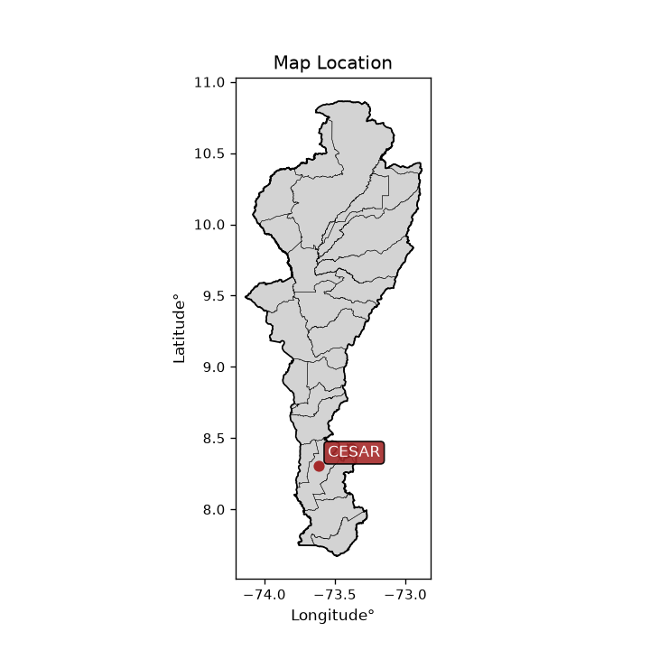</img>

| CountyID                                                                                          | CountyName               | CountyFiles                                                                                                                                                                                                                                                                                                                                                                                                                                                                                                                                                                                                                                                                                                                                                                                                                                                                                                                                                                                                                                                                                                                                                                                                                                                                                                                                                                                                                                                                                                                                                                                                                                                                                                                                                                                                                                                                                                                        |
|:--------------------------------------------------------------------------------------------------|:-------------------------|:-----------------------------------------------------------------------------------------------------------------------------------------------------------------------------------------------------------------------------------------------------------------------------------------------------------------------------------------------------------------------------------------------------------------------------------------------------------------------------------------------------------------------------------------------------------------------------------------------------------------------------------------------------------------------------------------------------------------------------------------------------------------------------------------------------------------------------------------------------------------------------------------------------------------------------------------------------------------------------------------------------------------------------------------------------------------------------------------------------------------------------------------------------------------------------------------------------------------------------------------------------------------------------------------------------------------------------------------------------------------------------------------------------------------------------------------------------------------------------------------------------------------------------------------------------------------------------------------------------------------------------------------------------------------------------------------------------------------------------------------------------------------------------------------------------------------------------------------------------------------------------------------------------------------------------------|
| [20011](https://github.com/rcfdtools/R.HydroTools/blob/main/tool/Population/file/report/20011.md) | Aguachica                | [20011_Rural_Building_202606.zip](https://github.com/rcfdtools/R.GISMobile/blob/main/file/shp/20011_Rural_Building_202606.zip) [20011_Rural_Lot_202606.zip](https://github.com/rcfdtools/R.GISMobile/blob/main/file/shp/20011_Rural_Lot_202606.zip) [20011_Rural_Nomenclature_202606.zip](https://github.com/rcfdtools/R.GISMobile/blob/main/file/shp/20011_Rural_Nomenclature_202606.zip) [20011_Rural_Nomenclature_Road_202606.zip](https://github.com/rcfdtools/R.GISMobile/blob/main/file/shp/20011_Rural_Nomenclature_Road_202606.zip) [20011_Rural_Sector_202606.zip](https://github.com/rcfdtools/R.GISMobile/blob/main/file/shp/20011_Rural_Sector_202606.zip) [20011_Rural_Vereda_202606.zip](https://github.com/rcfdtools/R.GISMobile/blob/main/file/shp/20011_Rural_Vereda_202606.zip) [20011_Urban_Block_202606.zip](https://github.com/rcfdtools/R.GISMobile/blob/main/file/shp/20011_Urban_Block_202606.zip) [20011_Urban_Building_202606.zip](https://github.com/rcfdtools/R.GISMobile/blob/main/file/shp/20011_Urban_Building_202606.zip) [20011_Urban_Lot_202606.zip](https://github.com/rcfdtools/R.GISMobile/blob/main/file/shp/20011_Urban_Lot_202606.zip) [20011_Urban_Nomenclature_202606.zip](https://github.com/rcfdtools/R.GISMobile/blob/main/file/shp/20011_Urban_Nomenclature_202606.zip) [20011_Urban_Nomenclature_Road_202606.zip](https://github.com/rcfdtools/R.GISMobile/blob/main/file/shp/20011_Urban_Nomenclature_Road_202606.zip) [20011_Urban_Perimeter_202606.zip](https://github.com/rcfdtools/R.GISMobile/blob/main/file/shp/20011_Urban_Perimeter_202606.zip) [20011_Urban_Sector_202606.zip](https://github.com/rcfdtools/R.GISMobile/blob/main/file/shp/20011_Urban_Sector_202606.zip)                                                                                                                                             |
| [20013](https://github.com/rcfdtools/R.HydroTools/blob/main/tool/Population/file/report/20013.md) | Agustín Codazzi          | [20013_Rural_Building_202606.zip](https://github.com/rcfdtools/R.GISMobile/blob/main/file/shp/20013_Rural_Building_202606.zip) [20013_Rural_Lot_202606.zip](https://github.com/rcfdtools/R.GISMobile/blob/main/file/shp/20013_Rural_Lot_202606.zip) [20013_Rural_Nomenclature_202606.zip](https://github.com/rcfdtools/R.GISMobile/blob/main/file/shp/20013_Rural_Nomenclature_202606.zip) [20013_Rural_Sector_202606.zip](https://github.com/rcfdtools/R.GISMobile/blob/main/file/shp/20013_Rural_Sector_202606.zip) [20013_Rural_Vereda_202606.zip](https://github.com/rcfdtools/R.GISMobile/blob/main/file/shp/20013_Rural_Vereda_202606.zip) [20013_Urban_Block_202606.zip](https://github.com/rcfdtools/R.GISMobile/blob/main/file/shp/20013_Urban_Block_202606.zip) [20013_Urban_Building_202606.zip](https://github.com/rcfdtools/R.GISMobile/blob/main/file/shp/20013_Urban_Building_202606.zip) [20013_Urban_Lot_202606.zip](https://github.com/rcfdtools/R.GISMobile/blob/main/file/shp/20013_Urban_Lot_202606.zip) [20013_Urban_Neighborhood_202606.zip](https://github.com/rcfdtools/R.GISMobile/blob/main/file/shp/20013_Urban_Neighborhood_202606.zip) [20013_Urban_Nomenclature_202606.zip](https://github.com/rcfdtools/R.GISMobile/blob/main/file/shp/20013_Urban_Nomenclature_202606.zip) [20013_Urban_Nomenclature_Road_202606.zip](https://github.com/rcfdtools/R.GISMobile/blob/main/file/shp/20013_Urban_Nomenclature_Road_202606.zip) [20013_Urban_Perimeter_202606.zip](https://github.com/rcfdtools/R.GISMobile/blob/main/file/shp/20013_Urban_Perimeter_202606.zip) [20013_Urban_Sector_202606.zip](https://github.com/rcfdtools/R.GISMobile/blob/main/file/shp/20013_Urban_Sector_202606.zip)                                                                                                                                                       |
| [20032](https://github.com/rcfdtools/R.HydroTools/blob/main/tool/Population/file/report/20032.md) | Astrea                   | [20032_Rural_Building_202606.zip](https://github.com/rcfdtools/R.GISMobile/blob/main/file/shp/20032_Rural_Building_202606.zip) [20032_Rural_Lot_202606.zip](https://github.com/rcfdtools/R.GISMobile/blob/main/file/shp/20032_Rural_Lot_202606.zip) [20032_Rural_Nomenclature_202606.zip](https://github.com/rcfdtools/R.GISMobile/blob/main/file/shp/20032_Rural_Nomenclature_202606.zip) [20032_Rural_Sector_202606.zip](https://github.com/rcfdtools/R.GISMobile/blob/main/file/shp/20032_Rural_Sector_202606.zip) [20032_Rural_Vereda_202606.zip](https://github.com/rcfdtools/R.GISMobile/blob/main/file/shp/20032_Rural_Vereda_202606.zip) [20032_Urban_Block_202606.zip](https://github.com/rcfdtools/R.GISMobile/blob/main/file/shp/20032_Urban_Block_202606.zip) [20032_Urban_Building_202606.zip](https://github.com/rcfdtools/R.GISMobile/blob/main/file/shp/20032_Urban_Building_202606.zip) [20032_Urban_Lot_202606.zip](https://github.com/rcfdtools/R.GISMobile/blob/main/file/shp/20032_Urban_Lot_202606.zip) [20032_Urban_Nomenclature_202606.zip](https://github.com/rcfdtools/R.GISMobile/blob/main/file/shp/20032_Urban_Nomenclature_202606.zip) [20032_Urban_Nomenclature_Road_202606.zip](https://github.com/rcfdtools/R.GISMobile/blob/main/file/shp/20032_Urban_Nomenclature_Road_202606.zip) [20032_Urban_Perimeter_202606.zip](https://github.com/rcfdtools/R.GISMobile/blob/main/file/shp/20032_Urban_Perimeter_202606.zip) [20032_Urban_Sector_202606.zip](https://github.com/rcfdtools/R.GISMobile/blob/main/file/shp/20032_Urban_Sector_202606.zip)                                                                                                                                                                                                                                                                                                  |
| [20045](https://github.com/rcfdtools/R.HydroTools/blob/main/tool/Population/file/report/20045.md) | Becerril                 | [20045_Rural_Building_202606.zip](https://github.com/rcfdtools/R.GISMobile/blob/main/file/shp/20045_Rural_Building_202606.zip) [20045_Rural_Lot_202606.zip](https://github.com/rcfdtools/R.GISMobile/blob/main/file/shp/20045_Rural_Lot_202606.zip) [20045_Rural_Nomenclature_202606.zip](https://github.com/rcfdtools/R.GISMobile/blob/main/file/shp/20045_Rural_Nomenclature_202606.zip) [20045_Rural_Sector_202606.zip](https://github.com/rcfdtools/R.GISMobile/blob/main/file/shp/20045_Rural_Sector_202606.zip) [20045_Rural_Vereda_202606.zip](https://github.com/rcfdtools/R.GISMobile/blob/main/file/shp/20045_Rural_Vereda_202606.zip) [20045_Urban_Block_202606.zip](https://github.com/rcfdtools/R.GISMobile/blob/main/file/shp/20045_Urban_Block_202606.zip) [20045_Urban_Building_202606.zip](https://github.com/rcfdtools/R.GISMobile/blob/main/file/shp/20045_Urban_Building_202606.zip) [20045_Urban_Lot_202606.zip](https://github.com/rcfdtools/R.GISMobile/blob/main/file/shp/20045_Urban_Lot_202606.zip) [20045_Urban_Nomenclature_202606.zip](https://github.com/rcfdtools/R.GISMobile/blob/main/file/shp/20045_Urban_Nomenclature_202606.zip) [20045_Urban_Nomenclature_Road_202606.zip](https://github.com/rcfdtools/R.GISMobile/blob/main/file/shp/20045_Urban_Nomenclature_Road_202606.zip) [20045_Urban_Perimeter_202606.zip](https://github.com/rcfdtools/R.GISMobile/blob/main/file/shp/20045_Urban_Perimeter_202606.zip)                                                                                                                                                                                                                                                                                                                                                                                                                                 |
| [20060](https://github.com/rcfdtools/R.HydroTools/blob/main/tool/Population/file/report/20060.md) | Bosconia                 | [20060_Rural_Building_202606.zip](https://github.com/rcfdtools/R.GISMobile/blob/main/file/shp/20060_Rural_Building_202606.zip) [20060_Rural_Lot_202606.zip](https://github.com/rcfdtools/R.GISMobile/blob/main/file/shp/20060_Rural_Lot_202606.zip) [20060_Rural_Nomenclature_202606.zip](https://github.com/rcfdtools/R.GISMobile/blob/main/file/shp/20060_Rural_Nomenclature_202606.zip) [20060_Rural_Nomenclature_Road_202606.zip](https://github.com/rcfdtools/R.GISMobile/blob/main/file/shp/20060_Rural_Nomenclature_Road_202606.zip) [20060_Rural_Sector_202606.zip](https://github.com/rcfdtools/R.GISMobile/blob/main/file/shp/20060_Rural_Sector_202606.zip) [20060_Rural_Vereda_202606.zip](https://github.com/rcfdtools/R.GISMobile/blob/main/file/shp/20060_Rural_Vereda_202606.zip) [20060_Urban_Block_202606.zip](https://github.com/rcfdtools/R.GISMobile/blob/main/file/shp/20060_Urban_Block_202606.zip) [20060_Urban_Building_202606.zip](https://github.com/rcfdtools/R.GISMobile/blob/main/file/shp/20060_Urban_Building_202606.zip) [20060_Urban_Lot_202606.zip](https://github.com/rcfdtools/R.GISMobile/blob/main/file/shp/20060_Urban_Lot_202606.zip) [20060_Urban_Nomenclature_202606.zip](https://github.com/rcfdtools/R.GISMobile/blob/main/file/shp/20060_Urban_Nomenclature_202606.zip) [20060_Urban_Nomenclature_Road_202606.zip](https://github.com/rcfdtools/R.GISMobile/blob/main/file/shp/20060_Urban_Nomenclature_Road_202606.zip) [20060_Urban_Perimeter_202606.zip](https://github.com/rcfdtools/R.GISMobile/blob/main/file/shp/20060_Urban_Perimeter_202606.zip)                                                                                                                                                                                                                                                                            |
| [20175](https://github.com/rcfdtools/R.HydroTools/blob/main/tool/Population/file/report/20175.md) | Chimichagua              | [20175_Rural_Building_202606.zip](https://github.com/rcfdtools/R.GISMobile/blob/main/file/shp/20175_Rural_Building_202606.zip) [20175_Rural_Lot_202606.zip](https://github.com/rcfdtools/R.GISMobile/blob/main/file/shp/20175_Rural_Lot_202606.zip) [20175_Rural_Nomenclature_202606.zip](https://github.com/rcfdtools/R.GISMobile/blob/main/file/shp/20175_Rural_Nomenclature_202606.zip) [20175_Rural_Nomenclature_Road_202606.zip](https://github.com/rcfdtools/R.GISMobile/blob/main/file/shp/20175_Rural_Nomenclature_Road_202606.zip) [20175_Rural_Sector_202606.zip](https://github.com/rcfdtools/R.GISMobile/blob/main/file/shp/20175_Rural_Sector_202606.zip) [20175_Rural_Vereda_202606.zip](https://github.com/rcfdtools/R.GISMobile/blob/main/file/shp/20175_Rural_Vereda_202606.zip) [20175_Urban_Block_202606.zip](https://github.com/rcfdtools/R.GISMobile/blob/main/file/shp/20175_Urban_Block_202606.zip) [20175_Urban_Building_202606.zip](https://github.com/rcfdtools/R.GISMobile/blob/main/file/shp/20175_Urban_Building_202606.zip) [20175_Urban_Lot_202606.zip](https://github.com/rcfdtools/R.GISMobile/blob/main/file/shp/20175_Urban_Lot_202606.zip) [20175_Urban_Nomenclature_202606.zip](https://github.com/rcfdtools/R.GISMobile/blob/main/file/shp/20175_Urban_Nomenclature_202606.zip) [20175_Urban_Nomenclature_Road_202606.zip](https://github.com/rcfdtools/R.GISMobile/blob/main/file/shp/20175_Urban_Nomenclature_Road_202606.zip) [20175_Urban_Perimeter_202606.zip](https://github.com/rcfdtools/R.GISMobile/blob/main/file/shp/20175_Urban_Perimeter_202606.zip) [20175_Urban_Sector_202606.zip](https://github.com/rcfdtools/R.GISMobile/blob/main/file/shp/20175_Urban_Sector_202606.zip)                                                                                                                                             |
| [20178](https://github.com/rcfdtools/R.HydroTools/blob/main/tool/Population/file/report/20178.md) | Chiriguaná               | [20178_Rural_Lot_202001.zip](https://github.com/rcfdtools/R.GISMobile/blob/main/file/shp/20178_Rural_Lot_202001.zip) [20178_Urban_Lot_202001.zip](https://github.com/rcfdtools/R.GISMobile/blob/main/file/shp/20178_Urban_Lot_202001.zip)                                                                                                                                                                                                                                                                                                                                                                                                                                                                                                                                                                                                                                                                                                                                                                                                                                                                                                                                                                                                                                                                                                                                                                                                                                                                                                                                                                                                                                                                                                                                                                                                                                                                                  |
| [20228](https://github.com/rcfdtools/R.HydroTools/blob/main/tool/Population/file/report/20228.md) | Curumaní                 | [20228_Rural_Building_202606.zip](https://github.com/rcfdtools/R.GISMobile/blob/main/file/shp/20228_Rural_Building_202606.zip) [20228_Rural_Lot_202606.zip](https://github.com/rcfdtools/R.GISMobile/blob/main/file/shp/20228_Rural_Lot_202606.zip) [20228_Rural_Nomenclature_202606.zip](https://github.com/rcfdtools/R.GISMobile/blob/main/file/shp/20228_Rural_Nomenclature_202606.zip) [20228_Rural_Nomenclature_Road_202606.zip](https://github.com/rcfdtools/R.GISMobile/blob/main/file/shp/20228_Rural_Nomenclature_Road_202606.zip) [20228_Rural_Sector_202606.zip](https://github.com/rcfdtools/R.GISMobile/blob/main/file/shp/20228_Rural_Sector_202606.zip) [20228_Rural_Vereda_202606.zip](https://github.com/rcfdtools/R.GISMobile/blob/main/file/shp/20228_Rural_Vereda_202606.zip) [20228_Urban_Block_202606.zip](https://github.com/rcfdtools/R.GISMobile/blob/main/file/shp/20228_Urban_Block_202606.zip) [20228_Urban_Building_202606.zip](https://github.com/rcfdtools/R.GISMobile/blob/main/file/shp/20228_Urban_Building_202606.zip) [20228_Urban_Lot_202606.zip](https://github.com/rcfdtools/R.GISMobile/blob/main/file/shp/20228_Urban_Lot_202606.zip) [20228_Urban_Neighborhood_202606.zip](https://github.com/rcfdtools/R.GISMobile/blob/main/file/shp/20228_Urban_Neighborhood_202606.zip) [20228_Urban_Nomenclature_202606.zip](https://github.com/rcfdtools/R.GISMobile/blob/main/file/shp/20228_Urban_Nomenclature_202606.zip) [20228_Urban_Nomenclature_Road_202606.zip](https://github.com/rcfdtools/R.GISMobile/blob/main/file/shp/20228_Urban_Nomenclature_Road_202606.zip) [20228_Urban_Perimeter_202606.zip](https://github.com/rcfdtools/R.GISMobile/blob/main/file/shp/20228_Urban_Perimeter_202606.zip) [20228_Urban_Sector_202606.zip](https://github.com/rcfdtools/R.GISMobile/blob/main/file/shp/20228_Urban_Sector_202606.zip)  |
| [20238](https://github.com/rcfdtools/R.HydroTools/blob/main/tool/Population/file/report/20238.md) | El Copey                 | [20238_Rural_Building_202606.zip](https://github.com/rcfdtools/R.GISMobile/blob/main/file/shp/20238_Rural_Building_202606.zip) [20238_Rural_Lot_202606.zip](https://github.com/rcfdtools/R.GISMobile/blob/main/file/shp/20238_Rural_Lot_202606.zip) [20238_Rural_Nomenclature_202606.zip](https://github.com/rcfdtools/R.GISMobile/blob/main/file/shp/20238_Rural_Nomenclature_202606.zip) [20238_Rural_Sector_202606.zip](https://github.com/rcfdtools/R.GISMobile/blob/main/file/shp/20238_Rural_Sector_202606.zip) [20238_Rural_Vereda_202606.zip](https://github.com/rcfdtools/R.GISMobile/blob/main/file/shp/20238_Rural_Vereda_202606.zip) [20238_Urban_Block_202606.zip](https://github.com/rcfdtools/R.GISMobile/blob/main/file/shp/20238_Urban_Block_202606.zip) [20238_Urban_Building_202606.zip](https://github.com/rcfdtools/R.GISMobile/blob/main/file/shp/20238_Urban_Building_202606.zip) [20238_Urban_Lot_202606.zip](https://github.com/rcfdtools/R.GISMobile/blob/main/file/shp/20238_Urban_Lot_202606.zip) [20238_Urban_Nomenclature_202606.zip](https://github.com/rcfdtools/R.GISMobile/blob/main/file/shp/20238_Urban_Nomenclature_202606.zip) [20238_Urban_Nomenclature_Road_202606.zip](https://github.com/rcfdtools/R.GISMobile/blob/main/file/shp/20238_Urban_Nomenclature_Road_202606.zip) [20238_Urban_Perimeter_202606.zip](https://github.com/rcfdtools/R.GISMobile/blob/main/file/shp/20238_Urban_Perimeter_202606.zip) [20238_Urban_Sector_202606.zip](https://github.com/rcfdtools/R.GISMobile/blob/main/file/shp/20238_Urban_Sector_202606.zip)                                                                                                                                                                                                                                                                                                  |
| [20250](https://github.com/rcfdtools/R.HydroTools/blob/main/tool/Population/file/report/20250.md) | El Paso                  | [20250_Rural_Building_202606.zip](https://github.com/rcfdtools/R.GISMobile/blob/main/file/shp/20250_Rural_Building_202606.zip) [20250_Rural_Lot_202606.zip](https://github.com/rcfdtools/R.GISMobile/blob/main/file/shp/20250_Rural_Lot_202606.zip) [20250_Rural_Nomenclature_202606.zip](https://github.com/rcfdtools/R.GISMobile/blob/main/file/shp/20250_Rural_Nomenclature_202606.zip) [20250_Rural_Sector_202606.zip](https://github.com/rcfdtools/R.GISMobile/blob/main/file/shp/20250_Rural_Sector_202606.zip) [20250_Rural_Vereda_202606.zip](https://github.com/rcfdtools/R.GISMobile/blob/main/file/shp/20250_Rural_Vereda_202606.zip) [20250_Urban_Block_202606.zip](https://github.com/rcfdtools/R.GISMobile/blob/main/file/shp/20250_Urban_Block_202606.zip) [20250_Urban_Building_202606.zip](https://github.com/rcfdtools/R.GISMobile/blob/main/file/shp/20250_Urban_Building_202606.zip) [20250_Urban_Lot_202606.zip](https://github.com/rcfdtools/R.GISMobile/blob/main/file/shp/20250_Urban_Lot_202606.zip) [20250_Urban_Nomenclature_202606.zip](https://github.com/rcfdtools/R.GISMobile/blob/main/file/shp/20250_Urban_Nomenclature_202606.zip) [20250_Urban_Nomenclature_Road_202606.zip](https://github.com/rcfdtools/R.GISMobile/blob/main/file/shp/20250_Urban_Nomenclature_Road_202606.zip) [20250_Urban_Perimeter_202606.zip](https://github.com/rcfdtools/R.GISMobile/blob/main/file/shp/20250_Urban_Perimeter_202606.zip) [20250_Urban_Sector_202606.zip](https://github.com/rcfdtools/R.GISMobile/blob/main/file/shp/20250_Urban_Sector_202606.zip)                                                                                                                                                                                                                                                                                                  |
| [20295](https://github.com/rcfdtools/R.HydroTools/blob/main/tool/Population/file/report/20295.md) | Gamarra                  | [20295_Rural_Building_202606.zip](https://github.com/rcfdtools/R.GISMobile/blob/main/file/shp/20295_Rural_Building_202606.zip) [20295_Rural_Lot_202606.zip](https://github.com/rcfdtools/R.GISMobile/blob/main/file/shp/20295_Rural_Lot_202606.zip) [20295_Rural_Nomenclature_202606.zip](https://github.com/rcfdtools/R.GISMobile/blob/main/file/shp/20295_Rural_Nomenclature_202606.zip) [20295_Rural_Sector_202606.zip](https://github.com/rcfdtools/R.GISMobile/blob/main/file/shp/20295_Rural_Sector_202606.zip) [20295_Rural_Vereda_202606.zip](https://github.com/rcfdtools/R.GISMobile/blob/main/file/shp/20295_Rural_Vereda_202606.zip) [20295_Urban_Block_202606.zip](https://github.com/rcfdtools/R.GISMobile/blob/main/file/shp/20295_Urban_Block_202606.zip) [20295_Urban_Building_202606.zip](https://github.com/rcfdtools/R.GISMobile/blob/main/file/shp/20295_Urban_Building_202606.zip) [20295_Urban_Lot_202606.zip](https://github.com/rcfdtools/R.GISMobile/blob/main/file/shp/20295_Urban_Lot_202606.zip) [20295_Urban_Nomenclature_202606.zip](https://github.com/rcfdtools/R.GISMobile/blob/main/file/shp/20295_Urban_Nomenclature_202606.zip) [20295_Urban_Nomenclature_Road_202606.zip](https://github.com/rcfdtools/R.GISMobile/blob/main/file/shp/20295_Urban_Nomenclature_Road_202606.zip) [20295_Urban_Perimeter_202606.zip](https://github.com/rcfdtools/R.GISMobile/blob/main/file/shp/20295_Urban_Perimeter_202606.zip) [20295_Urban_Sector_202606.zip](https://github.com/rcfdtools/R.GISMobile/blob/main/file/shp/20295_Urban_Sector_202606.zip)                                                                                                                                                                                                                                                                                                  |
| [20310](https://github.com/rcfdtools/R.HydroTools/blob/main/tool/Population/file/report/20310.md) | González                 | [20310_Rural_Building_202606.zip](https://github.com/rcfdtools/R.GISMobile/blob/main/file/shp/20310_Rural_Building_202606.zip) [20310_Rural_Lot_202606.zip](https://github.com/rcfdtools/R.GISMobile/blob/main/file/shp/20310_Rural_Lot_202606.zip) [20310_Rural_Nomenclature_202606.zip](https://github.com/rcfdtools/R.GISMobile/blob/main/file/shp/20310_Rural_Nomenclature_202606.zip) [20310_Rural_Sector_202606.zip](https://github.com/rcfdtools/R.GISMobile/blob/main/file/shp/20310_Rural_Sector_202606.zip) [20310_Rural_Vereda_202606.zip](https://github.com/rcfdtools/R.GISMobile/blob/main/file/shp/20310_Rural_Vereda_202606.zip) [20310_Urban_Block_202606.zip](https://github.com/rcfdtools/R.GISMobile/blob/main/file/shp/20310_Urban_Block_202606.zip) [20310_Urban_Building_202606.zip](https://github.com/rcfdtools/R.GISMobile/blob/main/file/shp/20310_Urban_Building_202606.zip) [20310_Urban_Lot_202606.zip](https://github.com/rcfdtools/R.GISMobile/blob/main/file/shp/20310_Urban_Lot_202606.zip) [20310_Urban_Nomenclature_202606.zip](https://github.com/rcfdtools/R.GISMobile/blob/main/file/shp/20310_Urban_Nomenclature_202606.zip) [20310_Urban_Nomenclature_Road_202606.zip](https://github.com/rcfdtools/R.GISMobile/blob/main/file/shp/20310_Urban_Nomenclature_Road_202606.zip) [20310_Urban_Perimeter_202606.zip](https://github.com/rcfdtools/R.GISMobile/blob/main/file/shp/20310_Urban_Perimeter_202606.zip) [20310_Urban_Sector_202606.zip](https://github.com/rcfdtools/R.GISMobile/blob/main/file/shp/20310_Urban_Sector_202606.zip)                                                                                                                                                                                                                                                                                                  |
| [20383](https://github.com/rcfdtools/R.HydroTools/blob/main/tool/Population/file/report/20383.md) | La Gloria                | [20383_Rural_Building_202606.zip](https://github.com/rcfdtools/R.GISMobile/blob/main/file/shp/20383_Rural_Building_202606.zip) [20383_Rural_Lot_202606.zip](https://github.com/rcfdtools/R.GISMobile/blob/main/file/shp/20383_Rural_Lot_202606.zip) [20383_Rural_Nomenclature_202606.zip](https://github.com/rcfdtools/R.GISMobile/blob/main/file/shp/20383_Rural_Nomenclature_202606.zip) [20383_Rural_Sector_202606.zip](https://github.com/rcfdtools/R.GISMobile/blob/main/file/shp/20383_Rural_Sector_202606.zip) [20383_Rural_Vereda_202606.zip](https://github.com/rcfdtools/R.GISMobile/blob/main/file/shp/20383_Rural_Vereda_202606.zip) [20383_Urban_Block_202606.zip](https://github.com/rcfdtools/R.GISMobile/blob/main/file/shp/20383_Urban_Block_202606.zip) [20383_Urban_Building_202606.zip](https://github.com/rcfdtools/R.GISMobile/blob/main/file/shp/20383_Urban_Building_202606.zip) [20383_Urban_Lot_202606.zip](https://github.com/rcfdtools/R.GISMobile/blob/main/file/shp/20383_Urban_Lot_202606.zip) [20383_Urban_Nomenclature_202606.zip](https://github.com/rcfdtools/R.GISMobile/blob/main/file/shp/20383_Urban_Nomenclature_202606.zip) [20383_Urban_Nomenclature_Road_202606.zip](https://github.com/rcfdtools/R.GISMobile/blob/main/file/shp/20383_Urban_Nomenclature_Road_202606.zip) [20383_Urban_Perimeter_202606.zip](https://github.com/rcfdtools/R.GISMobile/blob/main/file/shp/20383_Urban_Perimeter_202606.zip) [20383_Urban_Sector_202606.zip](https://github.com/rcfdtools/R.GISMobile/blob/main/file/shp/20383_Urban_Sector_202606.zip)                                                                                                                                                                                                                                                                                                  |
| [20400](https://github.com/rcfdtools/R.HydroTools/blob/main/tool/Population/file/report/20400.md) | La Jagua De Ibirico      | [20400_Rural_Building_202606.zip](https://github.com/rcfdtools/R.GISMobile/blob/main/file/shp/20400_Rural_Building_202606.zip) [20400_Rural_Lot_202606.zip](https://github.com/rcfdtools/R.GISMobile/blob/main/file/shp/20400_Rural_Lot_202606.zip) [20400_Rural_Nomenclature_202606.zip](https://github.com/rcfdtools/R.GISMobile/blob/main/file/shp/20400_Rural_Nomenclature_202606.zip) [20400_Rural_Sector_202606.zip](https://github.com/rcfdtools/R.GISMobile/blob/main/file/shp/20400_Rural_Sector_202606.zip) [20400_Rural_Vereda_202606.zip](https://github.com/rcfdtools/R.GISMobile/blob/main/file/shp/20400_Rural_Vereda_202606.zip) [20400_Urban_Block_202606.zip](https://github.com/rcfdtools/R.GISMobile/blob/main/file/shp/20400_Urban_Block_202606.zip) [20400_Urban_Building_202606.zip](https://github.com/rcfdtools/R.GISMobile/blob/main/file/shp/20400_Urban_Building_202606.zip) [20400_Urban_Lot_202606.zip](https://github.com/rcfdtools/R.GISMobile/blob/main/file/shp/20400_Urban_Lot_202606.zip) [20400_Urban_Nomenclature_202606.zip](https://github.com/rcfdtools/R.GISMobile/blob/main/file/shp/20400_Urban_Nomenclature_202606.zip) [20400_Urban_Nomenclature_Road_202606.zip](https://github.com/rcfdtools/R.GISMobile/blob/main/file/shp/20400_Urban_Nomenclature_Road_202606.zip) [20400_Urban_Perimeter_202606.zip](https://github.com/rcfdtools/R.GISMobile/blob/main/file/shp/20400_Urban_Perimeter_202606.zip) [20400_Urban_Sector_202606.zip](https://github.com/rcfdtools/R.GISMobile/blob/main/file/shp/20400_Urban_Sector_202606.zip)                                                                                                                                                                                                                                                                                                  |
| [20621](https://github.com/rcfdtools/R.HydroTools/blob/main/tool/Population/file/report/20621.md) | La Paz                   | [20621_Rural_Building_202606.zip](https://github.com/rcfdtools/R.GISMobile/blob/main/file/shp/20621_Rural_Building_202606.zip) [20621_Rural_Lot_202606.zip](https://github.com/rcfdtools/R.GISMobile/blob/main/file/shp/20621_Rural_Lot_202606.zip) [20621_Rural_Nomenclature_202606.zip](https://github.com/rcfdtools/R.GISMobile/blob/main/file/shp/20621_Rural_Nomenclature_202606.zip) [20621_Rural_Sector_202606.zip](https://github.com/rcfdtools/R.GISMobile/blob/main/file/shp/20621_Rural_Sector_202606.zip) [20621_Rural_Vereda_202606.zip](https://github.com/rcfdtools/R.GISMobile/blob/main/file/shp/20621_Rural_Vereda_202606.zip) [20621_Urban_Block_202606.zip](https://github.com/rcfdtools/R.GISMobile/blob/main/file/shp/20621_Urban_Block_202606.zip) [20621_Urban_Building_202606.zip](https://github.com/rcfdtools/R.GISMobile/blob/main/file/shp/20621_Urban_Building_202606.zip) [20621_Urban_Lot_202606.zip](https://github.com/rcfdtools/R.GISMobile/blob/main/file/shp/20621_Urban_Lot_202606.zip) [20621_Urban_Nomenclature_202606.zip](https://github.com/rcfdtools/R.GISMobile/blob/main/file/shp/20621_Urban_Nomenclature_202606.zip) [20621_Urban_Nomenclature_Road_202606.zip](https://github.com/rcfdtools/R.GISMobile/blob/main/file/shp/20621_Urban_Nomenclature_Road_202606.zip) [20621_Urban_Perimeter_202606.zip](https://github.com/rcfdtools/R.GISMobile/blob/main/file/shp/20621_Urban_Perimeter_202606.zip) [20621_Urban_Sector_202606.zip](https://github.com/rcfdtools/R.GISMobile/blob/main/file/shp/20621_Urban_Sector_202606.zip)                                                                                                                                                                                                                                                                                                  |
| [20443](https://github.com/rcfdtools/R.HydroTools/blob/main/tool/Population/file/report/20443.md) | Manaure Balcón Del Cesar | [20443_Rural_Building_202606.zip](https://github.com/rcfdtools/R.GISMobile/blob/main/file/shp/20443_Rural_Building_202606.zip) [20443_Rural_Lot_202606.zip](https://github.com/rcfdtools/R.GISMobile/blob/main/file/shp/20443_Rural_Lot_202606.zip) [20443_Rural_Nomenclature_202606.zip](https://github.com/rcfdtools/R.GISMobile/blob/main/file/shp/20443_Rural_Nomenclature_202606.zip) [20443_Rural_Sector_202606.zip](https://github.com/rcfdtools/R.GISMobile/blob/main/file/shp/20443_Rural_Sector_202606.zip) [20443_Rural_Vereda_202606.zip](https://github.com/rcfdtools/R.GISMobile/blob/main/file/shp/20443_Rural_Vereda_202606.zip) [20443_Urban_Block_202606.zip](https://github.com/rcfdtools/R.GISMobile/blob/main/file/shp/20443_Urban_Block_202606.zip) [20443_Urban_Building_202606.zip](https://github.com/rcfdtools/R.GISMobile/blob/main/file/shp/20443_Urban_Building_202606.zip) [20443_Urban_Lot_202606.zip](https://github.com/rcfdtools/R.GISMobile/blob/main/file/shp/20443_Urban_Lot_202606.zip) [20443_Urban_Nomenclature_202606.zip](https://github.com/rcfdtools/R.GISMobile/blob/main/file/shp/20443_Urban_Nomenclature_202606.zip) [20443_Urban_Perimeter_202606.zip](https://github.com/rcfdtools/R.GISMobile/blob/main/file/shp/20443_Urban_Perimeter_202606.zip) [20443_Urban_Sector_202606.zip](https://github.com/rcfdtools/R.GISMobile/blob/main/file/shp/20443_Urban_Sector_202606.zip)                                                                                                                                                                                                                                                                                                                                                                                                                                                       |
| [20517](https://github.com/rcfdtools/R.HydroTools/blob/main/tool/Population/file/report/20517.md) | Pailitas                 | [20517_Rural_Building_202606.zip](https://github.com/rcfdtools/R.GISMobile/blob/main/file/shp/20517_Rural_Building_202606.zip) [20517_Rural_Lot_202606.zip](https://github.com/rcfdtools/R.GISMobile/blob/main/file/shp/20517_Rural_Lot_202606.zip) [20517_Rural_Nomenclature_202606.zip](https://github.com/rcfdtools/R.GISMobile/blob/main/file/shp/20517_Rural_Nomenclature_202606.zip) [20517_Rural_Sector_202606.zip](https://github.com/rcfdtools/R.GISMobile/blob/main/file/shp/20517_Rural_Sector_202606.zip) [20517_Rural_Vereda_202606.zip](https://github.com/rcfdtools/R.GISMobile/blob/main/file/shp/20517_Rural_Vereda_202606.zip) [20517_Urban_Block_202606.zip](https://github.com/rcfdtools/R.GISMobile/blob/main/file/shp/20517_Urban_Block_202606.zip) [20517_Urban_Building_202606.zip](https://github.com/rcfdtools/R.GISMobile/blob/main/file/shp/20517_Urban_Building_202606.zip) [20517_Urban_Lot_202606.zip](https://github.com/rcfdtools/R.GISMobile/blob/main/file/shp/20517_Urban_Lot_202606.zip) [20517_Urban_Neighborhood_202606.zip](https://github.com/rcfdtools/R.GISMobile/blob/main/file/shp/20517_Urban_Neighborhood_202606.zip) [20517_Urban_Nomenclature_202606.zip](https://github.com/rcfdtools/R.GISMobile/blob/main/file/shp/20517_Urban_Nomenclature_202606.zip) [20517_Urban_Nomenclature_Road_202606.zip](https://github.com/rcfdtools/R.GISMobile/blob/main/file/shp/20517_Urban_Nomenclature_Road_202606.zip) [20517_Urban_Perimeter_202606.zip](https://github.com/rcfdtools/R.GISMobile/blob/main/file/shp/20517_Urban_Perimeter_202606.zip) [20517_Urban_Sector_202606.zip](https://github.com/rcfdtools/R.GISMobile/blob/main/file/shp/20517_Urban_Sector_202606.zip)                                                                                                                                                       |
| [20550](https://github.com/rcfdtools/R.HydroTools/blob/main/tool/Population/file/report/20550.md) | Pelaya                   | [20550_Rural_Lot_202606.zip](https://github.com/rcfdtools/R.GISMobile/blob/main/file/shp/20550_Rural_Lot_202606.zip) [20550_Rural_Nomenclature_202606.zip](https://github.com/rcfdtools/R.GISMobile/blob/main/file/shp/20550_Rural_Nomenclature_202606.zip) [20550_Rural_Sector_202606.zip](https://github.com/rcfdtools/R.GISMobile/blob/main/file/shp/20550_Rural_Sector_202606.zip) [20550_Rural_Vereda_202606.zip](https://github.com/rcfdtools/R.GISMobile/blob/main/file/shp/20550_Rural_Vereda_202606.zip) [20550_Urban_Block_202606.zip](https://github.com/rcfdtools/R.GISMobile/blob/main/file/shp/20550_Urban_Block_202606.zip) [20550_Urban_Building_202606.zip](https://github.com/rcfdtools/R.GISMobile/blob/main/file/shp/20550_Urban_Building_202606.zip) [20550_Urban_Lot_202606.zip](https://github.com/rcfdtools/R.GISMobile/blob/main/file/shp/20550_Urban_Lot_202606.zip) [20550_Urban_Nomenclature_202606.zip](https://github.com/rcfdtools/R.GISMobile/blob/main/file/shp/20550_Urban_Nomenclature_202606.zip) [20550_Urban_Nomenclature_Road_202606.zip](https://github.com/rcfdtools/R.GISMobile/blob/main/file/shp/20550_Urban_Nomenclature_Road_202606.zip) [20550_Urban_Perimeter_202606.zip](https://github.com/rcfdtools/R.GISMobile/blob/main/file/shp/20550_Urban_Perimeter_202606.zip) [20550_Urban_Sector_202606.zip](https://github.com/rcfdtools/R.GISMobile/blob/main/file/shp/20550_Urban_Sector_202606.zip)                                                                                                                                                                                                                                                                                                                                                                                                                                     |
| [20570](https://github.com/rcfdtools/R.HydroTools/blob/main/tool/Population/file/report/20570.md) | Pueblo Bello             | [20570_Rural_Building_202606.zip](https://github.com/rcfdtools/R.GISMobile/blob/main/file/shp/20570_Rural_Building_202606.zip) [20570_Rural_Lot_202606.zip](https://github.com/rcfdtools/R.GISMobile/blob/main/file/shp/20570_Rural_Lot_202606.zip) [20570_Rural_Nomenclature_202606.zip](https://github.com/rcfdtools/R.GISMobile/blob/main/file/shp/20570_Rural_Nomenclature_202606.zip) [20570_Rural_Sector_202606.zip](https://github.com/rcfdtools/R.GISMobile/blob/main/file/shp/20570_Rural_Sector_202606.zip) [20570_Rural_Vereda_202606.zip](https://github.com/rcfdtools/R.GISMobile/blob/main/file/shp/20570_Rural_Vereda_202606.zip) [20570_Urban_Block_202606.zip](https://github.com/rcfdtools/R.GISMobile/blob/main/file/shp/20570_Urban_Block_202606.zip) [20570_Urban_Building_202606.zip](https://github.com/rcfdtools/R.GISMobile/blob/main/file/shp/20570_Urban_Building_202606.zip) [20570_Urban_Lot_202606.zip](https://github.com/rcfdtools/R.GISMobile/blob/main/file/shp/20570_Urban_Lot_202606.zip) [20570_Urban_Neighborhood_202606.zip](https://github.com/rcfdtools/R.GISMobile/blob/main/file/shp/20570_Urban_Neighborhood_202606.zip) [20570_Urban_Nomenclature_202606.zip](https://github.com/rcfdtools/R.GISMobile/blob/main/file/shp/20570_Urban_Nomenclature_202606.zip) [20570_Urban_Nomenclature_Road_202606.zip](https://github.com/rcfdtools/R.GISMobile/blob/main/file/shp/20570_Urban_Nomenclature_Road_202606.zip) [20570_Urban_Perimeter_202606.zip](https://github.com/rcfdtools/R.GISMobile/blob/main/file/shp/20570_Urban_Perimeter_202606.zip) [20570_Urban_Sector_202606.zip](https://github.com/rcfdtools/R.GISMobile/blob/main/file/shp/20570_Urban_Sector_202606.zip)                                                                                                                                                       |
| [20614](https://github.com/rcfdtools/R.HydroTools/blob/main/tool/Population/file/report/20614.md) | Río De Oro               | [20614_Rural_Lot_202001.zip](https://github.com/rcfdtools/R.GISMobile/blob/main/file/shp/20614_Rural_Lot_202001.zip) [20614_Urban_Lot_202001.zip](https://github.com/rcfdtools/R.GISMobile/blob/main/file/shp/20614_Urban_Lot_202001.zip)                                                                                                                                                                                                                                                                                                                                                                                                                                                                                                                                                                                                                                                                                                                                                                                                                                                                                                                                                                                                                                                                                                                                                                                                                                                                                                                                                                                                                                                                                                                                                                                                                                                                                  |
| [20710](https://github.com/rcfdtools/R.HydroTools/blob/main/tool/Population/file/report/20710.md) | San Alberto              | [20710_Rural_Building_202606.zip](https://github.com/rcfdtools/R.GISMobile/blob/main/file/shp/20710_Rural_Building_202606.zip) [20710_Rural_Lot_202606.zip](https://github.com/rcfdtools/R.GISMobile/blob/main/file/shp/20710_Rural_Lot_202606.zip) [20710_Rural_Nomenclature_202606.zip](https://github.com/rcfdtools/R.GISMobile/blob/main/file/shp/20710_Rural_Nomenclature_202606.zip) [20710_Rural_Sector_202606.zip](https://github.com/rcfdtools/R.GISMobile/blob/main/file/shp/20710_Rural_Sector_202606.zip) [20710_Rural_Vereda_202606.zip](https://github.com/rcfdtools/R.GISMobile/blob/main/file/shp/20710_Rural_Vereda_202606.zip) [20710_Urban_Block_202606.zip](https://github.com/rcfdtools/R.GISMobile/blob/main/file/shp/20710_Urban_Block_202606.zip) [20710_Urban_Building_202606.zip](https://github.com/rcfdtools/R.GISMobile/blob/main/file/shp/20710_Urban_Building_202606.zip) [20710_Urban_Lot_202606.zip](https://github.com/rcfdtools/R.GISMobile/blob/main/file/shp/20710_Urban_Lot_202606.zip) [20710_Urban_Nomenclature_202606.zip](https://github.com/rcfdtools/R.GISMobile/blob/main/file/shp/20710_Urban_Nomenclature_202606.zip) [20710_Urban_Nomenclature_Road_202606.zip](https://github.com/rcfdtools/R.GISMobile/blob/main/file/shp/20710_Urban_Nomenclature_Road_202606.zip) [20710_Urban_Perimeter_202606.zip](https://github.com/rcfdtools/R.GISMobile/blob/main/file/shp/20710_Urban_Perimeter_202606.zip) [20710_Urban_Sector_202606.zip](https://github.com/rcfdtools/R.GISMobile/blob/main/file/shp/20710_Urban_Sector_202606.zip)                                                                                                                                                                                                                                                                                                  |
| [20750](https://github.com/rcfdtools/R.HydroTools/blob/main/tool/Population/file/report/20750.md) | San Diego                | [20750_Rural_Building_202606.zip](https://github.com/rcfdtools/R.GISMobile/blob/main/file/shp/20750_Rural_Building_202606.zip) [20750_Rural_Lot_202606.zip](https://github.com/rcfdtools/R.GISMobile/blob/main/file/shp/20750_Rural_Lot_202606.zip) [20750_Rural_Nomenclature_202606.zip](https://github.com/rcfdtools/R.GISMobile/blob/main/file/shp/20750_Rural_Nomenclature_202606.zip) [20750_Rural_Sector_202606.zip](https://github.com/rcfdtools/R.GISMobile/blob/main/file/shp/20750_Rural_Sector_202606.zip) [20750_Rural_Vereda_202606.zip](https://github.com/rcfdtools/R.GISMobile/blob/main/file/shp/20750_Rural_Vereda_202606.zip) [20750_Urban_Block_202606.zip](https://github.com/rcfdtools/R.GISMobile/blob/main/file/shp/20750_Urban_Block_202606.zip) [20750_Urban_Building_202606.zip](https://github.com/rcfdtools/R.GISMobile/blob/main/file/shp/20750_Urban_Building_202606.zip) [20750_Urban_Lot_202606.zip](https://github.com/rcfdtools/R.GISMobile/blob/main/file/shp/20750_Urban_Lot_202606.zip) [20750_Urban_Nomenclature_202606.zip](https://github.com/rcfdtools/R.GISMobile/blob/main/file/shp/20750_Urban_Nomenclature_202606.zip) [20750_Urban_Perimeter_202606.zip](https://github.com/rcfdtools/R.GISMobile/blob/main/file/shp/20750_Urban_Perimeter_202606.zip) [20750_Urban_Sector_202606.zip](https://github.com/rcfdtools/R.GISMobile/blob/main/file/shp/20750_Urban_Sector_202606.zip)                                                                                                                                                                                                                                                                                                                                                                                                                                                       |
| [20770](https://github.com/rcfdtools/R.HydroTools/blob/main/tool/Population/file/report/20770.md) | San Martín               | [20770_Rural_Building_202606.zip](https://github.com/rcfdtools/R.GISMobile/blob/main/file/shp/20770_Rural_Building_202606.zip) [20770_Rural_Lot_202606.zip](https://github.com/rcfdtools/R.GISMobile/blob/main/file/shp/20770_Rural_Lot_202606.zip) [20770_Rural_Nomenclature_202606.zip](https://github.com/rcfdtools/R.GISMobile/blob/main/file/shp/20770_Rural_Nomenclature_202606.zip) [20770_Rural_Sector_202606.zip](https://github.com/rcfdtools/R.GISMobile/blob/main/file/shp/20770_Rural_Sector_202606.zip) [20770_Rural_Vereda_202606.zip](https://github.com/rcfdtools/R.GISMobile/blob/main/file/shp/20770_Rural_Vereda_202606.zip) [20770_Urban_Block_202606.zip](https://github.com/rcfdtools/R.GISMobile/blob/main/file/shp/20770_Urban_Block_202606.zip) [20770_Urban_Building_202606.zip](https://github.com/rcfdtools/R.GISMobile/blob/main/file/shp/20770_Urban_Building_202606.zip) [20770_Urban_Lot_202606.zip](https://github.com/rcfdtools/R.GISMobile/blob/main/file/shp/20770_Urban_Lot_202606.zip) [20770_Urban_Nomenclature_202606.zip](https://github.com/rcfdtools/R.GISMobile/blob/main/file/shp/20770_Urban_Nomenclature_202606.zip) [20770_Urban_Nomenclature_Road_202606.zip](https://github.com/rcfdtools/R.GISMobile/blob/main/file/shp/20770_Urban_Nomenclature_Road_202606.zip) [20770_Urban_Perimeter_202606.zip](https://github.com/rcfdtools/R.GISMobile/blob/main/file/shp/20770_Urban_Perimeter_202606.zip) [20770_Urban_Sector_202606.zip](https://github.com/rcfdtools/R.GISMobile/blob/main/file/shp/20770_Urban_Sector_202606.zip)                                                                                                                                                                                                                                                                                                  |
| [20787](https://github.com/rcfdtools/R.HydroTools/blob/main/tool/Population/file/report/20787.md) | Tamalameque              | [20787_Rural_Building_202606.zip](https://github.com/rcfdtools/R.GISMobile/blob/main/file/shp/20787_Rural_Building_202606.zip) [20787_Rural_Lot_202606.zip](https://github.com/rcfdtools/R.GISMobile/blob/main/file/shp/20787_Rural_Lot_202606.zip) [20787_Rural_Nomenclature_202606.zip](https://github.com/rcfdtools/R.GISMobile/blob/main/file/shp/20787_Rural_Nomenclature_202606.zip) [20787_Rural_Nomenclature_Road_202606.zip](https://github.com/rcfdtools/R.GISMobile/blob/main/file/shp/20787_Rural_Nomenclature_Road_202606.zip) [20787_Rural_Sector_202606.zip](https://github.com/rcfdtools/R.GISMobile/blob/main/file/shp/20787_Rural_Sector_202606.zip) [20787_Rural_Vereda_202606.zip](https://github.com/rcfdtools/R.GISMobile/blob/main/file/shp/20787_Rural_Vereda_202606.zip) [20787_Urban_Block_202606.zip](https://github.com/rcfdtools/R.GISMobile/blob/main/file/shp/20787_Urban_Block_202606.zip) [20787_Urban_Building_202606.zip](https://github.com/rcfdtools/R.GISMobile/blob/main/file/shp/20787_Urban_Building_202606.zip) [20787_Urban_Lot_202606.zip](https://github.com/rcfdtools/R.GISMobile/blob/main/file/shp/20787_Urban_Lot_202606.zip) [20787_Urban_Neighborhood_202606.zip](https://github.com/rcfdtools/R.GISMobile/blob/main/file/shp/20787_Urban_Neighborhood_202606.zip) [20787_Urban_Nomenclature_202606.zip](https://github.com/rcfdtools/R.GISMobile/blob/main/file/shp/20787_Urban_Nomenclature_202606.zip) [20787_Urban_Nomenclature_Road_202606.zip](https://github.com/rcfdtools/R.GISMobile/blob/main/file/shp/20787_Urban_Nomenclature_Road_202606.zip) [20787_Urban_Perimeter_202606.zip](https://github.com/rcfdtools/R.GISMobile/blob/main/file/shp/20787_Urban_Perimeter_202606.zip) [20787_Urban_Sector_202606.zip](https://github.com/rcfdtools/R.GISMobile/blob/main/file/shp/20787_Urban_Sector_202606.zip)  |
| [20001](https://github.com/rcfdtools/R.HydroTools/blob/main/tool/Population/file/report/20001.md) | Valledupar               | [20001_Rural_Lot_202001.zip](https://github.com/rcfdtools/R.GISMobile/blob/main/file/shp/20001_Rural_Lot_202001.zip) [20001_Urban_Lot_202001.zip](https://github.com/rcfdtools/R.GISMobile/blob/main/file/shp/20001_Urban_Lot_202001.zip)                                                                                                                                                                                                                                                                                                                                                                                                                                                                                                                                                                                                                                                                                                                                                                                                                                                                                                                                                                                                                                                                                                                                                                                                                                                                                                                                                                                                                                                                                                                                                                                                                                                                                  |

# 23 - Córdoba (30 Counties)

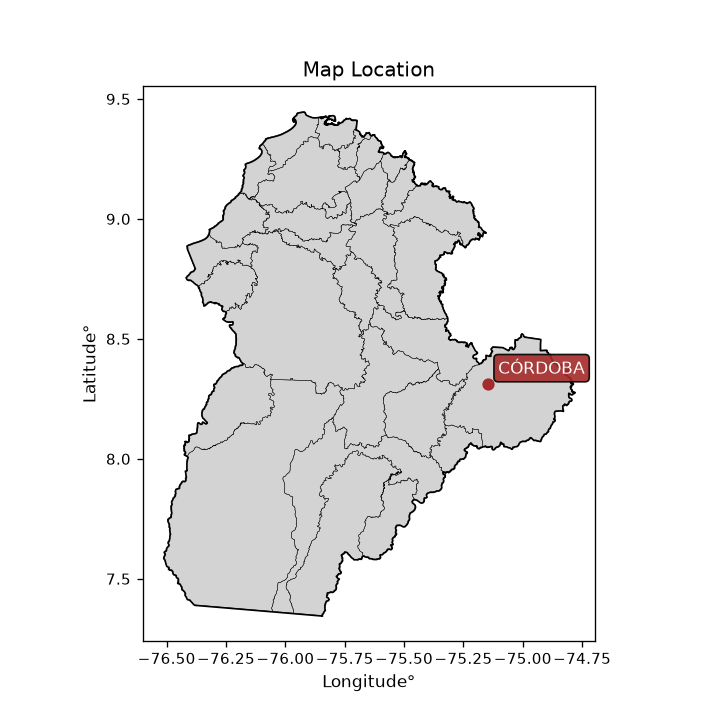</img>

| CountyID                                                                                          | CountyName              | CountyFiles                                                                                                                                                                                                                                                                                                                                                                                                                                                                                                                                                                                                                                                                                                                                                                                                                                                                                                                                                                                                                                                                                                                                                                                                                                                                                                                                                                                                                                                                                                                                                                                                                                                                                                                                                                                                                                                                                                                        |
|:--------------------------------------------------------------------------------------------------|:------------------------|:-----------------------------------------------------------------------------------------------------------------------------------------------------------------------------------------------------------------------------------------------------------------------------------------------------------------------------------------------------------------------------------------------------------------------------------------------------------------------------------------------------------------------------------------------------------------------------------------------------------------------------------------------------------------------------------------------------------------------------------------------------------------------------------------------------------------------------------------------------------------------------------------------------------------------------------------------------------------------------------------------------------------------------------------------------------------------------------------------------------------------------------------------------------------------------------------------------------------------------------------------------------------------------------------------------------------------------------------------------------------------------------------------------------------------------------------------------------------------------------------------------------------------------------------------------------------------------------------------------------------------------------------------------------------------------------------------------------------------------------------------------------------------------------------------------------------------------------------------------------------------------------------------------------------------------------|
| [23068](https://github.com/rcfdtools/R.HydroTools/blob/main/tool/Population/file/report/23068.md) | Ayapel                  | [23068_Rural_Building_202606.zip](https://github.com/rcfdtools/R.GISMobile/blob/main/file/shp/23068_Rural_Building_202606.zip) [23068_Rural_Lot_202606.zip](https://github.com/rcfdtools/R.GISMobile/blob/main/file/shp/23068_Rural_Lot_202606.zip) [23068_Rural_Nomenclature_202606.zip](https://github.com/rcfdtools/R.GISMobile/blob/main/file/shp/23068_Rural_Nomenclature_202606.zip) [23068_Rural_Sector_202606.zip](https://github.com/rcfdtools/R.GISMobile/blob/main/file/shp/23068_Rural_Sector_202606.zip) [23068_Rural_Vereda_202606.zip](https://github.com/rcfdtools/R.GISMobile/blob/main/file/shp/23068_Rural_Vereda_202606.zip) [23068_Urban_Block_202606.zip](https://github.com/rcfdtools/R.GISMobile/blob/main/file/shp/23068_Urban_Block_202606.zip) [23068_Urban_Building_202606.zip](https://github.com/rcfdtools/R.GISMobile/blob/main/file/shp/23068_Urban_Building_202606.zip) [23068_Urban_Lot_202606.zip](https://github.com/rcfdtools/R.GISMobile/blob/main/file/shp/23068_Urban_Lot_202606.zip) [23068_Urban_Neighborhood_202606.zip](https://github.com/rcfdtools/R.GISMobile/blob/main/file/shp/23068_Urban_Neighborhood_202606.zip) [23068_Urban_Nomenclature_202606.zip](https://github.com/rcfdtools/R.GISMobile/blob/main/file/shp/23068_Urban_Nomenclature_202606.zip) [23068_Urban_Nomenclature_Road_202606.zip](https://github.com/rcfdtools/R.GISMobile/blob/main/file/shp/23068_Urban_Nomenclature_Road_202606.zip) [23068_Urban_Perimeter_202606.zip](https://github.com/rcfdtools/R.GISMobile/blob/main/file/shp/23068_Urban_Perimeter_202606.zip) [23068_Urban_Sector_202606.zip](https://github.com/rcfdtools/R.GISMobile/blob/main/file/shp/23068_Urban_Sector_202606.zip)                                                                                                                                                       |
| [23079](https://github.com/rcfdtools/R.HydroTools/blob/main/tool/Population/file/report/23079.md) | Buenavista              | [23079_Rural_Building_202606.zip](https://github.com/rcfdtools/R.GISMobile/blob/main/file/shp/23079_Rural_Building_202606.zip) [23079_Rural_Lot_202606.zip](https://github.com/rcfdtools/R.GISMobile/blob/main/file/shp/23079_Rural_Lot_202606.zip) [23079_Rural_Nomenclature_202606.zip](https://github.com/rcfdtools/R.GISMobile/blob/main/file/shp/23079_Rural_Nomenclature_202606.zip) [23079_Rural_Sector_202606.zip](https://github.com/rcfdtools/R.GISMobile/blob/main/file/shp/23079_Rural_Sector_202606.zip) [23079_Rural_Vereda_202606.zip](https://github.com/rcfdtools/R.GISMobile/blob/main/file/shp/23079_Rural_Vereda_202606.zip) [23079_Urban_Block_202606.zip](https://github.com/rcfdtools/R.GISMobile/blob/main/file/shp/23079_Urban_Block_202606.zip) [23079_Urban_Building_202606.zip](https://github.com/rcfdtools/R.GISMobile/blob/main/file/shp/23079_Urban_Building_202606.zip) [23079_Urban_Lot_202606.zip](https://github.com/rcfdtools/R.GISMobile/blob/main/file/shp/23079_Urban_Lot_202606.zip) [23079_Urban_Neighborhood_202606.zip](https://github.com/rcfdtools/R.GISMobile/blob/main/file/shp/23079_Urban_Neighborhood_202606.zip) [23079_Urban_Nomenclature_202606.zip](https://github.com/rcfdtools/R.GISMobile/blob/main/file/shp/23079_Urban_Nomenclature_202606.zip) [23079_Urban_Nomenclature_Road_202606.zip](https://github.com/rcfdtools/R.GISMobile/blob/main/file/shp/23079_Urban_Nomenclature_Road_202606.zip) [23079_Urban_Perimeter_202606.zip](https://github.com/rcfdtools/R.GISMobile/blob/main/file/shp/23079_Urban_Perimeter_202606.zip) [23079_Urban_Sector_202606.zip](https://github.com/rcfdtools/R.GISMobile/blob/main/file/shp/23079_Urban_Sector_202606.zip)                                                                                                                                                       |
| [23090](https://github.com/rcfdtools/R.HydroTools/blob/main/tool/Population/file/report/23090.md) | Canalete                | [23090_Rural_Building_202606.zip](https://github.com/rcfdtools/R.GISMobile/blob/main/file/shp/23090_Rural_Building_202606.zip) [23090_Rural_Lot_202606.zip](https://github.com/rcfdtools/R.GISMobile/blob/main/file/shp/23090_Rural_Lot_202606.zip) [23090_Rural_Nomenclature_202606.zip](https://github.com/rcfdtools/R.GISMobile/blob/main/file/shp/23090_Rural_Nomenclature_202606.zip) [23090_Rural_Sector_202606.zip](https://github.com/rcfdtools/R.GISMobile/blob/main/file/shp/23090_Rural_Sector_202606.zip) [23090_Rural_Vereda_202606.zip](https://github.com/rcfdtools/R.GISMobile/blob/main/file/shp/23090_Rural_Vereda_202606.zip) [23090_Urban_Block_202606.zip](https://github.com/rcfdtools/R.GISMobile/blob/main/file/shp/23090_Urban_Block_202606.zip) [23090_Urban_Building_202606.zip](https://github.com/rcfdtools/R.GISMobile/blob/main/file/shp/23090_Urban_Building_202606.zip) [23090_Urban_Lot_202606.zip](https://github.com/rcfdtools/R.GISMobile/blob/main/file/shp/23090_Urban_Lot_202606.zip) [23090_Urban_Nomenclature_202606.zip](https://github.com/rcfdtools/R.GISMobile/blob/main/file/shp/23090_Urban_Nomenclature_202606.zip) [23090_Urban_Nomenclature_Road_202606.zip](https://github.com/rcfdtools/R.GISMobile/blob/main/file/shp/23090_Urban_Nomenclature_Road_202606.zip) [23090_Urban_Perimeter_202606.zip](https://github.com/rcfdtools/R.GISMobile/blob/main/file/shp/23090_Urban_Perimeter_202606.zip) [23090_Urban_Sector_202606.zip](https://github.com/rcfdtools/R.GISMobile/blob/main/file/shp/23090_Urban_Sector_202606.zip)                                                                                                                                                                                                                                                                                                  |
| [23162](https://github.com/rcfdtools/R.HydroTools/blob/main/tool/Population/file/report/23162.md) | Cereté                  | [23162_Rural_Building_202606.zip](https://github.com/rcfdtools/R.GISMobile/blob/main/file/shp/23162_Rural_Building_202606.zip) [23162_Rural_Lot_202606.zip](https://github.com/rcfdtools/R.GISMobile/blob/main/file/shp/23162_Rural_Lot_202606.zip) [23162_Rural_Nomenclature_202606.zip](https://github.com/rcfdtools/R.GISMobile/blob/main/file/shp/23162_Rural_Nomenclature_202606.zip) [23162_Rural_Nomenclature_Road_202606.zip](https://github.com/rcfdtools/R.GISMobile/blob/main/file/shp/23162_Rural_Nomenclature_Road_202606.zip) [23162_Rural_Sector_202606.zip](https://github.com/rcfdtools/R.GISMobile/blob/main/file/shp/23162_Rural_Sector_202606.zip) [23162_Rural_Vereda_202606.zip](https://github.com/rcfdtools/R.GISMobile/blob/main/file/shp/23162_Rural_Vereda_202606.zip) [23162_Urban_Block_202606.zip](https://github.com/rcfdtools/R.GISMobile/blob/main/file/shp/23162_Urban_Block_202606.zip) [23162_Urban_Building_202606.zip](https://github.com/rcfdtools/R.GISMobile/blob/main/file/shp/23162_Urban_Building_202606.zip) [23162_Urban_Lot_202606.zip](https://github.com/rcfdtools/R.GISMobile/blob/main/file/shp/23162_Urban_Lot_202606.zip) [23162_Urban_Neighborhood_202606.zip](https://github.com/rcfdtools/R.GISMobile/blob/main/file/shp/23162_Urban_Neighborhood_202606.zip) [23162_Urban_Nomenclature_202606.zip](https://github.com/rcfdtools/R.GISMobile/blob/main/file/shp/23162_Urban_Nomenclature_202606.zip) [23162_Urban_Nomenclature_Road_202606.zip](https://github.com/rcfdtools/R.GISMobile/blob/main/file/shp/23162_Urban_Nomenclature_Road_202606.zip) [23162_Urban_Perimeter_202606.zip](https://github.com/rcfdtools/R.GISMobile/blob/main/file/shp/23162_Urban_Perimeter_202606.zip) [23162_Urban_Sector_202606.zip](https://github.com/rcfdtools/R.GISMobile/blob/main/file/shp/23162_Urban_Sector_202606.zip)  |
| [23168](https://github.com/rcfdtools/R.HydroTools/blob/main/tool/Population/file/report/23168.md) | Chima                   | [23168_Rural_Lot_202606.zip](https://github.com/rcfdtools/R.GISMobile/blob/main/file/shp/23168_Rural_Lot_202606.zip) [23168_Rural_Nomenclature_202606.zip](https://github.com/rcfdtools/R.GISMobile/blob/main/file/shp/23168_Rural_Nomenclature_202606.zip) [23168_Rural_Sector_202606.zip](https://github.com/rcfdtools/R.GISMobile/blob/main/file/shp/23168_Rural_Sector_202606.zip) [23168_Rural_Vereda_202606.zip](https://github.com/rcfdtools/R.GISMobile/blob/main/file/shp/23168_Rural_Vereda_202606.zip) [23168_Urban_Block_202606.zip](https://github.com/rcfdtools/R.GISMobile/blob/main/file/shp/23168_Urban_Block_202606.zip) [23168_Urban_Building_202606.zip](https://github.com/rcfdtools/R.GISMobile/blob/main/file/shp/23168_Urban_Building_202606.zip) [23168_Urban_Lot_202606.zip](https://github.com/rcfdtools/R.GISMobile/blob/main/file/shp/23168_Urban_Lot_202606.zip) [23168_Urban_Neighborhood_202606.zip](https://github.com/rcfdtools/R.GISMobile/blob/main/file/shp/23168_Urban_Neighborhood_202606.zip) [23168_Urban_Nomenclature_202606.zip](https://github.com/rcfdtools/R.GISMobile/blob/main/file/shp/23168_Urban_Nomenclature_202606.zip) [23168_Urban_Nomenclature_Road_202606.zip](https://github.com/rcfdtools/R.GISMobile/blob/main/file/shp/23168_Urban_Nomenclature_Road_202606.zip) [23168_Urban_Perimeter_202606.zip](https://github.com/rcfdtools/R.GISMobile/blob/main/file/shp/23168_Urban_Perimeter_202606.zip) [23168_Urban_Sector_202606.zip](https://github.com/rcfdtools/R.GISMobile/blob/main/file/shp/23168_Urban_Sector_202606.zip)                                                                                                                                                                                                                                                                                          |
| [23182](https://github.com/rcfdtools/R.HydroTools/blob/main/tool/Population/file/report/23182.md) | Chinú                   | [23182_Rural_Building_202606.zip](https://github.com/rcfdtools/R.GISMobile/blob/main/file/shp/23182_Rural_Building_202606.zip) [23182_Rural_Lot_202606.zip](https://github.com/rcfdtools/R.GISMobile/blob/main/file/shp/23182_Rural_Lot_202606.zip) [23182_Rural_Nomenclature_202606.zip](https://github.com/rcfdtools/R.GISMobile/blob/main/file/shp/23182_Rural_Nomenclature_202606.zip) [23182_Rural_Sector_202606.zip](https://github.com/rcfdtools/R.GISMobile/blob/main/file/shp/23182_Rural_Sector_202606.zip) [23182_Rural_Vereda_202606.zip](https://github.com/rcfdtools/R.GISMobile/blob/main/file/shp/23182_Rural_Vereda_202606.zip) [23182_Urban_Block_202606.zip](https://github.com/rcfdtools/R.GISMobile/blob/main/file/shp/23182_Urban_Block_202606.zip) [23182_Urban_Building_202606.zip](https://github.com/rcfdtools/R.GISMobile/blob/main/file/shp/23182_Urban_Building_202606.zip) [23182_Urban_Lot_202606.zip](https://github.com/rcfdtools/R.GISMobile/blob/main/file/shp/23182_Urban_Lot_202606.zip) [23182_Urban_Nomenclature_202606.zip](https://github.com/rcfdtools/R.GISMobile/blob/main/file/shp/23182_Urban_Nomenclature_202606.zip) [23182_Urban_Nomenclature_Road_202606.zip](https://github.com/rcfdtools/R.GISMobile/blob/main/file/shp/23182_Urban_Nomenclature_Road_202606.zip) [23182_Urban_Perimeter_202606.zip](https://github.com/rcfdtools/R.GISMobile/blob/main/file/shp/23182_Urban_Perimeter_202606.zip) [23182_Urban_Sector_202606.zip](https://github.com/rcfdtools/R.GISMobile/blob/main/file/shp/23182_Urban_Sector_202606.zip)                                                                                                                                                                                                                                                                                                  |
| [23189](https://github.com/rcfdtools/R.HydroTools/blob/main/tool/Population/file/report/23189.md) | Ciénaga De Oro          | [23189_Rural_Building_202606.zip](https://github.com/rcfdtools/R.GISMobile/blob/main/file/shp/23189_Rural_Building_202606.zip) [23189_Rural_Lot_202606.zip](https://github.com/rcfdtools/R.GISMobile/blob/main/file/shp/23189_Rural_Lot_202606.zip) [23189_Rural_Nomenclature_202606.zip](https://github.com/rcfdtools/R.GISMobile/blob/main/file/shp/23189_Rural_Nomenclature_202606.zip) [23189_Rural_Sector_202606.zip](https://github.com/rcfdtools/R.GISMobile/blob/main/file/shp/23189_Rural_Sector_202606.zip) [23189_Rural_Vereda_202606.zip](https://github.com/rcfdtools/R.GISMobile/blob/main/file/shp/23189_Rural_Vereda_202606.zip) [23189_Urban_Block_202606.zip](https://github.com/rcfdtools/R.GISMobile/blob/main/file/shp/23189_Urban_Block_202606.zip) [23189_Urban_Building_202606.zip](https://github.com/rcfdtools/R.GISMobile/blob/main/file/shp/23189_Urban_Building_202606.zip) [23189_Urban_Lot_202606.zip](https://github.com/rcfdtools/R.GISMobile/blob/main/file/shp/23189_Urban_Lot_202606.zip) [23189_Urban_Nomenclature_202606.zip](https://github.com/rcfdtools/R.GISMobile/blob/main/file/shp/23189_Urban_Nomenclature_202606.zip) [23189_Urban_Nomenclature_Road_202606.zip](https://github.com/rcfdtools/R.GISMobile/blob/main/file/shp/23189_Urban_Nomenclature_Road_202606.zip) [23189_Urban_Perimeter_202606.zip](https://github.com/rcfdtools/R.GISMobile/blob/main/file/shp/23189_Urban_Perimeter_202606.zip) [23189_Urban_Sector_202606.zip](https://github.com/rcfdtools/R.GISMobile/blob/main/file/shp/23189_Urban_Sector_202606.zip)                                                                                                                                                                                                                                                                                                  |
| [23300](https://github.com/rcfdtools/R.HydroTools/blob/main/tool/Population/file/report/23300.md) | Cotorra                 | [23300_Rural_Building_202606.zip](https://github.com/rcfdtools/R.GISMobile/blob/main/file/shp/23300_Rural_Building_202606.zip) [23300_Rural_Lot_202606.zip](https://github.com/rcfdtools/R.GISMobile/blob/main/file/shp/23300_Rural_Lot_202606.zip) [23300_Rural_Nomenclature_202606.zip](https://github.com/rcfdtools/R.GISMobile/blob/main/file/shp/23300_Rural_Nomenclature_202606.zip) [23300_Rural_Sector_202606.zip](https://github.com/rcfdtools/R.GISMobile/blob/main/file/shp/23300_Rural_Sector_202606.zip) [23300_Rural_Vereda_202606.zip](https://github.com/rcfdtools/R.GISMobile/blob/main/file/shp/23300_Rural_Vereda_202606.zip) [23300_Urban_Block_202606.zip](https://github.com/rcfdtools/R.GISMobile/blob/main/file/shp/23300_Urban_Block_202606.zip) [23300_Urban_Building_202606.zip](https://github.com/rcfdtools/R.GISMobile/blob/main/file/shp/23300_Urban_Building_202606.zip) [23300_Urban_Lot_202606.zip](https://github.com/rcfdtools/R.GISMobile/blob/main/file/shp/23300_Urban_Lot_202606.zip) [23300_Urban_Nomenclature_202606.zip](https://github.com/rcfdtools/R.GISMobile/blob/main/file/shp/23300_Urban_Nomenclature_202606.zip) [23300_Urban_Nomenclature_Road_202606.zip](https://github.com/rcfdtools/R.GISMobile/blob/main/file/shp/23300_Urban_Nomenclature_Road_202606.zip) [23300_Urban_Perimeter_202606.zip](https://github.com/rcfdtools/R.GISMobile/blob/main/file/shp/23300_Urban_Perimeter_202606.zip) [23300_Urban_Sector_202606.zip](https://github.com/rcfdtools/R.GISMobile/blob/main/file/shp/23300_Urban_Sector_202606.zip)                                                                                                                                                                                                                                                                                                  |
| [23350](https://github.com/rcfdtools/R.HydroTools/blob/main/tool/Population/file/report/23350.md) | La Apartada             | [23350_Rural_Building_202606.zip](https://github.com/rcfdtools/R.GISMobile/blob/main/file/shp/23350_Rural_Building_202606.zip) [23350_Rural_Lot_202606.zip](https://github.com/rcfdtools/R.GISMobile/blob/main/file/shp/23350_Rural_Lot_202606.zip) [23350_Rural_Nomenclature_202606.zip](https://github.com/rcfdtools/R.GISMobile/blob/main/file/shp/23350_Rural_Nomenclature_202606.zip) [23350_Rural_Sector_202606.zip](https://github.com/rcfdtools/R.GISMobile/blob/main/file/shp/23350_Rural_Sector_202606.zip) [23350_Rural_Vereda_202606.zip](https://github.com/rcfdtools/R.GISMobile/blob/main/file/shp/23350_Rural_Vereda_202606.zip) [23350_Urban_Block_202606.zip](https://github.com/rcfdtools/R.GISMobile/blob/main/file/shp/23350_Urban_Block_202606.zip) [23350_Urban_Building_202606.zip](https://github.com/rcfdtools/R.GISMobile/blob/main/file/shp/23350_Urban_Building_202606.zip) [23350_Urban_Lot_202606.zip](https://github.com/rcfdtools/R.GISMobile/blob/main/file/shp/23350_Urban_Lot_202606.zip) [23350_Urban_Nomenclature_202606.zip](https://github.com/rcfdtools/R.GISMobile/blob/main/file/shp/23350_Urban_Nomenclature_202606.zip) [23350_Urban_Perimeter_202606.zip](https://github.com/rcfdtools/R.GISMobile/blob/main/file/shp/23350_Urban_Perimeter_202606.zip) [23350_Urban_Sector_202606.zip](https://github.com/rcfdtools/R.GISMobile/blob/main/file/shp/23350_Urban_Sector_202606.zip)                                                                                                                                                                                                                                                                                                                                                                                                                                                       |
| [23417](https://github.com/rcfdtools/R.HydroTools/blob/main/tool/Population/file/report/23417.md) | Lorica                  | [23417_Rural_Building_202606.zip](https://github.com/rcfdtools/R.GISMobile/blob/main/file/shp/23417_Rural_Building_202606.zip) [23417_Rural_Lot_202606.zip](https://github.com/rcfdtools/R.GISMobile/blob/main/file/shp/23417_Rural_Lot_202606.zip) [23417_Rural_Nomenclature_202606.zip](https://github.com/rcfdtools/R.GISMobile/blob/main/file/shp/23417_Rural_Nomenclature_202606.zip) [23417_Rural_Sector_202606.zip](https://github.com/rcfdtools/R.GISMobile/blob/main/file/shp/23417_Rural_Sector_202606.zip) [23417_Rural_Vereda_202606.zip](https://github.com/rcfdtools/R.GISMobile/blob/main/file/shp/23417_Rural_Vereda_202606.zip) [23417_Urban_Block_202606.zip](https://github.com/rcfdtools/R.GISMobile/blob/main/file/shp/23417_Urban_Block_202606.zip) [23417_Urban_Building_202606.zip](https://github.com/rcfdtools/R.GISMobile/blob/main/file/shp/23417_Urban_Building_202606.zip) [23417_Urban_Lot_202606.zip](https://github.com/rcfdtools/R.GISMobile/blob/main/file/shp/23417_Urban_Lot_202606.zip) [23417_Urban_Neighborhood_202606.zip](https://github.com/rcfdtools/R.GISMobile/blob/main/file/shp/23417_Urban_Neighborhood_202606.zip) [23417_Urban_Nomenclature_202606.zip](https://github.com/rcfdtools/R.GISMobile/blob/main/file/shp/23417_Urban_Nomenclature_202606.zip) [23417_Urban_Nomenclature_Road_202606.zip](https://github.com/rcfdtools/R.GISMobile/blob/main/file/shp/23417_Urban_Nomenclature_Road_202606.zip) [23417_Urban_Perimeter_202606.zip](https://github.com/rcfdtools/R.GISMobile/blob/main/file/shp/23417_Urban_Perimeter_202606.zip) [23417_Urban_Sector_202606.zip](https://github.com/rcfdtools/R.GISMobile/blob/main/file/shp/23417_Urban_Sector_202606.zip)                                                                                                                                                       |
| [23419](https://github.com/rcfdtools/R.HydroTools/blob/main/tool/Population/file/report/23419.md) | Los Córdobas            | [23419_Rural_Lot_202606.zip](https://github.com/rcfdtools/R.GISMobile/blob/main/file/shp/23419_Rural_Lot_202606.zip) [23419_Rural_Nomenclature_202606.zip](https://github.com/rcfdtools/R.GISMobile/blob/main/file/shp/23419_Rural_Nomenclature_202606.zip) [23419_Rural_Sector_202606.zip](https://github.com/rcfdtools/R.GISMobile/blob/main/file/shp/23419_Rural_Sector_202606.zip) [23419_Rural_Vereda_202606.zip](https://github.com/rcfdtools/R.GISMobile/blob/main/file/shp/23419_Rural_Vereda_202606.zip) [23419_Urban_Block_202606.zip](https://github.com/rcfdtools/R.GISMobile/blob/main/file/shp/23419_Urban_Block_202606.zip) [23419_Urban_Building_202606.zip](https://github.com/rcfdtools/R.GISMobile/blob/main/file/shp/23419_Urban_Building_202606.zip) [23419_Urban_Lot_202606.zip](https://github.com/rcfdtools/R.GISMobile/blob/main/file/shp/23419_Urban_Lot_202606.zip) [23419_Urban_Neighborhood_202606.zip](https://github.com/rcfdtools/R.GISMobile/blob/main/file/shp/23419_Urban_Neighborhood_202606.zip) [23419_Urban_Nomenclature_202606.zip](https://github.com/rcfdtools/R.GISMobile/blob/main/file/shp/23419_Urban_Nomenclature_202606.zip) [23419_Urban_Nomenclature_Road_202606.zip](https://github.com/rcfdtools/R.GISMobile/blob/main/file/shp/23419_Urban_Nomenclature_Road_202606.zip) [23419_Urban_Perimeter_202606.zip](https://github.com/rcfdtools/R.GISMobile/blob/main/file/shp/23419_Urban_Perimeter_202606.zip) [23419_Urban_Sector_202606.zip](https://github.com/rcfdtools/R.GISMobile/blob/main/file/shp/23419_Urban_Sector_202606.zip)                                                                                                                                                                                                                                                                                          |
| [23464](https://github.com/rcfdtools/R.HydroTools/blob/main/tool/Population/file/report/23464.md) | Momil                   | [23464_Rural_Building_202606.zip](https://github.com/rcfdtools/R.GISMobile/blob/main/file/shp/23464_Rural_Building_202606.zip) [23464_Rural_Lot_202606.zip](https://github.com/rcfdtools/R.GISMobile/blob/main/file/shp/23464_Rural_Lot_202606.zip) [23464_Rural_Nomenclature_202606.zip](https://github.com/rcfdtools/R.GISMobile/blob/main/file/shp/23464_Rural_Nomenclature_202606.zip) [23464_Rural_Sector_202606.zip](https://github.com/rcfdtools/R.GISMobile/blob/main/file/shp/23464_Rural_Sector_202606.zip) [23464_Rural_Vereda_202606.zip](https://github.com/rcfdtools/R.GISMobile/blob/main/file/shp/23464_Rural_Vereda_202606.zip) [23464_Urban_Block_202606.zip](https://github.com/rcfdtools/R.GISMobile/blob/main/file/shp/23464_Urban_Block_202606.zip) [23464_Urban_Building_202606.zip](https://github.com/rcfdtools/R.GISMobile/blob/main/file/shp/23464_Urban_Building_202606.zip) [23464_Urban_Lot_202606.zip](https://github.com/rcfdtools/R.GISMobile/blob/main/file/shp/23464_Urban_Lot_202606.zip) [23464_Urban_Nomenclature_202606.zip](https://github.com/rcfdtools/R.GISMobile/blob/main/file/shp/23464_Urban_Nomenclature_202606.zip) [23464_Urban_Nomenclature_Road_202606.zip](https://github.com/rcfdtools/R.GISMobile/blob/main/file/shp/23464_Urban_Nomenclature_Road_202606.zip) [23464_Urban_Perimeter_202606.zip](https://github.com/rcfdtools/R.GISMobile/blob/main/file/shp/23464_Urban_Perimeter_202606.zip) [23464_Urban_Sector_202606.zip](https://github.com/rcfdtools/R.GISMobile/blob/main/file/shp/23464_Urban_Sector_202606.zip)                                                                                                                                                                                                                                                                                                  |
| [23466](https://github.com/rcfdtools/R.HydroTools/blob/main/tool/Population/file/report/23466.md) | Montelíbano             | [23466_Rural_Building_202606.zip](https://github.com/rcfdtools/R.GISMobile/blob/main/file/shp/23466_Rural_Building_202606.zip) [23466_Rural_Lot_202606.zip](https://github.com/rcfdtools/R.GISMobile/blob/main/file/shp/23466_Rural_Lot_202606.zip) [23466_Rural_Nomenclature_202606.zip](https://github.com/rcfdtools/R.GISMobile/blob/main/file/shp/23466_Rural_Nomenclature_202606.zip) [23466_Rural_Sector_202606.zip](https://github.com/rcfdtools/R.GISMobile/blob/main/file/shp/23466_Rural_Sector_202606.zip) [23466_Rural_Vereda_202606.zip](https://github.com/rcfdtools/R.GISMobile/blob/main/file/shp/23466_Rural_Vereda_202606.zip) [23466_Urban_Block_202606.zip](https://github.com/rcfdtools/R.GISMobile/blob/main/file/shp/23466_Urban_Block_202606.zip) [23466_Urban_Building_202606.zip](https://github.com/rcfdtools/R.GISMobile/blob/main/file/shp/23466_Urban_Building_202606.zip) [23466_Urban_Lot_202606.zip](https://github.com/rcfdtools/R.GISMobile/blob/main/file/shp/23466_Urban_Lot_202606.zip) [23466_Urban_Neighborhood_202606.zip](https://github.com/rcfdtools/R.GISMobile/blob/main/file/shp/23466_Urban_Neighborhood_202606.zip) [23466_Urban_Nomenclature_202606.zip](https://github.com/rcfdtools/R.GISMobile/blob/main/file/shp/23466_Urban_Nomenclature_202606.zip) [23466_Urban_Nomenclature_Road_202606.zip](https://github.com/rcfdtools/R.GISMobile/blob/main/file/shp/23466_Urban_Nomenclature_Road_202606.zip) [23466_Urban_Perimeter_202606.zip](https://github.com/rcfdtools/R.GISMobile/blob/main/file/shp/23466_Urban_Perimeter_202606.zip) [23466_Urban_Sector_202606.zip](https://github.com/rcfdtools/R.GISMobile/blob/main/file/shp/23466_Urban_Sector_202606.zip)                                                                                                                                                       |
| [23001](https://github.com/rcfdtools/R.HydroTools/blob/main/tool/Population/file/report/23001.md) | Montería                | [23001_Rural_Lot_202606.zip](https://github.com/rcfdtools/R.GISMobile/blob/main/file/shp/23001_Rural_Lot_202606.zip) [23001_Urban_Lot_202606.zip](https://github.com/rcfdtools/R.GISMobile/blob/main/file/shp/23001_Urban_Lot_202606.zip)                                                                                                                                                                                                                                                                                                                                                                                                                                                                                                                                                                                                                                                                                                                                                                                                                                                                                                                                                                                                                                                                                                                                                                                                                                                                                                                                                                                                                                                                                                                                                                                                                                                                                  |
| [23500](https://github.com/rcfdtools/R.HydroTools/blob/main/tool/Population/file/report/23500.md) | Moñitos                 | [23500_Rural_Building_202606.zip](https://github.com/rcfdtools/R.GISMobile/blob/main/file/shp/23500_Rural_Building_202606.zip) [23500_Rural_Lot_202606.zip](https://github.com/rcfdtools/R.GISMobile/blob/main/file/shp/23500_Rural_Lot_202606.zip) [23500_Rural_Nomenclature_202606.zip](https://github.com/rcfdtools/R.GISMobile/blob/main/file/shp/23500_Rural_Nomenclature_202606.zip) [23500_Rural_Sector_202606.zip](https://github.com/rcfdtools/R.GISMobile/blob/main/file/shp/23500_Rural_Sector_202606.zip) [23500_Rural_Vereda_202606.zip](https://github.com/rcfdtools/R.GISMobile/blob/main/file/shp/23500_Rural_Vereda_202606.zip) [23500_Urban_Block_202606.zip](https://github.com/rcfdtools/R.GISMobile/blob/main/file/shp/23500_Urban_Block_202606.zip) [23500_Urban_Building_202606.zip](https://github.com/rcfdtools/R.GISMobile/blob/main/file/shp/23500_Urban_Building_202606.zip) [23500_Urban_Lot_202606.zip](https://github.com/rcfdtools/R.GISMobile/blob/main/file/shp/23500_Urban_Lot_202606.zip) [23500_Urban_Neighborhood_202606.zip](https://github.com/rcfdtools/R.GISMobile/blob/main/file/shp/23500_Urban_Neighborhood_202606.zip) [23500_Urban_Nomenclature_202606.zip](https://github.com/rcfdtools/R.GISMobile/blob/main/file/shp/23500_Urban_Nomenclature_202606.zip) [23500_Urban_Nomenclature_Road_202606.zip](https://github.com/rcfdtools/R.GISMobile/blob/main/file/shp/23500_Urban_Nomenclature_Road_202606.zip) [23500_Urban_Perimeter_202606.zip](https://github.com/rcfdtools/R.GISMobile/blob/main/file/shp/23500_Urban_Perimeter_202606.zip) [23500_Urban_Sector_202606.zip](https://github.com/rcfdtools/R.GISMobile/blob/main/file/shp/23500_Urban_Sector_202606.zip)                                                                                                                                                       |
| [23555](https://github.com/rcfdtools/R.HydroTools/blob/main/tool/Population/file/report/23555.md) | Planeta Rica            | [23555_Rural_Building_202606.zip](https://github.com/rcfdtools/R.GISMobile/blob/main/file/shp/23555_Rural_Building_202606.zip) [23555_Rural_Lot_202606.zip](https://github.com/rcfdtools/R.GISMobile/blob/main/file/shp/23555_Rural_Lot_202606.zip) [23555_Rural_Nomenclature_202606.zip](https://github.com/rcfdtools/R.GISMobile/blob/main/file/shp/23555_Rural_Nomenclature_202606.zip) [23555_Rural_Sector_202606.zip](https://github.com/rcfdtools/R.GISMobile/blob/main/file/shp/23555_Rural_Sector_202606.zip) [23555_Rural_Vereda_202606.zip](https://github.com/rcfdtools/R.GISMobile/blob/main/file/shp/23555_Rural_Vereda_202606.zip) [23555_Urban_Block_202606.zip](https://github.com/rcfdtools/R.GISMobile/blob/main/file/shp/23555_Urban_Block_202606.zip) [23555_Urban_Building_202606.zip](https://github.com/rcfdtools/R.GISMobile/blob/main/file/shp/23555_Urban_Building_202606.zip) [23555_Urban_Lot_202606.zip](https://github.com/rcfdtools/R.GISMobile/blob/main/file/shp/23555_Urban_Lot_202606.zip) [23555_Urban_Neighborhood_202606.zip](https://github.com/rcfdtools/R.GISMobile/blob/main/file/shp/23555_Urban_Neighborhood_202606.zip) [23555_Urban_Nomenclature_202606.zip](https://github.com/rcfdtools/R.GISMobile/blob/main/file/shp/23555_Urban_Nomenclature_202606.zip) [23555_Urban_Nomenclature_Road_202606.zip](https://github.com/rcfdtools/R.GISMobile/blob/main/file/shp/23555_Urban_Nomenclature_Road_202606.zip) [23555_Urban_Perimeter_202606.zip](https://github.com/rcfdtools/R.GISMobile/blob/main/file/shp/23555_Urban_Perimeter_202606.zip) [23555_Urban_Sector_202606.zip](https://github.com/rcfdtools/R.GISMobile/blob/main/file/shp/23555_Urban_Sector_202606.zip)                                                                                                                                                       |
| [23570](https://github.com/rcfdtools/R.HydroTools/blob/main/tool/Population/file/report/23570.md) | Pueblo Nuevo            | [23570_Rural_Building_202606.zip](https://github.com/rcfdtools/R.GISMobile/blob/main/file/shp/23570_Rural_Building_202606.zip) [23570_Rural_Lot_202606.zip](https://github.com/rcfdtools/R.GISMobile/blob/main/file/shp/23570_Rural_Lot_202606.zip) [23570_Rural_Nomenclature_202606.zip](https://github.com/rcfdtools/R.GISMobile/blob/main/file/shp/23570_Rural_Nomenclature_202606.zip) [23570_Rural_Sector_202606.zip](https://github.com/rcfdtools/R.GISMobile/blob/main/file/shp/23570_Rural_Sector_202606.zip) [23570_Rural_Vereda_202606.zip](https://github.com/rcfdtools/R.GISMobile/blob/main/file/shp/23570_Rural_Vereda_202606.zip) [23570_Urban_Block_202606.zip](https://github.com/rcfdtools/R.GISMobile/blob/main/file/shp/23570_Urban_Block_202606.zip) [23570_Urban_Building_202606.zip](https://github.com/rcfdtools/R.GISMobile/blob/main/file/shp/23570_Urban_Building_202606.zip) [23570_Urban_Lot_202606.zip](https://github.com/rcfdtools/R.GISMobile/blob/main/file/shp/23570_Urban_Lot_202606.zip) [23570_Urban_Nomenclature_202606.zip](https://github.com/rcfdtools/R.GISMobile/blob/main/file/shp/23570_Urban_Nomenclature_202606.zip) [23570_Urban_Perimeter_202606.zip](https://github.com/rcfdtools/R.GISMobile/blob/main/file/shp/23570_Urban_Perimeter_202606.zip) [23570_Urban_Sector_202606.zip](https://github.com/rcfdtools/R.GISMobile/blob/main/file/shp/23570_Urban_Sector_202606.zip)                                                                                                                                                                                                                                                                                                                                                                                                                                                       |
| [23574](https://github.com/rcfdtools/R.HydroTools/blob/main/tool/Population/file/report/23574.md) | Puerto Escondido        | [23574_Rural_Building_202606.zip](https://github.com/rcfdtools/R.GISMobile/blob/main/file/shp/23574_Rural_Building_202606.zip) [23574_Rural_Lot_202606.zip](https://github.com/rcfdtools/R.GISMobile/blob/main/file/shp/23574_Rural_Lot_202606.zip) [23574_Rural_Nomenclature_202606.zip](https://github.com/rcfdtools/R.GISMobile/blob/main/file/shp/23574_Rural_Nomenclature_202606.zip) [23574_Rural_Vereda_202606.zip](https://github.com/rcfdtools/R.GISMobile/blob/main/file/shp/23574_Rural_Vereda_202606.zip) [23574_Urban_Block_202606.zip](https://github.com/rcfdtools/R.GISMobile/blob/main/file/shp/23574_Urban_Block_202606.zip) [23574_Urban_Building_202606.zip](https://github.com/rcfdtools/R.GISMobile/blob/main/file/shp/23574_Urban_Building_202606.zip) [23574_Urban_Lot_202606.zip](https://github.com/rcfdtools/R.GISMobile/blob/main/file/shp/23574_Urban_Lot_202606.zip) [23574_Urban_Neighborhood_202606.zip](https://github.com/rcfdtools/R.GISMobile/blob/main/file/shp/23574_Urban_Neighborhood_202606.zip) [23574_Urban_Nomenclature_202606.zip](https://github.com/rcfdtools/R.GISMobile/blob/main/file/shp/23574_Urban_Nomenclature_202606.zip) [23574_Urban_Nomenclature_Road_202606.zip](https://github.com/rcfdtools/R.GISMobile/blob/main/file/shp/23574_Urban_Nomenclature_Road_202606.zip) [23574_Urban_Perimeter_202606.zip](https://github.com/rcfdtools/R.GISMobile/blob/main/file/shp/23574_Urban_Perimeter_202606.zip) [23574_Urban_Sector_202606.zip](https://github.com/rcfdtools/R.GISMobile/blob/main/file/shp/23574_Urban_Sector_202606.zip)                                                                                                                                                                                                                                                                                      |
| [23580](https://github.com/rcfdtools/R.HydroTools/blob/main/tool/Population/file/report/23580.md) | Puerto Libertador       | [23580_Rural_Building_202606.zip](https://github.com/rcfdtools/R.GISMobile/blob/main/file/shp/23580_Rural_Building_202606.zip) [23580_Rural_Lot_202606.zip](https://github.com/rcfdtools/R.GISMobile/blob/main/file/shp/23580_Rural_Lot_202606.zip) [23580_Rural_Nomenclature_202606.zip](https://github.com/rcfdtools/R.GISMobile/blob/main/file/shp/23580_Rural_Nomenclature_202606.zip) [23580_Rural_Sector_202606.zip](https://github.com/rcfdtools/R.GISMobile/blob/main/file/shp/23580_Rural_Sector_202606.zip) [23580_Rural_Vereda_202606.zip](https://github.com/rcfdtools/R.GISMobile/blob/main/file/shp/23580_Rural_Vereda_202606.zip) [23580_Urban_Block_202606.zip](https://github.com/rcfdtools/R.GISMobile/blob/main/file/shp/23580_Urban_Block_202606.zip) [23580_Urban_Building_202606.zip](https://github.com/rcfdtools/R.GISMobile/blob/main/file/shp/23580_Urban_Building_202606.zip) [23580_Urban_Lot_202606.zip](https://github.com/rcfdtools/R.GISMobile/blob/main/file/shp/23580_Urban_Lot_202606.zip) [23580_Urban_Neighborhood_202606.zip](https://github.com/rcfdtools/R.GISMobile/blob/main/file/shp/23580_Urban_Neighborhood_202606.zip) [23580_Urban_Nomenclature_202606.zip](https://github.com/rcfdtools/R.GISMobile/blob/main/file/shp/23580_Urban_Nomenclature_202606.zip) [23580_Urban_Nomenclature_Road_202606.zip](https://github.com/rcfdtools/R.GISMobile/blob/main/file/shp/23580_Urban_Nomenclature_Road_202606.zip) [23580_Urban_Perimeter_202606.zip](https://github.com/rcfdtools/R.GISMobile/blob/main/file/shp/23580_Urban_Perimeter_202606.zip) [23580_Urban_Sector_202606.zip](https://github.com/rcfdtools/R.GISMobile/blob/main/file/shp/23580_Urban_Sector_202606.zip)                                                                                                                                                       |
| [23586](https://github.com/rcfdtools/R.HydroTools/blob/main/tool/Population/file/report/23586.md) | Purísima                | [23586_Rural_Building_202606.zip](https://github.com/rcfdtools/R.GISMobile/blob/main/file/shp/23586_Rural_Building_202606.zip) [23586_Rural_Lot_202606.zip](https://github.com/rcfdtools/R.GISMobile/blob/main/file/shp/23586_Rural_Lot_202606.zip) [23586_Rural_Nomenclature_202606.zip](https://github.com/rcfdtools/R.GISMobile/blob/main/file/shp/23586_Rural_Nomenclature_202606.zip) [23586_Rural_Sector_202606.zip](https://github.com/rcfdtools/R.GISMobile/blob/main/file/shp/23586_Rural_Sector_202606.zip) [23586_Rural_Vereda_202606.zip](https://github.com/rcfdtools/R.GISMobile/blob/main/file/shp/23586_Rural_Vereda_202606.zip) [23586_Urban_Block_202606.zip](https://github.com/rcfdtools/R.GISMobile/blob/main/file/shp/23586_Urban_Block_202606.zip) [23586_Urban_Building_202606.zip](https://github.com/rcfdtools/R.GISMobile/blob/main/file/shp/23586_Urban_Building_202606.zip) [23586_Urban_Lot_202606.zip](https://github.com/rcfdtools/R.GISMobile/blob/main/file/shp/23586_Urban_Lot_202606.zip) [23586_Urban_Nomenclature_202606.zip](https://github.com/rcfdtools/R.GISMobile/blob/main/file/shp/23586_Urban_Nomenclature_202606.zip) [23586_Urban_Nomenclature_Road_202606.zip](https://github.com/rcfdtools/R.GISMobile/blob/main/file/shp/23586_Urban_Nomenclature_Road_202606.zip) [23586_Urban_Perimeter_202606.zip](https://github.com/rcfdtools/R.GISMobile/blob/main/file/shp/23586_Urban_Perimeter_202606.zip) [23586_Urban_Sector_202606.zip](https://github.com/rcfdtools/R.GISMobile/blob/main/file/shp/23586_Urban_Sector_202606.zip)                                                                                                                                                                                                                                                                                                  |
| [23660](https://github.com/rcfdtools/R.HydroTools/blob/main/tool/Population/file/report/23660.md) | Sahagún                 | [23660_Rural_Lot_202001.zip](https://github.com/rcfdtools/R.GISMobile/blob/main/file/shp/23660_Rural_Lot_202001.zip) [23660_Urban_Lot_202001.zip](https://github.com/rcfdtools/R.GISMobile/blob/main/file/shp/23660_Urban_Lot_202001.zip)                                                                                                                                                                                                                                                                                                                                                                                                                                                                                                                                                                                                                                                                                                                                                                                                                                                                                                                                                                                                                                                                                                                                                                                                                                                                                                                                                                                                                                                                                                                                                                                                                                                                                  |
| [23670](https://github.com/rcfdtools/R.HydroTools/blob/main/tool/Population/file/report/23670.md) | San Andrés De Sotavento | [23670_Rural_Building_202606.zip](https://github.com/rcfdtools/R.GISMobile/blob/main/file/shp/23670_Rural_Building_202606.zip) [23670_Rural_Lot_202606.zip](https://github.com/rcfdtools/R.GISMobile/blob/main/file/shp/23670_Rural_Lot_202606.zip) [23670_Rural_Nomenclature_202606.zip](https://github.com/rcfdtools/R.GISMobile/blob/main/file/shp/23670_Rural_Nomenclature_202606.zip) [23670_Rural_Sector_202606.zip](https://github.com/rcfdtools/R.GISMobile/blob/main/file/shp/23670_Rural_Sector_202606.zip) [23670_Rural_Vereda_202606.zip](https://github.com/rcfdtools/R.GISMobile/blob/main/file/shp/23670_Rural_Vereda_202606.zip) [23670_Urban_Block_202606.zip](https://github.com/rcfdtools/R.GISMobile/blob/main/file/shp/23670_Urban_Block_202606.zip) [23670_Urban_Building_202606.zip](https://github.com/rcfdtools/R.GISMobile/blob/main/file/shp/23670_Urban_Building_202606.zip) [23670_Urban_Lot_202606.zip](https://github.com/rcfdtools/R.GISMobile/blob/main/file/shp/23670_Urban_Lot_202606.zip) [23670_Urban_Nomenclature_202606.zip](https://github.com/rcfdtools/R.GISMobile/blob/main/file/shp/23670_Urban_Nomenclature_202606.zip) [23670_Urban_Nomenclature_Road_202606.zip](https://github.com/rcfdtools/R.GISMobile/blob/main/file/shp/23670_Urban_Nomenclature_Road_202606.zip) [23670_Urban_Perimeter_202606.zip](https://github.com/rcfdtools/R.GISMobile/blob/main/file/shp/23670_Urban_Perimeter_202606.zip) [23670_Urban_Sector_202606.zip](https://github.com/rcfdtools/R.GISMobile/blob/main/file/shp/23670_Urban_Sector_202606.zip)                                                                                                                                                                                                                                                                                                  |
| [23672](https://github.com/rcfdtools/R.HydroTools/blob/main/tool/Population/file/report/23672.md) | San Antero              | [23672_Rural_Building_202606.zip](https://github.com/rcfdtools/R.GISMobile/blob/main/file/shp/23672_Rural_Building_202606.zip) [23672_Rural_Lot_202606.zip](https://github.com/rcfdtools/R.GISMobile/blob/main/file/shp/23672_Rural_Lot_202606.zip) [23672_Rural_Nomenclature_202606.zip](https://github.com/rcfdtools/R.GISMobile/blob/main/file/shp/23672_Rural_Nomenclature_202606.zip) [23672_Rural_Sector_202606.zip](https://github.com/rcfdtools/R.GISMobile/blob/main/file/shp/23672_Rural_Sector_202606.zip) [23672_Rural_Vereda_202606.zip](https://github.com/rcfdtools/R.GISMobile/blob/main/file/shp/23672_Rural_Vereda_202606.zip) [23672_Urban_Block_202606.zip](https://github.com/rcfdtools/R.GISMobile/blob/main/file/shp/23672_Urban_Block_202606.zip) [23672_Urban_Building_202606.zip](https://github.com/rcfdtools/R.GISMobile/blob/main/file/shp/23672_Urban_Building_202606.zip) [23672_Urban_Lot_202606.zip](https://github.com/rcfdtools/R.GISMobile/blob/main/file/shp/23672_Urban_Lot_202606.zip) [23672_Urban_Nomenclature_202606.zip](https://github.com/rcfdtools/R.GISMobile/blob/main/file/shp/23672_Urban_Nomenclature_202606.zip) [23672_Urban_Nomenclature_Road_202606.zip](https://github.com/rcfdtools/R.GISMobile/blob/main/file/shp/23672_Urban_Nomenclature_Road_202606.zip) [23672_Urban_Perimeter_202606.zip](https://github.com/rcfdtools/R.GISMobile/blob/main/file/shp/23672_Urban_Perimeter_202606.zip) [23672_Urban_Sector_202606.zip](https://github.com/rcfdtools/R.GISMobile/blob/main/file/shp/23672_Urban_Sector_202606.zip)                                                                                                                                                                                                                                                                                                  |
| [23675](https://github.com/rcfdtools/R.HydroTools/blob/main/tool/Population/file/report/23675.md) | San Bernardo Del Viento | [23675_Rural_Building_202606.zip](https://github.com/rcfdtools/R.GISMobile/blob/main/file/shp/23675_Rural_Building_202606.zip) [23675_Rural_Lot_202606.zip](https://github.com/rcfdtools/R.GISMobile/blob/main/file/shp/23675_Rural_Lot_202606.zip) [23675_Rural_Nomenclature_202606.zip](https://github.com/rcfdtools/R.GISMobile/blob/main/file/shp/23675_Rural_Nomenclature_202606.zip) [23675_Rural_Sector_202606.zip](https://github.com/rcfdtools/R.GISMobile/blob/main/file/shp/23675_Rural_Sector_202606.zip) [23675_Rural_Vereda_202606.zip](https://github.com/rcfdtools/R.GISMobile/blob/main/file/shp/23675_Rural_Vereda_202606.zip) [23675_Urban_Block_202606.zip](https://github.com/rcfdtools/R.GISMobile/blob/main/file/shp/23675_Urban_Block_202606.zip) [23675_Urban_Building_202606.zip](https://github.com/rcfdtools/R.GISMobile/blob/main/file/shp/23675_Urban_Building_202606.zip) [23675_Urban_Lot_202606.zip](https://github.com/rcfdtools/R.GISMobile/blob/main/file/shp/23675_Urban_Lot_202606.zip) [23675_Urban_Nomenclature_202606.zip](https://github.com/rcfdtools/R.GISMobile/blob/main/file/shp/23675_Urban_Nomenclature_202606.zip) [23675_Urban_Nomenclature_Road_202606.zip](https://github.com/rcfdtools/R.GISMobile/blob/main/file/shp/23675_Urban_Nomenclature_Road_202606.zip) [23675_Urban_Perimeter_202606.zip](https://github.com/rcfdtools/R.GISMobile/blob/main/file/shp/23675_Urban_Perimeter_202606.zip) [23675_Urban_Sector_202606.zip](https://github.com/rcfdtools/R.GISMobile/blob/main/file/shp/23675_Urban_Sector_202606.zip)                                                                                                                                                                                                                                                                                                  |
| [23678](https://github.com/rcfdtools/R.HydroTools/blob/main/tool/Population/file/report/23678.md) | San Carlos              | [23678_Rural_Building_202606.zip](https://github.com/rcfdtools/R.GISMobile/blob/main/file/shp/23678_Rural_Building_202606.zip) [23678_Rural_Lot_202606.zip](https://github.com/rcfdtools/R.GISMobile/blob/main/file/shp/23678_Rural_Lot_202606.zip) [23678_Rural_Nomenclature_202606.zip](https://github.com/rcfdtools/R.GISMobile/blob/main/file/shp/23678_Rural_Nomenclature_202606.zip) [23678_Rural_Sector_202606.zip](https://github.com/rcfdtools/R.GISMobile/blob/main/file/shp/23678_Rural_Sector_202606.zip) [23678_Rural_Vereda_202606.zip](https://github.com/rcfdtools/R.GISMobile/blob/main/file/shp/23678_Rural_Vereda_202606.zip) [23678_Urban_Block_202606.zip](https://github.com/rcfdtools/R.GISMobile/blob/main/file/shp/23678_Urban_Block_202606.zip) [23678_Urban_Building_202606.zip](https://github.com/rcfdtools/R.GISMobile/blob/main/file/shp/23678_Urban_Building_202606.zip) [23678_Urban_Lot_202606.zip](https://github.com/rcfdtools/R.GISMobile/blob/main/file/shp/23678_Urban_Lot_202606.zip) [23678_Urban_Nomenclature_202606.zip](https://github.com/rcfdtools/R.GISMobile/blob/main/file/shp/23678_Urban_Nomenclature_202606.zip) [23678_Urban_Nomenclature_Road_202606.zip](https://github.com/rcfdtools/R.GISMobile/blob/main/file/shp/23678_Urban_Nomenclature_Road_202606.zip) [23678_Urban_Perimeter_202606.zip](https://github.com/rcfdtools/R.GISMobile/blob/main/file/shp/23678_Urban_Perimeter_202606.zip) [23678_Urban_Sector_202606.zip](https://github.com/rcfdtools/R.GISMobile/blob/main/file/shp/23678_Urban_Sector_202606.zip)                                                                                                                                                                                                                                                                                                  |
| [23682](https://github.com/rcfdtools/R.HydroTools/blob/main/tool/Population/file/report/23682.md) | San José De Uré         | [23682_Rural_Lot_202606.zip](https://github.com/rcfdtools/R.GISMobile/blob/main/file/shp/23682_Rural_Lot_202606.zip) [23682_Rural_Nomenclature_202606.zip](https://github.com/rcfdtools/R.GISMobile/blob/main/file/shp/23682_Rural_Nomenclature_202606.zip) [23682_Rural_Sector_202606.zip](https://github.com/rcfdtools/R.GISMobile/blob/main/file/shp/23682_Rural_Sector_202606.zip) [23682_Rural_Vereda_202606.zip](https://github.com/rcfdtools/R.GISMobile/blob/main/file/shp/23682_Rural_Vereda_202606.zip) [23682_Urban_Block_202606.zip](https://github.com/rcfdtools/R.GISMobile/blob/main/file/shp/23682_Urban_Block_202606.zip) [23682_Urban_Building_202606.zip](https://github.com/rcfdtools/R.GISMobile/blob/main/file/shp/23682_Urban_Building_202606.zip) [23682_Urban_Lot_202606.zip](https://github.com/rcfdtools/R.GISMobile/blob/main/file/shp/23682_Urban_Lot_202606.zip) [23682_Urban_Nomenclature_202606.zip](https://github.com/rcfdtools/R.GISMobile/blob/main/file/shp/23682_Urban_Nomenclature_202606.zip) [23682_Urban_Nomenclature_Road_202606.zip](https://github.com/rcfdtools/R.GISMobile/blob/main/file/shp/23682_Urban_Nomenclature_Road_202606.zip) [23682_Urban_Perimeter_202606.zip](https://github.com/rcfdtools/R.GISMobile/blob/main/file/shp/23682_Urban_Perimeter_202606.zip) [23682_Urban_Sector_202606.zip](https://github.com/rcfdtools/R.GISMobile/blob/main/file/shp/23682_Urban_Sector_202606.zip)                                                                                                                                                                                                                                                                                                                                                                                                                                     |
| [23686](https://github.com/rcfdtools/R.HydroTools/blob/main/tool/Population/file/report/23686.md) | San Pelayo              | [23686_Rural_Building_202606.zip](https://github.com/rcfdtools/R.GISMobile/blob/main/file/shp/23686_Rural_Building_202606.zip) [23686_Rural_Lot_202606.zip](https://github.com/rcfdtools/R.GISMobile/blob/main/file/shp/23686_Rural_Lot_202606.zip) [23686_Rural_Nomenclature_202606.zip](https://github.com/rcfdtools/R.GISMobile/blob/main/file/shp/23686_Rural_Nomenclature_202606.zip) [23686_Rural_Sector_202606.zip](https://github.com/rcfdtools/R.GISMobile/blob/main/file/shp/23686_Rural_Sector_202606.zip) [23686_Rural_Vereda_202606.zip](https://github.com/rcfdtools/R.GISMobile/blob/main/file/shp/23686_Rural_Vereda_202606.zip) [23686_Urban_Block_202606.zip](https://github.com/rcfdtools/R.GISMobile/blob/main/file/shp/23686_Urban_Block_202606.zip) [23686_Urban_Building_202606.zip](https://github.com/rcfdtools/R.GISMobile/blob/main/file/shp/23686_Urban_Building_202606.zip) [23686_Urban_Lot_202606.zip](https://github.com/rcfdtools/R.GISMobile/blob/main/file/shp/23686_Urban_Lot_202606.zip) [23686_Urban_Nomenclature_202606.zip](https://github.com/rcfdtools/R.GISMobile/blob/main/file/shp/23686_Urban_Nomenclature_202606.zip) [23686_Urban_Nomenclature_Road_202606.zip](https://github.com/rcfdtools/R.GISMobile/blob/main/file/shp/23686_Urban_Nomenclature_Road_202606.zip) [23686_Urban_Perimeter_202606.zip](https://github.com/rcfdtools/R.GISMobile/blob/main/file/shp/23686_Urban_Perimeter_202606.zip) [23686_Urban_Sector_202606.zip](https://github.com/rcfdtools/R.GISMobile/blob/main/file/shp/23686_Urban_Sector_202606.zip)                                                                                                                                                                                                                                                                                                  |
| [23807](https://github.com/rcfdtools/R.HydroTools/blob/main/tool/Population/file/report/23807.md) | Tierralta               | [23807_Rural_Building_202606.zip](https://github.com/rcfdtools/R.GISMobile/blob/main/file/shp/23807_Rural_Building_202606.zip) [23807_Rural_Lot_202606.zip](https://github.com/rcfdtools/R.GISMobile/blob/main/file/shp/23807_Rural_Lot_202606.zip) [23807_Rural_Nomenclature_202606.zip](https://github.com/rcfdtools/R.GISMobile/blob/main/file/shp/23807_Rural_Nomenclature_202606.zip) [23807_Rural_Sector_202606.zip](https://github.com/rcfdtools/R.GISMobile/blob/main/file/shp/23807_Rural_Sector_202606.zip) [23807_Rural_Vereda_202606.zip](https://github.com/rcfdtools/R.GISMobile/blob/main/file/shp/23807_Rural_Vereda_202606.zip) [23807_Urban_Block_202606.zip](https://github.com/rcfdtools/R.GISMobile/blob/main/file/shp/23807_Urban_Block_202606.zip) [23807_Urban_Building_202606.zip](https://github.com/rcfdtools/R.GISMobile/blob/main/file/shp/23807_Urban_Building_202606.zip) [23807_Urban_Lot_202606.zip](https://github.com/rcfdtools/R.GISMobile/blob/main/file/shp/23807_Urban_Lot_202606.zip) [23807_Urban_Nomenclature_202606.zip](https://github.com/rcfdtools/R.GISMobile/blob/main/file/shp/23807_Urban_Nomenclature_202606.zip) [23807_Urban_Nomenclature_Road_202606.zip](https://github.com/rcfdtools/R.GISMobile/blob/main/file/shp/23807_Urban_Nomenclature_Road_202606.zip) [23807_Urban_Perimeter_202606.zip](https://github.com/rcfdtools/R.GISMobile/blob/main/file/shp/23807_Urban_Perimeter_202606.zip) [23807_Urban_Sector_202606.zip](https://github.com/rcfdtools/R.GISMobile/blob/main/file/shp/23807_Urban_Sector_202606.zip)                                                                                                                                                                                                                                                                                                  |
| [23815](https://github.com/rcfdtools/R.HydroTools/blob/main/tool/Population/file/report/23815.md) | Tuchín                  | [23815_Rural_Building_202606.zip](https://github.com/rcfdtools/R.GISMobile/blob/main/file/shp/23815_Rural_Building_202606.zip) [23815_Rural_Lot_202606.zip](https://github.com/rcfdtools/R.GISMobile/blob/main/file/shp/23815_Rural_Lot_202606.zip) [23815_Rural_Nomenclature_202606.zip](https://github.com/rcfdtools/R.GISMobile/blob/main/file/shp/23815_Rural_Nomenclature_202606.zip) [23815_Rural_Sector_202606.zip](https://github.com/rcfdtools/R.GISMobile/blob/main/file/shp/23815_Rural_Sector_202606.zip) [23815_Rural_Vereda_202606.zip](https://github.com/rcfdtools/R.GISMobile/blob/main/file/shp/23815_Rural_Vereda_202606.zip) [23815_Urban_Block_202606.zip](https://github.com/rcfdtools/R.GISMobile/blob/main/file/shp/23815_Urban_Block_202606.zip) [23815_Urban_Building_202606.zip](https://github.com/rcfdtools/R.GISMobile/blob/main/file/shp/23815_Urban_Building_202606.zip) [23815_Urban_Lot_202606.zip](https://github.com/rcfdtools/R.GISMobile/blob/main/file/shp/23815_Urban_Lot_202606.zip) [23815_Urban_Nomenclature_202606.zip](https://github.com/rcfdtools/R.GISMobile/blob/main/file/shp/23815_Urban_Nomenclature_202606.zip) [23815_Urban_Nomenclature_Road_202606.zip](https://github.com/rcfdtools/R.GISMobile/blob/main/file/shp/23815_Urban_Nomenclature_Road_202606.zip) [23815_Urban_Perimeter_202606.zip](https://github.com/rcfdtools/R.GISMobile/blob/main/file/shp/23815_Urban_Perimeter_202606.zip) [23815_Urban_Sector_202606.zip](https://github.com/rcfdtools/R.GISMobile/blob/main/file/shp/23815_Urban_Sector_202606.zip)                                                                                                                                                                                                                                                                                                  |
| [23855](https://github.com/rcfdtools/R.HydroTools/blob/main/tool/Population/file/report/23855.md) | Valencia                | [23855_Rural_Building_202606.zip](https://github.com/rcfdtools/R.GISMobile/blob/main/file/shp/23855_Rural_Building_202606.zip) [23855_Rural_Lot_202606.zip](https://github.com/rcfdtools/R.GISMobile/blob/main/file/shp/23855_Rural_Lot_202606.zip) [23855_Rural_Nomenclature_202606.zip](https://github.com/rcfdtools/R.GISMobile/blob/main/file/shp/23855_Rural_Nomenclature_202606.zip) [23855_Rural_Sector_202606.zip](https://github.com/rcfdtools/R.GISMobile/blob/main/file/shp/23855_Rural_Sector_202606.zip) [23855_Rural_Vereda_202606.zip](https://github.com/rcfdtools/R.GISMobile/blob/main/file/shp/23855_Rural_Vereda_202606.zip) [23855_Urban_Block_202606.zip](https://github.com/rcfdtools/R.GISMobile/blob/main/file/shp/23855_Urban_Block_202606.zip) [23855_Urban_Building_202606.zip](https://github.com/rcfdtools/R.GISMobile/blob/main/file/shp/23855_Urban_Building_202606.zip) [23855_Urban_Lot_202606.zip](https://github.com/rcfdtools/R.GISMobile/blob/main/file/shp/23855_Urban_Lot_202606.zip) [23855_Urban_Nomenclature_202606.zip](https://github.com/rcfdtools/R.GISMobile/blob/main/file/shp/23855_Urban_Nomenclature_202606.zip) [23855_Urban_Nomenclature_Road_202606.zip](https://github.com/rcfdtools/R.GISMobile/blob/main/file/shp/23855_Urban_Nomenclature_Road_202606.zip) [23855_Urban_Perimeter_202606.zip](https://github.com/rcfdtools/R.GISMobile/blob/main/file/shp/23855_Urban_Perimeter_202606.zip) [23855_Urban_Sector_202606.zip](https://github.com/rcfdtools/R.GISMobile/blob/main/file/shp/23855_Urban_Sector_202606.zip)                                                                                                                                                                                                                                                                                                  |

# 25 - Cundinamarca (116 Counties)

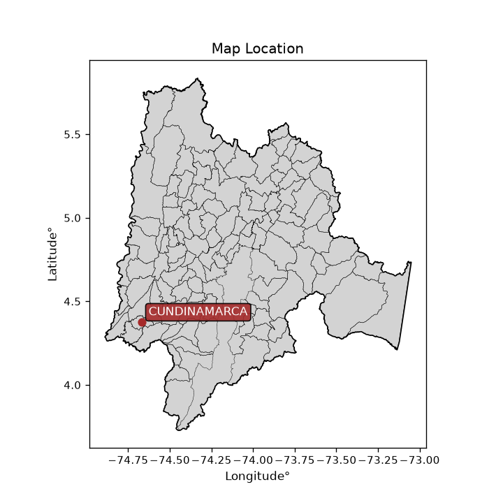</img>

| CountyID                                                                                          | CountyName                 | CountyFiles                                                                                                                                                                                                                                                                                                                                                                                                                                                                                                                                                                                                                                                                                                                                                                                                                                                                                                                                                                                                                                                                                                                                                                                                                                                                                                                                                                                                                                                                                                                                                                                                                                                                                                                                                                   |
|:--------------------------------------------------------------------------------------------------|:---------------------------|:------------------------------------------------------------------------------------------------------------------------------------------------------------------------------------------------------------------------------------------------------------------------------------------------------------------------------------------------------------------------------------------------------------------------------------------------------------------------------------------------------------------------------------------------------------------------------------------------------------------------------------------------------------------------------------------------------------------------------------------------------------------------------------------------------------------------------------------------------------------------------------------------------------------------------------------------------------------------------------------------------------------------------------------------------------------------------------------------------------------------------------------------------------------------------------------------------------------------------------------------------------------------------------------------------------------------------------------------------------------------------------------------------------------------------------------------------------------------------------------------------------------------------------------------------------------------------------------------------------------------------------------------------------------------------------------------------------------------------------------------------------------------------|
| [25001](https://github.com/rcfdtools/R.HydroTools/blob/main/tool/Population/file/report/25001.md) | Agua De Dios               | [25001_Rural_Building_202606.zip](https://github.com/rcfdtools/R.GISMobile/blob/main/file/shp/25001_Rural_Building_202606.zip) [25001_Rural_Lot_202606.zip](https://github.com/rcfdtools/R.GISMobile/blob/main/file/shp/25001_Rural_Lot_202606.zip) [25001_Rural_Nomenclature_202606.zip](https://github.com/rcfdtools/R.GISMobile/blob/main/file/shp/25001_Rural_Nomenclature_202606.zip) [25001_Rural_Vereda_202606.zip](https://github.com/rcfdtools/R.GISMobile/blob/main/file/shp/25001_Rural_Vereda_202606.zip) [25001_Urban_Block_202606.zip](https://github.com/rcfdtools/R.GISMobile/blob/main/file/shp/25001_Urban_Block_202606.zip) [25001_Urban_Building_202606.zip](https://github.com/rcfdtools/R.GISMobile/blob/main/file/shp/25001_Urban_Building_202606.zip) [25001_Urban_Lot_202606.zip](https://github.com/rcfdtools/R.GISMobile/blob/main/file/shp/25001_Urban_Lot_202606.zip) [25001_Urban_Nomenclature_202606.zip](https://github.com/rcfdtools/R.GISMobile/blob/main/file/shp/25001_Urban_Nomenclature_202606.zip) [25001_Urban_Sector_202606.zip](https://github.com/rcfdtools/R.GISMobile/blob/main/file/shp/25001_Urban_Sector_202606.zip)                                                                                                                                                                                                                                                                                                                                                                                                                                                                                                                                                                      |
| [25019](https://github.com/rcfdtools/R.HydroTools/blob/main/tool/Population/file/report/25019.md) | Albán                      | [25019_Building_202306.zip](https://github.com/rcfdtools/R.GISMobile/blob/main/file/shp/25019_Building_202306.zip) [25019_Lot_202306.zip](https://github.com/rcfdtools/R.GISMobile/blob/main/file/shp/25019_Lot_202306.zip)                                                                                                                                                                                                                                                                                                                                                                                                                                                                                                                                                                                                                                                                                                                                                                                                                                                                                                                                                                                                                                                                                                                                                                                                                                                                                                                                                                                                                                                                                                                                           |
| [25035](https://github.com/rcfdtools/R.HydroTools/blob/main/tool/Population/file/report/25035.md) | Anapoima                   | [25035_Building_202306.zip](https://github.com/rcfdtools/R.GISMobile/blob/main/file/shp/25035_Building_202306.zip) [25035_Lot_202306.zip](https://github.com/rcfdtools/R.GISMobile/blob/main/file/shp/25035_Lot_202306.zip)                                                                                                                                                                                                                                                                                                                                                                                                                                                                                                                                                                                                                                                                                                                                                                                                                                                                                                                                                                                                                                                                                                                                                                                                                                                                                                                                                                                                                                                                                                                                           |
| [25040](https://github.com/rcfdtools/R.HydroTools/blob/main/tool/Population/file/report/25040.md) | Anolaima                   | [25040_Building_202306.zip](https://github.com/rcfdtools/R.GISMobile/blob/main/file/shp/25040_Building_202306.zip) [25040_Lot_202306.zip](https://github.com/rcfdtools/R.GISMobile/blob/main/file/shp/25040_Lot_202306.zip)                                                                                                                                                                                                                                                                                                                                                                                                                                                                                                                                                                                                                                                                                                                                                                                                                                                                                                                                                                                                                                                                                                                                                                                                                                                                                                                                                                                                                                                                                                                                           |
| [25599](https://github.com/rcfdtools/R.HydroTools/blob/main/tool/Population/file/report/25599.md) | Apulo                      | [25599_Building_202306.zip](https://github.com/rcfdtools/R.GISMobile/blob/main/file/shp/25599_Building_202306.zip) [25599_Lot_202306.zip](https://github.com/rcfdtools/R.GISMobile/blob/main/file/shp/25599_Lot_202306.zip)                                                                                                                                                                                                                                                                                                                                                                                                                                                                                                                                                                                                                                                                                                                                                                                                                                                                                                                                                                                                                                                                                                                                                                                                                                                                                                                                                                                                                                                                                                                                           |
| [25053](https://github.com/rcfdtools/R.HydroTools/blob/main/tool/Population/file/report/25053.md) | Arbeláez                   | [25053_Building_202306.zip](https://github.com/rcfdtools/R.GISMobile/blob/main/file/shp/25053_Building_202306.zip) [25053_Lot_202306.zip](https://github.com/rcfdtools/R.GISMobile/blob/main/file/shp/25053_Lot_202306.zip)                                                                                                                                                                                                                                                                                                                                                                                                                                                                                                                                                                                                                                                                                                                                                                                                                                                                                                                                                                                                                                                                                                                                                                                                                                                                                                                                                                                                                                                                                                                                           |
| [25086](https://github.com/rcfdtools/R.HydroTools/blob/main/tool/Population/file/report/25086.md) | Beltrán                    | [25086_Rural_Building_202606.zip](https://github.com/rcfdtools/R.GISMobile/blob/main/file/shp/25086_Rural_Building_202606.zip) [25086_Rural_Lot_202606.zip](https://github.com/rcfdtools/R.GISMobile/blob/main/file/shp/25086_Rural_Lot_202606.zip) [25086_Rural_Nomenclature_202606.zip](https://github.com/rcfdtools/R.GISMobile/blob/main/file/shp/25086_Rural_Nomenclature_202606.zip) [25086_Rural_Sector_202606.zip](https://github.com/rcfdtools/R.GISMobile/blob/main/file/shp/25086_Rural_Sector_202606.zip) [25086_Rural_Vereda_202606.zip](https://github.com/rcfdtools/R.GISMobile/blob/main/file/shp/25086_Rural_Vereda_202606.zip) [25086_Urban_Block_202606.zip](https://github.com/rcfdtools/R.GISMobile/blob/main/file/shp/25086_Urban_Block_202606.zip) [25086_Urban_Building_202606.zip](https://github.com/rcfdtools/R.GISMobile/blob/main/file/shp/25086_Urban_Building_202606.zip) [25086_Urban_Lot_202606.zip](https://github.com/rcfdtools/R.GISMobile/blob/main/file/shp/25086_Urban_Lot_202606.zip) [25086_Urban_Neighborhood_202606.zip](https://github.com/rcfdtools/R.GISMobile/blob/main/file/shp/25086_Urban_Neighborhood_202606.zip) [25086_Urban_Nomenclature_202606.zip](https://github.com/rcfdtools/R.GISMobile/blob/main/file/shp/25086_Urban_Nomenclature_202606.zip) [25086_Urban_Nomenclature_Road_202606.zip](https://github.com/rcfdtools/R.GISMobile/blob/main/file/shp/25086_Urban_Nomenclature_Road_202606.zip) [25086_Urban_Perimeter_202606.zip](https://github.com/rcfdtools/R.GISMobile/blob/main/file/shp/25086_Urban_Perimeter_202606.zip) [25086_Urban_Sector_202606.zip](https://github.com/rcfdtools/R.GISMobile/blob/main/file/shp/25086_Urban_Sector_202606.zip)  |
| [25095](https://github.com/rcfdtools/R.HydroTools/blob/main/tool/Population/file/report/25095.md) | Bituima                    | [25095_Building_202306.zip](https://github.com/rcfdtools/R.GISMobile/blob/main/file/shp/25095_Building_202306.zip) [25095_Lot_202306.zip](https://github.com/rcfdtools/R.GISMobile/blob/main/file/shp/25095_Lot_202306.zip)                                                                                                                                                                                                                                                                                                                                                                                                                                                                                                                                                                                                                                                                                                                                                                                                                                                                                                                                                                                                                                                                                                                                                                                                                                                                                                                                                                                                                                                                                                                                           |
| [25099](https://github.com/rcfdtools/R.HydroTools/blob/main/tool/Population/file/report/25099.md) | Bojacá                     | [25099_Rural_Building_202606.zip](https://github.com/rcfdtools/R.GISMobile/blob/main/file/shp/25099_Rural_Building_202606.zip) [25099_Rural_Lot_202606.zip](https://github.com/rcfdtools/R.GISMobile/blob/main/file/shp/25099_Rural_Lot_202606.zip) [25099_Rural_Nomenclature_202606.zip](https://github.com/rcfdtools/R.GISMobile/blob/main/file/shp/25099_Rural_Nomenclature_202606.zip) [25099_Rural_Sector_202606.zip](https://github.com/rcfdtools/R.GISMobile/blob/main/file/shp/25099_Rural_Sector_202606.zip) [25099_Rural_Vereda_202606.zip](https://github.com/rcfdtools/R.GISMobile/blob/main/file/shp/25099_Rural_Vereda_202606.zip) [25099_Urban_Block_202606.zip](https://github.com/rcfdtools/R.GISMobile/blob/main/file/shp/25099_Urban_Block_202606.zip) [25099_Urban_Building_202606.zip](https://github.com/rcfdtools/R.GISMobile/blob/main/file/shp/25099_Urban_Building_202606.zip) [25099_Urban_Lot_202606.zip](https://github.com/rcfdtools/R.GISMobile/blob/main/file/shp/25099_Urban_Lot_202606.zip) [25099_Urban_Neighborhood_202606.zip](https://github.com/rcfdtools/R.GISMobile/blob/main/file/shp/25099_Urban_Neighborhood_202606.zip) [25099_Urban_Nomenclature_202606.zip](https://github.com/rcfdtools/R.GISMobile/blob/main/file/shp/25099_Urban_Nomenclature_202606.zip) [25099_Urban_Nomenclature_Road_202606.zip](https://github.com/rcfdtools/R.GISMobile/blob/main/file/shp/25099_Urban_Nomenclature_Road_202606.zip) [25099_Urban_Perimeter_202606.zip](https://github.com/rcfdtools/R.GISMobile/blob/main/file/shp/25099_Urban_Perimeter_202606.zip) [25099_Urban_Sector_202606.zip](https://github.com/rcfdtools/R.GISMobile/blob/main/file/shp/25099_Urban_Sector_202606.zip)  |
| [25120](https://github.com/rcfdtools/R.HydroTools/blob/main/tool/Population/file/report/25120.md) | Cabrera                    | [25120_Rural_Building_202606.zip](https://github.com/rcfdtools/R.GISMobile/blob/main/file/shp/25120_Rural_Building_202606.zip) [25120_Rural_Lot_202606.zip](https://github.com/rcfdtools/R.GISMobile/blob/main/file/shp/25120_Rural_Lot_202606.zip) [25120_Rural_Nomenclature_202606.zip](https://github.com/rcfdtools/R.GISMobile/blob/main/file/shp/25120_Rural_Nomenclature_202606.zip) [25120_Rural_Sector_202606.zip](https://github.com/rcfdtools/R.GISMobile/blob/main/file/shp/25120_Rural_Sector_202606.zip) [25120_Rural_Vereda_202606.zip](https://github.com/rcfdtools/R.GISMobile/blob/main/file/shp/25120_Rural_Vereda_202606.zip) [25120_Urban_Block_202606.zip](https://github.com/rcfdtools/R.GISMobile/blob/main/file/shp/25120_Urban_Block_202606.zip) [25120_Urban_Building_202606.zip](https://github.com/rcfdtools/R.GISMobile/blob/main/file/shp/25120_Urban_Building_202606.zip) [25120_Urban_Lot_202606.zip](https://github.com/rcfdtools/R.GISMobile/blob/main/file/shp/25120_Urban_Lot_202606.zip) [25120_Urban_Nomenclature_202606.zip](https://github.com/rcfdtools/R.GISMobile/blob/main/file/shp/25120_Urban_Nomenclature_202606.zip) [25120_Urban_Nomenclature_Road_202606.zip](https://github.com/rcfdtools/R.GISMobile/blob/main/file/shp/25120_Urban_Nomenclature_Road_202606.zip) [25120_Urban_Perimeter_202606.zip](https://github.com/rcfdtools/R.GISMobile/blob/main/file/shp/25120_Urban_Perimeter_202606.zip) [25120_Urban_Sector_202606.zip](https://github.com/rcfdtools/R.GISMobile/blob/main/file/shp/25120_Urban_Sector_202606.zip)                                                                                                                                             |
| [25123](https://github.com/rcfdtools/R.HydroTools/blob/main/tool/Population/file/report/25123.md) | Cachipay                   | [25123_Building_202306.zip](https://github.com/rcfdtools/R.GISMobile/blob/main/file/shp/25123_Building_202306.zip) [25123_Lot_202306.zip](https://github.com/rcfdtools/R.GISMobile/blob/main/file/shp/25123_Lot_202306.zip)                                                                                                                                                                                                                                                                                                                                                                                                                                                                                                                                                                                                                                                                                                                                                                                                                                                                                                                                                                                                                                                                                                                                                                                                                                                                                                                                                                                                                                                                                                                                           |
| [25126](https://github.com/rcfdtools/R.HydroTools/blob/main/tool/Population/file/report/25126.md) | Cajicá                     | [25126_Rural_Lot_202001.zip](https://github.com/rcfdtools/R.GISMobile/blob/main/file/shp/25126_Rural_Lot_202001.zip) [25126_Urban_Lot_202001.zip](https://github.com/rcfdtools/R.GISMobile/blob/main/file/shp/25126_Urban_Lot_202001.zip)                                                                                                                                                                                                                                                                                                                                                                                                                                                                                                                                                                                                                                                                                                                                                                                                                                                                                                                                                                                                                                                                                                                                                                                                                                                                                                                                                                                                                                                                                                                             |
| [25148](https://github.com/rcfdtools/R.HydroTools/blob/main/tool/Population/file/report/25148.md) | Caparrapí                  | [25148_Rural_Lot_202606.zip](https://github.com/rcfdtools/R.GISMobile/blob/main/file/shp/25148_Rural_Lot_202606.zip) [25148_Rural_Nomenclature_202606.zip](https://github.com/rcfdtools/R.GISMobile/blob/main/file/shp/25148_Rural_Nomenclature_202606.zip) [25148_Rural_Sector_202606.zip](https://github.com/rcfdtools/R.GISMobile/blob/main/file/shp/25148_Rural_Sector_202606.zip) [25148_Rural_Vereda_202606.zip](https://github.com/rcfdtools/R.GISMobile/blob/main/file/shp/25148_Rural_Vereda_202606.zip) [25148_Urban_Block_202606.zip](https://github.com/rcfdtools/R.GISMobile/blob/main/file/shp/25148_Urban_Block_202606.zip) [25148_Urban_Building_202606.zip](https://github.com/rcfdtools/R.GISMobile/blob/main/file/shp/25148_Urban_Building_202606.zip) [25148_Urban_Lot_202606.zip](https://github.com/rcfdtools/R.GISMobile/blob/main/file/shp/25148_Urban_Lot_202606.zip) [25148_Urban_Neighborhood_202606.zip](https://github.com/rcfdtools/R.GISMobile/blob/main/file/shp/25148_Urban_Neighborhood_202606.zip) [25148_Urban_Nomenclature_202606.zip](https://github.com/rcfdtools/R.GISMobile/blob/main/file/shp/25148_Urban_Nomenclature_202606.zip) [25148_Urban_Nomenclature_Road_202606.zip](https://github.com/rcfdtools/R.GISMobile/blob/main/file/shp/25148_Urban_Nomenclature_Road_202606.zip) [25148_Urban_Perimeter_202606.zip](https://github.com/rcfdtools/R.GISMobile/blob/main/file/shp/25148_Urban_Perimeter_202606.zip) [25148_Urban_Sector_202606.zip](https://github.com/rcfdtools/R.GISMobile/blob/main/file/shp/25148_Urban_Sector_202606.zip)                                                                                                                                     |
| [25154](https://github.com/rcfdtools/R.HydroTools/blob/main/tool/Population/file/report/25154.md) | Carmen De Carupa           | [25154_Building_202306.zip](https://github.com/rcfdtools/R.GISMobile/blob/main/file/shp/25154_Building_202306.zip) [25154_Lot_202306.zip](https://github.com/rcfdtools/R.GISMobile/blob/main/file/shp/25154_Lot_202306.zip)                                                                                                                                                                                                                                                                                                                                                                                                                                                                                                                                                                                                                                                                                                                                                                                                                                                                                                                                                                                                                                                                                                                                                                                                                                                                                                                                                                                                                                                                                                                                           |
| [25168](https://github.com/rcfdtools/R.HydroTools/blob/main/tool/Population/file/report/25168.md) | Chaguaní                   | [25168_Building_202306.zip](https://github.com/rcfdtools/R.GISMobile/blob/main/file/shp/25168_Building_202306.zip) [25168_Lot_202306.zip](https://github.com/rcfdtools/R.GISMobile/blob/main/file/shp/25168_Lot_202306.zip)                                                                                                                                                                                                                                                                                                                                                                                                                                                                                                                                                                                                                                                                                                                                                                                                                                                                                                                                                                                                                                                                                                                                                                                                                                                                                                                                                                                                                                                                                                                                           |
| [25178](https://github.com/rcfdtools/R.HydroTools/blob/main/tool/Population/file/report/25178.md) | Chipaque                   | [25178_Building_202306.zip](https://github.com/rcfdtools/R.GISMobile/blob/main/file/shp/25178_Building_202306.zip) [25178_Lot_202306.zip](https://github.com/rcfdtools/R.GISMobile/blob/main/file/shp/25178_Lot_202306.zip)                                                                                                                                                                                                                                                                                                                                                                                                                                                                                                                                                                                                                                                                                                                                                                                                                                                                                                                                                                                                                                                                                                                                                                                                                                                                                                                                                                                                                                                                                                                                           |
| [25181](https://github.com/rcfdtools/R.HydroTools/blob/main/tool/Population/file/report/25181.md) | Choachí                    | [25181_Rural_Building_202606.zip](https://github.com/rcfdtools/R.GISMobile/blob/main/file/shp/25181_Rural_Building_202606.zip) [25181_Rural_Lot_202606.zip](https://github.com/rcfdtools/R.GISMobile/blob/main/file/shp/25181_Rural_Lot_202606.zip) [25181_Rural_Nomenclature_202606.zip](https://github.com/rcfdtools/R.GISMobile/blob/main/file/shp/25181_Rural_Nomenclature_202606.zip) [25181_Rural_Sector_202606.zip](https://github.com/rcfdtools/R.GISMobile/blob/main/file/shp/25181_Rural_Sector_202606.zip) [25181_Rural_Vereda_202606.zip](https://github.com/rcfdtools/R.GISMobile/blob/main/file/shp/25181_Rural_Vereda_202606.zip) [25181_Urban_Block_202606.zip](https://github.com/rcfdtools/R.GISMobile/blob/main/file/shp/25181_Urban_Block_202606.zip) [25181_Urban_Building_202606.zip](https://github.com/rcfdtools/R.GISMobile/blob/main/file/shp/25181_Urban_Building_202606.zip) [25181_Urban_Lot_202606.zip](https://github.com/rcfdtools/R.GISMobile/blob/main/file/shp/25181_Urban_Lot_202606.zip) [25181_Urban_Neighborhood_202606.zip](https://github.com/rcfdtools/R.GISMobile/blob/main/file/shp/25181_Urban_Neighborhood_202606.zip) [25181_Urban_Nomenclature_202606.zip](https://github.com/rcfdtools/R.GISMobile/blob/main/file/shp/25181_Urban_Nomenclature_202606.zip) [25181_Urban_Nomenclature_Road_202606.zip](https://github.com/rcfdtools/R.GISMobile/blob/main/file/shp/25181_Urban_Nomenclature_Road_202606.zip) [25181_Urban_Perimeter_202606.zip](https://github.com/rcfdtools/R.GISMobile/blob/main/file/shp/25181_Urban_Perimeter_202606.zip) [25181_Urban_Sector_202606.zip](https://github.com/rcfdtools/R.GISMobile/blob/main/file/shp/25181_Urban_Sector_202606.zip)  |
| [25183](https://github.com/rcfdtools/R.HydroTools/blob/main/tool/Population/file/report/25183.md) | Chocontá                   | [25183_Rural_Building_202606.zip](https://github.com/rcfdtools/R.GISMobile/blob/main/file/shp/25183_Rural_Building_202606.zip) [25183_Rural_Lot_202606.zip](https://github.com/rcfdtools/R.GISMobile/blob/main/file/shp/25183_Rural_Lot_202606.zip) [25183_Rural_Nomenclature_202606.zip](https://github.com/rcfdtools/R.GISMobile/blob/main/file/shp/25183_Rural_Nomenclature_202606.zip) [25183_Rural_Sector_202606.zip](https://github.com/rcfdtools/R.GISMobile/blob/main/file/shp/25183_Rural_Sector_202606.zip) [25183_Rural_Vereda_202606.zip](https://github.com/rcfdtools/R.GISMobile/blob/main/file/shp/25183_Rural_Vereda_202606.zip) [25183_Urban_Block_202606.zip](https://github.com/rcfdtools/R.GISMobile/blob/main/file/shp/25183_Urban_Block_202606.zip) [25183_Urban_Building_202606.zip](https://github.com/rcfdtools/R.GISMobile/blob/main/file/shp/25183_Urban_Building_202606.zip) [25183_Urban_Lot_202606.zip](https://github.com/rcfdtools/R.GISMobile/blob/main/file/shp/25183_Urban_Lot_202606.zip) [25183_Urban_Nomenclature_202606.zip](https://github.com/rcfdtools/R.GISMobile/blob/main/file/shp/25183_Urban_Nomenclature_202606.zip) [25183_Urban_Perimeter_202606.zip](https://github.com/rcfdtools/R.GISMobile/blob/main/file/shp/25183_Urban_Perimeter_202606.zip) [25183_Urban_Sector_202606.zip](https://github.com/rcfdtools/R.GISMobile/blob/main/file/shp/25183_Urban_Sector_202606.zip)                                                                                                                                                                                                                                                                                                  |
| [25175](https://github.com/rcfdtools/R.HydroTools/blob/main/tool/Population/file/report/25175.md) | Chía                       | [25175_Rural_Building_202606.zip](https://github.com/rcfdtools/R.GISMobile/blob/main/file/shp/25175_Rural_Building_202606.zip) [25175_Rural_Lot_202606.zip](https://github.com/rcfdtools/R.GISMobile/blob/main/file/shp/25175_Rural_Lot_202606.zip) [25175_Rural_Nomenclature_202606.zip](https://github.com/rcfdtools/R.GISMobile/blob/main/file/shp/25175_Rural_Nomenclature_202606.zip) [25175_Rural_Vereda_202606.zip](https://github.com/rcfdtools/R.GISMobile/blob/main/file/shp/25175_Rural_Vereda_202606.zip) [25175_Urban_Block_202606.zip](https://github.com/rcfdtools/R.GISMobile/blob/main/file/shp/25175_Urban_Block_202606.zip) [25175_Urban_Building_202606.zip](https://github.com/rcfdtools/R.GISMobile/blob/main/file/shp/25175_Urban_Building_202606.zip) [25175_Urban_Lot_202606.zip](https://github.com/rcfdtools/R.GISMobile/blob/main/file/shp/25175_Urban_Lot_202606.zip) [25175_Urban_Nomenclature_202606.zip](https://github.com/rcfdtools/R.GISMobile/blob/main/file/shp/25175_Urban_Nomenclature_202606.zip)                                                                                                                                                                                                                                                                                                                                                                                                                                                                                                                                                                                                                                                                                                     |
| [25200](https://github.com/rcfdtools/R.HydroTools/blob/main/tool/Population/file/report/25200.md) | Cogua                      | [25200_Building_202306.zip](https://github.com/rcfdtools/R.GISMobile/blob/main/file/shp/25200_Building_202306.zip) [25200_Lot_202306.zip](https://github.com/rcfdtools/R.GISMobile/blob/main/file/shp/25200_Lot_202306.zip)                                                                                                                                                                                                                                                                                                                                                                                                                                                                                                                                                                                                                                                                                                                                                                                                                                                                                                                                                                                                                                                                                                                                                                                                                                                                                                                                                                                                                                                                                                                                           |
| [25214](https://github.com/rcfdtools/R.HydroTools/blob/main/tool/Population/file/report/25214.md) | Cota                       | [25214_Rural_Lot_202001.zip](https://github.com/rcfdtools/R.GISMobile/blob/main/file/shp/25214_Rural_Lot_202001.zip)                                                                                                                                                                                                                                                                                                                                                                                                                                                                                                                                                                                                                                                                                                                                                                                                                                                                                                                                                                                                                                                                                                                                                                                                                                                                                                                                                                                                                                                                                                                                                                                                                                                      |
| [25224](https://github.com/rcfdtools/R.HydroTools/blob/main/tool/Population/file/report/25224.md) | Cucunubá                   | [25224_Building_202306.zip](https://github.com/rcfdtools/R.GISMobile/blob/main/file/shp/25224_Building_202306.zip) [25224_Rural_Lot_202001.zip](https://github.com/rcfdtools/R.GISMobile/blob/main/file/shp/25224_Rural_Lot_202001.zip) [25224_Urban_Lot_202001.zip](https://github.com/rcfdtools/R.GISMobile/blob/main/file/shp/25224_Urban_Lot_202001.zip)                                                                                                                                                                                                                                                                                                                                                                                                                                                                                                                                                                                                                                                                                                                                                                                                                                                                                                                                                                                                                                                                                                                                                                                                                                                                                                                                                                                                      |
| [25151](https://github.com/rcfdtools/R.HydroTools/blob/main/tool/Population/file/report/25151.md) | Cáqueza                    | [25151_Building_202306.zip](https://github.com/rcfdtools/R.GISMobile/blob/main/file/shp/25151_Building_202306.zip) [25151_Lot_202306.zip](https://github.com/rcfdtools/R.GISMobile/blob/main/file/shp/25151_Lot_202306.zip)                                                                                                                                                                                                                                                                                                                                                                                                                                                                                                                                                                                                                                                                                                                                                                                                                                                                                                                                                                                                                                                                                                                                                                                                                                                                                                                                                                                                                                                                                                                                           |
| [25245](https://github.com/rcfdtools/R.HydroTools/blob/main/tool/Population/file/report/25245.md) | El Colegio                 | [25245_Building_202306.zip](https://github.com/rcfdtools/R.GISMobile/blob/main/file/shp/25245_Building_202306.zip) [25245_Lot_202306.zip](https://github.com/rcfdtools/R.GISMobile/blob/main/file/shp/25245_Lot_202306.zip)                                                                                                                                                                                                                                                                                                                                                                                                                                                                                                                                                                                                                                                                                                                                                                                                                                                                                                                                                                                                                                                                                                                                                                                                                                                                                                                                                                                                                                                                                                                                           |
| [25258](https://github.com/rcfdtools/R.HydroTools/blob/main/tool/Population/file/report/25258.md) | El Peñón                   | [25258_Building_202306.zip](https://github.com/rcfdtools/R.GISMobile/blob/main/file/shp/25258_Building_202306.zip) [25258_Lot_202306.zip](https://github.com/rcfdtools/R.GISMobile/blob/main/file/shp/25258_Lot_202306.zip)                                                                                                                                                                                                                                                                                                                                                                                                                                                                                                                                                                                                                                                                                                                                                                                                                                                                                                                                                                                                                                                                                                                                                                                                                                                                                                                                                                                                                                                                                                                                           |
| [25260](https://github.com/rcfdtools/R.HydroTools/blob/main/tool/Population/file/report/25260.md) | El Rosal                   | [25260_Building_202306.zip](https://github.com/rcfdtools/R.GISMobile/blob/main/file/shp/25260_Building_202306.zip) [25260_Lot_202306.zip](https://github.com/rcfdtools/R.GISMobile/blob/main/file/shp/25260_Lot_202306.zip)                                                                                                                                                                                                                                                                                                                                                                                                                                                                                                                                                                                                                                                                                                                                                                                                                                                                                                                                                                                                                                                                                                                                                                                                                                                                                                                                                                                                                                                                                                                                           |
| [25269](https://github.com/rcfdtools/R.HydroTools/blob/main/tool/Population/file/report/25269.md) | Facatativá                 | [25269_Building_202306.zip](https://github.com/rcfdtools/R.GISMobile/blob/main/file/shp/25269_Building_202306.zip) [25269_Lot_202306.zip](https://github.com/rcfdtools/R.GISMobile/blob/main/file/shp/25269_Lot_202306.zip)                                                                                                                                                                                                                                                                                                                                                                                                                                                                                                                                                                                                                                                                                                                                                                                                                                                                                                                                                                                                                                                                                                                                                                                                                                                                                                                                                                                                                                                                                                                                           |
| [25281](https://github.com/rcfdtools/R.HydroTools/blob/main/tool/Population/file/report/25281.md) | Fosca                      | [25281_Building_202306.zip](https://github.com/rcfdtools/R.GISMobile/blob/main/file/shp/25281_Building_202306.zip) [25281_Lot_202306.zip](https://github.com/rcfdtools/R.GISMobile/blob/main/file/shp/25281_Lot_202306.zip)                                                                                                                                                                                                                                                                                                                                                                                                                                                                                                                                                                                                                                                                                                                                                                                                                                                                                                                                                                                                                                                                                                                                                                                                                                                                                                                                                                                                                                                                                                                                           |
| [25286](https://github.com/rcfdtools/R.HydroTools/blob/main/tool/Population/file/report/25286.md) | Funza                      | [25286_Rural_Building_202606.zip](https://github.com/rcfdtools/R.GISMobile/blob/main/file/shp/25286_Rural_Building_202606.zip) [25286_Rural_Lot_202606.zip](https://github.com/rcfdtools/R.GISMobile/blob/main/file/shp/25286_Rural_Lot_202606.zip) [25286_Rural_Nomenclature_202606.zip](https://github.com/rcfdtools/R.GISMobile/blob/main/file/shp/25286_Rural_Nomenclature_202606.zip) [25286_Rural_Sector_202606.zip](https://github.com/rcfdtools/R.GISMobile/blob/main/file/shp/25286_Rural_Sector_202606.zip) [25286_Rural_Vereda_202606.zip](https://github.com/rcfdtools/R.GISMobile/blob/main/file/shp/25286_Rural_Vereda_202606.zip) [25286_Urban_Block_202606.zip](https://github.com/rcfdtools/R.GISMobile/blob/main/file/shp/25286_Urban_Block_202606.zip) [25286_Urban_Building_202606.zip](https://github.com/rcfdtools/R.GISMobile/blob/main/file/shp/25286_Urban_Building_202606.zip) [25286_Urban_Lot_202606.zip](https://github.com/rcfdtools/R.GISMobile/blob/main/file/shp/25286_Urban_Lot_202606.zip) [25286_Urban_Neighborhood_202606.zip](https://github.com/rcfdtools/R.GISMobile/blob/main/file/shp/25286_Urban_Neighborhood_202606.zip) [25286_Urban_Nomenclature_202606.zip](https://github.com/rcfdtools/R.GISMobile/blob/main/file/shp/25286_Urban_Nomenclature_202606.zip) [25286_Urban_Nomenclature_Road_202606.zip](https://github.com/rcfdtools/R.GISMobile/blob/main/file/shp/25286_Urban_Nomenclature_Road_202606.zip) [25286_Urban_Perimeter_202606.zip](https://github.com/rcfdtools/R.GISMobile/blob/main/file/shp/25286_Urban_Perimeter_202606.zip) [25286_Urban_Sector_202606.zip](https://github.com/rcfdtools/R.GISMobile/blob/main/file/shp/25286_Urban_Sector_202606.zip)  |
| [25290](https://github.com/rcfdtools/R.HydroTools/blob/main/tool/Population/file/report/25290.md) | Fusagasugá                 | [25290_Lot_202407.zip](https://github.com/rcfdtools/R.GISMobile/blob/main/file/shp/25290_Lot_202407.zip)                                                                                                                                                                                                                                                                                                                                                                                                                                                                                                                                                                                                                                                                                                                                                                                                                                                                                                                                                                                                                                                                                                                                                                                                                                                                                                                                                                                                                                                                                                                                                                                                                                                                  |
| [25279](https://github.com/rcfdtools/R.HydroTools/blob/main/tool/Population/file/report/25279.md) | Fómeque                    | [25279_Rural_Lot_202001.zip](https://github.com/rcfdtools/R.GISMobile/blob/main/file/shp/25279_Rural_Lot_202001.zip) [25279_Urban_Lot_202001.zip](https://github.com/rcfdtools/R.GISMobile/blob/main/file/shp/25279_Urban_Lot_202001.zip)                                                                                                                                                                                                                                                                                                                                                                                                                                                                                                                                                                                                                                                                                                                                                                                                                                                                                                                                                                                                                                                                                                                                                                                                                                                                                                                                                                                                                                                                                                                             |
| [25288](https://github.com/rcfdtools/R.HydroTools/blob/main/tool/Population/file/report/25288.md) | Fúquene                    | [25288_Building_202306.zip](https://github.com/rcfdtools/R.GISMobile/blob/main/file/shp/25288_Building_202306.zip) [25288_Lot_202306.zip](https://github.com/rcfdtools/R.GISMobile/blob/main/file/shp/25288_Lot_202306.zip)                                                                                                                                                                                                                                                                                                                                                                                                                                                                                                                                                                                                                                                                                                                                                                                                                                                                                                                                                                                                                                                                                                                                                                                                                                                                                                                                                                                                                                                                                                                                           |
| [25293](https://github.com/rcfdtools/R.HydroTools/blob/main/tool/Population/file/report/25293.md) | Gachalá                    | [25293_Building_202306.zip](https://github.com/rcfdtools/R.GISMobile/blob/main/file/shp/25293_Building_202306.zip) [25293_Lot_202306.zip](https://github.com/rcfdtools/R.GISMobile/blob/main/file/shp/25293_Lot_202306.zip)                                                                                                                                                                                                                                                                                                                                                                                                                                                                                                                                                                                                                                                                                                                                                                                                                                                                                                                                                                                                                                                                                                                                                                                                                                                                                                                                                                                                                                                                                                                                           |
| [25295](https://github.com/rcfdtools/R.HydroTools/blob/main/tool/Population/file/report/25295.md) | Gachancipá                 | [25295_Rural_Building_202606.zip](https://github.com/rcfdtools/R.GISMobile/blob/main/file/shp/25295_Rural_Building_202606.zip) [25295_Rural_Lot_202606.zip](https://github.com/rcfdtools/R.GISMobile/blob/main/file/shp/25295_Rural_Lot_202606.zip) [25295_Rural_Nomenclature_202606.zip](https://github.com/rcfdtools/R.GISMobile/blob/main/file/shp/25295_Rural_Nomenclature_202606.zip) [25295_Rural_Sector_202606.zip](https://github.com/rcfdtools/R.GISMobile/blob/main/file/shp/25295_Rural_Sector_202606.zip) [25295_Rural_Vereda_202606.zip](https://github.com/rcfdtools/R.GISMobile/blob/main/file/shp/25295_Rural_Vereda_202606.zip) [25295_Urban_Block_202606.zip](https://github.com/rcfdtools/R.GISMobile/blob/main/file/shp/25295_Urban_Block_202606.zip) [25295_Urban_Building_202606.zip](https://github.com/rcfdtools/R.GISMobile/blob/main/file/shp/25295_Urban_Building_202606.zip) [25295_Urban_Lot_202606.zip](https://github.com/rcfdtools/R.GISMobile/blob/main/file/shp/25295_Urban_Lot_202606.zip) [25295_Urban_Nomenclature_202606.zip](https://github.com/rcfdtools/R.GISMobile/blob/main/file/shp/25295_Urban_Nomenclature_202606.zip) [25295_Urban_Nomenclature_Road_202606.zip](https://github.com/rcfdtools/R.GISMobile/blob/main/file/shp/25295_Urban_Nomenclature_Road_202606.zip) [25295_Urban_Perimeter_202606.zip](https://github.com/rcfdtools/R.GISMobile/blob/main/file/shp/25295_Urban_Perimeter_202606.zip) [25295_Urban_Sector_202606.zip](https://github.com/rcfdtools/R.GISMobile/blob/main/file/shp/25295_Urban_Sector_202606.zip)                                                                                                                                             |
| [25297](https://github.com/rcfdtools/R.HydroTools/blob/main/tool/Population/file/report/25297.md) | Gachetá                    | [25297_Building_202306.zip](https://github.com/rcfdtools/R.GISMobile/blob/main/file/shp/25297_Building_202306.zip) [25297_Rural_Lot_202001.zip](https://github.com/rcfdtools/R.GISMobile/blob/main/file/shp/25297_Rural_Lot_202001.zip) [25297_Urban_Lot_202001.zip](https://github.com/rcfdtools/R.GISMobile/blob/main/file/shp/25297_Urban_Lot_202001.zip)                                                                                                                                                                                                                                                                                                                                                                                                                                                                                                                                                                                                                                                                                                                                                                                                                                                                                                                                                                                                                                                                                                                                                                                                                                                                                                                                                                                                      |
| [25299](https://github.com/rcfdtools/R.HydroTools/blob/main/tool/Population/file/report/25299.md) | Gama                       | [25299_Building_202306.zip](https://github.com/rcfdtools/R.GISMobile/blob/main/file/shp/25299_Building_202306.zip) [25299_Lot_202306.zip](https://github.com/rcfdtools/R.GISMobile/blob/main/file/shp/25299_Lot_202306.zip)                                                                                                                                                                                                                                                                                                                                                                                                                                                                                                                                                                                                                                                                                                                                                                                                                                                                                                                                                                                                                                                                                                                                                                                                                                                                                                                                                                                                                                                                                                                                           |
| [25307](https://github.com/rcfdtools/R.HydroTools/blob/main/tool/Population/file/report/25307.md) | Girardot                   | [25307_Rural_Lot_202001.zip](https://github.com/rcfdtools/R.GISMobile/blob/main/file/shp/25307_Rural_Lot_202001.zip) [25307_Urban_Lot_202001.zip](https://github.com/rcfdtools/R.GISMobile/blob/main/file/shp/25307_Urban_Lot_202001.zip)                                                                                                                                                                                                                                                                                                                                                                                                                                                                                                                                                                                                                                                                                                                                                                                                                                                                                                                                                                                                                                                                                                                                                                                                                                                                                                                                                                                                                                                                                                                             |
| [25312](https://github.com/rcfdtools/R.HydroTools/blob/main/tool/Population/file/report/25312.md) | Granada                    | [25312_Building_202306.zip](https://github.com/rcfdtools/R.GISMobile/blob/main/file/shp/25312_Building_202306.zip) [25312_Lot_202306.zip](https://github.com/rcfdtools/R.GISMobile/blob/main/file/shp/25312_Lot_202306.zip)                                                                                                                                                                                                                                                                                                                                                                                                                                                                                                                                                                                                                                                                                                                                                                                                                                                                                                                                                                                                                                                                                                                                                                                                                                                                                                                                                                                                                                                                                                                                           |
| [25317](https://github.com/rcfdtools/R.HydroTools/blob/main/tool/Population/file/report/25317.md) | Guachetá                   | [25317_Building_202306.zip](https://github.com/rcfdtools/R.GISMobile/blob/main/file/shp/25317_Building_202306.zip) [25317_Lot_202306.zip](https://github.com/rcfdtools/R.GISMobile/blob/main/file/shp/25317_Lot_202306.zip)                                                                                                                                                                                                                                                                                                                                                                                                                                                                                                                                                                                                                                                                                                                                                                                                                                                                                                                                                                                                                                                                                                                                                                                                                                                                                                                                                                                                                                                                                                                                           |
| [25320](https://github.com/rcfdtools/R.HydroTools/blob/main/tool/Population/file/report/25320.md) | Guaduas                    | [25320_Building_202306.zip](https://github.com/rcfdtools/R.GISMobile/blob/main/file/shp/25320_Building_202306.zip) [25320_Lot_202306.zip](https://github.com/rcfdtools/R.GISMobile/blob/main/file/shp/25320_Lot_202306.zip)                                                                                                                                                                                                                                                                                                                                                                                                                                                                                                                                                                                                                                                                                                                                                                                                                                                                                                                                                                                                                                                                                                                                                                                                                                                                                                                                                                                                                                                                                                                                           |
| [25322](https://github.com/rcfdtools/R.HydroTools/blob/main/tool/Population/file/report/25322.md) | Guasca                     | [25322_Rural_Building_202606.zip](https://github.com/rcfdtools/R.GISMobile/blob/main/file/shp/25322_Rural_Building_202606.zip) [25322_Rural_Lot_202606.zip](https://github.com/rcfdtools/R.GISMobile/blob/main/file/shp/25322_Rural_Lot_202606.zip) [25322_Rural_Nomenclature_202606.zip](https://github.com/rcfdtools/R.GISMobile/blob/main/file/shp/25322_Rural_Nomenclature_202606.zip) [25322_Rural_Sector_202606.zip](https://github.com/rcfdtools/R.GISMobile/blob/main/file/shp/25322_Rural_Sector_202606.zip) [25322_Rural_Vereda_202606.zip](https://github.com/rcfdtools/R.GISMobile/blob/main/file/shp/25322_Rural_Vereda_202606.zip) [25322_Urban_Block_202606.zip](https://github.com/rcfdtools/R.GISMobile/blob/main/file/shp/25322_Urban_Block_202606.zip) [25322_Urban_Building_202606.zip](https://github.com/rcfdtools/R.GISMobile/blob/main/file/shp/25322_Urban_Building_202606.zip) [25322_Urban_Lot_202606.zip](https://github.com/rcfdtools/R.GISMobile/blob/main/file/shp/25322_Urban_Lot_202606.zip) [25322_Urban_Neighborhood_202606.zip](https://github.com/rcfdtools/R.GISMobile/blob/main/file/shp/25322_Urban_Neighborhood_202606.zip) [25322_Urban_Nomenclature_202606.zip](https://github.com/rcfdtools/R.GISMobile/blob/main/file/shp/25322_Urban_Nomenclature_202606.zip) [25322_Urban_Nomenclature_Road_202606.zip](https://github.com/rcfdtools/R.GISMobile/blob/main/file/shp/25322_Urban_Nomenclature_Road_202606.zip) [25322_Urban_Perimeter_202606.zip](https://github.com/rcfdtools/R.GISMobile/blob/main/file/shp/25322_Urban_Perimeter_202606.zip) [25322_Urban_Sector_202606.zip](https://github.com/rcfdtools/R.GISMobile/blob/main/file/shp/25322_Urban_Sector_202606.zip)  |
| [25324](https://github.com/rcfdtools/R.HydroTools/blob/main/tool/Population/file/report/25324.md) | Guataquí                   | [25324_Rural_Lot_202606.zip](https://github.com/rcfdtools/R.GISMobile/blob/main/file/shp/25324_Rural_Lot_202606.zip) [25324_Rural_Nomenclature_202606.zip](https://github.com/rcfdtools/R.GISMobile/blob/main/file/shp/25324_Rural_Nomenclature_202606.zip) [25324_Rural_Sector_202606.zip](https://github.com/rcfdtools/R.GISMobile/blob/main/file/shp/25324_Rural_Sector_202606.zip) [25324_Rural_Vereda_202606.zip](https://github.com/rcfdtools/R.GISMobile/blob/main/file/shp/25324_Rural_Vereda_202606.zip) [25324_Urban_Block_202606.zip](https://github.com/rcfdtools/R.GISMobile/blob/main/file/shp/25324_Urban_Block_202606.zip) [25324_Urban_Building_202606.zip](https://github.com/rcfdtools/R.GISMobile/blob/main/file/shp/25324_Urban_Building_202606.zip) [25324_Urban_Lot_202606.zip](https://github.com/rcfdtools/R.GISMobile/blob/main/file/shp/25324_Urban_Lot_202606.zip) [25324_Urban_Neighborhood_202606.zip](https://github.com/rcfdtools/R.GISMobile/blob/main/file/shp/25324_Urban_Neighborhood_202606.zip) [25324_Urban_Nomenclature_202606.zip](https://github.com/rcfdtools/R.GISMobile/blob/main/file/shp/25324_Urban_Nomenclature_202606.zip) [25324_Urban_Perimeter_202606.zip](https://github.com/rcfdtools/R.GISMobile/blob/main/file/shp/25324_Urban_Perimeter_202606.zip) [25324_Urban_Sector_202606.zip](https://github.com/rcfdtools/R.GISMobile/blob/main/file/shp/25324_Urban_Sector_202606.zip)                                                                                                                                                                                                                                                                                          |
| [25326](https://github.com/rcfdtools/R.HydroTools/blob/main/tool/Population/file/report/25326.md) | Guatavita                  | [25326_Building_202306.zip](https://github.com/rcfdtools/R.GISMobile/blob/main/file/shp/25326_Building_202306.zip) [25326_Lot_202306.zip](https://github.com/rcfdtools/R.GISMobile/blob/main/file/shp/25326_Lot_202306.zip)                                                                                                                                                                                                                                                                                                                                                                                                                                                                                                                                                                                                                                                                                                                                                                                                                                                                                                                                                                                                                                                                                                                                                                                                                                                                                                                                                                                                                                                                                                                                           |
| [25328](https://github.com/rcfdtools/R.HydroTools/blob/main/tool/Population/file/report/25328.md) | Guayabal De Síquima        | [25328_Building_202306.zip](https://github.com/rcfdtools/R.GISMobile/blob/main/file/shp/25328_Building_202306.zip) [25328_Lot_202306.zip](https://github.com/rcfdtools/R.GISMobile/blob/main/file/shp/25328_Lot_202306.zip)                                                                                                                                                                                                                                                                                                                                                                                                                                                                                                                                                                                                                                                                                                                                                                                                                                                                                                                                                                                                                                                                                                                                                                                                                                                                                                                                                                                                                                                                                                                                           |
| [25335](https://github.com/rcfdtools/R.HydroTools/blob/main/tool/Population/file/report/25335.md) | Guayabetal                 | [25335_Building_202306.zip](https://github.com/rcfdtools/R.GISMobile/blob/main/file/shp/25335_Building_202306.zip) [25335_Lot_202306.zip](https://github.com/rcfdtools/R.GISMobile/blob/main/file/shp/25335_Lot_202306.zip)                                                                                                                                                                                                                                                                                                                                                                                                                                                                                                                                                                                                                                                                                                                                                                                                                                                                                                                                                                                                                                                                                                                                                                                                                                                                                                                                                                                                                                                                                                                                           |
| [25339](https://github.com/rcfdtools/R.HydroTools/blob/main/tool/Population/file/report/25339.md) | Gutiérrez                  | [25339_Rural_Building_202606.zip](https://github.com/rcfdtools/R.GISMobile/blob/main/file/shp/25339_Rural_Building_202606.zip) [25339_Rural_Lot_202606.zip](https://github.com/rcfdtools/R.GISMobile/blob/main/file/shp/25339_Rural_Lot_202606.zip) [25339_Rural_Nomenclature_202606.zip](https://github.com/rcfdtools/R.GISMobile/blob/main/file/shp/25339_Rural_Nomenclature_202606.zip) [25339_Rural_Sector_202606.zip](https://github.com/rcfdtools/R.GISMobile/blob/main/file/shp/25339_Rural_Sector_202606.zip) [25339_Rural_Vereda_202606.zip](https://github.com/rcfdtools/R.GISMobile/blob/main/file/shp/25339_Rural_Vereda_202606.zip) [25339_Urban_Block_202606.zip](https://github.com/rcfdtools/R.GISMobile/blob/main/file/shp/25339_Urban_Block_202606.zip) [25339_Urban_Building_202606.zip](https://github.com/rcfdtools/R.GISMobile/blob/main/file/shp/25339_Urban_Building_202606.zip) [25339_Urban_Lot_202606.zip](https://github.com/rcfdtools/R.GISMobile/blob/main/file/shp/25339_Urban_Lot_202606.zip) [25339_Urban_Neighborhood_202606.zip](https://github.com/rcfdtools/R.GISMobile/blob/main/file/shp/25339_Urban_Neighborhood_202606.zip) [25339_Urban_Nomenclature_202606.zip](https://github.com/rcfdtools/R.GISMobile/blob/main/file/shp/25339_Urban_Nomenclature_202606.zip) [25339_Urban_Perimeter_202606.zip](https://github.com/rcfdtools/R.GISMobile/blob/main/file/shp/25339_Urban_Perimeter_202606.zip) [25339_Urban_Sector_202606.zip](https://github.com/rcfdtools/R.GISMobile/blob/main/file/shp/25339_Urban_Sector_202606.zip)                                                                                                                                                       |
| [25368](https://github.com/rcfdtools/R.HydroTools/blob/main/tool/Population/file/report/25368.md) | Jerusalén                  | [25368_Building_202306.zip](https://github.com/rcfdtools/R.GISMobile/blob/main/file/shp/25368_Building_202306.zip) [25368_Lot_202306.zip](https://github.com/rcfdtools/R.GISMobile/blob/main/file/shp/25368_Lot_202306.zip)                                                                                                                                                                                                                                                                                                                                                                                                                                                                                                                                                                                                                                                                                                                                                                                                                                                                                                                                                                                                                                                                                                                                                                                                                                                                                                                                                                                                                                                                                                                                           |
| [25372](https://github.com/rcfdtools/R.HydroTools/blob/main/tool/Population/file/report/25372.md) | Junín                      | [25372_Building_202306.zip](https://github.com/rcfdtools/R.GISMobile/blob/main/file/shp/25372_Building_202306.zip) [25372_Lot_202306.zip](https://github.com/rcfdtools/R.GISMobile/blob/main/file/shp/25372_Lot_202306.zip)                                                                                                                                                                                                                                                                                                                                                                                                                                                                                                                                                                                                                                                                                                                                                                                                                                                                                                                                                                                                                                                                                                                                                                                                                                                                                                                                                                                                                                                                                                                                           |
| [25377](https://github.com/rcfdtools/R.HydroTools/blob/main/tool/Population/file/report/25377.md) | La Calera                  | [25377_Rural_Building_202606.zip](https://github.com/rcfdtools/R.GISMobile/blob/main/file/shp/25377_Rural_Building_202606.zip) [25377_Rural_Lot_202606.zip](https://github.com/rcfdtools/R.GISMobile/blob/main/file/shp/25377_Rural_Lot_202606.zip) [25377_Rural_Sector_202606.zip](https://github.com/rcfdtools/R.GISMobile/blob/main/file/shp/25377_Rural_Sector_202606.zip) [25377_Rural_Vereda_202606.zip](https://github.com/rcfdtools/R.GISMobile/blob/main/file/shp/25377_Rural_Vereda_202606.zip) [25377_Urban_Block_202606.zip](https://github.com/rcfdtools/R.GISMobile/blob/main/file/shp/25377_Urban_Block_202606.zip) [25377_Urban_Building_202606.zip](https://github.com/rcfdtools/R.GISMobile/blob/main/file/shp/25377_Urban_Building_202606.zip) [25377_Urban_Lot_202606.zip](https://github.com/rcfdtools/R.GISMobile/blob/main/file/shp/25377_Urban_Lot_202606.zip) [25377_Urban_Neighborhood_202606.zip](https://github.com/rcfdtools/R.GISMobile/blob/main/file/shp/25377_Urban_Neighborhood_202606.zip) [25377_Urban_Nomenclature_202606.zip](https://github.com/rcfdtools/R.GISMobile/blob/main/file/shp/25377_Urban_Nomenclature_202606.zip) [25377_Urban_Perimeter_202606.zip](https://github.com/rcfdtools/R.GISMobile/blob/main/file/shp/25377_Urban_Perimeter_202606.zip) [25377_Urban_Sector_202606.zip](https://github.com/rcfdtools/R.GISMobile/blob/main/file/shp/25377_Urban_Sector_202606.zip)                                                                                                                                                                                                                                                                                                  |
| [25386](https://github.com/rcfdtools/R.HydroTools/blob/main/tool/Population/file/report/25386.md) | La Mesa                    | [25386_Building_202306.zip](https://github.com/rcfdtools/R.GISMobile/blob/main/file/shp/25386_Building_202306.zip) [25386_Lot_202306.zip](https://github.com/rcfdtools/R.GISMobile/blob/main/file/shp/25386_Lot_202306.zip)                                                                                                                                                                                                                                                                                                                                                                                                                                                                                                                                                                                                                                                                                                                                                                                                                                                                                                                                                                                                                                                                                                                                                                                                                                                                                                                                                                                                                                                                                                                                           |
| [25394](https://github.com/rcfdtools/R.HydroTools/blob/main/tool/Population/file/report/25394.md) | La Palma                   | [25394_Building_202306.zip](https://github.com/rcfdtools/R.GISMobile/blob/main/file/shp/25394_Building_202306.zip) [25394_Lot_202306.zip](https://github.com/rcfdtools/R.GISMobile/blob/main/file/shp/25394_Lot_202306.zip)                                                                                                                                                                                                                                                                                                                                                                                                                                                                                                                                                                                                                                                                                                                                                                                                                                                                                                                                                                                                                                                                                                                                                                                                                                                                                                                                                                                                                                                                                                                                           |
| [25398](https://github.com/rcfdtools/R.HydroTools/blob/main/tool/Population/file/report/25398.md) | La Peña                    | [25398_Rural_Lot_202001.zip](https://github.com/rcfdtools/R.GISMobile/blob/main/file/shp/25398_Rural_Lot_202001.zip) [25398_Urban_Lot_202001.zip](https://github.com/rcfdtools/R.GISMobile/blob/main/file/shp/25398_Urban_Lot_202001.zip)                                                                                                                                                                                                                                                                                                                                                                                                                                                                                                                                                                                                                                                                                                                                                                                                                                                                                                                                                                                                                                                                                                                                                                                                                                                                                                                                                                                                                                                                                                                             |
| [25402](https://github.com/rcfdtools/R.HydroTools/blob/main/tool/Population/file/report/25402.md) | La Vega                    | [25402_Rural_Building_202606.zip](https://github.com/rcfdtools/R.GISMobile/blob/main/file/shp/25402_Rural_Building_202606.zip) [25402_Rural_Lot_202606.zip](https://github.com/rcfdtools/R.GISMobile/blob/main/file/shp/25402_Rural_Lot_202606.zip) [25402_Rural_Nomenclature_202606.zip](https://github.com/rcfdtools/R.GISMobile/blob/main/file/shp/25402_Rural_Nomenclature_202606.zip) [25402_Rural_Sector_202606.zip](https://github.com/rcfdtools/R.GISMobile/blob/main/file/shp/25402_Rural_Sector_202606.zip) [25402_Rural_Vereda_202606.zip](https://github.com/rcfdtools/R.GISMobile/blob/main/file/shp/25402_Rural_Vereda_202606.zip) [25402_Urban_Block_202606.zip](https://github.com/rcfdtools/R.GISMobile/blob/main/file/shp/25402_Urban_Block_202606.zip) [25402_Urban_Building_202606.zip](https://github.com/rcfdtools/R.GISMobile/blob/main/file/shp/25402_Urban_Building_202606.zip) [25402_Urban_Lot_202606.zip](https://github.com/rcfdtools/R.GISMobile/blob/main/file/shp/25402_Urban_Lot_202606.zip) [25402_Urban_Neighborhood_202606.zip](https://github.com/rcfdtools/R.GISMobile/blob/main/file/shp/25402_Urban_Neighborhood_202606.zip) [25402_Urban_Nomenclature_202606.zip](https://github.com/rcfdtools/R.GISMobile/blob/main/file/shp/25402_Urban_Nomenclature_202606.zip) [25402_Urban_Nomenclature_Road_202606.zip](https://github.com/rcfdtools/R.GISMobile/blob/main/file/shp/25402_Urban_Nomenclature_Road_202606.zip) [25402_Urban_Perimeter_202606.zip](https://github.com/rcfdtools/R.GISMobile/blob/main/file/shp/25402_Urban_Perimeter_202606.zip) [25402_Urban_Sector_202606.zip](https://github.com/rcfdtools/R.GISMobile/blob/main/file/shp/25402_Urban_Sector_202606.zip)  |
| [25407](https://github.com/rcfdtools/R.HydroTools/blob/main/tool/Population/file/report/25407.md) | Lenguazaque                | [25407_Building_202306.zip](https://github.com/rcfdtools/R.GISMobile/blob/main/file/shp/25407_Building_202306.zip) [25407_Lot_202306.zip](https://github.com/rcfdtools/R.GISMobile/blob/main/file/shp/25407_Lot_202306.zip)                                                                                                                                                                                                                                                                                                                                                                                                                                                                                                                                                                                                                                                                                                                                                                                                                                                                                                                                                                                                                                                                                                                                                                                                                                                                                                                                                                                                                                                                                                                                           |
| [25426](https://github.com/rcfdtools/R.HydroTools/blob/main/tool/Population/file/report/25426.md) | Machetá                    | [25426_Rural_Building_202606.zip](https://github.com/rcfdtools/R.GISMobile/blob/main/file/shp/25426_Rural_Building_202606.zip) [25426_Rural_Lot_202606.zip](https://github.com/rcfdtools/R.GISMobile/blob/main/file/shp/25426_Rural_Lot_202606.zip) [25426_Rural_Nomenclature_202606.zip](https://github.com/rcfdtools/R.GISMobile/blob/main/file/shp/25426_Rural_Nomenclature_202606.zip) [25426_Rural_Sector_202606.zip](https://github.com/rcfdtools/R.GISMobile/blob/main/file/shp/25426_Rural_Sector_202606.zip) [25426_Rural_Vereda_202606.zip](https://github.com/rcfdtools/R.GISMobile/blob/main/file/shp/25426_Rural_Vereda_202606.zip) [25426_Urban_Block_202606.zip](https://github.com/rcfdtools/R.GISMobile/blob/main/file/shp/25426_Urban_Block_202606.zip) [25426_Urban_Building_202606.zip](https://github.com/rcfdtools/R.GISMobile/blob/main/file/shp/25426_Urban_Building_202606.zip) [25426_Urban_Lot_202606.zip](https://github.com/rcfdtools/R.GISMobile/blob/main/file/shp/25426_Urban_Lot_202606.zip) [25426_Urban_Nomenclature_202606.zip](https://github.com/rcfdtools/R.GISMobile/blob/main/file/shp/25426_Urban_Nomenclature_202606.zip) [25426_Urban_Perimeter_202606.zip](https://github.com/rcfdtools/R.GISMobile/blob/main/file/shp/25426_Urban_Perimeter_202606.zip) [25426_Urban_Sector_202606.zip](https://github.com/rcfdtools/R.GISMobile/blob/main/file/shp/25426_Urban_Sector_202606.zip)                                                                                                                                                                                                                                                                                                  |
| [25430](https://github.com/rcfdtools/R.HydroTools/blob/main/tool/Population/file/report/25430.md) | Madrid                     | [25430_Rural_Building_202606.zip](https://github.com/rcfdtools/R.GISMobile/blob/main/file/shp/25430_Rural_Building_202606.zip) [25430_Rural_Lot_202606.zip](https://github.com/rcfdtools/R.GISMobile/blob/main/file/shp/25430_Rural_Lot_202606.zip) [25430_Rural_Nomenclature_202606.zip](https://github.com/rcfdtools/R.GISMobile/blob/main/file/shp/25430_Rural_Nomenclature_202606.zip) [25430_Rural_Sector_202606.zip](https://github.com/rcfdtools/R.GISMobile/blob/main/file/shp/25430_Rural_Sector_202606.zip) [25430_Rural_Vereda_202606.zip](https://github.com/rcfdtools/R.GISMobile/blob/main/file/shp/25430_Rural_Vereda_202606.zip) [25430_Urban_Block_202606.zip](https://github.com/rcfdtools/R.GISMobile/blob/main/file/shp/25430_Urban_Block_202606.zip) [25430_Urban_Building_202606.zip](https://github.com/rcfdtools/R.GISMobile/blob/main/file/shp/25430_Urban_Building_202606.zip) [25430_Urban_Lot_202606.zip](https://github.com/rcfdtools/R.GISMobile/blob/main/file/shp/25430_Urban_Lot_202606.zip) [25430_Urban_Neighborhood_202606.zip](https://github.com/rcfdtools/R.GISMobile/blob/main/file/shp/25430_Urban_Neighborhood_202606.zip) [25430_Urban_Nomenclature_202606.zip](https://github.com/rcfdtools/R.GISMobile/blob/main/file/shp/25430_Urban_Nomenclature_202606.zip) [25430_Urban_Nomenclature_Road_202606.zip](https://github.com/rcfdtools/R.GISMobile/blob/main/file/shp/25430_Urban_Nomenclature_Road_202606.zip) [25430_Urban_Perimeter_202606.zip](https://github.com/rcfdtools/R.GISMobile/blob/main/file/shp/25430_Urban_Perimeter_202606.zip) [25430_Urban_Sector_202606.zip](https://github.com/rcfdtools/R.GISMobile/blob/main/file/shp/25430_Urban_Sector_202606.zip)  |
| [25436](https://github.com/rcfdtools/R.HydroTools/blob/main/tool/Population/file/report/25436.md) | Manta                      | [25436_Building_202306.zip](https://github.com/rcfdtools/R.GISMobile/blob/main/file/shp/25436_Building_202306.zip) [25436_Lot_202306.zip](https://github.com/rcfdtools/R.GISMobile/blob/main/file/shp/25436_Lot_202306.zip)                                                                                                                                                                                                                                                                                                                                                                                                                                                                                                                                                                                                                                                                                                                                                                                                                                                                                                                                                                                                                                                                                                                                                                                                                                                                                                                                                                                                                                                                                                                                           |
| [25438](https://github.com/rcfdtools/R.HydroTools/blob/main/tool/Population/file/report/25438.md) | Medina                     | [25438_Building_202306.zip](https://github.com/rcfdtools/R.GISMobile/blob/main/file/shp/25438_Building_202306.zip) [25438_Lot_202306.zip](https://github.com/rcfdtools/R.GISMobile/blob/main/file/shp/25438_Lot_202306.zip)                                                                                                                                                                                                                                                                                                                                                                                                                                                                                                                                                                                                                                                                                                                                                                                                                                                                                                                                                                                                                                                                                                                                                                                                                                                                                                                                                                                                                                                                                                                                           |
| [25473](https://github.com/rcfdtools/R.HydroTools/blob/main/tool/Population/file/report/25473.md) | Mosquera                   | [25473_Rural_Building_202606.zip](https://github.com/rcfdtools/R.GISMobile/blob/main/file/shp/25473_Rural_Building_202606.zip) [25473_Rural_Lot_202606.zip](https://github.com/rcfdtools/R.GISMobile/blob/main/file/shp/25473_Rural_Lot_202606.zip) [25473_Rural_Nomenclature_202606.zip](https://github.com/rcfdtools/R.GISMobile/blob/main/file/shp/25473_Rural_Nomenclature_202606.zip) [25473_Rural_Sector_202606.zip](https://github.com/rcfdtools/R.GISMobile/blob/main/file/shp/25473_Rural_Sector_202606.zip) [25473_Rural_Vereda_202606.zip](https://github.com/rcfdtools/R.GISMobile/blob/main/file/shp/25473_Rural_Vereda_202606.zip) [25473_Urban_Block_202606.zip](https://github.com/rcfdtools/R.GISMobile/blob/main/file/shp/25473_Urban_Block_202606.zip) [25473_Urban_Building_202606.zip](https://github.com/rcfdtools/R.GISMobile/blob/main/file/shp/25473_Urban_Building_202606.zip) [25473_Urban_Lot_202606.zip](https://github.com/rcfdtools/R.GISMobile/blob/main/file/shp/25473_Urban_Lot_202606.zip) [25473_Urban_Nomenclature_202606.zip](https://github.com/rcfdtools/R.GISMobile/blob/main/file/shp/25473_Urban_Nomenclature_202606.zip) [25473_Urban_Sector_202606.zip](https://github.com/rcfdtools/R.GISMobile/blob/main/file/shp/25473_Urban_Sector_202606.zip)                                                                                                                                                                                                                                                                                                                                                                                                                                       |
| [25483](https://github.com/rcfdtools/R.HydroTools/blob/main/tool/Population/file/report/25483.md) | Nariño                     | [25483_Building_202306.zip](https://github.com/rcfdtools/R.GISMobile/blob/main/file/shp/25483_Building_202306.zip) [25483_Lot_202306.zip](https://github.com/rcfdtools/R.GISMobile/blob/main/file/shp/25483_Lot_202306.zip)                                                                                                                                                                                                                                                                                                                                                                                                                                                                                                                                                                                                                                                                                                                                                                                                                                                                                                                                                                                                                                                                                                                                                                                                                                                                                                                                                                                                                                                                                                                                           |
| [25486](https://github.com/rcfdtools/R.HydroTools/blob/main/tool/Population/file/report/25486.md) | Nemocón                    | [25486_Building_202306.zip](https://github.com/rcfdtools/R.GISMobile/blob/main/file/shp/25486_Building_202306.zip) [25486_Lot_202306.zip](https://github.com/rcfdtools/R.GISMobile/blob/main/file/shp/25486_Lot_202306.zip)                                                                                                                                                                                                                                                                                                                                                                                                                                                                                                                                                                                                                                                                                                                                                                                                                                                                                                                                                                                                                                                                                                                                                                                                                                                                                                                                                                                                                                                                                                                                           |
| [25488](https://github.com/rcfdtools/R.HydroTools/blob/main/tool/Population/file/report/25488.md) | Nilo                       | [25488_Rural_Building_202606.zip](https://github.com/rcfdtools/R.GISMobile/blob/main/file/shp/25488_Rural_Building_202606.zip) [25488_Rural_Lot_202606.zip](https://github.com/rcfdtools/R.GISMobile/blob/main/file/shp/25488_Rural_Lot_202606.zip) [25488_Rural_Nomenclature_202606.zip](https://github.com/rcfdtools/R.GISMobile/blob/main/file/shp/25488_Rural_Nomenclature_202606.zip) [25488_Rural_Sector_202606.zip](https://github.com/rcfdtools/R.GISMobile/blob/main/file/shp/25488_Rural_Sector_202606.zip) [25488_Rural_Vereda_202606.zip](https://github.com/rcfdtools/R.GISMobile/blob/main/file/shp/25488_Rural_Vereda_202606.zip) [25488_Urban_Block_202606.zip](https://github.com/rcfdtools/R.GISMobile/blob/main/file/shp/25488_Urban_Block_202606.zip) [25488_Urban_Building_202606.zip](https://github.com/rcfdtools/R.GISMobile/blob/main/file/shp/25488_Urban_Building_202606.zip) [25488_Urban_Lot_202606.zip](https://github.com/rcfdtools/R.GISMobile/blob/main/file/shp/25488_Urban_Lot_202606.zip) [25488_Urban_Neighborhood_202606.zip](https://github.com/rcfdtools/R.GISMobile/blob/main/file/shp/25488_Urban_Neighborhood_202606.zip) [25488_Urban_Nomenclature_202606.zip](https://github.com/rcfdtools/R.GISMobile/blob/main/file/shp/25488_Urban_Nomenclature_202606.zip) [25488_Urban_Nomenclature_Road_202606.zip](https://github.com/rcfdtools/R.GISMobile/blob/main/file/shp/25488_Urban_Nomenclature_Road_202606.zip) [25488_Urban_Perimeter_202606.zip](https://github.com/rcfdtools/R.GISMobile/blob/main/file/shp/25488_Urban_Perimeter_202606.zip) [25488_Urban_Sector_202606.zip](https://github.com/rcfdtools/R.GISMobile/blob/main/file/shp/25488_Urban_Sector_202606.zip)  |
| [25489](https://github.com/rcfdtools/R.HydroTools/blob/main/tool/Population/file/report/25489.md) | Nimaima                    | [25489_Building_202306.zip](https://github.com/rcfdtools/R.GISMobile/blob/main/file/shp/25489_Building_202306.zip) [25489_Lot_202306.zip](https://github.com/rcfdtools/R.GISMobile/blob/main/file/shp/25489_Lot_202306.zip)                                                                                                                                                                                                                                                                                                                                                                                                                                                                                                                                                                                                                                                                                                                                                                                                                                                                                                                                                                                                                                                                                                                                                                                                                                                                                                                                                                                                                                                                                                                                           |
| [25491](https://github.com/rcfdtools/R.HydroTools/blob/main/tool/Population/file/report/25491.md) | Nocaima                    | [25491_Building_202306.zip](https://github.com/rcfdtools/R.GISMobile/blob/main/file/shp/25491_Building_202306.zip) [25491_Lot_202306.zip](https://github.com/rcfdtools/R.GISMobile/blob/main/file/shp/25491_Lot_202306.zip)                                                                                                                                                                                                                                                                                                                                                                                                                                                                                                                                                                                                                                                                                                                                                                                                                                                                                                                                                                                                                                                                                                                                                                                                                                                                                                                                                                                                                                                                                                                                           |
| [25513](https://github.com/rcfdtools/R.HydroTools/blob/main/tool/Population/file/report/25513.md) | Pacho                      | [25513_Rural_Building_202606.zip](https://github.com/rcfdtools/R.GISMobile/blob/main/file/shp/25513_Rural_Building_202606.zip) [25513_Rural_Lot_202606.zip](https://github.com/rcfdtools/R.GISMobile/blob/main/file/shp/25513_Rural_Lot_202606.zip) [25513_Rural_Nomenclature_202606.zip](https://github.com/rcfdtools/R.GISMobile/blob/main/file/shp/25513_Rural_Nomenclature_202606.zip) [25513_Rural_Sector_202606.zip](https://github.com/rcfdtools/R.GISMobile/blob/main/file/shp/25513_Rural_Sector_202606.zip) [25513_Rural_Vereda_202606.zip](https://github.com/rcfdtools/R.GISMobile/blob/main/file/shp/25513_Rural_Vereda_202606.zip) [25513_Urban_Block_202606.zip](https://github.com/rcfdtools/R.GISMobile/blob/main/file/shp/25513_Urban_Block_202606.zip) [25513_Urban_Building_202606.zip](https://github.com/rcfdtools/R.GISMobile/blob/main/file/shp/25513_Urban_Building_202606.zip) [25513_Urban_Lot_202606.zip](https://github.com/rcfdtools/R.GISMobile/blob/main/file/shp/25513_Urban_Lot_202606.zip) [25513_Urban_Nomenclature_202606.zip](https://github.com/rcfdtools/R.GISMobile/blob/main/file/shp/25513_Urban_Nomenclature_202606.zip) [25513_Urban_Perimeter_202606.zip](https://github.com/rcfdtools/R.GISMobile/blob/main/file/shp/25513_Urban_Perimeter_202606.zip) [25513_Urban_Sector_202606.zip](https://github.com/rcfdtools/R.GISMobile/blob/main/file/shp/25513_Urban_Sector_202606.zip)                                                                                                                                                                                                                                                                                                  |
| [25518](https://github.com/rcfdtools/R.HydroTools/blob/main/tool/Population/file/report/25518.md) | Paime                      | [25518_Building_202306.zip](https://github.com/rcfdtools/R.GISMobile/blob/main/file/shp/25518_Building_202306.zip) [25518_Lot_202306.zip](https://github.com/rcfdtools/R.GISMobile/blob/main/file/shp/25518_Lot_202306.zip)                                                                                                                                                                                                                                                                                                                                                                                                                                                                                                                                                                                                                                                                                                                                                                                                                                                                                                                                                                                                                                                                                                                                                                                                                                                                                                                                                                                                                                                                                                                                           |
| [25524](https://github.com/rcfdtools/R.HydroTools/blob/main/tool/Population/file/report/25524.md) | Pandi                      | [25524_Building_202306.zip](https://github.com/rcfdtools/R.GISMobile/blob/main/file/shp/25524_Building_202306.zip) [25524_Lot_202306.zip](https://github.com/rcfdtools/R.GISMobile/blob/main/file/shp/25524_Lot_202306.zip)                                                                                                                                                                                                                                                                                                                                                                                                                                                                                                                                                                                                                                                                                                                                                                                                                                                                                                                                                                                                                                                                                                                                                                                                                                                                                                                                                                                                                                                                                                                                           |
| [25530](https://github.com/rcfdtools/R.HydroTools/blob/main/tool/Population/file/report/25530.md) | Paratebueno                | [25530_Building_202306.zip](https://github.com/rcfdtools/R.GISMobile/blob/main/file/shp/25530_Building_202306.zip) [25530_Lot_202306.zip](https://github.com/rcfdtools/R.GISMobile/blob/main/file/shp/25530_Lot_202306.zip)                                                                                                                                                                                                                                                                                                                                                                                                                                                                                                                                                                                                                                                                                                                                                                                                                                                                                                                                                                                                                                                                                                                                                                                                                                                                                                                                                                                                                                                                                                                                           |
| [25535](https://github.com/rcfdtools/R.HydroTools/blob/main/tool/Population/file/report/25535.md) | Pasca                      | [25535_Building_202306.zip](https://github.com/rcfdtools/R.GISMobile/blob/main/file/shp/25535_Building_202306.zip) [25535_Lot_202306.zip](https://github.com/rcfdtools/R.GISMobile/blob/main/file/shp/25535_Lot_202306.zip)                                                                                                                                                                                                                                                                                                                                                                                                                                                                                                                                                                                                                                                                                                                                                                                                                                                                                                                                                                                                                                                                                                                                                                                                                                                                                                                                                                                                                                                                                                                                           |
| [25572](https://github.com/rcfdtools/R.HydroTools/blob/main/tool/Population/file/report/25572.md) | Puerto Salgar              | [25572_Rural_Building_202606.zip](https://github.com/rcfdtools/R.GISMobile/blob/main/file/shp/25572_Rural_Building_202606.zip) [25572_Rural_Lot_202606.zip](https://github.com/rcfdtools/R.GISMobile/blob/main/file/shp/25572_Rural_Lot_202606.zip) [25572_Rural_Nomenclature_202606.zip](https://github.com/rcfdtools/R.GISMobile/blob/main/file/shp/25572_Rural_Nomenclature_202606.zip) [25572_Rural_Sector_202606.zip](https://github.com/rcfdtools/R.GISMobile/blob/main/file/shp/25572_Rural_Sector_202606.zip) [25572_Rural_Vereda_202606.zip](https://github.com/rcfdtools/R.GISMobile/blob/main/file/shp/25572_Rural_Vereda_202606.zip) [25572_Urban_Block_202606.zip](https://github.com/rcfdtools/R.GISMobile/blob/main/file/shp/25572_Urban_Block_202606.zip) [25572_Urban_Building_202606.zip](https://github.com/rcfdtools/R.GISMobile/blob/main/file/shp/25572_Urban_Building_202606.zip) [25572_Urban_Lot_202606.zip](https://github.com/rcfdtools/R.GISMobile/blob/main/file/shp/25572_Urban_Lot_202606.zip) [25572_Urban_Neighborhood_202606.zip](https://github.com/rcfdtools/R.GISMobile/blob/main/file/shp/25572_Urban_Neighborhood_202606.zip) [25572_Urban_Nomenclature_202606.zip](https://github.com/rcfdtools/R.GISMobile/blob/main/file/shp/25572_Urban_Nomenclature_202606.zip) [25572_Urban_Nomenclature_Road_202606.zip](https://github.com/rcfdtools/R.GISMobile/blob/main/file/shp/25572_Urban_Nomenclature_Road_202606.zip) [25572_Urban_Perimeter_202606.zip](https://github.com/rcfdtools/R.GISMobile/blob/main/file/shp/25572_Urban_Perimeter_202606.zip) [25572_Urban_Sector_202606.zip](https://github.com/rcfdtools/R.GISMobile/blob/main/file/shp/25572_Urban_Sector_202606.zip)  |
| [25580](https://github.com/rcfdtools/R.HydroTools/blob/main/tool/Population/file/report/25580.md) | Pulí                       | [25580_Building_202306.zip](https://github.com/rcfdtools/R.GISMobile/blob/main/file/shp/25580_Building_202306.zip) [25580_Lot_202306.zip](https://github.com/rcfdtools/R.GISMobile/blob/main/file/shp/25580_Lot_202306.zip)                                                                                                                                                                                                                                                                                                                                                                                                                                                                                                                                                                                                                                                                                                                                                                                                                                                                                                                                                                                                                                                                                                                                                                                                                                                                                                                                                                                                                                                                                                                                           |
| [25592](https://github.com/rcfdtools/R.HydroTools/blob/main/tool/Population/file/report/25592.md) | Quebradanegra              | [25592_Building_202306.zip](https://github.com/rcfdtools/R.GISMobile/blob/main/file/shp/25592_Building_202306.zip) [25592_Lot_202306.zip](https://github.com/rcfdtools/R.GISMobile/blob/main/file/shp/25592_Lot_202306.zip)                                                                                                                                                                                                                                                                                                                                                                                                                                                                                                                                                                                                                                                                                                                                                                                                                                                                                                                                                                                                                                                                                                                                                                                                                                                                                                                                                                                                                                                                                                                                           |
| [25594](https://github.com/rcfdtools/R.HydroTools/blob/main/tool/Population/file/report/25594.md) | Quetame                    | [25594_Building_202306.zip](https://github.com/rcfdtools/R.GISMobile/blob/main/file/shp/25594_Building_202306.zip) [25594_Lot_202306.zip](https://github.com/rcfdtools/R.GISMobile/blob/main/file/shp/25594_Lot_202306.zip)                                                                                                                                                                                                                                                                                                                                                                                                                                                                                                                                                                                                                                                                                                                                                                                                                                                                                                                                                                                                                                                                                                                                                                                                                                                                                                                                                                                                                                                                                                                                           |
| [25596](https://github.com/rcfdtools/R.HydroTools/blob/main/tool/Population/file/report/25596.md) | Quipile                    | [25596_Building_202306.zip](https://github.com/rcfdtools/R.GISMobile/blob/main/file/shp/25596_Building_202306.zip) [25596_Lot_202306.zip](https://github.com/rcfdtools/R.GISMobile/blob/main/file/shp/25596_Lot_202306.zip)                                                                                                                                                                                                                                                                                                                                                                                                                                                                                                                                                                                                                                                                                                                                                                                                                                                                                                                                                                                                                                                                                                                                                                                                                                                                                                                                                                                                                                                                                                                                           |
| [25612](https://github.com/rcfdtools/R.HydroTools/blob/main/tool/Population/file/report/25612.md) | Ricaurte                   | [25612_Rural_Building_202606.zip](https://github.com/rcfdtools/R.GISMobile/blob/main/file/shp/25612_Rural_Building_202606.zip) [25612_Rural_Lot_202606.zip](https://github.com/rcfdtools/R.GISMobile/blob/main/file/shp/25612_Rural_Lot_202606.zip) [25612_Rural_Nomenclature_202606.zip](https://github.com/rcfdtools/R.GISMobile/blob/main/file/shp/25612_Rural_Nomenclature_202606.zip) [25612_Rural_Sector_202606.zip](https://github.com/rcfdtools/R.GISMobile/blob/main/file/shp/25612_Rural_Sector_202606.zip) [25612_Rural_Vereda_202606.zip](https://github.com/rcfdtools/R.GISMobile/blob/main/file/shp/25612_Rural_Vereda_202606.zip) [25612_Urban_Block_202606.zip](https://github.com/rcfdtools/R.GISMobile/blob/main/file/shp/25612_Urban_Block_202606.zip) [25612_Urban_Building_202606.zip](https://github.com/rcfdtools/R.GISMobile/blob/main/file/shp/25612_Urban_Building_202606.zip) [25612_Urban_Lot_202606.zip](https://github.com/rcfdtools/R.GISMobile/blob/main/file/shp/25612_Urban_Lot_202606.zip) [25612_Urban_Nomenclature_202606.zip](https://github.com/rcfdtools/R.GISMobile/blob/main/file/shp/25612_Urban_Nomenclature_202606.zip) [25612_Urban_Nomenclature_Road_202606.zip](https://github.com/rcfdtools/R.GISMobile/blob/main/file/shp/25612_Urban_Nomenclature_Road_202606.zip)                                                                                                                                                                                                                                                                                                                                                                                                                 |
| [25645](https://github.com/rcfdtools/R.HydroTools/blob/main/tool/Population/file/report/25645.md) | San Antonio Del Tequendama | [25645_Building_202306.zip](https://github.com/rcfdtools/R.GISMobile/blob/main/file/shp/25645_Building_202306.zip) [25645_Lot_202306.zip](https://github.com/rcfdtools/R.GISMobile/blob/main/file/shp/25645_Lot_202306.zip)                                                                                                                                                                                                                                                                                                                                                                                                                                                                                                                                                                                                                                                                                                                                                                                                                                                                                                                                                                                                                                                                                                                                                                                                                                                                                                                                                                                                                                                                                                                                           |
| [25649](https://github.com/rcfdtools/R.HydroTools/blob/main/tool/Population/file/report/25649.md) | San Bernardo               | [25649_Rural_Building_202606.zip](https://github.com/rcfdtools/R.GISMobile/blob/main/file/shp/25649_Rural_Building_202606.zip) [25649_Rural_Lot_202606.zip](https://github.com/rcfdtools/R.GISMobile/blob/main/file/shp/25649_Rural_Lot_202606.zip) [25649_Rural_Nomenclature_202606.zip](https://github.com/rcfdtools/R.GISMobile/blob/main/file/shp/25649_Rural_Nomenclature_202606.zip) [25649_Rural_Sector_202606.zip](https://github.com/rcfdtools/R.GISMobile/blob/main/file/shp/25649_Rural_Sector_202606.zip) [25649_Rural_Vereda_202606.zip](https://github.com/rcfdtools/R.GISMobile/blob/main/file/shp/25649_Rural_Vereda_202606.zip) [25649_Urban_Block_202606.zip](https://github.com/rcfdtools/R.GISMobile/blob/main/file/shp/25649_Urban_Block_202606.zip) [25649_Urban_Building_202606.zip](https://github.com/rcfdtools/R.GISMobile/blob/main/file/shp/25649_Urban_Building_202606.zip) [25649_Urban_Lot_202606.zip](https://github.com/rcfdtools/R.GISMobile/blob/main/file/shp/25649_Urban_Lot_202606.zip) [25649_Urban_Neighborhood_202606.zip](https://github.com/rcfdtools/R.GISMobile/blob/main/file/shp/25649_Urban_Neighborhood_202606.zip) [25649_Urban_Nomenclature_202606.zip](https://github.com/rcfdtools/R.GISMobile/blob/main/file/shp/25649_Urban_Nomenclature_202606.zip) [25649_Urban_Perimeter_202606.zip](https://github.com/rcfdtools/R.GISMobile/blob/main/file/shp/25649_Urban_Perimeter_202606.zip) [25649_Urban_Sector_202606.zip](https://github.com/rcfdtools/R.GISMobile/blob/main/file/shp/25649_Urban_Sector_202606.zip)                                                                                                                                                       |
| [25653](https://github.com/rcfdtools/R.HydroTools/blob/main/tool/Population/file/report/25653.md) | San Cayetano               | [25653_Building_202306.zip](https://github.com/rcfdtools/R.GISMobile/blob/main/file/shp/25653_Building_202306.zip) [25653_Lot_202306.zip](https://github.com/rcfdtools/R.GISMobile/blob/main/file/shp/25653_Lot_202306.zip)                                                                                                                                                                                                                                                                                                                                                                                                                                                                                                                                                                                                                                                                                                                                                                                                                                                                                                                                                                                                                                                                                                                                                                                                                                                                                                                                                                                                                                                                                                                                           |
| [25658](https://github.com/rcfdtools/R.HydroTools/blob/main/tool/Population/file/report/25658.md) | San Francisco              | [25658_Rural_Building_202606.zip](https://github.com/rcfdtools/R.GISMobile/blob/main/file/shp/25658_Rural_Building_202606.zip) [25658_Rural_Lot_202606.zip](https://github.com/rcfdtools/R.GISMobile/blob/main/file/shp/25658_Rural_Lot_202606.zip) [25658_Rural_Nomenclature_202606.zip](https://github.com/rcfdtools/R.GISMobile/blob/main/file/shp/25658_Rural_Nomenclature_202606.zip) [25658_Rural_Sector_202606.zip](https://github.com/rcfdtools/R.GISMobile/blob/main/file/shp/25658_Rural_Sector_202606.zip) [25658_Rural_Vereda_202606.zip](https://github.com/rcfdtools/R.GISMobile/blob/main/file/shp/25658_Rural_Vereda_202606.zip) [25658_Urban_Block_202606.zip](https://github.com/rcfdtools/R.GISMobile/blob/main/file/shp/25658_Urban_Block_202606.zip) [25658_Urban_Building_202606.zip](https://github.com/rcfdtools/R.GISMobile/blob/main/file/shp/25658_Urban_Building_202606.zip) [25658_Urban_Lot_202606.zip](https://github.com/rcfdtools/R.GISMobile/blob/main/file/shp/25658_Urban_Lot_202606.zip) [25658_Urban_Neighborhood_202606.zip](https://github.com/rcfdtools/R.GISMobile/blob/main/file/shp/25658_Urban_Neighborhood_202606.zip) [25658_Urban_Nomenclature_202606.zip](https://github.com/rcfdtools/R.GISMobile/blob/main/file/shp/25658_Urban_Nomenclature_202606.zip) [25658_Urban_Nomenclature_Road_202606.zip](https://github.com/rcfdtools/R.GISMobile/blob/main/file/shp/25658_Urban_Nomenclature_Road_202606.zip) [25658_Urban_Perimeter_202606.zip](https://github.com/rcfdtools/R.GISMobile/blob/main/file/shp/25658_Urban_Perimeter_202606.zip) [25658_Urban_Sector_202606.zip](https://github.com/rcfdtools/R.GISMobile/blob/main/file/shp/25658_Urban_Sector_202606.zip)  |
| [25662](https://github.com/rcfdtools/R.HydroTools/blob/main/tool/Population/file/report/25662.md) | San Juan De Rioseco        | [25662_Building_202306.zip](https://github.com/rcfdtools/R.GISMobile/blob/main/file/shp/25662_Building_202306.zip) [25662_Lot_202306.zip](https://github.com/rcfdtools/R.GISMobile/blob/main/file/shp/25662_Lot_202306.zip)                                                                                                                                                                                                                                                                                                                                                                                                                                                                                                                                                                                                                                                                                                                                                                                                                                                                                                                                                                                                                                                                                                                                                                                                                                                                                                                                                                                                                                                                                                                                           |
| [25718](https://github.com/rcfdtools/R.HydroTools/blob/main/tool/Population/file/report/25718.md) | Sasaima                    | [25718_Building_202306.zip](https://github.com/rcfdtools/R.GISMobile/blob/main/file/shp/25718_Building_202306.zip) [25718_Lot_202306.zip](https://github.com/rcfdtools/R.GISMobile/blob/main/file/shp/25718_Lot_202306.zip)                                                                                                                                                                                                                                                                                                                                                                                                                                                                                                                                                                                                                                                                                                                                                                                                                                                                                                                                                                                                                                                                                                                                                                                                                                                                                                                                                                                                                                                                                                                                           |
| [25736](https://github.com/rcfdtools/R.HydroTools/blob/main/tool/Population/file/report/25736.md) | Sesquilé                   | [25736_Rural_Lot_202001.zip](https://github.com/rcfdtools/R.GISMobile/blob/main/file/shp/25736_Rural_Lot_202001.zip) [25736_Urban_Lot_202001.zip](https://github.com/rcfdtools/R.GISMobile/blob/main/file/shp/25736_Urban_Lot_202001.zip)                                                                                                                                                                                                                                                                                                                                                                                                                                                                                                                                                                                                                                                                                                                                                                                                                                                                                                                                                                                                                                                                                                                                                                                                                                                                                                                                                                                                                                                                                                                             |
| [25740](https://github.com/rcfdtools/R.HydroTools/blob/main/tool/Population/file/report/25740.md) | Sibaté                     | [25740_Rural_Building_202606.zip](https://github.com/rcfdtools/R.GISMobile/blob/main/file/shp/25740_Rural_Building_202606.zip) [25740_Rural_Lot_202606.zip](https://github.com/rcfdtools/R.GISMobile/blob/main/file/shp/25740_Rural_Lot_202606.zip) [25740_Rural_Nomenclature_202606.zip](https://github.com/rcfdtools/R.GISMobile/blob/main/file/shp/25740_Rural_Nomenclature_202606.zip) [25740_Rural_Sector_202606.zip](https://github.com/rcfdtools/R.GISMobile/blob/main/file/shp/25740_Rural_Sector_202606.zip) [25740_Rural_Vereda_202606.zip](https://github.com/rcfdtools/R.GISMobile/blob/main/file/shp/25740_Rural_Vereda_202606.zip) [25740_Urban_Block_202606.zip](https://github.com/rcfdtools/R.GISMobile/blob/main/file/shp/25740_Urban_Block_202606.zip) [25740_Urban_Building_202606.zip](https://github.com/rcfdtools/R.GISMobile/blob/main/file/shp/25740_Urban_Building_202606.zip) [25740_Urban_Lot_202606.zip](https://github.com/rcfdtools/R.GISMobile/blob/main/file/shp/25740_Urban_Lot_202606.zip) [25740_Urban_Neighborhood_202606.zip](https://github.com/rcfdtools/R.GISMobile/blob/main/file/shp/25740_Urban_Neighborhood_202606.zip) [25740_Urban_Nomenclature_202606.zip](https://github.com/rcfdtools/R.GISMobile/blob/main/file/shp/25740_Urban_Nomenclature_202606.zip) [25740_Urban_Nomenclature_Road_202606.zip](https://github.com/rcfdtools/R.GISMobile/blob/main/file/shp/25740_Urban_Nomenclature_Road_202606.zip) [25740_Urban_Perimeter_202606.zip](https://github.com/rcfdtools/R.GISMobile/blob/main/file/shp/25740_Urban_Perimeter_202606.zip) [25740_Urban_Sector_202606.zip](https://github.com/rcfdtools/R.GISMobile/blob/main/file/shp/25740_Urban_Sector_202606.zip)  |
| [25743](https://github.com/rcfdtools/R.HydroTools/blob/main/tool/Population/file/report/25743.md) | Silvania                   | [25743_Building_202306.zip](https://github.com/rcfdtools/R.GISMobile/blob/main/file/shp/25743_Building_202306.zip) [25743_Lot_202306.zip](https://github.com/rcfdtools/R.GISMobile/blob/main/file/shp/25743_Lot_202306.zip)                                                                                                                                                                                                                                                                                                                                                                                                                                                                                                                                                                                                                                                                                                                                                                                                                                                                                                                                                                                                                                                                                                                                                                                                                                                                                                                                                                                                                                                                                                                                           |
| [25745](https://github.com/rcfdtools/R.HydroTools/blob/main/tool/Population/file/report/25745.md) | Simijaca                   | [25745_Rural_Building_202606.zip](https://github.com/rcfdtools/R.GISMobile/blob/main/file/shp/25745_Rural_Building_202606.zip) [25745_Rural_Lot_202606.zip](https://github.com/rcfdtools/R.GISMobile/blob/main/file/shp/25745_Rural_Lot_202606.zip) [25745_Rural_Nomenclature_202606.zip](https://github.com/rcfdtools/R.GISMobile/blob/main/file/shp/25745_Rural_Nomenclature_202606.zip) [25745_Rural_Sector_202606.zip](https://github.com/rcfdtools/R.GISMobile/blob/main/file/shp/25745_Rural_Sector_202606.zip) [25745_Rural_Vereda_202606.zip](https://github.com/rcfdtools/R.GISMobile/blob/main/file/shp/25745_Rural_Vereda_202606.zip) [25745_Urban_Block_202606.zip](https://github.com/rcfdtools/R.GISMobile/blob/main/file/shp/25745_Urban_Block_202606.zip) [25745_Urban_Building_202606.zip](https://github.com/rcfdtools/R.GISMobile/blob/main/file/shp/25745_Urban_Building_202606.zip) [25745_Urban_Lot_202606.zip](https://github.com/rcfdtools/R.GISMobile/blob/main/file/shp/25745_Urban_Lot_202606.zip) [25745_Urban_Neighborhood_202606.zip](https://github.com/rcfdtools/R.GISMobile/blob/main/file/shp/25745_Urban_Neighborhood_202606.zip) [25745_Urban_Nomenclature_202606.zip](https://github.com/rcfdtools/R.GISMobile/blob/main/file/shp/25745_Urban_Nomenclature_202606.zip) [25745_Urban_Nomenclature_Road_202606.zip](https://github.com/rcfdtools/R.GISMobile/blob/main/file/shp/25745_Urban_Nomenclature_Road_202606.zip) [25745_Urban_Perimeter_202606.zip](https://github.com/rcfdtools/R.GISMobile/blob/main/file/shp/25745_Urban_Perimeter_202606.zip) [25745_Urban_Sector_202606.zip](https://github.com/rcfdtools/R.GISMobile/blob/main/file/shp/25745_Urban_Sector_202606.zip)  |
| [25754](https://github.com/rcfdtools/R.HydroTools/blob/main/tool/Population/file/report/25754.md) | Soacha                     | [25754_Lot_202201.zip](https://github.com/rcfdtools/R.GISMobile/blob/main/file/shp/25754_Lot_202201.zip)                                                                                                                                                                                                                                                                                                                                                                                                                                                                                                                                                                                                                                                                                                                                                                                                                                                                                                                                                                                                                                                                                                                                                                                                                                                                                                                                                                                                                                                                                                                                                                                                                                                                  |
| [25758](https://github.com/rcfdtools/R.HydroTools/blob/main/tool/Population/file/report/25758.md) | Sopó                       | [25758_Rural_Lot_202001.zip](https://github.com/rcfdtools/R.GISMobile/blob/main/file/shp/25758_Rural_Lot_202001.zip) [25758_Urban_Lot_202001.zip](https://github.com/rcfdtools/R.GISMobile/blob/main/file/shp/25758_Urban_Lot_202001.zip)                                                                                                                                                                                                                                                                                                                                                                                                                                                                                                                                                                                                                                                                                                                                                                                                                                                                                                                                                                                                                                                                                                                                                                                                                                                                                                                                                                                                                                                                                                                             |
| [25769](https://github.com/rcfdtools/R.HydroTools/blob/main/tool/Population/file/report/25769.md) | Subachoque                 | [25769_Building_202306.zip](https://github.com/rcfdtools/R.GISMobile/blob/main/file/shp/25769_Building_202306.zip) [25769_Lot_202306.zip](https://github.com/rcfdtools/R.GISMobile/blob/main/file/shp/25769_Lot_202306.zip)                                                                                                                                                                                                                                                                                                                                                                                                                                                                                                                                                                                                                                                                                                                                                                                                                                                                                                                                                                                                                                                                                                                                                                                                                                                                                                                                                                                                                                                                                                                                           |
| [25772](https://github.com/rcfdtools/R.HydroTools/blob/main/tool/Population/file/report/25772.md) | Suesca                     | [25772_Rural_Building_202606.zip](https://github.com/rcfdtools/R.GISMobile/blob/main/file/shp/25772_Rural_Building_202606.zip) [25772_Rural_Lot_202606.zip](https://github.com/rcfdtools/R.GISMobile/blob/main/file/shp/25772_Rural_Lot_202606.zip) [25772_Rural_Nomenclature_202606.zip](https://github.com/rcfdtools/R.GISMobile/blob/main/file/shp/25772_Rural_Nomenclature_202606.zip) [25772_Rural_Sector_202606.zip](https://github.com/rcfdtools/R.GISMobile/blob/main/file/shp/25772_Rural_Sector_202606.zip) [25772_Rural_Vereda_202606.zip](https://github.com/rcfdtools/R.GISMobile/blob/main/file/shp/25772_Rural_Vereda_202606.zip) [25772_Urban_Block_202606.zip](https://github.com/rcfdtools/R.GISMobile/blob/main/file/shp/25772_Urban_Block_202606.zip) [25772_Urban_Building_202606.zip](https://github.com/rcfdtools/R.GISMobile/blob/main/file/shp/25772_Urban_Building_202606.zip) [25772_Urban_Lot_202606.zip](https://github.com/rcfdtools/R.GISMobile/blob/main/file/shp/25772_Urban_Lot_202606.zip) [25772_Urban_Nomenclature_202606.zip](https://github.com/rcfdtools/R.GISMobile/blob/main/file/shp/25772_Urban_Nomenclature_202606.zip) [25772_Urban_Sector_202606.zip](https://github.com/rcfdtools/R.GISMobile/blob/main/file/shp/25772_Urban_Sector_202606.zip)                                                                                                                                                                                                                                                                                                                                                                                                                                       |
| [25777](https://github.com/rcfdtools/R.HydroTools/blob/main/tool/Population/file/report/25777.md) | Supatá                     | [25777_Building_202306.zip](https://github.com/rcfdtools/R.GISMobile/blob/main/file/shp/25777_Building_202306.zip) [25777_Lot_202306.zip](https://github.com/rcfdtools/R.GISMobile/blob/main/file/shp/25777_Lot_202306.zip)                                                                                                                                                                                                                                                                                                                                                                                                                                                                                                                                                                                                                                                                                                                                                                                                                                                                                                                                                                                                                                                                                                                                                                                                                                                                                                                                                                                                                                                                                                                                           |
| [25779](https://github.com/rcfdtools/R.HydroTools/blob/main/tool/Population/file/report/25779.md) | Susa                       | [25779_Building_202306.zip](https://github.com/rcfdtools/R.GISMobile/blob/main/file/shp/25779_Building_202306.zip) [25779_Lot_202306.zip](https://github.com/rcfdtools/R.GISMobile/blob/main/file/shp/25779_Lot_202306.zip)                                                                                                                                                                                                                                                                                                                                                                                                                                                                                                                                                                                                                                                                                                                                                                                                                                                                                                                                                                                                                                                                                                                                                                                                                                                                                                                                                                                                                                                                                                                                           |
| [25781](https://github.com/rcfdtools/R.HydroTools/blob/main/tool/Population/file/report/25781.md) | Sutatausa                  | [25781_Building_202306.zip](https://github.com/rcfdtools/R.GISMobile/blob/main/file/shp/25781_Building_202306.zip) [25781_Lot_202306.zip](https://github.com/rcfdtools/R.GISMobile/blob/main/file/shp/25781_Lot_202306.zip)                                                                                                                                                                                                                                                                                                                                                                                                                                                                                                                                                                                                                                                                                                                                                                                                                                                                                                                                                                                                                                                                                                                                                                                                                                                                                                                                                                                                                                                                                                                                           |
| [25785](https://github.com/rcfdtools/R.HydroTools/blob/main/tool/Population/file/report/25785.md) | Tabio                      | [25785_Rural_Building_202606.zip](https://github.com/rcfdtools/R.GISMobile/blob/main/file/shp/25785_Rural_Building_202606.zip) [25785_Rural_Lot_202606.zip](https://github.com/rcfdtools/R.GISMobile/blob/main/file/shp/25785_Rural_Lot_202606.zip) [25785_Rural_Nomenclature_202606.zip](https://github.com/rcfdtools/R.GISMobile/blob/main/file/shp/25785_Rural_Nomenclature_202606.zip) [25785_Rural_Sector_202606.zip](https://github.com/rcfdtools/R.GISMobile/blob/main/file/shp/25785_Rural_Sector_202606.zip) [25785_Rural_Vereda_202606.zip](https://github.com/rcfdtools/R.GISMobile/blob/main/file/shp/25785_Rural_Vereda_202606.zip) [25785_Urban_Block_202606.zip](https://github.com/rcfdtools/R.GISMobile/blob/main/file/shp/25785_Urban_Block_202606.zip) [25785_Urban_Building_202606.zip](https://github.com/rcfdtools/R.GISMobile/blob/main/file/shp/25785_Urban_Building_202606.zip) [25785_Urban_Lot_202606.zip](https://github.com/rcfdtools/R.GISMobile/blob/main/file/shp/25785_Urban_Lot_202606.zip) [25785_Urban_Neighborhood_202606.zip](https://github.com/rcfdtools/R.GISMobile/blob/main/file/shp/25785_Urban_Neighborhood_202606.zip) [25785_Urban_Nomenclature_202606.zip](https://github.com/rcfdtools/R.GISMobile/blob/main/file/shp/25785_Urban_Nomenclature_202606.zip) [25785_Urban_Nomenclature_Road_202606.zip](https://github.com/rcfdtools/R.GISMobile/blob/main/file/shp/25785_Urban_Nomenclature_Road_202606.zip) [25785_Urban_Perimeter_202606.zip](https://github.com/rcfdtools/R.GISMobile/blob/main/file/shp/25785_Urban_Perimeter_202606.zip) [25785_Urban_Sector_202606.zip](https://github.com/rcfdtools/R.GISMobile/blob/main/file/shp/25785_Urban_Sector_202606.zip)  |
| [25793](https://github.com/rcfdtools/R.HydroTools/blob/main/tool/Population/file/report/25793.md) | Tausa                      | [25793_Building_202306.zip](https://github.com/rcfdtools/R.GISMobile/blob/main/file/shp/25793_Building_202306.zip) [25793_Lot_202306.zip](https://github.com/rcfdtools/R.GISMobile/blob/main/file/shp/25793_Lot_202306.zip)                                                                                                                                                                                                                                                                                                                                                                                                                                                                                                                                                                                                                                                                                                                                                                                                                                                                                                                                                                                                                                                                                                                                                                                                                                                                                                                                                                                                                                                                                                                                           |
| [25797](https://github.com/rcfdtools/R.HydroTools/blob/main/tool/Population/file/report/25797.md) | Tena                       | [25797_Building_202306.zip](https://github.com/rcfdtools/R.GISMobile/blob/main/file/shp/25797_Building_202306.zip) [25797_Lot_202306.zip](https://github.com/rcfdtools/R.GISMobile/blob/main/file/shp/25797_Lot_202306.zip)                                                                                                                                                                                                                                                                                                                                                                                                                                                                                                                                                                                                                                                                                                                                                                                                                                                                                                                                                                                                                                                                                                                                                                                                                                                                                                                                                                                                                                                                                                                                           |
| [25799](https://github.com/rcfdtools/R.HydroTools/blob/main/tool/Population/file/report/25799.md) | Tenjo                      | [25799_Rural_Building_202606.zip](https://github.com/rcfdtools/R.GISMobile/blob/main/file/shp/25799_Rural_Building_202606.zip) [25799_Rural_Lot_202606.zip](https://github.com/rcfdtools/R.GISMobile/blob/main/file/shp/25799_Rural_Lot_202606.zip) [25799_Rural_Nomenclature_202606.zip](https://github.com/rcfdtools/R.GISMobile/blob/main/file/shp/25799_Rural_Nomenclature_202606.zip) [25799_Rural_Sector_202606.zip](https://github.com/rcfdtools/R.GISMobile/blob/main/file/shp/25799_Rural_Sector_202606.zip) [25799_Rural_Vereda_202606.zip](https://github.com/rcfdtools/R.GISMobile/blob/main/file/shp/25799_Rural_Vereda_202606.zip) [25799_Urban_Block_202606.zip](https://github.com/rcfdtools/R.GISMobile/blob/main/file/shp/25799_Urban_Block_202606.zip) [25799_Urban_Building_202606.zip](https://github.com/rcfdtools/R.GISMobile/blob/main/file/shp/25799_Urban_Building_202606.zip) [25799_Urban_Lot_202606.zip](https://github.com/rcfdtools/R.GISMobile/blob/main/file/shp/25799_Urban_Lot_202606.zip) [25799_Urban_Neighborhood_202606.zip](https://github.com/rcfdtools/R.GISMobile/blob/main/file/shp/25799_Urban_Neighborhood_202606.zip) [25799_Urban_Nomenclature_202606.zip](https://github.com/rcfdtools/R.GISMobile/blob/main/file/shp/25799_Urban_Nomenclature_202606.zip) [25799_Urban_Sector_202606.zip](https://github.com/rcfdtools/R.GISMobile/blob/main/file/shp/25799_Urban_Sector_202606.zip)                                                                                                                                                                                                                                                                                            |
| [25805](https://github.com/rcfdtools/R.HydroTools/blob/main/tool/Population/file/report/25805.md) | Tibacuy                    | [25805_Building_202306.zip](https://github.com/rcfdtools/R.GISMobile/blob/main/file/shp/25805_Building_202306.zip) [25805_Lot_202306.zip](https://github.com/rcfdtools/R.GISMobile/blob/main/file/shp/25805_Lot_202306.zip)                                                                                                                                                                                                                                                                                                                                                                                                                                                                                                                                                                                                                                                                                                                                                                                                                                                                                                                                                                                                                                                                                                                                                                                                                                                                                                                                                                                                                                                                                                                                           |
| [25807](https://github.com/rcfdtools/R.HydroTools/blob/main/tool/Population/file/report/25807.md) | Tibirita                   | [25807_Building_202306.zip](https://github.com/rcfdtools/R.GISMobile/blob/main/file/shp/25807_Building_202306.zip) [25807_Lot_202306.zip](https://github.com/rcfdtools/R.GISMobile/blob/main/file/shp/25807_Lot_202306.zip)                                                                                                                                                                                                                                                                                                                                                                                                                                                                                                                                                                                                                                                                                                                                                                                                                                                                                                                                                                                                                                                                                                                                                                                                                                                                                                                                                                                                                                                                                                                                           |
| [25815](https://github.com/rcfdtools/R.HydroTools/blob/main/tool/Population/file/report/25815.md) | Tocaima                    | [25815_Building_202306.zip](https://github.com/rcfdtools/R.GISMobile/blob/main/file/shp/25815_Building_202306.zip) [25815_Lot_202306.zip](https://github.com/rcfdtools/R.GISMobile/blob/main/file/shp/25815_Lot_202306.zip)                                                                                                                                                                                                                                                                                                                                                                                                                                                                                                                                                                                                                                                                                                                                                                                                                                                                                                                                                                                                                                                                                                                                                                                                                                                                                                                                                                                                                                                                                                                                           |
| [25817](https://github.com/rcfdtools/R.HydroTools/blob/main/tool/Population/file/report/25817.md) | Tocancipá                  | [25817_Rural_Building_202606.zip](https://github.com/rcfdtools/R.GISMobile/blob/main/file/shp/25817_Rural_Building_202606.zip) [25817_Rural_Lot_202606.zip](https://github.com/rcfdtools/R.GISMobile/blob/main/file/shp/25817_Rural_Lot_202606.zip) [25817_Rural_Sector_202606.zip](https://github.com/rcfdtools/R.GISMobile/blob/main/file/shp/25817_Rural_Sector_202606.zip) [25817_Rural_Vereda_202606.zip](https://github.com/rcfdtools/R.GISMobile/blob/main/file/shp/25817_Rural_Vereda_202606.zip) [25817_Urban_Block_202606.zip](https://github.com/rcfdtools/R.GISMobile/blob/main/file/shp/25817_Urban_Block_202606.zip) [25817_Urban_Building_202606.zip](https://github.com/rcfdtools/R.GISMobile/blob/main/file/shp/25817_Urban_Building_202606.zip) [25817_Urban_Lot_202606.zip](https://github.com/rcfdtools/R.GISMobile/blob/main/file/shp/25817_Urban_Lot_202606.zip) [25817_Urban_Nomenclature_202606.zip](https://github.com/rcfdtools/R.GISMobile/blob/main/file/shp/25817_Urban_Nomenclature_202606.zip) [25817_Urban_Perimeter_202606.zip](https://github.com/rcfdtools/R.GISMobile/blob/main/file/shp/25817_Urban_Perimeter_202606.zip) [25817_Urban_Sector_202606.zip](https://github.com/rcfdtools/R.GISMobile/blob/main/file/shp/25817_Urban_Sector_202606.zip)                                                                                                                                                                                                                                                                                                                                                                                                                                             |
| [25823](https://github.com/rcfdtools/R.HydroTools/blob/main/tool/Population/file/report/25823.md) | Topaipí                    | [25823_Rural_Lot_202606.zip](https://github.com/rcfdtools/R.GISMobile/blob/main/file/shp/25823_Rural_Lot_202606.zip) [25823_Rural_Nomenclature_202606.zip](https://github.com/rcfdtools/R.GISMobile/blob/main/file/shp/25823_Rural_Nomenclature_202606.zip) [25823_Rural_Sector_202606.zip](https://github.com/rcfdtools/R.GISMobile/blob/main/file/shp/25823_Rural_Sector_202606.zip) [25823_Rural_Vereda_202606.zip](https://github.com/rcfdtools/R.GISMobile/blob/main/file/shp/25823_Rural_Vereda_202606.zip) [25823_Urban_Block_202606.zip](https://github.com/rcfdtools/R.GISMobile/blob/main/file/shp/25823_Urban_Block_202606.zip) [25823_Urban_Building_202606.zip](https://github.com/rcfdtools/R.GISMobile/blob/main/file/shp/25823_Urban_Building_202606.zip) [25823_Urban_Lot_202606.zip](https://github.com/rcfdtools/R.GISMobile/blob/main/file/shp/25823_Urban_Lot_202606.zip) [25823_Urban_Neighborhood_202606.zip](https://github.com/rcfdtools/R.GISMobile/blob/main/file/shp/25823_Urban_Neighborhood_202606.zip) [25823_Urban_Nomenclature_202606.zip](https://github.com/rcfdtools/R.GISMobile/blob/main/file/shp/25823_Urban_Nomenclature_202606.zip) [25823_Urban_Perimeter_202606.zip](https://github.com/rcfdtools/R.GISMobile/blob/main/file/shp/25823_Urban_Perimeter_202606.zip) [25823_Urban_Sector_202606.zip](https://github.com/rcfdtools/R.GISMobile/blob/main/file/shp/25823_Urban_Sector_202606.zip)                                                                                                                                                                                                                                                                                          |
| [25839](https://github.com/rcfdtools/R.HydroTools/blob/main/tool/Population/file/report/25839.md) | Ubalá                      | [25839_Building_202306.zip](https://github.com/rcfdtools/R.GISMobile/blob/main/file/shp/25839_Building_202306.zip) [25839_Lot_202306.zip](https://github.com/rcfdtools/R.GISMobile/blob/main/file/shp/25839_Lot_202306.zip)                                                                                                                                                                                                                                                                                                                                                                                                                                                                                                                                                                                                                                                                                                                                                                                                                                                                                                                                                                                                                                                                                                                                                                                                                                                                                                                                                                                                                                                                                                                                           |
| [25841](https://github.com/rcfdtools/R.HydroTools/blob/main/tool/Population/file/report/25841.md) | Ubaque                     | [25841_Building_202306.zip](https://github.com/rcfdtools/R.GISMobile/blob/main/file/shp/25841_Building_202306.zip) [25841_Lot_202306.zip](https://github.com/rcfdtools/R.GISMobile/blob/main/file/shp/25841_Lot_202306.zip)                                                                                                                                                                                                                                                                                                                                                                                                                                                                                                                                                                                                                                                                                                                                                                                                                                                                                                                                                                                                                                                                                                                                                                                                                                                                                                                                                                                                                                                                                                                                           |
| [25843](https://github.com/rcfdtools/R.HydroTools/blob/main/tool/Population/file/report/25843.md) | Ubaté                      | [25843_Building_202306.zip](https://github.com/rcfdtools/R.GISMobile/blob/main/file/shp/25843_Building_202306.zip) [25843_Lot_202306.zip](https://github.com/rcfdtools/R.GISMobile/blob/main/file/shp/25843_Lot_202306.zip)                                                                                                                                                                                                                                                                                                                                                                                                                                                                                                                                                                                                                                                                                                                                                                                                                                                                                                                                                                                                                                                                                                                                                                                                                                                                                                                                                                                                                                                                                                                                           |
| [25845](https://github.com/rcfdtools/R.HydroTools/blob/main/tool/Population/file/report/25845.md) | Une                        | [25845_Building_202306.zip](https://github.com/rcfdtools/R.GISMobile/blob/main/file/shp/25845_Building_202306.zip) [25845_Lot_202306.zip](https://github.com/rcfdtools/R.GISMobile/blob/main/file/shp/25845_Lot_202306.zip)                                                                                                                                                                                                                                                                                                                                                                                                                                                                                                                                                                                                                                                                                                                                                                                                                                                                                                                                                                                                                                                                                                                                                                                                                                                                                                                                                                                                                                                                                                                                           |
| [25506](https://github.com/rcfdtools/R.HydroTools/blob/main/tool/Population/file/report/25506.md) | Venecia                    | [25506_Building_202306.zip](https://github.com/rcfdtools/R.GISMobile/blob/main/file/shp/25506_Building_202306.zip) [25506_Lot_202306.zip](https://github.com/rcfdtools/R.GISMobile/blob/main/file/shp/25506_Lot_202306.zip)                                                                                                                                                                                                                                                                                                                                                                                                                                                                                                                                                                                                                                                                                                                                                                                                                                                                                                                                                                                                                                                                                                                                                                                                                                                                                                                                                                                                                                                                                                                                           |
| [25862](https://github.com/rcfdtools/R.HydroTools/blob/main/tool/Population/file/report/25862.md) | Vergara                    | [25862_Building_202306.zip](https://github.com/rcfdtools/R.GISMobile/blob/main/file/shp/25862_Building_202306.zip) [25862_Lot_202306.zip](https://github.com/rcfdtools/R.GISMobile/blob/main/file/shp/25862_Lot_202306.zip)                                                                                                                                                                                                                                                                                                                                                                                                                                                                                                                                                                                                                                                                                                                                                                                                                                                                                                                                                                                                                                                                                                                                                                                                                                                                                                                                                                                                                                                                                                                                           |
| [25867](https://github.com/rcfdtools/R.HydroTools/blob/main/tool/Population/file/report/25867.md) | Vianí                      | [25867_Building_202306.zip](https://github.com/rcfdtools/R.GISMobile/blob/main/file/shp/25867_Building_202306.zip) [25867_Lot_202306.zip](https://github.com/rcfdtools/R.GISMobile/blob/main/file/shp/25867_Lot_202306.zip)                                                                                                                                                                                                                                                                                                                                                                                                                                                                                                                                                                                                                                                                                                                                                                                                                                                                                                                                                                                                                                                                                                                                                                                                                                                                                                                                                                                                                                                                                                                                           |
| [25871](https://github.com/rcfdtools/R.HydroTools/blob/main/tool/Population/file/report/25871.md) | Villagómez                 | [25871_Building_202306.zip](https://github.com/rcfdtools/R.GISMobile/blob/main/file/shp/25871_Building_202306.zip) [25871_Lot_202306.zip](https://github.com/rcfdtools/R.GISMobile/blob/main/file/shp/25871_Lot_202306.zip)                                                                                                                                                                                                                                                                                                                                                                                                                                                                                                                                                                                                                                                                                                                                                                                                                                                                                                                                                                                                                                                                                                                                                                                                                                                                                                                                                                                                                                                                                                                                           |
| [25873](https://github.com/rcfdtools/R.HydroTools/blob/main/tool/Population/file/report/25873.md) | Villapinzón                | [25873_Building_202306.zip](https://github.com/rcfdtools/R.GISMobile/blob/main/file/shp/25873_Building_202306.zip) [25873_Lot_202306.zip](https://github.com/rcfdtools/R.GISMobile/blob/main/file/shp/25873_Lot_202306.zip)                                                                                                                                                                                                                                                                                                                                                                                                                                                                                                                                                                                                                                                                                                                                                                                                                                                                                                                                                                                                                                                                                                                                                                                                                                                                                                                                                                                                                                                                                                                                           |
| [25875](https://github.com/rcfdtools/R.HydroTools/blob/main/tool/Population/file/report/25875.md) | Villeta                    | [25875_Building_202306.zip](https://github.com/rcfdtools/R.GISMobile/blob/main/file/shp/25875_Building_202306.zip) [25875_Lot_202306.zip](https://github.com/rcfdtools/R.GISMobile/blob/main/file/shp/25875_Lot_202306.zip)                                                                                                                                                                                                                                                                                                                                                                                                                                                                                                                                                                                                                                                                                                                                                                                                                                                                                                                                                                                                                                                                                                                                                                                                                                                                                                                                                                                                                                                                                                                                           |
| [25878](https://github.com/rcfdtools/R.HydroTools/blob/main/tool/Population/file/report/25878.md) | Viotá                      | [25878_Building_202306.zip](https://github.com/rcfdtools/R.GISMobile/blob/main/file/shp/25878_Building_202306.zip) [25878_Lot_202306.zip](https://github.com/rcfdtools/R.GISMobile/blob/main/file/shp/25878_Lot_202306.zip)                                                                                                                                                                                                                                                                                                                                                                                                                                                                                                                                                                                                                                                                                                                                                                                                                                                                                                                                                                                                                                                                                                                                                                                                                                                                                                                                                                                                                                                                                                                                           |
| [25885](https://github.com/rcfdtools/R.HydroTools/blob/main/tool/Population/file/report/25885.md) | Yacopí                     | [25885_Building_202306.zip](https://github.com/rcfdtools/R.GISMobile/blob/main/file/shp/25885_Building_202306.zip) [25885_Lot_202306.zip](https://github.com/rcfdtools/R.GISMobile/blob/main/file/shp/25885_Lot_202306.zip)                                                                                                                                                                                                                                                                                                                                                                                                                                                                                                                                                                                                                                                                                                                                                                                                                                                                                                                                                                                                                                                                                                                                                                                                                                                                                                                                                                                                                                                                                                                                           |
| [25898](https://github.com/rcfdtools/R.HydroTools/blob/main/tool/Population/file/report/25898.md) | Zipacón                    | [25898_Building_202306.zip](https://github.com/rcfdtools/R.GISMobile/blob/main/file/shp/25898_Building_202306.zip) [25898_Lot_202306.zip](https://github.com/rcfdtools/R.GISMobile/blob/main/file/shp/25898_Lot_202306.zip)                                                                                                                                                                                                                                                                                                                                                                                                                                                                                                                                                                                                                                                                                                                                                                                                                                                                                                                                                                                                                                                                                                                                                                                                                                                                                                                                                                                                                                                                                                                                           |
| [25899](https://github.com/rcfdtools/R.HydroTools/blob/main/tool/Population/file/report/25899.md) | Zipaquirá                  | [25899_Lot_202211.zip](https://github.com/rcfdtools/R.GISMobile/blob/main/file/shp/25899_Lot_202211.zip)                                                                                                                                                                                                                                                                                                                                                                                                                                                                                                                                                                                                                                                                                                                                                                                                                                                                                                                                                                                                                                                                                                                                                                                                                                                                                                                                                                                                                                                                                                                                                                                                                                                                  |
| [25851](https://github.com/rcfdtools/R.HydroTools/blob/main/tool/Population/file/report/25851.md) | Útica                      | [25851_Rural_Building_202606.zip](https://github.com/rcfdtools/R.GISMobile/blob/main/file/shp/25851_Rural_Building_202606.zip) [25851_Rural_Lot_202606.zip](https://github.com/rcfdtools/R.GISMobile/blob/main/file/shp/25851_Rural_Lot_202606.zip) [25851_Rural_Nomenclature_202606.zip](https://github.com/rcfdtools/R.GISMobile/blob/main/file/shp/25851_Rural_Nomenclature_202606.zip) [25851_Rural_Sector_202606.zip](https://github.com/rcfdtools/R.GISMobile/blob/main/file/shp/25851_Rural_Sector_202606.zip) [25851_Rural_Vereda_202606.zip](https://github.com/rcfdtools/R.GISMobile/blob/main/file/shp/25851_Rural_Vereda_202606.zip) [25851_Urban_Block_202606.zip](https://github.com/rcfdtools/R.GISMobile/blob/main/file/shp/25851_Urban_Block_202606.zip) [25851_Urban_Building_202606.zip](https://github.com/rcfdtools/R.GISMobile/blob/main/file/shp/25851_Urban_Building_202606.zip) [25851_Urban_Lot_202606.zip](https://github.com/rcfdtools/R.GISMobile/blob/main/file/shp/25851_Urban_Lot_202606.zip) [25851_Urban_Neighborhood_202606.zip](https://github.com/rcfdtools/R.GISMobile/blob/main/file/shp/25851_Urban_Neighborhood_202606.zip) [25851_Urban_Nomenclature_202606.zip](https://github.com/rcfdtools/R.GISMobile/blob/main/file/shp/25851_Urban_Nomenclature_202606.zip) [25851_Urban_Nomenclature_Road_202606.zip](https://github.com/rcfdtools/R.GISMobile/blob/main/file/shp/25851_Urban_Nomenclature_Road_202606.zip) [25851_Urban_Perimeter_202606.zip](https://github.com/rcfdtools/R.GISMobile/blob/main/file/shp/25851_Urban_Perimeter_202606.zip) [25851_Urban_Sector_202606.zip](https://github.com/rcfdtools/R.GISMobile/blob/main/file/shp/25851_Urban_Sector_202606.zip)  |

# 27 - Chocó (31 Counties)

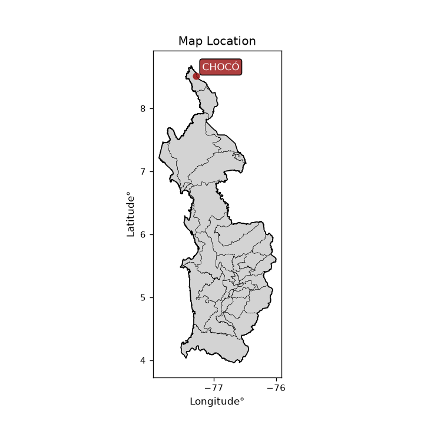</img>

| CountyID                                                                                          | CountyName              | CountyFiles                                                                                                                                                                                                                                                                                                                                                                                                                                                                                                                                                                                                                                                                                                                                                                                                                                                                                                                                                                                                                                                                                                                                                                                                                                                                                                                                                                                                                                                                                                                                                                                                                                                                                                                                                                                                                                                                                                                        |
|:--------------------------------------------------------------------------------------------------|:------------------------|:-----------------------------------------------------------------------------------------------------------------------------------------------------------------------------------------------------------------------------------------------------------------------------------------------------------------------------------------------------------------------------------------------------------------------------------------------------------------------------------------------------------------------------------------------------------------------------------------------------------------------------------------------------------------------------------------------------------------------------------------------------------------------------------------------------------------------------------------------------------------------------------------------------------------------------------------------------------------------------------------------------------------------------------------------------------------------------------------------------------------------------------------------------------------------------------------------------------------------------------------------------------------------------------------------------------------------------------------------------------------------------------------------------------------------------------------------------------------------------------------------------------------------------------------------------------------------------------------------------------------------------------------------------------------------------------------------------------------------------------------------------------------------------------------------------------------------------------------------------------------------------------------------------------------------------------|
| [27006](https://github.com/rcfdtools/R.HydroTools/blob/main/tool/Population/file/report/27006.md) | Acandí                  | [27006_Rural_Lot_202606.zip](https://github.com/rcfdtools/R.GISMobile/blob/main/file/shp/27006_Rural_Lot_202606.zip) [27006_Rural_Nomenclature_202606.zip](https://github.com/rcfdtools/R.GISMobile/blob/main/file/shp/27006_Rural_Nomenclature_202606.zip) [27006_Rural_Sector_202606.zip](https://github.com/rcfdtools/R.GISMobile/blob/main/file/shp/27006_Rural_Sector_202606.zip) [27006_Rural_Vereda_202606.zip](https://github.com/rcfdtools/R.GISMobile/blob/main/file/shp/27006_Rural_Vereda_202606.zip) [27006_Urban_Block_202606.zip](https://github.com/rcfdtools/R.GISMobile/blob/main/file/shp/27006_Urban_Block_202606.zip) [27006_Urban_Building_202606.zip](https://github.com/rcfdtools/R.GISMobile/blob/main/file/shp/27006_Urban_Building_202606.zip) [27006_Urban_Lot_202606.zip](https://github.com/rcfdtools/R.GISMobile/blob/main/file/shp/27006_Urban_Lot_202606.zip) [27006_Urban_Neighborhood_202606.zip](https://github.com/rcfdtools/R.GISMobile/blob/main/file/shp/27006_Urban_Neighborhood_202606.zip) [27006_Urban_Nomenclature_202606.zip](https://github.com/rcfdtools/R.GISMobile/blob/main/file/shp/27006_Urban_Nomenclature_202606.zip) [27006_Urban_Nomenclature_Road_202606.zip](https://github.com/rcfdtools/R.GISMobile/blob/main/file/shp/27006_Urban_Nomenclature_Road_202606.zip) [27006_Urban_Perimeter_202606.zip](https://github.com/rcfdtools/R.GISMobile/blob/main/file/shp/27006_Urban_Perimeter_202606.zip) [27006_Urban_Sector_202606.zip](https://github.com/rcfdtools/R.GISMobile/blob/main/file/shp/27006_Urban_Sector_202606.zip)                                                                                                                                                                                                                                                                                          |
| [27025](https://github.com/rcfdtools/R.HydroTools/blob/main/tool/Population/file/report/27025.md) | Alto Baudó              | [27025_Rural_Lot_202606.zip](https://github.com/rcfdtools/R.GISMobile/blob/main/file/shp/27025_Rural_Lot_202606.zip) [27025_Urban_Block_202606.zip](https://github.com/rcfdtools/R.GISMobile/blob/main/file/shp/27025_Urban_Block_202606.zip) [27025_Urban_Building_202606.zip](https://github.com/rcfdtools/R.GISMobile/blob/main/file/shp/27025_Urban_Building_202606.zip) [27025_Urban_Lot_202606.zip](https://github.com/rcfdtools/R.GISMobile/blob/main/file/shp/27025_Urban_Lot_202606.zip) [27025_Urban_Nomenclature_202606.zip](https://github.com/rcfdtools/R.GISMobile/blob/main/file/shp/27025_Urban_Nomenclature_202606.zip) [27025_Urban_Nomenclature_Road_202606.zip](https://github.com/rcfdtools/R.GISMobile/blob/main/file/shp/27025_Urban_Nomenclature_Road_202606.zip) [27025_Urban_Perimeter_202606.zip](https://github.com/rcfdtools/R.GISMobile/blob/main/file/shp/27025_Urban_Perimeter_202606.zip)                                                                                                                                                                                                                                                                                                                                                                                                                                                                                                                                                                                                                                                                                                                                                                                                                                                                                                                                                                             |
| [27050](https://github.com/rcfdtools/R.HydroTools/blob/main/tool/Population/file/report/27050.md) | Atrato                  | [27050_Rural_Lot_202606.zip](https://github.com/rcfdtools/R.GISMobile/blob/main/file/shp/27050_Rural_Lot_202606.zip) [27050_Urban_Block_202606.zip](https://github.com/rcfdtools/R.GISMobile/blob/main/file/shp/27050_Urban_Block_202606.zip) [27050_Urban_Building_202606.zip](https://github.com/rcfdtools/R.GISMobile/blob/main/file/shp/27050_Urban_Building_202606.zip) [27050_Urban_Lot_202606.zip](https://github.com/rcfdtools/R.GISMobile/blob/main/file/shp/27050_Urban_Lot_202606.zip) [27050_Urban_Nomenclature_202606.zip](https://github.com/rcfdtools/R.GISMobile/blob/main/file/shp/27050_Urban_Nomenclature_202606.zip) [27050_Urban_Nomenclature_Road_202606.zip](https://github.com/rcfdtools/R.GISMobile/blob/main/file/shp/27050_Urban_Nomenclature_Road_202606.zip) [27050_Urban_Perimeter_202606.zip](https://github.com/rcfdtools/R.GISMobile/blob/main/file/shp/27050_Urban_Perimeter_202606.zip)                                                                                                                                                                                                                                                                                                                                                                                                                                                                                                                                                                                                                                                                                                                                                                                                                                                                                                                                                                             |
| [27073](https://github.com/rcfdtools/R.HydroTools/blob/main/tool/Population/file/report/27073.md) | Bagadó                  | [27073_Rural_Lot_202606.zip](https://github.com/rcfdtools/R.GISMobile/blob/main/file/shp/27073_Rural_Lot_202606.zip) [27073_Urban_Block_202606.zip](https://github.com/rcfdtools/R.GISMobile/blob/main/file/shp/27073_Urban_Block_202606.zip) [27073_Urban_Building_202606.zip](https://github.com/rcfdtools/R.GISMobile/blob/main/file/shp/27073_Urban_Building_202606.zip) [27073_Urban_Lot_202606.zip](https://github.com/rcfdtools/R.GISMobile/blob/main/file/shp/27073_Urban_Lot_202606.zip) [27073_Urban_Nomenclature_202606.zip](https://github.com/rcfdtools/R.GISMobile/blob/main/file/shp/27073_Urban_Nomenclature_202606.zip) [27073_Urban_Nomenclature_Road_202606.zip](https://github.com/rcfdtools/R.GISMobile/blob/main/file/shp/27073_Urban_Nomenclature_Road_202606.zip) [27073_Urban_Perimeter_202606.zip](https://github.com/rcfdtools/R.GISMobile/blob/main/file/shp/27073_Urban_Perimeter_202606.zip)                                                                                                                                                                                                                                                                                                                                                                                                                                                                                                                                                                                                                                                                                                                                                                                                                                                                                                                                                                             |
| [27075](https://github.com/rcfdtools/R.HydroTools/blob/main/tool/Population/file/report/27075.md) | Bahía Solano            | [27075_Rural_Lot_202606.zip](https://github.com/rcfdtools/R.GISMobile/blob/main/file/shp/27075_Rural_Lot_202606.zip)                                                                                                                                                                                                                                                                                                                                                                                                                                                                                                                                                                                                                                                                                                                                                                                                                                                                                                                                                                                                                                                                                                                                                                                                                                                                                                                                                                                                                                                                                                                                                                                                                                                                                                                                                                                                           |
| [27077](https://github.com/rcfdtools/R.HydroTools/blob/main/tool/Population/file/report/27077.md) | Bajo Baudó              | [27077_Rural_Lot_202606.zip](https://github.com/rcfdtools/R.GISMobile/blob/main/file/shp/27077_Rural_Lot_202606.zip) [27077_Urban_Block_202606.zip](https://github.com/rcfdtools/R.GISMobile/blob/main/file/shp/27077_Urban_Block_202606.zip) [27077_Urban_Building_202606.zip](https://github.com/rcfdtools/R.GISMobile/blob/main/file/shp/27077_Urban_Building_202606.zip) [27077_Urban_Lot_202606.zip](https://github.com/rcfdtools/R.GISMobile/blob/main/file/shp/27077_Urban_Lot_202606.zip) [27077_Urban_Nomenclature_202606.zip](https://github.com/rcfdtools/R.GISMobile/blob/main/file/shp/27077_Urban_Nomenclature_202606.zip) [27077_Urban_Nomenclature_Road_202606.zip](https://github.com/rcfdtools/R.GISMobile/blob/main/file/shp/27077_Urban_Nomenclature_Road_202606.zip)                                                                                                                                                                                                                                                                                                                                                                                                                                                                                                                                                                                                                                                                                                                                                                                                                                                                                                                                                                                                                                                                                                                  |
| [27099](https://github.com/rcfdtools/R.HydroTools/blob/main/tool/Population/file/report/27099.md) | Bojayá                  | [27099_Rural_Lot_202606.zip](https://github.com/rcfdtools/R.GISMobile/blob/main/file/shp/27099_Rural_Lot_202606.zip) [27099_Rural_Nomenclature_202606.zip](https://github.com/rcfdtools/R.GISMobile/blob/main/file/shp/27099_Rural_Nomenclature_202606.zip) [27099_Rural_Sector_202606.zip](https://github.com/rcfdtools/R.GISMobile/blob/main/file/shp/27099_Rural_Sector_202606.zip) [27099_Rural_Vereda_202606.zip](https://github.com/rcfdtools/R.GISMobile/blob/main/file/shp/27099_Rural_Vereda_202606.zip) [27099_Urban_Block_202606.zip](https://github.com/rcfdtools/R.GISMobile/blob/main/file/shp/27099_Urban_Block_202606.zip) [27099_Urban_Building_202606.zip](https://github.com/rcfdtools/R.GISMobile/blob/main/file/shp/27099_Urban_Building_202606.zip) [27099_Urban_Lot_202606.zip](https://github.com/rcfdtools/R.GISMobile/blob/main/file/shp/27099_Urban_Lot_202606.zip) [27099_Urban_Neighborhood_202606.zip](https://github.com/rcfdtools/R.GISMobile/blob/main/file/shp/27099_Urban_Neighborhood_202606.zip) [27099_Urban_Nomenclature_202606.zip](https://github.com/rcfdtools/R.GISMobile/blob/main/file/shp/27099_Urban_Nomenclature_202606.zip) [27099_Urban_Nomenclature_Road_202606.zip](https://github.com/rcfdtools/R.GISMobile/blob/main/file/shp/27099_Urban_Nomenclature_Road_202606.zip) [27099_Urban_Perimeter_202606.zip](https://github.com/rcfdtools/R.GISMobile/blob/main/file/shp/27099_Urban_Perimeter_202606.zip) [27099_Urban_Sector_202606.zip](https://github.com/rcfdtools/R.GISMobile/blob/main/file/shp/27099_Urban_Sector_202606.zip)                                                                                                                                                                                                                                                                                          |
| [27150](https://github.com/rcfdtools/R.HydroTools/blob/main/tool/Population/file/report/27150.md) | Carmen Del Darién       | [27150_Rural_Lot_202606.zip](https://github.com/rcfdtools/R.GISMobile/blob/main/file/shp/27150_Rural_Lot_202606.zip)                                                                                                                                                                                                                                                                                                                                                                                                                                                                                                                                                                                                                                                                                                                                                                                                                                                                                                                                                                                                                                                                                                                                                                                                                                                                                                                                                                                                                                                                                                                                                                                                                                                                                                                                                                                                           |
| [27205](https://github.com/rcfdtools/R.HydroTools/blob/main/tool/Population/file/report/27205.md) | Condoto                 | [27205_Rural_Lot_202606.zip](https://github.com/rcfdtools/R.GISMobile/blob/main/file/shp/27205_Rural_Lot_202606.zip) [27205_Rural_Nomenclature_202606.zip](https://github.com/rcfdtools/R.GISMobile/blob/main/file/shp/27205_Rural_Nomenclature_202606.zip) [27205_Rural_Sector_202606.zip](https://github.com/rcfdtools/R.GISMobile/blob/main/file/shp/27205_Rural_Sector_202606.zip) [27205_Rural_Vereda_202606.zip](https://github.com/rcfdtools/R.GISMobile/blob/main/file/shp/27205_Rural_Vereda_202606.zip) [27205_Urban_Block_202606.zip](https://github.com/rcfdtools/R.GISMobile/blob/main/file/shp/27205_Urban_Block_202606.zip) [27205_Urban_Building_202606.zip](https://github.com/rcfdtools/R.GISMobile/blob/main/file/shp/27205_Urban_Building_202606.zip) [27205_Urban_Lot_202606.zip](https://github.com/rcfdtools/R.GISMobile/blob/main/file/shp/27205_Urban_Lot_202606.zip) [27205_Urban_Nomenclature_202606.zip](https://github.com/rcfdtools/R.GISMobile/blob/main/file/shp/27205_Urban_Nomenclature_202606.zip) [27205_Urban_Nomenclature_Road_202606.zip](https://github.com/rcfdtools/R.GISMobile/blob/main/file/shp/27205_Urban_Nomenclature_Road_202606.zip) [27205_Urban_Perimeter_202606.zip](https://github.com/rcfdtools/R.GISMobile/blob/main/file/shp/27205_Urban_Perimeter_202606.zip)                                                                                                                                                                                                                                                                                                                                                                                                                                                                                                                                                                    |
| [27160](https://github.com/rcfdtools/R.HydroTools/blob/main/tool/Population/file/report/27160.md) | Cértegui                | [27160_Rural_Lot_202606.zip](https://github.com/rcfdtools/R.GISMobile/blob/main/file/shp/27160_Rural_Lot_202606.zip) [27160_Urban_Block_202606.zip](https://github.com/rcfdtools/R.GISMobile/blob/main/file/shp/27160_Urban_Block_202606.zip) [27160_Urban_Building_202606.zip](https://github.com/rcfdtools/R.GISMobile/blob/main/file/shp/27160_Urban_Building_202606.zip) [27160_Urban_Lot_202606.zip](https://github.com/rcfdtools/R.GISMobile/blob/main/file/shp/27160_Urban_Lot_202606.zip) [27160_Urban_Nomenclature_202606.zip](https://github.com/rcfdtools/R.GISMobile/blob/main/file/shp/27160_Urban_Nomenclature_202606.zip) [27160_Urban_Nomenclature_Road_202606.zip](https://github.com/rcfdtools/R.GISMobile/blob/main/file/shp/27160_Urban_Nomenclature_Road_202606.zip) [27160_Urban_Perimeter_202606.zip](https://github.com/rcfdtools/R.GISMobile/blob/main/file/shp/27160_Urban_Perimeter_202606.zip)                                                                                                                                                                                                                                                                                                                                                                                                                                                                                                                                                                                                                                                                                                                                                                                                                                                                                                                                                                             |
| [27135](https://github.com/rcfdtools/R.HydroTools/blob/main/tool/Population/file/report/27135.md) | El Cantón Del San Pablo | [27135_Rural_Lot_202606.zip](https://github.com/rcfdtools/R.GISMobile/blob/main/file/shp/27135_Rural_Lot_202606.zip) [27135_Urban_Block_202606.zip](https://github.com/rcfdtools/R.GISMobile/blob/main/file/shp/27135_Urban_Block_202606.zip) [27135_Urban_Building_202606.zip](https://github.com/rcfdtools/R.GISMobile/blob/main/file/shp/27135_Urban_Building_202606.zip) [27135_Urban_Lot_202606.zip](https://github.com/rcfdtools/R.GISMobile/blob/main/file/shp/27135_Urban_Lot_202606.zip) [27135_Urban_Nomenclature_202606.zip](https://github.com/rcfdtools/R.GISMobile/blob/main/file/shp/27135_Urban_Nomenclature_202606.zip) [27135_Urban_Nomenclature_Road_202606.zip](https://github.com/rcfdtools/R.GISMobile/blob/main/file/shp/27135_Urban_Nomenclature_Road_202606.zip) [27135_Urban_Perimeter_202606.zip](https://github.com/rcfdtools/R.GISMobile/blob/main/file/shp/27135_Urban_Perimeter_202606.zip)                                                                                                                                                                                                                                                                                                                                                                                                                                                                                                                                                                                                                                                                                                                                                                                                                                                                                                                                                                             |
| [27245](https://github.com/rcfdtools/R.HydroTools/blob/main/tool/Population/file/report/27245.md) | El Carmen               | [27245_Rural_Building_202606.zip](https://github.com/rcfdtools/R.GISMobile/blob/main/file/shp/27245_Rural_Building_202606.zip) [27245_Rural_Lot_202606.zip](https://github.com/rcfdtools/R.GISMobile/blob/main/file/shp/27245_Rural_Lot_202606.zip) [27245_Rural_Nomenclature_202606.zip](https://github.com/rcfdtools/R.GISMobile/blob/main/file/shp/27245_Rural_Nomenclature_202606.zip) [27245_Rural_Sector_202606.zip](https://github.com/rcfdtools/R.GISMobile/blob/main/file/shp/27245_Rural_Sector_202606.zip) [27245_Rural_Vereda_202606.zip](https://github.com/rcfdtools/R.GISMobile/blob/main/file/shp/27245_Rural_Vereda_202606.zip) [27245_Urban_Block_202606.zip](https://github.com/rcfdtools/R.GISMobile/blob/main/file/shp/27245_Urban_Block_202606.zip) [27245_Urban_Building_202606.zip](https://github.com/rcfdtools/R.GISMobile/blob/main/file/shp/27245_Urban_Building_202606.zip) [27245_Urban_Lot_202606.zip](https://github.com/rcfdtools/R.GISMobile/blob/main/file/shp/27245_Urban_Lot_202606.zip) [27245_Urban_Nomenclature_202606.zip](https://github.com/rcfdtools/R.GISMobile/blob/main/file/shp/27245_Urban_Nomenclature_202606.zip) [27245_Urban_Nomenclature_Road_202606.zip](https://github.com/rcfdtools/R.GISMobile/blob/main/file/shp/27245_Urban_Nomenclature_Road_202606.zip) [27245_Urban_Perimeter_202606.zip](https://github.com/rcfdtools/R.GISMobile/blob/main/file/shp/27245_Urban_Perimeter_202606.zip)                                                                                                                                                                                                                                                                                                                                                                                                                                 |
| [27250](https://github.com/rcfdtools/R.HydroTools/blob/main/tool/Population/file/report/27250.md) | El Litoral Del San Juán | [27250_Rural_Lot_202606.zip](https://github.com/rcfdtools/R.GISMobile/blob/main/file/shp/27250_Rural_Lot_202606.zip)                                                                                                                                                                                                                                                                                                                                                                                                                                                                                                                                                                                                                                                                                                                                                                                                                                                                                                                                                                                                                                                                                                                                                                                                                                                                                                                                                                                                                                                                                                                                                                                                                                                                                                                                                                                                           |
| [27361](https://github.com/rcfdtools/R.HydroTools/blob/main/tool/Population/file/report/27361.md) | Istmina                 | [27361_Rural_Building_202606.zip](https://github.com/rcfdtools/R.GISMobile/blob/main/file/shp/27361_Rural_Building_202606.zip) [27361_Rural_Lot_202606.zip](https://github.com/rcfdtools/R.GISMobile/blob/main/file/shp/27361_Rural_Lot_202606.zip) [27361_Rural_Nomenclature_202606.zip](https://github.com/rcfdtools/R.GISMobile/blob/main/file/shp/27361_Rural_Nomenclature_202606.zip) [27361_Rural_Sector_202606.zip](https://github.com/rcfdtools/R.GISMobile/blob/main/file/shp/27361_Rural_Sector_202606.zip) [27361_Rural_Vereda_202606.zip](https://github.com/rcfdtools/R.GISMobile/blob/main/file/shp/27361_Rural_Vereda_202606.zip) [27361_Urban_Block_202606.zip](https://github.com/rcfdtools/R.GISMobile/blob/main/file/shp/27361_Urban_Block_202606.zip) [27361_Urban_Building_202606.zip](https://github.com/rcfdtools/R.GISMobile/blob/main/file/shp/27361_Urban_Building_202606.zip) [27361_Urban_Lot_202606.zip](https://github.com/rcfdtools/R.GISMobile/blob/main/file/shp/27361_Urban_Lot_202606.zip) [27361_Urban_Nomenclature_202606.zip](https://github.com/rcfdtools/R.GISMobile/blob/main/file/shp/27361_Urban_Nomenclature_202606.zip) [27361_Urban_Nomenclature_Road_202606.zip](https://github.com/rcfdtools/R.GISMobile/blob/main/file/shp/27361_Urban_Nomenclature_Road_202606.zip) [27361_Urban_Perimeter_202606.zip](https://github.com/rcfdtools/R.GISMobile/blob/main/file/shp/27361_Urban_Perimeter_202606.zip)                                                                                                                                                                                                                                                                                                                                                                                                                                 |
| [27372](https://github.com/rcfdtools/R.HydroTools/blob/main/tool/Population/file/report/27372.md) | Juradó                  | [27372_Rural_Lot_202606.zip](https://github.com/rcfdtools/R.GISMobile/blob/main/file/shp/27372_Rural_Lot_202606.zip)                                                                                                                                                                                                                                                                                                                                                                                                                                                                                                                                                                                                                                                                                                                                                                                                                                                                                                                                                                                                                                                                                                                                                                                                                                                                                                                                                                                                                                                                                                                                                                                                                                                                                                                                                                                                           |
| [27413](https://github.com/rcfdtools/R.HydroTools/blob/main/tool/Population/file/report/27413.md) | Lloró                   | [27413_Rural_Lot_202606.zip](https://github.com/rcfdtools/R.GISMobile/blob/main/file/shp/27413_Rural_Lot_202606.zip) [27413_Rural_Vereda_202606.zip](https://github.com/rcfdtools/R.GISMobile/blob/main/file/shp/27413_Rural_Vereda_202606.zip) [27413_Urban_Block_202606.zip](https://github.com/rcfdtools/R.GISMobile/blob/main/file/shp/27413_Urban_Block_202606.zip) [27413_Urban_Building_202606.zip](https://github.com/rcfdtools/R.GISMobile/blob/main/file/shp/27413_Urban_Building_202606.zip) [27413_Urban_Lot_202606.zip](https://github.com/rcfdtools/R.GISMobile/blob/main/file/shp/27413_Urban_Lot_202606.zip) [27413_Urban_Nomenclature_202606.zip](https://github.com/rcfdtools/R.GISMobile/blob/main/file/shp/27413_Urban_Nomenclature_202606.zip) [27413_Urban_Nomenclature_Road_202606.zip](https://github.com/rcfdtools/R.GISMobile/blob/main/file/shp/27413_Urban_Nomenclature_Road_202606.zip) [27413_Urban_Perimeter_202606.zip](https://github.com/rcfdtools/R.GISMobile/blob/main/file/shp/27413_Urban_Perimeter_202606.zip)                                                                                                                                                                                                                                                                                                                                                                                                                                                                                                                                                                                                                                                                                                                                                                                                                                              |
| [27425](https://github.com/rcfdtools/R.HydroTools/blob/main/tool/Population/file/report/27425.md) | Medio Atrato            | [27425_Rural_Lot_202606.zip](https://github.com/rcfdtools/R.GISMobile/blob/main/file/shp/27425_Rural_Lot_202606.zip)                                                                                                                                                                                                                                                                                                                                                                                                                                                                                                                                                                                                                                                                                                                                                                                                                                                                                                                                                                                                                                                                                                                                                                                                                                                                                                                                                                                                                                                                                                                                                                                                                                                                                                                                                                                                           |
| [27430](https://github.com/rcfdtools/R.HydroTools/blob/main/tool/Population/file/report/27430.md) | Medio Baudó             | Not found                                                                                                                                                                                                                                                                                                                                                                                                                                                                                                                                                                                                                                                                                                                                                                                                                                                                                                                                                                                                                                                                                                                                                                                                                                                                                                                                                                                                                                                                                                                                                                                                                                                                                                                                                                                                                                                                                                                          |
| [27450](https://github.com/rcfdtools/R.HydroTools/blob/main/tool/Population/file/report/27450.md) | Medio San Juan          | [27450_Rural_Lot_202606.zip](https://github.com/rcfdtools/R.GISMobile/blob/main/file/shp/27450_Rural_Lot_202606.zip) [27450_Urban_Block_202606.zip](https://github.com/rcfdtools/R.GISMobile/blob/main/file/shp/27450_Urban_Block_202606.zip) [27450_Urban_Building_202606.zip](https://github.com/rcfdtools/R.GISMobile/blob/main/file/shp/27450_Urban_Building_202606.zip) [27450_Urban_Lot_202606.zip](https://github.com/rcfdtools/R.GISMobile/blob/main/file/shp/27450_Urban_Lot_202606.zip) [27450_Urban_Nomenclature_202606.zip](https://github.com/rcfdtools/R.GISMobile/blob/main/file/shp/27450_Urban_Nomenclature_202606.zip) [27450_Urban_Nomenclature_Road_202606.zip](https://github.com/rcfdtools/R.GISMobile/blob/main/file/shp/27450_Urban_Nomenclature_Road_202606.zip) [27450_Urban_Perimeter_202606.zip](https://github.com/rcfdtools/R.GISMobile/blob/main/file/shp/27450_Urban_Perimeter_202606.zip)                                                                                                                                                                                                                                                                                                                                                                                                                                                                                                                                                                                                                                                                                                                                                                                                                                                                                                                                                                             |
| [27493](https://github.com/rcfdtools/R.HydroTools/blob/main/tool/Population/file/report/27493.md) | Nuevo Belen de Bajira   | Not found                                                                                                                                                                                                                                                                                                                                                                                                                                                                                                                                                                                                                                                                                                                                                                                                                                                                                                                                                                                                                                                                                                                                                                                                                                                                                                                                                                                                                                                                                                                                                                                                                                                                                                                                                                                                                                                                                                                          |
| [27495](https://github.com/rcfdtools/R.HydroTools/blob/main/tool/Population/file/report/27495.md) | Nuquí                   | [27495_Rural_Lot_202606.zip](https://github.com/rcfdtools/R.GISMobile/blob/main/file/shp/27495_Rural_Lot_202606.zip) [27495_Rural_Sector_202606.zip](https://github.com/rcfdtools/R.GISMobile/blob/main/file/shp/27495_Rural_Sector_202606.zip) [27495_Rural_Vereda_202606.zip](https://github.com/rcfdtools/R.GISMobile/blob/main/file/shp/27495_Rural_Vereda_202606.zip)                                                                                                                                                                                                                                                                                                                                                                                                                                                                                                                                                                                                                                                                                                                                                                                                                                                                                                                                                                                                                                                                                                                                                                                                                                                                                                                                                                                                                                                                                                                                             |
| [27491](https://github.com/rcfdtools/R.HydroTools/blob/main/tool/Population/file/report/27491.md) | Nóvita                  | [27491_Rural_Lot_202606.zip](https://github.com/rcfdtools/R.GISMobile/blob/main/file/shp/27491_Rural_Lot_202606.zip) [27491_Urban_Block_202606.zip](https://github.com/rcfdtools/R.GISMobile/blob/main/file/shp/27491_Urban_Block_202606.zip) [27491_Urban_Building_202606.zip](https://github.com/rcfdtools/R.GISMobile/blob/main/file/shp/27491_Urban_Building_202606.zip) [27491_Urban_Lot_202606.zip](https://github.com/rcfdtools/R.GISMobile/blob/main/file/shp/27491_Urban_Lot_202606.zip) [27491_Urban_Nomenclature_202606.zip](https://github.com/rcfdtools/R.GISMobile/blob/main/file/shp/27491_Urban_Nomenclature_202606.zip) [27491_Urban_Nomenclature_Road_202606.zip](https://github.com/rcfdtools/R.GISMobile/blob/main/file/shp/27491_Urban_Nomenclature_Road_202606.zip) [27491_Urban_Perimeter_202606.zip](https://github.com/rcfdtools/R.GISMobile/blob/main/file/shp/27491_Urban_Perimeter_202606.zip)                                                                                                                                                                                                                                                                                                                                                                                                                                                                                                                                                                                                                                                                                                                                                                                                                                                                                                                                                                             |
| [27001](https://github.com/rcfdtools/R.HydroTools/blob/main/tool/Population/file/report/27001.md) | Quibdó                  | [27001_Rural_Building_202606.zip](https://github.com/rcfdtools/R.GISMobile/blob/main/file/shp/27001_Rural_Building_202606.zip) [27001_Rural_Lot_202606.zip](https://github.com/rcfdtools/R.GISMobile/blob/main/file/shp/27001_Rural_Lot_202606.zip) [27001_Rural_Nomenclature_202606.zip](https://github.com/rcfdtools/R.GISMobile/blob/main/file/shp/27001_Rural_Nomenclature_202606.zip) [27001_Rural_Nomenclature_Road_202606.zip](https://github.com/rcfdtools/R.GISMobile/blob/main/file/shp/27001_Rural_Nomenclature_Road_202606.zip) [27001_Rural_Sector_202606.zip](https://github.com/rcfdtools/R.GISMobile/blob/main/file/shp/27001_Rural_Sector_202606.zip) [27001_Rural_Vereda_202606.zip](https://github.com/rcfdtools/R.GISMobile/blob/main/file/shp/27001_Rural_Vereda_202606.zip) [27001_Urban_Block_202606.zip](https://github.com/rcfdtools/R.GISMobile/blob/main/file/shp/27001_Urban_Block_202606.zip) [27001_Urban_Building_202606.zip](https://github.com/rcfdtools/R.GISMobile/blob/main/file/shp/27001_Urban_Building_202606.zip) [27001_Urban_Lot_202606.zip](https://github.com/rcfdtools/R.GISMobile/blob/main/file/shp/27001_Urban_Lot_202606.zip) [27001_Urban_Neighborhood_202606.zip](https://github.com/rcfdtools/R.GISMobile/blob/main/file/shp/27001_Urban_Neighborhood_202606.zip) [27001_Urban_Nomenclature_202606.zip](https://github.com/rcfdtools/R.GISMobile/blob/main/file/shp/27001_Urban_Nomenclature_202606.zip) [27001_Urban_Nomenclature_Road_202606.zip](https://github.com/rcfdtools/R.GISMobile/blob/main/file/shp/27001_Urban_Nomenclature_Road_202606.zip) [27001_Urban_Perimeter_202606.zip](https://github.com/rcfdtools/R.GISMobile/blob/main/file/shp/27001_Urban_Perimeter_202606.zip) [27001_Urban_Sector_202606.zip](https://github.com/rcfdtools/R.GISMobile/blob/main/file/shp/27001_Urban_Sector_202606.zip)  |
| [27580](https://github.com/rcfdtools/R.HydroTools/blob/main/tool/Population/file/report/27580.md) | Rio Iró                 | [27580_Rural_Lot_202606.zip](https://github.com/rcfdtools/R.GISMobile/blob/main/file/shp/27580_Rural_Lot_202606.zip)                                                                                                                                                                                                                                                                                                                                                                                                                                                                                                                                                                                                                                                                                                                                                                                                                                                                                                                                                                                                                                                                                                                                                                                                                                                                                                                                                                                                                                                                                                                                                                                                                                                                                                                                                                                                           |
| [27600](https://github.com/rcfdtools/R.HydroTools/blob/main/tool/Population/file/report/27600.md) | Rio Quito               | [27600_Rural_Lot_202606.zip](https://github.com/rcfdtools/R.GISMobile/blob/main/file/shp/27600_Rural_Lot_202606.zip) [27600_Urban_Block_202606.zip](https://github.com/rcfdtools/R.GISMobile/blob/main/file/shp/27600_Urban_Block_202606.zip) [27600_Urban_Building_202606.zip](https://github.com/rcfdtools/R.GISMobile/blob/main/file/shp/27600_Urban_Building_202606.zip) [27600_Urban_Lot_202606.zip](https://github.com/rcfdtools/R.GISMobile/blob/main/file/shp/27600_Urban_Lot_202606.zip) [27600_Urban_Nomenclature_202606.zip](https://github.com/rcfdtools/R.GISMobile/blob/main/file/shp/27600_Urban_Nomenclature_202606.zip) [27600_Urban_Nomenclature_Road_202606.zip](https://github.com/rcfdtools/R.GISMobile/blob/main/file/shp/27600_Urban_Nomenclature_Road_202606.zip) [27600_Urban_Perimeter_202606.zip](https://github.com/rcfdtools/R.GISMobile/blob/main/file/shp/27600_Urban_Perimeter_202606.zip)                                                                                                                                                                                                                                                                                                                                                                                                                                                                                                                                                                                                                                                                                                                                                                                                                                                                                                                                                                             |
| [27615](https://github.com/rcfdtools/R.HydroTools/blob/main/tool/Population/file/report/27615.md) | Riosucio                | [27615_Rural_Lot_202606.zip](https://github.com/rcfdtools/R.GISMobile/blob/main/file/shp/27615_Rural_Lot_202606.zip) [27615_Rural_Nomenclature_202606.zip](https://github.com/rcfdtools/R.GISMobile/blob/main/file/shp/27615_Rural_Nomenclature_202606.zip) [27615_Rural_Sector_202606.zip](https://github.com/rcfdtools/R.GISMobile/blob/main/file/shp/27615_Rural_Sector_202606.zip) [27615_Rural_Vereda_202606.zip](https://github.com/rcfdtools/R.GISMobile/blob/main/file/shp/27615_Rural_Vereda_202606.zip) [27615_Urban_Block_202606.zip](https://github.com/rcfdtools/R.GISMobile/blob/main/file/shp/27615_Urban_Block_202606.zip) [27615_Urban_Building_202606.zip](https://github.com/rcfdtools/R.GISMobile/blob/main/file/shp/27615_Urban_Building_202606.zip) [27615_Urban_Lot_202606.zip](https://github.com/rcfdtools/R.GISMobile/blob/main/file/shp/27615_Urban_Lot_202606.zip) [27615_Urban_Nomenclature_202606.zip](https://github.com/rcfdtools/R.GISMobile/blob/main/file/shp/27615_Urban_Nomenclature_202606.zip) [27615_Urban_Nomenclature_Road_202606.zip](https://github.com/rcfdtools/R.GISMobile/blob/main/file/shp/27615_Urban_Nomenclature_Road_202606.zip) [27615_Urban_Perimeter_202606.zip](https://github.com/rcfdtools/R.GISMobile/blob/main/file/shp/27615_Urban_Perimeter_202606.zip)                                                                                                                                                                                                                                                                                                                                                                                                                                                                                                                                                                    |
| [27660](https://github.com/rcfdtools/R.HydroTools/blob/main/tool/Population/file/report/27660.md) | San José Del Palmar     | [27660_Rural_Building_202606.zip](https://github.com/rcfdtools/R.GISMobile/blob/main/file/shp/27660_Rural_Building_202606.zip) [27660_Rural_Lot_202606.zip](https://github.com/rcfdtools/R.GISMobile/blob/main/file/shp/27660_Rural_Lot_202606.zip) [27660_Rural_Nomenclature_202606.zip](https://github.com/rcfdtools/R.GISMobile/blob/main/file/shp/27660_Rural_Nomenclature_202606.zip) [27660_Rural_Sector_202606.zip](https://github.com/rcfdtools/R.GISMobile/blob/main/file/shp/27660_Rural_Sector_202606.zip) [27660_Rural_Vereda_202606.zip](https://github.com/rcfdtools/R.GISMobile/blob/main/file/shp/27660_Rural_Vereda_202606.zip) [27660_Urban_Block_202606.zip](https://github.com/rcfdtools/R.GISMobile/blob/main/file/shp/27660_Urban_Block_202606.zip) [27660_Urban_Building_202606.zip](https://github.com/rcfdtools/R.GISMobile/blob/main/file/shp/27660_Urban_Building_202606.zip) [27660_Urban_Lot_202606.zip](https://github.com/rcfdtools/R.GISMobile/blob/main/file/shp/27660_Urban_Lot_202606.zip) [27660_Urban_Nomenclature_202606.zip](https://github.com/rcfdtools/R.GISMobile/blob/main/file/shp/27660_Urban_Nomenclature_202606.zip) [27660_Urban_Nomenclature_Road_202606.zip](https://github.com/rcfdtools/R.GISMobile/blob/main/file/shp/27660_Urban_Nomenclature_Road_202606.zip) [27660_Urban_Perimeter_202606.zip](https://github.com/rcfdtools/R.GISMobile/blob/main/file/shp/27660_Urban_Perimeter_202606.zip)                                                                                                                                                                                                                                                                                                                                                                                                                                 |
| [27745](https://github.com/rcfdtools/R.HydroTools/blob/main/tool/Population/file/report/27745.md) | Sipí                    | [27745_Rural_Lot_202606.zip](https://github.com/rcfdtools/R.GISMobile/blob/main/file/shp/27745_Rural_Lot_202606.zip) [27745_Urban_Block_202606.zip](https://github.com/rcfdtools/R.GISMobile/blob/main/file/shp/27745_Urban_Block_202606.zip) [27745_Urban_Building_202606.zip](https://github.com/rcfdtools/R.GISMobile/blob/main/file/shp/27745_Urban_Building_202606.zip) [27745_Urban_Lot_202606.zip](https://github.com/rcfdtools/R.GISMobile/blob/main/file/shp/27745_Urban_Lot_202606.zip) [27745_Urban_Nomenclature_202606.zip](https://github.com/rcfdtools/R.GISMobile/blob/main/file/shp/27745_Urban_Nomenclature_202606.zip) [27745_Urban_Nomenclature_Road_202606.zip](https://github.com/rcfdtools/R.GISMobile/blob/main/file/shp/27745_Urban_Nomenclature_Road_202606.zip) [27745_Urban_Perimeter_202606.zip](https://github.com/rcfdtools/R.GISMobile/blob/main/file/shp/27745_Urban_Perimeter_202606.zip)                                                                                                                                                                                                                                                                                                                                                                                                                                                                                                                                                                                                                                                                                                                                                                                                                                                                                                                                                                             |
| [27787](https://github.com/rcfdtools/R.HydroTools/blob/main/tool/Population/file/report/27787.md) | Tadó                    | [27787_Rural_Building_202606.zip](https://github.com/rcfdtools/R.GISMobile/blob/main/file/shp/27787_Rural_Building_202606.zip) [27787_Rural_Lot_202606.zip](https://github.com/rcfdtools/R.GISMobile/blob/main/file/shp/27787_Rural_Lot_202606.zip) [27787_Urban_Block_202606.zip](https://github.com/rcfdtools/R.GISMobile/blob/main/file/shp/27787_Urban_Block_202606.zip) [27787_Urban_Building_202606.zip](https://github.com/rcfdtools/R.GISMobile/blob/main/file/shp/27787_Urban_Building_202606.zip) [27787_Urban_Lot_202606.zip](https://github.com/rcfdtools/R.GISMobile/blob/main/file/shp/27787_Urban_Lot_202606.zip) [27787_Urban_Nomenclature_202606.zip](https://github.com/rcfdtools/R.GISMobile/blob/main/file/shp/27787_Urban_Nomenclature_202606.zip) [27787_Urban_Nomenclature_Road_202606.zip](https://github.com/rcfdtools/R.GISMobile/blob/main/file/shp/27787_Urban_Nomenclature_Road_202606.zip) [27787_Urban_Perimeter_202606.zip](https://github.com/rcfdtools/R.GISMobile/blob/main/file/shp/27787_Urban_Perimeter_202606.zip)                                                                                                                                                                                                                                                                                                                                                                                                                                                                                                                                                                                                                                                                                                                                                                                                                                          |
| [27800](https://github.com/rcfdtools/R.HydroTools/blob/main/tool/Population/file/report/27800.md) | Unguía                  | [27800_Rural_Lot_202606.zip](https://github.com/rcfdtools/R.GISMobile/blob/main/file/shp/27800_Rural_Lot_202606.zip) [27800_Urban_Block_202606.zip](https://github.com/rcfdtools/R.GISMobile/blob/main/file/shp/27800_Urban_Block_202606.zip) [27800_Urban_Building_202606.zip](https://github.com/rcfdtools/R.GISMobile/blob/main/file/shp/27800_Urban_Building_202606.zip) [27800_Urban_Lot_202606.zip](https://github.com/rcfdtools/R.GISMobile/blob/main/file/shp/27800_Urban_Lot_202606.zip) [27800_Urban_Nomenclature_202606.zip](https://github.com/rcfdtools/R.GISMobile/blob/main/file/shp/27800_Urban_Nomenclature_202606.zip) [27800_Urban_Nomenclature_Road_202606.zip](https://github.com/rcfdtools/R.GISMobile/blob/main/file/shp/27800_Urban_Nomenclature_Road_202606.zip) [27800_Urban_Perimeter_202606.zip](https://github.com/rcfdtools/R.GISMobile/blob/main/file/shp/27800_Urban_Perimeter_202606.zip) [27800_Urban_Sector_202606.zip](https://github.com/rcfdtools/R.GISMobile/blob/main/file/shp/27800_Urban_Sector_202606.zip)                                                                                                                                                                                                                                                                                                                                                                                                                                                                                                                                                                                                                                                                                                                                                                                                                                              |
| [27810](https://github.com/rcfdtools/R.HydroTools/blob/main/tool/Population/file/report/27810.md) | Unión Panamericana      | [27810_Rural_Lot_202606.zip](https://github.com/rcfdtools/R.GISMobile/blob/main/file/shp/27810_Rural_Lot_202606.zip) [27810_Urban_Block_202606.zip](https://github.com/rcfdtools/R.GISMobile/blob/main/file/shp/27810_Urban_Block_202606.zip) [27810_Urban_Building_202606.zip](https://github.com/rcfdtools/R.GISMobile/blob/main/file/shp/27810_Urban_Building_202606.zip) [27810_Urban_Lot_202606.zip](https://github.com/rcfdtools/R.GISMobile/blob/main/file/shp/27810_Urban_Lot_202606.zip) [27810_Urban_Nomenclature_202606.zip](https://github.com/rcfdtools/R.GISMobile/blob/main/file/shp/27810_Urban_Nomenclature_202606.zip) [27810_Urban_Nomenclature_Road_202606.zip](https://github.com/rcfdtools/R.GISMobile/blob/main/file/shp/27810_Urban_Nomenclature_Road_202606.zip) [27810_Urban_Perimeter_202606.zip](https://github.com/rcfdtools/R.GISMobile/blob/main/file/shp/27810_Urban_Perimeter_202606.zip)                                                                                                                                                                                                                                                                                                                                                                                                                                                                                                                                                                                                                                                                                                                                                                                                                                                                                                                                                                             |

# 41 - Huila (37 Counties)

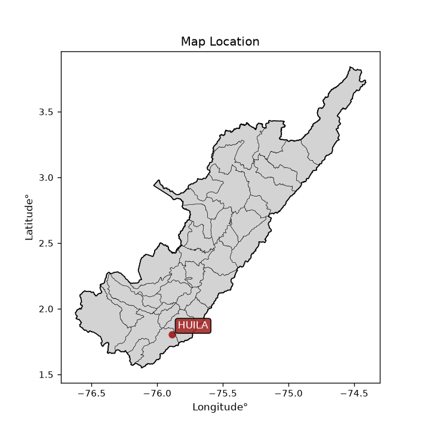</img>

| CountyID                                                                                          | CountyName   | CountyFiles                                                                                                                                                                                                                                                                                                                                                                                                                                                                                                                                                                                                                                                                                                                                                                                                                                                                                                                                                                                                                                                                                                                                                                                                                                                                                                                                                                                                                                                                                                                                                                                                                                                                                                                                                                                                                                                                                                                        |
|:--------------------------------------------------------------------------------------------------|:-------------|:-----------------------------------------------------------------------------------------------------------------------------------------------------------------------------------------------------------------------------------------------------------------------------------------------------------------------------------------------------------------------------------------------------------------------------------------------------------------------------------------------------------------------------------------------------------------------------------------------------------------------------------------------------------------------------------------------------------------------------------------------------------------------------------------------------------------------------------------------------------------------------------------------------------------------------------------------------------------------------------------------------------------------------------------------------------------------------------------------------------------------------------------------------------------------------------------------------------------------------------------------------------------------------------------------------------------------------------------------------------------------------------------------------------------------------------------------------------------------------------------------------------------------------------------------------------------------------------------------------------------------------------------------------------------------------------------------------------------------------------------------------------------------------------------------------------------------------------------------------------------------------------------------------------------------------------|
| [41006](https://github.com/rcfdtools/R.HydroTools/blob/main/tool/Population/file/report/41006.md) | Acevedo      | [41006_Urban_Block_202606.zip](https://github.com/rcfdtools/R.GISMobile/blob/main/file/shp/41006_Urban_Block_202606.zip) [41006_Urban_Building_202606.zip](https://github.com/rcfdtools/R.GISMobile/blob/main/file/shp/41006_Urban_Building_202606.zip) [41006_Urban_Lot_202606.zip](https://github.com/rcfdtools/R.GISMobile/blob/main/file/shp/41006_Urban_Lot_202606.zip) [41006_Urban_Nomenclature_202606.zip](https://github.com/rcfdtools/R.GISMobile/blob/main/file/shp/41006_Urban_Nomenclature_202606.zip) [41006_Urban_Nomenclature_Road_202606.zip](https://github.com/rcfdtools/R.GISMobile/blob/main/file/shp/41006_Urban_Nomenclature_Road_202606.zip) [41006_Urban_Perimeter_202606.zip](https://github.com/rcfdtools/R.GISMobile/blob/main/file/shp/41006_Urban_Perimeter_202606.zip)                                                                                                                                                                                                                                                                                                                                                                                                                                                                                                                                                                                                                                                                                                                                                                                                                                                                                                                                                                                                                                                                                                      |
| [41013](https://github.com/rcfdtools/R.HydroTools/blob/main/tool/Population/file/report/41013.md) | Agrado       | [41013_Rural_Building_202606.zip](https://github.com/rcfdtools/R.GISMobile/blob/main/file/shp/41013_Rural_Building_202606.zip) [41013_Rural_Lot_202606.zip](https://github.com/rcfdtools/R.GISMobile/blob/main/file/shp/41013_Rural_Lot_202606.zip) [41013_Rural_Nomenclature_202606.zip](https://github.com/rcfdtools/R.GISMobile/blob/main/file/shp/41013_Rural_Nomenclature_202606.zip) [41013_Rural_Sector_202606.zip](https://github.com/rcfdtools/R.GISMobile/blob/main/file/shp/41013_Rural_Sector_202606.zip) [41013_Rural_Vereda_202606.zip](https://github.com/rcfdtools/R.GISMobile/blob/main/file/shp/41013_Rural_Vereda_202606.zip) [41013_Urban_Block_202606.zip](https://github.com/rcfdtools/R.GISMobile/blob/main/file/shp/41013_Urban_Block_202606.zip) [41013_Urban_Building_202606.zip](https://github.com/rcfdtools/R.GISMobile/blob/main/file/shp/41013_Urban_Building_202606.zip) [41013_Urban_Lot_202606.zip](https://github.com/rcfdtools/R.GISMobile/blob/main/file/shp/41013_Urban_Lot_202606.zip) [41013_Urban_Nomenclature_202606.zip](https://github.com/rcfdtools/R.GISMobile/blob/main/file/shp/41013_Urban_Nomenclature_202606.zip) [41013_Urban_Nomenclature_Road_202606.zip](https://github.com/rcfdtools/R.GISMobile/blob/main/file/shp/41013_Urban_Nomenclature_Road_202606.zip) [41013_Urban_Perimeter_202606.zip](https://github.com/rcfdtools/R.GISMobile/blob/main/file/shp/41013_Urban_Perimeter_202606.zip) [41013_Urban_Sector_202606.zip](https://github.com/rcfdtools/R.GISMobile/blob/main/file/shp/41013_Urban_Sector_202606.zip)                                                                                                                                                                                                                                                                                                  |
| [41016](https://github.com/rcfdtools/R.HydroTools/blob/main/tool/Population/file/report/41016.md) | Aipe         | [41016_Rural_Building_202606.zip](https://github.com/rcfdtools/R.GISMobile/blob/main/file/shp/41016_Rural_Building_202606.zip) [41016_Rural_Lot_202606.zip](https://github.com/rcfdtools/R.GISMobile/blob/main/file/shp/41016_Rural_Lot_202606.zip) [41016_Rural_Nomenclature_202606.zip](https://github.com/rcfdtools/R.GISMobile/blob/main/file/shp/41016_Rural_Nomenclature_202606.zip) [41016_Rural_Sector_202606.zip](https://github.com/rcfdtools/R.GISMobile/blob/main/file/shp/41016_Rural_Sector_202606.zip) [41016_Rural_Vereda_202606.zip](https://github.com/rcfdtools/R.GISMobile/blob/main/file/shp/41016_Rural_Vereda_202606.zip) [41016_Urban_Block_202606.zip](https://github.com/rcfdtools/R.GISMobile/blob/main/file/shp/41016_Urban_Block_202606.zip) [41016_Urban_Building_202606.zip](https://github.com/rcfdtools/R.GISMobile/blob/main/file/shp/41016_Urban_Building_202606.zip) [41016_Urban_Lot_202606.zip](https://github.com/rcfdtools/R.GISMobile/blob/main/file/shp/41016_Urban_Lot_202606.zip) [41016_Urban_Nomenclature_202606.zip](https://github.com/rcfdtools/R.GISMobile/blob/main/file/shp/41016_Urban_Nomenclature_202606.zip) [41016_Urban_Nomenclature_Road_202606.zip](https://github.com/rcfdtools/R.GISMobile/blob/main/file/shp/41016_Urban_Nomenclature_Road_202606.zip) [41016_Urban_Perimeter_202606.zip](https://github.com/rcfdtools/R.GISMobile/blob/main/file/shp/41016_Urban_Perimeter_202606.zip)                                                                                                                                                                                                                                                                                                                                                                                                                                 |
| [41020](https://github.com/rcfdtools/R.HydroTools/blob/main/tool/Population/file/report/41020.md) | Algeciras    | [41020_Rural_Building_202606.zip](https://github.com/rcfdtools/R.GISMobile/blob/main/file/shp/41020_Rural_Building_202606.zip) [41020_Rural_Lot_202606.zip](https://github.com/rcfdtools/R.GISMobile/blob/main/file/shp/41020_Rural_Lot_202606.zip) [41020_Rural_Nomenclature_202606.zip](https://github.com/rcfdtools/R.GISMobile/blob/main/file/shp/41020_Rural_Nomenclature_202606.zip) [41020_Rural_Sector_202606.zip](https://github.com/rcfdtools/R.GISMobile/blob/main/file/shp/41020_Rural_Sector_202606.zip) [41020_Rural_Vereda_202606.zip](https://github.com/rcfdtools/R.GISMobile/blob/main/file/shp/41020_Rural_Vereda_202606.zip) [41020_Urban_Block_202606.zip](https://github.com/rcfdtools/R.GISMobile/blob/main/file/shp/41020_Urban_Block_202606.zip) [41020_Urban_Building_202606.zip](https://github.com/rcfdtools/R.GISMobile/blob/main/file/shp/41020_Urban_Building_202606.zip) [41020_Urban_Lot_202606.zip](https://github.com/rcfdtools/R.GISMobile/blob/main/file/shp/41020_Urban_Lot_202606.zip) [41020_Urban_Nomenclature_202606.zip](https://github.com/rcfdtools/R.GISMobile/blob/main/file/shp/41020_Urban_Nomenclature_202606.zip) [41020_Urban_Nomenclature_Road_202606.zip](https://github.com/rcfdtools/R.GISMobile/blob/main/file/shp/41020_Urban_Nomenclature_Road_202606.zip) [41020_Urban_Perimeter_202606.zip](https://github.com/rcfdtools/R.GISMobile/blob/main/file/shp/41020_Urban_Perimeter_202606.zip) [41020_Urban_Sector_202606.zip](https://github.com/rcfdtools/R.GISMobile/blob/main/file/shp/41020_Urban_Sector_202606.zip)                                                                                                                                                                                                                                                                                                  |
| [41026](https://github.com/rcfdtools/R.HydroTools/blob/main/tool/Population/file/report/41026.md) | Altamira     | [41026_Rural_Building_202606.zip](https://github.com/rcfdtools/R.GISMobile/blob/main/file/shp/41026_Rural_Building_202606.zip) [41026_Rural_Lot_202606.zip](https://github.com/rcfdtools/R.GISMobile/blob/main/file/shp/41026_Rural_Lot_202606.zip) [41026_Rural_Nomenclature_202606.zip](https://github.com/rcfdtools/R.GISMobile/blob/main/file/shp/41026_Rural_Nomenclature_202606.zip) [41026_Rural_Nomenclature_Road_202606.zip](https://github.com/rcfdtools/R.GISMobile/blob/main/file/shp/41026_Rural_Nomenclature_Road_202606.zip) [41026_Rural_Sector_202606.zip](https://github.com/rcfdtools/R.GISMobile/blob/main/file/shp/41026_Rural_Sector_202606.zip) [41026_Rural_Vereda_202606.zip](https://github.com/rcfdtools/R.GISMobile/blob/main/file/shp/41026_Rural_Vereda_202606.zip) [41026_Urban_Block_202606.zip](https://github.com/rcfdtools/R.GISMobile/blob/main/file/shp/41026_Urban_Block_202606.zip) [41026_Urban_Building_202606.zip](https://github.com/rcfdtools/R.GISMobile/blob/main/file/shp/41026_Urban_Building_202606.zip) [41026_Urban_Lot_202606.zip](https://github.com/rcfdtools/R.GISMobile/blob/main/file/shp/41026_Urban_Lot_202606.zip) [41026_Urban_Nomenclature_202606.zip](https://github.com/rcfdtools/R.GISMobile/blob/main/file/shp/41026_Urban_Nomenclature_202606.zip) [41026_Urban_Nomenclature_Road_202606.zip](https://github.com/rcfdtools/R.GISMobile/blob/main/file/shp/41026_Urban_Nomenclature_Road_202606.zip) [41026_Urban_Perimeter_202606.zip](https://github.com/rcfdtools/R.GISMobile/blob/main/file/shp/41026_Urban_Perimeter_202606.zip) [41026_Urban_Sector_202606.zip](https://github.com/rcfdtools/R.GISMobile/blob/main/file/shp/41026_Urban_Sector_202606.zip)                                                                                                                                             |
| [41078](https://github.com/rcfdtools/R.HydroTools/blob/main/tool/Population/file/report/41078.md) | Baraya       | [41078_Rural_Building_202606.zip](https://github.com/rcfdtools/R.GISMobile/blob/main/file/shp/41078_Rural_Building_202606.zip) [41078_Rural_Lot_202606.zip](https://github.com/rcfdtools/R.GISMobile/blob/main/file/shp/41078_Rural_Lot_202606.zip) [41078_Rural_Nomenclature_202606.zip](https://github.com/rcfdtools/R.GISMobile/blob/main/file/shp/41078_Rural_Nomenclature_202606.zip) [41078_Rural_Sector_202606.zip](https://github.com/rcfdtools/R.GISMobile/blob/main/file/shp/41078_Rural_Sector_202606.zip) [41078_Rural_Vereda_202606.zip](https://github.com/rcfdtools/R.GISMobile/blob/main/file/shp/41078_Rural_Vereda_202606.zip) [41078_Urban_Block_202606.zip](https://github.com/rcfdtools/R.GISMobile/blob/main/file/shp/41078_Urban_Block_202606.zip) [41078_Urban_Building_202606.zip](https://github.com/rcfdtools/R.GISMobile/blob/main/file/shp/41078_Urban_Building_202606.zip) [41078_Urban_Lot_202606.zip](https://github.com/rcfdtools/R.GISMobile/blob/main/file/shp/41078_Urban_Lot_202606.zip) [41078_Urban_Nomenclature_202606.zip](https://github.com/rcfdtools/R.GISMobile/blob/main/file/shp/41078_Urban_Nomenclature_202606.zip) [41078_Urban_Nomenclature_Road_202606.zip](https://github.com/rcfdtools/R.GISMobile/blob/main/file/shp/41078_Urban_Nomenclature_Road_202606.zip) [41078_Urban_Perimeter_202606.zip](https://github.com/rcfdtools/R.GISMobile/blob/main/file/shp/41078_Urban_Perimeter_202606.zip) [41078_Urban_Sector_202606.zip](https://github.com/rcfdtools/R.GISMobile/blob/main/file/shp/41078_Urban_Sector_202606.zip)                                                                                                                                                                                                                                                                                                  |
| [41132](https://github.com/rcfdtools/R.HydroTools/blob/main/tool/Population/file/report/41132.md) | Campoalegre  | [41132_Rural_Building_202606.zip](https://github.com/rcfdtools/R.GISMobile/blob/main/file/shp/41132_Rural_Building_202606.zip) [41132_Rural_Lot_202606.zip](https://github.com/rcfdtools/R.GISMobile/blob/main/file/shp/41132_Rural_Lot_202606.zip) [41132_Rural_Nomenclature_202606.zip](https://github.com/rcfdtools/R.GISMobile/blob/main/file/shp/41132_Rural_Nomenclature_202606.zip) [41132_Rural_Sector_202606.zip](https://github.com/rcfdtools/R.GISMobile/blob/main/file/shp/41132_Rural_Sector_202606.zip) [41132_Rural_Vereda_202606.zip](https://github.com/rcfdtools/R.GISMobile/blob/main/file/shp/41132_Rural_Vereda_202606.zip) [41132_Urban_Block_202606.zip](https://github.com/rcfdtools/R.GISMobile/blob/main/file/shp/41132_Urban_Block_202606.zip) [41132_Urban_Building_202606.zip](https://github.com/rcfdtools/R.GISMobile/blob/main/file/shp/41132_Urban_Building_202606.zip) [41132_Urban_Lot_202606.zip](https://github.com/rcfdtools/R.GISMobile/blob/main/file/shp/41132_Urban_Lot_202606.zip) [41132_Urban_Nomenclature_202606.zip](https://github.com/rcfdtools/R.GISMobile/blob/main/file/shp/41132_Urban_Nomenclature_202606.zip) [41132_Urban_Nomenclature_Road_202606.zip](https://github.com/rcfdtools/R.GISMobile/blob/main/file/shp/41132_Urban_Nomenclature_Road_202606.zip) [41132_Urban_Perimeter_202606.zip](https://github.com/rcfdtools/R.GISMobile/blob/main/file/shp/41132_Urban_Perimeter_202606.zip) [41132_Urban_Sector_202606.zip](https://github.com/rcfdtools/R.GISMobile/blob/main/file/shp/41132_Urban_Sector_202606.zip)                                                                                                                                                                                                                                                                                                  |
| [41206](https://github.com/rcfdtools/R.HydroTools/blob/main/tool/Population/file/report/41206.md) | Colombia     | [41206_Urban_Block_202606.zip](https://github.com/rcfdtools/R.GISMobile/blob/main/file/shp/41206_Urban_Block_202606.zip) [41206_Urban_Building_202606.zip](https://github.com/rcfdtools/R.GISMobile/blob/main/file/shp/41206_Urban_Building_202606.zip) [41206_Urban_Lot_202606.zip](https://github.com/rcfdtools/R.GISMobile/blob/main/file/shp/41206_Urban_Lot_202606.zip) [41206_Urban_Nomenclature_202606.zip](https://github.com/rcfdtools/R.GISMobile/blob/main/file/shp/41206_Urban_Nomenclature_202606.zip) [41206_Urban_Nomenclature_Road_202606.zip](https://github.com/rcfdtools/R.GISMobile/blob/main/file/shp/41206_Urban_Nomenclature_Road_202606.zip) [41206_Urban_Perimeter_202606.zip](https://github.com/rcfdtools/R.GISMobile/blob/main/file/shp/41206_Urban_Perimeter_202606.zip)                                                                                                                                                                                                                                                                                                                                                                                                                                                                                                                                                                                                                                                                                                                                                                                                                                                                                                                                                                                                                                                                                                      |
| [41244](https://github.com/rcfdtools/R.HydroTools/blob/main/tool/Population/file/report/41244.md) | Elías        | [41244_Rural_Building_202606.zip](https://github.com/rcfdtools/R.GISMobile/blob/main/file/shp/41244_Rural_Building_202606.zip) [41244_Rural_Lot_202606.zip](https://github.com/rcfdtools/R.GISMobile/blob/main/file/shp/41244_Rural_Lot_202606.zip) [41244_Rural_Nomenclature_202606.zip](https://github.com/rcfdtools/R.GISMobile/blob/main/file/shp/41244_Rural_Nomenclature_202606.zip) [41244_Rural_Sector_202606.zip](https://github.com/rcfdtools/R.GISMobile/blob/main/file/shp/41244_Rural_Sector_202606.zip) [41244_Rural_Vereda_202606.zip](https://github.com/rcfdtools/R.GISMobile/blob/main/file/shp/41244_Rural_Vereda_202606.zip) [41244_Urban_Block_202606.zip](https://github.com/rcfdtools/R.GISMobile/blob/main/file/shp/41244_Urban_Block_202606.zip) [41244_Urban_Building_202606.zip](https://github.com/rcfdtools/R.GISMobile/blob/main/file/shp/41244_Urban_Building_202606.zip) [41244_Urban_Lot_202606.zip](https://github.com/rcfdtools/R.GISMobile/blob/main/file/shp/41244_Urban_Lot_202606.zip) [41244_Urban_Nomenclature_202606.zip](https://github.com/rcfdtools/R.GISMobile/blob/main/file/shp/41244_Urban_Nomenclature_202606.zip) [41244_Urban_Nomenclature_Road_202606.zip](https://github.com/rcfdtools/R.GISMobile/blob/main/file/shp/41244_Urban_Nomenclature_Road_202606.zip) [41244_Urban_Perimeter_202606.zip](https://github.com/rcfdtools/R.GISMobile/blob/main/file/shp/41244_Urban_Perimeter_202606.zip) [41244_Urban_Sector_202606.zip](https://github.com/rcfdtools/R.GISMobile/blob/main/file/shp/41244_Urban_Sector_202606.zip)                                                                                                                                                                                                                                                                                                  |
| [41298](https://github.com/rcfdtools/R.HydroTools/blob/main/tool/Population/file/report/41298.md) | Garzón       | [41298_Rural_Lot_202001.zip](https://github.com/rcfdtools/R.GISMobile/blob/main/file/shp/41298_Rural_Lot_202001.zip) [41298_Urban_Lot_202001.zip](https://github.com/rcfdtools/R.GISMobile/blob/main/file/shp/41298_Urban_Lot_202001.zip)                                                                                                                                                                                                                                                                                                                                                                                                                                                                                                                                                                                                                                                                                                                                                                                                                                                                                                                                                                                                                                                                                                                                                                                                                                                                                                                                                                                                                                                                                                                                                                                                                                                                                  |
| [41306](https://github.com/rcfdtools/R.HydroTools/blob/main/tool/Population/file/report/41306.md) | Gigante      | [41306_Rural_Building_202606.zip](https://github.com/rcfdtools/R.GISMobile/blob/main/file/shp/41306_Rural_Building_202606.zip) [41306_Rural_Lot_202606.zip](https://github.com/rcfdtools/R.GISMobile/blob/main/file/shp/41306_Rural_Lot_202606.zip) [41306_Rural_Nomenclature_202606.zip](https://github.com/rcfdtools/R.GISMobile/blob/main/file/shp/41306_Rural_Nomenclature_202606.zip) [41306_Rural_Sector_202606.zip](https://github.com/rcfdtools/R.GISMobile/blob/main/file/shp/41306_Rural_Sector_202606.zip) [41306_Rural_Vereda_202606.zip](https://github.com/rcfdtools/R.GISMobile/blob/main/file/shp/41306_Rural_Vereda_202606.zip) [41306_Urban_Block_202606.zip](https://github.com/rcfdtools/R.GISMobile/blob/main/file/shp/41306_Urban_Block_202606.zip) [41306_Urban_Building_202606.zip](https://github.com/rcfdtools/R.GISMobile/blob/main/file/shp/41306_Urban_Building_202606.zip) [41306_Urban_Lot_202606.zip](https://github.com/rcfdtools/R.GISMobile/blob/main/file/shp/41306_Urban_Lot_202606.zip) [41306_Urban_Nomenclature_202606.zip](https://github.com/rcfdtools/R.GISMobile/blob/main/file/shp/41306_Urban_Nomenclature_202606.zip) [41306_Urban_Perimeter_202606.zip](https://github.com/rcfdtools/R.GISMobile/blob/main/file/shp/41306_Urban_Perimeter_202606.zip) [41306_Urban_Sector_202606.zip](https://github.com/rcfdtools/R.GISMobile/blob/main/file/shp/41306_Urban_Sector_202606.zip)                                                                                                                                                                                                                                                                                                                                                                                                                                                       |
| [41319](https://github.com/rcfdtools/R.HydroTools/blob/main/tool/Population/file/report/41319.md) | Guadalupe    | [41319_Rural_Building_202606.zip](https://github.com/rcfdtools/R.GISMobile/blob/main/file/shp/41319_Rural_Building_202606.zip) [41319_Rural_Lot_202606.zip](https://github.com/rcfdtools/R.GISMobile/blob/main/file/shp/41319_Rural_Lot_202606.zip) [41319_Rural_Nomenclature_202606.zip](https://github.com/rcfdtools/R.GISMobile/blob/main/file/shp/41319_Rural_Nomenclature_202606.zip) [41319_Rural_Sector_202606.zip](https://github.com/rcfdtools/R.GISMobile/blob/main/file/shp/41319_Rural_Sector_202606.zip) [41319_Rural_Vereda_202606.zip](https://github.com/rcfdtools/R.GISMobile/blob/main/file/shp/41319_Rural_Vereda_202606.zip) [41319_Urban_Block_202606.zip](https://github.com/rcfdtools/R.GISMobile/blob/main/file/shp/41319_Urban_Block_202606.zip) [41319_Urban_Building_202606.zip](https://github.com/rcfdtools/R.GISMobile/blob/main/file/shp/41319_Urban_Building_202606.zip) [41319_Urban_Lot_202606.zip](https://github.com/rcfdtools/R.GISMobile/blob/main/file/shp/41319_Urban_Lot_202606.zip) [41319_Urban_Nomenclature_202606.zip](https://github.com/rcfdtools/R.GISMobile/blob/main/file/shp/41319_Urban_Nomenclature_202606.zip) [41319_Urban_Nomenclature_Road_202606.zip](https://github.com/rcfdtools/R.GISMobile/blob/main/file/shp/41319_Urban_Nomenclature_Road_202606.zip) [41319_Urban_Perimeter_202606.zip](https://github.com/rcfdtools/R.GISMobile/blob/main/file/shp/41319_Urban_Perimeter_202606.zip) [41319_Urban_Sector_202606.zip](https://github.com/rcfdtools/R.GISMobile/blob/main/file/shp/41319_Urban_Sector_202606.zip)                                                                                                                                                                                                                                                                                                  |
| [41349](https://github.com/rcfdtools/R.HydroTools/blob/main/tool/Population/file/report/41349.md) | Hobo         | [41349_Rural_Building_202606.zip](https://github.com/rcfdtools/R.GISMobile/blob/main/file/shp/41349_Rural_Building_202606.zip) [41349_Rural_Lot_202606.zip](https://github.com/rcfdtools/R.GISMobile/blob/main/file/shp/41349_Rural_Lot_202606.zip) [41349_Rural_Nomenclature_202606.zip](https://github.com/rcfdtools/R.GISMobile/blob/main/file/shp/41349_Rural_Nomenclature_202606.zip) [41349_Rural_Sector_202606.zip](https://github.com/rcfdtools/R.GISMobile/blob/main/file/shp/41349_Rural_Sector_202606.zip) [41349_Rural_Vereda_202606.zip](https://github.com/rcfdtools/R.GISMobile/blob/main/file/shp/41349_Rural_Vereda_202606.zip) [41349_Urban_Block_202606.zip](https://github.com/rcfdtools/R.GISMobile/blob/main/file/shp/41349_Urban_Block_202606.zip) [41349_Urban_Building_202606.zip](https://github.com/rcfdtools/R.GISMobile/blob/main/file/shp/41349_Urban_Building_202606.zip) [41349_Urban_Lot_202606.zip](https://github.com/rcfdtools/R.GISMobile/blob/main/file/shp/41349_Urban_Lot_202606.zip) [41349_Urban_Nomenclature_202606.zip](https://github.com/rcfdtools/R.GISMobile/blob/main/file/shp/41349_Urban_Nomenclature_202606.zip) [41349_Urban_Nomenclature_Road_202606.zip](https://github.com/rcfdtools/R.GISMobile/blob/main/file/shp/41349_Urban_Nomenclature_Road_202606.zip) [41349_Urban_Perimeter_202606.zip](https://github.com/rcfdtools/R.GISMobile/blob/main/file/shp/41349_Urban_Perimeter_202606.zip) [41349_Urban_Sector_202606.zip](https://github.com/rcfdtools/R.GISMobile/blob/main/file/shp/41349_Urban_Sector_202606.zip)                                                                                                                                                                                                                                                                                                  |
| [41359](https://github.com/rcfdtools/R.HydroTools/blob/main/tool/Population/file/report/41359.md) | Isnos        | [41359_Rural_Building_202606.zip](https://github.com/rcfdtools/R.GISMobile/blob/main/file/shp/41359_Rural_Building_202606.zip) [41359_Rural_Lot_202606.zip](https://github.com/rcfdtools/R.GISMobile/blob/main/file/shp/41359_Rural_Lot_202606.zip) [41359_Rural_Nomenclature_202606.zip](https://github.com/rcfdtools/R.GISMobile/blob/main/file/shp/41359_Rural_Nomenclature_202606.zip) [41359_Rural_Sector_202606.zip](https://github.com/rcfdtools/R.GISMobile/blob/main/file/shp/41359_Rural_Sector_202606.zip) [41359_Rural_Vereda_202606.zip](https://github.com/rcfdtools/R.GISMobile/blob/main/file/shp/41359_Rural_Vereda_202606.zip) [41359_Urban_Block_202606.zip](https://github.com/rcfdtools/R.GISMobile/blob/main/file/shp/41359_Urban_Block_202606.zip) [41359_Urban_Building_202606.zip](https://github.com/rcfdtools/R.GISMobile/blob/main/file/shp/41359_Urban_Building_202606.zip) [41359_Urban_Lot_202606.zip](https://github.com/rcfdtools/R.GISMobile/blob/main/file/shp/41359_Urban_Lot_202606.zip) [41359_Urban_Neighborhood_202606.zip](https://github.com/rcfdtools/R.GISMobile/blob/main/file/shp/41359_Urban_Neighborhood_202606.zip) [41359_Urban_Nomenclature_202606.zip](https://github.com/rcfdtools/R.GISMobile/blob/main/file/shp/41359_Urban_Nomenclature_202606.zip) [41359_Urban_Nomenclature_Road_202606.zip](https://github.com/rcfdtools/R.GISMobile/blob/main/file/shp/41359_Urban_Nomenclature_Road_202606.zip) [41359_Urban_Perimeter_202606.zip](https://github.com/rcfdtools/R.GISMobile/blob/main/file/shp/41359_Urban_Perimeter_202606.zip) [41359_Urban_Sector_202606.zip](https://github.com/rcfdtools/R.GISMobile/blob/main/file/shp/41359_Urban_Sector_202606.zip)                                                                                                                                                       |
| [41378](https://github.com/rcfdtools/R.HydroTools/blob/main/tool/Population/file/report/41378.md) | La Argentina | [41378_Rural_Building_202606.zip](https://github.com/rcfdtools/R.GISMobile/blob/main/file/shp/41378_Rural_Building_202606.zip) [41378_Rural_Lot_202606.zip](https://github.com/rcfdtools/R.GISMobile/blob/main/file/shp/41378_Rural_Lot_202606.zip) [41378_Rural_Nomenclature_202606.zip](https://github.com/rcfdtools/R.GISMobile/blob/main/file/shp/41378_Rural_Nomenclature_202606.zip) [41378_Rural_Nomenclature_Road_202606.zip](https://github.com/rcfdtools/R.GISMobile/blob/main/file/shp/41378_Rural_Nomenclature_Road_202606.zip) [41378_Rural_Sector_202606.zip](https://github.com/rcfdtools/R.GISMobile/blob/main/file/shp/41378_Rural_Sector_202606.zip) [41378_Rural_Vereda_202606.zip](https://github.com/rcfdtools/R.GISMobile/blob/main/file/shp/41378_Rural_Vereda_202606.zip) [41378_Urban_Block_202606.zip](https://github.com/rcfdtools/R.GISMobile/blob/main/file/shp/41378_Urban_Block_202606.zip) [41378_Urban_Building_202606.zip](https://github.com/rcfdtools/R.GISMobile/blob/main/file/shp/41378_Urban_Building_202606.zip) [41378_Urban_Lot_202606.zip](https://github.com/rcfdtools/R.GISMobile/blob/main/file/shp/41378_Urban_Lot_202606.zip) [41378_Urban_Nomenclature_202606.zip](https://github.com/rcfdtools/R.GISMobile/blob/main/file/shp/41378_Urban_Nomenclature_202606.zip) [41378_Urban_Nomenclature_Road_202606.zip](https://github.com/rcfdtools/R.GISMobile/blob/main/file/shp/41378_Urban_Nomenclature_Road_202606.zip) [41378_Urban_Perimeter_202606.zip](https://github.com/rcfdtools/R.GISMobile/blob/main/file/shp/41378_Urban_Perimeter_202606.zip) [41378_Urban_Sector_202606.zip](https://github.com/rcfdtools/R.GISMobile/blob/main/file/shp/41378_Urban_Sector_202606.zip)                                                                                                                                             |
| [41396](https://github.com/rcfdtools/R.HydroTools/blob/main/tool/Population/file/report/41396.md) | La Plata     | [41396_Rural_Building_202606.zip](https://github.com/rcfdtools/R.GISMobile/blob/main/file/shp/41396_Rural_Building_202606.zip) [41396_Rural_Lot_202606.zip](https://github.com/rcfdtools/R.GISMobile/blob/main/file/shp/41396_Rural_Lot_202606.zip) [41396_Rural_Nomenclature_202606.zip](https://github.com/rcfdtools/R.GISMobile/blob/main/file/shp/41396_Rural_Nomenclature_202606.zip) [41396_Rural_Nomenclature_Road_202606.zip](https://github.com/rcfdtools/R.GISMobile/blob/main/file/shp/41396_Rural_Nomenclature_Road_202606.zip) [41396_Rural_Sector_202606.zip](https://github.com/rcfdtools/R.GISMobile/blob/main/file/shp/41396_Rural_Sector_202606.zip) [41396_Rural_Vereda_202606.zip](https://github.com/rcfdtools/R.GISMobile/blob/main/file/shp/41396_Rural_Vereda_202606.zip) [41396_Urban_Block_202606.zip](https://github.com/rcfdtools/R.GISMobile/blob/main/file/shp/41396_Urban_Block_202606.zip) [41396_Urban_Building_202606.zip](https://github.com/rcfdtools/R.GISMobile/blob/main/file/shp/41396_Urban_Building_202606.zip) [41396_Urban_Lot_202606.zip](https://github.com/rcfdtools/R.GISMobile/blob/main/file/shp/41396_Urban_Lot_202606.zip) [41396_Urban_Neighborhood_202606.zip](https://github.com/rcfdtools/R.GISMobile/blob/main/file/shp/41396_Urban_Neighborhood_202606.zip) [41396_Urban_Nomenclature_202606.zip](https://github.com/rcfdtools/R.GISMobile/blob/main/file/shp/41396_Urban_Nomenclature_202606.zip) [41396_Urban_Nomenclature_Road_202606.zip](https://github.com/rcfdtools/R.GISMobile/blob/main/file/shp/41396_Urban_Nomenclature_Road_202606.zip) [41396_Urban_Perimeter_202606.zip](https://github.com/rcfdtools/R.GISMobile/blob/main/file/shp/41396_Urban_Perimeter_202606.zip) [41396_Urban_Sector_202606.zip](https://github.com/rcfdtools/R.GISMobile/blob/main/file/shp/41396_Urban_Sector_202606.zip)  |
| [41001](https://github.com/rcfdtools/R.HydroTools/blob/main/tool/Population/file/report/41001.md) | Neiva        | [41001_Rural_Lot_202001.zip](https://github.com/rcfdtools/R.GISMobile/blob/main/file/shp/41001_Rural_Lot_202001.zip) [41001_Urban_Lot_202001.zip](https://github.com/rcfdtools/R.GISMobile/blob/main/file/shp/41001_Urban_Lot_202001.zip)                                                                                                                                                                                                                                                                                                                                                                                                                                                                                                                                                                                                                                                                                                                                                                                                                                                                                                                                                                                                                                                                                                                                                                                                                                                                                                                                                                                                                                                                                                                                                                                                                                                                                  |
| [41483](https://github.com/rcfdtools/R.HydroTools/blob/main/tool/Population/file/report/41483.md) | Nátaga       | [41483_Rural_Building_202606.zip](https://github.com/rcfdtools/R.GISMobile/blob/main/file/shp/41483_Rural_Building_202606.zip) [41483_Rural_Lot_202606.zip](https://github.com/rcfdtools/R.GISMobile/blob/main/file/shp/41483_Rural_Lot_202606.zip) [41483_Rural_Nomenclature_202606.zip](https://github.com/rcfdtools/R.GISMobile/blob/main/file/shp/41483_Rural_Nomenclature_202606.zip) [41483_Rural_Sector_202606.zip](https://github.com/rcfdtools/R.GISMobile/blob/main/file/shp/41483_Rural_Sector_202606.zip) [41483_Rural_Vereda_202606.zip](https://github.com/rcfdtools/R.GISMobile/blob/main/file/shp/41483_Rural_Vereda_202606.zip) [41483_Urban_Block_202606.zip](https://github.com/rcfdtools/R.GISMobile/blob/main/file/shp/41483_Urban_Block_202606.zip) [41483_Urban_Building_202606.zip](https://github.com/rcfdtools/R.GISMobile/blob/main/file/shp/41483_Urban_Building_202606.zip) [41483_Urban_Lot_202606.zip](https://github.com/rcfdtools/R.GISMobile/blob/main/file/shp/41483_Urban_Lot_202606.zip) [41483_Urban_Nomenclature_202606.zip](https://github.com/rcfdtools/R.GISMobile/blob/main/file/shp/41483_Urban_Nomenclature_202606.zip) [41483_Urban_Nomenclature_Road_202606.zip](https://github.com/rcfdtools/R.GISMobile/blob/main/file/shp/41483_Urban_Nomenclature_Road_202606.zip) [41483_Urban_Perimeter_202606.zip](https://github.com/rcfdtools/R.GISMobile/blob/main/file/shp/41483_Urban_Perimeter_202606.zip) [41483_Urban_Sector_202606.zip](https://github.com/rcfdtools/R.GISMobile/blob/main/file/shp/41483_Urban_Sector_202606.zip)                                                                                                                                                                                                                                                                                                  |
| [41503](https://github.com/rcfdtools/R.HydroTools/blob/main/tool/Population/file/report/41503.md) | Oporapa      | [41503_Rural_Building_202606.zip](https://github.com/rcfdtools/R.GISMobile/blob/main/file/shp/41503_Rural_Building_202606.zip) [41503_Rural_Lot_202606.zip](https://github.com/rcfdtools/R.GISMobile/blob/main/file/shp/41503_Rural_Lot_202606.zip) [41503_Rural_Nomenclature_202606.zip](https://github.com/rcfdtools/R.GISMobile/blob/main/file/shp/41503_Rural_Nomenclature_202606.zip) [41503_Rural_Sector_202606.zip](https://github.com/rcfdtools/R.GISMobile/blob/main/file/shp/41503_Rural_Sector_202606.zip) [41503_Rural_Vereda_202606.zip](https://github.com/rcfdtools/R.GISMobile/blob/main/file/shp/41503_Rural_Vereda_202606.zip) [41503_Urban_Block_202606.zip](https://github.com/rcfdtools/R.GISMobile/blob/main/file/shp/41503_Urban_Block_202606.zip) [41503_Urban_Building_202606.zip](https://github.com/rcfdtools/R.GISMobile/blob/main/file/shp/41503_Urban_Building_202606.zip) [41503_Urban_Lot_202606.zip](https://github.com/rcfdtools/R.GISMobile/blob/main/file/shp/41503_Urban_Lot_202606.zip) [41503_Urban_Neighborhood_202606.zip](https://github.com/rcfdtools/R.GISMobile/blob/main/file/shp/41503_Urban_Neighborhood_202606.zip) [41503_Urban_Nomenclature_202606.zip](https://github.com/rcfdtools/R.GISMobile/blob/main/file/shp/41503_Urban_Nomenclature_202606.zip) [41503_Urban_Nomenclature_Road_202606.zip](https://github.com/rcfdtools/R.GISMobile/blob/main/file/shp/41503_Urban_Nomenclature_Road_202606.zip) [41503_Urban_Perimeter_202606.zip](https://github.com/rcfdtools/R.GISMobile/blob/main/file/shp/41503_Urban_Perimeter_202606.zip) [41503_Urban_Sector_202606.zip](https://github.com/rcfdtools/R.GISMobile/blob/main/file/shp/41503_Urban_Sector_202606.zip)                                                                                                                                                       |
| [41518](https://github.com/rcfdtools/R.HydroTools/blob/main/tool/Population/file/report/41518.md) | Paicol       | [41518_Rural_Building_202606.zip](https://github.com/rcfdtools/R.GISMobile/blob/main/file/shp/41518_Rural_Building_202606.zip) [41518_Rural_Lot_202606.zip](https://github.com/rcfdtools/R.GISMobile/blob/main/file/shp/41518_Rural_Lot_202606.zip) [41518_Rural_Nomenclature_202606.zip](https://github.com/rcfdtools/R.GISMobile/blob/main/file/shp/41518_Rural_Nomenclature_202606.zip) [41518_Rural_Sector_202606.zip](https://github.com/rcfdtools/R.GISMobile/blob/main/file/shp/41518_Rural_Sector_202606.zip) [41518_Rural_Vereda_202606.zip](https://github.com/rcfdtools/R.GISMobile/blob/main/file/shp/41518_Rural_Vereda_202606.zip) [41518_Urban_Block_202606.zip](https://github.com/rcfdtools/R.GISMobile/blob/main/file/shp/41518_Urban_Block_202606.zip) [41518_Urban_Building_202606.zip](https://github.com/rcfdtools/R.GISMobile/blob/main/file/shp/41518_Urban_Building_202606.zip) [41518_Urban_Lot_202606.zip](https://github.com/rcfdtools/R.GISMobile/blob/main/file/shp/41518_Urban_Lot_202606.zip) [41518_Urban_Neighborhood_202606.zip](https://github.com/rcfdtools/R.GISMobile/blob/main/file/shp/41518_Urban_Neighborhood_202606.zip) [41518_Urban_Nomenclature_202606.zip](https://github.com/rcfdtools/R.GISMobile/blob/main/file/shp/41518_Urban_Nomenclature_202606.zip) [41518_Urban_Nomenclature_Road_202606.zip](https://github.com/rcfdtools/R.GISMobile/blob/main/file/shp/41518_Urban_Nomenclature_Road_202606.zip) [41518_Urban_Perimeter_202606.zip](https://github.com/rcfdtools/R.GISMobile/blob/main/file/shp/41518_Urban_Perimeter_202606.zip) [41518_Urban_Sector_202606.zip](https://github.com/rcfdtools/R.GISMobile/blob/main/file/shp/41518_Urban_Sector_202606.zip)                                                                                                                                                       |
| [41524](https://github.com/rcfdtools/R.HydroTools/blob/main/tool/Population/file/report/41524.md) | Palermo      | [41524_Rural_Building_202606.zip](https://github.com/rcfdtools/R.GISMobile/blob/main/file/shp/41524_Rural_Building_202606.zip) [41524_Rural_Lot_202606.zip](https://github.com/rcfdtools/R.GISMobile/blob/main/file/shp/41524_Rural_Lot_202606.zip) [41524_Rural_Nomenclature_202606.zip](https://github.com/rcfdtools/R.GISMobile/blob/main/file/shp/41524_Rural_Nomenclature_202606.zip) [41524_Rural_Sector_202606.zip](https://github.com/rcfdtools/R.GISMobile/blob/main/file/shp/41524_Rural_Sector_202606.zip) [41524_Rural_Vereda_202606.zip](https://github.com/rcfdtools/R.GISMobile/blob/main/file/shp/41524_Rural_Vereda_202606.zip) [41524_Urban_Block_202606.zip](https://github.com/rcfdtools/R.GISMobile/blob/main/file/shp/41524_Urban_Block_202606.zip) [41524_Urban_Building_202606.zip](https://github.com/rcfdtools/R.GISMobile/blob/main/file/shp/41524_Urban_Building_202606.zip) [41524_Urban_Lot_202606.zip](https://github.com/rcfdtools/R.GISMobile/blob/main/file/shp/41524_Urban_Lot_202606.zip) [41524_Urban_Neighborhood_202606.zip](https://github.com/rcfdtools/R.GISMobile/blob/main/file/shp/41524_Urban_Neighborhood_202606.zip) [41524_Urban_Nomenclature_202606.zip](https://github.com/rcfdtools/R.GISMobile/blob/main/file/shp/41524_Urban_Nomenclature_202606.zip) [41524_Urban_Nomenclature_Road_202606.zip](https://github.com/rcfdtools/R.GISMobile/blob/main/file/shp/41524_Urban_Nomenclature_Road_202606.zip) [41524_Urban_Perimeter_202606.zip](https://github.com/rcfdtools/R.GISMobile/blob/main/file/shp/41524_Urban_Perimeter_202606.zip) [41524_Urban_Sector_202606.zip](https://github.com/rcfdtools/R.GISMobile/blob/main/file/shp/41524_Urban_Sector_202606.zip)                                                                                                                                                       |
| [41530](https://github.com/rcfdtools/R.HydroTools/blob/main/tool/Population/file/report/41530.md) | Palestina    | [41530_Rural_Building_202606.zip](https://github.com/rcfdtools/R.GISMobile/blob/main/file/shp/41530_Rural_Building_202606.zip) [41530_Rural_Lot_202606.zip](https://github.com/rcfdtools/R.GISMobile/blob/main/file/shp/41530_Rural_Lot_202606.zip) [41530_Rural_Nomenclature_202606.zip](https://github.com/rcfdtools/R.GISMobile/blob/main/file/shp/41530_Rural_Nomenclature_202606.zip) [41530_Rural_Sector_202606.zip](https://github.com/rcfdtools/R.GISMobile/blob/main/file/shp/41530_Rural_Sector_202606.zip) [41530_Rural_Vereda_202606.zip](https://github.com/rcfdtools/R.GISMobile/blob/main/file/shp/41530_Rural_Vereda_202606.zip) [41530_Urban_Block_202606.zip](https://github.com/rcfdtools/R.GISMobile/blob/main/file/shp/41530_Urban_Block_202606.zip) [41530_Urban_Building_202606.zip](https://github.com/rcfdtools/R.GISMobile/blob/main/file/shp/41530_Urban_Building_202606.zip) [41530_Urban_Lot_202606.zip](https://github.com/rcfdtools/R.GISMobile/blob/main/file/shp/41530_Urban_Lot_202606.zip) [41530_Urban_Nomenclature_202606.zip](https://github.com/rcfdtools/R.GISMobile/blob/main/file/shp/41530_Urban_Nomenclature_202606.zip) [41530_Urban_Nomenclature_Road_202606.zip](https://github.com/rcfdtools/R.GISMobile/blob/main/file/shp/41530_Urban_Nomenclature_Road_202606.zip) [41530_Urban_Sector_202606.zip](https://github.com/rcfdtools/R.GISMobile/blob/main/file/shp/41530_Urban_Sector_202606.zip)                                                                                                                                                                                                                                                                                                                                                                                                                                       |
| [41548](https://github.com/rcfdtools/R.HydroTools/blob/main/tool/Population/file/report/41548.md) | Pital        | [41548_Rural_Building_202606.zip](https://github.com/rcfdtools/R.GISMobile/blob/main/file/shp/41548_Rural_Building_202606.zip) [41548_Rural_Lot_202606.zip](https://github.com/rcfdtools/R.GISMobile/blob/main/file/shp/41548_Rural_Lot_202606.zip) [41548_Rural_Nomenclature_202606.zip](https://github.com/rcfdtools/R.GISMobile/blob/main/file/shp/41548_Rural_Nomenclature_202606.zip) [41548_Rural_Sector_202606.zip](https://github.com/rcfdtools/R.GISMobile/blob/main/file/shp/41548_Rural_Sector_202606.zip) [41548_Rural_Vereda_202606.zip](https://github.com/rcfdtools/R.GISMobile/blob/main/file/shp/41548_Rural_Vereda_202606.zip) [41548_Urban_Block_202606.zip](https://github.com/rcfdtools/R.GISMobile/blob/main/file/shp/41548_Urban_Block_202606.zip) [41548_Urban_Building_202606.zip](https://github.com/rcfdtools/R.GISMobile/blob/main/file/shp/41548_Urban_Building_202606.zip) [41548_Urban_Lot_202606.zip](https://github.com/rcfdtools/R.GISMobile/blob/main/file/shp/41548_Urban_Lot_202606.zip) [41548_Urban_Nomenclature_202606.zip](https://github.com/rcfdtools/R.GISMobile/blob/main/file/shp/41548_Urban_Nomenclature_202606.zip) [41548_Urban_Nomenclature_Road_202606.zip](https://github.com/rcfdtools/R.GISMobile/blob/main/file/shp/41548_Urban_Nomenclature_Road_202606.zip) [41548_Urban_Perimeter_202606.zip](https://github.com/rcfdtools/R.GISMobile/blob/main/file/shp/41548_Urban_Perimeter_202606.zip) [41548_Urban_Sector_202606.zip](https://github.com/rcfdtools/R.GISMobile/blob/main/file/shp/41548_Urban_Sector_202606.zip)                                                                                                                                                                                                                                                                                                  |
| [41551](https://github.com/rcfdtools/R.HydroTools/blob/main/tool/Population/file/report/41551.md) | Pitalito     | [41551_Rural_Building_202606.zip](https://github.com/rcfdtools/R.GISMobile/blob/main/file/shp/41551_Rural_Building_202606.zip) [41551_Rural_Lot_202606.zip](https://github.com/rcfdtools/R.GISMobile/blob/main/file/shp/41551_Rural_Lot_202606.zip) [41551_Rural_Nomenclature_202606.zip](https://github.com/rcfdtools/R.GISMobile/blob/main/file/shp/41551_Rural_Nomenclature_202606.zip) [41551_Rural_Sector_202606.zip](https://github.com/rcfdtools/R.GISMobile/blob/main/file/shp/41551_Rural_Sector_202606.zip) [41551_Rural_Vereda_202606.zip](https://github.com/rcfdtools/R.GISMobile/blob/main/file/shp/41551_Rural_Vereda_202606.zip) [41551_Urban_Block_202606.zip](https://github.com/rcfdtools/R.GISMobile/blob/main/file/shp/41551_Urban_Block_202606.zip) [41551_Urban_Building_202606.zip](https://github.com/rcfdtools/R.GISMobile/blob/main/file/shp/41551_Urban_Building_202606.zip) [41551_Urban_Lot_202606.zip](https://github.com/rcfdtools/R.GISMobile/blob/main/file/shp/41551_Urban_Lot_202606.zip) [41551_Urban_Nomenclature_202606.zip](https://github.com/rcfdtools/R.GISMobile/blob/main/file/shp/41551_Urban_Nomenclature_202606.zip) [41551_Urban_Nomenclature_Road_202606.zip](https://github.com/rcfdtools/R.GISMobile/blob/main/file/shp/41551_Urban_Nomenclature_Road_202606.zip) [41551_Urban_Perimeter_202606.zip](https://github.com/rcfdtools/R.GISMobile/blob/main/file/shp/41551_Urban_Perimeter_202606.zip) [41551_Urban_Sector_202606.zip](https://github.com/rcfdtools/R.GISMobile/blob/main/file/shp/41551_Urban_Sector_202606.zip)                                                                                                                                                                                                                                                                                                  |
| [41615](https://github.com/rcfdtools/R.HydroTools/blob/main/tool/Population/file/report/41615.md) | Rivera       | [41615_Rural_Building_202606.zip](https://github.com/rcfdtools/R.GISMobile/blob/main/file/shp/41615_Rural_Building_202606.zip) [41615_Rural_Lot_202606.zip](https://github.com/rcfdtools/R.GISMobile/blob/main/file/shp/41615_Rural_Lot_202606.zip) [41615_Rural_Nomenclature_202606.zip](https://github.com/rcfdtools/R.GISMobile/blob/main/file/shp/41615_Rural_Nomenclature_202606.zip) [41615_Rural_Sector_202606.zip](https://github.com/rcfdtools/R.GISMobile/blob/main/file/shp/41615_Rural_Sector_202606.zip) [41615_Rural_Vereda_202606.zip](https://github.com/rcfdtools/R.GISMobile/blob/main/file/shp/41615_Rural_Vereda_202606.zip) [41615_Urban_Block_202606.zip](https://github.com/rcfdtools/R.GISMobile/blob/main/file/shp/41615_Urban_Block_202606.zip) [41615_Urban_Building_202606.zip](https://github.com/rcfdtools/R.GISMobile/blob/main/file/shp/41615_Urban_Building_202606.zip) [41615_Urban_Lot_202606.zip](https://github.com/rcfdtools/R.GISMobile/blob/main/file/shp/41615_Urban_Lot_202606.zip) [41615_Urban_Neighborhood_202606.zip](https://github.com/rcfdtools/R.GISMobile/blob/main/file/shp/41615_Urban_Neighborhood_202606.zip) [41615_Urban_Nomenclature_202606.zip](https://github.com/rcfdtools/R.GISMobile/blob/main/file/shp/41615_Urban_Nomenclature_202606.zip) [41615_Urban_Nomenclature_Road_202606.zip](https://github.com/rcfdtools/R.GISMobile/blob/main/file/shp/41615_Urban_Nomenclature_Road_202606.zip) [41615_Urban_Perimeter_202606.zip](https://github.com/rcfdtools/R.GISMobile/blob/main/file/shp/41615_Urban_Perimeter_202606.zip) [41615_Urban_Sector_202606.zip](https://github.com/rcfdtools/R.GISMobile/blob/main/file/shp/41615_Urban_Sector_202606.zip)                                                                                                                                                       |
| [41660](https://github.com/rcfdtools/R.HydroTools/blob/main/tool/Population/file/report/41660.md) | Saladoblanco | [41660_Rural_Building_202606.zip](https://github.com/rcfdtools/R.GISMobile/blob/main/file/shp/41660_Rural_Building_202606.zip) [41660_Rural_Lot_202606.zip](https://github.com/rcfdtools/R.GISMobile/blob/main/file/shp/41660_Rural_Lot_202606.zip) [41660_Rural_Nomenclature_202606.zip](https://github.com/rcfdtools/R.GISMobile/blob/main/file/shp/41660_Rural_Nomenclature_202606.zip) [41660_Rural_Sector_202606.zip](https://github.com/rcfdtools/R.GISMobile/blob/main/file/shp/41660_Rural_Sector_202606.zip) [41660_Rural_Vereda_202606.zip](https://github.com/rcfdtools/R.GISMobile/blob/main/file/shp/41660_Rural_Vereda_202606.zip) [41660_Urban_Block_202606.zip](https://github.com/rcfdtools/R.GISMobile/blob/main/file/shp/41660_Urban_Block_202606.zip) [41660_Urban_Building_202606.zip](https://github.com/rcfdtools/R.GISMobile/blob/main/file/shp/41660_Urban_Building_202606.zip) [41660_Urban_Lot_202606.zip](https://github.com/rcfdtools/R.GISMobile/blob/main/file/shp/41660_Urban_Lot_202606.zip) [41660_Urban_Nomenclature_202606.zip](https://github.com/rcfdtools/R.GISMobile/blob/main/file/shp/41660_Urban_Nomenclature_202606.zip) [41660_Urban_Nomenclature_Road_202606.zip](https://github.com/rcfdtools/R.GISMobile/blob/main/file/shp/41660_Urban_Nomenclature_Road_202606.zip) [41660_Urban_Perimeter_202606.zip](https://github.com/rcfdtools/R.GISMobile/blob/main/file/shp/41660_Urban_Perimeter_202606.zip) [41660_Urban_Sector_202606.zip](https://github.com/rcfdtools/R.GISMobile/blob/main/file/shp/41660_Urban_Sector_202606.zip)                                                                                                                                                                                                                                                                                                  |
| [41668](https://github.com/rcfdtools/R.HydroTools/blob/main/tool/Population/file/report/41668.md) | San Agustín  | [41668_Rural_Building_202606.zip](https://github.com/rcfdtools/R.GISMobile/blob/main/file/shp/41668_Rural_Building_202606.zip) [41668_Rural_Lot_202606.zip](https://github.com/rcfdtools/R.GISMobile/blob/main/file/shp/41668_Rural_Lot_202606.zip) [41668_Rural_Nomenclature_202606.zip](https://github.com/rcfdtools/R.GISMobile/blob/main/file/shp/41668_Rural_Nomenclature_202606.zip) [41668_Rural_Sector_202606.zip](https://github.com/rcfdtools/R.GISMobile/blob/main/file/shp/41668_Rural_Sector_202606.zip) [41668_Rural_Vereda_202606.zip](https://github.com/rcfdtools/R.GISMobile/blob/main/file/shp/41668_Rural_Vereda_202606.zip) [41668_Urban_Block_202606.zip](https://github.com/rcfdtools/R.GISMobile/blob/main/file/shp/41668_Urban_Block_202606.zip) [41668_Urban_Building_202606.zip](https://github.com/rcfdtools/R.GISMobile/blob/main/file/shp/41668_Urban_Building_202606.zip) [41668_Urban_Lot_202606.zip](https://github.com/rcfdtools/R.GISMobile/blob/main/file/shp/41668_Urban_Lot_202606.zip) [41668_Urban_Nomenclature_202606.zip](https://github.com/rcfdtools/R.GISMobile/blob/main/file/shp/41668_Urban_Nomenclature_202606.zip) [41668_Urban_Nomenclature_Road_202606.zip](https://github.com/rcfdtools/R.GISMobile/blob/main/file/shp/41668_Urban_Nomenclature_Road_202606.zip) [41668_Urban_Perimeter_202606.zip](https://github.com/rcfdtools/R.GISMobile/blob/main/file/shp/41668_Urban_Perimeter_202606.zip) [41668_Urban_Sector_202606.zip](https://github.com/rcfdtools/R.GISMobile/blob/main/file/shp/41668_Urban_Sector_202606.zip)                                                                                                                                                                                                                                                                                                  |
| [41676](https://github.com/rcfdtools/R.HydroTools/blob/main/tool/Population/file/report/41676.md) | Santa María  | [41676_Rural_Building_202606.zip](https://github.com/rcfdtools/R.GISMobile/blob/main/file/shp/41676_Rural_Building_202606.zip) [41676_Rural_Lot_202606.zip](https://github.com/rcfdtools/R.GISMobile/blob/main/file/shp/41676_Rural_Lot_202606.zip) [41676_Rural_Nomenclature_202606.zip](https://github.com/rcfdtools/R.GISMobile/blob/main/file/shp/41676_Rural_Nomenclature_202606.zip) [41676_Rural_Sector_202606.zip](https://github.com/rcfdtools/R.GISMobile/blob/main/file/shp/41676_Rural_Sector_202606.zip) [41676_Rural_Vereda_202606.zip](https://github.com/rcfdtools/R.GISMobile/blob/main/file/shp/41676_Rural_Vereda_202606.zip) [41676_Urban_Block_202606.zip](https://github.com/rcfdtools/R.GISMobile/blob/main/file/shp/41676_Urban_Block_202606.zip) [41676_Urban_Building_202606.zip](https://github.com/rcfdtools/R.GISMobile/blob/main/file/shp/41676_Urban_Building_202606.zip) [41676_Urban_Lot_202606.zip](https://github.com/rcfdtools/R.GISMobile/blob/main/file/shp/41676_Urban_Lot_202606.zip) [41676_Urban_Neighborhood_202606.zip](https://github.com/rcfdtools/R.GISMobile/blob/main/file/shp/41676_Urban_Neighborhood_202606.zip) [41676_Urban_Nomenclature_202606.zip](https://github.com/rcfdtools/R.GISMobile/blob/main/file/shp/41676_Urban_Nomenclature_202606.zip) [41676_Urban_Nomenclature_Road_202606.zip](https://github.com/rcfdtools/R.GISMobile/blob/main/file/shp/41676_Urban_Nomenclature_Road_202606.zip) [41676_Urban_Perimeter_202606.zip](https://github.com/rcfdtools/R.GISMobile/blob/main/file/shp/41676_Urban_Perimeter_202606.zip) [41676_Urban_Sector_202606.zip](https://github.com/rcfdtools/R.GISMobile/blob/main/file/shp/41676_Urban_Sector_202606.zip)                                                                                                                                                       |
| [41770](https://github.com/rcfdtools/R.HydroTools/blob/main/tool/Population/file/report/41770.md) | Suaza        | [41770_Rural_Building_202606.zip](https://github.com/rcfdtools/R.GISMobile/blob/main/file/shp/41770_Rural_Building_202606.zip) [41770_Rural_Lot_202606.zip](https://github.com/rcfdtools/R.GISMobile/blob/main/file/shp/41770_Rural_Lot_202606.zip) [41770_Rural_Nomenclature_202606.zip](https://github.com/rcfdtools/R.GISMobile/blob/main/file/shp/41770_Rural_Nomenclature_202606.zip) [41770_Rural_Sector_202606.zip](https://github.com/rcfdtools/R.GISMobile/blob/main/file/shp/41770_Rural_Sector_202606.zip) [41770_Rural_Vereda_202606.zip](https://github.com/rcfdtools/R.GISMobile/blob/main/file/shp/41770_Rural_Vereda_202606.zip) [41770_Urban_Block_202606.zip](https://github.com/rcfdtools/R.GISMobile/blob/main/file/shp/41770_Urban_Block_202606.zip) [41770_Urban_Building_202606.zip](https://github.com/rcfdtools/R.GISMobile/blob/main/file/shp/41770_Urban_Building_202606.zip) [41770_Urban_Lot_202606.zip](https://github.com/rcfdtools/R.GISMobile/blob/main/file/shp/41770_Urban_Lot_202606.zip) [41770_Urban_Nomenclature_202606.zip](https://github.com/rcfdtools/R.GISMobile/blob/main/file/shp/41770_Urban_Nomenclature_202606.zip) [41770_Urban_Nomenclature_Road_202606.zip](https://github.com/rcfdtools/R.GISMobile/blob/main/file/shp/41770_Urban_Nomenclature_Road_202606.zip) [41770_Urban_Perimeter_202606.zip](https://github.com/rcfdtools/R.GISMobile/blob/main/file/shp/41770_Urban_Perimeter_202606.zip)                                                                                                                                                                                                                                                                                                                                                                                                                                 |
| [41791](https://github.com/rcfdtools/R.HydroTools/blob/main/tool/Population/file/report/41791.md) | Tarqui       | [41791_Rural_Building_202606.zip](https://github.com/rcfdtools/R.GISMobile/blob/main/file/shp/41791_Rural_Building_202606.zip) [41791_Rural_Lot_202606.zip](https://github.com/rcfdtools/R.GISMobile/blob/main/file/shp/41791_Rural_Lot_202606.zip) [41791_Rural_Nomenclature_202606.zip](https://github.com/rcfdtools/R.GISMobile/blob/main/file/shp/41791_Rural_Nomenclature_202606.zip) [41791_Rural_Sector_202606.zip](https://github.com/rcfdtools/R.GISMobile/blob/main/file/shp/41791_Rural_Sector_202606.zip) [41791_Rural_Vereda_202606.zip](https://github.com/rcfdtools/R.GISMobile/blob/main/file/shp/41791_Rural_Vereda_202606.zip) [41791_Urban_Block_202606.zip](https://github.com/rcfdtools/R.GISMobile/blob/main/file/shp/41791_Urban_Block_202606.zip) [41791_Urban_Building_202606.zip](https://github.com/rcfdtools/R.GISMobile/blob/main/file/shp/41791_Urban_Building_202606.zip) [41791_Urban_Lot_202606.zip](https://github.com/rcfdtools/R.GISMobile/blob/main/file/shp/41791_Urban_Lot_202606.zip) [41791_Urban_Nomenclature_202606.zip](https://github.com/rcfdtools/R.GISMobile/blob/main/file/shp/41791_Urban_Nomenclature_202606.zip) [41791_Urban_Nomenclature_Road_202606.zip](https://github.com/rcfdtools/R.GISMobile/blob/main/file/shp/41791_Urban_Nomenclature_Road_202606.zip) [41791_Urban_Perimeter_202606.zip](https://github.com/rcfdtools/R.GISMobile/blob/main/file/shp/41791_Urban_Perimeter_202606.zip) [41791_Urban_Sector_202606.zip](https://github.com/rcfdtools/R.GISMobile/blob/main/file/shp/41791_Urban_Sector_202606.zip)                                                                                                                                                                                                                                                                                                  |
| [41799](https://github.com/rcfdtools/R.HydroTools/blob/main/tool/Population/file/report/41799.md) | Tello        | [41799_Rural_Building_202606.zip](https://github.com/rcfdtools/R.GISMobile/blob/main/file/shp/41799_Rural_Building_202606.zip) [41799_Rural_Lot_202606.zip](https://github.com/rcfdtools/R.GISMobile/blob/main/file/shp/41799_Rural_Lot_202606.zip) [41799_Rural_Nomenclature_202606.zip](https://github.com/rcfdtools/R.GISMobile/blob/main/file/shp/41799_Rural_Nomenclature_202606.zip) [41799_Rural_Sector_202606.zip](https://github.com/rcfdtools/R.GISMobile/blob/main/file/shp/41799_Rural_Sector_202606.zip) [41799_Rural_Vereda_202606.zip](https://github.com/rcfdtools/R.GISMobile/blob/main/file/shp/41799_Rural_Vereda_202606.zip) [41799_Urban_Block_202606.zip](https://github.com/rcfdtools/R.GISMobile/blob/main/file/shp/41799_Urban_Block_202606.zip) [41799_Urban_Building_202606.zip](https://github.com/rcfdtools/R.GISMobile/blob/main/file/shp/41799_Urban_Building_202606.zip) [41799_Urban_Lot_202606.zip](https://github.com/rcfdtools/R.GISMobile/blob/main/file/shp/41799_Urban_Lot_202606.zip) [41799_Urban_Nomenclature_202606.zip](https://github.com/rcfdtools/R.GISMobile/blob/main/file/shp/41799_Urban_Nomenclature_202606.zip) [41799_Urban_Nomenclature_Road_202606.zip](https://github.com/rcfdtools/R.GISMobile/blob/main/file/shp/41799_Urban_Nomenclature_Road_202606.zip) [41799_Urban_Perimeter_202606.zip](https://github.com/rcfdtools/R.GISMobile/blob/main/file/shp/41799_Urban_Perimeter_202606.zip) [41799_Urban_Sector_202606.zip](https://github.com/rcfdtools/R.GISMobile/blob/main/file/shp/41799_Urban_Sector_202606.zip)                                                                                                                                                                                                                                                                                                  |
| [41801](https://github.com/rcfdtools/R.HydroTools/blob/main/tool/Population/file/report/41801.md) | Teruel       | [41801_Rural_Building_202606.zip](https://github.com/rcfdtools/R.GISMobile/blob/main/file/shp/41801_Rural_Building_202606.zip) [41801_Rural_Lot_202606.zip](https://github.com/rcfdtools/R.GISMobile/blob/main/file/shp/41801_Rural_Lot_202606.zip) [41801_Rural_Nomenclature_202606.zip](https://github.com/rcfdtools/R.GISMobile/blob/main/file/shp/41801_Rural_Nomenclature_202606.zip) [41801_Rural_Nomenclature_Road_202606.zip](https://github.com/rcfdtools/R.GISMobile/blob/main/file/shp/41801_Rural_Nomenclature_Road_202606.zip) [41801_Rural_Sector_202606.zip](https://github.com/rcfdtools/R.GISMobile/blob/main/file/shp/41801_Rural_Sector_202606.zip) [41801_Rural_Vereda_202606.zip](https://github.com/rcfdtools/R.GISMobile/blob/main/file/shp/41801_Rural_Vereda_202606.zip) [41801_Urban_Block_202606.zip](https://github.com/rcfdtools/R.GISMobile/blob/main/file/shp/41801_Urban_Block_202606.zip) [41801_Urban_Building_202606.zip](https://github.com/rcfdtools/R.GISMobile/blob/main/file/shp/41801_Urban_Building_202606.zip) [41801_Urban_Lot_202606.zip](https://github.com/rcfdtools/R.GISMobile/blob/main/file/shp/41801_Urban_Lot_202606.zip) [41801_Urban_Neighborhood_202606.zip](https://github.com/rcfdtools/R.GISMobile/blob/main/file/shp/41801_Urban_Neighborhood_202606.zip) [41801_Urban_Nomenclature_202606.zip](https://github.com/rcfdtools/R.GISMobile/blob/main/file/shp/41801_Urban_Nomenclature_202606.zip) [41801_Urban_Nomenclature_Road_202606.zip](https://github.com/rcfdtools/R.GISMobile/blob/main/file/shp/41801_Urban_Nomenclature_Road_202606.zip) [41801_Urban_Perimeter_202606.zip](https://github.com/rcfdtools/R.GISMobile/blob/main/file/shp/41801_Urban_Perimeter_202606.zip) [41801_Urban_Sector_202606.zip](https://github.com/rcfdtools/R.GISMobile/blob/main/file/shp/41801_Urban_Sector_202606.zip)  |
| [41797](https://github.com/rcfdtools/R.HydroTools/blob/main/tool/Population/file/report/41797.md) | Tesalia      | [41797_Rural_Building_202606.zip](https://github.com/rcfdtools/R.GISMobile/blob/main/file/shp/41797_Rural_Building_202606.zip) [41797_Rural_Lot_202606.zip](https://github.com/rcfdtools/R.GISMobile/blob/main/file/shp/41797_Rural_Lot_202606.zip) [41797_Rural_Nomenclature_202606.zip](https://github.com/rcfdtools/R.GISMobile/blob/main/file/shp/41797_Rural_Nomenclature_202606.zip) [41797_Rural_Sector_202606.zip](https://github.com/rcfdtools/R.GISMobile/blob/main/file/shp/41797_Rural_Sector_202606.zip) [41797_Rural_Vereda_202606.zip](https://github.com/rcfdtools/R.GISMobile/blob/main/file/shp/41797_Rural_Vereda_202606.zip) [41797_Urban_Block_202606.zip](https://github.com/rcfdtools/R.GISMobile/blob/main/file/shp/41797_Urban_Block_202606.zip) [41797_Urban_Building_202606.zip](https://github.com/rcfdtools/R.GISMobile/blob/main/file/shp/41797_Urban_Building_202606.zip) [41797_Urban_Lot_202606.zip](https://github.com/rcfdtools/R.GISMobile/blob/main/file/shp/41797_Urban_Lot_202606.zip) [41797_Urban_Nomenclature_202606.zip](https://github.com/rcfdtools/R.GISMobile/blob/main/file/shp/41797_Urban_Nomenclature_202606.zip) [41797_Urban_Nomenclature_Road_202606.zip](https://github.com/rcfdtools/R.GISMobile/blob/main/file/shp/41797_Urban_Nomenclature_Road_202606.zip) [41797_Urban_Perimeter_202606.zip](https://github.com/rcfdtools/R.GISMobile/blob/main/file/shp/41797_Urban_Perimeter_202606.zip) [41797_Urban_Sector_202606.zip](https://github.com/rcfdtools/R.GISMobile/blob/main/file/shp/41797_Urban_Sector_202606.zip)                                                                                                                                                                                                                                                                                                  |
| [41807](https://github.com/rcfdtools/R.HydroTools/blob/main/tool/Population/file/report/41807.md) | Timaná       | [41807_Rural_Building_202606.zip](https://github.com/rcfdtools/R.GISMobile/blob/main/file/shp/41807_Rural_Building_202606.zip) [41807_Rural_Lot_202606.zip](https://github.com/rcfdtools/R.GISMobile/blob/main/file/shp/41807_Rural_Lot_202606.zip) [41807_Rural_Nomenclature_202606.zip](https://github.com/rcfdtools/R.GISMobile/blob/main/file/shp/41807_Rural_Nomenclature_202606.zip) [41807_Rural_Sector_202606.zip](https://github.com/rcfdtools/R.GISMobile/blob/main/file/shp/41807_Rural_Sector_202606.zip) [41807_Rural_Vereda_202606.zip](https://github.com/rcfdtools/R.GISMobile/blob/main/file/shp/41807_Rural_Vereda_202606.zip) [41807_Urban_Block_202606.zip](https://github.com/rcfdtools/R.GISMobile/blob/main/file/shp/41807_Urban_Block_202606.zip) [41807_Urban_Building_202606.zip](https://github.com/rcfdtools/R.GISMobile/blob/main/file/shp/41807_Urban_Building_202606.zip) [41807_Urban_Lot_202606.zip](https://github.com/rcfdtools/R.GISMobile/blob/main/file/shp/41807_Urban_Lot_202606.zip) [41807_Urban_Nomenclature_202606.zip](https://github.com/rcfdtools/R.GISMobile/blob/main/file/shp/41807_Urban_Nomenclature_202606.zip) [41807_Urban_Nomenclature_Road_202606.zip](https://github.com/rcfdtools/R.GISMobile/blob/main/file/shp/41807_Urban_Nomenclature_Road_202606.zip) [41807_Urban_Perimeter_202606.zip](https://github.com/rcfdtools/R.GISMobile/blob/main/file/shp/41807_Urban_Perimeter_202606.zip) [41807_Urban_Sector_202606.zip](https://github.com/rcfdtools/R.GISMobile/blob/main/file/shp/41807_Urban_Sector_202606.zip)                                                                                                                                                                                                                                                                                                  |
| [41872](https://github.com/rcfdtools/R.HydroTools/blob/main/tool/Population/file/report/41872.md) | Villavieja   | [41872_Rural_Building_202606.zip](https://github.com/rcfdtools/R.GISMobile/blob/main/file/shp/41872_Rural_Building_202606.zip) [41872_Rural_Lot_202606.zip](https://github.com/rcfdtools/R.GISMobile/blob/main/file/shp/41872_Rural_Lot_202606.zip) [41872_Rural_Nomenclature_202606.zip](https://github.com/rcfdtools/R.GISMobile/blob/main/file/shp/41872_Rural_Nomenclature_202606.zip) [41872_Rural_Sector_202606.zip](https://github.com/rcfdtools/R.GISMobile/blob/main/file/shp/41872_Rural_Sector_202606.zip) [41872_Rural_Vereda_202606.zip](https://github.com/rcfdtools/R.GISMobile/blob/main/file/shp/41872_Rural_Vereda_202606.zip) [41872_Urban_Block_202606.zip](https://github.com/rcfdtools/R.GISMobile/blob/main/file/shp/41872_Urban_Block_202606.zip) [41872_Urban_Building_202606.zip](https://github.com/rcfdtools/R.GISMobile/blob/main/file/shp/41872_Urban_Building_202606.zip) [41872_Urban_Lot_202606.zip](https://github.com/rcfdtools/R.GISMobile/blob/main/file/shp/41872_Urban_Lot_202606.zip) [41872_Urban_Neighborhood_202606.zip](https://github.com/rcfdtools/R.GISMobile/blob/main/file/shp/41872_Urban_Neighborhood_202606.zip) [41872_Urban_Nomenclature_202606.zip](https://github.com/rcfdtools/R.GISMobile/blob/main/file/shp/41872_Urban_Nomenclature_202606.zip) [41872_Urban_Nomenclature_Road_202606.zip](https://github.com/rcfdtools/R.GISMobile/blob/main/file/shp/41872_Urban_Nomenclature_Road_202606.zip) [41872_Urban_Perimeter_202606.zip](https://github.com/rcfdtools/R.GISMobile/blob/main/file/shp/41872_Urban_Perimeter_202606.zip) [41872_Urban_Sector_202606.zip](https://github.com/rcfdtools/R.GISMobile/blob/main/file/shp/41872_Urban_Sector_202606.zip)                                                                                                                                                       |
| [41885](https://github.com/rcfdtools/R.HydroTools/blob/main/tool/Population/file/report/41885.md) | Yaguará      | [41885_Rural_Building_202606.zip](https://github.com/rcfdtools/R.GISMobile/blob/main/file/shp/41885_Rural_Building_202606.zip) [41885_Rural_Lot_202606.zip](https://github.com/rcfdtools/R.GISMobile/blob/main/file/shp/41885_Rural_Lot_202606.zip) [41885_Rural_Nomenclature_202606.zip](https://github.com/rcfdtools/R.GISMobile/blob/main/file/shp/41885_Rural_Nomenclature_202606.zip) [41885_Rural_Sector_202606.zip](https://github.com/rcfdtools/R.GISMobile/blob/main/file/shp/41885_Rural_Sector_202606.zip) [41885_Rural_Vereda_202606.zip](https://github.com/rcfdtools/R.GISMobile/blob/main/file/shp/41885_Rural_Vereda_202606.zip) [41885_Urban_Block_202606.zip](https://github.com/rcfdtools/R.GISMobile/blob/main/file/shp/41885_Urban_Block_202606.zip) [41885_Urban_Building_202606.zip](https://github.com/rcfdtools/R.GISMobile/blob/main/file/shp/41885_Urban_Building_202606.zip) [41885_Urban_Lot_202606.zip](https://github.com/rcfdtools/R.GISMobile/blob/main/file/shp/41885_Urban_Lot_202606.zip) [41885_Urban_Neighborhood_202606.zip](https://github.com/rcfdtools/R.GISMobile/blob/main/file/shp/41885_Urban_Neighborhood_202606.zip) [41885_Urban_Nomenclature_202606.zip](https://github.com/rcfdtools/R.GISMobile/blob/main/file/shp/41885_Urban_Nomenclature_202606.zip) [41885_Urban_Nomenclature_Road_202606.zip](https://github.com/rcfdtools/R.GISMobile/blob/main/file/shp/41885_Urban_Nomenclature_Road_202606.zip) [41885_Urban_Perimeter_202606.zip](https://github.com/rcfdtools/R.GISMobile/blob/main/file/shp/41885_Urban_Perimeter_202606.zip) [41885_Urban_Sector_202606.zip](https://github.com/rcfdtools/R.GISMobile/blob/main/file/shp/41885_Urban_Sector_202606.zip)                                                                                                                                                       |
| [41357](https://github.com/rcfdtools/R.HydroTools/blob/main/tool/Population/file/report/41357.md) | Íquira       | [41357_Rural_Building_202606.zip](https://github.com/rcfdtools/R.GISMobile/blob/main/file/shp/41357_Rural_Building_202606.zip) [41357_Rural_Lot_202606.zip](https://github.com/rcfdtools/R.GISMobile/blob/main/file/shp/41357_Rural_Lot_202606.zip) [41357_Rural_Nomenclature_202606.zip](https://github.com/rcfdtools/R.GISMobile/blob/main/file/shp/41357_Rural_Nomenclature_202606.zip) [41357_Rural_Sector_202606.zip](https://github.com/rcfdtools/R.GISMobile/blob/main/file/shp/41357_Rural_Sector_202606.zip) [41357_Rural_Vereda_202606.zip](https://github.com/rcfdtools/R.GISMobile/blob/main/file/shp/41357_Rural_Vereda_202606.zip) [41357_Urban_Block_202606.zip](https://github.com/rcfdtools/R.GISMobile/blob/main/file/shp/41357_Urban_Block_202606.zip) [41357_Urban_Building_202606.zip](https://github.com/rcfdtools/R.GISMobile/blob/main/file/shp/41357_Urban_Building_202606.zip) [41357_Urban_Lot_202606.zip](https://github.com/rcfdtools/R.GISMobile/blob/main/file/shp/41357_Urban_Lot_202606.zip) [41357_Urban_Neighborhood_202606.zip](https://github.com/rcfdtools/R.GISMobile/blob/main/file/shp/41357_Urban_Neighborhood_202606.zip) [41357_Urban_Nomenclature_202606.zip](https://github.com/rcfdtools/R.GISMobile/blob/main/file/shp/41357_Urban_Nomenclature_202606.zip) [41357_Urban_Nomenclature_Road_202606.zip](https://github.com/rcfdtools/R.GISMobile/blob/main/file/shp/41357_Urban_Nomenclature_Road_202606.zip) [41357_Urban_Perimeter_202606.zip](https://github.com/rcfdtools/R.GISMobile/blob/main/file/shp/41357_Urban_Perimeter_202606.zip) [41357_Urban_Sector_202606.zip](https://github.com/rcfdtools/R.GISMobile/blob/main/file/shp/41357_Urban_Sector_202606.zip)                                                                                                                                                       |

# 44 - La Guajira (15 Counties)

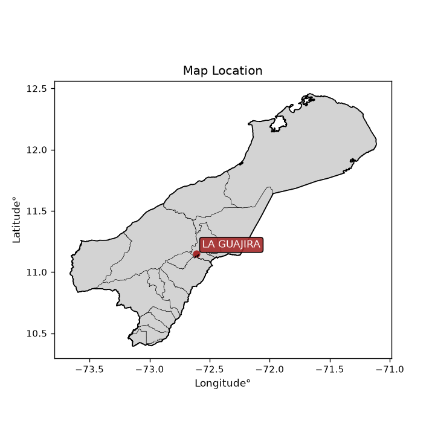</img>

| CountyID                                                                                          | CountyName         | CountyFiles                                                                                                                                                                                                                                                                                                                                                                                                                                                                                                                                                                                                                                                                                                                                                                                                                                                                                                                                                                                                                                                                                                                                                                                                                                                                                                                                                                                                                                                                                                                                                                                                                                                                                                                                                                                                                                                                                                                        |
|:--------------------------------------------------------------------------------------------------|:-------------------|:-----------------------------------------------------------------------------------------------------------------------------------------------------------------------------------------------------------------------------------------------------------------------------------------------------------------------------------------------------------------------------------------------------------------------------------------------------------------------------------------------------------------------------------------------------------------------------------------------------------------------------------------------------------------------------------------------------------------------------------------------------------------------------------------------------------------------------------------------------------------------------------------------------------------------------------------------------------------------------------------------------------------------------------------------------------------------------------------------------------------------------------------------------------------------------------------------------------------------------------------------------------------------------------------------------------------------------------------------------------------------------------------------------------------------------------------------------------------------------------------------------------------------------------------------------------------------------------------------------------------------------------------------------------------------------------------------------------------------------------------------------------------------------------------------------------------------------------------------------------------------------------------------------------------------------------|
| [44035](https://github.com/rcfdtools/R.HydroTools/blob/main/tool/Population/file/report/44035.md) | Albania            | [44035_Rural_Building_202606.zip](https://github.com/rcfdtools/R.GISMobile/blob/main/file/shp/44035_Rural_Building_202606.zip) [44035_Rural_Lot_202606.zip](https://github.com/rcfdtools/R.GISMobile/blob/main/file/shp/44035_Rural_Lot_202606.zip) [44035_Rural_Nomenclature_202606.zip](https://github.com/rcfdtools/R.GISMobile/blob/main/file/shp/44035_Rural_Nomenclature_202606.zip) [44035_Rural_Nomenclature_Road_202606.zip](https://github.com/rcfdtools/R.GISMobile/blob/main/file/shp/44035_Rural_Nomenclature_Road_202606.zip) [44035_Rural_Sector_202606.zip](https://github.com/rcfdtools/R.GISMobile/blob/main/file/shp/44035_Rural_Sector_202606.zip) [44035_Rural_Vereda_202606.zip](https://github.com/rcfdtools/R.GISMobile/blob/main/file/shp/44035_Rural_Vereda_202606.zip) [44035_Urban_Block_202606.zip](https://github.com/rcfdtools/R.GISMobile/blob/main/file/shp/44035_Urban_Block_202606.zip) [44035_Urban_Building_202606.zip](https://github.com/rcfdtools/R.GISMobile/blob/main/file/shp/44035_Urban_Building_202606.zip) [44035_Urban_Lot_202606.zip](https://github.com/rcfdtools/R.GISMobile/blob/main/file/shp/44035_Urban_Lot_202606.zip) [44035_Urban_Nomenclature_202606.zip](https://github.com/rcfdtools/R.GISMobile/blob/main/file/shp/44035_Urban_Nomenclature_202606.zip) [44035_Urban_Nomenclature_Road_202606.zip](https://github.com/rcfdtools/R.GISMobile/blob/main/file/shp/44035_Urban_Nomenclature_Road_202606.zip) [44035_Urban_Perimeter_202606.zip](https://github.com/rcfdtools/R.GISMobile/blob/main/file/shp/44035_Urban_Perimeter_202606.zip)                                                                                                                                                                                                                                                                            |
| [44078](https://github.com/rcfdtools/R.HydroTools/blob/main/tool/Population/file/report/44078.md) | Barrancas          | [44078_Rural_Building_202606.zip](https://github.com/rcfdtools/R.GISMobile/blob/main/file/shp/44078_Rural_Building_202606.zip) [44078_Rural_Lot_202606.zip](https://github.com/rcfdtools/R.GISMobile/blob/main/file/shp/44078_Rural_Lot_202606.zip) [44078_Rural_Nomenclature_202606.zip](https://github.com/rcfdtools/R.GISMobile/blob/main/file/shp/44078_Rural_Nomenclature_202606.zip) [44078_Rural_Nomenclature_Road_202606.zip](https://github.com/rcfdtools/R.GISMobile/blob/main/file/shp/44078_Rural_Nomenclature_Road_202606.zip) [44078_Rural_Sector_202606.zip](https://github.com/rcfdtools/R.GISMobile/blob/main/file/shp/44078_Rural_Sector_202606.zip) [44078_Rural_Vereda_202606.zip](https://github.com/rcfdtools/R.GISMobile/blob/main/file/shp/44078_Rural_Vereda_202606.zip) [44078_Urban_Block_202606.zip](https://github.com/rcfdtools/R.GISMobile/blob/main/file/shp/44078_Urban_Block_202606.zip) [44078_Urban_Building_202606.zip](https://github.com/rcfdtools/R.GISMobile/blob/main/file/shp/44078_Urban_Building_202606.zip) [44078_Urban_Lot_202606.zip](https://github.com/rcfdtools/R.GISMobile/blob/main/file/shp/44078_Urban_Lot_202606.zip) [44078_Urban_Neighborhood_202606.zip](https://github.com/rcfdtools/R.GISMobile/blob/main/file/shp/44078_Urban_Neighborhood_202606.zip) [44078_Urban_Nomenclature_202606.zip](https://github.com/rcfdtools/R.GISMobile/blob/main/file/shp/44078_Urban_Nomenclature_202606.zip) [44078_Urban_Nomenclature_Road_202606.zip](https://github.com/rcfdtools/R.GISMobile/blob/main/file/shp/44078_Urban_Nomenclature_Road_202606.zip) [44078_Urban_Perimeter_202606.zip](https://github.com/rcfdtools/R.GISMobile/blob/main/file/shp/44078_Urban_Perimeter_202606.zip) [44078_Urban_Sector_202606.zip](https://github.com/rcfdtools/R.GISMobile/blob/main/file/shp/44078_Urban_Sector_202606.zip)  |
| [44090](https://github.com/rcfdtools/R.HydroTools/blob/main/tool/Population/file/report/44090.md) | Dibulla            | [44090_Rural_Building_202606.zip](https://github.com/rcfdtools/R.GISMobile/blob/main/file/shp/44090_Rural_Building_202606.zip) [44090_Rural_Lot_202606.zip](https://github.com/rcfdtools/R.GISMobile/blob/main/file/shp/44090_Rural_Lot_202606.zip) [44090_Rural_Nomenclature_202606.zip](https://github.com/rcfdtools/R.GISMobile/blob/main/file/shp/44090_Rural_Nomenclature_202606.zip) [44090_Rural_Nomenclature_Road_202606.zip](https://github.com/rcfdtools/R.GISMobile/blob/main/file/shp/44090_Rural_Nomenclature_Road_202606.zip) [44090_Rural_Sector_202606.zip](https://github.com/rcfdtools/R.GISMobile/blob/main/file/shp/44090_Rural_Sector_202606.zip) [44090_Rural_Vereda_202606.zip](https://github.com/rcfdtools/R.GISMobile/blob/main/file/shp/44090_Rural_Vereda_202606.zip) [44090_Urban_Block_202606.zip](https://github.com/rcfdtools/R.GISMobile/blob/main/file/shp/44090_Urban_Block_202606.zip) [44090_Urban_Building_202606.zip](https://github.com/rcfdtools/R.GISMobile/blob/main/file/shp/44090_Urban_Building_202606.zip) [44090_Urban_Lot_202606.zip](https://github.com/rcfdtools/R.GISMobile/blob/main/file/shp/44090_Urban_Lot_202606.zip) [44090_Urban_Neighborhood_202606.zip](https://github.com/rcfdtools/R.GISMobile/blob/main/file/shp/44090_Urban_Neighborhood_202606.zip) [44090_Urban_Nomenclature_202606.zip](https://github.com/rcfdtools/R.GISMobile/blob/main/file/shp/44090_Urban_Nomenclature_202606.zip) [44090_Urban_Nomenclature_Road_202606.zip](https://github.com/rcfdtools/R.GISMobile/blob/main/file/shp/44090_Urban_Nomenclature_Road_202606.zip) [44090_Urban_Perimeter_202606.zip](https://github.com/rcfdtools/R.GISMobile/blob/main/file/shp/44090_Urban_Perimeter_202606.zip) [44090_Urban_Sector_202606.zip](https://github.com/rcfdtools/R.GISMobile/blob/main/file/shp/44090_Urban_Sector_202606.zip)  |
| [44098](https://github.com/rcfdtools/R.HydroTools/blob/main/tool/Population/file/report/44098.md) | Distracción        | [44098_Rural_Building_202606.zip](https://github.com/rcfdtools/R.GISMobile/blob/main/file/shp/44098_Rural_Building_202606.zip) [44098_Rural_Lot_202606.zip](https://github.com/rcfdtools/R.GISMobile/blob/main/file/shp/44098_Rural_Lot_202606.zip) [44098_Rural_Sector_202606.zip](https://github.com/rcfdtools/R.GISMobile/blob/main/file/shp/44098_Rural_Sector_202606.zip) [44098_Rural_Vereda_202606.zip](https://github.com/rcfdtools/R.GISMobile/blob/main/file/shp/44098_Rural_Vereda_202606.zip) [44098_Urban_Block_202606.zip](https://github.com/rcfdtools/R.GISMobile/blob/main/file/shp/44098_Urban_Block_202606.zip) [44098_Urban_Building_202606.zip](https://github.com/rcfdtools/R.GISMobile/blob/main/file/shp/44098_Urban_Building_202606.zip) [44098_Urban_Lot_202606.zip](https://github.com/rcfdtools/R.GISMobile/blob/main/file/shp/44098_Urban_Lot_202606.zip) [44098_Urban_Neighborhood_202606.zip](https://github.com/rcfdtools/R.GISMobile/blob/main/file/shp/44098_Urban_Neighborhood_202606.zip) [44098_Urban_Nomenclature_202606.zip](https://github.com/rcfdtools/R.GISMobile/blob/main/file/shp/44098_Urban_Nomenclature_202606.zip) [44098_Urban_Nomenclature_Road_202606.zip](https://github.com/rcfdtools/R.GISMobile/blob/main/file/shp/44098_Urban_Nomenclature_Road_202606.zip) [44098_Urban_Perimeter_202606.zip](https://github.com/rcfdtools/R.GISMobile/blob/main/file/shp/44098_Urban_Perimeter_202606.zip) [44098_Urban_Sector_202606.zip](https://github.com/rcfdtools/R.GISMobile/blob/main/file/shp/44098_Urban_Sector_202606.zip)                                                                                                                                                                                                                                                                                                  |
| [44110](https://github.com/rcfdtools/R.HydroTools/blob/main/tool/Population/file/report/44110.md) | El Molino          | [44110_Rural_Building_202606.zip](https://github.com/rcfdtools/R.GISMobile/blob/main/file/shp/44110_Rural_Building_202606.zip) [44110_Rural_Lot_202606.zip](https://github.com/rcfdtools/R.GISMobile/blob/main/file/shp/44110_Rural_Lot_202606.zip) [44110_Rural_Nomenclature_202606.zip](https://github.com/rcfdtools/R.GISMobile/blob/main/file/shp/44110_Rural_Nomenclature_202606.zip) [44110_Rural_Sector_202606.zip](https://github.com/rcfdtools/R.GISMobile/blob/main/file/shp/44110_Rural_Sector_202606.zip) [44110_Rural_Vereda_202606.zip](https://github.com/rcfdtools/R.GISMobile/blob/main/file/shp/44110_Rural_Vereda_202606.zip) [44110_Urban_Block_202606.zip](https://github.com/rcfdtools/R.GISMobile/blob/main/file/shp/44110_Urban_Block_202606.zip) [44110_Urban_Building_202606.zip](https://github.com/rcfdtools/R.GISMobile/blob/main/file/shp/44110_Urban_Building_202606.zip) [44110_Urban_Lot_202606.zip](https://github.com/rcfdtools/R.GISMobile/blob/main/file/shp/44110_Urban_Lot_202606.zip) [44110_Urban_Nomenclature_202606.zip](https://github.com/rcfdtools/R.GISMobile/blob/main/file/shp/44110_Urban_Nomenclature_202606.zip) [44110_Urban_Nomenclature_Road_202606.zip](https://github.com/rcfdtools/R.GISMobile/blob/main/file/shp/44110_Urban_Nomenclature_Road_202606.zip) [44110_Urban_Perimeter_202606.zip](https://github.com/rcfdtools/R.GISMobile/blob/main/file/shp/44110_Urban_Perimeter_202606.zip)                                                                                                                                                                                                                                                                                                                                                                                                                                 |
| [44279](https://github.com/rcfdtools/R.HydroTools/blob/main/tool/Population/file/report/44279.md) | Fonseca            | [44279_Rural_Building_202606.zip](https://github.com/rcfdtools/R.GISMobile/blob/main/file/shp/44279_Rural_Building_202606.zip) [44279_Rural_Lot_202606.zip](https://github.com/rcfdtools/R.GISMobile/blob/main/file/shp/44279_Rural_Lot_202606.zip) [44279_Rural_Nomenclature_202606.zip](https://github.com/rcfdtools/R.GISMobile/blob/main/file/shp/44279_Rural_Nomenclature_202606.zip) [44279_Urban_Block_202606.zip](https://github.com/rcfdtools/R.GISMobile/blob/main/file/shp/44279_Urban_Block_202606.zip) [44279_Urban_Building_202606.zip](https://github.com/rcfdtools/R.GISMobile/blob/main/file/shp/44279_Urban_Building_202606.zip) [44279_Urban_Lot_202606.zip](https://github.com/rcfdtools/R.GISMobile/blob/main/file/shp/44279_Urban_Lot_202606.zip) [44279_Urban_Neighborhood_202606.zip](https://github.com/rcfdtools/R.GISMobile/blob/main/file/shp/44279_Urban_Neighborhood_202606.zip) [44279_Urban_Nomenclature_202606.zip](https://github.com/rcfdtools/R.GISMobile/blob/main/file/shp/44279_Urban_Nomenclature_202606.zip) [44279_Urban_Nomenclature_Road_202606.zip](https://github.com/rcfdtools/R.GISMobile/blob/main/file/shp/44279_Urban_Nomenclature_Road_202606.zip) [44279_Urban_Perimeter_202606.zip](https://github.com/rcfdtools/R.GISMobile/blob/main/file/shp/44279_Urban_Perimeter_202606.zip) [44279_Urban_Sector_202606.zip](https://github.com/rcfdtools/R.GISMobile/blob/main/file/shp/44279_Urban_Sector_202606.zip)                                                                                                                                                                                                                                                                                                                                                                                                                     |
| [44378](https://github.com/rcfdtools/R.HydroTools/blob/main/tool/Population/file/report/44378.md) | Hatonuevo          | [44378_Rural_Building_202606.zip](https://github.com/rcfdtools/R.GISMobile/blob/main/file/shp/44378_Rural_Building_202606.zip) [44378_Rural_Lot_202606.zip](https://github.com/rcfdtools/R.GISMobile/blob/main/file/shp/44378_Rural_Lot_202606.zip) [44378_Rural_Nomenclature_202606.zip](https://github.com/rcfdtools/R.GISMobile/blob/main/file/shp/44378_Rural_Nomenclature_202606.zip) [44378_Rural_Sector_202606.zip](https://github.com/rcfdtools/R.GISMobile/blob/main/file/shp/44378_Rural_Sector_202606.zip) [44378_Rural_Vereda_202606.zip](https://github.com/rcfdtools/R.GISMobile/blob/main/file/shp/44378_Rural_Vereda_202606.zip) [44378_Urban_Block_202606.zip](https://github.com/rcfdtools/R.GISMobile/blob/main/file/shp/44378_Urban_Block_202606.zip) [44378_Urban_Building_202606.zip](https://github.com/rcfdtools/R.GISMobile/blob/main/file/shp/44378_Urban_Building_202606.zip) [44378_Urban_Lot_202606.zip](https://github.com/rcfdtools/R.GISMobile/blob/main/file/shp/44378_Urban_Lot_202606.zip) [44378_Urban_Neighborhood_202606.zip](https://github.com/rcfdtools/R.GISMobile/blob/main/file/shp/44378_Urban_Neighborhood_202606.zip) [44378_Urban_Nomenclature_202606.zip](https://github.com/rcfdtools/R.GISMobile/blob/main/file/shp/44378_Urban_Nomenclature_202606.zip) [44378_Urban_Nomenclature_Road_202606.zip](https://github.com/rcfdtools/R.GISMobile/blob/main/file/shp/44378_Urban_Nomenclature_Road_202606.zip) [44378_Urban_Perimeter_202606.zip](https://github.com/rcfdtools/R.GISMobile/blob/main/file/shp/44378_Urban_Perimeter_202606.zip) [44378_Urban_Sector_202606.zip](https://github.com/rcfdtools/R.GISMobile/blob/main/file/shp/44378_Urban_Sector_202606.zip)                                                                                                                                                       |
| [44420](https://github.com/rcfdtools/R.HydroTools/blob/main/tool/Population/file/report/44420.md) | La Jagua Del Pilar | [44420_Rural_Building_202606.zip](https://github.com/rcfdtools/R.GISMobile/blob/main/file/shp/44420_Rural_Building_202606.zip) [44420_Rural_Lot_202606.zip](https://github.com/rcfdtools/R.GISMobile/blob/main/file/shp/44420_Rural_Lot_202606.zip) [44420_Rural_Nomenclature_202606.zip](https://github.com/rcfdtools/R.GISMobile/blob/main/file/shp/44420_Rural_Nomenclature_202606.zip) [44420_Rural_Sector_202606.zip](https://github.com/rcfdtools/R.GISMobile/blob/main/file/shp/44420_Rural_Sector_202606.zip) [44420_Rural_Vereda_202606.zip](https://github.com/rcfdtools/R.GISMobile/blob/main/file/shp/44420_Rural_Vereda_202606.zip) [44420_Urban_Block_202606.zip](https://github.com/rcfdtools/R.GISMobile/blob/main/file/shp/44420_Urban_Block_202606.zip) [44420_Urban_Building_202606.zip](https://github.com/rcfdtools/R.GISMobile/blob/main/file/shp/44420_Urban_Building_202606.zip) [44420_Urban_Lot_202606.zip](https://github.com/rcfdtools/R.GISMobile/blob/main/file/shp/44420_Urban_Lot_202606.zip) [44420_Urban_Nomenclature_202606.zip](https://github.com/rcfdtools/R.GISMobile/blob/main/file/shp/44420_Urban_Nomenclature_202606.zip) [44420_Urban_Nomenclature_Road_202606.zip](https://github.com/rcfdtools/R.GISMobile/blob/main/file/shp/44420_Urban_Nomenclature_Road_202606.zip) [44420_Urban_Perimeter_202606.zip](https://github.com/rcfdtools/R.GISMobile/blob/main/file/shp/44420_Urban_Perimeter_202606.zip) [44420_Urban_Sector_202606.zip](https://github.com/rcfdtools/R.GISMobile/blob/main/file/shp/44420_Urban_Sector_202606.zip)                                                                                                                                                                                                                                                                                                  |
| [44430](https://github.com/rcfdtools/R.HydroTools/blob/main/tool/Population/file/report/44430.md) | Maicao             | [44430_Rural_Building_202606.zip](https://github.com/rcfdtools/R.GISMobile/blob/main/file/shp/44430_Rural_Building_202606.zip) [44430_Rural_Lot_202606.zip](https://github.com/rcfdtools/R.GISMobile/blob/main/file/shp/44430_Rural_Lot_202606.zip) [44430_Rural_Nomenclature_202606.zip](https://github.com/rcfdtools/R.GISMobile/blob/main/file/shp/44430_Rural_Nomenclature_202606.zip) [44430_Rural_Nomenclature_Road_202606.zip](https://github.com/rcfdtools/R.GISMobile/blob/main/file/shp/44430_Rural_Nomenclature_Road_202606.zip) [44430_Rural_Sector_202606.zip](https://github.com/rcfdtools/R.GISMobile/blob/main/file/shp/44430_Rural_Sector_202606.zip) [44430_Rural_Vereda_202606.zip](https://github.com/rcfdtools/R.GISMobile/blob/main/file/shp/44430_Rural_Vereda_202606.zip) [44430_Urban_Block_202606.zip](https://github.com/rcfdtools/R.GISMobile/blob/main/file/shp/44430_Urban_Block_202606.zip) [44430_Urban_Building_202606.zip](https://github.com/rcfdtools/R.GISMobile/blob/main/file/shp/44430_Urban_Building_202606.zip) [44430_Urban_Lot_202606.zip](https://github.com/rcfdtools/R.GISMobile/blob/main/file/shp/44430_Urban_Lot_202606.zip) [44430_Urban_Neighborhood_202606.zip](https://github.com/rcfdtools/R.GISMobile/blob/main/file/shp/44430_Urban_Neighborhood_202606.zip) [44430_Urban_Nomenclature_202606.zip](https://github.com/rcfdtools/R.GISMobile/blob/main/file/shp/44430_Urban_Nomenclature_202606.zip) [44430_Urban_Nomenclature_Road_202606.zip](https://github.com/rcfdtools/R.GISMobile/blob/main/file/shp/44430_Urban_Nomenclature_Road_202606.zip) [44430_Urban_Perimeter_202606.zip](https://github.com/rcfdtools/R.GISMobile/blob/main/file/shp/44430_Urban_Perimeter_202606.zip) [44430_Urban_Sector_202606.zip](https://github.com/rcfdtools/R.GISMobile/blob/main/file/shp/44430_Urban_Sector_202606.zip)  |
| [44560](https://github.com/rcfdtools/R.HydroTools/blob/main/tool/Population/file/report/44560.md) | Manaure            | [44560_Rural_Building_202606.zip](https://github.com/rcfdtools/R.GISMobile/blob/main/file/shp/44560_Rural_Building_202606.zip) [44560_Rural_Lot_202606.zip](https://github.com/rcfdtools/R.GISMobile/blob/main/file/shp/44560_Rural_Lot_202606.zip) [44560_Rural_Nomenclature_202606.zip](https://github.com/rcfdtools/R.GISMobile/blob/main/file/shp/44560_Rural_Nomenclature_202606.zip) [44560_Rural_Sector_202606.zip](https://github.com/rcfdtools/R.GISMobile/blob/main/file/shp/44560_Rural_Sector_202606.zip) [44560_Rural_Vereda_202606.zip](https://github.com/rcfdtools/R.GISMobile/blob/main/file/shp/44560_Rural_Vereda_202606.zip) [44560_Urban_Block_202606.zip](https://github.com/rcfdtools/R.GISMobile/blob/main/file/shp/44560_Urban_Block_202606.zip) [44560_Urban_Lot_202606.zip](https://github.com/rcfdtools/R.GISMobile/blob/main/file/shp/44560_Urban_Lot_202606.zip) [44560_Urban_Perimeter_202606.zip](https://github.com/rcfdtools/R.GISMobile/blob/main/file/shp/44560_Urban_Perimeter_202606.zip) [44560_Urban_Sector_202606.zip](https://github.com/rcfdtools/R.GISMobile/blob/main/file/shp/44560_Urban_Sector_202606.zip)                                                                                                                                                                                                                                                                                                                                                                                                                                                                                                                                                                                                                                                                                                                                     |
| [44001](https://github.com/rcfdtools/R.HydroTools/blob/main/tool/Population/file/report/44001.md) | Riohacha           | [44001_Rural_Building_202606.zip](https://github.com/rcfdtools/R.GISMobile/blob/main/file/shp/44001_Rural_Building_202606.zip) [44001_Rural_Lot_202606.zip](https://github.com/rcfdtools/R.GISMobile/blob/main/file/shp/44001_Rural_Lot_202606.zip) [44001_Rural_Nomenclature_202606.zip](https://github.com/rcfdtools/R.GISMobile/blob/main/file/shp/44001_Rural_Nomenclature_202606.zip) [44001_Rural_Sector_202606.zip](https://github.com/rcfdtools/R.GISMobile/blob/main/file/shp/44001_Rural_Sector_202606.zip) [44001_Rural_Vereda_202606.zip](https://github.com/rcfdtools/R.GISMobile/blob/main/file/shp/44001_Rural_Vereda_202606.zip) [44001_Urban_Block_202606.zip](https://github.com/rcfdtools/R.GISMobile/blob/main/file/shp/44001_Urban_Block_202606.zip) [44001_Urban_Building_202606.zip](https://github.com/rcfdtools/R.GISMobile/blob/main/file/shp/44001_Urban_Building_202606.zip) [44001_Urban_Lot_202606.zip](https://github.com/rcfdtools/R.GISMobile/blob/main/file/shp/44001_Urban_Lot_202606.zip) [44001_Urban_Neighborhood_202606.zip](https://github.com/rcfdtools/R.GISMobile/blob/main/file/shp/44001_Urban_Neighborhood_202606.zip) [44001_Urban_Nomenclature_202606.zip](https://github.com/rcfdtools/R.GISMobile/blob/main/file/shp/44001_Urban_Nomenclature_202606.zip) [44001_Urban_Nomenclature_Road_202606.zip](https://github.com/rcfdtools/R.GISMobile/blob/main/file/shp/44001_Urban_Nomenclature_Road_202606.zip) [44001_Urban_Perimeter_202606.zip](https://github.com/rcfdtools/R.GISMobile/blob/main/file/shp/44001_Urban_Perimeter_202606.zip) [44001_Urban_Sector_202606.zip](https://github.com/rcfdtools/R.GISMobile/blob/main/file/shp/44001_Urban_Sector_202606.zip)                                                                                                                                                       |
| [44650](https://github.com/rcfdtools/R.HydroTools/blob/main/tool/Population/file/report/44650.md) | San Juan Del Cesar | [44650_Rural_Building_202606.zip](https://github.com/rcfdtools/R.GISMobile/blob/main/file/shp/44650_Rural_Building_202606.zip) [44650_Rural_Lot_202606.zip](https://github.com/rcfdtools/R.GISMobile/blob/main/file/shp/44650_Rural_Lot_202606.zip) [44650_Rural_Nomenclature_202606.zip](https://github.com/rcfdtools/R.GISMobile/blob/main/file/shp/44650_Rural_Nomenclature_202606.zip) [44650_Rural_Nomenclature_Road_202606.zip](https://github.com/rcfdtools/R.GISMobile/blob/main/file/shp/44650_Rural_Nomenclature_Road_202606.zip) [44650_Rural_Sector_202606.zip](https://github.com/rcfdtools/R.GISMobile/blob/main/file/shp/44650_Rural_Sector_202606.zip) [44650_Rural_Vereda_202606.zip](https://github.com/rcfdtools/R.GISMobile/blob/main/file/shp/44650_Rural_Vereda_202606.zip) [44650_Urban_Block_202606.zip](https://github.com/rcfdtools/R.GISMobile/blob/main/file/shp/44650_Urban_Block_202606.zip) [44650_Urban_Building_202606.zip](https://github.com/rcfdtools/R.GISMobile/blob/main/file/shp/44650_Urban_Building_202606.zip) [44650_Urban_Lot_202606.zip](https://github.com/rcfdtools/R.GISMobile/blob/main/file/shp/44650_Urban_Lot_202606.zip) [44650_Urban_Neighborhood_202606.zip](https://github.com/rcfdtools/R.GISMobile/blob/main/file/shp/44650_Urban_Neighborhood_202606.zip) [44650_Urban_Nomenclature_202606.zip](https://github.com/rcfdtools/R.GISMobile/blob/main/file/shp/44650_Urban_Nomenclature_202606.zip) [44650_Urban_Nomenclature_Road_202606.zip](https://github.com/rcfdtools/R.GISMobile/blob/main/file/shp/44650_Urban_Nomenclature_Road_202606.zip) [44650_Urban_Perimeter_202606.zip](https://github.com/rcfdtools/R.GISMobile/blob/main/file/shp/44650_Urban_Perimeter_202606.zip) [44650_Urban_Sector_202606.zip](https://github.com/rcfdtools/R.GISMobile/blob/main/file/shp/44650_Urban_Sector_202606.zip)  |
| [44847](https://github.com/rcfdtools/R.HydroTools/blob/main/tool/Population/file/report/44847.md) | Uribia             | [44847_Rural_Building_202606.zip](https://github.com/rcfdtools/R.GISMobile/blob/main/file/shp/44847_Rural_Building_202606.zip) [44847_Rural_Lot_202606.zip](https://github.com/rcfdtools/R.GISMobile/blob/main/file/shp/44847_Rural_Lot_202606.zip) [44847_Rural_Nomenclature_202606.zip](https://github.com/rcfdtools/R.GISMobile/blob/main/file/shp/44847_Rural_Nomenclature_202606.zip) [44847_Rural_Nomenclature_Road_202606.zip](https://github.com/rcfdtools/R.GISMobile/blob/main/file/shp/44847_Rural_Nomenclature_Road_202606.zip) [44847_Rural_Sector_202606.zip](https://github.com/rcfdtools/R.GISMobile/blob/main/file/shp/44847_Rural_Sector_202606.zip) [44847_Rural_Vereda_202606.zip](https://github.com/rcfdtools/R.GISMobile/blob/main/file/shp/44847_Rural_Vereda_202606.zip) [44847_Urban_Block_202606.zip](https://github.com/rcfdtools/R.GISMobile/blob/main/file/shp/44847_Urban_Block_202606.zip) [44847_Urban_Building_202606.zip](https://github.com/rcfdtools/R.GISMobile/blob/main/file/shp/44847_Urban_Building_202606.zip) [44847_Urban_Lot_202606.zip](https://github.com/rcfdtools/R.GISMobile/blob/main/file/shp/44847_Urban_Lot_202606.zip) [44847_Urban_Neighborhood_202606.zip](https://github.com/rcfdtools/R.GISMobile/blob/main/file/shp/44847_Urban_Neighborhood_202606.zip) [44847_Urban_Nomenclature_202606.zip](https://github.com/rcfdtools/R.GISMobile/blob/main/file/shp/44847_Urban_Nomenclature_202606.zip) [44847_Urban_Nomenclature_Road_202606.zip](https://github.com/rcfdtools/R.GISMobile/blob/main/file/shp/44847_Urban_Nomenclature_Road_202606.zip) [44847_Urban_Perimeter_202606.zip](https://github.com/rcfdtools/R.GISMobile/blob/main/file/shp/44847_Urban_Perimeter_202606.zip) [44847_Urban_Sector_202606.zip](https://github.com/rcfdtools/R.GISMobile/blob/main/file/shp/44847_Urban_Sector_202606.zip)  |
| [44855](https://github.com/rcfdtools/R.HydroTools/blob/main/tool/Population/file/report/44855.md) | Urumita            | [44855_Rural_Lot_202606.zip](https://github.com/rcfdtools/R.GISMobile/blob/main/file/shp/44855_Rural_Lot_202606.zip) [44855_Rural_Nomenclature_202606.zip](https://github.com/rcfdtools/R.GISMobile/blob/main/file/shp/44855_Rural_Nomenclature_202606.zip) [44855_Rural_Sector_202606.zip](https://github.com/rcfdtools/R.GISMobile/blob/main/file/shp/44855_Rural_Sector_202606.zip) [44855_Rural_Vereda_202606.zip](https://github.com/rcfdtools/R.GISMobile/blob/main/file/shp/44855_Rural_Vereda_202606.zip) [44855_Urban_Block_202606.zip](https://github.com/rcfdtools/R.GISMobile/blob/main/file/shp/44855_Urban_Block_202606.zip) [44855_Urban_Building_202606.zip](https://github.com/rcfdtools/R.GISMobile/blob/main/file/shp/44855_Urban_Building_202606.zip) [44855_Urban_Lot_202606.zip](https://github.com/rcfdtools/R.GISMobile/blob/main/file/shp/44855_Urban_Lot_202606.zip) [44855_Urban_Nomenclature_202606.zip](https://github.com/rcfdtools/R.GISMobile/blob/main/file/shp/44855_Urban_Nomenclature_202606.zip) [44855_Urban_Nomenclature_Road_202606.zip](https://github.com/rcfdtools/R.GISMobile/blob/main/file/shp/44855_Urban_Nomenclature_Road_202606.zip) [44855_Urban_Perimeter_202606.zip](https://github.com/rcfdtools/R.GISMobile/blob/main/file/shp/44855_Urban_Perimeter_202606.zip)                                                                                                                                                                                                                                                                                                                                                                                                                                                                                                                                                                    |
| [44874](https://github.com/rcfdtools/R.HydroTools/blob/main/tool/Population/file/report/44874.md) | Villanueva         | [44874_Rural_Building_202606.zip](https://github.com/rcfdtools/R.GISMobile/blob/main/file/shp/44874_Rural_Building_202606.zip) [44874_Rural_Lot_202606.zip](https://github.com/rcfdtools/R.GISMobile/blob/main/file/shp/44874_Rural_Lot_202606.zip) [44874_Rural_Nomenclature_202606.zip](https://github.com/rcfdtools/R.GISMobile/blob/main/file/shp/44874_Rural_Nomenclature_202606.zip) [44874_Rural_Sector_202606.zip](https://github.com/rcfdtools/R.GISMobile/blob/main/file/shp/44874_Rural_Sector_202606.zip) [44874_Rural_Vereda_202606.zip](https://github.com/rcfdtools/R.GISMobile/blob/main/file/shp/44874_Rural_Vereda_202606.zip) [44874_Urban_Block_202606.zip](https://github.com/rcfdtools/R.GISMobile/blob/main/file/shp/44874_Urban_Block_202606.zip) [44874_Urban_Building_202606.zip](https://github.com/rcfdtools/R.GISMobile/blob/main/file/shp/44874_Urban_Building_202606.zip) [44874_Urban_Lot_202606.zip](https://github.com/rcfdtools/R.GISMobile/blob/main/file/shp/44874_Urban_Lot_202606.zip) [44874_Urban_Nomenclature_202606.zip](https://github.com/rcfdtools/R.GISMobile/blob/main/file/shp/44874_Urban_Nomenclature_202606.zip) [44874_Urban_Nomenclature_Road_202606.zip](https://github.com/rcfdtools/R.GISMobile/blob/main/file/shp/44874_Urban_Nomenclature_Road_202606.zip) [44874_Urban_Perimeter_202606.zip](https://github.com/rcfdtools/R.GISMobile/blob/main/file/shp/44874_Urban_Perimeter_202606.zip)                                                                                                                                                                                                                                                                                                                                                                                                                                 |

# 47 - Magdalena (30 Counties)

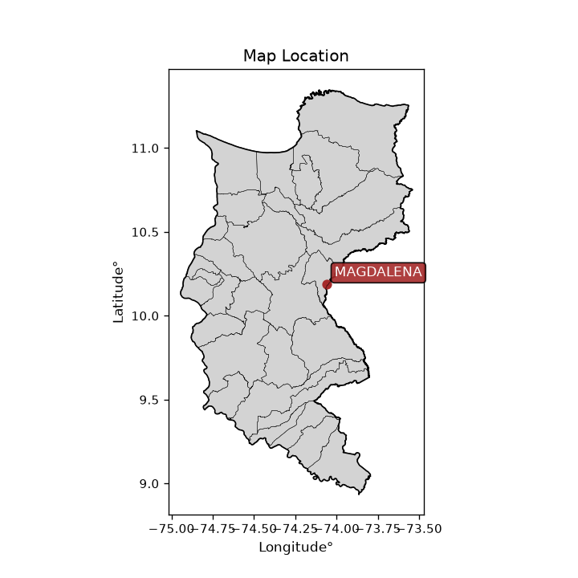</img>

| CountyID                                                                                          | CountyName                  | CountyFiles                                                                                                                                                                                                                                                                                                                                                                                                                                                                                                                                                                                                                                                                                                                                                                                                                                                                                                                                                                                                                                                                                                                                                                                                                                                                                                                                                                                                                                                                                                                                                                                                                                                                                                                                                                                                                                                                                                                        |
|:--------------------------------------------------------------------------------------------------|:----------------------------|:-----------------------------------------------------------------------------------------------------------------------------------------------------------------------------------------------------------------------------------------------------------------------------------------------------------------------------------------------------------------------------------------------------------------------------------------------------------------------------------------------------------------------------------------------------------------------------------------------------------------------------------------------------------------------------------------------------------------------------------------------------------------------------------------------------------------------------------------------------------------------------------------------------------------------------------------------------------------------------------------------------------------------------------------------------------------------------------------------------------------------------------------------------------------------------------------------------------------------------------------------------------------------------------------------------------------------------------------------------------------------------------------------------------------------------------------------------------------------------------------------------------------------------------------------------------------------------------------------------------------------------------------------------------------------------------------------------------------------------------------------------------------------------------------------------------------------------------------------------------------------------------------------------------------------------------|
| [47030](https://github.com/rcfdtools/R.HydroTools/blob/main/tool/Population/file/report/47030.md) | Algarrobo                   | [47030_Rural_Building_202606.zip](https://github.com/rcfdtools/R.GISMobile/blob/main/file/shp/47030_Rural_Building_202606.zip) [47030_Rural_Lot_202606.zip](https://github.com/rcfdtools/R.GISMobile/blob/main/file/shp/47030_Rural_Lot_202606.zip) [47030_Rural_Nomenclature_202606.zip](https://github.com/rcfdtools/R.GISMobile/blob/main/file/shp/47030_Rural_Nomenclature_202606.zip) [47030_Rural_Nomenclature_Road_202606.zip](https://github.com/rcfdtools/R.GISMobile/blob/main/file/shp/47030_Rural_Nomenclature_Road_202606.zip) [47030_Rural_Sector_202606.zip](https://github.com/rcfdtools/R.GISMobile/blob/main/file/shp/47030_Rural_Sector_202606.zip) [47030_Rural_Vereda_202606.zip](https://github.com/rcfdtools/R.GISMobile/blob/main/file/shp/47030_Rural_Vereda_202606.zip) [47030_Urban_Block_202606.zip](https://github.com/rcfdtools/R.GISMobile/blob/main/file/shp/47030_Urban_Block_202606.zip) [47030_Urban_Building_202606.zip](https://github.com/rcfdtools/R.GISMobile/blob/main/file/shp/47030_Urban_Building_202606.zip) [47030_Urban_Lot_202606.zip](https://github.com/rcfdtools/R.GISMobile/blob/main/file/shp/47030_Urban_Lot_202606.zip) [47030_Urban_Neighborhood_202606.zip](https://github.com/rcfdtools/R.GISMobile/blob/main/file/shp/47030_Urban_Neighborhood_202606.zip) [47030_Urban_Nomenclature_202606.zip](https://github.com/rcfdtools/R.GISMobile/blob/main/file/shp/47030_Urban_Nomenclature_202606.zip) [47030_Urban_Nomenclature_Road_202606.zip](https://github.com/rcfdtools/R.GISMobile/blob/main/file/shp/47030_Urban_Nomenclature_Road_202606.zip) [47030_Urban_Perimeter_202606.zip](https://github.com/rcfdtools/R.GISMobile/blob/main/file/shp/47030_Urban_Perimeter_202606.zip) [47030_Urban_Sector_202606.zip](https://github.com/rcfdtools/R.GISMobile/blob/main/file/shp/47030_Urban_Sector_202606.zip)  |
| [47053](https://github.com/rcfdtools/R.HydroTools/blob/main/tool/Population/file/report/47053.md) | Aracataca                   | [47053_Rural_Building_202606.zip](https://github.com/rcfdtools/R.GISMobile/blob/main/file/shp/47053_Rural_Building_202606.zip) [47053_Rural_Lot_202606.zip](https://github.com/rcfdtools/R.GISMobile/blob/main/file/shp/47053_Rural_Lot_202606.zip) [47053_Rural_Nomenclature_202606.zip](https://github.com/rcfdtools/R.GISMobile/blob/main/file/shp/47053_Rural_Nomenclature_202606.zip) [47053_Rural_Sector_202606.zip](https://github.com/rcfdtools/R.GISMobile/blob/main/file/shp/47053_Rural_Sector_202606.zip) [47053_Rural_Vereda_202606.zip](https://github.com/rcfdtools/R.GISMobile/blob/main/file/shp/47053_Rural_Vereda_202606.zip) [47053_Urban_Block_202606.zip](https://github.com/rcfdtools/R.GISMobile/blob/main/file/shp/47053_Urban_Block_202606.zip) [47053_Urban_Building_202606.zip](https://github.com/rcfdtools/R.GISMobile/blob/main/file/shp/47053_Urban_Building_202606.zip) [47053_Urban_Lot_202606.zip](https://github.com/rcfdtools/R.GISMobile/blob/main/file/shp/47053_Urban_Lot_202606.zip) [47053_Urban_Nomenclature_202606.zip](https://github.com/rcfdtools/R.GISMobile/blob/main/file/shp/47053_Urban_Nomenclature_202606.zip) [47053_Urban_Nomenclature_Road_202606.zip](https://github.com/rcfdtools/R.GISMobile/blob/main/file/shp/47053_Urban_Nomenclature_Road_202606.zip) [47053_Urban_Perimeter_202606.zip](https://github.com/rcfdtools/R.GISMobile/blob/main/file/shp/47053_Urban_Perimeter_202606.zip) [47053_Urban_Sector_202606.zip](https://github.com/rcfdtools/R.GISMobile/blob/main/file/shp/47053_Urban_Sector_202606.zip)                                                                                                                                                                                                                                                                                                  |
| [47058](https://github.com/rcfdtools/R.HydroTools/blob/main/tool/Population/file/report/47058.md) | Ariguaní                    | [47058_Rural_Building_202606.zip](https://github.com/rcfdtools/R.GISMobile/blob/main/file/shp/47058_Rural_Building_202606.zip) [47058_Rural_Lot_202606.zip](https://github.com/rcfdtools/R.GISMobile/blob/main/file/shp/47058_Rural_Lot_202606.zip) [47058_Rural_Nomenclature_202606.zip](https://github.com/rcfdtools/R.GISMobile/blob/main/file/shp/47058_Rural_Nomenclature_202606.zip) [47058_Rural_Sector_202606.zip](https://github.com/rcfdtools/R.GISMobile/blob/main/file/shp/47058_Rural_Sector_202606.zip) [47058_Rural_Vereda_202606.zip](https://github.com/rcfdtools/R.GISMobile/blob/main/file/shp/47058_Rural_Vereda_202606.zip) [47058_Urban_Block_202606.zip](https://github.com/rcfdtools/R.GISMobile/blob/main/file/shp/47058_Urban_Block_202606.zip) [47058_Urban_Building_202606.zip](https://github.com/rcfdtools/R.GISMobile/blob/main/file/shp/47058_Urban_Building_202606.zip) [47058_Urban_Lot_202606.zip](https://github.com/rcfdtools/R.GISMobile/blob/main/file/shp/47058_Urban_Lot_202606.zip) [47058_Urban_Neighborhood_202606.zip](https://github.com/rcfdtools/R.GISMobile/blob/main/file/shp/47058_Urban_Neighborhood_202606.zip) [47058_Urban_Nomenclature_202606.zip](https://github.com/rcfdtools/R.GISMobile/blob/main/file/shp/47058_Urban_Nomenclature_202606.zip) [47058_Urban_Nomenclature_Road_202606.zip](https://github.com/rcfdtools/R.GISMobile/blob/main/file/shp/47058_Urban_Nomenclature_Road_202606.zip) [47058_Urban_Perimeter_202606.zip](https://github.com/rcfdtools/R.GISMobile/blob/main/file/shp/47058_Urban_Perimeter_202606.zip) [47058_Urban_Sector_202606.zip](https://github.com/rcfdtools/R.GISMobile/blob/main/file/shp/47058_Urban_Sector_202606.zip)                                                                                                                                                       |
| [47161](https://github.com/rcfdtools/R.HydroTools/blob/main/tool/Population/file/report/47161.md) | Cerro De San Antonio        | [47161_Rural_Building_202606.zip](https://github.com/rcfdtools/R.GISMobile/blob/main/file/shp/47161_Rural_Building_202606.zip) [47161_Rural_Lot_202606.zip](https://github.com/rcfdtools/R.GISMobile/blob/main/file/shp/47161_Rural_Lot_202606.zip) [47161_Rural_Nomenclature_202606.zip](https://github.com/rcfdtools/R.GISMobile/blob/main/file/shp/47161_Rural_Nomenclature_202606.zip) [47161_Rural_Sector_202606.zip](https://github.com/rcfdtools/R.GISMobile/blob/main/file/shp/47161_Rural_Sector_202606.zip) [47161_Rural_Vereda_202606.zip](https://github.com/rcfdtools/R.GISMobile/blob/main/file/shp/47161_Rural_Vereda_202606.zip) [47161_Urban_Block_202606.zip](https://github.com/rcfdtools/R.GISMobile/blob/main/file/shp/47161_Urban_Block_202606.zip) [47161_Urban_Building_202606.zip](https://github.com/rcfdtools/R.GISMobile/blob/main/file/shp/47161_Urban_Building_202606.zip) [47161_Urban_Lot_202606.zip](https://github.com/rcfdtools/R.GISMobile/blob/main/file/shp/47161_Urban_Lot_202606.zip) [47161_Urban_Neighborhood_202606.zip](https://github.com/rcfdtools/R.GISMobile/blob/main/file/shp/47161_Urban_Neighborhood_202606.zip) [47161_Urban_Nomenclature_202606.zip](https://github.com/rcfdtools/R.GISMobile/blob/main/file/shp/47161_Urban_Nomenclature_202606.zip) [47161_Urban_Nomenclature_Road_202606.zip](https://github.com/rcfdtools/R.GISMobile/blob/main/file/shp/47161_Urban_Nomenclature_Road_202606.zip) [47161_Urban_Perimeter_202606.zip](https://github.com/rcfdtools/R.GISMobile/blob/main/file/shp/47161_Urban_Perimeter_202606.zip) [47161_Urban_Sector_202606.zip](https://github.com/rcfdtools/R.GISMobile/blob/main/file/shp/47161_Urban_Sector_202606.zip)                                                                                                                                                       |
| [47170](https://github.com/rcfdtools/R.HydroTools/blob/main/tool/Population/file/report/47170.md) | Chivolo                     | [47170_Rural_Building_202606.zip](https://github.com/rcfdtools/R.GISMobile/blob/main/file/shp/47170_Rural_Building_202606.zip) [47170_Rural_Lot_202606.zip](https://github.com/rcfdtools/R.GISMobile/blob/main/file/shp/47170_Rural_Lot_202606.zip) [47170_Rural_Nomenclature_202606.zip](https://github.com/rcfdtools/R.GISMobile/blob/main/file/shp/47170_Rural_Nomenclature_202606.zip) [47170_Rural_Sector_202606.zip](https://github.com/rcfdtools/R.GISMobile/blob/main/file/shp/47170_Rural_Sector_202606.zip) [47170_Rural_Vereda_202606.zip](https://github.com/rcfdtools/R.GISMobile/blob/main/file/shp/47170_Rural_Vereda_202606.zip) [47170_Urban_Block_202606.zip](https://github.com/rcfdtools/R.GISMobile/blob/main/file/shp/47170_Urban_Block_202606.zip) [47170_Urban_Building_202606.zip](https://github.com/rcfdtools/R.GISMobile/blob/main/file/shp/47170_Urban_Building_202606.zip) [47170_Urban_Lot_202606.zip](https://github.com/rcfdtools/R.GISMobile/blob/main/file/shp/47170_Urban_Lot_202606.zip) [47170_Urban_Neighborhood_202606.zip](https://github.com/rcfdtools/R.GISMobile/blob/main/file/shp/47170_Urban_Neighborhood_202606.zip) [47170_Urban_Nomenclature_202606.zip](https://github.com/rcfdtools/R.GISMobile/blob/main/file/shp/47170_Urban_Nomenclature_202606.zip) [47170_Urban_Nomenclature_Road_202606.zip](https://github.com/rcfdtools/R.GISMobile/blob/main/file/shp/47170_Urban_Nomenclature_Road_202606.zip) [47170_Urban_Perimeter_202606.zip](https://github.com/rcfdtools/R.GISMobile/blob/main/file/shp/47170_Urban_Perimeter_202606.zip) [47170_Urban_Sector_202606.zip](https://github.com/rcfdtools/R.GISMobile/blob/main/file/shp/47170_Urban_Sector_202606.zip)                                                                                                                                                       |
| [47189](https://github.com/rcfdtools/R.HydroTools/blob/main/tool/Population/file/report/47189.md) | Ciénaga                     | [47189_Rural_Building_202606.zip](https://github.com/rcfdtools/R.GISMobile/blob/main/file/shp/47189_Rural_Building_202606.zip) [47189_Rural_Lot_202606.zip](https://github.com/rcfdtools/R.GISMobile/blob/main/file/shp/47189_Rural_Lot_202606.zip) [47189_Rural_Nomenclature_202606.zip](https://github.com/rcfdtools/R.GISMobile/blob/main/file/shp/47189_Rural_Nomenclature_202606.zip) [47189_Rural_Sector_202606.zip](https://github.com/rcfdtools/R.GISMobile/blob/main/file/shp/47189_Rural_Sector_202606.zip) [47189_Rural_Vereda_202606.zip](https://github.com/rcfdtools/R.GISMobile/blob/main/file/shp/47189_Rural_Vereda_202606.zip) [47189_Urban_Block_202606.zip](https://github.com/rcfdtools/R.GISMobile/blob/main/file/shp/47189_Urban_Block_202606.zip) [47189_Urban_Building_202606.zip](https://github.com/rcfdtools/R.GISMobile/blob/main/file/shp/47189_Urban_Building_202606.zip) [47189_Urban_Lot_202606.zip](https://github.com/rcfdtools/R.GISMobile/blob/main/file/shp/47189_Urban_Lot_202606.zip) [47189_Urban_Neighborhood_202606.zip](https://github.com/rcfdtools/R.GISMobile/blob/main/file/shp/47189_Urban_Neighborhood_202606.zip) [47189_Urban_Nomenclature_202606.zip](https://github.com/rcfdtools/R.GISMobile/blob/main/file/shp/47189_Urban_Nomenclature_202606.zip) [47189_Urban_Nomenclature_Road_202606.zip](https://github.com/rcfdtools/R.GISMobile/blob/main/file/shp/47189_Urban_Nomenclature_Road_202606.zip) [47189_Urban_Perimeter_202606.zip](https://github.com/rcfdtools/R.GISMobile/blob/main/file/shp/47189_Urban_Perimeter_202606.zip) [47189_Urban_Sector_202606.zip](https://github.com/rcfdtools/R.GISMobile/blob/main/file/shp/47189_Urban_Sector_202606.zip)                                                                                                                                                       |
| [47205](https://github.com/rcfdtools/R.HydroTools/blob/main/tool/Population/file/report/47205.md) | Concordia                   | [47205_Rural_Building_202606.zip](https://github.com/rcfdtools/R.GISMobile/blob/main/file/shp/47205_Rural_Building_202606.zip) [47205_Rural_Lot_202606.zip](https://github.com/rcfdtools/R.GISMobile/blob/main/file/shp/47205_Rural_Lot_202606.zip) [47205_Rural_Nomenclature_202606.zip](https://github.com/rcfdtools/R.GISMobile/blob/main/file/shp/47205_Rural_Nomenclature_202606.zip) [47205_Rural_Sector_202606.zip](https://github.com/rcfdtools/R.GISMobile/blob/main/file/shp/47205_Rural_Sector_202606.zip) [47205_Rural_Vereda_202606.zip](https://github.com/rcfdtools/R.GISMobile/blob/main/file/shp/47205_Rural_Vereda_202606.zip) [47205_Urban_Block_202606.zip](https://github.com/rcfdtools/R.GISMobile/blob/main/file/shp/47205_Urban_Block_202606.zip) [47205_Urban_Building_202606.zip](https://github.com/rcfdtools/R.GISMobile/blob/main/file/shp/47205_Urban_Building_202606.zip) [47205_Urban_Lot_202606.zip](https://github.com/rcfdtools/R.GISMobile/blob/main/file/shp/47205_Urban_Lot_202606.zip) [47205_Urban_Neighborhood_202606.zip](https://github.com/rcfdtools/R.GISMobile/blob/main/file/shp/47205_Urban_Neighborhood_202606.zip) [47205_Urban_Nomenclature_202606.zip](https://github.com/rcfdtools/R.GISMobile/blob/main/file/shp/47205_Urban_Nomenclature_202606.zip) [47205_Urban_Nomenclature_Road_202606.zip](https://github.com/rcfdtools/R.GISMobile/blob/main/file/shp/47205_Urban_Nomenclature_Road_202606.zip) [47205_Urban_Perimeter_202606.zip](https://github.com/rcfdtools/R.GISMobile/blob/main/file/shp/47205_Urban_Perimeter_202606.zip) [47205_Urban_Sector_202606.zip](https://github.com/rcfdtools/R.GISMobile/blob/main/file/shp/47205_Urban_Sector_202606.zip)                                                                                                                                                       |
| [47245](https://github.com/rcfdtools/R.HydroTools/blob/main/tool/Population/file/report/47245.md) | El Banco                    | [47245_Rural_Building_202606.zip](https://github.com/rcfdtools/R.GISMobile/blob/main/file/shp/47245_Rural_Building_202606.zip) [47245_Rural_Lot_202606.zip](https://github.com/rcfdtools/R.GISMobile/blob/main/file/shp/47245_Rural_Lot_202606.zip) [47245_Rural_Nomenclature_202606.zip](https://github.com/rcfdtools/R.GISMobile/blob/main/file/shp/47245_Rural_Nomenclature_202606.zip) [47245_Rural_Nomenclature_Road_202606.zip](https://github.com/rcfdtools/R.GISMobile/blob/main/file/shp/47245_Rural_Nomenclature_Road_202606.zip) [47245_Rural_Sector_202606.zip](https://github.com/rcfdtools/R.GISMobile/blob/main/file/shp/47245_Rural_Sector_202606.zip) [47245_Rural_Vereda_202606.zip](https://github.com/rcfdtools/R.GISMobile/blob/main/file/shp/47245_Rural_Vereda_202606.zip) [47245_Urban_Block_202606.zip](https://github.com/rcfdtools/R.GISMobile/blob/main/file/shp/47245_Urban_Block_202606.zip) [47245_Urban_Building_202606.zip](https://github.com/rcfdtools/R.GISMobile/blob/main/file/shp/47245_Urban_Building_202606.zip) [47245_Urban_Lot_202606.zip](https://github.com/rcfdtools/R.GISMobile/blob/main/file/shp/47245_Urban_Lot_202606.zip) [47245_Urban_Neighborhood_202606.zip](https://github.com/rcfdtools/R.GISMobile/blob/main/file/shp/47245_Urban_Neighborhood_202606.zip) [47245_Urban_Nomenclature_202606.zip](https://github.com/rcfdtools/R.GISMobile/blob/main/file/shp/47245_Urban_Nomenclature_202606.zip) [47245_Urban_Nomenclature_Road_202606.zip](https://github.com/rcfdtools/R.GISMobile/blob/main/file/shp/47245_Urban_Nomenclature_Road_202606.zip) [47245_Urban_Perimeter_202606.zip](https://github.com/rcfdtools/R.GISMobile/blob/main/file/shp/47245_Urban_Perimeter_202606.zip) [47245_Urban_Sector_202606.zip](https://github.com/rcfdtools/R.GISMobile/blob/main/file/shp/47245_Urban_Sector_202606.zip)  |
| [47258](https://github.com/rcfdtools/R.HydroTools/blob/main/tool/Population/file/report/47258.md) | El Piñón                    | [47258_Rural_Building_202606.zip](https://github.com/rcfdtools/R.GISMobile/blob/main/file/shp/47258_Rural_Building_202606.zip) [47258_Rural_Lot_202606.zip](https://github.com/rcfdtools/R.GISMobile/blob/main/file/shp/47258_Rural_Lot_202606.zip) [47258_Rural_Nomenclature_202606.zip](https://github.com/rcfdtools/R.GISMobile/blob/main/file/shp/47258_Rural_Nomenclature_202606.zip) [47258_Rural_Sector_202606.zip](https://github.com/rcfdtools/R.GISMobile/blob/main/file/shp/47258_Rural_Sector_202606.zip) [47258_Rural_Vereda_202606.zip](https://github.com/rcfdtools/R.GISMobile/blob/main/file/shp/47258_Rural_Vereda_202606.zip) [47258_Urban_Block_202606.zip](https://github.com/rcfdtools/R.GISMobile/blob/main/file/shp/47258_Urban_Block_202606.zip) [47258_Urban_Building_202606.zip](https://github.com/rcfdtools/R.GISMobile/blob/main/file/shp/47258_Urban_Building_202606.zip) [47258_Urban_Lot_202606.zip](https://github.com/rcfdtools/R.GISMobile/blob/main/file/shp/47258_Urban_Lot_202606.zip) [47258_Urban_Neighborhood_202606.zip](https://github.com/rcfdtools/R.GISMobile/blob/main/file/shp/47258_Urban_Neighborhood_202606.zip) [47258_Urban_Nomenclature_202606.zip](https://github.com/rcfdtools/R.GISMobile/blob/main/file/shp/47258_Urban_Nomenclature_202606.zip) [47258_Urban_Nomenclature_Road_202606.zip](https://github.com/rcfdtools/R.GISMobile/blob/main/file/shp/47258_Urban_Nomenclature_Road_202606.zip) [47258_Urban_Perimeter_202606.zip](https://github.com/rcfdtools/R.GISMobile/blob/main/file/shp/47258_Urban_Perimeter_202606.zip) [47258_Urban_Sector_202606.zip](https://github.com/rcfdtools/R.GISMobile/blob/main/file/shp/47258_Urban_Sector_202606.zip)                                                                                                                                                       |
| [47268](https://github.com/rcfdtools/R.HydroTools/blob/main/tool/Population/file/report/47268.md) | El Retén                    | [47268_Rural_Building_202606.zip](https://github.com/rcfdtools/R.GISMobile/blob/main/file/shp/47268_Rural_Building_202606.zip) [47268_Rural_Lot_202606.zip](https://github.com/rcfdtools/R.GISMobile/blob/main/file/shp/47268_Rural_Lot_202606.zip) [47268_Rural_Nomenclature_202606.zip](https://github.com/rcfdtools/R.GISMobile/blob/main/file/shp/47268_Rural_Nomenclature_202606.zip) [47268_Rural_Sector_202606.zip](https://github.com/rcfdtools/R.GISMobile/blob/main/file/shp/47268_Rural_Sector_202606.zip) [47268_Rural_Vereda_202606.zip](https://github.com/rcfdtools/R.GISMobile/blob/main/file/shp/47268_Rural_Vereda_202606.zip) [47268_Urban_Block_202606.zip](https://github.com/rcfdtools/R.GISMobile/blob/main/file/shp/47268_Urban_Block_202606.zip) [47268_Urban_Building_202606.zip](https://github.com/rcfdtools/R.GISMobile/blob/main/file/shp/47268_Urban_Building_202606.zip) [47268_Urban_Lot_202606.zip](https://github.com/rcfdtools/R.GISMobile/blob/main/file/shp/47268_Urban_Lot_202606.zip) [47268_Urban_Nomenclature_202606.zip](https://github.com/rcfdtools/R.GISMobile/blob/main/file/shp/47268_Urban_Nomenclature_202606.zip) [47268_Urban_Nomenclature_Road_202606.zip](https://github.com/rcfdtools/R.GISMobile/blob/main/file/shp/47268_Urban_Nomenclature_Road_202606.zip) [47268_Urban_Perimeter_202606.zip](https://github.com/rcfdtools/R.GISMobile/blob/main/file/shp/47268_Urban_Perimeter_202606.zip) [47268_Urban_Sector_202606.zip](https://github.com/rcfdtools/R.GISMobile/blob/main/file/shp/47268_Urban_Sector_202606.zip)                                                                                                                                                                                                                                                                                                  |
| [47288](https://github.com/rcfdtools/R.HydroTools/blob/main/tool/Population/file/report/47288.md) | Fundación                   | [47288_Rural_Building_202606.zip](https://github.com/rcfdtools/R.GISMobile/blob/main/file/shp/47288_Rural_Building_202606.zip) [47288_Rural_Lot_202606.zip](https://github.com/rcfdtools/R.GISMobile/blob/main/file/shp/47288_Rural_Lot_202606.zip) [47288_Rural_Sector_202606.zip](https://github.com/rcfdtools/R.GISMobile/blob/main/file/shp/47288_Rural_Sector_202606.zip) [47288_Rural_Vereda_202606.zip](https://github.com/rcfdtools/R.GISMobile/blob/main/file/shp/47288_Rural_Vereda_202606.zip) [47288_Urban_Block_202606.zip](https://github.com/rcfdtools/R.GISMobile/blob/main/file/shp/47288_Urban_Block_202606.zip) [47288_Urban_Building_202606.zip](https://github.com/rcfdtools/R.GISMobile/blob/main/file/shp/47288_Urban_Building_202606.zip) [47288_Urban_Lot_202606.zip](https://github.com/rcfdtools/R.GISMobile/blob/main/file/shp/47288_Urban_Lot_202606.zip) [47288_Urban_Nomenclature_202606.zip](https://github.com/rcfdtools/R.GISMobile/blob/main/file/shp/47288_Urban_Nomenclature_202606.zip) [47288_Urban_Nomenclature_Road_202606.zip](https://github.com/rcfdtools/R.GISMobile/blob/main/file/shp/47288_Urban_Nomenclature_Road_202606.zip) [47288_Urban_Perimeter_202606.zip](https://github.com/rcfdtools/R.GISMobile/blob/main/file/shp/47288_Urban_Perimeter_202606.zip) [47288_Urban_Sector_202606.zip](https://github.com/rcfdtools/R.GISMobile/blob/main/file/shp/47288_Urban_Sector_202606.zip)                                                                                                                                                                                                                                                                                                                                                                                                                                             |
| [47318](https://github.com/rcfdtools/R.HydroTools/blob/main/tool/Population/file/report/47318.md) | Guamal                      | [47318_Rural_Building_202606.zip](https://github.com/rcfdtools/R.GISMobile/blob/main/file/shp/47318_Rural_Building_202606.zip) [47318_Rural_Lot_202606.zip](https://github.com/rcfdtools/R.GISMobile/blob/main/file/shp/47318_Rural_Lot_202606.zip) [47318_Rural_Nomenclature_202606.zip](https://github.com/rcfdtools/R.GISMobile/blob/main/file/shp/47318_Rural_Nomenclature_202606.zip) [47318_Rural_Sector_202606.zip](https://github.com/rcfdtools/R.GISMobile/blob/main/file/shp/47318_Rural_Sector_202606.zip) [47318_Rural_Vereda_202606.zip](https://github.com/rcfdtools/R.GISMobile/blob/main/file/shp/47318_Rural_Vereda_202606.zip) [47318_Urban_Block_202606.zip](https://github.com/rcfdtools/R.GISMobile/blob/main/file/shp/47318_Urban_Block_202606.zip) [47318_Urban_Building_202606.zip](https://github.com/rcfdtools/R.GISMobile/blob/main/file/shp/47318_Urban_Building_202606.zip) [47318_Urban_Lot_202606.zip](https://github.com/rcfdtools/R.GISMobile/blob/main/file/shp/47318_Urban_Lot_202606.zip) [47318_Urban_Neighborhood_202606.zip](https://github.com/rcfdtools/R.GISMobile/blob/main/file/shp/47318_Urban_Neighborhood_202606.zip) [47318_Urban_Nomenclature_202606.zip](https://github.com/rcfdtools/R.GISMobile/blob/main/file/shp/47318_Urban_Nomenclature_202606.zip) [47318_Urban_Nomenclature_Road_202606.zip](https://github.com/rcfdtools/R.GISMobile/blob/main/file/shp/47318_Urban_Nomenclature_Road_202606.zip) [47318_Urban_Perimeter_202606.zip](https://github.com/rcfdtools/R.GISMobile/blob/main/file/shp/47318_Urban_Perimeter_202606.zip) [47318_Urban_Sector_202606.zip](https://github.com/rcfdtools/R.GISMobile/blob/main/file/shp/47318_Urban_Sector_202606.zip)                                                                                                                                                       |
| [47460](https://github.com/rcfdtools/R.HydroTools/blob/main/tool/Population/file/report/47460.md) | Nueva Granada               | [47460_Rural_Building_202606.zip](https://github.com/rcfdtools/R.GISMobile/blob/main/file/shp/47460_Rural_Building_202606.zip) [47460_Rural_Lot_202606.zip](https://github.com/rcfdtools/R.GISMobile/blob/main/file/shp/47460_Rural_Lot_202606.zip) [47460_Rural_Nomenclature_202606.zip](https://github.com/rcfdtools/R.GISMobile/blob/main/file/shp/47460_Rural_Nomenclature_202606.zip) [47460_Rural_Sector_202606.zip](https://github.com/rcfdtools/R.GISMobile/blob/main/file/shp/47460_Rural_Sector_202606.zip) [47460_Rural_Vereda_202606.zip](https://github.com/rcfdtools/R.GISMobile/blob/main/file/shp/47460_Rural_Vereda_202606.zip) [47460_Urban_Block_202606.zip](https://github.com/rcfdtools/R.GISMobile/blob/main/file/shp/47460_Urban_Block_202606.zip) [47460_Urban_Building_202606.zip](https://github.com/rcfdtools/R.GISMobile/blob/main/file/shp/47460_Urban_Building_202606.zip) [47460_Urban_Lot_202606.zip](https://github.com/rcfdtools/R.GISMobile/blob/main/file/shp/47460_Urban_Lot_202606.zip) [47460_Urban_Neighborhood_202606.zip](https://github.com/rcfdtools/R.GISMobile/blob/main/file/shp/47460_Urban_Neighborhood_202606.zip) [47460_Urban_Nomenclature_202606.zip](https://github.com/rcfdtools/R.GISMobile/blob/main/file/shp/47460_Urban_Nomenclature_202606.zip) [47460_Urban_Nomenclature_Road_202606.zip](https://github.com/rcfdtools/R.GISMobile/blob/main/file/shp/47460_Urban_Nomenclature_Road_202606.zip) [47460_Urban_Perimeter_202606.zip](https://github.com/rcfdtools/R.GISMobile/blob/main/file/shp/47460_Urban_Perimeter_202606.zip) [47460_Urban_Sector_202606.zip](https://github.com/rcfdtools/R.GISMobile/blob/main/file/shp/47460_Urban_Sector_202606.zip)                                                                                                                                                       |
| [47541](https://github.com/rcfdtools/R.HydroTools/blob/main/tool/Population/file/report/47541.md) | Pedraza                     | [47541_Rural_Lot_202606.zip](https://github.com/rcfdtools/R.GISMobile/blob/main/file/shp/47541_Rural_Lot_202606.zip) [47541_Rural_Nomenclature_202606.zip](https://github.com/rcfdtools/R.GISMobile/blob/main/file/shp/47541_Rural_Nomenclature_202606.zip) [47541_Rural_Sector_202606.zip](https://github.com/rcfdtools/R.GISMobile/blob/main/file/shp/47541_Rural_Sector_202606.zip) [47541_Rural_Vereda_202606.zip](https://github.com/rcfdtools/R.GISMobile/blob/main/file/shp/47541_Rural_Vereda_202606.zip) [47541_Urban_Block_202606.zip](https://github.com/rcfdtools/R.GISMobile/blob/main/file/shp/47541_Urban_Block_202606.zip) [47541_Urban_Building_202606.zip](https://github.com/rcfdtools/R.GISMobile/blob/main/file/shp/47541_Urban_Building_202606.zip) [47541_Urban_Lot_202606.zip](https://github.com/rcfdtools/R.GISMobile/blob/main/file/shp/47541_Urban_Lot_202606.zip) [47541_Urban_Neighborhood_202606.zip](https://github.com/rcfdtools/R.GISMobile/blob/main/file/shp/47541_Urban_Neighborhood_202606.zip) [47541_Urban_Nomenclature_202606.zip](https://github.com/rcfdtools/R.GISMobile/blob/main/file/shp/47541_Urban_Nomenclature_202606.zip) [47541_Urban_Nomenclature_Road_202606.zip](https://github.com/rcfdtools/R.GISMobile/blob/main/file/shp/47541_Urban_Nomenclature_Road_202606.zip) [47541_Urban_Perimeter_202606.zip](https://github.com/rcfdtools/R.GISMobile/blob/main/file/shp/47541_Urban_Perimeter_202606.zip) [47541_Urban_Sector_202606.zip](https://github.com/rcfdtools/R.GISMobile/blob/main/file/shp/47541_Urban_Sector_202606.zip)                                                                                                                                                                                                                                                                                          |
| [47545](https://github.com/rcfdtools/R.HydroTools/blob/main/tool/Population/file/report/47545.md) | Pijiño Del Carmen           | [47545_Rural_Building_202606.zip](https://github.com/rcfdtools/R.GISMobile/blob/main/file/shp/47545_Rural_Building_202606.zip) [47545_Rural_Lot_202606.zip](https://github.com/rcfdtools/R.GISMobile/blob/main/file/shp/47545_Rural_Lot_202606.zip) [47545_Rural_Nomenclature_202606.zip](https://github.com/rcfdtools/R.GISMobile/blob/main/file/shp/47545_Rural_Nomenclature_202606.zip) [47545_Rural_Sector_202606.zip](https://github.com/rcfdtools/R.GISMobile/blob/main/file/shp/47545_Rural_Sector_202606.zip) [47545_Rural_Vereda_202606.zip](https://github.com/rcfdtools/R.GISMobile/blob/main/file/shp/47545_Rural_Vereda_202606.zip) [47545_Urban_Block_202606.zip](https://github.com/rcfdtools/R.GISMobile/blob/main/file/shp/47545_Urban_Block_202606.zip) [47545_Urban_Building_202606.zip](https://github.com/rcfdtools/R.GISMobile/blob/main/file/shp/47545_Urban_Building_202606.zip) [47545_Urban_Lot_202606.zip](https://github.com/rcfdtools/R.GISMobile/blob/main/file/shp/47545_Urban_Lot_202606.zip) [47545_Urban_Neighborhood_202606.zip](https://github.com/rcfdtools/R.GISMobile/blob/main/file/shp/47545_Urban_Neighborhood_202606.zip) [47545_Urban_Nomenclature_202606.zip](https://github.com/rcfdtools/R.GISMobile/blob/main/file/shp/47545_Urban_Nomenclature_202606.zip) [47545_Urban_Nomenclature_Road_202606.zip](https://github.com/rcfdtools/R.GISMobile/blob/main/file/shp/47545_Urban_Nomenclature_Road_202606.zip) [47545_Urban_Perimeter_202606.zip](https://github.com/rcfdtools/R.GISMobile/blob/main/file/shp/47545_Urban_Perimeter_202606.zip) [47545_Urban_Sector_202606.zip](https://github.com/rcfdtools/R.GISMobile/blob/main/file/shp/47545_Urban_Sector_202606.zip)                                                                                                                                                       |
| [47551](https://github.com/rcfdtools/R.HydroTools/blob/main/tool/Population/file/report/47551.md) | Pivijay                     | [47551_Rural_Building_202606.zip](https://github.com/rcfdtools/R.GISMobile/blob/main/file/shp/47551_Rural_Building_202606.zip) [47551_Rural_Lot_202606.zip](https://github.com/rcfdtools/R.GISMobile/blob/main/file/shp/47551_Rural_Lot_202606.zip) [47551_Rural_Nomenclature_202606.zip](https://github.com/rcfdtools/R.GISMobile/blob/main/file/shp/47551_Rural_Nomenclature_202606.zip) [47551_Rural_Sector_202606.zip](https://github.com/rcfdtools/R.GISMobile/blob/main/file/shp/47551_Rural_Sector_202606.zip) [47551_Rural_Vereda_202606.zip](https://github.com/rcfdtools/R.GISMobile/blob/main/file/shp/47551_Rural_Vereda_202606.zip) [47551_Urban_Block_202606.zip](https://github.com/rcfdtools/R.GISMobile/blob/main/file/shp/47551_Urban_Block_202606.zip) [47551_Urban_Building_202606.zip](https://github.com/rcfdtools/R.GISMobile/blob/main/file/shp/47551_Urban_Building_202606.zip) [47551_Urban_Lot_202606.zip](https://github.com/rcfdtools/R.GISMobile/blob/main/file/shp/47551_Urban_Lot_202606.zip) [47551_Urban_Neighborhood_202606.zip](https://github.com/rcfdtools/R.GISMobile/blob/main/file/shp/47551_Urban_Neighborhood_202606.zip) [47551_Urban_Nomenclature_202606.zip](https://github.com/rcfdtools/R.GISMobile/blob/main/file/shp/47551_Urban_Nomenclature_202606.zip) [47551_Urban_Nomenclature_Road_202606.zip](https://github.com/rcfdtools/R.GISMobile/blob/main/file/shp/47551_Urban_Nomenclature_Road_202606.zip) [47551_Urban_Perimeter_202606.zip](https://github.com/rcfdtools/R.GISMobile/blob/main/file/shp/47551_Urban_Perimeter_202606.zip) [47551_Urban_Sector_202606.zip](https://github.com/rcfdtools/R.GISMobile/blob/main/file/shp/47551_Urban_Sector_202606.zip)                                                                                                                                                       |
| [47555](https://github.com/rcfdtools/R.HydroTools/blob/main/tool/Population/file/report/47555.md) | Plato                       | [47555_Rural_Building_202606.zip](https://github.com/rcfdtools/R.GISMobile/blob/main/file/shp/47555_Rural_Building_202606.zip) [47555_Rural_Lot_202606.zip](https://github.com/rcfdtools/R.GISMobile/blob/main/file/shp/47555_Rural_Lot_202606.zip) [47555_Rural_Nomenclature_202606.zip](https://github.com/rcfdtools/R.GISMobile/blob/main/file/shp/47555_Rural_Nomenclature_202606.zip) [47555_Rural_Sector_202606.zip](https://github.com/rcfdtools/R.GISMobile/blob/main/file/shp/47555_Rural_Sector_202606.zip) [47555_Rural_Vereda_202606.zip](https://github.com/rcfdtools/R.GISMobile/blob/main/file/shp/47555_Rural_Vereda_202606.zip) [47555_Urban_Block_202606.zip](https://github.com/rcfdtools/R.GISMobile/blob/main/file/shp/47555_Urban_Block_202606.zip) [47555_Urban_Building_202606.zip](https://github.com/rcfdtools/R.GISMobile/blob/main/file/shp/47555_Urban_Building_202606.zip) [47555_Urban_Lot_202606.zip](https://github.com/rcfdtools/R.GISMobile/blob/main/file/shp/47555_Urban_Lot_202606.zip) [47555_Urban_Neighborhood_202606.zip](https://github.com/rcfdtools/R.GISMobile/blob/main/file/shp/47555_Urban_Neighborhood_202606.zip) [47555_Urban_Nomenclature_202606.zip](https://github.com/rcfdtools/R.GISMobile/blob/main/file/shp/47555_Urban_Nomenclature_202606.zip) [47555_Urban_Nomenclature_Road_202606.zip](https://github.com/rcfdtools/R.GISMobile/blob/main/file/shp/47555_Urban_Nomenclature_Road_202606.zip) [47555_Urban_Perimeter_202606.zip](https://github.com/rcfdtools/R.GISMobile/blob/main/file/shp/47555_Urban_Perimeter_202606.zip) [47555_Urban_Sector_202606.zip](https://github.com/rcfdtools/R.GISMobile/blob/main/file/shp/47555_Urban_Sector_202606.zip)                                                                                                                                                       |
| [47570](https://github.com/rcfdtools/R.HydroTools/blob/main/tool/Population/file/report/47570.md) | Puebloviejo                 | [47570_Rural_Building_202606.zip](https://github.com/rcfdtools/R.GISMobile/blob/main/file/shp/47570_Rural_Building_202606.zip) [47570_Rural_Lot_202606.zip](https://github.com/rcfdtools/R.GISMobile/blob/main/file/shp/47570_Rural_Lot_202606.zip) [47570_Rural_Nomenclature_202606.zip](https://github.com/rcfdtools/R.GISMobile/blob/main/file/shp/47570_Rural_Nomenclature_202606.zip) [47570_Rural_Sector_202606.zip](https://github.com/rcfdtools/R.GISMobile/blob/main/file/shp/47570_Rural_Sector_202606.zip) [47570_Rural_Vereda_202606.zip](https://github.com/rcfdtools/R.GISMobile/blob/main/file/shp/47570_Rural_Vereda_202606.zip) [47570_Urban_Block_202606.zip](https://github.com/rcfdtools/R.GISMobile/blob/main/file/shp/47570_Urban_Block_202606.zip) [47570_Urban_Building_202606.zip](https://github.com/rcfdtools/R.GISMobile/blob/main/file/shp/47570_Urban_Building_202606.zip) [47570_Urban_Lot_202606.zip](https://github.com/rcfdtools/R.GISMobile/blob/main/file/shp/47570_Urban_Lot_202606.zip) [47570_Urban_Neighborhood_202606.zip](https://github.com/rcfdtools/R.GISMobile/blob/main/file/shp/47570_Urban_Neighborhood_202606.zip) [47570_Urban_Nomenclature_Road_202606.zip](https://github.com/rcfdtools/R.GISMobile/blob/main/file/shp/47570_Urban_Nomenclature_Road_202606.zip) [47570_Urban_Perimeter_202606.zip](https://github.com/rcfdtools/R.GISMobile/blob/main/file/shp/47570_Urban_Perimeter_202606.zip) [47570_Urban_Sector_202606.zip](https://github.com/rcfdtools/R.GISMobile/blob/main/file/shp/47570_Urban_Sector_202606.zip)                                                                                                                                                                                                                                                                                                  |
| [47605](https://github.com/rcfdtools/R.HydroTools/blob/main/tool/Population/file/report/47605.md) | Remolino                    | [47605_Rural_Building_202606.zip](https://github.com/rcfdtools/R.GISMobile/blob/main/file/shp/47605_Rural_Building_202606.zip) [47605_Rural_Lot_202606.zip](https://github.com/rcfdtools/R.GISMobile/blob/main/file/shp/47605_Rural_Lot_202606.zip) [47605_Rural_Nomenclature_202606.zip](https://github.com/rcfdtools/R.GISMobile/blob/main/file/shp/47605_Rural_Nomenclature_202606.zip) [47605_Rural_Sector_202606.zip](https://github.com/rcfdtools/R.GISMobile/blob/main/file/shp/47605_Rural_Sector_202606.zip) [47605_Rural_Vereda_202606.zip](https://github.com/rcfdtools/R.GISMobile/blob/main/file/shp/47605_Rural_Vereda_202606.zip) [47605_Urban_Block_202606.zip](https://github.com/rcfdtools/R.GISMobile/blob/main/file/shp/47605_Urban_Block_202606.zip) [47605_Urban_Building_202606.zip](https://github.com/rcfdtools/R.GISMobile/blob/main/file/shp/47605_Urban_Building_202606.zip) [47605_Urban_Lot_202606.zip](https://github.com/rcfdtools/R.GISMobile/blob/main/file/shp/47605_Urban_Lot_202606.zip) [47605_Urban_Neighborhood_202606.zip](https://github.com/rcfdtools/R.GISMobile/blob/main/file/shp/47605_Urban_Neighborhood_202606.zip) [47605_Urban_Nomenclature_202606.zip](https://github.com/rcfdtools/R.GISMobile/blob/main/file/shp/47605_Urban_Nomenclature_202606.zip) [47605_Urban_Nomenclature_Road_202606.zip](https://github.com/rcfdtools/R.GISMobile/blob/main/file/shp/47605_Urban_Nomenclature_Road_202606.zip) [47605_Urban_Perimeter_202606.zip](https://github.com/rcfdtools/R.GISMobile/blob/main/file/shp/47605_Urban_Perimeter_202606.zip) [47605_Urban_Sector_202606.zip](https://github.com/rcfdtools/R.GISMobile/blob/main/file/shp/47605_Urban_Sector_202606.zip)                                                                                                                                                       |
| [47660](https://github.com/rcfdtools/R.HydroTools/blob/main/tool/Population/file/report/47660.md) | Sabanas De San Ángel        | [47660_Rural_Building_202606.zip](https://github.com/rcfdtools/R.GISMobile/blob/main/file/shp/47660_Rural_Building_202606.zip) [47660_Rural_Lot_202606.zip](https://github.com/rcfdtools/R.GISMobile/blob/main/file/shp/47660_Rural_Lot_202606.zip) [47660_Rural_Nomenclature_202606.zip](https://github.com/rcfdtools/R.GISMobile/blob/main/file/shp/47660_Rural_Nomenclature_202606.zip) [47660_Rural_Sector_202606.zip](https://github.com/rcfdtools/R.GISMobile/blob/main/file/shp/47660_Rural_Sector_202606.zip) [47660_Rural_Vereda_202606.zip](https://github.com/rcfdtools/R.GISMobile/blob/main/file/shp/47660_Rural_Vereda_202606.zip) [47660_Urban_Block_202606.zip](https://github.com/rcfdtools/R.GISMobile/blob/main/file/shp/47660_Urban_Block_202606.zip) [47660_Urban_Building_202606.zip](https://github.com/rcfdtools/R.GISMobile/blob/main/file/shp/47660_Urban_Building_202606.zip) [47660_Urban_Lot_202606.zip](https://github.com/rcfdtools/R.GISMobile/blob/main/file/shp/47660_Urban_Lot_202606.zip) [47660_Urban_Neighborhood_202606.zip](https://github.com/rcfdtools/R.GISMobile/blob/main/file/shp/47660_Urban_Neighborhood_202606.zip) [47660_Urban_Nomenclature_202606.zip](https://github.com/rcfdtools/R.GISMobile/blob/main/file/shp/47660_Urban_Nomenclature_202606.zip) [47660_Urban_Nomenclature_Road_202606.zip](https://github.com/rcfdtools/R.GISMobile/blob/main/file/shp/47660_Urban_Nomenclature_Road_202606.zip) [47660_Urban_Perimeter_202606.zip](https://github.com/rcfdtools/R.GISMobile/blob/main/file/shp/47660_Urban_Perimeter_202606.zip) [47660_Urban_Sector_202606.zip](https://github.com/rcfdtools/R.GISMobile/blob/main/file/shp/47660_Urban_Sector_202606.zip)                                                                                                                                                       |
| [47675](https://github.com/rcfdtools/R.HydroTools/blob/main/tool/Population/file/report/47675.md) | Salamina                    | [47675_Rural_Building_202606.zip](https://github.com/rcfdtools/R.GISMobile/blob/main/file/shp/47675_Rural_Building_202606.zip) [47675_Rural_Lot_202606.zip](https://github.com/rcfdtools/R.GISMobile/blob/main/file/shp/47675_Rural_Lot_202606.zip) [47675_Rural_Nomenclature_202606.zip](https://github.com/rcfdtools/R.GISMobile/blob/main/file/shp/47675_Rural_Nomenclature_202606.zip) [47675_Rural_Sector_202606.zip](https://github.com/rcfdtools/R.GISMobile/blob/main/file/shp/47675_Rural_Sector_202606.zip) [47675_Rural_Vereda_202606.zip](https://github.com/rcfdtools/R.GISMobile/blob/main/file/shp/47675_Rural_Vereda_202606.zip) [47675_Urban_Block_202606.zip](https://github.com/rcfdtools/R.GISMobile/blob/main/file/shp/47675_Urban_Block_202606.zip) [47675_Urban_Building_202606.zip](https://github.com/rcfdtools/R.GISMobile/blob/main/file/shp/47675_Urban_Building_202606.zip) [47675_Urban_Lot_202606.zip](https://github.com/rcfdtools/R.GISMobile/blob/main/file/shp/47675_Urban_Lot_202606.zip) [47675_Urban_Neighborhood_202606.zip](https://github.com/rcfdtools/R.GISMobile/blob/main/file/shp/47675_Urban_Neighborhood_202606.zip) [47675_Urban_Nomenclature_202606.zip](https://github.com/rcfdtools/R.GISMobile/blob/main/file/shp/47675_Urban_Nomenclature_202606.zip) [47675_Urban_Nomenclature_Road_202606.zip](https://github.com/rcfdtools/R.GISMobile/blob/main/file/shp/47675_Urban_Nomenclature_Road_202606.zip) [47675_Urban_Perimeter_202606.zip](https://github.com/rcfdtools/R.GISMobile/blob/main/file/shp/47675_Urban_Perimeter_202606.zip) [47675_Urban_Sector_202606.zip](https://github.com/rcfdtools/R.GISMobile/blob/main/file/shp/47675_Urban_Sector_202606.zip)                                                                                                                                                       |
| [47692](https://github.com/rcfdtools/R.HydroTools/blob/main/tool/Population/file/report/47692.md) | San Sebastián De Buenavista | [47692_Rural_Building_202606.zip](https://github.com/rcfdtools/R.GISMobile/blob/main/file/shp/47692_Rural_Building_202606.zip) [47692_Rural_Lot_202606.zip](https://github.com/rcfdtools/R.GISMobile/blob/main/file/shp/47692_Rural_Lot_202606.zip) [47692_Rural_Nomenclature_202606.zip](https://github.com/rcfdtools/R.GISMobile/blob/main/file/shp/47692_Rural_Nomenclature_202606.zip) [47692_Rural_Nomenclature_Road_202606.zip](https://github.com/rcfdtools/R.GISMobile/blob/main/file/shp/47692_Rural_Nomenclature_Road_202606.zip) [47692_Rural_Sector_202606.zip](https://github.com/rcfdtools/R.GISMobile/blob/main/file/shp/47692_Rural_Sector_202606.zip) [47692_Rural_Vereda_202606.zip](https://github.com/rcfdtools/R.GISMobile/blob/main/file/shp/47692_Rural_Vereda_202606.zip) [47692_Urban_Block_202606.zip](https://github.com/rcfdtools/R.GISMobile/blob/main/file/shp/47692_Urban_Block_202606.zip) [47692_Urban_Building_202606.zip](https://github.com/rcfdtools/R.GISMobile/blob/main/file/shp/47692_Urban_Building_202606.zip) [47692_Urban_Lot_202606.zip](https://github.com/rcfdtools/R.GISMobile/blob/main/file/shp/47692_Urban_Lot_202606.zip) [47692_Urban_Neighborhood_202606.zip](https://github.com/rcfdtools/R.GISMobile/blob/main/file/shp/47692_Urban_Neighborhood_202606.zip) [47692_Urban_Nomenclature_202606.zip](https://github.com/rcfdtools/R.GISMobile/blob/main/file/shp/47692_Urban_Nomenclature_202606.zip) [47692_Urban_Nomenclature_Road_202606.zip](https://github.com/rcfdtools/R.GISMobile/blob/main/file/shp/47692_Urban_Nomenclature_Road_202606.zip) [47692_Urban_Perimeter_202606.zip](https://github.com/rcfdtools/R.GISMobile/blob/main/file/shp/47692_Urban_Perimeter_202606.zip) [47692_Urban_Sector_202606.zip](https://github.com/rcfdtools/R.GISMobile/blob/main/file/shp/47692_Urban_Sector_202606.zip)  |
| [47703](https://github.com/rcfdtools/R.HydroTools/blob/main/tool/Population/file/report/47703.md) | San Zenón                   | [47703_Rural_Building_202606.zip](https://github.com/rcfdtools/R.GISMobile/blob/main/file/shp/47703_Rural_Building_202606.zip) [47703_Rural_Lot_202606.zip](https://github.com/rcfdtools/R.GISMobile/blob/main/file/shp/47703_Rural_Lot_202606.zip) [47703_Rural_Nomenclature_202606.zip](https://github.com/rcfdtools/R.GISMobile/blob/main/file/shp/47703_Rural_Nomenclature_202606.zip) [47703_Rural_Sector_202606.zip](https://github.com/rcfdtools/R.GISMobile/blob/main/file/shp/47703_Rural_Sector_202606.zip) [47703_Rural_Vereda_202606.zip](https://github.com/rcfdtools/R.GISMobile/blob/main/file/shp/47703_Rural_Vereda_202606.zip) [47703_Urban_Block_202606.zip](https://github.com/rcfdtools/R.GISMobile/blob/main/file/shp/47703_Urban_Block_202606.zip) [47703_Urban_Building_202606.zip](https://github.com/rcfdtools/R.GISMobile/blob/main/file/shp/47703_Urban_Building_202606.zip) [47703_Urban_Lot_202606.zip](https://github.com/rcfdtools/R.GISMobile/blob/main/file/shp/47703_Urban_Lot_202606.zip) [47703_Urban_Neighborhood_202606.zip](https://github.com/rcfdtools/R.GISMobile/blob/main/file/shp/47703_Urban_Neighborhood_202606.zip) [47703_Urban_Nomenclature_202606.zip](https://github.com/rcfdtools/R.GISMobile/blob/main/file/shp/47703_Urban_Nomenclature_202606.zip) [47703_Urban_Nomenclature_Road_202606.zip](https://github.com/rcfdtools/R.GISMobile/blob/main/file/shp/47703_Urban_Nomenclature_Road_202606.zip) [47703_Urban_Perimeter_202606.zip](https://github.com/rcfdtools/R.GISMobile/blob/main/file/shp/47703_Urban_Perimeter_202606.zip) [47703_Urban_Sector_202606.zip](https://github.com/rcfdtools/R.GISMobile/blob/main/file/shp/47703_Urban_Sector_202606.zip)                                                                                                                                                       |
| [47707](https://github.com/rcfdtools/R.HydroTools/blob/main/tool/Population/file/report/47707.md) | Santa Ana                   | [47707_Rural_Building_202606.zip](https://github.com/rcfdtools/R.GISMobile/blob/main/file/shp/47707_Rural_Building_202606.zip) [47707_Rural_Lot_202606.zip](https://github.com/rcfdtools/R.GISMobile/blob/main/file/shp/47707_Rural_Lot_202606.zip) [47707_Rural_Nomenclature_202606.zip](https://github.com/rcfdtools/R.GISMobile/blob/main/file/shp/47707_Rural_Nomenclature_202606.zip) [47707_Rural_Sector_202606.zip](https://github.com/rcfdtools/R.GISMobile/blob/main/file/shp/47707_Rural_Sector_202606.zip) [47707_Rural_Vereda_202606.zip](https://github.com/rcfdtools/R.GISMobile/blob/main/file/shp/47707_Rural_Vereda_202606.zip) [47707_Urban_Block_202606.zip](https://github.com/rcfdtools/R.GISMobile/blob/main/file/shp/47707_Urban_Block_202606.zip) [47707_Urban_Building_202606.zip](https://github.com/rcfdtools/R.GISMobile/blob/main/file/shp/47707_Urban_Building_202606.zip) [47707_Urban_Lot_202606.zip](https://github.com/rcfdtools/R.GISMobile/blob/main/file/shp/47707_Urban_Lot_202606.zip) [47707_Urban_Neighborhood_202606.zip](https://github.com/rcfdtools/R.GISMobile/blob/main/file/shp/47707_Urban_Neighborhood_202606.zip) [47707_Urban_Nomenclature_202606.zip](https://github.com/rcfdtools/R.GISMobile/blob/main/file/shp/47707_Urban_Nomenclature_202606.zip) [47707_Urban_Nomenclature_Road_202606.zip](https://github.com/rcfdtools/R.GISMobile/blob/main/file/shp/47707_Urban_Nomenclature_Road_202606.zip) [47707_Urban_Perimeter_202606.zip](https://github.com/rcfdtools/R.GISMobile/blob/main/file/shp/47707_Urban_Perimeter_202606.zip) [47707_Urban_Sector_202606.zip](https://github.com/rcfdtools/R.GISMobile/blob/main/file/shp/47707_Urban_Sector_202606.zip)                                                                                                                                                       |
| [47720](https://github.com/rcfdtools/R.HydroTools/blob/main/tool/Population/file/report/47720.md) | Santa Bárbara De Pinto      | [47720_Rural_Building_202606.zip](https://github.com/rcfdtools/R.GISMobile/blob/main/file/shp/47720_Rural_Building_202606.zip) [47720_Rural_Lot_202606.zip](https://github.com/rcfdtools/R.GISMobile/blob/main/file/shp/47720_Rural_Lot_202606.zip) [47720_Rural_Nomenclature_202606.zip](https://github.com/rcfdtools/R.GISMobile/blob/main/file/shp/47720_Rural_Nomenclature_202606.zip) [47720_Rural_Sector_202606.zip](https://github.com/rcfdtools/R.GISMobile/blob/main/file/shp/47720_Rural_Sector_202606.zip) [47720_Rural_Vereda_202606.zip](https://github.com/rcfdtools/R.GISMobile/blob/main/file/shp/47720_Rural_Vereda_202606.zip) [47720_Urban_Block_202606.zip](https://github.com/rcfdtools/R.GISMobile/blob/main/file/shp/47720_Urban_Block_202606.zip) [47720_Urban_Building_202606.zip](https://github.com/rcfdtools/R.GISMobile/blob/main/file/shp/47720_Urban_Building_202606.zip) [47720_Urban_Lot_202606.zip](https://github.com/rcfdtools/R.GISMobile/blob/main/file/shp/47720_Urban_Lot_202606.zip) [47720_Urban_Neighborhood_202606.zip](https://github.com/rcfdtools/R.GISMobile/blob/main/file/shp/47720_Urban_Neighborhood_202606.zip) [47720_Urban_Nomenclature_202606.zip](https://github.com/rcfdtools/R.GISMobile/blob/main/file/shp/47720_Urban_Nomenclature_202606.zip) [47720_Urban_Nomenclature_Road_202606.zip](https://github.com/rcfdtools/R.GISMobile/blob/main/file/shp/47720_Urban_Nomenclature_Road_202606.zip) [47720_Urban_Perimeter_202606.zip](https://github.com/rcfdtools/R.GISMobile/blob/main/file/shp/47720_Urban_Perimeter_202606.zip) [47720_Urban_Sector_202606.zip](https://github.com/rcfdtools/R.GISMobile/blob/main/file/shp/47720_Urban_Sector_202606.zip)                                                                                                                                                       |
| [47001](https://github.com/rcfdtools/R.HydroTools/blob/main/tool/Population/file/report/47001.md) | Santa Marta                 | [47001_Rural_Lot_202001.zip](https://github.com/rcfdtools/R.GISMobile/blob/main/file/shp/47001_Rural_Lot_202001.zip) [47001_Urban_Lot_202001.zip](https://github.com/rcfdtools/R.GISMobile/blob/main/file/shp/47001_Urban_Lot_202001.zip)                                                                                                                                                                                                                                                                                                                                                                                                                                                                                                                                                                                                                                                                                                                                                                                                                                                                                                                                                                                                                                                                                                                                                                                                                                                                                                                                                                                                                                                                                                                                                                                                                                                                                  |
| [47745](https://github.com/rcfdtools/R.HydroTools/blob/main/tool/Population/file/report/47745.md) | Sitionuevo                  | [47745_Rural_Building_202606.zip](https://github.com/rcfdtools/R.GISMobile/blob/main/file/shp/47745_Rural_Building_202606.zip) [47745_Rural_Lot_202606.zip](https://github.com/rcfdtools/R.GISMobile/blob/main/file/shp/47745_Rural_Lot_202606.zip) [47745_Rural_Nomenclature_202606.zip](https://github.com/rcfdtools/R.GISMobile/blob/main/file/shp/47745_Rural_Nomenclature_202606.zip) [47745_Rural_Sector_202606.zip](https://github.com/rcfdtools/R.GISMobile/blob/main/file/shp/47745_Rural_Sector_202606.zip) [47745_Rural_Vereda_202606.zip](https://github.com/rcfdtools/R.GISMobile/blob/main/file/shp/47745_Rural_Vereda_202606.zip) [47745_Urban_Block_202606.zip](https://github.com/rcfdtools/R.GISMobile/blob/main/file/shp/47745_Urban_Block_202606.zip) [47745_Urban_Building_202606.zip](https://github.com/rcfdtools/R.GISMobile/blob/main/file/shp/47745_Urban_Building_202606.zip) [47745_Urban_Lot_202606.zip](https://github.com/rcfdtools/R.GISMobile/blob/main/file/shp/47745_Urban_Lot_202606.zip) [47745_Urban_Neighborhood_202606.zip](https://github.com/rcfdtools/R.GISMobile/blob/main/file/shp/47745_Urban_Neighborhood_202606.zip) [47745_Urban_Nomenclature_202606.zip](https://github.com/rcfdtools/R.GISMobile/blob/main/file/shp/47745_Urban_Nomenclature_202606.zip) [47745_Urban_Nomenclature_Road_202606.zip](https://github.com/rcfdtools/R.GISMobile/blob/main/file/shp/47745_Urban_Nomenclature_Road_202606.zip) [47745_Urban_Perimeter_202606.zip](https://github.com/rcfdtools/R.GISMobile/blob/main/file/shp/47745_Urban_Perimeter_202606.zip) [47745_Urban_Sector_202606.zip](https://github.com/rcfdtools/R.GISMobile/blob/main/file/shp/47745_Urban_Sector_202606.zip)                                                                                                                                                       |
| [47798](https://github.com/rcfdtools/R.HydroTools/blob/main/tool/Population/file/report/47798.md) | Tenerife                    | [47798_Rural_Building_202606.zip](https://github.com/rcfdtools/R.GISMobile/blob/main/file/shp/47798_Rural_Building_202606.zip) [47798_Rural_Lot_202606.zip](https://github.com/rcfdtools/R.GISMobile/blob/main/file/shp/47798_Rural_Lot_202606.zip) [47798_Rural_Nomenclature_202606.zip](https://github.com/rcfdtools/R.GISMobile/blob/main/file/shp/47798_Rural_Nomenclature_202606.zip) [47798_Rural_Nomenclature_Road_202606.zip](https://github.com/rcfdtools/R.GISMobile/blob/main/file/shp/47798_Rural_Nomenclature_Road_202606.zip) [47798_Rural_Sector_202606.zip](https://github.com/rcfdtools/R.GISMobile/blob/main/file/shp/47798_Rural_Sector_202606.zip) [47798_Rural_Vereda_202606.zip](https://github.com/rcfdtools/R.GISMobile/blob/main/file/shp/47798_Rural_Vereda_202606.zip) [47798_Urban_Block_202606.zip](https://github.com/rcfdtools/R.GISMobile/blob/main/file/shp/47798_Urban_Block_202606.zip) [47798_Urban_Building_202606.zip](https://github.com/rcfdtools/R.GISMobile/blob/main/file/shp/47798_Urban_Building_202606.zip) [47798_Urban_Lot_202606.zip](https://github.com/rcfdtools/R.GISMobile/blob/main/file/shp/47798_Urban_Lot_202606.zip) [47798_Urban_Neighborhood_202606.zip](https://github.com/rcfdtools/R.GISMobile/blob/main/file/shp/47798_Urban_Neighborhood_202606.zip) [47798_Urban_Nomenclature_202606.zip](https://github.com/rcfdtools/R.GISMobile/blob/main/file/shp/47798_Urban_Nomenclature_202606.zip) [47798_Urban_Nomenclature_Road_202606.zip](https://github.com/rcfdtools/R.GISMobile/blob/main/file/shp/47798_Urban_Nomenclature_Road_202606.zip) [47798_Urban_Perimeter_202606.zip](https://github.com/rcfdtools/R.GISMobile/blob/main/file/shp/47798_Urban_Perimeter_202606.zip) [47798_Urban_Sector_202606.zip](https://github.com/rcfdtools/R.GISMobile/blob/main/file/shp/47798_Urban_Sector_202606.zip)  |
| [47960](https://github.com/rcfdtools/R.HydroTools/blob/main/tool/Population/file/report/47960.md) | Zapayán                     | [47960_Rural_Building_202606.zip](https://github.com/rcfdtools/R.GISMobile/blob/main/file/shp/47960_Rural_Building_202606.zip) [47960_Rural_Lot_202606.zip](https://github.com/rcfdtools/R.GISMobile/blob/main/file/shp/47960_Rural_Lot_202606.zip) [47960_Rural_Nomenclature_202606.zip](https://github.com/rcfdtools/R.GISMobile/blob/main/file/shp/47960_Rural_Nomenclature_202606.zip) [47960_Rural_Sector_202606.zip](https://github.com/rcfdtools/R.GISMobile/blob/main/file/shp/47960_Rural_Sector_202606.zip) [47960_Rural_Vereda_202606.zip](https://github.com/rcfdtools/R.GISMobile/blob/main/file/shp/47960_Rural_Vereda_202606.zip) [47960_Urban_Block_202606.zip](https://github.com/rcfdtools/R.GISMobile/blob/main/file/shp/47960_Urban_Block_202606.zip) [47960_Urban_Building_202606.zip](https://github.com/rcfdtools/R.GISMobile/blob/main/file/shp/47960_Urban_Building_202606.zip) [47960_Urban_Lot_202606.zip](https://github.com/rcfdtools/R.GISMobile/blob/main/file/shp/47960_Urban_Lot_202606.zip) [47960_Urban_Neighborhood_202606.zip](https://github.com/rcfdtools/R.GISMobile/blob/main/file/shp/47960_Urban_Neighborhood_202606.zip) [47960_Urban_Nomenclature_202606.zip](https://github.com/rcfdtools/R.GISMobile/blob/main/file/shp/47960_Urban_Nomenclature_202606.zip) [47960_Urban_Nomenclature_Road_202606.zip](https://github.com/rcfdtools/R.GISMobile/blob/main/file/shp/47960_Urban_Nomenclature_Road_202606.zip) [47960_Urban_Perimeter_202606.zip](https://github.com/rcfdtools/R.GISMobile/blob/main/file/shp/47960_Urban_Perimeter_202606.zip) [47960_Urban_Sector_202606.zip](https://github.com/rcfdtools/R.GISMobile/blob/main/file/shp/47960_Urban_Sector_202606.zip)                                                                                                                                                       |
| [47980](https://github.com/rcfdtools/R.HydroTools/blob/main/tool/Population/file/report/47980.md) | Zona Bananera               | [47980_Rural_Building_202606.zip](https://github.com/rcfdtools/R.GISMobile/blob/main/file/shp/47980_Rural_Building_202606.zip) [47980_Rural_Lot_202606.zip](https://github.com/rcfdtools/R.GISMobile/blob/main/file/shp/47980_Rural_Lot_202606.zip) [47980_Rural_Nomenclature_202606.zip](https://github.com/rcfdtools/R.GISMobile/blob/main/file/shp/47980_Rural_Nomenclature_202606.zip) [47980_Rural_Nomenclature_Road_202606.zip](https://github.com/rcfdtools/R.GISMobile/blob/main/file/shp/47980_Rural_Nomenclature_Road_202606.zip) [47980_Rural_Sector_202606.zip](https://github.com/rcfdtools/R.GISMobile/blob/main/file/shp/47980_Rural_Sector_202606.zip) [47980_Rural_Vereda_202606.zip](https://github.com/rcfdtools/R.GISMobile/blob/main/file/shp/47980_Rural_Vereda_202606.zip) [47980_Urban_Block_202606.zip](https://github.com/rcfdtools/R.GISMobile/blob/main/file/shp/47980_Urban_Block_202606.zip) [47980_Urban_Building_202606.zip](https://github.com/rcfdtools/R.GISMobile/blob/main/file/shp/47980_Urban_Building_202606.zip) [47980_Urban_Lot_202606.zip](https://github.com/rcfdtools/R.GISMobile/blob/main/file/shp/47980_Urban_Lot_202606.zip) [47980_Urban_Neighborhood_202606.zip](https://github.com/rcfdtools/R.GISMobile/blob/main/file/shp/47980_Urban_Neighborhood_202606.zip) [47980_Urban_Nomenclature_202606.zip](https://github.com/rcfdtools/R.GISMobile/blob/main/file/shp/47980_Urban_Nomenclature_202606.zip) [47980_Urban_Nomenclature_Road_202606.zip](https://github.com/rcfdtools/R.GISMobile/blob/main/file/shp/47980_Urban_Nomenclature_Road_202606.zip) [47980_Urban_Perimeter_202606.zip](https://github.com/rcfdtools/R.GISMobile/blob/main/file/shp/47980_Urban_Perimeter_202606.zip) [47980_Urban_Sector_202606.zip](https://github.com/rcfdtools/R.GISMobile/blob/main/file/shp/47980_Urban_Sector_202606.zip)  |

# 50 - Meta (29 Counties)

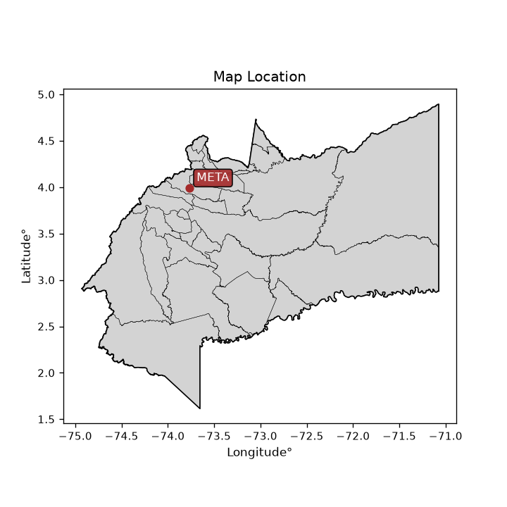</img>

| CountyID                                                                                          | CountyName           | CountyFiles                                                                                                                                                                                                                                                                                                                                                                                                                                                                                                                                                                                                                                                                                                                                                                                                                                                                                                                                                                                                                                                                                                                                                                                                                                                                                                                                                                                                                                                                                                                                                                                                                                                                                                                                                                                                                                                                                                                        |
|:--------------------------------------------------------------------------------------------------|:---------------------|:-----------------------------------------------------------------------------------------------------------------------------------------------------------------------------------------------------------------------------------------------------------------------------------------------------------------------------------------------------------------------------------------------------------------------------------------------------------------------------------------------------------------------------------------------------------------------------------------------------------------------------------------------------------------------------------------------------------------------------------------------------------------------------------------------------------------------------------------------------------------------------------------------------------------------------------------------------------------------------------------------------------------------------------------------------------------------------------------------------------------------------------------------------------------------------------------------------------------------------------------------------------------------------------------------------------------------------------------------------------------------------------------------------------------------------------------------------------------------------------------------------------------------------------------------------------------------------------------------------------------------------------------------------------------------------------------------------------------------------------------------------------------------------------------------------------------------------------------------------------------------------------------------------------------------------------|
| [50006](https://github.com/rcfdtools/R.HydroTools/blob/main/tool/Population/file/report/50006.md) | Acacías              | [50006_Rural_Building_202606.zip](https://github.com/rcfdtools/R.GISMobile/blob/main/file/shp/50006_Rural_Building_202606.zip) [50006_Rural_Lot_202606.zip](https://github.com/rcfdtools/R.GISMobile/blob/main/file/shp/50006_Rural_Lot_202606.zip) [50006_Rural_Nomenclature_202606.zip](https://github.com/rcfdtools/R.GISMobile/blob/main/file/shp/50006_Rural_Nomenclature_202606.zip) [50006_Rural_Nomenclature_Road_202606.zip](https://github.com/rcfdtools/R.GISMobile/blob/main/file/shp/50006_Rural_Nomenclature_Road_202606.zip) [50006_Rural_Sector_202606.zip](https://github.com/rcfdtools/R.GISMobile/blob/main/file/shp/50006_Rural_Sector_202606.zip) [50006_Rural_Vereda_202606.zip](https://github.com/rcfdtools/R.GISMobile/blob/main/file/shp/50006_Rural_Vereda_202606.zip) [50006_Urban_Block_202606.zip](https://github.com/rcfdtools/R.GISMobile/blob/main/file/shp/50006_Urban_Block_202606.zip) [50006_Urban_Building_202606.zip](https://github.com/rcfdtools/R.GISMobile/blob/main/file/shp/50006_Urban_Building_202606.zip) [50006_Urban_Lot_202606.zip](https://github.com/rcfdtools/R.GISMobile/blob/main/file/shp/50006_Urban_Lot_202606.zip) [50006_Urban_Nomenclature_202606.zip](https://github.com/rcfdtools/R.GISMobile/blob/main/file/shp/50006_Urban_Nomenclature_202606.zip) [50006_Urban_Nomenclature_Road_202606.zip](https://github.com/rcfdtools/R.GISMobile/blob/main/file/shp/50006_Urban_Nomenclature_Road_202606.zip) [50006_Urban_Perimeter_202606.zip](https://github.com/rcfdtools/R.GISMobile/blob/main/file/shp/50006_Urban_Perimeter_202606.zip) [50006_Urban_Sector_202606.zip](https://github.com/rcfdtools/R.GISMobile/blob/main/file/shp/50006_Urban_Sector_202606.zip)                                                                                                                                             |
| [50110](https://github.com/rcfdtools/R.HydroTools/blob/main/tool/Population/file/report/50110.md) | Barranca De Upía     | [50110_Rural_Building_202606.zip](https://github.com/rcfdtools/R.GISMobile/blob/main/file/shp/50110_Rural_Building_202606.zip) [50110_Rural_Lot_202606.zip](https://github.com/rcfdtools/R.GISMobile/blob/main/file/shp/50110_Rural_Lot_202606.zip) [50110_Rural_Nomenclature_202606.zip](https://github.com/rcfdtools/R.GISMobile/blob/main/file/shp/50110_Rural_Nomenclature_202606.zip) [50110_Rural_Sector_202606.zip](https://github.com/rcfdtools/R.GISMobile/blob/main/file/shp/50110_Rural_Sector_202606.zip) [50110_Rural_Vereda_202606.zip](https://github.com/rcfdtools/R.GISMobile/blob/main/file/shp/50110_Rural_Vereda_202606.zip) [50110_Urban_Block_202606.zip](https://github.com/rcfdtools/R.GISMobile/blob/main/file/shp/50110_Urban_Block_202606.zip) [50110_Urban_Building_202606.zip](https://github.com/rcfdtools/R.GISMobile/blob/main/file/shp/50110_Urban_Building_202606.zip) [50110_Urban_Lot_202606.zip](https://github.com/rcfdtools/R.GISMobile/blob/main/file/shp/50110_Urban_Lot_202606.zip) [50110_Urban_Nomenclature_202606.zip](https://github.com/rcfdtools/R.GISMobile/blob/main/file/shp/50110_Urban_Nomenclature_202606.zip) [50110_Urban_Nomenclature_Road_202606.zip](https://github.com/rcfdtools/R.GISMobile/blob/main/file/shp/50110_Urban_Nomenclature_Road_202606.zip) [50110_Urban_Perimeter_202606.zip](https://github.com/rcfdtools/R.GISMobile/blob/main/file/shp/50110_Urban_Perimeter_202606.zip) [50110_Urban_Sector_202606.zip](https://github.com/rcfdtools/R.GISMobile/blob/main/file/shp/50110_Urban_Sector_202606.zip)                                                                                                                                                                                                                                                                                                  |
| [50124](https://github.com/rcfdtools/R.HydroTools/blob/main/tool/Population/file/report/50124.md) | Cabuyaro             | [50124_Rural_Building_202606.zip](https://github.com/rcfdtools/R.GISMobile/blob/main/file/shp/50124_Rural_Building_202606.zip) [50124_Rural_Lot_202606.zip](https://github.com/rcfdtools/R.GISMobile/blob/main/file/shp/50124_Rural_Lot_202606.zip) [50124_Rural_Nomenclature_202606.zip](https://github.com/rcfdtools/R.GISMobile/blob/main/file/shp/50124_Rural_Nomenclature_202606.zip) [50124_Rural_Nomenclature_Road_202606.zip](https://github.com/rcfdtools/R.GISMobile/blob/main/file/shp/50124_Rural_Nomenclature_Road_202606.zip) [50124_Rural_Sector_202606.zip](https://github.com/rcfdtools/R.GISMobile/blob/main/file/shp/50124_Rural_Sector_202606.zip) [50124_Rural_Vereda_202606.zip](https://github.com/rcfdtools/R.GISMobile/blob/main/file/shp/50124_Rural_Vereda_202606.zip) [50124_Urban_Block_202606.zip](https://github.com/rcfdtools/R.GISMobile/blob/main/file/shp/50124_Urban_Block_202606.zip) [50124_Urban_Building_202606.zip](https://github.com/rcfdtools/R.GISMobile/blob/main/file/shp/50124_Urban_Building_202606.zip) [50124_Urban_Lot_202606.zip](https://github.com/rcfdtools/R.GISMobile/blob/main/file/shp/50124_Urban_Lot_202606.zip) [50124_Urban_Neighborhood_202606.zip](https://github.com/rcfdtools/R.GISMobile/blob/main/file/shp/50124_Urban_Neighborhood_202606.zip) [50124_Urban_Nomenclature_202606.zip](https://github.com/rcfdtools/R.GISMobile/blob/main/file/shp/50124_Urban_Nomenclature_202606.zip) [50124_Urban_Nomenclature_Road_202606.zip](https://github.com/rcfdtools/R.GISMobile/blob/main/file/shp/50124_Urban_Nomenclature_Road_202606.zip) [50124_Urban_Perimeter_202606.zip](https://github.com/rcfdtools/R.GISMobile/blob/main/file/shp/50124_Urban_Perimeter_202606.zip) [50124_Urban_Sector_202606.zip](https://github.com/rcfdtools/R.GISMobile/blob/main/file/shp/50124_Urban_Sector_202606.zip)  |
| [50150](https://github.com/rcfdtools/R.HydroTools/blob/main/tool/Population/file/report/50150.md) | Castilla La Nueva    | [50150_Rural_Building_202606.zip](https://github.com/rcfdtools/R.GISMobile/blob/main/file/shp/50150_Rural_Building_202606.zip) [50150_Rural_Lot_202606.zip](https://github.com/rcfdtools/R.GISMobile/blob/main/file/shp/50150_Rural_Lot_202606.zip) [50150_Rural_Nomenclature_202606.zip](https://github.com/rcfdtools/R.GISMobile/blob/main/file/shp/50150_Rural_Nomenclature_202606.zip) [50150_Rural_Sector_202606.zip](https://github.com/rcfdtools/R.GISMobile/blob/main/file/shp/50150_Rural_Sector_202606.zip) [50150_Rural_Vereda_202606.zip](https://github.com/rcfdtools/R.GISMobile/blob/main/file/shp/50150_Rural_Vereda_202606.zip) [50150_Urban_Block_202606.zip](https://github.com/rcfdtools/R.GISMobile/blob/main/file/shp/50150_Urban_Block_202606.zip) [50150_Urban_Building_202606.zip](https://github.com/rcfdtools/R.GISMobile/blob/main/file/shp/50150_Urban_Building_202606.zip) [50150_Urban_Lot_202606.zip](https://github.com/rcfdtools/R.GISMobile/blob/main/file/shp/50150_Urban_Lot_202606.zip) [50150_Urban_Nomenclature_202606.zip](https://github.com/rcfdtools/R.GISMobile/blob/main/file/shp/50150_Urban_Nomenclature_202606.zip) [50150_Urban_Nomenclature_Road_202606.zip](https://github.com/rcfdtools/R.GISMobile/blob/main/file/shp/50150_Urban_Nomenclature_Road_202606.zip) [50150_Urban_Perimeter_202606.zip](https://github.com/rcfdtools/R.GISMobile/blob/main/file/shp/50150_Urban_Perimeter_202606.zip) [50150_Urban_Sector_202606.zip](https://github.com/rcfdtools/R.GISMobile/blob/main/file/shp/50150_Urban_Sector_202606.zip)                                                                                                                                                                                                                                                                                                  |
| [50223](https://github.com/rcfdtools/R.HydroTools/blob/main/tool/Population/file/report/50223.md) | Cubarral             | [50223_Rural_Building_202606.zip](https://github.com/rcfdtools/R.GISMobile/blob/main/file/shp/50223_Rural_Building_202606.zip) [50223_Rural_Lot_202606.zip](https://github.com/rcfdtools/R.GISMobile/blob/main/file/shp/50223_Rural_Lot_202606.zip) [50223_Rural_Nomenclature_202606.zip](https://github.com/rcfdtools/R.GISMobile/blob/main/file/shp/50223_Rural_Nomenclature_202606.zip) [50223_Rural_Sector_202606.zip](https://github.com/rcfdtools/R.GISMobile/blob/main/file/shp/50223_Rural_Sector_202606.zip) [50223_Rural_Vereda_202606.zip](https://github.com/rcfdtools/R.GISMobile/blob/main/file/shp/50223_Rural_Vereda_202606.zip) [50223_Urban_Block_202606.zip](https://github.com/rcfdtools/R.GISMobile/blob/main/file/shp/50223_Urban_Block_202606.zip) [50223_Urban_Building_202606.zip](https://github.com/rcfdtools/R.GISMobile/blob/main/file/shp/50223_Urban_Building_202606.zip) [50223_Urban_Lot_202606.zip](https://github.com/rcfdtools/R.GISMobile/blob/main/file/shp/50223_Urban_Lot_202606.zip) [50223_Urban_Nomenclature_202606.zip](https://github.com/rcfdtools/R.GISMobile/blob/main/file/shp/50223_Urban_Nomenclature_202606.zip) [50223_Urban_Nomenclature_Road_202606.zip](https://github.com/rcfdtools/R.GISMobile/blob/main/file/shp/50223_Urban_Nomenclature_Road_202606.zip) [50223_Urban_Perimeter_202606.zip](https://github.com/rcfdtools/R.GISMobile/blob/main/file/shp/50223_Urban_Perimeter_202606.zip) [50223_Urban_Sector_202606.zip](https://github.com/rcfdtools/R.GISMobile/blob/main/file/shp/50223_Urban_Sector_202606.zip)                                                                                                                                                                                                                                                                                                  |
| [50226](https://github.com/rcfdtools/R.HydroTools/blob/main/tool/Population/file/report/50226.md) | Cumaral              | [50226_Rural_Building_202606.zip](https://github.com/rcfdtools/R.GISMobile/blob/main/file/shp/50226_Rural_Building_202606.zip) [50226_Rural_Lot_202606.zip](https://github.com/rcfdtools/R.GISMobile/blob/main/file/shp/50226_Rural_Lot_202606.zip) [50226_Rural_Nomenclature_202606.zip](https://github.com/rcfdtools/R.GISMobile/blob/main/file/shp/50226_Rural_Nomenclature_202606.zip) [50226_Rural_Nomenclature_Road_202606.zip](https://github.com/rcfdtools/R.GISMobile/blob/main/file/shp/50226_Rural_Nomenclature_Road_202606.zip) [50226_Rural_Sector_202606.zip](https://github.com/rcfdtools/R.GISMobile/blob/main/file/shp/50226_Rural_Sector_202606.zip) [50226_Rural_Vereda_202606.zip](https://github.com/rcfdtools/R.GISMobile/blob/main/file/shp/50226_Rural_Vereda_202606.zip) [50226_Urban_Block_202606.zip](https://github.com/rcfdtools/R.GISMobile/blob/main/file/shp/50226_Urban_Block_202606.zip) [50226_Urban_Building_202606.zip](https://github.com/rcfdtools/R.GISMobile/blob/main/file/shp/50226_Urban_Building_202606.zip) [50226_Urban_Lot_202606.zip](https://github.com/rcfdtools/R.GISMobile/blob/main/file/shp/50226_Urban_Lot_202606.zip) [50226_Urban_Neighborhood_202606.zip](https://github.com/rcfdtools/R.GISMobile/blob/main/file/shp/50226_Urban_Neighborhood_202606.zip) [50226_Urban_Nomenclature_202606.zip](https://github.com/rcfdtools/R.GISMobile/blob/main/file/shp/50226_Urban_Nomenclature_202606.zip) [50226_Urban_Nomenclature_Road_202606.zip](https://github.com/rcfdtools/R.GISMobile/blob/main/file/shp/50226_Urban_Nomenclature_Road_202606.zip) [50226_Urban_Perimeter_202606.zip](https://github.com/rcfdtools/R.GISMobile/blob/main/file/shp/50226_Urban_Perimeter_202606.zip) [50226_Urban_Sector_202606.zip](https://github.com/rcfdtools/R.GISMobile/blob/main/file/shp/50226_Urban_Sector_202606.zip)  |
| [50245](https://github.com/rcfdtools/R.HydroTools/blob/main/tool/Population/file/report/50245.md) | El Calvario          | [50245_Rural_Building_202606.zip](https://github.com/rcfdtools/R.GISMobile/blob/main/file/shp/50245_Rural_Building_202606.zip) [50245_Rural_Lot_202606.zip](https://github.com/rcfdtools/R.GISMobile/blob/main/file/shp/50245_Rural_Lot_202606.zip) [50245_Rural_Nomenclature_202606.zip](https://github.com/rcfdtools/R.GISMobile/blob/main/file/shp/50245_Rural_Nomenclature_202606.zip) [50245_Rural_Sector_202606.zip](https://github.com/rcfdtools/R.GISMobile/blob/main/file/shp/50245_Rural_Sector_202606.zip) [50245_Rural_Vereda_202606.zip](https://github.com/rcfdtools/R.GISMobile/blob/main/file/shp/50245_Rural_Vereda_202606.zip) [50245_Urban_Block_202606.zip](https://github.com/rcfdtools/R.GISMobile/blob/main/file/shp/50245_Urban_Block_202606.zip) [50245_Urban_Building_202606.zip](https://github.com/rcfdtools/R.GISMobile/blob/main/file/shp/50245_Urban_Building_202606.zip) [50245_Urban_Lot_202606.zip](https://github.com/rcfdtools/R.GISMobile/blob/main/file/shp/50245_Urban_Lot_202606.zip) [50245_Urban_Neighborhood_202606.zip](https://github.com/rcfdtools/R.GISMobile/blob/main/file/shp/50245_Urban_Neighborhood_202606.zip) [50245_Urban_Nomenclature_202606.zip](https://github.com/rcfdtools/R.GISMobile/blob/main/file/shp/50245_Urban_Nomenclature_202606.zip) [50245_Urban_Nomenclature_Road_202606.zip](https://github.com/rcfdtools/R.GISMobile/blob/main/file/shp/50245_Urban_Nomenclature_Road_202606.zip) [50245_Urban_Perimeter_202606.zip](https://github.com/rcfdtools/R.GISMobile/blob/main/file/shp/50245_Urban_Perimeter_202606.zip) [50245_Urban_Sector_202606.zip](https://github.com/rcfdtools/R.GISMobile/blob/main/file/shp/50245_Urban_Sector_202606.zip)                                                                                                                                                       |
| [50251](https://github.com/rcfdtools/R.HydroTools/blob/main/tool/Population/file/report/50251.md) | El Castillo          | [50251_Rural_Building_202606.zip](https://github.com/rcfdtools/R.GISMobile/blob/main/file/shp/50251_Rural_Building_202606.zip) [50251_Rural_Lot_202606.zip](https://github.com/rcfdtools/R.GISMobile/blob/main/file/shp/50251_Rural_Lot_202606.zip) [50251_Rural_Nomenclature_202606.zip](https://github.com/rcfdtools/R.GISMobile/blob/main/file/shp/50251_Rural_Nomenclature_202606.zip) [50251_Rural_Sector_202606.zip](https://github.com/rcfdtools/R.GISMobile/blob/main/file/shp/50251_Rural_Sector_202606.zip) [50251_Rural_Vereda_202606.zip](https://github.com/rcfdtools/R.GISMobile/blob/main/file/shp/50251_Rural_Vereda_202606.zip) [50251_Urban_Block_202606.zip](https://github.com/rcfdtools/R.GISMobile/blob/main/file/shp/50251_Urban_Block_202606.zip) [50251_Urban_Building_202606.zip](https://github.com/rcfdtools/R.GISMobile/blob/main/file/shp/50251_Urban_Building_202606.zip) [50251_Urban_Lot_202606.zip](https://github.com/rcfdtools/R.GISMobile/blob/main/file/shp/50251_Urban_Lot_202606.zip) [50251_Urban_Neighborhood_202606.zip](https://github.com/rcfdtools/R.GISMobile/blob/main/file/shp/50251_Urban_Neighborhood_202606.zip) [50251_Urban_Nomenclature_202606.zip](https://github.com/rcfdtools/R.GISMobile/blob/main/file/shp/50251_Urban_Nomenclature_202606.zip) [50251_Urban_Nomenclature_Road_202606.zip](https://github.com/rcfdtools/R.GISMobile/blob/main/file/shp/50251_Urban_Nomenclature_Road_202606.zip) [50251_Urban_Perimeter_202606.zip](https://github.com/rcfdtools/R.GISMobile/blob/main/file/shp/50251_Urban_Perimeter_202606.zip) [50251_Urban_Sector_202606.zip](https://github.com/rcfdtools/R.GISMobile/blob/main/file/shp/50251_Urban_Sector_202606.zip)                                                                                                                                                       |
| [50270](https://github.com/rcfdtools/R.HydroTools/blob/main/tool/Population/file/report/50270.md) | El Dorado            | [50270_Rural_Building_202606.zip](https://github.com/rcfdtools/R.GISMobile/blob/main/file/shp/50270_Rural_Building_202606.zip) [50270_Rural_Lot_202606.zip](https://github.com/rcfdtools/R.GISMobile/blob/main/file/shp/50270_Rural_Lot_202606.zip) [50270_Rural_Nomenclature_202606.zip](https://github.com/rcfdtools/R.GISMobile/blob/main/file/shp/50270_Rural_Nomenclature_202606.zip) [50270_Rural_Sector_202606.zip](https://github.com/rcfdtools/R.GISMobile/blob/main/file/shp/50270_Rural_Sector_202606.zip) [50270_Rural_Vereda_202606.zip](https://github.com/rcfdtools/R.GISMobile/blob/main/file/shp/50270_Rural_Vereda_202606.zip) [50270_Urban_Block_202606.zip](https://github.com/rcfdtools/R.GISMobile/blob/main/file/shp/50270_Urban_Block_202606.zip) [50270_Urban_Building_202606.zip](https://github.com/rcfdtools/R.GISMobile/blob/main/file/shp/50270_Urban_Building_202606.zip) [50270_Urban_Lot_202606.zip](https://github.com/rcfdtools/R.GISMobile/blob/main/file/shp/50270_Urban_Lot_202606.zip) [50270_Urban_Nomenclature_202606.zip](https://github.com/rcfdtools/R.GISMobile/blob/main/file/shp/50270_Urban_Nomenclature_202606.zip) [50270_Urban_Nomenclature_Road_202606.zip](https://github.com/rcfdtools/R.GISMobile/blob/main/file/shp/50270_Urban_Nomenclature_Road_202606.zip) [50270_Urban_Perimeter_202606.zip](https://github.com/rcfdtools/R.GISMobile/blob/main/file/shp/50270_Urban_Perimeter_202606.zip) [50270_Urban_Sector_202606.zip](https://github.com/rcfdtools/R.GISMobile/blob/main/file/shp/50270_Urban_Sector_202606.zip)                                                                                                                                                                                                                                                                                                  |
| [50287](https://github.com/rcfdtools/R.HydroTools/blob/main/tool/Population/file/report/50287.md) | Fuentedeoro          | [50287_Rural_Building_202606.zip](https://github.com/rcfdtools/R.GISMobile/blob/main/file/shp/50287_Rural_Building_202606.zip) [50287_Rural_Lot_202606.zip](https://github.com/rcfdtools/R.GISMobile/blob/main/file/shp/50287_Rural_Lot_202606.zip) [50287_Rural_Nomenclature_202606.zip](https://github.com/rcfdtools/R.GISMobile/blob/main/file/shp/50287_Rural_Nomenclature_202606.zip) [50287_Rural_Sector_202606.zip](https://github.com/rcfdtools/R.GISMobile/blob/main/file/shp/50287_Rural_Sector_202606.zip) [50287_Rural_Vereda_202606.zip](https://github.com/rcfdtools/R.GISMobile/blob/main/file/shp/50287_Rural_Vereda_202606.zip) [50287_Urban_Block_202606.zip](https://github.com/rcfdtools/R.GISMobile/blob/main/file/shp/50287_Urban_Block_202606.zip) [50287_Urban_Building_202606.zip](https://github.com/rcfdtools/R.GISMobile/blob/main/file/shp/50287_Urban_Building_202606.zip) [50287_Urban_Lot_202606.zip](https://github.com/rcfdtools/R.GISMobile/blob/main/file/shp/50287_Urban_Lot_202606.zip) [50287_Urban_Nomenclature_202606.zip](https://github.com/rcfdtools/R.GISMobile/blob/main/file/shp/50287_Urban_Nomenclature_202606.zip) [50287_Urban_Nomenclature_Road_202606.zip](https://github.com/rcfdtools/R.GISMobile/blob/main/file/shp/50287_Urban_Nomenclature_Road_202606.zip) [50287_Urban_Perimeter_202606.zip](https://github.com/rcfdtools/R.GISMobile/blob/main/file/shp/50287_Urban_Perimeter_202606.zip) [50287_Urban_Sector_202606.zip](https://github.com/rcfdtools/R.GISMobile/blob/main/file/shp/50287_Urban_Sector_202606.zip)                                                                                                                                                                                                                                                                                                  |
| [50313](https://github.com/rcfdtools/R.HydroTools/blob/main/tool/Population/file/report/50313.md) | Granada              | [50313_Rural_Building_202606.zip](https://github.com/rcfdtools/R.GISMobile/blob/main/file/shp/50313_Rural_Building_202606.zip) [50313_Rural_Lot_202606.zip](https://github.com/rcfdtools/R.GISMobile/blob/main/file/shp/50313_Rural_Lot_202606.zip) [50313_Rural_Nomenclature_202606.zip](https://github.com/rcfdtools/R.GISMobile/blob/main/file/shp/50313_Rural_Nomenclature_202606.zip) [50313_Rural_Nomenclature_Road_202606.zip](https://github.com/rcfdtools/R.GISMobile/blob/main/file/shp/50313_Rural_Nomenclature_Road_202606.zip) [50313_Rural_Sector_202606.zip](https://github.com/rcfdtools/R.GISMobile/blob/main/file/shp/50313_Rural_Sector_202606.zip) [50313_Rural_Vereda_202606.zip](https://github.com/rcfdtools/R.GISMobile/blob/main/file/shp/50313_Rural_Vereda_202606.zip) [50313_Urban_Block_202606.zip](https://github.com/rcfdtools/R.GISMobile/blob/main/file/shp/50313_Urban_Block_202606.zip) [50313_Urban_Building_202606.zip](https://github.com/rcfdtools/R.GISMobile/blob/main/file/shp/50313_Urban_Building_202606.zip) [50313_Urban_Lot_202606.zip](https://github.com/rcfdtools/R.GISMobile/blob/main/file/shp/50313_Urban_Lot_202606.zip) [50313_Urban_Nomenclature_202606.zip](https://github.com/rcfdtools/R.GISMobile/blob/main/file/shp/50313_Urban_Nomenclature_202606.zip) [50313_Urban_Perimeter_202606.zip](https://github.com/rcfdtools/R.GISMobile/blob/main/file/shp/50313_Urban_Perimeter_202606.zip) [50313_Urban_Sector_202606.zip](https://github.com/rcfdtools/R.GISMobile/blob/main/file/shp/50313_Urban_Sector_202606.zip)                                                                                                                                                                                                                                                                                                  |
| [50318](https://github.com/rcfdtools/R.HydroTools/blob/main/tool/Population/file/report/50318.md) | Guamal               | [50318_Rural_Building_202606.zip](https://github.com/rcfdtools/R.GISMobile/blob/main/file/shp/50318_Rural_Building_202606.zip) [50318_Rural_Lot_202606.zip](https://github.com/rcfdtools/R.GISMobile/blob/main/file/shp/50318_Rural_Lot_202606.zip) [50318_Rural_Nomenclature_202606.zip](https://github.com/rcfdtools/R.GISMobile/blob/main/file/shp/50318_Rural_Nomenclature_202606.zip) [50318_Rural_Nomenclature_Road_202606.zip](https://github.com/rcfdtools/R.GISMobile/blob/main/file/shp/50318_Rural_Nomenclature_Road_202606.zip) [50318_Rural_Sector_202606.zip](https://github.com/rcfdtools/R.GISMobile/blob/main/file/shp/50318_Rural_Sector_202606.zip) [50318_Rural_Vereda_202606.zip](https://github.com/rcfdtools/R.GISMobile/blob/main/file/shp/50318_Rural_Vereda_202606.zip) [50318_Urban_Block_202606.zip](https://github.com/rcfdtools/R.GISMobile/blob/main/file/shp/50318_Urban_Block_202606.zip) [50318_Urban_Building_202606.zip](https://github.com/rcfdtools/R.GISMobile/blob/main/file/shp/50318_Urban_Building_202606.zip) [50318_Urban_Lot_202606.zip](https://github.com/rcfdtools/R.GISMobile/blob/main/file/shp/50318_Urban_Lot_202606.zip) [50318_Urban_Neighborhood_202606.zip](https://github.com/rcfdtools/R.GISMobile/blob/main/file/shp/50318_Urban_Neighborhood_202606.zip) [50318_Urban_Nomenclature_202606.zip](https://github.com/rcfdtools/R.GISMobile/blob/main/file/shp/50318_Urban_Nomenclature_202606.zip) [50318_Urban_Nomenclature_Road_202606.zip](https://github.com/rcfdtools/R.GISMobile/blob/main/file/shp/50318_Urban_Nomenclature_Road_202606.zip) [50318_Urban_Perimeter_202606.zip](https://github.com/rcfdtools/R.GISMobile/blob/main/file/shp/50318_Urban_Perimeter_202606.zip) [50318_Urban_Sector_202606.zip](https://github.com/rcfdtools/R.GISMobile/blob/main/file/shp/50318_Urban_Sector_202606.zip)  |
| [50350](https://github.com/rcfdtools/R.HydroTools/blob/main/tool/Population/file/report/50350.md) | La Macarena          | [50350_Urban_Lot_202606.zip](https://github.com/rcfdtools/R.GISMobile/blob/main/file/shp/50350_Urban_Lot_202606.zip) [50350_Urban_Neighborhood_202606.zip](https://github.com/rcfdtools/R.GISMobile/blob/main/file/shp/50350_Urban_Neighborhood_202606.zip) [50350_Urban_Nomenclature_Road_202606.zip](https://github.com/rcfdtools/R.GISMobile/blob/main/file/shp/50350_Urban_Nomenclature_Road_202606.zip) [50350_Urban_Perimeter_202606.zip](https://github.com/rcfdtools/R.GISMobile/blob/main/file/shp/50350_Urban_Perimeter_202606.zip) [50350_Urban_Sector_202606.zip](https://github.com/rcfdtools/R.GISMobile/blob/main/file/shp/50350_Urban_Sector_202606.zip)                                                                                                                                                                                                                                                                                                                                                                                                                                                                                                                                                                                                                                                                                                                                                                                                                                                                                                                                                                                                                                                                                                                                                                                                                                       |
| [50400](https://github.com/rcfdtools/R.HydroTools/blob/main/tool/Population/file/report/50400.md) | Lejanías             | [50400_Rural_Building_202606.zip](https://github.com/rcfdtools/R.GISMobile/blob/main/file/shp/50400_Rural_Building_202606.zip) [50400_Rural_Lot_202606.zip](https://github.com/rcfdtools/R.GISMobile/blob/main/file/shp/50400_Rural_Lot_202606.zip) [50400_Rural_Nomenclature_202606.zip](https://github.com/rcfdtools/R.GISMobile/blob/main/file/shp/50400_Rural_Nomenclature_202606.zip) [50400_Rural_Sector_202606.zip](https://github.com/rcfdtools/R.GISMobile/blob/main/file/shp/50400_Rural_Sector_202606.zip) [50400_Rural_Vereda_202606.zip](https://github.com/rcfdtools/R.GISMobile/blob/main/file/shp/50400_Rural_Vereda_202606.zip) [50400_Urban_Block_202606.zip](https://github.com/rcfdtools/R.GISMobile/blob/main/file/shp/50400_Urban_Block_202606.zip) [50400_Urban_Building_202606.zip](https://github.com/rcfdtools/R.GISMobile/blob/main/file/shp/50400_Urban_Building_202606.zip) [50400_Urban_Lot_202606.zip](https://github.com/rcfdtools/R.GISMobile/blob/main/file/shp/50400_Urban_Lot_202606.zip) [50400_Urban_Nomenclature_202606.zip](https://github.com/rcfdtools/R.GISMobile/blob/main/file/shp/50400_Urban_Nomenclature_202606.zip) [50400_Urban_Nomenclature_Road_202606.zip](https://github.com/rcfdtools/R.GISMobile/blob/main/file/shp/50400_Urban_Nomenclature_Road_202606.zip) [50400_Urban_Perimeter_202606.zip](https://github.com/rcfdtools/R.GISMobile/blob/main/file/shp/50400_Urban_Perimeter_202606.zip) [50400_Urban_Sector_202606.zip](https://github.com/rcfdtools/R.GISMobile/blob/main/file/shp/50400_Urban_Sector_202606.zip)                                                                                                                                                                                                                                                                                                  |
| [50325](https://github.com/rcfdtools/R.HydroTools/blob/main/tool/Population/file/report/50325.md) | Mapiripán            | [50325_Rural_Building_202606.zip](https://github.com/rcfdtools/R.GISMobile/blob/main/file/shp/50325_Rural_Building_202606.zip) [50325_Rural_Lot_202606.zip](https://github.com/rcfdtools/R.GISMobile/blob/main/file/shp/50325_Rural_Lot_202606.zip) [50325_Rural_Nomenclature_202606.zip](https://github.com/rcfdtools/R.GISMobile/blob/main/file/shp/50325_Rural_Nomenclature_202606.zip) [50325_Rural_Sector_202606.zip](https://github.com/rcfdtools/R.GISMobile/blob/main/file/shp/50325_Rural_Sector_202606.zip) [50325_Rural_Vereda_202606.zip](https://github.com/rcfdtools/R.GISMobile/blob/main/file/shp/50325_Rural_Vereda_202606.zip) [50325_Urban_Block_202606.zip](https://github.com/rcfdtools/R.GISMobile/blob/main/file/shp/50325_Urban_Block_202606.zip) [50325_Urban_Building_202606.zip](https://github.com/rcfdtools/R.GISMobile/blob/main/file/shp/50325_Urban_Building_202606.zip) [50325_Urban_Lot_202606.zip](https://github.com/rcfdtools/R.GISMobile/blob/main/file/shp/50325_Urban_Lot_202606.zip) [50325_Urban_Nomenclature_202606.zip](https://github.com/rcfdtools/R.GISMobile/blob/main/file/shp/50325_Urban_Nomenclature_202606.zip) [50325_Urban_Nomenclature_Road_202606.zip](https://github.com/rcfdtools/R.GISMobile/blob/main/file/shp/50325_Urban_Nomenclature_Road_202606.zip) [50325_Urban_Perimeter_202606.zip](https://github.com/rcfdtools/R.GISMobile/blob/main/file/shp/50325_Urban_Perimeter_202606.zip) [50325_Urban_Sector_202606.zip](https://github.com/rcfdtools/R.GISMobile/blob/main/file/shp/50325_Urban_Sector_202606.zip)                                                                                                                                                                                                                                                                                                  |
| [50330](https://github.com/rcfdtools/R.HydroTools/blob/main/tool/Population/file/report/50330.md) | Mesetas              | [50330_Rural_Building_202606.zip](https://github.com/rcfdtools/R.GISMobile/blob/main/file/shp/50330_Rural_Building_202606.zip) [50330_Rural_Lot_202606.zip](https://github.com/rcfdtools/R.GISMobile/blob/main/file/shp/50330_Rural_Lot_202606.zip) [50330_Rural_Nomenclature_202606.zip](https://github.com/rcfdtools/R.GISMobile/blob/main/file/shp/50330_Rural_Nomenclature_202606.zip) [50330_Rural_Nomenclature_Road_202606.zip](https://github.com/rcfdtools/R.GISMobile/blob/main/file/shp/50330_Rural_Nomenclature_Road_202606.zip) [50330_Rural_Sector_202606.zip](https://github.com/rcfdtools/R.GISMobile/blob/main/file/shp/50330_Rural_Sector_202606.zip) [50330_Rural_Vereda_202606.zip](https://github.com/rcfdtools/R.GISMobile/blob/main/file/shp/50330_Rural_Vereda_202606.zip) [50330_Urban_Block_202606.zip](https://github.com/rcfdtools/R.GISMobile/blob/main/file/shp/50330_Urban_Block_202606.zip) [50330_Urban_Building_202606.zip](https://github.com/rcfdtools/R.GISMobile/blob/main/file/shp/50330_Urban_Building_202606.zip) [50330_Urban_Lot_202606.zip](https://github.com/rcfdtools/R.GISMobile/blob/main/file/shp/50330_Urban_Lot_202606.zip) [50330_Urban_Nomenclature_202606.zip](https://github.com/rcfdtools/R.GISMobile/blob/main/file/shp/50330_Urban_Nomenclature_202606.zip) [50330_Urban_Nomenclature_Road_202606.zip](https://github.com/rcfdtools/R.GISMobile/blob/main/file/shp/50330_Urban_Nomenclature_Road_202606.zip) [50330_Urban_Perimeter_202606.zip](https://github.com/rcfdtools/R.GISMobile/blob/main/file/shp/50330_Urban_Perimeter_202606.zip) [50330_Urban_Sector_202606.zip](https://github.com/rcfdtools/R.GISMobile/blob/main/file/shp/50330_Urban_Sector_202606.zip)                                                                                                                                             |
| [50450](https://github.com/rcfdtools/R.HydroTools/blob/main/tool/Population/file/report/50450.md) | Puerto Concordia     | [50450_Rural_Building_202606.zip](https://github.com/rcfdtools/R.GISMobile/blob/main/file/shp/50450_Rural_Building_202606.zip) [50450_Rural_Lot_202606.zip](https://github.com/rcfdtools/R.GISMobile/blob/main/file/shp/50450_Rural_Lot_202606.zip) [50450_Rural_Nomenclature_202606.zip](https://github.com/rcfdtools/R.GISMobile/blob/main/file/shp/50450_Rural_Nomenclature_202606.zip) [50450_Rural_Sector_202606.zip](https://github.com/rcfdtools/R.GISMobile/blob/main/file/shp/50450_Rural_Sector_202606.zip) [50450_Rural_Vereda_202606.zip](https://github.com/rcfdtools/R.GISMobile/blob/main/file/shp/50450_Rural_Vereda_202606.zip) [50450_Urban_Block_202606.zip](https://github.com/rcfdtools/R.GISMobile/blob/main/file/shp/50450_Urban_Block_202606.zip) [50450_Urban_Building_202606.zip](https://github.com/rcfdtools/R.GISMobile/blob/main/file/shp/50450_Urban_Building_202606.zip) [50450_Urban_Lot_202606.zip](https://github.com/rcfdtools/R.GISMobile/blob/main/file/shp/50450_Urban_Lot_202606.zip) [50450_Urban_Nomenclature_202606.zip](https://github.com/rcfdtools/R.GISMobile/blob/main/file/shp/50450_Urban_Nomenclature_202606.zip) [50450_Urban_Nomenclature_Road_202606.zip](https://github.com/rcfdtools/R.GISMobile/blob/main/file/shp/50450_Urban_Nomenclature_Road_202606.zip) [50450_Urban_Perimeter_202606.zip](https://github.com/rcfdtools/R.GISMobile/blob/main/file/shp/50450_Urban_Perimeter_202606.zip) [50450_Urban_Sector_202606.zip](https://github.com/rcfdtools/R.GISMobile/blob/main/file/shp/50450_Urban_Sector_202606.zip)                                                                                                                                                                                                                                                                                                  |
| [50568](https://github.com/rcfdtools/R.HydroTools/blob/main/tool/Population/file/report/50568.md) | Puerto Gaitán        | [50568_Rural_Building_202606.zip](https://github.com/rcfdtools/R.GISMobile/blob/main/file/shp/50568_Rural_Building_202606.zip) [50568_Rural_Lot_202606.zip](https://github.com/rcfdtools/R.GISMobile/blob/main/file/shp/50568_Rural_Lot_202606.zip) [50568_Rural_Nomenclature_202606.zip](https://github.com/rcfdtools/R.GISMobile/blob/main/file/shp/50568_Rural_Nomenclature_202606.zip) [50568_Rural_Sector_202606.zip](https://github.com/rcfdtools/R.GISMobile/blob/main/file/shp/50568_Rural_Sector_202606.zip) [50568_Rural_Vereda_202606.zip](https://github.com/rcfdtools/R.GISMobile/blob/main/file/shp/50568_Rural_Vereda_202606.zip) [50568_Urban_Block_202606.zip](https://github.com/rcfdtools/R.GISMobile/blob/main/file/shp/50568_Urban_Block_202606.zip) [50568_Urban_Building_202606.zip](https://github.com/rcfdtools/R.GISMobile/blob/main/file/shp/50568_Urban_Building_202606.zip) [50568_Urban_Lot_202606.zip](https://github.com/rcfdtools/R.GISMobile/blob/main/file/shp/50568_Urban_Lot_202606.zip) [50568_Urban_Nomenclature_202606.zip](https://github.com/rcfdtools/R.GISMobile/blob/main/file/shp/50568_Urban_Nomenclature_202606.zip) [50568_Urban_Nomenclature_Road_202606.zip](https://github.com/rcfdtools/R.GISMobile/blob/main/file/shp/50568_Urban_Nomenclature_Road_202606.zip) [50568_Urban_Perimeter_202606.zip](https://github.com/rcfdtools/R.GISMobile/blob/main/file/shp/50568_Urban_Perimeter_202606.zip) [50568_Urban_Sector_202606.zip](https://github.com/rcfdtools/R.GISMobile/blob/main/file/shp/50568_Urban_Sector_202606.zip)                                                                                                                                                                                                                                                                                                  |
| [50577](https://github.com/rcfdtools/R.HydroTools/blob/main/tool/Population/file/report/50577.md) | Puerto Lleras        | [50577_Rural_Building_202606.zip](https://github.com/rcfdtools/R.GISMobile/blob/main/file/shp/50577_Rural_Building_202606.zip) [50577_Rural_Lot_202606.zip](https://github.com/rcfdtools/R.GISMobile/blob/main/file/shp/50577_Rural_Lot_202606.zip) [50577_Rural_Nomenclature_202606.zip](https://github.com/rcfdtools/R.GISMobile/blob/main/file/shp/50577_Rural_Nomenclature_202606.zip) [50577_Rural_Sector_202606.zip](https://github.com/rcfdtools/R.GISMobile/blob/main/file/shp/50577_Rural_Sector_202606.zip) [50577_Rural_Vereda_202606.zip](https://github.com/rcfdtools/R.GISMobile/blob/main/file/shp/50577_Rural_Vereda_202606.zip) [50577_Urban_Block_202606.zip](https://github.com/rcfdtools/R.GISMobile/blob/main/file/shp/50577_Urban_Block_202606.zip) [50577_Urban_Building_202606.zip](https://github.com/rcfdtools/R.GISMobile/blob/main/file/shp/50577_Urban_Building_202606.zip) [50577_Urban_Lot_202606.zip](https://github.com/rcfdtools/R.GISMobile/blob/main/file/shp/50577_Urban_Lot_202606.zip) [50577_Urban_Nomenclature_202606.zip](https://github.com/rcfdtools/R.GISMobile/blob/main/file/shp/50577_Urban_Nomenclature_202606.zip) [50577_Urban_Nomenclature_Road_202606.zip](https://github.com/rcfdtools/R.GISMobile/blob/main/file/shp/50577_Urban_Nomenclature_Road_202606.zip) [50577_Urban_Perimeter_202606.zip](https://github.com/rcfdtools/R.GISMobile/blob/main/file/shp/50577_Urban_Perimeter_202606.zip) [50577_Urban_Sector_202606.zip](https://github.com/rcfdtools/R.GISMobile/blob/main/file/shp/50577_Urban_Sector_202606.zip)                                                                                                                                                                                                                                                                                                  |
| [50573](https://github.com/rcfdtools/R.HydroTools/blob/main/tool/Population/file/report/50573.md) | Puerto López         | [50573_Rural_Building_202606.zip](https://github.com/rcfdtools/R.GISMobile/blob/main/file/shp/50573_Rural_Building_202606.zip) [50573_Rural_Lot_202606.zip](https://github.com/rcfdtools/R.GISMobile/blob/main/file/shp/50573_Rural_Lot_202606.zip) [50573_Rural_Nomenclature_202606.zip](https://github.com/rcfdtools/R.GISMobile/blob/main/file/shp/50573_Rural_Nomenclature_202606.zip) [50573_Rural_Sector_202606.zip](https://github.com/rcfdtools/R.GISMobile/blob/main/file/shp/50573_Rural_Sector_202606.zip) [50573_Rural_Vereda_202606.zip](https://github.com/rcfdtools/R.GISMobile/blob/main/file/shp/50573_Rural_Vereda_202606.zip) [50573_Urban_Block_202606.zip](https://github.com/rcfdtools/R.GISMobile/blob/main/file/shp/50573_Urban_Block_202606.zip) [50573_Urban_Building_202606.zip](https://github.com/rcfdtools/R.GISMobile/blob/main/file/shp/50573_Urban_Building_202606.zip) [50573_Urban_Lot_202606.zip](https://github.com/rcfdtools/R.GISMobile/blob/main/file/shp/50573_Urban_Lot_202606.zip) [50573_Urban_Nomenclature_202606.zip](https://github.com/rcfdtools/R.GISMobile/blob/main/file/shp/50573_Urban_Nomenclature_202606.zip) [50573_Urban_Nomenclature_Road_202606.zip](https://github.com/rcfdtools/R.GISMobile/blob/main/file/shp/50573_Urban_Nomenclature_Road_202606.zip) [50573_Urban_Perimeter_202606.zip](https://github.com/rcfdtools/R.GISMobile/blob/main/file/shp/50573_Urban_Perimeter_202606.zip) [50573_Urban_Sector_202606.zip](https://github.com/rcfdtools/R.GISMobile/blob/main/file/shp/50573_Urban_Sector_202606.zip)                                                                                                                                                                                                                                                                                                  |
| [50590](https://github.com/rcfdtools/R.HydroTools/blob/main/tool/Population/file/report/50590.md) | Puerto Rico          | [50590_Rural_Building_202606.zip](https://github.com/rcfdtools/R.GISMobile/blob/main/file/shp/50590_Rural_Building_202606.zip) [50590_Rural_Lot_202606.zip](https://github.com/rcfdtools/R.GISMobile/blob/main/file/shp/50590_Rural_Lot_202606.zip) [50590_Rural_Nomenclature_202606.zip](https://github.com/rcfdtools/R.GISMobile/blob/main/file/shp/50590_Rural_Nomenclature_202606.zip) [50590_Rural_Sector_202606.zip](https://github.com/rcfdtools/R.GISMobile/blob/main/file/shp/50590_Rural_Sector_202606.zip) [50590_Rural_Vereda_202606.zip](https://github.com/rcfdtools/R.GISMobile/blob/main/file/shp/50590_Rural_Vereda_202606.zip) [50590_Urban_Block_202606.zip](https://github.com/rcfdtools/R.GISMobile/blob/main/file/shp/50590_Urban_Block_202606.zip) [50590_Urban_Building_202606.zip](https://github.com/rcfdtools/R.GISMobile/blob/main/file/shp/50590_Urban_Building_202606.zip) [50590_Urban_Lot_202606.zip](https://github.com/rcfdtools/R.GISMobile/blob/main/file/shp/50590_Urban_Lot_202606.zip) [50590_Urban_Nomenclature_202606.zip](https://github.com/rcfdtools/R.GISMobile/blob/main/file/shp/50590_Urban_Nomenclature_202606.zip) [50590_Urban_Nomenclature_Road_202606.zip](https://github.com/rcfdtools/R.GISMobile/blob/main/file/shp/50590_Urban_Nomenclature_Road_202606.zip) [50590_Urban_Perimeter_202606.zip](https://github.com/rcfdtools/R.GISMobile/blob/main/file/shp/50590_Urban_Perimeter_202606.zip) [50590_Urban_Sector_202606.zip](https://github.com/rcfdtools/R.GISMobile/blob/main/file/shp/50590_Urban_Sector_202606.zip)                                                                                                                                                                                                                                                                                                  |
| [50606](https://github.com/rcfdtools/R.HydroTools/blob/main/tool/Population/file/report/50606.md) | Restrepo             | [50606_Rural_Building_202606.zip](https://github.com/rcfdtools/R.GISMobile/blob/main/file/shp/50606_Rural_Building_202606.zip) [50606_Rural_Lot_202606.zip](https://github.com/rcfdtools/R.GISMobile/blob/main/file/shp/50606_Rural_Lot_202606.zip) [50606_Rural_Nomenclature_202606.zip](https://github.com/rcfdtools/R.GISMobile/blob/main/file/shp/50606_Rural_Nomenclature_202606.zip) [50606_Rural_Sector_202606.zip](https://github.com/rcfdtools/R.GISMobile/blob/main/file/shp/50606_Rural_Sector_202606.zip) [50606_Rural_Vereda_202606.zip](https://github.com/rcfdtools/R.GISMobile/blob/main/file/shp/50606_Rural_Vereda_202606.zip) [50606_Urban_Block_202606.zip](https://github.com/rcfdtools/R.GISMobile/blob/main/file/shp/50606_Urban_Block_202606.zip) [50606_Urban_Building_202606.zip](https://github.com/rcfdtools/R.GISMobile/blob/main/file/shp/50606_Urban_Building_202606.zip) [50606_Urban_Lot_202606.zip](https://github.com/rcfdtools/R.GISMobile/blob/main/file/shp/50606_Urban_Lot_202606.zip) [50606_Urban_Nomenclature_202606.zip](https://github.com/rcfdtools/R.GISMobile/blob/main/file/shp/50606_Urban_Nomenclature_202606.zip) [50606_Urban_Nomenclature_Road_202606.zip](https://github.com/rcfdtools/R.GISMobile/blob/main/file/shp/50606_Urban_Nomenclature_Road_202606.zip) [50606_Urban_Perimeter_202606.zip](https://github.com/rcfdtools/R.GISMobile/blob/main/file/shp/50606_Urban_Perimeter_202606.zip) [50606_Urban_Sector_202606.zip](https://github.com/rcfdtools/R.GISMobile/blob/main/file/shp/50606_Urban_Sector_202606.zip)                                                                                                                                                                                                                                                                                                  |
| [50680](https://github.com/rcfdtools/R.HydroTools/blob/main/tool/Population/file/report/50680.md) | San Carlos De Guaroa | [50680_Rural_Building_202606.zip](https://github.com/rcfdtools/R.GISMobile/blob/main/file/shp/50680_Rural_Building_202606.zip) [50680_Rural_Lot_202606.zip](https://github.com/rcfdtools/R.GISMobile/blob/main/file/shp/50680_Rural_Lot_202606.zip) [50680_Rural_Nomenclature_202606.zip](https://github.com/rcfdtools/R.GISMobile/blob/main/file/shp/50680_Rural_Nomenclature_202606.zip) [50680_Rural_Sector_202606.zip](https://github.com/rcfdtools/R.GISMobile/blob/main/file/shp/50680_Rural_Sector_202606.zip) [50680_Rural_Vereda_202606.zip](https://github.com/rcfdtools/R.GISMobile/blob/main/file/shp/50680_Rural_Vereda_202606.zip) [50680_Urban_Block_202606.zip](https://github.com/rcfdtools/R.GISMobile/blob/main/file/shp/50680_Urban_Block_202606.zip) [50680_Urban_Building_202606.zip](https://github.com/rcfdtools/R.GISMobile/blob/main/file/shp/50680_Urban_Building_202606.zip) [50680_Urban_Lot_202606.zip](https://github.com/rcfdtools/R.GISMobile/blob/main/file/shp/50680_Urban_Lot_202606.zip) [50680_Urban_Nomenclature_202606.zip](https://github.com/rcfdtools/R.GISMobile/blob/main/file/shp/50680_Urban_Nomenclature_202606.zip) [50680_Urban_Nomenclature_Road_202606.zip](https://github.com/rcfdtools/R.GISMobile/blob/main/file/shp/50680_Urban_Nomenclature_Road_202606.zip) [50680_Urban_Perimeter_202606.zip](https://github.com/rcfdtools/R.GISMobile/blob/main/file/shp/50680_Urban_Perimeter_202606.zip) [50680_Urban_Sector_202606.zip](https://github.com/rcfdtools/R.GISMobile/blob/main/file/shp/50680_Urban_Sector_202606.zip)                                                                                                                                                                                                                                                                                                  |
| [50683](https://github.com/rcfdtools/R.HydroTools/blob/main/tool/Population/file/report/50683.md) | San Juan De Arama    | [50683_Rural_Building_202606.zip](https://github.com/rcfdtools/R.GISMobile/blob/main/file/shp/50683_Rural_Building_202606.zip) [50683_Rural_Lot_202606.zip](https://github.com/rcfdtools/R.GISMobile/blob/main/file/shp/50683_Rural_Lot_202606.zip) [50683_Rural_Nomenclature_202606.zip](https://github.com/rcfdtools/R.GISMobile/blob/main/file/shp/50683_Rural_Nomenclature_202606.zip) [50683_Rural_Sector_202606.zip](https://github.com/rcfdtools/R.GISMobile/blob/main/file/shp/50683_Rural_Sector_202606.zip) [50683_Rural_Vereda_202606.zip](https://github.com/rcfdtools/R.GISMobile/blob/main/file/shp/50683_Rural_Vereda_202606.zip) [50683_Urban_Block_202606.zip](https://github.com/rcfdtools/R.GISMobile/blob/main/file/shp/50683_Urban_Block_202606.zip) [50683_Urban_Building_202606.zip](https://github.com/rcfdtools/R.GISMobile/blob/main/file/shp/50683_Urban_Building_202606.zip) [50683_Urban_Lot_202606.zip](https://github.com/rcfdtools/R.GISMobile/blob/main/file/shp/50683_Urban_Lot_202606.zip) [50683_Urban_Nomenclature_202606.zip](https://github.com/rcfdtools/R.GISMobile/blob/main/file/shp/50683_Urban_Nomenclature_202606.zip) [50683_Urban_Nomenclature_Road_202606.zip](https://github.com/rcfdtools/R.GISMobile/blob/main/file/shp/50683_Urban_Nomenclature_Road_202606.zip) [50683_Urban_Perimeter_202606.zip](https://github.com/rcfdtools/R.GISMobile/blob/main/file/shp/50683_Urban_Perimeter_202606.zip) [50683_Urban_Sector_202606.zip](https://github.com/rcfdtools/R.GISMobile/blob/main/file/shp/50683_Urban_Sector_202606.zip)                                                                                                                                                                                                                                                                                                  |
| [50686](https://github.com/rcfdtools/R.HydroTools/blob/main/tool/Population/file/report/50686.md) | San Juanito          | [50686_Rural_Lot_202606.zip](https://github.com/rcfdtools/R.GISMobile/blob/main/file/shp/50686_Rural_Lot_202606.zip) [50686_Rural_Nomenclature_202606.zip](https://github.com/rcfdtools/R.GISMobile/blob/main/file/shp/50686_Rural_Nomenclature_202606.zip) [50686_Rural_Sector_202606.zip](https://github.com/rcfdtools/R.GISMobile/blob/main/file/shp/50686_Rural_Sector_202606.zip) [50686_Rural_Vereda_202606.zip](https://github.com/rcfdtools/R.GISMobile/blob/main/file/shp/50686_Rural_Vereda_202606.zip) [50686_Urban_Block_202606.zip](https://github.com/rcfdtools/R.GISMobile/blob/main/file/shp/50686_Urban_Block_202606.zip) [50686_Urban_Building_202606.zip](https://github.com/rcfdtools/R.GISMobile/blob/main/file/shp/50686_Urban_Building_202606.zip) [50686_Urban_Lot_202606.zip](https://github.com/rcfdtools/R.GISMobile/blob/main/file/shp/50686_Urban_Lot_202606.zip) [50686_Urban_Nomenclature_202606.zip](https://github.com/rcfdtools/R.GISMobile/blob/main/file/shp/50686_Urban_Nomenclature_202606.zip) [50686_Urban_Nomenclature_Road_202606.zip](https://github.com/rcfdtools/R.GISMobile/blob/main/file/shp/50686_Urban_Nomenclature_Road_202606.zip) [50686_Urban_Perimeter_202606.zip](https://github.com/rcfdtools/R.GISMobile/blob/main/file/shp/50686_Urban_Perimeter_202606.zip) [50686_Urban_Sector_202606.zip](https://github.com/rcfdtools/R.GISMobile/blob/main/file/shp/50686_Urban_Sector_202606.zip)                                                                                                                                                                                                                                                                                                                                                                                                                                     |
| [50689](https://github.com/rcfdtools/R.HydroTools/blob/main/tool/Population/file/report/50689.md) | San Martín           | [50689_Rural_Building_202606.zip](https://github.com/rcfdtools/R.GISMobile/blob/main/file/shp/50689_Rural_Building_202606.zip) [50689_Rural_Lot_202606.zip](https://github.com/rcfdtools/R.GISMobile/blob/main/file/shp/50689_Rural_Lot_202606.zip) [50689_Rural_Nomenclature_202606.zip](https://github.com/rcfdtools/R.GISMobile/blob/main/file/shp/50689_Rural_Nomenclature_202606.zip) [50689_Rural_Nomenclature_Road_202606.zip](https://github.com/rcfdtools/R.GISMobile/blob/main/file/shp/50689_Rural_Nomenclature_Road_202606.zip) [50689_Rural_Sector_202606.zip](https://github.com/rcfdtools/R.GISMobile/blob/main/file/shp/50689_Rural_Sector_202606.zip) [50689_Rural_Vereda_202606.zip](https://github.com/rcfdtools/R.GISMobile/blob/main/file/shp/50689_Rural_Vereda_202606.zip) [50689_Urban_Block_202606.zip](https://github.com/rcfdtools/R.GISMobile/blob/main/file/shp/50689_Urban_Block_202606.zip) [50689_Urban_Building_202606.zip](https://github.com/rcfdtools/R.GISMobile/blob/main/file/shp/50689_Urban_Building_202606.zip) [50689_Urban_Lot_202606.zip](https://github.com/rcfdtools/R.GISMobile/blob/main/file/shp/50689_Urban_Lot_202606.zip) [50689_Urban_Nomenclature_202606.zip](https://github.com/rcfdtools/R.GISMobile/blob/main/file/shp/50689_Urban_Nomenclature_202606.zip) [50689_Urban_Nomenclature_Road_202606.zip](https://github.com/rcfdtools/R.GISMobile/blob/main/file/shp/50689_Urban_Nomenclature_Road_202606.zip) [50689_Urban_Perimeter_202606.zip](https://github.com/rcfdtools/R.GISMobile/blob/main/file/shp/50689_Urban_Perimeter_202606.zip) [50689_Urban_Sector_202606.zip](https://github.com/rcfdtools/R.GISMobile/blob/main/file/shp/50689_Urban_Sector_202606.zip)                                                                                                                                             |
| [50370](https://github.com/rcfdtools/R.HydroTools/blob/main/tool/Population/file/report/50370.md) | Uribe                | [50370_Urban_Block_202606.zip](https://github.com/rcfdtools/R.GISMobile/blob/main/file/shp/50370_Urban_Block_202606.zip) [50370_Urban_Building_202606.zip](https://github.com/rcfdtools/R.GISMobile/blob/main/file/shp/50370_Urban_Building_202606.zip) [50370_Urban_Lot_202606.zip](https://github.com/rcfdtools/R.GISMobile/blob/main/file/shp/50370_Urban_Lot_202606.zip) [50370_Urban_Neighborhood_202606.zip](https://github.com/rcfdtools/R.GISMobile/blob/main/file/shp/50370_Urban_Neighborhood_202606.zip) [50370_Urban_Nomenclature_202606.zip](https://github.com/rcfdtools/R.GISMobile/blob/main/file/shp/50370_Urban_Nomenclature_202606.zip) [50370_Urban_Nomenclature_Road_202606.zip](https://github.com/rcfdtools/R.GISMobile/blob/main/file/shp/50370_Urban_Nomenclature_Road_202606.zip) [50370_Urban_Perimeter_202606.zip](https://github.com/rcfdtools/R.GISMobile/blob/main/file/shp/50370_Urban_Perimeter_202606.zip) [50370_Urban_Sector_202606.zip](https://github.com/rcfdtools/R.GISMobile/blob/main/file/shp/50370_Urban_Sector_202606.zip)                                                                                                                                                                                                                                                                                                                                                                                                                                                                                                                                                                                                                                                                                                                                                                                                                            |
| [50001](https://github.com/rcfdtools/R.HydroTools/blob/main/tool/Population/file/report/50001.md) | Villavicencio        | [50001_Rural_Lot_202001.zip](https://github.com/rcfdtools/R.GISMobile/blob/main/file/shp/50001_Rural_Lot_202001.zip) [50001_Urban_Lot_202001.zip](https://github.com/rcfdtools/R.GISMobile/blob/main/file/shp/50001_Urban_Lot_202001.zip)                                                                                                                                                                                                                                                                                                                                                                                                                                                                                                                                                                                                                                                                                                                                                                                                                                                                                                                                                                                                                                                                                                                                                                                                                                                                                                                                                                                                                                                                                                                                                                                                                                                                                  |
| [50711](https://github.com/rcfdtools/R.HydroTools/blob/main/tool/Population/file/report/50711.md) | Vistahermosa         | [50711_Rural_Building_202606.zip](https://github.com/rcfdtools/R.GISMobile/blob/main/file/shp/50711_Rural_Building_202606.zip) [50711_Rural_Lot_202606.zip](https://github.com/rcfdtools/R.GISMobile/blob/main/file/shp/50711_Rural_Lot_202606.zip) [50711_Rural_Nomenclature_202606.zip](https://github.com/rcfdtools/R.GISMobile/blob/main/file/shp/50711_Rural_Nomenclature_202606.zip) [50711_Rural_Sector_202606.zip](https://github.com/rcfdtools/R.GISMobile/blob/main/file/shp/50711_Rural_Sector_202606.zip) [50711_Rural_Vereda_202606.zip](https://github.com/rcfdtools/R.GISMobile/blob/main/file/shp/50711_Rural_Vereda_202606.zip) [50711_Urban_Block_202606.zip](https://github.com/rcfdtools/R.GISMobile/blob/main/file/shp/50711_Urban_Block_202606.zip) [50711_Urban_Building_202606.zip](https://github.com/rcfdtools/R.GISMobile/blob/main/file/shp/50711_Urban_Building_202606.zip) [50711_Urban_Lot_202606.zip](https://github.com/rcfdtools/R.GISMobile/blob/main/file/shp/50711_Urban_Lot_202606.zip) [50711_Urban_Nomenclature_202606.zip](https://github.com/rcfdtools/R.GISMobile/blob/main/file/shp/50711_Urban_Nomenclature_202606.zip) [50711_Urban_Nomenclature_Road_202606.zip](https://github.com/rcfdtools/R.GISMobile/blob/main/file/shp/50711_Urban_Nomenclature_Road_202606.zip) [50711_Urban_Perimeter_202606.zip](https://github.com/rcfdtools/R.GISMobile/blob/main/file/shp/50711_Urban_Perimeter_202606.zip) [50711_Urban_Sector_202606.zip](https://github.com/rcfdtools/R.GISMobile/blob/main/file/shp/50711_Urban_Sector_202606.zip)                                                                                                                                                                                                                                                                                                  |

# 52 - Nariño (64 Counties)

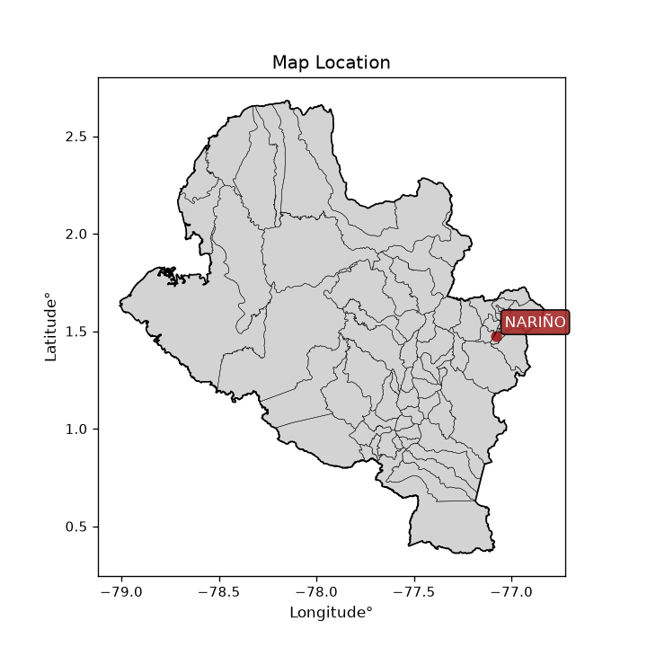</img>

| CountyID                                                                                          | CountyName           | CountyFiles                                                                                                                                                                                                                                                                                                                                                                                                                                                                                                                                                                                                                                                                                                                                                                                                                                                                                                                                                                                                                                                                                                                                                                                                                                                                                                                                                                                                                                                                                                                                                                                                                                                                                                                                                                                                                                                                                                                        |
|:--------------------------------------------------------------------------------------------------|:---------------------|:-----------------------------------------------------------------------------------------------------------------------------------------------------------------------------------------------------------------------------------------------------------------------------------------------------------------------------------------------------------------------------------------------------------------------------------------------------------------------------------------------------------------------------------------------------------------------------------------------------------------------------------------------------------------------------------------------------------------------------------------------------------------------------------------------------------------------------------------------------------------------------------------------------------------------------------------------------------------------------------------------------------------------------------------------------------------------------------------------------------------------------------------------------------------------------------------------------------------------------------------------------------------------------------------------------------------------------------------------------------------------------------------------------------------------------------------------------------------------------------------------------------------------------------------------------------------------------------------------------------------------------------------------------------------------------------------------------------------------------------------------------------------------------------------------------------------------------------------------------------------------------------------------------------------------------------|
| [52019](https://github.com/rcfdtools/R.HydroTools/blob/main/tool/Population/file/report/52019.md) | Albán                | [52019_Rural_Building_202606.zip](https://github.com/rcfdtools/R.GISMobile/blob/main/file/shp/52019_Rural_Building_202606.zip) [52019_Rural_Lot_202606.zip](https://github.com/rcfdtools/R.GISMobile/blob/main/file/shp/52019_Rural_Lot_202606.zip) [52019_Rural_Nomenclature_202606.zip](https://github.com/rcfdtools/R.GISMobile/blob/main/file/shp/52019_Rural_Nomenclature_202606.zip) [52019_Rural_Sector_202606.zip](https://github.com/rcfdtools/R.GISMobile/blob/main/file/shp/52019_Rural_Sector_202606.zip) [52019_Rural_Vereda_202606.zip](https://github.com/rcfdtools/R.GISMobile/blob/main/file/shp/52019_Rural_Vereda_202606.zip) [52019_Urban_Block_202606.zip](https://github.com/rcfdtools/R.GISMobile/blob/main/file/shp/52019_Urban_Block_202606.zip) [52019_Urban_Building_202606.zip](https://github.com/rcfdtools/R.GISMobile/blob/main/file/shp/52019_Urban_Building_202606.zip) [52019_Urban_Lot_202606.zip](https://github.com/rcfdtools/R.GISMobile/blob/main/file/shp/52019_Urban_Lot_202606.zip) [52019_Urban_Nomenclature_202606.zip](https://github.com/rcfdtools/R.GISMobile/blob/main/file/shp/52019_Urban_Nomenclature_202606.zip) [52019_Urban_Nomenclature_Road_202606.zip](https://github.com/rcfdtools/R.GISMobile/blob/main/file/shp/52019_Urban_Nomenclature_Road_202606.zip) [52019_Urban_Perimeter_202606.zip](https://github.com/rcfdtools/R.GISMobile/blob/main/file/shp/52019_Urban_Perimeter_202606.zip) [52019_Urban_Sector_202606.zip](https://github.com/rcfdtools/R.GISMobile/blob/main/file/shp/52019_Urban_Sector_202606.zip)                                                                                                                                                                                                                                                                                                  |
| [52022](https://github.com/rcfdtools/R.HydroTools/blob/main/tool/Population/file/report/52022.md) | Aldana               | [52022_Rural_Building_202606.zip](https://github.com/rcfdtools/R.GISMobile/blob/main/file/shp/52022_Rural_Building_202606.zip) [52022_Rural_Lot_202606.zip](https://github.com/rcfdtools/R.GISMobile/blob/main/file/shp/52022_Rural_Lot_202606.zip) [52022_Rural_Nomenclature_202606.zip](https://github.com/rcfdtools/R.GISMobile/blob/main/file/shp/52022_Rural_Nomenclature_202606.zip) [52022_Rural_Sector_202606.zip](https://github.com/rcfdtools/R.GISMobile/blob/main/file/shp/52022_Rural_Sector_202606.zip) [52022_Rural_Vereda_202606.zip](https://github.com/rcfdtools/R.GISMobile/blob/main/file/shp/52022_Rural_Vereda_202606.zip) [52022_Urban_Block_202606.zip](https://github.com/rcfdtools/R.GISMobile/blob/main/file/shp/52022_Urban_Block_202606.zip) [52022_Urban_Building_202606.zip](https://github.com/rcfdtools/R.GISMobile/blob/main/file/shp/52022_Urban_Building_202606.zip) [52022_Urban_Lot_202606.zip](https://github.com/rcfdtools/R.GISMobile/blob/main/file/shp/52022_Urban_Lot_202606.zip) [52022_Urban_Nomenclature_202606.zip](https://github.com/rcfdtools/R.GISMobile/blob/main/file/shp/52022_Urban_Nomenclature_202606.zip) [52022_Urban_Perimeter_202606.zip](https://github.com/rcfdtools/R.GISMobile/blob/main/file/shp/52022_Urban_Perimeter_202606.zip) [52022_Urban_Sector_202606.zip](https://github.com/rcfdtools/R.GISMobile/blob/main/file/shp/52022_Urban_Sector_202606.zip)                                                                                                                                                                                                                                                                                                                                                                                                                                                       |
| [52036](https://github.com/rcfdtools/R.HydroTools/blob/main/tool/Population/file/report/52036.md) | Ancuya               | [52036_Rural_Building_202606.zip](https://github.com/rcfdtools/R.GISMobile/blob/main/file/shp/52036_Rural_Building_202606.zip) [52036_Rural_Lot_202606.zip](https://github.com/rcfdtools/R.GISMobile/blob/main/file/shp/52036_Rural_Lot_202606.zip) [52036_Rural_Nomenclature_202606.zip](https://github.com/rcfdtools/R.GISMobile/blob/main/file/shp/52036_Rural_Nomenclature_202606.zip) [52036_Rural_Sector_202606.zip](https://github.com/rcfdtools/R.GISMobile/blob/main/file/shp/52036_Rural_Sector_202606.zip) [52036_Rural_Vereda_202606.zip](https://github.com/rcfdtools/R.GISMobile/blob/main/file/shp/52036_Rural_Vereda_202606.zip) [52036_Urban_Block_202606.zip](https://github.com/rcfdtools/R.GISMobile/blob/main/file/shp/52036_Urban_Block_202606.zip) [52036_Urban_Building_202606.zip](https://github.com/rcfdtools/R.GISMobile/blob/main/file/shp/52036_Urban_Building_202606.zip) [52036_Urban_Lot_202606.zip](https://github.com/rcfdtools/R.GISMobile/blob/main/file/shp/52036_Urban_Lot_202606.zip) [52036_Urban_Nomenclature_202606.zip](https://github.com/rcfdtools/R.GISMobile/blob/main/file/shp/52036_Urban_Nomenclature_202606.zip) [52036_Urban_Nomenclature_Road_202606.zip](https://github.com/rcfdtools/R.GISMobile/blob/main/file/shp/52036_Urban_Nomenclature_Road_202606.zip) [52036_Urban_Perimeter_202606.zip](https://github.com/rcfdtools/R.GISMobile/blob/main/file/shp/52036_Urban_Perimeter_202606.zip) [52036_Urban_Sector_202606.zip](https://github.com/rcfdtools/R.GISMobile/blob/main/file/shp/52036_Urban_Sector_202606.zip)                                                                                                                                                                                                                                                                                                  |
| [52051](https://github.com/rcfdtools/R.HydroTools/blob/main/tool/Population/file/report/52051.md) | Arboleda             | [52051_Rural_Building_202606.zip](https://github.com/rcfdtools/R.GISMobile/blob/main/file/shp/52051_Rural_Building_202606.zip) [52051_Rural_Lot_202606.zip](https://github.com/rcfdtools/R.GISMobile/blob/main/file/shp/52051_Rural_Lot_202606.zip) [52051_Rural_Nomenclature_202606.zip](https://github.com/rcfdtools/R.GISMobile/blob/main/file/shp/52051_Rural_Nomenclature_202606.zip) [52051_Rural_Sector_202606.zip](https://github.com/rcfdtools/R.GISMobile/blob/main/file/shp/52051_Rural_Sector_202606.zip) [52051_Rural_Vereda_202606.zip](https://github.com/rcfdtools/R.GISMobile/blob/main/file/shp/52051_Rural_Vereda_202606.zip) [52051_Urban_Block_202606.zip](https://github.com/rcfdtools/R.GISMobile/blob/main/file/shp/52051_Urban_Block_202606.zip) [52051_Urban_Building_202606.zip](https://github.com/rcfdtools/R.GISMobile/blob/main/file/shp/52051_Urban_Building_202606.zip) [52051_Urban_Lot_202606.zip](https://github.com/rcfdtools/R.GISMobile/blob/main/file/shp/52051_Urban_Lot_202606.zip) [52051_Urban_Nomenclature_202606.zip](https://github.com/rcfdtools/R.GISMobile/blob/main/file/shp/52051_Urban_Nomenclature_202606.zip) [52051_Urban_Nomenclature_Road_202606.zip](https://github.com/rcfdtools/R.GISMobile/blob/main/file/shp/52051_Urban_Nomenclature_Road_202606.zip) [52051_Urban_Sector_202606.zip](https://github.com/rcfdtools/R.GISMobile/blob/main/file/shp/52051_Urban_Sector_202606.zip)                                                                                                                                                                                                                                                                                                                                                                                                                                       |
| [52079](https://github.com/rcfdtools/R.HydroTools/blob/main/tool/Population/file/report/52079.md) | Barbacoas            | [52079_Urban_Block_202606.zip](https://github.com/rcfdtools/R.GISMobile/blob/main/file/shp/52079_Urban_Block_202606.zip) [52079_Urban_Building_202606.zip](https://github.com/rcfdtools/R.GISMobile/blob/main/file/shp/52079_Urban_Building_202606.zip) [52079_Urban_Lot_202606.zip](https://github.com/rcfdtools/R.GISMobile/blob/main/file/shp/52079_Urban_Lot_202606.zip) [52079_Urban_Nomenclature_202606.zip](https://github.com/rcfdtools/R.GISMobile/blob/main/file/shp/52079_Urban_Nomenclature_202606.zip) [52079_Urban_Nomenclature_Road_202606.zip](https://github.com/rcfdtools/R.GISMobile/blob/main/file/shp/52079_Urban_Nomenclature_Road_202606.zip) [52079_Urban_Perimeter_202606.zip](https://github.com/rcfdtools/R.GISMobile/blob/main/file/shp/52079_Urban_Perimeter_202606.zip) [52079_Urban_Sector_202606.zip](https://github.com/rcfdtools/R.GISMobile/blob/main/file/shp/52079_Urban_Sector_202606.zip)                                                                                                                                                                                                                                                                                                                                                                                                                                                                                                                                                                                                                                                                                                                                                                                                                                                                                                                                                                       |
| [52083](https://github.com/rcfdtools/R.HydroTools/blob/main/tool/Population/file/report/52083.md) | Belén                | [52083_Rural_Building_202606.zip](https://github.com/rcfdtools/R.GISMobile/blob/main/file/shp/52083_Rural_Building_202606.zip) [52083_Rural_Lot_202606.zip](https://github.com/rcfdtools/R.GISMobile/blob/main/file/shp/52083_Rural_Lot_202606.zip) [52083_Rural_Nomenclature_202606.zip](https://github.com/rcfdtools/R.GISMobile/blob/main/file/shp/52083_Rural_Nomenclature_202606.zip) [52083_Rural_Sector_202606.zip](https://github.com/rcfdtools/R.GISMobile/blob/main/file/shp/52083_Rural_Sector_202606.zip) [52083_Rural_Vereda_202606.zip](https://github.com/rcfdtools/R.GISMobile/blob/main/file/shp/52083_Rural_Vereda_202606.zip) [52083_Urban_Block_202606.zip](https://github.com/rcfdtools/R.GISMobile/blob/main/file/shp/52083_Urban_Block_202606.zip) [52083_Urban_Building_202606.zip](https://github.com/rcfdtools/R.GISMobile/blob/main/file/shp/52083_Urban_Building_202606.zip) [52083_Urban_Lot_202606.zip](https://github.com/rcfdtools/R.GISMobile/blob/main/file/shp/52083_Urban_Lot_202606.zip) [52083_Urban_Nomenclature_202606.zip](https://github.com/rcfdtools/R.GISMobile/blob/main/file/shp/52083_Urban_Nomenclature_202606.zip) [52083_Urban_Nomenclature_Road_202606.zip](https://github.com/rcfdtools/R.GISMobile/blob/main/file/shp/52083_Urban_Nomenclature_Road_202606.zip) [52083_Urban_Perimeter_202606.zip](https://github.com/rcfdtools/R.GISMobile/blob/main/file/shp/52083_Urban_Perimeter_202606.zip) [52083_Urban_Sector_202606.zip](https://github.com/rcfdtools/R.GISMobile/blob/main/file/shp/52083_Urban_Sector_202606.zip)                                                                                                                                                                                                                                                                                                  |
| [52110](https://github.com/rcfdtools/R.HydroTools/blob/main/tool/Population/file/report/52110.md) | Buesaco              | [52110_Rural_Building_202606.zip](https://github.com/rcfdtools/R.GISMobile/blob/main/file/shp/52110_Rural_Building_202606.zip) [52110_Rural_Lot_202606.zip](https://github.com/rcfdtools/R.GISMobile/blob/main/file/shp/52110_Rural_Lot_202606.zip) [52110_Rural_Nomenclature_202606.zip](https://github.com/rcfdtools/R.GISMobile/blob/main/file/shp/52110_Rural_Nomenclature_202606.zip) [52110_Rural_Nomenclature_Road_202606.zip](https://github.com/rcfdtools/R.GISMobile/blob/main/file/shp/52110_Rural_Nomenclature_Road_202606.zip) [52110_Rural_Sector_202606.zip](https://github.com/rcfdtools/R.GISMobile/blob/main/file/shp/52110_Rural_Sector_202606.zip) [52110_Rural_Vereda_202606.zip](https://github.com/rcfdtools/R.GISMobile/blob/main/file/shp/52110_Rural_Vereda_202606.zip) [52110_Urban_Block_202606.zip](https://github.com/rcfdtools/R.GISMobile/blob/main/file/shp/52110_Urban_Block_202606.zip) [52110_Urban_Building_202606.zip](https://github.com/rcfdtools/R.GISMobile/blob/main/file/shp/52110_Urban_Building_202606.zip) [52110_Urban_Lot_202606.zip](https://github.com/rcfdtools/R.GISMobile/blob/main/file/shp/52110_Urban_Lot_202606.zip) [52110_Urban_Nomenclature_202606.zip](https://github.com/rcfdtools/R.GISMobile/blob/main/file/shp/52110_Urban_Nomenclature_202606.zip) [52110_Urban_Nomenclature_Road_202606.zip](https://github.com/rcfdtools/R.GISMobile/blob/main/file/shp/52110_Urban_Nomenclature_Road_202606.zip) [52110_Urban_Perimeter_202606.zip](https://github.com/rcfdtools/R.GISMobile/blob/main/file/shp/52110_Urban_Perimeter_202606.zip) [52110_Urban_Sector_202606.zip](https://github.com/rcfdtools/R.GISMobile/blob/main/file/shp/52110_Urban_Sector_202606.zip)                                                                                                                                             |
| [52240](https://github.com/rcfdtools/R.HydroTools/blob/main/tool/Population/file/report/52240.md) | Chachagüí            | [52240_Rural_Building_202606.zip](https://github.com/rcfdtools/R.GISMobile/blob/main/file/shp/52240_Rural_Building_202606.zip) [52240_Rural_Lot_202606.zip](https://github.com/rcfdtools/R.GISMobile/blob/main/file/shp/52240_Rural_Lot_202606.zip) [52240_Rural_Nomenclature_202606.zip](https://github.com/rcfdtools/R.GISMobile/blob/main/file/shp/52240_Rural_Nomenclature_202606.zip) [52240_Rural_Sector_202606.zip](https://github.com/rcfdtools/R.GISMobile/blob/main/file/shp/52240_Rural_Sector_202606.zip) [52240_Rural_Vereda_202606.zip](https://github.com/rcfdtools/R.GISMobile/blob/main/file/shp/52240_Rural_Vereda_202606.zip) [52240_Urban_Block_202606.zip](https://github.com/rcfdtools/R.GISMobile/blob/main/file/shp/52240_Urban_Block_202606.zip) [52240_Urban_Building_202606.zip](https://github.com/rcfdtools/R.GISMobile/blob/main/file/shp/52240_Urban_Building_202606.zip) [52240_Urban_Lot_202606.zip](https://github.com/rcfdtools/R.GISMobile/blob/main/file/shp/52240_Urban_Lot_202606.zip) [52240_Urban_Nomenclature_202606.zip](https://github.com/rcfdtools/R.GISMobile/blob/main/file/shp/52240_Urban_Nomenclature_202606.zip) [52240_Urban_Nomenclature_Road_202606.zip](https://github.com/rcfdtools/R.GISMobile/blob/main/file/shp/52240_Urban_Nomenclature_Road_202606.zip) [52240_Urban_Perimeter_202606.zip](https://github.com/rcfdtools/R.GISMobile/blob/main/file/shp/52240_Urban_Perimeter_202606.zip) [52240_Urban_Sector_202606.zip](https://github.com/rcfdtools/R.GISMobile/blob/main/file/shp/52240_Urban_Sector_202606.zip)                                                                                                                                                                                                                                                                                                  |
| [52203](https://github.com/rcfdtools/R.HydroTools/blob/main/tool/Population/file/report/52203.md) | Colón                | [52203_Rural_Building_202606.zip](https://github.com/rcfdtools/R.GISMobile/blob/main/file/shp/52203_Rural_Building_202606.zip) [52203_Rural_Lot_202606.zip](https://github.com/rcfdtools/R.GISMobile/blob/main/file/shp/52203_Rural_Lot_202606.zip) [52203_Rural_Nomenclature_202606.zip](https://github.com/rcfdtools/R.GISMobile/blob/main/file/shp/52203_Rural_Nomenclature_202606.zip) [52203_Rural_Sector_202606.zip](https://github.com/rcfdtools/R.GISMobile/blob/main/file/shp/52203_Rural_Sector_202606.zip) [52203_Rural_Vereda_202606.zip](https://github.com/rcfdtools/R.GISMobile/blob/main/file/shp/52203_Rural_Vereda_202606.zip) [52203_Urban_Block_202606.zip](https://github.com/rcfdtools/R.GISMobile/blob/main/file/shp/52203_Urban_Block_202606.zip) [52203_Urban_Building_202606.zip](https://github.com/rcfdtools/R.GISMobile/blob/main/file/shp/52203_Urban_Building_202606.zip) [52203_Urban_Lot_202606.zip](https://github.com/rcfdtools/R.GISMobile/blob/main/file/shp/52203_Urban_Lot_202606.zip) [52203_Urban_Nomenclature_202606.zip](https://github.com/rcfdtools/R.GISMobile/blob/main/file/shp/52203_Urban_Nomenclature_202606.zip) [52203_Urban_Nomenclature_Road_202606.zip](https://github.com/rcfdtools/R.GISMobile/blob/main/file/shp/52203_Urban_Nomenclature_Road_202606.zip) [52203_Urban_Perimeter_202606.zip](https://github.com/rcfdtools/R.GISMobile/blob/main/file/shp/52203_Urban_Perimeter_202606.zip) [52203_Urban_Sector_202606.zip](https://github.com/rcfdtools/R.GISMobile/blob/main/file/shp/52203_Urban_Sector_202606.zip)                                                                                                                                                                                                                                                                                                  |
| [52207](https://github.com/rcfdtools/R.HydroTools/blob/main/tool/Population/file/report/52207.md) | Consacá              | [52207_Rural_Building_202606.zip](https://github.com/rcfdtools/R.GISMobile/blob/main/file/shp/52207_Rural_Building_202606.zip) [52207_Rural_Lot_202606.zip](https://github.com/rcfdtools/R.GISMobile/blob/main/file/shp/52207_Rural_Lot_202606.zip) [52207_Rural_Nomenclature_202606.zip](https://github.com/rcfdtools/R.GISMobile/blob/main/file/shp/52207_Rural_Nomenclature_202606.zip) [52207_Rural_Sector_202606.zip](https://github.com/rcfdtools/R.GISMobile/blob/main/file/shp/52207_Rural_Sector_202606.zip) [52207_Rural_Vereda_202606.zip](https://github.com/rcfdtools/R.GISMobile/blob/main/file/shp/52207_Rural_Vereda_202606.zip) [52207_Urban_Block_202606.zip](https://github.com/rcfdtools/R.GISMobile/blob/main/file/shp/52207_Urban_Block_202606.zip) [52207_Urban_Building_202606.zip](https://github.com/rcfdtools/R.GISMobile/blob/main/file/shp/52207_Urban_Building_202606.zip) [52207_Urban_Lot_202606.zip](https://github.com/rcfdtools/R.GISMobile/blob/main/file/shp/52207_Urban_Lot_202606.zip) [52207_Urban_Neighborhood_202606.zip](https://github.com/rcfdtools/R.GISMobile/blob/main/file/shp/52207_Urban_Neighborhood_202606.zip) [52207_Urban_Nomenclature_202606.zip](https://github.com/rcfdtools/R.GISMobile/blob/main/file/shp/52207_Urban_Nomenclature_202606.zip) [52207_Urban_Nomenclature_Road_202606.zip](https://github.com/rcfdtools/R.GISMobile/blob/main/file/shp/52207_Urban_Nomenclature_Road_202606.zip) [52207_Urban_Perimeter_202606.zip](https://github.com/rcfdtools/R.GISMobile/blob/main/file/shp/52207_Urban_Perimeter_202606.zip) [52207_Urban_Sector_202606.zip](https://github.com/rcfdtools/R.GISMobile/blob/main/file/shp/52207_Urban_Sector_202606.zip)                                                                                                                                                       |
| [52210](https://github.com/rcfdtools/R.HydroTools/blob/main/tool/Population/file/report/52210.md) | Contadero            | [52210_Rural_Building_202606.zip](https://github.com/rcfdtools/R.GISMobile/blob/main/file/shp/52210_Rural_Building_202606.zip) [52210_Rural_Lot_202606.zip](https://github.com/rcfdtools/R.GISMobile/blob/main/file/shp/52210_Rural_Lot_202606.zip) [52210_Rural_Nomenclature_202606.zip](https://github.com/rcfdtools/R.GISMobile/blob/main/file/shp/52210_Rural_Nomenclature_202606.zip) [52210_Rural_Sector_202606.zip](https://github.com/rcfdtools/R.GISMobile/blob/main/file/shp/52210_Rural_Sector_202606.zip) [52210_Rural_Vereda_202606.zip](https://github.com/rcfdtools/R.GISMobile/blob/main/file/shp/52210_Rural_Vereda_202606.zip) [52210_Urban_Block_202606.zip](https://github.com/rcfdtools/R.GISMobile/blob/main/file/shp/52210_Urban_Block_202606.zip) [52210_Urban_Building_202606.zip](https://github.com/rcfdtools/R.GISMobile/blob/main/file/shp/52210_Urban_Building_202606.zip) [52210_Urban_Lot_202606.zip](https://github.com/rcfdtools/R.GISMobile/blob/main/file/shp/52210_Urban_Lot_202606.zip) [52210_Urban_Nomenclature_202606.zip](https://github.com/rcfdtools/R.GISMobile/blob/main/file/shp/52210_Urban_Nomenclature_202606.zip) [52210_Urban_Nomenclature_Road_202606.zip](https://github.com/rcfdtools/R.GISMobile/blob/main/file/shp/52210_Urban_Nomenclature_Road_202606.zip) [52210_Urban_Perimeter_202606.zip](https://github.com/rcfdtools/R.GISMobile/blob/main/file/shp/52210_Urban_Perimeter_202606.zip) [52210_Urban_Sector_202606.zip](https://github.com/rcfdtools/R.GISMobile/blob/main/file/shp/52210_Urban_Sector_202606.zip)                                                                                                                                                                                                                                                                                                  |
| [52224](https://github.com/rcfdtools/R.HydroTools/blob/main/tool/Population/file/report/52224.md) | Cuaspud              | [52224_Rural_Building_202606.zip](https://github.com/rcfdtools/R.GISMobile/blob/main/file/shp/52224_Rural_Building_202606.zip) [52224_Rural_Lot_202606.zip](https://github.com/rcfdtools/R.GISMobile/blob/main/file/shp/52224_Rural_Lot_202606.zip) [52224_Rural_Nomenclature_202606.zip](https://github.com/rcfdtools/R.GISMobile/blob/main/file/shp/52224_Rural_Nomenclature_202606.zip) [52224_Rural_Sector_202606.zip](https://github.com/rcfdtools/R.GISMobile/blob/main/file/shp/52224_Rural_Sector_202606.zip) [52224_Rural_Vereda_202606.zip](https://github.com/rcfdtools/R.GISMobile/blob/main/file/shp/52224_Rural_Vereda_202606.zip) [52224_Urban_Block_202606.zip](https://github.com/rcfdtools/R.GISMobile/blob/main/file/shp/52224_Urban_Block_202606.zip) [52224_Urban_Building_202606.zip](https://github.com/rcfdtools/R.GISMobile/blob/main/file/shp/52224_Urban_Building_202606.zip) [52224_Urban_Lot_202606.zip](https://github.com/rcfdtools/R.GISMobile/blob/main/file/shp/52224_Urban_Lot_202606.zip) [52224_Urban_Nomenclature_202606.zip](https://github.com/rcfdtools/R.GISMobile/blob/main/file/shp/52224_Urban_Nomenclature_202606.zip) [52224_Urban_Nomenclature_Road_202606.zip](https://github.com/rcfdtools/R.GISMobile/blob/main/file/shp/52224_Urban_Nomenclature_Road_202606.zip) [52224_Urban_Perimeter_202606.zip](https://github.com/rcfdtools/R.GISMobile/blob/main/file/shp/52224_Urban_Perimeter_202606.zip) [52224_Urban_Sector_202606.zip](https://github.com/rcfdtools/R.GISMobile/blob/main/file/shp/52224_Urban_Sector_202606.zip)                                                                                                                                                                                                                                                                                                  |
| [52227](https://github.com/rcfdtools/R.HydroTools/blob/main/tool/Population/file/report/52227.md) | Cumbal               | [52227_Rural_Building_202606.zip](https://github.com/rcfdtools/R.GISMobile/blob/main/file/shp/52227_Rural_Building_202606.zip) [52227_Rural_Lot_202606.zip](https://github.com/rcfdtools/R.GISMobile/blob/main/file/shp/52227_Rural_Lot_202606.zip) [52227_Rural_Nomenclature_202606.zip](https://github.com/rcfdtools/R.GISMobile/blob/main/file/shp/52227_Rural_Nomenclature_202606.zip) [52227_Rural_Sector_202606.zip](https://github.com/rcfdtools/R.GISMobile/blob/main/file/shp/52227_Rural_Sector_202606.zip) [52227_Rural_Vereda_202606.zip](https://github.com/rcfdtools/R.GISMobile/blob/main/file/shp/52227_Rural_Vereda_202606.zip) [52227_Urban_Block_202606.zip](https://github.com/rcfdtools/R.GISMobile/blob/main/file/shp/52227_Urban_Block_202606.zip) [52227_Urban_Building_202606.zip](https://github.com/rcfdtools/R.GISMobile/blob/main/file/shp/52227_Urban_Building_202606.zip) [52227_Urban_Lot_202606.zip](https://github.com/rcfdtools/R.GISMobile/blob/main/file/shp/52227_Urban_Lot_202606.zip) [52227_Urban_Nomenclature_202606.zip](https://github.com/rcfdtools/R.GISMobile/blob/main/file/shp/52227_Urban_Nomenclature_202606.zip) [52227_Urban_Nomenclature_Road_202606.zip](https://github.com/rcfdtools/R.GISMobile/blob/main/file/shp/52227_Urban_Nomenclature_Road_202606.zip) [52227_Urban_Perimeter_202606.zip](https://github.com/rcfdtools/R.GISMobile/blob/main/file/shp/52227_Urban_Perimeter_202606.zip) [52227_Urban_Sector_202606.zip](https://github.com/rcfdtools/R.GISMobile/blob/main/file/shp/52227_Urban_Sector_202606.zip)                                                                                                                                                                                                                                                                                                  |
| [52233](https://github.com/rcfdtools/R.HydroTools/blob/main/tool/Population/file/report/52233.md) | Cumbitara            | [52233_Urban_Block_202606.zip](https://github.com/rcfdtools/R.GISMobile/blob/main/file/shp/52233_Urban_Block_202606.zip) [52233_Urban_Building_202606.zip](https://github.com/rcfdtools/R.GISMobile/blob/main/file/shp/52233_Urban_Building_202606.zip) [52233_Urban_Lot_202606.zip](https://github.com/rcfdtools/R.GISMobile/blob/main/file/shp/52233_Urban_Lot_202606.zip) [52233_Urban_Nomenclature_202606.zip](https://github.com/rcfdtools/R.GISMobile/blob/main/file/shp/52233_Urban_Nomenclature_202606.zip) [52233_Urban_Nomenclature_Road_202606.zip](https://github.com/rcfdtools/R.GISMobile/blob/main/file/shp/52233_Urban_Nomenclature_Road_202606.zip) [52233_Urban_Sector_202606.zip](https://github.com/rcfdtools/R.GISMobile/blob/main/file/shp/52233_Urban_Sector_202606.zip)                                                                                                                                                                                                                                                                                                                                                                                                                                                                                                                                                                                                                                                                                                                                                                                                                                                                                                                                                                                                                                                                                                            |
| [52215](https://github.com/rcfdtools/R.HydroTools/blob/main/tool/Population/file/report/52215.md) | Córdoba              | [52215_Rural_Building_202606.zip](https://github.com/rcfdtools/R.GISMobile/blob/main/file/shp/52215_Rural_Building_202606.zip) [52215_Rural_Lot_202606.zip](https://github.com/rcfdtools/R.GISMobile/blob/main/file/shp/52215_Rural_Lot_202606.zip) [52215_Rural_Nomenclature_202606.zip](https://github.com/rcfdtools/R.GISMobile/blob/main/file/shp/52215_Rural_Nomenclature_202606.zip) [52215_Rural_Sector_202606.zip](https://github.com/rcfdtools/R.GISMobile/blob/main/file/shp/52215_Rural_Sector_202606.zip) [52215_Rural_Vereda_202606.zip](https://github.com/rcfdtools/R.GISMobile/blob/main/file/shp/52215_Rural_Vereda_202606.zip) [52215_Urban_Block_202606.zip](https://github.com/rcfdtools/R.GISMobile/blob/main/file/shp/52215_Urban_Block_202606.zip) [52215_Urban_Building_202606.zip](https://github.com/rcfdtools/R.GISMobile/blob/main/file/shp/52215_Urban_Building_202606.zip) [52215_Urban_Lot_202606.zip](https://github.com/rcfdtools/R.GISMobile/blob/main/file/shp/52215_Urban_Lot_202606.zip) [52215_Urban_Nomenclature_202606.zip](https://github.com/rcfdtools/R.GISMobile/blob/main/file/shp/52215_Urban_Nomenclature_202606.zip) [52215_Urban_Nomenclature_Road_202606.zip](https://github.com/rcfdtools/R.GISMobile/blob/main/file/shp/52215_Urban_Nomenclature_Road_202606.zip) [52215_Urban_Perimeter_202606.zip](https://github.com/rcfdtools/R.GISMobile/blob/main/file/shp/52215_Urban_Perimeter_202606.zip) [52215_Urban_Sector_202606.zip](https://github.com/rcfdtools/R.GISMobile/blob/main/file/shp/52215_Urban_Sector_202606.zip)                                                                                                                                                                                                                                                                                                  |
| [52250](https://github.com/rcfdtools/R.HydroTools/blob/main/tool/Population/file/report/52250.md) | El Charco            | [52250_Urban_Block_202606.zip](https://github.com/rcfdtools/R.GISMobile/blob/main/file/shp/52250_Urban_Block_202606.zip) [52250_Urban_Building_202606.zip](https://github.com/rcfdtools/R.GISMobile/blob/main/file/shp/52250_Urban_Building_202606.zip) [52250_Urban_Lot_202606.zip](https://github.com/rcfdtools/R.GISMobile/blob/main/file/shp/52250_Urban_Lot_202606.zip) [52250_Urban_Nomenclature_202606.zip](https://github.com/rcfdtools/R.GISMobile/blob/main/file/shp/52250_Urban_Nomenclature_202606.zip) [52250_Urban_Nomenclature_Road_202606.zip](https://github.com/rcfdtools/R.GISMobile/blob/main/file/shp/52250_Urban_Nomenclature_Road_202606.zip) [52250_Urban_Perimeter_202606.zip](https://github.com/rcfdtools/R.GISMobile/blob/main/file/shp/52250_Urban_Perimeter_202606.zip) [52250_Urban_Sector_202606.zip](https://github.com/rcfdtools/R.GISMobile/blob/main/file/shp/52250_Urban_Sector_202606.zip)                                                                                                                                                                                                                                                                                                                                                                                                                                                                                                                                                                                                                                                                                                                                                                                                                                                                                                                                                                       |
| [52254](https://github.com/rcfdtools/R.HydroTools/blob/main/tool/Population/file/report/52254.md) | El Peñol             | [52254_Rural_Building_202606.zip](https://github.com/rcfdtools/R.GISMobile/blob/main/file/shp/52254_Rural_Building_202606.zip) [52254_Rural_Lot_202606.zip](https://github.com/rcfdtools/R.GISMobile/blob/main/file/shp/52254_Rural_Lot_202606.zip) [52254_Rural_Nomenclature_202606.zip](https://github.com/rcfdtools/R.GISMobile/blob/main/file/shp/52254_Rural_Nomenclature_202606.zip) [52254_Rural_Nomenclature_Road_202606.zip](https://github.com/rcfdtools/R.GISMobile/blob/main/file/shp/52254_Rural_Nomenclature_Road_202606.zip) [52254_Rural_Sector_202606.zip](https://github.com/rcfdtools/R.GISMobile/blob/main/file/shp/52254_Rural_Sector_202606.zip) [52254_Rural_Vereda_202606.zip](https://github.com/rcfdtools/R.GISMobile/blob/main/file/shp/52254_Rural_Vereda_202606.zip) [52254_Urban_Block_202606.zip](https://github.com/rcfdtools/R.GISMobile/blob/main/file/shp/52254_Urban_Block_202606.zip) [52254_Urban_Building_202606.zip](https://github.com/rcfdtools/R.GISMobile/blob/main/file/shp/52254_Urban_Building_202606.zip) [52254_Urban_Lot_202606.zip](https://github.com/rcfdtools/R.GISMobile/blob/main/file/shp/52254_Urban_Lot_202606.zip) [52254_Urban_Nomenclature_202606.zip](https://github.com/rcfdtools/R.GISMobile/blob/main/file/shp/52254_Urban_Nomenclature_202606.zip) [52254_Urban_Nomenclature_Road_202606.zip](https://github.com/rcfdtools/R.GISMobile/blob/main/file/shp/52254_Urban_Nomenclature_Road_202606.zip) [52254_Urban_Perimeter_202606.zip](https://github.com/rcfdtools/R.GISMobile/blob/main/file/shp/52254_Urban_Perimeter_202606.zip) [52254_Urban_Sector_202606.zip](https://github.com/rcfdtools/R.GISMobile/blob/main/file/shp/52254_Urban_Sector_202606.zip)                                                                                                                                             |
| [52256](https://github.com/rcfdtools/R.HydroTools/blob/main/tool/Population/file/report/52256.md) | El Rosario           | [52256_Urban_Block_202606.zip](https://github.com/rcfdtools/R.GISMobile/blob/main/file/shp/52256_Urban_Block_202606.zip) [52256_Urban_Building_202606.zip](https://github.com/rcfdtools/R.GISMobile/blob/main/file/shp/52256_Urban_Building_202606.zip) [52256_Urban_Lot_202606.zip](https://github.com/rcfdtools/R.GISMobile/blob/main/file/shp/52256_Urban_Lot_202606.zip) [52256_Urban_Nomenclature_202606.zip](https://github.com/rcfdtools/R.GISMobile/blob/main/file/shp/52256_Urban_Nomenclature_202606.zip) [52256_Urban_Nomenclature_Road_202606.zip](https://github.com/rcfdtools/R.GISMobile/blob/main/file/shp/52256_Urban_Nomenclature_Road_202606.zip) [52256_Urban_Perimeter_202606.zip](https://github.com/rcfdtools/R.GISMobile/blob/main/file/shp/52256_Urban_Perimeter_202606.zip) [52256_Urban_Sector_202606.zip](https://github.com/rcfdtools/R.GISMobile/blob/main/file/shp/52256_Urban_Sector_202606.zip)                                                                                                                                                                                                                                                                                                                                                                                                                                                                                                                                                                                                                                                                                                                                                                                                                                                                                                                                                                       |
| [52258](https://github.com/rcfdtools/R.HydroTools/blob/main/tool/Population/file/report/52258.md) | El Tablón            | [52258_Rural_Building_202606.zip](https://github.com/rcfdtools/R.GISMobile/blob/main/file/shp/52258_Rural_Building_202606.zip) [52258_Rural_Lot_202606.zip](https://github.com/rcfdtools/R.GISMobile/blob/main/file/shp/52258_Rural_Lot_202606.zip) [52258_Rural_Nomenclature_202606.zip](https://github.com/rcfdtools/R.GISMobile/blob/main/file/shp/52258_Rural_Nomenclature_202606.zip) [52258_Rural_Sector_202606.zip](https://github.com/rcfdtools/R.GISMobile/blob/main/file/shp/52258_Rural_Sector_202606.zip) [52258_Rural_Vereda_202606.zip](https://github.com/rcfdtools/R.GISMobile/blob/main/file/shp/52258_Rural_Vereda_202606.zip) [52258_Urban_Block_202606.zip](https://github.com/rcfdtools/R.GISMobile/blob/main/file/shp/52258_Urban_Block_202606.zip) [52258_Urban_Building_202606.zip](https://github.com/rcfdtools/R.GISMobile/blob/main/file/shp/52258_Urban_Building_202606.zip) [52258_Urban_Lot_202606.zip](https://github.com/rcfdtools/R.GISMobile/blob/main/file/shp/52258_Urban_Lot_202606.zip) [52258_Urban_Nomenclature_202606.zip](https://github.com/rcfdtools/R.GISMobile/blob/main/file/shp/52258_Urban_Nomenclature_202606.zip) [52258_Urban_Nomenclature_Road_202606.zip](https://github.com/rcfdtools/R.GISMobile/blob/main/file/shp/52258_Urban_Nomenclature_Road_202606.zip) [52258_Urban_Perimeter_202606.zip](https://github.com/rcfdtools/R.GISMobile/blob/main/file/shp/52258_Urban_Perimeter_202606.zip) [52258_Urban_Sector_202606.zip](https://github.com/rcfdtools/R.GISMobile/blob/main/file/shp/52258_Urban_Sector_202606.zip)                                                                                                                                                                                                                                                                                                  |
| [52260](https://github.com/rcfdtools/R.HydroTools/blob/main/tool/Population/file/report/52260.md) | El Tambo             | [52260_Rural_Building_202606.zip](https://github.com/rcfdtools/R.GISMobile/blob/main/file/shp/52260_Rural_Building_202606.zip) [52260_Rural_Lot_202606.zip](https://github.com/rcfdtools/R.GISMobile/blob/main/file/shp/52260_Rural_Lot_202606.zip) [52260_Rural_Nomenclature_202606.zip](https://github.com/rcfdtools/R.GISMobile/blob/main/file/shp/52260_Rural_Nomenclature_202606.zip) [52260_Rural_Sector_202606.zip](https://github.com/rcfdtools/R.GISMobile/blob/main/file/shp/52260_Rural_Sector_202606.zip) [52260_Rural_Vereda_202606.zip](https://github.com/rcfdtools/R.GISMobile/blob/main/file/shp/52260_Rural_Vereda_202606.zip) [52260_Urban_Block_202606.zip](https://github.com/rcfdtools/R.GISMobile/blob/main/file/shp/52260_Urban_Block_202606.zip) [52260_Urban_Building_202606.zip](https://github.com/rcfdtools/R.GISMobile/blob/main/file/shp/52260_Urban_Building_202606.zip) [52260_Urban_Lot_202606.zip](https://github.com/rcfdtools/R.GISMobile/blob/main/file/shp/52260_Urban_Lot_202606.zip) [52260_Urban_Nomenclature_202606.zip](https://github.com/rcfdtools/R.GISMobile/blob/main/file/shp/52260_Urban_Nomenclature_202606.zip) [52260_Urban_Nomenclature_Road_202606.zip](https://github.com/rcfdtools/R.GISMobile/blob/main/file/shp/52260_Urban_Nomenclature_Road_202606.zip) [52260_Urban_Perimeter_202606.zip](https://github.com/rcfdtools/R.GISMobile/blob/main/file/shp/52260_Urban_Perimeter_202606.zip) [52260_Urban_Sector_202606.zip](https://github.com/rcfdtools/R.GISMobile/blob/main/file/shp/52260_Urban_Sector_202606.zip)                                                                                                                                                                                                                                                                                                  |
| [52520](https://github.com/rcfdtools/R.HydroTools/blob/main/tool/Population/file/report/52520.md) | Francisco Pizarro    | Not found                                                                                                                                                                                                                                                                                                                                                                                                                                                                                                                                                                                                                                                                                                                                                                                                                                                                                                                                                                                                                                                                                                                                                                                                                                                                                                                                                                                                                                                                                                                                                                                                                                                                                                                                                                                                                                                                                                                          |
| [52287](https://github.com/rcfdtools/R.HydroTools/blob/main/tool/Population/file/report/52287.md) | Funes                | [52287_Rural_Building_202606.zip](https://github.com/rcfdtools/R.GISMobile/blob/main/file/shp/52287_Rural_Building_202606.zip) [52287_Rural_Lot_202606.zip](https://github.com/rcfdtools/R.GISMobile/blob/main/file/shp/52287_Rural_Lot_202606.zip) [52287_Rural_Nomenclature_202606.zip](https://github.com/rcfdtools/R.GISMobile/blob/main/file/shp/52287_Rural_Nomenclature_202606.zip) [52287_Rural_Sector_202606.zip](https://github.com/rcfdtools/R.GISMobile/blob/main/file/shp/52287_Rural_Sector_202606.zip) [52287_Rural_Vereda_202606.zip](https://github.com/rcfdtools/R.GISMobile/blob/main/file/shp/52287_Rural_Vereda_202606.zip) [52287_Urban_Block_202606.zip](https://github.com/rcfdtools/R.GISMobile/blob/main/file/shp/52287_Urban_Block_202606.zip) [52287_Urban_Building_202606.zip](https://github.com/rcfdtools/R.GISMobile/blob/main/file/shp/52287_Urban_Building_202606.zip) [52287_Urban_Lot_202606.zip](https://github.com/rcfdtools/R.GISMobile/blob/main/file/shp/52287_Urban_Lot_202606.zip) [52287_Urban_Nomenclature_202606.zip](https://github.com/rcfdtools/R.GISMobile/blob/main/file/shp/52287_Urban_Nomenclature_202606.zip) [52287_Urban_Nomenclature_Road_202606.zip](https://github.com/rcfdtools/R.GISMobile/blob/main/file/shp/52287_Urban_Nomenclature_Road_202606.zip) [52287_Urban_Perimeter_202606.zip](https://github.com/rcfdtools/R.GISMobile/blob/main/file/shp/52287_Urban_Perimeter_202606.zip) [52287_Urban_Sector_202606.zip](https://github.com/rcfdtools/R.GISMobile/blob/main/file/shp/52287_Urban_Sector_202606.zip)                                                                                                                                                                                                                                                                                                  |
| [52317](https://github.com/rcfdtools/R.HydroTools/blob/main/tool/Population/file/report/52317.md) | Guachucal            | [52317_Rural_Building_202606.zip](https://github.com/rcfdtools/R.GISMobile/blob/main/file/shp/52317_Rural_Building_202606.zip) [52317_Rural_Lot_202606.zip](https://github.com/rcfdtools/R.GISMobile/blob/main/file/shp/52317_Rural_Lot_202606.zip) [52317_Rural_Nomenclature_202606.zip](https://github.com/rcfdtools/R.GISMobile/blob/main/file/shp/52317_Rural_Nomenclature_202606.zip) [52317_Rural_Sector_202606.zip](https://github.com/rcfdtools/R.GISMobile/blob/main/file/shp/52317_Rural_Sector_202606.zip) [52317_Rural_Vereda_202606.zip](https://github.com/rcfdtools/R.GISMobile/blob/main/file/shp/52317_Rural_Vereda_202606.zip) [52317_Urban_Block_202606.zip](https://github.com/rcfdtools/R.GISMobile/blob/main/file/shp/52317_Urban_Block_202606.zip) [52317_Urban_Building_202606.zip](https://github.com/rcfdtools/R.GISMobile/blob/main/file/shp/52317_Urban_Building_202606.zip) [52317_Urban_Lot_202606.zip](https://github.com/rcfdtools/R.GISMobile/blob/main/file/shp/52317_Urban_Lot_202606.zip) [52317_Urban_Nomenclature_202606.zip](https://github.com/rcfdtools/R.GISMobile/blob/main/file/shp/52317_Urban_Nomenclature_202606.zip) [52317_Urban_Nomenclature_Road_202606.zip](https://github.com/rcfdtools/R.GISMobile/blob/main/file/shp/52317_Urban_Nomenclature_Road_202606.zip) [52317_Urban_Perimeter_202606.zip](https://github.com/rcfdtools/R.GISMobile/blob/main/file/shp/52317_Urban_Perimeter_202606.zip) [52317_Urban_Sector_202606.zip](https://github.com/rcfdtools/R.GISMobile/blob/main/file/shp/52317_Urban_Sector_202606.zip)                                                                                                                                                                                                                                                                                                  |
| [52320](https://github.com/rcfdtools/R.HydroTools/blob/main/tool/Population/file/report/52320.md) | Guaitarilla          | [52320_Rural_Building_202606.zip](https://github.com/rcfdtools/R.GISMobile/blob/main/file/shp/52320_Rural_Building_202606.zip) [52320_Rural_Lot_202606.zip](https://github.com/rcfdtools/R.GISMobile/blob/main/file/shp/52320_Rural_Lot_202606.zip) [52320_Rural_Nomenclature_202606.zip](https://github.com/rcfdtools/R.GISMobile/blob/main/file/shp/52320_Rural_Nomenclature_202606.zip) [52320_Rural_Sector_202606.zip](https://github.com/rcfdtools/R.GISMobile/blob/main/file/shp/52320_Rural_Sector_202606.zip) [52320_Rural_Vereda_202606.zip](https://github.com/rcfdtools/R.GISMobile/blob/main/file/shp/52320_Rural_Vereda_202606.zip) [52320_Urban_Block_202606.zip](https://github.com/rcfdtools/R.GISMobile/blob/main/file/shp/52320_Urban_Block_202606.zip) [52320_Urban_Building_202606.zip](https://github.com/rcfdtools/R.GISMobile/blob/main/file/shp/52320_Urban_Building_202606.zip) [52320_Urban_Lot_202606.zip](https://github.com/rcfdtools/R.GISMobile/blob/main/file/shp/52320_Urban_Lot_202606.zip) [52320_Urban_Nomenclature_202606.zip](https://github.com/rcfdtools/R.GISMobile/blob/main/file/shp/52320_Urban_Nomenclature_202606.zip) [52320_Urban_Nomenclature_Road_202606.zip](https://github.com/rcfdtools/R.GISMobile/blob/main/file/shp/52320_Urban_Nomenclature_Road_202606.zip) [52320_Urban_Perimeter_202606.zip](https://github.com/rcfdtools/R.GISMobile/blob/main/file/shp/52320_Urban_Perimeter_202606.zip) [52320_Urban_Sector_202606.zip](https://github.com/rcfdtools/R.GISMobile/blob/main/file/shp/52320_Urban_Sector_202606.zip)                                                                                                                                                                                                                                                                                                  |
| [52323](https://github.com/rcfdtools/R.HydroTools/blob/main/tool/Population/file/report/52323.md) | Gualmatán            | [52323_Rural_Building_202606.zip](https://github.com/rcfdtools/R.GISMobile/blob/main/file/shp/52323_Rural_Building_202606.zip) [52323_Rural_Lot_202606.zip](https://github.com/rcfdtools/R.GISMobile/blob/main/file/shp/52323_Rural_Lot_202606.zip) [52323_Rural_Nomenclature_202606.zip](https://github.com/rcfdtools/R.GISMobile/blob/main/file/shp/52323_Rural_Nomenclature_202606.zip) [52323_Rural_Nomenclature_Road_202606.zip](https://github.com/rcfdtools/R.GISMobile/blob/main/file/shp/52323_Rural_Nomenclature_Road_202606.zip) [52323_Rural_Sector_202606.zip](https://github.com/rcfdtools/R.GISMobile/blob/main/file/shp/52323_Rural_Sector_202606.zip) [52323_Rural_Vereda_202606.zip](https://github.com/rcfdtools/R.GISMobile/blob/main/file/shp/52323_Rural_Vereda_202606.zip) [52323_Urban_Block_202606.zip](https://github.com/rcfdtools/R.GISMobile/blob/main/file/shp/52323_Urban_Block_202606.zip) [52323_Urban_Building_202606.zip](https://github.com/rcfdtools/R.GISMobile/blob/main/file/shp/52323_Urban_Building_202606.zip) [52323_Urban_Lot_202606.zip](https://github.com/rcfdtools/R.GISMobile/blob/main/file/shp/52323_Urban_Lot_202606.zip) [52323_Urban_Nomenclature_202606.zip](https://github.com/rcfdtools/R.GISMobile/blob/main/file/shp/52323_Urban_Nomenclature_202606.zip) [52323_Urban_Nomenclature_Road_202606.zip](https://github.com/rcfdtools/R.GISMobile/blob/main/file/shp/52323_Urban_Nomenclature_Road_202606.zip) [52323_Urban_Perimeter_202606.zip](https://github.com/rcfdtools/R.GISMobile/blob/main/file/shp/52323_Urban_Perimeter_202606.zip) [52323_Urban_Sector_202606.zip](https://github.com/rcfdtools/R.GISMobile/blob/main/file/shp/52323_Urban_Sector_202606.zip)                                                                                                                                             |
| [52352](https://github.com/rcfdtools/R.HydroTools/blob/main/tool/Population/file/report/52352.md) | Iles                 | [52352_Rural_Building_202606.zip](https://github.com/rcfdtools/R.GISMobile/blob/main/file/shp/52352_Rural_Building_202606.zip) [52352_Rural_Lot_202606.zip](https://github.com/rcfdtools/R.GISMobile/blob/main/file/shp/52352_Rural_Lot_202606.zip) [52352_Rural_Nomenclature_202606.zip](https://github.com/rcfdtools/R.GISMobile/blob/main/file/shp/52352_Rural_Nomenclature_202606.zip) [52352_Rural_Sector_202606.zip](https://github.com/rcfdtools/R.GISMobile/blob/main/file/shp/52352_Rural_Sector_202606.zip) [52352_Rural_Vereda_202606.zip](https://github.com/rcfdtools/R.GISMobile/blob/main/file/shp/52352_Rural_Vereda_202606.zip) [52352_Urban_Block_202606.zip](https://github.com/rcfdtools/R.GISMobile/blob/main/file/shp/52352_Urban_Block_202606.zip) [52352_Urban_Building_202606.zip](https://github.com/rcfdtools/R.GISMobile/blob/main/file/shp/52352_Urban_Building_202606.zip) [52352_Urban_Lot_202606.zip](https://github.com/rcfdtools/R.GISMobile/blob/main/file/shp/52352_Urban_Lot_202606.zip) [52352_Urban_Nomenclature_202606.zip](https://github.com/rcfdtools/R.GISMobile/blob/main/file/shp/52352_Urban_Nomenclature_202606.zip) [52352_Urban_Nomenclature_Road_202606.zip](https://github.com/rcfdtools/R.GISMobile/blob/main/file/shp/52352_Urban_Nomenclature_Road_202606.zip) [52352_Urban_Perimeter_202606.zip](https://github.com/rcfdtools/R.GISMobile/blob/main/file/shp/52352_Urban_Perimeter_202606.zip) [52352_Urban_Sector_202606.zip](https://github.com/rcfdtools/R.GISMobile/blob/main/file/shp/52352_Urban_Sector_202606.zip)                                                                                                                                                                                                                                                                                                  |
| [52354](https://github.com/rcfdtools/R.HydroTools/blob/main/tool/Population/file/report/52354.md) | Imués                | [52354_Rural_Building_202606.zip](https://github.com/rcfdtools/R.GISMobile/blob/main/file/shp/52354_Rural_Building_202606.zip) [52354_Rural_Lot_202606.zip](https://github.com/rcfdtools/R.GISMobile/blob/main/file/shp/52354_Rural_Lot_202606.zip) [52354_Rural_Nomenclature_202606.zip](https://github.com/rcfdtools/R.GISMobile/blob/main/file/shp/52354_Rural_Nomenclature_202606.zip) [52354_Rural_Nomenclature_Road_202606.zip](https://github.com/rcfdtools/R.GISMobile/blob/main/file/shp/52354_Rural_Nomenclature_Road_202606.zip) [52354_Rural_Sector_202606.zip](https://github.com/rcfdtools/R.GISMobile/blob/main/file/shp/52354_Rural_Sector_202606.zip) [52354_Rural_Vereda_202606.zip](https://github.com/rcfdtools/R.GISMobile/blob/main/file/shp/52354_Rural_Vereda_202606.zip) [52354_Urban_Block_202606.zip](https://github.com/rcfdtools/R.GISMobile/blob/main/file/shp/52354_Urban_Block_202606.zip) [52354_Urban_Building_202606.zip](https://github.com/rcfdtools/R.GISMobile/blob/main/file/shp/52354_Urban_Building_202606.zip) [52354_Urban_Lot_202606.zip](https://github.com/rcfdtools/R.GISMobile/blob/main/file/shp/52354_Urban_Lot_202606.zip) [52354_Urban_Nomenclature_202606.zip](https://github.com/rcfdtools/R.GISMobile/blob/main/file/shp/52354_Urban_Nomenclature_202606.zip) [52354_Urban_Nomenclature_Road_202606.zip](https://github.com/rcfdtools/R.GISMobile/blob/main/file/shp/52354_Urban_Nomenclature_Road_202606.zip) [52354_Urban_Perimeter_202606.zip](https://github.com/rcfdtools/R.GISMobile/blob/main/file/shp/52354_Urban_Perimeter_202606.zip) [52354_Urban_Sector_202606.zip](https://github.com/rcfdtools/R.GISMobile/blob/main/file/shp/52354_Urban_Sector_202606.zip)                                                                                                                                             |
| [52356](https://github.com/rcfdtools/R.HydroTools/blob/main/tool/Population/file/report/52356.md) | Ipiales              | [52356_Rural_Building_202606.zip](https://github.com/rcfdtools/R.GISMobile/blob/main/file/shp/52356_Rural_Building_202606.zip) [52356_Rural_Lot_202606.zip](https://github.com/rcfdtools/R.GISMobile/blob/main/file/shp/52356_Rural_Lot_202606.zip) [52356_Rural_Nomenclature_202606.zip](https://github.com/rcfdtools/R.GISMobile/blob/main/file/shp/52356_Rural_Nomenclature_202606.zip) [52356_Rural_Sector_202606.zip](https://github.com/rcfdtools/R.GISMobile/blob/main/file/shp/52356_Rural_Sector_202606.zip) [52356_Rural_Vereda_202606.zip](https://github.com/rcfdtools/R.GISMobile/blob/main/file/shp/52356_Rural_Vereda_202606.zip) [52356_Urban_Block_202606.zip](https://github.com/rcfdtools/R.GISMobile/blob/main/file/shp/52356_Urban_Block_202606.zip) [52356_Urban_Building_202606.zip](https://github.com/rcfdtools/R.GISMobile/blob/main/file/shp/52356_Urban_Building_202606.zip) [52356_Urban_Lot_202606.zip](https://github.com/rcfdtools/R.GISMobile/blob/main/file/shp/52356_Urban_Lot_202606.zip) [52356_Urban_Nomenclature_202606.zip](https://github.com/rcfdtools/R.GISMobile/blob/main/file/shp/52356_Urban_Nomenclature_202606.zip) [52356_Urban_Nomenclature_Road_202606.zip](https://github.com/rcfdtools/R.GISMobile/blob/main/file/shp/52356_Urban_Nomenclature_Road_202606.zip) [52356_Urban_Perimeter_202606.zip](https://github.com/rcfdtools/R.GISMobile/blob/main/file/shp/52356_Urban_Perimeter_202606.zip) [52356_Urban_Sector_202606.zip](https://github.com/rcfdtools/R.GISMobile/blob/main/file/shp/52356_Urban_Sector_202606.zip)                                                                                                                                                                                                                                                                                                  |
| [52378](https://github.com/rcfdtools/R.HydroTools/blob/main/tool/Population/file/report/52378.md) | La Cruz              | [52378_Rural_Building_202606.zip](https://github.com/rcfdtools/R.GISMobile/blob/main/file/shp/52378_Rural_Building_202606.zip) [52378_Rural_Lot_202606.zip](https://github.com/rcfdtools/R.GISMobile/blob/main/file/shp/52378_Rural_Lot_202606.zip) [52378_Rural_Nomenclature_202606.zip](https://github.com/rcfdtools/R.GISMobile/blob/main/file/shp/52378_Rural_Nomenclature_202606.zip) [52378_Rural_Sector_202606.zip](https://github.com/rcfdtools/R.GISMobile/blob/main/file/shp/52378_Rural_Sector_202606.zip) [52378_Rural_Vereda_202606.zip](https://github.com/rcfdtools/R.GISMobile/blob/main/file/shp/52378_Rural_Vereda_202606.zip) [52378_Urban_Block_202606.zip](https://github.com/rcfdtools/R.GISMobile/blob/main/file/shp/52378_Urban_Block_202606.zip) [52378_Urban_Building_202606.zip](https://github.com/rcfdtools/R.GISMobile/blob/main/file/shp/52378_Urban_Building_202606.zip) [52378_Urban_Lot_202606.zip](https://github.com/rcfdtools/R.GISMobile/blob/main/file/shp/52378_Urban_Lot_202606.zip) [52378_Urban_Neighborhood_202606.zip](https://github.com/rcfdtools/R.GISMobile/blob/main/file/shp/52378_Urban_Neighborhood_202606.zip) [52378_Urban_Nomenclature_202606.zip](https://github.com/rcfdtools/R.GISMobile/blob/main/file/shp/52378_Urban_Nomenclature_202606.zip) [52378_Urban_Nomenclature_Road_202606.zip](https://github.com/rcfdtools/R.GISMobile/blob/main/file/shp/52378_Urban_Nomenclature_Road_202606.zip) [52378_Urban_Perimeter_202606.zip](https://github.com/rcfdtools/R.GISMobile/blob/main/file/shp/52378_Urban_Perimeter_202606.zip) [52378_Urban_Sector_202606.zip](https://github.com/rcfdtools/R.GISMobile/blob/main/file/shp/52378_Urban_Sector_202606.zip)                                                                                                                                                       |
| [52381](https://github.com/rcfdtools/R.HydroTools/blob/main/tool/Population/file/report/52381.md) | La Florida           | [52381_Rural_Building_202606.zip](https://github.com/rcfdtools/R.GISMobile/blob/main/file/shp/52381_Rural_Building_202606.zip) [52381_Rural_Lot_202606.zip](https://github.com/rcfdtools/R.GISMobile/blob/main/file/shp/52381_Rural_Lot_202606.zip) [52381_Rural_Nomenclature_202606.zip](https://github.com/rcfdtools/R.GISMobile/blob/main/file/shp/52381_Rural_Nomenclature_202606.zip) [52381_Rural_Nomenclature_Road_202606.zip](https://github.com/rcfdtools/R.GISMobile/blob/main/file/shp/52381_Rural_Nomenclature_Road_202606.zip) [52381_Rural_Sector_202606.zip](https://github.com/rcfdtools/R.GISMobile/blob/main/file/shp/52381_Rural_Sector_202606.zip) [52381_Rural_Vereda_202606.zip](https://github.com/rcfdtools/R.GISMobile/blob/main/file/shp/52381_Rural_Vereda_202606.zip) [52381_Urban_Block_202606.zip](https://github.com/rcfdtools/R.GISMobile/blob/main/file/shp/52381_Urban_Block_202606.zip) [52381_Urban_Building_202606.zip](https://github.com/rcfdtools/R.GISMobile/blob/main/file/shp/52381_Urban_Building_202606.zip) [52381_Urban_Lot_202606.zip](https://github.com/rcfdtools/R.GISMobile/blob/main/file/shp/52381_Urban_Lot_202606.zip) [52381_Urban_Neighborhood_202606.zip](https://github.com/rcfdtools/R.GISMobile/blob/main/file/shp/52381_Urban_Neighborhood_202606.zip) [52381_Urban_Nomenclature_202606.zip](https://github.com/rcfdtools/R.GISMobile/blob/main/file/shp/52381_Urban_Nomenclature_202606.zip) [52381_Urban_Nomenclature_Road_202606.zip](https://github.com/rcfdtools/R.GISMobile/blob/main/file/shp/52381_Urban_Nomenclature_Road_202606.zip) [52381_Urban_Perimeter_202606.zip](https://github.com/rcfdtools/R.GISMobile/blob/main/file/shp/52381_Urban_Perimeter_202606.zip) [52381_Urban_Sector_202606.zip](https://github.com/rcfdtools/R.GISMobile/blob/main/file/shp/52381_Urban_Sector_202606.zip)  |
| [52385](https://github.com/rcfdtools/R.HydroTools/blob/main/tool/Population/file/report/52385.md) | La Llanada           | [52385_Urban_Block_202606.zip](https://github.com/rcfdtools/R.GISMobile/blob/main/file/shp/52385_Urban_Block_202606.zip) [52385_Urban_Building_202606.zip](https://github.com/rcfdtools/R.GISMobile/blob/main/file/shp/52385_Urban_Building_202606.zip) [52385_Urban_Lot_202606.zip](https://github.com/rcfdtools/R.GISMobile/blob/main/file/shp/52385_Urban_Lot_202606.zip) [52385_Urban_Nomenclature_202606.zip](https://github.com/rcfdtools/R.GISMobile/blob/main/file/shp/52385_Urban_Nomenclature_202606.zip) [52385_Urban_Nomenclature_Road_202606.zip](https://github.com/rcfdtools/R.GISMobile/blob/main/file/shp/52385_Urban_Nomenclature_Road_202606.zip) [52385_Urban_Perimeter_202606.zip](https://github.com/rcfdtools/R.GISMobile/blob/main/file/shp/52385_Urban_Perimeter_202606.zip) [52385_Urban_Sector_202606.zip](https://github.com/rcfdtools/R.GISMobile/blob/main/file/shp/52385_Urban_Sector_202606.zip)                                                                                                                                                                                                                                                                                                                                                                                                                                                                                                                                                                                                                                                                                                                                                                                                                                                                                                                                                                       |
| [52390](https://github.com/rcfdtools/R.HydroTools/blob/main/tool/Population/file/report/52390.md) | La Tola              | [52390_Urban_Block_202606.zip](https://github.com/rcfdtools/R.GISMobile/blob/main/file/shp/52390_Urban_Block_202606.zip) [52390_Urban_Building_202606.zip](https://github.com/rcfdtools/R.GISMobile/blob/main/file/shp/52390_Urban_Building_202606.zip) [52390_Urban_Lot_202606.zip](https://github.com/rcfdtools/R.GISMobile/blob/main/file/shp/52390_Urban_Lot_202606.zip) [52390_Urban_Nomenclature_202606.zip](https://github.com/rcfdtools/R.GISMobile/blob/main/file/shp/52390_Urban_Nomenclature_202606.zip) [52390_Urban_Nomenclature_Road_202606.zip](https://github.com/rcfdtools/R.GISMobile/blob/main/file/shp/52390_Urban_Nomenclature_Road_202606.zip) [52390_Urban_Perimeter_202606.zip](https://github.com/rcfdtools/R.GISMobile/blob/main/file/shp/52390_Urban_Perimeter_202606.zip) [52390_Urban_Sector_202606.zip](https://github.com/rcfdtools/R.GISMobile/blob/main/file/shp/52390_Urban_Sector_202606.zip)                                                                                                                                                                                                                                                                                                                                                                                                                                                                                                                                                                                                                                                                                                                                                                                                                                                                                                                                                                       |
| [52399](https://github.com/rcfdtools/R.HydroTools/blob/main/tool/Population/file/report/52399.md) | La Unión             | [52399_Rural_Building_202606.zip](https://github.com/rcfdtools/R.GISMobile/blob/main/file/shp/52399_Rural_Building_202606.zip) [52399_Rural_Lot_202606.zip](https://github.com/rcfdtools/R.GISMobile/blob/main/file/shp/52399_Rural_Lot_202606.zip) [52399_Rural_Nomenclature_202606.zip](https://github.com/rcfdtools/R.GISMobile/blob/main/file/shp/52399_Rural_Nomenclature_202606.zip) [52399_Rural_Sector_202606.zip](https://github.com/rcfdtools/R.GISMobile/blob/main/file/shp/52399_Rural_Sector_202606.zip) [52399_Rural_Vereda_202606.zip](https://github.com/rcfdtools/R.GISMobile/blob/main/file/shp/52399_Rural_Vereda_202606.zip) [52399_Urban_Block_202606.zip](https://github.com/rcfdtools/R.GISMobile/blob/main/file/shp/52399_Urban_Block_202606.zip) [52399_Urban_Building_202606.zip](https://github.com/rcfdtools/R.GISMobile/blob/main/file/shp/52399_Urban_Building_202606.zip) [52399_Urban_Lot_202606.zip](https://github.com/rcfdtools/R.GISMobile/blob/main/file/shp/52399_Urban_Lot_202606.zip) [52399_Urban_Nomenclature_202606.zip](https://github.com/rcfdtools/R.GISMobile/blob/main/file/shp/52399_Urban_Nomenclature_202606.zip) [52399_Urban_Nomenclature_Road_202606.zip](https://github.com/rcfdtools/R.GISMobile/blob/main/file/shp/52399_Urban_Nomenclature_Road_202606.zip) [52399_Urban_Perimeter_202606.zip](https://github.com/rcfdtools/R.GISMobile/blob/main/file/shp/52399_Urban_Perimeter_202606.zip) [52399_Urban_Sector_202606.zip](https://github.com/rcfdtools/R.GISMobile/blob/main/file/shp/52399_Urban_Sector_202606.zip)                                                                                                                                                                                                                                                                                                  |
| [52405](https://github.com/rcfdtools/R.HydroTools/blob/main/tool/Population/file/report/52405.md) | Leiva                | [52405_Rural_Building_202606.zip](https://github.com/rcfdtools/R.GISMobile/blob/main/file/shp/52405_Rural_Building_202606.zip) [52405_Rural_Lot_202606.zip](https://github.com/rcfdtools/R.GISMobile/blob/main/file/shp/52405_Rural_Lot_202606.zip) [52405_Rural_Nomenclature_202606.zip](https://github.com/rcfdtools/R.GISMobile/blob/main/file/shp/52405_Rural_Nomenclature_202606.zip) [52405_Rural_Sector_202606.zip](https://github.com/rcfdtools/R.GISMobile/blob/main/file/shp/52405_Rural_Sector_202606.zip) [52405_Rural_Vereda_202606.zip](https://github.com/rcfdtools/R.GISMobile/blob/main/file/shp/52405_Rural_Vereda_202606.zip) [52405_Urban_Block_202606.zip](https://github.com/rcfdtools/R.GISMobile/blob/main/file/shp/52405_Urban_Block_202606.zip) [52405_Urban_Building_202606.zip](https://github.com/rcfdtools/R.GISMobile/blob/main/file/shp/52405_Urban_Building_202606.zip) [52405_Urban_Lot_202606.zip](https://github.com/rcfdtools/R.GISMobile/blob/main/file/shp/52405_Urban_Lot_202606.zip) [52405_Urban_Nomenclature_202606.zip](https://github.com/rcfdtools/R.GISMobile/blob/main/file/shp/52405_Urban_Nomenclature_202606.zip) [52405_Urban_Perimeter_202606.zip](https://github.com/rcfdtools/R.GISMobile/blob/main/file/shp/52405_Urban_Perimeter_202606.zip) [52405_Urban_Sector_202606.zip](https://github.com/rcfdtools/R.GISMobile/blob/main/file/shp/52405_Urban_Sector_202606.zip)                                                                                                                                                                                                                                                                                                                                                                                                                                                       |
| [52411](https://github.com/rcfdtools/R.HydroTools/blob/main/tool/Population/file/report/52411.md) | Linares              | [52411_Rural_Building_202606.zip](https://github.com/rcfdtools/R.GISMobile/blob/main/file/shp/52411_Rural_Building_202606.zip) [52411_Rural_Lot_202606.zip](https://github.com/rcfdtools/R.GISMobile/blob/main/file/shp/52411_Rural_Lot_202606.zip) [52411_Rural_Nomenclature_202606.zip](https://github.com/rcfdtools/R.GISMobile/blob/main/file/shp/52411_Rural_Nomenclature_202606.zip) [52411_Rural_Sector_202606.zip](https://github.com/rcfdtools/R.GISMobile/blob/main/file/shp/52411_Rural_Sector_202606.zip) [52411_Rural_Vereda_202606.zip](https://github.com/rcfdtools/R.GISMobile/blob/main/file/shp/52411_Rural_Vereda_202606.zip) [52411_Urban_Block_202606.zip](https://github.com/rcfdtools/R.GISMobile/blob/main/file/shp/52411_Urban_Block_202606.zip) [52411_Urban_Building_202606.zip](https://github.com/rcfdtools/R.GISMobile/blob/main/file/shp/52411_Urban_Building_202606.zip) [52411_Urban_Lot_202606.zip](https://github.com/rcfdtools/R.GISMobile/blob/main/file/shp/52411_Urban_Lot_202606.zip) [52411_Urban_Nomenclature_202606.zip](https://github.com/rcfdtools/R.GISMobile/blob/main/file/shp/52411_Urban_Nomenclature_202606.zip) [52411_Urban_Nomenclature_Road_202606.zip](https://github.com/rcfdtools/R.GISMobile/blob/main/file/shp/52411_Urban_Nomenclature_Road_202606.zip) [52411_Urban_Perimeter_202606.zip](https://github.com/rcfdtools/R.GISMobile/blob/main/file/shp/52411_Urban_Perimeter_202606.zip) [52411_Urban_Sector_202606.zip](https://github.com/rcfdtools/R.GISMobile/blob/main/file/shp/52411_Urban_Sector_202606.zip)                                                                                                                                                                                                                                                                                                  |
| [52418](https://github.com/rcfdtools/R.HydroTools/blob/main/tool/Population/file/report/52418.md) | Los Andes            | [52418_Urban_Block_202606.zip](https://github.com/rcfdtools/R.GISMobile/blob/main/file/shp/52418_Urban_Block_202606.zip) [52418_Urban_Building_202606.zip](https://github.com/rcfdtools/R.GISMobile/blob/main/file/shp/52418_Urban_Building_202606.zip) [52418_Urban_Lot_202606.zip](https://github.com/rcfdtools/R.GISMobile/blob/main/file/shp/52418_Urban_Lot_202606.zip) [52418_Urban_Nomenclature_202606.zip](https://github.com/rcfdtools/R.GISMobile/blob/main/file/shp/52418_Urban_Nomenclature_202606.zip) [52418_Urban_Nomenclature_Road_202606.zip](https://github.com/rcfdtools/R.GISMobile/blob/main/file/shp/52418_Urban_Nomenclature_Road_202606.zip) [52418_Urban_Perimeter_202606.zip](https://github.com/rcfdtools/R.GISMobile/blob/main/file/shp/52418_Urban_Perimeter_202606.zip) [52418_Urban_Sector_202606.zip](https://github.com/rcfdtools/R.GISMobile/blob/main/file/shp/52418_Urban_Sector_202606.zip)                                                                                                                                                                                                                                                                                                                                                                                                                                                                                                                                                                                                                                                                                                                                                                                                                                                                                                                                                                       |
| [52427](https://github.com/rcfdtools/R.HydroTools/blob/main/tool/Population/file/report/52427.md) | Magüí                | Not found                                                                                                                                                                                                                                                                                                                                                                                                                                                                                                                                                                                                                                                                                                                                                                                                                                                                                                                                                                                                                                                                                                                                                                                                                                                                                                                                                                                                                                                                                                                                                                                                                                                                                                                                                                                                                                                                                                                          |
| [52435](https://github.com/rcfdtools/R.HydroTools/blob/main/tool/Population/file/report/52435.md) | Mallama              | [52435_Urban_Block_202606.zip](https://github.com/rcfdtools/R.GISMobile/blob/main/file/shp/52435_Urban_Block_202606.zip) [52435_Urban_Building_202606.zip](https://github.com/rcfdtools/R.GISMobile/blob/main/file/shp/52435_Urban_Building_202606.zip) [52435_Urban_Lot_202606.zip](https://github.com/rcfdtools/R.GISMobile/blob/main/file/shp/52435_Urban_Lot_202606.zip) [52435_Urban_Nomenclature_202606.zip](https://github.com/rcfdtools/R.GISMobile/blob/main/file/shp/52435_Urban_Nomenclature_202606.zip) [52435_Urban_Nomenclature_Road_202606.zip](https://github.com/rcfdtools/R.GISMobile/blob/main/file/shp/52435_Urban_Nomenclature_Road_202606.zip) [52435_Urban_Perimeter_202606.zip](https://github.com/rcfdtools/R.GISMobile/blob/main/file/shp/52435_Urban_Perimeter_202606.zip) [52435_Urban_Sector_202606.zip](https://github.com/rcfdtools/R.GISMobile/blob/main/file/shp/52435_Urban_Sector_202606.zip)                                                                                                                                                                                                                                                                                                                                                                                                                                                                                                                                                                                                                                                                                                                                                                                                                                                                                                                                                                       |
| [52473](https://github.com/rcfdtools/R.HydroTools/blob/main/tool/Population/file/report/52473.md) | Mosquera             | [52473_Urban_Block_202606.zip](https://github.com/rcfdtools/R.GISMobile/blob/main/file/shp/52473_Urban_Block_202606.zip) [52473_Urban_Building_202606.zip](https://github.com/rcfdtools/R.GISMobile/blob/main/file/shp/52473_Urban_Building_202606.zip) [52473_Urban_Lot_202606.zip](https://github.com/rcfdtools/R.GISMobile/blob/main/file/shp/52473_Urban_Lot_202606.zip) [52473_Urban_Nomenclature_Road_202606.zip](https://github.com/rcfdtools/R.GISMobile/blob/main/file/shp/52473_Urban_Nomenclature_Road_202606.zip)                                                                                                                                                                                                                                                                                                                                                                                                                                                                                                                                                                                                                                                                                                                                                                                                                                                                                                                                                                                                                                                                                                                                                                                                                                                                                                                                                                                      |
| [52480](https://github.com/rcfdtools/R.HydroTools/blob/main/tool/Population/file/report/52480.md) | Nariño               | [52480_Rural_Building_202606.zip](https://github.com/rcfdtools/R.GISMobile/blob/main/file/shp/52480_Rural_Building_202606.zip) [52480_Rural_Lot_202606.zip](https://github.com/rcfdtools/R.GISMobile/blob/main/file/shp/52480_Rural_Lot_202606.zip) [52480_Rural_Nomenclature_202606.zip](https://github.com/rcfdtools/R.GISMobile/blob/main/file/shp/52480_Rural_Nomenclature_202606.zip) [52480_Rural_Sector_202606.zip](https://github.com/rcfdtools/R.GISMobile/blob/main/file/shp/52480_Rural_Sector_202606.zip) [52480_Rural_Vereda_202606.zip](https://github.com/rcfdtools/R.GISMobile/blob/main/file/shp/52480_Rural_Vereda_202606.zip) [52480_Urban_Block_202606.zip](https://github.com/rcfdtools/R.GISMobile/blob/main/file/shp/52480_Urban_Block_202606.zip) [52480_Urban_Building_202606.zip](https://github.com/rcfdtools/R.GISMobile/blob/main/file/shp/52480_Urban_Building_202606.zip) [52480_Urban_Lot_202606.zip](https://github.com/rcfdtools/R.GISMobile/blob/main/file/shp/52480_Urban_Lot_202606.zip) [52480_Urban_Neighborhood_202606.zip](https://github.com/rcfdtools/R.GISMobile/blob/main/file/shp/52480_Urban_Neighborhood_202606.zip) [52480_Urban_Nomenclature_202606.zip](https://github.com/rcfdtools/R.GISMobile/blob/main/file/shp/52480_Urban_Nomenclature_202606.zip) [52480_Urban_Nomenclature_Road_202606.zip](https://github.com/rcfdtools/R.GISMobile/blob/main/file/shp/52480_Urban_Nomenclature_Road_202606.zip) [52480_Urban_Perimeter_202606.zip](https://github.com/rcfdtools/R.GISMobile/blob/main/file/shp/52480_Urban_Perimeter_202606.zip) [52480_Urban_Sector_202606.zip](https://github.com/rcfdtools/R.GISMobile/blob/main/file/shp/52480_Urban_Sector_202606.zip)                                                                                                                                                       |
| [52490](https://github.com/rcfdtools/R.HydroTools/blob/main/tool/Population/file/report/52490.md) | Olaya Herrera        | [52490_Urban_Block_202606.zip](https://github.com/rcfdtools/R.GISMobile/blob/main/file/shp/52490_Urban_Block_202606.zip) [52490_Urban_Building_202606.zip](https://github.com/rcfdtools/R.GISMobile/blob/main/file/shp/52490_Urban_Building_202606.zip) [52490_Urban_Lot_202606.zip](https://github.com/rcfdtools/R.GISMobile/blob/main/file/shp/52490_Urban_Lot_202606.zip) [52490_Urban_Nomenclature_202606.zip](https://github.com/rcfdtools/R.GISMobile/blob/main/file/shp/52490_Urban_Nomenclature_202606.zip) [52490_Urban_Nomenclature_Road_202606.zip](https://github.com/rcfdtools/R.GISMobile/blob/main/file/shp/52490_Urban_Nomenclature_Road_202606.zip) [52490_Urban_Sector_202606.zip](https://github.com/rcfdtools/R.GISMobile/blob/main/file/shp/52490_Urban_Sector_202606.zip)                                                                                                                                                                                                                                                                                                                                                                                                                                                                                                                                                                                                                                                                                                                                                                                                                                                                                                                                                                                                                                                                                                            |
| [52506](https://github.com/rcfdtools/R.HydroTools/blob/main/tool/Population/file/report/52506.md) | Ospina               | [52506_Rural_Building_202606.zip](https://github.com/rcfdtools/R.GISMobile/blob/main/file/shp/52506_Rural_Building_202606.zip) [52506_Rural_Lot_202606.zip](https://github.com/rcfdtools/R.GISMobile/blob/main/file/shp/52506_Rural_Lot_202606.zip) [52506_Rural_Nomenclature_202606.zip](https://github.com/rcfdtools/R.GISMobile/blob/main/file/shp/52506_Rural_Nomenclature_202606.zip) [52506_Rural_Sector_202606.zip](https://github.com/rcfdtools/R.GISMobile/blob/main/file/shp/52506_Rural_Sector_202606.zip) [52506_Rural_Vereda_202606.zip](https://github.com/rcfdtools/R.GISMobile/blob/main/file/shp/52506_Rural_Vereda_202606.zip) [52506_Urban_Block_202606.zip](https://github.com/rcfdtools/R.GISMobile/blob/main/file/shp/52506_Urban_Block_202606.zip) [52506_Urban_Building_202606.zip](https://github.com/rcfdtools/R.GISMobile/blob/main/file/shp/52506_Urban_Building_202606.zip) [52506_Urban_Lot_202606.zip](https://github.com/rcfdtools/R.GISMobile/blob/main/file/shp/52506_Urban_Lot_202606.zip) [52506_Urban_Nomenclature_202606.zip](https://github.com/rcfdtools/R.GISMobile/blob/main/file/shp/52506_Urban_Nomenclature_202606.zip) [52506_Urban_Nomenclature_Road_202606.zip](https://github.com/rcfdtools/R.GISMobile/blob/main/file/shp/52506_Urban_Nomenclature_Road_202606.zip) [52506_Urban_Sector_202606.zip](https://github.com/rcfdtools/R.GISMobile/blob/main/file/shp/52506_Urban_Sector_202606.zip)                                                                                                                                                                                                                                                                                                                                                                                                                                       |
| [52001](https://github.com/rcfdtools/R.HydroTools/blob/main/tool/Population/file/report/52001.md) | Pasto                | [52001_Rural_Building_202606.zip](https://github.com/rcfdtools/R.GISMobile/blob/main/file/shp/52001_Rural_Building_202606.zip) [52001_Rural_Lot_202606.zip](https://github.com/rcfdtools/R.GISMobile/blob/main/file/shp/52001_Rural_Lot_202606.zip) [52001_Rural_Nomenclature_202606.zip](https://github.com/rcfdtools/R.GISMobile/blob/main/file/shp/52001_Rural_Nomenclature_202606.zip) [52001_Rural_Sector_202606.zip](https://github.com/rcfdtools/R.GISMobile/blob/main/file/shp/52001_Rural_Sector_202606.zip) [52001_Rural_Vereda_202606.zip](https://github.com/rcfdtools/R.GISMobile/blob/main/file/shp/52001_Rural_Vereda_202606.zip) [52001_Urban_Block_202606.zip](https://github.com/rcfdtools/R.GISMobile/blob/main/file/shp/52001_Urban_Block_202606.zip) [52001_Urban_Building_202606.zip](https://github.com/rcfdtools/R.GISMobile/blob/main/file/shp/52001_Urban_Building_202606.zip) [52001_Urban_Lot_202606.zip](https://github.com/rcfdtools/R.GISMobile/blob/main/file/shp/52001_Urban_Lot_202606.zip) [52001_Urban_Nomenclature_202606.zip](https://github.com/rcfdtools/R.GISMobile/blob/main/file/shp/52001_Urban_Nomenclature_202606.zip) [52001_Urban_Nomenclature_Road_202606.zip](https://github.com/rcfdtools/R.GISMobile/blob/main/file/shp/52001_Urban_Nomenclature_Road_202606.zip) [52001_Urban_Perimeter_202606.zip](https://github.com/rcfdtools/R.GISMobile/blob/main/file/shp/52001_Urban_Perimeter_202606.zip) [52001_Urban_Sector_202606.zip](https://github.com/rcfdtools/R.GISMobile/blob/main/file/shp/52001_Urban_Sector_202606.zip)                                                                                                                                                                                                                                                                                                  |
| [52540](https://github.com/rcfdtools/R.HydroTools/blob/main/tool/Population/file/report/52540.md) | Policarpa            | [52540_Urban_Block_202606.zip](https://github.com/rcfdtools/R.GISMobile/blob/main/file/shp/52540_Urban_Block_202606.zip) [52540_Urban_Building_202606.zip](https://github.com/rcfdtools/R.GISMobile/blob/main/file/shp/52540_Urban_Building_202606.zip) [52540_Urban_Lot_202606.zip](https://github.com/rcfdtools/R.GISMobile/blob/main/file/shp/52540_Urban_Lot_202606.zip) [52540_Urban_Nomenclature_202606.zip](https://github.com/rcfdtools/R.GISMobile/blob/main/file/shp/52540_Urban_Nomenclature_202606.zip) [52540_Urban_Nomenclature_Road_202606.zip](https://github.com/rcfdtools/R.GISMobile/blob/main/file/shp/52540_Urban_Nomenclature_Road_202606.zip) [52540_Urban_Perimeter_202606.zip](https://github.com/rcfdtools/R.GISMobile/blob/main/file/shp/52540_Urban_Perimeter_202606.zip) [52540_Urban_Sector_202606.zip](https://github.com/rcfdtools/R.GISMobile/blob/main/file/shp/52540_Urban_Sector_202606.zip)                                                                                                                                                                                                                                                                                                                                                                                                                                                                                                                                                                                                                                                                                                                                                                                                                                                                                                                                                                       |
| [52560](https://github.com/rcfdtools/R.HydroTools/blob/main/tool/Population/file/report/52560.md) | Potosí               | [52560_Rural_Building_202606.zip](https://github.com/rcfdtools/R.GISMobile/blob/main/file/shp/52560_Rural_Building_202606.zip) [52560_Rural_Lot_202606.zip](https://github.com/rcfdtools/R.GISMobile/blob/main/file/shp/52560_Rural_Lot_202606.zip) [52560_Rural_Nomenclature_202606.zip](https://github.com/rcfdtools/R.GISMobile/blob/main/file/shp/52560_Rural_Nomenclature_202606.zip) [52560_Rural_Nomenclature_Road_202606.zip](https://github.com/rcfdtools/R.GISMobile/blob/main/file/shp/52560_Rural_Nomenclature_Road_202606.zip) [52560_Rural_Sector_202606.zip](https://github.com/rcfdtools/R.GISMobile/blob/main/file/shp/52560_Rural_Sector_202606.zip) [52560_Rural_Vereda_202606.zip](https://github.com/rcfdtools/R.GISMobile/blob/main/file/shp/52560_Rural_Vereda_202606.zip) [52560_Urban_Block_202606.zip](https://github.com/rcfdtools/R.GISMobile/blob/main/file/shp/52560_Urban_Block_202606.zip) [52560_Urban_Building_202606.zip](https://github.com/rcfdtools/R.GISMobile/blob/main/file/shp/52560_Urban_Building_202606.zip) [52560_Urban_Lot_202606.zip](https://github.com/rcfdtools/R.GISMobile/blob/main/file/shp/52560_Urban_Lot_202606.zip) [52560_Urban_Nomenclature_202606.zip](https://github.com/rcfdtools/R.GISMobile/blob/main/file/shp/52560_Urban_Nomenclature_202606.zip) [52560_Urban_Nomenclature_Road_202606.zip](https://github.com/rcfdtools/R.GISMobile/blob/main/file/shp/52560_Urban_Nomenclature_Road_202606.zip) [52560_Urban_Perimeter_202606.zip](https://github.com/rcfdtools/R.GISMobile/blob/main/file/shp/52560_Urban_Perimeter_202606.zip) [52560_Urban_Sector_202606.zip](https://github.com/rcfdtools/R.GISMobile/blob/main/file/shp/52560_Urban_Sector_202606.zip)                                                                                                                                             |
| [52565](https://github.com/rcfdtools/R.HydroTools/blob/main/tool/Population/file/report/52565.md) | Providencia          | [52565_Rural_Building_202606.zip](https://github.com/rcfdtools/R.GISMobile/blob/main/file/shp/52565_Rural_Building_202606.zip) [52565_Rural_Lot_202606.zip](https://github.com/rcfdtools/R.GISMobile/blob/main/file/shp/52565_Rural_Lot_202606.zip) [52565_Rural_Sector_202606.zip](https://github.com/rcfdtools/R.GISMobile/blob/main/file/shp/52565_Rural_Sector_202606.zip) [52565_Rural_Vereda_202606.zip](https://github.com/rcfdtools/R.GISMobile/blob/main/file/shp/52565_Rural_Vereda_202606.zip) [52565_Urban_Block_202606.zip](https://github.com/rcfdtools/R.GISMobile/blob/main/file/shp/52565_Urban_Block_202606.zip) [52565_Urban_Building_202606.zip](https://github.com/rcfdtools/R.GISMobile/blob/main/file/shp/52565_Urban_Building_202606.zip) [52565_Urban_Lot_202606.zip](https://github.com/rcfdtools/R.GISMobile/blob/main/file/shp/52565_Urban_Lot_202606.zip) [52565_Urban_Nomenclature_202606.zip](https://github.com/rcfdtools/R.GISMobile/blob/main/file/shp/52565_Urban_Nomenclature_202606.zip) [52565_Urban_Nomenclature_Road_202606.zip](https://github.com/rcfdtools/R.GISMobile/blob/main/file/shp/52565_Urban_Nomenclature_Road_202606.zip) [52565_Urban_Perimeter_202606.zip](https://github.com/rcfdtools/R.GISMobile/blob/main/file/shp/52565_Urban_Perimeter_202606.zip) [52565_Urban_Sector_202606.zip](https://github.com/rcfdtools/R.GISMobile/blob/main/file/shp/52565_Urban_Sector_202606.zip)                                                                                                                                                                                                                                                                                                                                                                                                                                             |
| [52573](https://github.com/rcfdtools/R.HydroTools/blob/main/tool/Population/file/report/52573.md) | Puerres              | [52573_Rural_Building_202606.zip](https://github.com/rcfdtools/R.GISMobile/blob/main/file/shp/52573_Rural_Building_202606.zip) [52573_Rural_Lot_202606.zip](https://github.com/rcfdtools/R.GISMobile/blob/main/file/shp/52573_Rural_Lot_202606.zip) [52573_Rural_Nomenclature_202606.zip](https://github.com/rcfdtools/R.GISMobile/blob/main/file/shp/52573_Rural_Nomenclature_202606.zip) [52573_Rural_Sector_202606.zip](https://github.com/rcfdtools/R.GISMobile/blob/main/file/shp/52573_Rural_Sector_202606.zip) [52573_Rural_Vereda_202606.zip](https://github.com/rcfdtools/R.GISMobile/blob/main/file/shp/52573_Rural_Vereda_202606.zip) [52573_Urban_Block_202606.zip](https://github.com/rcfdtools/R.GISMobile/blob/main/file/shp/52573_Urban_Block_202606.zip) [52573_Urban_Building_202606.zip](https://github.com/rcfdtools/R.GISMobile/blob/main/file/shp/52573_Urban_Building_202606.zip) [52573_Urban_Lot_202606.zip](https://github.com/rcfdtools/R.GISMobile/blob/main/file/shp/52573_Urban_Lot_202606.zip) [52573_Urban_Nomenclature_202606.zip](https://github.com/rcfdtools/R.GISMobile/blob/main/file/shp/52573_Urban_Nomenclature_202606.zip) [52573_Urban_Nomenclature_Road_202606.zip](https://github.com/rcfdtools/R.GISMobile/blob/main/file/shp/52573_Urban_Nomenclature_Road_202606.zip) [52573_Urban_Perimeter_202606.zip](https://github.com/rcfdtools/R.GISMobile/blob/main/file/shp/52573_Urban_Perimeter_202606.zip) [52573_Urban_Sector_202606.zip](https://github.com/rcfdtools/R.GISMobile/blob/main/file/shp/52573_Urban_Sector_202606.zip)                                                                                                                                                                                                                                                                                                  |
| [52585](https://github.com/rcfdtools/R.HydroTools/blob/main/tool/Population/file/report/52585.md) | Pupiales             | [52585_Rural_Building_202606.zip](https://github.com/rcfdtools/R.GISMobile/blob/main/file/shp/52585_Rural_Building_202606.zip) [52585_Rural_Lot_202606.zip](https://github.com/rcfdtools/R.GISMobile/blob/main/file/shp/52585_Rural_Lot_202606.zip) [52585_Rural_Nomenclature_202606.zip](https://github.com/rcfdtools/R.GISMobile/blob/main/file/shp/52585_Rural_Nomenclature_202606.zip) [52585_Rural_Sector_202606.zip](https://github.com/rcfdtools/R.GISMobile/blob/main/file/shp/52585_Rural_Sector_202606.zip) [52585_Rural_Vereda_202606.zip](https://github.com/rcfdtools/R.GISMobile/blob/main/file/shp/52585_Rural_Vereda_202606.zip) [52585_Urban_Block_202606.zip](https://github.com/rcfdtools/R.GISMobile/blob/main/file/shp/52585_Urban_Block_202606.zip) [52585_Urban_Building_202606.zip](https://github.com/rcfdtools/R.GISMobile/blob/main/file/shp/52585_Urban_Building_202606.zip) [52585_Urban_Lot_202606.zip](https://github.com/rcfdtools/R.GISMobile/blob/main/file/shp/52585_Urban_Lot_202606.zip) [52585_Urban_Nomenclature_202606.zip](https://github.com/rcfdtools/R.GISMobile/blob/main/file/shp/52585_Urban_Nomenclature_202606.zip) [52585_Urban_Nomenclature_Road_202606.zip](https://github.com/rcfdtools/R.GISMobile/blob/main/file/shp/52585_Urban_Nomenclature_Road_202606.zip) [52585_Urban_Perimeter_202606.zip](https://github.com/rcfdtools/R.GISMobile/blob/main/file/shp/52585_Urban_Perimeter_202606.zip) [52585_Urban_Sector_202606.zip](https://github.com/rcfdtools/R.GISMobile/blob/main/file/shp/52585_Urban_Sector_202606.zip)                                                                                                                                                                                                                                                                                                  |
| [52612](https://github.com/rcfdtools/R.HydroTools/blob/main/tool/Population/file/report/52612.md) | Ricaurte             | [52612_Urban_Block_202606.zip](https://github.com/rcfdtools/R.GISMobile/blob/main/file/shp/52612_Urban_Block_202606.zip) [52612_Urban_Building_202606.zip](https://github.com/rcfdtools/R.GISMobile/blob/main/file/shp/52612_Urban_Building_202606.zip) [52612_Urban_Lot_202606.zip](https://github.com/rcfdtools/R.GISMobile/blob/main/file/shp/52612_Urban_Lot_202606.zip) [52612_Urban_Nomenclature_202606.zip](https://github.com/rcfdtools/R.GISMobile/blob/main/file/shp/52612_Urban_Nomenclature_202606.zip) [52612_Urban_Nomenclature_Road_202606.zip](https://github.com/rcfdtools/R.GISMobile/blob/main/file/shp/52612_Urban_Nomenclature_Road_202606.zip) [52612_Urban_Perimeter_202606.zip](https://github.com/rcfdtools/R.GISMobile/blob/main/file/shp/52612_Urban_Perimeter_202606.zip) [52612_Urban_Sector_202606.zip](https://github.com/rcfdtools/R.GISMobile/blob/main/file/shp/52612_Urban_Sector_202606.zip)                                                                                                                                                                                                                                                                                                                                                                                                                                                                                                                                                                                                                                                                                                                                                                                                                                                                                                                                                                       |
| [52621](https://github.com/rcfdtools/R.HydroTools/blob/main/tool/Population/file/report/52621.md) | Roberto Payán        | [52621_Urban_Block_202606.zip](https://github.com/rcfdtools/R.GISMobile/blob/main/file/shp/52621_Urban_Block_202606.zip) [52621_Urban_Building_202606.zip](https://github.com/rcfdtools/R.GISMobile/blob/main/file/shp/52621_Urban_Building_202606.zip) [52621_Urban_Lot_202606.zip](https://github.com/rcfdtools/R.GISMobile/blob/main/file/shp/52621_Urban_Lot_202606.zip) [52621_Urban_Nomenclature_202606.zip](https://github.com/rcfdtools/R.GISMobile/blob/main/file/shp/52621_Urban_Nomenclature_202606.zip) [52621_Urban_Nomenclature_Road_202606.zip](https://github.com/rcfdtools/R.GISMobile/blob/main/file/shp/52621_Urban_Nomenclature_Road_202606.zip) [52621_Urban_Perimeter_202606.zip](https://github.com/rcfdtools/R.GISMobile/blob/main/file/shp/52621_Urban_Perimeter_202606.zip) [52621_Urban_Sector_202606.zip](https://github.com/rcfdtools/R.GISMobile/blob/main/file/shp/52621_Urban_Sector_202606.zip)                                                                                                                                                                                                                                                                                                                                                                                                                                                                                                                                                                                                                                                                                                                                                                                                                                                                                                                                                                       |
| [52678](https://github.com/rcfdtools/R.HydroTools/blob/main/tool/Population/file/report/52678.md) | Samaniego            | [52678_Urban_Block_202606.zip](https://github.com/rcfdtools/R.GISMobile/blob/main/file/shp/52678_Urban_Block_202606.zip) [52678_Urban_Building_202606.zip](https://github.com/rcfdtools/R.GISMobile/blob/main/file/shp/52678_Urban_Building_202606.zip) [52678_Urban_Lot_202606.zip](https://github.com/rcfdtools/R.GISMobile/blob/main/file/shp/52678_Urban_Lot_202606.zip) [52678_Urban_Nomenclature_202606.zip](https://github.com/rcfdtools/R.GISMobile/blob/main/file/shp/52678_Urban_Nomenclature_202606.zip) [52678_Urban_Nomenclature_Road_202606.zip](https://github.com/rcfdtools/R.GISMobile/blob/main/file/shp/52678_Urban_Nomenclature_Road_202606.zip) [52678_Urban_Perimeter_202606.zip](https://github.com/rcfdtools/R.GISMobile/blob/main/file/shp/52678_Urban_Perimeter_202606.zip) [52678_Urban_Sector_202606.zip](https://github.com/rcfdtools/R.GISMobile/blob/main/file/shp/52678_Urban_Sector_202606.zip)                                                                                                                                                                                                                                                                                                                                                                                                                                                                                                                                                                                                                                                                                                                                                                                                                                                                                                                                                                       |
| [52685](https://github.com/rcfdtools/R.HydroTools/blob/main/tool/Population/file/report/52685.md) | San Bernardo         | [52685_Rural_Building_202606.zip](https://github.com/rcfdtools/R.GISMobile/blob/main/file/shp/52685_Rural_Building_202606.zip) [52685_Rural_Lot_202606.zip](https://github.com/rcfdtools/R.GISMobile/blob/main/file/shp/52685_Rural_Lot_202606.zip) [52685_Rural_Nomenclature_202606.zip](https://github.com/rcfdtools/R.GISMobile/blob/main/file/shp/52685_Rural_Nomenclature_202606.zip) [52685_Rural_Sector_202606.zip](https://github.com/rcfdtools/R.GISMobile/blob/main/file/shp/52685_Rural_Sector_202606.zip) [52685_Rural_Vereda_202606.zip](https://github.com/rcfdtools/R.GISMobile/blob/main/file/shp/52685_Rural_Vereda_202606.zip) [52685_Urban_Block_202606.zip](https://github.com/rcfdtools/R.GISMobile/blob/main/file/shp/52685_Urban_Block_202606.zip) [52685_Urban_Building_202606.zip](https://github.com/rcfdtools/R.GISMobile/blob/main/file/shp/52685_Urban_Building_202606.zip) [52685_Urban_Lot_202606.zip](https://github.com/rcfdtools/R.GISMobile/blob/main/file/shp/52685_Urban_Lot_202606.zip) [52685_Urban_Nomenclature_202606.zip](https://github.com/rcfdtools/R.GISMobile/blob/main/file/shp/52685_Urban_Nomenclature_202606.zip) [52685_Urban_Nomenclature_Road_202606.zip](https://github.com/rcfdtools/R.GISMobile/blob/main/file/shp/52685_Urban_Nomenclature_Road_202606.zip) [52685_Urban_Perimeter_202606.zip](https://github.com/rcfdtools/R.GISMobile/blob/main/file/shp/52685_Urban_Perimeter_202606.zip) [52685_Urban_Sector_202606.zip](https://github.com/rcfdtools/R.GISMobile/blob/main/file/shp/52685_Urban_Sector_202606.zip)                                                                                                                                                                                                                                                                                                  |
| [52687](https://github.com/rcfdtools/R.HydroTools/blob/main/tool/Population/file/report/52687.md) | San Lorenzo          | [52687_Rural_Building_202606.zip](https://github.com/rcfdtools/R.GISMobile/blob/main/file/shp/52687_Rural_Building_202606.zip) [52687_Rural_Lot_202606.zip](https://github.com/rcfdtools/R.GISMobile/blob/main/file/shp/52687_Rural_Lot_202606.zip) [52687_Rural_Nomenclature_202606.zip](https://github.com/rcfdtools/R.GISMobile/blob/main/file/shp/52687_Rural_Nomenclature_202606.zip) [52687_Rural_Sector_202606.zip](https://github.com/rcfdtools/R.GISMobile/blob/main/file/shp/52687_Rural_Sector_202606.zip) [52687_Rural_Vereda_202606.zip](https://github.com/rcfdtools/R.GISMobile/blob/main/file/shp/52687_Rural_Vereda_202606.zip) [52687_Urban_Block_202606.zip](https://github.com/rcfdtools/R.GISMobile/blob/main/file/shp/52687_Urban_Block_202606.zip) [52687_Urban_Building_202606.zip](https://github.com/rcfdtools/R.GISMobile/blob/main/file/shp/52687_Urban_Building_202606.zip) [52687_Urban_Lot_202606.zip](https://github.com/rcfdtools/R.GISMobile/blob/main/file/shp/52687_Urban_Lot_202606.zip) [52687_Urban_Nomenclature_202606.zip](https://github.com/rcfdtools/R.GISMobile/blob/main/file/shp/52687_Urban_Nomenclature_202606.zip) [52687_Urban_Nomenclature_Road_202606.zip](https://github.com/rcfdtools/R.GISMobile/blob/main/file/shp/52687_Urban_Nomenclature_Road_202606.zip) [52687_Urban_Perimeter_202606.zip](https://github.com/rcfdtools/R.GISMobile/blob/main/file/shp/52687_Urban_Perimeter_202606.zip) [52687_Urban_Sector_202606.zip](https://github.com/rcfdtools/R.GISMobile/blob/main/file/shp/52687_Urban_Sector_202606.zip)                                                                                                                                                                                                                                                                                                  |
| [52693](https://github.com/rcfdtools/R.HydroTools/blob/main/tool/Population/file/report/52693.md) | San Pablo            | [52693_Rural_Building_202606.zip](https://github.com/rcfdtools/R.GISMobile/blob/main/file/shp/52693_Rural_Building_202606.zip) [52693_Rural_Lot_202606.zip](https://github.com/rcfdtools/R.GISMobile/blob/main/file/shp/52693_Rural_Lot_202606.zip) [52693_Rural_Nomenclature_202606.zip](https://github.com/rcfdtools/R.GISMobile/blob/main/file/shp/52693_Rural_Nomenclature_202606.zip) [52693_Rural_Sector_202606.zip](https://github.com/rcfdtools/R.GISMobile/blob/main/file/shp/52693_Rural_Sector_202606.zip) [52693_Rural_Vereda_202606.zip](https://github.com/rcfdtools/R.GISMobile/blob/main/file/shp/52693_Rural_Vereda_202606.zip) [52693_Urban_Block_202606.zip](https://github.com/rcfdtools/R.GISMobile/blob/main/file/shp/52693_Urban_Block_202606.zip) [52693_Urban_Building_202606.zip](https://github.com/rcfdtools/R.GISMobile/blob/main/file/shp/52693_Urban_Building_202606.zip) [52693_Urban_Lot_202606.zip](https://github.com/rcfdtools/R.GISMobile/blob/main/file/shp/52693_Urban_Lot_202606.zip) [52693_Urban_Nomenclature_202606.zip](https://github.com/rcfdtools/R.GISMobile/blob/main/file/shp/52693_Urban_Nomenclature_202606.zip) [52693_Urban_Nomenclature_Road_202606.zip](https://github.com/rcfdtools/R.GISMobile/blob/main/file/shp/52693_Urban_Nomenclature_Road_202606.zip) [52693_Urban_Perimeter_202606.zip](https://github.com/rcfdtools/R.GISMobile/blob/main/file/shp/52693_Urban_Perimeter_202606.zip) [52693_Urban_Sector_202606.zip](https://github.com/rcfdtools/R.GISMobile/blob/main/file/shp/52693_Urban_Sector_202606.zip)                                                                                                                                                                                                                                                                                                  |
| [52694](https://github.com/rcfdtools/R.HydroTools/blob/main/tool/Population/file/report/52694.md) | San Pedro De Cartago | [52694_Rural_Building_202606.zip](https://github.com/rcfdtools/R.GISMobile/blob/main/file/shp/52694_Rural_Building_202606.zip) [52694_Rural_Lot_202606.zip](https://github.com/rcfdtools/R.GISMobile/blob/main/file/shp/52694_Rural_Lot_202606.zip) [52694_Rural_Nomenclature_202606.zip](https://github.com/rcfdtools/R.GISMobile/blob/main/file/shp/52694_Rural_Nomenclature_202606.zip) [52694_Rural_Sector_202606.zip](https://github.com/rcfdtools/R.GISMobile/blob/main/file/shp/52694_Rural_Sector_202606.zip) [52694_Rural_Vereda_202606.zip](https://github.com/rcfdtools/R.GISMobile/blob/main/file/shp/52694_Rural_Vereda_202606.zip) [52694_Urban_Block_202606.zip](https://github.com/rcfdtools/R.GISMobile/blob/main/file/shp/52694_Urban_Block_202606.zip) [52694_Urban_Building_202606.zip](https://github.com/rcfdtools/R.GISMobile/blob/main/file/shp/52694_Urban_Building_202606.zip) [52694_Urban_Lot_202606.zip](https://github.com/rcfdtools/R.GISMobile/blob/main/file/shp/52694_Urban_Lot_202606.zip) [52694_Urban_Nomenclature_202606.zip](https://github.com/rcfdtools/R.GISMobile/blob/main/file/shp/52694_Urban_Nomenclature_202606.zip) [52694_Urban_Perimeter_202606.zip](https://github.com/rcfdtools/R.GISMobile/blob/main/file/shp/52694_Urban_Perimeter_202606.zip) [52694_Urban_Sector_202606.zip](https://github.com/rcfdtools/R.GISMobile/blob/main/file/shp/52694_Urban_Sector_202606.zip)                                                                                                                                                                                                                                                                                                                                                                                                                                                       |
| [52683](https://github.com/rcfdtools/R.HydroTools/blob/main/tool/Population/file/report/52683.md) | Sandoná              | [52683_Rural_Building_202606.zip](https://github.com/rcfdtools/R.GISMobile/blob/main/file/shp/52683_Rural_Building_202606.zip) [52683_Rural_Lot_202606.zip](https://github.com/rcfdtools/R.GISMobile/blob/main/file/shp/52683_Rural_Lot_202606.zip) [52683_Rural_Nomenclature_202606.zip](https://github.com/rcfdtools/R.GISMobile/blob/main/file/shp/52683_Rural_Nomenclature_202606.zip) [52683_Rural_Sector_202606.zip](https://github.com/rcfdtools/R.GISMobile/blob/main/file/shp/52683_Rural_Sector_202606.zip) [52683_Rural_Vereda_202606.zip](https://github.com/rcfdtools/R.GISMobile/blob/main/file/shp/52683_Rural_Vereda_202606.zip) [52683_Urban_Block_202606.zip](https://github.com/rcfdtools/R.GISMobile/blob/main/file/shp/52683_Urban_Block_202606.zip) [52683_Urban_Building_202606.zip](https://github.com/rcfdtools/R.GISMobile/blob/main/file/shp/52683_Urban_Building_202606.zip) [52683_Urban_Lot_202606.zip](https://github.com/rcfdtools/R.GISMobile/blob/main/file/shp/52683_Urban_Lot_202606.zip) [52683_Urban_Nomenclature_202606.zip](https://github.com/rcfdtools/R.GISMobile/blob/main/file/shp/52683_Urban_Nomenclature_202606.zip) [52683_Urban_Nomenclature_Road_202606.zip](https://github.com/rcfdtools/R.GISMobile/blob/main/file/shp/52683_Urban_Nomenclature_Road_202606.zip) [52683_Urban_Perimeter_202606.zip](https://github.com/rcfdtools/R.GISMobile/blob/main/file/shp/52683_Urban_Perimeter_202606.zip) [52683_Urban_Sector_202606.zip](https://github.com/rcfdtools/R.GISMobile/blob/main/file/shp/52683_Urban_Sector_202606.zip)                                                                                                                                                                                                                                                                                                  |
| [52696](https://github.com/rcfdtools/R.HydroTools/blob/main/tool/Population/file/report/52696.md) | Santa Bárbara        | [52696_Urban_Block_202606.zip](https://github.com/rcfdtools/R.GISMobile/blob/main/file/shp/52696_Urban_Block_202606.zip) [52696_Urban_Building_202606.zip](https://github.com/rcfdtools/R.GISMobile/blob/main/file/shp/52696_Urban_Building_202606.zip) [52696_Urban_Lot_202606.zip](https://github.com/rcfdtools/R.GISMobile/blob/main/file/shp/52696_Urban_Lot_202606.zip) [52696_Urban_Nomenclature_202606.zip](https://github.com/rcfdtools/R.GISMobile/blob/main/file/shp/52696_Urban_Nomenclature_202606.zip) [52696_Urban_Nomenclature_Road_202606.zip](https://github.com/rcfdtools/R.GISMobile/blob/main/file/shp/52696_Urban_Nomenclature_Road_202606.zip) [52696_Urban_Perimeter_202606.zip](https://github.com/rcfdtools/R.GISMobile/blob/main/file/shp/52696_Urban_Perimeter_202606.zip) [52696_Urban_Sector_202606.zip](https://github.com/rcfdtools/R.GISMobile/blob/main/file/shp/52696_Urban_Sector_202606.zip)                                                                                                                                                                                                                                                                                                                                                                                                                                                                                                                                                                                                                                                                                                                                                                                                                                                                                                                                                                       |
| [52699](https://github.com/rcfdtools/R.HydroTools/blob/main/tool/Population/file/report/52699.md) | Santacruz            | [52699_Urban_Block_202606.zip](https://github.com/rcfdtools/R.GISMobile/blob/main/file/shp/52699_Urban_Block_202606.zip) [52699_Urban_Building_202606.zip](https://github.com/rcfdtools/R.GISMobile/blob/main/file/shp/52699_Urban_Building_202606.zip) [52699_Urban_Lot_202606.zip](https://github.com/rcfdtools/R.GISMobile/blob/main/file/shp/52699_Urban_Lot_202606.zip) [52699_Urban_Nomenclature_202606.zip](https://github.com/rcfdtools/R.GISMobile/blob/main/file/shp/52699_Urban_Nomenclature_202606.zip) [52699_Urban_Nomenclature_Road_202606.zip](https://github.com/rcfdtools/R.GISMobile/blob/main/file/shp/52699_Urban_Nomenclature_Road_202606.zip) [52699_Urban_Perimeter_202606.zip](https://github.com/rcfdtools/R.GISMobile/blob/main/file/shp/52699_Urban_Perimeter_202606.zip) [52699_Urban_Sector_202606.zip](https://github.com/rcfdtools/R.GISMobile/blob/main/file/shp/52699_Urban_Sector_202606.zip)                                                                                                                                                                                                                                                                                                                                                                                                                                                                                                                                                                                                                                                                                                                                                                                                                                                                                                                                                                       |
| [52720](https://github.com/rcfdtools/R.HydroTools/blob/main/tool/Population/file/report/52720.md) | Sapuyes              | [52720_Rural_Building_202606.zip](https://github.com/rcfdtools/R.GISMobile/blob/main/file/shp/52720_Rural_Building_202606.zip) [52720_Rural_Lot_202606.zip](https://github.com/rcfdtools/R.GISMobile/blob/main/file/shp/52720_Rural_Lot_202606.zip) [52720_Rural_Nomenclature_202606.zip](https://github.com/rcfdtools/R.GISMobile/blob/main/file/shp/52720_Rural_Nomenclature_202606.zip) [52720_Rural_Sector_202606.zip](https://github.com/rcfdtools/R.GISMobile/blob/main/file/shp/52720_Rural_Sector_202606.zip) [52720_Rural_Vereda_202606.zip](https://github.com/rcfdtools/R.GISMobile/blob/main/file/shp/52720_Rural_Vereda_202606.zip) [52720_Urban_Block_202606.zip](https://github.com/rcfdtools/R.GISMobile/blob/main/file/shp/52720_Urban_Block_202606.zip) [52720_Urban_Building_202606.zip](https://github.com/rcfdtools/R.GISMobile/blob/main/file/shp/52720_Urban_Building_202606.zip) [52720_Urban_Lot_202606.zip](https://github.com/rcfdtools/R.GISMobile/blob/main/file/shp/52720_Urban_Lot_202606.zip) [52720_Urban_Nomenclature_202606.zip](https://github.com/rcfdtools/R.GISMobile/blob/main/file/shp/52720_Urban_Nomenclature_202606.zip) [52720_Urban_Nomenclature_Road_202606.zip](https://github.com/rcfdtools/R.GISMobile/blob/main/file/shp/52720_Urban_Nomenclature_Road_202606.zip) [52720_Urban_Perimeter_202606.zip](https://github.com/rcfdtools/R.GISMobile/blob/main/file/shp/52720_Urban_Perimeter_202606.zip) [52720_Urban_Sector_202606.zip](https://github.com/rcfdtools/R.GISMobile/blob/main/file/shp/52720_Urban_Sector_202606.zip)                                                                                                                                                                                                                                                                                                  |
| [52786](https://github.com/rcfdtools/R.HydroTools/blob/main/tool/Population/file/report/52786.md) | Taminango            | [52786_Rural_Building_202606.zip](https://github.com/rcfdtools/R.GISMobile/blob/main/file/shp/52786_Rural_Building_202606.zip) [52786_Rural_Lot_202606.zip](https://github.com/rcfdtools/R.GISMobile/blob/main/file/shp/52786_Rural_Lot_202606.zip) [52786_Rural_Nomenclature_202606.zip](https://github.com/rcfdtools/R.GISMobile/blob/main/file/shp/52786_Rural_Nomenclature_202606.zip) [52786_Rural_Sector_202606.zip](https://github.com/rcfdtools/R.GISMobile/blob/main/file/shp/52786_Rural_Sector_202606.zip) [52786_Rural_Vereda_202606.zip](https://github.com/rcfdtools/R.GISMobile/blob/main/file/shp/52786_Rural_Vereda_202606.zip) [52786_Urban_Block_202606.zip](https://github.com/rcfdtools/R.GISMobile/blob/main/file/shp/52786_Urban_Block_202606.zip) [52786_Urban_Building_202606.zip](https://github.com/rcfdtools/R.GISMobile/blob/main/file/shp/52786_Urban_Building_202606.zip) [52786_Urban_Lot_202606.zip](https://github.com/rcfdtools/R.GISMobile/blob/main/file/shp/52786_Urban_Lot_202606.zip) [52786_Urban_Nomenclature_202606.zip](https://github.com/rcfdtools/R.GISMobile/blob/main/file/shp/52786_Urban_Nomenclature_202606.zip) [52786_Urban_Nomenclature_Road_202606.zip](https://github.com/rcfdtools/R.GISMobile/blob/main/file/shp/52786_Urban_Nomenclature_Road_202606.zip) [52786_Urban_Perimeter_202606.zip](https://github.com/rcfdtools/R.GISMobile/blob/main/file/shp/52786_Urban_Perimeter_202606.zip) [52786_Urban_Sector_202606.zip](https://github.com/rcfdtools/R.GISMobile/blob/main/file/shp/52786_Urban_Sector_202606.zip)                                                                                                                                                                                                                                                                                                  |
| [52788](https://github.com/rcfdtools/R.HydroTools/blob/main/tool/Population/file/report/52788.md) | Tangua               | [52788_Rural_Building_202606.zip](https://github.com/rcfdtools/R.GISMobile/blob/main/file/shp/52788_Rural_Building_202606.zip) [52788_Rural_Lot_202606.zip](https://github.com/rcfdtools/R.GISMobile/blob/main/file/shp/52788_Rural_Lot_202606.zip) [52788_Rural_Nomenclature_202606.zip](https://github.com/rcfdtools/R.GISMobile/blob/main/file/shp/52788_Rural_Nomenclature_202606.zip) [52788_Rural_Nomenclature_Road_202606.zip](https://github.com/rcfdtools/R.GISMobile/blob/main/file/shp/52788_Rural_Nomenclature_Road_202606.zip) [52788_Rural_Sector_202606.zip](https://github.com/rcfdtools/R.GISMobile/blob/main/file/shp/52788_Rural_Sector_202606.zip) [52788_Rural_Vereda_202606.zip](https://github.com/rcfdtools/R.GISMobile/blob/main/file/shp/52788_Rural_Vereda_202606.zip) [52788_Urban_Block_202606.zip](https://github.com/rcfdtools/R.GISMobile/blob/main/file/shp/52788_Urban_Block_202606.zip) [52788_Urban_Building_202606.zip](https://github.com/rcfdtools/R.GISMobile/blob/main/file/shp/52788_Urban_Building_202606.zip) [52788_Urban_Lot_202606.zip](https://github.com/rcfdtools/R.GISMobile/blob/main/file/shp/52788_Urban_Lot_202606.zip) [52788_Urban_Nomenclature_202606.zip](https://github.com/rcfdtools/R.GISMobile/blob/main/file/shp/52788_Urban_Nomenclature_202606.zip) [52788_Urban_Nomenclature_Road_202606.zip](https://github.com/rcfdtools/R.GISMobile/blob/main/file/shp/52788_Urban_Nomenclature_Road_202606.zip) [52788_Urban_Perimeter_202606.zip](https://github.com/rcfdtools/R.GISMobile/blob/main/file/shp/52788_Urban_Perimeter_202606.zip) [52788_Urban_Sector_202606.zip](https://github.com/rcfdtools/R.GISMobile/blob/main/file/shp/52788_Urban_Sector_202606.zip)                                                                                                                                             |
| [52835](https://github.com/rcfdtools/R.HydroTools/blob/main/tool/Population/file/report/52835.md) | Tumaco               | [52835_Rural_Building_202606.zip](https://github.com/rcfdtools/R.GISMobile/blob/main/file/shp/52835_Rural_Building_202606.zip) [52835_Rural_Lot_202606.zip](https://github.com/rcfdtools/R.GISMobile/blob/main/file/shp/52835_Rural_Lot_202606.zip) [52835_Rural_Nomenclature_202606.zip](https://github.com/rcfdtools/R.GISMobile/blob/main/file/shp/52835_Rural_Nomenclature_202606.zip) [52835_Rural_Sector_202606.zip](https://github.com/rcfdtools/R.GISMobile/blob/main/file/shp/52835_Rural_Sector_202606.zip) [52835_Rural_Vereda_202606.zip](https://github.com/rcfdtools/R.GISMobile/blob/main/file/shp/52835_Rural_Vereda_202606.zip) [52835_Urban_Block_202606.zip](https://github.com/rcfdtools/R.GISMobile/blob/main/file/shp/52835_Urban_Block_202606.zip) [52835_Urban_Building_202606.zip](https://github.com/rcfdtools/R.GISMobile/blob/main/file/shp/52835_Urban_Building_202606.zip) [52835_Urban_Lot_202606.zip](https://github.com/rcfdtools/R.GISMobile/blob/main/file/shp/52835_Urban_Lot_202606.zip) [52835_Urban_Nomenclature_202606.zip](https://github.com/rcfdtools/R.GISMobile/blob/main/file/shp/52835_Urban_Nomenclature_202606.zip) [52835_Urban_Nomenclature_Road_202606.zip](https://github.com/rcfdtools/R.GISMobile/blob/main/file/shp/52835_Urban_Nomenclature_Road_202606.zip) [52835_Urban_Perimeter_202606.zip](https://github.com/rcfdtools/R.GISMobile/blob/main/file/shp/52835_Urban_Perimeter_202606.zip) [52835_Urban_Sector_202606.zip](https://github.com/rcfdtools/R.GISMobile/blob/main/file/shp/52835_Urban_Sector_202606.zip)                                                                                                                                                                                                                                                                                                  |
| [52838](https://github.com/rcfdtools/R.HydroTools/blob/main/tool/Population/file/report/52838.md) | Túquerres            | [52838_Rural_Building_202606.zip](https://github.com/rcfdtools/R.GISMobile/blob/main/file/shp/52838_Rural_Building_202606.zip) [52838_Rural_Lot_202606.zip](https://github.com/rcfdtools/R.GISMobile/blob/main/file/shp/52838_Rural_Lot_202606.zip) [52838_Rural_Nomenclature_202606.zip](https://github.com/rcfdtools/R.GISMobile/blob/main/file/shp/52838_Rural_Nomenclature_202606.zip) [52838_Rural_Sector_202606.zip](https://github.com/rcfdtools/R.GISMobile/blob/main/file/shp/52838_Rural_Sector_202606.zip) [52838_Rural_Vereda_202606.zip](https://github.com/rcfdtools/R.GISMobile/blob/main/file/shp/52838_Rural_Vereda_202606.zip) [52838_Urban_Block_202606.zip](https://github.com/rcfdtools/R.GISMobile/blob/main/file/shp/52838_Urban_Block_202606.zip) [52838_Urban_Building_202606.zip](https://github.com/rcfdtools/R.GISMobile/blob/main/file/shp/52838_Urban_Building_202606.zip) [52838_Urban_Lot_202606.zip](https://github.com/rcfdtools/R.GISMobile/blob/main/file/shp/52838_Urban_Lot_202606.zip) [52838_Urban_Neighborhood_202606.zip](https://github.com/rcfdtools/R.GISMobile/blob/main/file/shp/52838_Urban_Neighborhood_202606.zip) [52838_Urban_Nomenclature_202606.zip](https://github.com/rcfdtools/R.GISMobile/blob/main/file/shp/52838_Urban_Nomenclature_202606.zip) [52838_Urban_Nomenclature_Road_202606.zip](https://github.com/rcfdtools/R.GISMobile/blob/main/file/shp/52838_Urban_Nomenclature_Road_202606.zip) [52838_Urban_Perimeter_202606.zip](https://github.com/rcfdtools/R.GISMobile/blob/main/file/shp/52838_Urban_Perimeter_202606.zip) [52838_Urban_Sector_202606.zip](https://github.com/rcfdtools/R.GISMobile/blob/main/file/shp/52838_Urban_Sector_202606.zip)                                                                                                                                                       |
| [52885](https://github.com/rcfdtools/R.HydroTools/blob/main/tool/Population/file/report/52885.md) | Yacuanquer           | [52885_Rural_Building_202606.zip](https://github.com/rcfdtools/R.GISMobile/blob/main/file/shp/52885_Rural_Building_202606.zip) [52885_Rural_Lot_202606.zip](https://github.com/rcfdtools/R.GISMobile/blob/main/file/shp/52885_Rural_Lot_202606.zip) [52885_Rural_Nomenclature_202606.zip](https://github.com/rcfdtools/R.GISMobile/blob/main/file/shp/52885_Rural_Nomenclature_202606.zip) [52885_Rural_Sector_202606.zip](https://github.com/rcfdtools/R.GISMobile/blob/main/file/shp/52885_Rural_Sector_202606.zip) [52885_Rural_Vereda_202606.zip](https://github.com/rcfdtools/R.GISMobile/blob/main/file/shp/52885_Rural_Vereda_202606.zip) [52885_Urban_Block_202606.zip](https://github.com/rcfdtools/R.GISMobile/blob/main/file/shp/52885_Urban_Block_202606.zip) [52885_Urban_Building_202606.zip](https://github.com/rcfdtools/R.GISMobile/blob/main/file/shp/52885_Urban_Building_202606.zip) [52885_Urban_Lot_202606.zip](https://github.com/rcfdtools/R.GISMobile/blob/main/file/shp/52885_Urban_Lot_202606.zip) [52885_Urban_Nomenclature_202606.zip](https://github.com/rcfdtools/R.GISMobile/blob/main/file/shp/52885_Urban_Nomenclature_202606.zip) [52885_Urban_Nomenclature_Road_202606.zip](https://github.com/rcfdtools/R.GISMobile/blob/main/file/shp/52885_Urban_Nomenclature_Road_202606.zip) [52885_Urban_Perimeter_202606.zip](https://github.com/rcfdtools/R.GISMobile/blob/main/file/shp/52885_Urban_Perimeter_202606.zip) [52885_Urban_Sector_202606.zip](https://github.com/rcfdtools/R.GISMobile/blob/main/file/shp/52885_Urban_Sector_202606.zip)                                                                                                                                                                                                                                                                                                  |

# 54 - Norte de Santander (40 Counties)

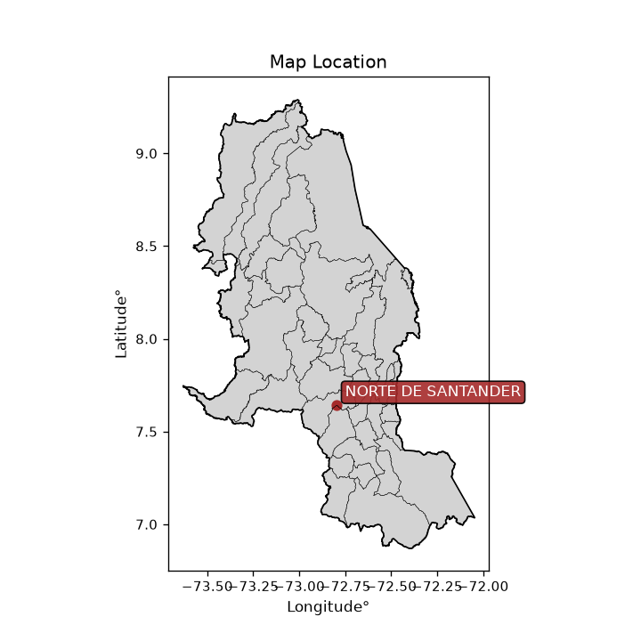</img>

| CountyID                                                                                          | CountyName         | CountyFiles                                                                                                                                                                                                                                                                                                                                                                                                                                                                                                                                                                                                                                                                                                                                                                                                                                                                                                                                                                                                                                                                                                                                                                                                                                                                                                                                                                                                                                                                                                                                                                                                                                                                                                                                                                                                                                                                                                                        |
|:--------------------------------------------------------------------------------------------------|:-------------------|:-----------------------------------------------------------------------------------------------------------------------------------------------------------------------------------------------------------------------------------------------------------------------------------------------------------------------------------------------------------------------------------------------------------------------------------------------------------------------------------------------------------------------------------------------------------------------------------------------------------------------------------------------------------------------------------------------------------------------------------------------------------------------------------------------------------------------------------------------------------------------------------------------------------------------------------------------------------------------------------------------------------------------------------------------------------------------------------------------------------------------------------------------------------------------------------------------------------------------------------------------------------------------------------------------------------------------------------------------------------------------------------------------------------------------------------------------------------------------------------------------------------------------------------------------------------------------------------------------------------------------------------------------------------------------------------------------------------------------------------------------------------------------------------------------------------------------------------------------------------------------------------------------------------------------------------|
| [54051](https://github.com/rcfdtools/R.HydroTools/blob/main/tool/Population/file/report/54051.md) | Arboledas          | [54051_Rural_Building_202606.zip](https://github.com/rcfdtools/R.GISMobile/blob/main/file/shp/54051_Rural_Building_202606.zip) [54051_Rural_Lot_202606.zip](https://github.com/rcfdtools/R.GISMobile/blob/main/file/shp/54051_Rural_Lot_202606.zip) [54051_Rural_Nomenclature_202606.zip](https://github.com/rcfdtools/R.GISMobile/blob/main/file/shp/54051_Rural_Nomenclature_202606.zip) [54051_Rural_Sector_202606.zip](https://github.com/rcfdtools/R.GISMobile/blob/main/file/shp/54051_Rural_Sector_202606.zip) [54051_Rural_Vereda_202606.zip](https://github.com/rcfdtools/R.GISMobile/blob/main/file/shp/54051_Rural_Vereda_202606.zip) [54051_Urban_Block_202606.zip](https://github.com/rcfdtools/R.GISMobile/blob/main/file/shp/54051_Urban_Block_202606.zip) [54051_Urban_Building_202606.zip](https://github.com/rcfdtools/R.GISMobile/blob/main/file/shp/54051_Urban_Building_202606.zip) [54051_Urban_Lot_202606.zip](https://github.com/rcfdtools/R.GISMobile/blob/main/file/shp/54051_Urban_Lot_202606.zip) [54051_Urban_Nomenclature_202606.zip](https://github.com/rcfdtools/R.GISMobile/blob/main/file/shp/54051_Urban_Nomenclature_202606.zip) [54051_Urban_Nomenclature_Road_202606.zip](https://github.com/rcfdtools/R.GISMobile/blob/main/file/shp/54051_Urban_Nomenclature_Road_202606.zip) [54051_Urban_Perimeter_202606.zip](https://github.com/rcfdtools/R.GISMobile/blob/main/file/shp/54051_Urban_Perimeter_202606.zip)                                                                                                                                                                                                                                                                                                                                                                                                                                 |
| [54099](https://github.com/rcfdtools/R.HydroTools/blob/main/tool/Population/file/report/54099.md) | Bochalema          | [54099_Rural_Building_202606.zip](https://github.com/rcfdtools/R.GISMobile/blob/main/file/shp/54099_Rural_Building_202606.zip) [54099_Rural_Lot_202606.zip](https://github.com/rcfdtools/R.GISMobile/blob/main/file/shp/54099_Rural_Lot_202606.zip) [54099_Rural_Nomenclature_202606.zip](https://github.com/rcfdtools/R.GISMobile/blob/main/file/shp/54099_Rural_Nomenclature_202606.zip) [54099_Rural_Vereda_202606.zip](https://github.com/rcfdtools/R.GISMobile/blob/main/file/shp/54099_Rural_Vereda_202606.zip) [54099_Urban_Block_202606.zip](https://github.com/rcfdtools/R.GISMobile/blob/main/file/shp/54099_Urban_Block_202606.zip) [54099_Urban_Building_202606.zip](https://github.com/rcfdtools/R.GISMobile/blob/main/file/shp/54099_Urban_Building_202606.zip) [54099_Urban_Lot_202606.zip](https://github.com/rcfdtools/R.GISMobile/blob/main/file/shp/54099_Urban_Lot_202606.zip) [54099_Urban_Nomenclature_202606.zip](https://github.com/rcfdtools/R.GISMobile/blob/main/file/shp/54099_Urban_Nomenclature_202606.zip) [54099_Urban_Nomenclature_Road_202606.zip](https://github.com/rcfdtools/R.GISMobile/blob/main/file/shp/54099_Urban_Nomenclature_Road_202606.zip) [54099_Urban_Perimeter_202606.zip](https://github.com/rcfdtools/R.GISMobile/blob/main/file/shp/54099_Urban_Perimeter_202606.zip)                                                                                                                                                                                                                                                                                                                                                                                                                                                                                                                                                                |
| [54109](https://github.com/rcfdtools/R.HydroTools/blob/main/tool/Population/file/report/54109.md) | Bucarasica         | [54109_Rural_Lot_202001.zip](https://github.com/rcfdtools/R.GISMobile/blob/main/file/shp/54109_Rural_Lot_202001.zip) [54109_Urban_Lot_202001.zip](https://github.com/rcfdtools/R.GISMobile/blob/main/file/shp/54109_Urban_Lot_202001.zip)                                                                                                                                                                                                                                                                                                                                                                                                                                                                                                                                                                                                                                                                                                                                                                                                                                                                                                                                                                                                                                                                                                                                                                                                                                                                                                                                                                                                                                                                                                                                                                                                                                                                                  |
| [54172](https://github.com/rcfdtools/R.HydroTools/blob/main/tool/Population/file/report/54172.md) | Chinácota          | [54172_Rural_Building_202606.zip](https://github.com/rcfdtools/R.GISMobile/blob/main/file/shp/54172_Rural_Building_202606.zip) [54172_Rural_Lot_202606.zip](https://github.com/rcfdtools/R.GISMobile/blob/main/file/shp/54172_Rural_Lot_202606.zip) [54172_Rural_Nomenclature_202606.zip](https://github.com/rcfdtools/R.GISMobile/blob/main/file/shp/54172_Rural_Nomenclature_202606.zip) [54172_Rural_Vereda_202606.zip](https://github.com/rcfdtools/R.GISMobile/blob/main/file/shp/54172_Rural_Vereda_202606.zip) [54172_Urban_Block_202606.zip](https://github.com/rcfdtools/R.GISMobile/blob/main/file/shp/54172_Urban_Block_202606.zip) [54172_Urban_Building_202606.zip](https://github.com/rcfdtools/R.GISMobile/blob/main/file/shp/54172_Urban_Building_202606.zip) [54172_Urban_Lot_202606.zip](https://github.com/rcfdtools/R.GISMobile/blob/main/file/shp/54172_Urban_Lot_202606.zip) [54172_Urban_Nomenclature_202606.zip](https://github.com/rcfdtools/R.GISMobile/blob/main/file/shp/54172_Urban_Nomenclature_202606.zip) [54172_Urban_Nomenclature_Road_202606.zip](https://github.com/rcfdtools/R.GISMobile/blob/main/file/shp/54172_Urban_Nomenclature_Road_202606.zip) [54172_Urban_Perimeter_202606.zip](https://github.com/rcfdtools/R.GISMobile/blob/main/file/shp/54172_Urban_Perimeter_202606.zip)                                                                                                                                                                                                                                                                                                                                                                                                                                                                                                                                                                |
| [54174](https://github.com/rcfdtools/R.HydroTools/blob/main/tool/Population/file/report/54174.md) | Chitagá            | [54174_Rural_Building_202606.zip](https://github.com/rcfdtools/R.GISMobile/blob/main/file/shp/54174_Rural_Building_202606.zip) [54174_Rural_Lot_202606.zip](https://github.com/rcfdtools/R.GISMobile/blob/main/file/shp/54174_Rural_Lot_202606.zip) [54174_Rural_Nomenclature_202606.zip](https://github.com/rcfdtools/R.GISMobile/blob/main/file/shp/54174_Rural_Nomenclature_202606.zip) [54174_Rural_Sector_202606.zip](https://github.com/rcfdtools/R.GISMobile/blob/main/file/shp/54174_Rural_Sector_202606.zip) [54174_Rural_Vereda_202606.zip](https://github.com/rcfdtools/R.GISMobile/blob/main/file/shp/54174_Rural_Vereda_202606.zip) [54174_Urban_Block_202606.zip](https://github.com/rcfdtools/R.GISMobile/blob/main/file/shp/54174_Urban_Block_202606.zip) [54174_Urban_Building_202606.zip](https://github.com/rcfdtools/R.GISMobile/blob/main/file/shp/54174_Urban_Building_202606.zip) [54174_Urban_Lot_202606.zip](https://github.com/rcfdtools/R.GISMobile/blob/main/file/shp/54174_Urban_Lot_202606.zip) [54174_Urban_Nomenclature_202606.zip](https://github.com/rcfdtools/R.GISMobile/blob/main/file/shp/54174_Urban_Nomenclature_202606.zip) [54174_Urban_Nomenclature_Road_202606.zip](https://github.com/rcfdtools/R.GISMobile/blob/main/file/shp/54174_Urban_Nomenclature_Road_202606.zip) [54174_Urban_Perimeter_202606.zip](https://github.com/rcfdtools/R.GISMobile/blob/main/file/shp/54174_Urban_Perimeter_202606.zip)                                                                                                                                                                                                                                                                                                                                                                                                                                 |
| [54206](https://github.com/rcfdtools/R.HydroTools/blob/main/tool/Population/file/report/54206.md) | Convención         | [54206_Rural_Lot_202001.zip](https://github.com/rcfdtools/R.GISMobile/blob/main/file/shp/54206_Rural_Lot_202001.zip) [54206_Urban_Lot_202001.zip](https://github.com/rcfdtools/R.GISMobile/blob/main/file/shp/54206_Urban_Lot_202001.zip)                                                                                                                                                                                                                                                                                                                                                                                                                                                                                                                                                                                                                                                                                                                                                                                                                                                                                                                                                                                                                                                                                                                                                                                                                                                                                                                                                                                                                                                                                                                                                                                                                                                                                  |
| [54223](https://github.com/rcfdtools/R.HydroTools/blob/main/tool/Population/file/report/54223.md) | Cucutilla          | [54223_Rural_Building_202606.zip](https://github.com/rcfdtools/R.GISMobile/blob/main/file/shp/54223_Rural_Building_202606.zip) [54223_Rural_Lot_202606.zip](https://github.com/rcfdtools/R.GISMobile/blob/main/file/shp/54223_Rural_Lot_202606.zip) [54223_Rural_Nomenclature_202606.zip](https://github.com/rcfdtools/R.GISMobile/blob/main/file/shp/54223_Rural_Nomenclature_202606.zip) [54223_Rural_Sector_202606.zip](https://github.com/rcfdtools/R.GISMobile/blob/main/file/shp/54223_Rural_Sector_202606.zip) [54223_Rural_Vereda_202606.zip](https://github.com/rcfdtools/R.GISMobile/blob/main/file/shp/54223_Rural_Vereda_202606.zip) [54223_Urban_Block_202606.zip](https://github.com/rcfdtools/R.GISMobile/blob/main/file/shp/54223_Urban_Block_202606.zip) [54223_Urban_Building_202606.zip](https://github.com/rcfdtools/R.GISMobile/blob/main/file/shp/54223_Urban_Building_202606.zip) [54223_Urban_Lot_202606.zip](https://github.com/rcfdtools/R.GISMobile/blob/main/file/shp/54223_Urban_Lot_202606.zip) [54223_Urban_Nomenclature_202606.zip](https://github.com/rcfdtools/R.GISMobile/blob/main/file/shp/54223_Urban_Nomenclature_202606.zip) [54223_Urban_Nomenclature_Road_202606.zip](https://github.com/rcfdtools/R.GISMobile/blob/main/file/shp/54223_Urban_Nomenclature_Road_202606.zip) [54223_Urban_Perimeter_202606.zip](https://github.com/rcfdtools/R.GISMobile/blob/main/file/shp/54223_Urban_Perimeter_202606.zip)                                                                                                                                                                                                                                                                                                                                                                                                                                 |
| [54128](https://github.com/rcfdtools/R.HydroTools/blob/main/tool/Population/file/report/54128.md) | Cáchira            | [54128_Rural_Lot_202001.zip](https://github.com/rcfdtools/R.GISMobile/blob/main/file/shp/54128_Rural_Lot_202001.zip) [54128_Urban_Lot_202001.zip](https://github.com/rcfdtools/R.GISMobile/blob/main/file/shp/54128_Urban_Lot_202001.zip)                                                                                                                                                                                                                                                                                                                                                                                                                                                                                                                                                                                                                                                                                                                                                                                                                                                                                                                                                                                                                                                                                                                                                                                                                                                                                                                                                                                                                                                                                                                                                                                                                                                                                  |
| [54125](https://github.com/rcfdtools/R.HydroTools/blob/main/tool/Population/file/report/54125.md) | Cácota             | [54125_Rural_Lot_202606.zip](https://github.com/rcfdtools/R.GISMobile/blob/main/file/shp/54125_Rural_Lot_202606.zip) [54125_Rural_Nomenclature_202606.zip](https://github.com/rcfdtools/R.GISMobile/blob/main/file/shp/54125_Rural_Nomenclature_202606.zip) [54125_Rural_Sector_202606.zip](https://github.com/rcfdtools/R.GISMobile/blob/main/file/shp/54125_Rural_Sector_202606.zip) [54125_Rural_Vereda_202606.zip](https://github.com/rcfdtools/R.GISMobile/blob/main/file/shp/54125_Rural_Vereda_202606.zip) [54125_Urban_Block_202606.zip](https://github.com/rcfdtools/R.GISMobile/blob/main/file/shp/54125_Urban_Block_202606.zip) [54125_Urban_Building_202606.zip](https://github.com/rcfdtools/R.GISMobile/blob/main/file/shp/54125_Urban_Building_202606.zip) [54125_Urban_Lot_202606.zip](https://github.com/rcfdtools/R.GISMobile/blob/main/file/shp/54125_Urban_Lot_202606.zip) [54125_Urban_Nomenclature_202606.zip](https://github.com/rcfdtools/R.GISMobile/blob/main/file/shp/54125_Urban_Nomenclature_202606.zip) [54125_Urban_Nomenclature_Road_202606.zip](https://github.com/rcfdtools/R.GISMobile/blob/main/file/shp/54125_Urban_Nomenclature_Road_202606.zip) [54125_Urban_Perimeter_202606.zip](https://github.com/rcfdtools/R.GISMobile/blob/main/file/shp/54125_Urban_Perimeter_202606.zip)                                                                                                                                                                                                                                                                                                                                                                                                                                                                                                                                                                    |
| [54239](https://github.com/rcfdtools/R.HydroTools/blob/main/tool/Population/file/report/54239.md) | Durania            | [54239_Rural_Lot_202606.zip](https://github.com/rcfdtools/R.GISMobile/blob/main/file/shp/54239_Rural_Lot_202606.zip) [54239_Rural_Nomenclature_202606.zip](https://github.com/rcfdtools/R.GISMobile/blob/main/file/shp/54239_Rural_Nomenclature_202606.zip) [54239_Rural_Sector_202606.zip](https://github.com/rcfdtools/R.GISMobile/blob/main/file/shp/54239_Rural_Sector_202606.zip) [54239_Rural_Vereda_202606.zip](https://github.com/rcfdtools/R.GISMobile/blob/main/file/shp/54239_Rural_Vereda_202606.zip) [54239_Urban_Block_202606.zip](https://github.com/rcfdtools/R.GISMobile/blob/main/file/shp/54239_Urban_Block_202606.zip) [54239_Urban_Building_202606.zip](https://github.com/rcfdtools/R.GISMobile/blob/main/file/shp/54239_Urban_Building_202606.zip) [54239_Urban_Lot_202606.zip](https://github.com/rcfdtools/R.GISMobile/blob/main/file/shp/54239_Urban_Lot_202606.zip) [54239_Urban_Neighborhood_202606.zip](https://github.com/rcfdtools/R.GISMobile/blob/main/file/shp/54239_Urban_Neighborhood_202606.zip) [54239_Urban_Nomenclature_202606.zip](https://github.com/rcfdtools/R.GISMobile/blob/main/file/shp/54239_Urban_Nomenclature_202606.zip) [54239_Urban_Nomenclature_Road_202606.zip](https://github.com/rcfdtools/R.GISMobile/blob/main/file/shp/54239_Urban_Nomenclature_Road_202606.zip) [54239_Urban_Perimeter_202606.zip](https://github.com/rcfdtools/R.GISMobile/blob/main/file/shp/54239_Urban_Perimeter_202606.zip) [54239_Urban_Sector_202606.zip](https://github.com/rcfdtools/R.GISMobile/blob/main/file/shp/54239_Urban_Sector_202606.zip)                                                                                                                                                                                                                                                                                          |
| [54245](https://github.com/rcfdtools/R.HydroTools/blob/main/tool/Population/file/report/54245.md) | El Carmen          | [54245_Rural_Lot_202001.zip](https://github.com/rcfdtools/R.GISMobile/blob/main/file/shp/54245_Rural_Lot_202001.zip) [54245_Urban_Lot_202001.zip](https://github.com/rcfdtools/R.GISMobile/blob/main/file/shp/54245_Urban_Lot_202001.zip)                                                                                                                                                                                                                                                                                                                                                                                                                                                                                                                                                                                                                                                                                                                                                                                                                                                                                                                                                                                                                                                                                                                                                                                                                                                                                                                                                                                                                                                                                                                                                                                                                                                                                  |
| [54250](https://github.com/rcfdtools/R.HydroTools/blob/main/tool/Population/file/report/54250.md) | El Tarra           | [54250_Rural_Lot_202001.zip](https://github.com/rcfdtools/R.GISMobile/blob/main/file/shp/54250_Rural_Lot_202001.zip) [54250_Urban_Lot_202001.zip](https://github.com/rcfdtools/R.GISMobile/blob/main/file/shp/54250_Urban_Lot_202001.zip)                                                                                                                                                                                                                                                                                                                                                                                                                                                                                                                                                                                                                                                                                                                                                                                                                                                                                                                                                                                                                                                                                                                                                                                                                                                                                                                                                                                                                                                                                                                                                                                                                                                                                  |
| [54261](https://github.com/rcfdtools/R.HydroTools/blob/main/tool/Population/file/report/54261.md) | El Zulia           | [54261_Rural_Building_202606.zip](https://github.com/rcfdtools/R.GISMobile/blob/main/file/shp/54261_Rural_Building_202606.zip) [54261_Rural_Lot_202606.zip](https://github.com/rcfdtools/R.GISMobile/blob/main/file/shp/54261_Rural_Lot_202606.zip) [54261_Rural_Nomenclature_202606.zip](https://github.com/rcfdtools/R.GISMobile/blob/main/file/shp/54261_Rural_Nomenclature_202606.zip) [54261_Rural_Vereda_202606.zip](https://github.com/rcfdtools/R.GISMobile/blob/main/file/shp/54261_Rural_Vereda_202606.zip) [54261_Urban_Block_202606.zip](https://github.com/rcfdtools/R.GISMobile/blob/main/file/shp/54261_Urban_Block_202606.zip) [54261_Urban_Building_202606.zip](https://github.com/rcfdtools/R.GISMobile/blob/main/file/shp/54261_Urban_Building_202606.zip) [54261_Urban_Lot_202606.zip](https://github.com/rcfdtools/R.GISMobile/blob/main/file/shp/54261_Urban_Lot_202606.zip) [54261_Urban_Nomenclature_202606.zip](https://github.com/rcfdtools/R.GISMobile/blob/main/file/shp/54261_Urban_Nomenclature_202606.zip) [54261_Urban_Nomenclature_Road_202606.zip](https://github.com/rcfdtools/R.GISMobile/blob/main/file/shp/54261_Urban_Nomenclature_Road_202606.zip) [54261_Urban_Perimeter_202606.zip](https://github.com/rcfdtools/R.GISMobile/blob/main/file/shp/54261_Urban_Perimeter_202606.zip)                                                                                                                                                                                                                                                                                                                                                                                                                                                                                                                                                                |
| [54313](https://github.com/rcfdtools/R.HydroTools/blob/main/tool/Population/file/report/54313.md) | Gramalote          | [54313_Rural_Building_202606.zip](https://github.com/rcfdtools/R.GISMobile/blob/main/file/shp/54313_Rural_Building_202606.zip) [54313_Rural_Lot_202606.zip](https://github.com/rcfdtools/R.GISMobile/blob/main/file/shp/54313_Rural_Lot_202606.zip) [54313_Rural_Nomenclature_202606.zip](https://github.com/rcfdtools/R.GISMobile/blob/main/file/shp/54313_Rural_Nomenclature_202606.zip) [54313_Rural_Sector_202606.zip](https://github.com/rcfdtools/R.GISMobile/blob/main/file/shp/54313_Rural_Sector_202606.zip) [54313_Rural_Vereda_202606.zip](https://github.com/rcfdtools/R.GISMobile/blob/main/file/shp/54313_Rural_Vereda_202606.zip) [54313_Urban_Block_202606.zip](https://github.com/rcfdtools/R.GISMobile/blob/main/file/shp/54313_Urban_Block_202606.zip) [54313_Urban_Building_202606.zip](https://github.com/rcfdtools/R.GISMobile/blob/main/file/shp/54313_Urban_Building_202606.zip) [54313_Urban_Lot_202606.zip](https://github.com/rcfdtools/R.GISMobile/blob/main/file/shp/54313_Urban_Lot_202606.zip) [54313_Urban_Nomenclature_202606.zip](https://github.com/rcfdtools/R.GISMobile/blob/main/file/shp/54313_Urban_Nomenclature_202606.zip) [54313_Urban_Nomenclature_Road_202606.zip](https://github.com/rcfdtools/R.GISMobile/blob/main/file/shp/54313_Urban_Nomenclature_Road_202606.zip)                                                                                                                                                                                                                                                                                                                                                                                                                                                                                                                                                                      |
| [54344](https://github.com/rcfdtools/R.HydroTools/blob/main/tool/Population/file/report/54344.md) | Hacarí             | [54344_Urban_Lot_202001.zip](https://github.com/rcfdtools/R.GISMobile/blob/main/file/shp/54344_Urban_Lot_202001.zip)                                                                                                                                                                                                                                                                                                                                                                                                                                                                                                                                                                                                                                                                                                                                                                                                                                                                                                                                                                                                                                                                                                                                                                                                                                                                                                                                                                                                                                                                                                                                                                                                                                                                                                                                                                                                           |
| [54347](https://github.com/rcfdtools/R.HydroTools/blob/main/tool/Population/file/report/54347.md) | Herrán             | [54347_Rural_Lot_202606.zip](https://github.com/rcfdtools/R.GISMobile/blob/main/file/shp/54347_Rural_Lot_202606.zip) [54347_Rural_Nomenclature_202606.zip](https://github.com/rcfdtools/R.GISMobile/blob/main/file/shp/54347_Rural_Nomenclature_202606.zip) [54347_Rural_Sector_202606.zip](https://github.com/rcfdtools/R.GISMobile/blob/main/file/shp/54347_Rural_Sector_202606.zip) [54347_Rural_Vereda_202606.zip](https://github.com/rcfdtools/R.GISMobile/blob/main/file/shp/54347_Rural_Vereda_202606.zip)                                                                                                                                                                                                                                                                                                                                                                                                                                                                                                                                                                                                                                                                                                                                                                                                                                                                                                                                                                                                                                                                                                                                                                                                                                                                                                                                                                                                  |
| [54385](https://github.com/rcfdtools/R.HydroTools/blob/main/tool/Population/file/report/54385.md) | La Esperanza       | [54385_Rural_Building_202606.zip](https://github.com/rcfdtools/R.GISMobile/blob/main/file/shp/54385_Rural_Building_202606.zip) [54385_Rural_Lot_202606.zip](https://github.com/rcfdtools/R.GISMobile/blob/main/file/shp/54385_Rural_Lot_202606.zip) [54385_Rural_Nomenclature_202606.zip](https://github.com/rcfdtools/R.GISMobile/blob/main/file/shp/54385_Rural_Nomenclature_202606.zip) [54385_Rural_Nomenclature_Road_202606.zip](https://github.com/rcfdtools/R.GISMobile/blob/main/file/shp/54385_Rural_Nomenclature_Road_202606.zip) [54385_Rural_Sector_202606.zip](https://github.com/rcfdtools/R.GISMobile/blob/main/file/shp/54385_Rural_Sector_202606.zip) [54385_Rural_Vereda_202606.zip](https://github.com/rcfdtools/R.GISMobile/blob/main/file/shp/54385_Rural_Vereda_202606.zip) [54385_Urban_Block_202606.zip](https://github.com/rcfdtools/R.GISMobile/blob/main/file/shp/54385_Urban_Block_202606.zip) [54385_Urban_Building_202606.zip](https://github.com/rcfdtools/R.GISMobile/blob/main/file/shp/54385_Urban_Building_202606.zip) [54385_Urban_Lot_202606.zip](https://github.com/rcfdtools/R.GISMobile/blob/main/file/shp/54385_Urban_Lot_202606.zip) [54385_Urban_Nomenclature_202606.zip](https://github.com/rcfdtools/R.GISMobile/blob/main/file/shp/54385_Urban_Nomenclature_202606.zip) [54385_Urban_Nomenclature_Road_202606.zip](https://github.com/rcfdtools/R.GISMobile/blob/main/file/shp/54385_Urban_Nomenclature_Road_202606.zip) [54385_Urban_Perimeter_202606.zip](https://github.com/rcfdtools/R.GISMobile/blob/main/file/shp/54385_Urban_Perimeter_202606.zip)                                                                                                                                                                                                                                                                            |
| [54398](https://github.com/rcfdtools/R.HydroTools/blob/main/tool/Population/file/report/54398.md) | La Playa           | [54398_Rural_Lot_202001.zip](https://github.com/rcfdtools/R.GISMobile/blob/main/file/shp/54398_Rural_Lot_202001.zip) [54398_Urban_Lot_202001.zip](https://github.com/rcfdtools/R.GISMobile/blob/main/file/shp/54398_Urban_Lot_202001.zip)                                                                                                                                                                                                                                                                                                                                                                                                                                                                                                                                                                                                                                                                                                                                                                                                                                                                                                                                                                                                                                                                                                                                                                                                                                                                                                                                                                                                                                                                                                                                                                                                                                                                                  |
| [54377](https://github.com/rcfdtools/R.HydroTools/blob/main/tool/Population/file/report/54377.md) | Labateca           | [54377_Rural_Building_202606.zip](https://github.com/rcfdtools/R.GISMobile/blob/main/file/shp/54377_Rural_Building_202606.zip) [54377_Rural_Lot_202606.zip](https://github.com/rcfdtools/R.GISMobile/blob/main/file/shp/54377_Rural_Lot_202606.zip) [54377_Rural_Nomenclature_202606.zip](https://github.com/rcfdtools/R.GISMobile/blob/main/file/shp/54377_Rural_Nomenclature_202606.zip) [54377_Rural_Sector_202606.zip](https://github.com/rcfdtools/R.GISMobile/blob/main/file/shp/54377_Rural_Sector_202606.zip) [54377_Rural_Vereda_202606.zip](https://github.com/rcfdtools/R.GISMobile/blob/main/file/shp/54377_Rural_Vereda_202606.zip) [54377_Urban_Block_202606.zip](https://github.com/rcfdtools/R.GISMobile/blob/main/file/shp/54377_Urban_Block_202606.zip) [54377_Urban_Building_202606.zip](https://github.com/rcfdtools/R.GISMobile/blob/main/file/shp/54377_Urban_Building_202606.zip) [54377_Urban_Lot_202606.zip](https://github.com/rcfdtools/R.GISMobile/blob/main/file/shp/54377_Urban_Lot_202606.zip) [54377_Urban_Nomenclature_202606.zip](https://github.com/rcfdtools/R.GISMobile/blob/main/file/shp/54377_Urban_Nomenclature_202606.zip) [54377_Urban_Nomenclature_Road_202606.zip](https://github.com/rcfdtools/R.GISMobile/blob/main/file/shp/54377_Urban_Nomenclature_Road_202606.zip) [54377_Urban_Perimeter_202606.zip](https://github.com/rcfdtools/R.GISMobile/blob/main/file/shp/54377_Urban_Perimeter_202606.zip)                                                                                                                                                                                                                                                                                                                                                                                                                                 |
| [54405](https://github.com/rcfdtools/R.HydroTools/blob/main/tool/Population/file/report/54405.md) | Los Patios         | [54405_Rural_Building_202606.zip](https://github.com/rcfdtools/R.GISMobile/blob/main/file/shp/54405_Rural_Building_202606.zip) [54405_Rural_Lot_202606.zip](https://github.com/rcfdtools/R.GISMobile/blob/main/file/shp/54405_Rural_Lot_202606.zip) [54405_Rural_Nomenclature_202606.zip](https://github.com/rcfdtools/R.GISMobile/blob/main/file/shp/54405_Rural_Nomenclature_202606.zip) [54405_Rural_Nomenclature_Road_202606.zip](https://github.com/rcfdtools/R.GISMobile/blob/main/file/shp/54405_Rural_Nomenclature_Road_202606.zip) [54405_Rural_Vereda_202606.zip](https://github.com/rcfdtools/R.GISMobile/blob/main/file/shp/54405_Rural_Vereda_202606.zip) [54405_Urban_Block_202606.zip](https://github.com/rcfdtools/R.GISMobile/blob/main/file/shp/54405_Urban_Block_202606.zip) [54405_Urban_Building_202606.zip](https://github.com/rcfdtools/R.GISMobile/blob/main/file/shp/54405_Urban_Building_202606.zip) [54405_Urban_Lot_202606.zip](https://github.com/rcfdtools/R.GISMobile/blob/main/file/shp/54405_Urban_Lot_202606.zip) [54405_Urban_Nomenclature_202606.zip](https://github.com/rcfdtools/R.GISMobile/blob/main/file/shp/54405_Urban_Nomenclature_202606.zip) [54405_Urban_Nomenclature_Road_202606.zip](https://github.com/rcfdtools/R.GISMobile/blob/main/file/shp/54405_Urban_Nomenclature_Road_202606.zip) [54405_Urban_Perimeter_202606.zip](https://github.com/rcfdtools/R.GISMobile/blob/main/file/shp/54405_Urban_Perimeter_202606.zip) [54405_Urban_Sector_202606.zip](https://github.com/rcfdtools/R.GISMobile/blob/main/file/shp/54405_Urban_Sector_202606.zip)                                                                                                                                                                                                                                                                            |
| [54418](https://github.com/rcfdtools/R.HydroTools/blob/main/tool/Population/file/report/54418.md) | Lourdes            | [54418_Rural_Building_202606.zip](https://github.com/rcfdtools/R.GISMobile/blob/main/file/shp/54418_Rural_Building_202606.zip) [54418_Rural_Lot_202606.zip](https://github.com/rcfdtools/R.GISMobile/blob/main/file/shp/54418_Rural_Lot_202606.zip) [54418_Rural_Nomenclature_202606.zip](https://github.com/rcfdtools/R.GISMobile/blob/main/file/shp/54418_Rural_Nomenclature_202606.zip) [54418_Rural_Sector_202606.zip](https://github.com/rcfdtools/R.GISMobile/blob/main/file/shp/54418_Rural_Sector_202606.zip) [54418_Rural_Vereda_202606.zip](https://github.com/rcfdtools/R.GISMobile/blob/main/file/shp/54418_Rural_Vereda_202606.zip) [54418_Urban_Block_202606.zip](https://github.com/rcfdtools/R.GISMobile/blob/main/file/shp/54418_Urban_Block_202606.zip) [54418_Urban_Building_202606.zip](https://github.com/rcfdtools/R.GISMobile/blob/main/file/shp/54418_Urban_Building_202606.zip) [54418_Urban_Lot_202606.zip](https://github.com/rcfdtools/R.GISMobile/blob/main/file/shp/54418_Urban_Lot_202606.zip) [54418_Urban_Nomenclature_202606.zip](https://github.com/rcfdtools/R.GISMobile/blob/main/file/shp/54418_Urban_Nomenclature_202606.zip) [54418_Urban_Nomenclature_Road_202606.zip](https://github.com/rcfdtools/R.GISMobile/blob/main/file/shp/54418_Urban_Nomenclature_Road_202606.zip) [54418_Urban_Perimeter_202606.zip](https://github.com/rcfdtools/R.GISMobile/blob/main/file/shp/54418_Urban_Perimeter_202606.zip)                                                                                                                                                                                                                                                                                                                                                                                                                                 |
| [54480](https://github.com/rcfdtools/R.HydroTools/blob/main/tool/Population/file/report/54480.md) | Mutiscua           | [54480_Rural_Building_202606.zip](https://github.com/rcfdtools/R.GISMobile/blob/main/file/shp/54480_Rural_Building_202606.zip) [54480_Rural_Lot_202606.zip](https://github.com/rcfdtools/R.GISMobile/blob/main/file/shp/54480_Rural_Lot_202606.zip) [54480_Rural_Nomenclature_202606.zip](https://github.com/rcfdtools/R.GISMobile/blob/main/file/shp/54480_Rural_Nomenclature_202606.zip) [54480_Rural_Sector_202606.zip](https://github.com/rcfdtools/R.GISMobile/blob/main/file/shp/54480_Rural_Sector_202606.zip) [54480_Rural_Vereda_202606.zip](https://github.com/rcfdtools/R.GISMobile/blob/main/file/shp/54480_Rural_Vereda_202606.zip) [54480_Urban_Block_202606.zip](https://github.com/rcfdtools/R.GISMobile/blob/main/file/shp/54480_Urban_Block_202606.zip) [54480_Urban_Building_202606.zip](https://github.com/rcfdtools/R.GISMobile/blob/main/file/shp/54480_Urban_Building_202606.zip) [54480_Urban_Lot_202606.zip](https://github.com/rcfdtools/R.GISMobile/blob/main/file/shp/54480_Urban_Lot_202606.zip) [54480_Urban_Nomenclature_202606.zip](https://github.com/rcfdtools/R.GISMobile/blob/main/file/shp/54480_Urban_Nomenclature_202606.zip) [54480_Urban_Nomenclature_Road_202606.zip](https://github.com/rcfdtools/R.GISMobile/blob/main/file/shp/54480_Urban_Nomenclature_Road_202606.zip) [54480_Urban_Perimeter_202606.zip](https://github.com/rcfdtools/R.GISMobile/blob/main/file/shp/54480_Urban_Perimeter_202606.zip)                                                                                                                                                                                                                                                                                                                                                                                                                                 |
| [54498](https://github.com/rcfdtools/R.HydroTools/blob/main/tool/Population/file/report/54498.md) | Ocaña              | [54498_Rural_Building_202606.zip](https://github.com/rcfdtools/R.GISMobile/blob/main/file/shp/54498_Rural_Building_202606.zip) [54498_Rural_Lot_202606.zip](https://github.com/rcfdtools/R.GISMobile/blob/main/file/shp/54498_Rural_Lot_202606.zip) [54498_Rural_Nomenclature_202606.zip](https://github.com/rcfdtools/R.GISMobile/blob/main/file/shp/54498_Rural_Nomenclature_202606.zip) [54498_Rural_Nomenclature_Road_202606.zip](https://github.com/rcfdtools/R.GISMobile/blob/main/file/shp/54498_Rural_Nomenclature_Road_202606.zip) [54498_Rural_Sector_202606.zip](https://github.com/rcfdtools/R.GISMobile/blob/main/file/shp/54498_Rural_Sector_202606.zip) [54498_Rural_Vereda_202606.zip](https://github.com/rcfdtools/R.GISMobile/blob/main/file/shp/54498_Rural_Vereda_202606.zip) [54498_Urban_Block_202606.zip](https://github.com/rcfdtools/R.GISMobile/blob/main/file/shp/54498_Urban_Block_202606.zip) [54498_Urban_Building_202606.zip](https://github.com/rcfdtools/R.GISMobile/blob/main/file/shp/54498_Urban_Building_202606.zip) [54498_Urban_Lot_202606.zip](https://github.com/rcfdtools/R.GISMobile/blob/main/file/shp/54498_Urban_Lot_202606.zip) [54498_Urban_Nomenclature_202606.zip](https://github.com/rcfdtools/R.GISMobile/blob/main/file/shp/54498_Urban_Nomenclature_202606.zip) [54498_Urban_Nomenclature_Road_202606.zip](https://github.com/rcfdtools/R.GISMobile/blob/main/file/shp/54498_Urban_Nomenclature_Road_202606.zip) [54498_Urban_Perimeter_202606.zip](https://github.com/rcfdtools/R.GISMobile/blob/main/file/shp/54498_Urban_Perimeter_202606.zip) [54498_Urban_Sector_202606.zip](https://github.com/rcfdtools/R.GISMobile/blob/main/file/shp/54498_Urban_Sector_202606.zip)                                                                                                                                             |
| [54518](https://github.com/rcfdtools/R.HydroTools/blob/main/tool/Population/file/report/54518.md) | Pamplona           | [54518_Rural_Building_202606.zip](https://github.com/rcfdtools/R.GISMobile/blob/main/file/shp/54518_Rural_Building_202606.zip) [54518_Rural_Lot_202606.zip](https://github.com/rcfdtools/R.GISMobile/blob/main/file/shp/54518_Rural_Lot_202606.zip) [54518_Rural_Nomenclature_202606.zip](https://github.com/rcfdtools/R.GISMobile/blob/main/file/shp/54518_Rural_Nomenclature_202606.zip) [54518_Rural_Sector_202606.zip](https://github.com/rcfdtools/R.GISMobile/blob/main/file/shp/54518_Rural_Sector_202606.zip) [54518_Rural_Vereda_202606.zip](https://github.com/rcfdtools/R.GISMobile/blob/main/file/shp/54518_Rural_Vereda_202606.zip) [54518_Urban_Block_202606.zip](https://github.com/rcfdtools/R.GISMobile/blob/main/file/shp/54518_Urban_Block_202606.zip) [54518_Urban_Building_202606.zip](https://github.com/rcfdtools/R.GISMobile/blob/main/file/shp/54518_Urban_Building_202606.zip) [54518_Urban_Lot_202606.zip](https://github.com/rcfdtools/R.GISMobile/blob/main/file/shp/54518_Urban_Lot_202606.zip) [54518_Urban_Nomenclature_202606.zip](https://github.com/rcfdtools/R.GISMobile/blob/main/file/shp/54518_Urban_Nomenclature_202606.zip) [54518_Urban_Nomenclature_Road_202606.zip](https://github.com/rcfdtools/R.GISMobile/blob/main/file/shp/54518_Urban_Nomenclature_Road_202606.zip) [54518_Urban_Perimeter_202606.zip](https://github.com/rcfdtools/R.GISMobile/blob/main/file/shp/54518_Urban_Perimeter_202606.zip) [54518_Urban_Sector_202606.zip](https://github.com/rcfdtools/R.GISMobile/blob/main/file/shp/54518_Urban_Sector_202606.zip)                                                                                                                                                                                                                                                                                                  |
| [54520](https://github.com/rcfdtools/R.HydroTools/blob/main/tool/Population/file/report/54520.md) | Pamplonita         | [54520_Rural_Building_202606.zip](https://github.com/rcfdtools/R.GISMobile/blob/main/file/shp/54520_Rural_Building_202606.zip) [54520_Rural_Lot_202606.zip](https://github.com/rcfdtools/R.GISMobile/blob/main/file/shp/54520_Rural_Lot_202606.zip) [54520_Rural_Nomenclature_202606.zip](https://github.com/rcfdtools/R.GISMobile/blob/main/file/shp/54520_Rural_Nomenclature_202606.zip) [54520_Rural_Sector_202606.zip](https://github.com/rcfdtools/R.GISMobile/blob/main/file/shp/54520_Rural_Sector_202606.zip) [54520_Rural_Vereda_202606.zip](https://github.com/rcfdtools/R.GISMobile/blob/main/file/shp/54520_Rural_Vereda_202606.zip) [54520_Urban_Block_202606.zip](https://github.com/rcfdtools/R.GISMobile/blob/main/file/shp/54520_Urban_Block_202606.zip) [54520_Urban_Building_202606.zip](https://github.com/rcfdtools/R.GISMobile/blob/main/file/shp/54520_Urban_Building_202606.zip) [54520_Urban_Lot_202606.zip](https://github.com/rcfdtools/R.GISMobile/blob/main/file/shp/54520_Urban_Lot_202606.zip) [54520_Urban_Nomenclature_202606.zip](https://github.com/rcfdtools/R.GISMobile/blob/main/file/shp/54520_Urban_Nomenclature_202606.zip) [54520_Urban_Nomenclature_Road_202606.zip](https://github.com/rcfdtools/R.GISMobile/blob/main/file/shp/54520_Urban_Nomenclature_Road_202606.zip) [54520_Urban_Perimeter_202606.zip](https://github.com/rcfdtools/R.GISMobile/blob/main/file/shp/54520_Urban_Perimeter_202606.zip)                                                                                                                                                                                                                                                                                                                                                                                                                                 |
| [54553](https://github.com/rcfdtools/R.HydroTools/blob/main/tool/Population/file/report/54553.md) | Puerto Santander   | [54553_Rural_Lot_202606.zip](https://github.com/rcfdtools/R.GISMobile/blob/main/file/shp/54553_Rural_Lot_202606.zip) [54553_Rural_Sector_202606.zip](https://github.com/rcfdtools/R.GISMobile/blob/main/file/shp/54553_Rural_Sector_202606.zip) [54553_Rural_Vereda_202606.zip](https://github.com/rcfdtools/R.GISMobile/blob/main/file/shp/54553_Rural_Vereda_202606.zip)                                                                                                                                                                                                                                                                                                                                                                                                                                                                                                                                                                                                                                                                                                                                                                                                                                                                                                                                                                                                                                                                                                                                                                                                                                                                                                                                                                                                                                                                                                                                             |
| [54599](https://github.com/rcfdtools/R.HydroTools/blob/main/tool/Population/file/report/54599.md) | Ragonvalia         | [54599_Rural_Building_202606.zip](https://github.com/rcfdtools/R.GISMobile/blob/main/file/shp/54599_Rural_Building_202606.zip) [54599_Rural_Lot_202606.zip](https://github.com/rcfdtools/R.GISMobile/blob/main/file/shp/54599_Rural_Lot_202606.zip) [54599_Rural_Nomenclature_202606.zip](https://github.com/rcfdtools/R.GISMobile/blob/main/file/shp/54599_Rural_Nomenclature_202606.zip) [54599_Rural_Sector_202606.zip](https://github.com/rcfdtools/R.GISMobile/blob/main/file/shp/54599_Rural_Sector_202606.zip) [54599_Rural_Vereda_202606.zip](https://github.com/rcfdtools/R.GISMobile/blob/main/file/shp/54599_Rural_Vereda_202606.zip)                                                                                                                                                                                                                                                                                                                                                                                                                                                                                                                                                                                                                                                                                                                                                                                                                                                                                                                                                                                                                                                                                                                                                                                                                                                               |
| [54660](https://github.com/rcfdtools/R.HydroTools/blob/main/tool/Population/file/report/54660.md) | Salazar            | [54660_Rural_Building_202606.zip](https://github.com/rcfdtools/R.GISMobile/blob/main/file/shp/54660_Rural_Building_202606.zip) [54660_Rural_Lot_202606.zip](https://github.com/rcfdtools/R.GISMobile/blob/main/file/shp/54660_Rural_Lot_202606.zip) [54660_Rural_Nomenclature_202606.zip](https://github.com/rcfdtools/R.GISMobile/blob/main/file/shp/54660_Rural_Nomenclature_202606.zip) [54660_Rural_Nomenclature_Road_202606.zip](https://github.com/rcfdtools/R.GISMobile/blob/main/file/shp/54660_Rural_Nomenclature_Road_202606.zip) [54660_Rural_Sector_202606.zip](https://github.com/rcfdtools/R.GISMobile/blob/main/file/shp/54660_Rural_Sector_202606.zip) [54660_Rural_Vereda_202606.zip](https://github.com/rcfdtools/R.GISMobile/blob/main/file/shp/54660_Rural_Vereda_202606.zip) [54660_Urban_Block_202606.zip](https://github.com/rcfdtools/R.GISMobile/blob/main/file/shp/54660_Urban_Block_202606.zip) [54660_Urban_Building_202606.zip](https://github.com/rcfdtools/R.GISMobile/blob/main/file/shp/54660_Urban_Building_202606.zip) [54660_Urban_Lot_202606.zip](https://github.com/rcfdtools/R.GISMobile/blob/main/file/shp/54660_Urban_Lot_202606.zip) [54660_Urban_Neighborhood_202606.zip](https://github.com/rcfdtools/R.GISMobile/blob/main/file/shp/54660_Urban_Neighborhood_202606.zip) [54660_Urban_Nomenclature_202606.zip](https://github.com/rcfdtools/R.GISMobile/blob/main/file/shp/54660_Urban_Nomenclature_202606.zip) [54660_Urban_Nomenclature_Road_202606.zip](https://github.com/rcfdtools/R.GISMobile/blob/main/file/shp/54660_Urban_Nomenclature_Road_202606.zip) [54660_Urban_Perimeter_202606.zip](https://github.com/rcfdtools/R.GISMobile/blob/main/file/shp/54660_Urban_Perimeter_202606.zip) [54660_Urban_Sector_202606.zip](https://github.com/rcfdtools/R.GISMobile/blob/main/file/shp/54660_Urban_Sector_202606.zip)  |
| [54670](https://github.com/rcfdtools/R.HydroTools/blob/main/tool/Population/file/report/54670.md) | San Calixto        | [54670_Rural_Lot_202001.zip](https://github.com/rcfdtools/R.GISMobile/blob/main/file/shp/54670_Rural_Lot_202001.zip) [54670_Urban_Lot_202001.zip](https://github.com/rcfdtools/R.GISMobile/blob/main/file/shp/54670_Urban_Lot_202001.zip)                                                                                                                                                                                                                                                                                                                                                                                                                                                                                                                                                                                                                                                                                                                                                                                                                                                                                                                                                                                                                                                                                                                                                                                                                                                                                                                                                                                                                                                                                                                                                                                                                                                                                  |
| [54673](https://github.com/rcfdtools/R.HydroTools/blob/main/tool/Population/file/report/54673.md) | San Cayetano       | [54673_Rural_Building_202606.zip](https://github.com/rcfdtools/R.GISMobile/blob/main/file/shp/54673_Rural_Building_202606.zip) [54673_Rural_Lot_202606.zip](https://github.com/rcfdtools/R.GISMobile/blob/main/file/shp/54673_Rural_Lot_202606.zip) [54673_Rural_Nomenclature_202606.zip](https://github.com/rcfdtools/R.GISMobile/blob/main/file/shp/54673_Rural_Nomenclature_202606.zip) [54673_Rural_Nomenclature_Road_202606.zip](https://github.com/rcfdtools/R.GISMobile/blob/main/file/shp/54673_Rural_Nomenclature_Road_202606.zip) [54673_Rural_Vereda_202606.zip](https://github.com/rcfdtools/R.GISMobile/blob/main/file/shp/54673_Rural_Vereda_202606.zip) [54673_Urban_Block_202606.zip](https://github.com/rcfdtools/R.GISMobile/blob/main/file/shp/54673_Urban_Block_202606.zip) [54673_Urban_Building_202606.zip](https://github.com/rcfdtools/R.GISMobile/blob/main/file/shp/54673_Urban_Building_202606.zip) [54673_Urban_Lot_202606.zip](https://github.com/rcfdtools/R.GISMobile/blob/main/file/shp/54673_Urban_Lot_202606.zip) [54673_Urban_Nomenclature_202606.zip](https://github.com/rcfdtools/R.GISMobile/blob/main/file/shp/54673_Urban_Nomenclature_202606.zip) [54673_Urban_Nomenclature_Road_202606.zip](https://github.com/rcfdtools/R.GISMobile/blob/main/file/shp/54673_Urban_Nomenclature_Road_202606.zip) [54673_Urban_Perimeter_202606.zip](https://github.com/rcfdtools/R.GISMobile/blob/main/file/shp/54673_Urban_Perimeter_202606.zip)                                                                                                                                                                                                                                                                                                                                                                                                           |
| [54001](https://github.com/rcfdtools/R.HydroTools/blob/main/tool/Population/file/report/54001.md) | San José de Cúcuta | [54001_Rural_Lot_202001.zip](https://github.com/rcfdtools/R.GISMobile/blob/main/file/shp/54001_Rural_Lot_202001.zip) [54001_Urban_Lot_202001.zip](https://github.com/rcfdtools/R.GISMobile/blob/main/file/shp/54001_Urban_Lot_202001.zip)                                                                                                                                                                                                                                                                                                                                                                                                                                                                                                                                                                                                                                                                                                                                                                                                                                                                                                                                                                                                                                                                                                                                                                                                                                                                                                                                                                                                                                                                                                                                                                                                                                                                                  |
| [54680](https://github.com/rcfdtools/R.HydroTools/blob/main/tool/Population/file/report/54680.md) | Santiago           | [54680_Rural_Building_202606.zip](https://github.com/rcfdtools/R.GISMobile/blob/main/file/shp/54680_Rural_Building_202606.zip) [54680_Rural_Lot_202606.zip](https://github.com/rcfdtools/R.GISMobile/blob/main/file/shp/54680_Rural_Lot_202606.zip) [54680_Rural_Nomenclature_202606.zip](https://github.com/rcfdtools/R.GISMobile/blob/main/file/shp/54680_Rural_Nomenclature_202606.zip) [54680_Rural_Sector_202606.zip](https://github.com/rcfdtools/R.GISMobile/blob/main/file/shp/54680_Rural_Sector_202606.zip) [54680_Rural_Vereda_202606.zip](https://github.com/rcfdtools/R.GISMobile/blob/main/file/shp/54680_Rural_Vereda_202606.zip) [54680_Urban_Block_202606.zip](https://github.com/rcfdtools/R.GISMobile/blob/main/file/shp/54680_Urban_Block_202606.zip) [54680_Urban_Building_202606.zip](https://github.com/rcfdtools/R.GISMobile/blob/main/file/shp/54680_Urban_Building_202606.zip) [54680_Urban_Lot_202606.zip](https://github.com/rcfdtools/R.GISMobile/blob/main/file/shp/54680_Urban_Lot_202606.zip) [54680_Urban_Neighborhood_202606.zip](https://github.com/rcfdtools/R.GISMobile/blob/main/file/shp/54680_Urban_Neighborhood_202606.zip) [54680_Urban_Nomenclature_202606.zip](https://github.com/rcfdtools/R.GISMobile/blob/main/file/shp/54680_Urban_Nomenclature_202606.zip) [54680_Urban_Nomenclature_Road_202606.zip](https://github.com/rcfdtools/R.GISMobile/blob/main/file/shp/54680_Urban_Nomenclature_Road_202606.zip) [54680_Urban_Perimeter_202606.zip](https://github.com/rcfdtools/R.GISMobile/blob/main/file/shp/54680_Urban_Perimeter_202606.zip) [54680_Urban_Sector_202606.zip](https://github.com/rcfdtools/R.GISMobile/blob/main/file/shp/54680_Urban_Sector_202606.zip)                                                                                                                                                       |
| [54720](https://github.com/rcfdtools/R.HydroTools/blob/main/tool/Population/file/report/54720.md) | Sardinata          | [54720_Rural_Lot_202001.zip](https://github.com/rcfdtools/R.GISMobile/blob/main/file/shp/54720_Rural_Lot_202001.zip) [54720_Urban_Lot_202001.zip](https://github.com/rcfdtools/R.GISMobile/blob/main/file/shp/54720_Urban_Lot_202001.zip)                                                                                                                                                                                                                                                                                                                                                                                                                                                                                                                                                                                                                                                                                                                                                                                                                                                                                                                                                                                                                                                                                                                                                                                                                                                                                                                                                                                                                                                                                                                                                                                                                                                                                  |
| [54743](https://github.com/rcfdtools/R.HydroTools/blob/main/tool/Population/file/report/54743.md) | Silos              | [54743_Rural_Building_202606.zip](https://github.com/rcfdtools/R.GISMobile/blob/main/file/shp/54743_Rural_Building_202606.zip) [54743_Rural_Lot_202606.zip](https://github.com/rcfdtools/R.GISMobile/blob/main/file/shp/54743_Rural_Lot_202606.zip) [54743_Rural_Nomenclature_202606.zip](https://github.com/rcfdtools/R.GISMobile/blob/main/file/shp/54743_Rural_Nomenclature_202606.zip) [54743_Rural_Sector_202606.zip](https://github.com/rcfdtools/R.GISMobile/blob/main/file/shp/54743_Rural_Sector_202606.zip) [54743_Rural_Vereda_202606.zip](https://github.com/rcfdtools/R.GISMobile/blob/main/file/shp/54743_Rural_Vereda_202606.zip) [54743_Urban_Block_202606.zip](https://github.com/rcfdtools/R.GISMobile/blob/main/file/shp/54743_Urban_Block_202606.zip) [54743_Urban_Building_202606.zip](https://github.com/rcfdtools/R.GISMobile/blob/main/file/shp/54743_Urban_Building_202606.zip) [54743_Urban_Lot_202606.zip](https://github.com/rcfdtools/R.GISMobile/blob/main/file/shp/54743_Urban_Lot_202606.zip) [54743_Urban_Nomenclature_202606.zip](https://github.com/rcfdtools/R.GISMobile/blob/main/file/shp/54743_Urban_Nomenclature_202606.zip) [54743_Urban_Nomenclature_Road_202606.zip](https://github.com/rcfdtools/R.GISMobile/blob/main/file/shp/54743_Urban_Nomenclature_Road_202606.zip) [54743_Urban_Perimeter_202606.zip](https://github.com/rcfdtools/R.GISMobile/blob/main/file/shp/54743_Urban_Perimeter_202606.zip)                                                                                                                                                                                                                                                                                                                                                                                                                                 |
| [54800](https://github.com/rcfdtools/R.HydroTools/blob/main/tool/Population/file/report/54800.md) | Teorama            | [54800_Rural_Lot_202001.zip](https://github.com/rcfdtools/R.GISMobile/blob/main/file/shp/54800_Rural_Lot_202001.zip) [54800_Urban_Lot_202001.zip](https://github.com/rcfdtools/R.GISMobile/blob/main/file/shp/54800_Urban_Lot_202001.zip)                                                                                                                                                                                                                                                                                                                                                                                                                                                                                                                                                                                                                                                                                                                                                                                                                                                                                                                                                                                                                                                                                                                                                                                                                                                                                                                                                                                                                                                                                                                                                                                                                                                                                  |
| [54810](https://github.com/rcfdtools/R.HydroTools/blob/main/tool/Population/file/report/54810.md) | Tibú               | [54810_Rural_Building_202606.zip](https://github.com/rcfdtools/R.GISMobile/blob/main/file/shp/54810_Rural_Building_202606.zip) [54810_Rural_Lot_202606.zip](https://github.com/rcfdtools/R.GISMobile/blob/main/file/shp/54810_Rural_Lot_202606.zip) [54810_Rural_Nomenclature_202606.zip](https://github.com/rcfdtools/R.GISMobile/blob/main/file/shp/54810_Rural_Nomenclature_202606.zip) [54810_Rural_Sector_202606.zip](https://github.com/rcfdtools/R.GISMobile/blob/main/file/shp/54810_Rural_Sector_202606.zip) [54810_Rural_Vereda_202606.zip](https://github.com/rcfdtools/R.GISMobile/blob/main/file/shp/54810_Rural_Vereda_202606.zip) [54810_Urban_Nomenclature_Road_202606.zip](https://github.com/rcfdtools/R.GISMobile/blob/main/file/shp/54810_Urban_Nomenclature_Road_202606.zip)                                                                                                                                                                                                                                                                                                                                                                                                                                                                                                                                                                                                                                                                                                                                                                                                                                                                                                                                                                                                                                                                                                          |
| [54820](https://github.com/rcfdtools/R.HydroTools/blob/main/tool/Population/file/report/54820.md) | Toledo             | [54820_Urban_Block_202606.zip](https://github.com/rcfdtools/R.GISMobile/blob/main/file/shp/54820_Urban_Block_202606.zip) [54820_Urban_Building_202606.zip](https://github.com/rcfdtools/R.GISMobile/blob/main/file/shp/54820_Urban_Building_202606.zip) [54820_Urban_Lot_202606.zip](https://github.com/rcfdtools/R.GISMobile/blob/main/file/shp/54820_Urban_Lot_202606.zip) [54820_Urban_Nomenclature_202606.zip](https://github.com/rcfdtools/R.GISMobile/blob/main/file/shp/54820_Urban_Nomenclature_202606.zip) [54820_Urban_Nomenclature_Road_202606.zip](https://github.com/rcfdtools/R.GISMobile/blob/main/file/shp/54820_Urban_Nomenclature_Road_202606.zip) [54820_Urban_Perimeter_202606.zip](https://github.com/rcfdtools/R.GISMobile/blob/main/file/shp/54820_Urban_Perimeter_202606.zip)                                                                                                                                                                                                                                                                                                                                                                                                                                                                                                                                                                                                                                                                                                                                                                                                                                                                                                                                                                                                                                                                                                      |
| [54871](https://github.com/rcfdtools/R.HydroTools/blob/main/tool/Population/file/report/54871.md) | Villa Caro         | [54871_Rural_Lot_202606.zip](https://github.com/rcfdtools/R.GISMobile/blob/main/file/shp/54871_Rural_Lot_202606.zip) [54871_Rural_Nomenclature_202606.zip](https://github.com/rcfdtools/R.GISMobile/blob/main/file/shp/54871_Rural_Nomenclature_202606.zip) [54871_Rural_Sector_202606.zip](https://github.com/rcfdtools/R.GISMobile/blob/main/file/shp/54871_Rural_Sector_202606.zip) [54871_Rural_Vereda_202606.zip](https://github.com/rcfdtools/R.GISMobile/blob/main/file/shp/54871_Rural_Vereda_202606.zip) [54871_Urban_Block_202606.zip](https://github.com/rcfdtools/R.GISMobile/blob/main/file/shp/54871_Urban_Block_202606.zip) [54871_Urban_Building_202606.zip](https://github.com/rcfdtools/R.GISMobile/blob/main/file/shp/54871_Urban_Building_202606.zip) [54871_Urban_Lot_202606.zip](https://github.com/rcfdtools/R.GISMobile/blob/main/file/shp/54871_Urban_Lot_202606.zip) [54871_Urban_Neighborhood_202606.zip](https://github.com/rcfdtools/R.GISMobile/blob/main/file/shp/54871_Urban_Neighborhood_202606.zip) [54871_Urban_Nomenclature_202606.zip](https://github.com/rcfdtools/R.GISMobile/blob/main/file/shp/54871_Urban_Nomenclature_202606.zip) [54871_Urban_Nomenclature_Road_202606.zip](https://github.com/rcfdtools/R.GISMobile/blob/main/file/shp/54871_Urban_Nomenclature_Road_202606.zip) [54871_Urban_Perimeter_202606.zip](https://github.com/rcfdtools/R.GISMobile/blob/main/file/shp/54871_Urban_Perimeter_202606.zip) [54871_Urban_Sector_202606.zip](https://github.com/rcfdtools/R.GISMobile/blob/main/file/shp/54871_Urban_Sector_202606.zip)                                                                                                                                                                                                                                                                                          |
| [54874](https://github.com/rcfdtools/R.HydroTools/blob/main/tool/Population/file/report/54874.md) | Villa Del Rosario  | [54874_Rural_Building_202606.zip](https://github.com/rcfdtools/R.GISMobile/blob/main/file/shp/54874_Rural_Building_202606.zip) [54874_Rural_Lot_202606.zip](https://github.com/rcfdtools/R.GISMobile/blob/main/file/shp/54874_Rural_Lot_202606.zip) [54874_Rural_Vereda_202606.zip](https://github.com/rcfdtools/R.GISMobile/blob/main/file/shp/54874_Rural_Vereda_202606.zip)                                                                                                                                                                                                                                                                                                                                                                                                                                                                                                                                                                                                                                                                                                                                                                                                                                                                                                                                                                                                                                                                                                                                                                                                                                                                                                                                                                                                                                                                                                                                         |
| [54003](https://github.com/rcfdtools/R.HydroTools/blob/main/tool/Population/file/report/54003.md) | Ábrego             | [54003_Rural_Lot_202001.zip](https://github.com/rcfdtools/R.GISMobile/blob/main/file/shp/54003_Rural_Lot_202001.zip) [54003_Urban_Lot_202001.zip](https://github.com/rcfdtools/R.GISMobile/blob/main/file/shp/54003_Urban_Lot_202001.zip)                                                                                                                                                                                                                                                                                                                                                                                                                                                                                                                                                                                                                                                                                                                                                                                                                                                                                                                                                                                                                                                                                                                                                                                                                                                                                                                                                                                                                                                                                                                                                                                                                                                                                  |

# 63 - Quindío (12 Counties)

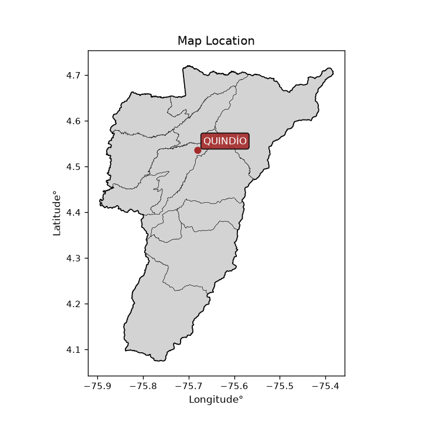</img>

| CountyID                                                                                          | CountyName   | CountyFiles                                                                                                                                                                                                                                                                                                                                                                                                                                                                                                                                                                                                                                                                                                                                                                                                                                                                                                                                                                                                                                                                                                                                                                                                                                                                                                                                                                                                                                                                                         |
|:--------------------------------------------------------------------------------------------------|:-------------|:----------------------------------------------------------------------------------------------------------------------------------------------------------------------------------------------------------------------------------------------------------------------------------------------------------------------------------------------------------------------------------------------------------------------------------------------------------------------------------------------------------------------------------------------------------------------------------------------------------------------------------------------------------------------------------------------------------------------------------------------------------------------------------------------------------------------------------------------------------------------------------------------------------------------------------------------------------------------------------------------------------------------------------------------------------------------------------------------------------------------------------------------------------------------------------------------------------------------------------------------------------------------------------------------------------------------------------------------------------------------------------------------------------------------------------------------------------------------------------------------------|
| [63001](https://github.com/rcfdtools/R.HydroTools/blob/main/tool/Population/file/report/63001.md) | Armenia      | [63001_Rural_Lot_202001.zip](https://github.com/rcfdtools/R.GISMobile/blob/main/file/shp/63001_Rural_Lot_202001.zip) [63001_Urban_Lot_202001.zip](https://github.com/rcfdtools/R.GISMobile/blob/main/file/shp/63001_Urban_Lot_202001.zip)                                                                                                                                                                                                                                                                                                                                                                                                                                                                                                                                                                                                                                                                                                                                                                                                                                                                                                                                                                                                                                                                                                                                                                                                                                                   |
| [63111](https://github.com/rcfdtools/R.HydroTools/blob/main/tool/Population/file/report/63111.md) | Buenavista   | [63111_Rural_Lot_202606.zip](https://github.com/rcfdtools/R.GISMobile/blob/main/file/shp/63111_Rural_Lot_202606.zip) [63111_Urban_Lot_202606.zip](https://github.com/rcfdtools/R.GISMobile/blob/main/file/shp/63111_Urban_Lot_202606.zip)                                                                                                                                                                                                                                                                                                                                                                                                                                                                                                                                                                                                                                                                                                                                                                                                                                                                                                                                                                                                                                                                                                                                                                                                                                                   |
| [63130](https://github.com/rcfdtools/R.HydroTools/blob/main/tool/Population/file/report/63130.md) | Calarcá      | [63130_Rural_Building_202606.zip](https://github.com/rcfdtools/R.GISMobile/blob/main/file/shp/63130_Rural_Building_202606.zip) [63130_Rural_Lot_202606.zip](https://github.com/rcfdtools/R.GISMobile/blob/main/file/shp/63130_Rural_Lot_202606.zip) [63130_Rural_Nomenclature_202606.zip](https://github.com/rcfdtools/R.GISMobile/blob/main/file/shp/63130_Rural_Nomenclature_202606.zip) [63130_Rural_Sector_202606.zip](https://github.com/rcfdtools/R.GISMobile/blob/main/file/shp/63130_Rural_Sector_202606.zip) [63130_Rural_Vereda_202606.zip](https://github.com/rcfdtools/R.GISMobile/blob/main/file/shp/63130_Rural_Vereda_202606.zip) [63130_Urban_Block_202606.zip](https://github.com/rcfdtools/R.GISMobile/blob/main/file/shp/63130_Urban_Block_202606.zip) [63130_Urban_Building_202606.zip](https://github.com/rcfdtools/R.GISMobile/blob/main/file/shp/63130_Urban_Building_202606.zip) [63130_Urban_Lot_202606.zip](https://github.com/rcfdtools/R.GISMobile/blob/main/file/shp/63130_Urban_Lot_202606.zip) [63130_Urban_Nomenclature_202606.zip](https://github.com/rcfdtools/R.GISMobile/blob/main/file/shp/63130_Urban_Nomenclature_202606.zip) [63130_Urban_Nomenclature_Road_202606.zip](https://github.com/rcfdtools/R.GISMobile/blob/main/file/shp/63130_Urban_Nomenclature_Road_202606.zip) [63130_Urban_Perimeter_202606.zip](https://github.com/rcfdtools/R.GISMobile/blob/main/file/shp/63130_Urban_Perimeter_202606.zip)  |
| [63190](https://github.com/rcfdtools/R.HydroTools/blob/main/tool/Population/file/report/63190.md) | Circasia     | [63190_Rural_Building_202606.zip](https://github.com/rcfdtools/R.GISMobile/blob/main/file/shp/63190_Rural_Building_202606.zip) [63190_Rural_Lot_202606.zip](https://github.com/rcfdtools/R.GISMobile/blob/main/file/shp/63190_Rural_Lot_202606.zip) [63190_Rural_Nomenclature_202606.zip](https://github.com/rcfdtools/R.GISMobile/blob/main/file/shp/63190_Rural_Nomenclature_202606.zip) [63190_Rural_Vereda_202606.zip](https://github.com/rcfdtools/R.GISMobile/blob/main/file/shp/63190_Rural_Vereda_202606.zip) [63190_Urban_Block_202606.zip](https://github.com/rcfdtools/R.GISMobile/blob/main/file/shp/63190_Urban_Block_202606.zip) [63190_Urban_Building_202606.zip](https://github.com/rcfdtools/R.GISMobile/blob/main/file/shp/63190_Urban_Building_202606.zip) [63190_Urban_Lot_202606.zip](https://github.com/rcfdtools/R.GISMobile/blob/main/file/shp/63190_Urban_Lot_202606.zip) [63190_Urban_Nomenclature_202606.zip](https://github.com/rcfdtools/R.GISMobile/blob/main/file/shp/63190_Urban_Nomenclature_202606.zip) [63190_Urban_Nomenclature_Road_202606.zip](https://github.com/rcfdtools/R.GISMobile/blob/main/file/shp/63190_Urban_Nomenclature_Road_202606.zip) [63190_Urban_Perimeter_202606.zip](https://github.com/rcfdtools/R.GISMobile/blob/main/file/shp/63190_Urban_Perimeter_202606.zip)                                                                                                                                 |
| [63212](https://github.com/rcfdtools/R.HydroTools/blob/main/tool/Population/file/report/63212.md) | Córdoba      | [63212_Rural_Lot_202606.zip](https://github.com/rcfdtools/R.GISMobile/blob/main/file/shp/63212_Rural_Lot_202606.zip) [63212_Urban_Lot_202606.zip](https://github.com/rcfdtools/R.GISMobile/blob/main/file/shp/63212_Urban_Lot_202606.zip)                                                                                                                                                                                                                                                                                                                                                                                                                                                                                                                                                                                                                                                                                                                                                                                                                                                                                                                                                                                                                                                                                                                                                                                                                                                   |
| [63272](https://github.com/rcfdtools/R.HydroTools/blob/main/tool/Population/file/report/63272.md) | Filandia     | [63272_Rural_Lot_202606.zip](https://github.com/rcfdtools/R.GISMobile/blob/main/file/shp/63272_Rural_Lot_202606.zip) [63272_Urban_Lot_202606.zip](https://github.com/rcfdtools/R.GISMobile/blob/main/file/shp/63272_Urban_Lot_202606.zip)                                                                                                                                                                                                                                                                                                                                                                                                                                                                                                                                                                                                                                                                                                                                                                                                                                                                                                                                                                                                                                                                                                                                                                                                                                                   |
| [63302](https://github.com/rcfdtools/R.HydroTools/blob/main/tool/Population/file/report/63302.md) | Génova       | [63302_Rural_Building_202606.zip](https://github.com/rcfdtools/R.GISMobile/blob/main/file/shp/63302_Rural_Building_202606.zip) [63302_Rural_Lot_202606.zip](https://github.com/rcfdtools/R.GISMobile/blob/main/file/shp/63302_Rural_Lot_202606.zip) [63302_Rural_Nomenclature_202606.zip](https://github.com/rcfdtools/R.GISMobile/blob/main/file/shp/63302_Rural_Nomenclature_202606.zip) [63302_Rural_Vereda_202606.zip](https://github.com/rcfdtools/R.GISMobile/blob/main/file/shp/63302_Rural_Vereda_202606.zip) [63302_Urban_Block_202606.zip](https://github.com/rcfdtools/R.GISMobile/blob/main/file/shp/63302_Urban_Block_202606.zip) [63302_Urban_Building_202606.zip](https://github.com/rcfdtools/R.GISMobile/blob/main/file/shp/63302_Urban_Building_202606.zip) [63302_Urban_Lot_202606.zip](https://github.com/rcfdtools/R.GISMobile/blob/main/file/shp/63302_Urban_Lot_202606.zip) [63302_Urban_Nomenclature_202606.zip](https://github.com/rcfdtools/R.GISMobile/blob/main/file/shp/63302_Urban_Nomenclature_202606.zip) [63302_Urban_Nomenclature_Road_202606.zip](https://github.com/rcfdtools/R.GISMobile/blob/main/file/shp/63302_Urban_Nomenclature_Road_202606.zip) [63302_Urban_Perimeter_202606.zip](https://github.com/rcfdtools/R.GISMobile/blob/main/file/shp/63302_Urban_Perimeter_202606.zip)                                                                                                                                 |
| [63401](https://github.com/rcfdtools/R.HydroTools/blob/main/tool/Population/file/report/63401.md) | La Tebaida   | [63401_Rural_Building_202606.zip](https://github.com/rcfdtools/R.GISMobile/blob/main/file/shp/63401_Rural_Building_202606.zip) [63401_Rural_Lot_202606.zip](https://github.com/rcfdtools/R.GISMobile/blob/main/file/shp/63401_Rural_Lot_202606.zip) [63401_Rural_Nomenclature_202606.zip](https://github.com/rcfdtools/R.GISMobile/blob/main/file/shp/63401_Rural_Nomenclature_202606.zip) [63401_Rural_Sector_202606.zip](https://github.com/rcfdtools/R.GISMobile/blob/main/file/shp/63401_Rural_Sector_202606.zip) [63401_Rural_Vereda_202606.zip](https://github.com/rcfdtools/R.GISMobile/blob/main/file/shp/63401_Rural_Vereda_202606.zip) [63401_Urban_Block_202606.zip](https://github.com/rcfdtools/R.GISMobile/blob/main/file/shp/63401_Urban_Block_202606.zip) [63401_Urban_Building_202606.zip](https://github.com/rcfdtools/R.GISMobile/blob/main/file/shp/63401_Urban_Building_202606.zip) [63401_Urban_Lot_202606.zip](https://github.com/rcfdtools/R.GISMobile/blob/main/file/shp/63401_Urban_Lot_202606.zip) [63401_Urban_Nomenclature_202606.zip](https://github.com/rcfdtools/R.GISMobile/blob/main/file/shp/63401_Urban_Nomenclature_202606.zip) [63401_Urban_Nomenclature_Road_202606.zip](https://github.com/rcfdtools/R.GISMobile/blob/main/file/shp/63401_Urban_Nomenclature_Road_202606.zip) [63401_Urban_Perimeter_202606.zip](https://github.com/rcfdtools/R.GISMobile/blob/main/file/shp/63401_Urban_Perimeter_202606.zip)  |
| [63470](https://github.com/rcfdtools/R.HydroTools/blob/main/tool/Population/file/report/63470.md) | Montenegro   | [63470_Rural_Lot_202606.zip](https://github.com/rcfdtools/R.GISMobile/blob/main/file/shp/63470_Rural_Lot_202606.zip) [63470_Urban_Lot_202606.zip](https://github.com/rcfdtools/R.GISMobile/blob/main/file/shp/63470_Urban_Lot_202606.zip)                                                                                                                                                                                                                                                                                                                                                                                                                                                                                                                                                                                                                                                                                                                                                                                                                                                                                                                                                                                                                                                                                                                                                                                                                                                   |
| [63548](https://github.com/rcfdtools/R.HydroTools/blob/main/tool/Population/file/report/63548.md) | Pijao        | [63548_Rural_Building_202606.zip](https://github.com/rcfdtools/R.GISMobile/blob/main/file/shp/63548_Rural_Building_202606.zip) [63548_Rural_Lot_202606.zip](https://github.com/rcfdtools/R.GISMobile/blob/main/file/shp/63548_Rural_Lot_202606.zip) [63548_Rural_Nomenclature_202606.zip](https://github.com/rcfdtools/R.GISMobile/blob/main/file/shp/63548_Rural_Nomenclature_202606.zip) [63548_Rural_Vereda_202606.zip](https://github.com/rcfdtools/R.GISMobile/blob/main/file/shp/63548_Rural_Vereda_202606.zip) [63548_Urban_Block_202606.zip](https://github.com/rcfdtools/R.GISMobile/blob/main/file/shp/63548_Urban_Block_202606.zip) [63548_Urban_Building_202606.zip](https://github.com/rcfdtools/R.GISMobile/blob/main/file/shp/63548_Urban_Building_202606.zip) [63548_Urban_Lot_202606.zip](https://github.com/rcfdtools/R.GISMobile/blob/main/file/shp/63548_Urban_Lot_202606.zip) [63548_Urban_Nomenclature_202606.zip](https://github.com/rcfdtools/R.GISMobile/blob/main/file/shp/63548_Urban_Nomenclature_202606.zip) [63548_Urban_Nomenclature_Road_202606.zip](https://github.com/rcfdtools/R.GISMobile/blob/main/file/shp/63548_Urban_Nomenclature_Road_202606.zip) [63548_Urban_Perimeter_202606.zip](https://github.com/rcfdtools/R.GISMobile/blob/main/file/shp/63548_Urban_Perimeter_202606.zip)                                                                                                                                 |
| [63594](https://github.com/rcfdtools/R.HydroTools/blob/main/tool/Population/file/report/63594.md) | Quimbaya     | [63594_Rural_Lot_202606.zip](https://github.com/rcfdtools/R.GISMobile/blob/main/file/shp/63594_Rural_Lot_202606.zip) [63594_Urban_Lot_202606.zip](https://github.com/rcfdtools/R.GISMobile/blob/main/file/shp/63594_Urban_Lot_202606.zip)                                                                                                                                                                                                                                                                                                                                                                                                                                                                                                                                                                                                                                                                                                                                                                                                                                                                                                                                                                                                                                                                                                                                                                                                                                                   |
| [63690](https://github.com/rcfdtools/R.HydroTools/blob/main/tool/Population/file/report/63690.md) | Salento      | [63690_Rural_Building_202606.zip](https://github.com/rcfdtools/R.GISMobile/blob/main/file/shp/63690_Rural_Building_202606.zip) [63690_Rural_Lot_202606.zip](https://github.com/rcfdtools/R.GISMobile/blob/main/file/shp/63690_Rural_Lot_202606.zip) [63690_Rural_Nomenclature_202606.zip](https://github.com/rcfdtools/R.GISMobile/blob/main/file/shp/63690_Rural_Nomenclature_202606.zip) [63690_Rural_Sector_202606.zip](https://github.com/rcfdtools/R.GISMobile/blob/main/file/shp/63690_Rural_Sector_202606.zip) [63690_Rural_Vereda_202606.zip](https://github.com/rcfdtools/R.GISMobile/blob/main/file/shp/63690_Rural_Vereda_202606.zip) [63690_Urban_Block_202606.zip](https://github.com/rcfdtools/R.GISMobile/blob/main/file/shp/63690_Urban_Block_202606.zip) [63690_Urban_Building_202606.zip](https://github.com/rcfdtools/R.GISMobile/blob/main/file/shp/63690_Urban_Building_202606.zip) [63690_Urban_Lot_202606.zip](https://github.com/rcfdtools/R.GISMobile/blob/main/file/shp/63690_Urban_Lot_202606.zip) [63690_Urban_Nomenclature_202606.zip](https://github.com/rcfdtools/R.GISMobile/blob/main/file/shp/63690_Urban_Nomenclature_202606.zip) [63690_Urban_Nomenclature_Road_202606.zip](https://github.com/rcfdtools/R.GISMobile/blob/main/file/shp/63690_Urban_Nomenclature_Road_202606.zip) [63690_Urban_Perimeter_202606.zip](https://github.com/rcfdtools/R.GISMobile/blob/main/file/shp/63690_Urban_Perimeter_202606.zip)  |

# 66 - Risaralda (14 Counties)

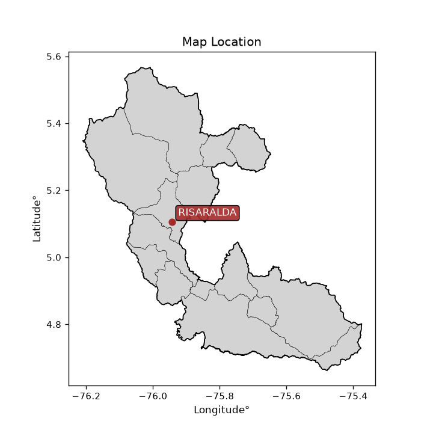</img>

| CountyID                                                                                          | CountyName          | CountyFiles                                                                                                                                                                                                                                                                                                                                                                                                                                                                                                                                                                                                                                                                                                                                                                                                                                                                                                                                                                                                                                                                                                                                                                                                                                                                                                                                                                                                                                                                                                                                                                                                                                              |
|:--------------------------------------------------------------------------------------------------|:--------------------|:---------------------------------------------------------------------------------------------------------------------------------------------------------------------------------------------------------------------------------------------------------------------------------------------------------------------------------------------------------------------------------------------------------------------------------------------------------------------------------------------------------------------------------------------------------------------------------------------------------------------------------------------------------------------------------------------------------------------------------------------------------------------------------------------------------------------------------------------------------------------------------------------------------------------------------------------------------------------------------------------------------------------------------------------------------------------------------------------------------------------------------------------------------------------------------------------------------------------------------------------------------------------------------------------------------------------------------------------------------------------------------------------------------------------------------------------------------------------------------------------------------------------------------------------------------------------------------------------------------------------------------------------------------|
| [66045](https://github.com/rcfdtools/R.HydroTools/blob/main/tool/Population/file/report/66045.md) | Apía                | [66045_Rural_Building_202606.zip](https://github.com/rcfdtools/R.GISMobile/blob/main/file/shp/66045_Rural_Building_202606.zip) [66045_Rural_Lot_202606.zip](https://github.com/rcfdtools/R.GISMobile/blob/main/file/shp/66045_Rural_Lot_202606.zip) [66045_Rural_Nomenclature_202606.zip](https://github.com/rcfdtools/R.GISMobile/blob/main/file/shp/66045_Rural_Nomenclature_202606.zip) [66045_Rural_Sector_202606.zip](https://github.com/rcfdtools/R.GISMobile/blob/main/file/shp/66045_Rural_Sector_202606.zip) [66045_Rural_Vereda_202606.zip](https://github.com/rcfdtools/R.GISMobile/blob/main/file/shp/66045_Rural_Vereda_202606.zip) [66045_Urban_Block_202606.zip](https://github.com/rcfdtools/R.GISMobile/blob/main/file/shp/66045_Urban_Block_202606.zip) [66045_Urban_Building_202606.zip](https://github.com/rcfdtools/R.GISMobile/blob/main/file/shp/66045_Urban_Building_202606.zip) [66045_Urban_Lot_202606.zip](https://github.com/rcfdtools/R.GISMobile/blob/main/file/shp/66045_Urban_Lot_202606.zip) [66045_Urban_Neighborhood_202606.zip](https://github.com/rcfdtools/R.GISMobile/blob/main/file/shp/66045_Urban_Neighborhood_202606.zip) [66045_Urban_Nomenclature_202606.zip](https://github.com/rcfdtools/R.GISMobile/blob/main/file/shp/66045_Urban_Nomenclature_202606.zip) [66045_Urban_Perimeter_202606.zip](https://github.com/rcfdtools/R.GISMobile/blob/main/file/shp/66045_Urban_Perimeter_202606.zip) [66045_Urban_Sector_202606.zip](https://github.com/rcfdtools/R.GISMobile/blob/main/file/shp/66045_Urban_Sector_202606.zip)                                  |
| [66075](https://github.com/rcfdtools/R.HydroTools/blob/main/tool/Population/file/report/66075.md) | Balboa              | [66075_Rural_Building_202606.zip](https://github.com/rcfdtools/R.GISMobile/blob/main/file/shp/66075_Rural_Building_202606.zip) [66075_Rural_Lot_202606.zip](https://github.com/rcfdtools/R.GISMobile/blob/main/file/shp/66075_Rural_Lot_202606.zip) [66075_Rural_Nomenclature_202606.zip](https://github.com/rcfdtools/R.GISMobile/blob/main/file/shp/66075_Rural_Nomenclature_202606.zip) [66075_Rural_Sector_202606.zip](https://github.com/rcfdtools/R.GISMobile/blob/main/file/shp/66075_Rural_Sector_202606.zip) [66075_Rural_Vereda_202606.zip](https://github.com/rcfdtools/R.GISMobile/blob/main/file/shp/66075_Rural_Vereda_202606.zip) [66075_Urban_Block_202606.zip](https://github.com/rcfdtools/R.GISMobile/blob/main/file/shp/66075_Urban_Block_202606.zip) [66075_Urban_Building_202606.zip](https://github.com/rcfdtools/R.GISMobile/blob/main/file/shp/66075_Urban_Building_202606.zip) [66075_Urban_Lot_202606.zip](https://github.com/rcfdtools/R.GISMobile/blob/main/file/shp/66075_Urban_Lot_202606.zip) [66075_Urban_Nomenclature_202606.zip](https://github.com/rcfdtools/R.GISMobile/blob/main/file/shp/66075_Urban_Nomenclature_202606.zip) [66075_Urban_Nomenclature_Road_202606.zip](https://github.com/rcfdtools/R.GISMobile/blob/main/file/shp/66075_Urban_Nomenclature_Road_202606.zip) [66075_Urban_Perimeter_202606.zip](https://github.com/rcfdtools/R.GISMobile/blob/main/file/shp/66075_Urban_Perimeter_202606.zip)                                                                                                                                                       |
| [66088](https://github.com/rcfdtools/R.HydroTools/blob/main/tool/Population/file/report/66088.md) | Belén De Umbría     | [66088_Rural_Building_202606.zip](https://github.com/rcfdtools/R.GISMobile/blob/main/file/shp/66088_Rural_Building_202606.zip) [66088_Rural_Lot_202606.zip](https://github.com/rcfdtools/R.GISMobile/blob/main/file/shp/66088_Rural_Lot_202606.zip) [66088_Rural_Nomenclature_202606.zip](https://github.com/rcfdtools/R.GISMobile/blob/main/file/shp/66088_Rural_Nomenclature_202606.zip) [66088_Rural_Sector_202606.zip](https://github.com/rcfdtools/R.GISMobile/blob/main/file/shp/66088_Rural_Sector_202606.zip) [66088_Rural_Vereda_202606.zip](https://github.com/rcfdtools/R.GISMobile/blob/main/file/shp/66088_Rural_Vereda_202606.zip) [66088_Urban_Block_202606.zip](https://github.com/rcfdtools/R.GISMobile/blob/main/file/shp/66088_Urban_Block_202606.zip) [66088_Urban_Building_202606.zip](https://github.com/rcfdtools/R.GISMobile/blob/main/file/shp/66088_Urban_Building_202606.zip) [66088_Urban_Lot_202606.zip](https://github.com/rcfdtools/R.GISMobile/blob/main/file/shp/66088_Urban_Lot_202606.zip) [66088_Urban_Nomenclature_202606.zip](https://github.com/rcfdtools/R.GISMobile/blob/main/file/shp/66088_Urban_Nomenclature_202606.zip) [66088_Urban_Nomenclature_Road_202606.zip](https://github.com/rcfdtools/R.GISMobile/blob/main/file/shp/66088_Urban_Nomenclature_Road_202606.zip) [66088_Urban_Perimeter_202606.zip](https://github.com/rcfdtools/R.GISMobile/blob/main/file/shp/66088_Urban_Perimeter_202606.zip)                                                                                                                                                       |
| [66170](https://github.com/rcfdtools/R.HydroTools/blob/main/tool/Population/file/report/66170.md) | Dosquebradas        | [66170_Rural_Lot_202001.zip](https://github.com/rcfdtools/R.GISMobile/blob/main/file/shp/66170_Rural_Lot_202001.zip) [66170_Urban_Lot_202001.zip](https://github.com/rcfdtools/R.GISMobile/blob/main/file/shp/66170_Urban_Lot_202001.zip)                                                                                                                                                                                                                                                                                                                                                                                                                                                                                                                                                                                                                                                                                                                                                                                                                                                                                                                                                                                                                                                                                                                                                                                                                                                                                                                                                                                                        |
| [66318](https://github.com/rcfdtools/R.HydroTools/blob/main/tool/Population/file/report/66318.md) | Guática             | [66318_Rural_Building_202606.zip](https://github.com/rcfdtools/R.GISMobile/blob/main/file/shp/66318_Rural_Building_202606.zip) [66318_Rural_Lot_202606.zip](https://github.com/rcfdtools/R.GISMobile/blob/main/file/shp/66318_Rural_Lot_202606.zip) [66318_Rural_Nomenclature_202606.zip](https://github.com/rcfdtools/R.GISMobile/blob/main/file/shp/66318_Rural_Nomenclature_202606.zip) [66318_Rural_Sector_202606.zip](https://github.com/rcfdtools/R.GISMobile/blob/main/file/shp/66318_Rural_Sector_202606.zip) [66318_Rural_Vereda_202606.zip](https://github.com/rcfdtools/R.GISMobile/blob/main/file/shp/66318_Rural_Vereda_202606.zip) [66318_Urban_Block_202606.zip](https://github.com/rcfdtools/R.GISMobile/blob/main/file/shp/66318_Urban_Block_202606.zip) [66318_Urban_Building_202606.zip](https://github.com/rcfdtools/R.GISMobile/blob/main/file/shp/66318_Urban_Building_202606.zip) [66318_Urban_Lot_202606.zip](https://github.com/rcfdtools/R.GISMobile/blob/main/file/shp/66318_Urban_Lot_202606.zip) [66318_Urban_Neighborhood_202606.zip](https://github.com/rcfdtools/R.GISMobile/blob/main/file/shp/66318_Urban_Neighborhood_202606.zip) [66318_Urban_Nomenclature_202606.zip](https://github.com/rcfdtools/R.GISMobile/blob/main/file/shp/66318_Urban_Nomenclature_202606.zip) [66318_Urban_Perimeter_202606.zip](https://github.com/rcfdtools/R.GISMobile/blob/main/file/shp/66318_Urban_Perimeter_202606.zip) [66318_Urban_Sector_202606.zip](https://github.com/rcfdtools/R.GISMobile/blob/main/file/shp/66318_Urban_Sector_202606.zip)                                  |
| [66383](https://github.com/rcfdtools/R.HydroTools/blob/main/tool/Population/file/report/66383.md) | La Celia            | [66383_Rural_Building_202606.zip](https://github.com/rcfdtools/R.GISMobile/blob/main/file/shp/66383_Rural_Building_202606.zip) [66383_Rural_Lot_202606.zip](https://github.com/rcfdtools/R.GISMobile/blob/main/file/shp/66383_Rural_Lot_202606.zip) [66383_Rural_Nomenclature_202606.zip](https://github.com/rcfdtools/R.GISMobile/blob/main/file/shp/66383_Rural_Nomenclature_202606.zip) [66383_Rural_Sector_202606.zip](https://github.com/rcfdtools/R.GISMobile/blob/main/file/shp/66383_Rural_Sector_202606.zip) [66383_Rural_Vereda_202606.zip](https://github.com/rcfdtools/R.GISMobile/blob/main/file/shp/66383_Rural_Vereda_202606.zip) [66383_Urban_Block_202606.zip](https://github.com/rcfdtools/R.GISMobile/blob/main/file/shp/66383_Urban_Block_202606.zip) [66383_Urban_Building_202606.zip](https://github.com/rcfdtools/R.GISMobile/blob/main/file/shp/66383_Urban_Building_202606.zip) [66383_Urban_Lot_202606.zip](https://github.com/rcfdtools/R.GISMobile/blob/main/file/shp/66383_Urban_Lot_202606.zip) [66383_Urban_Nomenclature_202606.zip](https://github.com/rcfdtools/R.GISMobile/blob/main/file/shp/66383_Urban_Nomenclature_202606.zip) [66383_Urban_Perimeter_202606.zip](https://github.com/rcfdtools/R.GISMobile/blob/main/file/shp/66383_Urban_Perimeter_202606.zip) [66383_Urban_Sector_202606.zip](https://github.com/rcfdtools/R.GISMobile/blob/main/file/shp/66383_Urban_Sector_202606.zip)                                                                                                                                                                             |
| [66400](https://github.com/rcfdtools/R.HydroTools/blob/main/tool/Population/file/report/66400.md) | La Virginia         | [66400_Rural_Lot_202001.zip](https://github.com/rcfdtools/R.GISMobile/blob/main/file/shp/66400_Rural_Lot_202001.zip) [66400_Urban_Lot_202001.zip](https://github.com/rcfdtools/R.GISMobile/blob/main/file/shp/66400_Urban_Lot_202001.zip)                                                                                                                                                                                                                                                                                                                                                                                                                                                                                                                                                                                                                                                                                                                                                                                                                                                                                                                                                                                                                                                                                                                                                                                                                                                                                                                                                                                                        |
| [66440](https://github.com/rcfdtools/R.HydroTools/blob/main/tool/Population/file/report/66440.md) | Marsella            | [66440_Rural_Building_202606.zip](https://github.com/rcfdtools/R.GISMobile/blob/main/file/shp/66440_Rural_Building_202606.zip) [66440_Rural_Lot_202606.zip](https://github.com/rcfdtools/R.GISMobile/blob/main/file/shp/66440_Rural_Lot_202606.zip) [66440_Rural_Nomenclature_202606.zip](https://github.com/rcfdtools/R.GISMobile/blob/main/file/shp/66440_Rural_Nomenclature_202606.zip) [66440_Rural_Nomenclature_Road_202606.zip](https://github.com/rcfdtools/R.GISMobile/blob/main/file/shp/66440_Rural_Nomenclature_Road_202606.zip) [66440_Rural_Sector_202606.zip](https://github.com/rcfdtools/R.GISMobile/blob/main/file/shp/66440_Rural_Sector_202606.zip) [66440_Rural_Vereda_202606.zip](https://github.com/rcfdtools/R.GISMobile/blob/main/file/shp/66440_Rural_Vereda_202606.zip) [66440_Urban_Block_202606.zip](https://github.com/rcfdtools/R.GISMobile/blob/main/file/shp/66440_Urban_Block_202606.zip) [66440_Urban_Building_202606.zip](https://github.com/rcfdtools/R.GISMobile/blob/main/file/shp/66440_Urban_Building_202606.zip) [66440_Urban_Lot_202606.zip](https://github.com/rcfdtools/R.GISMobile/blob/main/file/shp/66440_Urban_Lot_202606.zip) [66440_Urban_Nomenclature_202606.zip](https://github.com/rcfdtools/R.GISMobile/blob/main/file/shp/66440_Urban_Nomenclature_202606.zip) [66440_Urban_Nomenclature_Road_202606.zip](https://github.com/rcfdtools/R.GISMobile/blob/main/file/shp/66440_Urban_Nomenclature_Road_202606.zip) [66440_Urban_Perimeter_202606.zip](https://github.com/rcfdtools/R.GISMobile/blob/main/file/shp/66440_Urban_Perimeter_202606.zip)  |
| [66456](https://github.com/rcfdtools/R.HydroTools/blob/main/tool/Population/file/report/66456.md) | Mistrató            | [66456_Rural_Building_202606.zip](https://github.com/rcfdtools/R.GISMobile/blob/main/file/shp/66456_Rural_Building_202606.zip) [66456_Rural_Lot_202606.zip](https://github.com/rcfdtools/R.GISMobile/blob/main/file/shp/66456_Rural_Lot_202606.zip) [66456_Rural_Nomenclature_202606.zip](https://github.com/rcfdtools/R.GISMobile/blob/main/file/shp/66456_Rural_Nomenclature_202606.zip) [66456_Rural_Nomenclature_Road_202606.zip](https://github.com/rcfdtools/R.GISMobile/blob/main/file/shp/66456_Rural_Nomenclature_Road_202606.zip) [66456_Rural_Sector_202606.zip](https://github.com/rcfdtools/R.GISMobile/blob/main/file/shp/66456_Rural_Sector_202606.zip) [66456_Rural_Vereda_202606.zip](https://github.com/rcfdtools/R.GISMobile/blob/main/file/shp/66456_Rural_Vereda_202606.zip) [66456_Urban_Block_202606.zip](https://github.com/rcfdtools/R.GISMobile/blob/main/file/shp/66456_Urban_Block_202606.zip) [66456_Urban_Building_202606.zip](https://github.com/rcfdtools/R.GISMobile/blob/main/file/shp/66456_Urban_Building_202606.zip) [66456_Urban_Lot_202606.zip](https://github.com/rcfdtools/R.GISMobile/blob/main/file/shp/66456_Urban_Lot_202606.zip) [66456_Urban_Nomenclature_202606.zip](https://github.com/rcfdtools/R.GISMobile/blob/main/file/shp/66456_Urban_Nomenclature_202606.zip) [66456_Urban_Nomenclature_Road_202606.zip](https://github.com/rcfdtools/R.GISMobile/blob/main/file/shp/66456_Urban_Nomenclature_Road_202606.zip) [66456_Urban_Perimeter_202606.zip](https://github.com/rcfdtools/R.GISMobile/blob/main/file/shp/66456_Urban_Perimeter_202606.zip)  |
| [66001](https://github.com/rcfdtools/R.HydroTools/blob/main/tool/Population/file/report/66001.md) | Pereira             | [66001_Rural_Lot_202001.zip](https://github.com/rcfdtools/R.GISMobile/blob/main/file/shp/66001_Rural_Lot_202001.zip) [66001_Urban_Lot_202001.zip](https://github.com/rcfdtools/R.GISMobile/blob/main/file/shp/66001_Urban_Lot_202001.zip)                                                                                                                                                                                                                                                                                                                                                                                                                                                                                                                                                                                                                                                                                                                                                                                                                                                                                                                                                                                                                                                                                                                                                                                                                                                                                                                                                                                                        |
| [66572](https://github.com/rcfdtools/R.HydroTools/blob/main/tool/Population/file/report/66572.md) | Pueblo Rico         | [66572_Rural_Building_202606.zip](https://github.com/rcfdtools/R.GISMobile/blob/main/file/shp/66572_Rural_Building_202606.zip) [66572_Rural_Lot_202606.zip](https://github.com/rcfdtools/R.GISMobile/blob/main/file/shp/66572_Rural_Lot_202606.zip) [66572_Rural_Nomenclature_202606.zip](https://github.com/rcfdtools/R.GISMobile/blob/main/file/shp/66572_Rural_Nomenclature_202606.zip) [66572_Rural_Sector_202606.zip](https://github.com/rcfdtools/R.GISMobile/blob/main/file/shp/66572_Rural_Sector_202606.zip) [66572_Rural_Vereda_202606.zip](https://github.com/rcfdtools/R.GISMobile/blob/main/file/shp/66572_Rural_Vereda_202606.zip) [66572_Urban_Block_202606.zip](https://github.com/rcfdtools/R.GISMobile/blob/main/file/shp/66572_Urban_Block_202606.zip) [66572_Urban_Building_202606.zip](https://github.com/rcfdtools/R.GISMobile/blob/main/file/shp/66572_Urban_Building_202606.zip) [66572_Urban_Lot_202606.zip](https://github.com/rcfdtools/R.GISMobile/blob/main/file/shp/66572_Urban_Lot_202606.zip) [66572_Urban_Nomenclature_202606.zip](https://github.com/rcfdtools/R.GISMobile/blob/main/file/shp/66572_Urban_Nomenclature_202606.zip) [66572_Urban_Nomenclature_Road_202606.zip](https://github.com/rcfdtools/R.GISMobile/blob/main/file/shp/66572_Urban_Nomenclature_Road_202606.zip) [66572_Urban_Perimeter_202606.zip](https://github.com/rcfdtools/R.GISMobile/blob/main/file/shp/66572_Urban_Perimeter_202606.zip)                                                                                                                                                       |
| [66594](https://github.com/rcfdtools/R.HydroTools/blob/main/tool/Population/file/report/66594.md) | Quinchía            | [66594_Rural_Building_202606.zip](https://github.com/rcfdtools/R.GISMobile/blob/main/file/shp/66594_Rural_Building_202606.zip) [66594_Rural_Lot_202606.zip](https://github.com/rcfdtools/R.GISMobile/blob/main/file/shp/66594_Rural_Lot_202606.zip) [66594_Rural_Nomenclature_202606.zip](https://github.com/rcfdtools/R.GISMobile/blob/main/file/shp/66594_Rural_Nomenclature_202606.zip) [66594_Rural_Sector_202606.zip](https://github.com/rcfdtools/R.GISMobile/blob/main/file/shp/66594_Rural_Sector_202606.zip) [66594_Rural_Vereda_202606.zip](https://github.com/rcfdtools/R.GISMobile/blob/main/file/shp/66594_Rural_Vereda_202606.zip) [66594_Urban_Block_202606.zip](https://github.com/rcfdtools/R.GISMobile/blob/main/file/shp/66594_Urban_Block_202606.zip) [66594_Urban_Building_202606.zip](https://github.com/rcfdtools/R.GISMobile/blob/main/file/shp/66594_Urban_Building_202606.zip) [66594_Urban_Lot_202606.zip](https://github.com/rcfdtools/R.GISMobile/blob/main/file/shp/66594_Urban_Lot_202606.zip) [66594_Urban_Nomenclature_202606.zip](https://github.com/rcfdtools/R.GISMobile/blob/main/file/shp/66594_Urban_Nomenclature_202606.zip) [66594_Urban_Nomenclature_Road_202606.zip](https://github.com/rcfdtools/R.GISMobile/blob/main/file/shp/66594_Urban_Nomenclature_Road_202606.zip) [66594_Urban_Perimeter_202606.zip](https://github.com/rcfdtools/R.GISMobile/blob/main/file/shp/66594_Urban_Perimeter_202606.zip)                                                                                                                                                       |
| [66682](https://github.com/rcfdtools/R.HydroTools/blob/main/tool/Population/file/report/66682.md) | Santa Rosa De Cabal | [66682_Rural_Building_202606.zip](https://github.com/rcfdtools/R.GISMobile/blob/main/file/shp/66682_Rural_Building_202606.zip) [66682_Rural_Lot_202606.zip](https://github.com/rcfdtools/R.GISMobile/blob/main/file/shp/66682_Rural_Lot_202606.zip) [66682_Rural_Nomenclature_202606.zip](https://github.com/rcfdtools/R.GISMobile/blob/main/file/shp/66682_Rural_Nomenclature_202606.zip) [66682_Rural_Sector_202606.zip](https://github.com/rcfdtools/R.GISMobile/blob/main/file/shp/66682_Rural_Sector_202606.zip) [66682_Rural_Vereda_202606.zip](https://github.com/rcfdtools/R.GISMobile/blob/main/file/shp/66682_Rural_Vereda_202606.zip) [66682_Urban_Block_202606.zip](https://github.com/rcfdtools/R.GISMobile/blob/main/file/shp/66682_Urban_Block_202606.zip) [66682_Urban_Building_202606.zip](https://github.com/rcfdtools/R.GISMobile/blob/main/file/shp/66682_Urban_Building_202606.zip) [66682_Urban_Lot_202606.zip](https://github.com/rcfdtools/R.GISMobile/blob/main/file/shp/66682_Urban_Lot_202606.zip) [66682_Urban_Neighborhood_202606.zip](https://github.com/rcfdtools/R.GISMobile/blob/main/file/shp/66682_Urban_Neighborhood_202606.zip) [66682_Urban_Nomenclature_202606.zip](https://github.com/rcfdtools/R.GISMobile/blob/main/file/shp/66682_Urban_Nomenclature_202606.zip) [66682_Urban_Perimeter_202606.zip](https://github.com/rcfdtools/R.GISMobile/blob/main/file/shp/66682_Urban_Perimeter_202606.zip) [66682_Urban_Sector_202606.zip](https://github.com/rcfdtools/R.GISMobile/blob/main/file/shp/66682_Urban_Sector_202606.zip)                                  |
| [66687](https://github.com/rcfdtools/R.HydroTools/blob/main/tool/Population/file/report/66687.md) | Santuario           | [66687_Rural_Building_202606.zip](https://github.com/rcfdtools/R.GISMobile/blob/main/file/shp/66687_Rural_Building_202606.zip) [66687_Rural_Lot_202606.zip](https://github.com/rcfdtools/R.GISMobile/blob/main/file/shp/66687_Rural_Lot_202606.zip) [66687_Rural_Nomenclature_202606.zip](https://github.com/rcfdtools/R.GISMobile/blob/main/file/shp/66687_Rural_Nomenclature_202606.zip) [66687_Rural_Sector_202606.zip](https://github.com/rcfdtools/R.GISMobile/blob/main/file/shp/66687_Rural_Sector_202606.zip) [66687_Rural_Vereda_202606.zip](https://github.com/rcfdtools/R.GISMobile/blob/main/file/shp/66687_Rural_Vereda_202606.zip) [66687_Urban_Block_202606.zip](https://github.com/rcfdtools/R.GISMobile/blob/main/file/shp/66687_Urban_Block_202606.zip) [66687_Urban_Building_202606.zip](https://github.com/rcfdtools/R.GISMobile/blob/main/file/shp/66687_Urban_Building_202606.zip) [66687_Urban_Lot_202606.zip](https://github.com/rcfdtools/R.GISMobile/blob/main/file/shp/66687_Urban_Lot_202606.zip) [66687_Urban_Neighborhood_202606.zip](https://github.com/rcfdtools/R.GISMobile/blob/main/file/shp/66687_Urban_Neighborhood_202606.zip) [66687_Urban_Nomenclature_202606.zip](https://github.com/rcfdtools/R.GISMobile/blob/main/file/shp/66687_Urban_Nomenclature_202606.zip) [66687_Urban_Perimeter_202606.zip](https://github.com/rcfdtools/R.GISMobile/blob/main/file/shp/66687_Urban_Perimeter_202606.zip) [66687_Urban_Sector_202606.zip](https://github.com/rcfdtools/R.GISMobile/blob/main/file/shp/66687_Urban_Sector_202606.zip)                                  |

# 68 - Santander (87 Counties)

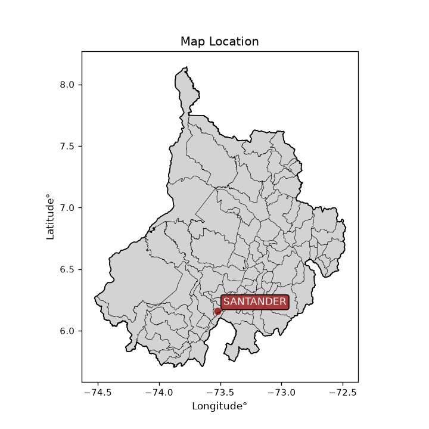</img>

| CountyID                                                                                          | CountyName             | CountyFiles                                                                                                                                                                                                                                                                                                                                                                                                                                                                                                                                                                                                                                                                                                                                                                                                                                                                                                                                                                                                                                                                                                                                                                                                                                                                                                                                                                                                                                                                                                                                                                                                                                                                                                                                                                                                                                                                                                                        |
|:--------------------------------------------------------------------------------------------------|:-----------------------|:-----------------------------------------------------------------------------------------------------------------------------------------------------------------------------------------------------------------------------------------------------------------------------------------------------------------------------------------------------------------------------------------------------------------------------------------------------------------------------------------------------------------------------------------------------------------------------------------------------------------------------------------------------------------------------------------------------------------------------------------------------------------------------------------------------------------------------------------------------------------------------------------------------------------------------------------------------------------------------------------------------------------------------------------------------------------------------------------------------------------------------------------------------------------------------------------------------------------------------------------------------------------------------------------------------------------------------------------------------------------------------------------------------------------------------------------------------------------------------------------------------------------------------------------------------------------------------------------------------------------------------------------------------------------------------------------------------------------------------------------------------------------------------------------------------------------------------------------------------------------------------------------------------------------------------------|
| [68013](https://github.com/rcfdtools/R.HydroTools/blob/main/tool/Population/file/report/68013.md) | Aguada                 | [68013_Rural_Lot_202606.zip](https://github.com/rcfdtools/R.GISMobile/blob/main/file/shp/68013_Rural_Lot_202606.zip) [68013_Rural_Nomenclature_202606.zip](https://github.com/rcfdtools/R.GISMobile/blob/main/file/shp/68013_Rural_Nomenclature_202606.zip) [68013_Rural_Sector_202606.zip](https://github.com/rcfdtools/R.GISMobile/blob/main/file/shp/68013_Rural_Sector_202606.zip) [68013_Rural_Vereda_202606.zip](https://github.com/rcfdtools/R.GISMobile/blob/main/file/shp/68013_Rural_Vereda_202606.zip) [68013_Urban_Block_202606.zip](https://github.com/rcfdtools/R.GISMobile/blob/main/file/shp/68013_Urban_Block_202606.zip) [68013_Urban_Building_202606.zip](https://github.com/rcfdtools/R.GISMobile/blob/main/file/shp/68013_Urban_Building_202606.zip) [68013_Urban_Lot_202606.zip](https://github.com/rcfdtools/R.GISMobile/blob/main/file/shp/68013_Urban_Lot_202606.zip) [68013_Urban_Nomenclature_202606.zip](https://github.com/rcfdtools/R.GISMobile/blob/main/file/shp/68013_Urban_Nomenclature_202606.zip) [68013_Urban_Nomenclature_Road_202606.zip](https://github.com/rcfdtools/R.GISMobile/blob/main/file/shp/68013_Urban_Nomenclature_Road_202606.zip) [68013_Urban_Perimeter_202606.zip](https://github.com/rcfdtools/R.GISMobile/blob/main/file/shp/68013_Urban_Perimeter_202606.zip) [68013_Urban_Sector_202606.zip](https://github.com/rcfdtools/R.GISMobile/blob/main/file/shp/68013_Urban_Sector_202606.zip)                                                                                                                                                                                                                                                                                                                                                                                                                                     |
| [68020](https://github.com/rcfdtools/R.HydroTools/blob/main/tool/Population/file/report/68020.md) | Albania                | [68020_Rural_Lot_202606.zip](https://github.com/rcfdtools/R.GISMobile/blob/main/file/shp/68020_Rural_Lot_202606.zip) [68020_Rural_Nomenclature_202606.zip](https://github.com/rcfdtools/R.GISMobile/blob/main/file/shp/68020_Rural_Nomenclature_202606.zip) [68020_Rural_Sector_202606.zip](https://github.com/rcfdtools/R.GISMobile/blob/main/file/shp/68020_Rural_Sector_202606.zip) [68020_Rural_Vereda_202606.zip](https://github.com/rcfdtools/R.GISMobile/blob/main/file/shp/68020_Rural_Vereda_202606.zip) [68020_Urban_Block_202606.zip](https://github.com/rcfdtools/R.GISMobile/blob/main/file/shp/68020_Urban_Block_202606.zip) [68020_Urban_Building_202606.zip](https://github.com/rcfdtools/R.GISMobile/blob/main/file/shp/68020_Urban_Building_202606.zip) [68020_Urban_Lot_202606.zip](https://github.com/rcfdtools/R.GISMobile/blob/main/file/shp/68020_Urban_Lot_202606.zip) [68020_Urban_Nomenclature_202606.zip](https://github.com/rcfdtools/R.GISMobile/blob/main/file/shp/68020_Urban_Nomenclature_202606.zip) [68020_Urban_Nomenclature_Road_202606.zip](https://github.com/rcfdtools/R.GISMobile/blob/main/file/shp/68020_Urban_Nomenclature_Road_202606.zip) [68020_Urban_Perimeter_202606.zip](https://github.com/rcfdtools/R.GISMobile/blob/main/file/shp/68020_Urban_Perimeter_202606.zip) [68020_Urban_Sector_202606.zip](https://github.com/rcfdtools/R.GISMobile/blob/main/file/shp/68020_Urban_Sector_202606.zip)                                                                                                                                                                                                                                                                                                                                                                                                                                     |
| [68051](https://github.com/rcfdtools/R.HydroTools/blob/main/tool/Population/file/report/68051.md) | Aratoca                | [68051_Rural_Building_202606.zip](https://github.com/rcfdtools/R.GISMobile/blob/main/file/shp/68051_Rural_Building_202606.zip) [68051_Rural_Lot_202606.zip](https://github.com/rcfdtools/R.GISMobile/blob/main/file/shp/68051_Rural_Lot_202606.zip) [68051_Rural_Nomenclature_202606.zip](https://github.com/rcfdtools/R.GISMobile/blob/main/file/shp/68051_Rural_Nomenclature_202606.zip) [68051_Rural_Sector_202606.zip](https://github.com/rcfdtools/R.GISMobile/blob/main/file/shp/68051_Rural_Sector_202606.zip) [68051_Rural_Vereda_202606.zip](https://github.com/rcfdtools/R.GISMobile/blob/main/file/shp/68051_Rural_Vereda_202606.zip) [68051_Urban_Block_202606.zip](https://github.com/rcfdtools/R.GISMobile/blob/main/file/shp/68051_Urban_Block_202606.zip) [68051_Urban_Building_202606.zip](https://github.com/rcfdtools/R.GISMobile/blob/main/file/shp/68051_Urban_Building_202606.zip) [68051_Urban_Lot_202606.zip](https://github.com/rcfdtools/R.GISMobile/blob/main/file/shp/68051_Urban_Lot_202606.zip) [68051_Urban_Nomenclature_202606.zip](https://github.com/rcfdtools/R.GISMobile/blob/main/file/shp/68051_Urban_Nomenclature_202606.zip) [68051_Urban_Nomenclature_Road_202606.zip](https://github.com/rcfdtools/R.GISMobile/blob/main/file/shp/68051_Urban_Nomenclature_Road_202606.zip) [68051_Urban_Perimeter_202606.zip](https://github.com/rcfdtools/R.GISMobile/blob/main/file/shp/68051_Urban_Perimeter_202606.zip) [68051_Urban_Sector_202606.zip](https://github.com/rcfdtools/R.GISMobile/blob/main/file/shp/68051_Urban_Sector_202606.zip)                                                                                                                                                                                                                                                                                                  |
| [68077](https://github.com/rcfdtools/R.HydroTools/blob/main/tool/Population/file/report/68077.md) | Barbosa                | [68077_Rural_Building_202606.zip](https://github.com/rcfdtools/R.GISMobile/blob/main/file/shp/68077_Rural_Building_202606.zip) [68077_Rural_Lot_202606.zip](https://github.com/rcfdtools/R.GISMobile/blob/main/file/shp/68077_Rural_Lot_202606.zip) [68077_Rural_Nomenclature_202606.zip](https://github.com/rcfdtools/R.GISMobile/blob/main/file/shp/68077_Rural_Nomenclature_202606.zip) [68077_Rural_Sector_202606.zip](https://github.com/rcfdtools/R.GISMobile/blob/main/file/shp/68077_Rural_Sector_202606.zip) [68077_Rural_Vereda_202606.zip](https://github.com/rcfdtools/R.GISMobile/blob/main/file/shp/68077_Rural_Vereda_202606.zip) [68077_Urban_Block_202606.zip](https://github.com/rcfdtools/R.GISMobile/blob/main/file/shp/68077_Urban_Block_202606.zip) [68077_Urban_Building_202606.zip](https://github.com/rcfdtools/R.GISMobile/blob/main/file/shp/68077_Urban_Building_202606.zip) [68077_Urban_Lot_202606.zip](https://github.com/rcfdtools/R.GISMobile/blob/main/file/shp/68077_Urban_Lot_202606.zip) [68077_Urban_Nomenclature_202606.zip](https://github.com/rcfdtools/R.GISMobile/blob/main/file/shp/68077_Urban_Nomenclature_202606.zip) [68077_Urban_Nomenclature_Road_202606.zip](https://github.com/rcfdtools/R.GISMobile/blob/main/file/shp/68077_Urban_Nomenclature_Road_202606.zip) [68077_Urban_Perimeter_202606.zip](https://github.com/rcfdtools/R.GISMobile/blob/main/file/shp/68077_Urban_Perimeter_202606.zip) [68077_Urban_Sector_202606.zip](https://github.com/rcfdtools/R.GISMobile/blob/main/file/shp/68077_Urban_Sector_202606.zip)                                                                                                                                                                                                                                                                                                  |
| [68079](https://github.com/rcfdtools/R.HydroTools/blob/main/tool/Population/file/report/68079.md) | Barichara              | [68079_Rural_Building_202606.zip](https://github.com/rcfdtools/R.GISMobile/blob/main/file/shp/68079_Rural_Building_202606.zip) [68079_Rural_Lot_202606.zip](https://github.com/rcfdtools/R.GISMobile/blob/main/file/shp/68079_Rural_Lot_202606.zip) [68079_Rural_Nomenclature_202606.zip](https://github.com/rcfdtools/R.GISMobile/blob/main/file/shp/68079_Rural_Nomenclature_202606.zip) [68079_Rural_Sector_202606.zip](https://github.com/rcfdtools/R.GISMobile/blob/main/file/shp/68079_Rural_Sector_202606.zip) [68079_Rural_Vereda_202606.zip](https://github.com/rcfdtools/R.GISMobile/blob/main/file/shp/68079_Rural_Vereda_202606.zip) [68079_Urban_Block_202606.zip](https://github.com/rcfdtools/R.GISMobile/blob/main/file/shp/68079_Urban_Block_202606.zip) [68079_Urban_Building_202606.zip](https://github.com/rcfdtools/R.GISMobile/blob/main/file/shp/68079_Urban_Building_202606.zip) [68079_Urban_Lot_202606.zip](https://github.com/rcfdtools/R.GISMobile/blob/main/file/shp/68079_Urban_Lot_202606.zip) [68079_Urban_Nomenclature_202606.zip](https://github.com/rcfdtools/R.GISMobile/blob/main/file/shp/68079_Urban_Nomenclature_202606.zip) [68079_Urban_Nomenclature_Road_202606.zip](https://github.com/rcfdtools/R.GISMobile/blob/main/file/shp/68079_Urban_Nomenclature_Road_202606.zip) [68079_Urban_Perimeter_202606.zip](https://github.com/rcfdtools/R.GISMobile/blob/main/file/shp/68079_Urban_Perimeter_202606.zip) [68079_Urban_Sector_202606.zip](https://github.com/rcfdtools/R.GISMobile/blob/main/file/shp/68079_Urban_Sector_202606.zip)                                                                                                                                                                                                                                                                                                  |
| [68081](https://github.com/rcfdtools/R.HydroTools/blob/main/tool/Population/file/report/68081.md) | Barrancabermeja        | [68081_Rural_Lot_202001.zip](https://github.com/rcfdtools/R.GISMobile/blob/main/file/shp/68081_Rural_Lot_202001.zip) [68081_Urban_Lot_202001.zip](https://github.com/rcfdtools/R.GISMobile/blob/main/file/shp/68081_Urban_Lot_202001.zip)                                                                                                                                                                                                                                                                                                                                                                                                                                                                                                                                                                                                                                                                                                                                                                                                                                                                                                                                                                                                                                                                                                                                                                                                                                                                                                                                                                                                                                                                                                                                                                                                                                                                                  |
| [68092](https://github.com/rcfdtools/R.HydroTools/blob/main/tool/Population/file/report/68092.md) | Betulia                | [68092_Rural_Building_202606.zip](https://github.com/rcfdtools/R.GISMobile/blob/main/file/shp/68092_Rural_Building_202606.zip) [68092_Rural_Lot_202606.zip](https://github.com/rcfdtools/R.GISMobile/blob/main/file/shp/68092_Rural_Lot_202606.zip) [68092_Rural_Nomenclature_202606.zip](https://github.com/rcfdtools/R.GISMobile/blob/main/file/shp/68092_Rural_Nomenclature_202606.zip) [68092_Rural_Sector_202606.zip](https://github.com/rcfdtools/R.GISMobile/blob/main/file/shp/68092_Rural_Sector_202606.zip) [68092_Rural_Vereda_202606.zip](https://github.com/rcfdtools/R.GISMobile/blob/main/file/shp/68092_Rural_Vereda_202606.zip) [68092_Urban_Block_202606.zip](https://github.com/rcfdtools/R.GISMobile/blob/main/file/shp/68092_Urban_Block_202606.zip) [68092_Urban_Building_202606.zip](https://github.com/rcfdtools/R.GISMobile/blob/main/file/shp/68092_Urban_Building_202606.zip) [68092_Urban_Lot_202606.zip](https://github.com/rcfdtools/R.GISMobile/blob/main/file/shp/68092_Urban_Lot_202606.zip) [68092_Urban_Neighborhood_202606.zip](https://github.com/rcfdtools/R.GISMobile/blob/main/file/shp/68092_Urban_Neighborhood_202606.zip) [68092_Urban_Nomenclature_202606.zip](https://github.com/rcfdtools/R.GISMobile/blob/main/file/shp/68092_Urban_Nomenclature_202606.zip) [68092_Urban_Nomenclature_Road_202606.zip](https://github.com/rcfdtools/R.GISMobile/blob/main/file/shp/68092_Urban_Nomenclature_Road_202606.zip) [68092_Urban_Perimeter_202606.zip](https://github.com/rcfdtools/R.GISMobile/blob/main/file/shp/68092_Urban_Perimeter_202606.zip) [68092_Urban_Sector_202606.zip](https://github.com/rcfdtools/R.GISMobile/blob/main/file/shp/68092_Urban_Sector_202606.zip)                                                                                                                                                       |
| [68101](https://github.com/rcfdtools/R.HydroTools/blob/main/tool/Population/file/report/68101.md) | Bolívar                | [68101_Rural_Building_202606.zip](https://github.com/rcfdtools/R.GISMobile/blob/main/file/shp/68101_Rural_Building_202606.zip) [68101_Rural_Lot_202606.zip](https://github.com/rcfdtools/R.GISMobile/blob/main/file/shp/68101_Rural_Lot_202606.zip) [68101_Rural_Nomenclature_202606.zip](https://github.com/rcfdtools/R.GISMobile/blob/main/file/shp/68101_Rural_Nomenclature_202606.zip) [68101_Rural_Sector_202606.zip](https://github.com/rcfdtools/R.GISMobile/blob/main/file/shp/68101_Rural_Sector_202606.zip) [68101_Rural_Vereda_202606.zip](https://github.com/rcfdtools/R.GISMobile/blob/main/file/shp/68101_Rural_Vereda_202606.zip) [68101_Urban_Block_202606.zip](https://github.com/rcfdtools/R.GISMobile/blob/main/file/shp/68101_Urban_Block_202606.zip) [68101_Urban_Building_202606.zip](https://github.com/rcfdtools/R.GISMobile/blob/main/file/shp/68101_Urban_Building_202606.zip) [68101_Urban_Lot_202606.zip](https://github.com/rcfdtools/R.GISMobile/blob/main/file/shp/68101_Urban_Lot_202606.zip) [68101_Urban_Neighborhood_202606.zip](https://github.com/rcfdtools/R.GISMobile/blob/main/file/shp/68101_Urban_Neighborhood_202606.zip) [68101_Urban_Nomenclature_202606.zip](https://github.com/rcfdtools/R.GISMobile/blob/main/file/shp/68101_Urban_Nomenclature_202606.zip) [68101_Urban_Nomenclature_Road_202606.zip](https://github.com/rcfdtools/R.GISMobile/blob/main/file/shp/68101_Urban_Nomenclature_Road_202606.zip) [68101_Urban_Perimeter_202606.zip](https://github.com/rcfdtools/R.GISMobile/blob/main/file/shp/68101_Urban_Perimeter_202606.zip) [68101_Urban_Sector_202606.zip](https://github.com/rcfdtools/R.GISMobile/blob/main/file/shp/68101_Urban_Sector_202606.zip)                                                                                                                                                       |
| [68001](https://github.com/rcfdtools/R.HydroTools/blob/main/tool/Population/file/report/68001.md) | Bucaramanga            | [68001_Rural_Lot_202001.zip](https://github.com/rcfdtools/R.GISMobile/blob/main/file/shp/68001_Rural_Lot_202001.zip) [68001_Urban_Lot_202001.zip](https://github.com/rcfdtools/R.GISMobile/blob/main/file/shp/68001_Urban_Lot_202001.zip)                                                                                                                                                                                                                                                                                                                                                                                                                                                                                                                                                                                                                                                                                                                                                                                                                                                                                                                                                                                                                                                                                                                                                                                                                                                                                                                                                                                                                                                                                                                                                                                                                                                                                  |
| [68121](https://github.com/rcfdtools/R.HydroTools/blob/main/tool/Population/file/report/68121.md) | Cabrera                | [68121_Rural_Building_202606.zip](https://github.com/rcfdtools/R.GISMobile/blob/main/file/shp/68121_Rural_Building_202606.zip) [68121_Rural_Lot_202606.zip](https://github.com/rcfdtools/R.GISMobile/blob/main/file/shp/68121_Rural_Lot_202606.zip) [68121_Rural_Nomenclature_202606.zip](https://github.com/rcfdtools/R.GISMobile/blob/main/file/shp/68121_Rural_Nomenclature_202606.zip) [68121_Rural_Nomenclature_Road_202606.zip](https://github.com/rcfdtools/R.GISMobile/blob/main/file/shp/68121_Rural_Nomenclature_Road_202606.zip) [68121_Rural_Sector_202606.zip](https://github.com/rcfdtools/R.GISMobile/blob/main/file/shp/68121_Rural_Sector_202606.zip) [68121_Rural_Vereda_202606.zip](https://github.com/rcfdtools/R.GISMobile/blob/main/file/shp/68121_Rural_Vereda_202606.zip) [68121_Urban_Block_202606.zip](https://github.com/rcfdtools/R.GISMobile/blob/main/file/shp/68121_Urban_Block_202606.zip) [68121_Urban_Building_202606.zip](https://github.com/rcfdtools/R.GISMobile/blob/main/file/shp/68121_Urban_Building_202606.zip) [68121_Urban_Lot_202606.zip](https://github.com/rcfdtools/R.GISMobile/blob/main/file/shp/68121_Urban_Lot_202606.zip) [68121_Urban_Nomenclature_202606.zip](https://github.com/rcfdtools/R.GISMobile/blob/main/file/shp/68121_Urban_Nomenclature_202606.zip) [68121_Urban_Nomenclature_Road_202606.zip](https://github.com/rcfdtools/R.GISMobile/blob/main/file/shp/68121_Urban_Nomenclature_Road_202606.zip) [68121_Urban_Perimeter_202606.zip](https://github.com/rcfdtools/R.GISMobile/blob/main/file/shp/68121_Urban_Perimeter_202606.zip) [68121_Urban_Sector_202606.zip](https://github.com/rcfdtools/R.GISMobile/blob/main/file/shp/68121_Urban_Sector_202606.zip)                                                                                                                                             |
| [68132](https://github.com/rcfdtools/R.HydroTools/blob/main/tool/Population/file/report/68132.md) | California             | [68132_Rural_Building_202606.zip](https://github.com/rcfdtools/R.GISMobile/blob/main/file/shp/68132_Rural_Building_202606.zip) [68132_Rural_Lot_202606.zip](https://github.com/rcfdtools/R.GISMobile/blob/main/file/shp/68132_Rural_Lot_202606.zip) [68132_Rural_Nomenclature_202606.zip](https://github.com/rcfdtools/R.GISMobile/blob/main/file/shp/68132_Rural_Nomenclature_202606.zip) [68132_Rural_Nomenclature_Road_202606.zip](https://github.com/rcfdtools/R.GISMobile/blob/main/file/shp/68132_Rural_Nomenclature_Road_202606.zip) [68132_Rural_Sector_202606.zip](https://github.com/rcfdtools/R.GISMobile/blob/main/file/shp/68132_Rural_Sector_202606.zip) [68132_Rural_Vereda_202606.zip](https://github.com/rcfdtools/R.GISMobile/blob/main/file/shp/68132_Rural_Vereda_202606.zip) [68132_Urban_Block_202606.zip](https://github.com/rcfdtools/R.GISMobile/blob/main/file/shp/68132_Urban_Block_202606.zip) [68132_Urban_Building_202606.zip](https://github.com/rcfdtools/R.GISMobile/blob/main/file/shp/68132_Urban_Building_202606.zip) [68132_Urban_Lot_202606.zip](https://github.com/rcfdtools/R.GISMobile/blob/main/file/shp/68132_Urban_Lot_202606.zip) [68132_Urban_Nomenclature_202606.zip](https://github.com/rcfdtools/R.GISMobile/blob/main/file/shp/68132_Urban_Nomenclature_202606.zip) [68132_Urban_Nomenclature_Road_202606.zip](https://github.com/rcfdtools/R.GISMobile/blob/main/file/shp/68132_Urban_Nomenclature_Road_202606.zip) [68132_Urban_Perimeter_202606.zip](https://github.com/rcfdtools/R.GISMobile/blob/main/file/shp/68132_Urban_Perimeter_202606.zip) [68132_Urban_Sector_202606.zip](https://github.com/rcfdtools/R.GISMobile/blob/main/file/shp/68132_Urban_Sector_202606.zip)                                                                                                                                             |
| [68147](https://github.com/rcfdtools/R.HydroTools/blob/main/tool/Population/file/report/68147.md) | Capitanejo             | [68147_Rural_Building_202606.zip](https://github.com/rcfdtools/R.GISMobile/blob/main/file/shp/68147_Rural_Building_202606.zip) [68147_Rural_Lot_202606.zip](https://github.com/rcfdtools/R.GISMobile/blob/main/file/shp/68147_Rural_Lot_202606.zip) [68147_Rural_Nomenclature_202606.zip](https://github.com/rcfdtools/R.GISMobile/blob/main/file/shp/68147_Rural_Nomenclature_202606.zip) [68147_Rural_Sector_202606.zip](https://github.com/rcfdtools/R.GISMobile/blob/main/file/shp/68147_Rural_Sector_202606.zip) [68147_Rural_Vereda_202606.zip](https://github.com/rcfdtools/R.GISMobile/blob/main/file/shp/68147_Rural_Vereda_202606.zip) [68147_Urban_Block_202606.zip](https://github.com/rcfdtools/R.GISMobile/blob/main/file/shp/68147_Urban_Block_202606.zip) [68147_Urban_Building_202606.zip](https://github.com/rcfdtools/R.GISMobile/blob/main/file/shp/68147_Urban_Building_202606.zip) [68147_Urban_Lot_202606.zip](https://github.com/rcfdtools/R.GISMobile/blob/main/file/shp/68147_Urban_Lot_202606.zip) [68147_Urban_Nomenclature_202606.zip](https://github.com/rcfdtools/R.GISMobile/blob/main/file/shp/68147_Urban_Nomenclature_202606.zip) [68147_Urban_Nomenclature_Road_202606.zip](https://github.com/rcfdtools/R.GISMobile/blob/main/file/shp/68147_Urban_Nomenclature_Road_202606.zip) [68147_Urban_Perimeter_202606.zip](https://github.com/rcfdtools/R.GISMobile/blob/main/file/shp/68147_Urban_Perimeter_202606.zip) [68147_Urban_Sector_202606.zip](https://github.com/rcfdtools/R.GISMobile/blob/main/file/shp/68147_Urban_Sector_202606.zip)                                                                                                                                                                                                                                                                                                  |
| [68152](https://github.com/rcfdtools/R.HydroTools/blob/main/tool/Population/file/report/68152.md) | Carcasí                | [68152_Rural_Lot_202606.zip](https://github.com/rcfdtools/R.GISMobile/blob/main/file/shp/68152_Rural_Lot_202606.zip) [68152_Rural_Nomenclature_202606.zip](https://github.com/rcfdtools/R.GISMobile/blob/main/file/shp/68152_Rural_Nomenclature_202606.zip) [68152_Rural_Sector_202606.zip](https://github.com/rcfdtools/R.GISMobile/blob/main/file/shp/68152_Rural_Sector_202606.zip) [68152_Rural_Vereda_202606.zip](https://github.com/rcfdtools/R.GISMobile/blob/main/file/shp/68152_Rural_Vereda_202606.zip) [68152_Urban_Block_202606.zip](https://github.com/rcfdtools/R.GISMobile/blob/main/file/shp/68152_Urban_Block_202606.zip) [68152_Urban_Building_202606.zip](https://github.com/rcfdtools/R.GISMobile/blob/main/file/shp/68152_Urban_Building_202606.zip) [68152_Urban_Lot_202606.zip](https://github.com/rcfdtools/R.GISMobile/blob/main/file/shp/68152_Urban_Lot_202606.zip) [68152_Urban_Nomenclature_202606.zip](https://github.com/rcfdtools/R.GISMobile/blob/main/file/shp/68152_Urban_Nomenclature_202606.zip) [68152_Urban_Nomenclature_Road_202606.zip](https://github.com/rcfdtools/R.GISMobile/blob/main/file/shp/68152_Urban_Nomenclature_Road_202606.zip) [68152_Urban_Perimeter_202606.zip](https://github.com/rcfdtools/R.GISMobile/blob/main/file/shp/68152_Urban_Perimeter_202606.zip) [68152_Urban_Sector_202606.zip](https://github.com/rcfdtools/R.GISMobile/blob/main/file/shp/68152_Urban_Sector_202606.zip)                                                                                                                                                                                                                                                                                                                                                                                                                                     |
| [68160](https://github.com/rcfdtools/R.HydroTools/blob/main/tool/Population/file/report/68160.md) | Cepitá                 | [68160_Rural_Lot_202606.zip](https://github.com/rcfdtools/R.GISMobile/blob/main/file/shp/68160_Rural_Lot_202606.zip) [68160_Rural_Nomenclature_202606.zip](https://github.com/rcfdtools/R.GISMobile/blob/main/file/shp/68160_Rural_Nomenclature_202606.zip) [68160_Rural_Sector_202606.zip](https://github.com/rcfdtools/R.GISMobile/blob/main/file/shp/68160_Rural_Sector_202606.zip) [68160_Rural_Vereda_202606.zip](https://github.com/rcfdtools/R.GISMobile/blob/main/file/shp/68160_Rural_Vereda_202606.zip) [68160_Urban_Block_202606.zip](https://github.com/rcfdtools/R.GISMobile/blob/main/file/shp/68160_Urban_Block_202606.zip) [68160_Urban_Building_202606.zip](https://github.com/rcfdtools/R.GISMobile/blob/main/file/shp/68160_Urban_Building_202606.zip) [68160_Urban_Lot_202606.zip](https://github.com/rcfdtools/R.GISMobile/blob/main/file/shp/68160_Urban_Lot_202606.zip) [68160_Urban_Nomenclature_202606.zip](https://github.com/rcfdtools/R.GISMobile/blob/main/file/shp/68160_Urban_Nomenclature_202606.zip) [68160_Urban_Nomenclature_Road_202606.zip](https://github.com/rcfdtools/R.GISMobile/blob/main/file/shp/68160_Urban_Nomenclature_Road_202606.zip) [68160_Urban_Perimeter_202606.zip](https://github.com/rcfdtools/R.GISMobile/blob/main/file/shp/68160_Urban_Perimeter_202606.zip) [68160_Urban_Sector_202606.zip](https://github.com/rcfdtools/R.GISMobile/blob/main/file/shp/68160_Urban_Sector_202606.zip)                                                                                                                                                                                                                                                                                                                                                                                                                                     |
| [68162](https://github.com/rcfdtools/R.HydroTools/blob/main/tool/Population/file/report/68162.md) | Cerrito                | [68162_Rural_Lot_202606.zip](https://github.com/rcfdtools/R.GISMobile/blob/main/file/shp/68162_Rural_Lot_202606.zip) [68162_Rural_Nomenclature_202606.zip](https://github.com/rcfdtools/R.GISMobile/blob/main/file/shp/68162_Rural_Nomenclature_202606.zip) [68162_Rural_Sector_202606.zip](https://github.com/rcfdtools/R.GISMobile/blob/main/file/shp/68162_Rural_Sector_202606.zip) [68162_Rural_Vereda_202606.zip](https://github.com/rcfdtools/R.GISMobile/blob/main/file/shp/68162_Rural_Vereda_202606.zip) [68162_Urban_Block_202606.zip](https://github.com/rcfdtools/R.GISMobile/blob/main/file/shp/68162_Urban_Block_202606.zip) [68162_Urban_Building_202606.zip](https://github.com/rcfdtools/R.GISMobile/blob/main/file/shp/68162_Urban_Building_202606.zip) [68162_Urban_Lot_202606.zip](https://github.com/rcfdtools/R.GISMobile/blob/main/file/shp/68162_Urban_Lot_202606.zip) [68162_Urban_Nomenclature_202606.zip](https://github.com/rcfdtools/R.GISMobile/blob/main/file/shp/68162_Urban_Nomenclature_202606.zip) [68162_Urban_Nomenclature_Road_202606.zip](https://github.com/rcfdtools/R.GISMobile/blob/main/file/shp/68162_Urban_Nomenclature_Road_202606.zip) [68162_Urban_Perimeter_202606.zip](https://github.com/rcfdtools/R.GISMobile/blob/main/file/shp/68162_Urban_Perimeter_202606.zip) [68162_Urban_Sector_202606.zip](https://github.com/rcfdtools/R.GISMobile/blob/main/file/shp/68162_Urban_Sector_202606.zip)                                                                                                                                                                                                                                                                                                                                                                                                                                     |
| [68167](https://github.com/rcfdtools/R.HydroTools/blob/main/tool/Population/file/report/68167.md) | Charalá                | [68167_Rural_Building_202606.zip](https://github.com/rcfdtools/R.GISMobile/blob/main/file/shp/68167_Rural_Building_202606.zip) [68167_Rural_Lot_202606.zip](https://github.com/rcfdtools/R.GISMobile/blob/main/file/shp/68167_Rural_Lot_202606.zip) [68167_Rural_Nomenclature_202606.zip](https://github.com/rcfdtools/R.GISMobile/blob/main/file/shp/68167_Rural_Nomenclature_202606.zip) [68167_Rural_Nomenclature_Road_202606.zip](https://github.com/rcfdtools/R.GISMobile/blob/main/file/shp/68167_Rural_Nomenclature_Road_202606.zip) [68167_Rural_Sector_202606.zip](https://github.com/rcfdtools/R.GISMobile/blob/main/file/shp/68167_Rural_Sector_202606.zip) [68167_Rural_Vereda_202606.zip](https://github.com/rcfdtools/R.GISMobile/blob/main/file/shp/68167_Rural_Vereda_202606.zip) [68167_Urban_Block_202606.zip](https://github.com/rcfdtools/R.GISMobile/blob/main/file/shp/68167_Urban_Block_202606.zip) [68167_Urban_Building_202606.zip](https://github.com/rcfdtools/R.GISMobile/blob/main/file/shp/68167_Urban_Building_202606.zip) [68167_Urban_Lot_202606.zip](https://github.com/rcfdtools/R.GISMobile/blob/main/file/shp/68167_Urban_Lot_202606.zip) [68167_Urban_Nomenclature_202606.zip](https://github.com/rcfdtools/R.GISMobile/blob/main/file/shp/68167_Urban_Nomenclature_202606.zip) [68167_Urban_Nomenclature_Road_202606.zip](https://github.com/rcfdtools/R.GISMobile/blob/main/file/shp/68167_Urban_Nomenclature_Road_202606.zip) [68167_Urban_Perimeter_202606.zip](https://github.com/rcfdtools/R.GISMobile/blob/main/file/shp/68167_Urban_Perimeter_202606.zip) [68167_Urban_Sector_202606.zip](https://github.com/rcfdtools/R.GISMobile/blob/main/file/shp/68167_Urban_Sector_202606.zip)                                                                                                                                             |
| [68169](https://github.com/rcfdtools/R.HydroTools/blob/main/tool/Population/file/report/68169.md) | Charta                 | [68169_Rural_Building_202606.zip](https://github.com/rcfdtools/R.GISMobile/blob/main/file/shp/68169_Rural_Building_202606.zip) [68169_Rural_Lot_202606.zip](https://github.com/rcfdtools/R.GISMobile/blob/main/file/shp/68169_Rural_Lot_202606.zip) [68169_Rural_Nomenclature_202606.zip](https://github.com/rcfdtools/R.GISMobile/blob/main/file/shp/68169_Rural_Nomenclature_202606.zip) [68169_Rural_Sector_202606.zip](https://github.com/rcfdtools/R.GISMobile/blob/main/file/shp/68169_Rural_Sector_202606.zip) [68169_Rural_Vereda_202606.zip](https://github.com/rcfdtools/R.GISMobile/blob/main/file/shp/68169_Rural_Vereda_202606.zip) [68169_Urban_Block_202606.zip](https://github.com/rcfdtools/R.GISMobile/blob/main/file/shp/68169_Urban_Block_202606.zip) [68169_Urban_Building_202606.zip](https://github.com/rcfdtools/R.GISMobile/blob/main/file/shp/68169_Urban_Building_202606.zip) [68169_Urban_Lot_202606.zip](https://github.com/rcfdtools/R.GISMobile/blob/main/file/shp/68169_Urban_Lot_202606.zip) [68169_Urban_Nomenclature_202606.zip](https://github.com/rcfdtools/R.GISMobile/blob/main/file/shp/68169_Urban_Nomenclature_202606.zip) [68169_Urban_Nomenclature_Road_202606.zip](https://github.com/rcfdtools/R.GISMobile/blob/main/file/shp/68169_Urban_Nomenclature_Road_202606.zip) [68169_Urban_Perimeter_202606.zip](https://github.com/rcfdtools/R.GISMobile/blob/main/file/shp/68169_Urban_Perimeter_202606.zip) [68169_Urban_Sector_202606.zip](https://github.com/rcfdtools/R.GISMobile/blob/main/file/shp/68169_Urban_Sector_202606.zip)                                                                                                                                                                                                                                                                                                  |
| [68176](https://github.com/rcfdtools/R.HydroTools/blob/main/tool/Population/file/report/68176.md) | Chima                  | [68176_Rural_Lot_202606.zip](https://github.com/rcfdtools/R.GISMobile/blob/main/file/shp/68176_Rural_Lot_202606.zip) [68176_Rural_Nomenclature_202606.zip](https://github.com/rcfdtools/R.GISMobile/blob/main/file/shp/68176_Rural_Nomenclature_202606.zip) [68176_Rural_Sector_202606.zip](https://github.com/rcfdtools/R.GISMobile/blob/main/file/shp/68176_Rural_Sector_202606.zip) [68176_Rural_Vereda_202606.zip](https://github.com/rcfdtools/R.GISMobile/blob/main/file/shp/68176_Rural_Vereda_202606.zip) [68176_Urban_Block_202606.zip](https://github.com/rcfdtools/R.GISMobile/blob/main/file/shp/68176_Urban_Block_202606.zip) [68176_Urban_Building_202606.zip](https://github.com/rcfdtools/R.GISMobile/blob/main/file/shp/68176_Urban_Building_202606.zip) [68176_Urban_Lot_202606.zip](https://github.com/rcfdtools/R.GISMobile/blob/main/file/shp/68176_Urban_Lot_202606.zip) [68176_Urban_Nomenclature_202606.zip](https://github.com/rcfdtools/R.GISMobile/blob/main/file/shp/68176_Urban_Nomenclature_202606.zip) [68176_Urban_Nomenclature_Road_202606.zip](https://github.com/rcfdtools/R.GISMobile/blob/main/file/shp/68176_Urban_Nomenclature_Road_202606.zip) [68176_Urban_Perimeter_202606.zip](https://github.com/rcfdtools/R.GISMobile/blob/main/file/shp/68176_Urban_Perimeter_202606.zip) [68176_Urban_Sector_202606.zip](https://github.com/rcfdtools/R.GISMobile/blob/main/file/shp/68176_Urban_Sector_202606.zip)                                                                                                                                                                                                                                                                                                                                                                                                                                     |
| [68179](https://github.com/rcfdtools/R.HydroTools/blob/main/tool/Population/file/report/68179.md) | Chipatá                | [68179_Rural_Building_202606.zip](https://github.com/rcfdtools/R.GISMobile/blob/main/file/shp/68179_Rural_Building_202606.zip) [68179_Rural_Lot_202606.zip](https://github.com/rcfdtools/R.GISMobile/blob/main/file/shp/68179_Rural_Lot_202606.zip) [68179_Rural_Nomenclature_202606.zip](https://github.com/rcfdtools/R.GISMobile/blob/main/file/shp/68179_Rural_Nomenclature_202606.zip) [68179_Rural_Sector_202606.zip](https://github.com/rcfdtools/R.GISMobile/blob/main/file/shp/68179_Rural_Sector_202606.zip) [68179_Rural_Vereda_202606.zip](https://github.com/rcfdtools/R.GISMobile/blob/main/file/shp/68179_Rural_Vereda_202606.zip) [68179_Urban_Block_202606.zip](https://github.com/rcfdtools/R.GISMobile/blob/main/file/shp/68179_Urban_Block_202606.zip) [68179_Urban_Building_202606.zip](https://github.com/rcfdtools/R.GISMobile/blob/main/file/shp/68179_Urban_Building_202606.zip) [68179_Urban_Lot_202606.zip](https://github.com/rcfdtools/R.GISMobile/blob/main/file/shp/68179_Urban_Lot_202606.zip) [68179_Urban_Neighborhood_202606.zip](https://github.com/rcfdtools/R.GISMobile/blob/main/file/shp/68179_Urban_Neighborhood_202606.zip) [68179_Urban_Nomenclature_202606.zip](https://github.com/rcfdtools/R.GISMobile/blob/main/file/shp/68179_Urban_Nomenclature_202606.zip) [68179_Urban_Perimeter_202606.zip](https://github.com/rcfdtools/R.GISMobile/blob/main/file/shp/68179_Urban_Perimeter_202606.zip) [68179_Urban_Sector_202606.zip](https://github.com/rcfdtools/R.GISMobile/blob/main/file/shp/68179_Urban_Sector_202606.zip)                                                                                                                                                                                                                                                                                                            |
| [68190](https://github.com/rcfdtools/R.HydroTools/blob/main/tool/Population/file/report/68190.md) | Cimitarra              | [68190_Rural_Building_202606.zip](https://github.com/rcfdtools/R.GISMobile/blob/main/file/shp/68190_Rural_Building_202606.zip) [68190_Rural_Lot_202606.zip](https://github.com/rcfdtools/R.GISMobile/blob/main/file/shp/68190_Rural_Lot_202606.zip) [68190_Rural_Nomenclature_202606.zip](https://github.com/rcfdtools/R.GISMobile/blob/main/file/shp/68190_Rural_Nomenclature_202606.zip) [68190_Rural_Sector_202606.zip](https://github.com/rcfdtools/R.GISMobile/blob/main/file/shp/68190_Rural_Sector_202606.zip) [68190_Rural_Vereda_202606.zip](https://github.com/rcfdtools/R.GISMobile/blob/main/file/shp/68190_Rural_Vereda_202606.zip) [68190_Urban_Block_202606.zip](https://github.com/rcfdtools/R.GISMobile/blob/main/file/shp/68190_Urban_Block_202606.zip) [68190_Urban_Building_202606.zip](https://github.com/rcfdtools/R.GISMobile/blob/main/file/shp/68190_Urban_Building_202606.zip) [68190_Urban_Lot_202606.zip](https://github.com/rcfdtools/R.GISMobile/blob/main/file/shp/68190_Urban_Lot_202606.zip) [68190_Urban_Nomenclature_202606.zip](https://github.com/rcfdtools/R.GISMobile/blob/main/file/shp/68190_Urban_Nomenclature_202606.zip) [68190_Urban_Nomenclature_Road_202606.zip](https://github.com/rcfdtools/R.GISMobile/blob/main/file/shp/68190_Urban_Nomenclature_Road_202606.zip) [68190_Urban_Perimeter_202606.zip](https://github.com/rcfdtools/R.GISMobile/blob/main/file/shp/68190_Urban_Perimeter_202606.zip) [68190_Urban_Sector_202606.zip](https://github.com/rcfdtools/R.GISMobile/blob/main/file/shp/68190_Urban_Sector_202606.zip)                                                                                                                                                                                                                                                                                                  |
| [68207](https://github.com/rcfdtools/R.HydroTools/blob/main/tool/Population/file/report/68207.md) | Concepción             | [68207_Rural_Lot_202606.zip](https://github.com/rcfdtools/R.GISMobile/blob/main/file/shp/68207_Rural_Lot_202606.zip) [68207_Rural_Nomenclature_202606.zip](https://github.com/rcfdtools/R.GISMobile/blob/main/file/shp/68207_Rural_Nomenclature_202606.zip) [68207_Rural_Sector_202606.zip](https://github.com/rcfdtools/R.GISMobile/blob/main/file/shp/68207_Rural_Sector_202606.zip) [68207_Rural_Vereda_202606.zip](https://github.com/rcfdtools/R.GISMobile/blob/main/file/shp/68207_Rural_Vereda_202606.zip) [68207_Urban_Block_202606.zip](https://github.com/rcfdtools/R.GISMobile/blob/main/file/shp/68207_Urban_Block_202606.zip) [68207_Urban_Building_202606.zip](https://github.com/rcfdtools/R.GISMobile/blob/main/file/shp/68207_Urban_Building_202606.zip) [68207_Urban_Lot_202606.zip](https://github.com/rcfdtools/R.GISMobile/blob/main/file/shp/68207_Urban_Lot_202606.zip) [68207_Urban_Nomenclature_202606.zip](https://github.com/rcfdtools/R.GISMobile/blob/main/file/shp/68207_Urban_Nomenclature_202606.zip) [68207_Urban_Nomenclature_Road_202606.zip](https://github.com/rcfdtools/R.GISMobile/blob/main/file/shp/68207_Urban_Nomenclature_Road_202606.zip) [68207_Urban_Perimeter_202606.zip](https://github.com/rcfdtools/R.GISMobile/blob/main/file/shp/68207_Urban_Perimeter_202606.zip) [68207_Urban_Sector_202606.zip](https://github.com/rcfdtools/R.GISMobile/blob/main/file/shp/68207_Urban_Sector_202606.zip)                                                                                                                                                                                                                                                                                                                                                                                                                                     |
| [68209](https://github.com/rcfdtools/R.HydroTools/blob/main/tool/Population/file/report/68209.md) | Confines               | [68209_Rural_Building_202606.zip](https://github.com/rcfdtools/R.GISMobile/blob/main/file/shp/68209_Rural_Building_202606.zip) [68209_Rural_Lot_202606.zip](https://github.com/rcfdtools/R.GISMobile/blob/main/file/shp/68209_Rural_Lot_202606.zip) [68209_Rural_Nomenclature_202606.zip](https://github.com/rcfdtools/R.GISMobile/blob/main/file/shp/68209_Rural_Nomenclature_202606.zip) [68209_Rural_Sector_202606.zip](https://github.com/rcfdtools/R.GISMobile/blob/main/file/shp/68209_Rural_Sector_202606.zip) [68209_Rural_Vereda_202606.zip](https://github.com/rcfdtools/R.GISMobile/blob/main/file/shp/68209_Rural_Vereda_202606.zip) [68209_Urban_Block_202606.zip](https://github.com/rcfdtools/R.GISMobile/blob/main/file/shp/68209_Urban_Block_202606.zip) [68209_Urban_Building_202606.zip](https://github.com/rcfdtools/R.GISMobile/blob/main/file/shp/68209_Urban_Building_202606.zip) [68209_Urban_Lot_202606.zip](https://github.com/rcfdtools/R.GISMobile/blob/main/file/shp/68209_Urban_Lot_202606.zip) [68209_Urban_Nomenclature_202606.zip](https://github.com/rcfdtools/R.GISMobile/blob/main/file/shp/68209_Urban_Nomenclature_202606.zip) [68209_Urban_Nomenclature_Road_202606.zip](https://github.com/rcfdtools/R.GISMobile/blob/main/file/shp/68209_Urban_Nomenclature_Road_202606.zip) [68209_Urban_Perimeter_202606.zip](https://github.com/rcfdtools/R.GISMobile/blob/main/file/shp/68209_Urban_Perimeter_202606.zip) [68209_Urban_Sector_202606.zip](https://github.com/rcfdtools/R.GISMobile/blob/main/file/shp/68209_Urban_Sector_202606.zip)                                                                                                                                                                                                                                                                                                  |
| [68211](https://github.com/rcfdtools/R.HydroTools/blob/main/tool/Population/file/report/68211.md) | Contratación           | [68211_Rural_Lot_202606.zip](https://github.com/rcfdtools/R.GISMobile/blob/main/file/shp/68211_Rural_Lot_202606.zip) [68211_Rural_Nomenclature_202606.zip](https://github.com/rcfdtools/R.GISMobile/blob/main/file/shp/68211_Rural_Nomenclature_202606.zip) [68211_Rural_Sector_202606.zip](https://github.com/rcfdtools/R.GISMobile/blob/main/file/shp/68211_Rural_Sector_202606.zip) [68211_Rural_Vereda_202606.zip](https://github.com/rcfdtools/R.GISMobile/blob/main/file/shp/68211_Rural_Vereda_202606.zip) [68211_Urban_Block_202606.zip](https://github.com/rcfdtools/R.GISMobile/blob/main/file/shp/68211_Urban_Block_202606.zip) [68211_Urban_Building_202606.zip](https://github.com/rcfdtools/R.GISMobile/blob/main/file/shp/68211_Urban_Building_202606.zip) [68211_Urban_Lot_202606.zip](https://github.com/rcfdtools/R.GISMobile/blob/main/file/shp/68211_Urban_Lot_202606.zip) [68211_Urban_Nomenclature_202606.zip](https://github.com/rcfdtools/R.GISMobile/blob/main/file/shp/68211_Urban_Nomenclature_202606.zip) [68211_Urban_Nomenclature_Road_202606.zip](https://github.com/rcfdtools/R.GISMobile/blob/main/file/shp/68211_Urban_Nomenclature_Road_202606.zip) [68211_Urban_Perimeter_202606.zip](https://github.com/rcfdtools/R.GISMobile/blob/main/file/shp/68211_Urban_Perimeter_202606.zip) [68211_Urban_Sector_202606.zip](https://github.com/rcfdtools/R.GISMobile/blob/main/file/shp/68211_Urban_Sector_202606.zip)                                                                                                                                                                                                                                                                                                                                                                                                                                     |
| [68217](https://github.com/rcfdtools/R.HydroTools/blob/main/tool/Population/file/report/68217.md) | Coromoro               | [68217_Rural_Building_202606.zip](https://github.com/rcfdtools/R.GISMobile/blob/main/file/shp/68217_Rural_Building_202606.zip) [68217_Rural_Lot_202606.zip](https://github.com/rcfdtools/R.GISMobile/blob/main/file/shp/68217_Rural_Lot_202606.zip) [68217_Rural_Nomenclature_202606.zip](https://github.com/rcfdtools/R.GISMobile/blob/main/file/shp/68217_Rural_Nomenclature_202606.zip) [68217_Rural_Sector_202606.zip](https://github.com/rcfdtools/R.GISMobile/blob/main/file/shp/68217_Rural_Sector_202606.zip) [68217_Rural_Vereda_202606.zip](https://github.com/rcfdtools/R.GISMobile/blob/main/file/shp/68217_Rural_Vereda_202606.zip) [68217_Urban_Block_202606.zip](https://github.com/rcfdtools/R.GISMobile/blob/main/file/shp/68217_Urban_Block_202606.zip) [68217_Urban_Building_202606.zip](https://github.com/rcfdtools/R.GISMobile/blob/main/file/shp/68217_Urban_Building_202606.zip) [68217_Urban_Lot_202606.zip](https://github.com/rcfdtools/R.GISMobile/blob/main/file/shp/68217_Urban_Lot_202606.zip) [68217_Urban_Nomenclature_202606.zip](https://github.com/rcfdtools/R.GISMobile/blob/main/file/shp/68217_Urban_Nomenclature_202606.zip) [68217_Urban_Nomenclature_Road_202606.zip](https://github.com/rcfdtools/R.GISMobile/blob/main/file/shp/68217_Urban_Nomenclature_Road_202606.zip) [68217_Urban_Perimeter_202606.zip](https://github.com/rcfdtools/R.GISMobile/blob/main/file/shp/68217_Urban_Perimeter_202606.zip) [68217_Urban_Sector_202606.zip](https://github.com/rcfdtools/R.GISMobile/blob/main/file/shp/68217_Urban_Sector_202606.zip)                                                                                                                                                                                                                                                                                                  |
| [68229](https://github.com/rcfdtools/R.HydroTools/blob/main/tool/Population/file/report/68229.md) | Curití                 | [68229_Rural_Building_202606.zip](https://github.com/rcfdtools/R.GISMobile/blob/main/file/shp/68229_Rural_Building_202606.zip) [68229_Rural_Lot_202606.zip](https://github.com/rcfdtools/R.GISMobile/blob/main/file/shp/68229_Rural_Lot_202606.zip) [68229_Rural_Nomenclature_202606.zip](https://github.com/rcfdtools/R.GISMobile/blob/main/file/shp/68229_Rural_Nomenclature_202606.zip) [68229_Rural_Nomenclature_Road_202606.zip](https://github.com/rcfdtools/R.GISMobile/blob/main/file/shp/68229_Rural_Nomenclature_Road_202606.zip) [68229_Rural_Sector_202606.zip](https://github.com/rcfdtools/R.GISMobile/blob/main/file/shp/68229_Rural_Sector_202606.zip) [68229_Rural_Vereda_202606.zip](https://github.com/rcfdtools/R.GISMobile/blob/main/file/shp/68229_Rural_Vereda_202606.zip) [68229_Urban_Block_202606.zip](https://github.com/rcfdtools/R.GISMobile/blob/main/file/shp/68229_Urban_Block_202606.zip) [68229_Urban_Building_202606.zip](https://github.com/rcfdtools/R.GISMobile/blob/main/file/shp/68229_Urban_Building_202606.zip) [68229_Urban_Lot_202606.zip](https://github.com/rcfdtools/R.GISMobile/blob/main/file/shp/68229_Urban_Lot_202606.zip) [68229_Urban_Nomenclature_202606.zip](https://github.com/rcfdtools/R.GISMobile/blob/main/file/shp/68229_Urban_Nomenclature_202606.zip) [68229_Urban_Nomenclature_Road_202606.zip](https://github.com/rcfdtools/R.GISMobile/blob/main/file/shp/68229_Urban_Nomenclature_Road_202606.zip) [68229_Urban_Perimeter_202606.zip](https://github.com/rcfdtools/R.GISMobile/blob/main/file/shp/68229_Urban_Perimeter_202606.zip) [68229_Urban_Sector_202606.zip](https://github.com/rcfdtools/R.GISMobile/blob/main/file/shp/68229_Urban_Sector_202606.zip)                                                                                                                                             |
| [68235](https://github.com/rcfdtools/R.HydroTools/blob/main/tool/Population/file/report/68235.md) | El Carmen              | [68235_Rural_Building_202606.zip](https://github.com/rcfdtools/R.GISMobile/blob/main/file/shp/68235_Rural_Building_202606.zip) [68235_Rural_Lot_202606.zip](https://github.com/rcfdtools/R.GISMobile/blob/main/file/shp/68235_Rural_Lot_202606.zip) [68235_Rural_Nomenclature_202606.zip](https://github.com/rcfdtools/R.GISMobile/blob/main/file/shp/68235_Rural_Nomenclature_202606.zip) [68235_Rural_Sector_202606.zip](https://github.com/rcfdtools/R.GISMobile/blob/main/file/shp/68235_Rural_Sector_202606.zip) [68235_Rural_Vereda_202606.zip](https://github.com/rcfdtools/R.GISMobile/blob/main/file/shp/68235_Rural_Vereda_202606.zip) [68235_Urban_Block_202606.zip](https://github.com/rcfdtools/R.GISMobile/blob/main/file/shp/68235_Urban_Block_202606.zip) [68235_Urban_Building_202606.zip](https://github.com/rcfdtools/R.GISMobile/blob/main/file/shp/68235_Urban_Building_202606.zip) [68235_Urban_Lot_202606.zip](https://github.com/rcfdtools/R.GISMobile/blob/main/file/shp/68235_Urban_Lot_202606.zip) [68235_Urban_Nomenclature_202606.zip](https://github.com/rcfdtools/R.GISMobile/blob/main/file/shp/68235_Urban_Nomenclature_202606.zip) [68235_Urban_Nomenclature_Road_202606.zip](https://github.com/rcfdtools/R.GISMobile/blob/main/file/shp/68235_Urban_Nomenclature_Road_202606.zip) [68235_Urban_Perimeter_202606.zip](https://github.com/rcfdtools/R.GISMobile/blob/main/file/shp/68235_Urban_Perimeter_202606.zip) [68235_Urban_Sector_202606.zip](https://github.com/rcfdtools/R.GISMobile/blob/main/file/shp/68235_Urban_Sector_202606.zip)                                                                                                                                                                                                                                                                                                  |
| [68245](https://github.com/rcfdtools/R.HydroTools/blob/main/tool/Population/file/report/68245.md) | El Guacamayo           | [68245_Rural_Building_202606.zip](https://github.com/rcfdtools/R.GISMobile/blob/main/file/shp/68245_Rural_Building_202606.zip) [68245_Rural_Lot_202606.zip](https://github.com/rcfdtools/R.GISMobile/blob/main/file/shp/68245_Rural_Lot_202606.zip) [68245_Rural_Nomenclature_202606.zip](https://github.com/rcfdtools/R.GISMobile/blob/main/file/shp/68245_Rural_Nomenclature_202606.zip) [68245_Rural_Nomenclature_Road_202606.zip](https://github.com/rcfdtools/R.GISMobile/blob/main/file/shp/68245_Rural_Nomenclature_Road_202606.zip) [68245_Rural_Sector_202606.zip](https://github.com/rcfdtools/R.GISMobile/blob/main/file/shp/68245_Rural_Sector_202606.zip) [68245_Rural_Vereda_202606.zip](https://github.com/rcfdtools/R.GISMobile/blob/main/file/shp/68245_Rural_Vereda_202606.zip) [68245_Urban_Block_202606.zip](https://github.com/rcfdtools/R.GISMobile/blob/main/file/shp/68245_Urban_Block_202606.zip) [68245_Urban_Building_202606.zip](https://github.com/rcfdtools/R.GISMobile/blob/main/file/shp/68245_Urban_Building_202606.zip) [68245_Urban_Lot_202606.zip](https://github.com/rcfdtools/R.GISMobile/blob/main/file/shp/68245_Urban_Lot_202606.zip) [68245_Urban_Neighborhood_202606.zip](https://github.com/rcfdtools/R.GISMobile/blob/main/file/shp/68245_Urban_Neighborhood_202606.zip) [68245_Urban_Nomenclature_202606.zip](https://github.com/rcfdtools/R.GISMobile/blob/main/file/shp/68245_Urban_Nomenclature_202606.zip) [68245_Urban_Nomenclature_Road_202606.zip](https://github.com/rcfdtools/R.GISMobile/blob/main/file/shp/68245_Urban_Nomenclature_Road_202606.zip) [68245_Urban_Perimeter_202606.zip](https://github.com/rcfdtools/R.GISMobile/blob/main/file/shp/68245_Urban_Perimeter_202606.zip) [68245_Urban_Sector_202606.zip](https://github.com/rcfdtools/R.GISMobile/blob/main/file/shp/68245_Urban_Sector_202606.zip)  |
| [68250](https://github.com/rcfdtools/R.HydroTools/blob/main/tool/Population/file/report/68250.md) | El Peñón               | [68250_Rural_Building_202606.zip](https://github.com/rcfdtools/R.GISMobile/blob/main/file/shp/68250_Rural_Building_202606.zip) [68250_Rural_Lot_202606.zip](https://github.com/rcfdtools/R.GISMobile/blob/main/file/shp/68250_Rural_Lot_202606.zip) [68250_Rural_Nomenclature_202606.zip](https://github.com/rcfdtools/R.GISMobile/blob/main/file/shp/68250_Rural_Nomenclature_202606.zip) [68250_Rural_Sector_202606.zip](https://github.com/rcfdtools/R.GISMobile/blob/main/file/shp/68250_Rural_Sector_202606.zip) [68250_Rural_Vereda_202606.zip](https://github.com/rcfdtools/R.GISMobile/blob/main/file/shp/68250_Rural_Vereda_202606.zip) [68250_Urban_Block_202606.zip](https://github.com/rcfdtools/R.GISMobile/blob/main/file/shp/68250_Urban_Block_202606.zip) [68250_Urban_Building_202606.zip](https://github.com/rcfdtools/R.GISMobile/blob/main/file/shp/68250_Urban_Building_202606.zip) [68250_Urban_Lot_202606.zip](https://github.com/rcfdtools/R.GISMobile/blob/main/file/shp/68250_Urban_Lot_202606.zip) [68250_Urban_Nomenclature_202606.zip](https://github.com/rcfdtools/R.GISMobile/blob/main/file/shp/68250_Urban_Nomenclature_202606.zip) [68250_Urban_Nomenclature_Road_202606.zip](https://github.com/rcfdtools/R.GISMobile/blob/main/file/shp/68250_Urban_Nomenclature_Road_202606.zip) [68250_Urban_Perimeter_202606.zip](https://github.com/rcfdtools/R.GISMobile/blob/main/file/shp/68250_Urban_Perimeter_202606.zip) [68250_Urban_Sector_202606.zip](https://github.com/rcfdtools/R.GISMobile/blob/main/file/shp/68250_Urban_Sector_202606.zip)                                                                                                                                                                                                                                                                                                  |
| [68255](https://github.com/rcfdtools/R.HydroTools/blob/main/tool/Population/file/report/68255.md) | El Playón              | [68255_Rural_Building_202606.zip](https://github.com/rcfdtools/R.GISMobile/blob/main/file/shp/68255_Rural_Building_202606.zip) [68255_Rural_Lot_202606.zip](https://github.com/rcfdtools/R.GISMobile/blob/main/file/shp/68255_Rural_Lot_202606.zip) [68255_Rural_Nomenclature_202606.zip](https://github.com/rcfdtools/R.GISMobile/blob/main/file/shp/68255_Rural_Nomenclature_202606.zip) [68255_Rural_Sector_202606.zip](https://github.com/rcfdtools/R.GISMobile/blob/main/file/shp/68255_Rural_Sector_202606.zip) [68255_Rural_Vereda_202606.zip](https://github.com/rcfdtools/R.GISMobile/blob/main/file/shp/68255_Rural_Vereda_202606.zip) [68255_Urban_Block_202606.zip](https://github.com/rcfdtools/R.GISMobile/blob/main/file/shp/68255_Urban_Block_202606.zip) [68255_Urban_Building_202606.zip](https://github.com/rcfdtools/R.GISMobile/blob/main/file/shp/68255_Urban_Building_202606.zip) [68255_Urban_Lot_202606.zip](https://github.com/rcfdtools/R.GISMobile/blob/main/file/shp/68255_Urban_Lot_202606.zip) [68255_Urban_Nomenclature_202606.zip](https://github.com/rcfdtools/R.GISMobile/blob/main/file/shp/68255_Urban_Nomenclature_202606.zip) [68255_Urban_Nomenclature_Road_202606.zip](https://github.com/rcfdtools/R.GISMobile/blob/main/file/shp/68255_Urban_Nomenclature_Road_202606.zip) [68255_Urban_Perimeter_202606.zip](https://github.com/rcfdtools/R.GISMobile/blob/main/file/shp/68255_Urban_Perimeter_202606.zip) [68255_Urban_Sector_202606.zip](https://github.com/rcfdtools/R.GISMobile/blob/main/file/shp/68255_Urban_Sector_202606.zip)                                                                                                                                                                                                                                                                                                  |
| [68264](https://github.com/rcfdtools/R.HydroTools/blob/main/tool/Population/file/report/68264.md) | Encino                 | [68264_Rural_Lot_202606.zip](https://github.com/rcfdtools/R.GISMobile/blob/main/file/shp/68264_Rural_Lot_202606.zip) [68264_Rural_Nomenclature_202606.zip](https://github.com/rcfdtools/R.GISMobile/blob/main/file/shp/68264_Rural_Nomenclature_202606.zip) [68264_Rural_Sector_202606.zip](https://github.com/rcfdtools/R.GISMobile/blob/main/file/shp/68264_Rural_Sector_202606.zip) [68264_Rural_Vereda_202606.zip](https://github.com/rcfdtools/R.GISMobile/blob/main/file/shp/68264_Rural_Vereda_202606.zip) [68264_Urban_Block_202606.zip](https://github.com/rcfdtools/R.GISMobile/blob/main/file/shp/68264_Urban_Block_202606.zip) [68264_Urban_Building_202606.zip](https://github.com/rcfdtools/R.GISMobile/blob/main/file/shp/68264_Urban_Building_202606.zip) [68264_Urban_Lot_202606.zip](https://github.com/rcfdtools/R.GISMobile/blob/main/file/shp/68264_Urban_Lot_202606.zip) [68264_Urban_Nomenclature_202606.zip](https://github.com/rcfdtools/R.GISMobile/blob/main/file/shp/68264_Urban_Nomenclature_202606.zip) [68264_Urban_Nomenclature_Road_202606.zip](https://github.com/rcfdtools/R.GISMobile/blob/main/file/shp/68264_Urban_Nomenclature_Road_202606.zip) [68264_Urban_Perimeter_202606.zip](https://github.com/rcfdtools/R.GISMobile/blob/main/file/shp/68264_Urban_Perimeter_202606.zip) [68264_Urban_Sector_202606.zip](https://github.com/rcfdtools/R.GISMobile/blob/main/file/shp/68264_Urban_Sector_202606.zip)                                                                                                                                                                                                                                                                                                                                                                                                                                     |
| [68266](https://github.com/rcfdtools/R.HydroTools/blob/main/tool/Population/file/report/68266.md) | Enciso                 | [68266_Rural_Building_202606.zip](https://github.com/rcfdtools/R.GISMobile/blob/main/file/shp/68266_Rural_Building_202606.zip) [68266_Rural_Lot_202606.zip](https://github.com/rcfdtools/R.GISMobile/blob/main/file/shp/68266_Rural_Lot_202606.zip) [68266_Rural_Nomenclature_202606.zip](https://github.com/rcfdtools/R.GISMobile/blob/main/file/shp/68266_Rural_Nomenclature_202606.zip) [68266_Rural_Nomenclature_Road_202606.zip](https://github.com/rcfdtools/R.GISMobile/blob/main/file/shp/68266_Rural_Nomenclature_Road_202606.zip) [68266_Rural_Sector_202606.zip](https://github.com/rcfdtools/R.GISMobile/blob/main/file/shp/68266_Rural_Sector_202606.zip) [68266_Rural_Vereda_202606.zip](https://github.com/rcfdtools/R.GISMobile/blob/main/file/shp/68266_Rural_Vereda_202606.zip) [68266_Urban_Block_202606.zip](https://github.com/rcfdtools/R.GISMobile/blob/main/file/shp/68266_Urban_Block_202606.zip) [68266_Urban_Building_202606.zip](https://github.com/rcfdtools/R.GISMobile/blob/main/file/shp/68266_Urban_Building_202606.zip) [68266_Urban_Lot_202606.zip](https://github.com/rcfdtools/R.GISMobile/blob/main/file/shp/68266_Urban_Lot_202606.zip) [68266_Urban_Nomenclature_202606.zip](https://github.com/rcfdtools/R.GISMobile/blob/main/file/shp/68266_Urban_Nomenclature_202606.zip) [68266_Urban_Nomenclature_Road_202606.zip](https://github.com/rcfdtools/R.GISMobile/blob/main/file/shp/68266_Urban_Nomenclature_Road_202606.zip) [68266_Urban_Perimeter_202606.zip](https://github.com/rcfdtools/R.GISMobile/blob/main/file/shp/68266_Urban_Perimeter_202606.zip) [68266_Urban_Sector_202606.zip](https://github.com/rcfdtools/R.GISMobile/blob/main/file/shp/68266_Urban_Sector_202606.zip)                                                                                                                                             |
| [68276](https://github.com/rcfdtools/R.HydroTools/blob/main/tool/Population/file/report/68276.md) | Floridablanca          | [68276_Rural_Lot_202001.zip](https://github.com/rcfdtools/R.GISMobile/blob/main/file/shp/68276_Rural_Lot_202001.zip) [68276_Urban_Lot_202001.zip](https://github.com/rcfdtools/R.GISMobile/blob/main/file/shp/68276_Urban_Lot_202001.zip)                                                                                                                                                                                                                                                                                                                                                                                                                                                                                                                                                                                                                                                                                                                                                                                                                                                                                                                                                                                                                                                                                                                                                                                                                                                                                                                                                                                                                                                                                                                                                                                                                                                                                  |
| [68271](https://github.com/rcfdtools/R.HydroTools/blob/main/tool/Population/file/report/68271.md) | Florián                | [68271_Rural_Lot_202606.zip](https://github.com/rcfdtools/R.GISMobile/blob/main/file/shp/68271_Rural_Lot_202606.zip) [68271_Rural_Nomenclature_202606.zip](https://github.com/rcfdtools/R.GISMobile/blob/main/file/shp/68271_Rural_Nomenclature_202606.zip) [68271_Rural_Sector_202606.zip](https://github.com/rcfdtools/R.GISMobile/blob/main/file/shp/68271_Rural_Sector_202606.zip) [68271_Rural_Vereda_202606.zip](https://github.com/rcfdtools/R.GISMobile/blob/main/file/shp/68271_Rural_Vereda_202606.zip) [68271_Urban_Block_202606.zip](https://github.com/rcfdtools/R.GISMobile/blob/main/file/shp/68271_Urban_Block_202606.zip) [68271_Urban_Building_202606.zip](https://github.com/rcfdtools/R.GISMobile/blob/main/file/shp/68271_Urban_Building_202606.zip) [68271_Urban_Lot_202606.zip](https://github.com/rcfdtools/R.GISMobile/blob/main/file/shp/68271_Urban_Lot_202606.zip) [68271_Urban_Nomenclature_202606.zip](https://github.com/rcfdtools/R.GISMobile/blob/main/file/shp/68271_Urban_Nomenclature_202606.zip) [68271_Urban_Nomenclature_Road_202606.zip](https://github.com/rcfdtools/R.GISMobile/blob/main/file/shp/68271_Urban_Nomenclature_Road_202606.zip) [68271_Urban_Perimeter_202606.zip](https://github.com/rcfdtools/R.GISMobile/blob/main/file/shp/68271_Urban_Perimeter_202606.zip) [68271_Urban_Sector_202606.zip](https://github.com/rcfdtools/R.GISMobile/blob/main/file/shp/68271_Urban_Sector_202606.zip)                                                                                                                                                                                                                                                                                                                                                                                                                                     |
| [68296](https://github.com/rcfdtools/R.HydroTools/blob/main/tool/Population/file/report/68296.md) | Galán                  | [68296_Rural_Lot_202606.zip](https://github.com/rcfdtools/R.GISMobile/blob/main/file/shp/68296_Rural_Lot_202606.zip) [68296_Rural_Sector_202606.zip](https://github.com/rcfdtools/R.GISMobile/blob/main/file/shp/68296_Rural_Sector_202606.zip) [68296_Rural_Vereda_202606.zip](https://github.com/rcfdtools/R.GISMobile/blob/main/file/shp/68296_Rural_Vereda_202606.zip) [68296_Urban_Block_202606.zip](https://github.com/rcfdtools/R.GISMobile/blob/main/file/shp/68296_Urban_Block_202606.zip) [68296_Urban_Building_202606.zip](https://github.com/rcfdtools/R.GISMobile/blob/main/file/shp/68296_Urban_Building_202606.zip) [68296_Urban_Lot_202606.zip](https://github.com/rcfdtools/R.GISMobile/blob/main/file/shp/68296_Urban_Lot_202606.zip) [68296_Urban_Nomenclature_202606.zip](https://github.com/rcfdtools/R.GISMobile/blob/main/file/shp/68296_Urban_Nomenclature_202606.zip) [68296_Urban_Nomenclature_Road_202606.zip](https://github.com/rcfdtools/R.GISMobile/blob/main/file/shp/68296_Urban_Nomenclature_Road_202606.zip) [68296_Urban_Perimeter_202606.zip](https://github.com/rcfdtools/R.GISMobile/blob/main/file/shp/68296_Urban_Perimeter_202606.zip) [68296_Urban_Sector_202606.zip](https://github.com/rcfdtools/R.GISMobile/blob/main/file/shp/68296_Urban_Sector_202606.zip)                                                                                                                                                                                                                                                                                                                                                                                                                                                                                                                                                                                |
| [68307](https://github.com/rcfdtools/R.HydroTools/blob/main/tool/Population/file/report/68307.md) | Girón                  | [68307_Rural_Lot_202001.zip](https://github.com/rcfdtools/R.GISMobile/blob/main/file/shp/68307_Rural_Lot_202001.zip) [68307_Urban_Lot_202001.zip](https://github.com/rcfdtools/R.GISMobile/blob/main/file/shp/68307_Urban_Lot_202001.zip)                                                                                                                                                                                                                                                                                                                                                                                                                                                                                                                                                                                                                                                                                                                                                                                                                                                                                                                                                                                                                                                                                                                                                                                                                                                                                                                                                                                                                                                                                                                                                                                                                                                                                  |
| [68318](https://github.com/rcfdtools/R.HydroTools/blob/main/tool/Population/file/report/68318.md) | Guaca                  | [68318_Rural_Building_202606.zip](https://github.com/rcfdtools/R.GISMobile/blob/main/file/shp/68318_Rural_Building_202606.zip) [68318_Rural_Lot_202606.zip](https://github.com/rcfdtools/R.GISMobile/blob/main/file/shp/68318_Rural_Lot_202606.zip) [68318_Rural_Nomenclature_202606.zip](https://github.com/rcfdtools/R.GISMobile/blob/main/file/shp/68318_Rural_Nomenclature_202606.zip) [68318_Rural_Nomenclature_Road_202606.zip](https://github.com/rcfdtools/R.GISMobile/blob/main/file/shp/68318_Rural_Nomenclature_Road_202606.zip) [68318_Rural_Sector_202606.zip](https://github.com/rcfdtools/R.GISMobile/blob/main/file/shp/68318_Rural_Sector_202606.zip) [68318_Rural_Vereda_202606.zip](https://github.com/rcfdtools/R.GISMobile/blob/main/file/shp/68318_Rural_Vereda_202606.zip) [68318_Urban_Block_202606.zip](https://github.com/rcfdtools/R.GISMobile/blob/main/file/shp/68318_Urban_Block_202606.zip) [68318_Urban_Building_202606.zip](https://github.com/rcfdtools/R.GISMobile/blob/main/file/shp/68318_Urban_Building_202606.zip) [68318_Urban_Lot_202606.zip](https://github.com/rcfdtools/R.GISMobile/blob/main/file/shp/68318_Urban_Lot_202606.zip) [68318_Urban_Nomenclature_202606.zip](https://github.com/rcfdtools/R.GISMobile/blob/main/file/shp/68318_Urban_Nomenclature_202606.zip) [68318_Urban_Nomenclature_Road_202606.zip](https://github.com/rcfdtools/R.GISMobile/blob/main/file/shp/68318_Urban_Nomenclature_Road_202606.zip) [68318_Urban_Perimeter_202606.zip](https://github.com/rcfdtools/R.GISMobile/blob/main/file/shp/68318_Urban_Perimeter_202606.zip) [68318_Urban_Sector_202606.zip](https://github.com/rcfdtools/R.GISMobile/blob/main/file/shp/68318_Urban_Sector_202606.zip)                                                                                                                                             |
| [68320](https://github.com/rcfdtools/R.HydroTools/blob/main/tool/Population/file/report/68320.md) | Guadalupe              | [68320_Rural_Building_202606.zip](https://github.com/rcfdtools/R.GISMobile/blob/main/file/shp/68320_Rural_Building_202606.zip) [68320_Rural_Lot_202606.zip](https://github.com/rcfdtools/R.GISMobile/blob/main/file/shp/68320_Rural_Lot_202606.zip) [68320_Rural_Nomenclature_202606.zip](https://github.com/rcfdtools/R.GISMobile/blob/main/file/shp/68320_Rural_Nomenclature_202606.zip) [68320_Rural_Sector_202606.zip](https://github.com/rcfdtools/R.GISMobile/blob/main/file/shp/68320_Rural_Sector_202606.zip) [68320_Rural_Vereda_202606.zip](https://github.com/rcfdtools/R.GISMobile/blob/main/file/shp/68320_Rural_Vereda_202606.zip) [68320_Urban_Block_202606.zip](https://github.com/rcfdtools/R.GISMobile/blob/main/file/shp/68320_Urban_Block_202606.zip) [68320_Urban_Building_202606.zip](https://github.com/rcfdtools/R.GISMobile/blob/main/file/shp/68320_Urban_Building_202606.zip) [68320_Urban_Lot_202606.zip](https://github.com/rcfdtools/R.GISMobile/blob/main/file/shp/68320_Urban_Lot_202606.zip) [68320_Urban_Nomenclature_202606.zip](https://github.com/rcfdtools/R.GISMobile/blob/main/file/shp/68320_Urban_Nomenclature_202606.zip) [68320_Urban_Nomenclature_Road_202606.zip](https://github.com/rcfdtools/R.GISMobile/blob/main/file/shp/68320_Urban_Nomenclature_Road_202606.zip) [68320_Urban_Perimeter_202606.zip](https://github.com/rcfdtools/R.GISMobile/blob/main/file/shp/68320_Urban_Perimeter_202606.zip) [68320_Urban_Sector_202606.zip](https://github.com/rcfdtools/R.GISMobile/blob/main/file/shp/68320_Urban_Sector_202606.zip)                                                                                                                                                                                                                                                                                                  |
| [68322](https://github.com/rcfdtools/R.HydroTools/blob/main/tool/Population/file/report/68322.md) | Guapotá                | [68322_Rural_Building_202606.zip](https://github.com/rcfdtools/R.GISMobile/blob/main/file/shp/68322_Rural_Building_202606.zip) [68322_Rural_Lot_202606.zip](https://github.com/rcfdtools/R.GISMobile/blob/main/file/shp/68322_Rural_Lot_202606.zip) [68322_Rural_Nomenclature_202606.zip](https://github.com/rcfdtools/R.GISMobile/blob/main/file/shp/68322_Rural_Nomenclature_202606.zip) [68322_Rural_Sector_202606.zip](https://github.com/rcfdtools/R.GISMobile/blob/main/file/shp/68322_Rural_Sector_202606.zip) [68322_Rural_Vereda_202606.zip](https://github.com/rcfdtools/R.GISMobile/blob/main/file/shp/68322_Rural_Vereda_202606.zip) [68322_Urban_Block_202606.zip](https://github.com/rcfdtools/R.GISMobile/blob/main/file/shp/68322_Urban_Block_202606.zip) [68322_Urban_Building_202606.zip](https://github.com/rcfdtools/R.GISMobile/blob/main/file/shp/68322_Urban_Building_202606.zip) [68322_Urban_Lot_202606.zip](https://github.com/rcfdtools/R.GISMobile/blob/main/file/shp/68322_Urban_Lot_202606.zip) [68322_Urban_Nomenclature_202606.zip](https://github.com/rcfdtools/R.GISMobile/blob/main/file/shp/68322_Urban_Nomenclature_202606.zip) [68322_Urban_Nomenclature_Road_202606.zip](https://github.com/rcfdtools/R.GISMobile/blob/main/file/shp/68322_Urban_Nomenclature_Road_202606.zip) [68322_Urban_Perimeter_202606.zip](https://github.com/rcfdtools/R.GISMobile/blob/main/file/shp/68322_Urban_Perimeter_202606.zip) [68322_Urban_Sector_202606.zip](https://github.com/rcfdtools/R.GISMobile/blob/main/file/shp/68322_Urban_Sector_202606.zip)                                                                                                                                                                                                                                                                                                  |
| [68324](https://github.com/rcfdtools/R.HydroTools/blob/main/tool/Population/file/report/68324.md) | Guavatá                | [68324_Rural_Lot_202606.zip](https://github.com/rcfdtools/R.GISMobile/blob/main/file/shp/68324_Rural_Lot_202606.zip) [68324_Rural_Nomenclature_202606.zip](https://github.com/rcfdtools/R.GISMobile/blob/main/file/shp/68324_Rural_Nomenclature_202606.zip) [68324_Rural_Sector_202606.zip](https://github.com/rcfdtools/R.GISMobile/blob/main/file/shp/68324_Rural_Sector_202606.zip) [68324_Rural_Vereda_202606.zip](https://github.com/rcfdtools/R.GISMobile/blob/main/file/shp/68324_Rural_Vereda_202606.zip) [68324_Urban_Block_202606.zip](https://github.com/rcfdtools/R.GISMobile/blob/main/file/shp/68324_Urban_Block_202606.zip) [68324_Urban_Building_202606.zip](https://github.com/rcfdtools/R.GISMobile/blob/main/file/shp/68324_Urban_Building_202606.zip) [68324_Urban_Lot_202606.zip](https://github.com/rcfdtools/R.GISMobile/blob/main/file/shp/68324_Urban_Lot_202606.zip) [68324_Urban_Nomenclature_202606.zip](https://github.com/rcfdtools/R.GISMobile/blob/main/file/shp/68324_Urban_Nomenclature_202606.zip) [68324_Urban_Nomenclature_Road_202606.zip](https://github.com/rcfdtools/R.GISMobile/blob/main/file/shp/68324_Urban_Nomenclature_Road_202606.zip) [68324_Urban_Perimeter_202606.zip](https://github.com/rcfdtools/R.GISMobile/blob/main/file/shp/68324_Urban_Perimeter_202606.zip) [68324_Urban_Sector_202606.zip](https://github.com/rcfdtools/R.GISMobile/blob/main/file/shp/68324_Urban_Sector_202606.zip)                                                                                                                                                                                                                                                                                                                                                                                                                                     |
| [68298](https://github.com/rcfdtools/R.HydroTools/blob/main/tool/Population/file/report/68298.md) | Gámbita                | [68298_Rural_Lot_202606.zip](https://github.com/rcfdtools/R.GISMobile/blob/main/file/shp/68298_Rural_Lot_202606.zip) [68298_Rural_Nomenclature_202606.zip](https://github.com/rcfdtools/R.GISMobile/blob/main/file/shp/68298_Rural_Nomenclature_202606.zip) [68298_Rural_Sector_202606.zip](https://github.com/rcfdtools/R.GISMobile/blob/main/file/shp/68298_Rural_Sector_202606.zip) [68298_Rural_Vereda_202606.zip](https://github.com/rcfdtools/R.GISMobile/blob/main/file/shp/68298_Rural_Vereda_202606.zip) [68298_Urban_Block_202606.zip](https://github.com/rcfdtools/R.GISMobile/blob/main/file/shp/68298_Urban_Block_202606.zip) [68298_Urban_Building_202606.zip](https://github.com/rcfdtools/R.GISMobile/blob/main/file/shp/68298_Urban_Building_202606.zip) [68298_Urban_Lot_202606.zip](https://github.com/rcfdtools/R.GISMobile/blob/main/file/shp/68298_Urban_Lot_202606.zip) [68298_Urban_Nomenclature_202606.zip](https://github.com/rcfdtools/R.GISMobile/blob/main/file/shp/68298_Urban_Nomenclature_202606.zip) [68298_Urban_Nomenclature_Road_202606.zip](https://github.com/rcfdtools/R.GISMobile/blob/main/file/shp/68298_Urban_Nomenclature_Road_202606.zip) [68298_Urban_Perimeter_202606.zip](https://github.com/rcfdtools/R.GISMobile/blob/main/file/shp/68298_Urban_Perimeter_202606.zip) [68298_Urban_Sector_202606.zip](https://github.com/rcfdtools/R.GISMobile/blob/main/file/shp/68298_Urban_Sector_202606.zip)                                                                                                                                                                                                                                                                                                                                                                                                                                     |
| [68327](https://github.com/rcfdtools/R.HydroTools/blob/main/tool/Population/file/report/68327.md) | Güepsa                 | [68327_Rural_Building_202606.zip](https://github.com/rcfdtools/R.GISMobile/blob/main/file/shp/68327_Rural_Building_202606.zip) [68327_Rural_Lot_202606.zip](https://github.com/rcfdtools/R.GISMobile/blob/main/file/shp/68327_Rural_Lot_202606.zip) [68327_Rural_Nomenclature_202606.zip](https://github.com/rcfdtools/R.GISMobile/blob/main/file/shp/68327_Rural_Nomenclature_202606.zip) [68327_Rural_Sector_202606.zip](https://github.com/rcfdtools/R.GISMobile/blob/main/file/shp/68327_Rural_Sector_202606.zip) [68327_Rural_Vereda_202606.zip](https://github.com/rcfdtools/R.GISMobile/blob/main/file/shp/68327_Rural_Vereda_202606.zip) [68327_Urban_Block_202606.zip](https://github.com/rcfdtools/R.GISMobile/blob/main/file/shp/68327_Urban_Block_202606.zip) [68327_Urban_Building_202606.zip](https://github.com/rcfdtools/R.GISMobile/blob/main/file/shp/68327_Urban_Building_202606.zip) [68327_Urban_Lot_202606.zip](https://github.com/rcfdtools/R.GISMobile/blob/main/file/shp/68327_Urban_Lot_202606.zip) [68327_Urban_Nomenclature_202606.zip](https://github.com/rcfdtools/R.GISMobile/blob/main/file/shp/68327_Urban_Nomenclature_202606.zip) [68327_Urban_Nomenclature_Road_202606.zip](https://github.com/rcfdtools/R.GISMobile/blob/main/file/shp/68327_Urban_Nomenclature_Road_202606.zip) [68327_Urban_Perimeter_202606.zip](https://github.com/rcfdtools/R.GISMobile/blob/main/file/shp/68327_Urban_Perimeter_202606.zip) [68327_Urban_Sector_202606.zip](https://github.com/rcfdtools/R.GISMobile/blob/main/file/shp/68327_Urban_Sector_202606.zip)                                                                                                                                                                                                                                                                                                  |
| [68344](https://github.com/rcfdtools/R.HydroTools/blob/main/tool/Population/file/report/68344.md) | Hato                   | [68344_Rural_Lot_202606.zip](https://github.com/rcfdtools/R.GISMobile/blob/main/file/shp/68344_Rural_Lot_202606.zip) [68344_Rural_Nomenclature_202606.zip](https://github.com/rcfdtools/R.GISMobile/blob/main/file/shp/68344_Rural_Nomenclature_202606.zip) [68344_Rural_Sector_202606.zip](https://github.com/rcfdtools/R.GISMobile/blob/main/file/shp/68344_Rural_Sector_202606.zip) [68344_Rural_Vereda_202606.zip](https://github.com/rcfdtools/R.GISMobile/blob/main/file/shp/68344_Rural_Vereda_202606.zip) [68344_Urban_Block_202606.zip](https://github.com/rcfdtools/R.GISMobile/blob/main/file/shp/68344_Urban_Block_202606.zip) [68344_Urban_Building_202606.zip](https://github.com/rcfdtools/R.GISMobile/blob/main/file/shp/68344_Urban_Building_202606.zip) [68344_Urban_Lot_202606.zip](https://github.com/rcfdtools/R.GISMobile/blob/main/file/shp/68344_Urban_Lot_202606.zip) [68344_Urban_Neighborhood_202606.zip](https://github.com/rcfdtools/R.GISMobile/blob/main/file/shp/68344_Urban_Neighborhood_202606.zip) [68344_Urban_Nomenclature_202606.zip](https://github.com/rcfdtools/R.GISMobile/blob/main/file/shp/68344_Urban_Nomenclature_202606.zip) [68344_Urban_Nomenclature_Road_202606.zip](https://github.com/rcfdtools/R.GISMobile/blob/main/file/shp/68344_Urban_Nomenclature_Road_202606.zip) [68344_Urban_Perimeter_202606.zip](https://github.com/rcfdtools/R.GISMobile/blob/main/file/shp/68344_Urban_Perimeter_202606.zip) [68344_Urban_Sector_202606.zip](https://github.com/rcfdtools/R.GISMobile/blob/main/file/shp/68344_Urban_Sector_202606.zip)                                                                                                                                                                                                                                                                                          |
| [68368](https://github.com/rcfdtools/R.HydroTools/blob/main/tool/Population/file/report/68368.md) | Jesús María            | [68368_Rural_Lot_202606.zip](https://github.com/rcfdtools/R.GISMobile/blob/main/file/shp/68368_Rural_Lot_202606.zip) [68368_Rural_Nomenclature_202606.zip](https://github.com/rcfdtools/R.GISMobile/blob/main/file/shp/68368_Rural_Nomenclature_202606.zip) [68368_Rural_Sector_202606.zip](https://github.com/rcfdtools/R.GISMobile/blob/main/file/shp/68368_Rural_Sector_202606.zip) [68368_Rural_Vereda_202606.zip](https://github.com/rcfdtools/R.GISMobile/blob/main/file/shp/68368_Rural_Vereda_202606.zip) [68368_Urban_Block_202606.zip](https://github.com/rcfdtools/R.GISMobile/blob/main/file/shp/68368_Urban_Block_202606.zip) [68368_Urban_Building_202606.zip](https://github.com/rcfdtools/R.GISMobile/blob/main/file/shp/68368_Urban_Building_202606.zip) [68368_Urban_Lot_202606.zip](https://github.com/rcfdtools/R.GISMobile/blob/main/file/shp/68368_Urban_Lot_202606.zip) [68368_Urban_Nomenclature_202606.zip](https://github.com/rcfdtools/R.GISMobile/blob/main/file/shp/68368_Urban_Nomenclature_202606.zip) [68368_Urban_Nomenclature_Road_202606.zip](https://github.com/rcfdtools/R.GISMobile/blob/main/file/shp/68368_Urban_Nomenclature_Road_202606.zip) [68368_Urban_Perimeter_202606.zip](https://github.com/rcfdtools/R.GISMobile/blob/main/file/shp/68368_Urban_Perimeter_202606.zip) [68368_Urban_Sector_202606.zip](https://github.com/rcfdtools/R.GISMobile/blob/main/file/shp/68368_Urban_Sector_202606.zip)                                                                                                                                                                                                                                                                                                                                                                                                                                     |
| [68370](https://github.com/rcfdtools/R.HydroTools/blob/main/tool/Population/file/report/68370.md) | Jordán                 | [68370_Rural_Lot_202606.zip](https://github.com/rcfdtools/R.GISMobile/blob/main/file/shp/68370_Rural_Lot_202606.zip) [68370_Rural_Nomenclature_202606.zip](https://github.com/rcfdtools/R.GISMobile/blob/main/file/shp/68370_Rural_Nomenclature_202606.zip) [68370_Rural_Sector_202606.zip](https://github.com/rcfdtools/R.GISMobile/blob/main/file/shp/68370_Rural_Sector_202606.zip) [68370_Rural_Vereda_202606.zip](https://github.com/rcfdtools/R.GISMobile/blob/main/file/shp/68370_Rural_Vereda_202606.zip) [68370_Urban_Block_202606.zip](https://github.com/rcfdtools/R.GISMobile/blob/main/file/shp/68370_Urban_Block_202606.zip) [68370_Urban_Building_202606.zip](https://github.com/rcfdtools/R.GISMobile/blob/main/file/shp/68370_Urban_Building_202606.zip) [68370_Urban_Lot_202606.zip](https://github.com/rcfdtools/R.GISMobile/blob/main/file/shp/68370_Urban_Lot_202606.zip) [68370_Urban_Nomenclature_202606.zip](https://github.com/rcfdtools/R.GISMobile/blob/main/file/shp/68370_Urban_Nomenclature_202606.zip) [68370_Urban_Nomenclature_Road_202606.zip](https://github.com/rcfdtools/R.GISMobile/blob/main/file/shp/68370_Urban_Nomenclature_Road_202606.zip) [68370_Urban_Perimeter_202606.zip](https://github.com/rcfdtools/R.GISMobile/blob/main/file/shp/68370_Urban_Perimeter_202606.zip) [68370_Urban_Sector_202606.zip](https://github.com/rcfdtools/R.GISMobile/blob/main/file/shp/68370_Urban_Sector_202606.zip)                                                                                                                                                                                                                                                                                                                                                                                                                                     |
| [68377](https://github.com/rcfdtools/R.HydroTools/blob/main/tool/Population/file/report/68377.md) | La Belleza             | [68377_Rural_Lot_202606.zip](https://github.com/rcfdtools/R.GISMobile/blob/main/file/shp/68377_Rural_Lot_202606.zip) [68377_Rural_Nomenclature_202606.zip](https://github.com/rcfdtools/R.GISMobile/blob/main/file/shp/68377_Rural_Nomenclature_202606.zip) [68377_Rural_Sector_202606.zip](https://github.com/rcfdtools/R.GISMobile/blob/main/file/shp/68377_Rural_Sector_202606.zip) [68377_Rural_Vereda_202606.zip](https://github.com/rcfdtools/R.GISMobile/blob/main/file/shp/68377_Rural_Vereda_202606.zip) [68377_Urban_Block_202606.zip](https://github.com/rcfdtools/R.GISMobile/blob/main/file/shp/68377_Urban_Block_202606.zip) [68377_Urban_Building_202606.zip](https://github.com/rcfdtools/R.GISMobile/blob/main/file/shp/68377_Urban_Building_202606.zip) [68377_Urban_Lot_202606.zip](https://github.com/rcfdtools/R.GISMobile/blob/main/file/shp/68377_Urban_Lot_202606.zip) [68377_Urban_Nomenclature_202606.zip](https://github.com/rcfdtools/R.GISMobile/blob/main/file/shp/68377_Urban_Nomenclature_202606.zip) [68377_Urban_Nomenclature_Road_202606.zip](https://github.com/rcfdtools/R.GISMobile/blob/main/file/shp/68377_Urban_Nomenclature_Road_202606.zip) [68377_Urban_Perimeter_202606.zip](https://github.com/rcfdtools/R.GISMobile/blob/main/file/shp/68377_Urban_Perimeter_202606.zip) [68377_Urban_Sector_202606.zip](https://github.com/rcfdtools/R.GISMobile/blob/main/file/shp/68377_Urban_Sector_202606.zip)                                                                                                                                                                                                                                                                                                                                                                                                                                     |
| [68397](https://github.com/rcfdtools/R.HydroTools/blob/main/tool/Population/file/report/68397.md) | La Paz                 | [68397_Rural_Building_202606.zip](https://github.com/rcfdtools/R.GISMobile/blob/main/file/shp/68397_Rural_Building_202606.zip) [68397_Rural_Lot_202606.zip](https://github.com/rcfdtools/R.GISMobile/blob/main/file/shp/68397_Rural_Lot_202606.zip) [68397_Rural_Nomenclature_202606.zip](https://github.com/rcfdtools/R.GISMobile/blob/main/file/shp/68397_Rural_Nomenclature_202606.zip) [68397_Rural_Sector_202606.zip](https://github.com/rcfdtools/R.GISMobile/blob/main/file/shp/68397_Rural_Sector_202606.zip) [68397_Rural_Vereda_202606.zip](https://github.com/rcfdtools/R.GISMobile/blob/main/file/shp/68397_Rural_Vereda_202606.zip) [68397_Urban_Block_202606.zip](https://github.com/rcfdtools/R.GISMobile/blob/main/file/shp/68397_Urban_Block_202606.zip) [68397_Urban_Building_202606.zip](https://github.com/rcfdtools/R.GISMobile/blob/main/file/shp/68397_Urban_Building_202606.zip) [68397_Urban_Lot_202606.zip](https://github.com/rcfdtools/R.GISMobile/blob/main/file/shp/68397_Urban_Lot_202606.zip) [68397_Urban_Nomenclature_202606.zip](https://github.com/rcfdtools/R.GISMobile/blob/main/file/shp/68397_Urban_Nomenclature_202606.zip) [68397_Urban_Nomenclature_Road_202606.zip](https://github.com/rcfdtools/R.GISMobile/blob/main/file/shp/68397_Urban_Nomenclature_Road_202606.zip) [68397_Urban_Perimeter_202606.zip](https://github.com/rcfdtools/R.GISMobile/blob/main/file/shp/68397_Urban_Perimeter_202606.zip) [68397_Urban_Sector_202606.zip](https://github.com/rcfdtools/R.GISMobile/blob/main/file/shp/68397_Urban_Sector_202606.zip)                                                                                                                                                                                                                                                                                                  |
| [68385](https://github.com/rcfdtools/R.HydroTools/blob/main/tool/Population/file/report/68385.md) | Landázuri              | [68385_Rural_Building_202606.zip](https://github.com/rcfdtools/R.GISMobile/blob/main/file/shp/68385_Rural_Building_202606.zip) [68385_Rural_Lot_202606.zip](https://github.com/rcfdtools/R.GISMobile/blob/main/file/shp/68385_Rural_Lot_202606.zip) [68385_Rural_Nomenclature_202606.zip](https://github.com/rcfdtools/R.GISMobile/blob/main/file/shp/68385_Rural_Nomenclature_202606.zip) [68385_Rural_Sector_202606.zip](https://github.com/rcfdtools/R.GISMobile/blob/main/file/shp/68385_Rural_Sector_202606.zip) [68385_Rural_Vereda_202606.zip](https://github.com/rcfdtools/R.GISMobile/blob/main/file/shp/68385_Rural_Vereda_202606.zip) [68385_Urban_Block_202606.zip](https://github.com/rcfdtools/R.GISMobile/blob/main/file/shp/68385_Urban_Block_202606.zip) [68385_Urban_Building_202606.zip](https://github.com/rcfdtools/R.GISMobile/blob/main/file/shp/68385_Urban_Building_202606.zip) [68385_Urban_Lot_202606.zip](https://github.com/rcfdtools/R.GISMobile/blob/main/file/shp/68385_Urban_Lot_202606.zip) [68385_Urban_Nomenclature_202606.zip](https://github.com/rcfdtools/R.GISMobile/blob/main/file/shp/68385_Urban_Nomenclature_202606.zip) [68385_Urban_Nomenclature_Road_202606.zip](https://github.com/rcfdtools/R.GISMobile/blob/main/file/shp/68385_Urban_Nomenclature_Road_202606.zip) [68385_Urban_Perimeter_202606.zip](https://github.com/rcfdtools/R.GISMobile/blob/main/file/shp/68385_Urban_Perimeter_202606.zip) [68385_Urban_Sector_202606.zip](https://github.com/rcfdtools/R.GISMobile/blob/main/file/shp/68385_Urban_Sector_202606.zip)                                                                                                                                                                                                                                                                                                  |
| [68406](https://github.com/rcfdtools/R.HydroTools/blob/main/tool/Population/file/report/68406.md) | Lebrija                | [68406_Rural_Building_202606.zip](https://github.com/rcfdtools/R.GISMobile/blob/main/file/shp/68406_Rural_Building_202606.zip) [68406_Rural_Lot_202606.zip](https://github.com/rcfdtools/R.GISMobile/blob/main/file/shp/68406_Rural_Lot_202606.zip) [68406_Rural_Nomenclature_202606.zip](https://github.com/rcfdtools/R.GISMobile/blob/main/file/shp/68406_Rural_Nomenclature_202606.zip) [68406_Rural_Sector_202606.zip](https://github.com/rcfdtools/R.GISMobile/blob/main/file/shp/68406_Rural_Sector_202606.zip) [68406_Rural_Vereda_202606.zip](https://github.com/rcfdtools/R.GISMobile/blob/main/file/shp/68406_Rural_Vereda_202606.zip) [68406_Urban_Block_202606.zip](https://github.com/rcfdtools/R.GISMobile/blob/main/file/shp/68406_Urban_Block_202606.zip) [68406_Urban_Building_202606.zip](https://github.com/rcfdtools/R.GISMobile/blob/main/file/shp/68406_Urban_Building_202606.zip) [68406_Urban_Lot_202606.zip](https://github.com/rcfdtools/R.GISMobile/blob/main/file/shp/68406_Urban_Lot_202606.zip) [68406_Urban_Nomenclature_202606.zip](https://github.com/rcfdtools/R.GISMobile/blob/main/file/shp/68406_Urban_Nomenclature_202606.zip) [68406_Urban_Nomenclature_Road_202606.zip](https://github.com/rcfdtools/R.GISMobile/blob/main/file/shp/68406_Urban_Nomenclature_Road_202606.zip) [68406_Urban_Perimeter_202606.zip](https://github.com/rcfdtools/R.GISMobile/blob/main/file/shp/68406_Urban_Perimeter_202606.zip) [68406_Urban_Sector_202606.zip](https://github.com/rcfdtools/R.GISMobile/blob/main/file/shp/68406_Urban_Sector_202606.zip)                                                                                                                                                                                                                                                                                                  |
| [68418](https://github.com/rcfdtools/R.HydroTools/blob/main/tool/Population/file/report/68418.md) | Los Santos             | [68418_Rural_Building_202606.zip](https://github.com/rcfdtools/R.GISMobile/blob/main/file/shp/68418_Rural_Building_202606.zip) [68418_Rural_Lot_202606.zip](https://github.com/rcfdtools/R.GISMobile/blob/main/file/shp/68418_Rural_Lot_202606.zip) [68418_Rural_Nomenclature_202606.zip](https://github.com/rcfdtools/R.GISMobile/blob/main/file/shp/68418_Rural_Nomenclature_202606.zip) [68418_Rural_Sector_202606.zip](https://github.com/rcfdtools/R.GISMobile/blob/main/file/shp/68418_Rural_Sector_202606.zip) [68418_Rural_Vereda_202606.zip](https://github.com/rcfdtools/R.GISMobile/blob/main/file/shp/68418_Rural_Vereda_202606.zip) [68418_Urban_Block_202606.zip](https://github.com/rcfdtools/R.GISMobile/blob/main/file/shp/68418_Urban_Block_202606.zip) [68418_Urban_Building_202606.zip](https://github.com/rcfdtools/R.GISMobile/blob/main/file/shp/68418_Urban_Building_202606.zip) [68418_Urban_Lot_202606.zip](https://github.com/rcfdtools/R.GISMobile/blob/main/file/shp/68418_Urban_Lot_202606.zip) [68418_Urban_Nomenclature_202606.zip](https://github.com/rcfdtools/R.GISMobile/blob/main/file/shp/68418_Urban_Nomenclature_202606.zip) [68418_Urban_Nomenclature_Road_202606.zip](https://github.com/rcfdtools/R.GISMobile/blob/main/file/shp/68418_Urban_Nomenclature_Road_202606.zip) [68418_Urban_Perimeter_202606.zip](https://github.com/rcfdtools/R.GISMobile/blob/main/file/shp/68418_Urban_Perimeter_202606.zip) [68418_Urban_Sector_202606.zip](https://github.com/rcfdtools/R.GISMobile/blob/main/file/shp/68418_Urban_Sector_202606.zip)                                                                                                                                                                                                                                                                                                  |
| [68425](https://github.com/rcfdtools/R.HydroTools/blob/main/tool/Population/file/report/68425.md) | Macaravita             | [68425_Rural_Lot_202606.zip](https://github.com/rcfdtools/R.GISMobile/blob/main/file/shp/68425_Rural_Lot_202606.zip) [68425_Rural_Sector_202606.zip](https://github.com/rcfdtools/R.GISMobile/blob/main/file/shp/68425_Rural_Sector_202606.zip) [68425_Rural_Vereda_202606.zip](https://github.com/rcfdtools/R.GISMobile/blob/main/file/shp/68425_Rural_Vereda_202606.zip) [68425_Urban_Block_202606.zip](https://github.com/rcfdtools/R.GISMobile/blob/main/file/shp/68425_Urban_Block_202606.zip) [68425_Urban_Building_202606.zip](https://github.com/rcfdtools/R.GISMobile/blob/main/file/shp/68425_Urban_Building_202606.zip) [68425_Urban_Lot_202606.zip](https://github.com/rcfdtools/R.GISMobile/blob/main/file/shp/68425_Urban_Lot_202606.zip) [68425_Urban_Nomenclature_202606.zip](https://github.com/rcfdtools/R.GISMobile/blob/main/file/shp/68425_Urban_Nomenclature_202606.zip) [68425_Urban_Nomenclature_Road_202606.zip](https://github.com/rcfdtools/R.GISMobile/blob/main/file/shp/68425_Urban_Nomenclature_Road_202606.zip) [68425_Urban_Perimeter_202606.zip](https://github.com/rcfdtools/R.GISMobile/blob/main/file/shp/68425_Urban_Perimeter_202606.zip) [68425_Urban_Sector_202606.zip](https://github.com/rcfdtools/R.GISMobile/blob/main/file/shp/68425_Urban_Sector_202606.zip)                                                                                                                                                                                                                                                                                                                                                                                                                                                                                                                                                                                |
| [68444](https://github.com/rcfdtools/R.HydroTools/blob/main/tool/Population/file/report/68444.md) | Matanza                | [68444_Rural_Building_202606.zip](https://github.com/rcfdtools/R.GISMobile/blob/main/file/shp/68444_Rural_Building_202606.zip) [68444_Rural_Lot_202606.zip](https://github.com/rcfdtools/R.GISMobile/blob/main/file/shp/68444_Rural_Lot_202606.zip) [68444_Rural_Nomenclature_202606.zip](https://github.com/rcfdtools/R.GISMobile/blob/main/file/shp/68444_Rural_Nomenclature_202606.zip) [68444_Rural_Sector_202606.zip](https://github.com/rcfdtools/R.GISMobile/blob/main/file/shp/68444_Rural_Sector_202606.zip) [68444_Rural_Vereda_202606.zip](https://github.com/rcfdtools/R.GISMobile/blob/main/file/shp/68444_Rural_Vereda_202606.zip) [68444_Urban_Block_202606.zip](https://github.com/rcfdtools/R.GISMobile/blob/main/file/shp/68444_Urban_Block_202606.zip) [68444_Urban_Building_202606.zip](https://github.com/rcfdtools/R.GISMobile/blob/main/file/shp/68444_Urban_Building_202606.zip) [68444_Urban_Lot_202606.zip](https://github.com/rcfdtools/R.GISMobile/blob/main/file/shp/68444_Urban_Lot_202606.zip) [68444_Urban_Nomenclature_202606.zip](https://github.com/rcfdtools/R.GISMobile/blob/main/file/shp/68444_Urban_Nomenclature_202606.zip) [68444_Urban_Nomenclature_Road_202606.zip](https://github.com/rcfdtools/R.GISMobile/blob/main/file/shp/68444_Urban_Nomenclature_Road_202606.zip) [68444_Urban_Perimeter_202606.zip](https://github.com/rcfdtools/R.GISMobile/blob/main/file/shp/68444_Urban_Perimeter_202606.zip) [68444_Urban_Sector_202606.zip](https://github.com/rcfdtools/R.GISMobile/blob/main/file/shp/68444_Urban_Sector_202606.zip)                                                                                                                                                                                                                                                                                                  |
| [68464](https://github.com/rcfdtools/R.HydroTools/blob/main/tool/Population/file/report/68464.md) | Mogotes                | [68464_Rural_Building_202606.zip](https://github.com/rcfdtools/R.GISMobile/blob/main/file/shp/68464_Rural_Building_202606.zip) [68464_Rural_Lot_202606.zip](https://github.com/rcfdtools/R.GISMobile/blob/main/file/shp/68464_Rural_Lot_202606.zip) [68464_Rural_Nomenclature_202606.zip](https://github.com/rcfdtools/R.GISMobile/blob/main/file/shp/68464_Rural_Nomenclature_202606.zip) [68464_Rural_Sector_202606.zip](https://github.com/rcfdtools/R.GISMobile/blob/main/file/shp/68464_Rural_Sector_202606.zip) [68464_Rural_Vereda_202606.zip](https://github.com/rcfdtools/R.GISMobile/blob/main/file/shp/68464_Rural_Vereda_202606.zip) [68464_Urban_Block_202606.zip](https://github.com/rcfdtools/R.GISMobile/blob/main/file/shp/68464_Urban_Block_202606.zip) [68464_Urban_Building_202606.zip](https://github.com/rcfdtools/R.GISMobile/blob/main/file/shp/68464_Urban_Building_202606.zip) [68464_Urban_Lot_202606.zip](https://github.com/rcfdtools/R.GISMobile/blob/main/file/shp/68464_Urban_Lot_202606.zip) [68464_Urban_Nomenclature_202606.zip](https://github.com/rcfdtools/R.GISMobile/blob/main/file/shp/68464_Urban_Nomenclature_202606.zip) [68464_Urban_Nomenclature_Road_202606.zip](https://github.com/rcfdtools/R.GISMobile/blob/main/file/shp/68464_Urban_Nomenclature_Road_202606.zip) [68464_Urban_Perimeter_202606.zip](https://github.com/rcfdtools/R.GISMobile/blob/main/file/shp/68464_Urban_Perimeter_202606.zip) [68464_Urban_Sector_202606.zip](https://github.com/rcfdtools/R.GISMobile/blob/main/file/shp/68464_Urban_Sector_202606.zip)                                                                                                                                                                                                                                                                                                  |
| [68468](https://github.com/rcfdtools/R.HydroTools/blob/main/tool/Population/file/report/68468.md) | Molagavita             | [68468_Rural_Building_202606.zip](https://github.com/rcfdtools/R.GISMobile/blob/main/file/shp/68468_Rural_Building_202606.zip) [68468_Rural_Lot_202606.zip](https://github.com/rcfdtools/R.GISMobile/blob/main/file/shp/68468_Rural_Lot_202606.zip) [68468_Rural_Sector_202606.zip](https://github.com/rcfdtools/R.GISMobile/blob/main/file/shp/68468_Rural_Sector_202606.zip) [68468_Rural_Vereda_202606.zip](https://github.com/rcfdtools/R.GISMobile/blob/main/file/shp/68468_Rural_Vereda_202606.zip) [68468_Urban_Block_202606.zip](https://github.com/rcfdtools/R.GISMobile/blob/main/file/shp/68468_Urban_Block_202606.zip) [68468_Urban_Building_202606.zip](https://github.com/rcfdtools/R.GISMobile/blob/main/file/shp/68468_Urban_Building_202606.zip) [68468_Urban_Lot_202606.zip](https://github.com/rcfdtools/R.GISMobile/blob/main/file/shp/68468_Urban_Lot_202606.zip) [68468_Urban_Nomenclature_202606.zip](https://github.com/rcfdtools/R.GISMobile/blob/main/file/shp/68468_Urban_Nomenclature_202606.zip) [68468_Urban_Nomenclature_Road_202606.zip](https://github.com/rcfdtools/R.GISMobile/blob/main/file/shp/68468_Urban_Nomenclature_Road_202606.zip) [68468_Urban_Perimeter_202606.zip](https://github.com/rcfdtools/R.GISMobile/blob/main/file/shp/68468_Urban_Perimeter_202606.zip) [68468_Urban_Sector_202606.zip](https://github.com/rcfdtools/R.GISMobile/blob/main/file/shp/68468_Urban_Sector_202606.zip)                                                                                                                                                                                                                                                                                                                                                                                                                                             |
| [68432](https://github.com/rcfdtools/R.HydroTools/blob/main/tool/Population/file/report/68432.md) | Málaga                 | [68432_Urban_Lot_202606.zip](https://github.com/rcfdtools/R.GISMobile/blob/main/file/shp/68432_Urban_Lot_202606.zip)                                                                                                                                                                                                                                                                                                                                                                                                                                                                                                                                                                                                                                                                                                                                                                                                                                                                                                                                                                                                                                                                                                                                                                                                                                                                                                                                                                                                                                                                                                                                                                                                                                                                                                                                                                                                           |
| [68498](https://github.com/rcfdtools/R.HydroTools/blob/main/tool/Population/file/report/68498.md) | Ocamonte               | [68498_Rural_Lot_202606.zip](https://github.com/rcfdtools/R.GISMobile/blob/main/file/shp/68498_Rural_Lot_202606.zip) [68498_Rural_Nomenclature_202606.zip](https://github.com/rcfdtools/R.GISMobile/blob/main/file/shp/68498_Rural_Nomenclature_202606.zip) [68498_Rural_Sector_202606.zip](https://github.com/rcfdtools/R.GISMobile/blob/main/file/shp/68498_Rural_Sector_202606.zip) [68498_Rural_Vereda_202606.zip](https://github.com/rcfdtools/R.GISMobile/blob/main/file/shp/68498_Rural_Vereda_202606.zip) [68498_Urban_Block_202606.zip](https://github.com/rcfdtools/R.GISMobile/blob/main/file/shp/68498_Urban_Block_202606.zip) [68498_Urban_Building_202606.zip](https://github.com/rcfdtools/R.GISMobile/blob/main/file/shp/68498_Urban_Building_202606.zip) [68498_Urban_Lot_202606.zip](https://github.com/rcfdtools/R.GISMobile/blob/main/file/shp/68498_Urban_Lot_202606.zip) [68498_Urban_Nomenclature_202606.zip](https://github.com/rcfdtools/R.GISMobile/blob/main/file/shp/68498_Urban_Nomenclature_202606.zip) [68498_Urban_Nomenclature_Road_202606.zip](https://github.com/rcfdtools/R.GISMobile/blob/main/file/shp/68498_Urban_Nomenclature_Road_202606.zip) [68498_Urban_Perimeter_202606.zip](https://github.com/rcfdtools/R.GISMobile/blob/main/file/shp/68498_Urban_Perimeter_202606.zip) [68498_Urban_Sector_202606.zip](https://github.com/rcfdtools/R.GISMobile/blob/main/file/shp/68498_Urban_Sector_202606.zip)                                                                                                                                                                                                                                                                                                                                                                                                                                     |
| [68500](https://github.com/rcfdtools/R.HydroTools/blob/main/tool/Population/file/report/68500.md) | Oiba                   | [68500_Rural_Lot_202606.zip](https://github.com/rcfdtools/R.GISMobile/blob/main/file/shp/68500_Rural_Lot_202606.zip) [68500_Rural_Nomenclature_202606.zip](https://github.com/rcfdtools/R.GISMobile/blob/main/file/shp/68500_Rural_Nomenclature_202606.zip) [68500_Rural_Sector_202606.zip](https://github.com/rcfdtools/R.GISMobile/blob/main/file/shp/68500_Rural_Sector_202606.zip) [68500_Rural_Vereda_202606.zip](https://github.com/rcfdtools/R.GISMobile/blob/main/file/shp/68500_Rural_Vereda_202606.zip) [68500_Urban_Block_202606.zip](https://github.com/rcfdtools/R.GISMobile/blob/main/file/shp/68500_Urban_Block_202606.zip) [68500_Urban_Building_202606.zip](https://github.com/rcfdtools/R.GISMobile/blob/main/file/shp/68500_Urban_Building_202606.zip) [68500_Urban_Lot_202606.zip](https://github.com/rcfdtools/R.GISMobile/blob/main/file/shp/68500_Urban_Lot_202606.zip) [68500_Urban_Nomenclature_202606.zip](https://github.com/rcfdtools/R.GISMobile/blob/main/file/shp/68500_Urban_Nomenclature_202606.zip) [68500_Urban_Nomenclature_Road_202606.zip](https://github.com/rcfdtools/R.GISMobile/blob/main/file/shp/68500_Urban_Nomenclature_Road_202606.zip) [68500_Urban_Perimeter_202606.zip](https://github.com/rcfdtools/R.GISMobile/blob/main/file/shp/68500_Urban_Perimeter_202606.zip) [68500_Urban_Sector_202606.zip](https://github.com/rcfdtools/R.GISMobile/blob/main/file/shp/68500_Urban_Sector_202606.zip)                                                                                                                                                                                                                                                                                                                                                                                                                                     |
| [68502](https://github.com/rcfdtools/R.HydroTools/blob/main/tool/Population/file/report/68502.md) | Onzaga                 | [68502_Rural_Building_202606.zip](https://github.com/rcfdtools/R.GISMobile/blob/main/file/shp/68502_Rural_Building_202606.zip) [68502_Rural_Lot_202606.zip](https://github.com/rcfdtools/R.GISMobile/blob/main/file/shp/68502_Rural_Lot_202606.zip) [68502_Rural_Nomenclature_202606.zip](https://github.com/rcfdtools/R.GISMobile/blob/main/file/shp/68502_Rural_Nomenclature_202606.zip) [68502_Rural_Sector_202606.zip](https://github.com/rcfdtools/R.GISMobile/blob/main/file/shp/68502_Rural_Sector_202606.zip) [68502_Rural_Vereda_202606.zip](https://github.com/rcfdtools/R.GISMobile/blob/main/file/shp/68502_Rural_Vereda_202606.zip) [68502_Urban_Block_202606.zip](https://github.com/rcfdtools/R.GISMobile/blob/main/file/shp/68502_Urban_Block_202606.zip) [68502_Urban_Building_202606.zip](https://github.com/rcfdtools/R.GISMobile/blob/main/file/shp/68502_Urban_Building_202606.zip) [68502_Urban_Lot_202606.zip](https://github.com/rcfdtools/R.GISMobile/blob/main/file/shp/68502_Urban_Lot_202606.zip) [68502_Urban_Nomenclature_202606.zip](https://github.com/rcfdtools/R.GISMobile/blob/main/file/shp/68502_Urban_Nomenclature_202606.zip) [68502_Urban_Nomenclature_Road_202606.zip](https://github.com/rcfdtools/R.GISMobile/blob/main/file/shp/68502_Urban_Nomenclature_Road_202606.zip) [68502_Urban_Perimeter_202606.zip](https://github.com/rcfdtools/R.GISMobile/blob/main/file/shp/68502_Urban_Perimeter_202606.zip) [68502_Urban_Sector_202606.zip](https://github.com/rcfdtools/R.GISMobile/blob/main/file/shp/68502_Urban_Sector_202606.zip)                                                                                                                                                                                                                                                                                                  |
| [68522](https://github.com/rcfdtools/R.HydroTools/blob/main/tool/Population/file/report/68522.md) | Palmar                 | [68522_Rural_Building_202606.zip](https://github.com/rcfdtools/R.GISMobile/blob/main/file/shp/68522_Rural_Building_202606.zip) [68522_Rural_Lot_202606.zip](https://github.com/rcfdtools/R.GISMobile/blob/main/file/shp/68522_Rural_Lot_202606.zip) [68522_Rural_Nomenclature_202606.zip](https://github.com/rcfdtools/R.GISMobile/blob/main/file/shp/68522_Rural_Nomenclature_202606.zip) [68522_Rural_Sector_202606.zip](https://github.com/rcfdtools/R.GISMobile/blob/main/file/shp/68522_Rural_Sector_202606.zip) [68522_Rural_Vereda_202606.zip](https://github.com/rcfdtools/R.GISMobile/blob/main/file/shp/68522_Rural_Vereda_202606.zip) [68522_Urban_Block_202606.zip](https://github.com/rcfdtools/R.GISMobile/blob/main/file/shp/68522_Urban_Block_202606.zip) [68522_Urban_Building_202606.zip](https://github.com/rcfdtools/R.GISMobile/blob/main/file/shp/68522_Urban_Building_202606.zip) [68522_Urban_Lot_202606.zip](https://github.com/rcfdtools/R.GISMobile/blob/main/file/shp/68522_Urban_Lot_202606.zip) [68522_Urban_Neighborhood_202606.zip](https://github.com/rcfdtools/R.GISMobile/blob/main/file/shp/68522_Urban_Neighborhood_202606.zip) [68522_Urban_Nomenclature_202606.zip](https://github.com/rcfdtools/R.GISMobile/blob/main/file/shp/68522_Urban_Nomenclature_202606.zip) [68522_Urban_Nomenclature_Road_202606.zip](https://github.com/rcfdtools/R.GISMobile/blob/main/file/shp/68522_Urban_Nomenclature_Road_202606.zip) [68522_Urban_Perimeter_202606.zip](https://github.com/rcfdtools/R.GISMobile/blob/main/file/shp/68522_Urban_Perimeter_202606.zip) [68522_Urban_Sector_202606.zip](https://github.com/rcfdtools/R.GISMobile/blob/main/file/shp/68522_Urban_Sector_202606.zip)                                                                                                                                                       |
| [68524](https://github.com/rcfdtools/R.HydroTools/blob/main/tool/Population/file/report/68524.md) | Palmas Del Socorro     | [68524_Rural_Lot_202606.zip](https://github.com/rcfdtools/R.GISMobile/blob/main/file/shp/68524_Rural_Lot_202606.zip) [68524_Rural_Nomenclature_202606.zip](https://github.com/rcfdtools/R.GISMobile/blob/main/file/shp/68524_Rural_Nomenclature_202606.zip) [68524_Rural_Sector_202606.zip](https://github.com/rcfdtools/R.GISMobile/blob/main/file/shp/68524_Rural_Sector_202606.zip) [68524_Rural_Vereda_202606.zip](https://github.com/rcfdtools/R.GISMobile/blob/main/file/shp/68524_Rural_Vereda_202606.zip) [68524_Urban_Block_202606.zip](https://github.com/rcfdtools/R.GISMobile/blob/main/file/shp/68524_Urban_Block_202606.zip) [68524_Urban_Building_202606.zip](https://github.com/rcfdtools/R.GISMobile/blob/main/file/shp/68524_Urban_Building_202606.zip) [68524_Urban_Lot_202606.zip](https://github.com/rcfdtools/R.GISMobile/blob/main/file/shp/68524_Urban_Lot_202606.zip) [68524_Urban_Nomenclature_202606.zip](https://github.com/rcfdtools/R.GISMobile/blob/main/file/shp/68524_Urban_Nomenclature_202606.zip) [68524_Urban_Nomenclature_Road_202606.zip](https://github.com/rcfdtools/R.GISMobile/blob/main/file/shp/68524_Urban_Nomenclature_Road_202606.zip) [68524_Urban_Perimeter_202606.zip](https://github.com/rcfdtools/R.GISMobile/blob/main/file/shp/68524_Urban_Perimeter_202606.zip) [68524_Urban_Sector_202606.zip](https://github.com/rcfdtools/R.GISMobile/blob/main/file/shp/68524_Urban_Sector_202606.zip)                                                                                                                                                                                                                                                                                                                                                                                                                                     |
| [68547](https://github.com/rcfdtools/R.HydroTools/blob/main/tool/Population/file/report/68547.md) | Piedecuesta            | [68547_Rural_Lot_202001.zip](https://github.com/rcfdtools/R.GISMobile/blob/main/file/shp/68547_Rural_Lot_202001.zip) [68547_Urban_Lot_202001.zip](https://github.com/rcfdtools/R.GISMobile/blob/main/file/shp/68547_Urban_Lot_202001.zip)                                                                                                                                                                                                                                                                                                                                                                                                                                                                                                                                                                                                                                                                                                                                                                                                                                                                                                                                                                                                                                                                                                                                                                                                                                                                                                                                                                                                                                                                                                                                                                                                                                                                                  |
| [68549](https://github.com/rcfdtools/R.HydroTools/blob/main/tool/Population/file/report/68549.md) | Pinchote               | [68549_Rural_Building_202606.zip](https://github.com/rcfdtools/R.GISMobile/blob/main/file/shp/68549_Rural_Building_202606.zip) [68549_Rural_Lot_202606.zip](https://github.com/rcfdtools/R.GISMobile/blob/main/file/shp/68549_Rural_Lot_202606.zip) [68549_Rural_Nomenclature_202606.zip](https://github.com/rcfdtools/R.GISMobile/blob/main/file/shp/68549_Rural_Nomenclature_202606.zip) [68549_Rural_Sector_202606.zip](https://github.com/rcfdtools/R.GISMobile/blob/main/file/shp/68549_Rural_Sector_202606.zip) [68549_Rural_Vereda_202606.zip](https://github.com/rcfdtools/R.GISMobile/blob/main/file/shp/68549_Rural_Vereda_202606.zip) [68549_Urban_Block_202606.zip](https://github.com/rcfdtools/R.GISMobile/blob/main/file/shp/68549_Urban_Block_202606.zip) [68549_Urban_Building_202606.zip](https://github.com/rcfdtools/R.GISMobile/blob/main/file/shp/68549_Urban_Building_202606.zip) [68549_Urban_Lot_202606.zip](https://github.com/rcfdtools/R.GISMobile/blob/main/file/shp/68549_Urban_Lot_202606.zip) [68549_Urban_Nomenclature_202606.zip](https://github.com/rcfdtools/R.GISMobile/blob/main/file/shp/68549_Urban_Nomenclature_202606.zip) [68549_Urban_Nomenclature_Road_202606.zip](https://github.com/rcfdtools/R.GISMobile/blob/main/file/shp/68549_Urban_Nomenclature_Road_202606.zip) [68549_Urban_Perimeter_202606.zip](https://github.com/rcfdtools/R.GISMobile/blob/main/file/shp/68549_Urban_Perimeter_202606.zip) [68549_Urban_Sector_202606.zip](https://github.com/rcfdtools/R.GISMobile/blob/main/file/shp/68549_Urban_Sector_202606.zip)                                                                                                                                                                                                                                                                                                  |
| [68572](https://github.com/rcfdtools/R.HydroTools/blob/main/tool/Population/file/report/68572.md) | Puente Nacional        | [68572_Rural_Building_202606.zip](https://github.com/rcfdtools/R.GISMobile/blob/main/file/shp/68572_Rural_Building_202606.zip) [68572_Rural_Lot_202606.zip](https://github.com/rcfdtools/R.GISMobile/blob/main/file/shp/68572_Rural_Lot_202606.zip) [68572_Rural_Nomenclature_202606.zip](https://github.com/rcfdtools/R.GISMobile/blob/main/file/shp/68572_Rural_Nomenclature_202606.zip) [68572_Rural_Sector_202606.zip](https://github.com/rcfdtools/R.GISMobile/blob/main/file/shp/68572_Rural_Sector_202606.zip) [68572_Rural_Vereda_202606.zip](https://github.com/rcfdtools/R.GISMobile/blob/main/file/shp/68572_Rural_Vereda_202606.zip) [68572_Urban_Block_202606.zip](https://github.com/rcfdtools/R.GISMobile/blob/main/file/shp/68572_Urban_Block_202606.zip) [68572_Urban_Building_202606.zip](https://github.com/rcfdtools/R.GISMobile/blob/main/file/shp/68572_Urban_Building_202606.zip) [68572_Urban_Lot_202606.zip](https://github.com/rcfdtools/R.GISMobile/blob/main/file/shp/68572_Urban_Lot_202606.zip) [68572_Urban_Nomenclature_202606.zip](https://github.com/rcfdtools/R.GISMobile/blob/main/file/shp/68572_Urban_Nomenclature_202606.zip) [68572_Urban_Nomenclature_Road_202606.zip](https://github.com/rcfdtools/R.GISMobile/blob/main/file/shp/68572_Urban_Nomenclature_Road_202606.zip) [68572_Urban_Perimeter_202606.zip](https://github.com/rcfdtools/R.GISMobile/blob/main/file/shp/68572_Urban_Perimeter_202606.zip) [68572_Urban_Sector_202606.zip](https://github.com/rcfdtools/R.GISMobile/blob/main/file/shp/68572_Urban_Sector_202606.zip)                                                                                                                                                                                                                                                                                                  |
| [68573](https://github.com/rcfdtools/R.HydroTools/blob/main/tool/Population/file/report/68573.md) | Puerto Parra           | [68573_Rural_Lot_202606.zip](https://github.com/rcfdtools/R.GISMobile/blob/main/file/shp/68573_Rural_Lot_202606.zip) [68573_Rural_Nomenclature_202606.zip](https://github.com/rcfdtools/R.GISMobile/blob/main/file/shp/68573_Rural_Nomenclature_202606.zip) [68573_Rural_Sector_202606.zip](https://github.com/rcfdtools/R.GISMobile/blob/main/file/shp/68573_Rural_Sector_202606.zip) [68573_Rural_Vereda_202606.zip](https://github.com/rcfdtools/R.GISMobile/blob/main/file/shp/68573_Rural_Vereda_202606.zip) [68573_Urban_Block_202606.zip](https://github.com/rcfdtools/R.GISMobile/blob/main/file/shp/68573_Urban_Block_202606.zip) [68573_Urban_Building_202606.zip](https://github.com/rcfdtools/R.GISMobile/blob/main/file/shp/68573_Urban_Building_202606.zip) [68573_Urban_Lot_202606.zip](https://github.com/rcfdtools/R.GISMobile/blob/main/file/shp/68573_Urban_Lot_202606.zip) [68573_Urban_Nomenclature_202606.zip](https://github.com/rcfdtools/R.GISMobile/blob/main/file/shp/68573_Urban_Nomenclature_202606.zip) [68573_Urban_Nomenclature_Road_202606.zip](https://github.com/rcfdtools/R.GISMobile/blob/main/file/shp/68573_Urban_Nomenclature_Road_202606.zip) [68573_Urban_Perimeter_202606.zip](https://github.com/rcfdtools/R.GISMobile/blob/main/file/shp/68573_Urban_Perimeter_202606.zip) [68573_Urban_Sector_202606.zip](https://github.com/rcfdtools/R.GISMobile/blob/main/file/shp/68573_Urban_Sector_202606.zip)                                                                                                                                                                                                                                                                                                                                                                                                                                     |
| [68575](https://github.com/rcfdtools/R.HydroTools/blob/main/tool/Population/file/report/68575.md) | Puerto Wilches         | [68575_Rural_Building_202606.zip](https://github.com/rcfdtools/R.GISMobile/blob/main/file/shp/68575_Rural_Building_202606.zip) [68575_Rural_Lot_202606.zip](https://github.com/rcfdtools/R.GISMobile/blob/main/file/shp/68575_Rural_Lot_202606.zip) [68575_Rural_Nomenclature_202606.zip](https://github.com/rcfdtools/R.GISMobile/blob/main/file/shp/68575_Rural_Nomenclature_202606.zip) [68575_Rural_Sector_202606.zip](https://github.com/rcfdtools/R.GISMobile/blob/main/file/shp/68575_Rural_Sector_202606.zip) [68575_Rural_Vereda_202606.zip](https://github.com/rcfdtools/R.GISMobile/blob/main/file/shp/68575_Rural_Vereda_202606.zip) [68575_Urban_Block_202606.zip](https://github.com/rcfdtools/R.GISMobile/blob/main/file/shp/68575_Urban_Block_202606.zip) [68575_Urban_Building_202606.zip](https://github.com/rcfdtools/R.GISMobile/blob/main/file/shp/68575_Urban_Building_202606.zip) [68575_Urban_Lot_202606.zip](https://github.com/rcfdtools/R.GISMobile/blob/main/file/shp/68575_Urban_Lot_202606.zip) [68575_Urban_Neighborhood_202606.zip](https://github.com/rcfdtools/R.GISMobile/blob/main/file/shp/68575_Urban_Neighborhood_202606.zip) [68575_Urban_Nomenclature_202606.zip](https://github.com/rcfdtools/R.GISMobile/blob/main/file/shp/68575_Urban_Nomenclature_202606.zip) [68575_Urban_Nomenclature_Road_202606.zip](https://github.com/rcfdtools/R.GISMobile/blob/main/file/shp/68575_Urban_Nomenclature_Road_202606.zip) [68575_Urban_Perimeter_202606.zip](https://github.com/rcfdtools/R.GISMobile/blob/main/file/shp/68575_Urban_Perimeter_202606.zip) [68575_Urban_Sector_202606.zip](https://github.com/rcfdtools/R.GISMobile/blob/main/file/shp/68575_Urban_Sector_202606.zip)                                                                                                                                                       |
| [68533](https://github.com/rcfdtools/R.HydroTools/blob/main/tool/Population/file/report/68533.md) | Páramo                 | [68533_Rural_Building_202606.zip](https://github.com/rcfdtools/R.GISMobile/blob/main/file/shp/68533_Rural_Building_202606.zip) [68533_Rural_Lot_202606.zip](https://github.com/rcfdtools/R.GISMobile/blob/main/file/shp/68533_Rural_Lot_202606.zip) [68533_Rural_Nomenclature_202606.zip](https://github.com/rcfdtools/R.GISMobile/blob/main/file/shp/68533_Rural_Nomenclature_202606.zip) [68533_Rural_Sector_202606.zip](https://github.com/rcfdtools/R.GISMobile/blob/main/file/shp/68533_Rural_Sector_202606.zip) [68533_Rural_Vereda_202606.zip](https://github.com/rcfdtools/R.GISMobile/blob/main/file/shp/68533_Rural_Vereda_202606.zip) [68533_Urban_Block_202606.zip](https://github.com/rcfdtools/R.GISMobile/blob/main/file/shp/68533_Urban_Block_202606.zip) [68533_Urban_Building_202606.zip](https://github.com/rcfdtools/R.GISMobile/blob/main/file/shp/68533_Urban_Building_202606.zip) [68533_Urban_Lot_202606.zip](https://github.com/rcfdtools/R.GISMobile/blob/main/file/shp/68533_Urban_Lot_202606.zip) [68533_Urban_Nomenclature_202606.zip](https://github.com/rcfdtools/R.GISMobile/blob/main/file/shp/68533_Urban_Nomenclature_202606.zip) [68533_Urban_Nomenclature_Road_202606.zip](https://github.com/rcfdtools/R.GISMobile/blob/main/file/shp/68533_Urban_Nomenclature_Road_202606.zip) [68533_Urban_Perimeter_202606.zip](https://github.com/rcfdtools/R.GISMobile/blob/main/file/shp/68533_Urban_Perimeter_202606.zip) [68533_Urban_Sector_202606.zip](https://github.com/rcfdtools/R.GISMobile/blob/main/file/shp/68533_Urban_Sector_202606.zip)                                                                                                                                                                                                                                                                                                  |
| [68615](https://github.com/rcfdtools/R.HydroTools/blob/main/tool/Population/file/report/68615.md) | Rionegro               | [68615_Rural_Building_202606.zip](https://github.com/rcfdtools/R.GISMobile/blob/main/file/shp/68615_Rural_Building_202606.zip) [68615_Rural_Lot_202606.zip](https://github.com/rcfdtools/R.GISMobile/blob/main/file/shp/68615_Rural_Lot_202606.zip) [68615_Rural_Nomenclature_202606.zip](https://github.com/rcfdtools/R.GISMobile/blob/main/file/shp/68615_Rural_Nomenclature_202606.zip) [68615_Rural_Sector_202606.zip](https://github.com/rcfdtools/R.GISMobile/blob/main/file/shp/68615_Rural_Sector_202606.zip) [68615_Rural_Vereda_202606.zip](https://github.com/rcfdtools/R.GISMobile/blob/main/file/shp/68615_Rural_Vereda_202606.zip) [68615_Urban_Block_202606.zip](https://github.com/rcfdtools/R.GISMobile/blob/main/file/shp/68615_Urban_Block_202606.zip) [68615_Urban_Building_202606.zip](https://github.com/rcfdtools/R.GISMobile/blob/main/file/shp/68615_Urban_Building_202606.zip) [68615_Urban_Lot_202606.zip](https://github.com/rcfdtools/R.GISMobile/blob/main/file/shp/68615_Urban_Lot_202606.zip) [68615_Urban_Nomenclature_202606.zip](https://github.com/rcfdtools/R.GISMobile/blob/main/file/shp/68615_Urban_Nomenclature_202606.zip) [68615_Urban_Nomenclature_Road_202606.zip](https://github.com/rcfdtools/R.GISMobile/blob/main/file/shp/68615_Urban_Nomenclature_Road_202606.zip) [68615_Urban_Perimeter_202606.zip](https://github.com/rcfdtools/R.GISMobile/blob/main/file/shp/68615_Urban_Perimeter_202606.zip) [68615_Urban_Sector_202606.zip](https://github.com/rcfdtools/R.GISMobile/blob/main/file/shp/68615_Urban_Sector_202606.zip)                                                                                                                                                                                                                                                                                                  |
| [68655](https://github.com/rcfdtools/R.HydroTools/blob/main/tool/Population/file/report/68655.md) | Sabana De Torres       | [68655_Rural_Building_202606.zip](https://github.com/rcfdtools/R.GISMobile/blob/main/file/shp/68655_Rural_Building_202606.zip) [68655_Rural_Lot_202606.zip](https://github.com/rcfdtools/R.GISMobile/blob/main/file/shp/68655_Rural_Lot_202606.zip) [68655_Rural_Nomenclature_202606.zip](https://github.com/rcfdtools/R.GISMobile/blob/main/file/shp/68655_Rural_Nomenclature_202606.zip) [68655_Rural_Sector_202606.zip](https://github.com/rcfdtools/R.GISMobile/blob/main/file/shp/68655_Rural_Sector_202606.zip) [68655_Rural_Vereda_202606.zip](https://github.com/rcfdtools/R.GISMobile/blob/main/file/shp/68655_Rural_Vereda_202606.zip) [68655_Urban_Block_202606.zip](https://github.com/rcfdtools/R.GISMobile/blob/main/file/shp/68655_Urban_Block_202606.zip) [68655_Urban_Building_202606.zip](https://github.com/rcfdtools/R.GISMobile/blob/main/file/shp/68655_Urban_Building_202606.zip) [68655_Urban_Lot_202606.zip](https://github.com/rcfdtools/R.GISMobile/blob/main/file/shp/68655_Urban_Lot_202606.zip) [68655_Urban_Neighborhood_202606.zip](https://github.com/rcfdtools/R.GISMobile/blob/main/file/shp/68655_Urban_Neighborhood_202606.zip) [68655_Urban_Nomenclature_202606.zip](https://github.com/rcfdtools/R.GISMobile/blob/main/file/shp/68655_Urban_Nomenclature_202606.zip) [68655_Urban_Nomenclature_Road_202606.zip](https://github.com/rcfdtools/R.GISMobile/blob/main/file/shp/68655_Urban_Nomenclature_Road_202606.zip) [68655_Urban_Perimeter_202606.zip](https://github.com/rcfdtools/R.GISMobile/blob/main/file/shp/68655_Urban_Perimeter_202606.zip) [68655_Urban_Sector_202606.zip](https://github.com/rcfdtools/R.GISMobile/blob/main/file/shp/68655_Urban_Sector_202606.zip)                                                                                                                                                       |
| [68669](https://github.com/rcfdtools/R.HydroTools/blob/main/tool/Population/file/report/68669.md) | San Andrés             | [68669_Rural_Lot_202606.zip](https://github.com/rcfdtools/R.GISMobile/blob/main/file/shp/68669_Rural_Lot_202606.zip) [68669_Rural_Nomenclature_202606.zip](https://github.com/rcfdtools/R.GISMobile/blob/main/file/shp/68669_Rural_Nomenclature_202606.zip) [68669_Rural_Sector_202606.zip](https://github.com/rcfdtools/R.GISMobile/blob/main/file/shp/68669_Rural_Sector_202606.zip) [68669_Rural_Vereda_202606.zip](https://github.com/rcfdtools/R.GISMobile/blob/main/file/shp/68669_Rural_Vereda_202606.zip) [68669_Urban_Block_202606.zip](https://github.com/rcfdtools/R.GISMobile/blob/main/file/shp/68669_Urban_Block_202606.zip) [68669_Urban_Building_202606.zip](https://github.com/rcfdtools/R.GISMobile/blob/main/file/shp/68669_Urban_Building_202606.zip) [68669_Urban_Lot_202606.zip](https://github.com/rcfdtools/R.GISMobile/blob/main/file/shp/68669_Urban_Lot_202606.zip) [68669_Urban_Nomenclature_202606.zip](https://github.com/rcfdtools/R.GISMobile/blob/main/file/shp/68669_Urban_Nomenclature_202606.zip) [68669_Urban_Nomenclature_Road_202606.zip](https://github.com/rcfdtools/R.GISMobile/blob/main/file/shp/68669_Urban_Nomenclature_Road_202606.zip) [68669_Urban_Perimeter_202606.zip](https://github.com/rcfdtools/R.GISMobile/blob/main/file/shp/68669_Urban_Perimeter_202606.zip) [68669_Urban_Sector_202606.zip](https://github.com/rcfdtools/R.GISMobile/blob/main/file/shp/68669_Urban_Sector_202606.zip)                                                                                                                                                                                                                                                                                                                                                                                                                                     |
| [68673](https://github.com/rcfdtools/R.HydroTools/blob/main/tool/Population/file/report/68673.md) | San Benito             | [68673_Rural_Building_202606.zip](https://github.com/rcfdtools/R.GISMobile/blob/main/file/shp/68673_Rural_Building_202606.zip) [68673_Rural_Lot_202606.zip](https://github.com/rcfdtools/R.GISMobile/blob/main/file/shp/68673_Rural_Lot_202606.zip) [68673_Rural_Nomenclature_202606.zip](https://github.com/rcfdtools/R.GISMobile/blob/main/file/shp/68673_Rural_Nomenclature_202606.zip) [68673_Rural_Sector_202606.zip](https://github.com/rcfdtools/R.GISMobile/blob/main/file/shp/68673_Rural_Sector_202606.zip) [68673_Rural_Vereda_202606.zip](https://github.com/rcfdtools/R.GISMobile/blob/main/file/shp/68673_Rural_Vereda_202606.zip) [68673_Urban_Block_202606.zip](https://github.com/rcfdtools/R.GISMobile/blob/main/file/shp/68673_Urban_Block_202606.zip) [68673_Urban_Building_202606.zip](https://github.com/rcfdtools/R.GISMobile/blob/main/file/shp/68673_Urban_Building_202606.zip) [68673_Urban_Lot_202606.zip](https://github.com/rcfdtools/R.GISMobile/blob/main/file/shp/68673_Urban_Lot_202606.zip) [68673_Urban_Nomenclature_202606.zip](https://github.com/rcfdtools/R.GISMobile/blob/main/file/shp/68673_Urban_Nomenclature_202606.zip) [68673_Urban_Perimeter_202606.zip](https://github.com/rcfdtools/R.GISMobile/blob/main/file/shp/68673_Urban_Perimeter_202606.zip) [68673_Urban_Sector_202606.zip](https://github.com/rcfdtools/R.GISMobile/blob/main/file/shp/68673_Urban_Sector_202606.zip)                                                                                                                                                                                                                                                                                                                                                                                                                                                       |
| [68679](https://github.com/rcfdtools/R.HydroTools/blob/main/tool/Population/file/report/68679.md) | San Gil                | [68679_Rural_Building_202606.zip](https://github.com/rcfdtools/R.GISMobile/blob/main/file/shp/68679_Rural_Building_202606.zip) [68679_Rural_Lot_202606.zip](https://github.com/rcfdtools/R.GISMobile/blob/main/file/shp/68679_Rural_Lot_202606.zip) [68679_Rural_Nomenclature_202606.zip](https://github.com/rcfdtools/R.GISMobile/blob/main/file/shp/68679_Rural_Nomenclature_202606.zip) [68679_Rural_Nomenclature_Road_202606.zip](https://github.com/rcfdtools/R.GISMobile/blob/main/file/shp/68679_Rural_Nomenclature_Road_202606.zip) [68679_Rural_Sector_202606.zip](https://github.com/rcfdtools/R.GISMobile/blob/main/file/shp/68679_Rural_Sector_202606.zip) [68679_Rural_Vereda_202606.zip](https://github.com/rcfdtools/R.GISMobile/blob/main/file/shp/68679_Rural_Vereda_202606.zip) [68679_Urban_Block_202606.zip](https://github.com/rcfdtools/R.GISMobile/blob/main/file/shp/68679_Urban_Block_202606.zip) [68679_Urban_Building_202606.zip](https://github.com/rcfdtools/R.GISMobile/blob/main/file/shp/68679_Urban_Building_202606.zip) [68679_Urban_Lot_202606.zip](https://github.com/rcfdtools/R.GISMobile/blob/main/file/shp/68679_Urban_Lot_202606.zip) [68679_Urban_Nomenclature_202606.zip](https://github.com/rcfdtools/R.GISMobile/blob/main/file/shp/68679_Urban_Nomenclature_202606.zip) [68679_Urban_Nomenclature_Road_202606.zip](https://github.com/rcfdtools/R.GISMobile/blob/main/file/shp/68679_Urban_Nomenclature_Road_202606.zip) [68679_Urban_Perimeter_202606.zip](https://github.com/rcfdtools/R.GISMobile/blob/main/file/shp/68679_Urban_Perimeter_202606.zip) [68679_Urban_Sector_202606.zip](https://github.com/rcfdtools/R.GISMobile/blob/main/file/shp/68679_Urban_Sector_202606.zip)                                                                                                                                             |
| [68682](https://github.com/rcfdtools/R.HydroTools/blob/main/tool/Population/file/report/68682.md) | San Joaquín            | [68682_Rural_Building_202606.zip](https://github.com/rcfdtools/R.GISMobile/blob/main/file/shp/68682_Rural_Building_202606.zip) [68682_Rural_Lot_202606.zip](https://github.com/rcfdtools/R.GISMobile/blob/main/file/shp/68682_Rural_Lot_202606.zip) [68682_Rural_Nomenclature_202606.zip](https://github.com/rcfdtools/R.GISMobile/blob/main/file/shp/68682_Rural_Nomenclature_202606.zip) [68682_Rural_Sector_202606.zip](https://github.com/rcfdtools/R.GISMobile/blob/main/file/shp/68682_Rural_Sector_202606.zip) [68682_Rural_Vereda_202606.zip](https://github.com/rcfdtools/R.GISMobile/blob/main/file/shp/68682_Rural_Vereda_202606.zip) [68682_Urban_Block_202606.zip](https://github.com/rcfdtools/R.GISMobile/blob/main/file/shp/68682_Urban_Block_202606.zip) [68682_Urban_Building_202606.zip](https://github.com/rcfdtools/R.GISMobile/blob/main/file/shp/68682_Urban_Building_202606.zip) [68682_Urban_Lot_202606.zip](https://github.com/rcfdtools/R.GISMobile/blob/main/file/shp/68682_Urban_Lot_202606.zip) [68682_Urban_Neighborhood_202606.zip](https://github.com/rcfdtools/R.GISMobile/blob/main/file/shp/68682_Urban_Neighborhood_202606.zip) [68682_Urban_Nomenclature_202606.zip](https://github.com/rcfdtools/R.GISMobile/blob/main/file/shp/68682_Urban_Nomenclature_202606.zip) [68682_Urban_Nomenclature_Road_202606.zip](https://github.com/rcfdtools/R.GISMobile/blob/main/file/shp/68682_Urban_Nomenclature_Road_202606.zip) [68682_Urban_Perimeter_202606.zip](https://github.com/rcfdtools/R.GISMobile/blob/main/file/shp/68682_Urban_Perimeter_202606.zip) [68682_Urban_Sector_202606.zip](https://github.com/rcfdtools/R.GISMobile/blob/main/file/shp/68682_Urban_Sector_202606.zip)                                                                                                                                                       |
| [68684](https://github.com/rcfdtools/R.HydroTools/blob/main/tool/Population/file/report/68684.md) | San José De Miranda    | [68684_Rural_Building_202606.zip](https://github.com/rcfdtools/R.GISMobile/blob/main/file/shp/68684_Rural_Building_202606.zip) [68684_Rural_Lot_202606.zip](https://github.com/rcfdtools/R.GISMobile/blob/main/file/shp/68684_Rural_Lot_202606.zip) [68684_Rural_Nomenclature_202606.zip](https://github.com/rcfdtools/R.GISMobile/blob/main/file/shp/68684_Rural_Nomenclature_202606.zip) [68684_Rural_Sector_202606.zip](https://github.com/rcfdtools/R.GISMobile/blob/main/file/shp/68684_Rural_Sector_202606.zip) [68684_Rural_Vereda_202606.zip](https://github.com/rcfdtools/R.GISMobile/blob/main/file/shp/68684_Rural_Vereda_202606.zip) [68684_Urban_Block_202606.zip](https://github.com/rcfdtools/R.GISMobile/blob/main/file/shp/68684_Urban_Block_202606.zip) [68684_Urban_Building_202606.zip](https://github.com/rcfdtools/R.GISMobile/blob/main/file/shp/68684_Urban_Building_202606.zip) [68684_Urban_Lot_202606.zip](https://github.com/rcfdtools/R.GISMobile/blob/main/file/shp/68684_Urban_Lot_202606.zip) [68684_Urban_Nomenclature_202606.zip](https://github.com/rcfdtools/R.GISMobile/blob/main/file/shp/68684_Urban_Nomenclature_202606.zip) [68684_Urban_Nomenclature_Road_202606.zip](https://github.com/rcfdtools/R.GISMobile/blob/main/file/shp/68684_Urban_Nomenclature_Road_202606.zip) [68684_Urban_Perimeter_202606.zip](https://github.com/rcfdtools/R.GISMobile/blob/main/file/shp/68684_Urban_Perimeter_202606.zip) [68684_Urban_Sector_202606.zip](https://github.com/rcfdtools/R.GISMobile/blob/main/file/shp/68684_Urban_Sector_202606.zip)                                                                                                                                                                                                                                                                                                  |
| [68686](https://github.com/rcfdtools/R.HydroTools/blob/main/tool/Population/file/report/68686.md) | San Miguel             | [68686_Rural_Lot_202606.zip](https://github.com/rcfdtools/R.GISMobile/blob/main/file/shp/68686_Rural_Lot_202606.zip) [68686_Rural_Nomenclature_202606.zip](https://github.com/rcfdtools/R.GISMobile/blob/main/file/shp/68686_Rural_Nomenclature_202606.zip) [68686_Rural_Sector_202606.zip](https://github.com/rcfdtools/R.GISMobile/blob/main/file/shp/68686_Rural_Sector_202606.zip) [68686_Rural_Vereda_202606.zip](https://github.com/rcfdtools/R.GISMobile/blob/main/file/shp/68686_Rural_Vereda_202606.zip) [68686_Urban_Block_202606.zip](https://github.com/rcfdtools/R.GISMobile/blob/main/file/shp/68686_Urban_Block_202606.zip) [68686_Urban_Building_202606.zip](https://github.com/rcfdtools/R.GISMobile/blob/main/file/shp/68686_Urban_Building_202606.zip) [68686_Urban_Lot_202606.zip](https://github.com/rcfdtools/R.GISMobile/blob/main/file/shp/68686_Urban_Lot_202606.zip) [68686_Urban_Nomenclature_202606.zip](https://github.com/rcfdtools/R.GISMobile/blob/main/file/shp/68686_Urban_Nomenclature_202606.zip) [68686_Urban_Nomenclature_Road_202606.zip](https://github.com/rcfdtools/R.GISMobile/blob/main/file/shp/68686_Urban_Nomenclature_Road_202606.zip) [68686_Urban_Perimeter_202606.zip](https://github.com/rcfdtools/R.GISMobile/blob/main/file/shp/68686_Urban_Perimeter_202606.zip) [68686_Urban_Sector_202606.zip](https://github.com/rcfdtools/R.GISMobile/blob/main/file/shp/68686_Urban_Sector_202606.zip)                                                                                                                                                                                                                                                                                                                                                                                                                                     |
| [68689](https://github.com/rcfdtools/R.HydroTools/blob/main/tool/Population/file/report/68689.md) | San Vicente De Chucurí | [68689_Rural_Building_202606.zip](https://github.com/rcfdtools/R.GISMobile/blob/main/file/shp/68689_Rural_Building_202606.zip) [68689_Rural_Lot_202606.zip](https://github.com/rcfdtools/R.GISMobile/blob/main/file/shp/68689_Rural_Lot_202606.zip) [68689_Rural_Sector_202606.zip](https://github.com/rcfdtools/R.GISMobile/blob/main/file/shp/68689_Rural_Sector_202606.zip) [68689_Rural_Vereda_202606.zip](https://github.com/rcfdtools/R.GISMobile/blob/main/file/shp/68689_Rural_Vereda_202606.zip) [68689_Urban_Block_202606.zip](https://github.com/rcfdtools/R.GISMobile/blob/main/file/shp/68689_Urban_Block_202606.zip) [68689_Urban_Building_202606.zip](https://github.com/rcfdtools/R.GISMobile/blob/main/file/shp/68689_Urban_Building_202606.zip) [68689_Urban_Lot_202606.zip](https://github.com/rcfdtools/R.GISMobile/blob/main/file/shp/68689_Urban_Lot_202606.zip) [68689_Urban_Nomenclature_202606.zip](https://github.com/rcfdtools/R.GISMobile/blob/main/file/shp/68689_Urban_Nomenclature_202606.zip) [68689_Urban_Nomenclature_Road_202606.zip](https://github.com/rcfdtools/R.GISMobile/blob/main/file/shp/68689_Urban_Nomenclature_Road_202606.zip) [68689_Urban_Perimeter_202606.zip](https://github.com/rcfdtools/R.GISMobile/blob/main/file/shp/68689_Urban_Perimeter_202606.zip) [68689_Urban_Sector_202606.zip](https://github.com/rcfdtools/R.GISMobile/blob/main/file/shp/68689_Urban_Sector_202606.zip)                                                                                                                                                                                                                                                                                                                                                                                                                                             |
| [68705](https://github.com/rcfdtools/R.HydroTools/blob/main/tool/Population/file/report/68705.md) | Santa Bárbara          | [68705_Rural_Building_202606.zip](https://github.com/rcfdtools/R.GISMobile/blob/main/file/shp/68705_Rural_Building_202606.zip) [68705_Rural_Lot_202606.zip](https://github.com/rcfdtools/R.GISMobile/blob/main/file/shp/68705_Rural_Lot_202606.zip) [68705_Rural_Nomenclature_202606.zip](https://github.com/rcfdtools/R.GISMobile/blob/main/file/shp/68705_Rural_Nomenclature_202606.zip) [68705_Rural_Sector_202606.zip](https://github.com/rcfdtools/R.GISMobile/blob/main/file/shp/68705_Rural_Sector_202606.zip) [68705_Rural_Vereda_202606.zip](https://github.com/rcfdtools/R.GISMobile/blob/main/file/shp/68705_Rural_Vereda_202606.zip) [68705_Urban_Block_202606.zip](https://github.com/rcfdtools/R.GISMobile/blob/main/file/shp/68705_Urban_Block_202606.zip) [68705_Urban_Building_202606.zip](https://github.com/rcfdtools/R.GISMobile/blob/main/file/shp/68705_Urban_Building_202606.zip) [68705_Urban_Lot_202606.zip](https://github.com/rcfdtools/R.GISMobile/blob/main/file/shp/68705_Urban_Lot_202606.zip) [68705_Urban_Nomenclature_202606.zip](https://github.com/rcfdtools/R.GISMobile/blob/main/file/shp/68705_Urban_Nomenclature_202606.zip) [68705_Urban_Nomenclature_Road_202606.zip](https://github.com/rcfdtools/R.GISMobile/blob/main/file/shp/68705_Urban_Nomenclature_Road_202606.zip) [68705_Urban_Perimeter_202606.zip](https://github.com/rcfdtools/R.GISMobile/blob/main/file/shp/68705_Urban_Perimeter_202606.zip) [68705_Urban_Sector_202606.zip](https://github.com/rcfdtools/R.GISMobile/blob/main/file/shp/68705_Urban_Sector_202606.zip)                                                                                                                                                                                                                                                                                                  |
| [68720](https://github.com/rcfdtools/R.HydroTools/blob/main/tool/Population/file/report/68720.md) | Santa Helena Del Opón  | [68720_Rural_Building_202606.zip](https://github.com/rcfdtools/R.GISMobile/blob/main/file/shp/68720_Rural_Building_202606.zip) [68720_Rural_Lot_202606.zip](https://github.com/rcfdtools/R.GISMobile/blob/main/file/shp/68720_Rural_Lot_202606.zip) [68720_Rural_Sector_202606.zip](https://github.com/rcfdtools/R.GISMobile/blob/main/file/shp/68720_Rural_Sector_202606.zip) [68720_Rural_Vereda_202606.zip](https://github.com/rcfdtools/R.GISMobile/blob/main/file/shp/68720_Rural_Vereda_202606.zip) [68720_Urban_Block_202606.zip](https://github.com/rcfdtools/R.GISMobile/blob/main/file/shp/68720_Urban_Block_202606.zip) [68720_Urban_Building_202606.zip](https://github.com/rcfdtools/R.GISMobile/blob/main/file/shp/68720_Urban_Building_202606.zip) [68720_Urban_Lot_202606.zip](https://github.com/rcfdtools/R.GISMobile/blob/main/file/shp/68720_Urban_Lot_202606.zip) [68720_Urban_Nomenclature_202606.zip](https://github.com/rcfdtools/R.GISMobile/blob/main/file/shp/68720_Urban_Nomenclature_202606.zip) [68720_Urban_Nomenclature_Road_202606.zip](https://github.com/rcfdtools/R.GISMobile/blob/main/file/shp/68720_Urban_Nomenclature_Road_202606.zip) [68720_Urban_Perimeter_202606.zip](https://github.com/rcfdtools/R.GISMobile/blob/main/file/shp/68720_Urban_Perimeter_202606.zip) [68720_Urban_Sector_202606.zip](https://github.com/rcfdtools/R.GISMobile/blob/main/file/shp/68720_Urban_Sector_202606.zip)                                                                                                                                                                                                                                                                                                                                                                                                                                             |
| [68745](https://github.com/rcfdtools/R.HydroTools/blob/main/tool/Population/file/report/68745.md) | Simacota               | [68745_Rural_Building_202606.zip](https://github.com/rcfdtools/R.GISMobile/blob/main/file/shp/68745_Rural_Building_202606.zip) [68745_Rural_Lot_202606.zip](https://github.com/rcfdtools/R.GISMobile/blob/main/file/shp/68745_Rural_Lot_202606.zip) [68745_Rural_Nomenclature_202606.zip](https://github.com/rcfdtools/R.GISMobile/blob/main/file/shp/68745_Rural_Nomenclature_202606.zip) [68745_Rural_Sector_202606.zip](https://github.com/rcfdtools/R.GISMobile/blob/main/file/shp/68745_Rural_Sector_202606.zip) [68745_Rural_Vereda_202606.zip](https://github.com/rcfdtools/R.GISMobile/blob/main/file/shp/68745_Rural_Vereda_202606.zip) [68745_Urban_Block_202606.zip](https://github.com/rcfdtools/R.GISMobile/blob/main/file/shp/68745_Urban_Block_202606.zip) [68745_Urban_Building_202606.zip](https://github.com/rcfdtools/R.GISMobile/blob/main/file/shp/68745_Urban_Building_202606.zip) [68745_Urban_Lot_202606.zip](https://github.com/rcfdtools/R.GISMobile/blob/main/file/shp/68745_Urban_Lot_202606.zip) [68745_Urban_Nomenclature_202606.zip](https://github.com/rcfdtools/R.GISMobile/blob/main/file/shp/68745_Urban_Nomenclature_202606.zip) [68745_Urban_Perimeter_202606.zip](https://github.com/rcfdtools/R.GISMobile/blob/main/file/shp/68745_Urban_Perimeter_202606.zip) [68745_Urban_Sector_202606.zip](https://github.com/rcfdtools/R.GISMobile/blob/main/file/shp/68745_Urban_Sector_202606.zip)                                                                                                                                                                                                                                                                                                                                                                                                                                                       |
| [68755](https://github.com/rcfdtools/R.HydroTools/blob/main/tool/Population/file/report/68755.md) | Socorro                | [68755_Rural_Building_202606.zip](https://github.com/rcfdtools/R.GISMobile/blob/main/file/shp/68755_Rural_Building_202606.zip) [68755_Rural_Lot_202606.zip](https://github.com/rcfdtools/R.GISMobile/blob/main/file/shp/68755_Rural_Lot_202606.zip) [68755_Rural_Nomenclature_202606.zip](https://github.com/rcfdtools/R.GISMobile/blob/main/file/shp/68755_Rural_Nomenclature_202606.zip) [68755_Rural_Sector_202606.zip](https://github.com/rcfdtools/R.GISMobile/blob/main/file/shp/68755_Rural_Sector_202606.zip) [68755_Rural_Vereda_202606.zip](https://github.com/rcfdtools/R.GISMobile/blob/main/file/shp/68755_Rural_Vereda_202606.zip) [68755_Urban_Block_202606.zip](https://github.com/rcfdtools/R.GISMobile/blob/main/file/shp/68755_Urban_Block_202606.zip) [68755_Urban_Building_202606.zip](https://github.com/rcfdtools/R.GISMobile/blob/main/file/shp/68755_Urban_Building_202606.zip) [68755_Urban_Lot_202606.zip](https://github.com/rcfdtools/R.GISMobile/blob/main/file/shp/68755_Urban_Lot_202606.zip) [68755_Urban_Nomenclature_202606.zip](https://github.com/rcfdtools/R.GISMobile/blob/main/file/shp/68755_Urban_Nomenclature_202606.zip) [68755_Urban_Nomenclature_Road_202606.zip](https://github.com/rcfdtools/R.GISMobile/blob/main/file/shp/68755_Urban_Nomenclature_Road_202606.zip) [68755_Urban_Perimeter_202606.zip](https://github.com/rcfdtools/R.GISMobile/blob/main/file/shp/68755_Urban_Perimeter_202606.zip) [68755_Urban_Sector_202606.zip](https://github.com/rcfdtools/R.GISMobile/blob/main/file/shp/68755_Urban_Sector_202606.zip)                                                                                                                                                                                                                                                                                                  |
| [68770](https://github.com/rcfdtools/R.HydroTools/blob/main/tool/Population/file/report/68770.md) | Suaita                 | [68770_Rural_Building_202606.zip](https://github.com/rcfdtools/R.GISMobile/blob/main/file/shp/68770_Rural_Building_202606.zip) [68770_Rural_Lot_202606.zip](https://github.com/rcfdtools/R.GISMobile/blob/main/file/shp/68770_Rural_Lot_202606.zip) [68770_Rural_Nomenclature_202606.zip](https://github.com/rcfdtools/R.GISMobile/blob/main/file/shp/68770_Rural_Nomenclature_202606.zip) [68770_Rural_Sector_202606.zip](https://github.com/rcfdtools/R.GISMobile/blob/main/file/shp/68770_Rural_Sector_202606.zip) [68770_Rural_Vereda_202606.zip](https://github.com/rcfdtools/R.GISMobile/blob/main/file/shp/68770_Rural_Vereda_202606.zip) [68770_Urban_Block_202606.zip](https://github.com/rcfdtools/R.GISMobile/blob/main/file/shp/68770_Urban_Block_202606.zip) [68770_Urban_Building_202606.zip](https://github.com/rcfdtools/R.GISMobile/blob/main/file/shp/68770_Urban_Building_202606.zip) [68770_Urban_Lot_202606.zip](https://github.com/rcfdtools/R.GISMobile/blob/main/file/shp/68770_Urban_Lot_202606.zip) [68770_Urban_Nomenclature_202606.zip](https://github.com/rcfdtools/R.GISMobile/blob/main/file/shp/68770_Urban_Nomenclature_202606.zip) [68770_Urban_Nomenclature_Road_202606.zip](https://github.com/rcfdtools/R.GISMobile/blob/main/file/shp/68770_Urban_Nomenclature_Road_202606.zip) [68770_Urban_Perimeter_202606.zip](https://github.com/rcfdtools/R.GISMobile/blob/main/file/shp/68770_Urban_Perimeter_202606.zip) [68770_Urban_Sector_202606.zip](https://github.com/rcfdtools/R.GISMobile/blob/main/file/shp/68770_Urban_Sector_202606.zip)                                                                                                                                                                                                                                                                                                  |
| [68773](https://github.com/rcfdtools/R.HydroTools/blob/main/tool/Population/file/report/68773.md) | Sucre                  | [68773_Rural_Lot_202606.zip](https://github.com/rcfdtools/R.GISMobile/blob/main/file/shp/68773_Rural_Lot_202606.zip) [68773_Rural_Nomenclature_202606.zip](https://github.com/rcfdtools/R.GISMobile/blob/main/file/shp/68773_Rural_Nomenclature_202606.zip) [68773_Rural_Sector_202606.zip](https://github.com/rcfdtools/R.GISMobile/blob/main/file/shp/68773_Rural_Sector_202606.zip) [68773_Rural_Vereda_202606.zip](https://github.com/rcfdtools/R.GISMobile/blob/main/file/shp/68773_Rural_Vereda_202606.zip) [68773_Urban_Block_202606.zip](https://github.com/rcfdtools/R.GISMobile/blob/main/file/shp/68773_Urban_Block_202606.zip) [68773_Urban_Building_202606.zip](https://github.com/rcfdtools/R.GISMobile/blob/main/file/shp/68773_Urban_Building_202606.zip) [68773_Urban_Lot_202606.zip](https://github.com/rcfdtools/R.GISMobile/blob/main/file/shp/68773_Urban_Lot_202606.zip) [68773_Urban_Nomenclature_202606.zip](https://github.com/rcfdtools/R.GISMobile/blob/main/file/shp/68773_Urban_Nomenclature_202606.zip) [68773_Urban_Nomenclature_Road_202606.zip](https://github.com/rcfdtools/R.GISMobile/blob/main/file/shp/68773_Urban_Nomenclature_Road_202606.zip) [68773_Urban_Perimeter_202606.zip](https://github.com/rcfdtools/R.GISMobile/blob/main/file/shp/68773_Urban_Perimeter_202606.zip) [68773_Urban_Sector_202606.zip](https://github.com/rcfdtools/R.GISMobile/blob/main/file/shp/68773_Urban_Sector_202606.zip)                                                                                                                                                                                                                                                                                                                                                                                                                                     |
| [68780](https://github.com/rcfdtools/R.HydroTools/blob/main/tool/Population/file/report/68780.md) | Suratá                 | [68780_Rural_Building_202606.zip](https://github.com/rcfdtools/R.GISMobile/blob/main/file/shp/68780_Rural_Building_202606.zip) [68780_Rural_Lot_202606.zip](https://github.com/rcfdtools/R.GISMobile/blob/main/file/shp/68780_Rural_Lot_202606.zip) [68780_Rural_Nomenclature_202606.zip](https://github.com/rcfdtools/R.GISMobile/blob/main/file/shp/68780_Rural_Nomenclature_202606.zip) [68780_Rural_Sector_202606.zip](https://github.com/rcfdtools/R.GISMobile/blob/main/file/shp/68780_Rural_Sector_202606.zip) [68780_Rural_Vereda_202606.zip](https://github.com/rcfdtools/R.GISMobile/blob/main/file/shp/68780_Rural_Vereda_202606.zip) [68780_Urban_Block_202606.zip](https://github.com/rcfdtools/R.GISMobile/blob/main/file/shp/68780_Urban_Block_202606.zip) [68780_Urban_Building_202606.zip](https://github.com/rcfdtools/R.GISMobile/blob/main/file/shp/68780_Urban_Building_202606.zip) [68780_Urban_Lot_202606.zip](https://github.com/rcfdtools/R.GISMobile/blob/main/file/shp/68780_Urban_Lot_202606.zip) [68780_Urban_Nomenclature_202606.zip](https://github.com/rcfdtools/R.GISMobile/blob/main/file/shp/68780_Urban_Nomenclature_202606.zip) [68780_Urban_Nomenclature_Road_202606.zip](https://github.com/rcfdtools/R.GISMobile/blob/main/file/shp/68780_Urban_Nomenclature_Road_202606.zip) [68780_Urban_Perimeter_202606.zip](https://github.com/rcfdtools/R.GISMobile/blob/main/file/shp/68780_Urban_Perimeter_202606.zip) [68780_Urban_Sector_202606.zip](https://github.com/rcfdtools/R.GISMobile/blob/main/file/shp/68780_Urban_Sector_202606.zip)                                                                                                                                                                                                                                                                                                  |
| [68820](https://github.com/rcfdtools/R.HydroTools/blob/main/tool/Population/file/report/68820.md) | Tona                   | [68820_Rural_Building_202606.zip](https://github.com/rcfdtools/R.GISMobile/blob/main/file/shp/68820_Rural_Building_202606.zip) [68820_Rural_Lot_202606.zip](https://github.com/rcfdtools/R.GISMobile/blob/main/file/shp/68820_Rural_Lot_202606.zip) [68820_Rural_Nomenclature_202606.zip](https://github.com/rcfdtools/R.GISMobile/blob/main/file/shp/68820_Rural_Nomenclature_202606.zip) [68820_Rural_Sector_202606.zip](https://github.com/rcfdtools/R.GISMobile/blob/main/file/shp/68820_Rural_Sector_202606.zip) [68820_Rural_Vereda_202606.zip](https://github.com/rcfdtools/R.GISMobile/blob/main/file/shp/68820_Rural_Vereda_202606.zip) [68820_Urban_Block_202606.zip](https://github.com/rcfdtools/R.GISMobile/blob/main/file/shp/68820_Urban_Block_202606.zip) [68820_Urban_Building_202606.zip](https://github.com/rcfdtools/R.GISMobile/blob/main/file/shp/68820_Urban_Building_202606.zip) [68820_Urban_Lot_202606.zip](https://github.com/rcfdtools/R.GISMobile/blob/main/file/shp/68820_Urban_Lot_202606.zip) [68820_Urban_Nomenclature_202606.zip](https://github.com/rcfdtools/R.GISMobile/blob/main/file/shp/68820_Urban_Nomenclature_202606.zip) [68820_Urban_Nomenclature_Road_202606.zip](https://github.com/rcfdtools/R.GISMobile/blob/main/file/shp/68820_Urban_Nomenclature_Road_202606.zip) [68820_Urban_Perimeter_202606.zip](https://github.com/rcfdtools/R.GISMobile/blob/main/file/shp/68820_Urban_Perimeter_202606.zip) [68820_Urban_Sector_202606.zip](https://github.com/rcfdtools/R.GISMobile/blob/main/file/shp/68820_Urban_Sector_202606.zip)                                                                                                                                                                                                                                                                                                  |
| [68855](https://github.com/rcfdtools/R.HydroTools/blob/main/tool/Population/file/report/68855.md) | Valle De San José      | [68855_Rural_Building_202606.zip](https://github.com/rcfdtools/R.GISMobile/blob/main/file/shp/68855_Rural_Building_202606.zip) [68855_Rural_Lot_202606.zip](https://github.com/rcfdtools/R.GISMobile/blob/main/file/shp/68855_Rural_Lot_202606.zip) [68855_Rural_Nomenclature_202606.zip](https://github.com/rcfdtools/R.GISMobile/blob/main/file/shp/68855_Rural_Nomenclature_202606.zip) [68855_Rural_Sector_202606.zip](https://github.com/rcfdtools/R.GISMobile/blob/main/file/shp/68855_Rural_Sector_202606.zip) [68855_Rural_Vereda_202606.zip](https://github.com/rcfdtools/R.GISMobile/blob/main/file/shp/68855_Rural_Vereda_202606.zip) [68855_Urban_Block_202606.zip](https://github.com/rcfdtools/R.GISMobile/blob/main/file/shp/68855_Urban_Block_202606.zip) [68855_Urban_Building_202606.zip](https://github.com/rcfdtools/R.GISMobile/blob/main/file/shp/68855_Urban_Building_202606.zip) [68855_Urban_Lot_202606.zip](https://github.com/rcfdtools/R.GISMobile/blob/main/file/shp/68855_Urban_Lot_202606.zip) [68855_Urban_Nomenclature_202606.zip](https://github.com/rcfdtools/R.GISMobile/blob/main/file/shp/68855_Urban_Nomenclature_202606.zip) [68855_Urban_Nomenclature_Road_202606.zip](https://github.com/rcfdtools/R.GISMobile/blob/main/file/shp/68855_Urban_Nomenclature_Road_202606.zip) [68855_Urban_Perimeter_202606.zip](https://github.com/rcfdtools/R.GISMobile/blob/main/file/shp/68855_Urban_Perimeter_202606.zip) [68855_Urban_Sector_202606.zip](https://github.com/rcfdtools/R.GISMobile/blob/main/file/shp/68855_Urban_Sector_202606.zip)                                                                                                                                                                                                                                                                                                  |
| [68867](https://github.com/rcfdtools/R.HydroTools/blob/main/tool/Population/file/report/68867.md) | Vetas                  | [68867_Rural_Building_202606.zip](https://github.com/rcfdtools/R.GISMobile/blob/main/file/shp/68867_Rural_Building_202606.zip) [68867_Rural_Lot_202606.zip](https://github.com/rcfdtools/R.GISMobile/blob/main/file/shp/68867_Rural_Lot_202606.zip) [68867_Rural_Nomenclature_202606.zip](https://github.com/rcfdtools/R.GISMobile/blob/main/file/shp/68867_Rural_Nomenclature_202606.zip) [68867_Rural_Sector_202606.zip](https://github.com/rcfdtools/R.GISMobile/blob/main/file/shp/68867_Rural_Sector_202606.zip) [68867_Rural_Vereda_202606.zip](https://github.com/rcfdtools/R.GISMobile/blob/main/file/shp/68867_Rural_Vereda_202606.zip) [68867_Urban_Block_202606.zip](https://github.com/rcfdtools/R.GISMobile/blob/main/file/shp/68867_Urban_Block_202606.zip) [68867_Urban_Building_202606.zip](https://github.com/rcfdtools/R.GISMobile/blob/main/file/shp/68867_Urban_Building_202606.zip) [68867_Urban_Lot_202606.zip](https://github.com/rcfdtools/R.GISMobile/blob/main/file/shp/68867_Urban_Lot_202606.zip) [68867_Urban_Nomenclature_202606.zip](https://github.com/rcfdtools/R.GISMobile/blob/main/file/shp/68867_Urban_Nomenclature_202606.zip) [68867_Urban_Nomenclature_Road_202606.zip](https://github.com/rcfdtools/R.GISMobile/blob/main/file/shp/68867_Urban_Nomenclature_Road_202606.zip) [68867_Urban_Perimeter_202606.zip](https://github.com/rcfdtools/R.GISMobile/blob/main/file/shp/68867_Urban_Perimeter_202606.zip) [68867_Urban_Sector_202606.zip](https://github.com/rcfdtools/R.GISMobile/blob/main/file/shp/68867_Urban_Sector_202606.zip)                                                                                                                                                                                                                                                                                                  |
| [68872](https://github.com/rcfdtools/R.HydroTools/blob/main/tool/Population/file/report/68872.md) | Villanueva             | [68872_Rural_Building_202606.zip](https://github.com/rcfdtools/R.GISMobile/blob/main/file/shp/68872_Rural_Building_202606.zip) [68872_Rural_Lot_202606.zip](https://github.com/rcfdtools/R.GISMobile/blob/main/file/shp/68872_Rural_Lot_202606.zip) [68872_Rural_Nomenclature_202606.zip](https://github.com/rcfdtools/R.GISMobile/blob/main/file/shp/68872_Rural_Nomenclature_202606.zip) [68872_Rural_Sector_202606.zip](https://github.com/rcfdtools/R.GISMobile/blob/main/file/shp/68872_Rural_Sector_202606.zip) [68872_Rural_Vereda_202606.zip](https://github.com/rcfdtools/R.GISMobile/blob/main/file/shp/68872_Rural_Vereda_202606.zip) [68872_Urban_Block_202606.zip](https://github.com/rcfdtools/R.GISMobile/blob/main/file/shp/68872_Urban_Block_202606.zip) [68872_Urban_Building_202606.zip](https://github.com/rcfdtools/R.GISMobile/blob/main/file/shp/68872_Urban_Building_202606.zip) [68872_Urban_Lot_202606.zip](https://github.com/rcfdtools/R.GISMobile/blob/main/file/shp/68872_Urban_Lot_202606.zip) [68872_Urban_Nomenclature_202606.zip](https://github.com/rcfdtools/R.GISMobile/blob/main/file/shp/68872_Urban_Nomenclature_202606.zip) [68872_Urban_Nomenclature_Road_202606.zip](https://github.com/rcfdtools/R.GISMobile/blob/main/file/shp/68872_Urban_Nomenclature_Road_202606.zip) [68872_Urban_Perimeter_202606.zip](https://github.com/rcfdtools/R.GISMobile/blob/main/file/shp/68872_Urban_Perimeter_202606.zip) [68872_Urban_Sector_202606.zip](https://github.com/rcfdtools/R.GISMobile/blob/main/file/shp/68872_Urban_Sector_202606.zip)                                                                                                                                                                                                                                                                                                  |
| [68861](https://github.com/rcfdtools/R.HydroTools/blob/main/tool/Population/file/report/68861.md) | Vélez                  | [68861_Rural_Building_202606.zip](https://github.com/rcfdtools/R.GISMobile/blob/main/file/shp/68861_Rural_Building_202606.zip) [68861_Rural_Lot_202606.zip](https://github.com/rcfdtools/R.GISMobile/blob/main/file/shp/68861_Rural_Lot_202606.zip) [68861_Rural_Nomenclature_202606.zip](https://github.com/rcfdtools/R.GISMobile/blob/main/file/shp/68861_Rural_Nomenclature_202606.zip) [68861_Rural_Sector_202606.zip](https://github.com/rcfdtools/R.GISMobile/blob/main/file/shp/68861_Rural_Sector_202606.zip) [68861_Rural_Vereda_202606.zip](https://github.com/rcfdtools/R.GISMobile/blob/main/file/shp/68861_Rural_Vereda_202606.zip) [68861_Urban_Block_202606.zip](https://github.com/rcfdtools/R.GISMobile/blob/main/file/shp/68861_Urban_Block_202606.zip) [68861_Urban_Building_202606.zip](https://github.com/rcfdtools/R.GISMobile/blob/main/file/shp/68861_Urban_Building_202606.zip) [68861_Urban_Lot_202606.zip](https://github.com/rcfdtools/R.GISMobile/blob/main/file/shp/68861_Urban_Lot_202606.zip) [68861_Urban_Neighborhood_202606.zip](https://github.com/rcfdtools/R.GISMobile/blob/main/file/shp/68861_Urban_Neighborhood_202606.zip) [68861_Urban_Nomenclature_202606.zip](https://github.com/rcfdtools/R.GISMobile/blob/main/file/shp/68861_Urban_Nomenclature_202606.zip) [68861_Urban_Perimeter_202606.zip](https://github.com/rcfdtools/R.GISMobile/blob/main/file/shp/68861_Urban_Perimeter_202606.zip) [68861_Urban_Sector_202606.zip](https://github.com/rcfdtools/R.GISMobile/blob/main/file/shp/68861_Urban_Sector_202606.zip)                                                                                                                                                                                                                                                                                                            |
| [68895](https://github.com/rcfdtools/R.HydroTools/blob/main/tool/Population/file/report/68895.md) | Zapatoca               | [68895_Rural_Building_202606.zip](https://github.com/rcfdtools/R.GISMobile/blob/main/file/shp/68895_Rural_Building_202606.zip) [68895_Rural_Lot_202606.zip](https://github.com/rcfdtools/R.GISMobile/blob/main/file/shp/68895_Rural_Lot_202606.zip) [68895_Rural_Nomenclature_202606.zip](https://github.com/rcfdtools/R.GISMobile/blob/main/file/shp/68895_Rural_Nomenclature_202606.zip) [68895_Rural_Sector_202606.zip](https://github.com/rcfdtools/R.GISMobile/blob/main/file/shp/68895_Rural_Sector_202606.zip) [68895_Rural_Vereda_202606.zip](https://github.com/rcfdtools/R.GISMobile/blob/main/file/shp/68895_Rural_Vereda_202606.zip) [68895_Urban_Block_202606.zip](https://github.com/rcfdtools/R.GISMobile/blob/main/file/shp/68895_Urban_Block_202606.zip) [68895_Urban_Building_202606.zip](https://github.com/rcfdtools/R.GISMobile/blob/main/file/shp/68895_Urban_Building_202606.zip) [68895_Urban_Lot_202606.zip](https://github.com/rcfdtools/R.GISMobile/blob/main/file/shp/68895_Urban_Lot_202606.zip) [68895_Urban_Nomenclature_202606.zip](https://github.com/rcfdtools/R.GISMobile/blob/main/file/shp/68895_Urban_Nomenclature_202606.zip) [68895_Urban_Nomenclature_Road_202606.zip](https://github.com/rcfdtools/R.GISMobile/blob/main/file/shp/68895_Urban_Nomenclature_Road_202606.zip) [68895_Urban_Perimeter_202606.zip](https://github.com/rcfdtools/R.GISMobile/blob/main/file/shp/68895_Urban_Perimeter_202606.zip) [68895_Urban_Sector_202606.zip](https://github.com/rcfdtools/R.GISMobile/blob/main/file/shp/68895_Urban_Sector_202606.zip)                                                                                                                                                                                                                                                                                                  |

# 70 - Sucre (26 Counties)

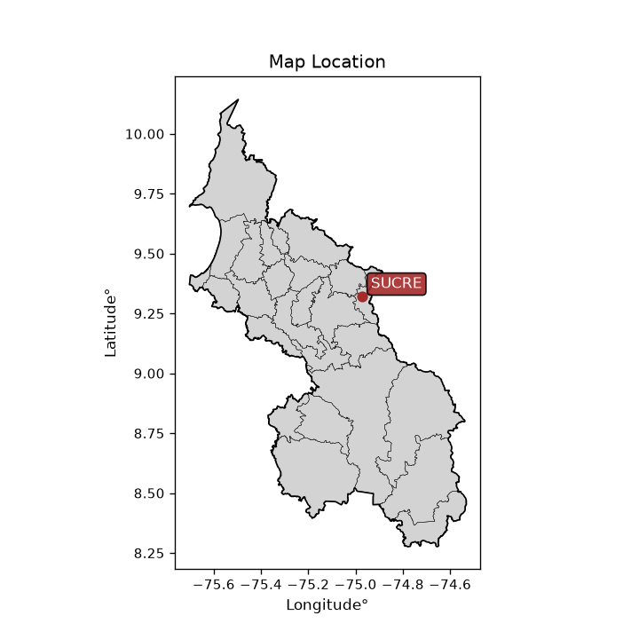</img>

| CountyID                                                                                          | CountyName          | CountyFiles                                                                                                                                                                                                                                                                                                                                                                                                                                                                                                                                                                                                                                                                                                                                                                                                                                                                                                                                                                                                                                                                                                                                                                                                                                                                                                                                                                                                                                                                                                                                                                                                                                                                                                                                                                                                                                                                                                                        |
|:--------------------------------------------------------------------------------------------------|:--------------------|:-----------------------------------------------------------------------------------------------------------------------------------------------------------------------------------------------------------------------------------------------------------------------------------------------------------------------------------------------------------------------------------------------------------------------------------------------------------------------------------------------------------------------------------------------------------------------------------------------------------------------------------------------------------------------------------------------------------------------------------------------------------------------------------------------------------------------------------------------------------------------------------------------------------------------------------------------------------------------------------------------------------------------------------------------------------------------------------------------------------------------------------------------------------------------------------------------------------------------------------------------------------------------------------------------------------------------------------------------------------------------------------------------------------------------------------------------------------------------------------------------------------------------------------------------------------------------------------------------------------------------------------------------------------------------------------------------------------------------------------------------------------------------------------------------------------------------------------------------------------------------------------------------------------------------------------|
| [70110](https://github.com/rcfdtools/R.HydroTools/blob/main/tool/Population/file/report/70110.md) | Buenavista          | [70110_Rural_Building_202606.zip](https://github.com/rcfdtools/R.GISMobile/blob/main/file/shp/70110_Rural_Building_202606.zip) [70110_Rural_Lot_202606.zip](https://github.com/rcfdtools/R.GISMobile/blob/main/file/shp/70110_Rural_Lot_202606.zip) [70110_Rural_Nomenclature_202606.zip](https://github.com/rcfdtools/R.GISMobile/blob/main/file/shp/70110_Rural_Nomenclature_202606.zip) [70110_Rural_Sector_202606.zip](https://github.com/rcfdtools/R.GISMobile/blob/main/file/shp/70110_Rural_Sector_202606.zip) [70110_Rural_Vereda_202606.zip](https://github.com/rcfdtools/R.GISMobile/blob/main/file/shp/70110_Rural_Vereda_202606.zip) [70110_Urban_Block_202606.zip](https://github.com/rcfdtools/R.GISMobile/blob/main/file/shp/70110_Urban_Block_202606.zip) [70110_Urban_Building_202606.zip](https://github.com/rcfdtools/R.GISMobile/blob/main/file/shp/70110_Urban_Building_202606.zip) [70110_Urban_Lot_202606.zip](https://github.com/rcfdtools/R.GISMobile/blob/main/file/shp/70110_Urban_Lot_202606.zip) [70110_Urban_Neighborhood_202606.zip](https://github.com/rcfdtools/R.GISMobile/blob/main/file/shp/70110_Urban_Neighborhood_202606.zip) [70110_Urban_Nomenclature_202606.zip](https://github.com/rcfdtools/R.GISMobile/blob/main/file/shp/70110_Urban_Nomenclature_202606.zip) [70110_Urban_Nomenclature_Road_202606.zip](https://github.com/rcfdtools/R.GISMobile/blob/main/file/shp/70110_Urban_Nomenclature_Road_202606.zip) [70110_Urban_Perimeter_202606.zip](https://github.com/rcfdtools/R.GISMobile/blob/main/file/shp/70110_Urban_Perimeter_202606.zip) [70110_Urban_Sector_202606.zip](https://github.com/rcfdtools/R.GISMobile/blob/main/file/shp/70110_Urban_Sector_202606.zip)                                                                                                                                                       |
| [70124](https://github.com/rcfdtools/R.HydroTools/blob/main/tool/Population/file/report/70124.md) | Caimito             | [70124_Rural_Building_202606.zip](https://github.com/rcfdtools/R.GISMobile/blob/main/file/shp/70124_Rural_Building_202606.zip) [70124_Rural_Lot_202606.zip](https://github.com/rcfdtools/R.GISMobile/blob/main/file/shp/70124_Rural_Lot_202606.zip) [70124_Rural_Nomenclature_202606.zip](https://github.com/rcfdtools/R.GISMobile/blob/main/file/shp/70124_Rural_Nomenclature_202606.zip) [70124_Rural_Sector_202606.zip](https://github.com/rcfdtools/R.GISMobile/blob/main/file/shp/70124_Rural_Sector_202606.zip) [70124_Rural_Vereda_202606.zip](https://github.com/rcfdtools/R.GISMobile/blob/main/file/shp/70124_Rural_Vereda_202606.zip) [70124_Urban_Block_202606.zip](https://github.com/rcfdtools/R.GISMobile/blob/main/file/shp/70124_Urban_Block_202606.zip) [70124_Urban_Building_202606.zip](https://github.com/rcfdtools/R.GISMobile/blob/main/file/shp/70124_Urban_Building_202606.zip) [70124_Urban_Lot_202606.zip](https://github.com/rcfdtools/R.GISMobile/blob/main/file/shp/70124_Urban_Lot_202606.zip) [70124_Urban_Nomenclature_202606.zip](https://github.com/rcfdtools/R.GISMobile/blob/main/file/shp/70124_Urban_Nomenclature_202606.zip) [70124_Urban_Perimeter_202606.zip](https://github.com/rcfdtools/R.GISMobile/blob/main/file/shp/70124_Urban_Perimeter_202606.zip) [70124_Urban_Sector_202606.zip](https://github.com/rcfdtools/R.GISMobile/blob/main/file/shp/70124_Urban_Sector_202606.zip)                                                                                                                                                                                                                                                                                                                                                                                                                                                       |
| [70230](https://github.com/rcfdtools/R.HydroTools/blob/main/tool/Population/file/report/70230.md) | Chalán              | [70230_Rural_Building_202606.zip](https://github.com/rcfdtools/R.GISMobile/blob/main/file/shp/70230_Rural_Building_202606.zip) [70230_Rural_Lot_202606.zip](https://github.com/rcfdtools/R.GISMobile/blob/main/file/shp/70230_Rural_Lot_202606.zip) [70230_Rural_Nomenclature_202606.zip](https://github.com/rcfdtools/R.GISMobile/blob/main/file/shp/70230_Rural_Nomenclature_202606.zip) [70230_Rural_Sector_202606.zip](https://github.com/rcfdtools/R.GISMobile/blob/main/file/shp/70230_Rural_Sector_202606.zip) [70230_Rural_Vereda_202606.zip](https://github.com/rcfdtools/R.GISMobile/blob/main/file/shp/70230_Rural_Vereda_202606.zip) [70230_Urban_Block_202606.zip](https://github.com/rcfdtools/R.GISMobile/blob/main/file/shp/70230_Urban_Block_202606.zip) [70230_Urban_Building_202606.zip](https://github.com/rcfdtools/R.GISMobile/blob/main/file/shp/70230_Urban_Building_202606.zip) [70230_Urban_Lot_202606.zip](https://github.com/rcfdtools/R.GISMobile/blob/main/file/shp/70230_Urban_Lot_202606.zip) [70230_Urban_Nomenclature_202606.zip](https://github.com/rcfdtools/R.GISMobile/blob/main/file/shp/70230_Urban_Nomenclature_202606.zip) [70230_Urban_Perimeter_202606.zip](https://github.com/rcfdtools/R.GISMobile/blob/main/file/shp/70230_Urban_Perimeter_202606.zip) [70230_Urban_Sector_202606.zip](https://github.com/rcfdtools/R.GISMobile/blob/main/file/shp/70230_Urban_Sector_202606.zip)                                                                                                                                                                                                                                                                                                                                                                                                                                                       |
| [70204](https://github.com/rcfdtools/R.HydroTools/blob/main/tool/Population/file/report/70204.md) | Colosó              | [70204_Rural_Building_202606.zip](https://github.com/rcfdtools/R.GISMobile/blob/main/file/shp/70204_Rural_Building_202606.zip) [70204_Rural_Lot_202606.zip](https://github.com/rcfdtools/R.GISMobile/blob/main/file/shp/70204_Rural_Lot_202606.zip) [70204_Rural_Nomenclature_202606.zip](https://github.com/rcfdtools/R.GISMobile/blob/main/file/shp/70204_Rural_Nomenclature_202606.zip) [70204_Rural_Sector_202606.zip](https://github.com/rcfdtools/R.GISMobile/blob/main/file/shp/70204_Rural_Sector_202606.zip) [70204_Rural_Vereda_202606.zip](https://github.com/rcfdtools/R.GISMobile/blob/main/file/shp/70204_Rural_Vereda_202606.zip) [70204_Urban_Block_202606.zip](https://github.com/rcfdtools/R.GISMobile/blob/main/file/shp/70204_Urban_Block_202606.zip) [70204_Urban_Building_202606.zip](https://github.com/rcfdtools/R.GISMobile/blob/main/file/shp/70204_Urban_Building_202606.zip) [70204_Urban_Lot_202606.zip](https://github.com/rcfdtools/R.GISMobile/blob/main/file/shp/70204_Urban_Lot_202606.zip) [70204_Urban_Nomenclature_202606.zip](https://github.com/rcfdtools/R.GISMobile/blob/main/file/shp/70204_Urban_Nomenclature_202606.zip) [70204_Urban_Nomenclature_Road_202606.zip](https://github.com/rcfdtools/R.GISMobile/blob/main/file/shp/70204_Urban_Nomenclature_Road_202606.zip) [70204_Urban_Perimeter_202606.zip](https://github.com/rcfdtools/R.GISMobile/blob/main/file/shp/70204_Urban_Perimeter_202606.zip) [70204_Urban_Sector_202606.zip](https://github.com/rcfdtools/R.GISMobile/blob/main/file/shp/70204_Urban_Sector_202606.zip)                                                                                                                                                                                                                                                                                                  |
| [70215](https://github.com/rcfdtools/R.HydroTools/blob/main/tool/Population/file/report/70215.md) | Corozal             | [70215_Rural_Building_202606.zip](https://github.com/rcfdtools/R.GISMobile/blob/main/file/shp/70215_Rural_Building_202606.zip) [70215_Rural_Lot_202606.zip](https://github.com/rcfdtools/R.GISMobile/blob/main/file/shp/70215_Rural_Lot_202606.zip) [70215_Rural_Nomenclature_202606.zip](https://github.com/rcfdtools/R.GISMobile/blob/main/file/shp/70215_Rural_Nomenclature_202606.zip) [70215_Rural_Sector_202606.zip](https://github.com/rcfdtools/R.GISMobile/blob/main/file/shp/70215_Rural_Sector_202606.zip) [70215_Rural_Vereda_202606.zip](https://github.com/rcfdtools/R.GISMobile/blob/main/file/shp/70215_Rural_Vereda_202606.zip) [70215_Urban_Block_202606.zip](https://github.com/rcfdtools/R.GISMobile/blob/main/file/shp/70215_Urban_Block_202606.zip) [70215_Urban_Building_202606.zip](https://github.com/rcfdtools/R.GISMobile/blob/main/file/shp/70215_Urban_Building_202606.zip) [70215_Urban_Lot_202606.zip](https://github.com/rcfdtools/R.GISMobile/blob/main/file/shp/70215_Urban_Lot_202606.zip) [70215_Urban_Neighborhood_202606.zip](https://github.com/rcfdtools/R.GISMobile/blob/main/file/shp/70215_Urban_Neighborhood_202606.zip) [70215_Urban_Nomenclature_202606.zip](https://github.com/rcfdtools/R.GISMobile/blob/main/file/shp/70215_Urban_Nomenclature_202606.zip) [70215_Urban_Nomenclature_Road_202606.zip](https://github.com/rcfdtools/R.GISMobile/blob/main/file/shp/70215_Urban_Nomenclature_Road_202606.zip) [70215_Urban_Perimeter_202606.zip](https://github.com/rcfdtools/R.GISMobile/blob/main/file/shp/70215_Urban_Perimeter_202606.zip) [70215_Urban_Sector_202606.zip](https://github.com/rcfdtools/R.GISMobile/blob/main/file/shp/70215_Urban_Sector_202606.zip)                                                                                                                                                       |
| [70221](https://github.com/rcfdtools/R.HydroTools/blob/main/tool/Population/file/report/70221.md) | Coveñas             | [70221_Rural_Building_202606.zip](https://github.com/rcfdtools/R.GISMobile/blob/main/file/shp/70221_Rural_Building_202606.zip) [70221_Rural_Lot_202606.zip](https://github.com/rcfdtools/R.GISMobile/blob/main/file/shp/70221_Rural_Lot_202606.zip) [70221_Rural_Nomenclature_202606.zip](https://github.com/rcfdtools/R.GISMobile/blob/main/file/shp/70221_Rural_Nomenclature_202606.zip) [70221_Rural_Sector_202606.zip](https://github.com/rcfdtools/R.GISMobile/blob/main/file/shp/70221_Rural_Sector_202606.zip) [70221_Rural_Vereda_202606.zip](https://github.com/rcfdtools/R.GISMobile/blob/main/file/shp/70221_Rural_Vereda_202606.zip) [70221_Urban_Block_202606.zip](https://github.com/rcfdtools/R.GISMobile/blob/main/file/shp/70221_Urban_Block_202606.zip) [70221_Urban_Building_202606.zip](https://github.com/rcfdtools/R.GISMobile/blob/main/file/shp/70221_Urban_Building_202606.zip) [70221_Urban_Lot_202606.zip](https://github.com/rcfdtools/R.GISMobile/blob/main/file/shp/70221_Urban_Lot_202606.zip) [70221_Urban_Nomenclature_202606.zip](https://github.com/rcfdtools/R.GISMobile/blob/main/file/shp/70221_Urban_Nomenclature_202606.zip) [70221_Urban_Nomenclature_Road_202606.zip](https://github.com/rcfdtools/R.GISMobile/blob/main/file/shp/70221_Urban_Nomenclature_Road_202606.zip) [70221_Urban_Perimeter_202606.zip](https://github.com/rcfdtools/R.GISMobile/blob/main/file/shp/70221_Urban_Perimeter_202606.zip)                                                                                                                                                                                                                                                                                                                                                                                                                                 |
| [70233](https://github.com/rcfdtools/R.HydroTools/blob/main/tool/Population/file/report/70233.md) | El Roble            | [70233_Rural_Building_202606.zip](https://github.com/rcfdtools/R.GISMobile/blob/main/file/shp/70233_Rural_Building_202606.zip) [70233_Rural_Lot_202606.zip](https://github.com/rcfdtools/R.GISMobile/blob/main/file/shp/70233_Rural_Lot_202606.zip) [70233_Rural_Nomenclature_202606.zip](https://github.com/rcfdtools/R.GISMobile/blob/main/file/shp/70233_Rural_Nomenclature_202606.zip) [70233_Rural_Sector_202606.zip](https://github.com/rcfdtools/R.GISMobile/blob/main/file/shp/70233_Rural_Sector_202606.zip) [70233_Rural_Vereda_202606.zip](https://github.com/rcfdtools/R.GISMobile/blob/main/file/shp/70233_Rural_Vereda_202606.zip) [70233_Urban_Block_202606.zip](https://github.com/rcfdtools/R.GISMobile/blob/main/file/shp/70233_Urban_Block_202606.zip) [70233_Urban_Building_202606.zip](https://github.com/rcfdtools/R.GISMobile/blob/main/file/shp/70233_Urban_Building_202606.zip) [70233_Urban_Lot_202606.zip](https://github.com/rcfdtools/R.GISMobile/blob/main/file/shp/70233_Urban_Lot_202606.zip) [70233_Urban_Neighborhood_202606.zip](https://github.com/rcfdtools/R.GISMobile/blob/main/file/shp/70233_Urban_Neighborhood_202606.zip) [70233_Urban_Nomenclature_202606.zip](https://github.com/rcfdtools/R.GISMobile/blob/main/file/shp/70233_Urban_Nomenclature_202606.zip) [70233_Urban_Perimeter_202606.zip](https://github.com/rcfdtools/R.GISMobile/blob/main/file/shp/70233_Urban_Perimeter_202606.zip) [70233_Urban_Sector_202606.zip](https://github.com/rcfdtools/R.GISMobile/blob/main/file/shp/70233_Urban_Sector_202606.zip)                                                                                                                                                                                                                                                                                                            |
| [70235](https://github.com/rcfdtools/R.HydroTools/blob/main/tool/Population/file/report/70235.md) | Galeras             | [70235_Rural_Building_202606.zip](https://github.com/rcfdtools/R.GISMobile/blob/main/file/shp/70235_Rural_Building_202606.zip) [70235_Rural_Lot_202606.zip](https://github.com/rcfdtools/R.GISMobile/blob/main/file/shp/70235_Rural_Lot_202606.zip) [70235_Rural_Nomenclature_202606.zip](https://github.com/rcfdtools/R.GISMobile/blob/main/file/shp/70235_Rural_Nomenclature_202606.zip) [70235_Rural_Nomenclature_Road_202606.zip](https://github.com/rcfdtools/R.GISMobile/blob/main/file/shp/70235_Rural_Nomenclature_Road_202606.zip) [70235_Rural_Sector_202606.zip](https://github.com/rcfdtools/R.GISMobile/blob/main/file/shp/70235_Rural_Sector_202606.zip) [70235_Rural_Vereda_202606.zip](https://github.com/rcfdtools/R.GISMobile/blob/main/file/shp/70235_Rural_Vereda_202606.zip) [70235_Urban_Block_202606.zip](https://github.com/rcfdtools/R.GISMobile/blob/main/file/shp/70235_Urban_Block_202606.zip) [70235_Urban_Building_202606.zip](https://github.com/rcfdtools/R.GISMobile/blob/main/file/shp/70235_Urban_Building_202606.zip) [70235_Urban_Lot_202606.zip](https://github.com/rcfdtools/R.GISMobile/blob/main/file/shp/70235_Urban_Lot_202606.zip) [70235_Urban_Neighborhood_202606.zip](https://github.com/rcfdtools/R.GISMobile/blob/main/file/shp/70235_Urban_Neighborhood_202606.zip) [70235_Urban_Nomenclature_202606.zip](https://github.com/rcfdtools/R.GISMobile/blob/main/file/shp/70235_Urban_Nomenclature_202606.zip) [70235_Urban_Nomenclature_Road_202606.zip](https://github.com/rcfdtools/R.GISMobile/blob/main/file/shp/70235_Urban_Nomenclature_Road_202606.zip) [70235_Urban_Perimeter_202606.zip](https://github.com/rcfdtools/R.GISMobile/blob/main/file/shp/70235_Urban_Perimeter_202606.zip) [70235_Urban_Sector_202606.zip](https://github.com/rcfdtools/R.GISMobile/blob/main/file/shp/70235_Urban_Sector_202606.zip)  |
| [70265](https://github.com/rcfdtools/R.HydroTools/blob/main/tool/Population/file/report/70265.md) | Guaranda            | [70265_Rural_Building_202606.zip](https://github.com/rcfdtools/R.GISMobile/blob/main/file/shp/70265_Rural_Building_202606.zip) [70265_Rural_Lot_202606.zip](https://github.com/rcfdtools/R.GISMobile/blob/main/file/shp/70265_Rural_Lot_202606.zip) [70265_Rural_Nomenclature_202606.zip](https://github.com/rcfdtools/R.GISMobile/blob/main/file/shp/70265_Rural_Nomenclature_202606.zip) [70265_Rural_Sector_202606.zip](https://github.com/rcfdtools/R.GISMobile/blob/main/file/shp/70265_Rural_Sector_202606.zip) [70265_Rural_Vereda_202606.zip](https://github.com/rcfdtools/R.GISMobile/blob/main/file/shp/70265_Rural_Vereda_202606.zip) [70265_Urban_Block_202606.zip](https://github.com/rcfdtools/R.GISMobile/blob/main/file/shp/70265_Urban_Block_202606.zip) [70265_Urban_Building_202606.zip](https://github.com/rcfdtools/R.GISMobile/blob/main/file/shp/70265_Urban_Building_202606.zip) [70265_Urban_Lot_202606.zip](https://github.com/rcfdtools/R.GISMobile/blob/main/file/shp/70265_Urban_Lot_202606.zip) [70265_Urban_Nomenclature_202606.zip](https://github.com/rcfdtools/R.GISMobile/blob/main/file/shp/70265_Urban_Nomenclature_202606.zip) [70265_Urban_Nomenclature_Road_202606.zip](https://github.com/rcfdtools/R.GISMobile/blob/main/file/shp/70265_Urban_Nomenclature_Road_202606.zip) [70265_Urban_Perimeter_202606.zip](https://github.com/rcfdtools/R.GISMobile/blob/main/file/shp/70265_Urban_Perimeter_202606.zip)                                                                                                                                                                                                                                                                                                                                                                                                                                 |
| [70400](https://github.com/rcfdtools/R.HydroTools/blob/main/tool/Population/file/report/70400.md) | La Unión            | [70400_Rural_Building_202606.zip](https://github.com/rcfdtools/R.GISMobile/blob/main/file/shp/70400_Rural_Building_202606.zip) [70400_Rural_Lot_202606.zip](https://github.com/rcfdtools/R.GISMobile/blob/main/file/shp/70400_Rural_Lot_202606.zip) [70400_Rural_Nomenclature_202606.zip](https://github.com/rcfdtools/R.GISMobile/blob/main/file/shp/70400_Rural_Nomenclature_202606.zip) [70400_Rural_Sector_202606.zip](https://github.com/rcfdtools/R.GISMobile/blob/main/file/shp/70400_Rural_Sector_202606.zip) [70400_Rural_Vereda_202606.zip](https://github.com/rcfdtools/R.GISMobile/blob/main/file/shp/70400_Rural_Vereda_202606.zip) [70400_Urban_Block_202606.zip](https://github.com/rcfdtools/R.GISMobile/blob/main/file/shp/70400_Urban_Block_202606.zip) [70400_Urban_Building_202606.zip](https://github.com/rcfdtools/R.GISMobile/blob/main/file/shp/70400_Urban_Building_202606.zip) [70400_Urban_Lot_202606.zip](https://github.com/rcfdtools/R.GISMobile/blob/main/file/shp/70400_Urban_Lot_202606.zip) [70400_Urban_Nomenclature_202606.zip](https://github.com/rcfdtools/R.GISMobile/blob/main/file/shp/70400_Urban_Nomenclature_202606.zip) [70400_Urban_Nomenclature_Road_202606.zip](https://github.com/rcfdtools/R.GISMobile/blob/main/file/shp/70400_Urban_Nomenclature_Road_202606.zip) [70400_Urban_Perimeter_202606.zip](https://github.com/rcfdtools/R.GISMobile/blob/main/file/shp/70400_Urban_Perimeter_202606.zip)                                                                                                                                                                                                                                                                                                                                                                                                                                 |
| [70418](https://github.com/rcfdtools/R.HydroTools/blob/main/tool/Population/file/report/70418.md) | Los Palmitos        | [70418_Rural_Building_202606.zip](https://github.com/rcfdtools/R.GISMobile/blob/main/file/shp/70418_Rural_Building_202606.zip) [70418_Rural_Lot_202606.zip](https://github.com/rcfdtools/R.GISMobile/blob/main/file/shp/70418_Rural_Lot_202606.zip) [70418_Rural_Nomenclature_202606.zip](https://github.com/rcfdtools/R.GISMobile/blob/main/file/shp/70418_Rural_Nomenclature_202606.zip) [70418_Rural_Sector_202606.zip](https://github.com/rcfdtools/R.GISMobile/blob/main/file/shp/70418_Rural_Sector_202606.zip) [70418_Rural_Vereda_202606.zip](https://github.com/rcfdtools/R.GISMobile/blob/main/file/shp/70418_Rural_Vereda_202606.zip) [70418_Urban_Block_202606.zip](https://github.com/rcfdtools/R.GISMobile/blob/main/file/shp/70418_Urban_Block_202606.zip) [70418_Urban_Building_202606.zip](https://github.com/rcfdtools/R.GISMobile/blob/main/file/shp/70418_Urban_Building_202606.zip) [70418_Urban_Lot_202606.zip](https://github.com/rcfdtools/R.GISMobile/blob/main/file/shp/70418_Urban_Lot_202606.zip) [70418_Urban_Neighborhood_202606.zip](https://github.com/rcfdtools/R.GISMobile/blob/main/file/shp/70418_Urban_Neighborhood_202606.zip) [70418_Urban_Nomenclature_202606.zip](https://github.com/rcfdtools/R.GISMobile/blob/main/file/shp/70418_Urban_Nomenclature_202606.zip) [70418_Urban_Nomenclature_Road_202606.zip](https://github.com/rcfdtools/R.GISMobile/blob/main/file/shp/70418_Urban_Nomenclature_Road_202606.zip) [70418_Urban_Perimeter_202606.zip](https://github.com/rcfdtools/R.GISMobile/blob/main/file/shp/70418_Urban_Perimeter_202606.zip) [70418_Urban_Sector_202606.zip](https://github.com/rcfdtools/R.GISMobile/blob/main/file/shp/70418_Urban_Sector_202606.zip)                                                                                                                                                       |
| [70429](https://github.com/rcfdtools/R.HydroTools/blob/main/tool/Population/file/report/70429.md) | Majagual            | [70429_Rural_Building_202606.zip](https://github.com/rcfdtools/R.GISMobile/blob/main/file/shp/70429_Rural_Building_202606.zip) [70429_Rural_Lot_202606.zip](https://github.com/rcfdtools/R.GISMobile/blob/main/file/shp/70429_Rural_Lot_202606.zip) [70429_Rural_Nomenclature_202606.zip](https://github.com/rcfdtools/R.GISMobile/blob/main/file/shp/70429_Rural_Nomenclature_202606.zip) [70429_Rural_Sector_202606.zip](https://github.com/rcfdtools/R.GISMobile/blob/main/file/shp/70429_Rural_Sector_202606.zip) [70429_Rural_Vereda_202606.zip](https://github.com/rcfdtools/R.GISMobile/blob/main/file/shp/70429_Rural_Vereda_202606.zip) [70429_Urban_Block_202606.zip](https://github.com/rcfdtools/R.GISMobile/blob/main/file/shp/70429_Urban_Block_202606.zip) [70429_Urban_Building_202606.zip](https://github.com/rcfdtools/R.GISMobile/blob/main/file/shp/70429_Urban_Building_202606.zip) [70429_Urban_Lot_202606.zip](https://github.com/rcfdtools/R.GISMobile/blob/main/file/shp/70429_Urban_Lot_202606.zip) [70429_Urban_Neighborhood_202606.zip](https://github.com/rcfdtools/R.GISMobile/blob/main/file/shp/70429_Urban_Neighborhood_202606.zip) [70429_Urban_Nomenclature_202606.zip](https://github.com/rcfdtools/R.GISMobile/blob/main/file/shp/70429_Urban_Nomenclature_202606.zip) [70429_Urban_Nomenclature_Road_202606.zip](https://github.com/rcfdtools/R.GISMobile/blob/main/file/shp/70429_Urban_Nomenclature_Road_202606.zip) [70429_Urban_Perimeter_202606.zip](https://github.com/rcfdtools/R.GISMobile/blob/main/file/shp/70429_Urban_Perimeter_202606.zip) [70429_Urban_Sector_202606.zip](https://github.com/rcfdtools/R.GISMobile/blob/main/file/shp/70429_Urban_Sector_202606.zip)                                                                                                                                                       |
| [70473](https://github.com/rcfdtools/R.HydroTools/blob/main/tool/Population/file/report/70473.md) | Morroa              | [70473_Rural_Building_202606.zip](https://github.com/rcfdtools/R.GISMobile/blob/main/file/shp/70473_Rural_Building_202606.zip) [70473_Rural_Lot_202606.zip](https://github.com/rcfdtools/R.GISMobile/blob/main/file/shp/70473_Rural_Lot_202606.zip) [70473_Rural_Nomenclature_202606.zip](https://github.com/rcfdtools/R.GISMobile/blob/main/file/shp/70473_Rural_Nomenclature_202606.zip) [70473_Rural_Sector_202606.zip](https://github.com/rcfdtools/R.GISMobile/blob/main/file/shp/70473_Rural_Sector_202606.zip) [70473_Rural_Vereda_202606.zip](https://github.com/rcfdtools/R.GISMobile/blob/main/file/shp/70473_Rural_Vereda_202606.zip) [70473_Urban_Block_202606.zip](https://github.com/rcfdtools/R.GISMobile/blob/main/file/shp/70473_Urban_Block_202606.zip) [70473_Urban_Building_202606.zip](https://github.com/rcfdtools/R.GISMobile/blob/main/file/shp/70473_Urban_Building_202606.zip) [70473_Urban_Lot_202606.zip](https://github.com/rcfdtools/R.GISMobile/blob/main/file/shp/70473_Urban_Lot_202606.zip) [70473_Urban_Nomenclature_202606.zip](https://github.com/rcfdtools/R.GISMobile/blob/main/file/shp/70473_Urban_Nomenclature_202606.zip) [70473_Urban_Perimeter_202606.zip](https://github.com/rcfdtools/R.GISMobile/blob/main/file/shp/70473_Urban_Perimeter_202606.zip)                                                                                                                                                                                                                                                                                                                                                                                                                                                                                                                                                                                      |
| [70508](https://github.com/rcfdtools/R.HydroTools/blob/main/tool/Population/file/report/70508.md) | Ovejas              | [70508_Rural_Building_202606.zip](https://github.com/rcfdtools/R.GISMobile/blob/main/file/shp/70508_Rural_Building_202606.zip) [70508_Rural_Lot_202606.zip](https://github.com/rcfdtools/R.GISMobile/blob/main/file/shp/70508_Rural_Lot_202606.zip) [70508_Rural_Nomenclature_202606.zip](https://github.com/rcfdtools/R.GISMobile/blob/main/file/shp/70508_Rural_Nomenclature_202606.zip) [70508_Rural_Sector_202606.zip](https://github.com/rcfdtools/R.GISMobile/blob/main/file/shp/70508_Rural_Sector_202606.zip) [70508_Rural_Vereda_202606.zip](https://github.com/rcfdtools/R.GISMobile/blob/main/file/shp/70508_Rural_Vereda_202606.zip) [70508_Urban_Block_202606.zip](https://github.com/rcfdtools/R.GISMobile/blob/main/file/shp/70508_Urban_Block_202606.zip) [70508_Urban_Building_202606.zip](https://github.com/rcfdtools/R.GISMobile/blob/main/file/shp/70508_Urban_Building_202606.zip) [70508_Urban_Lot_202606.zip](https://github.com/rcfdtools/R.GISMobile/blob/main/file/shp/70508_Urban_Lot_202606.zip) [70508_Urban_Nomenclature_202606.zip](https://github.com/rcfdtools/R.GISMobile/blob/main/file/shp/70508_Urban_Nomenclature_202606.zip) [70508_Urban_Nomenclature_Road_202606.zip](https://github.com/rcfdtools/R.GISMobile/blob/main/file/shp/70508_Urban_Nomenclature_Road_202606.zip) [70508_Urban_Perimeter_202606.zip](https://github.com/rcfdtools/R.GISMobile/blob/main/file/shp/70508_Urban_Perimeter_202606.zip) [70508_Urban_Sector_202606.zip](https://github.com/rcfdtools/R.GISMobile/blob/main/file/shp/70508_Urban_Sector_202606.zip)                                                                                                                                                                                                                                                                                                  |
| [70523](https://github.com/rcfdtools/R.HydroTools/blob/main/tool/Population/file/report/70523.md) | Palmito             | [70523_Rural_Building_202606.zip](https://github.com/rcfdtools/R.GISMobile/blob/main/file/shp/70523_Rural_Building_202606.zip) [70523_Rural_Lot_202606.zip](https://github.com/rcfdtools/R.GISMobile/blob/main/file/shp/70523_Rural_Lot_202606.zip) [70523_Rural_Nomenclature_202606.zip](https://github.com/rcfdtools/R.GISMobile/blob/main/file/shp/70523_Rural_Nomenclature_202606.zip) [70523_Rural_Sector_202606.zip](https://github.com/rcfdtools/R.GISMobile/blob/main/file/shp/70523_Rural_Sector_202606.zip) [70523_Rural_Vereda_202606.zip](https://github.com/rcfdtools/R.GISMobile/blob/main/file/shp/70523_Rural_Vereda_202606.zip) [70523_Urban_Block_202606.zip](https://github.com/rcfdtools/R.GISMobile/blob/main/file/shp/70523_Urban_Block_202606.zip) [70523_Urban_Building_202606.zip](https://github.com/rcfdtools/R.GISMobile/blob/main/file/shp/70523_Urban_Building_202606.zip) [70523_Urban_Lot_202606.zip](https://github.com/rcfdtools/R.GISMobile/blob/main/file/shp/70523_Urban_Lot_202606.zip) [70523_Urban_Nomenclature_202606.zip](https://github.com/rcfdtools/R.GISMobile/blob/main/file/shp/70523_Urban_Nomenclature_202606.zip) [70523_Urban_Perimeter_202606.zip](https://github.com/rcfdtools/R.GISMobile/blob/main/file/shp/70523_Urban_Perimeter_202606.zip) [70523_Urban_Sector_202606.zip](https://github.com/rcfdtools/R.GISMobile/blob/main/file/shp/70523_Urban_Sector_202606.zip)                                                                                                                                                                                                                                                                                                                                                                                                                                                       |
| [70670](https://github.com/rcfdtools/R.HydroTools/blob/main/tool/Population/file/report/70670.md) | Sampués             | [70670_Rural_Building_202606.zip](https://github.com/rcfdtools/R.GISMobile/blob/main/file/shp/70670_Rural_Building_202606.zip) [70670_Rural_Lot_202606.zip](https://github.com/rcfdtools/R.GISMobile/blob/main/file/shp/70670_Rural_Lot_202606.zip) [70670_Rural_Nomenclature_202606.zip](https://github.com/rcfdtools/R.GISMobile/blob/main/file/shp/70670_Rural_Nomenclature_202606.zip) [70670_Rural_Sector_202606.zip](https://github.com/rcfdtools/R.GISMobile/blob/main/file/shp/70670_Rural_Sector_202606.zip) [70670_Rural_Vereda_202606.zip](https://github.com/rcfdtools/R.GISMobile/blob/main/file/shp/70670_Rural_Vereda_202606.zip) [70670_Urban_Block_202606.zip](https://github.com/rcfdtools/R.GISMobile/blob/main/file/shp/70670_Urban_Block_202606.zip) [70670_Urban_Building_202606.zip](https://github.com/rcfdtools/R.GISMobile/blob/main/file/shp/70670_Urban_Building_202606.zip) [70670_Urban_Lot_202606.zip](https://github.com/rcfdtools/R.GISMobile/blob/main/file/shp/70670_Urban_Lot_202606.zip) [70670_Urban_Nomenclature_202606.zip](https://github.com/rcfdtools/R.GISMobile/blob/main/file/shp/70670_Urban_Nomenclature_202606.zip) [70670_Urban_Nomenclature_Road_202606.zip](https://github.com/rcfdtools/R.GISMobile/blob/main/file/shp/70670_Urban_Nomenclature_Road_202606.zip) [70670_Urban_Perimeter_202606.zip](https://github.com/rcfdtools/R.GISMobile/blob/main/file/shp/70670_Urban_Perimeter_202606.zip)                                                                                                                                                                                                                                                                                                                                                                                                                                 |
| [70678](https://github.com/rcfdtools/R.HydroTools/blob/main/tool/Population/file/report/70678.md) | San Benito Abad     | [70678_Rural_Building_202606.zip](https://github.com/rcfdtools/R.GISMobile/blob/main/file/shp/70678_Rural_Building_202606.zip) [70678_Rural_Lot_202606.zip](https://github.com/rcfdtools/R.GISMobile/blob/main/file/shp/70678_Rural_Lot_202606.zip) [70678_Rural_Nomenclature_202606.zip](https://github.com/rcfdtools/R.GISMobile/blob/main/file/shp/70678_Rural_Nomenclature_202606.zip) [70678_Rural_Sector_202606.zip](https://github.com/rcfdtools/R.GISMobile/blob/main/file/shp/70678_Rural_Sector_202606.zip) [70678_Rural_Vereda_202606.zip](https://github.com/rcfdtools/R.GISMobile/blob/main/file/shp/70678_Rural_Vereda_202606.zip) [70678_Urban_Block_202606.zip](https://github.com/rcfdtools/R.GISMobile/blob/main/file/shp/70678_Urban_Block_202606.zip) [70678_Urban_Building_202606.zip](https://github.com/rcfdtools/R.GISMobile/blob/main/file/shp/70678_Urban_Building_202606.zip) [70678_Urban_Lot_202606.zip](https://github.com/rcfdtools/R.GISMobile/blob/main/file/shp/70678_Urban_Lot_202606.zip) [70678_Urban_Neighborhood_202606.zip](https://github.com/rcfdtools/R.GISMobile/blob/main/file/shp/70678_Urban_Neighborhood_202606.zip) [70678_Urban_Nomenclature_202606.zip](https://github.com/rcfdtools/R.GISMobile/blob/main/file/shp/70678_Urban_Nomenclature_202606.zip) [70678_Urban_Nomenclature_Road_202606.zip](https://github.com/rcfdtools/R.GISMobile/blob/main/file/shp/70678_Urban_Nomenclature_Road_202606.zip) [70678_Urban_Perimeter_202606.zip](https://github.com/rcfdtools/R.GISMobile/blob/main/file/shp/70678_Urban_Perimeter_202606.zip)                                                                                                                                                                                                                                                                                      |
| [70702](https://github.com/rcfdtools/R.HydroTools/blob/main/tool/Population/file/report/70702.md) | San Juan De Betulia | [70702_Rural_Building_202606.zip](https://github.com/rcfdtools/R.GISMobile/blob/main/file/shp/70702_Rural_Building_202606.zip) [70702_Rural_Lot_202606.zip](https://github.com/rcfdtools/R.GISMobile/blob/main/file/shp/70702_Rural_Lot_202606.zip) [70702_Rural_Nomenclature_202606.zip](https://github.com/rcfdtools/R.GISMobile/blob/main/file/shp/70702_Rural_Nomenclature_202606.zip) [70702_Rural_Sector_202606.zip](https://github.com/rcfdtools/R.GISMobile/blob/main/file/shp/70702_Rural_Sector_202606.zip) [70702_Rural_Vereda_202606.zip](https://github.com/rcfdtools/R.GISMobile/blob/main/file/shp/70702_Rural_Vereda_202606.zip) [70702_Urban_Block_202606.zip](https://github.com/rcfdtools/R.GISMobile/blob/main/file/shp/70702_Urban_Block_202606.zip) [70702_Urban_Building_202606.zip](https://github.com/rcfdtools/R.GISMobile/blob/main/file/shp/70702_Urban_Building_202606.zip) [70702_Urban_Lot_202606.zip](https://github.com/rcfdtools/R.GISMobile/blob/main/file/shp/70702_Urban_Lot_202606.zip) [70702_Urban_Nomenclature_202606.zip](https://github.com/rcfdtools/R.GISMobile/blob/main/file/shp/70702_Urban_Nomenclature_202606.zip) [70702_Urban_Nomenclature_Road_202606.zip](https://github.com/rcfdtools/R.GISMobile/blob/main/file/shp/70702_Urban_Nomenclature_Road_202606.zip) [70702_Urban_Perimeter_202606.zip](https://github.com/rcfdtools/R.GISMobile/blob/main/file/shp/70702_Urban_Perimeter_202606.zip) [70702_Urban_Sector_202606.zip](https://github.com/rcfdtools/R.GISMobile/blob/main/file/shp/70702_Urban_Sector_202606.zip)                                                                                                                                                                                                                                                                                                  |
| [70708](https://github.com/rcfdtools/R.HydroTools/blob/main/tool/Population/file/report/70708.md) | San Marcos          | [70708_Rural_Building_202606.zip](https://github.com/rcfdtools/R.GISMobile/blob/main/file/shp/70708_Rural_Building_202606.zip) [70708_Rural_Lot_202606.zip](https://github.com/rcfdtools/R.GISMobile/blob/main/file/shp/70708_Rural_Lot_202606.zip) [70708_Rural_Nomenclature_202606.zip](https://github.com/rcfdtools/R.GISMobile/blob/main/file/shp/70708_Rural_Nomenclature_202606.zip) [70708_Rural_Sector_202606.zip](https://github.com/rcfdtools/R.GISMobile/blob/main/file/shp/70708_Rural_Sector_202606.zip) [70708_Rural_Vereda_202606.zip](https://github.com/rcfdtools/R.GISMobile/blob/main/file/shp/70708_Rural_Vereda_202606.zip) [70708_Urban_Block_202606.zip](https://github.com/rcfdtools/R.GISMobile/blob/main/file/shp/70708_Urban_Block_202606.zip) [70708_Urban_Building_202606.zip](https://github.com/rcfdtools/R.GISMobile/blob/main/file/shp/70708_Urban_Building_202606.zip) [70708_Urban_Lot_202606.zip](https://github.com/rcfdtools/R.GISMobile/blob/main/file/shp/70708_Urban_Lot_202606.zip) [70708_Urban_Neighborhood_202606.zip](https://github.com/rcfdtools/R.GISMobile/blob/main/file/shp/70708_Urban_Neighborhood_202606.zip) [70708_Urban_Nomenclature_202606.zip](https://github.com/rcfdtools/R.GISMobile/blob/main/file/shp/70708_Urban_Nomenclature_202606.zip) [70708_Urban_Nomenclature_Road_202606.zip](https://github.com/rcfdtools/R.GISMobile/blob/main/file/shp/70708_Urban_Nomenclature_Road_202606.zip) [70708_Urban_Perimeter_202606.zip](https://github.com/rcfdtools/R.GISMobile/blob/main/file/shp/70708_Urban_Perimeter_202606.zip) [70708_Urban_Sector_202606.zip](https://github.com/rcfdtools/R.GISMobile/blob/main/file/shp/70708_Urban_Sector_202606.zip)                                                                                                                                                       |
| [70713](https://github.com/rcfdtools/R.HydroTools/blob/main/tool/Population/file/report/70713.md) | San Onofre          | [70713_Rural_Building_202606.zip](https://github.com/rcfdtools/R.GISMobile/blob/main/file/shp/70713_Rural_Building_202606.zip) [70713_Rural_Lot_202606.zip](https://github.com/rcfdtools/R.GISMobile/blob/main/file/shp/70713_Rural_Lot_202606.zip) [70713_Rural_Nomenclature_202606.zip](https://github.com/rcfdtools/R.GISMobile/blob/main/file/shp/70713_Rural_Nomenclature_202606.zip) [70713_Rural_Sector_202606.zip](https://github.com/rcfdtools/R.GISMobile/blob/main/file/shp/70713_Rural_Sector_202606.zip) [70713_Rural_Vereda_202606.zip](https://github.com/rcfdtools/R.GISMobile/blob/main/file/shp/70713_Rural_Vereda_202606.zip) [70713_Urban_Block_202606.zip](https://github.com/rcfdtools/R.GISMobile/blob/main/file/shp/70713_Urban_Block_202606.zip) [70713_Urban_Building_202606.zip](https://github.com/rcfdtools/R.GISMobile/blob/main/file/shp/70713_Urban_Building_202606.zip) [70713_Urban_Lot_202606.zip](https://github.com/rcfdtools/R.GISMobile/blob/main/file/shp/70713_Urban_Lot_202606.zip) [70713_Urban_Nomenclature_202606.zip](https://github.com/rcfdtools/R.GISMobile/blob/main/file/shp/70713_Urban_Nomenclature_202606.zip) [70713_Urban_Nomenclature_Road_202606.zip](https://github.com/rcfdtools/R.GISMobile/blob/main/file/shp/70713_Urban_Nomenclature_Road_202606.zip) [70713_Urban_Perimeter_202606.zip](https://github.com/rcfdtools/R.GISMobile/blob/main/file/shp/70713_Urban_Perimeter_202606.zip)                                                                                                                                                                                                                                                                                                                                                                                                                                 |
| [70717](https://github.com/rcfdtools/R.HydroTools/blob/main/tool/Population/file/report/70717.md) | San Pedro           | [70717_Rural_Building_202606.zip](https://github.com/rcfdtools/R.GISMobile/blob/main/file/shp/70717_Rural_Building_202606.zip) [70717_Rural_Lot_202606.zip](https://github.com/rcfdtools/R.GISMobile/blob/main/file/shp/70717_Rural_Lot_202606.zip) [70717_Rural_Nomenclature_202606.zip](https://github.com/rcfdtools/R.GISMobile/blob/main/file/shp/70717_Rural_Nomenclature_202606.zip) [70717_Rural_Sector_202606.zip](https://github.com/rcfdtools/R.GISMobile/blob/main/file/shp/70717_Rural_Sector_202606.zip) [70717_Rural_Vereda_202606.zip](https://github.com/rcfdtools/R.GISMobile/blob/main/file/shp/70717_Rural_Vereda_202606.zip) [70717_Urban_Block_202606.zip](https://github.com/rcfdtools/R.GISMobile/blob/main/file/shp/70717_Urban_Block_202606.zip) [70717_Urban_Building_202606.zip](https://github.com/rcfdtools/R.GISMobile/blob/main/file/shp/70717_Urban_Building_202606.zip) [70717_Urban_Lot_202606.zip](https://github.com/rcfdtools/R.GISMobile/blob/main/file/shp/70717_Urban_Lot_202606.zip) [70717_Urban_Nomenclature_202606.zip](https://github.com/rcfdtools/R.GISMobile/blob/main/file/shp/70717_Urban_Nomenclature_202606.zip) [70717_Urban_Nomenclature_Road_202606.zip](https://github.com/rcfdtools/R.GISMobile/blob/main/file/shp/70717_Urban_Nomenclature_Road_202606.zip) [70717_Urban_Perimeter_202606.zip](https://github.com/rcfdtools/R.GISMobile/blob/main/file/shp/70717_Urban_Perimeter_202606.zip)                                                                                                                                                                                                                                                                                                                                                                                                                                 |
| [70001](https://github.com/rcfdtools/R.HydroTools/blob/main/tool/Population/file/report/70001.md) | Sincelejo           | [70001_Rural_Lot_202001.zip](https://github.com/rcfdtools/R.GISMobile/blob/main/file/shp/70001_Rural_Lot_202001.zip) [70001_Urban_Lot_202001.zip](https://github.com/rcfdtools/R.GISMobile/blob/main/file/shp/70001_Urban_Lot_202001.zip)                                                                                                                                                                                                                                                                                                                                                                                                                                                                                                                                                                                                                                                                                                                                                                                                                                                                                                                                                                                                                                                                                                                                                                                                                                                                                                                                                                                                                                                                                                                                                                                                                                                                                  |
| [70742](https://github.com/rcfdtools/R.HydroTools/blob/main/tool/Population/file/report/70742.md) | Sincé               | [70742_Rural_Building_202606.zip](https://github.com/rcfdtools/R.GISMobile/blob/main/file/shp/70742_Rural_Building_202606.zip) [70742_Rural_Lot_202606.zip](https://github.com/rcfdtools/R.GISMobile/blob/main/file/shp/70742_Rural_Lot_202606.zip) [70742_Rural_Nomenclature_202606.zip](https://github.com/rcfdtools/R.GISMobile/blob/main/file/shp/70742_Rural_Nomenclature_202606.zip) [70742_Rural_Sector_202606.zip](https://github.com/rcfdtools/R.GISMobile/blob/main/file/shp/70742_Rural_Sector_202606.zip) [70742_Rural_Vereda_202606.zip](https://github.com/rcfdtools/R.GISMobile/blob/main/file/shp/70742_Rural_Vereda_202606.zip) [70742_Urban_Block_202606.zip](https://github.com/rcfdtools/R.GISMobile/blob/main/file/shp/70742_Urban_Block_202606.zip) [70742_Urban_Building_202606.zip](https://github.com/rcfdtools/R.GISMobile/blob/main/file/shp/70742_Urban_Building_202606.zip) [70742_Urban_Lot_202606.zip](https://github.com/rcfdtools/R.GISMobile/blob/main/file/shp/70742_Urban_Lot_202606.zip) [70742_Urban_Nomenclature_202606.zip](https://github.com/rcfdtools/R.GISMobile/blob/main/file/shp/70742_Urban_Nomenclature_202606.zip) [70742_Urban_Nomenclature_Road_202606.zip](https://github.com/rcfdtools/R.GISMobile/blob/main/file/shp/70742_Urban_Nomenclature_Road_202606.zip) [70742_Urban_Perimeter_202606.zip](https://github.com/rcfdtools/R.GISMobile/blob/main/file/shp/70742_Urban_Perimeter_202606.zip)                                                                                                                                                                                                                                                                                                                                                                                                                                 |
| [70771](https://github.com/rcfdtools/R.HydroTools/blob/main/tool/Population/file/report/70771.md) | Sucre               | [70771_Rural_Building_202606.zip](https://github.com/rcfdtools/R.GISMobile/blob/main/file/shp/70771_Rural_Building_202606.zip) [70771_Rural_Lot_202606.zip](https://github.com/rcfdtools/R.GISMobile/blob/main/file/shp/70771_Rural_Lot_202606.zip) [70771_Rural_Nomenclature_202606.zip](https://github.com/rcfdtools/R.GISMobile/blob/main/file/shp/70771_Rural_Nomenclature_202606.zip) [70771_Rural_Sector_202606.zip](https://github.com/rcfdtools/R.GISMobile/blob/main/file/shp/70771_Rural_Sector_202606.zip) [70771_Rural_Vereda_202606.zip](https://github.com/rcfdtools/R.GISMobile/blob/main/file/shp/70771_Rural_Vereda_202606.zip) [70771_Urban_Block_202606.zip](https://github.com/rcfdtools/R.GISMobile/blob/main/file/shp/70771_Urban_Block_202606.zip) [70771_Urban_Building_202606.zip](https://github.com/rcfdtools/R.GISMobile/blob/main/file/shp/70771_Urban_Building_202606.zip) [70771_Urban_Lot_202606.zip](https://github.com/rcfdtools/R.GISMobile/blob/main/file/shp/70771_Urban_Lot_202606.zip) [70771_Urban_Nomenclature_202606.zip](https://github.com/rcfdtools/R.GISMobile/blob/main/file/shp/70771_Urban_Nomenclature_202606.zip) [70771_Urban_Nomenclature_Road_202606.zip](https://github.com/rcfdtools/R.GISMobile/blob/main/file/shp/70771_Urban_Nomenclature_Road_202606.zip) [70771_Urban_Perimeter_202606.zip](https://github.com/rcfdtools/R.GISMobile/blob/main/file/shp/70771_Urban_Perimeter_202606.zip)                                                                                                                                                                                                                                                                                                                                                                                                                                 |
| [70823](https://github.com/rcfdtools/R.HydroTools/blob/main/tool/Population/file/report/70823.md) | Toluviejo           | [70823_Rural_Building_202606.zip](https://github.com/rcfdtools/R.GISMobile/blob/main/file/shp/70823_Rural_Building_202606.zip) [70823_Rural_Lot_202606.zip](https://github.com/rcfdtools/R.GISMobile/blob/main/file/shp/70823_Rural_Lot_202606.zip) [70823_Rural_Nomenclature_202606.zip](https://github.com/rcfdtools/R.GISMobile/blob/main/file/shp/70823_Rural_Nomenclature_202606.zip) [70823_Rural_Sector_202606.zip](https://github.com/rcfdtools/R.GISMobile/blob/main/file/shp/70823_Rural_Sector_202606.zip) [70823_Rural_Vereda_202606.zip](https://github.com/rcfdtools/R.GISMobile/blob/main/file/shp/70823_Rural_Vereda_202606.zip) [70823_Urban_Block_202606.zip](https://github.com/rcfdtools/R.GISMobile/blob/main/file/shp/70823_Urban_Block_202606.zip) [70823_Urban_Building_202606.zip](https://github.com/rcfdtools/R.GISMobile/blob/main/file/shp/70823_Urban_Building_202606.zip) [70823_Urban_Lot_202606.zip](https://github.com/rcfdtools/R.GISMobile/blob/main/file/shp/70823_Urban_Lot_202606.zip) [70823_Urban_Neighborhood_202606.zip](https://github.com/rcfdtools/R.GISMobile/blob/main/file/shp/70823_Urban_Neighborhood_202606.zip) [70823_Urban_Nomenclature_202606.zip](https://github.com/rcfdtools/R.GISMobile/blob/main/file/shp/70823_Urban_Nomenclature_202606.zip) [70823_Urban_Nomenclature_Road_202606.zip](https://github.com/rcfdtools/R.GISMobile/blob/main/file/shp/70823_Urban_Nomenclature_Road_202606.zip) [70823_Urban_Perimeter_202606.zip](https://github.com/rcfdtools/R.GISMobile/blob/main/file/shp/70823_Urban_Perimeter_202606.zip) [70823_Urban_Sector_202606.zip](https://github.com/rcfdtools/R.GISMobile/blob/main/file/shp/70823_Urban_Sector_202606.zip)                                                                                                                                                       |
| [70820](https://github.com/rcfdtools/R.HydroTools/blob/main/tool/Population/file/report/70820.md) | Tolú                | [70820_Rural_Building_202606.zip](https://github.com/rcfdtools/R.GISMobile/blob/main/file/shp/70820_Rural_Building_202606.zip) [70820_Rural_Lot_202606.zip](https://github.com/rcfdtools/R.GISMobile/blob/main/file/shp/70820_Rural_Lot_202606.zip) [70820_Rural_Nomenclature_202606.zip](https://github.com/rcfdtools/R.GISMobile/blob/main/file/shp/70820_Rural_Nomenclature_202606.zip) [70820_Rural_Sector_202606.zip](https://github.com/rcfdtools/R.GISMobile/blob/main/file/shp/70820_Rural_Sector_202606.zip) [70820_Rural_Vereda_202606.zip](https://github.com/rcfdtools/R.GISMobile/blob/main/file/shp/70820_Rural_Vereda_202606.zip) [70820_Urban_Block_202606.zip](https://github.com/rcfdtools/R.GISMobile/blob/main/file/shp/70820_Urban_Block_202606.zip) [70820_Urban_Building_202606.zip](https://github.com/rcfdtools/R.GISMobile/blob/main/file/shp/70820_Urban_Building_202606.zip) [70820_Urban_Lot_202606.zip](https://github.com/rcfdtools/R.GISMobile/blob/main/file/shp/70820_Urban_Lot_202606.zip) [70820_Urban_Nomenclature_202606.zip](https://github.com/rcfdtools/R.GISMobile/blob/main/file/shp/70820_Urban_Nomenclature_202606.zip) [70820_Urban_Nomenclature_Road_202606.zip](https://github.com/rcfdtools/R.GISMobile/blob/main/file/shp/70820_Urban_Nomenclature_Road_202606.zip) [70820_Urban_Perimeter_202606.zip](https://github.com/rcfdtools/R.GISMobile/blob/main/file/shp/70820_Urban_Perimeter_202606.zip) [70820_Urban_Sector_202606.zip](https://github.com/rcfdtools/R.GISMobile/blob/main/file/shp/70820_Urban_Sector_202606.zip)                                                                                                                                                                                                                                                                                                  |

# 73 - Tolima (47 Counties)

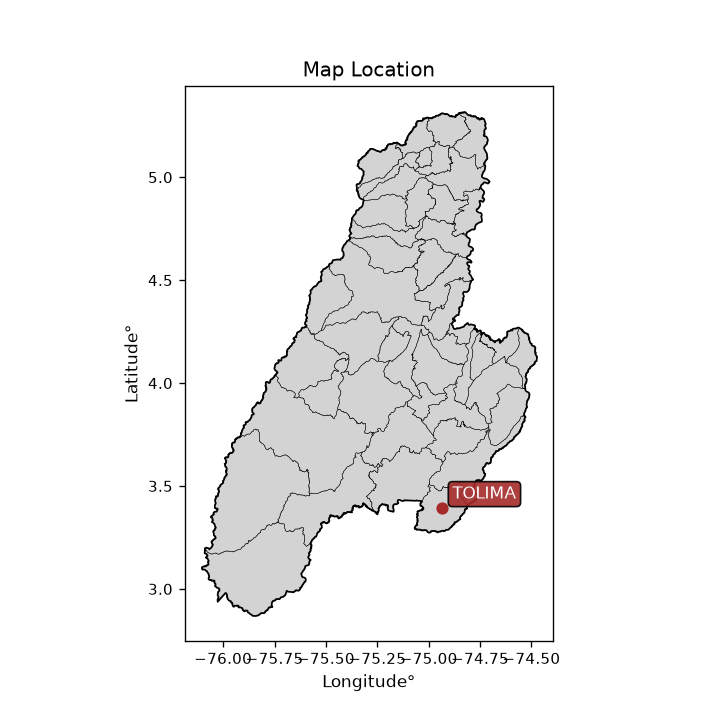</img>

| CountyID                                                                                          | CountyName        | CountyFiles                                                                                                                                                                                                                                                                                                                                                                                                                                                                                                                                                                                                                                                                                                                                                                                                                                                                                                                                                                                                                                                                                                                                                                                                                                                                                                                                                                                                                                                                                                                                                                                                                                                                                                                                                                   |
|:--------------------------------------------------------------------------------------------------|:------------------|:------------------------------------------------------------------------------------------------------------------------------------------------------------------------------------------------------------------------------------------------------------------------------------------------------------------------------------------------------------------------------------------------------------------------------------------------------------------------------------------------------------------------------------------------------------------------------------------------------------------------------------------------------------------------------------------------------------------------------------------------------------------------------------------------------------------------------------------------------------------------------------------------------------------------------------------------------------------------------------------------------------------------------------------------------------------------------------------------------------------------------------------------------------------------------------------------------------------------------------------------------------------------------------------------------------------------------------------------------------------------------------------------------------------------------------------------------------------------------------------------------------------------------------------------------------------------------------------------------------------------------------------------------------------------------------------------------------------------------------------------------------------------------|
| [73024](https://github.com/rcfdtools/R.HydroTools/blob/main/tool/Population/file/report/73024.md) | Alpujarra         | [73024_Rural_Lot_202606.zip](https://github.com/rcfdtools/R.GISMobile/blob/main/file/shp/73024_Rural_Lot_202606.zip) [73024_Rural_Nomenclature_202606.zip](https://github.com/rcfdtools/R.GISMobile/blob/main/file/shp/73024_Rural_Nomenclature_202606.zip) [73024_Rural_Sector_202606.zip](https://github.com/rcfdtools/R.GISMobile/blob/main/file/shp/73024_Rural_Sector_202606.zip) [73024_Rural_Vereda_202606.zip](https://github.com/rcfdtools/R.GISMobile/blob/main/file/shp/73024_Rural_Vereda_202606.zip) [73024_Urban_Block_202606.zip](https://github.com/rcfdtools/R.GISMobile/blob/main/file/shp/73024_Urban_Block_202606.zip) [73024_Urban_Building_202606.zip](https://github.com/rcfdtools/R.GISMobile/blob/main/file/shp/73024_Urban_Building_202606.zip) [73024_Urban_Lot_202606.zip](https://github.com/rcfdtools/R.GISMobile/blob/main/file/shp/73024_Urban_Lot_202606.zip) [73024_Urban_Neighborhood_202606.zip](https://github.com/rcfdtools/R.GISMobile/blob/main/file/shp/73024_Urban_Neighborhood_202606.zip) [73024_Urban_Nomenclature_202606.zip](https://github.com/rcfdtools/R.GISMobile/blob/main/file/shp/73024_Urban_Nomenclature_202606.zip) [73024_Urban_Nomenclature_Road_202606.zip](https://github.com/rcfdtools/R.GISMobile/blob/main/file/shp/73024_Urban_Nomenclature_Road_202606.zip) [73024_Urban_Perimeter_202606.zip](https://github.com/rcfdtools/R.GISMobile/blob/main/file/shp/73024_Urban_Perimeter_202606.zip) [73024_Urban_Sector_202606.zip](https://github.com/rcfdtools/R.GISMobile/blob/main/file/shp/73024_Urban_Sector_202606.zip)                                                                                                                                     |
| [73026](https://github.com/rcfdtools/R.HydroTools/blob/main/tool/Population/file/report/73026.md) | Alvarado          | [73026_Rural_Lot_202606.zip](https://github.com/rcfdtools/R.GISMobile/blob/main/file/shp/73026_Rural_Lot_202606.zip) [73026_Rural_Nomenclature_202606.zip](https://github.com/rcfdtools/R.GISMobile/blob/main/file/shp/73026_Rural_Nomenclature_202606.zip) [73026_Rural_Sector_202606.zip](https://github.com/rcfdtools/R.GISMobile/blob/main/file/shp/73026_Rural_Sector_202606.zip) [73026_Rural_Vereda_202606.zip](https://github.com/rcfdtools/R.GISMobile/blob/main/file/shp/73026_Rural_Vereda_202606.zip) [73026_Urban_Block_202606.zip](https://github.com/rcfdtools/R.GISMobile/blob/main/file/shp/73026_Urban_Block_202606.zip) [73026_Urban_Building_202606.zip](https://github.com/rcfdtools/R.GISMobile/blob/main/file/shp/73026_Urban_Building_202606.zip) [73026_Urban_Lot_202606.zip](https://github.com/rcfdtools/R.GISMobile/blob/main/file/shp/73026_Urban_Lot_202606.zip) [73026_Urban_Neighborhood_202606.zip](https://github.com/rcfdtools/R.GISMobile/blob/main/file/shp/73026_Urban_Neighborhood_202606.zip) [73026_Urban_Nomenclature_202606.zip](https://github.com/rcfdtools/R.GISMobile/blob/main/file/shp/73026_Urban_Nomenclature_202606.zip) [73026_Urban_Nomenclature_Road_202606.zip](https://github.com/rcfdtools/R.GISMobile/blob/main/file/shp/73026_Urban_Nomenclature_Road_202606.zip) [73026_Urban_Perimeter_202606.zip](https://github.com/rcfdtools/R.GISMobile/blob/main/file/shp/73026_Urban_Perimeter_202606.zip) [73026_Urban_Sector_202606.zip](https://github.com/rcfdtools/R.GISMobile/blob/main/file/shp/73026_Urban_Sector_202606.zip)                                                                                                                                     |
| [73030](https://github.com/rcfdtools/R.HydroTools/blob/main/tool/Population/file/report/73030.md) | Ambalema          | [73030_Rural_Building_202606.zip](https://github.com/rcfdtools/R.GISMobile/blob/main/file/shp/73030_Rural_Building_202606.zip) [73030_Rural_Lot_202606.zip](https://github.com/rcfdtools/R.GISMobile/blob/main/file/shp/73030_Rural_Lot_202606.zip) [73030_Rural_Nomenclature_202606.zip](https://github.com/rcfdtools/R.GISMobile/blob/main/file/shp/73030_Rural_Nomenclature_202606.zip) [73030_Rural_Sector_202606.zip](https://github.com/rcfdtools/R.GISMobile/blob/main/file/shp/73030_Rural_Sector_202606.zip) [73030_Rural_Vereda_202606.zip](https://github.com/rcfdtools/R.GISMobile/blob/main/file/shp/73030_Rural_Vereda_202606.zip) [73030_Urban_Block_202606.zip](https://github.com/rcfdtools/R.GISMobile/blob/main/file/shp/73030_Urban_Block_202606.zip) [73030_Urban_Building_202606.zip](https://github.com/rcfdtools/R.GISMobile/blob/main/file/shp/73030_Urban_Building_202606.zip) [73030_Urban_Lot_202606.zip](https://github.com/rcfdtools/R.GISMobile/blob/main/file/shp/73030_Urban_Lot_202606.zip) [73030_Urban_Neighborhood_202606.zip](https://github.com/rcfdtools/R.GISMobile/blob/main/file/shp/73030_Urban_Neighborhood_202606.zip) [73030_Urban_Nomenclature_202606.zip](https://github.com/rcfdtools/R.GISMobile/blob/main/file/shp/73030_Urban_Nomenclature_202606.zip) [73030_Urban_Nomenclature_Road_202606.zip](https://github.com/rcfdtools/R.GISMobile/blob/main/file/shp/73030_Urban_Nomenclature_Road_202606.zip) [73030_Urban_Perimeter_202606.zip](https://github.com/rcfdtools/R.GISMobile/blob/main/file/shp/73030_Urban_Perimeter_202606.zip) [73030_Urban_Sector_202606.zip](https://github.com/rcfdtools/R.GISMobile/blob/main/file/shp/73030_Urban_Sector_202606.zip)  |
| [73043](https://github.com/rcfdtools/R.HydroTools/blob/main/tool/Population/file/report/73043.md) | Anzoátegui        | [73043_Rural_Building_202606.zip](https://github.com/rcfdtools/R.GISMobile/blob/main/file/shp/73043_Rural_Building_202606.zip) [73043_Rural_Lot_202606.zip](https://github.com/rcfdtools/R.GISMobile/blob/main/file/shp/73043_Rural_Lot_202606.zip) [73043_Rural_Nomenclature_202606.zip](https://github.com/rcfdtools/R.GISMobile/blob/main/file/shp/73043_Rural_Nomenclature_202606.zip) [73043_Rural_Sector_202606.zip](https://github.com/rcfdtools/R.GISMobile/blob/main/file/shp/73043_Rural_Sector_202606.zip) [73043_Rural_Vereda_202606.zip](https://github.com/rcfdtools/R.GISMobile/blob/main/file/shp/73043_Rural_Vereda_202606.zip) [73043_Urban_Block_202606.zip](https://github.com/rcfdtools/R.GISMobile/blob/main/file/shp/73043_Urban_Block_202606.zip) [73043_Urban_Building_202606.zip](https://github.com/rcfdtools/R.GISMobile/blob/main/file/shp/73043_Urban_Building_202606.zip) [73043_Urban_Lot_202606.zip](https://github.com/rcfdtools/R.GISMobile/blob/main/file/shp/73043_Urban_Lot_202606.zip) [73043_Urban_Neighborhood_202606.zip](https://github.com/rcfdtools/R.GISMobile/blob/main/file/shp/73043_Urban_Neighborhood_202606.zip) [73043_Urban_Nomenclature_202606.zip](https://github.com/rcfdtools/R.GISMobile/blob/main/file/shp/73043_Urban_Nomenclature_202606.zip) [73043_Urban_Nomenclature_Road_202606.zip](https://github.com/rcfdtools/R.GISMobile/blob/main/file/shp/73043_Urban_Nomenclature_Road_202606.zip) [73043_Urban_Perimeter_202606.zip](https://github.com/rcfdtools/R.GISMobile/blob/main/file/shp/73043_Urban_Perimeter_202606.zip) [73043_Urban_Sector_202606.zip](https://github.com/rcfdtools/R.GISMobile/blob/main/file/shp/73043_Urban_Sector_202606.zip)  |
| [73055](https://github.com/rcfdtools/R.HydroTools/blob/main/tool/Population/file/report/73055.md) | Armero            | [73055_Rural_Building_202606.zip](https://github.com/rcfdtools/R.GISMobile/blob/main/file/shp/73055_Rural_Building_202606.zip) [73055_Rural_Lot_202606.zip](https://github.com/rcfdtools/R.GISMobile/blob/main/file/shp/73055_Rural_Lot_202606.zip) [73055_Rural_Nomenclature_202606.zip](https://github.com/rcfdtools/R.GISMobile/blob/main/file/shp/73055_Rural_Nomenclature_202606.zip) [73055_Rural_Sector_202606.zip](https://github.com/rcfdtools/R.GISMobile/blob/main/file/shp/73055_Rural_Sector_202606.zip) [73055_Rural_Vereda_202606.zip](https://github.com/rcfdtools/R.GISMobile/blob/main/file/shp/73055_Rural_Vereda_202606.zip) [73055_Urban_Block_202606.zip](https://github.com/rcfdtools/R.GISMobile/blob/main/file/shp/73055_Urban_Block_202606.zip) [73055_Urban_Building_202606.zip](https://github.com/rcfdtools/R.GISMobile/blob/main/file/shp/73055_Urban_Building_202606.zip) [73055_Urban_Lot_202606.zip](https://github.com/rcfdtools/R.GISMobile/blob/main/file/shp/73055_Urban_Lot_202606.zip) [73055_Urban_Neighborhood_202606.zip](https://github.com/rcfdtools/R.GISMobile/blob/main/file/shp/73055_Urban_Neighborhood_202606.zip) [73055_Urban_Nomenclature_202606.zip](https://github.com/rcfdtools/R.GISMobile/blob/main/file/shp/73055_Urban_Nomenclature_202606.zip) [73055_Urban_Nomenclature_Road_202606.zip](https://github.com/rcfdtools/R.GISMobile/blob/main/file/shp/73055_Urban_Nomenclature_Road_202606.zip) [73055_Urban_Perimeter_202606.zip](https://github.com/rcfdtools/R.GISMobile/blob/main/file/shp/73055_Urban_Perimeter_202606.zip) [73055_Urban_Sector_202606.zip](https://github.com/rcfdtools/R.GISMobile/blob/main/file/shp/73055_Urban_Sector_202606.zip)  |
| [73067](https://github.com/rcfdtools/R.HydroTools/blob/main/tool/Population/file/report/73067.md) | Ataco             | [73067_Rural_Building_202606.zip](https://github.com/rcfdtools/R.GISMobile/blob/main/file/shp/73067_Rural_Building_202606.zip) [73067_Rural_Lot_202606.zip](https://github.com/rcfdtools/R.GISMobile/blob/main/file/shp/73067_Rural_Lot_202606.zip) [73067_Rural_Nomenclature_202606.zip](https://github.com/rcfdtools/R.GISMobile/blob/main/file/shp/73067_Rural_Nomenclature_202606.zip) [73067_Rural_Sector_202606.zip](https://github.com/rcfdtools/R.GISMobile/blob/main/file/shp/73067_Rural_Sector_202606.zip) [73067_Rural_Vereda_202606.zip](https://github.com/rcfdtools/R.GISMobile/blob/main/file/shp/73067_Rural_Vereda_202606.zip) [73067_Urban_Block_202606.zip](https://github.com/rcfdtools/R.GISMobile/blob/main/file/shp/73067_Urban_Block_202606.zip) [73067_Urban_Building_202606.zip](https://github.com/rcfdtools/R.GISMobile/blob/main/file/shp/73067_Urban_Building_202606.zip) [73067_Urban_Lot_202606.zip](https://github.com/rcfdtools/R.GISMobile/blob/main/file/shp/73067_Urban_Lot_202606.zip) [73067_Urban_Nomenclature_202606.zip](https://github.com/rcfdtools/R.GISMobile/blob/main/file/shp/73067_Urban_Nomenclature_202606.zip) [73067_Urban_Nomenclature_Road_202606.zip](https://github.com/rcfdtools/R.GISMobile/blob/main/file/shp/73067_Urban_Nomenclature_Road_202606.zip) [73067_Urban_Perimeter_202606.zip](https://github.com/rcfdtools/R.GISMobile/blob/main/file/shp/73067_Urban_Perimeter_202606.zip) [73067_Urban_Sector_202606.zip](https://github.com/rcfdtools/R.GISMobile/blob/main/file/shp/73067_Urban_Sector_202606.zip)                                                                                                                                             |
| [73124](https://github.com/rcfdtools/R.HydroTools/blob/main/tool/Population/file/report/73124.md) | Cajamarca         | [73124_Rural_Building_202606.zip](https://github.com/rcfdtools/R.GISMobile/blob/main/file/shp/73124_Rural_Building_202606.zip) [73124_Rural_Lot_202606.zip](https://github.com/rcfdtools/R.GISMobile/blob/main/file/shp/73124_Rural_Lot_202606.zip) [73124_Rural_Nomenclature_202606.zip](https://github.com/rcfdtools/R.GISMobile/blob/main/file/shp/73124_Rural_Nomenclature_202606.zip) [73124_Rural_Sector_202606.zip](https://github.com/rcfdtools/R.GISMobile/blob/main/file/shp/73124_Rural_Sector_202606.zip) [73124_Rural_Vereda_202606.zip](https://github.com/rcfdtools/R.GISMobile/blob/main/file/shp/73124_Rural_Vereda_202606.zip) [73124_Urban_Block_202606.zip](https://github.com/rcfdtools/R.GISMobile/blob/main/file/shp/73124_Urban_Block_202606.zip) [73124_Urban_Building_202606.zip](https://github.com/rcfdtools/R.GISMobile/blob/main/file/shp/73124_Urban_Building_202606.zip) [73124_Urban_Lot_202606.zip](https://github.com/rcfdtools/R.GISMobile/blob/main/file/shp/73124_Urban_Lot_202606.zip) [73124_Urban_Neighborhood_202606.zip](https://github.com/rcfdtools/R.GISMobile/blob/main/file/shp/73124_Urban_Neighborhood_202606.zip) [73124_Urban_Nomenclature_202606.zip](https://github.com/rcfdtools/R.GISMobile/blob/main/file/shp/73124_Urban_Nomenclature_202606.zip) [73124_Urban_Nomenclature_Road_202606.zip](https://github.com/rcfdtools/R.GISMobile/blob/main/file/shp/73124_Urban_Nomenclature_Road_202606.zip) [73124_Urban_Perimeter_202606.zip](https://github.com/rcfdtools/R.GISMobile/blob/main/file/shp/73124_Urban_Perimeter_202606.zip) [73124_Urban_Sector_202606.zip](https://github.com/rcfdtools/R.GISMobile/blob/main/file/shp/73124_Urban_Sector_202606.zip)  |
| [73148](https://github.com/rcfdtools/R.HydroTools/blob/main/tool/Population/file/report/73148.md) | Carmen De Apicalá | [73148_Rural_Building_202606.zip](https://github.com/rcfdtools/R.GISMobile/blob/main/file/shp/73148_Rural_Building_202606.zip) [73148_Rural_Lot_202606.zip](https://github.com/rcfdtools/R.GISMobile/blob/main/file/shp/73148_Rural_Lot_202606.zip) [73148_Rural_Nomenclature_202606.zip](https://github.com/rcfdtools/R.GISMobile/blob/main/file/shp/73148_Rural_Nomenclature_202606.zip) [73148_Rural_Sector_202606.zip](https://github.com/rcfdtools/R.GISMobile/blob/main/file/shp/73148_Rural_Sector_202606.zip) [73148_Rural_Vereda_202606.zip](https://github.com/rcfdtools/R.GISMobile/blob/main/file/shp/73148_Rural_Vereda_202606.zip) [73148_Urban_Block_202606.zip](https://github.com/rcfdtools/R.GISMobile/blob/main/file/shp/73148_Urban_Block_202606.zip) [73148_Urban_Building_202606.zip](https://github.com/rcfdtools/R.GISMobile/blob/main/file/shp/73148_Urban_Building_202606.zip) [73148_Urban_Lot_202606.zip](https://github.com/rcfdtools/R.GISMobile/blob/main/file/shp/73148_Urban_Lot_202606.zip) [73148_Urban_Nomenclature_202606.zip](https://github.com/rcfdtools/R.GISMobile/blob/main/file/shp/73148_Urban_Nomenclature_202606.zip) [73148_Urban_Nomenclature_Road_202606.zip](https://github.com/rcfdtools/R.GISMobile/blob/main/file/shp/73148_Urban_Nomenclature_Road_202606.zip) [73148_Urban_Perimeter_202606.zip](https://github.com/rcfdtools/R.GISMobile/blob/main/file/shp/73148_Urban_Perimeter_202606.zip) [73148_Urban_Sector_202606.zip](https://github.com/rcfdtools/R.GISMobile/blob/main/file/shp/73148_Urban_Sector_202606.zip)                                                                                                                                             |
| [73152](https://github.com/rcfdtools/R.HydroTools/blob/main/tool/Population/file/report/73152.md) | Casabianca        | [73152_Rural_Lot_202606.zip](https://github.com/rcfdtools/R.GISMobile/blob/main/file/shp/73152_Rural_Lot_202606.zip) [73152_Rural_Nomenclature_202606.zip](https://github.com/rcfdtools/R.GISMobile/blob/main/file/shp/73152_Rural_Nomenclature_202606.zip) [73152_Rural_Sector_202606.zip](https://github.com/rcfdtools/R.GISMobile/blob/main/file/shp/73152_Rural_Sector_202606.zip) [73152_Rural_Vereda_202606.zip](https://github.com/rcfdtools/R.GISMobile/blob/main/file/shp/73152_Rural_Vereda_202606.zip) [73152_Urban_Block_202606.zip](https://github.com/rcfdtools/R.GISMobile/blob/main/file/shp/73152_Urban_Block_202606.zip) [73152_Urban_Building_202606.zip](https://github.com/rcfdtools/R.GISMobile/blob/main/file/shp/73152_Urban_Building_202606.zip) [73152_Urban_Lot_202606.zip](https://github.com/rcfdtools/R.GISMobile/blob/main/file/shp/73152_Urban_Lot_202606.zip) [73152_Urban_Neighborhood_202606.zip](https://github.com/rcfdtools/R.GISMobile/blob/main/file/shp/73152_Urban_Neighborhood_202606.zip) [73152_Urban_Nomenclature_202606.zip](https://github.com/rcfdtools/R.GISMobile/blob/main/file/shp/73152_Urban_Nomenclature_202606.zip) [73152_Urban_Nomenclature_Road_202606.zip](https://github.com/rcfdtools/R.GISMobile/blob/main/file/shp/73152_Urban_Nomenclature_Road_202606.zip) [73152_Urban_Perimeter_202606.zip](https://github.com/rcfdtools/R.GISMobile/blob/main/file/shp/73152_Urban_Perimeter_202606.zip) [73152_Urban_Sector_202606.zip](https://github.com/rcfdtools/R.GISMobile/blob/main/file/shp/73152_Urban_Sector_202606.zip)                                                                                                                                     |
| [73168](https://github.com/rcfdtools/R.HydroTools/blob/main/tool/Population/file/report/73168.md) | Chaparral         | [73168_Rural_Building_202606.zip](https://github.com/rcfdtools/R.GISMobile/blob/main/file/shp/73168_Rural_Building_202606.zip) [73168_Rural_Lot_202606.zip](https://github.com/rcfdtools/R.GISMobile/blob/main/file/shp/73168_Rural_Lot_202606.zip) [73168_Rural_Nomenclature_202606.zip](https://github.com/rcfdtools/R.GISMobile/blob/main/file/shp/73168_Rural_Nomenclature_202606.zip) [73168_Rural_Sector_202606.zip](https://github.com/rcfdtools/R.GISMobile/blob/main/file/shp/73168_Rural_Sector_202606.zip) [73168_Rural_Vereda_202606.zip](https://github.com/rcfdtools/R.GISMobile/blob/main/file/shp/73168_Rural_Vereda_202606.zip) [73168_Urban_Block_202606.zip](https://github.com/rcfdtools/R.GISMobile/blob/main/file/shp/73168_Urban_Block_202606.zip) [73168_Urban_Building_202606.zip](https://github.com/rcfdtools/R.GISMobile/blob/main/file/shp/73168_Urban_Building_202606.zip) [73168_Urban_Lot_202606.zip](https://github.com/rcfdtools/R.GISMobile/blob/main/file/shp/73168_Urban_Lot_202606.zip) [73168_Urban_Neighborhood_202606.zip](https://github.com/rcfdtools/R.GISMobile/blob/main/file/shp/73168_Urban_Neighborhood_202606.zip) [73168_Urban_Nomenclature_202606.zip](https://github.com/rcfdtools/R.GISMobile/blob/main/file/shp/73168_Urban_Nomenclature_202606.zip) [73168_Urban_Nomenclature_Road_202606.zip](https://github.com/rcfdtools/R.GISMobile/blob/main/file/shp/73168_Urban_Nomenclature_Road_202606.zip) [73168_Urban_Perimeter_202606.zip](https://github.com/rcfdtools/R.GISMobile/blob/main/file/shp/73168_Urban_Perimeter_202606.zip) [73168_Urban_Sector_202606.zip](https://github.com/rcfdtools/R.GISMobile/blob/main/file/shp/73168_Urban_Sector_202606.zip)  |
| [73200](https://github.com/rcfdtools/R.HydroTools/blob/main/tool/Population/file/report/73200.md) | Coello            | [73200_Rural_Building_202606.zip](https://github.com/rcfdtools/R.GISMobile/blob/main/file/shp/73200_Rural_Building_202606.zip) [73200_Rural_Lot_202606.zip](https://github.com/rcfdtools/R.GISMobile/blob/main/file/shp/73200_Rural_Lot_202606.zip) [73200_Rural_Nomenclature_202606.zip](https://github.com/rcfdtools/R.GISMobile/blob/main/file/shp/73200_Rural_Nomenclature_202606.zip) [73200_Rural_Sector_202606.zip](https://github.com/rcfdtools/R.GISMobile/blob/main/file/shp/73200_Rural_Sector_202606.zip) [73200_Rural_Vereda_202606.zip](https://github.com/rcfdtools/R.GISMobile/blob/main/file/shp/73200_Rural_Vereda_202606.zip) [73200_Urban_Block_202606.zip](https://github.com/rcfdtools/R.GISMobile/blob/main/file/shp/73200_Urban_Block_202606.zip) [73200_Urban_Building_202606.zip](https://github.com/rcfdtools/R.GISMobile/blob/main/file/shp/73200_Urban_Building_202606.zip) [73200_Urban_Lot_202606.zip](https://github.com/rcfdtools/R.GISMobile/blob/main/file/shp/73200_Urban_Lot_202606.zip) [73200_Urban_Neighborhood_202606.zip](https://github.com/rcfdtools/R.GISMobile/blob/main/file/shp/73200_Urban_Neighborhood_202606.zip) [73200_Urban_Nomenclature_202606.zip](https://github.com/rcfdtools/R.GISMobile/blob/main/file/shp/73200_Urban_Nomenclature_202606.zip) [73200_Urban_Nomenclature_Road_202606.zip](https://github.com/rcfdtools/R.GISMobile/blob/main/file/shp/73200_Urban_Nomenclature_Road_202606.zip) [73200_Urban_Perimeter_202606.zip](https://github.com/rcfdtools/R.GISMobile/blob/main/file/shp/73200_Urban_Perimeter_202606.zip) [73200_Urban_Sector_202606.zip](https://github.com/rcfdtools/R.GISMobile/blob/main/file/shp/73200_Urban_Sector_202606.zip)  |
| [73217](https://github.com/rcfdtools/R.HydroTools/blob/main/tool/Population/file/report/73217.md) | Coyaima           | [73217_Rural_Building_202606.zip](https://github.com/rcfdtools/R.GISMobile/blob/main/file/shp/73217_Rural_Building_202606.zip) [73217_Rural_Lot_202606.zip](https://github.com/rcfdtools/R.GISMobile/blob/main/file/shp/73217_Rural_Lot_202606.zip) [73217_Rural_Nomenclature_202606.zip](https://github.com/rcfdtools/R.GISMobile/blob/main/file/shp/73217_Rural_Nomenclature_202606.zip) [73217_Rural_Sector_202606.zip](https://github.com/rcfdtools/R.GISMobile/blob/main/file/shp/73217_Rural_Sector_202606.zip) [73217_Rural_Vereda_202606.zip](https://github.com/rcfdtools/R.GISMobile/blob/main/file/shp/73217_Rural_Vereda_202606.zip) [73217_Urban_Block_202606.zip](https://github.com/rcfdtools/R.GISMobile/blob/main/file/shp/73217_Urban_Block_202606.zip) [73217_Urban_Building_202606.zip](https://github.com/rcfdtools/R.GISMobile/blob/main/file/shp/73217_Urban_Building_202606.zip) [73217_Urban_Lot_202606.zip](https://github.com/rcfdtools/R.GISMobile/blob/main/file/shp/73217_Urban_Lot_202606.zip) [73217_Urban_Neighborhood_202606.zip](https://github.com/rcfdtools/R.GISMobile/blob/main/file/shp/73217_Urban_Neighborhood_202606.zip) [73217_Urban_Nomenclature_202606.zip](https://github.com/rcfdtools/R.GISMobile/blob/main/file/shp/73217_Urban_Nomenclature_202606.zip) [73217_Urban_Nomenclature_Road_202606.zip](https://github.com/rcfdtools/R.GISMobile/blob/main/file/shp/73217_Urban_Nomenclature_Road_202606.zip) [73217_Urban_Perimeter_202606.zip](https://github.com/rcfdtools/R.GISMobile/blob/main/file/shp/73217_Urban_Perimeter_202606.zip) [73217_Urban_Sector_202606.zip](https://github.com/rcfdtools/R.GISMobile/blob/main/file/shp/73217_Urban_Sector_202606.zip)  |
| [73226](https://github.com/rcfdtools/R.HydroTools/blob/main/tool/Population/file/report/73226.md) | Cunday            | [73226_Rural_Lot_202606.zip](https://github.com/rcfdtools/R.GISMobile/blob/main/file/shp/73226_Rural_Lot_202606.zip) [73226_Rural_Nomenclature_202606.zip](https://github.com/rcfdtools/R.GISMobile/blob/main/file/shp/73226_Rural_Nomenclature_202606.zip) [73226_Rural_Sector_202606.zip](https://github.com/rcfdtools/R.GISMobile/blob/main/file/shp/73226_Rural_Sector_202606.zip) [73226_Rural_Vereda_202606.zip](https://github.com/rcfdtools/R.GISMobile/blob/main/file/shp/73226_Rural_Vereda_202606.zip) [73226_Urban_Block_202606.zip](https://github.com/rcfdtools/R.GISMobile/blob/main/file/shp/73226_Urban_Block_202606.zip) [73226_Urban_Building_202606.zip](https://github.com/rcfdtools/R.GISMobile/blob/main/file/shp/73226_Urban_Building_202606.zip) [73226_Urban_Lot_202606.zip](https://github.com/rcfdtools/R.GISMobile/blob/main/file/shp/73226_Urban_Lot_202606.zip) [73226_Urban_Neighborhood_202606.zip](https://github.com/rcfdtools/R.GISMobile/blob/main/file/shp/73226_Urban_Neighborhood_202606.zip) [73226_Urban_Nomenclature_202606.zip](https://github.com/rcfdtools/R.GISMobile/blob/main/file/shp/73226_Urban_Nomenclature_202606.zip) [73226_Urban_Nomenclature_Road_202606.zip](https://github.com/rcfdtools/R.GISMobile/blob/main/file/shp/73226_Urban_Nomenclature_Road_202606.zip) [73226_Urban_Perimeter_202606.zip](https://github.com/rcfdtools/R.GISMobile/blob/main/file/shp/73226_Urban_Perimeter_202606.zip) [73226_Urban_Sector_202606.zip](https://github.com/rcfdtools/R.GISMobile/blob/main/file/shp/73226_Urban_Sector_202606.zip)                                                                                                                                     |
| [73236](https://github.com/rcfdtools/R.HydroTools/blob/main/tool/Population/file/report/73236.md) | Dolores           | [73236_Rural_Building_202606.zip](https://github.com/rcfdtools/R.GISMobile/blob/main/file/shp/73236_Rural_Building_202606.zip) [73236_Rural_Lot_202606.zip](https://github.com/rcfdtools/R.GISMobile/blob/main/file/shp/73236_Rural_Lot_202606.zip) [73236_Rural_Nomenclature_202606.zip](https://github.com/rcfdtools/R.GISMobile/blob/main/file/shp/73236_Rural_Nomenclature_202606.zip) [73236_Rural_Sector_202606.zip](https://github.com/rcfdtools/R.GISMobile/blob/main/file/shp/73236_Rural_Sector_202606.zip) [73236_Rural_Vereda_202606.zip](https://github.com/rcfdtools/R.GISMobile/blob/main/file/shp/73236_Rural_Vereda_202606.zip) [73236_Urban_Block_202606.zip](https://github.com/rcfdtools/R.GISMobile/blob/main/file/shp/73236_Urban_Block_202606.zip) [73236_Urban_Building_202606.zip](https://github.com/rcfdtools/R.GISMobile/blob/main/file/shp/73236_Urban_Building_202606.zip) [73236_Urban_Lot_202606.zip](https://github.com/rcfdtools/R.GISMobile/blob/main/file/shp/73236_Urban_Lot_202606.zip) [73236_Urban_Neighborhood_202606.zip](https://github.com/rcfdtools/R.GISMobile/blob/main/file/shp/73236_Urban_Neighborhood_202606.zip) [73236_Urban_Nomenclature_202606.zip](https://github.com/rcfdtools/R.GISMobile/blob/main/file/shp/73236_Urban_Nomenclature_202606.zip) [73236_Urban_Nomenclature_Road_202606.zip](https://github.com/rcfdtools/R.GISMobile/blob/main/file/shp/73236_Urban_Nomenclature_Road_202606.zip) [73236_Urban_Perimeter_202606.zip](https://github.com/rcfdtools/R.GISMobile/blob/main/file/shp/73236_Urban_Perimeter_202606.zip) [73236_Urban_Sector_202606.zip](https://github.com/rcfdtools/R.GISMobile/blob/main/file/shp/73236_Urban_Sector_202606.zip)  |
| [73268](https://github.com/rcfdtools/R.HydroTools/blob/main/tool/Population/file/report/73268.md) | Espinal           | [73268_Rural_Building_202606.zip](https://github.com/rcfdtools/R.GISMobile/blob/main/file/shp/73268_Rural_Building_202606.zip) [73268_Rural_Lot_202606.zip](https://github.com/rcfdtools/R.GISMobile/blob/main/file/shp/73268_Rural_Lot_202606.zip) [73268_Rural_Nomenclature_202606.zip](https://github.com/rcfdtools/R.GISMobile/blob/main/file/shp/73268_Rural_Nomenclature_202606.zip) [73268_Rural_Sector_202606.zip](https://github.com/rcfdtools/R.GISMobile/blob/main/file/shp/73268_Rural_Sector_202606.zip) [73268_Rural_Vereda_202606.zip](https://github.com/rcfdtools/R.GISMobile/blob/main/file/shp/73268_Rural_Vereda_202606.zip) [73268_Urban_Block_202606.zip](https://github.com/rcfdtools/R.GISMobile/blob/main/file/shp/73268_Urban_Block_202606.zip) [73268_Urban_Building_202606.zip](https://github.com/rcfdtools/R.GISMobile/blob/main/file/shp/73268_Urban_Building_202606.zip) [73268_Urban_Lot_202606.zip](https://github.com/rcfdtools/R.GISMobile/blob/main/file/shp/73268_Urban_Lot_202606.zip) [73268_Urban_Nomenclature_202606.zip](https://github.com/rcfdtools/R.GISMobile/blob/main/file/shp/73268_Urban_Nomenclature_202606.zip) [73268_Urban_Nomenclature_Road_202606.zip](https://github.com/rcfdtools/R.GISMobile/blob/main/file/shp/73268_Urban_Nomenclature_Road_202606.zip) [73268_Urban_Perimeter_202606.zip](https://github.com/rcfdtools/R.GISMobile/blob/main/file/shp/73268_Urban_Perimeter_202606.zip) [73268_Urban_Sector_202606.zip](https://github.com/rcfdtools/R.GISMobile/blob/main/file/shp/73268_Urban_Sector_202606.zip)                                                                                                                                             |
| [73270](https://github.com/rcfdtools/R.HydroTools/blob/main/tool/Population/file/report/73270.md) | Falan             | [73270_Rural_Lot_202606.zip](https://github.com/rcfdtools/R.GISMobile/blob/main/file/shp/73270_Rural_Lot_202606.zip) [73270_Rural_Nomenclature_202606.zip](https://github.com/rcfdtools/R.GISMobile/blob/main/file/shp/73270_Rural_Nomenclature_202606.zip) [73270_Rural_Sector_202606.zip](https://github.com/rcfdtools/R.GISMobile/blob/main/file/shp/73270_Rural_Sector_202606.zip) [73270_Rural_Vereda_202606.zip](https://github.com/rcfdtools/R.GISMobile/blob/main/file/shp/73270_Rural_Vereda_202606.zip) [73270_Urban_Block_202606.zip](https://github.com/rcfdtools/R.GISMobile/blob/main/file/shp/73270_Urban_Block_202606.zip) [73270_Urban_Building_202606.zip](https://github.com/rcfdtools/R.GISMobile/blob/main/file/shp/73270_Urban_Building_202606.zip) [73270_Urban_Lot_202606.zip](https://github.com/rcfdtools/R.GISMobile/blob/main/file/shp/73270_Urban_Lot_202606.zip) [73270_Urban_Neighborhood_202606.zip](https://github.com/rcfdtools/R.GISMobile/blob/main/file/shp/73270_Urban_Neighborhood_202606.zip) [73270_Urban_Nomenclature_202606.zip](https://github.com/rcfdtools/R.GISMobile/blob/main/file/shp/73270_Urban_Nomenclature_202606.zip) [73270_Urban_Nomenclature_Road_202606.zip](https://github.com/rcfdtools/R.GISMobile/blob/main/file/shp/73270_Urban_Nomenclature_Road_202606.zip) [73270_Urban_Perimeter_202606.zip](https://github.com/rcfdtools/R.GISMobile/blob/main/file/shp/73270_Urban_Perimeter_202606.zip) [73270_Urban_Sector_202606.zip](https://github.com/rcfdtools/R.GISMobile/blob/main/file/shp/73270_Urban_Sector_202606.zip)                                                                                                                                     |
| [73275](https://github.com/rcfdtools/R.HydroTools/blob/main/tool/Population/file/report/73275.md) | Flandes           | [73275_Rural_Building_202606.zip](https://github.com/rcfdtools/R.GISMobile/blob/main/file/shp/73275_Rural_Building_202606.zip) [73275_Rural_Lot_202606.zip](https://github.com/rcfdtools/R.GISMobile/blob/main/file/shp/73275_Rural_Lot_202606.zip) [73275_Rural_Nomenclature_202606.zip](https://github.com/rcfdtools/R.GISMobile/blob/main/file/shp/73275_Rural_Nomenclature_202606.zip) [73275_Rural_Sector_202606.zip](https://github.com/rcfdtools/R.GISMobile/blob/main/file/shp/73275_Rural_Sector_202606.zip) [73275_Rural_Vereda_202606.zip](https://github.com/rcfdtools/R.GISMobile/blob/main/file/shp/73275_Rural_Vereda_202606.zip) [73275_Urban_Block_202606.zip](https://github.com/rcfdtools/R.GISMobile/blob/main/file/shp/73275_Urban_Block_202606.zip) [73275_Urban_Building_202606.zip](https://github.com/rcfdtools/R.GISMobile/blob/main/file/shp/73275_Urban_Building_202606.zip) [73275_Urban_Lot_202606.zip](https://github.com/rcfdtools/R.GISMobile/blob/main/file/shp/73275_Urban_Lot_202606.zip) [73275_Urban_Neighborhood_202606.zip](https://github.com/rcfdtools/R.GISMobile/blob/main/file/shp/73275_Urban_Neighborhood_202606.zip) [73275_Urban_Nomenclature_202606.zip](https://github.com/rcfdtools/R.GISMobile/blob/main/file/shp/73275_Urban_Nomenclature_202606.zip) [73275_Urban_Nomenclature_Road_202606.zip](https://github.com/rcfdtools/R.GISMobile/blob/main/file/shp/73275_Urban_Nomenclature_Road_202606.zip) [73275_Urban_Perimeter_202606.zip](https://github.com/rcfdtools/R.GISMobile/blob/main/file/shp/73275_Urban_Perimeter_202606.zip) [73275_Urban_Sector_202606.zip](https://github.com/rcfdtools/R.GISMobile/blob/main/file/shp/73275_Urban_Sector_202606.zip)  |
| [73283](https://github.com/rcfdtools/R.HydroTools/blob/main/tool/Population/file/report/73283.md) | Fresno            | [73283_Rural_Building_202606.zip](https://github.com/rcfdtools/R.GISMobile/blob/main/file/shp/73283_Rural_Building_202606.zip) [73283_Rural_Lot_202606.zip](https://github.com/rcfdtools/R.GISMobile/blob/main/file/shp/73283_Rural_Lot_202606.zip) [73283_Rural_Nomenclature_202606.zip](https://github.com/rcfdtools/R.GISMobile/blob/main/file/shp/73283_Rural_Nomenclature_202606.zip) [73283_Rural_Sector_202606.zip](https://github.com/rcfdtools/R.GISMobile/blob/main/file/shp/73283_Rural_Sector_202606.zip) [73283_Rural_Vereda_202606.zip](https://github.com/rcfdtools/R.GISMobile/blob/main/file/shp/73283_Rural_Vereda_202606.zip) [73283_Urban_Block_202606.zip](https://github.com/rcfdtools/R.GISMobile/blob/main/file/shp/73283_Urban_Block_202606.zip) [73283_Urban_Building_202606.zip](https://github.com/rcfdtools/R.GISMobile/blob/main/file/shp/73283_Urban_Building_202606.zip) [73283_Urban_Lot_202606.zip](https://github.com/rcfdtools/R.GISMobile/blob/main/file/shp/73283_Urban_Lot_202606.zip) [73283_Urban_Neighborhood_202606.zip](https://github.com/rcfdtools/R.GISMobile/blob/main/file/shp/73283_Urban_Neighborhood_202606.zip) [73283_Urban_Nomenclature_202606.zip](https://github.com/rcfdtools/R.GISMobile/blob/main/file/shp/73283_Urban_Nomenclature_202606.zip) [73283_Urban_Nomenclature_Road_202606.zip](https://github.com/rcfdtools/R.GISMobile/blob/main/file/shp/73283_Urban_Nomenclature_Road_202606.zip) [73283_Urban_Perimeter_202606.zip](https://github.com/rcfdtools/R.GISMobile/blob/main/file/shp/73283_Urban_Perimeter_202606.zip) [73283_Urban_Sector_202606.zip](https://github.com/rcfdtools/R.GISMobile/blob/main/file/shp/73283_Urban_Sector_202606.zip)  |
| [73319](https://github.com/rcfdtools/R.HydroTools/blob/main/tool/Population/file/report/73319.md) | Guamo             | [73319_Rural_Building_202606.zip](https://github.com/rcfdtools/R.GISMobile/blob/main/file/shp/73319_Rural_Building_202606.zip) [73319_Rural_Lot_202606.zip](https://github.com/rcfdtools/R.GISMobile/blob/main/file/shp/73319_Rural_Lot_202606.zip) [73319_Rural_Nomenclature_202606.zip](https://github.com/rcfdtools/R.GISMobile/blob/main/file/shp/73319_Rural_Nomenclature_202606.zip) [73319_Rural_Sector_202606.zip](https://github.com/rcfdtools/R.GISMobile/blob/main/file/shp/73319_Rural_Sector_202606.zip) [73319_Rural_Vereda_202606.zip](https://github.com/rcfdtools/R.GISMobile/blob/main/file/shp/73319_Rural_Vereda_202606.zip) [73319_Urban_Block_202606.zip](https://github.com/rcfdtools/R.GISMobile/blob/main/file/shp/73319_Urban_Block_202606.zip) [73319_Urban_Building_202606.zip](https://github.com/rcfdtools/R.GISMobile/blob/main/file/shp/73319_Urban_Building_202606.zip) [73319_Urban_Lot_202606.zip](https://github.com/rcfdtools/R.GISMobile/blob/main/file/shp/73319_Urban_Lot_202606.zip) [73319_Urban_Neighborhood_202606.zip](https://github.com/rcfdtools/R.GISMobile/blob/main/file/shp/73319_Urban_Neighborhood_202606.zip) [73319_Urban_Nomenclature_202606.zip](https://github.com/rcfdtools/R.GISMobile/blob/main/file/shp/73319_Urban_Nomenclature_202606.zip) [73319_Urban_Nomenclature_Road_202606.zip](https://github.com/rcfdtools/R.GISMobile/blob/main/file/shp/73319_Urban_Nomenclature_Road_202606.zip) [73319_Urban_Perimeter_202606.zip](https://github.com/rcfdtools/R.GISMobile/blob/main/file/shp/73319_Urban_Perimeter_202606.zip) [73319_Urban_Sector_202606.zip](https://github.com/rcfdtools/R.GISMobile/blob/main/file/shp/73319_Urban_Sector_202606.zip)  |
| [73347](https://github.com/rcfdtools/R.HydroTools/blob/main/tool/Population/file/report/73347.md) | Herveo            | [73347_Rural_Building_202606.zip](https://github.com/rcfdtools/R.GISMobile/blob/main/file/shp/73347_Rural_Building_202606.zip) [73347_Rural_Lot_202606.zip](https://github.com/rcfdtools/R.GISMobile/blob/main/file/shp/73347_Rural_Lot_202606.zip) [73347_Rural_Nomenclature_202606.zip](https://github.com/rcfdtools/R.GISMobile/blob/main/file/shp/73347_Rural_Nomenclature_202606.zip) [73347_Rural_Sector_202606.zip](https://github.com/rcfdtools/R.GISMobile/blob/main/file/shp/73347_Rural_Sector_202606.zip) [73347_Rural_Vereda_202606.zip](https://github.com/rcfdtools/R.GISMobile/blob/main/file/shp/73347_Rural_Vereda_202606.zip) [73347_Urban_Block_202606.zip](https://github.com/rcfdtools/R.GISMobile/blob/main/file/shp/73347_Urban_Block_202606.zip) [73347_Urban_Building_202606.zip](https://github.com/rcfdtools/R.GISMobile/blob/main/file/shp/73347_Urban_Building_202606.zip) [73347_Urban_Lot_202606.zip](https://github.com/rcfdtools/R.GISMobile/blob/main/file/shp/73347_Urban_Lot_202606.zip) [73347_Urban_Neighborhood_202606.zip](https://github.com/rcfdtools/R.GISMobile/blob/main/file/shp/73347_Urban_Neighborhood_202606.zip) [73347_Urban_Nomenclature_202606.zip](https://github.com/rcfdtools/R.GISMobile/blob/main/file/shp/73347_Urban_Nomenclature_202606.zip) [73347_Urban_Nomenclature_Road_202606.zip](https://github.com/rcfdtools/R.GISMobile/blob/main/file/shp/73347_Urban_Nomenclature_Road_202606.zip) [73347_Urban_Perimeter_202606.zip](https://github.com/rcfdtools/R.GISMobile/blob/main/file/shp/73347_Urban_Perimeter_202606.zip) [73347_Urban_Sector_202606.zip](https://github.com/rcfdtools/R.GISMobile/blob/main/file/shp/73347_Urban_Sector_202606.zip)  |
| [73349](https://github.com/rcfdtools/R.HydroTools/blob/main/tool/Population/file/report/73349.md) | Honda             | [73349_Rural_Lot_202606.zip](https://github.com/rcfdtools/R.GISMobile/blob/main/file/shp/73349_Rural_Lot_202606.zip) [73349_Rural_Nomenclature_202606.zip](https://github.com/rcfdtools/R.GISMobile/blob/main/file/shp/73349_Rural_Nomenclature_202606.zip) [73349_Rural_Sector_202606.zip](https://github.com/rcfdtools/R.GISMobile/blob/main/file/shp/73349_Rural_Sector_202606.zip) [73349_Rural_Vereda_202606.zip](https://github.com/rcfdtools/R.GISMobile/blob/main/file/shp/73349_Rural_Vereda_202606.zip) [73349_Urban_Block_202606.zip](https://github.com/rcfdtools/R.GISMobile/blob/main/file/shp/73349_Urban_Block_202606.zip) [73349_Urban_Building_202606.zip](https://github.com/rcfdtools/R.GISMobile/blob/main/file/shp/73349_Urban_Building_202606.zip) [73349_Urban_Lot_202606.zip](https://github.com/rcfdtools/R.GISMobile/blob/main/file/shp/73349_Urban_Lot_202606.zip) [73349_Urban_Neighborhood_202606.zip](https://github.com/rcfdtools/R.GISMobile/blob/main/file/shp/73349_Urban_Neighborhood_202606.zip) [73349_Urban_Nomenclature_202606.zip](https://github.com/rcfdtools/R.GISMobile/blob/main/file/shp/73349_Urban_Nomenclature_202606.zip) [73349_Urban_Nomenclature_Road_202606.zip](https://github.com/rcfdtools/R.GISMobile/blob/main/file/shp/73349_Urban_Nomenclature_Road_202606.zip) [73349_Urban_Perimeter_202606.zip](https://github.com/rcfdtools/R.GISMobile/blob/main/file/shp/73349_Urban_Perimeter_202606.zip) [73349_Urban_Sector_202606.zip](https://github.com/rcfdtools/R.GISMobile/blob/main/file/shp/73349_Urban_Sector_202606.zip)                                                                                                                                     |
| [73001](https://github.com/rcfdtools/R.HydroTools/blob/main/tool/Population/file/report/73001.md) | Ibagué            | [73001_Rural_Lot_202001.zip](https://github.com/rcfdtools/R.GISMobile/blob/main/file/shp/73001_Rural_Lot_202001.zip) [73001_Urban_Lot_202001.zip](https://github.com/rcfdtools/R.GISMobile/blob/main/file/shp/73001_Urban_Lot_202001.zip)                                                                                                                                                                                                                                                                                                                                                                                                                                                                                                                                                                                                                                                                                                                                                                                                                                                                                                                                                                                                                                                                                                                                                                                                                                                                                                                                                                                                                                                                                                                             |
| [73352](https://github.com/rcfdtools/R.HydroTools/blob/main/tool/Population/file/report/73352.md) | Icononzo          | [73352_Rural_Building_202606.zip](https://github.com/rcfdtools/R.GISMobile/blob/main/file/shp/73352_Rural_Building_202606.zip) [73352_Rural_Lot_202606.zip](https://github.com/rcfdtools/R.GISMobile/blob/main/file/shp/73352_Rural_Lot_202606.zip) [73352_Rural_Nomenclature_202606.zip](https://github.com/rcfdtools/R.GISMobile/blob/main/file/shp/73352_Rural_Nomenclature_202606.zip) [73352_Rural_Sector_202606.zip](https://github.com/rcfdtools/R.GISMobile/blob/main/file/shp/73352_Rural_Sector_202606.zip) [73352_Rural_Vereda_202606.zip](https://github.com/rcfdtools/R.GISMobile/blob/main/file/shp/73352_Rural_Vereda_202606.zip) [73352_Urban_Block_202606.zip](https://github.com/rcfdtools/R.GISMobile/blob/main/file/shp/73352_Urban_Block_202606.zip) [73352_Urban_Building_202606.zip](https://github.com/rcfdtools/R.GISMobile/blob/main/file/shp/73352_Urban_Building_202606.zip) [73352_Urban_Lot_202606.zip](https://github.com/rcfdtools/R.GISMobile/blob/main/file/shp/73352_Urban_Lot_202606.zip) [73352_Urban_Neighborhood_202606.zip](https://github.com/rcfdtools/R.GISMobile/blob/main/file/shp/73352_Urban_Neighborhood_202606.zip) [73352_Urban_Nomenclature_202606.zip](https://github.com/rcfdtools/R.GISMobile/blob/main/file/shp/73352_Urban_Nomenclature_202606.zip) [73352_Urban_Nomenclature_Road_202606.zip](https://github.com/rcfdtools/R.GISMobile/blob/main/file/shp/73352_Urban_Nomenclature_Road_202606.zip) [73352_Urban_Perimeter_202606.zip](https://github.com/rcfdtools/R.GISMobile/blob/main/file/shp/73352_Urban_Perimeter_202606.zip) [73352_Urban_Sector_202606.zip](https://github.com/rcfdtools/R.GISMobile/blob/main/file/shp/73352_Urban_Sector_202606.zip)  |
| [73408](https://github.com/rcfdtools/R.HydroTools/blob/main/tool/Population/file/report/73408.md) | Lérida            | [73408_Rural_Building_202606.zip](https://github.com/rcfdtools/R.GISMobile/blob/main/file/shp/73408_Rural_Building_202606.zip) [73408_Rural_Lot_202606.zip](https://github.com/rcfdtools/R.GISMobile/blob/main/file/shp/73408_Rural_Lot_202606.zip) [73408_Rural_Nomenclature_202606.zip](https://github.com/rcfdtools/R.GISMobile/blob/main/file/shp/73408_Rural_Nomenclature_202606.zip) [73408_Rural_Sector_202606.zip](https://github.com/rcfdtools/R.GISMobile/blob/main/file/shp/73408_Rural_Sector_202606.zip) [73408_Rural_Vereda_202606.zip](https://github.com/rcfdtools/R.GISMobile/blob/main/file/shp/73408_Rural_Vereda_202606.zip) [73408_Urban_Block_202606.zip](https://github.com/rcfdtools/R.GISMobile/blob/main/file/shp/73408_Urban_Block_202606.zip) [73408_Urban_Building_202606.zip](https://github.com/rcfdtools/R.GISMobile/blob/main/file/shp/73408_Urban_Building_202606.zip) [73408_Urban_Lot_202606.zip](https://github.com/rcfdtools/R.GISMobile/blob/main/file/shp/73408_Urban_Lot_202606.zip) [73408_Urban_Neighborhood_202606.zip](https://github.com/rcfdtools/R.GISMobile/blob/main/file/shp/73408_Urban_Neighborhood_202606.zip) [73408_Urban_Nomenclature_202606.zip](https://github.com/rcfdtools/R.GISMobile/blob/main/file/shp/73408_Urban_Nomenclature_202606.zip) [73408_Urban_Nomenclature_Road_202606.zip](https://github.com/rcfdtools/R.GISMobile/blob/main/file/shp/73408_Urban_Nomenclature_Road_202606.zip) [73408_Urban_Perimeter_202606.zip](https://github.com/rcfdtools/R.GISMobile/blob/main/file/shp/73408_Urban_Perimeter_202606.zip) [73408_Urban_Sector_202606.zip](https://github.com/rcfdtools/R.GISMobile/blob/main/file/shp/73408_Urban_Sector_202606.zip)  |
| [73411](https://github.com/rcfdtools/R.HydroTools/blob/main/tool/Population/file/report/73411.md) | Líbano            | [73411_Rural_Lot_202606.zip](https://github.com/rcfdtools/R.GISMobile/blob/main/file/shp/73411_Rural_Lot_202606.zip) [73411_Rural_Nomenclature_202606.zip](https://github.com/rcfdtools/R.GISMobile/blob/main/file/shp/73411_Rural_Nomenclature_202606.zip) [73411_Rural_Sector_202606.zip](https://github.com/rcfdtools/R.GISMobile/blob/main/file/shp/73411_Rural_Sector_202606.zip) [73411_Rural_Vereda_202606.zip](https://github.com/rcfdtools/R.GISMobile/blob/main/file/shp/73411_Rural_Vereda_202606.zip) [73411_Urban_Block_202606.zip](https://github.com/rcfdtools/R.GISMobile/blob/main/file/shp/73411_Urban_Block_202606.zip) [73411_Urban_Building_202606.zip](https://github.com/rcfdtools/R.GISMobile/blob/main/file/shp/73411_Urban_Building_202606.zip) [73411_Urban_Lot_202606.zip](https://github.com/rcfdtools/R.GISMobile/blob/main/file/shp/73411_Urban_Lot_202606.zip) [73411_Urban_Neighborhood_202606.zip](https://github.com/rcfdtools/R.GISMobile/blob/main/file/shp/73411_Urban_Neighborhood_202606.zip) [73411_Urban_Nomenclature_202606.zip](https://github.com/rcfdtools/R.GISMobile/blob/main/file/shp/73411_Urban_Nomenclature_202606.zip) [73411_Urban_Nomenclature_Road_202606.zip](https://github.com/rcfdtools/R.GISMobile/blob/main/file/shp/73411_Urban_Nomenclature_Road_202606.zip) [73411_Urban_Perimeter_202606.zip](https://github.com/rcfdtools/R.GISMobile/blob/main/file/shp/73411_Urban_Perimeter_202606.zip) [73411_Urban_Sector_202606.zip](https://github.com/rcfdtools/R.GISMobile/blob/main/file/shp/73411_Urban_Sector_202606.zip)                                                                                                                                     |
| [73443](https://github.com/rcfdtools/R.HydroTools/blob/main/tool/Population/file/report/73443.md) | Mariquita         | [73443_Rural_Building_202606.zip](https://github.com/rcfdtools/R.GISMobile/blob/main/file/shp/73443_Rural_Building_202606.zip) [73443_Rural_Lot_202606.zip](https://github.com/rcfdtools/R.GISMobile/blob/main/file/shp/73443_Rural_Lot_202606.zip) [73443_Rural_Nomenclature_202606.zip](https://github.com/rcfdtools/R.GISMobile/blob/main/file/shp/73443_Rural_Nomenclature_202606.zip) [73443_Rural_Sector_202606.zip](https://github.com/rcfdtools/R.GISMobile/blob/main/file/shp/73443_Rural_Sector_202606.zip) [73443_Rural_Vereda_202606.zip](https://github.com/rcfdtools/R.GISMobile/blob/main/file/shp/73443_Rural_Vereda_202606.zip) [73443_Urban_Block_202606.zip](https://github.com/rcfdtools/R.GISMobile/blob/main/file/shp/73443_Urban_Block_202606.zip) [73443_Urban_Building_202606.zip](https://github.com/rcfdtools/R.GISMobile/blob/main/file/shp/73443_Urban_Building_202606.zip) [73443_Urban_Lot_202606.zip](https://github.com/rcfdtools/R.GISMobile/blob/main/file/shp/73443_Urban_Lot_202606.zip) [73443_Urban_Neighborhood_202606.zip](https://github.com/rcfdtools/R.GISMobile/blob/main/file/shp/73443_Urban_Neighborhood_202606.zip) [73443_Urban_Nomenclature_202606.zip](https://github.com/rcfdtools/R.GISMobile/blob/main/file/shp/73443_Urban_Nomenclature_202606.zip) [73443_Urban_Nomenclature_Road_202606.zip](https://github.com/rcfdtools/R.GISMobile/blob/main/file/shp/73443_Urban_Nomenclature_Road_202606.zip) [73443_Urban_Perimeter_202606.zip](https://github.com/rcfdtools/R.GISMobile/blob/main/file/shp/73443_Urban_Perimeter_202606.zip) [73443_Urban_Sector_202606.zip](https://github.com/rcfdtools/R.GISMobile/blob/main/file/shp/73443_Urban_Sector_202606.zip)  |
| [73449](https://github.com/rcfdtools/R.HydroTools/blob/main/tool/Population/file/report/73449.md) | Melgar            | [73449_Rural_Building_202606.zip](https://github.com/rcfdtools/R.GISMobile/blob/main/file/shp/73449_Rural_Building_202606.zip) [73449_Rural_Lot_202606.zip](https://github.com/rcfdtools/R.GISMobile/blob/main/file/shp/73449_Rural_Lot_202606.zip) [73449_Rural_Nomenclature_202606.zip](https://github.com/rcfdtools/R.GISMobile/blob/main/file/shp/73449_Rural_Nomenclature_202606.zip) [73449_Rural_Sector_202606.zip](https://github.com/rcfdtools/R.GISMobile/blob/main/file/shp/73449_Rural_Sector_202606.zip) [73449_Rural_Vereda_202606.zip](https://github.com/rcfdtools/R.GISMobile/blob/main/file/shp/73449_Rural_Vereda_202606.zip) [73449_Urban_Block_202606.zip](https://github.com/rcfdtools/R.GISMobile/blob/main/file/shp/73449_Urban_Block_202606.zip) [73449_Urban_Building_202606.zip](https://github.com/rcfdtools/R.GISMobile/blob/main/file/shp/73449_Urban_Building_202606.zip) [73449_Urban_Lot_202606.zip](https://github.com/rcfdtools/R.GISMobile/blob/main/file/shp/73449_Urban_Lot_202606.zip) [73449_Urban_Neighborhood_202606.zip](https://github.com/rcfdtools/R.GISMobile/blob/main/file/shp/73449_Urban_Neighborhood_202606.zip) [73449_Urban_Nomenclature_202606.zip](https://github.com/rcfdtools/R.GISMobile/blob/main/file/shp/73449_Urban_Nomenclature_202606.zip) [73449_Urban_Nomenclature_Road_202606.zip](https://github.com/rcfdtools/R.GISMobile/blob/main/file/shp/73449_Urban_Nomenclature_Road_202606.zip) [73449_Urban_Perimeter_202606.zip](https://github.com/rcfdtools/R.GISMobile/blob/main/file/shp/73449_Urban_Perimeter_202606.zip) [73449_Urban_Sector_202606.zip](https://github.com/rcfdtools/R.GISMobile/blob/main/file/shp/73449_Urban_Sector_202606.zip)  |
| [73461](https://github.com/rcfdtools/R.HydroTools/blob/main/tool/Population/file/report/73461.md) | Murillo           | [73461_Rural_Lot_202606.zip](https://github.com/rcfdtools/R.GISMobile/blob/main/file/shp/73461_Rural_Lot_202606.zip) [73461_Rural_Nomenclature_202606.zip](https://github.com/rcfdtools/R.GISMobile/blob/main/file/shp/73461_Rural_Nomenclature_202606.zip) [73461_Rural_Sector_202606.zip](https://github.com/rcfdtools/R.GISMobile/blob/main/file/shp/73461_Rural_Sector_202606.zip) [73461_Rural_Vereda_202606.zip](https://github.com/rcfdtools/R.GISMobile/blob/main/file/shp/73461_Rural_Vereda_202606.zip) [73461_Urban_Block_202606.zip](https://github.com/rcfdtools/R.GISMobile/blob/main/file/shp/73461_Urban_Block_202606.zip) [73461_Urban_Building_202606.zip](https://github.com/rcfdtools/R.GISMobile/blob/main/file/shp/73461_Urban_Building_202606.zip) [73461_Urban_Lot_202606.zip](https://github.com/rcfdtools/R.GISMobile/blob/main/file/shp/73461_Urban_Lot_202606.zip) [73461_Urban_Neighborhood_202606.zip](https://github.com/rcfdtools/R.GISMobile/blob/main/file/shp/73461_Urban_Neighborhood_202606.zip) [73461_Urban_Nomenclature_202606.zip](https://github.com/rcfdtools/R.GISMobile/blob/main/file/shp/73461_Urban_Nomenclature_202606.zip) [73461_Urban_Nomenclature_Road_202606.zip](https://github.com/rcfdtools/R.GISMobile/blob/main/file/shp/73461_Urban_Nomenclature_Road_202606.zip) [73461_Urban_Perimeter_202606.zip](https://github.com/rcfdtools/R.GISMobile/blob/main/file/shp/73461_Urban_Perimeter_202606.zip) [73461_Urban_Sector_202606.zip](https://github.com/rcfdtools/R.GISMobile/blob/main/file/shp/73461_Urban_Sector_202606.zip)                                                                                                                                     |
| [73483](https://github.com/rcfdtools/R.HydroTools/blob/main/tool/Population/file/report/73483.md) | Natagaima         | [73483_Rural_Building_202606.zip](https://github.com/rcfdtools/R.GISMobile/blob/main/file/shp/73483_Rural_Building_202606.zip) [73483_Rural_Lot_202606.zip](https://github.com/rcfdtools/R.GISMobile/blob/main/file/shp/73483_Rural_Lot_202606.zip) [73483_Rural_Nomenclature_202606.zip](https://github.com/rcfdtools/R.GISMobile/blob/main/file/shp/73483_Rural_Nomenclature_202606.zip) [73483_Rural_Sector_202606.zip](https://github.com/rcfdtools/R.GISMobile/blob/main/file/shp/73483_Rural_Sector_202606.zip) [73483_Rural_Vereda_202606.zip](https://github.com/rcfdtools/R.GISMobile/blob/main/file/shp/73483_Rural_Vereda_202606.zip) [73483_Urban_Block_202606.zip](https://github.com/rcfdtools/R.GISMobile/blob/main/file/shp/73483_Urban_Block_202606.zip) [73483_Urban_Building_202606.zip](https://github.com/rcfdtools/R.GISMobile/blob/main/file/shp/73483_Urban_Building_202606.zip) [73483_Urban_Lot_202606.zip](https://github.com/rcfdtools/R.GISMobile/blob/main/file/shp/73483_Urban_Lot_202606.zip) [73483_Urban_Neighborhood_202606.zip](https://github.com/rcfdtools/R.GISMobile/blob/main/file/shp/73483_Urban_Neighborhood_202606.zip) [73483_Urban_Nomenclature_202606.zip](https://github.com/rcfdtools/R.GISMobile/blob/main/file/shp/73483_Urban_Nomenclature_202606.zip) [73483_Urban_Nomenclature_Road_202606.zip](https://github.com/rcfdtools/R.GISMobile/blob/main/file/shp/73483_Urban_Nomenclature_Road_202606.zip) [73483_Urban_Perimeter_202606.zip](https://github.com/rcfdtools/R.GISMobile/blob/main/file/shp/73483_Urban_Perimeter_202606.zip) [73483_Urban_Sector_202606.zip](https://github.com/rcfdtools/R.GISMobile/blob/main/file/shp/73483_Urban_Sector_202606.zip)  |
| [73504](https://github.com/rcfdtools/R.HydroTools/blob/main/tool/Population/file/report/73504.md) | Ortega            | [73504_Rural_Building_202606.zip](https://github.com/rcfdtools/R.GISMobile/blob/main/file/shp/73504_Rural_Building_202606.zip) [73504_Rural_Lot_202606.zip](https://github.com/rcfdtools/R.GISMobile/blob/main/file/shp/73504_Rural_Lot_202606.zip) [73504_Rural_Nomenclature_202606.zip](https://github.com/rcfdtools/R.GISMobile/blob/main/file/shp/73504_Rural_Nomenclature_202606.zip) [73504_Rural_Sector_202606.zip](https://github.com/rcfdtools/R.GISMobile/blob/main/file/shp/73504_Rural_Sector_202606.zip) [73504_Rural_Vereda_202606.zip](https://github.com/rcfdtools/R.GISMobile/blob/main/file/shp/73504_Rural_Vereda_202606.zip) [73504_Urban_Block_202606.zip](https://github.com/rcfdtools/R.GISMobile/blob/main/file/shp/73504_Urban_Block_202606.zip) [73504_Urban_Building_202606.zip](https://github.com/rcfdtools/R.GISMobile/blob/main/file/shp/73504_Urban_Building_202606.zip) [73504_Urban_Lot_202606.zip](https://github.com/rcfdtools/R.GISMobile/blob/main/file/shp/73504_Urban_Lot_202606.zip) [73504_Urban_Neighborhood_202606.zip](https://github.com/rcfdtools/R.GISMobile/blob/main/file/shp/73504_Urban_Neighborhood_202606.zip) [73504_Urban_Nomenclature_202606.zip](https://github.com/rcfdtools/R.GISMobile/blob/main/file/shp/73504_Urban_Nomenclature_202606.zip) [73504_Urban_Nomenclature_Road_202606.zip](https://github.com/rcfdtools/R.GISMobile/blob/main/file/shp/73504_Urban_Nomenclature_Road_202606.zip) [73504_Urban_Perimeter_202606.zip](https://github.com/rcfdtools/R.GISMobile/blob/main/file/shp/73504_Urban_Perimeter_202606.zip) [73504_Urban_Sector_202606.zip](https://github.com/rcfdtools/R.GISMobile/blob/main/file/shp/73504_Urban_Sector_202606.zip)  |
| [73520](https://github.com/rcfdtools/R.HydroTools/blob/main/tool/Population/file/report/73520.md) | Palocabildo       | [73520_Rural_Lot_202606.zip](https://github.com/rcfdtools/R.GISMobile/blob/main/file/shp/73520_Rural_Lot_202606.zip) [73520_Rural_Nomenclature_202606.zip](https://github.com/rcfdtools/R.GISMobile/blob/main/file/shp/73520_Rural_Nomenclature_202606.zip) [73520_Rural_Sector_202606.zip](https://github.com/rcfdtools/R.GISMobile/blob/main/file/shp/73520_Rural_Sector_202606.zip) [73520_Rural_Vereda_202606.zip](https://github.com/rcfdtools/R.GISMobile/blob/main/file/shp/73520_Rural_Vereda_202606.zip) [73520_Urban_Block_202606.zip](https://github.com/rcfdtools/R.GISMobile/blob/main/file/shp/73520_Urban_Block_202606.zip) [73520_Urban_Building_202606.zip](https://github.com/rcfdtools/R.GISMobile/blob/main/file/shp/73520_Urban_Building_202606.zip) [73520_Urban_Lot_202606.zip](https://github.com/rcfdtools/R.GISMobile/blob/main/file/shp/73520_Urban_Lot_202606.zip) [73520_Urban_Neighborhood_202606.zip](https://github.com/rcfdtools/R.GISMobile/blob/main/file/shp/73520_Urban_Neighborhood_202606.zip) [73520_Urban_Nomenclature_202606.zip](https://github.com/rcfdtools/R.GISMobile/blob/main/file/shp/73520_Urban_Nomenclature_202606.zip) [73520_Urban_Perimeter_202606.zip](https://github.com/rcfdtools/R.GISMobile/blob/main/file/shp/73520_Urban_Perimeter_202606.zip) [73520_Urban_Sector_202606.zip](https://github.com/rcfdtools/R.GISMobile/blob/main/file/shp/73520_Urban_Sector_202606.zip)                                                                                                                                                                                                                                                                                          |
| [73547](https://github.com/rcfdtools/R.HydroTools/blob/main/tool/Population/file/report/73547.md) | Piedras           | [73547_Rural_Building_202606.zip](https://github.com/rcfdtools/R.GISMobile/blob/main/file/shp/73547_Rural_Building_202606.zip) [73547_Rural_Lot_202606.zip](https://github.com/rcfdtools/R.GISMobile/blob/main/file/shp/73547_Rural_Lot_202606.zip) [73547_Rural_Nomenclature_202606.zip](https://github.com/rcfdtools/R.GISMobile/blob/main/file/shp/73547_Rural_Nomenclature_202606.zip) [73547_Rural_Sector_202606.zip](https://github.com/rcfdtools/R.GISMobile/blob/main/file/shp/73547_Rural_Sector_202606.zip) [73547_Rural_Vereda_202606.zip](https://github.com/rcfdtools/R.GISMobile/blob/main/file/shp/73547_Rural_Vereda_202606.zip) [73547_Urban_Block_202606.zip](https://github.com/rcfdtools/R.GISMobile/blob/main/file/shp/73547_Urban_Block_202606.zip) [73547_Urban_Building_202606.zip](https://github.com/rcfdtools/R.GISMobile/blob/main/file/shp/73547_Urban_Building_202606.zip) [73547_Urban_Lot_202606.zip](https://github.com/rcfdtools/R.GISMobile/blob/main/file/shp/73547_Urban_Lot_202606.zip) [73547_Urban_Nomenclature_202606.zip](https://github.com/rcfdtools/R.GISMobile/blob/main/file/shp/73547_Urban_Nomenclature_202606.zip) [73547_Urban_Nomenclature_Road_202606.zip](https://github.com/rcfdtools/R.GISMobile/blob/main/file/shp/73547_Urban_Nomenclature_Road_202606.zip) [73547_Urban_Perimeter_202606.zip](https://github.com/rcfdtools/R.GISMobile/blob/main/file/shp/73547_Urban_Perimeter_202606.zip) [73547_Urban_Sector_202606.zip](https://github.com/rcfdtools/R.GISMobile/blob/main/file/shp/73547_Urban_Sector_202606.zip)                                                                                                                                             |
| [73555](https://github.com/rcfdtools/R.HydroTools/blob/main/tool/Population/file/report/73555.md) | Planadas          | [73555_Rural_Building_202606.zip](https://github.com/rcfdtools/R.GISMobile/blob/main/file/shp/73555_Rural_Building_202606.zip) [73555_Rural_Lot_202606.zip](https://github.com/rcfdtools/R.GISMobile/blob/main/file/shp/73555_Rural_Lot_202606.zip) [73555_Rural_Sector_202606.zip](https://github.com/rcfdtools/R.GISMobile/blob/main/file/shp/73555_Rural_Sector_202606.zip) [73555_Rural_Vereda_202606.zip](https://github.com/rcfdtools/R.GISMobile/blob/main/file/shp/73555_Rural_Vereda_202606.zip) [73555_Urban_Block_202606.zip](https://github.com/rcfdtools/R.GISMobile/blob/main/file/shp/73555_Urban_Block_202606.zip) [73555_Urban_Building_202606.zip](https://github.com/rcfdtools/R.GISMobile/blob/main/file/shp/73555_Urban_Building_202606.zip) [73555_Urban_Lot_202606.zip](https://github.com/rcfdtools/R.GISMobile/blob/main/file/shp/73555_Urban_Lot_202606.zip) [73555_Urban_Nomenclature_202606.zip](https://github.com/rcfdtools/R.GISMobile/blob/main/file/shp/73555_Urban_Nomenclature_202606.zip) [73555_Urban_Perimeter_202606.zip](https://github.com/rcfdtools/R.GISMobile/blob/main/file/shp/73555_Urban_Perimeter_202606.zip) [73555_Urban_Sector_202606.zip](https://github.com/rcfdtools/R.GISMobile/blob/main/file/shp/73555_Urban_Sector_202606.zip)                                                                                                                                                                                                                                                                                                                                                                                                                                             |
| [73563](https://github.com/rcfdtools/R.HydroTools/blob/main/tool/Population/file/report/73563.md) | Prado             | [73563_Rural_Building_202606.zip](https://github.com/rcfdtools/R.GISMobile/blob/main/file/shp/73563_Rural_Building_202606.zip) [73563_Rural_Lot_202606.zip](https://github.com/rcfdtools/R.GISMobile/blob/main/file/shp/73563_Rural_Lot_202606.zip) [73563_Rural_Nomenclature_202606.zip](https://github.com/rcfdtools/R.GISMobile/blob/main/file/shp/73563_Rural_Nomenclature_202606.zip) [73563_Rural_Sector_202606.zip](https://github.com/rcfdtools/R.GISMobile/blob/main/file/shp/73563_Rural_Sector_202606.zip) [73563_Rural_Vereda_202606.zip](https://github.com/rcfdtools/R.GISMobile/blob/main/file/shp/73563_Rural_Vereda_202606.zip) [73563_Urban_Block_202606.zip](https://github.com/rcfdtools/R.GISMobile/blob/main/file/shp/73563_Urban_Block_202606.zip) [73563_Urban_Building_202606.zip](https://github.com/rcfdtools/R.GISMobile/blob/main/file/shp/73563_Urban_Building_202606.zip) [73563_Urban_Lot_202606.zip](https://github.com/rcfdtools/R.GISMobile/blob/main/file/shp/73563_Urban_Lot_202606.zip) [73563_Urban_Neighborhood_202606.zip](https://github.com/rcfdtools/R.GISMobile/blob/main/file/shp/73563_Urban_Neighborhood_202606.zip) [73563_Urban_Nomenclature_202606.zip](https://github.com/rcfdtools/R.GISMobile/blob/main/file/shp/73563_Urban_Nomenclature_202606.zip) [73563_Urban_Nomenclature_Road_202606.zip](https://github.com/rcfdtools/R.GISMobile/blob/main/file/shp/73563_Urban_Nomenclature_Road_202606.zip) [73563_Urban_Perimeter_202606.zip](https://github.com/rcfdtools/R.GISMobile/blob/main/file/shp/73563_Urban_Perimeter_202606.zip) [73563_Urban_Sector_202606.zip](https://github.com/rcfdtools/R.GISMobile/blob/main/file/shp/73563_Urban_Sector_202606.zip)  |
| [73585](https://github.com/rcfdtools/R.HydroTools/blob/main/tool/Population/file/report/73585.md) | Purificación      | [73585_Rural_Building_202606.zip](https://github.com/rcfdtools/R.GISMobile/blob/main/file/shp/73585_Rural_Building_202606.zip) [73585_Rural_Lot_202606.zip](https://github.com/rcfdtools/R.GISMobile/blob/main/file/shp/73585_Rural_Lot_202606.zip) [73585_Rural_Nomenclature_202606.zip](https://github.com/rcfdtools/R.GISMobile/blob/main/file/shp/73585_Rural_Nomenclature_202606.zip) [73585_Rural_Sector_202606.zip](https://github.com/rcfdtools/R.GISMobile/blob/main/file/shp/73585_Rural_Sector_202606.zip) [73585_Rural_Vereda_202606.zip](https://github.com/rcfdtools/R.GISMobile/blob/main/file/shp/73585_Rural_Vereda_202606.zip) [73585_Urban_Block_202606.zip](https://github.com/rcfdtools/R.GISMobile/blob/main/file/shp/73585_Urban_Block_202606.zip) [73585_Urban_Building_202606.zip](https://github.com/rcfdtools/R.GISMobile/blob/main/file/shp/73585_Urban_Building_202606.zip) [73585_Urban_Lot_202606.zip](https://github.com/rcfdtools/R.GISMobile/blob/main/file/shp/73585_Urban_Lot_202606.zip) [73585_Urban_Neighborhood_202606.zip](https://github.com/rcfdtools/R.GISMobile/blob/main/file/shp/73585_Urban_Neighborhood_202606.zip) [73585_Urban_Nomenclature_202606.zip](https://github.com/rcfdtools/R.GISMobile/blob/main/file/shp/73585_Urban_Nomenclature_202606.zip) [73585_Urban_Nomenclature_Road_202606.zip](https://github.com/rcfdtools/R.GISMobile/blob/main/file/shp/73585_Urban_Nomenclature_Road_202606.zip) [73585_Urban_Perimeter_202606.zip](https://github.com/rcfdtools/R.GISMobile/blob/main/file/shp/73585_Urban_Perimeter_202606.zip) [73585_Urban_Sector_202606.zip](https://github.com/rcfdtools/R.GISMobile/blob/main/file/shp/73585_Urban_Sector_202606.zip)  |
| [73616](https://github.com/rcfdtools/R.HydroTools/blob/main/tool/Population/file/report/73616.md) | Rioblanco         | [73616_Rural_Building_202606.zip](https://github.com/rcfdtools/R.GISMobile/blob/main/file/shp/73616_Rural_Building_202606.zip) [73616_Rural_Lot_202606.zip](https://github.com/rcfdtools/R.GISMobile/blob/main/file/shp/73616_Rural_Lot_202606.zip) [73616_Rural_Nomenclature_202606.zip](https://github.com/rcfdtools/R.GISMobile/blob/main/file/shp/73616_Rural_Nomenclature_202606.zip) [73616_Rural_Sector_202606.zip](https://github.com/rcfdtools/R.GISMobile/blob/main/file/shp/73616_Rural_Sector_202606.zip) [73616_Rural_Vereda_202606.zip](https://github.com/rcfdtools/R.GISMobile/blob/main/file/shp/73616_Rural_Vereda_202606.zip) [73616_Urban_Block_202606.zip](https://github.com/rcfdtools/R.GISMobile/blob/main/file/shp/73616_Urban_Block_202606.zip) [73616_Urban_Building_202606.zip](https://github.com/rcfdtools/R.GISMobile/blob/main/file/shp/73616_Urban_Building_202606.zip) [73616_Urban_Lot_202606.zip](https://github.com/rcfdtools/R.GISMobile/blob/main/file/shp/73616_Urban_Lot_202606.zip) [73616_Urban_Nomenclature_202606.zip](https://github.com/rcfdtools/R.GISMobile/blob/main/file/shp/73616_Urban_Nomenclature_202606.zip) [73616_Urban_Nomenclature_Road_202606.zip](https://github.com/rcfdtools/R.GISMobile/blob/main/file/shp/73616_Urban_Nomenclature_Road_202606.zip) [73616_Urban_Perimeter_202606.zip](https://github.com/rcfdtools/R.GISMobile/blob/main/file/shp/73616_Urban_Perimeter_202606.zip) [73616_Urban_Sector_202606.zip](https://github.com/rcfdtools/R.GISMobile/blob/main/file/shp/73616_Urban_Sector_202606.zip)                                                                                                                                             |
| [73622](https://github.com/rcfdtools/R.HydroTools/blob/main/tool/Population/file/report/73622.md) | Roncesvalles      | [73622_Rural_Building_202606.zip](https://github.com/rcfdtools/R.GISMobile/blob/main/file/shp/73622_Rural_Building_202606.zip) [73622_Rural_Lot_202606.zip](https://github.com/rcfdtools/R.GISMobile/blob/main/file/shp/73622_Rural_Lot_202606.zip) [73622_Rural_Nomenclature_202606.zip](https://github.com/rcfdtools/R.GISMobile/blob/main/file/shp/73622_Rural_Nomenclature_202606.zip) [73622_Rural_Sector_202606.zip](https://github.com/rcfdtools/R.GISMobile/blob/main/file/shp/73622_Rural_Sector_202606.zip) [73622_Rural_Vereda_202606.zip](https://github.com/rcfdtools/R.GISMobile/blob/main/file/shp/73622_Rural_Vereda_202606.zip) [73622_Urban_Block_202606.zip](https://github.com/rcfdtools/R.GISMobile/blob/main/file/shp/73622_Urban_Block_202606.zip) [73622_Urban_Building_202606.zip](https://github.com/rcfdtools/R.GISMobile/blob/main/file/shp/73622_Urban_Building_202606.zip) [73622_Urban_Lot_202606.zip](https://github.com/rcfdtools/R.GISMobile/blob/main/file/shp/73622_Urban_Lot_202606.zip) [73622_Urban_Nomenclature_202606.zip](https://github.com/rcfdtools/R.GISMobile/blob/main/file/shp/73622_Urban_Nomenclature_202606.zip) [73622_Urban_Nomenclature_Road_202606.zip](https://github.com/rcfdtools/R.GISMobile/blob/main/file/shp/73622_Urban_Nomenclature_Road_202606.zip) [73622_Urban_Perimeter_202606.zip](https://github.com/rcfdtools/R.GISMobile/blob/main/file/shp/73622_Urban_Perimeter_202606.zip) [73622_Urban_Sector_202606.zip](https://github.com/rcfdtools/R.GISMobile/blob/main/file/shp/73622_Urban_Sector_202606.zip)                                                                                                                                             |
| [73624](https://github.com/rcfdtools/R.HydroTools/blob/main/tool/Population/file/report/73624.md) | Rovira            | [73624_Rural_Building_202606.zip](https://github.com/rcfdtools/R.GISMobile/blob/main/file/shp/73624_Rural_Building_202606.zip) [73624_Rural_Lot_202606.zip](https://github.com/rcfdtools/R.GISMobile/blob/main/file/shp/73624_Rural_Lot_202606.zip) [73624_Rural_Nomenclature_202606.zip](https://github.com/rcfdtools/R.GISMobile/blob/main/file/shp/73624_Rural_Nomenclature_202606.zip) [73624_Rural_Sector_202606.zip](https://github.com/rcfdtools/R.GISMobile/blob/main/file/shp/73624_Rural_Sector_202606.zip) [73624_Rural_Vereda_202606.zip](https://github.com/rcfdtools/R.GISMobile/blob/main/file/shp/73624_Rural_Vereda_202606.zip) [73624_Urban_Block_202606.zip](https://github.com/rcfdtools/R.GISMobile/blob/main/file/shp/73624_Urban_Block_202606.zip) [73624_Urban_Building_202606.zip](https://github.com/rcfdtools/R.GISMobile/blob/main/file/shp/73624_Urban_Building_202606.zip) [73624_Urban_Lot_202606.zip](https://github.com/rcfdtools/R.GISMobile/blob/main/file/shp/73624_Urban_Lot_202606.zip) [73624_Urban_Neighborhood_202606.zip](https://github.com/rcfdtools/R.GISMobile/blob/main/file/shp/73624_Urban_Neighborhood_202606.zip) [73624_Urban_Nomenclature_202606.zip](https://github.com/rcfdtools/R.GISMobile/blob/main/file/shp/73624_Urban_Nomenclature_202606.zip) [73624_Urban_Nomenclature_Road_202606.zip](https://github.com/rcfdtools/R.GISMobile/blob/main/file/shp/73624_Urban_Nomenclature_Road_202606.zip) [73624_Urban_Perimeter_202606.zip](https://github.com/rcfdtools/R.GISMobile/blob/main/file/shp/73624_Urban_Perimeter_202606.zip) [73624_Urban_Sector_202606.zip](https://github.com/rcfdtools/R.GISMobile/blob/main/file/shp/73624_Urban_Sector_202606.zip)  |
| [73671](https://github.com/rcfdtools/R.HydroTools/blob/main/tool/Population/file/report/73671.md) | Saldaña           | [73671_Rural_Building_202606.zip](https://github.com/rcfdtools/R.GISMobile/blob/main/file/shp/73671_Rural_Building_202606.zip) [73671_Rural_Lot_202606.zip](https://github.com/rcfdtools/R.GISMobile/blob/main/file/shp/73671_Rural_Lot_202606.zip) [73671_Rural_Nomenclature_202606.zip](https://github.com/rcfdtools/R.GISMobile/blob/main/file/shp/73671_Rural_Nomenclature_202606.zip) [73671_Rural_Sector_202606.zip](https://github.com/rcfdtools/R.GISMobile/blob/main/file/shp/73671_Rural_Sector_202606.zip) [73671_Rural_Vereda_202606.zip](https://github.com/rcfdtools/R.GISMobile/blob/main/file/shp/73671_Rural_Vereda_202606.zip) [73671_Urban_Block_202606.zip](https://github.com/rcfdtools/R.GISMobile/blob/main/file/shp/73671_Urban_Block_202606.zip) [73671_Urban_Building_202606.zip](https://github.com/rcfdtools/R.GISMobile/blob/main/file/shp/73671_Urban_Building_202606.zip) [73671_Urban_Lot_202606.zip](https://github.com/rcfdtools/R.GISMobile/blob/main/file/shp/73671_Urban_Lot_202606.zip) [73671_Urban_Neighborhood_202606.zip](https://github.com/rcfdtools/R.GISMobile/blob/main/file/shp/73671_Urban_Neighborhood_202606.zip) [73671_Urban_Nomenclature_202606.zip](https://github.com/rcfdtools/R.GISMobile/blob/main/file/shp/73671_Urban_Nomenclature_202606.zip) [73671_Urban_Nomenclature_Road_202606.zip](https://github.com/rcfdtools/R.GISMobile/blob/main/file/shp/73671_Urban_Nomenclature_Road_202606.zip) [73671_Urban_Perimeter_202606.zip](https://github.com/rcfdtools/R.GISMobile/blob/main/file/shp/73671_Urban_Perimeter_202606.zip) [73671_Urban_Sector_202606.zip](https://github.com/rcfdtools/R.GISMobile/blob/main/file/shp/73671_Urban_Sector_202606.zip)  |
| [73675](https://github.com/rcfdtools/R.HydroTools/blob/main/tool/Population/file/report/73675.md) | San Antonio       | [73675_Rural_Building_202606.zip](https://github.com/rcfdtools/R.GISMobile/blob/main/file/shp/73675_Rural_Building_202606.zip) [73675_Rural_Lot_202606.zip](https://github.com/rcfdtools/R.GISMobile/blob/main/file/shp/73675_Rural_Lot_202606.zip) [73675_Rural_Nomenclature_202606.zip](https://github.com/rcfdtools/R.GISMobile/blob/main/file/shp/73675_Rural_Nomenclature_202606.zip) [73675_Rural_Sector_202606.zip](https://github.com/rcfdtools/R.GISMobile/blob/main/file/shp/73675_Rural_Sector_202606.zip) [73675_Rural_Vereda_202606.zip](https://github.com/rcfdtools/R.GISMobile/blob/main/file/shp/73675_Rural_Vereda_202606.zip) [73675_Urban_Block_202606.zip](https://github.com/rcfdtools/R.GISMobile/blob/main/file/shp/73675_Urban_Block_202606.zip) [73675_Urban_Building_202606.zip](https://github.com/rcfdtools/R.GISMobile/blob/main/file/shp/73675_Urban_Building_202606.zip) [73675_Urban_Lot_202606.zip](https://github.com/rcfdtools/R.GISMobile/blob/main/file/shp/73675_Urban_Lot_202606.zip) [73675_Urban_Nomenclature_202606.zip](https://github.com/rcfdtools/R.GISMobile/blob/main/file/shp/73675_Urban_Nomenclature_202606.zip) [73675_Urban_Nomenclature_Road_202606.zip](https://github.com/rcfdtools/R.GISMobile/blob/main/file/shp/73675_Urban_Nomenclature_Road_202606.zip) [73675_Urban_Perimeter_202606.zip](https://github.com/rcfdtools/R.GISMobile/blob/main/file/shp/73675_Urban_Perimeter_202606.zip) [73675_Urban_Sector_202606.zip](https://github.com/rcfdtools/R.GISMobile/blob/main/file/shp/73675_Urban_Sector_202606.zip)                                                                                                                                             |
| [73678](https://github.com/rcfdtools/R.HydroTools/blob/main/tool/Population/file/report/73678.md) | San Luis          | [73678_Rural_Building_202606.zip](https://github.com/rcfdtools/R.GISMobile/blob/main/file/shp/73678_Rural_Building_202606.zip) [73678_Rural_Lot_202606.zip](https://github.com/rcfdtools/R.GISMobile/blob/main/file/shp/73678_Rural_Lot_202606.zip) [73678_Rural_Nomenclature_202606.zip](https://github.com/rcfdtools/R.GISMobile/blob/main/file/shp/73678_Rural_Nomenclature_202606.zip) [73678_Rural_Sector_202606.zip](https://github.com/rcfdtools/R.GISMobile/blob/main/file/shp/73678_Rural_Sector_202606.zip) [73678_Rural_Vereda_202606.zip](https://github.com/rcfdtools/R.GISMobile/blob/main/file/shp/73678_Rural_Vereda_202606.zip) [73678_Urban_Block_202606.zip](https://github.com/rcfdtools/R.GISMobile/blob/main/file/shp/73678_Urban_Block_202606.zip) [73678_Urban_Building_202606.zip](https://github.com/rcfdtools/R.GISMobile/blob/main/file/shp/73678_Urban_Building_202606.zip) [73678_Urban_Lot_202606.zip](https://github.com/rcfdtools/R.GISMobile/blob/main/file/shp/73678_Urban_Lot_202606.zip) [73678_Urban_Neighborhood_202606.zip](https://github.com/rcfdtools/R.GISMobile/blob/main/file/shp/73678_Urban_Neighborhood_202606.zip) [73678_Urban_Nomenclature_202606.zip](https://github.com/rcfdtools/R.GISMobile/blob/main/file/shp/73678_Urban_Nomenclature_202606.zip) [73678_Urban_Nomenclature_Road_202606.zip](https://github.com/rcfdtools/R.GISMobile/blob/main/file/shp/73678_Urban_Nomenclature_Road_202606.zip) [73678_Urban_Perimeter_202606.zip](https://github.com/rcfdtools/R.GISMobile/blob/main/file/shp/73678_Urban_Perimeter_202606.zip) [73678_Urban_Sector_202606.zip](https://github.com/rcfdtools/R.GISMobile/blob/main/file/shp/73678_Urban_Sector_202606.zip)  |
| [73686](https://github.com/rcfdtools/R.HydroTools/blob/main/tool/Population/file/report/73686.md) | Santa Isabel      | [73686_Rural_Lot_202606.zip](https://github.com/rcfdtools/R.GISMobile/blob/main/file/shp/73686_Rural_Lot_202606.zip) [73686_Rural_Nomenclature_202606.zip](https://github.com/rcfdtools/R.GISMobile/blob/main/file/shp/73686_Rural_Nomenclature_202606.zip) [73686_Rural_Sector_202606.zip](https://github.com/rcfdtools/R.GISMobile/blob/main/file/shp/73686_Rural_Sector_202606.zip) [73686_Rural_Vereda_202606.zip](https://github.com/rcfdtools/R.GISMobile/blob/main/file/shp/73686_Rural_Vereda_202606.zip) [73686_Urban_Block_202606.zip](https://github.com/rcfdtools/R.GISMobile/blob/main/file/shp/73686_Urban_Block_202606.zip) [73686_Urban_Building_202606.zip](https://github.com/rcfdtools/R.GISMobile/blob/main/file/shp/73686_Urban_Building_202606.zip) [73686_Urban_Lot_202606.zip](https://github.com/rcfdtools/R.GISMobile/blob/main/file/shp/73686_Urban_Lot_202606.zip) [73686_Urban_Neighborhood_202606.zip](https://github.com/rcfdtools/R.GISMobile/blob/main/file/shp/73686_Urban_Neighborhood_202606.zip) [73686_Urban_Nomenclature_202606.zip](https://github.com/rcfdtools/R.GISMobile/blob/main/file/shp/73686_Urban_Nomenclature_202606.zip) [73686_Urban_Nomenclature_Road_202606.zip](https://github.com/rcfdtools/R.GISMobile/blob/main/file/shp/73686_Urban_Nomenclature_Road_202606.zip) [73686_Urban_Perimeter_202606.zip](https://github.com/rcfdtools/R.GISMobile/blob/main/file/shp/73686_Urban_Perimeter_202606.zip) [73686_Urban_Sector_202606.zip](https://github.com/rcfdtools/R.GISMobile/blob/main/file/shp/73686_Urban_Sector_202606.zip)                                                                                                                                     |
| [73770](https://github.com/rcfdtools/R.HydroTools/blob/main/tool/Population/file/report/73770.md) | Suárez            | [73770_Rural_Lot_202606.zip](https://github.com/rcfdtools/R.GISMobile/blob/main/file/shp/73770_Rural_Lot_202606.zip) [73770_Rural_Nomenclature_202606.zip](https://github.com/rcfdtools/R.GISMobile/blob/main/file/shp/73770_Rural_Nomenclature_202606.zip) [73770_Rural_Sector_202606.zip](https://github.com/rcfdtools/R.GISMobile/blob/main/file/shp/73770_Rural_Sector_202606.zip) [73770_Rural_Vereda_202606.zip](https://github.com/rcfdtools/R.GISMobile/blob/main/file/shp/73770_Rural_Vereda_202606.zip) [73770_Urban_Block_202606.zip](https://github.com/rcfdtools/R.GISMobile/blob/main/file/shp/73770_Urban_Block_202606.zip) [73770_Urban_Building_202606.zip](https://github.com/rcfdtools/R.GISMobile/blob/main/file/shp/73770_Urban_Building_202606.zip) [73770_Urban_Lot_202606.zip](https://github.com/rcfdtools/R.GISMobile/blob/main/file/shp/73770_Urban_Lot_202606.zip) [73770_Urban_Neighborhood_202606.zip](https://github.com/rcfdtools/R.GISMobile/blob/main/file/shp/73770_Urban_Neighborhood_202606.zip) [73770_Urban_Nomenclature_202606.zip](https://github.com/rcfdtools/R.GISMobile/blob/main/file/shp/73770_Urban_Nomenclature_202606.zip) [73770_Urban_Nomenclature_Road_202606.zip](https://github.com/rcfdtools/R.GISMobile/blob/main/file/shp/73770_Urban_Nomenclature_Road_202606.zip) [73770_Urban_Perimeter_202606.zip](https://github.com/rcfdtools/R.GISMobile/blob/main/file/shp/73770_Urban_Perimeter_202606.zip) [73770_Urban_Sector_202606.zip](https://github.com/rcfdtools/R.GISMobile/blob/main/file/shp/73770_Urban_Sector_202606.zip)                                                                                                                                     |
| [73854](https://github.com/rcfdtools/R.HydroTools/blob/main/tool/Population/file/report/73854.md) | Valle De San Juan | [73854_Rural_Building_202606.zip](https://github.com/rcfdtools/R.GISMobile/blob/main/file/shp/73854_Rural_Building_202606.zip) [73854_Rural_Lot_202606.zip](https://github.com/rcfdtools/R.GISMobile/blob/main/file/shp/73854_Rural_Lot_202606.zip) [73854_Rural_Nomenclature_202606.zip](https://github.com/rcfdtools/R.GISMobile/blob/main/file/shp/73854_Rural_Nomenclature_202606.zip) [73854_Rural_Sector_202606.zip](https://github.com/rcfdtools/R.GISMobile/blob/main/file/shp/73854_Rural_Sector_202606.zip) [73854_Rural_Vereda_202606.zip](https://github.com/rcfdtools/R.GISMobile/blob/main/file/shp/73854_Rural_Vereda_202606.zip) [73854_Urban_Block_202606.zip](https://github.com/rcfdtools/R.GISMobile/blob/main/file/shp/73854_Urban_Block_202606.zip) [73854_Urban_Building_202606.zip](https://github.com/rcfdtools/R.GISMobile/blob/main/file/shp/73854_Urban_Building_202606.zip) [73854_Urban_Lot_202606.zip](https://github.com/rcfdtools/R.GISMobile/blob/main/file/shp/73854_Urban_Lot_202606.zip) [73854_Urban_Nomenclature_202606.zip](https://github.com/rcfdtools/R.GISMobile/blob/main/file/shp/73854_Urban_Nomenclature_202606.zip) [73854_Urban_Nomenclature_Road_202606.zip](https://github.com/rcfdtools/R.GISMobile/blob/main/file/shp/73854_Urban_Nomenclature_Road_202606.zip) [73854_Urban_Perimeter_202606.zip](https://github.com/rcfdtools/R.GISMobile/blob/main/file/shp/73854_Urban_Perimeter_202606.zip) [73854_Urban_Sector_202606.zip](https://github.com/rcfdtools/R.GISMobile/blob/main/file/shp/73854_Urban_Sector_202606.zip)                                                                                                                                             |
| [73861](https://github.com/rcfdtools/R.HydroTools/blob/main/tool/Population/file/report/73861.md) | Venadillo         | [73861_Rural_Building_202606.zip](https://github.com/rcfdtools/R.GISMobile/blob/main/file/shp/73861_Rural_Building_202606.zip) [73861_Rural_Lot_202606.zip](https://github.com/rcfdtools/R.GISMobile/blob/main/file/shp/73861_Rural_Lot_202606.zip) [73861_Rural_Nomenclature_202606.zip](https://github.com/rcfdtools/R.GISMobile/blob/main/file/shp/73861_Rural_Nomenclature_202606.zip) [73861_Rural_Sector_202606.zip](https://github.com/rcfdtools/R.GISMobile/blob/main/file/shp/73861_Rural_Sector_202606.zip) [73861_Rural_Vereda_202606.zip](https://github.com/rcfdtools/R.GISMobile/blob/main/file/shp/73861_Rural_Vereda_202606.zip) [73861_Urban_Block_202606.zip](https://github.com/rcfdtools/R.GISMobile/blob/main/file/shp/73861_Urban_Block_202606.zip) [73861_Urban_Building_202606.zip](https://github.com/rcfdtools/R.GISMobile/blob/main/file/shp/73861_Urban_Building_202606.zip) [73861_Urban_Lot_202606.zip](https://github.com/rcfdtools/R.GISMobile/blob/main/file/shp/73861_Urban_Lot_202606.zip) [73861_Urban_Neighborhood_202606.zip](https://github.com/rcfdtools/R.GISMobile/blob/main/file/shp/73861_Urban_Neighborhood_202606.zip) [73861_Urban_Nomenclature_202606.zip](https://github.com/rcfdtools/R.GISMobile/blob/main/file/shp/73861_Urban_Nomenclature_202606.zip) [73861_Urban_Nomenclature_Road_202606.zip](https://github.com/rcfdtools/R.GISMobile/blob/main/file/shp/73861_Urban_Nomenclature_Road_202606.zip) [73861_Urban_Perimeter_202606.zip](https://github.com/rcfdtools/R.GISMobile/blob/main/file/shp/73861_Urban_Perimeter_202606.zip) [73861_Urban_Sector_202606.zip](https://github.com/rcfdtools/R.GISMobile/blob/main/file/shp/73861_Urban_Sector_202606.zip)  |
| [73870](https://github.com/rcfdtools/R.HydroTools/blob/main/tool/Population/file/report/73870.md) | Villahermosa      | [73870_Rural_Lot_202606.zip](https://github.com/rcfdtools/R.GISMobile/blob/main/file/shp/73870_Rural_Lot_202606.zip) [73870_Rural_Nomenclature_202606.zip](https://github.com/rcfdtools/R.GISMobile/blob/main/file/shp/73870_Rural_Nomenclature_202606.zip) [73870_Rural_Sector_202606.zip](https://github.com/rcfdtools/R.GISMobile/blob/main/file/shp/73870_Rural_Sector_202606.zip) [73870_Rural_Vereda_202606.zip](https://github.com/rcfdtools/R.GISMobile/blob/main/file/shp/73870_Rural_Vereda_202606.zip) [73870_Urban_Block_202606.zip](https://github.com/rcfdtools/R.GISMobile/blob/main/file/shp/73870_Urban_Block_202606.zip) [73870_Urban_Building_202606.zip](https://github.com/rcfdtools/R.GISMobile/blob/main/file/shp/73870_Urban_Building_202606.zip) [73870_Urban_Lot_202606.zip](https://github.com/rcfdtools/R.GISMobile/blob/main/file/shp/73870_Urban_Lot_202606.zip) [73870_Urban_Neighborhood_202606.zip](https://github.com/rcfdtools/R.GISMobile/blob/main/file/shp/73870_Urban_Neighborhood_202606.zip) [73870_Urban_Nomenclature_202606.zip](https://github.com/rcfdtools/R.GISMobile/blob/main/file/shp/73870_Urban_Nomenclature_202606.zip) [73870_Urban_Nomenclature_Road_202606.zip](https://github.com/rcfdtools/R.GISMobile/blob/main/file/shp/73870_Urban_Nomenclature_Road_202606.zip) [73870_Urban_Perimeter_202606.zip](https://github.com/rcfdtools/R.GISMobile/blob/main/file/shp/73870_Urban_Perimeter_202606.zip) [73870_Urban_Sector_202606.zip](https://github.com/rcfdtools/R.GISMobile/blob/main/file/shp/73870_Urban_Sector_202606.zip)                                                                                                                                     |
| [73873](https://github.com/rcfdtools/R.HydroTools/blob/main/tool/Population/file/report/73873.md) | Villarrica        | [73873_Urban_Block_202606.zip](https://github.com/rcfdtools/R.GISMobile/blob/main/file/shp/73873_Urban_Block_202606.zip) [73873_Urban_Building_202606.zip](https://github.com/rcfdtools/R.GISMobile/blob/main/file/shp/73873_Urban_Building_202606.zip) [73873_Urban_Lot_202606.zip](https://github.com/rcfdtools/R.GISMobile/blob/main/file/shp/73873_Urban_Lot_202606.zip) [73873_Urban_Nomenclature_202606.zip](https://github.com/rcfdtools/R.GISMobile/blob/main/file/shp/73873_Urban_Nomenclature_202606.zip) [73873_Urban_Nomenclature_Road_202606.zip](https://github.com/rcfdtools/R.GISMobile/blob/main/file/shp/73873_Urban_Nomenclature_Road_202606.zip) [73873_Urban_Perimeter_202606.zip](https://github.com/rcfdtools/R.GISMobile/blob/main/file/shp/73873_Urban_Perimeter_202606.zip) [73873_Urban_Sector_202606.zip](https://github.com/rcfdtools/R.GISMobile/blob/main/file/shp/73873_Urban_Sector_202606.zip)                                                                                                                                                                                                                                                                                                                                                                                                                                                                                                                                                                                                                                                                                                                                                                                                                  |

# 76 - Valle del Cauca (42 Counties)

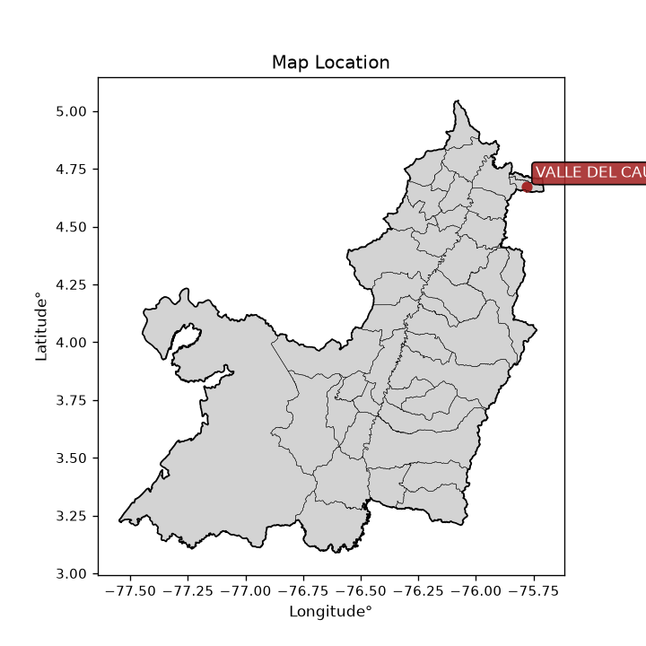</img>

| CountyID                                                                                          | CountyName       | CountyFiles                                                                                                                                                                                                                                                                                                                                                                                                                                                                                                                                                                                                                                                                                                                                                                                                                                                                                                                                                                                                                                                                                                                                                                                                                                                                                                                                                                                                                                                                                                                                                                                                                                                                                                                                                                                                                                                                                                                        |
|:--------------------------------------------------------------------------------------------------|:-----------------|:-----------------------------------------------------------------------------------------------------------------------------------------------------------------------------------------------------------------------------------------------------------------------------------------------------------------------------------------------------------------------------------------------------------------------------------------------------------------------------------------------------------------------------------------------------------------------------------------------------------------------------------------------------------------------------------------------------------------------------------------------------------------------------------------------------------------------------------------------------------------------------------------------------------------------------------------------------------------------------------------------------------------------------------------------------------------------------------------------------------------------------------------------------------------------------------------------------------------------------------------------------------------------------------------------------------------------------------------------------------------------------------------------------------------------------------------------------------------------------------------------------------------------------------------------------------------------------------------------------------------------------------------------------------------------------------------------------------------------------------------------------------------------------------------------------------------------------------------------------------------------------------------------------------------------------------|
| [76020](https://github.com/rcfdtools/R.HydroTools/blob/main/tool/Population/file/report/76020.md) | Alcalá           | [76020_Rural_Lot_202001.zip](https://github.com/rcfdtools/R.GISMobile/blob/main/file/shp/76020_Rural_Lot_202001.zip) [76020_Urban_Lot_202001.zip](https://github.com/rcfdtools/R.GISMobile/blob/main/file/shp/76020_Urban_Lot_202001.zip)                                                                                                                                                                                                                                                                                                                                                                                                                                                                                                                                                                                                                                                                                                                                                                                                                                                                                                                                                                                                                                                                                                                                                                                                                                                                                                                                                                                                                                                                                                                                                                                                                                                                                  |
| [76036](https://github.com/rcfdtools/R.HydroTools/blob/main/tool/Population/file/report/76036.md) | Andalucía        | [76036_Rural_Building_202606.zip](https://github.com/rcfdtools/R.GISMobile/blob/main/file/shp/76036_Rural_Building_202606.zip) [76036_Rural_Lot_202606.zip](https://github.com/rcfdtools/R.GISMobile/blob/main/file/shp/76036_Rural_Lot_202606.zip) [76036_Rural_Nomenclature_202606.zip](https://github.com/rcfdtools/R.GISMobile/blob/main/file/shp/76036_Rural_Nomenclature_202606.zip) [76036_Rural_Nomenclature_Road_202606.zip](https://github.com/rcfdtools/R.GISMobile/blob/main/file/shp/76036_Rural_Nomenclature_Road_202606.zip) [76036_Rural_Sector_202606.zip](https://github.com/rcfdtools/R.GISMobile/blob/main/file/shp/76036_Rural_Sector_202606.zip) [76036_Rural_Vereda_202606.zip](https://github.com/rcfdtools/R.GISMobile/blob/main/file/shp/76036_Rural_Vereda_202606.zip) [76036_Urban_Block_202606.zip](https://github.com/rcfdtools/R.GISMobile/blob/main/file/shp/76036_Urban_Block_202606.zip) [76036_Urban_Building_202606.zip](https://github.com/rcfdtools/R.GISMobile/blob/main/file/shp/76036_Urban_Building_202606.zip) [76036_Urban_Lot_202606.zip](https://github.com/rcfdtools/R.GISMobile/blob/main/file/shp/76036_Urban_Lot_202606.zip) [76036_Urban_Nomenclature_202606.zip](https://github.com/rcfdtools/R.GISMobile/blob/main/file/shp/76036_Urban_Nomenclature_202606.zip) [76036_Urban_Nomenclature_Road_202606.zip](https://github.com/rcfdtools/R.GISMobile/blob/main/file/shp/76036_Urban_Nomenclature_Road_202606.zip) [76036_Urban_Perimeter_202606.zip](https://github.com/rcfdtools/R.GISMobile/blob/main/file/shp/76036_Urban_Perimeter_202606.zip) [76036_Urban_Sector_202606.zip](https://github.com/rcfdtools/R.GISMobile/blob/main/file/shp/76036_Urban_Sector_202606.zip)                                                                                                                                             |
| [76041](https://github.com/rcfdtools/R.HydroTools/blob/main/tool/Population/file/report/76041.md) | Ansermanuevo     | [76041_Rural_Lot_202001.zip](https://github.com/rcfdtools/R.GISMobile/blob/main/file/shp/76041_Rural_Lot_202001.zip) [76041_Urban_Lot_202001.zip](https://github.com/rcfdtools/R.GISMobile/blob/main/file/shp/76041_Urban_Lot_202001.zip)                                                                                                                                                                                                                                                                                                                                                                                                                                                                                                                                                                                                                                                                                                                                                                                                                                                                                                                                                                                                                                                                                                                                                                                                                                                                                                                                                                                                                                                                                                                                                                                                                                                                                  |
| [76054](https://github.com/rcfdtools/R.HydroTools/blob/main/tool/Population/file/report/76054.md) | Argelia          | [76054_Rural_Lot_202001.zip](https://github.com/rcfdtools/R.GISMobile/blob/main/file/shp/76054_Rural_Lot_202001.zip) [76054_Urban_Lot_202001.zip](https://github.com/rcfdtools/R.GISMobile/blob/main/file/shp/76054_Urban_Lot_202001.zip)                                                                                                                                                                                                                                                                                                                                                                                                                                                                                                                                                                                                                                                                                                                                                                                                                                                                                                                                                                                                                                                                                                                                                                                                                                                                                                                                                                                                                                                                                                                                                                                                                                                                                  |
| [76100](https://github.com/rcfdtools/R.HydroTools/blob/main/tool/Population/file/report/76100.md) | Bolívar          | [76100_Rural_Lot_202001.zip](https://github.com/rcfdtools/R.GISMobile/blob/main/file/shp/76100_Rural_Lot_202001.zip) [76100_Urban_Lot_202001.zip](https://github.com/rcfdtools/R.GISMobile/blob/main/file/shp/76100_Urban_Lot_202001.zip)                                                                                                                                                                                                                                                                                                                                                                                                                                                                                                                                                                                                                                                                                                                                                                                                                                                                                                                                                                                                                                                                                                                                                                                                                                                                                                                                                                                                                                                                                                                                                                                                                                                                                  |
| [76109](https://github.com/rcfdtools/R.HydroTools/blob/main/tool/Population/file/report/76109.md) | Buenaventura     | [76109_Rural_Building_202606.zip](https://github.com/rcfdtools/R.GISMobile/blob/main/file/shp/76109_Rural_Building_202606.zip) [76109_Rural_Lot_202606.zip](https://github.com/rcfdtools/R.GISMobile/blob/main/file/shp/76109_Rural_Lot_202606.zip) [76109_Rural_Nomenclature_202606.zip](https://github.com/rcfdtools/R.GISMobile/blob/main/file/shp/76109_Rural_Nomenclature_202606.zip) [76109_Rural_Sector_202606.zip](https://github.com/rcfdtools/R.GISMobile/blob/main/file/shp/76109_Rural_Sector_202606.zip) [76109_Rural_Vereda_202606.zip](https://github.com/rcfdtools/R.GISMobile/blob/main/file/shp/76109_Rural_Vereda_202606.zip) [76109_Urban_Block_202606.zip](https://github.com/rcfdtools/R.GISMobile/blob/main/file/shp/76109_Urban_Block_202606.zip) [76109_Urban_Building_202606.zip](https://github.com/rcfdtools/R.GISMobile/blob/main/file/shp/76109_Urban_Building_202606.zip) [76109_Urban_Lot_202606.zip](https://github.com/rcfdtools/R.GISMobile/blob/main/file/shp/76109_Urban_Lot_202606.zip) [76109_Urban_Nomenclature_202606.zip](https://github.com/rcfdtools/R.GISMobile/blob/main/file/shp/76109_Urban_Nomenclature_202606.zip) [76109_Urban_Nomenclature_Road_202606.zip](https://github.com/rcfdtools/R.GISMobile/blob/main/file/shp/76109_Urban_Nomenclature_Road_202606.zip) [76109_Urban_Perimeter_202606.zip](https://github.com/rcfdtools/R.GISMobile/blob/main/file/shp/76109_Urban_Perimeter_202606.zip) [76109_Urban_Sector_202606.zip](https://github.com/rcfdtools/R.GISMobile/blob/main/file/shp/76109_Urban_Sector_202606.zip)                                                                                                                                                                                                                                                                                                  |
| [76111](https://github.com/rcfdtools/R.HydroTools/blob/main/tool/Population/file/report/76111.md) | Buga             | [76111_Rural_Building_202606.zip](https://github.com/rcfdtools/R.GISMobile/blob/main/file/shp/76111_Rural_Building_202606.zip) [76111_Rural_Lot_202606.zip](https://github.com/rcfdtools/R.GISMobile/blob/main/file/shp/76111_Rural_Lot_202606.zip) [76111_Rural_Nomenclature_202606.zip](https://github.com/rcfdtools/R.GISMobile/blob/main/file/shp/76111_Rural_Nomenclature_202606.zip) [76111_Rural_Nomenclature_Road_202606.zip](https://github.com/rcfdtools/R.GISMobile/blob/main/file/shp/76111_Rural_Nomenclature_Road_202606.zip) [76111_Rural_Sector_202606.zip](https://github.com/rcfdtools/R.GISMobile/blob/main/file/shp/76111_Rural_Sector_202606.zip) [76111_Rural_Vereda_202606.zip](https://github.com/rcfdtools/R.GISMobile/blob/main/file/shp/76111_Rural_Vereda_202606.zip) [76111_Urban_Block_202606.zip](https://github.com/rcfdtools/R.GISMobile/blob/main/file/shp/76111_Urban_Block_202606.zip) [76111_Urban_Building_202606.zip](https://github.com/rcfdtools/R.GISMobile/blob/main/file/shp/76111_Urban_Building_202606.zip) [76111_Urban_Lot_202606.zip](https://github.com/rcfdtools/R.GISMobile/blob/main/file/shp/76111_Urban_Lot_202606.zip) [76111_Urban_Nomenclature_202606.zip](https://github.com/rcfdtools/R.GISMobile/blob/main/file/shp/76111_Urban_Nomenclature_202606.zip) [76111_Urban_Nomenclature_Road_202606.zip](https://github.com/rcfdtools/R.GISMobile/blob/main/file/shp/76111_Urban_Nomenclature_Road_202606.zip) [76111_Urban_Perimeter_202606.zip](https://github.com/rcfdtools/R.GISMobile/blob/main/file/shp/76111_Urban_Perimeter_202606.zip) [76111_Urban_Sector_202606.zip](https://github.com/rcfdtools/R.GISMobile/blob/main/file/shp/76111_Urban_Sector_202606.zip)                                                                                                                                             |
| [76113](https://github.com/rcfdtools/R.HydroTools/blob/main/tool/Population/file/report/76113.md) | Bugalagrande     | [76113_Rural_Building_202606.zip](https://github.com/rcfdtools/R.GISMobile/blob/main/file/shp/76113_Rural_Building_202606.zip) [76113_Rural_Lot_202606.zip](https://github.com/rcfdtools/R.GISMobile/blob/main/file/shp/76113_Rural_Lot_202606.zip) [76113_Rural_Nomenclature_202606.zip](https://github.com/rcfdtools/R.GISMobile/blob/main/file/shp/76113_Rural_Nomenclature_202606.zip) [76113_Rural_Nomenclature_Road_202606.zip](https://github.com/rcfdtools/R.GISMobile/blob/main/file/shp/76113_Rural_Nomenclature_Road_202606.zip) [76113_Rural_Sector_202606.zip](https://github.com/rcfdtools/R.GISMobile/blob/main/file/shp/76113_Rural_Sector_202606.zip) [76113_Rural_Vereda_202606.zip](https://github.com/rcfdtools/R.GISMobile/blob/main/file/shp/76113_Rural_Vereda_202606.zip) [76113_Urban_Block_202606.zip](https://github.com/rcfdtools/R.GISMobile/blob/main/file/shp/76113_Urban_Block_202606.zip) [76113_Urban_Building_202606.zip](https://github.com/rcfdtools/R.GISMobile/blob/main/file/shp/76113_Urban_Building_202606.zip) [76113_Urban_Lot_202606.zip](https://github.com/rcfdtools/R.GISMobile/blob/main/file/shp/76113_Urban_Lot_202606.zip) [76113_Urban_Nomenclature_202606.zip](https://github.com/rcfdtools/R.GISMobile/blob/main/file/shp/76113_Urban_Nomenclature_202606.zip) [76113_Urban_Nomenclature_Road_202606.zip](https://github.com/rcfdtools/R.GISMobile/blob/main/file/shp/76113_Urban_Nomenclature_Road_202606.zip) [76113_Urban_Perimeter_202606.zip](https://github.com/rcfdtools/R.GISMobile/blob/main/file/shp/76113_Urban_Perimeter_202606.zip) [76113_Urban_Sector_202606.zip](https://github.com/rcfdtools/R.GISMobile/blob/main/file/shp/76113_Urban_Sector_202606.zip)                                                                                                                                             |
| [76122](https://github.com/rcfdtools/R.HydroTools/blob/main/tool/Population/file/report/76122.md) | Caicedonia       | [76122_Rural_Building_202606.zip](https://github.com/rcfdtools/R.GISMobile/blob/main/file/shp/76122_Rural_Building_202606.zip) [76122_Rural_Lot_202606.zip](https://github.com/rcfdtools/R.GISMobile/blob/main/file/shp/76122_Rural_Lot_202606.zip) [76122_Rural_Nomenclature_202606.zip](https://github.com/rcfdtools/R.GISMobile/blob/main/file/shp/76122_Rural_Nomenclature_202606.zip) [76122_Rural_Nomenclature_Road_202606.zip](https://github.com/rcfdtools/R.GISMobile/blob/main/file/shp/76122_Rural_Nomenclature_Road_202606.zip) [76122_Rural_Sector_202606.zip](https://github.com/rcfdtools/R.GISMobile/blob/main/file/shp/76122_Rural_Sector_202606.zip) [76122_Rural_Vereda_202606.zip](https://github.com/rcfdtools/R.GISMobile/blob/main/file/shp/76122_Rural_Vereda_202606.zip) [76122_Urban_Block_202606.zip](https://github.com/rcfdtools/R.GISMobile/blob/main/file/shp/76122_Urban_Block_202606.zip) [76122_Urban_Building_202606.zip](https://github.com/rcfdtools/R.GISMobile/blob/main/file/shp/76122_Urban_Building_202606.zip) [76122_Urban_Lot_202606.zip](https://github.com/rcfdtools/R.GISMobile/blob/main/file/shp/76122_Urban_Lot_202606.zip) [76122_Urban_Neighborhood_202606.zip](https://github.com/rcfdtools/R.GISMobile/blob/main/file/shp/76122_Urban_Neighborhood_202606.zip) [76122_Urban_Nomenclature_202606.zip](https://github.com/rcfdtools/R.GISMobile/blob/main/file/shp/76122_Urban_Nomenclature_202606.zip) [76122_Urban_Nomenclature_Road_202606.zip](https://github.com/rcfdtools/R.GISMobile/blob/main/file/shp/76122_Urban_Nomenclature_Road_202606.zip) [76122_Urban_Perimeter_202606.zip](https://github.com/rcfdtools/R.GISMobile/blob/main/file/shp/76122_Urban_Perimeter_202606.zip) [76122_Urban_Sector_202606.zip](https://github.com/rcfdtools/R.GISMobile/blob/main/file/shp/76122_Urban_Sector_202606.zip)  |
| [76126](https://github.com/rcfdtools/R.HydroTools/blob/main/tool/Population/file/report/76126.md) | Calima           | [76126_Rural_Building_202606.zip](https://github.com/rcfdtools/R.GISMobile/blob/main/file/shp/76126_Rural_Building_202606.zip) [76126_Rural_Lot_202606.zip](https://github.com/rcfdtools/R.GISMobile/blob/main/file/shp/76126_Rural_Lot_202606.zip) [76126_Rural_Sector_202606.zip](https://github.com/rcfdtools/R.GISMobile/blob/main/file/shp/76126_Rural_Sector_202606.zip) [76126_Rural_Vereda_202606.zip](https://github.com/rcfdtools/R.GISMobile/blob/main/file/shp/76126_Rural_Vereda_202606.zip) [76126_Urban_Block_202606.zip](https://github.com/rcfdtools/R.GISMobile/blob/main/file/shp/76126_Urban_Block_202606.zip) [76126_Urban_Building_202606.zip](https://github.com/rcfdtools/R.GISMobile/blob/main/file/shp/76126_Urban_Building_202606.zip) [76126_Urban_Lot_202606.zip](https://github.com/rcfdtools/R.GISMobile/blob/main/file/shp/76126_Urban_Lot_202606.zip) [76126_Urban_Neighborhood_202606.zip](https://github.com/rcfdtools/R.GISMobile/blob/main/file/shp/76126_Urban_Neighborhood_202606.zip) [76126_Urban_Nomenclature_202606.zip](https://github.com/rcfdtools/R.GISMobile/blob/main/file/shp/76126_Urban_Nomenclature_202606.zip) [76126_Urban_Nomenclature_Road_202606.zip](https://github.com/rcfdtools/R.GISMobile/blob/main/file/shp/76126_Urban_Nomenclature_Road_202606.zip) [76126_Urban_Sector_202606.zip](https://github.com/rcfdtools/R.GISMobile/blob/main/file/shp/76126_Urban_Sector_202606.zip)                                                                                                                                                                                                                                                                                                                                                                                                                                       |
| [76130](https://github.com/rcfdtools/R.HydroTools/blob/main/tool/Population/file/report/76130.md) | Candelaria       | [76130_Rural_Lot_202001.zip](https://github.com/rcfdtools/R.GISMobile/blob/main/file/shp/76130_Rural_Lot_202001.zip) [76130_Urban_Lot_202001.zip](https://github.com/rcfdtools/R.GISMobile/blob/main/file/shp/76130_Urban_Lot_202001.zip)                                                                                                                                                                                                                                                                                                                                                                                                                                                                                                                                                                                                                                                                                                                                                                                                                                                                                                                                                                                                                                                                                                                                                                                                                                                                                                                                                                                                                                                                                                                                                                                                                                                                                  |
| [76147](https://github.com/rcfdtools/R.HydroTools/blob/main/tool/Population/file/report/76147.md) | Cartago          | [76147_Rural_Lot_202001.zip](https://github.com/rcfdtools/R.GISMobile/blob/main/file/shp/76147_Rural_Lot_202001.zip) [76147_Urban_Lot_202001.zip](https://github.com/rcfdtools/R.GISMobile/blob/main/file/shp/76147_Urban_Lot_202001.zip)                                                                                                                                                                                                                                                                                                                                                                                                                                                                                                                                                                                                                                                                                                                                                                                                                                                                                                                                                                                                                                                                                                                                                                                                                                                                                                                                                                                                                                                                                                                                                                                                                                                                                  |
| [76233](https://github.com/rcfdtools/R.HydroTools/blob/main/tool/Population/file/report/76233.md) | Dagua            | [76233_Rural_Lot_202001.zip](https://github.com/rcfdtools/R.GISMobile/blob/main/file/shp/76233_Rural_Lot_202001.zip) [76233_Urban_Lot_202001.zip](https://github.com/rcfdtools/R.GISMobile/blob/main/file/shp/76233_Urban_Lot_202001.zip)                                                                                                                                                                                                                                                                                                                                                                                                                                                                                                                                                                                                                                                                                                                                                                                                                                                                                                                                                                                                                                                                                                                                                                                                                                                                                                                                                                                                                                                                                                                                                                                                                                                                                  |
| [76246](https://github.com/rcfdtools/R.HydroTools/blob/main/tool/Population/file/report/76246.md) | El Cairo         | [76246_Rural_Lot_202001.zip](https://github.com/rcfdtools/R.GISMobile/blob/main/file/shp/76246_Rural_Lot_202001.zip) [76246_Urban_Lot_202001.zip](https://github.com/rcfdtools/R.GISMobile/blob/main/file/shp/76246_Urban_Lot_202001.zip)                                                                                                                                                                                                                                                                                                                                                                                                                                                                                                                                                                                                                                                                                                                                                                                                                                                                                                                                                                                                                                                                                                                                                                                                                                                                                                                                                                                                                                                                                                                                                                                                                                                                                  |
| [76248](https://github.com/rcfdtools/R.HydroTools/blob/main/tool/Population/file/report/76248.md) | El Cerrito       | [76248_Rural_Building_202606.zip](https://github.com/rcfdtools/R.GISMobile/blob/main/file/shp/76248_Rural_Building_202606.zip) [76248_Rural_Lot_202606.zip](https://github.com/rcfdtools/R.GISMobile/blob/main/file/shp/76248_Rural_Lot_202606.zip) [76248_Rural_Nomenclature_202606.zip](https://github.com/rcfdtools/R.GISMobile/blob/main/file/shp/76248_Rural_Nomenclature_202606.zip) [76248_Rural_Nomenclature_Road_202606.zip](https://github.com/rcfdtools/R.GISMobile/blob/main/file/shp/76248_Rural_Nomenclature_Road_202606.zip) [76248_Rural_Sector_202606.zip](https://github.com/rcfdtools/R.GISMobile/blob/main/file/shp/76248_Rural_Sector_202606.zip) [76248_Rural_Vereda_202606.zip](https://github.com/rcfdtools/R.GISMobile/blob/main/file/shp/76248_Rural_Vereda_202606.zip) [76248_Urban_Block_202606.zip](https://github.com/rcfdtools/R.GISMobile/blob/main/file/shp/76248_Urban_Block_202606.zip) [76248_Urban_Building_202606.zip](https://github.com/rcfdtools/R.GISMobile/blob/main/file/shp/76248_Urban_Building_202606.zip) [76248_Urban_Lot_202606.zip](https://github.com/rcfdtools/R.GISMobile/blob/main/file/shp/76248_Urban_Lot_202606.zip) [76248_Urban_Nomenclature_202606.zip](https://github.com/rcfdtools/R.GISMobile/blob/main/file/shp/76248_Urban_Nomenclature_202606.zip) [76248_Urban_Nomenclature_Road_202606.zip](https://github.com/rcfdtools/R.GISMobile/blob/main/file/shp/76248_Urban_Nomenclature_Road_202606.zip) [76248_Urban_Perimeter_202606.zip](https://github.com/rcfdtools/R.GISMobile/blob/main/file/shp/76248_Urban_Perimeter_202606.zip) [76248_Urban_Sector_202606.zip](https://github.com/rcfdtools/R.GISMobile/blob/main/file/shp/76248_Urban_Sector_202606.zip)                                                                                                                                             |
| [76250](https://github.com/rcfdtools/R.HydroTools/blob/main/tool/Population/file/report/76250.md) | El Dovio         | [76250_Rural_Lot_202001.zip](https://github.com/rcfdtools/R.GISMobile/blob/main/file/shp/76250_Rural_Lot_202001.zip) [76250_Urban_Lot_202001.zip](https://github.com/rcfdtools/R.GISMobile/blob/main/file/shp/76250_Urban_Lot_202001.zip)                                                                                                                                                                                                                                                                                                                                                                                                                                                                                                                                                                                                                                                                                                                                                                                                                                                                                                                                                                                                                                                                                                                                                                                                                                                                                                                                                                                                                                                                                                                                                                                                                                                                                  |
| [76243](https://github.com/rcfdtools/R.HydroTools/blob/main/tool/Population/file/report/76243.md) | El Águila        | [76243_Rural_Lot_202001.zip](https://github.com/rcfdtools/R.GISMobile/blob/main/file/shp/76243_Rural_Lot_202001.zip) [76243_Urban_Lot_202001.zip](https://github.com/rcfdtools/R.GISMobile/blob/main/file/shp/76243_Urban_Lot_202001.zip)                                                                                                                                                                                                                                                                                                                                                                                                                                                                                                                                                                                                                                                                                                                                                                                                                                                                                                                                                                                                                                                                                                                                                                                                                                                                                                                                                                                                                                                                                                                                                                                                                                                                                  |
| [76275](https://github.com/rcfdtools/R.HydroTools/blob/main/tool/Population/file/report/76275.md) | Florida          | [76275_Rural_Lot_202001.zip](https://github.com/rcfdtools/R.GISMobile/blob/main/file/shp/76275_Rural_Lot_202001.zip) [76275_Urban_Lot_202001.zip](https://github.com/rcfdtools/R.GISMobile/blob/main/file/shp/76275_Urban_Lot_202001.zip)                                                                                                                                                                                                                                                                                                                                                                                                                                                                                                                                                                                                                                                                                                                                                                                                                                                                                                                                                                                                                                                                                                                                                                                                                                                                                                                                                                                                                                                                                                                                                                                                                                                                                  |
| [76306](https://github.com/rcfdtools/R.HydroTools/blob/main/tool/Population/file/report/76306.md) | Ginebra          | [76306_Rural_Building_202606.zip](https://github.com/rcfdtools/R.GISMobile/blob/main/file/shp/76306_Rural_Building_202606.zip) [76306_Rural_Lot_202606.zip](https://github.com/rcfdtools/R.GISMobile/blob/main/file/shp/76306_Rural_Lot_202606.zip) [76306_Rural_Nomenclature_202606.zip](https://github.com/rcfdtools/R.GISMobile/blob/main/file/shp/76306_Rural_Nomenclature_202606.zip) [76306_Rural_Nomenclature_Road_202606.zip](https://github.com/rcfdtools/R.GISMobile/blob/main/file/shp/76306_Rural_Nomenclature_Road_202606.zip) [76306_Rural_Sector_202606.zip](https://github.com/rcfdtools/R.GISMobile/blob/main/file/shp/76306_Rural_Sector_202606.zip) [76306_Rural_Vereda_202606.zip](https://github.com/rcfdtools/R.GISMobile/blob/main/file/shp/76306_Rural_Vereda_202606.zip) [76306_Urban_Block_202606.zip](https://github.com/rcfdtools/R.GISMobile/blob/main/file/shp/76306_Urban_Block_202606.zip) [76306_Urban_Building_202606.zip](https://github.com/rcfdtools/R.GISMobile/blob/main/file/shp/76306_Urban_Building_202606.zip) [76306_Urban_Lot_202606.zip](https://github.com/rcfdtools/R.GISMobile/blob/main/file/shp/76306_Urban_Lot_202606.zip) [76306_Urban_Nomenclature_202606.zip](https://github.com/rcfdtools/R.GISMobile/blob/main/file/shp/76306_Urban_Nomenclature_202606.zip) [76306_Urban_Nomenclature_Road_202606.zip](https://github.com/rcfdtools/R.GISMobile/blob/main/file/shp/76306_Urban_Nomenclature_Road_202606.zip) [76306_Urban_Perimeter_202606.zip](https://github.com/rcfdtools/R.GISMobile/blob/main/file/shp/76306_Urban_Perimeter_202606.zip) [76306_Urban_Sector_202606.zip](https://github.com/rcfdtools/R.GISMobile/blob/main/file/shp/76306_Urban_Sector_202606.zip)                                                                                                                                             |
| [76318](https://github.com/rcfdtools/R.HydroTools/blob/main/tool/Population/file/report/76318.md) | Guacarí          | [76318_Rural_Lot_202001.zip](https://github.com/rcfdtools/R.GISMobile/blob/main/file/shp/76318_Rural_Lot_202001.zip) [76318_Urban_Lot_202001.zip](https://github.com/rcfdtools/R.GISMobile/blob/main/file/shp/76318_Urban_Lot_202001.zip)                                                                                                                                                                                                                                                                                                                                                                                                                                                                                                                                                                                                                                                                                                                                                                                                                                                                                                                                                                                                                                                                                                                                                                                                                                                                                                                                                                                                                                                                                                                                                                                                                                                                                  |
| [76364](https://github.com/rcfdtools/R.HydroTools/blob/main/tool/Population/file/report/76364.md) | Jamundí          | [76364_Rural_Lot_202001.zip](https://github.com/rcfdtools/R.GISMobile/blob/main/file/shp/76364_Rural_Lot_202001.zip) [76364_Urban_Lot_202001.zip](https://github.com/rcfdtools/R.GISMobile/blob/main/file/shp/76364_Urban_Lot_202001.zip)                                                                                                                                                                                                                                                                                                                                                                                                                                                                                                                                                                                                                                                                                                                                                                                                                                                                                                                                                                                                                                                                                                                                                                                                                                                                                                                                                                                                                                                                                                                                                                                                                                                                                  |
| [76377](https://github.com/rcfdtools/R.HydroTools/blob/main/tool/Population/file/report/76377.md) | La Cumbre        | [76377_Rural_Lot_202001.zip](https://github.com/rcfdtools/R.GISMobile/blob/main/file/shp/76377_Rural_Lot_202001.zip) [76377_Urban_Lot_202001.zip](https://github.com/rcfdtools/R.GISMobile/blob/main/file/shp/76377_Urban_Lot_202001.zip)                                                                                                                                                                                                                                                                                                                                                                                                                                                                                                                                                                                                                                                                                                                                                                                                                                                                                                                                                                                                                                                                                                                                                                                                                                                                                                                                                                                                                                                                                                                                                                                                                                                                                  |
| [76400](https://github.com/rcfdtools/R.HydroTools/blob/main/tool/Population/file/report/76400.md) | La Unión         | [76400_Rural_Building_202606.zip](https://github.com/rcfdtools/R.GISMobile/blob/main/file/shp/76400_Rural_Building_202606.zip) [76400_Rural_Lot_202606.zip](https://github.com/rcfdtools/R.GISMobile/blob/main/file/shp/76400_Rural_Lot_202606.zip) [76400_Rural_Nomenclature_202606.zip](https://github.com/rcfdtools/R.GISMobile/blob/main/file/shp/76400_Rural_Nomenclature_202606.zip) [76400_Rural_Nomenclature_Road_202606.zip](https://github.com/rcfdtools/R.GISMobile/blob/main/file/shp/76400_Rural_Nomenclature_Road_202606.zip) [76400_Rural_Sector_202606.zip](https://github.com/rcfdtools/R.GISMobile/blob/main/file/shp/76400_Rural_Sector_202606.zip) [76400_Rural_Vereda_202606.zip](https://github.com/rcfdtools/R.GISMobile/blob/main/file/shp/76400_Rural_Vereda_202606.zip) [76400_Urban_Block_202606.zip](https://github.com/rcfdtools/R.GISMobile/blob/main/file/shp/76400_Urban_Block_202606.zip) [76400_Urban_Building_202606.zip](https://github.com/rcfdtools/R.GISMobile/blob/main/file/shp/76400_Urban_Building_202606.zip) [76400_Urban_Lot_202606.zip](https://github.com/rcfdtools/R.GISMobile/blob/main/file/shp/76400_Urban_Lot_202606.zip) [76400_Urban_Neighborhood_202606.zip](https://github.com/rcfdtools/R.GISMobile/blob/main/file/shp/76400_Urban_Neighborhood_202606.zip) [76400_Urban_Nomenclature_202606.zip](https://github.com/rcfdtools/R.GISMobile/blob/main/file/shp/76400_Urban_Nomenclature_202606.zip) [76400_Urban_Nomenclature_Road_202606.zip](https://github.com/rcfdtools/R.GISMobile/blob/main/file/shp/76400_Urban_Nomenclature_Road_202606.zip) [76400_Urban_Perimeter_202606.zip](https://github.com/rcfdtools/R.GISMobile/blob/main/file/shp/76400_Urban_Perimeter_202606.zip) [76400_Urban_Sector_202606.zip](https://github.com/rcfdtools/R.GISMobile/blob/main/file/shp/76400_Urban_Sector_202606.zip)  |
| [76403](https://github.com/rcfdtools/R.HydroTools/blob/main/tool/Population/file/report/76403.md) | La Victoria      | [76403_Rural_Lot_202001.zip](https://github.com/rcfdtools/R.GISMobile/blob/main/file/shp/76403_Rural_Lot_202001.zip) [76403_Urban_Lot_202001.zip](https://github.com/rcfdtools/R.GISMobile/blob/main/file/shp/76403_Urban_Lot_202001.zip)                                                                                                                                                                                                                                                                                                                                                                                                                                                                                                                                                                                                                                                                                                                                                                                                                                                                                                                                                                                                                                                                                                                                                                                                                                                                                                                                                                                                                                                                                                                                                                                                                                                                                  |
| [76497](https://github.com/rcfdtools/R.HydroTools/blob/main/tool/Population/file/report/76497.md) | Obando           | [76497_Rural_Lot_202001.zip](https://github.com/rcfdtools/R.GISMobile/blob/main/file/shp/76497_Rural_Lot_202001.zip) [76497_Urban_Lot_202001.zip](https://github.com/rcfdtools/R.GISMobile/blob/main/file/shp/76497_Urban_Lot_202001.zip)                                                                                                                                                                                                                                                                                                                                                                                                                                                                                                                                                                                                                                                                                                                                                                                                                                                                                                                                                                                                                                                                                                                                                                                                                                                                                                                                                                                                                                                                                                                                                                                                                                                                                  |
| [76520](https://github.com/rcfdtools/R.HydroTools/blob/main/tool/Population/file/report/76520.md) | Palmira          | [76520_Rural_Building_202606.zip](https://github.com/rcfdtools/R.GISMobile/blob/main/file/shp/76520_Rural_Building_202606.zip) [76520_Rural_Lot_202606.zip](https://github.com/rcfdtools/R.GISMobile/blob/main/file/shp/76520_Rural_Lot_202606.zip) [76520_Rural_Nomenclature_202606.zip](https://github.com/rcfdtools/R.GISMobile/blob/main/file/shp/76520_Rural_Nomenclature_202606.zip) [76520_Rural_Nomenclature_Road_202606.zip](https://github.com/rcfdtools/R.GISMobile/blob/main/file/shp/76520_Rural_Nomenclature_Road_202606.zip) [76520_Rural_Sector_202606.zip](https://github.com/rcfdtools/R.GISMobile/blob/main/file/shp/76520_Rural_Sector_202606.zip) [76520_Rural_Vereda_202606.zip](https://github.com/rcfdtools/R.GISMobile/blob/main/file/shp/76520_Rural_Vereda_202606.zip) [76520_Urban_Block_202606.zip](https://github.com/rcfdtools/R.GISMobile/blob/main/file/shp/76520_Urban_Block_202606.zip) [76520_Urban_Building_202606.zip](https://github.com/rcfdtools/R.GISMobile/blob/main/file/shp/76520_Urban_Building_202606.zip) [76520_Urban_Lot_202606.zip](https://github.com/rcfdtools/R.GISMobile/blob/main/file/shp/76520_Urban_Lot_202606.zip) [76520_Urban_Nomenclature_202606.zip](https://github.com/rcfdtools/R.GISMobile/blob/main/file/shp/76520_Urban_Nomenclature_202606.zip) [76520_Urban_Nomenclature_Road_202606.zip](https://github.com/rcfdtools/R.GISMobile/blob/main/file/shp/76520_Urban_Nomenclature_Road_202606.zip) [76520_Urban_Perimeter_202606.zip](https://github.com/rcfdtools/R.GISMobile/blob/main/file/shp/76520_Urban_Perimeter_202606.zip) [76520_Urban_Sector_202606.zip](https://github.com/rcfdtools/R.GISMobile/blob/main/file/shp/76520_Urban_Sector_202606.zip)                                                                                                                                             |
| [76563](https://github.com/rcfdtools/R.HydroTools/blob/main/tool/Population/file/report/76563.md) | Pradera          | [76563_Rural_Lot_202001.zip](https://github.com/rcfdtools/R.GISMobile/blob/main/file/shp/76563_Rural_Lot_202001.zip) [76563_Urban_Lot_202001.zip](https://github.com/rcfdtools/R.GISMobile/blob/main/file/shp/76563_Urban_Lot_202001.zip)                                                                                                                                                                                                                                                                                                                                                                                                                                                                                                                                                                                                                                                                                                                                                                                                                                                                                                                                                                                                                                                                                                                                                                                                                                                                                                                                                                                                                                                                                                                                                                                                                                                                                  |
| [76606](https://github.com/rcfdtools/R.HydroTools/blob/main/tool/Population/file/report/76606.md) | Restrepo         | [76606_Rural_Lot_202001.zip](https://github.com/rcfdtools/R.GISMobile/blob/main/file/shp/76606_Rural_Lot_202001.zip) [76606_Urban_Lot_202001.zip](https://github.com/rcfdtools/R.GISMobile/blob/main/file/shp/76606_Urban_Lot_202001.zip)                                                                                                                                                                                                                                                                                                                                                                                                                                                                                                                                                                                                                                                                                                                                                                                                                                                                                                                                                                                                                                                                                                                                                                                                                                                                                                                                                                                                                                                                                                                                                                                                                                                                                  |
| [76616](https://github.com/rcfdtools/R.HydroTools/blob/main/tool/Population/file/report/76616.md) | Riofrío          | [76616_Rural_Building_202606.zip](https://github.com/rcfdtools/R.GISMobile/blob/main/file/shp/76616_Rural_Building_202606.zip) [76616_Rural_Lot_202606.zip](https://github.com/rcfdtools/R.GISMobile/blob/main/file/shp/76616_Rural_Lot_202606.zip) [76616_Rural_Nomenclature_202606.zip](https://github.com/rcfdtools/R.GISMobile/blob/main/file/shp/76616_Rural_Nomenclature_202606.zip) [76616_Rural_Sector_202606.zip](https://github.com/rcfdtools/R.GISMobile/blob/main/file/shp/76616_Rural_Sector_202606.zip) [76616_Rural_Vereda_202606.zip](https://github.com/rcfdtools/R.GISMobile/blob/main/file/shp/76616_Rural_Vereda_202606.zip) [76616_Urban_Block_202606.zip](https://github.com/rcfdtools/R.GISMobile/blob/main/file/shp/76616_Urban_Block_202606.zip) [76616_Urban_Building_202606.zip](https://github.com/rcfdtools/R.GISMobile/blob/main/file/shp/76616_Urban_Building_202606.zip) [76616_Urban_Lot_202606.zip](https://github.com/rcfdtools/R.GISMobile/blob/main/file/shp/76616_Urban_Lot_202606.zip) [76616_Urban_Nomenclature_202606.zip](https://github.com/rcfdtools/R.GISMobile/blob/main/file/shp/76616_Urban_Nomenclature_202606.zip) [76616_Urban_Nomenclature_Road_202606.zip](https://github.com/rcfdtools/R.GISMobile/blob/main/file/shp/76616_Urban_Nomenclature_Road_202606.zip) [76616_Urban_Perimeter_202606.zip](https://github.com/rcfdtools/R.GISMobile/blob/main/file/shp/76616_Urban_Perimeter_202606.zip)                                                                                                                                                                                                                                                                                                                                                                                                                                 |
| [76622](https://github.com/rcfdtools/R.HydroTools/blob/main/tool/Population/file/report/76622.md) | Roldanillo       | [76622_Rural_Lot_202001.zip](https://github.com/rcfdtools/R.GISMobile/blob/main/file/shp/76622_Rural_Lot_202001.zip) [76622_Urban_Lot_202001.zip](https://github.com/rcfdtools/R.GISMobile/blob/main/file/shp/76622_Urban_Lot_202001.zip)                                                                                                                                                                                                                                                                                                                                                                                                                                                                                                                                                                                                                                                                                                                                                                                                                                                                                                                                                                                                                                                                                                                                                                                                                                                                                                                                                                                                                                                                                                                                                                                                                                                                                  |
| [76670](https://github.com/rcfdtools/R.HydroTools/blob/main/tool/Population/file/report/76670.md) | San Pedro        | [76670_Rural_Building_202606.zip](https://github.com/rcfdtools/R.GISMobile/blob/main/file/shp/76670_Rural_Building_202606.zip) [76670_Rural_Lot_202606.zip](https://github.com/rcfdtools/R.GISMobile/blob/main/file/shp/76670_Rural_Lot_202606.zip) [76670_Rural_Nomenclature_202606.zip](https://github.com/rcfdtools/R.GISMobile/blob/main/file/shp/76670_Rural_Nomenclature_202606.zip) [76670_Rural_Nomenclature_Road_202606.zip](https://github.com/rcfdtools/R.GISMobile/blob/main/file/shp/76670_Rural_Nomenclature_Road_202606.zip) [76670_Rural_Sector_202606.zip](https://github.com/rcfdtools/R.GISMobile/blob/main/file/shp/76670_Rural_Sector_202606.zip) [76670_Rural_Vereda_202606.zip](https://github.com/rcfdtools/R.GISMobile/blob/main/file/shp/76670_Rural_Vereda_202606.zip) [76670_Urban_Block_202606.zip](https://github.com/rcfdtools/R.GISMobile/blob/main/file/shp/76670_Urban_Block_202606.zip) [76670_Urban_Building_202606.zip](https://github.com/rcfdtools/R.GISMobile/blob/main/file/shp/76670_Urban_Building_202606.zip) [76670_Urban_Lot_202606.zip](https://github.com/rcfdtools/R.GISMobile/blob/main/file/shp/76670_Urban_Lot_202606.zip) [76670_Urban_Nomenclature_202606.zip](https://github.com/rcfdtools/R.GISMobile/blob/main/file/shp/76670_Urban_Nomenclature_202606.zip) [76670_Urban_Nomenclature_Road_202606.zip](https://github.com/rcfdtools/R.GISMobile/blob/main/file/shp/76670_Urban_Nomenclature_Road_202606.zip) [76670_Urban_Perimeter_202606.zip](https://github.com/rcfdtools/R.GISMobile/blob/main/file/shp/76670_Urban_Perimeter_202606.zip)                                                                                                                                                                                                                                                                            |
| [76001](https://github.com/rcfdtools/R.HydroTools/blob/main/tool/Population/file/report/76001.md) | Santiago de Cali | Not found                                                                                                                                                                                                                                                                                                                                                                                                                                                                                                                                                                                                                                                                                                                                                                                                                                                                                                                                                                                                                                                                                                                                                                                                                                                                                                                                                                                                                                                                                                                                                                                                                                                                                                                                                                                                                                                                                                                          |
| [76736](https://github.com/rcfdtools/R.HydroTools/blob/main/tool/Population/file/report/76736.md) | Sevilla          | [76736_Rural_Lot_202001.zip](https://github.com/rcfdtools/R.GISMobile/blob/main/file/shp/76736_Rural_Lot_202001.zip) [76736_Urban_Lot_202001.zip](https://github.com/rcfdtools/R.GISMobile/blob/main/file/shp/76736_Urban_Lot_202001.zip)                                                                                                                                                                                                                                                                                                                                                                                                                                                                                                                                                                                                                                                                                                                                                                                                                                                                                                                                                                                                                                                                                                                                                                                                                                                                                                                                                                                                                                                                                                                                                                                                                                                                                  |
| [76823](https://github.com/rcfdtools/R.HydroTools/blob/main/tool/Population/file/report/76823.md) | Toro             | [76823_Rural_Lot_202001.zip](https://github.com/rcfdtools/R.GISMobile/blob/main/file/shp/76823_Rural_Lot_202001.zip) [76823_Urban_Lot_202001.zip](https://github.com/rcfdtools/R.GISMobile/blob/main/file/shp/76823_Urban_Lot_202001.zip)                                                                                                                                                                                                                                                                                                                                                                                                                                                                                                                                                                                                                                                                                                                                                                                                                                                                                                                                                                                                                                                                                                                                                                                                                                                                                                                                                                                                                                                                                                                                                                                                                                                                                  |
| [76828](https://github.com/rcfdtools/R.HydroTools/blob/main/tool/Population/file/report/76828.md) | Trujillo         | [76828_Rural_Lot_202001.zip](https://github.com/rcfdtools/R.GISMobile/blob/main/file/shp/76828_Rural_Lot_202001.zip) [76828_Urban_Lot_202001.zip](https://github.com/rcfdtools/R.GISMobile/blob/main/file/shp/76828_Urban_Lot_202001.zip)                                                                                                                                                                                                                                                                                                                                                                                                                                                                                                                                                                                                                                                                                                                                                                                                                                                                                                                                                                                                                                                                                                                                                                                                                                                                                                                                                                                                                                                                                                                                                                                                                                                                                  |
| [76834](https://github.com/rcfdtools/R.HydroTools/blob/main/tool/Population/file/report/76834.md) | Tuluá            | [76834_Rural_Lot_202001.zip](https://github.com/rcfdtools/R.GISMobile/blob/main/file/shp/76834_Rural_Lot_202001.zip) [76834_Urban_Lot_202001.zip](https://github.com/rcfdtools/R.GISMobile/blob/main/file/shp/76834_Urban_Lot_202001.zip)                                                                                                                                                                                                                                                                                                                                                                                                                                                                                                                                                                                                                                                                                                                                                                                                                                                                                                                                                                                                                                                                                                                                                                                                                                                                                                                                                                                                                                                                                                                                                                                                                                                                                  |
| [76845](https://github.com/rcfdtools/R.HydroTools/blob/main/tool/Population/file/report/76845.md) | Ulloa            | [76845_Rural_Building_202606.zip](https://github.com/rcfdtools/R.GISMobile/blob/main/file/shp/76845_Rural_Building_202606.zip) [76845_Rural_Lot_202606.zip](https://github.com/rcfdtools/R.GISMobile/blob/main/file/shp/76845_Rural_Lot_202606.zip) [76845_Rural_Nomenclature_202606.zip](https://github.com/rcfdtools/R.GISMobile/blob/main/file/shp/76845_Rural_Nomenclature_202606.zip) [76845_Rural_Sector_202606.zip](https://github.com/rcfdtools/R.GISMobile/blob/main/file/shp/76845_Rural_Sector_202606.zip) [76845_Rural_Vereda_202606.zip](https://github.com/rcfdtools/R.GISMobile/blob/main/file/shp/76845_Rural_Vereda_202606.zip) [76845_Urban_Block_202606.zip](https://github.com/rcfdtools/R.GISMobile/blob/main/file/shp/76845_Urban_Block_202606.zip) [76845_Urban_Building_202606.zip](https://github.com/rcfdtools/R.GISMobile/blob/main/file/shp/76845_Urban_Building_202606.zip) [76845_Urban_Lot_202606.zip](https://github.com/rcfdtools/R.GISMobile/blob/main/file/shp/76845_Urban_Lot_202606.zip) [76845_Urban_Neighborhood_202606.zip](https://github.com/rcfdtools/R.GISMobile/blob/main/file/shp/76845_Urban_Neighborhood_202606.zip) [76845_Urban_Nomenclature_202606.zip](https://github.com/rcfdtools/R.GISMobile/blob/main/file/shp/76845_Urban_Nomenclature_202606.zip) [76845_Urban_Nomenclature_Road_202606.zip](https://github.com/rcfdtools/R.GISMobile/blob/main/file/shp/76845_Urban_Nomenclature_Road_202606.zip) [76845_Urban_Perimeter_202606.zip](https://github.com/rcfdtools/R.GISMobile/blob/main/file/shp/76845_Urban_Perimeter_202606.zip) [76845_Urban_Sector_202606.zip](https://github.com/rcfdtools/R.GISMobile/blob/main/file/shp/76845_Urban_Sector_202606.zip)                                                                                                                                                       |
| [76863](https://github.com/rcfdtools/R.HydroTools/blob/main/tool/Population/file/report/76863.md) | Versalles        | [76863_Rural_Lot_202001.zip](https://github.com/rcfdtools/R.GISMobile/blob/main/file/shp/76863_Rural_Lot_202001.zip) [76863_Urban_Lot_202001.zip](https://github.com/rcfdtools/R.GISMobile/blob/main/file/shp/76863_Urban_Lot_202001.zip)                                                                                                                                                                                                                                                                                                                                                                                                                                                                                                                                                                                                                                                                                                                                                                                                                                                                                                                                                                                                                                                                                                                                                                                                                                                                                                                                                                                                                                                                                                                                                                                                                                                                                  |
| [76869](https://github.com/rcfdtools/R.HydroTools/blob/main/tool/Population/file/report/76869.md) | Vijes            | [76869_Rural_Building_202606.zip](https://github.com/rcfdtools/R.GISMobile/blob/main/file/shp/76869_Rural_Building_202606.zip) [76869_Rural_Lot_202606.zip](https://github.com/rcfdtools/R.GISMobile/blob/main/file/shp/76869_Rural_Lot_202606.zip) [76869_Rural_Nomenclature_202606.zip](https://github.com/rcfdtools/R.GISMobile/blob/main/file/shp/76869_Rural_Nomenclature_202606.zip) [76869_Rural_Sector_202606.zip](https://github.com/rcfdtools/R.GISMobile/blob/main/file/shp/76869_Rural_Sector_202606.zip) [76869_Rural_Vereda_202606.zip](https://github.com/rcfdtools/R.GISMobile/blob/main/file/shp/76869_Rural_Vereda_202606.zip) [76869_Urban_Block_202606.zip](https://github.com/rcfdtools/R.GISMobile/blob/main/file/shp/76869_Urban_Block_202606.zip) [76869_Urban_Building_202606.zip](https://github.com/rcfdtools/R.GISMobile/blob/main/file/shp/76869_Urban_Building_202606.zip) [76869_Urban_Lot_202606.zip](https://github.com/rcfdtools/R.GISMobile/blob/main/file/shp/76869_Urban_Lot_202606.zip) [76869_Urban_Nomenclature_202606.zip](https://github.com/rcfdtools/R.GISMobile/blob/main/file/shp/76869_Urban_Nomenclature_202606.zip) [76869_Urban_Nomenclature_Road_202606.zip](https://github.com/rcfdtools/R.GISMobile/blob/main/file/shp/76869_Urban_Nomenclature_Road_202606.zip) [76869_Urban_Perimeter_202606.zip](https://github.com/rcfdtools/R.GISMobile/blob/main/file/shp/76869_Urban_Perimeter_202606.zip) [76869_Urban_Sector_202606.zip](https://github.com/rcfdtools/R.GISMobile/blob/main/file/shp/76869_Urban_Sector_202606.zip)                                                                                                                                                                                                                                                                                                  |
| [76890](https://github.com/rcfdtools/R.HydroTools/blob/main/tool/Population/file/report/76890.md) | Yotoco           | [76890_Rural_Building_202606.zip](https://github.com/rcfdtools/R.GISMobile/blob/main/file/shp/76890_Rural_Building_202606.zip) [76890_Rural_Lot_202606.zip](https://github.com/rcfdtools/R.GISMobile/blob/main/file/shp/76890_Rural_Lot_202606.zip) [76890_Rural_Nomenclature_202606.zip](https://github.com/rcfdtools/R.GISMobile/blob/main/file/shp/76890_Rural_Nomenclature_202606.zip) [76890_Rural_Sector_202606.zip](https://github.com/rcfdtools/R.GISMobile/blob/main/file/shp/76890_Rural_Sector_202606.zip) [76890_Rural_Vereda_202606.zip](https://github.com/rcfdtools/R.GISMobile/blob/main/file/shp/76890_Rural_Vereda_202606.zip) [76890_Urban_Block_202606.zip](https://github.com/rcfdtools/R.GISMobile/blob/main/file/shp/76890_Urban_Block_202606.zip) [76890_Urban_Building_202606.zip](https://github.com/rcfdtools/R.GISMobile/blob/main/file/shp/76890_Urban_Building_202606.zip) [76890_Urban_Lot_202606.zip](https://github.com/rcfdtools/R.GISMobile/blob/main/file/shp/76890_Urban_Lot_202606.zip) [76890_Urban_Nomenclature_202606.zip](https://github.com/rcfdtools/R.GISMobile/blob/main/file/shp/76890_Urban_Nomenclature_202606.zip) [76890_Urban_Nomenclature_Road_202606.zip](https://github.com/rcfdtools/R.GISMobile/blob/main/file/shp/76890_Urban_Nomenclature_Road_202606.zip) [76890_Urban_Perimeter_202606.zip](https://github.com/rcfdtools/R.GISMobile/blob/main/file/shp/76890_Urban_Perimeter_202606.zip)                                                                                                                                                                                                                                                                                                                                                                                                                                 |
| [76892](https://github.com/rcfdtools/R.HydroTools/blob/main/tool/Population/file/report/76892.md) | Yumbo            | [76892_Rural_Lot_202001.zip](https://github.com/rcfdtools/R.GISMobile/blob/main/file/shp/76892_Rural_Lot_202001.zip) [76892_Urban_Lot_202001.zip](https://github.com/rcfdtools/R.GISMobile/blob/main/file/shp/76892_Urban_Lot_202001.zip)                                                                                                                                                                                                                                                                                                                                                                                                                                                                                                                                                                                                                                                                                                                                                                                                                                                                                                                                                                                                                                                                                                                                                                                                                                                                                                                                                                                                                                                                                                                                                                                                                                                                                  |
| [76895](https://github.com/rcfdtools/R.HydroTools/blob/main/tool/Population/file/report/76895.md) | Zarzal           | [76895_Rural_Building_202606.zip](https://github.com/rcfdtools/R.GISMobile/blob/main/file/shp/76895_Rural_Building_202606.zip) [76895_Rural_Lot_202606.zip](https://github.com/rcfdtools/R.GISMobile/blob/main/file/shp/76895_Rural_Lot_202606.zip) [76895_Rural_Nomenclature_202606.zip](https://github.com/rcfdtools/R.GISMobile/blob/main/file/shp/76895_Rural_Nomenclature_202606.zip) [76895_Rural_Nomenclature_Road_202606.zip](https://github.com/rcfdtools/R.GISMobile/blob/main/file/shp/76895_Rural_Nomenclature_Road_202606.zip) [76895_Rural_Sector_202606.zip](https://github.com/rcfdtools/R.GISMobile/blob/main/file/shp/76895_Rural_Sector_202606.zip) [76895_Rural_Vereda_202606.zip](https://github.com/rcfdtools/R.GISMobile/blob/main/file/shp/76895_Rural_Vereda_202606.zip) [76895_Urban_Block_202606.zip](https://github.com/rcfdtools/R.GISMobile/blob/main/file/shp/76895_Urban_Block_202606.zip) [76895_Urban_Building_202606.zip](https://github.com/rcfdtools/R.GISMobile/blob/main/file/shp/76895_Urban_Building_202606.zip) [76895_Urban_Lot_202606.zip](https://github.com/rcfdtools/R.GISMobile/blob/main/file/shp/76895_Urban_Lot_202606.zip) [76895_Urban_Neighborhood_202606.zip](https://github.com/rcfdtools/R.GISMobile/blob/main/file/shp/76895_Urban_Neighborhood_202606.zip) [76895_Urban_Nomenclature_202606.zip](https://github.com/rcfdtools/R.GISMobile/blob/main/file/shp/76895_Urban_Nomenclature_202606.zip) [76895_Urban_Nomenclature_Road_202606.zip](https://github.com/rcfdtools/R.GISMobile/blob/main/file/shp/76895_Urban_Nomenclature_Road_202606.zip) [76895_Urban_Perimeter_202606.zip](https://github.com/rcfdtools/R.GISMobile/blob/main/file/shp/76895_Urban_Perimeter_202606.zip) [76895_Urban_Sector_202606.zip](https://github.com/rcfdtools/R.GISMobile/blob/main/file/shp/76895_Urban_Sector_202606.zip)  |

# 81 - Arauca (7 Counties)

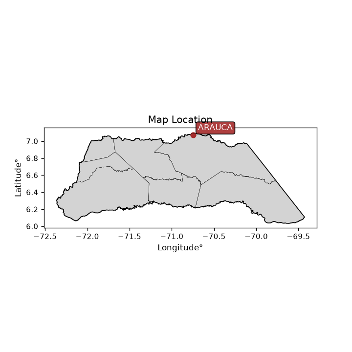</img>

| CountyID                                                                                          | CountyName    | CountyFiles                                                                                                                                                                                                                                                                                                                                                                                                                                                                                                                                                                                                                                                                                                                                                                                                                                                                                                                                                                                                                                                                                                                                                                                                                                                                                                                                                                                                                                                                                                                                                                                                                                                                                                                                                                             |
|:--------------------------------------------------------------------------------------------------|:--------------|:----------------------------------------------------------------------------------------------------------------------------------------------------------------------------------------------------------------------------------------------------------------------------------------------------------------------------------------------------------------------------------------------------------------------------------------------------------------------------------------------------------------------------------------------------------------------------------------------------------------------------------------------------------------------------------------------------------------------------------------------------------------------------------------------------------------------------------------------------------------------------------------------------------------------------------------------------------------------------------------------------------------------------------------------------------------------------------------------------------------------------------------------------------------------------------------------------------------------------------------------------------------------------------------------------------------------------------------------------------------------------------------------------------------------------------------------------------------------------------------------------------------------------------------------------------------------------------------------------------------------------------------------------------------------------------------------------------------------------------------------------------------------------------------|
| [81001](https://github.com/rcfdtools/R.HydroTools/blob/main/tool/Population/file/report/81001.md) | Arauca        | [81001_Rural_Building_202606.zip](https://github.com/rcfdtools/R.GISMobile/blob/main/file/shp/81001_Rural_Building_202606.zip) [81001_Rural_Lot_202606.zip](https://github.com/rcfdtools/R.GISMobile/blob/main/file/shp/81001_Rural_Lot_202606.zip) [81001_Rural_Nomenclature_202606.zip](https://github.com/rcfdtools/R.GISMobile/blob/main/file/shp/81001_Rural_Nomenclature_202606.zip) [81001_Rural_Sector_202606.zip](https://github.com/rcfdtools/R.GISMobile/blob/main/file/shp/81001_Rural_Sector_202606.zip) [81001_Rural_Vereda_202606.zip](https://github.com/rcfdtools/R.GISMobile/blob/main/file/shp/81001_Rural_Vereda_202606.zip)                                                                                                                                                                                                                                                                                                                                                                                                                                                                                                                                                                                                                                                                                                                                                                                                                                                                                                                                                                                                                                                                                                                    |
| [81065](https://github.com/rcfdtools/R.HydroTools/blob/main/tool/Population/file/report/81065.md) | Arauquita     | [81065_Rural_Building_202606.zip](https://github.com/rcfdtools/R.GISMobile/blob/main/file/shp/81065_Rural_Building_202606.zip) [81065_Rural_Lot_202606.zip](https://github.com/rcfdtools/R.GISMobile/blob/main/file/shp/81065_Rural_Lot_202606.zip) [81065_Rural_Nomenclature_202606.zip](https://github.com/rcfdtools/R.GISMobile/blob/main/file/shp/81065_Rural_Nomenclature_202606.zip) [81065_Rural_Nomenclature_Road_202606.zip](https://github.com/rcfdtools/R.GISMobile/blob/main/file/shp/81065_Rural_Nomenclature_Road_202606.zip) [81065_Rural_Sector_202606.zip](https://github.com/rcfdtools/R.GISMobile/blob/main/file/shp/81065_Rural_Sector_202606.zip) [81065_Rural_Vereda_202606.zip](https://github.com/rcfdtools/R.GISMobile/blob/main/file/shp/81065_Rural_Vereda_202606.zip) [81065_Urban_Block_202606.zip](https://github.com/rcfdtools/R.GISMobile/blob/main/file/shp/81065_Urban_Block_202606.zip) [81065_Urban_Building_202606.zip](https://github.com/rcfdtools/R.GISMobile/blob/main/file/shp/81065_Urban_Building_202606.zip) [81065_Urban_Lot_202606.zip](https://github.com/rcfdtools/R.GISMobile/blob/main/file/shp/81065_Urban_Lot_202606.zip) [81065_Urban_Nomenclature_202606.zip](https://github.com/rcfdtools/R.GISMobile/blob/main/file/shp/81065_Urban_Nomenclature_202606.zip) [81065_Urban_Nomenclature_Road_202606.zip](https://github.com/rcfdtools/R.GISMobile/blob/main/file/shp/81065_Urban_Nomenclature_Road_202606.zip) [81065_Urban_Perimeter_202606.zip](https://github.com/rcfdtools/R.GISMobile/blob/main/file/shp/81065_Urban_Perimeter_202606.zip) [81065_Urban_Sector_202606.zip](https://github.com/rcfdtools/R.GISMobile/blob/main/file/shp/81065_Urban_Sector_202606.zip)  |
| [81220](https://github.com/rcfdtools/R.HydroTools/blob/main/tool/Population/file/report/81220.md) | Cravo Norte   | [81220_Rural_Building_202606.zip](https://github.com/rcfdtools/R.GISMobile/blob/main/file/shp/81220_Rural_Building_202606.zip) [81220_Rural_Lot_202606.zip](https://github.com/rcfdtools/R.GISMobile/blob/main/file/shp/81220_Rural_Lot_202606.zip) [81220_Rural_Nomenclature_202606.zip](https://github.com/rcfdtools/R.GISMobile/blob/main/file/shp/81220_Rural_Nomenclature_202606.zip) [81220_Rural_Sector_202606.zip](https://github.com/rcfdtools/R.GISMobile/blob/main/file/shp/81220_Rural_Sector_202606.zip) [81220_Rural_Vereda_202606.zip](https://github.com/rcfdtools/R.GISMobile/blob/main/file/shp/81220_Rural_Vereda_202606.zip) [81220_Urban_Block_202606.zip](https://github.com/rcfdtools/R.GISMobile/blob/main/file/shp/81220_Urban_Block_202606.zip) [81220_Urban_Building_202606.zip](https://github.com/rcfdtools/R.GISMobile/blob/main/file/shp/81220_Urban_Building_202606.zip) [81220_Urban_Lot_202606.zip](https://github.com/rcfdtools/R.GISMobile/blob/main/file/shp/81220_Urban_Lot_202606.zip) [81220_Urban_Nomenclature_202606.zip](https://github.com/rcfdtools/R.GISMobile/blob/main/file/shp/81220_Urban_Nomenclature_202606.zip) [81220_Urban_Nomenclature_Road_202606.zip](https://github.com/rcfdtools/R.GISMobile/blob/main/file/shp/81220_Urban_Nomenclature_Road_202606.zip) [81220_Urban_Perimeter_202606.zip](https://github.com/rcfdtools/R.GISMobile/blob/main/file/shp/81220_Urban_Perimeter_202606.zip) [81220_Urban_Sector_202606.zip](https://github.com/rcfdtools/R.GISMobile/blob/main/file/shp/81220_Urban_Sector_202606.zip)                                                                                                                                                       |
| [81300](https://github.com/rcfdtools/R.HydroTools/blob/main/tool/Population/file/report/81300.md) | Fortul        | [81300_Rural_Lot_202606.zip](https://github.com/rcfdtools/R.GISMobile/blob/main/file/shp/81300_Rural_Lot_202606.zip) [81300_Rural_Nomenclature_202606.zip](https://github.com/rcfdtools/R.GISMobile/blob/main/file/shp/81300_Rural_Nomenclature_202606.zip) [81300_Rural_Sector_202606.zip](https://github.com/rcfdtools/R.GISMobile/blob/main/file/shp/81300_Rural_Sector_202606.zip) [81300_Rural_Vereda_202606.zip](https://github.com/rcfdtools/R.GISMobile/blob/main/file/shp/81300_Rural_Vereda_202606.zip) [81300_Urban_Block_202606.zip](https://github.com/rcfdtools/R.GISMobile/blob/main/file/shp/81300_Urban_Block_202606.zip) [81300_Urban_Building_202606.zip](https://github.com/rcfdtools/R.GISMobile/blob/main/file/shp/81300_Urban_Building_202606.zip) [81300_Urban_Lot_202606.zip](https://github.com/rcfdtools/R.GISMobile/blob/main/file/shp/81300_Urban_Lot_202606.zip) [81300_Urban_Neighborhood_202606.zip](https://github.com/rcfdtools/R.GISMobile/blob/main/file/shp/81300_Urban_Neighborhood_202606.zip) [81300_Urban_Nomenclature_202606.zip](https://github.com/rcfdtools/R.GISMobile/blob/main/file/shp/81300_Urban_Nomenclature_202606.zip) [81300_Urban_Nomenclature_Road_202606.zip](https://github.com/rcfdtools/R.GISMobile/blob/main/file/shp/81300_Urban_Nomenclature_Road_202606.zip) [81300_Urban_Perimeter_202606.zip](https://github.com/rcfdtools/R.GISMobile/blob/main/file/shp/81300_Urban_Perimeter_202606.zip) [81300_Urban_Sector_202606.zip](https://github.com/rcfdtools/R.GISMobile/blob/main/file/shp/81300_Urban_Sector_202606.zip)                                                                                                                                               |
| [81591](https://github.com/rcfdtools/R.HydroTools/blob/main/tool/Population/file/report/81591.md) | Puerto Rondón | [81591_Rural_Lot_202606.zip](https://github.com/rcfdtools/R.GISMobile/blob/main/file/shp/81591_Rural_Lot_202606.zip) [81591_Rural_Nomenclature_202606.zip](https://github.com/rcfdtools/R.GISMobile/blob/main/file/shp/81591_Rural_Nomenclature_202606.zip) [81591_Rural_Sector_202606.zip](https://github.com/rcfdtools/R.GISMobile/blob/main/file/shp/81591_Rural_Sector_202606.zip) [81591_Rural_Vereda_202606.zip](https://github.com/rcfdtools/R.GISMobile/blob/main/file/shp/81591_Rural_Vereda_202606.zip) [81591_Urban_Block_202606.zip](https://github.com/rcfdtools/R.GISMobile/blob/main/file/shp/81591_Urban_Block_202606.zip) [81591_Urban_Building_202606.zip](https://github.com/rcfdtools/R.GISMobile/blob/main/file/shp/81591_Urban_Building_202606.zip) [81591_Urban_Lot_202606.zip](https://github.com/rcfdtools/R.GISMobile/blob/main/file/shp/81591_Urban_Lot_202606.zip) [81591_Urban_Neighborhood_202606.zip](https://github.com/rcfdtools/R.GISMobile/blob/main/file/shp/81591_Urban_Neighborhood_202606.zip) [81591_Urban_Nomenclature_202606.zip](https://github.com/rcfdtools/R.GISMobile/blob/main/file/shp/81591_Urban_Nomenclature_202606.zip) [81591_Urban_Perimeter_202606.zip](https://github.com/rcfdtools/R.GISMobile/blob/main/file/shp/81591_Urban_Perimeter_202606.zip) [81591_Urban_Sector_202606.zip](https://github.com/rcfdtools/R.GISMobile/blob/main/file/shp/81591_Urban_Sector_202606.zip)                                                                                                                                                                                                                                                                                                    |
| [81736](https://github.com/rcfdtools/R.HydroTools/blob/main/tool/Population/file/report/81736.md) | Saravena      | [81736_Rural_Building_202606.zip](https://github.com/rcfdtools/R.GISMobile/blob/main/file/shp/81736_Rural_Building_202606.zip) [81736_Rural_Lot_202606.zip](https://github.com/rcfdtools/R.GISMobile/blob/main/file/shp/81736_Rural_Lot_202606.zip) [81736_Rural_Nomenclature_202606.zip](https://github.com/rcfdtools/R.GISMobile/blob/main/file/shp/81736_Rural_Nomenclature_202606.zip) [81736_Rural_Sector_202606.zip](https://github.com/rcfdtools/R.GISMobile/blob/main/file/shp/81736_Rural_Sector_202606.zip) [81736_Rural_Vereda_202606.zip](https://github.com/rcfdtools/R.GISMobile/blob/main/file/shp/81736_Rural_Vereda_202606.zip) [81736_Urban_Block_202606.zip](https://github.com/rcfdtools/R.GISMobile/blob/main/file/shp/81736_Urban_Block_202606.zip) [81736_Urban_Building_202606.zip](https://github.com/rcfdtools/R.GISMobile/blob/main/file/shp/81736_Urban_Building_202606.zip) [81736_Urban_Lot_202606.zip](https://github.com/rcfdtools/R.GISMobile/blob/main/file/shp/81736_Urban_Lot_202606.zip) [81736_Urban_Nomenclature_202606.zip](https://github.com/rcfdtools/R.GISMobile/blob/main/file/shp/81736_Urban_Nomenclature_202606.zip) [81736_Urban_Nomenclature_Road_202606.zip](https://github.com/rcfdtools/R.GISMobile/blob/main/file/shp/81736_Urban_Nomenclature_Road_202606.zip) [81736_Urban_Perimeter_202606.zip](https://github.com/rcfdtools/R.GISMobile/blob/main/file/shp/81736_Urban_Perimeter_202606.zip) [81736_Urban_Sector_202606.zip](https://github.com/rcfdtools/R.GISMobile/blob/main/file/shp/81736_Urban_Sector_202606.zip)                                                                                                                                                       |
| [81794](https://github.com/rcfdtools/R.HydroTools/blob/main/tool/Population/file/report/81794.md) | Tame          | [81794_Urban_Block_202606.zip](https://github.com/rcfdtools/R.GISMobile/blob/main/file/shp/81794_Urban_Block_202606.zip) [81794_Urban_Building_202606.zip](https://github.com/rcfdtools/R.GISMobile/blob/main/file/shp/81794_Urban_Building_202606.zip) [81794_Urban_Lot_202606.zip](https://github.com/rcfdtools/R.GISMobile/blob/main/file/shp/81794_Urban_Lot_202606.zip) [81794_Urban_Nomenclature_202606.zip](https://github.com/rcfdtools/R.GISMobile/blob/main/file/shp/81794_Urban_Nomenclature_202606.zip) [81794_Urban_Nomenclature_Road_202606.zip](https://github.com/rcfdtools/R.GISMobile/blob/main/file/shp/81794_Urban_Nomenclature_Road_202606.zip)                                                                                                                                                                                                                                                                                                                                                                                                                                                                                                                                                                                                                                                                                                                                                                                                                                                                                                                                                                                                                                                                                                |

# 85 - Casanare (19 Counties)

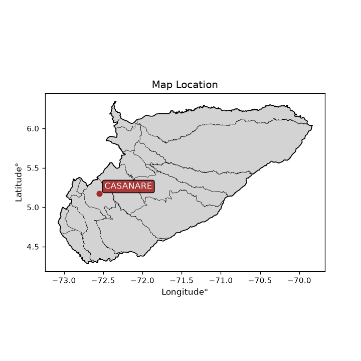</img>

| CountyID                                                                                          | CountyName           | CountyFiles                                                                                                                                                                                                                                                                                                                                                                                                                                                                                                                                                                                                                                                                                                                                                                                                                                                                                                                                                                                                                                                                                                                                                                                                                                                                                                                                                                                                                                                                                                                                                                                                                                                                                                                                                                   |
|:--------------------------------------------------------------------------------------------------|:---------------------|:------------------------------------------------------------------------------------------------------------------------------------------------------------------------------------------------------------------------------------------------------------------------------------------------------------------------------------------------------------------------------------------------------------------------------------------------------------------------------------------------------------------------------------------------------------------------------------------------------------------------------------------------------------------------------------------------------------------------------------------------------------------------------------------------------------------------------------------------------------------------------------------------------------------------------------------------------------------------------------------------------------------------------------------------------------------------------------------------------------------------------------------------------------------------------------------------------------------------------------------------------------------------------------------------------------------------------------------------------------------------------------------------------------------------------------------------------------------------------------------------------------------------------------------------------------------------------------------------------------------------------------------------------------------------------------------------------------------------------------------------------------------------------|
| [85010](https://github.com/rcfdtools/R.HydroTools/blob/main/tool/Population/file/report/85010.md) | Aguazul              | [85010_Rural_Building_202606.zip](https://github.com/rcfdtools/R.GISMobile/blob/main/file/shp/85010_Rural_Building_202606.zip) [85010_Rural_Lot_202606.zip](https://github.com/rcfdtools/R.GISMobile/blob/main/file/shp/85010_Rural_Lot_202606.zip) [85010_Rural_Nomenclature_202606.zip](https://github.com/rcfdtools/R.GISMobile/blob/main/file/shp/85010_Rural_Nomenclature_202606.zip) [85010_Rural_Sector_202606.zip](https://github.com/rcfdtools/R.GISMobile/blob/main/file/shp/85010_Rural_Sector_202606.zip) [85010_Rural_Vereda_202606.zip](https://github.com/rcfdtools/R.GISMobile/blob/main/file/shp/85010_Rural_Vereda_202606.zip) [85010_Urban_Block_202606.zip](https://github.com/rcfdtools/R.GISMobile/blob/main/file/shp/85010_Urban_Block_202606.zip) [85010_Urban_Building_202606.zip](https://github.com/rcfdtools/R.GISMobile/blob/main/file/shp/85010_Urban_Building_202606.zip) [85010_Urban_Lot_202606.zip](https://github.com/rcfdtools/R.GISMobile/blob/main/file/shp/85010_Urban_Lot_202606.zip) [85010_Urban_Nomenclature_202606.zip](https://github.com/rcfdtools/R.GISMobile/blob/main/file/shp/85010_Urban_Nomenclature_202606.zip) [85010_Urban_Nomenclature_Road_202606.zip](https://github.com/rcfdtools/R.GISMobile/blob/main/file/shp/85010_Urban_Nomenclature_Road_202606.zip) [85010_Urban_Perimeter_202606.zip](https://github.com/rcfdtools/R.GISMobile/blob/main/file/shp/85010_Urban_Perimeter_202606.zip) [85010_Urban_Sector_202606.zip](https://github.com/rcfdtools/R.GISMobile/blob/main/file/shp/85010_Urban_Sector_202606.zip)                                                                                                                                             |
| [85015](https://github.com/rcfdtools/R.HydroTools/blob/main/tool/Population/file/report/85015.md) | Chámeza              | [85015_Rural_Building_202606.zip](https://github.com/rcfdtools/R.GISMobile/blob/main/file/shp/85015_Rural_Building_202606.zip) [85015_Rural_Lot_202606.zip](https://github.com/rcfdtools/R.GISMobile/blob/main/file/shp/85015_Rural_Lot_202606.zip) [85015_Rural_Nomenclature_202606.zip](https://github.com/rcfdtools/R.GISMobile/blob/main/file/shp/85015_Rural_Nomenclature_202606.zip) [85015_Rural_Sector_202606.zip](https://github.com/rcfdtools/R.GISMobile/blob/main/file/shp/85015_Rural_Sector_202606.zip) [85015_Rural_Vereda_202606.zip](https://github.com/rcfdtools/R.GISMobile/blob/main/file/shp/85015_Rural_Vereda_202606.zip) [85015_Urban_Block_202606.zip](https://github.com/rcfdtools/R.GISMobile/blob/main/file/shp/85015_Urban_Block_202606.zip) [85015_Urban_Building_202606.zip](https://github.com/rcfdtools/R.GISMobile/blob/main/file/shp/85015_Urban_Building_202606.zip) [85015_Urban_Lot_202606.zip](https://github.com/rcfdtools/R.GISMobile/blob/main/file/shp/85015_Urban_Lot_202606.zip) [85015_Urban_Neighborhood_202606.zip](https://github.com/rcfdtools/R.GISMobile/blob/main/file/shp/85015_Urban_Neighborhood_202606.zip) [85015_Urban_Nomenclature_202606.zip](https://github.com/rcfdtools/R.GISMobile/blob/main/file/shp/85015_Urban_Nomenclature_202606.zip) [85015_Urban_Nomenclature_Road_202606.zip](https://github.com/rcfdtools/R.GISMobile/blob/main/file/shp/85015_Urban_Nomenclature_Road_202606.zip) [85015_Urban_Perimeter_202606.zip](https://github.com/rcfdtools/R.GISMobile/blob/main/file/shp/85015_Urban_Perimeter_202606.zip) [85015_Urban_Sector_202606.zip](https://github.com/rcfdtools/R.GISMobile/blob/main/file/shp/85015_Urban_Sector_202606.zip)  |
| [85125](https://github.com/rcfdtools/R.HydroTools/blob/main/tool/Population/file/report/85125.md) | Hato Corozal         | [85125_Rural_Building_202606.zip](https://github.com/rcfdtools/R.GISMobile/blob/main/file/shp/85125_Rural_Building_202606.zip) [85125_Rural_Lot_202606.zip](https://github.com/rcfdtools/R.GISMobile/blob/main/file/shp/85125_Rural_Lot_202606.zip) [85125_Rural_Nomenclature_202606.zip](https://github.com/rcfdtools/R.GISMobile/blob/main/file/shp/85125_Rural_Nomenclature_202606.zip) [85125_Rural_Sector_202606.zip](https://github.com/rcfdtools/R.GISMobile/blob/main/file/shp/85125_Rural_Sector_202606.zip) [85125_Rural_Vereda_202606.zip](https://github.com/rcfdtools/R.GISMobile/blob/main/file/shp/85125_Rural_Vereda_202606.zip) [85125_Urban_Block_202606.zip](https://github.com/rcfdtools/R.GISMobile/blob/main/file/shp/85125_Urban_Block_202606.zip) [85125_Urban_Building_202606.zip](https://github.com/rcfdtools/R.GISMobile/blob/main/file/shp/85125_Urban_Building_202606.zip) [85125_Urban_Lot_202606.zip](https://github.com/rcfdtools/R.GISMobile/blob/main/file/shp/85125_Urban_Lot_202606.zip) [85125_Urban_Neighborhood_202606.zip](https://github.com/rcfdtools/R.GISMobile/blob/main/file/shp/85125_Urban_Neighborhood_202606.zip) [85125_Urban_Nomenclature_202606.zip](https://github.com/rcfdtools/R.GISMobile/blob/main/file/shp/85125_Urban_Nomenclature_202606.zip) [85125_Urban_Nomenclature_Road_202606.zip](https://github.com/rcfdtools/R.GISMobile/blob/main/file/shp/85125_Urban_Nomenclature_Road_202606.zip) [85125_Urban_Perimeter_202606.zip](https://github.com/rcfdtools/R.GISMobile/blob/main/file/shp/85125_Urban_Perimeter_202606.zip) [85125_Urban_Sector_202606.zip](https://github.com/rcfdtools/R.GISMobile/blob/main/file/shp/85125_Urban_Sector_202606.zip)  |
| [85136](https://github.com/rcfdtools/R.HydroTools/blob/main/tool/Population/file/report/85136.md) | La Salina            | [85136_Rural_Lot_202606.zip](https://github.com/rcfdtools/R.GISMobile/blob/main/file/shp/85136_Rural_Lot_202606.zip) [85136_Rural_Nomenclature_202606.zip](https://github.com/rcfdtools/R.GISMobile/blob/main/file/shp/85136_Rural_Nomenclature_202606.zip) [85136_Rural_Sector_202606.zip](https://github.com/rcfdtools/R.GISMobile/blob/main/file/shp/85136_Rural_Sector_202606.zip) [85136_Rural_Vereda_202606.zip](https://github.com/rcfdtools/R.GISMobile/blob/main/file/shp/85136_Rural_Vereda_202606.zip) [85136_Urban_Block_202606.zip](https://github.com/rcfdtools/R.GISMobile/blob/main/file/shp/85136_Urban_Block_202606.zip) [85136_Urban_Building_202606.zip](https://github.com/rcfdtools/R.GISMobile/blob/main/file/shp/85136_Urban_Building_202606.zip) [85136_Urban_Lot_202606.zip](https://github.com/rcfdtools/R.GISMobile/blob/main/file/shp/85136_Urban_Lot_202606.zip) [85136_Urban_Nomenclature_202606.zip](https://github.com/rcfdtools/R.GISMobile/blob/main/file/shp/85136_Urban_Nomenclature_202606.zip) [85136_Urban_Perimeter_202606.zip](https://github.com/rcfdtools/R.GISMobile/blob/main/file/shp/85136_Urban_Perimeter_202606.zip) [85136_Urban_Sector_202606.zip](https://github.com/rcfdtools/R.GISMobile/blob/main/file/shp/85136_Urban_Sector_202606.zip)                                                                                                                                                                                                                                                                                                                                                                                                                                     |
| [85139](https://github.com/rcfdtools/R.HydroTools/blob/main/tool/Population/file/report/85139.md) | Maní                 | [85139_Rural_Lot_202606.zip](https://github.com/rcfdtools/R.GISMobile/blob/main/file/shp/85139_Rural_Lot_202606.zip) [85139_Rural_Nomenclature_202606.zip](https://github.com/rcfdtools/R.GISMobile/blob/main/file/shp/85139_Rural_Nomenclature_202606.zip) [85139_Rural_Nomenclature_Road_202606.zip](https://github.com/rcfdtools/R.GISMobile/blob/main/file/shp/85139_Rural_Nomenclature_Road_202606.zip) [85139_Rural_Sector_202606.zip](https://github.com/rcfdtools/R.GISMobile/blob/main/file/shp/85139_Rural_Sector_202606.zip) [85139_Rural_Vereda_202606.zip](https://github.com/rcfdtools/R.GISMobile/blob/main/file/shp/85139_Rural_Vereda_202606.zip) [85139_Urban_Block_202606.zip](https://github.com/rcfdtools/R.GISMobile/blob/main/file/shp/85139_Urban_Block_202606.zip) [85139_Urban_Building_202606.zip](https://github.com/rcfdtools/R.GISMobile/blob/main/file/shp/85139_Urban_Building_202606.zip) [85139_Urban_Lot_202606.zip](https://github.com/rcfdtools/R.GISMobile/blob/main/file/shp/85139_Urban_Lot_202606.zip) [85139_Urban_Nomenclature_202606.zip](https://github.com/rcfdtools/R.GISMobile/blob/main/file/shp/85139_Urban_Nomenclature_202606.zip) [85139_Urban_Nomenclature_Road_202606.zip](https://github.com/rcfdtools/R.GISMobile/blob/main/file/shp/85139_Urban_Nomenclature_Road_202606.zip) [85139_Urban_Perimeter_202606.zip](https://github.com/rcfdtools/R.GISMobile/blob/main/file/shp/85139_Urban_Perimeter_202606.zip) [85139_Urban_Sector_202606.zip](https://github.com/rcfdtools/R.GISMobile/blob/main/file/shp/85139_Urban_Sector_202606.zip)                                                                                                                           |
| [85162](https://github.com/rcfdtools/R.HydroTools/blob/main/tool/Population/file/report/85162.md) | Monterrey            | [85162_Rural_Building_202606.zip](https://github.com/rcfdtools/R.GISMobile/blob/main/file/shp/85162_Rural_Building_202606.zip) [85162_Rural_Lot_202606.zip](https://github.com/rcfdtools/R.GISMobile/blob/main/file/shp/85162_Rural_Lot_202606.zip) [85162_Rural_Nomenclature_202606.zip](https://github.com/rcfdtools/R.GISMobile/blob/main/file/shp/85162_Rural_Nomenclature_202606.zip) [85162_Rural_Sector_202606.zip](https://github.com/rcfdtools/R.GISMobile/blob/main/file/shp/85162_Rural_Sector_202606.zip) [85162_Rural_Vereda_202606.zip](https://github.com/rcfdtools/R.GISMobile/blob/main/file/shp/85162_Rural_Vereda_202606.zip) [85162_Urban_Block_202606.zip](https://github.com/rcfdtools/R.GISMobile/blob/main/file/shp/85162_Urban_Block_202606.zip) [85162_Urban_Building_202606.zip](https://github.com/rcfdtools/R.GISMobile/blob/main/file/shp/85162_Urban_Building_202606.zip) [85162_Urban_Lot_202606.zip](https://github.com/rcfdtools/R.GISMobile/blob/main/file/shp/85162_Urban_Lot_202606.zip) [85162_Urban_Nomenclature_202606.zip](https://github.com/rcfdtools/R.GISMobile/blob/main/file/shp/85162_Urban_Nomenclature_202606.zip) [85162_Urban_Nomenclature_Road_202606.zip](https://github.com/rcfdtools/R.GISMobile/blob/main/file/shp/85162_Urban_Nomenclature_Road_202606.zip) [85162_Urban_Perimeter_202606.zip](https://github.com/rcfdtools/R.GISMobile/blob/main/file/shp/85162_Urban_Perimeter_202606.zip) [85162_Urban_Sector_202606.zip](https://github.com/rcfdtools/R.GISMobile/blob/main/file/shp/85162_Urban_Sector_202606.zip)                                                                                                                                             |
| [85225](https://github.com/rcfdtools/R.HydroTools/blob/main/tool/Population/file/report/85225.md) | Nunchía              | [85225_Rural_Building_202606.zip](https://github.com/rcfdtools/R.GISMobile/blob/main/file/shp/85225_Rural_Building_202606.zip) [85225_Rural_Lot_202606.zip](https://github.com/rcfdtools/R.GISMobile/blob/main/file/shp/85225_Rural_Lot_202606.zip) [85225_Rural_Nomenclature_202606.zip](https://github.com/rcfdtools/R.GISMobile/blob/main/file/shp/85225_Rural_Nomenclature_202606.zip) [85225_Rural_Sector_202606.zip](https://github.com/rcfdtools/R.GISMobile/blob/main/file/shp/85225_Rural_Sector_202606.zip) [85225_Rural_Vereda_202606.zip](https://github.com/rcfdtools/R.GISMobile/blob/main/file/shp/85225_Rural_Vereda_202606.zip) [85225_Urban_Block_202606.zip](https://github.com/rcfdtools/R.GISMobile/blob/main/file/shp/85225_Urban_Block_202606.zip) [85225_Urban_Building_202606.zip](https://github.com/rcfdtools/R.GISMobile/blob/main/file/shp/85225_Urban_Building_202606.zip) [85225_Urban_Lot_202606.zip](https://github.com/rcfdtools/R.GISMobile/blob/main/file/shp/85225_Urban_Lot_202606.zip) [85225_Urban_Neighborhood_202606.zip](https://github.com/rcfdtools/R.GISMobile/blob/main/file/shp/85225_Urban_Neighborhood_202606.zip) [85225_Urban_Nomenclature_202606.zip](https://github.com/rcfdtools/R.GISMobile/blob/main/file/shp/85225_Urban_Nomenclature_202606.zip) [85225_Urban_Nomenclature_Road_202606.zip](https://github.com/rcfdtools/R.GISMobile/blob/main/file/shp/85225_Urban_Nomenclature_Road_202606.zip) [85225_Urban_Perimeter_202606.zip](https://github.com/rcfdtools/R.GISMobile/blob/main/file/shp/85225_Urban_Perimeter_202606.zip) [85225_Urban_Sector_202606.zip](https://github.com/rcfdtools/R.GISMobile/blob/main/file/shp/85225_Urban_Sector_202606.zip)  |
| [85230](https://github.com/rcfdtools/R.HydroTools/blob/main/tool/Population/file/report/85230.md) | Orocué               | [85230_Rural_Building_202606.zip](https://github.com/rcfdtools/R.GISMobile/blob/main/file/shp/85230_Rural_Building_202606.zip) [85230_Rural_Lot_202606.zip](https://github.com/rcfdtools/R.GISMobile/blob/main/file/shp/85230_Rural_Lot_202606.zip) [85230_Rural_Nomenclature_202606.zip](https://github.com/rcfdtools/R.GISMobile/blob/main/file/shp/85230_Rural_Nomenclature_202606.zip) [85230_Rural_Sector_202606.zip](https://github.com/rcfdtools/R.GISMobile/blob/main/file/shp/85230_Rural_Sector_202606.zip) [85230_Rural_Vereda_202606.zip](https://github.com/rcfdtools/R.GISMobile/blob/main/file/shp/85230_Rural_Vereda_202606.zip) [85230_Urban_Block_202606.zip](https://github.com/rcfdtools/R.GISMobile/blob/main/file/shp/85230_Urban_Block_202606.zip) [85230_Urban_Building_202606.zip](https://github.com/rcfdtools/R.GISMobile/blob/main/file/shp/85230_Urban_Building_202606.zip) [85230_Urban_Lot_202606.zip](https://github.com/rcfdtools/R.GISMobile/blob/main/file/shp/85230_Urban_Lot_202606.zip) [85230_Urban_Neighborhood_202606.zip](https://github.com/rcfdtools/R.GISMobile/blob/main/file/shp/85230_Urban_Neighborhood_202606.zip) [85230_Urban_Nomenclature_202606.zip](https://github.com/rcfdtools/R.GISMobile/blob/main/file/shp/85230_Urban_Nomenclature_202606.zip) [85230_Urban_Nomenclature_Road_202606.zip](https://github.com/rcfdtools/R.GISMobile/blob/main/file/shp/85230_Urban_Nomenclature_Road_202606.zip) [85230_Urban_Perimeter_202606.zip](https://github.com/rcfdtools/R.GISMobile/blob/main/file/shp/85230_Urban_Perimeter_202606.zip) [85230_Urban_Sector_202606.zip](https://github.com/rcfdtools/R.GISMobile/blob/main/file/shp/85230_Urban_Sector_202606.zip)  |
| [85250](https://github.com/rcfdtools/R.HydroTools/blob/main/tool/Population/file/report/85250.md) | Paz De Ariporo       | [85250_Rural_Lot_202606.zip](https://github.com/rcfdtools/R.GISMobile/blob/main/file/shp/85250_Rural_Lot_202606.zip) [85250_Rural_Nomenclature_202606.zip](https://github.com/rcfdtools/R.GISMobile/blob/main/file/shp/85250_Rural_Nomenclature_202606.zip) [85250_Rural_Sector_202606.zip](https://github.com/rcfdtools/R.GISMobile/blob/main/file/shp/85250_Rural_Sector_202606.zip) [85250_Rural_Vereda_202606.zip](https://github.com/rcfdtools/R.GISMobile/blob/main/file/shp/85250_Rural_Vereda_202606.zip) [85250_Urban_Block_202606.zip](https://github.com/rcfdtools/R.GISMobile/blob/main/file/shp/85250_Urban_Block_202606.zip) [85250_Urban_Building_202606.zip](https://github.com/rcfdtools/R.GISMobile/blob/main/file/shp/85250_Urban_Building_202606.zip) [85250_Urban_Lot_202606.zip](https://github.com/rcfdtools/R.GISMobile/blob/main/file/shp/85250_Urban_Lot_202606.zip) [85250_Urban_Neighborhood_202606.zip](https://github.com/rcfdtools/R.GISMobile/blob/main/file/shp/85250_Urban_Neighborhood_202606.zip) [85250_Urban_Nomenclature_202606.zip](https://github.com/rcfdtools/R.GISMobile/blob/main/file/shp/85250_Urban_Nomenclature_202606.zip) [85250_Urban_Nomenclature_Road_202606.zip](https://github.com/rcfdtools/R.GISMobile/blob/main/file/shp/85250_Urban_Nomenclature_Road_202606.zip) [85250_Urban_Perimeter_202606.zip](https://github.com/rcfdtools/R.GISMobile/blob/main/file/shp/85250_Urban_Perimeter_202606.zip) [85250_Urban_Sector_202606.zip](https://github.com/rcfdtools/R.GISMobile/blob/main/file/shp/85250_Urban_Sector_202606.zip)                                                                                                                                     |
| [85263](https://github.com/rcfdtools/R.HydroTools/blob/main/tool/Population/file/report/85263.md) | Pore                 | [85263_Rural_Building_202606.zip](https://github.com/rcfdtools/R.GISMobile/blob/main/file/shp/85263_Rural_Building_202606.zip) [85263_Rural_Lot_202606.zip](https://github.com/rcfdtools/R.GISMobile/blob/main/file/shp/85263_Rural_Lot_202606.zip) [85263_Rural_Nomenclature_202606.zip](https://github.com/rcfdtools/R.GISMobile/blob/main/file/shp/85263_Rural_Nomenclature_202606.zip) [85263_Rural_Sector_202606.zip](https://github.com/rcfdtools/R.GISMobile/blob/main/file/shp/85263_Rural_Sector_202606.zip) [85263_Rural_Vereda_202606.zip](https://github.com/rcfdtools/R.GISMobile/blob/main/file/shp/85263_Rural_Vereda_202606.zip) [85263_Urban_Block_202606.zip](https://github.com/rcfdtools/R.GISMobile/blob/main/file/shp/85263_Urban_Block_202606.zip) [85263_Urban_Building_202606.zip](https://github.com/rcfdtools/R.GISMobile/blob/main/file/shp/85263_Urban_Building_202606.zip) [85263_Urban_Lot_202606.zip](https://github.com/rcfdtools/R.GISMobile/blob/main/file/shp/85263_Urban_Lot_202606.zip) [85263_Urban_Neighborhood_202606.zip](https://github.com/rcfdtools/R.GISMobile/blob/main/file/shp/85263_Urban_Neighborhood_202606.zip) [85263_Urban_Nomenclature_202606.zip](https://github.com/rcfdtools/R.GISMobile/blob/main/file/shp/85263_Urban_Nomenclature_202606.zip) [85263_Urban_Nomenclature_Road_202606.zip](https://github.com/rcfdtools/R.GISMobile/blob/main/file/shp/85263_Urban_Nomenclature_Road_202606.zip) [85263_Urban_Perimeter_202606.zip](https://github.com/rcfdtools/R.GISMobile/blob/main/file/shp/85263_Urban_Perimeter_202606.zip) [85263_Urban_Sector_202606.zip](https://github.com/rcfdtools/R.GISMobile/blob/main/file/shp/85263_Urban_Sector_202606.zip)  |
| [85279](https://github.com/rcfdtools/R.HydroTools/blob/main/tool/Population/file/report/85279.md) | Recetor              | [85279_Rural_Lot_202606.zip](https://github.com/rcfdtools/R.GISMobile/blob/main/file/shp/85279_Rural_Lot_202606.zip) [85279_Rural_Nomenclature_202606.zip](https://github.com/rcfdtools/R.GISMobile/blob/main/file/shp/85279_Rural_Nomenclature_202606.zip) [85279_Rural_Sector_202606.zip](https://github.com/rcfdtools/R.GISMobile/blob/main/file/shp/85279_Rural_Sector_202606.zip) [85279_Rural_Vereda_202606.zip](https://github.com/rcfdtools/R.GISMobile/blob/main/file/shp/85279_Rural_Vereda_202606.zip) [85279_Urban_Block_202606.zip](https://github.com/rcfdtools/R.GISMobile/blob/main/file/shp/85279_Urban_Block_202606.zip) [85279_Urban_Building_202606.zip](https://github.com/rcfdtools/R.GISMobile/blob/main/file/shp/85279_Urban_Building_202606.zip) [85279_Urban_Lot_202606.zip](https://github.com/rcfdtools/R.GISMobile/blob/main/file/shp/85279_Urban_Lot_202606.zip) [85279_Urban_Nomenclature_202606.zip](https://github.com/rcfdtools/R.GISMobile/blob/main/file/shp/85279_Urban_Nomenclature_202606.zip) [85279_Urban_Nomenclature_Road_202606.zip](https://github.com/rcfdtools/R.GISMobile/blob/main/file/shp/85279_Urban_Nomenclature_Road_202606.zip) [85279_Urban_Perimeter_202606.zip](https://github.com/rcfdtools/R.GISMobile/blob/main/file/shp/85279_Urban_Perimeter_202606.zip) [85279_Urban_Sector_202606.zip](https://github.com/rcfdtools/R.GISMobile/blob/main/file/shp/85279_Urban_Sector_202606.zip)                                                                                                                                                                                                                                                                                |
| [85300](https://github.com/rcfdtools/R.HydroTools/blob/main/tool/Population/file/report/85300.md) | Sabanalarga          | [85300_Rural_Building_202606.zip](https://github.com/rcfdtools/R.GISMobile/blob/main/file/shp/85300_Rural_Building_202606.zip) [85300_Rural_Lot_202606.zip](https://github.com/rcfdtools/R.GISMobile/blob/main/file/shp/85300_Rural_Lot_202606.zip) [85300_Rural_Nomenclature_202606.zip](https://github.com/rcfdtools/R.GISMobile/blob/main/file/shp/85300_Rural_Nomenclature_202606.zip) [85300_Rural_Sector_202606.zip](https://github.com/rcfdtools/R.GISMobile/blob/main/file/shp/85300_Rural_Sector_202606.zip) [85300_Rural_Vereda_202606.zip](https://github.com/rcfdtools/R.GISMobile/blob/main/file/shp/85300_Rural_Vereda_202606.zip) [85300_Urban_Block_202606.zip](https://github.com/rcfdtools/R.GISMobile/blob/main/file/shp/85300_Urban_Block_202606.zip) [85300_Urban_Building_202606.zip](https://github.com/rcfdtools/R.GISMobile/blob/main/file/shp/85300_Urban_Building_202606.zip) [85300_Urban_Lot_202606.zip](https://github.com/rcfdtools/R.GISMobile/blob/main/file/shp/85300_Urban_Lot_202606.zip) [85300_Urban_Nomenclature_202606.zip](https://github.com/rcfdtools/R.GISMobile/blob/main/file/shp/85300_Urban_Nomenclature_202606.zip) [85300_Urban_Nomenclature_Road_202606.zip](https://github.com/rcfdtools/R.GISMobile/blob/main/file/shp/85300_Urban_Nomenclature_Road_202606.zip) [85300_Urban_Perimeter_202606.zip](https://github.com/rcfdtools/R.GISMobile/blob/main/file/shp/85300_Urban_Perimeter_202606.zip)                                                                                                                                                                                                                                                                            |
| [85325](https://github.com/rcfdtools/R.HydroTools/blob/main/tool/Population/file/report/85325.md) | San Luis De Palenque | [85325_Rural_Building_202606.zip](https://github.com/rcfdtools/R.GISMobile/blob/main/file/shp/85325_Rural_Building_202606.zip) [85325_Rural_Lot_202606.zip](https://github.com/rcfdtools/R.GISMobile/blob/main/file/shp/85325_Rural_Lot_202606.zip) [85325_Rural_Nomenclature_202606.zip](https://github.com/rcfdtools/R.GISMobile/blob/main/file/shp/85325_Rural_Nomenclature_202606.zip) [85325_Rural_Sector_202606.zip](https://github.com/rcfdtools/R.GISMobile/blob/main/file/shp/85325_Rural_Sector_202606.zip) [85325_Rural_Vereda_202606.zip](https://github.com/rcfdtools/R.GISMobile/blob/main/file/shp/85325_Rural_Vereda_202606.zip) [85325_Urban_Block_202606.zip](https://github.com/rcfdtools/R.GISMobile/blob/main/file/shp/85325_Urban_Block_202606.zip) [85325_Urban_Building_202606.zip](https://github.com/rcfdtools/R.GISMobile/blob/main/file/shp/85325_Urban_Building_202606.zip) [85325_Urban_Lot_202606.zip](https://github.com/rcfdtools/R.GISMobile/blob/main/file/shp/85325_Urban_Lot_202606.zip) [85325_Urban_Neighborhood_202606.zip](https://github.com/rcfdtools/R.GISMobile/blob/main/file/shp/85325_Urban_Neighborhood_202606.zip) [85325_Urban_Nomenclature_202606.zip](https://github.com/rcfdtools/R.GISMobile/blob/main/file/shp/85325_Urban_Nomenclature_202606.zip) [85325_Urban_Nomenclature_Road_202606.zip](https://github.com/rcfdtools/R.GISMobile/blob/main/file/shp/85325_Urban_Nomenclature_Road_202606.zip) [85325_Urban_Perimeter_202606.zip](https://github.com/rcfdtools/R.GISMobile/blob/main/file/shp/85325_Urban_Perimeter_202606.zip) [85325_Urban_Sector_202606.zip](https://github.com/rcfdtools/R.GISMobile/blob/main/file/shp/85325_Urban_Sector_202606.zip)  |
| [85315](https://github.com/rcfdtools/R.HydroTools/blob/main/tool/Population/file/report/85315.md) | Sácama               | [85315_Rural_Building_202606.zip](https://github.com/rcfdtools/R.GISMobile/blob/main/file/shp/85315_Rural_Building_202606.zip) [85315_Rural_Lot_202606.zip](https://github.com/rcfdtools/R.GISMobile/blob/main/file/shp/85315_Rural_Lot_202606.zip) [85315_Rural_Nomenclature_202606.zip](https://github.com/rcfdtools/R.GISMobile/blob/main/file/shp/85315_Rural_Nomenclature_202606.zip) [85315_Rural_Sector_202606.zip](https://github.com/rcfdtools/R.GISMobile/blob/main/file/shp/85315_Rural_Sector_202606.zip) [85315_Rural_Vereda_202606.zip](https://github.com/rcfdtools/R.GISMobile/blob/main/file/shp/85315_Rural_Vereda_202606.zip) [85315_Urban_Block_202606.zip](https://github.com/rcfdtools/R.GISMobile/blob/main/file/shp/85315_Urban_Block_202606.zip) [85315_Urban_Building_202606.zip](https://github.com/rcfdtools/R.GISMobile/blob/main/file/shp/85315_Urban_Building_202606.zip) [85315_Urban_Lot_202606.zip](https://github.com/rcfdtools/R.GISMobile/blob/main/file/shp/85315_Urban_Lot_202606.zip) [85315_Urban_Nomenclature_202606.zip](https://github.com/rcfdtools/R.GISMobile/blob/main/file/shp/85315_Urban_Nomenclature_202606.zip) [85315_Urban_Nomenclature_Road_202606.zip](https://github.com/rcfdtools/R.GISMobile/blob/main/file/shp/85315_Urban_Nomenclature_Road_202606.zip) [85315_Urban_Perimeter_202606.zip](https://github.com/rcfdtools/R.GISMobile/blob/main/file/shp/85315_Urban_Perimeter_202606.zip) [85315_Urban_Sector_202606.zip](https://github.com/rcfdtools/R.GISMobile/blob/main/file/shp/85315_Urban_Sector_202606.zip)                                                                                                                                             |
| [85410](https://github.com/rcfdtools/R.HydroTools/blob/main/tool/Population/file/report/85410.md) | Tauramena            | [85410_Rural_Building_202606.zip](https://github.com/rcfdtools/R.GISMobile/blob/main/file/shp/85410_Rural_Building_202606.zip) [85410_Rural_Lot_202606.zip](https://github.com/rcfdtools/R.GISMobile/blob/main/file/shp/85410_Rural_Lot_202606.zip) [85410_Rural_Nomenclature_202606.zip](https://github.com/rcfdtools/R.GISMobile/blob/main/file/shp/85410_Rural_Nomenclature_202606.zip) [85410_Rural_Sector_202606.zip](https://github.com/rcfdtools/R.GISMobile/blob/main/file/shp/85410_Rural_Sector_202606.zip) [85410_Rural_Vereda_202606.zip](https://github.com/rcfdtools/R.GISMobile/blob/main/file/shp/85410_Rural_Vereda_202606.zip) [85410_Urban_Block_202606.zip](https://github.com/rcfdtools/R.GISMobile/blob/main/file/shp/85410_Urban_Block_202606.zip) [85410_Urban_Building_202606.zip](https://github.com/rcfdtools/R.GISMobile/blob/main/file/shp/85410_Urban_Building_202606.zip) [85410_Urban_Lot_202606.zip](https://github.com/rcfdtools/R.GISMobile/blob/main/file/shp/85410_Urban_Lot_202606.zip) [85410_Urban_Nomenclature_202606.zip](https://github.com/rcfdtools/R.GISMobile/blob/main/file/shp/85410_Urban_Nomenclature_202606.zip) [85410_Urban_Nomenclature_Road_202606.zip](https://github.com/rcfdtools/R.GISMobile/blob/main/file/shp/85410_Urban_Nomenclature_Road_202606.zip) [85410_Urban_Perimeter_202606.zip](https://github.com/rcfdtools/R.GISMobile/blob/main/file/shp/85410_Urban_Perimeter_202606.zip)                                                                                                                                                                                                                                                                            |
| [85430](https://github.com/rcfdtools/R.HydroTools/blob/main/tool/Population/file/report/85430.md) | Trinidad             | [85430_Rural_Building_202606.zip](https://github.com/rcfdtools/R.GISMobile/blob/main/file/shp/85430_Rural_Building_202606.zip) [85430_Rural_Lot_202606.zip](https://github.com/rcfdtools/R.GISMobile/blob/main/file/shp/85430_Rural_Lot_202606.zip) [85430_Rural_Nomenclature_202606.zip](https://github.com/rcfdtools/R.GISMobile/blob/main/file/shp/85430_Rural_Nomenclature_202606.zip) [85430_Rural_Sector_202606.zip](https://github.com/rcfdtools/R.GISMobile/blob/main/file/shp/85430_Rural_Sector_202606.zip) [85430_Rural_Vereda_202606.zip](https://github.com/rcfdtools/R.GISMobile/blob/main/file/shp/85430_Rural_Vereda_202606.zip) [85430_Urban_Block_202606.zip](https://github.com/rcfdtools/R.GISMobile/blob/main/file/shp/85430_Urban_Block_202606.zip) [85430_Urban_Building_202606.zip](https://github.com/rcfdtools/R.GISMobile/blob/main/file/shp/85430_Urban_Building_202606.zip) [85430_Urban_Lot_202606.zip](https://github.com/rcfdtools/R.GISMobile/blob/main/file/shp/85430_Urban_Lot_202606.zip) [85430_Urban_Nomenclature_202606.zip](https://github.com/rcfdtools/R.GISMobile/blob/main/file/shp/85430_Urban_Nomenclature_202606.zip) [85430_Urban_Nomenclature_Road_202606.zip](https://github.com/rcfdtools/R.GISMobile/blob/main/file/shp/85430_Urban_Nomenclature_Road_202606.zip) [85430_Urban_Perimeter_202606.zip](https://github.com/rcfdtools/R.GISMobile/blob/main/file/shp/85430_Urban_Perimeter_202606.zip) [85430_Urban_Sector_202606.zip](https://github.com/rcfdtools/R.GISMobile/blob/main/file/shp/85430_Urban_Sector_202606.zip)                                                                                                                                             |
| [85400](https://github.com/rcfdtools/R.HydroTools/blob/main/tool/Population/file/report/85400.md) | Támara               | [85400_Rural_Lot_202606.zip](https://github.com/rcfdtools/R.GISMobile/blob/main/file/shp/85400_Rural_Lot_202606.zip) [85400_Rural_Nomenclature_202606.zip](https://github.com/rcfdtools/R.GISMobile/blob/main/file/shp/85400_Rural_Nomenclature_202606.zip) [85400_Rural_Vereda_202606.zip](https://github.com/rcfdtools/R.GISMobile/blob/main/file/shp/85400_Rural_Vereda_202606.zip) [85400_Urban_Block_202606.zip](https://github.com/rcfdtools/R.GISMobile/blob/main/file/shp/85400_Urban_Block_202606.zip) [85400_Urban_Building_202606.zip](https://github.com/rcfdtools/R.GISMobile/blob/main/file/shp/85400_Urban_Building_202606.zip) [85400_Urban_Lot_202606.zip](https://github.com/rcfdtools/R.GISMobile/blob/main/file/shp/85400_Urban_Lot_202606.zip) [85400_Urban_Nomenclature_202606.zip](https://github.com/rcfdtools/R.GISMobile/blob/main/file/shp/85400_Urban_Nomenclature_202606.zip) [85400_Urban_Nomenclature_Road_202606.zip](https://github.com/rcfdtools/R.GISMobile/blob/main/file/shp/85400_Urban_Nomenclature_Road_202606.zip) [85400_Urban_Perimeter_202606.zip](https://github.com/rcfdtools/R.GISMobile/blob/main/file/shp/85400_Urban_Perimeter_202606.zip)                                                                                                                                                                                                                                                                                                                                                                                                                                                                                                                                              |
| [85440](https://github.com/rcfdtools/R.HydroTools/blob/main/tool/Population/file/report/85440.md) | Villanueva           | [85440_Rural_Building_202606.zip](https://github.com/rcfdtools/R.GISMobile/blob/main/file/shp/85440_Rural_Building_202606.zip) [85440_Rural_Lot_202606.zip](https://github.com/rcfdtools/R.GISMobile/blob/main/file/shp/85440_Rural_Lot_202606.zip) [85440_Rural_Nomenclature_202606.zip](https://github.com/rcfdtools/R.GISMobile/blob/main/file/shp/85440_Rural_Nomenclature_202606.zip) [85440_Rural_Sector_202606.zip](https://github.com/rcfdtools/R.GISMobile/blob/main/file/shp/85440_Rural_Sector_202606.zip) [85440_Rural_Vereda_202606.zip](https://github.com/rcfdtools/R.GISMobile/blob/main/file/shp/85440_Rural_Vereda_202606.zip) [85440_Urban_Block_202606.zip](https://github.com/rcfdtools/R.GISMobile/blob/main/file/shp/85440_Urban_Block_202606.zip) [85440_Urban_Building_202606.zip](https://github.com/rcfdtools/R.GISMobile/blob/main/file/shp/85440_Urban_Building_202606.zip) [85440_Urban_Lot_202606.zip](https://github.com/rcfdtools/R.GISMobile/blob/main/file/shp/85440_Urban_Lot_202606.zip) [85440_Urban_Nomenclature_202606.zip](https://github.com/rcfdtools/R.GISMobile/blob/main/file/shp/85440_Urban_Nomenclature_202606.zip) [85440_Urban_Nomenclature_Road_202606.zip](https://github.com/rcfdtools/R.GISMobile/blob/main/file/shp/85440_Urban_Nomenclature_Road_202606.zip) [85440_Urban_Perimeter_202606.zip](https://github.com/rcfdtools/R.GISMobile/blob/main/file/shp/85440_Urban_Perimeter_202606.zip) [85440_Urban_Sector_202606.zip](https://github.com/rcfdtools/R.GISMobile/blob/main/file/shp/85440_Urban_Sector_202606.zip)                                                                                                                                             |
| [85001](https://github.com/rcfdtools/R.HydroTools/blob/main/tool/Population/file/report/85001.md) | Yopal                | [85001_Rural_Lot_202606.zip](https://github.com/rcfdtools/R.GISMobile/blob/main/file/shp/85001_Rural_Lot_202606.zip) [85001_Urban_Lot_202606.zip](https://github.com/rcfdtools/R.GISMobile/blob/main/file/shp/85001_Urban_Lot_202606.zip)                                                                                                                                                                                                                                                                                                                                                                                                                                                                                                                                                                                                                                                                                                                                                                                                                                                                                                                                                                                                                                                                                                                                                                                                                                                                                                                                                                                                                                                                                                                             |

# 86 - Putumayo (13 Counties)

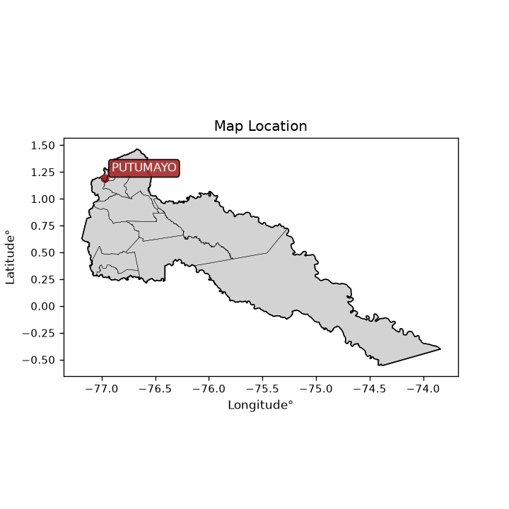</img>

| CountyID                                                                                          | CountyName        | CountyFiles                                                                                                                                                                                                                                                                                                                                                                                                                                                                                                                                                                                                                                                                                                                                                                                                                                                                                                                                                                                                                                                                                                                                                                                                                                                                                                                                                                                                                                                                                                                                                                                                                                                                                                                                                                             |
|:--------------------------------------------------------------------------------------------------|:------------------|:----------------------------------------------------------------------------------------------------------------------------------------------------------------------------------------------------------------------------------------------------------------------------------------------------------------------------------------------------------------------------------------------------------------------------------------------------------------------------------------------------------------------------------------------------------------------------------------------------------------------------------------------------------------------------------------------------------------------------------------------------------------------------------------------------------------------------------------------------------------------------------------------------------------------------------------------------------------------------------------------------------------------------------------------------------------------------------------------------------------------------------------------------------------------------------------------------------------------------------------------------------------------------------------------------------------------------------------------------------------------------------------------------------------------------------------------------------------------------------------------------------------------------------------------------------------------------------------------------------------------------------------------------------------------------------------------------------------------------------------------------------------------------------------|
| [86219](https://github.com/rcfdtools/R.HydroTools/blob/main/tool/Population/file/report/86219.md) | Colón             | [86219_Rural_Building_202606.zip](https://github.com/rcfdtools/R.GISMobile/blob/main/file/shp/86219_Rural_Building_202606.zip) [86219_Rural_Lot_202606.zip](https://github.com/rcfdtools/R.GISMobile/blob/main/file/shp/86219_Rural_Lot_202606.zip) [86219_Rural_Nomenclature_202606.zip](https://github.com/rcfdtools/R.GISMobile/blob/main/file/shp/86219_Rural_Nomenclature_202606.zip) [86219_Rural_Nomenclature_Road_202606.zip](https://github.com/rcfdtools/R.GISMobile/blob/main/file/shp/86219_Rural_Nomenclature_Road_202606.zip) [86219_Rural_Sector_202606.zip](https://github.com/rcfdtools/R.GISMobile/blob/main/file/shp/86219_Rural_Sector_202606.zip) [86219_Rural_Vereda_202606.zip](https://github.com/rcfdtools/R.GISMobile/blob/main/file/shp/86219_Rural_Vereda_202606.zip) [86219_Urban_Block_202606.zip](https://github.com/rcfdtools/R.GISMobile/blob/main/file/shp/86219_Urban_Block_202606.zip) [86219_Urban_Building_202606.zip](https://github.com/rcfdtools/R.GISMobile/blob/main/file/shp/86219_Urban_Building_202606.zip) [86219_Urban_Lot_202606.zip](https://github.com/rcfdtools/R.GISMobile/blob/main/file/shp/86219_Urban_Lot_202606.zip) [86219_Urban_Nomenclature_202606.zip](https://github.com/rcfdtools/R.GISMobile/blob/main/file/shp/86219_Urban_Nomenclature_202606.zip) [86219_Urban_Nomenclature_Road_202606.zip](https://github.com/rcfdtools/R.GISMobile/blob/main/file/shp/86219_Urban_Nomenclature_Road_202606.zip) [86219_Urban_Perimeter_202606.zip](https://github.com/rcfdtools/R.GISMobile/blob/main/file/shp/86219_Urban_Perimeter_202606.zip) [86219_Urban_Sector_202606.zip](https://github.com/rcfdtools/R.GISMobile/blob/main/file/shp/86219_Urban_Sector_202606.zip)  |
| [86573](https://github.com/rcfdtools/R.HydroTools/blob/main/tool/Population/file/report/86573.md) | Leguízamo         | [86573_Rural_Building_202606.zip](https://github.com/rcfdtools/R.GISMobile/blob/main/file/shp/86573_Rural_Building_202606.zip) [86573_Rural_Lot_202606.zip](https://github.com/rcfdtools/R.GISMobile/blob/main/file/shp/86573_Rural_Lot_202606.zip) [86573_Rural_Nomenclature_202606.zip](https://github.com/rcfdtools/R.GISMobile/blob/main/file/shp/86573_Rural_Nomenclature_202606.zip) [86573_Rural_Sector_202606.zip](https://github.com/rcfdtools/R.GISMobile/blob/main/file/shp/86573_Rural_Sector_202606.zip) [86573_Rural_Vereda_202606.zip](https://github.com/rcfdtools/R.GISMobile/blob/main/file/shp/86573_Rural_Vereda_202606.zip)                                                                                                                                                                                                                                                                                                                                                                                                                                                                                                                                                                                                                                                                                                                                                                                                                                                                                                                                                                                                                                                                                                                    |
| [86001](https://github.com/rcfdtools/R.HydroTools/blob/main/tool/Population/file/report/86001.md) | Mocoa             | [86001_Rural_Building_202606.zip](https://github.com/rcfdtools/R.GISMobile/blob/main/file/shp/86001_Rural_Building_202606.zip) [86001_Rural_Lot_202606.zip](https://github.com/rcfdtools/R.GISMobile/blob/main/file/shp/86001_Rural_Lot_202606.zip) [86001_Rural_Nomenclature_202606.zip](https://github.com/rcfdtools/R.GISMobile/blob/main/file/shp/86001_Rural_Nomenclature_202606.zip) [86001_Rural_Sector_202606.zip](https://github.com/rcfdtools/R.GISMobile/blob/main/file/shp/86001_Rural_Sector_202606.zip) [86001_Rural_Vereda_202606.zip](https://github.com/rcfdtools/R.GISMobile/blob/main/file/shp/86001_Rural_Vereda_202606.zip) [86001_Urban_Block_202606.zip](https://github.com/rcfdtools/R.GISMobile/blob/main/file/shp/86001_Urban_Block_202606.zip) [86001_Urban_Building_202606.zip](https://github.com/rcfdtools/R.GISMobile/blob/main/file/shp/86001_Urban_Building_202606.zip) [86001_Urban_Lot_202606.zip](https://github.com/rcfdtools/R.GISMobile/blob/main/file/shp/86001_Urban_Lot_202606.zip) [86001_Urban_Nomenclature_202606.zip](https://github.com/rcfdtools/R.GISMobile/blob/main/file/shp/86001_Urban_Nomenclature_202606.zip) [86001_Urban_Nomenclature_Road_202606.zip](https://github.com/rcfdtools/R.GISMobile/blob/main/file/shp/86001_Urban_Nomenclature_Road_202606.zip) [86001_Urban_Perimeter_202606.zip](https://github.com/rcfdtools/R.GISMobile/blob/main/file/shp/86001_Urban_Perimeter_202606.zip) [86001_Urban_Sector_202606.zip](https://github.com/rcfdtools/R.GISMobile/blob/main/file/shp/86001_Urban_Sector_202606.zip)                                                                                                                                                       |
| [86320](https://github.com/rcfdtools/R.HydroTools/blob/main/tool/Population/file/report/86320.md) | Orito             | [86320_Rural_Building_202606.zip](https://github.com/rcfdtools/R.GISMobile/blob/main/file/shp/86320_Rural_Building_202606.zip) [86320_Rural_Lot_202606.zip](https://github.com/rcfdtools/R.GISMobile/blob/main/file/shp/86320_Rural_Lot_202606.zip) [86320_Rural_Nomenclature_202606.zip](https://github.com/rcfdtools/R.GISMobile/blob/main/file/shp/86320_Rural_Nomenclature_202606.zip) [86320_Rural_Nomenclature_Road_202606.zip](https://github.com/rcfdtools/R.GISMobile/blob/main/file/shp/86320_Rural_Nomenclature_Road_202606.zip) [86320_Rural_Sector_202606.zip](https://github.com/rcfdtools/R.GISMobile/blob/main/file/shp/86320_Rural_Sector_202606.zip) [86320_Rural_Vereda_202606.zip](https://github.com/rcfdtools/R.GISMobile/blob/main/file/shp/86320_Rural_Vereda_202606.zip) [86320_Urban_Block_202606.zip](https://github.com/rcfdtools/R.GISMobile/blob/main/file/shp/86320_Urban_Block_202606.zip) [86320_Urban_Building_202606.zip](https://github.com/rcfdtools/R.GISMobile/blob/main/file/shp/86320_Urban_Building_202606.zip) [86320_Urban_Lot_202606.zip](https://github.com/rcfdtools/R.GISMobile/blob/main/file/shp/86320_Urban_Lot_202606.zip) [86320_Urban_Nomenclature_202606.zip](https://github.com/rcfdtools/R.GISMobile/blob/main/file/shp/86320_Urban_Nomenclature_202606.zip) [86320_Urban_Nomenclature_Road_202606.zip](https://github.com/rcfdtools/R.GISMobile/blob/main/file/shp/86320_Urban_Nomenclature_Road_202606.zip) [86320_Urban_Perimeter_202606.zip](https://github.com/rcfdtools/R.GISMobile/blob/main/file/shp/86320_Urban_Perimeter_202606.zip) [86320_Urban_Sector_202606.zip](https://github.com/rcfdtools/R.GISMobile/blob/main/file/shp/86320_Urban_Sector_202606.zip)  |
| [86568](https://github.com/rcfdtools/R.HydroTools/blob/main/tool/Population/file/report/86568.md) | Puerto Asís       | [86568_Rural_Building_202606.zip](https://github.com/rcfdtools/R.GISMobile/blob/main/file/shp/86568_Rural_Building_202606.zip) [86568_Rural_Lot_202606.zip](https://github.com/rcfdtools/R.GISMobile/blob/main/file/shp/86568_Rural_Lot_202606.zip) [86568_Rural_Nomenclature_202606.zip](https://github.com/rcfdtools/R.GISMobile/blob/main/file/shp/86568_Rural_Nomenclature_202606.zip) [86568_Rural_Sector_202606.zip](https://github.com/rcfdtools/R.GISMobile/blob/main/file/shp/86568_Rural_Sector_202606.zip) [86568_Rural_Vereda_202606.zip](https://github.com/rcfdtools/R.GISMobile/blob/main/file/shp/86568_Rural_Vereda_202606.zip) [86568_Urban_Block_202606.zip](https://github.com/rcfdtools/R.GISMobile/blob/main/file/shp/86568_Urban_Block_202606.zip) [86568_Urban_Building_202606.zip](https://github.com/rcfdtools/R.GISMobile/blob/main/file/shp/86568_Urban_Building_202606.zip) [86568_Urban_Lot_202606.zip](https://github.com/rcfdtools/R.GISMobile/blob/main/file/shp/86568_Urban_Lot_202606.zip) [86568_Urban_Neighborhood_202606.zip](https://github.com/rcfdtools/R.GISMobile/blob/main/file/shp/86568_Urban_Neighborhood_202606.zip) [86568_Urban_Nomenclature_202606.zip](https://github.com/rcfdtools/R.GISMobile/blob/main/file/shp/86568_Urban_Nomenclature_202606.zip) [86568_Urban_Nomenclature_Road_202606.zip](https://github.com/rcfdtools/R.GISMobile/blob/main/file/shp/86568_Urban_Nomenclature_Road_202606.zip) [86568_Urban_Perimeter_202606.zip](https://github.com/rcfdtools/R.GISMobile/blob/main/file/shp/86568_Urban_Perimeter_202606.zip) [86568_Urban_Sector_202606.zip](https://github.com/rcfdtools/R.GISMobile/blob/main/file/shp/86568_Urban_Sector_202606.zip)            |
| [86569](https://github.com/rcfdtools/R.HydroTools/blob/main/tool/Population/file/report/86569.md) | Puerto Caicedo    | [86569_Rural_Building_202606.zip](https://github.com/rcfdtools/R.GISMobile/blob/main/file/shp/86569_Rural_Building_202606.zip) [86569_Rural_Lot_202606.zip](https://github.com/rcfdtools/R.GISMobile/blob/main/file/shp/86569_Rural_Lot_202606.zip) [86569_Rural_Nomenclature_202606.zip](https://github.com/rcfdtools/R.GISMobile/blob/main/file/shp/86569_Rural_Nomenclature_202606.zip) [86569_Rural_Sector_202606.zip](https://github.com/rcfdtools/R.GISMobile/blob/main/file/shp/86569_Rural_Sector_202606.zip) [86569_Rural_Vereda_202606.zip](https://github.com/rcfdtools/R.GISMobile/blob/main/file/shp/86569_Rural_Vereda_202606.zip) [86569_Urban_Block_202606.zip](https://github.com/rcfdtools/R.GISMobile/blob/main/file/shp/86569_Urban_Block_202606.zip) [86569_Urban_Building_202606.zip](https://github.com/rcfdtools/R.GISMobile/blob/main/file/shp/86569_Urban_Building_202606.zip) [86569_Urban_Lot_202606.zip](https://github.com/rcfdtools/R.GISMobile/blob/main/file/shp/86569_Urban_Lot_202606.zip) [86569_Urban_Nomenclature_202606.zip](https://github.com/rcfdtools/R.GISMobile/blob/main/file/shp/86569_Urban_Nomenclature_202606.zip) [86569_Urban_Nomenclature_Road_202606.zip](https://github.com/rcfdtools/R.GISMobile/blob/main/file/shp/86569_Urban_Nomenclature_Road_202606.zip) [86569_Urban_Perimeter_202606.zip](https://github.com/rcfdtools/R.GISMobile/blob/main/file/shp/86569_Urban_Perimeter_202606.zip) [86569_Urban_Sector_202606.zip](https://github.com/rcfdtools/R.GISMobile/blob/main/file/shp/86569_Urban_Sector_202606.zip)                                                                                                                                                       |
| [86571](https://github.com/rcfdtools/R.HydroTools/blob/main/tool/Population/file/report/86571.md) | Puerto Guzmán     | [86571_Rural_Building_202606.zip](https://github.com/rcfdtools/R.GISMobile/blob/main/file/shp/86571_Rural_Building_202606.zip) [86571_Rural_Lot_202606.zip](https://github.com/rcfdtools/R.GISMobile/blob/main/file/shp/86571_Rural_Lot_202606.zip) [86571_Rural_Nomenclature_202606.zip](https://github.com/rcfdtools/R.GISMobile/blob/main/file/shp/86571_Rural_Nomenclature_202606.zip) [86571_Rural_Sector_202606.zip](https://github.com/rcfdtools/R.GISMobile/blob/main/file/shp/86571_Rural_Sector_202606.zip) [86571_Rural_Vereda_202606.zip](https://github.com/rcfdtools/R.GISMobile/blob/main/file/shp/86571_Rural_Vereda_202606.zip) [86571_Urban_Block_202606.zip](https://github.com/rcfdtools/R.GISMobile/blob/main/file/shp/86571_Urban_Block_202606.zip) [86571_Urban_Building_202606.zip](https://github.com/rcfdtools/R.GISMobile/blob/main/file/shp/86571_Urban_Building_202606.zip) [86571_Urban_Lot_202606.zip](https://github.com/rcfdtools/R.GISMobile/blob/main/file/shp/86571_Urban_Lot_202606.zip) [86571_Urban_Nomenclature_202606.zip](https://github.com/rcfdtools/R.GISMobile/blob/main/file/shp/86571_Urban_Nomenclature_202606.zip) [86571_Urban_Nomenclature_Road_202606.zip](https://github.com/rcfdtools/R.GISMobile/blob/main/file/shp/86571_Urban_Nomenclature_Road_202606.zip) [86571_Urban_Perimeter_202606.zip](https://github.com/rcfdtools/R.GISMobile/blob/main/file/shp/86571_Urban_Perimeter_202606.zip) [86571_Urban_Sector_202606.zip](https://github.com/rcfdtools/R.GISMobile/blob/main/file/shp/86571_Urban_Sector_202606.zip)                                                                                                                                                       |
| [86755](https://github.com/rcfdtools/R.HydroTools/blob/main/tool/Population/file/report/86755.md) | San Francisco     | [86755_Urban_Block_202606.zip](https://github.com/rcfdtools/R.GISMobile/blob/main/file/shp/86755_Urban_Block_202606.zip) [86755_Urban_Building_202606.zip](https://github.com/rcfdtools/R.GISMobile/blob/main/file/shp/86755_Urban_Building_202606.zip) [86755_Urban_Lot_202606.zip](https://github.com/rcfdtools/R.GISMobile/blob/main/file/shp/86755_Urban_Lot_202606.zip) [86755_Urban_Nomenclature_202606.zip](https://github.com/rcfdtools/R.GISMobile/blob/main/file/shp/86755_Urban_Nomenclature_202606.zip) [86755_Urban_Nomenclature_Road_202606.zip](https://github.com/rcfdtools/R.GISMobile/blob/main/file/shp/86755_Urban_Nomenclature_Road_202606.zip) [86755_Urban_Perimeter_202606.zip](https://github.com/rcfdtools/R.GISMobile/blob/main/file/shp/86755_Urban_Perimeter_202606.zip) [86755_Urban_Sector_202606.zip](https://github.com/rcfdtools/R.GISMobile/blob/main/file/shp/86755_Urban_Sector_202606.zip)                                                                                                                                                                                                                                                                                                                                                                                                                                                                                                                                                                                                                                                                                                                                                                                                                            |
| [86757](https://github.com/rcfdtools/R.HydroTools/blob/main/tool/Population/file/report/86757.md) | San Miguel        | [86757_Rural_Building_202606.zip](https://github.com/rcfdtools/R.GISMobile/blob/main/file/shp/86757_Rural_Building_202606.zip) [86757_Rural_Lot_202606.zip](https://github.com/rcfdtools/R.GISMobile/blob/main/file/shp/86757_Rural_Lot_202606.zip) [86757_Rural_Nomenclature_202606.zip](https://github.com/rcfdtools/R.GISMobile/blob/main/file/shp/86757_Rural_Nomenclature_202606.zip) [86757_Rural_Nomenclature_Road_202606.zip](https://github.com/rcfdtools/R.GISMobile/blob/main/file/shp/86757_Rural_Nomenclature_Road_202606.zip) [86757_Rural_Sector_202606.zip](https://github.com/rcfdtools/R.GISMobile/blob/main/file/shp/86757_Rural_Sector_202606.zip) [86757_Rural_Vereda_202606.zip](https://github.com/rcfdtools/R.GISMobile/blob/main/file/shp/86757_Rural_Vereda_202606.zip) [86757_Urban_Block_202606.zip](https://github.com/rcfdtools/R.GISMobile/blob/main/file/shp/86757_Urban_Block_202606.zip) [86757_Urban_Building_202606.zip](https://github.com/rcfdtools/R.GISMobile/blob/main/file/shp/86757_Urban_Building_202606.zip) [86757_Urban_Lot_202606.zip](https://github.com/rcfdtools/R.GISMobile/blob/main/file/shp/86757_Urban_Lot_202606.zip) [86757_Urban_Nomenclature_202606.zip](https://github.com/rcfdtools/R.GISMobile/blob/main/file/shp/86757_Urban_Nomenclature_202606.zip) [86757_Urban_Nomenclature_Road_202606.zip](https://github.com/rcfdtools/R.GISMobile/blob/main/file/shp/86757_Urban_Nomenclature_Road_202606.zip) [86757_Urban_Perimeter_202606.zip](https://github.com/rcfdtools/R.GISMobile/blob/main/file/shp/86757_Urban_Perimeter_202606.zip) [86757_Urban_Sector_202606.zip](https://github.com/rcfdtools/R.GISMobile/blob/main/file/shp/86757_Urban_Sector_202606.zip)  |
| [86760](https://github.com/rcfdtools/R.HydroTools/blob/main/tool/Population/file/report/86760.md) | Santiago          | [86760_Rural_Building_202606.zip](https://github.com/rcfdtools/R.GISMobile/blob/main/file/shp/86760_Rural_Building_202606.zip) [86760_Rural_Lot_202606.zip](https://github.com/rcfdtools/R.GISMobile/blob/main/file/shp/86760_Rural_Lot_202606.zip) [86760_Rural_Nomenclature_202606.zip](https://github.com/rcfdtools/R.GISMobile/blob/main/file/shp/86760_Rural_Nomenclature_202606.zip) [86760_Rural_Sector_202606.zip](https://github.com/rcfdtools/R.GISMobile/blob/main/file/shp/86760_Rural_Sector_202606.zip) [86760_Rural_Vereda_202606.zip](https://github.com/rcfdtools/R.GISMobile/blob/main/file/shp/86760_Rural_Vereda_202606.zip) [86760_Urban_Block_202606.zip](https://github.com/rcfdtools/R.GISMobile/blob/main/file/shp/86760_Urban_Block_202606.zip) [86760_Urban_Building_202606.zip](https://github.com/rcfdtools/R.GISMobile/blob/main/file/shp/86760_Urban_Building_202606.zip) [86760_Urban_Lot_202606.zip](https://github.com/rcfdtools/R.GISMobile/blob/main/file/shp/86760_Urban_Lot_202606.zip) [86760_Urban_Nomenclature_202606.zip](https://github.com/rcfdtools/R.GISMobile/blob/main/file/shp/86760_Urban_Nomenclature_202606.zip) [86760_Urban_Nomenclature_Road_202606.zip](https://github.com/rcfdtools/R.GISMobile/blob/main/file/shp/86760_Urban_Nomenclature_Road_202606.zip) [86760_Urban_Perimeter_202606.zip](https://github.com/rcfdtools/R.GISMobile/blob/main/file/shp/86760_Urban_Perimeter_202606.zip) [86760_Urban_Sector_202606.zip](https://github.com/rcfdtools/R.GISMobile/blob/main/file/shp/86760_Urban_Sector_202606.zip)                                                                                                                                                       |
| [86749](https://github.com/rcfdtools/R.HydroTools/blob/main/tool/Population/file/report/86749.md) | Sibundoy          | [86749_Rural_Building_202606.zip](https://github.com/rcfdtools/R.GISMobile/blob/main/file/shp/86749_Rural_Building_202606.zip) [86749_Rural_Lot_202606.zip](https://github.com/rcfdtools/R.GISMobile/blob/main/file/shp/86749_Rural_Lot_202606.zip) [86749_Rural_Nomenclature_202606.zip](https://github.com/rcfdtools/R.GISMobile/blob/main/file/shp/86749_Rural_Nomenclature_202606.zip) [86749_Rural_Sector_202606.zip](https://github.com/rcfdtools/R.GISMobile/blob/main/file/shp/86749_Rural_Sector_202606.zip) [86749_Rural_Vereda_202606.zip](https://github.com/rcfdtools/R.GISMobile/blob/main/file/shp/86749_Rural_Vereda_202606.zip) [86749_Urban_Block_202606.zip](https://github.com/rcfdtools/R.GISMobile/blob/main/file/shp/86749_Urban_Block_202606.zip) [86749_Urban_Building_202606.zip](https://github.com/rcfdtools/R.GISMobile/blob/main/file/shp/86749_Urban_Building_202606.zip) [86749_Urban_Lot_202606.zip](https://github.com/rcfdtools/R.GISMobile/blob/main/file/shp/86749_Urban_Lot_202606.zip) [86749_Urban_Nomenclature_202606.zip](https://github.com/rcfdtools/R.GISMobile/blob/main/file/shp/86749_Urban_Nomenclature_202606.zip) [86749_Urban_Nomenclature_Road_202606.zip](https://github.com/rcfdtools/R.GISMobile/blob/main/file/shp/86749_Urban_Nomenclature_Road_202606.zip) [86749_Urban_Perimeter_202606.zip](https://github.com/rcfdtools/R.GISMobile/blob/main/file/shp/86749_Urban_Perimeter_202606.zip)                                                                                                                                                                                                                                                                                      |
| [86865](https://github.com/rcfdtools/R.HydroTools/blob/main/tool/Population/file/report/86865.md) | Valle Del Guamuez | [86865_Rural_Building_202606.zip](https://github.com/rcfdtools/R.GISMobile/blob/main/file/shp/86865_Rural_Building_202606.zip) [86865_Rural_Lot_202606.zip](https://github.com/rcfdtools/R.GISMobile/blob/main/file/shp/86865_Rural_Lot_202606.zip) [86865_Rural_Nomenclature_202606.zip](https://github.com/rcfdtools/R.GISMobile/blob/main/file/shp/86865_Rural_Nomenclature_202606.zip) [86865_Rural_Sector_202606.zip](https://github.com/rcfdtools/R.GISMobile/blob/main/file/shp/86865_Rural_Sector_202606.zip) [86865_Rural_Vereda_202606.zip](https://github.com/rcfdtools/R.GISMobile/blob/main/file/shp/86865_Rural_Vereda_202606.zip) [86865_Urban_Block_202606.zip](https://github.com/rcfdtools/R.GISMobile/blob/main/file/shp/86865_Urban_Block_202606.zip) [86865_Urban_Building_202606.zip](https://github.com/rcfdtools/R.GISMobile/blob/main/file/shp/86865_Urban_Building_202606.zip) [86865_Urban_Lot_202606.zip](https://github.com/rcfdtools/R.GISMobile/blob/main/file/shp/86865_Urban_Lot_202606.zip) [86865_Urban_Nomenclature_202606.zip](https://github.com/rcfdtools/R.GISMobile/blob/main/file/shp/86865_Urban_Nomenclature_202606.zip) [86865_Urban_Perimeter_202606.zip](https://github.com/rcfdtools/R.GISMobile/blob/main/file/shp/86865_Urban_Perimeter_202606.zip) [86865_Urban_Sector_202606.zip](https://github.com/rcfdtools/R.GISMobile/blob/main/file/shp/86865_Urban_Sector_202606.zip)                                                                                                                                                                                                                                                                                                            |
| [86885](https://github.com/rcfdtools/R.HydroTools/blob/main/tool/Population/file/report/86885.md) | Villagarzón       | [86885_Rural_Building_202606.zip](https://github.com/rcfdtools/R.GISMobile/blob/main/file/shp/86885_Rural_Building_202606.zip) [86885_Rural_Lot_202606.zip](https://github.com/rcfdtools/R.GISMobile/blob/main/file/shp/86885_Rural_Lot_202606.zip) [86885_Rural_Nomenclature_202606.zip](https://github.com/rcfdtools/R.GISMobile/blob/main/file/shp/86885_Rural_Nomenclature_202606.zip) [86885_Rural_Sector_202606.zip](https://github.com/rcfdtools/R.GISMobile/blob/main/file/shp/86885_Rural_Sector_202606.zip) [86885_Rural_Vereda_202606.zip](https://github.com/rcfdtools/R.GISMobile/blob/main/file/shp/86885_Rural_Vereda_202606.zip) [86885_Urban_Block_202606.zip](https://github.com/rcfdtools/R.GISMobile/blob/main/file/shp/86885_Urban_Block_202606.zip) [86885_Urban_Building_202606.zip](https://github.com/rcfdtools/R.GISMobile/blob/main/file/shp/86885_Urban_Building_202606.zip) [86885_Urban_Lot_202606.zip](https://github.com/rcfdtools/R.GISMobile/blob/main/file/shp/86885_Urban_Lot_202606.zip) [86885_Urban_Nomenclature_202606.zip](https://github.com/rcfdtools/R.GISMobile/blob/main/file/shp/86885_Urban_Nomenclature_202606.zip) [86885_Urban_Nomenclature_Road_202606.zip](https://github.com/rcfdtools/R.GISMobile/blob/main/file/shp/86885_Urban_Nomenclature_Road_202606.zip) [86885_Urban_Perimeter_202606.zip](https://github.com/rcfdtools/R.GISMobile/blob/main/file/shp/86885_Urban_Perimeter_202606.zip) [86885_Urban_Sector_202606.zip](https://github.com/rcfdtools/R.GISMobile/blob/main/file/shp/86885_Urban_Sector_202606.zip)                                                                                                                                                       |

# 88 - San Andrés y Providencia (2 Counties)

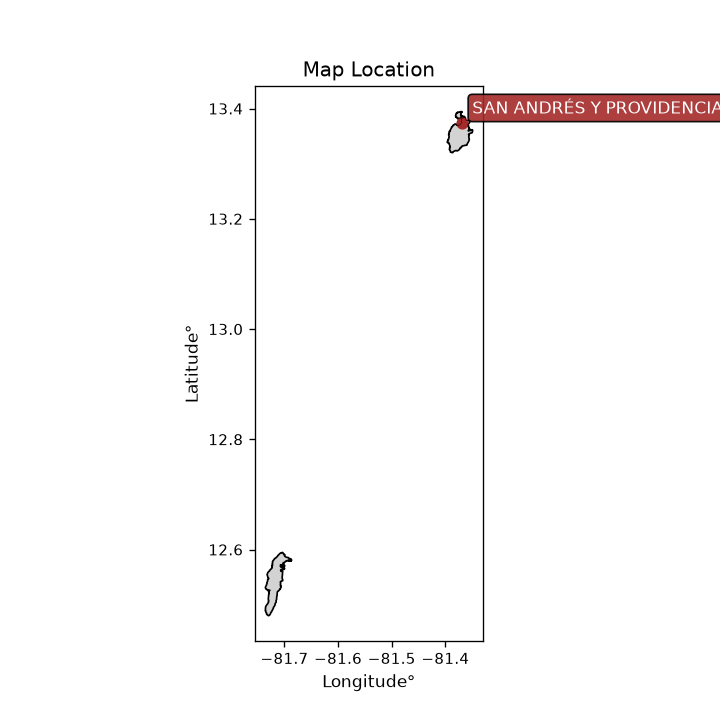</img>

| CountyID                                                                                          | CountyName                   | CountyFiles                                                                                                                                                                                                                                                                                                                                                                                                                                                                                                                                                                                                                                                                                                                                                                                                                                                                                                                                                                                                                                                                                                                                                                                                                                                                                                                                                                                                                                                                                                                                                                                                                                                                                                                                                                             |
|:--------------------------------------------------------------------------------------------------|:-----------------------------|:----------------------------------------------------------------------------------------------------------------------------------------------------------------------------------------------------------------------------------------------------------------------------------------------------------------------------------------------------------------------------------------------------------------------------------------------------------------------------------------------------------------------------------------------------------------------------------------------------------------------------------------------------------------------------------------------------------------------------------------------------------------------------------------------------------------------------------------------------------------------------------------------------------------------------------------------------------------------------------------------------------------------------------------------------------------------------------------------------------------------------------------------------------------------------------------------------------------------------------------------------------------------------------------------------------------------------------------------------------------------------------------------------------------------------------------------------------------------------------------------------------------------------------------------------------------------------------------------------------------------------------------------------------------------------------------------------------------------------------------------------------------------------------------|
| [88564](https://github.com/rcfdtools/R.HydroTools/blob/main/tool/Population/file/report/88564.md) | Providencia y Santa Catalina | [88564_Rural_Building_202606.zip](https://github.com/rcfdtools/R.GISMobile/blob/main/file/shp/88564_Rural_Building_202606.zip) [88564_Rural_Lot_202606.zip](https://github.com/rcfdtools/R.GISMobile/blob/main/file/shp/88564_Rural_Lot_202606.zip) [88564_Rural_Nomenclature_202606.zip](https://github.com/rcfdtools/R.GISMobile/blob/main/file/shp/88564_Rural_Nomenclature_202606.zip) [88564_Rural_Sector_202606.zip](https://github.com/rcfdtools/R.GISMobile/blob/main/file/shp/88564_Rural_Sector_202606.zip) [88564_Rural_Vereda_202606.zip](https://github.com/rcfdtools/R.GISMobile/blob/main/file/shp/88564_Rural_Vereda_202606.zip)                                                                                                                                                                                                                                                                                                                                                                                                                                                                                                                                                                                                                                                                                                                                                                                                                                                                                                                                                                                                                                                                                                                    |
| [88001](https://github.com/rcfdtools/R.HydroTools/blob/main/tool/Population/file/report/88001.md) | San Andrés                   | [88001_Rural_Building_202606.zip](https://github.com/rcfdtools/R.GISMobile/blob/main/file/shp/88001_Rural_Building_202606.zip) [88001_Rural_Lot_202606.zip](https://github.com/rcfdtools/R.GISMobile/blob/main/file/shp/88001_Rural_Lot_202606.zip) [88001_Rural_Nomenclature_202606.zip](https://github.com/rcfdtools/R.GISMobile/blob/main/file/shp/88001_Rural_Nomenclature_202606.zip) [88001_Rural_Nomenclature_Road_202606.zip](https://github.com/rcfdtools/R.GISMobile/blob/main/file/shp/88001_Rural_Nomenclature_Road_202606.zip) [88001_Rural_Sector_202606.zip](https://github.com/rcfdtools/R.GISMobile/blob/main/file/shp/88001_Rural_Sector_202606.zip) [88001_Rural_Vereda_202606.zip](https://github.com/rcfdtools/R.GISMobile/blob/main/file/shp/88001_Rural_Vereda_202606.zip) [88001_Urban_Block_202606.zip](https://github.com/rcfdtools/R.GISMobile/blob/main/file/shp/88001_Urban_Block_202606.zip) [88001_Urban_Building_202606.zip](https://github.com/rcfdtools/R.GISMobile/blob/main/file/shp/88001_Urban_Building_202606.zip) [88001_Urban_Lot_202606.zip](https://github.com/rcfdtools/R.GISMobile/blob/main/file/shp/88001_Urban_Lot_202606.zip) [88001_Urban_Nomenclature_202606.zip](https://github.com/rcfdtools/R.GISMobile/blob/main/file/shp/88001_Urban_Nomenclature_202606.zip) [88001_Urban_Nomenclature_Road_202606.zip](https://github.com/rcfdtools/R.GISMobile/blob/main/file/shp/88001_Urban_Nomenclature_Road_202606.zip) [88001_Urban_Perimeter_202606.zip](https://github.com/rcfdtools/R.GISMobile/blob/main/file/shp/88001_Urban_Perimeter_202606.zip) [88001_Urban_Sector_202606.zip](https://github.com/rcfdtools/R.GISMobile/blob/main/file/shp/88001_Urban_Sector_202606.zip)  |

# 91 - Amazonas (11 Counties)

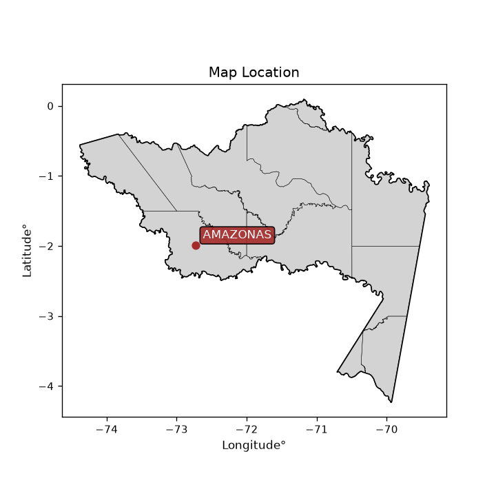</img>

| CountyID                                                                                          | CountyName     | CountyFiles                                                                                                                                                                                                                                                                                                                                                                                                                                                                                                                        |
|:--------------------------------------------------------------------------------------------------|:---------------|:-----------------------------------------------------------------------------------------------------------------------------------------------------------------------------------------------------------------------------------------------------------------------------------------------------------------------------------------------------------------------------------------------------------------------------------------------------------------------------------------------------------------------------------|
| [91263](https://github.com/rcfdtools/R.HydroTools/blob/main/tool/Population/file/report/91263.md) | El Encanto     | [91263_Rural_Lot_202606.zip](https://github.com/rcfdtools/R.GISMobile/blob/main/file/shp/91263_Rural_Lot_202606.zip)                                                                                                                                                                                                                                                                                                                                                                                                           |
| [91405](https://github.com/rcfdtools/R.HydroTools/blob/main/tool/Population/file/report/91405.md) | La Chorrera    | [91405_Rural_Lot_202606.zip](https://github.com/rcfdtools/R.GISMobile/blob/main/file/shp/91405_Rural_Lot_202606.zip)                                                                                                                                                                                                                                                                                                                                                                                                           |
| [91407](https://github.com/rcfdtools/R.HydroTools/blob/main/tool/Population/file/report/91407.md) | La Pedrera     | [91407_Rural_Lot_202606.zip](https://github.com/rcfdtools/R.GISMobile/blob/main/file/shp/91407_Rural_Lot_202606.zip)                                                                                                                                                                                                                                                                                                                                                                                                           |
| [91430](https://github.com/rcfdtools/R.HydroTools/blob/main/tool/Population/file/report/91430.md) | La Victoria    | [91430_Rural_Lot_202606.zip](https://github.com/rcfdtools/R.GISMobile/blob/main/file/shp/91430_Rural_Lot_202606.zip)                                                                                                                                                                                                                                                                                                                                                                                                           |
| [91001](https://github.com/rcfdtools/R.HydroTools/blob/main/tool/Population/file/report/91001.md) | Leticia        | [91001_Rural_Lot_202606.zip](https://github.com/rcfdtools/R.GISMobile/blob/main/file/shp/91001_Rural_Lot_202606.zip) [91001_Rural_Nomenclature_202606.zip](https://github.com/rcfdtools/R.GISMobile/blob/main/file/shp/91001_Rural_Nomenclature_202606.zip) [91001_Rural_Sector_202606.zip](https://github.com/rcfdtools/R.GISMobile/blob/main/file/shp/91001_Rural_Sector_202606.zip) [91001_Rural_Vereda_202606.zip](https://github.com/rcfdtools/R.GISMobile/blob/main/file/shp/91001_Rural_Vereda_202606.zip)  |
| [91460](https://github.com/rcfdtools/R.HydroTools/blob/main/tool/Population/file/report/91460.md) | Mirití-Paraná  | [91460_Rural_Lot_202606.zip](https://github.com/rcfdtools/R.GISMobile/blob/main/file/shp/91460_Rural_Lot_202606.zip)                                                                                                                                                                                                                                                                                                                                                                                                           |
| [91530](https://github.com/rcfdtools/R.HydroTools/blob/main/tool/Population/file/report/91530.md) | Puerto Alegría | [91530_Rural_Lot_202606.zip](https://github.com/rcfdtools/R.GISMobile/blob/main/file/shp/91530_Rural_Lot_202606.zip)                                                                                                                                                                                                                                                                                                                                                                                                           |
| [91536](https://github.com/rcfdtools/R.HydroTools/blob/main/tool/Population/file/report/91536.md) | Puerto Arica   | [91536_Rural_Lot_202606.zip](https://github.com/rcfdtools/R.GISMobile/blob/main/file/shp/91536_Rural_Lot_202606.zip) [91536_Rural_Sector_202606.zip](https://github.com/rcfdtools/R.GISMobile/blob/main/file/shp/91536_Rural_Sector_202606.zip) [91536_Rural_Vereda_202606.zip](https://github.com/rcfdtools/R.GISMobile/blob/main/file/shp/91536_Rural_Vereda_202606.zip)                                                                                                                                             |
| [91540](https://github.com/rcfdtools/R.HydroTools/blob/main/tool/Population/file/report/91540.md) | Puerto Nariño  | [91540_Rural_Lot_202606.zip](https://github.com/rcfdtools/R.GISMobile/blob/main/file/shp/91540_Rural_Lot_202606.zip) [91540_Rural_Sector_202606.zip](https://github.com/rcfdtools/R.GISMobile/blob/main/file/shp/91540_Rural_Sector_202606.zip) [91540_Rural_Vereda_202606.zip](https://github.com/rcfdtools/R.GISMobile/blob/main/file/shp/91540_Rural_Vereda_202606.zip)                                                                                                                                             |
| [91669](https://github.com/rcfdtools/R.HydroTools/blob/main/tool/Population/file/report/91669.md) | Santander      | [91669_Rural_Lot_202606.zip](https://github.com/rcfdtools/R.GISMobile/blob/main/file/shp/91669_Rural_Lot_202606.zip)                                                                                                                                                                                                                                                                                                                                                                                                           |
| [91798](https://github.com/rcfdtools/R.HydroTools/blob/main/tool/Population/file/report/91798.md) | Tarapacá       | [91798_Rural_Lot_202606.zip](https://github.com/rcfdtools/R.GISMobile/blob/main/file/shp/91798_Rural_Lot_202606.zip) [91798_Rural_Sector_202606.zip](https://github.com/rcfdtools/R.GISMobile/blob/main/file/shp/91798_Rural_Sector_202606.zip) [91798_Rural_Vereda_202606.zip](https://github.com/rcfdtools/R.GISMobile/blob/main/file/shp/91798_Rural_Vereda_202606.zip)                                                                                                                                             |

# 94 - Guainía (8 Counties)

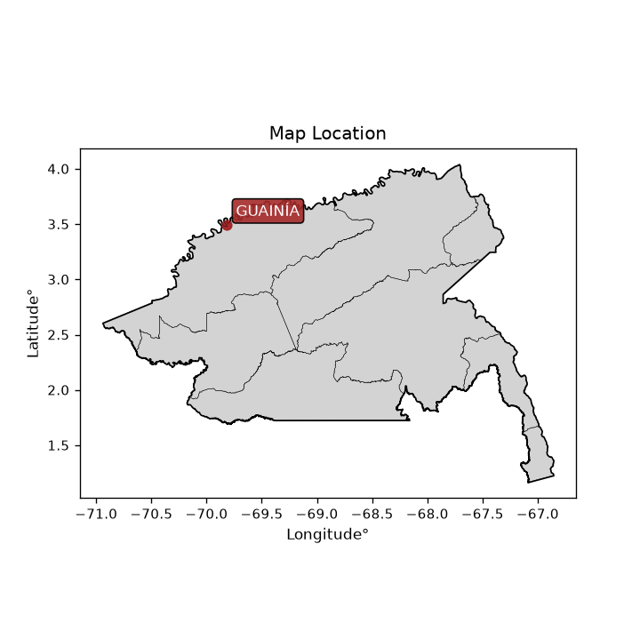</img>

| CountyID                                                                                          | CountyName      | CountyFiles                                                                                                                                                                                                                                                                                                                                                                                                                                                                                                                                                                                                                                                                                                                                                                                                                                                                                                                                                   |
|:--------------------------------------------------------------------------------------------------|:----------------|:--------------------------------------------------------------------------------------------------------------------------------------------------------------------------------------------------------------------------------------------------------------------------------------------------------------------------------------------------------------------------------------------------------------------------------------------------------------------------------------------------------------------------------------------------------------------------------------------------------------------------------------------------------------------------------------------------------------------------------------------------------------------------------------------------------------------------------------------------------------------------------------------------------------------------------------------------------------|
| [94343](https://github.com/rcfdtools/R.HydroTools/blob/main/tool/Population/file/report/94343.md) | Barrancominas   | [94343_Urban_Block_202606.zip](https://github.com/rcfdtools/R.GISMobile/blob/main/file/shp/94343_Urban_Block_202606.zip) [94343_Urban_Building_202606.zip](https://github.com/rcfdtools/R.GISMobile/blob/main/file/shp/94343_Urban_Building_202606.zip) [94343_Urban_Lot_202606.zip](https://github.com/rcfdtools/R.GISMobile/blob/main/file/shp/94343_Urban_Lot_202606.zip) [94343_Urban_Nomenclature_202606.zip](https://github.com/rcfdtools/R.GISMobile/blob/main/file/shp/94343_Urban_Nomenclature_202606.zip) [94343_Urban_Nomenclature_Road_202606.zip](https://github.com/rcfdtools/R.GISMobile/blob/main/file/shp/94343_Urban_Nomenclature_Road_202606.zip) [94343_Urban_Perimeter_202606.zip](https://github.com/rcfdtools/R.GISMobile/blob/main/file/shp/94343_Urban_Perimeter_202606.zip)                                                                                                                                 |
| [94886](https://github.com/rcfdtools/R.HydroTools/blob/main/tool/Population/file/report/94886.md) | Cacahual        | Not found                                                                                                                                                                                                                                                                                                                                                                                                                                                                                                                                                                                                                                                                                                                                                                                                                                                                                                                                                     |
| [94001](https://github.com/rcfdtools/R.HydroTools/blob/main/tool/Population/file/report/94001.md) | Inírida         | [94001_Urban_Block_202606.zip](https://github.com/rcfdtools/R.GISMobile/blob/main/file/shp/94001_Urban_Block_202606.zip) [94001_Urban_Building_202606.zip](https://github.com/rcfdtools/R.GISMobile/blob/main/file/shp/94001_Urban_Building_202606.zip) [94001_Urban_Lot_202606.zip](https://github.com/rcfdtools/R.GISMobile/blob/main/file/shp/94001_Urban_Lot_202606.zip) [94001_Urban_Nomenclature_202606.zip](https://github.com/rcfdtools/R.GISMobile/blob/main/file/shp/94001_Urban_Nomenclature_202606.zip) [94001_Urban_Nomenclature_Road_202606.zip](https://github.com/rcfdtools/R.GISMobile/blob/main/file/shp/94001_Urban_Nomenclature_Road_202606.zip) [94001_Urban_Perimeter_202606.zip](https://github.com/rcfdtools/R.GISMobile/blob/main/file/shp/94001_Urban_Perimeter_202606.zip) [94001_Urban_Sector_202606.zip](https://github.com/rcfdtools/R.GISMobile/blob/main/file/shp/94001_Urban_Sector_202606.zip)  |
| [94885](https://github.com/rcfdtools/R.HydroTools/blob/main/tool/Population/file/report/94885.md) | La Guadalupe    | Not found                                                                                                                                                                                                                                                                                                                                                                                                                                                                                                                                                                                                                                                                                                                                                                                                                                                                                                                                                     |
| [94888](https://github.com/rcfdtools/R.HydroTools/blob/main/tool/Population/file/report/94888.md) | Morichal        | Not found                                                                                                                                                                                                                                                                                                                                                                                                                                                                                                                                                                                                                                                                                                                                                                                                                                                                                                                                                     |
| [94887](https://github.com/rcfdtools/R.HydroTools/blob/main/tool/Population/file/report/94887.md) | Paná-Paná       | Not found                                                                                                                                                                                                                                                                                                                                                                                                                                                                                                                                                                                                                                                                                                                                                                                                                                                                                                                                                     |
| [94884](https://github.com/rcfdtools/R.HydroTools/blob/main/tool/Population/file/report/94884.md) | Puerto Colombia | Not found                                                                                                                                                                                                                                                                                                                                                                                                                                                                                                                                                                                                                                                                                                                                                                                                                                                                                                                                                     |
| [94883](https://github.com/rcfdtools/R.HydroTools/blob/main/tool/Population/file/report/94883.md) | San Felipe      | Not found                                                                                                                                                                                                                                                                                                                                                                                                                                                                                                                                                                                                                                                                                                                                                                                                                                                                                                                                                     |

# 95 - Guaviare (4 Counties)

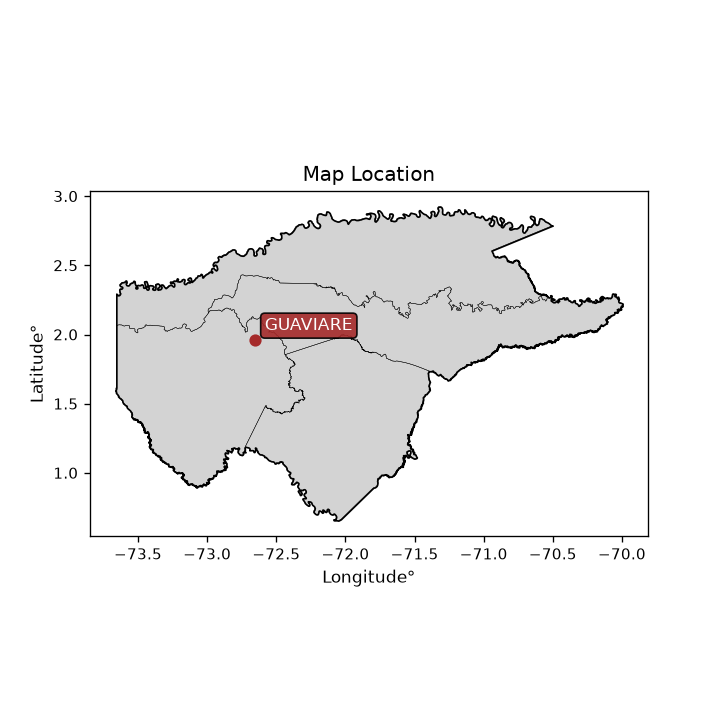</img>

| CountyID                                                                                          | CountyName            | CountyFiles                                                                                                                                                                                                                                                                                                                                                                                                                                                                                                                                                                                                                                                                                                                                                                                                                                                                                                                                                                                                                                                                                                                                                                                                                                                                                                                                                                                                                                                                                                                                                                                                                        |
|:--------------------------------------------------------------------------------------------------|:----------------------|:-----------------------------------------------------------------------------------------------------------------------------------------------------------------------------------------------------------------------------------------------------------------------------------------------------------------------------------------------------------------------------------------------------------------------------------------------------------------------------------------------------------------------------------------------------------------------------------------------------------------------------------------------------------------------------------------------------------------------------------------------------------------------------------------------------------------------------------------------------------------------------------------------------------------------------------------------------------------------------------------------------------------------------------------------------------------------------------------------------------------------------------------------------------------------------------------------------------------------------------------------------------------------------------------------------------------------------------------------------------------------------------------------------------------------------------------------------------------------------------------------------------------------------------------------------------------------------------------------------------------------------------|
| [95015](https://github.com/rcfdtools/R.HydroTools/blob/main/tool/Population/file/report/95015.md) | Calamar               | [95015_Rural_Lot_202606.zip](https://github.com/rcfdtools/R.GISMobile/blob/main/file/shp/95015_Rural_Lot_202606.zip) [95015_Rural_Sector_202606.zip](https://github.com/rcfdtools/R.GISMobile/blob/main/file/shp/95015_Rural_Sector_202606.zip) [95015_Rural_Vereda_202606.zip](https://github.com/rcfdtools/R.GISMobile/blob/main/file/shp/95015_Rural_Vereda_202606.zip) [95015_Urban_Block_202606.zip](https://github.com/rcfdtools/R.GISMobile/blob/main/file/shp/95015_Urban_Block_202606.zip) [95015_Urban_Building_202606.zip](https://github.com/rcfdtools/R.GISMobile/blob/main/file/shp/95015_Urban_Building_202606.zip) [95015_Urban_Lot_202606.zip](https://github.com/rcfdtools/R.GISMobile/blob/main/file/shp/95015_Urban_Lot_202606.zip) [95015_Urban_Neighborhood_202606.zip](https://github.com/rcfdtools/R.GISMobile/blob/main/file/shp/95015_Urban_Neighborhood_202606.zip) [95015_Urban_Nomenclature_202606.zip](https://github.com/rcfdtools/R.GISMobile/blob/main/file/shp/95015_Urban_Nomenclature_202606.zip) [95015_Urban_Nomenclature_Road_202606.zip](https://github.com/rcfdtools/R.GISMobile/blob/main/file/shp/95015_Urban_Nomenclature_Road_202606.zip) [95015_Urban_Perimeter_202606.zip](https://github.com/rcfdtools/R.GISMobile/blob/main/file/shp/95015_Urban_Perimeter_202606.zip) [95015_Urban_Sector_202606.zip](https://github.com/rcfdtools/R.GISMobile/blob/main/file/shp/95015_Urban_Sector_202606.zip)                                                                                                                                     |
| [95025](https://github.com/rcfdtools/R.HydroTools/blob/main/tool/Population/file/report/95025.md) | El Retorno            | [95025_Urban_Block_202606.zip](https://github.com/rcfdtools/R.GISMobile/blob/main/file/shp/95025_Urban_Block_202606.zip) [95025_Urban_Building_202606.zip](https://github.com/rcfdtools/R.GISMobile/blob/main/file/shp/95025_Urban_Building_202606.zip) [95025_Urban_Lot_202606.zip](https://github.com/rcfdtools/R.GISMobile/blob/main/file/shp/95025_Urban_Lot_202606.zip) [95025_Urban_Neighborhood_202606.zip](https://github.com/rcfdtools/R.GISMobile/blob/main/file/shp/95025_Urban_Neighborhood_202606.zip) [95025_Urban_Nomenclature_202606.zip](https://github.com/rcfdtools/R.GISMobile/blob/main/file/shp/95025_Urban_Nomenclature_202606.zip) [95025_Urban_Nomenclature_Road_202606.zip](https://github.com/rcfdtools/R.GISMobile/blob/main/file/shp/95025_Urban_Nomenclature_Road_202606.zip) [95025_Urban_Perimeter_202606.zip](https://github.com/rcfdtools/R.GISMobile/blob/main/file/shp/95025_Urban_Perimeter_202606.zip) [95025_Urban_Sector_202606.zip](https://github.com/rcfdtools/R.GISMobile/blob/main/file/shp/95025_Urban_Sector_202606.zip)                                                                                                                                                                                                                                                                                                                                                                                                                                                                                                                            |
| [95200](https://github.com/rcfdtools/R.HydroTools/blob/main/tool/Population/file/report/95200.md) | Miraflores            | [95200_Rural_Lot_202606.zip](https://github.com/rcfdtools/R.GISMobile/blob/main/file/shp/95200_Rural_Lot_202606.zip) [95200_Rural_Sector_202606.zip](https://github.com/rcfdtools/R.GISMobile/blob/main/file/shp/95200_Rural_Sector_202606.zip) [95200_Rural_Vereda_202606.zip](https://github.com/rcfdtools/R.GISMobile/blob/main/file/shp/95200_Rural_Vereda_202606.zip) [95200_Urban_Block_202606.zip](https://github.com/rcfdtools/R.GISMobile/blob/main/file/shp/95200_Urban_Block_202606.zip) [95200_Urban_Building_202606.zip](https://github.com/rcfdtools/R.GISMobile/blob/main/file/shp/95200_Urban_Building_202606.zip) [95200_Urban_Lot_202606.zip](https://github.com/rcfdtools/R.GISMobile/blob/main/file/shp/95200_Urban_Lot_202606.zip) [95200_Urban_Nomenclature_202606.zip](https://github.com/rcfdtools/R.GISMobile/blob/main/file/shp/95200_Urban_Nomenclature_202606.zip) [95200_Urban_Nomenclature_Road_202606.zip](https://github.com/rcfdtools/R.GISMobile/blob/main/file/shp/95200_Urban_Nomenclature_Road_202606.zip) [95200_Urban_Sector_202606.zip](https://github.com/rcfdtools/R.GISMobile/blob/main/file/shp/95200_Urban_Sector_202606.zip)                                                                                                                                                                                                                                                                                                                                                                                                                     |
| [95001](https://github.com/rcfdtools/R.HydroTools/blob/main/tool/Population/file/report/95001.md) | San José Del Guaviare | [95001_Rural_Building_202606.zip](https://github.com/rcfdtools/R.GISMobile/blob/main/file/shp/95001_Rural_Building_202606.zip) [95001_Rural_Lot_202606.zip](https://github.com/rcfdtools/R.GISMobile/blob/main/file/shp/95001_Rural_Lot_202606.zip) [95001_Rural_Nomenclature_202606.zip](https://github.com/rcfdtools/R.GISMobile/blob/main/file/shp/95001_Rural_Nomenclature_202606.zip) [95001_Rural_Sector_202606.zip](https://github.com/rcfdtools/R.GISMobile/blob/main/file/shp/95001_Rural_Sector_202606.zip) [95001_Rural_Vereda_202606.zip](https://github.com/rcfdtools/R.GISMobile/blob/main/file/shp/95001_Rural_Vereda_202606.zip) [95001_Urban_Block_202606.zip](https://github.com/rcfdtools/R.GISMobile/blob/main/file/shp/95001_Urban_Block_202606.zip) [95001_Urban_Building_202606.zip](https://github.com/rcfdtools/R.GISMobile/blob/main/file/shp/95001_Urban_Building_202606.zip) [95001_Urban_Lot_202606.zip](https://github.com/rcfdtools/R.GISMobile/blob/main/file/shp/95001_Urban_Lot_202606.zip) [95001_Urban_Nomenclature_202606.zip](https://github.com/rcfdtools/R.GISMobile/blob/main/file/shp/95001_Urban_Nomenclature_202606.zip) [95001_Urban_Nomenclature_Road_202606.zip](https://github.com/rcfdtools/R.GISMobile/blob/main/file/shp/95001_Urban_Nomenclature_Road_202606.zip) [95001_Urban_Perimeter_202606.zip](https://github.com/rcfdtools/R.GISMobile/blob/main/file/shp/95001_Urban_Perimeter_202606.zip) [95001_Urban_Sector_202606.zip](https://github.com/rcfdtools/R.GISMobile/blob/main/file/shp/95001_Urban_Sector_202606.zip)  |

# 97 - Vaupés (6 Counties)

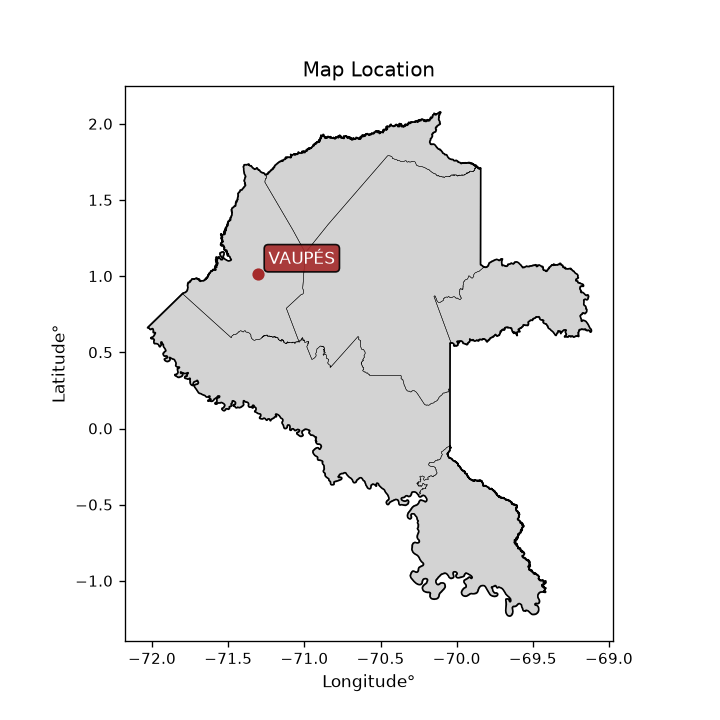</img>

| CountyID                                                                                          | CountyName   | CountyFiles                                                                                                                                                                                                                                                                                                                                                                                                                                                                                                                                                                                                                                                                                                                                                                                                                                                                                                                                                                                                                                                                                              |
|:--------------------------------------------------------------------------------------------------|:-------------|:---------------------------------------------------------------------------------------------------------------------------------------------------------------------------------------------------------------------------------------------------------------------------------------------------------------------------------------------------------------------------------------------------------------------------------------------------------------------------------------------------------------------------------------------------------------------------------------------------------------------------------------------------------------------------------------------------------------------------------------------------------------------------------------------------------------------------------------------------------------------------------------------------------------------------------------------------------------------------------------------------------------------------------------------------------------------------------------------------------|
| [97161](https://github.com/rcfdtools/R.HydroTools/blob/main/tool/Population/file/report/97161.md) | Carurú       | [97161_Urban_Block_202606.zip](https://github.com/rcfdtools/R.GISMobile/blob/main/file/shp/97161_Urban_Block_202606.zip) [97161_Urban_Building_202606.zip](https://github.com/rcfdtools/R.GISMobile/blob/main/file/shp/97161_Urban_Building_202606.zip) [97161_Urban_Lot_202606.zip](https://github.com/rcfdtools/R.GISMobile/blob/main/file/shp/97161_Urban_Lot_202606.zip) [97161_Urban_Neighborhood_202606.zip](https://github.com/rcfdtools/R.GISMobile/blob/main/file/shp/97161_Urban_Neighborhood_202606.zip) [97161_Urban_Nomenclature_202606.zip](https://github.com/rcfdtools/R.GISMobile/blob/main/file/shp/97161_Urban_Nomenclature_202606.zip) [97161_Urban_Nomenclature_Road_202606.zip](https://github.com/rcfdtools/R.GISMobile/blob/main/file/shp/97161_Urban_Nomenclature_Road_202606.zip) [97161_Urban_Perimeter_202606.zip](https://github.com/rcfdtools/R.GISMobile/blob/main/file/shp/97161_Urban_Perimeter_202606.zip) [97161_Urban_Sector_202606.zip](https://github.com/rcfdtools/R.GISMobile/blob/main/file/shp/97161_Urban_Sector_202606.zip)  |
| [97001](https://github.com/rcfdtools/R.HydroTools/blob/main/tool/Population/file/report/97001.md) | Mitú         | [97001_Rural_Lot_202606.zip](https://github.com/rcfdtools/R.GISMobile/blob/main/file/shp/97001_Rural_Lot_202606.zip) [97001_Rural_Sector_202606.zip](https://github.com/rcfdtools/R.GISMobile/blob/main/file/shp/97001_Rural_Sector_202606.zip) [97001_Rural_Vereda_202606.zip](https://github.com/rcfdtools/R.GISMobile/blob/main/file/shp/97001_Rural_Vereda_202606.zip) [97001_Urban_Lot_202606.zip](https://github.com/rcfdtools/R.GISMobile/blob/main/file/shp/97001_Urban_Lot_202606.zip)                                                                                                                                                                                                                                                                                                                                                                                                                                                                                                                                                                                          |
| [97511](https://github.com/rcfdtools/R.HydroTools/blob/main/tool/Population/file/report/97511.md) | Pacoa        | Not found                                                                                                                                                                                                                                                                                                                                                                                                                                                                                                                                                                                                                                                                                                                                                                                                                                                                                                                                                                                                                                                                                                |
| [97777](https://github.com/rcfdtools/R.HydroTools/blob/main/tool/Population/file/report/97777.md) | Papunaua     | Not found                                                                                                                                                                                                                                                                                                                                                                                                                                                                                                                                                                                                                                                                                                                                                                                                                                                                                                                                                                                                                                                                                                |
| [97666](https://github.com/rcfdtools/R.HydroTools/blob/main/tool/Population/file/report/97666.md) | Taraira      | [97666_Rural_Lot_202606.zip](https://github.com/rcfdtools/R.GISMobile/blob/main/file/shp/97666_Rural_Lot_202606.zip) [97666_Rural_Sector_202606.zip](https://github.com/rcfdtools/R.GISMobile/blob/main/file/shp/97666_Rural_Sector_202606.zip) [97666_Rural_Vereda_202606.zip](https://github.com/rcfdtools/R.GISMobile/blob/main/file/shp/97666_Rural_Vereda_202606.zip)                                                                                                                                                                                                                                                                                                                                                                                                                                                                                                                                                                                                                                                                                                                   |
| [97889](https://github.com/rcfdtools/R.HydroTools/blob/main/tool/Population/file/report/97889.md) | Yavaraté     | Not found                                                                                                                                                                                                                                                                                                                                                                                                                                                                                                                                                                                                                                                                                                                                                                                                                                                                                                                                                                                                                                                                                                |

# 99 - Vichada (4 Counties)

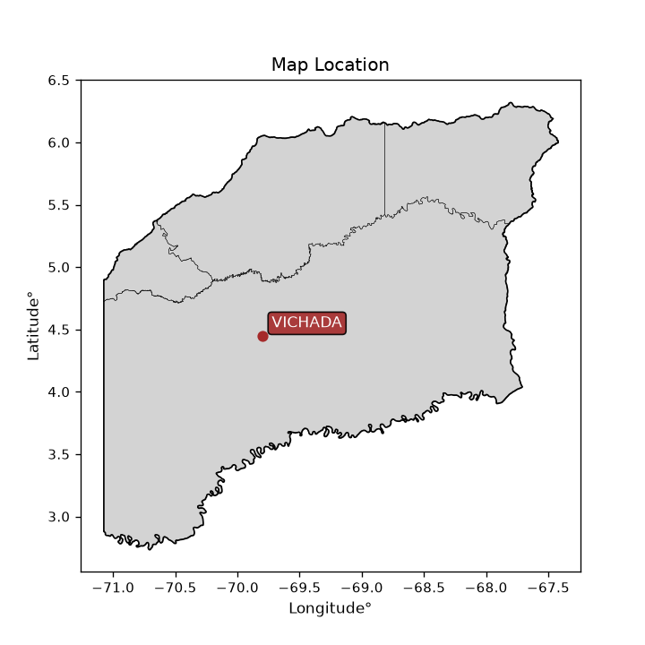</img>

| CountyID                                                                                          | CountyName     | CountyFiles                                                                                                                                                                                                                                                                                                                                                                                                                                                                                                                                                                                                                                                                                                                                                                                                                                                                                                                                                                                                                                                                                                                                                                                                                                                                                                                                                                                                                                                                                                                                                                                                                        |
|:--------------------------------------------------------------------------------------------------|:---------------|:-----------------------------------------------------------------------------------------------------------------------------------------------------------------------------------------------------------------------------------------------------------------------------------------------------------------------------------------------------------------------------------------------------------------------------------------------------------------------------------------------------------------------------------------------------------------------------------------------------------------------------------------------------------------------------------------------------------------------------------------------------------------------------------------------------------------------------------------------------------------------------------------------------------------------------------------------------------------------------------------------------------------------------------------------------------------------------------------------------------------------------------------------------------------------------------------------------------------------------------------------------------------------------------------------------------------------------------------------------------------------------------------------------------------------------------------------------------------------------------------------------------------------------------------------------------------------------------------------------------------------------------|
| [99773](https://github.com/rcfdtools/R.HydroTools/blob/main/tool/Population/file/report/99773.md) | Cumaribo       | [99773_Rural_Building_202606.zip](https://github.com/rcfdtools/R.GISMobile/blob/main/file/shp/99773_Rural_Building_202606.zip) [99773_Rural_Lot_202606.zip](https://github.com/rcfdtools/R.GISMobile/blob/main/file/shp/99773_Rural_Lot_202606.zip) [99773_Rural_Sector_202606.zip](https://github.com/rcfdtools/R.GISMobile/blob/main/file/shp/99773_Rural_Sector_202606.zip) [99773_Rural_Vereda_202606.zip](https://github.com/rcfdtools/R.GISMobile/blob/main/file/shp/99773_Rural_Vereda_202606.zip) [99773_Urban_Block_202606.zip](https://github.com/rcfdtools/R.GISMobile/blob/main/file/shp/99773_Urban_Block_202606.zip) [99773_Urban_Building_202606.zip](https://github.com/rcfdtools/R.GISMobile/blob/main/file/shp/99773_Urban_Building_202606.zip) [99773_Urban_Lot_202606.zip](https://github.com/rcfdtools/R.GISMobile/blob/main/file/shp/99773_Urban_Lot_202606.zip) [99773_Urban_Nomenclature_202606.zip](https://github.com/rcfdtools/R.GISMobile/blob/main/file/shp/99773_Urban_Nomenclature_202606.zip) [99773_Urban_Nomenclature_Road_202606.zip](https://github.com/rcfdtools/R.GISMobile/blob/main/file/shp/99773_Urban_Nomenclature_Road_202606.zip) [99773_Urban_Perimeter_202606.zip](https://github.com/rcfdtools/R.GISMobile/blob/main/file/shp/99773_Urban_Perimeter_202606.zip) [99773_Urban_Sector_202606.zip](https://github.com/rcfdtools/R.GISMobile/blob/main/file/shp/99773_Urban_Sector_202606.zip)                                                                                                                                             |
| [99524](https://github.com/rcfdtools/R.HydroTools/blob/main/tool/Population/file/report/99524.md) | La Primavera   | [99524_Rural_Building_202606.zip](https://github.com/rcfdtools/R.GISMobile/blob/main/file/shp/99524_Rural_Building_202606.zip) [99524_Rural_Lot_202606.zip](https://github.com/rcfdtools/R.GISMobile/blob/main/file/shp/99524_Rural_Lot_202606.zip) [99524_Rural_Nomenclature_202606.zip](https://github.com/rcfdtools/R.GISMobile/blob/main/file/shp/99524_Rural_Nomenclature_202606.zip) [99524_Rural_Sector_202606.zip](https://github.com/rcfdtools/R.GISMobile/blob/main/file/shp/99524_Rural_Sector_202606.zip) [99524_Rural_Vereda_202606.zip](https://github.com/rcfdtools/R.GISMobile/blob/main/file/shp/99524_Rural_Vereda_202606.zip) [99524_Urban_Block_202606.zip](https://github.com/rcfdtools/R.GISMobile/blob/main/file/shp/99524_Urban_Block_202606.zip) [99524_Urban_Building_202606.zip](https://github.com/rcfdtools/R.GISMobile/blob/main/file/shp/99524_Urban_Building_202606.zip) [99524_Urban_Lot_202606.zip](https://github.com/rcfdtools/R.GISMobile/blob/main/file/shp/99524_Urban_Lot_202606.zip) [99524_Urban_Nomenclature_202606.zip](https://github.com/rcfdtools/R.GISMobile/blob/main/file/shp/99524_Urban_Nomenclature_202606.zip) [99524_Urban_Nomenclature_Road_202606.zip](https://github.com/rcfdtools/R.GISMobile/blob/main/file/shp/99524_Urban_Nomenclature_Road_202606.zip) [99524_Urban_Perimeter_202606.zip](https://github.com/rcfdtools/R.GISMobile/blob/main/file/shp/99524_Urban_Perimeter_202606.zip) [99524_Urban_Sector_202606.zip](https://github.com/rcfdtools/R.GISMobile/blob/main/file/shp/99524_Urban_Sector_202606.zip)  |
| [99001](https://github.com/rcfdtools/R.HydroTools/blob/main/tool/Population/file/report/99001.md) | Puerto Carreño | [99001_Rural_Building_202606.zip](https://github.com/rcfdtools/R.GISMobile/blob/main/file/shp/99001_Rural_Building_202606.zip) [99001_Rural_Lot_202606.zip](https://github.com/rcfdtools/R.GISMobile/blob/main/file/shp/99001_Rural_Lot_202606.zip) [99001_Rural_Nomenclature_202606.zip](https://github.com/rcfdtools/R.GISMobile/blob/main/file/shp/99001_Rural_Nomenclature_202606.zip) [99001_Rural_Nomenclature_Road_202606.zip](https://github.com/rcfdtools/R.GISMobile/blob/main/file/shp/99001_Rural_Nomenclature_Road_202606.zip) [99001_Rural_Sector_202606.zip](https://github.com/rcfdtools/R.GISMobile/blob/main/file/shp/99001_Rural_Sector_202606.zip) [99001_Rural_Vereda_202606.zip](https://github.com/rcfdtools/R.GISMobile/blob/main/file/shp/99001_Rural_Vereda_202606.zip)                                                                                                                                                                                                                                                                                                                                                                                                                                                                                                                                                                                                                                                                                                                                                                                                          |
| [99624](https://github.com/rcfdtools/R.HydroTools/blob/main/tool/Population/file/report/99624.md) | Santa Rosalía  | [99624_Rural_Building_202606.zip](https://github.com/rcfdtools/R.GISMobile/blob/main/file/shp/99624_Rural_Building_202606.zip) [99624_Rural_Lot_202606.zip](https://github.com/rcfdtools/R.GISMobile/blob/main/file/shp/99624_Rural_Lot_202606.zip) [99624_Rural_Nomenclature_202606.zip](https://github.com/rcfdtools/R.GISMobile/blob/main/file/shp/99624_Rural_Nomenclature_202606.zip) [99624_Rural_Sector_202606.zip](https://github.com/rcfdtools/R.GISMobile/blob/main/file/shp/99624_Rural_Sector_202606.zip) [99624_Rural_Vereda_202606.zip](https://github.com/rcfdtools/R.GISMobile/blob/main/file/shp/99624_Rural_Vereda_202606.zip) [99624_Urban_Block_202606.zip](https://github.com/rcfdtools/R.GISMobile/blob/main/file/shp/99624_Urban_Block_202606.zip) [99624_Urban_Building_202606.zip](https://github.com/rcfdtools/R.GISMobile/blob/main/file/shp/99624_Urban_Building_202606.zip) [99624_Urban_Lot_202606.zip](https://github.com/rcfdtools/R.GISMobile/blob/main/file/shp/99624_Urban_Lot_202606.zip) [99624_Urban_Nomenclature_202606.zip](https://github.com/rcfdtools/R.GISMobile/blob/main/file/shp/99624_Urban_Nomenclature_202606.zip) [99624_Urban_Nomenclature_Road_202606.zip](https://github.com/rcfdtools/R.GISMobile/blob/main/file/shp/99624_Urban_Nomenclature_Road_202606.zip) [99624_Urban_Perimeter_202606.zip](https://github.com/rcfdtools/R.GISMobile/blob/main/file/shp/99624_Urban_Perimeter_202606.zip) [99624_Urban_Sector_202606.zip](https://github.com/rcfdtools/R.GISMobile/blob/main/file/shp/99624_Urban_Sector_202606.zip)  |

#

 Share this research
 

**APPS & TOOLS & CONTENT DISCLAIMER**: • NO WARRANTY - This content and software is provided by <a href="https://github.com/rcfdtools" target="_blank">github.com/rcfdtools</a> "as is", without any express or implied warranty, including warranties of merchantability, fitness for a particular purpose, or non-infringement. There is no guarantee that the software will be error-free or operate without interruption. • LIMITATION OF LIABILITY - Neither the authors nor copyright holders will be liable for claims or damages arising from the software or its use. You are responsible for determining if the software is appropriate for your use and assume all associated risks, including errors, legal compliance, and data loss. • NO PROFESSIONAL ADVICE - The software provides general information and does not offer professional advice. It should not replace consultation with professional advisors. [Clauses and global license for rcfdtools use.](https://github.com/rcfdtools/rcfdtools/blob/main/LICENSE.md)

| [:house: Home](../../README.md)  | [:beginner: Help / Collab](https://github.com/rcfdtools/R.GISMobile/discussions) |
|----------------------------|-------------------------------------------------------------------------------------------|